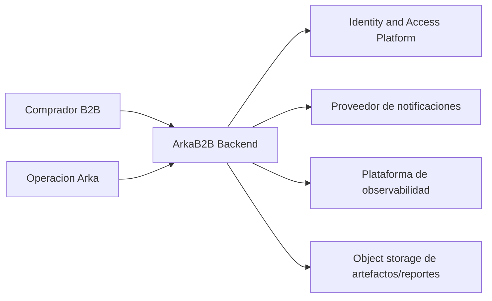

## Proposito de la seccion
Definir la frontera del sistema ArkaB2B en `MVP`, sus actores externos,
capacidades transversales consumidas y limites de intercambio con el entorno.

## Sistema en su entorno

## Actores externos y capacidades externas
| Tipo | Elemento | Relacion con ArkaB2B |
|---|---|---|
| Actor externo | `Comprador B2B` | ejecuta consultas y comandos comerciales |
| Actor externo | `Operacion Arka` | ejecuta control operativo, financiero y configuracion regional |
| Capacidad tecnica transversal | `identity-access` | autentica/autoriza y entrega legitimidad de actor consumida por servicios |
| Sistema externo | proveedor de notificaciones | canal de entrega de comunicaciones derivadas |
| Sistema externo | plataforma de observabilidad | telemetria, trazas, alertas y auditoria operativa |
| Sistema externo | object storage | almacenamiento de artefactos/reportes versionados |

## Limites del sistema
| Limite | Entra al sistema | Sale del sistema |
|---|---|---|
| Entrada funcional | comandos y consultas de negocio del `MVP` | respuestas de estado, evidencia y reportes |
| Entrada semantica | contexto organizacional, oferta, disponibilidad y reglas regionales | hechos de negocio publicados y salidas derivadas |
| Entrada tecnica | legitimidad de actor, secretos, configuracion, disponibilidad de plataforma | eventos, logs, metricas y trazas hacia capacidades operativas |

## Fuera de alcance directo del sistema en este ciclo
- gestion de identidad como dominio interno;
- pasarela de pago online integral;
- fulfillment logistico extendido mas alla del estado comercial del pedido.

## Regla de frontera
ArkaB2B modela dominio interno para `directory`, `catalog`, `inventory`,
`order`, `notification` y `reporting`. `identity-access` se integra como
capacidad transversal, no como contexto de negocio interno.
