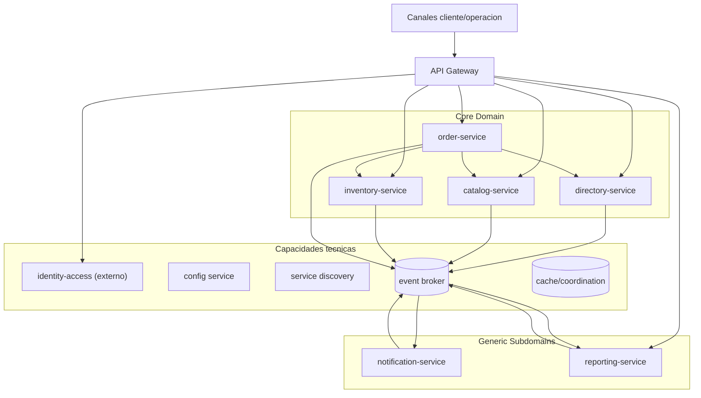

## Proposito de la seccion
Describir los contenedores principales del sistema, su responsabilidad, la
parte del dominio que implementan y sus dependencias.

## Vista de contenedores (`C4` nivel 2)

## Catalogo de contenedores
| Contenedor | Tipo | Dominio implementado | Responsabilidad principal |
|---|---|---|---|
| `api-gateway` | borde | n/a | entrada unica HTTP, validaciones tecnicas de borde y ruteo |
| `directory-service` | servicio de negocio | `directory` (`Core`) | contexto organizacional y politica regional vigente |
| `catalog-service` | servicio de negocio | `catalog` (`Core`) | oferta vendible y condiciones comerciales |
| `inventory-service` | servicio de negocio | `inventory` (`Core`) | stock, reservas y disponibilidad comprometible |
| `order-service` | servicio de negocio | `order` (`Core`) | carrito, pedido, estado operativo y pago manual |
| `notification-service` | servicio derivado | `notification` (`Generic`) | comunicacion derivada por cambios relevantes |
| `reporting-service` | servicio derivado | `reporting` (`Generic`) | proyecciones y reportes semanales derivados |
| `event-broker` | infraestructura | n/a | transporte asincrono de hechos entre contextos |
| `redis` | infraestructura | n/a | cache selectiva, coordinación técnica e idempotencia |
| `db por servicio` | infraestructura de datos | n/a | persistencia transaccional aislada por contexto |
| `identity-access` | capacidad externa | tecnico transversal | autenticacion/autorizacion y legitimidad de actor |

## Dependencias entre contenedores
| From | To | Tipo | Motivo |
|---|---|---|---|
| `order-service` | `directory-service` | sync | resolver contexto organizacional/politica regional |
| `order-service` | `catalog-service` | sync | validar oferta vendible |
| `order-service` | `inventory-service` | sync | validar/confirmar disponibilidad comprometible |
| `core services` | `event-broker` | async publish | publicar hechos de negocio |
| `notification-service` | `event-broker` | async consume/publish | consumir hechos relevantes y publicar resultados de entrega |
| `reporting-service` | `event-broker` | async consume/publish | consolidar lecturas derivadas y publicar reporte generado |
| `api-gateway` y servicios | `identity-access` | sync/bridge | legitimidad de actor en flujo HTTP |

## Regla de densidad arquitectonica por tipo de subdominio
- `Core`: mayor densidad de componentes y reglas de consistencia.
- `Generic`: contenedores con diseno minimo suficiente centrado en salida
  derivada.
- tecnico transversal: capacidades externas consumidas, sin ownership semantico
  de negocio.
