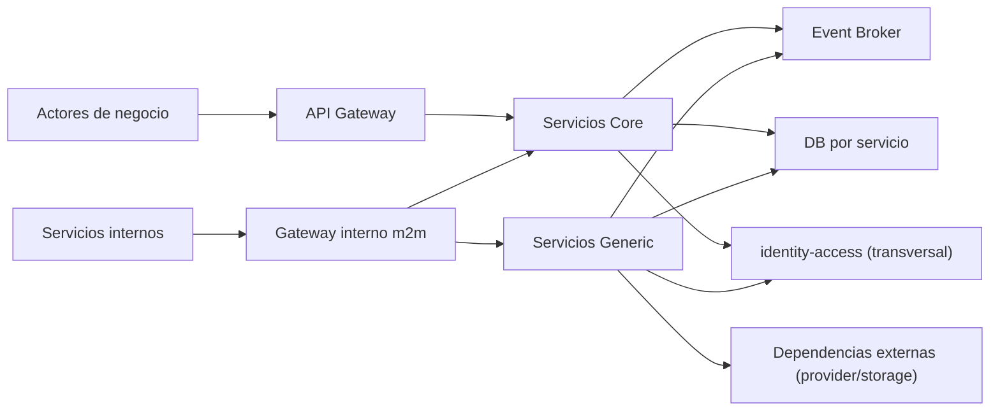

## Proposito de la seccion
Definir la realizacion arquitectonica de seguridad para autenticacion,
autorizacion, aislamiento por organizacion y proteccion operativa del sistema.

## Fronteras de confianza

## Modelo distribuido de autenticacion y autorizacion
| Capa | Decision de seguridad |
|---|---|
| borde (`api-gateway`) | valida token, firma, expiracion, `iss`, `aud` y condiciones tecnicas de acceso |
| gateways internos m2m | autentican scopes tecnicos para operaciones internas (`notification`/`reporting` ops) |
| servicios de negocio | aplican autorizacion contextual del caso de uso y aislamiento organizacional |
| eventos/listeners | usan `TriggerContext` tecnico + dedupe + validacion de tenant antes de mutar estado |
| capacidad transversal (`identity-access`) | emite/valida legitimidad de actor y politicas de acceso |

## Aislamiento por organizacion operante
| Control | Aplicacion |
|---|---|
| contexto organizacional resuelto | toda mutacion/consulta de negocio opera con organizacion valida |
| validacion de ownership | servicio owner confirma relacion actor-organizacion-recurso |
| metadata obligatoria | `organizationId`, actor efectivo, `traceId` y `correlationId` en comandos/eventos |
| rechazo de cruce de tenant | `403 acceso_cruzado_detectado` + evidencia obligatoria en auditoria |

## Arquitectura de seguridad por servicio (rescatada y adaptada)
| Servicio | Controles dominantes | Trust boundary principal | Datos sensibles a proteger |
|---|---|---|---|
| `directory-service` | RBAC por accion, validacion de actor tecnico confiable para consultas runtime, masking de datos institucionales | frontera entre API de negocio y resolucion regional consumida por `order`/`reporting` | tax id, contactos institucionales, direcciones |
| `catalog-service` | permisos de operacion comercial, idempotencia en cambios de precio, auditoria de mutaciones | frontera entre consulta de catalogo B2B y mutacion administrativa | precios, reglas de vendibilidad y taxonomia comercial |
| `inventory-service` | permisos granulares para write de stock, identidad tecnica para confirmacion de reservas, proteccion contra contencion/replay | frontera de operaciones de stock/reserva vs consultas de disponibilidad | estado de stock y reservas activas |
| `order-service` | aislamiento por organizacion en carrito/checkout/pedido, controles de transicion de estado y evidencia de pago manual | frontera de comandos criticos que coordinan `directory`/`catalog`/`inventory` | referencia de pago manual, snapshots de checkout |
| `notification-service` (`Generic`) | scopes m2m por endpoint interno, validacion de firma/origen de callbacks, sanitizacion de payload | frontera entre hechos internos y proveedor externo de envio | destinatario, payload de notificacion, callback raw |
| `reporting-service` (`Generic`) | read-only por tenant owner, scope `reporting.ops` para rebuild/generate, URLs firmadas para artefactos | frontera entre datos derivados multi-contexto y consultas operativas | artefactos exportados, payload derivado de hechos |

## Seguridad de integraciones y eventos
| Mecanismo | Regla aplicable |
|---|---|
| contrato de evento | validar `eventType`, `eventVersion`, `tenantId`, `traceId`, `correlationId` antes de procesar |
| dedupe de consumo | registrar `eventId + consumerRef`; duplicados se tratan como `noop` idempotente |
| retry + DLQ | mensajes transitorios con backoff; no recuperables a `DLQ` con alerta |
| callback externo | validar firma/token del proveedor y origen permitido |
| salida a broker | publicar por `outbox` en transaccion local del contexto owner |

## Proteccion de credenciales, secretos y canales
| Superficie | Medida |
|---|---|
| canal cliente -> sistema | `TLS` y validaciones de borde |
| m2m interno | autenticacion de servicio + segmentacion de red |
| secretos | gestion externa, no en repositorio ni hardcoded |
| datos sensibles en logs/eventos | minimizacion, hashing de llaves operativas y enmascaramiento |
| storage de reportes | referencias firmadas con expiracion corta |

## Escenarios de calidad de seguridad (base operativa)
| Escenario | Respuesta esperada |
|---|---|
| intento de acceso cross-tenant | rechazo inmediato y auditoria trazable |
| replay de comando mutante con misma llave | respuesta idempotente sin duplicar efecto |
| callback de proveedor con firma invalida | descarte seguro + registro de incidente |
| incremento anomalo de errores 403/401 | alerta operativa y trazabilidad por `traceId` |
| fuga potencial en logs | redaccion de payload y bloqueo de despliegue en quality gate |

## Seguridad transversal vs restriccion de negocio
| Tipo | Ejemplo |
|---|---|
| seguridad transversal | autenticacion, rotacion de llaves, gestion de secretos, controles de red |
| restriccion de negocio | aislamiento por organizacion operante, bloqueo de mutacion fuera de contexto valido |

## Regla sobre `identity-access`
`identity-access` se trata como capacidad tecnica transversal de seguridad y no
como contexto de dominio interno del negocio.
