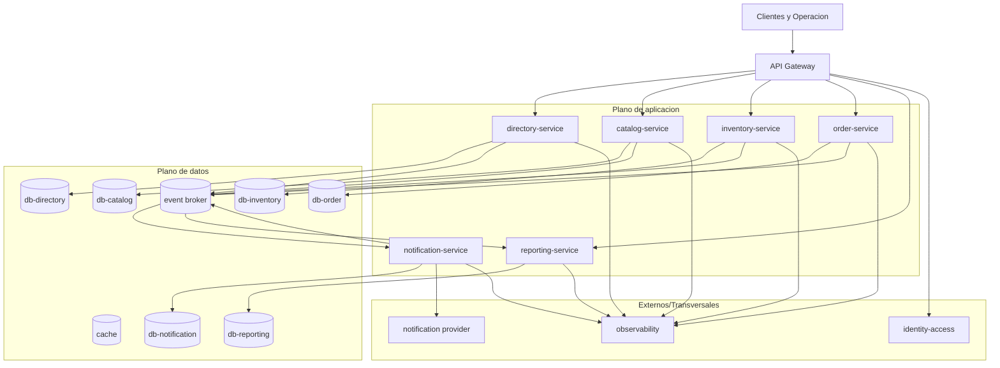

## Proposito de la seccion
Definir topologia minima de despliegue, entornos y conexiones runtime para
operar la arquitectura del `MVP`.

## Entornos de despliegue
| Entorno | Objetivo |
|---|---|
| `local` | desarrollo individual y pruebas de integracion temprana |
| `dev` | integracion continua del baseline |
| `qa` | validacion funcional/no-regresion |
| `staging` | preproduccion con configuracion cercana a produccion |
| `prod` | operacion productiva con SLO y alertas activas |

## Topologia minima en runtime

## Artefactos y unidades de despliegue
| Unidad | Tipo |
|---|---|
| `api-gateway` | servicio de borde |
| `directory/catalog/inventory/order/notification/reporting` | servicios de aplicacion |
| `broker`, `cache`, `db por servicio` | componentes stateful |
| `identity-access`, proveedor de notificaciones, observabilidad | dependencias externas/transversales |

## Plataforma objetivo y fallback
| Escenario | Decision |
|---|---|
| plataforma objetivo | `AWS` administrado |
| fallback tactico | `Railway` (si aplica) manteniendo topologia y controles |
| emulacion local | herramientas de entorno local sin considerarse despliegue productivo |

## Reglas de despliegue
- solo el borde expone superficie publica;
- componentes stateful operan en plano privado;
- secretos fuera del repositorio;
- promocion por entornos con gates y evidencia operativa.
