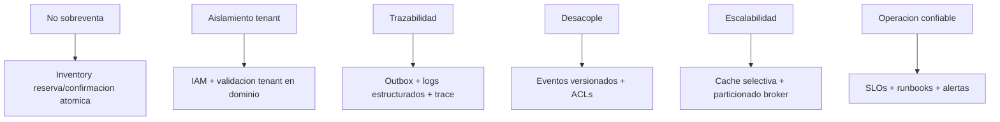

## Proposito
Definir drivers, objetivos de calidad y stakeholders que gobiernan la arquitectura de ArkaB2B.

## Introduccion
ArkaB2B necesita un backend para su salida inicial que resuelva compra recurrente B2B sin ambiguedad entre catalogo, disponibilidad, pedido y pago manual. En `MVP` el problema arquitectonico consiste en soportar checkout concurrente sin sobreventa, aislamiento estricto por organizacion, validacion operativa por pais y trazabilidad completa de mutaciones criticas.

Este artefacto abre la vista global de arquitectura de `MVP`. Resume las presiones funcionales, no funcionales y semanticas que condicionan el diseno del sistema y fija el marco con el que deben evaluarse las decisiones estructurales del resto del pilar.

## Drivers arquitectonicos
| ID | Driver | Tipo | Impacto arquitectonico | FR/NFR |
|---|---|---|---|---|
| D-01 | Evitar sobreventa en checkout concurrente | negocio/consistencia | Reserva y confirmacion atomica por SKU/tenant | FR-004, FR-005, NFR-004 |
| D-02 | Aislamiento estricto por organizacion y rol | seguridad | Enforcement de tenant y rol en borde y dominio | FR-009, NFR-005 |
| D-03 | Trazabilidad de mutaciones criticas | auditoria | Eventos y logs con `traceId`, `correlationId`, `actorId`, `tenantId` | FR-010, NFR-006, NFR-007 |
| D-04 | Integracion desacoplada entre contextos | evolucion | Contratos versionados + EDA con outbox/inbox | FR-006, FR-007, NFR-009 |
| D-05 | Escalabilidad por picos de demanda | performance/capacidad | Cache selectiva, particionado de eventos y escalado horizontal | NFR-001, NFR-008 |
| D-06 | Operacion confiable para MVP backend | operacion | Observabilidad base, runbooks y promotion gates | NFR-003, NFR-007 |

## Fuentes de derivacion de drivers
Cada driver arquitectonico nace de artefactos ya aprobados en producto y dominio. La arquitectura no descubre estas presiones; las traduce en decisiones estructurales, de integracion y de calidad.

### D-01 - Evitar sobreventa en checkout concurrente
- `Requisitos funcionales`: [FR-004](/mvp/producto/catalogo-rf/fr-004/) exige crear pedido con multiples lineas validando disponibilidad y deja el pedido en `PENDING_APPROVAL`; [FR-005](/mvp/producto/catalogo-rf/fr-005/) exige recalcular disponibilidad cuando el pedido se ajusta antes de confirmacion.
- `Requisitos no funcionales`: [NFR-004](/mvp/producto/catalogo-rnf/nfr-004/) fija la confiabilidad de disponibilidad comercial con una tasa de sobreventa `<= 1.0%` semanal.
- `Drivers del dominio`: [Mapa de Contexto](/mvp/dominio/mapa-contexto/) consolida `Compra B2B sin sobreventa` como presion principal del dominio y fija a `inventory` como owner de disponibilidad/reserva y a `order` como owner del pedido.
- `Reglas e invariantes`: [Reglas e Invariantes](/mvp/dominio/reglas-invariantes/) protege este driver con `RN-INV-01`, `RN-RES-01`, `RN-RES-02`, `RN-ORD-01`, `I-INV-01`, `I-INV-02` e `I-ORD-01`; arquitectura debe preservar stock no negativo, reservas validas y pedido no confirmable sin reserva coherente.
- `Alcance y limites del ciclo`: [FR-004](/mvp/producto/catalogo-rf/fr-004/) deja fuera despacho y logistica avanzada, y [Mapa de Contexto](/mvp/dominio/mapa-contexto/) deja fuera despacho/entrega; por eso el driver se concentra en checkout, reserva y confirmacion comercial inicial, no en fulfillment completo.

### D-02 - Aislamiento estricto por organizacion y rol
- `Requisitos funcionales`: [FR-009](/mvp/producto/catalogo-rf/fr-009/) exige autenticar usuarios y autorizar operaciones por organizacion y rol de negocio.
- `Requisitos no funcionales`: [NFR-005](/mvp/producto/catalogo-rnf/nfr-005/) fija `0` incidentes criticos de acceso cruzado por mes.
- `Drivers del dominio`: [Mapa de Contexto](/mvp/dominio/mapa-contexto/) explicita `Aislamiento por organizacion` como driver del dominio y fija a `identity-access` como owner de identidad/sesion/rol y a `directory` como owner de organizacion.
- `Reglas e invariantes`: [Reglas e Invariantes](/mvp/dominio/reglas-invariantes/) lo aterriza en `RN-ACC-01`, `RN-ACC-02`, `I-ACC-01`, `I-ACC-02` y `D-CROSS-01`; arquitectura debe impedir mutaciones con sesion invalida, rol no permitido o cruce de tenant.
- `Alcance y limites del ciclo`: [FR-009](/mvp/producto/catalogo-rf/fr-009/) deja fuera federacion empresarial avanzada y [Mapa de Contexto](/mvp/dominio/mapa-contexto/) declara el acceso B2B como parte del baseline; por eso el driver exige enforcement fuerte en MVP sin depender todavia de SSO corporativo complejo.

### D-03 - Trazabilidad de mutaciones criticas
- `Requisitos funcionales`: [FR-010](/mvp/producto/catalogo-rf/fr-010/) exige registrar pagos manuales y recalcular el estado del pedido dejando evidencia consistente del cambio.
- `Requisitos no funcionales`: [NFR-006](/mvp/producto/catalogo-rnf/nfr-006/) exige trazabilidad de cambios criticos y [NFR-007](/mvp/producto/catalogo-rnf/nfr-007/) exige observabilidad operacional minima con `traceId` y alertas.
- `Drivers del dominio`: [Mapa de Contexto](/mvp/dominio/mapa-contexto/) consolida `Trazabilidad auditable` como driver del dominio para stock, pedido y pago.
- `Reglas e invariantes`: [Reglas e Invariantes](/mvp/dominio/reglas-invariantes/) fija que toda mutacion incluya `traceId`, `correlationId`, `actorId` y `tenantId`, y que eventos core se publiquen por outbox con dedupe por `eventId`; arquitectura debe preservar auditabilidad extremo a extremo.
- `Alcance y limites del ciclo`: [NFR-006](/mvp/producto/catalogo-rnf/nfr-006/) deja fuera SIEM corporativo completo y [Mapa de Contexto](/mvp/dominio/mapa-contexto/) centra el baseline en mutaciones comerciales del MVP; por eso el driver se enfoca en trazabilidad operativa verificable y no en forensica empresarial avanzada.

### D-04 - Integracion desacoplada entre contextos
- `Requisitos funcionales`: [FR-006](/mvp/producto/catalogo-rf/fr-006/) exige notificar cambios de estado sin bloquear el pedido y [FR-007](/mvp/producto/catalogo-rf/fr-007/) exige consolidar ventas semanales como proyeccion derivada.
- `Requisitos no funcionales`: [NFR-009](/mvp/producto/catalogo-rnf/nfr-009/) exige una calidad minima de entrega continua y empuja contratos estables, versionado y automatizacion verificable.
- `Drivers del dominio`: [Mapa de Contexto](/mvp/dominio/mapa-contexto/) fija `Visibilidad operativa` como driver del dominio y separa `notification` y `reporting` como contextos que reaccionan sin convertirse en fuente transaccional.
- `Reglas e invariantes`: [Reglas e Invariantes](/mvp/dominio/reglas-invariantes/) protege este driver con `RN-NOTI-01`, `RN-REP-01`, `I-NOTI-01` e `I-REP-01`; arquitectura debe permitir side effects async y proyecciones derivadas sin rollback sobre el core.
- `Alcance y limites del ciclo`: [FR-006](/mvp/producto/catalogo-rf/fr-006/) y [FR-007](/mvp/producto/catalogo-rf/fr-007/) dejan fuera garantias avanzadas de canal y analitica predictiva, mientras [Mapa de Contexto](/mvp/dominio/mapa-contexto/) deja a `reporting` fuera de la verdad operacional; por eso el desacople se implementa con contratos versionados y EDA, no con dependencia transaccional directa.

### D-05 - Escalabilidad por picos de demanda
- `Requisitos funcionales`: no hay un RF unico que origine este driver, pero protege principalmente los flujos core de [FR-004](/mvp/producto/catalogo-rf/fr-004/) y [FR-005](/mvp/producto/catalogo-rf/fr-005/), donde se concentra la mutacion de carrito, checkout y pedido.
- `Requisitos no funcionales`: [NFR-001](/mvp/producto/catalogo-rnf/nfr-001/) fija tiempos de respuesta de APIs core y [NFR-008](/mvp/producto/catalogo-rnf/nfr-008/) exige soportar `3x` la carga baseline sin degradar mas de `30%` el `p95`.
- `Drivers del dominio`: [Mapa de Contexto](/mvp/dominio/mapa-contexto/) fija `Compra B2B sin sobreventa` como flujo core y obliga a que `catalog`, `inventory` y `order` resuelvan el camino critico sin ambiguedad ni acoplamiento excesivo.
- `Reglas e invariantes`: [Reglas e Invariantes](/mvp/dominio/reglas-invariantes/) obliga a que `RN-RES-01`, `RN-ORD-01`, `I-INV-02` e `I-ORD-01` sigan cumpliendose incluso bajo carga; arquitectura no puede ganar performance a costa de romper consistencia comercial.
- `Alcance y limites del ciclo`: [NFR-001](/mvp/producto/catalogo-rnf/nfr-001/) acota el objetivo a APIs core y [NFR-008](/mvp/producto/catalogo-rnf/nfr-008/) excluye escenarios extremos no representativos; el driver, por tanto, optimiza paths criticos del MVP y no toda posible carga futura.

### D-06 - Operacion confiable para MVP backend
- `Requisitos funcionales`: no nace de un RF aislado, pero sostiene transversalmente los flujos del MVP y en especial [FR-006](/mvp/producto/catalogo-rf/fr-006/), [FR-007](/mvp/producto/catalogo-rf/fr-007/) y [FR-010](/mvp/producto/catalogo-rf/fr-010/), que exigen seguimiento operativo, reaccion a fallos y soporte de negocio verificable.
- `Requisitos no funcionales`: [NFR-003](/mvp/producto/catalogo-rnf/nfr-003/) fija disponibilidad del backend en horario operativo y [NFR-007](/mvp/producto/catalogo-rnf/nfr-007/) exige observabilidad minima.
- `Drivers del dominio`: [Mapa de Contexto](/mvp/dominio/mapa-contexto/) consolida `Visibilidad operativa` como necesidad del dominio para notificaciones, abastecimiento y reportes semanales.
- `Reglas e invariantes`: [Reglas e Invariantes](/mvp/dominio/reglas-invariantes/) fija metadata obligatoria en mutaciones, tolerancia de consistencia eventual para `notification` y `reporting`, y la regla de que fallos de soporte no revierten el core; arquitectura debe volver eso operable con alertas, logs, trazas y degradacion controlada.
- `Alcance y limites del ciclo`: [NFR-003](/mvp/producto/catalogo-rnf/nfr-003/) acota la disponibilidad a horario operativo y [NFR-007](/mvp/producto/catalogo-rnf/nfr-007/) habla de observabilidad minima, no de una plataforma enterprise completa; por eso este driver apunta a confiabilidad suficiente para salida MVP, con runbooks y promotion gates basicos.

## Objetivos de calidad
| QG | Objetivo | Metrica | Umbral | NFR |
|---|---|---|---|---|
| QG-01 | Respuesta de APIs core | p95 latencia | <= 800 ms lectura / <= 1500 ms mutacion | NFR-001 |
| QG-02 | Confiabilidad comercial de disponibilidad | sobreventa semanal | <= 1.0% | NFR-004 |
| QG-03 | Disponibilidad de backend en horario operativo | uptime mensual | >= 99.5% | NFR-003 |
| QG-04 | Seguridad multi-tenant | incidentes criticos de acceso cruzado | 0 por mes | NFR-005 |
| QG-05 | Trazabilidad operacional | mutaciones con metadata completa | >= 99% | NFR-006, NFR-007 |
| QG-06 | Tiempo de reportes semanales | tiempo total de procesamiento | <= 15 min por tenant/corte | NFR-002 |

## Stakeholders clave
| Stakeholder | Necesidad principal | Artefactos de respaldo |
|---|---|---|
| Producto/Negocio | Flujo de compra B2B sin friccion ni sobreventa | [Producto](/mvp/producto/), [Servicio de Pedidos](/mvp/arquitectura/servicios/servicio-pedidos/) |
| Operacion comercial | Control de stock, alertas y abastecimiento semanal | [Servicio de Inventario](/mvp/arquitectura/servicios/servicio-inventario/), [Servicio de Reporteria](/mvp/arquitectura/servicios/servicio-reporteria/) |
| Seguridad y validacion tecnica | Aislamiento tenant y auditabilidad verificable | [Conceptos Transversales](/mvp/arquitectura/arc42/conceptos-transversales/), [Servicios](/mvp/arquitectura/servicios/) |
| Equipo tecnico | Arquitectura mantenible y evolutiva | [arc42](/mvp/arquitectura/arc42/), [ADR](/mvp/arquitectura/arc42/adr/) |

## Mapa de drivers a decisiones

