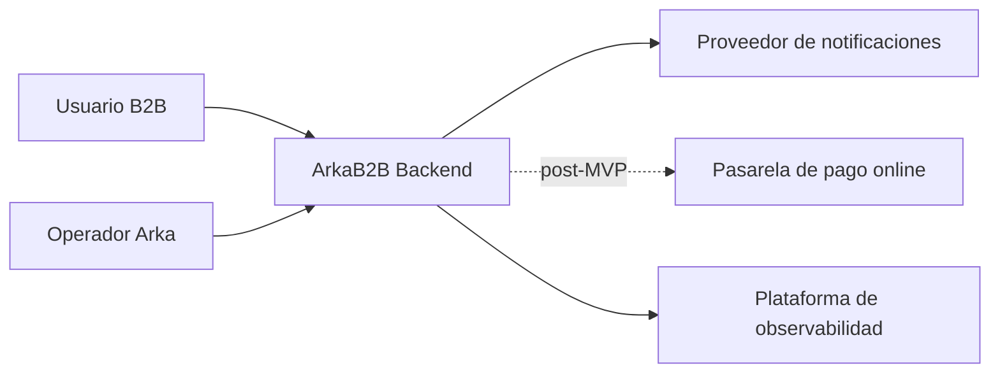
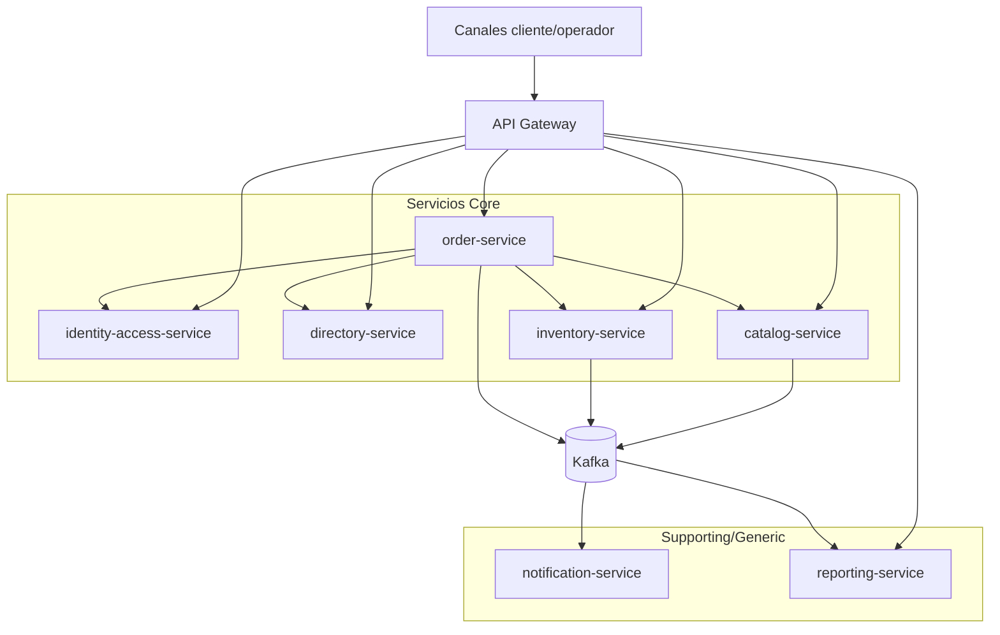

## Proposito
Definir el contexto del sistema ArkaB2B, fronteras de alcance y relacion con actores/sistemas externos.

## Alcance funcional del MVP backend
- Gestion de catalogo y variantes (Catalog).
- Gestion de stock, disponibilidad y reservas (Inventory).
- Carrito, checkout, pedido y pago manual (Order).
- Organizacion/direcciones/contactos (Directory).
- Autenticacion/autorizacion por tenant y rol (Identity Access).
- Notificaciones no bloqueantes (Notification).
- Reportes semanales y vistas derivadas (Reporting).

## Fuera de alcance actual
- Pasarela de pago online completa.
- Motor avanzado de promociones y pricing dinamico multi-regla.
- Frontend final de produccion (documentacion enfocada en backend).

## C4 Nivel 1 - Contexto

## C4 Nivel 2 - Contenedores principales

## Limites y responsabilidades
| Limite | Responsable | Regla de frontera |
|---|---|---|
| Identidad y permisos | `identity-access-service` | ningun otro BC autentica usuarios |
| Datos de organizacion | `directory-service` | order consume snapshots; no ownership externo |
| Producto/precio | `catalog-service` | no gestiona reservas ni stock fisico |
| Disponibilidad/reservas | `inventory-service` | no crea pedidos ni pagos |
| Compra y estado comercial | `order-service` | confirma con stock reservado |
| Comunicaciones | `notification-service` | no altera estado transaccional core |
| Analitica/reportes | `reporting-service` | no es fuente transaccional |

## Interfaces externas relevantes
- Proveedor de notificaciones (email/whatsapp/sms).
- Stack de observabilidad.
- (Post-MVP) pasarela de pago online.

## Referencias de detalle por servicio
- `[Vista C4 de identity-access-service](/mvp/arquitectura/servicios/servicio-identidad-acceso/arquitectura-interna/vista-c4-nivel-3/)`
- `[Vista C4 de directory-service](/mvp/arquitectura/servicios/servicio-directorio/arquitectura-interna/vista-c4-nivel-3/)`
- `[Vista C4 de catalog-service](/mvp/arquitectura/servicios/servicio-catalogo/arquitectura-interna/vista-c4-nivel-3/)`
- `[Vista C4 de inventory-service](/mvp/arquitectura/servicios/servicio-inventario/arquitectura-interna/vista-c4-nivel-3/)`
- `[Vista C4 de order-service](/mvp/arquitectura/servicios/servicio-pedidos/arquitectura-interna/vista-c4-nivel-3/)`
- `[Vista C4 de notification-service](/mvp/arquitectura/servicios/servicio-notificaciones/arquitectura-interna/vista-c4-nivel-3/)`
- `[Vista C4 de reporting-service](/mvp/arquitectura/servicios/servicio-reporteria/arquitectura-interna/vista-c4-nivel-3/)`
