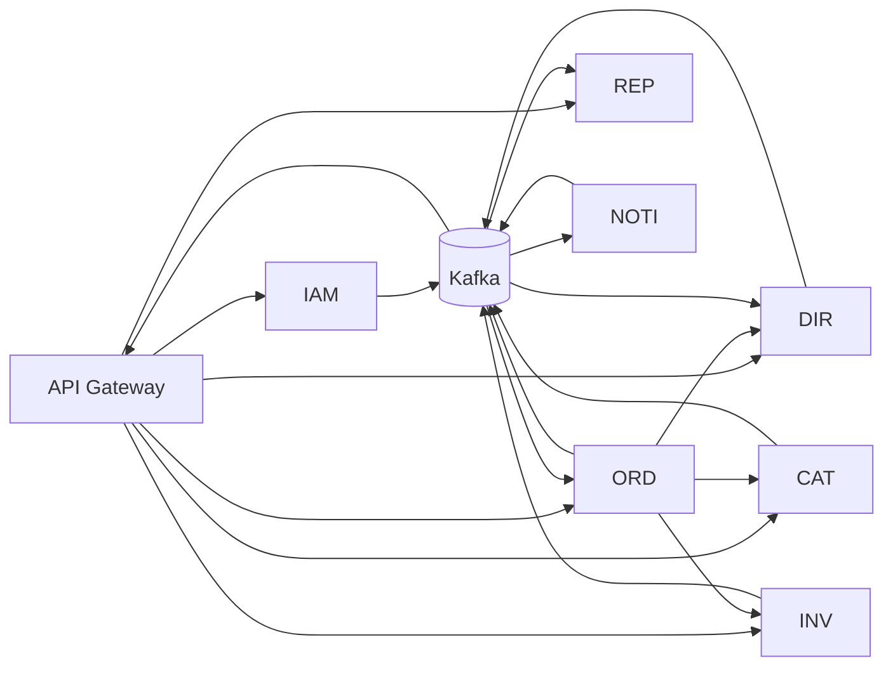

## Proposito
Describir descomposicion del sistema en servicios, responsabilidades, dependencias y ownership.

## Catalogo de servicios
| Grupo | Servicio | BC | Responsabilidad principal | Estado |
|---|---|---|---|---|
| Core | `identity-access-service` | identity-access | autenticacion, sesion, rol y autorizacion | MVP |
| Core | `directory-service` | directory | organizaciones, direcciones y contactos | MVP |
| Core | `catalog-service` | catalog | producto, variante SKU y precio vigente | MVP |
| Core | `inventory-service` | inventory | stock fisico, disponibilidad, reservas | MVP |
| Core | `order-service` | order | carrito, checkout, pedido y pago manual | MVP |
| Supporting | `notification-service` | notification | solicitud/intento/envio de notificaciones | MVP |
| Generic | `reporting-service` | reporting | proyecciones y reportes semanales | MVP-lite |

## Infraestructura de plataforma
| Componente | Rol |
|---|---|
| `api-gateway-service` | entrada unica HTTP, verificacion local de JWT y politicas de borde |
| `eureka-server` | registro y descubrimiento de servicios |
| `config-server` | configuracion centralizada por entorno |
| `kafka` | broker de eventos cross-service |
| `redis` | cache selectiva, sesiones tecnicas y estado de revocacion de corta vida |
| `observability stack` | metricas, logs, trazas y alertas |

## Regla de autenticacion y autorizacion
| Capa | Responsabilidad |
|---|---|
| `api-gateway-service` | verifica localmente firma JWT (`RS256`/`JWKS`), `iss`, `aud`, expiracion y cache de revocacion antes de enrutar |
| servicios mutables | revalidan `tenant`, rol, permiso y ownership real del recurso dentro del caso de uso; no delegan la autorizacion de dominio al gateway |
| `identity-access-service` | emite tokens, mantiene sesion/rol como fuente de verdad, publica revocaciones/cambios de rol y expone introspeccion solo como fallback |
| eventos de IAM | `SessionRevoked`, `UserBlocked` y `RoleAssigned` actualizan caches operativas de gateway y servicios |

## Dependencias permitidas (alto nivel)

## Matriz de dependencias
| From | To | Tipo | Motivo |
|---|---|---|---|
| api-gateway-service | identity-access | sync API | login, refresh, logout, bootstrap `JWKS` e introspeccion fallback cuando la cache de revocacion no es suficiente |
| identity-access | api-gateway-service | async | propagar `SessionRevoked`, `UserBlocked` y cambios de rol para actualizar cache de revocacion en borde |
| order | directory | sync API | validar direccion/ownership y resolver parametros operativos por pais |
| order | catalog | sync API | precio/sellable snapshot |
| order | inventory | sync API + async | reservar/confirmar/liberar stock |
| identity-access | order | async | bloquear mutaciones por usuario bloqueado, sesion revocada o rol reasignado sin llevar a IAM al camino caliente |
| identity-access | directory | async | sincronizar metadata operativa de acceso y bloqueo |
| directory | reporting | async | propagar cambios organizacionales y contexto regional |
| order | notification | async | side effects de comunicacion de pedido/pago |
| order | reporting | async | consolidacion de ventas/estado/pago |
| inventory | notification | async | alertas operativas de reserva/stock |
| inventory | reporting | async | consolidacion de abastecimiento |
| catalog | reporting | async | contexto comercial para analitica |
| notification | reporting | async | efectividad de envio (`NotificationRequested/Sent/Failed/Discarded`) |
| reporting | notification | async | distribucion de reporte semanal generado |

## Ownership de datos
| Servicio | Datos propietarios |
|---|---|
| identity-access | usuario, sesion, rol, permisos |
| directory | organizacion, direccion, contacto |
| catalog | producto, variante, precio |
| inventory | stock, reserva, movimiento |
| order | carrito, pedido, pago manual |
| notification | solicitud/intento/envio notificacion |
| reporting | analytic facts y proyecciones |

## Estructura de detalle (un lugar por cosa)
- Global: [arc42](/mvp/arquitectura/arc42/).
- Detalle por servicio:
  - [Servicios](/mvp/arquitectura/servicios/)
  - `services/<svc>/architecture/*`
  - `services/<svc>/contracts/*`
  - `services/<svc>/data/*`
  - `services/<svc>/performance/*`
  - `services/<svc>/security/*`

## Relacion con FR
| FR | Servicio dominante |
|---|---|
| FR-001 | catalog-service |
| FR-002 | inventory-service |
| FR-003 | reporting-service |
| FR-004 | order-service + inventory-service |
| FR-005 | order-service |
| FR-006 | notification-service |
| FR-007 | reporting-service |
| FR-008 | order-service + notification-service |
| FR-009 | identity-access-service |
| FR-010 | order-service |
| FR-011 | directory-service + order-service + reporting-service |

## Relacion con NFR
| NFR | Servicios dominantes |
|---|---|
| NFR-004 | order-service + inventory-service |
| NFR-006 | order-service + notification-service + reporting-service |
| NFR-007 | notification-service + reporting-service |
| NFR-011 | directory-service + order-service + reporting-service |
