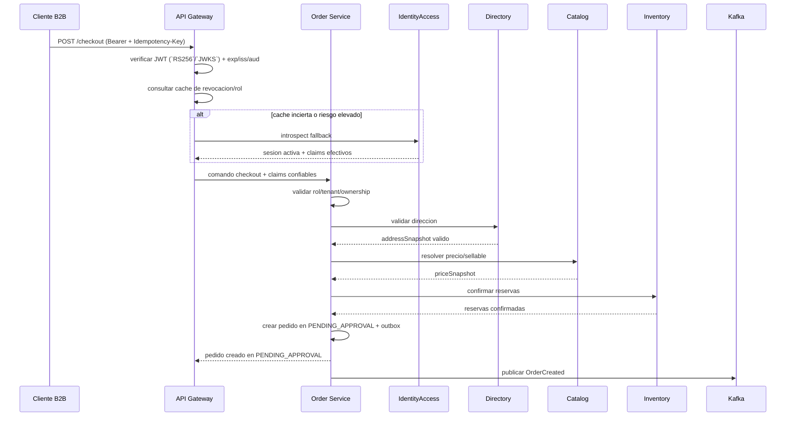
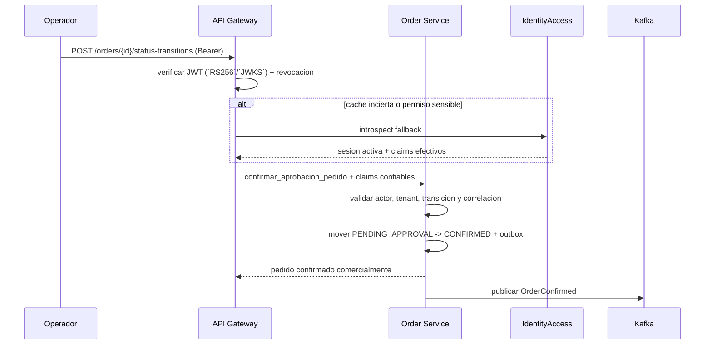
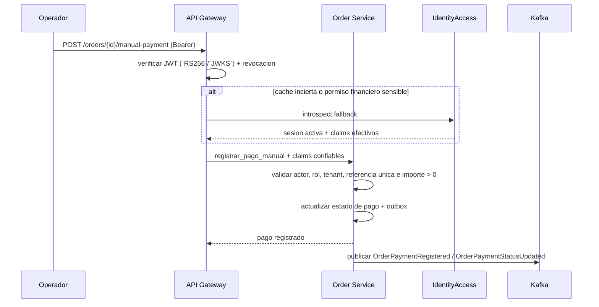
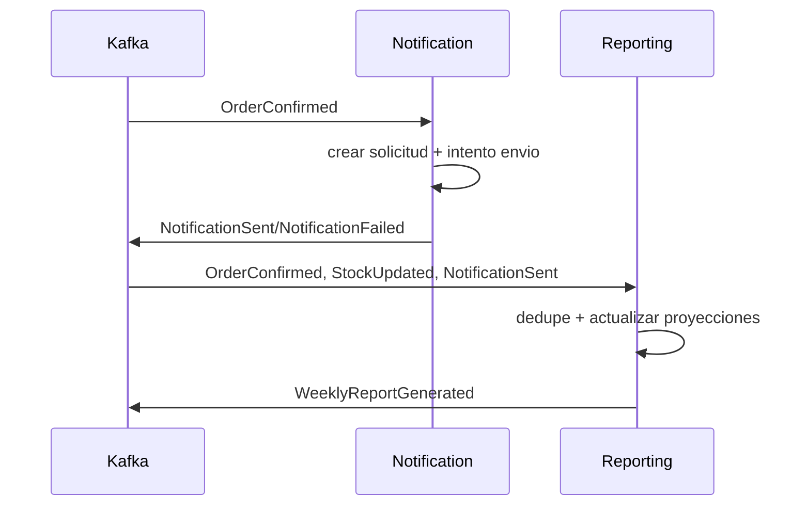

## Proposito
Describir comportamiento runtime de flujos criticos y politicas de resiliencia.

## Escenarios runtime prioritarios
- Login y validacion de sesion.
- Creacion de carrito y reserva de stock.
- Checkout y creacion de pedido en `PENDING_APPROVAL`.
- Confirmacion comercial explicita de pedido.
- Registro de pago manual.
- Notificacion no bloqueante por eventos de negocio.
- Ingestion de hechos y generacion de reportes semanales.

## Modelo runtime de identidad y autorizacion
| Capa | Decision aplicada |
|---|---|
| `identity-access-service` | autentica usuarios, emite JWT y mantiene el estado confiable de sesion/rol que usa el resto del sistema |
| `api-gateway-service` | autentica el request HTTP validando JWT con `RS256`/`JWKS`, `iss`, `aud`, expiracion y cache de revocacion antes de enrutar |
| servicios HTTP | materializan `PrincipalContext` mediante `PrincipalContextPort` y `PrincipalContextAdapter`, validan permiso base con `PermissionEvaluatorPort` y cierran `tenant`, ownership y reglas del dominio en sus propios `use cases`; no delegan la autorizacion contextual al gateway |
| listeners / schedulers / callbacks | no asumen JWT de usuario; materializan `TriggerContext` mediante `TriggerContextResolver` y validan `tenant`, caller tecnico, dedupe y legitimidad del trigger antes de aplicar la decision del dominio |
| introspeccion fallback IAM | solo se usa cuando la cache de revocacion o el riesgo operativo hacen insuficiente la confianza local del gateway |
| eventos de IAM | `SessionRevoked`, `SessionsRevokedByUser`, `SessionRefreshed`, `UserBlocked` y `RoleAssigned` reducen el drift entre caches y estado real |

## Modelo runtime de errores y excepciones
| Momento runtime | Responsable principal | Resultado esperado |
|---|---|---|
| `Rechazo temprano` | `Adapter-in`, `PrincipalContext` / `TriggerContext`, guard funcional base y `TenantIsolationPolicy` | corta el flujo antes de la decision de dominio y entrega error semantico de validacion, autorizacion, `not_found` o dependencia previa |
| `Rechazo de decision` | politicas y agregados del servicio destino | preserva invariantes del dominio y se expresa como `business_rule` o `conflict` sin filtrar detalles internos |
| `Fallo de materializacion` | `use case` + adapters de persistencia/cache/outbox/broker | clasifica el fallo como retryable o no retryable segun la dependencia y cierra HTTP o flujo operativo con el envelope canonico |
| `Fallo de propagacion` | relay outbox, publisher o listener que ya materializo side effects | la recuperacion se gestiona por retry, DLQ y observabilidad, no reescribiendo la decision del dominio |
| `Evento duplicado` | `ProcessedEvent*` + politica de dedupe | se trata como `noop idempotente`; no genera error funcional ni rollback compensatorio |

## Runtime A: checkout resiliente

## Runtime B: confirmacion comercial

## Runtime C: pago manual

## Runtime D: side effects async

## Politicas de resiliencia
| Politica | Valor base | Aplicacion |
|---|---|---|
| Validacion authn en borde | JWT validado en `api-gateway-service` + `JWKS` + cache de revocacion | todas las APIs protegidas |
| Introspeccion fallback | solo por cache incierta, revocacion reciente o operacion sensible | gateway e IAM |
| Timeout sync core-core | 500-1200 ms | Directory, Catalog, Inventory e introspeccion fallback IAM |
| Retry transitorio | max 2 intentos con backoff | errores de red/timeout |
| Circuit breaker | abrir por error rate > 50% ventana corta | dependencias sincronas |
| Idempotencia comando | obligatoria | checkout, pago manual, reservas |
| DLQ eventos | obligatoria | consumidores de notification/reporting |

## Compensaciones
- Checkout fallido antes de confirmacion: no se crea pedido.
- Reserva expirada: rechazo de confirmacion y ajuste de carrito.
- Falla de notificacion: no rollback de pedido/pago.
- Evento invalido: enrutar a DLQ con alerta.

## Riesgos runtime
- Desalineacion temporal entre rol/sesion real y cache local de revocacion.
- Carrera entre expiracion de reserva y confirmacion.
- Retries mal configurados que duplican side effects.
- Backlog de broker durante picos.
