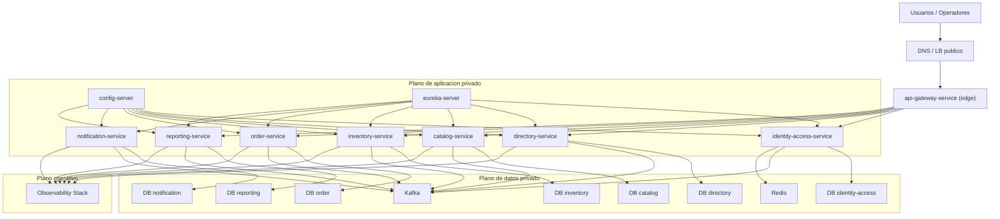

## Proposito
Definir topologia de despliegue, entornos, red y dependencias operativas.

## Entornos
| Entorno | Objetivo | Notas |
|---|---|---|
| local | desarrollo individual | stack multi-contenedor reproducible con `docker compose`, datos seed y emulacion cloud cuando aplique |
| dev | integracion temprana | smoke + contract baseline + ejecucion reproducible de servicios/dependencias |
| qa | validacion funcional | pruebas E2E, no-regresion y validacion de stack de integracion |
| staging | preproduccion | configuracion cercana a prod |
| prod | operacion | SLO y alertas activas |

## Estrategia de plataforma por entorno
| Entorno | Plataforma objetivo | Uso esperado |
|---|---|---|
| local | Docker + `docker compose` + `LocalStack` cuando se emulen dependencias AWS | desarrollo individual, pruebas de bootstrap y validacion de integraciones locales |
| dev/qa/staging/prod | `AWS` administrado (objetivo oficial) | despliegue objetivo del sistema con runtimes, secretos, storage y red privada gestionados |
| dev/qa/staging/prod | `Railway` (solo si se activa fallback tactico/excepcional) | alternativa temporal manteniendo contratos, seguridad transversal y topologia logica del pilar |

## Estandar de empaquetado y ejecucion reproducible
Se aplica la formulacion canonica definida en
[Decisiones Arquitectonicas](/mvp/arquitectura/arc42/decisiones-arquitectonicas/).

En vista de despliegue, el impacto operativo concreto es:
- artefacto de servicio versionado por unidad de aplicacion;
- uso del mecanismo de stack reproducible en `local/dev/qa` de
  integracion;
- despliegue real alineado a plataforma objetivo sin asumir Compose como
  estrategia final de produccion.

## Topologia de despliegue

## Asignacion por unidad de despliegue
| Unidad | Destino de despliegue | Exposicion | Dependencias estatales |
|---|---|---|---|
| `api-gateway-service` | edge runtime | publica | ninguna propia |
| `config-server`, `eureka-server` | plano de aplicacion | privada | configuracion/registro |
| servicios core (`identity-access`, `directory`, `catalog`, `inventory`, `order`) | plano de aplicacion | privada | `DB` por servicio, `Kafka`, `Redis` donde aplica |
| servicios supporting/generic (`notification`, `reporting`) | plano de aplicacion | privada | `DB` por servicio, `Kafka` |
| `Kafka`, `Redis`, `DB*` | plano de datos | privada | stateful, aislado del borde |
| `Observability Stack` | plano operativo | privada | storage/retencion de telemetria |

Regla transversal de unidad:
- toda unidad de aplicacion (`gateway`, `config`, `eureka`, servicios de dominio
  y supporting/generic) se empaqueta como artefacto versionado;
- el despliegue en entornos reales consume esas imagenes sobre la plataforma
  objetivo (`AWS` o fallback tactico autorizado).
- detalle normativo canonico en
  [Decisiones Arquitectonicas](/mvp/arquitectura/arc42/decisiones-arquitectonicas/).

## Equivalencias gestionadas de plataforma
| Necesidad logica | Preferencia en `AWS` | Alternativa cuando opere `Railway` |
|---|---|---|
| secretos y configuracion sensible | `Secrets Manager` / `Parameter Store` | secret store gestionado del PaaS o vault externo compatible |
| base de datos PostgreSQL por servicio | servicio PostgreSQL administrado | PostgreSQL gestionado por Railway o equivalente administrado |
| cache y locking distribuido | `Redis` administrado | Redis gestionado por Railway o equivalente administrado |
| broker de eventos | servicio gestionado compatible con `Kafka` | broker administrado compatible, separado del runtime si el PaaS no lo cubre de forma suficiente |
| artifacts/reportes y backups | object storage tipo `S3` | object storage externo compatible |
| observabilidad | stack gestionado o desplegado en plano operativo separado | stack externo o administrado compatible con logs, metricas y trazas |

## Segmentacion de red
- Borde publico: solo API Gateway.
- Red privada de servicios: core/supporting/generic.
- Red de datos: bases de datos, broker, cache, storage de reportes.
- Politica base: least privilege + deny-all por defecto entre segmentos.

## Configuracion y secretos
| Tipo | Ejemplos |
|---|---|
| Variables | `APP_ENV`, `SERVICE_NAME`, `LOG_LEVEL`, `BROKER_TOPIC_PREFIX` |
| Secretos | `JWT_SIGNING_KEY`, `DB_PASSWORD`, `BROKER_CREDENTIALS`, `NOTIFICATION_PROVIDER_TOKEN` |

Regla aplicada:
- `AWS` es la plataforma objetivo oficial del ciclo.
- `Railway` es el fallback tactico/excepcional aprobado si `AWS` no puede implementarse dentro de `MVP`.
- `LocalStack` solo participa en entornos locales de desarrollo/emulacion y no forma parte del despliegue real.

## Baseline operativo de despliegue (`MVP`)
- empaquetado y ejecucion reproducible segun decision canonica de
  arquitectura en [Decisiones Arquitectonicas](/mvp/arquitectura/arc42/decisiones-arquitectonicas/).
- broker/event bus en servicio administrado compatible con `Kafka`, con DLQ y reproceso auditable.
- observabilidad minima obligatoria: logs estructurados, metricas y trazas distribuidas.
- secretos y configuracion sensible fuera de repositorio en gestor administrado.
- bloqueo regional auditable cuando falte politica vigente por `countryCode` (`configuracion_pais_no_disponible`).

## Reglas de promocion
- `local -> dev`: unit + smoke + static checks.
- `dev -> qa`: integration + contract tests.
- `qa -> staging`: non-functional baseline (latencia/error/throughput).
- `staging -> prod`: aprobacion humana + checklist operacional.

## Continuidad operativa
- Backups de DB por servicio segun criticidad.
- Pruebas de restore periodicas.
- Runbooks para degradacion de broker, cache y proveedor de notificaciones.
