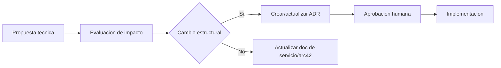

## Proposito
Consolidar decisiones estructurales del baseline `MVP`, separando verdad vigente, reglas parametrizadas y evolucion posterior sin mezclar bloqueos falsos.

## Registro de ADR estructurales
| Decision | ADR | Estado | Impacto |
|---|---|---|---|
| Microservicios por bounded context + arquitectura hexagonal | ADR-001 | aceptada | alto |
| Integracion combinada sync/async con outbox | ADR-002 | aceptada | alto |
| Separacion de Catalog e Inventory | ADR-003 | aceptada | alto |
| Versionado de contratos API/Eventos | ADR-004 | aceptada | medio-alto |
| Multi-tenant y auditoria obligatoria | ADR-005 | aceptada | alto |

## 1) Decisiones vigentes del baseline
| Ambito | Decision vigente | Regla aplicada |
|---|---|---|
| Plataforma `MVP` | `AWS` es la plataforma objetivo oficial para `dev/qa/staging/prod`. | usar servicios administrados en AWS para runtimes, secretos, red privada y storage segun la topologia vigente |
| Fallback de plataforma | `Railway` solo se admite como fallback tactico/excepcional. | mantener topologia logica, contratos, seguridad transversal y ownership de BC sin reinterpretar el dominio |
| Emulacion local | `LocalStack` solo para local/dev. | no participa en staging/prod ni sustituye componentes productivos |
| Broker/event bus | baseline oficial sobre `Kafka` compatible administrado. | outbox obligatorio en productores + dedupe en consumidores + DLQ/reproceso auditable |
| Observabilidad minima | logs estructurados + metricas + trazas distribuidas. | `traceId/correlationId` obligatorios en mutaciones y alertas minimas por RNF |
| Secretos/config | secretos fuera de repositorio en gestor administrado. | `AWS Secrets Manager`/`Parameter Store` o equivalente solo cuando opere fallback |
| Empaquetado y runtime reproducible | Docker es el estandar de empaquetado por servicio; `docker compose` es el estandar de stack local/dev/qa de integracion. | imagenes versionadas/inmutables, config por entorno, secretos fuera de imagen, logs a `stdout/stderr`, estado persistente fuera de contenedor |
| JWKS | `identity-access-service` expone `JWKS` como contrato estandar. | verificadores autorizados validan JWT con llaves publicas vigentes por `kid` |
| Regionalizacion operativa | no existe fallback global implicito. | si falta politica vigente por `countryCode`: bloquear operacion critica, responder `configuracion_pais_no_disponible` y auditar el bloqueo |
| Fulfillment extendido | `READY_TO_DISPATCH`, `DISPATCHED`, `DELIVERED` quedan fuera del baseline operativo actual. | estados reservados para evolucion; no declararlos como capacidad cerrada de `MVP` |
| Retencion minima por clase de dato | baseline tecnico de retencion/minimizacion congelado para `MVP`. | ver seccion de politica de datos en conceptos transversales y modelos de datos por servicio |

### Decision de empaquetado y ejecucion reproducible
La decision vigente de `MVP` es:
1. cada microservicio se empaqueta como imagen Docker versionada e inmutable;
2. Docker es el estandar de empaquetado/ejecucion reproducible por servicio;
3. `docker compose` es el estandar para stack multi-contenedor en
   `local/dev/qa` de integracion y smoke;
4. `docker compose` no redefine por si mismo la estrategia final de produccion;
5. configuracion por entorno inyectada al runtime, secretos fuera de imagen,
   logs a `stdout/stderr`, estado persistente fuera del contenedor.

Artefactos tecnicos esperados:
- `Dockerfile` por microservicio;
- imagen Docker por microservicio (version/tag/digest);
- archivo de `docker compose` para stack local/integracion;
- definicion de variables requeridas por entorno.

## 2) Decisiones parametrizadas del baseline
| Ambito | Regla congelada | Parametro ajustable sin romper baseline |
|---|---|---|
| Plataforma administrada | equivalencia funcional entre AWS objetivo y fallback Railway | servicio administrado concreto mientras preserve capacidades logicas y controles |
| Observabilidad | telemetria obligatoria en flujos criticos | thresholds/alertas por servicio y entorno |
| DLQ/reproceso | reproceso controlado, dedupe y auditoria obligatorios | tamano de lote, frecuencia y ventanas de replay |
| Retencion tecnica | clases de dato y tratamiento definidos | horizontes exactos por tabla/topico segun politica vigente del ciclo |
| Seguridad operacional | secretos centralizados y rotacion controlada | periodo de rotacion por tipo de secreto |

## 3) Evolucion posterior (fuera del freeze de baseline)
| Ambito | Decision diferida | Estado |
|---|---|---|
| Hardening IAM | MFA para cuentas administrativas Arka (`arka_admin`) | diferido a etapa de hardening/operacion; no forma parte funcional ni operativa del baseline `MVP` y no bloquea su cierre |
| Identidad corporativa | federacion completa con IdP externo | diferido |
| RBAC avanzado | permisos hipergranulares por pais/segmento | diferido |
| Retencion regulatoria | politica legal exhaustiva por pais/jurisdiccion | diferido |
| Escala avanzada | tuning fino por pais y thresholds finales de paralelismo | diferido |
| Disponibilidad avanzada | despliegue multi-region activo/activo | diferido |

## 4) Notas no bloqueantes del baseline
| Ambito | Nota | Clasificacion |
|---|---|---|
| Plataforma | si el fallback Railway altera topologia o seguridad transversal, crear ADR especifico antes de ejecutarlo | no bloqueante |
| Datos | archivado historico y optimizaciones de storage pueden evolucionar sin cambiar contratos semanticos | no bloqueante |
| Seguridad | mejoras de hardening profundo por servicio se gestionan en `04-operacion` | no bloqueante |

## Consecuencias clave
- Se elimina ambiguedad sobre plataforma, baseline operativo y postura `JWKS`.
- Se congela Docker/`docker compose` como mecanismo tecnico de empaquetado y
  reproducibilidad sin redefinir la estrategia final de produccion.
- Se separa claramente lo que congela el baseline de lo que pertenece a hardening futuro.
- El registro de decisiones deja de actuar como bloqueo artificial del cierre arquitectonico.

## Criterio para nuevo ADR
Crear ADR cuando el cambio:
- modifique fronteras de BC,
- cambie estrategia de consistencia/integracion,
- altere seguridad transversal,
- o rompa las reglas vigentes de plataforma/operacion del baseline.

## Flujo de decision

