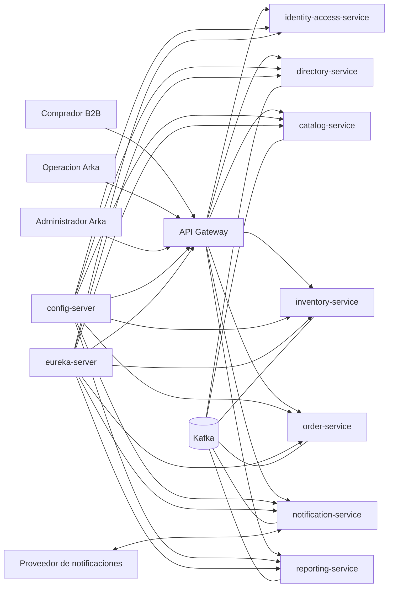

## Proposito de la seccion
Mostrar el sistema ArkaB2B como limite operativo completo: actores, servicios,
dependencias externas y superficies de entrada.

## Vista de contexto

## Actores y relacion con el sistema
| Actor | Relacion principal |
|---|---|
| comprador B2B | autentica, consulta catalogo, gestiona carrito y crea pedidos |
| operacion Arka | ajusta stock, actualiza estados, revisa notificaciones y reportes |
| administrador Arka | gestiona usuarios, organizaciones, reglas y baseline operativo |
| proveedor de notificaciones | entrega callbacks y resultados de envio |
| operador de plataforma | levanta el stack, inyecta secretos, revisa salud y ejecuta runbooks |

## Limite oficial del sistema
Dentro del sistema se consideran parte del baseline ejecutable:
- servicios Java del repositorio;
- infraestructura minima `postgres`, `redis`, `kafka`;
- `config-server`, `eureka-server` y `api-gateway`;
- scripts oficiales de arranque local y cloud;
- activos operativos y hubs Swagger/E2E servidos por `api-gateway`.

Quedan fuera del limite de implementacion propia:
- proveedor externo de notificaciones;
- infraestructura del host cloud;
- firewall, balanceadores y storage administrados por el operador.

## Superficies de entrada
| Superficie | Uso |
|---|---|
| `api-gateway` | unica entrada HTTP publica del baseline |
| `config-server` | bootstrap interno de configuracion |
| `eureka-server` | discovery interno |
| `kafka` | intercambio asincrono interno |
| `postgres` y `redis` | soporte stateful privado |

## Regla de borde
Toda entrada interactiva o de herramienta manual oficial se realiza via
`api-gateway`. Incluso los hubs HTML de Swagger y E2E se sirven desde ese borde
para no abrir puertos internos en despliegue cloud.
