## Proposito
Definir el catalogo completo de clases/archivos del servicio `identity-access-service` para implementacion Java 21 + Spring WebFlux con arquitectura hexagonal/clean, CQRS ligero, EDA y DDD.

## Alcance y fronteras
- Incluye inventario completo de clases por carpeta para el servicio IAM.
- Incluye separacion estricta de estructura: `domain`, `application`, `infrastructure`.
- Incluye clases de configuracion para dependencias (security, kafka, r2dbc, redis, observabilidad).
- Excluye codigo de otros BC/servicios.

## Regla de completitud aplicada
- Este documento define **catalogo completo**, no minimo.
- Cada clase se mapea a una carpeta concreta del arbol canonico.
- El dominio se divide por agregados (`user`, `session`, `role`) con la raiz del agregado en el paquete del modelo y slicing interno (`entity`, `valueobject`, `enum`, `event`).
- La frontera web separa `request/response` HTTP del modelo de aplicacion (`command/query/result`).
- Los puertos/adaptadores se dividen por responsabilidad (`persistence`, `security`, `audit`, `event`, `cache`, `external`).

## Estructura estricta (IAM)
Este arbol muestra la estructura canonica completa del servicio a nivel de carpetas. El detalle por archivo y los diagramas de clase individuales se consultan mas abajo en la vista por capas.

```tree
- src | folder
  - main | folder
    - java | code
      - com | folder
        - arka | building | primary
          - identityaccess | microchip | primary
            - domain | cubes | info
              - model | folder-open | info
                - user | folder
                  - entity | folder
                  - valueobject | folder
                  - enum | folder
                  - event | share-nodes | accent
                - session | folder
                  - entity | folder
                  - valueobject | folder
                  - enum | folder
                  - event | share-nodes | accent
                - role | folder
                  - entity | folder
                  - valueobject | folder
                  - enum | folder
                  - event | share-nodes | accent
              - event | share-nodes | accent
              - service | gear | info
              - exception | folder
            - application | sitemap | warning
              - command | terminal | warning
              - query | binoculars | warning
              - result | file-lines | warning
              - port | plug | warning
                - in | arrow-right
                - out | arrow-left
                  - persistence | database
                  - security | shield
                  - audit | clipboard
                  - event | share-nodes | accent
                  - cache | hard-drive
                  - external | cloud
              - usecase | bolt | warning
                - command | terminal | warning
                - query | binoculars | warning
              - mapper | shuffle
                - command | shuffle
                - query | shuffle
                - result | shuffle
              - exception | folder
            - infrastructure | server | secondary
              - adapter | plug | secondary
                - in | arrow-right
                  - web | globe
                    - request | file-import
                    - response | file-export
                    - mapper | shuffle
                      - command | shuffle
                      - query | shuffle
                      - response | shuffle
                    - controller | globe
                  - listener | bell
                - out | arrow-left
                  - persistence | database
                    - entity | table
                    - mapper | shuffle
                    - repository | database
                  - security | shield
                  - external | cloud
                  - event | share-nodes | accent
                  - cache | hard-drive
              - config | gear
              - exception | folder
```

## Estructura detallada por capas
Esta seccion concentra el arbol navegable por capa con todos los archivos del servicio. Cada archivo sigue abriendo su diagrama de clase individual en el visor.

{}
{}
```tree
- com | folder
  - arka | building | primary
    - identityaccess | microchip | primary
      - domain | cubes | info
        - model | folder-open | info
          - user | folder
            - <button type="button" class="R-tree-diagram-trigger" data-diagram-template="identity-class-useraggregate" data-diagram-title="UserAggregate.java" aria-label="Abrir diagrama de clase para UserAggregate.java"><code>UserAggregate.java</code></button> | file-code | code
            - entity | folder
              - <button type="button" class="R-tree-diagram-trigger" data-diagram-template="identity-class-usercredential" data-diagram-title="UserCredential.java" aria-label="Abrir diagrama de clase para UserCredential.java"><code>UserCredential.java</code></button> | file-code | code
              - <button type="button" class="R-tree-diagram-trigger" data-diagram-template="identity-class-userloginattempt" data-diagram-title="UserLoginAttempt.java" aria-label="Abrir diagrama de clase para UserLoginAttempt.java"><code>UserLoginAttempt.java</code></button> | file-code | code
            - valueobject | folder
              - <button type="button" class="R-tree-diagram-trigger" data-diagram-template="identity-class-userid" data-diagram-title="UserId.java" aria-label="Abrir diagrama de clase para UserId.java"><code>UserId.java</code></button> | file-code | code
              - <button type="button" class="R-tree-diagram-trigger" data-diagram-template="identity-class-tenantid" data-diagram-title="TenantId.java" aria-label="Abrir diagrama de clase para TenantId.java"><code>TenantId.java</code></button> | file-code | code
              - <button type="button" class="R-tree-diagram-trigger" data-diagram-template="identity-class-emailaddress" data-diagram-title="EmailAddress.java" aria-label="Abrir diagrama de clase para EmailAddress.java"><code>EmailAddress.java</code></button> | file-code | code
              - <button type="button" class="R-tree-diagram-trigger" data-diagram-template="identity-class-passwordhash" data-diagram-title="PasswordHash.java" aria-label="Abrir diagrama de clase para PasswordHash.java"><code>PasswordHash.java</code></button> | file-code | code
              - <button type="button" class="R-tree-diagram-trigger" data-diagram-template="identity-class-failedlogincounter" data-diagram-title="FailedLoginCounter.java" aria-label="Abrir diagrama de clase para FailedLoginCounter.java"><code>FailedLoginCounter.java</code></button> | file-code | code
            - enum | folder
              - <button type="button" class="R-tree-diagram-trigger" data-diagram-template="identity-class-userstatus" data-diagram-title="UserStatus.java" aria-label="Abrir diagrama de clase para UserStatus.java"><code>UserStatus.java</code></button> | file-code | code
              - <button type="button" class="R-tree-diagram-trigger" data-diagram-template="identity-class-credentialstatus" data-diagram-title="CredentialStatus.java" aria-label="Abrir diagrama de clase para CredentialStatus.java"><code>CredentialStatus.java</code></button> | file-code | code
            - event | share-nodes | accent
              - <button type="button" class="R-tree-diagram-trigger" data-diagram-template="identity-class-userloggedinevent" data-diagram-title="UserLoggedInEvent.java" aria-label="Abrir diagrama de clase para UserLoggedInEvent.java"><code>UserLoggedInEvent.java</code></button> | share-nodes | accent
              - <button type="button" class="R-tree-diagram-trigger" data-diagram-template="identity-class-loginfailedevent" data-diagram-title="LoginFailedEvent.java" aria-label="Abrir diagrama de clase para LoginFailedEvent.java"><code>LoginFailedEvent.java</code></button> | share-nodes | accent
              - <button type="button" class="R-tree-diagram-trigger" data-diagram-template="identity-class-userblockedevent" data-diagram-title="UserBlockedEvent.java" aria-label="Abrir diagrama de clase para UserBlockedEvent.java"><code>UserBlockedEvent.java</code></button> | share-nodes | accent
              - <button type="button" class="R-tree-diagram-trigger" data-diagram-template="identity-class-userunblockedevent" data-diagram-title="UserUnblockedEvent.java" aria-label="Abrir diagrama de clase para UserUnblockedEvent.java"><code>UserUnblockedEvent.java</code></button> | share-nodes | accent
              - <button type="button" class="R-tree-diagram-trigger" data-diagram-template="identity-class-passwordchangedevent" data-diagram-title="PasswordChangedEvent.java" aria-label="Abrir diagrama de clase para PasswordChangedEvent.java"><code>PasswordChangedEvent.java</code></button> | share-nodes | accent
          - session | folder
            - <button type="button" class="R-tree-diagram-trigger" data-diagram-template="identity-class-sessionaggregate" data-diagram-title="SessionAggregate.java" aria-label="Abrir diagrama de clase para SessionAggregate.java"><code>SessionAggregate.java</code></button> | file-code | code
            - entity | folder
            - valueobject | folder
              - <button type="button" class="R-tree-diagram-trigger" data-diagram-template="identity-class-sessionid" data-diagram-title="SessionId.java" aria-label="Abrir diagrama de clase para SessionId.java"><code>SessionId.java</code></button> | file-code | code
              - <button type="button" class="R-tree-diagram-trigger" data-diagram-template="identity-class-accessjti" data-diagram-title="AccessJti.java" aria-label="Abrir diagrama de clase para AccessJti.java"><code>AccessJti.java</code></button> | file-code | code
              - <button type="button" class="R-tree-diagram-trigger" data-diagram-template="identity-class-refreshjti" data-diagram-title="RefreshJti.java" aria-label="Abrir diagrama de clase para RefreshJti.java"><code>RefreshJti.java</code></button> | file-code | code
              - <button type="button" class="R-tree-diagram-trigger" data-diagram-template="identity-class-clientdevice" data-diagram-title="ClientDevice.java" aria-label="Abrir diagrama de clase para ClientDevice.java"><code>ClientDevice.java</code></button> | file-code | code
              - <button type="button" class="R-tree-diagram-trigger" data-diagram-template="identity-class-clientip" data-diagram-title="ClientIp.java" aria-label="Abrir diagrama de clase para ClientIp.java"><code>ClientIp.java</code></button> | file-code | code
              - <button type="button" class="R-tree-diagram-trigger" data-diagram-template="identity-class-sessiontimestamps" data-diagram-title="SessionTimestamps.java" aria-label="Abrir diagrama de clase para SessionTimestamps.java"><code>SessionTimestamps.java</code></button> | file-code | code
            - enum | folder
              - <button type="button" class="R-tree-diagram-trigger" data-diagram-template="identity-class-sessionstatus" data-diagram-title="SessionStatus.java" aria-label="Abrir diagrama de clase para SessionStatus.java"><code>SessionStatus.java</code></button> | file-code | code
              - <button type="button" class="R-tree-diagram-trigger" data-diagram-template="identity-class-revocationreason" data-diagram-title="RevocationReason.java" aria-label="Abrir diagrama de clase para RevocationReason.java"><code>RevocationReason.java</code></button> | file-code | code
            - event | share-nodes | accent
              - <button type="button" class="R-tree-diagram-trigger" data-diagram-template="identity-class-sessionopenedevent" data-diagram-title="SessionOpenedEvent.java" aria-label="Abrir diagrama de clase para SessionOpenedEvent.java"><code>SessionOpenedEvent.java</code></button> | share-nodes | accent
              - <button type="button" class="R-tree-diagram-trigger" data-diagram-template="identity-class-sessionrefreshedevent" data-diagram-title="SessionRefreshedEvent.java" aria-label="Abrir diagrama de clase para SessionRefreshedEvent.java"><code>SessionRefreshedEvent.java</code></button> | share-nodes | accent
              - <button type="button" class="R-tree-diagram-trigger" data-diagram-template="identity-class-sessionrevokedevent" data-diagram-title="SessionRevokedEvent.java" aria-label="Abrir diagrama de clase para SessionRevokedEvent.java"><code>SessionRevokedEvent.java</code></button> | share-nodes | accent
              - <button type="button" class="R-tree-diagram-trigger" data-diagram-template="identity-class-sessionsrevokedbyuserevent" data-diagram-title="SessionsRevokedByUserEvent.java" aria-label="Abrir diagrama de clase para SessionsRevokedByUserEvent.java"><code>SessionsRevokedByUserEvent.java</code></button> | share-nodes | accent
          - role | folder
            - <button type="button" class="R-tree-diagram-trigger" data-diagram-template="identity-class-roleaggregate" data-diagram-title="RoleAggregate.java" aria-label="Abrir diagrama de clase para RoleAggregate.java"><code>RoleAggregate.java</code></button> | file-code | code
            - entity | folder
              - <button type="button" class="R-tree-diagram-trigger" data-diagram-template="identity-class-rolepermission" data-diagram-title="RolePermission.java" aria-label="Abrir diagrama de clase para RolePermission.java"><code>RolePermission.java</code></button> | file-code | code
              - <button type="button" class="R-tree-diagram-trigger" data-diagram-template="identity-class-userroleassignment" data-diagram-title="UserRoleAssignment.java" aria-label="Abrir diagrama de clase para UserRoleAssignment.java"><code>UserRoleAssignment.java</code></button> | file-code | code
            - valueobject | folder
              - <button type="button" class="R-tree-diagram-trigger" data-diagram-template="identity-class-roleid" data-diagram-title="RoleId.java" aria-label="Abrir diagrama de clase para RoleId.java"><code>RoleId.java</code></button> | file-code | code
              - <button type="button" class="R-tree-diagram-trigger" data-diagram-template="identity-class-rolecode" data-diagram-title="RoleCode.java" aria-label="Abrir diagrama de clase para RoleCode.java"><code>RoleCode.java</code></button> | file-code | code
              - <button type="button" class="R-tree-diagram-trigger" data-diagram-template="identity-class-permissioncode" data-diagram-title="PermissionCode.java" aria-label="Abrir diagrama de clase para PermissionCode.java"><code>PermissionCode.java</code></button> | file-code | code
            - enum | folder
              - <button type="button" class="R-tree-diagram-trigger" data-diagram-template="identity-class-assignmentstatus" data-diagram-title="AssignmentStatus.java" aria-label="Abrir diagrama de clase para AssignmentStatus.java"><code>AssignmentStatus.java</code></button> | file-code | code
            - event | share-nodes | accent
              - <button type="button" class="R-tree-diagram-trigger" data-diagram-template="identity-class-roleassignedevent" data-diagram-title="RoleAssignedEvent.java" aria-label="Abrir diagrama de clase para RoleAssignedEvent.java"><code>RoleAssignedEvent.java</code></button> | share-nodes | accent
              - <button type="button" class="R-tree-diagram-trigger" data-diagram-template="identity-class-rolerevokedevent" data-diagram-title="RoleRevokedEvent.java" aria-label="Abrir diagrama de clase para RoleRevokedEvent.java"><code>RoleRevokedEvent.java</code></button> | share-nodes | accent
        - event | share-nodes | accent
          - <button type="button" class="R-tree-diagram-trigger" data-diagram-template="identity-class-domainevent" data-diagram-title="DomainEvent.java" aria-label="Abrir diagrama de clase para DomainEvent.java"><code>DomainEvent.java</code></button> | share-nodes | accent
        - service | gear | info
          - <button type="button" class="R-tree-diagram-trigger" data-diagram-template="identity-class-passwordpolicy" data-diagram-title="PasswordPolicy.java" aria-label="Abrir diagrama de clase para PasswordPolicy.java"><code>PasswordPolicy.java</code></button> | gear | info
          - <button type="button" class="R-tree-diagram-trigger" data-diagram-template="identity-class-tokenpolicy" data-diagram-title="TokenPolicy.java" aria-label="Abrir diagrama de clase para TokenPolicy.java"><code>TokenPolicy.java</code></button> | gear | info
          - <button type="button" class="R-tree-diagram-trigger" data-diagram-template="identity-class-tenantisolationpolicy" data-diagram-title="TenantIsolationPolicy.java" aria-label="Abrir diagrama de clase para TenantIsolationPolicy.java"><code>TenantIsolationPolicy.java</code></button> | gear | info
          - <button type="button" class="R-tree-diagram-trigger" data-diagram-template="identity-class-authorizationpolicy" data-diagram-title="AuthorizationPolicy.java" aria-label="Abrir diagrama de clase para AuthorizationPolicy.java"><code>AuthorizationPolicy.java</code></button> | gear | info
          - <button type="button" class="R-tree-diagram-trigger" data-diagram-template="identity-class-sessionpolicy" data-diagram-title="SessionPolicy.java" aria-label="Abrir diagrama de clase para SessionPolicy.java"><code>SessionPolicy.java</code></button> | gear | info
          - <button type="button" class="R-tree-diagram-trigger" data-diagram-template="identity-class-permissionresolutionservice" data-diagram-title="PermissionResolutionService.java" aria-label="Abrir diagrama de clase para PermissionResolutionService.java"><code>PermissionResolutionService.java</code></button> | gear | info
        - exception | folder
          - <button type="button" class="R-tree-diagram-trigger" data-diagram-template="identity-class-domainexception" data-diagram-title="DomainException.java" aria-label="Abrir diagrama de clase para DomainException.java"><code>DomainException.java</code></button> | file-code | code
          - <button type="button" class="R-tree-diagram-trigger" data-diagram-template="identity-class-domainruleviolationexception" data-diagram-title="DomainRuleViolationException.java" aria-label="Abrir diagrama de clase para DomainRuleViolationException.java"><code>DomainRuleViolationException.java</code></button> | file-code | code
          - <button type="button" class="R-tree-diagram-trigger" data-diagram-template="identity-class-conflictexception" data-diagram-title="ConflictException.java" aria-label="Abrir diagrama de clase para ConflictException.java"><code>ConflictException.java</code></button> | file-code | code
          - <button type="button" class="R-tree-diagram-trigger" data-diagram-template="identity-class-userblockedexception" data-diagram-title="UserBlockedException.java" aria-label="Abrir diagrama de clase para UserBlockedException.java"><code>UserBlockedException.java</code></button> | file-code | code
          - <button type="button" class="R-tree-diagram-trigger" data-diagram-template="identity-class-roleassignmentnotallowedexception" data-diagram-title="RoleAssignmentNotAllowedException.java" aria-label="Abrir diagrama de clase para RoleAssignmentNotAllowedException.java"><code>RoleAssignmentNotAllowedException.java</code></button> | file-code | code
```
{}
{}
```tree
- com | folder
  - arka | building | primary
    - identityaccess | microchip | primary
      - application | sitemap | warning
        - command | terminal | warning
          - <button type="button" class="R-tree-diagram-trigger" data-diagram-template="identity-class-logincommand" data-diagram-title="LoginCommand.java" aria-label="Abrir diagrama de clase para LoginCommand.java"><code>LoginCommand.java</code></button> | file-code | code
          - <button type="button" class="R-tree-diagram-trigger" data-diagram-template="identity-class-refreshsessioncommand" data-diagram-title="RefreshSessionCommand.java" aria-label="Abrir diagrama de clase para RefreshSessionCommand.java"><code>RefreshSessionCommand.java</code></button> | file-code | code
          - <button type="button" class="R-tree-diagram-trigger" data-diagram-template="identity-class-logoutcommand" data-diagram-title="LogoutCommand.java" aria-label="Abrir diagrama de clase para LogoutCommand.java"><code>LogoutCommand.java</code></button> | file-code | code
          - <button type="button" class="R-tree-diagram-trigger" data-diagram-template="identity-class-assignrolecommand" data-diagram-title="AssignRoleCommand.java" aria-label="Abrir diagrama de clase para AssignRoleCommand.java"><code>AssignRoleCommand.java</code></button> | file-code | code
          - <button type="button" class="R-tree-diagram-trigger" data-diagram-template="identity-class-blockusercommand" data-diagram-title="BlockUserCommand.java" aria-label="Abrir diagrama de clase para BlockUserCommand.java"><code>BlockUserCommand.java</code></button> | file-code | code
          - <button type="button" class="R-tree-diagram-trigger" data-diagram-template="identity-class-revokesessionscommand" data-diagram-title="RevokeSessionsCommand.java" aria-label="Abrir diagrama de clase para RevokeSessionsCommand.java"><code>RevokeSessionsCommand.java</code></button> | file-code | code
        - query | binoculars | warning
          - <button type="button" class="R-tree-diagram-trigger" data-diagram-template="identity-class-introspecttokenquery" data-diagram-title="IntrospectTokenQuery.java" aria-label="Abrir diagrama de clase para IntrospectTokenQuery.java"><code>IntrospectTokenQuery.java</code></button> | file-code | code
          - <button type="button" class="R-tree-diagram-trigger" data-diagram-template="identity-class-listusersessionsquery" data-diagram-title="ListUserSessionsQuery.java" aria-label="Abrir diagrama de clase para ListUserSessionsQuery.java"><code>ListUserSessionsQuery.java</code></button> | file-code | code
          - <button type="button" class="R-tree-diagram-trigger" data-diagram-template="identity-class-getuserpermissionsquery" data-diagram-title="GetUserPermissionsQuery.java" aria-label="Abrir diagrama de clase para GetUserPermissionsQuery.java"><code>GetUserPermissionsQuery.java</code></button> | file-code | code
        - result | file-lines | warning
          - <button type="button" class="R-tree-diagram-trigger" data-diagram-template="identity-class-loginresult" data-diagram-title="LoginResult.java" aria-label="Abrir diagrama de clase para LoginResult.java"><code>LoginResult.java</code></button> | file-lines | code
          - <button type="button" class="R-tree-diagram-trigger" data-diagram-template="identity-class-tokenpairresult" data-diagram-title="TokenPairResult.java" aria-label="Abrir diagrama de clase para TokenPairResult.java"><code>TokenPairResult.java</code></button> | file-lines | code
          - <button type="button" class="R-tree-diagram-trigger" data-diagram-template="identity-class-logoutresult" data-diagram-title="LogoutResult.java" aria-label="Abrir diagrama de clase para LogoutResult.java"><code>LogoutResult.java</code></button> | file-lines | code
          - <button type="button" class="R-tree-diagram-trigger" data-diagram-template="identity-class-introspectionresult" data-diagram-title="IntrospectionResult.java" aria-label="Abrir diagrama de clase para IntrospectionResult.java"><code>IntrospectionResult.java</code></button> | file-lines | code
          - <button type="button" class="R-tree-diagram-trigger" data-diagram-template="identity-class-roleassignmentresult" data-diagram-title="RoleAssignmentResult.java" aria-label="Abrir diagrama de clase para RoleAssignmentResult.java"><code>RoleAssignmentResult.java</code></button> | file-lines | code
          - <button type="button" class="R-tree-diagram-trigger" data-diagram-template="identity-class-userstatusresult" data-diagram-title="UserStatusResult.java" aria-label="Abrir diagrama de clase para UserStatusResult.java"><code>UserStatusResult.java</code></button> | file-lines | code
          - <button type="button" class="R-tree-diagram-trigger" data-diagram-template="identity-class-revokesessionsresult" data-diagram-title="RevokeSessionsResult.java" aria-label="Abrir diagrama de clase para RevokeSessionsResult.java"><code>RevokeSessionsResult.java</code></button> | file-lines | code
          - <button type="button" class="R-tree-diagram-trigger" data-diagram-template="identity-class-sessionsummaryresult" data-diagram-title="SessionSummaryResult.java" aria-label="Abrir diagrama de clase para SessionSummaryResult.java"><code>SessionSummaryResult.java</code></button> | file-lines | code
          - <button type="button" class="R-tree-diagram-trigger" data-diagram-template="identity-class-permissionsetresult" data-diagram-title="PermissionSetResult.java" aria-label="Abrir diagrama de clase para PermissionSetResult.java"><code>PermissionSetResult.java</code></button> | file-lines | code
        - port | plug | warning
          - in | arrow-right
            - <button type="button" class="R-tree-diagram-trigger" data-diagram-template="identity-class-logincommandusecase" data-diagram-title="LoginCommandUseCase.java" aria-label="Abrir diagrama de clase para LoginCommandUseCase.java"><code>LoginCommandUseCase.java</code></button> | bolt | warning
            - <button type="button" class="R-tree-diagram-trigger" data-diagram-template="identity-class-refreshsessioncommandusecase" data-diagram-title="RefreshSessionCommandUseCase.java" aria-label="Abrir diagrama de clase para RefreshSessionCommandUseCase.java"><code>RefreshSessionCommandUseCase.java</code></button> | bolt | warning
            - <button type="button" class="R-tree-diagram-trigger" data-diagram-template="identity-class-logoutcommandusecase" data-diagram-title="LogoutCommandUseCase.java" aria-label="Abrir diagrama de clase para LogoutCommandUseCase.java"><code>LogoutCommandUseCase.java</code></button> | bolt | warning
            - <button type="button" class="R-tree-diagram-trigger" data-diagram-template="identity-class-assignrolecommandusecase" data-diagram-title="AssignRoleCommandUseCase.java" aria-label="Abrir diagrama de clase para AssignRoleCommandUseCase.java"><code>AssignRoleCommandUseCase.java</code></button> | bolt | warning
            - <button type="button" class="R-tree-diagram-trigger" data-diagram-template="identity-class-blockusercommandusecase" data-diagram-title="BlockUserCommandUseCase.java" aria-label="Abrir diagrama de clase para BlockUserCommandUseCase.java"><code>BlockUserCommandUseCase.java</code></button> | bolt | warning
            - <button type="button" class="R-tree-diagram-trigger" data-diagram-template="identity-class-revokesessionscommandusecase" data-diagram-title="RevokeSessionsCommandUseCase.java" aria-label="Abrir diagrama de clase para RevokeSessionsCommandUseCase.java"><code>RevokeSessionsCommandUseCase.java</code></button> | bolt | warning
            - <button type="button" class="R-tree-diagram-trigger" data-diagram-template="identity-class-introspecttokenqueryusecase" data-diagram-title="IntrospectTokenQueryUseCase.java" aria-label="Abrir diagrama de clase para IntrospectTokenQueryUseCase.java"><code>IntrospectTokenQueryUseCase.java</code></button> | bolt | warning
            - <button type="button" class="R-tree-diagram-trigger" data-diagram-template="identity-class-listusersessionsqueryusecase" data-diagram-title="ListUserSessionsQueryUseCase.java" aria-label="Abrir diagrama de clase para ListUserSessionsQueryUseCase.java"><code>ListUserSessionsQueryUseCase.java</code></button> | bolt | warning
            - <button type="button" class="R-tree-diagram-trigger" data-diagram-template="identity-class-getuserpermissionsqueryusecase" data-diagram-title="GetUserPermissionsQueryUseCase.java" aria-label="Abrir diagrama de clase para GetUserPermissionsQueryUseCase.java"><code>GetUserPermissionsQueryUseCase.java</code></button> | bolt | warning
          - out | arrow-left
            - persistence | database
              - <button type="button" class="R-tree-diagram-trigger" data-diagram-template="identity-class-userpersistenceport" data-diagram-title="UserPersistencePort.java" aria-label="Abrir diagrama de clase para UserPersistencePort.java"><code>UserPersistencePort.java</code></button> | plug | warning
              - <button type="button" class="R-tree-diagram-trigger" data-diagram-template="identity-class-sessionpersistenceport" data-diagram-title="SessionPersistencePort.java" aria-label="Abrir diagrama de clase para SessionPersistencePort.java"><code>SessionPersistencePort.java</code></button> | plug | warning
              - <button type="button" class="R-tree-diagram-trigger" data-diagram-template="identity-class-rolepersistenceport" data-diagram-title="RolePersistencePort.java" aria-label="Abrir diagrama de clase para RolePersistencePort.java"><code>RolePersistencePort.java</code></button> | plug | warning
              - <button type="button" class="R-tree-diagram-trigger" data-diagram-template="identity-class-outboxpersistenceport" data-diagram-title="OutboxPersistencePort.java" aria-label="Abrir diagrama de clase para OutboxPersistencePort.java"><code>OutboxPersistencePort.java</code></button> | plug | warning
              - <button type="button" class="R-tree-diagram-trigger" data-diagram-template="identity-class-processedeventpersistenceport" data-diagram-title="ProcessedEventPersistencePort.java" aria-label="Abrir diagrama de clase para ProcessedEventPersistencePort.java"><code>ProcessedEventPersistencePort.java</code></button> | plug | warning
            - security | shield
              - <button type="button" class="R-tree-diagram-trigger" data-diagram-template="identity-class-passwordhashport" data-diagram-title="PasswordHashPort.java" aria-label="Abrir diagrama de clase para PasswordHashPort.java"><code>PasswordHashPort.java</code></button> | plug | warning
              - <button type="button" class="R-tree-diagram-trigger" data-diagram-template="identity-class-jwtsigningport" data-diagram-title="JwtSigningPort.java" aria-label="Abrir diagrama de clase para JwtSigningPort.java"><code>JwtSigningPort.java</code></button> | plug | warning
              - <button type="button" class="R-tree-diagram-trigger" data-diagram-template="identity-class-jwtverificationport" data-diagram-title="JwtVerificationPort.java" aria-label="Abrir diagrama de clase para JwtVerificationPort.java"><code>JwtVerificationPort.java</code></button> | plug | warning
              - <button type="button" class="R-tree-diagram-trigger" data-diagram-template="identity-class-jwksproviderport" data-diagram-title="JwksProviderPort.java" aria-label="Abrir diagrama de clase para JwksProviderPort.java"><code>JwksProviderPort.java</code></button> | plug | warning
            - audit | clipboard
              - <button type="button" class="R-tree-diagram-trigger" data-diagram-template="identity-class-securityauditport" data-diagram-title="SecurityAuditPort.java" aria-label="Abrir diagrama de clase para SecurityAuditPort.java"><code>SecurityAuditPort.java</code></button> | plug | warning
            - event | share-nodes | accent
              - <button type="button" class="R-tree-diagram-trigger" data-diagram-template="identity-class-domaineventpublisherport" data-diagram-title="DomainEventPublisherPort.java" aria-label="Abrir diagrama de clase para DomainEventPublisherPort.java"><code>DomainEventPublisherPort.java</code></button> | plug | warning
            - cache | hard-drive
              - <button type="button" class="R-tree-diagram-trigger" data-diagram-template="identity-class-sessioncacheport" data-diagram-title="SessionCachePort.java" aria-label="Abrir diagrama de clase para SessionCachePort.java"><code>SessionCachePort.java</code></button> | plug | warning
              - <button type="button" class="R-tree-diagram-trigger" data-diagram-template="identity-class-securityratelimitport" data-diagram-title="SecurityRateLimitPort.java" aria-label="Abrir diagrama de clase para SecurityRateLimitPort.java"><code>SecurityRateLimitPort.java</code></button> | plug | warning
            - external | cloud
              - <button type="button" class="R-tree-diagram-trigger" data-diagram-template="identity-class-clockport" data-diagram-title="ClockPort.java" aria-label="Abrir diagrama de clase para ClockPort.java"><code>ClockPort.java</code></button> | plug | warning
              - <button type="button" class="R-tree-diagram-trigger" data-diagram-template="identity-class-correlationidproviderport" data-diagram-title="CorrelationIdProviderPort.java" aria-label="Abrir diagrama de clase para CorrelationIdProviderPort.java"><code>CorrelationIdProviderPort.java</code></button> | plug | warning
        - usecase | bolt | warning
          - command | terminal | warning
            - <button type="button" class="R-tree-diagram-trigger" data-diagram-template="identity-class-loginusecase" data-diagram-title="LoginUseCase.java" aria-label="Abrir diagrama de clase para LoginUseCase.java"><code>LoginUseCase.java</code></button> | bolt | warning
            - <button type="button" class="R-tree-diagram-trigger" data-diagram-template="identity-class-refreshsessionusecase" data-diagram-title="RefreshSessionUseCase.java" aria-label="Abrir diagrama de clase para RefreshSessionUseCase.java"><code>RefreshSessionUseCase.java</code></button> | bolt | warning
            - <button type="button" class="R-tree-diagram-trigger" data-diagram-template="identity-class-logoutusecase" data-diagram-title="LogoutUseCase.java" aria-label="Abrir diagrama de clase para LogoutUseCase.java"><code>LogoutUseCase.java</code></button> | bolt | warning
            - <button type="button" class="R-tree-diagram-trigger" data-diagram-template="identity-class-assignroleusecase" data-diagram-title="AssignRoleUseCase.java" aria-label="Abrir diagrama de clase para AssignRoleUseCase.java"><code>AssignRoleUseCase.java</code></button> | bolt | warning
            - <button type="button" class="R-tree-diagram-trigger" data-diagram-template="identity-class-blockuserusecase" data-diagram-title="BlockUserUseCase.java" aria-label="Abrir diagrama de clase para BlockUserUseCase.java"><code>BlockUserUseCase.java</code></button> | bolt | warning
            - <button type="button" class="R-tree-diagram-trigger" data-diagram-template="identity-class-revokesessionsusecase" data-diagram-title="RevokeSessionsUseCase.java" aria-label="Abrir diagrama de clase para RevokeSessionsUseCase.java"><code>RevokeSessionsUseCase.java</code></button> | bolt | warning
          - query | binoculars | warning
            - <button type="button" class="R-tree-diagram-trigger" data-diagram-template="identity-class-introspecttokenusecase" data-diagram-title="IntrospectTokenUseCase.java" aria-label="Abrir diagrama de clase para IntrospectTokenUseCase.java"><code>IntrospectTokenUseCase.java</code></button> | bolt | warning
            - <button type="button" class="R-tree-diagram-trigger" data-diagram-template="identity-class-listusersessionsusecase" data-diagram-title="ListUserSessionsUseCase.java" aria-label="Abrir diagrama de clase para ListUserSessionsUseCase.java"><code>ListUserSessionsUseCase.java</code></button> | bolt | warning
            - <button type="button" class="R-tree-diagram-trigger" data-diagram-template="identity-class-getuserpermissionsusecase" data-diagram-title="GetUserPermissionsUseCase.java" aria-label="Abrir diagrama de clase para GetUserPermissionsUseCase.java"><code>GetUserPermissionsUseCase.java</code></button> | bolt | warning
        - mapper | shuffle
          - command | shuffle
            - <button type="button" class="R-tree-diagram-trigger" data-diagram-template="identity-class-logincommandassembler" data-diagram-title="LoginCommandAssembler.java" aria-label="Abrir diagrama de clase para LoginCommandAssembler.java"><code>LoginCommandAssembler.java</code></button> | shuffle
            - <button type="button" class="R-tree-diagram-trigger" data-diagram-template="identity-class-refreshsessioncommandassembler" data-diagram-title="RefreshSessionCommandAssembler.java" aria-label="Abrir diagrama de clase para RefreshSessionCommandAssembler.java"><code>RefreshSessionCommandAssembler.java</code></button> | shuffle
            - <button type="button" class="R-tree-diagram-trigger" data-diagram-template="identity-class-logoutcommandassembler" data-diagram-title="LogoutCommandAssembler.java" aria-label="Abrir diagrama de clase para LogoutCommandAssembler.java"><code>LogoutCommandAssembler.java</code></button> | shuffle
            - <button type="button" class="R-tree-diagram-trigger" data-diagram-template="identity-class-assignrolecommandassembler" data-diagram-title="AssignRoleCommandAssembler.java" aria-label="Abrir diagrama de clase para AssignRoleCommandAssembler.java"><code>AssignRoleCommandAssembler.java</code></button> | shuffle
            - <button type="button" class="R-tree-diagram-trigger" data-diagram-template="identity-class-blockusercommandassembler" data-diagram-title="BlockUserCommandAssembler.java" aria-label="Abrir diagrama de clase para BlockUserCommandAssembler.java"><code>BlockUserCommandAssembler.java</code></button> | shuffle
            - <button type="button" class="R-tree-diagram-trigger" data-diagram-template="identity-class-revokesessionscommandassembler" data-diagram-title="RevokeSessionsCommandAssembler.java" aria-label="Abrir diagrama de clase para RevokeSessionsCommandAssembler.java"><code>RevokeSessionsCommandAssembler.java</code></button> | shuffle
          - query | shuffle
            - <button type="button" class="R-tree-diagram-trigger" data-diagram-template="identity-class-introspecttokenqueryassembler" data-diagram-title="IntrospectTokenQueryAssembler.java" aria-label="Abrir diagrama de clase para IntrospectTokenQueryAssembler.java"><code>IntrospectTokenQueryAssembler.java</code></button> | shuffle
            - <button type="button" class="R-tree-diagram-trigger" data-diagram-template="identity-class-listusersessionsqueryassembler" data-diagram-title="ListUserSessionsQueryAssembler.java" aria-label="Abrir diagrama de clase para ListUserSessionsQueryAssembler.java"><code>ListUserSessionsQueryAssembler.java</code></button> | shuffle
            - <button type="button" class="R-tree-diagram-trigger" data-diagram-template="identity-class-getuserpermissionsqueryassembler" data-diagram-title="GetUserPermissionsQueryAssembler.java" aria-label="Abrir diagrama de clase para GetUserPermissionsQueryAssembler.java"><code>GetUserPermissionsQueryAssembler.java</code></button> | shuffle
          - result | shuffle
            - <button type="button" class="R-tree-diagram-trigger" data-diagram-template="identity-class-loginresultmapper" data-diagram-title="LoginResultMapper.java" aria-label="Abrir diagrama de clase para LoginResultMapper.java"><code>LoginResultMapper.java</code></button> | shuffle
            - <button type="button" class="R-tree-diagram-trigger" data-diagram-template="identity-class-tokenpairresultmapper" data-diagram-title="TokenPairResultMapper.java" aria-label="Abrir diagrama de clase para TokenPairResultMapper.java"><code>TokenPairResultMapper.java</code></button> | shuffle
            - <button type="button" class="R-tree-diagram-trigger" data-diagram-template="identity-class-logoutresultmapper" data-diagram-title="LogoutResultMapper.java" aria-label="Abrir diagrama de clase para LogoutResultMapper.java"><code>LogoutResultMapper.java</code></button> | shuffle
            - <button type="button" class="R-tree-diagram-trigger" data-diagram-template="identity-class-introspectionresultmapper" data-diagram-title="IntrospectionResultMapper.java" aria-label="Abrir diagrama de clase para IntrospectionResultMapper.java"><code>IntrospectionResultMapper.java</code></button> | shuffle
            - <button type="button" class="R-tree-diagram-trigger" data-diagram-template="identity-class-roleassignmentresultmapper" data-diagram-title="RoleAssignmentResultMapper.java" aria-label="Abrir diagrama de clase para RoleAssignmentResultMapper.java"><code>RoleAssignmentResultMapper.java</code></button> | shuffle
            - <button type="button" class="R-tree-diagram-trigger" data-diagram-template="identity-class-userstatusresultmapper" data-diagram-title="UserStatusResultMapper.java" aria-label="Abrir diagrama de clase para UserStatusResultMapper.java"><code>UserStatusResultMapper.java</code></button> | shuffle
            - <button type="button" class="R-tree-diagram-trigger" data-diagram-template="identity-class-revokesessionsresultmapper" data-diagram-title="RevokeSessionsResultMapper.java" aria-label="Abrir diagrama de clase para RevokeSessionsResultMapper.java"><code>RevokeSessionsResultMapper.java</code></button> | shuffle
            - <button type="button" class="R-tree-diagram-trigger" data-diagram-template="identity-class-sessionsummaryresultmapper" data-diagram-title="SessionSummaryResultMapper.java" aria-label="Abrir diagrama de clase para SessionSummaryResultMapper.java"><code>SessionSummaryResultMapper.java</code></button> | shuffle
            - <button type="button" class="R-tree-diagram-trigger" data-diagram-template="identity-class-permissionsetresultmapper" data-diagram-title="PermissionSetResultMapper.java" aria-label="Abrir diagrama de clase para PermissionSetResultMapper.java"><code>PermissionSetResultMapper.java</code></button> | shuffle
        - exception | folder
          - <button type="button" class="R-tree-diagram-trigger" data-diagram-template="identity-class-applicationexception" data-diagram-title="ApplicationException.java" aria-label="Abrir diagrama de clase para ApplicationException.java"><code>ApplicationException.java</code></button> | file-code | code
          - <button type="button" class="R-tree-diagram-trigger" data-diagram-template="identity-class-authorizationdeniedexception" data-diagram-title="AuthorizationDeniedException.java" aria-label="Abrir diagrama de clase para AuthorizationDeniedException.java"><code>AuthorizationDeniedException.java</code></button> | file-code | code
          - <button type="button" class="R-tree-diagram-trigger" data-diagram-template="identity-class-tenantisolationexception" data-diagram-title="TenantIsolationException.java" aria-label="Abrir diagrama de clase para TenantIsolationException.java"><code>TenantIsolationException.java</code></button> | file-code | code
          - <button type="button" class="R-tree-diagram-trigger" data-diagram-template="identity-class-resourcenotfoundexception" data-diagram-title="ResourceNotFoundException.java" aria-label="Abrir diagrama de clase para ResourceNotFoundException.java"><code>ResourceNotFoundException.java</code></button> | file-code | code
          - <button type="button" class="R-tree-diagram-trigger" data-diagram-template="identity-class-idempotencyconflictexception" data-diagram-title="IdempotencyConflictException.java" aria-label="Abrir diagrama de clase para IdempotencyConflictException.java"><code>IdempotencyConflictException.java</code></button> | file-code | code
          - <button type="button" class="R-tree-diagram-trigger" data-diagram-template="identity-class-invalidcredentialsexception" data-diagram-title="InvalidCredentialsException.java" aria-label="Abrir diagrama de clase para InvalidCredentialsException.java"><code>InvalidCredentialsException.java</code></button> | file-code | code
          - <button type="button" class="R-tree-diagram-trigger" data-diagram-template="identity-class-sessionrevokedexception" data-diagram-title="SessionRevokedException.java" aria-label="Abrir diagrama de clase para SessionRevokedException.java"><code>SessionRevokedException.java</code></button> | file-code | code
          - <button type="button" class="R-tree-diagram-trigger" data-diagram-template="identity-class-iamusernotfoundexception" data-diagram-title="IamUserNotFoundException.java" aria-label="Abrir diagrama de clase para IamUserNotFoundException.java"><code>IamUserNotFoundException.java</code></button> | file-code | code
```
{}
{}
```tree
- com | folder
  - arka | building | primary
    - identityaccess | microchip | primary
      - infrastructure | server | secondary
        - adapter | plug | secondary
          - in | arrow-right
            - web | globe
              - request | file-import
                - <button type="button" class="R-tree-diagram-trigger" data-diagram-template="identity-class-loginrequest" data-diagram-title="LoginRequest.java" aria-label="Abrir diagrama de clase para LoginRequest.java"><code>LoginRequest.java</code></button> | file-lines | code
                - <button type="button" class="R-tree-diagram-trigger" data-diagram-template="identity-class-refreshsessionrequest" data-diagram-title="RefreshSessionRequest.java" aria-label="Abrir diagrama de clase para RefreshSessionRequest.java"><code>RefreshSessionRequest.java</code></button> | file-lines | code
                - <button type="button" class="R-tree-diagram-trigger" data-diagram-template="identity-class-logoutrequest" data-diagram-title="LogoutRequest.java" aria-label="Abrir diagrama de clase para LogoutRequest.java"><code>LogoutRequest.java</code></button> | file-lines | code
                - <button type="button" class="R-tree-diagram-trigger" data-diagram-template="identity-class-introspecttokenrequest" data-diagram-title="IntrospectTokenRequest.java" aria-label="Abrir diagrama de clase para IntrospectTokenRequest.java"><code>IntrospectTokenRequest.java</code></button> | file-lines | code
                - <button type="button" class="R-tree-diagram-trigger" data-diagram-template="identity-class-assignrolerequest" data-diagram-title="AssignRoleRequest.java" aria-label="Abrir diagrama de clase para AssignRoleRequest.java"><code>AssignRoleRequest.java</code></button> | file-lines | code
                - <button type="button" class="R-tree-diagram-trigger" data-diagram-template="identity-class-blockuserrequest" data-diagram-title="BlockUserRequest.java" aria-label="Abrir diagrama de clase para BlockUserRequest.java"><code>BlockUserRequest.java</code></button> | file-lines | code
                - <button type="button" class="R-tree-diagram-trigger" data-diagram-template="identity-class-revokesessionsrequest" data-diagram-title="RevokeSessionsRequest.java" aria-label="Abrir diagrama de clase para RevokeSessionsRequest.java"><code>RevokeSessionsRequest.java</code></button> | file-lines | code
              - response | file-export
                - <button type="button" class="R-tree-diagram-trigger" data-diagram-template="identity-class-loginresponse" data-diagram-title="LoginResponse.java" aria-label="Abrir diagrama de clase para LoginResponse.java"><code>LoginResponse.java</code></button> | file-lines | code
                - <button type="button" class="R-tree-diagram-trigger" data-diagram-template="identity-class-tokenpairresponse" data-diagram-title="TokenPairResponse.java" aria-label="Abrir diagrama de clase para TokenPairResponse.java"><code>TokenPairResponse.java</code></button> | file-lines | code
                - <button type="button" class="R-tree-diagram-trigger" data-diagram-template="identity-class-logoutresponse" data-diagram-title="LogoutResponse.java" aria-label="Abrir diagrama de clase para LogoutResponse.java"><code>LogoutResponse.java</code></button> | file-lines | code
                - <button type="button" class="R-tree-diagram-trigger" data-diagram-template="identity-class-introspectionresponse" data-diagram-title="IntrospectionResponse.java" aria-label="Abrir diagrama de clase para IntrospectionResponse.java"><code>IntrospectionResponse.java</code></button> | file-lines | code
                - <button type="button" class="R-tree-diagram-trigger" data-diagram-template="identity-class-roleassignmentresponse" data-diagram-title="RoleAssignmentResponse.java" aria-label="Abrir diagrama de clase para RoleAssignmentResponse.java"><code>RoleAssignmentResponse.java</code></button> | file-lines | code
                - <button type="button" class="R-tree-diagram-trigger" data-diagram-template="identity-class-userstatusresponse" data-diagram-title="UserStatusResponse.java" aria-label="Abrir diagrama de clase para UserStatusResponse.java"><code>UserStatusResponse.java</code></button> | file-lines | code
                - <button type="button" class="R-tree-diagram-trigger" data-diagram-template="identity-class-revokesessionsresponse" data-diagram-title="RevokeSessionsResponse.java" aria-label="Abrir diagrama de clase para RevokeSessionsResponse.java"><code>RevokeSessionsResponse.java</code></button> | file-lines | code
                - <button type="button" class="R-tree-diagram-trigger" data-diagram-template="identity-class-sessionsummaryresponse" data-diagram-title="SessionSummaryResponse.java" aria-label="Abrir diagrama de clase para SessionSummaryResponse.java"><code>SessionSummaryResponse.java</code></button> | file-lines | code
                - <button type="button" class="R-tree-diagram-trigger" data-diagram-template="identity-class-permissionsetresponse" data-diagram-title="PermissionSetResponse.java" aria-label="Abrir diagrama de clase para PermissionSetResponse.java"><code>PermissionSetResponse.java</code></button> | file-lines | code
              - mapper | shuffle
                - command | shuffle
                  - <button type="button" class="R-tree-diagram-trigger" data-diagram-template="identity-class-logincommandmapper" data-diagram-title="LoginCommandMapper.java" aria-label="Abrir diagrama de clase para LoginCommandMapper.java"><code>LoginCommandMapper.java</code></button> | shuffle
                  - <button type="button" class="R-tree-diagram-trigger" data-diagram-template="identity-class-refreshsessioncommandmapper" data-diagram-title="RefreshSessionCommandMapper.java" aria-label="Abrir diagrama de clase para RefreshSessionCommandMapper.java"><code>RefreshSessionCommandMapper.java</code></button> | shuffle
                  - <button type="button" class="R-tree-diagram-trigger" data-diagram-template="identity-class-logoutcommandmapper" data-diagram-title="LogoutCommandMapper.java" aria-label="Abrir diagrama de clase para LogoutCommandMapper.java"><code>LogoutCommandMapper.java</code></button> | shuffle
                  - <button type="button" class="R-tree-diagram-trigger" data-diagram-template="identity-class-assignrolecommandmapper" data-diagram-title="AssignRoleCommandMapper.java" aria-label="Abrir diagrama de clase para AssignRoleCommandMapper.java"><code>AssignRoleCommandMapper.java</code></button> | shuffle
                  - <button type="button" class="R-tree-diagram-trigger" data-diagram-template="identity-class-blockusercommandmapper" data-diagram-title="BlockUserCommandMapper.java" aria-label="Abrir diagrama de clase para BlockUserCommandMapper.java"><code>BlockUserCommandMapper.java</code></button> | shuffle
                  - <button type="button" class="R-tree-diagram-trigger" data-diagram-template="identity-class-revokesessionscommandmapper" data-diagram-title="RevokeSessionsCommandMapper.java" aria-label="Abrir diagrama de clase para RevokeSessionsCommandMapper.java"><code>RevokeSessionsCommandMapper.java</code></button> | shuffle
                - query | shuffle
                  - <button type="button" class="R-tree-diagram-trigger" data-diagram-template="identity-class-introspectionquerymapper" data-diagram-title="IntrospectionQueryMapper.java" aria-label="Abrir diagrama de clase para IntrospectionQueryMapper.java"><code>IntrospectionQueryMapper.java</code></button> | shuffle
                  - <button type="button" class="R-tree-diagram-trigger" data-diagram-template="identity-class-listusersessionsquerymapper" data-diagram-title="ListUserSessionsQueryMapper.java" aria-label="Abrir diagrama de clase para ListUserSessionsQueryMapper.java"><code>ListUserSessionsQueryMapper.java</code></button> | shuffle
                  - <button type="button" class="R-tree-diagram-trigger" data-diagram-template="identity-class-getuserpermissionsquerymapper" data-diagram-title="GetUserPermissionsQueryMapper.java" aria-label="Abrir diagrama de clase para GetUserPermissionsQueryMapper.java"><code>GetUserPermissionsQueryMapper.java</code></button> | shuffle
                - response | shuffle
                  - <button type="button" class="R-tree-diagram-trigger" data-diagram-template="identity-class-loginresponsemapper" data-diagram-title="LoginResponseMapper.java" aria-label="Abrir diagrama de clase para LoginResponseMapper.java"><code>LoginResponseMapper.java</code></button> | shuffle
                  - <button type="button" class="R-tree-diagram-trigger" data-diagram-template="identity-class-tokenpairresponsemapper" data-diagram-title="TokenPairResponseMapper.java" aria-label="Abrir diagrama de clase para TokenPairResponseMapper.java"><code>TokenPairResponseMapper.java</code></button> | shuffle
                  - <button type="button" class="R-tree-diagram-trigger" data-diagram-template="identity-class-logoutresponsemapper" data-diagram-title="LogoutResponseMapper.java" aria-label="Abrir diagrama de clase para LogoutResponseMapper.java"><code>LogoutResponseMapper.java</code></button> | shuffle
                  - <button type="button" class="R-tree-diagram-trigger" data-diagram-template="identity-class-introspectionresponsemapper" data-diagram-title="IntrospectionResponseMapper.java" aria-label="Abrir diagrama de clase para IntrospectionResponseMapper.java"><code>IntrospectionResponseMapper.java</code></button> | shuffle
                  - <button type="button" class="R-tree-diagram-trigger" data-diagram-template="identity-class-roleassignmentresponsemapper" data-diagram-title="RoleAssignmentResponseMapper.java" aria-label="Abrir diagrama de clase para RoleAssignmentResponseMapper.java"><code>RoleAssignmentResponseMapper.java</code></button> | shuffle
                  - <button type="button" class="R-tree-diagram-trigger" data-diagram-template="identity-class-userstatusresponsemapper" data-diagram-title="UserStatusResponseMapper.java" aria-label="Abrir diagrama de clase para UserStatusResponseMapper.java"><code>UserStatusResponseMapper.java</code></button> | shuffle
                  - <button type="button" class="R-tree-diagram-trigger" data-diagram-template="identity-class-revokesessionsresponsemapper" data-diagram-title="RevokeSessionsResponseMapper.java" aria-label="Abrir diagrama de clase para RevokeSessionsResponseMapper.java"><code>RevokeSessionsResponseMapper.java</code></button> | shuffle
                  - <button type="button" class="R-tree-diagram-trigger" data-diagram-template="identity-class-sessionsummaryresponsemapper" data-diagram-title="SessionSummaryResponseMapper.java" aria-label="Abrir diagrama de clase para SessionSummaryResponseMapper.java"><code>SessionSummaryResponseMapper.java</code></button> | shuffle
                  - <button type="button" class="R-tree-diagram-trigger" data-diagram-template="identity-class-permissionsetresponsemapper" data-diagram-title="PermissionSetResponseMapper.java" aria-label="Abrir diagrama de clase para PermissionSetResponseMapper.java"><code>PermissionSetResponseMapper.java</code></button> | shuffle
              - controller | globe
                - <button type="button" class="R-tree-diagram-trigger" data-diagram-template="identity-class-authhttpcontroller" data-diagram-title="AuthHttpController.java" aria-label="Abrir diagrama de clase para AuthHttpController.java"><code>AuthHttpController.java</code></button> | globe | secondary
                - <button type="button" class="R-tree-diagram-trigger" data-diagram-template="identity-class-adminiamhttpcontroller" data-diagram-title="AdminIamHttpController.java" aria-label="Abrir diagrama de clase para AdminIamHttpController.java"><code>AdminIamHttpController.java</code></button> | globe | secondary
                - <button type="button" class="R-tree-diagram-trigger" data-diagram-template="identity-class-tokenintrospectioncontroller" data-diagram-title="TokenIntrospectionController.java" aria-label="Abrir diagrama de clase para TokenIntrospectionController.java"><code>TokenIntrospectionController.java</code></button> | globe | secondary
                - <button type="button" class="R-tree-diagram-trigger" data-diagram-template="identity-class-sessionqueryhttpcontroller" data-diagram-title="SessionQueryHttpController.java" aria-label="Abrir diagrama de clase para SessionQueryHttpController.java"><code>SessionQueryHttpController.java</code></button> | globe | secondary
            - listener | bell
              - <button type="button" class="R-tree-diagram-trigger" data-diagram-template="identity-class-iameventconsumer" data-diagram-title="IamEventConsumer.java" aria-label="Abrir diagrama de clase para IamEventConsumer.java"><code>IamEventConsumer.java</code></button> | bell | secondary
              - <button type="button" class="R-tree-diagram-trigger" data-diagram-template="identity-class-tenantlifecycleeventlistener" data-diagram-title="TenantLifecycleEventListener.java" aria-label="Abrir diagrama de clase para TenantLifecycleEventListener.java"><code>TenantLifecycleEventListener.java</code></button> | bell | secondary
              - <button type="button" class="R-tree-diagram-trigger" data-diagram-template="identity-class-securityincidenteventlistener" data-diagram-title="SecurityIncidentEventListener.java" aria-label="Abrir diagrama de clase para SecurityIncidentEventListener.java"><code>SecurityIncidentEventListener.java</code></button> | bell | secondary
          - out | arrow-left
            - persistence | database
              - entity | table
                - <button type="button" class="R-tree-diagram-trigger" data-diagram-template="identity-class-userrow" data-diagram-title="UserRow.java" aria-label="Abrir diagrama de clase para UserRow.java"><code>UserRow.java</code></button> | table
                - <button type="button" class="R-tree-diagram-trigger" data-diagram-template="identity-class-usercredentialrow" data-diagram-title="UserCredentialRow.java" aria-label="Abrir diagrama de clase para UserCredentialRow.java"><code>UserCredentialRow.java</code></button> | table
                - <button type="button" class="R-tree-diagram-trigger" data-diagram-template="identity-class-userloginattemptrow" data-diagram-title="UserLoginAttemptRow.java" aria-label="Abrir diagrama de clase para UserLoginAttemptRow.java"><code>UserLoginAttemptRow.java</code></button> | table
                - <button type="button" class="R-tree-diagram-trigger" data-diagram-template="identity-class-sessionrow" data-diagram-title="SessionRow.java" aria-label="Abrir diagrama de clase para SessionRow.java"><code>SessionRow.java</code></button> | table
                - <button type="button" class="R-tree-diagram-trigger" data-diagram-template="identity-class-rolerow" data-diagram-title="RoleRow.java" aria-label="Abrir diagrama de clase para RoleRow.java"><code>RoleRow.java</code></button> | table
                - <button type="button" class="R-tree-diagram-trigger" data-diagram-template="identity-class-rolepermissionrow" data-diagram-title="RolePermissionRow.java" aria-label="Abrir diagrama de clase para RolePermissionRow.java"><code>RolePermissionRow.java</code></button> | table
                - <button type="button" class="R-tree-diagram-trigger" data-diagram-template="identity-class-userroleassignmentrow" data-diagram-title="UserRoleAssignmentRow.java" aria-label="Abrir diagrama de clase para UserRoleAssignmentRow.java"><code>UserRoleAssignmentRow.java</code></button> | table
                - <button type="button" class="R-tree-diagram-trigger" data-diagram-template="identity-class-authauditrow" data-diagram-title="AuthAuditRow.java" aria-label="Abrir diagrama de clase para AuthAuditRow.java"><code>AuthAuditRow.java</code></button> | table
                - <button type="button" class="R-tree-diagram-trigger" data-diagram-template="identity-class-outboxeventrow" data-diagram-title="OutboxEventRow.java" aria-label="Abrir diagrama de clase para OutboxEventRow.java"><code>OutboxEventRow.java</code></button> | table
                - <button type="button" class="R-tree-diagram-trigger" data-diagram-template="identity-class-processedeventrow" data-diagram-title="ProcessedEventRow.java" aria-label="Abrir diagrama de clase para ProcessedEventRow.java"><code>ProcessedEventRow.java</code></button> | table
              - mapper | shuffle
                - <button type="button" class="R-tree-diagram-trigger" data-diagram-template="identity-class-userrowmapper" data-diagram-title="UserRowMapper.java" aria-label="Abrir diagrama de clase para UserRowMapper.java"><code>UserRowMapper.java</code></button> | shuffle
                - <button type="button" class="R-tree-diagram-trigger" data-diagram-template="identity-class-sessionrowmapper" data-diagram-title="SessionRowMapper.java" aria-label="Abrir diagrama de clase para SessionRowMapper.java"><code>SessionRowMapper.java</code></button> | shuffle
                - <button type="button" class="R-tree-diagram-trigger" data-diagram-template="identity-class-rolerowmapper" data-diagram-title="RoleRowMapper.java" aria-label="Abrir diagrama de clase para RoleRowMapper.java"><code>RoleRowMapper.java</code></button> | shuffle
                - <button type="button" class="R-tree-diagram-trigger" data-diagram-template="identity-class-authauditrowmapper" data-diagram-title="AuthAuditRowMapper.java" aria-label="Abrir diagrama de clase para AuthAuditRowMapper.java"><code>AuthAuditRowMapper.java</code></button> | shuffle
                - <button type="button" class="R-tree-diagram-trigger" data-diagram-template="identity-class-outboxrowmapper" data-diagram-title="OutboxRowMapper.java" aria-label="Abrir diagrama de clase para OutboxRowMapper.java"><code>OutboxRowMapper.java</code></button> | shuffle
                - <button type="button" class="R-tree-diagram-trigger" data-diagram-template="identity-class-processedeventrowmapper" data-diagram-title="ProcessedEventRowMapper.java" aria-label="Abrir diagrama de clase para ProcessedEventRowMapper.java"><code>ProcessedEventRowMapper.java</code></button> | shuffle
              - repository | database
                - <button type="button" class="R-tree-diagram-trigger" data-diagram-template="identity-class-userr2dbcrepositoryadapter" data-diagram-title="UserR2dbcRepositoryAdapter.java" aria-label="Abrir diagrama de clase para UserR2dbcRepositoryAdapter.java"><code>UserR2dbcRepositoryAdapter.java</code></button> | database | secondary
                - <button type="button" class="R-tree-diagram-trigger" data-diagram-template="identity-class-sessionr2dbcrepositoryadapter" data-diagram-title="SessionR2dbcRepositoryAdapter.java" aria-label="Abrir diagrama de clase para SessionR2dbcRepositoryAdapter.java"><code>SessionR2dbcRepositoryAdapter.java</code></button> | database | secondary
                - <button type="button" class="R-tree-diagram-trigger" data-diagram-template="identity-class-roler2dbcrepositoryadapter" data-diagram-title="RoleR2dbcRepositoryAdapter.java" aria-label="Abrir diagrama de clase para RoleR2dbcRepositoryAdapter.java"><code>RoleR2dbcRepositoryAdapter.java</code></button> | database | secondary
                - <button type="button" class="R-tree-diagram-trigger" data-diagram-template="identity-class-authauditr2dbcrepositoryadapter" data-diagram-title="AuthAuditR2dbcRepositoryAdapter.java" aria-label="Abrir diagrama de clase para AuthAuditR2dbcRepositoryAdapter.java"><code>AuthAuditR2dbcRepositoryAdapter.java</code></button> | database | secondary
                - <button type="button" class="R-tree-diagram-trigger" data-diagram-template="identity-class-outboxpersistenceadapter" data-diagram-title="OutboxPersistenceAdapter.java" aria-label="Abrir diagrama de clase para OutboxPersistenceAdapter.java"><code>OutboxPersistenceAdapter.java</code></button> | share-nodes | accent
                - <button type="button" class="R-tree-diagram-trigger" data-diagram-template="identity-class-processedeventr2dbcrepositoryadapter" data-diagram-title="ProcessedEventR2dbcRepositoryAdapter.java" aria-label="Abrir diagrama de clase para ProcessedEventR2dbcRepositoryAdapter.java"><code>ProcessedEventR2dbcRepositoryAdapter.java</code></button> | database | secondary
                - <button type="button" class="R-tree-diagram-trigger" data-diagram-template="identity-class-reactiveuserrepository" data-diagram-title="ReactiveUserRepository.java" aria-label="Abrir diagrama de clase para ReactiveUserRepository.java"><code>ReactiveUserRepository.java</code></button> | database | secondary
                - <button type="button" class="R-tree-diagram-trigger" data-diagram-template="identity-class-reactiveusercredentialrepository" data-diagram-title="ReactiveUserCredentialRepository.java" aria-label="Abrir diagrama de clase para ReactiveUserCredentialRepository.java"><code>ReactiveUserCredentialRepository.java</code></button> | database | secondary
                - <button type="button" class="R-tree-diagram-trigger" data-diagram-template="identity-class-reactiveuserloginattemptrepository" data-diagram-title="ReactiveUserLoginAttemptRepository.java" aria-label="Abrir diagrama de clase para ReactiveUserLoginAttemptRepository.java"><code>ReactiveUserLoginAttemptRepository.java</code></button> | database | secondary
                - <button type="button" class="R-tree-diagram-trigger" data-diagram-template="identity-class-reactivesessionrepository" data-diagram-title="ReactiveSessionRepository.java" aria-label="Abrir diagrama de clase para ReactiveSessionRepository.java"><code>ReactiveSessionRepository.java</code></button> | database | secondary
                - <button type="button" class="R-tree-diagram-trigger" data-diagram-template="identity-class-reactiverolerepository" data-diagram-title="ReactiveRoleRepository.java" aria-label="Abrir diagrama de clase para ReactiveRoleRepository.java"><code>ReactiveRoleRepository.java</code></button> | database | secondary
                - <button type="button" class="R-tree-diagram-trigger" data-diagram-template="identity-class-reactiverolepermissionrepository" data-diagram-title="ReactiveRolePermissionRepository.java" aria-label="Abrir diagrama de clase para ReactiveRolePermissionRepository.java"><code>ReactiveRolePermissionRepository.java</code></button> | database | secondary
                - <button type="button" class="R-tree-diagram-trigger" data-diagram-template="identity-class-reactiveuserroleassignmentrepository" data-diagram-title="ReactiveUserRoleAssignmentRepository.java" aria-label="Abrir diagrama de clase para ReactiveUserRoleAssignmentRepository.java"><code>ReactiveUserRoleAssignmentRepository.java</code></button> | database | secondary
                - <button type="button" class="R-tree-diagram-trigger" data-diagram-template="identity-class-reactiveauthauditrepository" data-diagram-title="ReactiveAuthAuditRepository.java" aria-label="Abrir diagrama de clase para ReactiveAuthAuditRepository.java"><code>ReactiveAuthAuditRepository.java</code></button> | database | secondary
                - <button type="button" class="R-tree-diagram-trigger" data-diagram-template="identity-class-reactiveoutboxeventrepository" data-diagram-title="ReactiveOutboxEventRepository.java" aria-label="Abrir diagrama de clase para ReactiveOutboxEventRepository.java"><code>ReactiveOutboxEventRepository.java</code></button> | database | secondary
                - <button type="button" class="R-tree-diagram-trigger" data-diagram-template="identity-class-reactiveprocessedeventrepository" data-diagram-title="ReactiveProcessedEventRepository.java" aria-label="Abrir diagrama de clase para ReactiveProcessedEventRepository.java"><code>ReactiveProcessedEventRepository.java</code></button> | database | secondary
            - security | shield
              - <button type="button" class="R-tree-diagram-trigger" data-diagram-template="identity-class-bcryptpasswordhasheradapter" data-diagram-title="BCryptPasswordHasherAdapter.java" aria-label="Abrir diagrama de clase para BCryptPasswordHasherAdapter.java"><code>BCryptPasswordHasherAdapter.java</code></button> | shield
              - <button type="button" class="R-tree-diagram-trigger" data-diagram-template="identity-class-jwtsigneradapter" data-diagram-title="JwtSignerAdapter.java" aria-label="Abrir diagrama de clase para JwtSignerAdapter.java"><code>JwtSignerAdapter.java</code></button> | shield
              - <button type="button" class="R-tree-diagram-trigger" data-diagram-template="identity-class-jwtverifieradapter" data-diagram-title="JwtVerifierAdapter.java" aria-label="Abrir diagrama de clase para JwtVerifierAdapter.java"><code>JwtVerifierAdapter.java</code></button> | shield
            - external | cloud
              - <button type="button" class="R-tree-diagram-trigger" data-diagram-template="identity-class-jwkskeyprovideradapter" data-diagram-title="JwksKeyProviderAdapter.java" aria-label="Abrir diagrama de clase para JwksKeyProviderAdapter.java"><code>JwksKeyProviderAdapter.java</code></button> | plug | secondary
              - <button type="button" class="R-tree-diagram-trigger" data-diagram-template="identity-class-correlationidprovideradapter" data-diagram-title="CorrelationIdProviderAdapter.java" aria-label="Abrir diagrama de clase para CorrelationIdProviderAdapter.java"><code>CorrelationIdProviderAdapter.java</code></button> | plug | secondary
              - <button type="button" class="R-tree-diagram-trigger" data-diagram-template="identity-class-systemclockadapter" data-diagram-title="SystemClockAdapter.java" aria-label="Abrir diagrama de clase para SystemClockAdapter.java"><code>SystemClockAdapter.java</code></button> | plug | secondary
            - event | share-nodes | accent
              - <button type="button" class="R-tree-diagram-trigger" data-diagram-template="identity-class-kafkadomaineventpublisheradapter" data-diagram-title="KafkaDomainEventPublisherAdapter.java" aria-label="Abrir diagrama de clase para KafkaDomainEventPublisherAdapter.java"><code>KafkaDomainEventPublisherAdapter.java</code></button> | share-nodes | accent
              - <button type="button" class="R-tree-diagram-trigger" data-diagram-template="identity-class-outboxeventrelaypublisher" data-diagram-title="OutboxEventRelayPublisher.java" aria-label="Abrir diagrama de clase para OutboxEventRelayPublisher.java"><code>OutboxEventRelayPublisher.java</code></button> | share-nodes | accent
              - <button type="button" class="R-tree-diagram-trigger" data-diagram-template="identity-class-domaineventkafkamapper" data-diagram-title="DomainEventKafkaMapper.java" aria-label="Abrir diagrama de clase para DomainEventKafkaMapper.java"><code>DomainEventKafkaMapper.java</code></button> | shuffle
            - cache | hard-drive
              - <button type="button" class="R-tree-diagram-trigger" data-diagram-template="identity-class-sessioncacheredisadapter" data-diagram-title="SessionCacheRedisAdapter.java" aria-label="Abrir diagrama de clase para SessionCacheRedisAdapter.java"><code>SessionCacheRedisAdapter.java</code></button> | hard-drive
              - <button type="button" class="R-tree-diagram-trigger" data-diagram-template="identity-class-securityratelimitredisadapter" data-diagram-title="SecurityRateLimitRedisAdapter.java" aria-label="Abrir diagrama de clase para SecurityRateLimitRedisAdapter.java"><code>SecurityRateLimitRedisAdapter.java</code></button> | hard-drive
        - config | gear
          - <button type="button" class="R-tree-diagram-trigger" data-diagram-template="identity-class-reactivesecurityconfig" data-diagram-title="ReactiveSecurityConfig.java" aria-label="Abrir diagrama de clase para ReactiveSecurityConfig.java"><code>ReactiveSecurityConfig.java</code></button> | gear
          - <button type="button" class="R-tree-diagram-trigger" data-diagram-template="identity-class-authenticationmanagerconfig" data-diagram-title="AuthenticationManagerConfig.java" aria-label="Abrir diagrama de clase para AuthenticationManagerConfig.java"><code>AuthenticationManagerConfig.java</code></button> | gear
          - <button type="button" class="R-tree-diagram-trigger" data-diagram-template="identity-class-authorizationconfig" data-diagram-title="AuthorizationConfig.java" aria-label="Abrir diagrama de clase para AuthorizationConfig.java"><code>AuthorizationConfig.java</code></button> | gear
          - <button type="button" class="R-tree-diagram-trigger" data-diagram-template="identity-class-webfluxrouterconfig" data-diagram-title="WebFluxRouterConfig.java" aria-label="Abrir diagrama de clase para WebFluxRouterConfig.java"><code>WebFluxRouterConfig.java</code></button> | gear
          - <button type="button" class="R-tree-diagram-trigger" data-diagram-template="identity-class-webexceptionhandlerconfig" data-diagram-title="WebExceptionHandlerConfig.java" aria-label="Abrir diagrama de clase para WebExceptionHandlerConfig.java"><code>WebExceptionHandlerConfig.java</code></button> | gear
          - <button type="button" class="R-tree-diagram-trigger" data-diagram-template="identity-class-jacksonconfig" data-diagram-title="JacksonConfig.java" aria-label="Abrir diagrama de clase para JacksonConfig.java"><code>JacksonConfig.java</code></button> | gear
          - <button type="button" class="R-tree-diagram-trigger" data-diagram-template="identity-class-kafkaproducerconfig" data-diagram-title="KafkaProducerConfig.java" aria-label="Abrir diagrama de clase para KafkaProducerConfig.java"><code>KafkaProducerConfig.java</code></button> | gear
          - <button type="button" class="R-tree-diagram-trigger" data-diagram-template="identity-class-kafkaconsumerconfig" data-diagram-title="KafkaConsumerConfig.java" aria-label="Abrir diagrama de clase para KafkaConsumerConfig.java"><code>KafkaConsumerConfig.java</code></button> | gear
          - <button type="button" class="R-tree-diagram-trigger" data-diagram-template="identity-class-r2dbcconfig" data-diagram-title="R2dbcConfig.java" aria-label="Abrir diagrama de clase para R2dbcConfig.java"><code>R2dbcConfig.java</code></button> | database | secondary
          - <button type="button" class="R-tree-diagram-trigger" data-diagram-template="identity-class-r2dbctransactionconfig" data-diagram-title="R2dbcTransactionConfig.java" aria-label="Abrir diagrama de clase para R2dbcTransactionConfig.java"><code>R2dbcTransactionConfig.java</code></button> | database | secondary
          - <button type="button" class="R-tree-diagram-trigger" data-diagram-template="identity-class-redisconfig" data-diagram-title="RedisConfig.java" aria-label="Abrir diagrama de clase para RedisConfig.java"><code>RedisConfig.java</code></button> | gear
          - <button type="button" class="R-tree-diagram-trigger" data-diagram-template="identity-class-rediscacheconfig" data-diagram-title="RedisCacheConfig.java" aria-label="Abrir diagrama de clase para RedisCacheConfig.java"><code>RedisCacheConfig.java</code></button> | gear
          - <button type="button" class="R-tree-diagram-trigger" data-diagram-template="identity-class-observabilityconfig" data-diagram-title="ObservabilityConfig.java" aria-label="Abrir diagrama de clase para ObservabilityConfig.java"><code>ObservabilityConfig.java</code></button> | gear
        - exception | folder
          - <button type="button" class="R-tree-diagram-trigger" data-diagram-template="identity-class-infrastructureexception" data-diagram-title="InfrastructureException.java" aria-label="Abrir diagrama de clase para InfrastructureException.java"><code>InfrastructureException.java</code></button> | file-code | code
          - <button type="button" class="R-tree-diagram-trigger" data-diagram-template="identity-class-externaldependencyunavailableexception" data-diagram-title="ExternalDependencyUnavailableException.java" aria-label="Abrir diagrama de clase para ExternalDependencyUnavailableException.java"><code>ExternalDependencyUnavailableException.java</code></button> | file-code | code
          - <button type="button" class="R-tree-diagram-trigger" data-diagram-template="identity-class-retryabledependencyexception" data-diagram-title="RetryableDependencyException.java" aria-label="Abrir diagrama de clase para RetryableDependencyException.java"><code>RetryableDependencyException.java</code></button> | file-code | code
          - <button type="button" class="R-tree-diagram-trigger" data-diagram-template="identity-class-nonretryabledependencyexception" data-diagram-title="NonRetryableDependencyException.java" aria-label="Abrir diagrama de clase para NonRetryableDependencyException.java"><code>NonRetryableDependencyException.java</code></button> | file-code | code
          - <button type="button" class="R-tree-diagram-trigger" data-diagram-template="identity-class-iamdependencyunavailableexception" data-diagram-title="IamDependencyUnavailableException.java" aria-label="Abrir diagrama de clase para IamDependencyUnavailableException.java"><code>IamDependencyUnavailableException.java</code></button> | file-code | code
```
{}
{}

<!-- identity-access-class-diagram-templates:start -->
<div class="R-tree-diagram-templates" hidden aria-hidden="true">
<script type="text/plain" id="identity-class-useraggregate">
classDiagram
  direction LR
  class UserAggregate {
    +userId: UserId
    +tenantId: TenantId
    +email: EmailAddress
    +status: UserStatus
    +failedAttempts: FailedLoginCounter
    +credential: UserCredential
    +recordFailedLogin(at: Instant): LoginFailedEvent
    +recordSuccessfulLogin(at: Instant): UserLoggedInEvent
    +block(reason: String, by: String): UserBlockedEvent
    +unblock(by: String): UserUnblockedEvent
    +changePassword(newHash: PasswordHash, by: String): PasswordChangedEvent
  }
</script>
<script type="text/plain" id="identity-class-usercredential">
classDiagram
  direction LR
  class UserCredential {
    +credentialId: UUID
    +passwordHash: PasswordHash
    +algorithm: String
    +status: CredentialStatus
    +passwordChangedAt: Instant
    +rotate(newHash: PasswordHash, at: Instant): void
    +markCompromised(at: Instant): void
  }
</script>
<script type="text/plain" id="identity-class-userloginattempt">
classDiagram
  direction LR
  class UserLoginAttempt {
    +lastAttemptAt: Instant
    +failedCounter: FailedLoginCounter
    +incrementFailure(): void
    +resetFailures(): void
  }
</script>
<script type="text/plain" id="identity-class-userid">
classDiagram
  direction LR
  class UserId {
    +value: UUID
  }
</script>
<script type="text/plain" id="identity-class-tenantid">
classDiagram
  direction LR
  class TenantId {
    +value: String
  }
</script>
<script type="text/plain" id="identity-class-emailaddress">
classDiagram
  direction LR
  class EmailAddress {
    +value: String
    +isCorporate(): Boolean
  }
</script>
<script type="text/plain" id="identity-class-passwordhash">
classDiagram
  direction LR
  class PasswordHash {
    +value: String
    +algorithm: String
  }
</script>
<script type="text/plain" id="identity-class-failedlogincounter">
classDiagram
  direction LR
  class FailedLoginCounter {
    +value: Int
    +increment(): FailedLoginCounter
    +reset(): FailedLoginCounter
    +reachedThreshold(limit: Int): Boolean
  }
</script>
<script type="text/plain" id="identity-class-userstatus">
classDiagram
  direction LR
  class UserStatus {
    <<enumeration>>
    ACTIVE
    BLOCKED
    DISABLED
  }
</script>
<script type="text/plain" id="identity-class-credentialstatus">
classDiagram
  direction LR
  class CredentialStatus {
    <<enumeration>>
    ACTIVE
    ROTATED
    COMPROMISED
  }
</script>
<script type="text/plain" id="identity-class-userloggedinevent">
classDiagram
  direction LR
  class UserLoggedInEvent {
    +eventId: UUID
    +userId: UUID
    +tenantId: String
    +sessionId: UUID
    +occurredAt: Instant
  }
</script>
<script type="text/plain" id="identity-class-loginfailedevent">
classDiagram
  direction LR
  class LoginFailedEvent {
    +eventId: UUID
    +userId: UUID
    +tenantId: String
    +reasonCode: String
    +occurredAt: Instant
  }
</script>
<script type="text/plain" id="identity-class-userblockedevent">
classDiagram
  direction LR
  class UserBlockedEvent {
    +eventId: UUID
    +userId: UUID
    +tenantId: String
    +reason: String
    +occurredAt: Instant
  }
</script>
<script type="text/plain" id="identity-class-userunblockedevent">
classDiagram
  direction LR
  class UserUnblockedEvent {
    +eventId: UUID
    +userId: UUID
    +tenantId: String
    +occurredAt: Instant
  }
</script>
<script type="text/plain" id="identity-class-passwordchangedevent">
classDiagram
  direction LR
  class PasswordChangedEvent {
    +eventId: UUID
    +userId: UUID
    +tenantId: String
    +occurredAt: Instant
  }
</script>
<script type="text/plain" id="identity-class-sessionaggregate">
classDiagram
  direction LR
  class SessionAggregate {
    +sessionId: SessionId
    +userId: UserId
    +tenantId: TenantId
    +accessJti: AccessJti
    +refreshJti: RefreshJti
    +status: SessionStatus
    +timestamps: SessionTimestamps
    +open(now: Instant): SessionOpenedEvent
    +refresh(newAccessJti: AccessJti, newRefreshJti: RefreshJti, now: Instant): SessionRefreshedEvent
    +revoke(reason: RevocationReason, now: Instant): SessionRevokedEvent
    +isActive(now: Instant): Boolean
  }
</script>
<script type="text/plain" id="identity-class-sessionid">
classDiagram
  direction LR
  class SessionId {
    +value: UUID
  }
</script>
<script type="text/plain" id="identity-class-accessjti">
classDiagram
  direction LR
  class AccessJti {
    +value: String
  }
</script>
<script type="text/plain" id="identity-class-refreshjti">
classDiagram
  direction LR
  class RefreshJti {
    +value: String
  }
</script>
<script type="text/plain" id="identity-class-clientdevice">
classDiagram
  direction LR
  class ClientDevice {
    +userAgent: String
    +deviceType: String
    +platform: String
  }
</script>
<script type="text/plain" id="identity-class-clientip">
classDiagram
  direction LR
  class ClientIp {
    +value: String
  }
</script>
<script type="text/plain" id="identity-class-sessiontimestamps">
classDiagram
  direction LR
  class SessionTimestamps {
    +issuedAt: Instant
    +expiresAt: Instant
    +lastSeenAt: Instant
    +revokedAt: Instant
    +isExpired(now: Instant): Boolean
  }
</script>
<script type="text/plain" id="identity-class-sessionstatus">
classDiagram
  direction LR
  class SessionStatus {
    <<enumeration>>
    ACTIVE
    REVOKED
    EXPIRED
  }
</script>
<script type="text/plain" id="identity-class-revocationreason">
classDiagram
  direction LR
  class RevocationReason {
    <<enumeration>>
    LOGOUT
    USER_BLOCKED
    ADMIN_REVOKED
    TOKEN_ROTATED
    INCIDENT_RESPONSE
  }
</script>
<script type="text/plain" id="identity-class-sessionopenedevent">
classDiagram
  direction LR
  class SessionOpenedEvent {
    +eventId: UUID
    +sessionId: UUID
    +userId: UUID
    +tenantId: String
    +occurredAt: Instant
  }
</script>
<script type="text/plain" id="identity-class-sessionrefreshedevent">
classDiagram
  direction LR
  class SessionRefreshedEvent {
    +eventId: UUID
    +sessionId: UUID
    +userId: UUID
    +tenantId: String
    +oldAccessJti: String
    +newAccessJti: String
    +occurredAt: Instant
  }
</script>
<script type="text/plain" id="identity-class-sessionrevokedevent">
classDiagram
  direction LR
  class SessionRevokedEvent {
    +eventId: UUID
    +sessionId: UUID
    +userId: UUID
    +tenantId: String
    +reason: String
    +occurredAt: Instant
  }
</script>
<script type="text/plain" id="identity-class-sessionsrevokedbyuserevent">
classDiagram
  direction LR
  class SessionsRevokedByUserEvent {
    +eventId: UUID
    +userId: UUID
    +tenantId: String
    +revokedCount: Int
    +occurredAt: Instant
  }
</script>
<script type="text/plain" id="identity-class-roleaggregate">
classDiagram
  direction LR
  class RoleAggregate {
    +roleId: RoleId
    +tenantId: TenantId
    +roleCode: RoleCode
    +permissions: Set~RolePermission~
    +assignTo(userId: UserId, by: String): RoleAssignedEvent
    +revokeFrom(userId: UserId, by: String): RoleRevokedEvent
    +containsPermission(code: PermissionCode): Boolean
  }
</script>
<script type="text/plain" id="identity-class-rolepermission">
classDiagram
  direction LR
  class RolePermission {
    +permissionCode: PermissionCode
    +resource: String
    +action: String
    +scope: String
  }
</script>
<script type="text/plain" id="identity-class-userroleassignment">
classDiagram
  direction LR
  class UserRoleAssignment {
    +assignmentId: UUID
    +userId: UserId
    +roleId: RoleId
    +tenantId: TenantId
    +status: AssignmentStatus
    +assignedBy: String
    +assignedAt: Instant
    +revoke(by: String, at: Instant): void
  }
</script>
<script type="text/plain" id="identity-class-roleid">
classDiagram
  direction LR
  class RoleId {
    +value: UUID
  }
</script>
<script type="text/plain" id="identity-class-rolecode">
classDiagram
  direction LR
  class RoleCode {
    +value: String
  }
</script>
<script type="text/plain" id="identity-class-permissioncode">
classDiagram
  direction LR
  class PermissionCode {
    +value: String
  }
</script>
<script type="text/plain" id="identity-class-assignmentstatus">
classDiagram
  direction LR
  class AssignmentStatus {
    <<enumeration>>
    ACTIVE
    REVOKED
  }
</script>
<script type="text/plain" id="identity-class-roleassignedevent">
classDiagram
  direction LR
  class RoleAssignedEvent {
    +eventId: UUID
    +userId: UUID
    +roleId: UUID
    +tenantId: String
    +occurredAt: Instant
  }
</script>
<script type="text/plain" id="identity-class-rolerevokedevent">
classDiagram
  direction LR
  class RoleRevokedEvent {
    +eventId: UUID
    +userId: UUID
    +roleId: UUID
    +tenantId: String
    +occurredAt: Instant
  }
</script>
<script type="text/plain" id="identity-class-domainevent">
classDiagram
  direction LR
  class DomainEvent {
    <<interface>>
    +eventId: UUID
    +eventType: String
    +eventVersion: String
    +occurredAt: Instant
    +correlationId: String
    +traceId: String
  }
</script>
<script type="text/plain" id="identity-class-passwordpolicy">
classDiagram
  direction LR
  class PasswordPolicy {
    +minLength: Int
    +requireUppercase: Boolean
    +requireLowercase: Boolean
    +requireDigits: Boolean
    +requireSpecialChars: Boolean
    +validate(rawPassword: String): void
  }
</script>
<script type="text/plain" id="identity-class-tokenpolicy">
classDiagram
  direction LR
  class TokenPolicy {
    +accessTtl: Duration
    +refreshTtl: Duration
    +clockSkew: Duration
    +maxSessionsPerUser: Int
    +validateAccessTtl(): void
    +validateRefreshTtl(): void
  }
</script>
<script type="text/plain" id="identity-class-tenantisolationpolicy">
classDiagram
  direction LR
  class TenantIsolationPolicy {
    +assertSameTenant(principalTenant: String, targetTenant: String): void
  }
</script>
<script type="text/plain" id="identity-class-authorizationpolicy">
classDiagram
  direction LR
  class AuthorizationPolicy {
    +assertAllowed(permissionCodes: Set~String~, action: String, resource: String): void
  }
</script>
<script type="text/plain" id="identity-class-sessionpolicy">
classDiagram
  direction LR
  class SessionPolicy {
    +maxConcurrentSessions: Int
    +assertSessionLimit(currentActive: Int): void
    +canRefresh(now: Instant, expiresAt: Instant): Boolean
  }
</script>
<script type="text/plain" id="identity-class-permissionresolutionservice">
classDiagram
  direction LR
  class PermissionResolutionService {
    +resolveEffectivePermissions(assignments: Set~UserRoleAssignment~): Set~RolePermission~
  }
</script>
<script type="text/plain" id="identity-class-logincommand">
classDiagram
  direction LR
  class LoginCommand {
    +tenantId: String
    +email: String
    +password: String
    +clientIp: String
    +userAgent: String
    +requestId: String
  }
</script>
<script type="text/plain" id="identity-class-refreshsessioncommand">
classDiagram
  direction LR
  class RefreshSessionCommand {
    +tenantId: String
    +refreshToken: String
    +idempotencyKey: String
  }
</script>
<script type="text/plain" id="identity-class-logoutcommand">
classDiagram
  direction LR
  class LogoutCommand {
    +tenantId: String
    +sessionId: UUID
    +reason: String
    +idempotencyKey: String
  }
</script>
<script type="text/plain" id="identity-class-assignrolecommand">
classDiagram
  direction LR
  class AssignRoleCommand {
    +tenantId: String
    +userId: UUID
    +roleCode: String
    +operation: String
    +requestedBy: String
    +idempotencyKey: String
  }
</script>
<script type="text/plain" id="identity-class-blockusercommand">
classDiagram
  direction LR
  class BlockUserCommand {
    +tenantId: String
    +userId: UUID
    +blocked: Boolean
    +reason: String
    +requestedBy: String
    +idempotencyKey: String
  }
</script>
<script type="text/plain" id="identity-class-revokesessionscommand">
classDiagram
  direction LR
  class RevokeSessionsCommand {
    +tenantId: String
    +userId: UUID
    +scope: String
    +reason: String
    +requestedBy: String
    +idempotencyKey: String
  }
</script>
<script type="text/plain" id="identity-class-introspecttokenquery">
classDiagram
  direction LR
  class IntrospectTokenQuery {
    +token: String
    +expectedTenantId: String
  }
</script>
<script type="text/plain" id="identity-class-listusersessionsquery">
classDiagram
  direction LR
  class ListUserSessionsQuery {
    +tenantId: String
    +userId: UUID
    +status: String
    +page: Int
    +size: Int
  }
</script>
<script type="text/plain" id="identity-class-getuserpermissionsquery">
classDiagram
  direction LR
  class GetUserPermissionsQuery {
    +tenantId: String
    +userId: UUID
  }
</script>
<script type="text/plain" id="identity-class-loginresult">
classDiagram
  direction LR
  class LoginResult {
    +sessionId: UUID
    +accessToken: String
    +refreshToken: String
    +expiresIn: Long
    +refreshExpiresIn: Long
    +userId: UUID
    +tenantId: String
    +roles: Set~String~
  }
</script>
<script type="text/plain" id="identity-class-tokenpairresult">
classDiagram
  direction LR
  class TokenPairResult {
    +accessToken: String
    +refreshToken: String
    +expiresIn: Long
    +refreshExpiresIn: Long
  }
</script>
<script type="text/plain" id="identity-class-logoutresult">
classDiagram
  direction LR
  class LogoutResult {
    +sessionId: UUID
    +revokedAt: Instant
    +reason: String
  }
</script>
<script type="text/plain" id="identity-class-introspectionresult">
classDiagram
  direction LR
  class IntrospectionResult {
    +active: Boolean
    +subject: UUID
    +tenantId: String
    +roles: Set~String~
    +permissions: Set~String~
    +expiresAt: Instant
  }
</script>
<script type="text/plain" id="identity-class-roleassignmentresult">
classDiagram
  direction LR
  class RoleAssignmentResult {
    +userId: UUID
    +tenantId: String
    +roles: Set~String~
    +updatedAt: Instant
  }
</script>
<script type="text/plain" id="identity-class-userstatusresult">
classDiagram
  direction LR
  class UserStatusResult {
    +userId: UUID
    +tenantId: String
    +status: String
    +revokedSessions: Int
    +updatedAt: Instant
  }
</script>
<script type="text/plain" id="identity-class-revokesessionsresult">
classDiagram
  direction LR
  class RevokeSessionsResult {
    +userId: UUID
    +tenantId: String
    +revokedSessions: Int
    +executedAt: Instant
  }
</script>
<script type="text/plain" id="identity-class-sessionsummaryresult">
classDiagram
  direction LR
  class SessionSummaryResult {
    +sessionId: UUID
    +status: String
    +issuedAt: Instant
    +expiresAt: Instant
    +lastSeenAt: Instant
  }
</script>
<script type="text/plain" id="identity-class-permissionsetresult">
classDiagram
  direction LR
  class PermissionSetResult {
    +userId: UUID
    +tenantId: String
    +permissions: Set~String~
    +resolvedAt: Instant
  }
</script>
<script type="text/plain" id="identity-class-logincommandusecase">
classDiagram
  direction LR
  class LoginCommandUseCase {
    <<interface>>
    +execute(command: LoginCommand): Mono~LoginResult~
  }
</script>
<script type="text/plain" id="identity-class-refreshsessioncommandusecase">
classDiagram
  direction LR
  class RefreshSessionCommandUseCase {
    <<interface>>
    +execute(command: RefreshSessionCommand): Mono~TokenPairResult~
  }
</script>
<script type="text/plain" id="identity-class-logoutcommandusecase">
classDiagram
  direction LR
  class LogoutCommandUseCase {
    <<interface>>
    +execute(command: LogoutCommand): Mono~LogoutResult~
  }
</script>
<script type="text/plain" id="identity-class-assignrolecommandusecase">
classDiagram
  direction LR
  class AssignRoleCommandUseCase {
    <<interface>>
    +execute(command: AssignRoleCommand): Mono~RoleAssignmentResult~
  }
</script>
<script type="text/plain" id="identity-class-blockusercommandusecase">
classDiagram
  direction LR
  class BlockUserCommandUseCase {
    <<interface>>
    +execute(command: BlockUserCommand): Mono~UserStatusResult~
  }
</script>
<script type="text/plain" id="identity-class-revokesessionscommandusecase">
classDiagram
  direction LR
  class RevokeSessionsCommandUseCase {
    <<interface>>
    +execute(command: RevokeSessionsCommand): Mono~RevokeSessionsResult~
  }
</script>
<script type="text/plain" id="identity-class-introspecttokenqueryusecase">
classDiagram
  direction LR
  class IntrospectTokenQueryUseCase {
    <<interface>>
    +execute(query: IntrospectTokenQuery): Mono~IntrospectionResult~
  }
</script>
<script type="text/plain" id="identity-class-listusersessionsqueryusecase">
classDiagram
  direction LR
  class ListUserSessionsQueryUseCase {
    <<interface>>
    +execute(query: ListUserSessionsQuery): Flux~SessionSummaryResult~
  }
</script>
<script type="text/plain" id="identity-class-getuserpermissionsqueryusecase">
classDiagram
  direction LR
  class GetUserPermissionsQueryUseCase {
    <<interface>>
    +execute(query: GetUserPermissionsQuery): Mono~PermissionSetResult~
  }
</script>
<script type="text/plain" id="identity-class-userpersistenceport">
classDiagram
  direction LR
  class UserPersistencePort {
    <<interface>>
    +findByEmail(email: String, tenantId: String): Mono~UserAggregate~
    +findById(userId: UUID): Mono~UserAggregate~
    +save(user: UserAggregate): Mono~UserAggregate~
  }
</script>
<script type="text/plain" id="identity-class-sessionpersistenceport">
classDiagram
  direction LR
  class SessionPersistencePort {
    <<interface>>
    +create(session: SessionAggregate): Mono~SessionAggregate~
    +findActiveByJti(jti: String): Mono~SessionAggregate~
    +revokeBySessionId(sessionId: UUID, reason: String): Mono~Void~
    +revokeAllByUser(userId: UUID, tenantId: String): Mono~Int~
    +listByUser(userId: UUID, tenantId: String): Flux~SessionAggregate~
  }
</script>
<script type="text/plain" id="identity-class-rolepersistenceport">
classDiagram
  direction LR
  class RolePersistencePort {
    <<interface>>
    +assignRole(userId: UUID, roleId: UUID, tenantId: String): Mono~Void~
    +revokeRole(userId: UUID, roleId: UUID, tenantId: String): Mono~Void~
    +findPermissions(userId: UUID, tenantId: String): Flux~RolePermission~
  }
</script>
<script type="text/plain" id="identity-class-outboxpersistenceport">
classDiagram
  direction LR
  class OutboxPersistencePort {
    <<interface>>
    +savePending(event: DomainEvent): Mono~UUID~
    +markPublished(eventId: UUID): Mono~Void~
    +fetchPending(limit: Int): Flux~DomainEvent~
  }
</script>
<script type="text/plain" id="identity-class-processedeventpersistenceport">
classDiagram
  direction LR
  class ProcessedEventPersistencePort {
    <<interface>>
    +exists(eventId: String, consumer: String): Mono~Boolean~
    +save(eventId: String, consumer: String): Mono~Void~
  }
</script>
<script type="text/plain" id="identity-class-passwordhashport">
classDiagram
  direction LR
  class PasswordHashPort {
    <<interface>>
    +hash(rawPassword: String): Mono~String~
    +verify(rawPassword: String, hash: String): Mono~Boolean~
  }
</script>
<script type="text/plain" id="identity-class-jwtsigningport">
classDiagram
  direction LR
  class JwtSigningPort {
    <<interface>>
    +issueAccessToken(claims: Map): Mono~String~
    +issueRefreshToken(claims: Map): Mono~String~
  }
</script>
<script type="text/plain" id="identity-class-jwtverificationport">
classDiagram
  direction LR
  class JwtVerificationPort {
    <<interface>>
    +verify(token: String): Mono~Map~
  }
</script>
<script type="text/plain" id="identity-class-jwksproviderport">
classDiagram
  direction LR
  class JwksProviderPort {
    <<interface>>
    +resolvePublicKey(kid: String): Mono~String~
  }
</script>
<script type="text/plain" id="identity-class-securityauditport">
classDiagram
  direction LR
  class SecurityAuditPort {
    <<interface>>
    +record(eventType: String, result: String, payload: Map): Mono~Void~
  }
</script>
<script type="text/plain" id="identity-class-domaineventpublisherport">
classDiagram
  direction LR
  class DomainEventPublisherPort {
    <<interface>>
    +publish(event: DomainEvent): Mono~Void~
  }
</script>
<script type="text/plain" id="identity-class-sessioncacheport">
classDiagram
  direction LR
  class SessionCachePort {
    <<interface>>
    +putIntrospection(jti: String, payload: Map, ttlSeconds: Int): Mono~Void~
    +getIntrospection(jti: String): Mono~Map~
    +evictByJti(jti: String): Mono~Void~
    +evictByUser(userId: UUID, tenantId: String): Mono~Void~
  }
</script>
<script type="text/plain" id="identity-class-securityratelimitport">
classDiagram
  direction LR
  class SecurityRateLimitPort {
    <<interface>>
    +consumeLoginBudget(tenantId: String, ip: String): Mono~Long~
    +isBlocked(tenantId: String, ip: String): Mono~Boolean~
    +reset(tenantId: String, ip: String): Mono~Void~
  }
</script>
<script type="text/plain" id="identity-class-clockport">
classDiagram
  direction LR
  class ClockPort {
    <<interface>>
    +now(): Instant
  }
</script>
<script type="text/plain" id="identity-class-correlationidproviderport">
classDiagram
  direction LR
  class CorrelationIdProviderPort {
    <<interface>>
    +current(): String
    +generate(): String
  }
</script>
<script type="text/plain" id="identity-class-loginusecase">
classDiagram
  direction LR
  class LoginUseCase {
    +execute(command: LoginCommand): Mono~LoginResult~
    +verifyCredentials(email: EmailAddress, rawPassword: String): Mono~UserAggregate~
    +openSession(user: UserAggregate, now: Instant): Mono~SessionAggregate~
  }
</script>
<script type="text/plain" id="identity-class-refreshsessionusecase">
classDiagram
  direction LR
  class RefreshSessionUseCase {
    +execute(command: RefreshSessionCommand): Mono~TokenPairResult~
    +validateRefreshToken(refreshToken: String): Mono~SessionAggregate~
  }
</script>
<script type="text/plain" id="identity-class-logoutusecase">
classDiagram
  direction LR
  class LogoutUseCase {
    +execute(command: LogoutCommand): Mono~LogoutResult~
    +revokeSession(sessionId: UUID, reason: String): Mono~Void~
  }
</script>
<script type="text/plain" id="identity-class-assignroleusecase">
classDiagram
  direction LR
  class AssignRoleUseCase {
    +execute(command: AssignRoleCommand): Mono~RoleAssignmentResult~
    +validateAssignment(userId: UUID, roleCode: String, tenantId: String): Mono~Void~
  }
</script>
<script type="text/plain" id="identity-class-blockuserusecase">
classDiagram
  direction LR
  class BlockUserUseCase {
    +execute(command: BlockUserCommand): Mono~UserStatusResult~
    +blockAndRevoke(userId: UUID, tenantId: String): Mono~Int~
  }
</script>
<script type="text/plain" id="identity-class-revokesessionsusecase">
classDiagram
  direction LR
  class RevokeSessionsUseCase {
    +execute(command: RevokeSessionsCommand): Mono~RevokeSessionsResult~
    +revokeAllByUser(userId: UUID, tenantId: String): Mono~Int~
  }
</script>
<script type="text/plain" id="identity-class-introspecttokenusecase">
classDiagram
  direction LR
  class IntrospectTokenUseCase {
    +execute(query: IntrospectTokenQuery): Mono~IntrospectionResult~
    +resolvePermissions(userId: UUID, tenantId: String): Flux~String~
  }
</script>
<script type="text/plain" id="identity-class-listusersessionsusecase">
classDiagram
  direction LR
  class ListUserSessionsUseCase {
    +execute(query: ListUserSessionsQuery): Flux~SessionSummaryResult~
  }
</script>
<script type="text/plain" id="identity-class-getuserpermissionsusecase">
classDiagram
  direction LR
  class GetUserPermissionsUseCase {
    +execute(query: GetUserPermissionsQuery): Mono~PermissionSetResult~
  }
</script>
<script type="text/plain" id="identity-class-loginrequest">
classDiagram
  direction LR
  class LoginRequest {
    +tenantId: String
    +email: String
    +password: String
    +clientIp: String
    +userAgent: String
  }
</script>
<script type="text/plain" id="identity-class-refreshsessionrequest">
classDiagram
  direction LR
  class RefreshSessionRequest {
    +refreshToken: String
    +tenantId: String
  }
</script>
<script type="text/plain" id="identity-class-logoutrequest">
classDiagram
  direction LR
  class LogoutRequest {
    +sessionId: UUID
    +reason: String
  }
</script>
<script type="text/plain" id="identity-class-introspecttokenrequest">
classDiagram
  direction LR
  class IntrospectTokenRequest {
    +token: String
    +expectedTenantId: String
  }
</script>
<script type="text/plain" id="identity-class-assignrolerequest">
classDiagram
  direction LR
  class AssignRoleRequest {
    +tenantId: String
    +roleCode: String
    +operation: String
  }
</script>
<script type="text/plain" id="identity-class-blockuserrequest">
classDiagram
  direction LR
  class BlockUserRequest {
    +tenantId: String
    +blocked: Boolean
    +reason: String
  }
</script>
<script type="text/plain" id="identity-class-revokesessionsrequest">
classDiagram
  direction LR
  class RevokeSessionsRequest {
    +tenantId: String
    +scope: String
    +reason: String
  }
</script>
<script type="text/plain" id="identity-class-loginresponse">
classDiagram
  direction LR
  class LoginResponse {
    +sessionId: UUID
    +accessToken: String
    +refreshToken: String
    +tokenType: String
    +expiresIn: Long
    +refreshExpiresIn: Long
    +userId: UUID
    +tenantId: String
    +roles: List~String~
  }
</script>
<script type="text/plain" id="identity-class-tokenpairresponse">
classDiagram
  direction LR
  class TokenPairResponse {
    +accessToken: String
    +refreshToken: String
    +expiresIn: Long
    +refreshExpiresIn: Long
  }
</script>
<script type="text/plain" id="identity-class-logoutresponse">
classDiagram
  direction LR
  class LogoutResponse {
    +sessionId: UUID
    +revokedAt: Instant
    +reason: String
  }
</script>
<script type="text/plain" id="identity-class-introspectionresponse">
classDiagram
  direction LR
  class IntrospectionResponse {
    +active: Boolean
    +subject: UUID
    +tenantId: String
    +roles: List~String~
    +permissions: List~String~
    +expiresAt: Instant
  }
</script>
<script type="text/plain" id="identity-class-roleassignmentresponse">
classDiagram
  direction LR
  class RoleAssignmentResponse {
    +userId: UUID
    +tenantId: String
    +roles: List~String~
    +updatedAt: Instant
  }
</script>
<script type="text/plain" id="identity-class-userstatusresponse">
classDiagram
  direction LR
  class UserStatusResponse {
    +userId: UUID
    +tenantId: String
    +status: String
    +revokedSessions: Int
    +updatedAt: Instant
  }
</script>
<script type="text/plain" id="identity-class-revokesessionsresponse">
classDiagram
  direction LR
  class RevokeSessionsResponse {
    +userId: UUID
    +tenantId: String
    +revokedSessions: Int
    +executedAt: Instant
  }
</script>
<script type="text/plain" id="identity-class-sessionsummaryresponse">
classDiagram
  direction LR
  class SessionSummaryResponse {
    +sessionId: UUID
    +status: String
    +issuedAt: Instant
    +expiresAt: Instant
    +lastSeenAt: Instant
  }
</script>
<script type="text/plain" id="identity-class-permissionsetresponse">
classDiagram
  direction LR
  class PermissionSetResponse {
    +userId: UUID
    +tenantId: String
    +permissions: List~String~
    +resolvedAt: Instant
  }
</script>
<script type="text/plain" id="identity-class-logincommandmapper">
classDiagram
  direction LR
  class LoginCommandMapper {
    +toCommand(request: LoginRequest, requestId: String): LoginCommand
  }
</script>
<script type="text/plain" id="identity-class-refreshsessioncommandmapper">
classDiagram
  direction LR
  class RefreshSessionCommandMapper {
    +toCommand(request: RefreshSessionRequest, idempotencyKey: String): RefreshSessionCommand
  }
</script>
<script type="text/plain" id="identity-class-logoutcommandmapper">
classDiagram
  direction LR
  class LogoutCommandMapper {
    +toCommand(request: LogoutRequest, tenantId: String, idempotencyKey: String): LogoutCommand
  }
</script>
<script type="text/plain" id="identity-class-assignrolecommandmapper">
classDiagram
  direction LR
  class AssignRoleCommandMapper {
    +toCommand(userId: UUID, request: AssignRoleRequest, actorId: String, idempotencyKey: String): AssignRoleCommand
  }
</script>
<script type="text/plain" id="identity-class-blockusercommandmapper">
classDiagram
  direction LR
  class BlockUserCommandMapper {
    +toCommand(userId: UUID, request: BlockUserRequest, actorId: String, idempotencyKey: String): BlockUserCommand
  }
</script>
<script type="text/plain" id="identity-class-revokesessionscommandmapper">
classDiagram
  direction LR
  class RevokeSessionsCommandMapper {
    +toCommand(userId: UUID, request: RevokeSessionsRequest, actorId: String, idempotencyKey: String): RevokeSessionsCommand
  }
</script>
<script type="text/plain" id="identity-class-introspectionquerymapper">
classDiagram
  direction LR
  class IntrospectionQueryMapper {
    +toQuery(request: IntrospectTokenRequest): IntrospectTokenQuery
  }
</script>
<script type="text/plain" id="identity-class-listusersessionsquerymapper">
classDiagram
  direction LR
  class ListUserSessionsQueryMapper {
    +toQuery(userId: UUID, status: String, page: Int, size: Int, tenantId: String): ListUserSessionsQuery
  }
</script>
<script type="text/plain" id="identity-class-getuserpermissionsquerymapper">
classDiagram
  direction LR
  class GetUserPermissionsQueryMapper {
    +toQuery(userId: UUID, tenantId: String): GetUserPermissionsQuery
  }
</script>
<script type="text/plain" id="identity-class-loginresponsemapper">
classDiagram
  direction LR
  class LoginResponseMapper {
    +toResponse(result: LoginResult): LoginResponse
  }
</script>
<script type="text/plain" id="identity-class-tokenpairresponsemapper">
classDiagram
  direction LR
  class TokenPairResponseMapper {
    +toResponse(result: TokenPairResult): TokenPairResponse
  }
</script>
<script type="text/plain" id="identity-class-logoutresponsemapper">
classDiagram
  direction LR
  class LogoutResponseMapper {
    +toResponse(result: LogoutResult): LogoutResponse
  }
</script>
<script type="text/plain" id="identity-class-introspectionresponsemapper">
classDiagram
  direction LR
  class IntrospectionResponseMapper {
    +toResponse(result: IntrospectionResult): IntrospectionResponse
  }
</script>
<script type="text/plain" id="identity-class-roleassignmentresponsemapper">
classDiagram
  direction LR
  class RoleAssignmentResponseMapper {
    +toResponse(result: RoleAssignmentResult): RoleAssignmentResponse
  }
</script>
<script type="text/plain" id="identity-class-userstatusresponsemapper">
classDiagram
  direction LR
  class UserStatusResponseMapper {
    +toResponse(result: UserStatusResult): UserStatusResponse
  }
</script>
<script type="text/plain" id="identity-class-revokesessionsresponsemapper">
classDiagram
  direction LR
  class RevokeSessionsResponseMapper {
    +toResponse(result: RevokeSessionsResult): RevokeSessionsResponse
  }
</script>
<script type="text/plain" id="identity-class-sessionsummaryresponsemapper">
classDiagram
  direction LR
  class SessionSummaryResponseMapper {
    +toResponse(result: SessionSummaryResult): SessionSummaryResponse
  }
</script>
<script type="text/plain" id="identity-class-permissionsetresponsemapper">
classDiagram
  direction LR
  class PermissionSetResponseMapper {
    +toResponse(result: PermissionSetResult): PermissionSetResponse
  }
</script>
<script type="text/plain" id="identity-class-authhttpcontroller">
classDiagram
  direction LR
  class AuthHttpController {
    +login(request: LoginRequest): Mono~LoginResponse~
    +refresh(request: RefreshSessionRequest): Mono~TokenPairResponse~
    +logout(request: LogoutRequest): Mono~LogoutResponse~
  }
</script>
<script type="text/plain" id="identity-class-adminiamhttpcontroller">
classDiagram
  direction LR
  class AdminIamHttpController {
    +assignRole(userId: UUID, request: AssignRoleRequest): Mono~RoleAssignmentResponse~
    +blockUser(userId: UUID, request: BlockUserRequest): Mono~UserStatusResponse~
    +revokeSessions(userId: UUID, request: RevokeSessionsRequest): Mono~RevokeSessionsResponse~
  }
</script>
<script type="text/plain" id="identity-class-tokenintrospectioncontroller">
classDiagram
  direction LR
  class TokenIntrospectionController {
    +introspect(request: IntrospectTokenRequest): Mono~IntrospectionResponse~
  }
</script>
<script type="text/plain" id="identity-class-sessionqueryhttpcontroller">
classDiagram
  direction LR
  class SessionQueryHttpController {
    +listUserSessions(userId: UUID, status: String, page: Int, size: Int): Flux~SessionSummaryResponse~
    +getUserPermissions(userId: UUID): Mono~PermissionSetResponse~
  }
</script>
<script type="text/plain" id="identity-class-iameventconsumer">
classDiagram
  direction LR
  class IamEventConsumer {
    +onTenantDisabled(event: Map): Mono~Void~
    +onSecurityIncident(event: Map): Mono~Void~
  }
</script>
<script type="text/plain" id="identity-class-tenantlifecycleeventlistener">
classDiagram
  direction LR
  class TenantLifecycleEventListener {
    +handleTenantDisabled(event: Map): Mono~Void~
  }
</script>
<script type="text/plain" id="identity-class-securityincidenteventlistener">
classDiagram
  direction LR
  class SecurityIncidentEventListener {
    +handleCredentialCompromise(event: Map): Mono~Void~
    +handleMassRevocation(event: Map): Mono~Void~
  }
</script>
<script type="text/plain" id="identity-class-userrow">
classDiagram
  direction LR
  class UserRow {
    +userId: UUID
    +tenantId: String
    +email: String
    +status: String
    +failedLoginCount: Int
  }
</script>
<script type="text/plain" id="identity-class-usercredentialrow">
classDiagram
  direction LR
  class UserCredentialRow {
    +credentialId: UUID
    +userId: UUID
    +passwordHash: String
    +hashAlgorithm: String
    +status: String
  }
</script>
<script type="text/plain" id="identity-class-userloginattemptrow">
classDiagram
  direction LR
  class UserLoginAttemptRow {
    +attemptId: UUID
    +userId: UUID
    +attemptAt: Instant
    +success: Boolean
    +ipAddress: String
  }
</script>
<script type="text/plain" id="identity-class-sessionrow">
classDiagram
  direction LR
  class SessionRow {
    +sessionId: UUID
    +userId: UUID
    +tenantId: String
    +jti: String
    +refreshJti: String
    +status: String
    +expiresAt: Instant
  }
</script>
<script type="text/plain" id="identity-class-rolerow">
classDiagram
  direction LR
  class RoleRow {
    +roleId: UUID
    +tenantId: String
    +roleCode: String
    +description: String
  }
</script>
<script type="text/plain" id="identity-class-rolepermissionrow">
classDiagram
  direction LR
  class RolePermissionRow {
    +roleId: UUID
    +permissionCode: String
    +resource: String
    +action: String
  }
</script>
<script type="text/plain" id="identity-class-userroleassignmentrow">
classDiagram
  direction LR
  class UserRoleAssignmentRow {
    +assignmentId: UUID
    +userId: UUID
    +roleId: UUID
    +tenantId: String
    +status: String
  }
</script>
<script type="text/plain" id="identity-class-authauditrow">
classDiagram
  direction LR
  class AuthAuditRow {
    +auditId: UUID
    +tenantId: String
    +userId: UUID
    +eventType: String
    +result: String
    +createdAt: Instant
  }
</script>
<script type="text/plain" id="identity-class-outboxeventrow">
classDiagram
  direction LR
  class OutboxEventRow {
    +eventId: UUID
    +aggregateType: String
    +aggregateId: String
    +eventType: String
    +status: String
  }
</script>
<script type="text/plain" id="identity-class-processedeventrow">
classDiagram
  direction LR
  class ProcessedEventRow {
    +processedEventId: UUID
    +eventId: String
    +consumerName: String
    +processedAt: Instant
  }
</script>
<script type="text/plain" id="identity-class-userrowmapper">
classDiagram
  direction LR
  class UserRowMapper {
    +toDomain(row: UserRow, credential: UserCredentialRow): UserAggregate
    +toRow(user: UserAggregate): UserRow
  }
</script>
<script type="text/plain" id="identity-class-sessionrowmapper">
classDiagram
  direction LR
  class SessionRowMapper {
    +toDomain(row: SessionRow): SessionAggregate
    +toRow(session: SessionAggregate): SessionRow
  }
</script>
<script type="text/plain" id="identity-class-rolerowmapper">
classDiagram
  direction LR
  class RoleRowMapper {
    +toDomain(roleRow: RoleRow, permissionRows: List~RolePermissionRow~): RoleAggregate
    +toRows(role: RoleAggregate): List~RolePermissionRow~
  }
</script>
<script type="text/plain" id="identity-class-authauditrowmapper">
classDiagram
  direction LR
  class AuthAuditRowMapper {
    +toRow(eventType: String, result: String, payload: Map): AuthAuditRow
  }
</script>
<script type="text/plain" id="identity-class-outboxrowmapper">
classDiagram
  direction LR
  class OutboxRowMapper {
    +toRow(event: DomainEvent): OutboxEventRow
    +toDomain(row: OutboxEventRow): DomainEvent
  }
</script>
<script type="text/plain" id="identity-class-processedeventrowmapper">
classDiagram
  direction LR
  class ProcessedEventRowMapper {
    +toRow(eventId: String, consumer: String): ProcessedEventRow
  }
</script>
<script type="text/plain" id="identity-class-userr2dbcrepositoryadapter">
classDiagram
  direction LR
  class UserR2dbcRepositoryAdapter {
    +findByEmail(email: String, tenantId: String): Mono~UserAggregate~
    +findById(userId: UUID): Mono~UserAggregate~
    +save(user: UserAggregate): Mono~UserAggregate~
  }
</script>
<script type="text/plain" id="identity-class-sessionr2dbcrepositoryadapter">
classDiagram
  direction LR
  class SessionR2dbcRepositoryAdapter {
    +create(session: SessionAggregate): Mono~SessionAggregate~
    +findActiveByJti(jti: String): Mono~SessionAggregate~
    +revokeBySessionId(sessionId: UUID, reason: String): Mono~Void~
    +revokeAllByUser(userId: UUID, tenantId: String): Mono~Int~
    +listByUser(userId: UUID, tenantId: String): Flux~SessionAggregate~
  }
</script>
<script type="text/plain" id="identity-class-roler2dbcrepositoryadapter">
classDiagram
  direction LR
  class RoleR2dbcRepositoryAdapter {
    +assignRole(userId: UUID, roleId: UUID, tenantId: String): Mono~Void~
    +revokeRole(userId: UUID, roleId: UUID, tenantId: String): Mono~Void~
    +findPermissions(userId: UUID, tenantId: String): Flux~RolePermission~
  }
</script>
<script type="text/plain" id="identity-class-authauditr2dbcrepositoryadapter">
classDiagram
  direction LR
  class AuthAuditR2dbcRepositoryAdapter {
    +storeAudit(eventType: String, result: String, payload: Map): Mono~Void~
  }
</script>
<script type="text/plain" id="identity-class-outboxpersistenceadapter">
classDiagram
  direction LR
  class OutboxPersistenceAdapter {
    +savePending(event: DomainEvent): Mono~UUID~
    +markPublished(eventId: UUID): Mono~Void~
    +fetchPending(limit: Int): Flux~DomainEvent~
  }
</script>
<script type="text/plain" id="identity-class-processedeventr2dbcrepositoryadapter">
classDiagram
  direction LR
  class ProcessedEventR2dbcRepositoryAdapter {
    +exists(eventId: String, consumer: String): Mono~Boolean~
    +save(eventId: String, consumer: String): Mono~Void~
  }
</script>
<script type="text/plain" id="identity-class-reactiveuserrepository">
classDiagram
  direction LR
  class ReactiveUserRepository {
    <<interface>>
    +findByEmailAndTenantId(email: String, tenantId: String): Mono~UserRow~
    +findById(userId: UUID): Mono~UserRow~
    +save(row: UserRow): Mono~UserRow~
  }
</script>
<script type="text/plain" id="identity-class-reactiveusercredentialrepository">
classDiagram
  direction LR
  class ReactiveUserCredentialRepository {
    <<interface>>
    +findByUserId(userId: UUID): Mono~UserCredentialRow~
    +save(row: UserCredentialRow): Mono~UserCredentialRow~
  }
</script>
<script type="text/plain" id="identity-class-reactiveuserloginattemptrepository">
classDiagram
  direction LR
  class ReactiveUserLoginAttemptRepository {
    <<interface>>
    +save(row: UserLoginAttemptRow): Mono~UserLoginAttemptRow~
  }
</script>
<script type="text/plain" id="identity-class-reactivesessionrepository">
classDiagram
  direction LR
  class ReactiveSessionRepository {
    <<interface>>
    +save(row: SessionRow): Mono~SessionRow~
    +findByJti(jti: String): Mono~SessionRow~
    +revokeBySessionId(sessionId: UUID, reason: String): Mono~Int~
    +revokeAllByUser(userId: UUID, tenantId: String): Mono~Int~
    +findByUserId(userId: UUID, tenantId: String): Flux~SessionRow~
  }
</script>
<script type="text/plain" id="identity-class-reactiverolerepository">
classDiagram
  direction LR
  class ReactiveRoleRepository {
    <<interface>>
    +findById(roleId: UUID): Mono~RoleRow~
  }
</script>
<script type="text/plain" id="identity-class-reactiverolepermissionrepository">
classDiagram
  direction LR
  class ReactiveRolePermissionRepository {
    <<interface>>
    +findByRoleId(roleId: UUID): Flux~RolePermissionRow~
  }
</script>
<script type="text/plain" id="identity-class-reactiveuserroleassignmentrepository">
classDiagram
  direction LR
  class ReactiveUserRoleAssignmentRepository {
    <<interface>>
    +save(row: UserRoleAssignmentRow): Mono~UserRoleAssignmentRow~
    +findByUserId(userId: UUID, tenantId: String): Flux~UserRoleAssignmentRow~
  }
</script>
<script type="text/plain" id="identity-class-reactiveauthauditrepository">
classDiagram
  direction LR
  class ReactiveAuthAuditRepository {
    <<interface>>
    +save(row: AuthAuditRow): Mono~AuthAuditRow~
  }
</script>
<script type="text/plain" id="identity-class-reactiveoutboxeventrepository">
classDiagram
  direction LR
  class ReactiveOutboxEventRepository {
    <<interface>>
    +save(row: OutboxEventRow): Mono~OutboxEventRow~
    +findPending(limit: Int): Flux~OutboxEventRow~
    +markPublished(eventId: UUID): Mono~Int~
  }
</script>
<script type="text/plain" id="identity-class-reactiveprocessedeventrepository">
classDiagram
  direction LR
  class ReactiveProcessedEventRepository {
    <<interface>>
    +findByEventIdAndConsumerName(eventId: String, consumer: String): Mono~ProcessedEventRow~
    +save(row: ProcessedEventRow): Mono~ProcessedEventRow~
  }
</script>
<script type="text/plain" id="identity-class-bcryptpasswordhasheradapter">
classDiagram
  direction LR
  class BCryptPasswordHasherAdapter {
    +strength: Int
    +hash(rawPassword: String): Mono~String~
    +verify(rawPassword: String, hash: String): Mono~Boolean~
  }
</script>
<script type="text/plain" id="identity-class-jwtsigneradapter">
classDiagram
  direction LR
  class JwtSignerAdapter {
    +privateKeyProvider: JwksKeyProviderAdapter
    +issuer: String
    +accessTtl: Duration
    +refreshTtl: Duration
    +issueAccessToken(claims: Map): Mono~String~
    +issueRefreshToken(claims: Map): Mono~String~
  }
</script>
<script type="text/plain" id="identity-class-jwtverifieradapter">
classDiagram
  direction LR
  class JwtVerifierAdapter {
    +jwksProvider: JwksKeyProviderAdapter
    +expectedIssuer: String
    +expectedAudience: String
    +verify(token: String): Mono~Map~
  }
</script>
<script type="text/plain" id="identity-class-jwkskeyprovideradapter">
classDiagram
  direction LR
  class JwksKeyProviderAdapter {
    +activeKid: String
    +resolvePrivateKey(kid: String): Mono~String~
    +resolvePublicKey(kid: String): Mono~String~
    +rotateKeys(): Mono~Void~
  }
</script>
<script type="text/plain" id="identity-class-correlationidprovideradapter">
classDiagram
  direction LR
  class CorrelationIdProviderAdapter {
    +current(): String
    +generate(): String
  }
</script>
<script type="text/plain" id="identity-class-systemclockadapter">
classDiagram
  direction LR
  class SystemClockAdapter {
    +now(): Instant
  }
</script>
<script type="text/plain" id="identity-class-kafkadomaineventpublisheradapter">
classDiagram
  direction LR
  class KafkaDomainEventPublisherAdapter {
    +topicResolver: DomainEventKafkaMapper
    +publish(event: DomainEvent): Mono~Void~
  }
</script>
<script type="text/plain" id="identity-class-outboxeventrelaypublisher">
classDiagram
  direction LR
  class OutboxEventRelayPublisher {
    +batchSize: Int
    +publishPendingBatch(): Mono~Int~
    +handlePublishFailure(eventId: UUID, error: Throwable): Mono~Void~
  }
</script>
<script type="text/plain" id="identity-class-domaineventkafkamapper">
classDiagram
  direction LR
  class DomainEventKafkaMapper {
    +toTopic(eventType: String, version: String): String
    +toPayload(event: DomainEvent): String
    +toHeaders(event: DomainEvent): Map
  }
</script>
<script type="text/plain" id="identity-class-sessioncacheredisadapter">
classDiagram
  direction LR
  class SessionCacheRedisAdapter {
    +putIntrospection(jti: String, payload: Map, ttlSeconds: Int): Mono~Void~
    +getIntrospection(jti: String): Mono~Map~
    +evictByJti(jti: String): Mono~Void~
    +evictByUser(userId: UUID, tenantId: String): Mono~Void~
  }
</script>
<script type="text/plain" id="identity-class-securityratelimitredisadapter">
classDiagram
  direction LR
  class SecurityRateLimitRedisAdapter {
    +incrementLoginAttempt(ip: String, tenantId: String): Mono~Long~
    +isBlocked(ip: String, tenantId: String): Mono~Boolean~
    +reset(ip: String, tenantId: String): Mono~Void~
  }
</script>
<script type="text/plain" id="identity-class-reactivesecurityconfig">
classDiagram
  direction LR
  class ReactiveSecurityConfig {
    +securityWebFilterChain(http: Object): Object
  }
</script>
<script type="text/plain" id="identity-class-authenticationmanagerconfig">
classDiagram
  direction LR
  class AuthenticationManagerConfig {
    +reactiveAuthenticationManager(jwtVerifier: JwtVerifierAdapter): Object
  }
</script>
<script type="text/plain" id="identity-class-authorizationconfig">
classDiagram
  direction LR
  class AuthorizationConfig {
    +authorizationManager(): Object
  }
</script>
<script type="text/plain" id="identity-class-webfluxrouterconfig">
classDiagram
  direction LR
  class WebFluxRouterConfig {
    +routerFunctions(): Object
  }
</script>
<script type="text/plain" id="identity-class-webexceptionhandlerconfig">
classDiagram
  direction LR
  class WebExceptionHandlerConfig {
    +problemDetailsHandler(): Object
  }
</script>
<script type="text/plain" id="identity-class-jacksonconfig">
classDiagram
  direction LR
  class JacksonConfig {
    +objectMapper(): Object
  }
</script>
<script type="text/plain" id="identity-class-kafkaproducerconfig">
classDiagram
  direction LR
  class KafkaProducerConfig {
    +producerFactory(): Object
    +kafkaTemplate(): Object
  }
</script>
<script type="text/plain" id="identity-class-kafkaconsumerconfig">
classDiagram
  direction LR
  class KafkaConsumerConfig {
    +consumerFactory(): Object
    +listenerContainerFactory(): Object
  }
</script>
<script type="text/plain" id="identity-class-r2dbcconfig">
classDiagram
  direction LR
  class R2dbcConfig {
    +connectionFactory(): Object
    +databaseClient(): Object
  }
</script>
<script type="text/plain" id="identity-class-r2dbctransactionconfig">
classDiagram
  direction LR
  class R2dbcTransactionConfig {
    +transactionManager(): Object
  }
</script>
<script type="text/plain" id="identity-class-redisconfig">
classDiagram
  direction LR
  class RedisConfig {
    +reactiveRedisConnectionFactory(): Object
  }
</script>
<script type="text/plain" id="identity-class-rediscacheconfig">
classDiagram
  direction LR
  class RedisCacheConfig {
    +cacheManager(): Object
  }
</script>
<script type="text/plain" id="identity-class-observabilityconfig">
classDiagram
  direction LR
  class ObservabilityConfig {
    +meterRegistryCustomizer(): Object
    +tracingBridge(): Object
  }
</script>
</div>

<script type="text/plain" id="identity-class-logincommandassembler">
classDiagram
  direction LR
  class LoginCommandAssembler {
    +toTenantId(command: LoginCommand): TenantId
    +toEmailAddress(command: LoginCommand): EmailAddress
    +toClientDevice(command: LoginCommand): ClientDevice
    +toClientIp(command: LoginCommand): ClientIp
  }
</script>
<script type="text/plain" id="identity-class-refreshsessioncommandassembler">
classDiagram
  direction LR
  class RefreshSessionCommandAssembler {
    +toTenantId(command: RefreshSessionCommand): TenantId
    +rawRefreshToken(command: RefreshSessionCommand): String
  }
</script>
<script type="text/plain" id="identity-class-logoutcommandassembler">
classDiagram
  direction LR
  class LogoutCommandAssembler {
    +toTenantId(command: LogoutCommand): TenantId
    +toSessionId(command: LogoutCommand): SessionId
  }
</script>
<script type="text/plain" id="identity-class-assignrolecommandassembler">
classDiagram
  direction LR
  class AssignRoleCommandAssembler {
    +toTenantId(command: AssignRoleCommand): TenantId
    +toUserId(command: AssignRoleCommand): UserId
    +toRoleCode(command: AssignRoleCommand): RoleCode
  }
</script>
<script type="text/plain" id="identity-class-blockusercommandassembler">
classDiagram
  direction LR
  class BlockUserCommandAssembler {
    +toTenantId(command: BlockUserCommand): TenantId
    +toUserId(command: BlockUserCommand): UserId
  }
</script>
<script type="text/plain" id="identity-class-revokesessionscommandassembler">
classDiagram
  direction LR
  class RevokeSessionsCommandAssembler {
    +toTenantId(command: RevokeSessionsCommand): TenantId
    +toUserId(command: RevokeSessionsCommand): UserId
  }
</script>
<script type="text/plain" id="identity-class-introspecttokenqueryassembler">
classDiagram
  direction LR
  class IntrospectTokenQueryAssembler {
    +toTenantId(query: IntrospectTokenQuery): TenantId
    +rawToken(query: IntrospectTokenQuery): String
  }
</script>
<script type="text/plain" id="identity-class-listusersessionsqueryassembler">
classDiagram
  direction LR
  class ListUserSessionsQueryAssembler {
    +toTenantId(query: ListUserSessionsQuery): TenantId
    +toUserId(query: ListUserSessionsQuery): UserId
  }
</script>
<script type="text/plain" id="identity-class-getuserpermissionsqueryassembler">
classDiagram
  direction LR
  class GetUserPermissionsQueryAssembler {
    +toTenantId(query: GetUserPermissionsQuery): TenantId
    +toUserId(query: GetUserPermissionsQuery): UserId
  }
</script>
<script type="text/plain" id="identity-class-loginresultmapper">
classDiagram
  direction LR
  class LoginResultMapper {
    +from(user: UserAggregate, session: SessionAggregate, accessToken: String, refreshToken: String): LoginResult
  }
</script>
<script type="text/plain" id="identity-class-tokenpairresultmapper">
classDiagram
  direction LR
  class TokenPairResultMapper {
    +from(accessToken: String, refreshToken: String, expiresIn: Long, refreshExpiresIn: Long): TokenPairResult
  }
</script>
<script type="text/plain" id="identity-class-logoutresultmapper">
classDiagram
  direction LR
  class LogoutResultMapper {
    +from(session: SessionAggregate, revokedAt: Instant): LogoutResult
  }
</script>
<script type="text/plain" id="identity-class-introspectionresultmapper">
classDiagram
  direction LR
  class IntrospectionResultMapper {
    +from(session: SessionAggregate, roles: Set~String~, permissions: Set~String~): IntrospectionResult
  }
</script>
<script type="text/plain" id="identity-class-roleassignmentresultmapper">
classDiagram
  direction LR
  class RoleAssignmentResultMapper {
    +from(userId: UUID, tenantId: String, roles: Set~String~, updatedAt: Instant): RoleAssignmentResult
  }
</script>
<script type="text/plain" id="identity-class-userstatusresultmapper">
classDiagram
  direction LR
  class UserStatusResultMapper {
    +from(user: UserAggregate, revokedSessions: Int, updatedAt: Instant): UserStatusResult
  }
</script>
<script type="text/plain" id="identity-class-revokesessionsresultmapper">
classDiagram
  direction LR
  class RevokeSessionsResultMapper {
    +from(userId: UUID, tenantId: String, revokedCount: Int, executedAt: Instant): RevokeSessionsResult
  }
</script>
<script type="text/plain" id="identity-class-sessionsummaryresultmapper">
classDiagram
  direction LR
  class SessionSummaryResultMapper {
    +from(session: SessionAggregate): SessionSummaryResult
  }
</script>
<script type="text/plain" id="identity-class-permissionsetresultmapper">
classDiagram
  direction LR
  class PermissionSetResultMapper {
    +from(user: UserAggregate, permissions: Set~String~, resolvedAt: Instant): PermissionSetResult
  }
</script>


<!-- identity-access-class-diagram-templates:end -->

## Slices transversales de codigo
Esta seccion concentra los slices que atraviesan varias capas del servicio y que complementan el catalogo estructural ya definido en el arbol canonico y en la vista detallada por capas.

### Autenticacion y autorizacion en codigo
| Responsabilidad | Clases/archivos | Aplicacion |
|---|---|---|
| Frontera HTTP y seguridad reactiva | `ReactiveSecurityConfig`, `AuthenticationManagerConfig`, `AuthorizationConfig`, `AuthHttpController`, `AdminIamHttpController`, `TokenIntrospectionController`, `SessionQueryHttpController` | Recibe requests ya autenticados por plataforma o ejecuta la autenticacion propia del servicio cuando IAM es la autoridad del flujo. |
| Criptografia y sesion propia de IAM | `JwtSignerAdapter`, `JwtVerifierAdapter`, `JwksProviderPort`, `JwksKeyProviderAdapter` | Firma tokens, verifica `kid/public key` y resuelve llaves activas de la autoridad IAM. |
| PrincipalContext administrativo | `ReactiveSecurityConfig`, `AuthorizationConfig`, `AdminIamHttpController`, `SessionQueryHttpController` | Materializa el `PrincipalContext` canonico para flujos administrativos y de consulta que llegan autenticados por `api-gateway-service`. |
| Guard funcional base y autorizacion contextual | `PermissionResolutionService`, `TenantIsolationPolicy`, `AuthorizationPolicy` | En IAM el guard funcional base vive dentro del propio dominio de acceso; con estas clases se cierran permiso, `tenant` y legitimidad del actor sobre recursos IAM sin delegar la decision al gateway. |
| TriggerContext de seguridad | `TenantLifecycleEventListener`, `SecurityIncidentEventListener`, `ProcessedEventR2dbcRepositoryAdapter` | Para eventos no se asume JWT de usuario; se materializa el `TriggerContext` mediante `TriggerContextResolver`, se valida trigger, dedupe y politica de seguridad antes de mutar estado. |

### Observabilidad, auditoria y eventos en codigo
| Slice transversal | Clases/archivos | Aplicacion |
|---|---|---|
| Observabilidad y correlacion | `ObservabilityConfig`, `CorrelationIdProviderAdapter` | Propaga `traceId/correlationId`, ajusta telemetria y mantiene consistencia de diagnostico entre HTTP, listeners y persistencia. |
| Auditoria de seguridad | `SecurityAuditPort`, `AuthAuditR2dbcRepositoryAdapter` | Registra hechos sensibles del BC sin mezclar la evidencia operativa con el dominio puro. |
| Publicacion asincronica y relay | `OutboxPersistenceAdapter`, `KafkaDomainEventPublisherAdapter`, `OutboxEventRelayPublisher`, `ProcessedEventR2dbcRepositoryAdapter` | Materializa outbox, relay y dedupe para integracion reactiva y consumo idempotente de eventos. |
| Cierre de error en borde HTTP | `WebExceptionHandlerConfig` | Traduce excepciones semanticas del servicio al envelope canonico de error sin empujar detalles HTTP a `domain` o `application`. |

## Reglas de dependencia entre capas
- `domain` define invariantes, eventos y excepciones semanticas del BC; no depende de `application`, `infrastructure` ni de semantica HTTP.
- `application` orquesta `use cases`, coordina `PrincipalContext` / `TriggerContext`, invoca puertos y decide el flujo previo a la mutacion del dominio.
- `application.port` contiene contratos; las implementaciones concretas viven en `infrastructure.adapter`.
- `infrastructure` implementa puertos, materializa transporte, persistencia, cache, broker, auditoria y configuracion tecnica del servicio.
- `adapter-in HTTP` autentica y serializa; no contiene reglas de negocio ni decisiones de invariantes del BC.
- `adapter-in async` valida trigger, dedupe y clasificacion retry/DLQ; la legitimidad funcional final sigue cerrando en `application` y `domain`.
- el mapeo a `status`, envelope HTTP, retry o `DLQ` pertenece al borde (`WebExceptionHandlerConfig`, listeners, relay), no a las clases del dominio.

<script type="text/plain" id="identity-class-domainexception">
classDiagram
  direction LR
  class DomainException {
    <<abstract>>
    +errorCode: String
  }
</script>
<script type="text/plain" id="identity-class-domainruleviolationexception">
classDiagram
  direction LR
  DomainException <|-- DomainRuleViolationException
  class DomainException {
    <<abstract>>
    +errorCode: String
  }
  class DomainRuleViolationException {
    <<exception>>
    +errorCode: String
  }
</script>
<script type="text/plain" id="identity-class-conflictexception">
classDiagram
  direction LR
  DomainException <|-- ConflictException
  class DomainException {
    <<abstract>>
    +errorCode: String
  }
  class ConflictException {
    <<exception>>
    +errorCode: String
  }
</script>
<script type="text/plain" id="identity-class-userblockedexception">
classDiagram
  direction LR
  DomainRuleViolationException <|-- UserBlockedException
  class DomainRuleViolationException {
    <<exception>>
    +errorCode: String
  }
  class UserBlockedException {
    <<exception>>
    +errorCode: String
  }
</script>
<script type="text/plain" id="identity-class-roleassignmentnotallowedexception">
classDiagram
  direction LR
  ConflictException <|-- RoleAssignmentNotAllowedException
  class ConflictException {
    <<exception>>
    +errorCode: String
  }
  class RoleAssignmentNotAllowedException {
    <<exception>>
    +errorCode: String
  }
</script>
<script type="text/plain" id="identity-class-applicationexception">
classDiagram
  direction LR
  class ApplicationException {
    <<abstract>>
    +errorCode: String
  }
</script>
<script type="text/plain" id="identity-class-authorizationdeniedexception">
classDiagram
  direction LR
  ApplicationException <|-- AuthorizationDeniedException
  class ApplicationException {
    <<abstract>>
    +errorCode: String
  }
  class AuthorizationDeniedException {
    <<exception>>
    +errorCode: String
  }
</script>
<script type="text/plain" id="identity-class-tenantisolationexception">
classDiagram
  direction LR
  ApplicationException <|-- TenantIsolationException
  class ApplicationException {
    <<abstract>>
    +errorCode: String
  }
  class TenantIsolationException {
    <<exception>>
    +errorCode: String
  }
</script>
<script type="text/plain" id="identity-class-resourcenotfoundexception">
classDiagram
  direction LR
  ApplicationException <|-- ResourceNotFoundException
  class ApplicationException {
    <<abstract>>
    +errorCode: String
  }
  class ResourceNotFoundException {
    <<exception>>
    +errorCode: String
  }
</script>
<script type="text/plain" id="identity-class-idempotencyconflictexception">
classDiagram
  direction LR
  ApplicationException <|-- IdempotencyConflictException
  class ApplicationException {
    <<abstract>>
    +errorCode: String
  }
  class IdempotencyConflictException {
    <<exception>>
    +errorCode: String
  }
</script>
<script type="text/plain" id="identity-class-invalidcredentialsexception">
classDiagram
  direction LR
  AuthorizationDeniedException <|-- InvalidCredentialsException
  class AuthorizationDeniedException {
    <<exception>>
    +errorCode: String
  }
  class InvalidCredentialsException {
    <<exception>>
    +errorCode: String
  }
</script>
<script type="text/plain" id="identity-class-sessionrevokedexception">
classDiagram
  direction LR
  AuthorizationDeniedException <|-- SessionRevokedException
  class AuthorizationDeniedException {
    <<exception>>
    +errorCode: String
  }
  class SessionRevokedException {
    <<exception>>
    +errorCode: String
  }
</script>
<script type="text/plain" id="identity-class-iamusernotfoundexception">
classDiagram
  direction LR
  ResourceNotFoundException <|-- IamUserNotFoundException
  class ResourceNotFoundException {
    <<exception>>
    +errorCode: String
  }
  class IamUserNotFoundException {
    <<exception>>
    +errorCode: String
  }
</script>
<script type="text/plain" id="identity-class-infrastructureexception">
classDiagram
  direction LR
  class InfrastructureException {
    <<abstract>>
    +errorCode: String
    +retryable: Boolean
  }
</script>
<script type="text/plain" id="identity-class-externaldependencyunavailableexception">
classDiagram
  direction LR
  InfrastructureException <|-- ExternalDependencyUnavailableException
  class InfrastructureException {
    <<abstract>>
    +errorCode: String
    +retryable: Boolean
  }
  class ExternalDependencyUnavailableException {
    <<exception>>
    +errorCode: String
    +retryable: Boolean
  }
</script>
<script type="text/plain" id="identity-class-retryabledependencyexception">
classDiagram
  direction LR
  InfrastructureException <|-- RetryableDependencyException
  class InfrastructureException {
    <<abstract>>
    +errorCode: String
    +retryable: Boolean
  }
  class RetryableDependencyException {
    <<exception>>
    +errorCode: String
    +retryable: Boolean
  }
</script>
<script type="text/plain" id="identity-class-nonretryabledependencyexception">
classDiagram
  direction LR
  InfrastructureException <|-- NonRetryableDependencyException
  class InfrastructureException {
    <<abstract>>
    +errorCode: String
    +retryable: Boolean
  }
  class NonRetryableDependencyException {
    <<exception>>
    +errorCode: String
    +retryable: Boolean
  }
</script>
<script type="text/plain" id="identity-class-iamdependencyunavailableexception">
classDiagram
  direction LR
  ExternalDependencyUnavailableException <|-- IamDependencyUnavailableException
  class ExternalDependencyUnavailableException {
    <<exception>>
    +errorCode: String
    +retryable: Boolean
  }
  class IamDependencyUnavailableException {
    <<exception>>
    +errorCode: String
    +retryable: Boolean
  }
</script>

## Modelo de excepciones y manejo de errores en codigo
Esta vista fija la familia canonica de excepciones y su cierre operativo desde el codigo del servicio. Las familias y sus especializaciones se expanden explicitamente en el arbol navegable, en la cobertura completa y en los diagramas de clase del servicio.

### Familias canonicas por capa
| Capa | Familia canonica recomendada | Owner actual en el servicio | Cierre runtime |
|---|---|---|---|
| `Domain` | `DomainException`, `DomainRuleViolationException`, `ConflictException` | agregados, politicas de dominio y servicios de invariantes del BC | protege invariantes y conflictos semanticos del BC sin degradarlos a fallo tecnico |
| `Application` | `ApplicationException`, `AuthorizationDeniedException`, `TenantIsolationException`, `ResourceNotFoundException`, `IdempotencyConflictException` | `*UseCase`, `PrincipalContext` / `TriggerContext`, `PermissionEvaluatorPort`, `TenantIsolationPolicy`, cargadores de recurso e idempotencia | resuelve rechazo de acceso, contexto, ausencia de recurso y coordinacion previa a la decision del dominio |
| `Infrastructure` | `InfrastructureException`, `ExternalDependencyUnavailableException`, `RetryableDependencyException`, `NonRetryableDependencyException` | adapters de persistencia, cache, broker, clientes HTTP y componentes tecnicos del servicio | encapsula fallos tecnicos y clasifica retry/DLQ sin filtrar errores crudos del proveedor |
| `Adapter-in HTTP` | envelope canonico de error HTTP | `WebExceptionHandlerConfig` o borde HTTP equivalente | serializa `errorCode`, `category`, `traceId`, `correlationId` y `timestamp` con `status` coherente sin contaminar dominio ni aplicacion con semantica HTTP |
| `Adapter-in async` | dedupe noop + retry/DLQ | listeners, schedulers y `ProcessedEvent*` | un duplicado cierra como `noop idempotente`; un fallo tecnico se clasifica para retry o DLQ |

### Taxonomia concreta por clases

```mermaid
classDiagram
  direction TB
  class DomainException {
    <<abstract>>
    +errorCode: String
  }
  class DomainRuleViolationException {
    <<exception>>
    +errorCode: String
  }
  class ConflictException {
    <<exception>>
    +errorCode: String
  }
  class UserBlockedException {
    <<exception>>
    +errorCode: String
  }
  class RoleAssignmentNotAllowedException {
    <<exception>>
    +errorCode: String
  }
  class ApplicationException {
    <<abstract>>
    +errorCode: String
  }
  class AuthorizationDeniedException {
    <<exception>>
    +errorCode: String
  }
  class TenantIsolationException {
    <<exception>>
    +errorCode: String
  }
  class ResourceNotFoundException {
    <<exception>>
    +errorCode: String
  }
  class IdempotencyConflictException {
    <<exception>>
    +errorCode: String
  }
  class InvalidCredentialsException {
    <<exception>>
    +errorCode: String
  }
  class SessionRevokedException {
    <<exception>>
    +errorCode: String
  }
  class IamUserNotFoundException {
    <<exception>>
    +errorCode: String
  }
  class InfrastructureException {
    <<abstract>>
    +errorCode: String
    +retryable: Boolean
  }
  class ExternalDependencyUnavailableException {
    <<exception>>
    +errorCode: String
    +retryable: Boolean
  }
  class RetryableDependencyException {
    <<exception>>
    +errorCode: String
    +retryable: Boolean
  }
  class NonRetryableDependencyException {
    <<exception>>
    +errorCode: String
    +retryable: Boolean
  }
  class IamDependencyUnavailableException {
    <<exception>>
    +errorCode: String
    +retryable: Boolean
  }
  DomainException <|-- DomainRuleViolationException
  DomainException <|-- ConflictException
  DomainRuleViolationException <|-- UserBlockedException
  ConflictException <|-- RoleAssignmentNotAllowedException
  ApplicationException <|-- AuthorizationDeniedException
  ApplicationException <|-- TenantIsolationException
  ApplicationException <|-- ResourceNotFoundException
  ApplicationException <|-- IdempotencyConflictException
  AuthorizationDeniedException <|-- InvalidCredentialsException
  AuthorizationDeniedException <|-- SessionRevokedException
  ResourceNotFoundException <|-- IamUserNotFoundException
  InfrastructureException <|-- ExternalDependencyUnavailableException
  InfrastructureException <|-- RetryableDependencyException
  InfrastructureException <|-- NonRetryableDependencyException
  ExternalDependencyUnavailableException <|-- IamDependencyUnavailableException
```


### Excepciones concretas y uso
| Excepcion concreta | Base canonica | Originadores tipicos | Cierre esperado |
|---|---|---|---|
| `InvalidCredentialsException` | `AuthorizationDeniedException` | `LoginUseCase`, verificadores de password y token | `401` sin filtrar existencia de usuario |
| `UserBlockedException` | `DomainRuleViolationException` | `UserAggregate`, listeners de seguridad | `423/409` con auditoria reforzada |
| `SessionRevokedException` | `AuthorizationDeniedException` | `RefreshSessionUseCase`, `LogoutUseCase`, `IntrospectTokenUseCase` | `401` o `active=false` |
| `RoleAssignmentNotAllowedException` | `ConflictException` | `AssignRoleUseCase`, `AuthorizationPolicy` | `403/409` segun legitimidad del actor |
| `IamUserNotFoundException` | `ResourceNotFoundException` | operaciones administrativas y queries de usuario | `404` |
| `IamDependencyUnavailableException` | `ExternalDependencyUnavailableException` | `R2DBC`, `Redis`, `Kafka`, firma/verificacion JWT, resolucion de llaves | retry, degradacion o `503/424` tecnico |
| `RetryableDependencyException` / `NonRetryableDependencyException` | `InfrastructureException` | outbox, relay, listeners, caches y broker | retry controlado, `DLQ` o cierre tecnico definitivo |
