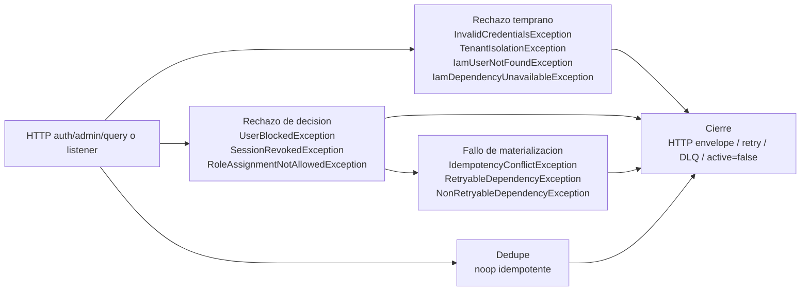

## Proposito
Definir el runtime tecnico completo de `identity-access-service`, alineado con la `Vista de Codigo` vigente y cerrando la trazabilidad entre `request`, `command/query`, `use case`, `result`, `response`, dominio, persistencia, cache, seguridad, outbox y eventos.

## Alcance y fronteras
- Incluye todos los casos de uso HTTP y politicas event-driven activas del MVP.
- Incluye `api-gateway-service` como borde obligatorio en el panorama global y como referencia canonica de los flujos HTTP.
- Incluye clases owner exactas de `Vista de Codigo`, mas cobertura explicita para soporte transversal y clases reservadas que no entran en runtime activo del MVP.
- Excluye detalle de despliegue y runtime interno de otros BC fuera de sus interacciones con IAM.

## Casos de uso cubiertos por IAM
| ID | Caso de uso | Trigger | Resultado esperado |
|---|---|---|---|
| UC-IAM-01 | Login de usuario B2B | `POST /api/v1/auth/login` | sesion activa + token de acceso/refresh |
| UC-IAM-02 | Refresh de sesion | `POST /api/v1/auth/refresh` | nuevo par de tokens sin duplicar sesion |
| UC-IAM-03 | Logout | `POST /api/v1/auth/logout` | sesion revocada y token inutilizable |
| UC-IAM-04 | Introspeccion de token | `POST /api/v1/auth/introspect` | estado de token + permisos efectivos |
| UC-IAM-05 | Asignar rol a usuario | `POST /api/v1/admin/iam/users/{userId}/roles` | rol asignado y permisos recalculados |
| UC-IAM-06 | Bloquear usuario y revocar sesiones | `POST /api/v1/admin/iam/users/{userId}/block` | usuario bloqueado + sesiones revocadas |
| UC-IAM-07 | Revocar sesiones por usuario | `POST /api/v1/admin/iam/users/{userId}/sessions/revoke` | sesiones activas a estado `REVOKED` |
| UC-IAM-08 | Consultar sesiones por usuario | `GET /api/v1/admin/iam/users/{userId}/sessions` | lista paginada de sesiones por estado |
| UC-IAM-09 | Consultar permisos efectivos por usuario | `GET /api/v1/admin/iam/users/{userId}/permissions` | conjunto consolidado de permisos efectivos |
| POL-IAM-01 | Reaccion a `OrganizationSuspended` | evento `directory.organization-suspended.v1` | usuarios del tenant bloqueados por lote |
| POL-IAM-02 | Contencion por umbral de `AuthFailed` | evento `iam.auth-failed.v1` / stream de incidentes | usuario bloqueado y sesiones revocadas |

## Regla de lectura de los diagramas
- Los diagramas usan nombres exactos de las clases owner documentadas en [02-Vista-de-Codigo.md](/Users/jose/Development/Documentation/arkab2b-docs/content/mvp/02-arquitectura/services/identity-access-service/architecture/02-Vista-de-Codigo.md).
- El `Panorama global` conserva la cadena HTTP completa: `api-gateway-service -> Request -> Controller -> Web Mapper -> Command/Query -> Port-In -> UseCase -> Assembler -> Ports/Adapters -> Result Mapper -> Result -> Response Mapper -> Response`.
- Los diagramas detallados por fases representan solo la arquitectura interna del servicio; por eso arrancan en `Request`, `Controller` o `Listener`, segun el caso.
- Las politicas event-driven pasan por `IamEventConsumer`, listeners especializados y dedupe de `ProcessedEvent*` antes de entrar a los casos de uso.
- Las clases que no son actores directos de un happy path se cierran en la seccion `Cobertura completa contra Vista de Codigo`.

## Modelo runtime de autenticacion y autorizacion
| Tipo de flujo | Regla aplicada |
|---|---|
| `Login`, `Refresh`, `Logout`, `Introspect` | `identity-access-service` autentica o verifica directamente el flujo porque es la autoridad de sesion y emision del token. |
| HTTP admin/query | `api-gateway-service` autentica el request; el servicio materializa `PrincipalContext`, resuelve el guard funcional base con `PermissionResolutionService` y valida `tenant`, permiso y legitimidad del actor dentro de `Contextualizacion` y `Decision` con `TenantIsolationPolicy` y `AuthorizationPolicy`. |
| listener de seguridad | No se asume JWT de usuario; el servicio materializa `TriggerContext` mediante `TriggerContextResolver`, valida trigger, dedupe y politica de seguridad antes de bloquear usuarios o revocar sesiones. |

## Modelo runtime de errores y excepciones
| Tipo de flujo | Regla aplicada |
|---|---|
| `Login`, `Refresh`, `Logout`, `Introspect` | `identity-access-service` autentica o verifica directamente el flujo y expresa rechazo temprano o de decision como familias semanticas canonicas; `WebExceptionHandlerConfig` cierra la traduccion HTTP cuando el caso entra por WebFlux. |
| HTTP admin/query | `api-gateway-service` autentica el request; el servicio materializa `PrincipalContext`, resuelve el guard funcional base y convierte rechazo temprano, decision o fallo tecnico en el envelope canonico. |
| listener de seguridad | `TriggerContext`, dedupe y politicas de seguridad emiten error semantico o `noop idempotente`; si el fallo es tecnico se clasifica como retryable/no-retryable para reintento o DLQ. |

### Diagrama runtime de excepciones concretas

## Patron de fases runtime
Los casos de uso de este servicio se documentan usando un patron de fases comun. La intencion es separar con claridad donde entra el caso, donde se prepara el contexto, donde se decide negocio y donde se materializan o propagan efectos.

| Fase | Que explica |
|---|---|
| `Ingreso` | Como entra el trigger al servicio y se convierte en un contrato de aplicacion. Incluye `request` o mensaje de entrada, `controller` o `listener`, mappers de entrada, `command/query` y `port in`. |
| `Preparacion` | Como el caso de uso transforma la entrada a contexto semantico interno. Incluye `use case`, `assembler`, `value objects` y contexto derivado del request. Aqui no se hace I/O externo. |
| `Contextualizacion` | Como el caso obtiene datos o validaciones tecnicas necesarias antes de decidir. Incluye `ports out`, `adapters out`, cache, repositorios, `clock`, verificacion criptografica y clientes externos. |
| `Decision` | Donde el dominio toma la decision real del caso. Incluye agregados, entidades, `value objects` de decision, politicas, servicios de dominio y eventos de dominio. Cuando intervienen varios agregados, la fase se divide por agregado. |
| `Materializacion` | Como se hace efectiva la decision ya tomada. Incluye persistencia de cambios, firma tecnica de tokens, auditoria, escritura en outbox e interacciones de salida posteriores a la decision. Aqui no se vuelve a decidir negocio. |
| `Proyeccion` | Como el estado final del caso se transforma en un `result` de aplicacion y despues en una salida consumible, normalmente una `response` HTTP. |
| `Propagacion` | Como los efectos asincronos ya materializados salen del servicio. Incluye relay de outbox, mappers de integracion, publicadores y envio al broker o canal externo. |

### Regla para rutas alternativas
- El flujo principal describe el `happy path`.
- Si una variante de rechazo corta el caso antes de completar todas las fases, se documenta como ruta alternativa explicita.
- Una ruta de rechazo debe indicar:
  - donde se corta el flujo
  - que fases ya no ocurren
  - que persistencia, auditoria, outbox o salida de error si ocurren

## Diagramas runtime por caso de uso


{}
{}
> El bloque `Exito` describe el `happy path` del login. El bloque `Rechazo` agrupa cuatro variantes: `Rechazo temprano`, `Rechazo de decision`, `Fallo de materializacion` y `Fallo de propagacion`. Por tanto, `Decision - Session`, `Materializacion`, `Proyeccion` y `Propagacion` del bloque `Exito` solo ocurren cuando la autenticacion es aceptada.

<table>
  <thead>
    <tr>
      <th>Etapa</th>
      <th>Clases para Login</th>
      <th>Responsabilidad</th>
    </tr>
  </thead>
  <tbody>
    <tr>
      <td>Ingreso</td>
      <td><code>LoginRequest</code>, <code>AuthHttpController</code>, <code>LoginCommandMapper</code>, <code>LoginCommand</code>, <code>LoginCommandUseCase</code></td>
      <td>Recibe el request ya dentro del servicio y lo convierte en la intencion formal que entra al caso de uso.</td>
    </tr>
    <tr>
      <td>Preparacion</td>
      <td><code>LoginUseCase</code>, <code>LoginCommandAssembler</code>, <code>TenantId</code>, <code>EmailAddress</code>, <code>ClientDevice</code>, <code>ClientIp</code></td>
      <td>Prepara el contexto semantico del caso, transforma el comando a tipos del dominio y deja listo el material para decidir.</td>
    </tr>
    <tr>
      <td>Contextualizacion - User</td>
      <td><code>SecurityRateLimitPort</code>, <code>UserPersistencePort</code>, <code>UserR2dbcRepositoryAdapter</code>, <code>ReactiveUserRepository</code>, <code>ReactiveUserCredentialRepository</code>, <code>ReactiveUserLoginAttemptRepository</code>, <code>UserRowMapper</code>, <code>UserRow</code>, <code>UserCredentialRow</code>, <code>UserLoginAttemptRow</code>, <code>PasswordHashPort</code>, <code>BCryptPasswordHasherAdapter</code></td>
      <td>Obtiene el contexto tecnico externo necesario para evaluar identidad y secreto: contencion, snapshot persistido, intentos previos y verificacion criptografica.</td>
    </tr>
    <tr>
      <td>Decision - User</td>
      <td><code>UserAggregate</code>, <code>UserCredential</code>, <code>UserLoginAttempt</code>, <code>UserId</code>, <code>UserStatus</code>, <code>CredentialStatus</code>, <code>PasswordPolicy</code></td>
      <td>Decide si el usuario puede autenticarse, registra el intento, verifica estado y cierra la validacion semantica de identidad.</td>
    </tr>
    <tr>
      <td>Contextualizacion - Session</td>
      <td><code>ClockPort</code>, <code>SystemClockAdapter</code></td>
      <td>Obtiene la referencia temporal externa que el agregado de sesion necesita para definir apertura, vigencia y expiracion.</td>
    </tr>
    <tr>
      <td>Decision - Session</td>
      <td><code>SessionPolicy</code>, <code>TokenPolicy</code>, <code>SessionAggregate</code>, <code>SessionId</code>, <code>AccessJti</code>, <code>RefreshJti</code>, <code>SessionTimestamps</code>, <code>SessionStatus</code>, <code>DomainEvent</code></td>
      <td>Solo si la autenticacion fue aceptada, decide la apertura de sesion, genera identificadores y deja emitido el evento de dominio de exito.</td>
    </tr>
    <tr>
      <td>Materializacion</td>
      <td><code>LoginUseCase</code>, <code>SessionPersistencePort</code>, <code>SessionR2dbcRepositoryAdapter</code>, <code>ReactiveSessionRepository</code>, <code>SessionRowMapper</code>, <code>SessionRow</code>, <code>JwtSigningPort</code>, <code>JwtSignerAdapter</code>, <code>SecurityAuditPort</code>, <code>AuthAuditR2dbcRepositoryAdapter</code>, <code>ReactiveAuthAuditRepository</code>, <code>AuthAuditRowMapper</code>, <code>AuthAuditRow</code>, <code>OutboxPersistencePort</code>, <code>OutboxPersistenceAdapter</code>, <code>ReactiveOutboxEventRepository</code>, <code>OutboxRowMapper</code>, <code>OutboxEventRow</code></td>
      <td>Solo en el happy path, hace efectiva la decision tomada: persiste la sesion, firma tokens, audita la operacion y deja el evento listo en outbox.</td>
    </tr>
    <tr>
      <td>Proyeccion</td>
      <td><code>LoginResultMapper</code>, <code>LoginResult</code>, <code>LoginResponseMapper</code>, <code>LoginResponse</code></td>
      <td>Solo en el happy path, convierte el estado final del caso de uso a salida de aplicacion y luego al contrato HTTP de respuesta.</td>
    </tr>
    <tr>
      <td>Propagacion</td>
      <td><code>DomainEvent</code>, <code>UserLoggedInEvent</code>, <code>OutboxEventRelayPublisher</code>, <code>DomainEventKafkaMapper</code>, <code>DomainEventPublisherPort</code>, <code>KafkaDomainEventPublisherAdapter</code></td>
      <td>Solo en el happy path, especializa y publica el evento de login exitoso una vez la decision ya fue materializada.</td>
    </tr>
    <tr>
      <td>Rechazo temprano</td>
      <td><code>LoginUseCase</code>, <code>SecurityRateLimitPort</code>, <code>SecurityAuditPort</code>, <code>AuthHttpController</code>, <code>WebExceptionHandlerConfig</code></td>
      <td>Variante alternativa previa al dominio. El flujo se corta en la contextualizacion cuando una contencion tecnica impide continuar la autenticacion y la capa web devuelve error HTTP.</td>
    </tr>
    <tr>
      <td>Rechazo de decision</td>
      <td><code>LoginUseCase</code>, <code>UserAggregate</code>, <code>UserLoginAttempt</code>, <code>UserStatus</code>, <code>PasswordPolicy</code>, <code>DomainEvent</code>, <code>LoginFailedEvent</code>, <code>UserPersistencePort</code>, <code>SecurityAuditPort</code>, <code>OutboxPersistencePort</code>, <code>AuthHttpController</code>, <code>WebExceptionHandlerConfig</code></td>
      <td>Variante alternativa de dominio. El flujo se corta tras `Decision - User`, persiste el intento fallido, audita, deja evento de rechazo y la capa web devuelve error HTTP.</td>
    </tr>
    <tr>
      <td>Fallo de materializacion</td>
      <td><code>LoginUseCase</code>, <code>SessionPersistencePort</code>, <code>JwtSigningPort</code>, <code>SecurityAuditPort</code>, <code>OutboxPersistencePort</code>, <code>AuthHttpController</code>, <code>WebExceptionHandlerConfig</code></td>
      <td>Variante tecnica posterior a la decision. Un error durante persistencia, firma, auditoria u outbox corta el happy path y la capa web devuelve error HTTP.</td>
    </tr>
    <tr>
      <td>Fallo de propagacion</td>
      <td><code>OutboxEventRelayPublisher</code>, <code>OutboxEventRow</code>, <code>DomainEventKafkaMapper</code>, <code>DomainEventPublisherPort</code>, <code>KafkaDomainEventPublisherAdapter</code></td>
      <td>Fallo tecnico asincrono del relay. El login HTTP ya se completo, pero el evento queda pendiente para reintento de publicacion.</td>
    </tr>
  </tbody>
</table>
{}
{}
{}
{}

sequenceDiagram
  participant REQ as LoginRequest
  participant CTRL as AuthHttpController
  participant MAP as LoginCommandMapper
  participant CMD as LoginCommand
  participant PIN as LoginCommandUseCase
  REQ->>CTRL: recibe request
  CTRL->>MAP: mapea request
  MAP->>CMD: crea command
  CMD->>PIN: invoca port in


**Descripcion de la fase.** Recibe el trigger del caso y lo traduce al contrato de aplicacion que inicia el flujo interno.

**Capa predominante.** Se ubica principalmente en `Adapter-in`, con cruce controlado hacia el puerto de entrada de `Application service`.

<table>
  <thead>
    <tr>
      <th>Paso</th>
      <th>Clase</th>
      <th>Accion</th>
    </tr>
  </thead>
  <tbody>
    <tr>
      <td>1</td>
      <td><code>LoginRequest</code></td>
      <td>Representa el contrato de entrada del login ya deserializado por la capa web. Contiene los datos del cuerpo HTTP que el servicio necesita para iniciar la autenticacion.</td>
    </tr>
    <tr>
      <td>2</td>
      <td><code>AuthHttpController</code></td>
      <td>Recibe el request de login dentro del servicio y coordina la entrada al flujo de aplicacion. Actua como adaptador web de entrada sin mezclar reglas de negocio.</td>
    </tr>
    <tr>
      <td>3</td>
      <td><code>LoginCommandMapper</code></td>
      <td>Traduce el contrato HTTP a un contrato de aplicacion. Convierte la forma de transporte del request a un comando coherente con el caso de uso.</td>
    </tr>
    <tr>
      <td>4</td>
      <td><code>LoginCommand</code></td>
      <td>Formaliza la intencion de login en la capa de aplicacion. Encapsula los datos de entrada con el significado necesario para iniciar el caso de uso.</td>
    </tr>
    <tr>
      <td>5</td>
      <td><code>LoginCommandUseCase</code></td>
      <td>Expone el puerto de entrada del comando de login. Marca el punto formal donde la capa web entrega el control a la aplicacion.</td>
    </tr>
  </tbody>
</table>
{}
{}

sequenceDiagram
  participant PIN as LoginCommandUseCase
  participant UC as LoginUseCase
  participant ASM as LoginCommandAssembler
  participant TID as TenantId
  participant EMAIL as EmailAddress
  participant DEV as ClientDevice
  participant IP as ClientIp
  PIN->>UC: ejecuta caso de uso
  UC->>ASM: ensambla contexto
  ASM->>TID: crea tenant id
  ASM->>EMAIL: crea email
  ASM->>DEV: crea client device
  ASM->>IP: crea client ip


**Descripcion de la fase.** Normaliza la intencion del caso y construye contexto semantico interno sin hacer I/O externo.

**Capa predominante.** Se ubica principalmente en `Application service`, con apoyo de tipos del `Domain`.

<table>
  <thead>
    <tr>
      <th>Paso</th>
      <th>Clase</th>
      <th>Accion</th>
    </tr>
  </thead>
  <tbody>
    <tr>
      <td>1</td>
      <td><code>LoginCommandUseCase</code></td>
      <td>Recibe el comando de login desde el adapter de entrada y delega la ejecucion al caso de uso concreto. Formaliza la entrada a la aplicacion reactiva.</td>
    </tr>
    <tr>
      <td>2</td>
      <td><code>LoginUseCase</code></td>
      <td>Inicia la preparacion semantica del caso. Toma el comando recibido y organiza la construccion del contexto interno antes de consultar dependencias externas o decidir en dominio.</td>
    </tr>
    <tr>
      <td>3</td>
      <td><code>LoginCommandAssembler</code></td>
      <td>Construye tipos semanticos a partir del comando de aplicacion. Aisla al caso de uso de conversiones repetitivas y deja listo un contexto expresado en objetos del dominio.</td>
    </tr>
    <tr>
      <td>4</td>
      <td><code>TenantId</code></td>
      <td>Representa el tenant desde el punto de vista del dominio. Permite que la autenticacion quede contextualizada desde el inicio en el alcance correcto.</td>
    </tr>
    <tr>
      <td>5</td>
      <td><code>EmailAddress</code></td>
      <td>Representa la credencial de acceso ya normalizada como valor del dominio. Evita que la decision trabaje directamente con cadenas sin semantica.</td>
    </tr>
    <tr>
      <td>6</td>
      <td><code>ClientDevice</code></td>
      <td>Representa el dispositivo de origen del intento. Aporta contexto semantico para sesion, auditoria y controles de seguridad.</td>
    </tr>
    <tr>
      <td>7</td>
      <td><code>ClientIp</code></td>
      <td>Representa la IP del cliente como valor del dominio o de aplicacion. Permite conservar el origen tecnico del intento para controles de abuso y trazabilidad.</td>
    </tr>
  </tbody>
</table>
{}
{}

sequenceDiagram
  participant UC as LoginUseCase
  participant RLIM as SecurityRateLimitPort
  participant USERP as UserPersistencePort
  participant USERA as UserR2dbcRepositoryAdapter
  participant RUR as ReactiveUserRepository
  participant RUCR as ReactiveUserCredentialRepository
  participant RULR as ReactiveUserLoginAttemptRepository
  participant URM as UserRowMapper
  participant UR as UserRow
  participant UCR as UserCredentialRow
  participant ULR as UserLoginAttemptRow
  participant HASHP as PasswordHashPort
  participant HASHA as BCryptPasswordHasherAdapter
  UC->>RLIM: consulta rate limit
  UC->>USERP: carga usuario
  USERP->>USERA: delega lectura
  USERA->>RUR: busca user row
  USERA->>RUCR: busca credential row
  USERA->>RULR: busca login attempts
  USERA->>URM: recompone dominio
  URM->>UR: usa user row
  URM->>UCR: usa credential row
  URM->>ULR: usa attempt row
  UC->>HASHP: valida password
  HASHP->>HASHA: compara hash


**Descripcion de la fase.** Recupera el estado tecnico y persistido del usuario que el caso necesita antes de decidir.

**Capa predominante.** Se ubica entre `Application service` y `Adapter-out`, preparando insumos para `Domain`.

<table>
  <thead>
    <tr>
      <th>Paso</th>
      <th>Clase</th>
      <th>Accion</th>
    </tr>
  </thead>
  <tbody>
    <tr>
      <td>1</td>
      <td><code>LoginUseCase</code></td>
      <td>Coordina la fase de contextualizacion del usuario. Solicita los datos tecnicos previos a la decision y consolida las dependencias externas que el dominio necesita para evaluar la autenticacion.</td>
    </tr>
    <tr>
      <td>2</td>
      <td><code>SecurityRateLimitPort</code></td>
      <td>Expone la verificacion de contencion o limite de intentos. Permite saber si el login puede seguir evaluandose o si debe ser frenado por una restriccion tecnica previa.</td>
    </tr>
    <tr>
      <td>3</td>
      <td><code>UserPersistencePort</code></td>
      <td>Representa el punto de acceso de aplicacion para recuperar el estado persistido del usuario, su credencial activa y el historial reciente de intentos necesarios para decidir.</td>
    </tr>
    <tr>
      <td>4</td>
      <td><code>UserR2dbcRepositoryAdapter</code></td>
      <td>Implementa el puerto de persistencia usando acceso reactivo a base de datos. Orquesta las consultas necesarias para recomponer el estado del agregado de usuario desde varias tablas.</td>
    </tr>
    <tr>
      <td>5</td>
      <td><code>ReactiveUserRepository</code></td>
      <td>Consulta la fila principal del usuario. Entrega los datos base de identidad y estado general requeridos por el agregado.</td>
    </tr>
    <tr>
      <td>6</td>
      <td><code>ReactiveUserCredentialRepository</code></td>
      <td>Obtiene la credencial vigente del usuario, incluyendo el hash persistido y los datos tecnicos asociados a su validez.</td>
    </tr>
    <tr>
      <td>7</td>
      <td><code>ReactiveUserLoginAttemptRepository</code></td>
      <td>Recupera el historial o snapshot de intentos de autenticacion para que el flujo pueda evaluar umbrales, contencion y bloqueo progresivo.</td>
    </tr>
    <tr>
      <td>8</td>
      <td><code>UserRowMapper</code></td>
      <td>Transforma las filas recuperadas desde persistencia a estructuras que el dominio puede consumir sin depender de detalles de almacenamiento.</td>
    </tr>
    <tr>
      <td>9</td>
      <td><code>UserRow</code></td>
      <td>Representa la fila principal del usuario almacenada en persistencia. Aporta identidad, tenant y estado base del usuario autenticable.</td>
    </tr>
    <tr>
      <td>10</td>
      <td><code>UserCredentialRow</code></td>
      <td>Representa la fila de credencial persistida. Aporta el hash y el estado tecnico de la credencial que se contrasta contra el secreto recibido.</td>
    </tr>
    <tr>
      <td>11</td>
      <td><code>UserLoginAttemptRow</code></td>
      <td>Representa la persistencia de intentos de autenticacion. Aporta el contexto tecnico necesario para evaluar abuso, enfriamiento o bloqueo.</td>
    </tr>
    <tr>
      <td>12</td>
      <td><code>PasswordHashPort</code></td>
      <td>Expone la validacion tecnica del secreto sin acoplar el caso de uso a una estrategia criptografica concreta. Su resultado alimenta la decision del dominio.</td>
    </tr>
    <tr>
      <td>13</td>
      <td><code>BCryptPasswordHasherAdapter</code></td>
      <td>Implementa la comparacion real del password contra el hash persistido usando BCrypt. Resuelve la verificacion criptografica antes de entrar a la decision semantica.</td>
    </tr>
  </tbody>
</table>
{}
{}

sequenceDiagram
  participant UC as LoginUseCase
  participant UAG as UserAggregate
  participant CRE as UserCredential
  participant ATT as UserLoginAttempt
  participant UID as UserId
  participant UST as UserStatus
  participant CST as CredentialStatus
  participant PASSPOL as PasswordPolicy
  UC->>UAG: evalua autenticacion
  UAG->>CRE: valida credencial
  UAG->>ATT: registra intento
  UAG->>UID: conserva identidad
  UAG->>UST: verifica estado
  CRE->>CST: valida estado
  UAG->>PASSPOL: aplica politica


**Descripcion de la fase.** Resuelve la decision de negocio sobre identidad y estado de usuario con el contexto ya reunido.

**Capa predominante.** Se ubica principalmente en `Domain`, orquestada por `Application service`.

<table>
  <thead>
    <tr>
      <th>Paso</th>
      <th>Clase</th>
      <th>Accion</th>
    </tr>
  </thead>
  <tbody>
    <tr>
      <td>1</td>
      <td><code>LoginUseCase</code></td>
      <td>Entrega al dominio el contexto ya preparado y los resultados tecnicos previos. En esta fase ya no busca datos externos; solo activa la decision semantica del modelo de identidad.</td>
    </tr>
    <tr>
      <td>2</td>
      <td><code>UserAggregate</code></td>
      <td>Centraliza la decision de autenticacion del usuario. Evalua si el actor puede ingresar, coordina el uso de la credencial y registra el resultado del intento dentro del agregado.</td>
    </tr>
    <tr>
      <td>3</td>
      <td><code>UserCredential</code></td>
      <td>Representa la credencial del usuario en terminos de dominio. Determina si la credencial sigue vigente, habilitada y coherente con la politica de autenticacion.</td>
    </tr>
    <tr>
      <td>4</td>
      <td><code>UserLoginAttempt</code></td>
      <td>Modela el intento actual dentro del dominio. Permite registrar el nuevo intento y reflejar su efecto en el estado semantico del usuario.</td>
    </tr>
    <tr>
      <td>5</td>
      <td><code>UserId</code></td>
      <td>Preserva la identidad fuerte del usuario dentro de la decision. Permite que el agregado mantenga la referencia consistente al actor autenticable.</td>
    </tr>
    <tr>
      <td>6</td>
      <td><code>UserStatus</code></td>
      <td>Expresa el estado semantico del usuario. Se usa para determinar si la cuenta esta habilitada, bloqueada o en una condicion que impide el acceso.</td>
    </tr>
    <tr>
      <td>7</td>
      <td><code>CredentialStatus</code></td>
      <td>Expresa el estado semantico de la credencial. Complementa la validacion del secreto indicando si la credencial puede seguir usandose.</td>
    </tr>
    <tr>
      <td>8</td>
      <td><code>PasswordPolicy</code></td>
      <td>Encapsula la regla de negocio asociada a la aceptacion o rechazo de la credencial. Define el criterio final que habilita o corta la autenticacion desde el punto de vista del dominio.</td>
    </tr>
  </tbody>
</table>
{}
{}

sequenceDiagram
  participant UC as LoginUseCase
  participant CLOCKP as ClockPort
  participant CLOCKA as SystemClockAdapter
  UC->>CLOCKP: solicita tiempo oficial
  CLOCKP->>CLOCKA: obtiene hora actual


**Descripcion de la fase.** Recupera el estado tecnico y persistido de la sesion antes de la decision de negocio o de seguridad.

**Capa predominante.** Se ubica entre `Application service` y `Adapter-out`, preparando insumos para `Domain`.

<table>
  <thead>
    <tr>
      <th>Paso</th>
      <th>Clase</th>
      <th>Accion</th>
    </tr>
  </thead>
  <tbody>
    <tr>
      <td>1</td>
      <td><code>LoginUseCase</code></td>
      <td>Solicita el contexto temporal externo que necesita el modelo de sesion antes de decidir apertura, vigencia y expiracion de la nueva sesion.</td>
    </tr>
    <tr>
      <td>2</td>
      <td><code>ClockPort</code></td>
      <td>Expone el acceso al tiempo oficial sin acoplar el caso de uso a una fuente concreta. Entrega la referencia temporal que utilizara el agregado de sesion.</td>
    </tr>
    <tr>
      <td>3</td>
      <td><code>SystemClockAdapter</code></td>
      <td>Implementa la resolucion de la hora efectiva del sistema. Materializa la referencia temporal que despues sera consumida por las politicas y el agregado de sesion.</td>
    </tr>
  </tbody>
</table>
{}
{}

sequenceDiagram
  participant UC as LoginUseCase
  participant SESSPOL as SessionPolicy
  participant TOKPOL as TokenPolicy
  participant SAG as SessionAggregate
  participant SID as SessionId
  participant AJTI as AccessJti
  participant RJTI as RefreshJti
  participant STAMP as SessionTimestamps
  participant SSTAT as SessionStatus
  participant DEVT as DomainEvent
  UC->>SESSPOL: evalua apertura
  UC->>TOKPOL: resuelve reglas de token
  UC->>SAG: abre sesion
  SAG->>SID: genera session id
  SAG->>AJTI: genera access jti
  SAG->>RJTI: genera refresh jti
  SAG->>STAMP: fija timestamps
  SAG->>SSTAT: define estado
  SAG->>DEVT: emite evento


**Descripcion de la fase.** Resuelve la decision de negocio sobre ciclo de vida o estado de sesion con el contexto ya reunido.

**Capa predominante.** Se ubica principalmente en `Domain`, orquestada por `Application service`.

<table>
  <thead>
    <tr>
      <th>Paso</th>
      <th>Clase</th>
      <th>Accion</th>
    </tr>
  </thead>
  <tbody>
    <tr>
      <td>1</td>
      <td><code>LoginUseCase</code></td>
      <td>Activa la decision del agregado de sesion con el usuario ya validado y el tiempo ya resuelto. En esta fase no decide por si mismo; entrega al dominio el contexto listo para abrir o no la sesion.</td>
    </tr>
    <tr>
      <td>2</td>
      <td><code>SessionPolicy</code></td>
      <td>Define las reglas semanticas que gobiernan si una sesion puede abrirse, bajo que condiciones nace y en que contexto queda asociada al usuario autenticado.</td>
    </tr>
    <tr>
      <td>3</td>
      <td><code>TokenPolicy</code></td>
      <td>Define las reglas que afectan la generacion logica de identificadores de token y su coherencia con la sesion resultante.</td>
    </tr>
    <tr>
      <td>4</td>
      <td><code>SessionAggregate</code></td>
      <td>Centraliza la decision de apertura de sesion. Con el usuario ya validado y el tiempo disponible, construye la nueva sesion y emite el evento de dominio correspondiente.</td>
    </tr>
    <tr>
      <td>5</td>
      <td><code>SessionId</code></td>
      <td>Representa la identidad estable de la sesion creada. Queda fijada por el agregado como referencia principal del ciclo de vida de la sesion.</td>
    </tr>
    <tr>
      <td>6</td>
      <td><code>AccessJti</code></td>
      <td>Representa el identificador del token de acceso derivado de la decision del agregado. Permite rastrear y controlar el token emitido.</td>
    </tr>
    <tr>
      <td>7</td>
      <td><code>RefreshJti</code></td>
      <td>Representa el identificador del token de refresh asociado a la nueva sesion. Complementa la identidad tecnica del par de tokens emitido.</td>
    </tr>
    <tr>
      <td>8</td>
      <td><code>SessionTimestamps</code></td>
      <td>Encapsula las marcas temporales de apertura y expiracion calculadas para la sesion. Formaliza en el dominio la ventana de validez resultante.</td>
    </tr>
    <tr>
      <td>9</td>
      <td><code>SessionStatus</code></td>
      <td>Expresa el estado semantico final de la sesion tras la decision. Permite dejarla formalmente activa o en la condicion que corresponda.</td>
    </tr>
    <tr>
      <td>10</td>
      <td><code>DomainEvent</code></td>
      <td>Actua como la abstraccion del evento nacido de la decision del agregado. Captura el resultado relevante del login para que luego pueda materializarse y propagarse.</td>
    </tr>
  </tbody>
</table>
{}
{}

sequenceDiagram
  participant UC as LoginUseCase
  participant SESSP as SessionPersistencePort
  participant SESSA as SessionR2dbcRepositoryAdapter
  participant RSR as ReactiveSessionRepository
  participant SRM as SessionRowMapper
  participant SR as SessionRow
  participant JWTP as JwtSigningPort
  participant JWTA as JwtSignerAdapter
  participant AUDP as SecurityAuditPort
  participant AUDA as AuthAuditR2dbcRepositoryAdapter
  participant RAAR as ReactiveAuthAuditRepository
  participant AARM as AuthAuditRowMapper
  participant AAR as AuthAuditRow
  participant OUTP as OutboxPersistencePort
  participant OUTA as OutboxPersistenceAdapter
  participant ROER as ReactiveOutboxEventRepository
  participant ORM as OutboxRowMapper
  participant OER as OutboxEventRow
  UC->>SESSP: persiste sesion
  SESSP->>SESSA: delega persistencia
  SESSA->>RSR: guarda sesion
  SESSA->>SRM: mapea sesion
  SRM->>SR: crea session row
  UC->>JWTP: firma tokens
  JWTP->>JWTA: genera jwt
  UC->>AUDP: registra auditoria
  AUDP->>AUDA: delega auditoria
  AUDA->>RAAR: guarda auditoria
  AUDA->>AARM: mapea auditoria
  AARM->>AAR: crea audit row
  UC->>OUTP: guarda outbox
  OUTP->>OUTA: delega outbox
  OUTA->>ROER: guarda evento
  OUTA->>ORM: mapea evento
  ORM->>OER: crea outbox row


**Descripcion de la fase.** Hace efectivos los cambios ya decididos: persistencia, cache, auditoria, outbox o firma tecnica, segun el caso.

**Capa predominante.** Se ubica en la frontera entre `Application service` y `Adapter-out`.

<table>
  <thead>
    <tr>
      <th>Paso</th>
      <th>Clase</th>
      <th>Accion</th>
    </tr>
  </thead>
  <tbody>
    <tr>
      <td>1</td>
      <td><code>LoginUseCase</code></td>
      <td>Orquesta la materializacion del resultado ya decidido por el dominio. Coordina persistencia, firma de tokens, auditoria y escritura en outbox sin reabrir la decision de negocio.</td>
    </tr>
    <tr>
      <td>2</td>
      <td><code>SessionPersistencePort</code></td>
      <td>Expone la persistencia de la sesion como una capacidad de aplicacion. Permite almacenar el nuevo estado de sesion sin acoplar el caso de uso a la tecnologia concreta.</td>
    </tr>
    <tr>
      <td>3</td>
      <td><code>SessionR2dbcRepositoryAdapter</code></td>
      <td>Implementa la persistencia reactiva de la sesion. Traduce la necesidad de guardar la sesion al acceso concreto a repositorios y mapeadores de base de datos.</td>
    </tr>
    <tr>
      <td>4</td>
      <td><code>ReactiveSessionRepository</code></td>
      <td>Realiza la operacion reactiva de almacenamiento de la sesion materializada. Es el punto concreto de escritura de la fila de sesion.</td>
    </tr>
    <tr>
      <td>5</td>
      <td><code>SessionRowMapper</code></td>
      <td>Convierte la sesion del dominio a la estructura persistible requerida por la base de datos. Separa el modelo de dominio de su representacion tabular.</td>
    </tr>
    <tr>
      <td>6</td>
      <td><code>SessionRow</code></td>
      <td>Representa la fila concreta que sera almacenada para la sesion. Contiene la proyeccion persistible del estado decidido por el agregado.</td>
    </tr>
    <tr>
      <td>7</td>
      <td><code>JwtSigningPort</code></td>
      <td>Expone la firma tecnica del par de tokens resultante. Permite que la emision criptografica ocurra como una capacidad externa a la logica de dominio.</td>
    </tr>
    <tr>
      <td>8</td>
      <td><code>JwtSignerAdapter</code></td>
      <td>Implementa la firma real de tokens con la estrategia configurada. Produce los JWT que quedaran asociados a la sesion ya decidida.</td>
    </tr>
    <tr>
      <td>9</td>
      <td><code>SecurityAuditPort</code></td>
      <td>Expone el registro de auditoria del login como capacidad de aplicacion. Permite dejar trazabilidad de seguridad sin ensuciar la decision del dominio.</td>
    </tr>
    <tr>
      <td>10</td>
      <td><code>AuthAuditR2dbcRepositoryAdapter</code></td>
      <td>Implementa la persistencia reactiva de auditoria. Toma la evidencia del caso y la conduce hacia la representacion almacenada.</td>
    </tr>
    <tr>
      <td>11</td>
      <td><code>ReactiveAuthAuditRepository</code></td>
      <td>Ejecuta la escritura reactiva de la auditoria en persistencia. Es el punto concreto donde queda guardado el rastro del login.</td>
    </tr>
    <tr>
      <td>12</td>
      <td><code>AuthAuditRowMapper</code></td>
      <td>Transforma la evidencia de auditoria al formato tabular requerido por persistencia. Aisla el modelo de aplicacion de la estructura fisica de almacenamiento.</td>
    </tr>
    <tr>
      <td>13</td>
      <td><code>AuthAuditRow</code></td>
      <td>Representa la fila persistible de auditoria. Conserva la evidencia concreta del intento y del resultado del login.</td>
    </tr>
    <tr>
      <td>14</td>
      <td><code>OutboxPersistencePort</code></td>
      <td>Expone el almacenamiento transaccional del evento en outbox. Permite separar la decision del dominio de su futura publicacion asincrona.</td>
    </tr>
    <tr>
      <td>15</td>
      <td><code>OutboxPersistenceAdapter</code></td>
      <td>Implementa la persistencia reactiva del outbox. Traduce el evento decidido a la estructura requerida para integracion diferida.</td>
    </tr>
    <tr>
      <td>16</td>
      <td><code>ReactiveOutboxEventRepository</code></td>
      <td>Ejecuta la escritura reactiva del evento en la tabla de outbox. Deja el mensaje listo para que un relay posterior lo publique.</td>
    </tr>
    <tr>
      <td>17</td>
      <td><code>OutboxRowMapper</code></td>
      <td>Convierte el evento de dominio a una fila de integracion persistible. Asegura que el evento salga del dominio con un formato apto para relay.</td>
    </tr>
    <tr>
      <td>18</td>
      <td><code>OutboxEventRow</code></td>
      <td>Representa la fila concreta del outbox que quedara almacenada tras el login. Es la base tecnica sobre la que luego opera la fase de propagacion.</td>
    </tr>
  </tbody>
</table>
{}
{}

sequenceDiagram
  participant UC as LoginUseCase
  participant RMAP as LoginResultMapper
  participant RES as LoginResult
  participant RESPMAP as LoginResponseMapper
  participant RESP as LoginResponse
  UC->>RMAP: proyecta resultado
  RMAP->>RES: crea result
  RES->>RESPMAP: adapta respuesta
  RESPMAP->>RESP: crea response


**Descripcion de la fase.** Transforma el estado final del caso a `result` y luego a `response` consumible.

**Capa predominante.** Se ubica entre `Application service` y `Adapter-in`.

<table>
  <thead>
    <tr>
      <th>Paso</th>
      <th>Clase</th>
      <th>Accion</th>
    </tr>
  </thead>
  <tbody>
    <tr>
      <td>1</td>
      <td><code>LoginUseCase</code></td>
      <td>Entrega el estado final del caso exitoso a la fase de proyeccion. En este punto la decision ya fue materializada y solo resta adaptar la salida para el consumidor HTTP.</td>
    </tr>
    <tr>
      <td>2</td>
      <td><code>LoginResultMapper</code></td>
      <td>Transforma el estado interno del login a un resultado de aplicacion estable. Separa la salida del caso de uso de los detalles del contrato web.</td>
    </tr>
    <tr>
      <td>3</td>
      <td><code>LoginResult</code></td>
      <td>Representa la salida de aplicacion del login. Encapsula la informacion relevante del caso exitoso antes de convertirla a respuesta HTTP.</td>
    </tr>
    <tr>
      <td>4</td>
      <td><code>LoginResponseMapper</code></td>
      <td>Adapta el resultado de aplicacion al contrato de respuesta web. Permite que la capa HTTP mantenga su forma propia sin contaminar el caso de uso.</td>
    </tr>
    <tr>
      <td>5</td>
      <td><code>LoginResponse</code></td>
      <td>Representa la respuesta HTTP tipada del login exitoso. Es la forma final que el controller devuelve al consumidor del endpoint.</td>
    </tr>
  </tbody>
</table>
{}
{}

sequenceDiagram
  participant DEVT as DomainEvent
  participant OK as UserLoggedInEvent
  participant OER as OutboxEventRow
  participant RELAY as OutboxEventRelayPublisher
  participant MAPEV as DomainEventKafkaMapper
  participant PUBP as DomainEventPublisherPort
  participant PUBA as KafkaDomainEventPublisherAdapter
  DEVT->>OK: especializa exito
  OK->>OER: queda en outbox
  RELAY->>OER: carga evento pendiente
  RELAY->>MAPEV: mapea mensaje
  RELAY->>PUBP: publica evento
  PUBP->>PUBA: envia a kafka


**Descripcion de la fase.** Publica efectos asincronos ya materializados desde outbox o infraestructura de mensajeria.

**Capa predominante.** Se ubica principalmente en `Adapter-out`, con coordinacion de componentes de integracion.

<table>
  <thead>
    <tr>
      <th>Paso</th>
      <th>Clase</th>
      <th>Accion</th>
    </tr>
  </thead>
  <tbody>
    <tr>
      <td>1</td>
      <td><code>DomainEvent</code></td>
      <td>Actua como la abstraccion del evento producido por el dominio y ya materializado en outbox. Sirve como punto de partida para la propagacion asincrona del resultado exitoso.</td>
    </tr>
    <tr>
      <td>2</td>
      <td><code>UserLoggedInEvent</code></td>
      <td>Representa la especializacion concreta del evento de login exitoso. Hace explicito el hecho de negocio que sera integrado con otros bounded contexts.</td>
    </tr>
    <tr>
      <td>3</td>
      <td><code>OutboxEventRow</code></td>
      <td>Representa la fila persistida desde la que parte realmente la propagacion. Hace explicito que el relay no publica el evento en memoria, sino la version ya materializada en outbox.</td>
    </tr>
    <tr>
      <td>4</td>
      <td><code>OutboxEventRelayPublisher</code></td>
      <td>Recupera el evento ya persistido en outbox y coordina su relay hacia la infraestructura de mensajeria. Desacopla la transaccion del caso de uso de la publicacion final.</td>
    </tr>
    <tr>
      <td>5</td>
      <td><code>DomainEventKafkaMapper</code></td>
      <td>Transforma el evento de dominio a un mensaje publicable en Kafka. Adecua el formato interno del dominio al contrato de integracion.</td>
    </tr>
    <tr>
      <td>6</td>
      <td><code>DomainEventPublisherPort</code></td>
      <td>Expone la publicacion del evento como capacidad de aplicacion o integracion. Permite que el relay delegue la entrega sin acoplarse a un broker concreto.</td>
    </tr>
    <tr>
      <td>7</td>
      <td><code>KafkaDomainEventPublisherAdapter</code></td>
      <td>Implementa la publicacion concreta del evento hacia Kafka. Es el ultimo paso de la propagacion del resultado exitoso del login.</td>
    </tr>
  </tbody>
</table>
{}
{}
{}
{}
{}
{}

sequenceDiagram
  participant UC as LoginUseCase
  participant RLIM as SecurityRateLimitPort
  participant AUDP as SecurityAuditPort
  participant CTRL as AuthHttpController
  participant ERR as WebExceptionHandlerConfig
  UC->>RLIM: verifica contencion
  RLIM-->>UC: rechaza intento
  UC->>AUDP: registra auditoria
  UC-->>CTRL: propaga error
  Note over CTRL,ERR: la capa web traduce el error a HTTP


**Descripcion de la fase.** Describe el corte del flujo antes de la decision de dominio por falta de contexto valido, duplicidad o validacion tecnica previa.

**Capa predominante.** Se ubica en la frontera entre `Application service` y `Adapter-out`; si el trigger es HTTP, la salida final la resuelve `Adapter-in`.

<table>
  <thead>
    <tr>
      <th>Paso</th>
      <th>Clase</th>
      <th>Accion</th>
    </tr>
  </thead>
  <tbody>
    <tr>
      <td>1</td>
      <td><code>LoginUseCase</code></td>
      <td>Coordina la variante de rechazo temprano. Detecta que la autenticacion no puede seguir evaluandose por una restriccion tecnica previa y corta el flujo antes de entrar al dominio de identidad.</td>
    </tr>
    <tr>
      <td>2</td>
      <td><code>SecurityRateLimitPort</code></td>
      <td>Evalua la contencion tecnica del login. Si el umbral o politica de limite esta activa, informa al caso de uso que debe terminar el flujo antes de `Decision - User`.</td>
    </tr>
    <tr>
      <td>3</td>
      <td><code>SecurityAuditPort</code></td>
      <td>Registra la evidencia del rechazo temprano para dejar trazabilidad de seguridad incluso cuando no se llego a ejecutar la decision del dominio.</td>
    </tr>
    <tr>
      <td>4</td>
      <td><code>AuthHttpController</code></td>
      <td>Recibe el error reactivo propagado por el caso de uso dentro de la cadena web. No decide el rechazo, pero es el punto donde la capa HTTP recibe el resultado fallido.</td>
    </tr>
    <tr>
      <td>5</td>
      <td><code>WebExceptionHandlerConfig</code></td>
      <td>Traduce la condicion de rechazo temprano a una salida HTTP coherente. No es invocada directamente por <code>LoginUseCase</code>; participa como infraestructura de manejo de errores de la capa web.</td>
    </tr>
  </tbody>
</table>
{}
{}

sequenceDiagram
  participant UC as LoginUseCase
  participant UAG as UserAggregate
  participant ATT as UserLoginAttempt
  participant UST as UserStatus
  participant PASSPOL as PasswordPolicy
  participant DEVT as DomainEvent
  participant FAIL as LoginFailedEvent
  participant USERP as UserPersistencePort
  participant AUDP as SecurityAuditPort
  participant OUTP as OutboxPersistencePort
  participant CTRL as AuthHttpController
  participant ERR as WebExceptionHandlerConfig
  UC->>UAG: rechaza autenticacion
  UAG->>ATT: registra fallo
  UAG->>UST: actualiza estado
  UAG->>PASSPOL: aplica politica
  UAG->>DEVT: emite evento
  DEVT->>FAIL: especializa rechazo
  UC->>USERP: persiste intento
  UC->>AUDP: registra auditoria
  UC->>OUTP: guarda outbox
  UC-->>CTRL: propaga error
  Note over CTRL,ERR: la capa web traduce el error a HTTP


**Descripcion de la fase.** Describe el corte del flujo por una decision negativa de negocio o politica una vez el contexto ya fue reunido.

**Capa predominante.** Se ubica principalmente en `Domain`, con salida de error resuelta por `Application service` y, si aplica, `Adapter-in`.

<table>
  <thead>
    <tr>
      <th>Paso</th>
      <th>Clase</th>
      <th>Accion</th>
    </tr>
  </thead>
  <tbody>
    <tr>
      <td>1</td>
      <td><code>LoginUseCase</code></td>
      <td>Coordina la variante de rechazo. Corta el happy path cuando la autenticacion no puede aceptarse y orquesta la persistencia, auditoria y salida de error sin entrar a la fase de sesion.</td>
    </tr>
    <tr>
      <td>2</td>
      <td><code>UserAggregate</code></td>
      <td>Resuelve la decision negativa de autenticacion. Determina que el usuario no puede ingresar con el contexto recibido y produce el resultado semantico de rechazo.</td>
    </tr>
    <tr>
      <td>3</td>
      <td><code>UserLoginAttempt</code></td>
      <td>Registra el intento fallido dentro del dominio. Refleja el impacto del rechazo en el historial del usuario y en el control de abuso.</td>
    </tr>
    <tr>
      <td>4</td>
      <td><code>UserStatus</code></td>
      <td>Expone el estado resultante del usuario tras el intento fallido. Permite modelar si la cuenta sigue habilitada o pasa a una condicion mas restrictiva.</td>
    </tr>
    <tr>
      <td>5</td>
      <td><code>PasswordPolicy</code></td>
      <td>Formaliza la regla que sostiene el rechazo desde el dominio. Determina que la autenticacion no puede continuar hacia la apertura de sesion.</td>
    </tr>
    <tr>
      <td>6</td>
      <td><code>DomainEvent</code></td>
      <td>Actua como la abstraccion del evento de rechazo nacido de la decision del dominio. Conserva el hecho relevante que despues sera auditado y propagado.</td>
    </tr>
    <tr>
      <td>7</td>
      <td><code>LoginFailedEvent</code></td>
      <td>Representa la especializacion concreta del evento de rechazo. Hace explicito que el resultado del caso fue una autenticacion fallida.</td>
    </tr>
    <tr>
      <td>8</td>
      <td><code>UserPersistencePort</code></td>
      <td>Persiste el nuevo estado del usuario e intento fallido derivado del rechazo. Materializa el impacto semantico de la decision negativa.</td>
    </tr>
    <tr>
      <td>9</td>
      <td><code>SecurityAuditPort</code></td>
      <td>Registra evidencia de seguridad del rechazo. Deja trazabilidad del intento fallido sin mezclar esta responsabilidad con la decision del dominio.</td>
    </tr>
    <tr>
      <td>10</td>
      <td><code>OutboxPersistencePort</code></td>
      <td>Deja el evento de rechazo en outbox para su propagacion asincrona. Permite que la integracion reaccione al fallo sin bloquear el flujo principal.</td>
    </tr>
    <tr>
      <td>11</td>
      <td><code>AuthHttpController</code></td>
      <td>Recibe el error reactivo propagado por el caso de uso en la cadena web. Hace visible que la salida HTTP de rechazo nace fuera del dominio y se resuelve en la infraestructura web.</td>
    </tr>
    <tr>
      <td>12</td>
      <td><code>WebExceptionHandlerConfig</code></td>
      <td>Traduce la condicion de rechazo a una salida HTTP coherente para el cliente. No es invocada directamente por <code>LoginUseCase</code>; participa como infraestructura de manejo de errores de la capa web.</td>
    </tr>
  </tbody>
</table>
{}
{}

sequenceDiagram
  participant UC as LoginUseCase
  participant SESSP as SessionPersistencePort
  participant JWTP as JwtSigningPort
  participant AUDP as SecurityAuditPort
  participant OUTP as OutboxPersistencePort
  participant CTRL as AuthHttpController
  participant ERR as WebExceptionHandlerConfig
  Note over SESSP,OUTP: cualquiera de estos puertos puede cortar el happy path
  UC->>SESSP: persiste sesion
  SESSP-->>UC: puede fallar
  UC->>JWTP: firma tokens
  JWTP-->>UC: puede fallar
  UC->>AUDP: registra auditoria
  AUDP-->>UC: puede fallar
  UC->>OUTP: guarda outbox
  OUTP-->>UC: puede fallar
  UC-->>CTRL: propaga error
  Note over CTRL,ERR: la capa web traduce el error a HTTP


**Descripcion de la fase.** Describe una falla tecnica posterior a la decision, durante persistencia, cache, auditoria, firma u outbox.

**Capa predominante.** Se ubica en la frontera entre `Application service` y `Adapter-out`.

<table>
  <thead>
    <tr>
      <th>Paso</th>
      <th>Clase</th>
      <th>Accion</th>
    </tr>
  </thead>
  <tbody>
    <tr>
      <td>1</td>
      <td><code>LoginUseCase</code></td>
      <td>Coordina la variante de fallo tecnico posterior a la decision. Detecta que el resultado aceptado no pudo hacerse efectivo y corta el happy path antes de construir la respuesta exitosa.</td>
    </tr>
    <tr>
      <td>2</td>
      <td><code>SessionPersistencePort</code></td>
      <td>Puede fallar al intentar persistir la sesion decidida por el dominio. Si esto ocurre, el caso no debe continuar con una respuesta de login exitoso.</td>
    </tr>
    <tr>
      <td>3</td>
      <td><code>JwtSigningPort</code></td>
      <td>Puede fallar al emitir tecnicamente los tokens del login. Su fallo representa un error tecnico de materializacion, no un rechazo de negocio.</td>
    </tr>
    <tr>
      <td>4</td>
      <td><code>SecurityAuditPort</code></td>
      <td>Puede fallar al registrar la auditoria del caso. Hace explicito que la materializacion incluye efectos de seguridad que tambien pueden interrumpir el flujo exitoso.</td>
    </tr>
    <tr>
      <td>5</td>
      <td><code>OutboxPersistencePort</code></td>
      <td>Puede fallar al intentar dejar el evento en outbox. Si eso ocurre, el caso no queda completamente materializado aunque la decision ya exista.</td>
    </tr>
    <tr>
      <td>6</td>
      <td><code>AuthHttpController</code></td>
      <td>Recibe el error reactivo propagado por el caso de uso en la cadena web. Marca el punto donde la capa HTTP deja de construir una salida exitosa.</td>
    </tr>
    <tr>
      <td>7</td>
      <td><code>WebExceptionHandlerConfig</code></td>
      <td>Traduce el fallo de materializacion a una salida HTTP coherente. No es invocada directamente por el caso de uso; participa como infraestructura de manejo de errores web.</td>
    </tr>
  </tbody>
</table>
{}
{}

sequenceDiagram
  participant RELAY as OutboxEventRelayPublisher
  participant OER as OutboxEventRow
  participant MAPEV as DomainEventKafkaMapper
  participant PUBP as DomainEventPublisherPort
  participant PUBA as KafkaDomainEventPublisherAdapter
  RELAY->>OER: carga evento pendiente
  RELAY->>MAPEV: mapea mensaje
  RELAY->>PUBP: publica evento
  PUBP->>PUBA: envia a kafka
  PUBA-->>PUBP: informa fallo
  PUBP-->>RELAY: mantiene pendiente


**Descripcion de la fase.** Describe una falla asincrona al publicar eventos que ya fueron materializados.

**Capa predominante.** Se ubica principalmente en `Adapter-out`.

<table>
  <thead>
    <tr>
      <th>Paso</th>
      <th>Clase</th>
      <th>Accion</th>
    </tr>
  </thead>
  <tbody>
    <tr>
      <td>1</td>
      <td><code>OutboxEventRelayPublisher</code></td>
      <td>Coordina el relay asincrono de eventos pendientes. Si la publicacion falla, conserva el control del reintento sin afectar la respuesta HTTP ya emitida.</td>
    </tr>
    <tr>
      <td>2</td>
      <td><code>OutboxEventRow</code></td>
      <td>Representa la fila pendiente que permanece en outbox mientras la publicacion no se completa correctamente.</td>
    </tr>
    <tr>
      <td>3</td>
      <td><code>DomainEventKafkaMapper</code></td>
      <td>Transforma el evento pendiente al mensaje de integracion. Su participacion deja claro que el fallo ocurre despues de la materializacion y durante el relay.</td>
    </tr>
    <tr>
      <td>4</td>
      <td><code>DomainEventPublisherPort</code></td>
      <td>Expone la publicacion del evento como capacidad de integracion. El relay delega aqui la entrega al broker.</td>
    </tr>
    <tr>
      <td>5</td>
      <td><code>KafkaDomainEventPublisherAdapter</code></td>
      <td>Implementa la publicacion concreta en Kafka. Si falla, el evento queda pendiente para reintento y el login HTTP ya no se ve afectado.</td>
    </tr>
  </tbody>
</table>
{}
{}
{}
{}


{}
{}
> El bloque `Exito` describe el `happy path` del refresh. El bloque `Rechazo` agrupa cuatro variantes: `Rechazo temprano`, `Rechazo de decision`, `Fallo de materializacion` y `Fallo de propagacion`. Por tanto, `Decision - Session`, `Materializacion`, `Proyeccion` y `Propagacion` del bloque `Exito` solo ocurren cuando el refresh es aceptado.

<table>
  <thead>
    <tr>
      <th>Etapa</th>
      <th>Clases para Refresh</th>
      <th>Responsabilidad</th>
    </tr>
  </thead>
  <tbody>
    <tr>
      <td>Ingreso</td>
      <td><code>RefreshSessionRequest</code>, <code>AuthHttpController</code>, <code>RefreshSessionCommandMapper</code>, <code>RefreshSessionCommand</code>, <code>RefreshSessionCommandUseCase</code></td>
      <td>Recibe el request de refresh dentro del servicio y lo convierte en la intencion formal que entra al caso de uso.</td>
    </tr>
    <tr>
      <td>Preparacion</td>
      <td><code>RefreshSessionUseCase</code>, <code>RefreshSessionCommandAssembler</code>, <code>TenantId</code></td>
      <td>Prepara el contexto semantico del caso, extrae el alcance del tenant y deja listo el material minimo para validar el token y la sesion.</td>
    </tr>
    <tr>
      <td>Contextualizacion - Token</td>
      <td><code>JwtVerificationPort</code>, <code>JwtVerifierAdapter</code>, <code>JwksProviderPort</code>, <code>JwksKeyProviderAdapter</code></td>
      <td>Obtiene el contexto tecnico previo para confiar en el refresh token: verificacion criptografica, resolucion de clave publica y validacion estructural del token recibido.</td>
    </tr>
    <tr>
      <td>Contextualizacion - Session</td>
      <td><code>SessionCachePort</code>, <code>SessionCacheRedisAdapter</code>, <code>SessionPersistencePort</code>, <code>SessionR2dbcRepositoryAdapter</code>, <code>ReactiveSessionRepository</code>, <code>SessionRowMapper</code>, <code>SessionRow</code>, <code>ClockPort</code>, <code>SystemClockAdapter</code></td>
      <td>Obtiene el contexto tecnico de sesion que el dominio necesita para decidir: snapshot en cache, sesion activa persistida y referencia temporal oficial.</td>
    </tr>
    <tr>
      <td>Decision - Session</td>
      <td><code>RefreshSessionUseCase</code>, <code>SessionPolicy</code>, <code>TokenPolicy</code>, <code>SessionAggregate</code>, <code>SessionId</code>, <code>AccessJti</code>, <code>RefreshJti</code>, <code>SessionTimestamps</code>, <code>SessionStatus</code>, <code>DomainEvent</code></td>
      <td>Decide si la sesion puede refrescarse, rota identificadores de token, actualiza vigencias y deja emitido el evento de dominio de exito.</td>
    </tr>
    <tr>
      <td>Materializacion</td>
      <td><code>RefreshSessionUseCase</code>, <code>SessionPersistencePort</code>, <code>SessionR2dbcRepositoryAdapter</code>, <code>ReactiveSessionRepository</code>, <code>SessionRowMapper</code>, <code>SessionRow</code>, <code>JwtSigningPort</code>, <code>JwtSignerAdapter</code>, <code>SessionCachePort</code>, <code>SessionCacheRedisAdapter</code>, <code>SecurityAuditPort</code>, <code>AuthAuditR2dbcRepositoryAdapter</code>, <code>ReactiveAuthAuditRepository</code>, <code>AuthAuditRowMapper</code>, <code>AuthAuditRow</code>, <code>OutboxPersistencePort</code>, <code>OutboxPersistenceAdapter</code>, <code>ReactiveOutboxEventRepository</code>, <code>OutboxRowMapper</code>, <code>OutboxEventRow</code></td>
      <td>Solo en el happy path, hace efectiva la decision tomada: persiste la sesion refrescada, firma tokens, actualiza cache, audita la operacion y deja el evento listo en outbox.</td>
    </tr>
    <tr>
      <td>Proyeccion</td>
      <td><code>TokenPairResultMapper</code>, <code>TokenPairResult</code>, <code>TokenPairResponseMapper</code>, <code>TokenPairResponse</code></td>
      <td>Solo en el happy path, convierte el estado final del caso de uso a salida de aplicacion y luego al contrato HTTP de respuesta.</td>
    </tr>
    <tr>
      <td>Propagacion</td>
      <td><code>DomainEvent</code>, <code>SessionRefreshedEvent</code>, <code>OutboxEventRow</code>, <code>OutboxEventRelayPublisher</code>, <code>DomainEventKafkaMapper</code>, <code>DomainEventPublisherPort</code>, <code>KafkaDomainEventPublisherAdapter</code></td>
      <td>Solo en el happy path, especializa y publica el evento de sesion refrescada una vez la decision ya fue materializada.</td>
    </tr>
    <tr>
      <td>Rechazo temprano</td>
      <td><code>RefreshSessionUseCase</code>, <code>JwtVerificationPort</code>, <code>JwksProviderPort</code>, <code>SessionPersistencePort</code>, <code>SecurityAuditPort</code>, <code>AuthHttpController</code>, <code>WebExceptionHandlerConfig</code></td>
      <td>Variante alternativa previa al dominio. El flujo se corta en la contextualizacion cuando el refresh token no puede validarse o no existe una sesion activa coherente y la capa web devuelve error HTTP.</td>
    </tr>
    <tr>
      <td>Rechazo de decision</td>
      <td><code>RefreshSessionUseCase</code>, <code>SessionPolicy</code>, <code>SessionAggregate</code>, <code>SessionStatus</code>, <code>SessionTimestamps</code>, <code>SecurityAuditPort</code>, <code>AuthHttpController</code>, <code>WebExceptionHandlerConfig</code></td>
      <td>Variante alternativa de dominio. El flujo se corta tras `Decision - Session` cuando la sesion ya no puede refrescarse por estado o vigencia y la capa web devuelve error HTTP.</td>
    </tr>
    <tr>
      <td>Fallo de materializacion</td>
      <td><code>RefreshSessionUseCase</code>, <code>SessionPersistencePort</code>, <code>JwtSigningPort</code>, <code>SessionCachePort</code>, <code>SecurityAuditPort</code>, <code>OutboxPersistencePort</code>, <code>AuthHttpController</code>, <code>WebExceptionHandlerConfig</code></td>
      <td>Variante tecnica posterior a la decision. Un error durante persistencia, firma, cache, auditoria u outbox corta el happy path y la capa web devuelve error HTTP.</td>
    </tr>
    <tr>
      <td>Fallo de propagacion</td>
      <td><code>OutboxEventRelayPublisher</code>, <code>OutboxEventRow</code>, <code>DomainEventKafkaMapper</code>, <code>DomainEventPublisherPort</code>, <code>KafkaDomainEventPublisherAdapter</code></td>
      <td>Fallo tecnico asincrono del relay. El refresh HTTP ya se completo, pero el evento queda pendiente para reintento de publicacion.</td>
    </tr>
  </tbody>
</table>
{}
{}
{}
{}

sequenceDiagram
  participant REQ as RefreshSessionRequest
  participant CTRL as AuthHttpController
  participant MAP as RefreshSessionCommandMapper
  participant CMD as RefreshSessionCommand
  participant PIN as RefreshSessionCommandUseCase
  REQ->>CTRL: recibe request
  CTRL->>MAP: mapea request
  MAP->>CMD: crea command
  CMD->>PIN: invoca port in


**Descripcion de la fase.** Recibe el trigger del caso y lo traduce al contrato de aplicacion que inicia el flujo interno.

**Capa predominante.** Se ubica principalmente en `Adapter-in`, con cruce controlado hacia el puerto de entrada de `Application service`.

<table>
  <thead>
    <tr>
      <th>Paso</th>
      <th>Clase</th>
      <th>Accion</th>
    </tr>
  </thead>
  <tbody>
    <tr>
      <td>1</td>
      <td><code>RefreshSessionRequest</code></td>
      <td>Representa el contrato de entrada del refresh ya deserializado por la capa web. Contiene el refresh token y el tenant contra los que se iniciara la renovacion de credenciales.</td>
    </tr>
    <tr>
      <td>2</td>
      <td><code>AuthHttpController</code></td>
      <td>Recibe el request de refresh dentro del servicio y coordina la entrada al flujo de aplicacion. Actua como adaptador web de entrada sin mezclar reglas de dominio.</td>
    </tr>
    <tr>
      <td>3</td>
      <td><code>RefreshSessionCommandMapper</code></td>
      <td>Traduce el contrato HTTP a un contrato de aplicacion. Convierte la forma de transporte del request a un comando coherente con el caso de uso de refresh.</td>
    </tr>
    <tr>
      <td>4</td>
      <td><code>RefreshSessionCommand</code></td>
      <td>Formaliza la intencion de refrescar una sesion en la capa de aplicacion. Encapsula los datos de entrada con el significado necesario para iniciar el caso de uso.</td>
    </tr>
    <tr>
      <td>5</td>
      <td><code>RefreshSessionCommandUseCase</code></td>
      <td>Expone el puerto de entrada del comando de refresh. Marca el punto formal donde la capa web entrega el control a la aplicacion.</td>
    </tr>
  </tbody>
</table>
{}
{}

sequenceDiagram
  participant PIN as RefreshSessionCommandUseCase
  participant UC as RefreshSessionUseCase
  participant ASM as RefreshSessionCommandAssembler
  participant TID as TenantId
  PIN->>UC: ejecuta caso de uso
  UC->>ASM: ensambla contexto
  ASM->>TID: crea tenant id


**Descripcion de la fase.** Normaliza la intencion del caso y construye contexto semantico interno sin hacer I/O externo.

**Capa predominante.** Se ubica principalmente en `Application service`, con apoyo de tipos del `Domain`.

<table>
  <thead>
    <tr>
      <th>Paso</th>
      <th>Clase</th>
      <th>Accion</th>
    </tr>
  </thead>
  <tbody>
    <tr>
      <td>1</td>
      <td><code>RefreshSessionCommandUseCase</code></td>
      <td>Recibe el comando de refresh desde el adapter de entrada y delega la ejecucion al caso de uso concreto. Formaliza la entrada a la aplicacion reactiva.</td>
    </tr>
    <tr>
      <td>2</td>
      <td><code>RefreshSessionUseCase</code></td>
      <td>Inicia la preparacion semantica del caso. Toma el comando recibido y organiza la construccion del contexto minimo antes de validar el token y recuperar la sesion asociada.</td>
    </tr>
    <tr>
      <td>3</td>
      <td><code>RefreshSessionCommandAssembler</code></td>
      <td>Construye los elementos semanticos que el caso necesita a partir del comando de aplicacion. Aisla al caso de uso de conversiones repetitivas y conserva el refresh token como dato tecnico del flujo.</td>
    </tr>
    <tr>
      <td>4</td>
      <td><code>TenantId</code></td>
      <td>Representa el tenant desde el punto de vista del dominio. Permite que la renovacion de la sesion quede contextualizada desde el inicio en el alcance correcto.</td>
    </tr>
  </tbody>
</table>
{}
{}

sequenceDiagram
  participant UC as RefreshSessionUseCase
  participant VERIFYP as JwtVerificationPort
  participant VERIFYA as JwtVerifierAdapter
  participant JWKSP as JwksProviderPort
  participant JWKSA as JwksKeyProviderAdapter
  UC->>VERIFYP: verifica refresh token
  VERIFYP->>VERIFYA: delega verificacion
  VERIFYA->>JWKSP: resuelve public key
  JWKSP->>JWKSA: delega resolucion


**Descripcion de la fase.** Valida y descompone el artefacto criptografico que el caso necesita antes de decidir.

**Capa predominante.** Se ubica entre `Application service` y `Adapter-out`, con soporte de verificacion y resolucion de llaves.

<table>
  <thead>
    <tr>
      <th>Paso</th>
      <th>Clase</th>
      <th>Accion</th>
    </tr>
  </thead>
  <tbody>
    <tr>
      <td>1</td>
      <td><code>RefreshSessionUseCase</code></td>
      <td>Coordina la contextualizacion tecnica del token. Solicita la verificacion criptografica del refresh token antes de consultar o mutar la sesion asociada.</td>
    </tr>
    <tr>
      <td>2</td>
      <td><code>JwtVerificationPort</code></td>
      <td>Expone la validacion tecnica del refresh token sin acoplar el caso de uso a una libreria concreta. Su resultado determina si el flujo puede seguir avanzando.</td>
    </tr>
    <tr>
      <td>3</td>
      <td><code>JwtVerifierAdapter</code></td>
      <td>Implementa la verificacion real del token recibido. Valida firma, emisor, audiencia y coherencia estructural antes de entregar claims confiables al caso.</td>
    </tr>
    <tr>
      <td>4</td>
      <td><code>JwksProviderPort</code></td>
      <td>Expone la resolucion de la clave publica necesaria para verificar el token. Separa al verificador de la forma concreta en que se administran las llaves.</td>
    </tr>
    <tr>
      <td>5</td>
      <td><code>JwksKeyProviderAdapter</code></td>
      <td>Implementa la entrega de la clave publica activa a partir del `kid` del token. Materializa el soporte criptografico que la verificacion necesita.</td>
    </tr>
  </tbody>
</table>
{}
{}

sequenceDiagram
  participant UC as RefreshSessionUseCase
  participant CACHEP as SessionCachePort
  participant CACHEA as SessionCacheRedisAdapter
  participant SESSP as SessionPersistencePort
  participant SESSA as SessionR2dbcRepositoryAdapter
  participant RSR as ReactiveSessionRepository
  participant SRM as SessionRowMapper
  participant SR as SessionRow
  participant CLOCKP as ClockPort
  participant CLOCKA as SystemClockAdapter
  UC->>CACHEP: consulta snapshot
  CACHEP->>CACHEA: delega cache
  UC->>SESSP: carga sesion activa
  SESSP->>SESSA: delega lectura
  SESSA->>RSR: busca session row
  SESSA->>SRM: recompone dominio
  SRM->>SR: usa session row
  UC->>CLOCKP: solicita tiempo oficial
  CLOCKP->>CLOCKA: obtiene hora actual


**Descripcion de la fase.** Recupera el estado tecnico y persistido de la sesion antes de la decision de negocio o de seguridad.

**Capa predominante.** Se ubica entre `Application service` y `Adapter-out`, preparando insumos para `Domain`.

<table>
  <thead>
    <tr>
      <th>Paso</th>
      <th>Clase</th>
      <th>Accion</th>
    </tr>
  </thead>
  <tbody>
    <tr>
      <td>1</td>
      <td><code>RefreshSessionUseCase</code></td>
      <td>Coordina la contextualizacion tecnica de sesion. Reune el estado de sesion disponible en cache y persistencia, y obtiene el tiempo oficial con el que despues se evaluara la vigencia del refresh.</td>
    </tr>
    <tr>
      <td>2</td>
      <td><code>SessionCachePort</code></td>
      <td>Expone el acceso al snapshot de introspeccion o sesion previamente cacheado. Permite aprovechar contexto tecnico ya resuelto sin acoplar el caso a Redis.</td>
    </tr>
    <tr>
      <td>3</td>
      <td><code>SessionCacheRedisAdapter</code></td>
      <td>Implementa la consulta del snapshot de sesion en Redis. Materializa la busqueda y posterior actualizacion tecnica del contexto cacheado.</td>
    </tr>
    <tr>
      <td>4</td>
      <td><code>SessionPersistencePort</code></td>
      <td>Representa el punto de acceso de aplicacion para recuperar la sesion activa asociada al refresh token. Entrega al flujo el estado persistido que el dominio necesita revisar.</td>
    </tr>
    <tr>
      <td>5</td>
      <td><code>SessionR2dbcRepositoryAdapter</code></td>
      <td>Implementa la lectura reactiva de la sesion desde base de datos. Orquesta la consulta y la recomposicion del agregado de sesion desde su representacion persistida.</td>
    </tr>
    <tr>
      <td>6</td>
      <td><code>ReactiveSessionRepository</code></td>
      <td>Consulta la fila principal de sesion. Entrega el estado tecnico persistido con el que se reconstruye la sesion activa.</td>
    </tr>
    <tr>
      <td>7</td>
      <td><code>SessionRowMapper</code></td>
      <td>Transforma la fila recuperada desde persistencia a una estructura que el dominio puede consumir sin depender de detalles de almacenamiento.</td>
    </tr>
    <tr>
      <td>8</td>
      <td><code>SessionRow</code></td>
      <td>Representa la fila persistida de la sesion. Aporta los identificadores de token, el estado y la vigencia tecnica desde la que se reconstruye el agregado.</td>
    </tr>
    <tr>
      <td>9</td>
      <td><code>ClockPort</code></td>
      <td>Expone el acceso al tiempo oficial sin acoplar el caso de uso a una fuente concreta. Entrega la referencia temporal que utilizara el agregado de sesion.</td>
    </tr>
    <tr>
      <td>10</td>
      <td><code>SystemClockAdapter</code></td>
      <td>Implementa la resolucion de la hora efectiva del sistema. Materializa la referencia temporal que despues sera consumida por la politica y el agregado de sesion.</td>
    </tr>
  </tbody>
</table>
{}
{}

sequenceDiagram
  participant UC as RefreshSessionUseCase
  participant SESSPOL as SessionPolicy
  participant TOKPOL as TokenPolicy
  participant SAG as SessionAggregate
  participant SID as SessionId
  participant AJTI as AccessJti
  participant RJTI as RefreshJti
  participant STAMP as SessionTimestamps
  participant SSTAT as SessionStatus
  participant DEVT as DomainEvent
  UC->>SESSPOL: evalua refresco
  UC->>TOKPOL: valida reglas de token
  UC->>SAG: refresca sesion
  SAG->>SID: conserva session id
  SAG->>AJTI: rota access jti
  SAG->>RJTI: rota refresh jti
  SAG->>STAMP: actualiza timestamps
  SAG->>SSTAT: verifica estado
  SAG->>DEVT: emite evento


**Descripcion de la fase.** Resuelve la decision de negocio sobre ciclo de vida o estado de sesion con el contexto ya reunido.

**Capa predominante.** Se ubica principalmente en `Domain`, orquestada por `Application service`.

<table>
  <thead>
    <tr>
      <th>Paso</th>
      <th>Clase</th>
      <th>Accion</th>
    </tr>
  </thead>
  <tbody>
    <tr>
      <td>1</td>
      <td><code>RefreshSessionUseCase</code></td>
      <td>Activa la decision del agregado de sesion con el token ya validado, la sesion ya reconstruida y el tiempo ya resuelto. En esta fase no decide por si mismo; entrega al dominio el contexto listo para aceptar o rechazar el refresh.</td>
    </tr>
    <tr>
      <td>2</td>
      <td><code>SessionPolicy</code></td>
      <td>Define las reglas semanticas que gobiernan si una sesion puede refrescarse. Determina si el refresh puede ocurrir segun vigencia, limite y condiciones del estado de sesion.</td>
    </tr>
    <tr>
      <td>3</td>
      <td><code>TokenPolicy</code></td>
      <td>Define las reglas que afectan la coherencia temporal y logica del nuevo par de tokens que nacera del refresh aceptado.</td>
    </tr>
    <tr>
      <td>4</td>
      <td><code>SessionAggregate</code></td>
      <td>Centraliza la decision de refresh de sesion. Con la sesion ya cargada y el tiempo disponible, rota identificadores, actualiza vigencias y emite el evento de dominio correspondiente.</td>
    </tr>
    <tr>
      <td>5</td>
      <td><code>SessionId</code></td>
      <td>Representa la identidad estable de la sesion refrescada. Permite conservar la referencia principal del ciclo de vida de la sesion a traves de la rotacion de tokens.</td>
    </tr>
    <tr>
      <td>6</td>
      <td><code>AccessJti</code></td>
      <td>Representa el nuevo identificador del token de acceso derivado del refresh. Permite rastrear y controlar la nueva credencial emitida.</td>
    </tr>
    <tr>
      <td>7</td>
      <td><code>RefreshJti</code></td>
      <td>Representa el nuevo identificador del token de refresh asociado a la sesion. Formaliza la rotacion tecnica del refresh token aceptado.</td>
    </tr>
    <tr>
      <td>8</td>
      <td><code>SessionTimestamps</code></td>
      <td>Encapsula las nuevas marcas temporales de vigencia calculadas para la sesion. Formaliza en el dominio la nueva ventana de validez resultante.</td>
    </tr>
    <tr>
      <td>9</td>
      <td><code>SessionStatus</code></td>
      <td>Expresa el estado semantico con el que la sesion continua tras el refresh. Permite decidir si la sesion sigue activa y apta para emitir nuevas credenciales.</td>
    </tr>
    <tr>
      <td>10</td>
      <td><code>DomainEvent</code></td>
      <td>Actua como la abstraccion del evento nacido de la decision del agregado. Captura el resultado relevante del refresh para que luego pueda materializarse y propagarse.</td>
    </tr>
  </tbody>
</table>
{}
{}

sequenceDiagram
  participant UC as RefreshSessionUseCase
  participant SESSP as SessionPersistencePort
  participant SESSA as SessionR2dbcRepositoryAdapter
  participant RSR as ReactiveSessionRepository
  participant SRM as SessionRowMapper
  participant SR as SessionRow
  participant JWTP as JwtSigningPort
  participant JWTA as JwtSignerAdapter
  participant CACHEP as SessionCachePort
  participant CACHEA as SessionCacheRedisAdapter
  participant AUDP as SecurityAuditPort
  participant AUDA as AuthAuditR2dbcRepositoryAdapter
  participant RAAR as ReactiveAuthAuditRepository
  participant AARM as AuthAuditRowMapper
  participant AAR as AuthAuditRow
  participant OUTP as OutboxPersistencePort
  participant OUTA as OutboxPersistenceAdapter
  participant ROER as ReactiveOutboxEventRepository
  participant ORM as OutboxRowMapper
  participant OER as OutboxEventRow
  UC->>SESSP: persiste sesion refrescada
  SESSP->>SESSA: delega persistencia
  SESSA->>RSR: guarda sesion
  SESSA->>SRM: mapea sesion
  SRM->>SR: crea session row
  UC->>JWTP: firma tokens
  JWTP->>JWTA: genera jwt
  UC->>CACHEP: actualiza cache
  CACHEP->>CACHEA: actualiza introspeccion
  UC->>AUDP: registra auditoria
  AUDP->>AUDA: delega auditoria
  AUDA->>RAAR: guarda auditoria
  AUDA->>AARM: mapea auditoria
  AARM->>AAR: crea audit row
  UC->>OUTP: guarda outbox
  OUTP->>OUTA: delega outbox
  OUTA->>ROER: guarda evento
  OUTA->>ORM: mapea evento
  ORM->>OER: crea outbox row


**Descripcion de la fase.** Hace efectivos los cambios ya decididos: persistencia, cache, auditoria, outbox o firma tecnica, segun el caso.

**Capa predominante.** Se ubica en la frontera entre `Application service` y `Adapter-out`.

<table>
  <thead>
    <tr>
      <th>Paso</th>
      <th>Clase</th>
      <th>Accion</th>
    </tr>
  </thead>
  <tbody>
    <tr>
      <td>1</td>
      <td><code>RefreshSessionUseCase</code></td>
      <td>Orquesta la materializacion del resultado ya decidido por el dominio. Coordina persistencia, firma de tokens, actualizacion de cache, auditoria y escritura en outbox sin reabrir la decision de negocio.</td>
    </tr>
    <tr>
      <td>2</td>
      <td><code>SessionPersistencePort</code></td>
      <td>Expone la persistencia de la sesion refrescada como una capacidad de aplicacion. Permite almacenar la nueva version de la sesion sin acoplar el caso de uso a la tecnologia concreta.</td>
    </tr>
    <tr>
      <td>3</td>
      <td><code>SessionR2dbcRepositoryAdapter</code></td>
      <td>Implementa la persistencia reactiva de la sesion tras el refresh. Traduce la necesidad de guardar la sesion rotada al acceso concreto a repositorios y mapeadores de base de datos.</td>
    </tr>
    <tr>
      <td>4</td>
      <td><code>ReactiveSessionRepository</code></td>
      <td>Realiza la operacion reactiva de almacenamiento de la sesion refrescada. Es el punto concreto de escritura de la fila de sesion resultante.</td>
    </tr>
    <tr>
      <td>5</td>
      <td><code>SessionRowMapper</code></td>
      <td>Convierte la sesion del dominio a la estructura persistible requerida por la base de datos. Separa el modelo de dominio de su representacion tabular.</td>
    </tr>
    <tr>
      <td>6</td>
      <td><code>SessionRow</code></td>
      <td>Representa la fila concreta que sera almacenada para la sesion refrescada. Contiene la proyeccion persistible del estado decidido por el agregado.</td>
    </tr>
    <tr>
      <td>7</td>
      <td><code>JwtSigningPort</code></td>
      <td>Expone la firma tecnica del nuevo par de tokens resultante. Permite que la emision criptografica ocurra como una capacidad externa a la logica de dominio.</td>
    </tr>
    <tr>
      <td>8</td>
      <td><code>JwtSignerAdapter</code></td>
      <td>Implementa la firma real de tokens con la estrategia configurada. Produce los JWT que quedaran asociados a la sesion ya refrescada.</td>
    </tr>
    <tr>
      <td>9</td>
      <td><code>SessionCachePort</code></td>
      <td>Expone la actualizacion tecnica del contexto cacheado de sesion e introspeccion. Permite invalidar datos anteriores y dejar disponible la nueva referencia derivada del refresh.</td>
    </tr>
    <tr>
      <td>10</td>
      <td><code>SessionCacheRedisAdapter</code></td>
      <td>Implementa la invalidacion y posterior escritura del snapshot actualizado en Redis. Materializa la coherencia tecnica entre la sesion refrescada y el cache.</td>
    </tr>
    <tr>
      <td>11</td>
      <td><code>SecurityAuditPort</code></td>
      <td>Expone el registro de auditoria del refresh como capacidad de aplicacion. Permite dejar trazabilidad de seguridad sin ensuciar la decision del dominio.</td>
    </tr>
    <tr>
      <td>12</td>
      <td><code>AuthAuditR2dbcRepositoryAdapter</code></td>
      <td>Implementa la persistencia reactiva de auditoria. Toma la evidencia del caso y la conduce hacia la representacion almacenada.</td>
    </tr>
    <tr>
      <td>13</td>
      <td><code>ReactiveAuthAuditRepository</code></td>
      <td>Ejecuta la escritura reactiva de la auditoria en persistencia. Es el punto concreto donde queda guardado el rastro del refresh.</td>
    </tr>
    <tr>
      <td>14</td>
      <td><code>AuthAuditRowMapper</code></td>
      <td>Transforma la evidencia de auditoria al formato tabular requerido por persistencia. Aisla el modelo de aplicacion de la estructura fisica de almacenamiento.</td>
    </tr>
    <tr>
      <td>15</td>
      <td><code>AuthAuditRow</code></td>
      <td>Representa la fila persistible de auditoria. Conserva la evidencia concreta del resultado del refresh.</td>
    </tr>
    <tr>
      <td>16</td>
      <td><code>OutboxPersistencePort</code></td>
      <td>Expone el almacenamiento transaccional del evento en outbox. Permite separar la decision del dominio de su futura publicacion asincrona.</td>
    </tr>
    <tr>
      <td>17</td>
      <td><code>OutboxPersistenceAdapter</code></td>
      <td>Implementa la persistencia reactiva del outbox. Traduce el evento decidido a la estructura requerida para integracion diferida.</td>
    </tr>
    <tr>
      <td>18</td>
      <td><code>ReactiveOutboxEventRepository</code></td>
      <td>Ejecuta la escritura reactiva del evento en la tabla de outbox. Deja el mensaje listo para que un relay posterior lo publique.</td>
    </tr>
    <tr>
      <td>19</td>
      <td><code>OutboxRowMapper</code></td>
      <td>Convierte el evento de dominio a una fila de integracion persistible. Asegura que el evento salga del dominio con un formato apto para relay.</td>
    </tr>
    <tr>
      <td>20</td>
      <td><code>OutboxEventRow</code></td>
      <td>Representa la fila concreta del outbox que quedara almacenada tras el refresh. Es la base tecnica sobre la que luego opera la fase de propagacion.</td>
    </tr>
  </tbody>
</table>
{}
{}

sequenceDiagram
  participant UC as RefreshSessionUseCase
  participant RMAP as TokenPairResultMapper
  participant RES as TokenPairResult
  participant RESPMAP as TokenPairResponseMapper
  participant RESP as TokenPairResponse
  UC->>RMAP: proyecta resultado
  RMAP->>RES: crea result
  RES->>RESPMAP: adapta respuesta
  RESPMAP->>RESP: crea response


**Descripcion de la fase.** Transforma el estado final del caso a `result` y luego a `response` consumible.

**Capa predominante.** Se ubica entre `Application service` y `Adapter-in`.

<table>
  <thead>
    <tr>
      <th>Paso</th>
      <th>Clase</th>
      <th>Accion</th>
    </tr>
  </thead>
  <tbody>
    <tr>
      <td>1</td>
      <td><code>RefreshSessionUseCase</code></td>
      <td>Entrega el estado final del refresh exitoso a la fase de proyeccion. En este punto la decision ya fue materializada y solo resta adaptar la salida para el consumidor HTTP.</td>
    </tr>
    <tr>
      <td>2</td>
      <td><code>TokenPairResultMapper</code></td>
      <td>Transforma el estado interno del refresh a un resultado de aplicacion estable. Separa la salida del caso de uso de los detalles del contrato web.</td>
    </tr>
    <tr>
      <td>3</td>
      <td><code>TokenPairResult</code></td>
      <td>Representa la salida de aplicacion del refresh. Encapsula el nuevo par de tokens y sus vigencias antes de convertirlo a respuesta HTTP.</td>
    </tr>
    <tr>
      <td>4</td>
      <td><code>TokenPairResponseMapper</code></td>
      <td>Adapta el resultado de aplicacion al contrato de respuesta web. Permite que la capa HTTP mantenga su forma propia sin contaminar el caso de uso.</td>
    </tr>
    <tr>
      <td>5</td>
      <td><code>TokenPairResponse</code></td>
      <td>Representa la respuesta HTTP tipada del refresh exitoso. Es la forma final que el controller devuelve al consumidor del endpoint.</td>
    </tr>
  </tbody>
</table>
{}
{}

sequenceDiagram
  participant DEVT as DomainEvent
  participant REFEV as SessionRefreshedEvent
  participant OER as OutboxEventRow
  participant RELAY as OutboxEventRelayPublisher
  participant MAPEV as DomainEventKafkaMapper
  participant PUBP as DomainEventPublisherPort
  participant PUBA as KafkaDomainEventPublisherAdapter
  DEVT->>REFEV: especializa refresco
  REFEV->>OER: queda en outbox
  RELAY->>OER: carga evento pendiente
  RELAY->>MAPEV: mapea mensaje
  RELAY->>PUBP: publica evento
  PUBP->>PUBA: envia a kafka


**Descripcion de la fase.** Publica efectos asincronos ya materializados desde outbox o infraestructura de mensajeria.

**Capa predominante.** Se ubica principalmente en `Adapter-out`, con coordinacion de componentes de integracion.

<table>
  <thead>
    <tr>
      <th>Paso</th>
      <th>Clase</th>
      <th>Accion</th>
    </tr>
  </thead>
  <tbody>
    <tr>
      <td>1</td>
      <td><code>DomainEvent</code></td>
      <td>Actua como la abstraccion del evento producido por el dominio y ya materializado en outbox. Sirve como punto de partida para la propagacion asincrona del resultado exitoso del refresh.</td>
    </tr>
    <tr>
      <td>2</td>
      <td><code>SessionRefreshedEvent</code></td>
      <td>Representa la especializacion concreta del evento de sesion refrescada. Hace explicito el hecho de negocio que sera integrado con otros bounded contexts.</td>
    </tr>
    <tr>
      <td>3</td>
      <td><code>OutboxEventRow</code></td>
      <td>Representa la fila persistida desde la que parte realmente la propagacion. Hace explicito que el relay no publica el evento en memoria, sino la version ya materializada en outbox.</td>
    </tr>
    <tr>
      <td>4</td>
      <td><code>OutboxEventRelayPublisher</code></td>
      <td>Recupera el evento ya persistido en outbox y coordina su relay hacia la infraestructura de mensajeria. Desacopla la transaccion del caso de uso de la publicacion final.</td>
    </tr>
    <tr>
      <td>5</td>
      <td><code>DomainEventKafkaMapper</code></td>
      <td>Transforma el evento de dominio a un mensaje publicable en Kafka. Adecua el formato interno del dominio al contrato de integracion.</td>
    </tr>
    <tr>
      <td>6</td>
      <td><code>DomainEventPublisherPort</code></td>
      <td>Expone la publicacion del evento como capacidad de aplicacion o integracion. Permite que el relay delegue la entrega sin acoplarse a un broker concreto.</td>
    </tr>
    <tr>
      <td>7</td>
      <td><code>KafkaDomainEventPublisherAdapter</code></td>
      <td>Implementa la publicacion concreta del evento hacia Kafka. Es el ultimo paso de la propagacion del resultado exitoso del refresh.</td>
    </tr>
  </tbody>
</table>
{}
{}
{}
{}
{}
{}

sequenceDiagram
  participant UC as RefreshSessionUseCase
  participant VERIFYP as JwtVerificationPort
  participant VERIFYA as JwtVerifierAdapter
  participant JWKSP as JwksProviderPort
  participant JWKSA as JwksKeyProviderAdapter
  participant SESSP as SessionPersistencePort
  participant SESSA as SessionR2dbcRepositoryAdapter
  participant AUDP as SecurityAuditPort
  participant CTRL as AuthHttpController
  participant ERR as WebExceptionHandlerConfig
  UC->>VERIFYP: valida token
  VERIFYP->>VERIFYA: delega verificacion
  VERIFYA->>JWKSP: resuelve public key
  JWKSP->>JWKSA: delega resolucion
  alt token invalido
    VERIFYP-->>UC: rechaza token
  else token valido sin sesion
    UC->>SESSP: verifica sesion activa
    SESSP->>SESSA: consulta persistencia
    SESSA-->>UC: no encuentra sesion
  end
  UC->>AUDP: registra auditoria
  UC-->>CTRL: propaga error
  Note over CTRL,ERR: la capa web traduce el error a HTTP


**Descripcion de la fase.** Describe el corte del flujo antes de la decision de dominio por falta de contexto valido, duplicidad o validacion tecnica previa.

**Capa predominante.** Se ubica en la frontera entre `Application service` y `Adapter-out`; si el trigger es HTTP, la salida final la resuelve `Adapter-in`.

<table>
  <thead>
    <tr>
      <th>Paso</th>
      <th>Clase</th>
      <th>Accion</th>
    </tr>
  </thead>
  <tbody>
    <tr>
      <td>1</td>
      <td><code>RefreshSessionUseCase</code></td>
      <td>Coordina la variante de rechazo temprano. Detecta que el refresh no puede seguir evaluandose por una restriccion tecnica previa y corta el flujo antes de entrar a la decision del agregado de sesion.</td>
    </tr>
    <tr>
      <td>2</td>
      <td><code>JwtVerificationPort</code></td>
      <td>Evalua si el refresh token puede considerarse confiable. Si la verificacion falla, informa al caso de uso que debe terminar el flujo antes de cualquier refresh de sesion.</td>
    </tr>
    <tr>
      <td>3</td>
      <td><code>JwtVerifierAdapter</code></td>
      <td>Implementa la verificacion criptografica real del token. Hace explicito que la validacion temprana depende de una infraestructura concreta de JWT.</td>
    </tr>
    <tr>
      <td>4</td>
      <td><code>JwksProviderPort</code></td>
      <td>Expone la resolucion de la clave publica necesaria para verificar el refresh token. Su ausencia o invalidez impide continuar el caso.</td>
    </tr>
    <tr>
      <td>5</td>
      <td><code>JwksKeyProviderAdapter</code></td>
      <td>Implementa la obtencion de la clave publica efectiva. Materializa el soporte criptografico del rechazo temprano cuando el token no puede comprobarse correctamente.</td>
    </tr>
    <tr>
      <td>6</td>
      <td><code>SessionPersistencePort</code></td>
      <td>Verifica que exista una sesion activa coherente con el token ya validado. Si no puede recuperarla, el caso se corta antes de la decision de dominio.</td>
    </tr>
    <tr>
      <td>7</td>
      <td><code>SessionR2dbcRepositoryAdapter</code></td>
      <td>Implementa la consulta tecnica de la sesion activa durante la contextualizacion. Hace visible que una ausencia de sesion tambien es un rechazo temprano.</td>
    </tr>
    <tr>
      <td>8</td>
      <td><code>SecurityAuditPort</code></td>
      <td>Registra la evidencia del rechazo temprano para dejar trazabilidad de seguridad incluso cuando no se llego a ejecutar la decision del dominio.</td>
    </tr>
    <tr>
      <td>9</td>
      <td><code>AuthHttpController</code></td>
      <td>Recibe el error reactivo propagado por el caso de uso dentro de la cadena web. No decide el rechazo, pero es el punto donde la capa HTTP recibe el resultado fallido.</td>
    </tr>
    <tr>
      <td>10</td>
      <td><code>WebExceptionHandlerConfig</code></td>
      <td>Traduce la condicion de rechazo temprano a una salida HTTP coherente. No es invocada directamente por <code>RefreshSessionUseCase</code>; participa como infraestructura de manejo de errores de la capa web.</td>
    </tr>
  </tbody>
</table>
{}
{}

sequenceDiagram
  participant UC as RefreshSessionUseCase
  participant SESSPOL as SessionPolicy
  participant SAG as SessionAggregate
  participant SSTAT as SessionStatus
  participant STAMP as SessionTimestamps
  participant AUDP as SecurityAuditPort
  participant CTRL as AuthHttpController
  participant ERR as WebExceptionHandlerConfig
  UC->>SESSPOL: evalua refresco
  UC->>SAG: intenta refresco
  SAG->>SSTAT: verifica estado
  SAG->>STAMP: valida vigencia
  SESSPOL-->>UC: niega refresco
  UC->>AUDP: registra auditoria
  UC-->>CTRL: propaga error
  Note over CTRL,ERR: la capa web traduce el error a HTTP


**Descripcion de la fase.** Describe el corte del flujo por una decision negativa de negocio o politica una vez el contexto ya fue reunido.

**Capa predominante.** Se ubica principalmente en `Domain`, con salida de error resuelta por `Application service` y, si aplica, `Adapter-in`.

<table>
  <thead>
    <tr>
      <th>Paso</th>
      <th>Clase</th>
      <th>Accion</th>
    </tr>
  </thead>
  <tbody>
    <tr>
      <td>1</td>
      <td><code>RefreshSessionUseCase</code></td>
      <td>Coordina la variante de rechazo de dominio. Corta el happy path cuando la sesion no puede refrescarse y orquesta la auditoria y salida de error sin entrar a la materializacion.</td>
    </tr>
    <tr>
      <td>2</td>
      <td><code>SessionPolicy</code></td>
      <td>Formaliza la regla de negocio que sostiene el rechazo del refresh. Determina que la sesion ya no puede emitir nuevas credenciales bajo el contexto recibido.</td>
    </tr>
    <tr>
      <td>3</td>
      <td><code>SessionAggregate</code></td>
      <td>Resuelve la decision negativa sobre la sesion. Determina que el refresh no puede aceptarse con el estado y tiempo evaluados.</td>
    </tr>
    <tr>
      <td>4</td>
      <td><code>SessionStatus</code></td>
      <td>Expone el estado semantico de la sesion. Permite modelar si la sesion sigue activa o ya se encuentra en una condicion que impide el refresh.</td>
    </tr>
    <tr>
      <td>5</td>
      <td><code>SessionTimestamps</code></td>
      <td>Expone la vigencia semantica de la sesion. Permite decidir si la ventana temporal del refresh sigue abierta o ya fue superada.</td>
    </tr>
    <tr>
      <td>6</td>
      <td><code>SecurityAuditPort</code></td>
      <td>Registra evidencia de seguridad del rechazo. Deja trazabilidad del refresh rechazado sin mezclar esta responsabilidad con la decision del dominio.</td>
    </tr>
    <tr>
      <td>7</td>
      <td><code>AuthHttpController</code></td>
      <td>Recibe el error reactivo propagado por el caso de uso en la cadena web. Hace visible que la salida HTTP de rechazo nace fuera del dominio y se resuelve en la infraestructura web.</td>
    </tr>
    <tr>
      <td>8</td>
      <td><code>WebExceptionHandlerConfig</code></td>
      <td>Traduce la condicion de rechazo a una salida HTTP coherente para el cliente. No es invocada directamente por <code>RefreshSessionUseCase</code>; participa como infraestructura de manejo de errores de la capa web.</td>
    </tr>
  </tbody>
</table>
{}
{}

sequenceDiagram
  participant UC as RefreshSessionUseCase
  participant SESSP as SessionPersistencePort
  participant JWTP as JwtSigningPort
  participant CACHEP as SessionCachePort
  participant AUDP as SecurityAuditPort
  participant OUTP as OutboxPersistencePort
  participant CTRL as AuthHttpController
  participant ERR as WebExceptionHandlerConfig
  Note over SESSP,OUTP: cualquiera de estos puertos puede cortar el happy path
  UC->>SESSP: persiste sesion
  SESSP-->>UC: puede fallar
  UC->>JWTP: firma tokens
  JWTP-->>UC: puede fallar
  UC->>CACHEP: actualiza cache
  CACHEP-->>UC: puede fallar
  UC->>AUDP: registra auditoria
  AUDP-->>UC: puede fallar
  UC->>OUTP: guarda outbox
  OUTP-->>UC: puede fallar
  UC-->>CTRL: propaga error
  Note over CTRL,ERR: la capa web traduce el error a HTTP


**Descripcion de la fase.** Describe una falla tecnica posterior a la decision, durante persistencia, cache, auditoria, firma u outbox.

**Capa predominante.** Se ubica en la frontera entre `Application service` y `Adapter-out`.

<table>
  <thead>
    <tr>
      <th>Paso</th>
      <th>Clase</th>
      <th>Accion</th>
    </tr>
  </thead>
  <tbody>
    <tr>
      <td>1</td>
      <td><code>RefreshSessionUseCase</code></td>
      <td>Coordina la variante de fallo tecnico posterior a la decision. Detecta que el refresh aceptado no pudo hacerse efectivo y corta el happy path antes de construir la respuesta exitosa.</td>
    </tr>
    <tr>
      <td>2</td>
      <td><code>SessionPersistencePort</code></td>
      <td>Puede fallar al intentar persistir la sesion refrescada. Si esto ocurre, el caso no debe continuar con una respuesta HTTP de exito.</td>
    </tr>
    <tr>
      <td>3</td>
      <td><code>JwtSigningPort</code></td>
      <td>Puede fallar al emitir tecnicamente los nuevos tokens. Su fallo representa un error tecnico de materializacion, no un rechazo de negocio.</td>
    </tr>
    <tr>
      <td>4</td>
      <td><code>SessionCachePort</code></td>
      <td>Puede fallar al invalidar o escribir el contexto cacheado de la sesion refrescada. Hace explicito que la materializacion tambien incluye coherencia tecnica de cache.</td>
    </tr>
    <tr>
      <td>5</td>
      <td><code>SecurityAuditPort</code></td>
      <td>Puede fallar al registrar la auditoria del caso. Hace explicito que la materializacion incluye efectos de seguridad que tambien pueden interrumpir el flujo exitoso.</td>
    </tr>
    <tr>
      <td>6</td>
      <td><code>OutboxPersistencePort</code></td>
      <td>Puede fallar al intentar dejar el evento en outbox. Si eso ocurre, el caso no queda completamente materializado aunque la decision ya exista.</td>
    </tr>
    <tr>
      <td>7</td>
      <td><code>AuthHttpController</code></td>
      <td>Recibe el error reactivo propagado por el caso de uso en la cadena web. Marca el punto donde la capa HTTP deja de construir una salida exitosa.</td>
    </tr>
    <tr>
      <td>8</td>
      <td><code>WebExceptionHandlerConfig</code></td>
      <td>Traduce el fallo de materializacion a una salida HTTP coherente. No es invocada directamente por el caso de uso; participa como infraestructura de manejo de errores web.</td>
    </tr>
  </tbody>
</table>
{}
{}

sequenceDiagram
  participant RELAY as OutboxEventRelayPublisher
  participant OER as OutboxEventRow
  participant MAPEV as DomainEventKafkaMapper
  participant PUBP as DomainEventPublisherPort
  participant PUBA as KafkaDomainEventPublisherAdapter
  RELAY->>OER: carga evento pendiente
  RELAY->>MAPEV: mapea mensaje
  RELAY->>PUBP: publica evento
  PUBP->>PUBA: envia a kafka
  PUBA-->>PUBP: informa fallo
  PUBP-->>RELAY: mantiene pendiente


**Descripcion de la fase.** Describe una falla asincrona al publicar eventos que ya fueron materializados.

**Capa predominante.** Se ubica principalmente en `Adapter-out`.

<table>
  <thead>
    <tr>
      <th>Paso</th>
      <th>Clase</th>
      <th>Accion</th>
    </tr>
  </thead>
  <tbody>
    <tr>
      <td>1</td>
      <td><code>OutboxEventRelayPublisher</code></td>
      <td>Coordina el relay asincrono de eventos pendientes. Si la publicacion falla, conserva el control del reintento sin afectar la respuesta HTTP ya emitida.</td>
    </tr>
    <tr>
      <td>2</td>
      <td><code>OutboxEventRow</code></td>
      <td>Representa la fila pendiente que permanece en outbox mientras la publicacion no se completa correctamente.</td>
    </tr>
    <tr>
      <td>3</td>
      <td><code>DomainEventKafkaMapper</code></td>
      <td>Transforma el evento pendiente al mensaje de integracion. Su participacion deja claro que el fallo ocurre despues de la materializacion y durante el relay.</td>
    </tr>
    <tr>
      <td>4</td>
      <td><code>DomainEventPublisherPort</code></td>
      <td>Expone la publicacion del evento como capacidad de integracion. El relay delega aqui la entrega al broker.</td>
    </tr>
    <tr>
      <td>5</td>
      <td><code>KafkaDomainEventPublisherAdapter</code></td>
      <td>Implementa la publicacion concreta en Kafka. Si falla, el evento queda pendiente para reintento y el refresh HTTP ya no se ve afectado.</td>
    </tr>
  </tbody>
</table>
{}
{}
{}
{}


{}
{}
> El bloque `Exito` describe el `happy path` de la introspeccion. El bloque `Rechazo` agrupa tres variantes: `Rechazo temprano`, `Rechazo de decision` y `Fallo de materializacion`. Si hay `cache hit`, `Contextualizacion - Token`, `Contextualizacion - Session`, `Contextualizacion - Permisos`, `Decision` y `Materializacion` pueden omitirse. Este caso de uso no incluye `Propagacion`.

<table>
  <thead>
    <tr>
      <th>Etapa</th>
      <th>Clases para Introspect</th>
      <th>Responsabilidad</th>
    </tr>
  </thead>
  <tbody>
    <tr>
      <td>Ingreso</td>
      <td><code>IntrospectTokenRequest</code>, <code>TokenIntrospectionController</code>, <code>IntrospectionQueryMapper</code>, <code>IntrospectTokenQuery</code>, <code>IntrospectTokenQueryUseCase</code></td>
      <td>Recibe el request de introspeccion dentro del servicio y lo convierte en la intencion formal que entra al caso de uso.</td>
    </tr>
    <tr>
      <td>Preparacion</td>
      <td><code>IntrospectTokenUseCase</code>, <code>IntrospectTokenQueryAssembler</code>, <code>TenantId</code></td>
      <td>Prepara el contexto semantico del caso, extrae el alcance del tenant y deja listo el material minimo para resolver el token a introspectar.</td>
    </tr>
    <tr>
      <td>Contextualizacion - Cache</td>
      <td><code>SessionCachePort</code>, <code>SessionCacheRedisAdapter</code></td>
      <td>Intenta resolver un snapshot ya materializado para el `jti`. Si hay `cache hit`, el caso puede saltar directamente a `Proyeccion`.</td>
    </tr>
    <tr>
      <td>Contextualizacion - Token</td>
      <td><code>JwtVerificationPort</code>, <code>JwtVerifierAdapter</code>, <code>JwksProviderPort</code>, <code>JwksKeyProviderAdapter</code></td>
      <td>Solo si no hay `cache hit`, obtiene el contexto tecnico previo para confiar en el token: verificacion criptografica, resolucion de clave publica y validacion estructural.</td>
    </tr>
    <tr>
      <td>Contextualizacion - Session</td>
      <td><code>SessionPersistencePort</code>, <code>SessionR2dbcRepositoryAdapter</code>, <code>ReactiveSessionRepository</code>, <code>SessionRowMapper</code>, <code>SessionRow</code></td>
      <td>Solo si no hay `cache hit`, reconstruye la sesion activa asociada al `jti` para que el dominio pueda validar el contexto introspectado.</td>
    </tr>
    <tr>
      <td>Contextualizacion - Permisos</td>
      <td><code>RolePersistencePort</code>, <code>RoleR2dbcRepositoryAdapter</code>, <code>ReactiveRoleRepository</code>, <code>ReactiveRolePermissionRepository</code>, <code>ReactiveUserRoleAssignmentRepository</code>, <code>RoleRowMapper</code>, <code>RoleRow</code>, <code>RolePermissionRow</code>, <code>UserRoleAssignmentRow</code></td>
      <td>Solo si no hay `cache hit`, obtiene el contexto tecnico de roles, permisos y asignaciones necesario para resolver el snapshot efectivo.</td>
    </tr>
    <tr>
      <td>Decision - Introspeccion</td>
      <td><code>IntrospectTokenUseCase</code>, <code>SessionAggregate</code>, <code>SessionStatus</code>, <code>SessionTimestamps</code>, <code>PermissionResolutionService</code>, <code>UserRoleAssignment</code>, <code>RolePermission</code></td>
      <td>Decide si la sesion reconstruida puede considerarse introspectable y resuelve el conjunto efectivo de permisos que alimenta el snapshot final.</td>
    </tr>
    <tr>
      <td>Materializacion</td>
      <td><code>IntrospectTokenUseCase</code>, <code>SessionCachePort</code>, <code>SessionCacheRedisAdapter</code></td>
      <td>Solo en `cache miss`, deja el snapshot resultante en cache para que introspecciones posteriores puedan evitar el resto del flujo tecnico.</td>
    </tr>
    <tr>
      <td>Proyeccion</td>
      <td><code>IntrospectionResultMapper</code>, <code>IntrospectionResult</code>, <code>IntrospectionResponseMapper</code>, <code>IntrospectionResponse</code></td>
      <td>Convierte el estado final del caso de uso a salida de aplicacion y luego al contrato HTTP de respuesta.</td>
    </tr>
    <tr>
      <td>Rechazo temprano</td>
      <td><code>IntrospectTokenUseCase</code>, <code>JwtVerificationPort</code>, <code>JwksProviderPort</code>, <code>SessionPersistencePort</code>, <code>TokenIntrospectionController</code>, <code>WebExceptionHandlerConfig</code></td>
      <td>Variante alternativa previa al dominio. El flujo se corta en la contextualizacion cuando el token no puede validarse o no existe una sesion activa coherente y la capa web devuelve error HTTP.</td>
    </tr>
    <tr>
      <td>Rechazo de decision</td>
      <td><code>IntrospectTokenUseCase</code>, <code>SessionAggregate</code>, <code>SessionStatus</code>, <code>SessionTimestamps</code>, <code>TokenIntrospectionController</code>, <code>WebExceptionHandlerConfig</code></td>
      <td>Variante alternativa de dominio. El flujo se corta cuando la sesion reconstruida ya no puede considerarse introspectable por estado o vigencia semantica y la capa web devuelve error HTTP.</td>
    </tr>
    <tr>
      <td>Fallo de materializacion</td>
      <td><code>IntrospectTokenUseCase</code>, <code>SessionCachePort</code>, <code>TokenIntrospectionController</code>, <code>WebExceptionHandlerConfig</code></td>
      <td>Variante tecnica posterior a la decision. Un error al dejar el snapshot en cache corta el `cache miss` exitoso y la capa web devuelve error HTTP.</td>
    </tr>
  </tbody>
</table>
{}
{}
{}
{}

sequenceDiagram
  participant REQ as IntrospectTokenRequest
  participant CTRL as TokenIntrospectionController
  participant MAP as IntrospectionQueryMapper
  participant QUERY as IntrospectTokenQuery
  participant PIN as IntrospectTokenQueryUseCase
  REQ->>CTRL: recibe request
  CTRL->>MAP: mapea request
  MAP->>QUERY: crea query
  QUERY->>PIN: invoca port in


**Descripcion de la fase.** Recibe el trigger del caso y lo traduce al contrato de aplicacion que inicia el flujo interno.

**Capa predominante.** Se ubica principalmente en `Adapter-in`, con cruce controlado hacia el puerto de entrada de `Application service`.

<table>
  <thead>
    <tr>
      <th>Paso</th>
      <th>Clase</th>
      <th>Accion</th>
    </tr>
  </thead>
  <tbody>
    <tr>
      <td>1</td>
      <td><code>IntrospectTokenRequest</code></td>
      <td>Representa el contrato de entrada de la introspeccion ya deserializado por la capa web. Contiene el token y el contexto esperado con el que el servicio inicia la consulta.</td>
    </tr>
    <tr>
      <td>2</td>
      <td><code>TokenIntrospectionController</code></td>
      <td>Recibe el request de introspeccion dentro del servicio y coordina la entrada al flujo de aplicacion. Actua como adaptador web de entrada sin mezclar reglas del dominio.</td>
    </tr>
    <tr>
      <td>3</td>
      <td><code>IntrospectionQueryMapper</code></td>
      <td>Traduce el contrato HTTP a un contrato de aplicacion. Convierte la forma de transporte del request a una query coherente con el caso de uso.</td>
    </tr>
    <tr>
      <td>4</td>
      <td><code>IntrospectTokenQuery</code></td>
      <td>Formaliza la intencion de introspectar un token en la capa de aplicacion. Encapsula los datos de entrada con el significado necesario para iniciar la consulta.</td>
    </tr>
    <tr>
      <td>5</td>
      <td><code>IntrospectTokenQueryUseCase</code></td>
      <td>Expone el puerto de entrada de la query de introspeccion. Marca el punto formal donde la capa web entrega el control a la aplicacion.</td>
    </tr>
  </tbody>
</table>
{}
{}

sequenceDiagram
  participant PIN as IntrospectTokenQueryUseCase
  participant UC as IntrospectTokenUseCase
  participant ASM as IntrospectTokenQueryAssembler
  participant TID as TenantId
  PIN->>UC: ejecuta caso de uso
  UC->>ASM: ensambla contexto
  ASM->>TID: crea tenant id


**Descripcion de la fase.** Normaliza la intencion del caso y construye contexto semantico interno sin hacer I/O externo.

**Capa predominante.** Se ubica principalmente en `Application service`, con apoyo de tipos del `Domain`.

<table>
  <thead>
    <tr>
      <th>Paso</th>
      <th>Clase</th>
      <th>Accion</th>
    </tr>
  </thead>
  <tbody>
    <tr>
      <td>1</td>
      <td><code>IntrospectTokenQueryUseCase</code></td>
      <td>Recibe la query de introspeccion desde el adapter de entrada y delega la ejecucion al caso de uso concreto. Formaliza la entrada a la aplicacion reactiva.</td>
    </tr>
    <tr>
      <td>2</td>
      <td><code>IntrospectTokenUseCase</code></td>
      <td>Inicia la preparacion semantica del caso. Toma la query recibida y organiza la construccion del contexto minimo antes de resolver el token y el snapshot asociado.</td>
    </tr>
    <tr>
      <td>3</td>
      <td><code>IntrospectTokenQueryAssembler</code></td>
      <td>Construye los elementos semanticos que el caso necesita a partir de la query de aplicacion. Aisla al caso de uso de conversiones repetitivas y conserva el token como dato tecnico del flujo.</td>
    </tr>
    <tr>
      <td>4</td>
      <td><code>TenantId</code></td>
      <td>Representa el tenant desde el punto de vista del dominio. Permite que la introspeccion quede contextualizada desde el inicio en el alcance correcto.</td>
    </tr>
  </tbody>
</table>
{}
{}

sequenceDiagram
  participant UC as IntrospectTokenUseCase
  participant CACHEP as SessionCachePort
  participant CACHEA as SessionCacheRedisAdapter
  UC->>CACHEP: consulta snapshot
  CACHEP->>CACHEA: delega cache
  Note over CACHEA,UC: si hay cache hit, el flujo salta directo a Proyeccion


**Descripcion de la fase.** Consulta snapshots tecnicos ya materializados para evitar trabajo repetido y decidir con estado reutilizable.

**Capa predominante.** Se ubica entre `Application service` y `Adapter-out`, apoyandose en cache.

<table>
  <thead>
    <tr>
      <th>Paso</th>
      <th>Clase</th>
      <th>Accion</th>
    </tr>
  </thead>
  <tbody>
    <tr>
      <td>1</td>
      <td><code>IntrospectTokenUseCase</code></td>
      <td>Coordina la contextualizacion tecnica inicial del caso. Intenta resolver un snapshot previamente materializado antes de activar verificaciones y lecturas mas costosas.</td>
    </tr>
    <tr>
      <td>2</td>
      <td><code>SessionCachePort</code></td>
      <td>Expone el acceso al snapshot de introspeccion ya cacheado para el `jti`. Permite aprovechar contexto tecnico previamente resuelto sin acoplar el caso a Redis.</td>
    </tr>
    <tr>
      <td>3</td>
      <td><code>SessionCacheRedisAdapter</code></td>
      <td>Implementa la consulta del snapshot en Redis. Materializa la lectura tecnica que puede acortar significativamente la ejecucion de la query.</td>
    </tr>
  </tbody>
</table>
{}
{}

sequenceDiagram
  participant UC as IntrospectTokenUseCase
  participant VERIFYP as JwtVerificationPort
  participant VERIFYA as JwtVerifierAdapter
  participant JWKSP as JwksProviderPort
  participant JWKSA as JwksKeyProviderAdapter
  UC->>VERIFYP: verifica token
  VERIFYP->>VERIFYA: delega verificacion
  VERIFYA->>JWKSP: resuelve public key
  JWKSP->>JWKSA: delega resolucion


**Descripcion de la fase.** Valida y descompone el artefacto criptografico que el caso necesita antes de decidir.

**Capa predominante.** Se ubica entre `Application service` y `Adapter-out`, con soporte de verificacion y resolucion de llaves.

<table>
  <thead>
    <tr>
      <th>Paso</th>
      <th>Clase</th>
      <th>Accion</th>
    </tr>
  </thead>
  <tbody>
    <tr>
      <td>1</td>
      <td><code>IntrospectTokenUseCase</code></td>
      <td>Coordina la contextualizacion tecnica del token cuando no existe `cache hit`. Solicita la verificacion criptografica antes de consultar la sesion y los permisos asociados.</td>
    </tr>
    <tr>
      <td>2</td>
      <td><code>JwtVerificationPort</code></td>
      <td>Expone la validacion tecnica del token sin acoplar el caso de uso a una libreria concreta. Su resultado determina si el flujo puede seguir avanzando.</td>
    </tr>
    <tr>
      <td>3</td>
      <td><code>JwtVerifierAdapter</code></td>
      <td>Implementa la verificacion real del token recibido. Valida firma, emisor, audiencia y coherencia estructural antes de entregar claims confiables al caso.</td>
    </tr>
    <tr>
      <td>4</td>
      <td><code>JwksProviderPort</code></td>
      <td>Expone la resolucion de la clave publica necesaria para verificar el token. Separa al verificador de la forma concreta en que se administran las llaves.</td>
    </tr>
    <tr>
      <td>5</td>
      <td><code>JwksKeyProviderAdapter</code></td>
      <td>Implementa la entrega de la clave publica activa a partir del `kid` del token. Materializa el soporte criptografico que la verificacion necesita.</td>
    </tr>
  </tbody>
</table>
{}
{}

sequenceDiagram
  participant UC as IntrospectTokenUseCase
  participant SESSP as SessionPersistencePort
  participant SESSA as SessionR2dbcRepositoryAdapter
  participant RSR as ReactiveSessionRepository
  participant SRM as SessionRowMapper
  participant SR as SessionRow
  UC->>SESSP: carga sesion activa
  SESSP->>SESSA: delega lectura
  SESSA->>RSR: busca session row
  SESSA->>SRM: recompone dominio
  SRM->>SR: usa session row


**Descripcion de la fase.** Recupera el estado tecnico y persistido de la sesion antes de la decision de negocio o de seguridad.

**Capa predominante.** Se ubica entre `Application service` y `Adapter-out`, preparando insumos para `Domain`.

<table>
  <thead>
    <tr>
      <th>Paso</th>
      <th>Clase</th>
      <th>Accion</th>
    </tr>
  </thead>
  <tbody>
    <tr>
      <td>1</td>
      <td><code>IntrospectTokenUseCase</code></td>
      <td>Coordina la contextualizacion tecnica de sesion cuando no existe `cache hit`. Recupera la sesion activa asociada al `jti` para que el dominio pueda validarla semanticamente.</td>
    </tr>
    <tr>
      <td>2</td>
      <td><code>SessionPersistencePort</code></td>
      <td>Representa el punto de acceso de aplicacion para recuperar la sesion activa asociada al token. Entrega al flujo el estado persistido que el dominio necesita revisar.</td>
    </tr>
    <tr>
      <td>3</td>
      <td><code>SessionR2dbcRepositoryAdapter</code></td>
      <td>Implementa la lectura reactiva de la sesion desde base de datos. Orquesta la consulta y la recomposicion del agregado de sesion desde su representacion persistida.</td>
    </tr>
    <tr>
      <td>4</td>
      <td><code>ReactiveSessionRepository</code></td>
      <td>Consulta la fila principal de sesion. Entrega el estado tecnico persistido con el que se reconstruye la sesion activa.</td>
    </tr>
    <tr>
      <td>5</td>
      <td><code>SessionRowMapper</code></td>
      <td>Transforma la fila recuperada desde persistencia a una estructura que el dominio puede consumir sin depender de detalles de almacenamiento.</td>
    </tr>
    <tr>
      <td>6</td>
      <td><code>SessionRow</code></td>
      <td>Representa la fila persistida de la sesion. Aporta el estado y la vigencia tecnica desde la que se reconstruye el agregado introspectado.</td>
    </tr>
  </tbody>
</table>
{}
{}

sequenceDiagram
  participant UC as IntrospectTokenUseCase
  participant ROLEP as RolePersistencePort
  participant ROLEA as RoleR2dbcRepositoryAdapter
  participant RROLE as ReactiveRoleRepository
  participant RPERM as ReactiveRolePermissionRepository
  participant RASSIGN as ReactiveUserRoleAssignmentRepository
  participant RMAP as RoleRowMapper
  participant RROW as RoleRow
  participant PROW as RolePermissionRow
  participant AROW as UserRoleAssignmentRow
  UC->>ROLEP: carga permisos
  ROLEP->>ROLEA: delega lectura
  ROLEA->>RROLE: consulta roles
  ROLEA->>RPERM: consulta role permissions
  ROLEA->>RASSIGN: consulta assignments
  ROLEA->>RMAP: recompone dominio
  RMAP->>RROW: usa role row
  RMAP->>PROW: usa permission row
  RMAP->>AROW: usa assignment row


**Descripcion de la fase.** Recupera el contexto tecnico de permisos o snapshots relacionados antes de consolidar el resultado del caso.

**Capa predominante.** Se ubica entre `Application service` y `Adapter-out`, preparando insumos para `Domain`.

<table>
  <thead>
    <tr>
      <th>Paso</th>
      <th>Clase</th>
      <th>Accion</th>
    </tr>
  </thead>
  <tbody>
    <tr>
      <td>1</td>
      <td><code>IntrospectTokenUseCase</code></td>
      <td>Coordina la contextualizacion tecnica de permisos cuando no existe `cache hit`. Reune el contexto persistido necesario para resolver permisos efectivos a partir de roles y asignaciones.</td>
    </tr>
    <tr>
      <td>2</td>
      <td><code>RolePersistencePort</code></td>
      <td>Expone la recuperacion de permisos y asignaciones como capacidad de aplicacion. Entrega el contexto tecnico desde el que luego se resuelve el snapshot efectivo.</td>
    </tr>
    <tr>
      <td>3</td>
      <td><code>RoleR2dbcRepositoryAdapter</code></td>
      <td>Implementa la lectura reactiva del contexto de roles y permisos. Orquesta consultas a varias tablas y recompone las estructuras que el dominio puede usar.</td>
    </tr>
    <tr>
      <td>4</td>
      <td><code>ReactiveRoleRepository</code></td>
      <td>Consulta la informacion persistida de roles necesaria para reconstruir el contexto de autorizacion del usuario.</td>
    </tr>
    <tr>
      <td>5</td>
      <td><code>ReactiveRolePermissionRepository</code></td>
      <td>Recupera las filas de permisos asociadas a los roles del usuario introspectado.</td>
    </tr>
    <tr>
      <td>6</td>
      <td><code>ReactiveUserRoleAssignmentRepository</code></td>
      <td>Recupera las asignaciones de rol vigentes del usuario dentro del tenant. Aporta el contexto tecnico necesario para resolver permisos efectivos.</td>
    </tr>
    <tr>
      <td>7</td>
      <td><code>RoleRowMapper</code></td>
      <td>Transforma las filas recuperadas desde persistencia a estructuras que el dominio puede consumir sin depender de detalles de almacenamiento.</td>
    </tr>
    <tr>
      <td>8</td>
      <td><code>RoleRow</code></td>
      <td>Representa la fila persistida de rol. Aporta el contexto base desde el que se reconstruye el modelo de autorizacion.</td>
    </tr>
    <tr>
      <td>9</td>
      <td><code>RolePermissionRow</code></td>
      <td>Representa la fila persistida de permiso por rol. Aporta los permisos concretos que luego se resuelven como conjunto efectivo.</td>
    </tr>
    <tr>
      <td>10</td>
      <td><code>UserRoleAssignmentRow</code></td>
      <td>Representa la fila persistida de asignacion de rol al usuario. Hace visible el vinculo tecnico entre identidad, tenant y permisos resolubles.</td>
    </tr>
  </tbody>
</table>
{}
{}

sequenceDiagram
  participant UC as IntrospectTokenUseCase
  participant SAG as SessionAggregate
  participant SSTAT as SessionStatus
  participant STAMP as SessionTimestamps
  participant PERM as PermissionResolutionService
  participant ASSIGN as UserRoleAssignment
  participant RPERM as RolePermission
  UC->>SAG: valida sesion
  SAG->>SSTAT: verifica estado
  SAG->>STAMP: verifica vigencia
  UC->>PERM: resuelve permisos
  PERM->>ASSIGN: usa assignments
  PERM->>RPERM: produce permisos efectivos


**Descripcion de la fase.** Consolida el estado funcional del token o la sesion y determina la respuesta semantica de introspeccion.

**Capa predominante.** Se ubica principalmente en `Domain`, con apoyo de `Application service` para coordinar el resultado.

<table>
  <thead>
    <tr>
      <th>Paso</th>
      <th>Clase</th>
      <th>Accion</th>
    </tr>
  </thead>
  <tbody>
    <tr>
      <td>1</td>
      <td><code>IntrospectTokenUseCase</code></td>
      <td>Activa la decision semantica de la introspeccion con la sesion y el contexto de permisos ya reconstruidos. En esta fase no consulta nuevas dependencias externas; solo activa la evaluacion del dominio.</td>
    </tr>
    <tr>
      <td>2</td>
      <td><code>SessionAggregate</code></td>
      <td>Centraliza la validacion semantica de la sesion introspectada. Permite confirmar que la sesion reconstruida sigue siendo coherente para exponer un snapshot al consumidor.</td>
    </tr>
    <tr>
      <td>3</td>
      <td><code>SessionStatus</code></td>
      <td>Expresa el estado semantico de la sesion. Se usa para determinar si la sesion puede considerarse activa e introspectable.</td>
    </tr>
    <tr>
      <td>4</td>
      <td><code>SessionTimestamps</code></td>
      <td>Expone la vigencia semantica de la sesion reconstruida. Permite comprobar que el snapshot sigue siendo temporalmente coherente.</td>
    </tr>
    <tr>
      <td>5</td>
      <td><code>PermissionResolutionService</code></td>
      <td>Resuelve el conjunto efectivo de permisos a partir de las asignaciones disponibles. Encapsula la logica de combinacion y reduccion de permisos que alimenta la introspeccion.</td>
    </tr>
    <tr>
      <td>6</td>
      <td><code>UserRoleAssignment</code></td>
      <td>Representa la asignacion de rol en terminos de dominio. Aporta la relacion efectiva entre usuario, tenant y rol que se usa para resolver permisos.</td>
    </tr>
    <tr>
      <td>7</td>
      <td><code>RolePermission</code></td>
      <td>Representa el permiso efectivo resultante de la resolucion. Alimenta el snapshot final que sera proyectado al resultado de introspeccion.</td>
    </tr>
  </tbody>
</table>
{}
{}

sequenceDiagram
  participant UC as IntrospectTokenUseCase
  participant CACHEP as SessionCachePort
  participant CACHEA as SessionCacheRedisAdapter
  UC->>CACHEP: guarda snapshot
  CACHEP->>CACHEA: actualiza cache
  Note over UC,CACHEA: esta fase solo ocurre cuando la introspeccion vino por cache miss


**Descripcion de la fase.** Hace efectivos los cambios ya decididos: persistencia, cache, auditoria, outbox o firma tecnica, segun el caso.

**Capa predominante.** Se ubica en la frontera entre `Application service` y `Adapter-out`.

<table>
  <thead>
    <tr>
      <th>Paso</th>
      <th>Clase</th>
      <th>Accion</th>
    </tr>
  </thead>
  <tbody>
    <tr>
      <td>1</td>
      <td><code>IntrospectTokenUseCase</code></td>
      <td>Orquesta la materializacion tecnica del snapshot resultante solo cuando la introspeccion no pudo resolverse desde cache. Deja el estado calculado listo para futuras consultas.</td>
    </tr>
    <tr>
      <td>2</td>
      <td><code>SessionCachePort</code></td>
      <td>Expone la persistencia tecnica del snapshot de introspeccion en cache. Permite guardar el resultado sin acoplar el caso de uso a Redis.</td>
    </tr>
    <tr>
      <td>3</td>
      <td><code>SessionCacheRedisAdapter</code></td>
      <td>Implementa la escritura efectiva del snapshot en Redis. Materializa la optimizacion tecnica que permite acortar introspecciones posteriores.</td>
    </tr>
  </tbody>
</table>
{}
{}

sequenceDiagram
  participant UC as IntrospectTokenUseCase
  participant RMAP as IntrospectionResultMapper
  participant RES as IntrospectionResult
  participant RESPMAP as IntrospectionResponseMapper
  participant RESP as IntrospectionResponse
  UC->>RMAP: proyecta resultado
  RMAP->>RES: crea result
  RES->>RESPMAP: adapta respuesta
  RESPMAP->>RESP: crea response


**Descripcion de la fase.** Transforma el estado final del caso a `result` y luego a `response` consumible.

**Capa predominante.** Se ubica entre `Application service` y `Adapter-in`.

<table>
  <thead>
    <tr>
      <th>Paso</th>
      <th>Clase</th>
      <th>Accion</th>
    </tr>
  </thead>
  <tbody>
    <tr>
      <td>1</td>
      <td><code>IntrospectTokenUseCase</code></td>
      <td>Entrega el estado final de la introspeccion a la fase de proyeccion. En este punto la consulta ya fue resuelta y solo resta adaptar la salida para el consumidor HTTP.</td>
    </tr>
    <tr>
      <td>2</td>
      <td><code>IntrospectionResultMapper</code></td>
      <td>Transforma el estado interno de la introspeccion a un resultado de aplicacion estable. Separa la salida del caso de uso de los detalles del contrato web.</td>
    </tr>
    <tr>
      <td>3</td>
      <td><code>IntrospectionResult</code></td>
      <td>Representa la salida de aplicacion de la introspeccion. Encapsula el snapshot final de sesion, roles y permisos antes de convertirlo a respuesta HTTP.</td>
    </tr>
    <tr>
      <td>4</td>
      <td><code>IntrospectionResponseMapper</code></td>
      <td>Adapta el resultado de aplicacion al contrato de respuesta web. Permite que la capa HTTP mantenga su forma propia sin contaminar el caso de uso.</td>
    </tr>
    <tr>
      <td>5</td>
      <td><code>IntrospectionResponse</code></td>
      <td>Representa la respuesta HTTP tipada de la introspeccion exitosa. Es la forma final que el controller devuelve al consumidor del endpoint.</td>
    </tr>
  </tbody>
</table>
{}
{}
{}
{}
{}
{}

sequenceDiagram
  participant UC as IntrospectTokenUseCase
  participant VERIFYP as JwtVerificationPort
  participant VERIFYA as JwtVerifierAdapter
  participant JWKSP as JwksProviderPort
  participant JWKSA as JwksKeyProviderAdapter
  participant SESSP as SessionPersistencePort
  participant SESSA as SessionR2dbcRepositoryAdapter
  participant CTRL as TokenIntrospectionController
  participant ERR as WebExceptionHandlerConfig
  UC->>VERIFYP: valida token
  VERIFYP->>VERIFYA: delega verificacion
  VERIFYA->>JWKSP: resuelve public key
  JWKSP->>JWKSA: delega resolucion
  alt token invalido
    VERIFYP-->>UC: rechaza token
  else token valido sin sesion
    UC->>SESSP: verifica sesion activa
    SESSP->>SESSA: consulta persistencia
    SESSA-->>UC: no encuentra sesion
  end
  UC-->>CTRL: propaga error
  Note over CTRL,ERR: la capa web traduce el error a HTTP


**Descripcion de la fase.** Describe el corte del flujo antes de la decision de dominio por falta de contexto valido, duplicidad o validacion tecnica previa.

**Capa predominante.** Se ubica en la frontera entre `Application service` y `Adapter-out`; si el trigger es HTTP, la salida final la resuelve `Adapter-in`.

<table>
  <thead>
    <tr>
      <th>Paso</th>
      <th>Clase</th>
      <th>Accion</th>
    </tr>
  </thead>
  <tbody>
    <tr>
      <td>1</td>
      <td><code>IntrospectTokenUseCase</code></td>
      <td>Coordina la variante de rechazo temprano. Detecta que la introspeccion no puede seguir evaluandose por una restriccion tecnica previa y corta el flujo antes de entrar a la decision del dominio.</td>
    </tr>
    <tr>
      <td>2</td>
      <td><code>JwtVerificationPort</code></td>
      <td>Evalua si el token puede considerarse confiable. Si la verificacion falla, informa al caso de uso que debe terminar el flujo antes de cualquier reconstruccion de snapshot.</td>
    </tr>
    <tr>
      <td>3</td>
      <td><code>JwtVerifierAdapter</code></td>
      <td>Implementa la verificacion criptografica real del token. Hace explicito que la validacion temprana depende de una infraestructura concreta de JWT.</td>
    </tr>
    <tr>
      <td>4</td>
      <td><code>JwksProviderPort</code></td>
      <td>Expone la resolucion de la clave publica necesaria para verificar el token. Su ausencia o invalidez impide continuar el caso.</td>
    </tr>
    <tr>
      <td>5</td>
      <td><code>JwksKeyProviderAdapter</code></td>
      <td>Implementa la obtencion de la clave publica efectiva. Materializa el soporte criptografico del rechazo temprano cuando el token no puede comprobarse correctamente.</td>
    </tr>
    <tr>
      <td>6</td>
      <td><code>SessionPersistencePort</code></td>
      <td>Verifica que exista una sesion activa coherente con el token ya validado. Si no puede recuperarla, el caso se corta antes de la decision de dominio.</td>
    </tr>
    <tr>
      <td>7</td>
      <td><code>SessionR2dbcRepositoryAdapter</code></td>
      <td>Implementa la consulta tecnica de la sesion activa durante la contextualizacion. Hace visible que una ausencia de sesion tambien es un rechazo temprano.</td>
    </tr>
    <tr>
      <td>8</td>
      <td><code>TokenIntrospectionController</code></td>
      <td>Recibe el error reactivo propagado por el caso de uso dentro de la cadena web. No decide el rechazo, pero es el punto donde la capa HTTP recibe el resultado fallido.</td>
    </tr>
    <tr>
      <td>9</td>
      <td><code>WebExceptionHandlerConfig</code></td>
      <td>Traduce la condicion de rechazo temprano a una salida HTTP coherente. No es invocada directamente por <code>IntrospectTokenUseCase</code>; participa como infraestructura de manejo de errores de la capa web.</td>
    </tr>
  </tbody>
</table>
{}
{}

sequenceDiagram
  participant UC as IntrospectTokenUseCase
  participant SAG as SessionAggregate
  participant SSTAT as SessionStatus
  participant STAMP as SessionTimestamps
  participant CTRL as TokenIntrospectionController
  participant ERR as WebExceptionHandlerConfig
  UC->>SAG: valida sesion reconstruida
  SAG->>SSTAT: verifica estado
  SAG->>STAMP: verifica vigencia
  SAG-->>UC: niega introspeccion
  UC-->>CTRL: propaga error
  Note over CTRL,ERR: la capa web traduce el error a HTTP


**Descripcion de la fase.** Describe el corte del flujo por una decision negativa de negocio o politica una vez el contexto ya fue reunido.

**Capa predominante.** Se ubica principalmente en `Domain`, con salida de error resuelta por `Application service` y, si aplica, `Adapter-in`.

<table>
  <thead>
    <tr>
      <th>Paso</th>
      <th>Clase</th>
      <th>Accion</th>
    </tr>
  </thead>
  <tbody>
    <tr>
      <td>1</td>
      <td><code>IntrospectTokenUseCase</code></td>
      <td>Coordina la variante de rechazo de dominio. Corta el happy path cuando la sesion reconstruida ya no puede considerarse introspectable y orquesta la salida de error sin entrar a la materializacion.</td>
    </tr>
    <tr>
      <td>2</td>
      <td><code>SessionAggregate</code></td>
      <td>Resuelve la decision negativa sobre la sesion introspectada. Determina que el snapshot no puede exponerse como resultado valido bajo el contexto reconstruido.</td>
    </tr>
    <tr>
      <td>3</td>
      <td><code>SessionStatus</code></td>
      <td>Expone el estado semantico de la sesion. Permite modelar si la sesion sigue activa o ya se encuentra en una condicion que impide la introspeccion.</td>
    </tr>
    <tr>
      <td>4</td>
      <td><code>SessionTimestamps</code></td>
      <td>Expone la vigencia semantica de la sesion. Permite decidir si la ventana temporal del snapshot sigue abierta o ya fue superada.</td>
    </tr>
    <tr>
      <td>5</td>
      <td><code>TokenIntrospectionController</code></td>
      <td>Recibe el error reactivo propagado por el caso de uso en la cadena web. Hace visible que la salida HTTP de rechazo nace fuera del dominio y se resuelve en la infraestructura web.</td>
    </tr>
    <tr>
      <td>6</td>
      <td><code>WebExceptionHandlerConfig</code></td>
      <td>Traduce la condicion de rechazo a una salida HTTP coherente para el cliente. No es invocada directamente por <code>IntrospectTokenUseCase</code>; participa como infraestructura de manejo de errores de la capa web.</td>
    </tr>
  </tbody>
</table>
{}
{}

sequenceDiagram
  participant UC as IntrospectTokenUseCase
  participant CACHEP as SessionCachePort
  participant CACHEA as SessionCacheRedisAdapter
  participant CTRL as TokenIntrospectionController
  participant ERR as WebExceptionHandlerConfig
  UC->>CACHEP: guarda snapshot
  CACHEP->>CACHEA: actualiza cache
  CACHEA-->>UC: puede fallar
  UC-->>CTRL: propaga error
  Note over CTRL,ERR: la capa web traduce el error a HTTP


**Descripcion de la fase.** Describe una falla tecnica posterior a la decision, durante persistencia, cache, auditoria, firma u outbox.

**Capa predominante.** Se ubica en la frontera entre `Application service` y `Adapter-out`.

<table>
  <thead>
    <tr>
      <th>Paso</th>
      <th>Clase</th>
      <th>Accion</th>
    </tr>
  </thead>
  <tbody>
    <tr>
      <td>1</td>
      <td><code>IntrospectTokenUseCase</code></td>
      <td>Coordina la variante de fallo tecnico posterior a la decision. Detecta que el snapshot calculado no pudo dejarse disponible para futuros `cache hit` y corta el flujo exitoso del `cache miss`.</td>
    </tr>
    <tr>
      <td>2</td>
      <td><code>SessionCachePort</code></td>
      <td>Puede fallar al intentar persistir el snapshot de introspeccion en cache. Si esto ocurre, el caso no completa su materializacion tecnica.</td>
    </tr>
    <tr>
      <td>3</td>
      <td><code>SessionCacheRedisAdapter</code></td>
      <td>Implementa la escritura real del snapshot en Redis. Hace visible que la actualizacion de cache es una dependencia tecnica susceptible de fallo.</td>
    </tr>
    <tr>
      <td>4</td>
      <td><code>TokenIntrospectionController</code></td>
      <td>Recibe el error reactivo propagado por el caso de uso en la cadena web. Marca el punto donde la capa HTTP deja de construir una salida exitosa.</td>
    </tr>
    <tr>
      <td>5</td>
      <td><code>WebExceptionHandlerConfig</code></td>
      <td>Traduce el fallo de materializacion a una salida HTTP coherente. No es invocada directamente por el caso de uso; participa como infraestructura de manejo de errores web.</td>
    </tr>
  </tbody>
</table>
{}
{}
{}
{}



{}
{}
> El bloque `Exito` describe el `happy path` del logout. El bloque `Rechazo` agrupa cuatro variantes: `Rechazo temprano`, `Rechazo de decision`, `Fallo de materializacion` y `Fallo de propagacion`. Por tanto, `Materializacion`, `Proyeccion` y `Propagacion` del bloque `Exito` solo ocurren cuando la revocacion de sesion es aceptada.

<table>
  <thead>
    <tr>
      <th>Etapa</th>
      <th>Clases para Logout</th>
      <th>Responsabilidad</th>
    </tr>
  </thead>
  <tbody>
    <tr>
      <td>Ingreso</td>
      <td><code>LogoutRequest</code>, <code>AuthHttpController</code>, <code>LogoutCommandMapper</code>, <code>LogoutCommand</code>, <code>LogoutCommandUseCase</code></td>
      <td>Recibe el request de logout dentro del servicio y lo convierte en la intencion formal que entra al caso de uso.</td>
    </tr>
    <tr>
      <td>Preparacion</td>
      <td><code>LogoutUseCase</code>, <code>LogoutCommandAssembler</code>, <code>TenantId</code>, <code>SessionId</code></td>
      <td>Prepara el contexto semantico del caso, fija el alcance del tenant y la identidad de la sesion que se quiere revocar.</td>
    </tr>
    <tr>
      <td>Contextualizacion - Session</td>
      <td><code>SessionPersistencePort</code>, <code>SessionR2dbcRepositoryAdapter</code>, <code>ReactiveSessionRepository</code>, <code>SessionRowMapper</code>, <code>SessionRow</code>, <code>ClockPort</code>, <code>SystemClockAdapter</code></td>
      <td>Obtiene el contexto tecnico de la sesion y el tiempo oficial que el dominio necesita para decidir si la revocacion puede aplicarse.</td>
    </tr>
    <tr>
      <td>Decision - Session</td>
      <td><code>LogoutUseCase</code>, <code>SessionPolicy</code>, <code>SessionAggregate</code>, <code>SessionId</code>, <code>SessionStatus</code>, <code>SessionTimestamps</code>, <code>DomainEvent</code></td>
      <td>Decide si la sesion puede revocarse, fija el nuevo estado semantico y deja emitido el evento de dominio de revocacion.</td>
    </tr>
    <tr>
      <td>Materializacion</td>
      <td><code>SessionPersistencePort</code>, <code>SessionCachePort</code>, <code>SessionCacheRedisAdapter</code>, <code>SecurityAuditPort</code>, <code>AuthAuditR2dbcRepositoryAdapter</code>, <code>OutboxPersistencePort</code>, <code>OutboxPersistenceAdapter</code>, <code>OutboxEventRow</code></td>
      <td>Hace efectiva la decision tomada: persiste la revocacion, invalida cache, audita la operacion y deja el evento listo en outbox.</td>
    </tr>
    <tr>
      <td>Proyeccion</td>
      <td><code>LogoutResultMapper</code>, <code>LogoutResult</code>, <code>LogoutResponseMapper</code>, <code>LogoutResponse</code></td>
      <td>Convierte el estado final del caso de uso a salida de aplicacion y luego al contrato HTTP de respuesta.</td>
    </tr>
    <tr>
      <td>Propagacion</td>
      <td><code>DomainEvent</code>, <code>SessionRevokedEvent</code>, <code>OutboxEventRelayPublisher</code>, <code>DomainEventKafkaMapper</code>, <code>DomainEventPublisherPort</code>, <code>KafkaDomainEventPublisherAdapter</code></td>
      <td>Especializa y publica el evento de sesion revocada una vez la decision ya fue materializada.</td>
    </tr>
    <tr>
      <td>Rechazo temprano</td>
      <td><code>LogoutUseCase</code>, <code>SessionPersistencePort</code>, <code>AuthHttpController</code>, <code>WebExceptionHandlerConfig</code></td>
      <td>Variante alternativa previa al dominio. El flujo se corta cuando no existe una sesion activa coherente con el identificador recibido.</td>
    </tr>
    <tr>
      <td>Rechazo de decision</td>
      <td><code>LogoutUseCase</code>, <code>SessionPolicy</code>, <code>SessionAggregate</code>, <code>SessionStatus</code>, <code>AuthHttpController</code>, <code>WebExceptionHandlerConfig</code></td>
      <td>Variante alternativa de dominio. El flujo se corta cuando la sesion ya no puede revocarse por su estado semantico.</td>
    </tr>
    <tr>
      <td>Fallo de materializacion</td>
      <td><code>LogoutUseCase</code>, <code>SessionPersistencePort</code>, <code>SessionCachePort</code>, <code>SecurityAuditPort</code>, <code>OutboxPersistencePort</code>, <code>AuthHttpController</code>, <code>WebExceptionHandlerConfig</code></td>
      <td>Variante tecnica posterior a la decision. Un error al persistir la revocacion, invalidar cache, auditar o escribir outbox corta el happy path.</td>
    </tr>
    <tr>
      <td>Fallo de propagacion</td>
      <td><code>OutboxEventRelayPublisher</code>, <code>OutboxEventRow</code>, <code>DomainEventKafkaMapper</code>, <code>DomainEventPublisherPort</code>, <code>KafkaDomainEventPublisherAdapter</code></td>
      <td>Fallo tecnico asincrono del relay. El logout HTTP ya se completo, pero el evento queda pendiente para reintento.</td>
    </tr>
  </tbody>
</table>
{}
{}
{}
{}

sequenceDiagram
  participant REQ as LogoutRequest
  participant CTRL as AuthHttpController
  participant MAP as LogoutCommandMapper
  participant CMD as LogoutCommand
  participant PIN as LogoutCommandUseCase
  REQ->>CTRL: recibe request
  CTRL->>MAP: mapea request
  MAP->>CMD: crea command
  CMD->>PIN: invoca port in


**Descripcion de la fase.** Recibe el trigger del caso y lo traduce al contrato de aplicacion que inicia el flujo interno.

**Capa predominante.** Se ubica principalmente en `Adapter-in`, con cruce controlado hacia el puerto de entrada de `Application service`.

<table>
  <thead><tr><th>Paso</th><th>Clase</th><th>Accion</th></tr></thead>
  <tbody>
    <tr><td>1</td><td><code>LogoutRequest</code></td><td>Representa el contrato de entrada del logout ya deserializado por la capa web.</td></tr>
    <tr><td>2</td><td><code>AuthHttpController</code></td><td>Recibe el request y coordina la entrada al flujo de aplicacion.</td></tr>
    <tr><td>3</td><td><code>LogoutCommandMapper</code></td><td>Convierte el contrato HTTP en un comando coherente con el caso de uso.</td></tr>
    <tr><td>4</td><td><code>LogoutCommand</code></td><td>Formaliza la intencion de revocar una sesion en la capa de aplicacion.</td></tr>
    <tr><td>5</td><td><code>LogoutCommandUseCase</code></td><td>Expone el puerto de entrada del comando de logout.</td></tr>
  </tbody>
</table>
{}
{}

sequenceDiagram
  participant PIN as LogoutCommandUseCase
  participant UC as LogoutUseCase
  participant ASM as LogoutCommandAssembler
  participant TID as TenantId
  participant SID as SessionId
  PIN->>UC: ejecuta caso de uso
  UC->>ASM: ensambla contexto
  ASM->>TID: crea tenant id
  ASM->>SID: crea session id


**Descripcion de la fase.** Normaliza la intencion del caso y construye contexto semantico interno sin hacer I/O externo.

**Capa predominante.** Se ubica principalmente en `Application service`, con apoyo de tipos del `Domain`.

<table>
  <thead><tr><th>Paso</th><th>Clase</th><th>Accion</th></tr></thead>
  <tbody>
    <tr><td>1</td><td><code>LogoutUseCase</code></td><td>Inicia la preparacion semantica del caso y organiza el contexto interno previo a la lectura de sesion.</td></tr>
    <tr><td>2</td><td><code>LogoutCommandAssembler</code></td><td>Construye tipos semanticos a partir del comando recibido.</td></tr>
    <tr><td>3</td><td><code>TenantId</code></td><td>Representa el tenant dentro del alcance correcto del dominio.</td></tr>
    <tr><td>4</td><td><code>SessionId</code></td><td>Representa la identidad fuerte de la sesion que se desea revocar.</td></tr>
  </tbody>
</table>
{}
{}

sequenceDiagram
  participant UC as LogoutUseCase
  participant SESSP as SessionPersistencePort
  participant SESSA as SessionR2dbcRepositoryAdapter
  participant RSR as ReactiveSessionRepository
  participant SRM as SessionRowMapper
  participant SR as SessionRow
  participant CLOCKP as ClockPort
  participant CLOCKA as SystemClockAdapter
  UC->>SESSP: carga sesion activa
  SESSP->>SESSA: delega lectura
  SESSA->>RSR: busca session row
  SESSA->>SRM: recompone dominio
  SRM->>SR: usa session row
  UC->>CLOCKP: solicita tiempo oficial
  CLOCKP->>CLOCKA: obtiene hora actual


**Descripcion de la fase.** Recupera el estado tecnico y persistido de la sesion antes de la decision de negocio o de seguridad.

**Capa predominante.** Se ubica entre `Application service` y `Adapter-out`, preparando insumos para `Domain`.

<table>
  <thead><tr><th>Paso</th><th>Clase</th><th>Accion</th></tr></thead>
  <tbody>
    <tr><td>1</td><td><code>SessionPersistencePort</code></td><td>Recupera la sesion activa que se quiere revocar.</td></tr>
    <tr><td>2</td><td><code>SessionR2dbcRepositoryAdapter</code></td><td>Implementa la lectura reactiva de la sesion desde persistencia.</td></tr>
    <tr><td>3</td><td><code>ReactiveSessionRepository</code>, <code>SessionRowMapper</code>, <code>SessionRow</code></td><td>Reconstruyen el agregado de sesion a partir de su representacion persistida.</td></tr>
    <tr><td>4</td><td><code>ClockPort</code>, <code>SystemClockAdapter</code></td><td>Resuelven la referencia temporal que la revocacion necesita para fijar su marca efectiva.</td></tr>
  </tbody>
</table>
{}
{}

sequenceDiagram
  participant UC as LogoutUseCase
  participant SESSPOL as SessionPolicy
  participant SAG as SessionAggregate
  participant SID as SessionId
  participant SSTAT as SessionStatus
  participant STAMP as SessionTimestamps
  participant DEVT as DomainEvent
  UC->>SESSPOL: evalua revocacion
  UC->>SAG: revoca sesion
  SAG->>SID: conserva session id
  SAG->>SSTAT: define estado
  SAG->>STAMP: fija revocacion
  SAG->>DEVT: emite evento


**Descripcion de la fase.** Resuelve la decision de negocio sobre ciclo de vida o estado de sesion con el contexto ya reunido.

**Capa predominante.** Se ubica principalmente en `Domain`, orquestada por `Application service`.

<table>
  <thead><tr><th>Paso</th><th>Clase</th><th>Accion</th></tr></thead>
  <tbody>
    <tr><td>1</td><td><code>LogoutUseCase</code></td><td>Activa la decision del agregado de sesion con el contexto ya reconstruido.</td></tr>
    <tr><td>2</td><td><code>SessionPolicy</code></td><td>Define si la sesion puede revocarse bajo las condiciones actuales.</td></tr>
    <tr><td>3</td><td><code>SessionAggregate</code></td><td>Centraliza la decision de revocacion y actualiza semanticamente la sesion.</td></tr>
    <tr><td>4</td><td><code>SessionId</code>, <code>SessionStatus</code>, <code>SessionTimestamps</code></td><td>Fijan la identidad, el estado resultante y la marca temporal de la revocacion.</td></tr>
    <tr><td>5</td><td><code>DomainEvent</code></td><td>Actua como la abstraccion del evento nacido de la decision de revocacion.</td></tr>
  </tbody>
</table>
{}
{}

sequenceDiagram
  participant UC as LogoutUseCase
  participant SESSP as SessionPersistencePort
  participant CACHEP as SessionCachePort
  participant CACHEA as SessionCacheRedisAdapter
  participant AUDP as SecurityAuditPort
  participant AUDA as AuthAuditR2dbcRepositoryAdapter
  participant OUTP as OutboxPersistencePort
  participant OUTA as OutboxPersistenceAdapter
  UC->>SESSP: persiste revocacion
  UC->>CACHEP: invalida cache
  CACHEP->>CACHEA: delega cache
  UC->>AUDP: registra auditoria
  AUDP->>AUDA: delega auditoria
  UC->>OUTP: guarda outbox
  OUTP->>OUTA: delega outbox


**Descripcion de la fase.** Hace efectivos los cambios ya decididos: persistencia, cache, auditoria, outbox o firma tecnica, segun el caso.

**Capa predominante.** Se ubica en la frontera entre `Application service` y `Adapter-out`.

<table>
  <thead><tr><th>Paso</th><th>Clase</th><th>Accion</th></tr></thead>
  <tbody>
    <tr><td>1</td><td><code>SessionPersistencePort</code></td><td>Hace efectiva la revocacion persisitiendo el nuevo estado de la sesion.</td></tr>
    <tr><td>2</td><td><code>SessionCachePort</code>, <code>SessionCacheRedisAdapter</code></td><td>Invalidan la referencia tecnica cacheada de la sesion revocada.</td></tr>
    <tr><td>3</td><td><code>SecurityAuditPort</code>, <code>AuthAuditR2dbcRepositoryAdapter</code></td><td>Registran la evidencia de seguridad del logout.</td></tr>
    <tr><td>4</td><td><code>OutboxPersistencePort</code>, <code>OutboxPersistenceAdapter</code></td><td>Dejan el evento de revocacion listo en outbox para su relay posterior.</td></tr>
  </tbody>
</table>
{}
{}

sequenceDiagram
  participant UC as LogoutUseCase
  participant RMAP as LogoutResultMapper
  participant RES as LogoutResult
  participant RESPMAP as LogoutResponseMapper
  participant RESP as LogoutResponse
  UC->>RMAP: proyecta resultado
  RMAP->>RES: crea result
  RES->>RESPMAP: adapta respuesta
  RESPMAP->>RESP: crea response


**Descripcion de la fase.** Transforma el estado final del caso a `result` y luego a `response` consumible.

**Capa predominante.** Se ubica entre `Application service` y `Adapter-in`.

<table>
  <thead><tr><th>Paso</th><th>Clase</th><th>Accion</th></tr></thead>
  <tbody>
    <tr><td>1</td><td><code>LogoutResultMapper</code></td><td>Transforma el estado interno del logout a un resultado de aplicacion estable.</td></tr>
    <tr><td>2</td><td><code>LogoutResult</code></td><td>Representa la salida de aplicacion del logout.</td></tr>
    <tr><td>3</td><td><code>LogoutResponseMapper</code></td><td>Adapta el resultado al contrato HTTP de respuesta.</td></tr>
    <tr><td>4</td><td><code>LogoutResponse</code></td><td>Representa la respuesta HTTP tipada del logout exitoso.</td></tr>
  </tbody>
</table>
{}
{}

sequenceDiagram
  participant DEVT as DomainEvent
  participant REVOKE as SessionRevokedEvent
  participant OER as OutboxEventRow
  participant RELAY as OutboxEventRelayPublisher
  participant MAPEV as DomainEventKafkaMapper
  participant PUBP as DomainEventPublisherPort
  participant PUBA as KafkaDomainEventPublisherAdapter
  DEVT->>REVOKE: especializa revocacion
  REVOKE->>OER: queda en outbox
  RELAY->>OER: carga evento pendiente
  RELAY->>MAPEV: mapea mensaje
  RELAY->>PUBP: publica evento
  PUBP->>PUBA: envia a kafka


**Descripcion de la fase.** Publica efectos asincronos ya materializados desde outbox o infraestructura de mensajeria.

**Capa predominante.** Se ubica principalmente en `Adapter-out`, con coordinacion de componentes de integracion.

<table>
  <thead><tr><th>Paso</th><th>Clase</th><th>Accion</th></tr></thead>
  <tbody>
    <tr><td>1</td><td><code>SessionRevokedEvent</code></td><td>Representa la especializacion concreta del evento de sesion revocada.</td></tr>
    <tr><td>2</td><td><code>OutboxEventRelayPublisher</code></td><td>Recupera el evento persistido y coordina su relay hacia mensajeria.</td></tr>
    <tr><td>3</td><td><code>DomainEventKafkaMapper</code>, <code>DomainEventPublisherPort</code>, <code>KafkaDomainEventPublisherAdapter</code></td><td>Transforman y publican el evento hacia Kafka.</td></tr>
  </tbody>
</table>
{}
{}
{}
{}
{}
{}

sequenceDiagram
  participant UC as LogoutUseCase
  participant SESSP as SessionPersistencePort
  participant CTRL as AuthHttpController
  participant ERR as WebExceptionHandlerConfig
  UC->>SESSP: verifica sesion activa
  SESSP-->>UC: no encuentra sesion
  UC-->>CTRL: propaga error
  Note over CTRL,ERR: la capa web traduce el error a HTTP


**Descripcion de la fase.** Describe el corte del flujo antes de la decision de dominio por falta de contexto valido, duplicidad o validacion tecnica previa.

**Capa predominante.** Se ubica en la frontera entre `Application service` y `Adapter-out`; si el trigger es HTTP, la salida final la resuelve `Adapter-in`.

<table><thead><tr><th>Paso</th><th>Clase</th><th>Accion</th></tr></thead><tbody>
<tr><td>1</td><td><code>LogoutUseCase</code></td><td>Corta el flujo antes del dominio cuando no existe una sesion activa coherente.</td></tr>
<tr><td>2</td><td><code>SessionPersistencePort</code></td><td>Informa que la sesion no puede recuperarse para revocacion.</td></tr>
<tr><td>3</td><td><code>AuthHttpController</code>, <code>WebExceptionHandlerConfig</code></td><td>Reciben y traducen la condicion de rechazo a una salida HTTP coherente.</td></tr>
</tbody></table>
{}
{}

sequenceDiagram
  participant UC as LogoutUseCase
  participant SESSPOL as SessionPolicy
  participant SAG as SessionAggregate
  participant SSTAT as SessionStatus
  participant CTRL as AuthHttpController
  participant ERR as WebExceptionHandlerConfig
  UC->>SESSPOL: evalua revocacion
  UC->>SAG: intenta revocar
  SAG->>SSTAT: verifica estado
  SESSPOL-->>UC: niega revocacion
  UC-->>CTRL: propaga error
  Note over CTRL,ERR: la capa web traduce el error a HTTP


**Descripcion de la fase.** Describe el corte del flujo por una decision negativa de negocio o politica una vez el contexto ya fue reunido.

**Capa predominante.** Se ubica principalmente en `Domain`, con salida de error resuelta por `Application service` y, si aplica, `Adapter-in`.

<table><thead><tr><th>Paso</th><th>Clase</th><th>Accion</th></tr></thead><tbody>
<tr><td>1</td><td><code>SessionPolicy</code></td><td>Niega la revocacion cuando la sesion ya no puede transicionar al estado esperado.</td></tr>
<tr><td>2</td><td><code>SessionAggregate</code>, <code>SessionStatus</code></td><td>Expresan semanticamente que la sesion ya esta fuera del rango valido para logout.</td></tr>
<tr><td>3</td><td><code>AuthHttpController</code>, <code>WebExceptionHandlerConfig</code></td><td>Resuelven la salida HTTP de rechazo fuera del dominio.</td></tr>
</tbody></table>
{}
{}

sequenceDiagram
  participant UC as LogoutUseCase
  participant SESSP as SessionPersistencePort
  participant CACHEP as SessionCachePort
  participant AUDP as SecurityAuditPort
  participant OUTP as OutboxPersistencePort
  participant CTRL as AuthHttpController
  participant ERR as WebExceptionHandlerConfig
  Note over SESSP,OUTP: cualquiera de estos puertos puede cortar el happy path
  UC->>SESSP: persiste revocacion
  SESSP-->>UC: puede fallar
  UC->>CACHEP: invalida cache
  CACHEP-->>UC: puede fallar
  UC->>AUDP: registra auditoria
  AUDP-->>UC: puede fallar
  UC->>OUTP: guarda outbox
  OUTP-->>UC: puede fallar
  UC-->>CTRL: propaga error


**Descripcion de la fase.** Describe una falla tecnica posterior a la decision, durante persistencia, cache, auditoria, firma u outbox.

**Capa predominante.** Se ubica en la frontera entre `Application service` y `Adapter-out`.

<table><thead><tr><th>Paso</th><th>Clase</th><th>Accion</th></tr></thead><tbody>
<tr><td>1</td><td><code>SessionPersistencePort</code></td><td>Puede fallar al persistir la revocacion efectiva de la sesion.</td></tr>
<tr><td>2</td><td><code>SessionCachePort</code>, <code>SecurityAuditPort</code>, <code>OutboxPersistencePort</code></td><td>Pueden fallar al completar los efectos tecnicos posteriores a la decision.</td></tr>
<tr><td>3</td><td><code>AuthHttpController</code>, <code>WebExceptionHandlerConfig</code></td><td>Traducen el fallo tecnico a una salida HTTP coherente.</td></tr>
</tbody></table>
{}
{}

sequenceDiagram
  participant RELAY as OutboxEventRelayPublisher
  participant OER as OutboxEventRow
  participant MAPEV as DomainEventKafkaMapper
  participant PUBP as DomainEventPublisherPort
  participant PUBA as KafkaDomainEventPublisherAdapter
  RELAY->>OER: carga evento pendiente
  RELAY->>MAPEV: mapea mensaje
  RELAY->>PUBP: publica evento
  PUBP->>PUBA: envia a kafka
  PUBA-->>PUBP: informa fallo
  PUBP-->>RELAY: mantiene pendiente


**Descripcion de la fase.** Describe una falla asincrona al publicar eventos que ya fueron materializados.

**Capa predominante.** Se ubica principalmente en `Adapter-out`.

<table><thead><tr><th>Paso</th><th>Clase</th><th>Accion</th></tr></thead><tbody>
<tr><td>1</td><td><code>OutboxEventRelayPublisher</code></td><td>Coordina el relay asincrono del evento de revocacion pendiente.</td></tr>
<tr><td>2</td><td><code>OutboxEventRow</code></td><td>Permanece pendiente en outbox mientras la publicacion no se completa.</td></tr>
<tr><td>3</td><td><code>DomainEventKafkaMapper</code>, <code>DomainEventPublisherPort</code>, <code>KafkaDomainEventPublisherAdapter</code></td><td>Participan en la entrega al broker y hacen visible el fallo de propagacion.</td></tr>
</tbody></table>
{}
{}
{}
{}



{}
{}
> El bloque `Exito` describe el `happy path` de la asignacion de rol. El bloque `Rechazo` agrupa cuatro variantes: `Rechazo temprano`, `Rechazo de decision`, `Fallo de materializacion` y `Fallo de propagacion`. Por tanto, `Materializacion`, `Proyeccion` y `Propagacion` del bloque `Exito` solo ocurren cuando la asignacion es aceptada.

<table><thead><tr><th>Etapa</th><th>Clases para AssignRole</th><th>Responsabilidad</th></tr></thead><tbody>
<tr><td>Ingreso</td><td><code>AssignRoleRequest</code>, <code>AdminIamHttpController</code>, <code>AssignRoleCommandMapper</code>, <code>AssignRoleCommand</code>, <code>AssignRoleCommandUseCase</code></td><td>Recibe el request administrativo y lo convierte en el comando formal que entra a la aplicacion.</td></tr>
<tr><td>Preparacion</td><td><code>AssignRoleUseCase</code>, <code>AssignRoleCommandAssembler</code>, <code>TenantId</code>, <code>UserId</code>, <code>RoleCode</code></td><td>Prepara el contexto semantico del caso y fija el alcance de tenant, usuario y rol.</td></tr>
<tr><td>Contextualizacion - User</td><td><code>UserPersistencePort</code>, <code>UserR2dbcRepositoryAdapter</code>, <code>ReactiveUserRepository</code>, <code>UserRowMapper</code>, <code>UserRow</code></td><td>Recupera el estado persistido del usuario al que se quiere asignar el rol.</td></tr>
<tr><td>Contextualizacion - Role</td><td><code>RolePersistencePort</code>, <code>RoleR2dbcRepositoryAdapter</code>, <code>ReactiveRoleRepository</code>, <code>ReactiveRolePermissionRepository</code>, <code>ReactiveUserRoleAssignmentRepository</code>, <code>RoleRowMapper</code>, <code>RoleRow</code>, <code>RolePermissionRow</code>, <code>UserRoleAssignmentRow</code></td><td>Reconstruye el contexto tecnico de roles, permisos y asignaciones existente antes de decidir.</td></tr>
<tr><td>Decision - Asignacion</td><td><code>AssignRoleUseCase</code>, <code>TenantIsolationPolicy</code>, <code>AuthorizationPolicy</code>, <code>RoleAggregate</code>, <code>RoleId</code>, <code>RoleCode</code>, <code>RolePermission</code>, <code>UserRoleAssignment</code>, <code>PermissionResolutionService</code>, <code>DomainEvent</code></td><td>Decide si la asignacion es valida, actualiza semanticamente el modelo y deja emitido el evento de dominio.</td></tr>
<tr><td>Materializacion</td><td><code>RolePersistencePort</code>, <code>RoleR2dbcRepositoryAdapter</code>, <code>ReactiveUserRoleAssignmentRepository</code>, <code>SecurityAuditPort</code>, <code>AuthAuditR2dbcRepositoryAdapter</code>, <code>OutboxPersistencePort</code>, <code>OutboxPersistenceAdapter</code></td><td>Persiste la asignacion, audita la operacion y deja el evento listo en outbox.</td></tr>
<tr><td>Proyeccion</td><td><code>RoleAssignmentResultMapper</code>, <code>RoleAssignmentResult</code>, <code>RoleAssignmentResponseMapper</code>, <code>RoleAssignmentResponse</code></td><td>Convierte el estado final del caso a salida de aplicacion y luego a respuesta HTTP.</td></tr>
<tr><td>Propagacion</td><td><code>DomainEvent</code>, <code>RoleAssignedEvent</code>, <code>OutboxEventRelayPublisher</code>, <code>DomainEventKafkaMapper</code>, <code>DomainEventPublisherPort</code>, <code>KafkaDomainEventPublisherAdapter</code></td><td>Especializa y publica el evento de rol asignado una vez la decision ya fue materializada.</td></tr>
<tr><td>Rechazo temprano</td><td><code>AssignRoleUseCase</code>, <code>UserPersistencePort</code>, <code>RolePersistencePort</code>, <code>AdminIamHttpController</code>, <code>WebExceptionHandlerConfig</code></td><td>Variante alternativa previa al dominio. El flujo se corta cuando no existe el usuario o el rol objetivo.</td></tr>
<tr><td>Rechazo de decision</td><td><code>AssignRoleUseCase</code>, <code>TenantIsolationPolicy</code>, <code>AuthorizationPolicy</code>, <code>RoleAggregate</code>, <code>AdminIamHttpController</code>, <code>WebExceptionHandlerConfig</code></td><td>Variante alternativa de dominio. El flujo se corta cuando el actor no puede asignar el rol o la asignacion no es valida.</td></tr>
<tr><td>Fallo de materializacion</td><td><code>AssignRoleUseCase</code>, <code>RolePersistencePort</code>, <code>SecurityAuditPort</code>, <code>OutboxPersistencePort</code>, <code>AdminIamHttpController</code>, <code>WebExceptionHandlerConfig</code></td><td>Variante tecnica posterior a la decision. Un error al persistir, auditar o escribir outbox corta el happy path.</td></tr>
<tr><td>Fallo de propagacion</td><td><code>OutboxEventRelayPublisher</code>, <code>OutboxEventRow</code>, <code>DomainEventKafkaMapper</code>, <code>DomainEventPublisherPort</code>, <code>KafkaDomainEventPublisherAdapter</code></td><td>Fallo tecnico asincrono del relay. La respuesta HTTP ya salio, pero el evento queda pendiente.</td></tr>
</tbody></table>
{}
{}
{}
{}

sequenceDiagram
  participant REQ as AssignRoleRequest
  participant CTRL as AdminIamHttpController
  participant MAP as AssignRoleCommandMapper
  participant CMD as AssignRoleCommand
  participant PIN as AssignRoleCommandUseCase
  REQ->>CTRL: recibe request
  CTRL->>MAP: mapea request
  MAP->>CMD: crea command
  CMD->>PIN: invoca port in


**Descripcion de la fase.** Recibe el trigger del caso y lo traduce al contrato de aplicacion que inicia el flujo interno.

**Capa predominante.** Se ubica principalmente en `Adapter-in`, con cruce controlado hacia el puerto de entrada de `Application service`.

<table><thead><tr><th>Paso</th><th>Clase</th><th>Accion</th></tr></thead><tbody>
<tr><td>1</td><td><code>AssignRoleRequest</code></td><td>Representa el contrato administrativo de entrada ya deserializado por la capa web.</td></tr>
<tr><td>2</td><td><code>AdminIamHttpController</code></td><td>Recibe el request y coordina la entrada al flujo administrativo de aplicacion.</td></tr>
<tr><td>3</td><td><code>AssignRoleCommandMapper</code></td><td>Convierte el request en un comando coherente con el caso de uso.</td></tr>
<tr><td>4</td><td><code>AssignRoleCommand</code></td><td>Formaliza la intencion de asignar un rol a un usuario.</td></tr>
<tr><td>5</td><td><code>AssignRoleCommandUseCase</code></td><td>Expone el puerto de entrada del comando de asignacion.</td></tr>
</tbody></table>
{}
{}

sequenceDiagram
  participant PIN as AssignRoleCommandUseCase
  participant UC as AssignRoleUseCase
  participant ASM as AssignRoleCommandAssembler
  participant TID as TenantId
  participant UID as UserId
  participant RC as RoleCode
  PIN->>UC: ejecuta caso de uso
  UC->>ASM: ensambla contexto
  ASM->>TID: crea tenant id
  ASM->>UID: crea user id
  ASM->>RC: crea role code


**Descripcion de la fase.** Normaliza la intencion del caso y construye contexto semantico interno sin hacer I/O externo.

**Capa predominante.** Se ubica principalmente en `Application service`, con apoyo de tipos del `Domain`.

<table><thead><tr><th>Paso</th><th>Clase</th><th>Accion</th></tr></thead><tbody>
<tr><td>1</td><td><code>AssignRoleUseCase</code></td><td>Inicia la preparacion semantica del caso administrativo.</td></tr>
<tr><td>2</td><td><code>AssignRoleCommandAssembler</code></td><td>Construye los tipos semanticos del dominio a partir del comando.</td></tr>
<tr><td>3</td><td><code>TenantId</code>, <code>UserId</code>, <code>RoleCode</code></td><td>Fijan el alcance, el usuario destino y el rol objetivo con semantica de dominio.</td></tr>
</tbody></table>
{}
{}

sequenceDiagram
  participant UC as AssignRoleUseCase
  participant USERP as UserPersistencePort
  participant USERA as UserR2dbcRepositoryAdapter
  participant RUR as ReactiveUserRepository
  participant URM as UserRowMapper
  participant UR as UserRow
  UC->>USERP: carga usuario
  USERP->>USERA: delega lectura
  USERA->>RUR: busca user row
  USERA->>URM: recompone dominio
  URM->>UR: usa user row


**Descripcion de la fase.** Recupera el estado tecnico y persistido del usuario que el caso necesita antes de decidir.

**Capa predominante.** Se ubica entre `Application service` y `Adapter-out`, preparando insumos para `Domain`.

<table><thead><tr><th>Paso</th><th>Clase</th><th>Accion</th></tr></thead><tbody>
<tr><td>1</td><td><code>UserPersistencePort</code></td><td>Recupera el estado persistido del usuario objetivo.</td></tr>
<tr><td>2</td><td><code>UserR2dbcRepositoryAdapter</code></td><td>Implementa la lectura reactiva del usuario desde base de datos.</td></tr>
<tr><td>3</td><td><code>ReactiveUserRepository</code>, <code>UserRowMapper</code>, <code>UserRow</code></td><td>Reconstruyen el contexto de identidad del usuario sobre el que se quiere operar.</td></tr>
</tbody></table>
{}
{}

sequenceDiagram
  participant UC as AssignRoleUseCase
  participant ROLEP as RolePersistencePort
  participant ROLEA as RoleR2dbcRepositoryAdapter
  participant RROLE as ReactiveRoleRepository
  participant RPERM as ReactiveRolePermissionRepository
  participant RASSIGN as ReactiveUserRoleAssignmentRepository
  participant RMAP as RoleRowMapper
  participant RROW as RoleRow
  participant PROW as RolePermissionRow
  participant AROW as UserRoleAssignmentRow
  UC->>ROLEP: carga rol y asignaciones
  ROLEP->>ROLEA: delega lectura
  ROLEA->>RROLE: consulta role row
  ROLEA->>RPERM: consulta permission rows
  ROLEA->>RASSIGN: consulta assignments
  ROLEA->>RMAP: recompone dominio
  RMAP->>RROW: usa role row
  RMAP->>PROW: usa permission row
  RMAP->>AROW: usa assignment row


**Descripcion de la fase.** Recupera el contexto tecnico del rol objetivo antes de consolidar o decidir la operacion administrativa.

**Capa predominante.** Se ubica entre `Application service` y `Adapter-out`, preparando insumos para `Domain`.

<table><thead><tr><th>Paso</th><th>Clase</th><th>Accion</th></tr></thead><tbody>
<tr><td>1</td><td><code>RolePersistencePort</code></td><td>Recupera el contexto tecnico de rol, permisos y asignaciones vigentes.</td></tr>
<tr><td>2</td><td><code>RoleR2dbcRepositoryAdapter</code></td><td>Implementa la lectura reactiva del modelo de autorizacion.</td></tr>
<tr><td>3</td><td><code>ReactiveRoleRepository</code>, <code>ReactiveRolePermissionRepository</code>, <code>ReactiveUserRoleAssignmentRepository</code></td><td>Consultan las filas persistidas necesarias para reconstruir el contexto de autorizacion.</td></tr>
<tr><td>4</td><td><code>RoleRowMapper</code>, <code>RoleRow</code>, <code>RolePermissionRow</code>, <code>UserRoleAssignmentRow</code></td><td>Convierten el estado persistido a estructuras que el dominio puede evaluar.</td></tr>
</tbody></table>
{}
{}

sequenceDiagram
  participant UC as AssignRoleUseCase
  participant TENPOL as TenantIsolationPolicy
  participant AUTHPOL as AuthorizationPolicy
  participant RAG as RoleAggregate
  participant RID as RoleId
  participant RC as RoleCode
  participant RP as RolePermission
  participant URA as UserRoleAssignment
  participant PERM as PermissionResolutionService
  participant DEVT as DomainEvent
  UC->>TENPOL: valida tenant
  UC->>AUTHPOL: valida permisos actor
  UC->>RAG: asigna rol
  RAG->>RID: conserva role id
  RAG->>RC: verifica role code
  RAG->>URA: crea assignment
  RAG->>RP: conserva permisos
  UC->>PERM: recalcula permisos
  RAG->>DEVT: emite evento


**Descripcion de la fase.** Resuelve la asignacion efectiva del rol y su impacto semantico sobre el usuario objetivo.

**Capa predominante.** Se ubica principalmente en `Domain`, con orquestacion de `Application service`.

<table><thead><tr><th>Paso</th><th>Clase</th><th>Accion</th></tr></thead><tbody>
<tr><td>1</td><td><code>TenantIsolationPolicy</code>, <code>AuthorizationPolicy</code></td><td>Validan que el actor pueda operar sobre el tenant y ejecutar la accion de asignacion.</td></tr>
<tr><td>2</td><td><code>RoleAggregate</code></td><td>Centraliza la decision de asignar el rol al usuario objetivo.</td></tr>
<tr><td>3</td><td><code>RoleId</code>, <code>RoleCode</code>, <code>UserRoleAssignment</code>, <code>RolePermission</code></td><td>Formalizan el rol, sus permisos y la asignacion resultante dentro del dominio.</td></tr>
<tr><td>4</td><td><code>PermissionResolutionService</code></td><td>Recalcula el conjunto efectivo de permisos derivado de la nueva asignacion.</td></tr>
<tr><td>5</td><td><code>DomainEvent</code></td><td>Actua como la abstraccion del evento de asignacion aceptada.</td></tr>
</tbody></table>
{}
{}

sequenceDiagram
  participant UC as AssignRoleUseCase
  participant ROLEP as RolePersistencePort
  participant ROLEA as RoleR2dbcRepositoryAdapter
  participant RASSIGN as ReactiveUserRoleAssignmentRepository
  participant AUDP as SecurityAuditPort
  participant AUDA as AuthAuditR2dbcRepositoryAdapter
  participant OUTP as OutboxPersistencePort
  participant OUTA as OutboxPersistenceAdapter
  UC->>ROLEP: persiste asignacion
  ROLEP->>ROLEA: delega persistencia
  ROLEA->>RASSIGN: guarda assignment
  UC->>AUDP: registra auditoria
  AUDP->>AUDA: delega auditoria
  UC->>OUTP: guarda outbox
  OUTP->>OUTA: delega outbox


**Descripcion de la fase.** Hace efectivos los cambios ya decididos: persistencia, cache, auditoria, outbox o firma tecnica, segun el caso.

**Capa predominante.** Se ubica en la frontera entre `Application service` y `Adapter-out`.

<table><thead><tr><th>Paso</th><th>Clase</th><th>Accion</th></tr></thead><tbody>
<tr><td>1</td><td><code>RolePersistencePort</code>, <code>RoleR2dbcRepositoryAdapter</code>, <code>ReactiveUserRoleAssignmentRepository</code></td><td>Persisten tecnicamente la nueva asignacion de rol aceptada por el dominio.</td></tr>
<tr><td>2</td><td><code>SecurityAuditPort</code>, <code>AuthAuditR2dbcRepositoryAdapter</code></td><td>Registran la evidencia de seguridad de la asignacion.</td></tr>
<tr><td>3</td><td><code>OutboxPersistencePort</code>, <code>OutboxPersistenceAdapter</code></td><td>Dejan el evento de asignacion listo en outbox para su relay posterior.</td></tr>
</tbody></table>
{}
{}

sequenceDiagram
  participant UC as AssignRoleUseCase
  participant RMAP as RoleAssignmentResultMapper
  participant RES as RoleAssignmentResult
  participant RESPMAP as RoleAssignmentResponseMapper
  participant RESP as RoleAssignmentResponse
  UC->>RMAP: proyecta resultado
  RMAP->>RES: crea result
  RES->>RESPMAP: adapta respuesta
  RESPMAP->>RESP: crea response


**Descripcion de la fase.** Transforma el estado final del caso a `result` y luego a `response` consumible.

**Capa predominante.** Se ubica entre `Application service` y `Adapter-in`.

<table><thead><tr><th>Paso</th><th>Clase</th><th>Accion</th></tr></thead><tbody>
<tr><td>1</td><td><code>RoleAssignmentResultMapper</code></td><td>Transforma el estado interno de la asignacion a un resultado de aplicacion estable.</td></tr>
<tr><td>2</td><td><code>RoleAssignmentResult</code></td><td>Representa la salida de aplicacion de la asignacion aceptada.</td></tr>
<tr><td>3</td><td><code>RoleAssignmentResponseMapper</code></td><td>Adapta el resultado al contrato HTTP de respuesta.</td></tr>
<tr><td>4</td><td><code>RoleAssignmentResponse</code></td><td>Representa la respuesta HTTP tipada de la asignacion exitosa.</td></tr>
</tbody></table>
{}
{}

sequenceDiagram
  participant DEVT as DomainEvent
  participant ASSIGN as RoleAssignedEvent
  participant OER as OutboxEventRow
  participant RELAY as OutboxEventRelayPublisher
  participant MAPEV as DomainEventKafkaMapper
  participant PUBP as DomainEventPublisherPort
  participant PUBA as KafkaDomainEventPublisherAdapter
  DEVT->>ASSIGN: especializa asignacion
  ASSIGN->>OER: queda en outbox
  RELAY->>OER: carga evento pendiente
  RELAY->>MAPEV: mapea mensaje
  RELAY->>PUBP: publica evento
  PUBP->>PUBA: envia a kafka


**Descripcion de la fase.** Publica efectos asincronos ya materializados desde outbox o infraestructura de mensajeria.

**Capa predominante.** Se ubica principalmente en `Adapter-out`, con coordinacion de componentes de integracion.

<table><thead><tr><th>Paso</th><th>Clase</th><th>Accion</th></tr></thead><tbody>
<tr><td>1</td><td><code>RoleAssignedEvent</code></td><td>Representa la especializacion concreta del evento de rol asignado.</td></tr>
<tr><td>2</td><td><code>OutboxEventRelayPublisher</code></td><td>Recupera el evento persistido y coordina su relay hacia mensajeria.</td></tr>
<tr><td>3</td><td><code>DomainEventKafkaMapper</code>, <code>DomainEventPublisherPort</code>, <code>KafkaDomainEventPublisherAdapter</code></td><td>Transforman y publican el evento hacia Kafka.</td></tr>
</tbody></table>
{}
{}
{}
{}
{}
{}

sequenceDiagram
  participant UC as AssignRoleUseCase
  participant USERP as UserPersistencePort
  participant ROLEP as RolePersistencePort
  participant CTRL as AdminIamHttpController
  participant ERR as WebExceptionHandlerConfig
  UC->>USERP: verifica usuario
  USERP-->>UC: usuario ausente
  UC->>ROLEP: verifica rol
  ROLEP-->>UC: rol ausente
  UC-->>CTRL: propaga error
  Note over CTRL,ERR: la capa web traduce el error a HTTP


**Descripcion de la fase.** Describe el corte del flujo antes de la decision de dominio por falta de contexto valido, duplicidad o validacion tecnica previa.

**Capa predominante.** Se ubica en la frontera entre `Application service` y `Adapter-out`; si el trigger es HTTP, la salida final la resuelve `Adapter-in`.

<table><thead><tr><th>Paso</th><th>Clase</th><th>Accion</th></tr></thead><tbody>
<tr><td>1</td><td><code>UserPersistencePort</code>, <code>RolePersistencePort</code></td><td>Hacen visible que el caso no puede continuar si falta el usuario o el rol objetivo.</td></tr>
<tr><td>2</td><td><code>AdminIamHttpController</code>, <code>WebExceptionHandlerConfig</code></td><td>Reciben y traducen la condicion de rechazo a una salida HTTP coherente.</td></tr>
</tbody></table>
{}
{}

sequenceDiagram
  participant UC as AssignRoleUseCase
  participant TENPOL as TenantIsolationPolicy
  participant AUTHPOL as AuthorizationPolicy
  participant RAG as RoleAggregate
  participant CTRL as AdminIamHttpController
  participant ERR as WebExceptionHandlerConfig
  UC->>TENPOL: valida tenant
  UC->>AUTHPOL: valida permisos actor
  UC->>RAG: intenta asignar rol
  RAG-->>UC: niega asignacion
  UC-->>CTRL: propaga error
  Note over CTRL,ERR: la capa web traduce el error a HTTP


**Descripcion de la fase.** Describe el corte del flujo por una decision negativa de negocio o politica una vez el contexto ya fue reunido.

**Capa predominante.** Se ubica principalmente en `Domain`, con salida de error resuelta por `Application service` y, si aplica, `Adapter-in`.

<table><thead><tr><th>Paso</th><th>Clase</th><th>Accion</th></tr></thead><tbody>
<tr><td>1</td><td><code>TenantIsolationPolicy</code>, <code>AuthorizationPolicy</code></td><td>Niegan la operacion cuando el actor no puede operar sobre ese tenant o no tiene autorizacion suficiente.</td></tr>
<tr><td>2</td><td><code>RoleAggregate</code></td><td>Niega semanticamente la asignacion cuando el rol ya esta asignado o no puede aplicarse.</td></tr>
<tr><td>3</td><td><code>AdminIamHttpController</code>, <code>WebExceptionHandlerConfig</code></td><td>Resuelven la salida HTTP de rechazo fuera del dominio.</td></tr>
</tbody></table>
{}
{}

sequenceDiagram
  participant UC as AssignRoleUseCase
  participant ROLEP as RolePersistencePort
  participant AUDP as SecurityAuditPort
  participant OUTP as OutboxPersistencePort
  participant CTRL as AdminIamHttpController
  participant ERR as WebExceptionHandlerConfig
  Note over ROLEP,OUTP: cualquiera de estos puertos puede cortar el happy path
  UC->>ROLEP: persiste asignacion
  ROLEP-->>UC: puede fallar
  UC->>AUDP: registra auditoria
  AUDP-->>UC: puede fallar
  UC->>OUTP: guarda outbox
  OUTP-->>UC: puede fallar
  UC-->>CTRL: propaga error


**Descripcion de la fase.** Describe una falla tecnica posterior a la decision, durante persistencia, cache, auditoria, firma u outbox.

**Capa predominante.** Se ubica en la frontera entre `Application service` y `Adapter-out`.

<table><thead><tr><th>Paso</th><th>Clase</th><th>Accion</th></tr></thead><tbody>
<tr><td>1</td><td><code>RolePersistencePort</code></td><td>Puede fallar al persistir la asignacion de rol aceptada.</td></tr>
<tr><td>2</td><td><code>SecurityAuditPort</code>, <code>OutboxPersistencePort</code></td><td>Pueden fallar al completar los efectos tecnicos posteriores a la decision.</td></tr>
<tr><td>3</td><td><code>AdminIamHttpController</code>, <code>WebExceptionHandlerConfig</code></td><td>Traducen el fallo tecnico a una salida HTTP coherente.</td></tr>
</tbody></table>
{}
{}

sequenceDiagram
  participant RELAY as OutboxEventRelayPublisher
  participant OER as OutboxEventRow
  participant MAPEV as DomainEventKafkaMapper
  participant PUBP as DomainEventPublisherPort
  participant PUBA as KafkaDomainEventPublisherAdapter
  RELAY->>OER: carga evento pendiente
  RELAY->>MAPEV: mapea mensaje
  RELAY->>PUBP: publica evento
  PUBP->>PUBA: envia a kafka
  PUBA-->>PUBP: informa fallo
  PUBP-->>RELAY: mantiene pendiente


**Descripcion de la fase.** Describe una falla asincrona al publicar eventos que ya fueron materializados.

**Capa predominante.** Se ubica principalmente en `Adapter-out`.

<table><thead><tr><th>Paso</th><th>Clase</th><th>Accion</th></tr></thead><tbody>
<tr><td>1</td><td><code>OutboxEventRelayPublisher</code></td><td>Coordina el relay asincrono del evento pendiente.</td></tr>
<tr><td>2</td><td><code>OutboxEventRow</code></td><td>Permanece pendiente en outbox mientras la publicacion no se completa.</td></tr>
<tr><td>3</td><td><code>DomainEventKafkaMapper</code>, <code>DomainEventPublisherPort</code>, <code>KafkaDomainEventPublisherAdapter</code></td><td>Participan en la entrega al broker y hacen visible el fallo de propagacion.</td></tr>
</tbody></table>
{}
{}
{}
{}



{}
{}
> El bloque `Exito` describe el `happy path` del bloqueo de usuario. El bloque `Rechazo` agrupa cuatro variantes: `Rechazo temprano`, `Rechazo de decision`, `Fallo de materializacion` y `Fallo de propagacion`. Por tanto, `Decision - Session`, `Materializacion`, `Proyeccion` y `Propagacion` del bloque `Exito` solo ocurren cuando el bloqueo es aceptado.

<table><thead><tr><th>Etapa</th><th>Clases para BlockUser</th><th>Responsabilidad</th></tr></thead><tbody>
<tr><td>Ingreso</td><td><code>BlockUserRequest</code>, <code>AdminIamHttpController</code>, <code>BlockUserCommandMapper</code>, <code>BlockUserCommand</code>, <code>BlockUserCommandUseCase</code></td><td>Recibe el request administrativo y lo convierte en el comando formal que entra a la aplicacion.</td></tr>
<tr><td>Preparacion</td><td><code>BlockUserUseCase</code>, <code>BlockUserCommandAssembler</code>, <code>TenantId</code>, <code>UserId</code></td><td>Prepara el contexto semantico del caso y fija el alcance del tenant y del usuario objetivo.</td></tr>
<tr><td>Contextualizacion - User</td><td><code>UserPersistencePort</code>, <code>UserR2dbcRepositoryAdapter</code>, <code>ReactiveUserRepository</code>, <code>UserRowMapper</code>, <code>UserRow</code></td><td>Recupera el estado persistido del usuario que se quiere bloquear.</td></tr>
<tr><td>Contextualizacion - Session</td><td><code>SessionPersistencePort</code>, <code>SessionR2dbcRepositoryAdapter</code>, <code>ReactiveSessionRepository</code>, <code>SessionRowMapper</code>, <code>SessionRow</code>, <code>ClockPort</code>, <code>SystemClockAdapter</code></td><td>Recupera las sesiones activas del usuario y el tiempo oficial que el dominio necesita para revocarlas.</td></tr>
<tr><td>Decision - User</td><td><code>BlockUserUseCase</code>, <code>TenantIsolationPolicy</code>, <code>AuthorizationPolicy</code>, <code>UserAggregate</code>, <code>UserId</code>, <code>UserStatus</code>, <code>DomainEvent</code></td><td>Decide si el actor puede bloquear al usuario y fija el nuevo estado semantico del modelo de identidad.</td></tr>
<tr><td>Decision - Session</td><td><code>SessionPolicy</code>, <code>SessionAggregate</code>, <code>SessionStatus</code>, <code>SessionsRevokedByUserEvent</code></td><td>Decide la revocacion de las sesiones activas del usuario bloqueado.</td></tr>
<tr><td>Materializacion</td><td><code>UserPersistencePort</code>, <code>SessionPersistencePort</code>, <code>SessionCachePort</code>, <code>SessionCacheRedisAdapter</code>, <code>SecurityAuditPort</code>, <code>AuthAuditR2dbcRepositoryAdapter</code>, <code>OutboxPersistencePort</code>, <code>OutboxPersistenceAdapter</code></td><td>Persiste el bloqueo, revoca sesiones, invalida cache, audita y deja los eventos listos en outbox.</td></tr>
<tr><td>Proyeccion</td><td><code>UserStatusResultMapper</code>, <code>UserStatusResult</code>, <code>UserStatusResponseMapper</code>, <code>UserStatusResponse</code></td><td>Convierte el estado final del caso a salida de aplicacion y luego a respuesta HTTP.</td></tr>
<tr><td>Propagacion</td><td><code>DomainEvent</code>, <code>UserBlockedEvent</code>, <code>SessionsRevokedByUserEvent</code>, <code>OutboxEventRelayPublisher</code>, <code>DomainEventKafkaMapper</code>, <code>DomainEventPublisherPort</code>, <code>KafkaDomainEventPublisherAdapter</code></td><td>Especializa y publica los eventos de usuario bloqueado y sesiones revocadas una vez la decision ya fue materializada.</td></tr>
<tr><td>Rechazo temprano</td><td><code>BlockUserUseCase</code>, <code>UserPersistencePort</code>, <code>AdminIamHttpController</code>, <code>WebExceptionHandlerConfig</code></td><td>Variante alternativa previa al dominio. El flujo se corta cuando no existe el usuario objetivo.</td></tr>
<tr><td>Rechazo de decision</td><td><code>BlockUserUseCase</code>, <code>TenantIsolationPolicy</code>, <code>AuthorizationPolicy</code>, <code>UserAggregate</code>, <code>AdminIamHttpController</code>, <code>WebExceptionHandlerConfig</code></td><td>Variante alternativa de dominio. El flujo se corta cuando el actor no puede bloquear al usuario o el modelo ya no admite esa transicion.</td></tr>
<tr><td>Fallo de materializacion</td><td><code>BlockUserUseCase</code>, <code>UserPersistencePort</code>, <code>SessionPersistencePort</code>, <code>SessionCachePort</code>, <code>SecurityAuditPort</code>, <code>OutboxPersistencePort</code>, <code>AdminIamHttpController</code>, <code>WebExceptionHandlerConfig</code></td><td>Variante tecnica posterior a la decision. Un error al persistir, revocar sesiones, invalidar cache, auditar o escribir outbox corta el happy path.</td></tr>
<tr><td>Fallo de propagacion</td><td><code>OutboxEventRelayPublisher</code>, <code>OutboxEventRow</code>, <code>DomainEventKafkaMapper</code>, <code>DomainEventPublisherPort</code>, <code>KafkaDomainEventPublisherAdapter</code></td><td>Fallo tecnico asincrono del relay. La respuesta HTTP ya salio, pero los eventos quedan pendientes.</td></tr>
</tbody></table>
{}
{}
{}
{}

sequenceDiagram
  participant REQ as BlockUserRequest
  participant CTRL as AdminIamHttpController
  participant MAP as BlockUserCommandMapper
  participant CMD as BlockUserCommand
  participant PIN as BlockUserCommandUseCase
  REQ->>CTRL: recibe request
  CTRL->>MAP: mapea request
  MAP->>CMD: crea command
  CMD->>PIN: invoca port in


**Descripcion de la fase.** Recibe el trigger del caso y lo traduce al contrato de aplicacion que inicia el flujo interno.

**Capa predominante.** Se ubica principalmente en `Adapter-in`, con cruce controlado hacia el puerto de entrada de `Application service`.

<table><thead><tr><th>Paso</th><th>Clase</th><th>Accion</th></tr></thead><tbody>
<tr><td>1</td><td><code>BlockUserRequest</code></td><td>Representa el contrato administrativo de entrada para bloquear al usuario.</td></tr>
<tr><td>2</td><td><code>AdminIamHttpController</code></td><td>Recibe el request y coordina la entrada al flujo administrativo de aplicacion.</td></tr>
<tr><td>3</td><td><code>BlockUserCommandMapper</code></td><td>Convierte el request en un comando coherente con el caso de uso.</td></tr>
<tr><td>4</td><td><code>BlockUserCommand</code></td><td>Formaliza la intencion de bloquear un usuario.</td></tr>
<tr><td>5</td><td><code>BlockUserCommandUseCase</code></td><td>Expone el puerto de entrada del comando de bloqueo.</td></tr>
</tbody></table>
{}
{}

sequenceDiagram
  participant PIN as BlockUserCommandUseCase
  participant UC as BlockUserUseCase
  participant ASM as BlockUserCommandAssembler
  participant TID as TenantId
  participant UID as UserId
  PIN->>UC: ejecuta caso de uso
  UC->>ASM: ensambla contexto
  ASM->>TID: crea tenant id
  ASM->>UID: crea user id


**Descripcion de la fase.** Normaliza la intencion del caso y construye contexto semantico interno sin hacer I/O externo.

**Capa predominante.** Se ubica principalmente en `Application service`, con apoyo de tipos del `Domain`.

<table><thead><tr><th>Paso</th><th>Clase</th><th>Accion</th></tr></thead><tbody>
<tr><td>1</td><td><code>BlockUserUseCase</code></td><td>Inicia la preparacion semantica del caso administrativo.</td></tr>
<tr><td>2</td><td><code>BlockUserCommandAssembler</code></td><td>Construye los tipos semanticos del dominio a partir del comando.</td></tr>
<tr><td>3</td><td><code>TenantId</code>, <code>UserId</code></td><td>Fijan el alcance y el usuario objetivo con semantica de dominio.</td></tr>
</tbody></table>
{}
{}

sequenceDiagram
  participant UC as BlockUserUseCase
  participant USERP as UserPersistencePort
  participant USERA as UserR2dbcRepositoryAdapter
  participant RUR as ReactiveUserRepository
  participant URM as UserRowMapper
  participant UR as UserRow
  UC->>USERP: carga usuario
  USERP->>USERA: delega lectura
  USERA->>RUR: busca user row
  USERA->>URM: recompone dominio
  URM->>UR: usa user row


**Descripcion de la fase.** Recupera el estado tecnico y persistido del usuario que el caso necesita antes de decidir.

**Capa predominante.** Se ubica entre `Application service` y `Adapter-out`, preparando insumos para `Domain`.

<table><thead><tr><th>Paso</th><th>Clase</th><th>Accion</th></tr></thead><tbody>
<tr><td>1</td><td><code>UserPersistencePort</code></td><td>Recupera el estado persistido del usuario que se quiere bloquear.</td></tr>
<tr><td>2</td><td><code>UserR2dbcRepositoryAdapter</code></td><td>Implementa la lectura reactiva del usuario desde base de datos.</td></tr>
<tr><td>3</td><td><code>ReactiveUserRepository</code>, <code>UserRowMapper</code>, <code>UserRow</code></td><td>Reconstruyen el contexto de identidad del usuario sobre el que se quiere operar.</td></tr>
</tbody></table>
{}
{}

sequenceDiagram
  participant UC as BlockUserUseCase
  participant SESSP as SessionPersistencePort
  participant SESSA as SessionR2dbcRepositoryAdapter
  participant RSR as ReactiveSessionRepository
  participant SRM as SessionRowMapper
  participant SR as SessionRow
  participant CLOCKP as ClockPort
  participant CLOCKA as SystemClockAdapter
  UC->>SESSP: carga sesiones activas
  SESSP->>SESSA: delega lectura
  SESSA->>RSR: consulta session rows
  SESSA->>SRM: recompone dominio
  SRM->>SR: usa session row
  UC->>CLOCKP: solicita tiempo oficial
  CLOCKP->>CLOCKA: obtiene hora actual


**Descripcion de la fase.** Recupera el estado tecnico y persistido de la sesion antes de la decision de negocio o de seguridad.

**Capa predominante.** Se ubica entre `Application service` y `Adapter-out`, preparando insumos para `Domain`.

<table><thead><tr><th>Paso</th><th>Clase</th><th>Accion</th></tr></thead><tbody>
<tr><td>1</td><td><code>SessionPersistencePort</code></td><td>Recupera las sesiones activas del usuario objetivo.</td></tr>
<tr><td>2</td><td><code>SessionR2dbcRepositoryAdapter</code></td><td>Implementa la lectura reactiva de las sesiones desde persistencia.</td></tr>
<tr><td>3</td><td><code>ReactiveSessionRepository</code>, <code>SessionRowMapper</code>, <code>SessionRow</code></td><td>Reconstruyen el contexto de sesion que luego sera revocado.</td></tr>
<tr><td>4</td><td><code>ClockPort</code>, <code>SystemClockAdapter</code></td><td>Resuelven la referencia temporal que el dominio necesita para la revocacion.</td></tr>
</tbody></table>
{}
{}

sequenceDiagram
  participant UC as BlockUserUseCase
  participant TENPOL as TenantIsolationPolicy
  participant AUTHPOL as AuthorizationPolicy
  participant UAG as UserAggregate
  participant UID as UserId
  participant USTAT as UserStatus
  participant DEVT as DomainEvent
  UC->>TENPOL: valida tenant
  UC->>AUTHPOL: valida permisos actor
  UC->>UAG: bloquea usuario
  UAG->>UID: conserva user id
  UAG->>USTAT: define estado
  UAG->>DEVT: emite evento


**Descripcion de la fase.** Resuelve la decision de negocio sobre identidad y estado de usuario con el contexto ya reunido.

**Capa predominante.** Se ubica principalmente en `Domain`, orquestada por `Application service`.

<table><thead><tr><th>Paso</th><th>Clase</th><th>Accion</th></tr></thead><tbody>
<tr><td>1</td><td><code>TenantIsolationPolicy</code>, <code>AuthorizationPolicy</code></td><td>Validan que el actor pueda operar sobre ese tenant y ejecutar la accion de bloqueo.</td></tr>
<tr><td>2</td><td><code>UserAggregate</code></td><td>Centraliza la decision de bloquear al usuario objetivo.</td></tr>
<tr><td>3</td><td><code>UserId</code>, <code>UserStatus</code></td><td>Formalizan la identidad y el nuevo estado semantico del usuario bloqueado.</td></tr>
<tr><td>4</td><td><code>DomainEvent</code></td><td>Actua como la abstraccion del evento nacido de la decision de bloqueo.</td></tr>
</tbody></table>
{}
{}

sequenceDiagram
  participant UC as BlockUserUseCase
  participant SESSPOL as SessionPolicy
  participant SAG as SessionAggregate
  participant SSTAT as SessionStatus
  participant REVOKE as SessionsRevokedByUserEvent
  UC->>SESSPOL: revoca sesiones
  UC->>SAG: aplica revocacion
  SAG->>SSTAT: define estado
  SAG->>REVOKE: emite evento


**Descripcion de la fase.** Resuelve la decision de negocio sobre ciclo de vida o estado de sesion con el contexto ya reunido.

**Capa predominante.** Se ubica principalmente en `Domain`, orquestada por `Application service`.

<table><thead><tr><th>Paso</th><th>Clase</th><th>Accion</th></tr></thead><tbody>
<tr><td>1</td><td><code>SessionPolicy</code></td><td>Define las reglas con las que las sesiones activas deben ser revocadas por bloqueo de usuario.</td></tr>
<tr><td>2</td><td><code>SessionAggregate</code>, <code>SessionStatus</code></td><td>Aplican semanticamente la revocacion sobre las sesiones activas del usuario.</td></tr>
<tr><td>3</td><td><code>SessionsRevokedByUserEvent</code></td><td>Representa el hecho de negocio de sesiones revocadas por el bloqueo del usuario.</td></tr>
</tbody></table>
{}
{}

sequenceDiagram
  participant UC as BlockUserUseCase
  participant USERP as UserPersistencePort
  participant SESSP as SessionPersistencePort
  participant CACHEP as SessionCachePort
  participant CACHEA as SessionCacheRedisAdapter
  participant AUDP as SecurityAuditPort
  participant AUDA as AuthAuditR2dbcRepositoryAdapter
  participant OUTP as OutboxPersistencePort
  participant OUTA as OutboxPersistenceAdapter
  UC->>USERP: persiste bloqueo
  UC->>SESSP: persiste revocaciones
  UC->>CACHEP: invalida cache usuario
  CACHEP->>CACHEA: delega cache
  UC->>AUDP: registra auditoria
  AUDP->>AUDA: delega auditoria
  UC->>OUTP: guarda outbox
  OUTP->>OUTA: delega outbox


**Descripcion de la fase.** Hace efectivos los cambios ya decididos: persistencia, cache, auditoria, outbox o firma tecnica, segun el caso.

**Capa predominante.** Se ubica en la frontera entre `Application service` y `Adapter-out`.

<table><thead><tr><th>Paso</th><th>Clase</th><th>Accion</th></tr></thead><tbody>
<tr><td>1</td><td><code>UserPersistencePort</code>, <code>SessionPersistencePort</code></td><td>Persisten tecnicamente el bloqueo del usuario y la revocacion de sus sesiones.</td></tr>
<tr><td>2</td><td><code>SessionCachePort</code>, <code>SessionCacheRedisAdapter</code></td><td>Invalidan el contexto cacheado del usuario bloqueado.</td></tr>
<tr><td>3</td><td><code>SecurityAuditPort</code>, <code>AuthAuditR2dbcRepositoryAdapter</code></td><td>Registran la evidencia de seguridad del bloqueo.</td></tr>
<tr><td>4</td><td><code>OutboxPersistencePort</code>, <code>OutboxPersistenceAdapter</code></td><td>Dejan los eventos listos en outbox para su relay posterior.</td></tr>
</tbody></table>
{}
{}

sequenceDiagram
  participant UC as BlockUserUseCase
  participant RMAP as UserStatusResultMapper
  participant RES as UserStatusResult
  participant RESPMAP as UserStatusResponseMapper
  participant RESP as UserStatusResponse
  UC->>RMAP: proyecta resultado
  RMAP->>RES: crea result
  RES->>RESPMAP: adapta respuesta
  RESPMAP->>RESP: crea response


**Descripcion de la fase.** Transforma el estado final del caso a `result` y luego a `response` consumible.

**Capa predominante.** Se ubica entre `Application service` y `Adapter-in`.

<table><thead><tr><th>Paso</th><th>Clase</th><th>Accion</th></tr></thead><tbody>
<tr><td>1</td><td><code>UserStatusResultMapper</code></td><td>Transforma el estado interno del bloqueo a un resultado de aplicacion estable.</td></tr>
<tr><td>2</td><td><code>UserStatusResult</code></td><td>Representa la salida de aplicacion del bloqueo aceptado.</td></tr>
<tr><td>3</td><td><code>UserStatusResponseMapper</code></td><td>Adapta el resultado al contrato HTTP de respuesta.</td></tr>
<tr><td>4</td><td><code>UserStatusResponse</code></td><td>Representa la respuesta HTTP tipada del bloqueo exitoso.</td></tr>
</tbody></table>
{}
{}

sequenceDiagram
  participant DEVT as DomainEvent
  participant BLOCK as UserBlockedEvent
  participant REVOKE as SessionsRevokedByUserEvent
  participant OER as OutboxEventRow
  participant RELAY as OutboxEventRelayPublisher
  participant MAPEV as DomainEventKafkaMapper
  participant PUBP as DomainEventPublisherPort
  participant PUBA as KafkaDomainEventPublisherAdapter
  DEVT->>BLOCK: especializa bloqueo
  DEVT->>REVOKE: especializa revocacion
  BLOCK->>OER: queda en outbox
  REVOKE->>OER: queda en outbox
  RELAY->>OER: carga evento pendiente
  RELAY->>MAPEV: mapea mensaje
  RELAY->>PUBP: publica evento
  PUBP->>PUBA: envia a kafka


**Descripcion de la fase.** Publica efectos asincronos ya materializados desde outbox o infraestructura de mensajeria.

**Capa predominante.** Se ubica principalmente en `Adapter-out`, con coordinacion de componentes de integracion.

<table><thead><tr><th>Paso</th><th>Clase</th><th>Accion</th></tr></thead><tbody>
<tr><td>1</td><td><code>UserBlockedEvent</code>, <code>SessionsRevokedByUserEvent</code></td><td>Representan las especializaciones concretas del bloqueo y la revocacion derivada.</td></tr>
<tr><td>2</td><td><code>OutboxEventRelayPublisher</code></td><td>Recupera los eventos persistidos y coordina su relay hacia mensajeria.</td></tr>
<tr><td>3</td><td><code>DomainEventKafkaMapper</code>, <code>DomainEventPublisherPort</code>, <code>KafkaDomainEventPublisherAdapter</code></td><td>Transforman y publican los eventos hacia Kafka.</td></tr>
</tbody></table>
{}
{}
{}
{}
{}
{}

sequenceDiagram
  participant UC as BlockUserUseCase
  participant USERP as UserPersistencePort
  participant CTRL as AdminIamHttpController
  participant ERR as WebExceptionHandlerConfig
  UC->>USERP: verifica usuario
  USERP-->>UC: usuario ausente
  UC-->>CTRL: propaga error
  Note over CTRL,ERR: la capa web traduce el error a HTTP


**Descripcion de la fase.** Describe el corte del flujo antes de la decision de dominio por falta de contexto valido, duplicidad o validacion tecnica previa.

**Capa predominante.** Se ubica en la frontera entre `Application service` y `Adapter-out`; si el trigger es HTTP, la salida final la resuelve `Adapter-in`.

<table><thead><tr><th>Paso</th><th>Clase</th><th>Accion</th></tr></thead><tbody>
<tr><td>1</td><td><code>UserPersistencePort</code></td><td>Hace visible que el caso no puede continuar si falta el usuario objetivo.</td></tr>
<tr><td>2</td><td><code>AdminIamHttpController</code>, <code>WebExceptionHandlerConfig</code></td><td>Reciben y traducen la condicion de rechazo a una salida HTTP coherente.</td></tr>
</tbody></table>
{}
{}

sequenceDiagram
  participant UC as BlockUserUseCase
  participant TENPOL as TenantIsolationPolicy
  participant AUTHPOL as AuthorizationPolicy
  participant UAG as UserAggregate
  participant CTRL as AdminIamHttpController
  participant ERR as WebExceptionHandlerConfig
  UC->>TENPOL: valida tenant
  UC->>AUTHPOL: valida permisos actor
  UC->>UAG: intenta bloqueo
  UAG-->>UC: niega bloqueo
  UC-->>CTRL: propaga error
  Note over CTRL,ERR: la capa web traduce el error a HTTP


**Descripcion de la fase.** Describe el corte del flujo por una decision negativa de negocio o politica una vez el contexto ya fue reunido.

**Capa predominante.** Se ubica principalmente en `Domain`, con salida de error resuelta por `Application service` y, si aplica, `Adapter-in`.

<table><thead><tr><th>Paso</th><th>Clase</th><th>Accion</th></tr></thead><tbody>
<tr><td>1</td><td><code>TenantIsolationPolicy</code>, <code>AuthorizationPolicy</code></td><td>Niegan la operacion cuando el actor no puede operar sobre ese tenant o no tiene autorizacion suficiente.</td></tr>
<tr><td>2</td><td><code>UserAggregate</code></td><td>Niega semanticamente el bloqueo cuando el modelo ya no admite esa transicion.</td></tr>
<tr><td>3</td><td><code>AdminIamHttpController</code>, <code>WebExceptionHandlerConfig</code></td><td>Resuelven la salida HTTP de rechazo fuera del dominio.</td></tr>
</tbody></table>
{}
{}

sequenceDiagram
  participant UC as BlockUserUseCase
  participant USERP as UserPersistencePort
  participant SESSP as SessionPersistencePort
  participant CACHEP as SessionCachePort
  participant AUDP as SecurityAuditPort
  participant OUTP as OutboxPersistencePort
  participant CTRL as AdminIamHttpController
  participant ERR as WebExceptionHandlerConfig
  Note over USERP,OUTP: cualquiera de estos puertos puede cortar el happy path
  UC->>USERP: persiste bloqueo
  USERP-->>UC: puede fallar
  UC->>SESSP: persiste revocaciones
  SESSP-->>UC: puede fallar
  UC->>CACHEP: invalida cache
  CACHEP-->>UC: puede fallar
  UC->>AUDP: registra auditoria
  AUDP-->>UC: puede fallar
  UC->>OUTP: guarda outbox
  OUTP-->>UC: puede fallar
  UC-->>CTRL: propaga error


**Descripcion de la fase.** Describe una falla tecnica posterior a la decision, durante persistencia, cache, auditoria, firma u outbox.

**Capa predominante.** Se ubica en la frontera entre `Application service` y `Adapter-out`.

<table><thead><tr><th>Paso</th><th>Clase</th><th>Accion</th></tr></thead><tbody>
<tr><td>1</td><td><code>UserPersistencePort</code>, <code>SessionPersistencePort</code></td><td>Pueden fallar al hacer efectiva la persistencia del bloqueo y la revocacion.</td></tr>
<tr><td>2</td><td><code>SessionCachePort</code>, <code>SecurityAuditPort</code>, <code>OutboxPersistencePort</code></td><td>Pueden fallar al completar los efectos tecnicos posteriores a la decision.</td></tr>
<tr><td>3</td><td><code>AdminIamHttpController</code>, <code>WebExceptionHandlerConfig</code></td><td>Traducen el fallo tecnico a una salida HTTP coherente.</td></tr>
</tbody></table>
{}
{}

sequenceDiagram
  participant RELAY as OutboxEventRelayPublisher
  participant OER as OutboxEventRow
  participant MAPEV as DomainEventKafkaMapper
  participant PUBP as DomainEventPublisherPort
  participant PUBA as KafkaDomainEventPublisherAdapter
  RELAY->>OER: carga evento pendiente
  RELAY->>MAPEV: mapea mensaje
  RELAY->>PUBP: publica evento
  PUBP->>PUBA: envia a kafka
  PUBA-->>PUBP: informa fallo
  PUBP-->>RELAY: mantiene pendiente


**Descripcion de la fase.** Describe una falla asincrona al publicar eventos que ya fueron materializados.

**Capa predominante.** Se ubica principalmente en `Adapter-out`.

<table><thead><tr><th>Paso</th><th>Clase</th><th>Accion</th></tr></thead><tbody>
<tr><td>1</td><td><code>OutboxEventRelayPublisher</code></td><td>Coordina el relay asincrono de los eventos pendientes.</td></tr>
<tr><td>2</td><td><code>OutboxEventRow</code></td><td>Permanece pendiente en outbox mientras la publicacion no se completa.</td></tr>
<tr><td>3</td><td><code>DomainEventKafkaMapper</code>, <code>DomainEventPublisherPort</code>, <code>KafkaDomainEventPublisherAdapter</code></td><td>Participan en la entrega al broker y hacen visible el fallo de propagacion.</td></tr>
</tbody></table>
{}
{}
{}
{}



{}
{}
> El bloque `Exito` describe el `happy path` de la revocacion masiva de sesiones. El bloque `Rechazo` agrupa cuatro variantes: `Rechazo temprano`, `Rechazo de decision`, `Fallo de materializacion` y `Fallo de propagacion`. Por tanto, `Materializacion`, `Proyeccion` y `Propagacion` del bloque `Exito` solo ocurren cuando la revocacion es aceptada.

<table><thead><tr><th>Etapa</th><th>Clases para RevokeSessions</th><th>Responsabilidad</th></tr></thead><tbody>
<tr><td>Ingreso</td><td><code>RevokeSessionsRequest</code>, <code>AdminIamHttpController</code>, <code>RevokeSessionsCommandMapper</code>, <code>RevokeSessionsCommand</code>, <code>RevokeSessionsCommandUseCase</code></td><td>Recibe el request administrativo y lo convierte en el comando formal que entra a la aplicacion.</td></tr>
<tr><td>Preparacion</td><td><code>RevokeSessionsUseCase</code>, <code>RevokeSessionsCommandAssembler</code>, <code>TenantId</code>, <code>UserId</code></td><td>Prepara el contexto semantico del caso y fija el alcance del tenant y del usuario objetivo.</td></tr>
<tr><td>Contextualizacion - User</td><td><code>UserPersistencePort</code>, <code>UserR2dbcRepositoryAdapter</code>, <code>ReactiveUserRepository</code>, <code>UserRowMapper</code>, <code>UserRow</code></td><td>Recupera el estado persistido del usuario cuyas sesiones se van a revocar.</td></tr>
<tr><td>Contextualizacion - Session</td><td><code>SessionPersistencePort</code>, <code>SessionR2dbcRepositoryAdapter</code>, <code>ReactiveSessionRepository</code>, <code>SessionRowMapper</code>, <code>SessionRow</code>, <code>ClockPort</code>, <code>SystemClockAdapter</code></td><td>Recupera las sesiones activas del usuario y el tiempo oficial que el dominio necesita para revocarlas.</td></tr>
<tr><td>Decision - Session</td><td><code>RevokeSessionsUseCase</code>, <code>TenantIsolationPolicy</code>, <code>AuthorizationPolicy</code>, <code>SessionPolicy</code>, <code>SessionAggregate</code>, <code>SessionStatus</code>, <code>SessionsRevokedByUserEvent</code>, <code>DomainEvent</code></td><td>Decide si el actor puede revocar las sesiones del usuario y fija semanticamente la revocacion de las sesiones activas.</td></tr>
<tr><td>Materializacion</td><td><code>SessionPersistencePort</code>, <code>SessionCachePort</code>, <code>SessionCacheRedisAdapter</code>, <code>SecurityAuditPort</code>, <code>AuthAuditR2dbcRepositoryAdapter</code>, <code>OutboxPersistencePort</code>, <code>OutboxPersistenceAdapter</code></td><td>Persiste la revocacion de sesiones, invalida cache, audita y deja el evento listo en outbox.</td></tr>
<tr><td>Proyeccion</td><td><code>RevokeSessionsResultMapper</code>, <code>RevokeSessionsResult</code>, <code>RevokeSessionsResponseMapper</code>, <code>RevokeSessionsResponse</code></td><td>Convierte el estado final del caso a salida de aplicacion y luego a respuesta HTTP.</td></tr>
<tr><td>Propagacion</td><td><code>DomainEvent</code>, <code>SessionsRevokedByUserEvent</code>, <code>OutboxEventRelayPublisher</code>, <code>DomainEventKafkaMapper</code>, <code>DomainEventPublisherPort</code>, <code>KafkaDomainEventPublisherAdapter</code></td><td>Especializa y publica el evento de sesiones revocadas una vez la decision ya fue materializada.</td></tr>
<tr><td>Rechazo temprano</td><td><code>RevokeSessionsUseCase</code>, <code>UserPersistencePort</code>, <code>AdminIamHttpController</code>, <code>WebExceptionHandlerConfig</code></td><td>Variante alternativa previa al dominio. El flujo se corta cuando no existe el usuario objetivo.</td></tr>
<tr><td>Rechazo de decision</td><td><code>RevokeSessionsUseCase</code>, <code>TenantIsolationPolicy</code>, <code>AuthorizationPolicy</code>, <code>SessionPolicy</code>, <code>AdminIamHttpController</code>, <code>WebExceptionHandlerConfig</code></td><td>Variante alternativa de dominio. El flujo se corta cuando el actor no puede revocar las sesiones o la transicion ya no es valida.</td></tr>
<tr><td>Fallo de materializacion</td><td><code>RevokeSessionsUseCase</code>, <code>SessionPersistencePort</code>, <code>SessionCachePort</code>, <code>SecurityAuditPort</code>, <code>OutboxPersistencePort</code>, <code>AdminIamHttpController</code>, <code>WebExceptionHandlerConfig</code></td><td>Variante tecnica posterior a la decision. Un error al persistir, invalidar cache, auditar o escribir outbox corta el happy path.</td></tr>
<tr><td>Fallo de propagacion</td><td><code>OutboxEventRelayPublisher</code>, <code>OutboxEventRow</code>, <code>DomainEventKafkaMapper</code>, <code>DomainEventPublisherPort</code>, <code>KafkaDomainEventPublisherAdapter</code></td><td>Fallo tecnico asincrono del relay. La respuesta HTTP ya salio, pero el evento queda pendiente.</td></tr>
</tbody></table>
{}
{}
{}
{}

sequenceDiagram
  participant REQ as RevokeSessionsRequest
  participant CTRL as AdminIamHttpController
  participant MAP as RevokeSessionsCommandMapper
  participant CMD as RevokeSessionsCommand
  participant PIN as RevokeSessionsCommandUseCase
  REQ->>CTRL: recibe request
  CTRL->>MAP: mapea request
  MAP->>CMD: crea command
  CMD->>PIN: invoca port in


**Descripcion de la fase.** Recibe el trigger del caso y lo traduce al contrato de aplicacion que inicia el flujo interno.

**Capa predominante.** Se ubica principalmente en `Adapter-in`, con cruce controlado hacia el puerto de entrada de `Application service`.

<table><thead><tr><th>Paso</th><th>Clase</th><th>Accion</th></tr></thead><tbody>
<tr><td>1</td><td><code>RevokeSessionsRequest</code></td><td>Representa el contrato administrativo de entrada para la revocacion masiva de sesiones.</td></tr>
<tr><td>2</td><td><code>AdminIamHttpController</code></td><td>Recibe el request y coordina la entrada al flujo administrativo de aplicacion.</td></tr>
<tr><td>3</td><td><code>RevokeSessionsCommandMapper</code></td><td>Convierte el request en un comando coherente con el caso de uso.</td></tr>
<tr><td>4</td><td><code>RevokeSessionsCommand</code></td><td>Formaliza la intencion de revocar las sesiones activas de un usuario.</td></tr>
<tr><td>5</td><td><code>RevokeSessionsCommandUseCase</code></td><td>Expone el puerto de entrada del comando de revocacion.</td></tr>
</tbody></table>
{}
{}

sequenceDiagram
  participant PIN as RevokeSessionsCommandUseCase
  participant UC as RevokeSessionsUseCase
  participant ASM as RevokeSessionsCommandAssembler
  participant TID as TenantId
  participant UID as UserId
  PIN->>UC: ejecuta caso de uso
  UC->>ASM: ensambla contexto
  ASM->>TID: crea tenant id
  ASM->>UID: crea user id


**Descripcion de la fase.** Normaliza la intencion del caso y construye contexto semantico interno sin hacer I/O externo.

**Capa predominante.** Se ubica principalmente en `Application service`, con apoyo de tipos del `Domain`.

<table><thead><tr><th>Paso</th><th>Clase</th><th>Accion</th></tr></thead><tbody>
<tr><td>1</td><td><code>RevokeSessionsUseCase</code></td><td>Inicia la preparacion semantica del caso administrativo.</td></tr>
<tr><td>2</td><td><code>RevokeSessionsCommandAssembler</code></td><td>Construye los tipos semanticos del dominio a partir del comando.</td></tr>
<tr><td>3</td><td><code>TenantId</code>, <code>UserId</code></td><td>Fijan el alcance y el usuario objetivo con semantica de dominio.</td></tr>
</tbody></table>
{}
{}

sequenceDiagram
  participant UC as RevokeSessionsUseCase
  participant USERP as UserPersistencePort
  participant USERA as UserR2dbcRepositoryAdapter
  participant RUR as ReactiveUserRepository
  participant URM as UserRowMapper
  participant UR as UserRow
  UC->>USERP: carga usuario
  USERP->>USERA: delega lectura
  USERA->>RUR: busca user row
  USERA->>URM: recompone dominio
  URM->>UR: usa user row


**Descripcion de la fase.** Recupera el estado tecnico y persistido del usuario que el caso necesita antes de decidir.

**Capa predominante.** Se ubica entre `Application service` y `Adapter-out`, preparando insumos para `Domain`.

<table><thead><tr><th>Paso</th><th>Clase</th><th>Accion</th></tr></thead><tbody>
<tr><td>1</td><td><code>UserPersistencePort</code></td><td>Recupera el estado persistido del usuario cuyas sesiones se quieren revocar.</td></tr>
<tr><td>2</td><td><code>UserR2dbcRepositoryAdapter</code></td><td>Implementa la lectura reactiva del usuario desde base de datos.</td></tr>
<tr><td>3</td><td><code>ReactiveUserRepository</code>, <code>UserRowMapper</code>, <code>UserRow</code></td><td>Reconstruyen el contexto de identidad del usuario sobre el que se quiere operar.</td></tr>
</tbody></table>
{}
{}

sequenceDiagram
  participant UC as RevokeSessionsUseCase
  participant SESSP as SessionPersistencePort
  participant SESSA as SessionR2dbcRepositoryAdapter
  participant RSR as ReactiveSessionRepository
  participant SRM as SessionRowMapper
  participant SR as SessionRow
  participant CLOCKP as ClockPort
  participant CLOCKA as SystemClockAdapter
  UC->>SESSP: carga sesiones activas
  SESSP->>SESSA: delega lectura
  SESSA->>RSR: consulta session rows
  SESSA->>SRM: recompone dominio
  SRM->>SR: usa session row
  UC->>CLOCKP: solicita tiempo oficial
  CLOCKP->>CLOCKA: obtiene hora actual


**Descripcion de la fase.** Recupera el estado tecnico y persistido de la sesion antes de la decision de negocio o de seguridad.

**Capa predominante.** Se ubica entre `Application service` y `Adapter-out`, preparando insumos para `Domain`.

<table><thead><tr><th>Paso</th><th>Clase</th><th>Accion</th></tr></thead><tbody>
<tr><td>1</td><td><code>SessionPersistencePort</code></td><td>Recupera las sesiones activas del usuario objetivo.</td></tr>
<tr><td>2</td><td><code>SessionR2dbcRepositoryAdapter</code></td><td>Implementa la lectura reactiva de las sesiones desde persistencia.</td></tr>
<tr><td>3</td><td><code>ReactiveSessionRepository</code>, <code>SessionRowMapper</code>, <code>SessionRow</code></td><td>Reconstruyen el contexto de sesion que luego sera revocado.</td></tr>
<tr><td>4</td><td><code>ClockPort</code>, <code>SystemClockAdapter</code></td><td>Resuelven la referencia temporal que el dominio necesita para la revocacion.</td></tr>
</tbody></table>
{}
{}

sequenceDiagram
  participant UC as RevokeSessionsUseCase
  participant TENPOL as TenantIsolationPolicy
  participant AUTHPOL as AuthorizationPolicy
  participant SESSPOL as SessionPolicy
  participant SAG as SessionAggregate
  participant SSTAT as SessionStatus
  participant DEVT as DomainEvent
  UC->>TENPOL: valida tenant
  UC->>AUTHPOL: valida permisos actor
  UC->>SESSPOL: evalua revocacion masiva
  UC->>SAG: revoca sesiones
  SAG->>SSTAT: define estado
  SAG->>DEVT: emite evento


**Descripcion de la fase.** Resuelve la decision de negocio sobre ciclo de vida o estado de sesion con el contexto ya reunido.

**Capa predominante.** Se ubica principalmente en `Domain`, orquestada por `Application service`.

<table><thead><tr><th>Paso</th><th>Clase</th><th>Accion</th></tr></thead><tbody>
<tr><td>1</td><td><code>TenantIsolationPolicy</code>, <code>AuthorizationPolicy</code></td><td>Validan que el actor pueda operar sobre ese tenant y ejecutar la accion de revocacion.</td></tr>
<tr><td>2</td><td><code>SessionPolicy</code></td><td>Define las reglas con las que las sesiones activas deben ser revocadas.</td></tr>
<tr><td>3</td><td><code>SessionAggregate</code>, <code>SessionStatus</code></td><td>Aplican semanticamente la revocacion sobre las sesiones activas del usuario.</td></tr>
<tr><td>4</td><td><code>DomainEvent</code></td><td>Actua como la abstraccion del evento de revocacion masiva aceptada.</td></tr>
</tbody></table>
{}
{}

sequenceDiagram
  participant UC as RevokeSessionsUseCase
  participant SESSP as SessionPersistencePort
  participant CACHEP as SessionCachePort
  participant CACHEA as SessionCacheRedisAdapter
  participant AUDP as SecurityAuditPort
  participant AUDA as AuthAuditR2dbcRepositoryAdapter
  participant OUTP as OutboxPersistencePort
  participant OUTA as OutboxPersistenceAdapter
  UC->>SESSP: persiste revocaciones
  UC->>CACHEP: invalida cache usuario
  CACHEP->>CACHEA: delega cache
  UC->>AUDP: registra auditoria
  AUDP->>AUDA: delega auditoria
  UC->>OUTP: guarda outbox
  OUTP->>OUTA: delega outbox


**Descripcion de la fase.** Hace efectivos los cambios ya decididos: persistencia, cache, auditoria, outbox o firma tecnica, segun el caso.

**Capa predominante.** Se ubica en la frontera entre `Application service` y `Adapter-out`.

<table><thead><tr><th>Paso</th><th>Clase</th><th>Accion</th></tr></thead><tbody>
<tr><td>1</td><td><code>SessionPersistencePort</code></td><td>Persiste tecnicamente la revocacion de las sesiones activas del usuario.</td></tr>
<tr><td>2</td><td><code>SessionCachePort</code>, <code>SessionCacheRedisAdapter</code></td><td>Invalidan el contexto cacheado del usuario afectado.</td></tr>
<tr><td>3</td><td><code>SecurityAuditPort</code>, <code>AuthAuditR2dbcRepositoryAdapter</code></td><td>Registran la evidencia de seguridad de la revocacion masiva.</td></tr>
<tr><td>4</td><td><code>OutboxPersistencePort</code>, <code>OutboxPersistenceAdapter</code></td><td>Dejan el evento listo en outbox para su relay posterior.</td></tr>
</tbody></table>
{}
{}

sequenceDiagram
  participant UC as RevokeSessionsUseCase
  participant RMAP as RevokeSessionsResultMapper
  participant RES as RevokeSessionsResult
  participant RESPMAP as RevokeSessionsResponseMapper
  participant RESP as RevokeSessionsResponse
  UC->>RMAP: proyecta resultado
  RMAP->>RES: crea result
  RES->>RESPMAP: adapta respuesta
  RESPMAP->>RESP: crea response


**Descripcion de la fase.** Transforma el estado final del caso a `result` y luego a `response` consumible.

**Capa predominante.** Se ubica entre `Application service` y `Adapter-in`.

<table><thead><tr><th>Paso</th><th>Clase</th><th>Accion</th></tr></thead><tbody>
<tr><td>1</td><td><code>RevokeSessionsResultMapper</code></td><td>Transforma el estado interno de la revocacion a un resultado de aplicacion estable.</td></tr>
<tr><td>2</td><td><code>RevokeSessionsResult</code></td><td>Representa la salida de aplicacion de la revocacion aceptada.</td></tr>
<tr><td>3</td><td><code>RevokeSessionsResponseMapper</code></td><td>Adapta el resultado al contrato HTTP de respuesta.</td></tr>
<tr><td>4</td><td><code>RevokeSessionsResponse</code></td><td>Representa la respuesta HTTP tipada de la revocacion exitosa.</td></tr>
</tbody></table>
{}
{}

sequenceDiagram
  participant DEVT as DomainEvent
  participant REVOKE as SessionsRevokedByUserEvent
  participant OER as OutboxEventRow
  participant RELAY as OutboxEventRelayPublisher
  participant MAPEV as DomainEventKafkaMapper
  participant PUBP as DomainEventPublisherPort
  participant PUBA as KafkaDomainEventPublisherAdapter
  DEVT->>REVOKE: especializa revocacion
  REVOKE->>OER: queda en outbox
  RELAY->>OER: carga evento pendiente
  RELAY->>MAPEV: mapea mensaje
  RELAY->>PUBP: publica evento
  PUBP->>PUBA: envia a kafka


**Descripcion de la fase.** Publica efectos asincronos ya materializados desde outbox o infraestructura de mensajeria.

**Capa predominante.** Se ubica principalmente en `Adapter-out`, con coordinacion de componentes de integracion.

<table><thead><tr><th>Paso</th><th>Clase</th><th>Accion</th></tr></thead><tbody>
<tr><td>1</td><td><code>SessionsRevokedByUserEvent</code></td><td>Representa la especializacion concreta del evento de sesiones revocadas.</td></tr>
<tr><td>2</td><td><code>OutboxEventRelayPublisher</code></td><td>Recupera el evento persistido y coordina su relay hacia mensajeria.</td></tr>
<tr><td>3</td><td><code>DomainEventKafkaMapper</code>, <code>DomainEventPublisherPort</code>, <code>KafkaDomainEventPublisherAdapter</code></td><td>Transforman y publican el evento hacia Kafka.</td></tr>
</tbody></table>
{}
{}
{}
{}
{}
{}

sequenceDiagram
  participant UC as RevokeSessionsUseCase
  participant USERP as UserPersistencePort
  participant CTRL as AdminIamHttpController
  participant ERR as WebExceptionHandlerConfig
  UC->>USERP: verifica usuario
  USERP-->>UC: usuario ausente
  UC-->>CTRL: propaga error
  Note over CTRL,ERR: la capa web traduce el error a HTTP


**Descripcion de la fase.** Describe el corte del flujo antes de la decision de dominio por falta de contexto valido, duplicidad o validacion tecnica previa.

**Capa predominante.** Se ubica en la frontera entre `Application service` y `Adapter-out`; si el trigger es HTTP, la salida final la resuelve `Adapter-in`.

<table><thead><tr><th>Paso</th><th>Clase</th><th>Accion</th></tr></thead><tbody>
<tr><td>1</td><td><code>UserPersistencePort</code></td><td>Hace visible que el caso no puede continuar si falta el usuario objetivo.</td></tr>
<tr><td>2</td><td><code>AdminIamHttpController</code>, <code>WebExceptionHandlerConfig</code></td><td>Reciben y traducen la condicion de rechazo a una salida HTTP coherente.</td></tr>
</tbody></table>
{}
{}

sequenceDiagram
  participant UC as RevokeSessionsUseCase
  participant TENPOL as TenantIsolationPolicy
  participant AUTHPOL as AuthorizationPolicy
  participant SESSPOL as SessionPolicy
  participant CTRL as AdminIamHttpController
  participant ERR as WebExceptionHandlerConfig
  UC->>TENPOL: valida tenant
  UC->>AUTHPOL: valida permisos actor
  UC->>SESSPOL: evalua revocacion masiva
  SESSPOL-->>UC: niega revocacion
  UC-->>CTRL: propaga error
  Note over CTRL,ERR: la capa web traduce el error a HTTP


**Descripcion de la fase.** Describe el corte del flujo por una decision negativa de negocio o politica una vez el contexto ya fue reunido.

**Capa predominante.** Se ubica principalmente en `Domain`, con salida de error resuelta por `Application service` y, si aplica, `Adapter-in`.

<table><thead><tr><th>Paso</th><th>Clase</th><th>Accion</th></tr></thead><tbody>
<tr><td>1</td><td><code>TenantIsolationPolicy</code>, <code>AuthorizationPolicy</code></td><td>Niegan la operacion cuando el actor no puede operar sobre ese tenant o no tiene autorizacion suficiente.</td></tr>
<tr><td>2</td><td><code>SessionPolicy</code></td><td>Niega semanticamente la revocacion cuando la transicion ya no es valida.</td></tr>
<tr><td>3</td><td><code>AdminIamHttpController</code>, <code>WebExceptionHandlerConfig</code></td><td>Resuelven la salida HTTP de rechazo fuera del dominio.</td></tr>
</tbody></table>
{}
{}

sequenceDiagram
  participant UC as RevokeSessionsUseCase
  participant SESSP as SessionPersistencePort
  participant CACHEP as SessionCachePort
  participant AUDP as SecurityAuditPort
  participant OUTP as OutboxPersistencePort
  participant CTRL as AdminIamHttpController
  participant ERR as WebExceptionHandlerConfig
  Note over SESSP,OUTP: cualquiera de estos puertos puede cortar el happy path
  UC->>SESSP: persiste revocaciones
  SESSP-->>UC: puede fallar
  UC->>CACHEP: invalida cache
  CACHEP-->>UC: puede fallar
  UC->>AUDP: registra auditoria
  AUDP-->>UC: puede fallar
  UC->>OUTP: guarda outbox
  OUTP-->>UC: puede fallar
  UC-->>CTRL: propaga error


**Descripcion de la fase.** Describe una falla tecnica posterior a la decision, durante persistencia, cache, auditoria, firma u outbox.

**Capa predominante.** Se ubica en la frontera entre `Application service` y `Adapter-out`.

<table><thead><tr><th>Paso</th><th>Clase</th><th>Accion</th></tr></thead><tbody>
<tr><td>1</td><td><code>SessionPersistencePort</code></td><td>Puede fallar al persistir la revocacion efectiva de las sesiones.</td></tr>
<tr><td>2</td><td><code>SessionCachePort</code>, <code>SecurityAuditPort</code>, <code>OutboxPersistencePort</code></td><td>Pueden fallar al completar los efectos tecnicos posteriores a la decision.</td></tr>
<tr><td>3</td><td><code>AdminIamHttpController</code>, <code>WebExceptionHandlerConfig</code></td><td>Traducen el fallo tecnico a una salida HTTP coherente.</td></tr>
</tbody></table>
{}
{}

sequenceDiagram
  participant RELAY as OutboxEventRelayPublisher
  participant OER as OutboxEventRow
  participant MAPEV as DomainEventKafkaMapper
  participant PUBP as DomainEventPublisherPort
  participant PUBA as KafkaDomainEventPublisherAdapter
  RELAY->>OER: carga evento pendiente
  RELAY->>MAPEV: mapea mensaje
  RELAY->>PUBP: publica evento
  PUBP->>PUBA: envia a kafka
  PUBA-->>PUBP: informa fallo
  PUBP-->>RELAY: mantiene pendiente


**Descripcion de la fase.** Describe una falla asincrona al publicar eventos que ya fueron materializados.

**Capa predominante.** Se ubica principalmente en `Adapter-out`.

<table><thead><tr><th>Paso</th><th>Clase</th><th>Accion</th></tr></thead><tbody>
<tr><td>1</td><td><code>OutboxEventRelayPublisher</code></td><td>Coordina el relay asincrono del evento pendiente.</td></tr>
<tr><td>2</td><td><code>OutboxEventRow</code></td><td>Permanece pendiente en outbox mientras la publicacion no se completa.</td></tr>
<tr><td>3</td><td><code>DomainEventKafkaMapper</code>, <code>DomainEventPublisherPort</code>, <code>KafkaDomainEventPublisherAdapter</code></td><td>Participan en la entrega al broker y hacen visible el fallo de propagacion.</td></tr>
</tbody></table>
{}
{}
{}
{}



{}
{}
> El bloque `Exito` describe el `happy path` de la consulta de sesiones. El bloque `Rechazo` agrupa dos variantes: `Rechazo temprano` y `Rechazo de decision`. Este caso omite `Materializacion` y `Propagacion` porque solo consulta estado ya persistido.

<table><thead><tr><th>Etapa</th><th>Clases para ListUserSessions</th><th>Responsabilidad</th></tr></thead><tbody>
<tr><td>Ingreso</td><td><code>SessionQueryHttpController</code>, <code>ListUserSessionsQueryMapper</code>, <code>ListUserSessionsQuery</code>, <code>ListUserSessionsQueryUseCase</code></td><td>Recibe la consulta administrativa y la convierte en la intencion formal que entra a la aplicacion.</td></tr>
<tr><td>Preparacion</td><td><code>ListUserSessionsUseCase</code>, <code>ListUserSessionsQueryAssembler</code>, <code>TenantId</code>, <code>UserId</code></td><td>Prepara el contexto semantico de la consulta y fija el tenant y usuario objetivo con tipos del dominio.</td></tr>
<tr><td>Contextualizacion - User</td><td><code>UserPersistencePort</code>, <code>UserR2dbcRepositoryAdapter</code>, <code>ReactiveUserRepository</code>, <code>UserRowMapper</code>, <code>UserRow</code></td><td>Recupera el usuario objetivo para confirmar que la consulta apunta a una identidad existente y coherente antes de evaluar autorizacion.</td></tr>
<tr><td>Decision - Acceso</td><td><code>ListUserSessionsUseCase</code>, <code>UserAggregate</code>, <code>TenantIsolationPolicy</code>, <code>AuthorizationPolicy</code></td><td>Resuelve si el actor puede consultar sesiones del usuario objetivo dentro del tenant correcto y con permisos suficientes.</td></tr>
<tr><td>Contextualizacion - Session</td><td><code>SessionPersistencePort</code>, <code>SessionR2dbcRepositoryAdapter</code>, <code>ReactiveSessionRepository</code>, <code>SessionRowMapper</code>, <code>SessionRow</code>, <code>SessionAggregate</code></td><td>Carga las sesiones persistidas del usuario y las recompone como agregados listos para proyectarse.</td></tr>
<tr><td>Proyeccion</td><td><code>SessionSummaryResultMapper</code>, <code>SessionSummaryResult</code>, <code>SessionSummaryResponseMapper</code>, <code>SessionSummaryResponse</code></td><td>Transforma cada sesion recuperada a resultado de aplicacion y despues a respuesta HTTP unitaria para la lista paginada.</td></tr>
<tr><td>Rechazo temprano</td><td><code>ListUserSessionsUseCase</code>, <code>UserPersistencePort</code>, <code>SessionQueryHttpController</code>, <code>WebExceptionHandlerConfig</code></td><td>Variante previa a la decision. El flujo se corta cuando el usuario objetivo no existe o no puede cargarse y la capa web devuelve error HTTP.</td></tr>
<tr><td>Rechazo de decision</td><td><code>ListUserSessionsUseCase</code>, <code>UserAggregate</code>, <code>TenantIsolationPolicy</code>, <code>AuthorizationPolicy</code>, <code>SessionQueryHttpController</code>, <code>WebExceptionHandlerConfig</code></td><td>Variante de dominio y politica. El flujo se corta cuando el actor no pertenece al tenant correcto o no tiene permiso para leer sesiones.</td></tr>
</tbody></table>
{}
{}
{}
{}

sequenceDiagram
  participant CTRL as SessionQueryHttpController
  participant WMAP as ListUserSessionsQueryMapper
  participant QUERY as ListUserSessionsQuery
  participant PIN as ListUserSessionsQueryUseCase
  CTRL->>WMAP: construye query
  WMAP->>QUERY: crea query
  QUERY->>PIN: invoca port in


**Descripcion de la fase.** Recibe el trigger del caso y lo traduce al contrato de aplicacion que inicia el flujo interno.

**Capa predominante.** Se ubica principalmente en `Adapter-in`, con cruce controlado hacia el puerto de entrada de `Application service`.

<table><thead><tr><th>Paso</th><th>Clase</th><th>Accion</th></tr></thead><tbody>
<tr><td>1</td><td><code>SessionQueryHttpController</code></td><td>Recibe la consulta administrativa ya dentro del servicio. Actua como adapter web de entrada y entrega al flujo los parametros de usuario, filtro y paginacion.</td></tr>
<tr><td>2</td><td><code>ListUserSessionsQueryMapper</code></td><td>Convierte los parametros HTTP a un contrato de aplicacion estable. Aisla al caso de uso de detalles de transporte y de nombres propios del endpoint.</td></tr>
<tr><td>3</td><td><code>ListUserSessionsQuery</code></td><td>Formaliza la intencion de consultar sesiones del usuario objetivo. Encapsula filtros, pagina y tamano con semantica de aplicacion.</td></tr>
<tr><td>4</td><td><code>ListUserSessionsQueryUseCase</code></td><td>Expone el puerto de entrada de la consulta. Marca el punto donde la capa web entrega el control a la aplicacion reactiva.</td></tr>
</tbody></table>
{}
{}

sequenceDiagram
  participant PIN as ListUserSessionsQueryUseCase
  participant UC as ListUserSessionsUseCase
  participant ASM as ListUserSessionsQueryAssembler
  participant TID as TenantId
  participant UID as UserId
  PIN->>UC: ejecuta consulta
  UC->>ASM: ensambla contexto
  ASM->>TID: crea tenant id
  ASM->>UID: crea user id


**Descripcion de la fase.** Normaliza la intencion del caso y construye contexto semantico interno sin hacer I/O externo.

**Capa predominante.** Se ubica principalmente en `Application service`, con apoyo de tipos del `Domain`.

<table><thead><tr><th>Paso</th><th>Clase</th><th>Accion</th></tr></thead><tbody>
<tr><td>1</td><td><code>ListUserSessionsQueryUseCase</code></td><td>Recibe la consulta desde el adapter de entrada y la delega al caso de uso concreto. Formaliza la entrada a la capa de aplicacion.</td></tr>
<tr><td>2</td><td><code>ListUserSessionsUseCase</code></td><td>Inicia la preparacion semantica del caso. Organiza los datos del query antes de cargar usuario, validar acceso y consultar sesiones.</td></tr>
<tr><td>3</td><td><code>ListUserSessionsQueryAssembler</code></td><td>Convierte el query de aplicacion a tipos semanticos del dominio. Evita que el caso de uso cargue conversiones repetitivas o comparaciones sobre tipos tecnicos.</td></tr>
<tr><td>4</td><td><code>TenantId</code></td><td>Representa el tenant desde la perspectiva del dominio. Asegura que toda la consulta quede anclada desde el inicio al alcance correcto.</td></tr>
<tr><td>5</td><td><code>UserId</code></td><td>Representa al usuario objetivo de la consulta con un tipo del dominio. Permite que la consulta posterior de sesiones sea consistente con el modelo interno.</td></tr>
</tbody></table>
{}
{}

sequenceDiagram
  participant UC as ListUserSessionsUseCase
  participant USERP as UserPersistencePort
  participant USERA as UserR2dbcRepositoryAdapter
  participant RUR as ReactiveUserRepository
  participant URM as UserRowMapper
  participant UR as UserRow
  UC->>USERP: carga usuario objetivo
  USERP->>USERA: delega lectura
  USERA->>RUR: busca user row
  USERA->>URM: recompone usuario
  URM->>UR: usa user row


**Descripcion de la fase.** Recupera el estado tecnico y persistido del usuario que el caso necesita antes de decidir.

**Capa predominante.** Se ubica entre `Application service` y `Adapter-out`, preparando insumos para `Domain`.

<table><thead><tr><th>Paso</th><th>Clase</th><th>Accion</th></tr></thead><tbody>
<tr><td>1</td><td><code>ListUserSessionsUseCase</code></td><td>Coordina la obtencion del usuario objetivo antes de consultar sesiones. Necesita confirmar que la identidad existe para evaluar acceso y alcance de tenant.</td></tr>
<tr><td>2</td><td><code>UserPersistencePort</code></td><td>Expone la recuperacion del usuario como capacidad de aplicacion. Permite acceder al estado de identidad sin acoplar el caso a persistencia concreta.</td></tr>
<tr><td>3</td><td><code>UserR2dbcRepositoryAdapter</code></td><td>Implementa la lectura reactiva del usuario desde base de datos. Orquesta consulta y recompocision del estado de identidad requerido por la consulta.</td></tr>
<tr><td>4</td><td><code>ReactiveUserRepository</code></td><td>Ejecuta la consulta tecnica de la fila principal del usuario. Entrega el estado persistido necesario para reconstruir la identidad objetivo.</td></tr>
<tr><td>5</td><td><code>UserRowMapper</code></td><td>Convierte la fila persistida a una estructura usable por el dominio y la aplicacion. Desacopla al caso de uso del esquema fisico de almacenamiento.</td></tr>
<tr><td>6</td><td><code>UserRow</code></td><td>Representa la fila persistida del usuario. Aporta tenant, estado y datos base de identidad desde los que se reconstruye la consulta.</td></tr>
</tbody></table>
{}
{}

sequenceDiagram
  participant UC as ListUserSessionsUseCase
  participant UAG as UserAggregate
  participant TENPOL as TenantIsolationPolicy
  participant AUTHPOL as AuthorizationPolicy
  UC->>UAG: usa usuario objetivo
  UC->>TENPOL: valida tenant
  UC->>AUTHPOL: valida lectura


**Descripcion de la fase.** Resuelve si el actor puede operar sobre el recurso solicitado dentro del tenant y permisos correctos.

**Capa predominante.** Se ubica principalmente en `Domain`, con orquestacion de `Application service`.

<table><thead><tr><th>Paso</th><th>Clase</th><th>Accion</th></tr></thead><tbody>
<tr><td>1</td><td><code>ListUserSessionsUseCase</code></td><td>Activa la decision de acceso con el usuario ya cargado y el actor ya identificado por la capa web. En esta fase no consulta sesiones todavia; primero valida que la lectura este permitida.</td></tr>
<tr><td>2</td><td><code>UserAggregate</code></td><td>Representa la identidad objetivo sobre la que se decide la consulta. Hace visible el sujeto de negocio al que pertenece la lista de sesiones solicitada.</td></tr>
<tr><td>3</td><td><code>TenantIsolationPolicy</code></td><td>Garantiza que el actor solo consulte sesiones dentro del tenant correcto. Evita lecturas cruzadas entre organizaciones o contextos aislados.</td></tr>
<tr><td>4</td><td><code>AuthorizationPolicy</code></td><td>Define si el actor tiene permiso semantico para leer sesiones de otro usuario. Cierra la decision de acceso antes de cargar la lista de sesiones.</td></tr>
</tbody></table>
{}
{}

sequenceDiagram
  participant UC as ListUserSessionsUseCase
  participant SESSP as SessionPersistencePort
  participant SESSA as SessionR2dbcRepositoryAdapter
  participant RSR as ReactiveSessionRepository
  participant SRM as SessionRowMapper
  participant SR as SessionRow
  participant SAG as SessionAggregate
  UC->>SESSP: carga sesiones activas
  SESSP->>SESSA: delega lectura
  SESSA->>RSR: busca session rows
  SESSA->>SRM: recompone sesiones
  SRM->>SR: usa session row
  SRM-->>SAG: materializa aggregate


**Descripcion de la fase.** Recupera el estado tecnico y persistido de la sesion antes de la decision de negocio o de seguridad.

**Capa predominante.** Se ubica entre `Application service` y `Adapter-out`, preparando insumos para `Domain`.

<table><thead><tr><th>Paso</th><th>Clase</th><th>Accion</th></tr></thead><tbody>
<tr><td>1</td><td><code>ListUserSessionsUseCase</code></td><td>Coordina la carga de sesiones una vez la lectura ya fue autorizada. Limita el acceso a datos de sesion a un contexto ya validado.</td></tr>
<tr><td>2</td><td><code>SessionPersistencePort</code></td><td>Expone la consulta de sesiones del usuario como capacidad de aplicacion. Entrega al flujo una fuente estable para recuperar el conjunto de sesiones.</td></tr>
<tr><td>3</td><td><code>SessionR2dbcRepositoryAdapter</code></td><td>Implementa la lectura reactiva de sesiones desde base de datos. Orquesta la consulta y la recompocision de cada sesion consultada.</td></tr>
<tr><td>4</td><td><code>ReactiveSessionRepository</code></td><td>Recupera las filas de sesion del usuario objetivo. Devuelve el material persistido desde el que se reconstruye cada agregado.</td></tr>
<tr><td>5</td><td><code>SessionRowMapper</code></td><td>Transforma filas de persistencia a sesiones del dominio. Desacopla a la consulta del formato fisico de almacenamiento.</td></tr>
<tr><td>6</td><td><code>SessionRow</code></td><td>Representa una fila persistida de sesion. Aporta estado, identificadores y vigencias almacenadas para la recompocision del agregado.</td></tr>
<tr><td>7</td><td><code>SessionAggregate</code></td><td>Representa cada sesion reconstruida que luego sera proyectada al cliente. Hace visible que la consulta trabaja sobre el mismo modelo de sesion usado por los comandos.</td></tr>
</tbody></table>
{}
{}

sequenceDiagram
  participant SAG as SessionAggregate
  participant RMAP as SessionSummaryResultMapper
  participant RES as SessionSummaryResult
  participant RESPMAP as SessionSummaryResponseMapper
  participant RESP as SessionSummaryResponse
  SAG->>RMAP: expone estado
  RMAP->>RES: crea result
  RES->>RESPMAP: transforma salida
  RESPMAP->>RESP: crea response


**Descripcion de la fase.** Transforma el estado final del caso a `result` y luego a `response` consumible.

**Capa predominante.** Se ubica entre `Application service` y `Adapter-in`.

<table><thead><tr><th>Paso</th><th>Clase</th><th>Accion</th></tr></thead><tbody>
<tr><td>1</td><td><code>SessionAggregate</code></td><td>Entrega el estado de cada sesion ya cargada para su proyeccion. Actua como fuente semantica del resumen que se devolvera al cliente.</td></tr>
<tr><td>2</td><td><code>SessionSummaryResultMapper</code></td><td>Transforma cada sesion del dominio a un resultado de aplicacion orientado a lectura. Encapsula la forma en que la consulta resume una sesion.</td></tr>
<tr><td>3</td><td><code>SessionSummaryResult</code></td><td>Representa la salida de aplicacion unitaria para una sesion. Formaliza el resumen que la capa web debe convertir en respuesta HTTP.</td></tr>
<tr><td>4</td><td><code>SessionSummaryResponseMapper</code></td><td>Convierte cada resultado de aplicacion al contrato HTTP correspondiente. Aisla a la aplicacion del formato final expuesto por el endpoint.</td></tr>
<tr><td>5</td><td><code>SessionSummaryResponse</code></td><td>Representa la respuesta HTTP unitaria de cada sesion. Es el formato final consumido por la interfaz administrativa.</td></tr>
</tbody></table>
{}
{}
{}
{}
{}
{}

sequenceDiagram
  participant UC as ListUserSessionsUseCase
  participant USERP as UserPersistencePort
  participant CTRL as SessionQueryHttpController
  participant ERR as WebExceptionHandlerConfig
  UC->>USERP: carga usuario objetivo
  USERP-->>UC: usuario no encontrado
  UC-->>CTRL: propaga error
  Note over CTRL,ERR: la capa web traduce el error a HTTP


**Descripcion de la fase.** Describe el corte del flujo antes de la decision de dominio por falta de contexto valido, duplicidad o validacion tecnica previa.

**Capa predominante.** Se ubica en la frontera entre `Application service` y `Adapter-out`; si el trigger es HTTP, la salida final la resuelve `Adapter-in`.

<table><thead><tr><th>Paso</th><th>Clase</th><th>Accion</th></tr></thead><tbody>
<tr><td>1</td><td><code>ListUserSessionsUseCase</code></td><td>Coordina la variante de rechazo temprano. Corta la consulta antes de evaluar politicas o cargar sesiones cuando no existe un usuario objetivo valido.</td></tr>
<tr><td>2</td><td><code>UserPersistencePort</code></td><td>Informa que no existe un usuario consistente para la consulta. Ese resultado impide continuar hacia la lectura de sesiones.</td></tr>
<tr><td>3</td><td><code>SessionQueryHttpController</code></td><td>Recibe el error reactivo propagado por el caso de uso dentro de la cadena web. Marca el punto donde la capa HTTP deja de construir la respuesta de consulta.</td></tr>
<tr><td>4</td><td><code>WebExceptionHandlerConfig</code></td><td>Traduce la condicion de rechazo temprano a una salida HTTP coherente. Participa como infraestructura de manejo de errores y no como actor de decision.</td></tr>
</tbody></table>
{}
{}

sequenceDiagram
  participant UC as ListUserSessionsUseCase
  participant UAG as UserAggregate
  participant TENPOL as TenantIsolationPolicy
  participant AUTHPOL as AuthorizationPolicy
  participant CTRL as SessionQueryHttpController
  participant ERR as WebExceptionHandlerConfig
  UC->>UAG: evalua acceso
  UC->>TENPOL: valida tenant
  UC->>AUTHPOL: valida lectura
  UC-->>CTRL: propaga error
  Note over CTRL,ERR: la capa web traduce el error a HTTP


**Descripcion de la fase.** Describe el corte del flujo por una decision negativa de negocio o politica una vez el contexto ya fue reunido.

**Capa predominante.** Se ubica principalmente en `Domain`, con salida de error resuelta por `Application service` y, si aplica, `Adapter-in`.

<table><thead><tr><th>Paso</th><th>Clase</th><th>Accion</th></tr></thead><tbody>
<tr><td>1</td><td><code>ListUserSessionsUseCase</code></td><td>Coordina la variante de rechazo por politica. Corta la consulta cuando el actor no puede leer sesiones del usuario objetivo dentro del tenant y recurso solicitados.</td></tr>
<tr><td>2</td><td><code>UserAggregate</code></td><td>Representa la identidad objetivo sobre la que se evalua el acceso. Hace visible el sujeto al que el actor quiere consultar.</td></tr>
<tr><td>3</td><td><code>TenantIsolationPolicy</code></td><td>Detecta desalineaciones de tenant entre actor y usuario objetivo. Si la consulta rompe aislamiento, obliga a terminar el flujo.</td></tr>
<tr><td>4</td><td><code>AuthorizationPolicy</code></td><td>Determina que el actor no tiene permiso para leer sesiones del recurso IAM. Cierra la decision negativa de acceso.</td></tr>
<tr><td>5</td><td><code>SessionQueryHttpController</code></td><td>Recibe el error reactivo en la capa web una vez el acceso fue rechazado. Es el punto desde el que la respuesta deja de ser exitosa.</td></tr>
<tr><td>6</td><td><code>WebExceptionHandlerConfig</code></td><td>Convierte el rechazo por politica a una salida HTTP coherente. Mantiene desacoplada la semantica de error respecto del caso de uso.</td></tr>
</tbody></table>
{}
{}
{}
{}



{}
{}
> El bloque `Exito` describe el `happy path` de la consulta de permisos. El bloque `Rechazo` agrupa tres variantes: `Rechazo temprano`, `Rechazo de decision` y `Fallo de materializacion`. Este caso no usa `Propagacion` porque la consulta no emite eventos de integracion.

<table><thead><tr><th>Etapa</th><th>Clases para GetUserPermissions</th><th>Responsabilidad</th></tr></thead><tbody>
<tr><td>Ingreso</td><td><code>SessionQueryHttpController</code>, <code>GetUserPermissionsQueryMapper</code>, <code>GetUserPermissionsQuery</code>, <code>GetUserPermissionsQueryUseCase</code></td><td>Recibe la consulta administrativa y la convierte en la intencion formal que entra a la aplicacion.</td></tr>
<tr><td>Preparacion</td><td><code>GetUserPermissionsUseCase</code>, <code>GetUserPermissionsQueryAssembler</code>, <code>TenantId</code>, <code>UserId</code></td><td>Prepara el contexto semantico de la consulta y fija tenant y usuario objetivo con tipos del dominio.</td></tr>
<tr><td>Contextualizacion - User</td><td><code>UserPersistencePort</code>, <code>UserR2dbcRepositoryAdapter</code>, <code>ReactiveUserRepository</code>, <code>UserRowMapper</code>, <code>UserRow</code></td><td>Recupera el usuario objetivo antes de resolver permisos efectivos y validar acceso administrativo.</td></tr>
<tr><td>Decision - Acceso</td><td><code>GetUserPermissionsUseCase</code>, <code>UserAggregate</code>, <code>TenantIsolationPolicy</code>, <code>AuthorizationPolicy</code></td><td>Resuelve si el actor puede consultar permisos del usuario objetivo dentro del tenant correcto.</td></tr>
<tr><td>Contextualizacion - Roles</td><td><code>RolePersistencePort</code>, <code>RoleR2dbcRepositoryAdapter</code>, <code>ReactiveRoleRepository</code>, <code>ReactiveRolePermissionRepository</code>, <code>ReactiveUserRoleAssignmentRepository</code>, <code>RoleRowMapper</code>, <code>RoleRow</code>, <code>RolePermissionRow</code>, <code>UserRoleAssignmentRow</code>, <code>RoleAggregate</code></td><td>Recupera roles, permisos y asignaciones del usuario y los recompone como estructuras del dominio para la resolucion efectiva.</td></tr>
<tr><td>Decision - Permisos</td><td><code>GetUserPermissionsUseCase</code>, <code>PermissionResolutionService</code>, <code>RoleAggregate</code>, <code>RolePermission</code>, <code>UserRoleAssignment</code>, <code>PermissionCode</code>, <code>AssignmentStatus</code></td><td>Consolida permisos efectivos a partir de las asignaciones vigentes y de los permisos activos de cada rol.</td></tr>
<tr><td>Materializacion</td><td><code>SessionCachePort</code>, <code>SessionCacheRedisAdapter</code></td><td>Actualiza el snapshot tecnico de permisos para futuras lecturas derivadas, sin volver a decidir negocio.</td></tr>
<tr><td>Proyeccion</td><td><code>PermissionSetResultMapper</code>, <code>PermissionSetResult</code>, <code>PermissionSetResponseMapper</code>, <code>PermissionSetResponse</code></td><td>Transforma el conjunto consolidado de permisos a resultado de aplicacion y despues al contrato HTTP final.</td></tr>
<tr><td>Rechazo temprano</td><td><code>GetUserPermissionsUseCase</code>, <code>UserPersistencePort</code>, <code>SessionQueryHttpController</code>, <code>WebExceptionHandlerConfig</code></td><td>Variante previa a la decision. El flujo se corta cuando el usuario objetivo no puede cargarse y la capa web devuelve error HTTP.</td></tr>
<tr><td>Rechazo de decision</td><td><code>GetUserPermissionsUseCase</code>, <code>UserAggregate</code>, <code>TenantIsolationPolicy</code>, <code>AuthorizationPolicy</code>, <code>SessionQueryHttpController</code>, <code>WebExceptionHandlerConfig</code></td><td>Variante de dominio y politica. El flujo se corta cuando el actor no puede consultar permisos del usuario objetivo.</td></tr>
<tr><td>Fallo de materializacion</td><td><code>GetUserPermissionsUseCase</code>, <code>SessionCachePort</code>, <code>SessionCacheRedisAdapter</code>, <code>SessionQueryHttpController</code>, <code>WebExceptionHandlerConfig</code></td><td>Variante tecnica posterior a la decision. La consulta calcula permisos correctamente pero falla al actualizar el snapshot tecnico de cache.</td></tr>
</tbody></table>
{}
{}
{}
{}

sequenceDiagram
  participant CTRL as SessionQueryHttpController
  participant WMAP as GetUserPermissionsQueryMapper
  participant QUERY as GetUserPermissionsQuery
  participant PIN as GetUserPermissionsQueryUseCase
  CTRL->>WMAP: construye query
  WMAP->>QUERY: crea query
  QUERY->>PIN: invoca port in


**Descripcion de la fase.** Recibe el trigger del caso y lo traduce al contrato de aplicacion que inicia el flujo interno.

**Capa predominante.** Se ubica principalmente en `Adapter-in`, con cruce controlado hacia el puerto de entrada de `Application service`.

<table><thead><tr><th>Paso</th><th>Clase</th><th>Accion</th></tr></thead><tbody>
<tr><td>1</td><td><code>SessionQueryHttpController</code></td><td>Recibe la consulta HTTP de permisos efectivos ya dentro del servicio. Actua como adapter web de entrada y entrega a la aplicacion el usuario objetivo.</td></tr>
<tr><td>2</td><td><code>GetUserPermissionsQueryMapper</code></td><td>Convierte los parametros de la ruta y del contexto web al contrato de aplicacion. Desacopla al caso de uso del formato del endpoint.</td></tr>
<tr><td>3</td><td><code>GetUserPermissionsQuery</code></td><td>Formaliza la intencion de consultar permisos efectivos del usuario objetivo. Encapsula tenant y usuario con semantica de consulta.</td></tr>
<tr><td>4</td><td><code>GetUserPermissionsQueryUseCase</code></td><td>Expone el puerto de entrada de la consulta de permisos. Marca el punto donde la capa web entrega el control a la aplicacion.</td></tr>
</tbody></table>
{}
{}

sequenceDiagram
  participant PIN as GetUserPermissionsQueryUseCase
  participant UC as GetUserPermissionsUseCase
  participant ASM as GetUserPermissionsQueryAssembler
  participant TID as TenantId
  participant UID as UserId
  PIN->>UC: ejecuta consulta
  UC->>ASM: ensambla contexto
  ASM->>TID: crea tenant id
  ASM->>UID: crea user id


**Descripcion de la fase.** Normaliza la intencion del caso y construye contexto semantico interno sin hacer I/O externo.

**Capa predominante.** Se ubica principalmente en `Application service`, con apoyo de tipos del `Domain`.

<table><thead><tr><th>Paso</th><th>Clase</th><th>Accion</th></tr></thead><tbody>
<tr><td>1</td><td><code>GetUserPermissionsQueryUseCase</code></td><td>Recibe la consulta desde el adapter de entrada y la delega al caso de uso concreto. Formaliza la entrada a la aplicacion reactiva.</td></tr>
<tr><td>2</td><td><code>GetUserPermissionsUseCase</code></td><td>Inicia la preparacion semantica del caso. Organiza el contexto minimo antes de cargar usuario, validar acceso y resolver permisos.</td></tr>
<tr><td>3</td><td><code>GetUserPermissionsQueryAssembler</code></td><td>Convierte el query de aplicacion a tipos del dominio. Mantiene al caso de uso enfocado en coordinacion y no en conversiones tecnicas.</td></tr>
<tr><td>4</td><td><code>TenantId</code></td><td>Representa el tenant desde el punto de vista del dominio. Asegura que la consulta de permisos quede acotada al contexto correcto.</td></tr>
<tr><td>5</td><td><code>UserId</code></td><td>Representa al usuario objetivo de la consulta como tipo del dominio. Evita que la resolucion de permisos opere sobre identificadores tecnicos sin semantica.</td></tr>
</tbody></table>
{}
{}

sequenceDiagram
  participant UC as GetUserPermissionsUseCase
  participant USERP as UserPersistencePort
  participant USERA as UserR2dbcRepositoryAdapter
  participant RUR as ReactiveUserRepository
  participant URM as UserRowMapper
  participant UR as UserRow
  UC->>USERP: carga usuario objetivo
  USERP->>USERA: delega lectura
  USERA->>RUR: busca user row
  USERA->>URM: recompone usuario
  URM->>UR: usa user row


**Descripcion de la fase.** Recupera el estado tecnico y persistido del usuario que el caso necesita antes de decidir.

**Capa predominante.** Se ubica entre `Application service` y `Adapter-out`, preparando insumos para `Domain`.

<table><thead><tr><th>Paso</th><th>Clase</th><th>Accion</th></tr></thead><tbody>
<tr><td>1</td><td><code>GetUserPermissionsUseCase</code></td><td>Coordina la carga del usuario objetivo antes de resolver permisos efectivos. Necesita conocer la identidad destino para validar acceso y acotar la consulta.</td></tr>
<tr><td>2</td><td><code>UserPersistencePort</code></td><td>Expone la recuperacion del usuario como capacidad de aplicacion. Permite obtener identidad y tenant sin acoplar el caso a persistencia concreta.</td></tr>
<tr><td>3</td><td><code>UserR2dbcRepositoryAdapter</code></td><td>Implementa la lectura reactiva del usuario desde base de datos. Orquesta consulta y recompocision del estado que la consulta necesita usar.</td></tr>
<tr><td>4</td><td><code>ReactiveUserRepository</code></td><td>Consulta la fila principal del usuario objetivo. Entrega el estado persistido desde el que se reconstruye la identidad solicitada.</td></tr>
<tr><td>5</td><td><code>UserRowMapper</code></td><td>Convierte la fila recuperada a una estructura usable por dominio y aplicacion. Desacopla a la consulta del formato fisico de persistencia.</td></tr>
<tr><td>6</td><td><code>UserRow</code></td><td>Representa la fila persistida del usuario. Aporta tenant, estado y datos base desde los que se confirma la identidad objetivo.</td></tr>
</tbody></table>
{}
{}

sequenceDiagram
  participant UC as GetUserPermissionsUseCase
  participant UAG as UserAggregate
  participant TENPOL as TenantIsolationPolicy
  participant AUTHPOL as AuthorizationPolicy
  UC->>UAG: usa usuario objetivo
  UC->>TENPOL: valida tenant
  UC->>AUTHPOL: valida lectura


**Descripcion de la fase.** Resuelve si el actor puede operar sobre el recurso solicitado dentro del tenant y permisos correctos.

**Capa predominante.** Se ubica principalmente en `Domain`, con orquestacion de `Application service`.

<table><thead><tr><th>Paso</th><th>Clase</th><th>Accion</th></tr></thead><tbody>
<tr><td>1</td><td><code>GetUserPermissionsUseCase</code></td><td>Activa la decision de acceso con el usuario objetivo ya cargado. Garantiza que la resolucion de permisos solo ocurra cuando la lectura esta autorizada.</td></tr>
<tr><td>2</td><td><code>UserAggregate</code></td><td>Representa la identidad sobre la que se desea leer permisos efectivos. Hace visible el sujeto del dominio que sera evaluado por las politicas.</td></tr>
<tr><td>3</td><td><code>TenantIsolationPolicy</code></td><td>Verifica que la consulta permanezca dentro del tenant correcto. Evita que un actor recupere permisos de usuarios de otra organizacion.</td></tr>
<tr><td>4</td><td><code>AuthorizationPolicy</code></td><td>Determina si el actor tiene permiso para leer el recurso de permisos IAM. Cierra la decision de acceso antes de resolver asignaciones y permisos.</td></tr>
</tbody></table>
{}
{}

sequenceDiagram
  participant UC as GetUserPermissionsUseCase
  participant ROLEP as RolePersistencePort
  participant ROLEA as RoleR2dbcRepositoryAdapter
  participant RRR as ReactiveRoleRepository
  participant RRPR as ReactiveRolePermissionRepository
  participant RUAR as ReactiveUserRoleAssignmentRepository
  participant RRM as RoleRowMapper
  participant RR as RoleRow
  participant RPR as RolePermissionRow
  participant UARR as UserRoleAssignmentRow
  participant RAG as RoleAggregate
  UC->>ROLEP: carga permisos y asignaciones
  ROLEP->>ROLEA: delega lectura
  ROLEA->>RRR: busca roles
  ROLEA->>RRPR: busca permisos
  ROLEA->>RUAR: busca asignaciones
  ROLEA->>RRM: recompone roles
  RRM->>RR: usa role row
  RRM->>RPR: usa permission row
  RRM->>UARR: usa assignment row
  RRM-->>RAG: materializa roles


**Descripcion de la fase.** Recupera roles, permisos y asignaciones desde infraestructura antes de consolidar la autorizacion efectiva.

**Capa predominante.** Se ubica entre `Application service` y `Adapter-out`, preparando insumos para `Domain`.

<table><thead><tr><th>Paso</th><th>Clase</th><th>Accion</th></tr></thead><tbody>
<tr><td>1</td><td><code>GetUserPermissionsUseCase</code></td><td>Coordina la carga del contexto de roles una vez la consulta ya fue autorizada. Recupera las piezas necesarias para resolver permisos efectivos del usuario.</td></tr>
<tr><td>2</td><td><code>RolePersistencePort</code></td><td>Expone la lectura de permisos y asignaciones como capacidad de aplicacion. Permite consultar el contexto de autorizacion sin acoplar el caso a una tecnologia concreta.</td></tr>
<tr><td>3</td><td><code>RoleR2dbcRepositoryAdapter</code></td><td>Implementa la lectura reactiva del submodelo de roles. Orquesta la consulta de roles, permisos y asignaciones antes de recompone el estado del dominio.</td></tr>
<tr><td>4</td><td><code>ReactiveRoleRepository</code></td><td>Recupera las filas principales de rol. Aporta la base persistida sobre la que luego se reconstruyen las estructuras de autorizacion.</td></tr>
<tr><td>5</td><td><code>ReactiveRolePermissionRepository</code></td><td>Recupera las filas que asocian permisos a cada rol. Entrega el material tecnico desde el que se consolidaran permisos efectivos.</td></tr>
<tr><td>6</td><td><code>ReactiveUserRoleAssignmentRepository</code></td><td>Recupera las asignaciones de roles del usuario objetivo. Hace visible que la resolucion efectiva depende tanto del rol como de su vigencia en el usuario.</td></tr>
<tr><td>7</td><td><code>RoleRowMapper</code></td><td>Recompone el submodelo de roles desde las filas persistidas. Desacopla a la consulta de detalles fisicos de almacenamiento.</td></tr>
<tr><td>8</td><td><code>RoleRow</code></td><td>Representa la fila principal de un rol. Aporta la identidad y codigo base con que se reconstruye cada rol.</td></tr>
<tr><td>9</td><td><code>RolePermissionRow</code></td><td>Representa la fila persistida de un permiso asociado a rol. Aporta la informacion necesaria para consolidar el set de permisos.</td></tr>
<tr><td>10</td><td><code>UserRoleAssignmentRow</code></td><td>Representa la fila persistida de asignacion de rol al usuario. Aporta el estado y alcance de la asignacion usada por la resolucion efectiva.</td></tr>
<tr><td>11</td><td><code>RoleAggregate</code></td><td>Representa cada rol recompuesto que luego servira como insumo de la resolucion de permisos. Mantiene alineada la consulta con el mismo modelo de dominio usado en comandos.</td></tr>
</tbody></table>
{}
{}

sequenceDiagram
  participant UC as GetUserPermissionsUseCase
  participant PERM as PermissionResolutionService
  participant RAG as RoleAggregate
  participant ASS as UserRoleAssignment
  participant AST as AssignmentStatus
  participant RPERM as RolePermission
  participant PCODE as PermissionCode
  UC->>PERM: resuelve permisos
  PERM->>ASS: revisa asignaciones
  ASS->>AST: confirma estado
  PERM->>RAG: consolida roles
  RAG->>RPERM: expone permisos
  RPERM->>PCODE: expone codigo


**Descripcion de la fase.** Consolida permisos efectivos y cierra la decision semantica de autorizacion del caso.

**Capa predominante.** Se ubica principalmente en `Domain`, con apoyo de `Application service`.

<table><thead><tr><th>Paso</th><th>Clase</th><th>Accion</th></tr></thead><tbody>
<tr><td>1</td><td><code>GetUserPermissionsUseCase</code></td><td>Activa la decision de permisos con roles y asignaciones ya cargados. En esta fase no consulta infraestructura adicional; delega la consolidacion al dominio y a sus servicios.</td></tr>
<tr><td>2</td><td><code>PermissionResolutionService</code></td><td>Consolida los permisos efectivos del usuario a partir de asignaciones y permisos de rol. Centraliza la regla que evita duplicidades y permisos inconsistentes.</td></tr>
<tr><td>3</td><td><code>RoleAggregate</code></td><td>Representa el rol recompuesto que aporta permisos al calculo efectivo. Hace visible que la decision opera sobre el dominio de autorizacion, no sobre filas tecnicas.</td></tr>
<tr><td>4</td><td><code>UserRoleAssignment</code></td><td>Representa la asignacion del rol al usuario objetivo. Determina si un rol realmente participa o no en la resolucion final.</td></tr>
<tr><td>5</td><td><code>AssignmentStatus</code></td><td>Expresa el estado semantico de la asignacion. Permite descartar roles no vigentes durante la consolidacion de permisos.</td></tr>
<tr><td>6</td><td><code>RolePermission</code></td><td>Representa un permiso concreto aportado por un rol vigente. Es la unidad semantica que termina integrandose al set efectivo.</td></tr>
<tr><td>7</td><td><code>PermissionCode</code></td><td>Representa el codigo estable del permiso expuesto por el dominio. Es el valor final que sera proyectado al cliente como permiso efectivo.</td></tr>
</tbody></table>
{}
{}

sequenceDiagram
  participant UC as GetUserPermissionsUseCase
  participant CACHEP as SessionCachePort
  participant CACHEA as SessionCacheRedisAdapter
  UC->>CACHEP: actualiza snapshot
  CACHEP->>CACHEA: delega cache


**Descripcion de la fase.** Hace efectivos los cambios ya decididos: persistencia, cache, auditoria, outbox o firma tecnica, segun el caso.

**Capa predominante.** Se ubica en la frontera entre `Application service` y `Adapter-out`.

<table><thead><tr><th>Paso</th><th>Clase</th><th>Accion</th></tr></thead><tbody>
<tr><td>1</td><td><code>GetUserPermissionsUseCase</code></td><td>Coordina la materializacion tecnica posterior a la decision. Una vez el conjunto de permisos ya fue resuelto, actualiza un snapshot de apoyo para futuras lecturas.</td></tr>
<tr><td>2</td><td><code>SessionCachePort</code></td><td>Expone la escritura del snapshot tecnico de permisos. Permite que la consulta deje una huella reutilizable sin acoplarse a Redis.</td></tr>
<tr><td>3</td><td><code>SessionCacheRedisAdapter</code></td><td>Implementa la actualizacion del snapshot en cache. Materializa el efecto tecnico posterior a la decision sin alterar el resultado de negocio.</td></tr>
</tbody></table>
{}
{}

sequenceDiagram
  participant RMAP as PermissionSetResultMapper
  participant RES as PermissionSetResult
  participant RESPMAP as PermissionSetResponseMapper
  participant RESP as PermissionSetResponse
  RMAP->>RES: crea result
  RES->>RESPMAP: transforma salida
  RESPMAP->>RESP: crea response


**Descripcion de la fase.** Transforma el estado final del caso a `result` y luego a `response` consumible.

**Capa predominante.** Se ubica entre `Application service` y `Adapter-in`.

<table><thead><tr><th>Paso</th><th>Clase</th><th>Accion</th></tr></thead><tbody>
<tr><td>1</td><td><code>PermissionSetResultMapper</code></td><td>Transforma el estado consolidado del dominio a un resultado de aplicacion orientado a lectura. Formaliza el contrato interno del caso de uso.</td></tr>
<tr><td>2</td><td><code>PermissionSetResult</code></td><td>Representa la salida de aplicacion con el conjunto final de permisos efectivos. Es la version interna previa a la respuesta HTTP.</td></tr>
<tr><td>3</td><td><code>PermissionSetResponseMapper</code></td><td>Convierte el resultado de aplicacion al contrato HTTP final. Mantiene desacoplada la aplicacion del formato expuesto por el endpoint administrativo.</td></tr>
<tr><td>4</td><td><code>PermissionSetResponse</code></td><td>Representa la respuesta HTTP final de la consulta de permisos. Es el formato que consume la interfaz administrativa.</td></tr>
</tbody></table>
{}
{}
{}
{}
{}
{}

sequenceDiagram
  participant UC as GetUserPermissionsUseCase
  participant USERP as UserPersistencePort
  participant CTRL as SessionQueryHttpController
  participant ERR as WebExceptionHandlerConfig
  UC->>USERP: carga usuario objetivo
  USERP-->>UC: usuario no encontrado
  UC-->>CTRL: propaga error
  Note over CTRL,ERR: la capa web traduce el error a HTTP


**Descripcion de la fase.** Describe el corte del flujo antes de la decision de dominio por falta de contexto valido, duplicidad o validacion tecnica previa.

**Capa predominante.** Se ubica en la frontera entre `Application service` y `Adapter-out`; si el trigger es HTTP, la salida final la resuelve `Adapter-in`.

<table><thead><tr><th>Paso</th><th>Clase</th><th>Accion</th></tr></thead><tbody>
<tr><td>1</td><td><code>GetUserPermissionsUseCase</code></td><td>Coordina la variante de rechazo temprano. Corta la consulta cuando no existe un usuario objetivo valido sobre el cual resolver permisos efectivos.</td></tr>
<tr><td>2</td><td><code>UserPersistencePort</code></td><td>Informa que el usuario objetivo no pudo recuperarse. Ese resultado impide continuar hacia politicas y resolucion de permisos.</td></tr>
<tr><td>3</td><td><code>SessionQueryHttpController</code></td><td>Recibe el error reactivo propagado por el caso de uso. Marca el punto donde la capa web deja de construir una respuesta exitosa.</td></tr>
<tr><td>4</td><td><code>WebExceptionHandlerConfig</code></td><td>Traduce la condicion de rechazo temprano a una salida HTTP coherente para el cliente. Mantiene desacoplado el manejo de errores respecto del caso.</td></tr>
</tbody></table>
{}
{}

sequenceDiagram
  participant UC as GetUserPermissionsUseCase
  participant UAG as UserAggregate
  participant TENPOL as TenantIsolationPolicy
  participant AUTHPOL as AuthorizationPolicy
  participant CTRL as SessionQueryHttpController
  participant ERR as WebExceptionHandlerConfig
  UC->>UAG: evalua acceso
  UC->>TENPOL: valida tenant
  UC->>AUTHPOL: valida lectura
  UC-->>CTRL: propaga error
  Note over CTRL,ERR: la capa web traduce el error a HTTP


**Descripcion de la fase.** Describe el corte del flujo por una decision negativa de negocio o politica una vez el contexto ya fue reunido.

**Capa predominante.** Se ubica principalmente en `Domain`, con salida de error resuelta por `Application service` y, si aplica, `Adapter-in`.

<table><thead><tr><th>Paso</th><th>Clase</th><th>Accion</th></tr></thead><tbody>
<tr><td>1</td><td><code>GetUserPermissionsUseCase</code></td><td>Coordina la variante de rechazo por politica. Corta la consulta cuando el actor no puede leer permisos del usuario objetivo.</td></tr>
<tr><td>2</td><td><code>UserAggregate</code></td><td>Representa la identidad objetivo sobre la que se evalua acceso. Hace visible el sujeto del dominio al que la consulta quiere alcanzar.</td></tr>
<tr><td>3</td><td><code>TenantIsolationPolicy</code></td><td>Detecta rupturas del aislamiento entre actor y usuario objetivo. Si el tenant no coincide, obliga a terminar la consulta.</td></tr>
<tr><td>4</td><td><code>AuthorizationPolicy</code></td><td>Determina que el actor no tiene permiso para leer el recurso de permisos. Cierra la decision negativa antes de resolver roles.</td></tr>
<tr><td>5</td><td><code>SessionQueryHttpController</code></td><td>Recibe el error reactivo una vez la decision fue negativa. Hace visible que la salida HTTP de rechazo pertenece a la capa web.</td></tr>
<tr><td>6</td><td><code>WebExceptionHandlerConfig</code></td><td>Convierte el rechazo por politica a una respuesta HTTP coherente. Participa como infraestructura de manejo de errores, no como actor de negocio.</td></tr>
</tbody></table>
{}
{}

sequenceDiagram
  participant UC as GetUserPermissionsUseCase
  participant CACHEP as SessionCachePort
  participant CACHEA as SessionCacheRedisAdapter
  participant CTRL as SessionQueryHttpController
  participant ERR as WebExceptionHandlerConfig
  UC->>CACHEP: actualiza snapshot
  CACHEP->>CACHEA: delega cache
  CACHEA-->>UC: puede fallar
  UC-->>CTRL: propaga error
  Note over CTRL,ERR: la capa web traduce el error a HTTP


**Descripcion de la fase.** Describe una falla tecnica posterior a la decision, durante persistencia, cache, auditoria, firma u outbox.

**Capa predominante.** Se ubica en la frontera entre `Application service` y `Adapter-out`.

<table><thead><tr><th>Paso</th><th>Clase</th><th>Accion</th></tr></thead><tbody>
<tr><td>1</td><td><code>GetUserPermissionsUseCase</code></td><td>Coordina la variante de fallo tecnico posterior a la decision. Detecta que el snapshot tecnico no pudo actualizarse y corta la salida exitosa.</td></tr>
<tr><td>2</td><td><code>SessionCachePort</code></td><td>Puede fallar al intentar guardar el snapshot de permisos. Hace visible que esta materializacion es tecnica y no una nueva decision de negocio.</td></tr>
<tr><td>3</td><td><code>SessionCacheRedisAdapter</code></td><td>Implementa la escritura real del snapshot en Redis. Su fallo interrumpe el cierre tecnico de la consulta.</td></tr>
<tr><td>4</td><td><code>SessionQueryHttpController</code></td><td>Recibe el error reactivo propagado por el caso de uso. Marca el punto donde la respuesta deja de ser exitosa.</td></tr>
<tr><td>5</td><td><code>WebExceptionHandlerConfig</code></td><td>Convierte el fallo tecnico de materializacion a una salida HTTP coherente. Mantiene fuera del caso de uso la traduccion al protocolo.</td></tr>
</tbody></table>
{}
{}
{}
{}



{}
{}
> El bloque `Exito` describe el `happy path` de la politica `OrganizationSuspended`. El bloque `Rechazo` agrupa cuatro variantes: `Rechazo temprano`, `Rechazo de decision`, `Fallo de materializacion` y `Fallo de propagacion`. Este caso no usa `Proyeccion` porque termina en efectos internos y eventos asincronos.

<table><thead><tr><th>Etapa</th><th>Clases para OrgSuspended</th><th>Responsabilidad</th></tr></thead><tbody>
<tr><td>Ingreso</td><td><code>IamEventConsumer</code>, <code>TenantLifecycleEventListener</code>, <code>BlockUserCommand</code>, <code>BlockUserCommandUseCase</code></td><td>Recibe el evento externo ya dentro del servicio, lo delega al listener especializado y lo convierte en comandos internos de bloqueo por usuario afectado.</td></tr>
<tr><td>Contextualizacion - Evento</td><td><code>ProcessedEventPersistencePort</code>, <code>ProcessedEventR2dbcRepositoryAdapter</code>, <code>ReactiveProcessedEventRepository</code>, <code>ProcessedEventRowMapper</code>, <code>ProcessedEventRow</code></td><td>Valida deduplicacion del evento antes de ejecutar el caso de uso y deja trazabilidad idempotente de la politica consumida.</td></tr>
<tr><td>Preparacion</td><td><code>BlockUserUseCase</code>, <code>BlockUserCommandAssembler</code>, <code>TenantId</code>, <code>UserId</code></td><td>Prepara el contexto semantico interno para cada usuario impactado por la suspension del tenant.</td></tr>
<tr><td>Contextualizacion - User</td><td><code>UserPersistencePort</code>, <code>UserR2dbcRepositoryAdapter</code>, <code>ReactiveUserRepository</code>, <code>UserRowMapper</code>, <code>UserRow</code>, <code>UserAggregate</code></td><td>Recupera y recompone los usuarios activos del tenant que seran evaluados para bloqueo.</td></tr>
<tr><td>Decision - User</td><td><code>BlockUserUseCase</code>, <code>UserAggregate</code>, <code>UserStatus</code>, <code>DomainEvent</code>, <code>UserBlockedEvent</code></td><td>Decide el bloqueo de cada usuario afectado por la suspension del tenant y emite el evento de dominio correspondiente.</td></tr>
<tr><td>Contextualizacion - Session</td><td><code>SessionPersistencePort</code>, <code>SessionR2dbcRepositoryAdapter</code>, <code>ReactiveSessionRepository</code>, <code>SessionRowMapper</code>, <code>SessionRow</code>, <code>SessionAggregate</code></td><td>Recupera las sesiones activas de los usuarios afectados para preparar la revocacion tecnica posterior.</td></tr>
<tr><td>Decision - Session</td><td><code>BlockUserUseCase</code>, <code>SessionPolicy</code>, <code>SessionAggregate</code>, <code>RevocationReason</code>, <code>SessionStatus</code>, <code>DomainEvent</code>, <code>SessionsRevokedByUserEvent</code></td><td>Decide la revocacion de sesiones asociadas al usuario bloqueado usando la razon de suspension de tenant.</td></tr>
<tr><td>Materializacion</td><td><code>UserPersistencePort</code>, <code>UserR2dbcRepositoryAdapter</code>, <code>SessionPersistencePort</code>, <code>SessionR2dbcRepositoryAdapter</code>, <code>SessionCachePort</code>, <code>SessionCacheRedisAdapter</code>, <code>SecurityAuditPort</code>, <code>AuthAuditR2dbcRepositoryAdapter</code>, <code>ReactiveAuthAuditRepository</code>, <code>AuthAuditRowMapper</code>, <code>AuthAuditRow</code>, <code>OutboxPersistencePort</code>, <code>OutboxPersistenceAdapter</code>, <code>ReactiveOutboxEventRepository</code>, <code>OutboxRowMapper</code>, <code>OutboxEventRow</code></td><td>Hace efectivos el bloqueo y la revocacion masiva: persiste cambios, invalida cache, registra auditoria y deja eventos en outbox.</td></tr>
<tr><td>Propagacion</td><td><code>DomainEvent</code>, <code>UserBlockedEvent</code>, <code>SessionsRevokedByUserEvent</code>, <code>OutboxEventRow</code>, <code>OutboxEventRelayPublisher</code>, <code>DomainEventKafkaMapper</code>, <code>DomainEventPublisherPort</code>, <code>KafkaDomainEventPublisherAdapter</code></td><td>Publica los eventos resultantes una vez el caso ya fue materializado. Desacopla la politica consumida del envio final al broker.</td></tr>
<tr><td>Rechazo temprano</td><td><code>TenantLifecycleEventListener</code>, <code>ProcessedEventPersistencePort</code>, <code>ProcessedEventR2dbcRepositoryAdapter</code>, <code>ReactiveProcessedEventRepository</code>, <code>ProcessedEventRowMapper</code>, <code>ProcessedEventRow</code></td><td>Variante previa al caso de uso. El flujo se corta cuando el evento ya fue procesado y el listener aplica un noop idempotente.</td></tr>
<tr><td>Rechazo de decision</td><td><code>BlockUserUseCase</code>, <code>UserAggregate</code>, <code>UserStatus</code>, <code>SecurityAuditPort</code>, <code>AuthAuditR2dbcRepositoryAdapter</code></td><td>Variante de dominio. El flujo se corta cuando los usuarios del tenant ya estaban bloqueados o no requieren nuevos cambios y solo se registra el noop de seguridad.</td></tr>
<tr><td>Fallo de materializacion</td><td><code>BlockUserUseCase</code>, <code>UserPersistencePort</code>, <code>SessionPersistencePort</code>, <code>SessionCachePort</code>, <code>SecurityAuditPort</code>, <code>OutboxPersistencePort</code>, <code>TenantLifecycleEventListener</code></td><td>Variante tecnica posterior a la decision. Un error en persistencia, cache, auditoria u outbox impide completar la politica y se propaga al listener para reintento u observacion.</td></tr>
<tr><td>Fallo de propagacion</td><td><code>OutboxEventRelayPublisher</code>, <code>OutboxEventRow</code>, <code>DomainEventKafkaMapper</code>, <code>DomainEventPublisherPort</code>, <code>KafkaDomainEventPublisherAdapter</code></td><td>Fallo tecnico asincrono del relay. Los cambios internos ya quedaron materializados, pero los eventos siguen pendientes de publicacion.</td></tr>
</tbody></table>
{}
{}
{}
{}

sequenceDiagram
  participant CON as IamEventConsumer
  participant LST as TenantLifecycleEventListener
  participant CMD as BlockUserCommand
  participant PIN as BlockUserCommandUseCase
  CON->>LST: entrega evento
  LST->>CMD: construye command
  CMD->>PIN: invoca port in


**Descripcion de la fase.** Recibe el trigger del caso y lo traduce al contrato de aplicacion que inicia el flujo interno.

**Capa predominante.** Se ubica principalmente en `Adapter-in`, con cruce controlado hacia el puerto de entrada de `Application service`.

<table><thead><tr><th>Paso</th><th>Clase</th><th>Accion</th></tr></thead><tbody>
<tr><td>1</td><td><code>IamEventConsumer</code></td><td>Recibe el mensaje del stream ya dentro del servicio. Actua como adapter de entrada de mensajeria y delega el tratamiento al listener especializado.</td></tr>
<tr><td>2</td><td><code>TenantLifecycleEventListener</code></td><td>Interpreta el evento de suspension de tenant desde la perspectiva de IAM. Construye los comandos internos que representan el bloqueo de los usuarios afectados.</td></tr>
<tr><td>3</td><td><code>BlockUserCommand</code></td><td>Formaliza la intencion interna de bloquear un usuario por suspension del tenant. Encapsula tenant, usuario y motivo con semantica de aplicacion.</td></tr>
<tr><td>4</td><td><code>BlockUserCommandUseCase</code></td><td>Expone el puerto de entrada del comando de bloqueo. Marca el punto donde el listener entrega el control a la aplicacion.</td></tr>
</tbody></table>
{}
{}

sequenceDiagram
  participant LST as TenantLifecycleEventListener
  participant DEDUPP as ProcessedEventPersistencePort
  participant DEDUPA as ProcessedEventR2dbcRepositoryAdapter
  participant RPR as ReactiveProcessedEventRepository
  participant PRM as ProcessedEventRowMapper
  participant PR as ProcessedEventRow
  LST->>DEDUPP: verifica dedupe
  DEDUPP->>DEDUPA: delega persistencia
  DEDUPA->>RPR: busca evento procesado
  DEDUPA->>PRM: registra procesamiento
  PRM->>PR: crea processed row


**Descripcion de la fase.** Carga o valida el contexto tecnico del evento consumido antes de ejecutar el caso y asegura deduplicacion o trazabilidad idempotente.

**Capa predominante.** Se ubica entre `Adapter-in` y `Adapter-out`, coordinada por `Application service`.

<table><thead><tr><th>Paso</th><th>Clase</th><th>Accion</th></tr></thead><tbody>
<tr><td>1</td><td><code>TenantLifecycleEventListener</code></td><td>Coordina la validacion idempotente del evento antes de disparar bloqueo masivo. Garantiza que la politica no se ejecute dos veces sobre el mismo mensaje.</td></tr>
<tr><td>2</td><td><code>ProcessedEventPersistencePort</code></td><td>Expone la deduplicacion del evento como capacidad de aplicacion. Permite consultar y registrar procesamiento sin acoplar el listener a persistencia concreta.</td></tr>
<tr><td>3</td><td><code>ProcessedEventR2dbcRepositoryAdapter</code></td><td>Implementa la deduplicacion reactiva del evento. Orquesta la busqueda de eventos ya procesados y el registro del nuevo procesamiento.</td></tr>
<tr><td>4</td><td><code>ReactiveProcessedEventRepository</code></td><td>Consulta y persiste la fila tecnica de evento procesado. Aporta la trazabilidad idempotente que protege al flujo de reconsumos duplicados.</td></tr>
<tr><td>5</td><td><code>ProcessedEventRowMapper</code></td><td>Construye la representacion persistida del evento consumido. Desacopla al listener del formato fisico usado para la deduplicacion.</td></tr>
<tr><td>6</td><td><code>ProcessedEventRow</code></td><td>Representa la fila persistida que identifica el evento ya procesado por este consumidor. Es la base tecnica del noop idempotente.</td></tr>
</tbody></table>
{}
{}

sequenceDiagram
  participant PIN as BlockUserCommandUseCase
  participant UC as BlockUserUseCase
  participant ASM as BlockUserCommandAssembler
  participant TID as TenantId
  participant UID as UserId
  PIN->>UC: ejecuta caso de uso
  UC->>ASM: ensambla contexto
  ASM->>TID: crea tenant id
  ASM->>UID: crea user id


**Descripcion de la fase.** Normaliza la intencion del caso y construye contexto semantico interno sin hacer I/O externo.

**Capa predominante.** Se ubica principalmente en `Application service`, con apoyo de tipos del `Domain`.

<table><thead><tr><th>Paso</th><th>Clase</th><th>Accion</th></tr></thead><tbody>
<tr><td>1</td><td><code>BlockUserCommandUseCase</code></td><td>Recibe el comando construido por el listener y delega la ejecucion al caso de uso concreto. Formaliza la entrada del flujo de bloqueo.</td></tr>
<tr><td>2</td><td><code>BlockUserUseCase</code></td><td>Inicia la preparacion semantica del caso para cada usuario afectado. Organiza el contexto minimo antes de cargar usuario y sesiones.</td></tr>
<tr><td>3</td><td><code>BlockUserCommandAssembler</code></td><td>Convierte el comando de aplicacion a tipos semanticos del dominio. Aisla al caso de uso de conversiones repetitivas para tenant y usuario.</td></tr>
<tr><td>4</td><td><code>TenantId</code></td><td>Representa el tenant suspendido como tipo del dominio. Mantiene alineado el bloqueo con el alcance correcto de negocio.</td></tr>
<tr><td>5</td><td><code>UserId</code></td><td>Representa a cada usuario afectado como tipo del dominio. Formaliza la identidad sobre la que luego se tomaran decisiones.</td></tr>
</tbody></table>
{}
{}

sequenceDiagram
  participant UC as BlockUserUseCase
  participant USERP as UserPersistencePort
  participant USERA as UserR2dbcRepositoryAdapter
  participant RUR as ReactiveUserRepository
  participant URM as UserRowMapper
  participant UR as UserRow
  participant UAG as UserAggregate
  UC->>USERP: carga usuarios activos
  USERP->>USERA: delega lectura
  USERA->>RUR: busca user rows
  USERA->>URM: recompone usuarios
  URM->>UR: usa user row
  URM-->>UAG: materializa aggregate


**Descripcion de la fase.** Recupera el estado tecnico y persistido del usuario que el caso necesita antes de decidir.

**Capa predominante.** Se ubica entre `Application service` y `Adapter-out`, preparando insumos para `Domain`.

<table><thead><tr><th>Paso</th><th>Clase</th><th>Accion</th></tr></thead><tbody>
<tr><td>1</td><td><code>BlockUserUseCase</code></td><td>Coordina la carga de los usuarios afectados por la suspension del tenant. Necesita reconstruir su estado antes de decidir bloqueo y revocacion.</td></tr>
<tr><td>2</td><td><code>UserPersistencePort</code></td><td>Expone la recuperacion del estado de usuario como capacidad de aplicacion. Permite obtener identidades afectadas sin acoplar el caso a una tecnologia concreta.</td></tr>
<tr><td>3</td><td><code>UserR2dbcRepositoryAdapter</code></td><td>Implementa la lectura reactiva de usuarios desde base de datos. Orquesta la consulta de los usuarios activos del tenant suspendido.</td></tr>
<tr><td>4</td><td><code>ReactiveUserRepository</code></td><td>Recupera las filas persistidas de usuarios del tenant. Entrega el material tecnico desde el que se recompone cada identidad afectada.</td></tr>
<tr><td>5</td><td><code>UserRowMapper</code></td><td>Convierte filas persistidas a agregados de usuario. Desacopla al caso de uso del formato fisico de almacenamiento.</td></tr>
<tr><td>6</td><td><code>UserRow</code></td><td>Representa la fila persistida de un usuario afectado. Aporta tenant, estado y datos base para reconstruir el dominio.</td></tr>
<tr><td>7</td><td><code>UserAggregate</code></td><td>Representa cada usuario recompuesto que sera evaluado para bloqueo. Mantiene alineado el flujo con el modelo de identidad del servicio.</td></tr>
</tbody></table>
{}
{}

sequenceDiagram
  participant UC as BlockUserUseCase
  participant UAG as UserAggregate
  participant UST as UserStatus
  participant DEVT as DomainEvent
  participant UBEV as UserBlockedEvent
  UC->>UAG: bloquea usuario
  UAG->>UST: actualiza estado
  UAG->>DEVT: emite evento
  DEVT->>UBEV: especializa bloqueo


**Descripcion de la fase.** Resuelve la decision de negocio sobre identidad y estado de usuario con el contexto ya reunido.

**Capa predominante.** Se ubica principalmente en `Domain`, orquestada por `Application service`.

<table><thead><tr><th>Paso</th><th>Clase</th><th>Accion</th></tr></thead><tbody>
<tr><td>1</td><td><code>BlockUserUseCase</code></td><td>Activa la decision de bloqueo con el usuario ya reconstruido. Entrega al dominio el contexto desde el que debe decidir si el usuario pasa a estado bloqueado.</td></tr>
<tr><td>2</td><td><code>UserAggregate</code></td><td>Centraliza la decision de bloqueo del usuario afectado por la suspension del tenant. Determina el nuevo estado y el evento de dominio que expresa el cambio.</td></tr>
<tr><td>3</td><td><code>UserStatus</code></td><td>Expresa el nuevo estado semantico del usuario tras la suspension. Permite formalizar en el dominio que la identidad ya no puede autenticarse.</td></tr>
<tr><td>4</td><td><code>DomainEvent</code></td><td>Actua como la abstraccion del hecho de negocio nacido de la decision. Conserva el cambio relevante antes de su materializacion y propagacion.</td></tr>
<tr><td>5</td><td><code>UserBlockedEvent</code></td><td>Representa la especializacion concreta del evento de bloqueo. Hace explicito que el usuario fue bloqueado por la suspension del tenant.</td></tr>
</tbody></table>
{}
{}

sequenceDiagram
  participant UC as BlockUserUseCase
  participant SESSP as SessionPersistencePort
  participant SESSA as SessionR2dbcRepositoryAdapter
  participant RSR as ReactiveSessionRepository
  participant SRM as SessionRowMapper
  participant SR as SessionRow
  participant SAG as SessionAggregate
  UC->>SESSP: carga sesiones activas
  SESSP->>SESSA: delega lectura
  SESSA->>RSR: busca session rows
  SESSA->>SRM: recompone sesiones
  SRM->>SR: usa session row
  SRM-->>SAG: materializa aggregate


**Descripcion de la fase.** Recupera el estado tecnico y persistido de la sesion antes de la decision de negocio o de seguridad.

**Capa predominante.** Se ubica entre `Application service` y `Adapter-out`, preparando insumos para `Domain`.

<table><thead><tr><th>Paso</th><th>Clase</th><th>Accion</th></tr></thead><tbody>
<tr><td>1</td><td><code>BlockUserUseCase</code></td><td>Coordina la carga de sesiones activas de los usuarios ya evaluados para bloqueo. Prepara el contexto tecnico que luego permitira decidir la revocacion.</td></tr>
<tr><td>2</td><td><code>SessionPersistencePort</code></td><td>Expone la recuperacion de sesiones como capacidad de aplicacion. Permite acceder al estado de sesion sin acoplar el caso a una tecnologia concreta.</td></tr>
<tr><td>3</td><td><code>SessionR2dbcRepositoryAdapter</code></td><td>Implementa la lectura reactiva de sesiones desde base de datos. Orquesta la consulta de las sesiones activas de los usuarios afectados.</td></tr>
<tr><td>4</td><td><code>ReactiveSessionRepository</code></td><td>Recupera las filas persistidas de sesion. Entrega el material tecnico desde el que luego se recompone cada sesion activa.</td></tr>
<tr><td>5</td><td><code>SessionRowMapper</code></td><td>Transforma las filas recuperadas a agregados de sesion. Desacopla al caso de uso del esquema fisico de persistencia.</td></tr>
<tr><td>6</td><td><code>SessionRow</code></td><td>Representa la fila persistida de una sesion activa. Aporta estado, identificadores y vigencias almacenadas.</td></tr>
<tr><td>7</td><td><code>SessionAggregate</code></td><td>Representa cada sesion recompuesta que luego sera revocada por la politica del dominio. Mantiene el flujo alineado con el mismo modelo usado por login y refresh.</td></tr>
</tbody></table>
{}
{}

sequenceDiagram
  participant UC as BlockUserUseCase
  participant SESSPOL as SessionPolicy
  participant SAG as SessionAggregate
  participant REAS as RevocationReason
  participant SSTAT as SessionStatus
  participant DEVT as DomainEvent
  participant SRUEV as SessionsRevokedByUserEvent
  UC->>SESSPOL: revoca sesiones
  SESSPOL->>SAG: aplica revocacion
  SAG->>REAS: define motivo
  SAG->>SSTAT: actualiza estado
  SAG->>DEVT: emite evento
  DEVT->>SRUEV: especializa revocacion


**Descripcion de la fase.** Resuelve la decision de negocio sobre ciclo de vida o estado de sesion con el contexto ya reunido.

**Capa predominante.** Se ubica principalmente en `Domain`, orquestada por `Application service`.

<table><thead><tr><th>Paso</th><th>Clase</th><th>Accion</th></tr></thead><tbody>
<tr><td>1</td><td><code>BlockUserUseCase</code></td><td>Activa la decision de revocar sesiones una vez el usuario ya fue bloqueado por el dominio. Entrega a la politica el conjunto de sesiones cargadas y el motivo del bloqueo.</td></tr>
<tr><td>2</td><td><code>SessionPolicy</code></td><td>Define la regla que gobierna la revocacion de sesiones activas cuando un usuario queda bloqueado por suspension del tenant.</td></tr>
<tr><td>3</td><td><code>SessionAggregate</code></td><td>Centraliza la decision sobre cada sesion activa afectada. Cambia su estado y conserva la semantica del motivo de revocacion.</td></tr>
<tr><td>4</td><td><code>RevocationReason</code></td><td>Representa la razon de revocacion aplicada a las sesiones. Hace explicito que el cierre tecnico de la sesion nace de una suspension de tenant.</td></tr>
<tr><td>5</td><td><code>SessionStatus</code></td><td>Expresa el nuevo estado semantico de la sesion tras la revocacion. Formaliza que esa sesion ya no puede seguir activa.</td></tr>
<tr><td>6</td><td><code>DomainEvent</code></td><td>Actua como la abstraccion del hecho de negocio nacido de la revocacion. Conserva el cambio relevante antes de su materializacion.</td></tr>
<tr><td>7</td><td><code>SessionsRevokedByUserEvent</code></td><td>Representa la especializacion concreta del evento de revocacion por usuario bloqueado. Hace visible el impacto del bloqueo sobre las sesiones activas.</td></tr>
</tbody></table>
{}
{}

sequenceDiagram
  participant UC as BlockUserUseCase
  participant USERP as UserPersistencePort
  participant USERA as UserR2dbcRepositoryAdapter
  participant SESSP as SessionPersistencePort
  participant SESSA as SessionR2dbcRepositoryAdapter
  participant CACHEP as SessionCachePort
  participant CACHEA as SessionCacheRedisAdapter
  participant AUDP as SecurityAuditPort
  participant AUDA as AuthAuditR2dbcRepositoryAdapter
  participant OUTP as OutboxPersistencePort
  participant OUTA as OutboxPersistenceAdapter
  UC->>USERP: persiste usuarios
  USERP->>USERA: delega persistencia
  UC->>SESSP: persiste revocaciones
  SESSP->>SESSA: delega persistencia
  UC->>CACHEP: invalida cache
  CACHEP->>CACHEA: delega cache
  UC->>AUDP: registra auditoria
  AUDP->>AUDA: delega persistencia
  UC->>OUTP: guarda outbox
  OUTP->>OUTA: delega persistencia


**Descripcion de la fase.** Hace efectivos los cambios ya decididos: persistencia, cache, auditoria, outbox o firma tecnica, segun el caso.

**Capa predominante.** Se ubica en la frontera entre `Application service` y `Adapter-out`.

<table><thead><tr><th>Paso</th><th>Clase</th><th>Accion</th></tr></thead><tbody>
<tr><td>1</td><td><code>BlockUserUseCase</code></td><td>Coordina la materializacion tecnica del bloqueo y la revocacion. Hace efectivos los cambios ya decididos por el dominio sin volver a decidir negocio.</td></tr>
<tr><td>2</td><td><code>UserPersistencePort</code></td><td>Persiste el nuevo estado bloqueado de los usuarios afectados. Materializa el resultado de la decision de dominio sobre identidad.</td></tr>
<tr><td>3</td><td><code>UserR2dbcRepositoryAdapter</code></td><td>Implementa la persistencia reactiva del cambio de estado de usuario. Es el puente tecnico hacia la base de datos.</td></tr>
<tr><td>4</td><td><code>SessionPersistencePort</code></td><td>Persiste la revocacion de las sesiones afectadas. Hace efectivo el cierre tecnico de las sesiones ya decididas por la politica.</td></tr>
<tr><td>5</td><td><code>SessionR2dbcRepositoryAdapter</code></td><td>Implementa la persistencia reactiva de la revocacion de sesiones. Conecta la aplicacion con la actualizacion del estado de sesion.</td></tr>
<tr><td>6</td><td><code>SessionCachePort</code></td><td>Expone la invalidacion de snapshots de sesion e introspeccion. Garantiza que el cache no conserve estado valido para usuarios ya bloqueados.</td></tr>
<tr><td>7</td><td><code>SessionCacheRedisAdapter</code></td><td>Implementa la invalidacion real en cache. Materializa el efecto tecnico posterior a la revocacion.</td></tr>
<tr><td>8</td><td><code>SecurityAuditPort</code></td><td>Registra evidencia operativa y de seguridad del bloqueo masivo. Desacopla la decision de dominio de la trazabilidad tecnica.</td></tr>
<tr><td>9</td><td><code>AuthAuditR2dbcRepositoryAdapter</code></td><td>Implementa la persistencia reactiva de la auditoria. Es el adaptador concreto de salida para el registro de seguridad.</td></tr>
<tr><td>10</td><td><code>OutboxPersistencePort</code></td><td>Guarda los eventos resultantes en outbox para su publicacion asincrona. Hace visible que la integracion queda desacoplada de la transaccion principal.</td></tr>
<tr><td>11</td><td><code>OutboxPersistenceAdapter</code></td><td>Implementa la persistencia real de los eventos pendientes. Materializa el contrato de outbox con la infraestructura de almacenamiento.</td></tr>
<tr><td>12</td><td><code>ReactiveAuthAuditRepository</code>, <code>AuthAuditRowMapper</code>, <code>AuthAuditRow</code>, <code>ReactiveOutboxEventRepository</code>, <code>OutboxRowMapper</code>, <code>OutboxEventRow</code></td><td>Participan como soporte tecnico de persistencia para auditoria y outbox. Hacen explicito el material de infraestructura que la materializacion utiliza.</td></tr>
</tbody></table>
{}
{}

sequenceDiagram
  participant DEVT as DomainEvent
  participant UBEV as UserBlockedEvent
  participant SRUEV as SessionsRevokedByUserEvent
  participant OER as OutboxEventRow
  participant RELAY as OutboxEventRelayPublisher
  participant MAPEV as DomainEventKafkaMapper
  participant PUBP as DomainEventPublisherPort
  participant PUBA as KafkaDomainEventPublisherAdapter
  DEVT->>UBEV: especializa bloqueo
  DEVT->>SRUEV: especializa revocacion
  UBEV->>OER: queda en outbox
  SRUEV->>OER: queda en outbox
  RELAY->>OER: carga pendientes
  RELAY->>MAPEV: mapea mensaje
  RELAY->>PUBP: publica evento
  PUBP->>PUBA: envia a kafka


**Descripcion de la fase.** Publica efectos asincronos ya materializados desde outbox o infraestructura de mensajeria.

**Capa predominante.** Se ubica principalmente en `Adapter-out`, con coordinacion de componentes de integracion.

<table><thead><tr><th>Paso</th><th>Clase</th><th>Accion</th></tr></thead><tbody>
<tr><td>1</td><td><code>DomainEvent</code></td><td>Actua como la abstraccion de los hechos de negocio ya materializados. Sirve como punto de partida para la propagacion asincrona posterior.</td></tr>
<tr><td>2</td><td><code>UserBlockedEvent</code></td><td>Representa el evento concreto que notifica el bloqueo de usuarios por suspension del tenant. Hace explicito el cambio de identidad propagado a otros bounded contexts.</td></tr>
<tr><td>3</td><td><code>SessionsRevokedByUserEvent</code></td><td>Representa el evento concreto que notifica la revocacion de sesiones asociadas al usuario bloqueado. Completa el impacto funcional de la politica.</td></tr>
<tr><td>4</td><td><code>OutboxEventRow</code></td><td>Representa la fila ya persistida desde la que parte realmente la publicacion. Hace visible que el relay opera sobre outbox y no sobre eventos en memoria.</td></tr>
<tr><td>5</td><td><code>OutboxEventRelayPublisher</code></td><td>Coordina el relay asincrono de eventos pendientes. Desacopla la politica del envio final al broker.</td></tr>
<tr><td>6</td><td><code>DomainEventKafkaMapper</code></td><td>Transforma los eventos de dominio a mensajes publicables. Adecua la semantica interna al contrato de integracion.</td></tr>
<tr><td>7</td><td><code>DomainEventPublisherPort</code></td><td>Expone la publicacion como capacidad de integracion. Permite que el relay delegue la entrega sin acoplarse a Kafka.</td></tr>
<tr><td>8</td><td><code>KafkaDomainEventPublisherAdapter</code></td><td>Implementa la publicacion concreta hacia Kafka. Es el ultimo paso del flujo asincrono derivado de la politica.</td></tr>
</tbody></table>
{}
{}
{}
{}
{}
{}

sequenceDiagram
  participant LST as TenantLifecycleEventListener
  participant DEDUPP as ProcessedEventPersistencePort
  participant DEDUPA as ProcessedEventR2dbcRepositoryAdapter
  LST->>DEDUPP: verifica dedupe
  DEDUPP->>DEDUPA: delega persistencia
  DEDUPA-->>LST: evento duplicado


**Descripcion de la fase.** Describe el corte del flujo antes de la decision de dominio por falta de contexto valido, duplicidad o validacion tecnica previa.

**Capa predominante.** Se ubica en la frontera entre `Application service` y `Adapter-out`; si el trigger es HTTP, la salida final la resuelve `Adapter-in`.

<table><thead><tr><th>Paso</th><th>Clase</th><th>Accion</th></tr></thead><tbody>
<tr><td>1</td><td><code>TenantLifecycleEventListener</code></td><td>Coordina la variante de rechazo temprano. Corta la politica cuando detecta que el evento ya fue procesado por este consumidor.</td></tr>
<tr><td>2</td><td><code>ProcessedEventPersistencePort</code></td><td>Informa que el evento ya existe para el consumidor actual. Eso activa el noop idempotente y evita reprocesamiento.</td></tr>
<tr><td>3</td><td><code>ProcessedEventR2dbcRepositoryAdapter</code></td><td>Implementa la consulta real del registro de eventos procesados. Hace visible el soporte tecnico de la decision idempotente.</td></tr>
</tbody></table>
{}
{}

sequenceDiagram
  participant UC as BlockUserUseCase
  participant UAG as UserAggregate
  participant UST as UserStatus
  participant AUDP as SecurityAuditPort
  participant AUDA as AuthAuditR2dbcRepositoryAdapter
  UC->>UAG: evalua bloqueo
  UAG->>UST: mantiene estado
  UC->>AUDP: registra noop
  AUDP->>AUDA: delega persistencia


**Descripcion de la fase.** Describe el corte del flujo por una decision negativa de negocio o politica una vez el contexto ya fue reunido.

**Capa predominante.** Se ubica principalmente en `Domain`, con salida de error resuelta por `Application service` y, si aplica, `Adapter-in`.

<table><thead><tr><th>Paso</th><th>Clase</th><th>Accion</th></tr></thead><tbody>
<tr><td>1</td><td><code>BlockUserUseCase</code></td><td>Coordina la variante de rechazo por dominio. Determina que no hay cambios semanticos adicionales que materializar sobre usuarios ya bloqueados o ya inactivos.</td></tr>
<tr><td>2</td><td><code>UserAggregate</code></td><td>Expone el estado actual del usuario y permite concluir que el bloqueo no requiere una nueva transicion. El caso se corta como noop de negocio.</td></tr>
<tr><td>3</td><td><code>UserStatus</code></td><td>Representa el estado que sostiene la decision de no hacer cambios adicionales. Hace visible por que la politica no continua al resto de fases.</td></tr>
<tr><td>4</td><td><code>SecurityAuditPort</code></td><td>Registra el noop de seguridad para dejar trazabilidad del evento consumido aunque no hubo cambio de estado.</td></tr>
<tr><td>5</td><td><code>AuthAuditR2dbcRepositoryAdapter</code></td><td>Implementa la persistencia real del registro de auditoria. Materializa la evidencia de que la politica fue evaluada y terminada sin cambios.</td></tr>
</tbody></table>
{}
{}

sequenceDiagram
  participant UC as BlockUserUseCase
  participant USERP as UserPersistencePort
  participant SESSP as SessionPersistencePort
  participant CACHEP as SessionCachePort
  participant AUDP as SecurityAuditPort
  participant OUTP as OutboxPersistencePort
  participant LST as TenantLifecycleEventListener
  Note over USERP,OUTP: cualquiera de estos puertos puede cortar la politica
  UC->>USERP: persiste usuarios
  USERP-->>UC: puede fallar
  UC->>SESSP: persiste revocaciones
  SESSP-->>UC: puede fallar
  UC->>CACHEP: invalida cache
  CACHEP-->>UC: puede fallar
  UC->>AUDP: registra auditoria
  AUDP-->>UC: puede fallar
  UC->>OUTP: guarda outbox
  OUTP-->>UC: puede fallar
  UC-->>LST: propaga error


**Descripcion de la fase.** Describe una falla tecnica posterior a la decision, durante persistencia, cache, auditoria, firma u outbox.

**Capa predominante.** Se ubica en la frontera entre `Application service` y `Adapter-out`.

<table><thead><tr><th>Paso</th><th>Clase</th><th>Accion</th></tr></thead><tbody>
<tr><td>1</td><td><code>BlockUserUseCase</code></td><td>Coordina la variante de fallo tecnico posterior a la decision. Detecta que el bloqueo masivo no pudo hacerse completamente efectivo y corta el flujo antes de la propagacion estable.</td></tr>
<tr><td>2</td><td><code>UserPersistencePort</code></td><td>Puede fallar al persistir el nuevo estado bloqueado de los usuarios afectados. Si eso ocurre, la politica no queda materializada por completo.</td></tr>
<tr><td>3</td><td><code>SessionPersistencePort</code></td><td>Puede fallar al revocar sesiones ya decididas por el dominio. Su fallo deja inconsistente la aplicacion tecnica del caso.</td></tr>
<tr><td>4</td><td><code>SessionCachePort</code></td><td>Puede fallar al invalidar snapshots de sesion e introspeccion. Hace visible que la limpieza de cache es parte de la materializacion tecnica.</td></tr>
<tr><td>5</td><td><code>SecurityAuditPort</code></td><td>Puede fallar al registrar la auditoria operativa del bloqueo masivo. Ese fallo tambien impide cerrar correctamente la politica.</td></tr>
<tr><td>6</td><td><code>OutboxPersistencePort</code></td><td>Puede fallar al guardar los eventos pendientes de publicacion. Si eso ocurre, el caso no queda completamente preparado para integracion.</td></tr>
<tr><td>7</td><td><code>TenantLifecycleEventListener</code></td><td>Recibe el error propagado por el caso de uso. Actua como borde interno del flujo event-driven y decide su observacion o reintento externo.</td></tr>
</tbody></table>
{}
{}

sequenceDiagram
  participant RELAY as OutboxEventRelayPublisher
  participant OER as OutboxEventRow
  participant MAPEV as DomainEventKafkaMapper
  participant PUBP as DomainEventPublisherPort
  participant PUBA as KafkaDomainEventPublisherAdapter
  RELAY->>OER: carga eventos pendientes
  RELAY->>MAPEV: mapea mensajes
  RELAY->>PUBP: publica eventos
  PUBP->>PUBA: envia a kafka
  PUBA-->>PUBP: informa fallo
  PUBP-->>RELAY: mantiene pendiente


**Descripcion de la fase.** Describe una falla asincrona al publicar eventos que ya fueron materializados.

**Capa predominante.** Se ubica principalmente en `Adapter-out`.

<table><thead><tr><th>Paso</th><th>Clase</th><th>Accion</th></tr></thead><tbody>
<tr><td>1</td><td><code>OutboxEventRelayPublisher</code></td><td>Coordina el relay asincrono de eventos ya materializados. Si la publicacion falla, conserva el control del reintento fuera del flujo principal.</td></tr>
<tr><td>2</td><td><code>OutboxEventRow</code></td><td>Representa las filas pendientes que permanecen en outbox mientras la entrega al broker no se completa.</td></tr>
<tr><td>3</td><td><code>DomainEventKafkaMapper</code></td><td>Transforma eventos de dominio a mensajes publicables. Su participacion deja claro que el fallo ocurre en la fase de integracion.</td></tr>
<tr><td>4</td><td><code>DomainEventPublisherPort</code></td><td>Expone la publicacion como capacidad de integracion. El relay delega aqui la entrega al broker.</td></tr>
<tr><td>5</td><td><code>KafkaDomainEventPublisherAdapter</code></td><td>Implementa la publicacion concreta en Kafka. Si falla, los eventos quedan pendientes para reintento sin invalidar la materializacion ya realizada.</td></tr>
</tbody></table>
{}
{}
{}
{}



{}
{}
> El bloque `Exito` describe el `happy path` de la politica `AuthFailedThreshold`. El bloque `Rechazo` agrupa cuatro variantes: `Rechazo temprano`, `Rechazo de decision`, `Fallo de materializacion` y `Fallo de propagacion`. Este caso no usa `Proyeccion` porque termina en efectos internos y eventos asincronos.

<table><thead><tr><th>Etapa</th><th>Clases para AuthFailedThreshold</th><th>Responsabilidad</th></tr></thead><tbody>
<tr><td>Ingreso</td><td><code>IamEventConsumer</code>, <code>SecurityIncidentEventListener</code>, <code>BlockUserCommand</code>, <code>BlockUserCommandUseCase</code></td><td>Recibe el incidente de seguridad dentro del servicio, lo delega al listener especializado y lo convierte en un comando interno de bloqueo para el usuario comprometido.</td></tr>
<tr><td>Contextualizacion - Evento</td><td><code>ProcessedEventPersistencePort</code>, <code>ProcessedEventR2dbcRepositoryAdapter</code>, <code>ReactiveProcessedEventRepository</code>, <code>ProcessedEventRowMapper</code>, <code>ProcessedEventRow</code></td><td>Valida deduplicacion y persistencia idempotente del incidente antes de ejecutar el caso de uso.</td></tr>
<tr><td>Preparacion</td><td><code>BlockUserUseCase</code>, <code>BlockUserCommandAssembler</code>, <code>TenantId</code>, <code>UserId</code></td><td>Prepara el contexto semantico interno para el usuario afectado por el umbral de autenticaciones fallidas.</td></tr>
<tr><td>Contextualizacion - User</td><td><code>UserPersistencePort</code>, <code>UserR2dbcRepositoryAdapter</code>, <code>ReactiveUserRepository</code>, <code>UserRowMapper</code>, <code>UserRow</code>, <code>UserAggregate</code></td><td>Recupera y recompone el usuario comprometido antes de decidir bloqueo por politica de seguridad.</td></tr>
<tr><td>Decision - User</td><td><code>BlockUserUseCase</code>, <code>UserAggregate</code>, <code>UserStatus</code>, <code>DomainEvent</code>, <code>UserBlockedEvent</code></td><td>Decide el bloqueo del usuario comprometido y emite el evento de dominio de identidad correspondiente.</td></tr>
<tr><td>Contextualizacion - Session</td><td><code>SessionPersistencePort</code>, <code>SessionR2dbcRepositoryAdapter</code>, <code>ReactiveSessionRepository</code>, <code>SessionRowMapper</code>, <code>SessionRow</code>, <code>SessionAggregate</code></td><td>Recupera las sesiones activas del usuario bloqueado para preparar su revocacion tecnica.</td></tr>
<tr><td>Decision - Session</td><td><code>BlockUserUseCase</code>, <code>SessionPolicy</code>, <code>SessionAggregate</code>, <code>RevocationReason</code>, <code>SessionStatus</code>, <code>DomainEvent</code>, <code>SessionsRevokedByUserEvent</code></td><td>Decide la revocacion de sesiones usando la razon de seguridad asociada al umbral excedido.</td></tr>
<tr><td>Materializacion</td><td><code>UserPersistencePort</code>, <code>UserR2dbcRepositoryAdapter</code>, <code>SessionPersistencePort</code>, <code>SessionR2dbcRepositoryAdapter</code>, <code>SessionCachePort</code>, <code>SessionCacheRedisAdapter</code>, <code>SecurityAuditPort</code>, <code>AuthAuditR2dbcRepositoryAdapter</code>, <code>ReactiveAuthAuditRepository</code>, <code>AuthAuditRowMapper</code>, <code>AuthAuditRow</code>, <code>OutboxPersistencePort</code>, <code>OutboxPersistenceAdapter</code>, <code>ReactiveOutboxEventRepository</code>, <code>OutboxRowMapper</code>, <code>OutboxEventRow</code></td><td>Hace efectivos el bloqueo, la revocacion de sesiones, la invalidacion tecnica y la preparacion de eventos para integracion.</td></tr>
<tr><td>Propagacion</td><td><code>DomainEvent</code>, <code>UserBlockedEvent</code>, <code>SessionsRevokedByUserEvent</code>, <code>OutboxEventRow</code>, <code>OutboxEventRelayPublisher</code>, <code>DomainEventKafkaMapper</code>, <code>DomainEventPublisherPort</code>, <code>KafkaDomainEventPublisherAdapter</code></td><td>Publica los eventos derivados del bloqueo por politica de seguridad una vez el caso ya fue materializado.</td></tr>
<tr><td>Rechazo temprano</td><td><code>SecurityIncidentEventListener</code>, <code>ProcessedEventPersistencePort</code>, <code>ProcessedEventR2dbcRepositoryAdapter</code>, <code>ReactiveProcessedEventRepository</code>, <code>ProcessedEventRowMapper</code>, <code>ProcessedEventRow</code></td><td>Variante previa al caso de uso. El flujo se corta cuando el incidente ya fue procesado o cuando el umbral no amerita bloqueo adicional.</td></tr>
<tr><td>Rechazo de decision</td><td><code>BlockUserUseCase</code>, <code>UserAggregate</code>, <code>UserStatus</code>, <code>SecurityAuditPort</code>, <code>AuthAuditR2dbcRepositoryAdapter</code></td><td>Variante de dominio. El flujo se corta cuando el usuario ya esta bloqueado o no requiere nuevos cambios y solo se registra el noop de seguridad.</td></tr>
<tr><td>Fallo de materializacion</td><td><code>BlockUserUseCase</code>, <code>UserPersistencePort</code>, <code>SessionPersistencePort</code>, <code>SessionCachePort</code>, <code>SecurityAuditPort</code>, <code>OutboxPersistencePort</code>, <code>SecurityIncidentEventListener</code></td><td>Variante tecnica posterior a la decision. Un error en persistencia, cache, auditoria u outbox impide completar la politica y se propaga al listener.</td></tr>
<tr><td>Fallo de propagacion</td><td><code>OutboxEventRelayPublisher</code>, <code>OutboxEventRow</code>, <code>DomainEventKafkaMapper</code>, <code>DomainEventPublisherPort</code>, <code>KafkaDomainEventPublisherAdapter</code></td><td>Fallo tecnico asincrono del relay. Los cambios internos ya se hicieron efectivos, pero los eventos quedan pendientes de publicacion.</td></tr>
</tbody></table>
{}
{}
{}
{}

sequenceDiagram
  participant CON as IamEventConsumer
  participant LST as SecurityIncidentEventListener
  participant CMD as BlockUserCommand
  participant PIN as BlockUserCommandUseCase
  CON->>LST: entrega incidente
  LST->>CMD: construye command
  CMD->>PIN: invoca port in


**Descripcion de la fase.** Recibe el trigger del caso y lo traduce al contrato de aplicacion que inicia el flujo interno.

**Capa predominante.** Se ubica principalmente en `Adapter-in`, con cruce controlado hacia el puerto de entrada de `Application service`.

<table><thead><tr><th>Paso</th><th>Clase</th><th>Accion</th></tr></thead><tbody>
<tr><td>1</td><td><code>IamEventConsumer</code></td><td>Recibe el incidente de seguridad ya dentro del servicio. Actua como adapter de entrada de mensajeria y lo entrega al listener especializado.</td></tr>
<tr><td>2</td><td><code>SecurityIncidentEventListener</code></td><td>Interpreta el incidente de seguridad desde la perspectiva de IAM. Construye el comando interno de bloqueo cuando el evento amerita accion correctiva.</td></tr>
<tr><td>3</td><td><code>BlockUserCommand</code></td><td>Formaliza la intencion de bloquear al usuario comprometido. Encapsula tenant, usuario y motivo de seguridad con semantica de aplicacion.</td></tr>
<tr><td>4</td><td><code>BlockUserCommandUseCase</code></td><td>Expone el puerto de entrada del comando de bloqueo. Marca el punto donde el listener delega a la aplicacion el tratamiento del incidente.</td></tr>
</tbody></table>
{}
{}

sequenceDiagram
  participant LST as SecurityIncidentEventListener
  participant DEDUPP as ProcessedEventPersistencePort
  participant DEDUPA as ProcessedEventR2dbcRepositoryAdapter
  participant RPR as ReactiveProcessedEventRepository
  participant PRM as ProcessedEventRowMapper
  participant PR as ProcessedEventRow
  LST->>DEDUPP: verifica dedupe
  DEDUPP->>DEDUPA: delega persistencia
  DEDUPA->>RPR: busca evento procesado
  DEDUPA->>PRM: registra procesamiento
  PRM->>PR: crea processed row


**Descripcion de la fase.** Carga o valida el contexto tecnico del evento consumido antes de ejecutar el caso y asegura deduplicacion o trazabilidad idempotente.

**Capa predominante.** Se ubica entre `Adapter-in` y `Adapter-out`, coordinada por `Application service`.

<table><thead><tr><th>Paso</th><th>Clase</th><th>Accion</th></tr></thead><tbody>
<tr><td>1</td><td><code>SecurityIncidentEventListener</code></td><td>Coordina la validacion idempotente del incidente antes de bloquear al usuario. Garantiza que el mismo evento no dispare bloqueos repetidos.</td></tr>
<tr><td>2</td><td><code>ProcessedEventPersistencePort</code></td><td>Expone la deduplicacion como capacidad de aplicacion. Permite consultar y registrar el procesamiento del incidente sin acoplar al listener a una tecnologia concreta.</td></tr>
<tr><td>3</td><td><code>ProcessedEventR2dbcRepositoryAdapter</code></td><td>Implementa la deduplicacion reactiva del incidente. Orquesta la consulta y el registro persistido del consumo.</td></tr>
<tr><td>4</td><td><code>ReactiveProcessedEventRepository</code></td><td>Consulta y persiste la fila tecnica del evento procesado. Aporta la base de la idempotencia del listener.</td></tr>
<tr><td>5</td><td><code>ProcessedEventRowMapper</code></td><td>Construye la representacion persistida del incidente consumido. Desacopla al listener del formato fisico de dedupe.</td></tr>
<tr><td>6</td><td><code>ProcessedEventRow</code></td><td>Representa la fila persistida que identifica el incidente ya procesado por este consumidor. Es la base tecnica del noop idempotente.</td></tr>
</tbody></table>
{}
{}

sequenceDiagram
  participant PIN as BlockUserCommandUseCase
  participant UC as BlockUserUseCase
  participant ASM as BlockUserCommandAssembler
  participant TID as TenantId
  participant UID as UserId
  PIN->>UC: ejecuta caso de uso
  UC->>ASM: ensambla contexto
  ASM->>TID: crea tenant id
  ASM->>UID: crea user id


**Descripcion de la fase.** Normaliza la intencion del caso y construye contexto semantico interno sin hacer I/O externo.

**Capa predominante.** Se ubica principalmente en `Application service`, con apoyo de tipos del `Domain`.

<table><thead><tr><th>Paso</th><th>Clase</th><th>Accion</th></tr></thead><tbody>
<tr><td>1</td><td><code>BlockUserCommandUseCase</code></td><td>Recibe el comando construido por el listener y delega la ejecucion al caso de uso concreto. Formaliza la entrada del flujo de contencion.</td></tr>
<tr><td>2</td><td><code>BlockUserUseCase</code></td><td>Inicia la preparacion semantica del caso. Organiza el contexto minimo antes de cargar usuario, sesiones y aplicar la politica de seguridad.</td></tr>
<tr><td>3</td><td><code>BlockUserCommandAssembler</code></td><td>Convierte el comando de aplicacion a tipos del dominio. Aisla al caso de uso de conversiones repetitivas para tenant y usuario.</td></tr>
<tr><td>4</td><td><code>TenantId</code></td><td>Representa el tenant del usuario afectado como tipo del dominio. Mantiene el caso alineado con el alcance correcto.</td></tr>
<tr><td>5</td><td><code>UserId</code></td><td>Representa al usuario comprometido como tipo del dominio. Formaliza la identidad sobre la que el dominio tomara la decision.</td></tr>
</tbody></table>
{}
{}

sequenceDiagram
  participant UC as BlockUserUseCase
  participant USERP as UserPersistencePort
  participant USERA as UserR2dbcRepositoryAdapter
  participant RUR as ReactiveUserRepository
  participant URM as UserRowMapper
  participant UR as UserRow
  participant UAG as UserAggregate
  UC->>USERP: carga usuario comprometido
  USERP->>USERA: delega lectura
  USERA->>RUR: busca user row
  USERA->>URM: recompone usuario
  URM->>UR: usa user row
  URM-->>UAG: materializa aggregate


**Descripcion de la fase.** Recupera el estado tecnico y persistido del usuario que el caso necesita antes de decidir.

**Capa predominante.** Se ubica entre `Application service` y `Adapter-out`, preparando insumos para `Domain`.

<table><thead><tr><th>Paso</th><th>Clase</th><th>Accion</th></tr></thead><tbody>
<tr><td>1</td><td><code>BlockUserUseCase</code></td><td>Coordina la carga del usuario comprometido antes de decidir su bloqueo. Necesita reconstruir su estado actual para evaluar la politica del incidente.</td></tr>
<tr><td>2</td><td><code>UserPersistencePort</code></td><td>Expone la recuperacion del usuario como capacidad de aplicacion. Permite obtener identidad y estado sin acoplar el caso a persistencia concreta.</td></tr>
<tr><td>3</td><td><code>UserR2dbcRepositoryAdapter</code></td><td>Implementa la lectura reactiva del usuario desde base de datos. Orquesta consulta y recompocision del usuario comprometido.</td></tr>
<tr><td>4</td><td><code>ReactiveUserRepository</code></td><td>Consulta la fila principal del usuario afectado. Entrega el estado persistido desde el que se reconstruye la identidad comprometida.</td></tr>
<tr><td>5</td><td><code>UserRowMapper</code></td><td>Transforma la fila persistida a un agregado de usuario. Desacopla al caso de uso del esquema fisico de almacenamiento.</td></tr>
<tr><td>6</td><td><code>UserRow</code></td><td>Representa la fila persistida del usuario comprometido. Aporta tenant, estado y datos base usados en la reconstruccion del dominio.</td></tr>
<tr><td>7</td><td><code>UserAggregate</code></td><td>Representa al usuario recompuesto que luego sera evaluado para bloqueo. Mantiene el flujo alineado con el modelo de identidad del servicio.</td></tr>
</tbody></table>
{}
{}

sequenceDiagram
  participant UC as BlockUserUseCase
  participant UAG as UserAggregate
  participant UST as UserStatus
  participant DEVT as DomainEvent
  participant UBEV as UserBlockedEvent
  UC->>UAG: bloquea usuario
  UAG->>UST: actualiza estado
  UAG->>DEVT: emite evento
  DEVT->>UBEV: especializa bloqueo


**Descripcion de la fase.** Resuelve la decision de negocio sobre identidad y estado de usuario con el contexto ya reunido.

**Capa predominante.** Se ubica principalmente en `Domain`, orquestada por `Application service`.

<table><thead><tr><th>Paso</th><th>Clase</th><th>Accion</th></tr></thead><tbody>
<tr><td>1</td><td><code>BlockUserUseCase</code></td><td>Activa la decision de bloqueo con el usuario ya reconstruido y el incidente ya contextualizado. Entrega al dominio el contexto necesario para decidir la contencion.</td></tr>
<tr><td>2</td><td><code>UserAggregate</code></td><td>Centraliza la decision de bloqueo del usuario comprometido. Determina el nuevo estado semantico de identidad y el evento que expresa el cambio.</td></tr>
<tr><td>3</td><td><code>UserStatus</code></td><td>Expresa el nuevo estado del usuario una vez la politica de seguridad decide bloquearlo. Formaliza que la identidad ya no puede autenticarse.</td></tr>
<tr><td>4</td><td><code>DomainEvent</code></td><td>Actua como la abstraccion del hecho de negocio nacido de la decision. Conserva el cambio relevante antes de su materializacion.</td></tr>
<tr><td>5</td><td><code>UserBlockedEvent</code></td><td>Representa la especializacion concreta del evento de bloqueo por politica de seguridad. Hace visible el resultado del caso para otros bounded contexts.</td></tr>
</tbody></table>
{}
{}

sequenceDiagram
  participant UC as BlockUserUseCase
  participant SESSP as SessionPersistencePort
  participant SESSA as SessionR2dbcRepositoryAdapter
  participant RSR as ReactiveSessionRepository
  participant SRM as SessionRowMapper
  participant SR as SessionRow
  participant SAG as SessionAggregate
  UC->>SESSP: carga sesiones activas
  SESSP->>SESSA: delega lectura
  SESSA->>RSR: busca session rows
  SESSA->>SRM: recompone sesiones
  SRM->>SR: usa session row
  SRM-->>SAG: materializa aggregate


**Descripcion de la fase.** Recupera el estado tecnico y persistido de la sesion antes de la decision de negocio o de seguridad.

**Capa predominante.** Se ubica entre `Application service` y `Adapter-out`, preparando insumos para `Domain`.

<table><thead><tr><th>Paso</th><th>Clase</th><th>Accion</th></tr></thead><tbody>
<tr><td>1</td><td><code>BlockUserUseCase</code></td><td>Coordina la carga de sesiones activas del usuario ya bloqueado por el dominio. Prepara el contexto tecnico que permitira revocar accesos vigentes.</td></tr>
<tr><td>2</td><td><code>SessionPersistencePort</code></td><td>Expone la recuperacion de sesiones del usuario como capacidad de aplicacion. Permite acceder a la informacion de sesion sin acoplar el caso a persistencia concreta.</td></tr>
<tr><td>3</td><td><code>SessionR2dbcRepositoryAdapter</code></td><td>Implementa la lectura reactiva de sesiones desde base de datos. Orquesta la consulta del conjunto de sesiones activas del usuario comprometido.</td></tr>
<tr><td>4</td><td><code>ReactiveSessionRepository</code></td><td>Recupera las filas persistidas de sesion. Entrega el material tecnico desde el que se reconstruye cada sesion afectada.</td></tr>
<tr><td>5</td><td><code>SessionRowMapper</code></td><td>Transforma filas de persistencia a agregados de sesion. Desacopla al caso de uso del esquema fisico de almacenamiento.</td></tr>
<tr><td>6</td><td><code>SessionRow</code></td><td>Representa la fila persistida de una sesion activa. Aporta el estado y los identificadores necesarios para reconstruir el agregado.</td></tr>
<tr><td>7</td><td><code>SessionAggregate</code></td><td>Representa cada sesion recompuesta que luego sera revocada por la politica de seguridad. Mantiene el flujo alineado con el modelo de sesion del servicio.</td></tr>
</tbody></table>
{}
{}

sequenceDiagram
  participant UC as BlockUserUseCase
  participant SESSPOL as SessionPolicy
  participant SAG as SessionAggregate
  participant REAS as RevocationReason
  participant SSTAT as SessionStatus
  participant DEVT as DomainEvent
  participant SRUEV as SessionsRevokedByUserEvent
  UC->>SESSPOL: revoca sesiones
  SESSPOL->>SAG: aplica revocacion
  SAG->>REAS: define motivo
  SAG->>SSTAT: actualiza estado
  SAG->>DEVT: emite evento
  DEVT->>SRUEV: especializa revocacion


**Descripcion de la fase.** Resuelve la decision de negocio sobre ciclo de vida o estado de sesion con el contexto ya reunido.

**Capa predominante.** Se ubica principalmente en `Domain`, orquestada por `Application service`.

<table><thead><tr><th>Paso</th><th>Clase</th><th>Accion</th></tr></thead><tbody>
<tr><td>1</td><td><code>BlockUserUseCase</code></td><td>Activa la decision de revocar sesiones una vez el usuario ya fue bloqueado por el dominio. Entrega a la politica el conjunto de sesiones activas y el motivo de seguridad.</td></tr>
<tr><td>2</td><td><code>SessionPolicy</code></td><td>Define la regla que gobierna la revocacion de sesiones ante umbral de autenticaciones fallidas. Formaliza el cierre de accesos vigentes como parte de la contencion.</td></tr>
<tr><td>3</td><td><code>SessionAggregate</code></td><td>Centraliza la decision sobre cada sesion activa del usuario comprometido. Cambia su estado y conserva el motivo de revocacion.</td></tr>
<tr><td>4</td><td><code>RevocationReason</code></td><td>Representa la razon de revocacion aplicada a las sesiones. Hace explicito que el cierre nace de una politica de seguridad por umbral excedido.</td></tr>
<tr><td>5</td><td><code>SessionStatus</code></td><td>Expresa el nuevo estado semantico de cada sesion tras la revocacion. Formaliza que la sesion ya no puede continuar activa.</td></tr>
<tr><td>6</td><td><code>DomainEvent</code></td><td>Actua como la abstraccion del hecho de negocio nacido de la revocacion. Conserva el cambio antes de su materializacion y propagacion.</td></tr>
<tr><td>7</td><td><code>SessionsRevokedByUserEvent</code></td><td>Representa la especializacion concreta del evento de revocacion por bloqueo de usuario. Completa el impacto funcional de la politica de seguridad.</td></tr>
</tbody></table>
{}
{}

sequenceDiagram
  participant UC as BlockUserUseCase
  participant USERP as UserPersistencePort
  participant USERA as UserR2dbcRepositoryAdapter
  participant SESSP as SessionPersistencePort
  participant SESSA as SessionR2dbcRepositoryAdapter
  participant CACHEP as SessionCachePort
  participant CACHEA as SessionCacheRedisAdapter
  participant AUDP as SecurityAuditPort
  participant AUDA as AuthAuditR2dbcRepositoryAdapter
  participant OUTP as OutboxPersistencePort
  participant OUTA as OutboxPersistenceAdapter
  UC->>USERP: persiste usuario bloqueado
  USERP->>USERA: delega persistencia
  UC->>SESSP: persiste revocaciones
  SESSP->>SESSA: delega persistencia
  UC->>CACHEP: invalida cache
  CACHEP->>CACHEA: delega cache
  UC->>AUDP: registra auditoria
  AUDP->>AUDA: delega persistencia
  UC->>OUTP: guarda outbox
  OUTP->>OUTA: delega persistencia


**Descripcion de la fase.** Hace efectivos los cambios ya decididos: persistencia, cache, auditoria, outbox o firma tecnica, segun el caso.

**Capa predominante.** Se ubica en la frontera entre `Application service` y `Adapter-out`.

<table><thead><tr><th>Paso</th><th>Clase</th><th>Accion</th></tr></thead><tbody>
<tr><td>1</td><td><code>BlockUserUseCase</code></td><td>Coordina la materializacion tecnica del bloqueo y la revocacion. Hace efectivos los cambios ya decididos por el dominio sin volver a decidir negocio.</td></tr>
<tr><td>2</td><td><code>UserPersistencePort</code></td><td>Persiste el nuevo estado bloqueado del usuario comprometido. Materializa el resultado de la decision de identidad.</td></tr>
<tr><td>3</td><td><code>UserR2dbcRepositoryAdapter</code></td><td>Implementa la persistencia reactiva del cambio de estado de usuario. Es el adaptador concreto hacia base de datos.</td></tr>
<tr><td>4</td><td><code>SessionPersistencePort</code></td><td>Persiste la revocacion de las sesiones afectadas. Hace efectivo el cierre tecnico de accesos vigentes.</td></tr>
<tr><td>5</td><td><code>SessionR2dbcRepositoryAdapter</code></td><td>Implementa la persistencia reactiva de la revocacion de sesiones. Conecta la aplicacion con la actualizacion del estado de sesion.</td></tr>
<tr><td>6</td><td><code>SessionCachePort</code></td><td>Expone la invalidacion de snapshots tecnicos relacionados con el usuario comprometido. Garantiza que el cache no mantenga estado valido tras la contencion.</td></tr>
<tr><td>7</td><td><code>SessionCacheRedisAdapter</code></td><td>Implementa la invalidacion real en cache. Materializa el efecto tecnico posterior a la revocacion.</td></tr>
<tr><td>8</td><td><code>SecurityAuditPort</code></td><td>Registra evidencia operativa y de seguridad de la politica aplicada. Desacopla la decision del dominio de su trazabilidad tecnica.</td></tr>
<tr><td>9</td><td><code>AuthAuditR2dbcRepositoryAdapter</code></td><td>Implementa la persistencia reactiva del registro de auditoria. Es el adaptador de salida concreto para trazabilidad de seguridad.</td></tr>
<tr><td>10</td><td><code>OutboxPersistencePort</code></td><td>Guarda los eventos derivados del caso en outbox para su publicacion asincrona. Hace visible que la integracion se desacopla de la transaccion principal.</td></tr>
<tr><td>11</td><td><code>OutboxPersistenceAdapter</code></td><td>Implementa la persistencia real de los eventos pendientes. Materializa el contrato de outbox con la infraestructura.</td></tr>
<tr><td>12</td><td><code>ReactiveAuthAuditRepository</code>, <code>AuthAuditRowMapper</code>, <code>AuthAuditRow</code>, <code>ReactiveOutboxEventRepository</code>, <code>OutboxRowMapper</code>, <code>OutboxEventRow</code></td><td>Participan como soporte tecnico de persistencia para auditoria y outbox. Hacen explicito el material de infraestructura que la fase utiliza.</td></tr>
</tbody></table>
{}
{}

sequenceDiagram
  participant DEVT as DomainEvent
  participant UBEV as UserBlockedEvent
  participant SRUEV as SessionsRevokedByUserEvent
  participant OER as OutboxEventRow
  participant RELAY as OutboxEventRelayPublisher
  participant MAPEV as DomainEventKafkaMapper
  participant PUBP as DomainEventPublisherPort
  participant PUBA as KafkaDomainEventPublisherAdapter
  DEVT->>UBEV: especializa bloqueo
  DEVT->>SRUEV: especializa revocacion
  UBEV->>OER: queda en outbox
  SRUEV->>OER: queda en outbox
  RELAY->>OER: carga pendientes
  RELAY->>MAPEV: mapea mensajes
  RELAY->>PUBP: publica eventos
  PUBP->>PUBA: envia a kafka


**Descripcion de la fase.** Publica efectos asincronos ya materializados desde outbox o infraestructura de mensajeria.

**Capa predominante.** Se ubica principalmente en `Adapter-out`, con coordinacion de componentes de integracion.

<table><thead><tr><th>Paso</th><th>Clase</th><th>Accion</th></tr></thead><tbody>
<tr><td>1</td><td><code>DomainEvent</code></td><td>Actua como la abstraccion de los hechos de negocio ya materializados. Sirve como punto de partida para la propagacion asincrona posterior.</td></tr>
<tr><td>2</td><td><code>UserBlockedEvent</code></td><td>Representa el evento concreto que notifica el bloqueo del usuario comprometido. Hace explicito el cambio de identidad propagado a otros bounded contexts.</td></tr>
<tr><td>3</td><td><code>SessionsRevokedByUserEvent</code></td><td>Representa el evento concreto que notifica la revocacion de sesiones causada por la politica de seguridad. Completa el impacto funcional del caso.</td></tr>
<tr><td>4</td><td><code>OutboxEventRow</code></td><td>Representa la fila ya persistida desde la que parte realmente la publicacion. Hace visible que el relay opera sobre outbox y no sobre eventos en memoria.</td></tr>
<tr><td>5</td><td><code>OutboxEventRelayPublisher</code></td><td>Coordina el relay asincrono de eventos pendientes. Desacopla la politica de seguridad del envio final al broker.</td></tr>
<tr><td>6</td><td><code>DomainEventKafkaMapper</code></td><td>Transforma los eventos de dominio a mensajes publicables. Adecua la semantica interna al contrato de integracion.</td></tr>
<tr><td>7</td><td><code>DomainEventPublisherPort</code></td><td>Expone la publicacion como capacidad de integracion. Permite que el relay delegue la entrega sin acoplarse a Kafka.</td></tr>
<tr><td>8</td><td><code>KafkaDomainEventPublisherAdapter</code></td><td>Implementa la publicacion concreta hacia Kafka. Es el ultimo paso del flujo asincrono derivado de la politica.</td></tr>
</tbody></table>
{}
{}
{}
{}
{}
{}

sequenceDiagram
  participant LST as SecurityIncidentEventListener
  participant DEDUPP as ProcessedEventPersistencePort
  participant DEDUPA as ProcessedEventR2dbcRepositoryAdapter
  LST->>DEDUPP: verifica dedupe
  DEDUPP->>DEDUPA: delega persistencia
  DEDUPA-->>LST: duplicado o sin umbral


**Descripcion de la fase.** Describe el corte del flujo antes de la decision de dominio por falta de contexto valido, duplicidad o validacion tecnica previa.

**Capa predominante.** Se ubica en la frontera entre `Application service` y `Adapter-out`; si el trigger es HTTP, la salida final la resuelve `Adapter-in`.

<table><thead><tr><th>Paso</th><th>Clase</th><th>Accion</th></tr></thead><tbody>
<tr><td>1</td><td><code>SecurityIncidentEventListener</code></td><td>Coordina la variante de rechazo temprano. Corta el flujo cuando el incidente ya fue procesado o cuando el umbral recibido no requiere bloqueo adicional.</td></tr>
<tr><td>2</td><td><code>ProcessedEventPersistencePort</code></td><td>Expone la consulta idempotente del incidente. Permite al listener decidir rapidamente si debe continuar o terminar como noop.</td></tr>
<tr><td>3</td><td><code>ProcessedEventR2dbcRepositoryAdapter</code></td><td>Implementa la consulta real del registro de eventos procesados. Hace visible el soporte tecnico de la decision idempotente.</td></tr>
</tbody></table>
{}
{}

sequenceDiagram
  participant UC as BlockUserUseCase
  participant UAG as UserAggregate
  participant UST as UserStatus
  participant AUDP as SecurityAuditPort
  participant AUDA as AuthAuditR2dbcRepositoryAdapter
  UC->>UAG: evalua bloqueo
  UAG->>UST: mantiene estado
  UC->>AUDP: registra noop
  AUDP->>AUDA: delega persistencia


**Descripcion de la fase.** Describe el corte del flujo por una decision negativa de negocio o politica una vez el contexto ya fue reunido.

**Capa predominante.** Se ubica principalmente en `Domain`, con salida de error resuelta por `Application service` y, si aplica, `Adapter-in`.

<table><thead><tr><th>Paso</th><th>Clase</th><th>Accion</th></tr></thead><tbody>
<tr><td>1</td><td><code>BlockUserUseCase</code></td><td>Coordina la variante de rechazo por dominio. Determina que no hay una nueva transicion de estado que aplicar sobre un usuario ya bloqueado o ya contenido.</td></tr>
<tr><td>2</td><td><code>UserAggregate</code></td><td>Expone el estado actual del usuario y permite concluir que la politica no requiere un nuevo cambio semantico. El caso se corta como noop de negocio.</td></tr>
<tr><td>3</td><td><code>UserStatus</code></td><td>Representa el estado que sostiene la decision de no repetir el bloqueo. Hace visible por que la politica no continua al resto de fases.</td></tr>
<tr><td>4</td><td><code>SecurityAuditPort</code></td><td>Registra el noop de seguridad para dejar trazabilidad del incidente consumido aunque no hubo cambio efectivo.</td></tr>
<tr><td>5</td><td><code>AuthAuditR2dbcRepositoryAdapter</code></td><td>Implementa la persistencia real del registro de auditoria. Materializa la evidencia de que la politica fue evaluada y terminada sin cambios adicionales.</td></tr>
</tbody></table>
{}
{}

sequenceDiagram
  participant UC as BlockUserUseCase
  participant USERP as UserPersistencePort
  participant SESSP as SessionPersistencePort
  participant CACHEP as SessionCachePort
  participant AUDP as SecurityAuditPort
  participant OUTP as OutboxPersistencePort
  participant LST as SecurityIncidentEventListener
  Note over USERP,OUTP: cualquiera de estos puertos puede cortar la politica
  UC->>USERP: persiste usuario bloqueado
  USERP-->>UC: puede fallar
  UC->>SESSP: persiste revocaciones
  SESSP-->>UC: puede fallar
  UC->>CACHEP: invalida cache
  CACHEP-->>UC: puede fallar
  UC->>AUDP: registra auditoria
  AUDP-->>UC: puede fallar
  UC->>OUTP: guarda outbox
  OUTP-->>UC: puede fallar
  UC-->>LST: propaga error


**Descripcion de la fase.** Describe una falla tecnica posterior a la decision, durante persistencia, cache, auditoria, firma u outbox.

**Capa predominante.** Se ubica en la frontera entre `Application service` y `Adapter-out`.

<table><thead><tr><th>Paso</th><th>Clase</th><th>Accion</th></tr></thead><tbody>
<tr><td>1</td><td><code>BlockUserUseCase</code></td><td>Coordina la variante de fallo tecnico posterior a la decision. Detecta que la contencion no pudo materializarse por completo y corta el flujo antes de la propagacion estable.</td></tr>
<tr><td>2</td><td><code>UserPersistencePort</code></td><td>Puede fallar al persistir el estado bloqueado del usuario comprometido. Si eso ocurre, la politica no queda hecha efectiva.</td></tr>
<tr><td>3</td><td><code>SessionPersistencePort</code></td><td>Puede fallar al revocar las sesiones ya decididas por el dominio. Ese fallo deja incompleta la contencion tecnica del caso.</td></tr>
<tr><td>4</td><td><code>SessionCachePort</code></td><td>Puede fallar al invalidar snapshots relacionados con el usuario afectado. Hace visible que la limpieza de cache es parte de la materializacion tecnica.</td></tr>
<tr><td>5</td><td><code>SecurityAuditPort</code></td><td>Puede fallar al registrar la auditoria del incidente. Ese fallo tambien impide cerrar correctamente la politica.</td></tr>
<tr><td>6</td><td><code>OutboxPersistencePort</code></td><td>Puede fallar al guardar los eventos pendientes de publicacion. Si eso ocurre, el caso no queda preparado para integracion asincrona.</td></tr>
<tr><td>7</td><td><code>SecurityIncidentEventListener</code></td><td>Recibe el error propagado por el caso de uso. Actua como borde interno del flujo event-driven y decide su observacion o reintento externo.</td></tr>
</tbody></table>
{}
{}

sequenceDiagram
  participant RELAY as OutboxEventRelayPublisher
  participant OER as OutboxEventRow
  participant MAPEV as DomainEventKafkaMapper
  participant PUBP as DomainEventPublisherPort
  participant PUBA as KafkaDomainEventPublisherAdapter
  RELAY->>OER: carga eventos pendientes
  RELAY->>MAPEV: mapea mensajes
  RELAY->>PUBP: publica eventos
  PUBP->>PUBA: envia a kafka
  PUBA-->>PUBP: informa fallo
  PUBP-->>RELAY: mantiene pendiente


**Descripcion de la fase.** Describe una falla asincrona al publicar eventos que ya fueron materializados.

**Capa predominante.** Se ubica principalmente en `Adapter-out`.

<table><thead><tr><th>Paso</th><th>Clase</th><th>Accion</th></tr></thead><tbody>
<tr><td>1</td><td><code>OutboxEventRelayPublisher</code></td><td>Coordina el relay asincrono de eventos ya materializados. Si la publicacion falla, conserva el control del reintento fuera del flujo principal.</td></tr>
<tr><td>2</td><td><code>OutboxEventRow</code></td><td>Representa las filas pendientes que permanecen en outbox mientras la entrega al broker no se completa.</td></tr>
<tr><td>3</td><td><code>DomainEventKafkaMapper</code></td><td>Transforma eventos de dominio a mensajes publicables. Su participacion deja claro que el fallo ocurre en la fase de integracion.</td></tr>
<tr><td>4</td><td><code>DomainEventPublisherPort</code></td><td>Expone la publicacion como capacidad de integracion. El relay delega aqui la entrega al broker.</td></tr>
<tr><td>5</td><td><code>KafkaDomainEventPublisherAdapter</code></td><td>Implementa la publicacion concreta en Kafka. Si falla, los eventos quedan pendientes para reintento sin invalidar la materializacion ya realizada.</td></tr>
</tbody></table>
{}
{}
{}
{}



## Panorama global
- En los tabs HTTP, `api-gateway-service` representa el borde que autentica la llamada cuando el flujo no es `Login`/`Refresh`/`Logout`/`Introspect`.
- Desde los controllers hacia adentro, el servicio modela autorizacion contextual y reglas IAM; no se relega esa decision al gateway.
- Los tabs de integracion/listeners no pasan por gateway y validan legitimidad del trigger dentro del servicio.




flowchart LR
  FE["Frontend / Admin UI"] --> GW["api-gateway-service"]
  CFGHTTP["ReactiveSecurityConfig
AuthenticationManagerConfig
AuthorizationConfig
WebFluxRouterConfig
WebExceptionHandlerConfig
JacksonConfig
ObservabilityConfig"] --> GW
  GW --> REQ["LoginRequest
RefreshSessionRequest
LogoutRequest
IntrospectTokenRequest
AssignRoleRequest
BlockUserRequest
RevokeSessionsRequest"]
  REQ --> CTRL["AuthHttpController
AdminIamHttpController
TokenIntrospectionController
SessionQueryHttpController"]
  CTRL --> WMAP["LoginCommandMapper
RefreshSessionCommandMapper
LogoutCommandMapper
AssignRoleCommandMapper
BlockUserCommandMapper
RevokeSessionsCommandMapper
IntrospectionQueryMapper
ListUserSessionsQueryMapper
GetUserPermissionsQueryMapper
LoginResponseMapper
TokenPairResponseMapper
LogoutResponseMapper
IntrospectionResponseMapper
RoleAssignmentResponseMapper
UserStatusResponseMapper
RevokeSessionsResponseMapper
SessionSummaryResponseMapper
PermissionSetResponseMapper"]
  WMAP --> APPIN["LoginCommand
RefreshSessionCommand
LogoutCommand
AssignRoleCommand
BlockUserCommand
RevokeSessionsCommand
IntrospectTokenQuery
ListUserSessionsQuery
GetUserPermissionsQuery"]
  APPIN --> PIN["*CommandUseCase
*QueryUseCase"]
  PIN --> UC["LoginUseCase
RefreshSessionUseCase
LogoutUseCase
AssignRoleUseCase
BlockUserUseCase
RevokeSessionsUseCase
IntrospectTokenUseCase
ListUserSessionsUseCase
GetUserPermissionsUseCase"]
  UC --> AASM["LoginCommandAssembler
RefreshSessionCommandAssembler
LogoutCommandAssembler
AssignRoleCommandAssembler
BlockUserCommandAssembler
RevokeSessionsCommandAssembler
IntrospectTokenQueryAssembler
ListUserSessionsQueryAssembler
GetUserPermissionsQueryAssembler"]
  UC --> DOM["UserAggregate
SessionAggregate
RoleAggregate
PasswordPolicy
TokenPolicy
TenantIsolationPolicy
AuthorizationPolicy
SessionPolicy
PermissionResolutionService
DomainEvent"]
  UC --> PORT["UserPersistencePort
SessionPersistencePort
RolePersistencePort
PasswordHashPort
JwtSigningPort
JwtVerificationPort
JwksProviderPort
SecurityAuditPort
DomainEventPublisherPort
SessionCachePort
SecurityRateLimitPort
ClockPort
CorrelationIdProviderPort"]
  PORT --> OUT["UserR2dbcRepositoryAdapter
SessionR2dbcRepositoryAdapter
RoleR2dbcRepositoryAdapter
AuthAuditR2dbcRepositoryAdapter
OutboxPersistenceAdapter
ProcessedEventR2dbcRepositoryAdapter
BCryptPasswordHasherAdapter
JwtSignerAdapter
JwtVerifierAdapter
JwksKeyProviderAdapter
KafkaDomainEventPublisherAdapter
OutboxEventRelayPublisher
DomainEventKafkaMapper
SessionCacheRedisAdapter
SecurityRateLimitRedisAdapter
SystemClockAdapter
CorrelationIdProviderAdapter"]
  OUT --> INFRA["Reactive*Repository
*RowMapper
*Row
KafkaProducerConfig
KafkaConsumerConfig
R2dbcConfig
R2dbcTransactionConfig
RedisConfig
RedisCacheConfig"]
  UC --> RMAP["LoginResultMapper
TokenPairResultMapper
LogoutResultMapper
IntrospectionResultMapper
RoleAssignmentResultMapper
UserStatusResultMapper
RevokeSessionsResultMapper
SessionSummaryResultMapper
PermissionSetResultMapper"]
  RMAP --> RES["LoginResult
TokenPairResult
LogoutResult
IntrospectionResult
RoleAssignmentResult
UserStatusResult
RevokeSessionsResult
SessionSummaryResult
PermissionSetResult"]
  RES --> RESP["LoginResponse
TokenPairResponse
LogoutResponse
IntrospectionResponse
RoleAssignmentResponse
UserStatusResponse
RevokeSessionsResponse
SessionSummaryResponse
PermissionSetResponse"]


**Descripcion de la fase.** Describe una falla asincrona al publicar eventos que ya fueron materializados.

**Capa predominante.** Se ubica principalmente en `Adapter-out`.




flowchart LR
  DIR["directory-service"] --> K["kafka-cluster"]
  SEC["iam.auth-failed.v1 / security incident stream"] --> K
  CFG["KafkaConsumerConfig
KafkaProducerConfig
ObservabilityConfig"] --> K
  K --> CON["IamEventConsumer"]
  CON --> L1["TenantLifecycleEventListener"]
  CON --> L2["SecurityIncidentEventListener"]
  L1 --> DEDUP["ProcessedEventPersistencePort
ProcessedEventR2dbcRepositoryAdapter
ReactiveProcessedEventRepository
ProcessedEventRowMapper
ProcessedEventRow"]
  L2 --> DEDUP
  L1 --> BLOCK["BlockUserCommand
BlockUserCommandUseCase
BlockUserUseCase
BlockUserCommandAssembler"]
  L2 --> BLOCK
  BLOCK --> CORE["UserPersistencePort
SessionPersistencePort
SessionPolicy
SessionCachePort
SecurityAuditPort"]
  CORE --> ADP["UserR2dbcRepositoryAdapter
SessionR2dbcRepositoryAdapter
SessionCacheRedisAdapter
AuthAuditR2dbcRepositoryAdapter"]
  BLOCK --> OUT["OutboxPersistencePort
OutboxPersistenceAdapter
OutboxEventRelayPublisher
DomainEventKafkaMapper
DomainEventPublisherPort
KafkaDomainEventPublisherAdapter"]
  OUT --> K


**Descripcion de la fase.** Describe una falla asincrona al publicar eventos que ya fueron materializados.

**Capa predominante.** Se ubica principalmente en `Adapter-out`.




## Cobertura completa contra Vista de Codigo
Esta seccion cierra el inventario completo de [02-Vista-de-Codigo.md](/Users/jose/Development/Documentation/arkab2b-docs/content/mvp/02-arquitectura/services/identity-access-service/architecture/02-Vista-de-Codigo.md). Las clases del servicio quedan cubiertas en uno de tres estados:
- actor principal de un flujo runtime activo;
- soporte transversal de bootstrap, persistencia, cache o observabilidad;
- modelo reservado documentado pero fuera de los flujos activos del MVP.

### Login
- `LoginRequest.java`
- `AuthHttpController.java`
- `LoginCommandMapper.java`
- `LoginCommand.java`
- `LoginCommandUseCase.java`
- `LoginUseCase.java`
- `LoginCommandAssembler.java`
- `SecurityRateLimitPort.java`
- `SecurityRateLimitRedisAdapter.java`
- `UserPersistencePort.java`
- `UserR2dbcRepositoryAdapter.java`
- `ReactiveUserRepository.java`
- `ReactiveUserCredentialRepository.java`
- `ReactiveUserLoginAttemptRepository.java`
- `UserRowMapper.java`
- `UserRow.java`
- `UserCredentialRow.java`
- `UserLoginAttemptRow.java`
- `UserAggregate.java`
- `UserCredential.java`
- `UserLoginAttempt.java`
- `UserId.java`
- `TenantId.java`
- `EmailAddress.java`
- `PasswordHash.java`
- `FailedLoginCounter.java`
- `UserStatus.java`
- `CredentialStatus.java`
- `PasswordHashPort.java`
- `BCryptPasswordHasherAdapter.java`
- `PasswordPolicy.java`
- `ClockPort.java`
- `SystemClockAdapter.java`
- `SessionPolicy.java`
- `SessionPersistencePort.java`
- `SessionR2dbcRepositoryAdapter.java`
- `ReactiveSessionRepository.java`
- `SessionRowMapper.java`
- `SessionRow.java`
- `SessionAggregate.java`
- `SessionId.java`
- `AccessJti.java`
- `RefreshJti.java`
- `ClientDevice.java`
- `ClientIp.java`
- `SessionTimestamps.java`
- `SessionStatus.java`
- `SessionOpenedEvent.java`
- `TokenPolicy.java`
- `JwtSigningPort.java`
- `JwtSignerAdapter.java`
- `LoginResultMapper.java`
- `LoginResult.java`
- `LoginResponseMapper.java`
- `LoginResponse.java`
- `SecurityAuditPort.java`
- `AuthAuditR2dbcRepositoryAdapter.java`
- `AuthAuditRow.java`
- `AuthAuditRowMapper.java`
- `ReactiveAuthAuditRepository.java`
- `OutboxPersistencePort.java`
- `OutboxPersistenceAdapter.java`
- `ReactiveOutboxEventRepository.java`
- `OutboxRowMapper.java`
- `OutboxEventRow.java`
- `DomainEvent.java`
- `UserLoggedInEvent.java`
- `LoginFailedEvent.java`
- `DomainEventPublisherPort.java`
- `KafkaDomainEventPublisherAdapter.java`
- `DomainEventKafkaMapper.java`
- `OutboxEventRelayPublisher.java`
- `CorrelationIdProviderPort.java`
- `CorrelationIdProviderAdapter.java`

### Refresh
- `RefreshSessionRequest.java`
- `AuthHttpController.java`
- `RefreshSessionCommandMapper.java`
- `RefreshSessionCommand.java`
- `RefreshSessionCommandUseCase.java`
- `RefreshSessionUseCase.java`
- `RefreshSessionCommandAssembler.java`
- `JwtVerificationPort.java`
- `JwtVerifierAdapter.java`
- `JwksProviderPort.java`
- `JwksKeyProviderAdapter.java`
- `SessionCachePort.java`
- `SessionCacheRedisAdapter.java`
- `SessionPersistencePort.java`
- `SessionR2dbcRepositoryAdapter.java`
- `ReactiveSessionRepository.java`
- `SessionRowMapper.java`
- `SessionRow.java`
- `SessionAggregate.java`
- `AccessJti.java`
- `RefreshJti.java`
- `SessionStatus.java`
- `SessionTimestamps.java`
- `SessionPolicy.java`
- `ClockPort.java`
- `SystemClockAdapter.java`
- `TokenPolicy.java`
- `JwtSigningPort.java`
- `JwtSignerAdapter.java`
- `TokenPairResultMapper.java`
- `TokenPairResult.java`
- `TokenPairResponseMapper.java`
- `TokenPairResponse.java`
- `SecurityAuditPort.java`
- `AuthAuditR2dbcRepositoryAdapter.java`
- `CorrelationIdProviderPort.java`
- `CorrelationIdProviderAdapter.java`
- `SessionRefreshedEvent.java`

### Logout
- `LogoutRequest.java`
- `AuthHttpController.java`
- `LogoutCommandMapper.java`
- `LogoutCommand.java`
- `LogoutCommandUseCase.java`
- `LogoutUseCase.java`
- `LogoutCommandAssembler.java`
- `SessionPersistencePort.java`
- `SessionR2dbcRepositoryAdapter.java`
- `ReactiveSessionRepository.java`
- `SessionRowMapper.java`
- `SessionRow.java`
- `SessionAggregate.java`
- `SessionId.java`
- `RevocationReason.java`
- `SessionPolicy.java`
- `SessionCachePort.java`
- `SessionCacheRedisAdapter.java`
- `ClockPort.java`
- `SystemClockAdapter.java`
- `LogoutResultMapper.java`
- `LogoutResult.java`
- `LogoutResponseMapper.java`
- `LogoutResponse.java`
- `SecurityAuditPort.java`
- `AuthAuditR2dbcRepositoryAdapter.java`
- `OutboxPersistencePort.java`
- `OutboxPersistenceAdapter.java`
- `ReactiveOutboxEventRepository.java`
- `OutboxRowMapper.java`
- `OutboxEventRow.java`
- `DomainEvent.java`
- `SessionRevokedEvent.java`
- `DomainEventPublisherPort.java`
- `KafkaDomainEventPublisherAdapter.java`
- `DomainEventKafkaMapper.java`
- `OutboxEventRelayPublisher.java`
- `CorrelationIdProviderPort.java`
- `CorrelationIdProviderAdapter.java`

### Introspect
- `IntrospectTokenRequest.java`
- `TokenIntrospectionController.java`
- `IntrospectionQueryMapper.java`
- `IntrospectTokenQuery.java`
- `IntrospectTokenQueryUseCase.java`
- `IntrospectTokenUseCase.java`
- `IntrospectTokenQueryAssembler.java`
- `SessionCachePort.java`
- `SessionCacheRedisAdapter.java`
- `JwtVerificationPort.java`
- `JwtVerifierAdapter.java`
- `JwksProviderPort.java`
- `JwksKeyProviderAdapter.java`
- `SessionPersistencePort.java`
- `SessionR2dbcRepositoryAdapter.java`
- `ReactiveSessionRepository.java`
- `SessionRowMapper.java`
- `SessionRow.java`
- `SessionAggregate.java`
- `RolePersistencePort.java`
- `RoleR2dbcRepositoryAdapter.java`
- `ReactiveRoleRepository.java`
- `ReactiveRolePermissionRepository.java`
- `ReactiveUserRoleAssignmentRepository.java`
- `RoleRowMapper.java`
- `RoleRow.java`
- `RolePermissionRow.java`
- `UserRoleAssignmentRow.java`
- `RoleAggregate.java`
- `RolePermission.java`
- `UserRoleAssignment.java`
- `PermissionCode.java`
- `PermissionResolutionService.java`
- `AuthorizationPolicy.java`
- `IntrospectionResultMapper.java`
- `IntrospectionResult.java`
- `IntrospectionResponseMapper.java`
- `IntrospectionResponse.java`
- `CorrelationIdProviderPort.java`
- `CorrelationIdProviderAdapter.java`

### AssignRole
- `AssignRoleRequest.java`
- `AdminIamHttpController.java`
- `AssignRoleCommandMapper.java`
- `AssignRoleCommand.java`
- `AssignRoleCommandUseCase.java`
- `AssignRoleUseCase.java`
- `AssignRoleCommandAssembler.java`
- `UserPersistencePort.java`
- `UserR2dbcRepositoryAdapter.java`
- `ReactiveUserRepository.java`
- `UserRowMapper.java`
- `UserRow.java`
- `UserAggregate.java`
- `UserId.java`
- `TenantIsolationPolicy.java`
- `AuthorizationPolicy.java`
- `RolePersistencePort.java`
- `RoleR2dbcRepositoryAdapter.java`
- `ReactiveRoleRepository.java`
- `ReactiveRolePermissionRepository.java`
- `ReactiveUserRoleAssignmentRepository.java`
- `RoleRowMapper.java`
- `RoleRow.java`
- `RolePermissionRow.java`
- `UserRoleAssignmentRow.java`
- `RoleAggregate.java`
- `RoleId.java`
- `RoleCode.java`
- `RolePermission.java`
- `UserRoleAssignment.java`
- `AssignmentStatus.java`
- `PermissionCode.java`
- `PermissionResolutionService.java`
- `RoleAssignmentResultMapper.java`
- `RoleAssignmentResult.java`
- `RoleAssignmentResponseMapper.java`
- `RoleAssignmentResponse.java`
- `SecurityAuditPort.java`
- `AuthAuditR2dbcRepositoryAdapter.java`
- `OutboxPersistencePort.java`
- `OutboxPersistenceAdapter.java`
- `ReactiveOutboxEventRepository.java`
- `OutboxRowMapper.java`
- `OutboxEventRow.java`
- `DomainEvent.java`
- `RoleAssignedEvent.java`
- `DomainEventPublisherPort.java`
- `KafkaDomainEventPublisherAdapter.java`
- `DomainEventKafkaMapper.java`
- `OutboxEventRelayPublisher.java`
- `CorrelationIdProviderPort.java`
- `CorrelationIdProviderAdapter.java`

### BlockUser
- `BlockUserRequest.java`
- `AdminIamHttpController.java`
- `BlockUserCommandMapper.java`
- `BlockUserCommand.java`
- `BlockUserCommandUseCase.java`
- `BlockUserUseCase.java`
- `BlockUserCommandAssembler.java`
- `UserPersistencePort.java`
- `UserR2dbcRepositoryAdapter.java`
- `ReactiveUserRepository.java`
- `UserRowMapper.java`
- `UserRow.java`
- `UserAggregate.java`
- `UserStatus.java`
- `TenantIsolationPolicy.java`
- `AuthorizationPolicy.java`
- `SessionPersistencePort.java`
- `SessionR2dbcRepositoryAdapter.java`
- `ReactiveSessionRepository.java`
- `SessionRowMapper.java`
- `SessionRow.java`
- `SessionAggregate.java`
- `SessionPolicy.java`
- `SessionCachePort.java`
- `SessionCacheRedisAdapter.java`
- `ClockPort.java`
- `SystemClockAdapter.java`
- `UserStatusResultMapper.java`
- `UserStatusResult.java`
- `UserStatusResponseMapper.java`
- `UserStatusResponse.java`
- `SecurityAuditPort.java`
- `AuthAuditR2dbcRepositoryAdapter.java`
- `OutboxPersistencePort.java`
- `OutboxPersistenceAdapter.java`
- `ReactiveOutboxEventRepository.java`
- `OutboxRowMapper.java`
- `OutboxEventRow.java`
- `DomainEvent.java`
- `UserBlockedEvent.java`
- `SessionsRevokedByUserEvent.java`
- `DomainEventPublisherPort.java`
- `KafkaDomainEventPublisherAdapter.java`
- `DomainEventKafkaMapper.java`
- `OutboxEventRelayPublisher.java`
- `CorrelationIdProviderPort.java`
- `CorrelationIdProviderAdapter.java`

### RevokeSessions
- `RevokeSessionsRequest.java`
- `AdminIamHttpController.java`
- `RevokeSessionsCommandMapper.java`
- `RevokeSessionsCommand.java`
- `RevokeSessionsCommandUseCase.java`
- `RevokeSessionsUseCase.java`
- `RevokeSessionsCommandAssembler.java`
- `UserPersistencePort.java`
- `UserR2dbcRepositoryAdapter.java`
- `ReactiveUserRepository.java`
- `UserRowMapper.java`
- `UserRow.java`
- `UserAggregate.java`
- `TenantIsolationPolicy.java`
- `AuthorizationPolicy.java`
- `SessionPersistencePort.java`
- `SessionR2dbcRepositoryAdapter.java`
- `ReactiveSessionRepository.java`
- `SessionRowMapper.java`
- `SessionRow.java`
- `SessionAggregate.java`
- `SessionPolicy.java`
- `SessionCachePort.java`
- `SessionCacheRedisAdapter.java`
- `ClockPort.java`
- `SystemClockAdapter.java`
- `RevokeSessionsResultMapper.java`
- `RevokeSessionsResult.java`
- `RevokeSessionsResponseMapper.java`
- `RevokeSessionsResponse.java`
- `SecurityAuditPort.java`
- `AuthAuditR2dbcRepositoryAdapter.java`
- `OutboxPersistencePort.java`
- `OutboxPersistenceAdapter.java`
- `ReactiveOutboxEventRepository.java`
- `OutboxRowMapper.java`
- `OutboxEventRow.java`
- `DomainEvent.java`
- `SessionsRevokedByUserEvent.java`
- `DomainEventPublisherPort.java`
- `KafkaDomainEventPublisherAdapter.java`
- `DomainEventKafkaMapper.java`
- `OutboxEventRelayPublisher.java`
- `CorrelationIdProviderPort.java`
- `CorrelationIdProviderAdapter.java`

### ListUserSessions
- `SessionQueryHttpController.java`
- `ListUserSessionsQueryMapper.java`
- `ListUserSessionsQuery.java`
- `ListUserSessionsQueryUseCase.java`
- `ListUserSessionsUseCase.java`
- `ListUserSessionsQueryAssembler.java`
- `UserPersistencePort.java`
- `UserR2dbcRepositoryAdapter.java`
- `ReactiveUserRepository.java`
- `UserRowMapper.java`
- `UserRow.java`
- `UserAggregate.java`
- `TenantIsolationPolicy.java`
- `AuthorizationPolicy.java`
- `SessionPersistencePort.java`
- `SessionR2dbcRepositoryAdapter.java`
- `ReactiveSessionRepository.java`
- `SessionRowMapper.java`
- `SessionRow.java`
- `SessionAggregate.java`
- `SessionSummaryResultMapper.java`
- `SessionSummaryResult.java`
- `SessionSummaryResponseMapper.java`
- `SessionSummaryResponse.java`
- `CorrelationIdProviderPort.java`
- `CorrelationIdProviderAdapter.java`

### GetUserPermissions
- `SessionQueryHttpController.java`
- `GetUserPermissionsQueryMapper.java`
- `GetUserPermissionsQuery.java`
- `GetUserPermissionsQueryUseCase.java`
- `GetUserPermissionsUseCase.java`
- `GetUserPermissionsQueryAssembler.java`
- `UserPersistencePort.java`
- `UserR2dbcRepositoryAdapter.java`
- `ReactiveUserRepository.java`
- `UserRowMapper.java`
- `UserRow.java`
- `UserAggregate.java`
- `TenantIsolationPolicy.java`
- `AuthorizationPolicy.java`
- `RolePersistencePort.java`
- `RoleR2dbcRepositoryAdapter.java`
- `ReactiveRoleRepository.java`
- `ReactiveRolePermissionRepository.java`
- `ReactiveUserRoleAssignmentRepository.java`
- `RoleRowMapper.java`
- `RoleRow.java`
- `RolePermissionRow.java`
- `UserRoleAssignmentRow.java`
- `RoleAggregate.java`
- `RolePermission.java`
- `UserRoleAssignment.java`
- `PermissionResolutionService.java`
- `PermissionSetResultMapper.java`
- `PermissionSetResult.java`
- `PermissionSetResponseMapper.java`
- `PermissionSetResponse.java`
- `SessionCachePort.java`
- `SessionCacheRedisAdapter.java`
- `CorrelationIdProviderPort.java`
- `CorrelationIdProviderAdapter.java`

### OrgSuspended
- `IamEventConsumer.java`
- `TenantLifecycleEventListener.java`
- `ProcessedEventPersistencePort.java`
- `ProcessedEventR2dbcRepositoryAdapter.java`
- `ReactiveProcessedEventRepository.java`
- `ProcessedEventRowMapper.java`
- `ProcessedEventRow.java`
- `BlockUserCommandUseCase.java`
- `BlockUserUseCase.java`
- `BlockUserCommand.java`
- `BlockUserCommandAssembler.java`
- `UserPersistencePort.java`
- `UserR2dbcRepositoryAdapter.java`
- `ReactiveUserRepository.java`
- `SessionPersistencePort.java`
- `SessionR2dbcRepositoryAdapter.java`
- `ReactiveSessionRepository.java`
- `SessionPolicy.java`
- `SessionCachePort.java`
- `SessionCacheRedisAdapter.java`
- `SecurityAuditPort.java`
- `AuthAuditR2dbcRepositoryAdapter.java`
- `OutboxPersistencePort.java`
- `OutboxPersistenceAdapter.java`
- `ReactiveOutboxEventRepository.java`
- `OutboxRowMapper.java`
- `OutboxEventRow.java`
- `DomainEvent.java`
- `UserBlockedEvent.java`
- `SessionsRevokedByUserEvent.java`
- `DomainEventPublisherPort.java`
- `KafkaDomainEventPublisherAdapter.java`
- `DomainEventKafkaMapper.java`
- `OutboxEventRelayPublisher.java`

### AuthFailedThreshold
- `IamEventConsumer.java`
- `SecurityIncidentEventListener.java`
- `ProcessedEventPersistencePort.java`
- `ProcessedEventR2dbcRepositoryAdapter.java`
- `ReactiveProcessedEventRepository.java`
- `ProcessedEventRowMapper.java`
- `ProcessedEventRow.java`
- `BlockUserCommandUseCase.java`
- `BlockUserUseCase.java`
- `BlockUserCommand.java`
- `BlockUserCommandAssembler.java`
- `UserPersistencePort.java`
- `UserR2dbcRepositoryAdapter.java`
- `ReactiveUserRepository.java`
- `SessionPersistencePort.java`
- `SessionR2dbcRepositoryAdapter.java`
- `ReactiveSessionRepository.java`
- `SessionPolicy.java`
- `SessionCachePort.java`
- `SessionCacheRedisAdapter.java`
- `SecurityAuditPort.java`
- `AuthAuditR2dbcRepositoryAdapter.java`
- `OutboxPersistencePort.java`
- `OutboxPersistenceAdapter.java`
- `ReactiveOutboxEventRepository.java`
- `OutboxRowMapper.java`
- `OutboxEventRow.java`
- `DomainEvent.java`
- `UserBlockedEvent.java`
- `SessionsRevokedByUserEvent.java`
- `DomainEventPublisherPort.java`
- `KafkaDomainEventPublisherAdapter.java`
- `DomainEventKafkaMapper.java`
- `OutboxEventRelayPublisher.java`

### BootstrapHTTPyInfra
- `ReactiveSecurityConfig.java`
- `AuthenticationManagerConfig.java`
- `AuthorizationConfig.java`
- `WebFluxRouterConfig.java`
- `WebExceptionHandlerConfig.java`
- `JacksonConfig.java`
- `KafkaProducerConfig.java`
- `KafkaConsumerConfig.java`
- `R2dbcConfig.java`
- `R2dbcTransactionConfig.java`
- `RedisConfig.java`
- `RedisCacheConfig.java`
- `ObservabilityConfig.java`

### ModeloReservadoNoActivoMVP
- `PasswordChangedEvent.java`
- `UserUnblockedEvent.java`
- `RoleRevokedEvent.java`

### Domain.Exceptions
- `DomainException.java`
- `DomainRuleViolationException.java`
- `ConflictException.java`
- `UserBlockedException.java`
- `RoleAssignmentNotAllowedException.java`

### Application.Exceptions
- `ApplicationException.java`
- `AuthorizationDeniedException.java`
- `TenantIsolationException.java`
- `ResourceNotFoundException.java`
- `IdempotencyConflictException.java`
- `InvalidCredentialsException.java`
- `SessionRevokedException.java`
- `IamUserNotFoundException.java`

### Infrastructure.Exceptions
- `InfrastructureException.java`
- `ExternalDependencyUnavailableException.java`
- `RetryableDependencyException.java`
- `NonRetryableDependencyException.java`
- `IamDependencyUnavailableException.java`

## Politicas de resiliencia IAM
| Politica | Valor objetivo | Aplicacion |
|---|---|---|
| Timeout DB login/introspect | 250-400 ms | consultas de usuario/sesion/rol |
| Retry | max 1 reintento | solo fallas transitorias de red |
| Circuit breaker introspect | abrir si errorRate > 30% | proteccion de gateway |
| Idempotencia | obligatoria en refresh/logout/revoke y listeners | evitar revocaciones/eventos duplicados |
| Rate limit | por IP + por tenant | proteccion ante fuerza bruta |
| Dedupe de listeners | `eventId + consumerName` | `POL-IAM-01` y `POL-IAM-02` |

## Manejo de errores por caso

Regla de lectura de la tabla:
- `Rechazo temprano`: ocurre antes de la decision del agregado o la politica; normalmente nace en validaciones de entrada, `PrincipalContext` o `TriggerContext`, guard funcional base, `TenantIsolationPolicy`, ausencia de recurso ya detectada o gates de idempotencia y se expresa como `AuthorizationDeniedException`, `TenantIsolationException`, `ResourceNotFoundException` o `IdempotencyConflictException`.
- `Rechazo de decision`: ocurre dentro del dominio y se expresa con familias semanticas como `DomainRuleViolationException` o `ConflictException`.
- `Fallo de materializacion`: ocurre despues de decidir al persistir, auditar, cachear o publicar; se expresa como `ExternalDependencyUnavailableException`, `RetryableDependencyException` o `NonRetryableDependencyException` segun la dependencia.
- `Fallo de propagacion`: solo aplica cuando ya existe side effect materializado y falla la publicacion o el relay asincrono; su cierre esperado es retry, DLQ o auditoria operativa.
- `Evento duplicado`: cuando el caso usa `ProcessedEvent*`, el resultado esperado es `noop idempotente`, no error funcional.

| Caso | Error principal | Respuesta |
|---|---|---|
| Login | `INVALID_CREDENTIALS` | 401 sin revelar si existe usuario |
| Login | `USER_DISABLED` | 423 + auditoria + `iam.auth-failed.v1` |
| Refresh | `TOKEN_EXPIRED_OR_REVOKED` | 401 + no side effects |
| Introspect | `TOKEN_INVALID_SIGNATURE` | `active=false` |
| AssignRole | `FORBIDDEN_ACTION` | 403 |
| BlockUser | `TENANT_MISMATCH` | 403 + security audit |
| Revocar sesiones | `USER_NOT_FOUND` | 404 |
| Politicas listener | `EVENT_DUPLICATED` | noop idempotente |
| Politicas listener | `TENANT_NOT_FOUND` | DLQ / auditoria operativa |

### Excepciones predominantes por caso
| Caso | Excepciones predominantes |
|---|---|
| `Login` | `InvalidCredentialsException`, `UserBlockedException`, `TenantIsolationException`, `IamDependencyUnavailableException` |
| `Refresh` | `SessionRevokedException`, `TenantIsolationException`, `IamDependencyUnavailableException` |
| `Logout` | `SessionRevokedException`, `TenantIsolationException`, `IamDependencyUnavailableException` |
| `Introspect` | `SessionRevokedException`, `AuthorizationDeniedException`, `IamDependencyUnavailableException` |
| `AssignRole` | `AuthorizationDeniedException`, `TenantIsolationException`, `IamUserNotFoundException`, `RoleAssignmentNotAllowedException`, `IdempotencyConflictException` |
| `BlockUser` | `AuthorizationDeniedException`, `TenantIsolationException`, `IamUserNotFoundException`, `UserBlockedException`, `RetryableDependencyException` |
| `RevokeSessions` | `AuthorizationDeniedException`, `TenantIsolationException`, `IamUserNotFoundException`, `SessionRevokedException`, `RetryableDependencyException` |
| `ListUserSessions` | `AuthorizationDeniedException`, `TenantIsolationException`, `IamUserNotFoundException` |
| `GetUserPermissions` | `AuthorizationDeniedException`, `TenantIsolationException`, `IamUserNotFoundException` |
| `OrgSuspended` | `TenantIsolationException`, `IamUserNotFoundException`, `SessionRevokedException`, `RetryableDependencyException` |
| `AuthFailedThreshold` | `InvalidCredentialsException`, `UserBlockedException`, `RetryableDependencyException` |
