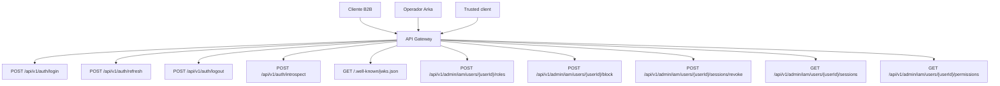

## Proposito
Definir contratos API REST reactivos completos para `identity-access-service`, incluyendo autenticacion, autorizacion operativa y administracion de sesiones/roles.

## Alcance y fronteras
- Incluye endpoints publicos y administrativos de IAM.
- Incluye payloads, errores, versionado, idempotencia y politicas de seguridad.
- Excluye serializacion OpenAPI formal (`yaml/json`) de fase 04.
- Los payloads aqui documentados siguen el `shape` tipado definido en la `Vista de Codigo` del servicio.

## Mapa de endpoints IAM


## Resumen de contratos por endpoint
| Endpoint | Objetivo | Auth requerida | Idempotencia |
|---|---|---|---|
| `POST /api/v1/auth/login` | Autenticar credenciales y abrir sesion | No (credenciales) | Por `requestId` opcional |
| `POST /api/v1/auth/refresh` | Renovar token de acceso | Refresh token valido | `Idempotency-Key` requerida |
| `POST /api/v1/auth/logout` | Revocar sesion activa | Access token valido | `Idempotency-Key` requerida |
| `POST /api/v1/auth/introspect` | Validar token y permisos | mTLS o trusted client | N/A (lectura) |
| `GET /.well-known/jwks.json` | Publicar llaves publicas activas para verificadores autorizados | No (endpoint publico de material criptografico) | N/A (lectura) |
| `POST /api/v1/admin/iam/users/{userId}/roles` | Asignar rol en tenant | `arka_admin`/`tenant_admin` | `Idempotency-Key` requerida |
| `POST /api/v1/admin/iam/users/{userId}/block` | Bloquear usuario | `arka_admin` | `Idempotency-Key` requerida |
| `POST /api/v1/admin/iam/users/{userId}/sessions/revoke` | Revocar sesiones del usuario | `arka_admin`/`tenant_admin` | `Idempotency-Key` requerida |
| `GET /api/v1/admin/iam/users/{userId}/sessions` | Consultar sesiones activas/revocadas | `arka_admin`/`tenant_admin` | N/A |
| `GET /api/v1/admin/iam/users/{userId}/permissions` | Consultar permisos efectivos del usuario | `arka_admin`/`tenant_admin` | N/A |

## Contratos detallados
### 1) POST /api/v1/auth/login
Request:
```json
{
  "tenantId": "org-ec-001",
  "email": "compras@cliente.com",
  "password": "********",
  "clientIp": "181.10.10.10",
  "userAgent": "Mozilla/5.0"
}
```
Headers:
- `X-Request-Id: iam-login-<uuid>` opcional

Response 200:
```json
{
  "sessionId": "ses_01JX...",
  "accessToken": "eyJhbGciOi...",
  "refreshToken": "eyJhbGciOi...",
  "tokenType": "Bearer",
  "expiresIn": 900,
  "refreshExpiresIn": 604800,
  "userId": "usr_01JX...",
  "tenantId": "org-ec-001",
  "roles": ["buyer"]
}
```

Errores:
- `401 INVALID_CREDENTIALS`
- `423 USER_DISABLED`
- `429 RATE_LIMITED`

### 2) POST /api/v1/auth/refresh
Request:
```json
{
  "refreshToken": "eyJhbGciOi...",
  "tenantId": "org-ec-001"
}
```
Headers:
- `Idempotency-Key: iam-refresh-<uuid>`

Response 200:
```json
{
  "accessToken": "eyJhbGciOi...",
  "refreshToken": "eyJhbGciOi...",
  "expiresIn": 900,
  "refreshExpiresIn": 604800
}
```

Errores:
- `401 TOKEN_EXPIRED_OR_REVOKED`
- `403 TENANT_MISMATCH`

### 3) POST /api/v1/auth/logout
Request:
```json
{
  "sessionId": "ses_01JX...",
  "reason": "USER_LOGOUT"
}
```
Headers:
- `Authorization: Bearer <accessToken>`
- `Idempotency-Key: iam-logout-<uuid>`

Response 200:
```json
{
  "sessionId": "ses_01JX...",
  "revokedAt": "2026-03-01T15:02:00Z",
  "reason": "USER_LOGOUT"
}
```

### 4) POST /api/v1/auth/introspect
Request:
```json
{
  "token": "eyJhbGciOi...",
  "expectedTenantId": "org-ec-001"
}
```

Response 200:
```json
{
  "active": true,
  "subject": "usr_01JX...",
  "tenantId": "org-ec-001",
  "roles": ["buyer"],
  "permissions": [
    "order:read",
    "order:create",
    "catalog:read"
  ],
  "expiresAt": "2026-03-01T15:00:00Z"
}
```

### 5) GET /.well-known/jwks.json
Response 200:
```json
{
  "keys": [
    {
      "kty": "RSA",
      "kid": "iam-rs256-2026-03",
      "use": "sig",
      "alg": "RS256",
      "n": "0vx7agoebGcQSuuPiLJXZptN...",
      "e": "AQAB"
    }
  ]
}
```
Notas:
- Publica solo llaves activas/verificables, sin exponer secretos privados.
- Se usa para validacion JWT en `api-gateway-service` y componentes autorizados.

### 6) POST /api/v1/admin/iam/users/{userId}/roles
Request:
```json
{
  "tenantId": "org-ec-001",
  "roleCode": "buyer_manager",
  "operation": "ASSIGN"
}
```
Headers:
- `Idempotency-Key: iam-assign-role-<uuid>`

Response 200:
```json
{
  "userId": "usr_01JX...",
  "tenantId": "org-ec-001",
  "roles": ["buyer", "buyer_manager"],
  "updatedAt": "2026-03-01T15:05:00Z"
}
```

### 7) POST /api/v1/admin/iam/users/{userId}/block
Request:
```json
{
  "tenantId": "org-ec-001",
  "blocked": true,
  "reason": "SUSPICIOUS_ACTIVITY"
}
```
Headers:
- `Idempotency-Key: iam-block-user-<uuid>`

Response 200:
```json
{
  "userId": "usr_01JX...",
  "tenantId": "org-ec-001",
  "status": "BLOCKED",
  "revokedSessions": 3,
  "updatedAt": "2026-03-01T15:07:00Z"
}
```

### 8) POST /api/v1/admin/iam/users/{userId}/sessions/revoke
Request:
```json
{
  "tenantId": "org-ec-001",
  "scope": "ALL_ACTIVE",
  "reason": "CREDENTIAL_ROTATION"
}
```
Headers:
- `Idempotency-Key: iam-revoke-sessions-<uuid>`

Response 200:
```json
{
  "userId": "usr_01JX...",
  "tenantId": "org-ec-001",
  "revokedSessions": 4,
  "executedAt": "2026-03-01T15:10:00Z"
}
```

### 9) GET /api/v1/admin/iam/users/{userId}/sessions
Query params:
- `status=ACTIVE|REVOKED|EXPIRED`
- `page`, `size`

Response 200:
```json
[
  {
    "sessionId": "ses_01JX...",
    "status": "ACTIVE",
    "issuedAt": "2026-03-01T12:00:00Z",
    "expiresAt": "2026-03-01T12:15:00Z",
    "lastSeenAt": "2026-03-01T12:05:00Z"
  }
]
```
Nota:
- El endpoint acepta `page` y `size`, pero el adapter web actual proyecta una coleccion plana de `SessionSummaryResponse` sin envelope paginado adicional.

### 10) GET /api/v1/admin/iam/users/{userId}/permissions
Response 200:
```json
{
  "userId": "usr_01JX...",
  "tenantId": "org-ec-001",
  "permissions": [
    "catalog:read",
    "order:create",
    "order:read",
    "inventory:read"
  ],
  "resolvedAt": "2026-03-01T15:12:00Z"
}
```

## Envelope de error estandar
```json
{
  "timestamp": "2026-03-01T15:00:00Z",
  "traceId": "trc_01JX...",
  "correlationId": "cor_01JX...",
  "code": "FORBIDDEN_ACTION",
  "message": "Operation is not allowed for current role",
  "details": [
    {
      "field": "role",
      "issue": "missing_permission"
    }
  ]
}
```

## Politicas transversales
| Tema | Politica |
|---|---|
| Versionado | Path versioning (`/api/v1`), breaking changes en `/api/v2` |
| Compatibilidad | Campos nuevos solo opcionales en `v1` |
| Idempotencia | Obligatoria para operaciones mutantes admin y refresh/logout |
| Seguridad | TLS obligatorio, JWT signed, `tenantId` obligatorio |
| Rate limiting | login 10 req/min por IP + tenant; admin 60 req/min por usuario |
| Auditoria | Toda mutacion IAM registra `auth_audit` |

## Riesgos y mitigaciones
- Riesgo: sobrecarga de endpoints admin sin control de permisos finos.
  - Mitigacion: validacion doble en gateway + `AuthorizationPolicy` en dominio.
- Riesgo: fuga de informacion en errores de login.
  - Mitigacion: mensaje uniforme para credenciales invalidas.
