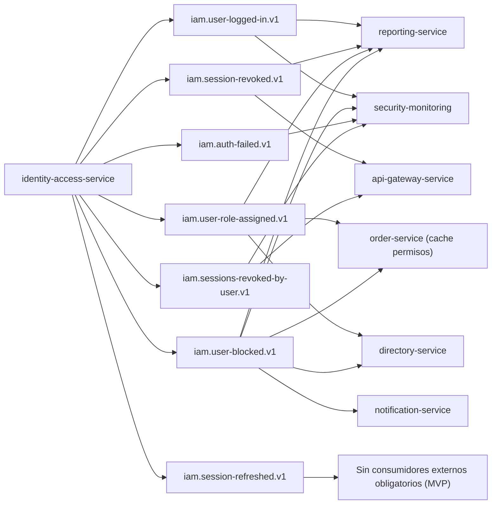

## Proposito
Definir contratos de eventos de `identity-access-service` para integracion EDA con notificacion, reporting, seguridad y servicios core.

## Alcance y fronteras
- Incluye eventos emitidos por IAM y consumidores esperados.
- Incluye topicos, claves, versionado, idempotencia, retencion y DLQ.
- Excluye configuracion infra del cluster Kafka.
- Explicita el mapeo entre el nombre del contrato externo y la clase interna `*Event` que origina la publicacion.

## Topologia de eventos IAM


## Regla de mapeo
- El `DomainEventKafkaMapper` proyecta el evento interno `*Event` al contrato externo publicado en Kafka.
- Cuando el nombre externo no coincide exactamente con la clase interna, el catalogo lo deja explicito.
- Este documento solo lista eventos de integracion activos del MVP; `UserUnblockedEvent` y `PasswordChangedEvent` siguen fuera del alcance contractual actual.

## Catalogo de eventos
| Evento de contrato | Clase interna origen | Topic | Key | Productor | Consumidores | Semantica |
|---|---|---|---|---|---|---|
| `UserLoggedIn` | `UserLoggedInEvent` | `iam.user-logged-in.v1` | `userId` | IAM | Reporting, SecurityMonitoring | exito de autenticacion |
| `AuthFailed` | `LoginFailedEvent` | `iam.auth-failed.v1` | `userId` | IAM | SecurityMonitoring | intento fallido de login |
| `SessionRefreshed` | `SessionRefreshedEvent` | `iam.session-refreshed.v1` | `sessionId` | IAM | Sin consumidores externos obligatorios en MVP | rotacion de token de sesion |
| `SessionRevoked` | `SessionRevokedEvent` | `iam.session-revoked.v1` | `sessionId` | IAM | Gateway, Reporting | sesion invalidada individualmente |
| `SessionsRevokedByUser` | `SessionsRevokedByUserEvent` | `iam.sessions-revoked-by-user.v1` | `userId` | IAM | Gateway, SecurityMonitoring | revocacion masiva por usuario |
| `RoleAssigned` | `RoleAssignedEvent` | `iam.user-role-assigned.v1` | `userId` | IAM | Order, Directory, Reporting | cambio de autorizacion |
| `UserBlocked` | `UserBlockedEvent` | `iam.user-blocked.v1` | `userId` | IAM | Order, Directory, Notification, SecurityMonitoring, Reporting | bloqueo operativo de usuario |

## Envelope estandar de eventos
```json
{
  "eventId": "evt_01JX...",
  "eventType": "UserLoggedIn",
  "eventVersion": "1.0.0",
  "occurredAt": "2026-03-01T15:00:00Z",
  "producer": "identity-access-service",
  "tenantId": "org-ec-001",
  "traceId": "trc_01JX...",
  "correlationId": "cor_01JX...",
  "idempotencyKey": "iam-login-<uuid>",
  "payload": {
    "userId": "usr_01JX...",
    "sessionId": "ses_01JX..."
  }
}
```

## Payloads minimos por evento
| Evento | Campos minimos |
|---|---|
| `UserLoggedIn` | `userId`, `sessionId` |
| `AuthFailed` | `userId`, `reasonCode` |
| `SessionRefreshed` | `sessionId`, `userId`, `oldAccessJti`, `newAccessJti` |
| `SessionRevoked` | `sessionId`, `userId`, `reason` |
| `SessionsRevokedByUser` | `userId`, `revokedCount` |
| `RoleAssigned` | `userId`, `roleId` |
| `UserBlocked` | `userId`, `reason` |

## Reglas de compatibilidad
- `MUST`: agregar campos nuevos solo como opcionales en `v1`.
- `MUST`: cambios de tipo semantico o remocion de campos crean topico `v2`.
- `SHOULD`: consumidores ignoran campos desconocidos.
- `MUST`: todos los eventos incluyen `tenantId`, `traceId`, `correlationId`.

## Entrega, reintentos y DLQ
| Tema | Politica |
|---|---|
| Semantica de entrega | `at-least-once` |
| Particionado | por `key` del agregado (`userId`/`sessionId`) |
| Reintento productor | 3 intentos con backoff exponencial |
| Reintento consumidor | 5 intentos con backoff + jitter |
| DLQ | topic `<topic>.dlq` obligatorio |
| Retencion recomendada | 14 dias eventos normales, 30 dias eventos de seguridad |

## Matriz de idempotencia en consumidores
| Consumidor | Evento | Clave de idempotencia |
|---|---|---|
| `api-gateway-service` | `SessionRevoked` | `eventId` + `sessionId` |
| `order-service` | `RoleAssigned` | `eventId` + `userId` |
| `order-service` | `UserBlocked` | `eventId` + `userId` |
| `directory-service` | `UserBlocked` | `eventId` + `userId` |
| `security-monitoring` | `AuthFailed` | `eventId` |
| `notification-service` | `UserBlocked` | `eventId` + `userId` |

## Riesgos y mitigaciones
- Riesgo: ruido por volumen alto de `AuthFailed`.
  - Mitigacion: sampling para reporting y full stream solo en seguridad.
- Riesgo: consumidores sin idempotencia duplican side effects.
  - Mitigacion: `processed_events` obligatorio en cada servicio consumidor.
