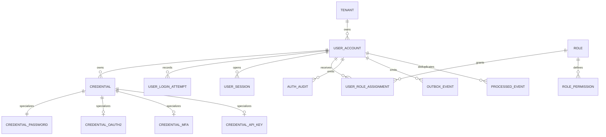

## Proposito
Definir el modelo logico de datos de `identity-access-service` alineado con la arquitectura interna vigente, manteniendo soporte actual para autenticacion local y una base extensible para `oauth2`, `mfa` y `api_key`.

## Alcance y fronteras
- Incluye entidades logicas, ownership, relaciones, invariantes y estados del bounded context IAM.
- Incluye entidades tecnicas necesarias para operacion segura del servicio: `auth_audit`, `outbox_event` y `processed_event`.
- Incluye una raiz comun de credenciales (`credential`) con subtipos especializados.
- Excluye definicion detallada de tipos fisicos por motor y scripts DDL finales.

## Fuente de referencia
- Este documento se alinea con [identity-access-current.dbml](/Users/jose/Development/Documentation/arkab2b-docs/content/mvp/02-arquitectura/services/identity-access-service/data/identity-access-current.dbml).
- La arquitectura de servicio que motiva el modelo esta descrita en:
  - [01-Vista-C4-Nivel-3.md](/Users/jose/Development/Documentation/arkab2b-docs/content/mvp/02-arquitectura/services/identity-access-service/architecture/01-Vista-C4-Nivel-3.md)
  - [02-Vista-de-Codigo.md](/Users/jose/Development/Documentation/arkab2b-docs/content/mvp/02-arquitectura/services/identity-access-service/architecture/02-Vista-de-Codigo.md)
  - [03-Casos-de-Uso-en-Ejecucion.md](/Users/jose/Development/Documentation/arkab2b-docs/content/mvp/02-arquitectura/services/identity-access-service/architecture/03-Casos-de-Uso-en-Ejecucion.md)

## Diagrama entidad-relacion logico

## Entidades logicas
| Entidad | Tipo | Descripcion | Ownership |
|---|---|---|---|
| `tenant` | referencia | Identificador canonico de aislamiento y pertenencia usado por IAM para segregar identidades, roles y sesiones; su semantica organizacional vive en Directory y no debe confundirse con `organization` | Directory (referencia local en IAM) |
| `user_account` | core | Identidad autenticable del tenant | IAM |
| `credential` | core | Raiz logica comun de credenciales del usuario | IAM |
| `credential_password` | core | Credencial local activa del MVP actual | IAM |
| `credential_oauth2` | extension | Vinculo futuro con proveedor federado | IAM |
| `credential_mfa` | extension | Segundo factor futuro del usuario | IAM |
| `credential_api_key` | extension | Credencial tecnica futura para integraciones | IAM |
| `user_login_attempt` | soporte funcional | Historico de intentos de autenticacion y evidencia de origen | IAM |
| `user_session` | core | Sesion vigente, revocada o expirada con sus JTIs activos | IAM |
| `role` | core | Rol funcional dentro del tenant | IAM |
| `role_permission` | core | Permiso concreto que compone un rol | IAM |
| `user_role_assignment` | core | Asignacion de rol con identidad propia y ciclo de vida | IAM |
| `auth_audit` | soporte | Trazabilidad de seguridad y evidencia operativa | IAM |
| `outbox_event` | integracion | Evento listo para publicar a broker | IAM |
| `processed_event` | integracion | Registro de eventos consumidos para idempotencia | IAM |

## Relacion entre dominio y persistencia
| Modelo de dominio | Persistencia logica |
|---|---|
| `UserAggregate` | `user_account` + `credential_password` + `user_login_attempt` |
| `UserCredential` | `credential` + `credential_password` |
| `UserLoginAttempt` | `user_login_attempt` |
| `SessionAggregate` | `user_session` |
| `RoleAggregate` | `role` + `role_permission` |
| `UserRoleAssignment` | `user_role_assignment` |
| `DomainEvent` publicado | `outbox_event` |
| evidencia de seguridad | `auth_audit` |
| deduplicacion de consumidores | `processed_event` |

## Relaciones y cardinalidad
- `tenant 1..n user_account`.
- `user_account 1..n credential`.
- `credential 1..0..1 credential_password`.
- `credential 1..0..1 credential_oauth2`.
- `credential 1..0..1 credential_mfa`.
- `credential 1..0..1 credential_api_key`.
- `user_account 1..n user_login_attempt`.
- `user_account 1..n user_session`.
- `user_account n..m role` via `user_role_assignment`.
- `role 1..n role_permission`.
- `user_account 1..n auth_audit`.
- `user_account 1..n outbox_event` a nivel logico por emision de hechos del agregado.

## Estados de entidades
| Entidad | Estados permitidos |
|---|---|
| `user_account` | `ACTIVE`, `BLOCKED`, `DISABLED` |
| `credential` | `ACTIVE`, `ROTATED`, `COMPROMISED`, `REVOKED` |
| `user_session` | `ACTIVE`, `REVOKED`, `EXPIRED` |
| `user_role_assignment` | `ACTIVE`, `REVOKED` |
| `outbox_event` | `PENDING`, `PUBLISHED`, `FAILED` |

## Invariantes logicos del servicio
| ID | Invariante | Regla verificable |
|---|---|---|
| `I-IAM-01` | Toda identidad es tenant-aware | `user_account`, `credential`, `user_session` y `user_role_assignment` deben mantener el mismo `tenant_id` del agregado dueño |
| `I-IAM-02` | Login solo se resuelve con una credencial primaria compatible | para el estado actual del MVP existe una sola `credential` activa `PASSWORD + PRIMARY + LOCAL` por usuario |
| `I-IAM-03` | Sesion activa requiere identidad habilitada y vigencia temporal | `user_account.status = ACTIVE` y `user_session.expires_at > now()` |
| `I-IAM-04` | Rol y asignacion pertenecen al mismo tenant del usuario | no se permiten asignaciones cross-tenant |
| `I-IAM-05` | Todo hecho critico de seguridad deja evidencia tecnica | login fallido, bloqueo, revocacion y rechazo de acceso generan `auth_audit` |
| `I-IAM-06` | Todo hecho de integracion sale por outbox | cambios con eventos publicados escriben primero en `outbox_event` |
| `I-IAM-07` | Consumidores internos son idempotentes | cada evento procesado queda registrado en `processed_event` |

## Reglas de extensibilidad de credenciales
| Regla | Implicacion |
|---|---|
| `credential` es la raiz comun | toda credencial nueva debe declararse primero en la tabla base |
| `credential_password` es el unico subtipo activo en MVP | `oauth2`, `mfa` y `api_key` quedan listos pero no activan casos de uso aun |
| `credential_purpose` separa semantica | `PRIMARY`, `SECOND_FACTOR` y `TECHNICAL` no deben mezclarse en el runtime |
| la unicidad actual es estricta | una credencial por `user_id + credential_type + credential_purpose + provider` |
| la apertura futura de multiples MFA/API keys requiere ajustes fisicos | se resolvera con indices parciales por subtipo en SQL |

## Vistas logicas de consulta
| Vista de lectura | Fuente | Uso |
|---|---|---|
| `UserAuthView` | `user_account + credential + credential_password` | login local |
| `UserSecurityStateView` | `user_account + user_login_attempt + auth_audit` | bloqueo, investigacion y contencion |
| `SessionStateView` | `user_session` | introspect, refresh, logout y revocacion |
| `PermissionView` | `user_role_assignment + role_permission + role` | permisos efectivos y autorizacion operativa |
| `OutboxRelayView` | `outbox_event` | publicacion asincrona de eventos |

## Politica de retencion logica
| Entidad | Retencion objetivo |
|---|---|
| `user_session` | 90 dias de historico; vigencia activa guiada por expiracion de token |
| `user_login_attempt` | 90 dias para analitica de fraude y seguridad |
| `auth_audit` | 365 dias en MVP documental |
| `outbox_event` | hasta publicacion confirmada + 7 dias |
| `processed_event` | 30 dias de deduplicacion |

## Riesgos y mitigaciones
- Riesgo: deriva entre credenciales soportadas en persistencia y credenciales activas en runtime.
  - Mitigacion: mantener `credential_password` como unico subtipo activo del MVP y marcar los demas como extension futura.
- Riesgo: inconsistencias de tenant entre usuario, rol, sesion y credencial.
  - Mitigacion: integridad compuesta con `tenant_id` y validacion de dominio mediante `TenantIsolationPolicy`.
- Riesgo: crecimiento de `auth_audit` y `user_login_attempt`.
  - Mitigacion: indices por tenant/fecha, retencion por ventana y particion futura si el volumen lo requiere.
