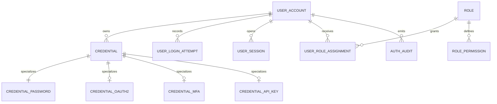

## Proposito
Definir el modelo fisico de `identity-access-service` sobre PostgreSQL, incluyendo tablas, columnas, constraints, indices y lineamientos operativos alineados con el esquema vigente del servicio.

## Alcance y fronteras
- Incluye el esquema fisico actual de IAM y su extension preparada para futuras credenciales.
- Incluye constraints de integridad por tenant, unicidad de credenciales e idempotencia.
- Incluye indices orientados a `login`, `refresh`, `introspect`, `logout`, `assign role`, `block user` y publicacion por outbox.
- Excluye scripts finales de migracion y detalles de despliegue de infraestructura.

## Fuente de referencia
- Este documento aterriza [identity-access-current.dbml](/Users/jose/Development/Documentation/arkab2b-docs/content/mvp/02-arquitectura/services/identity-access-service/data/identity-access-current.dbml).

## Esquema fisico IAM

## Tablas y columnas clave
### `user_account`
| Columna | Tipo | Null | Constraint |
|---|---|---|---|
| `user_id` | `uuid` | no | PK |
| `tenant_id` | `varchar(100)` | no | parte de unique compuesta `(user_id, tenant_id)` |
| `email` | `varchar(320)` | no | unique (`tenant_id`, `email`) |
| `status` | `UserStatus` | no | default `ACTIVE` |
| `failed_login_count` | `integer` | no | default 0 |
| `created_at` | `timestamp` | no | default `CURRENT_TIMESTAMP` |
| `updated_at` | `timestamp` | no | default `CURRENT_TIMESTAMP` |

### `credential`
| Columna | Tipo | Null | Constraint |
|---|---|---|---|
| `credential_id` | `uuid` | no | PK |
| `user_id` | `uuid` | no | FK compuesta -> `user_account(user_id, tenant_id)` |
| `tenant_id` | `varchar(100)` | no | FK compuesta -> `user_account(user_id, tenant_id)` |
| `credential_type` | `CredentialType` | no | participa en unique de negocio |
| `credential_purpose` | `CredentialPurpose` | no | default `PRIMARY` |
| `provider` | `AuthProvider` | no | participa en unique de negocio |
| `status` | `CredentialStatus` | no | default `ACTIVE` |
| `last_used_at` | `timestamp` | si | - |
| `created_at` | `timestamp` | no | default `CURRENT_TIMESTAMP` |
| `updated_at` | `timestamp` | no | default `CURRENT_TIMESTAMP` |

Constraint principal:
- unique (`user_id`, `credential_type`, `credential_purpose`, `provider`)

### `credential_password`
| Columna | Tipo | Null | Constraint |
|---|---|---|---|
| `credential_id` | `uuid` | no | PK, FK -> `credential.credential_id` |
| `password_hash` | `varchar(255)` | no | - |
| `hash_algorithm` | `varchar(50)` | no | - |
| `password_changed_at` | `timestamp` | si | - |
| `created_at` | `timestamp` | no | default `CURRENT_TIMESTAMP` |
| `updated_at` | `timestamp` | no | default `CURRENT_TIMESTAMP` |

### `credential_oauth2`
| Columna | Tipo | Null | Constraint |
|---|---|---|---|
| `credential_id` | `uuid` | no | PK, FK -> `credential.credential_id` |
| `provider_subject` | `varchar(255)` | no | index |
| `provider_email` | `varchar(320)` | si | index |
| `access_token_ref` | `varchar(255)` | si | referencia segura, no token en claro |
| `refresh_token_ref` | `varchar(255)` | si | referencia segura, no token en claro |
| `expires_at` | `timestamp` | si | - |
| `linked_at` | `timestamp` | si | - |
| `created_at` | `timestamp` | no | default `CURRENT_TIMESTAMP` |
| `updated_at` | `timestamp` | no | default `CURRENT_TIMESTAMP` |

### `credential_mfa`
| Columna | Tipo | Null | Constraint |
|---|---|---|---|
| `credential_id` | `uuid` | no | PK, FK -> `credential.credential_id` |
| `factor_type` | `MfaType` | no | index |
| `secret_ref` | `varchar(255)` | si | referencia segura |
| `recipient` | `varchar(255)` | si | index |
| `verified_at` | `timestamp` | si | - |
| `enabled` | `boolean` | no | default true |
| `created_at` | `timestamp` | no | default `CURRENT_TIMESTAMP` |
| `updated_at` | `timestamp` | no | default `CURRENT_TIMESTAMP` |

### `credential_api_key`
| Columna | Tipo | Null | Constraint |
|---|---|---|---|
| `credential_id` | `uuid` | no | PK, FK -> `credential.credential_id` |
| `key_prefix` | `varchar(20)` | no | unique |
| `key_hash` | `varchar(255)` | no | unique |
| `expires_at` | `timestamp` | si | index |
| `revoked_at` | `timestamp` | si | - |
| `created_at` | `timestamp` | no | default `CURRENT_TIMESTAMP` |
| `updated_at` | `timestamp` | no | default `CURRENT_TIMESTAMP` |

### `user_login_attempt`
| Columna | Tipo | Null | Constraint |
|---|---|---|---|
| `attempt_id` | `uuid` | no | PK |
| `user_id` | `uuid` | no | FK -> `user_account.user_id` |
| `attempt_at` | `timestamp` | no | index |
| `success` | `boolean` | no | index |
| `ip_address` | `varchar(64)` | si | index |
| `created_at` | `timestamp` | no | default `CURRENT_TIMESTAMP` |

### `user_session`
| Columna | Tipo | Null | Constraint |
|---|---|---|---|
| `session_id` | `uuid` | no | PK |
| `user_id` | `uuid` | no | FK compuesta -> `user_account(user_id, tenant_id)` |
| `tenant_id` | `varchar(100)` | no | FK compuesta -> `user_account(user_id, tenant_id)` |
| `access_jti` | `varchar(128)` | no | unique |
| `refresh_jti` | `varchar(128)` | no | unique |
| `status` | `SessionStatus` | no | default `ACTIVE` |
| `issued_at` | `timestamp` | no | - |
| `expires_at` | `timestamp` | no | index |
| `last_seen_at` | `timestamp` | si | - |
| `revoked_at` | `timestamp` | si | - |
| `revocation_reason` | `RevocationReason` | si | - |
| `created_at` | `timestamp` | no | default `CURRENT_TIMESTAMP` |
| `updated_at` | `timestamp` | no | default `CURRENT_TIMESTAMP` |

### `role`
| Columna | Tipo | Null | Constraint |
|---|---|---|---|
| `role_id` | `uuid` | no | PK |
| `tenant_id` | `varchar(100)` | no | parte de unique compuesta `(role_id, tenant_id)` |
| `role_code` | `varchar(100)` | no | unique (`tenant_id`, `role_code`) |
| `description` | `varchar(255)` | si | - |
| `created_at` | `timestamp` | no | default `CURRENT_TIMESTAMP` |
| `updated_at` | `timestamp` | no | default `CURRENT_TIMESTAMP` |

### `role_permission`
| Columna | Tipo | Null | Constraint |
|---|---|---|---|
| `role_id` | `uuid` | no | FK -> `role.role_id` |
| `permission_code` | `varchar(150)` | no | parte de PK compuesta |
| `resource` | `varchar(100)` | no | parte de PK compuesta |
| `action` | `varchar(100)` | no | parte de PK compuesta |
| `scope` | `varchar(100)` | no | default `TENANT`, parte de PK compuesta |
| `created_at` | `timestamp` | no | default `CURRENT_TIMESTAMP` |

### `user_role_assignment`
| Columna | Tipo | Null | Constraint |
|---|---|---|---|
| `assignment_id` | `uuid` | no | PK |
| `user_id` | `uuid` | no | FK compuesta -> `user_account(user_id, tenant_id)` |
| `role_id` | `uuid` | no | FK compuesta -> `role(role_id, tenant_id)` |
| `tenant_id` | `varchar(100)` | no | garantiza aislamiento por tenant |
| `status` | `AssignmentStatus` | no | default `ACTIVE` |
| `assigned_by` | `varchar(150)` | si | - |
| `assigned_at` | `timestamp` | si | - |
| `created_at` | `timestamp` | no | default `CURRENT_TIMESTAMP` |
| `updated_at` | `timestamp` | no | default `CURRENT_TIMESTAMP` |

Constraint principal:
- unique (`user_id`, `role_id`, `tenant_id`)

### `auth_audit`
| Columna | Tipo | Null | Constraint |
|---|---|---|---|
| `audit_id` | `uuid` | no | PK |
| `tenant_id` | `varchar(100)` | no | FK compuesta -> `user_account(user_id, tenant_id)` por `user_id` |
| `user_id` | `uuid` | no | FK compuesta -> `user_account(user_id, tenant_id)` |
| `event_type` | `varchar(100)` | no | index |
| `result` | `varchar(50)` | no | index |
| `payload` | `jsonb` | si | - |
| `created_at` | `timestamp` | no | index |

### `outbox_event`
| Columna | Tipo | Null | Constraint |
|---|---|---|---|
| `event_id` | `uuid` | no | PK |
| `aggregate_type` | `varchar(100)` | no | index |
| `aggregate_id` | `varchar(100)` | no | index |
| `event_type` | `varchar(100)` | no | index |
| `payload` | `jsonb` | no | - |
| `status` | `OutboxStatus` | no | default `PENDING` |
| `occurred_at` | `timestamp` | no | index |
| `published_at` | `timestamp` | si | - |
| `retry_count` | `integer` | no | default 0 |
| `last_error` | `text` | si | - |
| `created_at` | `timestamp` | no | default `CURRENT_TIMESTAMP` |
| `updated_at` | `timestamp` | no | default `CURRENT_TIMESTAMP` |

### `processed_event`
| Columna | Tipo | Null | Constraint |
|---|---|---|---|
| `processed_event_id` | `uuid` | no | PK |
| `event_id` | `varchar(100)` | no | parte de unique compuesta |
| `consumer_name` | `varchar(150)` | no | parte de unique compuesta |
| `processed_at` | `timestamp` | no | - |

## Indices recomendados
| Tabla | Indice | Justificacion |
|---|---|---|
| `user_account` | `(tenant_id, email)` unique | lookup principal de login |
| `credential` | `(user_id, credential_type, credential_purpose, provider)` unique | coherencia del modelo de credenciales activo |
| `user_session` | `(access_jti)` unique | introspect de access token |
| `user_session` | `(refresh_jti)` unique | refresh token lookup |
| `user_session` | `(user_id, tenant_id, status)` | revocacion, consulta y limpieza de sesiones |
| `role` | `(tenant_id, role_code)` unique | resolucion de rol por tenant |
| `user_role_assignment` | `(user_id, role_id, tenant_id)` unique | evita duplicidad de asignaciones |
| `auth_audit` | `(tenant_id, user_id, created_at)` | auditoria por tenant/usuario |
| `outbox_event` | `(status, occurred_at)` | relay eficiente por lote |
| `processed_event` | `(event_id, consumer_name)` unique | deduplicacion de consumidores |

## Constraints transversales
| ID | Constraint | Objetivo |
|---|---|---|
| `C-IAM-01` | FK compuestas con `tenant_id` en `credential`, `user_session`, `user_role_assignment`, `auth_audit` | reforzar aislamiento por tenant en BD |
| `C-IAM-02` | unique (`user_id`, `credential_type`, `credential_purpose`, `provider`) en `credential` | evitar duplicidad de credenciales activas segun regla actual |
| `C-IAM-03` | unique (`tenant_id`, `role_code`) en `role` | evitar roles duplicados por tenant |
| `C-IAM-04` | unique (`user_id`, `role_id`, `tenant_id`) en `user_role_assignment` | evitar asignaciones duplicadas |
| `C-IAM-05` | unique (`event_id`, `consumer_name`) en `processed_event` | asegurar idempotencia por consumidor |

## Restricciones SQL recomendadas fuera de DBML
1. Si se habilitan multiples `API_KEY` o multiples factores `MFA` por usuario, reemplazar la unique general de `credential` por indices parciales por subtipo.
2. Para `credential_oauth2`, reforzar unicidad por `provider + provider_subject`.
3. Si `credential_password` sigue siendo la unica credencial primaria activa del MVP, mantener la unique actual de `credential` y agregar validacion de `provider = LOCAL`.
4. Si se requiere mayor dureza operativa, promover `auth_audit.result` a enum fisico o `check constraint`.

## Politica de migracion y operacion
| Tema | Lineamiento |
|---|---|
| Migraciones | forward-only con estrategia expand/contract |
| Versionado | `V<numero>__descripcion.sql` |
| Rollback | preferencia por rollforward |
| Particionado | `auth_audit` y eventualmente `user_login_attempt` por fecha en volumen alto |
| Backups | snapshot diario + WAL incremental |

## Riesgos y mitigaciones
- Riesgo: divergence entre credenciales soportadas en persistencia y credenciales activas en runtime.
  - Mitigacion: activar en MVP solo `credential_password`; dejar `oauth2`, `mfa` y `api_key` como extensiones preparadas.
- Riesgo: inconsistencias cross-tenant por claves simples.
  - Mitigacion: mantener FKs compuestas con `tenant_id` y validar adicionalmente en dominio.
- Riesgo: crecimiento sostenido de `auth_audit`, `user_login_attempt` y `outbox_event`.
  - Mitigacion: indices por fecha/tenant, retencion controlada y particion futura.
