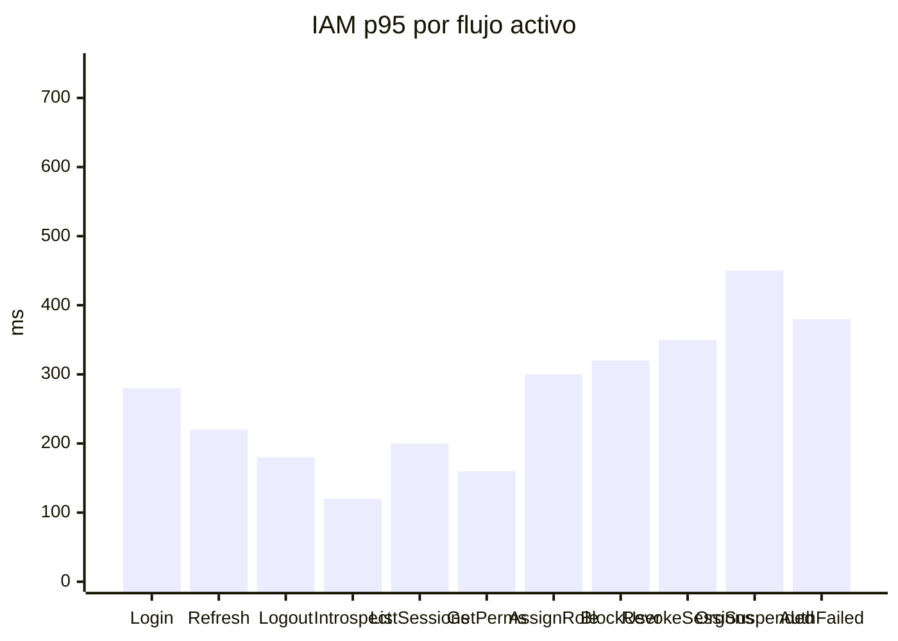

## Proposito
Definir objetivos no funcionales de performance y capacidad para `identity-access-service`, alineados con los casos de uso HTTP y los listeners event-driven actualmente activos.

## Alcance y fronteras
- Incluye NFR de los endpoints HTTP activos de IAM y de los listeners `OrgSuspended` y `AuthFailedThreshold`.
- Incluye escenarios de carga academicos simulados para B2B.
- Usa `rps` para endpoints HTTP y `eps` para listeners reactivos por evento.
- Excluye resultados de pruebas ejecutadas (fase 05).

## Budget por caso de uso IAM
| Caso de uso | p95 objetivo | p99 objetivo | Throughput objetivo | Error budget mensual |
|---|---|---|---|---|
| Login | <= 280 ms | <= 450 ms | 140 rps | 0.5% |
| Refresh token | <= 220 ms | <= 350 ms | 100 rps | 0.4% |
| Logout | <= 180 ms | <= 300 ms | 90 rps | 0.3% |
| Introspect token | <= 120 ms | <= 220 ms | 350 rps | 0.2% |
| List user sessions | <= 200 ms | <= 320 ms | 40 rps | 0.3% |
| Get user permissions | <= 160 ms | <= 280 ms | 70 rps | 0.3% |
| Assign role | <= 300 ms | <= 500 ms | 35 rps | 0.5% |
| Block user | <= 320 ms | <= 520 ms | 20 rps | 0.5% |
| Revoke sessions | <= 350 ms | <= 550 ms | 25 rps | 0.5% |
| OrgSuspended | <= 450 ms | <= 700 ms | 8 eps | 0.5% |
| AuthFailedThreshold | <= 380 ms | <= 600 ms | 12 eps | 0.5% |

## Curva de latencia objetivo IAM

## Modelo de carga IAM (simulado)
| Escenario | Carga concurrente | Mix de trafico IAM |
|---|---|---|
| Normal semanal | 80 clientes HTTP | 55% introspect, 18% login, 10% refresh, 7% logout, 6% queries admin, 4% mutaciones admin |
| Pico comercial | 180 clientes HTTP | 60% introspect, 17% login, 10% refresh, 5% logout, 5% queries admin, 3% mutaciones admin |
| Pico consulta administrativa | 60 clientes HTTP | 45% `GET /sessions`, 35% `GET /permissions`, 20% introspect |
| Pico incidente seguridad | 120 clientes HTTP + 10 eps | 35% login, 30% introspect, 15% block/revoke, 20% listeners `OrgSuspended` y `AuthFailedThreshold` |

## Capacidad base y escalamiento
| Recurso por pod IAM | Valor base | Escalamiento recomendado |
|---|---|---|
| CPU request/limit | `300m / 1000m` | HPA por CPU + latencia |
| RAM request/limit | `512Mi / 1024Mi` | escalar si `p95` sostenido supera budget |
| R2DBC connection pool | 50 conexiones | max 120 con backlog controlado |
| Outbox relay batch | 200 eventos | subir a 500 si `outbox_event.pending` supera backlog operativo |
| Kafka producer batch | 16KB | subir a 32KB solo en picos de publicacion auditables |

## Politicas de degradacion controlada
- Prioridad 1: mantener `introspect`, `refresh` y `logout`.
- Prioridad 2: mantener `login`.
- Prioridad 3: mantener `block user`, `revoke sessions` y listeners de seguridad.
- Prioridad 4: degradar queries administrativas y `assign role` antes que los flujos anteriores.
- Si `p95 introspect > 140 ms` por 5 min:
  - ampliar el TTL corto del snapshot de introspeccion en Redis dentro de la ventana permitida por revocacion,
  - limitar `GET /api/v1/admin/iam/users/{userId}/sessions`,
  - limitar `GET /api/v1/admin/iam/users/{userId}/permissions`,
  - escalar pods por CPU y latencia.
- Si el backlog de `outbox_event` pendiente supera el umbral operativo por 10 min:
  - aumentar `batchSize` del relay,
  - priorizar publicacion de eventos de seguridad,
  - revisar salud del broker antes de degradar trafico HTTP.

## Modelo de fallos y degradacion runtime
| Tipo de fallo | Tratamiento de performance | Impacto en budget |
|---|---|---|
| rechazo funcional (`401/403/404/409/423`) | se atiende con salida rapida y auditoria; no habilita degradacion global | no consume `error budget` de `5xx`; si el costo de auditoria eleva p95 por encima del objetivo si consume presupuesto de latencia |
| saturacion de `login` o `introspect` | cache corta, HPA por latencia y limitacion de queries admin antes de degradar flujos core | consume presupuesto de latencia mientras dure el incidente |
| fallo tecnico de persistencia, cache o broker | mantener consistencia de sesion, acumular outbox cuando aplique y clasificar retryable/no-retryable | solo consume `error budget` HTTP o DLQ cuando el cierre tecnico termina fallando visible al consumidor |
| evento duplicado | `noop idempotente` | no consume `error budget` ni distorsiona los SLI de listeners |

## Cuellos de botella esperados
| Bottleneck | Impacto | Mitigacion |
|---|---|---|
| Verificacion de hash de password | latencia en `login` | ajustar `BCrypt cost factor` por entorno |
| Consultas de sesion por `jti` y cold path sin cache | latencia en `introspect` y `refresh` | indice unico + cache Redis + snapshot invalido por revocacion |
| Resolucion de permisos por rol/asignacion | latencia en `get user permissions` e `introspect` sin cache | indices sobre asignaciones/permisos + snapshot tecnico en cache |
| Escritura de `auth_audit` en picos | I/O DB elevado en mutaciones y listeners | indices por `tenantId` y `eventType`, pool protegido y persistencia reactiva directa |
| Revocacion masiva de sesiones | lock contention en `block user`, `revoke sessions` y listeners de seguridad | update por lotes, invalidacion de cache por usuario y monitoreo de filas afectadas |
| Backlog de outbox | retraso en eventos `UserBlocked`, `SessionsRevokedByUser`, `SessionRefreshed` | relay por lotes y alarma sobre `pending`/`retry_count` |

## SLI/SLO IAM alineados
| SLI | SLO |
|---|---|
| Disponibilidad endpoint `login` | >= 99.7% mensual |
| Disponibilidad endpoint `introspect` | >= 99.9% mensual |
| Disponibilidad de queries admin (`sessions`, `permissions`) | >= 99.5% mensual |
| `p95` login | <= 280 ms |
| `p95` introspect | <= 120 ms |
| `p95` get user permissions | <= 160 ms |
| `p95` listeners de seguridad (`OrgSuspended`, `AuthFailedThreshold`) | <= 450 ms |
| ratio de errores `5xx` HTTP IAM | <= 0.2% mensual |
| ratio de mensajes IAM enviados a DLQ | <= 0.1% mensual |

## Riesgos y mitigaciones
- Riesgo: budget de `login` no cumple si el hash es demasiado costoso en hardware bajo.
  - Mitigacion: calibracion de `BCrypt cost factor` por entorno (`dev`, `qa`, `prod`).
- Riesgo: picos de introspeccion desde gateway saturan IAM.
  - Mitigacion: cache de introspeccion con TTL corto, invalidacion por revocacion y HPA por latencia.
- Riesgo: consultas administrativas amplias degraden el pool reactivo.
  - Mitigacion: limitar `page/size`, preferir filtros por `status` y priorizar queries criticas sobre lecturas administrativas.
- Riesgo: backlog de outbox retrase la propagacion de eventos de seguridad.
  - Mitigacion: monitoreo de `pending`, ajuste del `batchSize` del relay y verificacion proactiva del broker.
