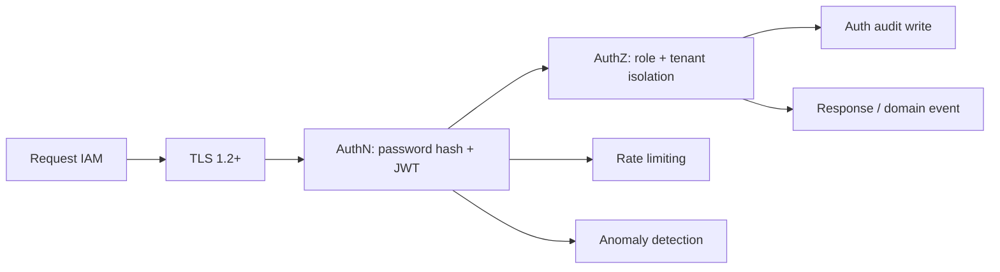
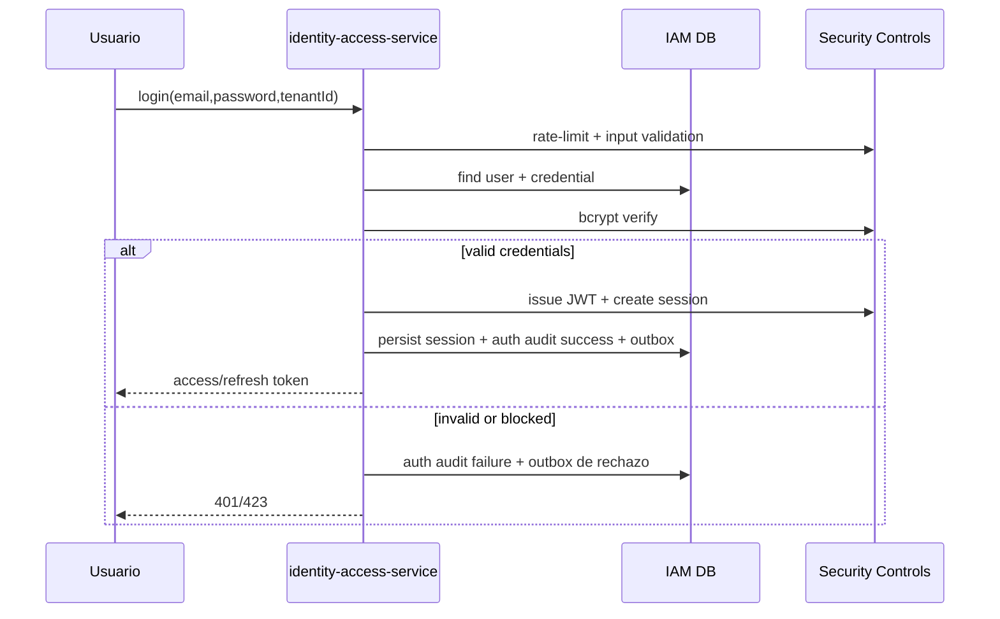

## Proposito
Definir el diseno de seguridad y privacidad de `identity-access-service`, cubriendo amenazas, controles tecnicos, manejo de secretos, sesiones y cumplimiento base.

## Alcance y fronteras
- Incluye seguridad de autenticacion, autorizacion, token, sesion y APIs administrativas IAM.
- Incluye controles de datos sensibles y auditoria.
- Excluye hardening de infraestructura de red (documentado a nivel plataforma).
- Excluye `oauth2` y `api_key` como flujos activos del MVP.
- `MFA` para cuentas administrativas Arka (`arka_admin`) queda diferido a hardening posterior; no bloquea el freeze del baseline arquitectonico `MVP` ni obliga a redisenar ahora `identity-access-service`.
- La ruta evolutiva prevista para credenciales mantiene `OAuth2` solo si se formaliza SSO corporativo y `API key` unicamente para integraciones tecnicas no humanas.

## Estado actual del servicio
- El flujo activo del servicio se basa en autenticacion local con password, emision/verificacion JWT, sesiones revocables, APIs administrativas IAM y listeners de seguridad.
- `JwksProviderPort` y `JwksKeyProviderAdapter` soportan resolucion de llaves por `kid` para firma y verificacion.
- `JWKS` se documenta como contrato estandar para distribuir llaves publicas a verificadores autorizados.
- `auth_audit` registra evidencia operativa de seguridad; la correlacion (`traceId`, `correlationId`) se conserva hoy a traves del payload tecnico y de los eventos de dominio publicados por outbox.

## Ruta evolutiva de credenciales
| Credencial | Estado actual | Rol esperado en IAM | Regla de activacion |
|---|---|---|---|
| `PASSWORD` | activa | credencial primaria de usuarios humanos B2B | se mantiene como baseline del MVP actual |
| `MFA` | preparada, no obligatoria en baseline actual | segundo factor para endurecer autenticacion interactiva de alto privilegio | activar en etapa de hardening/operacion posterior al freeze documental del MVP |
| `OAUTH2` | preparado en modelo, no activo | credencial primaria alternativa para SSO corporativo | activar solo si existe decision formal de federacion con IdP externo |
| `API_KEY` | preparada en modelo, no activa | credencial tecnica para integraciones y automatizaciones | activar como canal separado del login humano |

Reglas aplicadas:
- `MFA` no reemplaza la credencial primaria local; complementa el flujo de autenticacion de usuarios humanos.
- en el baseline actual de `MVP`, `MFA` permanece como capacidad preparada y no obligatoria.
- `OAuth2` no debe activarse sin definir previamente el mapeo entre sujeto federado, `user_account` y `tenant`.
- `API_KEY` no participa en `login`, `refresh` ni `logout`; se trata como credencial tecnica con politicas propias de expiracion, rotacion y scopes.

## Threat model IAM (resumen STRIDE)
| Amenaza | Vector | Impacto | Control principal |
|---|---|---|---|
| Spoofing | robo de credenciales/token | acceso no autorizado | hash BCrypt + JWT firmado + revocacion |
| Tampering | alteracion de claims JWT | escalamiento privilegios | verificacion firma + `kid` + `aud`/`iss` |
| Repudiation | negacion de acciones admin | brecha de auditoria | `auth_audit` correlacionable + eventos con `traceId`/`correlationId` |
| Information Disclosure | fuga de datos de usuario | riesgo legal/comercial | minimizacion de PII + masking en logs |
| Denial of Service | brute force login/introspect flood | indisponibilidad IAM | rate limit + circuit breaker + cache |
| Elevation of Privilege | bypass de tenant o rol | acceso cruzado | `TenantIsolationPolicy` + `AuthorizationPolicy` |

## Mapa de controles

## Controles obligatorios por dominio
| Categoria | Control |
|---|---|
| Credenciales | `BCrypt` con `cost factor` configurable por entorno y salt por hash |
| Token | JWT firmado asimetrico (`RS256`), `kid` obligatorio, expiracion corta y resolucion de llave publica por `kid` mediante `JwksProviderPort`/`JwksKeyProviderAdapter` |
| Sesion | Revocacion temprana por `sessionId`/`jti`, revocacion masiva por usuario y propagacion asincrona a caches operativas |
| Tenant isolation | `tenantId` obligatorio en token, requests y datos persistidos |
| Admin APIs | Doble validacion: rol + permiso explicito + mismo tenant (si aplica) |
| Auditoria | Registro de `login_success`, `login_failed`, `session_refreshed`, `session_revoked`, `sessions_revoked_by_user`, `user_blocked`, `role_assigned` y mutaciones administrativas |
| Secrets | llaves y secretos gestionados por la plataforma vigente (`config-server` + proveedor de secretos activo), con rotacion periodica definida a nivel plataforma |

## Politica de token y sesion
| Tema | Politica propuesta |
|---|---|
| Access token TTL | 15 minutos |
| Refresh token TTL | 7 dias |
| Sesiones simultaneas | max 5 por usuario (`TokenPolicy.maxSessionsPerUser`, baseline academico) |
| Revocacion de token | invalidacion por estado de sesion + cache TTL corto |
| Clock skew | tolerancia maxima 60 segundos |

## Modelo de validacion distribuida
| Componente | Responsabilidad |
|---|---|
| `identity-access-service` | autentica usuarios, emite tokens, mantiene la fuente de verdad de sesion/rol, resuelve llaves activas por `kid`, expone `JWKS` estandar e introspeccion de fallback |
| `api-gateway-service` | valida localmente firma JWT, `iss`, `aud`, expiracion y estado de revocacion de corta vida antes de enrutar, usando el material de llave vigente disponible en plataforma |
| servicios core | revalidan rol, `tenant`, permiso y ownership del recurso con claims confiables; pueden verificar firma localmente si la integracion lo requiere |
| eventos IAM | `SessionRevoked`, `SessionsRevokedByUser`, `SessionRefreshed`, `UserBlocked` y `RoleAssigned` actualizan caches o contexto de seguridad para evitar introspeccion por request cuando el estado siga siendo confiable |

Aplicacion local: `identity-access-service` implementa componentes de `Spring Security WebFlux` para construir el `SecurityContext`, proteger rutas administrativas y separar autenticacion interactiva, autorizacion por endpoint y controles de sesion. A diferencia de los servicios de negocio, este servicio si concentra `login`, `refresh`, emision de tokens y administracion de sesion porque es la autoridad IAM del sistema.

Regla aplicada: IAM no debe entrar en el hot path de todas las mutaciones protegidas. La introspeccion sincrona se reserva para fallback, alta sensibilidad o incertidumbre del estado de sesion.

## Modelo de errores de seguridad
| Momento | Familia/cierre canonico | Aplicacion en IAM |
|---|---|---|
| autenticacion interactiva | `INVALID_CREDENTIALS`, `AuthorizationDeniedException`, `DomainRuleViolationException` | `login`, `refresh` e `introspect` distinguen rechazo funcional de credenciales/sesion frente a fallo tecnico sin filtrar detalles internos al actor |
| autorizacion administrativa | `AuthorizationDeniedException`, `TenantIsolationException` | APIs admin y queries rechazan cruce de `tenant`, permiso insuficiente o actor no legitimo antes de mutar usuarios, roles o sesiones |
| regla de seguridad de dominio | `ConflictException`, `DomainRuleViolationException`, `ResourceNotFoundException` | sesion revocada, rol no asignable, usuario bloqueado o recurso inexistente se cierran como `401/403/404/409/423` segun el caso |
| incidente o evento malicioso/duplicado | `NonRetryableDependencyException` o `noop idempotente` | listeners de seguridad descartan duplicados como noop y enrutan mensajes irreparables a DLQ con auditoria operativa |
| evidencia de seguridad | `auth_audit` + outbox + `traceId/correlationId` | todo rechazo relevante de IAM deja evidencia trazable y eventos de seguridad cuando corresponde |

## Politica de datos sensibles
| Dato | Clasificacion | Tratamiento |
|---|---|---|
| `email` | sensible | proteccion en reposo segun capacidades de plataforma/BD + masking en logs |
| `password_hash` | secreto | nunca expuesto ni serializado |
| `ip_address` | sensible moderado | almacenado para auditoria con retencion acotada |
| `roles/permissions` | sensible operacional | exponer solo en contextos autorizados |

## Flujo de seguridad en login

## Cumplimiento y trazabilidad
- Baseline de cumplimiento (academico):
  - principio de minimo privilegio,
  - retencion definida para auditoria,
  - trazabilidad de eventos de seguridad,
  - revocacion y respuesta a incidente.
- Evolucion posterior (no bloqueante del baseline `MVP`): obligaciones regulatorias exhaustivas por pais con detalle legal formal (Colombia/Ecuador/Peru/Chile).

## Riesgos y mitigaciones
- Riesgo: desalineacion entre permisos del token y permisos actuales del usuario.
  - Mitigacion: eventos `SessionRevoked`, `SessionsRevokedByUser`, `SessionRefreshed`, `UserBlocked` y `RoleAssigned` + invalidacion cache + introspeccion fallback solo cuando el estado no sea confiable.
- Riesgo: fuga de informacion en logs de error.
  - Mitigacion: mascaramiento estricto de payloads sensibles.

## Brechas explicitas
- Evolucion posterior (no bloqueante): matriz granular final de permisos por rol/pais.
- Evolucion posterior (no bloqueante): criterios formales de activacion de `OAuth2` con IdP externo corporativo.
