## Proposito
Definir el catalogo completo de clases/archivos del servicio `directory-service` para implementacion Java 21 + Spring WebFlux con arquitectura hexagonal/clean, CQRS ligero, EDA y DDD, alineado con contactos institucionales y sincronizacion interna de perfiles de usuario organizacionales desde IAM.

## Alcance y fronteras
- Incluye inventario completo de clases por carpeta para el servicio Directory.
- Incluye separacion estricta de estructura: `domain`, `application`, `infrastructure`.
- Incluye clases de configuracion para dependencias (security, kafka, r2dbc, redis, observabilidad).
- Excluye codigo de otros BC/servicios.

## Regla de completitud aplicada
- Este documento define **catalogo completo**, no minimo.
- Cada clase se mapea a una carpeta concreta del arbol canonico.
- El dominio se divide por agregados (`organization`, `address`, `contact`, `countrypolicy`) con la raiz del agregado en el paquete del modelo y slicing interno (`entity`, `valueobject`, `enum`, `event`).
- La frontera web separa `request/response` HTTP del modelo de aplicacion (`command/query/result`).
- Los puertos/adaptadores se dividen por responsabilidad (`persistence`, `security`, `audit`, `event`, `cache`, `external`).

## Estado actual de alineacion semantica
- `contact` representa contacto institucional de la organizacion (`label` + `contactValue` + `contactType`), no persona operativa.
- `RoleAssigned` y `UserBlocked` sincronizan el slice interno `organization_user_profile`; no entran por los casos HTTP de contacto.
- El slice interno `organization_user_profile` se documenta mediante listeners, use cases owner y puertos representativos, aunque no expone contrato REST propio en `MVP`.
- `OrganizationOperationalPreferences` y `AddressValidationSnapshot` permanecen solo como estado embebido del agregado; no tienen persistencia ni tablas separadas en el modelo vigente.


## Estructura estricta (Directory)
Este arbol muestra la estructura canonica completa del servicio a nivel de carpetas. El detalle por archivo y los diagramas de clase individuales se consultan mas abajo en la vista por capas.

```tree
- src | folder
  - main | folder
    - java | code
      - com | folder
        - arka | building | primary
          - directory | microchip | primary
            - domain | cubes | info
              - model | folder-open | info
                - organization | folder
                  - entity | folder
                  - valueobject | folder
                  - enum | folder
                  - event | share-nodes | accent
                - userprofile | folder
                  - valueobject | folder
                  - enum | folder
                - address | folder
                  - entity | folder
                  - valueobject | folder
                  - enum | folder
                  - event | share-nodes | accent
                - contact | folder
                  - entity | folder
                  - valueobject | folder
                  - enum | folder
                  - event | share-nodes | accent
                - countrypolicy | folder
                  - entity | folder
                  - valueobject | folder
                  - enum | folder
                  - event | share-nodes | accent
              - event | share-nodes | accent
              - service | gear | info
              - exception | folder
            - application | sitemap | warning
              - command | terminal | warning
              - query | binoculars | warning
              - result | file-lines | warning
              - port | plug | warning
                - in | arrow-right
                - out | arrow-left
                  - persistence | database
                  - security | shield
                  - audit | clipboard
                  - event | share-nodes | accent
                  - cache | hard-drive
                  - external | cloud
              - usecase | bolt | warning
                - command | terminal | warning
                - query | binoculars | warning
              - mapper | shuffle
                - command | shuffle
                - query | shuffle
                - result | shuffle
              - exception | folder
            - infrastructure | server | secondary
              - adapter | plug | secondary
                - in | arrow-right
                  - web | globe
                    - request | file-import
                    - response | file-export
                    - mapper | shuffle
                      - command | shuffle
                      - query | shuffle
                      - response | shuffle
                    - controller | globe
                  - listener | bell
                - out | arrow-left
                  - persistence | database
                    - entity | table
                    - mapper | shuffle
                    - repository | database
                  - security | shield
                  - event | share-nodes | accent
                  - external | cloud
                  - cache | hard-drive
              - config | gear
              - exception | folder
```

## Estructura detallada por capas
Esta seccion concentra el arbol navegable por capa con todos los archivos del servicio. Cada archivo sigue abriendo su diagrama de clase individual en el visor.

{}
{}
```tree
- com | folder
  - arka | building | primary
    - directory | microchip | primary
      - domain | cubes | info
        - model | folder-open | info
          - organization | folder
            - <button type="button" class="R-tree-diagram-trigger" data-diagram-template="directory-class-organizationaggregate" data-diagram-title="OrganizationAggregate.java" aria-label="Abrir diagrama de clase para OrganizationAggregate.java"><code>OrganizationAggregate.java</code></button> | file-code | code
            - entity | folder
              - <button type="button" class="R-tree-diagram-trigger" data-diagram-template="directory-class-organizationlegalprofile" data-diagram-title="OrganizationLegalProfile.java" aria-label="Abrir diagrama de clase para OrganizationLegalProfile.java"><code>OrganizationLegalProfile.java</code></button> | file-code | code
              - <button type="button" class="R-tree-diagram-trigger" data-diagram-template="directory-class-organizationlifecycle" data-diagram-title="OrganizationLifecycle.java" aria-label="Abrir diagrama de clase para OrganizationLifecycle.java"><code>OrganizationLifecycle.java</code></button> | file-code | code
            - valueobject | folder
              - <button type="button" class="R-tree-diagram-trigger" data-diagram-template="directory-class-organizationid" data-diagram-title="OrganizationId.java" aria-label="Abrir diagrama de clase para OrganizationId.java"><code>OrganizationId.java</code></button> | file-code | code
              - <button type="button" class="R-tree-diagram-trigger" data-diagram-template="directory-class-tenantid" data-diagram-title="TenantId.java" aria-label="Abrir diagrama de clase para TenantId.java"><code>TenantId.java</code></button> | file-code | code
              - <button type="button" class="R-tree-diagram-trigger" data-diagram-template="directory-class-organizationcode" data-diagram-title="OrganizationCode.java" aria-label="Abrir diagrama de clase para OrganizationCode.java"><code>OrganizationCode.java</code></button> | file-code | code
              - <button type="button" class="R-tree-diagram-trigger" data-diagram-template="directory-class-legalname" data-diagram-title="LegalName.java" aria-label="Abrir diagrama de clase para LegalName.java"><code>LegalName.java</code></button> | file-code | code
              - <button type="button" class="R-tree-diagram-trigger" data-diagram-template="directory-class-tradename" data-diagram-title="TradeName.java" aria-label="Abrir diagrama de clase para TradeName.java"><code>TradeName.java</code></button> | file-code | code
              - <button type="button" class="R-tree-diagram-trigger" data-diagram-template="directory-class-taxidentifier" data-diagram-title="TaxIdentifier.java" aria-label="Abrir diagrama de clase para TaxIdentifier.java"><code>TaxIdentifier.java</code></button> | file-code | code
              - <button type="button" class="R-tree-diagram-trigger" data-diagram-template="directory-class-countrycode" data-diagram-title="CountryCode.java" aria-label="Abrir diagrama de clase para CountryCode.java"><code>CountryCode.java</code></button> | file-code | code
              - <button type="button" class="R-tree-diagram-trigger" data-diagram-template="directory-class-currencycode" data-diagram-title="CurrencyCode.java" aria-label="Abrir diagrama de clase para CurrencyCode.java"><code>CurrencyCode.java</code></button> | file-code | code
              - <button type="button" class="R-tree-diagram-trigger" data-diagram-template="directory-class-timezoneref" data-diagram-title="TimeZoneRef.java" aria-label="Abrir diagrama de clase para TimeZoneRef.java"><code>TimeZoneRef.java</code></button> | file-code | code
              - <button type="button" class="R-tree-diagram-trigger" data-diagram-template="directory-class-segmenttier" data-diagram-title="SegmentTier.java" aria-label="Abrir diagrama de clase para SegmentTier.java"><code>SegmentTier.java</code></button> | file-code | code
              - <button type="button" class="R-tree-diagram-trigger" data-diagram-template="directory-class-creditlimit" data-diagram-title="CreditLimit.java" aria-label="Abrir diagrama de clase para CreditLimit.java"><code>CreditLimit.java</code></button> | file-code | code
              - <button type="button" class="R-tree-diagram-trigger" data-diagram-template="directory-class-organizationoperationalpreferences" data-diagram-title="OrganizationOperationalPreferences.java" aria-label="Abrir diagrama de clase para OrganizationOperationalPreferences.java"><code>OrganizationOperationalPreferences.java</code></button> | file-code | code
            - enum | folder
              - <button type="button" class="R-tree-diagram-trigger" data-diagram-template="directory-class-organizationstatus" data-diagram-title="OrganizationStatus.java" aria-label="Abrir diagrama de clase para OrganizationStatus.java"><code>OrganizationStatus.java</code></button> | file-code | code
              - <button type="button" class="R-tree-diagram-trigger" data-diagram-template="directory-class-taxidtype" data-diagram-title="TaxIdType.java" aria-label="Abrir diagrama de clase para TaxIdType.java"><code>TaxIdType.java</code></button> | file-code | code
              - <button type="button" class="R-tree-diagram-trigger" data-diagram-template="directory-class-verificationstatus" data-diagram-title="VerificationStatus.java" aria-label="Abrir diagrama de clase para VerificationStatus.java"><code>VerificationStatus.java</code></button> | file-code | code
              - <button type="button" class="R-tree-diagram-trigger" data-diagram-template="directory-class-fiscalregimetype" data-diagram-title="FiscalRegimeType.java" aria-label="Abrir diagrama de clase para FiscalRegimeType.java"><code>FiscalRegimeType.java</code></button> | file-code | code
              - <button type="button" class="R-tree-diagram-trigger" data-diagram-template="directory-class-notificationchannel" data-diagram-title="NotificationChannel.java" aria-label="Abrir diagrama de clase para NotificationChannel.java"><code>NotificationChannel.java</code></button> | file-code | code
            - event | share-nodes | accent
              - <button type="button" class="R-tree-diagram-trigger" data-diagram-template="directory-class-organizationregisteredevent" data-diagram-title="OrganizationRegisteredEvent.java" aria-label="Abrir diagrama de clase para OrganizationRegisteredEvent.java"><code>OrganizationRegisteredEvent.java</code></button> | share-nodes | accent
              - <button type="button" class="R-tree-diagram-trigger" data-diagram-template="directory-class-organizationprofileupdatedevent" data-diagram-title="OrganizationProfileUpdatedEvent.java" aria-label="Abrir diagrama de clase para OrganizationProfileUpdatedEvent.java"><code>OrganizationProfileUpdatedEvent.java</code></button> | share-nodes | accent
              - <button type="button" class="R-tree-diagram-trigger" data-diagram-template="directory-class-organizationlegaldataupdatedevent" data-diagram-title="OrganizationLegalDataUpdatedEvent.java" aria-label="Abrir diagrama de clase para OrganizationLegalDataUpdatedEvent.java"><code>OrganizationLegalDataUpdatedEvent.java</code></button> | share-nodes | accent
              - <button type="button" class="R-tree-diagram-trigger" data-diagram-template="directory-class-organizationactivatedevent" data-diagram-title="OrganizationActivatedEvent.java" aria-label="Abrir diagrama de clase para OrganizationActivatedEvent.java"><code>OrganizationActivatedEvent.java</code></button> | share-nodes | accent
              - <button type="button" class="R-tree-diagram-trigger" data-diagram-template="directory-class-organizationsuspendedevent" data-diagram-title="OrganizationSuspendedEvent.java" aria-label="Abrir diagrama de clase para OrganizationSuspendedEvent.java"><code>OrganizationSuspendedEvent.java</code></button> | share-nodes | accent
          - userprofile | folder
            - <button type="button" class="R-tree-diagram-trigger" data-diagram-template="directory-class-organizationuserprofileaggregate" data-diagram-title="OrganizationUserProfileAggregate.java" aria-label="Abrir diagrama de clase para OrganizationUserProfileAggregate.java"><code>OrganizationUserProfileAggregate.java</code></button> | file-code | code
            - valueobject | folder
              - <button type="button" class="R-tree-diagram-trigger" data-diagram-template="directory-class-organizationuserprofileid" data-diagram-title="OrganizationUserProfileId.java" aria-label="Abrir diagrama de clase para OrganizationUserProfileId.java"><code>OrganizationUserProfileId.java</code></button> | file-code | code
              - <button type="button" class="R-tree-diagram-trigger" data-diagram-template="directory-class-iamuserid" data-diagram-title="IamUserId.java" aria-label="Abrir diagrama de clase para IamUserId.java"><code>IamUserId.java</code></button> | file-code | code
            - enum | folder
              - <button type="button" class="R-tree-diagram-trigger" data-diagram-template="directory-class-organizationuserprofilestatus" data-diagram-title="OrganizationUserProfileStatus.java" aria-label="Abrir diagrama de clase para OrganizationUserProfileStatus.java"><code>OrganizationUserProfileStatus.java</code></button> | file-code | code
          - address | folder
            - <button type="button" class="R-tree-diagram-trigger" data-diagram-template="directory-class-addressaggregate" data-diagram-title="AddressAggregate.java" aria-label="Abrir diagrama de clase para AddressAggregate.java"><code>AddressAggregate.java</code></button> | file-code | code
            - entity | folder
              - <button type="button" class="R-tree-diagram-trigger" data-diagram-template="directory-class-geolocation" data-diagram-title="GeoLocation.java" aria-label="Abrir diagrama de clase para GeoLocation.java"><code>GeoLocation.java</code></button> | file-code | code
            - valueobject | folder
              - <button type="button" class="R-tree-diagram-trigger" data-diagram-template="directory-class-addressid" data-diagram-title="AddressId.java" aria-label="Abrir diagrama de clase para AddressId.java"><code>AddressId.java</code></button> | file-code | code
              - <button type="button" class="R-tree-diagram-trigger" data-diagram-template="directory-class-addressalias" data-diagram-title="AddressAlias.java" aria-label="Abrir diagrama de clase para AddressAlias.java"><code>AddressAlias.java</code></button> | file-code | code
              - <button type="button" class="R-tree-diagram-trigger" data-diagram-template="directory-class-addressline" data-diagram-title="AddressLine.java" aria-label="Abrir diagrama de clase para AddressLine.java"><code>AddressLine.java</code></button> | file-code | code
              - <button type="button" class="R-tree-diagram-trigger" data-diagram-template="directory-class-postalcode" data-diagram-title="PostalCode.java" aria-label="Abrir diagrama de clase para PostalCode.java"><code>PostalCode.java</code></button> | file-code | code
              - <button type="button" class="R-tree-diagram-trigger" data-diagram-template="directory-class-cityname" data-diagram-title="CityName.java" aria-label="Abrir diagrama de clase para CityName.java"><code>CityName.java</code></button> | file-code | code
              - <button type="button" class="R-tree-diagram-trigger" data-diagram-template="directory-class-stateprovince" data-diagram-title="StateProvince.java" aria-label="Abrir diagrama de clase para StateProvince.java"><code>StateProvince.java</code></button> | file-code | code
              - <button type="button" class="R-tree-diagram-trigger" data-diagram-template="directory-class-addressreference" data-diagram-title="AddressReference.java" aria-label="Abrir diagrama de clase para AddressReference.java"><code>AddressReference.java</code></button> | file-code | code
              - <button type="button" class="R-tree-diagram-trigger" data-diagram-template="directory-class-latitude" data-diagram-title="Latitude.java" aria-label="Abrir diagrama de clase para Latitude.java"><code>Latitude.java</code></button> | file-code | code
              - <button type="button" class="R-tree-diagram-trigger" data-diagram-template="directory-class-longitude" data-diagram-title="Longitude.java" aria-label="Abrir diagrama de clase para Longitude.java"><code>Longitude.java</code></button> | file-code | code
              - <button type="button" class="R-tree-diagram-trigger" data-diagram-template="directory-class-addressvalidationsnapshot" data-diagram-title="AddressValidationSnapshot.java" aria-label="Abrir diagrama de clase para AddressValidationSnapshot.java"><code>AddressValidationSnapshot.java</code></button> | file-code | code
            - enum | folder
              - <button type="button" class="R-tree-diagram-trigger" data-diagram-template="directory-class-addresstype" data-diagram-title="AddressType.java" aria-label="Abrir diagrama de clase para AddressType.java"><code>AddressType.java</code></button> | file-code | code
              - <button type="button" class="R-tree-diagram-trigger" data-diagram-template="directory-class-addressstatus" data-diagram-title="AddressStatus.java" aria-label="Abrir diagrama de clase para AddressStatus.java"><code>AddressStatus.java</code></button> | file-code | code
              - <button type="button" class="R-tree-diagram-trigger" data-diagram-template="directory-class-addressvalidationsnapshotstatus" data-diagram-title="AddressValidationStatus.java" aria-label="Abrir diagrama de clase para AddressValidationStatus.java"><code>AddressValidationStatus.java</code></button> | file-code | code
            - event | share-nodes | accent
              - <button type="button" class="R-tree-diagram-trigger" data-diagram-template="directory-class-addressregisteredevent" data-diagram-title="AddressRegisteredEvent.java" aria-label="Abrir diagrama de clase para AddressRegisteredEvent.java"><code>AddressRegisteredEvent.java</code></button> | share-nodes | accent
              - <button type="button" class="R-tree-diagram-trigger" data-diagram-template="directory-class-addressupdatedevent" data-diagram-title="AddressUpdatedEvent.java" aria-label="Abrir diagrama de clase para AddressUpdatedEvent.java"><code>AddressUpdatedEvent.java</code></button> | share-nodes | accent
              - <button type="button" class="R-tree-diagram-trigger" data-diagram-template="directory-class-addressdefaultchangedevent" data-diagram-title="AddressDefaultChangedEvent.java" aria-label="Abrir diagrama de clase para AddressDefaultChangedEvent.java"><code>AddressDefaultChangedEvent.java</code></button> | share-nodes | accent
              - <button type="button" class="R-tree-diagram-trigger" data-diagram-template="directory-class-addressdeactivatedevent" data-diagram-title="AddressDeactivatedEvent.java" aria-label="Abrir diagrama de clase para AddressDeactivatedEvent.java"><code>AddressDeactivatedEvent.java</code></button> | share-nodes | accent
              - <button type="button" class="R-tree-diagram-trigger" data-diagram-template="directory-class-checkoutaddressvalidatedevent" data-diagram-title="CheckoutAddressValidatedEvent.java" aria-label="Abrir diagrama de clase para CheckoutAddressValidatedEvent.java"><code>CheckoutAddressValidatedEvent.java</code></button> | share-nodes | accent
          - contact | folder
            - <button type="button" class="R-tree-diagram-trigger" data-diagram-template="directory-class-organizationcontactaggregate" data-diagram-title="OrganizationContactAggregate.java" aria-label="Abrir diagrama de clase para OrganizationContactAggregate.java"><code>OrganizationContactAggregate.java</code></button> | file-code | code
            - entity | folder
            - valueobject | folder
              - <button type="button" class="R-tree-diagram-trigger" data-diagram-template="directory-class-contactid" data-diagram-title="ContactId.java" aria-label="Abrir diagrama de clase para ContactId.java"><code>ContactId.java</code></button> | file-code | code
              - <button type="button" class="R-tree-diagram-trigger" data-diagram-template="directory-class-emailaddress" data-diagram-title="EmailAddress.java" aria-label="Abrir diagrama de clase para EmailAddress.java"><code>EmailAddress.java</code></button> | file-code | code
              - <button type="button" class="R-tree-diagram-trigger" data-diagram-template="directory-class-phonenumber" data-diagram-title="PhoneNumber.java" aria-label="Abrir diagrama de clase para PhoneNumber.java"><code>PhoneNumber.java</code></button> | file-code | code
            - enum | folder
              - <button type="button" class="R-tree-diagram-trigger" data-diagram-template="directory-class-contacttype" data-diagram-title="ContactType.java" aria-label="Abrir diagrama de clase para ContactType.java"><code>ContactType.java</code></button> | file-code | code
              - <button type="button" class="R-tree-diagram-trigger" data-diagram-template="directory-class-contactstatus" data-diagram-title="ContactStatus.java" aria-label="Abrir diagrama de clase para ContactStatus.java"><code>ContactStatus.java</code></button> | file-code | code
            - event | share-nodes | accent
              - <button type="button" class="R-tree-diagram-trigger" data-diagram-template="directory-class-contactregisteredevent" data-diagram-title="ContactRegisteredEvent.java" aria-label="Abrir diagrama de clase para ContactRegisteredEvent.java"><code>ContactRegisteredEvent.java</code></button> | share-nodes | accent
              - <button type="button" class="R-tree-diagram-trigger" data-diagram-template="directory-class-contactupdatedevent" data-diagram-title="ContactUpdatedEvent.java" aria-label="Abrir diagrama de clase para ContactUpdatedEvent.java"><code>ContactUpdatedEvent.java</code></button> | share-nodes | accent
              - <button type="button" class="R-tree-diagram-trigger" data-diagram-template="directory-class-primarycontactchangedevent" data-diagram-title="PrimaryContactChangedEvent.java" aria-label="Abrir diagrama de clase para PrimaryContactChangedEvent.java"><code>PrimaryContactChangedEvent.java</code></button> | share-nodes | accent
              - <button type="button" class="R-tree-diagram-trigger" data-diagram-template="directory-class-contactdeactivatedevent" data-diagram-title="ContactDeactivatedEvent.java" aria-label="Abrir diagrama de clase para ContactDeactivatedEvent.java"><code>ContactDeactivatedEvent.java</code></button> | share-nodes | accent
          - countrypolicy | folder
            - <button type="button" class="R-tree-diagram-trigger" data-diagram-template="directory-class-countryoperationalpolicyaggregate" data-diagram-title="CountryOperationalPolicyAggregate.java" aria-label="Abrir diagrama de clase para CountryOperationalPolicyAggregate.java"><code>CountryOperationalPolicyAggregate.java</code></button> | file-code | code
            - entity | folder
              - <button type="button" class="R-tree-diagram-trigger" data-diagram-template="directory-class-effectivewindow" data-diagram-title="EffectiveWindow.java" aria-label="Abrir diagrama de clase para EffectiveWindow.java"><code>EffectiveWindow.java</code></button> | file-code | code
            - valueobject | folder
              - <button type="button" class="R-tree-diagram-trigger" data-diagram-template="directory-class-policyversion" data-diagram-title="PolicyVersion.java" aria-label="Abrir diagrama de clase para PolicyVersion.java"><code>PolicyVersion.java</code></button> | file-code | code
            - enum | folder
              - <button type="button" class="R-tree-diagram-trigger" data-diagram-template="directory-class-countryoperationalpolicystatus" data-diagram-title="CountryOperationalPolicyStatus.java" aria-label="Abrir diagrama de clase para CountryOperationalPolicyStatus.java"><code>CountryOperationalPolicyStatus.java</code></button> | file-code | code
              - <button type="button" class="R-tree-diagram-trigger" data-diagram-template="directory-class-weekday" data-diagram-title="Weekday.java" aria-label="Abrir diagrama de clase para Weekday.java"><code>Weekday.java</code></button> | file-code | code
            - event | share-nodes | accent
              - <button type="button" class="R-tree-diagram-trigger" data-diagram-template="directory-class-countryoperationalpolicyconfiguredevent" data-diagram-title="CountryOperationalPolicyConfiguredEvent.java" aria-label="Abrir diagrama de clase para CountryOperationalPolicyConfiguredEvent.java"><code>CountryOperationalPolicyConfiguredEvent.java</code></button> | share-nodes | accent
        - event | share-nodes | accent
          - <button type="button" class="R-tree-diagram-trigger" data-diagram-template="directory-class-domainevent" data-diagram-title="DomainEvent.java" aria-label="Abrir diagrama de clase para DomainEvent.java"><code>DomainEvent.java</code></button> | share-nodes | accent
        - service | gear | info
          - <button type="button" class="R-tree-diagram-trigger" data-diagram-template="directory-class-tenantisolationpolicy" data-diagram-title="TenantIsolationPolicy.java" aria-label="Abrir diagrama de clase para TenantIsolationPolicy.java"><code>TenantIsolationPolicy.java</code></button> | gear | info
          - <button type="button" class="R-tree-diagram-trigger" data-diagram-template="directory-class-addresspolicy" data-diagram-title="AddressPolicy.java" aria-label="Abrir diagrama de clase para AddressPolicy.java"><code>AddressPolicy.java</code></button> | gear | info
          - <button type="button" class="R-tree-diagram-trigger" data-diagram-template="directory-class-contactpolicy" data-diagram-title="ContactPolicy.java" aria-label="Abrir diagrama de clase para ContactPolicy.java"><code>ContactPolicy.java</code></button> | gear | info
          - <button type="button" class="R-tree-diagram-trigger" data-diagram-template="directory-class-legalvalidationservice" data-diagram-title="LegalValidationService.java" aria-label="Abrir diagrama de clase para LegalValidationService.java"><code>LegalValidationService.java</code></button> | gear | info
          - <button type="button" class="R-tree-diagram-trigger" data-diagram-template="directory-class-directoryauthorizationpolicy" data-diagram-title="DirectoryAuthorizationPolicy.java" aria-label="Abrir diagrama de clase para DirectoryAuthorizationPolicy.java"><code>DirectoryAuthorizationPolicy.java</code></button> | gear | info
          - <button type="button" class="R-tree-diagram-trigger" data-diagram-template="directory-class-checkoutaddressvalidationpolicy" data-diagram-title="CheckoutAddressValidationPolicy.java" aria-label="Abrir diagrama de clase para CheckoutAddressValidationPolicy.java"><code>CheckoutAddressValidationPolicy.java</code></button> | gear | info
          - <button type="button" class="R-tree-diagram-trigger" data-diagram-template="directory-class-organizationactivationpolicy" data-diagram-title="OrganizationActivationPolicy.java" aria-label="Abrir diagrama de clase para OrganizationActivationPolicy.java"><code>OrganizationActivationPolicy.java</code></button> | gear | info
          - <button type="button" class="R-tree-diagram-trigger" data-diagram-template="directory-class-countryoperationalpolicyresolutionpolicy" data-diagram-title="CountryOperationalPolicyResolutionPolicy.java" aria-label="Abrir diagrama de clase para CountryOperationalPolicyResolutionPolicy.java"><code>CountryOperationalPolicyResolutionPolicy.java</code></button> | gear | info
        - exception | folder
          - <button type="button" class="R-tree-diagram-trigger" data-diagram-template="directory-class-domainexception" data-diagram-title="DomainException.java" aria-label="Abrir diagrama de clase para DomainException.java"><code>DomainException.java</code></button> | file-code | code
          - <button type="button" class="R-tree-diagram-trigger" data-diagram-template="directory-class-domainruleviolationexception" data-diagram-title="DomainRuleViolationException.java" aria-label="Abrir diagrama de clase para DomainRuleViolationException.java"><code>DomainRuleViolationException.java</code></button> | file-code | code
          - <button type="button" class="R-tree-diagram-trigger" data-diagram-template="directory-class-conflictexception" data-diagram-title="ConflictException.java" aria-label="Abrir diagrama de clase para ConflictException.java"><code>ConflictException.java</code></button> | file-code | code
          - <button type="button" class="R-tree-diagram-trigger" data-diagram-template="directory-class-taxidconflictexception" data-diagram-title="TaxIdConflictException.java" aria-label="Abrir diagrama de clase para TaxIdConflictException.java"><code>TaxIdConflictException.java</code></button> | file-code | code
          - <button type="button" class="R-tree-diagram-trigger" data-diagram-template="directory-class-addressnotvalidforcheckoutexception" data-diagram-title="AddressNotValidForCheckoutException.java" aria-label="Abrir diagrama de clase para AddressNotValidForCheckoutException.java"><code>AddressNotValidForCheckoutException.java</code></button> | file-code | code
          - <button type="button" class="R-tree-diagram-trigger" data-diagram-template="directory-class-organizationactivationprerequisitesexception" data-diagram-title="OrganizationActivationPrerequisitesException.java" aria-label="Abrir diagrama de clase para OrganizationActivationPrerequisitesException.java"><code>OrganizationActivationPrerequisitesException.java</code></button> | file-code | code
          - <button type="button" class="R-tree-diagram-trigger" data-diagram-template="directory-class-contactalreadyexistsexception" data-diagram-title="ContactAlreadyExistsException.java" aria-label="Abrir diagrama de clase para ContactAlreadyExistsException.java"><code>ContactAlreadyExistsException.java</code></button> | file-code | code
          - <button type="button" class="R-tree-diagram-trigger" data-diagram-template="directory-class-primarycontactconflictexception" data-diagram-title="PrimaryContactConflictException.java" aria-label="Abrir diagrama de clase para PrimaryContactConflictException.java"><code>PrimaryContactConflictException.java</code></button> | file-code | code
```
{}
{}
```tree
- com | folder
  - arka | building | primary
    - directory | microchip | primary
      - application | sitemap | warning
        - command | terminal | warning
          - <button type="button" class="R-tree-diagram-trigger" data-diagram-template="directory-class-registerorganizationcommand" data-diagram-title="RegisterOrganizationCommand.java" aria-label="Abrir diagrama de clase para RegisterOrganizationCommand.java"><code>RegisterOrganizationCommand.java</code></button> | file-code | code
          - <button type="button" class="R-tree-diagram-trigger" data-diagram-template="directory-class-updateorganizationprofilecommand" data-diagram-title="UpdateOrganizationProfileCommand.java" aria-label="Abrir diagrama de clase para UpdateOrganizationProfileCommand.java"><code>UpdateOrganizationProfileCommand.java</code></button> | file-code | code
          - <button type="button" class="R-tree-diagram-trigger" data-diagram-template="directory-class-updateorganizationlegaldatacommand" data-diagram-title="UpdateOrganizationLegalDataCommand.java" aria-label="Abrir diagrama de clase para UpdateOrganizationLegalDataCommand.java"><code>UpdateOrganizationLegalDataCommand.java</code></button> | file-code | code
          - <button type="button" class="R-tree-diagram-trigger" data-diagram-template="directory-class-activateorganizationcommand" data-diagram-title="ActivateOrganizationCommand.java" aria-label="Abrir diagrama de clase para ActivateOrganizationCommand.java"><code>ActivateOrganizationCommand.java</code></button> | file-code | code
          - <button type="button" class="R-tree-diagram-trigger" data-diagram-template="directory-class-suspendorganizationcommand" data-diagram-title="SuspendOrganizationCommand.java" aria-label="Abrir diagrama de clase para SuspendOrganizationCommand.java"><code>SuspendOrganizationCommand.java</code></button> | file-code | code
          - <button type="button" class="R-tree-diagram-trigger" data-diagram-template="directory-class-registeraddresscommand" data-diagram-title="RegisterAddressCommand.java" aria-label="Abrir diagrama de clase para RegisterAddressCommand.java"><code>RegisterAddressCommand.java</code></button> | file-code | code
          - <button type="button" class="R-tree-diagram-trigger" data-diagram-template="directory-class-updateaddresscommand" data-diagram-title="UpdateAddressCommand.java" aria-label="Abrir diagrama de clase para UpdateAddressCommand.java"><code>UpdateAddressCommand.java</code></button> | file-code | code
          - <button type="button" class="R-tree-diagram-trigger" data-diagram-template="directory-class-setdefaultaddresscommand" data-diagram-title="SetDefaultAddressCommand.java" aria-label="Abrir diagrama de clase para SetDefaultAddressCommand.java"><code>SetDefaultAddressCommand.java</code></button> | file-code | code
          - <button type="button" class="R-tree-diagram-trigger" data-diagram-template="directory-class-deactivateaddresscommand" data-diagram-title="DeactivateAddressCommand.java" aria-label="Abrir diagrama de clase para DeactivateAddressCommand.java"><code>DeactivateAddressCommand.java</code></button> | file-code | code
          - <button type="button" class="R-tree-diagram-trigger" data-diagram-template="directory-class-registercontactcommand" data-diagram-title="RegisterContactCommand.java" aria-label="Abrir diagrama de clase para RegisterContactCommand.java"><code>RegisterContactCommand.java</code></button> | file-code | code
          - <button type="button" class="R-tree-diagram-trigger" data-diagram-template="directory-class-updatecontactcommand" data-diagram-title="UpdateContactCommand.java" aria-label="Abrir diagrama de clase para UpdateContactCommand.java"><code>UpdateContactCommand.java</code></button> | file-code | code
          - <button type="button" class="R-tree-diagram-trigger" data-diagram-template="directory-class-setprimarycontactcommand" data-diagram-title="SetPrimaryContactCommand.java" aria-label="Abrir diagrama de clase para SetPrimaryContactCommand.java"><code>SetPrimaryContactCommand.java</code></button> | file-code | code
          - <button type="button" class="R-tree-diagram-trigger" data-diagram-template="directory-class-deactivatecontactcommand" data-diagram-title="DeactivateContactCommand.java" aria-label="Abrir diagrama de clase para DeactivateContactCommand.java"><code>DeactivateContactCommand.java</code></button> | file-code | code
          - <button type="button" class="R-tree-diagram-trigger" data-diagram-template="directory-class-validatecheckoutaddresscommand" data-diagram-title="ValidateCheckoutAddressCommand.java" aria-label="Abrir diagrama de clase para ValidateCheckoutAddressCommand.java"><code>ValidateCheckoutAddressCommand.java</code></button> | file-code | code
          - <button type="button" class="R-tree-diagram-trigger" data-diagram-template="directory-class-configurecountryoperationalpolicycommand" data-diagram-title="ConfigureCountryOperationalPolicyCommand.java" aria-label="Abrir diagrama de clase para ConfigureCountryOperationalPolicyCommand.java"><code>ConfigureCountryOperationalPolicyCommand.java</code></button> | file-code | code
        - query | binoculars | warning
          - <button type="button" class="R-tree-diagram-trigger" data-diagram-template="directory-class-getorganizationprofilequery" data-diagram-title="GetOrganizationProfileQuery.java" aria-label="Abrir diagrama de clase para GetOrganizationProfileQuery.java"><code>GetOrganizationProfileQuery.java</code></button> | file-code | code
          - <button type="button" class="R-tree-diagram-trigger" data-diagram-template="directory-class-listorganizationaddressesquery" data-diagram-title="ListOrganizationAddressesQuery.java" aria-label="Abrir diagrama de clase para ListOrganizationAddressesQuery.java"><code>ListOrganizationAddressesQuery.java</code></button> | file-code | code
          - <button type="button" class="R-tree-diagram-trigger" data-diagram-template="directory-class-getorganizationaddressbyidquery" data-diagram-title="GetOrganizationAddressByIdQuery.java" aria-label="Abrir diagrama de clase para GetOrganizationAddressByIdQuery.java"><code>GetOrganizationAddressByIdQuery.java</code></button> | file-code | code
          - <button type="button" class="R-tree-diagram-trigger" data-diagram-template="directory-class-listorganizationcontactsquery" data-diagram-title="ListOrganizationContactsQuery.java" aria-label="Abrir diagrama de clase para ListOrganizationContactsQuery.java"><code>ListOrganizationContactsQuery.java</code></button> | file-code | code
          - <button type="button" class="R-tree-diagram-trigger" data-diagram-template="directory-class-getorganizationcontactbyidquery" data-diagram-title="GetOrganizationContactByIdQuery.java" aria-label="Abrir diagrama de clase para GetOrganizationContactByIdQuery.java"><code>GetOrganizationContactByIdQuery.java</code></button> | file-code | code
          - <button type="button" class="R-tree-diagram-trigger" data-diagram-template="directory-class-getdirectorysummaryquery" data-diagram-title="GetDirectorySummaryQuery.java" aria-label="Abrir diagrama de clase para GetDirectorySummaryQuery.java"><code>GetDirectorySummaryQuery.java</code></button> | file-code | code
          - <button type="button" class="R-tree-diagram-trigger" data-diagram-template="directory-class-resolvecountryoperationalpolicyquery" data-diagram-title="ResolveCountryOperationalPolicyQuery.java" aria-label="Abrir diagrama de clase para ResolveCountryOperationalPolicyQuery.java"><code>ResolveCountryOperationalPolicyQuery.java</code></button> | file-code | code
        - result | file-lines | warning
          - <button type="button" class="R-tree-diagram-trigger" data-diagram-template="directory-class-organizationprofileresult" data-diagram-title="OrganizationProfileResult.java" aria-label="Abrir diagrama de clase para OrganizationProfileResult.java"><code>OrganizationProfileResult.java</code></button> | file-code | code
          - <button type="button" class="R-tree-diagram-trigger" data-diagram-template="directory-class-organizationlegaldataresult" data-diagram-title="OrganizationLegalDataResult.java" aria-label="Abrir diagrama de clase para OrganizationLegalDataResult.java"><code>OrganizationLegalDataResult.java</code></button> | file-code | code
          - <button type="button" class="R-tree-diagram-trigger" data-diagram-template="directory-class-organizationstatusresult" data-diagram-title="OrganizationStatusResult.java" aria-label="Abrir diagrama de clase para OrganizationStatusResult.java"><code>OrganizationStatusResult.java</code></button> | file-code | code
          - <button type="button" class="R-tree-diagram-trigger" data-diagram-template="directory-class-addressresult" data-diagram-title="AddressResult.java" aria-label="Abrir diagrama de clase para AddressResult.java"><code>AddressResult.java</code></button> | file-code | code
          - <button type="button" class="R-tree-diagram-trigger" data-diagram-template="directory-class-addressvalidationresult" data-diagram-title="AddressValidationResult.java" aria-label="Abrir diagrama de clase para AddressValidationResult.java"><code>AddressValidationResult.java</code></button> | file-code | code
          - <button type="button" class="R-tree-diagram-trigger" data-diagram-template="directory-class-defaultaddressresult" data-diagram-title="DefaultAddressResult.java" aria-label="Abrir diagrama de clase para DefaultAddressResult.java"><code>DefaultAddressResult.java</code></button> | file-code | code
          - <button type="button" class="R-tree-diagram-trigger" data-diagram-template="directory-class-contactresult" data-diagram-title="ContactResult.java" aria-label="Abrir diagrama de clase para ContactResult.java"><code>ContactResult.java</code></button> | file-code | code
          - <button type="button" class="R-tree-diagram-trigger" data-diagram-template="directory-class-primarycontactresult" data-diagram-title="PrimaryContactResult.java" aria-label="Abrir diagrama de clase para PrimaryContactResult.java"><code>PrimaryContactResult.java</code></button> | file-code | code
          - <button type="button" class="R-tree-diagram-trigger" data-diagram-template="directory-class-contactstatusresult" data-diagram-title="ContactStatusResult.java" aria-label="Abrir diagrama de clase para ContactStatusResult.java"><code>ContactStatusResult.java</code></button> | file-code | code
          - <button type="button" class="R-tree-diagram-trigger" data-diagram-template="directory-class-paginatedaddressresult" data-diagram-title="PaginatedAddressResult.java" aria-label="Abrir diagrama de clase para PaginatedAddressResult.java"><code>PaginatedAddressResult.java</code></button> | file-code | code
          - <button type="button" class="R-tree-diagram-trigger" data-diagram-template="directory-class-paginatedcontactresult" data-diagram-title="PaginatedContactResult.java" aria-label="Abrir diagrama de clase para PaginatedContactResult.java"><code>PaginatedContactResult.java</code></button> | file-code | code
          - <button type="button" class="R-tree-diagram-trigger" data-diagram-template="directory-class-directorysummaryresult" data-diagram-title="DirectorySummaryResult.java" aria-label="Abrir diagrama de clase para DirectorySummaryResult.java"><code>DirectorySummaryResult.java</code></button> | file-code | code
          - <button type="button" class="R-tree-diagram-trigger" data-diagram-template="directory-class-countryoperationalpolicyresult" data-diagram-title="CountryOperationalPolicyResult.java" aria-label="Abrir diagrama de clase para CountryOperationalPolicyResult.java"><code>CountryOperationalPolicyResult.java</code></button> | file-code | code
        - port | plug | warning
          - in | arrow-right
            - <button type="button" class="R-tree-diagram-trigger" data-diagram-template="directory-class-registerorganizationcommandusecase" data-diagram-title="RegisterOrganizationCommandUseCase.java" aria-label="Abrir diagrama de clase para RegisterOrganizationCommandUseCase.java"><code>RegisterOrganizationCommandUseCase.java</code></button> | file-code | code
            - <button type="button" class="R-tree-diagram-trigger" data-diagram-template="directory-class-updateorganizationprofilecommandusecase" data-diagram-title="UpdateOrganizationProfileCommandUseCase.java" aria-label="Abrir diagrama de clase para UpdateOrganizationProfileCommandUseCase.java"><code>UpdateOrganizationProfileCommandUseCase.java</code></button> | file-code | code
            - <button type="button" class="R-tree-diagram-trigger" data-diagram-template="directory-class-updateorganizationlegaldatacommandusecase" data-diagram-title="UpdateOrganizationLegalDataCommandUseCase.java" aria-label="Abrir diagrama de clase para UpdateOrganizationLegalDataCommandUseCase.java"><code>UpdateOrganizationLegalDataCommandUseCase.java</code></button> | file-code | code
            - <button type="button" class="R-tree-diagram-trigger" data-diagram-template="directory-class-activateorganizationcommandusecase" data-diagram-title="ActivateOrganizationCommandUseCase.java" aria-label="Abrir diagrama de clase para ActivateOrganizationCommandUseCase.java"><code>ActivateOrganizationCommandUseCase.java</code></button> | file-code | code
            - <button type="button" class="R-tree-diagram-trigger" data-diagram-template="directory-class-suspendorganizationcommandusecase" data-diagram-title="SuspendOrganizationCommandUseCase.java" aria-label="Abrir diagrama de clase para SuspendOrganizationCommandUseCase.java"><code>SuspendOrganizationCommandUseCase.java</code></button> | file-code | code
            - <button type="button" class="R-tree-diagram-trigger" data-diagram-template="directory-class-registeraddresscommandusecase" data-diagram-title="RegisterAddressCommandUseCase.java" aria-label="Abrir diagrama de clase para RegisterAddressCommandUseCase.java"><code>RegisterAddressCommandUseCase.java</code></button> | file-code | code
            - <button type="button" class="R-tree-diagram-trigger" data-diagram-template="directory-class-updateaddresscommandusecase" data-diagram-title="UpdateAddressCommandUseCase.java" aria-label="Abrir diagrama de clase para UpdateAddressCommandUseCase.java"><code>UpdateAddressCommandUseCase.java</code></button> | file-code | code
            - <button type="button" class="R-tree-diagram-trigger" data-diagram-template="directory-class-setdefaultaddresscommandusecase" data-diagram-title="SetDefaultAddressCommandUseCase.java" aria-label="Abrir diagrama de clase para SetDefaultAddressCommandUseCase.java"><code>SetDefaultAddressCommandUseCase.java</code></button> | file-code | code
            - <button type="button" class="R-tree-diagram-trigger" data-diagram-template="directory-class-deactivateaddresscommandusecase" data-diagram-title="DeactivateAddressCommandUseCase.java" aria-label="Abrir diagrama de clase para DeactivateAddressCommandUseCase.java"><code>DeactivateAddressCommandUseCase.java</code></button> | file-code | code
            - <button type="button" class="R-tree-diagram-trigger" data-diagram-template="directory-class-registercontactcommandusecase" data-diagram-title="RegisterContactCommandUseCase.java" aria-label="Abrir diagrama de clase para RegisterContactCommandUseCase.java"><code>RegisterContactCommandUseCase.java</code></button> | file-code | code
            - <button type="button" class="R-tree-diagram-trigger" data-diagram-template="directory-class-updatecontactcommandusecase" data-diagram-title="UpdateContactCommandUseCase.java" aria-label="Abrir diagrama de clase para UpdateContactCommandUseCase.java"><code>UpdateContactCommandUseCase.java</code></button> | file-code | code
            - <button type="button" class="R-tree-diagram-trigger" data-diagram-template="directory-class-setprimarycontactcommandusecase" data-diagram-title="SetPrimaryContactCommandUseCase.java" aria-label="Abrir diagrama de clase para SetPrimaryContactCommandUseCase.java"><code>SetPrimaryContactCommandUseCase.java</code></button> | file-code | code
            - <button type="button" class="R-tree-diagram-trigger" data-diagram-template="directory-class-deactivatecontactcommandusecase" data-diagram-title="DeactivateContactCommandUseCase.java" aria-label="Abrir diagrama de clase para DeactivateContactCommandUseCase.java"><code>DeactivateContactCommandUseCase.java</code></button> | file-code | code
            - <button type="button" class="R-tree-diagram-trigger" data-diagram-template="directory-class-validatecheckoutaddresscommandusecase" data-diagram-title="ValidateCheckoutAddressCommandUseCase.java" aria-label="Abrir diagrama de clase para ValidateCheckoutAddressCommandUseCase.java"><code>ValidateCheckoutAddressCommandUseCase.java</code></button> | file-code | code
            - <button type="button" class="R-tree-diagram-trigger" data-diagram-template="directory-class-configurecountryoperationalpolicycommandusecase" data-diagram-title="ConfigureCountryOperationalPolicyCommandUseCase.java" aria-label="Abrir diagrama de clase para ConfigureCountryOperationalPolicyCommandUseCase.java"><code>ConfigureCountryOperationalPolicyCommandUseCase.java</code></button> | file-code | code
            - <button type="button" class="R-tree-diagram-trigger" data-diagram-template="directory-class-getorganizationprofilequeryusecase" data-diagram-title="GetOrganizationProfileQueryUseCase.java" aria-label="Abrir diagrama de clase para GetOrganizationProfileQueryUseCase.java"><code>GetOrganizationProfileQueryUseCase.java</code></button> | file-code | code
            - <button type="button" class="R-tree-diagram-trigger" data-diagram-template="directory-class-listorganizationaddressesqueryusecase" data-diagram-title="ListOrganizationAddressesQueryUseCase.java" aria-label="Abrir diagrama de clase para ListOrganizationAddressesQueryUseCase.java"><code>ListOrganizationAddressesQueryUseCase.java</code></button> | file-code | code
            - <button type="button" class="R-tree-diagram-trigger" data-diagram-template="directory-class-getorganizationaddressbyidqueryusecase" data-diagram-title="GetOrganizationAddressByIdQueryUseCase.java" aria-label="Abrir diagrama de clase para GetOrganizationAddressByIdQueryUseCase.java"><code>GetOrganizationAddressByIdQueryUseCase.java</code></button> | file-code | code
            - <button type="button" class="R-tree-diagram-trigger" data-diagram-template="directory-class-listorganizationcontactsqueryusecase" data-diagram-title="ListOrganizationContactsQueryUseCase.java" aria-label="Abrir diagrama de clase para ListOrganizationContactsQueryUseCase.java"><code>ListOrganizationContactsQueryUseCase.java</code></button> | file-code | code
            - <button type="button" class="R-tree-diagram-trigger" data-diagram-template="directory-class-getorganizationcontactbyidqueryusecase" data-diagram-title="GetOrganizationContactByIdQueryUseCase.java" aria-label="Abrir diagrama de clase para GetOrganizationContactByIdQueryUseCase.java"><code>GetOrganizationContactByIdQueryUseCase.java</code></button> | file-code | code
            - <button type="button" class="R-tree-diagram-trigger" data-diagram-template="directory-class-getdirectorysummaryqueryusecase" data-diagram-title="GetDirectorySummaryQueryUseCase.java" aria-label="Abrir diagrama de clase para GetDirectorySummaryQueryUseCase.java"><code>GetDirectorySummaryQueryUseCase.java</code></button> | file-code | code
            - <button type="button" class="R-tree-diagram-trigger" data-diagram-template="directory-class-resolvecountryoperationalpolicyqueryusecase" data-diagram-title="ResolveCountryOperationalPolicyQueryUseCase.java" aria-label="Abrir diagrama de clase para ResolveCountryOperationalPolicyQueryUseCase.java"><code>ResolveCountryOperationalPolicyQueryUseCase.java</code></button> | file-code | code
          - out | arrow-left
            - persistence | database
              - <button type="button" class="R-tree-diagram-trigger" data-diagram-template="directory-class-organizationpersistenceport" data-diagram-title="OrganizationPersistencePort.java" aria-label="Abrir diagrama de clase para OrganizationPersistencePort.java"><code>OrganizationPersistencePort.java</code></button> | file-code | code
              - <button type="button" class="R-tree-diagram-trigger" data-diagram-template="directory-class-organizationlegalpersistenceport" data-diagram-title="OrganizationLegalPersistencePort.java" aria-label="Abrir diagrama de clase para OrganizationLegalPersistencePort.java"><code>OrganizationLegalPersistencePort.java</code></button> | file-code | code
              - <button type="button" class="R-tree-diagram-trigger" data-diagram-template="directory-class-organizationuserprofilepersistenceport" data-diagram-title="OrganizationUserProfilePersistencePort.java" aria-label="Abrir diagrama de clase para OrganizationUserProfilePersistencePort.java"><code>OrganizationUserProfilePersistencePort.java</code></button> | file-code | code
              - <button type="button" class="R-tree-diagram-trigger" data-diagram-template="directory-class-addresspersistenceport" data-diagram-title="AddressPersistencePort.java" aria-label="Abrir diagrama de clase para AddressPersistencePort.java"><code>AddressPersistencePort.java</code></button> | file-code | code
              - <button type="button" class="R-tree-diagram-trigger" data-diagram-template="directory-class-contactpersistenceport" data-diagram-title="ContactPersistencePort.java" aria-label="Abrir diagrama de clase para ContactPersistencePort.java"><code>ContactPersistencePort.java</code></button> | file-code | code
              - <button type="button" class="R-tree-diagram-trigger" data-diagram-template="directory-class-directoryauditpersistenceport" data-diagram-title="DirectoryAuditPersistencePort.java" aria-label="Abrir diagrama de clase para DirectoryAuditPersistencePort.java"><code>DirectoryAuditPersistencePort.java</code></button> | file-code | code
              - <button type="button" class="R-tree-diagram-trigger" data-diagram-template="directory-class-outboxpersistenceport" data-diagram-title="OutboxPersistencePort.java" aria-label="Abrir diagrama de clase para OutboxPersistencePort.java"><code>OutboxPersistencePort.java</code></button> | file-code | code
              - <button type="button" class="R-tree-diagram-trigger" data-diagram-template="directory-class-processedeventpersistenceport" data-diagram-title="ProcessedEventPersistencePort.java" aria-label="Abrir diagrama de clase para ProcessedEventPersistencePort.java"><code>ProcessedEventPersistencePort.java</code></button> | file-code | code
              - <button type="button" class="R-tree-diagram-trigger" data-diagram-template="directory-class-countryoperationalpolicypersistenceport" data-diagram-title="CountryOperationalPolicyPersistencePort.java" aria-label="Abrir diagrama de clase para CountryOperationalPolicyPersistencePort.java"><code>CountryOperationalPolicyPersistencePort.java</code></button> | file-code | code
            - security | shield
              - <button type="button" class="R-tree-diagram-trigger" data-diagram-template="directory-class-tenantcontextport" data-diagram-title="TenantContextPort.java" aria-label="Abrir diagrama de clase para TenantContextPort.java"><code>TenantContextPort.java</code></button> | file-code | code
              - <button type="button" class="R-tree-diagram-trigger" data-diagram-template="directory-class-permissionevaluatorport" data-diagram-title="PermissionEvaluatorPort.java" aria-label="Abrir diagrama de clase para PermissionEvaluatorPort.java"><code>PermissionEvaluatorPort.java</code></button> | file-code | code
              - <button type="button" class="R-tree-diagram-trigger" data-diagram-template="directory-class-principalcontextport" data-diagram-title="PrincipalContextPort.java" aria-label="Abrir diagrama de clase para PrincipalContextPort.java"><code>PrincipalContextPort.java</code></button> | file-code | code
              - <button type="button" class="R-tree-diagram-trigger" data-diagram-template="directory-class-piimaskingport" data-diagram-title="PiiMaskingPort.java" aria-label="Abrir diagrama de clase para PiiMaskingPort.java"><code>PiiMaskingPort.java</code></button> | file-code | code
            - audit | clipboard
              - <button type="button" class="R-tree-diagram-trigger" data-diagram-template="directory-class-directoryauditport" data-diagram-title="DirectoryAuditPort.java" aria-label="Abrir diagrama de clase para DirectoryAuditPort.java"><code>DirectoryAuditPort.java</code></button> | file-code | code
            - event | share-nodes | accent
              - <button type="button" class="R-tree-diagram-trigger" data-diagram-template="directory-class-domaineventpublisherport" data-diagram-title="DomainEventPublisherPort.java" aria-label="Abrir diagrama de clase para DomainEventPublisherPort.java"><code>DomainEventPublisherPort.java</code></button> | file-code | code
            - cache | hard-drive
              - <button type="button" class="R-tree-diagram-trigger" data-diagram-template="directory-class-directorycacheport" data-diagram-title="DirectoryCachePort.java" aria-label="Abrir diagrama de clase para DirectoryCachePort.java"><code>DirectoryCachePort.java</code></button> | file-code | code
            - external | cloud
              - <button type="button" class="R-tree-diagram-trigger" data-diagram-template="directory-class-clockport" data-diagram-title="ClockPort.java" aria-label="Abrir diagrama de clase para ClockPort.java"><code>ClockPort.java</code></button> | file-code | code
              - <button type="button" class="R-tree-diagram-trigger" data-diagram-template="directory-class-taxidvalidationport" data-diagram-title="TaxIdValidationPort.java" aria-label="Abrir diagrama de clase para TaxIdValidationPort.java"><code>TaxIdValidationPort.java</code></button> | file-code | code
              - <button type="button" class="R-tree-diagram-trigger" data-diagram-template="directory-class-geovalidationport" data-diagram-title="GeoValidationPort.java" aria-label="Abrir diagrama de clase para GeoValidationPort.java"><code>GeoValidationPort.java</code></button> | file-code | code
        - usecase | bolt | warning
          - command | terminal | warning
            - <button type="button" class="R-tree-diagram-trigger" data-diagram-template="directory-class-registerorganizationusecase" data-diagram-title="RegisterOrganizationUseCase.java" aria-label="Abrir diagrama de clase para RegisterOrganizationUseCase.java"><code>RegisterOrganizationUseCase.java</code></button> | file-code | code
            - <button type="button" class="R-tree-diagram-trigger" data-diagram-template="directory-class-updateorganizationprofileusecase" data-diagram-title="UpdateOrganizationProfileUseCase.java" aria-label="Abrir diagrama de clase para UpdateOrganizationProfileUseCase.java"><code>UpdateOrganizationProfileUseCase.java</code></button> | file-code | code
            - <button type="button" class="R-tree-diagram-trigger" data-diagram-template="directory-class-updateorganizationlegaldatausecase" data-diagram-title="UpdateOrganizationLegalDataUseCase.java" aria-label="Abrir diagrama de clase para UpdateOrganizationLegalDataUseCase.java"><code>UpdateOrganizationLegalDataUseCase.java</code></button> | file-code | code
            - <button type="button" class="R-tree-diagram-trigger" data-diagram-template="directory-class-activateorganizationusecase" data-diagram-title="ActivateOrganizationUseCase.java" aria-label="Abrir diagrama de clase para ActivateOrganizationUseCase.java"><code>ActivateOrganizationUseCase.java</code></button> | file-code | code
            - <button type="button" class="R-tree-diagram-trigger" data-diagram-template="directory-class-suspendorganizationusecase" data-diagram-title="SuspendOrganizationUseCase.java" aria-label="Abrir diagrama de clase para SuspendOrganizationUseCase.java"><code>SuspendOrganizationUseCase.java</code></button> | file-code | code
            - <button type="button" class="R-tree-diagram-trigger" data-diagram-template="directory-class-registeraddressusecase" data-diagram-title="RegisterAddressUseCase.java" aria-label="Abrir diagrama de clase para RegisterAddressUseCase.java"><code>RegisterAddressUseCase.java</code></button> | file-code | code
            - <button type="button" class="R-tree-diagram-trigger" data-diagram-template="directory-class-updateaddressusecase" data-diagram-title="UpdateAddressUseCase.java" aria-label="Abrir diagrama de clase para UpdateAddressUseCase.java"><code>UpdateAddressUseCase.java</code></button> | file-code | code
            - <button type="button" class="R-tree-diagram-trigger" data-diagram-template="directory-class-setdefaultaddressusecase" data-diagram-title="SetDefaultAddressUseCase.java" aria-label="Abrir diagrama de clase para SetDefaultAddressUseCase.java"><code>SetDefaultAddressUseCase.java</code></button> | file-code | code
            - <button type="button" class="R-tree-diagram-trigger" data-diagram-template="directory-class-deactivateaddressusecase" data-diagram-title="DeactivateAddressUseCase.java" aria-label="Abrir diagrama de clase para DeactivateAddressUseCase.java"><code>DeactivateAddressUseCase.java</code></button> | file-code | code
            - <button type="button" class="R-tree-diagram-trigger" data-diagram-template="directory-class-registercontactusecase" data-diagram-title="RegisterContactUseCase.java" aria-label="Abrir diagrama de clase para RegisterContactUseCase.java"><code>RegisterContactUseCase.java</code></button> | file-code | code
            - <button type="button" class="R-tree-diagram-trigger" data-diagram-template="directory-class-updatecontactusecase" data-diagram-title="UpdateContactUseCase.java" aria-label="Abrir diagrama de clase para UpdateContactUseCase.java"><code>UpdateContactUseCase.java</code></button> | file-code | code
            - <button type="button" class="R-tree-diagram-trigger" data-diagram-template="directory-class-setprimarycontactusecase" data-diagram-title="SetPrimaryContactUseCase.java" aria-label="Abrir diagrama de clase para SetPrimaryContactUseCase.java"><code>SetPrimaryContactUseCase.java</code></button> | file-code | code
            - <button type="button" class="R-tree-diagram-trigger" data-diagram-template="directory-class-deactivatecontactusecase" data-diagram-title="DeactivateContactUseCase.java" aria-label="Abrir diagrama de clase para DeactivateContactUseCase.java"><code>DeactivateContactUseCase.java</code></button> | file-code | code
            - <button type="button" class="R-tree-diagram-trigger" data-diagram-template="directory-class-upsertorganizationuserprofileusecase" data-diagram-title="UpsertOrganizationUserProfileUseCase.java" aria-label="Abrir diagrama de clase para UpsertOrganizationUserProfileUseCase.java"><code>UpsertOrganizationUserProfileUseCase.java</code></button> | file-code | code
            - <button type="button" class="R-tree-diagram-trigger" data-diagram-template="directory-class-deactivateorganizationuserprofileusecase" data-diagram-title="DeactivateOrganizationUserProfileUseCase.java" aria-label="Abrir diagrama de clase para DeactivateOrganizationUserProfileUseCase.java"><code>DeactivateOrganizationUserProfileUseCase.java</code></button> | file-code | code
            - <button type="button" class="R-tree-diagram-trigger" data-diagram-template="directory-class-validatecheckoutaddressusecase" data-diagram-title="ValidateCheckoutAddressUseCase.java" aria-label="Abrir diagrama de clase para ValidateCheckoutAddressUseCase.java"><code>ValidateCheckoutAddressUseCase.java</code></button> | file-code | code
            - <button type="button" class="R-tree-diagram-trigger" data-diagram-template="directory-class-configurecountryoperationalpolicyusecase" data-diagram-title="ConfigureCountryOperationalPolicyUseCase.java" aria-label="Abrir diagrama de clase para ConfigureCountryOperationalPolicyUseCase.java"><code>ConfigureCountryOperationalPolicyUseCase.java</code></button> | file-code | code
          - query | binoculars | warning
            - <button type="button" class="R-tree-diagram-trigger" data-diagram-template="directory-class-getorganizationprofileusecase" data-diagram-title="GetOrganizationProfileUseCase.java" aria-label="Abrir diagrama de clase para GetOrganizationProfileUseCase.java"><code>GetOrganizationProfileUseCase.java</code></button> | file-code | code
            - <button type="button" class="R-tree-diagram-trigger" data-diagram-template="directory-class-listorganizationaddressesusecase" data-diagram-title="ListOrganizationAddressesUseCase.java" aria-label="Abrir diagrama de clase para ListOrganizationAddressesUseCase.java"><code>ListOrganizationAddressesUseCase.java</code></button> | file-code | code
            - <button type="button" class="R-tree-diagram-trigger" data-diagram-template="directory-class-getorganizationaddressbyidusecase" data-diagram-title="GetOrganizationAddressByIdUseCase.java" aria-label="Abrir diagrama de clase para GetOrganizationAddressByIdUseCase.java"><code>GetOrganizationAddressByIdUseCase.java</code></button> | file-code | code
            - <button type="button" class="R-tree-diagram-trigger" data-diagram-template="directory-class-listorganizationcontactsusecase" data-diagram-title="ListOrganizationContactsUseCase.java" aria-label="Abrir diagrama de clase para ListOrganizationContactsUseCase.java"><code>ListOrganizationContactsUseCase.java</code></button> | file-code | code
            - <button type="button" class="R-tree-diagram-trigger" data-diagram-template="directory-class-getorganizationcontactbyidusecase" data-diagram-title="GetOrganizationContactByIdUseCase.java" aria-label="Abrir diagrama de clase para GetOrganizationContactByIdUseCase.java"><code>GetOrganizationContactByIdUseCase.java</code></button> | file-code | code
            - <button type="button" class="R-tree-diagram-trigger" data-diagram-template="directory-class-getdirectorysummaryusecase" data-diagram-title="GetDirectorySummaryUseCase.java" aria-label="Abrir diagrama de clase para GetDirectorySummaryUseCase.java"><code>GetDirectorySummaryUseCase.java</code></button> | file-code | code
            - <button type="button" class="R-tree-diagram-trigger" data-diagram-template="directory-class-resolvecountryoperationalpolicyusecase" data-diagram-title="ResolveCountryOperationalPolicyUseCase.java" aria-label="Abrir diagrama de clase para ResolveCountryOperationalPolicyUseCase.java"><code>ResolveCountryOperationalPolicyUseCase.java</code></button> | file-code | code
        - mapper | shuffle
          - command | shuffle
            - <button type="button" class="R-tree-diagram-trigger" data-diagram-template="directory-class-registerorganizationcommandassembler" data-diagram-title="RegisterOrganizationCommandAssembler.java" aria-label="Abrir diagrama de clase para RegisterOrganizationCommandAssembler.java"><code>RegisterOrganizationCommandAssembler.java</code></button> | shuffle
            - <button type="button" class="R-tree-diagram-trigger" data-diagram-template="directory-class-updateorganizationprofilecommandassembler" data-diagram-title="UpdateOrganizationProfileCommandAssembler.java" aria-label="Abrir diagrama de clase para UpdateOrganizationProfileCommandAssembler.java"><code>UpdateOrganizationProfileCommandAssembler.java</code></button> | shuffle
            - <button type="button" class="R-tree-diagram-trigger" data-diagram-template="directory-class-updateorganizationlegaldatacommandassembler" data-diagram-title="UpdateOrganizationLegalDataCommandAssembler.java" aria-label="Abrir diagrama de clase para UpdateOrganizationLegalDataCommandAssembler.java"><code>UpdateOrganizationLegalDataCommandAssembler.java</code></button> | shuffle
            - <button type="button" class="R-tree-diagram-trigger" data-diagram-template="directory-class-activateorganizationcommandassembler" data-diagram-title="ActivateOrganizationCommandAssembler.java" aria-label="Abrir diagrama de clase para ActivateOrganizationCommandAssembler.java"><code>ActivateOrganizationCommandAssembler.java</code></button> | shuffle
            - <button type="button" class="R-tree-diagram-trigger" data-diagram-template="directory-class-suspendorganizationcommandassembler" data-diagram-title="SuspendOrganizationCommandAssembler.java" aria-label="Abrir diagrama de clase para SuspendOrganizationCommandAssembler.java"><code>SuspendOrganizationCommandAssembler.java</code></button> | shuffle
            - <button type="button" class="R-tree-diagram-trigger" data-diagram-template="directory-class-registeraddresscommandassembler" data-diagram-title="RegisterAddressCommandAssembler.java" aria-label="Abrir diagrama de clase para RegisterAddressCommandAssembler.java"><code>RegisterAddressCommandAssembler.java</code></button> | shuffle
            - <button type="button" class="R-tree-diagram-trigger" data-diagram-template="directory-class-updateaddresscommandassembler" data-diagram-title="UpdateAddressCommandAssembler.java" aria-label="Abrir diagrama de clase para UpdateAddressCommandAssembler.java"><code>UpdateAddressCommandAssembler.java</code></button> | shuffle
            - <button type="button" class="R-tree-diagram-trigger" data-diagram-template="directory-class-setdefaultaddresscommandassembler" data-diagram-title="SetDefaultAddressCommandAssembler.java" aria-label="Abrir diagrama de clase para SetDefaultAddressCommandAssembler.java"><code>SetDefaultAddressCommandAssembler.java</code></button> | shuffle
            - <button type="button" class="R-tree-diagram-trigger" data-diagram-template="directory-class-deactivateaddresscommandassembler" data-diagram-title="DeactivateAddressCommandAssembler.java" aria-label="Abrir diagrama de clase para DeactivateAddressCommandAssembler.java"><code>DeactivateAddressCommandAssembler.java</code></button> | shuffle
            - <button type="button" class="R-tree-diagram-trigger" data-diagram-template="directory-class-registercontactcommandassembler" data-diagram-title="RegisterContactCommandAssembler.java" aria-label="Abrir diagrama de clase para RegisterContactCommandAssembler.java"><code>RegisterContactCommandAssembler.java</code></button> | shuffle
            - <button type="button" class="R-tree-diagram-trigger" data-diagram-template="directory-class-updatecontactcommandassembler" data-diagram-title="UpdateContactCommandAssembler.java" aria-label="Abrir diagrama de clase para UpdateContactCommandAssembler.java"><code>UpdateContactCommandAssembler.java</code></button> | shuffle
            - <button type="button" class="R-tree-diagram-trigger" data-diagram-template="directory-class-setprimarycontactcommandassembler" data-diagram-title="SetPrimaryContactCommandAssembler.java" aria-label="Abrir diagrama de clase para SetPrimaryContactCommandAssembler.java"><code>SetPrimaryContactCommandAssembler.java</code></button> | shuffle
            - <button type="button" class="R-tree-diagram-trigger" data-diagram-template="directory-class-deactivatecontactcommandassembler" data-diagram-title="DeactivateContactCommandAssembler.java" aria-label="Abrir diagrama de clase para DeactivateContactCommandAssembler.java"><code>DeactivateContactCommandAssembler.java</code></button> | shuffle
            - <button type="button" class="R-tree-diagram-trigger" data-diagram-template="directory-class-validatecheckoutaddresscommandassembler" data-diagram-title="ValidateCheckoutAddressCommandAssembler.java" aria-label="Abrir diagrama de clase para ValidateCheckoutAddressCommandAssembler.java"><code>ValidateCheckoutAddressCommandAssembler.java</code></button> | shuffle
            - <button type="button" class="R-tree-diagram-trigger" data-diagram-template="directory-class-configurecountryoperationalpolicycommandassembler" data-diagram-title="ConfigureCountryOperationalPolicyCommandAssembler.java" aria-label="Abrir diagrama de clase para ConfigureCountryOperationalPolicyCommandAssembler.java"><code>ConfigureCountryOperationalPolicyCommandAssembler.java</code></button> | shuffle
          - query | shuffle
            - <button type="button" class="R-tree-diagram-trigger" data-diagram-template="directory-class-getorganizationprofilequeryassembler" data-diagram-title="GetOrganizationProfileQueryAssembler.java" aria-label="Abrir diagrama de clase para GetOrganizationProfileQueryAssembler.java"><code>GetOrganizationProfileQueryAssembler.java</code></button> | shuffle
            - <button type="button" class="R-tree-diagram-trigger" data-diagram-template="directory-class-listorganizationaddressesqueryassembler" data-diagram-title="ListOrganizationAddressesQueryAssembler.java" aria-label="Abrir diagrama de clase para ListOrganizationAddressesQueryAssembler.java"><code>ListOrganizationAddressesQueryAssembler.java</code></button> | shuffle
            - <button type="button" class="R-tree-diagram-trigger" data-diagram-template="directory-class-getorganizationaddressbyidqueryassembler" data-diagram-title="GetOrganizationAddressByIdQueryAssembler.java" aria-label="Abrir diagrama de clase para GetOrganizationAddressByIdQueryAssembler.java"><code>GetOrganizationAddressByIdQueryAssembler.java</code></button> | shuffle
            - <button type="button" class="R-tree-diagram-trigger" data-diagram-template="directory-class-listorganizationcontactsqueryassembler" data-diagram-title="ListOrganizationContactsQueryAssembler.java" aria-label="Abrir diagrama de clase para ListOrganizationContactsQueryAssembler.java"><code>ListOrganizationContactsQueryAssembler.java</code></button> | shuffle
            - <button type="button" class="R-tree-diagram-trigger" data-diagram-template="directory-class-getorganizationcontactbyidqueryassembler" data-diagram-title="GetOrganizationContactByIdQueryAssembler.java" aria-label="Abrir diagrama de clase para GetOrganizationContactByIdQueryAssembler.java"><code>GetOrganizationContactByIdQueryAssembler.java</code></button> | shuffle
            - <button type="button" class="R-tree-diagram-trigger" data-diagram-template="directory-class-getdirectorysummaryqueryassembler" data-diagram-title="GetDirectorySummaryQueryAssembler.java" aria-label="Abrir diagrama de clase para GetDirectorySummaryQueryAssembler.java"><code>GetDirectorySummaryQueryAssembler.java</code></button> | shuffle
            - <button type="button" class="R-tree-diagram-trigger" data-diagram-template="directory-class-resolvecountryoperationalpolicyqueryassembler" data-diagram-title="ResolveCountryOperationalPolicyQueryAssembler.java" aria-label="Abrir diagrama de clase para ResolveCountryOperationalPolicyQueryAssembler.java"><code>ResolveCountryOperationalPolicyQueryAssembler.java</code></button> | shuffle
          - result | shuffle
            - <button type="button" class="R-tree-diagram-trigger" data-diagram-template="directory-class-organizationprofileresultmapper" data-diagram-title="OrganizationProfileResultMapper.java" aria-label="Abrir diagrama de clase para OrganizationProfileResultMapper.java"><code>OrganizationProfileResultMapper.java</code></button> | shuffle
            - <button type="button" class="R-tree-diagram-trigger" data-diagram-template="directory-class-organizationlegaldataresultmapper" data-diagram-title="OrganizationLegalDataResultMapper.java" aria-label="Abrir diagrama de clase para OrganizationLegalDataResultMapper.java"><code>OrganizationLegalDataResultMapper.java</code></button> | shuffle
            - <button type="button" class="R-tree-diagram-trigger" data-diagram-template="directory-class-organizationstatusresultmapper" data-diagram-title="OrganizationStatusResultMapper.java" aria-label="Abrir diagrama de clase para OrganizationStatusResultMapper.java"><code>OrganizationStatusResultMapper.java</code></button> | shuffle
            - <button type="button" class="R-tree-diagram-trigger" data-diagram-template="directory-class-addressresultmapper" data-diagram-title="AddressResultMapper.java" aria-label="Abrir diagrama de clase para AddressResultMapper.java"><code>AddressResultMapper.java</code></button> | shuffle
            - <button type="button" class="R-tree-diagram-trigger" data-diagram-template="directory-class-addressvalidationresultmapper" data-diagram-title="AddressValidationResultMapper.java" aria-label="Abrir diagrama de clase para AddressValidationResultMapper.java"><code>AddressValidationResultMapper.java</code></button> | shuffle
            - <button type="button" class="R-tree-diagram-trigger" data-diagram-template="directory-class-defaultaddressresultmapper" data-diagram-title="DefaultAddressResultMapper.java" aria-label="Abrir diagrama de clase para DefaultAddressResultMapper.java"><code>DefaultAddressResultMapper.java</code></button> | shuffle
            - <button type="button" class="R-tree-diagram-trigger" data-diagram-template="directory-class-contactresultmapper" data-diagram-title="ContactResultMapper.java" aria-label="Abrir diagrama de clase para ContactResultMapper.java"><code>ContactResultMapper.java</code></button> | shuffle
            - <button type="button" class="R-tree-diagram-trigger" data-diagram-template="directory-class-primarycontactresultmapper" data-diagram-title="PrimaryContactResultMapper.java" aria-label="Abrir diagrama de clase para PrimaryContactResultMapper.java"><code>PrimaryContactResultMapper.java</code></button> | shuffle
            - <button type="button" class="R-tree-diagram-trigger" data-diagram-template="directory-class-contactstatusresultmapper" data-diagram-title="ContactStatusResultMapper.java" aria-label="Abrir diagrama de clase para ContactStatusResultMapper.java"><code>ContactStatusResultMapper.java</code></button> | shuffle
            - <button type="button" class="R-tree-diagram-trigger" data-diagram-template="directory-class-paginatedaddressresultmapper" data-diagram-title="PaginatedAddressResultMapper.java" aria-label="Abrir diagrama de clase para PaginatedAddressResultMapper.java"><code>PaginatedAddressResultMapper.java</code></button> | shuffle
            - <button type="button" class="R-tree-diagram-trigger" data-diagram-template="directory-class-paginatedcontactresultmapper" data-diagram-title="PaginatedContactResultMapper.java" aria-label="Abrir diagrama de clase para PaginatedContactResultMapper.java"><code>PaginatedContactResultMapper.java</code></button> | shuffle
            - <button type="button" class="R-tree-diagram-trigger" data-diagram-template="directory-class-directorysummaryresultmapper" data-diagram-title="DirectorySummaryResultMapper.java" aria-label="Abrir diagrama de clase para DirectorySummaryResultMapper.java"><code>DirectorySummaryResultMapper.java</code></button> | shuffle
            - <button type="button" class="R-tree-diagram-trigger" data-diagram-template="directory-class-countryoperationalpolicyresultmapper" data-diagram-title="CountryOperationalPolicyResultMapper.java" aria-label="Abrir diagrama de clase para CountryOperationalPolicyResultMapper.java"><code>CountryOperationalPolicyResultMapper.java</code></button> | shuffle
        - exception | folder
          - <button type="button" class="R-tree-diagram-trigger" data-diagram-template="directory-class-applicationexception" data-diagram-title="ApplicationException.java" aria-label="Abrir diagrama de clase para ApplicationException.java"><code>ApplicationException.java</code></button> | file-code | code
          - <button type="button" class="R-tree-diagram-trigger" data-diagram-template="directory-class-authorizationdeniedexception" data-diagram-title="AuthorizationDeniedException.java" aria-label="Abrir diagrama de clase para AuthorizationDeniedException.java"><code>AuthorizationDeniedException.java</code></button> | file-code | code
          - <button type="button" class="R-tree-diagram-trigger" data-diagram-template="directory-class-tenantisolationexception" data-diagram-title="TenantIsolationException.java" aria-label="Abrir diagrama de clase para TenantIsolationException.java"><code>TenantIsolationException.java</code></button> | file-code | code
          - <button type="button" class="R-tree-diagram-trigger" data-diagram-template="directory-class-resourcenotfoundexception" data-diagram-title="ResourceNotFoundException.java" aria-label="Abrir diagrama de clase para ResourceNotFoundException.java"><code>ResourceNotFoundException.java</code></button> | file-code | code
          - <button type="button" class="R-tree-diagram-trigger" data-diagram-template="directory-class-idempotencyconflictexception" data-diagram-title="IdempotencyConflictException.java" aria-label="Abrir diagrama de clase para IdempotencyConflictException.java"><code>IdempotencyConflictException.java</code></button> | file-code | code
          - <button type="button" class="R-tree-diagram-trigger" data-diagram-template="directory-class-organizationnotfoundexception" data-diagram-title="OrganizationNotFoundException.java" aria-label="Abrir diagrama de clase para OrganizationNotFoundException.java"><code>OrganizationNotFoundException.java</code></button> | file-code | code
          - <button type="button" class="R-tree-diagram-trigger" data-diagram-template="directory-class-addressnotfoundexception" data-diagram-title="AddressNotFoundException.java" aria-label="Abrir diagrama de clase para AddressNotFoundException.java"><code>AddressNotFoundException.java</code></button> | file-code | code
          - <button type="button" class="R-tree-diagram-trigger" data-diagram-template="directory-class-contactnotfoundexception" data-diagram-title="ContactNotFoundException.java" aria-label="Abrir diagrama de clase para ContactNotFoundException.java"><code>ContactNotFoundException.java</code></button> | file-code | code
```
{}
{}
```tree
- com | folder
  - arka | building | primary
    - directory | microchip | primary
      - infrastructure | server | secondary
        - adapter | plug | secondary
          - in | arrow-right
            - web | globe
              - request | file-import
                - <button type="button" class="R-tree-diagram-trigger" data-diagram-template="directory-class-registerorganizationrequest" data-diagram-title="RegisterOrganizationRequest.java" aria-label="Abrir diagrama de clase para RegisterOrganizationRequest.java"><code>RegisterOrganizationRequest.java</code></button> | file-code | code
                - <button type="button" class="R-tree-diagram-trigger" data-diagram-template="directory-class-updateorganizationprofilerequest" data-diagram-title="UpdateOrganizationProfileRequest.java" aria-label="Abrir diagrama de clase para UpdateOrganizationProfileRequest.java"><code>UpdateOrganizationProfileRequest.java</code></button> | file-code | code
                - <button type="button" class="R-tree-diagram-trigger" data-diagram-template="directory-class-updateorganizationlegaldatarequest" data-diagram-title="UpdateOrganizationLegalDataRequest.java" aria-label="Abrir diagrama de clase para UpdateOrganizationLegalDataRequest.java"><code>UpdateOrganizationLegalDataRequest.java</code></button> | file-code | code
                - <button type="button" class="R-tree-diagram-trigger" data-diagram-template="directory-class-activateorganizationrequest" data-diagram-title="ActivateOrganizationRequest.java" aria-label="Abrir diagrama de clase para ActivateOrganizationRequest.java"><code>ActivateOrganizationRequest.java</code></button> | file-code | code
                - <button type="button" class="R-tree-diagram-trigger" data-diagram-template="directory-class-suspendorganizationrequest" data-diagram-title="SuspendOrganizationRequest.java" aria-label="Abrir diagrama de clase para SuspendOrganizationRequest.java"><code>SuspendOrganizationRequest.java</code></button> | file-code | code
                - <button type="button" class="R-tree-diagram-trigger" data-diagram-template="directory-class-registeraddressrequest" data-diagram-title="RegisterAddressRequest.java" aria-label="Abrir diagrama de clase para RegisterAddressRequest.java"><code>RegisterAddressRequest.java</code></button> | file-code | code
                - <button type="button" class="R-tree-diagram-trigger" data-diagram-template="directory-class-updateaddressrequest" data-diagram-title="UpdateAddressRequest.java" aria-label="Abrir diagrama de clase para UpdateAddressRequest.java"><code>UpdateAddressRequest.java</code></button> | file-code | code
                - <button type="button" class="R-tree-diagram-trigger" data-diagram-template="directory-class-setdefaultaddressrequest" data-diagram-title="SetDefaultAddressRequest.java" aria-label="Abrir diagrama de clase para SetDefaultAddressRequest.java"><code>SetDefaultAddressRequest.java</code></button> | file-code | code
                - <button type="button" class="R-tree-diagram-trigger" data-diagram-template="directory-class-deactivateaddressrequest" data-diagram-title="DeactivateAddressRequest.java" aria-label="Abrir diagrama de clase para DeactivateAddressRequest.java"><code>DeactivateAddressRequest.java</code></button> | file-code | code
                - <button type="button" class="R-tree-diagram-trigger" data-diagram-template="directory-class-registercontactrequest" data-diagram-title="RegisterContactRequest.java" aria-label="Abrir diagrama de clase para RegisterContactRequest.java"><code>RegisterContactRequest.java</code></button> | file-code | code
                - <button type="button" class="R-tree-diagram-trigger" data-diagram-template="directory-class-updatecontactrequest" data-diagram-title="UpdateContactRequest.java" aria-label="Abrir diagrama de clase para UpdateContactRequest.java"><code>UpdateContactRequest.java</code></button> | file-code | code
                - <button type="button" class="R-tree-diagram-trigger" data-diagram-template="directory-class-setprimarycontactrequest" data-diagram-title="SetPrimaryContactRequest.java" aria-label="Abrir diagrama de clase para SetPrimaryContactRequest.java"><code>SetPrimaryContactRequest.java</code></button> | file-code | code
                - <button type="button" class="R-tree-diagram-trigger" data-diagram-template="directory-class-deactivatecontactrequest" data-diagram-title="DeactivateContactRequest.java" aria-label="Abrir diagrama de clase para DeactivateContactRequest.java"><code>DeactivateContactRequest.java</code></button> | file-code | code
                - <button type="button" class="R-tree-diagram-trigger" data-diagram-template="directory-class-validatecheckoutaddressrequest" data-diagram-title="ValidateCheckoutAddressRequest.java" aria-label="Abrir diagrama de clase para ValidateCheckoutAddressRequest.java"><code>ValidateCheckoutAddressRequest.java</code></button> | file-code | code
                - <button type="button" class="R-tree-diagram-trigger" data-diagram-template="directory-class-configurecountryoperationalpolicyrequest" data-diagram-title="ConfigureCountryOperationalPolicyRequest.java" aria-label="Abrir diagrama de clase para ConfigureCountryOperationalPolicyRequest.java"><code>ConfigureCountryOperationalPolicyRequest.java</code></button> | file-code | code
                - <button type="button" class="R-tree-diagram-trigger" data-diagram-template="directory-class-getorganizationprofilerequest" data-diagram-title="GetOrganizationProfileRequest.java" aria-label="Abrir diagrama de clase para GetOrganizationProfileRequest.java"><code>GetOrganizationProfileRequest.java</code></button> | file-code | code
                - <button type="button" class="R-tree-diagram-trigger" data-diagram-template="directory-class-listorganizationaddressesrequest" data-diagram-title="ListOrganizationAddressesRequest.java" aria-label="Abrir diagrama de clase para ListOrganizationAddressesRequest.java"><code>ListOrganizationAddressesRequest.java</code></button> | file-code | code
                - <button type="button" class="R-tree-diagram-trigger" data-diagram-template="directory-class-getorganizationaddressbyidrequest" data-diagram-title="GetOrganizationAddressByIdRequest.java" aria-label="Abrir diagrama de clase para GetOrganizationAddressByIdRequest.java"><code>GetOrganizationAddressByIdRequest.java</code></button> | file-code | code
                - <button type="button" class="R-tree-diagram-trigger" data-diagram-template="directory-class-listorganizationcontactsrequest" data-diagram-title="ListOrganizationContactsRequest.java" aria-label="Abrir diagrama de clase para ListOrganizationContactsRequest.java"><code>ListOrganizationContactsRequest.java</code></button> | file-code | code
                - <button type="button" class="R-tree-diagram-trigger" data-diagram-template="directory-class-getorganizationcontactbyidrequest" data-diagram-title="GetOrganizationContactByIdRequest.java" aria-label="Abrir diagrama de clase para GetOrganizationContactByIdRequest.java"><code>GetOrganizationContactByIdRequest.java</code></button> | file-code | code
                - <button type="button" class="R-tree-diagram-trigger" data-diagram-template="directory-class-getdirectorysummaryrequest" data-diagram-title="GetDirectorySummaryRequest.java" aria-label="Abrir diagrama de clase para GetDirectorySummaryRequest.java"><code>GetDirectorySummaryRequest.java</code></button> | file-code | code
                - <button type="button" class="R-tree-diagram-trigger" data-diagram-template="directory-class-resolvecountryoperationalpolicyrequest" data-diagram-title="ResolveCountryOperationalPolicyRequest.java" aria-label="Abrir diagrama de clase para ResolveCountryOperationalPolicyRequest.java"><code>ResolveCountryOperationalPolicyRequest.java</code></button> | file-code | code
              - response | file-export
                - <button type="button" class="R-tree-diagram-trigger" data-diagram-template="directory-class-organizationprofileresponse" data-diagram-title="OrganizationProfileResponse.java" aria-label="Abrir diagrama de clase para OrganizationProfileResponse.java"><code>OrganizationProfileResponse.java</code></button> | file-code | code
                - <button type="button" class="R-tree-diagram-trigger" data-diagram-template="directory-class-organizationlegaldataresponse" data-diagram-title="OrganizationLegalDataResponse.java" aria-label="Abrir diagrama de clase para OrganizationLegalDataResponse.java"><code>OrganizationLegalDataResponse.java</code></button> | file-code | code
                - <button type="button" class="R-tree-diagram-trigger" data-diagram-template="directory-class-organizationstatusresponse" data-diagram-title="OrganizationStatusResponse.java" aria-label="Abrir diagrama de clase para OrganizationStatusResponse.java"><code>OrganizationStatusResponse.java</code></button> | file-code | code
                - <button type="button" class="R-tree-diagram-trigger" data-diagram-template="directory-class-addressresponse" data-diagram-title="AddressResponse.java" aria-label="Abrir diagrama de clase para AddressResponse.java"><code>AddressResponse.java</code></button> | file-code | code
                - <button type="button" class="R-tree-diagram-trigger" data-diagram-template="directory-class-addressvalidationsnapshotresponse" data-diagram-title="AddressValidationResponse.java" aria-label="Abrir diagrama de clase para AddressValidationResponse.java"><code>AddressValidationResponse.java</code></button> | file-code | code
                - <button type="button" class="R-tree-diagram-trigger" data-diagram-template="directory-class-defaultaddressresponse" data-diagram-title="DefaultAddressResponse.java" aria-label="Abrir diagrama de clase para DefaultAddressResponse.java"><code>DefaultAddressResponse.java</code></button> | file-code | code
                - <button type="button" class="R-tree-diagram-trigger" data-diagram-template="directory-class-contactresponse" data-diagram-title="ContactResponse.java" aria-label="Abrir diagrama de clase para ContactResponse.java"><code>ContactResponse.java</code></button> | file-code | code
                - <button type="button" class="R-tree-diagram-trigger" data-diagram-template="directory-class-primarycontactresponse" data-diagram-title="PrimaryContactResponse.java" aria-label="Abrir diagrama de clase para PrimaryContactResponse.java"><code>PrimaryContactResponse.java</code></button> | file-code | code
                - <button type="button" class="R-tree-diagram-trigger" data-diagram-template="directory-class-contactstatusresponse" data-diagram-title="ContactStatusResponse.java" aria-label="Abrir diagrama de clase para ContactStatusResponse.java"><code>ContactStatusResponse.java</code></button> | file-code | code
                - <button type="button" class="R-tree-diagram-trigger" data-diagram-template="directory-class-paginatedaddressresponse" data-diagram-title="PaginatedAddressResponse.java" aria-label="Abrir diagrama de clase para PaginatedAddressResponse.java"><code>PaginatedAddressResponse.java</code></button> | file-code | code
                - <button type="button" class="R-tree-diagram-trigger" data-diagram-template="directory-class-paginatedcontactresponse" data-diagram-title="PaginatedContactResponse.java" aria-label="Abrir diagrama de clase para PaginatedContactResponse.java"><code>PaginatedContactResponse.java</code></button> | file-code | code
                - <button type="button" class="R-tree-diagram-trigger" data-diagram-template="directory-class-directorysummaryresponse" data-diagram-title="DirectorySummaryResponse.java" aria-label="Abrir diagrama de clase para DirectorySummaryResponse.java"><code>DirectorySummaryResponse.java</code></button> | file-code | code
                - <button type="button" class="R-tree-diagram-trigger" data-diagram-template="directory-class-countryoperationalpolicyresponse" data-diagram-title="CountryOperationalPolicyResponse.java" aria-label="Abrir diagrama de clase para CountryOperationalPolicyResponse.java"><code>CountryOperationalPolicyResponse.java</code></button> | file-code | code
              - mapper | shuffle
                - command | shuffle
                  - <button type="button" class="R-tree-diagram-trigger" data-diagram-template="directory-class-registerorganizationcommandmapper" data-diagram-title="RegisterOrganizationCommandMapper.java" aria-label="Abrir diagrama de clase para RegisterOrganizationCommandMapper.java"><code>RegisterOrganizationCommandMapper.java</code></button> | shuffle
                  - <button type="button" class="R-tree-diagram-trigger" data-diagram-template="directory-class-updateorganizationprofilecommandmapper" data-diagram-title="UpdateOrganizationProfileCommandMapper.java" aria-label="Abrir diagrama de clase para UpdateOrganizationProfileCommandMapper.java"><code>UpdateOrganizationProfileCommandMapper.java</code></button> | shuffle
                  - <button type="button" class="R-tree-diagram-trigger" data-diagram-template="directory-class-updateorganizationlegaldatacommandmapper" data-diagram-title="UpdateOrganizationLegalDataCommandMapper.java" aria-label="Abrir diagrama de clase para UpdateOrganizationLegalDataCommandMapper.java"><code>UpdateOrganizationLegalDataCommandMapper.java</code></button> | shuffle
                  - <button type="button" class="R-tree-diagram-trigger" data-diagram-template="directory-class-activateorganizationcommandmapper" data-diagram-title="ActivateOrganizationCommandMapper.java" aria-label="Abrir diagrama de clase para ActivateOrganizationCommandMapper.java"><code>ActivateOrganizationCommandMapper.java</code></button> | shuffle
                  - <button type="button" class="R-tree-diagram-trigger" data-diagram-template="directory-class-suspendorganizationcommandmapper" data-diagram-title="SuspendOrganizationCommandMapper.java" aria-label="Abrir diagrama de clase para SuspendOrganizationCommandMapper.java"><code>SuspendOrganizationCommandMapper.java</code></button> | shuffle
                  - <button type="button" class="R-tree-diagram-trigger" data-diagram-template="directory-class-registeraddresscommandmapper" data-diagram-title="RegisterAddressCommandMapper.java" aria-label="Abrir diagrama de clase para RegisterAddressCommandMapper.java"><code>RegisterAddressCommandMapper.java</code></button> | shuffle
                  - <button type="button" class="R-tree-diagram-trigger" data-diagram-template="directory-class-updateaddresscommandmapper" data-diagram-title="UpdateAddressCommandMapper.java" aria-label="Abrir diagrama de clase para UpdateAddressCommandMapper.java"><code>UpdateAddressCommandMapper.java</code></button> | shuffle
                  - <button type="button" class="R-tree-diagram-trigger" data-diagram-template="directory-class-setdefaultaddresscommandmapper" data-diagram-title="SetDefaultAddressCommandMapper.java" aria-label="Abrir diagrama de clase para SetDefaultAddressCommandMapper.java"><code>SetDefaultAddressCommandMapper.java</code></button> | shuffle
                  - <button type="button" class="R-tree-diagram-trigger" data-diagram-template="directory-class-deactivateaddresscommandmapper" data-diagram-title="DeactivateAddressCommandMapper.java" aria-label="Abrir diagrama de clase para DeactivateAddressCommandMapper.java"><code>DeactivateAddressCommandMapper.java</code></button> | shuffle
                  - <button type="button" class="R-tree-diagram-trigger" data-diagram-template="directory-class-registercontactcommandmapper" data-diagram-title="RegisterContactCommandMapper.java" aria-label="Abrir diagrama de clase para RegisterContactCommandMapper.java"><code>RegisterContactCommandMapper.java</code></button> | shuffle
                  - <button type="button" class="R-tree-diagram-trigger" data-diagram-template="directory-class-updatecontactcommandmapper" data-diagram-title="UpdateContactCommandMapper.java" aria-label="Abrir diagrama de clase para UpdateContactCommandMapper.java"><code>UpdateContactCommandMapper.java</code></button> | shuffle
                  - <button type="button" class="R-tree-diagram-trigger" data-diagram-template="directory-class-setprimarycontactcommandmapper" data-diagram-title="SetPrimaryContactCommandMapper.java" aria-label="Abrir diagrama de clase para SetPrimaryContactCommandMapper.java"><code>SetPrimaryContactCommandMapper.java</code></button> | shuffle
                  - <button type="button" class="R-tree-diagram-trigger" data-diagram-template="directory-class-deactivatecontactcommandmapper" data-diagram-title="DeactivateContactCommandMapper.java" aria-label="Abrir diagrama de clase para DeactivateContactCommandMapper.java"><code>DeactivateContactCommandMapper.java</code></button> | shuffle
                  - <button type="button" class="R-tree-diagram-trigger" data-diagram-template="directory-class-validatecheckoutaddresscommandmapper" data-diagram-title="ValidateCheckoutAddressCommandMapper.java" aria-label="Abrir diagrama de clase para ValidateCheckoutAddressCommandMapper.java"><code>ValidateCheckoutAddressCommandMapper.java</code></button> | shuffle
                  - <button type="button" class="R-tree-diagram-trigger" data-diagram-template="directory-class-configurecountryoperationalpolicycommandmapper" data-diagram-title="ConfigureCountryOperationalPolicyCommandMapper.java" aria-label="Abrir diagrama de clase para ConfigureCountryOperationalPolicyCommandMapper.java"><code>ConfigureCountryOperationalPolicyCommandMapper.java</code></button> | shuffle
                - query | shuffle
                  - <button type="button" class="R-tree-diagram-trigger" data-diagram-template="directory-class-getorganizationprofilequerymapper" data-diagram-title="GetOrganizationProfileQueryMapper.java" aria-label="Abrir diagrama de clase para GetOrganizationProfileQueryMapper.java"><code>GetOrganizationProfileQueryMapper.java</code></button> | shuffle
                  - <button type="button" class="R-tree-diagram-trigger" data-diagram-template="directory-class-listorganizationaddressesquerymapper" data-diagram-title="ListOrganizationAddressesQueryMapper.java" aria-label="Abrir diagrama de clase para ListOrganizationAddressesQueryMapper.java"><code>ListOrganizationAddressesQueryMapper.java</code></button> | shuffle
                  - <button type="button" class="R-tree-diagram-trigger" data-diagram-template="directory-class-getorganizationaddressbyidquerymapper" data-diagram-title="GetOrganizationAddressByIdQueryMapper.java" aria-label="Abrir diagrama de clase para GetOrganizationAddressByIdQueryMapper.java"><code>GetOrganizationAddressByIdQueryMapper.java</code></button> | shuffle
                  - <button type="button" class="R-tree-diagram-trigger" data-diagram-template="directory-class-listorganizationcontactsquerymapper" data-diagram-title="ListOrganizationContactsQueryMapper.java" aria-label="Abrir diagrama de clase para ListOrganizationContactsQueryMapper.java"><code>ListOrganizationContactsQueryMapper.java</code></button> | shuffle
                  - <button type="button" class="R-tree-diagram-trigger" data-diagram-template="directory-class-getorganizationcontactbyidquerymapper" data-diagram-title="GetOrganizationContactByIdQueryMapper.java" aria-label="Abrir diagrama de clase para GetOrganizationContactByIdQueryMapper.java"><code>GetOrganizationContactByIdQueryMapper.java</code></button> | shuffle
                  - <button type="button" class="R-tree-diagram-trigger" data-diagram-template="directory-class-getdirectorysummaryquerymapper" data-diagram-title="GetDirectorySummaryQueryMapper.java" aria-label="Abrir diagrama de clase para GetDirectorySummaryQueryMapper.java"><code>GetDirectorySummaryQueryMapper.java</code></button> | shuffle
                  - <button type="button" class="R-tree-diagram-trigger" data-diagram-template="directory-class-resolvecountryoperationalpolicyquerymapper" data-diagram-title="ResolveCountryOperationalPolicyQueryMapper.java" aria-label="Abrir diagrama de clase para ResolveCountryOperationalPolicyQueryMapper.java"><code>ResolveCountryOperationalPolicyQueryMapper.java</code></button> | shuffle
                - response | shuffle
                  - <button type="button" class="R-tree-diagram-trigger" data-diagram-template="directory-class-organizationprofileresponsemapper" data-diagram-title="OrganizationProfileResponseMapper.java" aria-label="Abrir diagrama de clase para OrganizationProfileResponseMapper.java"><code>OrganizationProfileResponseMapper.java</code></button> | shuffle
                  - <button type="button" class="R-tree-diagram-trigger" data-diagram-template="directory-class-organizationlegaldataresponsemapper" data-diagram-title="OrganizationLegalDataResponseMapper.java" aria-label="Abrir diagrama de clase para OrganizationLegalDataResponseMapper.java"><code>OrganizationLegalDataResponseMapper.java</code></button> | shuffle
                  - <button type="button" class="R-tree-diagram-trigger" data-diagram-template="directory-class-organizationstatusresponsemapper" data-diagram-title="OrganizationStatusResponseMapper.java" aria-label="Abrir diagrama de clase para OrganizationStatusResponseMapper.java"><code>OrganizationStatusResponseMapper.java</code></button> | shuffle
                  - <button type="button" class="R-tree-diagram-trigger" data-diagram-template="directory-class-addressresponsemapper" data-diagram-title="AddressResponseMapper.java" aria-label="Abrir diagrama de clase para AddressResponseMapper.java"><code>AddressResponseMapper.java</code></button> | shuffle
                  - <button type="button" class="R-tree-diagram-trigger" data-diagram-template="directory-class-addressvalidationresponsemapper" data-diagram-title="AddressValidationResponseMapper.java" aria-label="Abrir diagrama de clase para AddressValidationResponseMapper.java"><code>AddressValidationResponseMapper.java</code></button> | shuffle
                  - <button type="button" class="R-tree-diagram-trigger" data-diagram-template="directory-class-defaultaddressresponsemapper" data-diagram-title="DefaultAddressResponseMapper.java" aria-label="Abrir diagrama de clase para DefaultAddressResponseMapper.java"><code>DefaultAddressResponseMapper.java</code></button> | shuffle
                  - <button type="button" class="R-tree-diagram-trigger" data-diagram-template="directory-class-contactresponsemapper" data-diagram-title="ContactResponseMapper.java" aria-label="Abrir diagrama de clase para ContactResponseMapper.java"><code>ContactResponseMapper.java</code></button> | shuffle
                  - <button type="button" class="R-tree-diagram-trigger" data-diagram-template="directory-class-primarycontactresponsemapper" data-diagram-title="PrimaryContactResponseMapper.java" aria-label="Abrir diagrama de clase para PrimaryContactResponseMapper.java"><code>PrimaryContactResponseMapper.java</code></button> | shuffle
                  - <button type="button" class="R-tree-diagram-trigger" data-diagram-template="directory-class-contactstatusresponsemapper" data-diagram-title="ContactStatusResponseMapper.java" aria-label="Abrir diagrama de clase para ContactStatusResponseMapper.java"><code>ContactStatusResponseMapper.java</code></button> | shuffle
                  - <button type="button" class="R-tree-diagram-trigger" data-diagram-template="directory-class-paginatedaddressresponsemapper" data-diagram-title="PaginatedAddressResponseMapper.java" aria-label="Abrir diagrama de clase para PaginatedAddressResponseMapper.java"><code>PaginatedAddressResponseMapper.java</code></button> | shuffle
                  - <button type="button" class="R-tree-diagram-trigger" data-diagram-template="directory-class-paginatedcontactresponsemapper" data-diagram-title="PaginatedContactResponseMapper.java" aria-label="Abrir diagrama de clase para PaginatedContactResponseMapper.java"><code>PaginatedContactResponseMapper.java</code></button> | shuffle
                  - <button type="button" class="R-tree-diagram-trigger" data-diagram-template="directory-class-directorysummaryresponsemapper" data-diagram-title="DirectorySummaryResponseMapper.java" aria-label="Abrir diagrama de clase para DirectorySummaryResponseMapper.java"><code>DirectorySummaryResponseMapper.java</code></button> | shuffle
                  - <button type="button" class="R-tree-diagram-trigger" data-diagram-template="directory-class-countryoperationalpolicyresponsemapper" data-diagram-title="CountryOperationalPolicyResponseMapper.java" aria-label="Abrir diagrama de clase para CountryOperationalPolicyResponseMapper.java"><code>CountryOperationalPolicyResponseMapper.java</code></button> | shuffle
              - controller | globe
                - <button type="button" class="R-tree-diagram-trigger" data-diagram-template="directory-class-organizationhttpcontroller" data-diagram-title="OrganizationHttpController.java" aria-label="Abrir diagrama de clase para OrganizationHttpController.java"><code>OrganizationHttpController.java</code></button> | file-code | code
                - <button type="button" class="R-tree-diagram-trigger" data-diagram-template="directory-class-organizationadminhttpcontroller" data-diagram-title="OrganizationAdminHttpController.java" aria-label="Abrir diagrama de clase para OrganizationAdminHttpController.java"><code>OrganizationAdminHttpController.java</code></button> | file-code | code
                - <button type="button" class="R-tree-diagram-trigger" data-diagram-template="directory-class-addresshttpcontroller" data-diagram-title="AddressHttpController.java" aria-label="Abrir diagrama de clase para AddressHttpController.java"><code>AddressHttpController.java</code></button> | file-code | code
                - <button type="button" class="R-tree-diagram-trigger" data-diagram-template="directory-class-contacthttpcontroller" data-diagram-title="ContactHttpController.java" aria-label="Abrir diagrama de clase para ContactHttpController.java"><code>ContactHttpController.java</code></button> | file-code | code
                - <button type="button" class="R-tree-diagram-trigger" data-diagram-template="directory-class-directoryqueryhttpcontroller" data-diagram-title="DirectoryQueryHttpController.java" aria-label="Abrir diagrama de clase para DirectoryQueryHttpController.java"><code>DirectoryQueryHttpController.java</code></button> | file-code | code
                - <button type="button" class="R-tree-diagram-trigger" data-diagram-template="directory-class-directoryvalidationhttpcontroller" data-diagram-title="DirectoryValidationHttpController.java" aria-label="Abrir diagrama de clase para DirectoryValidationHttpController.java"><code>DirectoryValidationHttpController.java</code></button> | file-code | code
                - <button type="button" class="R-tree-diagram-trigger" data-diagram-template="directory-class-directoryoperationalpolicyhttpcontroller" data-diagram-title="DirectoryOperationalPolicyHttpController.java" aria-label="Abrir diagrama de clase para DirectoryOperationalPolicyHttpController.java"><code>DirectoryOperationalPolicyHttpController.java</code></button> | file-code | code
            - listener | bell
              - <button type="button" class="R-tree-diagram-trigger" data-diagram-template="directory-class-iamrolechangedeventlistener" data-diagram-title="IamRoleChangedEventListener.java" aria-label="Abrir diagrama de clase para IamRoleChangedEventListener.java"><code>IamRoleChangedEventListener.java</code></button> | file-code | code
              - <button type="button" class="R-tree-diagram-trigger" data-diagram-template="directory-class-iamuserblockedeventlistener" data-diagram-title="IamUserBlockedEventListener.java" aria-label="Abrir diagrama de clase para IamUserBlockedEventListener.java"><code>IamUserBlockedEventListener.java</code></button> | file-code | code
          - out | arrow-left
            - persistence | database
              - entity | table
                - <button type="button" class="R-tree-diagram-trigger" data-diagram-template="directory-class-organizationrow" data-diagram-title="OrganizationRow.java" aria-label="Abrir diagrama de clase para OrganizationRow.java"><code>OrganizationRow.java</code></button> | file-code | code
                - <button type="button" class="R-tree-diagram-trigger" data-diagram-template="directory-class-organizationlegalprofilerow" data-diagram-title="OrganizationLegalProfileRow.java" aria-label="Abrir diagrama de clase para OrganizationLegalProfileRow.java"><code>OrganizationLegalProfileRow.java</code></button> | file-code | code
                - <button type="button" class="R-tree-diagram-trigger" data-diagram-template="directory-class-organizationuserprofilerow" data-diagram-title="OrganizationUserProfileRow.java" aria-label="Abrir diagrama de clase para OrganizationUserProfileRow.java"><code>OrganizationUserProfileRow.java</code></button> | file-code | code
                - <button type="button" class="R-tree-diagram-trigger" data-diagram-template="directory-class-countryoperationalpolicyrow" data-diagram-title="CountryOperationalPolicyRow.java" aria-label="Abrir diagrama de clase para CountryOperationalPolicyRow.java"><code>CountryOperationalPolicyRow.java</code></button> | file-code | code
                - <button type="button" class="R-tree-diagram-trigger" data-diagram-template="directory-class-addressrow" data-diagram-title="AddressRow.java" aria-label="Abrir diagrama de clase para AddressRow.java"><code>AddressRow.java</code></button> | file-code | code
                - <button type="button" class="R-tree-diagram-trigger" data-diagram-template="directory-class-contactrow" data-diagram-title="ContactRow.java" aria-label="Abrir diagrama de clase para ContactRow.java"><code>ContactRow.java</code></button> | file-code | code
                - <button type="button" class="R-tree-diagram-trigger" data-diagram-template="directory-class-directoryauditrow" data-diagram-title="DirectoryAuditRow.java" aria-label="Abrir diagrama de clase para DirectoryAuditRow.java"><code>DirectoryAuditRow.java</code></button> | file-code | code
                - <button type="button" class="R-tree-diagram-trigger" data-diagram-template="directory-class-outboxeventrow" data-diagram-title="OutboxEventRow.java" aria-label="Abrir diagrama de clase para OutboxEventRow.java"><code>OutboxEventRow.java</code></button> | file-code | code
                - <button type="button" class="R-tree-diagram-trigger" data-diagram-template="directory-class-processedeventrow" data-diagram-title="ProcessedEventRow.java" aria-label="Abrir diagrama de clase para ProcessedEventRow.java"><code>ProcessedEventRow.java</code></button> | file-code | code
              - mapper | shuffle
                - <button type="button" class="R-tree-diagram-trigger" data-diagram-template="directory-class-organizationrowmapper" data-diagram-title="OrganizationRowMapper.java" aria-label="Abrir diagrama de clase para OrganizationRowMapper.java"><code>OrganizationRowMapper.java</code></button> | shuffle
                - <button type="button" class="R-tree-diagram-trigger" data-diagram-template="directory-class-organizationlegalprofilerowmapper" data-diagram-title="OrganizationLegalProfileRowMapper.java" aria-label="Abrir diagrama de clase para OrganizationLegalProfileRowMapper.java"><code>OrganizationLegalProfileRowMapper.java</code></button> | shuffle
                - <button type="button" class="R-tree-diagram-trigger" data-diagram-template="directory-class-organizationuserprofilerowmapper" data-diagram-title="OrganizationUserProfileRowMapper.java" aria-label="Abrir diagrama de clase para OrganizationUserProfileRowMapper.java"><code>OrganizationUserProfileRowMapper.java</code></button> | shuffle
                - <button type="button" class="R-tree-diagram-trigger" data-diagram-template="directory-class-countryoperationalpolicyrowmapper" data-diagram-title="CountryOperationalPolicyRowMapper.java" aria-label="Abrir diagrama de clase para CountryOperationalPolicyRowMapper.java"><code>CountryOperationalPolicyRowMapper.java</code></button> | shuffle
                - <button type="button" class="R-tree-diagram-trigger" data-diagram-template="directory-class-addressrowmapper" data-diagram-title="AddressRowMapper.java" aria-label="Abrir diagrama de clase para AddressRowMapper.java"><code>AddressRowMapper.java</code></button> | shuffle
                - <button type="button" class="R-tree-diagram-trigger" data-diagram-template="directory-class-contactrowmapper" data-diagram-title="ContactRowMapper.java" aria-label="Abrir diagrama de clase para ContactRowMapper.java"><code>ContactRowMapper.java</code></button> | shuffle
                - <button type="button" class="R-tree-diagram-trigger" data-diagram-template="directory-class-directoryauditrowmapper" data-diagram-title="DirectoryAuditRowMapper.java" aria-label="Abrir diagrama de clase para DirectoryAuditRowMapper.java"><code>DirectoryAuditRowMapper.java</code></button> | shuffle
                - <button type="button" class="R-tree-diagram-trigger" data-diagram-template="directory-class-outboxrowmapper" data-diagram-title="OutboxRowMapper.java" aria-label="Abrir diagrama de clase para OutboxRowMapper.java"><code>OutboxRowMapper.java</code></button> | shuffle
                - <button type="button" class="R-tree-diagram-trigger" data-diagram-template="directory-class-processedeventrowmapper" data-diagram-title="ProcessedEventRowMapper.java" aria-label="Abrir diagrama de clase para ProcessedEventRowMapper.java"><code>ProcessedEventRowMapper.java</code></button> | shuffle
              - repository | database
                - <button type="button" class="R-tree-diagram-trigger" data-diagram-template="directory-class-organizationr2dbcrepositoryadapter" data-diagram-title="OrganizationR2dbcRepositoryAdapter.java" aria-label="Abrir diagrama de clase para OrganizationR2dbcRepositoryAdapter.java"><code>OrganizationR2dbcRepositoryAdapter.java</code></button> | file-code | code
                - <button type="button" class="R-tree-diagram-trigger" data-diagram-template="directory-class-organizationlegalr2dbcrepositoryadapter" data-diagram-title="OrganizationLegalR2dbcRepositoryAdapter.java" aria-label="Abrir diagrama de clase para OrganizationLegalR2dbcRepositoryAdapter.java"><code>OrganizationLegalR2dbcRepositoryAdapter.java</code></button> | file-code | code
                - <button type="button" class="R-tree-diagram-trigger" data-diagram-template="directory-class-organizationuserprofilepersistenceadapter" data-diagram-title="OrganizationUserProfilePersistenceAdapter.java" aria-label="Abrir diagrama de clase para OrganizationUserProfilePersistenceAdapter.java"><code>OrganizationUserProfilePersistenceAdapter.java</code></button> | file-code | code
                - <button type="button" class="R-tree-diagram-trigger" data-diagram-template="directory-class-countryoperationalpolicyr2dbcrepositoryadapter" data-diagram-title="CountryOperationalPolicyR2dbcRepositoryAdapter.java" aria-label="Abrir diagrama de clase para CountryOperationalPolicyR2dbcRepositoryAdapter.java"><code>CountryOperationalPolicyR2dbcRepositoryAdapter.java</code></button> | file-code | code
                - <button type="button" class="R-tree-diagram-trigger" data-diagram-template="directory-class-addressr2dbcrepositoryadapter" data-diagram-title="AddressR2dbcRepositoryAdapter.java" aria-label="Abrir diagrama de clase para AddressR2dbcRepositoryAdapter.java"><code>AddressR2dbcRepositoryAdapter.java</code></button> | file-code | code
                - <button type="button" class="R-tree-diagram-trigger" data-diagram-template="directory-class-contactr2dbcrepositoryadapter" data-diagram-title="ContactR2dbcRepositoryAdapter.java" aria-label="Abrir diagrama de clase para ContactR2dbcRepositoryAdapter.java"><code>ContactR2dbcRepositoryAdapter.java</code></button> | file-code | code
                - <button type="button" class="R-tree-diagram-trigger" data-diagram-template="directory-class-directoryauditr2dbcrepositoryadapter" data-diagram-title="DirectoryAuditR2dbcRepositoryAdapter.java" aria-label="Abrir diagrama de clase para DirectoryAuditR2dbcRepositoryAdapter.java"><code>DirectoryAuditR2dbcRepositoryAdapter.java</code></button> | file-code | code
                - <button type="button" class="R-tree-diagram-trigger" data-diagram-template="directory-class-outboxpersistenceadapter" data-diagram-title="OutboxPersistenceAdapter.java" aria-label="Abrir diagrama de clase para OutboxPersistenceAdapter.java"><code>OutboxPersistenceAdapter.java</code></button> | file-code | code
                - <button type="button" class="R-tree-diagram-trigger" data-diagram-template="directory-class-processedeventr2dbcrepositoryadapter" data-diagram-title="ProcessedEventR2dbcRepositoryAdapter.java" aria-label="Abrir diagrama de clase para ProcessedEventR2dbcRepositoryAdapter.java"><code>ProcessedEventR2dbcRepositoryAdapter.java</code></button> | file-code | code
                - <button type="button" class="R-tree-diagram-trigger" data-diagram-template="directory-class-reactiveorganizationrepository" data-diagram-title="ReactiveOrganizationRepository.java" aria-label="Abrir diagrama de clase para ReactiveOrganizationRepository.java"><code>ReactiveOrganizationRepository.java</code></button> | file-code | code
                - <button type="button" class="R-tree-diagram-trigger" data-diagram-template="directory-class-reactiveorganizationlegalrepository" data-diagram-title="ReactiveOrganizationLegalRepository.java" aria-label="Abrir diagrama de clase para ReactiveOrganizationLegalRepository.java"><code>ReactiveOrganizationLegalRepository.java</code></button> | file-code | code
                - <button type="button" class="R-tree-diagram-trigger" data-diagram-template="directory-class-reactiveorganizationuserprofilerepository" data-diagram-title="ReactiveOrganizationUserProfileRepository.java" aria-label="Abrir diagrama de clase para ReactiveOrganizationUserProfileRepository.java"><code>ReactiveOrganizationUserProfileRepository.java</code></button> | file-code | code
                - <button type="button" class="R-tree-diagram-trigger" data-diagram-template="directory-class-reactivecountryoperationalpolicyrepository" data-diagram-title="ReactiveCountryOperationalPolicyRepository.java" aria-label="Abrir diagrama de clase para ReactiveCountryOperationalPolicyRepository.java"><code>ReactiveCountryOperationalPolicyRepository.java</code></button> | file-code | code
                - <button type="button" class="R-tree-diagram-trigger" data-diagram-template="directory-class-reactiveaddressrepository" data-diagram-title="ReactiveAddressRepository.java" aria-label="Abrir diagrama de clase para ReactiveAddressRepository.java"><code>ReactiveAddressRepository.java</code></button> | file-code | code
                - <button type="button" class="R-tree-diagram-trigger" data-diagram-template="directory-class-reactivecontactrepository" data-diagram-title="ReactiveContactRepository.java" aria-label="Abrir diagrama de clase para ReactiveContactRepository.java"><code>ReactiveContactRepository.java</code></button> | file-code | code
                - <button type="button" class="R-tree-diagram-trigger" data-diagram-template="directory-class-reactivedirectoryauditrepository" data-diagram-title="ReactiveDirectoryAuditRepository.java" aria-label="Abrir diagrama de clase para ReactiveDirectoryAuditRepository.java"><code>ReactiveDirectoryAuditRepository.java</code></button> | file-code | code
                - <button type="button" class="R-tree-diagram-trigger" data-diagram-template="directory-class-reactiveoutboxeventrepository" data-diagram-title="ReactiveOutboxEventRepository.java" aria-label="Abrir diagrama de clase para ReactiveOutboxEventRepository.java"><code>ReactiveOutboxEventRepository.java</code></button> | file-code | code
                - <button type="button" class="R-tree-diagram-trigger" data-diagram-template="directory-class-reactiveprocessedeventrepository" data-diagram-title="ReactiveProcessedEventRepository.java" aria-label="Abrir diagrama de clase para ReactiveProcessedEventRepository.java"><code>ReactiveProcessedEventRepository.java</code></button> | file-code | code
            - security | shield
              - <button type="button" class="R-tree-diagram-trigger" data-diagram-template="directory-class-jwttenantcontextadapter" data-diagram-title="JwtTenantContextAdapter.java" aria-label="Abrir diagrama de clase para JwtTenantContextAdapter.java"><code>JwtTenantContextAdapter.java</code></button> | file-code | code
              - <button type="button" class="R-tree-diagram-trigger" data-diagram-template="directory-class-rbacpermissionevaluatoradapter" data-diagram-title="RbacPermissionEvaluatorAdapter.java" aria-label="Abrir diagrama de clase para RbacPermissionEvaluatorAdapter.java"><code>RbacPermissionEvaluatorAdapter.java</code></button> | file-code | code
              - <button type="button" class="R-tree-diagram-trigger" data-diagram-template="directory-class-principalcontextadapter" data-diagram-title="PrincipalContextAdapter.java" aria-label="Abrir diagrama de clase para PrincipalContextAdapter.java"><code>PrincipalContextAdapter.java</code></button> | file-code | code
              - <button type="button" class="R-tree-diagram-trigger" data-diagram-template="directory-class-piimaskingadapter" data-diagram-title="PiiMaskingAdapter.java" aria-label="Abrir diagrama de clase para PiiMaskingAdapter.java"><code>PiiMaskingAdapter.java</code></button> | file-code | code
            - event | share-nodes | accent
              - <button type="button" class="R-tree-diagram-trigger" data-diagram-template="directory-class-kafkadomaineventpublisheradapter" data-diagram-title="KafkaDomainEventPublisherAdapter.java" aria-label="Abrir diagrama de clase para KafkaDomainEventPublisherAdapter.java"><code>KafkaDomainEventPublisherAdapter.java</code></button> | file-code | code
              - <button type="button" class="R-tree-diagram-trigger" data-diagram-template="directory-class-outboxeventrelaypublisher" data-diagram-title="OutboxEventRelayPublisher.java" aria-label="Abrir diagrama de clase para OutboxEventRelayPublisher.java"><code>OutboxEventRelayPublisher.java</code></button> | file-code | code
              - <button type="button" class="R-tree-diagram-trigger" data-diagram-template="directory-class-domaineventkafkamapper" data-diagram-title="DomainEventKafkaMapper.java" aria-label="Abrir diagrama de clase para DomainEventKafkaMapper.java"><code>DomainEventKafkaMapper.java</code></button> | file-code | code
            - external | cloud
              - <button type="button" class="R-tree-diagram-trigger" data-diagram-template="directory-class-taxidvalidationhttpclientadapter" data-diagram-title="TaxIdValidationHttpClientAdapter.java" aria-label="Abrir diagrama de clase para TaxIdValidationHttpClientAdapter.java"><code>TaxIdValidationHttpClientAdapter.java</code></button> | file-code | code
              - <button type="button" class="R-tree-diagram-trigger" data-diagram-template="directory-class-geovalidationhttpclientadapter" data-diagram-title="GeoValidationHttpClientAdapter.java" aria-label="Abrir diagrama de clase para GeoValidationHttpClientAdapter.java"><code>GeoValidationHttpClientAdapter.java</code></button> | file-code | code
              - <button type="button" class="R-tree-diagram-trigger" data-diagram-template="directory-class-correlationidprovideradapter" data-diagram-title="CorrelationIdProviderAdapter.java" aria-label="Abrir diagrama de clase para CorrelationIdProviderAdapter.java"><code>CorrelationIdProviderAdapter.java</code></button> | file-code | code
            - cache | hard-drive
              - <button type="button" class="R-tree-diagram-trigger" data-diagram-template="directory-class-directorycacheredisadapter" data-diagram-title="DirectoryCacheRedisAdapter.java" aria-label="Abrir diagrama de clase para DirectoryCacheRedisAdapter.java"><code>DirectoryCacheRedisAdapter.java</code></button> | file-code | code
              - <button type="button" class="R-tree-diagram-trigger" data-diagram-template="directory-class-systemclockadapter" data-diagram-title="SystemClockAdapter.java" aria-label="Abrir diagrama de clase para SystemClockAdapter.java"><code>SystemClockAdapter.java</code></button> | file-code | code
        - config | gear
          - <button type="button" class="R-tree-diagram-trigger" data-diagram-template="directory-class-reactivesecurityconfig" data-diagram-title="ReactiveSecurityConfig.java" aria-label="Abrir diagrama de clase para ReactiveSecurityConfig.java"><code>ReactiveSecurityConfig.java</code></button> | file-code | code
          - <button type="button" class="R-tree-diagram-trigger" data-diagram-template="directory-class-authenticationmanagerconfig" data-diagram-title="AuthenticationManagerConfig.java" aria-label="Abrir diagrama de clase para AuthenticationManagerConfig.java"><code>AuthenticationManagerConfig.java</code></button> | file-code | code
          - <button type="button" class="R-tree-diagram-trigger" data-diagram-template="directory-class-authorizationconfig" data-diagram-title="AuthorizationConfig.java" aria-label="Abrir diagrama de clase para AuthorizationConfig.java"><code>AuthorizationConfig.java</code></button> | file-code | code
          - <button type="button" class="R-tree-diagram-trigger" data-diagram-template="directory-class-webfluxrouterconfig" data-diagram-title="WebFluxRouterConfig.java" aria-label="Abrir diagrama de clase para WebFluxRouterConfig.java"><code>WebFluxRouterConfig.java</code></button> | file-code | code
          - <button type="button" class="R-tree-diagram-trigger" data-diagram-template="directory-class-webexceptionhandlerconfig" data-diagram-title="WebExceptionHandlerConfig.java" aria-label="Abrir diagrama de clase para WebExceptionHandlerConfig.java"><code>WebExceptionHandlerConfig.java</code></button> | file-code | code
          - <button type="button" class="R-tree-diagram-trigger" data-diagram-template="directory-class-jacksonconfig" data-diagram-title="JacksonConfig.java" aria-label="Abrir diagrama de clase para JacksonConfig.java"><code>JacksonConfig.java</code></button> | file-code | code
          - <button type="button" class="R-tree-diagram-trigger" data-diagram-template="directory-class-kafkaproducerconfig" data-diagram-title="KafkaProducerConfig.java" aria-label="Abrir diagrama de clase para KafkaProducerConfig.java"><code>KafkaProducerConfig.java</code></button> | file-code | code
          - <button type="button" class="R-tree-diagram-trigger" data-diagram-template="directory-class-kafkaconsumerconfig" data-diagram-title="KafkaConsumerConfig.java" aria-label="Abrir diagrama de clase para KafkaConsumerConfig.java"><code>KafkaConsumerConfig.java</code></button> | file-code | code
          - <button type="button" class="R-tree-diagram-trigger" data-diagram-template="directory-class-r2dbcconfig" data-diagram-title="R2dbcConfig.java" aria-label="Abrir diagrama de clase para R2dbcConfig.java"><code>R2dbcConfig.java</code></button> | file-code | code
          - <button type="button" class="R-tree-diagram-trigger" data-diagram-template="directory-class-r2dbctransactionconfig" data-diagram-title="R2dbcTransactionConfig.java" aria-label="Abrir diagrama de clase para R2dbcTransactionConfig.java"><code>R2dbcTransactionConfig.java</code></button> | file-code | code
          - <button type="button" class="R-tree-diagram-trigger" data-diagram-template="directory-class-redisconfig" data-diagram-title="RedisConfig.java" aria-label="Abrir diagrama de clase para RedisConfig.java"><code>RedisConfig.java</code></button> | file-code | code
          - <button type="button" class="R-tree-diagram-trigger" data-diagram-template="directory-class-rediscacheconfig" data-diagram-title="RedisCacheConfig.java" aria-label="Abrir diagrama de clase para RedisCacheConfig.java"><code>RedisCacheConfig.java</code></button> | file-code | code
          - <button type="button" class="R-tree-diagram-trigger" data-diagram-template="directory-class-httpclientconfig" data-diagram-title="HttpClientConfig.java" aria-label="Abrir diagrama de clase para HttpClientConfig.java"><code>HttpClientConfig.java</code></button> | file-code | code
          - <button type="button" class="R-tree-diagram-trigger" data-diagram-template="directory-class-validationconfig" data-diagram-title="ValidationConfig.java" aria-label="Abrir diagrama de clase para ValidationConfig.java"><code>ValidationConfig.java</code></button> | file-code | code
          - <button type="button" class="R-tree-diagram-trigger" data-diagram-template="directory-class-observabilityconfig" data-diagram-title="ObservabilityConfig.java" aria-label="Abrir diagrama de clase para ObservabilityConfig.java"><code>ObservabilityConfig.java</code></button> | file-code | code
          - <button type="button" class="R-tree-diagram-trigger" data-diagram-template="directory-class-domainpolicyconfig" data-diagram-title="DomainPolicyConfig.java" aria-label="Abrir diagrama de clase para DomainPolicyConfig.java"><code>DomainPolicyConfig.java</code></button> | file-code | code
        - exception | folder
          - <button type="button" class="R-tree-diagram-trigger" data-diagram-template="directory-class-infrastructureexception" data-diagram-title="InfrastructureException.java" aria-label="Abrir diagrama de clase para InfrastructureException.java"><code>InfrastructureException.java</code></button> | file-code | code
          - <button type="button" class="R-tree-diagram-trigger" data-diagram-template="directory-class-externaldependencyunavailableexception" data-diagram-title="ExternalDependencyUnavailableException.java" aria-label="Abrir diagrama de clase para ExternalDependencyUnavailableException.java"><code>ExternalDependencyUnavailableException.java</code></button> | file-code | code
          - <button type="button" class="R-tree-diagram-trigger" data-diagram-template="directory-class-retryabledependencyexception" data-diagram-title="RetryableDependencyException.java" aria-label="Abrir diagrama de clase para RetryableDependencyException.java"><code>RetryableDependencyException.java</code></button> | file-code | code
          - <button type="button" class="R-tree-diagram-trigger" data-diagram-template="directory-class-nonretryabledependencyexception" data-diagram-title="NonRetryableDependencyException.java" aria-label="Abrir diagrama de clase para NonRetryableDependencyException.java"><code>NonRetryableDependencyException.java</code></button> | file-code | code
          - <button type="button" class="R-tree-diagram-trigger" data-diagram-template="directory-class-countryoperationalpolicyunavailableexception" data-diagram-title="CountryOperationalPolicyUnavailableException.java" aria-label="Abrir diagrama de clase para CountryOperationalPolicyUnavailableException.java"><code>CountryOperationalPolicyUnavailableException.java</code></button> | file-code | code
          - <button type="button" class="R-tree-diagram-trigger" data-diagram-template="directory-class-directorydependencyunavailableexception" data-diagram-title="DirectoryDependencyUnavailableException.java" aria-label="Abrir diagrama de clase para DirectoryDependencyUnavailableException.java"><code>DirectoryDependencyUnavailableException.java</code></button> | file-code | code
```
{}
{}

<!-- directory-class-diagram-templates:start -->
<div class="R-tree-diagram-templates" hidden aria-hidden="true">
<script type="text/plain" id="directory-class-organizationaggregate">
classDiagram
  direction LR
  class OrganizationAggregate {
    +organizationId: OrganizationId
    +tenantId: TenantId
    +organizationCode: OrganizationCode
    +legalName: LegalName
    +tradeName: TradeName
    +countryCode: CountryCode
    +currencyCode: CurrencyCode
    +timezone: TimeZoneRef
    +segmentTier: SegmentTier
    +status: OrganizationStatus
    +billingEmail: EmailAddress
    +websiteUrl: String
    +activatedAt: Instant
    +suspendedAt: Instant
    +legalProfile: OrganizationLegalProfile
    +operationalPreferences: OrganizationOperationalPreferences
    +countryPolicies: List~CountryOperationalPolicyAggregate~
    +register(now: Instant, actor: String): OrganizationRegisteredEvent
    +updateProfile(tradeName: TradeName, segmentTier: SegmentTier, billingEmail: EmailAddress, websiteUrl: String, actor: String): OrganizationProfileUpdatedEvent
    +updateLegalData(taxId: TaxIdentifier, legalRepresentative: String, actor: String): OrganizationLegalDataUpdatedEvent
    +activate(now: Instant, actor: String): OrganizationActivatedEvent
    +suspend(reason: String, now: Instant, actor: String): OrganizationSuspendedEvent
  }
</script>
<script type="text/plain" id="directory-class-organizationlegalprofile">
classDiagram
  direction LR
  class OrganizationLegalProfile {
    +taxIdType: TaxIdType
    +taxId: TaxIdentifier
    +fiscalRegime: FiscalRegimeType
    +legalRepresentative: String
    +verificationStatus: VerificationStatus
    +verifiedAt: Instant
    +markVerified(now: Instant): void
  }
</script>
<script type="text/plain" id="directory-class-organizationoperationalpreferences">
classDiagram
  direction LR
  class OrganizationOperationalPreferences {
    +preferredChannel: NotificationChannel
    +creditEnabled: Boolean
    +monthlyCreditLimit: CreditLimit
    +updateChannel(channel: NotificationChannel): void
    +updateCreditLimit(limit: CreditLimit): void
  }
</script>
<script type="text/plain" id="directory-class-organizationlifecycle">
classDiagram
  direction LR
  class OrganizationLifecycle {
    +activatedAt: Instant
    +suspendedAt: Instant
    +suspensionReason: String
    +canActivate(status: OrganizationStatus): Boolean
    +canSuspend(status: OrganizationStatus): Boolean
  }
</script>
<script type="text/plain" id="directory-class-organizationid">
classDiagram
  direction LR
  class OrganizationId {
    <<valueObject>>
    +value: UUID
    +of(raw: UUID): OrganizationId
    +isValid(): Boolean
  }
</script>
<script type="text/plain" id="directory-class-tenantid">
classDiagram
  direction LR
  class TenantId {
    <<valueObject>>
    +value: String
    +of(raw: String): TenantId
    +isValid(): Boolean
  }
</script>
<script type="text/plain" id="directory-class-organizationcode">
classDiagram
  direction LR
  class OrganizationCode {
    <<valueObject>>
    +value: String
    +of(raw: String): OrganizationCode
    +isValid(): Boolean
  }
</script>
<script type="text/plain" id="directory-class-legalname">
classDiagram
  direction LR
  class LegalName {
    <<valueObject>>
    +value: String
    +of(raw: String): LegalName
    +isValid(): Boolean
  }
</script>
<script type="text/plain" id="directory-class-tradename">
classDiagram
  direction LR
  class TradeName {
    <<valueObject>>
    +value: String
    +of(raw: String): TradeName
    +isValid(): Boolean
  }
</script>
<script type="text/plain" id="directory-class-taxidentifier">
classDiagram
  direction LR
  class TaxIdentifier {
    <<valueObject>>
    +value: String
    +of(raw: String): TaxIdentifier
    +isValid(): Boolean
  }
</script>
<script type="text/plain" id="directory-class-countrycode">
classDiagram
  direction LR
  class CountryCode {
    <<valueObject>>
    +value: String
    +of(raw: String): CountryCode
    +isValid(): Boolean
  }
</script>
<script type="text/plain" id="directory-class-currencycode">
classDiagram
  direction LR
  class CurrencyCode {
    <<valueObject>>
    +value: String
    +of(raw: String): CurrencyCode
    +isValid(): Boolean
  }
</script>
<script type="text/plain" id="directory-class-timezoneref">
classDiagram
  direction LR
  class TimeZoneRef {
    <<valueObject>>
    +value: String
    +of(raw: String): TimeZoneRef
    +isValid(): Boolean
  }
</script>
<script type="text/plain" id="directory-class-segmenttier">
classDiagram
  direction LR
  class SegmentTier {
    <<valueObject>>
    +value: String
    +of(raw: String): SegmentTier
    +isValid(): Boolean
  }
</script>
<script type="text/plain" id="directory-class-creditlimit">
classDiagram
  direction LR
  class CreditLimit {
    <<valueObject>>
    +value: BigDecimal
    +of(raw: BigDecimal): CreditLimit
    +isValid(): Boolean
  }
</script>
<script type="text/plain" id="directory-class-organizationstatus">
classDiagram
  direction LR
  class OrganizationStatus {
    <<enumeration>>
    ONBOARDING
    ACTIVE
    SUSPENDED
    INACTIVE
  }
</script>
<script type="text/plain" id="directory-class-taxidtype">
classDiagram
  direction LR
  class TaxIdType {
    <<enumeration>>
    NIT
    RUC
    RUT
    TAX_ID
  }
</script>
<script type="text/plain" id="directory-class-verificationstatus">
classDiagram
  direction LR
  class VerificationStatus {
    <<enumeration>>
    PENDING
    VERIFIED
    REJECTED
  }
</script>
<script type="text/plain" id="directory-class-fiscalregimetype">
classDiagram
  direction LR
  class FiscalRegimeType {
    <<enumeration>>
    GENERAL
    SIMPLIFIED
    EXPORTER
  }
</script>
<script type="text/plain" id="directory-class-organizationregisteredevent">
classDiagram
  direction LR
  class DomainEvent {
    <<abstract>>
    +eventId: UUID
    +eventType: String
    +occurredAt: Instant
    +tenantId: String
  }
  class OrganizationRegisteredEvent {
    <<event>>
    +organizationId: UUID
    +tenantId: String
    +organizationCode: String
  }
  DomainEvent <|-- OrganizationRegisteredEvent
</script>
<script type="text/plain" id="directory-class-organizationprofileupdatedevent">
classDiagram
  direction LR
  class DomainEvent {
    <<abstract>>
    +eventId: UUID
    +eventType: String
    +occurredAt: Instant
    +tenantId: String
  }
  class OrganizationProfileUpdatedEvent {
    <<event>>
    +organizationId: UUID
    +tenantId: String
    +changedFields: List<String>
  }
  DomainEvent <|-- OrganizationProfileUpdatedEvent
</script>
<script type="text/plain" id="directory-class-organizationlegaldataupdatedevent">
classDiagram
  direction LR
  class DomainEvent {
    <<abstract>>
    +eventId: UUID
    +eventType: String
    +occurredAt: Instant
    +tenantId: String
  }
  class OrganizationLegalDataUpdatedEvent {
    <<event>>
    +organizationId: UUID
    +tenantId: String
    +verificationStatus: String
  }
  DomainEvent <|-- OrganizationLegalDataUpdatedEvent
</script>
<script type="text/plain" id="directory-class-organizationactivatedevent">
classDiagram
  direction LR
  class DomainEvent {
    <<abstract>>
    +eventId: UUID
    +eventType: String
    +occurredAt: Instant
    +tenantId: String
  }
  class OrganizationActivatedEvent {
    <<event>>
    +organizationId: UUID
    +tenantId: String
    +status: String
  }
  DomainEvent <|-- OrganizationActivatedEvent
</script>
<script type="text/plain" id="directory-class-organizationsuspendedevent">
classDiagram
  direction LR
  class DomainEvent {
    <<abstract>>
    +eventId: UUID
    +eventType: String
    +occurredAt: Instant
    +tenantId: String
  }
  class OrganizationSuspendedEvent {
    <<event>>
    +organizationId: UUID
    +tenantId: String
    +reason: String
  }
  DomainEvent <|-- OrganizationSuspendedEvent
</script>
<script type="text/plain" id="directory-class-organizationuserprofileaggregate">
classDiagram
  direction LR
  class OrganizationUserProfileAggregate {
    +profileId: OrganizationUserProfileId
    +organizationId: OrganizationId
    +tenantId: TenantId
    +iamUserId: IamUserId
    +email: EmailAddress
    +firstName: String
    +lastName: String
    +jobTitle: String
    +department: String
    +locale: String
    +timezone: TimeZoneRef
    +roleReference: String
    +ownershipScope: String
    +status: OrganizationUserProfileStatus
    +lastIamSyncAt: Instant
    +blockedAt: Instant
    +upsertFromIam(now: Instant): void
    +deactivateFromUserBlocked(now: Instant): void
  }
</script>
<script type="text/plain" id="directory-class-organizationuserprofileid">
classDiagram
  direction LR
  class OrganizationUserProfileId {
    <<valueObject>>
    +value: UUID
    +of(raw: UUID): OrganizationUserProfileId
    +isValid(): Boolean
  }
</script>
<script type="text/plain" id="directory-class-iamuserid">
classDiagram
  direction LR
  class IamUserId {
    <<valueObject>>
    +value: UUID
    +of(raw: UUID): IamUserId
    +isValid(): Boolean
  }
</script>
<script type="text/plain" id="directory-class-organizationuserprofilestatus">
classDiagram
  direction LR
  class OrganizationUserProfileStatus {
    <<enumeration>>
    ACTIVE
    INACTIVE
  }
</script>
<script type="text/plain" id="directory-class-addressaggregate">
classDiagram
  direction LR
  class AddressAggregate {
    +addressId: AddressId
    +organizationId: OrganizationId
    +tenantId: TenantId
    +addressType: AddressType
    +alias: AddressAlias
    +line1: AddressLine
    +line2: AddressLine
    +city: CityName
    +state: StateProvince
    +postalCode: PostalCode
    +countryCode: CountryCode
    +reference: AddressReference
    +status: AddressStatus
    +isDefault: Boolean
    +validation: AddressValidationSnapshot
    +geoLocation: GeoLocation
    +register(now: Instant, actor: String): AddressRegisteredEvent
    +update(line1: AddressLine, line2: AddressLine, city: CityName, postalCode: PostalCode, actor: String): AddressUpdatedEvent
    +setDefault(actor: String): AddressDefaultChangedEvent
    +deactivate(reason: String, actor: String): AddressDeactivatedEvent
  }
</script>
<script type="text/plain" id="directory-class-geolocation">
classDiagram
  direction LR
  class GeoLocation {
    +latitude: Latitude
    +longitude: Longitude
    +precisionMeters: Integer
    +isInsideCountry(countryCode: CountryCode): Boolean
  }
</script>
<script type="text/plain" id="directory-class-addressvalidationsnapshot">
classDiagram
  direction LR
  class AddressValidationSnapshot {
    +status: AddressValidationStatus
    +validatedAt: Instant
    +provider: String
    +reasonCode: String
    +payload: Map
    +markVerified(provider: String, now: Instant): void
    +markRejected(reasonCode: String, provider: String, now: Instant): void
  }
</script>
<script type="text/plain" id="directory-class-addressid">
classDiagram
  direction LR
  class AddressId {
    <<valueObject>>
    +value: UUID
    +of(raw: UUID): AddressId
    +isValid(): Boolean
  }
</script>
<script type="text/plain" id="directory-class-addressalias">
classDiagram
  direction LR
  class AddressAlias {
    <<valueObject>>
    +value: String
    +of(raw: String): AddressAlias
    +isValid(): Boolean
  }
</script>
<script type="text/plain" id="directory-class-addressline">
classDiagram
  direction LR
  class AddressLine {
    <<valueObject>>
    +value: String
    +of(raw: String): AddressLine
    +isValid(): Boolean
  }
</script>
<script type="text/plain" id="directory-class-postalcode">
classDiagram
  direction LR
  class PostalCode {
    <<valueObject>>
    +value: String
    +of(raw: String): PostalCode
    +isValid(): Boolean
  }
</script>
<script type="text/plain" id="directory-class-cityname">
classDiagram
  direction LR
  class CityName {
    <<valueObject>>
    +value: String
    +of(raw: String): CityName
    +isValid(): Boolean
  }
</script>
<script type="text/plain" id="directory-class-stateprovince">
classDiagram
  direction LR
  class StateProvince {
    <<valueObject>>
    +value: String
    +of(raw: String): StateProvince
    +isValid(): Boolean
  }
</script>
<script type="text/plain" id="directory-class-addressreference">
classDiagram
  direction LR
  class AddressReference {
    <<valueObject>>
    +value: String
    +of(raw: String): AddressReference
    +isValid(): Boolean
  }
</script>
<script type="text/plain" id="directory-class-latitude">
classDiagram
  direction LR
  class Latitude {
    <<valueObject>>
    +value: BigDecimal
    +of(raw: BigDecimal): Latitude
    +isValid(): Boolean
  }
</script>
<script type="text/plain" id="directory-class-longitude">
classDiagram
  direction LR
  class Longitude {
    <<valueObject>>
    +value: BigDecimal
    +of(raw: BigDecimal): Longitude
    +isValid(): Boolean
  }
</script>
<script type="text/plain" id="directory-class-addresstype">
classDiagram
  direction LR
  class AddressType {
    <<enumeration>>
    BILLING
    SHIPPING
    WAREHOUSE
    OFFICE
  }
</script>
<script type="text/plain" id="directory-class-addressstatus">
classDiagram
  direction LR
  class AddressStatus {
    <<enumeration>>
    ACTIVE
    INACTIVE
    ARCHIVED
  }
</script>
<script type="text/plain" id="directory-class-addressvalidationsnapshotstatus">
classDiagram
  direction LR
  class AddressValidationStatus {
    <<enumeration>>
    PENDING
    VERIFIED
    REJECTED
  }
</script>
<script type="text/plain" id="directory-class-addressregisteredevent">
classDiagram
  direction LR
  class DomainEvent {
    <<abstract>>
    +eventId: UUID
    +eventType: String
    +occurredAt: Instant
    +tenantId: String
  }
  class AddressRegisteredEvent {
    <<event>>
    +organizationId: UUID
    +addressId: UUID
    +addressType: String
  }
  DomainEvent <|-- AddressRegisteredEvent
</script>
<script type="text/plain" id="directory-class-addressupdatedevent">
classDiagram
  direction LR
  class DomainEvent {
    <<abstract>>
    +eventId: UUID
    +eventType: String
    +occurredAt: Instant
    +tenantId: String
  }
  class AddressUpdatedEvent {
    <<event>>
    +organizationId: UUID
    +addressId: UUID
    +changedFields: List<String>
  }
  DomainEvent <|-- AddressUpdatedEvent
</script>
<script type="text/plain" id="directory-class-addressdefaultchangedevent">
classDiagram
  direction LR
  class DomainEvent {
    <<abstract>>
    +eventId: UUID
    +eventType: String
    +occurredAt: Instant
    +tenantId: String
  }
  class AddressDefaultChangedEvent {
    <<event>>
    +organizationId: UUID
    +addressId: UUID
    +addressType: String
  }
  DomainEvent <|-- AddressDefaultChangedEvent
</script>
<script type="text/plain" id="directory-class-addressdeactivatedevent">
classDiagram
  direction LR
  class DomainEvent {
    <<abstract>>
    +eventId: UUID
    +eventType: String
    +occurredAt: Instant
    +tenantId: String
  }
  class AddressDeactivatedEvent {
    <<event>>
    +organizationId: UUID
    +addressId: UUID
    +reason: String
  }
  DomainEvent <|-- AddressDeactivatedEvent
</script>
<script type="text/plain" id="directory-class-checkoutaddressvalidatedevent">
classDiagram
  direction LR
  class DomainEvent {
    <<abstract>>
    +eventId: UUID
    +eventType: String
    +occurredAt: Instant
    +tenantId: String
  }
  class CheckoutAddressValidatedEvent {
    <<event>>
    +organizationId: UUID
    +addressId: UUID
    +valid: Boolean
    +reasonCode: String
  }
  DomainEvent <|-- CheckoutAddressValidatedEvent
</script>
<script type="text/plain" id="directory-class-organizationcontactaggregate">
classDiagram
  direction LR
  class OrganizationContactAggregate {
    +contactId: ContactId
    +organizationId: OrganizationId
    +tenantId: TenantId
    +contactType: ContactType
    +label: String
    +contactValue: String
    +isPrimary: Boolean
    +status: ContactStatus
    +register(now: Instant, actor: String): ContactRegisteredEvent
    +update(label: String, contactValue: String, actor: String): ContactUpdatedEvent
    +setPrimary(actor: String): PrimaryContactChangedEvent
    +deactivate(reason: String, actor: String): ContactDeactivatedEvent
  }
</script>
<script type="text/plain" id="directory-class-contactid">
classDiagram
  direction LR
  class ContactId {
    <<valueObject>>
    +value: UUID
    +of(raw: UUID): ContactId
    +isValid(): Boolean
  }
</script>
<script type="text/plain" id="directory-class-emailaddress">
classDiagram
  direction LR
  class EmailAddress {
    <<valueObject>>
    +value: String
    +of(raw: String): EmailAddress
    +isValid(): Boolean
  }
</script>
<script type="text/plain" id="directory-class-phonenumber">
classDiagram
  direction LR
  class PhoneNumber {
    <<valueObject>>
    +value: String
    +of(raw: String): PhoneNumber
    +isValid(): Boolean
  }
</script>
<script type="text/plain" id="directory-class-contacttype">
classDiagram
  direction LR
  class ContactType {
    <<enumeration>>
    EMAIL
    PHONE
    WHATSAPP
    WEBSITE
  }
</script>
<script type="text/plain" id="directory-class-contactstatus">
classDiagram
  direction LR
  class ContactStatus {
    <<enumeration>>
    ACTIVE
    INACTIVE
  }
</script>
<script type="text/plain" id="directory-class-notificationchannel">
classDiagram
  direction LR
  class NotificationChannel {
    <<enumeration>>
    EMAIL
    PHONE
    WHATSAPP
    WEBSITE
  }
</script>
<script type="text/plain" id="directory-class-contactregisteredevent">
classDiagram
  direction LR
  class DomainEvent {
    <<abstract>>
    +eventId: UUID
    +eventType: String
    +occurredAt: Instant
    +tenantId: String
  }
  class ContactRegisteredEvent {
    <<event>>
    +organizationId: UUID
    +contactId: UUID
    +contactType: String
  }
  DomainEvent <|-- ContactRegisteredEvent
</script>
<script type="text/plain" id="directory-class-contactupdatedevent">
classDiagram
  direction LR
  class DomainEvent {
    <<abstract>>
    +eventId: UUID
    +eventType: String
    +occurredAt: Instant
    +tenantId: String
  }
  class ContactUpdatedEvent {
    <<event>>
    +organizationId: UUID
    +contactId: UUID
    +changedFields: List<String>
  }
  DomainEvent <|-- ContactUpdatedEvent
</script>
<script type="text/plain" id="directory-class-primarycontactchangedevent">
classDiagram
  direction LR
  class DomainEvent {
    <<abstract>>
    +eventId: UUID
    +eventType: String
    +occurredAt: Instant
    +tenantId: String
  }
  class PrimaryContactChangedEvent {
    <<event>>
    +organizationId: UUID
    +contactType: String
    +primaryContactId: UUID
  }
  DomainEvent <|-- PrimaryContactChangedEvent
</script>
<script type="text/plain" id="directory-class-contactdeactivatedevent">
classDiagram
  direction LR
  class DomainEvent {
    <<abstract>>
    +eventId: UUID
    +eventType: String
    +occurredAt: Instant
    +tenantId: String
  }
  class ContactDeactivatedEvent {
    <<event>>
    +organizationId: UUID
    +contactId: UUID
    +reason: String
  }
  DomainEvent <|-- ContactDeactivatedEvent
</script>
<script type="text/plain" id="directory-class-countryoperationalpolicyaggregate">
classDiagram
  direction LR
  class CountryOperationalPolicyAggregate {
    +organizationId: OrganizationId
    +tenantId: TenantId
    +countryCode: CountryCode
    +policyVersion: PolicyVersion
    +currencyCode: CurrencyCode
    +timezone: TimeZoneRef
    +weekStartsOn: Weekday
    +weeklyCutoffLocalTime: LocalTime
    +reportingRetentionDays: Integer
    +effectiveWindow: EffectiveWindow
    +status: CountryOperationalPolicyStatus
    +configure(now: Instant, actor: String): CountryOperationalPolicyConfiguredEvent
    +isEffectiveAt(at: Instant): Boolean
  }
</script>
<script type="text/plain" id="directory-class-effectivewindow">
classDiagram
  direction LR
  class EffectiveWindow {
    +effectiveFrom: Instant
    +effectiveTo: Instant
    +contains(at: Instant): Boolean
  }
</script>
<script type="text/plain" id="directory-class-policyversion">
classDiagram
  direction LR
  class PolicyVersion {
    <<valueObject>>
    +value: Integer
    +of(raw: Integer): PolicyVersion
    +isValid(): Boolean
  }
</script>
<script type="text/plain" id="directory-class-countryoperationalpolicystatus">
classDiagram
  direction LR
  class CountryOperationalPolicyStatus {
    <<enumeration>>
    ACTIVE
    INACTIVE
    SUPERSEDED
  }
</script>
<script type="text/plain" id="directory-class-weekday">
classDiagram
  direction LR
  class Weekday {
    <<enumeration>>
    MONDAY
    TUESDAY
    WEDNESDAY
    THURSDAY
    FRIDAY
    SATURDAY
    SUNDAY
  }
</script>
<script type="text/plain" id="directory-class-countryoperationalpolicyconfiguredevent">
classDiagram
  direction LR
  class DomainEvent {
    <<abstract>>
    +eventId: UUID
    +eventType: String
    +occurredAt: Instant
    +tenantId: String
  }
  class CountryOperationalPolicyConfiguredEvent {
    <<event>>
    +tenantId: String
    +countryCode: String
    +policyVersion: Integer
    +status: String
  }
  DomainEvent <|-- CountryOperationalPolicyConfiguredEvent
</script>
<script type="text/plain" id="directory-class-domainevent">
classDiagram
  direction LR
  class DomainEvent {
    <<abstract>>
    +eventId: UUID
    +eventType: String
    +occurredAt: Instant
    +tenantId: String
    +traceId: String
    +correlationId: String
  }
</script>
<script type="text/plain" id="directory-class-tenantisolationpolicy">
classDiagram
  direction LR
  class TenantIsolationPolicy {
    <<service>>
    +assertSameTenant(principalTenantId: String, resourceTenantId: String): void
    +assertSameOrganization(principalOrganizationId: UUID, resourceOrganizationId: UUID): void
  }
</script>
<script type="text/plain" id="directory-class-addresspolicy">
classDiagram
  direction LR
  class AddressPolicy {
    <<service>>
    +validateRegister(command: RegisterAddressCommand): void
    +validateDeactivate(address: AddressAggregate): void
    +validateDefaultChange(address: AddressAggregate, organizationId: OrganizationId): void
  }
  class AddressAggregate {
    +addressId: AddressId
    +status: AddressStatus
  }
  AddressPolicy --> AddressAggregate
</script>
<script type="text/plain" id="directory-class-contactpolicy">
classDiagram
  direction LR
  class ContactPolicy {
    <<service>>
    +validateRegister(command: RegisterContactCommand): void
    +validatePrimaryChange(contact: OrganizationContactAggregate): void
    +validateDeactivate(contact: OrganizationContactAggregate): void
  }
  class OrganizationContactAggregate {
    +contactId: ContactId
    +status: ContactStatus
  }
  ContactPolicy --> OrganizationContactAggregate
</script>
<script type="text/plain" id="directory-class-legalvalidationservice">
classDiagram
  direction LR
  class LegalValidationService {
    <<service>>
    +validateTaxId(countryCode: CountryCode, taxIdentifier: TaxIdentifier): VerificationStatus
    +normalizeTaxId(raw: String): TaxIdentifier
  }
</script>
<script type="text/plain" id="directory-class-directoryauthorizationpolicy">
classDiagram
  direction LR
  class DirectoryAuthorizationPolicy {
    <<service>>
    +assertCanManageOrganization(principal: PrincipalContext, organizationId: UUID): void
    +assertCanManageAddress(principal: PrincipalContext, addressId: UUID): void
    +assertCanManageContact(principal: PrincipalContext, contactId: UUID): void
  }
  class OrganizationAggregate {
    +organizationId: OrganizationId
    +status: OrganizationStatus
  }
  DirectoryAuthorizationPolicy --> OrganizationAggregate
</script>
<script type="text/plain" id="directory-class-checkoutaddressvalidationpolicy">
classDiagram
  direction LR
  class CheckoutAddressValidationPolicy {
    <<service>>
    +validateForCheckout(address: AddressAggregate, organization: OrganizationAggregate, at: Instant): CheckoutAddressValidatedEvent
  }
  class AddressAggregate {
    +addressId: AddressId
    +status: AddressStatus
  }
  CheckoutAddressValidationPolicy --> AddressAggregate
</script>
<script type="text/plain" id="directory-class-organizationactivationpolicy">
classDiagram
  direction LR
  class OrganizationActivationPolicy {
    <<service>>
    +assertCanActivate(organization: OrganizationAggregate): void
    +assertCanSuspend(organization: OrganizationAggregate): void
  }
  class OrganizationAggregate {
    +organizationId: OrganizationId
    +status: OrganizationStatus
  }
  OrganizationActivationPolicy --> OrganizationAggregate
</script>
<script type="text/plain" id="directory-class-countryoperationalpolicyresolutionpolicy">
classDiagram
  direction LR
  class CountryOperationalPolicyResolutionPolicy {
    <<service>>
    +resolveActivePolicy(tenantId: TenantId, countryCode: CountryCode, at: Instant): CountryOperationalPolicyAggregate
    +assertPolicyOperable(policy: CountryOperationalPolicyAggregate): void
  }
  class CountryOperationalPolicyAggregate {
    +tenantId: TenantId
    +countryCode: CountryCode
    +status: CountryOperationalPolicyStatus
  }
  CountryOperationalPolicyResolutionPolicy --> CountryOperationalPolicyAggregate
</script>
<script type="text/plain" id="directory-class-domainexception">
classDiagram
  direction LR
  class DomainException {
    <<abstract>>
    +errorCode: String
    +message: String
  }
</script>
<script type="text/plain" id="directory-class-domainruleviolationexception">
classDiagram
  direction LR
  class DomainException {
    <<abstract>>
    +errorCode: String
    +message: String
  }
  class DomainRuleViolationException {
    <<exception>>
    +errorCode: String
    +message: String
  }
  DomainException <|-- DomainRuleViolationException
</script>
<script type="text/plain" id="directory-class-conflictexception">
classDiagram
  direction LR
  class DomainException {
    <<abstract>>
    +errorCode: String
    +message: String
  }
  class ConflictException {
    <<exception>>
    +errorCode: String
    +message: String
  }
  DomainException <|-- ConflictException
</script>
<script type="text/plain" id="directory-class-taxidconflictexception">
classDiagram
  direction LR
  class ConflictException {
    <<exception>>
    +errorCode: String
    +message: String
  }
  class TaxIdConflictException {
    <<exception>>
    +errorCode: String
    +message: String
  }
  ConflictException <|-- TaxIdConflictException
</script>
<script type="text/plain" id="directory-class-addressnotvalidforcheckoutexception">
classDiagram
  direction LR
  class DomainRuleViolationException {
    <<exception>>
    +errorCode: String
    +message: String
  }
  class AddressNotValidForCheckoutException {
    <<exception>>
    +errorCode: String
    +message: String
  }
  DomainRuleViolationException <|-- AddressNotValidForCheckoutException
</script>
<script type="text/plain" id="directory-class-organizationactivationprerequisitesexception">
classDiagram
  direction LR
  class DomainRuleViolationException {
    <<exception>>
    +errorCode: String
    +message: String
  }
  class OrganizationActivationPrerequisitesException {
    <<exception>>
    +errorCode: String
    +message: String
  }
  DomainRuleViolationException <|-- OrganizationActivationPrerequisitesException
</script>
<script type="text/plain" id="directory-class-contactalreadyexistsexception">
classDiagram
  direction LR
  class ConflictException {
    <<exception>>
    +errorCode: String
    +message: String
  }
  class ContactAlreadyExistsException {
    <<exception>>
    +errorCode: String
    +message: String
  }
  ConflictException <|-- ContactAlreadyExistsException
</script>
<script type="text/plain" id="directory-class-primarycontactconflictexception">
classDiagram
  direction LR
  class ConflictException {
    <<exception>>
    +errorCode: String
    +message: String
  }
  class PrimaryContactConflictException {
    <<exception>>
    +errorCode: String
    +message: String
  }
  ConflictException <|-- PrimaryContactConflictException
</script>
<script type="text/plain" id="directory-class-registerorganizationcommandusecase">
classDiagram
  direction LR
  class RegisterOrganizationCommandUseCase {
    <<interface>>
    +execute(command: RegisterOrganizationCommand): Mono~OrganizationProfileResult~
  }
  class RegisterOrganizationCommand {
    +payload: Command
  }
  class OrganizationProfileResult {
    +result: Response
  }
  RegisterOrganizationCommandUseCase --> RegisterOrganizationCommand
  RegisterOrganizationCommandUseCase --> OrganizationProfileResult
</script>
<script type="text/plain" id="directory-class-updateorganizationprofilecommandusecase">
classDiagram
  direction LR
  class UpdateOrganizationProfileCommandUseCase {
    <<interface>>
    +execute(command: UpdateOrganizationProfileCommand): Mono~OrganizationProfileResult~
  }
  class UpdateOrganizationProfileCommand {
    +payload: Command
  }
  class OrganizationProfileResult {
    +result: Response
  }
  UpdateOrganizationProfileCommandUseCase --> UpdateOrganizationProfileCommand
  UpdateOrganizationProfileCommandUseCase --> OrganizationProfileResult
</script>
<script type="text/plain" id="directory-class-updateorganizationlegaldatacommandusecase">
classDiagram
  direction LR
  class UpdateOrganizationLegalDataCommandUseCase {
    <<interface>>
    +execute(command: UpdateOrganizationLegalDataCommand): Mono~OrganizationLegalDataResult~
  }
  class UpdateOrganizationLegalDataCommand {
    +payload: Command
  }
  class OrganizationLegalDataResult {
    +result: Response
  }
  UpdateOrganizationLegalDataCommandUseCase --> UpdateOrganizationLegalDataCommand
  UpdateOrganizationLegalDataCommandUseCase --> OrganizationLegalDataResult
</script>
<script type="text/plain" id="directory-class-activateorganizationcommandusecase">
classDiagram
  direction LR
  class ActivateOrganizationCommandUseCase {
    <<interface>>
    +execute(command: ActivateOrganizationCommand): Mono~OrganizationStatusResult~
  }
  class ActivateOrganizationCommand {
    +payload: Command
  }
  class OrganizationStatusResult {
    +result: Response
  }
  ActivateOrganizationCommandUseCase --> ActivateOrganizationCommand
  ActivateOrganizationCommandUseCase --> OrganizationStatusResult
</script>
<script type="text/plain" id="directory-class-suspendorganizationcommandusecase">
classDiagram
  direction LR
  class SuspendOrganizationCommandUseCase {
    <<interface>>
    +execute(command: SuspendOrganizationCommand): Mono~OrganizationStatusResult~
  }
  class SuspendOrganizationCommand {
    +payload: Command
  }
  class OrganizationStatusResult {
    +result: Response
  }
  SuspendOrganizationCommandUseCase --> SuspendOrganizationCommand
  SuspendOrganizationCommandUseCase --> OrganizationStatusResult
</script>
<script type="text/plain" id="directory-class-registeraddresscommandusecase">
classDiagram
  direction LR
  class RegisterAddressCommandUseCase {
    <<interface>>
    +execute(command: RegisterAddressCommand): Mono~AddressResult~
  }
  class RegisterAddressCommand {
    +payload: Command
  }
  class AddressResult {
    +result: Response
  }
  RegisterAddressCommandUseCase --> RegisterAddressCommand
  RegisterAddressCommandUseCase --> AddressResult
</script>
<script type="text/plain" id="directory-class-updateaddresscommandusecase">
classDiagram
  direction LR
  class UpdateAddressCommandUseCase {
    <<interface>>
    +execute(command: UpdateAddressCommand): Mono~AddressResult~
  }
  class UpdateAddressCommand {
    +payload: Command
  }
  class AddressResult {
    +result: Response
  }
  UpdateAddressCommandUseCase --> UpdateAddressCommand
  UpdateAddressCommandUseCase --> AddressResult
</script>
<script type="text/plain" id="directory-class-setdefaultaddresscommandusecase">
classDiagram
  direction LR
  class SetDefaultAddressCommandUseCase {
    <<interface>>
    +execute(command: SetDefaultAddressCommand): Mono~DefaultAddressResult~
  }
  class SetDefaultAddressCommand {
    +payload: Command
  }
  class DefaultAddressResult {
    +result: Response
  }
  SetDefaultAddressCommandUseCase --> SetDefaultAddressCommand
  SetDefaultAddressCommandUseCase --> DefaultAddressResult
</script>
<script type="text/plain" id="directory-class-deactivateaddresscommandusecase">
classDiagram
  direction LR
  class DeactivateAddressCommandUseCase {
    <<interface>>
    +execute(command: DeactivateAddressCommand): Mono~AddressResult~
  }
  class DeactivateAddressCommand {
    +payload: Command
  }
  class AddressResult {
    +result: Response
  }
  DeactivateAddressCommandUseCase --> DeactivateAddressCommand
  DeactivateAddressCommandUseCase --> AddressResult
</script>
<script type="text/plain" id="directory-class-registercontactcommandusecase">
classDiagram
  direction LR
  class RegisterContactCommandUseCase {
    <<interface>>
    +execute(command: RegisterContactCommand): Mono~ContactResult~
  }
  class RegisterContactCommand {
    +payload: Command
  }
  class ContactResult {
    +result: Response
  }
  RegisterContactCommandUseCase --> RegisterContactCommand
  RegisterContactCommandUseCase --> ContactResult
</script>
<script type="text/plain" id="directory-class-updatecontactcommandusecase">
classDiagram
  direction LR
  class UpdateContactCommandUseCase {
    <<interface>>
    +execute(command: UpdateContactCommand): Mono~ContactResult~
  }
  class UpdateContactCommand {
    +payload: Command
  }
  class ContactResult {
    +result: Response
  }
  UpdateContactCommandUseCase --> UpdateContactCommand
  UpdateContactCommandUseCase --> ContactResult
</script>
<script type="text/plain" id="directory-class-setprimarycontactcommandusecase">
classDiagram
  direction LR
  class SetPrimaryContactCommandUseCase {
    <<interface>>
    +execute(command: SetPrimaryContactCommand): Mono~PrimaryContactResult~
  }
  class SetPrimaryContactCommand {
    +payload: Command
  }
  class PrimaryContactResult {
    +result: Response
  }
  SetPrimaryContactCommandUseCase --> SetPrimaryContactCommand
  SetPrimaryContactCommandUseCase --> PrimaryContactResult
</script>
<script type="text/plain" id="directory-class-deactivatecontactcommandusecase">
classDiagram
  direction LR
  class DeactivateContactCommandUseCase {
    <<interface>>
    +execute(command: DeactivateContactCommand): Mono~ContactStatusResult~
  }
  class DeactivateContactCommand {
    +payload: Command
  }
  class ContactStatusResult {
    +result: Response
  }
  DeactivateContactCommandUseCase --> DeactivateContactCommand
  DeactivateContactCommandUseCase --> ContactStatusResult
</script>
<script type="text/plain" id="directory-class-validatecheckoutaddresscommandusecase">
classDiagram
  direction LR
  class ValidateCheckoutAddressCommandUseCase {
    <<interface>>
    +execute(command: ValidateCheckoutAddressCommand): Mono~AddressValidationResult~
  }
  class ValidateCheckoutAddressCommand {
    +payload: Command
  }
  class AddressValidationResult {
    +result: Response
  }
  ValidateCheckoutAddressCommandUseCase --> ValidateCheckoutAddressCommand
  ValidateCheckoutAddressCommandUseCase --> AddressValidationResult
</script>
<script type="text/plain" id="directory-class-configurecountryoperationalpolicycommandusecase">
classDiagram
  direction LR
  class ConfigureCountryOperationalPolicyCommandUseCase {
    <<interface>>
    +execute(command: ConfigureCountryOperationalPolicyCommand): Mono~CountryOperationalPolicyResult~
  }
  class ConfigureCountryOperationalPolicyCommand {
    +payload: Command
  }
  class CountryOperationalPolicyResult {
    +result: Response
  }
  ConfigureCountryOperationalPolicyCommandUseCase --> ConfigureCountryOperationalPolicyCommand
  ConfigureCountryOperationalPolicyCommandUseCase --> CountryOperationalPolicyResult
</script>
<script type="text/plain" id="directory-class-getorganizationprofilequeryusecase">
classDiagram
  direction LR
  class GetOrganizationProfileQueryUseCase {
    <<interface>>
    +execute(query: GetOrganizationProfileQuery): Mono~OrganizationProfileResult~
  }
  class GetOrganizationProfileQuery {
    +criteria: Query
  }
  class OrganizationProfileResult {
    +payload: ReadModel
  }
  GetOrganizationProfileQueryUseCase --> GetOrganizationProfileQuery
  GetOrganizationProfileQueryUseCase --> OrganizationProfileResult
</script>
<script type="text/plain" id="directory-class-listorganizationaddressesqueryusecase">
classDiagram
  direction LR
  class ListOrganizationAddressesQueryUseCase {
    <<interface>>
    +execute(query: ListOrganizationAddressesQuery): Mono~PaginatedAddressResult~
  }
  class ListOrganizationAddressesQuery {
    +criteria: Query
  }
  class PaginatedAddressResult {
    +payload: ReadModel
  }
  ListOrganizationAddressesQueryUseCase --> ListOrganizationAddressesQuery
  ListOrganizationAddressesQueryUseCase --> PaginatedAddressResult
</script>
<script type="text/plain" id="directory-class-getorganizationaddressbyidqueryusecase">
classDiagram
  direction LR
  class GetOrganizationAddressByIdQueryUseCase {
    <<interface>>
    +execute(query: GetOrganizationAddressByIdQuery): Mono~AddressResult~
  }
  class GetOrganizationAddressByIdQuery {
    +criteria: Query
  }
  class AddressResult {
    +payload: ReadModel
  }
  GetOrganizationAddressByIdQueryUseCase --> GetOrganizationAddressByIdQuery
  GetOrganizationAddressByIdQueryUseCase --> AddressResult
</script>
<script type="text/plain" id="directory-class-listorganizationcontactsqueryusecase">
classDiagram
  direction LR
  class ListOrganizationContactsQueryUseCase {
    <<interface>>
    +execute(query: ListOrganizationContactsQuery): Mono~PaginatedContactResult~
  }
  class ListOrganizationContactsQuery {
    +criteria: Query
  }
  class PaginatedContactResult {
    +payload: ReadModel
  }
  ListOrganizationContactsQueryUseCase --> ListOrganizationContactsQuery
  ListOrganizationContactsQueryUseCase --> PaginatedContactResult
</script>
<script type="text/plain" id="directory-class-getorganizationcontactbyidqueryusecase">
classDiagram
  direction LR
  class GetOrganizationContactByIdQueryUseCase {
    <<interface>>
    +execute(query: GetOrganizationContactByIdQuery): Mono~ContactResult~
  }
  class GetOrganizationContactByIdQuery {
    +criteria: Query
  }
  class ContactResult {
    +payload: ReadModel
  }
  GetOrganizationContactByIdQueryUseCase --> GetOrganizationContactByIdQuery
  GetOrganizationContactByIdQueryUseCase --> ContactResult
</script>
<script type="text/plain" id="directory-class-getdirectorysummaryqueryusecase">
classDiagram
  direction LR
  class GetDirectorySummaryQueryUseCase {
    <<interface>>
    +execute(query: GetDirectorySummaryQuery): Mono~DirectorySummaryResult~
  }
  class GetDirectorySummaryQuery {
    +criteria: Query
  }
  class DirectorySummaryResult {
    +payload: ReadModel
  }
  GetDirectorySummaryQueryUseCase --> GetDirectorySummaryQuery
  GetDirectorySummaryQueryUseCase --> DirectorySummaryResult
</script>
<script type="text/plain" id="directory-class-resolvecountryoperationalpolicyqueryusecase">
classDiagram
  direction LR
  class ResolveCountryOperationalPolicyQueryUseCase {
    <<interface>>
    +execute(query: ResolveCountryOperationalPolicyQuery): Mono~CountryOperationalPolicyResult~
  }
  class ResolveCountryOperationalPolicyQuery {
    +criteria: Query
  }
  class CountryOperationalPolicyResult {
    +payload: ReadModel
  }
  ResolveCountryOperationalPolicyQueryUseCase --> ResolveCountryOperationalPolicyQuery
  ResolveCountryOperationalPolicyQueryUseCase --> CountryOperationalPolicyResult
</script>
<script type="text/plain" id="directory-class-organizationpersistenceport">
classDiagram
  direction LR
  class OrganizationPersistencePort {
    <<interface>>
    +findById(organizationId: UUID): Mono~OrganizationAggregate~
    +findByCode(organizationCode: String): Mono~OrganizationAggregate~
    +save(organization: OrganizationAggregate): Mono~OrganizationAggregate~
  }
</script>
<script type="text/plain" id="directory-class-organizationlegalpersistenceport">
classDiagram
  direction LR
  class OrganizationLegalPersistencePort {
    <<interface>>
    +findByOrganizationId(organizationId: UUID): Mono~OrganizationLegalProfile~
    +save(legalProfile: OrganizationLegalProfile): Mono~OrganizationLegalProfile~
  }
</script>
<script type="text/plain" id="directory-class-organizationuserprofilepersistenceport">
classDiagram
  direction LR
  class OrganizationUserProfilePersistencePort {
    <<interface>>
    +findById(profileId: UUID): Mono~OrganizationUserProfileAggregate~
    +findByOrganizationAndIamUserId(organizationId: UUID, iamUserId: UUID): Mono~OrganizationUserProfileAggregate~
    +listByOrganization(organizationId: UUID, status: String): Flux~OrganizationUserProfileAggregate~
    +save(profile: OrganizationUserProfileAggregate): Mono~OrganizationUserProfileAggregate~
    +updateStatus(profileId: UUID, status: String, blockedAt: Instant): Mono~Void~
  }
</script>
<script type="text/plain" id="directory-class-addresspersistenceport">
classDiagram
  direction LR
  class AddressPersistencePort {
    <<interface>>
    +findById(addressId: UUID): Mono~AddressAggregate~
    +listByOrganization(organizationId: UUID, status: String, type: String, page: Int, size: Int): Flux~AddressAggregate~
    +save(address: AddressAggregate): Mono~AddressAggregate~
  }
</script>
<script type="text/plain" id="directory-class-contactpersistenceport">
classDiagram
  direction LR
  class ContactPersistencePort {
    <<interface>>
    +findById(contactId: UUID): Mono~OrganizationContactAggregate~
    +listByOrganization(organizationId: UUID, status: String, type: String, page: Int, size: Int): Flux~OrganizationContactAggregate~
    +save(contact: OrganizationContactAggregate): Mono~OrganizationContactAggregate~
  }
</script>
<script type="text/plain" id="directory-class-directoryauditpersistenceport">
classDiagram
  direction LR
  class DirectoryAuditPersistencePort {
    <<interface>>
    +save(audit: DirectoryAuditRow): Mono~Void~
  }
</script>
<script type="text/plain" id="directory-class-outboxpersistenceport">
classDiagram
  direction LR
  class OutboxPersistencePort {
    <<interface>>
    +append(event: DomainEvent): Mono~Void~
    +markPublished(eventId: UUID): Mono~Void~
  }
</script>
<script type="text/plain" id="directory-class-processedeventpersistenceport">
classDiagram
  direction LR
  class ProcessedEventPersistencePort {
    <<interface>>
    +exists(eventId: String, consumerName: String): Mono~Boolean~
    +markProcessed(eventId: String, consumerName: String): Mono~Void~
  }
</script>
<script type="text/plain" id="directory-class-countryoperationalpolicypersistenceport">
classDiagram
  direction LR
  class CountryOperationalPolicyPersistencePort {
    <<interface>>
    +findActive(tenantId: String, countryCode: String): Mono~CountryOperationalPolicyAggregate~
    +save(policy: CountryOperationalPolicyAggregate): Mono~CountryOperationalPolicyAggregate~
  }
</script>
<script type="text/plain" id="directory-class-tenantcontextport">
classDiagram
  direction LR
  class TenantContextPort {
    <<interface>>
    +getTenantId(): Mono~String~
    +getOrganizationId(): Mono~UUID~
    +getActorUserId(): Mono~String~
  }
</script>
<script type="text/plain" id="directory-class-permissionevaluatorport">
classDiagram
  direction LR
  class PermissionEvaluatorPort {
    <<interface>>
    +assertAllowed(permission: String, principal: PrincipalContext): Mono~Void~
  }
  class PrincipalContext {
    +tenantId: String
    +organizationId: UUID
    +roleCodes: Set<String>
  }
  PermissionEvaluatorPort --> PrincipalContext
</script>
<script type="text/plain" id="directory-class-principalcontextport">
classDiagram
  direction LR
  class PrincipalContextPort {
    <<interface>>
    +resolvePrincipal(): Mono~PrincipalContext~
  }
  class PrincipalContext {
    +tenantId: String
    +organizationId: UUID
    +actorUserId: String
    +roleCodes: Set<String>
  }
  PrincipalContextPort --> PrincipalContext
</script>
<script type="text/plain" id="directory-class-piimaskingport">
classDiagram
  direction LR
  class PiiMaskingPort {
    <<interface>>
    +maskTaxId(taxId: String): String
    +maskEmail(email: String): String
    +maskPhone(phone: String): String
  }
</script>
<script type="text/plain" id="directory-class-directorycacheport">
classDiagram
  direction LR
  class DirectoryCachePort {
    <<interface>>
    +getAddressValidation(cacheKey: String): Mono~AddressValidationResult~
    +putAddressValidation(cacheKey: String, value: AddressValidationResult, ttl: Duration): Mono~Void~
    +getDirectorySummary(cacheKey: String): Mono~DirectorySummaryResult~
    +putDirectorySummary(cacheKey: String, value: DirectorySummaryResult, ttl: Duration): Mono~Void~
    +getCountryOperationalPolicy(cacheKey: String): Mono~CountryOperationalPolicyResult~
    +putCountryOperationalPolicy(cacheKey: String, value: CountryOperationalPolicyResult, ttl: Duration): Mono~Void~
    +evict(cacheKey: String): Mono~Void~
  }
</script>
<script type="text/plain" id="directory-class-directoryauditport">
classDiagram
  direction LR
  class DirectoryAuditPort {
    <<interface>>
    +recordSuccess(action: String, entityType: String, entityId: String, principal: PrincipalContext): Mono~Void~
    +recordFailure(action: String, reasonCode: String, principal: PrincipalContext): Mono~Void~
  }
</script>
<script type="text/plain" id="directory-class-domaineventpublisherport">
classDiagram
  direction LR
  class DomainEventPublisherPort {
    <<interface>>
    +publish(event: DomainEvent): Mono~Void~
  }
  class DomainEvent {
    +eventType: String
    +tenantId: String
  }
  DomainEventPublisherPort --> DomainEvent
</script>
<script type="text/plain" id="directory-class-clockport">
classDiagram
  direction LR
  class ClockPort {
    <<interface>>
    +now(): Instant
  }
</script>
<script type="text/plain" id="directory-class-taxidvalidationport">
classDiagram
  direction LR
  class TaxIdValidationPort {
    <<interface>>
    +validate(countryCode: CountryCode, taxIdentifier: TaxIdentifier): Mono~VerificationStatus~
  }
  class VerificationStatus {
    <<enumeration>>
    PENDING
    VERIFIED
    REJECTED
  }
  TaxIdValidationPort --> VerificationStatus
</script>
<script type="text/plain" id="directory-class-geovalidationport">
classDiagram
  direction LR
  class GeoValidationPort {
    <<interface>>
    +resolve(addressLine: String, city: String, countryCode: CountryCode): Mono~GeoLocation~
  }
  class GeoLocation {
    +latitude: Latitude
    +longitude: Longitude
  }
  GeoValidationPort --> GeoLocation
</script>
<script type="text/plain" id="directory-class-registerorganizationusecase">
classDiagram
  direction LR
  class RegisterOrganizationCommandUseCase {
    <<interface>>
    +execute(command: RegisterOrganizationCommand): Mono~OrganizationProfileResult~
  }
  class RegisterOrganizationUseCase {
    <<useCase>>
    +execute(command: RegisterOrganizationCommand): Mono~OrganizationProfileResult~
  }
  class OrganizationPersistencePort {
    <<interface>>
    +findById(organizationId: UUID): Mono~OrganizationAggregate~
    +findByCode(organizationCode: String): Mono~OrganizationAggregate~
  }
  RegisterOrganizationUseCase --> OrganizationPersistencePort
  class TaxIdValidationPort {
    <<interface>>
    +validate(countryCode: CountryCode, taxIdentifier: TaxIdentifier): Mono~VerificationStatus~
  }
  RegisterOrganizationUseCase --> TaxIdValidationPort
  class DirectoryAuditPort {
    <<interface>>
    +recordSuccess(action: String, entityType: String, entityId: String, principal: PrincipalContext): Mono~Void~
    +recordFailure(action: String, reasonCode: String, principal: PrincipalContext): Mono~Void~
  }
  RegisterOrganizationUseCase --> DirectoryAuditPort
  class DomainEventPublisherPort {
    <<interface>>
    +publish(event: DomainEvent): Mono~Void~
  }
  RegisterOrganizationUseCase --> DomainEventPublisherPort
  class ClockPort {
    <<interface>>
    +now(): Instant
  }
  RegisterOrganizationUseCase --> ClockPort
  RegisterOrganizationCommandUseCase <|.. RegisterOrganizationUseCase
</script>
<script type="text/plain" id="directory-class-updateorganizationprofileusecase">
classDiagram
  direction LR
  class UpdateOrganizationProfileCommandUseCase {
    <<interface>>
    +execute(command: UpdateOrganizationProfileCommand): Mono~OrganizationProfileResult~
  }
  class UpdateOrganizationProfileUseCase {
    <<useCase>>
    +execute(command: UpdateOrganizationProfileCommand): Mono~OrganizationProfileResult~
  }
  class OrganizationPersistencePort {
    <<interface>>
    +findById(organizationId: UUID): Mono~OrganizationAggregate~
    +findByCode(organizationCode: String): Mono~OrganizationAggregate~
  }
  UpdateOrganizationProfileUseCase --> OrganizationPersistencePort
  class DirectoryAuditPort {
    <<interface>>
    +recordSuccess(action: String, entityType: String, entityId: String, principal: PrincipalContext): Mono~Void~
    +recordFailure(action: String, reasonCode: String, principal: PrincipalContext): Mono~Void~
  }
  UpdateOrganizationProfileUseCase --> DirectoryAuditPort
  class DomainEventPublisherPort {
    <<interface>>
    +publish(event: DomainEvent): Mono~Void~
  }
  UpdateOrganizationProfileUseCase --> DomainEventPublisherPort
  class ClockPort {
    <<interface>>
    +now(): Instant
  }
  UpdateOrganizationProfileUseCase --> ClockPort
  UpdateOrganizationProfileCommandUseCase <|.. UpdateOrganizationProfileUseCase
</script>
<script type="text/plain" id="directory-class-updateorganizationlegaldatausecase">
classDiagram
  direction LR
  class UpdateOrganizationLegalDataCommandUseCase {
    <<interface>>
    +execute(command: UpdateOrganizationLegalDataCommand): Mono~OrganizationLegalDataResult~
  }
  class UpdateOrganizationLegalDataUseCase {
    <<useCase>>
    +execute(command: UpdateOrganizationLegalDataCommand): Mono~OrganizationLegalDataResult~
  }
  class OrganizationPersistencePort {
    <<interface>>
    +findById(organizationId: UUID): Mono~OrganizationAggregate~
    +findByCode(organizationCode: String): Mono~OrganizationAggregate~
  }
  UpdateOrganizationLegalDataUseCase --> OrganizationPersistencePort
  class TaxIdValidationPort {
    <<interface>>
    +validate(countryCode: CountryCode, taxIdentifier: TaxIdentifier): Mono~VerificationStatus~
  }
  UpdateOrganizationLegalDataUseCase --> TaxIdValidationPort
  class DirectoryAuditPort {
    <<interface>>
    +recordSuccess(action: String, entityType: String, entityId: String, principal: PrincipalContext): Mono~Void~
    +recordFailure(action: String, reasonCode: String, principal: PrincipalContext): Mono~Void~
  }
  UpdateOrganizationLegalDataUseCase --> DirectoryAuditPort
  class DomainEventPublisherPort {
    <<interface>>
    +publish(event: DomainEvent): Mono~Void~
  }
  UpdateOrganizationLegalDataUseCase --> DomainEventPublisherPort
  class ClockPort {
    <<interface>>
    +now(): Instant
  }
  UpdateOrganizationLegalDataUseCase --> ClockPort
  UpdateOrganizationLegalDataCommandUseCase <|.. UpdateOrganizationLegalDataUseCase
</script>
<script type="text/plain" id="directory-class-activateorganizationusecase">
classDiagram
  direction LR
  class ActivateOrganizationCommandUseCase {
    <<interface>>
    +execute(command: ActivateOrganizationCommand): Mono~OrganizationStatusResult~
  }
  class ActivateOrganizationUseCase {
    <<useCase>>
    +execute(command: ActivateOrganizationCommand): Mono~OrganizationStatusResult~
  }
  class OrganizationPersistencePort {
    <<interface>>
    +findById(organizationId: UUID): Mono~OrganizationAggregate~
    +findByCode(organizationCode: String): Mono~OrganizationAggregate~
  }
  ActivateOrganizationUseCase --> OrganizationPersistencePort
  class OrganizationActivationPolicy {
    +assertCanActivate(organization: OrganizationAggregate): void
    +assertCanSuspend(organization: OrganizationAggregate): void
  }
  ActivateOrganizationUseCase --> OrganizationActivationPolicy
  class DirectoryAuditPort {
    <<interface>>
    +recordSuccess(action: String, entityType: String, entityId: String, principal: PrincipalContext): Mono~Void~
    +recordFailure(action: String, reasonCode: String, principal: PrincipalContext): Mono~Void~
  }
  ActivateOrganizationUseCase --> DirectoryAuditPort
  class DomainEventPublisherPort {
    <<interface>>
    +publish(event: DomainEvent): Mono~Void~
  }
  ActivateOrganizationUseCase --> DomainEventPublisherPort
  class ClockPort {
    <<interface>>
    +now(): Instant
  }
  ActivateOrganizationUseCase --> ClockPort
  ActivateOrganizationCommandUseCase <|.. ActivateOrganizationUseCase
</script>
<script type="text/plain" id="directory-class-suspendorganizationusecase">
classDiagram
  direction LR
  class SuspendOrganizationCommandUseCase {
    <<interface>>
    +execute(command: SuspendOrganizationCommand): Mono~OrganizationStatusResult~
  }
  class SuspendOrganizationUseCase {
    <<useCase>>
    +execute(command: SuspendOrganizationCommand): Mono~OrganizationStatusResult~
  }
  class OrganizationPersistencePort {
    <<interface>>
    +findById(organizationId: UUID): Mono~OrganizationAggregate~
    +findByCode(organizationCode: String): Mono~OrganizationAggregate~
  }
  SuspendOrganizationUseCase --> OrganizationPersistencePort
  class OrganizationActivationPolicy {
    +assertCanActivate(organization: OrganizationAggregate): void
    +assertCanSuspend(organization: OrganizationAggregate): void
  }
  SuspendOrganizationUseCase --> OrganizationActivationPolicy
  class DirectoryAuditPort {
    <<interface>>
    +recordSuccess(action: String, entityType: String, entityId: String, principal: PrincipalContext): Mono~Void~
    +recordFailure(action: String, reasonCode: String, principal: PrincipalContext): Mono~Void~
  }
  SuspendOrganizationUseCase --> DirectoryAuditPort
  class DomainEventPublisherPort {
    <<interface>>
    +publish(event: DomainEvent): Mono~Void~
  }
  SuspendOrganizationUseCase --> DomainEventPublisherPort
  class ClockPort {
    <<interface>>
    +now(): Instant
  }
  SuspendOrganizationUseCase --> ClockPort
  SuspendOrganizationCommandUseCase <|.. SuspendOrganizationUseCase
</script>
<script type="text/plain" id="directory-class-registeraddressusecase">
classDiagram
  direction LR
  class RegisterAddressCommandUseCase {
    <<interface>>
    +execute(command: RegisterAddressCommand): Mono~AddressResult~
  }
  class RegisterAddressUseCase {
    <<useCase>>
    +execute(command: RegisterAddressCommand): Mono~AddressResult~
  }
  class AddressPersistencePort {
    <<interface>>
    +findById(addressId: UUID): Mono~AddressAggregate~
    +listByOrganization(organizationId: UUID, status: String, type: String, page: Int, size: Int): Flux~AddressAggregate~
  }
  RegisterAddressUseCase --> AddressPersistencePort
  class GeoValidationPort {
    <<interface>>
    +resolve(addressLine: String, city: String, countryCode: CountryCode): Mono~GeoLocation~
  }
  RegisterAddressUseCase --> GeoValidationPort
  class DirectoryAuditPort {
    <<interface>>
    +recordSuccess(action: String, entityType: String, entityId: String, principal: PrincipalContext): Mono~Void~
    +recordFailure(action: String, reasonCode: String, principal: PrincipalContext): Mono~Void~
  }
  RegisterAddressUseCase --> DirectoryAuditPort
  class ClockPort {
    <<interface>>
    +now(): Instant
  }
  RegisterAddressUseCase --> ClockPort
  class AddressPolicy {
    +validateRegister(command: RegisterAddressCommand): void
    +validateDeactivate(address: AddressAggregate): void
  }
  RegisterAddressUseCase --> AddressPolicy
  RegisterAddressCommandUseCase <|.. RegisterAddressUseCase
</script>
<script type="text/plain" id="directory-class-updateaddressusecase">
classDiagram
  direction LR
  class UpdateAddressCommandUseCase {
    <<interface>>
    +execute(command: UpdateAddressCommand): Mono~AddressResult~
  }
  class UpdateAddressUseCase {
    <<useCase>>
    +execute(command: UpdateAddressCommand): Mono~AddressResult~
  }
  class AddressPersistencePort {
    <<interface>>
    +findById(addressId: UUID): Mono~AddressAggregate~
    +listByOrganization(organizationId: UUID, status: String, type: String, page: Int, size: Int): Flux~AddressAggregate~
  }
  UpdateAddressUseCase --> AddressPersistencePort
  class GeoValidationPort {
    <<interface>>
    +resolve(addressLine: String, city: String, countryCode: CountryCode): Mono~GeoLocation~
  }
  UpdateAddressUseCase --> GeoValidationPort
  class DirectoryAuditPort {
    <<interface>>
    +recordSuccess(action: String, entityType: String, entityId: String, principal: PrincipalContext): Mono~Void~
    +recordFailure(action: String, reasonCode: String, principal: PrincipalContext): Mono~Void~
  }
  UpdateAddressUseCase --> DirectoryAuditPort
  class ClockPort {
    <<interface>>
    +now(): Instant
  }
  UpdateAddressUseCase --> ClockPort
  class AddressPolicy {
    +validateRegister(command: RegisterAddressCommand): void
    +validateDeactivate(address: AddressAggregate): void
  }
  UpdateAddressUseCase --> AddressPolicy
  UpdateAddressCommandUseCase <|.. UpdateAddressUseCase
</script>
<script type="text/plain" id="directory-class-setdefaultaddressusecase">
classDiagram
  direction LR
  class SetDefaultAddressCommandUseCase {
    <<interface>>
    +execute(command: SetDefaultAddressCommand): Mono~DefaultAddressResult~
  }
  class SetDefaultAddressUseCase {
    <<useCase>>
    +execute(command: SetDefaultAddressCommand): Mono~DefaultAddressResult~
  }
  class AddressPersistencePort {
    <<interface>>
    +findById(addressId: UUID): Mono~AddressAggregate~
    +listByOrganization(organizationId: UUID, status: String, type: String, page: Int, size: Int): Flux~AddressAggregate~
  }
  SetDefaultAddressUseCase --> AddressPersistencePort
  class DirectoryAuditPort {
    <<interface>>
    +recordSuccess(action: String, entityType: String, entityId: String, principal: PrincipalContext): Mono~Void~
    +recordFailure(action: String, reasonCode: String, principal: PrincipalContext): Mono~Void~
  }
  SetDefaultAddressUseCase --> DirectoryAuditPort
  class ClockPort {
    <<interface>>
    +now(): Instant
  }
  SetDefaultAddressUseCase --> ClockPort
  class AddressPolicy {
    +validateRegister(command: RegisterAddressCommand): void
    +validateDeactivate(address: AddressAggregate): void
  }
  SetDefaultAddressUseCase --> AddressPolicy
  SetDefaultAddressCommandUseCase <|.. SetDefaultAddressUseCase
</script>
<script type="text/plain" id="directory-class-deactivateaddressusecase">
classDiagram
  direction LR
  class DeactivateAddressCommandUseCase {
    <<interface>>
    +execute(command: DeactivateAddressCommand): Mono~AddressResult~
  }
  class DeactivateAddressUseCase {
    <<useCase>>
    +execute(command: DeactivateAddressCommand): Mono~AddressResult~
  }
  class AddressPersistencePort {
    <<interface>>
    +findById(addressId: UUID): Mono~AddressAggregate~
    +listByOrganization(organizationId: UUID, status: String, type: String, page: Int, size: Int): Flux~AddressAggregate~
  }
  DeactivateAddressUseCase --> AddressPersistencePort
  class DirectoryAuditPort {
    <<interface>>
    +recordSuccess(action: String, entityType: String, entityId: String, principal: PrincipalContext): Mono~Void~
    +recordFailure(action: String, reasonCode: String, principal: PrincipalContext): Mono~Void~
  }
  DeactivateAddressUseCase --> DirectoryAuditPort
  class ClockPort {
    <<interface>>
    +now(): Instant
  }
  DeactivateAddressUseCase --> ClockPort
  class AddressPolicy {
    +validateRegister(command: RegisterAddressCommand): void
    +validateDeactivate(address: AddressAggregate): void
  }
  DeactivateAddressUseCase --> AddressPolicy
  DeactivateAddressCommandUseCase <|.. DeactivateAddressUseCase
</script>
<script type="text/plain" id="directory-class-registercontactusecase">
classDiagram
  direction LR
  class RegisterContactCommandUseCase {
    <<interface>>
    +execute(command: RegisterContactCommand): Mono~ContactResult~
  }
  class RegisterContactUseCase {
    <<useCase>>
    +execute(command: RegisterContactCommand): Mono~ContactResult~
  }
  class ContactPersistencePort {
    <<interface>>
    +findById(contactId: UUID): Mono~OrganizationContactAggregate~
    +listByOrganization(organizationId: UUID, status: String, type: String, page: Int, size: Int): Flux~OrganizationContactAggregate~
  }
  RegisterContactUseCase --> ContactPersistencePort
  class DirectoryAuditPort {
    <<interface>>
    +recordSuccess(action: String, entityType: String, entityId: String, principal: PrincipalContext): Mono~Void~
    +recordFailure(action: String, reasonCode: String, principal: PrincipalContext): Mono~Void~
  }
  RegisterContactUseCase --> DirectoryAuditPort
  class ClockPort {
    <<interface>>
    +now(): Instant
  }
  RegisterContactUseCase --> ClockPort
  class ContactPolicy {
    +validateRegister(command: RegisterContactCommand): void
    +validatePrimaryChange(contact: OrganizationContactAggregate): void
  }
  RegisterContactUseCase --> ContactPolicy
  RegisterContactCommandUseCase <|.. RegisterContactUseCase
</script>
<script type="text/plain" id="directory-class-updatecontactusecase">
classDiagram
  direction LR
  class UpdateContactCommandUseCase {
    <<interface>>
    +execute(command: UpdateContactCommand): Mono~ContactResult~
  }
  class UpdateContactUseCase {
    <<useCase>>
    +execute(command: UpdateContactCommand): Mono~ContactResult~
  }
  class ContactPersistencePort {
    <<interface>>
    +findById(contactId: UUID): Mono~OrganizationContactAggregate~
    +listByOrganization(organizationId: UUID, status: String, type: String, page: Int, size: Int): Flux~OrganizationContactAggregate~
  }
  UpdateContactUseCase --> ContactPersistencePort
  class DirectoryAuditPort {
    <<interface>>
    +recordSuccess(action: String, entityType: String, entityId: String, principal: PrincipalContext): Mono~Void~
    +recordFailure(action: String, reasonCode: String, principal: PrincipalContext): Mono~Void~
  }
  UpdateContactUseCase --> DirectoryAuditPort
  class ClockPort {
    <<interface>>
    +now(): Instant
  }
  UpdateContactUseCase --> ClockPort
  class ContactPolicy {
    +validateRegister(command: RegisterContactCommand): void
    +validatePrimaryChange(contact: OrganizationContactAggregate): void
  }
  UpdateContactUseCase --> ContactPolicy
  UpdateContactCommandUseCase <|.. UpdateContactUseCase
</script>
<script type="text/plain" id="directory-class-setprimarycontactusecase">
classDiagram
  direction LR
  class SetPrimaryContactCommandUseCase {
    <<interface>>
    +execute(command: SetPrimaryContactCommand): Mono~PrimaryContactResult~
  }
  class SetPrimaryContactUseCase {
    <<useCase>>
    +execute(command: SetPrimaryContactCommand): Mono~PrimaryContactResult~
  }
  class ContactPersistencePort {
    <<interface>>
    +findById(contactId: UUID): Mono~OrganizationContactAggregate~
    +listByOrganization(organizationId: UUID, status: String, type: String, page: Int, size: Int): Flux~OrganizationContactAggregate~
  }
  SetPrimaryContactUseCase --> ContactPersistencePort
  class DirectoryAuditPort {
    <<interface>>
    +recordSuccess(action: String, entityType: String, entityId: String, principal: PrincipalContext): Mono~Void~
    +recordFailure(action: String, reasonCode: String, principal: PrincipalContext): Mono~Void~
  }
  SetPrimaryContactUseCase --> DirectoryAuditPort
  class ClockPort {
    <<interface>>
    +now(): Instant
  }
  SetPrimaryContactUseCase --> ClockPort
  class ContactPolicy {
    +validateRegister(command: RegisterContactCommand): void
    +validatePrimaryChange(contact: OrganizationContactAggregate): void
  }
  SetPrimaryContactUseCase --> ContactPolicy
  SetPrimaryContactCommandUseCase <|.. SetPrimaryContactUseCase
</script>
<script type="text/plain" id="directory-class-deactivatecontactusecase">
classDiagram
  direction LR
  class DeactivateContactCommandUseCase {
    <<interface>>
    +execute(command: DeactivateContactCommand): Mono~ContactStatusResult~
  }
  class DeactivateContactUseCase {
    <<useCase>>
    +execute(command: DeactivateContactCommand): Mono~ContactStatusResult~
  }
  class ContactPersistencePort {
    <<interface>>
    +findById(contactId: UUID): Mono~OrganizationContactAggregate~
    +listByOrganization(organizationId: UUID, status: String, type: String, page: Int, size: Int): Flux~OrganizationContactAggregate~
  }
  DeactivateContactUseCase --> ContactPersistencePort
  class DirectoryAuditPort {
    <<interface>>
    +recordSuccess(action: String, entityType: String, entityId: String, principal: PrincipalContext): Mono~Void~
    +recordFailure(action: String, reasonCode: String, principal: PrincipalContext): Mono~Void~
  }
  DeactivateContactUseCase --> DirectoryAuditPort
  class ClockPort {
    <<interface>>
    +now(): Instant
  }
  DeactivateContactUseCase --> ClockPort
  class ContactPolicy {
    +validateRegister(command: RegisterContactCommand): void
    +validatePrimaryChange(contact: OrganizationContactAggregate): void
  }
  DeactivateContactUseCase --> ContactPolicy
  DeactivateContactCommandUseCase <|.. DeactivateContactUseCase
</script>
<script type="text/plain" id="directory-class-validatecheckoutaddressusecase">
classDiagram
  direction LR
  class ValidateCheckoutAddressCommandUseCase {
    <<interface>>
    +execute(command: ValidateCheckoutAddressCommand): Mono~AddressValidationResult~
  }
  class ValidateCheckoutAddressUseCase {
    <<useCase>>
    +execute(command: ValidateCheckoutAddressCommand): Mono~AddressValidationResult~
  }
  class OrganizationPersistencePort {
    <<interface>>
    +findById(organizationId: UUID): Mono~OrganizationAggregate~
  }
  ValidateCheckoutAddressUseCase --> OrganizationPersistencePort
  class AddressPersistencePort {
    <<interface>>
    +findById(addressId: UUID): Mono~AddressAggregate~
    +listByOrganization(organizationId: UUID, status: String, type: String, page: Int, size: Int): Flux~AddressAggregate~
  }
  ValidateCheckoutAddressUseCase --> AddressPersistencePort
  class DirectoryCachePort {
    <<interface>>
    +getAddressValidation(cacheKey: String): Mono~AddressValidationResult~
    +putAddressValidation(cacheKey: String, value: AddressValidationResult, ttl: Duration): Mono~Void~
    +evict(cacheKey: String): Mono~Void~
  }
  ValidateCheckoutAddressUseCase --> DirectoryCachePort
  class CheckoutAddressValidationPolicy {
    +validateForCheckout(address: AddressAggregate, organization: OrganizationAggregate, at: Instant): CheckoutAddressValidatedEvent
  }
  ValidateCheckoutAddressUseCase --> CheckoutAddressValidationPolicy
  class DirectoryAuditPort {
    <<interface>>
    +recordSuccess(action: String, entityType: String, entityId: String, principal: PrincipalContext): Mono~Void~
    +recordFailure(action: String, reasonCode: String, principal: PrincipalContext): Mono~Void~
  }
  ValidateCheckoutAddressUseCase --> DirectoryAuditPort
  class OutboxPersistencePort {
    <<interface>>
    +save(event: DomainEvent): Mono~Void~
  }
  ValidateCheckoutAddressUseCase --> OutboxPersistencePort
  ValidateCheckoutAddressCommandUseCase <|.. ValidateCheckoutAddressUseCase
</script>
<script type="text/plain" id="directory-class-configurecountryoperationalpolicyusecase">
classDiagram
  direction LR
  class ConfigureCountryOperationalPolicyCommandUseCase {
    <<interface>>
    +execute(command: ConfigureCountryOperationalPolicyCommand): Mono~CountryOperationalPolicyResult~
  }
  class ConfigureCountryOperationalPolicyUseCase {
    <<useCase>>
    +execute(command: ConfigureCountryOperationalPolicyCommand): Mono~CountryOperationalPolicyResult~
  }
  class CountryOperationalPolicyPersistencePort {
    <<interface>>
    +findActive(tenantId: String, countryCode: String): Mono~CountryOperationalPolicyAggregate~
    +save(policy: CountryOperationalPolicyAggregate): Mono~CountryOperationalPolicyAggregate~
  }
  ConfigureCountryOperationalPolicyUseCase --> CountryOperationalPolicyPersistencePort
  class DirectoryAuditPort {
    <<interface>>
    +recordSuccess(action: String, entityType: String, entityId: String, principal: PrincipalContext): Mono~Void~
    +recordFailure(action: String, reasonCode: String, principal: PrincipalContext): Mono~Void~
  }
  ConfigureCountryOperationalPolicyUseCase --> DirectoryAuditPort
  class DomainEventPublisherPort {
    <<interface>>
    +publish(event: DomainEvent): Mono~Void~
  }
  ConfigureCountryOperationalPolicyUseCase --> DomainEventPublisherPort
  class ClockPort {
    <<interface>>
    +now(): Instant
  }
  ConfigureCountryOperationalPolicyUseCase --> ClockPort
  ConfigureCountryOperationalPolicyCommandUseCase <|.. ConfigureCountryOperationalPolicyUseCase
</script>
<script type="text/plain" id="directory-class-getorganizationprofileusecase">
classDiagram
  direction LR
  class GetOrganizationProfileUseCase {
    <<useCase>>
    -getOrganizationProfileQueryAssembler: GetOrganizationProfileQueryAssembler
    -organizationProfileResultMapper: OrganizationProfileResultMapper
    -principalContextPort: PrincipalContextPort
    -permissionEvaluatorPort: PermissionEvaluatorPort
    -organizationPersistencePort: OrganizationPersistencePort
    -tenantIsolationPolicy: TenantIsolationPolicy
    -directoryAuthorizationPolicy: DirectoryAuthorizationPolicy
    -directoryAuditPort: DirectoryAuditPort
    +execute(query: GetOrganizationProfileQuery): Mono~OrganizationProfileResult~
  }
</script>
<script type="text/plain" id="directory-class-listorganizationaddressesusecase">
classDiagram
  direction LR
  class ListOrganizationAddressesUseCase {
    <<useCase>>
    -listOrganizationAddressesQueryAssembler: ListOrganizationAddressesQueryAssembler
    -paginatedAddressResultMapper: PaginatedAddressResultMapper
    -principalContextPort: PrincipalContextPort
    -permissionEvaluatorPort: PermissionEvaluatorPort
    -addressPersistencePort: AddressPersistencePort
    -tenantIsolationPolicy: TenantIsolationPolicy
    -directoryAuthorizationPolicy: DirectoryAuthorizationPolicy
    -directoryAuditPort: DirectoryAuditPort
    +execute(query: ListOrganizationAddressesQuery): Mono~PaginatedAddressResult~
  }
</script>
<script type="text/plain" id="directory-class-getorganizationaddressbyidusecase">
classDiagram
  direction LR
  class GetOrganizationAddressByIdUseCase {
    <<useCase>>
    -getOrganizationAddressByIdQueryAssembler: GetOrganizationAddressByIdQueryAssembler
    -addressResultMapper: AddressResultMapper
    -principalContextPort: PrincipalContextPort
    -permissionEvaluatorPort: PermissionEvaluatorPort
    -addressPersistencePort: AddressPersistencePort
    -tenantIsolationPolicy: TenantIsolationPolicy
    -directoryAuthorizationPolicy: DirectoryAuthorizationPolicy
    -directoryAuditPort: DirectoryAuditPort
    +execute(query: GetOrganizationAddressByIdQuery): Mono~AddressResult~
  }
</script>
<script type="text/plain" id="directory-class-listorganizationcontactsusecase">
classDiagram
  direction LR
  class ListOrganizationContactsUseCase {
    <<useCase>>
    -listOrganizationContactsQueryAssembler: ListOrganizationContactsQueryAssembler
    -paginatedContactResultMapper: PaginatedContactResultMapper
    -principalContextPort: PrincipalContextPort
    -permissionEvaluatorPort: PermissionEvaluatorPort
    -contactPersistencePort: ContactPersistencePort
    -tenantIsolationPolicy: TenantIsolationPolicy
    -directoryAuthorizationPolicy: DirectoryAuthorizationPolicy
    -piiMaskingPort: PiiMaskingPort
    -directoryAuditPort: DirectoryAuditPort
    +execute(query: ListOrganizationContactsQuery): Mono~PaginatedContactResult~
  }
</script>
<script type="text/plain" id="directory-class-getorganizationcontactbyidusecase">
classDiagram
  direction LR
  class GetOrganizationContactByIdUseCase {
    <<useCase>>
    -getOrganizationContactByIdQueryAssembler: GetOrganizationContactByIdQueryAssembler
    -contactResultMapper: ContactResultMapper
    -principalContextPort: PrincipalContextPort
    -permissionEvaluatorPort: PermissionEvaluatorPort
    -contactPersistencePort: ContactPersistencePort
    -tenantIsolationPolicy: TenantIsolationPolicy
    -directoryAuthorizationPolicy: DirectoryAuthorizationPolicy
    -piiMaskingPort: PiiMaskingPort
    -directoryAuditPort: DirectoryAuditPort
    +execute(query: GetOrganizationContactByIdQuery): Mono~ContactResult~
  }
</script>
<script type="text/plain" id="directory-class-getdirectorysummaryusecase">
classDiagram
  direction LR
  class GetDirectorySummaryUseCase {
    <<useCase>>
    -getDirectorySummaryQueryAssembler: GetDirectorySummaryQueryAssembler
    -directorySummaryResultMapper: DirectorySummaryResultMapper
    -principalContextPort: PrincipalContextPort
    -permissionEvaluatorPort: PermissionEvaluatorPort
    -directoryCachePort: DirectoryCachePort
    -organizationPersistencePort: OrganizationPersistencePort
    -addressPersistencePort: AddressPersistencePort
    -contactPersistencePort: ContactPersistencePort
    -tenantIsolationPolicy: TenantIsolationPolicy
    -directoryAuthorizationPolicy: DirectoryAuthorizationPolicy
    -piiMaskingPort: PiiMaskingPort
    -directoryAuditPort: DirectoryAuditPort
    +execute(query: GetDirectorySummaryQuery): Mono~DirectorySummaryResult~
  }
</script>
<script type="text/plain" id="directory-class-resolvecountryoperationalpolicyusecase">
classDiagram
  direction LR
  class ResolveCountryOperationalPolicyUseCase {
    <<useCase>>
    -resolveCountryOperationalPolicyQueryAssembler: ResolveCountryOperationalPolicyQueryAssembler
    -countryOperationalPolicyResultMapper: CountryOperationalPolicyResultMapper
    -principalContextPort: PrincipalContextPort
    -permissionEvaluatorPort: PermissionEvaluatorPort
    -directoryCachePort: DirectoryCachePort
    -countryOperationalPolicyPersistencePort: CountryOperationalPolicyPersistencePort
    -clockPort: ClockPort
    -tenantIsolationPolicy: TenantIsolationPolicy
    -directoryAuthorizationPolicy: DirectoryAuthorizationPolicy
    -countryOperationalPolicyResolutionPolicy: CountryOperationalPolicyResolutionPolicy
    -directoryAuditPort: DirectoryAuditPort
    +execute(query: ResolveCountryOperationalPolicyQuery): Mono~CountryOperationalPolicyResult~
  }
</script>
<script type="text/plain" id="directory-class-registerorganizationcommand">
classDiagram
  direction LR
  class RegisterOrganizationCommand {
    <<command>>
    +tenantId: String
    +organizationCode: String
    +legalName: String
    +tradeName: String
    +countryCode: String
    +currencyCode: String
    +timezone: String
    +segmentTier: String
    +legalData: Map
    +organizationOperationalPreferences: Map
    +actorId: String
    +idempotencyKey: String
  }
</script>
<script type="text/plain" id="directory-class-updateorganizationprofilecommand">
classDiagram
  direction LR
  class UpdateOrganizationProfileCommand {
    <<command>>
    +organizationId: UUID
    +tradeName: String
    +segmentTier: String
    +billingEmail: String
    +websiteUrl: String
    +actorId: String
    +idempotencyKey: String
  }
</script>
<script type="text/plain" id="directory-class-updateorganizationlegaldatacommand">
classDiagram
  direction LR
  class UpdateOrganizationLegalDataCommand {
    <<command>>
    +organizationId: UUID
    +taxIdType: String
    +taxId: String
    +fiscalRegime: String
    +legalRepresentative: String
    +actorId: String
    +idempotencyKey: String
  }
</script>
<script type="text/plain" id="directory-class-activateorganizationcommand">
classDiagram
  direction LR
  class ActivateOrganizationCommand {
    <<command>>
    +organizationId: UUID
    +actorId: String
  }
</script>
<script type="text/plain" id="directory-class-suspendorganizationcommand">
classDiagram
  direction LR
  class SuspendOrganizationCommand {
    <<command>>
    +organizationId: UUID
    +reason: String
    +actorId: String
  }
</script>
<script type="text/plain" id="directory-class-registeraddresscommand">
classDiagram
  direction LR
  class RegisterAddressCommand {
    <<command>>
    +organizationId: UUID
    +addressType: String
    +alias: String
    +line1: String
    +city: String
    +countryCode: String
    +actorId: String
  }
</script>
<script type="text/plain" id="directory-class-updateaddresscommand">
classDiagram
  direction LR
  class UpdateAddressCommand {
    <<command>>
    +addressId: UUID
    +line1: String
    +city: String
    +postalCode: String
    +reference: String
    +actorId: String
  }
</script>
<script type="text/plain" id="directory-class-setdefaultaddresscommand">
classDiagram
  direction LR
  class SetDefaultAddressCommand {
    <<command>>
    +organizationId: UUID
    +addressId: UUID
    +addressType: String
    +actorId: String
  }
</script>
<script type="text/plain" id="directory-class-deactivateaddresscommand">
classDiagram
  direction LR
  class DeactivateAddressCommand {
    <<command>>
    +addressId: UUID
    +reason: String
    +actorId: String
  }
</script>
<script type="text/plain" id="directory-class-registercontactcommand">
classDiagram
  direction LR
  class RegisterContactCommand {
    <<command>>
    +organizationId: UUID
    +contactType: String
    +label: String
    +contactValue: String
    +isPrimary: Boolean
    +actorId: String
  }
</script>
<script type="text/plain" id="directory-class-updatecontactcommand">
classDiagram
  direction LR
  class UpdateContactCommand {
    <<command>>
    +contactId: UUID
    +label: String
    +contactValue: String
    +isPrimary: Boolean
    +actorId: String
  }
</script>
<script type="text/plain" id="directory-class-setprimarycontactcommand">
classDiagram
  direction LR
  class SetPrimaryContactCommand {
    <<command>>
    +organizationId: UUID
    +contactId: UUID
    +contactType: String
    +actorId: String
  }
</script>
<script type="text/plain" id="directory-class-deactivatecontactcommand">
classDiagram
  direction LR
  class DeactivateContactCommand {
    <<command>>
    +contactId: UUID
    +reason: String
    +actorId: String
  }
</script>
<script type="text/plain" id="directory-class-validatecheckoutaddresscommand">
classDiagram
  direction LR
  class ValidateCheckoutAddressCommand {
    <<command>>
    +organizationId: UUID
    +addressId: UUID
    +checkoutCorrelationId: String
    +actorId: String
  }
</script>
<script type="text/plain" id="directory-class-configurecountryoperationalpolicycommand">
classDiagram
  direction LR
  class ConfigureCountryOperationalPolicyCommand {
    <<command>>
    +tenantId: String
    +countryCode: String
    +currencyCode: String
    +timezone: String
    +weekStartsOn: String
    +weeklyCutoffLocalTime: String
    +reportingRetentionDays: Integer
    +actorId: String
    +idempotencyKey: String
  }
</script>
<script type="text/plain" id="directory-class-getorganizationprofilequery">
classDiagram
  direction LR
  class GetOrganizationProfileQuery {
    <<query>>
    +organizationId: UUID
    +tenantId: String
  }
</script>
<script type="text/plain" id="directory-class-listorganizationaddressesquery">
classDiagram
  direction LR
  class ListOrganizationAddressesQuery {
    <<query>>
    +organizationId: UUID
    +status: String
    +addressType: String
    +page: Integer
    +size: Integer
  }
</script>
<script type="text/plain" id="directory-class-getorganizationaddressbyidquery">
classDiagram
  direction LR
  class GetOrganizationAddressByIdQuery {
    <<query>>
    +organizationId: UUID
    +addressId: UUID
    +tenantId: String
  }
</script>
<script type="text/plain" id="directory-class-listorganizationcontactsquery">
classDiagram
  direction LR
  class ListOrganizationContactsQuery {
    <<query>>
    +organizationId: UUID
    +status: String
    +contactType: String
    +page: Integer
    +size: Integer
  }
</script>
<script type="text/plain" id="directory-class-getorganizationcontactbyidquery">
classDiagram
  direction LR
  class GetOrganizationContactByIdQuery {
    <<query>>
    +organizationId: UUID
    +contactId: UUID
    +tenantId: String
  }
</script>
<script type="text/plain" id="directory-class-getdirectorysummaryquery">
classDiagram
  direction LR
  class GetDirectorySummaryQuery {
    <<query>>
    +organizationId: UUID
    +tenantId: String
  }
</script>
<script type="text/plain" id="directory-class-resolvecountryoperationalpolicyquery">
classDiagram
  direction LR
  class ResolveCountryOperationalPolicyQuery {
    <<query>>
    +tenantId: String
    +countryCode: String
    +at: Instant
  }
</script>
<script type="text/plain" id="directory-class-organizationprofileresponse">
classDiagram
  direction LR
  class OrganizationProfileResponse {
    <<response>>
    +organizationId: UUID
    +organizationCode: String
    +legalName: String
    +tradeName: String
    +status: String
  }
</script>
<script type="text/plain" id="directory-class-organizationlegaldataresponse">
classDiagram
  direction LR
  class OrganizationLegalDataResponse {
    <<response>>
    +organizationId: UUID
    +taxIdType: String
    +taxIdMasked: String
    +verificationStatus: String
    +verifiedAt: Instant
  }
</script>
<script type="text/plain" id="directory-class-organizationstatusresponse">
classDiagram
  direction LR
  class OrganizationStatusResponse {
    <<response>>
    +organizationId: UUID
    +status: String
    +effectiveAt: Instant
  }
</script>
<script type="text/plain" id="directory-class-addressresponse">
classDiagram
  direction LR
  class AddressResponse {
    <<response>>
    +addressId: UUID
    +addressType: String
    +alias: String
    +city: String
    +countryCode: String
    +status: String
  }
</script>
<script type="text/plain" id="directory-class-addressvalidationsnapshotresponse">
classDiagram
  direction LR
  class AddressValidationResponse {
    <<response>>
    +addressId: UUID
    +valid: Boolean
    +reasonCode: String
    +validatedAt: Instant
  }
</script>
<script type="text/plain" id="directory-class-defaultaddressresponse">
classDiagram
  direction LR
  class DefaultAddressResponse {
    <<response>>
    +organizationId: UUID
    +addressType: String
    +defaultAddressId: UUID
  }
</script>
<script type="text/plain" id="directory-class-contactresponse">
classDiagram
  direction LR
  class ContactResponse {
    <<response>>
    +contactId: UUID
    +contactType: String
    +label: String
    +contactValueMasked: String
    +isPrimary: Boolean
    +status: String
  }
</script>
<script type="text/plain" id="directory-class-primarycontactresponse">
classDiagram
  direction LR
  class PrimaryContactResponse {
    <<response>>
    +organizationId: UUID
    +contactType: String
    +primaryContactId: UUID
  }
</script>
<script type="text/plain" id="directory-class-contactstatusresponse">
classDiagram
  direction LR
  class ContactStatusResponse {
    <<response>>
    +contactId: UUID
    +status: String
    +updatedAt: Instant
  }
</script>
<script type="text/plain" id="directory-class-paginatedaddressresponse">
classDiagram
  direction LR
  class PaginatedAddressResponse {
    <<response>>
    +items: List<AddressResult>
    +page: Integer
    +size: Integer
    +total: Long
  }
</script>
<script type="text/plain" id="directory-class-paginatedcontactresponse">
classDiagram
  direction LR
  class PaginatedContactResponse {
    <<response>>
    +items: List<ContactResult>
    +page: Integer
    +size: Integer
    +total: Long
  }
</script>
<script type="text/plain" id="directory-class-directorysummaryresponse">
classDiagram
  direction LR
  class DirectorySummaryResponse {
    <<response>>
    +organizationId: UUID
    +activeAddresses: Integer
    +activeContacts: Integer
    +defaultShippingAddressId: UUID
    +primaryContactIdsByType: Map
  }
</script>
<script type="text/plain" id="directory-class-countryoperationalpolicyresponse">
classDiagram
  direction LR
  class CountryOperationalPolicyResponse {
    <<response>>
    +tenantId: String
    +countryCode: String
    +policyVersion: Integer
    +currencyCode: String
    +timezone: String
    +weekStartsOn: String
    +weeklyCutoffLocalTime: String
    +reportingRetentionDays: Integer
    +status: String
  }
</script>
<script type="text/plain" id="directory-class-registerorganizationrequest">
classDiagram
  direction LR
  class RegisterOrganizationRequest {
    <<request>>
        +tenantId: String
        +organizationCode: String
        +legalName: String
        +tradeName: String
        +countryCode: String
        +currencyCode: String
        +timezone: String
        +segmentTier: String
        +legalData: Map
        +organizationOperationalPreferences: Map
        +idempotencyKey: String
  }
</script>
<script type="text/plain" id="directory-class-updateorganizationprofilerequest">
classDiagram
  direction LR
  class UpdateOrganizationProfileRequest {
    <<request>>
        +organizationId: UUID
        +tradeName: String
        +segmentTier: String
        +billingEmail: String
        +websiteUrl: String
        +idempotencyKey: String
  }
</script>
<script type="text/plain" id="directory-class-updateorganizationlegaldatarequest">
classDiagram
  direction LR
  class UpdateOrganizationLegalDataRequest {
    <<request>>
        +organizationId: UUID
        +taxIdType: String
        +taxId: String
        +fiscalRegime: String
        +legalRepresentative: String
        +idempotencyKey: String
  }
</script>
<script type="text/plain" id="directory-class-activateorganizationrequest">
classDiagram
  direction LR
  class ActivateOrganizationRequest {
    <<request>>
        +organizationId: UUID
  }
</script>
<script type="text/plain" id="directory-class-suspendorganizationrequest">
classDiagram
  direction LR
  class SuspendOrganizationRequest {
    <<request>>
        +organizationId: UUID
        +reason: String
  }
</script>
<script type="text/plain" id="directory-class-registeraddressrequest">
classDiagram
  direction LR
  class RegisterAddressRequest {
    <<request>>
        +organizationId: UUID
        +addressType: String
        +alias: String
        +line1: String
        +city: String
        +countryCode: String
  }
</script>
<script type="text/plain" id="directory-class-updateaddressrequest">
classDiagram
  direction LR
  class UpdateAddressRequest {
    <<request>>
        +addressId: UUID
        +line1: String
        +city: String
        +postalCode: String
        +reference: String
  }
</script>
<script type="text/plain" id="directory-class-setdefaultaddressrequest">
classDiagram
  direction LR
  class SetDefaultAddressRequest {
    <<request>>
        +organizationId: UUID
        +addressId: UUID
        +addressType: String
  }
</script>
<script type="text/plain" id="directory-class-deactivateaddressrequest">
classDiagram
  direction LR
  class DeactivateAddressRequest {
    <<request>>
        +addressId: UUID
        +reason: String
  }
</script>
<script type="text/plain" id="directory-class-registercontactrequest">
classDiagram
  direction LR
  class RegisterContactRequest {
    <<request>>
        +organizationId: UUID
        +contactType: String
        +label: String
        +contactValue: String
        +isPrimary: Boolean
  }
</script>
<script type="text/plain" id="directory-class-updatecontactrequest">
classDiagram
  direction LR
  class UpdateContactRequest {
    <<request>>
        +contactId: UUID
        +label: String
        +contactValue: String
        +isPrimary: Boolean
  }
</script>
<script type="text/plain" id="directory-class-setprimarycontactrequest">
classDiagram
  direction LR
  class SetPrimaryContactRequest {
    <<request>>
        +organizationId: UUID
        +contactId: UUID
        +contactType: String
  }
</script>
<script type="text/plain" id="directory-class-deactivatecontactrequest">
classDiagram
  direction LR
  class DeactivateContactRequest {
    <<request>>
        +contactId: UUID
        +reason: String
  }
</script>
<script type="text/plain" id="directory-class-validatecheckoutaddressrequest">
classDiagram
  direction LR
  class ValidateCheckoutAddressRequest {
    <<request>>
        +organizationId: UUID
        +addressId: UUID
        +checkoutCorrelationId: String
  }
</script>
<script type="text/plain" id="directory-class-configurecountryoperationalpolicyrequest">
classDiagram
  direction LR
  class ConfigureCountryOperationalPolicyRequest {
    <<request>>
        +tenantId: String
        +countryCode: String
        +currencyCode: String
        +timezone: String
        +weekStartsOn: String
        +weeklyCutoffLocalTime: String
        +reportingRetentionDays: Integer
        +idempotencyKey: String
  }
</script>
<script type="text/plain" id="directory-class-getorganizationprofilerequest">
classDiagram
  direction LR
  class GetOrganizationProfileRequest {
    <<request>>
        +organizationId: UUID
        +tenantId: String
  }
</script>
<script type="text/plain" id="directory-class-listorganizationaddressesrequest">
classDiagram
  direction LR
  class ListOrganizationAddressesRequest {
    <<request>>
        +organizationId: UUID
        +status: String
        +addressType: String
        +page: Integer
        +size: Integer
  }
</script>
<script type="text/plain" id="directory-class-getorganizationaddressbyidrequest">
classDiagram
  direction LR
  class GetOrganizationAddressByIdRequest {
    <<request>>
        +organizationId: UUID
        +addressId: UUID
        +tenantId: String
  }
</script>
<script type="text/plain" id="directory-class-listorganizationcontactsrequest">
classDiagram
  direction LR
  class ListOrganizationContactsRequest {
    <<request>>
        +organizationId: UUID
        +status: String
        +contactType: String
        +page: Integer
        +size: Integer
  }
</script>
<script type="text/plain" id="directory-class-getorganizationcontactbyidrequest">
classDiagram
  direction LR
  class GetOrganizationContactByIdRequest {
    <<request>>
        +organizationId: UUID
        +contactId: UUID
        +tenantId: String
  }
</script>
<script type="text/plain" id="directory-class-getdirectorysummaryrequest">
classDiagram
  direction LR
  class GetDirectorySummaryRequest {
    <<request>>
        +organizationId: UUID
        +tenantId: String
  }
</script>
<script type="text/plain" id="directory-class-resolvecountryoperationalpolicyrequest">
classDiagram
  direction LR
  class ResolveCountryOperationalPolicyRequest {
    <<request>>
        +tenantId: String
        +countryCode: String
        +at: Instant
  }
</script>
<script type="text/plain" id="directory-class-organizationprofileresult">
classDiagram
  direction LR
  class OrganizationProfileResult {
    <<result>>
        +organizationId: UUID
        +organizationCode: String
        +legalName: String
        +tradeName: String
        +status: String
  }
</script>
<script type="text/plain" id="directory-class-organizationlegaldataresult">
classDiagram
  direction LR
  class OrganizationLegalDataResult {
    <<result>>
        +organizationId: UUID
        +taxIdType: String
        +taxIdMasked: String
        +verificationStatus: String
        +verifiedAt: Instant
  }
</script>
<script type="text/plain" id="directory-class-organizationstatusresult">
classDiagram
  direction LR
  class OrganizationStatusResult {
    <<result>>
        +organizationId: UUID
        +status: String
        +effectiveAt: Instant
  }
</script>
<script type="text/plain" id="directory-class-addressresult">
classDiagram
  direction LR
  class AddressResult {
    <<result>>
        +addressId: UUID
        +addressType: String
        +alias: String
        +city: String
        +countryCode: String
        +status: String
  }
</script>
<script type="text/plain" id="directory-class-addressvalidationresult">
classDiagram
  direction LR
  class AddressValidationResult {
    <<result>>
        +addressId: UUID
        +valid: Boolean
        +reasonCode: String
        +validatedAt: Instant
  }
</script>
<script type="text/plain" id="directory-class-defaultaddressresult">
classDiagram
  direction LR
  class DefaultAddressResult {
    <<result>>
        +organizationId: UUID
        +addressType: String
        +defaultAddressId: UUID
  }
</script>
<script type="text/plain" id="directory-class-contactresult">
classDiagram
  direction LR
  class ContactResult {
    <<result>>
        +contactId: UUID
        +contactType: String
        +label: String
        +contactValueMasked: String
        +isPrimary: Boolean
        +status: String
  }
</script>
<script type="text/plain" id="directory-class-primarycontactresult">
classDiagram
  direction LR
  class PrimaryContactResult {
    <<result>>
        +organizationId: UUID
        +contactType: String
        +primaryContactId: UUID
  }
</script>
<script type="text/plain" id="directory-class-contactstatusresult">
classDiagram
  direction LR
  class ContactStatusResult {
    <<result>>
        +contactId: UUID
        +status: String
        +updatedAt: Instant
  }
</script>
<script type="text/plain" id="directory-class-paginatedaddressresult">
classDiagram
  direction LR
  class PaginatedAddressResult {
    <<result>>
        +items: List<AddressResult>
        +page: Integer
        +size: Integer
        +total: Long
  }
</script>
<script type="text/plain" id="directory-class-paginatedcontactresult">
classDiagram
  direction LR
  class PaginatedContactResult {
    <<result>>
        +items: List<ContactResult>
        +page: Integer
        +size: Integer
        +total: Long
  }
</script>
<script type="text/plain" id="directory-class-directorysummaryresult">
classDiagram
  direction LR
  class DirectorySummaryResult {
    <<result>>
        +organizationId: UUID
        +activeAddresses: Integer
        +activeContacts: Integer
        +defaultShippingAddressId: UUID
        +primaryContactIdsByType: Map
  }
</script>
<script type="text/plain" id="directory-class-countryoperationalpolicyresult">
classDiagram
  direction LR
  class CountryOperationalPolicyResult {
    <<result>>
        +tenantId: String
        +countryCode: String
        +policyVersion: Integer
        +currencyCode: String
        +timezone: String
        +weekStartsOn: String
        +weeklyCutoffLocalTime: String
        +reportingRetentionDays: Integer
        +status: String
  }
</script>
<script type="text/plain" id="directory-class-registerorganizationcommandassembler">
classDiagram
  direction LR
  class RegisterOrganizationCommandAssembler {
    <<assembler>>
    +toTenantId(command: RegisterOrganizationCommand): String
    +toOrganizationCode(command: RegisterOrganizationCommand): String
    +toLegalName(command: RegisterOrganizationCommand): String
    +toTradeName(command: RegisterOrganizationCommand): String
    +toCountryCode(command: RegisterOrganizationCommand): String
    +toCurrencyCode(command: RegisterOrganizationCommand): String
    +toTimezone(command: RegisterOrganizationCommand): String
    +toSegmentTier(command: RegisterOrganizationCommand): String
    +toLegalData(command: RegisterOrganizationCommand): Map
    +toOrganizationOperationalPreferences(command: RegisterOrganizationCommand): Map
    +toActorId(command: RegisterOrganizationCommand): String
    +toIdempotencyKey(command: RegisterOrganizationCommand): String
  }
</script>
<script type="text/plain" id="directory-class-updateorganizationprofilecommandassembler">
classDiagram
  direction LR
  class UpdateOrganizationProfileCommandAssembler {
    <<assembler>>
    +toOrganizationId(command: UpdateOrganizationProfileCommand): UUID
    +toTradeName(command: UpdateOrganizationProfileCommand): String
    +toSegmentTier(command: UpdateOrganizationProfileCommand): String
    +toBillingEmail(command: UpdateOrganizationProfileCommand): String
    +toWebsiteUrl(command: UpdateOrganizationProfileCommand): String
    +toActorId(command: UpdateOrganizationProfileCommand): String
    +toIdempotencyKey(command: UpdateOrganizationProfileCommand): String
  }
</script>
<script type="text/plain" id="directory-class-updateorganizationlegaldatacommandassembler">
classDiagram
  direction LR
  class UpdateOrganizationLegalDataCommandAssembler {
    <<assembler>>
    +toOrganizationId(command: UpdateOrganizationLegalDataCommand): UUID
    +toTaxIdType(command: UpdateOrganizationLegalDataCommand): String
    +toTaxId(command: UpdateOrganizationLegalDataCommand): String
    +toFiscalRegime(command: UpdateOrganizationLegalDataCommand): String
    +toLegalRepresentative(command: UpdateOrganizationLegalDataCommand): String
    +toActorId(command: UpdateOrganizationLegalDataCommand): String
    +toIdempotencyKey(command: UpdateOrganizationLegalDataCommand): String
  }
</script>
<script type="text/plain" id="directory-class-activateorganizationcommandassembler">
classDiagram
  direction LR
  class ActivateOrganizationCommandAssembler {
    <<assembler>>
    +toOrganizationId(command: ActivateOrganizationCommand): UUID
    +toActorId(command: ActivateOrganizationCommand): String
  }
</script>
<script type="text/plain" id="directory-class-suspendorganizationcommandassembler">
classDiagram
  direction LR
  class SuspendOrganizationCommandAssembler {
    <<assembler>>
    +toOrganizationId(command: SuspendOrganizationCommand): UUID
    +toReason(command: SuspendOrganizationCommand): String
    +toActorId(command: SuspendOrganizationCommand): String
  }
</script>
<script type="text/plain" id="directory-class-registeraddresscommandassembler">
classDiagram
  direction LR
  class RegisterAddressCommandAssembler {
    <<assembler>>
    +toOrganizationId(command: RegisterAddressCommand): UUID
    +toAddressType(command: RegisterAddressCommand): String
    +toAlias(command: RegisterAddressCommand): String
    +toLine1(command: RegisterAddressCommand): String
    +toCity(command: RegisterAddressCommand): String
    +toCountryCode(command: RegisterAddressCommand): String
    +toActorId(command: RegisterAddressCommand): String
  }
</script>
<script type="text/plain" id="directory-class-updateaddresscommandassembler">
classDiagram
  direction LR
  class UpdateAddressCommandAssembler {
    <<assembler>>
    +toAddressId(command: UpdateAddressCommand): UUID
    +toLine1(command: UpdateAddressCommand): String
    +toCity(command: UpdateAddressCommand): String
    +toPostalCode(command: UpdateAddressCommand): String
    +toReference(command: UpdateAddressCommand): String
    +toActorId(command: UpdateAddressCommand): String
  }
</script>
<script type="text/plain" id="directory-class-setdefaultaddresscommandassembler">
classDiagram
  direction LR
  class SetDefaultAddressCommandAssembler {
    <<assembler>>
    +toOrganizationId(command: SetDefaultAddressCommand): UUID
    +toAddressId(command: SetDefaultAddressCommand): UUID
    +toAddressType(command: SetDefaultAddressCommand): String
    +toActorId(command: SetDefaultAddressCommand): String
  }
</script>
<script type="text/plain" id="directory-class-deactivateaddresscommandassembler">
classDiagram
  direction LR
  class DeactivateAddressCommandAssembler {
    <<assembler>>
    +toAddressId(command: DeactivateAddressCommand): UUID
    +toReason(command: DeactivateAddressCommand): String
    +toActorId(command: DeactivateAddressCommand): String
  }
</script>
<script type="text/plain" id="directory-class-registercontactcommandassembler">
classDiagram
  direction LR
  class RegisterContactCommandAssembler {
    <<assembler>>
    +toOrganizationId(command: RegisterContactCommand): UUID
    +toContactType(command: RegisterContactCommand): String
    +toLabel(command: RegisterContactCommand): String
    +toContactValue(command: RegisterContactCommand): String
    +toIsPrimary(command: RegisterContactCommand): Boolean
    +toActorId(command: RegisterContactCommand): String
  }
</script>
<script type="text/plain" id="directory-class-updatecontactcommandassembler">
classDiagram
  direction LR
  class UpdateContactCommandAssembler {
    <<assembler>>
    +toContactId(command: UpdateContactCommand): UUID
    +toLabel(command: UpdateContactCommand): String
    +toContactValue(command: UpdateContactCommand): String
    +toIsPrimary(command: UpdateContactCommand): Boolean
    +toActorId(command: UpdateContactCommand): String
  }
</script>
<script type="text/plain" id="directory-class-setprimarycontactcommandassembler">
classDiagram
  direction LR
  class SetPrimaryContactCommandAssembler {
    <<assembler>>
    +toOrganizationId(command: SetPrimaryContactCommand): UUID
    +toContactId(command: SetPrimaryContactCommand): UUID
    +toContactType(command: SetPrimaryContactCommand): String
    +toActorId(command: SetPrimaryContactCommand): String
  }
</script>
<script type="text/plain" id="directory-class-deactivatecontactcommandassembler">
classDiagram
  direction LR
  class DeactivateContactCommandAssembler {
    <<assembler>>
    +toContactId(command: DeactivateContactCommand): UUID
    +toReason(command: DeactivateContactCommand): String
    +toActorId(command: DeactivateContactCommand): String
  }
</script>
<script type="text/plain" id="directory-class-validatecheckoutaddresscommandassembler">
classDiagram
  direction LR
  class ValidateCheckoutAddressCommandAssembler {
    <<assembler>>
    +toOrganizationId(command: ValidateCheckoutAddressCommand): UUID
    +toAddressId(command: ValidateCheckoutAddressCommand): UUID
    +toCheckoutCorrelationId(command: ValidateCheckoutAddressCommand): String
    +toActorId(command: ValidateCheckoutAddressCommand): String
  }
</script>
<script type="text/plain" id="directory-class-configurecountryoperationalpolicycommandassembler">
classDiagram
  direction LR
  class ConfigureCountryOperationalPolicyCommandAssembler {
    <<assembler>>
    +toTenantId(command: ConfigureCountryOperationalPolicyCommand): String
    +toCountryCode(command: ConfigureCountryOperationalPolicyCommand): String
    +toCurrencyCode(command: ConfigureCountryOperationalPolicyCommand): String
    +toTimezone(command: ConfigureCountryOperationalPolicyCommand): String
    +toWeekStartsOn(command: ConfigureCountryOperationalPolicyCommand): String
    +toWeeklyCutoffLocalTime(command: ConfigureCountryOperationalPolicyCommand): String
    +toReportingRetentionDays(command: ConfigureCountryOperationalPolicyCommand): Integer
    +toActorId(command: ConfigureCountryOperationalPolicyCommand): String
    +toIdempotencyKey(command: ConfigureCountryOperationalPolicyCommand): String
  }
</script>
<script type="text/plain" id="directory-class-getorganizationprofilequeryassembler">
classDiagram
  direction LR
  class GetOrganizationProfileQueryAssembler {
    <<assembler>>
    +toOrganizationId(query: GetOrganizationProfileQuery): UUID
    +toTenantId(query: GetOrganizationProfileQuery): String
  }
</script>
<script type="text/plain" id="directory-class-listorganizationaddressesqueryassembler">
classDiagram
  direction LR
  class ListOrganizationAddressesQueryAssembler {
    <<assembler>>
    +toOrganizationId(query: ListOrganizationAddressesQuery): UUID
    +toStatus(query: ListOrganizationAddressesQuery): String
    +toAddressType(query: ListOrganizationAddressesQuery): String
    +toPage(query: ListOrganizationAddressesQuery): Integer
    +toSize(query: ListOrganizationAddressesQuery): Integer
  }
</script>
<script type="text/plain" id="directory-class-getorganizationaddressbyidqueryassembler">
classDiagram
  direction LR
  class GetOrganizationAddressByIdQueryAssembler {
    <<assembler>>
    +toOrganizationId(query: GetOrganizationAddressByIdQuery): UUID
    +toAddressId(query: GetOrganizationAddressByIdQuery): UUID
    +toTenantId(query: GetOrganizationAddressByIdQuery): String
  }
</script>
<script type="text/plain" id="directory-class-listorganizationcontactsqueryassembler">
classDiagram
  direction LR
  class ListOrganizationContactsQueryAssembler {
    <<assembler>>
    +toOrganizationId(query: ListOrganizationContactsQuery): UUID
    +toStatus(query: ListOrganizationContactsQuery): String
    +toContactType(query: ListOrganizationContactsQuery): String
    +toPage(query: ListOrganizationContactsQuery): Integer
    +toSize(query: ListOrganizationContactsQuery): Integer
  }
</script>
<script type="text/plain" id="directory-class-getorganizationcontactbyidqueryassembler">
classDiagram
  direction LR
  class GetOrganizationContactByIdQueryAssembler {
    <<assembler>>
    +toOrganizationId(query: GetOrganizationContactByIdQuery): UUID
    +toContactId(query: GetOrganizationContactByIdQuery): UUID
    +toTenantId(query: GetOrganizationContactByIdQuery): String
  }
</script>
<script type="text/plain" id="directory-class-getdirectorysummaryqueryassembler">
classDiagram
  direction LR
  class GetDirectorySummaryQueryAssembler {
    <<assembler>>
    +toOrganizationId(query: GetDirectorySummaryQuery): UUID
    +toTenantId(query: GetDirectorySummaryQuery): String
  }
</script>
<script type="text/plain" id="directory-class-resolvecountryoperationalpolicyqueryassembler">
classDiagram
  direction LR
  class ResolveCountryOperationalPolicyQueryAssembler {
    <<assembler>>
    +toTenantId(query: ResolveCountryOperationalPolicyQuery): String
    +toCountryCode(query: ResolveCountryOperationalPolicyQuery): String
    +toAt(query: ResolveCountryOperationalPolicyQuery): Instant
  }
</script>
<script type="text/plain" id="directory-class-organizationprofileresultmapper">
classDiagram
  direction LR
  class OrganizationProfileResultMapper {
    <<mapper>>
    +from(organization: OrganizationAggregate): OrganizationProfileResult
  }
</script>
<script type="text/plain" id="directory-class-organizationlegaldataresultmapper">
classDiagram
  direction LR
  class OrganizationLegalDataResultMapper {
    <<mapper>>
    +from(organization: OrganizationAggregate, legalProfile: OrganizationLegalProfile, maskedTaxId: String): OrganizationLegalDataResult
  }
</script>
<script type="text/plain" id="directory-class-organizationstatusresultmapper">
classDiagram
  direction LR
  class OrganizationStatusResultMapper {
    <<mapper>>
    +from(organization: OrganizationAggregate, effectiveAt: Instant): OrganizationStatusResult
  }
</script>
<script type="text/plain" id="directory-class-addressresultmapper">
classDiagram
  direction LR
  class AddressResultMapper {
    <<mapper>>
    +from(address: AddressAggregate): AddressResult
  }
</script>
<script type="text/plain" id="directory-class-addressvalidationresultmapper">
classDiagram
  direction LR
  class AddressValidationResultMapper {
    <<mapper>>
    +from(event: CheckoutAddressValidatedEvent): AddressValidationResult
  }
</script>
<script type="text/plain" id="directory-class-defaultaddressresultmapper">
classDiagram
  direction LR
  class DefaultAddressResultMapper {
    <<mapper>>
    +from(organizationId: UUID, addressType: AddressType, defaultAddressId: UUID): DefaultAddressResult
  }
</script>
<script type="text/plain" id="directory-class-contactresultmapper">
classDiagram
  direction LR
  class ContactResultMapper {
    <<mapper>>
    +from(contact: OrganizationContactAggregate, maskedValue: String): ContactResult
  }
</script>
<script type="text/plain" id="directory-class-primarycontactresultmapper">
classDiagram
  direction LR
  class PrimaryContactResultMapper {
    <<mapper>>
    +from(organizationId: UUID, contactType: ContactType, primaryContactId: UUID): PrimaryContactResult
  }
</script>
<script type="text/plain" id="directory-class-contactstatusresultmapper">
classDiagram
  direction LR
  class ContactStatusResultMapper {
    <<mapper>>
    +from(contact: OrganizationContactAggregate, updatedAt: Instant): ContactStatusResult
  }
</script>
<script type="text/plain" id="directory-class-paginatedaddressresultmapper">
classDiagram
  direction LR
  class PaginatedAddressResultMapper {
    <<mapper>>
    +from(items: List~AddressResult~, page: Integer, size: Integer, total: Long): PaginatedAddressResult
  }
</script>
<script type="text/plain" id="directory-class-paginatedcontactresultmapper">
classDiagram
  direction LR
  class PaginatedContactResultMapper {
    <<mapper>>
    +from(items: List~ContactResult~, page: Integer, size: Integer, total: Long): PaginatedContactResult
  }
</script>
<script type="text/plain" id="directory-class-directorysummaryresultmapper">
classDiagram
  direction LR
  class DirectorySummaryResultMapper {
    <<mapper>>
    +from(organization: OrganizationAggregate, activeAddresses: Integer, activeContacts: Integer, defaultShippingAddressId: UUID, primaryContactIdsByType: Map): DirectorySummaryResult
  }
</script>
<script type="text/plain" id="directory-class-countryoperationalpolicyresultmapper">
classDiagram
  direction LR
  class CountryOperationalPolicyResultMapper {
    <<mapper>>
    +from(policy: CountryOperationalPolicyAggregate): CountryOperationalPolicyResult
  }
</script>
<script type="text/plain" id="directory-class-organizationprofileresponsemapper">
classDiagram
  direction LR
  class OrganizationProfileResponseMapper {
    <<mapper>>
    +toResponse(result: OrganizationProfileResult): OrganizationProfileResponse
  }
</script>
<script type="text/plain" id="directory-class-organizationlegaldataresponsemapper">
classDiagram
  direction LR
  class OrganizationLegalDataResponseMapper {
    <<mapper>>
    +toResponse(result: OrganizationLegalDataResult): OrganizationLegalDataResponse
  }
</script>
<script type="text/plain" id="directory-class-organizationstatusresponsemapper">
classDiagram
  direction LR
  class OrganizationStatusResponseMapper {
    <<mapper>>
    +toResponse(result: OrganizationStatusResult): OrganizationStatusResponse
  }
</script>
<script type="text/plain" id="directory-class-addressresponsemapper">
classDiagram
  direction LR
  class AddressResponseMapper {
    <<mapper>>
    +toResponse(result: AddressResult): AddressResponse
  }
</script>
<script type="text/plain" id="directory-class-addressvalidationresponsemapper">
classDiagram
  direction LR
  class AddressValidationResponseMapper {
    <<mapper>>
    +toResponse(result: AddressValidationResult): AddressValidationResponse
  }
</script>
<script type="text/plain" id="directory-class-defaultaddressresponsemapper">
classDiagram
  direction LR
  class DefaultAddressResponseMapper {
    <<mapper>>
    +toResponse(result: DefaultAddressResult): DefaultAddressResponse
  }
</script>
<script type="text/plain" id="directory-class-contactresponsemapper">
classDiagram
  direction LR
  class ContactResponseMapper {
    <<mapper>>
    +toResponse(result: ContactResult): ContactResponse
  }
</script>
<script type="text/plain" id="directory-class-primarycontactresponsemapper">
classDiagram
  direction LR
  class PrimaryContactResponseMapper {
    <<mapper>>
    +toResponse(result: PrimaryContactResult): PrimaryContactResponse
  }
</script>
<script type="text/plain" id="directory-class-contactstatusresponsemapper">
classDiagram
  direction LR
  class ContactStatusResponseMapper {
    <<mapper>>
    +toResponse(result: ContactStatusResult): ContactStatusResponse
  }
</script>
<script type="text/plain" id="directory-class-paginatedaddressresponsemapper">
classDiagram
  direction LR
  class PaginatedAddressResponseMapper {
    <<mapper>>
    +toResponse(result: PaginatedAddressResult): PaginatedAddressResponse
  }
</script>
<script type="text/plain" id="directory-class-paginatedcontactresponsemapper">
classDiagram
  direction LR
  class PaginatedContactResponseMapper {
    <<mapper>>
    +toResponse(result: PaginatedContactResult): PaginatedContactResponse
  }
</script>
<script type="text/plain" id="directory-class-directorysummaryresponsemapper">
classDiagram
  direction LR
  class DirectorySummaryResponseMapper {
    <<mapper>>
    +toResponse(result: DirectorySummaryResult): DirectorySummaryResponse
  }
</script>
<script type="text/plain" id="directory-class-countryoperationalpolicyresponsemapper">
classDiagram
  direction LR
  class CountryOperationalPolicyResponseMapper {
    <<mapper>>
    +toResponse(result: CountryOperationalPolicyResult): CountryOperationalPolicyResponse
  }
</script>
<script type="text/plain" id="directory-class-registerorganizationcommandmapper">
classDiagram
  direction LR
  class RegisterOrganizationCommandMapper {
    <<mapper>>
    +fromRequest(request: RegisterOrganizationRequest, principal: PrincipalContext): RegisterOrganizationCommand
  }
  class RegisterOrganizationRequest {
    <<request>>
    +payload: HttpBody
  }
  class PrincipalContext {
    +tenantId: String
    +organizationId: UUID
    +actorUserId: String
  }
  RegisterOrganizationCommandMapper --> RegisterOrganizationRequest
  RegisterOrganizationCommandMapper --> PrincipalContext
</script>
<script type="text/plain" id="directory-class-updateorganizationprofilecommandmapper">
classDiagram
  direction LR
  class UpdateOrganizationProfileCommandMapper {
    <<mapper>>
    +fromRequest(request: UpdateOrganizationProfileRequest, principal: PrincipalContext): UpdateOrganizationProfileCommand
  }
  class UpdateOrganizationProfileRequest {
    <<request>>
    +payload: HttpBody
  }
  class PrincipalContext {
    +tenantId: String
    +organizationId: UUID
    +actorUserId: String
  }
  UpdateOrganizationProfileCommandMapper --> UpdateOrganizationProfileRequest
  UpdateOrganizationProfileCommandMapper --> PrincipalContext
</script>
<script type="text/plain" id="directory-class-updateorganizationlegaldatacommandmapper">
classDiagram
  direction LR
  class UpdateOrganizationLegalDataCommandMapper {
    <<mapper>>
    +fromRequest(request: UpdateOrganizationLegalDataRequest, principal: PrincipalContext): UpdateOrganizationLegalDataCommand
  }
  class UpdateOrganizationLegalDataRequest {
    <<request>>
    +payload: HttpBody
  }
  class PrincipalContext {
    +tenantId: String
    +organizationId: UUID
    +actorUserId: String
  }
  UpdateOrganizationLegalDataCommandMapper --> UpdateOrganizationLegalDataRequest
  UpdateOrganizationLegalDataCommandMapper --> PrincipalContext
</script>
<script type="text/plain" id="directory-class-activateorganizationcommandmapper">
classDiagram
  direction LR
  class ActivateOrganizationCommandMapper {
    <<mapper>>
    +fromRequest(request: ActivateOrganizationRequest, principal: PrincipalContext): ActivateOrganizationCommand
  }
  class ActivateOrganizationRequest {
    <<request>>
    +payload: HttpBody
  }
  class PrincipalContext {
    +tenantId: String
    +organizationId: UUID
    +actorUserId: String
  }
  ActivateOrganizationCommandMapper --> ActivateOrganizationRequest
  ActivateOrganizationCommandMapper --> PrincipalContext
</script>
<script type="text/plain" id="directory-class-suspendorganizationcommandmapper">
classDiagram
  direction LR
  class SuspendOrganizationCommandMapper {
    <<mapper>>
    +fromRequest(request: SuspendOrganizationRequest, principal: PrincipalContext): SuspendOrganizationCommand
  }
  class SuspendOrganizationRequest {
    <<request>>
    +payload: HttpBody
  }
  class PrincipalContext {
    +tenantId: String
    +organizationId: UUID
    +actorUserId: String
  }
  SuspendOrganizationCommandMapper --> SuspendOrganizationRequest
  SuspendOrganizationCommandMapper --> PrincipalContext
</script>
<script type="text/plain" id="directory-class-registeraddresscommandmapper">
classDiagram
  direction LR
  class RegisterAddressCommandMapper {
    <<mapper>>
    +fromRequest(request: RegisterAddressRequest, principal: PrincipalContext): RegisterAddressCommand
  }
  class RegisterAddressRequest {
    <<request>>
    +payload: HttpBody
  }
  class PrincipalContext {
    +tenantId: String
    +organizationId: UUID
    +actorUserId: String
  }
  RegisterAddressCommandMapper --> RegisterAddressRequest
  RegisterAddressCommandMapper --> PrincipalContext
</script>
<script type="text/plain" id="directory-class-updateaddresscommandmapper">
classDiagram
  direction LR
  class UpdateAddressCommandMapper {
    <<mapper>>
    +fromRequest(request: UpdateAddressRequest, principal: PrincipalContext): UpdateAddressCommand
  }
  class UpdateAddressRequest {
    <<request>>
    +payload: HttpBody
  }
  class PrincipalContext {
    +tenantId: String
    +organizationId: UUID
    +actorUserId: String
  }
  UpdateAddressCommandMapper --> UpdateAddressRequest
  UpdateAddressCommandMapper --> PrincipalContext
</script>
<script type="text/plain" id="directory-class-setdefaultaddresscommandmapper">
classDiagram
  direction LR
  class SetDefaultAddressCommandMapper {
    <<mapper>>
    +fromRequest(request: SetDefaultAddressRequest, principal: PrincipalContext): SetDefaultAddressCommand
  }
  class SetDefaultAddressRequest {
    <<request>>
    +payload: HttpBody
  }
  class PrincipalContext {
    +tenantId: String
    +organizationId: UUID
    +actorUserId: String
  }
  SetDefaultAddressCommandMapper --> SetDefaultAddressRequest
  SetDefaultAddressCommandMapper --> PrincipalContext
</script>
<script type="text/plain" id="directory-class-deactivateaddresscommandmapper">
classDiagram
  direction LR
  class DeactivateAddressCommandMapper {
    <<mapper>>
    +fromRequest(request: DeactivateAddressRequest, principal: PrincipalContext): DeactivateAddressCommand
  }
  class DeactivateAddressRequest {
    <<request>>
    +payload: HttpBody
  }
  class PrincipalContext {
    +tenantId: String
    +organizationId: UUID
    +actorUserId: String
  }
  DeactivateAddressCommandMapper --> DeactivateAddressRequest
  DeactivateAddressCommandMapper --> PrincipalContext
</script>
<script type="text/plain" id="directory-class-registercontactcommandmapper">
classDiagram
  direction LR
  class RegisterContactCommandMapper {
    <<mapper>>
    +fromRequest(request: RegisterContactRequest, principal: PrincipalContext): RegisterContactCommand
  }
  class RegisterContactRequest {
    <<request>>
    +payload: HttpBody
  }
  class PrincipalContext {
    +tenantId: String
    +organizationId: UUID
    +actorUserId: String
  }
  RegisterContactCommandMapper --> RegisterContactRequest
  RegisterContactCommandMapper --> PrincipalContext
</script>
<script type="text/plain" id="directory-class-updatecontactcommandmapper">
classDiagram
  direction LR
  class UpdateContactCommandMapper {
    <<mapper>>
    +fromRequest(request: UpdateContactRequest, principal: PrincipalContext): UpdateContactCommand
  }
  class UpdateContactRequest {
    <<request>>
    +payload: HttpBody
  }
  class PrincipalContext {
    +tenantId: String
    +organizationId: UUID
    +actorUserId: String
  }
  UpdateContactCommandMapper --> UpdateContactRequest
  UpdateContactCommandMapper --> PrincipalContext
</script>
<script type="text/plain" id="directory-class-setprimarycontactcommandmapper">
classDiagram
  direction LR
  class SetPrimaryContactCommandMapper {
    <<mapper>>
    +fromRequest(request: SetPrimaryContactRequest, principal: PrincipalContext): SetPrimaryContactCommand
  }
  class SetPrimaryContactRequest {
    <<request>>
    +payload: HttpBody
  }
  class PrincipalContext {
    +tenantId: String
    +organizationId: UUID
    +actorUserId: String
  }
  SetPrimaryContactCommandMapper --> SetPrimaryContactRequest
  SetPrimaryContactCommandMapper --> PrincipalContext
</script>
<script type="text/plain" id="directory-class-deactivatecontactcommandmapper">
classDiagram
  direction LR
  class DeactivateContactCommandMapper {
    <<mapper>>
    +fromRequest(request: DeactivateContactRequest, principal: PrincipalContext): DeactivateContactCommand
  }
  class DeactivateContactRequest {
    <<request>>
    +payload: HttpBody
  }
  class PrincipalContext {
    +tenantId: String
    +organizationId: UUID
    +actorUserId: String
  }
  DeactivateContactCommandMapper --> DeactivateContactRequest
  DeactivateContactCommandMapper --> PrincipalContext
</script>
<script type="text/plain" id="directory-class-validatecheckoutaddresscommandmapper">
classDiagram
  direction LR
  class ValidateCheckoutAddressCommandMapper {
    <<mapper>>
    +fromRequest(request: ValidateCheckoutAddressRequest, principal: PrincipalContext): ValidateCheckoutAddressCommand
  }
  class ValidateCheckoutAddressRequest {
    <<request>>
    +payload: HttpBody
  }
  class PrincipalContext {
    +tenantId: String
    +organizationId: UUID
    +actorUserId: String
  }
  ValidateCheckoutAddressCommandMapper --> ValidateCheckoutAddressRequest
  ValidateCheckoutAddressCommandMapper --> PrincipalContext
</script>
<script type="text/plain" id="directory-class-configurecountryoperationalpolicycommandmapper">
classDiagram
  direction LR
  class ConfigureCountryOperationalPolicyCommandMapper {
    <<mapper>>
    +fromRequest(request: ConfigureCountryOperationalPolicyRequest, principal: PrincipalContext): ConfigureCountryOperationalPolicyCommand
  }
  class ConfigureCountryOperationalPolicyRequest {
    <<request>>
    +payload: HttpBody
  }
  class PrincipalContext {
    +tenantId: String
    +organizationId: UUID
    +actorUserId: String
  }
  ConfigureCountryOperationalPolicyCommandMapper --> ConfigureCountryOperationalPolicyRequest
  ConfigureCountryOperationalPolicyCommandMapper --> PrincipalContext
</script>
<script type="text/plain" id="directory-class-getorganizationprofilequerymapper">
classDiagram
  direction LR
  class GetOrganizationProfileQueryMapper {
    <<mapper>>
    +fromRequest(request: GetOrganizationProfileRequest, principal: PrincipalContext): GetOrganizationProfileQuery
  }
  class GetOrganizationProfileRequest {
    <<request>>
    +criteria: HttpInput
  }
  class PrincipalContext {
    +tenantId: String
    +organizationId: UUID
    +actorUserId: String
  }
  GetOrganizationProfileQueryMapper --> GetOrganizationProfileRequest
  GetOrganizationProfileQueryMapper --> PrincipalContext
</script>
<script type="text/plain" id="directory-class-listorganizationaddressesquerymapper">
classDiagram
  direction LR
  class ListOrganizationAddressesQueryMapper {
    <<mapper>>
    +fromRequest(request: ListOrganizationAddressesRequest, principal: PrincipalContext): ListOrganizationAddressesQuery
  }
  class ListOrganizationAddressesRequest {
    <<request>>
    +criteria: HttpInput
  }
  class PrincipalContext {
    +tenantId: String
    +organizationId: UUID
    +actorUserId: String
  }
  ListOrganizationAddressesQueryMapper --> ListOrganizationAddressesRequest
  ListOrganizationAddressesQueryMapper --> PrincipalContext
</script>
<script type="text/plain" id="directory-class-getorganizationaddressbyidquerymapper">
classDiagram
  direction LR
  class GetOrganizationAddressByIdQueryMapper {
    <<mapper>>
    +fromRequest(request: GetOrganizationAddressByIdRequest, principal: PrincipalContext): GetOrganizationAddressByIdQuery
  }
  class GetOrganizationAddressByIdRequest {
    <<request>>
    +criteria: HttpInput
  }
  class PrincipalContext {
    +tenantId: String
    +organizationId: UUID
    +actorUserId: String
  }
  GetOrganizationAddressByIdQueryMapper --> GetOrganizationAddressByIdRequest
  GetOrganizationAddressByIdQueryMapper --> PrincipalContext
</script>
<script type="text/plain" id="directory-class-listorganizationcontactsquerymapper">
classDiagram
  direction LR
  class ListOrganizationContactsQueryMapper {
    <<mapper>>
    +fromRequest(request: ListOrganizationContactsRequest, principal: PrincipalContext): ListOrganizationContactsQuery
  }
  class ListOrganizationContactsRequest {
    <<request>>
    +criteria: HttpInput
  }
  class PrincipalContext {
    +tenantId: String
    +organizationId: UUID
    +actorUserId: String
  }
  ListOrganizationContactsQueryMapper --> ListOrganizationContactsRequest
  ListOrganizationContactsQueryMapper --> PrincipalContext
</script>
<script type="text/plain" id="directory-class-getorganizationcontactbyidquerymapper">
classDiagram
  direction LR
  class GetOrganizationContactByIdQueryMapper {
    <<mapper>>
    +fromRequest(request: GetOrganizationContactByIdRequest, principal: PrincipalContext): GetOrganizationContactByIdQuery
  }
  class GetOrganizationContactByIdRequest {
    <<request>>
    +criteria: HttpInput
  }
  class PrincipalContext {
    +tenantId: String
    +organizationId: UUID
    +actorUserId: String
  }
  GetOrganizationContactByIdQueryMapper --> GetOrganizationContactByIdRequest
  GetOrganizationContactByIdQueryMapper --> PrincipalContext
</script>
<script type="text/plain" id="directory-class-getdirectorysummaryquerymapper">
classDiagram
  direction LR
  class GetDirectorySummaryQueryMapper {
    <<mapper>>
    +fromRequest(request: GetDirectorySummaryRequest, principal: PrincipalContext): GetDirectorySummaryQuery
  }
  class GetDirectorySummaryRequest {
    <<request>>
    +criteria: HttpInput
  }
  class PrincipalContext {
    +tenantId: String
    +organizationId: UUID
    +actorUserId: String
  }
  GetDirectorySummaryQueryMapper --> GetDirectorySummaryRequest
  GetDirectorySummaryQueryMapper --> PrincipalContext
</script>
<script type="text/plain" id="directory-class-resolvecountryoperationalpolicyquerymapper">
classDiagram
  direction LR
  class ResolveCountryOperationalPolicyQueryMapper {
    <<mapper>>
    +fromRequest(request: ResolveCountryOperationalPolicyRequest, principal: PrincipalContext): ResolveCountryOperationalPolicyQuery
  }
  class ResolveCountryOperationalPolicyRequest {
    <<request>>
    +criteria: HttpInput
  }
  class PrincipalContext {
    +tenantId: String
    +organizationId: UUID
    +actorUserId: String
  }
  ResolveCountryOperationalPolicyQueryMapper --> ResolveCountryOperationalPolicyRequest
  ResolveCountryOperationalPolicyQueryMapper --> PrincipalContext
</script>
<script type="text/plain" id="directory-class-applicationexception">
classDiagram
  direction LR
  class ApplicationException {
    <<abstract>>
    +errorCode: String
    +message: String
  }
</script>
<script type="text/plain" id="directory-class-authorizationdeniedexception">
classDiagram
  direction LR
  class ApplicationException {
    <<abstract>>
    +errorCode: String
    +message: String
  }
  class AuthorizationDeniedException {
    <<exception>>
    +errorCode: String
    +message: String
  }
  ApplicationException <|-- AuthorizationDeniedException
</script>
<script type="text/plain" id="directory-class-tenantisolationexception">
classDiagram
  direction LR
  class ApplicationException {
    <<abstract>>
    +errorCode: String
    +message: String
  }
  class TenantIsolationException {
    <<exception>>
    +errorCode: String
    +message: String
  }
  ApplicationException <|-- TenantIsolationException
</script>
<script type="text/plain" id="directory-class-resourcenotfoundexception">
classDiagram
  direction LR
  class ApplicationException {
    <<abstract>>
    +errorCode: String
    +message: String
  }
  class ResourceNotFoundException {
    <<exception>>
    +errorCode: String
    +message: String
  }
  ApplicationException <|-- ResourceNotFoundException
</script>
<script type="text/plain" id="directory-class-idempotencyconflictexception">
classDiagram
  direction LR
  class ApplicationException {
    <<abstract>>
    +errorCode: String
    +message: String
  }
  class IdempotencyConflictException {
    <<exception>>
    +errorCode: String
    +message: String
  }
  ApplicationException <|-- IdempotencyConflictException
</script>
<script type="text/plain" id="directory-class-organizationnotfoundexception">
classDiagram
  direction LR
  class ResourceNotFoundException {
    <<exception>>
    +errorCode: String
    +message: String
  }
  class OrganizationNotFoundException {
    <<exception>>
    +errorCode: String
    +message: String
  }
  ResourceNotFoundException <|-- OrganizationNotFoundException
</script>
<script type="text/plain" id="directory-class-addressnotfoundexception">
classDiagram
  direction LR
  class ResourceNotFoundException {
    <<exception>>
    +errorCode: String
    +message: String
  }
  class AddressNotFoundException {
    <<exception>>
    +errorCode: String
    +message: String
  }
  ResourceNotFoundException <|-- AddressNotFoundException
</script>
<script type="text/plain" id="directory-class-contactnotfoundexception">
classDiagram
  direction LR
  class ResourceNotFoundException {
    <<exception>>
    +errorCode: String
    +message: String
  }
  class ContactNotFoundException {
    <<exception>>
    +errorCode: String
    +message: String
  }
  ResourceNotFoundException <|-- ContactNotFoundException
</script>
<script type="text/plain" id="directory-class-organizationhttpcontroller">
classDiagram
  direction LR
  class OrganizationHttpController {
    <<controller>>
    +registerOrganization(request: RegisterOrganizationRequest): Mono~OrganizationProfileResponse~
    +updateOrganizationProfile(request: UpdateOrganizationProfileRequest): Mono~OrganizationProfileResponse~
    +updateOrganizationLegalData(request: UpdateOrganizationLegalDataRequest): Mono~OrganizationLegalDataResponse~
  }
  class RegisterOrganizationCommandUseCase {
    <<interface>>
    +execute(input: RegisterOrganizationCommand): Mono~OrganizationProfileResult~
  }
  OrganizationHttpController --> RegisterOrganizationCommandUseCase
  class RegisterOrganizationCommandMapper {
    <<mapper>>
    +fromRequest(request: RegisterOrganizationRequest, principal: PrincipalContext): RegisterOrganizationCommand
  }
  OrganizationHttpController --> RegisterOrganizationCommandMapper
  class UpdateOrganizationProfileCommandUseCase {
    <<interface>>
    +execute(input: UpdateOrganizationProfileCommand): Mono~OrganizationProfileResult~
  }
  OrganizationHttpController --> UpdateOrganizationProfileCommandUseCase
  class UpdateOrganizationProfileCommandMapper {
    <<mapper>>
    +fromRequest(request: UpdateOrganizationProfileRequest, principal: PrincipalContext): UpdateOrganizationProfileCommand
  }
  OrganizationHttpController --> UpdateOrganizationProfileCommandMapper
  class UpdateOrganizationLegalDataCommandUseCase {
    <<interface>>
    +execute(input: UpdateOrganizationLegalDataCommand): Mono~OrganizationLegalDataResult~
  }
  OrganizationHttpController --> UpdateOrganizationLegalDataCommandUseCase
  class UpdateOrganizationLegalDataCommandMapper {
    <<mapper>>
    +fromRequest(request: UpdateOrganizationLegalDataRequest, principal: PrincipalContext): UpdateOrganizationLegalDataCommand
  }
  OrganizationHttpController --> UpdateOrganizationLegalDataCommandMapper
  class OrganizationProfileResponseMapper {
    <<mapper>>
    +toResponse(result: OrganizationProfileResult): OrganizationProfileResponse
  }
  OrganizationHttpController --> OrganizationProfileResponseMapper
  class OrganizationLegalDataResponseMapper {
    <<mapper>>
    +toResponse(result: OrganizationLegalDataResult): OrganizationLegalDataResponse
  }
  OrganizationHttpController --> OrganizationLegalDataResponseMapper
</script>
<script type="text/plain" id="directory-class-organizationadminhttpcontroller">
classDiagram
  direction LR
  class OrganizationAdminHttpController {
    <<controller>>
    +activateOrganization(request: ActivateOrganizationRequest): Mono~OrganizationStatusResponse~
    +suspendOrganization(request: SuspendOrganizationRequest): Mono~OrganizationStatusResponse~
  }
  class ActivateOrganizationCommandUseCase {
    <<interface>>
    +execute(input: ActivateOrganizationCommand): Mono~OrganizationStatusResult~
  }
  OrganizationAdminHttpController --> ActivateOrganizationCommandUseCase
  class ActivateOrganizationCommandMapper {
    <<mapper>>
    +fromRequest(request: ActivateOrganizationRequest, principal: PrincipalContext): ActivateOrganizationCommand
  }
  OrganizationAdminHttpController --> ActivateOrganizationCommandMapper
  class SuspendOrganizationCommandUseCase {
    <<interface>>
    +execute(input: SuspendOrganizationCommand): Mono~OrganizationStatusResult~
  }
  OrganizationAdminHttpController --> SuspendOrganizationCommandUseCase
  class SuspendOrganizationCommandMapper {
    <<mapper>>
    +fromRequest(request: SuspendOrganizationRequest, principal: PrincipalContext): SuspendOrganizationCommand
  }
  OrganizationAdminHttpController --> SuspendOrganizationCommandMapper
  class OrganizationStatusResponseMapper {
    <<mapper>>
    +toResponse(result: OrganizationStatusResult): OrganizationStatusResponse
  }
  OrganizationAdminHttpController --> OrganizationStatusResponseMapper
</script>
<script type="text/plain" id="directory-class-addresshttpcontroller">
classDiagram
  direction LR
  class AddressHttpController {
    <<controller>>
    +registerAddress(request: RegisterAddressRequest): Mono~AddressResponse~
    +updateAddress(request: UpdateAddressRequest): Mono~AddressResponse~
    +setDefaultAddress(request: SetDefaultAddressRequest): Mono~DefaultAddressResponse~
    +deactivateAddress(request: DeactivateAddressRequest): Mono~AddressResponse~
  }
  class RegisterAddressCommandUseCase {
    <<interface>>
    +execute(input: RegisterAddressCommand): Mono~AddressResult~
  }
  AddressHttpController --> RegisterAddressCommandUseCase
  class RegisterAddressCommandMapper {
    <<mapper>>
    +fromRequest(request: RegisterAddressRequest, principal: PrincipalContext): RegisterAddressCommand
  }
  AddressHttpController --> RegisterAddressCommandMapper
  class UpdateAddressCommandUseCase {
    <<interface>>
    +execute(input: UpdateAddressCommand): Mono~AddressResult~
  }
  AddressHttpController --> UpdateAddressCommandUseCase
  class UpdateAddressCommandMapper {
    <<mapper>>
    +fromRequest(request: UpdateAddressRequest, principal: PrincipalContext): UpdateAddressCommand
  }
  AddressHttpController --> UpdateAddressCommandMapper
  class SetDefaultAddressCommandUseCase {
    <<interface>>
    +execute(input: SetDefaultAddressCommand): Mono~DefaultAddressResult~
  }
  AddressHttpController --> SetDefaultAddressCommandUseCase
  class SetDefaultAddressCommandMapper {
    <<mapper>>
    +fromRequest(request: SetDefaultAddressRequest, principal: PrincipalContext): SetDefaultAddressCommand
  }
  AddressHttpController --> SetDefaultAddressCommandMapper
  class DeactivateAddressCommandUseCase {
    <<interface>>
    +execute(input: DeactivateAddressCommand): Mono~AddressResult~
  }
  AddressHttpController --> DeactivateAddressCommandUseCase
  class DeactivateAddressCommandMapper {
    <<mapper>>
    +fromRequest(request: DeactivateAddressRequest, principal: PrincipalContext): DeactivateAddressCommand
  }
  AddressHttpController --> DeactivateAddressCommandMapper
  class AddressResponseMapper {
    <<mapper>>
    +toResponse(result: AddressResult): AddressResponse
  }
  AddressHttpController --> AddressResponseMapper
  class DefaultAddressResponseMapper {
    <<mapper>>
    +toResponse(result: DefaultAddressResult): DefaultAddressResponse
  }
  AddressHttpController --> DefaultAddressResponseMapper
</script>
<script type="text/plain" id="directory-class-contacthttpcontroller">
classDiagram
  direction LR
  class ContactHttpController {
    <<controller>>
    +registerContact(request: RegisterContactRequest): Mono~ContactResponse~
    +updateContact(request: UpdateContactRequest): Mono~ContactResponse~
    +setPrimaryContact(request: SetPrimaryContactRequest): Mono~PrimaryContactResponse~
    +deactivateContact(request: DeactivateContactRequest): Mono~ContactStatusResponse~
  }
  class RegisterContactCommandUseCase {
    <<interface>>
    +execute(input: RegisterContactCommand): Mono~ContactResult~
  }
  ContactHttpController --> RegisterContactCommandUseCase
  class RegisterContactCommandMapper {
    <<mapper>>
    +fromRequest(request: RegisterContactRequest, principal: PrincipalContext): RegisterContactCommand
  }
  ContactHttpController --> RegisterContactCommandMapper
  class UpdateContactCommandUseCase {
    <<interface>>
    +execute(input: UpdateContactCommand): Mono~ContactResult~
  }
  ContactHttpController --> UpdateContactCommandUseCase
  class UpdateContactCommandMapper {
    <<mapper>>
    +fromRequest(request: UpdateContactRequest, principal: PrincipalContext): UpdateContactCommand
  }
  ContactHttpController --> UpdateContactCommandMapper
  class SetPrimaryContactCommandUseCase {
    <<interface>>
    +execute(input: SetPrimaryContactCommand): Mono~PrimaryContactResult~
  }
  ContactHttpController --> SetPrimaryContactCommandUseCase
  class SetPrimaryContactCommandMapper {
    <<mapper>>
    +fromRequest(request: SetPrimaryContactRequest, principal: PrincipalContext): SetPrimaryContactCommand
  }
  ContactHttpController --> SetPrimaryContactCommandMapper
  class DeactivateContactCommandUseCase {
    <<interface>>
    +execute(input: DeactivateContactCommand): Mono~ContactStatusResult~
  }
  ContactHttpController --> DeactivateContactCommandUseCase
  class DeactivateContactCommandMapper {
    <<mapper>>
    +fromRequest(request: DeactivateContactRequest, principal: PrincipalContext): DeactivateContactCommand
  }
  ContactHttpController --> DeactivateContactCommandMapper
  class ContactResponseMapper {
    <<mapper>>
    +toResponse(result: ContactResult): ContactResponse
  }
  ContactHttpController --> ContactResponseMapper
  class PrimaryContactResponseMapper {
    <<mapper>>
    +toResponse(result: PrimaryContactResult): PrimaryContactResponse
  }
  ContactHttpController --> PrimaryContactResponseMapper
  class ContactStatusResponseMapper {
    <<mapper>>
    +toResponse(result: ContactStatusResult): ContactStatusResponse
  }
  ContactHttpController --> ContactStatusResponseMapper
</script>
<script type="text/plain" id="directory-class-directoryqueryhttpcontroller">
classDiagram
  direction LR
  class DirectoryQueryHttpController {
    <<controller>>
    +getOrganizationProfile(request: GetOrganizationProfileRequest): Mono~OrganizationProfileResponse~
    +listAddresses(request: ListOrganizationAddressesRequest): Mono~PaginatedAddressResponse~
    +getAddressById(request: GetOrganizationAddressByIdRequest): Mono~AddressResponse~
    +listContacts(request: ListOrganizationContactsRequest): Mono~PaginatedContactResponse~
    +getContactById(request: GetOrganizationContactByIdRequest): Mono~ContactResponse~
    +getSummary(request: GetDirectorySummaryRequest): Mono~DirectorySummaryResponse~
  }
  class GetOrganizationProfileQueryUseCase {
    <<interface>>
    +execute(input: GetOrganizationProfileQuery): Mono~OrganizationProfileResult~
  }
  DirectoryQueryHttpController --> GetOrganizationProfileQueryUseCase
  class GetOrganizationProfileQueryMapper {
    <<mapper>>
    +fromRequest(request: GetOrganizationProfileRequest, principal: PrincipalContext): GetOrganizationProfileQuery
  }
  DirectoryQueryHttpController --> GetOrganizationProfileQueryMapper
  class ListOrganizationAddressesQueryUseCase {
    <<interface>>
    +execute(input: ListOrganizationAddressesQuery): Mono~PaginatedAddressResult~
  }
  DirectoryQueryHttpController --> ListOrganizationAddressesQueryUseCase
  class ListOrganizationAddressesQueryMapper {
    <<mapper>>
    +fromRequest(request: ListOrganizationAddressesRequest, principal: PrincipalContext): ListOrganizationAddressesQuery
  }
  DirectoryQueryHttpController --> ListOrganizationAddressesQueryMapper
  class GetOrganizationAddressByIdQueryUseCase {
    <<interface>>
    +execute(input: GetOrganizationAddressByIdQuery): Mono~AddressResult~
  }
  DirectoryQueryHttpController --> GetOrganizationAddressByIdQueryUseCase
  class GetOrganizationAddressByIdQueryMapper {
    <<mapper>>
    +fromRequest(request: GetOrganizationAddressByIdRequest, principal: PrincipalContext): GetOrganizationAddressByIdQuery
  }
  DirectoryQueryHttpController --> GetOrganizationAddressByIdQueryMapper
  class ListOrganizationContactsQueryUseCase {
    <<interface>>
    +execute(input: ListOrganizationContactsQuery): Mono~PaginatedContactResult~
  }
  DirectoryQueryHttpController --> ListOrganizationContactsQueryUseCase
  class ListOrganizationContactsQueryMapper {
    <<mapper>>
    +fromRequest(request: ListOrganizationContactsRequest, principal: PrincipalContext): ListOrganizationContactsQuery
  }
  DirectoryQueryHttpController --> ListOrganizationContactsQueryMapper
  class GetOrganizationContactByIdQueryUseCase {
    <<interface>>
    +execute(input: GetOrganizationContactByIdQuery): Mono~ContactResult~
  }
  DirectoryQueryHttpController --> GetOrganizationContactByIdQueryUseCase
  class GetOrganizationContactByIdQueryMapper {
    <<mapper>>
    +fromRequest(request: GetOrganizationContactByIdRequest, principal: PrincipalContext): GetOrganizationContactByIdQuery
  }
  DirectoryQueryHttpController --> GetOrganizationContactByIdQueryMapper
  class GetDirectorySummaryQueryUseCase {
    <<interface>>
    +execute(input: GetDirectorySummaryQuery): Mono~DirectorySummaryResult~
  }
  DirectoryQueryHttpController --> GetDirectorySummaryQueryUseCase
  class GetDirectorySummaryQueryMapper {
    <<mapper>>
    +fromRequest(request: GetDirectorySummaryRequest, principal: PrincipalContext): GetDirectorySummaryQuery
  }
  DirectoryQueryHttpController --> GetDirectorySummaryQueryMapper
  class OrganizationProfileResponseMapper {
    <<mapper>>
    +toResponse(result: OrganizationProfileResult): OrganizationProfileResponse
  }
  DirectoryQueryHttpController --> OrganizationProfileResponseMapper
  class PaginatedAddressResponseMapper {
    <<mapper>>
    +toResponse(result: PaginatedAddressResult): PaginatedAddressResponse
  }
  DirectoryQueryHttpController --> PaginatedAddressResponseMapper
  class AddressResponseMapper {
    <<mapper>>
    +toResponse(result: AddressResult): AddressResponse
  }
  DirectoryQueryHttpController --> AddressResponseMapper
  class PaginatedContactResponseMapper {
    <<mapper>>
    +toResponse(result: PaginatedContactResult): PaginatedContactResponse
  }
  DirectoryQueryHttpController --> PaginatedContactResponseMapper
  class ContactResponseMapper {
    <<mapper>>
    +toResponse(result: ContactResult): ContactResponse
  }
  DirectoryQueryHttpController --> ContactResponseMapper
  class DirectorySummaryResponseMapper {
    <<mapper>>
    +toResponse(result: DirectorySummaryResult): DirectorySummaryResponse
  }
  DirectoryQueryHttpController --> DirectorySummaryResponseMapper
</script>
<script type="text/plain" id="directory-class-directoryvalidationhttpcontroller">
classDiagram
  direction LR
  class DirectoryValidationHttpController {
    <<controller>>
    +validateCheckoutAddress(request: ValidateCheckoutAddressRequest): Mono~AddressValidationResponse~
  }
  class ValidateCheckoutAddressCommandUseCase {
    <<interface>>
    +execute(input: ValidateCheckoutAddressCommand): Mono~AddressValidationResult~
  }
  DirectoryValidationHttpController --> ValidateCheckoutAddressCommandUseCase
  class ValidateCheckoutAddressCommandMapper {
    <<mapper>>
    +fromRequest(request: ValidateCheckoutAddressRequest, principal: PrincipalContext): ValidateCheckoutAddressCommand
  }
  DirectoryValidationHttpController --> ValidateCheckoutAddressCommandMapper
  class AddressValidationResponseMapper {
    <<mapper>>
    +toResponse(result: AddressValidationResult): AddressValidationResponse
  }
  DirectoryValidationHttpController --> AddressValidationResponseMapper
</script>
<script type="text/plain" id="directory-class-directoryoperationalpolicyhttpcontroller">
classDiagram
  direction LR
  class DirectoryOperationalPolicyHttpController {
    <<controller>>
    +configurePolicy(request: ConfigureCountryOperationalPolicyRequest): Mono~CountryOperationalPolicyResponse~
    +resolvePolicy(request: ResolveCountryOperationalPolicyRequest): Mono~CountryOperationalPolicyResponse~
  }
  class ConfigureCountryOperationalPolicyCommandUseCase {
    <<interface>>
    +execute(input: ConfigureCountryOperationalPolicyCommand): Mono~CountryOperationalPolicyResult~
  }
  DirectoryOperationalPolicyHttpController --> ConfigureCountryOperationalPolicyCommandUseCase
  class ConfigureCountryOperationalPolicyCommandMapper {
    <<mapper>>
    +fromRequest(request: ConfigureCountryOperationalPolicyRequest, principal: PrincipalContext): ConfigureCountryOperationalPolicyCommand
  }
  DirectoryOperationalPolicyHttpController --> ConfigureCountryOperationalPolicyCommandMapper
  class ResolveCountryOperationalPolicyQueryUseCase {
    <<interface>>
    +execute(input: ResolveCountryOperationalPolicyQuery): Mono~CountryOperationalPolicyResult~
  }
  DirectoryOperationalPolicyHttpController --> ResolveCountryOperationalPolicyQueryUseCase
  class ResolveCountryOperationalPolicyQueryMapper {
    <<mapper>>
    +fromRequest(request: ResolveCountryOperationalPolicyRequest, principal: PrincipalContext): ResolveCountryOperationalPolicyQuery
  }
  DirectoryOperationalPolicyHttpController --> ResolveCountryOperationalPolicyQueryMapper
  class CountryOperationalPolicyResponseMapper {
    <<mapper>>
    +toResponse(result: CountryOperationalPolicyResult): CountryOperationalPolicyResponse
  }
  DirectoryOperationalPolicyHttpController --> CountryOperationalPolicyResponseMapper
</script>
<script type="text/plain" id="directory-class-iamrolechangedeventlistener">
classDiagram
  direction LR
  class IamRoleChangedEventListener {
    <<listener>>
    +handleRoleAssigned(event: Map): Mono~Void~
  }
  class TriggerContextResolver {
    <<service>>
    +resolve(event: Map): TriggerContext
  }
  class ProcessedEventPersistencePort {
    <<interface>>
    +exists(eventId: String, consumerName: String): Mono~Boolean~
    +markProcessed(eventId: String, consumerName: String): Mono~Void~
  }
  IamRoleChangedEventListener --> TriggerContextResolver
  IamRoleChangedEventListener --> ProcessedEventPersistencePort
  class UpsertOrganizationUserProfileUseCase {
    <<useCase>>
    +execute(event: Map): Mono~Void~
  }
  IamRoleChangedEventListener --> UpsertOrganizationUserProfileUseCase
</script>
<script type="text/plain" id="directory-class-iamuserblockedeventlistener">
classDiagram
  direction LR
  class IamUserBlockedEventListener {
    <<listener>>
    +handleUserBlocked(event: Map): Mono~Void~
  }
  class TriggerContextResolver {
    <<service>>
    +resolve(event: Map): TriggerContext
  }
  class ProcessedEventPersistencePort {
    <<interface>>
    +exists(eventId: String, consumerName: String): Mono~Boolean~
    +markProcessed(eventId: String, consumerName: String): Mono~Void~
  }
  IamUserBlockedEventListener --> TriggerContextResolver
  IamUserBlockedEventListener --> ProcessedEventPersistencePort
  class DeactivateOrganizationUserProfileUseCase {
    <<useCase>>
    +execute(event: Map): Mono~Void~
  }
  IamUserBlockedEventListener --> DeactivateOrganizationUserProfileUseCase
</script>
<script type="text/plain" id="directory-class-upsertorganizationuserprofileusecase">
classDiagram
  direction LR
  class UpsertOrganizationUserProfileUseCase {
    <<useCase>>
    -organizationUserProfilePersistencePort: OrganizationUserProfilePersistencePort
    -directoryAuditPort: DirectoryAuditPort
    -clockPort: ClockPort
    +execute(event: Map): Mono~Void~
  }
</script>
<script type="text/plain" id="directory-class-deactivateorganizationuserprofileusecase">
classDiagram
  direction LR
  class DeactivateOrganizationUserProfileUseCase {
    <<useCase>>
    -organizationUserProfilePersistencePort: OrganizationUserProfilePersistencePort
    -directoryAuditPort: DirectoryAuditPort
    -clockPort: ClockPort
    +execute(event: Map): Mono~Void~
  }
</script>
<script type="text/plain" id="directory-class-organizationrow">
classDiagram
  direction LR
  class OrganizationRow {
    <<row>>
    +organizationId: UUID
    +tenantId: String
    +organizationCode: String
    +legalName: String
    +tradeName: String
    +countryCode: String
    +currencyCode: String
    +timezone: String
    +segmentTier: String
    +status: String
    +billingEmail: String
    +websiteUrl: String
    +preferredContactType: String
    +creditEnabled: Boolean
    +monthlyCreditLimit: BigDecimal
    +activatedAt: Instant
    +suspendedAt: Instant
    +createdAt: Instant
    +updatedAt: Instant
  }
</script>
<script type="text/plain" id="directory-class-organizationlegalprofilerow">
classDiagram
  direction LR
  class OrganizationLegalProfileRow {
    <<row>>
    +legalProfileId: UUID
    +organizationId: UUID
    +countryCode: String
    +taxIdType: String
    +taxId: String
    +fiscalRegime: String
    +legalRepresentative: String
    +verificationStatus: String
    +verifiedAt: Instant
    +createdAt: Instant
    +updatedAt: Instant
  }
</script>
<script type="text/plain" id="directory-class-organizationuserprofilerow">
classDiagram
  direction LR
  class OrganizationUserProfileRow {
    <<row>>
    +profileId: UUID
    +organizationId: UUID
    +tenantId: String
    +iamUserId: UUID
    +email: String
    +firstName: String
    +lastName: String
    +jobTitle: String
    +department: String
    +avatarUrl: String
    +locale: String
    +timezone: String
    +roleReference: String
    +ownershipScope: String
    +status: String
    +lastIamSyncAt: Instant
    +blockedAt: Instant
    +createdAt: Instant
    +updatedAt: Instant
  }
</script>
<script type="text/plain" id="directory-class-countryoperationalpolicyrow">
classDiagram
  direction LR
  class CountryOperationalPolicyRow {
    <<row>>
    +policyId: UUID
    +organizationId: UUID
    +tenantId: String
    +countryCode: String
    +policyVersion: Integer
    +currencyCode: String
    +weekStartsOn: String
    +weeklyCutoffLocalTime: LocalTime
    +timezone: String
    +reportingRetentionDays: Integer
    +status: String
    +effectiveFrom: Instant
    +effectiveTo: Instant
    +createdAt: Instant
    +updatedAt: Instant
  }
</script>
<script type="text/plain" id="directory-class-addressrow">
classDiagram
  direction LR
  class AddressRow {
    <<row>>
    +addressId: UUID
    +organizationId: UUID
    +tenantId: String
    +addressType: String
    +alias: String
    +line1: String
    +line2: String
    +city: String
    +state: String
    +postalCode: String
    +countryCode: String
    +reference: String
    +latitude: BigDecimal
    +longitude: BigDecimal
    +isDefault: Boolean
    +status: String
    +validationStatus: String
    +validatedAt: Instant
    +validationProvider: String
    +createdAt: Instant
    +updatedAt: Instant
  }
</script>
<script type="text/plain" id="directory-class-contactrow">
classDiagram
  direction LR
  class ContactRow {
    <<row>>
    +contactId: UUID
    +organizationId: UUID
    +tenantId: String
    +contactType: String
    +label: String
    +contactValue: String
    +normalizedContactValue: String
    +status: String
    +isPrimary: Boolean
    +idempotencyKey: String
    +createdAt: Instant
    +updatedAt: Instant
  }
</script>
<script type="text/plain" id="directory-class-directoryauditrow">
classDiagram
  direction LR
  class DirectoryAuditRow {
    <<row>>
    +auditId: UUID
    +tenantId: String
    +actorId: String
    +action: String
    +payload: String
    +occurredAt: Instant
  }
</script>
<script type="text/plain" id="directory-class-outboxeventrow">
classDiagram
  direction LR
  class OutboxEventRow {
    <<row>>
    +eventId: UUID
    +aggregateType: String
    +aggregateId: String
    +eventType: String
    +status: String
    +payload: String
    +occurredAt: Instant
  }
</script>
<script type="text/plain" id="directory-class-processedeventrow">
classDiagram
  direction LR
  class ProcessedEventRow {
    <<row>>
    +eventId: String
    +consumerName: String
    +processedAt: Instant
  }
</script>
<script type="text/plain" id="directory-class-organizationrowmapper">
classDiagram
  direction LR
  class OrganizationRowMapper {
    <<mapper>>
    +toRow(domain: OrganizationAggregate): OrganizationRow
    +toDomain(row: OrganizationRow): OrganizationAggregate
  }
</script>
<script type="text/plain" id="directory-class-organizationlegalprofilerowmapper">
classDiagram
  direction LR
  class OrganizationLegalProfileRowMapper {
    <<mapper>>
    +toRow(domain: OrganizationLegalProfile): OrganizationLegalProfileRow
    +toDomain(row: OrganizationLegalProfileRow): OrganizationLegalProfile
  }
</script>
<script type="text/plain" id="directory-class-organizationuserprofilerowmapper">
classDiagram
  direction LR
  class OrganizationUserProfileRowMapper {
    <<mapper>>
    +toRow(domain: OrganizationUserProfileAggregate): OrganizationUserProfileRow
    +toDomain(row: OrganizationUserProfileRow): OrganizationUserProfileAggregate
  }
</script>
<script type="text/plain" id="directory-class-countryoperationalpolicyrowmapper">
classDiagram
  direction LR
  class CountryOperationalPolicyRowMapper {
    <<mapper>>
    +toRow(domain: CountryOperationalPolicyAggregate): CountryOperationalPolicyRow
    +toDomain(row: CountryOperationalPolicyRow): CountryOperationalPolicyAggregate
  }
</script>
<script type="text/plain" id="directory-class-addressrowmapper">
classDiagram
  direction LR
  class AddressRowMapper {
    <<mapper>>
    +toRow(domain: AddressAggregate): AddressRow
    +toDomain(row: AddressRow): AddressAggregate
  }
</script>
<script type="text/plain" id="directory-class-contactrowmapper">
classDiagram
  direction LR
  class ContactRowMapper {
    <<mapper>>
    +toRow(domain: OrganizationContactAggregate): ContactRow
    +toDomain(row: ContactRow): OrganizationContactAggregate
  }
</script>
<script type="text/plain" id="directory-class-directoryauditrowmapper">
classDiagram
  direction LR
  class DirectoryAuditRowMapper {
    <<mapper>>
    +toRow(domain: DirectoryAuditResponse): DirectoryAuditRow
    +toDomain(row: DirectoryAuditRow): DirectoryAuditResponse
  }
  class DirectoryAuditRow {
    <<row>>
    +auditId: UUID
    +tenantId: String
    +actorId: String
  }
  class DirectoryAuditResponse {
    +status: String
  }
  DirectoryAuditRowMapper --> DirectoryAuditRow
  DirectoryAuditRowMapper --> DirectoryAuditResponse
</script>
<script type="text/plain" id="directory-class-outboxrowmapper">
classDiagram
  direction LR
  class OutboxRowMapper {
    <<mapper>>
    +toRow(domain: DomainEvent): OutboxEventRow
    +toDomain(row: OutboxEventRow): DomainEvent
  }
  class OutboxEventRow {
    <<row>>
    +eventId: UUID
    +aggregateType: String
    +aggregateId: String
  }
  class DomainEvent {
    +state: Object
  }
  OutboxRowMapper --> OutboxEventRow
  OutboxRowMapper --> DomainEvent
</script>
<script type="text/plain" id="directory-class-processedeventrowmapper">
classDiagram
  direction LR
  class ProcessedEventRowMapper {
    <<mapper>>
    +toRow(domain: TriggerContext): ProcessedEventRow
    +toDomain(row: ProcessedEventRow): TriggerContext
  }
  class ProcessedEventRow {
    <<row>>
    +eventId: String
    +consumerName: String
    +processedAt: Instant
  }
  class TriggerContext {
    +state: Object
  }
  ProcessedEventRowMapper --> ProcessedEventRow
  ProcessedEventRowMapper --> TriggerContext
</script>
<script type="text/plain" id="directory-class-organizationr2dbcrepositoryadapter">
classDiagram
  direction LR
  class OrganizationPersistencePort {
    <<interface>>
    +findById(organizationId: UUID): Mono~OrganizationAggregate~
    +findByCode(organizationCode: String): Mono~OrganizationAggregate~
  }
  class OrganizationR2dbcRepositoryAdapter {
    <<adapter>>
    +findById(organizationId: UUID): Mono~OrganizationAggregate~
    +findByCode(organizationCode: String): Mono~OrganizationAggregate~
  }
  class ReactiveOrganizationRepository {
    <<repository>>
    +findByOrganizationId(organizationId: UUID): Mono~OrganizationRow~
    +findByOrganizationCode(organizationCode: String): Mono~OrganizationRow~
  }
  class OrganizationRowMapper {
    <<mapper>>
    +map(source: Object): Object
  }
  OrganizationPersistencePort <|.. OrganizationR2dbcRepositoryAdapter
  OrganizationR2dbcRepositoryAdapter --> ReactiveOrganizationRepository
  OrganizationR2dbcRepositoryAdapter --> OrganizationRowMapper
</script>
<script type="text/plain" id="directory-class-organizationlegalr2dbcrepositoryadapter">
classDiagram
  direction LR
  class OrganizationLegalPersistencePort {
    <<interface>>
    +findByOrganizationId(organizationId: UUID): Mono~OrganizationLegalProfile~
    +save(legalProfile: OrganizationLegalProfile): Mono~OrganizationLegalProfile~
  }
  class OrganizationLegalR2dbcRepositoryAdapter {
    <<adapter>>
    +findByOrganizationId(organizationId: UUID): Mono~OrganizationLegalProfile~
    +save(legalProfile: OrganizationLegalProfile): Mono~OrganizationLegalProfile~
  }
  class ReactiveOrganizationLegalRepository {
    <<repository>>
    +findByOrganizationId(organizationId: UUID): Mono~OrganizationLegalProfileRow~
    +save(row: OrganizationLegalProfileRow): Mono~OrganizationLegalProfileRow~
  }
  class OrganizationLegalProfileRowMapper {
    <<mapper>>
    +map(source: Object): Object
  }
  OrganizationLegalPersistencePort <|.. OrganizationLegalR2dbcRepositoryAdapter
  OrganizationLegalR2dbcRepositoryAdapter --> ReactiveOrganizationLegalRepository
  OrganizationLegalR2dbcRepositoryAdapter --> OrganizationLegalProfileRowMapper
</script>
<script type="text/plain" id="directory-class-organizationuserprofilepersistenceadapter">
classDiagram
  direction LR
  class OrganizationUserProfilePersistenceAdapter {
    <<adapter>>
    +findById(profileId: UUID): Mono~OrganizationUserProfileAggregate~
    +findByOrganizationAndIamUserId(organizationId: UUID, iamUserId: UUID): Mono~OrganizationUserProfileAggregate~
    +listByOrganization(organizationId: UUID, status: String): Flux~OrganizationUserProfileAggregate~
    +save(profile: OrganizationUserProfileAggregate): Mono~OrganizationUserProfileAggregate~
    +updateStatus(profileId: UUID, status: String, blockedAt: Instant): Mono~Void~
  }
</script>
<script type="text/plain" id="directory-class-countryoperationalpolicyr2dbcrepositoryadapter">
classDiagram
  direction LR
  class CountryOperationalPolicyPersistencePort {
    <<interface>>
    +findActive(tenantId: String, countryCode: String): Mono~CountryOperationalPolicyAggregate~
    +save(policy: CountryOperationalPolicyAggregate): Mono~CountryOperationalPolicyAggregate~
  }
  class CountryOperationalPolicyR2dbcRepositoryAdapter {
    <<adapter>>
    +findActive(tenantId: String, countryCode: String): Mono~CountryOperationalPolicyAggregate~
    +save(policy: CountryOperationalPolicyAggregate): Mono~CountryOperationalPolicyAggregate~
  }
  class ReactiveCountryOperationalPolicyRepository {
    <<repository>>
    +findTopByTenantIdAndCountryCodeAndStatusOrderByPolicyVersionDesc(tenantId: String, countryCode: String, status: String): Mono~CountryOperationalPolicyRow~
    +save(row: CountryOperationalPolicyRow): Mono~CountryOperationalPolicyRow~
  }
  class CountryOperationalPolicyRowMapper {
    <<mapper>>
    +map(source: Object): Object
  }
  CountryOperationalPolicyPersistencePort <|.. CountryOperationalPolicyR2dbcRepositoryAdapter
  CountryOperationalPolicyR2dbcRepositoryAdapter --> ReactiveCountryOperationalPolicyRepository
  CountryOperationalPolicyR2dbcRepositoryAdapter --> CountryOperationalPolicyRowMapper
</script>
<script type="text/plain" id="directory-class-addressr2dbcrepositoryadapter">
classDiagram
  direction LR
  class AddressPersistencePort {
    <<interface>>
    +findById(addressId: UUID): Mono~AddressAggregate~
    +listByOrganization(organizationId: UUID, status: String, type: String, page: Int, size: Int): Flux~AddressAggregate~
  }
  class AddressR2dbcRepositoryAdapter {
    <<adapter>>
    +findById(addressId: UUID): Mono~AddressAggregate~
    +listByOrganization(organizationId: UUID, status: String, type: String, page: Int, size: Int): Flux~AddressAggregate~
  }
  class ReactiveAddressRepository {
    <<repository>>
    +findByAddressId(addressId: UUID): Mono~AddressRow~
    +findByOrganizationId(organizationId: UUID): Flux~AddressRow~
  }
  class AddressRowMapper {
    <<mapper>>
    +map(source: Object): Object
  }
  AddressPersistencePort <|.. AddressR2dbcRepositoryAdapter
  AddressR2dbcRepositoryAdapter --> ReactiveAddressRepository
  AddressR2dbcRepositoryAdapter --> AddressRowMapper
</script>
<script type="text/plain" id="directory-class-contactr2dbcrepositoryadapter">
classDiagram
  direction LR
  class ContactPersistencePort {
    <<interface>>
    +findById(contactId: UUID): Mono~OrganizationContactAggregate~
    +listByOrganization(organizationId: UUID, status: String, type: String, page: Int, size: Int): Flux~OrganizationContactAggregate~
  }
  class ContactR2dbcRepositoryAdapter {
    <<adapter>>
    +findById(contactId: UUID): Mono~OrganizationContactAggregate~
    +listByOrganization(organizationId: UUID, status: String, type: String, page: Int, size: Int): Flux~OrganizationContactAggregate~
  }
  class ReactiveContactRepository {
    <<repository>>
    +findByContactId(contactId: UUID): Mono~ContactRow~
    +findByOrganizationId(organizationId: UUID): Flux~ContactRow~
  }
  class ContactRowMapper {
    <<mapper>>
    +map(source: Object): Object
  }
  ContactPersistencePort <|.. ContactR2dbcRepositoryAdapter
  ContactR2dbcRepositoryAdapter --> ReactiveContactRepository
  ContactR2dbcRepositoryAdapter --> ContactRowMapper
</script>
<script type="text/plain" id="directory-class-directoryauditr2dbcrepositoryadapter">
classDiagram
  direction LR
  class DirectoryAuditPort {
    <<interface>>
    +recordSuccess(action: String, entityType: String, entityId: String, principal: PrincipalContext): Mono~Void~
    +recordFailure(action: String, reasonCode: String, principal: PrincipalContext): Mono~Void~
  }
  class DirectoryAuditR2dbcRepositoryAdapter {
    <<adapter>>
    +recordSuccess(action: String, entityType: String, entityId: String, principal: PrincipalContext): Mono~Void~
    +recordFailure(action: String, reasonCode: String, principal: PrincipalContext): Mono~Void~
  }
  class ReactiveDirectoryAuditRepository {
    <<repository>>
    +save(row: DirectoryAuditRow): Mono~DirectoryAuditRow~
  }
  class DirectoryAuditRowMapper {
    <<mapper>>
    +map(source: Object): Object
  }
  DirectoryAuditPort <|.. DirectoryAuditR2dbcRepositoryAdapter
  DirectoryAuditR2dbcRepositoryAdapter --> ReactiveDirectoryAuditRepository
  DirectoryAuditR2dbcRepositoryAdapter --> DirectoryAuditRowMapper
</script>
<script type="text/plain" id="directory-class-outboxpersistenceadapter">
classDiagram
  direction LR
  class OutboxPersistencePort {
    <<interface>>
    +append(event: DomainEvent): Mono~Void~
  }
  class OutboxPersistenceAdapter {
    <<adapter>>
    +append(event: DomainEvent): Mono~Void~
    +markPublished(eventId: UUID): Mono~Void~
  }
  class ReactiveOutboxEventRepository {
    <<repository>>
    +findPending(limit: Integer): Flux~OutboxEventRow~
  }
  class OutboxRowMapper {
    <<mapper>>
    +toRow(event: DomainEvent): OutboxEventRow
  }
  OutboxPersistencePort <|.. OutboxPersistenceAdapter
  OutboxPersistenceAdapter --> ReactiveOutboxEventRepository
  OutboxPersistenceAdapter --> OutboxRowMapper
</script>
<script type="text/plain" id="directory-class-processedeventr2dbcrepositoryadapter">
classDiagram
  direction LR
  class ProcessedEventPersistencePort {
    <<interface>>
    +exists(eventId: String, consumerName: String): Mono~Boolean~
    +markProcessed(eventId: String, consumerName: String): Mono~Void~
  }
  class ProcessedEventR2dbcRepositoryAdapter {
    <<adapter>>
    +exists(eventId: String, consumerName: String): Mono~Boolean~
    +markProcessed(eventId: String, consumerName: String): Mono~Void~
  }
  class ReactiveProcessedEventRepository {
    <<repository>>
    +findByEventIdAndConsumerName(eventId: String, consumerName: String): Mono~ProcessedEventRow~
    +save(row: ProcessedEventRow): Mono~ProcessedEventRow~
  }
  class ProcessedEventRowMapper {
    <<mapper>>
    +map(source: Object): Object
  }
  ProcessedEventPersistencePort <|.. ProcessedEventR2dbcRepositoryAdapter
  ProcessedEventR2dbcRepositoryAdapter --> ReactiveProcessedEventRepository
  ProcessedEventR2dbcRepositoryAdapter --> ProcessedEventRowMapper
</script>
<script type="text/plain" id="directory-class-reactiveorganizationrepository">
classDiagram
  direction LR
  class ReactiveOrganizationRepository {
    <<repository>>
    +findByOrganizationId(organizationId: UUID): Mono~OrganizationRow~
    +findByOrganizationCode(organizationCode: String): Mono~OrganizationRow~
    +save(row: OrganizationRow): Mono~OrganizationRow~
  }
</script>
<script type="text/plain" id="directory-class-reactiveorganizationlegalrepository">
classDiagram
  direction LR
  class ReactiveOrganizationLegalRepository {
    <<repository>>
    +findByOrganizationId(organizationId: UUID): Mono~OrganizationLegalProfileRow~
    +save(row: OrganizationLegalProfileRow): Mono~OrganizationLegalProfileRow~
  }
</script>
<script type="text/plain" id="directory-class-reactiveorganizationuserprofilerepository">
classDiagram
  direction LR
  class ReactiveOrganizationUserProfileRepository {
    <<repository>>
    +findByProfileId(profileId: UUID): Mono~OrganizationUserProfileRow~
    +findByOrganizationIdAndIamUserId(organizationId: UUID, iamUserId: UUID): Mono~OrganizationUserProfileRow~
    +findByOrganizationIdAndStatus(organizationId: UUID, status: String): Flux~OrganizationUserProfileRow~
    +save(row: OrganizationUserProfileRow): Mono~OrganizationUserProfileRow~
  }
</script>
<script type="text/plain" id="directory-class-reactivecountryoperationalpolicyrepository">
classDiagram
  direction LR
  class ReactiveCountryOperationalPolicyRepository {
    <<repository>>
    +findTopByTenantIdAndCountryCodeAndStatusOrderByPolicyVersionDesc(tenantId: String, countryCode: String, status: String): Mono~CountryOperationalPolicyRow~
    +save(row: CountryOperationalPolicyRow): Mono~CountryOperationalPolicyRow~
  }
</script>
<script type="text/plain" id="directory-class-reactiveaddressrepository">
classDiagram
  direction LR
  class ReactiveAddressRepository {
    <<repository>>
    +findByAddressId(addressId: UUID): Mono~AddressRow~
    +findByOrganizationId(organizationId: UUID): Flux~AddressRow~
    +save(row: AddressRow): Mono~AddressRow~
  }
</script>
<script type="text/plain" id="directory-class-reactivecontactrepository">
classDiagram
  direction LR
  class ReactiveContactRepository {
    <<repository>>
    +findByContactId(contactId: UUID): Mono~ContactRow~
    +findByOrganizationId(organizationId: UUID): Flux~ContactRow~
    +save(row: ContactRow): Mono~ContactRow~
  }
</script>
<script type="text/plain" id="directory-class-reactivedirectoryauditrepository">
classDiagram
  direction LR
  class ReactiveDirectoryAuditRepository {
    <<repository>>
    +save(row: DirectoryAuditRow): Mono~DirectoryAuditRow~
  }
</script>
<script type="text/plain" id="directory-class-reactiveoutboxeventrepository">
classDiagram
  direction LR
  class ReactiveOutboxEventRepository {
    <<repository>>
    +findPending(limit: Integer): Flux~OutboxEventRow~
    +save(row: OutboxEventRow): Mono~OutboxEventRow~
  }
</script>
<script type="text/plain" id="directory-class-reactiveprocessedeventrepository">
classDiagram
  direction LR
  class ReactiveProcessedEventRepository {
    <<repository>>
    +findByEventIdAndConsumerName(eventId: String, consumerName: String): Mono~ProcessedEventRow~
    +save(row: ProcessedEventRow): Mono~ProcessedEventRow~
  }
</script>
<script type="text/plain" id="directory-class-jwttenantcontextadapter">
classDiagram
  direction LR
  class TenantContextPort {
    <<interface>>
    +getTenantId(): Mono~String~
    +getOrganizationId(): Mono~UUID~
    +getActorUserId(): Mono~String~
  }
  class JwtTenantContextAdapter {
    <<adapter>>
    +getTenantId(): Mono~String~
    +getOrganizationId(): Mono~UUID~
    +getActorUserId(): Mono~String~
  }
  TenantContextPort <|.. JwtTenantContextAdapter
</script>
<script type="text/plain" id="directory-class-rbacpermissionevaluatoradapter">
classDiagram
  direction LR
  class PermissionEvaluatorPort {
    <<interface>>
    +assertAllowed(permission: String, principal: PrincipalContext): Mono~Void~
  }
  class RbacPermissionEvaluatorAdapter {
    <<adapter>>
    +assertAllowed(permission: String, principal: PrincipalContext): Mono~Void~
    +resolveAuthorities(principal: PrincipalContext): Set~String~
  }
  class PrincipalContext {
    +roleCodes: Set<String>
    +tenantId: String
  }
  PermissionEvaluatorPort <|.. RbacPermissionEvaluatorAdapter
  RbacPermissionEvaluatorAdapter --> PrincipalContext
</script>
<script type="text/plain" id="directory-class-principalcontextadapter">
classDiagram
  direction LR
  class PrincipalContextPort {
    <<interface>>
    +resolvePrincipal(): Mono~PrincipalContext~
  }
  class PrincipalContextAdapter {
    <<adapter>>
    +resolvePrincipal(): Mono~PrincipalContext~
  }
  class TenantContextPort {
    <<interface>>
    +getTenantId(): Mono~String~
    +getOrganizationId(): Mono~UUID~
  }
  class PrincipalContext {
    +tenantId: String
    +organizationId: UUID
    +actorUserId: String
    +roleCodes: Set<String>
  }
  PrincipalContextPort <|.. PrincipalContextAdapter
  PrincipalContextAdapter --> TenantContextPort
  PrincipalContextAdapter --> PrincipalContext
</script>
<script type="text/plain" id="directory-class-piimaskingadapter">
classDiagram
  direction LR
  class PiiMaskingPort {
    <<interface>>
    +maskTaxId(taxId: String): String
    +maskEmail(email: String): String
    +maskPhone(phone: String): String
  }
  class PiiMaskingAdapter {
    <<adapter>>
    +maskTaxId(taxId: String): String
    +maskEmail(email: String): String
    +maskPhone(phone: String): String
  }
  PiiMaskingPort <|.. PiiMaskingAdapter
</script>
<script type="text/plain" id="directory-class-kafkadomaineventpublisheradapter">
classDiagram
  direction LR
  class DomainEventPublisherPort {
    <<interface>>
    +publish(event: DomainEvent): Mono~Void~
  }
  class KafkaDomainEventPublisherAdapter {
    <<adapter>>
    +publish(event: DomainEvent): Mono~Void~
  }
  class DomainEventKafkaMapper {
    <<mapper>>
    +toRecord(event: DomainEvent): Object
  }
  DomainEventPublisherPort <|.. KafkaDomainEventPublisherAdapter
  KafkaDomainEventPublisherAdapter --> DomainEventKafkaMapper
</script>
<script type="text/plain" id="directory-class-outboxeventrelaypublisher">
classDiagram
  direction LR
  class OutboxEventRelayPublisher {
    <<service>>
    +publishPending(batchSize: Integer): Mono~Void~
    +retryFailed(limit: Integer): Mono~Void~
  }
  class ReactiveOutboxEventRepository {
    <<repository>>
    +findPending(limit: Integer): Flux~OutboxEventRow~
  }
  class KafkaDomainEventPublisherAdapter {
    <<adapter>>
    +publish(event: DomainEvent): Mono~Void~
  }
  class DomainEventKafkaMapper {
    <<mapper>>
    +toRecord(event: DomainEvent): Object
  }
  OutboxEventRelayPublisher --> ReactiveOutboxEventRepository
  OutboxEventRelayPublisher --> KafkaDomainEventPublisherAdapter
  OutboxEventRelayPublisher --> DomainEventKafkaMapper
</script>
<script type="text/plain" id="directory-class-domaineventkafkamapper">
classDiagram
  direction LR
  class DomainEventKafkaMapper {
    <<mapper>>
    +toTopic(event: DomainEvent): String
    +toKey(event: DomainEvent): String
    +toPayload(event: DomainEvent): Map
  }
  class DomainEvent {
    +eventType: String
    +tenantId: String
  }
  DomainEventKafkaMapper --> DomainEvent
</script>
<script type="text/plain" id="directory-class-taxidvalidationhttpclientadapter">
classDiagram
  direction LR
  class TaxIdValidationPort {
    <<interface>>
    +validate(countryCode: CountryCode, taxIdentifier: TaxIdentifier): Mono~VerificationStatus~
  }
  class TaxIdValidationHttpClientAdapter {
    <<adapter>>
    +validate(countryCode: CountryCode, taxIdentifier: TaxIdentifier): Mono~VerificationStatus~
  }
  class VerificationStatus {
    <<enumeration>>
    PENDING
    VERIFIED
    REJECTED
  }
  TaxIdValidationPort <|.. TaxIdValidationHttpClientAdapter
  TaxIdValidationHttpClientAdapter --> VerificationStatus
</script>
<script type="text/plain" id="directory-class-geovalidationhttpclientadapter">
classDiagram
  direction LR
  class GeoValidationPort {
    <<interface>>
    +resolve(addressLine: String, city: String, countryCode: CountryCode): Mono~GeoLocation~
  }
  class GeoValidationHttpClientAdapter {
    <<adapter>>
    +resolve(addressLine: String, city: String, countryCode: CountryCode): Mono~GeoLocation~
  }
  class GeoLocation {
    +latitude: Latitude
    +longitude: Longitude
  }
  GeoValidationPort <|.. GeoValidationHttpClientAdapter
  GeoValidationHttpClientAdapter --> GeoLocation
</script>
<script type="text/plain" id="directory-class-correlationidprovideradapter">
classDiagram
  direction LR
  class CorrelationIdProviderAdapter {
    <<adapter>>
    +currentCorrelationId(): String
    +currentTraceId(): String
  }
</script>
<script type="text/plain" id="directory-class-directorycacheredisadapter">
classDiagram
  direction LR
  class DirectoryCachePort {
    <<interface>>
    +getAddressValidation(cacheKey: String): Mono~AddressValidationResult~
    +putAddressValidation(cacheKey: String, value: AddressValidationResult, ttl: Duration): Mono~Void~
    +getDirectorySummary(cacheKey: String): Mono~DirectorySummaryResult~
    +putDirectorySummary(cacheKey: String, value: DirectorySummaryResult, ttl: Duration): Mono~Void~
    +getCountryOperationalPolicy(cacheKey: String): Mono~CountryOperationalPolicyResult~
    +putCountryOperationalPolicy(cacheKey: String, value: CountryOperationalPolicyResult, ttl: Duration): Mono~Void~
    +evict(cacheKey: String): Mono~Void~
  }
  class DirectoryCacheRedisAdapter {
    <<adapter>>
    +getAddressValidation(cacheKey: String): Mono~AddressValidationResult~
    +putAddressValidation(cacheKey: String, value: AddressValidationResult, ttl: Duration): Mono~Void~
    +getDirectorySummary(cacheKey: String): Mono~DirectorySummaryResult~
    +putDirectorySummary(cacheKey: String, value: DirectorySummaryResult, ttl: Duration): Mono~Void~
    +getCountryOperationalPolicy(cacheKey: String): Mono~CountryOperationalPolicyResult~
    +putCountryOperationalPolicy(cacheKey: String, value: CountryOperationalPolicyResult, ttl: Duration): Mono~Void~
    +evict(cacheKey: String): Mono~Void~
  }
  DirectoryCachePort <|.. DirectoryCacheRedisAdapter
</script>
<script type="text/plain" id="directory-class-systemclockadapter">
classDiagram
  direction LR
  class ClockPort {
    <<interface>>
    +now(): Instant
  }
  class SystemClockAdapter {
    <<adapter>>
    +now(): Instant
  }
  ClockPort <|.. SystemClockAdapter
</script>
<script type="text/plain" id="directory-class-reactivesecurityconfig">
classDiagram
  direction LR
  class ReactiveSecurityConfig {
    <<config>>
    +securityWebFilterChain(): SecurityWebFilterChain
  }
  class AuthenticationManagerConfig {
    <<config>>
    +reactiveAuthenticationManager(): Object
  }
  class AuthorizationConfig {
    <<config>>
    +authorizationManager(): Object
  }
  ReactiveSecurityConfig --> AuthenticationManagerConfig
  ReactiveSecurityConfig --> AuthorizationConfig
</script>
<script type="text/plain" id="directory-class-authenticationmanagerconfig">
classDiagram
  direction LR
  class AuthenticationManagerConfig {
    <<config>>
    +reactiveAuthenticationManager(): Object
    +jwtDecoder(): Object
  }
</script>
<script type="text/plain" id="directory-class-authorizationconfig">
classDiagram
  direction LR
  class AuthorizationConfig {
    <<config>>
    +authorizationManager(): Object
  }
</script>
<script type="text/plain" id="directory-class-webfluxrouterconfig">
classDiagram
  direction LR
  class WebFluxRouterConfig {
    <<config>>
    +directoryRoutes(): RouterFunction
  }
</script>
<script type="text/plain" id="directory-class-webexceptionhandlerconfig">
classDiagram
  direction LR
  class WebExceptionHandlerConfig {
    <<config>>
    +errorWebExceptionHandler(): Object
  }
</script>
<script type="text/plain" id="directory-class-jacksonconfig">
classDiagram
  direction LR
  class JacksonConfig {
    <<config>>
    +objectMapper(): Object
  }
</script>
<script type="text/plain" id="directory-class-kafkaproducerconfig">
classDiagram
  direction LR
  class KafkaProducerConfig {
    <<config>>
    +kafkaTemplate(): Object
  }
  class KafkaDomainEventPublisherAdapter {
    <<adapter>>
    +publish(event: DomainEvent): Mono~Void~
  }
  KafkaProducerConfig --> KafkaDomainEventPublisherAdapter
</script>
<script type="text/plain" id="directory-class-kafkaconsumerconfig">
classDiagram
  direction LR
  class KafkaConsumerConfig {
    <<config>>
    +roleChangedContainer(): Object
    +userBlockedContainer(): Object
  }
  class IamRoleChangedEventListener {
    <<listener>>
    +handleRoleAssigned(event: Map): Mono~Void~
  }
  class IamUserBlockedEventListener {
    <<listener>>
    +handleUserBlocked(event: Map): Mono~Void~
  }
  KafkaConsumerConfig --> IamRoleChangedEventListener
  KafkaConsumerConfig --> IamUserBlockedEventListener
</script>
<script type="text/plain" id="directory-class-r2dbcconfig">
classDiagram
  direction LR
  class R2dbcConfig {
    <<config>>
    +connectionFactory(): Object
    +databaseClient(): Object
  }
  class OrganizationR2dbcRepositoryAdapter {
    <<adapter>>
    +save(organization: OrganizationAggregate): Mono~OrganizationAggregate~
  }
  R2dbcConfig --> OrganizationR2dbcRepositoryAdapter
</script>
<script type="text/plain" id="directory-class-r2dbctransactionconfig">
classDiagram
  direction LR
  class R2dbcTransactionConfig {
    <<config>>
    +transactionalOperator(): Object
  }
</script>
<script type="text/plain" id="directory-class-redisconfig">
classDiagram
  direction LR
  class RedisConfig {
    <<config>>
    +redisConnectionFactory(): Object
  }
</script>
<script type="text/plain" id="directory-class-rediscacheconfig">
classDiagram
  direction LR
  class RedisCacheConfig {
    <<config>>
    +directoryCache(): DirectoryCachePort
  }
  class DirectoryCacheRedisAdapter {
    <<adapter>>
    +getAddressValidation(cacheKey: String): Mono~AddressValidationResult~
    +getDirectorySummary(cacheKey: String): Mono~DirectorySummaryResult~
    +getCountryOperationalPolicy(cacheKey: String): Mono~CountryOperationalPolicyResult~
  }
  RedisCacheConfig --> DirectoryCacheRedisAdapter
</script>
<script type="text/plain" id="directory-class-httpclientconfig">
classDiagram
  direction LR
  class HttpClientConfig {
    <<config>>
    +taxIdValidationClient(): Object
    +geoValidationClient(): Object
  }
  class TaxIdValidationHttpClientAdapter {
    <<adapter>>
    +validate(...): Mono~VerificationStatus~
  }
  class GeoValidationHttpClientAdapter {
    <<adapter>>
    +resolve(...): Mono~GeoLocation~
  }
  HttpClientConfig --> TaxIdValidationHttpClientAdapter
  HttpClientConfig --> GeoValidationHttpClientAdapter
</script>
<script type="text/plain" id="directory-class-validationconfig">
classDiagram
  direction LR
  class ValidationConfig {
    <<config>>
    +validator(): Object
  }
</script>
<script type="text/plain" id="directory-class-observabilityconfig">
classDiagram
  direction LR
  class ObservabilityConfig {
    <<config>>
    +meterRegistryCustomizer(): Object
    +tracingBridge(): Object
  }
</script>
<script type="text/plain" id="directory-class-domainpolicyconfig">
classDiagram
  direction LR
  class DomainPolicyConfig {
    <<config>>
    +tenantIsolationPolicy(): TenantIsolationPolicy
    +addressPolicy(): AddressPolicy
    +contactPolicy(): ContactPolicy
    +checkoutAddressValidationPolicy(): CheckoutAddressValidationPolicy
  }
  class TenantIsolationPolicy {
    <<service>>
    +assertSameTenant(principalTenantId: String, resourceTenantId: String): void
    +assertSameOrganization(principalOrganizationId: UUID, resourceOrganizationId: UUID): void
  }
  DomainPolicyConfig --> TenantIsolationPolicy
  class AddressPolicy {
    <<service>>
    +validateRegister(command: RegisterAddressCommand): void
    +validateDeactivate(address: AddressAggregate): void
  }
  DomainPolicyConfig --> AddressPolicy
  class ContactPolicy {
    <<service>>
    +validateRegister(command: RegisterContactCommand): void
    +validatePrimaryChange(contact: OrganizationContactAggregate): void
  }
  DomainPolicyConfig --> ContactPolicy
  class CheckoutAddressValidationPolicy {
    <<service>>
    +validateForCheckout(address: AddressAggregate, organization: OrganizationAggregate, at: Instant): CheckoutAddressValidatedEvent
  }
  DomainPolicyConfig --> CheckoutAddressValidationPolicy
</script>
<script type="text/plain" id="directory-class-infrastructureexception">
classDiagram
  direction LR
  class InfrastructureException {
    <<abstract>>
    +errorCode: String
    +retryable: Boolean
  }
</script>
<script type="text/plain" id="directory-class-externaldependencyunavailableexception">
classDiagram
  direction LR
  class InfrastructureException {
    <<abstract>>
    +errorCode: String
    +retryable: Boolean
  }
  class ExternalDependencyUnavailableException {
    <<exception>>
    +errorCode: String
    +retryable: Boolean
  }
  InfrastructureException <|-- ExternalDependencyUnavailableException
</script>
<script type="text/plain" id="directory-class-retryabledependencyexception">
classDiagram
  direction LR
  class InfrastructureException {
    <<abstract>>
    +errorCode: String
    +retryable: Boolean
  }
  class RetryableDependencyException {
    <<exception>>
    +errorCode: String
    +retryable: Boolean
  }
  InfrastructureException <|-- RetryableDependencyException
</script>
<script type="text/plain" id="directory-class-nonretryabledependencyexception">
classDiagram
  direction LR
  class InfrastructureException {
    <<abstract>>
    +errorCode: String
    +retryable: Boolean
  }
  class NonRetryableDependencyException {
    <<exception>>
    +errorCode: String
    +retryable: Boolean
  }
  InfrastructureException <|-- NonRetryableDependencyException
</script>
<script type="text/plain" id="directory-class-countryoperationalpolicyunavailableexception">
classDiagram
  direction LR
  class ExternalDependencyUnavailableException {
    <<exception>>
    +errorCode: String
    +retryable: Boolean
  }
  class CountryOperationalPolicyUnavailableException {
    <<exception>>
    +errorCode: String
    +retryable: Boolean
  }
  ExternalDependencyUnavailableException <|-- CountryOperationalPolicyUnavailableException
</script>
<script type="text/plain" id="directory-class-directorydependencyunavailableexception">
classDiagram
  direction LR
  class ExternalDependencyUnavailableException {
    <<exception>>
    +errorCode: String
    +retryable: Boolean
  }
  class DirectoryDependencyUnavailableException {
    <<exception>>
    +errorCode: String
    +retryable: Boolean
  }
  ExternalDependencyUnavailableException <|-- DirectoryDependencyUnavailableException
</script>
</div>
<!-- directory-class-diagram-templates:end -->

## Slices transversales de codigo
Esta seccion concentra los slices que atraviesan varias capas del servicio y que complementan el catalogo estructural ya definido en el arbol canonico y en la vista detallada por capas.

### Autenticacion y autorizacion en codigo
| Responsabilidad | Clases/archivos | Aplicacion |
|---|---|---|
| Frontera HTTP y seguridad reactiva | `ReactiveSecurityConfig`, `AuthenticationManagerConfig`, `AuthorizationConfig`, `WebFluxRouterConfig` | Define la frontera web del servicio y deja disponible el contexto de seguridad reactivo para los casos HTTP. |
| PrincipalContext canonico | `PrincipalContextPort`, `PrincipalContextAdapter`, `TenantContextPort`, `JwtTenantContextAdapter` | La combinacion actual materializa el `PrincipalContext` canonico del servicio: claims efectivos, `tenant` y contexto del actor. |
| Permiso base | `PermissionEvaluatorPort`, `RbacPermissionEvaluatorAdapter` | Corta el caso si falta el permiso funcional requerido por la operacion. |
| Autorizacion contextual | `TenantIsolationPolicy`, `DirectoryAuthorizationPolicy`, `OrganizationActivationPolicy` | Valida aislamiento por `tenant`, accion permitida y legitimidad de la mutacion sobre organizaciones, direcciones o contactos. |
| TriggerContext canonico | `IamRoleChangedEventListener`, `IamUserBlockedEventListener`, `ProcessedEventR2dbcRepositoryAdapter` | Para eventos no se asume JWT de usuario; se materializa el `TriggerContext` mediante `TriggerContextResolver`, se valida trigger, dedupe y politica aplicable antes de sincronizar perfiles de usuario organizacionales locales. |

### Observabilidad, auditoria y eventos en codigo
| Slice transversal | Clases/archivos | Aplicacion |
|---|---|---|
| Sincronizacion interna de perfiles IAM | `IamRoleChangedEventListener`, `IamUserBlockedEventListener`, `TriggerContextResolver`, `ProcessedEventR2dbcRepositoryAdapter` | Consume `RoleAssigned` y `UserBlocked` para reconciliar el slice interno `organization_user_profile` sin exponerlo por REST ni duplicar autenticacion/sesiones. |
| Observabilidad y correlacion | `ObservabilityConfig`, `CorrelationIdProviderAdapter` | Propaga `traceId/correlationId`, ajusta telemetria y mantiene consistencia de diagnostico entre HTTP, listeners y persistencia. |
| Auditoria funcional | `DirectoryAuditPort`, `DirectoryAuditR2dbcRepositoryAdapter` | Registra hechos sensibles del BC sin mezclar la evidencia operativa con el dominio puro. |
| Publicacion asincronica y relay | `OutboxPersistenceAdapter`, `OutboxEventRelayPublisher`, `KafkaDomainEventPublisherAdapter`, `ProcessedEventR2dbcRepositoryAdapter` | Materializa outbox, relay y dedupe para integracion reactiva y consumo idempotente de eventos. |
| Cierre de errores en borde HTTP | `WebExceptionHandlerConfig`, `OrganizationHttpController`, `OrganizationAdminHttpController`, `DirectoryQueryHttpController` | Traduce excepciones semanticas del servicio al contrato HTTP sin empujar detalles web a `domain` o `application`. |

## Reglas de dependencia entre capas
- `domain` define invariantes, eventos y excepciones semanticas del BC; no depende de `application`, `infrastructure` ni de semantica HTTP.
- `application` orquesta `use cases`, coordina `PrincipalContext` / `TriggerContext`, invoca puertos y decide el flujo previo a la mutacion del dominio.
- `application.port` contiene contratos; las implementaciones concretas viven en `infrastructure.adapter`.
- `infrastructure` implementa puertos, materializa transporte, persistencia, cache, broker, auditoria y configuracion tecnica del servicio.
- `adapter-in HTTP` autentica y serializa; no contiene reglas de negocio ni decisiones de invariantes del BC.
- `adapter-in async` valida trigger, dedupe y clasificacion retry/DLQ; la legitimidad funcional final sigue cerrando en `application` y `domain`.
- el mapeo a `status`, envelope HTTP, retry o `DLQ` pertenece al borde del servicio, no a las clases del dominio.

## Modelo de excepciones y manejo de errores en codigo
Esta vista fija la familia canonica de excepciones y su cierre operativo desde el codigo del servicio. Las familias y sus especializaciones se expanden explicitamente en el arbol navegable, en la cobertura completa y en los diagramas de clase del servicio.

### Familias canonicas por capa
| Capa | Familia canonica recomendada | Owner actual en el servicio | Cierre runtime |
|---|---|---|---|
| `Domain` | `DomainException`, `DomainRuleViolationException`, `ConflictException` | agregados, politicas de dominio y servicios de invariantes del BC | protege invariantes y conflictos semanticos del BC sin degradarlos a fallo tecnico |
| `Application` | `ApplicationException`, `AuthorizationDeniedException`, `TenantIsolationException`, `ResourceNotFoundException`, `IdempotencyConflictException` | `*UseCase`, `PrincipalContext` / `TriggerContext`, `PermissionEvaluatorPort`, `TenantIsolationPolicy`, cargadores de recurso e idempotencia | resuelve rechazo de acceso, contexto, ausencia de recurso y coordinacion previa a la decision del dominio |
| `Infrastructure` | `InfrastructureException`, `ExternalDependencyUnavailableException`, `RetryableDependencyException`, `NonRetryableDependencyException` | adapters de persistencia, cache, broker, clientes HTTP y componentes tecnicos del servicio | encapsula fallos tecnicos y clasifica retry/DLQ sin filtrar errores crudos del proveedor |
| `Adapter-in HTTP` | envelope canonico de error HTTP | `WebExceptionHandlerConfig` o borde HTTP equivalente | serializa `errorCode`, `category`, `traceId`, `correlationId` y `timestamp` con `status` coherente sin contaminar dominio ni aplicacion con semantica HTTP |
| `Adapter-in async` | dedupe noop + retry/DLQ | listeners, schedulers y `ProcessedEvent*` | un duplicado cierra como `noop idempotente`; un fallo tecnico se clasifica para retry o DLQ |

### Taxonomia concreta por clases

```mermaid
classDiagram
  direction TB
  class DomainException {
    <<abstract>>
    +errorCode: String
  }
  class DomainRuleViolationException {
    <<exception>>
    +errorCode: String
  }
  class ConflictException {
    <<exception>>
    +errorCode: String
  }
  class TaxIdConflictException {
    <<exception>>
    +errorCode: String
  }
  class AddressNotValidForCheckoutException {
    <<exception>>
    +errorCode: String
  }
  class OrganizationActivationPrerequisitesException {
    <<exception>>
    +errorCode: String
  }
  class ContactAlreadyExistsException {
    <<exception>>
    +errorCode: String
  }
  class PrimaryContactConflictException {
    <<exception>>
    +errorCode: String
  }
  class ApplicationException {
    <<abstract>>
    +errorCode: String
  }
  class AuthorizationDeniedException {
    <<exception>>
    +errorCode: String
  }
  class TenantIsolationException {
    <<exception>>
    +errorCode: String
  }
  class ResourceNotFoundException {
    <<exception>>
    +errorCode: String
  }
  class IdempotencyConflictException {
    <<exception>>
    +errorCode: String
  }
  class OrganizationNotFoundException {
    <<exception>>
    +errorCode: String
  }
  class AddressNotFoundException {
    <<exception>>
    +errorCode: String
  }
  class ContactNotFoundException {
    <<exception>>
    +errorCode: String
  }
  class InfrastructureException {
    <<abstract>>
    +errorCode: String
    +retryable: Boolean
  }
  class ExternalDependencyUnavailableException {
    <<exception>>
    +errorCode: String
    +retryable: Boolean
  }
  class RetryableDependencyException {
    <<exception>>
    +errorCode: String
    +retryable: Boolean
  }
  class NonRetryableDependencyException {
    <<exception>>
    +errorCode: String
    +retryable: Boolean
  }
  class CountryOperationalPolicyUnavailableException {
    <<exception>>
    +errorCode: String
    +retryable: Boolean
  }
  class DirectoryDependencyUnavailableException {
    <<exception>>
    +errorCode: String
    +retryable: Boolean
  }
  DomainException <|-- DomainRuleViolationException
  DomainException <|-- ConflictException
  ConflictException <|-- TaxIdConflictException
  DomainRuleViolationException <|-- AddressNotValidForCheckoutException
  DomainRuleViolationException <|-- OrganizationActivationPrerequisitesException
  ConflictException <|-- ContactAlreadyExistsException
  ConflictException <|-- PrimaryContactConflictException
  ApplicationException <|-- AuthorizationDeniedException
  ApplicationException <|-- TenantIsolationException
  ApplicationException <|-- ResourceNotFoundException
  ApplicationException <|-- IdempotencyConflictException
  ResourceNotFoundException <|-- OrganizationNotFoundException
  ResourceNotFoundException <|-- AddressNotFoundException
  ResourceNotFoundException <|-- ContactNotFoundException
  InfrastructureException <|-- ExternalDependencyUnavailableException
  InfrastructureException <|-- RetryableDependencyException
  InfrastructureException <|-- NonRetryableDependencyException
  ExternalDependencyUnavailableException <|-- CountryOperationalPolicyUnavailableException
  ExternalDependencyUnavailableException <|-- DirectoryDependencyUnavailableException
```


### Excepciones concretas y uso
| Excepcion concreta | Base canonica | Originadores tipicos | Cierre esperado |
|---|---|---|---|
| `OrganizationNotFoundException` | `ResourceNotFoundException` | queries y mutaciones sobre organizacion | `404` sin side effects |
| `AddressNotFoundException` | `ResourceNotFoundException` | mutaciones o queries sobre direccion | `404` |
| `ContactNotFoundException` | `ResourceNotFoundException` | mutaciones o queries sobre contacto | `404` |
| `TaxIdConflictException` | `ConflictException` | `RegisterOrganizationUseCase`, `UpdateOrganizationLegalDataUseCase` | `409` con accion correctiva |
| `AddressNotValidForCheckoutException` | `DomainRuleViolationException` | `ValidateCheckoutAddressUseCase`, politicas de direccion | `409/422` sin side effects |
| `CountryOperationalPolicyUnavailableException` | `ExternalDependencyUnavailableException` | resolucion/configuracion de politica regional | `404/409` segun el caso |
| `OrganizationActivationPrerequisitesException` | `DomainRuleViolationException` | `ActivateOrganizationUseCase`, `OrganizationActivationPolicy` | `409` con detalle de faltantes |
| `ContactAlreadyExistsException` / `PrimaryContactConflictException` | `ConflictException` | politicas de contacto y preferencia primaria | `409` |
| `DirectoryDependencyUnavailableException` | `ExternalDependencyUnavailableException` | adapters `geo-validation`, `tax-id-validation`, `R2DBC`, `Kafka`, `Redis` | degradacion, retry o `503/424` tecnico |
## Inventario completo de clases/archivos por carpeta
| Carpeta | Archivos de clase definidos |
|---|---|
| `domain/model/organization` | `OrganizationAggregate` |
| `domain/model/organization/entity` | `OrganizationLegalProfile`, `OrganizationLifecycle` |
| `domain/model/organization/valueobject` | `OrganizationId`, `TenantId`, `OrganizationCode`, `LegalName`, `TradeName`, `TaxIdentifier`, `CountryCode`, `CurrencyCode`, `TimeZoneRef`, `SegmentTier`, `CreditLimit`, `OrganizationOperationalPreferences` |
| `domain/model/organization/enum` | `OrganizationStatus`, `TaxIdType`, `VerificationStatus`, `FiscalRegimeType`, `NotificationChannel` |
| `domain/model/organization/event` | `OrganizationRegisteredEvent`, `OrganizationProfileUpdatedEvent`, `OrganizationLegalDataUpdatedEvent`, `OrganizationActivatedEvent`, `OrganizationSuspendedEvent` |
| `domain/model/userprofile` | `OrganizationUserProfileAggregate` |
| `domain/model/userprofile/valueobject` | `OrganizationUserProfileId`, `IamUserId` |
| `domain/model/userprofile/enum` | `OrganizationUserProfileStatus` |
| `domain/model/address` | `AddressAggregate` |
| `domain/model/address/entity` | `GeoLocation` |
| `domain/model/address/valueobject` | `AddressId`, `AddressAlias`, `AddressLine`, `PostalCode`, `CityName`, `StateProvince`, `AddressReference`, `Latitude`, `Longitude`, `AddressValidationSnapshot` |
| `domain/model/address/enum` | `AddressType`, `AddressStatus`, `AddressValidationStatus` |
| `domain/model/address/event` | `AddressRegisteredEvent`, `AddressUpdatedEvent`, `AddressDefaultChangedEvent`, `AddressDeactivatedEvent`, `CheckoutAddressValidatedEvent` |
| `domain/model/contact` | `OrganizationContactAggregate` |
| `domain/model/contact/entity` | `-` |
| `domain/model/contact/valueobject` | `ContactId`, `EmailAddress`, `PhoneNumber` |
| `domain/model/contact/enum` | `ContactType`, `ContactStatus` |
| `domain/model/contact/event` | `ContactRegisteredEvent`, `ContactUpdatedEvent`, `PrimaryContactChangedEvent`, `ContactDeactivatedEvent` |
| `domain/model/countrypolicy` | `CountryOperationalPolicyAggregate` |
| `domain/model/countrypolicy/entity` | `EffectiveWindow` |
| `domain/model/countrypolicy/valueobject` | `PolicyVersion` |
| `domain/model/countrypolicy/enum` | `CountryOperationalPolicyStatus`, `Weekday` |
| `domain/model/countrypolicy/event` | `CountryOperationalPolicyConfiguredEvent` |
| `domain/event` | `DomainEvent` |
| `domain/service` | `TenantIsolationPolicy`, `AddressPolicy`, `ContactPolicy`, `LegalValidationService`, `DirectoryAuthorizationPolicy`, `CheckoutAddressValidationPolicy`, `OrganizationActivationPolicy`, `CountryOperationalPolicyResolutionPolicy` |
| `domain/exception` | `DomainException`, `DomainRuleViolationException`, `ConflictException`, `TaxIdConflictException`, `AddressNotValidForCheckoutException`, `OrganizationActivationPrerequisitesException`, `ContactAlreadyExistsException`, `PrimaryContactConflictException` |
| `application/command` | `RegisterOrganizationCommand`, `UpdateOrganizationProfileCommand`, `UpdateOrganizationLegalDataCommand`, `ActivateOrganizationCommand`, `SuspendOrganizationCommand`, `RegisterAddressCommand`, `UpdateAddressCommand`, `SetDefaultAddressCommand`, `DeactivateAddressCommand`, `RegisterContactCommand`, `UpdateContactCommand`, `SetPrimaryContactCommand`, `DeactivateContactCommand`, `ValidateCheckoutAddressCommand`, `ConfigureCountryOperationalPolicyCommand` |
| `application/query` | `GetOrganizationProfileQuery`, `ListOrganizationAddressesQuery`, `GetOrganizationAddressByIdQuery`, `ListOrganizationContactsQuery`, `GetOrganizationContactByIdQuery`, `GetDirectorySummaryQuery`, `ResolveCountryOperationalPolicyQuery` |
| `application/result` | `OrganizationProfileResult`, `OrganizationLegalDataResult`, `OrganizationStatusResult`, `AddressResult`, `AddressValidationResult`, `DefaultAddressResult`, `ContactResult`, `PrimaryContactResult`, `ContactStatusResult`, `PaginatedAddressResult`, `PaginatedContactResult`, `DirectorySummaryResult`, `CountryOperationalPolicyResult` |
| `application/port/in` | `RegisterOrganizationCommandUseCase`, `UpdateOrganizationProfileCommandUseCase`, `UpdateOrganizationLegalDataCommandUseCase`, `ActivateOrganizationCommandUseCase`, `SuspendOrganizationCommandUseCase`, `RegisterAddressCommandUseCase`, `UpdateAddressCommandUseCase`, `SetDefaultAddressCommandUseCase`, `DeactivateAddressCommandUseCase`, `RegisterContactCommandUseCase`, `UpdateContactCommandUseCase`, `SetPrimaryContactCommandUseCase`, `DeactivateContactCommandUseCase`, `ValidateCheckoutAddressCommandUseCase`, `ConfigureCountryOperationalPolicyCommandUseCase`, `GetOrganizationProfileQueryUseCase`, `ListOrganizationAddressesQueryUseCase`, `GetOrganizationAddressByIdQueryUseCase`, `ListOrganizationContactsQueryUseCase`, `GetOrganizationContactByIdQueryUseCase`, `GetDirectorySummaryQueryUseCase`, `ResolveCountryOperationalPolicyQueryUseCase` |
| `application/port/out/persistence` | `OrganizationPersistencePort`, `OrganizationLegalPersistencePort`, `OrganizationUserProfilePersistencePort`, `AddressPersistencePort`, `ContactPersistencePort`, `DirectoryAuditPersistencePort`, `OutboxPersistencePort`, `ProcessedEventPersistencePort`, `CountryOperationalPolicyPersistencePort` |
| `application/port/out/security` | `TenantContextPort`, `PermissionEvaluatorPort`, `PrincipalContextPort`, `PiiMaskingPort` |
| `application/port/out/audit` | `DirectoryAuditPort` |
| `application/port/out/event` | `DomainEventPublisherPort` |
| `application/port/out/cache` | `DirectoryCachePort` |
| `application/port/out/external` | `ClockPort`, `TaxIdValidationPort`, `GeoValidationPort` |
| `application/usecase/command` | `RegisterOrganizationUseCase`, `UpdateOrganizationProfileUseCase`, `UpdateOrganizationLegalDataUseCase`, `ActivateOrganizationUseCase`, `SuspendOrganizationUseCase`, `RegisterAddressUseCase`, `UpdateAddressUseCase`, `SetDefaultAddressUseCase`, `DeactivateAddressUseCase`, `RegisterContactUseCase`, `UpdateContactUseCase`, `SetPrimaryContactUseCase`, `DeactivateContactUseCase`, `UpsertOrganizationUserProfileUseCase`, `DeactivateOrganizationUserProfileUseCase`, `ValidateCheckoutAddressUseCase`, `ConfigureCountryOperationalPolicyUseCase` |
| `application/usecase/query` | `GetOrganizationProfileUseCase`, `ListOrganizationAddressesUseCase`, `GetOrganizationAddressByIdUseCase`, `ListOrganizationContactsUseCase`, `GetOrganizationContactByIdUseCase`, `GetDirectorySummaryUseCase`, `ResolveCountryOperationalPolicyUseCase` |
| `application/mapper/command` | `RegisterOrganizationCommandAssembler`, `UpdateOrganizationProfileCommandAssembler`, `UpdateOrganizationLegalDataCommandAssembler`, `ActivateOrganizationCommandAssembler`, `SuspendOrganizationCommandAssembler`, `RegisterAddressCommandAssembler`, `UpdateAddressCommandAssembler`, `SetDefaultAddressCommandAssembler`, `DeactivateAddressCommandAssembler`, `RegisterContactCommandAssembler`, `UpdateContactCommandAssembler`, `SetPrimaryContactCommandAssembler`, `DeactivateContactCommandAssembler`, `ValidateCheckoutAddressCommandAssembler`, `ConfigureCountryOperationalPolicyCommandAssembler` |
| `application/mapper/query` | `GetOrganizationProfileQueryAssembler`, `ListOrganizationAddressesQueryAssembler`, `GetOrganizationAddressByIdQueryAssembler`, `ListOrganizationContactsQueryAssembler`, `GetOrganizationContactByIdQueryAssembler`, `GetDirectorySummaryQueryAssembler`, `ResolveCountryOperationalPolicyQueryAssembler` |
| `application/mapper/result` | `OrganizationProfileResultMapper`, `OrganizationLegalDataResultMapper`, `OrganizationStatusResultMapper`, `AddressResultMapper`, `AddressValidationResultMapper`, `DefaultAddressResultMapper`, `ContactResultMapper`, `PrimaryContactResultMapper`, `ContactStatusResultMapper`, `PaginatedAddressResultMapper`, `PaginatedContactResultMapper`, `DirectorySummaryResultMapper`, `CountryOperationalPolicyResultMapper` |
| `application/exception` | `ApplicationException`, `AuthorizationDeniedException`, `TenantIsolationException`, `ResourceNotFoundException`, `IdempotencyConflictException`, `OrganizationNotFoundException`, `AddressNotFoundException`, `ContactNotFoundException` |
| `infrastructure/adapter/in/web/request` | `RegisterOrganizationRequest`, `UpdateOrganizationProfileRequest`, `UpdateOrganizationLegalDataRequest`, `ActivateOrganizationRequest`, `SuspendOrganizationRequest`, `RegisterAddressRequest`, `UpdateAddressRequest`, `SetDefaultAddressRequest`, `DeactivateAddressRequest`, `RegisterContactRequest`, `UpdateContactRequest`, `SetPrimaryContactRequest`, `DeactivateContactRequest`, `ValidateCheckoutAddressRequest`, `ConfigureCountryOperationalPolicyRequest`, `GetOrganizationProfileRequest`, `ListOrganizationAddressesRequest`, `GetOrganizationAddressByIdRequest`, `ListOrganizationContactsRequest`, `GetOrganizationContactByIdRequest`, `GetDirectorySummaryRequest`, `ResolveCountryOperationalPolicyRequest` |
| `infrastructure/adapter/in/web/response` | `OrganizationProfileResponse`, `OrganizationLegalDataResponse`, `OrganizationStatusResponse`, `AddressResponse`, `AddressValidationResponse`, `DefaultAddressResponse`, `ContactResponse`, `PrimaryContactResponse`, `ContactStatusResponse`, `PaginatedAddressResponse`, `PaginatedContactResponse`, `DirectorySummaryResponse`, `CountryOperationalPolicyResponse` |
| `infrastructure/adapter/in/web/mapper/command` | `RegisterOrganizationCommandMapper`, `UpdateOrganizationProfileCommandMapper`, `UpdateOrganizationLegalDataCommandMapper`, `ActivateOrganizationCommandMapper`, `SuspendOrganizationCommandMapper`, `RegisterAddressCommandMapper`, `UpdateAddressCommandMapper`, `SetDefaultAddressCommandMapper`, `DeactivateAddressCommandMapper`, `RegisterContactCommandMapper`, `UpdateContactCommandMapper`, `SetPrimaryContactCommandMapper`, `DeactivateContactCommandMapper`, `ValidateCheckoutAddressCommandMapper`, `ConfigureCountryOperationalPolicyCommandMapper` |
| `infrastructure/adapter/in/web/mapper/query` | `GetOrganizationProfileQueryMapper`, `ListOrganizationAddressesQueryMapper`, `GetOrganizationAddressByIdQueryMapper`, `ListOrganizationContactsQueryMapper`, `GetOrganizationContactByIdQueryMapper`, `GetDirectorySummaryQueryMapper`, `ResolveCountryOperationalPolicyQueryMapper` |
| `infrastructure/adapter/in/web/mapper/response` | `OrganizationProfileResponseMapper`, `OrganizationLegalDataResponseMapper`, `OrganizationStatusResponseMapper`, `AddressResponseMapper`, `AddressValidationResponseMapper`, `DefaultAddressResponseMapper`, `ContactResponseMapper`, `PrimaryContactResponseMapper`, `ContactStatusResponseMapper`, `PaginatedAddressResponseMapper`, `PaginatedContactResponseMapper`, `DirectorySummaryResponseMapper`, `CountryOperationalPolicyResponseMapper` |
| `infrastructure/adapter/in/web/controller` | `OrganizationHttpController`, `OrganizationAdminHttpController`, `AddressHttpController`, `ContactHttpController`, `DirectoryQueryHttpController`, `DirectoryValidationHttpController`, `DirectoryOperationalPolicyHttpController` |
| `infrastructure/adapter/in/listener` | `IamRoleChangedEventListener`, `IamUserBlockedEventListener` |
| `infrastructure/adapter/out/persistence/entity` | `OrganizationRow`, `OrganizationLegalProfileRow`, `OrganizationUserProfileRow`, `CountryOperationalPolicyRow`, `AddressRow`, `ContactRow`, `DirectoryAuditRow`, `OutboxEventRow`, `ProcessedEventRow` |
| `infrastructure/adapter/out/persistence/mapper` | `OrganizationRowMapper`, `OrganizationLegalProfileRowMapper`, `OrganizationUserProfileRowMapper`, `CountryOperationalPolicyRowMapper`, `AddressRowMapper`, `ContactRowMapper`, `DirectoryAuditRowMapper`, `OutboxRowMapper`, `ProcessedEventRowMapper` |
| `infrastructure/adapter/out/persistence/repository` | `OrganizationR2dbcRepositoryAdapter`, `OrganizationLegalR2dbcRepositoryAdapter`, `OrganizationUserProfilePersistenceAdapter`, `CountryOperationalPolicyR2dbcRepositoryAdapter`, `AddressR2dbcRepositoryAdapter`, `ContactR2dbcRepositoryAdapter`, `DirectoryAuditR2dbcRepositoryAdapter`, `OutboxPersistenceAdapter`, `ProcessedEventR2dbcRepositoryAdapter`, `ReactiveOrganizationRepository`, `ReactiveOrganizationLegalRepository`, `ReactiveOrganizationUserProfileRepository`, `ReactiveCountryOperationalPolicyRepository`, `ReactiveAddressRepository`, `ReactiveContactRepository`, `ReactiveDirectoryAuditRepository`, `ReactiveOutboxEventRepository`, `ReactiveProcessedEventRepository` |
| `infrastructure/adapter/out/security` | `JwtTenantContextAdapter`, `RbacPermissionEvaluatorAdapter`, `PrincipalContextAdapter`, `PiiMaskingAdapter` |
| `infrastructure/adapter/out/event` | `KafkaDomainEventPublisherAdapter`, `OutboxEventRelayPublisher`, `DomainEventKafkaMapper` |
| `infrastructure/adapter/out/external` | `TaxIdValidationHttpClientAdapter`, `GeoValidationHttpClientAdapter`, `CorrelationIdProviderAdapter` |
| `infrastructure/adapter/out/cache` | `DirectoryCacheRedisAdapter`, `SystemClockAdapter` |
| `infrastructure/config` | `ReactiveSecurityConfig`, `AuthenticationManagerConfig`, `AuthorizationConfig`, `WebFluxRouterConfig`, `WebExceptionHandlerConfig`, `JacksonConfig`, `KafkaProducerConfig`, `KafkaConsumerConfig`, `R2dbcConfig`, `R2dbcTransactionConfig`, `RedisConfig`, `RedisCacheConfig`, `HttpClientConfig`, `ValidationConfig`, `ObservabilityConfig`, `DomainPolicyConfig` |
| `infrastructure/exception` | `InfrastructureException`, `ExternalDependencyUnavailableException`, `RetryableDependencyException`, `NonRetryableDependencyException`, `CountryOperationalPolicyUnavailableException`, `DirectoryDependencyUnavailableException` |

## Reglas de implementacion
- `MUST`: mantener separacion estricta por carpeta y responsabilidad.
- `MUST`: no mezclar clases de infraestructura en `domain`.
- `MUST`: puertos en `application.port` (interfaces) y adaptadores en `infrastructure.adapter` (implementaciones).
- `MUST`: validacion de `tenantId` y `organizationId` en todos los comandos mutantes.
- `MUST`: persistencia reactiva via R2DBC y cache/eventos reactivos.
- `MUST`: masking de PII en mappers de respuesta de lista.

## Riesgos y trade-offs
- Riesgo: alto numero de clases incrementa costo inicial de implementacion.
  - Mitigacion: construir por slices verticales por caso de uso, manteniendo estructura completa desde el inicio.
- Riesgo: sobre-modelado del dominio en un contexto academico.
  - Mitigacion: mantener estructura completa y activar progresivamente paquetes en implementacion real.
- Trade-off: mayor granularidad facilita mantenibilidad y pruebas, con mayor esfuerzo documental inicial.
