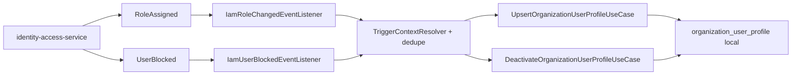
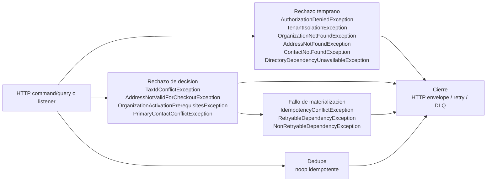

## Proposito
Definir el runtime tecnico completo de `directory-service`, alineado con la `Vista de Codigo` vigente y cerrando la trazabilidad entre `controller`, `command/query`, `use case`, dominio, persistencia, cache, validadores externos, auditoria, outbox y eventos, incluyendo la sincronizacion interna de perfiles de usuario organizacionales desde IAM.

## Alcance y fronteras
- Incluye los 22 casos HTTP activos documentados en contratos para el MVP de Directory.
- Incluye los flujos internos activos consumidos desde IAM para reconciliar `organization_user_profile`.
- Incluye `api-gateway-service` como borde obligatorio solo en el `Panorama global` de flujos HTTP.
- Incluye clases owner exactas de [02-Vista-de-Codigo.md](/Users/jose/Development/Documentation/arkab2b-docs/content/mvp/02-arquitectura/services/directory-service/architecture/02-Vista-de-Codigo.md) y cierra la trazabilidad completa del servicio en la seccion `Cobertura completa contra Vista de Codigo`.
- Excluye detalle de despliegue y runtime interno de otros BC fuera de sus interacciones con Directory.

## Casos de uso cubiertos por Directory
| ID | Caso de uso | Trigger | Resultado esperado |
|---|---|---|---|
| UC-DIR-01 | RegisterOrganization | `POST /api/v1/directory/organizations` | organizacion creada con estado inicial |
| UC-DIR-02 | UpdateOrganizationProfile | `PATCH /api/v1/directory/organizations/{organizationId}` | perfil organizacional actualizado |
| UC-DIR-03 | UpdateOrganizationLegalData | `PATCH /api/v1/directory/organizations/{organizationId}/legal-data` | datos legales actualizados y validados |
| UC-DIR-04 | ActivateOrganization | `POST /api/v1/directory/organizations/{organizationId}/activate` | organizacion activada para operar |
| UC-DIR-05 | SuspendOrganization | `POST /api/v1/directory/organizations/{organizationId}/suspend` | organizacion suspendida y propagada |
| UC-DIR-06 | RegisterAddress | `POST /api/v1/directory/organizations/{organizationId}/addresses` | direccion activa lista para uso |
| UC-DIR-07 | UpdateAddress | `PATCH /api/v1/directory/organizations/{organizationId}/addresses/{addressId}` | direccion actualizada y revalidada |
| UC-DIR-08 | SetDefaultAddress | `POST /api/v1/directory/organizations/{organizationId}/addresses/{addressId}/set-default` | direccion default unica por tipo |
| UC-DIR-09 | DeactivateAddress | `POST /api/v1/directory/organizations/{organizationId}/addresses/{addressId}/deactivate` | direccion desactivada para checkout |
| UC-DIR-10 | RegisterContact | `POST /api/v1/directory/organizations/{organizationId}/contacts` | contacto institucional activo listo para operaciones |
| UC-DIR-11 | UpdateContact | `PATCH /api/v1/directory/organizations/{organizationId}/contacts/{contactId}` | contacto institucional actualizado sin romper invariantes |
| UC-DIR-12 | SetPrimaryContact | `POST /api/v1/directory/organizations/{organizationId}/contacts/{contactId}/set-primary` | contacto institucional primario unico por tipo |
| UC-DIR-13 | DeactivateContact | `POST /api/v1/directory/organizations/{organizationId}/contacts/{contactId}/deactivate` | contacto institucional fuera de operacion activa |
| UC-DIR-14 | ValidateCheckoutAddress | `POST /api/v1/directory/organizations/{organizationId}/checkout-address-validations` | validacion semantica de direccion para checkout |
| UC-DIR-15 | ListOrganizationAddresses | `GET /api/v1/directory/organizations/{organizationId}/addresses` | lista paginada de direcciones |
| UC-DIR-16 | ListOrganizationContacts | `GET /api/v1/directory/organizations/{organizationId}/contacts` | lista paginada de contactos |
| UC-DIR-17 | ConfigureCountryOperationalPolicy | `PUT /api/v1/directory/organizations/{organizationId}/operational-country-settings/{countryCode}` | politica operativa por pais configurada |
| UC-DIR-18 | ResolveCountryOperationalPolicy | `GET /api/v1/directory/organizations/{organizationId}/operational-country-settings/{countryCode}` | politica operativa vigente resuelta |
| UC-DIR-19 | GetDirectorySummary | `GET /api/v1/directory/organizations/{organizationId}/summary` | snapshot consolidado de organization, address y contactos institucionales |
| UC-DIR-20 | GetOrganizationProfile | `GET /api/v1/directory/organizations/{organizationId}` | perfil organizacional puntual |
| UC-DIR-21 | GetOrganizationAddressById | `GET /api/v1/directory/organizations/{organizationId}/addresses/{addressId}` | direccion puntual de la organizacion |
| UC-DIR-22 | GetOrganizationContactById | `GET /api/v1/directory/organizations/{organizationId}/contacts/{contactId}` | contacto institucional puntual de la organizacion |

## Flujos internos sincronizados desde IAM
| ID | Flujo interno | Trigger | Resultado esperado |
|---|---|---|---|
| EVT-DIR-01 | SyncOrganizationUserProfileFromRoleAssigned | `iam.user-role-assigned.v1` | perfil de usuario organizacional local reconciliado sin duplicar credenciales ni sesiones |
| EVT-DIR-02 | DeactivateOrganizationUserProfileFromUserBlocked | `iam.user-blocked.v1` | perfil de usuario organizacional local inactivado si seguia operativo |

## Regla de lectura de los diagramas
- Los diagramas usan nombres exactos de las clases owner documentadas en [02-Vista-de-Codigo.md](/Users/jose/Development/Documentation/arkab2b-docs/content/mvp/02-arquitectura/services/directory-service/architecture/02-Vista-de-Codigo.md).
- El `Panorama global` conserva la cadena HTTP completa: `api-gateway-service -> Controller -> Request -> Mapper web -> Command/Query -> Port-In -> UseCase -> Result -> ResponseMapper -> Response`, manteniendo el detalle semantico interno en `Application`.
- Los diagramas detallados por fases representan solo la arquitectura interna del servicio; por eso arrancan en `Controller`, `Request`, `Mapper web`, `UseCase` o `Listener`, segun el caso.
- Los casos de consulta con `DirectoryCachePort` y `DirectoryCacheRedisAdapter` pueden cortar parte del happy path cuando hay `cache hit`, pero el documento sigue mostrando tambien la ruta completa de `cache miss`.
- Las clases no expuestas por REST, pero activas por integracion interna desde IAM, se cierran explicitamente en `Cobertura completa contra Vista de Codigo`.

## Modelo runtime de autenticacion y autorizacion
| Tipo de flujo | Regla aplicada |
|---|---|
| HTTP command/query | `api-gateway-service` autentica el request. Cuando el caso muestra resolucion de seguridad, `directory-service` materializa `PrincipalContext`, valida permiso base y cierra `tenant`/accion permitida antes de pasar a la decision del dominio. |
| listener interno | No se asume JWT de usuario. El servicio materializa `TriggerContext` mediante `TriggerContextResolver`, valida `tenant`, origen tecnico, dedupe y legitimidad del trigger en `Preparacion`, `Contextualizacion` o `Decision`, segun el caso, y solo sincroniza `organization_user_profile` local cuando el trigger proviene de IAM. |

## Modelo runtime de errores y excepciones
| Tipo de flujo | Regla aplicada |
|---|---|
| HTTP command/query | `Rechazo temprano` y `Rechazo de decision` se propagan como familias semanticas canonicas desde `PrincipalContext`, guard funcional base, `TenantIsolationPolicy`, `DirectoryAuthorizationPolicy` y el dominio; el adapter-in HTTP las traduce al envelope canonico. |
| listener interno | `TriggerContext`, dedupe y politicas del dominio emiten error semantico o `noop idempotente`; si el fallo es tecnico se clasifica como retryable/no-retryable para reintento o DLQ. |

### Diagrama runtime de excepciones concretas

## Patron de fases runtime
Los casos de uso de este servicio se documentan usando un patron de fases comun. La intencion es separar con claridad donde entra el caso, donde se prepara el contexto, donde se decide negocio y donde se materializan o propagan efectos.

| Fase | Que explica |
|---|---|
| `Ingreso` | Como entra el trigger al servicio y se convierte en un contrato de aplicacion. Incluye `request` o mensaje de entrada, `controller` o `listener`, mappers de entrada, `command/query` y `port in`. |
| `Preparacion` | Como el caso de uso transforma la entrada a contexto semantico interno. Incluye `use case`, assemblers de aplicacion y tipos del dominio derivados del contrato. |
| `Contextualizacion` | Como el caso obtiene datos o validaciones tecnicas necesarias antes de decidir. Incluye `ports out`, `adapters out`, cache, repositorios, `clock` y clientes externos. |
| `Decision` | Donde el dominio toma la decision real del caso. Incluye agregados, entidades, `value objects` de decision, politicas y eventos de dominio. |
| `Materializacion` | Como se hace efectiva la decision ya tomada. Incluye persistencia de cambios, auditoria, cache y escritura en outbox. |
| `Proyeccion` | Como el estado final del caso se transforma primero en un `result` interno y luego en una `response` consumible por el llamador del servicio. |
| `Propagacion` | Como los efectos asincronos ya materializados salen del servicio. Incluye relay de outbox, mapeo a integracion y publicacion en broker. |

### Regla para rutas alternativas
- El flujo principal describe el `happy path`.
- Si una variante de rechazo corta el caso antes de completar todas las fases, se documenta como ruta alternativa explicita.
- Una ruta de rechazo debe indicar donde se corta el flujo, que fases ya no ocurren y que salida de error o compensacion si ocurren.

## Diagramas runtime por caso de uso


{}
{}
> El bloque `Exito` describe el `happy path` de `RegisterOrganization`. El bloque `Rechazo` agrupa `Rechazo temprano`, `Rechazo de decision`, `Fallo de materializacion`, `Fallo de propagacion`.

<table>
  <thead>
    <tr>
      <th>Etapa</th>
      <th>Clases para RegisterOrganization</th>
      <th>Responsabilidad</th>
    </tr>
  </thead>
  <tbody>
    <tr>
      <td>Ingreso</td>
      <td><code>OrganizationHttpController</code>, <code>RegisterOrganizationRequest</code>, <code>RegisterOrganizationCommandMapper</code>, <code>RegisterOrganizationCommand</code>, <code>RegisterOrganizationCommandUseCase</code></td>
      <td>Recibe el trigger del caso dentro del servicio y lo traduce al contrato de aplicacion que inicia el flujo interno.</td>
    </tr>
    <tr>
      <td>Preparacion</td>
      <td><code>RegisterOrganizationUseCase</code>, <code>RegisterOrganizationCommandAssembler</code>, <code>OrganizationCode</code>, <code>LegalName</code>, <code>CountryCode</code>, <code>TaxIdentifier</code></td>
      <td>Normaliza la intencion del caso y construye contexto semantico interno sin hacer I/O externo.</td>
    </tr>
    <tr>
      <td>Contextualizacion - Seguridad</td>
      <td><code>RegisterOrganizationUseCase</code>, <code>PrincipalContextPort</code>, <code>PrincipalContextAdapter</code>, <code>TenantContextPort</code>, <code>JwtTenantContextAdapter</code>, <code>PermissionEvaluatorPort</code>, <code>RbacPermissionEvaluatorAdapter</code></td>
      <td>Obtiene datos, autorizaciones o validaciones tecnicas necesarias antes de decidir en dominio.</td>
    </tr>
    <tr>
      <td>Contextualizacion - Legal</td>
      <td><code>RegisterOrganizationUseCase</code>, <code>TaxIdValidationPort</code>, <code>TaxIdValidationHttpClientAdapter</code>, <code>ClockPort</code>, <code>SystemClockAdapter</code></td>
      <td>Obtiene datos, autorizaciones o validaciones tecnicas necesarias antes de decidir en dominio.</td>
    </tr>
    <tr>
      <td>Decision - Organization</td>
      <td><code>RegisterOrganizationUseCase</code>, <code>DirectoryAuthorizationPolicy</code>, <code>LegalValidationService</code>, <code>OrganizationAggregate</code>, <code>OrganizationLegalProfile</code>, <code>OrganizationOperationalPreferences</code>, <code>OrganizationRegisteredEvent</code></td>
      <td>Evalua invariantes, reglas y politicas del dominio para aceptar, rechazar o consolidar el resultado del caso.</td>
    </tr>
    <tr>
      <td>Materializacion</td>
      <td><code>RegisterOrganizationUseCase</code>, <code>OrganizationPersistencePort</code>, <code>OrganizationR2dbcRepositoryAdapter</code>, <code>OrganizationLegalPersistencePort</code>, <code>DirectoryAuditPort</code>, <code>OutboxPersistencePort</code>, <code>OutboxEventRow</code></td>
      <td>Hace efectiva la decision tomada: persistencia, auditoria, cache y outbox segun corresponda.</td>
    </tr>
    <tr>
      <td>Proyeccion</td>
      <td><code>RegisterOrganizationUseCase</code>, <code>OrganizationProfileResultMapper</code>, <code>OrganizationProfileResult</code>, <code>OrganizationProfileResponseMapper</code>, <code>OrganizationProfileResponse</code>, <code>OrganizationHttpController</code></td>
      <td>Convierte el estado final del caso en la respuesta expuesta por el servicio.</td>
    </tr>
    <tr>
      <td>Propagacion</td>
      <td><code>OrganizationRegisteredEvent</code>, <code>OutboxEventRow</code>, <code>OutboxEventRelayPublisher</code>, <code>DomainEventKafkaMapper</code>, <code>DomainEventPublisherPort</code>, <code>KafkaDomainEventPublisherAdapter</code></td>
      <td>Publica los efectos asincronos ya materializados mediante relay, outbox y broker.</td>
    </tr>
    <tr>
      <td>Rechazo temprano</td>
      <td><code>RegisterOrganizationUseCase</code>, <code>PermissionEvaluatorPort</code>, <code>RbacPermissionEvaluatorAdapter</code>, <code>TaxIdValidationPort</code>, <code>TaxIdValidationHttpClientAdapter</code>, <code>OrganizationHttpController</code>, <code>WebExceptionHandlerConfig</code></td>
      <td>Corta el flujo antes de decidir en dominio por autorizacion, validacion tecnica o ausencia de contexto externo.</td>
    </tr>
    <tr>
      <td>Rechazo de decision</td>
      <td><code>RegisterOrganizationUseCase</code>, <code>DirectoryAuthorizationPolicy</code>, <code>LegalValidationService</code>, <code>OrganizationAggregate</code>, <code>DirectoryAuditPort</code>, <code>OrganizationHttpController</code>, <code>WebExceptionHandlerConfig</code></td>
      <td>Corta el flujo despues de evaluar negocio o invariantes del dominio.</td>
    </tr>
    <tr>
      <td>Fallo de materializacion</td>
      <td><code>RegisterOrganizationUseCase</code>, <code>OrganizationPersistencePort</code>, <code>OrganizationLegalPersistencePort</code>, <code>DirectoryAuditPort</code>, <code>OutboxPersistencePort</code>, <code>OrganizationHttpController</code>, <code>WebExceptionHandlerConfig</code></td>
      <td>Representa un error tecnico posterior a la decision al persistir, auditar o escribir outbox/cache.</td>
    </tr>
    <tr>
      <td>Fallo de propagacion</td>
      <td><code>OrganizationRegisteredEvent</code>, <code>OutboxEventRow</code>, <code>OutboxEventRelayPublisher</code>, <code>DomainEventKafkaMapper</code>, <code>DomainEventPublisherPort</code>, <code>KafkaDomainEventPublisherAdapter</code></td>
      <td>Representa un error asincrono al publicar efectos ya materializados.</td>
    </tr>
  </tbody>
</table>
{}
{}
{}
{}

sequenceDiagram
  participant P1 as OrganizationHttpController
  participant P2 as RegisterOrganizationRequest
  participant P3 as RegisterOrganizationCommandMapper
  participant P4 as RegisterOrganizationCommand
  participant P5 as RegisterOrganizationCommandUseCase
  P1->>P2: recibe request
  P2->>P3: entrega payload HTTP
  P3->>P4: crea command
  P4->>P5: entra por port in


**Descripcion de la fase.** Recibe el trigger HTTP del caso dentro del servicio y lo traduce al contrato de aplicacion que inicia el flujo interno.

**Capa predominante.** Se ubica principalmente en `Adapter-in`, con cruce controlado hacia el puerto de entrada de `Application service`.

<table>
  <thead>
    <tr>
      <th>Paso</th>
      <th>Clase</th>
      <th>Accion</th>
    </tr>
  </thead>
  <tbody>
    <tr>
      <td>1</td>
      <td><code>OrganizationHttpController</code></td>
      <td>Recibe el request HTTP del caso y delega su traduccion hacia el contrato de aplicacion correspondiente.</td>
    </tr>
    <tr>
      <td>2</td>
      <td><code>RegisterOrganizationRequest</code></td>
      <td>Representa el payload HTTP ya normalizado en la frontera web del servicio.</td>
    </tr>
    <tr>
      <td>3</td>
      <td><code>RegisterOrganizationCommandMapper</code></td>
      <td>Transforma el request y el principal autenticado en el command de aplicacion del caso.</td>
    </tr>
    <tr>
      <td>4</td>
      <td><code>RegisterOrganizationCommand</code></td>
      <td>Formaliza la intencion del caso como contrato estable de `Application`.</td>
    </tr>
    <tr>
      <td>5</td>
      <td><code>RegisterOrganizationCommandUseCase</code></td>
      <td>Expone el puerto de entrada reactivo por el que el caso entra al servicio.</td>
    </tr>
  </tbody>
</table>
{}
{}

sequenceDiagram
  participant P1 as RegisterOrganizationUseCase
  participant P2 as OrganizationCode
  participant P3 as LegalName
  participant P4 as CountryCode
  participant P5 as TaxIdentifier
  P1->>P2: crea codigo
  P2->>P3: crea razon social
  P3->>P4: crea pais
  P4->>P5: crea tax id


**Descripcion de la fase.** Normaliza la intencion del caso y construye contexto semantico interno sin hacer I/O externo.

**Capa predominante.** Se ubica principalmente en `Application service`, con apoyo de tipos del `Domain`.

<table>
  <thead>
    <tr>
      <th>Paso</th>
      <th>Clase</th>
      <th>Accion</th>
    </tr>
  </thead>
  <tbody>
    <tr>
      <td>1</td>
      <td><code>RegisterOrganizationUseCase</code></td>
      <td>Normaliza el comando y organiza los datos semanticos que el dominio necesitara para decidir.</td>
    </tr>
    <tr>
      <td>2</td>
      <td><code>OrganizationCode</code></td>
      <td>Representa el codigo organizacional con semantica de dominio y validaciones propias.</td>
    </tr>
    <tr>
      <td>3</td>
      <td><code>LegalName</code></td>
      <td>Encapsula la razon social con las restricciones del dominio del directorio.</td>
    </tr>
    <tr>
      <td>4</td>
      <td><code>CountryCode</code></td>
      <td>Contextualiza la organizacion en el pais operativo que regira validaciones y politicas.</td>
    </tr>
    <tr>
      <td>5</td>
      <td><code>TaxIdentifier</code></td>
      <td>Normaliza el identificador fiscal que sera validado y persistido junto con el perfil legal.</td>
    </tr>
  </tbody>
</table>
{}
{}

sequenceDiagram
  participant P1 as RegisterOrganizationUseCase
  participant P2 as PrincipalContextPort
  participant P3 as PrincipalContextAdapter
  participant P4 as TenantContextPort
  participant P5 as JwtTenantContextAdapter
  participant P6 as PermissionEvaluatorPort
  participant P7 as RbacPermissionEvaluatorAdapter
  P1->>P2: lee claims
  P2->>P3: extrae claims
  P3->>P4: resuelve tenant
  P4->>P5: extrae tenant
  P5->>P6: evalua permiso
  P6->>P7: consulta RBAC


**Descripcion de la fase.** Obtiene datos, autorizaciones o validaciones tecnicas necesarias antes de decidir en dominio.

**Capa predominante.** Se ubica en la frontera entre `Application service` y `Adapter-out`.

<table>
  <thead>
    <tr>
      <th>Paso</th>
      <th>Clase</th>
      <th>Accion</th>
    </tr>
  </thead>
  <tbody>
    <tr>
      <td>1</td>
      <td><code>RegisterOrganizationUseCase</code></td>
      <td>Coordina la obtencion del contexto de identidad y autorizacion previo a cualquier decision del caso.</td>
    </tr>
    <tr>
      <td>2</td>
      <td><code>PrincipalContextPort</code></td>
      <td>Expone los claims del token o del principal tecnico que entra al caso.</td>
    </tr>
    <tr>
      <td>3</td>
      <td><code>PrincipalContextAdapter</code></td>
      <td>Recupera los claims desde la infraestructura de seguridad reactiva del servicio.</td>
    </tr>
    <tr>
      <td>4</td>
      <td><code>TenantContextPort</code></td>
      <td>Entrega el tenant y el actor efectivos con los que debe ejecutarse el caso.</td>
    </tr>
    <tr>
      <td>5</td>
      <td><code>JwtTenantContextAdapter</code></td>
      <td>Construye el contexto de tenant a partir del token autenticado.</td>
    </tr>
    <tr>
      <td>6</td>
      <td><code>PermissionEvaluatorPort</code></td>
      <td>Formaliza la consulta de autorizacion requerida por el caso.</td>
    </tr>
    <tr>
      <td>7</td>
      <td><code>RbacPermissionEvaluatorAdapter</code></td>
      <td>Consulta la matriz RBAC efectiva y devuelve si la accion esta autorizada.</td>
    </tr>
  </tbody>
</table>
{}
{}

sequenceDiagram
  participant P1 as RegisterOrganizationUseCase
  participant P2 as TaxIdValidationPort
  participant P3 as TaxIdValidationHttpClientAdapter
  participant P4 as ClockPort
  participant P5 as SystemClockAdapter
  P1->>P2: valida tax id
  P2->>P3: consulta validador
  P3->>P4: solicita tiempo
  P4->>P5: entrega ahora


**Descripcion de la fase.** Obtiene datos, autorizaciones o validaciones tecnicas necesarias antes de decidir en dominio.

**Capa predominante.** Se ubica en la frontera entre `Application service` y `Adapter-out`.

<table>
  <thead>
    <tr>
      <th>Paso</th>
      <th>Clase</th>
      <th>Accion</th>
    </tr>
  </thead>
  <tbody>
    <tr>
      <td>1</td>
      <td><code>RegisterOrganizationUseCase</code></td>
      <td>Solicita la verificacion tecnica del identificador fiscal y la referencia temporal del alta.</td>
    </tr>
    <tr>
      <td>2</td>
      <td><code>TaxIdValidationPort</code></td>
      <td>Expone la validacion externa del tax id segun pais y tipo documental.</td>
    </tr>
    <tr>
      <td>3</td>
      <td><code>TaxIdValidationHttpClientAdapter</code></td>
      <td>Consulta el validador externo y devuelve el resultado tecnico de la verificacion.</td>
    </tr>
    <tr>
      <td>4</td>
      <td><code>ClockPort</code></td>
      <td>Entrega la referencia temporal con la que se sellara la nueva organizacion.</td>
    </tr>
    <tr>
      <td>5</td>
      <td><code>SystemClockAdapter</code></td>
      <td>Provee la hora del sistema como fuente tecnica confiable para el caso.</td>
    </tr>
  </tbody>
</table>
{}
{}

sequenceDiagram
  participant P1 as RegisterOrganizationUseCase
  participant P2 as DirectoryAuthorizationPolicy
  participant P3 as LegalValidationService
  participant P4 as OrganizationAggregate
  participant P5 as OrganizationLegalProfile
  participant P6 as OrganizationOperationalPreferences
  participant P7 as OrganizationRegisteredEvent
  P1->>P2: autoriza accion
  P2->>P3: consolida validacion
  P3->>P4: registra organizacion
  P4->>P5: construye perfil legal
  P5->>P6: inicializa preferencias operativas
  P6->>P7: emite evento


**Descripcion de la fase.** Evalua invariantes, reglas y politicas del dominio para aceptar, rechazar o consolidar el resultado del caso.

**Capa predominante.** Se ubica principalmente en `Domain`, orquestada por `Application service`.

<table>
  <thead>
    <tr>
      <th>Paso</th>
      <th>Clase</th>
      <th>Accion</th>
    </tr>
  </thead>
  <tbody>
    <tr>
      <td>1</td>
      <td><code>RegisterOrganizationUseCase</code></td>
      <td>Lleva al dominio el contexto ya validado para crear la organizacion y su perfil legal.</td>
    </tr>
    <tr>
      <td>2</td>
      <td><code>DirectoryAuthorizationPolicy</code></td>
      <td>Revalida la accion permitida sobre el recurso de directorio antes de mutar estado.</td>
    </tr>
    <tr>
      <td>3</td>
      <td><code>LegalValidationService</code></td>
      <td>Consolida la semantica de validacion fiscal previa a la creacion del agregado.</td>
    </tr>
    <tr>
      <td>4</td>
      <td><code>OrganizationAggregate</code></td>
      <td>Crea la organizacion con su estado inicial y emite el evento de alta correspondiente.</td>
    </tr>
    <tr>
      <td>5</td>
      <td><code>OrganizationLegalProfile</code></td>
      <td>Modela el perfil legal asociado y fija su estado de verificacion inicial.</td>
    </tr>
    <tr>
      <td>6</td>
      <td><code>OrganizationOperationalPreferences</code></td>
      <td>Inicializa la configuracion base operativa y comercial de la organizacion.</td>
    </tr>
    <tr>
      <td>7</td>
      <td><code>OrganizationRegisteredEvent</code></td>
      <td>Representa el evento de dominio que deja trazado el alta organizacional.</td>
    </tr>
  </tbody>
</table>
{}
{}

sequenceDiagram
  participant P1 as RegisterOrganizationUseCase
  participant P2 as OrganizationPersistencePort
  participant P3 as OrganizationR2dbcRepositoryAdapter
  participant P4 as OrganizationLegalPersistencePort
  participant P6 as DirectoryAuditPort
  participant P7 as OutboxPersistencePort
  participant P8 as OutboxEventRow
  P1->>P2: persiste organizacion
  P2->>P3: guarda agregado
  P3->>P4: persiste perfil legal
  P4->>P6: audita operacion
  P6->>P7: escribe outbox
  P7->>P8: deja evento pendiente


**Descripcion de la fase.** Hace efectiva la decision tomada: persistencia, auditoria, cache y outbox segun corresponda.

**Capa predominante.** Se ubica en la frontera entre `Application service` y `Adapter-out`.

<table>
  <thead>
    <tr>
      <th>Paso</th>
      <th>Clase</th>
      <th>Accion</th>
    </tr>
  </thead>
  <tbody>
    <tr>
      <td>1</td>
      <td><code>RegisterOrganizationUseCase</code></td>
      <td>Orquesta la persistencia final del agregado, la auditoria y la escritura del outbox.</td>
    </tr>
    <tr>
      <td>2</td>
      <td><code>OrganizationPersistencePort</code></td>
      <td>Expone la persistencia reactiva del agregado organizacional.</td>
    </tr>
    <tr>
      <td>3</td>
      <td><code>OrganizationR2dbcRepositoryAdapter</code></td>
      <td>Adapta el agregado a almacenamiento relacional reactivo.</td>
    </tr>
    <tr>
      <td>4</td>
      <td><code>OrganizationLegalPersistencePort</code></td>
      <td>Persiste el perfil legal asociado a la organizacion recien creada.</td>
    </tr>
    <tr>
      <td>5</td>
      <td><code>DirectoryAuditPort</code></td>
      <td>Registra la mutacion como evidencia operativa y de cumplimiento.</td>
    </tr>
    <tr>
      <td>6</td>
      <td><code>OutboxPersistencePort</code></td>
      <td>Escribe el evento pendiente de publicacion dentro de la misma unidad de trabajo.</td>
    </tr>
    <tr>
      <td>7</td>
      <td><code>OutboxEventRow</code></td>
      <td>Representa la fila persistida que alimentara el relay asincrono del evento.</td>
    </tr>
  </tbody>
</table>
{}
{}

sequenceDiagram
  participant P1 as RegisterOrganizationUseCase
  participant P2 as OrganizationProfileResultMapper
  participant P3 as OrganizationProfileResult
  participant P4 as OrganizationProfileResponseMapper
  participant P5 as OrganizationProfileResponse
  participant P6 as OrganizationHttpController
  P1->>P2: consolida estado final
  P2->>P3: crea result
  P3->>P4: entrega resultado interno
  P4->>P5: crea response
  P5->>P6: retorna respuesta


**Descripcion de la fase.** Convierte el estado final del caso primero en un `result` interno y luego en la `response` expuesta por el servicio.

**Capa predominante.** Se ubica principalmente en `Application service`, cerrando el retorno hacia `Adapter-in`.

<table>
  <thead>
    <tr>
      <th>Paso</th>
      <th>Clase</th>
      <th>Accion</th>
    </tr>
  </thead>
  <tbody>
    <tr>
      <td>1</td>
      <td><code>RegisterOrganizationUseCase</code></td>
      <td>Entrega el estado final del caso para iniciar su proyeccion interna y externa.</td>
    </tr>
    <tr>
      <td>2</td>
      <td><code>OrganizationProfileResultMapper</code></td>
      <td>Transforma el estado de aplicacion o del dominio en el `result` interno del caso.</td>
    </tr>
    <tr>
      <td>3</td>
      <td><code>OrganizationProfileResult</code></td>
      <td>Representa el contrato de salida interno de `Application` antes de tocar el borde HTTP.</td>
    </tr>
    <tr>
      <td>4</td>
      <td><code>OrganizationProfileResponseMapper</code></td>
      <td>Convierte el `result` en la `response` consumible por el cliente HTTP.</td>
    </tr>
    <tr>
      <td>5</td>
      <td><code>OrganizationProfileResponse</code></td>
      <td>Representa el envelope HTTP final que el servicio expone al exterior.</td>
    </tr>
    <tr>
      <td>6</td>
      <td><code>OrganizationHttpController</code></td>
      <td>Devuelve la respuesta HTTP del caso una vez el flujo interno se completa correctamente.</td>
    </tr>
  </tbody>
</table>
{}
{}

sequenceDiagram
  participant P1 as OrganizationRegisteredEvent
  participant P2 as OutboxEventRow
  participant P3 as OutboxEventRelayPublisher
  participant P4 as DomainEventKafkaMapper
  participant P5 as DomainEventPublisherPort
  participant P6 as KafkaDomainEventPublisherAdapter
  P1->>P2: lee outbox
  P2->>P3: ejecuta relay
  P3->>P4: mapea envelope
  P4->>P5: publica evento
  P5->>P6: publica en kafka


**Descripcion de la fase.** Publica los efectos asincronos ya materializados mediante relay, outbox y broker.

**Capa predominante.** Se ubica principalmente en `Adapter-out`.

<table>
  <thead>
    <tr>
      <th>Paso</th>
      <th>Clase</th>
      <th>Accion</th>
    </tr>
  </thead>
  <tbody>
    <tr>
      <td>1</td>
      <td><code>OrganizationRegisteredEvent</code></td>
      <td>Representa el evento de alta que ya fue materializado y queda listo para integracion.</td>
    </tr>
    <tr>
      <td>2</td>
      <td><code>OutboxEventRow</code></td>
      <td>Entrega al relay la unidad persistida desde la que se publicara el evento.</td>
    </tr>
    <tr>
      <td>3</td>
      <td><code>OutboxEventRelayPublisher</code></td>
      <td>Consume eventos pendientes del outbox sin bloquear la respuesta HTTP del caso.</td>
    </tr>
    <tr>
      <td>4</td>
      <td><code>DomainEventKafkaMapper</code></td>
      <td>Convierte el evento de dominio al envelope de integracion del broker.</td>
    </tr>
    <tr>
      <td>5</td>
      <td><code>DomainEventPublisherPort</code></td>
      <td>Formaliza la publicacion asincrona desde el servicio de directorio.</td>
    </tr>
    <tr>
      <td>6</td>
      <td><code>KafkaDomainEventPublisherAdapter</code></td>
      <td>Publica el evento de alta organizacional en el broker configurado.</td>
    </tr>
  </tbody>
</table>
{}
{}
{}
{}
{}
{}

sequenceDiagram
  participant P1 as RegisterOrganizationUseCase
  participant P2 as PermissionEvaluatorPort
  participant P3 as RbacPermissionEvaluatorAdapter
  participant P4 as TaxIdValidationPort
  participant P5 as TaxIdValidationHttpClientAdapter
  participant P6 as OrganizationHttpController
  participant P7 as WebExceptionHandlerConfig
  P1->>P2: bloquea operacion
  P2->>P3: consulta RBAC
  P3->>P4: rechaza tax id
  P4->>P5: retorna rechazo tecnico
  P5->>P6: propaga error
  P6->>P7: mapea error HTTP


**Descripcion de la fase.** Corta el flujo antes de decidir en dominio por autorizacion, validacion tecnica o ausencia de contexto externo.

**Capa predominante.** Se ubica en la frontera `Adapter-in` / `Application service` con apoyo de `Adapter-out`.

<table>
  <thead>
    <tr>
      <th>Paso</th>
      <th>Clase</th>
      <th>Accion</th>
    </tr>
  </thead>
  <tbody>
    <tr>
      <td>1</td>
      <td><code>RegisterOrganizationUseCase</code></td>
      <td>Detecta una condicion tecnica o de autorizacion que impide continuar antes de decidir en dominio.</td>
    </tr>
    <tr>
      <td>2</td>
      <td><code>PermissionEvaluatorPort</code></td>
      <td>Detecta que el actor no esta autorizado para crear organizaciones en este contexto.</td>
    </tr>
    <tr>
      <td>3</td>
      <td><code>RbacPermissionEvaluatorAdapter</code></td>
      <td>Resuelve la autorizacion tecnica desde RBAC y devuelve denegacion si aplica.</td>
    </tr>
    <tr>
      <td>4</td>
      <td><code>TaxIdValidationPort</code></td>
      <td>Detecta que la validacion tecnica del tax id no puede continuar o resulta invalida.</td>
    </tr>
    <tr>
      <td>5</td>
      <td><code>TaxIdValidationHttpClientAdapter</code></td>
      <td>Devuelve el rechazo tecnico del validador fiscal externo.</td>
    </tr>
    <tr>
      <td>6</td>
      <td><code>OrganizationHttpController</code></td>
      <td>Recibe la senal de error y cierra el flujo HTTP del caso sin avanzar a decision de dominio.</td>
    </tr>
    <tr>
      <td>7</td>
      <td><code>WebExceptionHandlerConfig</code></td>
      <td>Traduce la excepcion o el rechazo tecnico a la respuesta HTTP correspondiente.</td>
    </tr>
  </tbody>
</table>
{}
{}

sequenceDiagram
  participant P1 as RegisterOrganizationUseCase
  participant P2 as DirectoryAuthorizationPolicy
  participant P3 as LegalValidationService
  participant P4 as OrganizationAggregate
  participant P5 as DirectoryAuditPort
  participant P6 as OrganizationHttpController
  participant P7 as WebExceptionHandlerConfig
  P1->>P2: niega accion
  P2->>P3: rechaza legalmente
  P3->>P4: rechaza alta
  P4->>P5: audita rechazo
  P5->>P6: retorna rechazo
  P6->>P7: serializa error


**Descripcion de la fase.** Corta el flujo despues de evaluar negocio o invariantes del dominio.

**Capa predominante.** Se ubica principalmente en `Domain`, con cierre de error hacia `Adapter-in`.

<table>
  <thead>
    <tr>
      <th>Paso</th>
      <th>Clase</th>
      <th>Accion</th>
    </tr>
  </thead>
  <tbody>
    <tr>
      <td>1</td>
      <td><code>RegisterOrganizationUseCase</code></td>
      <td>Llega al punto de decision con contexto valido pero el dominio rechaza la operacion por reglas o invariantes.</td>
    </tr>
    <tr>
      <td>2</td>
      <td><code>DirectoryAuthorizationPolicy</code></td>
      <td>Rechaza la accion si la combinacion actor-recurso rompe la politica del dominio.</td>
    </tr>
    <tr>
      <td>3</td>
      <td><code>LegalValidationService</code></td>
      <td>Rechaza el alta si la semantica legal consolidada sigue siendo inconsistente.</td>
    </tr>
    <tr>
      <td>4</td>
      <td><code>OrganizationAggregate</code></td>
      <td>Bloquea la creacion cuando las invariantes del agregado no pueden sostenerse.</td>
    </tr>
    <tr>
      <td>5</td>
      <td><code>DirectoryAuditPort</code></td>
      <td>Registra el rechazo de negocio para trazabilidad operativa y cumplimiento.</td>
    </tr>
    <tr>
      <td>6</td>
      <td><code>OrganizationHttpController</code></td>
      <td>Recibe la salida de rechazo y corta el happy path del caso.</td>
    </tr>
    <tr>
      <td>7</td>
      <td><code>WebExceptionHandlerConfig</code></td>
      <td>Convierte el rechazo semantico a la respuesta HTTP del contrato.</td>
    </tr>
  </tbody>
</table>
{}
{}

sequenceDiagram
  participant P1 as RegisterOrganizationUseCase
  participant P2 as OrganizationPersistencePort
  participant P3 as OrganizationLegalPersistencePort
  participant P5 as DirectoryAuditPort
  participant P6 as OutboxPersistencePort
  participant P7 as OrganizationHttpController
  participant P8 as WebExceptionHandlerConfig
  P1->>P2: falla persistencia
  P2->>P3: falla perfil legal
  P3->>P5: falla auditoria
  P5->>P6: falla outbox
  P6->>P7: propaga error tecnico
  P7->>P8: mapea error HTTP


**Descripcion de la fase.** Representa un error tecnico posterior a la decision al persistir, auditar o escribir outbox/cache.

**Capa predominante.** Se ubica en la frontera entre `Application service` y `Adapter-out`.

<table>
  <thead>
    <tr>
      <th>Paso</th>
      <th>Clase</th>
      <th>Accion</th>
    </tr>
  </thead>
  <tbody>
    <tr>
      <td>1</td>
      <td><code>RegisterOrganizationUseCase</code></td>
      <td>Ya existe una decision valida, pero una dependencia de salida falla al hacerla efectiva.</td>
    </tr>
    <tr>
      <td>2</td>
      <td><code>OrganizationPersistencePort</code></td>
      <td>Falla al persistir la organizacion y corta la unidad de trabajo del caso.</td>
    </tr>
    <tr>
      <td>3</td>
      <td><code>OrganizationLegalPersistencePort</code></td>
      <td>Falla al persistir el perfil legal requerido por el alta.</td>
    </tr>
    <tr>
      <td>4</td>
      <td><code>DirectoryAuditPort</code></td>
      <td>No logra registrar la evidencia operativa del alta.</td>
    </tr>
    <tr>
      <td>5</td>
      <td><code>OutboxPersistencePort</code></td>
      <td>No logra dejar el evento listo para propagacion asincrona.</td>
    </tr>
    <tr>
      <td>6</td>
      <td><code>OrganizationHttpController</code></td>
      <td>Recibe el error tecnico y corta la respuesta exitosa del caso.</td>
    </tr>
    <tr>
      <td>7</td>
      <td><code>WebExceptionHandlerConfig</code></td>
      <td>Mapea la falla tecnica a la respuesta HTTP de error apropiada.</td>
    </tr>
  </tbody>
</table>
{}
{}

sequenceDiagram
  participant P1 as OrganizationRegisteredEvent
  participant P2 as OutboxEventRow
  participant P3 as OutboxEventRelayPublisher
  participant P4 as DomainEventKafkaMapper
  participant P5 as DomainEventPublisherPort
  participant P6 as KafkaDomainEventPublisherAdapter
  P1->>P2: lee outbox
  P2->>P3: reintenta relay
  P3->>P4: mapea envelope
  P4->>P5: publica evento
  P5->>P6: publica en broker


**Descripcion de la fase.** Representa un error asincrono al publicar efectos ya materializados.

**Capa predominante.** Se ubica principalmente en `Adapter-out`.

<table>
  <thead>
    <tr>
      <th>Paso</th>
      <th>Clase</th>
      <th>Accion</th>
    </tr>
  </thead>
  <tbody>
    <tr>
      <td>1</td>
      <td><code>OrganizationRegisteredEvent</code></td>
      <td>Representa el evento de dominio ya materializado y pendiente por ser distribuido.</td>
    </tr>
    <tr>
      <td>2</td>
      <td><code>OutboxEventRow</code></td>
      <td>Conserva la unidad de trabajo persistida que el relay debe publicar de forma asincrona.</td>
    </tr>
    <tr>
      <td>3</td>
      <td><code>OutboxEventRelayPublisher</code></td>
      <td>Toma el evento pendiente y reintenta su publicacion sin afectar la respuesta HTTP ya emitida.</td>
    </tr>
    <tr>
      <td>4</td>
      <td><code>DomainEventKafkaMapper</code></td>
      <td>Convierte el evento de dominio al envelope de integracion publicado en Kafka.</td>
    </tr>
    <tr>
      <td>5</td>
      <td><code>DomainEventPublisherPort</code></td>
      <td>Expone la abstraccion de publicacion asincrona del servicio.</td>
    </tr>
    <tr>
      <td>6</td>
      <td><code>KafkaDomainEventPublisherAdapter</code></td>
      <td>Entrega el mensaje al broker o deja el registro pendiente para reintento posterior.</td>
    </tr>
  </tbody>
</table>
{}
{}
{}
{}


{}
{}
> El bloque `Exito` describe el `happy path` de `UpdateOrganizationProfile`. El bloque `Rechazo` agrupa `Rechazo temprano`, `Rechazo de decision`, `Fallo de materializacion`, `Fallo de propagacion`.

<table>
  <thead>
    <tr>
      <th>Etapa</th>
      <th>Clases para UpdateOrganizationProfile</th>
      <th>Responsabilidad</th>
    </tr>
  </thead>
  <tbody>
    <tr>
      <td>Ingreso</td>
      <td><code>OrganizationHttpController</code>, <code>UpdateOrganizationProfileRequest</code>, <code>UpdateOrganizationProfileCommandMapper</code>, <code>UpdateOrganizationProfileCommand</code>, <code>UpdateOrganizationProfileCommandUseCase</code></td>
      <td>Recibe el trigger del caso dentro del servicio y lo traduce al contrato de aplicacion que inicia el flujo interno.</td>
    </tr>
    <tr>
      <td>Preparacion</td>
      <td><code>UpdateOrganizationProfileUseCase</code>, <code>UpdateOrganizationProfileCommandAssembler</code>, <code>OrganizationId</code>, <code>TradeName</code>, <code>SegmentTier</code></td>
      <td>Normaliza la intencion del caso y construye contexto semantico interno sin hacer I/O externo.</td>
    </tr>
    <tr>
      <td>Contextualizacion - Seguridad</td>
      <td><code>UpdateOrganizationProfileUseCase</code>, <code>PrincipalContextPort</code>, <code>PrincipalContextAdapter</code>, <code>TenantContextPort</code>, <code>JwtTenantContextAdapter</code>, <code>PermissionEvaluatorPort</code>, <code>RbacPermissionEvaluatorAdapter</code></td>
      <td>Obtiene datos, autorizaciones o validaciones tecnicas necesarias antes de decidir en dominio.</td>
    </tr>
    <tr>
      <td>Contextualizacion - Organization</td>
      <td><code>UpdateOrganizationProfileUseCase</code>, <code>OrganizationPersistencePort</code>, <code>OrganizationR2dbcRepositoryAdapter</code>, <code>ReactiveOrganizationRepository</code>, <code>ClockPort</code>, <code>SystemClockAdapter</code></td>
      <td>Obtiene datos, autorizaciones o validaciones tecnicas necesarias antes de decidir en dominio.</td>
    </tr>
    <tr>
      <td>Decision - Organization</td>
      <td><code>UpdateOrganizationProfileUseCase</code>, <code>TenantIsolationPolicy</code>, <code>DirectoryAuthorizationPolicy</code>, <code>OrganizationAggregate</code>, <code>OrganizationProfileUpdatedEvent</code></td>
      <td>Evalua invariantes, reglas y politicas del dominio para aceptar, rechazar o consolidar el resultado del caso.</td>
    </tr>
    <tr>
      <td>Materializacion</td>
      <td><code>UpdateOrganizationProfileUseCase</code>, <code>OrganizationPersistencePort</code>, <code>OrganizationR2dbcRepositoryAdapter</code>, <code>DirectoryAuditPort</code>, <code>OutboxPersistencePort</code>, <code>OutboxEventRow</code></td>
      <td>Hace efectiva la decision tomada: persistencia, auditoria, cache y outbox segun corresponda.</td>
    </tr>
    <tr>
      <td>Proyeccion</td>
      <td><code>UpdateOrganizationProfileUseCase</code>, <code>OrganizationProfileResultMapper</code>, <code>OrganizationProfileResult</code>, <code>OrganizationProfileResponseMapper</code>, <code>OrganizationProfileResponse</code>, <code>OrganizationHttpController</code></td>
      <td>Convierte el estado final del caso en la respuesta expuesta por el servicio.</td>
    </tr>
    <tr>
      <td>Propagacion</td>
      <td><code>OrganizationProfileUpdatedEvent</code>, <code>OutboxEventRow</code>, <code>OutboxEventRelayPublisher</code>, <code>DomainEventKafkaMapper</code>, <code>DomainEventPublisherPort</code>, <code>KafkaDomainEventPublisherAdapter</code></td>
      <td>Publica los efectos asincronos ya materializados mediante relay, outbox y broker.</td>
    </tr>
    <tr>
      <td>Rechazo temprano</td>
      <td><code>UpdateOrganizationProfileUseCase</code>, <code>PermissionEvaluatorPort</code>, <code>RbacPermissionEvaluatorAdapter</code>, <code>OrganizationPersistencePort</code>, <code>OrganizationR2dbcRepositoryAdapter</code>, <code>OrganizationHttpController</code>, <code>WebExceptionHandlerConfig</code></td>
      <td>Corta el flujo antes de decidir en dominio por autorizacion, validacion tecnica o ausencia de contexto externo.</td>
    </tr>
    <tr>
      <td>Rechazo de decision</td>
      <td><code>UpdateOrganizationProfileUseCase</code>, <code>TenantIsolationPolicy</code>, <code>DirectoryAuthorizationPolicy</code>, <code>OrganizationAggregate</code>, <code>DirectoryAuditPort</code>, <code>OrganizationHttpController</code>, <code>WebExceptionHandlerConfig</code></td>
      <td>Corta el flujo despues de evaluar negocio o invariantes del dominio.</td>
    </tr>
    <tr>
      <td>Fallo de materializacion</td>
      <td><code>UpdateOrganizationProfileUseCase</code>, <code>OrganizationPersistencePort</code>, <code>DirectoryAuditPort</code>, <code>OutboxPersistencePort</code>, <code>OrganizationHttpController</code>, <code>WebExceptionHandlerConfig</code></td>
      <td>Representa un error tecnico posterior a la decision al persistir, auditar o escribir outbox/cache.</td>
    </tr>
    <tr>
      <td>Fallo de propagacion</td>
      <td><code>OrganizationProfileUpdatedEvent</code>, <code>OutboxEventRow</code>, <code>OutboxEventRelayPublisher</code>, <code>DomainEventKafkaMapper</code>, <code>DomainEventPublisherPort</code>, <code>KafkaDomainEventPublisherAdapter</code></td>
      <td>Representa un error asincrono al publicar efectos ya materializados.</td>
    </tr>
  </tbody>
</table>
{}
{}
{}
{}

sequenceDiagram
  participant P1 as OrganizationHttpController
  participant P2 as UpdateOrganizationProfileRequest
  participant P3 as UpdateOrganizationProfileCommandMapper
  participant P4 as UpdateOrganizationProfileCommand
  participant P5 as UpdateOrganizationProfileCommandUseCase
  P1->>P2: recibe request
  P2->>P3: entrega payload HTTP
  P3->>P4: crea command
  P4->>P5: entra por port in


**Descripcion de la fase.** Recibe el trigger HTTP del caso dentro del servicio y lo traduce al contrato de aplicacion que inicia el flujo interno.

**Capa predominante.** Se ubica principalmente en `Adapter-in`, con cruce controlado hacia el puerto de entrada de `Application service`.

<table>
  <thead>
    <tr>
      <th>Paso</th>
      <th>Clase</th>
      <th>Accion</th>
    </tr>
  </thead>
  <tbody>
    <tr>
      <td>1</td>
      <td><code>OrganizationHttpController</code></td>
      <td>Recibe el request HTTP del caso y delega su traduccion hacia el contrato de aplicacion correspondiente.</td>
    </tr>
    <tr>
      <td>2</td>
      <td><code>UpdateOrganizationProfileRequest</code></td>
      <td>Representa el payload HTTP ya normalizado en la frontera web del servicio.</td>
    </tr>
    <tr>
      <td>3</td>
      <td><code>UpdateOrganizationProfileCommandMapper</code></td>
      <td>Transforma el request y el principal autenticado en el command de aplicacion del caso.</td>
    </tr>
    <tr>
      <td>4</td>
      <td><code>UpdateOrganizationProfileCommand</code></td>
      <td>Formaliza la intencion del caso como contrato estable de `Application`.</td>
    </tr>
    <tr>
      <td>5</td>
      <td><code>UpdateOrganizationProfileCommandUseCase</code></td>
      <td>Expone el puerto de entrada reactivo por el que el caso entra al servicio.</td>
    </tr>
  </tbody>
</table>
{}
{}

sequenceDiagram
  participant P1 as UpdateOrganizationProfileUseCase
  participant P2 as OrganizationId
  participant P3 as TradeName
  participant P4 as SegmentTier
  P1->>P2: crea organization id
  P2->>P3: crea trade name
  P3->>P4: crea segment tier


**Descripcion de la fase.** Normaliza la intencion del caso y construye contexto semantico interno sin hacer I/O externo.

**Capa predominante.** Se ubica principalmente en `Application service`, con apoyo de tipos del `Domain`.

<table>
  <thead>
    <tr>
      <th>Paso</th>
      <th>Clase</th>
      <th>Accion</th>
    </tr>
  </thead>
  <tbody>
    <tr>
      <td>1</td>
      <td><code>UpdateOrganizationProfileUseCase</code></td>
      <td>Normaliza el comando y prepara los datos que se aplicaran al agregado de organizacion.</td>
    </tr>
    <tr>
      <td>2</td>
      <td><code>OrganizationId</code></td>
      <td>Representa la organizacion objetivo con semantica de dominio.</td>
    </tr>
    <tr>
      <td>3</td>
      <td><code>TradeName</code></td>
      <td>Formaliza el nombre comercial nuevo dentro de las reglas del dominio.</td>
    </tr>
    <tr>
      <td>4</td>
      <td><code>SegmentTier</code></td>
      <td>Formaliza el nivel de segmento que se quiere aplicar al perfil.</td>
    </tr>
  </tbody>
</table>
{}
{}

sequenceDiagram
  participant P1 as UpdateOrganizationProfileUseCase
  participant P2 as PrincipalContextPort
  participant P3 as PrincipalContextAdapter
  participant P4 as TenantContextPort
  participant P5 as JwtTenantContextAdapter
  participant P6 as PermissionEvaluatorPort
  participant P7 as RbacPermissionEvaluatorAdapter
  P1->>P2: lee claims
  P2->>P3: extrae claims
  P3->>P4: resuelve tenant
  P4->>P5: extrae tenant
  P5->>P6: evalua permiso
  P6->>P7: consulta RBAC


**Descripcion de la fase.** Obtiene datos, autorizaciones o validaciones tecnicas necesarias antes de decidir en dominio.

**Capa predominante.** Se ubica en la frontera entre `Application service` y `Adapter-out`.

<table>
  <thead>
    <tr>
      <th>Paso</th>
      <th>Clase</th>
      <th>Accion</th>
    </tr>
  </thead>
  <tbody>
    <tr>
      <td>1</td>
      <td><code>UpdateOrganizationProfileUseCase</code></td>
      <td>Coordina la obtencion del contexto de identidad y autorizacion previo a cualquier decision del caso.</td>
    </tr>
    <tr>
      <td>2</td>
      <td><code>PrincipalContextPort</code></td>
      <td>Expone los claims del token o del principal tecnico que entra al caso.</td>
    </tr>
    <tr>
      <td>3</td>
      <td><code>PrincipalContextAdapter</code></td>
      <td>Recupera los claims desde la infraestructura de seguridad reactiva del servicio.</td>
    </tr>
    <tr>
      <td>4</td>
      <td><code>TenantContextPort</code></td>
      <td>Entrega el tenant y el actor efectivos con los que debe ejecutarse el caso.</td>
    </tr>
    <tr>
      <td>5</td>
      <td><code>JwtTenantContextAdapter</code></td>
      <td>Construye el contexto de tenant a partir del token autenticado.</td>
    </tr>
    <tr>
      <td>6</td>
      <td><code>PermissionEvaluatorPort</code></td>
      <td>Formaliza la consulta de autorizacion requerida por el caso.</td>
    </tr>
    <tr>
      <td>7</td>
      <td><code>RbacPermissionEvaluatorAdapter</code></td>
      <td>Consulta la matriz RBAC efectiva y devuelve si la accion esta autorizada.</td>
    </tr>
  </tbody>
</table>
{}
{}

sequenceDiagram
  participant P1 as UpdateOrganizationProfileUseCase
  participant P2 as OrganizationPersistencePort
  participant P3 as OrganizationR2dbcRepositoryAdapter
  participant P4 as ReactiveOrganizationRepository
  participant P5 as ClockPort
  participant P6 as SystemClockAdapter
  P1->>P2: consulta organizacion
  P2->>P3: lee agregado
  P3->>P4: consulta tabla
  P4->>P5: solicita tiempo
  P5->>P6: entrega ahora


**Descripcion de la fase.** Obtiene datos, autorizaciones o validaciones tecnicas necesarias antes de decidir en dominio.

**Capa predominante.** Se ubica en la frontera entre `Application service` y `Adapter-out`.

<table>
  <thead>
    <tr>
      <th>Paso</th>
      <th>Clase</th>
      <th>Accion</th>
    </tr>
  </thead>
  <tbody>
    <tr>
      <td>1</td>
      <td><code>UpdateOrganizationProfileUseCase</code></td>
      <td>Carga la organizacion actual y la referencia temporal requerida para evaluar la mutacion.</td>
    </tr>
    <tr>
      <td>2</td>
      <td><code>OrganizationPersistencePort</code></td>
      <td>Expone la lectura y persistencia del agregado organizacional.</td>
    </tr>
    <tr>
      <td>3</td>
      <td><code>OrganizationR2dbcRepositoryAdapter</code></td>
      <td>Resuelve la organizacion desde almacenamiento reactivo.</td>
    </tr>
    <tr>
      <td>4</td>
      <td><code>ReactiveOrganizationRepository</code></td>
      <td>Ejecuta la consulta reactiva sobre la tabla organizacional.</td>
    </tr>
    <tr>
      <td>5</td>
      <td><code>ClockPort</code></td>
      <td>Entrega la referencia temporal con la que se sellara la actualizacion.</td>
    </tr>
    <tr>
      <td>6</td>
      <td><code>SystemClockAdapter</code></td>
      <td>Provee la hora tecnica utilizada por el caso.</td>
    </tr>
  </tbody>
</table>
{}
{}

sequenceDiagram
  participant P1 as UpdateOrganizationProfileUseCase
  participant P2 as TenantIsolationPolicy
  participant P3 as DirectoryAuthorizationPolicy
  participant P4 as OrganizationAggregate
  participant P5 as OrganizationProfileUpdatedEvent
  P1->>P2: valida tenant
  P2->>P3: autoriza accion
  P3->>P4: actualiza perfil
  P4->>P5: emite evento


**Descripcion de la fase.** Evalua invariantes, reglas y politicas del dominio para aceptar, rechazar o consolidar el resultado del caso.

**Capa predominante.** Se ubica principalmente en `Domain`, orquestada por `Application service`.

<table>
  <thead>
    <tr>
      <th>Paso</th>
      <th>Clase</th>
      <th>Accion</th>
    </tr>
  </thead>
  <tbody>
    <tr>
      <td>1</td>
      <td><code>UpdateOrganizationProfileUseCase</code></td>
      <td>Lleva el estado cargado al dominio para validar tenant, autorizacion e invariantes del perfil.</td>
    </tr>
    <tr>
      <td>2</td>
      <td><code>TenantIsolationPolicy</code></td>
      <td>Garantiza que el recurso y el actor pertenezcan al mismo tenant funcional.</td>
    </tr>
    <tr>
      <td>3</td>
      <td><code>DirectoryAuthorizationPolicy</code></td>
      <td>Revalida la accion permitida sobre el recurso de directorio.</td>
    </tr>
    <tr>
      <td>4</td>
      <td><code>OrganizationAggregate</code></td>
      <td>Aplica el cambio de perfil manteniendo las invariantes del agregado.</td>
    </tr>
    <tr>
      <td>5</td>
      <td><code>OrganizationProfileUpdatedEvent</code></td>
      <td>Representa el evento de dominio emitido por la actualizacion de perfil.</td>
    </tr>
  </tbody>
</table>
{}
{}

sequenceDiagram
  participant P1 as UpdateOrganizationProfileUseCase
  participant P2 as OrganizationPersistencePort
  participant P3 as OrganizationR2dbcRepositoryAdapter
  participant P4 as DirectoryAuditPort
  participant P5 as OutboxPersistencePort
  participant P6 as OutboxEventRow
  P1->>P2: persiste organizacion
  P2->>P3: guarda agregado
  P3->>P4: audita operacion
  P4->>P5: escribe outbox
  P5->>P6: deja evento pendiente


**Descripcion de la fase.** Hace efectiva la decision tomada: persistencia, auditoria, cache y outbox segun corresponda.

**Capa predominante.** Se ubica en la frontera entre `Application service` y `Adapter-out`.

<table>
  <thead>
    <tr>
      <th>Paso</th>
      <th>Clase</th>
      <th>Accion</th>
    </tr>
  </thead>
  <tbody>
    <tr>
      <td>1</td>
      <td><code>UpdateOrganizationProfileUseCase</code></td>
      <td>Persiste el nuevo estado, registra auditoria y deja el evento en outbox.</td>
    </tr>
    <tr>
      <td>2</td>
      <td><code>OrganizationPersistencePort</code></td>
      <td>Guarda el agregado organizacional actualizado.</td>
    </tr>
    <tr>
      <td>3</td>
      <td><code>OrganizationR2dbcRepositoryAdapter</code></td>
      <td>Materializa la actualizacion en la infraestructura relacional reactiva.</td>
    </tr>
    <tr>
      <td>4</td>
      <td><code>DirectoryAuditPort</code></td>
      <td>Registra la mutacion del perfil como evidencia operativa.</td>
    </tr>
    <tr>
      <td>5</td>
      <td><code>OutboxPersistencePort</code></td>
      <td>Escribe el evento pendiente de publicacion del cambio de perfil.</td>
    </tr>
    <tr>
      <td>6</td>
      <td><code>OutboxEventRow</code></td>
      <td>Representa la fila persistida que el relay tomara luego para publicacion.</td>
    </tr>
  </tbody>
</table>
{}
{}

sequenceDiagram
  participant P1 as UpdateOrganizationProfileUseCase
  participant P2 as OrganizationProfileResultMapper
  participant P3 as OrganizationProfileResult
  participant P4 as OrganizationProfileResponseMapper
  participant P5 as OrganizationProfileResponse
  participant P6 as OrganizationHttpController
  P1->>P2: consolida estado final
  P2->>P3: crea result
  P3->>P4: entrega resultado interno
  P4->>P5: crea response
  P5->>P6: retorna respuesta


**Descripcion de la fase.** Convierte el estado final del caso primero en un `result` interno y luego en la `response` expuesta por el servicio.

**Capa predominante.** Se ubica principalmente en `Application service`, cerrando el retorno hacia `Adapter-in`.

<table>
  <thead>
    <tr>
      <th>Paso</th>
      <th>Clase</th>
      <th>Accion</th>
    </tr>
  </thead>
  <tbody>
    <tr>
      <td>1</td>
      <td><code>UpdateOrganizationProfileUseCase</code></td>
      <td>Entrega el estado final del caso para iniciar su proyeccion interna y externa.</td>
    </tr>
    <tr>
      <td>2</td>
      <td><code>OrganizationProfileResultMapper</code></td>
      <td>Transforma el estado de aplicacion o del dominio en el `result` interno del caso.</td>
    </tr>
    <tr>
      <td>3</td>
      <td><code>OrganizationProfileResult</code></td>
      <td>Representa el contrato de salida interno de `Application` antes de tocar el borde HTTP.</td>
    </tr>
    <tr>
      <td>4</td>
      <td><code>OrganizationProfileResponseMapper</code></td>
      <td>Convierte el `result` en la `response` consumible por el cliente HTTP.</td>
    </tr>
    <tr>
      <td>5</td>
      <td><code>OrganizationProfileResponse</code></td>
      <td>Representa el envelope HTTP final que el servicio expone al exterior.</td>
    </tr>
    <tr>
      <td>6</td>
      <td><code>OrganizationHttpController</code></td>
      <td>Devuelve la respuesta HTTP del caso una vez el flujo interno se completa correctamente.</td>
    </tr>
  </tbody>
</table>
{}
{}

sequenceDiagram
  participant P1 as OrganizationProfileUpdatedEvent
  participant P2 as OutboxEventRow
  participant P3 as OutboxEventRelayPublisher
  participant P4 as DomainEventKafkaMapper
  participant P5 as DomainEventPublisherPort
  participant P6 as KafkaDomainEventPublisherAdapter
  P1->>P2: lee outbox
  P2->>P3: ejecuta relay
  P3->>P4: mapea envelope
  P4->>P5: publica evento
  P5->>P6: publica en kafka


**Descripcion de la fase.** Publica los efectos asincronos ya materializados mediante relay, outbox y broker.

**Capa predominante.** Se ubica principalmente en `Adapter-out`.

<table>
  <thead>
    <tr>
      <th>Paso</th>
      <th>Clase</th>
      <th>Accion</th>
    </tr>
  </thead>
  <tbody>
    <tr>
      <td>1</td>
      <td><code>OrganizationProfileUpdatedEvent</code></td>
      <td>Representa el evento de dominio listo para integracion externa.</td>
    </tr>
    <tr>
      <td>2</td>
      <td><code>OutboxEventRow</code></td>
      <td>Entrega al relay la unidad persistida con el cambio de perfil.</td>
    </tr>
    <tr>
      <td>3</td>
      <td><code>OutboxEventRelayPublisher</code></td>
      <td>Consume el evento pendiente y orquesta su salida asincrona.</td>
    </tr>
    <tr>
      <td>4</td>
      <td><code>DomainEventKafkaMapper</code></td>
      <td>Mueve el evento de dominio al envelope de integracion.</td>
    </tr>
    <tr>
      <td>5</td>
      <td><code>DomainEventPublisherPort</code></td>
      <td>Expone la publicacion asincrona del caso.</td>
    </tr>
    <tr>
      <td>6</td>
      <td><code>KafkaDomainEventPublisherAdapter</code></td>
      <td>Publica el evento de actualizacion en el broker.</td>
    </tr>
  </tbody>
</table>
{}
{}
{}
{}
{}
{}

sequenceDiagram
  participant P1 as UpdateOrganizationProfileUseCase
  participant P2 as PermissionEvaluatorPort
  participant P3 as RbacPermissionEvaluatorAdapter
  participant P4 as OrganizationPersistencePort
  participant P5 as OrganizationR2dbcRepositoryAdapter
  participant P6 as OrganizationHttpController
  participant P7 as WebExceptionHandlerConfig
  P1->>P2: bloquea operacion
  P2->>P3: consulta RBAC
  P3->>P4: falla lectura
  P4->>P5: retorna error
  P5->>P6: propaga error
  P6->>P7: mapea error HTTP


**Descripcion de la fase.** Corta el flujo antes de decidir en dominio por autorizacion, validacion tecnica o ausencia de contexto externo.

**Capa predominante.** Se ubica en la frontera `Adapter-in` / `Application service` con apoyo de `Adapter-out`.

<table>
  <thead>
    <tr>
      <th>Paso</th>
      <th>Clase</th>
      <th>Accion</th>
    </tr>
  </thead>
  <tbody>
    <tr>
      <td>1</td>
      <td><code>UpdateOrganizationProfileUseCase</code></td>
      <td>Detecta una condicion tecnica o de autorizacion que impide continuar antes de decidir en dominio.</td>
    </tr>
    <tr>
      <td>2</td>
      <td><code>PermissionEvaluatorPort</code></td>
      <td>Deniega la operacion si el actor no posee permiso para actualizar el perfil.</td>
    </tr>
    <tr>
      <td>3</td>
      <td><code>RbacPermissionEvaluatorAdapter</code></td>
      <td>Resuelve la autorizacion tecnica y devuelve denegacion si aplica.</td>
    </tr>
    <tr>
      <td>4</td>
      <td><code>OrganizationPersistencePort</code></td>
      <td>Puede cortar el flujo si la organizacion requerida no puede ser cargada.</td>
    </tr>
    <tr>
      <td>5</td>
      <td><code>OrganizationR2dbcRepositoryAdapter</code></td>
      <td>Propaga el error tecnico de lectura hacia la aplicacion.</td>
    </tr>
    <tr>
      <td>6</td>
      <td><code>OrganizationHttpController</code></td>
      <td>Recibe la senal de error y cierra el flujo HTTP del caso sin avanzar a decision de dominio.</td>
    </tr>
    <tr>
      <td>7</td>
      <td><code>WebExceptionHandlerConfig</code></td>
      <td>Traduce la excepcion o el rechazo tecnico a la respuesta HTTP correspondiente.</td>
    </tr>
  </tbody>
</table>
{}
{}

sequenceDiagram
  participant P1 as UpdateOrganizationProfileUseCase
  participant P2 as TenantIsolationPolicy
  participant P3 as DirectoryAuthorizationPolicy
  participant P4 as OrganizationAggregate
  participant P5 as DirectoryAuditPort
  participant P6 as OrganizationHttpController
  participant P7 as WebExceptionHandlerConfig
  P1->>P2: rechaza tenant
  P2->>P3: rechaza autorizacion
  P3->>P4: rechaza actualizacion
  P4->>P5: audita rechazo
  P5->>P6: retorna rechazo
  P6->>P7: serializa error


**Descripcion de la fase.** Corta el flujo despues de evaluar negocio o invariantes del dominio.

**Capa predominante.** Se ubica principalmente en `Domain`, con cierre de error hacia `Adapter-in`.

<table>
  <thead>
    <tr>
      <th>Paso</th>
      <th>Clase</th>
      <th>Accion</th>
    </tr>
  </thead>
  <tbody>
    <tr>
      <td>1</td>
      <td><code>UpdateOrganizationProfileUseCase</code></td>
      <td>Llega al punto de decision con contexto valido pero el dominio rechaza la operacion por reglas o invariantes.</td>
    </tr>
    <tr>
      <td>2</td>
      <td><code>TenantIsolationPolicy</code></td>
      <td>Rechaza la mutacion si el recurso no pertenece al mismo tenant del actor.</td>
    </tr>
    <tr>
      <td>3</td>
      <td><code>DirectoryAuthorizationPolicy</code></td>
      <td>Rechaza la accion si la politica del dominio la considera invalida.</td>
    </tr>
    <tr>
      <td>4</td>
      <td><code>OrganizationAggregate</code></td>
      <td>Bloquea el cambio cuando rompe las invariantes del agregado.</td>
    </tr>
    <tr>
      <td>5</td>
      <td><code>DirectoryAuditPort</code></td>
      <td>Registra el rechazo de negocio para trazabilidad operativa y cumplimiento.</td>
    </tr>
    <tr>
      <td>6</td>
      <td><code>OrganizationHttpController</code></td>
      <td>Recibe la salida de rechazo y corta el happy path del caso.</td>
    </tr>
    <tr>
      <td>7</td>
      <td><code>WebExceptionHandlerConfig</code></td>
      <td>Convierte el rechazo semantico a la respuesta HTTP del contrato.</td>
    </tr>
  </tbody>
</table>
{}
{}

sequenceDiagram
  participant P1 as UpdateOrganizationProfileUseCase
  participant P2 as OrganizationPersistencePort
  participant P3 as DirectoryAuditPort
  participant P4 as OutboxPersistencePort
  participant P5 as OrganizationHttpController
  participant P6 as WebExceptionHandlerConfig
  P1->>P2: falla persistencia
  P2->>P3: falla auditoria
  P3->>P4: falla outbox
  P4->>P5: propaga error tecnico
  P5->>P6: mapea error HTTP


**Descripcion de la fase.** Representa un error tecnico posterior a la decision al persistir, auditar o escribir outbox/cache.

**Capa predominante.** Se ubica en la frontera entre `Application service` y `Adapter-out`.

<table>
  <thead>
    <tr>
      <th>Paso</th>
      <th>Clase</th>
      <th>Accion</th>
    </tr>
  </thead>
  <tbody>
    <tr>
      <td>1</td>
      <td><code>UpdateOrganizationProfileUseCase</code></td>
      <td>Ya existe una decision valida, pero una dependencia de salida falla al hacerla efectiva.</td>
    </tr>
    <tr>
      <td>2</td>
      <td><code>OrganizationPersistencePort</code></td>
      <td>Falla al guardar el nuevo estado del agregado.</td>
    </tr>
    <tr>
      <td>3</td>
      <td><code>DirectoryAuditPort</code></td>
      <td>Falla al registrar la evidencia operativa de la mutacion.</td>
    </tr>
    <tr>
      <td>4</td>
      <td><code>OutboxPersistencePort</code></td>
      <td>Falla al dejar el evento listo para publicacion.</td>
    </tr>
    <tr>
      <td>5</td>
      <td><code>OrganizationHttpController</code></td>
      <td>Recibe el error tecnico y corta la respuesta exitosa del caso.</td>
    </tr>
    <tr>
      <td>6</td>
      <td><code>WebExceptionHandlerConfig</code></td>
      <td>Mapea la falla tecnica a la respuesta HTTP de error apropiada.</td>
    </tr>
  </tbody>
</table>
{}
{}

sequenceDiagram
  participant P1 as OrganizationProfileUpdatedEvent
  participant P2 as OutboxEventRow
  participant P3 as OutboxEventRelayPublisher
  participant P4 as DomainEventKafkaMapper
  participant P5 as DomainEventPublisherPort
  participant P6 as KafkaDomainEventPublisherAdapter
  P1->>P2: lee outbox
  P2->>P3: reintenta relay
  P3->>P4: mapea envelope
  P4->>P5: publica evento
  P5->>P6: publica en broker


**Descripcion de la fase.** Representa un error asincrono al publicar efectos ya materializados.

**Capa predominante.** Se ubica principalmente en `Adapter-out`.

<table>
  <thead>
    <tr>
      <th>Paso</th>
      <th>Clase</th>
      <th>Accion</th>
    </tr>
  </thead>
  <tbody>
    <tr>
      <td>1</td>
      <td><code>OrganizationProfileUpdatedEvent</code></td>
      <td>Representa el evento de dominio ya materializado y pendiente por ser distribuido.</td>
    </tr>
    <tr>
      <td>2</td>
      <td><code>OutboxEventRow</code></td>
      <td>Conserva la unidad de trabajo persistida que el relay debe publicar de forma asincrona.</td>
    </tr>
    <tr>
      <td>3</td>
      <td><code>OutboxEventRelayPublisher</code></td>
      <td>Toma el evento pendiente y reintenta su publicacion sin afectar la respuesta HTTP ya emitida.</td>
    </tr>
    <tr>
      <td>4</td>
      <td><code>DomainEventKafkaMapper</code></td>
      <td>Convierte el evento de dominio al envelope de integracion publicado en Kafka.</td>
    </tr>
    <tr>
      <td>5</td>
      <td><code>DomainEventPublisherPort</code></td>
      <td>Expone la abstraccion de publicacion asincrona del servicio.</td>
    </tr>
    <tr>
      <td>6</td>
      <td><code>KafkaDomainEventPublisherAdapter</code></td>
      <td>Entrega el mensaje al broker o deja el registro pendiente para reintento posterior.</td>
    </tr>
  </tbody>
</table>
{}
{}
{}
{}


{}
{}
> El bloque `Exito` describe el `happy path` de `UpdateOrganizationLegalData`. El bloque `Rechazo` agrupa `Rechazo temprano`, `Rechazo de decision`, `Fallo de materializacion`, `Fallo de propagacion`.

<table>
  <thead>
    <tr>
      <th>Etapa</th>
      <th>Clases para UpdateOrganizationLegalData</th>
      <th>Responsabilidad</th>
    </tr>
  </thead>
  <tbody>
    <tr>
      <td>Ingreso</td>
      <td><code>OrganizationHttpController</code>, <code>UpdateOrganizationLegalDataRequest</code>, <code>UpdateOrganizationLegalDataCommandMapper</code>, <code>UpdateOrganizationLegalDataCommand</code>, <code>UpdateOrganizationLegalDataCommandUseCase</code></td>
      <td>Recibe el trigger del caso dentro del servicio y lo traduce al contrato de aplicacion que inicia el flujo interno.</td>
    </tr>
    <tr>
      <td>Preparacion</td>
      <td><code>UpdateOrganizationLegalDataUseCase</code>, <code>UpdateOrganizationLegalDataCommandAssembler</code>, <code>OrganizationId</code>, <code>TaxIdentifier</code>, <code>CountryCode</code></td>
      <td>Normaliza la intencion del caso y construye contexto semantico interno sin hacer I/O externo.</td>
    </tr>
    <tr>
      <td>Contextualizacion - Seguridad</td>
      <td><code>UpdateOrganizationLegalDataUseCase</code>, <code>PrincipalContextPort</code>, <code>PrincipalContextAdapter</code>, <code>TenantContextPort</code>, <code>JwtTenantContextAdapter</code>, <code>PermissionEvaluatorPort</code>, <code>RbacPermissionEvaluatorAdapter</code></td>
      <td>Obtiene datos, autorizaciones o validaciones tecnicas necesarias antes de decidir en dominio.</td>
    </tr>
    <tr>
      <td>Contextualizacion - Legal</td>
      <td><code>UpdateOrganizationLegalDataUseCase</code>, <code>OrganizationLegalPersistencePort</code>, <code>TaxIdValidationPort</code>, <code>TaxIdValidationHttpClientAdapter</code>, <code>ClockPort</code>, <code>SystemClockAdapter</code></td>
      <td>Obtiene datos, autorizaciones o validaciones tecnicas necesarias antes de decidir en dominio.</td>
    </tr>
    <tr>
      <td>Decision - Organization</td>
      <td><code>UpdateOrganizationLegalDataUseCase</code>, <code>TenantIsolationPolicy</code>, <code>DirectoryAuthorizationPolicy</code>, <code>LegalValidationService</code>, <code>OrganizationAggregate</code>, <code>OrganizationLegalDataUpdatedEvent</code></td>
      <td>Evalua invariantes, reglas y politicas del dominio para aceptar, rechazar o consolidar el resultado del caso.</td>
    </tr>
    <tr>
      <td>Materializacion</td>
      <td><code>UpdateOrganizationLegalDataUseCase</code>, <code>OrganizationLegalPersistencePort</code>, <code>OrganizationLegalR2dbcRepositoryAdapter</code>, <code>DirectoryAuditPort</code>, <code>OutboxPersistencePort</code>, <code>OutboxEventRow</code></td>
      <td>Hace efectiva la decision tomada: persistencia, auditoria, cache y outbox segun corresponda.</td>
    </tr>
    <tr>
      <td>Proyeccion</td>
      <td><code>UpdateOrganizationLegalDataUseCase</code>, <code>OrganizationLegalDataResultMapper</code>, <code>OrganizationLegalDataResult</code>, <code>OrganizationLegalDataResponseMapper</code>, <code>OrganizationLegalDataResponse</code>, <code>OrganizationHttpController</code></td>
      <td>Convierte el estado final del caso en la respuesta expuesta por el servicio.</td>
    </tr>
    <tr>
      <td>Propagacion</td>
      <td><code>OrganizationLegalDataUpdatedEvent</code>, <code>OutboxEventRow</code>, <code>OutboxEventRelayPublisher</code>, <code>DomainEventKafkaMapper</code>, <code>DomainEventPublisherPort</code>, <code>KafkaDomainEventPublisherAdapter</code></td>
      <td>Publica los efectos asincronos ya materializados mediante relay, outbox y broker.</td>
    </tr>
    <tr>
      <td>Rechazo temprano</td>
      <td><code>UpdateOrganizationLegalDataUseCase</code>, <code>PermissionEvaluatorPort</code>, <code>RbacPermissionEvaluatorAdapter</code>, <code>TaxIdValidationPort</code>, <code>TaxIdValidationHttpClientAdapter</code>, <code>OrganizationHttpController</code>, <code>WebExceptionHandlerConfig</code></td>
      <td>Corta el flujo antes de decidir en dominio por autorizacion, validacion tecnica o ausencia de contexto externo.</td>
    </tr>
    <tr>
      <td>Rechazo de decision</td>
      <td><code>UpdateOrganizationLegalDataUseCase</code>, <code>TenantIsolationPolicy</code>, <code>DirectoryAuthorizationPolicy</code>, <code>LegalValidationService</code>, <code>OrganizationAggregate</code>, <code>DirectoryAuditPort</code>, <code>OrganizationHttpController</code>, <code>WebExceptionHandlerConfig</code></td>
      <td>Corta el flujo despues de evaluar negocio o invariantes del dominio.</td>
    </tr>
    <tr>
      <td>Fallo de materializacion</td>
      <td><code>UpdateOrganizationLegalDataUseCase</code>, <code>OrganizationLegalPersistencePort</code>, <code>DirectoryAuditPort</code>, <code>OutboxPersistencePort</code>, <code>OrganizationHttpController</code>, <code>WebExceptionHandlerConfig</code></td>
      <td>Representa un error tecnico posterior a la decision al persistir, auditar o escribir outbox/cache.</td>
    </tr>
    <tr>
      <td>Fallo de propagacion</td>
      <td><code>OrganizationLegalDataUpdatedEvent</code>, <code>OutboxEventRow</code>, <code>OutboxEventRelayPublisher</code>, <code>DomainEventKafkaMapper</code>, <code>DomainEventPublisherPort</code>, <code>KafkaDomainEventPublisherAdapter</code></td>
      <td>Representa un error asincrono al publicar efectos ya materializados.</td>
    </tr>
  </tbody>
</table>
{}
{}
{}
{}

sequenceDiagram
  participant P1 as OrganizationHttpController
  participant P2 as UpdateOrganizationLegalDataRequest
  participant P3 as UpdateOrganizationLegalDataCommandMapper
  participant P4 as UpdateOrganizationLegalDataCommand
  participant P5 as UpdateOrganizationLegalDataCommandUseCase
  P1->>P2: recibe request
  P2->>P3: entrega payload HTTP
  P3->>P4: crea command
  P4->>P5: entra por port in


**Descripcion de la fase.** Recibe el trigger HTTP del caso dentro del servicio y lo traduce al contrato de aplicacion que inicia el flujo interno.

**Capa predominante.** Se ubica principalmente en `Adapter-in`, con cruce controlado hacia el puerto de entrada de `Application service`.

<table>
  <thead>
    <tr>
      <th>Paso</th>
      <th>Clase</th>
      <th>Accion</th>
    </tr>
  </thead>
  <tbody>
    <tr>
      <td>1</td>
      <td><code>OrganizationHttpController</code></td>
      <td>Recibe el request HTTP del caso y delega su traduccion hacia el contrato de aplicacion correspondiente.</td>
    </tr>
    <tr>
      <td>2</td>
      <td><code>UpdateOrganizationLegalDataRequest</code></td>
      <td>Representa el payload HTTP ya normalizado en la frontera web del servicio.</td>
    </tr>
    <tr>
      <td>3</td>
      <td><code>UpdateOrganizationLegalDataCommandMapper</code></td>
      <td>Transforma el request y el principal autenticado en el command de aplicacion del caso.</td>
    </tr>
    <tr>
      <td>4</td>
      <td><code>UpdateOrganizationLegalDataCommand</code></td>
      <td>Formaliza la intencion del caso como contrato estable de `Application`.</td>
    </tr>
    <tr>
      <td>5</td>
      <td><code>UpdateOrganizationLegalDataCommandUseCase</code></td>
      <td>Expone el puerto de entrada reactivo por el que el caso entra al servicio.</td>
    </tr>
  </tbody>
</table>
{}
{}

sequenceDiagram
  participant P1 as UpdateOrganizationLegalDataUseCase
  participant P2 as OrganizationId
  participant P3 as TaxIdentifier
  participant P4 as CountryCode
  P1->>P2: crea organization id
  P2->>P3: crea tax id
  P3->>P4: crea pais


**Descripcion de la fase.** Normaliza la intencion del caso y construye contexto semantico interno sin hacer I/O externo.

**Capa predominante.** Se ubica principalmente en `Application service`, con apoyo de tipos del `Domain`.

<table>
  <thead>
    <tr>
      <th>Paso</th>
      <th>Clase</th>
      <th>Accion</th>
    </tr>
  </thead>
  <tbody>
    <tr>
      <td>1</td>
      <td><code>UpdateOrganizationLegalDataUseCase</code></td>
      <td>Normaliza el comando y prepara la informacion fiscal que sera evaluada en dominio.</td>
    </tr>
    <tr>
      <td>2</td>
      <td><code>OrganizationId</code></td>
      <td>Representa la organizacion objetivo de la mutacion legal.</td>
    </tr>
    <tr>
      <td>3</td>
      <td><code>TaxIdentifier</code></td>
      <td>Normaliza el identificador fiscal nuevo que se quiere registrar.</td>
    </tr>
    <tr>
      <td>4</td>
      <td><code>CountryCode</code></td>
      <td>Contextualiza la validacion fiscal segun el pais operativo del recurso.</td>
    </tr>
  </tbody>
</table>
{}
{}

sequenceDiagram
  participant P1 as UpdateOrganizationLegalDataUseCase
  participant P2 as PrincipalContextPort
  participant P3 as PrincipalContextAdapter
  participant P4 as TenantContextPort
  participant P5 as JwtTenantContextAdapter
  participant P6 as PermissionEvaluatorPort
  participant P7 as RbacPermissionEvaluatorAdapter
  P1->>P2: lee claims
  P2->>P3: extrae claims
  P3->>P4: resuelve tenant
  P4->>P5: extrae tenant
  P5->>P6: evalua permiso
  P6->>P7: consulta RBAC


**Descripcion de la fase.** Obtiene datos, autorizaciones o validaciones tecnicas necesarias antes de decidir en dominio.

**Capa predominante.** Se ubica en la frontera entre `Application service` y `Adapter-out`.

<table>
  <thead>
    <tr>
      <th>Paso</th>
      <th>Clase</th>
      <th>Accion</th>
    </tr>
  </thead>
  <tbody>
    <tr>
      <td>1</td>
      <td><code>UpdateOrganizationLegalDataUseCase</code></td>
      <td>Coordina la obtencion del contexto de identidad y autorizacion previo a cualquier decision del caso.</td>
    </tr>
    <tr>
      <td>2</td>
      <td><code>PrincipalContextPort</code></td>
      <td>Expone los claims del token o del principal tecnico que entra al caso.</td>
    </tr>
    <tr>
      <td>3</td>
      <td><code>PrincipalContextAdapter</code></td>
      <td>Recupera los claims desde la infraestructura de seguridad reactiva del servicio.</td>
    </tr>
    <tr>
      <td>4</td>
      <td><code>TenantContextPort</code></td>
      <td>Entrega el tenant y el actor efectivos con los que debe ejecutarse el caso.</td>
    </tr>
    <tr>
      <td>5</td>
      <td><code>JwtTenantContextAdapter</code></td>
      <td>Construye el contexto de tenant a partir del token autenticado.</td>
    </tr>
    <tr>
      <td>6</td>
      <td><code>PermissionEvaluatorPort</code></td>
      <td>Formaliza la consulta de autorizacion requerida por el caso.</td>
    </tr>
    <tr>
      <td>7</td>
      <td><code>RbacPermissionEvaluatorAdapter</code></td>
      <td>Consulta la matriz RBAC efectiva y devuelve si la accion esta autorizada.</td>
    </tr>
  </tbody>
</table>
{}
{}

sequenceDiagram
  participant P1 as UpdateOrganizationLegalDataUseCase
  participant P2 as OrganizationLegalPersistencePort
  participant P3 as TaxIdValidationPort
  participant P4 as TaxIdValidationHttpClientAdapter
  participant P5 as ClockPort
  participant P6 as SystemClockAdapter
  P1->>P2: consulta perfil legal
  P2->>P3: valida tax id
  P3->>P4: consulta validador
  P4->>P5: solicita tiempo
  P5->>P6: entrega ahora


**Descripcion de la fase.** Obtiene datos, autorizaciones o validaciones tecnicas necesarias antes de decidir en dominio.

**Capa predominante.** Se ubica en la frontera entre `Application service` y `Adapter-out`.

<table>
  <thead>
    <tr>
      <th>Paso</th>
      <th>Clase</th>
      <th>Accion</th>
    </tr>
  </thead>
  <tbody>
    <tr>
      <td>1</td>
      <td><code>UpdateOrganizationLegalDataUseCase</code></td>
      <td>Carga el recurso legal actual, valida externamente el tax id y obtiene la referencia temporal.</td>
    </tr>
    <tr>
      <td>2</td>
      <td><code>OrganizationLegalPersistencePort</code></td>
      <td>Expone la lectura y persistencia del perfil legal actual de la organizacion.</td>
    </tr>
    <tr>
      <td>3</td>
      <td><code>TaxIdValidationPort</code></td>
      <td>Ejecuta la validacion tecnica externa del identificador fiscal.</td>
    </tr>
    <tr>
      <td>4</td>
      <td><code>TaxIdValidationHttpClientAdapter</code></td>
      <td>Consulta el validador fiscal externo y devuelve su resultado tecnico.</td>
    </tr>
    <tr>
      <td>5</td>
      <td><code>ClockPort</code></td>
      <td>Entrega la referencia temporal del cambio legal.</td>
    </tr>
    <tr>
      <td>6</td>
      <td><code>SystemClockAdapter</code></td>
      <td>Provee la hora tecnica del servicio para este caso.</td>
    </tr>
  </tbody>
</table>
{}
{}

sequenceDiagram
  participant P1 as UpdateOrganizationLegalDataUseCase
  participant P2 as TenantIsolationPolicy
  participant P3 as DirectoryAuthorizationPolicy
  participant P4 as LegalValidationService
  participant P5 as OrganizationAggregate
  participant P6 as OrganizationLegalDataUpdatedEvent
  P1->>P2: valida tenant
  P2->>P3: autoriza accion
  P3->>P4: consolida legalidad
  P4->>P5: actualiza agregado
  P5->>P6: emite evento


**Descripcion de la fase.** Evalua invariantes, reglas y politicas del dominio para aceptar, rechazar o consolidar el resultado del caso.

**Capa predominante.** Se ubica principalmente en `Domain`, orquestada por `Application service`.

<table>
  <thead>
    <tr>
      <th>Paso</th>
      <th>Clase</th>
      <th>Accion</th>
    </tr>
  </thead>
  <tbody>
    <tr>
      <td>1</td>
      <td><code>UpdateOrganizationLegalDataUseCase</code></td>
      <td>Conduce la actualizacion legal al dominio con el contexto ya validado.</td>
    </tr>
    <tr>
      <td>2</td>
      <td><code>TenantIsolationPolicy</code></td>
      <td>Garantiza que la mutacion recaiga sobre un recurso del mismo tenant funcional.</td>
    </tr>
    <tr>
      <td>3</td>
      <td><code>DirectoryAuthorizationPolicy</code></td>
      <td>Revalida la accion permitida sobre el recurso legal de directorio.</td>
    </tr>
    <tr>
      <td>4</td>
      <td><code>LegalValidationService</code></td>
      <td>Consolida la semantica del tax id antes de fijarla en el agregado.</td>
    </tr>
    <tr>
      <td>5</td>
      <td><code>OrganizationAggregate</code></td>
      <td>Actualiza el estado legal del agregado sin romper invariantes del directorio.</td>
    </tr>
    <tr>
      <td>6</td>
      <td><code>OrganizationLegalDataUpdatedEvent</code></td>
      <td>Representa el evento de dominio emitido por el cambio legal.</td>
    </tr>
  </tbody>
</table>
{}
{}

sequenceDiagram
  participant P1 as UpdateOrganizationLegalDataUseCase
  participant P2 as OrganizationLegalPersistencePort
  participant P3 as OrganizationLegalR2dbcRepositoryAdapter
  participant P4 as DirectoryAuditPort
  participant P5 as OutboxPersistencePort
  participant P6 as OutboxEventRow
  P1->>P2: persiste perfil legal
  P2->>P3: guarda perfil legal
  P3->>P4: audita operacion
  P4->>P5: escribe outbox
  P5->>P6: deja evento pendiente


**Descripcion de la fase.** Hace efectiva la decision tomada: persistencia, auditoria, cache y outbox segun corresponda.

**Capa predominante.** Se ubica en la frontera entre `Application service` y `Adapter-out`.

<table>
  <thead>
    <tr>
      <th>Paso</th>
      <th>Clase</th>
      <th>Accion</th>
    </tr>
  </thead>
  <tbody>
    <tr>
      <td>1</td>
      <td><code>UpdateOrganizationLegalDataUseCase</code></td>
      <td>Persiste el nuevo estado legal, audita y escribe el outbox del cambio.</td>
    </tr>
    <tr>
      <td>2</td>
      <td><code>OrganizationLegalPersistencePort</code></td>
      <td>Persiste el perfil legal actualizado y su estado de verificacion.</td>
    </tr>
    <tr>
      <td>3</td>
      <td><code>OrganizationLegalR2dbcRepositoryAdapter</code></td>
      <td>Materializa el perfil legal actualizado en almacenamiento reactivo.</td>
    </tr>
    <tr>
      <td>4</td>
      <td><code>DirectoryAuditPort</code></td>
      <td>Registra evidencia de la mutacion legal ejecutada.</td>
    </tr>
    <tr>
      <td>5</td>
      <td><code>OutboxPersistencePort</code></td>
      <td>Escribe el evento de cambio legal en el outbox transaccional.</td>
    </tr>
    <tr>
      <td>6</td>
      <td><code>OutboxEventRow</code></td>
      <td>Representa la fila pendiente que sera publicada despues por el relay.</td>
    </tr>
  </tbody>
</table>
{}
{}

sequenceDiagram
  participant P1 as UpdateOrganizationLegalDataUseCase
  participant P2 as OrganizationLegalDataResultMapper
  participant P3 as OrganizationLegalDataResult
  participant P4 as OrganizationLegalDataResponseMapper
  participant P5 as OrganizationLegalDataResponse
  participant P6 as OrganizationHttpController
  P1->>P2: consolida estado final
  P2->>P3: crea result
  P3->>P4: entrega resultado interno
  P4->>P5: crea response
  P5->>P6: retorna respuesta


**Descripcion de la fase.** Convierte el estado final del caso primero en un `result` interno y luego en la `response` expuesta por el servicio.

**Capa predominante.** Se ubica principalmente en `Application service`, cerrando el retorno hacia `Adapter-in`.

<table>
  <thead>
    <tr>
      <th>Paso</th>
      <th>Clase</th>
      <th>Accion</th>
    </tr>
  </thead>
  <tbody>
    <tr>
      <td>1</td>
      <td><code>UpdateOrganizationLegalDataUseCase</code></td>
      <td>Entrega el estado final del caso para iniciar su proyeccion interna y externa.</td>
    </tr>
    <tr>
      <td>2</td>
      <td><code>OrganizationLegalDataResultMapper</code></td>
      <td>Transforma el estado de aplicacion o del dominio en el `result` interno del caso.</td>
    </tr>
    <tr>
      <td>3</td>
      <td><code>OrganizationLegalDataResult</code></td>
      <td>Representa el contrato de salida interno de `Application` antes de tocar el borde HTTP.</td>
    </tr>
    <tr>
      <td>4</td>
      <td><code>OrganizationLegalDataResponseMapper</code></td>
      <td>Convierte el `result` en la `response` consumible por el cliente HTTP.</td>
    </tr>
    <tr>
      <td>5</td>
      <td><code>OrganizationLegalDataResponse</code></td>
      <td>Representa el envelope HTTP final que el servicio expone al exterior.</td>
    </tr>
    <tr>
      <td>6</td>
      <td><code>OrganizationHttpController</code></td>
      <td>Devuelve la respuesta HTTP del caso una vez el flujo interno se completa correctamente.</td>
    </tr>
  </tbody>
</table>
{}
{}

sequenceDiagram
  participant P1 as OrganizationLegalDataUpdatedEvent
  participant P2 as OutboxEventRow
  participant P3 as OutboxEventRelayPublisher
  participant P4 as DomainEventKafkaMapper
  participant P5 as DomainEventPublisherPort
  participant P6 as KafkaDomainEventPublisherAdapter
  P1->>P2: lee outbox
  P2->>P3: ejecuta relay
  P3->>P4: mapea envelope
  P4->>P5: publica evento
  P5->>P6: publica en kafka


**Descripcion de la fase.** Publica los efectos asincronos ya materializados mediante relay, outbox y broker.

**Capa predominante.** Se ubica principalmente en `Adapter-out`.

<table>
  <thead>
    <tr>
      <th>Paso</th>
      <th>Clase</th>
      <th>Accion</th>
    </tr>
  </thead>
  <tbody>
    <tr>
      <td>1</td>
      <td><code>OrganizationLegalDataUpdatedEvent</code></td>
      <td>Representa el evento legal listo para integracion asincrona.</td>
    </tr>
    <tr>
      <td>2</td>
      <td><code>OutboxEventRow</code></td>
      <td>Entrega al relay la unidad persistida de cambio legal.</td>
    </tr>
    <tr>
      <td>3</td>
      <td><code>OutboxEventRelayPublisher</code></td>
      <td>Orquesta la salida asincrona del evento legal sin bloquear la respuesta HTTP.</td>
    </tr>
    <tr>
      <td>4</td>
      <td><code>DomainEventKafkaMapper</code></td>
      <td>Convierte el evento legal al envelope de integracion.</td>
    </tr>
    <tr>
      <td>5</td>
      <td><code>DomainEventPublisherPort</code></td>
      <td>Formaliza la publicacion asincrona desde el servicio.</td>
    </tr>
    <tr>
      <td>6</td>
      <td><code>KafkaDomainEventPublisherAdapter</code></td>
      <td>Publica el evento legal en el broker configurado.</td>
    </tr>
  </tbody>
</table>
{}
{}
{}
{}
{}
{}

sequenceDiagram
  participant P1 as UpdateOrganizationLegalDataUseCase
  participant P2 as PermissionEvaluatorPort
  participant P3 as RbacPermissionEvaluatorAdapter
  participant P4 as TaxIdValidationPort
  participant P5 as TaxIdValidationHttpClientAdapter
  participant P6 as OrganizationHttpController
  participant P7 as WebExceptionHandlerConfig
  P1->>P2: bloquea operacion
  P2->>P3: consulta RBAC
  P3->>P4: rechaza tax id
  P4->>P5: retorna rechazo tecnico
  P5->>P6: propaga error
  P6->>P7: mapea error HTTP


**Descripcion de la fase.** Corta el flujo antes de decidir en dominio por autorizacion, validacion tecnica o ausencia de contexto externo.

**Capa predominante.** Se ubica en la frontera `Adapter-in` / `Application service` con apoyo de `Adapter-out`.

<table>
  <thead>
    <tr>
      <th>Paso</th>
      <th>Clase</th>
      <th>Accion</th>
    </tr>
  </thead>
  <tbody>
    <tr>
      <td>1</td>
      <td><code>UpdateOrganizationLegalDataUseCase</code></td>
      <td>Detecta una condicion tecnica o de autorizacion que impide continuar antes de decidir en dominio.</td>
    </tr>
    <tr>
      <td>2</td>
      <td><code>PermissionEvaluatorPort</code></td>
      <td>Deniega la operacion si el actor no posee permiso para actualizar datos legales.</td>
    </tr>
    <tr>
      <td>3</td>
      <td><code>RbacPermissionEvaluatorAdapter</code></td>
      <td>Resuelve la denegacion tecnica desde RBAC.</td>
    </tr>
    <tr>
      <td>4</td>
      <td><code>TaxIdValidationPort</code></td>
      <td>Bloquea el flujo si la validacion externa del tax id falla o resulta invalida.</td>
    </tr>
    <tr>
      <td>5</td>
      <td><code>TaxIdValidationHttpClientAdapter</code></td>
      <td>Devuelve el rechazo tecnico del validador fiscal.</td>
    </tr>
    <tr>
      <td>6</td>
      <td><code>OrganizationHttpController</code></td>
      <td>Recibe la senal de error y cierra el flujo HTTP del caso sin avanzar a decision de dominio.</td>
    </tr>
    <tr>
      <td>7</td>
      <td><code>WebExceptionHandlerConfig</code></td>
      <td>Traduce la excepcion o el rechazo tecnico a la respuesta HTTP correspondiente.</td>
    </tr>
  </tbody>
</table>
{}
{}

sequenceDiagram
  participant P1 as UpdateOrganizationLegalDataUseCase
  participant P2 as TenantIsolationPolicy
  participant P3 as DirectoryAuthorizationPolicy
  participant P4 as LegalValidationService
  participant P5 as OrganizationAggregate
  participant P6 as DirectoryAuditPort
  participant P7 as OrganizationHttpController
  participant P8 as WebExceptionHandlerConfig
  P1->>P2: rechaza tenant
  P2->>P3: rechaza autorizacion
  P3->>P4: rechaza validacion
  P4->>P5: rechaza cambio
  P5->>P6: audita rechazo
  P6->>P7: retorna rechazo
  P7->>P8: serializa error


**Descripcion de la fase.** Corta el flujo despues de evaluar negocio o invariantes del dominio.

**Capa predominante.** Se ubica principalmente en `Domain`, con cierre de error hacia `Adapter-in`.

<table>
  <thead>
    <tr>
      <th>Paso</th>
      <th>Clase</th>
      <th>Accion</th>
    </tr>
  </thead>
  <tbody>
    <tr>
      <td>1</td>
      <td><code>UpdateOrganizationLegalDataUseCase</code></td>
      <td>Llega al punto de decision con contexto valido pero el dominio rechaza la operacion por reglas o invariantes.</td>
    </tr>
    <tr>
      <td>2</td>
      <td><code>TenantIsolationPolicy</code></td>
      <td>Rechaza la mutacion si existe aislamiento de tenant invalido.</td>
    </tr>
    <tr>
      <td>3</td>
      <td><code>DirectoryAuthorizationPolicy</code></td>
      <td>Rechaza la accion si la politica del dominio no la habilita.</td>
    </tr>
    <tr>
      <td>4</td>
      <td><code>LegalValidationService</code></td>
      <td>Rechaza la mutacion si la semantica legal aun es inconsistente.</td>
    </tr>
    <tr>
      <td>5</td>
      <td><code>OrganizationAggregate</code></td>
      <td>Rechaza el cambio legal si rompe invariantes del agregado.</td>
    </tr>
    <tr>
      <td>6</td>
      <td><code>DirectoryAuditPort</code></td>
      <td>Registra el rechazo de negocio para trazabilidad operativa y cumplimiento.</td>
    </tr>
    <tr>
      <td>7</td>
      <td><code>OrganizationHttpController</code></td>
      <td>Recibe la salida de rechazo y corta el happy path del caso.</td>
    </tr>
    <tr>
      <td>8</td>
      <td><code>WebExceptionHandlerConfig</code></td>
      <td>Convierte el rechazo semantico a la respuesta HTTP del contrato.</td>
    </tr>
  </tbody>
</table>
{}
{}

sequenceDiagram
  participant P1 as UpdateOrganizationLegalDataUseCase
  participant P2 as OrganizationLegalPersistencePort
  participant P3 as DirectoryAuditPort
  participant P4 as OutboxPersistencePort
  participant P5 as OrganizationHttpController
  participant P6 as WebExceptionHandlerConfig
  P1->>P2: falla persistencia
  P2->>P3: falla auditoria
  P3->>P4: falla outbox
  P4->>P5: propaga error tecnico
  P5->>P6: mapea error HTTP


**Descripcion de la fase.** Representa un error tecnico posterior a la decision al persistir, auditar o escribir outbox/cache.

**Capa predominante.** Se ubica en la frontera entre `Application service` y `Adapter-out`.

<table>
  <thead>
    <tr>
      <th>Paso</th>
      <th>Clase</th>
      <th>Accion</th>
    </tr>
  </thead>
  <tbody>
    <tr>
      <td>1</td>
      <td><code>UpdateOrganizationLegalDataUseCase</code></td>
      <td>Ya existe una decision valida, pero una dependencia de salida falla al hacerla efectiva.</td>
    </tr>
    <tr>
      <td>2</td>
      <td><code>OrganizationLegalPersistencePort</code></td>
      <td>Falla al persistir el perfil legal actualizado.</td>
    </tr>
    <tr>
      <td>3</td>
      <td><code>DirectoryAuditPort</code></td>
      <td>Falla al registrar la evidencia del cambio legal.</td>
    </tr>
    <tr>
      <td>4</td>
      <td><code>OutboxPersistencePort</code></td>
      <td>Falla al dejar listo el evento legal en outbox.</td>
    </tr>
    <tr>
      <td>5</td>
      <td><code>OrganizationHttpController</code></td>
      <td>Recibe el error tecnico y corta la respuesta exitosa del caso.</td>
    </tr>
    <tr>
      <td>6</td>
      <td><code>WebExceptionHandlerConfig</code></td>
      <td>Mapea la falla tecnica a la respuesta HTTP de error apropiada.</td>
    </tr>
  </tbody>
</table>
{}
{}

sequenceDiagram
  participant P1 as OrganizationLegalDataUpdatedEvent
  participant P2 as OutboxEventRow
  participant P3 as OutboxEventRelayPublisher
  participant P4 as DomainEventKafkaMapper
  participant P5 as DomainEventPublisherPort
  participant P6 as KafkaDomainEventPublisherAdapter
  P1->>P2: lee outbox
  P2->>P3: reintenta relay
  P3->>P4: mapea envelope
  P4->>P5: publica evento
  P5->>P6: publica en broker


**Descripcion de la fase.** Representa un error asincrono al publicar efectos ya materializados.

**Capa predominante.** Se ubica principalmente en `Adapter-out`.

<table>
  <thead>
    <tr>
      <th>Paso</th>
      <th>Clase</th>
      <th>Accion</th>
    </tr>
  </thead>
  <tbody>
    <tr>
      <td>1</td>
      <td><code>OrganizationLegalDataUpdatedEvent</code></td>
      <td>Representa el evento de dominio ya materializado y pendiente por ser distribuido.</td>
    </tr>
    <tr>
      <td>2</td>
      <td><code>OutboxEventRow</code></td>
      <td>Conserva la unidad de trabajo persistida que el relay debe publicar de forma asincrona.</td>
    </tr>
    <tr>
      <td>3</td>
      <td><code>OutboxEventRelayPublisher</code></td>
      <td>Toma el evento pendiente y reintenta su publicacion sin afectar la respuesta HTTP ya emitida.</td>
    </tr>
    <tr>
      <td>4</td>
      <td><code>DomainEventKafkaMapper</code></td>
      <td>Convierte el evento de dominio al envelope de integracion publicado en Kafka.</td>
    </tr>
    <tr>
      <td>5</td>
      <td><code>DomainEventPublisherPort</code></td>
      <td>Expone la abstraccion de publicacion asincrona del servicio.</td>
    </tr>
    <tr>
      <td>6</td>
      <td><code>KafkaDomainEventPublisherAdapter</code></td>
      <td>Entrega el mensaje al broker o deja el registro pendiente para reintento posterior.</td>
    </tr>
  </tbody>
</table>
{}
{}
{}
{}


{}
{}
> El bloque `Exito` describe el `happy path` de `ActivateOrganization`. El bloque `Rechazo` agrupa `Rechazo temprano`, `Rechazo de decision`, `Fallo de materializacion`, `Fallo de propagacion`.

<table>
  <thead>
    <tr>
      <th>Etapa</th>
      <th>Clases para ActivateOrganization</th>
      <th>Responsabilidad</th>
    </tr>
  </thead>
  <tbody>
    <tr>
      <td>Ingreso</td>
      <td><code>OrganizationAdminHttpController</code>, <code>ActivateOrganizationRequest</code>, <code>ActivateOrganizationCommandMapper</code>, <code>ActivateOrganizationCommand</code>, <code>ActivateOrganizationCommandUseCase</code></td>
      <td>Recibe el trigger del caso dentro del servicio y lo traduce al contrato de aplicacion que inicia el flujo interno.</td>
    </tr>
    <tr>
      <td>Preparacion</td>
      <td><code>ActivateOrganizationUseCase</code>, <code>ActivateOrganizationCommandAssembler</code>, <code>OrganizationId</code></td>
      <td>Normaliza la intencion del caso y construye contexto semantico interno sin hacer I/O externo.</td>
    </tr>
    <tr>
      <td>Contextualizacion - Seguridad</td>
      <td><code>ActivateOrganizationUseCase</code>, <code>PrincipalContextPort</code>, <code>PrincipalContextAdapter</code>, <code>TenantContextPort</code>, <code>JwtTenantContextAdapter</code>, <code>PermissionEvaluatorPort</code>, <code>RbacPermissionEvaluatorAdapter</code></td>
      <td>Obtiene datos, autorizaciones o validaciones tecnicas necesarias antes de decidir en dominio.</td>
    </tr>
    <tr>
      <td>Contextualizacion - Organization</td>
      <td><code>ActivateOrganizationUseCase</code>, <code>OrganizationPersistencePort</code>, <code>OrganizationR2dbcRepositoryAdapter</code>, <code>ReactiveOrganizationRepository</code>, <code>ClockPort</code>, <code>SystemClockAdapter</code></td>
      <td>Obtiene datos, autorizaciones o validaciones tecnicas necesarias antes de decidir en dominio.</td>
    </tr>
    <tr>
      <td>Contextualizacion - Prerrequisitos</td>
      <td><code>ActivateOrganizationUseCase</code>, <code>AddressPersistencePort</code>, <code>AddressR2dbcRepositoryAdapter</code>, <code>ContactPersistencePort</code>, <code>ContactR2dbcRepositoryAdapter</code></td>
      <td>Obtiene datos, autorizaciones o validaciones tecnicas necesarias antes de decidir en dominio.</td>
    </tr>
    <tr>
      <td>Decision</td>
      <td><code>ActivateOrganizationUseCase</code>, <code>TenantIsolationPolicy</code>, <code>DirectoryAuthorizationPolicy</code>, <code>OrganizationActivationPolicy</code>, <code>OrganizationAggregate</code>, <code>AddressAggregate</code>, <code>OrganizationContactAggregate</code>, <code>OrganizationActivatedEvent</code></td>
      <td>Evalua invariantes, reglas y politicas del dominio para aceptar, rechazar o consolidar el resultado del caso.</td>
    </tr>
    <tr>
      <td>Materializacion</td>
      <td><code>ActivateOrganizationUseCase</code>, <code>OrganizationPersistencePort</code>, <code>DirectoryAuditPort</code>, <code>OutboxPersistencePort</code>, <code>OutboxEventRow</code></td>
      <td>Hace efectiva la decision tomada: persistencia, auditoria, cache y outbox segun corresponda.</td>
    </tr>
    <tr>
      <td>Proyeccion</td>
      <td><code>ActivateOrganizationUseCase</code>, <code>OrganizationStatusResultMapper</code>, <code>OrganizationStatusResult</code>, <code>OrganizationStatusResponseMapper</code>, <code>OrganizationStatusResponse</code>, <code>OrganizationAdminHttpController</code></td>
      <td>Convierte el estado final del caso en la respuesta expuesta por el servicio.</td>
    </tr>
    <tr>
      <td>Propagacion</td>
      <td><code>OrganizationActivatedEvent</code>, <code>OutboxEventRow</code>, <code>OutboxEventRelayPublisher</code>, <code>DomainEventKafkaMapper</code>, <code>DomainEventPublisherPort</code>, <code>KafkaDomainEventPublisherAdapter</code></td>
      <td>Publica los efectos asincronos ya materializados mediante relay, outbox y broker.</td>
    </tr>
    <tr>
      <td>Rechazo temprano</td>
      <td><code>ActivateOrganizationUseCase</code>, <code>PermissionEvaluatorPort</code>, <code>RbacPermissionEvaluatorAdapter</code>, <code>OrganizationPersistencePort</code>, <code>AddressPersistencePort</code>, <code>OrganizationAdminHttpController</code>, <code>WebExceptionHandlerConfig</code></td>
      <td>Corta el flujo antes de decidir en dominio por autorizacion, validacion tecnica o ausencia de contexto externo.</td>
    </tr>
    <tr>
      <td>Rechazo de decision</td>
      <td><code>ActivateOrganizationUseCase</code>, <code>TenantIsolationPolicy</code>, <code>DirectoryAuthorizationPolicy</code>, <code>OrganizationActivationPolicy</code>, <code>OrganizationAggregate</code>, <code>DirectoryAuditPort</code>, <code>OrganizationAdminHttpController</code>, <code>WebExceptionHandlerConfig</code></td>
      <td>Corta el flujo despues de evaluar negocio o invariantes del dominio.</td>
    </tr>
    <tr>
      <td>Fallo de materializacion</td>
      <td><code>ActivateOrganizationUseCase</code>, <code>OrganizationPersistencePort</code>, <code>DirectoryAuditPort</code>, <code>OutboxPersistencePort</code>, <code>OutboxEventRow</code>, <code>OrganizationAdminHttpController</code>, <code>WebExceptionHandlerConfig</code></td>
      <td>Representa un error tecnico posterior a la decision al persistir, auditar o escribir outbox/cache.</td>
    </tr>
    <tr>
      <td>Fallo de propagacion</td>
      <td><code>OrganizationActivatedEvent</code>, <code>OutboxEventRow</code>, <code>OutboxEventRelayPublisher</code>, <code>DomainEventKafkaMapper</code>, <code>DomainEventPublisherPort</code>, <code>KafkaDomainEventPublisherAdapter</code></td>
      <td>Representa un error asincrono al publicar efectos ya materializados.</td>
    </tr>
  </tbody>
</table>
{}
{}
{}
{}

sequenceDiagram
  participant P1 as OrganizationAdminHttpController
  participant P2 as ActivateOrganizationRequest
  participant P3 as ActivateOrganizationCommandMapper
  participant P4 as ActivateOrganizationCommand
  participant P5 as ActivateOrganizationCommandUseCase
  P1->>P2: recibe request
  P2->>P3: entrega payload HTTP
  P3->>P4: crea command
  P4->>P5: entra por port in


**Descripcion de la fase.** Recibe el trigger HTTP del caso dentro del servicio y lo traduce al contrato de aplicacion que inicia el flujo interno.

**Capa predominante.** Se ubica principalmente en `Adapter-in`, con cruce controlado hacia el puerto de entrada de `Application service`.

<table>
  <thead>
    <tr>
      <th>Paso</th>
      <th>Clase</th>
      <th>Accion</th>
    </tr>
  </thead>
  <tbody>
    <tr>
      <td>1</td>
      <td><code>OrganizationAdminHttpController</code></td>
      <td>Recibe el request HTTP del caso y delega su traduccion hacia el contrato de aplicacion correspondiente.</td>
    </tr>
    <tr>
      <td>2</td>
      <td><code>ActivateOrganizationRequest</code></td>
      <td>Representa el payload HTTP ya normalizado en la frontera web del servicio.</td>
    </tr>
    <tr>
      <td>3</td>
      <td><code>ActivateOrganizationCommandMapper</code></td>
      <td>Transforma el request y el principal autenticado en el command de aplicacion del caso.</td>
    </tr>
    <tr>
      <td>4</td>
      <td><code>ActivateOrganizationCommand</code></td>
      <td>Formaliza la intencion del caso como contrato estable de `Application`.</td>
    </tr>
    <tr>
      <td>5</td>
      <td><code>ActivateOrganizationCommandUseCase</code></td>
      <td>Expone el puerto de entrada reactivo por el que el caso entra al servicio.</td>
    </tr>
  </tbody>
</table>
{}
{}

sequenceDiagram
  participant P1 as ActivateOrganizationUseCase
  participant P2 as OrganizationId
  P1->>P2: crea organization id


**Descripcion de la fase.** Normaliza la intencion del caso y construye contexto semantico interno sin hacer I/O externo.

**Capa predominante.** Se ubica principalmente en `Application service`, con apoyo de tipos del `Domain`.

<table>
  <thead>
    <tr>
      <th>Paso</th>
      <th>Clase</th>
      <th>Accion</th>
    </tr>
  </thead>
  <tbody>
    <tr>
      <td>1</td>
      <td><code>ActivateOrganizationUseCase</code></td>
      <td>Normaliza el contrato recibido y prepara el contexto semantico interno del caso.</td>
    </tr>
    <tr>
      <td>2</td>
      <td><code>OrganizationId</code></td>
      <td>Representa la organizacion que se quiere activar dentro del dominio.</td>
    </tr>
  </tbody>
</table>
{}
{}

sequenceDiagram
  participant P1 as ActivateOrganizationUseCase
  participant P2 as PrincipalContextPort
  participant P3 as PrincipalContextAdapter
  participant P4 as TenantContextPort
  participant P5 as JwtTenantContextAdapter
  participant P6 as PermissionEvaluatorPort
  participant P7 as RbacPermissionEvaluatorAdapter
  P1->>P2: lee claims
  P2->>P3: extrae claims
  P3->>P4: resuelve tenant
  P4->>P5: extrae tenant
  P5->>P6: evalua permiso
  P6->>P7: consulta RBAC


**Descripcion de la fase.** Obtiene datos, autorizaciones o validaciones tecnicas necesarias antes de decidir en dominio.

**Capa predominante.** Se ubica en la frontera entre `Application service` y `Adapter-out`.

<table>
  <thead>
    <tr>
      <th>Paso</th>
      <th>Clase</th>
      <th>Accion</th>
    </tr>
  </thead>
  <tbody>
    <tr>
      <td>1</td>
      <td><code>ActivateOrganizationUseCase</code></td>
      <td>Coordina la obtencion del contexto de identidad y autorizacion previo a cualquier decision del caso.</td>
    </tr>
    <tr>
      <td>2</td>
      <td><code>PrincipalContextPort</code></td>
      <td>Expone los claims del token o del principal tecnico que entra al caso.</td>
    </tr>
    <tr>
      <td>3</td>
      <td><code>PrincipalContextAdapter</code></td>
      <td>Recupera los claims desde la infraestructura de seguridad reactiva del servicio.</td>
    </tr>
    <tr>
      <td>4</td>
      <td><code>TenantContextPort</code></td>
      <td>Entrega el tenant y el actor efectivos con los que debe ejecutarse el caso.</td>
    </tr>
    <tr>
      <td>5</td>
      <td><code>JwtTenantContextAdapter</code></td>
      <td>Construye el contexto de tenant a partir del token autenticado.</td>
    </tr>
    <tr>
      <td>6</td>
      <td><code>PermissionEvaluatorPort</code></td>
      <td>Formaliza la consulta de autorizacion requerida por el caso.</td>
    </tr>
    <tr>
      <td>7</td>
      <td><code>RbacPermissionEvaluatorAdapter</code></td>
      <td>Consulta la matriz RBAC efectiva y devuelve si la accion esta autorizada.</td>
    </tr>
  </tbody>
</table>
{}
{}

sequenceDiagram
  participant P1 as ActivateOrganizationUseCase
  participant P2 as OrganizationPersistencePort
  participant P3 as OrganizationR2dbcRepositoryAdapter
  participant P4 as ReactiveOrganizationRepository
  participant P5 as ClockPort
  participant P6 as SystemClockAdapter
  P1->>P2: consulta organizacion
  P2->>P3: lee agregado
  P3->>P4: consulta tabla
  P4->>P5: solicita tiempo
  P5->>P6: entrega ahora


**Descripcion de la fase.** Obtiene datos, autorizaciones o validaciones tecnicas necesarias antes de decidir en dominio.

**Capa predominante.** Se ubica en la frontera entre `Application service` y `Adapter-out`.

<table>
  <thead>
    <tr>
      <th>Paso</th>
      <th>Clase</th>
      <th>Accion</th>
    </tr>
  </thead>
  <tbody>
    <tr>
      <td>1</td>
      <td><code>ActivateOrganizationUseCase</code></td>
      <td>Carga el agregado organizacional y la referencia temporal del cambio de estado.</td>
    </tr>
    <tr>
      <td>2</td>
      <td><code>OrganizationPersistencePort</code></td>
      <td>Expone la lectura reactiva del agregado organizacional.</td>
    </tr>
    <tr>
      <td>3</td>
      <td><code>OrganizationR2dbcRepositoryAdapter</code></td>
      <td>Lee la organizacion desde infraestructura relacional reactiva.</td>
    </tr>
    <tr>
      <td>4</td>
      <td><code>ReactiveOrganizationRepository</code></td>
      <td>Ejecuta la consulta reactiva sobre la tabla organizacional.</td>
    </tr>
    <tr>
      <td>5</td>
      <td><code>ClockPort</code></td>
      <td>Entrega la referencia temporal del cambio de estado.</td>
    </tr>
    <tr>
      <td>6</td>
      <td><code>SystemClockAdapter</code></td>
      <td>Provee la hora tecnica del servicio.</td>
    </tr>
  </tbody>
</table>
{}
{}

sequenceDiagram
  participant P1 as ActivateOrganizationUseCase
  participant P2 as AddressPersistencePort
  participant P3 as AddressR2dbcRepositoryAdapter
  participant P4 as ContactPersistencePort
  participant P5 as ContactR2dbcRepositoryAdapter
  P1->>P2: carga direcciones
  P2->>P3: lee direcciones
  P3->>P4: carga contactos
  P4->>P5: lee contactos


**Descripcion de la fase.** Obtiene datos, autorizaciones o validaciones tecnicas necesarias antes de decidir en dominio.

**Capa predominante.** Se ubica en la frontera entre `Application service` y `Adapter-out`.

<table>
  <thead>
    <tr>
      <th>Paso</th>
      <th>Clase</th>
      <th>Accion</th>
    </tr>
  </thead>
  <tbody>
    <tr>
      <td>1</td>
      <td><code>ActivateOrganizationUseCase</code></td>
      <td>Carga los prerrequisitos operativos requeridos por la activacion.</td>
    </tr>
    <tr>
      <td>2</td>
      <td><code>AddressPersistencePort</code></td>
      <td>Recupera las direcciones activas/default necesarias para activar la organizacion.</td>
    </tr>
    <tr>
      <td>3</td>
      <td><code>AddressR2dbcRepositoryAdapter</code></td>
      <td>Lee las direcciones desde infraestructura reactiva.</td>
    </tr>
    <tr>
      <td>4</td>
      <td><code>ContactPersistencePort</code></td>
      <td>Recupera los contactos requeridos por la politica de activacion.</td>
    </tr>
    <tr>
      <td>5</td>
      <td><code>ContactR2dbcRepositoryAdapter</code></td>
      <td>Lee los contactos desde almacenamiento reactivo.</td>
    </tr>
  </tbody>
</table>
{}
{}

sequenceDiagram
  participant P1 as ActivateOrganizationUseCase
  participant P2 as TenantIsolationPolicy
  participant P3 as DirectoryAuthorizationPolicy
  participant P4 as OrganizationActivationPolicy
  participant P5 as OrganizationAggregate
  participant P6 as AddressAggregate
  participant P7 as OrganizationContactAggregate
  participant P8 as OrganizationActivatedEvent
  P1->>P2: valida tenant
  P2->>P3: autoriza accion
  P3->>P4: evalua prerrequisitos
  P4->>P5: activa organizacion
  P5->>P6: aporta direcciones
  P6->>P7: aporta contactos
  P7->>P8: emite evento


**Descripcion de la fase.** Evalua invariantes, reglas y politicas del dominio para aceptar, rechazar o consolidar el resultado del caso.

**Capa predominante.** Se ubica principalmente en `Domain`, orquestada por `Application service`.

<table>
  <thead>
    <tr>
      <th>Paso</th>
      <th>Clase</th>
      <th>Accion</th>
    </tr>
  </thead>
  <tbody>
    <tr>
      <td>1</td>
      <td><code>ActivateOrganizationUseCase</code></td>
      <td>Conduce el contexto cargado al dominio para consolidar la decision del caso.</td>
    </tr>
    <tr>
      <td>2</td>
      <td><code>TenantIsolationPolicy</code></td>
      <td>Verifica que la organizacion pertenezca al mismo tenant del actor.</td>
    </tr>
    <tr>
      <td>3</td>
      <td><code>DirectoryAuthorizationPolicy</code></td>
      <td>Revalida que la activacion este autorizada para el actor actual.</td>
    </tr>
    <tr>
      <td>4</td>
      <td><code>OrganizationActivationPolicy</code></td>
      <td>Evalua los prerrequisitos de activacion sobre organizacion, direcciones y contactos.</td>
    </tr>
    <tr>
      <td>5</td>
      <td><code>OrganizationAggregate</code></td>
      <td>Consolida el cambio de estado a `ACTIVE` manteniendo las invariantes del agregado.</td>
    </tr>
    <tr>
      <td>6</td>
      <td><code>AddressAggregate</code></td>
      <td>Aporta el contexto de direcciones requerido por la politica de activacion.</td>
    </tr>
    <tr>
      <td>7</td>
      <td><code>OrganizationContactAggregate</code></td>
      <td>Aporta el contexto de contactos requerido por la politica de activacion.</td>
    </tr>
    <tr>
      <td>8</td>
      <td><code>OrganizationActivatedEvent</code></td>
      <td>Representa el evento emitido por la activacion de la organizacion.</td>
    </tr>
  </tbody>
</table>
{}
{}

sequenceDiagram
  participant P1 as ActivateOrganizationUseCase
  participant P2 as OrganizationPersistencePort
  participant P3 as DirectoryAuditPort
  participant P4 as OutboxPersistencePort
  participant P5 as OutboxEventRow
  P1->>P2: persiste organizacion
  P2->>P3: audita operacion
  P3->>P4: escribe outbox
  P4->>P5: deja evento pendiente


**Descripcion de la fase.** Hace efectiva la decision tomada: persistencia, auditoria, cache y outbox segun corresponda.

**Capa predominante.** Se ubica en la frontera entre `Application service` y `Adapter-out`.

<table>
  <thead>
    <tr>
      <th>Paso</th>
      <th>Clase</th>
      <th>Accion</th>
    </tr>
  </thead>
  <tbody>
    <tr>
      <td>1</td>
      <td><code>ActivateOrganizationUseCase</code></td>
      <td>Hace efectiva la decision ya tomada mediante persistencia, auditoria, cache u outbox segun aplique.</td>
    </tr>
    <tr>
      <td>2</td>
      <td><code>OrganizationPersistencePort</code></td>
      <td>Guarda el nuevo estado activo del agregado organizacional.</td>
    </tr>
    <tr>
      <td>3</td>
      <td><code>DirectoryAuditPort</code></td>
      <td>Registra la activacion como evidencia operativa.</td>
    </tr>
    <tr>
      <td>4</td>
      <td><code>OutboxPersistencePort</code></td>
      <td>Escribe el evento de activacion en outbox.</td>
    </tr>
    <tr>
      <td>5</td>
      <td><code>OutboxEventRow</code></td>
      <td>Representa la fila persistida que el relay publicara luego.</td>
    </tr>
  </tbody>
</table>
{}
{}

sequenceDiagram
  participant P1 as ActivateOrganizationUseCase
  participant P2 as OrganizationStatusResultMapper
  participant P3 as OrganizationStatusResult
  participant P4 as OrganizationStatusResponseMapper
  participant P5 as OrganizationStatusResponse
  participant P6 as OrganizationAdminHttpController
  P1->>P2: consolida estado final
  P2->>P3: crea result
  P3->>P4: entrega resultado interno
  P4->>P5: crea response
  P5->>P6: retorna respuesta


**Descripcion de la fase.** Convierte el estado final del caso primero en un `result` interno y luego en la `response` expuesta por el servicio.

**Capa predominante.** Se ubica principalmente en `Application service`, cerrando el retorno hacia `Adapter-in`.

<table>
  <thead>
    <tr>
      <th>Paso</th>
      <th>Clase</th>
      <th>Accion</th>
    </tr>
  </thead>
  <tbody>
    <tr>
      <td>1</td>
      <td><code>ActivateOrganizationUseCase</code></td>
      <td>Entrega el estado final del caso para iniciar su proyeccion interna y externa.</td>
    </tr>
    <tr>
      <td>2</td>
      <td><code>OrganizationStatusResultMapper</code></td>
      <td>Transforma el estado de aplicacion o del dominio en el `result` interno del caso.</td>
    </tr>
    <tr>
      <td>3</td>
      <td><code>OrganizationStatusResult</code></td>
      <td>Representa el contrato de salida interno de `Application` antes de tocar el borde HTTP.</td>
    </tr>
    <tr>
      <td>4</td>
      <td><code>OrganizationStatusResponseMapper</code></td>
      <td>Convierte el `result` en la `response` consumible por el cliente HTTP.</td>
    </tr>
    <tr>
      <td>5</td>
      <td><code>OrganizationStatusResponse</code></td>
      <td>Representa el envelope HTTP final que el servicio expone al exterior.</td>
    </tr>
    <tr>
      <td>6</td>
      <td><code>OrganizationAdminHttpController</code></td>
      <td>Devuelve la respuesta HTTP del caso una vez el flujo interno se completa correctamente.</td>
    </tr>
  </tbody>
</table>
{}
{}

sequenceDiagram
  participant P1 as OrganizationActivatedEvent
  participant P2 as OutboxEventRow
  participant P3 as OutboxEventRelayPublisher
  participant P4 as DomainEventKafkaMapper
  participant P5 as DomainEventPublisherPort
  participant P6 as KafkaDomainEventPublisherAdapter
  P1->>P2: lee outbox
  P2->>P3: ejecuta relay
  P3->>P4: mapea envelope
  P4->>P5: publica evento
  P5->>P6: publica en kafka


**Descripcion de la fase.** Publica los efectos asincronos ya materializados mediante relay, outbox y broker.

**Capa predominante.** Se ubica principalmente en `Adapter-out`.

<table>
  <thead>
    <tr>
      <th>Paso</th>
      <th>Clase</th>
      <th>Accion</th>
    </tr>
  </thead>
  <tbody>
    <tr>
      <td>1</td>
      <td><code>OrganizationActivatedEvent</code></td>
      <td>Representa el evento de dominio listo para integracion asincrona.</td>
    </tr>
    <tr>
      <td>2</td>
      <td><code>OutboxEventRow</code></td>
      <td>Entrega la unidad persistida que el relay tomara para publicar.</td>
    </tr>
    <tr>
      <td>3</td>
      <td><code>OutboxEventRelayPublisher</code></td>
      <td>Consume el evento pendiente sin bloquear la respuesta HTTP.</td>
    </tr>
    <tr>
      <td>4</td>
      <td><code>DomainEventKafkaMapper</code></td>
      <td>Convierte el evento al envelope de integracion.</td>
    </tr>
    <tr>
      <td>5</td>
      <td><code>DomainEventPublisherPort</code></td>
      <td>Formaliza la publicacion asincrona del servicio.</td>
    </tr>
    <tr>
      <td>6</td>
      <td><code>KafkaDomainEventPublisherAdapter</code></td>
      <td>Entrega el mensaje al broker configurado.</td>
    </tr>
  </tbody>
</table>
{}
{}
{}
{}
{}
{}

sequenceDiagram
  participant P1 as ActivateOrganizationUseCase
  participant P2 as PermissionEvaluatorPort
  participant P3 as RbacPermissionEvaluatorAdapter
  participant P4 as OrganizationPersistencePort
  participant P5 as AddressPersistencePort
  participant P6 as OrganizationAdminHttpController
  participant P7 as WebExceptionHandlerConfig
  P1->>P2: bloquea operacion
  P2->>P3: consulta RBAC
  P3->>P4: falla lectura
  P4->>P5: falla lectura de direcciones
  P5->>P6: propaga error
  P6->>P7: mapea error HTTP


**Descripcion de la fase.** Corta el flujo antes de decidir en dominio por autorizacion, validacion tecnica o ausencia de contexto externo.

**Capa predominante.** Se ubica en la frontera `Adapter-in` / `Application service` con apoyo de `Adapter-out`.

<table>
  <thead>
    <tr>
      <th>Paso</th>
      <th>Clase</th>
      <th>Accion</th>
    </tr>
  </thead>
  <tbody>
    <tr>
      <td>1</td>
      <td><code>ActivateOrganizationUseCase</code></td>
      <td>Detecta una condicion tecnica o de autorizacion que impide continuar antes de decidir en dominio.</td>
    </tr>
    <tr>
      <td>2</td>
      <td><code>PermissionEvaluatorPort</code></td>
      <td>Deniega la activacion si el actor no posee permiso suficiente.</td>
    </tr>
    <tr>
      <td>3</td>
      <td><code>RbacPermissionEvaluatorAdapter</code></td>
      <td>Resuelve la denegacion tecnica desde RBAC.</td>
    </tr>
    <tr>
      <td>4</td>
      <td><code>OrganizationPersistencePort</code></td>
      <td>Puede cortar el flujo si la organizacion no puede ser cargada.</td>
    </tr>
    <tr>
      <td>5</td>
      <td><code>AddressPersistencePort</code></td>
      <td>Puede cortar el flujo si no es posible consultar las direcciones requeridas.</td>
    </tr>
    <tr>
      <td>6</td>
      <td><code>OrganizationAdminHttpController</code></td>
      <td>Recibe la senal de error y cierra el flujo HTTP del caso sin avanzar a decision de dominio.</td>
    </tr>
    <tr>
      <td>7</td>
      <td><code>WebExceptionHandlerConfig</code></td>
      <td>Traduce la excepcion o el rechazo tecnico a la respuesta HTTP correspondiente.</td>
    </tr>
  </tbody>
</table>
{}
{}

sequenceDiagram
  participant P1 as ActivateOrganizationUseCase
  participant P2 as TenantIsolationPolicy
  participant P3 as DirectoryAuthorizationPolicy
  participant P4 as OrganizationActivationPolicy
  participant P5 as OrganizationAggregate
  participant P6 as DirectoryAuditPort
  participant P7 as OrganizationAdminHttpController
  participant P8 as WebExceptionHandlerConfig
  P1->>P2: rechaza tenant
  P2->>P3: rechaza autorizacion
  P3->>P4: rechaza activacion
  P4->>P5: rechaza cambio
  P5->>P6: audita rechazo
  P6->>P7: retorna rechazo
  P7->>P8: serializa error


**Descripcion de la fase.** Corta el flujo despues de evaluar negocio o invariantes del dominio.

**Capa predominante.** Se ubica principalmente en `Domain`, con cierre de error hacia `Adapter-in`.

<table>
  <thead>
    <tr>
      <th>Paso</th>
      <th>Clase</th>
      <th>Accion</th>
    </tr>
  </thead>
  <tbody>
    <tr>
      <td>1</td>
      <td><code>ActivateOrganizationUseCase</code></td>
      <td>Llega al punto de decision con contexto valido pero el dominio rechaza la operacion por reglas o invariantes.</td>
    </tr>
    <tr>
      <td>2</td>
      <td><code>TenantIsolationPolicy</code></td>
      <td>Rechaza la activacion si el recurso no pertenece al tenant del actor.</td>
    </tr>
    <tr>
      <td>3</td>
      <td><code>DirectoryAuthorizationPolicy</code></td>
      <td>Rechaza la accion si la politica del dominio no la habilita.</td>
    </tr>
    <tr>
      <td>4</td>
      <td><code>OrganizationActivationPolicy</code></td>
      <td>Rechaza la activacion cuando faltan prerrequisitos operativos.</td>
    </tr>
    <tr>
      <td>5</td>
      <td><code>OrganizationAggregate</code></td>
      <td>Bloquea el cambio de estado si el agregado no puede activarse validamente.</td>
    </tr>
    <tr>
      <td>6</td>
      <td><code>DirectoryAuditPort</code></td>
      <td>Registra el rechazo de negocio para trazabilidad operativa y cumplimiento.</td>
    </tr>
    <tr>
      <td>7</td>
      <td><code>OrganizationAdminHttpController</code></td>
      <td>Recibe la salida de rechazo y corta el happy path del caso.</td>
    </tr>
    <tr>
      <td>8</td>
      <td><code>WebExceptionHandlerConfig</code></td>
      <td>Convierte el rechazo semantico a la respuesta HTTP del contrato.</td>
    </tr>
  </tbody>
</table>
{}
{}

sequenceDiagram
  participant P1 as ActivateOrganizationUseCase
  participant P2 as OrganizationPersistencePort
  participant P3 as DirectoryAuditPort
  participant P4 as OutboxPersistencePort
  participant P5 as OutboxEventRow
  participant P6 as OrganizationAdminHttpController
  participant P7 as WebExceptionHandlerConfig
  P1->>P2: persiste organizacion
  P2->>P3: audita operacion
  P3->>P4: escribe outbox
  P4->>P5: deja evento pendiente
  P5->>P6: propaga error tecnico
  P6->>P7: mapea error HTTP


**Descripcion de la fase.** Representa un error tecnico posterior a la decision al persistir, auditar o escribir outbox/cache.

**Capa predominante.** Se ubica en la frontera entre `Application service` y `Adapter-out`.

<table>
  <thead>
    <tr>
      <th>Paso</th>
      <th>Clase</th>
      <th>Accion</th>
    </tr>
  </thead>
  <tbody>
    <tr>
      <td>1</td>
      <td><code>ActivateOrganizationUseCase</code></td>
      <td>Ya existe una decision valida, pero una dependencia de salida falla al hacerla efectiva.</td>
    </tr>
    <tr>
      <td>2</td>
      <td><code>OrganizationPersistencePort</code></td>
      <td>Guarda el nuevo estado activo del agregado organizacional.</td>
    </tr>
    <tr>
      <td>3</td>
      <td><code>DirectoryAuditPort</code></td>
      <td>Registra la activacion como evidencia operativa.</td>
    </tr>
    <tr>
      <td>4</td>
      <td><code>OutboxPersistencePort</code></td>
      <td>Escribe el evento de activacion en outbox.</td>
    </tr>
    <tr>
      <td>5</td>
      <td><code>OutboxEventRow</code></td>
      <td>Representa la fila persistida que el relay publicara luego.</td>
    </tr>
    <tr>
      <td>6</td>
      <td><code>OrganizationAdminHttpController</code></td>
      <td>Recibe el error tecnico y corta la respuesta exitosa del caso.</td>
    </tr>
    <tr>
      <td>7</td>
      <td><code>WebExceptionHandlerConfig</code></td>
      <td>Mapea la falla tecnica a la respuesta HTTP de error apropiada.</td>
    </tr>
  </tbody>
</table>
{}
{}

sequenceDiagram
  participant P1 as OrganizationActivatedEvent
  participant P2 as OutboxEventRow
  participant P3 as OutboxEventRelayPublisher
  participant P4 as DomainEventKafkaMapper
  participant P5 as DomainEventPublisherPort
  participant P6 as KafkaDomainEventPublisherAdapter
  P1->>P2: lee outbox
  P2->>P3: reintenta relay
  P3->>P4: mapea envelope
  P4->>P5: publica evento
  P5->>P6: publica en broker


**Descripcion de la fase.** Representa un error asincrono al publicar efectos ya materializados.

**Capa predominante.** Se ubica principalmente en `Adapter-out`.

<table>
  <thead>
    <tr>
      <th>Paso</th>
      <th>Clase</th>
      <th>Accion</th>
    </tr>
  </thead>
  <tbody>
    <tr>
      <td>1</td>
      <td><code>OrganizationActivatedEvent</code></td>
      <td>Representa el evento de dominio ya materializado y pendiente por ser distribuido.</td>
    </tr>
    <tr>
      <td>2</td>
      <td><code>OutboxEventRow</code></td>
      <td>Conserva la unidad de trabajo persistida que el relay debe publicar de forma asincrona.</td>
    </tr>
    <tr>
      <td>3</td>
      <td><code>OutboxEventRelayPublisher</code></td>
      <td>Toma el evento pendiente y reintenta su publicacion sin afectar la respuesta HTTP ya emitida.</td>
    </tr>
    <tr>
      <td>4</td>
      <td><code>DomainEventKafkaMapper</code></td>
      <td>Convierte el evento de dominio al envelope de integracion publicado en Kafka.</td>
    </tr>
    <tr>
      <td>5</td>
      <td><code>DomainEventPublisherPort</code></td>
      <td>Expone la abstraccion de publicacion asincrona del servicio.</td>
    </tr>
    <tr>
      <td>6</td>
      <td><code>KafkaDomainEventPublisherAdapter</code></td>
      <td>Entrega el mensaje al broker o deja el registro pendiente para reintento posterior.</td>
    </tr>
  </tbody>
</table>
{}
{}
{}
{}


{}
{}
> El bloque `Exito` describe el `happy path` de `SuspendOrganization`. El bloque `Rechazo` agrupa `Rechazo temprano`, `Rechazo de decision`, `Fallo de materializacion`, `Fallo de propagacion`.

<table>
  <thead>
    <tr>
      <th>Etapa</th>
      <th>Clases para SuspendOrganization</th>
      <th>Responsabilidad</th>
    </tr>
  </thead>
  <tbody>
    <tr>
      <td>Ingreso</td>
      <td><code>OrganizationAdminHttpController</code>, <code>SuspendOrganizationRequest</code>, <code>SuspendOrganizationCommandMapper</code>, <code>SuspendOrganizationCommand</code>, <code>SuspendOrganizationCommandUseCase</code></td>
      <td>Recibe el trigger del caso dentro del servicio y lo traduce al contrato de aplicacion que inicia el flujo interno.</td>
    </tr>
    <tr>
      <td>Preparacion</td>
      <td><code>SuspendOrganizationUseCase</code>, <code>SuspendOrganizationCommandAssembler</code>, <code>OrganizationId</code></td>
      <td>Normaliza la intencion del caso y construye contexto semantico interno sin hacer I/O externo.</td>
    </tr>
    <tr>
      <td>Contextualizacion - Seguridad</td>
      <td><code>SuspendOrganizationUseCase</code>, <code>PrincipalContextPort</code>, <code>PrincipalContextAdapter</code>, <code>TenantContextPort</code>, <code>JwtTenantContextAdapter</code>, <code>PermissionEvaluatorPort</code>, <code>RbacPermissionEvaluatorAdapter</code></td>
      <td>Obtiene datos, autorizaciones o validaciones tecnicas necesarias antes de decidir en dominio.</td>
    </tr>
    <tr>
      <td>Contextualizacion - Organization</td>
      <td><code>SuspendOrganizationUseCase</code>, <code>OrganizationPersistencePort</code>, <code>OrganizationR2dbcRepositoryAdapter</code>, <code>ReactiveOrganizationRepository</code>, <code>ClockPort</code>, <code>SystemClockAdapter</code></td>
      <td>Obtiene datos, autorizaciones o validaciones tecnicas necesarias antes de decidir en dominio.</td>
    </tr>
    <tr>
      <td>Decision</td>
      <td><code>SuspendOrganizationUseCase</code>, <code>TenantIsolationPolicy</code>, <code>DirectoryAuthorizationPolicy</code>, <code>OrganizationAggregate</code>, <code>OrganizationSuspendedEvent</code></td>
      <td>Evalua invariantes, reglas y politicas del dominio para aceptar, rechazar o consolidar el resultado del caso.</td>
    </tr>
    <tr>
      <td>Materializacion</td>
      <td><code>SuspendOrganizationUseCase</code>, <code>OrganizationPersistencePort</code>, <code>DirectoryAuditPort</code>, <code>OutboxPersistencePort</code>, <code>OutboxEventRow</code></td>
      <td>Hace efectiva la decision tomada: persistencia, auditoria, cache y outbox segun corresponda.</td>
    </tr>
    <tr>
      <td>Proyeccion</td>
      <td><code>SuspendOrganizationUseCase</code>, <code>OrganizationStatusResultMapper</code>, <code>OrganizationStatusResult</code>, <code>OrganizationStatusResponseMapper</code>, <code>OrganizationStatusResponse</code>, <code>OrganizationAdminHttpController</code></td>
      <td>Convierte el estado final del caso en la respuesta expuesta por el servicio.</td>
    </tr>
    <tr>
      <td>Propagacion</td>
      <td><code>OrganizationSuspendedEvent</code>, <code>OutboxEventRow</code>, <code>OutboxEventRelayPublisher</code>, <code>DomainEventKafkaMapper</code>, <code>DomainEventPublisherPort</code>, <code>KafkaDomainEventPublisherAdapter</code></td>
      <td>Publica los efectos asincronos ya materializados mediante relay, outbox y broker.</td>
    </tr>
    <tr>
      <td>Rechazo temprano</td>
      <td><code>SuspendOrganizationUseCase</code>, <code>PermissionEvaluatorPort</code>, <code>RbacPermissionEvaluatorAdapter</code>, <code>OrganizationPersistencePort</code>, <code>OrganizationAdminHttpController</code>, <code>WebExceptionHandlerConfig</code></td>
      <td>Corta el flujo antes de decidir en dominio por autorizacion, validacion tecnica o ausencia de contexto externo.</td>
    </tr>
    <tr>
      <td>Rechazo de decision</td>
      <td><code>SuspendOrganizationUseCase</code>, <code>TenantIsolationPolicy</code>, <code>DirectoryAuthorizationPolicy</code>, <code>OrganizationAggregate</code>, <code>DirectoryAuditPort</code>, <code>OrganizationAdminHttpController</code>, <code>WebExceptionHandlerConfig</code></td>
      <td>Corta el flujo despues de evaluar negocio o invariantes del dominio.</td>
    </tr>
    <tr>
      <td>Fallo de materializacion</td>
      <td><code>SuspendOrganizationUseCase</code>, <code>OrganizationPersistencePort</code>, <code>DirectoryAuditPort</code>, <code>OutboxPersistencePort</code>, <code>OutboxEventRow</code>, <code>OrganizationAdminHttpController</code>, <code>WebExceptionHandlerConfig</code></td>
      <td>Representa un error tecnico posterior a la decision al persistir, auditar o escribir outbox/cache.</td>
    </tr>
    <tr>
      <td>Fallo de propagacion</td>
      <td><code>OrganizationSuspendedEvent</code>, <code>OutboxEventRow</code>, <code>OutboxEventRelayPublisher</code>, <code>DomainEventKafkaMapper</code>, <code>DomainEventPublisherPort</code>, <code>KafkaDomainEventPublisherAdapter</code></td>
      <td>Representa un error asincrono al publicar efectos ya materializados.</td>
    </tr>
  </tbody>
</table>
{}
{}
{}
{}

sequenceDiagram
  participant P1 as OrganizationAdminHttpController
  participant P2 as SuspendOrganizationRequest
  participant P3 as SuspendOrganizationCommandMapper
  participant P4 as SuspendOrganizationCommand
  participant P5 as SuspendOrganizationCommandUseCase
  P1->>P2: recibe request
  P2->>P3: entrega payload HTTP
  P3->>P4: crea command
  P4->>P5: entra por port in


**Descripcion de la fase.** Recibe el trigger HTTP del caso dentro del servicio y lo traduce al contrato de aplicacion que inicia el flujo interno.

**Capa predominante.** Se ubica principalmente en `Adapter-in`, con cruce controlado hacia el puerto de entrada de `Application service`.

<table>
  <thead>
    <tr>
      <th>Paso</th>
      <th>Clase</th>
      <th>Accion</th>
    </tr>
  </thead>
  <tbody>
    <tr>
      <td>1</td>
      <td><code>OrganizationAdminHttpController</code></td>
      <td>Recibe el request HTTP del caso y delega su traduccion hacia el contrato de aplicacion correspondiente.</td>
    </tr>
    <tr>
      <td>2</td>
      <td><code>SuspendOrganizationRequest</code></td>
      <td>Representa el payload HTTP ya normalizado en la frontera web del servicio.</td>
    </tr>
    <tr>
      <td>3</td>
      <td><code>SuspendOrganizationCommandMapper</code></td>
      <td>Transforma el request y el principal autenticado en el command de aplicacion del caso.</td>
    </tr>
    <tr>
      <td>4</td>
      <td><code>SuspendOrganizationCommand</code></td>
      <td>Formaliza la intencion del caso como contrato estable de `Application`.</td>
    </tr>
    <tr>
      <td>5</td>
      <td><code>SuspendOrganizationCommandUseCase</code></td>
      <td>Expone el puerto de entrada reactivo por el que el caso entra al servicio.</td>
    </tr>
  </tbody>
</table>
{}
{}

sequenceDiagram
  participant P1 as SuspendOrganizationUseCase
  participant P2 as OrganizationId
  P1->>P2: crea organization id


**Descripcion de la fase.** Normaliza la intencion del caso y construye contexto semantico interno sin hacer I/O externo.

**Capa predominante.** Se ubica principalmente en `Application service`, con apoyo de tipos del `Domain`.

<table>
  <thead>
    <tr>
      <th>Paso</th>
      <th>Clase</th>
      <th>Accion</th>
    </tr>
  </thead>
  <tbody>
    <tr>
      <td>1</td>
      <td><code>SuspendOrganizationUseCase</code></td>
      <td>Normaliza el contrato recibido y prepara el contexto semantico interno del caso.</td>
    </tr>
    <tr>
      <td>2</td>
      <td><code>OrganizationId</code></td>
      <td>Representa la organizacion que se quiere suspender en el dominio.</td>
    </tr>
  </tbody>
</table>
{}
{}

sequenceDiagram
  participant P1 as SuspendOrganizationUseCase
  participant P2 as PrincipalContextPort
  participant P3 as PrincipalContextAdapter
  participant P4 as TenantContextPort
  participant P5 as JwtTenantContextAdapter
  participant P6 as PermissionEvaluatorPort
  participant P7 as RbacPermissionEvaluatorAdapter
  P1->>P2: lee claims
  P2->>P3: extrae claims
  P3->>P4: resuelve tenant
  P4->>P5: extrae tenant
  P5->>P6: evalua permiso
  P6->>P7: consulta RBAC


**Descripcion de la fase.** Obtiene datos, autorizaciones o validaciones tecnicas necesarias antes de decidir en dominio.

**Capa predominante.** Se ubica en la frontera entre `Application service` y `Adapter-out`.

<table>
  <thead>
    <tr>
      <th>Paso</th>
      <th>Clase</th>
      <th>Accion</th>
    </tr>
  </thead>
  <tbody>
    <tr>
      <td>1</td>
      <td><code>SuspendOrganizationUseCase</code></td>
      <td>Coordina la obtencion del contexto de identidad y autorizacion previo a cualquier decision del caso.</td>
    </tr>
    <tr>
      <td>2</td>
      <td><code>PrincipalContextPort</code></td>
      <td>Expone los claims del token o del principal tecnico que entra al caso.</td>
    </tr>
    <tr>
      <td>3</td>
      <td><code>PrincipalContextAdapter</code></td>
      <td>Recupera los claims desde la infraestructura de seguridad reactiva del servicio.</td>
    </tr>
    <tr>
      <td>4</td>
      <td><code>TenantContextPort</code></td>
      <td>Entrega el tenant y el actor efectivos con los que debe ejecutarse el caso.</td>
    </tr>
    <tr>
      <td>5</td>
      <td><code>JwtTenantContextAdapter</code></td>
      <td>Construye el contexto de tenant a partir del token autenticado.</td>
    </tr>
    <tr>
      <td>6</td>
      <td><code>PermissionEvaluatorPort</code></td>
      <td>Formaliza la consulta de autorizacion requerida por el caso.</td>
    </tr>
    <tr>
      <td>7</td>
      <td><code>RbacPermissionEvaluatorAdapter</code></td>
      <td>Consulta la matriz RBAC efectiva y devuelve si la accion esta autorizada.</td>
    </tr>
  </tbody>
</table>
{}
{}

sequenceDiagram
  participant P1 as SuspendOrganizationUseCase
  participant P2 as OrganizationPersistencePort
  participant P3 as OrganizationR2dbcRepositoryAdapter
  participant P4 as ReactiveOrganizationRepository
  participant P5 as ClockPort
  participant P6 as SystemClockAdapter
  P1->>P2: consulta organizacion
  P2->>P3: lee agregado
  P3->>P4: consulta tabla
  P4->>P5: solicita tiempo
  P5->>P6: entrega ahora


**Descripcion de la fase.** Obtiene datos, autorizaciones o validaciones tecnicas necesarias antes de decidir en dominio.

**Capa predominante.** Se ubica en la frontera entre `Application service` y `Adapter-out`.

<table>
  <thead>
    <tr>
      <th>Paso</th>
      <th>Clase</th>
      <th>Accion</th>
    </tr>
  </thead>
  <tbody>
    <tr>
      <td>1</td>
      <td><code>SuspendOrganizationUseCase</code></td>
      <td>Carga la organizacion a suspender junto con la referencia temporal del cambio de estado.</td>
    </tr>
    <tr>
      <td>2</td>
      <td><code>OrganizationPersistencePort</code></td>
      <td>Expone la lectura reactiva del agregado organizacional.</td>
    </tr>
    <tr>
      <td>3</td>
      <td><code>OrganizationR2dbcRepositoryAdapter</code></td>
      <td>Lee la organizacion desde infraestructura relacional reactiva.</td>
    </tr>
    <tr>
      <td>4</td>
      <td><code>ReactiveOrganizationRepository</code></td>
      <td>Ejecuta la consulta reactiva sobre la tabla organizacional.</td>
    </tr>
    <tr>
      <td>5</td>
      <td><code>ClockPort</code></td>
      <td>Entrega la referencia temporal del cambio de estado.</td>
    </tr>
    <tr>
      <td>6</td>
      <td><code>SystemClockAdapter</code></td>
      <td>Provee la hora tecnica del servicio.</td>
    </tr>
  </tbody>
</table>
{}
{}

sequenceDiagram
  participant P1 as SuspendOrganizationUseCase
  participant P2 as TenantIsolationPolicy
  participant P3 as DirectoryAuthorizationPolicy
  participant P4 as OrganizationAggregate
  participant P5 as OrganizationSuspendedEvent
  P1->>P2: valida tenant
  P2->>P3: autoriza accion
  P3->>P4: suspende organizacion
  P4->>P5: emite evento


**Descripcion de la fase.** Evalua invariantes, reglas y politicas del dominio para aceptar, rechazar o consolidar el resultado del caso.

**Capa predominante.** Se ubica principalmente en `Domain`, orquestada por `Application service`.

<table>
  <thead>
    <tr>
      <th>Paso</th>
      <th>Clase</th>
      <th>Accion</th>
    </tr>
  </thead>
  <tbody>
    <tr>
      <td>1</td>
      <td><code>SuspendOrganizationUseCase</code></td>
      <td>Conduce el contexto cargado al dominio para consolidar la decision del caso.</td>
    </tr>
    <tr>
      <td>2</td>
      <td><code>TenantIsolationPolicy</code></td>
      <td>Verifica que la organizacion pertenezca al mismo tenant del actor.</td>
    </tr>
    <tr>
      <td>3</td>
      <td><code>DirectoryAuthorizationPolicy</code></td>
      <td>Revalida que la suspension este autorizada para el actor actual.</td>
    </tr>
    <tr>
      <td>4</td>
      <td><code>OrganizationAggregate</code></td>
      <td>Consolida el cambio de estado a `SUSPENDED` sin romper invariantes del agregado.</td>
    </tr>
    <tr>
      <td>5</td>
      <td><code>OrganizationSuspendedEvent</code></td>
      <td>Representa el evento emitido por la suspension del tenant organizacional.</td>
    </tr>
  </tbody>
</table>
{}
{}

sequenceDiagram
  participant P1 as SuspendOrganizationUseCase
  participant P2 as OrganizationPersistencePort
  participant P3 as DirectoryAuditPort
  participant P4 as OutboxPersistencePort
  participant P5 as OutboxEventRow
  P1->>P2: persiste organizacion
  P2->>P3: audita operacion
  P3->>P4: escribe outbox
  P4->>P5: deja evento pendiente


**Descripcion de la fase.** Hace efectiva la decision tomada: persistencia, auditoria, cache y outbox segun corresponda.

**Capa predominante.** Se ubica en la frontera entre `Application service` y `Adapter-out`.

<table>
  <thead>
    <tr>
      <th>Paso</th>
      <th>Clase</th>
      <th>Accion</th>
    </tr>
  </thead>
  <tbody>
    <tr>
      <td>1</td>
      <td><code>SuspendOrganizationUseCase</code></td>
      <td>Hace efectiva la decision ya tomada mediante persistencia, auditoria, cache u outbox segun aplique.</td>
    </tr>
    <tr>
      <td>2</td>
      <td><code>OrganizationPersistencePort</code></td>
      <td>Persiste el nuevo estado suspendido del agregado organizacional.</td>
    </tr>
    <tr>
      <td>3</td>
      <td><code>DirectoryAuditPort</code></td>
      <td>Registra la suspension como evidencia operativa y de cumplimiento.</td>
    </tr>
    <tr>
      <td>4</td>
      <td><code>OutboxPersistencePort</code></td>
      <td>Escribe el evento de suspension en outbox.</td>
    </tr>
    <tr>
      <td>5</td>
      <td><code>OutboxEventRow</code></td>
      <td>Representa la fila pendiente que publicara luego el relay.</td>
    </tr>
  </tbody>
</table>
{}
{}

sequenceDiagram
  participant P1 as SuspendOrganizationUseCase
  participant P2 as OrganizationStatusResultMapper
  participant P3 as OrganizationStatusResult
  participant P4 as OrganizationStatusResponseMapper
  participant P5 as OrganizationStatusResponse
  participant P6 as OrganizationAdminHttpController
  P1->>P2: consolida estado final
  P2->>P3: crea result
  P3->>P4: entrega resultado interno
  P4->>P5: crea response
  P5->>P6: retorna respuesta


**Descripcion de la fase.** Convierte el estado final del caso primero en un `result` interno y luego en la `response` expuesta por el servicio.

**Capa predominante.** Se ubica principalmente en `Application service`, cerrando el retorno hacia `Adapter-in`.

<table>
  <thead>
    <tr>
      <th>Paso</th>
      <th>Clase</th>
      <th>Accion</th>
    </tr>
  </thead>
  <tbody>
    <tr>
      <td>1</td>
      <td><code>SuspendOrganizationUseCase</code></td>
      <td>Entrega el estado final del caso para iniciar su proyeccion interna y externa.</td>
    </tr>
    <tr>
      <td>2</td>
      <td><code>OrganizationStatusResultMapper</code></td>
      <td>Transforma el estado de aplicacion o del dominio en el `result` interno del caso.</td>
    </tr>
    <tr>
      <td>3</td>
      <td><code>OrganizationStatusResult</code></td>
      <td>Representa el contrato de salida interno de `Application` antes de tocar el borde HTTP.</td>
    </tr>
    <tr>
      <td>4</td>
      <td><code>OrganizationStatusResponseMapper</code></td>
      <td>Convierte el `result` en la `response` consumible por el cliente HTTP.</td>
    </tr>
    <tr>
      <td>5</td>
      <td><code>OrganizationStatusResponse</code></td>
      <td>Representa el envelope HTTP final que el servicio expone al exterior.</td>
    </tr>
    <tr>
      <td>6</td>
      <td><code>OrganizationAdminHttpController</code></td>
      <td>Devuelve la respuesta HTTP del caso una vez el flujo interno se completa correctamente.</td>
    </tr>
  </tbody>
</table>
{}
{}

sequenceDiagram
  participant P1 as OrganizationSuspendedEvent
  participant P2 as OutboxEventRow
  participant P3 as OutboxEventRelayPublisher
  participant P4 as DomainEventKafkaMapper
  participant P5 as DomainEventPublisherPort
  participant P6 as KafkaDomainEventPublisherAdapter
  P1->>P2: lee outbox
  P2->>P3: ejecuta relay
  P3->>P4: mapea envelope
  P4->>P5: publica evento
  P5->>P6: publica en kafka


**Descripcion de la fase.** Publica los efectos asincronos ya materializados mediante relay, outbox y broker.

**Capa predominante.** Se ubica principalmente en `Adapter-out`.

<table>
  <thead>
    <tr>
      <th>Paso</th>
      <th>Clase</th>
      <th>Accion</th>
    </tr>
  </thead>
  <tbody>
    <tr>
      <td>1</td>
      <td><code>OrganizationSuspendedEvent</code></td>
      <td>Representa el evento de dominio listo para integracion asincrona.</td>
    </tr>
    <tr>
      <td>2</td>
      <td><code>OutboxEventRow</code></td>
      <td>Entrega la unidad persistida que el relay tomara para publicar.</td>
    </tr>
    <tr>
      <td>3</td>
      <td><code>OutboxEventRelayPublisher</code></td>
      <td>Consume el evento pendiente sin bloquear la respuesta HTTP.</td>
    </tr>
    <tr>
      <td>4</td>
      <td><code>DomainEventKafkaMapper</code></td>
      <td>Convierte el evento al envelope de integracion.</td>
    </tr>
    <tr>
      <td>5</td>
      <td><code>DomainEventPublisherPort</code></td>
      <td>Formaliza la publicacion asincrona del servicio.</td>
    </tr>
    <tr>
      <td>6</td>
      <td><code>KafkaDomainEventPublisherAdapter</code></td>
      <td>Entrega el mensaje al broker configurado.</td>
    </tr>
  </tbody>
</table>
{}
{}
{}
{}
{}
{}

sequenceDiagram
  participant P1 as SuspendOrganizationUseCase
  participant P2 as PermissionEvaluatorPort
  participant P3 as RbacPermissionEvaluatorAdapter
  participant P4 as OrganizationPersistencePort
  participant P5 as OrganizationAdminHttpController
  participant P6 as WebExceptionHandlerConfig
  P1->>P2: bloquea operacion
  P2->>P3: consulta RBAC
  P3->>P4: falla lectura
  P4->>P5: propaga error
  P5->>P6: mapea error HTTP


**Descripcion de la fase.** Corta el flujo antes de decidir en dominio por autorizacion, validacion tecnica o ausencia de contexto externo.

**Capa predominante.** Se ubica en la frontera `Adapter-in` / `Application service` con apoyo de `Adapter-out`.

<table>
  <thead>
    <tr>
      <th>Paso</th>
      <th>Clase</th>
      <th>Accion</th>
    </tr>
  </thead>
  <tbody>
    <tr>
      <td>1</td>
      <td><code>SuspendOrganizationUseCase</code></td>
      <td>Detecta una condicion tecnica o de autorizacion que impide continuar antes de decidir en dominio.</td>
    </tr>
    <tr>
      <td>2</td>
      <td><code>PermissionEvaluatorPort</code></td>
      <td>Deniega la suspension si el actor no posee permiso suficiente.</td>
    </tr>
    <tr>
      <td>3</td>
      <td><code>RbacPermissionEvaluatorAdapter</code></td>
      <td>Resuelve la denegacion tecnica desde RBAC.</td>
    </tr>
    <tr>
      <td>4</td>
      <td><code>OrganizationPersistencePort</code></td>
      <td>Puede cortar el flujo si la organizacion no puede ser cargada.</td>
    </tr>
    <tr>
      <td>5</td>
      <td><code>OrganizationAdminHttpController</code></td>
      <td>Recibe la senal de error y cierra el flujo HTTP del caso sin avanzar a decision de dominio.</td>
    </tr>
    <tr>
      <td>6</td>
      <td><code>WebExceptionHandlerConfig</code></td>
      <td>Traduce la excepcion o el rechazo tecnico a la respuesta HTTP correspondiente.</td>
    </tr>
  </tbody>
</table>
{}
{}

sequenceDiagram
  participant P1 as SuspendOrganizationUseCase
  participant P2 as TenantIsolationPolicy
  participant P3 as DirectoryAuthorizationPolicy
  participant P4 as OrganizationAggregate
  participant P5 as DirectoryAuditPort
  participant P6 as OrganizationAdminHttpController
  participant P7 as WebExceptionHandlerConfig
  P1->>P2: rechaza tenant
  P2->>P3: rechaza autorizacion
  P3->>P4: rechaza cambio
  P4->>P5: audita rechazo
  P5->>P6: retorna rechazo
  P6->>P7: serializa error


**Descripcion de la fase.** Corta el flujo despues de evaluar negocio o invariantes del dominio.

**Capa predominante.** Se ubica principalmente en `Domain`, con cierre de error hacia `Adapter-in`.

<table>
  <thead>
    <tr>
      <th>Paso</th>
      <th>Clase</th>
      <th>Accion</th>
    </tr>
  </thead>
  <tbody>
    <tr>
      <td>1</td>
      <td><code>SuspendOrganizationUseCase</code></td>
      <td>Llega al punto de decision con contexto valido pero el dominio rechaza la operacion por reglas o invariantes.</td>
    </tr>
    <tr>
      <td>2</td>
      <td><code>TenantIsolationPolicy</code></td>
      <td>Rechaza la suspension si existe mismatch de tenant.</td>
    </tr>
    <tr>
      <td>3</td>
      <td><code>DirectoryAuthorizationPolicy</code></td>
      <td>Rechaza la accion si la politica del dominio no la habilita.</td>
    </tr>
    <tr>
      <td>4</td>
      <td><code>OrganizationAggregate</code></td>
      <td>Bloquea la suspension cuando el agregado no puede transicionar validamente.</td>
    </tr>
    <tr>
      <td>5</td>
      <td><code>DirectoryAuditPort</code></td>
      <td>Registra el rechazo de negocio para trazabilidad operativa y cumplimiento.</td>
    </tr>
    <tr>
      <td>6</td>
      <td><code>OrganizationAdminHttpController</code></td>
      <td>Recibe la salida de rechazo y corta el happy path del caso.</td>
    </tr>
    <tr>
      <td>7</td>
      <td><code>WebExceptionHandlerConfig</code></td>
      <td>Convierte el rechazo semantico a la respuesta HTTP del contrato.</td>
    </tr>
  </tbody>
</table>
{}
{}

sequenceDiagram
  participant P1 as SuspendOrganizationUseCase
  participant P2 as OrganizationPersistencePort
  participant P3 as DirectoryAuditPort
  participant P4 as OutboxPersistencePort
  participant P5 as OutboxEventRow
  participant P6 as OrganizationAdminHttpController
  participant P7 as WebExceptionHandlerConfig
  P1->>P2: persiste organizacion
  P2->>P3: audita operacion
  P3->>P4: escribe outbox
  P4->>P5: deja evento pendiente
  P5->>P6: propaga error tecnico
  P6->>P7: mapea error HTTP


**Descripcion de la fase.** Representa un error tecnico posterior a la decision al persistir, auditar o escribir outbox/cache.

**Capa predominante.** Se ubica en la frontera entre `Application service` y `Adapter-out`.

<table>
  <thead>
    <tr>
      <th>Paso</th>
      <th>Clase</th>
      <th>Accion</th>
    </tr>
  </thead>
  <tbody>
    <tr>
      <td>1</td>
      <td><code>SuspendOrganizationUseCase</code></td>
      <td>Ya existe una decision valida, pero una dependencia de salida falla al hacerla efectiva.</td>
    </tr>
    <tr>
      <td>2</td>
      <td><code>OrganizationPersistencePort</code></td>
      <td>Persiste el nuevo estado suspendido del agregado organizacional.</td>
    </tr>
    <tr>
      <td>3</td>
      <td><code>DirectoryAuditPort</code></td>
      <td>Registra la suspension como evidencia operativa y de cumplimiento.</td>
    </tr>
    <tr>
      <td>4</td>
      <td><code>OutboxPersistencePort</code></td>
      <td>Escribe el evento de suspension en outbox.</td>
    </tr>
    <tr>
      <td>5</td>
      <td><code>OutboxEventRow</code></td>
      <td>Representa la fila pendiente que publicara luego el relay.</td>
    </tr>
    <tr>
      <td>6</td>
      <td><code>OrganizationAdminHttpController</code></td>
      <td>Recibe el error tecnico y corta la respuesta exitosa del caso.</td>
    </tr>
    <tr>
      <td>7</td>
      <td><code>WebExceptionHandlerConfig</code></td>
      <td>Mapea la falla tecnica a la respuesta HTTP de error apropiada.</td>
    </tr>
  </tbody>
</table>
{}
{}

sequenceDiagram
  participant P1 as OrganizationSuspendedEvent
  participant P2 as OutboxEventRow
  participant P3 as OutboxEventRelayPublisher
  participant P4 as DomainEventKafkaMapper
  participant P5 as DomainEventPublisherPort
  participant P6 as KafkaDomainEventPublisherAdapter
  P1->>P2: lee outbox
  P2->>P3: reintenta relay
  P3->>P4: mapea envelope
  P4->>P5: publica evento
  P5->>P6: publica en broker


**Descripcion de la fase.** Representa un error asincrono al publicar efectos ya materializados.

**Capa predominante.** Se ubica principalmente en `Adapter-out`.

<table>
  <thead>
    <tr>
      <th>Paso</th>
      <th>Clase</th>
      <th>Accion</th>
    </tr>
  </thead>
  <tbody>
    <tr>
      <td>1</td>
      <td><code>OrganizationSuspendedEvent</code></td>
      <td>Representa el evento de dominio ya materializado y pendiente por ser distribuido.</td>
    </tr>
    <tr>
      <td>2</td>
      <td><code>OutboxEventRow</code></td>
      <td>Conserva la unidad de trabajo persistida que el relay debe publicar de forma asincrona.</td>
    </tr>
    <tr>
      <td>3</td>
      <td><code>OutboxEventRelayPublisher</code></td>
      <td>Toma el evento pendiente y reintenta su publicacion sin afectar la respuesta HTTP ya emitida.</td>
    </tr>
    <tr>
      <td>4</td>
      <td><code>DomainEventKafkaMapper</code></td>
      <td>Convierte el evento de dominio al envelope de integracion publicado en Kafka.</td>
    </tr>
    <tr>
      <td>5</td>
      <td><code>DomainEventPublisherPort</code></td>
      <td>Expone la abstraccion de publicacion asincrona del servicio.</td>
    </tr>
    <tr>
      <td>6</td>
      <td><code>KafkaDomainEventPublisherAdapter</code></td>
      <td>Entrega el mensaje al broker o deja el registro pendiente para reintento posterior.</td>
    </tr>
  </tbody>
</table>
{}
{}
{}
{}


{}
{}
> El bloque `Exito` describe el `happy path` de `RegisterAddress`. El bloque `Rechazo` agrupa `Rechazo temprano`, `Rechazo de decision`, `Fallo de materializacion`, `Fallo de propagacion`.

<table>
  <thead>
    <tr>
      <th>Etapa</th>
      <th>Clases para RegisterAddress</th>
      <th>Responsabilidad</th>
    </tr>
  </thead>
  <tbody>
    <tr>
      <td>Ingreso</td>
      <td><code>AddressHttpController</code>, <code>RegisterAddressRequest</code>, <code>RegisterAddressCommandMapper</code>, <code>RegisterAddressCommand</code>, <code>RegisterAddressCommandUseCase</code></td>
      <td>Recibe el trigger del caso dentro del servicio y lo traduce al contrato de aplicacion que inicia el flujo interno.</td>
    </tr>
    <tr>
      <td>Preparacion</td>
      <td><code>RegisterAddressUseCase</code>, <code>RegisterAddressCommandAssembler</code>, <code>OrganizationId</code>, <code>AddressAlias</code>, <code>CountryCode</code></td>
      <td>Normaliza la intencion del caso y construye contexto semantico interno sin hacer I/O externo.</td>
    </tr>
    <tr>
      <td>Contextualizacion - Seguridad</td>
      <td><code>RegisterAddressUseCase</code>, <code>PrincipalContextPort</code>, <code>PrincipalContextAdapter</code>, <code>TenantContextPort</code>, <code>JwtTenantContextAdapter</code>, <code>PermissionEvaluatorPort</code>, <code>RbacPermissionEvaluatorAdapter</code></td>
      <td>Obtiene datos, autorizaciones o validaciones tecnicas necesarias antes de decidir en dominio.</td>
    </tr>
    <tr>
      <td>Contextualizacion - Organization</td>
      <td><code>RegisterAddressUseCase</code>, <code>OrganizationPersistencePort</code>, <code>OrganizationR2dbcRepositoryAdapter</code>, <code>ReactiveOrganizationRepository</code></td>
      <td>Obtiene datos, autorizaciones o validaciones tecnicas necesarias antes de decidir en dominio.</td>
    </tr>
    <tr>
      <td>Contextualizacion - Address</td>
      <td><code>RegisterAddressUseCase</code>, <code>GeoValidationPort</code>, <code>GeoValidationHttpClientAdapter</code>, <code>ClockPort</code>, <code>SystemClockAdapter</code></td>
      <td>Obtiene datos, autorizaciones o validaciones tecnicas necesarias antes de decidir en dominio.</td>
    </tr>
    <tr>
      <td>Decision</td>
      <td><code>RegisterAddressUseCase</code>, <code>TenantIsolationPolicy</code>, <code>DirectoryAuthorizationPolicy</code>, <code>AddressPolicy</code>, <code>AddressAggregate</code>, <code>AddressValidationSnapshot</code>, <code>AddressRegisteredEvent</code></td>
      <td>Evalua invariantes, reglas y politicas del dominio para aceptar, rechazar o consolidar el resultado del caso.</td>
    </tr>
    <tr>
      <td>Materializacion</td>
      <td><code>RegisterAddressUseCase</code>, <code>AddressPersistencePort</code>, <code>DirectoryAuditPort</code>, <code>OutboxPersistencePort</code>, <code>OutboxEventRow</code></td>
      <td>Hace efectiva la decision tomada: persistencia, auditoria, cache y outbox segun corresponda.</td>
    </tr>
    <tr>
      <td>Proyeccion</td>
      <td><code>RegisterAddressUseCase</code>, <code>AddressResultMapper</code>, <code>AddressResult</code>, <code>AddressResponseMapper</code>, <code>AddressResponse</code>, <code>AddressHttpController</code></td>
      <td>Convierte el estado final del caso en la respuesta expuesta por el servicio.</td>
    </tr>
    <tr>
      <td>Propagacion</td>
      <td><code>AddressRegisteredEvent</code>, <code>OutboxEventRow</code>, <code>OutboxEventRelayPublisher</code>, <code>DomainEventKafkaMapper</code>, <code>DomainEventPublisherPort</code>, <code>KafkaDomainEventPublisherAdapter</code></td>
      <td>Publica los efectos asincronos ya materializados mediante relay, outbox y broker.</td>
    </tr>
    <tr>
      <td>Rechazo temprano</td>
      <td><code>RegisterAddressUseCase</code>, <code>PermissionEvaluatorPort</code>, <code>RbacPermissionEvaluatorAdapter</code>, <code>GeoValidationPort</code>, <code>GeoValidationHttpClientAdapter</code>, <code>AddressHttpController</code>, <code>WebExceptionHandlerConfig</code></td>
      <td>Corta el flujo antes de decidir en dominio por autorizacion, validacion tecnica o ausencia de contexto externo.</td>
    </tr>
    <tr>
      <td>Rechazo de decision</td>
      <td><code>RegisterAddressUseCase</code>, <code>TenantIsolationPolicy</code>, <code>DirectoryAuthorizationPolicy</code>, <code>AddressPolicy</code>, <code>AddressAggregate</code>, <code>DirectoryAuditPort</code>, <code>AddressHttpController</code>, <code>WebExceptionHandlerConfig</code></td>
      <td>Corta el flujo despues de evaluar negocio o invariantes del dominio.</td>
    </tr>
    <tr>
      <td>Fallo de materializacion</td>
      <td><code>RegisterAddressUseCase</code>, <code>AddressPersistencePort</code>, <code>DirectoryAuditPort</code>, <code>OutboxPersistencePort</code>, <code>AddressHttpController</code>, <code>WebExceptionHandlerConfig</code></td>
      <td>Representa un error tecnico posterior a la decision al persistir, auditar o escribir outbox/cache.</td>
    </tr>
    <tr>
      <td>Fallo de propagacion</td>
      <td><code>AddressRegisteredEvent</code>, <code>OutboxEventRow</code>, <code>OutboxEventRelayPublisher</code>, <code>DomainEventKafkaMapper</code>, <code>DomainEventPublisherPort</code>, <code>KafkaDomainEventPublisherAdapter</code></td>
      <td>Representa un error asincrono al publicar efectos ya materializados.</td>
    </tr>
  </tbody>
</table>
{}
{}
{}
{}

sequenceDiagram
  participant P1 as AddressHttpController
  participant P2 as RegisterAddressRequest
  participant P3 as RegisterAddressCommandMapper
  participant P4 as RegisterAddressCommand
  participant P5 as RegisterAddressCommandUseCase
  P1->>P2: recibe request
  P2->>P3: entrega payload HTTP
  P3->>P4: crea command
  P4->>P5: entra por port in


**Descripcion de la fase.** Recibe el trigger HTTP del caso dentro del servicio y lo traduce al contrato de aplicacion que inicia el flujo interno.

**Capa predominante.** Se ubica principalmente en `Adapter-in`, con cruce controlado hacia el puerto de entrada de `Application service`.

<table>
  <thead>
    <tr>
      <th>Paso</th>
      <th>Clase</th>
      <th>Accion</th>
    </tr>
  </thead>
  <tbody>
    <tr>
      <td>1</td>
      <td><code>AddressHttpController</code></td>
      <td>Recibe el request HTTP del caso y delega su traduccion hacia el contrato de aplicacion correspondiente.</td>
    </tr>
    <tr>
      <td>2</td>
      <td><code>RegisterAddressRequest</code></td>
      <td>Representa el payload HTTP ya normalizado en la frontera web del servicio.</td>
    </tr>
    <tr>
      <td>3</td>
      <td><code>RegisterAddressCommandMapper</code></td>
      <td>Transforma el request y el principal autenticado en el command de aplicacion del caso.</td>
    </tr>
    <tr>
      <td>4</td>
      <td><code>RegisterAddressCommand</code></td>
      <td>Formaliza la intencion del caso como contrato estable de `Application`.</td>
    </tr>
    <tr>
      <td>5</td>
      <td><code>RegisterAddressCommandUseCase</code></td>
      <td>Expone el puerto de entrada reactivo por el que el caso entra al servicio.</td>
    </tr>
  </tbody>
</table>
{}
{}

sequenceDiagram
  participant P1 as RegisterAddressUseCase
  participant P2 as OrganizationId
  participant P3 as AddressAlias
  participant P4 as CountryCode
  P1->>P2: crea organization id
  P2->>P3: crea alias
  P3->>P4: crea pais


**Descripcion de la fase.** Normaliza la intencion del caso y construye contexto semantico interno sin hacer I/O externo.

**Capa predominante.** Se ubica principalmente en `Application service`, con apoyo de tipos del `Domain`.

<table>
  <thead>
    <tr>
      <th>Paso</th>
      <th>Clase</th>
      <th>Accion</th>
    </tr>
  </thead>
  <tbody>
    <tr>
      <td>1</td>
      <td><code>RegisterAddressUseCase</code></td>
      <td>Normaliza el contrato recibido y prepara el contexto semantico interno del caso.</td>
    </tr>
    <tr>
      <td>2</td>
      <td><code>OrganizationId</code></td>
      <td>Representa la organizacion dueña de la direccion que se quiere registrar.</td>
    </tr>
    <tr>
      <td>3</td>
      <td><code>AddressAlias</code></td>
      <td>Formaliza el alias operativo de la direccion en el dominio.</td>
    </tr>
    <tr>
      <td>4</td>
      <td><code>CountryCode</code></td>
      <td>Contextualiza la direccion segun el pais que regira su validacion.</td>
    </tr>
  </tbody>
</table>
{}
{}

sequenceDiagram
  participant P1 as RegisterAddressUseCase
  participant P2 as PrincipalContextPort
  participant P3 as PrincipalContextAdapter
  participant P4 as TenantContextPort
  participant P5 as JwtTenantContextAdapter
  participant P6 as PermissionEvaluatorPort
  participant P7 as RbacPermissionEvaluatorAdapter
  P1->>P2: lee claims
  P2->>P3: extrae claims
  P3->>P4: resuelve tenant
  P4->>P5: extrae tenant
  P5->>P6: evalua permiso
  P6->>P7: consulta RBAC


**Descripcion de la fase.** Obtiene datos, autorizaciones o validaciones tecnicas necesarias antes de decidir en dominio.

**Capa predominante.** Se ubica en la frontera entre `Application service` y `Adapter-out`.

<table>
  <thead>
    <tr>
      <th>Paso</th>
      <th>Clase</th>
      <th>Accion</th>
    </tr>
  </thead>
  <tbody>
    <tr>
      <td>1</td>
      <td><code>RegisterAddressUseCase</code></td>
      <td>Coordina la obtencion del contexto de identidad y autorizacion previo a cualquier decision del caso.</td>
    </tr>
    <tr>
      <td>2</td>
      <td><code>PrincipalContextPort</code></td>
      <td>Expone los claims del token o del principal tecnico que entra al caso.</td>
    </tr>
    <tr>
      <td>3</td>
      <td><code>PrincipalContextAdapter</code></td>
      <td>Recupera los claims desde la infraestructura de seguridad reactiva del servicio.</td>
    </tr>
    <tr>
      <td>4</td>
      <td><code>TenantContextPort</code></td>
      <td>Entrega el tenant y el actor efectivos con los que debe ejecutarse el caso.</td>
    </tr>
    <tr>
      <td>5</td>
      <td><code>JwtTenantContextAdapter</code></td>
      <td>Construye el contexto de tenant a partir del token autenticado.</td>
    </tr>
    <tr>
      <td>6</td>
      <td><code>PermissionEvaluatorPort</code></td>
      <td>Formaliza la consulta de autorizacion requerida por el caso.</td>
    </tr>
    <tr>
      <td>7</td>
      <td><code>RbacPermissionEvaluatorAdapter</code></td>
      <td>Consulta la matriz RBAC efectiva y devuelve si la accion esta autorizada.</td>
    </tr>
  </tbody>
</table>
{}
{}

sequenceDiagram
  participant P1 as RegisterAddressUseCase
  participant P2 as OrganizationPersistencePort
  participant P3 as OrganizationR2dbcRepositoryAdapter
  participant P4 as ReactiveOrganizationRepository
  P1->>P2: consulta organizacion
  P2->>P3: lee agregado
  P3->>P4: consulta tabla


**Descripcion de la fase.** Obtiene datos, autorizaciones o validaciones tecnicas necesarias antes de decidir en dominio.

**Capa predominante.** Se ubica en la frontera entre `Application service` y `Adapter-out`.

<table>
  <thead>
    <tr>
      <th>Paso</th>
      <th>Clase</th>
      <th>Accion</th>
    </tr>
  </thead>
  <tbody>
    <tr>
      <td>1</td>
      <td><code>RegisterAddressUseCase</code></td>
      <td>Carga la organizacion dueña para garantizar que pueda recibir una nueva direccion.</td>
    </tr>
    <tr>
      <td>2</td>
      <td><code>OrganizationPersistencePort</code></td>
      <td>Recupera el agregado organizacional asociado a la direccion.</td>
    </tr>
    <tr>
      <td>3</td>
      <td><code>OrganizationR2dbcRepositoryAdapter</code></td>
      <td>Lee la organizacion desde almacenamiento reactivo.</td>
    </tr>
    <tr>
      <td>4</td>
      <td><code>ReactiveOrganizationRepository</code></td>
      <td>Ejecuta la consulta reactiva sobre la tabla organizacional.</td>
    </tr>
  </tbody>
</table>
{}
{}

sequenceDiagram
  participant P1 as RegisterAddressUseCase
  participant P2 as GeoValidationPort
  participant P3 as GeoValidationHttpClientAdapter
  participant P4 as ClockPort
  participant P5 as SystemClockAdapter
  P1->>P2: valida direccion
  P2->>P3: consulta geovalidador
  P3->>P4: solicita tiempo
  P4->>P5: entrega ahora


**Descripcion de la fase.** Obtiene datos, autorizaciones o validaciones tecnicas necesarias antes de decidir en dominio.

**Capa predominante.** Se ubica en la frontera entre `Application service` y `Adapter-out`.

<table>
  <thead>
    <tr>
      <th>Paso</th>
      <th>Clase</th>
      <th>Accion</th>
    </tr>
  </thead>
  <tbody>
    <tr>
      <td>1</td>
      <td><code>RegisterAddressUseCase</code></td>
      <td>Obtiene la validacion geografica y la referencia temporal del alta de direccion.</td>
    </tr>
    <tr>
      <td>2</td>
      <td><code>GeoValidationPort</code></td>
      <td>Expone la validacion y normalizacion tecnica de la direccion.</td>
    </tr>
    <tr>
      <td>3</td>
      <td><code>GeoValidationHttpClientAdapter</code></td>
      <td>Consulta el normalizador geografico externo.</td>
    </tr>
    <tr>
      <td>4</td>
      <td><code>ClockPort</code></td>
      <td>Entrega la referencia temporal usada para sellar el alta.</td>
    </tr>
    <tr>
      <td>5</td>
      <td><code>SystemClockAdapter</code></td>
      <td>Provee la hora tecnica del servicio para el caso.</td>
    </tr>
  </tbody>
</table>
{}
{}

sequenceDiagram
  participant P1 as RegisterAddressUseCase
  participant P2 as TenantIsolationPolicy
  participant P3 as DirectoryAuthorizationPolicy
  participant P4 as AddressPolicy
  participant P5 as AddressAggregate
  participant P6 as AddressValidationSnapshot
  participant P7 as AddressRegisteredEvent
  P1->>P2: valida tenant
  P2->>P3: autoriza accion
  P3->>P4: evalua politicas
  P4->>P5: registra direccion
  P5->>P6: fija validacion
  P6->>P7: emite evento


**Descripcion de la fase.** Evalua invariantes, reglas y politicas del dominio para aceptar, rechazar o consolidar el resultado del caso.

**Capa predominante.** Se ubica principalmente en `Domain`, orquestada por `Application service`.

<table>
  <thead>
    <tr>
      <th>Paso</th>
      <th>Clase</th>
      <th>Accion</th>
    </tr>
  </thead>
  <tbody>
    <tr>
      <td>1</td>
      <td><code>RegisterAddressUseCase</code></td>
      <td>Conduce el contexto cargado al dominio para consolidar la decision del caso.</td>
    </tr>
    <tr>
      <td>2</td>
      <td><code>TenantIsolationPolicy</code></td>
      <td>Verifica que la organizacion dueña pertenezca al tenant del actor.</td>
    </tr>
    <tr>
      <td>3</td>
      <td><code>DirectoryAuthorizationPolicy</code></td>
      <td>Revalida la accion permitida sobre direcciones del directorio.</td>
    </tr>
    <tr>
      <td>4</td>
      <td><code>AddressPolicy</code></td>
      <td>Evalua unicidad default y operabilidad de la nueva direccion.</td>
    </tr>
    <tr>
      <td>5</td>
      <td><code>AddressAggregate</code></td>
      <td>Registra la direccion con su estado inicial y decide si debe quedar operativa.</td>
    </tr>
    <tr>
      <td>6</td>
      <td><code>AddressValidationSnapshot</code></td>
      <td>Consolida el resultado de validacion tecnica dentro del modelo del dominio.</td>
    </tr>
    <tr>
      <td>7</td>
      <td><code>AddressRegisteredEvent</code></td>
      <td>Representa el evento emitido por el alta de direccion.</td>
    </tr>
  </tbody>
</table>
{}
{}

sequenceDiagram
  participant P1 as RegisterAddressUseCase
  participant P2 as AddressPersistencePort
  participant P4 as DirectoryAuditPort
  participant P5 as OutboxPersistencePort
  participant P6 as OutboxEventRow
  P1->>P2: persiste direccion
  P2->>P4: audita operacion
  P4->>P5: escribe outbox
  P5->>P6: deja evento pendiente


**Descripcion de la fase.** Hace efectiva la decision tomada: persistencia, auditoria, cache y outbox segun corresponda.

**Capa predominante.** Se ubica en la frontera entre `Application service` y `Adapter-out`.

<table>
  <thead>
    <tr>
      <th>Paso</th>
      <th>Clase</th>
      <th>Accion</th>
    </tr>
  </thead>
  <tbody>
    <tr>
      <td>1</td>
      <td><code>RegisterAddressUseCase</code></td>
      <td>Hace efectiva la decision ya tomada mediante persistencia, auditoria, cache u outbox segun aplique.</td>
    </tr>
    <tr>
      <td>2</td>
      <td><code>AddressPersistencePort</code></td>
      <td>Persiste el agregado de direccion registrado.</td>
    </tr>
    <tr>
      <td>3</td>
      <td><code>DirectoryAuditPort</code></td>
      <td>Registra la operacion de alta como evidencia auditable.</td>
    </tr>
    <tr>
      <td>4</td>
      <td><code>OutboxPersistencePort</code></td>
      <td>Escribe el evento de alta de direccion en outbox.</td>
    </tr>
    <tr>
      <td>5</td>
      <td><code>OutboxEventRow</code></td>
      <td>Representa la fila pendiente que publicara luego el relay.</td>
    </tr>
  </tbody>
</table>
{}
{}

sequenceDiagram
  participant P1 as RegisterAddressUseCase
  participant P2 as AddressResultMapper
  participant P3 as AddressResult
  participant P4 as AddressResponseMapper
  participant P5 as AddressResponse
  participant P6 as AddressHttpController
  P1->>P2: consolida estado final
  P2->>P3: crea result
  P3->>P4: entrega resultado interno
  P4->>P5: crea response
  P5->>P6: retorna respuesta


**Descripcion de la fase.** Convierte el estado final del caso primero en un `result` interno y luego en la `response` expuesta por el servicio.

**Capa predominante.** Se ubica principalmente en `Application service`, cerrando el retorno hacia `Adapter-in`.

<table>
  <thead>
    <tr>
      <th>Paso</th>
      <th>Clase</th>
      <th>Accion</th>
    </tr>
  </thead>
  <tbody>
    <tr>
      <td>1</td>
      <td><code>RegisterAddressUseCase</code></td>
      <td>Entrega el estado final del caso para iniciar su proyeccion interna y externa.</td>
    </tr>
    <tr>
      <td>2</td>
      <td><code>AddressResultMapper</code></td>
      <td>Transforma el estado de aplicacion o del dominio en el `result` interno del caso.</td>
    </tr>
    <tr>
      <td>3</td>
      <td><code>AddressResult</code></td>
      <td>Representa el contrato de salida interno de `Application` antes de tocar el borde HTTP.</td>
    </tr>
    <tr>
      <td>4</td>
      <td><code>AddressResponseMapper</code></td>
      <td>Convierte el `result` en la `response` consumible por el cliente HTTP.</td>
    </tr>
    <tr>
      <td>5</td>
      <td><code>AddressResponse</code></td>
      <td>Representa el envelope HTTP final que el servicio expone al exterior.</td>
    </tr>
    <tr>
      <td>6</td>
      <td><code>AddressHttpController</code></td>
      <td>Devuelve la respuesta HTTP del caso una vez el flujo interno se completa correctamente.</td>
    </tr>
  </tbody>
</table>
{}
{}

sequenceDiagram
  participant P1 as AddressRegisteredEvent
  participant P2 as OutboxEventRow
  participant P3 as OutboxEventRelayPublisher
  participant P4 as DomainEventKafkaMapper
  participant P5 as DomainEventPublisherPort
  participant P6 as KafkaDomainEventPublisherAdapter
  P1->>P2: lee outbox
  P2->>P3: ejecuta relay
  P3->>P4: mapea envelope
  P4->>P5: publica evento
  P5->>P6: publica en kafka


**Descripcion de la fase.** Publica los efectos asincronos ya materializados mediante relay, outbox y broker.

**Capa predominante.** Se ubica principalmente en `Adapter-out`.

<table>
  <thead>
    <tr>
      <th>Paso</th>
      <th>Clase</th>
      <th>Accion</th>
    </tr>
  </thead>
  <tbody>
    <tr>
      <td>1</td>
      <td><code>AddressRegisteredEvent</code></td>
      <td>Representa el evento de dominio listo para integracion asincrona.</td>
    </tr>
    <tr>
      <td>2</td>
      <td><code>OutboxEventRow</code></td>
      <td>Entrega la unidad persistida que el relay tomara para publicar.</td>
    </tr>
    <tr>
      <td>3</td>
      <td><code>OutboxEventRelayPublisher</code></td>
      <td>Consume el evento pendiente sin bloquear la respuesta HTTP.</td>
    </tr>
    <tr>
      <td>4</td>
      <td><code>DomainEventKafkaMapper</code></td>
      <td>Convierte el evento al envelope de integracion.</td>
    </tr>
    <tr>
      <td>5</td>
      <td><code>DomainEventPublisherPort</code></td>
      <td>Formaliza la publicacion asincrona del servicio.</td>
    </tr>
    <tr>
      <td>6</td>
      <td><code>KafkaDomainEventPublisherAdapter</code></td>
      <td>Entrega el mensaje al broker configurado.</td>
    </tr>
  </tbody>
</table>
{}
{}
{}
{}
{}
{}

sequenceDiagram
  participant P1 as RegisterAddressUseCase
  participant P2 as PermissionEvaluatorPort
  participant P3 as RbacPermissionEvaluatorAdapter
  participant P4 as GeoValidationPort
  participant P5 as GeoValidationHttpClientAdapter
  participant P6 as AddressHttpController
  participant P7 as WebExceptionHandlerConfig
  P1->>P2: bloquea operacion
  P2->>P3: consulta RBAC
  P3->>P4: rechaza direccion
  P4->>P5: retorna rechazo tecnico
  P5->>P6: propaga error
  P6->>P7: mapea error HTTP


**Descripcion de la fase.** Corta el flujo antes de decidir en dominio por autorizacion, validacion tecnica o ausencia de contexto externo.

**Capa predominante.** Se ubica en la frontera `Adapter-in` / `Application service` con apoyo de `Adapter-out`.

<table>
  <thead>
    <tr>
      <th>Paso</th>
      <th>Clase</th>
      <th>Accion</th>
    </tr>
  </thead>
  <tbody>
    <tr>
      <td>1</td>
      <td><code>RegisterAddressUseCase</code></td>
      <td>Detecta una condicion tecnica o de autorizacion que impide continuar antes de decidir en dominio.</td>
    </tr>
    <tr>
      <td>2</td>
      <td><code>PermissionEvaluatorPort</code></td>
      <td>Deniega el alta si el actor no posee permiso sobre direcciones.</td>
    </tr>
    <tr>
      <td>3</td>
      <td><code>RbacPermissionEvaluatorAdapter</code></td>
      <td>Resuelve la denegacion tecnica desde RBAC.</td>
    </tr>
    <tr>
      <td>4</td>
      <td><code>GeoValidationPort</code></td>
      <td>Bloquea el flujo si la direccion no puede ser validada o normalizada tecnicamente.</td>
    </tr>
    <tr>
      <td>5</td>
      <td><code>GeoValidationHttpClientAdapter</code></td>
      <td>Devuelve el rechazo tecnico del validador geografico.</td>
    </tr>
    <tr>
      <td>6</td>
      <td><code>AddressHttpController</code></td>
      <td>Recibe la senal de error y cierra el flujo HTTP del caso sin avanzar a decision de dominio.</td>
    </tr>
    <tr>
      <td>7</td>
      <td><code>WebExceptionHandlerConfig</code></td>
      <td>Traduce la excepcion o el rechazo tecnico a la respuesta HTTP correspondiente.</td>
    </tr>
  </tbody>
</table>
{}
{}

sequenceDiagram
  participant P1 as RegisterAddressUseCase
  participant P2 as TenantIsolationPolicy
  participant P3 as DirectoryAuthorizationPolicy
  participant P4 as AddressPolicy
  participant P5 as AddressAggregate
  participant P6 as DirectoryAuditPort
  participant P7 as AddressHttpController
  participant P8 as WebExceptionHandlerConfig
  P1->>P2: rechaza tenant
  P2->>P3: rechaza autorizacion
  P3->>P4: rechaza politica
  P4->>P5: rechaza alta
  P5->>P6: audita rechazo
  P6->>P7: retorna rechazo
  P7->>P8: serializa error


**Descripcion de la fase.** Corta el flujo despues de evaluar negocio o invariantes del dominio.

**Capa predominante.** Se ubica principalmente en `Domain`, con cierre de error hacia `Adapter-in`.

<table>
  <thead>
    <tr>
      <th>Paso</th>
      <th>Clase</th>
      <th>Accion</th>
    </tr>
  </thead>
  <tbody>
    <tr>
      <td>1</td>
      <td><code>RegisterAddressUseCase</code></td>
      <td>Llega al punto de decision con contexto valido pero el dominio rechaza la operacion por reglas o invariantes.</td>
    </tr>
    <tr>
      <td>2</td>
      <td><code>TenantIsolationPolicy</code></td>
      <td>Rechaza el alta si la organizacion no pertenece al tenant del actor.</td>
    </tr>
    <tr>
      <td>3</td>
      <td><code>DirectoryAuthorizationPolicy</code></td>
      <td>Rechaza la accion si la politica del dominio no la habilita.</td>
    </tr>
    <tr>
      <td>4</td>
      <td><code>AddressPolicy</code></td>
      <td>Rechaza el alta si rompe las invariantes de operabilidad/default.</td>
    </tr>
    <tr>
      <td>5</td>
      <td><code>AddressAggregate</code></td>
      <td>Bloquea la creacion de la direccion cuando el agregado no puede sostenerla.</td>
    </tr>
    <tr>
      <td>6</td>
      <td><code>DirectoryAuditPort</code></td>
      <td>Registra el rechazo de negocio para trazabilidad operativa y cumplimiento.</td>
    </tr>
    <tr>
      <td>7</td>
      <td><code>AddressHttpController</code></td>
      <td>Recibe la salida de rechazo y corta el happy path del caso.</td>
    </tr>
    <tr>
      <td>8</td>
      <td><code>WebExceptionHandlerConfig</code></td>
      <td>Convierte el rechazo semantico a la respuesta HTTP del contrato.</td>
    </tr>
  </tbody>
</table>
{}
{}

sequenceDiagram
  participant P1 as RegisterAddressUseCase
  participant P2 as AddressPersistencePort
  participant P4 as DirectoryAuditPort
  participant P5 as OutboxPersistencePort
  participant P6 as AddressHttpController
  participant P7 as WebExceptionHandlerConfig
  P1->>P2: persiste direccion
  P2->>P4: audita operacion
  P4->>P5: escribe outbox
  P5->>P6: propaga error tecnico
  P6->>P7: mapea error HTTP


**Descripcion de la fase.** Representa un error tecnico posterior a la decision al persistir, auditar o escribir outbox/cache.

**Capa predominante.** Se ubica en la frontera entre `Application service` y `Adapter-out`.

<table>
  <thead>
    <tr>
      <th>Paso</th>
      <th>Clase</th>
      <th>Accion</th>
    </tr>
  </thead>
  <tbody>
    <tr>
      <td>1</td>
      <td><code>RegisterAddressUseCase</code></td>
      <td>Ya existe una decision valida, pero una dependencia de salida falla al hacerla efectiva.</td>
    </tr>
    <tr>
      <td>2</td>
      <td><code>AddressPersistencePort</code></td>
      <td>Persiste el agregado de direccion registrado.</td>
    </tr>
    <tr>
      <td>3</td>
      <td><code>DirectoryAuditPort</code></td>
      <td>Registra la operacion de alta como evidencia auditable.</td>
    </tr>
    <tr>
      <td>4</td>
      <td><code>OutboxPersistencePort</code></td>
      <td>Escribe el evento de alta de direccion en outbox.</td>
    </tr>
    <tr>
      <td>5</td>
      <td><code>AddressHttpController</code></td>
      <td>Recibe el error tecnico y corta la respuesta exitosa del caso.</td>
    </tr>
    <tr>
      <td>6</td>
      <td><code>WebExceptionHandlerConfig</code></td>
      <td>Mapea la falla tecnica a la respuesta HTTP de error apropiada.</td>
    </tr>
  </tbody>
</table>
{}
{}

sequenceDiagram
  participant P1 as AddressRegisteredEvent
  participant P2 as OutboxEventRow
  participant P3 as OutboxEventRelayPublisher
  participant P4 as DomainEventKafkaMapper
  participant P5 as DomainEventPublisherPort
  participant P6 as KafkaDomainEventPublisherAdapter
  P1->>P2: lee outbox
  P2->>P3: reintenta relay
  P3->>P4: mapea envelope
  P4->>P5: publica evento
  P5->>P6: publica en broker


**Descripcion de la fase.** Representa un error asincrono al publicar efectos ya materializados.

**Capa predominante.** Se ubica principalmente en `Adapter-out`.

<table>
  <thead>
    <tr>
      <th>Paso</th>
      <th>Clase</th>
      <th>Accion</th>
    </tr>
  </thead>
  <tbody>
    <tr>
      <td>1</td>
      <td><code>AddressRegisteredEvent</code></td>
      <td>Representa el evento de dominio ya materializado y pendiente por ser distribuido.</td>
    </tr>
    <tr>
      <td>2</td>
      <td><code>OutboxEventRow</code></td>
      <td>Conserva la unidad de trabajo persistida que el relay debe publicar de forma asincrona.</td>
    </tr>
    <tr>
      <td>3</td>
      <td><code>OutboxEventRelayPublisher</code></td>
      <td>Toma el evento pendiente y reintenta su publicacion sin afectar la respuesta HTTP ya emitida.</td>
    </tr>
    <tr>
      <td>4</td>
      <td><code>DomainEventKafkaMapper</code></td>
      <td>Convierte el evento de dominio al envelope de integracion publicado en Kafka.</td>
    </tr>
    <tr>
      <td>5</td>
      <td><code>DomainEventPublisherPort</code></td>
      <td>Expone la abstraccion de publicacion asincrona del servicio.</td>
    </tr>
    <tr>
      <td>6</td>
      <td><code>KafkaDomainEventPublisherAdapter</code></td>
      <td>Entrega el mensaje al broker o deja el registro pendiente para reintento posterior.</td>
    </tr>
  </tbody>
</table>
{}
{}
{}
{}


{}
{}
> El bloque `Exito` describe el `happy path` de `UpdateAddress`. El bloque `Rechazo` agrupa `Rechazo temprano`, `Rechazo de decision`, `Fallo de materializacion`, `Fallo de propagacion`.

<table>
  <thead>
    <tr>
      <th>Etapa</th>
      <th>Clases para UpdateAddress</th>
      <th>Responsabilidad</th>
    </tr>
  </thead>
  <tbody>
    <tr>
      <td>Ingreso</td>
      <td><code>AddressHttpController</code>, <code>UpdateAddressRequest</code>, <code>UpdateAddressCommandMapper</code>, <code>UpdateAddressCommand</code>, <code>UpdateAddressCommandUseCase</code></td>
      <td>Recibe el trigger del caso dentro del servicio y lo traduce al contrato de aplicacion que inicia el flujo interno.</td>
    </tr>
    <tr>
      <td>Preparacion</td>
      <td><code>UpdateAddressUseCase</code>, <code>UpdateAddressCommandAssembler</code>, <code>OrganizationId</code>, <code>AddressId</code></td>
      <td>Normaliza la intencion del caso y construye contexto semantico interno sin hacer I/O externo.</td>
    </tr>
    <tr>
      <td>Contextualizacion - Seguridad</td>
      <td><code>UpdateAddressUseCase</code>, <code>PrincipalContextPort</code>, <code>PrincipalContextAdapter</code>, <code>TenantContextPort</code>, <code>JwtTenantContextAdapter</code>, <code>PermissionEvaluatorPort</code>, <code>RbacPermissionEvaluatorAdapter</code></td>
      <td>Obtiene datos, autorizaciones o validaciones tecnicas necesarias antes de decidir en dominio.</td>
    </tr>
    <tr>
      <td>Contextualizacion - Address</td>
      <td><code>UpdateAddressUseCase</code>, <code>AddressPersistencePort</code>, <code>AddressR2dbcRepositoryAdapter</code>, <code>GeoValidationPort</code>, <code>GeoValidationHttpClientAdapter</code>, <code>ClockPort</code></td>
      <td>Obtiene datos, autorizaciones o validaciones tecnicas necesarias antes de decidir en dominio.</td>
    </tr>
    <tr>
      <td>Decision</td>
      <td><code>UpdateAddressUseCase</code>, <code>TenantIsolationPolicy</code>, <code>DirectoryAuthorizationPolicy</code>, <code>AddressPolicy</code>, <code>AddressAggregate</code>, <code>AddressUpdatedEvent</code></td>
      <td>Evalua invariantes, reglas y politicas del dominio para aceptar, rechazar o consolidar el resultado del caso.</td>
    </tr>
    <tr>
      <td>Materializacion</td>
      <td><code>UpdateAddressUseCase</code>, <code>AddressPersistencePort</code>, <code>DirectoryAuditPort</code>, <code>OutboxPersistencePort</code>, <code>OutboxEventRow</code></td>
      <td>Hace efectiva la decision tomada: persistencia, auditoria, cache y outbox segun corresponda.</td>
    </tr>
    <tr>
      <td>Proyeccion</td>
      <td><code>UpdateAddressUseCase</code>, <code>AddressResultMapper</code>, <code>AddressResult</code>, <code>AddressResponseMapper</code>, <code>AddressResponse</code>, <code>AddressHttpController</code></td>
      <td>Convierte el estado final del caso en la respuesta expuesta por el servicio.</td>
    </tr>
    <tr>
      <td>Propagacion</td>
      <td><code>AddressUpdatedEvent</code>, <code>OutboxEventRow</code>, <code>OutboxEventRelayPublisher</code>, <code>DomainEventKafkaMapper</code>, <code>DomainEventPublisherPort</code>, <code>KafkaDomainEventPublisherAdapter</code></td>
      <td>Publica los efectos asincronos ya materializados mediante relay, outbox y broker.</td>
    </tr>
    <tr>
      <td>Rechazo temprano</td>
      <td><code>UpdateAddressUseCase</code>, <code>PermissionEvaluatorPort</code>, <code>AddressPersistencePort</code>, <code>GeoValidationPort</code>, <code>GeoValidationHttpClientAdapter</code>, <code>AddressHttpController</code>, <code>WebExceptionHandlerConfig</code></td>
      <td>Corta el flujo antes de decidir en dominio por autorizacion, validacion tecnica o ausencia de contexto externo.</td>
    </tr>
    <tr>
      <td>Rechazo de decision</td>
      <td><code>UpdateAddressUseCase</code>, <code>TenantIsolationPolicy</code>, <code>DirectoryAuthorizationPolicy</code>, <code>AddressPolicy</code>, <code>AddressAggregate</code>, <code>DirectoryAuditPort</code>, <code>AddressHttpController</code>, <code>WebExceptionHandlerConfig</code></td>
      <td>Corta el flujo despues de evaluar negocio o invariantes del dominio.</td>
    </tr>
    <tr>
      <td>Fallo de materializacion</td>
      <td><code>UpdateAddressUseCase</code>, <code>AddressPersistencePort</code>, <code>DirectoryAuditPort</code>, <code>OutboxPersistencePort</code>, <code>AddressHttpController</code>, <code>WebExceptionHandlerConfig</code></td>
      <td>Representa un error tecnico posterior a la decision al persistir, auditar o escribir outbox/cache.</td>
    </tr>
    <tr>
      <td>Fallo de propagacion</td>
      <td><code>AddressUpdatedEvent</code>, <code>OutboxEventRow</code>, <code>OutboxEventRelayPublisher</code>, <code>DomainEventKafkaMapper</code>, <code>DomainEventPublisherPort</code>, <code>KafkaDomainEventPublisherAdapter</code></td>
      <td>Representa un error asincrono al publicar efectos ya materializados.</td>
    </tr>
  </tbody>
</table>
{}
{}
{}
{}

sequenceDiagram
  participant P1 as AddressHttpController
  participant P2 as UpdateAddressRequest
  participant P3 as UpdateAddressCommandMapper
  participant P4 as UpdateAddressCommand
  participant P5 as UpdateAddressCommandUseCase
  P1->>P2: recibe request
  P2->>P3: entrega payload HTTP
  P3->>P4: crea command
  P4->>P5: entra por port in


**Descripcion de la fase.** Recibe el trigger HTTP del caso dentro del servicio y lo traduce al contrato de aplicacion que inicia el flujo interno.

**Capa predominante.** Se ubica principalmente en `Adapter-in`, con cruce controlado hacia el puerto de entrada de `Application service`.

<table>
  <thead>
    <tr>
      <th>Paso</th>
      <th>Clase</th>
      <th>Accion</th>
    </tr>
  </thead>
  <tbody>
    <tr>
      <td>1</td>
      <td><code>AddressHttpController</code></td>
      <td>Recibe el request HTTP del caso y delega su traduccion hacia el contrato de aplicacion correspondiente.</td>
    </tr>
    <tr>
      <td>2</td>
      <td><code>UpdateAddressRequest</code></td>
      <td>Representa el payload HTTP ya normalizado en la frontera web del servicio.</td>
    </tr>
    <tr>
      <td>3</td>
      <td><code>UpdateAddressCommandMapper</code></td>
      <td>Transforma el request y el principal autenticado en el command de aplicacion del caso.</td>
    </tr>
    <tr>
      <td>4</td>
      <td><code>UpdateAddressCommand</code></td>
      <td>Formaliza la intencion del caso como contrato estable de `Application`.</td>
    </tr>
    <tr>
      <td>5</td>
      <td><code>UpdateAddressCommandUseCase</code></td>
      <td>Expone el puerto de entrada reactivo por el que el caso entra al servicio.</td>
    </tr>
  </tbody>
</table>
{}
{}

sequenceDiagram
  participant P1 as UpdateAddressUseCase
  participant P2 as OrganizationId
  participant P3 as AddressId
  P1->>P2: crea organization id
  P2->>P3: crea address id


**Descripcion de la fase.** Normaliza la intencion del caso y construye contexto semantico interno sin hacer I/O externo.

**Capa predominante.** Se ubica principalmente en `Application service`, con apoyo de tipos del `Domain`.

<table>
  <thead>
    <tr>
      <th>Paso</th>
      <th>Clase</th>
      <th>Accion</th>
    </tr>
  </thead>
  <tbody>
    <tr>
      <td>1</td>
      <td><code>UpdateAddressUseCase</code></td>
      <td>Normaliza el contrato recibido y prepara el contexto semantico interno del caso.</td>
    </tr>
    <tr>
      <td>2</td>
      <td><code>OrganizationId</code></td>
      <td>Representa la organizacion dueña de la direccion a actualizar.</td>
    </tr>
    <tr>
      <td>3</td>
      <td><code>AddressId</code></td>
      <td>Identifica la direccion objetivo de la mutacion.</td>
    </tr>
  </tbody>
</table>
{}
{}

sequenceDiagram
  participant P1 as UpdateAddressUseCase
  participant P2 as PrincipalContextPort
  participant P3 as PrincipalContextAdapter
  participant P4 as TenantContextPort
  participant P5 as JwtTenantContextAdapter
  participant P6 as PermissionEvaluatorPort
  participant P7 as RbacPermissionEvaluatorAdapter
  P1->>P2: lee claims
  P2->>P3: extrae claims
  P3->>P4: resuelve tenant
  P4->>P5: extrae tenant
  P5->>P6: evalua permiso
  P6->>P7: consulta RBAC


**Descripcion de la fase.** Obtiene datos, autorizaciones o validaciones tecnicas necesarias antes de decidir en dominio.

**Capa predominante.** Se ubica en la frontera entre `Application service` y `Adapter-out`.

<table>
  <thead>
    <tr>
      <th>Paso</th>
      <th>Clase</th>
      <th>Accion</th>
    </tr>
  </thead>
  <tbody>
    <tr>
      <td>1</td>
      <td><code>UpdateAddressUseCase</code></td>
      <td>Coordina la obtencion del contexto de identidad y autorizacion previo a cualquier decision del caso.</td>
    </tr>
    <tr>
      <td>2</td>
      <td><code>PrincipalContextPort</code></td>
      <td>Expone los claims del token o del principal tecnico que entra al caso.</td>
    </tr>
    <tr>
      <td>3</td>
      <td><code>PrincipalContextAdapter</code></td>
      <td>Recupera los claims desde la infraestructura de seguridad reactiva del servicio.</td>
    </tr>
    <tr>
      <td>4</td>
      <td><code>TenantContextPort</code></td>
      <td>Entrega el tenant y el actor efectivos con los que debe ejecutarse el caso.</td>
    </tr>
    <tr>
      <td>5</td>
      <td><code>JwtTenantContextAdapter</code></td>
      <td>Construye el contexto de tenant a partir del token autenticado.</td>
    </tr>
    <tr>
      <td>6</td>
      <td><code>PermissionEvaluatorPort</code></td>
      <td>Formaliza la consulta de autorizacion requerida por el caso.</td>
    </tr>
    <tr>
      <td>7</td>
      <td><code>RbacPermissionEvaluatorAdapter</code></td>
      <td>Consulta la matriz RBAC efectiva y devuelve si la accion esta autorizada.</td>
    </tr>
  </tbody>
</table>
{}
{}

sequenceDiagram
  participant P1 as UpdateAddressUseCase
  participant P2 as AddressPersistencePort
  participant P3 as AddressR2dbcRepositoryAdapter
  participant P4 as GeoValidationPort
  participant P5 as GeoValidationHttpClientAdapter
  participant P6 as ClockPort
  P1->>P2: consulta direccion
  P2->>P3: lee direccion
  P3->>P4: revalida direccion
  P4->>P5: consulta geovalidador
  P5->>P6: solicita tiempo


**Descripcion de la fase.** Obtiene datos, autorizaciones o validaciones tecnicas necesarias antes de decidir en dominio.

**Capa predominante.** Se ubica en la frontera entre `Application service` y `Adapter-out`.

<table>
  <thead>
    <tr>
      <th>Paso</th>
      <th>Clase</th>
      <th>Accion</th>
    </tr>
  </thead>
  <tbody>
    <tr>
      <td>1</td>
      <td><code>UpdateAddressUseCase</code></td>
      <td>Carga la direccion actual, su evidencia de validacion y el tiempo del cambio.</td>
    </tr>
    <tr>
      <td>2</td>
      <td><code>AddressPersistencePort</code></td>
      <td>Recupera el agregado de direccion que se quiere mutar.</td>
    </tr>
    <tr>
      <td>3</td>
      <td><code>AddressR2dbcRepositoryAdapter</code></td>
      <td>Lee la direccion desde almacenamiento reactivo.</td>
    </tr>
    <tr>
      <td>4</td>
      <td><code>GeoValidationPort</code></td>
      <td>Vuelve a validar o normalizar la direccion cuando cambian campos criticos.</td>
    </tr>
    <tr>
      <td>5</td>
      <td><code>GeoValidationHttpClientAdapter</code></td>
      <td>Consulta el validador geografico externo para la revalidacion.</td>
    </tr>
    <tr>
      <td>6</td>
      <td><code>ClockPort</code></td>
      <td>Entrega la referencia temporal del cambio.</td>
    </tr>
  </tbody>
</table>
{}
{}

sequenceDiagram
  participant P1 as UpdateAddressUseCase
  participant P2 as TenantIsolationPolicy
  participant P3 as DirectoryAuthorizationPolicy
  participant P4 as AddressPolicy
  participant P5 as AddressAggregate
  participant P6 as AddressUpdatedEvent
  P1->>P2: valida tenant
  P2->>P3: autoriza accion
  P3->>P4: evalua politicas
  P4->>P5: actualiza direccion
  P5->>P6: emite evento


**Descripcion de la fase.** Evalua invariantes, reglas y politicas del dominio para aceptar, rechazar o consolidar el resultado del caso.

**Capa predominante.** Se ubica principalmente en `Domain`, orquestada por `Application service`.

<table>
  <thead>
    <tr>
      <th>Paso</th>
      <th>Clase</th>
      <th>Accion</th>
    </tr>
  </thead>
  <tbody>
    <tr>
      <td>1</td>
      <td><code>UpdateAddressUseCase</code></td>
      <td>Conduce el contexto cargado al dominio para consolidar la decision del caso.</td>
    </tr>
    <tr>
      <td>2</td>
      <td><code>TenantIsolationPolicy</code></td>
      <td>Verifica que la direccion pertenezca al mismo tenant del actor.</td>
    </tr>
    <tr>
      <td>3</td>
      <td><code>DirectoryAuthorizationPolicy</code></td>
      <td>Revalida la accion permitida sobre la direccion objetivo.</td>
    </tr>
    <tr>
      <td>4</td>
      <td><code>AddressPolicy</code></td>
      <td>Evalua operabilidad y coherencia del recurso actualizado.</td>
    </tr>
    <tr>
      <td>5</td>
      <td><code>AddressAggregate</code></td>
      <td>Aplica la mutacion de direccion sin romper invariantes del agregado.</td>
    </tr>
    <tr>
      <td>6</td>
      <td><code>AddressUpdatedEvent</code></td>
      <td>Representa el evento emitido por la actualizacion de direccion.</td>
    </tr>
  </tbody>
</table>
{}
{}

sequenceDiagram
  participant P1 as UpdateAddressUseCase
  participant P2 as AddressPersistencePort
  participant P4 as DirectoryAuditPort
  participant P5 as OutboxPersistencePort
  participant P6 as OutboxEventRow
  P1->>P2: persiste direccion
  P2->>P4: audita operacion
  P4->>P5: escribe outbox
  P5->>P6: deja evento pendiente


**Descripcion de la fase.** Hace efectiva la decision tomada: persistencia, auditoria, cache y outbox segun corresponda.

**Capa predominante.** Se ubica en la frontera entre `Application service` y `Adapter-out`.

<table>
  <thead>
    <tr>
      <th>Paso</th>
      <th>Clase</th>
      <th>Accion</th>
    </tr>
  </thead>
  <tbody>
    <tr>
      <td>1</td>
      <td><code>UpdateAddressUseCase</code></td>
      <td>Hace efectiva la decision ya tomada mediante persistencia, auditoria, cache u outbox segun aplique.</td>
    </tr>
    <tr>
      <td>2</td>
      <td><code>AddressPersistencePort</code></td>
      <td>Guarda el nuevo estado del agregado de direccion.</td>
    </tr>
    <tr>
      <td>3</td>
      <td><code>DirectoryAuditPort</code></td>
      <td>Registra la mutacion como evidencia operativa.</td>
    </tr>
    <tr>
      <td>4</td>
      <td><code>OutboxPersistencePort</code></td>
      <td>Escribe el evento de actualizacion de direccion en outbox.</td>
    </tr>
    <tr>
      <td>5</td>
      <td><code>OutboxEventRow</code></td>
      <td>Representa la fila pendiente de publicacion posterior.</td>
    </tr>
  </tbody>
</table>
{}
{}

sequenceDiagram
  participant P1 as UpdateAddressUseCase
  participant P2 as AddressResultMapper
  participant P3 as AddressResult
  participant P4 as AddressResponseMapper
  participant P5 as AddressResponse
  participant P6 as AddressHttpController
  P1->>P2: consolida estado final
  P2->>P3: crea result
  P3->>P4: entrega resultado interno
  P4->>P5: crea response
  P5->>P6: retorna respuesta


**Descripcion de la fase.** Convierte el estado final del caso primero en un `result` interno y luego en la `response` expuesta por el servicio.

**Capa predominante.** Se ubica principalmente en `Application service`, cerrando el retorno hacia `Adapter-in`.

<table>
  <thead>
    <tr>
      <th>Paso</th>
      <th>Clase</th>
      <th>Accion</th>
    </tr>
  </thead>
  <tbody>
    <tr>
      <td>1</td>
      <td><code>UpdateAddressUseCase</code></td>
      <td>Entrega el estado final del caso para iniciar su proyeccion interna y externa.</td>
    </tr>
    <tr>
      <td>2</td>
      <td><code>AddressResultMapper</code></td>
      <td>Transforma el estado de aplicacion o del dominio en el `result` interno del caso.</td>
    </tr>
    <tr>
      <td>3</td>
      <td><code>AddressResult</code></td>
      <td>Representa el contrato de salida interno de `Application` antes de tocar el borde HTTP.</td>
    </tr>
    <tr>
      <td>4</td>
      <td><code>AddressResponseMapper</code></td>
      <td>Convierte el `result` en la `response` consumible por el cliente HTTP.</td>
    </tr>
    <tr>
      <td>5</td>
      <td><code>AddressResponse</code></td>
      <td>Representa el envelope HTTP final que el servicio expone al exterior.</td>
    </tr>
    <tr>
      <td>6</td>
      <td><code>AddressHttpController</code></td>
      <td>Devuelve la respuesta HTTP del caso una vez el flujo interno se completa correctamente.</td>
    </tr>
  </tbody>
</table>
{}
{}

sequenceDiagram
  participant P1 as AddressUpdatedEvent
  participant P2 as OutboxEventRow
  participant P3 as OutboxEventRelayPublisher
  participant P4 as DomainEventKafkaMapper
  participant P5 as DomainEventPublisherPort
  participant P6 as KafkaDomainEventPublisherAdapter
  P1->>P2: lee outbox
  P2->>P3: ejecuta relay
  P3->>P4: mapea envelope
  P4->>P5: publica evento
  P5->>P6: publica en kafka


**Descripcion de la fase.** Publica los efectos asincronos ya materializados mediante relay, outbox y broker.

**Capa predominante.** Se ubica principalmente en `Adapter-out`.

<table>
  <thead>
    <tr>
      <th>Paso</th>
      <th>Clase</th>
      <th>Accion</th>
    </tr>
  </thead>
  <tbody>
    <tr>
      <td>1</td>
      <td><code>AddressUpdatedEvent</code></td>
      <td>Representa el evento de dominio listo para integracion asincrona.</td>
    </tr>
    <tr>
      <td>2</td>
      <td><code>OutboxEventRow</code></td>
      <td>Entrega la unidad persistida que el relay tomara para publicar.</td>
    </tr>
    <tr>
      <td>3</td>
      <td><code>OutboxEventRelayPublisher</code></td>
      <td>Consume el evento pendiente sin bloquear la respuesta HTTP.</td>
    </tr>
    <tr>
      <td>4</td>
      <td><code>DomainEventKafkaMapper</code></td>
      <td>Convierte el evento al envelope de integracion.</td>
    </tr>
    <tr>
      <td>5</td>
      <td><code>DomainEventPublisherPort</code></td>
      <td>Formaliza la publicacion asincrona del servicio.</td>
    </tr>
    <tr>
      <td>6</td>
      <td><code>KafkaDomainEventPublisherAdapter</code></td>
      <td>Entrega el mensaje al broker configurado.</td>
    </tr>
  </tbody>
</table>
{}
{}
{}
{}
{}
{}

sequenceDiagram
  participant P1 as UpdateAddressUseCase
  participant P2 as PermissionEvaluatorPort
  participant P3 as AddressPersistencePort
  participant P4 as GeoValidationPort
  participant P5 as GeoValidationHttpClientAdapter
  participant P6 as AddressHttpController
  participant P7 as WebExceptionHandlerConfig
  P1->>P2: bloquea operacion
  P2->>P3: falla lectura
  P3->>P4: rechaza revalidacion
  P4->>P5: retorna rechazo tecnico
  P5->>P6: propaga error
  P6->>P7: mapea error HTTP


**Descripcion de la fase.** Corta el flujo antes de decidir en dominio por autorizacion, validacion tecnica o ausencia de contexto externo.

**Capa predominante.** Se ubica en la frontera `Adapter-in` / `Application service` con apoyo de `Adapter-out`.

<table>
  <thead>
    <tr>
      <th>Paso</th>
      <th>Clase</th>
      <th>Accion</th>
    </tr>
  </thead>
  <tbody>
    <tr>
      <td>1</td>
      <td><code>UpdateAddressUseCase</code></td>
      <td>Detecta una condicion tecnica o de autorizacion que impide continuar antes de decidir en dominio.</td>
    </tr>
    <tr>
      <td>2</td>
      <td><code>PermissionEvaluatorPort</code></td>
      <td>Deniega la mutacion si el actor no posee permiso sobre direcciones.</td>
    </tr>
    <tr>
      <td>3</td>
      <td><code>AddressPersistencePort</code></td>
      <td>Corta el flujo si la direccion objetivo no puede cargarse.</td>
    </tr>
    <tr>
      <td>4</td>
      <td><code>GeoValidationPort</code></td>
      <td>Bloquea el flujo si la revalidacion tecnica no puede completarse.</td>
    </tr>
    <tr>
      <td>5</td>
      <td><code>GeoValidationHttpClientAdapter</code></td>
      <td>Devuelve el rechazo tecnico del validador geografico.</td>
    </tr>
    <tr>
      <td>6</td>
      <td><code>AddressHttpController</code></td>
      <td>Recibe la senal de error y cierra el flujo HTTP del caso sin avanzar a decision de dominio.</td>
    </tr>
    <tr>
      <td>7</td>
      <td><code>WebExceptionHandlerConfig</code></td>
      <td>Traduce la excepcion o el rechazo tecnico a la respuesta HTTP correspondiente.</td>
    </tr>
  </tbody>
</table>
{}
{}

sequenceDiagram
  participant P1 as UpdateAddressUseCase
  participant P2 as TenantIsolationPolicy
  participant P3 as DirectoryAuthorizationPolicy
  participant P4 as AddressPolicy
  participant P5 as AddressAggregate
  participant P6 as DirectoryAuditPort
  participant P7 as AddressHttpController
  participant P8 as WebExceptionHandlerConfig
  P1->>P2: rechaza tenant
  P2->>P3: rechaza autorizacion
  P3->>P4: rechaza politica
  P4->>P5: rechaza cambio
  P5->>P6: audita rechazo
  P6->>P7: retorna rechazo
  P7->>P8: serializa error


**Descripcion de la fase.** Corta el flujo despues de evaluar negocio o invariantes del dominio.

**Capa predominante.** Se ubica principalmente en `Domain`, con cierre de error hacia `Adapter-in`.

<table>
  <thead>
    <tr>
      <th>Paso</th>
      <th>Clase</th>
      <th>Accion</th>
    </tr>
  </thead>
  <tbody>
    <tr>
      <td>1</td>
      <td><code>UpdateAddressUseCase</code></td>
      <td>Llega al punto de decision con contexto valido pero el dominio rechaza la operacion por reglas o invariantes.</td>
    </tr>
    <tr>
      <td>2</td>
      <td><code>TenantIsolationPolicy</code></td>
      <td>Rechaza la mutacion si existe mismatch de tenant.</td>
    </tr>
    <tr>
      <td>3</td>
      <td><code>DirectoryAuthorizationPolicy</code></td>
      <td>Rechaza la accion si la politica del dominio no la habilita.</td>
    </tr>
    <tr>
      <td>4</td>
      <td><code>AddressPolicy</code></td>
      <td>Rechaza la actualizacion si deja a la direccion en un estado no operable.</td>
    </tr>
    <tr>
      <td>5</td>
      <td><code>AddressAggregate</code></td>
      <td>Bloquea la mutacion cuando rompe invariantes del agregado.</td>
    </tr>
    <tr>
      <td>6</td>
      <td><code>DirectoryAuditPort</code></td>
      <td>Registra el rechazo de negocio para trazabilidad operativa y cumplimiento.</td>
    </tr>
    <tr>
      <td>7</td>
      <td><code>AddressHttpController</code></td>
      <td>Recibe la salida de rechazo y corta el happy path del caso.</td>
    </tr>
    <tr>
      <td>8</td>
      <td><code>WebExceptionHandlerConfig</code></td>
      <td>Convierte el rechazo semantico a la respuesta HTTP del contrato.</td>
    </tr>
  </tbody>
</table>
{}
{}

sequenceDiagram
  participant P1 as UpdateAddressUseCase
  participant P2 as AddressPersistencePort
  participant P4 as DirectoryAuditPort
  participant P5 as OutboxPersistencePort
  participant P6 as AddressHttpController
  participant P7 as WebExceptionHandlerConfig
  P1->>P2: persiste direccion
  P2->>P4: audita operacion
  P4->>P5: escribe outbox
  P5->>P6: propaga error tecnico
  P6->>P7: mapea error HTTP


**Descripcion de la fase.** Representa un error tecnico posterior a la decision al persistir, auditar o escribir outbox/cache.

**Capa predominante.** Se ubica en la frontera entre `Application service` y `Adapter-out`.

<table>
  <thead>
    <tr>
      <th>Paso</th>
      <th>Clase</th>
      <th>Accion</th>
    </tr>
  </thead>
  <tbody>
    <tr>
      <td>1</td>
      <td><code>UpdateAddressUseCase</code></td>
      <td>Ya existe una decision valida, pero una dependencia de salida falla al hacerla efectiva.</td>
    </tr>
    <tr>
      <td>2</td>
      <td><code>AddressPersistencePort</code></td>
      <td>Guarda el nuevo estado del agregado de direccion.</td>
    </tr>
    <tr>
      <td>3</td>
      <td><code>DirectoryAuditPort</code></td>
      <td>Registra la mutacion como evidencia operativa.</td>
    </tr>
    <tr>
      <td>4</td>
      <td><code>OutboxPersistencePort</code></td>
      <td>Escribe el evento de actualizacion de direccion en outbox.</td>
    </tr>
    <tr>
      <td>5</td>
      <td><code>AddressHttpController</code></td>
      <td>Recibe el error tecnico y corta la respuesta exitosa del caso.</td>
    </tr>
    <tr>
      <td>6</td>
      <td><code>WebExceptionHandlerConfig</code></td>
      <td>Mapea la falla tecnica a la respuesta HTTP de error apropiada.</td>
    </tr>
  </tbody>
</table>
{}
{}

sequenceDiagram
  participant P1 as AddressUpdatedEvent
  participant P2 as OutboxEventRow
  participant P3 as OutboxEventRelayPublisher
  participant P4 as DomainEventKafkaMapper
  participant P5 as DomainEventPublisherPort
  participant P6 as KafkaDomainEventPublisherAdapter
  P1->>P2: lee outbox
  P2->>P3: reintenta relay
  P3->>P4: mapea envelope
  P4->>P5: publica evento
  P5->>P6: publica en broker


**Descripcion de la fase.** Representa un error asincrono al publicar efectos ya materializados.

**Capa predominante.** Se ubica principalmente en `Adapter-out`.

<table>
  <thead>
    <tr>
      <th>Paso</th>
      <th>Clase</th>
      <th>Accion</th>
    </tr>
  </thead>
  <tbody>
    <tr>
      <td>1</td>
      <td><code>AddressUpdatedEvent</code></td>
      <td>Representa el evento de dominio ya materializado y pendiente por ser distribuido.</td>
    </tr>
    <tr>
      <td>2</td>
      <td><code>OutboxEventRow</code></td>
      <td>Conserva la unidad de trabajo persistida que el relay debe publicar de forma asincrona.</td>
    </tr>
    <tr>
      <td>3</td>
      <td><code>OutboxEventRelayPublisher</code></td>
      <td>Toma el evento pendiente y reintenta su publicacion sin afectar la respuesta HTTP ya emitida.</td>
    </tr>
    <tr>
      <td>4</td>
      <td><code>DomainEventKafkaMapper</code></td>
      <td>Convierte el evento de dominio al envelope de integracion publicado en Kafka.</td>
    </tr>
    <tr>
      <td>5</td>
      <td><code>DomainEventPublisherPort</code></td>
      <td>Expone la abstraccion de publicacion asincrona del servicio.</td>
    </tr>
    <tr>
      <td>6</td>
      <td><code>KafkaDomainEventPublisherAdapter</code></td>
      <td>Entrega el mensaje al broker o deja el registro pendiente para reintento posterior.</td>
    </tr>
  </tbody>
</table>
{}
{}
{}
{}


{}
{}
> El bloque `Exito` describe el `happy path` de `SetDefaultAddress`. El bloque `Rechazo` agrupa `Rechazo temprano`, `Rechazo de decision`, `Fallo de materializacion`, `Fallo de propagacion`.

<table>
  <thead>
    <tr>
      <th>Etapa</th>
      <th>Clases para SetDefaultAddress</th>
      <th>Responsabilidad</th>
    </tr>
  </thead>
  <tbody>
    <tr>
      <td>Ingreso</td>
      <td><code>AddressHttpController</code>, <code>SetDefaultAddressRequest</code>, <code>SetDefaultAddressCommandMapper</code>, <code>SetDefaultAddressCommand</code>, <code>SetDefaultAddressCommandUseCase</code></td>
      <td>Recibe el trigger del caso dentro del servicio y lo traduce al contrato de aplicacion que inicia el flujo interno.</td>
    </tr>
    <tr>
      <td>Preparacion</td>
      <td><code>SetDefaultAddressUseCase</code>, <code>SetDefaultAddressCommandAssembler</code>, <code>OrganizationId</code>, <code>AddressId</code></td>
      <td>Normaliza la intencion del caso y construye contexto semantico interno sin hacer I/O externo.</td>
    </tr>
    <tr>
      <td>Contextualizacion - Seguridad</td>
      <td><code>SetDefaultAddressUseCase</code>, <code>PrincipalContextPort</code>, <code>PrincipalContextAdapter</code>, <code>TenantContextPort</code>, <code>JwtTenantContextAdapter</code>, <code>PermissionEvaluatorPort</code>, <code>RbacPermissionEvaluatorAdapter</code></td>
      <td>Obtiene datos, autorizaciones o validaciones tecnicas necesarias antes de decidir en dominio.</td>
    </tr>
    <tr>
      <td>Contextualizacion - Address</td>
      <td><code>SetDefaultAddressUseCase</code>, <code>AddressPersistencePort</code>, <code>AddressR2dbcRepositoryAdapter</code>, <code>ReactiveAddressRepository</code>, <code>ClockPort</code></td>
      <td>Obtiene datos, autorizaciones o validaciones tecnicas necesarias antes de decidir en dominio.</td>
    </tr>
    <tr>
      <td>Decision</td>
      <td><code>SetDefaultAddressUseCase</code>, <code>TenantIsolationPolicy</code>, <code>DirectoryAuthorizationPolicy</code>, <code>AddressPolicy</code>, <code>AddressAggregate</code>, <code>AddressDefaultChangedEvent</code></td>
      <td>Evalua invariantes, reglas y politicas del dominio para aceptar, rechazar o consolidar el resultado del caso.</td>
    </tr>
    <tr>
      <td>Materializacion</td>
      <td><code>SetDefaultAddressUseCase</code>, <code>AddressPersistencePort</code>, <code>DirectoryAuditPort</code>, <code>OutboxPersistencePort</code>, <code>OutboxEventRow</code></td>
      <td>Hace efectiva la decision tomada: persistencia, auditoria, cache y outbox segun corresponda.</td>
    </tr>
    <tr>
      <td>Proyeccion</td>
      <td><code>SetDefaultAddressUseCase</code>, <code>DefaultAddressResultMapper</code>, <code>DefaultAddressResult</code>, <code>DefaultAddressResponseMapper</code>, <code>DefaultAddressResponse</code>, <code>AddressHttpController</code></td>
      <td>Convierte el estado final del caso en la respuesta expuesta por el servicio.</td>
    </tr>
    <tr>
      <td>Propagacion</td>
      <td><code>AddressDefaultChangedEvent</code>, <code>OutboxEventRow</code>, <code>OutboxEventRelayPublisher</code>, <code>DomainEventKafkaMapper</code>, <code>DomainEventPublisherPort</code>, <code>KafkaDomainEventPublisherAdapter</code></td>
      <td>Publica los efectos asincronos ya materializados mediante relay, outbox y broker.</td>
    </tr>
    <tr>
      <td>Rechazo temprano</td>
      <td><code>SetDefaultAddressUseCase</code>, <code>PermissionEvaluatorPort</code>, <code>AddressPersistencePort</code>, <code>AddressHttpController</code>, <code>WebExceptionHandlerConfig</code></td>
      <td>Corta el flujo antes de decidir en dominio por autorizacion, validacion tecnica o ausencia de contexto externo.</td>
    </tr>
    <tr>
      <td>Rechazo de decision</td>
      <td><code>SetDefaultAddressUseCase</code>, <code>TenantIsolationPolicy</code>, <code>DirectoryAuthorizationPolicy</code>, <code>AddressPolicy</code>, <code>AddressAggregate</code>, <code>DirectoryAuditPort</code>, <code>AddressHttpController</code>, <code>WebExceptionHandlerConfig</code></td>
      <td>Corta el flujo despues de evaluar negocio o invariantes del dominio.</td>
    </tr>
    <tr>
      <td>Fallo de materializacion</td>
      <td><code>SetDefaultAddressUseCase</code>, <code>AddressPersistencePort</code>, <code>DirectoryAuditPort</code>, <code>OutboxPersistencePort</code>, <code>OutboxEventRow</code>, <code>AddressHttpController</code>, <code>WebExceptionHandlerConfig</code></td>
      <td>Representa un error tecnico posterior a la decision al persistir, auditar o escribir outbox/cache.</td>
    </tr>
    <tr>
      <td>Fallo de propagacion</td>
      <td><code>AddressDefaultChangedEvent</code>, <code>OutboxEventRow</code>, <code>OutboxEventRelayPublisher</code>, <code>DomainEventKafkaMapper</code>, <code>DomainEventPublisherPort</code>, <code>KafkaDomainEventPublisherAdapter</code></td>
      <td>Representa un error asincrono al publicar efectos ya materializados.</td>
    </tr>
  </tbody>
</table>
{}
{}
{}
{}

sequenceDiagram
  participant P1 as AddressHttpController
  participant P2 as SetDefaultAddressRequest
  participant P3 as SetDefaultAddressCommandMapper
  participant P4 as SetDefaultAddressCommand
  participant P5 as SetDefaultAddressCommandUseCase
  P1->>P2: recibe request
  P2->>P3: entrega payload HTTP
  P3->>P4: crea command
  P4->>P5: entra por port in


**Descripcion de la fase.** Recibe el trigger HTTP del caso dentro del servicio y lo traduce al contrato de aplicacion que inicia el flujo interno.

**Capa predominante.** Se ubica principalmente en `Adapter-in`, con cruce controlado hacia el puerto de entrada de `Application service`.

<table>
  <thead>
    <tr>
      <th>Paso</th>
      <th>Clase</th>
      <th>Accion</th>
    </tr>
  </thead>
  <tbody>
    <tr>
      <td>1</td>
      <td><code>AddressHttpController</code></td>
      <td>Recibe el request HTTP del caso y delega su traduccion hacia el contrato de aplicacion correspondiente.</td>
    </tr>
    <tr>
      <td>2</td>
      <td><code>SetDefaultAddressRequest</code></td>
      <td>Representa el payload HTTP ya normalizado en la frontera web del servicio.</td>
    </tr>
    <tr>
      <td>3</td>
      <td><code>SetDefaultAddressCommandMapper</code></td>
      <td>Transforma el request y el principal autenticado en el command de aplicacion del caso.</td>
    </tr>
    <tr>
      <td>4</td>
      <td><code>SetDefaultAddressCommand</code></td>
      <td>Formaliza la intencion del caso como contrato estable de `Application`.</td>
    </tr>
    <tr>
      <td>5</td>
      <td><code>SetDefaultAddressCommandUseCase</code></td>
      <td>Expone el puerto de entrada reactivo por el que el caso entra al servicio.</td>
    </tr>
  </tbody>
</table>
{}
{}

sequenceDiagram
  participant P1 as SetDefaultAddressUseCase
  participant P2 as OrganizationId
  participant P3 as AddressId
  P1->>P2: crea organization id
  P2->>P3: crea address id


**Descripcion de la fase.** Normaliza la intencion del caso y construye contexto semantico interno sin hacer I/O externo.

**Capa predominante.** Se ubica principalmente en `Application service`, con apoyo de tipos del `Domain`.

<table>
  <thead>
    <tr>
      <th>Paso</th>
      <th>Clase</th>
      <th>Accion</th>
    </tr>
  </thead>
  <tbody>
    <tr>
      <td>1</td>
      <td><code>SetDefaultAddressUseCase</code></td>
      <td>Normaliza el contrato recibido y prepara el contexto semantico interno del caso.</td>
    </tr>
    <tr>
      <td>2</td>
      <td><code>OrganizationId</code></td>
      <td>Representa la organizacion donde se cambia la direccion default.</td>
    </tr>
    <tr>
      <td>3</td>
      <td><code>AddressId</code></td>
      <td>Identifica la direccion que se quiere promover a default.</td>
    </tr>
  </tbody>
</table>
{}
{}

sequenceDiagram
  participant P1 as SetDefaultAddressUseCase
  participant P2 as PrincipalContextPort
  participant P3 as PrincipalContextAdapter
  participant P4 as TenantContextPort
  participant P5 as JwtTenantContextAdapter
  participant P6 as PermissionEvaluatorPort
  participant P7 as RbacPermissionEvaluatorAdapter
  P1->>P2: lee claims
  P2->>P3: extrae claims
  P3->>P4: resuelve tenant
  P4->>P5: extrae tenant
  P5->>P6: evalua permiso
  P6->>P7: consulta RBAC


**Descripcion de la fase.** Obtiene datos, autorizaciones o validaciones tecnicas necesarias antes de decidir en dominio.

**Capa predominante.** Se ubica en la frontera entre `Application service` y `Adapter-out`.

<table>
  <thead>
    <tr>
      <th>Paso</th>
      <th>Clase</th>
      <th>Accion</th>
    </tr>
  </thead>
  <tbody>
    <tr>
      <td>1</td>
      <td><code>SetDefaultAddressUseCase</code></td>
      <td>Coordina la obtencion del contexto de identidad y autorizacion previo a cualquier decision del caso.</td>
    </tr>
    <tr>
      <td>2</td>
      <td><code>PrincipalContextPort</code></td>
      <td>Expone los claims del token o del principal tecnico que entra al caso.</td>
    </tr>
    <tr>
      <td>3</td>
      <td><code>PrincipalContextAdapter</code></td>
      <td>Recupera los claims desde la infraestructura de seguridad reactiva del servicio.</td>
    </tr>
    <tr>
      <td>4</td>
      <td><code>TenantContextPort</code></td>
      <td>Entrega el tenant y el actor efectivos con los que debe ejecutarse el caso.</td>
    </tr>
    <tr>
      <td>5</td>
      <td><code>JwtTenantContextAdapter</code></td>
      <td>Construye el contexto de tenant a partir del token autenticado.</td>
    </tr>
    <tr>
      <td>6</td>
      <td><code>PermissionEvaluatorPort</code></td>
      <td>Formaliza la consulta de autorizacion requerida por el caso.</td>
    </tr>
    <tr>
      <td>7</td>
      <td><code>RbacPermissionEvaluatorAdapter</code></td>
      <td>Consulta la matriz RBAC efectiva y devuelve si la accion esta autorizada.</td>
    </tr>
  </tbody>
</table>
{}
{}

sequenceDiagram
  participant P1 as SetDefaultAddressUseCase
  participant P2 as AddressPersistencePort
  participant P3 as AddressR2dbcRepositoryAdapter
  participant P4 as ReactiveAddressRepository
  participant P5 as ClockPort
  P1->>P2: consulta direccion
  P2->>P3: lee direccion
  P3->>P4: consulta tabla
  P4->>P5: solicita tiempo


**Descripcion de la fase.** Obtiene datos, autorizaciones o validaciones tecnicas necesarias antes de decidir en dominio.

**Capa predominante.** Se ubica en la frontera entre `Application service` y `Adapter-out`.

<table>
  <thead>
    <tr>
      <th>Paso</th>
      <th>Clase</th>
      <th>Accion</th>
    </tr>
  </thead>
  <tbody>
    <tr>
      <td>1</td>
      <td><code>SetDefaultAddressUseCase</code></td>
      <td>Carga la direccion objetivo y el conjunto necesario para resolver unicidad default.</td>
    </tr>
    <tr>
      <td>2</td>
      <td><code>AddressPersistencePort</code></td>
      <td>Recupera la direccion objetivo y las direcciones del mismo tipo.</td>
    </tr>
    <tr>
      <td>3</td>
      <td><code>AddressR2dbcRepositoryAdapter</code></td>
      <td>Lee el agregado de direccion y su contexto desde infraestructura reactiva.</td>
    </tr>
    <tr>
      <td>4</td>
      <td><code>ReactiveAddressRepository</code></td>
      <td>Ejecuta la consulta reactiva sobre la tabla de direcciones.</td>
    </tr>
    <tr>
      <td>5</td>
      <td><code>ClockPort</code></td>
      <td>Entrega la referencia temporal del cambio de default.</td>
    </tr>
  </tbody>
</table>
{}
{}

sequenceDiagram
  participant P1 as SetDefaultAddressUseCase
  participant P2 as TenantIsolationPolicy
  participant P3 as DirectoryAuthorizationPolicy
  participant P4 as AddressPolicy
  participant P5 as AddressAggregate
  participant P6 as AddressDefaultChangedEvent
  P1->>P2: valida tenant
  P2->>P3: autoriza accion
  P3->>P4: evalua unicidad
  P4->>P5: define default
  P5->>P6: emite evento


**Descripcion de la fase.** Evalua invariantes, reglas y politicas del dominio para aceptar, rechazar o consolidar el resultado del caso.

**Capa predominante.** Se ubica principalmente en `Domain`, orquestada por `Application service`.

<table>
  <thead>
    <tr>
      <th>Paso</th>
      <th>Clase</th>
      <th>Accion</th>
    </tr>
  </thead>
  <tbody>
    <tr>
      <td>1</td>
      <td><code>SetDefaultAddressUseCase</code></td>
      <td>Conduce el contexto cargado al dominio para consolidar la decision del caso.</td>
    </tr>
    <tr>
      <td>2</td>
      <td><code>TenantIsolationPolicy</code></td>
      <td>Verifica aislamiento correcto de tenant sobre la direccion objetivo.</td>
    </tr>
    <tr>
      <td>3</td>
      <td><code>DirectoryAuthorizationPolicy</code></td>
      <td>Revalida que la accion de cambio default este permitida.</td>
    </tr>
    <tr>
      <td>4</td>
      <td><code>AddressPolicy</code></td>
      <td>Hace cumplir la unicidad de direccion default por organizacion y tipo.</td>
    </tr>
    <tr>
      <td>5</td>
      <td><code>AddressAggregate</code></td>
      <td>Marca la direccion como default y consolida el cambio de estado derivado.</td>
    </tr>
    <tr>
      <td>6</td>
      <td><code>AddressDefaultChangedEvent</code></td>
      <td>Representa el evento emitido por el cambio de direccion default.</td>
    </tr>
  </tbody>
</table>
{}
{}

sequenceDiagram
  participant P1 as SetDefaultAddressUseCase
  participant P2 as AddressPersistencePort
  participant P3 as DirectoryAuditPort
  participant P4 as OutboxPersistencePort
  participant P5 as OutboxEventRow
  P1->>P2: persiste default
  P2->>P3: audita operacion
  P3->>P4: escribe outbox
  P4->>P5: deja evento pendiente


**Descripcion de la fase.** Hace efectiva la decision tomada: persistencia, auditoria, cache y outbox segun corresponda.

**Capa predominante.** Se ubica en la frontera entre `Application service` y `Adapter-out`.

<table>
  <thead>
    <tr>
      <th>Paso</th>
      <th>Clase</th>
      <th>Accion</th>
    </tr>
  </thead>
  <tbody>
    <tr>
      <td>1</td>
      <td><code>SetDefaultAddressUseCase</code></td>
      <td>Hace efectiva la decision ya tomada mediante persistencia, auditoria, cache u outbox segun aplique.</td>
    </tr>
    <tr>
      <td>2</td>
      <td><code>AddressPersistencePort</code></td>
      <td>Persiste la nueva direccion default y limpia la anterior del mismo tipo.</td>
    </tr>
    <tr>
      <td>3</td>
      <td><code>DirectoryAuditPort</code></td>
      <td>Registra el cambio de default como evidencia operativa.</td>
    </tr>
    <tr>
      <td>4</td>
      <td><code>OutboxPersistencePort</code></td>
      <td>Escribe el evento de cambio default en outbox.</td>
    </tr>
    <tr>
      <td>5</td>
      <td><code>OutboxEventRow</code></td>
      <td>Representa la fila pendiente que luego publicara el relay.</td>
    </tr>
  </tbody>
</table>
{}
{}

sequenceDiagram
  participant P1 as SetDefaultAddressUseCase
  participant P2 as DefaultAddressResultMapper
  participant P3 as DefaultAddressResult
  participant P4 as DefaultAddressResponseMapper
  participant P5 as DefaultAddressResponse
  participant P6 as AddressHttpController
  P1->>P2: consolida estado final
  P2->>P3: crea result
  P3->>P4: entrega resultado interno
  P4->>P5: crea response
  P5->>P6: retorna respuesta


**Descripcion de la fase.** Convierte el estado final del caso primero en un `result` interno y luego en la `response` expuesta por el servicio.

**Capa predominante.** Se ubica principalmente en `Application service`, cerrando el retorno hacia `Adapter-in`.

<table>
  <thead>
    <tr>
      <th>Paso</th>
      <th>Clase</th>
      <th>Accion</th>
    </tr>
  </thead>
  <tbody>
    <tr>
      <td>1</td>
      <td><code>SetDefaultAddressUseCase</code></td>
      <td>Entrega el estado final del caso para iniciar su proyeccion interna y externa.</td>
    </tr>
    <tr>
      <td>2</td>
      <td><code>DefaultAddressResultMapper</code></td>
      <td>Transforma el estado de aplicacion o del dominio en el `result` interno del caso.</td>
    </tr>
    <tr>
      <td>3</td>
      <td><code>DefaultAddressResult</code></td>
      <td>Representa el contrato de salida interno de `Application` antes de tocar el borde HTTP.</td>
    </tr>
    <tr>
      <td>4</td>
      <td><code>DefaultAddressResponseMapper</code></td>
      <td>Convierte el `result` en la `response` consumible por el cliente HTTP.</td>
    </tr>
    <tr>
      <td>5</td>
      <td><code>DefaultAddressResponse</code></td>
      <td>Representa el envelope HTTP final que el servicio expone al exterior.</td>
    </tr>
    <tr>
      <td>6</td>
      <td><code>AddressHttpController</code></td>
      <td>Devuelve la respuesta HTTP del caso una vez el flujo interno se completa correctamente.</td>
    </tr>
  </tbody>
</table>
{}
{}

sequenceDiagram
  participant P1 as AddressDefaultChangedEvent
  participant P2 as OutboxEventRow
  participant P3 as OutboxEventRelayPublisher
  participant P4 as DomainEventKafkaMapper
  participant P5 as DomainEventPublisherPort
  participant P6 as KafkaDomainEventPublisherAdapter
  P1->>P2: lee outbox
  P2->>P3: ejecuta relay
  P3->>P4: mapea envelope
  P4->>P5: publica evento
  P5->>P6: publica en kafka


**Descripcion de la fase.** Publica los efectos asincronos ya materializados mediante relay, outbox y broker.

**Capa predominante.** Se ubica principalmente en `Adapter-out`.

<table>
  <thead>
    <tr>
      <th>Paso</th>
      <th>Clase</th>
      <th>Accion</th>
    </tr>
  </thead>
  <tbody>
    <tr>
      <td>1</td>
      <td><code>AddressDefaultChangedEvent</code></td>
      <td>Representa el evento de dominio listo para integracion asincrona.</td>
    </tr>
    <tr>
      <td>2</td>
      <td><code>OutboxEventRow</code></td>
      <td>Entrega la unidad persistida que el relay tomara para publicar.</td>
    </tr>
    <tr>
      <td>3</td>
      <td><code>OutboxEventRelayPublisher</code></td>
      <td>Consume el evento pendiente sin bloquear la respuesta HTTP.</td>
    </tr>
    <tr>
      <td>4</td>
      <td><code>DomainEventKafkaMapper</code></td>
      <td>Convierte el evento al envelope de integracion.</td>
    </tr>
    <tr>
      <td>5</td>
      <td><code>DomainEventPublisherPort</code></td>
      <td>Formaliza la publicacion asincrona del servicio.</td>
    </tr>
    <tr>
      <td>6</td>
      <td><code>KafkaDomainEventPublisherAdapter</code></td>
      <td>Entrega el mensaje al broker configurado.</td>
    </tr>
  </tbody>
</table>
{}
{}
{}
{}
{}
{}

sequenceDiagram
  participant P1 as SetDefaultAddressUseCase
  participant P2 as PermissionEvaluatorPort
  participant P3 as AddressPersistencePort
  participant P4 as AddressHttpController
  participant P5 as WebExceptionHandlerConfig
  P1->>P2: bloquea operacion
  P2->>P3: falla lectura
  P3->>P4: propaga error
  P4->>P5: mapea error HTTP


**Descripcion de la fase.** Corta el flujo antes de decidir en dominio por autorizacion, validacion tecnica o ausencia de contexto externo.

**Capa predominante.** Se ubica en la frontera `Adapter-in` / `Application service` con apoyo de `Adapter-out`.

<table>
  <thead>
    <tr>
      <th>Paso</th>
      <th>Clase</th>
      <th>Accion</th>
    </tr>
  </thead>
  <tbody>
    <tr>
      <td>1</td>
      <td><code>SetDefaultAddressUseCase</code></td>
      <td>Detecta una condicion tecnica o de autorizacion que impide continuar antes de decidir en dominio.</td>
    </tr>
    <tr>
      <td>2</td>
      <td><code>PermissionEvaluatorPort</code></td>
      <td>Deniega el cambio default si el actor no posee permiso suficiente.</td>
    </tr>
    <tr>
      <td>3</td>
      <td><code>AddressPersistencePort</code></td>
      <td>Corta el flujo si la direccion objetivo no puede cargarse.</td>
    </tr>
    <tr>
      <td>4</td>
      <td><code>AddressHttpController</code></td>
      <td>Recibe la senal de error y cierra el flujo HTTP del caso sin avanzar a decision de dominio.</td>
    </tr>
    <tr>
      <td>5</td>
      <td><code>WebExceptionHandlerConfig</code></td>
      <td>Traduce la excepcion o el rechazo tecnico a la respuesta HTTP correspondiente.</td>
    </tr>
  </tbody>
</table>
{}
{}

sequenceDiagram
  participant P1 as SetDefaultAddressUseCase
  participant P2 as TenantIsolationPolicy
  participant P3 as DirectoryAuthorizationPolicy
  participant P4 as AddressPolicy
  participant P5 as AddressAggregate
  participant P6 as DirectoryAuditPort
  participant P7 as AddressHttpController
  participant P8 as WebExceptionHandlerConfig
  P1->>P2: rechaza tenant
  P2->>P3: rechaza autorizacion
  P3->>P4: rechaza politica
  P4->>P5: rechaza cambio
  P5->>P6: audita rechazo
  P6->>P7: retorna rechazo
  P7->>P8: serializa error


**Descripcion de la fase.** Corta el flujo despues de evaluar negocio o invariantes del dominio.

**Capa predominante.** Se ubica principalmente en `Domain`, con cierre de error hacia `Adapter-in`.

<table>
  <thead>
    <tr>
      <th>Paso</th>
      <th>Clase</th>
      <th>Accion</th>
    </tr>
  </thead>
  <tbody>
    <tr>
      <td>1</td>
      <td><code>SetDefaultAddressUseCase</code></td>
      <td>Llega al punto de decision con contexto valido pero el dominio rechaza la operacion por reglas o invariantes.</td>
    </tr>
    <tr>
      <td>2</td>
      <td><code>TenantIsolationPolicy</code></td>
      <td>Rechaza la accion si la direccion pertenece a otro tenant.</td>
    </tr>
    <tr>
      <td>3</td>
      <td><code>DirectoryAuthorizationPolicy</code></td>
      <td>Rechaza el cambio si la politica del dominio no lo permite.</td>
    </tr>
    <tr>
      <td>4</td>
      <td><code>AddressPolicy</code></td>
      <td>Rechaza el cambio si rompe la unicidad default por tipo.</td>
    </tr>
    <tr>
      <td>5</td>
      <td><code>AddressAggregate</code></td>
      <td>Bloquea el cambio cuando el agregado no puede quedar default.</td>
    </tr>
    <tr>
      <td>6</td>
      <td><code>DirectoryAuditPort</code></td>
      <td>Registra el rechazo de negocio para trazabilidad operativa y cumplimiento.</td>
    </tr>
    <tr>
      <td>7</td>
      <td><code>AddressHttpController</code></td>
      <td>Recibe la salida de rechazo y corta el happy path del caso.</td>
    </tr>
    <tr>
      <td>8</td>
      <td><code>WebExceptionHandlerConfig</code></td>
      <td>Convierte el rechazo semantico a la respuesta HTTP del contrato.</td>
    </tr>
  </tbody>
</table>
{}
{}

sequenceDiagram
  participant P1 as SetDefaultAddressUseCase
  participant P2 as AddressPersistencePort
  participant P3 as DirectoryAuditPort
  participant P4 as OutboxPersistencePort
  participant P5 as OutboxEventRow
  participant P6 as AddressHttpController
  participant P7 as WebExceptionHandlerConfig
  P1->>P2: persiste default
  P2->>P3: audita operacion
  P3->>P4: escribe outbox
  P4->>P5: deja evento pendiente
  P5->>P6: propaga error tecnico
  P6->>P7: mapea error HTTP


**Descripcion de la fase.** Representa un error tecnico posterior a la decision al persistir, auditar o escribir outbox/cache.

**Capa predominante.** Se ubica en la frontera entre `Application service` y `Adapter-out`.

<table>
  <thead>
    <tr>
      <th>Paso</th>
      <th>Clase</th>
      <th>Accion</th>
    </tr>
  </thead>
  <tbody>
    <tr>
      <td>1</td>
      <td><code>SetDefaultAddressUseCase</code></td>
      <td>Ya existe una decision valida, pero una dependencia de salida falla al hacerla efectiva.</td>
    </tr>
    <tr>
      <td>2</td>
      <td><code>AddressPersistencePort</code></td>
      <td>Persiste la nueva direccion default y limpia la anterior del mismo tipo.</td>
    </tr>
    <tr>
      <td>3</td>
      <td><code>DirectoryAuditPort</code></td>
      <td>Registra el cambio de default como evidencia operativa.</td>
    </tr>
    <tr>
      <td>4</td>
      <td><code>OutboxPersistencePort</code></td>
      <td>Escribe el evento de cambio default en outbox.</td>
    </tr>
    <tr>
      <td>5</td>
      <td><code>OutboxEventRow</code></td>
      <td>Representa la fila pendiente que luego publicara el relay.</td>
    </tr>
    <tr>
      <td>6</td>
      <td><code>AddressHttpController</code></td>
      <td>Recibe el error tecnico y corta la respuesta exitosa del caso.</td>
    </tr>
    <tr>
      <td>7</td>
      <td><code>WebExceptionHandlerConfig</code></td>
      <td>Mapea la falla tecnica a la respuesta HTTP de error apropiada.</td>
    </tr>
  </tbody>
</table>
{}
{}

sequenceDiagram
  participant P1 as AddressDefaultChangedEvent
  participant P2 as OutboxEventRow
  participant P3 as OutboxEventRelayPublisher
  participant P4 as DomainEventKafkaMapper
  participant P5 as DomainEventPublisherPort
  participant P6 as KafkaDomainEventPublisherAdapter
  P1->>P2: lee outbox
  P2->>P3: reintenta relay
  P3->>P4: mapea envelope
  P4->>P5: publica evento
  P5->>P6: publica en broker


**Descripcion de la fase.** Representa un error asincrono al publicar efectos ya materializados.

**Capa predominante.** Se ubica principalmente en `Adapter-out`.

<table>
  <thead>
    <tr>
      <th>Paso</th>
      <th>Clase</th>
      <th>Accion</th>
    </tr>
  </thead>
  <tbody>
    <tr>
      <td>1</td>
      <td><code>AddressDefaultChangedEvent</code></td>
      <td>Representa el evento de dominio ya materializado y pendiente por ser distribuido.</td>
    </tr>
    <tr>
      <td>2</td>
      <td><code>OutboxEventRow</code></td>
      <td>Conserva la unidad de trabajo persistida que el relay debe publicar de forma asincrona.</td>
    </tr>
    <tr>
      <td>3</td>
      <td><code>OutboxEventRelayPublisher</code></td>
      <td>Toma el evento pendiente y reintenta su publicacion sin afectar la respuesta HTTP ya emitida.</td>
    </tr>
    <tr>
      <td>4</td>
      <td><code>DomainEventKafkaMapper</code></td>
      <td>Convierte el evento de dominio al envelope de integracion publicado en Kafka.</td>
    </tr>
    <tr>
      <td>5</td>
      <td><code>DomainEventPublisherPort</code></td>
      <td>Expone la abstraccion de publicacion asincrona del servicio.</td>
    </tr>
    <tr>
      <td>6</td>
      <td><code>KafkaDomainEventPublisherAdapter</code></td>
      <td>Entrega el mensaje al broker o deja el registro pendiente para reintento posterior.</td>
    </tr>
  </tbody>
</table>
{}
{}
{}
{}


{}
{}
> El bloque `Exito` describe el `happy path` de `DeactivateAddress`. El bloque `Rechazo` agrupa `Rechazo temprano`, `Rechazo de decision`, `Fallo de materializacion`, `Fallo de propagacion`.

<table>
  <thead>
    <tr>
      <th>Etapa</th>
      <th>Clases para DeactivateAddress</th>
      <th>Responsabilidad</th>
    </tr>
  </thead>
  <tbody>
    <tr>
      <td>Ingreso</td>
      <td><code>AddressHttpController</code>, <code>DeactivateAddressRequest</code>, <code>DeactivateAddressCommandMapper</code>, <code>DeactivateAddressCommand</code>, <code>DeactivateAddressCommandUseCase</code></td>
      <td>Recibe el trigger del caso dentro del servicio y lo traduce al contrato de aplicacion que inicia el flujo interno.</td>
    </tr>
    <tr>
      <td>Preparacion</td>
      <td><code>DeactivateAddressUseCase</code>, <code>DeactivateAddressCommandAssembler</code>, <code>OrganizationId</code>, <code>AddressId</code></td>
      <td>Normaliza la intencion del caso y construye contexto semantico interno sin hacer I/O externo.</td>
    </tr>
    <tr>
      <td>Contextualizacion - Seguridad</td>
      <td><code>DeactivateAddressUseCase</code>, <code>PrincipalContextPort</code>, <code>PrincipalContextAdapter</code>, <code>TenantContextPort</code>, <code>JwtTenantContextAdapter</code>, <code>PermissionEvaluatorPort</code>, <code>RbacPermissionEvaluatorAdapter</code></td>
      <td>Obtiene datos, autorizaciones o validaciones tecnicas necesarias antes de decidir en dominio.</td>
    </tr>
    <tr>
      <td>Contextualizacion - Address</td>
      <td><code>DeactivateAddressUseCase</code>, <code>AddressPersistencePort</code>, <code>AddressR2dbcRepositoryAdapter</code>, <code>ReactiveAddressRepository</code>, <code>ClockPort</code></td>
      <td>Obtiene datos, autorizaciones o validaciones tecnicas necesarias antes de decidir en dominio.</td>
    </tr>
    <tr>
      <td>Decision</td>
      <td><code>DeactivateAddressUseCase</code>, <code>TenantIsolationPolicy</code>, <code>DirectoryAuthorizationPolicy</code>, <code>AddressPolicy</code>, <code>AddressAggregate</code>, <code>AddressDeactivatedEvent</code></td>
      <td>Evalua invariantes, reglas y politicas del dominio para aceptar, rechazar o consolidar el resultado del caso.</td>
    </tr>
    <tr>
      <td>Materializacion</td>
      <td><code>DeactivateAddressUseCase</code>, <code>AddressPersistencePort</code>, <code>DirectoryAuditPort</code>, <code>OutboxPersistencePort</code>, <code>OutboxEventRow</code></td>
      <td>Hace efectiva la decision tomada: persistencia, auditoria, cache y outbox segun corresponda.</td>
    </tr>
    <tr>
      <td>Proyeccion</td>
      <td><code>DeactivateAddressUseCase</code>, <code>AddressResultMapper</code>, <code>AddressResult</code>, <code>AddressResponseMapper</code>, <code>AddressResponse</code>, <code>AddressHttpController</code></td>
      <td>Convierte el estado final del caso en la respuesta expuesta por el servicio.</td>
    </tr>
    <tr>
      <td>Propagacion</td>
      <td><code>AddressDeactivatedEvent</code>, <code>OutboxEventRow</code>, <code>OutboxEventRelayPublisher</code>, <code>DomainEventKafkaMapper</code>, <code>DomainEventPublisherPort</code>, <code>KafkaDomainEventPublisherAdapter</code></td>
      <td>Publica los efectos asincronos ya materializados mediante relay, outbox y broker.</td>
    </tr>
    <tr>
      <td>Rechazo temprano</td>
      <td><code>DeactivateAddressUseCase</code>, <code>PermissionEvaluatorPort</code>, <code>AddressPersistencePort</code>, <code>AddressHttpController</code>, <code>WebExceptionHandlerConfig</code></td>
      <td>Corta el flujo antes de decidir en dominio por autorizacion, validacion tecnica o ausencia de contexto externo.</td>
    </tr>
    <tr>
      <td>Rechazo de decision</td>
      <td><code>DeactivateAddressUseCase</code>, <code>TenantIsolationPolicy</code>, <code>DirectoryAuthorizationPolicy</code>, <code>AddressPolicy</code>, <code>AddressAggregate</code>, <code>DirectoryAuditPort</code>, <code>AddressHttpController</code>, <code>WebExceptionHandlerConfig</code></td>
      <td>Corta el flujo despues de evaluar negocio o invariantes del dominio.</td>
    </tr>
    <tr>
      <td>Fallo de materializacion</td>
      <td><code>DeactivateAddressUseCase</code>, <code>AddressPersistencePort</code>, <code>DirectoryAuditPort</code>, <code>OutboxPersistencePort</code>, <code>OutboxEventRow</code>, <code>AddressHttpController</code>, <code>WebExceptionHandlerConfig</code></td>
      <td>Representa un error tecnico posterior a la decision al persistir, auditar o escribir outbox/cache.</td>
    </tr>
    <tr>
      <td>Fallo de propagacion</td>
      <td><code>AddressDeactivatedEvent</code>, <code>OutboxEventRow</code>, <code>OutboxEventRelayPublisher</code>, <code>DomainEventKafkaMapper</code>, <code>DomainEventPublisherPort</code>, <code>KafkaDomainEventPublisherAdapter</code></td>
      <td>Representa un error asincrono al publicar efectos ya materializados.</td>
    </tr>
  </tbody>
</table>
{}
{}
{}
{}

sequenceDiagram
  participant P1 as AddressHttpController
  participant P2 as DeactivateAddressRequest
  participant P3 as DeactivateAddressCommandMapper
  participant P4 as DeactivateAddressCommand
  participant P5 as DeactivateAddressCommandUseCase
  P1->>P2: recibe request
  P2->>P3: entrega payload HTTP
  P3->>P4: crea command
  P4->>P5: entra por port in


**Descripcion de la fase.** Recibe el trigger HTTP del caso dentro del servicio y lo traduce al contrato de aplicacion que inicia el flujo interno.

**Capa predominante.** Se ubica principalmente en `Adapter-in`, con cruce controlado hacia el puerto de entrada de `Application service`.

<table>
  <thead>
    <tr>
      <th>Paso</th>
      <th>Clase</th>
      <th>Accion</th>
    </tr>
  </thead>
  <tbody>
    <tr>
      <td>1</td>
      <td><code>AddressHttpController</code></td>
      <td>Recibe el request HTTP del caso y delega su traduccion hacia el contrato de aplicacion correspondiente.</td>
    </tr>
    <tr>
      <td>2</td>
      <td><code>DeactivateAddressRequest</code></td>
      <td>Representa el payload HTTP ya normalizado en la frontera web del servicio.</td>
    </tr>
    <tr>
      <td>3</td>
      <td><code>DeactivateAddressCommandMapper</code></td>
      <td>Transforma el request y el principal autenticado en el command de aplicacion del caso.</td>
    </tr>
    <tr>
      <td>4</td>
      <td><code>DeactivateAddressCommand</code></td>
      <td>Formaliza la intencion del caso como contrato estable de `Application`.</td>
    </tr>
    <tr>
      <td>5</td>
      <td><code>DeactivateAddressCommandUseCase</code></td>
      <td>Expone el puerto de entrada reactivo por el que el caso entra al servicio.</td>
    </tr>
  </tbody>
</table>
{}
{}

sequenceDiagram
  participant P1 as DeactivateAddressUseCase
  participant P2 as OrganizationId
  participant P3 as AddressId
  P1->>P2: crea organization id
  P2->>P3: crea address id


**Descripcion de la fase.** Normaliza la intencion del caso y construye contexto semantico interno sin hacer I/O externo.

**Capa predominante.** Se ubica principalmente en `Application service`, con apoyo de tipos del `Domain`.

<table>
  <thead>
    <tr>
      <th>Paso</th>
      <th>Clase</th>
      <th>Accion</th>
    </tr>
  </thead>
  <tbody>
    <tr>
      <td>1</td>
      <td><code>DeactivateAddressUseCase</code></td>
      <td>Normaliza el contrato recibido y prepara el contexto semantico interno del caso.</td>
    </tr>
    <tr>
      <td>2</td>
      <td><code>OrganizationId</code></td>
      <td>Representa la organizacion dueña de la direccion a desactivar.</td>
    </tr>
    <tr>
      <td>3</td>
      <td><code>AddressId</code></td>
      <td>Identifica la direccion objetivo de la desactivacion.</td>
    </tr>
  </tbody>
</table>
{}
{}

sequenceDiagram
  participant P1 as DeactivateAddressUseCase
  participant P2 as PrincipalContextPort
  participant P3 as PrincipalContextAdapter
  participant P4 as TenantContextPort
  participant P5 as JwtTenantContextAdapter
  participant P6 as PermissionEvaluatorPort
  participant P7 as RbacPermissionEvaluatorAdapter
  P1->>P2: lee claims
  P2->>P3: extrae claims
  P3->>P4: resuelve tenant
  P4->>P5: extrae tenant
  P5->>P6: evalua permiso
  P6->>P7: consulta RBAC


**Descripcion de la fase.** Obtiene datos, autorizaciones o validaciones tecnicas necesarias antes de decidir en dominio.

**Capa predominante.** Se ubica en la frontera entre `Application service` y `Adapter-out`.

<table>
  <thead>
    <tr>
      <th>Paso</th>
      <th>Clase</th>
      <th>Accion</th>
    </tr>
  </thead>
  <tbody>
    <tr>
      <td>1</td>
      <td><code>DeactivateAddressUseCase</code></td>
      <td>Coordina la obtencion del contexto de identidad y autorizacion previo a cualquier decision del caso.</td>
    </tr>
    <tr>
      <td>2</td>
      <td><code>PrincipalContextPort</code></td>
      <td>Expone los claims del token o del principal tecnico que entra al caso.</td>
    </tr>
    <tr>
      <td>3</td>
      <td><code>PrincipalContextAdapter</code></td>
      <td>Recupera los claims desde la infraestructura de seguridad reactiva del servicio.</td>
    </tr>
    <tr>
      <td>4</td>
      <td><code>TenantContextPort</code></td>
      <td>Entrega el tenant y el actor efectivos con los que debe ejecutarse el caso.</td>
    </tr>
    <tr>
      <td>5</td>
      <td><code>JwtTenantContextAdapter</code></td>
      <td>Construye el contexto de tenant a partir del token autenticado.</td>
    </tr>
    <tr>
      <td>6</td>
      <td><code>PermissionEvaluatorPort</code></td>
      <td>Formaliza la consulta de autorizacion requerida por el caso.</td>
    </tr>
    <tr>
      <td>7</td>
      <td><code>RbacPermissionEvaluatorAdapter</code></td>
      <td>Consulta la matriz RBAC efectiva y devuelve si la accion esta autorizada.</td>
    </tr>
  </tbody>
</table>
{}
{}

sequenceDiagram
  participant P1 as DeactivateAddressUseCase
  participant P2 as AddressPersistencePort
  participant P3 as AddressR2dbcRepositoryAdapter
  participant P4 as ReactiveAddressRepository
  participant P5 as ClockPort
  P1->>P2: consulta direccion
  P2->>P3: lee direccion
  P3->>P4: consulta tabla
  P4->>P5: solicita tiempo


**Descripcion de la fase.** Obtiene datos, autorizaciones o validaciones tecnicas necesarias antes de decidir en dominio.

**Capa predominante.** Se ubica en la frontera entre `Application service` y `Adapter-out`.

<table>
  <thead>
    <tr>
      <th>Paso</th>
      <th>Clase</th>
      <th>Accion</th>
    </tr>
  </thead>
  <tbody>
    <tr>
      <td>1</td>
      <td><code>DeactivateAddressUseCase</code></td>
      <td>Carga la direccion actual y la referencia temporal del cambio de estado.</td>
    </tr>
    <tr>
      <td>2</td>
      <td><code>AddressPersistencePort</code></td>
      <td>Recupera el agregado de direccion que se quiere desactivar.</td>
    </tr>
    <tr>
      <td>3</td>
      <td><code>AddressR2dbcRepositoryAdapter</code></td>
      <td>Lee la direccion desde infraestructura reactiva.</td>
    </tr>
    <tr>
      <td>4</td>
      <td><code>ReactiveAddressRepository</code></td>
      <td>Ejecuta la consulta reactiva sobre la tabla de direcciones.</td>
    </tr>
    <tr>
      <td>5</td>
      <td><code>ClockPort</code></td>
      <td>Entrega la referencia temporal de la desactivacion.</td>
    </tr>
  </tbody>
</table>
{}
{}

sequenceDiagram
  participant P1 as DeactivateAddressUseCase
  participant P2 as TenantIsolationPolicy
  participant P3 as DirectoryAuthorizationPolicy
  participant P4 as AddressPolicy
  participant P5 as AddressAggregate
  participant P6 as AddressDeactivatedEvent
  P1->>P2: valida tenant
  P2->>P3: autoriza accion
  P3->>P4: evalua politicas
  P4->>P5: desactiva direccion
  P5->>P6: emite evento


**Descripcion de la fase.** Evalua invariantes, reglas y politicas del dominio para aceptar, rechazar o consolidar el resultado del caso.

**Capa predominante.** Se ubica principalmente en `Domain`, orquestada por `Application service`.

<table>
  <thead>
    <tr>
      <th>Paso</th>
      <th>Clase</th>
      <th>Accion</th>
    </tr>
  </thead>
  <tbody>
    <tr>
      <td>1</td>
      <td><code>DeactivateAddressUseCase</code></td>
      <td>Conduce el contexto cargado al dominio para consolidar la decision del caso.</td>
    </tr>
    <tr>
      <td>2</td>
      <td><code>TenantIsolationPolicy</code></td>
      <td>Verifica que la direccion pertenezca al tenant del actor.</td>
    </tr>
    <tr>
      <td>3</td>
      <td><code>DirectoryAuthorizationPolicy</code></td>
      <td>Revalida que la accion de desactivar este permitida.</td>
    </tr>
    <tr>
      <td>4</td>
      <td><code>AddressPolicy</code></td>
      <td>Evalua si la direccion puede dejar de estar operativa sin romper reglas del dominio.</td>
    </tr>
    <tr>
      <td>5</td>
      <td><code>AddressAggregate</code></td>
      <td>Desactiva la direccion y consolida el nuevo estado del recurso.</td>
    </tr>
    <tr>
      <td>6</td>
      <td><code>AddressDeactivatedEvent</code></td>
      <td>Representa el evento emitido por la desactivacion de la direccion.</td>
    </tr>
  </tbody>
</table>
{}
{}

sequenceDiagram
  participant P1 as DeactivateAddressUseCase
  participant P2 as AddressPersistencePort
  participant P3 as DirectoryAuditPort
  participant P4 as OutboxPersistencePort
  participant P5 as OutboxEventRow
  P1->>P2: persiste direccion
  P2->>P3: audita operacion
  P3->>P4: escribe outbox
  P4->>P5: deja evento pendiente


**Descripcion de la fase.** Hace efectiva la decision tomada: persistencia, auditoria, cache y outbox segun corresponda.

**Capa predominante.** Se ubica en la frontera entre `Application service` y `Adapter-out`.

<table>
  <thead>
    <tr>
      <th>Paso</th>
      <th>Clase</th>
      <th>Accion</th>
    </tr>
  </thead>
  <tbody>
    <tr>
      <td>1</td>
      <td><code>DeactivateAddressUseCase</code></td>
      <td>Hace efectiva la decision ya tomada mediante persistencia, auditoria, cache u outbox segun aplique.</td>
    </tr>
    <tr>
      <td>2</td>
      <td><code>AddressPersistencePort</code></td>
      <td>Persiste el nuevo estado inactivo del agregado de direccion.</td>
    </tr>
    <tr>
      <td>3</td>
      <td><code>DirectoryAuditPort</code></td>
      <td>Registra la desactivacion como evidencia operativa.</td>
    </tr>
    <tr>
      <td>4</td>
      <td><code>OutboxPersistencePort</code></td>
      <td>Escribe el evento de desactivacion en outbox.</td>
    </tr>
    <tr>
      <td>5</td>
      <td><code>OutboxEventRow</code></td>
      <td>Representa la fila pendiente que el relay publicara luego.</td>
    </tr>
  </tbody>
</table>
{}
{}

sequenceDiagram
  participant P1 as DeactivateAddressUseCase
  participant P2 as AddressResultMapper
  participant P3 as AddressResult
  participant P4 as AddressResponseMapper
  participant P5 as AddressResponse
  participant P6 as AddressHttpController
  P1->>P2: consolida estado final
  P2->>P3: crea result
  P3->>P4: entrega resultado interno
  P4->>P5: crea response
  P5->>P6: retorna respuesta


**Descripcion de la fase.** Convierte el estado final del caso primero en un `result` interno y luego en la `response` expuesta por el servicio.

**Capa predominante.** Se ubica principalmente en `Application service`, cerrando el retorno hacia `Adapter-in`.

<table>
  <thead>
    <tr>
      <th>Paso</th>
      <th>Clase</th>
      <th>Accion</th>
    </tr>
  </thead>
  <tbody>
    <tr>
      <td>1</td>
      <td><code>DeactivateAddressUseCase</code></td>
      <td>Entrega el estado final del caso para iniciar su proyeccion interna y externa.</td>
    </tr>
    <tr>
      <td>2</td>
      <td><code>AddressResultMapper</code></td>
      <td>Transforma el estado de aplicacion o del dominio en el `result` interno del caso.</td>
    </tr>
    <tr>
      <td>3</td>
      <td><code>AddressResult</code></td>
      <td>Representa el contrato de salida interno de `Application` antes de tocar el borde HTTP.</td>
    </tr>
    <tr>
      <td>4</td>
      <td><code>AddressResponseMapper</code></td>
      <td>Convierte el `result` en la `response` consumible por el cliente HTTP.</td>
    </tr>
    <tr>
      <td>5</td>
      <td><code>AddressResponse</code></td>
      <td>Representa el envelope HTTP final que el servicio expone al exterior.</td>
    </tr>
    <tr>
      <td>6</td>
      <td><code>AddressHttpController</code></td>
      <td>Devuelve la respuesta HTTP del caso una vez el flujo interno se completa correctamente.</td>
    </tr>
  </tbody>
</table>
{}
{}

sequenceDiagram
  participant P1 as AddressDeactivatedEvent
  participant P2 as OutboxEventRow
  participant P3 as OutboxEventRelayPublisher
  participant P4 as DomainEventKafkaMapper
  participant P5 as DomainEventPublisherPort
  participant P6 as KafkaDomainEventPublisherAdapter
  P1->>P2: lee outbox
  P2->>P3: ejecuta relay
  P3->>P4: mapea envelope
  P4->>P5: publica evento
  P5->>P6: publica en kafka


**Descripcion de la fase.** Publica los efectos asincronos ya materializados mediante relay, outbox y broker.

**Capa predominante.** Se ubica principalmente en `Adapter-out`.

<table>
  <thead>
    <tr>
      <th>Paso</th>
      <th>Clase</th>
      <th>Accion</th>
    </tr>
  </thead>
  <tbody>
    <tr>
      <td>1</td>
      <td><code>AddressDeactivatedEvent</code></td>
      <td>Representa el evento de dominio listo para integracion asincrona.</td>
    </tr>
    <tr>
      <td>2</td>
      <td><code>OutboxEventRow</code></td>
      <td>Entrega la unidad persistida que el relay tomara para publicar.</td>
    </tr>
    <tr>
      <td>3</td>
      <td><code>OutboxEventRelayPublisher</code></td>
      <td>Consume el evento pendiente sin bloquear la respuesta HTTP.</td>
    </tr>
    <tr>
      <td>4</td>
      <td><code>DomainEventKafkaMapper</code></td>
      <td>Convierte el evento al envelope de integracion.</td>
    </tr>
    <tr>
      <td>5</td>
      <td><code>DomainEventPublisherPort</code></td>
      <td>Formaliza la publicacion asincrona del servicio.</td>
    </tr>
    <tr>
      <td>6</td>
      <td><code>KafkaDomainEventPublisherAdapter</code></td>
      <td>Entrega el mensaje al broker configurado.</td>
    </tr>
  </tbody>
</table>
{}
{}
{}
{}
{}
{}

sequenceDiagram
  participant P1 as DeactivateAddressUseCase
  participant P2 as PermissionEvaluatorPort
  participant P3 as AddressPersistencePort
  participant P4 as AddressHttpController
  participant P5 as WebExceptionHandlerConfig
  P1->>P2: bloquea operacion
  P2->>P3: falla lectura
  P3->>P4: propaga error
  P4->>P5: mapea error HTTP


**Descripcion de la fase.** Corta el flujo antes de decidir en dominio por autorizacion, validacion tecnica o ausencia de contexto externo.

**Capa predominante.** Se ubica en la frontera `Adapter-in` / `Application service` con apoyo de `Adapter-out`.

<table>
  <thead>
    <tr>
      <th>Paso</th>
      <th>Clase</th>
      <th>Accion</th>
    </tr>
  </thead>
  <tbody>
    <tr>
      <td>1</td>
      <td><code>DeactivateAddressUseCase</code></td>
      <td>Detecta una condicion tecnica o de autorizacion que impide continuar antes de decidir en dominio.</td>
    </tr>
    <tr>
      <td>2</td>
      <td><code>PermissionEvaluatorPort</code></td>
      <td>Deniega la desactivacion si el actor no posee permiso sobre direcciones.</td>
    </tr>
    <tr>
      <td>3</td>
      <td><code>AddressPersistencePort</code></td>
      <td>Corta el flujo si la direccion objetivo no puede cargarse.</td>
    </tr>
    <tr>
      <td>4</td>
      <td><code>AddressHttpController</code></td>
      <td>Recibe la senal de error y cierra el flujo HTTP del caso sin avanzar a decision de dominio.</td>
    </tr>
    <tr>
      <td>5</td>
      <td><code>WebExceptionHandlerConfig</code></td>
      <td>Traduce la excepcion o el rechazo tecnico a la respuesta HTTP correspondiente.</td>
    </tr>
  </tbody>
</table>
{}
{}

sequenceDiagram
  participant P1 as DeactivateAddressUseCase
  participant P2 as TenantIsolationPolicy
  participant P3 as DirectoryAuthorizationPolicy
  participant P4 as AddressPolicy
  participant P5 as AddressAggregate
  participant P6 as DirectoryAuditPort
  participant P7 as AddressHttpController
  participant P8 as WebExceptionHandlerConfig
  P1->>P2: rechaza tenant
  P2->>P3: rechaza autorizacion
  P3->>P4: rechaza politica
  P4->>P5: rechaza cambio
  P5->>P6: audita rechazo
  P6->>P7: retorna rechazo
  P7->>P8: serializa error


**Descripcion de la fase.** Corta el flujo despues de evaluar negocio o invariantes del dominio.

**Capa predominante.** Se ubica principalmente en `Domain`, con cierre de error hacia `Adapter-in`.

<table>
  <thead>
    <tr>
      <th>Paso</th>
      <th>Clase</th>
      <th>Accion</th>
    </tr>
  </thead>
  <tbody>
    <tr>
      <td>1</td>
      <td><code>DeactivateAddressUseCase</code></td>
      <td>Llega al punto de decision con contexto valido pero el dominio rechaza la operacion por reglas o invariantes.</td>
    </tr>
    <tr>
      <td>2</td>
      <td><code>TenantIsolationPolicy</code></td>
      <td>Rechaza la accion si la direccion pertenece a otro tenant.</td>
    </tr>
    <tr>
      <td>3</td>
      <td><code>DirectoryAuthorizationPolicy</code></td>
      <td>Rechaza la accion si la politica del dominio no la habilita.</td>
    </tr>
    <tr>
      <td>4</td>
      <td><code>AddressPolicy</code></td>
      <td>Rechaza la desactivacion si deja al agregado en estado no permitido.</td>
    </tr>
    <tr>
      <td>5</td>
      <td><code>AddressAggregate</code></td>
      <td>Bloquea la desactivacion cuando el agregado no puede transicionar validamente.</td>
    </tr>
    <tr>
      <td>6</td>
      <td><code>DirectoryAuditPort</code></td>
      <td>Registra el rechazo de negocio para trazabilidad operativa y cumplimiento.</td>
    </tr>
    <tr>
      <td>7</td>
      <td><code>AddressHttpController</code></td>
      <td>Recibe la salida de rechazo y corta el happy path del caso.</td>
    </tr>
    <tr>
      <td>8</td>
      <td><code>WebExceptionHandlerConfig</code></td>
      <td>Convierte el rechazo semantico a la respuesta HTTP del contrato.</td>
    </tr>
  </tbody>
</table>
{}
{}

sequenceDiagram
  participant P1 as DeactivateAddressUseCase
  participant P2 as AddressPersistencePort
  participant P3 as DirectoryAuditPort
  participant P4 as OutboxPersistencePort
  participant P5 as OutboxEventRow
  participant P6 as AddressHttpController
  participant P7 as WebExceptionHandlerConfig
  P1->>P2: persiste direccion
  P2->>P3: audita operacion
  P3->>P4: escribe outbox
  P4->>P5: deja evento pendiente
  P5->>P6: propaga error tecnico
  P6->>P7: mapea error HTTP


**Descripcion de la fase.** Representa un error tecnico posterior a la decision al persistir, auditar o escribir outbox/cache.

**Capa predominante.** Se ubica en la frontera entre `Application service` y `Adapter-out`.

<table>
  <thead>
    <tr>
      <th>Paso</th>
      <th>Clase</th>
      <th>Accion</th>
    </tr>
  </thead>
  <tbody>
    <tr>
      <td>1</td>
      <td><code>DeactivateAddressUseCase</code></td>
      <td>Ya existe una decision valida, pero una dependencia de salida falla al hacerla efectiva.</td>
    </tr>
    <tr>
      <td>2</td>
      <td><code>AddressPersistencePort</code></td>
      <td>Persiste el nuevo estado inactivo del agregado de direccion.</td>
    </tr>
    <tr>
      <td>3</td>
      <td><code>DirectoryAuditPort</code></td>
      <td>Registra la desactivacion como evidencia operativa.</td>
    </tr>
    <tr>
      <td>4</td>
      <td><code>OutboxPersistencePort</code></td>
      <td>Escribe el evento de desactivacion en outbox.</td>
    </tr>
    <tr>
      <td>5</td>
      <td><code>OutboxEventRow</code></td>
      <td>Representa la fila pendiente que el relay publicara luego.</td>
    </tr>
    <tr>
      <td>6</td>
      <td><code>AddressHttpController</code></td>
      <td>Recibe el error tecnico y corta la respuesta exitosa del caso.</td>
    </tr>
    <tr>
      <td>7</td>
      <td><code>WebExceptionHandlerConfig</code></td>
      <td>Mapea la falla tecnica a la respuesta HTTP de error apropiada.</td>
    </tr>
  </tbody>
</table>
{}
{}

sequenceDiagram
  participant P1 as AddressDeactivatedEvent
  participant P2 as OutboxEventRow
  participant P3 as OutboxEventRelayPublisher
  participant P4 as DomainEventKafkaMapper
  participant P5 as DomainEventPublisherPort
  participant P6 as KafkaDomainEventPublisherAdapter
  P1->>P2: lee outbox
  P2->>P3: reintenta relay
  P3->>P4: mapea envelope
  P4->>P5: publica evento
  P5->>P6: publica en broker


**Descripcion de la fase.** Representa un error asincrono al publicar efectos ya materializados.

**Capa predominante.** Se ubica principalmente en `Adapter-out`.

<table>
  <thead>
    <tr>
      <th>Paso</th>
      <th>Clase</th>
      <th>Accion</th>
    </tr>
  </thead>
  <tbody>
    <tr>
      <td>1</td>
      <td><code>AddressDeactivatedEvent</code></td>
      <td>Representa el evento de dominio ya materializado y pendiente por ser distribuido.</td>
    </tr>
    <tr>
      <td>2</td>
      <td><code>OutboxEventRow</code></td>
      <td>Conserva la unidad de trabajo persistida que el relay debe publicar de forma asincrona.</td>
    </tr>
    <tr>
      <td>3</td>
      <td><code>OutboxEventRelayPublisher</code></td>
      <td>Toma el evento pendiente y reintenta su publicacion sin afectar la respuesta HTTP ya emitida.</td>
    </tr>
    <tr>
      <td>4</td>
      <td><code>DomainEventKafkaMapper</code></td>
      <td>Convierte el evento de dominio al envelope de integracion publicado en Kafka.</td>
    </tr>
    <tr>
      <td>5</td>
      <td><code>DomainEventPublisherPort</code></td>
      <td>Expone la abstraccion de publicacion asincrona del servicio.</td>
    </tr>
    <tr>
      <td>6</td>
      <td><code>KafkaDomainEventPublisherAdapter</code></td>
      <td>Entrega el mensaje al broker o deja el registro pendiente para reintento posterior.</td>
    </tr>
  </tbody>
</table>
{}
{}
{}
{}


{}
{}
> El bloque `Exito` describe el `happy path` de `RegisterContact`. El bloque `Rechazo` agrupa `Rechazo temprano`, `Rechazo de decision`, `Fallo de materializacion`, `Fallo de propagacion`.

<table>
  <thead>
    <tr>
      <th>Etapa</th>
      <th>Clases para RegisterContact</th>
      <th>Responsabilidad</th>
    </tr>
  </thead>
  <tbody>
    <tr>
      <td>Ingreso</td>
      <td><code>ContactHttpController</code>, <code>RegisterContactRequest</code>, <code>RegisterContactCommandMapper</code>, <code>RegisterContactCommand</code>, <code>RegisterContactCommandUseCase</code></td>
      <td>Recibe el trigger del caso dentro del servicio y lo traduce al contrato de aplicacion que inicia el flujo interno.</td>
    </tr>
    <tr>
      <td>Preparacion</td>
      <td><code>RegisterContactUseCase</code>, <code>RegisterContactCommandAssembler</code>, <code>OrganizationId</code>, <code>ContactId</code>, <code>ContactType</code>, <code>EmailAddress</code>, <code>PhoneNumber</code></td>
      <td>Normaliza la intencion del caso y construye contexto semantico interno sin hacer I/O externo.</td>
    </tr>
    <tr>
      <td>Contextualizacion - Seguridad</td>
      <td><code>RegisterContactUseCase</code>, <code>PrincipalContextPort</code>, <code>PrincipalContextAdapter</code>, <code>TenantContextPort</code>, <code>JwtTenantContextAdapter</code>, <code>PermissionEvaluatorPort</code>, <code>RbacPermissionEvaluatorAdapter</code></td>
      <td>Obtiene datos, autorizaciones o validaciones tecnicas necesarias antes de decidir en dominio.</td>
    </tr>
    <tr>
      <td>Contextualizacion - Contact</td>
      <td><code>RegisterContactUseCase</code>, <code>ContactPersistencePort</code>, <code>ContactR2dbcRepositoryAdapter</code>, <code>ReactiveContactRepository</code>, <code>ClockPort</code></td>
      <td>Obtiene datos, autorizaciones o validaciones tecnicas necesarias antes de decidir en dominio.</td>
    </tr>
    <tr>
      <td>Decision</td>
      <td><code>RegisterContactUseCase</code>, <code>TenantIsolationPolicy</code>, <code>DirectoryAuthorizationPolicy</code>, <code>ContactPolicy</code>, <code>OrganizationContactAggregate</code>, <code>ContactRegisteredEvent</code></td>
      <td>Evalua invariantes, reglas y politicas del dominio para aceptar, rechazar o consolidar el resultado del caso.</td>
    </tr>
    <tr>
      <td>Materializacion</td>
      <td><code>RegisterContactUseCase</code>, <code>ContactPersistencePort</code>, <code>DirectoryAuditPort</code>, <code>OutboxPersistencePort</code>, <code>OutboxEventRow</code></td>
      <td>Hace efectiva la decision tomada: persistencia, auditoria, cache y outbox segun corresponda.</td>
    </tr>
    <tr>
      <td>Proyeccion</td>
      <td><code>RegisterContactUseCase</code>, <code>ContactResultMapper</code>, <code>ContactResult</code>, <code>ContactResponseMapper</code>, <code>ContactResponse</code>, <code>ContactHttpController</code></td>
      <td>Convierte el estado final del caso en la respuesta expuesta por el servicio.</td>
    </tr>
    <tr>
      <td>Propagacion</td>
      <td><code>ContactRegisteredEvent</code>, <code>OutboxEventRow</code>, <code>OutboxEventRelayPublisher</code>, <code>DomainEventKafkaMapper</code>, <code>DomainEventPublisherPort</code>, <code>KafkaDomainEventPublisherAdapter</code></td>
      <td>Publica los efectos asincronos ya materializados mediante relay, outbox y broker.</td>
    </tr>
    <tr>
      <td>Rechazo temprano</td>
      <td><code>RegisterContactUseCase</code>, <code>PermissionEvaluatorPort</code>, <code>ContactPersistencePort</code>, <code>ContactHttpController</code>, <code>WebExceptionHandlerConfig</code></td>
      <td>Corta el flujo antes de decidir en dominio por autorizacion, validacion tecnica o ausencia de contexto externo.</td>
    </tr>
    <tr>
      <td>Rechazo de decision</td>
      <td><code>RegisterContactUseCase</code>, <code>TenantIsolationPolicy</code>, <code>DirectoryAuthorizationPolicy</code>, <code>ContactPolicy</code>, <code>OrganizationContactAggregate</code>, <code>DirectoryAuditPort</code>, <code>ContactHttpController</code>, <code>WebExceptionHandlerConfig</code></td>
      <td>Corta el flujo despues de evaluar negocio o invariantes del dominio.</td>
    </tr>
    <tr>
      <td>Fallo de materializacion</td>
      <td><code>RegisterContactUseCase</code>, <code>ContactPersistencePort</code>, <code>DirectoryAuditPort</code>, <code>ContactHttpController</code>, <code>WebExceptionHandlerConfig</code></td>
      <td>Representa un error tecnico posterior a la decision al persistir, auditar o escribir outbox/cache.</td>
    </tr>
    <tr>
      <td>Fallo de propagacion</td>
      <td><code>ContactRegisteredEvent</code>, <code>OutboxEventRow</code>, <code>OutboxEventRelayPublisher</code>, <code>DomainEventKafkaMapper</code>, <code>DomainEventPublisherPort</code>, <code>KafkaDomainEventPublisherAdapter</code></td>
      <td>Representa un error asincrono al publicar efectos ya materializados.</td>
    </tr>
  </tbody>
</table>
{}
{}
{}
{}

sequenceDiagram
  participant P1 as ContactHttpController
  participant P2 as RegisterContactRequest
  participant P3 as RegisterContactCommandMapper
  participant P4 as RegisterContactCommand
  participant P5 as RegisterContactCommandUseCase
  P1->>P2: recibe request
  P2->>P3: entrega payload HTTP
  P3->>P4: crea command
  P4->>P5: entra por port in


**Descripcion de la fase.** Recibe el trigger HTTP del caso dentro del servicio y lo traduce al contrato de aplicacion que inicia el flujo interno.

**Capa predominante.** Se ubica principalmente en `Adapter-in`, con cruce controlado hacia el puerto de entrada de `Application service`.

<table>
  <thead>
    <tr>
      <th>Paso</th>
      <th>Clase</th>
      <th>Accion</th>
    </tr>
  </thead>
  <tbody>
    <tr>
      <td>1</td>
      <td><code>ContactHttpController</code></td>
      <td>Recibe el request HTTP del caso y delega su traduccion hacia el contrato de aplicacion correspondiente.</td>
    </tr>
    <tr>
      <td>2</td>
      <td><code>RegisterContactRequest</code></td>
      <td>Representa el payload HTTP ya normalizado en la frontera web del servicio.</td>
    </tr>
    <tr>
      <td>3</td>
      <td><code>RegisterContactCommandMapper</code></td>
      <td>Transforma el request y el principal autenticado en el command de aplicacion del caso.</td>
    </tr>
    <tr>
      <td>4</td>
      <td><code>RegisterContactCommand</code></td>
      <td>Formaliza la intencion del caso como contrato estable de `Application`.</td>
    </tr>
    <tr>
      <td>5</td>
      <td><code>RegisterContactCommandUseCase</code></td>
      <td>Expone el puerto de entrada reactivo por el que el caso entra al servicio.</td>
    </tr>
  </tbody>
</table>
{}
{}

sequenceDiagram
  participant P1 as RegisterContactUseCase
  participant P2 as OrganizationId
  participant P3 as ContactId
  participant P4 as ContactType
  participant P5 as EmailAddress
  participant P6 as PhoneNumber
  P1->>P2: crea organization id
  P2->>P3: crea contact id
  P3->>P4: normaliza tipo
  P4->>P5: normaliza email si aplica
  P5->>P6: normaliza telefono si aplica


**Descripcion de la fase.** Normaliza la intencion del caso y construye contexto semantico interno sin hacer I/O externo.

**Capa predominante.** Se ubica principalmente en `Application service`, con apoyo de tipos del `Domain`.

<table>
  <thead>
    <tr>
      <th>Paso</th>
      <th>Clase</th>
      <th>Accion</th>
    </tr>
  </thead>
  <tbody>
    <tr>
      <td>1</td>
      <td><code>RegisterContactUseCase</code></td>
      <td>Normaliza el contrato recibido y prepara el contexto semantico interno del caso.</td>
    </tr>
    <tr>
      <td>2</td>
      <td><code>OrganizationId</code></td>
      <td>Representa la organizacion a la que pertenecera el nuevo contacto.</td>
    </tr>
    <tr>
      <td>3</td>
      <td><code>ContactId</code></td>
      <td>Representa el identificador del contacto dentro del dominio.</td>
    </tr>
    <tr>
      <td>4</td>
      <td><code>ContactType</code>, <code>EmailAddress</code>, <code>PhoneNumber</code></td>
      <td>Normaliza el `contactType` y el `contactValue` institucional segun corresponda.</td>
    </tr>
  </tbody>
</table>
{}
{}

sequenceDiagram
  participant P1 as RegisterContactUseCase
  participant P2 as PrincipalContextPort
  participant P3 as PrincipalContextAdapter
  participant P4 as TenantContextPort
  participant P5 as JwtTenantContextAdapter
  participant P6 as PermissionEvaluatorPort
  participant P7 as RbacPermissionEvaluatorAdapter
  P1->>P2: lee claims
  P2->>P3: extrae claims
  P3->>P4: resuelve tenant
  P4->>P5: extrae tenant
  P5->>P6: evalua permiso
  P6->>P7: consulta RBAC


**Descripcion de la fase.** Obtiene datos, autorizaciones o validaciones tecnicas necesarias antes de decidir en dominio.

**Capa predominante.** Se ubica en la frontera entre `Application service` y `Adapter-out`.

<table>
  <thead>
    <tr>
      <th>Paso</th>
      <th>Clase</th>
      <th>Accion</th>
    </tr>
  </thead>
  <tbody>
    <tr>
      <td>1</td>
      <td><code>RegisterContactUseCase</code></td>
      <td>Coordina la obtencion del contexto de identidad y autorizacion previo a cualquier decision del caso.</td>
    </tr>
    <tr>
      <td>2</td>
      <td><code>PrincipalContextPort</code></td>
      <td>Expone los claims del token o del principal tecnico que entra al caso.</td>
    </tr>
    <tr>
      <td>3</td>
      <td><code>PrincipalContextAdapter</code></td>
      <td>Recupera los claims desde la infraestructura de seguridad reactiva del servicio.</td>
    </tr>
    <tr>
      <td>4</td>
      <td><code>TenantContextPort</code></td>
      <td>Entrega el tenant y el actor efectivos con los que debe ejecutarse el caso.</td>
    </tr>
    <tr>
      <td>5</td>
      <td><code>JwtTenantContextAdapter</code></td>
      <td>Construye el contexto de tenant a partir del token autenticado.</td>
    </tr>
    <tr>
      <td>6</td>
      <td><code>PermissionEvaluatorPort</code></td>
      <td>Formaliza la consulta de autorizacion requerida por el caso.</td>
    </tr>
    <tr>
      <td>7</td>
      <td><code>RbacPermissionEvaluatorAdapter</code></td>
      <td>Consulta la matriz RBAC efectiva y devuelve si la accion esta autorizada.</td>
    </tr>
  </tbody>
</table>
{}
{}

sequenceDiagram
  participant P1 as RegisterContactUseCase
  participant P2 as ContactPersistencePort
  participant P3 as ContactR2dbcRepositoryAdapter
  participant P4 as ReactiveContactRepository
  participant P5 as ClockPort
  P1->>P2: consulta contactos
  P2->>P3: lee contactos
  P3->>P4: consulta tabla
  P4->>P5: solicita tiempo


**Descripcion de la fase.** Obtiene datos, autorizaciones o validaciones tecnicas necesarias antes de decidir en dominio.

**Capa predominante.** Se ubica en la frontera entre `Application service` y `Adapter-out`.

<table>
  <thead>
    <tr>
      <th>Paso</th>
      <th>Clase</th>
      <th>Accion</th>
    </tr>
  </thead>
  <tbody>
    <tr>
      <td>1</td>
      <td><code>RegisterContactUseCase</code></td>
      <td>Carga el contexto tecnico requerido para registrar el contacto institucional y validar duplicados o primarios vigentes.</td>
    </tr>
    <tr>
      <td>2</td>
      <td><code>ContactPersistencePort</code></td>
      <td>Recupera contactos existentes para validar duplicados y primarios.</td>
    </tr>
    <tr>
      <td>3</td>
      <td><code>ContactR2dbcRepositoryAdapter</code></td>
      <td>Lee contactos desde infraestructura reactiva.</td>
    </tr>
    <tr>
      <td>4</td>
      <td><code>ReactiveContactRepository</code></td>
      <td>Ejecuta la consulta reactiva sobre la tabla de contactos.</td>
    </tr>
    <tr>
      <td>5</td>
      <td><code>ClockPort</code></td>
      <td>Entrega la referencia temporal del alta del contacto.</td>
    </tr>
  </tbody>
</table>
{}
{}

sequenceDiagram
  participant P1 as RegisterContactUseCase
  participant P2 as TenantIsolationPolicy
  participant P3 as DirectoryAuthorizationPolicy
  participant P4 as ContactPolicy
  participant P5 as OrganizationContactAggregate
  participant P8 as ContactRegisteredEvent
  P1->>P2: valida tenant
  P2->>P3: autoriza accion
  P3->>P4: evalua politicas
  P4->>P5: registra contacto
  P5->>P8: emite evento


**Descripcion de la fase.** Evalua invariantes, reglas y politicas del dominio para aceptar, rechazar o consolidar el resultado del caso.

**Capa predominante.** Se ubica principalmente en `Domain`, orquestada por `Application service`.

<table>
  <thead>
    <tr>
      <th>Paso</th>
      <th>Clase</th>
      <th>Accion</th>
    </tr>
  </thead>
  <tbody>
    <tr>
      <td>1</td>
      <td><code>RegisterContactUseCase</code></td>
      <td>Conduce el contexto cargado al dominio para consolidar la decision del caso.</td>
    </tr>
    <tr>
      <td>2</td>
      <td><code>TenantIsolationPolicy</code></td>
      <td>Verifica que el nuevo contacto quede bajo el tenant correcto.</td>
    </tr>
    <tr>
      <td>3</td>
      <td><code>DirectoryAuthorizationPolicy</code></td>
      <td>Revalida la accion permitida sobre contactos del directorio.</td>
    </tr>
    <tr>
      <td>4</td>
      <td><code>ContactPolicy</code></td>
      <td>Evalua unicidad de primario y operabilidad del nuevo contacto.</td>
    </tr>
    <tr>
      <td>5</td>
      <td><code>OrganizationContactAggregate</code></td>
      <td>Registra el contacto institucional con su `label`, `contactValue` y estado primario.</td>
    </tr>
    <tr>
      <td>6</td>
      <td><code>ContactRegisteredEvent</code></td>
      <td>Representa el evento emitido por el alta de contacto.</td>
    </tr>
  </tbody>
</table>
{}
{}

sequenceDiagram
  participant P1 as RegisterContactUseCase
  participant P2 as ContactPersistencePort
  participant P5 as DirectoryAuditPort
  participant P6 as OutboxPersistencePort
  participant P7 as OutboxEventRow
  P1->>P2: persiste contacto
  P2->>P5: audita operacion
  P5->>P6: escribe outbox
  P6->>P7: deja evento pendiente


**Descripcion de la fase.** Hace efectiva la decision tomada: persistencia, auditoria, cache y outbox segun corresponda.

**Capa predominante.** Se ubica en la frontera entre `Application service` y `Adapter-out`.

<table>
  <thead>
    <tr>
      <th>Paso</th>
      <th>Clase</th>
      <th>Accion</th>
    </tr>
  </thead>
  <tbody>
    <tr>
      <td>1</td>
      <td><code>RegisterContactUseCase</code></td>
      <td>Hace efectiva la decision ya tomada mediante persistencia, auditoria, cache u outbox segun aplique.</td>
    </tr>
    <tr>
      <td>2</td>
      <td><code>ContactPersistencePort</code></td>
      <td>Persiste el agregado principal del contacto.</td>
    </tr>
    <tr>
      <td>3</td>
      <td><code>DirectoryAuditPort</code></td>
      <td>Registra el alta como evidencia operativa.</td>
    </tr>
    <tr>
      <td>4</td>
      <td><code>OutboxPersistencePort</code></td>
      <td>Escribe el evento de alta del contacto en outbox.</td>
    </tr>
    <tr>
      <td>5</td>
      <td><code>OutboxEventRow</code></td>
      <td>Representa la fila pendiente que el relay publicara luego.</td>
    </tr>
  </tbody>
</table>
{}
{}

sequenceDiagram
  participant P1 as RegisterContactUseCase
  participant P2 as ContactResultMapper
  participant P3 as ContactResult
  participant P4 as ContactResponseMapper
  participant P5 as ContactResponse
  participant P6 as ContactHttpController
  P1->>P2: consolida estado final
  P2->>P3: crea result
  P3->>P4: entrega resultado interno
  P4->>P5: crea response
  P5->>P6: retorna respuesta


**Descripcion de la fase.** Convierte el estado final del caso primero en un `result` interno y luego en la `response` expuesta por el servicio.

**Capa predominante.** Se ubica principalmente en `Application service`, cerrando el retorno hacia `Adapter-in`.

<table>
  <thead>
    <tr>
      <th>Paso</th>
      <th>Clase</th>
      <th>Accion</th>
    </tr>
  </thead>
  <tbody>
    <tr>
      <td>1</td>
      <td><code>RegisterContactUseCase</code></td>
      <td>Entrega el estado final del caso para iniciar su proyeccion interna y externa.</td>
    </tr>
    <tr>
      <td>2</td>
      <td><code>ContactResultMapper</code></td>
      <td>Transforma el estado de aplicacion o del dominio en el `result` interno del caso.</td>
    </tr>
    <tr>
      <td>3</td>
      <td><code>ContactResult</code></td>
      <td>Representa el contrato de salida interno de `Application` antes de tocar el borde HTTP.</td>
    </tr>
    <tr>
      <td>4</td>
      <td><code>ContactResponseMapper</code></td>
      <td>Convierte el `result` en la `response` consumible por el cliente HTTP.</td>
    </tr>
    <tr>
      <td>5</td>
      <td><code>ContactResponse</code></td>
      <td>Representa el envelope HTTP final que el servicio expone al exterior.</td>
    </tr>
    <tr>
      <td>6</td>
      <td><code>ContactHttpController</code></td>
      <td>Devuelve la respuesta HTTP del caso una vez el flujo interno se completa correctamente.</td>
    </tr>
  </tbody>
</table>
{}
{}

sequenceDiagram
  participant P1 as ContactRegisteredEvent
  participant P2 as OutboxEventRow
  participant P3 as OutboxEventRelayPublisher
  participant P4 as DomainEventKafkaMapper
  participant P5 as DomainEventPublisherPort
  participant P6 as KafkaDomainEventPublisherAdapter
  P1->>P2: lee outbox
  P2->>P3: ejecuta relay
  P3->>P4: mapea envelope
  P4->>P5: publica evento
  P5->>P6: publica en kafka


**Descripcion de la fase.** Publica los efectos asincronos ya materializados mediante relay, outbox y broker.

**Capa predominante.** Se ubica principalmente en `Adapter-out`.

<table>
  <thead>
    <tr>
      <th>Paso</th>
      <th>Clase</th>
      <th>Accion</th>
    </tr>
  </thead>
  <tbody>
    <tr>
      <td>1</td>
      <td><code>ContactRegisteredEvent</code></td>
      <td>Representa el evento de dominio listo para integracion asincrona.</td>
    </tr>
    <tr>
      <td>2</td>
      <td><code>OutboxEventRow</code></td>
      <td>Entrega la unidad persistida que el relay tomara para publicar.</td>
    </tr>
    <tr>
      <td>3</td>
      <td><code>OutboxEventRelayPublisher</code></td>
      <td>Consume el evento pendiente sin bloquear la respuesta HTTP.</td>
    </tr>
    <tr>
      <td>4</td>
      <td><code>DomainEventKafkaMapper</code></td>
      <td>Convierte el evento al envelope de integracion.</td>
    </tr>
    <tr>
      <td>5</td>
      <td><code>DomainEventPublisherPort</code></td>
      <td>Formaliza la publicacion asincrona del servicio.</td>
    </tr>
    <tr>
      <td>6</td>
      <td><code>KafkaDomainEventPublisherAdapter</code></td>
      <td>Entrega el mensaje al broker configurado.</td>
    </tr>
  </tbody>
</table>
{}
{}
{}
{}
{}
{}

sequenceDiagram
  participant P1 as RegisterContactUseCase
  participant P2 as PermissionEvaluatorPort
  participant P3 as ContactPersistencePort
  participant P4 as ContactHttpController
  participant P5 as WebExceptionHandlerConfig
  P1->>P2: bloquea operacion
  P2->>P3: falla lectura
  P3->>P4: propaga error
  P4->>P5: mapea error HTTP


**Descripcion de la fase.** Corta el flujo antes de decidir en dominio por autorizacion, validacion tecnica o ausencia de contexto externo.

**Capa predominante.** Se ubica en la frontera `Adapter-in` / `Application service` con apoyo de `Adapter-out`.

<table>
  <thead>
    <tr>
      <th>Paso</th>
      <th>Clase</th>
      <th>Accion</th>
    </tr>
  </thead>
  <tbody>
    <tr>
      <td>1</td>
      <td><code>RegisterContactUseCase</code></td>
      <td>Detecta una condicion tecnica o de autorizacion que impide continuar antes de decidir en dominio.</td>
    </tr>
    <tr>
      <td>2</td>
      <td><code>PermissionEvaluatorPort</code></td>
      <td>Deniega el alta si el actor no posee permiso sobre contactos.</td>
    </tr>
    <tr>
      <td>3</td>
      <td><code>ContactPersistencePort</code></td>
      <td>Corta el flujo si no puede cargarse el contexto requerido para validar el nuevo contacto.</td>
    </tr>
    <tr>
      <td>4</td>
      <td><code>ContactHttpController</code></td>
      <td>Recibe la senal de error y cierra el flujo HTTP del caso sin avanzar a decision de dominio.</td>
    </tr>
    <tr>
      <td>5</td>
      <td><code>WebExceptionHandlerConfig</code></td>
      <td>Traduce la excepcion o el rechazo tecnico a la respuesta HTTP correspondiente.</td>
    </tr>
  </tbody>
</table>
{}
{}

sequenceDiagram
  participant P1 as RegisterContactUseCase
  participant P2 as TenantIsolationPolicy
  participant P3 as DirectoryAuthorizationPolicy
  participant P4 as ContactPolicy
  participant P5 as OrganizationContactAggregate
  participant P6 as DirectoryAuditPort
  participant P7 as ContactHttpController
  participant P8 as WebExceptionHandlerConfig
  P1->>P2: rechaza tenant
  P2->>P3: rechaza autorizacion
  P3->>P4: rechaza politica
  P4->>P5: rechaza alta
  P5->>P6: audita rechazo
  P6->>P7: retorna rechazo
  P7->>P8: serializa error


**Descripcion de la fase.** Corta el flujo despues de evaluar negocio o invariantes del dominio.

**Capa predominante.** Se ubica principalmente en `Domain`, con cierre de error hacia `Adapter-in`.

<table>
  <thead>
    <tr>
      <th>Paso</th>
      <th>Clase</th>
      <th>Accion</th>
    </tr>
  </thead>
  <tbody>
    <tr>
      <td>1</td>
      <td><code>RegisterContactUseCase</code></td>
      <td>Llega al punto de decision con contexto valido pero el dominio rechaza la operacion por reglas o invariantes.</td>
    </tr>
    <tr>
      <td>2</td>
      <td><code>TenantIsolationPolicy</code></td>
      <td>Rechaza el alta si el contacto se intenta crear fuera del tenant del actor.</td>
    </tr>
    <tr>
      <td>3</td>
      <td><code>DirectoryAuthorizationPolicy</code></td>
      <td>Rechaza la accion si la politica del dominio no la habilita.</td>
    </tr>
    <tr>
      <td>4</td>
      <td><code>ContactPolicy</code></td>
      <td>Rechaza el alta si rompe unicidad de primario u operabilidad del modelo.</td>
    </tr>
    <tr>
      <td>5</td>
      <td><code>OrganizationContactAggregate</code></td>
      <td>Bloquea el alta cuando el agregado no puede sostener el nuevo contacto.</td>
    </tr>
    <tr>
      <td>6</td>
      <td><code>DirectoryAuditPort</code></td>
      <td>Registra el rechazo de negocio para trazabilidad operativa y cumplimiento.</td>
    </tr>
    <tr>
      <td>7</td>
      <td><code>ContactHttpController</code></td>
      <td>Recibe la salida de rechazo y corta el happy path del caso.</td>
    </tr>
    <tr>
      <td>8</td>
      <td><code>WebExceptionHandlerConfig</code></td>
      <td>Convierte el rechazo semantico a la respuesta HTTP del contrato.</td>
    </tr>
  </tbody>
</table>
{}
{}

sequenceDiagram
  participant P1 as RegisterContactUseCase
  participant P2 as ContactPersistencePort
  participant P5 as DirectoryAuditPort
  participant P6 as ContactHttpController
  participant P7 as WebExceptionHandlerConfig
  P1->>P2: persiste contacto
  P2->>P5: audita operacion
  P5->>P6: propaga error tecnico
  P6->>P7: mapea error HTTP


**Descripcion de la fase.** Representa un error tecnico posterior a la decision al persistir, auditar o escribir outbox/cache.

**Capa predominante.** Se ubica en la frontera entre `Application service` y `Adapter-out`.

<table>
  <thead>
    <tr>
      <th>Paso</th>
      <th>Clase</th>
      <th>Accion</th>
    </tr>
  </thead>
  <tbody>
    <tr>
      <td>1</td>
      <td><code>RegisterContactUseCase</code></td>
      <td>Ya existe una decision valida, pero una dependencia de salida falla al hacerla efectiva.</td>
    </tr>
    <tr>
      <td>2</td>
      <td><code>ContactPersistencePort</code></td>
      <td>Persiste el agregado principal del contacto.</td>
    </tr>
    <tr>
      <td>3</td>
      <td><code>DirectoryAuditPort</code></td>
      <td>Registra el alta como evidencia operativa.</td>
    </tr>
    <tr>
      <td>4</td>
      <td><code>ContactHttpController</code></td>
      <td>Recibe el error tecnico y corta la respuesta exitosa del caso.</td>
    </tr>
    <tr>
      <td>5</td>
      <td><code>WebExceptionHandlerConfig</code></td>
      <td>Mapea la falla tecnica a la respuesta HTTP de error apropiada.</td>
    </tr>
  </tbody>
</table>
{}
{}

sequenceDiagram
  participant P1 as ContactRegisteredEvent
  participant P2 as OutboxEventRow
  participant P3 as OutboxEventRelayPublisher
  participant P4 as DomainEventKafkaMapper
  participant P5 as DomainEventPublisherPort
  participant P6 as KafkaDomainEventPublisherAdapter
  P1->>P2: lee outbox
  P2->>P3: reintenta relay
  P3->>P4: mapea envelope
  P4->>P5: publica evento
  P5->>P6: publica en broker


**Descripcion de la fase.** Representa un error asincrono al publicar efectos ya materializados.

**Capa predominante.** Se ubica principalmente en `Adapter-out`.

<table>
  <thead>
    <tr>
      <th>Paso</th>
      <th>Clase</th>
      <th>Accion</th>
    </tr>
  </thead>
  <tbody>
    <tr>
      <td>1</td>
      <td><code>ContactRegisteredEvent</code></td>
      <td>Representa el evento de dominio ya materializado y pendiente por ser distribuido.</td>
    </tr>
    <tr>
      <td>2</td>
      <td><code>OutboxEventRow</code></td>
      <td>Conserva la unidad de trabajo persistida que el relay debe publicar de forma asincrona.</td>
    </tr>
    <tr>
      <td>3</td>
      <td><code>OutboxEventRelayPublisher</code></td>
      <td>Toma el evento pendiente y reintenta su publicacion sin afectar la respuesta HTTP ya emitida.</td>
    </tr>
    <tr>
      <td>4</td>
      <td><code>DomainEventKafkaMapper</code></td>
      <td>Convierte el evento de dominio al envelope de integracion publicado en Kafka.</td>
    </tr>
    <tr>
      <td>5</td>
      <td><code>DomainEventPublisherPort</code></td>
      <td>Expone la abstraccion de publicacion asincrona del servicio.</td>
    </tr>
    <tr>
      <td>6</td>
      <td><code>KafkaDomainEventPublisherAdapter</code></td>
      <td>Entrega el mensaje al broker o deja el registro pendiente para reintento posterior.</td>
    </tr>
  </tbody>
</table>
{}
{}
{}
{}


{}
{}
> El bloque `Exito` describe el `happy path` de `UpdateContact`. El bloque `Rechazo` agrupa `Rechazo temprano`, `Rechazo de decision`, `Fallo de materializacion`, `Fallo de propagacion`.

<table>
  <thead>
    <tr>
      <th>Etapa</th>
      <th>Clases para UpdateContact</th>
      <th>Responsabilidad</th>
    </tr>
  </thead>
  <tbody>
    <tr>
      <td>Ingreso</td>
      <td><code>ContactHttpController</code>, <code>UpdateContactRequest</code>, <code>UpdateContactCommandMapper</code>, <code>UpdateContactCommand</code>, <code>UpdateContactCommandUseCase</code></td>
      <td>Recibe el trigger del caso dentro del servicio y lo traduce al contrato de aplicacion que inicia el flujo interno.</td>
    </tr>
    <tr>
      <td>Preparacion</td>
      <td><code>UpdateContactUseCase</code>, <code>UpdateContactCommandAssembler</code>, <code>OrganizationId</code>, <code>ContactId</code></td>
      <td>Normaliza la intencion del caso y construye contexto semantico interno sin hacer I/O externo.</td>
    </tr>
    <tr>
      <td>Contextualizacion - Seguridad</td>
      <td><code>UpdateContactUseCase</code>, <code>PrincipalContextPort</code>, <code>PrincipalContextAdapter</code>, <code>TenantContextPort</code>, <code>JwtTenantContextAdapter</code>, <code>PermissionEvaluatorPort</code>, <code>RbacPermissionEvaluatorAdapter</code></td>
      <td>Obtiene datos, autorizaciones o validaciones tecnicas necesarias antes de decidir en dominio.</td>
    </tr>
    <tr>
      <td>Contextualizacion - Contact</td>
      <td><code>UpdateContactUseCase</code>, <code>ContactPersistencePort</code>, <code>ContactR2dbcRepositoryAdapter</code>, <code>ClockPort</code></td>
      <td>Obtiene datos, autorizaciones o validaciones tecnicas necesarias antes de decidir en dominio.</td>
    </tr>
    <tr>
      <td>Decision</td>
      <td><code>UpdateContactUseCase</code>, <code>TenantIsolationPolicy</code>, <code>DirectoryAuthorizationPolicy</code>, <code>ContactPolicy</code>, <code>OrganizationContactAggregate</code>, <code>ContactUpdatedEvent</code></td>
      <td>Evalua invariantes, reglas y politicas del dominio para aceptar, rechazar o consolidar el resultado del caso.</td>
    </tr>
    <tr>
      <td>Materializacion</td>
      <td><code>UpdateContactUseCase</code>, <code>ContactPersistencePort</code>, <code>DirectoryAuditPort</code>, <code>OutboxPersistencePort</code>, <code>OutboxEventRow</code></td>
      <td>Hace efectiva la decision tomada: persistencia, auditoria, cache y outbox segun corresponda.</td>
    </tr>
    <tr>
      <td>Proyeccion</td>
      <td><code>UpdateContactUseCase</code>, <code>ContactResultMapper</code>, <code>ContactResult</code>, <code>ContactResponseMapper</code>, <code>ContactResponse</code>, <code>ContactHttpController</code></td>
      <td>Convierte el estado final del caso en la respuesta expuesta por el servicio.</td>
    </tr>
    <tr>
      <td>Propagacion</td>
      <td><code>ContactUpdatedEvent</code>, <code>OutboxEventRow</code>, <code>OutboxEventRelayPublisher</code>, <code>DomainEventKafkaMapper</code>, <code>DomainEventPublisherPort</code>, <code>KafkaDomainEventPublisherAdapter</code></td>
      <td>Publica los efectos asincronos ya materializados mediante relay, outbox y broker.</td>
    </tr>
    <tr>
      <td>Rechazo temprano</td>
      <td><code>UpdateContactUseCase</code>, <code>PermissionEvaluatorPort</code>, <code>ContactPersistencePort</code>, <code>ContactHttpController</code>, <code>WebExceptionHandlerConfig</code></td>
      <td>Corta el flujo antes de decidir en dominio por autorizacion, validacion tecnica o ausencia de contexto externo.</td>
    </tr>
    <tr>
      <td>Rechazo de decision</td>
      <td><code>UpdateContactUseCase</code>, <code>TenantIsolationPolicy</code>, <code>DirectoryAuthorizationPolicy</code>, <code>ContactPolicy</code>, <code>OrganizationContactAggregate</code>, <code>DirectoryAuditPort</code>, <code>ContactHttpController</code>, <code>WebExceptionHandlerConfig</code></td>
      <td>Corta el flujo despues de evaluar negocio o invariantes del dominio.</td>
    </tr>
    <tr>
      <td>Fallo de materializacion</td>
      <td><code>UpdateContactUseCase</code>, <code>ContactPersistencePort</code>, <code>DirectoryAuditPort</code>, <code>ContactHttpController</code>, <code>WebExceptionHandlerConfig</code></td>
      <td>Representa un error tecnico posterior a la decision al persistir, auditar o escribir outbox/cache.</td>
    </tr>
    <tr>
      <td>Fallo de propagacion</td>
      <td><code>ContactUpdatedEvent</code>, <code>OutboxEventRow</code>, <code>OutboxEventRelayPublisher</code>, <code>DomainEventKafkaMapper</code>, <code>DomainEventPublisherPort</code>, <code>KafkaDomainEventPublisherAdapter</code></td>
      <td>Representa un error asincrono al publicar efectos ya materializados.</td>
    </tr>
  </tbody>
</table>
{}
{}
{}
{}

sequenceDiagram
  participant P1 as ContactHttpController
  participant P2 as UpdateContactRequest
  participant P3 as UpdateContactCommandMapper
  participant P4 as UpdateContactCommand
  participant P5 as UpdateContactCommandUseCase
  P1->>P2: recibe request
  P2->>P3: entrega payload HTTP
  P3->>P4: crea command
  P4->>P5: entra por port in


**Descripcion de la fase.** Recibe el trigger HTTP del caso dentro del servicio y lo traduce al contrato de aplicacion que inicia el flujo interno.

**Capa predominante.** Se ubica principalmente en `Adapter-in`, con cruce controlado hacia el puerto de entrada de `Application service`.

<table>
  <thead>
    <tr>
      <th>Paso</th>
      <th>Clase</th>
      <th>Accion</th>
    </tr>
  </thead>
  <tbody>
    <tr>
      <td>1</td>
      <td><code>ContactHttpController</code></td>
      <td>Recibe el request HTTP del caso y delega su traduccion hacia el contrato de aplicacion correspondiente.</td>
    </tr>
    <tr>
      <td>2</td>
      <td><code>UpdateContactRequest</code></td>
      <td>Representa el payload HTTP ya normalizado en la frontera web del servicio.</td>
    </tr>
    <tr>
      <td>3</td>
      <td><code>UpdateContactCommandMapper</code></td>
      <td>Transforma el request y el principal autenticado en el command de aplicacion del caso.</td>
    </tr>
    <tr>
      <td>4</td>
      <td><code>UpdateContactCommand</code></td>
      <td>Formaliza la intencion del caso como contrato estable de `Application`.</td>
    </tr>
    <tr>
      <td>5</td>
      <td><code>UpdateContactCommandUseCase</code></td>
      <td>Expone el puerto de entrada reactivo por el que el caso entra al servicio.</td>
    </tr>
  </tbody>
</table>
{}
{}

sequenceDiagram
  participant P1 as UpdateContactUseCase
  participant P2 as OrganizationId
  participant P3 as ContactId
  P1->>P2: crea organization id
  P2->>P3: crea contact id


**Descripcion de la fase.** Normaliza la intencion del caso y construye contexto semantico interno sin hacer I/O externo.

**Capa predominante.** Se ubica principalmente en `Application service`, con apoyo de tipos del `Domain`.

<table>
  <thead>
    <tr>
      <th>Paso</th>
      <th>Clase</th>
      <th>Accion</th>
    </tr>
  </thead>
  <tbody>
    <tr>
      <td>1</td>
      <td><code>UpdateContactUseCase</code></td>
      <td>Normaliza el contrato recibido y prepara el contexto semantico interno del caso.</td>
    </tr>
    <tr>
      <td>2</td>
      <td><code>OrganizationId</code></td>
      <td>Representa la organizacion dueña del contacto a actualizar.</td>
    </tr>
    <tr>
      <td>3</td>
      <td><code>ContactId</code></td>
      <td>Identifica el contacto objetivo de la mutacion.</td>
    </tr>
  </tbody>
</table>
{}
{}

sequenceDiagram
  participant P1 as UpdateContactUseCase
  participant P2 as PrincipalContextPort
  participant P3 as PrincipalContextAdapter
  participant P4 as TenantContextPort
  participant P5 as JwtTenantContextAdapter
  participant P6 as PermissionEvaluatorPort
  participant P7 as RbacPermissionEvaluatorAdapter
  P1->>P2: lee claims
  P2->>P3: extrae claims
  P3->>P4: resuelve tenant
  P4->>P5: extrae tenant
  P5->>P6: evalua permiso
  P6->>P7: consulta RBAC


**Descripcion de la fase.** Obtiene datos, autorizaciones o validaciones tecnicas necesarias antes de decidir en dominio.

**Capa predominante.** Se ubica en la frontera entre `Application service` y `Adapter-out`.

<table>
  <thead>
    <tr>
      <th>Paso</th>
      <th>Clase</th>
      <th>Accion</th>
    </tr>
  </thead>
  <tbody>
    <tr>
      <td>1</td>
      <td><code>UpdateContactUseCase</code></td>
      <td>Coordina la obtencion del contexto de identidad y autorizacion previo a cualquier decision del caso.</td>
    </tr>
    <tr>
      <td>2</td>
      <td><code>PrincipalContextPort</code></td>
      <td>Expone los claims del token o del principal tecnico que entra al caso.</td>
    </tr>
    <tr>
      <td>3</td>
      <td><code>PrincipalContextAdapter</code></td>
      <td>Recupera los claims desde la infraestructura de seguridad reactiva del servicio.</td>
    </tr>
    <tr>
      <td>4</td>
      <td><code>TenantContextPort</code></td>
      <td>Entrega el tenant y el actor efectivos con los que debe ejecutarse el caso.</td>
    </tr>
    <tr>
      <td>5</td>
      <td><code>JwtTenantContextAdapter</code></td>
      <td>Construye el contexto de tenant a partir del token autenticado.</td>
    </tr>
    <tr>
      <td>6</td>
      <td><code>PermissionEvaluatorPort</code></td>
      <td>Formaliza la consulta de autorizacion requerida por el caso.</td>
    </tr>
    <tr>
      <td>7</td>
      <td><code>RbacPermissionEvaluatorAdapter</code></td>
      <td>Consulta la matriz RBAC efectiva y devuelve si la accion esta autorizada.</td>
    </tr>
  </tbody>
</table>
{}
{}

sequenceDiagram
  participant P1 as UpdateContactUseCase
  participant P2 as ContactPersistencePort
  participant P3 as ContactR2dbcRepositoryAdapter
  participant P6 as ClockPort
  P1->>P2: consulta contacto
  P2->>P3: lee contacto
  P3->>P6: solicita tiempo


**Descripcion de la fase.** Obtiene datos, autorizaciones o validaciones tecnicas necesarias antes de decidir en dominio.

**Capa predominante.** Se ubica en la frontera entre `Application service` y `Adapter-out`.

<table>
  <thead>
    <tr>
      <th>Paso</th>
      <th>Clase</th>
      <th>Accion</th>
    </tr>
  </thead>
  <tbody>
    <tr>
      <td>1</td>
      <td><code>UpdateContactUseCase</code></td>
      <td>Carga el contacto institucional actual antes de aplicar cambios.</td>
    </tr>
    <tr>
      <td>2</td>
      <td><code>ContactPersistencePort</code></td>
      <td>Recupera el agregado y su estado actual.</td>
    </tr>
    <tr>
      <td>3</td>
      <td><code>ContactR2dbcRepositoryAdapter</code></td>
      <td>Lee el contacto desde infraestructura reactiva.</td>
    </tr>
    <tr>
      <td>4</td>
      <td><code>ClockPort</code></td>
      <td>Entrega la referencia temporal del cambio.</td>
    </tr>
  </tbody>
</table>
{}
{}

sequenceDiagram
  participant P1 as UpdateContactUseCase
  participant P2 as TenantIsolationPolicy
  participant P3 as DirectoryAuthorizationPolicy
  participant P4 as ContactPolicy
  participant P5 as OrganizationContactAggregate
  participant P6 as ContactUpdatedEvent
  P1->>P2: valida tenant
  P2->>P3: autoriza accion
  P3->>P4: evalua politicas
  P4->>P5: actualiza contacto
  P5->>P6: emite evento


**Descripcion de la fase.** Evalua invariantes, reglas y politicas del dominio para aceptar, rechazar o consolidar el resultado del caso.

**Capa predominante.** Se ubica principalmente en `Domain`, orquestada por `Application service`.

<table>
  <thead>
    <tr>
      <th>Paso</th>
      <th>Clase</th>
      <th>Accion</th>
    </tr>
  </thead>
  <tbody>
    <tr>
      <td>1</td>
      <td><code>UpdateContactUseCase</code></td>
      <td>Conduce el contexto cargado al dominio para consolidar la decision del caso.</td>
    </tr>
    <tr>
      <td>2</td>
      <td><code>TenantIsolationPolicy</code></td>
      <td>Verifica que el contacto pertenezca al tenant del actor.</td>
    </tr>
    <tr>
      <td>3</td>
      <td><code>DirectoryAuthorizationPolicy</code></td>
      <td>Revalida la accion permitida sobre el contacto objetivo.</td>
    </tr>
    <tr>
      <td>4</td>
      <td><code>ContactPolicy</code></td>
      <td>Evalua la operabilidad del contacto despues de la mutacion.</td>
    </tr>
    <tr>
      <td>5</td>
      <td><code>OrganizationContactAggregate</code></td>
      <td>Aplica el cambio al agregado sin romper invariantes de contacto.</td>
    </tr>
    <tr>
      <td>6</td>
      <td><code>ContactUpdatedEvent</code></td>
      <td>Representa el evento emitido por la actualizacion del contacto.</td>
    </tr>
  </tbody>
</table>
{}
{}

sequenceDiagram
  participant P1 as UpdateContactUseCase
  participant P2 as ContactPersistencePort
  participant P5 as DirectoryAuditPort
  participant P6 as OutboxPersistencePort
  participant P7 as OutboxEventRow
  P1->>P2: persiste contacto
  P2->>P5: audita operacion
  P5->>P6: escribe outbox
  P6->>P7: deja evento pendiente


**Descripcion de la fase.** Hace efectiva la decision tomada: persistencia, auditoria, cache y outbox segun corresponda.

**Capa predominante.** Se ubica en la frontera entre `Application service` y `Adapter-out`.

<table>
  <thead>
    <tr>
      <th>Paso</th>
      <th>Clase</th>
      <th>Accion</th>
    </tr>
  </thead>
  <tbody>
    <tr>
      <td>1</td>
      <td><code>UpdateContactUseCase</code></td>
      <td>Hace efectiva la decision ya tomada mediante persistencia, auditoria, cache u outbox segun aplique.</td>
    </tr>
    <tr>
      <td>2</td>
      <td><code>ContactPersistencePort</code></td>
      <td>Persiste el nuevo estado del agregado contacto.</td>
    </tr>
    <tr>
      <td>3</td>
      <td><code>DirectoryAuditPort</code></td>
      <td>Registra la mutacion como evidencia operativa.</td>
    </tr>
    <tr>
      <td>4</td>
      <td><code>OutboxPersistencePort</code></td>
      <td>Escribe el evento de actualizacion del contacto en outbox.</td>
    </tr>
    <tr>
      <td>5</td>
      <td><code>OutboxEventRow</code></td>
      <td>Representa la fila pendiente que el relay publicara luego.</td>
    </tr>
  </tbody>
</table>
{}
{}

sequenceDiagram
  participant P1 as UpdateContactUseCase
  participant P2 as ContactResultMapper
  participant P3 as ContactResult
  participant P4 as ContactResponseMapper
  participant P5 as ContactResponse
  participant P6 as ContactHttpController
  P1->>P2: consolida estado final
  P2->>P3: crea result
  P3->>P4: entrega resultado interno
  P4->>P5: crea response
  P5->>P6: retorna respuesta


**Descripcion de la fase.** Convierte el estado final del caso primero en un `result` interno y luego en la `response` expuesta por el servicio.

**Capa predominante.** Se ubica principalmente en `Application service`, cerrando el retorno hacia `Adapter-in`.

<table>
  <thead>
    <tr>
      <th>Paso</th>
      <th>Clase</th>
      <th>Accion</th>
    </tr>
  </thead>
  <tbody>
    <tr>
      <td>1</td>
      <td><code>UpdateContactUseCase</code></td>
      <td>Entrega el estado final del caso para iniciar su proyeccion interna y externa.</td>
    </tr>
    <tr>
      <td>2</td>
      <td><code>ContactResultMapper</code></td>
      <td>Transforma el estado de aplicacion o del dominio en el `result` interno del caso.</td>
    </tr>
    <tr>
      <td>3</td>
      <td><code>ContactResult</code></td>
      <td>Representa el contrato de salida interno de `Application` antes de tocar el borde HTTP.</td>
    </tr>
    <tr>
      <td>4</td>
      <td><code>ContactResponseMapper</code></td>
      <td>Convierte el `result` en la `response` consumible por el cliente HTTP.</td>
    </tr>
    <tr>
      <td>5</td>
      <td><code>ContactResponse</code></td>
      <td>Representa el envelope HTTP final que el servicio expone al exterior.</td>
    </tr>
    <tr>
      <td>6</td>
      <td><code>ContactHttpController</code></td>
      <td>Devuelve la respuesta HTTP del caso una vez el flujo interno se completa correctamente.</td>
    </tr>
  </tbody>
</table>
{}
{}

sequenceDiagram
  participant P1 as ContactUpdatedEvent
  participant P2 as OutboxEventRow
  participant P3 as OutboxEventRelayPublisher
  participant P4 as DomainEventKafkaMapper
  participant P5 as DomainEventPublisherPort
  participant P6 as KafkaDomainEventPublisherAdapter
  P1->>P2: lee outbox
  P2->>P3: ejecuta relay
  P3->>P4: mapea envelope
  P4->>P5: publica evento
  P5->>P6: publica en kafka


**Descripcion de la fase.** Publica los efectos asincronos ya materializados mediante relay, outbox y broker.

**Capa predominante.** Se ubica principalmente en `Adapter-out`.

<table>
  <thead>
    <tr>
      <th>Paso</th>
      <th>Clase</th>
      <th>Accion</th>
    </tr>
  </thead>
  <tbody>
    <tr>
      <td>1</td>
      <td><code>ContactUpdatedEvent</code></td>
      <td>Representa el evento de dominio listo para integracion asincrona.</td>
    </tr>
    <tr>
      <td>2</td>
      <td><code>OutboxEventRow</code></td>
      <td>Entrega la unidad persistida que el relay tomara para publicar.</td>
    </tr>
    <tr>
      <td>3</td>
      <td><code>OutboxEventRelayPublisher</code></td>
      <td>Consume el evento pendiente sin bloquear la respuesta HTTP.</td>
    </tr>
    <tr>
      <td>4</td>
      <td><code>DomainEventKafkaMapper</code></td>
      <td>Convierte el evento al envelope de integracion.</td>
    </tr>
    <tr>
      <td>5</td>
      <td><code>DomainEventPublisherPort</code></td>
      <td>Formaliza la publicacion asincrona del servicio.</td>
    </tr>
    <tr>
      <td>6</td>
      <td><code>KafkaDomainEventPublisherAdapter</code></td>
      <td>Entrega el mensaje al broker configurado.</td>
    </tr>
  </tbody>
</table>
{}
{}
{}
{}
{}
{}

sequenceDiagram
  participant P1 as UpdateContactUseCase
  participant P2 as PermissionEvaluatorPort
  participant P3 as ContactPersistencePort
  participant P4 as ContactHttpController
  participant P5 as WebExceptionHandlerConfig
  P1->>P2: bloquea operacion
  P2->>P3: falla lectura
  P3->>P4: propaga error
  P4->>P5: mapea error HTTP


**Descripcion de la fase.** Corta el flujo antes de decidir en dominio por autorizacion, validacion tecnica o ausencia de contexto externo.

**Capa predominante.** Se ubica en la frontera `Adapter-in` / `Application service` con apoyo de `Adapter-out`.

<table>
  <thead>
    <tr>
      <th>Paso</th>
      <th>Clase</th>
      <th>Accion</th>
    </tr>
  </thead>
  <tbody>
    <tr>
      <td>1</td>
      <td><code>UpdateContactUseCase</code></td>
      <td>Detecta una condicion tecnica o de autorizacion que impide continuar antes de decidir en dominio.</td>
    </tr>
    <tr>
      <td>2</td>
      <td><code>PermissionEvaluatorPort</code></td>
      <td>Deniega la mutacion si el actor no posee permiso sobre contactos.</td>
    </tr>
    <tr>
      <td>3</td>
      <td><code>ContactPersistencePort</code></td>
      <td>Corta el flujo si el contacto objetivo no puede cargarse.</td>
    </tr>
    <tr>
      <td>4</td>
      <td><code>ContactHttpController</code></td>
      <td>Recibe la senal de error y cierra el flujo HTTP del caso sin avanzar a decision de dominio.</td>
    </tr>
    <tr>
      <td>5</td>
      <td><code>WebExceptionHandlerConfig</code></td>
      <td>Traduce la excepcion o el rechazo tecnico a la respuesta HTTP correspondiente.</td>
    </tr>
  </tbody>
</table>
{}
{}

sequenceDiagram
  participant P1 as UpdateContactUseCase
  participant P2 as TenantIsolationPolicy
  participant P3 as DirectoryAuthorizationPolicy
  participant P4 as ContactPolicy
  participant P5 as OrganizationContactAggregate
  participant P6 as DirectoryAuditPort
  participant P7 as ContactHttpController
  participant P8 as WebExceptionHandlerConfig
  P1->>P2: rechaza tenant
  P2->>P3: rechaza autorizacion
  P3->>P4: rechaza politica
  P4->>P5: rechaza cambio
  P5->>P6: audita rechazo
  P6->>P7: retorna rechazo
  P7->>P8: serializa error


**Descripcion de la fase.** Corta el flujo despues de evaluar negocio o invariantes del dominio.

**Capa predominante.** Se ubica principalmente en `Domain`, con cierre de error hacia `Adapter-in`.

<table>
  <thead>
    <tr>
      <th>Paso</th>
      <th>Clase</th>
      <th>Accion</th>
    </tr>
  </thead>
  <tbody>
    <tr>
      <td>1</td>
      <td><code>UpdateContactUseCase</code></td>
      <td>Llega al punto de decision con contexto valido pero el dominio rechaza la operacion por reglas o invariantes.</td>
    </tr>
    <tr>
      <td>2</td>
      <td><code>TenantIsolationPolicy</code></td>
      <td>Rechaza la mutacion si el recurso pertenece a otro tenant.</td>
    </tr>
    <tr>
      <td>3</td>
      <td><code>DirectoryAuthorizationPolicy</code></td>
      <td>Rechaza la accion si la politica del dominio no la habilita.</td>
    </tr>
    <tr>
      <td>4</td>
      <td><code>ContactPolicy</code></td>
      <td>Rechaza el cambio si deja al contacto en estado no operable.</td>
    </tr>
    <tr>
      <td>5</td>
      <td><code>OrganizationContactAggregate</code></td>
      <td>Bloquea la mutacion cuando rompe invariantes del agregado.</td>
    </tr>
    <tr>
      <td>6</td>
      <td><code>DirectoryAuditPort</code></td>
      <td>Registra el rechazo de negocio para trazabilidad operativa y cumplimiento.</td>
    </tr>
    <tr>
      <td>7</td>
      <td><code>ContactHttpController</code></td>
      <td>Recibe la salida de rechazo y corta el happy path del caso.</td>
    </tr>
    <tr>
      <td>8</td>
      <td><code>WebExceptionHandlerConfig</code></td>
      <td>Convierte el rechazo semantico a la respuesta HTTP del contrato.</td>
    </tr>
  </tbody>
</table>
{}
{}

sequenceDiagram
  participant P1 as UpdateContactUseCase
  participant P2 as ContactPersistencePort
  participant P5 as DirectoryAuditPort
  participant P6 as ContactHttpController
  participant P7 as WebExceptionHandlerConfig
  P1->>P2: persiste contacto
  P2->>P5: audita operacion
  P5->>P6: propaga error tecnico
  P6->>P7: mapea error HTTP


**Descripcion de la fase.** Representa un error tecnico posterior a la decision al persistir, auditar o escribir outbox/cache.

**Capa predominante.** Se ubica en la frontera entre `Application service` y `Adapter-out`.

<table>
  <thead>
    <tr>
      <th>Paso</th>
      <th>Clase</th>
      <th>Accion</th>
    </tr>
  </thead>
  <tbody>
    <tr>
      <td>1</td>
      <td><code>UpdateContactUseCase</code></td>
      <td>Ya existe una decision valida, pero una dependencia de salida falla al hacerla efectiva.</td>
    </tr>
    <tr>
      <td>2</td>
      <td><code>ContactPersistencePort</code></td>
      <td>Persiste el nuevo estado del agregado contacto.</td>
    </tr>
    <tr>
      <td>3</td>
      <td><code>DirectoryAuditPort</code></td>
      <td>Registra la mutacion como evidencia operativa.</td>
    </tr>
    <tr>
      <td>4</td>
      <td><code>ContactHttpController</code></td>
      <td>Recibe el error tecnico y corta la respuesta exitosa del caso.</td>
    </tr>
    <tr>
      <td>5</td>
      <td><code>WebExceptionHandlerConfig</code></td>
      <td>Mapea la falla tecnica a la respuesta HTTP de error apropiada.</td>
    </tr>
  </tbody>
</table>
{}
{}

sequenceDiagram
  participant P1 as ContactUpdatedEvent
  participant P2 as OutboxEventRow
  participant P3 as OutboxEventRelayPublisher
  participant P4 as DomainEventKafkaMapper
  participant P5 as DomainEventPublisherPort
  participant P6 as KafkaDomainEventPublisherAdapter
  P1->>P2: lee outbox
  P2->>P3: reintenta relay
  P3->>P4: mapea envelope
  P4->>P5: publica evento
  P5->>P6: publica en broker


**Descripcion de la fase.** Representa un error asincrono al publicar efectos ya materializados.

**Capa predominante.** Se ubica principalmente en `Adapter-out`.

<table>
  <thead>
    <tr>
      <th>Paso</th>
      <th>Clase</th>
      <th>Accion</th>
    </tr>
  </thead>
  <tbody>
    <tr>
      <td>1</td>
      <td><code>ContactUpdatedEvent</code></td>
      <td>Representa el evento de dominio ya materializado y pendiente por ser distribuido.</td>
    </tr>
    <tr>
      <td>2</td>
      <td><code>OutboxEventRow</code></td>
      <td>Conserva la unidad de trabajo persistida que el relay debe publicar de forma asincrona.</td>
    </tr>
    <tr>
      <td>3</td>
      <td><code>OutboxEventRelayPublisher</code></td>
      <td>Toma el evento pendiente y reintenta su publicacion sin afectar la respuesta HTTP ya emitida.</td>
    </tr>
    <tr>
      <td>4</td>
      <td><code>DomainEventKafkaMapper</code></td>
      <td>Convierte el evento de dominio al envelope de integracion publicado en Kafka.</td>
    </tr>
    <tr>
      <td>5</td>
      <td><code>DomainEventPublisherPort</code></td>
      <td>Expone la abstraccion de publicacion asincrona del servicio.</td>
    </tr>
    <tr>
      <td>6</td>
      <td><code>KafkaDomainEventPublisherAdapter</code></td>
      <td>Entrega el mensaje al broker o deja el registro pendiente para reintento posterior.</td>
    </tr>
  </tbody>
</table>
{}
{}
{}
{}


{}
{}
> El bloque `Exito` describe el `happy path` de `SetPrimaryContact`. El bloque `Rechazo` agrupa `Rechazo temprano`, `Rechazo de decision`, `Fallo de materializacion`, `Fallo de propagacion`.

<table>
  <thead>
    <tr>
      <th>Etapa</th>
      <th>Clases para SetPrimaryContact</th>
      <th>Responsabilidad</th>
    </tr>
  </thead>
  <tbody>
    <tr>
      <td>Ingreso</td>
      <td><code>ContactHttpController</code>, <code>SetPrimaryContactRequest</code>, <code>SetPrimaryContactCommandMapper</code>, <code>SetPrimaryContactCommand</code>, <code>SetPrimaryContactCommandUseCase</code></td>
      <td>Recibe el trigger del caso dentro del servicio y lo traduce al contrato de aplicacion que inicia el flujo interno.</td>
    </tr>
    <tr>
      <td>Preparacion</td>
      <td><code>SetPrimaryContactUseCase</code>, <code>SetPrimaryContactCommandAssembler</code>, <code>OrganizationId</code>, <code>ContactId</code></td>
      <td>Normaliza la intencion del caso y construye contexto semantico interno sin hacer I/O externo.</td>
    </tr>
    <tr>
      <td>Contextualizacion - Seguridad</td>
      <td><code>SetPrimaryContactUseCase</code>, <code>PrincipalContextPort</code>, <code>PrincipalContextAdapter</code>, <code>TenantContextPort</code>, <code>JwtTenantContextAdapter</code>, <code>PermissionEvaluatorPort</code>, <code>RbacPermissionEvaluatorAdapter</code></td>
      <td>Obtiene datos, autorizaciones o validaciones tecnicas necesarias antes de decidir en dominio.</td>
    </tr>
    <tr>
      <td>Contextualizacion - Contact</td>
      <td><code>SetPrimaryContactUseCase</code>, <code>ContactPersistencePort</code>, <code>ContactR2dbcRepositoryAdapter</code>, <code>ReactiveContactRepository</code>, <code>ClockPort</code></td>
      <td>Obtiene datos, autorizaciones o validaciones tecnicas necesarias antes de decidir en dominio.</td>
    </tr>
    <tr>
      <td>Decision</td>
      <td><code>SetPrimaryContactUseCase</code>, <code>TenantIsolationPolicy</code>, <code>DirectoryAuthorizationPolicy</code>, <code>ContactPolicy</code>, <code>OrganizationContactAggregate</code>, <code>PrimaryContactChangedEvent</code></td>
      <td>Evalua invariantes, reglas y politicas del dominio para aceptar, rechazar o consolidar el resultado del caso.</td>
    </tr>
    <tr>
      <td>Materializacion</td>
      <td><code>SetPrimaryContactUseCase</code>, <code>ContactPersistencePort</code>, <code>DirectoryAuditPort</code>, <code>OutboxPersistencePort</code>, <code>OutboxEventRow</code></td>
      <td>Hace efectiva la decision tomada: persistencia, auditoria, cache y outbox segun corresponda.</td>
    </tr>
    <tr>
      <td>Proyeccion</td>
      <td><code>SetPrimaryContactUseCase</code>, <code>PrimaryContactResultMapper</code>, <code>PrimaryContactResult</code>, <code>PrimaryContactResponseMapper</code>, <code>PrimaryContactResponse</code>, <code>ContactHttpController</code></td>
      <td>Convierte el estado final del caso en la respuesta expuesta por el servicio.</td>
    </tr>
    <tr>
      <td>Propagacion</td>
      <td><code>PrimaryContactChangedEvent</code>, <code>OutboxEventRow</code>, <code>OutboxEventRelayPublisher</code>, <code>DomainEventKafkaMapper</code>, <code>DomainEventPublisherPort</code>, <code>KafkaDomainEventPublisherAdapter</code></td>
      <td>Publica los efectos asincronos ya materializados mediante relay, outbox y broker.</td>
    </tr>
    <tr>
      <td>Rechazo temprano</td>
      <td><code>SetPrimaryContactUseCase</code>, <code>PermissionEvaluatorPort</code>, <code>ContactPersistencePort</code>, <code>ContactHttpController</code>, <code>WebExceptionHandlerConfig</code></td>
      <td>Corta el flujo antes de decidir en dominio por autorizacion, validacion tecnica o ausencia de contexto externo.</td>
    </tr>
    <tr>
      <td>Rechazo de decision</td>
      <td><code>SetPrimaryContactUseCase</code>, <code>TenantIsolationPolicy</code>, <code>DirectoryAuthorizationPolicy</code>, <code>ContactPolicy</code>, <code>OrganizationContactAggregate</code>, <code>DirectoryAuditPort</code>, <code>ContactHttpController</code>, <code>WebExceptionHandlerConfig</code></td>
      <td>Corta el flujo despues de evaluar negocio o invariantes del dominio.</td>
    </tr>
    <tr>
      <td>Fallo de materializacion</td>
      <td><code>SetPrimaryContactUseCase</code>, <code>ContactPersistencePort</code>, <code>DirectoryAuditPort</code>, <code>OutboxPersistencePort</code>, <code>OutboxEventRow</code>, <code>ContactHttpController</code>, <code>WebExceptionHandlerConfig</code></td>
      <td>Representa un error tecnico posterior a la decision al persistir, auditar o escribir outbox/cache.</td>
    </tr>
    <tr>
      <td>Fallo de propagacion</td>
      <td><code>PrimaryContactChangedEvent</code>, <code>OutboxEventRow</code>, <code>OutboxEventRelayPublisher</code>, <code>DomainEventKafkaMapper</code>, <code>DomainEventPublisherPort</code>, <code>KafkaDomainEventPublisherAdapter</code></td>
      <td>Representa un error asincrono al publicar efectos ya materializados.</td>
    </tr>
  </tbody>
</table>
{}
{}
{}
{}

sequenceDiagram
  participant P1 as ContactHttpController
  participant P2 as SetPrimaryContactRequest
  participant P3 as SetPrimaryContactCommandMapper
  participant P4 as SetPrimaryContactCommand
  participant P5 as SetPrimaryContactCommandUseCase
  P1->>P2: recibe request
  P2->>P3: entrega payload HTTP
  P3->>P4: crea command
  P4->>P5: entra por port in


**Descripcion de la fase.** Recibe el trigger HTTP del caso dentro del servicio y lo traduce al contrato de aplicacion que inicia el flujo interno.

**Capa predominante.** Se ubica principalmente en `Adapter-in`, con cruce controlado hacia el puerto de entrada de `Application service`.

<table>
  <thead>
    <tr>
      <th>Paso</th>
      <th>Clase</th>
      <th>Accion</th>
    </tr>
  </thead>
  <tbody>
    <tr>
      <td>1</td>
      <td><code>ContactHttpController</code></td>
      <td>Recibe el request HTTP del caso y delega su traduccion hacia el contrato de aplicacion correspondiente.</td>
    </tr>
    <tr>
      <td>2</td>
      <td><code>SetPrimaryContactRequest</code></td>
      <td>Representa el payload HTTP ya normalizado en la frontera web del servicio.</td>
    </tr>
    <tr>
      <td>3</td>
      <td><code>SetPrimaryContactCommandMapper</code></td>
      <td>Transforma el request y el principal autenticado en el command de aplicacion del caso.</td>
    </tr>
    <tr>
      <td>4</td>
      <td><code>SetPrimaryContactCommand</code></td>
      <td>Formaliza la intencion del caso como contrato estable de `Application`.</td>
    </tr>
    <tr>
      <td>5</td>
      <td><code>SetPrimaryContactCommandUseCase</code></td>
      <td>Expone el puerto de entrada reactivo por el que el caso entra al servicio.</td>
    </tr>
  </tbody>
</table>
{}
{}

sequenceDiagram
  participant P1 as SetPrimaryContactUseCase
  participant P2 as OrganizationId
  participant P3 as ContactId
  P1->>P2: crea organization id
  P2->>P3: crea contact id


**Descripcion de la fase.** Normaliza la intencion del caso y construye contexto semantico interno sin hacer I/O externo.

**Capa predominante.** Se ubica principalmente en `Application service`, con apoyo de tipos del `Domain`.

<table>
  <thead>
    <tr>
      <th>Paso</th>
      <th>Clase</th>
      <th>Accion</th>
    </tr>
  </thead>
  <tbody>
    <tr>
      <td>1</td>
      <td><code>SetPrimaryContactUseCase</code></td>
      <td>Normaliza el contrato recibido y prepara el contexto semantico interno del caso.</td>
    </tr>
    <tr>
      <td>2</td>
      <td><code>OrganizationId</code></td>
      <td>Representa la organizacion donde se cambiara el contacto primario.</td>
    </tr>
    <tr>
      <td>3</td>
      <td><code>ContactId</code></td>
      <td>Identifica el contacto que se quiere promover a primario.</td>
    </tr>
  </tbody>
</table>
{}
{}

sequenceDiagram
  participant P1 as SetPrimaryContactUseCase
  participant P2 as PrincipalContextPort
  participant P3 as PrincipalContextAdapter
  participant P4 as TenantContextPort
  participant P5 as JwtTenantContextAdapter
  participant P6 as PermissionEvaluatorPort
  participant P7 as RbacPermissionEvaluatorAdapter
  P1->>P2: lee claims
  P2->>P3: extrae claims
  P3->>P4: resuelve tenant
  P4->>P5: extrae tenant
  P5->>P6: evalua permiso
  P6->>P7: consulta RBAC


**Descripcion de la fase.** Obtiene datos, autorizaciones o validaciones tecnicas necesarias antes de decidir en dominio.

**Capa predominante.** Se ubica en la frontera entre `Application service` y `Adapter-out`.

<table>
  <thead>
    <tr>
      <th>Paso</th>
      <th>Clase</th>
      <th>Accion</th>
    </tr>
  </thead>
  <tbody>
    <tr>
      <td>1</td>
      <td><code>SetPrimaryContactUseCase</code></td>
      <td>Coordina la obtencion del contexto de identidad y autorizacion previo a cualquier decision del caso.</td>
    </tr>
    <tr>
      <td>2</td>
      <td><code>PrincipalContextPort</code></td>
      <td>Expone los claims del token o del principal tecnico que entra al caso.</td>
    </tr>
    <tr>
      <td>3</td>
      <td><code>PrincipalContextAdapter</code></td>
      <td>Recupera los claims desde la infraestructura de seguridad reactiva del servicio.</td>
    </tr>
    <tr>
      <td>4</td>
      <td><code>TenantContextPort</code></td>
      <td>Entrega el tenant y el actor efectivos con los que debe ejecutarse el caso.</td>
    </tr>
    <tr>
      <td>5</td>
      <td><code>JwtTenantContextAdapter</code></td>
      <td>Construye el contexto de tenant a partir del token autenticado.</td>
    </tr>
    <tr>
      <td>6</td>
      <td><code>PermissionEvaluatorPort</code></td>
      <td>Formaliza la consulta de autorizacion requerida por el caso.</td>
    </tr>
    <tr>
      <td>7</td>
      <td><code>RbacPermissionEvaluatorAdapter</code></td>
      <td>Consulta la matriz RBAC efectiva y devuelve si la accion esta autorizada.</td>
    </tr>
  </tbody>
</table>
{}
{}

sequenceDiagram
  participant P1 as SetPrimaryContactUseCase
  participant P2 as ContactPersistencePort
  participant P3 as ContactR2dbcRepositoryAdapter
  participant P4 as ReactiveContactRepository
  participant P5 as ClockPort
  P1->>P2: consulta contacto
  P2->>P3: lee contactos
  P3->>P4: consulta tabla
  P4->>P5: solicita tiempo


**Descripcion de la fase.** Obtiene datos, autorizaciones o validaciones tecnicas necesarias antes de decidir en dominio.

**Capa predominante.** Se ubica en la frontera entre `Application service` y `Adapter-out`.

<table>
  <thead>
    <tr>
      <th>Paso</th>
      <th>Clase</th>
      <th>Accion</th>
    </tr>
  </thead>
  <tbody>
    <tr>
      <td>1</td>
      <td><code>SetPrimaryContactUseCase</code></td>
      <td>Carga el contacto objetivo y el conjunto requerido para evaluar la unicidad primaria.</td>
    </tr>
    <tr>
      <td>2</td>
      <td><code>ContactPersistencePort</code></td>
      <td>Recupera el contacto objetivo y los demas del mismo tipo.</td>
    </tr>
    <tr>
      <td>3</td>
      <td><code>ContactR2dbcRepositoryAdapter</code></td>
      <td>Lee el contexto de contactos desde infraestructura reactiva.</td>
    </tr>
    <tr>
      <td>4</td>
      <td><code>ReactiveContactRepository</code></td>
      <td>Ejecuta la consulta reactiva sobre la tabla de contactos.</td>
    </tr>
    <tr>
      <td>5</td>
      <td><code>ClockPort</code></td>
      <td>Entrega la referencia temporal del cambio de primario.</td>
    </tr>
  </tbody>
</table>
{}
{}

sequenceDiagram
  participant P1 as SetPrimaryContactUseCase
  participant P2 as TenantIsolationPolicy
  participant P3 as DirectoryAuthorizationPolicy
  participant P4 as ContactPolicy
  participant P5 as OrganizationContactAggregate
  participant P6 as PrimaryContactChangedEvent
  P1->>P2: valida tenant
  P2->>P3: autoriza accion
  P3->>P4: evalua unicidad
  P4->>P5: define primario
  P5->>P6: emite evento


**Descripcion de la fase.** Evalua invariantes, reglas y politicas del dominio para aceptar, rechazar o consolidar el resultado del caso.

**Capa predominante.** Se ubica principalmente en `Domain`, orquestada por `Application service`.

<table>
  <thead>
    <tr>
      <th>Paso</th>
      <th>Clase</th>
      <th>Accion</th>
    </tr>
  </thead>
  <tbody>
    <tr>
      <td>1</td>
      <td><code>SetPrimaryContactUseCase</code></td>
      <td>Conduce el contexto cargado al dominio para consolidar la decision del caso.</td>
    </tr>
    <tr>
      <td>2</td>
      <td><code>TenantIsolationPolicy</code></td>
      <td>Verifica aislamiento correcto de tenant sobre el contacto objetivo.</td>
    </tr>
    <tr>
      <td>3</td>
      <td><code>DirectoryAuthorizationPolicy</code></td>
      <td>Revalida que la accion de cambio primario este permitida.</td>
    </tr>
    <tr>
      <td>4</td>
      <td><code>ContactPolicy</code></td>
      <td>Hace cumplir la unicidad de contacto primario por organizacion y tipo.</td>
    </tr>
    <tr>
      <td>5</td>
      <td><code>OrganizationContactAggregate</code></td>
      <td>Marca el contacto como primario y consolida el cambio resultante.</td>
    </tr>
    <tr>
      <td>6</td>
      <td><code>PrimaryContactChangedEvent</code></td>
      <td>Representa el evento emitido por el cambio de contacto primario.</td>
    </tr>
  </tbody>
</table>
{}
{}

sequenceDiagram
  participant P1 as SetPrimaryContactUseCase
  participant P2 as ContactPersistencePort
  participant P3 as DirectoryAuditPort
  participant P4 as OutboxPersistencePort
  participant P5 as OutboxEventRow
  P1->>P2: persiste primario
  P2->>P3: audita operacion
  P3->>P4: escribe outbox
  P4->>P5: deja evento pendiente


**Descripcion de la fase.** Hace efectiva la decision tomada: persistencia, auditoria, cache y outbox segun corresponda.

**Capa predominante.** Se ubica en la frontera entre `Application service` y `Adapter-out`.

<table>
  <thead>
    <tr>
      <th>Paso</th>
      <th>Clase</th>
      <th>Accion</th>
    </tr>
  </thead>
  <tbody>
    <tr>
      <td>1</td>
      <td><code>SetPrimaryContactUseCase</code></td>
      <td>Hace efectiva la decision ya tomada mediante persistencia, auditoria, cache u outbox segun aplique.</td>
    </tr>
    <tr>
      <td>2</td>
      <td><code>ContactPersistencePort</code></td>
      <td>Persiste el nuevo contacto primario y limpia el anterior del mismo tipo.</td>
    </tr>
    <tr>
      <td>3</td>
      <td><code>DirectoryAuditPort</code></td>
      <td>Registra el cambio de primario como evidencia operativa.</td>
    </tr>
    <tr>
      <td>4</td>
      <td><code>OutboxPersistencePort</code></td>
      <td>Escribe el evento de cambio de primario en outbox.</td>
    </tr>
    <tr>
      <td>5</td>
      <td><code>OutboxEventRow</code></td>
      <td>Representa la fila pendiente que el relay publicara luego.</td>
    </tr>
  </tbody>
</table>
{}
{}

sequenceDiagram
  participant P1 as SetPrimaryContactUseCase
  participant P2 as PrimaryContactResultMapper
  participant P3 as PrimaryContactResult
  participant P4 as PrimaryContactResponseMapper
  participant P5 as PrimaryContactResponse
  participant P6 as ContactHttpController
  P1->>P2: consolida estado final
  P2->>P3: crea result
  P3->>P4: entrega resultado interno
  P4->>P5: crea response
  P5->>P6: retorna respuesta


**Descripcion de la fase.** Convierte el estado final del caso primero en un `result` interno y luego en la `response` expuesta por el servicio.

**Capa predominante.** Se ubica principalmente en `Application service`, cerrando el retorno hacia `Adapter-in`.

<table>
  <thead>
    <tr>
      <th>Paso</th>
      <th>Clase</th>
      <th>Accion</th>
    </tr>
  </thead>
  <tbody>
    <tr>
      <td>1</td>
      <td><code>SetPrimaryContactUseCase</code></td>
      <td>Entrega el estado final del caso para iniciar su proyeccion interna y externa.</td>
    </tr>
    <tr>
      <td>2</td>
      <td><code>PrimaryContactResultMapper</code></td>
      <td>Transforma el estado de aplicacion o del dominio en el `result` interno del caso.</td>
    </tr>
    <tr>
      <td>3</td>
      <td><code>PrimaryContactResult</code></td>
      <td>Representa el contrato de salida interno de `Application` antes de tocar el borde HTTP.</td>
    </tr>
    <tr>
      <td>4</td>
      <td><code>PrimaryContactResponseMapper</code></td>
      <td>Convierte el `result` en la `response` consumible por el cliente HTTP.</td>
    </tr>
    <tr>
      <td>5</td>
      <td><code>PrimaryContactResponse</code></td>
      <td>Representa el envelope HTTP final que el servicio expone al exterior.</td>
    </tr>
    <tr>
      <td>6</td>
      <td><code>ContactHttpController</code></td>
      <td>Devuelve la respuesta HTTP del caso una vez el flujo interno se completa correctamente.</td>
    </tr>
  </tbody>
</table>
{}
{}

sequenceDiagram
  participant P1 as PrimaryContactChangedEvent
  participant P2 as OutboxEventRow
  participant P3 as OutboxEventRelayPublisher
  participant P4 as DomainEventKafkaMapper
  participant P5 as DomainEventPublisherPort
  participant P6 as KafkaDomainEventPublisherAdapter
  P1->>P2: lee outbox
  P2->>P3: ejecuta relay
  P3->>P4: mapea envelope
  P4->>P5: publica evento
  P5->>P6: publica en kafka


**Descripcion de la fase.** Publica los efectos asincronos ya materializados mediante relay, outbox y broker.

**Capa predominante.** Se ubica principalmente en `Adapter-out`.

<table>
  <thead>
    <tr>
      <th>Paso</th>
      <th>Clase</th>
      <th>Accion</th>
    </tr>
  </thead>
  <tbody>
    <tr>
      <td>1</td>
      <td><code>PrimaryContactChangedEvent</code></td>
      <td>Representa el evento de dominio listo para integracion asincrona.</td>
    </tr>
    <tr>
      <td>2</td>
      <td><code>OutboxEventRow</code></td>
      <td>Entrega la unidad persistida que el relay tomara para publicar.</td>
    </tr>
    <tr>
      <td>3</td>
      <td><code>OutboxEventRelayPublisher</code></td>
      <td>Consume el evento pendiente sin bloquear la respuesta HTTP.</td>
    </tr>
    <tr>
      <td>4</td>
      <td><code>DomainEventKafkaMapper</code></td>
      <td>Convierte el evento al envelope de integracion.</td>
    </tr>
    <tr>
      <td>5</td>
      <td><code>DomainEventPublisherPort</code></td>
      <td>Formaliza la publicacion asincrona del servicio.</td>
    </tr>
    <tr>
      <td>6</td>
      <td><code>KafkaDomainEventPublisherAdapter</code></td>
      <td>Entrega el mensaje al broker configurado.</td>
    </tr>
  </tbody>
</table>
{}
{}
{}
{}
{}
{}

sequenceDiagram
  participant P1 as SetPrimaryContactUseCase
  participant P2 as PermissionEvaluatorPort
  participant P3 as ContactPersistencePort
  participant P4 as ContactHttpController
  participant P5 as WebExceptionHandlerConfig
  P1->>P2: bloquea operacion
  P2->>P3: falla lectura
  P3->>P4: propaga error
  P4->>P5: mapea error HTTP


**Descripcion de la fase.** Corta el flujo antes de decidir en dominio por autorizacion, validacion tecnica o ausencia de contexto externo.

**Capa predominante.** Se ubica en la frontera `Adapter-in` / `Application service` con apoyo de `Adapter-out`.

<table>
  <thead>
    <tr>
      <th>Paso</th>
      <th>Clase</th>
      <th>Accion</th>
    </tr>
  </thead>
  <tbody>
    <tr>
      <td>1</td>
      <td><code>SetPrimaryContactUseCase</code></td>
      <td>Detecta una condicion tecnica o de autorizacion que impide continuar antes de decidir en dominio.</td>
    </tr>
    <tr>
      <td>2</td>
      <td><code>PermissionEvaluatorPort</code></td>
      <td>Deniega el cambio si el actor no posee permiso sobre contactos.</td>
    </tr>
    <tr>
      <td>3</td>
      <td><code>ContactPersistencePort</code></td>
      <td>Corta el flujo si el contacto objetivo no puede cargarse.</td>
    </tr>
    <tr>
      <td>4</td>
      <td><code>ContactHttpController</code></td>
      <td>Recibe la senal de error y cierra el flujo HTTP del caso sin avanzar a decision de dominio.</td>
    </tr>
    <tr>
      <td>5</td>
      <td><code>WebExceptionHandlerConfig</code></td>
      <td>Traduce la excepcion o el rechazo tecnico a la respuesta HTTP correspondiente.</td>
    </tr>
  </tbody>
</table>
{}
{}

sequenceDiagram
  participant P1 as SetPrimaryContactUseCase
  participant P2 as TenantIsolationPolicy
  participant P3 as DirectoryAuthorizationPolicy
  participant P4 as ContactPolicy
  participant P5 as OrganizationContactAggregate
  participant P6 as DirectoryAuditPort
  participant P7 as ContactHttpController
  participant P8 as WebExceptionHandlerConfig
  P1->>P2: rechaza tenant
  P2->>P3: rechaza autorizacion
  P3->>P4: rechaza politica
  P4->>P5: rechaza cambio
  P5->>P6: audita rechazo
  P6->>P7: retorna rechazo
  P7->>P8: serializa error


**Descripcion de la fase.** Corta el flujo despues de evaluar negocio o invariantes del dominio.

**Capa predominante.** Se ubica principalmente en `Domain`, con cierre de error hacia `Adapter-in`.

<table>
  <thead>
    <tr>
      <th>Paso</th>
      <th>Clase</th>
      <th>Accion</th>
    </tr>
  </thead>
  <tbody>
    <tr>
      <td>1</td>
      <td><code>SetPrimaryContactUseCase</code></td>
      <td>Llega al punto de decision con contexto valido pero el dominio rechaza la operacion por reglas o invariantes.</td>
    </tr>
    <tr>
      <td>2</td>
      <td><code>TenantIsolationPolicy</code></td>
      <td>Rechaza la accion si el contacto pertenece a otro tenant.</td>
    </tr>
    <tr>
      <td>3</td>
      <td><code>DirectoryAuthorizationPolicy</code></td>
      <td>Rechaza la accion si la politica del dominio no la habilita.</td>
    </tr>
    <tr>
      <td>4</td>
      <td><code>ContactPolicy</code></td>
      <td>Rechaza el cambio si rompe la unicidad primaria por tipo.</td>
    </tr>
    <tr>
      <td>5</td>
      <td><code>OrganizationContactAggregate</code></td>
      <td>Bloquea el cambio cuando el agregado no puede quedar primario.</td>
    </tr>
    <tr>
      <td>6</td>
      <td><code>DirectoryAuditPort</code></td>
      <td>Registra el rechazo de negocio para trazabilidad operativa y cumplimiento.</td>
    </tr>
    <tr>
      <td>7</td>
      <td><code>ContactHttpController</code></td>
      <td>Recibe la salida de rechazo y corta el happy path del caso.</td>
    </tr>
    <tr>
      <td>8</td>
      <td><code>WebExceptionHandlerConfig</code></td>
      <td>Convierte el rechazo semantico a la respuesta HTTP del contrato.</td>
    </tr>
  </tbody>
</table>
{}
{}

sequenceDiagram
  participant P1 as SetPrimaryContactUseCase
  participant P2 as ContactPersistencePort
  participant P3 as DirectoryAuditPort
  participant P4 as OutboxPersistencePort
  participant P5 as OutboxEventRow
  participant P6 as ContactHttpController
  participant P7 as WebExceptionHandlerConfig
  P1->>P2: persiste primario
  P2->>P3: audita operacion
  P3->>P4: escribe outbox
  P4->>P5: deja evento pendiente
  P5->>P6: propaga error tecnico
  P6->>P7: mapea error HTTP


**Descripcion de la fase.** Representa un error tecnico posterior a la decision al persistir, auditar o escribir outbox/cache.

**Capa predominante.** Se ubica en la frontera entre `Application service` y `Adapter-out`.

<table>
  <thead>
    <tr>
      <th>Paso</th>
      <th>Clase</th>
      <th>Accion</th>
    </tr>
  </thead>
  <tbody>
    <tr>
      <td>1</td>
      <td><code>SetPrimaryContactUseCase</code></td>
      <td>Ya existe una decision valida, pero una dependencia de salida falla al hacerla efectiva.</td>
    </tr>
    <tr>
      <td>2</td>
      <td><code>ContactPersistencePort</code></td>
      <td>Persiste el nuevo contacto primario y limpia el anterior del mismo tipo.</td>
    </tr>
    <tr>
      <td>3</td>
      <td><code>DirectoryAuditPort</code></td>
      <td>Registra el cambio de primario como evidencia operativa.</td>
    </tr>
    <tr>
      <td>4</td>
      <td><code>OutboxPersistencePort</code></td>
      <td>Escribe el evento de cambio de primario en outbox.</td>
    </tr>
    <tr>
      <td>5</td>
      <td><code>OutboxEventRow</code></td>
      <td>Representa la fila pendiente que el relay publicara luego.</td>
    </tr>
    <tr>
      <td>6</td>
      <td><code>ContactHttpController</code></td>
      <td>Recibe el error tecnico y corta la respuesta exitosa del caso.</td>
    </tr>
    <tr>
      <td>7</td>
      <td><code>WebExceptionHandlerConfig</code></td>
      <td>Mapea la falla tecnica a la respuesta HTTP de error apropiada.</td>
    </tr>
  </tbody>
</table>
{}
{}

sequenceDiagram
  participant P1 as PrimaryContactChangedEvent
  participant P2 as OutboxEventRow
  participant P3 as OutboxEventRelayPublisher
  participant P4 as DomainEventKafkaMapper
  participant P5 as DomainEventPublisherPort
  participant P6 as KafkaDomainEventPublisherAdapter
  P1->>P2: lee outbox
  P2->>P3: reintenta relay
  P3->>P4: mapea envelope
  P4->>P5: publica evento
  P5->>P6: publica en broker


**Descripcion de la fase.** Representa un error asincrono al publicar efectos ya materializados.

**Capa predominante.** Se ubica principalmente en `Adapter-out`.

<table>
  <thead>
    <tr>
      <th>Paso</th>
      <th>Clase</th>
      <th>Accion</th>
    </tr>
  </thead>
  <tbody>
    <tr>
      <td>1</td>
      <td><code>PrimaryContactChangedEvent</code></td>
      <td>Representa el evento de dominio ya materializado y pendiente por ser distribuido.</td>
    </tr>
    <tr>
      <td>2</td>
      <td><code>OutboxEventRow</code></td>
      <td>Conserva la unidad de trabajo persistida que el relay debe publicar de forma asincrona.</td>
    </tr>
    <tr>
      <td>3</td>
      <td><code>OutboxEventRelayPublisher</code></td>
      <td>Toma el evento pendiente y reintenta su publicacion sin afectar la respuesta HTTP ya emitida.</td>
    </tr>
    <tr>
      <td>4</td>
      <td><code>DomainEventKafkaMapper</code></td>
      <td>Convierte el evento de dominio al envelope de integracion publicado en Kafka.</td>
    </tr>
    <tr>
      <td>5</td>
      <td><code>DomainEventPublisherPort</code></td>
      <td>Expone la abstraccion de publicacion asincrona del servicio.</td>
    </tr>
    <tr>
      <td>6</td>
      <td><code>KafkaDomainEventPublisherAdapter</code></td>
      <td>Entrega el mensaje al broker o deja el registro pendiente para reintento posterior.</td>
    </tr>
  </tbody>
</table>
{}
{}
{}
{}


{}
{}
> El bloque `Exito` describe el `happy path` de `DeactivateContact`. El bloque `Rechazo` agrupa `Rechazo temprano`, `Rechazo de decision`, `Fallo de materializacion`, `Fallo de propagacion`.

<table>
  <thead>
    <tr>
      <th>Etapa</th>
      <th>Clases para DeactivateContact</th>
      <th>Responsabilidad</th>
    </tr>
  </thead>
  <tbody>
    <tr>
      <td>Ingreso</td>
      <td><code>ContactHttpController</code>, <code>DeactivateContactRequest</code>, <code>DeactivateContactCommandMapper</code>, <code>DeactivateContactCommand</code>, <code>DeactivateContactCommandUseCase</code></td>
      <td>Recibe el trigger del caso dentro del servicio y lo traduce al contrato de aplicacion que inicia el flujo interno.</td>
    </tr>
    <tr>
      <td>Preparacion</td>
      <td><code>DeactivateContactUseCase</code>, <code>DeactivateContactCommandAssembler</code>, <code>OrganizationId</code>, <code>ContactId</code></td>
      <td>Normaliza la intencion del caso y construye contexto semantico interno sin hacer I/O externo.</td>
    </tr>
    <tr>
      <td>Contextualizacion - Seguridad</td>
      <td><code>DeactivateContactUseCase</code>, <code>PrincipalContextPort</code>, <code>PrincipalContextAdapter</code>, <code>TenantContextPort</code>, <code>JwtTenantContextAdapter</code>, <code>PermissionEvaluatorPort</code>, <code>RbacPermissionEvaluatorAdapter</code></td>
      <td>Obtiene datos, autorizaciones o validaciones tecnicas necesarias antes de decidir en dominio.</td>
    </tr>
    <tr>
      <td>Contextualizacion - Contact</td>
      <td><code>DeactivateContactUseCase</code>, <code>ContactPersistencePort</code>, <code>ContactR2dbcRepositoryAdapter</code>, <code>ReactiveContactRepository</code>, <code>ClockPort</code></td>
      <td>Obtiene datos, autorizaciones o validaciones tecnicas necesarias antes de decidir en dominio.</td>
    </tr>
    <tr>
      <td>Decision</td>
      <td><code>DeactivateContactUseCase</code>, <code>TenantIsolationPolicy</code>, <code>DirectoryAuthorizationPolicy</code>, <code>ContactPolicy</code>, <code>OrganizationContactAggregate</code>, <code>ContactDeactivatedEvent</code></td>
      <td>Evalua invariantes, reglas y politicas del dominio para aceptar, rechazar o consolidar el resultado del caso.</td>
    </tr>
    <tr>
      <td>Materializacion</td>
      <td><code>DeactivateContactUseCase</code>, <code>ContactPersistencePort</code>, <code>DirectoryAuditPort</code>, <code>OutboxPersistencePort</code>, <code>OutboxEventRow</code></td>
      <td>Hace efectiva la decision tomada: persistencia, auditoria, cache y outbox segun corresponda.</td>
    </tr>
    <tr>
      <td>Proyeccion</td>
      <td><code>DeactivateContactUseCase</code>, <code>ContactStatusResultMapper</code>, <code>ContactStatusResult</code>, <code>ContactStatusResponseMapper</code>, <code>ContactStatusResponse</code>, <code>ContactHttpController</code></td>
      <td>Convierte el estado final del caso en la respuesta expuesta por el servicio.</td>
    </tr>
    <tr>
      <td>Propagacion</td>
      <td><code>ContactDeactivatedEvent</code>, <code>OutboxEventRow</code>, <code>OutboxEventRelayPublisher</code>, <code>DomainEventKafkaMapper</code>, <code>DomainEventPublisherPort</code>, <code>KafkaDomainEventPublisherAdapter</code></td>
      <td>Publica los efectos asincronos ya materializados mediante relay, outbox y broker.</td>
    </tr>
    <tr>
      <td>Rechazo temprano</td>
      <td><code>DeactivateContactUseCase</code>, <code>PermissionEvaluatorPort</code>, <code>ContactPersistencePort</code>, <code>ContactHttpController</code>, <code>WebExceptionHandlerConfig</code></td>
      <td>Corta el flujo antes de decidir en dominio por autorizacion, validacion tecnica o ausencia de contexto externo.</td>
    </tr>
    <tr>
      <td>Rechazo de decision</td>
      <td><code>DeactivateContactUseCase</code>, <code>TenantIsolationPolicy</code>, <code>DirectoryAuthorizationPolicy</code>, <code>ContactPolicy</code>, <code>OrganizationContactAggregate</code>, <code>DirectoryAuditPort</code>, <code>ContactHttpController</code>, <code>WebExceptionHandlerConfig</code></td>
      <td>Corta el flujo despues de evaluar negocio o invariantes del dominio.</td>
    </tr>
    <tr>
      <td>Fallo de materializacion</td>
      <td><code>DeactivateContactUseCase</code>, <code>ContactPersistencePort</code>, <code>DirectoryAuditPort</code>, <code>OutboxPersistencePort</code>, <code>OutboxEventRow</code>, <code>ContactHttpController</code>, <code>WebExceptionHandlerConfig</code></td>
      <td>Representa un error tecnico posterior a la decision al persistir, auditar o escribir outbox/cache.</td>
    </tr>
    <tr>
      <td>Fallo de propagacion</td>
      <td><code>ContactDeactivatedEvent</code>, <code>OutboxEventRow</code>, <code>OutboxEventRelayPublisher</code>, <code>DomainEventKafkaMapper</code>, <code>DomainEventPublisherPort</code>, <code>KafkaDomainEventPublisherAdapter</code></td>
      <td>Representa un error asincrono al publicar efectos ya materializados.</td>
    </tr>
  </tbody>
</table>
{}
{}
{}
{}

sequenceDiagram
  participant P1 as ContactHttpController
  participant P2 as DeactivateContactRequest
  participant P3 as DeactivateContactCommandMapper
  participant P4 as DeactivateContactCommand
  participant P5 as DeactivateContactCommandUseCase
  P1->>P2: recibe request
  P2->>P3: entrega payload HTTP
  P3->>P4: crea command
  P4->>P5: entra por port in


**Descripcion de la fase.** Recibe el trigger HTTP del caso dentro del servicio y lo traduce al contrato de aplicacion que inicia el flujo interno.

**Capa predominante.** Se ubica principalmente en `Adapter-in`, con cruce controlado hacia el puerto de entrada de `Application service`.

<table>
  <thead>
    <tr>
      <th>Paso</th>
      <th>Clase</th>
      <th>Accion</th>
    </tr>
  </thead>
  <tbody>
    <tr>
      <td>1</td>
      <td><code>ContactHttpController</code></td>
      <td>Recibe el request HTTP del caso y delega su traduccion hacia el contrato de aplicacion correspondiente.</td>
    </tr>
    <tr>
      <td>2</td>
      <td><code>DeactivateContactRequest</code></td>
      <td>Representa el payload HTTP ya normalizado en la frontera web del servicio.</td>
    </tr>
    <tr>
      <td>3</td>
      <td><code>DeactivateContactCommandMapper</code></td>
      <td>Transforma el request y el principal autenticado en el command de aplicacion del caso.</td>
    </tr>
    <tr>
      <td>4</td>
      <td><code>DeactivateContactCommand</code></td>
      <td>Formaliza la intencion del caso como contrato estable de `Application`.</td>
    </tr>
    <tr>
      <td>5</td>
      <td><code>DeactivateContactCommandUseCase</code></td>
      <td>Expone el puerto de entrada reactivo por el que el caso entra al servicio.</td>
    </tr>
  </tbody>
</table>
{}
{}

sequenceDiagram
  participant P1 as DeactivateContactUseCase
  participant P2 as OrganizationId
  participant P3 as ContactId
  P1->>P2: crea organization id
  P2->>P3: crea contact id


**Descripcion de la fase.** Normaliza la intencion del caso y construye contexto semantico interno sin hacer I/O externo.

**Capa predominante.** Se ubica principalmente en `Application service`, con apoyo de tipos del `Domain`.

<table>
  <thead>
    <tr>
      <th>Paso</th>
      <th>Clase</th>
      <th>Accion</th>
    </tr>
  </thead>
  <tbody>
    <tr>
      <td>1</td>
      <td><code>DeactivateContactUseCase</code></td>
      <td>Normaliza el contrato recibido y prepara el contexto semantico interno del caso.</td>
    </tr>
    <tr>
      <td>2</td>
      <td><code>OrganizationId</code></td>
      <td>Representa la organizacion dueña del contacto a desactivar.</td>
    </tr>
    <tr>
      <td>3</td>
      <td><code>ContactId</code></td>
      <td>Identifica el contacto objetivo de la desactivacion.</td>
    </tr>
  </tbody>
</table>
{}
{}

sequenceDiagram
  participant P1 as DeactivateContactUseCase
  participant P2 as PrincipalContextPort
  participant P3 as PrincipalContextAdapter
  participant P4 as TenantContextPort
  participant P5 as JwtTenantContextAdapter
  participant P6 as PermissionEvaluatorPort
  participant P7 as RbacPermissionEvaluatorAdapter
  P1->>P2: lee claims
  P2->>P3: extrae claims
  P3->>P4: resuelve tenant
  P4->>P5: extrae tenant
  P5->>P6: evalua permiso
  P6->>P7: consulta RBAC


**Descripcion de la fase.** Obtiene datos, autorizaciones o validaciones tecnicas necesarias antes de decidir en dominio.

**Capa predominante.** Se ubica en la frontera entre `Application service` y `Adapter-out`.

<table>
  <thead>
    <tr>
      <th>Paso</th>
      <th>Clase</th>
      <th>Accion</th>
    </tr>
  </thead>
  <tbody>
    <tr>
      <td>1</td>
      <td><code>DeactivateContactUseCase</code></td>
      <td>Coordina la obtencion del contexto de identidad y autorizacion previo a cualquier decision del caso.</td>
    </tr>
    <tr>
      <td>2</td>
      <td><code>PrincipalContextPort</code></td>
      <td>Expone los claims del token o del principal tecnico que entra al caso.</td>
    </tr>
    <tr>
      <td>3</td>
      <td><code>PrincipalContextAdapter</code></td>
      <td>Recupera los claims desde la infraestructura de seguridad reactiva del servicio.</td>
    </tr>
    <tr>
      <td>4</td>
      <td><code>TenantContextPort</code></td>
      <td>Entrega el tenant y el actor efectivos con los que debe ejecutarse el caso.</td>
    </tr>
    <tr>
      <td>5</td>
      <td><code>JwtTenantContextAdapter</code></td>
      <td>Construye el contexto de tenant a partir del token autenticado.</td>
    </tr>
    <tr>
      <td>6</td>
      <td><code>PermissionEvaluatorPort</code></td>
      <td>Formaliza la consulta de autorizacion requerida por el caso.</td>
    </tr>
    <tr>
      <td>7</td>
      <td><code>RbacPermissionEvaluatorAdapter</code></td>
      <td>Consulta la matriz RBAC efectiva y devuelve si la accion esta autorizada.</td>
    </tr>
  </tbody>
</table>
{}
{}

sequenceDiagram
  participant P1 as DeactivateContactUseCase
  participant P2 as ContactPersistencePort
  participant P3 as ContactR2dbcRepositoryAdapter
  participant P4 as ReactiveContactRepository
  participant P5 as ClockPort
  P1->>P2: consulta contacto
  P2->>P3: lee contacto
  P3->>P4: consulta tabla
  P4->>P5: solicita tiempo


**Descripcion de la fase.** Obtiene datos, autorizaciones o validaciones tecnicas necesarias antes de decidir en dominio.

**Capa predominante.** Se ubica en la frontera entre `Application service` y `Adapter-out`.

<table>
  <thead>
    <tr>
      <th>Paso</th>
      <th>Clase</th>
      <th>Accion</th>
    </tr>
  </thead>
  <tbody>
    <tr>
      <td>1</td>
      <td><code>DeactivateContactUseCase</code></td>
      <td>Carga el contacto actual y la referencia temporal del cambio de estado.</td>
    </tr>
    <tr>
      <td>2</td>
      <td><code>ContactPersistencePort</code></td>
      <td>Recupera el agregado de contacto que se quiere desactivar.</td>
    </tr>
    <tr>
      <td>3</td>
      <td><code>ContactR2dbcRepositoryAdapter</code></td>
      <td>Lee el contacto desde infraestructura reactiva.</td>
    </tr>
    <tr>
      <td>4</td>
      <td><code>ReactiveContactRepository</code></td>
      <td>Ejecuta la consulta reactiva sobre la tabla de contactos.</td>
    </tr>
    <tr>
      <td>5</td>
      <td><code>ClockPort</code></td>
      <td>Entrega la referencia temporal de la desactivacion.</td>
    </tr>
  </tbody>
</table>
{}
{}

sequenceDiagram
  participant P1 as DeactivateContactUseCase
  participant P2 as TenantIsolationPolicy
  participant P3 as DirectoryAuthorizationPolicy
  participant P4 as ContactPolicy
  participant P5 as OrganizationContactAggregate
  participant P6 as ContactDeactivatedEvent
  P1->>P2: valida tenant
  P2->>P3: autoriza accion
  P3->>P4: evalua politicas
  P4->>P5: desactiva contacto
  P5->>P6: emite evento


**Descripcion de la fase.** Evalua invariantes, reglas y politicas del dominio para aceptar, rechazar o consolidar el resultado del caso.

**Capa predominante.** Se ubica principalmente en `Domain`, orquestada por `Application service`.

<table>
  <thead>
    <tr>
      <th>Paso</th>
      <th>Clase</th>
      <th>Accion</th>
    </tr>
  </thead>
  <tbody>
    <tr>
      <td>1</td>
      <td><code>DeactivateContactUseCase</code></td>
      <td>Conduce el contexto cargado al dominio para consolidar la decision del caso.</td>
    </tr>
    <tr>
      <td>2</td>
      <td><code>TenantIsolationPolicy</code></td>
      <td>Verifica que el contacto pertenezca al tenant del actor.</td>
    </tr>
    <tr>
      <td>3</td>
      <td><code>DirectoryAuthorizationPolicy</code></td>
      <td>Revalida que la accion de desactivar este permitida.</td>
    </tr>
    <tr>
      <td>4</td>
      <td><code>ContactPolicy</code></td>
      <td>Evalua si el contacto puede dejar de estar operativo.</td>
    </tr>
    <tr>
      <td>5</td>
      <td><code>OrganizationContactAggregate</code></td>
      <td>Desactiva el contacto y consolida el nuevo estado del recurso.</td>
    </tr>
    <tr>
      <td>6</td>
      <td><code>ContactDeactivatedEvent</code></td>
      <td>Representa el evento emitido por la desactivacion del contacto.</td>
    </tr>
  </tbody>
</table>
{}
{}

sequenceDiagram
  participant P1 as DeactivateContactUseCase
  participant P2 as ContactPersistencePort
  participant P3 as DirectoryAuditPort
  participant P4 as OutboxPersistencePort
  participant P5 as OutboxEventRow
  P1->>P2: persiste contacto
  P2->>P3: audita operacion
  P3->>P4: escribe outbox
  P4->>P5: deja evento pendiente


**Descripcion de la fase.** Hace efectiva la decision tomada: persistencia, auditoria, cache y outbox segun corresponda.

**Capa predominante.** Se ubica en la frontera entre `Application service` y `Adapter-out`.

<table>
  <thead>
    <tr>
      <th>Paso</th>
      <th>Clase</th>
      <th>Accion</th>
    </tr>
  </thead>
  <tbody>
    <tr>
      <td>1</td>
      <td><code>DeactivateContactUseCase</code></td>
      <td>Hace efectiva la decision ya tomada mediante persistencia, auditoria, cache u outbox segun aplique.</td>
    </tr>
    <tr>
      <td>2</td>
      <td><code>ContactPersistencePort</code></td>
      <td>Persiste el nuevo estado inactivo del agregado contacto.</td>
    </tr>
    <tr>
      <td>3</td>
      <td><code>DirectoryAuditPort</code></td>
      <td>Registra la desactivacion como evidencia operativa.</td>
    </tr>
    <tr>
      <td>4</td>
      <td><code>OutboxPersistencePort</code></td>
      <td>Escribe el evento de desactivacion del contacto en outbox.</td>
    </tr>
    <tr>
      <td>5</td>
      <td><code>OutboxEventRow</code></td>
      <td>Representa la fila pendiente que el relay publicara luego.</td>
    </tr>
  </tbody>
</table>
{}
{}

sequenceDiagram
  participant P1 as DeactivateContactUseCase
  participant P2 as ContactStatusResultMapper
  participant P3 as ContactStatusResult
  participant P4 as ContactStatusResponseMapper
  participant P5 as ContactStatusResponse
  participant P6 as ContactHttpController
  P1->>P2: consolida estado final
  P2->>P3: crea result
  P3->>P4: entrega resultado interno
  P4->>P5: crea response
  P5->>P6: retorna respuesta


**Descripcion de la fase.** Convierte el estado final del caso primero en un `result` interno y luego en la `response` expuesta por el servicio.

**Capa predominante.** Se ubica principalmente en `Application service`, cerrando el retorno hacia `Adapter-in`.

<table>
  <thead>
    <tr>
      <th>Paso</th>
      <th>Clase</th>
      <th>Accion</th>
    </tr>
  </thead>
  <tbody>
    <tr>
      <td>1</td>
      <td><code>DeactivateContactUseCase</code></td>
      <td>Entrega el estado final del caso para iniciar su proyeccion interna y externa.</td>
    </tr>
    <tr>
      <td>2</td>
      <td><code>ContactStatusResultMapper</code></td>
      <td>Transforma el estado de aplicacion o del dominio en el `result` interno del caso.</td>
    </tr>
    <tr>
      <td>3</td>
      <td><code>ContactStatusResult</code></td>
      <td>Representa el contrato de salida interno de `Application` antes de tocar el borde HTTP.</td>
    </tr>
    <tr>
      <td>4</td>
      <td><code>ContactStatusResponseMapper</code></td>
      <td>Convierte el `result` en la `response` consumible por el cliente HTTP.</td>
    </tr>
    <tr>
      <td>5</td>
      <td><code>ContactStatusResponse</code></td>
      <td>Representa el envelope HTTP final que el servicio expone al exterior.</td>
    </tr>
    <tr>
      <td>6</td>
      <td><code>ContactHttpController</code></td>
      <td>Devuelve la respuesta HTTP del caso una vez el flujo interno se completa correctamente.</td>
    </tr>
  </tbody>
</table>
{}
{}

sequenceDiagram
  participant P1 as ContactDeactivatedEvent
  participant P2 as OutboxEventRow
  participant P3 as OutboxEventRelayPublisher
  participant P4 as DomainEventKafkaMapper
  participant P5 as DomainEventPublisherPort
  participant P6 as KafkaDomainEventPublisherAdapter
  P1->>P2: lee outbox
  P2->>P3: ejecuta relay
  P3->>P4: mapea envelope
  P4->>P5: publica evento
  P5->>P6: publica en kafka


**Descripcion de la fase.** Publica los efectos asincronos ya materializados mediante relay, outbox y broker.

**Capa predominante.** Se ubica principalmente en `Adapter-out`.

<table>
  <thead>
    <tr>
      <th>Paso</th>
      <th>Clase</th>
      <th>Accion</th>
    </tr>
  </thead>
  <tbody>
    <tr>
      <td>1</td>
      <td><code>ContactDeactivatedEvent</code></td>
      <td>Representa el evento de dominio listo para integracion asincrona.</td>
    </tr>
    <tr>
      <td>2</td>
      <td><code>OutboxEventRow</code></td>
      <td>Entrega la unidad persistida que el relay tomara para publicar.</td>
    </tr>
    <tr>
      <td>3</td>
      <td><code>OutboxEventRelayPublisher</code></td>
      <td>Consume el evento pendiente sin bloquear la respuesta HTTP.</td>
    </tr>
    <tr>
      <td>4</td>
      <td><code>DomainEventKafkaMapper</code></td>
      <td>Convierte el evento al envelope de integracion.</td>
    </tr>
    <tr>
      <td>5</td>
      <td><code>DomainEventPublisherPort</code></td>
      <td>Formaliza la publicacion asincrona del servicio.</td>
    </tr>
    <tr>
      <td>6</td>
      <td><code>KafkaDomainEventPublisherAdapter</code></td>
      <td>Entrega el mensaje al broker configurado.</td>
    </tr>
  </tbody>
</table>
{}
{}
{}
{}
{}
{}

sequenceDiagram
  participant P1 as DeactivateContactUseCase
  participant P2 as PermissionEvaluatorPort
  participant P3 as ContactPersistencePort
  participant P4 as ContactHttpController
  participant P5 as WebExceptionHandlerConfig
  P1->>P2: bloquea operacion
  P2->>P3: falla lectura
  P3->>P4: propaga error
  P4->>P5: mapea error HTTP


**Descripcion de la fase.** Corta el flujo antes de decidir en dominio por autorizacion, validacion tecnica o ausencia de contexto externo.

**Capa predominante.** Se ubica en la frontera `Adapter-in` / `Application service` con apoyo de `Adapter-out`.

<table>
  <thead>
    <tr>
      <th>Paso</th>
      <th>Clase</th>
      <th>Accion</th>
    </tr>
  </thead>
  <tbody>
    <tr>
      <td>1</td>
      <td><code>DeactivateContactUseCase</code></td>
      <td>Detecta una condicion tecnica o de autorizacion que impide continuar antes de decidir en dominio.</td>
    </tr>
    <tr>
      <td>2</td>
      <td><code>PermissionEvaluatorPort</code></td>
      <td>Deniega la desactivacion si el actor no posee permiso sobre contactos.</td>
    </tr>
    <tr>
      <td>3</td>
      <td><code>ContactPersistencePort</code></td>
      <td>Corta el flujo si el contacto objetivo no puede cargarse.</td>
    </tr>
    <tr>
      <td>4</td>
      <td><code>ContactHttpController</code></td>
      <td>Recibe la senal de error y cierra el flujo HTTP del caso sin avanzar a decision de dominio.</td>
    </tr>
    <tr>
      <td>5</td>
      <td><code>WebExceptionHandlerConfig</code></td>
      <td>Traduce la excepcion o el rechazo tecnico a la respuesta HTTP correspondiente.</td>
    </tr>
  </tbody>
</table>
{}
{}

sequenceDiagram
  participant P1 as DeactivateContactUseCase
  participant P2 as TenantIsolationPolicy
  participant P3 as DirectoryAuthorizationPolicy
  participant P4 as ContactPolicy
  participant P5 as OrganizationContactAggregate
  participant P6 as DirectoryAuditPort
  participant P7 as ContactHttpController
  participant P8 as WebExceptionHandlerConfig
  P1->>P2: rechaza tenant
  P2->>P3: rechaza autorizacion
  P3->>P4: rechaza politica
  P4->>P5: rechaza cambio
  P5->>P6: audita rechazo
  P6->>P7: retorna rechazo
  P7->>P8: serializa error


**Descripcion de la fase.** Corta el flujo despues de evaluar negocio o invariantes del dominio.

**Capa predominante.** Se ubica principalmente en `Domain`, con cierre de error hacia `Adapter-in`.

<table>
  <thead>
    <tr>
      <th>Paso</th>
      <th>Clase</th>
      <th>Accion</th>
    </tr>
  </thead>
  <tbody>
    <tr>
      <td>1</td>
      <td><code>DeactivateContactUseCase</code></td>
      <td>Llega al punto de decision con contexto valido pero el dominio rechaza la operacion por reglas o invariantes.</td>
    </tr>
    <tr>
      <td>2</td>
      <td><code>TenantIsolationPolicy</code></td>
      <td>Rechaza la accion si el recurso pertenece a otro tenant.</td>
    </tr>
    <tr>
      <td>3</td>
      <td><code>DirectoryAuthorizationPolicy</code></td>
      <td>Rechaza la accion si la politica del dominio no la habilita.</td>
    </tr>
    <tr>
      <td>4</td>
      <td><code>ContactPolicy</code></td>
      <td>Rechaza la desactivacion si deja al modelo en estado no permitido.</td>
    </tr>
    <tr>
      <td>5</td>
      <td><code>OrganizationContactAggregate</code></td>
      <td>Bloquea la transicion cuando el agregado no puede desactivarse validamente.</td>
    </tr>
    <tr>
      <td>6</td>
      <td><code>DirectoryAuditPort</code></td>
      <td>Registra el rechazo de negocio para trazabilidad operativa y cumplimiento.</td>
    </tr>
    <tr>
      <td>7</td>
      <td><code>ContactHttpController</code></td>
      <td>Recibe la salida de rechazo y corta el happy path del caso.</td>
    </tr>
    <tr>
      <td>8</td>
      <td><code>WebExceptionHandlerConfig</code></td>
      <td>Convierte el rechazo semantico a la respuesta HTTP del contrato.</td>
    </tr>
  </tbody>
</table>
{}
{}

sequenceDiagram
  participant P1 as DeactivateContactUseCase
  participant P2 as ContactPersistencePort
  participant P3 as DirectoryAuditPort
  participant P4 as OutboxPersistencePort
  participant P5 as OutboxEventRow
  participant P6 as ContactHttpController
  participant P7 as WebExceptionHandlerConfig
  P1->>P2: persiste contacto
  P2->>P3: audita operacion
  P3->>P4: escribe outbox
  P4->>P5: deja evento pendiente
  P5->>P6: propaga error tecnico
  P6->>P7: mapea error HTTP


**Descripcion de la fase.** Representa un error tecnico posterior a la decision al persistir, auditar o escribir outbox/cache.

**Capa predominante.** Se ubica en la frontera entre `Application service` y `Adapter-out`.

<table>
  <thead>
    <tr>
      <th>Paso</th>
      <th>Clase</th>
      <th>Accion</th>
    </tr>
  </thead>
  <tbody>
    <tr>
      <td>1</td>
      <td><code>DeactivateContactUseCase</code></td>
      <td>Ya existe una decision valida, pero una dependencia de salida falla al hacerla efectiva.</td>
    </tr>
    <tr>
      <td>2</td>
      <td><code>ContactPersistencePort</code></td>
      <td>Persiste el nuevo estado inactivo del agregado contacto.</td>
    </tr>
    <tr>
      <td>3</td>
      <td><code>DirectoryAuditPort</code></td>
      <td>Registra la desactivacion como evidencia operativa.</td>
    </tr>
    <tr>
      <td>4</td>
      <td><code>OutboxPersistencePort</code></td>
      <td>Escribe el evento de desactivacion del contacto en outbox.</td>
    </tr>
    <tr>
      <td>5</td>
      <td><code>OutboxEventRow</code></td>
      <td>Representa la fila pendiente que el relay publicara luego.</td>
    </tr>
    <tr>
      <td>6</td>
      <td><code>ContactHttpController</code></td>
      <td>Recibe el error tecnico y corta la respuesta exitosa del caso.</td>
    </tr>
    <tr>
      <td>7</td>
      <td><code>WebExceptionHandlerConfig</code></td>
      <td>Mapea la falla tecnica a la respuesta HTTP de error apropiada.</td>
    </tr>
  </tbody>
</table>
{}
{}

sequenceDiagram
  participant P1 as ContactDeactivatedEvent
  participant P2 as OutboxEventRow
  participant P3 as OutboxEventRelayPublisher
  participant P4 as DomainEventKafkaMapper
  participant P5 as DomainEventPublisherPort
  participant P6 as KafkaDomainEventPublisherAdapter
  P1->>P2: lee outbox
  P2->>P3: reintenta relay
  P3->>P4: mapea envelope
  P4->>P5: publica evento
  P5->>P6: publica en broker


**Descripcion de la fase.** Representa un error asincrono al publicar efectos ya materializados.

**Capa predominante.** Se ubica principalmente en `Adapter-out`.

<table>
  <thead>
    <tr>
      <th>Paso</th>
      <th>Clase</th>
      <th>Accion</th>
    </tr>
  </thead>
  <tbody>
    <tr>
      <td>1</td>
      <td><code>ContactDeactivatedEvent</code></td>
      <td>Representa el evento de dominio ya materializado y pendiente por ser distribuido.</td>
    </tr>
    <tr>
      <td>2</td>
      <td><code>OutboxEventRow</code></td>
      <td>Conserva la unidad de trabajo persistida que el relay debe publicar de forma asincrona.</td>
    </tr>
    <tr>
      <td>3</td>
      <td><code>OutboxEventRelayPublisher</code></td>
      <td>Toma el evento pendiente y reintenta su publicacion sin afectar la respuesta HTTP ya emitida.</td>
    </tr>
    <tr>
      <td>4</td>
      <td><code>DomainEventKafkaMapper</code></td>
      <td>Convierte el evento de dominio al envelope de integracion publicado en Kafka.</td>
    </tr>
    <tr>
      <td>5</td>
      <td><code>DomainEventPublisherPort</code></td>
      <td>Expone la abstraccion de publicacion asincrona del servicio.</td>
    </tr>
    <tr>
      <td>6</td>
      <td><code>KafkaDomainEventPublisherAdapter</code></td>
      <td>Entrega el mensaje al broker o deja el registro pendiente para reintento posterior.</td>
    </tr>
  </tbody>
</table>
{}
{}
{}
{}


{}
{}
> El bloque `Exito` describe el `happy path` de `ValidateCheckoutAddress`. El bloque `Rechazo` agrupa `Rechazo temprano`, `Rechazo de decision`, `Fallo de materializacion`, `Fallo de propagacion`.

<table>
  <thead>
    <tr>
      <th>Etapa</th>
      <th>Clases para ValidateCheckoutAddress</th>
      <th>Responsabilidad</th>
    </tr>
  </thead>
  <tbody>
    <tr>
      <td>Ingreso</td>
      <td><code>DirectoryValidationHttpController</code>, <code>ValidateCheckoutAddressRequest</code>, <code>ValidateCheckoutAddressCommandMapper</code>, <code>ValidateCheckoutAddressCommand</code>, <code>ValidateCheckoutAddressCommandUseCase</code></td>
      <td>Recibe el trigger del caso dentro del servicio y lo traduce al contrato de aplicacion que inicia el flujo interno.</td>
    </tr>
    <tr>
      <td>Preparacion</td>
      <td><code>ValidateCheckoutAddressUseCase</code>, <code>ValidateCheckoutAddressCommandAssembler</code>, <code>OrganizationId</code>, <code>AddressId</code></td>
      <td>Normaliza la intencion del caso y construye contexto semantico interno sin hacer I/O externo.</td>
    </tr>
    <tr>
      <td>Contextualizacion - Cache</td>
      <td><code>ValidateCheckoutAddressUseCase</code>, <code>DirectoryCacheRedisAdapter</code></td>
      <td>Obtiene datos, autorizaciones o validaciones tecnicas necesarias antes de decidir en dominio.</td>
    </tr>
    <tr>
      <td>Contextualizacion - Directory</td>
      <td><code>ValidateCheckoutAddressUseCase</code>, <code>OrganizationPersistencePort</code>, <code>AddressPersistencePort</code>, <code>AddressR2dbcRepositoryAdapter</code>, <code>ReactiveAddressRepository</code></td>
      <td>Obtiene datos, autorizaciones o validaciones tecnicas necesarias antes de decidir en dominio.</td>
    </tr>
    <tr>
      <td>Decision</td>
      <td><code>ValidateCheckoutAddressUseCase</code>, <code>CheckoutAddressValidationPolicy</code>, <code>OrganizationAggregate</code>, <code>AddressAggregate</code>, <code>CheckoutAddressValidatedEvent</code></td>
      <td>Evalua invariantes, reglas y politicas del dominio para aceptar, rechazar o consolidar el resultado del caso.</td>
    </tr>
    <tr>
      <td>Materializacion</td>
      <td><code>ValidateCheckoutAddressUseCase</code>, <code>AddressPersistencePort</code>, <code>DirectoryCacheRedisAdapter</code>, <code>OutboxPersistencePort</code>, <code>OutboxEventRow</code></td>
      <td>Hace efectiva la decision tomada: persistencia, auditoria, cache y outbox segun corresponda.</td>
    </tr>
    <tr>
      <td>Propagacion</td>
      <td><code>CheckoutAddressValidatedEvent</code>, <code>OutboxEventRow</code>, <code>OutboxEventRelayPublisher</code>, <code>DomainEventKafkaMapper</code>, <code>DomainEventPublisherPort</code>, <code>KafkaDomainEventPublisherAdapter</code></td>
      <td>Publica el resultado de validacion hacia `order` y `reporting` sin bloquear la respuesta HTTP.</td>
    </tr>
    <tr>
      <td>Proyeccion</td>
      <td><code>ValidateCheckoutAddressUseCase</code>, <code>AddressValidationResultMapper</code>, <code>AddressValidationResult</code>, <code>AddressValidationResponseMapper</code>, <code>AddressValidationResponse</code>, <code>DirectoryValidationHttpController</code></td>
      <td>Convierte el estado final del caso en la respuesta expuesta por el servicio.</td>
    </tr>
    <tr>
      <td>Rechazo temprano</td>
      <td><code>ValidateCheckoutAddressUseCase</code>, <code>OrganizationPersistencePort</code>, <code>AddressPersistencePort</code>, <code>DirectoryValidationHttpController</code>, <code>WebExceptionHandlerConfig</code></td>
      <td>Corta el flujo antes de decidir en dominio por autorizacion, validacion tecnica o ausencia de contexto externo.</td>
    </tr>
    <tr>
      <td>Rechazo de decision</td>
      <td><code>ValidateCheckoutAddressUseCase</code>, <code>CheckoutAddressValidationPolicy</code>, <code>OrganizationAggregate</code>, <code>AddressAggregate</code>, <code>DirectoryAuditPort</code>, <code>DirectoryValidationHttpController</code>, <code>WebExceptionHandlerConfig</code></td>
      <td>Corta el flujo despues de evaluar negocio o invariantes del dominio.</td>
    </tr>
    <tr>
      <td>Fallo de materializacion</td>
      <td><code>ValidateCheckoutAddressUseCase</code>, <code>AddressPersistencePort</code>, <code>DirectoryCacheRedisAdapter</code>, <code>OutboxPersistencePort</code>, <code>DirectoryValidationHttpController</code>, <code>WebExceptionHandlerConfig</code></td>
      <td>Representa un error tecnico posterior a la decision al persistir, auditar o escribir outbox/cache.</td>
    </tr>
    <tr>
      <td>Fallo de propagacion</td>
      <td><code>CheckoutAddressValidatedEvent</code>, <code>OutboxEventRow</code>, <code>OutboxEventRelayPublisher</code>, <code>DomainEventKafkaMapper</code>, <code>DomainEventPublisherPort</code>, <code>KafkaDomainEventPublisherAdapter</code></td>
      <td>Representa un error asincrono al distribuir el evento ya materializado desde outbox.</td>
    </tr>
  </tbody>
</table>
{}
{}
{}
{}

sequenceDiagram
  participant P1 as DirectoryValidationHttpController
  participant P2 as ValidateCheckoutAddressRequest
  participant P3 as ValidateCheckoutAddressCommandMapper
  participant P4 as ValidateCheckoutAddressCommand
  participant P5 as ValidateCheckoutAddressCommandUseCase
  P1->>P2: recibe request
  P2->>P3: entrega payload HTTP
  P3->>P4: crea command
  P4->>P5: entra por port in


**Descripcion de la fase.** Recibe el trigger HTTP del caso dentro del servicio y lo traduce al contrato de aplicacion que inicia el flujo interno.

**Capa predominante.** Se ubica principalmente en `Adapter-in`, con cruce controlado hacia el puerto de entrada de `Application service`.

<table>
  <thead>
    <tr>
      <th>Paso</th>
      <th>Clase</th>
      <th>Accion</th>
    </tr>
  </thead>
  <tbody>
    <tr>
      <td>1</td>
      <td><code>DirectoryValidationHttpController</code></td>
      <td>Recibe el request HTTP del caso y delega su traduccion hacia el contrato de aplicacion correspondiente.</td>
    </tr>
    <tr>
      <td>2</td>
      <td><code>ValidateCheckoutAddressRequest</code></td>
      <td>Representa el payload HTTP ya normalizado en la frontera web del servicio.</td>
    </tr>
    <tr>
      <td>3</td>
      <td><code>ValidateCheckoutAddressCommandMapper</code></td>
      <td>Transforma el request y el principal autenticado en el command de aplicacion del caso.</td>
    </tr>
    <tr>
      <td>4</td>
      <td><code>ValidateCheckoutAddressCommand</code></td>
      <td>Formaliza la intencion del caso como contrato estable de `Application`.</td>
    </tr>
    <tr>
      <td>5</td>
      <td><code>ValidateCheckoutAddressCommandUseCase</code></td>
      <td>Expone el puerto de entrada reactivo por el que el caso entra al servicio.</td>
    </tr>
  </tbody>
</table>
{}
{}

sequenceDiagram
  participant P1 as ValidateCheckoutAddressUseCase
  participant P2 as OrganizationId
  participant P3 as AddressId
  P1->>P2: crea organization id
  P2->>P3: crea address id


**Descripcion de la fase.** Normaliza la intencion del caso y construye contexto semantico interno sin hacer I/O externo.

**Capa predominante.** Se ubica principalmente en `Application service`, con apoyo de tipos del `Domain`.

<table>
  <thead>
    <tr>
      <th>Paso</th>
      <th>Clase</th>
      <th>Accion</th>
    </tr>
  </thead>
  <tbody>
    <tr>
      <td>1</td>
      <td><code>ValidateCheckoutAddressUseCase</code></td>
      <td>Normaliza el contrato recibido y prepara el contexto semantico interno del caso.</td>
    </tr>
    <tr>
      <td>2</td>
      <td><code>OrganizationId</code></td>
      <td>Representa la organizacion propietaria de la direccion que se quiere validar.</td>
    </tr>
    <tr>
      <td>3</td>
      <td><code>AddressId</code></td>
      <td>Identifica la direccion a validar para checkout.</td>
    </tr>
  </tbody>
</table>
{}
{}

sequenceDiagram
  participant P1 as ValidateCheckoutAddressUseCase
  participant P2 as DirectoryCacheRedisAdapter
  P1->>P2: busca snapshot


**Descripcion de la fase.** Obtiene datos, autorizaciones o validaciones tecnicas necesarias antes de decidir en dominio.

**Capa predominante.** Se ubica en la frontera entre `Application service` y `Adapter-out`.

<table>
  <thead>
    <tr>
      <th>Paso</th>
      <th>Clase</th>
      <th>Accion</th>
    </tr>
  </thead>
  <tbody>
    <tr>
      <td>1</td>
      <td><code>ValidateCheckoutAddressUseCase</code></td>
      <td>Consulta primero si existe un snapshot de validacion utilizable para el checkout.</td>
    </tr>
    <tr>
      <td>2</td>
      <td><code>DirectoryCacheRedisAdapter</code></td>
      <td>Resuelve el snapshot de validacion desde cache reactiva si existe y sigue vigente.</td>
    </tr>
  </tbody>
</table>
{}
{}

sequenceDiagram
  participant P1 as ValidateCheckoutAddressUseCase
  participant P2 as OrganizationPersistencePort
  participant P3 as AddressPersistencePort
  participant P4 as AddressR2dbcRepositoryAdapter
  participant P5 as ReactiveAddressRepository
  P1->>P2: consulta organizacion
  P2->>P3: consulta direccion
  P3->>P4: lee direccion
  P4->>P5: consulta tabla


**Descripcion de la fase.** Obtiene datos, autorizaciones o validaciones tecnicas necesarias antes de decidir en dominio.

**Capa predominante.** Se ubica en la frontera entre `Application service` y `Adapter-out`.

<table>
  <thead>
    <tr>
      <th>Paso</th>
      <th>Clase</th>
      <th>Accion</th>
    </tr>
  </thead>
  <tbody>
    <tr>
      <td>1</td>
      <td><code>ValidateCheckoutAddressUseCase</code></td>
      <td>Si no hay snapshot util, carga organizacion y direccion para validar semantica de checkout.</td>
    </tr>
    <tr>
      <td>2</td>
      <td><code>OrganizationPersistencePort</code></td>
      <td>Recupera la organizacion para verificar que pueda operar en checkout.</td>
    </tr>
    <tr>
      <td>3</td>
      <td><code>AddressPersistencePort</code></td>
      <td>Recupera la direccion y su estado operativo actual.</td>
    </tr>
    <tr>
      <td>4</td>
      <td><code>AddressR2dbcRepositoryAdapter</code></td>
      <td>Lee el agregado de direccion desde infraestructura reactiva.</td>
    </tr>
    <tr>
      <td>5</td>
      <td><code>ReactiveAddressRepository</code></td>
      <td>Ejecuta la consulta reactiva sobre la tabla de direcciones.</td>
    </tr>
  </tbody>
</table>
{}
{}

sequenceDiagram
  participant P1 as ValidateCheckoutAddressUseCase
  participant P2 as CheckoutAddressValidationPolicy
  participant P3 as OrganizationAggregate
  participant P4 as AddressAggregate
  participant P5 as CheckoutAddressValidatedEvent
  P1->>P2: evalua checkout
  P2->>P3: aporta organizacion
  P3->>P4: aporta direccion
  P4->>P5: consolida validacion


**Descripcion de la fase.** Evalua invariantes, reglas y politicas del dominio para aceptar, rechazar o consolidar el resultado del caso.

**Capa predominante.** Se ubica principalmente en `Domain`, orquestada por `Application service`.

<table>
  <thead>
    <tr>
      <th>Paso</th>
      <th>Clase</th>
      <th>Accion</th>
    </tr>
  </thead>
  <tbody>
    <tr>
      <td>1</td>
      <td><code>ValidateCheckoutAddressUseCase</code></td>
      <td>Conduce el contexto cargado al dominio para consolidar la decision del caso.</td>
    </tr>
    <tr>
      <td>2</td>
      <td><code>CheckoutAddressValidationPolicy</code></td>
      <td>Evalua si la direccion y la organizacion cumplen las reglas semanticas para checkout.</td>
    </tr>
    <tr>
      <td>3</td>
      <td><code>OrganizationAggregate</code></td>
      <td>Aporta el estado operativo de la organizacion dueña.</td>
    </tr>
    <tr>
      <td>4</td>
      <td><code>AddressAggregate</code></td>
      <td>Aporta el estado y tipo operativo de la direccion consultada.</td>
    </tr>
    <tr>
      <td>5</td>
      <td><code>CheckoutAddressValidatedEvent</code></td>
      <td>Representa el resultado de dominio de la validacion y la carga canonica que se publica via outbox.</td>
    </tr>
  </tbody>
</table>
{}
{}

sequenceDiagram
  participant P1 as ValidateCheckoutAddressUseCase
  participant P2 as AddressPersistencePort
  participant P3 as DirectoryCacheRedisAdapter
  participant P4 as OutboxPersistencePort
  participant P5 as OutboxEventRow
  P1->>P2: actualiza estado de validacion embebido
  P2->>P3: refresca snapshot
  P3->>P4: escribe evento
  P4->>P5: deja evento pendiente


**Descripcion de la fase.** Hace efectiva la decision tomada: persistencia, auditoria, cache y outbox segun corresponda.

**Capa predominante.** Se ubica en la frontera entre `Application service` y `Adapter-out`.

<table>
  <thead>
    <tr>
      <th>Paso</th>
      <th>Clase</th>
      <th>Accion</th>
    </tr>
  </thead>
  <tbody>
    <tr>
      <td>1</td>
      <td><code>ValidateCheckoutAddressUseCase</code></td>
      <td>Hace efectiva la decision ya tomada mediante persistencia, auditoria, cache u outbox segun aplique.</td>
    </tr>
    <tr>
      <td>2</td>
      <td><code>AddressPersistencePort</code></td>
      <td>Persiste el estado de validacion embebido dentro de `address` cuando la validacion se resuelve desde base de datos.</td>
    </tr>
    <tr>
      <td>3</td>
      <td><code>DirectoryCacheRedisAdapter</code></td>
      <td>Refresca el snapshot reutilizable para futuros checkouts del mismo `organizationId:addressId`.</td>
    </tr>
    <tr>
      <td>4</td>
      <td><code>OutboxPersistencePort</code></td>
      <td>Persiste el `CheckoutAddressValidatedEvent` para publicacion asincrona confiable.</td>
    </tr>
    <tr>
      <td>5</td>
      <td><code>OutboxEventRow</code></td>
      <td>Representa la fila pendiente que el relay distribuira hacia consumidores externos.</td>
    </tr>
  </tbody>
</table>
{}
{}

sequenceDiagram
  participant P1 as CheckoutAddressValidatedEvent
  participant P2 as OutboxEventRow
  participant P3 as OutboxEventRelayPublisher
  participant P4 as DomainEventKafkaMapper
  participant P5 as DomainEventPublisherPort
  participant P6 as KafkaDomainEventPublisherAdapter
  P1->>P2: lee outbox
  P2->>P3: ejecuta relay
  P3->>P4: mapea envelope
  P4->>P5: publica evento
  P5->>P6: publica en kafka


**Descripcion de la fase.** Publica los efectos asincronos ya materializados mediante relay, outbox y broker.

**Capa predominante.** Se ubica principalmente en `Adapter-out`.

<table>
  <thead>
    <tr>
      <th>Paso</th>
      <th>Clase</th>
      <th>Accion</th>
    </tr>
  </thead>
  <tbody>
    <tr>
      <td>1</td>
      <td><code>CheckoutAddressValidatedEvent</code></td>
      <td>Representa el resultado de validacion listo para integracion asincrona.</td>
    </tr>
    <tr>
      <td>2</td>
      <td><code>OutboxEventRow</code></td>
      <td>Entrega la unidad persistida que el relay tomara para publicar.</td>
    </tr>
    <tr>
      <td>3</td>
      <td><code>OutboxEventRelayPublisher</code></td>
      <td>Consume el evento pendiente sin bloquear la respuesta HTTP.</td>
    </tr>
    <tr>
      <td>4</td>
      <td><code>DomainEventKafkaMapper</code></td>
      <td>Convierte el evento al envelope de integracion.</td>
    </tr>
    <tr>
      <td>5</td>
      <td><code>DomainEventPublisherPort</code></td>
      <td>Formaliza la publicacion asincrona del servicio.</td>
    </tr>
    <tr>
      <td>6</td>
      <td><code>KafkaDomainEventPublisherAdapter</code></td>
      <td>Entrega el mensaje al broker configurado para `order` y `reporting`.</td>
    </tr>
  </tbody>
</table>
{}
{}

sequenceDiagram
  participant P1 as ValidateCheckoutAddressUseCase
  participant P2 as AddressValidationResultMapper
  participant P3 as AddressValidationResult
  participant P4 as AddressValidationResponseMapper
  participant P5 as AddressValidationResponse
  participant P6 as DirectoryValidationHttpController
  P1->>P2: consolida estado final
  P2->>P3: crea result
  P3->>P4: entrega resultado interno
  P4->>P5: crea response
  P5->>P6: retorna respuesta


**Descripcion de la fase.** Convierte el estado final del caso primero en un `result` interno y luego en la `response` expuesta por el servicio.

**Capa predominante.** Se ubica principalmente en `Application service`, cerrando el retorno hacia `Adapter-in`.

<table>
  <thead>
    <tr>
      <th>Paso</th>
      <th>Clase</th>
      <th>Accion</th>
    </tr>
  </thead>
  <tbody>
    <tr>
      <td>1</td>
      <td><code>ValidateCheckoutAddressUseCase</code></td>
      <td>Entrega el estado final del caso para iniciar su proyeccion interna y externa.</td>
    </tr>
    <tr>
      <td>2</td>
      <td><code>AddressValidationResultMapper</code></td>
      <td>Transforma el estado de aplicacion o del dominio en el `result` interno del caso.</td>
    </tr>
    <tr>
      <td>3</td>
      <td><code>AddressValidationResult</code></td>
      <td>Representa el contrato de salida interno de `Application` antes de tocar el borde HTTP.</td>
    </tr>
    <tr>
      <td>4</td>
      <td><code>AddressValidationResponseMapper</code></td>
      <td>Convierte el `result` en la `response` consumible por el cliente HTTP.</td>
    </tr>
    <tr>
      <td>5</td>
      <td><code>AddressValidationResponse</code></td>
      <td>Representa el envelope HTTP final que el servicio expone al exterior.</td>
    </tr>
    <tr>
      <td>6</td>
      <td><code>DirectoryValidationHttpController</code></td>
      <td>Devuelve la respuesta HTTP del caso una vez el flujo interno se completa correctamente.</td>
    </tr>
  </tbody>
</table>
{}
{}
{}
{}
{}
{}

sequenceDiagram
  participant P1 as ValidateCheckoutAddressUseCase
  participant P2 as OrganizationPersistencePort
  participant P3 as AddressPersistencePort
  participant P4 as DirectoryValidationHttpController
  participant P5 as WebExceptionHandlerConfig
  P1->>P2: falla lectura
  P2->>P3: falla lectura direccion
  P3->>P4: propaga error
  P4->>P5: mapea error HTTP


**Descripcion de la fase.** Corta el flujo antes de decidir en dominio por autorizacion, validacion tecnica o ausencia de contexto externo.

**Capa predominante.** Se ubica en la frontera `Adapter-in` / `Application service` con apoyo de `Adapter-out`.

<table>
  <thead>
    <tr>
      <th>Paso</th>
      <th>Clase</th>
      <th>Accion</th>
    </tr>
  </thead>
  <tbody>
    <tr>
      <td>1</td>
      <td><code>ValidateCheckoutAddressUseCase</code></td>
      <td>Detecta una condicion tecnica o de autorizacion que impide continuar antes de decidir en dominio.</td>
    </tr>
    <tr>
      <td>2</td>
      <td><code>OrganizationPersistencePort</code></td>
      <td>Corta el flujo si la organizacion no puede consultarse para validar el checkout.</td>
    </tr>
    <tr>
      <td>3</td>
      <td><code>AddressPersistencePort</code></td>
      <td>Corta el flujo si la direccion no puede consultarse o no existe.</td>
    </tr>
    <tr>
      <td>4</td>
      <td><code>DirectoryValidationHttpController</code></td>
      <td>Recibe la senal de error y cierra el flujo HTTP del caso sin avanzar a decision de dominio.</td>
    </tr>
    <tr>
      <td>5</td>
      <td><code>WebExceptionHandlerConfig</code></td>
      <td>Traduce la excepcion o el rechazo tecnico a la respuesta HTTP correspondiente.</td>
    </tr>
  </tbody>
</table>
{}
{}

sequenceDiagram
  participant P1 as ValidateCheckoutAddressUseCase
  participant P2 as CheckoutAddressValidationPolicy
  participant P3 as OrganizationAggregate
  participant P4 as AddressAggregate
  participant P5 as DirectoryAuditPort
  participant P6 as DirectoryValidationHttpController
  participant P7 as WebExceptionHandlerConfig
  P1->>P2: rechaza checkout
  P2->>P3: rechaza organizacion
  P3->>P4: rechaza direccion
  P4->>P5: audita rechazo
  P5->>P6: retorna rechazo
  P6->>P7: serializa error


**Descripcion de la fase.** Corta el flujo despues de evaluar negocio o invariantes del dominio.

**Capa predominante.** Se ubica principalmente en `Domain`, con cierre de error hacia `Adapter-in`.

<table>
  <thead>
    <tr>
      <th>Paso</th>
      <th>Clase</th>
      <th>Accion</th>
    </tr>
  </thead>
  <tbody>
    <tr>
      <td>1</td>
      <td><code>ValidateCheckoutAddressUseCase</code></td>
      <td>Llega al punto de decision con contexto valido pero el dominio rechaza la operacion por reglas o invariantes.</td>
    </tr>
    <tr>
      <td>2</td>
      <td><code>CheckoutAddressValidationPolicy</code></td>
      <td>Rechaza la validacion si la direccion no es operable para checkout.</td>
    </tr>
    <tr>
      <td>3</td>
      <td><code>OrganizationAggregate</code></td>
      <td>Bloquea el uso de la direccion si la organizacion no esta habilitada para operar.</td>
    </tr>
    <tr>
      <td>4</td>
      <td><code>AddressAggregate</code></td>
      <td>Bloquea el uso de la direccion si no esta activa o no pertenece al recurso esperado.</td>
    </tr>
    <tr>
      <td>5</td>
      <td><code>DirectoryAuditPort</code></td>
      <td>Registra el rechazo de negocio para trazabilidad operativa y cumplimiento.</td>
    </tr>
    <tr>
      <td>6</td>
      <td><code>DirectoryValidationHttpController</code></td>
      <td>Recibe la salida de rechazo y corta el happy path del caso.</td>
    </tr>
    <tr>
      <td>7</td>
      <td><code>WebExceptionHandlerConfig</code></td>
      <td>Convierte el rechazo semantico a la respuesta HTTP del contrato.</td>
    </tr>
  </tbody>
</table>
{}
{}

sequenceDiagram
  participant P1 as ValidateCheckoutAddressUseCase
  participant P2 as AddressPersistencePort
  participant P3 as DirectoryCacheRedisAdapter
  participant P4 as OutboxPersistencePort
  participant P5 as DirectoryValidationHttpController
  participant P6 as WebExceptionHandlerConfig
  P1->>P2: actualiza estado embebido
  P2->>P3: refresca snapshot
  P3->>P4: escribe evento
  P4->>P5: propaga error tecnico
  P5->>P6: mapea error HTTP


**Descripcion de la fase.** Representa un error tecnico posterior a la decision al persistir, auditar o escribir outbox/cache.

**Capa predominante.** Se ubica en la frontera entre `Application service` y `Adapter-out`.

<table>
  <thead>
    <tr>
      <th>Paso</th>
      <th>Clase</th>
      <th>Accion</th>
    </tr>
  </thead>
  <tbody>
    <tr>
      <td>1</td>
      <td><code>ValidateCheckoutAddressUseCase</code></td>
      <td>Ya existe una decision valida, pero una dependencia de salida falla al hacerla efectiva.</td>
    </tr>
    <tr>
      <td>2</td>
      <td><code>AddressPersistencePort</code></td>
      <td>Persiste el estado de validacion embebido dentro de la direccion.</td>
    </tr>
    <tr>
      <td>3</td>
      <td><code>DirectoryCacheRedisAdapter</code></td>
      <td>Refresca el snapshot reutilizable para validaciones posteriores de checkout.</td>
    </tr>
    <tr>
      <td>4</td>
      <td><code>OutboxPersistencePort</code></td>
      <td>Escribe el evento de validacion y puede fallar aun con una decision ya tomada.</td>
    </tr>
    <tr>
      <td>5</td>
      <td><code>DirectoryValidationHttpController</code></td>
      <td>Recibe el error tecnico y corta la respuesta exitosa del caso.</td>
    </tr>
    <tr>
      <td>6</td>
      <td><code>WebExceptionHandlerConfig</code></td>
      <td>Mapea la falla tecnica a la respuesta HTTP de error apropiada.</td>
    </tr>
  </tbody>
</table>
{}
{}

sequenceDiagram
  participant P1 as CheckoutAddressValidatedEvent
  participant P2 as OutboxEventRow
  participant P3 as OutboxEventRelayPublisher
  participant P4 as DomainEventKafkaMapper
  participant P5 as DomainEventPublisherPort
  participant P6 as KafkaDomainEventPublisherAdapter
  P1->>P2: lee outbox
  P2->>P3: reintenta relay
  P3->>P4: mapea envelope
  P4->>P5: publica evento
  P5->>P6: publica en broker


**Descripcion de la fase.** Representa un error asincrono al publicar efectos ya materializados.

**Capa predominante.** Se ubica principalmente en `Adapter-out`.

<table>
  <thead>
    <tr>
      <th>Paso</th>
      <th>Clase</th>
      <th>Accion</th>
    </tr>
  </thead>
  <tbody>
    <tr>
      <td>1</td>
      <td><code>CheckoutAddressValidatedEvent</code></td>
      <td>Representa el resultado de validacion ya materializado y pendiente por ser distribuido.</td>
    </tr>
    <tr>
      <td>2</td>
      <td><code>OutboxEventRow</code></td>
      <td>Entrega la unidad persistida que el relay reintentara publicar.</td>
    </tr>
    <tr>
      <td>3</td>
      <td><code>OutboxEventRelayPublisher</code></td>
      <td>Coordina el reintento asincrono sin afectar la respuesta HTTP ya emitida.</td>
    </tr>
    <tr>
      <td>4</td>
      <td><code>DomainEventKafkaMapper</code></td>
      <td>Vuelve a construir el envelope de integracion requerido por el broker.</td>
    </tr>
    <tr>
      <td>5</td>
      <td><code>DomainEventPublisherPort</code></td>
      <td>Formaliza la publicacion asincrona del servicio para el relay.</td>
    </tr>
    <tr>
      <td>6</td>
      <td><code>KafkaDomainEventPublisherAdapter</code></td>
      <td>Intenta entregar el mensaje al broker y deja el evento en reintento o DLQ si falla.</td>
    </tr>
  </tbody>
</table>
{}
{}
{}
{}


{}
{}
> El bloque `Exito` describe el `happy path` de `ListOrganizationAddresses`. El bloque `Rechazo` agrupa `Rechazo temprano`, `Rechazo de decision`, `Fallo de contextualizacion`.

<table>
  <thead>
    <tr>
      <th>Etapa</th>
      <th>Clases para ListOrganizationAddresses</th>
      <th>Responsabilidad</th>
    </tr>
  </thead>
  <tbody>
    <tr>
      <td>Ingreso</td>
      <td><code>DirectoryQueryHttpController</code>, <code>ListOrganizationAddressesRequest</code>, <code>ListOrganizationAddressesQueryMapper</code>, <code>ListOrganizationAddressesQuery</code>, <code>ListOrganizationAddressesQueryUseCase</code></td>
      <td>Recibe el trigger del caso dentro del servicio y lo traduce al contrato de aplicacion que inicia el flujo interno.</td>
    </tr>
    <tr>
      <td>Preparacion</td>
      <td><code>ListOrganizationAddressesUseCase</code>, <code>ListOrganizationAddressesQueryAssembler</code>, <code>OrganizationId</code></td>
      <td>Normaliza la intencion del caso y construye contexto semantico interno sin hacer I/O externo.</td>
    </tr>
    <tr>
      <td>Contextualizacion - Seguridad</td>
      <td><code>ListOrganizationAddressesUseCase</code>, <code>PrincipalContextPort</code>, <code>PrincipalContextAdapter</code>, <code>TenantContextPort</code>, <code>JwtTenantContextAdapter</code>, <code>PermissionEvaluatorPort</code>, <code>RbacPermissionEvaluatorAdapter</code></td>
      <td>Obtiene datos, autorizaciones o validaciones tecnicas necesarias antes de decidir en dominio.</td>
    </tr>
    <tr>
      <td>Contextualizacion - Address</td>
      <td><code>ListOrganizationAddressesUseCase</code>, <code>AddressPersistencePort</code>, <code>AddressR2dbcRepositoryAdapter</code>, <code>ReactiveAddressRepository</code></td>
      <td>Obtiene datos, autorizaciones o validaciones tecnicas necesarias antes de decidir en dominio.</td>
    </tr>
    <tr>
      <td>Decision</td>
      <td><code>ListOrganizationAddressesUseCase</code>, <code>TenantIsolationPolicy</code>, <code>DirectoryAuthorizationPolicy</code>, <code>AddressAggregate</code></td>
      <td>Evalua invariantes, reglas y politicas del dominio para aceptar, rechazar o consolidar el resultado del caso.</td>
    </tr>
    <tr>
      <td>Proyeccion</td>
      <td><code>ListOrganizationAddressesUseCase</code>, <code>PaginatedAddressResultMapper</code>, <code>PaginatedAddressResult</code>, <code>PaginatedAddressResponseMapper</code>, <code>PaginatedAddressResponse</code>, <code>DirectoryQueryHttpController</code></td>
      <td>Convierte el estado final del caso en la respuesta expuesta por el servicio.</td>
    </tr>
    <tr>
      <td>Rechazo temprano</td>
      <td><code>ListOrganizationAddressesUseCase</code>, <code>PermissionEvaluatorPort</code>, <code>AddressPersistencePort</code>, <code>DirectoryQueryHttpController</code>, <code>WebExceptionHandlerConfig</code></td>
      <td>Corta el flujo antes de decidir en dominio por autorizacion, validacion tecnica o ausencia de contexto externo.</td>
    </tr>
    <tr>
      <td>Rechazo de decision</td>
      <td><code>ListOrganizationAddressesUseCase</code>, <code>TenantIsolationPolicy</code>, <code>DirectoryAuthorizationPolicy</code>, <code>AddressAggregate</code>, <code>DirectoryAuditPort</code>, <code>DirectoryQueryHttpController</code>, <code>WebExceptionHandlerConfig</code></td>
      <td>Corta el flujo despues de evaluar negocio o invariantes del dominio.</td>
    </tr>
    <tr>
      <td>Fallo de contextualizacion</td>
      <td><code>ListOrganizationAddressesUseCase</code>, <code>AddressPersistencePort</code>, <code>DirectoryQueryHttpController</code>, <code>WebExceptionHandlerConfig</code></td>
      <td>Representa un error tecnico al consultar dependencias requeridas para decidir.</td>
    </tr>
  </tbody>
</table>
{}
{}
{}
{}

sequenceDiagram
  participant P1 as DirectoryQueryHttpController
  participant P2 as ListOrganizationAddressesRequest
  participant P3 as ListOrganizationAddressesQueryMapper
  participant P4 as ListOrganizationAddressesQuery
  participant P5 as ListOrganizationAddressesQueryUseCase
  P1->>P2: recibe request
  P2->>P3: entrega payload HTTP
  P3->>P4: crea query
  P4->>P5: entra por port in


**Descripcion de la fase.** Recibe el trigger HTTP del caso dentro del servicio y lo traduce al contrato de aplicacion que inicia el flujo interno.

**Capa predominante.** Se ubica principalmente en `Adapter-in`, con cruce controlado hacia el puerto de entrada de `Application service`.

<table>
  <thead>
    <tr>
      <th>Paso</th>
      <th>Clase</th>
      <th>Accion</th>
    </tr>
  </thead>
  <tbody>
    <tr>
      <td>1</td>
      <td><code>DirectoryQueryHttpController</code></td>
      <td>Recibe el request HTTP del caso y delega su traduccion hacia el contrato de aplicacion correspondiente.</td>
    </tr>
    <tr>
      <td>2</td>
      <td><code>ListOrganizationAddressesRequest</code></td>
      <td>Representa el payload HTTP ya normalizado en la frontera web del servicio.</td>
    </tr>
    <tr>
      <td>3</td>
      <td><code>ListOrganizationAddressesQueryMapper</code></td>
      <td>Transforma el request y el principal autenticado en el query de aplicacion del caso.</td>
    </tr>
    <tr>
      <td>4</td>
      <td><code>ListOrganizationAddressesQuery</code></td>
      <td>Formaliza la intencion del caso como contrato estable de `Application`.</td>
    </tr>
    <tr>
      <td>5</td>
      <td><code>ListOrganizationAddressesQueryUseCase</code></td>
      <td>Expone el puerto de entrada reactivo por el que el caso entra al servicio.</td>
    </tr>
  </tbody>
</table>
{}
{}

sequenceDiagram
  participant P1 as ListOrganizationAddressesUseCase
  participant P2 as OrganizationId
  P1->>P2: crea organization id


**Descripcion de la fase.** Normaliza la intencion del caso y construye contexto semantico interno sin hacer I/O externo.

**Capa predominante.** Se ubica principalmente en `Application service`, con apoyo de tipos del `Domain`.

<table>
  <thead>
    <tr>
      <th>Paso</th>
      <th>Clase</th>
      <th>Accion</th>
    </tr>
  </thead>
  <tbody>
    <tr>
      <td>1</td>
      <td><code>ListOrganizationAddressesUseCase</code></td>
      <td>Normaliza el contrato recibido y prepara el contexto semantico interno del caso.</td>
    </tr>
    <tr>
      <td>2</td>
      <td><code>OrganizationId</code></td>
      <td>Representa la organizacion cuyas direcciones se quieren listar.</td>
    </tr>
  </tbody>
</table>
{}
{}

sequenceDiagram
  participant P1 as ListOrganizationAddressesUseCase
  participant P2 as PrincipalContextPort
  participant P3 as PrincipalContextAdapter
  participant P4 as TenantContextPort
  participant P5 as JwtTenantContextAdapter
  participant P6 as PermissionEvaluatorPort
  participant P7 as RbacPermissionEvaluatorAdapter
  P1->>P2: lee claims
  P2->>P3: extrae claims
  P3->>P4: resuelve tenant
  P4->>P5: extrae tenant
  P5->>P6: evalua permiso
  P6->>P7: consulta RBAC


**Descripcion de la fase.** Obtiene datos, autorizaciones o validaciones tecnicas necesarias antes de decidir en dominio.

**Capa predominante.** Se ubica en la frontera entre `Application service` y `Adapter-out`.

<table>
  <thead>
    <tr>
      <th>Paso</th>
      <th>Clase</th>
      <th>Accion</th>
    </tr>
  </thead>
  <tbody>
    <tr>
      <td>1</td>
      <td><code>ListOrganizationAddressesUseCase</code></td>
      <td>Coordina la obtencion del contexto de identidad y autorizacion previo a cualquier decision del caso.</td>
    </tr>
    <tr>
      <td>2</td>
      <td><code>PrincipalContextPort</code></td>
      <td>Expone los claims del token o del principal tecnico que entra al caso.</td>
    </tr>
    <tr>
      <td>3</td>
      <td><code>PrincipalContextAdapter</code></td>
      <td>Recupera los claims desde la infraestructura de seguridad reactiva del servicio.</td>
    </tr>
    <tr>
      <td>4</td>
      <td><code>TenantContextPort</code></td>
      <td>Entrega el tenant y el actor efectivos con los que debe ejecutarse el caso.</td>
    </tr>
    <tr>
      <td>5</td>
      <td><code>JwtTenantContextAdapter</code></td>
      <td>Construye el contexto de tenant a partir del token autenticado.</td>
    </tr>
    <tr>
      <td>6</td>
      <td><code>PermissionEvaluatorPort</code></td>
      <td>Formaliza la consulta de autorizacion requerida por el caso.</td>
    </tr>
    <tr>
      <td>7</td>
      <td><code>RbacPermissionEvaluatorAdapter</code></td>
      <td>Consulta la matriz RBAC efectiva y devuelve si la accion esta autorizada.</td>
    </tr>
  </tbody>
</table>
{}
{}

sequenceDiagram
  participant P1 as ListOrganizationAddressesUseCase
  participant P2 as AddressPersistencePort
  participant P3 as AddressR2dbcRepositoryAdapter
  participant P4 as ReactiveAddressRepository
  P1->>P2: consulta direcciones
  P2->>P3: lee direcciones
  P3->>P4: consulta tabla


**Descripcion de la fase.** Obtiene datos, autorizaciones o validaciones tecnicas necesarias antes de decidir en dominio.

**Capa predominante.** Se ubica en la frontera entre `Application service` y `Adapter-out`.

<table>
  <thead>
    <tr>
      <th>Paso</th>
      <th>Clase</th>
      <th>Accion</th>
    </tr>
  </thead>
  <tbody>
    <tr>
      <td>1</td>
      <td><code>ListOrganizationAddressesUseCase</code></td>
      <td>Carga el conjunto filtrado de direcciones requerido por la consulta.</td>
    </tr>
    <tr>
      <td>2</td>
      <td><code>AddressPersistencePort</code></td>
      <td>Expone la lectura paginada y filtrada de direcciones por organizacion.</td>
    </tr>
    <tr>
      <td>3</td>
      <td><code>AddressR2dbcRepositoryAdapter</code></td>
      <td>Lee las direcciones desde infraestructura reactiva.</td>
    </tr>
    <tr>
      <td>4</td>
      <td><code>ReactiveAddressRepository</code></td>
      <td>Ejecuta la consulta paginada sobre la tabla de direcciones.</td>
    </tr>
  </tbody>
</table>
{}
{}

sequenceDiagram
  participant P1 as ListOrganizationAddressesUseCase
  participant P2 as TenantIsolationPolicy
  participant P3 as DirectoryAuthorizationPolicy
  participant P4 as AddressAggregate
  P1->>P2: valida tenant
  P2->>P3: autoriza consulta
  P3->>P4: consolida listado


**Descripcion de la fase.** Evalua invariantes, reglas y politicas del dominio para aceptar, rechazar o consolidar el resultado del caso.

**Capa predominante.** Se ubica principalmente en `Domain`, orquestada por `Application service`.

<table>
  <thead>
    <tr>
      <th>Paso</th>
      <th>Clase</th>
      <th>Accion</th>
    </tr>
  </thead>
  <tbody>
    <tr>
      <td>1</td>
      <td><code>ListOrganizationAddressesUseCase</code></td>
      <td>Conduce el contexto cargado al dominio para consolidar la decision del caso.</td>
    </tr>
    <tr>
      <td>2</td>
      <td><code>TenantIsolationPolicy</code></td>
      <td>Verifica que la consulta recaiga sobre un tenant coherente con el actor.</td>
    </tr>
    <tr>
      <td>3</td>
      <td><code>DirectoryAuthorizationPolicy</code></td>
      <td>Revalida que el actor pueda consultar direcciones del recurso.</td>
    </tr>
    <tr>
      <td>4</td>
      <td><code>AddressAggregate</code></td>
      <td>Aporta el modelo de direccion usado para construir la salida paginada.</td>
    </tr>
  </tbody>
</table>
{}
{}

sequenceDiagram
  participant P1 as ListOrganizationAddressesUseCase
  participant P2 as PaginatedAddressResultMapper
  participant P3 as PaginatedAddressResult
  participant P4 as PaginatedAddressResponseMapper
  participant P5 as PaginatedAddressResponse
  participant P6 as DirectoryQueryHttpController
  P1->>P2: consolida estado final
  P2->>P3: crea result
  P3->>P4: entrega resultado interno
  P4->>P5: crea response
  P5->>P6: retorna respuesta


**Descripcion de la fase.** Convierte el estado final del caso primero en un `result` interno y luego en la `response` expuesta por el servicio.

**Capa predominante.** Se ubica principalmente en `Application service`, cerrando el retorno hacia `Adapter-in`.

<table>
  <thead>
    <tr>
      <th>Paso</th>
      <th>Clase</th>
      <th>Accion</th>
    </tr>
  </thead>
  <tbody>
    <tr>
      <td>1</td>
      <td><code>ListOrganizationAddressesUseCase</code></td>
      <td>Entrega el estado final del caso para iniciar su proyeccion interna y externa.</td>
    </tr>
    <tr>
      <td>2</td>
      <td><code>PaginatedAddressResultMapper</code></td>
      <td>Transforma el estado de aplicacion o del dominio en el `result` interno del caso.</td>
    </tr>
    <tr>
      <td>3</td>
      <td><code>PaginatedAddressResult</code></td>
      <td>Representa el contrato de salida interno de `Application` antes de tocar el borde HTTP.</td>
    </tr>
    <tr>
      <td>4</td>
      <td><code>PaginatedAddressResponseMapper</code></td>
      <td>Convierte el `result` en la `response` consumible por el cliente HTTP.</td>
    </tr>
    <tr>
      <td>5</td>
      <td><code>PaginatedAddressResponse</code></td>
      <td>Representa el envelope HTTP final que el servicio expone al exterior.</td>
    </tr>
    <tr>
      <td>6</td>
      <td><code>DirectoryQueryHttpController</code></td>
      <td>Devuelve la respuesta HTTP del caso una vez el flujo interno se completa correctamente.</td>
    </tr>
  </tbody>
</table>
{}
{}
{}
{}
{}
{}

sequenceDiagram
  participant P1 as ListOrganizationAddressesUseCase
  participant P2 as PermissionEvaluatorPort
  participant P3 as AddressPersistencePort
  participant P4 as DirectoryQueryHttpController
  participant P5 as WebExceptionHandlerConfig
  P1->>P2: bloquea consulta
  P2->>P3: falla lectura
  P3->>P4: propaga error
  P4->>P5: mapea error HTTP


**Descripcion de la fase.** Corta el flujo antes de decidir en dominio por autorizacion, validacion tecnica o ausencia de contexto externo.

**Capa predominante.** Se ubica en la frontera `Adapter-in` / `Application service` con apoyo de `Adapter-out`.

<table>
  <thead>
    <tr>
      <th>Paso</th>
      <th>Clase</th>
      <th>Accion</th>
    </tr>
  </thead>
  <tbody>
    <tr>
      <td>1</td>
      <td><code>ListOrganizationAddressesUseCase</code></td>
      <td>Detecta una condicion tecnica o de autorizacion que impide continuar antes de decidir en dominio.</td>
    </tr>
    <tr>
      <td>2</td>
      <td><code>PermissionEvaluatorPort</code></td>
      <td>Deniega la consulta si el actor no posee permiso sobre direcciones.</td>
    </tr>
    <tr>
      <td>3</td>
      <td><code>AddressPersistencePort</code></td>
      <td>Corta el flujo si la lectura paginada falla antes de decidir.</td>
    </tr>
    <tr>
      <td>4</td>
      <td><code>DirectoryQueryHttpController</code></td>
      <td>Recibe la senal de error y cierra el flujo HTTP del caso sin avanzar a decision de dominio.</td>
    </tr>
    <tr>
      <td>5</td>
      <td><code>WebExceptionHandlerConfig</code></td>
      <td>Traduce la excepcion o el rechazo tecnico a la respuesta HTTP correspondiente.</td>
    </tr>
  </tbody>
</table>
{}
{}

sequenceDiagram
  participant P1 as ListOrganizationAddressesUseCase
  participant P2 as TenantIsolationPolicy
  participant P3 as DirectoryAuthorizationPolicy
  participant P4 as AddressAggregate
  participant P5 as DirectoryAuditPort
  participant P6 as DirectoryQueryHttpController
  participant P7 as WebExceptionHandlerConfig
  P1->>P2: rechaza tenant
  P2->>P3: rechaza autorizacion
  P3->>P4: rechaza resultado
  P4->>P5: audita rechazo
  P5->>P6: retorna rechazo
  P6->>P7: serializa error


**Descripcion de la fase.** Corta el flujo despues de evaluar negocio o invariantes del dominio.

**Capa predominante.** Se ubica principalmente en `Domain`, con cierre de error hacia `Adapter-in`.

<table>
  <thead>
    <tr>
      <th>Paso</th>
      <th>Clase</th>
      <th>Accion</th>
    </tr>
  </thead>
  <tbody>
    <tr>
      <td>1</td>
      <td><code>ListOrganizationAddressesUseCase</code></td>
      <td>Llega al punto de decision con contexto valido pero el dominio rechaza la operacion por reglas o invariantes.</td>
    </tr>
    <tr>
      <td>2</td>
      <td><code>TenantIsolationPolicy</code></td>
      <td>Rechaza la consulta si existe mismatch de tenant.</td>
    </tr>
    <tr>
      <td>3</td>
      <td><code>DirectoryAuthorizationPolicy</code></td>
      <td>Rechaza la consulta si la politica del dominio no la habilita.</td>
    </tr>
    <tr>
      <td>4</td>
      <td><code>AddressAggregate</code></td>
      <td>Rechaza la salida si el conjunto resultante rompe una condicion semantica del dominio.</td>
    </tr>
    <tr>
      <td>5</td>
      <td><code>DirectoryAuditPort</code></td>
      <td>Registra el rechazo de negocio para trazabilidad operativa y cumplimiento.</td>
    </tr>
    <tr>
      <td>6</td>
      <td><code>DirectoryQueryHttpController</code></td>
      <td>Recibe la salida de rechazo y corta el happy path del caso.</td>
    </tr>
    <tr>
      <td>7</td>
      <td><code>WebExceptionHandlerConfig</code></td>
      <td>Convierte el rechazo semantico a la respuesta HTTP del contrato.</td>
    </tr>
  </tbody>
</table>
{}
{}

sequenceDiagram
  participant P1 as ListOrganizationAddressesUseCase
  participant P2 as AddressPersistencePort
  participant P3 as DirectoryQueryHttpController
  participant P4 as WebExceptionHandlerConfig
  P1->>P2: consulta direcciones
  P2->>P3: propaga error tecnico
  P3->>P4: mapea error HTTP


**Descripcion de la fase.** Representa un error tecnico al consultar dependencias requeridas para decidir.

**Capa predominante.** Se ubica en la frontera entre `Application service` y `Adapter-out`.

<table>
  <thead>
    <tr>
      <th>Paso</th>
      <th>Clase</th>
      <th>Accion</th>
    </tr>
  </thead>
  <tbody>
    <tr>
      <td>1</td>
      <td><code>ListOrganizationAddressesUseCase</code></td>
      <td>La consulta no puede completarse porque una dependencia tecnica necesaria para decidir falla antes de proyectar salida.</td>
    </tr>
    <tr>
      <td>2</td>
      <td><code>AddressPersistencePort</code></td>
      <td>Expone la lectura paginada y filtrada de direcciones por organizacion.</td>
    </tr>
    <tr>
      <td>3</td>
      <td><code>DirectoryQueryHttpController</code></td>
      <td>Recibe la falla tecnica y cierra el flujo sin respuesta funcional.</td>
    </tr>
    <tr>
      <td>4</td>
      <td><code>WebExceptionHandlerConfig</code></td>
      <td>Convierte la falla tecnica a la respuesta HTTP apropiada.</td>
    </tr>
  </tbody>
</table>
{}
{}
{}
{}


{}
{}
> El bloque `Exito` describe el `happy path` de `ListOrganizationContacts`. El bloque `Rechazo` agrupa `Rechazo temprano`, `Rechazo de decision`, `Fallo de materializacion`.

<table>
  <thead>
    <tr>
      <th>Etapa</th>
      <th>Clases para ListOrganizationContacts</th>
      <th>Responsabilidad</th>
    </tr>
  </thead>
  <tbody>
    <tr>
      <td>Ingreso</td>
      <td><code>DirectoryQueryHttpController</code>, <code>ListOrganizationContactsRequest</code>, <code>ListOrganizationContactsQueryMapper</code>, <code>ListOrganizationContactsQuery</code>, <code>ListOrganizationContactsQueryUseCase</code></td>
      <td>Recibe el trigger del caso dentro del servicio y lo traduce al contrato de aplicacion que inicia el flujo interno.</td>
    </tr>
    <tr>
      <td>Preparacion</td>
      <td><code>ListOrganizationContactsUseCase</code>, <code>ListOrganizationContactsQueryAssembler</code>, <code>OrganizationId</code></td>
      <td>Normaliza la intencion del caso y construye contexto semantico interno sin hacer I/O externo.</td>
    </tr>
    <tr>
      <td>Contextualizacion - Seguridad</td>
      <td><code>ListOrganizationContactsUseCase</code>, <code>PrincipalContextPort</code>, <code>PrincipalContextAdapter</code>, <code>TenantContextPort</code>, <code>JwtTenantContextAdapter</code>, <code>PermissionEvaluatorPort</code>, <code>RbacPermissionEvaluatorAdapter</code></td>
      <td>Obtiene datos, autorizaciones o validaciones tecnicas necesarias antes de decidir en dominio.</td>
    </tr>
    <tr>
      <td>Contextualizacion - Contact</td>
      <td><code>ListOrganizationContactsUseCase</code>, <code>ContactPersistencePort</code>, <code>ContactR2dbcRepositoryAdapter</code>, <code>ReactiveContactRepository</code></td>
      <td>Obtiene datos, autorizaciones o validaciones tecnicas necesarias antes de decidir en dominio.</td>
    </tr>
    <tr>
      <td>Decision</td>
      <td><code>ListOrganizationContactsUseCase</code>, <code>TenantIsolationPolicy</code>, <code>DirectoryAuthorizationPolicy</code>, <code>OrganizationContactAggregate</code></td>
      <td>Evalua invariantes, reglas y politicas del dominio para aceptar, rechazar o consolidar el resultado del caso.</td>
    </tr>
    <tr>
      <td>Materializacion</td>
      <td><code>ListOrganizationContactsUseCase</code>, <code>PiiMaskingPort</code>, <code>PiiMaskingAdapter</code></td>
      <td>Hace efectiva la decision tomada: persistencia, auditoria, cache y outbox segun corresponda.</td>
    </tr>
    <tr>
      <td>Proyeccion</td>
      <td><code>ListOrganizationContactsUseCase</code>, <code>PaginatedContactResultMapper</code>, <code>PaginatedContactResult</code>, <code>PaginatedContactResponseMapper</code>, <code>PaginatedContactResponse</code>, <code>DirectoryQueryHttpController</code></td>
      <td>Convierte el estado final del caso en la respuesta expuesta por el servicio.</td>
    </tr>
    <tr>
      <td>Rechazo temprano</td>
      <td><code>ListOrganizationContactsUseCase</code>, <code>PermissionEvaluatorPort</code>, <code>ContactPersistencePort</code>, <code>DirectoryQueryHttpController</code>, <code>WebExceptionHandlerConfig</code></td>
      <td>Corta el flujo antes de decidir en dominio por autorizacion, validacion tecnica o ausencia de contexto externo.</td>
    </tr>
    <tr>
      <td>Rechazo de decision</td>
      <td><code>ListOrganizationContactsUseCase</code>, <code>TenantIsolationPolicy</code>, <code>DirectoryAuthorizationPolicy</code>, <code>OrganizationContactAggregate</code>, <code>DirectoryAuditPort</code>, <code>DirectoryQueryHttpController</code>, <code>WebExceptionHandlerConfig</code></td>
      <td>Corta el flujo despues de evaluar negocio o invariantes del dominio.</td>
    </tr>
    <tr>
      <td>Fallo de materializacion</td>
      <td><code>ListOrganizationContactsUseCase</code>, <code>PiiMaskingPort</code>, <code>PiiMaskingAdapter</code>, <code>DirectoryQueryHttpController</code>, <code>WebExceptionHandlerConfig</code></td>
      <td>Representa un error tecnico posterior a la decision al persistir, auditar o escribir outbox/cache.</td>
    </tr>
  </tbody>
</table>
{}
{}
{}
{}

sequenceDiagram
  participant P1 as DirectoryQueryHttpController
  participant P2 as ListOrganizationContactsRequest
  participant P3 as ListOrganizationContactsQueryMapper
  participant P4 as ListOrganizationContactsQuery
  participant P5 as ListOrganizationContactsQueryUseCase
  P1->>P2: recibe request
  P2->>P3: entrega payload HTTP
  P3->>P4: crea query
  P4->>P5: entra por port in


**Descripcion de la fase.** Recibe el trigger HTTP del caso dentro del servicio y lo traduce al contrato de aplicacion que inicia el flujo interno.

**Capa predominante.** Se ubica principalmente en `Adapter-in`, con cruce controlado hacia el puerto de entrada de `Application service`.

<table>
  <thead>
    <tr>
      <th>Paso</th>
      <th>Clase</th>
      <th>Accion</th>
    </tr>
  </thead>
  <tbody>
    <tr>
      <td>1</td>
      <td><code>DirectoryQueryHttpController</code></td>
      <td>Recibe el request HTTP del caso y delega su traduccion hacia el contrato de aplicacion correspondiente.</td>
    </tr>
    <tr>
      <td>2</td>
      <td><code>ListOrganizationContactsRequest</code></td>
      <td>Representa el payload HTTP ya normalizado en la frontera web del servicio.</td>
    </tr>
    <tr>
      <td>3</td>
      <td><code>ListOrganizationContactsQueryMapper</code></td>
      <td>Transforma el request y el principal autenticado en el query de aplicacion del caso.</td>
    </tr>
    <tr>
      <td>4</td>
      <td><code>ListOrganizationContactsQuery</code></td>
      <td>Formaliza la intencion del caso como contrato estable de `Application`.</td>
    </tr>
    <tr>
      <td>5</td>
      <td><code>ListOrganizationContactsQueryUseCase</code></td>
      <td>Expone el puerto de entrada reactivo por el que el caso entra al servicio.</td>
    </tr>
  </tbody>
</table>
{}
{}

sequenceDiagram
  participant P1 as ListOrganizationContactsUseCase
  participant P2 as OrganizationId
  P1->>P2: crea organization id


**Descripcion de la fase.** Normaliza la intencion del caso y construye contexto semantico interno sin hacer I/O externo.

**Capa predominante.** Se ubica principalmente en `Application service`, con apoyo de tipos del `Domain`.

<table>
  <thead>
    <tr>
      <th>Paso</th>
      <th>Clase</th>
      <th>Accion</th>
    </tr>
  </thead>
  <tbody>
    <tr>
      <td>1</td>
      <td><code>ListOrganizationContactsUseCase</code></td>
      <td>Normaliza el contrato recibido y prepara el contexto semantico interno del caso.</td>
    </tr>
    <tr>
      <td>2</td>
      <td><code>OrganizationId</code></td>
      <td>Representa la organizacion cuyos contactos se quieren consultar.</td>
    </tr>
  </tbody>
</table>
{}
{}

sequenceDiagram
  participant P1 as ListOrganizationContactsUseCase
  participant P2 as PrincipalContextPort
  participant P3 as PrincipalContextAdapter
  participant P4 as TenantContextPort
  participant P5 as JwtTenantContextAdapter
  participant P6 as PermissionEvaluatorPort
  participant P7 as RbacPermissionEvaluatorAdapter
  P1->>P2: lee claims
  P2->>P3: extrae claims
  P3->>P4: resuelve tenant
  P4->>P5: extrae tenant
  P5->>P6: evalua permiso
  P6->>P7: consulta RBAC


**Descripcion de la fase.** Obtiene datos, autorizaciones o validaciones tecnicas necesarias antes de decidir en dominio.

**Capa predominante.** Se ubica en la frontera entre `Application service` y `Adapter-out`.

<table>
  <thead>
    <tr>
      <th>Paso</th>
      <th>Clase</th>
      <th>Accion</th>
    </tr>
  </thead>
  <tbody>
    <tr>
      <td>1</td>
      <td><code>ListOrganizationContactsUseCase</code></td>
      <td>Coordina la obtencion del contexto de identidad y autorizacion previo a cualquier decision del caso.</td>
    </tr>
    <tr>
      <td>2</td>
      <td><code>PrincipalContextPort</code></td>
      <td>Expone los claims del token o del principal tecnico que entra al caso.</td>
    </tr>
    <tr>
      <td>3</td>
      <td><code>PrincipalContextAdapter</code></td>
      <td>Recupera los claims desde la infraestructura de seguridad reactiva del servicio.</td>
    </tr>
    <tr>
      <td>4</td>
      <td><code>TenantContextPort</code></td>
      <td>Entrega el tenant y el actor efectivos con los que debe ejecutarse el caso.</td>
    </tr>
    <tr>
      <td>5</td>
      <td><code>JwtTenantContextAdapter</code></td>
      <td>Construye el contexto de tenant a partir del token autenticado.</td>
    </tr>
    <tr>
      <td>6</td>
      <td><code>PermissionEvaluatorPort</code></td>
      <td>Formaliza la consulta de autorizacion requerida por el caso.</td>
    </tr>
    <tr>
      <td>7</td>
      <td><code>RbacPermissionEvaluatorAdapter</code></td>
      <td>Consulta la matriz RBAC efectiva y devuelve si la accion esta autorizada.</td>
    </tr>
  </tbody>
</table>
{}
{}

sequenceDiagram
  participant P1 as ListOrganizationContactsUseCase
  participant P2 as ContactPersistencePort
  participant P3 as ContactR2dbcRepositoryAdapter
  participant P4 as ReactiveContactRepository
  P1->>P2: consulta contactos
  P2->>P3: lee contactos
  P3->>P4: consulta tabla


**Descripcion de la fase.** Obtiene datos, autorizaciones o validaciones tecnicas necesarias antes de decidir en dominio.

**Capa predominante.** Se ubica en la frontera entre `Application service` y `Adapter-out`.

<table>
  <thead>
    <tr>
      <th>Paso</th>
      <th>Clase</th>
      <th>Accion</th>
    </tr>
  </thead>
  <tbody>
    <tr>
      <td>1</td>
      <td><code>ListOrganizationContactsUseCase</code></td>
      <td>Carga el conjunto filtrado de contactos requerido por la consulta.</td>
    </tr>
    <tr>
      <td>2</td>
      <td><code>ContactPersistencePort</code></td>
      <td>Expone la lectura paginada y filtrada de contactos por organizacion.</td>
    </tr>
    <tr>
      <td>3</td>
      <td><code>ContactR2dbcRepositoryAdapter</code></td>
      <td>Lee los contactos desde infraestructura reactiva.</td>
    </tr>
    <tr>
      <td>4</td>
      <td><code>ReactiveContactRepository</code></td>
      <td>Ejecuta la consulta paginada sobre la tabla de contactos.</td>
    </tr>
  </tbody>
</table>
{}
{}

sequenceDiagram
  participant P1 as ListOrganizationContactsUseCase
  participant P2 as TenantIsolationPolicy
  participant P3 as DirectoryAuthorizationPolicy
  participant P4 as OrganizationContactAggregate
  P1->>P2: valida tenant
  P2->>P3: autoriza consulta
  P3->>P4: consolida listado


**Descripcion de la fase.** Evalua invariantes, reglas y politicas del dominio para aceptar, rechazar o consolidar el resultado del caso.

**Capa predominante.** Se ubica principalmente en `Domain`, orquestada por `Application service`.

<table>
  <thead>
    <tr>
      <th>Paso</th>
      <th>Clase</th>
      <th>Accion</th>
    </tr>
  </thead>
  <tbody>
    <tr>
      <td>1</td>
      <td><code>ListOrganizationContactsUseCase</code></td>
      <td>Conduce el contexto cargado al dominio para consolidar la decision del caso.</td>
    </tr>
    <tr>
      <td>2</td>
      <td><code>TenantIsolationPolicy</code></td>
      <td>Verifica que la consulta recaiga sobre un tenant coherente con el actor.</td>
    </tr>
    <tr>
      <td>3</td>
      <td><code>DirectoryAuthorizationPolicy</code></td>
      <td>Revalida que el actor pueda consultar contactos del recurso.</td>
    </tr>
    <tr>
      <td>4</td>
      <td><code>OrganizationContactAggregate</code></td>
      <td>Aporta el modelo de contacto usado para construir la salida paginada.</td>
    </tr>
  </tbody>
</table>
{}
{}

sequenceDiagram
  participant P1 as ListOrganizationContactsUseCase
  participant P2 as PiiMaskingPort
  participant P3 as PiiMaskingAdapter
  P1->>P2: aplica masking
  P2->>P3: enmascara datos


**Descripcion de la fase.** Hace efectiva la decision tomada: persistencia, auditoria, cache y outbox segun corresponda.

**Capa predominante.** Se ubica en la frontera entre `Application service` y `Adapter-out`.

<table>
  <thead>
    <tr>
      <th>Paso</th>
      <th>Clase</th>
      <th>Accion</th>
    </tr>
  </thead>
  <tbody>
    <tr>
      <td>1</td>
      <td><code>ListOrganizationContactsUseCase</code></td>
      <td>Hace efectiva la decision ya tomada mediante persistencia, auditoria, cache u outbox segun aplique.</td>
    </tr>
    <tr>
      <td>2</td>
      <td><code>PiiMaskingPort</code></td>
      <td>Expone el masking de PII necesario para las respuestas de listado.</td>
    </tr>
    <tr>
      <td>3</td>
      <td><code>PiiMaskingAdapter</code></td>
      <td>Enmascara `contactValue` cuando el tipo expone PII, por ejemplo `EMAIL`, `PHONE` o `WHATSAPP`.</td>
    </tr>
  </tbody>
</table>
{}
{}

sequenceDiagram
  participant P1 as ListOrganizationContactsUseCase
  participant P2 as PaginatedContactResultMapper
  participant P3 as PaginatedContactResult
  participant P4 as PaginatedContactResponseMapper
  participant P5 as PaginatedContactResponse
  participant P6 as DirectoryQueryHttpController
  P1->>P2: consolida estado final
  P2->>P3: crea result
  P3->>P4: entrega resultado interno
  P4->>P5: crea response
  P5->>P6: retorna respuesta


**Descripcion de la fase.** Convierte el estado final del caso primero en un `result` interno y luego en la `response` expuesta por el servicio.

**Capa predominante.** Se ubica principalmente en `Application service`, cerrando el retorno hacia `Adapter-in`.

<table>
  <thead>
    <tr>
      <th>Paso</th>
      <th>Clase</th>
      <th>Accion</th>
    </tr>
  </thead>
  <tbody>
    <tr>
      <td>1</td>
      <td><code>ListOrganizationContactsUseCase</code></td>
      <td>Entrega el estado final del caso para iniciar su proyeccion interna y externa.</td>
    </tr>
    <tr>
      <td>2</td>
      <td><code>PaginatedContactResultMapper</code></td>
      <td>Transforma el estado de aplicacion o del dominio en el `result` interno del caso.</td>
    </tr>
    <tr>
      <td>3</td>
      <td><code>PaginatedContactResult</code></td>
      <td>Representa el contrato de salida interno de `Application` antes de tocar el borde HTTP.</td>
    </tr>
    <tr>
      <td>4</td>
      <td><code>PaginatedContactResponseMapper</code></td>
      <td>Convierte el `result` en la `response` consumible por el cliente HTTP.</td>
    </tr>
    <tr>
      <td>5</td>
      <td><code>PaginatedContactResponse</code></td>
      <td>Representa el envelope HTTP final que el servicio expone al exterior.</td>
    </tr>
    <tr>
      <td>6</td>
      <td><code>DirectoryQueryHttpController</code></td>
      <td>Devuelve la respuesta HTTP del caso una vez el flujo interno se completa correctamente.</td>
    </tr>
  </tbody>
</table>
{}
{}
{}
{}
{}
{}

sequenceDiagram
  participant P1 as ListOrganizationContactsUseCase
  participant P2 as PermissionEvaluatorPort
  participant P3 as ContactPersistencePort
  participant P4 as DirectoryQueryHttpController
  participant P5 as WebExceptionHandlerConfig
  P1->>P2: bloquea consulta
  P2->>P3: falla lectura
  P3->>P4: propaga error
  P4->>P5: mapea error HTTP


**Descripcion de la fase.** Corta el flujo antes de decidir en dominio por autorizacion, validacion tecnica o ausencia de contexto externo.

**Capa predominante.** Se ubica en la frontera `Adapter-in` / `Application service` con apoyo de `Adapter-out`.

<table>
  <thead>
    <tr>
      <th>Paso</th>
      <th>Clase</th>
      <th>Accion</th>
    </tr>
  </thead>
  <tbody>
    <tr>
      <td>1</td>
      <td><code>ListOrganizationContactsUseCase</code></td>
      <td>Detecta una condicion tecnica o de autorizacion que impide continuar antes de decidir en dominio.</td>
    </tr>
    <tr>
      <td>2</td>
      <td><code>PermissionEvaluatorPort</code></td>
      <td>Deniega la consulta si el actor no posee permiso sobre contactos.</td>
    </tr>
    <tr>
      <td>3</td>
      <td><code>ContactPersistencePort</code></td>
      <td>Corta el flujo si la lectura paginada falla antes de decidir.</td>
    </tr>
    <tr>
      <td>4</td>
      <td><code>DirectoryQueryHttpController</code></td>
      <td>Recibe la senal de error y cierra el flujo HTTP del caso sin avanzar a decision de dominio.</td>
    </tr>
    <tr>
      <td>5</td>
      <td><code>WebExceptionHandlerConfig</code></td>
      <td>Traduce la excepcion o el rechazo tecnico a la respuesta HTTP correspondiente.</td>
    </tr>
  </tbody>
</table>
{}
{}

sequenceDiagram
  participant P1 as ListOrganizationContactsUseCase
  participant P2 as TenantIsolationPolicy
  participant P3 as DirectoryAuthorizationPolicy
  participant P4 as OrganizationContactAggregate
  participant P5 as DirectoryAuditPort
  participant P6 as DirectoryQueryHttpController
  participant P7 as WebExceptionHandlerConfig
  P1->>P2: rechaza tenant
  P2->>P3: rechaza autorizacion
  P3->>P4: rechaza resultado
  P4->>P5: audita rechazo
  P5->>P6: retorna rechazo
  P6->>P7: serializa error


**Descripcion de la fase.** Corta el flujo despues de evaluar negocio o invariantes del dominio.

**Capa predominante.** Se ubica principalmente en `Domain`, con cierre de error hacia `Adapter-in`.

<table>
  <thead>
    <tr>
      <th>Paso</th>
      <th>Clase</th>
      <th>Accion</th>
    </tr>
  </thead>
  <tbody>
    <tr>
      <td>1</td>
      <td><code>ListOrganizationContactsUseCase</code></td>
      <td>Llega al punto de decision con contexto valido pero el dominio rechaza la operacion por reglas o invariantes.</td>
    </tr>
    <tr>
      <td>2</td>
      <td><code>TenantIsolationPolicy</code></td>
      <td>Rechaza la consulta si existe mismatch de tenant.</td>
    </tr>
    <tr>
      <td>3</td>
      <td><code>DirectoryAuthorizationPolicy</code></td>
      <td>Rechaza la consulta si la politica del dominio no la habilita.</td>
    </tr>
    <tr>
      <td>4</td>
      <td><code>OrganizationContactAggregate</code></td>
      <td>Rechaza la salida si el conjunto resultante rompe una condicion semantica del dominio.</td>
    </tr>
    <tr>
      <td>5</td>
      <td><code>DirectoryAuditPort</code></td>
      <td>Registra el rechazo de negocio para trazabilidad operativa y cumplimiento.</td>
    </tr>
    <tr>
      <td>6</td>
      <td><code>DirectoryQueryHttpController</code></td>
      <td>Recibe la salida de rechazo y corta el happy path del caso.</td>
    </tr>
    <tr>
      <td>7</td>
      <td><code>WebExceptionHandlerConfig</code></td>
      <td>Convierte el rechazo semantico a la respuesta HTTP del contrato.</td>
    </tr>
  </tbody>
</table>
{}
{}

sequenceDiagram
  participant P1 as ListOrganizationContactsUseCase
  participant P2 as PiiMaskingPort
  participant P3 as PiiMaskingAdapter
  participant P4 as DirectoryQueryHttpController
  participant P5 as WebExceptionHandlerConfig
  P1->>P2: aplica masking
  P2->>P3: enmascara datos
  P3->>P4: propaga error tecnico
  P4->>P5: mapea error HTTP


**Descripcion de la fase.** Representa un error tecnico posterior a la decision al persistir, auditar o escribir outbox/cache.

**Capa predominante.** Se ubica en la frontera entre `Application service` y `Adapter-out`.

<table>
  <thead>
    <tr>
      <th>Paso</th>
      <th>Clase</th>
      <th>Accion</th>
    </tr>
  </thead>
  <tbody>
    <tr>
      <td>1</td>
      <td><code>ListOrganizationContactsUseCase</code></td>
      <td>Ya existe una decision valida, pero una dependencia de salida falla al hacerla efectiva.</td>
    </tr>
    <tr>
      <td>2</td>
      <td><code>PiiMaskingPort</code></td>
      <td>Expone el masking de PII necesario para las respuestas de listado.</td>
    </tr>
    <tr>
      <td>3</td>
      <td><code>PiiMaskingAdapter</code></td>
      <td>Enmascara `contactValue` cuando el tipo expone PII, por ejemplo `EMAIL`, `PHONE` o `WHATSAPP`.</td>
    </tr>
    <tr>
      <td>4</td>
      <td><code>DirectoryQueryHttpController</code></td>
      <td>Recibe el error tecnico y corta la respuesta exitosa del caso.</td>
    </tr>
    <tr>
      <td>5</td>
      <td><code>WebExceptionHandlerConfig</code></td>
      <td>Mapea la falla tecnica a la respuesta HTTP de error apropiada.</td>
    </tr>
  </tbody>
</table>
{}
{}
{}
{}


{}
{}
> El bloque `Exito` describe el `happy path` de `ConfigureCountryOperationalPolicy`. El bloque `Rechazo` agrupa `Rechazo temprano`, `Rechazo de decision`, `Fallo de materializacion`, `Fallo de propagacion`.

<table>
  <thead>
    <tr>
      <th>Etapa</th>
      <th>Clases para ConfigureCountryOperationalPolicy</th>
      <th>Responsabilidad</th>
    </tr>
  </thead>
  <tbody>
    <tr>
      <td>Ingreso</td>
      <td><code>DirectoryOperationalPolicyHttpController</code>, <code>ConfigureCountryOperationalPolicyRequest</code>, <code>ConfigureCountryOperationalPolicyCommandMapper</code>, <code>ConfigureCountryOperationalPolicyCommand</code>, <code>ConfigureCountryOperationalPolicyCommandUseCase</code></td>
      <td>Recibe el trigger del caso dentro del servicio y lo traduce al contrato de aplicacion que inicia el flujo interno.</td>
    </tr>
    <tr>
      <td>Preparacion</td>
      <td><code>ConfigureCountryOperationalPolicyUseCase</code>, <code>ConfigureCountryOperationalPolicyCommandAssembler</code>, <code>OrganizationId</code>, <code>CountryCode</code>, <code>CurrencyCode</code></td>
      <td>Normaliza la intencion del caso y construye contexto semantico interno sin hacer I/O externo.</td>
    </tr>
    <tr>
      <td>Contextualizacion - Seguridad</td>
      <td><code>ConfigureCountryOperationalPolicyUseCase</code>, <code>PrincipalContextPort</code>, <code>PrincipalContextAdapter</code>, <code>TenantContextPort</code>, <code>JwtTenantContextAdapter</code>, <code>PermissionEvaluatorPort</code>, <code>RbacPermissionEvaluatorAdapter</code></td>
      <td>Obtiene datos, autorizaciones o validaciones tecnicas necesarias antes de decidir en dominio.</td>
    </tr>
    <tr>
      <td>Contextualizacion - Organization</td>
      <td><code>ConfigureCountryOperationalPolicyUseCase</code>, <code>OrganizationPersistencePort</code>, <code>OrganizationR2dbcRepositoryAdapter</code>, <code>ReactiveOrganizationRepository</code>, <code>ClockPort</code>, <code>SystemClockAdapter</code></td>
      <td>Obtiene datos, autorizaciones o validaciones tecnicas necesarias antes de decidir en dominio.</td>
    </tr>
    <tr>
      <td>Contextualizacion - Policy</td>
      <td><code>ConfigureCountryOperationalPolicyUseCase</code>, <code>CountryOperationalPolicyPersistencePort</code>, <code>CountryOperationalPolicyR2dbcRepositoryAdapter</code>, <code>ReactiveCountryOperationalPolicyRepository</code></td>
      <td>Obtiene datos, autorizaciones o validaciones tecnicas necesarias antes de decidir en dominio.</td>
    </tr>
    <tr>
      <td>Decision</td>
      <td><code>ConfigureCountryOperationalPolicyUseCase</code>, <code>TenantIsolationPolicy</code>, <code>DirectoryAuthorizationPolicy</code>, <code>CountryOperationalPolicyResolutionPolicy</code>, <code>CountryOperationalPolicyAggregate</code>, <code>EffectiveWindow</code>, <code>PolicyVersion</code>, <code>CountryOperationalPolicyConfiguredEvent</code></td>
      <td>Evalua invariantes, reglas y politicas del dominio para aceptar, rechazar o consolidar el resultado del caso.</td>
    </tr>
    <tr>
      <td>Materializacion</td>
      <td><code>ConfigureCountryOperationalPolicyUseCase</code>, <code>CountryOperationalPolicyPersistencePort</code>, <code>CountryOperationalPolicyR2dbcRepositoryAdapter</code>, <code>DirectoryAuditPort</code>, <code>OutboxPersistencePort</code>, <code>OutboxEventRow</code></td>
      <td>Hace efectiva la decision tomada: persistencia, auditoria, cache y outbox segun corresponda.</td>
    </tr>
    <tr>
      <td>Proyeccion</td>
      <td><code>ConfigureCountryOperationalPolicyUseCase</code>, <code>CountryOperationalPolicyResultMapper</code>, <code>CountryOperationalPolicyResult</code>, <code>CountryOperationalPolicyResponseMapper</code>, <code>CountryOperationalPolicyResponse</code>, <code>DirectoryOperationalPolicyHttpController</code></td>
      <td>Convierte el estado final del caso en la respuesta expuesta por el servicio.</td>
    </tr>
    <tr>
      <td>Propagacion</td>
      <td><code>CountryOperationalPolicyConfiguredEvent</code>, <code>OutboxEventRow</code>, <code>OutboxEventRelayPublisher</code>, <code>DomainEventKafkaMapper</code>, <code>DomainEventPublisherPort</code>, <code>KafkaDomainEventPublisherAdapter</code></td>
      <td>Publica los efectos asincronos ya materializados mediante relay, outbox y broker.</td>
    </tr>
    <tr>
      <td>Rechazo temprano</td>
      <td><code>ConfigureCountryOperationalPolicyUseCase</code>, <code>PermissionEvaluatorPort</code>, <code>CountryOperationalPolicyPersistencePort</code>, <code>DirectoryOperationalPolicyHttpController</code>, <code>WebExceptionHandlerConfig</code></td>
      <td>Corta el flujo antes de decidir en dominio por autorizacion, validacion tecnica o ausencia de contexto externo.</td>
    </tr>
    <tr>
      <td>Rechazo de decision</td>
      <td><code>ConfigureCountryOperationalPolicyUseCase</code>, <code>TenantIsolationPolicy</code>, <code>DirectoryAuthorizationPolicy</code>, <code>CountryOperationalPolicyResolutionPolicy</code>, <code>CountryOperationalPolicyAggregate</code>, <code>DirectoryAuditPort</code>, <code>DirectoryOperationalPolicyHttpController</code>, <code>WebExceptionHandlerConfig</code></td>
      <td>Corta el flujo despues de evaluar negocio o invariantes del dominio.</td>
    </tr>
    <tr>
      <td>Fallo de materializacion</td>
      <td><code>ConfigureCountryOperationalPolicyUseCase</code>, <code>CountryOperationalPolicyPersistencePort</code>, <code>CountryOperationalPolicyR2dbcRepositoryAdapter</code>, <code>DirectoryAuditPort</code>, <code>OutboxPersistencePort</code>, <code>DirectoryOperationalPolicyHttpController</code>, <code>WebExceptionHandlerConfig</code></td>
      <td>Representa un error tecnico posterior a la decision al persistir, auditar o escribir outbox/cache.</td>
    </tr>
    <tr>
      <td>Fallo de propagacion</td>
      <td><code>CountryOperationalPolicyConfiguredEvent</code>, <code>OutboxEventRow</code>, <code>OutboxEventRelayPublisher</code>, <code>DomainEventKafkaMapper</code>, <code>DomainEventPublisherPort</code>, <code>KafkaDomainEventPublisherAdapter</code></td>
      <td>Representa un error asincrono al publicar efectos ya materializados.</td>
    </tr>
  </tbody>
</table>
{}
{}
{}
{}

sequenceDiagram
  participant P1 as DirectoryOperationalPolicyHttpController
  participant P2 as ConfigureCountryOperationalPolicyRequest
  participant P3 as ConfigureCountryOperationalPolicyCommandMapper
  participant P4 as ConfigureCountryOperationalPolicyCommand
  participant P5 as ConfigureCountryOperationalPolicyCommandUseCase
  P1->>P2: recibe request
  P2->>P3: entrega payload HTTP
  P3->>P4: crea command
  P4->>P5: entra por port in


**Descripcion de la fase.** Recibe el trigger HTTP del caso dentro del servicio y lo traduce al contrato de aplicacion que inicia el flujo interno.

**Capa predominante.** Se ubica principalmente en `Adapter-in`, con cruce controlado hacia el puerto de entrada de `Application service`.

<table>
  <thead>
    <tr>
      <th>Paso</th>
      <th>Clase</th>
      <th>Accion</th>
    </tr>
  </thead>
  <tbody>
    <tr>
      <td>1</td>
      <td><code>DirectoryOperationalPolicyHttpController</code></td>
      <td>Recibe el request HTTP del caso y delega su traduccion hacia el contrato de aplicacion correspondiente.</td>
    </tr>
    <tr>
      <td>2</td>
      <td><code>ConfigureCountryOperationalPolicyRequest</code></td>
      <td>Representa el payload HTTP ya normalizado en la frontera web del servicio.</td>
    </tr>
    <tr>
      <td>3</td>
      <td><code>ConfigureCountryOperationalPolicyCommandMapper</code></td>
      <td>Transforma el request y el principal autenticado en el command de aplicacion del caso.</td>
    </tr>
    <tr>
      <td>4</td>
      <td><code>ConfigureCountryOperationalPolicyCommand</code></td>
      <td>Formaliza la intencion del caso como contrato estable de `Application`.</td>
    </tr>
    <tr>
      <td>5</td>
      <td><code>ConfigureCountryOperationalPolicyCommandUseCase</code></td>
      <td>Expone el puerto de entrada reactivo por el que el caso entra al servicio.</td>
    </tr>
  </tbody>
</table>
{}
{}

sequenceDiagram
  participant P1 as ConfigureCountryOperationalPolicyUseCase
  participant P2 as OrganizationId
  participant P3 as CountryCode
  participant P4 as CurrencyCode
  P1->>P2: crea organization id
  P2->>P3: crea country code
  P3->>P4: crea currency code


**Descripcion de la fase.** Normaliza la intencion del caso y construye contexto semantico interno sin hacer I/O externo.

**Capa predominante.** Se ubica principalmente en `Application service`, con apoyo de tipos del `Domain`.

<table>
  <thead>
    <tr>
      <th>Paso</th>
      <th>Clase</th>
      <th>Accion</th>
    </tr>
  </thead>
  <tbody>
    <tr>
      <td>1</td>
      <td><code>ConfigureCountryOperationalPolicyUseCase</code></td>
      <td>Normaliza el contrato recibido y prepara el contexto semantico interno del caso.</td>
    </tr>
    <tr>
      <td>2</td>
      <td><code>OrganizationId</code></td>
      <td>Representa la organizacion para la que se versionara la politica por pais.</td>
    </tr>
    <tr>
      <td>3</td>
      <td><code>CountryCode</code></td>
      <td>Representa el pais operativo cuya politica se configurara.</td>
    </tr>
    <tr>
      <td>4</td>
      <td><code>CurrencyCode</code></td>
      <td>Formaliza la moneda operativa configurada para el pais.</td>
    </tr>
  </tbody>
</table>
{}
{}

sequenceDiagram
  participant P1 as ConfigureCountryOperationalPolicyUseCase
  participant P2 as PrincipalContextPort
  participant P3 as PrincipalContextAdapter
  participant P4 as TenantContextPort
  participant P5 as JwtTenantContextAdapter
  participant P6 as PermissionEvaluatorPort
  participant P7 as RbacPermissionEvaluatorAdapter
  P1->>P2: lee claims
  P2->>P3: extrae claims
  P3->>P4: resuelve tenant
  P4->>P5: extrae tenant
  P5->>P6: evalua permiso
  P6->>P7: consulta RBAC


**Descripcion de la fase.** Obtiene datos, autorizaciones o validaciones tecnicas necesarias antes de decidir en dominio.

**Capa predominante.** Se ubica en la frontera entre `Application service` y `Adapter-out`.

<table>
  <thead>
    <tr>
      <th>Paso</th>
      <th>Clase</th>
      <th>Accion</th>
    </tr>
  </thead>
  <tbody>
    <tr>
      <td>1</td>
      <td><code>ConfigureCountryOperationalPolicyUseCase</code></td>
      <td>Coordina la obtencion del contexto de identidad y autorizacion previo a cualquier decision del caso.</td>
    </tr>
    <tr>
      <td>2</td>
      <td><code>PrincipalContextPort</code></td>
      <td>Expone los claims del token o del principal tecnico que entra al caso.</td>
    </tr>
    <tr>
      <td>3</td>
      <td><code>PrincipalContextAdapter</code></td>
      <td>Recupera los claims desde la infraestructura de seguridad reactiva del servicio.</td>
    </tr>
    <tr>
      <td>4</td>
      <td><code>TenantContextPort</code></td>
      <td>Entrega el tenant y el actor efectivos con los que debe ejecutarse el caso.</td>
    </tr>
    <tr>
      <td>5</td>
      <td><code>JwtTenantContextAdapter</code></td>
      <td>Construye el contexto de tenant a partir del token autenticado.</td>
    </tr>
    <tr>
      <td>6</td>
      <td><code>PermissionEvaluatorPort</code></td>
      <td>Formaliza la consulta de autorizacion requerida por el caso.</td>
    </tr>
    <tr>
      <td>7</td>
      <td><code>RbacPermissionEvaluatorAdapter</code></td>
      <td>Consulta la matriz RBAC efectiva y devuelve si la accion esta autorizada.</td>
    </tr>
  </tbody>
</table>
{}
{}

sequenceDiagram
  participant P1 as ConfigureCountryOperationalPolicyUseCase
  participant P2 as OrganizationPersistencePort
  participant P3 as OrganizationR2dbcRepositoryAdapter
  participant P4 as ReactiveOrganizationRepository
  participant P5 as ClockPort
  participant P6 as SystemClockAdapter
  P1->>P2: consulta organizacion
  P2->>P3: lee agregado
  P3->>P4: consulta tabla
  P4->>P5: solicita tiempo
  P5->>P6: entrega ahora


**Descripcion de la fase.** Obtiene datos, autorizaciones o validaciones tecnicas necesarias antes de decidir en dominio.

**Capa predominante.** Se ubica en la frontera entre `Application service` y `Adapter-out`.

<table>
  <thead>
    <tr>
      <th>Paso</th>
      <th>Clase</th>
      <th>Accion</th>
    </tr>
  </thead>
  <tbody>
    <tr>
      <td>1</td>
      <td><code>ConfigureCountryOperationalPolicyUseCase</code></td>
      <td>Carga la organizacion objetivo y la referencia temporal del cambio de politica.</td>
    </tr>
    <tr>
      <td>2</td>
      <td><code>OrganizationPersistencePort</code></td>
      <td>Recupera el agregado organizacional sobre el que se versionara la politica.</td>
    </tr>
    <tr>
      <td>3</td>
      <td><code>OrganizationR2dbcRepositoryAdapter</code></td>
      <td>Lee la organizacion desde infraestructura reactiva.</td>
    </tr>
    <tr>
      <td>4</td>
      <td><code>ReactiveOrganizationRepository</code></td>
      <td>Ejecuta la consulta reactiva sobre la tabla organizacional.</td>
    </tr>
    <tr>
      <td>5</td>
      <td><code>ClockPort</code></td>
      <td>Entrega la referencia temporal para resolver vigencia y versionado.</td>
    </tr>
    <tr>
      <td>6</td>
      <td><code>SystemClockAdapter</code></td>
      <td>Provee la hora tecnica del servicio.</td>
    </tr>
  </tbody>
</table>
{}
{}

sequenceDiagram
  participant P1 as ConfigureCountryOperationalPolicyUseCase
  participant P2 as CountryOperationalPolicyPersistencePort
  participant P3 as CountryOperationalPolicyR2dbcRepositoryAdapter
  participant P4 as ReactiveCountryOperationalPolicyRepository
  P1->>P2: consulta politica
  P2->>P3: lee politica
  P3->>P4: consulta tabla


**Descripcion de la fase.** Obtiene datos, autorizaciones o validaciones tecnicas necesarias antes de decidir en dominio.

**Capa predominante.** Se ubica en la frontera entre `Application service` y `Adapter-out`.

<table>
  <thead>
    <tr>
      <th>Paso</th>
      <th>Clase</th>
      <th>Accion</th>
    </tr>
  </thead>
  <tbody>
    <tr>
      <td>1</td>
      <td><code>ConfigureCountryOperationalPolicyUseCase</code></td>
      <td>Carga la politica vigente y las versiones que pueden verse solapadas por la nueva configuracion.</td>
    </tr>
    <tr>
      <td>2</td>
      <td><code>CountryOperationalPolicyPersistencePort</code></td>
      <td>Expone la consulta y persistencia de politicas operativas versionadas por pais.</td>
    </tr>
    <tr>
      <td>3</td>
      <td><code>CountryOperationalPolicyR2dbcRepositoryAdapter</code></td>
      <td>Lee politicas vigentes y candidatas desde infraestructura reactiva.</td>
    </tr>
    <tr>
      <td>4</td>
      <td><code>ReactiveCountryOperationalPolicyRepository</code></td>
      <td>Ejecuta la consulta reactiva sobre `organization_country_policy`.</td>
    </tr>
  </tbody>
</table>
{}
{}

sequenceDiagram
  participant P1 as ConfigureCountryOperationalPolicyUseCase
  participant P2 as TenantIsolationPolicy
  participant P3 as DirectoryAuthorizationPolicy
  participant P4 as CountryOperationalPolicyResolutionPolicy
  participant P5 as CountryOperationalPolicyAggregate
  participant P6 as EffectiveWindow
  participant P7 as PolicyVersion
  participant P8 as CountryOperationalPolicyConfiguredEvent
  P1->>P2: valida tenant
  P2->>P3: autoriza accion
  P3->>P4: evalua politica
  P4->>P5: configura politica
  P5->>P6: define vigencia
  P6->>P7: define version
  P7->>P8: emite evento


**Descripcion de la fase.** Evalua invariantes, reglas y politicas del dominio para aceptar, rechazar o consolidar el resultado del caso.

**Capa predominante.** Se ubica principalmente en `Domain`, orquestada por `Application service`.

<table>
  <thead>
    <tr>
      <th>Paso</th>
      <th>Clase</th>
      <th>Accion</th>
    </tr>
  </thead>
  <tbody>
    <tr>
      <td>1</td>
      <td><code>ConfigureCountryOperationalPolicyUseCase</code></td>
      <td>Conduce el contexto cargado al dominio para consolidar la decision del caso.</td>
    </tr>
    <tr>
      <td>2</td>
      <td><code>TenantIsolationPolicy</code></td>
      <td>Garantiza que la configuracion recaiga sobre el tenant correcto.</td>
    </tr>
    <tr>
      <td>3</td>
      <td><code>DirectoryAuthorizationPolicy</code></td>
      <td>Revalida que la configuracion de politica este autorizada para el actor.</td>
    </tr>
    <tr>
      <td>4</td>
      <td><code>CountryOperationalPolicyResolutionPolicy</code></td>
      <td>Evalua vigencia, solapamientos y resolucion de version activa por pais.</td>
    </tr>
    <tr>
      <td>5</td>
      <td><code>CountryOperationalPolicyAggregate</code></td>
      <td>Construye la nueva version activa de politica operativa por pais.</td>
    </tr>
    <tr>
      <td>6</td>
      <td><code>EffectiveWindow</code></td>
      <td>Representa la ventana de vigencia que la nueva politica debe respetar.</td>
    </tr>
    <tr>
      <td>7</td>
      <td><code>PolicyVersion</code></td>
      <td>Formaliza el numero de version derivado para la nueva configuracion.</td>
    </tr>
    <tr>
      <td>8</td>
      <td><code>CountryOperationalPolicyConfiguredEvent</code></td>
      <td>Representa el evento emitido por la nueva configuracion.</td>
    </tr>
  </tbody>
</table>
{}
{}

sequenceDiagram
  participant P1 as ConfigureCountryOperationalPolicyUseCase
  participant P2 as CountryOperationalPolicyPersistencePort
  participant P3 as CountryOperationalPolicyR2dbcRepositoryAdapter
  participant P4 as DirectoryAuditPort
  participant P5 as OutboxPersistencePort
  participant P6 as OutboxEventRow
  P1->>P2: persiste politica
  P2->>P3: guarda politica
  P3->>P4: audita operacion
  P4->>P5: escribe outbox
  P5->>P6: deja evento pendiente


**Descripcion de la fase.** Hace efectiva la decision tomada: persistencia, auditoria, cache y outbox segun corresponda.

**Capa predominante.** Se ubica en la frontera entre `Application service` y `Adapter-out`.

<table>
  <thead>
    <tr>
      <th>Paso</th>
      <th>Clase</th>
      <th>Accion</th>
    </tr>
  </thead>
  <tbody>
    <tr>
      <td>1</td>
      <td><code>ConfigureCountryOperationalPolicyUseCase</code></td>
      <td>Hace efectiva la decision ya tomada mediante persistencia, auditoria, cache u outbox segun aplique.</td>
    </tr>
    <tr>
      <td>2</td>
      <td><code>CountryOperationalPolicyPersistencePort</code></td>
      <td>Persiste la nueva version y supersede cualquier solapamiento previo.</td>
    </tr>
    <tr>
      <td>3</td>
      <td><code>CountryOperationalPolicyR2dbcRepositoryAdapter</code></td>
      <td>Materializa la version nueva en almacenamiento reactivo.</td>
    </tr>
    <tr>
      <td>4</td>
      <td><code>DirectoryAuditPort</code></td>
      <td>Registra la configuracion como evidencia operativa.</td>
    </tr>
    <tr>
      <td>5</td>
      <td><code>OutboxPersistencePort</code></td>
      <td>Escribe el evento de configuracion en outbox.</td>
    </tr>
    <tr>
      <td>6</td>
      <td><code>OutboxEventRow</code></td>
      <td>Representa la fila pendiente que luego publicara el relay.</td>
    </tr>
  </tbody>
</table>
{}
{}

sequenceDiagram
  participant P1 as ConfigureCountryOperationalPolicyUseCase
  participant P2 as CountryOperationalPolicyResultMapper
  participant P3 as CountryOperationalPolicyResult
  participant P4 as CountryOperationalPolicyResponseMapper
  participant P5 as CountryOperationalPolicyResponse
  participant P6 as DirectoryOperationalPolicyHttpController
  P1->>P2: consolida estado final
  P2->>P3: crea result
  P3->>P4: entrega resultado interno
  P4->>P5: crea response
  P5->>P6: retorna respuesta


**Descripcion de la fase.** Convierte el estado final del caso primero en un `result` interno y luego en la `response` expuesta por el servicio.

**Capa predominante.** Se ubica principalmente en `Application service`, cerrando el retorno hacia `Adapter-in`.

<table>
  <thead>
    <tr>
      <th>Paso</th>
      <th>Clase</th>
      <th>Accion</th>
    </tr>
  </thead>
  <tbody>
    <tr>
      <td>1</td>
      <td><code>ConfigureCountryOperationalPolicyUseCase</code></td>
      <td>Entrega el estado final del caso para iniciar su proyeccion interna y externa.</td>
    </tr>
    <tr>
      <td>2</td>
      <td><code>CountryOperationalPolicyResultMapper</code></td>
      <td>Transforma el estado de aplicacion o del dominio en el `result` interno del caso.</td>
    </tr>
    <tr>
      <td>3</td>
      <td><code>CountryOperationalPolicyResult</code></td>
      <td>Representa el contrato de salida interno de `Application` antes de tocar el borde HTTP.</td>
    </tr>
    <tr>
      <td>4</td>
      <td><code>CountryOperationalPolicyResponseMapper</code></td>
      <td>Convierte el `result` en la `response` consumible por el cliente HTTP.</td>
    </tr>
    <tr>
      <td>5</td>
      <td><code>CountryOperationalPolicyResponse</code></td>
      <td>Representa el envelope HTTP final que el servicio expone al exterior.</td>
    </tr>
    <tr>
      <td>6</td>
      <td><code>DirectoryOperationalPolicyHttpController</code></td>
      <td>Devuelve la respuesta HTTP del caso una vez el flujo interno se completa correctamente.</td>
    </tr>
  </tbody>
</table>
{}
{}

sequenceDiagram
  participant P1 as CountryOperationalPolicyConfiguredEvent
  participant P2 as OutboxEventRow
  participant P3 as OutboxEventRelayPublisher
  participant P4 as DomainEventKafkaMapper
  participant P5 as DomainEventPublisherPort
  participant P6 as KafkaDomainEventPublisherAdapter
  P1->>P2: lee outbox
  P2->>P3: ejecuta relay
  P3->>P4: mapea envelope
  P4->>P5: publica evento
  P5->>P6: publica en kafka


**Descripcion de la fase.** Publica los efectos asincronos ya materializados mediante relay, outbox y broker.

**Capa predominante.** Se ubica principalmente en `Adapter-out`.

<table>
  <thead>
    <tr>
      <th>Paso</th>
      <th>Clase</th>
      <th>Accion</th>
    </tr>
  </thead>
  <tbody>
    <tr>
      <td>1</td>
      <td><code>CountryOperationalPolicyConfiguredEvent</code></td>
      <td>Representa el evento de dominio listo para integracion asincrona.</td>
    </tr>
    <tr>
      <td>2</td>
      <td><code>OutboxEventRow</code></td>
      <td>Entrega la unidad persistida que el relay tomara para publicar.</td>
    </tr>
    <tr>
      <td>3</td>
      <td><code>OutboxEventRelayPublisher</code></td>
      <td>Consume el evento pendiente sin bloquear la respuesta HTTP.</td>
    </tr>
    <tr>
      <td>4</td>
      <td><code>DomainEventKafkaMapper</code></td>
      <td>Convierte el evento al envelope de integracion.</td>
    </tr>
    <tr>
      <td>5</td>
      <td><code>DomainEventPublisherPort</code></td>
      <td>Formaliza la publicacion asincrona del servicio.</td>
    </tr>
    <tr>
      <td>6</td>
      <td><code>KafkaDomainEventPublisherAdapter</code></td>
      <td>Entrega el mensaje al broker configurado.</td>
    </tr>
  </tbody>
</table>
{}
{}
{}
{}
{}
{}

sequenceDiagram
  participant P1 as ConfigureCountryOperationalPolicyUseCase
  participant P2 as PermissionEvaluatorPort
  participant P3 as CountryOperationalPolicyPersistencePort
  participant P4 as DirectoryOperationalPolicyHttpController
  participant P5 as WebExceptionHandlerConfig
  P1->>P2: bloquea operacion
  P2->>P3: falla lectura
  P3->>P4: propaga error
  P4->>P5: mapea error HTTP


**Descripcion de la fase.** Corta el flujo antes de decidir en dominio por autorizacion, validacion tecnica o ausencia de contexto externo.

**Capa predominante.** Se ubica en la frontera `Adapter-in` / `Application service` con apoyo de `Adapter-out`.

<table>
  <thead>
    <tr>
      <th>Paso</th>
      <th>Clase</th>
      <th>Accion</th>
    </tr>
  </thead>
  <tbody>
    <tr>
      <td>1</td>
      <td><code>ConfigureCountryOperationalPolicyUseCase</code></td>
      <td>Detecta una condicion tecnica o de autorizacion que impide continuar antes de decidir en dominio.</td>
    </tr>
    <tr>
      <td>2</td>
      <td><code>PermissionEvaluatorPort</code></td>
      <td>Deniega la configuracion si el actor no posee permiso sobre politicas operativas.</td>
    </tr>
    <tr>
      <td>3</td>
      <td><code>CountryOperationalPolicyPersistencePort</code></td>
      <td>Corta el flujo si el contexto de politicas no puede cargarse.</td>
    </tr>
    <tr>
      <td>4</td>
      <td><code>DirectoryOperationalPolicyHttpController</code></td>
      <td>Recibe la senal de error y cierra el flujo HTTP del caso sin avanzar a decision de dominio.</td>
    </tr>
    <tr>
      <td>5</td>
      <td><code>WebExceptionHandlerConfig</code></td>
      <td>Traduce la excepcion o el rechazo tecnico a la respuesta HTTP correspondiente.</td>
    </tr>
  </tbody>
</table>
{}
{}

sequenceDiagram
  participant P1 as ConfigureCountryOperationalPolicyUseCase
  participant P2 as TenantIsolationPolicy
  participant P3 as DirectoryAuthorizationPolicy
  participant P4 as CountryOperationalPolicyResolutionPolicy
  participant P5 as CountryOperationalPolicyAggregate
  participant P6 as DirectoryAuditPort
  participant P7 as DirectoryOperationalPolicyHttpController
  participant P8 as WebExceptionHandlerConfig
  P1->>P2: rechaza tenant
  P2->>P3: rechaza autorizacion
  P3->>P4: rechaza vigencia
  P4->>P5: rechaza configuracion
  P5->>P6: audita rechazo
  P6->>P7: retorna rechazo
  P7->>P8: serializa error


**Descripcion de la fase.** Corta el flujo despues de evaluar negocio o invariantes del dominio.

**Capa predominante.** Se ubica principalmente en `Domain`, con cierre de error hacia `Adapter-in`.

<table>
  <thead>
    <tr>
      <th>Paso</th>
      <th>Clase</th>
      <th>Accion</th>
    </tr>
  </thead>
  <tbody>
    <tr>
      <td>1</td>
      <td><code>ConfigureCountryOperationalPolicyUseCase</code></td>
      <td>Llega al punto de decision con contexto valido pero el dominio rechaza la operacion por reglas o invariantes.</td>
    </tr>
    <tr>
      <td>2</td>
      <td><code>TenantIsolationPolicy</code></td>
      <td>Rechaza la configuracion si existe mismatch de tenant.</td>
    </tr>
    <tr>
      <td>3</td>
      <td><code>DirectoryAuthorizationPolicy</code></td>
      <td>Rechaza la accion si la politica del dominio no la habilita.</td>
    </tr>
    <tr>
      <td>4</td>
      <td><code>CountryOperationalPolicyResolutionPolicy</code></td>
      <td>Rechaza la configuracion si existe solapamiento o vigencia invalida.</td>
    </tr>
    <tr>
      <td>5</td>
      <td><code>CountryOperationalPolicyAggregate</code></td>
      <td>Bloquea la nueva version cuando el agregado no puede sostenerla validamente.</td>
    </tr>
    <tr>
      <td>6</td>
      <td><code>DirectoryAuditPort</code></td>
      <td>Registra el rechazo de negocio para trazabilidad operativa y cumplimiento.</td>
    </tr>
    <tr>
      <td>7</td>
      <td><code>DirectoryOperationalPolicyHttpController</code></td>
      <td>Recibe la salida de rechazo y corta el happy path del caso.</td>
    </tr>
    <tr>
      <td>8</td>
      <td><code>WebExceptionHandlerConfig</code></td>
      <td>Convierte el rechazo semantico a la respuesta HTTP del contrato.</td>
    </tr>
  </tbody>
</table>
{}
{}

sequenceDiagram
  participant P1 as ConfigureCountryOperationalPolicyUseCase
  participant P2 as CountryOperationalPolicyPersistencePort
  participant P3 as CountryOperationalPolicyR2dbcRepositoryAdapter
  participant P4 as DirectoryAuditPort
  participant P5 as OutboxPersistencePort
  participant P6 as DirectoryOperationalPolicyHttpController
  participant P7 as WebExceptionHandlerConfig
  P1->>P2: persiste politica
  P2->>P3: guarda politica
  P3->>P4: audita operacion
  P4->>P5: escribe outbox
  P5->>P6: propaga error tecnico
  P6->>P7: mapea error HTTP


**Descripcion de la fase.** Representa un error tecnico posterior a la decision al persistir, auditar o escribir outbox/cache.

**Capa predominante.** Se ubica en la frontera entre `Application service` y `Adapter-out`.

<table>
  <thead>
    <tr>
      <th>Paso</th>
      <th>Clase</th>
      <th>Accion</th>
    </tr>
  </thead>
  <tbody>
    <tr>
      <td>1</td>
      <td><code>ConfigureCountryOperationalPolicyUseCase</code></td>
      <td>Ya existe una decision valida, pero una dependencia de salida falla al hacerla efectiva.</td>
    </tr>
    <tr>
      <td>2</td>
      <td><code>CountryOperationalPolicyPersistencePort</code></td>
      <td>Persiste la nueva version y supersede cualquier solapamiento previo.</td>
    </tr>
    <tr>
      <td>3</td>
      <td><code>CountryOperationalPolicyR2dbcRepositoryAdapter</code></td>
      <td>Materializa la version nueva en almacenamiento reactivo.</td>
    </tr>
    <tr>
      <td>4</td>
      <td><code>DirectoryAuditPort</code></td>
      <td>Registra la configuracion como evidencia operativa.</td>
    </tr>
    <tr>
      <td>5</td>
      <td><code>OutboxPersistencePort</code></td>
      <td>Escribe el evento de configuracion en outbox.</td>
    </tr>
    <tr>
      <td>6</td>
      <td><code>DirectoryOperationalPolicyHttpController</code></td>
      <td>Recibe el error tecnico y corta la respuesta exitosa del caso.</td>
    </tr>
    <tr>
      <td>7</td>
      <td><code>WebExceptionHandlerConfig</code></td>
      <td>Mapea la falla tecnica a la respuesta HTTP de error apropiada.</td>
    </tr>
  </tbody>
</table>
{}
{}

sequenceDiagram
  participant P1 as CountryOperationalPolicyConfiguredEvent
  participant P2 as OutboxEventRow
  participant P3 as OutboxEventRelayPublisher
  participant P4 as DomainEventKafkaMapper
  participant P5 as DomainEventPublisherPort
  participant P6 as KafkaDomainEventPublisherAdapter
  P1->>P2: lee outbox
  P2->>P3: reintenta relay
  P3->>P4: mapea envelope
  P4->>P5: publica evento
  P5->>P6: publica en broker


**Descripcion de la fase.** Representa un error asincrono al publicar efectos ya materializados.

**Capa predominante.** Se ubica principalmente en `Adapter-out`.

<table>
  <thead>
    <tr>
      <th>Paso</th>
      <th>Clase</th>
      <th>Accion</th>
    </tr>
  </thead>
  <tbody>
    <tr>
      <td>1</td>
      <td><code>CountryOperationalPolicyConfiguredEvent</code></td>
      <td>Representa el evento de dominio ya materializado y pendiente por ser distribuido.</td>
    </tr>
    <tr>
      <td>2</td>
      <td><code>OutboxEventRow</code></td>
      <td>Conserva la unidad de trabajo persistida que el relay debe publicar de forma asincrona.</td>
    </tr>
    <tr>
      <td>3</td>
      <td><code>OutboxEventRelayPublisher</code></td>
      <td>Toma el evento pendiente y reintenta su publicacion sin afectar la respuesta HTTP ya emitida.</td>
    </tr>
    <tr>
      <td>4</td>
      <td><code>DomainEventKafkaMapper</code></td>
      <td>Convierte el evento de dominio al envelope de integracion publicado en Kafka.</td>
    </tr>
    <tr>
      <td>5</td>
      <td><code>DomainEventPublisherPort</code></td>
      <td>Expone la abstraccion de publicacion asincrona del servicio.</td>
    </tr>
    <tr>
      <td>6</td>
      <td><code>KafkaDomainEventPublisherAdapter</code></td>
      <td>Entrega el mensaje al broker o deja el registro pendiente para reintento posterior.</td>
    </tr>
  </tbody>
</table>
{}
{}
{}
{}


{}
{}
> El bloque `Exito` describe el `happy path` de `ResolveCountryOperationalPolicy`. El bloque `Rechazo` agrupa `Rechazo temprano`, `Rechazo de decision`, `Fallo de materializacion`.

<table>
  <thead>
    <tr>
      <th>Etapa</th>
      <th>Clases para ResolveCountryOperationalPolicy</th>
      <th>Responsabilidad</th>
    </tr>
  </thead>
  <tbody>
    <tr>
      <td>Ingreso</td>
      <td><code>DirectoryOperationalPolicyHttpController</code>, <code>ResolveCountryOperationalPolicyRequest</code>, <code>ResolveCountryOperationalPolicyQueryMapper</code>, <code>ResolveCountryOperationalPolicyQuery</code>, <code>ResolveCountryOperationalPolicyQueryUseCase</code></td>
      <td>Recibe el trigger del caso dentro del servicio y lo traduce al contrato de aplicacion que inicia el flujo interno.</td>
    </tr>
    <tr>
      <td>Preparacion</td>
      <td><code>ResolveCountryOperationalPolicyUseCase</code>, <code>ResolveCountryOperationalPolicyQueryAssembler</code>, <code>OrganizationId</code>, <code>CountryCode</code></td>
      <td>Normaliza la intencion del caso y construye contexto semantico interno sin hacer I/O externo.</td>
    </tr>
    <tr>
      <td>Contextualizacion - Seguridad</td>
      <td><code>ResolveCountryOperationalPolicyUseCase</code>, <code>PrincipalContextPort</code>, <code>PrincipalContextAdapter</code>, <code>TenantContextPort</code>, <code>JwtTenantContextAdapter</code>, <code>PermissionEvaluatorPort</code>, <code>RbacPermissionEvaluatorAdapter</code></td>
      <td>Obtiene datos, autorizaciones o validaciones tecnicas necesarias antes de decidir en dominio.</td>
    </tr>
    <tr>
      <td>Contextualizacion - Cache</td>
      <td><code>ResolveCountryOperationalPolicyUseCase</code>, <code>DirectoryCacheRedisAdapter</code></td>
      <td>Obtiene datos, autorizaciones o validaciones tecnicas necesarias antes de decidir en dominio.</td>
    </tr>
    <tr>
      <td>Contextualizacion - Policy</td>
      <td><code>ResolveCountryOperationalPolicyUseCase</code>, <code>CountryOperationalPolicyPersistencePort</code>, <code>CountryOperationalPolicyR2dbcRepositoryAdapter</code>, <code>ReactiveCountryOperationalPolicyRepository</code>, <code>ClockPort</code>, <code>SystemClockAdapter</code></td>
      <td>Obtiene datos, autorizaciones o validaciones tecnicas necesarias antes de decidir en dominio.</td>
    </tr>
    <tr>
      <td>Decision</td>
      <td><code>ResolveCountryOperationalPolicyUseCase</code>, <code>TenantIsolationPolicy</code>, <code>DirectoryAuthorizationPolicy</code>, <code>CountryOperationalPolicyResolutionPolicy</code>, <code>CountryOperationalPolicyAggregate</code>, <code>EffectiveWindow</code></td>
      <td>Evalua invariantes, reglas y politicas del dominio para aceptar, rechazar o consolidar el resultado del caso.</td>
    </tr>
    <tr>
      <td>Materializacion</td>
      <td><code>ResolveCountryOperationalPolicyUseCase</code>, <code>DirectoryCacheRedisAdapter</code></td>
      <td>Hace efectiva la decision tomada: persistencia, auditoria, cache y outbox segun corresponda.</td>
    </tr>
    <tr>
      <td>Proyeccion</td>
      <td><code>ResolveCountryOperationalPolicyUseCase</code>, <code>CountryOperationalPolicyResultMapper</code>, <code>CountryOperationalPolicyResult</code>, <code>CountryOperationalPolicyResponseMapper</code>, <code>CountryOperationalPolicyResponse</code>, <code>DirectoryOperationalPolicyHttpController</code></td>
      <td>Convierte el estado final del caso en la respuesta expuesta por el servicio.</td>
    </tr>
    <tr>
      <td>Rechazo temprano</td>
      <td><code>ResolveCountryOperationalPolicyUseCase</code>, <code>PermissionEvaluatorPort</code>, <code>CountryOperationalPolicyPersistencePort</code>, <code>DirectoryOperationalPolicyHttpController</code>, <code>WebExceptionHandlerConfig</code></td>
      <td>Corta el flujo antes de decidir en dominio por autorizacion, validacion tecnica o ausencia de contexto externo.</td>
    </tr>
    <tr>
      <td>Rechazo de decision</td>
      <td><code>ResolveCountryOperationalPolicyUseCase</code>, <code>TenantIsolationPolicy</code>, <code>DirectoryAuthorizationPolicy</code>, <code>CountryOperationalPolicyResolutionPolicy</code>, <code>CountryOperationalPolicyAggregate</code>, <code>DirectoryAuditPort</code>, <code>DirectoryOperationalPolicyHttpController</code>, <code>WebExceptionHandlerConfig</code></td>
      <td>Corta el flujo despues de evaluar negocio o invariantes del dominio.</td>
    </tr>
    <tr>
      <td>Fallo de materializacion</td>
      <td><code>ResolveCountryOperationalPolicyUseCase</code>, <code>DirectoryCacheRedisAdapter</code>, <code>DirectoryOperationalPolicyHttpController</code>, <code>WebExceptionHandlerConfig</code></td>
      <td>Representa un error tecnico posterior a la decision al persistir, auditar o escribir outbox/cache.</td>
    </tr>
  </tbody>
</table>
{}
{}
{}
{}

sequenceDiagram
  participant P1 as DirectoryOperationalPolicyHttpController
  participant P2 as ResolveCountryOperationalPolicyRequest
  participant P3 as ResolveCountryOperationalPolicyQueryMapper
  participant P4 as ResolveCountryOperationalPolicyQuery
  participant P5 as ResolveCountryOperationalPolicyQueryUseCase
  P1->>P2: recibe request
  P2->>P3: entrega payload HTTP
  P3->>P4: crea query
  P4->>P5: entra por port in


**Descripcion de la fase.** Recibe el trigger HTTP del caso dentro del servicio y lo traduce al contrato de aplicacion que inicia el flujo interno.

**Capa predominante.** Se ubica principalmente en `Adapter-in`, con cruce controlado hacia el puerto de entrada de `Application service`.

<table>
  <thead>
    <tr>
      <th>Paso</th>
      <th>Clase</th>
      <th>Accion</th>
    </tr>
  </thead>
  <tbody>
    <tr>
      <td>1</td>
      <td><code>DirectoryOperationalPolicyHttpController</code></td>
      <td>Recibe el request HTTP del caso y delega su traduccion hacia el contrato de aplicacion correspondiente.</td>
    </tr>
    <tr>
      <td>2</td>
      <td><code>ResolveCountryOperationalPolicyRequest</code></td>
      <td>Representa el payload HTTP ya normalizado en la frontera web del servicio.</td>
    </tr>
    <tr>
      <td>3</td>
      <td><code>ResolveCountryOperationalPolicyQueryMapper</code></td>
      <td>Transforma el request y el principal autenticado en el query de aplicacion del caso.</td>
    </tr>
    <tr>
      <td>4</td>
      <td><code>ResolveCountryOperationalPolicyQuery</code></td>
      <td>Formaliza la intencion del caso como contrato estable de `Application`.</td>
    </tr>
    <tr>
      <td>5</td>
      <td><code>ResolveCountryOperationalPolicyQueryUseCase</code></td>
      <td>Expone el puerto de entrada reactivo por el que el caso entra al servicio.</td>
    </tr>
  </tbody>
</table>
{}
{}

sequenceDiagram
  participant P1 as ResolveCountryOperationalPolicyUseCase
  participant P2 as OrganizationId
  participant P3 as CountryCode
  P1->>P2: crea organization id
  P2->>P3: crea country code


**Descripcion de la fase.** Normaliza la intencion del caso y construye contexto semantico interno sin hacer I/O externo.

**Capa predominante.** Se ubica principalmente en `Application service`, con apoyo de tipos del `Domain`.

<table>
  <thead>
    <tr>
      <th>Paso</th>
      <th>Clase</th>
      <th>Accion</th>
    </tr>
  </thead>
  <tbody>
    <tr>
      <td>1</td>
      <td><code>ResolveCountryOperationalPolicyUseCase</code></td>
      <td>Normaliza el contrato recibido y prepara el contexto semantico interno del caso.</td>
    </tr>
    <tr>
      <td>2</td>
      <td><code>OrganizationId</code></td>
      <td>Representa la organizacion para la que se resolvera la politica por pais.</td>
    </tr>
    <tr>
      <td>3</td>
      <td><code>CountryCode</code></td>
      <td>Representa el pais cuya politica vigente se quiere resolver.</td>
    </tr>
  </tbody>
</table>
{}
{}

sequenceDiagram
  participant P1 as ResolveCountryOperationalPolicyUseCase
  participant P2 as PrincipalContextPort
  participant P3 as PrincipalContextAdapter
  participant P4 as TenantContextPort
  participant P5 as JwtTenantContextAdapter
  participant P6 as PermissionEvaluatorPort
  participant P7 as RbacPermissionEvaluatorAdapter
  P1->>P2: lee claims
  P2->>P3: extrae claims
  P3->>P4: resuelve tenant
  P4->>P5: extrae tenant
  P5->>P6: evalua permiso
  P6->>P7: consulta RBAC


**Descripcion de la fase.** Obtiene datos, autorizaciones o validaciones tecnicas necesarias antes de decidir en dominio.

**Capa predominante.** Se ubica en la frontera entre `Application service` y `Adapter-out`.

<table>
  <thead>
    <tr>
      <th>Paso</th>
      <th>Clase</th>
      <th>Accion</th>
    </tr>
  </thead>
  <tbody>
    <tr>
      <td>1</td>
      <td><code>ResolveCountryOperationalPolicyUseCase</code></td>
      <td>Coordina la obtencion del contexto de identidad y autorizacion previo a cualquier decision del caso.</td>
    </tr>
    <tr>
      <td>2</td>
      <td><code>PrincipalContextPort</code></td>
      <td>Expone los claims del token o del principal tecnico que entra al caso.</td>
    </tr>
    <tr>
      <td>3</td>
      <td><code>PrincipalContextAdapter</code></td>
      <td>Recupera los claims desde la infraestructura de seguridad reactiva del servicio.</td>
    </tr>
    <tr>
      <td>4</td>
      <td><code>TenantContextPort</code></td>
      <td>Entrega el tenant y el actor efectivos con los que debe ejecutarse el caso.</td>
    </tr>
    <tr>
      <td>5</td>
      <td><code>JwtTenantContextAdapter</code></td>
      <td>Construye el contexto de tenant a partir del token autenticado.</td>
    </tr>
    <tr>
      <td>6</td>
      <td><code>PermissionEvaluatorPort</code></td>
      <td>Formaliza la consulta de autorizacion requerida por el caso.</td>
    </tr>
    <tr>
      <td>7</td>
      <td><code>RbacPermissionEvaluatorAdapter</code></td>
      <td>Consulta la matriz RBAC efectiva y devuelve si la accion esta autorizada.</td>
    </tr>
  </tbody>
</table>
{}
{}

sequenceDiagram
  participant P1 as ResolveCountryOperationalPolicyUseCase
  participant P2 as DirectoryCacheRedisAdapter
  P1->>P2: busca snapshot


**Descripcion de la fase.** Obtiene datos, autorizaciones o validaciones tecnicas necesarias antes de decidir en dominio.

**Capa predominante.** Se ubica en la frontera entre `Application service` y `Adapter-out`.

<table>
  <thead>
    <tr>
      <th>Paso</th>
      <th>Clase</th>
      <th>Accion</th>
    </tr>
  </thead>
  <tbody>
    <tr>
      <td>1</td>
      <td><code>ResolveCountryOperationalPolicyUseCase</code></td>
      <td>Consulta primero si existe un snapshot vigente de la politica por pais en cache.</td>
    </tr>
    <tr>
      <td>2</td>
      <td><code>DirectoryCacheRedisAdapter</code></td>
      <td>Resuelve el snapshot cacheado de politica operativa si esta disponible.</td>
    </tr>
  </tbody>
</table>
{}
{}

sequenceDiagram
  participant P1 as ResolveCountryOperationalPolicyUseCase
  participant P2 as CountryOperationalPolicyPersistencePort
  participant P3 as CountryOperationalPolicyR2dbcRepositoryAdapter
  participant P4 as ReactiveCountryOperationalPolicyRepository
  participant P5 as ClockPort
  participant P6 as SystemClockAdapter
  P1->>P2: consulta politica
  P2->>P3: lee politica
  P3->>P4: consulta tabla
  P4->>P5: solicita tiempo
  P5->>P6: entrega ahora


**Descripcion de la fase.** Obtiene datos, autorizaciones o validaciones tecnicas necesarias antes de decidir en dominio.

**Capa predominante.** Se ubica en la frontera entre `Application service` y `Adapter-out`.

<table>
  <thead>
    <tr>
      <th>Paso</th>
      <th>Clase</th>
      <th>Accion</th>
    </tr>
  </thead>
  <tbody>
    <tr>
      <td>1</td>
      <td><code>ResolveCountryOperationalPolicyUseCase</code></td>
      <td>Si no hay cache util, carga la politica vigente y la referencia temporal necesaria para resolverla.</td>
    </tr>
    <tr>
      <td>2</td>
      <td><code>CountryOperationalPolicyPersistencePort</code></td>
      <td>Expone la lectura reactiva de la politica operativa activa por organizacion y pais.</td>
    </tr>
    <tr>
      <td>3</td>
      <td><code>CountryOperationalPolicyR2dbcRepositoryAdapter</code></td>
      <td>Lee la politica desde almacenamiento reactivo.</td>
    </tr>
    <tr>
      <td>4</td>
      <td><code>ReactiveCountryOperationalPolicyRepository</code></td>
      <td>Ejecuta la consulta reactiva sobre `organization_country_policy`.</td>
    </tr>
    <tr>
      <td>5</td>
      <td><code>ClockPort</code></td>
      <td>Entrega la referencia temporal usada para decidir vigencia.</td>
    </tr>
    <tr>
      <td>6</td>
      <td><code>SystemClockAdapter</code></td>
      <td>Provee la hora tecnica del servicio.</td>
    </tr>
  </tbody>
</table>
{}
{}

sequenceDiagram
  participant P1 as ResolveCountryOperationalPolicyUseCase
  participant P2 as TenantIsolationPolicy
  participant P3 as DirectoryAuthorizationPolicy
  participant P4 as CountryOperationalPolicyResolutionPolicy
  participant P5 as CountryOperationalPolicyAggregate
  participant P6 as EffectiveWindow
  P1->>P2: valida tenant
  P2->>P3: autoriza consulta
  P3->>P4: resuelve politica
  P4->>P5: consolida politica
  P5->>P6: valida vigencia


**Descripcion de la fase.** Evalua invariantes, reglas y politicas del dominio para aceptar, rechazar o consolidar el resultado del caso.

**Capa predominante.** Se ubica principalmente en `Domain`, orquestada por `Application service`.

<table>
  <thead>
    <tr>
      <th>Paso</th>
      <th>Clase</th>
      <th>Accion</th>
    </tr>
  </thead>
  <tbody>
    <tr>
      <td>1</td>
      <td><code>ResolveCountryOperationalPolicyUseCase</code></td>
      <td>Conduce el contexto cargado al dominio para consolidar la decision del caso.</td>
    </tr>
    <tr>
      <td>2</td>
      <td><code>TenantIsolationPolicy</code></td>
      <td>Verifica que la consulta recaiga sobre un tenant coherente con el actor.</td>
    </tr>
    <tr>
      <td>3</td>
      <td><code>DirectoryAuthorizationPolicy</code></td>
      <td>Revalida que la lectura de la politica este autorizada.</td>
    </tr>
    <tr>
      <td>4</td>
      <td><code>CountryOperationalPolicyResolutionPolicy</code></td>
      <td>Selecciona la version vigente segun pais y ventana de efectividad.</td>
    </tr>
    <tr>
      <td>5</td>
      <td><code>CountryOperationalPolicyAggregate</code></td>
      <td>Aporta el modelo de politica vigente que se devolvera al llamador.</td>
    </tr>
    <tr>
      <td>6</td>
      <td><code>EffectiveWindow</code></td>
      <td>Valida que la version encontrada sea efectiva en el momento de la consulta.</td>
    </tr>
  </tbody>
</table>
{}
{}

sequenceDiagram
  participant P1 as ResolveCountryOperationalPolicyUseCase
  participant P2 as DirectoryCacheRedisAdapter
  P1->>P2: actualiza cache


**Descripcion de la fase.** Hace efectiva la decision tomada: persistencia, auditoria, cache y outbox segun corresponda.

**Capa predominante.** Se ubica en la frontera entre `Application service` y `Adapter-out`.

<table>
  <thead>
    <tr>
      <th>Paso</th>
      <th>Clase</th>
      <th>Accion</th>
    </tr>
  </thead>
  <tbody>
    <tr>
      <td>1</td>
      <td><code>ResolveCountryOperationalPolicyUseCase</code></td>
      <td>Hace efectiva la decision ya tomada mediante persistencia, auditoria, cache u outbox segun aplique.</td>
    </tr>
    <tr>
      <td>2</td>
      <td><code>DirectoryCacheRedisAdapter</code></td>
      <td>Actualiza el snapshot cacheado cuando la politica se resolvio desde almacenamiento persistente.</td>
    </tr>
  </tbody>
</table>
{}
{}

sequenceDiagram
  participant P1 as ResolveCountryOperationalPolicyUseCase
  participant P2 as CountryOperationalPolicyResultMapper
  participant P3 as CountryOperationalPolicyResult
  participant P4 as CountryOperationalPolicyResponseMapper
  participant P5 as CountryOperationalPolicyResponse
  participant P6 as DirectoryOperationalPolicyHttpController
  P1->>P2: consolida estado final
  P2->>P3: crea result
  P3->>P4: entrega resultado interno
  P4->>P5: crea response
  P5->>P6: retorna respuesta


**Descripcion de la fase.** Convierte el estado final del caso primero en un `result` interno y luego en la `response` expuesta por el servicio.

**Capa predominante.** Se ubica principalmente en `Application service`, cerrando el retorno hacia `Adapter-in`.

<table>
  <thead>
    <tr>
      <th>Paso</th>
      <th>Clase</th>
      <th>Accion</th>
    </tr>
  </thead>
  <tbody>
    <tr>
      <td>1</td>
      <td><code>ResolveCountryOperationalPolicyUseCase</code></td>
      <td>Entrega el estado final del caso para iniciar su proyeccion interna y externa.</td>
    </tr>
    <tr>
      <td>2</td>
      <td><code>CountryOperationalPolicyResultMapper</code></td>
      <td>Transforma el estado de aplicacion o del dominio en el `result` interno del caso.</td>
    </tr>
    <tr>
      <td>3</td>
      <td><code>CountryOperationalPolicyResult</code></td>
      <td>Representa el contrato de salida interno de `Application` antes de tocar el borde HTTP.</td>
    </tr>
    <tr>
      <td>4</td>
      <td><code>CountryOperationalPolicyResponseMapper</code></td>
      <td>Convierte el `result` en la `response` consumible por el cliente HTTP.</td>
    </tr>
    <tr>
      <td>5</td>
      <td><code>CountryOperationalPolicyResponse</code></td>
      <td>Representa el envelope HTTP final que el servicio expone al exterior.</td>
    </tr>
    <tr>
      <td>6</td>
      <td><code>DirectoryOperationalPolicyHttpController</code></td>
      <td>Devuelve la respuesta HTTP del caso una vez el flujo interno se completa correctamente.</td>
    </tr>
  </tbody>
</table>
{}
{}
{}
{}
{}
{}

sequenceDiagram
  participant P1 as ResolveCountryOperationalPolicyUseCase
  participant P2 as PermissionEvaluatorPort
  participant P3 as CountryOperationalPolicyPersistencePort
  participant P4 as DirectoryOperationalPolicyHttpController
  participant P5 as WebExceptionHandlerConfig
  P1->>P2: bloquea consulta
  P2->>P3: falla lectura
  P3->>P4: propaga error
  P4->>P5: mapea error HTTP


**Descripcion de la fase.** Corta el flujo antes de decidir en dominio por autorizacion, validacion tecnica o ausencia de contexto externo.

**Capa predominante.** Se ubica en la frontera `Adapter-in` / `Application service` con apoyo de `Adapter-out`.

<table>
  <thead>
    <tr>
      <th>Paso</th>
      <th>Clase</th>
      <th>Accion</th>
    </tr>
  </thead>
  <tbody>
    <tr>
      <td>1</td>
      <td><code>ResolveCountryOperationalPolicyUseCase</code></td>
      <td>Detecta una condicion tecnica o de autorizacion que impide continuar antes de decidir en dominio.</td>
    </tr>
    <tr>
      <td>2</td>
      <td><code>PermissionEvaluatorPort</code></td>
      <td>Deniega la consulta si el actor no posee permiso o trust suficiente para resolver politicas.</td>
    </tr>
    <tr>
      <td>3</td>
      <td><code>CountryOperationalPolicyPersistencePort</code></td>
      <td>Corta el flujo si la politica no puede consultarse tecnicamente.</td>
    </tr>
    <tr>
      <td>4</td>
      <td><code>DirectoryOperationalPolicyHttpController</code></td>
      <td>Recibe la senal de error y cierra el flujo HTTP del caso sin avanzar a decision de dominio.</td>
    </tr>
    <tr>
      <td>5</td>
      <td><code>WebExceptionHandlerConfig</code></td>
      <td>Traduce la excepcion o el rechazo tecnico a la respuesta HTTP correspondiente.</td>
    </tr>
  </tbody>
</table>
{}
{}

sequenceDiagram
  participant P1 as ResolveCountryOperationalPolicyUseCase
  participant P2 as TenantIsolationPolicy
  participant P3 as DirectoryAuthorizationPolicy
  participant P4 as CountryOperationalPolicyResolutionPolicy
  participant P5 as CountryOperationalPolicyAggregate
  participant P6 as DirectoryAuditPort
  participant P7 as DirectoryOperationalPolicyHttpController
  participant P8 as WebExceptionHandlerConfig
  P1->>P2: rechaza tenant
  P2->>P3: rechaza autorizacion
  P3->>P4: rechaza resolucion
  P4->>P5: rechaza politica
  P5->>P6: audita rechazo
  P6->>P7: retorna rechazo
  P7->>P8: serializa error


**Descripcion de la fase.** Corta el flujo despues de evaluar negocio o invariantes del dominio.

**Capa predominante.** Se ubica principalmente en `Domain`, con cierre de error hacia `Adapter-in`.

<table>
  <thead>
    <tr>
      <th>Paso</th>
      <th>Clase</th>
      <th>Accion</th>
    </tr>
  </thead>
  <tbody>
    <tr>
      <td>1</td>
      <td><code>ResolveCountryOperationalPolicyUseCase</code></td>
      <td>Llega al punto de decision con contexto valido pero el dominio rechaza la operacion por reglas o invariantes.</td>
    </tr>
    <tr>
      <td>2</td>
      <td><code>TenantIsolationPolicy</code></td>
      <td>Rechaza la consulta si existe mismatch de tenant.</td>
    </tr>
    <tr>
      <td>3</td>
      <td><code>DirectoryAuthorizationPolicy</code></td>
      <td>Rechaza la consulta si la politica del dominio no la habilita.</td>
    </tr>
    <tr>
      <td>4</td>
      <td><code>CountryOperationalPolicyResolutionPolicy</code></td>
      <td>Rechaza la consulta si no existe una version activa resoluble para el pais.</td>
    </tr>
    <tr>
      <td>5</td>
      <td><code>CountryOperationalPolicyAggregate</code></td>
      <td>Bloquea la salida cuando la politica no puede considerarse vigente.</td>
    </tr>
    <tr>
      <td>6</td>
      <td><code>DirectoryAuditPort</code></td>
      <td>Registra el rechazo de negocio para trazabilidad operativa y cumplimiento.</td>
    </tr>
    <tr>
      <td>7</td>
      <td><code>DirectoryOperationalPolicyHttpController</code></td>
      <td>Recibe la salida de rechazo y corta el happy path del caso.</td>
    </tr>
    <tr>
      <td>8</td>
      <td><code>WebExceptionHandlerConfig</code></td>
      <td>Convierte el rechazo semantico a la respuesta HTTP del contrato.</td>
    </tr>
  </tbody>
</table>
{}
{}

sequenceDiagram
  participant P1 as ResolveCountryOperationalPolicyUseCase
  participant P2 as DirectoryCacheRedisAdapter
  participant P3 as DirectoryOperationalPolicyHttpController
  participant P4 as WebExceptionHandlerConfig
  P1->>P2: actualiza cache
  P2->>P3: propaga error tecnico
  P3->>P4: mapea error HTTP


**Descripcion de la fase.** Representa un error tecnico posterior a la decision al persistir, auditar o escribir outbox/cache.

**Capa predominante.** Se ubica en la frontera entre `Application service` y `Adapter-out`.

<table>
  <thead>
    <tr>
      <th>Paso</th>
      <th>Clase</th>
      <th>Accion</th>
    </tr>
  </thead>
  <tbody>
    <tr>
      <td>1</td>
      <td><code>ResolveCountryOperationalPolicyUseCase</code></td>
      <td>Ya existe una decision valida, pero una dependencia de salida falla al hacerla efectiva.</td>
    </tr>
    <tr>
      <td>2</td>
      <td><code>DirectoryCacheRedisAdapter</code></td>
      <td>Actualiza el snapshot cacheado cuando la politica se resolvio desde almacenamiento persistente.</td>
    </tr>
    <tr>
      <td>3</td>
      <td><code>DirectoryOperationalPolicyHttpController</code></td>
      <td>Recibe el error tecnico y corta la respuesta exitosa del caso.</td>
    </tr>
    <tr>
      <td>4</td>
      <td><code>WebExceptionHandlerConfig</code></td>
      <td>Mapea la falla tecnica a la respuesta HTTP de error apropiada.</td>
    </tr>
  </tbody>
</table>
{}
{}
{}
{}


{}
{}
> El bloque `Exito` describe el `happy path` de `GetDirectorySummary`. El bloque `Rechazo` agrupa `Rechazo temprano`, `Rechazo de decision`, `Fallo de materializacion`.

<table>
  <thead>
    <tr>
      <th>Etapa</th>
      <th>Clases para GetDirectorySummary</th>
      <th>Responsabilidad</th>
    </tr>
  </thead>
  <tbody>
    <tr>
      <td>Ingreso</td>
      <td><code>DirectoryQueryHttpController</code>, <code>GetDirectorySummaryRequest</code>, <code>GetDirectorySummaryQueryMapper</code>, <code>GetDirectorySummaryQuery</code>, <code>GetDirectorySummaryQueryUseCase</code></td>
      <td>Recibe el trigger del caso dentro del servicio y lo traduce al contrato de aplicacion que inicia el flujo interno.</td>
    </tr>
    <tr>
      <td>Preparacion</td>
      <td><code>GetDirectorySummaryUseCase</code>, <code>GetDirectorySummaryQueryAssembler</code>, <code>OrganizationId</code></td>
      <td>Normaliza la intencion del caso y construye contexto semantico interno sin hacer I/O externo.</td>
    </tr>
    <tr>
      <td>Contextualizacion - Seguridad</td>
      <td><code>GetDirectorySummaryUseCase</code>, <code>PrincipalContextPort</code>, <code>PrincipalContextAdapter</code>, <code>TenantContextPort</code>, <code>JwtTenantContextAdapter</code>, <code>PermissionEvaluatorPort</code>, <code>RbacPermissionEvaluatorAdapter</code></td>
      <td>Obtiene datos, autorizaciones o validaciones tecnicas necesarias antes de decidir en dominio.</td>
    </tr>
    <tr>
      <td>Contextualizacion - Cache</td>
      <td><code>GetDirectorySummaryUseCase</code>, <code>DirectoryCacheRedisAdapter</code></td>
      <td>Obtiene datos, autorizaciones o validaciones tecnicas necesarias antes de decidir en dominio.</td>
    </tr>
    <tr>
      <td>Contextualizacion - Directory</td>
      <td><code>GetDirectorySummaryUseCase</code>, <code>OrganizationPersistencePort</code>, <code>AddressPersistencePort</code>, <code>ContactPersistencePort</code>, <code>PiiMaskingPort</code>, <code>PiiMaskingAdapter</code></td>
      <td>Obtiene datos, autorizaciones o validaciones tecnicas necesarias antes de decidir en dominio.</td>
    </tr>
    <tr>
      <td>Decision</td>
      <td><code>GetDirectorySummaryUseCase</code>, <code>TenantIsolationPolicy</code>, <code>DirectoryAuthorizationPolicy</code>, <code>OrganizationAggregate</code>, <code>AddressAggregate</code>, <code>OrganizationContactAggregate</code></td>
      <td>Evalua invariantes, reglas y politicas del dominio para aceptar, rechazar o consolidar el resultado del caso.</td>
    </tr>
    <tr>
      <td>Materializacion</td>
      <td><code>GetDirectorySummaryUseCase</code>, <code>DirectoryCacheRedisAdapter</code></td>
      <td>Hace efectiva la decision tomada: persistencia, auditoria, cache y outbox segun corresponda.</td>
    </tr>
    <tr>
      <td>Proyeccion</td>
      <td><code>GetDirectorySummaryUseCase</code>, <code>DirectorySummaryResultMapper</code>, <code>DirectorySummaryResult</code>, <code>DirectorySummaryResponseMapper</code>, <code>DirectorySummaryResponse</code>, <code>DirectoryQueryHttpController</code></td>
      <td>Convierte el estado final del caso en la respuesta expuesta por el servicio.</td>
    </tr>
    <tr>
      <td>Rechazo temprano</td>
      <td><code>GetDirectorySummaryUseCase</code>, <code>PermissionEvaluatorPort</code>, <code>OrganizationPersistencePort</code>, <code>AddressPersistencePort</code>, <code>DirectoryQueryHttpController</code>, <code>WebExceptionHandlerConfig</code></td>
      <td>Corta el flujo antes de decidir en dominio por autorizacion, validacion tecnica o ausencia de contexto externo.</td>
    </tr>
    <tr>
      <td>Rechazo de decision</td>
      <td><code>GetDirectorySummaryUseCase</code>, <code>TenantIsolationPolicy</code>, <code>DirectoryAuthorizationPolicy</code>, <code>OrganizationAggregate</code>, <code>DirectoryAuditPort</code>, <code>DirectoryQueryHttpController</code>, <code>WebExceptionHandlerConfig</code></td>
      <td>Corta el flujo despues de evaluar negocio o invariantes del dominio.</td>
    </tr>
    <tr>
      <td>Fallo de materializacion</td>
      <td><code>GetDirectorySummaryUseCase</code>, <code>DirectoryCacheRedisAdapter</code>, <code>DirectoryQueryHttpController</code>, <code>WebExceptionHandlerConfig</code></td>
      <td>Representa un error tecnico posterior a la decision al persistir, auditar o escribir outbox/cache.</td>
    </tr>
  </tbody>
</table>
{}
{}
{}
{}

sequenceDiagram
  participant P1 as DirectoryQueryHttpController
  participant P2 as GetDirectorySummaryRequest
  participant P3 as GetDirectorySummaryQueryMapper
  participant P4 as GetDirectorySummaryQuery
  participant P5 as GetDirectorySummaryQueryUseCase
  P1->>P2: recibe request
  P2->>P3: entrega payload HTTP
  P3->>P4: crea query
  P4->>P5: entra por port in


**Descripcion de la fase.** Recibe el trigger HTTP del caso dentro del servicio y lo traduce al contrato de aplicacion que inicia el flujo interno.

**Capa predominante.** Se ubica principalmente en `Adapter-in`, con cruce controlado hacia el puerto de entrada de `Application service`.

<table>
  <thead>
    <tr>
      <th>Paso</th>
      <th>Clase</th>
      <th>Accion</th>
    </tr>
  </thead>
  <tbody>
    <tr>
      <td>1</td>
      <td><code>DirectoryQueryHttpController</code></td>
      <td>Recibe el request HTTP del caso y delega su traduccion hacia el contrato de aplicacion correspondiente.</td>
    </tr>
    <tr>
      <td>2</td>
      <td><code>GetDirectorySummaryRequest</code></td>
      <td>Representa el payload HTTP ya normalizado en la frontera web del servicio.</td>
    </tr>
    <tr>
      <td>3</td>
      <td><code>GetDirectorySummaryQueryMapper</code></td>
      <td>Transforma el request y el principal autenticado en el query de aplicacion del caso.</td>
    </tr>
    <tr>
      <td>4</td>
      <td><code>GetDirectorySummaryQuery</code></td>
      <td>Formaliza la intencion del caso como contrato estable de `Application`.</td>
    </tr>
    <tr>
      <td>5</td>
      <td><code>GetDirectorySummaryQueryUseCase</code></td>
      <td>Expone el puerto de entrada reactivo por el que el caso entra al servicio.</td>
    </tr>
  </tbody>
</table>
{}
{}

sequenceDiagram
  participant P1 as GetDirectorySummaryUseCase
  participant P2 as OrganizationId
  P1->>P2: crea organization id


**Descripcion de la fase.** Normaliza la intencion del caso y construye contexto semantico interno sin hacer I/O externo.

**Capa predominante.** Se ubica principalmente en `Application service`, con apoyo de tipos del `Domain`.

<table>
  <thead>
    <tr>
      <th>Paso</th>
      <th>Clase</th>
      <th>Accion</th>
    </tr>
  </thead>
  <tbody>
    <tr>
      <td>1</td>
      <td><code>GetDirectorySummaryUseCase</code></td>
      <td>Normaliza el contrato recibido y prepara el contexto semantico interno del caso.</td>
    </tr>
    <tr>
      <td>2</td>
      <td><code>OrganizationId</code></td>
      <td>Representa la organizacion cuyo resumen consolidado se quiere resolver.</td>
    </tr>
  </tbody>
</table>
{}
{}

sequenceDiagram
  participant P1 as GetDirectorySummaryUseCase
  participant P2 as PrincipalContextPort
  participant P3 as PrincipalContextAdapter
  participant P4 as TenantContextPort
  participant P5 as JwtTenantContextAdapter
  participant P6 as PermissionEvaluatorPort
  participant P7 as RbacPermissionEvaluatorAdapter
  P1->>P2: lee claims
  P2->>P3: extrae claims
  P3->>P4: resuelve tenant
  P4->>P5: extrae tenant
  P5->>P6: evalua permiso
  P6->>P7: consulta RBAC


**Descripcion de la fase.** Obtiene datos, autorizaciones o validaciones tecnicas necesarias antes de decidir en dominio.

**Capa predominante.** Se ubica en la frontera entre `Application service` y `Adapter-out`.

<table>
  <thead>
    <tr>
      <th>Paso</th>
      <th>Clase</th>
      <th>Accion</th>
    </tr>
  </thead>
  <tbody>
    <tr>
      <td>1</td>
      <td><code>GetDirectorySummaryUseCase</code></td>
      <td>Coordina la obtencion del contexto de identidad y autorizacion previo a cualquier decision del caso.</td>
    </tr>
    <tr>
      <td>2</td>
      <td><code>PrincipalContextPort</code></td>
      <td>Expone los claims del token o del principal tecnico que entra al caso.</td>
    </tr>
    <tr>
      <td>3</td>
      <td><code>PrincipalContextAdapter</code></td>
      <td>Recupera los claims desde la infraestructura de seguridad reactiva del servicio.</td>
    </tr>
    <tr>
      <td>4</td>
      <td><code>TenantContextPort</code></td>
      <td>Entrega el tenant y el actor efectivos con los que debe ejecutarse el caso.</td>
    </tr>
    <tr>
      <td>5</td>
      <td><code>JwtTenantContextAdapter</code></td>
      <td>Construye el contexto de tenant a partir del token autenticado.</td>
    </tr>
    <tr>
      <td>6</td>
      <td><code>PermissionEvaluatorPort</code></td>
      <td>Formaliza la consulta de autorizacion requerida por el caso.</td>
    </tr>
    <tr>
      <td>7</td>
      <td><code>RbacPermissionEvaluatorAdapter</code></td>
      <td>Consulta la matriz RBAC efectiva y devuelve si la accion esta autorizada.</td>
    </tr>
  </tbody>
</table>
{}
{}

sequenceDiagram
  participant P1 as GetDirectorySummaryUseCase
  participant P2 as DirectoryCacheRedisAdapter
  P1->>P2: busca snapshot


**Descripcion de la fase.** Obtiene datos, autorizaciones o validaciones tecnicas necesarias antes de decidir en dominio.

**Capa predominante.** Se ubica en la frontera entre `Application service` y `Adapter-out`.

<table>
  <thead>
    <tr>
      <th>Paso</th>
      <th>Clase</th>
      <th>Accion</th>
    </tr>
  </thead>
  <tbody>
    <tr>
      <td>1</td>
      <td><code>GetDirectorySummaryUseCase</code></td>
      <td>Consulta primero si existe un snapshot util del resumen en cache.</td>
    </tr>
    <tr>
      <td>2</td>
      <td><code>DirectoryCacheRedisAdapter</code></td>
      <td>Resuelve el snapshot cacheado del resumen si esta disponible.</td>
    </tr>
  </tbody>
</table>
{}
{}

sequenceDiagram
  participant P1 as GetDirectorySummaryUseCase
  participant P2 as OrganizationPersistencePort
  participant P3 as AddressPersistencePort
  participant P4 as ContactPersistencePort
  participant P5 as PiiMaskingPort
  participant P6 as PiiMaskingAdapter
  P1->>P2: consulta organizacion
  P2->>P3: consulta direcciones
  P3->>P4: consulta contactos
  P4->>P5: aplica masking
  P5->>P6: enmascara datos


**Descripcion de la fase.** Obtiene datos, autorizaciones o validaciones tecnicas necesarias antes de decidir en dominio.

**Capa predominante.** Se ubica en la frontera entre `Application service` y `Adapter-out`.

<table>
  <thead>
    <tr>
      <th>Paso</th>
      <th>Clase</th>
      <th>Accion</th>
    </tr>
  </thead>
  <tbody>
    <tr>
      <td>1</td>
      <td><code>GetDirectorySummaryUseCase</code></td>
      <td>Si no hay cache util, carga organization, addresses y contacts necesarios para el resumen.</td>
    </tr>
    <tr>
      <td>2</td>
      <td><code>OrganizationPersistencePort</code></td>
      <td>Recupera el agregado organizacional base del resumen.</td>
    </tr>
    <tr>
      <td>3</td>
      <td><code>AddressPersistencePort</code></td>
      <td>Recupera las direcciones operativas requeridas para el snapshot.</td>
    </tr>
    <tr>
      <td>4</td>
      <td><code>ContactPersistencePort</code></td>
      <td>Recupera los contactos institucionales requeridos para el snapshot.</td>
    </tr>
    <tr>
      <td>5</td>
      <td><code>PiiMaskingPort</code></td>
      <td>Expone el masking de PII necesario para resumir contactos sin fugas de datos.</td>
    </tr>
    <tr>
      <td>6</td>
      <td><code>PiiMaskingAdapter</code></td>
      <td>Enmascara `contactValue` cuando el tipo expone PII antes de construir el snapshot consolidado.</td>
    </tr>
  </tbody>
</table>
{}
{}

sequenceDiagram
  participant P1 as GetDirectorySummaryUseCase
  participant P2 as TenantIsolationPolicy
  participant P3 as DirectoryAuthorizationPolicy
  participant P4 as OrganizationAggregate
  participant P5 as AddressAggregate
  participant P6 as OrganizationContactAggregate
  P1->>P2: valida tenant
  P2->>P3: autoriza consulta
  P3->>P4: aporta organizacion
  P4->>P5: aporta direcciones
  P5->>P6: aporta contactos


**Descripcion de la fase.** Evalua invariantes, reglas y politicas del dominio para aceptar, rechazar o consolidar el resultado del caso.

**Capa predominante.** Se ubica principalmente en `Domain`, orquestada por `Application service`.

<table>
  <thead>
    <tr>
      <th>Paso</th>
      <th>Clase</th>
      <th>Accion</th>
    </tr>
  </thead>
  <tbody>
    <tr>
      <td>1</td>
      <td><code>GetDirectorySummaryUseCase</code></td>
      <td>Conduce el contexto cargado al dominio para consolidar la decision del caso.</td>
    </tr>
    <tr>
      <td>2</td>
      <td><code>TenantIsolationPolicy</code></td>
      <td>Verifica que la consulta recaiga sobre un tenant coherente con el actor.</td>
    </tr>
    <tr>
      <td>3</td>
      <td><code>DirectoryAuthorizationPolicy</code></td>
      <td>Revalida que el actor pueda consultar el resumen del recurso.</td>
    </tr>
    <tr>
      <td>4</td>
      <td><code>OrganizationAggregate</code></td>
      <td>Aporta el estado organizacional que encabeza el resumen.</td>
    </tr>
    <tr>
      <td>5</td>
      <td><code>AddressAggregate</code></td>
      <td>Aporta las direcciones operativas que entran en el snapshot.</td>
    </tr>
    <tr>
      <td>6</td>
      <td><code>OrganizationContactAggregate</code></td>
      <td>Aporta los contactos primarios/activos que entran en el snapshot.</td>
    </tr>
  </tbody>
</table>
{}
{}

sequenceDiagram
  participant P1 as GetDirectorySummaryUseCase
  participant P2 as DirectoryCacheRedisAdapter
  P1->>P2: actualiza cache


**Descripcion de la fase.** Hace efectiva la decision tomada: persistencia, auditoria, cache y outbox segun corresponda.

**Capa predominante.** Se ubica en la frontera entre `Application service` y `Adapter-out`.

<table>
  <thead>
    <tr>
      <th>Paso</th>
      <th>Clase</th>
      <th>Accion</th>
    </tr>
  </thead>
  <tbody>
    <tr>
      <td>1</td>
      <td><code>GetDirectorySummaryUseCase</code></td>
      <td>Hace efectiva la decision ya tomada mediante persistencia, auditoria, cache u outbox segun aplique.</td>
    </tr>
    <tr>
      <td>2</td>
      <td><code>DirectoryCacheRedisAdapter</code></td>
      <td>Actualiza el snapshot cacheado cuando el resumen se resolvio desde persistencia.</td>
    </tr>
  </tbody>
</table>
{}
{}

sequenceDiagram
  participant P1 as GetDirectorySummaryUseCase
  participant P2 as DirectorySummaryResultMapper
  participant P3 as DirectorySummaryResult
  participant P4 as DirectorySummaryResponseMapper
  participant P5 as DirectorySummaryResponse
  participant P6 as DirectoryQueryHttpController
  P1->>P2: consolida estado final
  P2->>P3: crea result
  P3->>P4: entrega resultado interno
  P4->>P5: crea response
  P5->>P6: retorna respuesta


**Descripcion de la fase.** Convierte el estado final del caso primero en un `result` interno y luego en la `response` expuesta por el servicio.

**Capa predominante.** Se ubica principalmente en `Application service`, cerrando el retorno hacia `Adapter-in`.

<table>
  <thead>
    <tr>
      <th>Paso</th>
      <th>Clase</th>
      <th>Accion</th>
    </tr>
  </thead>
  <tbody>
    <tr>
      <td>1</td>
      <td><code>GetDirectorySummaryUseCase</code></td>
      <td>Entrega el estado final del caso para iniciar su proyeccion interna y externa.</td>
    </tr>
    <tr>
      <td>2</td>
      <td><code>DirectorySummaryResultMapper</code></td>
      <td>Transforma el estado de aplicacion o del dominio en el `result` interno del caso.</td>
    </tr>
    <tr>
      <td>3</td>
      <td><code>DirectorySummaryResult</code></td>
      <td>Representa el contrato de salida interno de `Application` antes de tocar el borde HTTP.</td>
    </tr>
    <tr>
      <td>4</td>
      <td><code>DirectorySummaryResponseMapper</code></td>
      <td>Convierte el `result` en la `response` consumible por el cliente HTTP.</td>
    </tr>
    <tr>
      <td>5</td>
      <td><code>DirectorySummaryResponse</code></td>
      <td>Representa el envelope HTTP final que el servicio expone al exterior.</td>
    </tr>
    <tr>
      <td>6</td>
      <td><code>DirectoryQueryHttpController</code></td>
      <td>Devuelve la respuesta HTTP del caso una vez el flujo interno se completa correctamente.</td>
    </tr>
  </tbody>
</table>
{}
{}
{}
{}
{}
{}

sequenceDiagram
  participant P1 as GetDirectorySummaryUseCase
  participant P2 as PermissionEvaluatorPort
  participant P3 as OrganizationPersistencePort
  participant P4 as AddressPersistencePort
  participant P5 as DirectoryQueryHttpController
  participant P6 as WebExceptionHandlerConfig
  P1->>P2: bloquea consulta
  P2->>P3: falla lectura
  P3->>P4: falla lectura direcciones
  P4->>P5: propaga error
  P5->>P6: mapea error HTTP


**Descripcion de la fase.** Corta el flujo antes de decidir en dominio por autorizacion, validacion tecnica o ausencia de contexto externo.

**Capa predominante.** Se ubica en la frontera `Adapter-in` / `Application service` con apoyo de `Adapter-out`.

<table>
  <thead>
    <tr>
      <th>Paso</th>
      <th>Clase</th>
      <th>Accion</th>
    </tr>
  </thead>
  <tbody>
    <tr>
      <td>1</td>
      <td><code>GetDirectorySummaryUseCase</code></td>
      <td>Detecta una condicion tecnica o de autorizacion que impide continuar antes de decidir en dominio.</td>
    </tr>
    <tr>
      <td>2</td>
      <td><code>PermissionEvaluatorPort</code></td>
      <td>Deniega la consulta si el actor no posee permiso sobre el resumen del directorio.</td>
    </tr>
    <tr>
      <td>3</td>
      <td><code>OrganizationPersistencePort</code></td>
      <td>Corta el flujo si no es posible leer la organizacion del resumen.</td>
    </tr>
    <tr>
      <td>4</td>
      <td><code>AddressPersistencePort</code></td>
      <td>Corta el flujo si no es posible leer las direcciones del resumen.</td>
    </tr>
    <tr>
      <td>5</td>
      <td><code>DirectoryQueryHttpController</code></td>
      <td>Recibe la senal de error y cierra el flujo HTTP del caso sin avanzar a decision de dominio.</td>
    </tr>
    <tr>
      <td>6</td>
      <td><code>WebExceptionHandlerConfig</code></td>
      <td>Traduce la excepcion o el rechazo tecnico a la respuesta HTTP correspondiente.</td>
    </tr>
  </tbody>
</table>
{}
{}

sequenceDiagram
  participant P1 as GetDirectorySummaryUseCase
  participant P2 as TenantIsolationPolicy
  participant P3 as DirectoryAuthorizationPolicy
  participant P4 as OrganizationAggregate
  participant P5 as DirectoryAuditPort
  participant P6 as DirectoryQueryHttpController
  participant P7 as WebExceptionHandlerConfig
  P1->>P2: rechaza tenant
  P2->>P3: rechaza autorizacion
  P3->>P4: rechaza organizacion
  P4->>P5: audita rechazo
  P5->>P6: retorna rechazo
  P6->>P7: serializa error


**Descripcion de la fase.** Corta el flujo despues de evaluar negocio o invariantes del dominio.

**Capa predominante.** Se ubica principalmente en `Domain`, con cierre de error hacia `Adapter-in`.

<table>
  <thead>
    <tr>
      <th>Paso</th>
      <th>Clase</th>
      <th>Accion</th>
    </tr>
  </thead>
  <tbody>
    <tr>
      <td>1</td>
      <td><code>GetDirectorySummaryUseCase</code></td>
      <td>Llega al punto de decision con contexto valido pero el dominio rechaza la operacion por reglas o invariantes.</td>
    </tr>
    <tr>
      <td>2</td>
      <td><code>TenantIsolationPolicy</code></td>
      <td>Rechaza la consulta si existe mismatch de tenant.</td>
    </tr>
    <tr>
      <td>3</td>
      <td><code>DirectoryAuthorizationPolicy</code></td>
      <td>Rechaza la consulta si la politica del dominio no la habilita.</td>
    </tr>
    <tr>
      <td>4</td>
      <td><code>OrganizationAggregate</code></td>
      <td>Rechaza la salida si la organizacion no se encuentra en estado resoluble para resumen.</td>
    </tr>
    <tr>
      <td>5</td>
      <td><code>DirectoryAuditPort</code></td>
      <td>Registra el rechazo de negocio para trazabilidad operativa y cumplimiento.</td>
    </tr>
    <tr>
      <td>6</td>
      <td><code>DirectoryQueryHttpController</code></td>
      <td>Recibe la salida de rechazo y corta el happy path del caso.</td>
    </tr>
    <tr>
      <td>7</td>
      <td><code>WebExceptionHandlerConfig</code></td>
      <td>Convierte el rechazo semantico a la respuesta HTTP del contrato.</td>
    </tr>
  </tbody>
</table>
{}
{}

sequenceDiagram
  participant P1 as GetDirectorySummaryUseCase
  participant P2 as DirectoryCacheRedisAdapter
  participant P3 as DirectoryQueryHttpController
  participant P4 as WebExceptionHandlerConfig
  P1->>P2: actualiza cache
  P2->>P3: propaga error tecnico
  P3->>P4: mapea error HTTP


**Descripcion de la fase.** Representa un error tecnico posterior a la decision al persistir, auditar o escribir outbox/cache.

**Capa predominante.** Se ubica en la frontera entre `Application service` y `Adapter-out`.

<table>
  <thead>
    <tr>
      <th>Paso</th>
      <th>Clase</th>
      <th>Accion</th>
    </tr>
  </thead>
  <tbody>
    <tr>
      <td>1</td>
      <td><code>GetDirectorySummaryUseCase</code></td>
      <td>Ya existe una decision valida, pero una dependencia de salida falla al hacerla efectiva.</td>
    </tr>
    <tr>
      <td>2</td>
      <td><code>DirectoryCacheRedisAdapter</code></td>
      <td>Actualiza el snapshot cacheado cuando el resumen se resolvio desde persistencia.</td>
    </tr>
    <tr>
      <td>3</td>
      <td><code>DirectoryQueryHttpController</code></td>
      <td>Recibe el error tecnico y corta la respuesta exitosa del caso.</td>
    </tr>
    <tr>
      <td>4</td>
      <td><code>WebExceptionHandlerConfig</code></td>
      <td>Mapea la falla tecnica a la respuesta HTTP de error apropiada.</td>
    </tr>
  </tbody>
</table>
{}
{}
{}
{}


{}
{}
> El bloque `Exito` describe el `happy path` de `GetOrganizationProfile`. El bloque `Rechazo` agrupa `Rechazo temprano`, `Rechazo de decision`, `Fallo de contextualizacion`.

<table>
  <thead>
    <tr>
      <th>Etapa</th>
      <th>Clases para GetOrganizationProfile</th>
      <th>Responsabilidad</th>
    </tr>
  </thead>
  <tbody>
    <tr>
      <td>Ingreso</td>
      <td><code>DirectoryQueryHttpController</code>, <code>GetOrganizationProfileRequest</code>, <code>GetOrganizationProfileQueryMapper</code>, <code>GetOrganizationProfileQuery</code>, <code>GetOrganizationProfileQueryUseCase</code></td>
      <td>Recibe el trigger del caso dentro del servicio y lo traduce al contrato de aplicacion que inicia el flujo interno.</td>
    </tr>
    <tr>
      <td>Preparacion</td>
      <td><code>GetOrganizationProfileUseCase</code>, <code>GetOrganizationProfileQueryAssembler</code>, <code>OrganizationId</code></td>
      <td>Normaliza la intencion del caso y construye contexto semantico interno sin hacer I/O externo.</td>
    </tr>
    <tr>
      <td>Contextualizacion - Seguridad</td>
      <td><code>GetOrganizationProfileUseCase</code>, <code>PrincipalContextPort</code>, <code>PrincipalContextAdapter</code>, <code>TenantContextPort</code>, <code>JwtTenantContextAdapter</code>, <code>PermissionEvaluatorPort</code>, <code>RbacPermissionEvaluatorAdapter</code></td>
      <td>Obtiene datos, autorizaciones o validaciones tecnicas necesarias antes de decidir en dominio.</td>
    </tr>
    <tr>
      <td>Contextualizacion - Organization</td>
      <td><code>GetOrganizationProfileUseCase</code>, <code>OrganizationPersistencePort</code>, <code>OrganizationR2dbcRepositoryAdapter</code>, <code>ReactiveOrganizationRepository</code></td>
      <td>Obtiene datos, autorizaciones o validaciones tecnicas necesarias antes de decidir en dominio.</td>
    </tr>
    <tr>
      <td>Decision</td>
      <td><code>GetOrganizationProfileUseCase</code>, <code>TenantIsolationPolicy</code>, <code>DirectoryAuthorizationPolicy</code>, <code>OrganizationAggregate</code></td>
      <td>Evalua invariantes, reglas y politicas del dominio para aceptar, rechazar o consolidar el resultado del caso.</td>
    </tr>
    <tr>
      <td>Proyeccion</td>
      <td><code>GetOrganizationProfileUseCase</code>, <code>OrganizationProfileResultMapper</code>, <code>OrganizationProfileResult</code>, <code>OrganizationProfileResponseMapper</code>, <code>OrganizationProfileResponse</code>, <code>DirectoryQueryHttpController</code></td>
      <td>Convierte el estado final del caso en la respuesta expuesta por el servicio.</td>
    </tr>
    <tr>
      <td>Rechazo temprano</td>
      <td><code>GetOrganizationProfileUseCase</code>, <code>PermissionEvaluatorPort</code>, <code>OrganizationPersistencePort</code>, <code>DirectoryQueryHttpController</code>, <code>WebExceptionHandlerConfig</code></td>
      <td>Corta el flujo antes de decidir en dominio por autorizacion, validacion tecnica o ausencia de contexto externo.</td>
    </tr>
    <tr>
      <td>Rechazo de decision</td>
      <td><code>GetOrganizationProfileUseCase</code>, <code>TenantIsolationPolicy</code>, <code>DirectoryAuthorizationPolicy</code>, <code>OrganizationAggregate</code>, <code>DirectoryAuditPort</code>, <code>DirectoryQueryHttpController</code>, <code>WebExceptionHandlerConfig</code></td>
      <td>Corta el flujo despues de evaluar negocio o invariantes del dominio.</td>
    </tr>
    <tr>
      <td>Fallo de contextualizacion</td>
      <td><code>GetOrganizationProfileUseCase</code>, <code>OrganizationPersistencePort</code>, <code>DirectoryQueryHttpController</code>, <code>WebExceptionHandlerConfig</code></td>
      <td>Representa un error tecnico al consultar dependencias requeridas para decidir.</td>
    </tr>
  </tbody>
</table>
{}
{}
{}
{}

sequenceDiagram
  participant P1 as DirectoryQueryHttpController
  participant P2 as GetOrganizationProfileRequest
  participant P3 as GetOrganizationProfileQueryMapper
  participant P4 as GetOrganizationProfileQuery
  participant P5 as GetOrganizationProfileQueryUseCase
  P1->>P2: recibe request
  P2->>P3: entrega payload HTTP
  P3->>P4: crea query
  P4->>P5: entra por port in


**Descripcion de la fase.** Recibe el trigger HTTP del caso dentro del servicio y lo traduce al contrato de aplicacion que inicia el flujo interno.

**Capa predominante.** Se ubica principalmente en `Adapter-in`, con cruce controlado hacia el puerto de entrada de `Application service`.

<table>
  <thead>
    <tr>
      <th>Paso</th>
      <th>Clase</th>
      <th>Accion</th>
    </tr>
  </thead>
  <tbody>
    <tr>
      <td>1</td>
      <td><code>DirectoryQueryHttpController</code></td>
      <td>Recibe el request HTTP del caso y delega su traduccion hacia el contrato de aplicacion correspondiente.</td>
    </tr>
    <tr>
      <td>2</td>
      <td><code>GetOrganizationProfileRequest</code></td>
      <td>Representa el payload HTTP ya normalizado en la frontera web del servicio.</td>
    </tr>
    <tr>
      <td>3</td>
      <td><code>GetOrganizationProfileQueryMapper</code></td>
      <td>Transforma el request y el principal autenticado en el query de aplicacion del caso.</td>
    </tr>
    <tr>
      <td>4</td>
      <td><code>GetOrganizationProfileQuery</code></td>
      <td>Formaliza la intencion del caso como contrato estable de `Application`.</td>
    </tr>
    <tr>
      <td>5</td>
      <td><code>GetOrganizationProfileQueryUseCase</code></td>
      <td>Expone el puerto de entrada reactivo por el que el caso entra al servicio.</td>
    </tr>
  </tbody>
</table>
{}
{}

sequenceDiagram
  participant P1 as GetOrganizationProfileUseCase
  participant P2 as OrganizationId
  P1->>P2: crea organization id


**Descripcion de la fase.** Normaliza la intencion del caso y construye contexto semantico interno sin hacer I/O externo.

**Capa predominante.** Se ubica principalmente en `Application service`, con apoyo de tipos del `Domain`.

<table>
  <thead>
    <tr>
      <th>Paso</th>
      <th>Clase</th>
      <th>Accion</th>
    </tr>
  </thead>
  <tbody>
    <tr>
      <td>1</td>
      <td><code>GetOrganizationProfileUseCase</code></td>
      <td>Normaliza el contrato recibido y prepara el contexto semantico interno del caso.</td>
    </tr>
    <tr>
      <td>2</td>
      <td><code>OrganizationId</code></td>
      <td>Representa la organizacion cuyo perfil puntual se quiere resolver.</td>
    </tr>
  </tbody>
</table>
{}
{}

sequenceDiagram
  participant P1 as GetOrganizationProfileUseCase
  participant P2 as PrincipalContextPort
  participant P3 as PrincipalContextAdapter
  participant P4 as TenantContextPort
  participant P5 as JwtTenantContextAdapter
  participant P6 as PermissionEvaluatorPort
  participant P7 as RbacPermissionEvaluatorAdapter
  P1->>P2: lee claims
  P2->>P3: extrae claims
  P3->>P4: resuelve tenant
  P4->>P5: extrae tenant
  P5->>P6: evalua permiso
  P6->>P7: consulta RBAC


**Descripcion de la fase.** Obtiene datos, autorizaciones o validaciones tecnicas necesarias antes de decidir en dominio.

**Capa predominante.** Se ubica en la frontera entre `Application service` y `Adapter-out`.

<table>
  <thead>
    <tr>
      <th>Paso</th>
      <th>Clase</th>
      <th>Accion</th>
    </tr>
  </thead>
  <tbody>
    <tr>
      <td>1</td>
      <td><code>GetOrganizationProfileUseCase</code></td>
      <td>Coordina la obtencion del contexto de identidad y autorizacion previo a cualquier decision del caso.</td>
    </tr>
    <tr>
      <td>2</td>
      <td><code>PrincipalContextPort</code></td>
      <td>Expone los claims del token o del principal tecnico que entra al caso.</td>
    </tr>
    <tr>
      <td>3</td>
      <td><code>PrincipalContextAdapter</code></td>
      <td>Recupera los claims desde la infraestructura de seguridad reactiva del servicio.</td>
    </tr>
    <tr>
      <td>4</td>
      <td><code>TenantContextPort</code></td>
      <td>Entrega el tenant y el actor efectivos con los que debe ejecutarse el caso.</td>
    </tr>
    <tr>
      <td>5</td>
      <td><code>JwtTenantContextAdapter</code></td>
      <td>Construye el contexto de tenant a partir del token autenticado.</td>
    </tr>
    <tr>
      <td>6</td>
      <td><code>PermissionEvaluatorPort</code></td>
      <td>Formaliza la consulta de autorizacion requerida por el caso.</td>
    </tr>
    <tr>
      <td>7</td>
      <td><code>RbacPermissionEvaluatorAdapter</code></td>
      <td>Consulta la matriz RBAC efectiva y devuelve si la accion esta autorizada.</td>
    </tr>
  </tbody>
</table>
{}
{}

sequenceDiagram
  participant P1 as GetOrganizationProfileUseCase
  participant P2 as OrganizationPersistencePort
  participant P3 as OrganizationR2dbcRepositoryAdapter
  participant P4 as ReactiveOrganizationRepository
  P1->>P2: consulta organizacion
  P2->>P3: lee organizacion
  P3->>P4: consulta tabla


**Descripcion de la fase.** Obtiene datos, autorizaciones o validaciones tecnicas necesarias antes de decidir en dominio.

**Capa predominante.** Se ubica en la frontera entre `Application service` y `Adapter-out`.

<table>
  <thead>
    <tr>
      <th>Paso</th>
      <th>Clase</th>
      <th>Accion</th>
    </tr>
  </thead>
  <tbody>
    <tr>
      <td>1</td>
      <td><code>GetOrganizationProfileUseCase</code></td>
      <td>Carga la organizacion requerida antes de pedir una decision de dominio sobre su exposicion.</td>
    </tr>
    <tr>
      <td>2</td>
      <td><code>OrganizationPersistencePort</code></td>
      <td>Expone la lectura puntual del agregado organizacional por identificador.</td>
    </tr>
    <tr>
      <td>3</td>
      <td><code>OrganizationR2dbcRepositoryAdapter</code></td>
      <td>Lee la organizacion desde infraestructura reactiva.</td>
    </tr>
    <tr>
      <td>4</td>
      <td><code>ReactiveOrganizationRepository</code></td>
      <td>Ejecuta la consulta reactiva sobre la tabla organizacional.</td>
    </tr>
  </tbody>
</table>
{}
{}

sequenceDiagram
  participant P1 as GetOrganizationProfileUseCase
  participant P2 as TenantIsolationPolicy
  participant P3 as DirectoryAuthorizationPolicy
  participant P4 as OrganizationAggregate
  P1->>P2: valida tenant
  P2->>P3: autoriza consulta
  P3->>P4: consolida perfil


**Descripcion de la fase.** Evalua invariantes, reglas y politicas del dominio para aceptar, rechazar o consolidar el resultado del caso.

**Capa predominante.** Se ubica principalmente en `Domain`, orquestada por `Application service`.

<table>
  <thead>
    <tr>
      <th>Paso</th>
      <th>Clase</th>
      <th>Accion</th>
    </tr>
  </thead>
  <tbody>
    <tr>
      <td>1</td>
      <td><code>GetOrganizationProfileUseCase</code></td>
      <td>Conduce el contexto cargado al dominio para consolidar la decision del caso.</td>
    </tr>
    <tr>
      <td>2</td>
      <td><code>TenantIsolationPolicy</code></td>
      <td>Verifica que la consulta recaiga sobre un tenant coherente con el actor.</td>
    </tr>
    <tr>
      <td>3</td>
      <td><code>DirectoryAuthorizationPolicy</code></td>
      <td>Revalida que el actor pueda consultar el perfil del recurso.</td>
    </tr>
    <tr>
      <td>4</td>
      <td><code>OrganizationAggregate</code></td>
      <td>Aporta el estado organizacional usado para construir la salida puntual.</td>
    </tr>
  </tbody>
</table>
{}
{}

sequenceDiagram
  participant P1 as GetOrganizationProfileUseCase
  participant P2 as OrganizationProfileResultMapper
  participant P3 as OrganizationProfileResult
  participant P4 as OrganizationProfileResponseMapper
  participant P5 as OrganizationProfileResponse
  participant P6 as DirectoryQueryHttpController
  P1->>P2: consolida estado final
  P2->>P3: crea result
  P3->>P4: entrega resultado interno
  P4->>P5: crea response
  P5->>P6: retorna respuesta


**Descripcion de la fase.** Convierte el estado final del caso primero en un `result` interno y luego en la `response` expuesta por el servicio.

**Capa predominante.** Se ubica principalmente en `Application service`, cerrando el retorno hacia `Adapter-in`.

<table>
  <thead>
    <tr>
      <th>Paso</th>
      <th>Clase</th>
      <th>Accion</th>
    </tr>
  </thead>
  <tbody>
    <tr>
      <td>1</td>
      <td><code>GetOrganizationProfileUseCase</code></td>
      <td>Entrega el estado final del caso para iniciar su proyeccion interna y externa.</td>
    </tr>
    <tr>
      <td>2</td>
      <td><code>OrganizationProfileResultMapper</code></td>
      <td>Transforma el estado de aplicacion o del dominio en el `result` interno del caso.</td>
    </tr>
    <tr>
      <td>3</td>
      <td><code>OrganizationProfileResult</code></td>
      <td>Representa el contrato de salida interno de `Application` antes de tocar el borde HTTP.</td>
    </tr>
    <tr>
      <td>4</td>
      <td><code>OrganizationProfileResponseMapper</code></td>
      <td>Convierte el `result` en la `response` consumible por el cliente HTTP.</td>
    </tr>
    <tr>
      <td>5</td>
      <td><code>OrganizationProfileResponse</code></td>
      <td>Representa el envelope HTTP final que el servicio expone al exterior.</td>
    </tr>
    <tr>
      <td>6</td>
      <td><code>DirectoryQueryHttpController</code></td>
      <td>Devuelve la respuesta HTTP del caso una vez el flujo interno se completa correctamente.</td>
    </tr>
  </tbody>
</table>
{}
{}
{}
{}
{}
{}

sequenceDiagram
  participant P1 as GetOrganizationProfileUseCase
  participant P2 as PermissionEvaluatorPort
  participant P3 as OrganizationPersistencePort
  participant P4 as DirectoryQueryHttpController
  participant P5 as WebExceptionHandlerConfig
  P1->>P2: bloquea consulta
  P2->>P3: falla lectura
  P3->>P4: propaga error
  P4->>P5: mapea error HTTP


**Descripcion de la fase.** Corta el flujo antes de decidir en dominio por autorizacion, validacion tecnica o ausencia de contexto externo.

**Capa predominante.** Se ubica en la frontera `Adapter-in` / `Application service` con apoyo de `Adapter-out`.

<table>
  <thead>
    <tr>
      <th>Paso</th>
      <th>Clase</th>
      <th>Accion</th>
    </tr>
  </thead>
  <tbody>
    <tr>
      <td>1</td>
      <td><code>GetOrganizationProfileUseCase</code></td>
      <td>Detecta una condicion tecnica o de autorizacion que impide continuar antes de decidir en dominio.</td>
    </tr>
    <tr>
      <td>2</td>
      <td><code>PermissionEvaluatorPort</code></td>
      <td>Deniega la consulta si el actor no posee permiso sobre el perfil organizacional.</td>
    </tr>
    <tr>
      <td>3</td>
      <td><code>OrganizationPersistencePort</code></td>
      <td>Corta el flujo si no es posible leer la organizacion solicitada.</td>
    </tr>
    <tr>
      <td>4</td>
      <td><code>DirectoryQueryHttpController</code></td>
      <td>Recibe la senal de error y cierra el flujo HTTP del caso sin avanzar a decision de dominio.</td>
    </tr>
    <tr>
      <td>5</td>
      <td><code>WebExceptionHandlerConfig</code></td>
      <td>Traduce la excepcion o el rechazo tecnico a la respuesta HTTP correspondiente.</td>
    </tr>
  </tbody>
</table>
{}
{}

sequenceDiagram
  participant P1 as GetOrganizationProfileUseCase
  participant P2 as TenantIsolationPolicy
  participant P3 as DirectoryAuthorizationPolicy
  participant P4 as OrganizationAggregate
  participant P5 as DirectoryAuditPort
  participant P6 as DirectoryQueryHttpController
  participant P7 as WebExceptionHandlerConfig
  P1->>P2: rechaza tenant
  P2->>P3: rechaza autorizacion
  P3->>P4: rechaza organizacion
  P4->>P5: audita rechazo
  P5->>P6: retorna rechazo
  P6->>P7: serializa error


**Descripcion de la fase.** Corta el flujo despues de evaluar negocio o invariantes del dominio.

**Capa predominante.** Se ubica principalmente en `Domain`, con cierre de error hacia `Adapter-in`.

<table>
  <thead>
    <tr>
      <th>Paso</th>
      <th>Clase</th>
      <th>Accion</th>
    </tr>
  </thead>
  <tbody>
    <tr>
      <td>1</td>
      <td><code>GetOrganizationProfileUseCase</code></td>
      <td>Llega al punto de decision con contexto valido pero el dominio rechaza la operacion por reglas o invariantes.</td>
    </tr>
    <tr>
      <td>2</td>
      <td><code>TenantIsolationPolicy</code></td>
      <td>Rechaza la consulta si existe mismatch de tenant.</td>
    </tr>
    <tr>
      <td>3</td>
      <td><code>DirectoryAuthorizationPolicy</code></td>
      <td>Rechaza la consulta si la politica del dominio no la habilita.</td>
    </tr>
    <tr>
      <td>4</td>
      <td><code>OrganizationAggregate</code></td>
      <td>Rechaza la salida si la organizacion no se encuentra en estado resoluble para perfil.</td>
    </tr>
    <tr>
      <td>5</td>
      <td><code>DirectoryAuditPort</code></td>
      <td>Registra el rechazo de negocio para trazabilidad operativa y cumplimiento.</td>
    </tr>
    <tr>
      <td>6</td>
      <td><code>DirectoryQueryHttpController</code></td>
      <td>Recibe la salida de rechazo y corta el happy path del caso.</td>
    </tr>
    <tr>
      <td>7</td>
      <td><code>WebExceptionHandlerConfig</code></td>
      <td>Convierte el rechazo semantico a la respuesta HTTP del contrato.</td>
    </tr>
  </tbody>
</table>
{}
{}

sequenceDiagram
  participant P1 as GetOrganizationProfileUseCase
  participant P2 as OrganizationPersistencePort
  participant P3 as DirectoryQueryHttpController
  participant P4 as WebExceptionHandlerConfig
  P1->>P2: consulta organizacion
  P2->>P3: propaga error tecnico
  P3->>P4: mapea error HTTP


**Descripcion de la fase.** Representa un error tecnico al consultar dependencias requeridas para decidir.

**Capa predominante.** Se ubica en la frontera entre `Application service` y `Adapter-out`.

<table>
  <thead>
    <tr>
      <th>Paso</th>
      <th>Clase</th>
      <th>Accion</th>
    </tr>
  </thead>
  <tbody>
    <tr>
      <td>1</td>
      <td><code>GetOrganizationProfileUseCase</code></td>
      <td>La consulta no puede completarse porque una dependencia tecnica necesaria para decidir falla antes de proyectar salida.</td>
    </tr>
    <tr>
      <td>2</td>
      <td><code>OrganizationPersistencePort</code></td>
      <td>Expone la lectura puntual del agregado organizacional por identificador.</td>
    </tr>
    <tr>
      <td>3</td>
      <td><code>DirectoryQueryHttpController</code></td>
      <td>Recibe la falla tecnica y cierra el flujo sin respuesta funcional.</td>
    </tr>
    <tr>
      <td>4</td>
      <td><code>WebExceptionHandlerConfig</code></td>
      <td>Convierte la falla tecnica a la respuesta HTTP apropiada.</td>
    </tr>
  </tbody>
</table>
{}
{}
{}
{}


{}
{}
> El bloque `Exito` describe el `happy path` de `GetOrganizationAddressById`. El bloque `Rechazo` agrupa `Rechazo temprano`, `Rechazo de decision`, `Fallo de contextualizacion`.

<table>
  <thead>
    <tr>
      <th>Etapa</th>
      <th>Clases para GetOrganizationAddressById</th>
      <th>Responsabilidad</th>
    </tr>
  </thead>
  <tbody>
    <tr>
      <td>Ingreso</td>
      <td><code>DirectoryQueryHttpController</code>, <code>GetOrganizationAddressByIdRequest</code>, <code>GetOrganizationAddressByIdQueryMapper</code>, <code>GetOrganizationAddressByIdQuery</code>, <code>GetOrganizationAddressByIdQueryUseCase</code></td>
      <td>Recibe el trigger del caso dentro del servicio y lo traduce al contrato de aplicacion que inicia el flujo interno.</td>
    </tr>
    <tr>
      <td>Preparacion</td>
      <td><code>GetOrganizationAddressByIdUseCase</code>, <code>GetOrganizationAddressByIdQueryAssembler</code>, <code>OrganizationId</code>, <code>AddressId</code></td>
      <td>Normaliza la intencion del caso y construye contexto semantico interno sin hacer I/O externo.</td>
    </tr>
    <tr>
      <td>Contextualizacion - Seguridad</td>
      <td><code>GetOrganizationAddressByIdUseCase</code>, <code>PrincipalContextPort</code>, <code>PrincipalContextAdapter</code>, <code>TenantContextPort</code>, <code>JwtTenantContextAdapter</code>, <code>PermissionEvaluatorPort</code>, <code>RbacPermissionEvaluatorAdapter</code></td>
      <td>Obtiene datos, autorizaciones o validaciones tecnicas necesarias antes de decidir en dominio.</td>
    </tr>
    <tr>
      <td>Contextualizacion - Address</td>
      <td><code>GetOrganizationAddressByIdUseCase</code>, <code>AddressPersistencePort</code>, <code>AddressR2dbcRepositoryAdapter</code>, <code>ReactiveAddressRepository</code></td>
      <td>Obtiene datos, autorizaciones o validaciones tecnicas necesarias antes de decidir en dominio.</td>
    </tr>
    <tr>
      <td>Decision</td>
      <td><code>GetOrganizationAddressByIdUseCase</code>, <code>TenantIsolationPolicy</code>, <code>DirectoryAuthorizationPolicy</code>, <code>AddressAggregate</code></td>
      <td>Evalua invariantes, reglas y politicas del dominio para aceptar, rechazar o consolidar el resultado del caso.</td>
    </tr>
    <tr>
      <td>Proyeccion</td>
      <td><code>GetOrganizationAddressByIdUseCase</code>, <code>AddressResultMapper</code>, <code>AddressResult</code>, <code>AddressResponseMapper</code>, <code>AddressResponse</code>, <code>DirectoryQueryHttpController</code></td>
      <td>Convierte el estado final del caso en la respuesta expuesta por el servicio.</td>
    </tr>
    <tr>
      <td>Rechazo temprano</td>
      <td><code>GetOrganizationAddressByIdUseCase</code>, <code>PermissionEvaluatorPort</code>, <code>AddressPersistencePort</code>, <code>DirectoryQueryHttpController</code>, <code>WebExceptionHandlerConfig</code></td>
      <td>Corta el flujo antes de decidir en dominio por autorizacion, validacion tecnica o ausencia de contexto externo.</td>
    </tr>
    <tr>
      <td>Rechazo de decision</td>
      <td><code>GetOrganizationAddressByIdUseCase</code>, <code>TenantIsolationPolicy</code>, <code>DirectoryAuthorizationPolicy</code>, <code>AddressAggregate</code>, <code>DirectoryAuditPort</code>, <code>DirectoryQueryHttpController</code>, <code>WebExceptionHandlerConfig</code></td>
      <td>Corta el flujo despues de evaluar negocio o invariantes del dominio.</td>
    </tr>
    <tr>
      <td>Fallo de contextualizacion</td>
      <td><code>GetOrganizationAddressByIdUseCase</code>, <code>AddressPersistencePort</code>, <code>DirectoryQueryHttpController</code>, <code>WebExceptionHandlerConfig</code></td>
      <td>Representa un error tecnico al consultar dependencias requeridas para decidir.</td>
    </tr>
  </tbody>
</table>
{}
{}
{}
{}

sequenceDiagram
  participant P1 as DirectoryQueryHttpController
  participant P2 as GetOrganizationAddressByIdRequest
  participant P3 as GetOrganizationAddressByIdQueryMapper
  participant P4 as GetOrganizationAddressByIdQuery
  participant P5 as GetOrganizationAddressByIdQueryUseCase
  P1->>P2: recibe request
  P2->>P3: entrega payload HTTP
  P3->>P4: crea query
  P4->>P5: entra por port in


**Descripcion de la fase.** Recibe el trigger HTTP del caso dentro del servicio y lo traduce al contrato de aplicacion que inicia el flujo interno.

**Capa predominante.** Se ubica principalmente en `Adapter-in`, con cruce controlado hacia el puerto de entrada de `Application service`.

<table>
  <thead>
    <tr>
      <th>Paso</th>
      <th>Clase</th>
      <th>Accion</th>
    </tr>
  </thead>
  <tbody>
    <tr>
      <td>1</td>
      <td><code>DirectoryQueryHttpController</code></td>
      <td>Recibe el request HTTP del caso y delega su traduccion hacia el contrato de aplicacion correspondiente.</td>
    </tr>
    <tr>
      <td>2</td>
      <td><code>GetOrganizationAddressByIdRequest</code></td>
      <td>Representa el payload HTTP ya normalizado en la frontera web del servicio.</td>
    </tr>
    <tr>
      <td>3</td>
      <td><code>GetOrganizationAddressByIdQueryMapper</code></td>
      <td>Transforma el request y el principal autenticado en el query de aplicacion del caso.</td>
    </tr>
    <tr>
      <td>4</td>
      <td><code>GetOrganizationAddressByIdQuery</code></td>
      <td>Formaliza la intencion del caso como contrato estable de `Application`.</td>
    </tr>
    <tr>
      <td>5</td>
      <td><code>GetOrganizationAddressByIdQueryUseCase</code></td>
      <td>Expone el puerto de entrada reactivo por el que el caso entra al servicio.</td>
    </tr>
  </tbody>
</table>
{}
{}

sequenceDiagram
  participant P1 as GetOrganizationAddressByIdUseCase
  participant P2 as OrganizationId
  participant P3 as AddressId
  P1->>P2: crea organization id
  P2->>P3: crea address id


**Descripcion de la fase.** Normaliza la intencion del caso y construye contexto semantico interno sin hacer I/O externo.

**Capa predominante.** Se ubica principalmente en `Application service`, con apoyo de tipos del `Domain`.

<table>
  <thead>
    <tr>
      <th>Paso</th>
      <th>Clase</th>
      <th>Accion</th>
    </tr>
  </thead>
  <tbody>
    <tr>
      <td>1</td>
      <td><code>GetOrganizationAddressByIdUseCase</code></td>
      <td>Normaliza el contrato recibido y prepara el contexto semantico interno del caso.</td>
    </tr>
    <tr>
      <td>2</td>
      <td><code>OrganizationId</code></td>
      <td>Representa la organizacion dueña de la direccion que se quiere resolver.</td>
    </tr>
    <tr>
      <td>3</td>
      <td><code>AddressId</code></td>
      <td>Identifica la direccion puntual requerida por la consulta.</td>
    </tr>
  </tbody>
</table>
{}
{}

sequenceDiagram
  participant P1 as GetOrganizationAddressByIdUseCase
  participant P2 as PrincipalContextPort
  participant P3 as PrincipalContextAdapter
  participant P4 as TenantContextPort
  participant P5 as JwtTenantContextAdapter
  participant P6 as PermissionEvaluatorPort
  participant P7 as RbacPermissionEvaluatorAdapter
  P1->>P2: lee claims
  P2->>P3: extrae claims
  P3->>P4: resuelve tenant
  P4->>P5: extrae tenant
  P5->>P6: evalua permiso
  P6->>P7: consulta RBAC


**Descripcion de la fase.** Obtiene datos, autorizaciones o validaciones tecnicas necesarias antes de decidir en dominio.

**Capa predominante.** Se ubica en la frontera entre `Application service` y `Adapter-out`.

<table>
  <thead>
    <tr>
      <th>Paso</th>
      <th>Clase</th>
      <th>Accion</th>
    </tr>
  </thead>
  <tbody>
    <tr>
      <td>1</td>
      <td><code>GetOrganizationAddressByIdUseCase</code></td>
      <td>Coordina la obtencion del contexto de identidad y autorizacion previo a cualquier decision del caso.</td>
    </tr>
    <tr>
      <td>2</td>
      <td><code>PrincipalContextPort</code></td>
      <td>Expone los claims del token o del principal tecnico que entra al caso.</td>
    </tr>
    <tr>
      <td>3</td>
      <td><code>PrincipalContextAdapter</code></td>
      <td>Recupera los claims desde la infraestructura de seguridad reactiva del servicio.</td>
    </tr>
    <tr>
      <td>4</td>
      <td><code>TenantContextPort</code></td>
      <td>Entrega el tenant y el actor efectivos con los que debe ejecutarse el caso.</td>
    </tr>
    <tr>
      <td>5</td>
      <td><code>JwtTenantContextAdapter</code></td>
      <td>Construye el contexto de tenant a partir del token autenticado.</td>
    </tr>
    <tr>
      <td>6</td>
      <td><code>PermissionEvaluatorPort</code></td>
      <td>Formaliza la consulta de autorizacion requerida por el caso.</td>
    </tr>
    <tr>
      <td>7</td>
      <td><code>RbacPermissionEvaluatorAdapter</code></td>
      <td>Consulta la matriz RBAC efectiva y devuelve si la accion esta autorizada.</td>
    </tr>
  </tbody>
</table>
{}
{}

sequenceDiagram
  participant P1 as GetOrganizationAddressByIdUseCase
  participant P2 as AddressPersistencePort
  participant P3 as AddressR2dbcRepositoryAdapter
  participant P4 as ReactiveAddressRepository
  P1->>P2: consulta direccion
  P2->>P3: lee direccion
  P3->>P4: consulta tabla


**Descripcion de la fase.** Obtiene datos, autorizaciones o validaciones tecnicas necesarias antes de decidir en dominio.

**Capa predominante.** Se ubica en la frontera entre `Application service` y `Adapter-out`.

<table>
  <thead>
    <tr>
      <th>Paso</th>
      <th>Clase</th>
      <th>Accion</th>
    </tr>
  </thead>
  <tbody>
    <tr>
      <td>1</td>
      <td><code>GetOrganizationAddressByIdUseCase</code></td>
      <td>Carga la direccion puntual requerida antes de pedir una decision de dominio sobre su exposicion.</td>
    </tr>
    <tr>
      <td>2</td>
      <td><code>AddressPersistencePort</code></td>
      <td>Expone la lectura puntual de la direccion dentro de la organizacion.</td>
    </tr>
    <tr>
      <td>3</td>
      <td><code>AddressR2dbcRepositoryAdapter</code></td>
      <td>Lee la direccion desde infraestructura reactiva.</td>
    </tr>
    <tr>
      <td>4</td>
      <td><code>ReactiveAddressRepository</code></td>
      <td>Ejecuta la consulta reactiva sobre la tabla de direcciones.</td>
    </tr>
  </tbody>
</table>
{}
{}

sequenceDiagram
  participant P1 as GetOrganizationAddressByIdUseCase
  participant P2 as TenantIsolationPolicy
  participant P3 as DirectoryAuthorizationPolicy
  participant P4 as AddressAggregate
  P1->>P2: valida tenant
  P2->>P3: autoriza consulta
  P3->>P4: consolida direccion


**Descripcion de la fase.** Evalua invariantes, reglas y politicas del dominio para aceptar, rechazar o consolidar el resultado del caso.

**Capa predominante.** Se ubica principalmente en `Domain`, orquestada por `Application service`.

<table>
  <thead>
    <tr>
      <th>Paso</th>
      <th>Clase</th>
      <th>Accion</th>
    </tr>
  </thead>
  <tbody>
    <tr>
      <td>1</td>
      <td><code>GetOrganizationAddressByIdUseCase</code></td>
      <td>Conduce el contexto cargado al dominio para consolidar la decision del caso.</td>
    </tr>
    <tr>
      <td>2</td>
      <td><code>TenantIsolationPolicy</code></td>
      <td>Verifica que la consulta recaiga sobre un tenant coherente con el actor.</td>
    </tr>
    <tr>
      <td>3</td>
      <td><code>DirectoryAuthorizationPolicy</code></td>
      <td>Revalida que el actor pueda consultar la direccion puntual del recurso.</td>
    </tr>
    <tr>
      <td>4</td>
      <td><code>AddressAggregate</code></td>
      <td>Aporta el estado de la direccion usado para construir la salida puntual.</td>
    </tr>
  </tbody>
</table>
{}
{}

sequenceDiagram
  participant P1 as GetOrganizationAddressByIdUseCase
  participant P2 as AddressResultMapper
  participant P3 as AddressResult
  participant P4 as AddressResponseMapper
  participant P5 as AddressResponse
  participant P6 as DirectoryQueryHttpController
  P1->>P2: consolida estado final
  P2->>P3: crea result
  P3->>P4: entrega resultado interno
  P4->>P5: crea response
  P5->>P6: retorna respuesta


**Descripcion de la fase.** Convierte el estado final del caso primero en un `result` interno y luego en la `response` expuesta por el servicio.

**Capa predominante.** Se ubica principalmente en `Application service`, cerrando el retorno hacia `Adapter-in`.

<table>
  <thead>
    <tr>
      <th>Paso</th>
      <th>Clase</th>
      <th>Accion</th>
    </tr>
  </thead>
  <tbody>
    <tr>
      <td>1</td>
      <td><code>GetOrganizationAddressByIdUseCase</code></td>
      <td>Entrega el estado final del caso para iniciar su proyeccion interna y externa.</td>
    </tr>
    <tr>
      <td>2</td>
      <td><code>AddressResultMapper</code></td>
      <td>Transforma el estado de aplicacion o del dominio en el `result` interno del caso.</td>
    </tr>
    <tr>
      <td>3</td>
      <td><code>AddressResult</code></td>
      <td>Representa el contrato de salida interno de `Application` antes de tocar el borde HTTP.</td>
    </tr>
    <tr>
      <td>4</td>
      <td><code>AddressResponseMapper</code></td>
      <td>Convierte el `result` en la `response` consumible por el cliente HTTP.</td>
    </tr>
    <tr>
      <td>5</td>
      <td><code>AddressResponse</code></td>
      <td>Representa el envelope HTTP final que el servicio expone al exterior.</td>
    </tr>
    <tr>
      <td>6</td>
      <td><code>DirectoryQueryHttpController</code></td>
      <td>Devuelve la respuesta HTTP del caso una vez el flujo interno se completa correctamente.</td>
    </tr>
  </tbody>
</table>
{}
{}
{}
{}
{}
{}

sequenceDiagram
  participant P1 as GetOrganizationAddressByIdUseCase
  participant P2 as PermissionEvaluatorPort
  participant P3 as AddressPersistencePort
  participant P4 as DirectoryQueryHttpController
  participant P5 as WebExceptionHandlerConfig
  P1->>P2: bloquea consulta
  P2->>P3: falla lectura
  P3->>P4: propaga error
  P4->>P5: mapea error HTTP


**Descripcion de la fase.** Corta el flujo antes de decidir en dominio por autorizacion, validacion tecnica o ausencia de contexto externo.

**Capa predominante.** Se ubica en la frontera `Adapter-in` / `Application service` con apoyo de `Adapter-out`.

<table>
  <thead>
    <tr>
      <th>Paso</th>
      <th>Clase</th>
      <th>Accion</th>
    </tr>
  </thead>
  <tbody>
    <tr>
      <td>1</td>
      <td><code>GetOrganizationAddressByIdUseCase</code></td>
      <td>Detecta una condicion tecnica o de autorizacion que impide continuar antes de decidir en dominio.</td>
    </tr>
    <tr>
      <td>2</td>
      <td><code>PermissionEvaluatorPort</code></td>
      <td>Deniega la consulta si el actor no posee permiso sobre direcciones.</td>
    </tr>
    <tr>
      <td>3</td>
      <td><code>AddressPersistencePort</code></td>
      <td>Corta el flujo si no es posible leer la direccion solicitada.</td>
    </tr>
    <tr>
      <td>4</td>
      <td><code>DirectoryQueryHttpController</code></td>
      <td>Recibe la senal de error y cierra el flujo HTTP del caso sin avanzar a decision de dominio.</td>
    </tr>
    <tr>
      <td>5</td>
      <td><code>WebExceptionHandlerConfig</code></td>
      <td>Traduce la excepcion o el rechazo tecnico a la respuesta HTTP correspondiente.</td>
    </tr>
  </tbody>
</table>
{}
{}

sequenceDiagram
  participant P1 as GetOrganizationAddressByIdUseCase
  participant P2 as TenantIsolationPolicy
  participant P3 as DirectoryAuthorizationPolicy
  participant P4 as AddressAggregate
  participant P5 as DirectoryAuditPort
  participant P6 as DirectoryQueryHttpController
  participant P7 as WebExceptionHandlerConfig
  P1->>P2: rechaza tenant
  P2->>P3: rechaza autorizacion
  P3->>P4: rechaza direccion
  P4->>P5: audita rechazo
  P5->>P6: retorna rechazo
  P6->>P7: serializa error


**Descripcion de la fase.** Corta el flujo despues de evaluar negocio o invariantes del dominio.

**Capa predominante.** Se ubica principalmente en `Domain`, con cierre de error hacia `Adapter-in`.

<table>
  <thead>
    <tr>
      <th>Paso</th>
      <th>Clase</th>
      <th>Accion</th>
    </tr>
  </thead>
  <tbody>
    <tr>
      <td>1</td>
      <td><code>GetOrganizationAddressByIdUseCase</code></td>
      <td>Llega al punto de decision con contexto valido pero el dominio rechaza la operacion por reglas o invariantes.</td>
    </tr>
    <tr>
      <td>2</td>
      <td><code>TenantIsolationPolicy</code></td>
      <td>Rechaza la consulta si existe mismatch de tenant.</td>
    </tr>
    <tr>
      <td>3</td>
      <td><code>DirectoryAuthorizationPolicy</code></td>
      <td>Rechaza la consulta si la politica del dominio no la habilita.</td>
    </tr>
    <tr>
      <td>4</td>
      <td><code>AddressAggregate</code></td>
      <td>Rechaza la salida si la direccion no se encuentra en estado resoluble.</td>
    </tr>
    <tr>
      <td>5</td>
      <td><code>DirectoryAuditPort</code></td>
      <td>Registra el rechazo de negocio para trazabilidad operativa y cumplimiento.</td>
    </tr>
    <tr>
      <td>6</td>
      <td><code>DirectoryQueryHttpController</code></td>
      <td>Recibe la salida de rechazo y corta el happy path del caso.</td>
    </tr>
    <tr>
      <td>7</td>
      <td><code>WebExceptionHandlerConfig</code></td>
      <td>Convierte el rechazo semantico a la respuesta HTTP del contrato.</td>
    </tr>
  </tbody>
</table>
{}
{}

sequenceDiagram
  participant P1 as GetOrganizationAddressByIdUseCase
  participant P2 as AddressPersistencePort
  participant P3 as DirectoryQueryHttpController
  participant P4 as WebExceptionHandlerConfig
  P1->>P2: consulta direccion
  P2->>P3: propaga error tecnico
  P3->>P4: mapea error HTTP


**Descripcion de la fase.** Representa un error tecnico al consultar dependencias requeridas para decidir.

**Capa predominante.** Se ubica en la frontera entre `Application service` y `Adapter-out`.

<table>
  <thead>
    <tr>
      <th>Paso</th>
      <th>Clase</th>
      <th>Accion</th>
    </tr>
  </thead>
  <tbody>
    <tr>
      <td>1</td>
      <td><code>GetOrganizationAddressByIdUseCase</code></td>
      <td>La consulta no puede completarse porque una dependencia tecnica necesaria para decidir falla antes de proyectar salida.</td>
    </tr>
    <tr>
      <td>2</td>
      <td><code>AddressPersistencePort</code></td>
      <td>Expone la lectura puntual de la direccion dentro de la organizacion.</td>
    </tr>
    <tr>
      <td>3</td>
      <td><code>DirectoryQueryHttpController</code></td>
      <td>Recibe la falla tecnica y cierra el flujo sin respuesta funcional.</td>
    </tr>
    <tr>
      <td>4</td>
      <td><code>WebExceptionHandlerConfig</code></td>
      <td>Convierte la falla tecnica a la respuesta HTTP apropiada.</td>
    </tr>
  </tbody>
</table>
{}
{}
{}
{}


{}
{}
> El bloque `Exito` describe el `happy path` de `GetOrganizationContactById`. El bloque `Rechazo` agrupa `Rechazo temprano`, `Rechazo de decision`, `Fallo de materializacion`.

<table>
  <thead>
    <tr>
      <th>Etapa</th>
      <th>Clases para GetOrganizationContactById</th>
      <th>Responsabilidad</th>
    </tr>
  </thead>
  <tbody>
    <tr>
      <td>Ingreso</td>
      <td><code>DirectoryQueryHttpController</code>, <code>GetOrganizationContactByIdQueryMapper</code>, <code>GetOrganizationContactByIdQuery</code>, <code>GetOrganizationContactByIdQueryUseCase</code></td>
      <td>Recibe el trigger del caso dentro del servicio y lo traduce al contrato de aplicacion que inicia el flujo interno.</td>
    </tr>
    <tr>
      <td>Preparacion</td>
      <td><code>GetOrganizationContactByIdUseCase</code>, <code>OrganizationId</code>, <code>ContactId</code></td>
      <td>Normaliza la intencion del caso y construye contexto semantico interno sin hacer I/O externo.</td>
    </tr>
    <tr>
      <td>Contextualizacion - Seguridad</td>
      <td><code>GetOrganizationContactByIdUseCase</code>, <code>PrincipalContextPort</code>, <code>PrincipalContextAdapter</code>, <code>TenantContextPort</code>, <code>JwtTenantContextAdapter</code>, <code>PermissionEvaluatorPort</code>, <code>RbacPermissionEvaluatorAdapter</code></td>
      <td>Obtiene datos, autorizaciones o validaciones tecnicas necesarias antes de decidir en dominio.</td>
    </tr>
    <tr>
      <td>Contextualizacion - Contact</td>
      <td><code>GetOrganizationContactByIdUseCase</code>, <code>ContactPersistencePort</code>, <code>ContactR2dbcRepositoryAdapter</code>, <code>ReactiveContactRepository</code></td>
      <td>Obtiene datos, autorizaciones o validaciones tecnicas necesarias antes de decidir en dominio.</td>
    </tr>
    <tr>
      <td>Decision</td>
      <td><code>GetOrganizationContactByIdUseCase</code>, <code>TenantIsolationPolicy</code>, <code>DirectoryAuthorizationPolicy</code>, <code>OrganizationContactAggregate</code></td>
      <td>Evalua invariantes, reglas y politicas del dominio para aceptar, rechazar o consolidar el resultado del caso.</td>
    </tr>
    <tr>
      <td>Materializacion</td>
      <td><code>GetOrganizationContactByIdUseCase</code>, <code>PiiMaskingPort</code>, <code>PiiMaskingAdapter</code></td>
      <td>Hace efectiva la decision tomada: persistencia, auditoria, cache y outbox segun corresponda.</td>
    </tr>
    <tr>
      <td>Proyeccion</td>
      <td><code>GetOrganizationContactByIdUseCase</code>, <code>ContactResponse</code>, <code>DirectoryQueryHttpController</code></td>
      <td>Convierte el estado final del caso en la respuesta expuesta por el servicio.</td>
    </tr>
    <tr>
      <td>Rechazo temprano</td>
      <td><code>GetOrganizationContactByIdUseCase</code>, <code>PermissionEvaluatorPort</code>, <code>ContactPersistencePort</code>, <code>DirectoryQueryHttpController</code>, <code>WebExceptionHandlerConfig</code></td>
      <td>Corta el flujo antes de decidir en dominio por autorizacion, validacion tecnica o ausencia de contexto externo.</td>
    </tr>
    <tr>
      <td>Rechazo de decision</td>
      <td><code>GetOrganizationContactByIdUseCase</code>, <code>TenantIsolationPolicy</code>, <code>DirectoryAuthorizationPolicy</code>, <code>OrganizationContactAggregate</code>, <code>DirectoryAuditPort</code>, <code>DirectoryQueryHttpController</code>, <code>WebExceptionHandlerConfig</code></td>
      <td>Corta el flujo despues de evaluar negocio o invariantes del dominio.</td>
    </tr>
    <tr>
      <td>Fallo de materializacion</td>
      <td><code>GetOrganizationContactByIdUseCase</code>, <code>PiiMaskingPort</code>, <code>PiiMaskingAdapter</code>, <code>DirectoryQueryHttpController</code>, <code>WebExceptionHandlerConfig</code></td>
      <td>Representa un error tecnico posterior a la decision al persistir, auditar o escribir outbox/cache.</td>
    </tr>
  </tbody>
</table>
{}
{}
{}
{}

sequenceDiagram
  participant P1 as DirectoryQueryHttpController
  participant P2 as GetOrganizationContactByIdQueryMapper
  participant P3 as GetOrganizationContactByIdQuery
  participant P4 as GetOrganizationContactByIdQueryUseCase
  P1->>P2: mapea contrato
  P2->>P3: crea contrato
  P3->>P4: entra por port in


**Descripcion de la fase.** Recibe el trigger del caso dentro del servicio y lo traduce al contrato de aplicacion que inicia el flujo interno.

**Capa predominante.** Se ubica principalmente en `Adapter-in`, con cruce controlado hacia el puerto de entrada de `Application service`.

<table>
  <thead>
    <tr>
      <th>Paso</th>
      <th>Clase</th>
      <th>Accion</th>
    </tr>
  </thead>
  <tbody>
    <tr>
      <td>1</td>
      <td><code>DirectoryQueryHttpController</code></td>
      <td>Recibe el trigger de `GetOrganizationContactById` y entrega la entrada al mapper del caso.</td>
    </tr>
    <tr>
      <td>2</td>
      <td><code>GetOrganizationContactByIdQueryMapper</code></td>
      <td>Transforma la entrada HTTP al contrato de aplicacion correspondiente.</td>
    </tr>
    <tr>
      <td>3</td>
      <td><code>GetOrganizationContactByIdQuery</code></td>
      <td>Formaliza la intencion del caso dentro de la capa de aplicacion.</td>
    </tr>
    <tr>
      <td>4</td>
      <td><code>GetOrganizationContactByIdQueryUseCase</code></td>
      <td>Expone el puerto reactivo de entrada del caso de uso.</td>
    </tr>
  </tbody>
</table>
{}
{}

sequenceDiagram
  participant P1 as GetOrganizationContactByIdUseCase
  participant P2 as OrganizationId
  participant P3 as ContactId
  P1->>P2: crea organization id
  P2->>P3: crea contact id


**Descripcion de la fase.** Normaliza la intencion del caso y construye contexto semantico interno sin hacer I/O externo.

**Capa predominante.** Se ubica principalmente en `Application service`, con apoyo de tipos del `Domain`.

<table>
  <thead>
    <tr>
      <th>Paso</th>
      <th>Clase</th>
      <th>Accion</th>
    </tr>
  </thead>
  <tbody>
    <tr>
      <td>1</td>
      <td><code>GetOrganizationContactByIdUseCase</code></td>
      <td>Normaliza el contrato recibido y prepara el contexto semantico interno del caso.</td>
    </tr>
    <tr>
      <td>2</td>
      <td><code>OrganizationId</code></td>
      <td>Representa la organizacion dueña del contacto que se quiere resolver.</td>
    </tr>
    <tr>
      <td>3</td>
      <td><code>ContactId</code></td>
      <td>Identifica el contacto puntual requerido por la consulta.</td>
    </tr>
  </tbody>
</table>
{}
{}

sequenceDiagram
  participant P1 as GetOrganizationContactByIdUseCase
  participant P2 as PrincipalContextPort
  participant P3 as PrincipalContextAdapter
  participant P4 as TenantContextPort
  participant P5 as JwtTenantContextAdapter
  participant P6 as PermissionEvaluatorPort
  participant P7 as RbacPermissionEvaluatorAdapter
  P1->>P2: lee claims
  P2->>P3: extrae claims
  P3->>P4: resuelve tenant
  P4->>P5: extrae tenant
  P5->>P6: evalua permiso
  P6->>P7: consulta RBAC


**Descripcion de la fase.** Obtiene datos, autorizaciones o validaciones tecnicas necesarias antes de decidir en dominio.

**Capa predominante.** Se ubica en la frontera entre `Application service` y `Adapter-out`.

<table>
  <thead>
    <tr>
      <th>Paso</th>
      <th>Clase</th>
      <th>Accion</th>
    </tr>
  </thead>
  <tbody>
    <tr>
      <td>1</td>
      <td><code>GetOrganizationContactByIdUseCase</code></td>
      <td>Coordina la obtencion del contexto de identidad y autorizacion previo a cualquier decision del caso.</td>
    </tr>
    <tr>
      <td>2</td>
      <td><code>PrincipalContextPort</code></td>
      <td>Expone los claims del token o del principal tecnico que entra al caso.</td>
    </tr>
    <tr>
      <td>3</td>
      <td><code>PrincipalContextAdapter</code></td>
      <td>Recupera los claims desde la infraestructura de seguridad reactiva del servicio.</td>
    </tr>
    <tr>
      <td>4</td>
      <td><code>TenantContextPort</code></td>
      <td>Entrega el tenant y el actor efectivos con los que debe ejecutarse el caso.</td>
    </tr>
    <tr>
      <td>5</td>
      <td><code>JwtTenantContextAdapter</code></td>
      <td>Construye el contexto de tenant a partir del token autenticado.</td>
    </tr>
    <tr>
      <td>6</td>
      <td><code>PermissionEvaluatorPort</code></td>
      <td>Formaliza la consulta de autorizacion requerida por el caso.</td>
    </tr>
    <tr>
      <td>7</td>
      <td><code>RbacPermissionEvaluatorAdapter</code></td>
      <td>Consulta la matriz RBAC efectiva y devuelve si la accion esta autorizada.</td>
    </tr>
  </tbody>
</table>
{}
{}

sequenceDiagram
  participant P1 as GetOrganizationContactByIdUseCase
  participant P2 as ContactPersistencePort
  participant P3 as ContactR2dbcRepositoryAdapter
  participant P4 as ReactiveContactRepository
  P1->>P2: consulta contacto
  P2->>P3: lee contacto
  P3->>P4: consulta tabla


**Descripcion de la fase.** Obtiene datos, autorizaciones o validaciones tecnicas necesarias antes de decidir en dominio.

**Capa predominante.** Se ubica en la frontera entre `Application service` y `Adapter-out`.

<table>
  <thead>
    <tr>
      <th>Paso</th>
      <th>Clase</th>
      <th>Accion</th>
    </tr>
  </thead>
  <tbody>
    <tr>
      <td>1</td>
      <td><code>GetOrganizationContactByIdUseCase</code></td>
      <td>Carga el contacto puntual requerido antes de pedir una decision de dominio sobre su exposicion.</td>
    </tr>
    <tr>
      <td>2</td>
      <td><code>ContactPersistencePort</code></td>
      <td>Expone la lectura puntual del contacto dentro de la organizacion.</td>
    </tr>
    <tr>
      <td>3</td>
      <td><code>ContactR2dbcRepositoryAdapter</code></td>
      <td>Lee el contacto desde infraestructura reactiva.</td>
    </tr>
    <tr>
      <td>4</td>
      <td><code>ReactiveContactRepository</code></td>
      <td>Ejecuta la consulta reactiva sobre la tabla de contactos.</td>
    </tr>
  </tbody>
</table>
{}
{}

sequenceDiagram
  participant P1 as GetOrganizationContactByIdUseCase
  participant P2 as TenantIsolationPolicy
  participant P3 as DirectoryAuthorizationPolicy
  participant P4 as OrganizationContactAggregate
  P1->>P2: valida tenant
  P2->>P3: autoriza consulta
  P3->>P4: consolida contacto


**Descripcion de la fase.** Evalua invariantes, reglas y politicas del dominio para aceptar, rechazar o consolidar el resultado del caso.

**Capa predominante.** Se ubica principalmente en `Domain`, orquestada por `Application service`.

<table>
  <thead>
    <tr>
      <th>Paso</th>
      <th>Clase</th>
      <th>Accion</th>
    </tr>
  </thead>
  <tbody>
    <tr>
      <td>1</td>
      <td><code>GetOrganizationContactByIdUseCase</code></td>
      <td>Conduce el contexto cargado al dominio para consolidar la decision del caso.</td>
    </tr>
    <tr>
      <td>2</td>
      <td><code>TenantIsolationPolicy</code></td>
      <td>Verifica que la consulta recaiga sobre un tenant coherente con el actor.</td>
    </tr>
    <tr>
      <td>3</td>
      <td><code>DirectoryAuthorizationPolicy</code></td>
      <td>Revalida que el actor pueda consultar el contacto puntual del recurso.</td>
    </tr>
    <tr>
      <td>4</td>
      <td><code>OrganizationContactAggregate</code></td>
      <td>Aporta el estado del contacto usado para construir la salida puntual.</td>
    </tr>
  </tbody>
</table>
{}
{}

sequenceDiagram
  participant P1 as GetOrganizationContactByIdUseCase
  participant P2 as PiiMaskingPort
  participant P3 as PiiMaskingAdapter
  P1->>P2: aplica masking
  P2->>P3: enmascara datos


**Descripcion de la fase.** Hace efectiva la decision tomada: persistencia, auditoria, cache y outbox segun corresponda.

**Capa predominante.** Se ubica en la frontera entre `Application service` y `Adapter-out`.

<table>
  <thead>
    <tr>
      <th>Paso</th>
      <th>Clase</th>
      <th>Accion</th>
    </tr>
  </thead>
  <tbody>
    <tr>
      <td>1</td>
      <td><code>GetOrganizationContactByIdUseCase</code></td>
      <td>Hace efectiva la decision ya tomada mediante persistencia, auditoria, cache u outbox segun aplique.</td>
    </tr>
    <tr>
      <td>2</td>
      <td><code>PiiMaskingPort</code></td>
      <td>Expone el masking de PII necesario para la respuesta de contacto puntual.</td>
    </tr>
    <tr>
      <td>3</td>
      <td><code>PiiMaskingAdapter</code></td>
      <td>Enmascara `contactValue` cuando el tipo expone PII antes de exponer la respuesta puntual.</td>
    </tr>
  </tbody>
</table>
{}
{}

sequenceDiagram
  participant P1 as GetOrganizationContactByIdUseCase
  participant P2 as ContactResponse
  participant P3 as DirectoryQueryHttpController
  P1->>P2: construye response
  P2->>P3: retorna respuesta


**Descripcion de la fase.** Convierte el estado final del caso en la respuesta expuesta por el servicio.

**Capa predominante.** Se ubica principalmente en `Application service`, cerrando el retorno hacia `Adapter-in`.

<table>
  <thead>
    <tr>
      <th>Paso</th>
      <th>Clase</th>
      <th>Accion</th>
    </tr>
  </thead>
  <tbody>
    <tr>
      <td>1</td>
      <td><code>GetOrganizationContactByIdUseCase</code></td>
      <td>Proyecta el estado final del caso al contrato de salida expuesto por el servicio.</td>
    </tr>
    <tr>
      <td>2</td>
      <td><code>ContactResponse</code></td>
      <td>Representa la salida reactiva que consume el cliente o servicio llamador.</td>
    </tr>
    <tr>
      <td>3</td>
      <td><code>DirectoryQueryHttpController</code></td>
      <td>Devuelve la respuesta del endpoint una vez el flujo concluye correctamente.</td>
    </tr>
  </tbody>
</table>
{}
{}
{}
{}
{}
{}

sequenceDiagram
  participant P1 as GetOrganizationContactByIdUseCase
  participant P2 as PermissionEvaluatorPort
  participant P3 as ContactPersistencePort
  participant P4 as DirectoryQueryHttpController
  participant P5 as WebExceptionHandlerConfig
  P1->>P2: bloquea consulta
  P2->>P3: falla lectura
  P3->>P4: propaga error
  P4->>P5: mapea error HTTP


**Descripcion de la fase.** Corta el flujo antes de decidir en dominio por autorizacion, validacion tecnica o ausencia de contexto externo.

**Capa predominante.** Se ubica en la frontera `Adapter-in` / `Application service` con apoyo de `Adapter-out`.

<table>
  <thead>
    <tr>
      <th>Paso</th>
      <th>Clase</th>
      <th>Accion</th>
    </tr>
  </thead>
  <tbody>
    <tr>
      <td>1</td>
      <td><code>GetOrganizationContactByIdUseCase</code></td>
      <td>Detecta una condicion tecnica o de autorizacion que impide continuar antes de decidir en dominio.</td>
    </tr>
    <tr>
      <td>2</td>
      <td><code>PermissionEvaluatorPort</code></td>
      <td>Deniega la consulta si el actor no posee permiso sobre contactos.</td>
    </tr>
    <tr>
      <td>3</td>
      <td><code>ContactPersistencePort</code></td>
      <td>Corta el flujo si no es posible leer el contacto solicitado.</td>
    </tr>
    <tr>
      <td>4</td>
      <td><code>DirectoryQueryHttpController</code></td>
      <td>Recibe la senal de error y cierra el flujo HTTP del caso sin avanzar a decision de dominio.</td>
    </tr>
    <tr>
      <td>5</td>
      <td><code>WebExceptionHandlerConfig</code></td>
      <td>Traduce la excepcion o el rechazo tecnico a la respuesta HTTP correspondiente.</td>
    </tr>
  </tbody>
</table>
{}
{}

sequenceDiagram
  participant P1 as GetOrganizationContactByIdUseCase
  participant P2 as TenantIsolationPolicy
  participant P3 as DirectoryAuthorizationPolicy
  participant P4 as OrganizationContactAggregate
  participant P5 as DirectoryAuditPort
  participant P6 as DirectoryQueryHttpController
  participant P7 as WebExceptionHandlerConfig
  P1->>P2: rechaza tenant
  P2->>P3: rechaza autorizacion
  P3->>P4: rechaza contacto
  P4->>P5: audita rechazo
  P5->>P6: retorna rechazo
  P6->>P7: serializa error


**Descripcion de la fase.** Corta el flujo despues de evaluar negocio o invariantes del dominio.

**Capa predominante.** Se ubica principalmente en `Domain`, con cierre de error hacia `Adapter-in`.

<table>
  <thead>
    <tr>
      <th>Paso</th>
      <th>Clase</th>
      <th>Accion</th>
    </tr>
  </thead>
  <tbody>
    <tr>
      <td>1</td>
      <td><code>GetOrganizationContactByIdUseCase</code></td>
      <td>Llega al punto de decision con contexto valido pero el dominio rechaza la operacion por reglas o invariantes.</td>
    </tr>
    <tr>
      <td>2</td>
      <td><code>TenantIsolationPolicy</code></td>
      <td>Rechaza la consulta si existe mismatch de tenant.</td>
    </tr>
    <tr>
      <td>3</td>
      <td><code>DirectoryAuthorizationPolicy</code></td>
      <td>Rechaza la consulta si la politica del dominio no la habilita.</td>
    </tr>
    <tr>
      <td>4</td>
      <td><code>OrganizationContactAggregate</code></td>
      <td>Rechaza la salida si el contacto no se encuentra en estado resoluble.</td>
    </tr>
    <tr>
      <td>5</td>
      <td><code>DirectoryAuditPort</code></td>
      <td>Registra el rechazo de negocio para trazabilidad operativa y cumplimiento.</td>
    </tr>
    <tr>
      <td>6</td>
      <td><code>DirectoryQueryHttpController</code></td>
      <td>Recibe la salida de rechazo y corta el happy path del caso.</td>
    </tr>
    <tr>
      <td>7</td>
      <td><code>WebExceptionHandlerConfig</code></td>
      <td>Convierte el rechazo semantico a la respuesta HTTP del contrato.</td>
    </tr>
  </tbody>
</table>
{}
{}

sequenceDiagram
  participant P1 as GetOrganizationContactByIdUseCase
  participant P2 as PiiMaskingPort
  participant P3 as PiiMaskingAdapter
  participant P4 as DirectoryQueryHttpController
  participant P5 as WebExceptionHandlerConfig
  P1->>P2: aplica masking
  P2->>P3: enmascara datos
  P3->>P4: propaga error tecnico
  P4->>P5: mapea error HTTP


**Descripcion de la fase.** Representa un error tecnico posterior a la decision al persistir, auditar o escribir outbox/cache.

**Capa predominante.** Se ubica en la frontera entre `Application service` y `Adapter-out`.

<table>
  <thead>
    <tr>
      <th>Paso</th>
      <th>Clase</th>
      <th>Accion</th>
    </tr>
  </thead>
  <tbody>
    <tr>
      <td>1</td>
      <td><code>GetOrganizationContactByIdUseCase</code></td>
      <td>Ya existe una decision valida, pero una dependencia de salida falla al hacerla efectiva.</td>
    </tr>
    <tr>
      <td>2</td>
      <td><code>PiiMaskingPort</code></td>
      <td>Expone el masking de PII necesario para la respuesta de contacto puntual.</td>
    </tr>
    <tr>
      <td>3</td>
      <td><code>PiiMaskingAdapter</code></td>
      <td>Enmascara `contactValue` cuando el tipo expone PII antes de exponer la respuesta puntual.</td>
    </tr>
    <tr>
      <td>4</td>
      <td><code>DirectoryQueryHttpController</code></td>
      <td>Recibe el error tecnico y corta la respuesta exitosa del caso.</td>
    </tr>
    <tr>
      <td>5</td>
      <td><code>WebExceptionHandlerConfig</code></td>
      <td>Mapea la falla tecnica a la respuesta HTTP de error apropiada.</td>
    </tr>
  </tbody>
</table>
{}
{}
{}
{}



## Panorama global
- En los tabs HTTP, `api-gateway-service` representa autenticacion del request y entrega de claims confiables al servicio.
- Desde los controllers hacia adentro, el servicio modela permiso, `tenant` y legitimidad de negocio.
- Los tabs de integracion/listeners no pasan por gateway y validan legitimidad del trigger dentro del servicio.




flowchart LR
  FE["Admin UI / Trusted Service"] --> GW["api-gateway-service"]
  GW --> CTRL["OrganizationHttpController
OrganizationAdminHttpController
AddressHttpController
ContactHttpController
DirectoryValidationHttpController
DirectoryOperationalPolicyHttpController"]
  CTRL --> REQ["*Request"]
  REQ --> MAP["*CommandMapper"]
  MAP --> CMD["*Command"]
  CMD --> PIN["*CommandUseCase"]
  PIN --> UC["*UseCase"]
  UC --> ASM["*CommandAssembler"]
  UC --> DOM["OrganizationAggregate
AddressAggregate
OrganizationContactAggregate
CountryOperationalPolicyAggregate
Policies"]
  UC --> PORT["PersistencePort
DirectoryAuditPort
OutboxPersistencePort
PrincipalContextPort
TenantContextPort
PermissionEvaluatorPort
ClockPort
TaxIdValidationPort
GeoValidationPort"]
  PORT --> ADP["*R2dbcRepositoryAdapter
*HttpClientAdapter
*SecurityAdapter
OutboxPersistenceAdapter"]
  ADP --> OUT["Reactive*Repository
*RowMapper
*Row
Directory DB
External Validators"]
  UC --> RES["*Result"]
  RES --> RM["*ResponseMapper"]
  RM --> RESP["*Response"]
  OUT --> RELAY["OutboxEventRelayPublisher
DomainEventKafkaMapper
KafkaDomainEventPublisherAdapter"]


**Descripcion de la vista.** Resume el patron comun de los comandos HTTP activos del servicio y como atraviesan borde web, `Application`, `Domain`, persistencia y outbox.

**Capa predominante.** Cruza `Adapter-in`, `Application service`, `Domain` y `Adapter-out`.



flowchart LR
  FE["Admin UI / order-service"] --> GW["api-gateway-service"]
  GW --> CTRL["DirectoryQueryHttpController
DirectoryValidationHttpController
DirectoryOperationalPolicyHttpController"]
  CTRL --> REQ["*Request"]
  REQ --> MAP["*QueryMapper / ValidateCheckoutAddressCommandMapper"]
  MAP --> QRY["*Query / ValidateCheckoutAddressCommand"]
  QRY --> PIN["*QueryUseCase / ValidateCheckoutAddressCommandUseCase"]
  PIN --> UC["List*UseCase
GetOrganizationProfileUseCase
GetOrganizationAddressByIdUseCase
GetOrganizationContactByIdUseCase
ResolveCountryOperationalPolicyUseCase
GetDirectorySummaryUseCase
ValidateCheckoutAddressUseCase"]
  UC --> ASM["*QueryAssembler / ValidateCheckoutAddressCommandAssembler"]
  UC --> CACHE["DirectoryCachePort
DirectoryCacheRedisAdapter"]
  UC --> PORT["OrganizationPersistencePort
AddressPersistencePort
ContactPersistencePort
CountryOperationalPolicyPersistencePort
PrincipalContextPort
TenantContextPort
PermissionEvaluatorPort
PiiMaskingPort"]
  PORT --> ADP["*R2dbcRepositoryAdapter
*SecurityAdapter
PiiMaskingAdapter"]
  UC --> DOM["OrganizationAggregate
AddressAggregate
OrganizationContactAggregate
CountryOperationalPolicyAggregate
CheckoutAddressValidationPolicy
CountryOperationalPolicyResolutionPolicy"]
  UC --> RES["*Result"]
  RES --> RM["*ResponseMapper"]
  RM --> RESP["OrganizationProfileResponse
AddressResponse
ContactResponse
PaginatedAddressResponse
PaginatedContactResponse
AddressValidationResponse
CountryOperationalPolicyResponse
DirectorySummaryResponse"]


**Descripcion de la vista.** Resume el patron comun de consultas HTTP, incluyendo `cache hit`, resolucion de dominio y proyeccion a `result/response`.

**Capa predominante.** Cruza `Adapter-in`, `Application service`, `Domain` y `Adapter-out`.



flowchart LR
  DOM["DomainEvent
Organization*Event
Address*Event
Contact*Event
CountryOperationalPolicyConfiguredEvent"] --> OUTBOX["OutboxPersistencePort
OutboxPersistenceAdapter
OutboxEventRow"]
  OUTBOX --> RELAY["OutboxEventRelayPublisher"]
  RELAY --> MAP["DomainEventKafkaMapper"]
  MAP --> PUB["DomainEventPublisherPort
KafkaDomainEventPublisherAdapter"]
  PUB --> K["kafka-cluster"]
  AUD["DirectoryAuditPort
DirectoryAuditPersistencePort
DirectoryAuditR2dbcRepositoryAdapter"] --> DB["directory_audit"]
  CACHE["DirectoryCacheRedisAdapter"] --> R["redis-cache"]


**Descripcion de la vista.** Resume la salida asincrona del servicio y el soporte transversal de auditoria y cache asociado a los casos activos.

**Capa predominante.** Se ubica principalmente en `Adapter-out`.



## Cobertura completa contra Vista de Codigo
Esta seccion cierra el inventario completo contra [02-Vista-de-Codigo.md](/Users/jose/Development/Documentation/arkab2b-docs/content/mvp/02-arquitectura/services/directory-service/architecture/02-Vista-de-Codigo.md) usando la misma estructura canonica por carpeta que ya gobierna el servicio.

### Inventario canonico por carpeta
| `domain/model/organization` | `OrganizationAggregate` |
| `domain/model/organization/entity` | `OrganizationLegalProfile`, `OrganizationLifecycle` |
| `domain/model/organization/valueobject` | `OrganizationId`, `TenantId`, `OrganizationCode`, `LegalName`, `TradeName`, `TaxIdentifier`, `CountryCode`, `CurrencyCode`, `TimeZoneRef`, `SegmentTier`, `CreditLimit`, `OrganizationOperationalPreferences` |
| `domain/model/organization/enum` | `OrganizationStatus`, `TaxIdType`, `VerificationStatus`, `FiscalRegimeType`, `NotificationChannel` |
| `domain/model/organization/event` | `OrganizationRegisteredEvent`, `OrganizationProfileUpdatedEvent`, `OrganizationLegalDataUpdatedEvent`, `OrganizationActivatedEvent`, `OrganizationSuspendedEvent` |
| `domain/model/userprofile` | `OrganizationUserProfileAggregate` |
| `domain/model/userprofile/valueobject` | `OrganizationUserProfileId`, `IamUserId` |
| `domain/model/userprofile/enum` | `OrganizationUserProfileStatus` |
| `domain/model/address` | `AddressAggregate` |
| `domain/model/address/entity` | `GeoLocation` |
| `domain/model/address/valueobject` | `AddressId`, `AddressAlias`, `AddressLine`, `PostalCode`, `CityName`, `StateProvince`, `AddressReference`, `Latitude`, `Longitude`, `AddressValidationSnapshot` |
| `domain/model/address/enum` | `AddressType`, `AddressStatus`, `AddressValidationStatus` |
| `domain/model/address/event` | `AddressRegisteredEvent`, `AddressUpdatedEvent`, `AddressDefaultChangedEvent`, `AddressDeactivatedEvent`, `CheckoutAddressValidatedEvent` |
| `domain/model/contact` | `OrganizationContactAggregate` |
| `domain/model/contact/entity` | `-` |
| `domain/model/contact/valueobject` | `ContactId`, `EmailAddress`, `PhoneNumber` |
| `domain/model/contact/enum` | `ContactType`, `ContactStatus` |
| `domain/model/contact/event` | `ContactRegisteredEvent`, `ContactUpdatedEvent`, `PrimaryContactChangedEvent`, `ContactDeactivatedEvent` |
| `domain/model/countrypolicy` | `CountryOperationalPolicyAggregate` |
| `domain/model/countrypolicy/entity` | `EffectiveWindow` |
| `domain/model/countrypolicy/valueobject` | `PolicyVersion` |
| `domain/model/countrypolicy/enum` | `CountryOperationalPolicyStatus`, `Weekday` |
| `domain/model/countrypolicy/event` | `CountryOperationalPolicyConfiguredEvent` |
| `domain/event` | `DomainEvent` |
| `domain/service` | `TenantIsolationPolicy`, `AddressPolicy`, `ContactPolicy`, `LegalValidationService`, `DirectoryAuthorizationPolicy`, `CheckoutAddressValidationPolicy`, `OrganizationActivationPolicy`, `CountryOperationalPolicyResolutionPolicy` |
| `domain/exception` | `DomainException`, `DomainRuleViolationException`, `ConflictException`, `TaxIdConflictException`, `AddressNotValidForCheckoutException`, `OrganizationActivationPrerequisitesException`, `ContactAlreadyExistsException`, `PrimaryContactConflictException` |
| `application/command` | `RegisterOrganizationCommand`, `UpdateOrganizationProfileCommand`, `UpdateOrganizationLegalDataCommand`, `ActivateOrganizationCommand`, `SuspendOrganizationCommand`, `RegisterAddressCommand`, `UpdateAddressCommand`, `SetDefaultAddressCommand`, `DeactivateAddressCommand`, `RegisterContactCommand`, `UpdateContactCommand`, `SetPrimaryContactCommand`, `DeactivateContactCommand`, `ValidateCheckoutAddressCommand`, `ConfigureCountryOperationalPolicyCommand` |
| `application/query` | `GetOrganizationProfileQuery`, `ListOrganizationAddressesQuery`, `GetOrganizationAddressByIdQuery`, `ListOrganizationContactsQuery`, `GetOrganizationContactByIdQuery`, `GetDirectorySummaryQuery`, `ResolveCountryOperationalPolicyQuery` |
| `application/result` | `OrganizationProfileResult`, `OrganizationLegalDataResult`, `OrganizationStatusResult`, `AddressResult`, `AddressValidationResult`, `DefaultAddressResult`, `ContactResult`, `PrimaryContactResult`, `ContactStatusResult`, `PaginatedAddressResult`, `PaginatedContactResult`, `DirectorySummaryResult`, `CountryOperationalPolicyResult` |
| `application/port/in` | `RegisterOrganizationCommandUseCase`, `UpdateOrganizationProfileCommandUseCase`, `UpdateOrganizationLegalDataCommandUseCase`, `ActivateOrganizationCommandUseCase`, `SuspendOrganizationCommandUseCase`, `RegisterAddressCommandUseCase`, `UpdateAddressCommandUseCase`, `SetDefaultAddressCommandUseCase`, `DeactivateAddressCommandUseCase`, `RegisterContactCommandUseCase`, `UpdateContactCommandUseCase`, `SetPrimaryContactCommandUseCase`, `DeactivateContactCommandUseCase`, `ValidateCheckoutAddressCommandUseCase`, `ConfigureCountryOperationalPolicyCommandUseCase`, `GetOrganizationProfileQueryUseCase`, `ListOrganizationAddressesQueryUseCase`, `GetOrganizationAddressByIdQueryUseCase`, `ListOrganizationContactsQueryUseCase`, `GetOrganizationContactByIdQueryUseCase`, `GetDirectorySummaryQueryUseCase`, `ResolveCountryOperationalPolicyQueryUseCase` |
| `application/port/out/persistence` | `OrganizationPersistencePort`, `OrganizationLegalPersistencePort`, `OrganizationUserProfilePersistencePort`, `AddressPersistencePort`, `ContactPersistencePort`, `DirectoryAuditPersistencePort`, `OutboxPersistencePort`, `ProcessedEventPersistencePort`, `CountryOperationalPolicyPersistencePort` |
| `application/port/out/security` | `TenantContextPort`, `PermissionEvaluatorPort`, `PrincipalContextPort`, `PiiMaskingPort` |
| `application/port/out/audit` | `DirectoryAuditPort` |
| `application/port/out/event` | `DomainEventPublisherPort` |
| `application/port/out/cache` | `DirectoryCachePort` |
| `application/port/out/external` | `ClockPort`, `TaxIdValidationPort`, `GeoValidationPort` |
| `application/usecase/command` | `RegisterOrganizationUseCase`, `UpdateOrganizationProfileUseCase`, `UpdateOrganizationLegalDataUseCase`, `ActivateOrganizationUseCase`, `SuspendOrganizationUseCase`, `RegisterAddressUseCase`, `UpdateAddressUseCase`, `SetDefaultAddressUseCase`, `DeactivateAddressUseCase`, `RegisterContactUseCase`, `UpdateContactUseCase`, `SetPrimaryContactUseCase`, `DeactivateContactUseCase`, `UpsertOrganizationUserProfileUseCase`, `DeactivateOrganizationUserProfileUseCase`, `ValidateCheckoutAddressUseCase`, `ConfigureCountryOperationalPolicyUseCase` |
| `application/usecase/query` | `GetOrganizationProfileUseCase`, `ListOrganizationAddressesUseCase`, `GetOrganizationAddressByIdUseCase`, `ListOrganizationContactsUseCase`, `GetOrganizationContactByIdUseCase`, `GetDirectorySummaryUseCase`, `ResolveCountryOperationalPolicyUseCase` |
| `application/mapper/command` | `RegisterOrganizationCommandAssembler`, `UpdateOrganizationProfileCommandAssembler`, `UpdateOrganizationLegalDataCommandAssembler`, `ActivateOrganizationCommandAssembler`, `SuspendOrganizationCommandAssembler`, `RegisterAddressCommandAssembler`, `UpdateAddressCommandAssembler`, `SetDefaultAddressCommandAssembler`, `DeactivateAddressCommandAssembler`, `RegisterContactCommandAssembler`, `UpdateContactCommandAssembler`, `SetPrimaryContactCommandAssembler`, `DeactivateContactCommandAssembler`, `ValidateCheckoutAddressCommandAssembler`, `ConfigureCountryOperationalPolicyCommandAssembler` |
| `application/mapper/query` | `GetOrganizationProfileQueryAssembler`, `ListOrganizationAddressesQueryAssembler`, `GetOrganizationAddressByIdQueryAssembler`, `ListOrganizationContactsQueryAssembler`, `GetOrganizationContactByIdQueryAssembler`, `GetDirectorySummaryQueryAssembler`, `ResolveCountryOperationalPolicyQueryAssembler` |
| `application/mapper/result` | `OrganizationProfileResultMapper`, `OrganizationLegalDataResultMapper`, `OrganizationStatusResultMapper`, `AddressResultMapper`, `AddressValidationResultMapper`, `DefaultAddressResultMapper`, `ContactResultMapper`, `PrimaryContactResultMapper`, `ContactStatusResultMapper`, `PaginatedAddressResultMapper`, `PaginatedContactResultMapper`, `DirectorySummaryResultMapper`, `CountryOperationalPolicyResultMapper` |
| `application/exception` | `ApplicationException`, `AuthorizationDeniedException`, `TenantIsolationException`, `ResourceNotFoundException`, `IdempotencyConflictException`, `OrganizationNotFoundException`, `AddressNotFoundException`, `ContactNotFoundException` |
| `infrastructure/adapter/in/web/request` | `RegisterOrganizationRequest`, `UpdateOrganizationProfileRequest`, `UpdateOrganizationLegalDataRequest`, `ActivateOrganizationRequest`, `SuspendOrganizationRequest`, `RegisterAddressRequest`, `UpdateAddressRequest`, `SetDefaultAddressRequest`, `DeactivateAddressRequest`, `RegisterContactRequest`, `UpdateContactRequest`, `SetPrimaryContactRequest`, `DeactivateContactRequest`, `ValidateCheckoutAddressRequest`, `ConfigureCountryOperationalPolicyRequest`, `GetOrganizationProfileRequest`, `ListOrganizationAddressesRequest`, `GetOrganizationAddressByIdRequest`, `ListOrganizationContactsRequest`, `GetOrganizationContactByIdRequest`, `GetDirectorySummaryRequest`, `ResolveCountryOperationalPolicyRequest` |
| `infrastructure/adapter/in/web/response` | `OrganizationProfileResponse`, `OrganizationLegalDataResponse`, `OrganizationStatusResponse`, `AddressResponse`, `AddressValidationResponse`, `DefaultAddressResponse`, `ContactResponse`, `PrimaryContactResponse`, `ContactStatusResponse`, `PaginatedAddressResponse`, `PaginatedContactResponse`, `DirectorySummaryResponse`, `CountryOperationalPolicyResponse` |
| `infrastructure/adapter/in/web/mapper/command` | `RegisterOrganizationCommandMapper`, `UpdateOrganizationProfileCommandMapper`, `UpdateOrganizationLegalDataCommandMapper`, `ActivateOrganizationCommandMapper`, `SuspendOrganizationCommandMapper`, `RegisterAddressCommandMapper`, `UpdateAddressCommandMapper`, `SetDefaultAddressCommandMapper`, `DeactivateAddressCommandMapper`, `RegisterContactCommandMapper`, `UpdateContactCommandMapper`, `SetPrimaryContactCommandMapper`, `DeactivateContactCommandMapper`, `ValidateCheckoutAddressCommandMapper`, `ConfigureCountryOperationalPolicyCommandMapper` |
| `infrastructure/adapter/in/web/mapper/query` | `GetOrganizationProfileQueryMapper`, `ListOrganizationAddressesQueryMapper`, `GetOrganizationAddressByIdQueryMapper`, `ListOrganizationContactsQueryMapper`, `GetOrganizationContactByIdQueryMapper`, `GetDirectorySummaryQueryMapper`, `ResolveCountryOperationalPolicyQueryMapper` |
| `infrastructure/adapter/in/web/mapper/response` | `OrganizationProfileResponseMapper`, `OrganizationLegalDataResponseMapper`, `OrganizationStatusResponseMapper`, `AddressResponseMapper`, `AddressValidationResponseMapper`, `DefaultAddressResponseMapper`, `ContactResponseMapper`, `PrimaryContactResponseMapper`, `ContactStatusResponseMapper`, `PaginatedAddressResponseMapper`, `PaginatedContactResponseMapper`, `DirectorySummaryResponseMapper`, `CountryOperationalPolicyResponseMapper` |
| `infrastructure/adapter/in/web/controller` | `OrganizationHttpController`, `OrganizationAdminHttpController`, `AddressHttpController`, `ContactHttpController`, `DirectoryQueryHttpController`, `DirectoryValidationHttpController`, `DirectoryOperationalPolicyHttpController` |
| `infrastructure/adapter/in/listener` | `IamRoleChangedEventListener`, `IamUserBlockedEventListener` |
| `infrastructure/adapter/out/persistence/entity` | `OrganizationRow`, `OrganizationLegalProfileRow`, `OrganizationUserProfileRow`, `CountryOperationalPolicyRow`, `AddressRow`, `ContactRow`, `DirectoryAuditRow`, `OutboxEventRow`, `ProcessedEventRow` |
| `infrastructure/adapter/out/persistence/mapper` | `OrganizationRowMapper`, `OrganizationLegalProfileRowMapper`, `OrganizationUserProfileRowMapper`, `CountryOperationalPolicyRowMapper`, `AddressRowMapper`, `ContactRowMapper`, `DirectoryAuditRowMapper`, `OutboxRowMapper`, `ProcessedEventRowMapper` |
| `infrastructure/adapter/out/persistence/repository` | `OrganizationR2dbcRepositoryAdapter`, `OrganizationLegalR2dbcRepositoryAdapter`, `OrganizationUserProfilePersistenceAdapter`, `CountryOperationalPolicyR2dbcRepositoryAdapter`, `AddressR2dbcRepositoryAdapter`, `ContactR2dbcRepositoryAdapter`, `DirectoryAuditR2dbcRepositoryAdapter`, `OutboxPersistenceAdapter`, `ProcessedEventR2dbcRepositoryAdapter`, `ReactiveOrganizationRepository`, `ReactiveOrganizationLegalRepository`, `ReactiveOrganizationUserProfileRepository`, `ReactiveCountryOperationalPolicyRepository`, `ReactiveAddressRepository`, `ReactiveContactRepository`, `ReactiveDirectoryAuditRepository`, `ReactiveOutboxEventRepository`, `ReactiveProcessedEventRepository` |
| `infrastructure/adapter/out/security` | `JwtTenantContextAdapter`, `RbacPermissionEvaluatorAdapter`, `PrincipalContextAdapter`, `PiiMaskingAdapter` |
| `infrastructure/adapter/out/event` | `KafkaDomainEventPublisherAdapter`, `OutboxEventRelayPublisher`, `DomainEventKafkaMapper` |
| `infrastructure/adapter/out/external` | `TaxIdValidationHttpClientAdapter`, `GeoValidationHttpClientAdapter`, `CorrelationIdProviderAdapter` |
| `infrastructure/adapter/out/cache` | `DirectoryCacheRedisAdapter`, `SystemClockAdapter` |
| `infrastructure/config` | `ReactiveSecurityConfig`, `AuthenticationManagerConfig`, `AuthorizationConfig`, `WebFluxRouterConfig`, `WebExceptionHandlerConfig`, `JacksonConfig`, `KafkaProducerConfig`, `KafkaConsumerConfig`, `R2dbcConfig`, `R2dbcTransactionConfig`, `RedisConfig`, `RedisCacheConfig`, `HttpClientConfig`, `ValidationConfig`, `ObservabilityConfig`, `DomainPolicyConfig` |
| `infrastructure/exception` | `InfrastructureException`, `ExternalDependencyUnavailableException`, `RetryableDependencyException`, `NonRetryableDependencyException`, `CountryOperationalPolicyUnavailableException`, `DirectoryDependencyUnavailableException` |

## Politicas de resiliencia Directory
| Politica | Valor objetivo | Aplicacion |
|---|---|---|
| Timeout DB de lectura/escritura | 200-500 ms | organization, address, contact y country policy |
| Retry | max 1 reintento | solo fallas transitorias de red |
| Circuit breaker external validators | abrir si errorRate > 35% | taxId/geovalidation |
| Idempotencia | obligatoria en comandos mutantes | altas, actualizaciones, activaciones, suspensiones y parametros por pais |
| Cache fallback | 30-180 segundos TTL | checkout validation, summary y resolucion por pais |
| Outbox relay | reintento asincrono con backoff | propagacion de eventos de organization/address/contact/country policy |

## Manejo de errores por caso

Regla de lectura de la tabla:
- `Rechazo temprano`: ocurre antes de la decision del agregado o la politica; normalmente nace en validaciones de entrada, `PrincipalContext` o `TriggerContext`, guard funcional base, `TenantIsolationPolicy`, ausencia de recurso ya detectada o gates de idempotencia y se expresa como `AuthorizationDeniedException`, `TenantIsolationException`, `ResourceNotFoundException` o `IdempotencyConflictException`.
- `Rechazo de decision`: ocurre dentro del dominio y se expresa con familias semanticas como `DomainRuleViolationException` o `ConflictException`.
- `Fallo de materializacion`: ocurre despues de decidir al persistir, auditar, cachear o publicar; se expresa como `ExternalDependencyUnavailableException`, `RetryableDependencyException` o `NonRetryableDependencyException` segun la dependencia.
- `Fallo de propagacion`: solo aplica cuando ya existe side effect materializado y falla la publicacion o el relay asincrono; su cierre esperado es retry, DLQ o auditoria operativa.
- `Evento duplicado`: cuando el caso usa `ProcessedEvent*`, el resultado esperado es `noop idempotente`, no error funcional.

| Caso | Error principal | Respuesta |
|---|---|---|
| RegisterOrganization | `TAX_ID_ALREADY_EXISTS` | 409 con accion correctiva |
| UpdateOrganizationLegalData | `TAX_ID_INVALID` | 422 sin side effects |
| ActivateOrganization | `ACTIVATION_PREREQUISITES_NOT_MET` | 409 con detalle de prerrequisitos faltantes |
| SuspendOrganization | `FORBIDDEN_ACTION` | 403 + auditoria |
| RegisterAddress | `ADDRESS_INVALID_FORMAT` | 422 con detalles de campo |
| SetDefaultAddress | `ADDRESS_NOT_ACTIVE` | 409 |
| DeactivateAddress | `ADDRESS_NOT_OPERABLE` | 409 |
| RegisterContact | `CONTACT_ALREADY_EXISTS` | 409 |
| SetPrimaryContact | `PRIMARY_CONTACT_ALREADY_DEFINED` | 409 |
| ValidateCheckoutAddress | `ADDRESS_NOT_VALID_FOR_CHECKOUT` | 409 |
| ListOrganizationAddresses | `TENANT_MISMATCH` | 403 |
| ListOrganizationContacts | `TENANT_MISMATCH` | 403 |
| ConfigureCountryOperationalPolicy | `configuracion_pais_no_disponible` | 409 |
| ResolveCountryOperationalPolicy | `configuracion_pais_no_disponible` | 404 |
| GetDirectorySummary | `ORGANIZATION_NOT_FOUND` | 404 |
| GetOrganizationProfile | `ORGANIZATION_NOT_FOUND` | 404 |
| GetOrganizationAddressById | `ADDRESS_NOT_FOUND` | 404 |
| GetOrganizationContactById | `CONTACT_NOT_FOUND` | 404 |

### Excepciones predominantes por caso
| Caso | Excepciones predominantes |
|---|---|
| `RegisterOrganization` | `AuthorizationDeniedException`, `TenantIsolationException`, `TaxIdConflictException`, `DirectoryDependencyUnavailableException` |
| `UpdateOrganizationProfile` | `AuthorizationDeniedException`, `TenantIsolationException`, `OrganizationNotFoundException`, `DirectoryDependencyUnavailableException` |
| `UpdateOrganizationLegalData` | `AuthorizationDeniedException`, `TenantIsolationException`, `OrganizationNotFoundException`, `TaxIdConflictException`, `DirectoryDependencyUnavailableException` |
| `ActivateOrganization` | `AuthorizationDeniedException`, `TenantIsolationException`, `OrganizationNotFoundException`, `OrganizationActivationPrerequisitesException` |
| `SuspendOrganization` | `AuthorizationDeniedException`, `TenantIsolationException`, `OrganizationNotFoundException`, `DomainRuleViolationException` |
| `RegisterAddress` | `AuthorizationDeniedException`, `TenantIsolationException`, `OrganizationNotFoundException`, `AddressNotValidForCheckoutException`, `DirectoryDependencyUnavailableException` |
| `UpdateAddress` | `AuthorizationDeniedException`, `TenantIsolationException`, `AddressNotFoundException`, `AddressNotValidForCheckoutException`, `DirectoryDependencyUnavailableException` |
| `SetDefaultAddress` | `AuthorizationDeniedException`, `TenantIsolationException`, `AddressNotFoundException`, `ConflictException` |
| `DeactivateAddress` | `AuthorizationDeniedException`, `TenantIsolationException`, `AddressNotFoundException`, `ConflictException` |
| `RegisterContact` | `AuthorizationDeniedException`, `TenantIsolationException`, `OrganizationNotFoundException`, `ContactAlreadyExistsException` |
| `UpdateContact` | `AuthorizationDeniedException`, `TenantIsolationException`, `ContactNotFoundException` |
| `SetPrimaryContact` | `AuthorizationDeniedException`, `TenantIsolationException`, `ContactNotFoundException`, `PrimaryContactConflictException` |
| `DeactivateContact` | `AuthorizationDeniedException`, `TenantIsolationException`, `ContactNotFoundException`, `ConflictException` |
| `ValidateCheckoutAddress` | `TenantIsolationException`, `AddressNotFoundException`, `AddressNotValidForCheckoutException` |
| `GetOrganizationProfile` | `AuthorizationDeniedException`, `TenantIsolationException`, `OrganizationNotFoundException` |
| `ListOrganizationAddresses` | `AuthorizationDeniedException`, `TenantIsolationException`, `OrganizationNotFoundException` |
| `GetOrganizationAddressById` | `AuthorizationDeniedException`, `TenantIsolationException`, `AddressNotFoundException` |
| `ListOrganizationContacts` | `AuthorizationDeniedException`, `TenantIsolationException`, `OrganizationNotFoundException` |
| `GetOrganizationContactById` | `AuthorizationDeniedException`, `TenantIsolationException`, `ContactNotFoundException` |
| `GetDirectorySummary` | `AuthorizationDeniedException`, `TenantIsolationException`, `OrganizationNotFoundException` |
| `ConfigureCountryOperationalPolicy` | `AuthorizationDeniedException`, `TenantIsolationException`, `CountryOperationalPolicyUnavailableException`, `IdempotencyConflictException` |
| `ResolveCountryOperationalPolicy` | `TenantIsolationException`, `CountryOperationalPolicyUnavailableException` |
