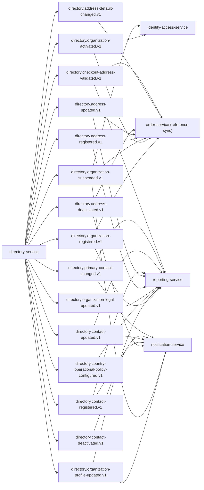

## Proposito
Definir contratos de eventos de `directory-service` para integracion EDA con order, notification, reporting y seguridad operativa, distinguiendo contactos institucionales expuestos y sincronizacion interna de perfiles de usuario organizacionales desde IAM.

## Alcance y fronteras
- Incluye eventos emitidos por Directory y consumidores esperados.
- Incluye topicos, claves, versionado, idempotencia, retencion y DLQ.
- Excluye configuracion infra del cluster Kafka.

## Topologia de eventos Directory


## Catalogo de eventos
| Evento | Topic | Key | Productor | Consumidores | Semantica |
|---|---|---|---|---|---|
| `OrganizationRegistered` | `directory.organization-registered.v1` | `organizationId` | Directory | Order, Reporting | alta de organizacion B2B |
| `OrganizationProfileUpdated` | `directory.organization-profile-updated.v1` | `organizationId` | Directory | Reporting, Notification | cambio de metadatos no legales |
| `CountryOperationalPolicyConfigured` | `directory.country-operational-policy-configured.v1` | `organizationId:countryCode` | Directory | Reporting | cambio versionado de politica operativa por pais |
| `OrganizationLegalDataUpdated` | `directory.organization-legal-updated.v1` | `organizationId` | Directory | Reporting | cambio de taxId/fiscal data |
| `OrganizationActivated` | `directory.organization-activated.v1` | `organizationId` | Directory | IAM, Order | organizacion habilitada para operar |
| `OrganizationSuspended` | `directory.organization-suspended.v1` | `organizationId` | Directory | IAM, Order, Notification | organizacion suspendida |
| `AddressRegistered` | `directory.address-registered.v1` | `addressId` | Directory | Order, Reporting | alta de direccion |
| `AddressUpdated` | `directory.address-updated.v1` | `addressId` | Directory | Order, Reporting | cambio de direccion existente |
| `AddressDeactivated` | `directory.address-deactivated.v1` | `addressId` | Directory | Order, Notification | direccion deja de ser operable |
| `AddressDefaultChanged` | `directory.address-default-changed.v1` | `organizationId:addressType` | Directory | Order | default de direccion modificado |
| `ContactRegistered` | `directory.contact-registered.v1` | `contactId` | Directory | Notification, Reporting | alta de contacto institucional |
| `ContactUpdated` | `directory.contact-updated.v1` | `contactId` | Directory | Notification, Reporting | cambio de contacto institucional existente |
| `ContactDeactivated` | `directory.contact-deactivated.v1` | `contactId` | Directory | Notification | contacto institucional deja de estar operativo |
| `PrimaryContactChanged` | `directory.primary-contact-changed.v1` | `organizationId:contactType` | Directory | Notification, Reporting | cambio de contacto institucional primario por tipo |
| `CheckoutAddressValidated` | `directory.checkout-address-validated.v1` | `organizationId:addressId` | Directory | Order, Reporting | validacion de direccion para checkout |

## Envelope estandar de eventos
```json
{
  "eventId": "evt_01JX...",
  "eventType": "AddressRegistered",
  "eventVersion": "1.0.0",
  "occurredAt": "2026-03-02T17:30:00Z",
  "producer": "directory-service",
  "tenantId": "org-ec-001",
  "traceId": "trc_01JX...",
  "correlationId": "cor_01JX...",
  "idempotencyKey": "dir-address-create-<uuid>",
  "payload": {
    "organizationId": "org_01JX...",
    "addressId": "addr_01JX...",
    "addressType": "SHIPPING",
    "status": "ACTIVE"
  }
}
```

## Payloads minimos por evento
| Evento | Campos minimos |
|---|---|
| `OrganizationRegistered` | `organizationId`, `organizationCode`, `countryCode`, `status`, `createdAt` |
| `OrganizationProfileUpdated` | `organizationId`, `changedFields`, `updatedAt`, `updatedBy` |
| `CountryOperationalPolicyConfigured` | `organizationId`, `countryCode`, `policyVersion`, `currencyCode`, `weeklyClosingDay`, `effectiveFrom`, `effectiveTo`, `configuredAt` |
| `OrganizationLegalDataUpdated` | `organizationId`, `taxIdMasked`, `taxIdType`, `verificationStatus`, `updatedAt` |
| `OrganizationActivated` | `organizationId`, `status`, `activatedAt`, `activatedBy` |
| `OrganizationSuspended` | `organizationId`, `status`, `reason`, `suspendedAt`, `suspendedBy` |
| `AddressRegistered` | `organizationId`, `addressId`, `addressType`, `isDefault`, `status` |
| `AddressUpdated` | `organizationId`, `addressId`, `changedFields`, `updatedAt` |
| `AddressDeactivated` | `organizationId`, `addressId`, `reason`, `deactivatedAt` |
| `AddressDefaultChanged` | `organizationId`, `addressType`, `defaultAddressId`, `previousDefaultAddressId` |
| `ContactRegistered` | `organizationId`, `contactId`, `contactType`, `label`, `isPrimary`, `status` |
| `ContactUpdated` | `organizationId`, `contactId`, `changedFields`, `updatedAt` |
| `ContactDeactivated` | `organizationId`, `contactId`, `reason`, `deactivatedAt` |
| `PrimaryContactChanged` | `organizationId`, `contactType`, `primaryContactId`, `previousPrimaryContactId` |
| `CheckoutAddressValidated` | `organizationId`, `addressId`, `valid`, `reasonCode`, `validatedAt` |

## Eventos consumidos por Directory
| Evento consumido | Topic | Productor | Uso en Directory |
|---|---|---|---|
| `RoleAssigned` | `iam.user-role-assigned.v1` | identity-access-service | sincronizar o reconciliar el `organization_user_profile` local sin duplicar credenciales, sesiones ni autorizacion efectiva |
| `UserBlocked` | `iam.user-blocked.v1` | identity-access-service | desactivar el `organization_user_profile` local vinculado si permanece activo |

Nota:
- `directory-service` mantiene perfiles de usuario organizacionales locales por integracion con IAM, pero en `MVP` no publica todavia eventos externos dedicados para ese agregado.

## Reglas de compatibilidad
- `MUST`: agregar campos nuevos solo como opcionales en `v1`.
- `MUST`: cambios de tipo semantico o remocion de campos crean topic `v2`.
- `SHOULD`: consumidores ignoran campos desconocidos.
- `MUST`: todos los eventos incluyen `tenantId`, `traceId`, `correlationId`.

## Entrega, reintentos y DLQ
| Tema | Politica |
|---|---|
| Semantica de entrega | `at-least-once` |
| Particionado | por `key` del agregado (`organizationId`, `addressId`, `contactId`) |
| Reintento productor | 3 intentos con backoff exponencial |
| Reintento consumidor | 5 intentos con backoff + jitter |
| DLQ | topic `<topic>.dlq` obligatorio |
| Retencion recomendada | 14 dias eventos operativos, 30 dias eventos legales/compliance |

## Matriz de idempotencia en consumidores
| Consumidor | Evento | Clave de idempotencia |
|---|---|---|
| `order-service` | `AddressUpdated` | `eventId` + `addressId` |
| `order-service` | `AddressDefaultChanged` | `eventId` + `organizationId:addressType` |
| `order-service` | `CheckoutAddressValidated` | `eventId` + `organizationId:addressId` |
| `notification-service` | `ContactRegistered` | `eventId` + `contactId` |
| `notification-service` | `PrimaryContactChanged` | `eventId` + `organizationId:contactType` |
| `reporting-service` | `ContactUpdated` | `eventId` + `contactId` |
| `reporting-service` | `PrimaryContactChanged` | `eventId` + `organizationId:contactType` |
| `reporting-service` | `CountryOperationalPolicyConfigured` | `eventId` + `organizationId:countryCode:policyVersion` |
| `reporting-service` | `OrganizationLegalDataUpdated` | `eventId` + `organizationId` |
| `identity-access-service` | `OrganizationSuspended` | `eventId` + `organizationId` |

## Riesgos y mitigaciones
- Riesgo: alto volumen de eventos por actualizaciones administrativas frecuentes.
  - Mitigacion: agrupar cambios atomicos y publicar solo eventos semanticos relevantes.
- Riesgo: consumidores no actualizan snapshots a tiempo para checkout.
  - Mitigacion: fallback sincrono de validacion `POST /checkout-address-validations`.
