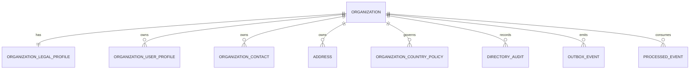

## Proposito
Definir el modelo logico actual de datos de `directory-service` para soportar organizaciones B2B, perfiles legales, perfiles de usuario organizacionales, contactos institucionales, direcciones y parametros operativos por pais con aislamiento por tenant.

## Alcance y fronteras
- Incluye entidades core y entidades tecnicas alineadas con el dominio y la arquitectura vigente de Directory.
- Incluye ownership, relaciones, invariantes y lifecycle de datos para `MVP`.
- Excluye detalle fisico de columnas, indices y sintaxis SQL final del motor.

## Nota de convergencia del modelo
- `organization_settings` deja de existir como entidad persistente separada; sus atributos ligeros de configuracion quedan embebidos en `organization`.
- `address_validation` deja de existir como entidad persistente separada; el estado de validacion queda materializado en atributos de `address`.
- `address_assignment`, `contact_channel` y `contact_preference` salen del modelo de datos vigente y permanecen fuera del contrato activo del servicio.
- `contact` se persiste como `organization_contact` porque el significado vigente es `contacto institucional`, no persona operativa.

## Fuente de referencia
- Este documento aterriza [directory-current.dbml](/Users/jose/Development/Documentation/arkab2b-docs/content/mvp/02-arquitectura/services/directory-service/data/directory-current.dbml).

## Diagrama entidad-relacion logico

## Entidades logicas
| Entidad | Tipo | Descripcion | Ownership |
|---|---|---|---|
| `organization` | core | raiz organizacional B2B del directorio; concentra identidad, estado y configuracion operativa ligera del tenant | Directory |
| `organization_legal_profile` | core | perfil legal y tributario version vigente de la organizacion | Directory |
| `organization_user_profile` | core | perfil local de usuario organizacional vinculado referencialmente a IAM | Directory |
| `organization_contact` | core | canal institucional de la organizacion (`EMAIL`, `PHONE`, `WHATSAPP`, `WEBSITE`) con `label` funcional | Directory |
| `address` | core | direccion operativa de facturacion, despacho, bodega u oficina con estado de validacion embebido | Directory |
| `organization_country_policy` | core | politica operativa versionada por organizacion y pais para runtime de checkout/reporting | Directory |
| `directory_audit` | tecnica | evidencia de mutaciones y rechazos relevantes del directorio | Directory |
| `outbox_event` | tecnica | eventos listos para publicar en broker de integracion | Directory |
| `processed_event` | tecnica | registro de eventos consumidos para dedupe e idempotencia | Directory |

## Relaciones y cardinalidad
- `organization 1..1 organization_legal_profile`.
- `organization 1..n organization_user_profile`.
- `organization 1..n organization_contact`.
- `organization 1..n address`.
- `organization 1..n organization_country_policy`.
- `organization 1..n directory_audit`.
- `organization 1..n outbox_event` cuando el agregado emisor pertenece al tenant.
- `organization 1..n processed_event` cuando el evento consumido se reconcilia dentro del tenant.

## Estados de entidades
| Entidad | Estados permitidos |
|---|---|
| `organization` | `ONBOARDING`, `ACTIVE`, `SUSPENDED`, `INACTIVE` |
| `organization_legal_profile` | `PENDING`, `VERIFIED`, `REJECTED` |
| `organization_user_profile` | `ACTIVE`, `INACTIVE` |
| `organization_contact` | `ACTIVE`, `INACTIVE` |
| `address` | `ACTIVE`, `INACTIVE`, `ARCHIVED` |
| `address.validation_status` | `PENDING`, `VERIFIED`, `REJECTED` |
| `organization_country_policy` | `ACTIVE`, `INACTIVE`, `SUPERSEDED` |
| `outbox_event.status` | `PENDING`, `PUBLISHED`, `FAILED` |

## Invariantes logicos del servicio
| ID | Invariante | Regla verificable |
|---|---|---|
| `I-DIR-01` | `taxId` unico por `countryCode` entre organizaciones activas | rechazo en alta/actualizacion del perfil legal |
| `I-DIR-02` | existe solo un `organization_user_profile` por `organizationId + iamUserId` | unicidad logica del perfil local sincronizado desde IAM |
| `I-DIR-03` | si IAM emite `UserBlocked`, el `organization_user_profile` no puede seguir `ACTIVE` | reconciliacion obligatoria por listener |
| `I-DIR-04` | existe solo un contacto institucional primario activo por organizacion y tipo de contacto | unicidad logica por `(organizationId, contactType, isPrimary=true)` |
| `I-DIR-05` | el valor de contacto institucional no se duplica por organizacion y tipo mientras este activo | unicidad logica por `(organizationId, contactType, contactValueNormalizado)` |
| `I-DIR-06` | existe una sola direccion default activa por organizacion y tipo | unicidad logica por `(organizationId, addressType, isDefault=true)` |
| `I-DIR-07` | direccion usada en checkout debe ser activa, del mismo tenant y validada segun politica vigente | validacion semantica previa a pedido |
| `I-DIR-08` | existe una sola politica operativa activa por `organizationId + countryCode` | resolucion runtime sin ambiguedad |
| `I-DIR-09` | mutaciones de organizacion, direccion, contacto institucional y politica regional generan auditoria y outbox | consistencia tecnica obligatoria del BC |

## Vistas logicas de consulta
| Vista de lectura | Fuente | Uso |
|---|---|---|
| `OrganizationProfileView` | `organization + organization_legal_profile` | perfil organizacional integral para backoffice |
| `OrganizationUserProfilesView` | `organization_user_profile` | reconciliacion local de usuarios vinculados a IAM |
| `OrganizationContactsView` | `organization_contact` | contactos institucionales para facturacion, soporte, compras y operacion |
| `AddressCheckoutView` | `address` | validacion de direccion para checkout |
| `CountryOperationalPolicyView` | `organization_country_policy` | resolucion de politica regional en runtime |
| `DirectorySummaryView` | `organization + address + organization_contact` | snapshot rapido para UI y procesos administrativos |
| `DirectoryAuditView` | `directory_audit` | trazabilidad e investigacion operativa |

## Politica de retencion logica
| Entidad | Retencion objetivo |
|---|---|
| `organization` | vida del cliente + 5 anos (simulado) |
| `organization_legal_profile` | 5 anos por trazabilidad legal |
| `organization_user_profile` | vida de la vinculacion + 24 meses historicos en `INACTIVE` |
| `organization_contact` | vida operativa + 24 meses historicos en `INACTIVE` |
| `address` | vida operativa + 24 meses historicos en `INACTIVE/ARCHIVED` |
| `organization_country_policy` | ultima version activa + 24 meses historicos |
| `directory_audit` | 365 dias |
| `outbox_event` | hasta confirmacion de publicacion + 7 dias |
| `processed_event` | 30 dias por dedupe |

## Riesgos y mitigaciones
- Riesgo: sobre-modelado historico del BC deja residuos que ya no representan el servicio vigente.
  - Mitigacion: concentrar el almacenamiento actual en 6 tablas core y 3 tecnicas, dejando fuera tablas heredadas del baseline previo.
- Riesgo: perfil de usuario organizacional queda desalineado con IAM.
  - Mitigacion: unicidad por `organizationId + iamUserId` y sincronizacion obligatoria con `RoleAssigned` / `UserBlocked`.
- Riesgo: contacto institucional primario ambiguo o duplicado por canal.
  - Mitigacion: unicidad por tipo activo y valor normalizado dentro de la organizacion.
- Riesgo: ausencia de politica activa en `organization_country_policy` bloquea checkout o reporting.
  - Mitigacion: constraint de version activa unica y rechazo explicito de resolucion cuando no exista vigencia.
