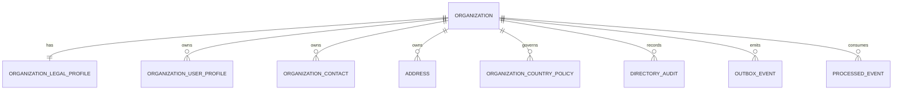

## Proposito
Definir el modelo fisico vigente de `directory-service` sobre PostgreSQL, incluyendo tablas, columnas, constraints, indices y lineamientos operativos alineados con el dominio y la arquitectura actual del servicio.

## Alcance y fronteras
- Incluye el esquema fisico objetivo de `MVP` para Directory.
- Incluye constraints de integridad por tenant, unicidad funcional e idempotencia.
- Incluye indices orientados a organizacion, contactos institucionales, perfiles de usuario organizacionales, direcciones, politica regional y outbox.
- Excluye scripts finales de migracion y detalles de despliegue de infraestructura.

## Nota de simplificacion del esquema
- `organization_settings` se absorbe en `organization` mediante columnas de configuracion ligera del tenant.
- `address_validation` se absorbe en `address` mediante columnas de estado y evidencia basica de validacion.
- `address_assignment`, `contact_channel` y `contact_preference` salen del esquema fisico vigente de `MVP`.

## Fuente de referencia
- Este documento aterriza [directory-current.dbml](/Users/jose/Development/Documentation/arkab2b-docs/content/mvp/02-arquitectura/services/directory-service/data/directory-current.dbml).

## Esquema fisico Directory

## Tablas y columnas clave
### `organization`
| Columna | Tipo | Null | Constraint |
|---|---|---|---|
| `organization_id` | `uuid` | no | PK |
| `tenant_id` | `varchar(100)` | no | index |
| `organization_code` | `varchar(64)` | no | unique (`tenant_id`, `organization_code`) |
| `legal_name` | `varchar(255)` | no | - |
| `trade_name` | `varchar(255)` | si | - |
| `country_code` | `char(2)` | no | index |
| `currency_code` | `char(3)` | no | ISO-4217 |
| `timezone` | `varchar(64)` | no | IANA timezone |
| `segment_tier` | `varchar(16)` | no | check in (`A`,`B`,`C`) |
| `status` | `varchar(16)` | no | check in (`ONBOARDING`,`ACTIVE`,`SUSPENDED`,`INACTIVE`) |
| `billing_email` | `varchar(320)` | si | - |
| `website_url` | `varchar(255)` | si | - |
| `preferred_contact_type` | `varchar(16)` | si | check in (`EMAIL`,`PHONE`,`WHATSAPP`,`WEBSITE`) |
| `credit_enabled` | `boolean` | no | default false |
| `monthly_credit_limit` | `numeric(14,2)` | si | check >= 0 |
| `activated_at` | `timestamptz` | si | - |
| `suspended_at` | `timestamptz` | si | - |
| `created_at` | `timestamptz` | no | default now() |
| `updated_at` | `timestamptz` | no | default now() |

### `organization_legal_profile`
| Columna | Tipo | Null | Constraint |
|---|---|---|---|
| `legal_profile_id` | `uuid` | no | PK |
| `organization_id` | `uuid` | no | FK -> `organization.organization_id`, unique |
| `country_code` | `char(2)` | no | index |
| `tax_id_type` | `varchar(16)` | no | check in (`NIT`,`RUC`,`RUT`,`TAX_ID`) |
| `tax_id` | `varchar(64)` | no | index |
| `fiscal_regime` | `varchar(64)` | si | - |
| `legal_representative` | `varchar(255)` | si | - |
| `verification_status` | `varchar(16)` | no | check in (`PENDING`,`VERIFIED`,`REJECTED`) |
| `verified_at` | `timestamptz` | si | - |
| `created_at` | `timestamptz` | no | default now() |
| `updated_at` | `timestamptz` | no | default now() |

### `organization_user_profile`
| Columna | Tipo | Null | Constraint |
|---|---|---|---|
| `profile_id` | `uuid` | no | PK |
| `organization_id` | `uuid` | no | FK -> `organization.organization_id` |
| `tenant_id` | `varchar(100)` | no | index |
| `iam_user_id` | `uuid` | no | unique (`organization_id`, `iam_user_id`) |
| `email` | `varchar(320)` | si | index |
| `first_name` | `varchar(120)` | si | - |
| `last_name` | `varchar(120)` | si | - |
| `job_title` | `varchar(120)` | si | - |
| `department` | `varchar(120)` | si | - |
| `avatar_url` | `varchar(255)` | si | - |
| `locale` | `varchar(16)` | si | - |
| `timezone` | `varchar(64)` | si | - |
| `role_reference` | `varchar(100)` | si | referencia local, no fuente de verdad de autorizacion |
| `ownership_scope` | `varchar(64)` | si | referencia local de ownership |
| `status` | `varchar(16)` | no | check in (`ACTIVE`,`INACTIVE`) |
| `last_iam_sync_at` | `timestamptz` | si | index |
| `blocked_at` | `timestamptz` | si | - |
| `created_at` | `timestamptz` | no | default now() |
| `updated_at` | `timestamptz` | no | default now() |

### `organization_contact`
| Columna | Tipo | Null | Constraint |
|---|---|---|---|
| `contact_id` | `uuid` | no | PK |
| `organization_id` | `uuid` | no | FK -> `organization.organization_id` |
| `tenant_id` | `varchar(100)` | no | index |
| `contact_type` | `varchar(16)` | no | check in (`EMAIL`,`PHONE`,`WHATSAPP`,`WEBSITE`) |
| `label` | `varchar(32)` | no | index |
| `contact_value` | `varchar(320)` | no | - |
| `normalized_contact_value` | `varchar(320)` | no | index |
| `is_primary` | `boolean` | no | default false |
| `status` | `varchar(16)` | no | check in (`ACTIVE`,`INACTIVE`) |
| `idempotency_key` | `varchar(128)` | si | unique |
| `created_at` | `timestamptz` | no | default now() |
| `updated_at` | `timestamptz` | no | default now() |

### `address`
| Columna | Tipo | Null | Constraint |
|---|---|---|---|
| `address_id` | `uuid` | no | PK |
| `organization_id` | `uuid` | no | FK -> `organization.organization_id` |
| `tenant_id` | `varchar(100)` | no | index |
| `address_type` | `varchar(16)` | no | check in (`BILLING`,`SHIPPING`,`WAREHOUSE`,`OFFICE`) |
| `alias` | `varchar(120)` | si | - |
| `line1` | `varchar(255)` | no | - |
| `line2` | `varchar(255)` | si | - |
| `city` | `varchar(120)` | no | index |
| `state` | `varchar(120)` | si | index |
| `postal_code` | `varchar(20)` | si | - |
| `country_code` | `char(2)` | no | index |
| `reference` | `varchar(255)` | si | - |
| `latitude` | `numeric(10,7)` | si | - |
| `longitude` | `numeric(10,7)` | si | - |
| `is_default` | `boolean` | no | default false |
| `status` | `varchar(16)` | no | check in (`ACTIVE`,`INACTIVE`,`ARCHIVED`) |
| `validation_status` | `varchar(16)` | no | check in (`PENDING`,`VERIFIED`,`REJECTED`) |
| `validated_at` | `timestamptz` | si | - |
| `validation_provider` | `varchar(64)` | si | - |
| `validation_payload` | `jsonb` | si | evidencia compacta del ultimo resultado |
| `idempotency_key` | `varchar(128)` | si | unique |
| `created_at` | `timestamptz` | no | default now() |
| `updated_at` | `timestamptz` | no | default now() |

### `organization_country_policy`
| Columna | Tipo | Null | Constraint |
|---|---|---|---|
| `policy_id` | `uuid` | no | PK |
| `organization_id` | `uuid` | no | FK -> `organization.organization_id` |
| `tenant_id` | `varchar(100)` | no | index |
| `country_code` | `char(2)` | no | index |
| `policy_version` | `integer` | no | check > 0 |
| `currency_code` | `char(3)` | no | ISO-4217 |
| `week_starts_on` | `varchar(16)` | no | check in (`MONDAY`,`TUESDAY`,`WEDNESDAY`,`THURSDAY`,`FRIDAY`,`SATURDAY`,`SUNDAY`) |
| `weekly_cutoff_local_time` | `time` | no | - |
| `timezone` | `varchar(64)` | no | IANA timezone |
| `reporting_retention_days` | `integer` | no | check >= 1 |
| `effective_from` | `timestamptz` | no | index |
| `effective_to` | `timestamptz` | si | check `effective_to > effective_from` |
| `status` | `varchar(16)` | no | check in (`ACTIVE`,`INACTIVE`,`SUPERSEDED`) |
| `idempotency_key` | `varchar(128)` | si | unique |
| `created_at` | `timestamptz` | no | default now() |
| `updated_at` | `timestamptz` | no | default now() |

### `directory_audit`
| Columna | Tipo | Null | Constraint |
|---|---|---|---|
| `audit_id` | `uuid` | no | PK |
| `tenant_id` | `varchar(100)` | no | index |
| `organization_id` | `uuid` | si | index |
| `actor_user_id` | `uuid` | si | index |
| `actor_type` | `varchar(32)` | no | check in (`USER`,`SYSTEM`,`LISTENER`) |
| `action` | `varchar(64)` | no | index |
| `entity_type` | `varchar(32)` | no | - |
| `entity_id` | `varchar(128)` | no | - |
| `result` | `varchar(16)` | no | check in (`SUCCESS`,`FAILURE`) |
| `reason_code` | `varchar(64)` | si | - |
| `trace_id` | `varchar(128)` | no | index |
| `correlation_id` | `varchar(128)` | no | index |
| `payload_json` | `jsonb` | si | - |
| `created_at` | `timestamptz` | no | index |

### `outbox_event`
| Columna | Tipo | Null | Constraint |
|---|---|---|---|
| `event_id` | `uuid` | no | PK |
| `tenant_id` | `varchar(100)` | no | index |
| `organization_id` | `uuid` | si | index |
| `aggregate_type` | `varchar(64)` | no | - |
| `aggregate_id` | `varchar(128)` | no | - |
| `event_type` | `varchar(128)` | no | - |
| `event_version` | `varchar(16)` | no | - |
| `payload_json` | `jsonb` | no | - |
| `status` | `varchar(16)` | no | check in (`PENDING`,`PUBLISHED`,`FAILED`) |
| `occurred_at` | `timestamptz` | no | index |
| `published_at` | `timestamptz` | si | - |
| `created_at` | `timestamptz` | no | default now() |

### `processed_event`
| Columna | Tipo | Null | Constraint |
|---|---|---|---|
| `processed_event_id` | `uuid` | no | PK |
| `tenant_id` | `varchar(100)` | si | index |
| `organization_id` | `uuid` | si | index |
| `event_id` | `varchar(128)` | no | - |
| `consumer_name` | `varchar(128)` | no | - |
| `event_type` | `varchar(128)` | si | - |
| `processed_at` | `timestamptz` | no | default now() |

## Indices recomendados
| Tabla | Indice | Justificacion |
|---|---|---|
| `organization` | `ux_organization_tenant_code` unique (`tenant_id`,`organization_code`) | lookup estable por tenant y codigo |
| `organization` | `idx_organization_tenant_status` (`tenant_id`,`status`) | backoffice por tenant/estado |
| `organization_legal_profile` | `idx_legal_country_tax_id` (`country_code`,`tax_id`) | validacion y lookup legal |
| `organization_user_profile` | `ux_org_user_profile_user` unique (`organization_id`,`iam_user_id`) | un solo perfil local por usuario IAM |
| `organization_user_profile` | `idx_org_user_profile_status` (`organization_id`,`status`) | reconciliacion y consultas administrativas |
| `organization_contact` | `idx_org_contact_status_type` (`organization_id`,`status`,`contact_type`) | listados por canal |
| `organization_contact` | `ux_org_contact_value` unique (`organization_id`,`contact_type`,`normalized_contact_value`) | evitar duplicidad de contacto institucional |
| `organization_contact` | `ux_org_contact_primary` partial unique (`organization_id`,`contact_type`) where `is_primary=true` and `status='ACTIVE'` | primario unico por tipo |
| `address` | `idx_address_org_status_type` (`organization_id`,`status`,`address_type`) | listados y validacion checkout |
| `address` | `ux_address_default_by_type` partial unique (`organization_id`,`address_type`) where `is_default=true` and `status='ACTIVE'` | default unico por tipo |
| `organization_country_policy` | `ux_country_policy_version` unique (`organization_id`,`country_code`,`policy_version`) | versionado monotono por pais |
| `organization_country_policy` | `ux_country_policy_active` partial unique (`organization_id`,`country_code`) where `status='ACTIVE'` | una politica activa por pais |
| `organization_country_policy` | `idx_country_policy_resolution` (`organization_id`,`country_code`,`status`,`effective_from desc`) | resolucion runtime |
| `directory_audit` | `idx_directory_audit_org_created_desc` (`organization_id`,`created_at desc`) | auditoria por organizacion |
| `outbox_event` | `idx_outbox_pending_occurred` (`status`,`occurred_at`) | relay batch eficiente |
| `processed_event` | `ux_processed_event_consumer` unique (`event_id`,`consumer_name`) | dedupe de consumidores |

## Constraints transversales
- `MUST`: toda fila core incluye `organization_id` o `tenant_id` suficiente para aislamiento y trazabilidad.
- `MUST`: `organization_contact.is_primary=true` solo permitido con `status='ACTIVE'`.
- `MUST`: `organization_user_profile.status='ACTIVE'` no puede sobrevivir a una reconciliacion de `UserBlocked`.
- `MUST`: `address.is_default=true` solo permitido con `status='ACTIVE'`.
- `MUST`: `organization_country_policy` mantiene una sola version `ACTIVE` por `organization_id + country_code`.
- `MUST`: toda mutacion documentada del BC deja traza en `directory_audit` y evento en `outbox_event`.
- `MUST`: `processed_event` usa llave compuesta (`event_id`,`consumer_name`) para evitar reprocesamiento.

## Politica de migracion y operacion
| Tema | Lineamiento |
|---|---|
| Migraciones | forward-only con estrategia expand/contract |
| Versionado esquema | `V<numero>__descripcion.sql` |
| Rollback | rollforward preferente |
| Particionado | `directory_audit` por mes si la carga operativa lo exige |
| Backup | snapshot diario + WAL incremental |

## Riesgos y mitigaciones
- Riesgo: columnas embebidas en `organization` y `address` mezclan identidad con configuracion/validacion ligera.
  - Mitigacion: mantener esos atributos acotados a MVP y extraerlos solo si el volumen o el lifecycle lo justifican.
- Riesgo: perfiles locales de usuario quedan inconsistentes frente a eventos IAM perdidos o tardios.
  - Mitigacion: `processed_event`, reconciliacion por `organization_id + iam_user_id` y auditoria tecnica.
- Riesgo: contacto institucional duplicado por normalizacion deficiente de `contact_value`.
  - Mitigacion: persistir `normalized_contact_value` y validar formato por tipo antes de guardar.
- Riesgo: overlap temporal de vigencia en politicas por pais.
  - Mitigacion: unique parcial de politica activa y validacion de rango efectivo en aplicacion.
