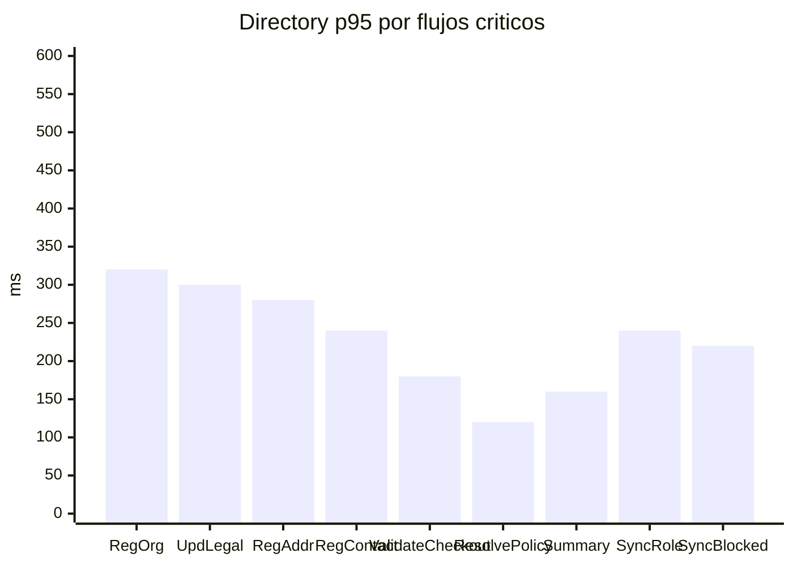

## Proposito
Definir objetivos no funcionales de performance y capacidad para `directory-service`, alineados con los 22 casos HTTP activos, los 2 flujos internos sincronizados desde IAM y la publicacion asincrona de eventos por `outbox`.

## Alcance y fronteras
- Incluye presupuestos de latencia, throughput, error y degradacion para los 22 endpoints HTTP activos de Directory.
- Incluye presupuestos para los listeners `RoleAssigned` y `UserBlocked` que sincronizan `organization_user_profile`.
- Incluye presupuestos de publicacion asincrona para los eventos activos emitidos por Directory via `outbox_event`.
- Usa `rps` para flujos HTTP y `eps` para listeners/publicacion por evento.
- Excluye resultados de pruebas ejecutadas (fase 05).

## Budget por flujo activo Directory
| ID | Flujo activo | Tipo | p95 objetivo | p99 objetivo | Throughput objetivo | Error budget mensual |
|---|---|---|---|---|---|---|
| `UC-DIR-01` | RegisterOrganization | HTTP write | <= 320 ms | <= 550 ms | 20 rps | 0.7% |
| `UC-DIR-02` | UpdateOrganizationProfile | HTTP write | <= 260 ms | <= 450 ms | 30 rps | 0.6% |
| `UC-DIR-03` | UpdateOrganizationLegalData | HTTP write | <= 300 ms | <= 520 ms | 18 rps | 0.6% |
| `UC-DIR-04` | ActivateOrganization | HTTP write | <= 220 ms | <= 380 ms | 12 rps | 0.5% |
| `UC-DIR-05` | SuspendOrganization | HTTP write | <= 240 ms | <= 420 ms | 12 rps | 0.5% |
| `UC-DIR-06` | RegisterAddress | HTTP write | <= 280 ms | <= 480 ms | 45 rps | 0.6% |
| `UC-DIR-07` | UpdateAddress | HTTP write | <= 260 ms | <= 460 ms | 40 rps | 0.6% |
| `UC-DIR-08` | SetDefaultAddress | HTTP write | <= 220 ms | <= 380 ms | 35 rps | 0.5% |
| `UC-DIR-09` | DeactivateAddress | HTTP write | <= 220 ms | <= 380 ms | 20 rps | 0.5% |
| `UC-DIR-10` | RegisterContact | HTTP write | <= 240 ms | <= 420 ms | 35 rps | 0.6% |
| `UC-DIR-11` | UpdateContact | HTTP write | <= 220 ms | <= 380 ms | 35 rps | 0.6% |
| `UC-DIR-12` | SetPrimaryContact | HTTP write | <= 200 ms | <= 340 ms | 25 rps | 0.5% |
| `UC-DIR-13` | DeactivateContact | HTTP write | <= 210 ms | <= 360 ms | 20 rps | 0.5% |
| `UC-DIR-14` | ValidateCheckoutAddress | HTTP command | <= 180 ms | <= 320 ms | 120 rps | 0.3% |
| `UC-DIR-15` | ListOrganizationAddresses | HTTP read | <= 170 ms | <= 300 ms | 100 rps | 0.4% |
| `UC-DIR-16` | ListOrganizationContacts | HTTP read | <= 170 ms | <= 300 ms | 100 rps | 0.4% |
| `UC-DIR-17` | ConfigureCountryOperationalPolicy | HTTP write | <= 230 ms | <= 390 ms | 18 rps | 0.5% |
| `UC-DIR-18` | ResolveCountryOperationalPolicy | HTTP read | <= 120 ms | <= 220 ms | 180 rps | 0.25% |
| `UC-DIR-19` | GetDirectorySummary | HTTP read | <= 160 ms | <= 300 ms | 90 rps | 0.4% |
| `UC-DIR-20` | GetOrganizationProfile | HTTP read | <= 130 ms | <= 240 ms | 110 rps | 0.35% |
| `UC-DIR-21` | GetOrganizationAddressById | HTTP read | <= 125 ms | <= 230 ms | 120 rps | 0.35% |
| `UC-DIR-22` | GetOrganizationContactById | HTTP read | <= 125 ms | <= 230 ms | 120 rps | 0.35% |
| `EVT-DIR-01` | SyncOrganizationUserProfileFromRoleAssigned | Listener IAM | <= 240 ms | <= 400 ms | 25 eps | 0.4% |
| `EVT-DIR-02` | DeactivateOrganizationUserProfileFromUserBlocked | Listener IAM | <= 220 ms | <= 360 ms | 20 eps | 0.4% |

## Budget de publicacion asincrona via outbox
| Flujo de publicacion | Eventos cubiertos | Latencia `commit -> broker ack` p95 | Throughput objetivo | Error budget mensual |
|---|---|---|---|---|
| Mutaciones de organizacion | `OrganizationRegistered`, `OrganizationProfileUpdated`, `OrganizationLegalDataUpdated`, `OrganizationActivated`, `OrganizationSuspended` | <= 2.0 s | 25 eps | 0.1% |
| Mutaciones de direccion | `AddressRegistered`, `AddressUpdated`, `AddressDeactivated`, `AddressDefaultChanged` | <= 2.0 s | 55 eps | 0.1% |
| Mutaciones de contacto institucional | `ContactRegistered`, `ContactUpdated`, `ContactDeactivated`, `PrimaryContactChanged` | <= 2.0 s | 40 eps | 0.1% |
| Validacion para checkout | `CheckoutAddressValidated` | <= 1.5 s | 120 eps | 0.1% |
| Politica operativa por pais | `CountryOperationalPolicyConfigured` | <= 2.0 s | 15 eps | 0.1% |

## Curva de latencia objetivo Directory

## Modelo de carga Directory (simulado)
| Escenario | Carga concurrente | Mix de trafico Directory |
|---|---|---|
| Normal semanal | 90 clientes HTTP + 4 eps IAM | 40% lecturas (`summary`, `get by id`, listas), 28% mutaciones administrativas, 22% `validate-checkout` y `resolve-country-policy`, 10% listeners IAM |
| Pico comercial | 180 clientes HTTP + 8 eps IAM | 28% lecturas, 18% mutaciones, 44% `validate-checkout` y `resolve-country-policy`, 10% listeners IAM |
| Pico onboarding | 120 clientes HTTP + 5 eps IAM | 18% lecturas, 62% altas/actualizaciones de `organization`/`address`/`contact`, 12% configuracion de politica por pais, 8% listeners IAM |
| Incidente IAM o tenant ops | 70 clientes HTTP + 20 eps IAM | 25% lecturas, 20% mutaciones, 15% checkout/politica por pais, 40% `RoleAssigned` y `UserBlocked` |

## Capacidad base y escalamiento
| Recurso por pod Directory | Valor base | Escalamiento recomendado |
|---|---|---|
| CPU request/limit | `300m / 900m` | HPA por CPU + `p95` de `validate-checkout` y `resolve-country-policy` |
| RAM request/limit | `512Mi / 1024Mi` | escalar en umbral de `p95` sostenido sobre budget |
| R2DBC connection pool | 45 conexiones | max 100 con backlog controlado |
| Redis connection pool | 40 conexiones | max 100 para `validate-checkout`, `resolve-country-policy` y `summary` |
| Outbox relay batch | 200 eventos | subir a 500 si `outbox_event.pending` supera backlog operativo |
| Kafka producer batch | 16KB | subir a 32KB en picos de mutaciones o backlog de `outbox` |

## Politicas de degradacion controlada
- Prioridad 1: mantener `validate-checkout-address`, `resolve-country-operational-policy` y el listener `UserBlocked`.
- Prioridad 2: mantener `get-directory-summary`, `get-organization-profile`, `get-organization-address-by-id` y `get-organization-contact-by-id`.
- Prioridad 3: mantener mutaciones criticas (`set-default-address`, `deactivate-address`, `set-primary-contact`, `deactivate-contact`, `suspend-organization`).
- Prioridad 4: degradar listados administrativos y escrituras no criticas antes que los flujos anteriores.
- Si `p95 validate-checkout-address > 260 ms` o `p95 resolve-country-operational-policy > 180 ms` por 5 min:
  - ampliar TTL de cache de checkout y politica por pais dentro de la ventana permitida,
  - reducir enriquecimiento opcional de validacion externa,
  - limitar consultas administrativas amplias,
  - escalar pods por latencia y CPU.
- Si `outbox_event.pending` supera el backlog operativo por 10 min:
  - aumentar `batchSize` del relay,
  - priorizar `CheckoutAddressValidated` y `CountryOperationalPolicyConfigured`,
  - revisar salud del broker antes de degradar trafico HTTP.
- Si `RoleAssigned` o `UserBlocked` acumulan lag sostenido:
  - priorizar el consumer group IAM sobre publicaciones no criticas,
  - reforzar el drenado de `processed_event`,
  - limitar mutaciones administrativas masivas hasta recuperar el lag.

## Modelo de fallos y degradacion runtime
| Tipo de fallo | Tratamiento de performance | Impacto en budget |
|---|---|---|
| rechazo funcional (`403/404/409/422`) | salida rapida; no habilita degradacion global | no consume `error budget` de `5xx`; si arrastra `p95` por encima del objetivo si consume presupuesto de latencia |
| dependencia externa lenta (`taxId`/geo) | timeout corto + fallback local o enriquecimiento diferido | consume presupuesto de latencia mientras dure el incidente |
| cache Redis degradada | fallback a DB para `summary`, `resolve-country-policy` y `validate-checkout` con rate-limit sobre lecturas administrativas | consume presupuesto de latencia; si culmina en `5xx` tambien consume `error budget` |
| backlog de `outbox` o broker lento | confirmar transaccion local, acumular `outbox_event` y priorizar eventos criticos | no consume `error budget` HTTP mientras el cierre siga exitoso; si culmina en DLQ o fallo visible si consume presupuesto asincrono |
| conflicto de concurrencia o write contention | retry controlado y transaccion acotada | si el retry recupera dentro del budget no cuenta como error; si culmina en `5xx` si consume `error budget` |
| evento duplicado | `noop idempotente` | no consume `error budget` ni obliga a degradacion |

## Cuellos de botella esperados
| Bottleneck | Impacto | Mitigacion |
|---|---|---|
| Unicidad de `taxId` bajo alta concurrencia | conflictos de escritura | lock optimista + retry controlado |
| Cambios concurrentes en default address y primary contact | inconsistencias de unicidad por tipo | indice unico parcial + transaccion |
| Validacion externa `taxId`/geo lenta | latencia de altas/updates | timeout corto + modo degradado |
| `ResolveCountryOperationalPolicy` en cold path | latencia en runtime de `order-service` | cache Redis + indice compuesto por `organizationId`, `countryCode`, `status`, ventana efectiva |
| Consultas `summary` sobre entidades grandes | latencia de lectura | cache Redis + proyeccion consolidada |
| Rafagas de `RoleAssigned`/`UserBlocked` | backlog en sincronizacion de `organization_user_profile` | consumer reactivo con dedupe + monitoreo de lag |
| Backlog de `outbox_event` | retraso en `CheckoutAddressValidated` y `CountryOperationalPolicyConfigured` | relay por lotes y alarma sobre `pending`/`retry_count` |

## SLI/SLO Directory alineados
| SLI | SLO |
|---|---|
| Disponibilidad endpoint `validate-checkout-address` | >= 99.9% mensual |
| Disponibilidad endpoint `resolve-country-operational-policy` | >= 99.9% mensual |
| Disponibilidad endpoints mutantes Directory | >= 99.6% mensual |
| `p95` `validate-checkout-address` | <= 180 ms |
| `p95` `resolve-country-operational-policy` | <= 120 ms |
| `p95` `summary` y listados | <= 170 ms |
| `p95` listeners IAM (`RoleAssigned`, `UserBlocked`) | <= 240 ms |
| `p95` publicacion `commit -> broker ack` de `CheckoutAddressValidated` | <= 1.5 s |
| `p95` publicacion `commit -> broker ack` del resto de eventos Directory | <= 2.0 s |
| ratio de errores `5xx` HTTP Directory | <= 0.25% mensual |
| ratio de mensajes Directory enviados a DLQ | <= 0.1% mensual |

## Riesgos y mitigaciones
- Riesgo: dependencia de validadores externos reduce cumplimiento del budget de altas y actualizaciones legales.
  - Mitigacion: fallback local por pais y enriquecimiento asincrono.
- Riesgo: `resolve-country-operational-policy` se vuelva cuello de botella del hot path de `order-service`.
  - Mitigacion: cache Redis con TTL controlado, indice compuesto en DB y escalamiento por latencia.
- Riesgo: picos de `RoleAssigned` o `UserBlocked` degraden sincronizacion de `organization_user_profile`.
  - Mitigacion: consumer group dedicado, dedupe por `processed_event` y priorizacion del listener sobre trafico no critico.
- Riesgo: backlog de `outbox` retrase `CheckoutAddressValidated` o `CountryOperationalPolicyConfigured`.
  - Mitigacion: monitoreo de `pending`, ajuste del `batchSize` del relay y verificacion proactiva del broker.
