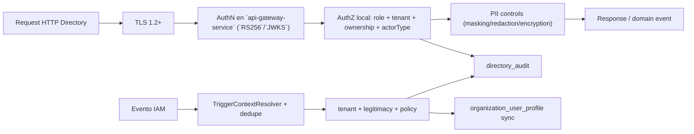
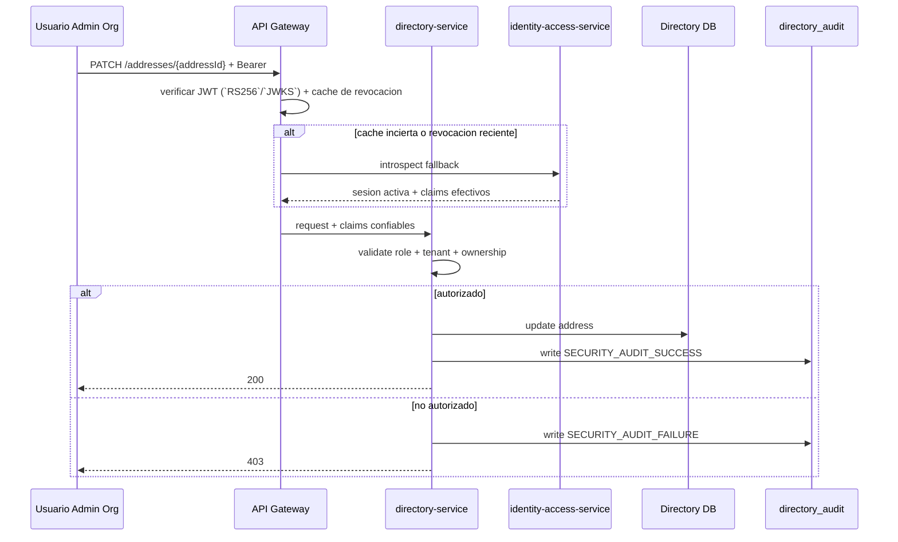
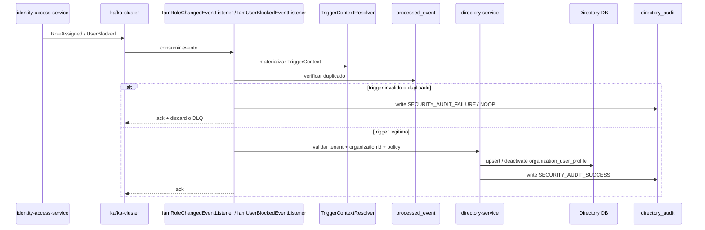

## Proposito
Definir el diseno de seguridad y privacidad de `directory-service`, cubriendo amenazas, controles tecnicos, manejo de PII, aislamiento por tenant, endpoints tecnicos para `order-service`, sincronizacion interna desde IAM y cumplimiento base.

## Alcance y fronteras
- Incluye seguridad de APIs administrativas, de consulta y de runtime tecnico expuestas por Directory.
- Incluye controles de tenant isolation, ownership, datos sensibles, auditoria y actores tecnicos confiables.
- Incluye listeners internos `RoleAssigned` y `UserBlocked` para sincronizar `organization_user_profile`.
- Excluye hardening de infraestructura de red (documentado a nivel plataforma).

## Threat model Directory (resumen STRIDE)
| Amenaza | Vector | Impacto | Control principal |
|---|---|---|---|
| Spoofing | token robado o identidad tecnica falsificada para consumir endpoints `trusted_service` | acceso no autorizado a mutaciones o runtime de checkout/politica por pais | autenticacion en `api-gateway-service` + validacion de actor tecnico confiable + tenant isolation |
| Tampering | alteracion de `organizationId`/`countryCode` en path o payload, o payload IAM manipulado | acceso cruzado o reconciliacion incorrecta | validacion claims vs path + `TriggerContextResolver` + policy de dominio |
| Repudiation | negacion de cambios administrativos | brecha de auditoria | `directory_audit` con `traceId` y actor |
| Information Disclosure | exposicion de `taxId`, `contactValue` o `organization_user_profile` en respuestas/logs | riesgo legal/comercial | minimizacion + masking + redaccion de logs |
| Denial of Service | burst de listados/summary, `validate-checkout`, `resolve-country-policy` o rafaga de eventos IAM | degradacion de runtime y sincronizacion | rate limit + cache + paginacion obligatoria + dedupe/backpressure |
| Elevation of Privilege | rol insuficiente muta datos legales o consulta PII completa | riesgo de fraude/configuracion indebida | RBAC granular + permisos por accion + ownership real del recurso |

## Mapa de controles

## Controles obligatorios por dominio
| Categoria | Control |
|---|---|
| Tenant isolation | `organizationId` obligatorio en token/path y validacion cruzada por dominio |
| RBAC | permisos minimos por accion (`directory:organization:update`, `directory:address:write`, `directory:contact:write`) |
| Trusted service | solo `order-service` puede invocar `validate-checkout-address` y `resolve-country-operational-policy` como actor tecnico confiable |
| Datos legales | cambios de taxId solo por `arka_admin`, con auditoria reforzada |
| PII contactos institucionales | `contactValue` se enmascara por tipo (`EMAIL`, `PHONE`, `WHATSAPP`) en listados, logs y respuestas resumidas; `WEBSITE` no requiere el mismo grado de masking |
| PII perfil organizacional de usuario | `organization_user_profile.email`, nombre, apellido, cargo, departamento, avatar, locale y timezone no se exponen por REST publico en `MVP` y se redactan en logs/auditoria cuando no sean estrictamente necesarios |
| PII direcciones | no exponer direccion completa fuera de contexto de ownership |
| Listeners IAM | `TriggerContextResolver`, `processed_event`, validacion de `tenant`/`organizationId` y politica aplicable antes de mutar `organization_user_profile` |
| Auditoria | registro obligatorio en `directory_audit` para mutaciones y rechazos por seguridad |
| Secrets | credenciales DB/Kafka/Redis y APIs externas en Secrets Manager/Parameter Store |

## Modelo distribuido de validacion
| Capa | Responsabilidad |
|---|---|
| `api-gateway-service` | valida firma JWT (`RS256`/`JWKS`), expiracion, `iss`, `aud`, estado de revocacion y actor tecnico confiable antes de enrutar |
| `directory-service` | valida localmente rol, `tenant`, permiso, ownership real del recurso y tipo de actor (`usuario` o `trusted_service`); no consulta IAM por request |
| `identity-access-service` | conserva la verdad de sesion/rol, publica bloqueos/cambios de rol y expone introspeccion fallback cuando la cache no es suficiente |
| listeners IAM | `UserBlocked` y `RoleAssigned` se materializan como `TriggerContext`, validan origen tecnico y dedupe, y solo luego sincronizan `organization_user_profile`; la revocacion de sesion se resuelve en gateway/cache de acceso, no dentro de Directory |

Aplicacion local: `directory-service` implementa `Spring Security WebFlux` para poblar el `SecurityContext`, resolver identidad confiable por request y aplicar autorizacion gruesa en endpoints HTTP. La verificacion de `tenant`, ownership, actor tecnico confiable y reglas de PII sigue ocurriendo dentro del servicio. Los listeners internos no reutilizan JWT de usuario; trabajan con `TriggerContext`, dedupe y politicas del dominio.

## Modelo de errores de seguridad
| Momento | Familia/cierre canonico | Aplicacion en Directory |
|---|---|---|
| autenticacion de borde | `401/403` en frontera | `api-gateway-service` corta JWT invalido, expirado o revocado antes de enrutar; Directory no ejecuta login ni emision de tokens |
| autorizacion contextual | `AuthorizationDeniedException`, `TenantIsolationException` | `directory-service` rechaza cruce de `tenant`, permiso insuficiente o ownership invalido sobre organizacion, direccion o contacto |
| regla de dominio sensible | `DomainRuleViolationException`, `ConflictException`, `ResourceNotFoundException` | taxId invalido, direccion no operable, contacto inexistente o prerrequisitos incompletos se cierran como `404/409/422`, no como error tecnico |
| evento malicioso o duplicado | `NonRetryableDependencyException` o `noop idempotente` | mensajes invalidos van a DLQ; un duplicado del consumidor se trata como noop idempotente |
| evidencia de seguridad | `directory_audit` + `traceId/correlationId` | mutaciones y rechazos por seguridad dejan evidencia obligatoria con masking de PII |

## Politica de datos sensibles
| Dato | Clasificacion | Tratamiento |
|---|---|---|
| `taxId` | confidencial critico | masking en respuestas y logs; lectura completa solo roles autorizados |
| `organization_contact.contactValue` cuando `contactType in (EMAIL, PHONE, WHATSAPP)` | confidencial | masking por tipo en listados, summary, logs y respuestas resumidas; cifrado en reposo segun entorno |
| `organization_contact.contactValue` cuando `contactType = WEBSITE` | interno bajo | puede exponerse sin masking fuerte, manteniendo validacion de tenant y ownership |
| `organization_user_profile.email`, `firstName`, `lastName`, `jobTitle`, `department`, `avatarUrl`, `locale`, `timezone` | confidencial interno | no exponer por REST publico en `MVP`; redaccion en logs/auditoria y acceso restringido a slices internos/autorizados |
| `line1/line2` direccion | confidencial | exponer solo a mismo tenant y casos de uso habilitados |
| `audit actor metadata` | interno | acceso restringido a roles de auditoria/soporte |

## Flujo de seguridad en mutacion de direccion

## Flujo de seguridad en sincronizacion interna desde IAM

## Cumplimiento y trazabilidad
- Baseline de cumplimiento (academico):
  - principio de minimo privilegio,
  - aislamiento por tenant en lectura y escritura,
  - trazabilidad de mutaciones y rechazos de seguridad,
  - manejo de PII con minimizacion y masking.
- Evolucion posterior (no bloqueante del baseline `MVP`): obligaciones regulatorias por pais con detalle legal formal para retention/consentimiento de datos de contacto.

## Riesgos y mitigaciones
- Riesgo: fuga de PII por consultas masivas de contactos.
  - Mitigacion: paginacion forzada, masking por defecto y rate limit por tenant.
- Riesgo: fuga de PII del slice `organization_user_profile` por logs o soporte operacional.
  - Mitigacion: no exponer el slice por REST publico, redaccion en auditoria y acceso restringido a actores internos autorizados.
- Riesgo: bypass de tenant en endpoints internos o listeners.
  - Mitigacion: revalidar claims/ownership dentro del caso de uso, no solo en gateway.
- Riesgo: invocacion indebida de endpoints `trusted_service` o replay de eventos IAM.
  - Mitigacion: actor tecnico confiable en gateway, `TriggerContextResolver`, `processed_event` y validacion de legitimidad del trigger.
- Riesgo: uso de datos legales no verificados para procesos comerciales.
  - Mitigacion: `verificationStatus` obligatorio y rechazo en cambios inconsistentes.

## Brechas explicitas
- Evolucion posterior (no bloqueante): matriz granular final de permisos por rol/pais para mutaciones de Directory.
- Hardening futuro no bloqueante: politica formal de cifrado selectivo de columnas PII por entorno.
