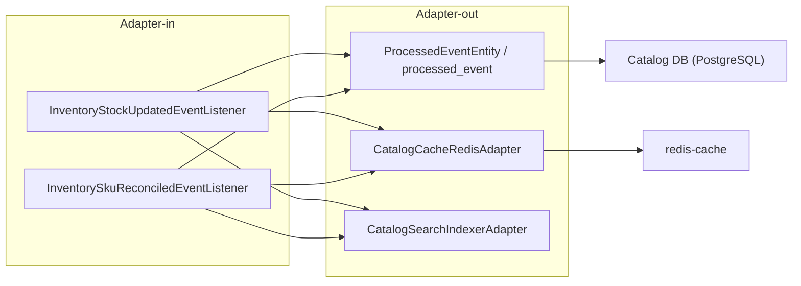

## Proposito
Definir la vista C4 de componente para `catalog-service`, detallando limites internos, dependencias y responsabilidades tecnicas para implementacion reactiva con Spring WebFlux.

## Alcance y fronteras
- Incluye componentes internos de Catalog en la vista componente: `Adapter-in`, `Application service`, `Domain`, `Adapter-out`.
- Incluye unicamente clases de implementacion representativas de cada componente para identificacion rapida.
- Excluye de la vista componente: `request/response` web, `command/query/result`, assemblers, mappers, interfaces de puertos, utilidades y clases de configuracion.
- Incluye dependencias con `api-gateway-service`, `order-service`, `inventory-service`, `config-server`, `eureka-server`, `kafka-cluster`, `redis-cache` y `Catalog DB`.
- Excluye decisiones de codigo de otros servicios core.

## Rol del servicio en el sistema
`catalog-service` es la autoridad semantica de producto vendible:
- administra productos, variantes y clasificacion comercial referencial (marca/categoria),
- define estado `sellable` por variante,
- administra precio vigente y cambios programados,
- entrega capacidades de busqueda/filtros para frontend,
- provee validacion semantica de variante/precio a `order-service` (sin resolver disponibilidad reservable).

Nota de alcance MVP:
- `brand` y `category` se validan como taxonomia local activa del catalogo.
- `catalog-service` no expone CRUD independiente de taxonomia por API en `MVP`; esa taxonomia se mantiene por carga administrativa controlada.

## C4 componente del servicio
La vista de componentes se divide por caso de uso para reducir cruces visuales sin perder detalle estructural del servicio. Cada diagrama conserva los mismos grupos (`Adapter-in`, `Application service`, `Domain`, `Adapter-out`) y muestra solo las relaciones dominantes para ese flujo.

Regla de lectura:
- seguridad, auditoria, idempotencia, outbox e indexacion se repiten en el diagrama del caso solo cuando alteran la lectura principal del flujo;
- el detalle exhaustivo de `request/response`, `command/query/result`, assemblers, mappers y fases runtime vive en `02-Vista-de-Codigo.md` y `03-Casos-de-Uso-en-Ejecucion.md`;
- los listeners internos de Inventory se documentan aparte para no contaminar la lectura de `SearchCatalog`.




flowchart LR
  subgraph IN["Adapter-in"]
    ADMIN_CTRL["CatalogAdminHttpController"]
  end

  subgraph APP["Application service"]
    REG_PRODUCT_UC["RegisterProductUseCase"]
  end

  subgraph DOM["Domain"]
    PRODUCT_AGG["ProductAggregate"]
    PRODUCT_POLICY["ProductLifecyclePolicy"]
  end

  subgraph OUT["Adapter-out"]
    PRODUCT_REPO["ProductR2dbcRepositoryAdapter"]
    CATEGORY_REPO["CategoryR2dbcRepositoryAdapter"]
    BRAND_REPO["BrandR2dbcRepositoryAdapter"]
    AUDIT_REPO["CatalogAuditR2dbcRepositoryAdapter"]
    OUTBOX_ADP["OutboxPersistenceAdapter"]
    EVENT_PUB["KafkaDomainEventPublisherAdapter"]
  end

  ADMIN_CTRL --> REG_PRODUCT_UC
  REG_PRODUCT_UC --> PRODUCT_AGG
  REG_PRODUCT_UC --> PRODUCT_POLICY
  REG_PRODUCT_UC --> PRODUCT_REPO
  REG_PRODUCT_UC --> CATEGORY_REPO
  REG_PRODUCT_UC --> BRAND_REPO
  REG_PRODUCT_UC --> AUDIT_REPO
  REG_PRODUCT_UC --> OUTBOX_ADP
  OUTBOX_ADP --> EVENT_PUB

  PRODUCT_REPO --> CATDB["Catalog DB (PostgreSQL)"]
  CATEGORY_REPO --> CATDB
  BRAND_REPO --> CATDB
  AUDIT_REPO --> CATDB
  EVENT_PUB --> KAFKA["kafka-cluster"]




flowchart LR
  subgraph IN["Adapter-in"]
    ADMIN_CTRL["CatalogAdminHttpController"]
  end

  subgraph APP["Application service"]
    UPDATE_PRODUCT_UC["UpdateProductUseCase"]
  end

  subgraph DOM["Domain"]
    PRODUCT_AGG["ProductAggregate"]
  end

  subgraph OUT["Adapter-out"]
    PRODUCT_REPO["ProductR2dbcRepositoryAdapter"]
  end

  ADMIN_CTRL --> UPDATE_PRODUCT_UC
  UPDATE_PRODUCT_UC --> PRODUCT_AGG
  UPDATE_PRODUCT_UC --> PRODUCT_REPO

  PRODUCT_REPO --> CATDB["Catalog DB (PostgreSQL)"]




flowchart LR
  subgraph IN["Adapter-in"]
    ADMIN_CTRL["CatalogAdminHttpController"]
  end

  subgraph APP["Application service"]
    ACTIVATE_PRODUCT_UC["ActivateProductUseCase"]
  end

  subgraph DOM["Domain"]
    PRODUCT_AGG["ProductAggregate"]
  end

  subgraph OUT["Adapter-out"]
    PRODUCT_REPO["ProductR2dbcRepositoryAdapter"]
  end

  ADMIN_CTRL --> ACTIVATE_PRODUCT_UC
  ACTIVATE_PRODUCT_UC --> PRODUCT_AGG
  ACTIVATE_PRODUCT_UC --> PRODUCT_REPO

  PRODUCT_REPO --> CATDB["Catalog DB (PostgreSQL)"]




flowchart LR
  subgraph IN["Adapter-in"]
    ADMIN_CTRL["CatalogAdminHttpController"]
  end

  subgraph APP["Application service"]
    RETIRE_PRODUCT_UC["RetireProductUseCase"]
  end

  subgraph DOM["Domain"]
    PRODUCT_AGG["ProductAggregate"]
  end

  subgraph OUT["Adapter-out"]
    PRODUCT_REPO["ProductR2dbcRepositoryAdapter"]
  end

  ADMIN_CTRL --> RETIRE_PRODUCT_UC
  RETIRE_PRODUCT_UC --> PRODUCT_AGG
  RETIRE_PRODUCT_UC --> PRODUCT_REPO

  PRODUCT_REPO --> CATDB["Catalog DB (PostgreSQL)"]




flowchart LR
  subgraph IN["Adapter-in"]
    ADMIN_CTRL["CatalogAdminHttpController"]
  end

  subgraph APP["Application service"]
    CREATE_VARIANT_UC["CreateVariantUseCase"]
  end

  subgraph DOM["Domain"]
    VARIANT_AGG["VariantAggregate"]
    VARIANT_POLICY["VariantSellabilityPolicy"]
  end

  subgraph OUT["Adapter-out"]
    VARIANT_REPO["VariantR2dbcRepositoryAdapter"]
    ATTR_REPO["VariantAttributeR2dbcRepositoryAdapter"]
  end

  ADMIN_CTRL --> CREATE_VARIANT_UC
  CREATE_VARIANT_UC --> VARIANT_AGG
  CREATE_VARIANT_UC --> VARIANT_POLICY
  CREATE_VARIANT_UC --> VARIANT_REPO
  CREATE_VARIANT_UC --> ATTR_REPO

  VARIANT_REPO --> CATDB["Catalog DB (PostgreSQL)"]
  ATTR_REPO --> CATDB




flowchart LR
  subgraph IN["Adapter-in"]
    ADMIN_CTRL["CatalogAdminHttpController"]
  end

  subgraph APP["Application service"]
    UPDATE_VARIANT_UC["UpdateVariantUseCase"]
  end

  subgraph DOM["Domain"]
    VARIANT_AGG["VariantAggregate"]
  end

  subgraph OUT["Adapter-out"]
    VARIANT_REPO["VariantR2dbcRepositoryAdapter"]
  end

  ADMIN_CTRL --> UPDATE_VARIANT_UC
  UPDATE_VARIANT_UC --> VARIANT_AGG
  UPDATE_VARIANT_UC --> VARIANT_REPO

  VARIANT_REPO --> CATDB["Catalog DB (PostgreSQL)"]




flowchart LR
  subgraph IN["Adapter-in"]
    ADMIN_CTRL["CatalogAdminHttpController"]
  end

  subgraph APP["Application service"]
    MARK_SELLABLE_UC["MarkVariantSellableUseCase"]
  end

  subgraph DOM["Domain"]
    VARIANT_AGG["VariantAggregate"]
    TENANT_POLICY["TenantIsolationPolicy"]
  end

  subgraph OUT["Adapter-out"]
    VARIANT_REPO["VariantR2dbcRepositoryAdapter"]
  end

  ADMIN_CTRL --> MARK_SELLABLE_UC
  MARK_SELLABLE_UC --> VARIANT_AGG
  MARK_SELLABLE_UC --> TENANT_POLICY
  MARK_SELLABLE_UC --> VARIANT_REPO

  VARIANT_REPO --> CATDB["Catalog DB (PostgreSQL)"]




flowchart LR
  subgraph IN["Adapter-in"]
    ADMIN_CTRL["CatalogAdminHttpController"]
  end

  subgraph APP["Application service"]
    DISCONTINUE_VARIANT_UC["DiscontinueVariantUseCase"]
  end

  subgraph DOM["Domain"]
    VARIANT_AGG["VariantAggregate"]
  end

  subgraph OUT["Adapter-out"]
    VARIANT_REPO["VariantR2dbcRepositoryAdapter"]
  end

  ADMIN_CTRL --> DISCONTINUE_VARIANT_UC
  DISCONTINUE_VARIANT_UC --> VARIANT_AGG
  DISCONTINUE_VARIANT_UC --> VARIANT_REPO

  VARIANT_REPO --> CATDB["Catalog DB (PostgreSQL)"]




flowchart LR
  subgraph IN["Adapter-in"]
    PRICE_CTRL["CatalogPricingHttpController"]
  end

  subgraph APP["Application service"]
    UPSERT_PRICE_UC["UpsertCurrentPriceUseCase"]
  end

  subgraph DOM["Domain"]
    PRICE_AGG["PriceAggregate"]
  end

  subgraph OUT["Adapter-out"]
    PRICE_REPO["PriceR2dbcRepositoryAdapter"]
    CLOCK_ADP["SystemClockAdapter"]
  end

  PRICE_CTRL --> UPSERT_PRICE_UC
  UPSERT_PRICE_UC --> PRICE_AGG
  UPSERT_PRICE_UC --> PRICE_REPO
  PRICE_AGG --> CLOCK_ADP

  PRICE_REPO --> CATDB["Catalog DB (PostgreSQL)"]




flowchart LR
  subgraph IN["Adapter-in"]
    PRICE_CTRL["CatalogPricingHttpController"]
  end

  subgraph APP["Application service"]
    SCHEDULE_PRICE_UC["SchedulePriceChangeUseCase"]
  end

  subgraph DOM["Domain"]
    PRICE_AGG["PriceAggregate"]
  end

  subgraph OUT["Adapter-out"]
    PRICE_REPO["PriceR2dbcRepositoryAdapter"]
    CLOCK_ADP["SystemClockAdapter"]
  end

  PRICE_CTRL --> SCHEDULE_PRICE_UC
  SCHEDULE_PRICE_UC --> PRICE_AGG
  SCHEDULE_PRICE_UC --> PRICE_REPO
  PRICE_AGG --> CLOCK_ADP

  PRICE_REPO --> CATDB["Catalog DB (PostgreSQL)"]




flowchart LR
  subgraph IN["Adapter-in"]
    PRICE_CTRL["CatalogPricingHttpController"]
  end

  subgraph APP["Application service"]
    BULK_PRICE_UC["BulkUpsertPricesUseCase"]
  end

  subgraph DOM["Domain"]
    PRICE_AGG["PriceAggregate"]
  end

  subgraph OUT["Adapter-out"]
    PRICE_REPO["PriceR2dbcRepositoryAdapter"]
    AUDIT_REPO["CatalogAuditR2dbcRepositoryAdapter"]
    CLOCK_ADP["SystemClockAdapter"]
  end

  PRICE_CTRL --> BULK_PRICE_UC
  BULK_PRICE_UC --> PRICE_AGG
  BULK_PRICE_UC --> PRICE_REPO
  BULK_PRICE_UC --> AUDIT_REPO
  PRICE_AGG --> CLOCK_ADP

  PRICE_REPO --> CATDB["Catalog DB (PostgreSQL)"]
  AUDIT_REPO --> CATDB




flowchart LR
  subgraph IN["Adapter-in"]
    QUERY_CTRL["CatalogQueryHttpController"]
  end

  subgraph APP["Application service"]
    SEARCH_CATALOG_UC["SearchCatalogUseCase"]
  end

  subgraph DOM["Domain"]
    SEARCH_POLICY["CatalogSearchPolicy"]
  end

  subgraph OUT["Adapter-out"]
    PRODUCT_REPO["ProductR2dbcRepositoryAdapter"]
    VARIANT_REPO["VariantR2dbcRepositoryAdapter"]
    PRICE_REPO["PriceR2dbcRepositoryAdapter"]
    CACHE_ADP["CatalogCacheRedisAdapter"]
  end

  QUERY_CTRL --> SEARCH_CATALOG_UC
  SEARCH_CATALOG_UC --> SEARCH_POLICY
  SEARCH_CATALOG_UC --> PRODUCT_REPO
  SEARCH_CATALOG_UC --> VARIANT_REPO
  SEARCH_CATALOG_UC --> PRICE_REPO
  SEARCH_CATALOG_UC --> CACHE_ADP

  PRODUCT_REPO --> CATDB["Catalog DB (PostgreSQL)"]
  VARIANT_REPO --> CATDB
  PRICE_REPO --> CATDB
  CACHE_ADP --> REDIS["redis-cache"]




flowchart LR
  subgraph IN["Adapter-in"]
    QUERY_CTRL["CatalogQueryHttpController"]
  end

  subgraph APP["Application service"]
    GET_PRODUCT_UC["GetProductDetailUseCase"]
  end

  subgraph DOM["Domain"]
    PRODUCT_AGG["ProductAggregate"]
  end

  subgraph OUT["Adapter-out"]
    PRODUCT_REPO["ProductR2dbcRepositoryAdapter"]
  end

  QUERY_CTRL --> GET_PRODUCT_UC
  GET_PRODUCT_UC --> PRODUCT_AGG
  GET_PRODUCT_UC --> PRODUCT_REPO

  PRODUCT_REPO --> CATDB["Catalog DB (PostgreSQL)"]




flowchart LR
  subgraph IN["Adapter-in"]
    QUERY_CTRL["CatalogQueryHttpController"]
  end

  subgraph APP["Application service"]
    LIST_VARIANTS_UC["ListProductVariantsUseCase"]
  end

  subgraph DOM["Domain"]
    VARIANT_AGG["VariantAggregate"]
  end

  subgraph OUT["Adapter-out"]
    VARIANT_REPO["VariantR2dbcRepositoryAdapter"]
  end

  QUERY_CTRL --> LIST_VARIANTS_UC
  LIST_VARIANTS_UC --> VARIANT_AGG
  LIST_VARIANTS_UC --> VARIANT_REPO

  VARIANT_REPO --> CATDB["Catalog DB (PostgreSQL)"]




flowchart LR
  subgraph IN["Adapter-in"]
    QUERY_CTRL["CatalogQueryHttpController"]
  end

  subgraph APP["Application service"]
    LIST_PRICE_TIMELINE_UC["ListVariantPriceTimelineUseCase"]
  end

  subgraph DOM["Domain"]
    PRICE_AGG["PriceAggregate"]
  end

  subgraph OUT["Adapter-out"]
    PRICE_REPO["PriceR2dbcRepositoryAdapter"]
  end

  QUERY_CTRL --> LIST_PRICE_TIMELINE_UC
  LIST_PRICE_TIMELINE_UC --> PRICE_AGG
  LIST_PRICE_TIMELINE_UC --> PRICE_REPO

  PRICE_REPO --> CATDB["Catalog DB (PostgreSQL)"]




flowchart LR
  subgraph IN["Adapter-in"]
    VALIDATION_CTRL["CatalogValidationHttpController"]
  end

  subgraph APP["Application service"]
    RESOLVE_VARIANT_UC["ResolveVariantForOrderUseCase"]
  end

  subgraph DOM["Domain"]
    PRICING_POLICY["PricingPolicy"]
    TENANT_POLICY["TenantIsolationPolicy"]
  end

  subgraph OUT["Adapter-out"]
    VARIANT_REPO["VariantR2dbcRepositoryAdapter"]
    PRICE_REPO["PriceR2dbcRepositoryAdapter"]
    CLAIMS_ADP["PrincipalContextAdapter"]
    PERM_ADP["RbacPermissionEvaluatorAdapter"]
  end

  VALIDATION_CTRL --> RESOLVE_VARIANT_UC
  RESOLVE_VARIANT_UC --> PRICING_POLICY
  RESOLVE_VARIANT_UC --> TENANT_POLICY
  RESOLVE_VARIANT_UC --> VARIANT_REPO
  RESOLVE_VARIANT_UC --> PRICE_REPO
  RESOLVE_VARIANT_UC --> CLAIMS_ADP
  RESOLVE_VARIANT_UC --> PERM_ADP

  VARIANT_REPO --> CATDB["Catalog DB (PostgreSQL)"]
  PRICE_REPO --> CATDB




## Flujos internos activos por eventos de Inventory
Los listeners internos actualizan proyecciones operativas de Catalog y no invocan `SearchCatalogUseCase`. Su responsabilidad es recalcular `availabilityHint`, reconciliar indexacion por SKU y cerrar dedupe sobre `processed_event`.

## Componentes base por capa (vista componente)
| Capa | Clases base | Responsabilidad tecnica |
|---|---|---|
| `Adapter-in` | `CatalogAdminHttpController`, `CatalogQueryHttpController`, `CatalogPricingHttpController`, `CatalogValidationHttpController`, `InventoryStockUpdatedEventListener`, `InventorySkuReconciledEventListener` | Recibir HTTP/eventos, validar entrada y traducir a casos de uso o flujos internos del servicio |
| `Application service` | `RegisterProductUseCase`, `UpdateProductUseCase`, `ActivateProductUseCase`, `RetireProductUseCase`, `CreateVariantUseCase`, `UpdateVariantUseCase`, `MarkVariantSellableUseCase`, `DiscontinueVariantUseCase`, `UpsertCurrentPriceUseCase`, `SchedulePriceChangeUseCase`, `BulkUpsertPricesUseCase`, `SearchCatalogUseCase`, `GetProductDetailUseCase`, `ListProductVariantsUseCase`, `ListVariantPriceTimelineUseCase`, `ResolveVariantForOrderUseCase` | Orquestar casos de uso, idempotencia, compatibilidad de contratos y consistencia semantica |
| `Domain` | `ProductAggregate`, `VariantAggregate`, `PriceAggregate`, `ProductLifecyclePolicy`, `VariantSellabilityPolicy`, `PricingPolicy`, `CatalogSearchPolicy`, `TenantIsolationPolicy` | Mantener invariantes de producto vendible, SKU unico, precio vigente y semantica de busqueda |
| `Adapter-out` | `ProductR2dbcRepositoryAdapter`, `VariantR2dbcRepositoryAdapter`, `PriceR2dbcRepositoryAdapter`, `CategoryR2dbcRepositoryAdapter`, `BrandR2dbcRepositoryAdapter`, `VariantAttributeR2dbcRepositoryAdapter`, `CatalogAuditR2dbcRepositoryAdapter`, `OutboxPersistenceAdapter`, `KafkaDomainEventPublisherAdapter`, `CatalogCacheRedisAdapter`, `PrincipalContextAdapter`, `RbacPermissionEvaluatorAdapter`, `InventoryAvailabilityHttpClientAdapter`, `CatalogSearchIndexerAdapter`, `SystemClockAdapter` | Conectar con DB, cache, broker, seguridad/claims y dependencias externas |

## Nota de modelado
- Esta vista componente no detalla estructura de carpetas.
- Esta vista componente lista solo implementaciones de `Adapter-in`, `Application service`, `Domain` y `Adapter-out`.
- `request/response` web, `command/query/result`, assemblers, mappers, interfaces y configuracion se detallan en la vista de codigo.
- El detalle de paquetes/codigo se mantiene en:
  - `02-Vista-de-Codigo.md`
  - `03-Casos-de-Uso-en-Ejecucion.md`

## Dependencias externas permitidas
| Dependencia | Tipo | Uso en Catalog | Criticidad |
|---|---|---|---|
| `api-gateway-service` | plataforma | Entrada principal de trafico web autenticado y trusted | alta |
| `Catalog DB (PostgreSQL)` | datos | Fuente de verdad de producto/variante/precio | critica |
| `redis-cache` | soporte | Cache de consultas hot de catalogo | alta |
| `kafka-cluster` | soporte | Publicacion de cambios de catalogo y pricing | media |
| `inventory-service` | core | `availabilityHint` para filtros de consulta y UX | media |
| `search-index provider` | externo/interno | indexado de texto para busqueda avanzada | media |
| `config-server` | plataforma | Config centralizada y feature toggles | alta |
| `eureka-server` | plataforma | service discovery | media |

## Modelo de autenticacion y autorizacion runtime
| Flujo | Autenticacion | Autorizacion y legitimidad |
|---|---|---|
| HTTP command/query | `api-gateway-service` autentica el JWT y solo enruta llamadas confiables. | `catalog-service` materializa `PrincipalContext` con `PrincipalContextPort`/`PrincipalContextAdapter`, valida permiso base con `PermissionEvaluatorPort` y `RbacPermissionEvaluatorAdapter`, y cierra la autorizacion contextual con `TenantIsolationPolicy`, `ProductLifecyclePolicy`, `VariantSellabilityPolicy` y `PricingPolicy`. |
| listeners internos | No depende de JWT de usuario. | `InventoryStockUpdatedEventListener` y `InventorySkuReconciledEventListener` materializan contexto tecnico de trigger, validan `tenant`, dedupe y aplican la politica del subdominio antes de recalcular `availabilityHint` o reconciliar visibilidad por SKU. |

## Modelo de errores y excepciones runtime
| Responsabilidad | Componentes | Aplicacion |
|---|---|---|
| Decision semantica | `Application service`, `Domain service`, `TenantIsolationPolicy`, `ProductLifecyclePolicy`, `VariantSellabilityPolicy`, `PricingPolicy` | Los casos de Catalog expresan rechazo temprano y rechazo de decision mediante familias canonicas de acceso/contexto (`ApplicationException`, `AuthorizationDeniedException`, `TenantIsolationException`, `ResourceNotFoundException`) y de decision (`DomainException`, `DomainRuleViolationException`, `ConflictException`) sin filtrar errores tecnicos al cliente o trigger. |
| Cierre HTTP | `CatalogAdminHttpController`, `CatalogPricingHttpController`, `CatalogQueryHttpController`, `CatalogValidationHttpController`, `CatalogWebFluxConfiguration` | El adapter-in HTTP traduce la familia semantica o tecnica a un envelope canonico con `errorCode`, `category`, `traceId`, `correlationId` y `timestamp`. |
| Cierre async | `InventoryStockUpdatedEventListener`, `InventorySkuReconciledEventListener`, `ProcessedEventEntity` | Los flujos event-driven tratan duplicados como `noop idempotente`, distinguen fallos retryable/no-retryable y cierran la incidencia por reintento, DLQ o auditoria operativa. |

## Soporte de observabilidad
| Elemento | Componentes principales | Funcion arquitectonica |
|---|---|---|
| Configuracion de metricas y trazas | `CatalogObservabilityConfiguration` | Expone la configuracion base para instrumentacion transversal del servicio y puente de trazas/metricas. |
| Auditoria operativa de catalogo | `CatalogAuditPort`, `CatalogAuditR2dbcRepositoryAdapter`, `ReactiveCatalogAuditRepository` | Registran evidencia tecnica de altas, cambios de pricing, activaciones, retiros y mutaciones administrativas de catalogo. |
| Emision de eventos observables | `OutboxPersistenceAdapter`, `OutboxPublisherScheduler`, `KafkaDomainEventPublisherAdapter` | Materializan y publican eventos de catalogo hacia Kafka para integracion y trazabilidad near-real-time. |

Nota:
- Esta vista solo documenta los componentes que habilitan observabilidad dentro de la arquitectura.
- La definicion detallada de metricas, logs, trazas, alertas y dashboards corresponde al pilar de calidad u operacion.

## Canales de eventos (naming canonico)
Convencion aplicada: `<bc>.<event-name>.v<major>`.

| Tipo | Evento | Topic canonico |
|---|---|---|
| Emitido | `ProductCreated` | `catalog.product-created.v1` |
| Emitido | `ProductUpdated` | `catalog.product-updated.v1` |
| Emitido | `ProductActivated` | `catalog.product-activated.v1` |
| Emitido | `ProductRetired` | `catalog.product-retired.v1` |
| Emitido | `VariantCreated` | `catalog.variant-created.v1` |
| Emitido | `VariantUpdated` | `catalog.variant-updated.v1` |
| Emitido | `VariantSellabilityChanged` | `catalog.variant-sellability-changed.v1` |
| Emitido | `VariantDiscontinued` | `catalog.variant-discontinued.v1` |
| Emitido | `PriceUpdated` | `catalog.price-updated.v1` |
| Emitido | `PriceScheduled` | `catalog.price-scheduled.v1` |
| Consumido | `StockUpdated` | `inventory.stock-updated.v1` |
| Consumido | `SkuReconciled` | `inventory.sku-reconciled.v1` |

## Restricciones de diseno
- `MUST`: `catalog-service` no puede mutar `stock` ni generar reservas.
- `MUST`: `sku` es unico para variante vendible (`I-CAT-01`).
- `MUST`: actualizacion de precio siempre deja un precio vigente resoluble por fecha efectiva.
- `MUST`: operaciones mutantes administrativas usan `Idempotency-Key`.
- `SHOULD`: lectura de `availabilityHint` desde Inventory en modo degradable; el checkout valida disponibilidad real en Inventory.

## Riesgos y trade-offs
- Riesgo: mezclar semantica de `vendible` y `disponible` genera decisiones incorrectas en checkout.
  - Mitigacion: Catalog expone `sellable`; Order confirma disponibilidad con Inventory.
- Riesgo: alta cardinalidad de atributos degrada consultas de busqueda.
  - Mitigacion: indices por atributos normalizados + cache + indexacion incremental.
- Trade-off: soportar price scheduling en MVP aumenta complejidad, pero reduce cambios manuales y errores comerciales.
