## Proposito
Definir el catalogo completo de clases/archivos del servicio `catalog-service` para implementacion Java 21 + Spring WebFlux con arquitectura hexagonal/clean, CQRS ligero, EDA y DDD.

## Alcance y fronteras
- Incluye inventario completo de clases por carpeta para el servicio Catalog.
- Incluye separacion estricta de estructura: `domain`, `application`, `infrastructure`.
- Incluye clases de configuracion para dependencias (security, kafka, r2dbc, redis, observabilidad).
- Excluye codigo de otros BC/servicios.

## Regla de completitud aplicada
- Este documento define **catalogo completo**, no minimo.
- Cada clase se mapea a una carpeta concreta del arbol canonico.
- El dominio se divide por agregados (`product`, `variant`, `price`) con la raiz del agregado en el paquete del modelo y slicing interno (`entity`, `valueobject`, `enum`, `event`).
- La frontera web separa `request/response` HTTP del modelo de aplicacion (`command/query/result`).
- Los puertos/adaptadores se dividen por responsabilidad (`persistence`, `security`, `audit`, `event`, `cache`, `external`).

## Estructura estricta (Catalog)
Este arbol muestra la estructura canonica completa del servicio a nivel de carpetas. El detalle por archivo y los diagramas de clase individuales se consultan mas abajo en la vista por capas.

```tree
- src | folder
  - main | folder
    - java | code
      - com | folder
        - arka | building | primary
          - catalog | microchip | primary
            - domain | cubes | info
              - model | folder-open | info
                - product | folder
                  - entity | folder
                  - valueobject | folder
                  - enum | folder
                  - event | share-nodes | accent
                - variant | folder
                  - entity | folder
                  - valueobject | folder
                  - enum | folder
                  - event | share-nodes | accent
                - price | folder
                  - entity | folder
                  - valueobject | folder
                  - enum | folder
                  - event | share-nodes | accent
              - event | share-nodes | accent
              - service | gear | info
              - exception | folder
            - application | sitemap | warning
              - command | terminal | warning
              - query | binoculars | warning
              - result | file-lines | warning
              - port | plug | warning
                - in | arrow-right
                - out | arrow-left
                  - persistence | database
                  - security | shield
                  - audit | clipboard
                  - event | share-nodes | accent
                  - cache | hard-drive
                  - external | cloud
              - usecase | bolt | warning
                - command | terminal | warning
                - query | binoculars | warning
              - mapper | shuffle
                - command | shuffle
                - query | shuffle
                - result | shuffle
              - exception | folder
            - infrastructure | server | secondary
              - adapter | plug | secondary
                - in | arrow-right
                  - web | globe
                    - request | file-import
                    - response | file-export
                    - mapper | shuffle
                      - command | shuffle
                      - query | shuffle
                      - response | shuffle
                    - controller | globe
                  - listener | bell
                - out | arrow-left
                  - persistence | database
                    - entity | table
                    - mapper | shuffle
                    - repository | database
                  - security | shield
                  - external | cloud
                  - event | share-nodes | accent
                  - cache | hard-drive
              - config | gear
              - exception | folder
```

## Estructura detallada por capas
Esta seccion concentra el arbol navegable por capa con todos los archivos del servicio. Cada archivo sigue abriendo su diagrama de clase individual en el visor.

{}
{}
```tree
- com | folder
  - arka | building | primary
    - catalog | microchip | primary
      - domain | cubes | info
        - model | folder-open | info
          - product | folder
            - <button type="button" class="R-tree-diagram-trigger" data-diagram-template="catalog-class-productaggregate" data-diagram-title="ProductAggregate.java" aria-label="Abrir diagrama de clase para ProductAggregate.java"><code>ProductAggregate.java</code></button> | file-code | code
            - entity | folder
              - <button type="button" class="R-tree-diagram-trigger" data-diagram-template="catalog-class-producttaxonomy" data-diagram-title="ProductTaxonomy.java" aria-label="Abrir diagrama de clase para ProductTaxonomy.java"><code>ProductTaxonomy.java</code></button> | file-code | code
              - <button type="button" class="R-tree-diagram-trigger" data-diagram-template="catalog-class-productlifecycle" data-diagram-title="ProductLifecycle.java" aria-label="Abrir diagrama de clase para ProductLifecycle.java"><code>ProductLifecycle.java</code></button> | file-code | code
            - valueobject | folder
              - <button type="button" class="R-tree-diagram-trigger" data-diagram-template="catalog-class-productid" data-diagram-title="ProductId.java" aria-label="Abrir diagrama de clase para ProductId.java"><code>ProductId.java</code></button> | file-code | code
              - <button type="button" class="R-tree-diagram-trigger" data-diagram-template="catalog-class-tenantid" data-diagram-title="TenantId.java" aria-label="Abrir diagrama de clase para TenantId.java"><code>TenantId.java</code></button> | file-code | code
              - <button type="button" class="R-tree-diagram-trigger" data-diagram-template="catalog-class-productcode" data-diagram-title="ProductCode.java" aria-label="Abrir diagrama de clase para ProductCode.java"><code>ProductCode.java</code></button> | file-code | code
              - <button type="button" class="R-tree-diagram-trigger" data-diagram-template="catalog-class-productname" data-diagram-title="ProductName.java" aria-label="Abrir diagrama de clase para ProductName.java"><code>ProductName.java</code></button> | file-code | code
              - <button type="button" class="R-tree-diagram-trigger" data-diagram-template="catalog-class-productdescription" data-diagram-title="ProductDescription.java" aria-label="Abrir diagrama de clase para ProductDescription.java"><code>ProductDescription.java</code></button> | file-code | code
              - <button type="button" class="R-tree-diagram-trigger" data-diagram-template="catalog-class-brandid" data-diagram-title="BrandId.java" aria-label="Abrir diagrama de clase para BrandId.java"><code>BrandId.java</code></button> | file-code | code
              - <button type="button" class="R-tree-diagram-trigger" data-diagram-template="catalog-class-categoryid" data-diagram-title="CategoryId.java" aria-label="Abrir diagrama de clase para CategoryId.java"><code>CategoryId.java</code></button> | file-code | code
            - enum | folder
              - <button type="button" class="R-tree-diagram-trigger" data-diagram-template="catalog-class-productstatus" data-diagram-title="ProductStatus.java" aria-label="Abrir diagrama de clase para ProductStatus.java"><code>ProductStatus.java</code></button> | file-code | code
            - event | share-nodes | accent
              - <button type="button" class="R-tree-diagram-trigger" data-diagram-template="catalog-class-productcreatedevent" data-diagram-title="ProductCreatedEvent.java" aria-label="Abrir diagrama de clase para ProductCreatedEvent.java"><code>ProductCreatedEvent.java</code></button> | share-nodes | accent
              - <button type="button" class="R-tree-diagram-trigger" data-diagram-template="catalog-class-productupdatedevent" data-diagram-title="ProductUpdatedEvent.java" aria-label="Abrir diagrama de clase para ProductUpdatedEvent.java"><code>ProductUpdatedEvent.java</code></button> | share-nodes | accent
              - <button type="button" class="R-tree-diagram-trigger" data-diagram-template="catalog-class-productactivatedevent" data-diagram-title="ProductActivatedEvent.java" aria-label="Abrir diagrama de clase para ProductActivatedEvent.java"><code>ProductActivatedEvent.java</code></button> | share-nodes | accent
              - <button type="button" class="R-tree-diagram-trigger" data-diagram-template="catalog-class-productretiredevent" data-diagram-title="ProductRetiredEvent.java" aria-label="Abrir diagrama de clase para ProductRetiredEvent.java"><code>ProductRetiredEvent.java</code></button> | share-nodes | accent
          - variant | folder
            - <button type="button" class="R-tree-diagram-trigger" data-diagram-template="catalog-class-variantaggregate" data-diagram-title="VariantAggregate.java" aria-label="Abrir diagrama de clase para VariantAggregate.java"><code>VariantAggregate.java</code></button> | file-code | code
            - entity | folder
              - <button type="button" class="R-tree-diagram-trigger" data-diagram-template="catalog-class-variantattribute" data-diagram-title="VariantAttribute.java" aria-label="Abrir diagrama de clase para VariantAttribute.java"><code>VariantAttribute.java</code></button> | file-code | code
            - valueobject | folder
              - <button type="button" class="R-tree-diagram-trigger" data-diagram-template="catalog-class-variantid" data-diagram-title="VariantId.java" aria-label="Abrir diagrama de clase para VariantId.java"><code>VariantId.java</code></button> | file-code | code
              - <button type="button" class="R-tree-diagram-trigger" data-diagram-template="catalog-class-skucode" data-diagram-title="SkuCode.java" aria-label="Abrir diagrama de clase para SkuCode.java"><code>SkuCode.java</code></button> | file-code | code
              - <button type="button" class="R-tree-diagram-trigger" data-diagram-template="catalog-class-variantname" data-diagram-title="VariantName.java" aria-label="Abrir diagrama de clase para VariantName.java"><code>VariantName.java</code></button> | file-code | code
              - <button type="button" class="R-tree-diagram-trigger" data-diagram-template="catalog-class-variantdimensions" data-diagram-title="VariantDimensions.java" aria-label="Abrir diagrama de clase para VariantDimensions.java"><code>VariantDimensions.java</code></button> | file-code | code
              - <button type="button" class="R-tree-diagram-trigger" data-diagram-template="catalog-class-variantweight" data-diagram-title="VariantWeight.java" aria-label="Abrir diagrama de clase para VariantWeight.java"><code>VariantWeight.java</code></button> | file-code | code
              - <button type="button" class="R-tree-diagram-trigger" data-diagram-template="catalog-class-sellabilitywindow" data-diagram-title="SellabilityWindow.java" aria-label="Abrir diagrama de clase para SellabilityWindow.java"><code>SellabilityWindow.java</code></button> | file-code | code
              - <button type="button" class="R-tree-diagram-trigger" data-diagram-template="catalog-class-variantattributevalue" data-diagram-title="VariantAttributeValue.java" aria-label="Abrir diagrama de clase para VariantAttributeValue.java"><code>VariantAttributeValue.java</code></button> | file-code | code
            - enum | folder
              - <button type="button" class="R-tree-diagram-trigger" data-diagram-template="catalog-class-variantstatus" data-diagram-title="VariantStatus.java" aria-label="Abrir diagrama de clase para VariantStatus.java"><code>VariantStatus.java</code></button> | file-code | code
            - event | share-nodes | accent
              - <button type="button" class="R-tree-diagram-trigger" data-diagram-template="catalog-class-variantcreatedevent" data-diagram-title="VariantCreatedEvent.java" aria-label="Abrir diagrama de clase para VariantCreatedEvent.java"><code>VariantCreatedEvent.java</code></button> | share-nodes | accent
              - <button type="button" class="R-tree-diagram-trigger" data-diagram-template="catalog-class-variantupdatedevent" data-diagram-title="VariantUpdatedEvent.java" aria-label="Abrir diagrama de clase para VariantUpdatedEvent.java"><code>VariantUpdatedEvent.java</code></button> | share-nodes | accent
              - <button type="button" class="R-tree-diagram-trigger" data-diagram-template="catalog-class-variantsellabilitychangedevent" data-diagram-title="VariantSellabilityChangedEvent.java" aria-label="Abrir diagrama de clase para VariantSellabilityChangedEvent.java"><code>VariantSellabilityChangedEvent.java</code></button> | share-nodes | accent
              - <button type="button" class="R-tree-diagram-trigger" data-diagram-template="catalog-class-variantdiscontinuedevent" data-diagram-title="VariantDiscontinuedEvent.java" aria-label="Abrir diagrama de clase para VariantDiscontinuedEvent.java"><code>VariantDiscontinuedEvent.java</code></button> | share-nodes | accent
          - price | folder
            - <button type="button" class="R-tree-diagram-trigger" data-diagram-template="catalog-class-priceaggregate" data-diagram-title="PriceAggregate.java" aria-label="Abrir diagrama de clase para PriceAggregate.java"><code>PriceAggregate.java</code></button> | file-code | code
            - entity | folder
            - valueobject | folder
              - <button type="button" class="R-tree-diagram-trigger" data-diagram-template="catalog-class-priceid" data-diagram-title="PriceId.java" aria-label="Abrir diagrama de clase para PriceId.java"><code>PriceId.java</code></button> | file-code | code
              - <button type="button" class="R-tree-diagram-trigger" data-diagram-template="catalog-class-currencycode" data-diagram-title="CurrencyCode.java" aria-label="Abrir diagrama de clase para CurrencyCode.java"><code>CurrencyCode.java</code></button> | file-code | code
              - <button type="button" class="R-tree-diagram-trigger" data-diagram-template="catalog-class-moneyamount" data-diagram-title="MoneyAmount.java" aria-label="Abrir diagrama de clase para MoneyAmount.java"><code>MoneyAmount.java</code></button> | file-code | code
              - <button type="button" class="R-tree-diagram-trigger" data-diagram-template="catalog-class-effectiveperiod" data-diagram-title="EffectivePeriod.java" aria-label="Abrir diagrama de clase para EffectivePeriod.java"><code>EffectivePeriod.java</code></button> | file-code | code
              - <button type="button" class="R-tree-diagram-trigger" data-diagram-template="catalog-class-roundingpolicyref" data-diagram-title="RoundingPolicyRef.java" aria-label="Abrir diagrama de clase para RoundingPolicyRef.java"><code>RoundingPolicyRef.java</code></button> | file-code | code
            - enum | folder
              - <button type="button" class="R-tree-diagram-trigger" data-diagram-template="catalog-class-pricetype" data-diagram-title="PriceType.java" aria-label="Abrir diagrama de clase para PriceType.java"><code>PriceType.java</code></button> | file-code | code
              - <button type="button" class="R-tree-diagram-trigger" data-diagram-template="catalog-class-pricestatus" data-diagram-title="PriceStatus.java" aria-label="Abrir diagrama de clase para PriceStatus.java"><code>PriceStatus.java</code></button> | file-code | code
            - event | share-nodes | accent
              - <button type="button" class="R-tree-diagram-trigger" data-diagram-template="catalog-class-priceupdatedevent" data-diagram-title="PriceUpdatedEvent.java" aria-label="Abrir diagrama de clase para PriceUpdatedEvent.java"><code>PriceUpdatedEvent.java</code></button> | share-nodes | accent
              - <button type="button" class="R-tree-diagram-trigger" data-diagram-template="catalog-class-pricescheduledevent" data-diagram-title="PriceScheduledEvent.java" aria-label="Abrir diagrama de clase para PriceScheduledEvent.java"><code>PriceScheduledEvent.java</code></button> | share-nodes | accent
        - event | share-nodes | accent
          - <button type="button" class="R-tree-diagram-trigger" data-diagram-template="catalog-class-domainevent" data-diagram-title="DomainEvent.java" aria-label="Abrir diagrama de clase para DomainEvent.java"><code>DomainEvent.java</code></button> | share-nodes | accent
        - service | gear | info
          - <button type="button" class="R-tree-diagram-trigger" data-diagram-template="catalog-class-productlifecyclepolicy" data-diagram-title="ProductLifecyclePolicy.java" aria-label="Abrir diagrama de clase para ProductLifecyclePolicy.java"><code>ProductLifecyclePolicy.java</code></button> | gear | info
          - <button type="button" class="R-tree-diagram-trigger" data-diagram-template="catalog-class-variantsellabilitypolicy" data-diagram-title="VariantSellabilityPolicy.java" aria-label="Abrir diagrama de clase para VariantSellabilityPolicy.java"><code>VariantSellabilityPolicy.java</code></button> | gear | info
          - <button type="button" class="R-tree-diagram-trigger" data-diagram-template="catalog-class-pricingpolicy" data-diagram-title="PricingPolicy.java" aria-label="Abrir diagrama de clase para PricingPolicy.java"><code>PricingPolicy.java</code></button> | gear | info
          - <button type="button" class="R-tree-diagram-trigger" data-diagram-template="catalog-class-catalogsearchpolicy" data-diagram-title="CatalogSearchPolicy.java" aria-label="Abrir diagrama de clase para CatalogSearchPolicy.java"><code>CatalogSearchPolicy.java</code></button> | gear | info
          - <button type="button" class="R-tree-diagram-trigger" data-diagram-template="catalog-class-tenantisolationpolicy" data-diagram-title="TenantIsolationPolicy.java" aria-label="Abrir diagrama de clase para TenantIsolationPolicy.java"><code>TenantIsolationPolicy.java</code></button> | gear | info
        - exception | folder
          - <button type="button" class="R-tree-diagram-trigger" data-diagram-template="catalog-class-domainexception" data-diagram-title="DomainException.java" aria-label="Abrir diagrama de clase para DomainException.java"><code>DomainException.java</code></button> | file-code | code
          - <button type="button" class="R-tree-diagram-trigger" data-diagram-template="catalog-class-domainruleviolationexception" data-diagram-title="DomainRuleViolationException.java" aria-label="Abrir diagrama de clase para DomainRuleViolationException.java"><code>DomainRuleViolationException.java</code></button> | file-code | code
          - <button type="button" class="R-tree-diagram-trigger" data-diagram-template="catalog-class-conflictexception" data-diagram-title="ConflictException.java" aria-label="Abrir diagrama de clase para ConflictException.java"><code>ConflictException.java</code></button> | file-code | code
          - <button type="button" class="R-tree-diagram-trigger" data-diagram-template="catalog-class-productlifecycleviolationexception" data-diagram-title="ProductLifecycleViolationException.java" aria-label="Abrir diagrama de clase para ProductLifecycleViolationException.java"><code>ProductLifecycleViolationException.java</code></button> | file-code | code
          - <button type="button" class="R-tree-diagram-trigger" data-diagram-template="catalog-class-variantnotsellableexception" data-diagram-title="VariantNotSellableException.java" aria-label="Abrir diagrama de clase para VariantNotSellableException.java"><code>VariantNotSellableException.java</code></button> | file-code | code
          - <button type="button" class="R-tree-diagram-trigger" data-diagram-template="catalog-class-pricewindowconflictexception" data-diagram-title="PriceWindowConflictException.java" aria-label="Abrir diagrama de clase para PriceWindowConflictException.java"><code>PriceWindowConflictException.java</code></button> | file-code | code
```
{}
{}
```tree
- com | folder
  - arka | building | primary
    - catalog | microchip | primary
      - application | sitemap | warning
        - command | terminal | warning
          - <button type="button" class="R-tree-diagram-trigger" data-diagram-template="catalog-class-registerproductcommand" data-diagram-title="RegisterProductCommand.java" aria-label="Abrir diagrama de clase para RegisterProductCommand.java"><code>RegisterProductCommand.java</code></button> | file-code | code
          - <button type="button" class="R-tree-diagram-trigger" data-diagram-template="catalog-class-updateproductcommand" data-diagram-title="UpdateProductCommand.java" aria-label="Abrir diagrama de clase para UpdateProductCommand.java"><code>UpdateProductCommand.java</code></button> | file-code | code
          - <button type="button" class="R-tree-diagram-trigger" data-diagram-template="catalog-class-activateproductcommand" data-diagram-title="ActivateProductCommand.java" aria-label="Abrir diagrama de clase para ActivateProductCommand.java"><code>ActivateProductCommand.java</code></button> | file-code | code
          - <button type="button" class="R-tree-diagram-trigger" data-diagram-template="catalog-class-retireproductcommand" data-diagram-title="RetireProductCommand.java" aria-label="Abrir diagrama de clase para RetireProductCommand.java"><code>RetireProductCommand.java</code></button> | file-code | code
          - <button type="button" class="R-tree-diagram-trigger" data-diagram-template="catalog-class-createvariantcommand" data-diagram-title="CreateVariantCommand.java" aria-label="Abrir diagrama de clase para CreateVariantCommand.java"><code>CreateVariantCommand.java</code></button> | file-code | code
          - <button type="button" class="R-tree-diagram-trigger" data-diagram-template="catalog-class-updatevariantcommand" data-diagram-title="UpdateVariantCommand.java" aria-label="Abrir diagrama de clase para UpdateVariantCommand.java"><code>UpdateVariantCommand.java</code></button> | file-code | code
          - <button type="button" class="R-tree-diagram-trigger" data-diagram-template="catalog-class-markvariantsellablecommand" data-diagram-title="MarkVariantSellableCommand.java" aria-label="Abrir diagrama de clase para MarkVariantSellableCommand.java"><code>MarkVariantSellableCommand.java</code></button> | file-code | code
          - <button type="button" class="R-tree-diagram-trigger" data-diagram-template="catalog-class-discontinuevariantcommand" data-diagram-title="DiscontinueVariantCommand.java" aria-label="Abrir diagrama de clase para DiscontinueVariantCommand.java"><code>DiscontinueVariantCommand.java</code></button> | file-code | code
          - <button type="button" class="R-tree-diagram-trigger" data-diagram-template="catalog-class-upsertcurrentpricecommand" data-diagram-title="UpsertCurrentPriceCommand.java" aria-label="Abrir diagrama de clase para UpsertCurrentPriceCommand.java"><code>UpsertCurrentPriceCommand.java</code></button> | file-code | code
          - <button type="button" class="R-tree-diagram-trigger" data-diagram-template="catalog-class-schedulepricechangecommand" data-diagram-title="SchedulePriceChangeCommand.java" aria-label="Abrir diagrama de clase para SchedulePriceChangeCommand.java"><code>SchedulePriceChangeCommand.java</code></button> | file-code | code
          - <button type="button" class="R-tree-diagram-trigger" data-diagram-template="catalog-class-bulkupsertpricescommand" data-diagram-title="BulkUpsertPricesCommand.java" aria-label="Abrir diagrama de clase para BulkUpsertPricesCommand.java"><code>BulkUpsertPricesCommand.java</code></button> | file-code | code
        - query | binoculars | warning
          - <button type="button" class="R-tree-diagram-trigger" data-diagram-template="catalog-class-searchcatalogquery" data-diagram-title="SearchCatalogQuery.java" aria-label="Abrir diagrama de clase para SearchCatalogQuery.java"><code>SearchCatalogQuery.java</code></button> | file-code | code
          - <button type="button" class="R-tree-diagram-trigger" data-diagram-template="catalog-class-getproductdetailquery" data-diagram-title="GetProductDetailQuery.java" aria-label="Abrir diagrama de clase para GetProductDetailQuery.java"><code>GetProductDetailQuery.java</code></button> | file-code | code
          - <button type="button" class="R-tree-diagram-trigger" data-diagram-template="catalog-class-listproductvariantsquery" data-diagram-title="ListProductVariantsQuery.java" aria-label="Abrir diagrama de clase para ListProductVariantsQuery.java"><code>ListProductVariantsQuery.java</code></button> | file-code | code
          - <button type="button" class="R-tree-diagram-trigger" data-diagram-template="catalog-class-listvariantpricetimelinequery" data-diagram-title="ListVariantPriceTimelineQuery.java" aria-label="Abrir diagrama de clase para ListVariantPriceTimelineQuery.java"><code>ListVariantPriceTimelineQuery.java</code></button> | file-code | code
          - <button type="button" class="R-tree-diagram-trigger" data-diagram-template="catalog-class-resolvevariantfororderquery" data-diagram-title="ResolveVariantForOrderQuery.java" aria-label="Abrir diagrama de clase para ResolveVariantForOrderQuery.java"><code>ResolveVariantForOrderQuery.java</code></button> | file-code | code
        - result | file-lines | warning
          - <button type="button" class="R-tree-diagram-trigger" data-diagram-template="catalog-class-productdetailresult" data-diagram-title="ProductDetailResult.java" aria-label="Abrir diagrama de clase para ProductDetailResult.java"><code>ProductDetailResult.java</code></button> | file-lines | code
          - <button type="button" class="R-tree-diagram-trigger" data-diagram-template="catalog-class-productstatusresult" data-diagram-title="ProductStatusResult.java" aria-label="Abrir diagrama de clase para ProductStatusResult.java"><code>ProductStatusResult.java</code></button> | file-lines | code
          - <button type="button" class="R-tree-diagram-trigger" data-diagram-template="catalog-class-variantdetailresult" data-diagram-title="VariantDetailResult.java" aria-label="Abrir diagrama de clase para VariantDetailResult.java"><code>VariantDetailResult.java</code></button> | file-lines | code
          - <button type="button" class="R-tree-diagram-trigger" data-diagram-template="catalog-class-variantsellabilityresult" data-diagram-title="VariantSellabilityResult.java" aria-label="Abrir diagrama de clase para VariantSellabilityResult.java"><code>VariantSellabilityResult.java</code></button> | file-lines | code
          - <button type="button" class="R-tree-diagram-trigger" data-diagram-template="catalog-class-currentpriceresult" data-diagram-title="CurrentPriceResult.java" aria-label="Abrir diagrama de clase para CurrentPriceResult.java"><code>CurrentPriceResult.java</code></button> | file-lines | code
          - <button type="button" class="R-tree-diagram-trigger" data-diagram-template="catalog-class-pricescheduleresult" data-diagram-title="PriceScheduleResult.java" aria-label="Abrir diagrama de clase para PriceScheduleResult.java"><code>PriceScheduleResult.java</code></button> | file-lines | code
          - <button type="button" class="R-tree-diagram-trigger" data-diagram-template="catalog-class-bulkpriceupsertresult" data-diagram-title="BulkPriceUpsertResult.java" aria-label="Abrir diagrama de clase para BulkPriceUpsertResult.java"><code>BulkPriceUpsertResult.java</code></button> | file-lines | code
          - <button type="button" class="R-tree-diagram-trigger" data-diagram-template="catalog-class-catalogsearchresult" data-diagram-title="CatalogSearchResult.java" aria-label="Abrir diagrama de clase para CatalogSearchResult.java"><code>CatalogSearchResult.java</code></button> | file-lines | code
          - <button type="button" class="R-tree-diagram-trigger" data-diagram-template="catalog-class-variantlistresult" data-diagram-title="VariantListResult.java" aria-label="Abrir diagrama de clase para VariantListResult.java"><code>VariantListResult.java</code></button> | file-lines | code
          - <button type="button" class="R-tree-diagram-trigger" data-diagram-template="catalog-class-pricetimelineresult" data-diagram-title="PriceTimelineResult.java" aria-label="Abrir diagrama de clase para PriceTimelineResult.java"><code>PriceTimelineResult.java</code></button> | file-lines | code
          - <button type="button" class="R-tree-diagram-trigger" data-diagram-template="catalog-class-variantresolutionresult" data-diagram-title="VariantResolutionResult.java" aria-label="Abrir diagrama de clase para VariantResolutionResult.java"><code>VariantResolutionResult.java</code></button> | file-lines | code
        - port | plug | warning
          - in | arrow-right
            - <button type="button" class="R-tree-diagram-trigger" data-diagram-template="catalog-class-registerproductcommandusecase" data-diagram-title="RegisterProductCommandUseCase.java" aria-label="Abrir diagrama de clase para RegisterProductCommandUseCase.java"><code>RegisterProductCommandUseCase.java</code></button> | bolt | warning
            - <button type="button" class="R-tree-diagram-trigger" data-diagram-template="catalog-class-updateproductcommandusecase" data-diagram-title="UpdateProductCommandUseCase.java" aria-label="Abrir diagrama de clase para UpdateProductCommandUseCase.java"><code>UpdateProductCommandUseCase.java</code></button> | bolt | warning
            - <button type="button" class="R-tree-diagram-trigger" data-diagram-template="catalog-class-activateproductcommandusecase" data-diagram-title="ActivateProductCommandUseCase.java" aria-label="Abrir diagrama de clase para ActivateProductCommandUseCase.java"><code>ActivateProductCommandUseCase.java</code></button> | bolt | warning
            - <button type="button" class="R-tree-diagram-trigger" data-diagram-template="catalog-class-retireproductcommandusecase" data-diagram-title="RetireProductCommandUseCase.java" aria-label="Abrir diagrama de clase para RetireProductCommandUseCase.java"><code>RetireProductCommandUseCase.java</code></button> | bolt | warning
            - <button type="button" class="R-tree-diagram-trigger" data-diagram-template="catalog-class-createvariantcommandusecase" data-diagram-title="CreateVariantCommandUseCase.java" aria-label="Abrir diagrama de clase para CreateVariantCommandUseCase.java"><code>CreateVariantCommandUseCase.java</code></button> | bolt | warning
            - <button type="button" class="R-tree-diagram-trigger" data-diagram-template="catalog-class-updatevariantcommandusecase" data-diagram-title="UpdateVariantCommandUseCase.java" aria-label="Abrir diagrama de clase para UpdateVariantCommandUseCase.java"><code>UpdateVariantCommandUseCase.java</code></button> | bolt | warning
            - <button type="button" class="R-tree-diagram-trigger" data-diagram-template="catalog-class-markvariantsellablecommandusecase" data-diagram-title="MarkVariantSellableCommandUseCase.java" aria-label="Abrir diagrama de clase para MarkVariantSellableCommandUseCase.java"><code>MarkVariantSellableCommandUseCase.java</code></button> | bolt | warning
            - <button type="button" class="R-tree-diagram-trigger" data-diagram-template="catalog-class-discontinuevariantcommandusecase" data-diagram-title="DiscontinueVariantCommandUseCase.java" aria-label="Abrir diagrama de clase para DiscontinueVariantCommandUseCase.java"><code>DiscontinueVariantCommandUseCase.java</code></button> | bolt | warning
            - <button type="button" class="R-tree-diagram-trigger" data-diagram-template="catalog-class-upsertcurrentpricecommandusecase" data-diagram-title="UpsertCurrentPriceCommandUseCase.java" aria-label="Abrir diagrama de clase para UpsertCurrentPriceCommandUseCase.java"><code>UpsertCurrentPriceCommandUseCase.java</code></button> | bolt | warning
            - <button type="button" class="R-tree-diagram-trigger" data-diagram-template="catalog-class-schedulepricechangecommandusecase" data-diagram-title="SchedulePriceChangeCommandUseCase.java" aria-label="Abrir diagrama de clase para SchedulePriceChangeCommandUseCase.java"><code>SchedulePriceChangeCommandUseCase.java</code></button> | bolt | warning
            - <button type="button" class="R-tree-diagram-trigger" data-diagram-template="catalog-class-bulkupsertpricescommandusecase" data-diagram-title="BulkUpsertPricesCommandUseCase.java" aria-label="Abrir diagrama de clase para BulkUpsertPricesCommandUseCase.java"><code>BulkUpsertPricesCommandUseCase.java</code></button> | bolt | warning
            - <button type="button" class="R-tree-diagram-trigger" data-diagram-template="catalog-class-searchcatalogqueryusecase" data-diagram-title="SearchCatalogQueryUseCase.java" aria-label="Abrir diagrama de clase para SearchCatalogQueryUseCase.java"><code>SearchCatalogQueryUseCase.java</code></button> | bolt | warning
            - <button type="button" class="R-tree-diagram-trigger" data-diagram-template="catalog-class-getproductdetailqueryusecase" data-diagram-title="GetProductDetailQueryUseCase.java" aria-label="Abrir diagrama de clase para GetProductDetailQueryUseCase.java"><code>GetProductDetailQueryUseCase.java</code></button> | bolt | warning
            - <button type="button" class="R-tree-diagram-trigger" data-diagram-template="catalog-class-listproductvariantsqueryusecase" data-diagram-title="ListProductVariantsQueryUseCase.java" aria-label="Abrir diagrama de clase para ListProductVariantsQueryUseCase.java"><code>ListProductVariantsQueryUseCase.java</code></button> | bolt | warning
            - <button type="button" class="R-tree-diagram-trigger" data-diagram-template="catalog-class-listvariantpricetimelinequeryusecase" data-diagram-title="ListVariantPriceTimelineQueryUseCase.java" aria-label="Abrir diagrama de clase para ListVariantPriceTimelineQueryUseCase.java"><code>ListVariantPriceTimelineQueryUseCase.java</code></button> | bolt | warning
            - <button type="button" class="R-tree-diagram-trigger" data-diagram-template="catalog-class-resolvevariantfororderqueryusecase" data-diagram-title="ResolveVariantForOrderQueryUseCase.java" aria-label="Abrir diagrama de clase para ResolveVariantForOrderQueryUseCase.java"><code>ResolveVariantForOrderQueryUseCase.java</code></button> | bolt | warning
          - out | arrow-left
            - persistence | database
              - <button type="button" class="R-tree-diagram-trigger" data-diagram-template="catalog-class-productrepositoryport" data-diagram-title="ProductRepositoryPort.java" aria-label="Abrir diagrama de clase para ProductRepositoryPort.java"><code>ProductRepositoryPort.java</code></button> | plug | warning
              - <button type="button" class="R-tree-diagram-trigger" data-diagram-template="catalog-class-variantrepositoryport" data-diagram-title="VariantRepositoryPort.java" aria-label="Abrir diagrama de clase para VariantRepositoryPort.java"><code>VariantRepositoryPort.java</code></button> | plug | warning
              - <button type="button" class="R-tree-diagram-trigger" data-diagram-template="catalog-class-pricerepositoryport" data-diagram-title="PriceRepositoryPort.java" aria-label="Abrir diagrama de clase para PriceRepositoryPort.java"><code>PriceRepositoryPort.java</code></button> | plug | warning
              - <button type="button" class="R-tree-diagram-trigger" data-diagram-template="catalog-class-categoryrepositoryport" data-diagram-title="CategoryRepositoryPort.java" aria-label="Abrir diagrama de clase para CategoryRepositoryPort.java"><code>CategoryRepositoryPort.java</code></button> | plug | warning
              - <button type="button" class="R-tree-diagram-trigger" data-diagram-template="catalog-class-brandrepositoryport" data-diagram-title="BrandRepositoryPort.java" aria-label="Abrir diagrama de clase para BrandRepositoryPort.java"><code>BrandRepositoryPort.java</code></button> | plug | warning
              - <button type="button" class="R-tree-diagram-trigger" data-diagram-template="catalog-class-variantattributerepositoryport" data-diagram-title="VariantAttributeRepositoryPort.java" aria-label="Abrir diagrama de clase para VariantAttributeRepositoryPort.java"><code>VariantAttributeRepositoryPort.java</code></button> | plug | warning
              - <button type="button" class="R-tree-diagram-trigger" data-diagram-template="catalog-class-idempotencyrepositoryport" data-diagram-title="IdempotencyRepositoryPort.java" aria-label="Abrir diagrama de clase para IdempotencyRepositoryPort.java"><code>IdempotencyRepositoryPort.java</code></button> | plug | warning
            - security | shield
              - <button type="button" class="R-tree-diagram-trigger" data-diagram-template="catalog-class-principalcontextport" data-diagram-title="PrincipalContextPort.java" aria-label="Abrir diagrama de clase para PrincipalContextPort.java"><code>PrincipalContextPort.java</code></button> | plug | warning
              - <button type="button" class="R-tree-diagram-trigger" data-diagram-template="catalog-class-permissionevaluatorport" data-diagram-title="PermissionEvaluatorPort.java" aria-label="Abrir diagrama de clase para PermissionEvaluatorPort.java"><code>PermissionEvaluatorPort.java</code></button> | plug | warning
            - audit | clipboard
              - <button type="button" class="R-tree-diagram-trigger" data-diagram-template="catalog-class-catalogauditport" data-diagram-title="CatalogAuditPort.java" aria-label="Abrir diagrama de clase para CatalogAuditPort.java"><code>CatalogAuditPort.java</code></button> | plug | warning
            - event | share-nodes | accent
              - <button type="button" class="R-tree-diagram-trigger" data-diagram-template="catalog-class-domaineventpublisherport" data-diagram-title="DomainEventPublisherPort.java" aria-label="Abrir diagrama de clase para DomainEventPublisherPort.java"><code>DomainEventPublisherPort.java</code></button> | plug | warning
              - <button type="button" class="R-tree-diagram-trigger" data-diagram-template="catalog-class-outboxport" data-diagram-title="OutboxPort.java" aria-label="Abrir diagrama de clase para OutboxPort.java"><code>OutboxPort.java</code></button> | plug | warning
            - cache | hard-drive
              - <button type="button" class="R-tree-diagram-trigger" data-diagram-template="catalog-class-catalogcacheport" data-diagram-title="CatalogCachePort.java" aria-label="Abrir diagrama de clase para CatalogCachePort.java"><code>CatalogCachePort.java</code></button> | plug | warning
            - external | cloud
              - <button type="button" class="R-tree-diagram-trigger" data-diagram-template="catalog-class-inventoryavailabilityport" data-diagram-title="InventoryAvailabilityPort.java" aria-label="Abrir diagrama de clase para InventoryAvailabilityPort.java"><code>InventoryAvailabilityPort.java</code></button> | plug | warning
              - <button type="button" class="R-tree-diagram-trigger" data-diagram-template="catalog-class-searchindexport" data-diagram-title="SearchIndexPort.java" aria-label="Abrir diagrama de clase para SearchIndexPort.java"><code>SearchIndexPort.java</code></button> | plug | warning
              - <button type="button" class="R-tree-diagram-trigger" data-diagram-template="catalog-class-clockport" data-diagram-title="ClockPort.java" aria-label="Abrir diagrama de clase para ClockPort.java"><code>ClockPort.java</code></button> | plug | warning
        - usecase | bolt | warning
          - command | terminal | warning
            - <button type="button" class="R-tree-diagram-trigger" data-diagram-template="catalog-class-registerproductusecase" data-diagram-title="RegisterProductUseCase.java" aria-label="Abrir diagrama de clase para RegisterProductUseCase.java"><code>RegisterProductUseCase.java</code></button> | bolt | warning
            - <button type="button" class="R-tree-diagram-trigger" data-diagram-template="catalog-class-updateproductusecase" data-diagram-title="UpdateProductUseCase.java" aria-label="Abrir diagrama de clase para UpdateProductUseCase.java"><code>UpdateProductUseCase.java</code></button> | bolt | warning
            - <button type="button" class="R-tree-diagram-trigger" data-diagram-template="catalog-class-activateproductusecase" data-diagram-title="ActivateProductUseCase.java" aria-label="Abrir diagrama de clase para ActivateProductUseCase.java"><code>ActivateProductUseCase.java</code></button> | bolt | warning
            - <button type="button" class="R-tree-diagram-trigger" data-diagram-template="catalog-class-retireproductusecase" data-diagram-title="RetireProductUseCase.java" aria-label="Abrir diagrama de clase para RetireProductUseCase.java"><code>RetireProductUseCase.java</code></button> | bolt | warning
            - <button type="button" class="R-tree-diagram-trigger" data-diagram-template="catalog-class-createvariantusecase" data-diagram-title="CreateVariantUseCase.java" aria-label="Abrir diagrama de clase para CreateVariantUseCase.java"><code>CreateVariantUseCase.java</code></button> | bolt | warning
            - <button type="button" class="R-tree-diagram-trigger" data-diagram-template="catalog-class-updatevariantusecase" data-diagram-title="UpdateVariantUseCase.java" aria-label="Abrir diagrama de clase para UpdateVariantUseCase.java"><code>UpdateVariantUseCase.java</code></button> | bolt | warning
            - <button type="button" class="R-tree-diagram-trigger" data-diagram-template="catalog-class-markvariantsellableusecase" data-diagram-title="MarkVariantSellableUseCase.java" aria-label="Abrir diagrama de clase para MarkVariantSellableUseCase.java"><code>MarkVariantSellableUseCase.java</code></button> | bolt | warning
            - <button type="button" class="R-tree-diagram-trigger" data-diagram-template="catalog-class-discontinuevariantusecase" data-diagram-title="DiscontinueVariantUseCase.java" aria-label="Abrir diagrama de clase para DiscontinueVariantUseCase.java"><code>DiscontinueVariantUseCase.java</code></button> | bolt | warning
            - <button type="button" class="R-tree-diagram-trigger" data-diagram-template="catalog-class-upsertcurrentpriceusecase" data-diagram-title="UpsertCurrentPriceUseCase.java" aria-label="Abrir diagrama de clase para UpsertCurrentPriceUseCase.java"><code>UpsertCurrentPriceUseCase.java</code></button> | bolt | warning
            - <button type="button" class="R-tree-diagram-trigger" data-diagram-template="catalog-class-schedulepricechangeusecase" data-diagram-title="SchedulePriceChangeUseCase.java" aria-label="Abrir diagrama de clase para SchedulePriceChangeUseCase.java"><code>SchedulePriceChangeUseCase.java</code></button> | bolt | warning
            - <button type="button" class="R-tree-diagram-trigger" data-diagram-template="catalog-class-bulkupsertpricesusecase" data-diagram-title="BulkUpsertPricesUseCase.java" aria-label="Abrir diagrama de clase para BulkUpsertPricesUseCase.java"><code>BulkUpsertPricesUseCase.java</code></button> | bolt | warning
          - query | binoculars | warning
            - <button type="button" class="R-tree-diagram-trigger" data-diagram-template="catalog-class-searchcatalogusecase" data-diagram-title="SearchCatalogUseCase.java" aria-label="Abrir diagrama de clase para SearchCatalogUseCase.java"><code>SearchCatalogUseCase.java</code></button> | bolt | warning
            - <button type="button" class="R-tree-diagram-trigger" data-diagram-template="catalog-class-getproductdetailusecase" data-diagram-title="GetProductDetailUseCase.java" aria-label="Abrir diagrama de clase para GetProductDetailUseCase.java"><code>GetProductDetailUseCase.java</code></button> | bolt | warning
            - <button type="button" class="R-tree-diagram-trigger" data-diagram-template="catalog-class-listproductvariantsusecase" data-diagram-title="ListProductVariantsUseCase.java" aria-label="Abrir diagrama de clase para ListProductVariantsUseCase.java"><code>ListProductVariantsUseCase.java</code></button> | bolt | warning
            - <button type="button" class="R-tree-diagram-trigger" data-diagram-template="catalog-class-listvariantpricetimelineusecase" data-diagram-title="ListVariantPriceTimelineUseCase.java" aria-label="Abrir diagrama de clase para ListVariantPriceTimelineUseCase.java"><code>ListVariantPriceTimelineUseCase.java</code></button> | bolt | warning
            - <button type="button" class="R-tree-diagram-trigger" data-diagram-template="catalog-class-resolvevariantfororderusecase" data-diagram-title="ResolveVariantForOrderUseCase.java" aria-label="Abrir diagrama de clase para ResolveVariantForOrderUseCase.java"><code>ResolveVariantForOrderUseCase.java</code></button> | bolt | warning
        - mapper | shuffle
          - command | shuffle
            - <button type="button" class="R-tree-diagram-trigger" data-diagram-template="catalog-class-productcommandassembler" data-diagram-title="ProductCommandAssembler.java" aria-label="Abrir diagrama de clase para ProductCommandAssembler.java"><code>ProductCommandAssembler.java</code></button> | shuffle
            - <button type="button" class="R-tree-diagram-trigger" data-diagram-template="catalog-class-variantcommandassembler" data-diagram-title="VariantCommandAssembler.java" aria-label="Abrir diagrama de clase para VariantCommandAssembler.java"><code>VariantCommandAssembler.java</code></button> | shuffle
            - <button type="button" class="R-tree-diagram-trigger" data-diagram-template="catalog-class-pricecommandassembler" data-diagram-title="PriceCommandAssembler.java" aria-label="Abrir diagrama de clase para PriceCommandAssembler.java"><code>PriceCommandAssembler.java</code></button> | shuffle
          - query | shuffle
            - <button type="button" class="R-tree-diagram-trigger" data-diagram-template="catalog-class-catalogqueryassembler" data-diagram-title="CatalogQueryAssembler.java" aria-label="Abrir diagrama de clase para CatalogQueryAssembler.java"><code>CatalogQueryAssembler.java</code></button> | shuffle
          - result | shuffle
            - <button type="button" class="R-tree-diagram-trigger" data-diagram-template="catalog-class-catalogresultmapper" data-diagram-title="CatalogResultMapper.java" aria-label="Abrir diagrama de clase para CatalogResultMapper.java"><code>CatalogResultMapper.java</code></button> | shuffle
        - exception | folder
          - <button type="button" class="R-tree-diagram-trigger" data-diagram-template="catalog-class-applicationexception" data-diagram-title="ApplicationException.java" aria-label="Abrir diagrama de clase para ApplicationException.java"><code>ApplicationException.java</code></button> | file-code | code
          - <button type="button" class="R-tree-diagram-trigger" data-diagram-template="catalog-class-authorizationdeniedexception" data-diagram-title="AuthorizationDeniedException.java" aria-label="Abrir diagrama de clase para AuthorizationDeniedException.java"><code>AuthorizationDeniedException.java</code></button> | file-code | code
          - <button type="button" class="R-tree-diagram-trigger" data-diagram-template="catalog-class-tenantisolationexception" data-diagram-title="TenantIsolationException.java" aria-label="Abrir diagrama de clase para TenantIsolationException.java"><code>TenantIsolationException.java</code></button> | file-code | code
          - <button type="button" class="R-tree-diagram-trigger" data-diagram-template="catalog-class-resourcenotfoundexception" data-diagram-title="ResourceNotFoundException.java" aria-label="Abrir diagrama de clase para ResourceNotFoundException.java"><code>ResourceNotFoundException.java</code></button> | file-code | code
          - <button type="button" class="R-tree-diagram-trigger" data-diagram-template="catalog-class-idempotencyconflictexception" data-diagram-title="IdempotencyConflictException.java" aria-label="Abrir diagrama de clase para IdempotencyConflictException.java"><code>IdempotencyConflictException.java</code></button> | file-code | code
          - <button type="button" class="R-tree-diagram-trigger" data-diagram-template="catalog-class-catalogitemnotfoundexception" data-diagram-title="CatalogItemNotFoundException.java" aria-label="Abrir diagrama de clase para CatalogItemNotFoundException.java"><code>CatalogItemNotFoundException.java</code></button> | file-code | code
```
{}
{}
```tree
- com | folder
  - arka | building | primary
    - catalog | microchip | primary
      - infrastructure | server | secondary
        - adapter | plug | secondary
          - in | arrow-right
            - web | globe
              - request | file-import
                - <button type="button" class="R-tree-diagram-trigger" data-diagram-template="catalog-class-registerproductrequest" data-diagram-title="RegisterProductRequest.java" aria-label="Abrir diagrama de clase para RegisterProductRequest.java"><code>RegisterProductRequest.java</code></button> | file-lines | code
                - <button type="button" class="R-tree-diagram-trigger" data-diagram-template="catalog-class-updateproductrequest" data-diagram-title="UpdateProductRequest.java" aria-label="Abrir diagrama de clase para UpdateProductRequest.java"><code>UpdateProductRequest.java</code></button> | file-lines | code
                - <button type="button" class="R-tree-diagram-trigger" data-diagram-template="catalog-class-activateproductrequest" data-diagram-title="ActivateProductRequest.java" aria-label="Abrir diagrama de clase para ActivateProductRequest.java"><code>ActivateProductRequest.java</code></button> | file-lines | code
                - <button type="button" class="R-tree-diagram-trigger" data-diagram-template="catalog-class-retireproductrequest" data-diagram-title="RetireProductRequest.java" aria-label="Abrir diagrama de clase para RetireProductRequest.java"><code>RetireProductRequest.java</code></button> | file-lines | code
                - <button type="button" class="R-tree-diagram-trigger" data-diagram-template="catalog-class-createvariantrequest" data-diagram-title="CreateVariantRequest.java" aria-label="Abrir diagrama de clase para CreateVariantRequest.java"><code>CreateVariantRequest.java</code></button> | file-lines | code
                - <button type="button" class="R-tree-diagram-trigger" data-diagram-template="catalog-class-updatevariantrequest" data-diagram-title="UpdateVariantRequest.java" aria-label="Abrir diagrama de clase para UpdateVariantRequest.java"><code>UpdateVariantRequest.java</code></button> | file-lines | code
                - <button type="button" class="R-tree-diagram-trigger" data-diagram-template="catalog-class-markvariantsellablerequest" data-diagram-title="MarkVariantSellableRequest.java" aria-label="Abrir diagrama de clase para MarkVariantSellableRequest.java"><code>MarkVariantSellableRequest.java</code></button> | file-lines | code
                - <button type="button" class="R-tree-diagram-trigger" data-diagram-template="catalog-class-discontinuevariantrequest" data-diagram-title="DiscontinueVariantRequest.java" aria-label="Abrir diagrama de clase para DiscontinueVariantRequest.java"><code>DiscontinueVariantRequest.java</code></button> | file-lines | code
                - <button type="button" class="R-tree-diagram-trigger" data-diagram-template="catalog-class-upsertcurrentpricerequest" data-diagram-title="UpsertCurrentPriceRequest.java" aria-label="Abrir diagrama de clase para UpsertCurrentPriceRequest.java"><code>UpsertCurrentPriceRequest.java</code></button> | file-lines | code
                - <button type="button" class="R-tree-diagram-trigger" data-diagram-template="catalog-class-schedulepricechangerequest" data-diagram-title="SchedulePriceChangeRequest.java" aria-label="Abrir diagrama de clase para SchedulePriceChangeRequest.java"><code>SchedulePriceChangeRequest.java</code></button> | file-lines | code
                - <button type="button" class="R-tree-diagram-trigger" data-diagram-template="catalog-class-bulkupsertpricesrequest" data-diagram-title="BulkUpsertPricesRequest.java" aria-label="Abrir diagrama de clase para BulkUpsertPricesRequest.java"><code>BulkUpsertPricesRequest.java</code></button> | file-lines | code
                - <button type="button" class="R-tree-diagram-trigger" data-diagram-template="catalog-class-searchcatalogrequest" data-diagram-title="SearchCatalogRequest.java" aria-label="Abrir diagrama de clase para SearchCatalogRequest.java"><code>SearchCatalogRequest.java</code></button> | file-lines | code
                - <button type="button" class="R-tree-diagram-trigger" data-diagram-template="catalog-class-getproductdetailrequest" data-diagram-title="GetProductDetailRequest.java" aria-label="Abrir diagrama de clase para GetProductDetailRequest.java"><code>GetProductDetailRequest.java</code></button> | file-lines | code
                - <button type="button" class="R-tree-diagram-trigger" data-diagram-template="catalog-class-listproductvariantsrequest" data-diagram-title="ListProductVariantsRequest.java" aria-label="Abrir diagrama de clase para ListProductVariantsRequest.java"><code>ListProductVariantsRequest.java</code></button> | file-lines | code
                - <button type="button" class="R-tree-diagram-trigger" data-diagram-template="catalog-class-listvariantpricetimelinerequest" data-diagram-title="ListVariantPriceTimelineRequest.java" aria-label="Abrir diagrama de clase para ListVariantPriceTimelineRequest.java"><code>ListVariantPriceTimelineRequest.java</code></button> | file-lines | code
                - <button type="button" class="R-tree-diagram-trigger" data-diagram-template="catalog-class-resolvevariantfororderrequest" data-diagram-title="ResolveVariantForOrderRequest.java" aria-label="Abrir diagrama de clase para ResolveVariantForOrderRequest.java"><code>ResolveVariantForOrderRequest.java</code></button> | file-lines | code
              - response | file-export
                - <button type="button" class="R-tree-diagram-trigger" data-diagram-template="catalog-class-productdetailresponse" data-diagram-title="ProductDetailResponse.java" aria-label="Abrir diagrama de clase para ProductDetailResponse.java"><code>ProductDetailResponse.java</code></button> | file-lines | code
                - <button type="button" class="R-tree-diagram-trigger" data-diagram-template="catalog-class-productstatusresponse" data-diagram-title="ProductStatusResponse.java" aria-label="Abrir diagrama de clase para ProductStatusResponse.java"><code>ProductStatusResponse.java</code></button> | file-lines | code
                - <button type="button" class="R-tree-diagram-trigger" data-diagram-template="catalog-class-variantdetailresponse" data-diagram-title="VariantDetailResponse.java" aria-label="Abrir diagrama de clase para VariantDetailResponse.java"><code>VariantDetailResponse.java</code></button> | file-lines | code
                - <button type="button" class="R-tree-diagram-trigger" data-diagram-template="catalog-class-variantsellabilityresponse" data-diagram-title="VariantSellabilityResponse.java" aria-label="Abrir diagrama de clase para VariantSellabilityResponse.java"><code>VariantSellabilityResponse.java</code></button> | file-lines | code
                - <button type="button" class="R-tree-diagram-trigger" data-diagram-template="catalog-class-currentpriceresponse" data-diagram-title="CurrentPriceResponse.java" aria-label="Abrir diagrama de clase para CurrentPriceResponse.java"><code>CurrentPriceResponse.java</code></button> | file-lines | code
                - <button type="button" class="R-tree-diagram-trigger" data-diagram-template="catalog-class-pricescheduleresponse" data-diagram-title="PriceScheduleResponse.java" aria-label="Abrir diagrama de clase para PriceScheduleResponse.java"><code>PriceScheduleResponse.java</code></button> | file-lines | code
                - <button type="button" class="R-tree-diagram-trigger" data-diagram-template="catalog-class-bulkpriceupsertresponse" data-diagram-title="BulkPriceUpsertResponse.java" aria-label="Abrir diagrama de clase para BulkPriceUpsertResponse.java"><code>BulkPriceUpsertResponse.java</code></button> | file-lines | code
                - <button type="button" class="R-tree-diagram-trigger" data-diagram-template="catalog-class-catalogsearchresponse" data-diagram-title="CatalogSearchResponse.java" aria-label="Abrir diagrama de clase para CatalogSearchResponse.java"><code>CatalogSearchResponse.java</code></button> | file-lines | code
                - <button type="button" class="R-tree-diagram-trigger" data-diagram-template="catalog-class-variantlistresponse" data-diagram-title="VariantListResponse.java" aria-label="Abrir diagrama de clase para VariantListResponse.java"><code>VariantListResponse.java</code></button> | file-lines | code
                - <button type="button" class="R-tree-diagram-trigger" data-diagram-template="catalog-class-pricetimelineresponse" data-diagram-title="PriceTimelineResponse.java" aria-label="Abrir diagrama de clase para PriceTimelineResponse.java"><code>PriceTimelineResponse.java</code></button> | file-lines | code
                - <button type="button" class="R-tree-diagram-trigger" data-diagram-template="catalog-class-variantresolutionresponse" data-diagram-title="VariantResolutionResponse.java" aria-label="Abrir diagrama de clase para VariantResolutionResponse.java"><code>VariantResolutionResponse.java</code></button> | file-lines | code
              - mapper | shuffle
                - command | shuffle
                  - <button type="button" class="R-tree-diagram-trigger" data-diagram-template="catalog-class-productcommandmapper" data-diagram-title="ProductCommandMapper.java" aria-label="Abrir diagrama de clase para ProductCommandMapper.java"><code>ProductCommandMapper.java</code></button> | shuffle
                  - <button type="button" class="R-tree-diagram-trigger" data-diagram-template="catalog-class-variantcommandmapper" data-diagram-title="VariantCommandMapper.java" aria-label="Abrir diagrama de clase para VariantCommandMapper.java"><code>VariantCommandMapper.java</code></button> | shuffle
                  - <button type="button" class="R-tree-diagram-trigger" data-diagram-template="catalog-class-pricecommandmapper" data-diagram-title="PriceCommandMapper.java" aria-label="Abrir diagrama de clase para PriceCommandMapper.java"><code>PriceCommandMapper.java</code></button> | shuffle
                - query | shuffle
                  - <button type="button" class="R-tree-diagram-trigger" data-diagram-template="catalog-class-catalogquerymapper" data-diagram-title="CatalogQueryMapper.java" aria-label="Abrir diagrama de clase para CatalogQueryMapper.java"><code>CatalogQueryMapper.java</code></button> | shuffle
                - response | shuffle
                  - <button type="button" class="R-tree-diagram-trigger" data-diagram-template="catalog-class-catalogresponsemapper" data-diagram-title="CatalogResponseMapper.java" aria-label="Abrir diagrama de clase para CatalogResponseMapper.java"><code>CatalogResponseMapper.java</code></button> | shuffle
              - controller | globe
                - <button type="button" class="R-tree-diagram-trigger" data-diagram-template="catalog-class-catalogadminhttpcontroller" data-diagram-title="CatalogAdminHttpController.java" aria-label="Abrir diagrama de clase para CatalogAdminHttpController.java"><code>CatalogAdminHttpController.java</code></button> | globe | secondary
                - <button type="button" class="R-tree-diagram-trigger" data-diagram-template="catalog-class-catalogpricinghttpcontroller" data-diagram-title="CatalogPricingHttpController.java" aria-label="Abrir diagrama de clase para CatalogPricingHttpController.java"><code>CatalogPricingHttpController.java</code></button> | globe | secondary
                - <button type="button" class="R-tree-diagram-trigger" data-diagram-template="catalog-class-catalogqueryhttpcontroller" data-diagram-title="CatalogQueryHttpController.java" aria-label="Abrir diagrama de clase para CatalogQueryHttpController.java"><code>CatalogQueryHttpController.java</code></button> | globe | secondary
                - <button type="button" class="R-tree-diagram-trigger" data-diagram-template="catalog-class-catalogvalidationhttpcontroller" data-diagram-title="CatalogValidationHttpController.java" aria-label="Abrir diagrama de clase para CatalogValidationHttpController.java"><code>CatalogValidationHttpController.java</code></button> | globe | secondary
            - listener | bell
              - <button type="button" class="R-tree-diagram-trigger" data-diagram-template="catalog-class-inventorystockupdatedeventlistener" data-diagram-title="InventoryStockUpdatedEventListener.java" aria-label="Abrir diagrama de clase para InventoryStockUpdatedEventListener.java"><code>InventoryStockUpdatedEventListener.java</code></button> | bell | secondary
              - <button type="button" class="R-tree-diagram-trigger" data-diagram-template="catalog-class-inventoryskureconciledeventlistener" data-diagram-title="InventorySkuReconciledEventListener.java" aria-label="Abrir diagrama de clase para InventorySkuReconciledEventListener.java"><code>InventorySkuReconciledEventListener.java</code></button> | bell | secondary
          - out | arrow-left
            - persistence | database
              - entity | table
                - <button type="button" class="R-tree-diagram-trigger" data-diagram-template="catalog-class-productentity" data-diagram-title="ProductEntity.java" aria-label="Abrir diagrama de clase para ProductEntity.java"><code>ProductEntity.java</code></button> | table
                - <button type="button" class="R-tree-diagram-trigger" data-diagram-template="catalog-class-variantentity" data-diagram-title="VariantEntity.java" aria-label="Abrir diagrama de clase para VariantEntity.java"><code>VariantEntity.java</code></button> | table
                - <button type="button" class="R-tree-diagram-trigger" data-diagram-template="catalog-class-variantattributeentity" data-diagram-title="VariantAttributeEntity.java" aria-label="Abrir diagrama de clase para VariantAttributeEntity.java"><code>VariantAttributeEntity.java</code></button> | table
                - <button type="button" class="R-tree-diagram-trigger" data-diagram-template="catalog-class-priceentity" data-diagram-title="PriceEntity.java" aria-label="Abrir diagrama de clase para PriceEntity.java"><code>PriceEntity.java</code></button> | table
                - <button type="button" class="R-tree-diagram-trigger" data-diagram-template="catalog-class-pricescheduleentity" data-diagram-title="PriceScheduleEntity.java" aria-label="Abrir diagrama de clase para PriceScheduleEntity.java"><code>PriceScheduleEntity.java</code></button> | table
                - <button type="button" class="R-tree-diagram-trigger" data-diagram-template="catalog-class-brandentity" data-diagram-title="BrandEntity.java" aria-label="Abrir diagrama de clase para BrandEntity.java"><code>BrandEntity.java</code></button> | table
                - <button type="button" class="R-tree-diagram-trigger" data-diagram-template="catalog-class-categoryentity" data-diagram-title="CategoryEntity.java" aria-label="Abrir diagrama de clase para CategoryEntity.java"><code>CategoryEntity.java</code></button> | table
                - <button type="button" class="R-tree-diagram-trigger" data-diagram-template="catalog-class-catalogauditentity" data-diagram-title="CatalogAuditEntity.java" aria-label="Abrir diagrama de clase para CatalogAuditEntity.java"><code>CatalogAuditEntity.java</code></button> | table
                - <button type="button" class="R-tree-diagram-trigger" data-diagram-template="catalog-class-outboxevententity" data-diagram-title="OutboxEventEntity.java" aria-label="Abrir diagrama de clase para OutboxEventEntity.java"><code>OutboxEventEntity.java</code></button> | table
                - <button type="button" class="R-tree-diagram-trigger" data-diagram-template="catalog-class-idempotencyrecordentity" data-diagram-title="IdempotencyRecordEntity.java" aria-label="Abrir diagrama de clase para IdempotencyRecordEntity.java"><code>IdempotencyRecordEntity.java</code></button> | table
                - <button type="button" class="R-tree-diagram-trigger" data-diagram-template="catalog-class-processedevententity" data-diagram-title="ProcessedEventEntity.java" aria-label="Abrir diagrama de clase para ProcessedEventEntity.java"><code>ProcessedEventEntity.java</code></button> | table
              - mapper | shuffle
                - <button type="button" class="R-tree-diagram-trigger" data-diagram-template="catalog-class-productpersistencemapper" data-diagram-title="ProductPersistenceMapper.java" aria-label="Abrir diagrama de clase para ProductPersistenceMapper.java"><code>ProductPersistenceMapper.java</code></button> | shuffle
                - <button type="button" class="R-tree-diagram-trigger" data-diagram-template="catalog-class-variantpersistencemapper" data-diagram-title="VariantPersistenceMapper.java" aria-label="Abrir diagrama de clase para VariantPersistenceMapper.java"><code>VariantPersistenceMapper.java</code></button> | shuffle
                - <button type="button" class="R-tree-diagram-trigger" data-diagram-template="catalog-class-pricepersistencemapper" data-diagram-title="PricePersistenceMapper.java" aria-label="Abrir diagrama de clase para PricePersistenceMapper.java"><code>PricePersistenceMapper.java</code></button> | shuffle
                - <button type="button" class="R-tree-diagram-trigger" data-diagram-template="catalog-class-idempotencypersistencemapper" data-diagram-title="IdempotencyPersistenceMapper.java" aria-label="Abrir diagrama de clase para IdempotencyPersistenceMapper.java"><code>IdempotencyPersistenceMapper.java</code></button> | shuffle
                - <button type="button" class="R-tree-diagram-trigger" data-diagram-template="catalog-class-catalogprojectionmapper" data-diagram-title="CatalogProjectionMapper.java" aria-label="Abrir diagrama de clase para CatalogProjectionMapper.java"><code>CatalogProjectionMapper.java</code></button> | shuffle
              - repository | database
                - <button type="button" class="R-tree-diagram-trigger" data-diagram-template="catalog-class-reactiveproductrepository" data-diagram-title="ReactiveProductRepository.java" aria-label="Abrir diagrama de clase para ReactiveProductRepository.java"><code>ReactiveProductRepository.java</code></button> | database | secondary
                - <button type="button" class="R-tree-diagram-trigger" data-diagram-template="catalog-class-reactivevariantrepository" data-diagram-title="ReactiveVariantRepository.java" aria-label="Abrir diagrama de clase para ReactiveVariantRepository.java"><code>ReactiveVariantRepository.java</code></button> | database | secondary
                - <button type="button" class="R-tree-diagram-trigger" data-diagram-template="catalog-class-reactivevariantattributerepository" data-diagram-title="ReactiveVariantAttributeRepository.java" aria-label="Abrir diagrama de clase para ReactiveVariantAttributeRepository.java"><code>ReactiveVariantAttributeRepository.java</code></button> | database | secondary
                - <button type="button" class="R-tree-diagram-trigger" data-diagram-template="catalog-class-reactivepricerepository" data-diagram-title="ReactivePriceRepository.java" aria-label="Abrir diagrama de clase para ReactivePriceRepository.java"><code>ReactivePriceRepository.java</code></button> | database | secondary
                - <button type="button" class="R-tree-diagram-trigger" data-diagram-template="catalog-class-reactivebrandrepository" data-diagram-title="ReactiveBrandRepository.java" aria-label="Abrir diagrama de clase para ReactiveBrandRepository.java"><code>ReactiveBrandRepository.java</code></button> | database | secondary
                - <button type="button" class="R-tree-diagram-trigger" data-diagram-template="catalog-class-reactivecategoryrepository" data-diagram-title="ReactiveCategoryRepository.java" aria-label="Abrir diagrama de clase para ReactiveCategoryRepository.java"><code>ReactiveCategoryRepository.java</code></button> | database | secondary
                - <button type="button" class="R-tree-diagram-trigger" data-diagram-template="catalog-class-reactivecatalogauditrepository" data-diagram-title="ReactiveCatalogAuditRepository.java" aria-label="Abrir diagrama de clase para ReactiveCatalogAuditRepository.java"><code>ReactiveCatalogAuditRepository.java</code></button> | database | secondary
                - <button type="button" class="R-tree-diagram-trigger" data-diagram-template="catalog-class-reactiveidempotencyrecordrepository" data-diagram-title="ReactiveIdempotencyRecordRepository.java" aria-label="Abrir diagrama de clase para ReactiveIdempotencyRecordRepository.java"><code>ReactiveIdempotencyRecordRepository.java</code></button> | database | secondary
                - <button type="button" class="R-tree-diagram-trigger" data-diagram-template="catalog-class-reactiveoutboxeventrepository" data-diagram-title="ReactiveOutboxEventRepository.java" aria-label="Abrir diagrama de clase para ReactiveOutboxEventRepository.java"><code>ReactiveOutboxEventRepository.java</code></button> | database | secondary
                - <button type="button" class="R-tree-diagram-trigger" data-diagram-template="catalog-class-productr2dbcrepositoryadapter" data-diagram-title="ProductR2dbcRepositoryAdapter.java" aria-label="Abrir diagrama de clase para ProductR2dbcRepositoryAdapter.java"><code>ProductR2dbcRepositoryAdapter.java</code></button> | database | secondary
                - <button type="button" class="R-tree-diagram-trigger" data-diagram-template="catalog-class-variantr2dbcrepositoryadapter" data-diagram-title="VariantR2dbcRepositoryAdapter.java" aria-label="Abrir diagrama de clase para VariantR2dbcRepositoryAdapter.java"><code>VariantR2dbcRepositoryAdapter.java</code></button> | database | secondary
                - <button type="button" class="R-tree-diagram-trigger" data-diagram-template="catalog-class-variantattributer2dbcrepositoryadapter" data-diagram-title="VariantAttributeR2dbcRepositoryAdapter.java" aria-label="Abrir diagrama de clase para VariantAttributeR2dbcRepositoryAdapter.java"><code>VariantAttributeR2dbcRepositoryAdapter.java</code></button> | database | secondary
                - <button type="button" class="R-tree-diagram-trigger" data-diagram-template="catalog-class-pricer2dbcrepositoryadapter" data-diagram-title="PriceR2dbcRepositoryAdapter.java" aria-label="Abrir diagrama de clase para PriceR2dbcRepositoryAdapter.java"><code>PriceR2dbcRepositoryAdapter.java</code></button> | database | secondary
                - <button type="button" class="R-tree-diagram-trigger" data-diagram-template="catalog-class-brandr2dbcrepositoryadapter" data-diagram-title="BrandR2dbcRepositoryAdapter.java" aria-label="Abrir diagrama de clase para BrandR2dbcRepositoryAdapter.java"><code>BrandR2dbcRepositoryAdapter.java</code></button> | database | secondary
                - <button type="button" class="R-tree-diagram-trigger" data-diagram-template="catalog-class-categoryr2dbcrepositoryadapter" data-diagram-title="CategoryR2dbcRepositoryAdapter.java" aria-label="Abrir diagrama de clase para CategoryR2dbcRepositoryAdapter.java"><code>CategoryR2dbcRepositoryAdapter.java</code></button> | database | secondary
                - <button type="button" class="R-tree-diagram-trigger" data-diagram-template="catalog-class-catalogauditr2dbcrepositoryadapter" data-diagram-title="CatalogAuditR2dbcRepositoryAdapter.java" aria-label="Abrir diagrama de clase para CatalogAuditR2dbcRepositoryAdapter.java"><code>CatalogAuditR2dbcRepositoryAdapter.java</code></button> | database | secondary
                - <button type="button" class="R-tree-diagram-trigger" data-diagram-template="catalog-class-idempotencyr2dbcrepositoryadapter" data-diagram-title="IdempotencyR2dbcRepositoryAdapter.java" aria-label="Abrir diagrama de clase para IdempotencyR2dbcRepositoryAdapter.java"><code>IdempotencyR2dbcRepositoryAdapter.java</code></button> | database | secondary
                - <button type="button" class="R-tree-diagram-trigger" data-diagram-template="catalog-class-outboxpersistenceadapter" data-diagram-title="OutboxPersistenceAdapter.java" aria-label="Abrir diagrama de clase para OutboxPersistenceAdapter.java"><code>OutboxPersistenceAdapter.java</code></button> | share-nodes | accent
            - security | shield
              - <button type="button" class="R-tree-diagram-trigger" data-diagram-template="catalog-class-principalcontextadapter" data-diagram-title="PrincipalContextAdapter.java" aria-label="Abrir diagrama de clase para PrincipalContextAdapter.java"><code>PrincipalContextAdapter.java</code></button> | shield
              - <button type="button" class="R-tree-diagram-trigger" data-diagram-template="catalog-class-rbacpermissionevaluatoradapter" data-diagram-title="RbacPermissionEvaluatorAdapter.java" aria-label="Abrir diagrama de clase para RbacPermissionEvaluatorAdapter.java"><code>RbacPermissionEvaluatorAdapter.java</code></button> | shield
            - event | share-nodes | accent
              - <button type="button" class="R-tree-diagram-trigger" data-diagram-template="catalog-class-kafkadomaineventpublisheradapter" data-diagram-title="KafkaDomainEventPublisherAdapter.java" aria-label="Abrir diagrama de clase para KafkaDomainEventPublisherAdapter.java"><code>KafkaDomainEventPublisherAdapter.java</code></button> | share-nodes | accent
              - <button type="button" class="R-tree-diagram-trigger" data-diagram-template="catalog-class-outboxpublisherscheduler" data-diagram-title="OutboxPublisherScheduler.java" aria-label="Abrir diagrama de clase para OutboxPublisherScheduler.java"><code>OutboxPublisherScheduler.java</code></button> | clock | secondary
            - cache | hard-drive
              - <button type="button" class="R-tree-diagram-trigger" data-diagram-template="catalog-class-catalogcacheredisadapter" data-diagram-title="CatalogCacheRedisAdapter.java" aria-label="Abrir diagrama de clase para CatalogCacheRedisAdapter.java"><code>CatalogCacheRedisAdapter.java</code></button> | hard-drive
              - <button type="button" class="R-tree-diagram-trigger" data-diagram-template="catalog-class-systemclockadapter" data-diagram-title="SystemClockAdapter.java" aria-label="Abrir diagrama de clase para SystemClockAdapter.java"><code>SystemClockAdapter.java</code></button> | hard-drive
            - external | cloud
              - <button type="button" class="R-tree-diagram-trigger" data-diagram-template="catalog-class-inventoryavailabilityhttpclientadapter" data-diagram-title="InventoryAvailabilityHttpClientAdapter.java" aria-label="Abrir diagrama de clase para InventoryAvailabilityHttpClientAdapter.java"><code>InventoryAvailabilityHttpClientAdapter.java</code></button> | cloud
              - <button type="button" class="R-tree-diagram-trigger" data-diagram-template="catalog-class-catalogsearchindexeradapter" data-diagram-title="CatalogSearchIndexerAdapter.java" aria-label="Abrir diagrama de clase para CatalogSearchIndexerAdapter.java"><code>CatalogSearchIndexerAdapter.java</code></button> | plug | secondary
        - config | gear
          - <button type="button" class="R-tree-diagram-trigger" data-diagram-template="catalog-class-catalogserviceconfiguration" data-diagram-title="CatalogServiceConfiguration.java" aria-label="Abrir diagrama de clase para CatalogServiceConfiguration.java"><code>CatalogServiceConfiguration.java</code></button> | gear
          - <button type="button" class="R-tree-diagram-trigger" data-diagram-template="catalog-class-catalogwebfluxconfiguration" data-diagram-title="CatalogWebFluxConfiguration.java" aria-label="Abrir diagrama de clase para CatalogWebFluxConfiguration.java"><code>CatalogWebFluxConfiguration.java</code></button> | gear
          - <button type="button" class="R-tree-diagram-trigger" data-diagram-template="catalog-class-catalogsecurityconfiguration" data-diagram-title="CatalogSecurityConfiguration.java" aria-label="Abrir diagrama de clase para CatalogSecurityConfiguration.java"><code>CatalogSecurityConfiguration.java</code></button> | gear
          - <button type="button" class="R-tree-diagram-trigger" data-diagram-template="catalog-class-catalogr2dbcconfiguration" data-diagram-title="CatalogR2dbcConfiguration.java" aria-label="Abrir diagrama de clase para CatalogR2dbcConfiguration.java"><code>CatalogR2dbcConfiguration.java</code></button> | gear
          - <button type="button" class="R-tree-diagram-trigger" data-diagram-template="catalog-class-catalogkafkaconfiguration" data-diagram-title="CatalogKafkaConfiguration.java" aria-label="Abrir diagrama de clase para CatalogKafkaConfiguration.java"><code>CatalogKafkaConfiguration.java</code></button> | gear
          - <button type="button" class="R-tree-diagram-trigger" data-diagram-template="catalog-class-catalogredisconfiguration" data-diagram-title="CatalogRedisConfiguration.java" aria-label="Abrir diagrama de clase para CatalogRedisConfiguration.java"><code>CatalogRedisConfiguration.java</code></button> | gear
          - <button type="button" class="R-tree-diagram-trigger" data-diagram-template="catalog-class-catalogcacheconfiguration" data-diagram-title="CatalogCacheConfiguration.java" aria-label="Abrir diagrama de clase para CatalogCacheConfiguration.java"><code>CatalogCacheConfiguration.java</code></button> | gear
          - <button type="button" class="R-tree-diagram-trigger" data-diagram-template="catalog-class-catalogjacksonconfiguration" data-diagram-title="CatalogJacksonConfiguration.java" aria-label="Abrir diagrama de clase para CatalogJacksonConfiguration.java"><code>CatalogJacksonConfiguration.java</code></button> | gear
          - <button type="button" class="R-tree-diagram-trigger" data-diagram-template="catalog-class-catalogobservabilityconfiguration" data-diagram-title="CatalogObservabilityConfiguration.java" aria-label="Abrir diagrama de clase para CatalogObservabilityConfiguration.java"><code>CatalogObservabilityConfiguration.java</code></button> | gear
        - exception | folder
          - <button type="button" class="R-tree-diagram-trigger" data-diagram-template="catalog-class-infrastructureexception" data-diagram-title="InfrastructureException.java" aria-label="Abrir diagrama de clase para InfrastructureException.java"><code>InfrastructureException.java</code></button> | file-code | code
          - <button type="button" class="R-tree-diagram-trigger" data-diagram-template="catalog-class-externaldependencyunavailableexception" data-diagram-title="ExternalDependencyUnavailableException.java" aria-label="Abrir diagrama de clase para ExternalDependencyUnavailableException.java"><code>ExternalDependencyUnavailableException.java</code></button> | file-code | code
          - <button type="button" class="R-tree-diagram-trigger" data-diagram-template="catalog-class-retryabledependencyexception" data-diagram-title="RetryableDependencyException.java" aria-label="Abrir diagrama de clase para RetryableDependencyException.java"><code>RetryableDependencyException.java</code></button> | file-code | code
          - <button type="button" class="R-tree-diagram-trigger" data-diagram-template="catalog-class-nonretryabledependencyexception" data-diagram-title="NonRetryableDependencyException.java" aria-label="Abrir diagrama de clase para NonRetryableDependencyException.java"><code>NonRetryableDependencyException.java</code></button> | file-code | code
          - <button type="button" class="R-tree-diagram-trigger" data-diagram-template="catalog-class-catalogdependencyunavailableexception" data-diagram-title="CatalogDependencyUnavailableException.java" aria-label="Abrir diagrama de clase para CatalogDependencyUnavailableException.java"><code>CatalogDependencyUnavailableException.java</code></button> | file-code | code
```
{}
{}

<!-- catalog-class-diagram-templates:start -->
<div class="R-tree-diagram-templates" hidden aria-hidden="true">
<script type="text/plain" id="catalog-class-productaggregate">
classDiagram
  direction LR
  class ProductAggregate {
    +productId: ProductId
    +tenantId: TenantId
    +productCode: ProductCode
    +name: ProductName
    +description: ProductDescription
    +brandId: BrandId
    +categoryId: CategoryId
    +status: ProductStatus
    +taxonomy: ProductTaxonomy
    +lifecycle: ProductLifecycle
    +create(now: Instant, actor: String): ProductCreatedEvent
    +update(name: ProductName, description: ProductDescription, actor: String): ProductUpdatedEvent
    +activate(now: Instant, actor: String): ProductActivatedEvent
    +retire(reason: String, now: Instant, actor: String): ProductRetiredEvent
  }
</script>
<script type="text/plain" id="catalog-class-producttaxonomy">
classDiagram
  direction LR
  class ProductTaxonomy {
    +brandId: BrandId
    +categoryId: CategoryId
    +subCategoryCode: String
    +tags: Set~String~
    +normalizeTags(): Set~String~
  }
</script>
<script type="text/plain" id="catalog-class-productlifecycle">
classDiagram
  direction LR
  class ProductLifecycle {
    +createdAt: Instant
    +updatedAt: Instant
    +activatedAt: Instant
    +retiredAt: Instant
    +retiredReason: String
  }
</script>
<script type="text/plain" id="catalog-class-productid">
classDiagram
  direction LR
  class ProductId {
    +value: UUID
  }
</script>
<script type="text/plain" id="catalog-class-tenantid">
classDiagram
  direction LR
  class TenantId {
    +value: String
  }
</script>
<script type="text/plain" id="catalog-class-productcode">
classDiagram
  direction LR
  class ProductCode {
    +value: String
  }
</script>
<script type="text/plain" id="catalog-class-productname">
classDiagram
  direction LR
  class ProductName {
    +value: String
  }
</script>
<script type="text/plain" id="catalog-class-productdescription">
classDiagram
  direction LR
  class ProductDescription {
    +value: String
  }
</script>
<script type="text/plain" id="catalog-class-brandid">
classDiagram
  direction LR
  class BrandId {
    +value: UUID
  }
</script>
<script type="text/plain" id="catalog-class-categoryid">
classDiagram
  direction LR
  class CategoryId {
    +value: UUID
  }
</script>
<script type="text/plain" id="catalog-class-productstatus">
classDiagram
  direction LR
  class ProductStatus {
    <<enumeration>>
    DRAFT
    ACTIVE
    RETIRED
  }
</script>
<script type="text/plain" id="catalog-class-productcreatedevent">
classDiagram
  direction LR
  class ProductCreatedEvent {
    +eventId: UUID
    +productId: UUID
    +tenantId: String
    +productCode: String
    +occurredAt: Instant
  }
</script>
<script type="text/plain" id="catalog-class-productupdatedevent">
classDiagram
  direction LR
  class ProductUpdatedEvent {
    +eventId: UUID
    +productId: UUID
    +changedFields: List~String~
    +occurredAt: Instant
  }
</script>
<script type="text/plain" id="catalog-class-productactivatedevent">
classDiagram
  direction LR
  class ProductActivatedEvent {
    +eventId: UUID
    +productId: UUID
    +occurredAt: Instant
  }
</script>
<script type="text/plain" id="catalog-class-productretiredevent">
classDiagram
  direction LR
  class ProductRetiredEvent {
    +eventId: UUID
    +productId: UUID
    +reason: String
    +occurredAt: Instant
  }
</script>
<script type="text/plain" id="catalog-class-variantaggregate">
classDiagram
  direction LR
  class VariantAggregate {
    +variantId: VariantId
    +productId: ProductId
    +tenantId: TenantId
    +sku: SkuCode
    +name: VariantName
    +status: VariantStatus
    +attributes: Set~VariantAttribute~
    +dimensions: VariantDimensions
    +weight: VariantWeight
    +sellabilityWindow: SellabilityWindow
    +create(now: Instant, actor: String): VariantCreatedEvent
    +update(changed: Set~VariantAttribute~, now: Instant, actor: String): VariantUpdatedEvent
    +markSellable(from: Instant, to: Instant, actor: String): VariantSellabilityChangedEvent
    +discontinue(reason: String, now: Instant, actor: String): VariantDiscontinuedEvent
    +isSellable(at: Instant): Boolean
  }
</script>
<script type="text/plain" id="catalog-class-variantattribute">
classDiagram
  direction LR
  class VariantAttribute {
    +attributeCode: String
    +displayName: String
    +value: VariantAttributeValue
    +filterable: Boolean
    +searchable: Boolean
  }
</script>
<script type="text/plain" id="catalog-class-variantid">
classDiagram
  direction LR
  class VariantId {
    +value: UUID
  }
</script>
<script type="text/plain" id="catalog-class-skucode">
classDiagram
  direction LR
  class SkuCode {
    +value: String
  }
</script>
<script type="text/plain" id="catalog-class-variantname">
classDiagram
  direction LR
  class VariantName {
    +value: String
  }
</script>
<script type="text/plain" id="catalog-class-variantdimensions">
classDiagram
  direction LR
  class VariantDimensions {
    +heightMm: BigDecimal
    +widthMm: BigDecimal
    +depthMm: BigDecimal
  }
</script>
<script type="text/plain" id="catalog-class-variantweight">
classDiagram
  direction LR
  class VariantWeight {
    +grams: BigDecimal
  }
</script>
<script type="text/plain" id="catalog-class-sellabilitywindow">
classDiagram
  direction LR
  class SellabilityWindow {
    +sellableFrom: Instant
    +sellableUntil: Instant
    +isWithin(now: Instant): Boolean
  }
</script>
<script type="text/plain" id="catalog-class-variantattributevalue">
classDiagram
  direction LR
  class VariantAttributeValue {
    +rawValue: String
    +normalizedValue: String
    +valueType: String
  }
</script>
<script type="text/plain" id="catalog-class-variantstatus">
classDiagram
  direction LR
  class VariantStatus {
    <<enumeration>>
    DRAFT
    SELLABLE
    DISCONTINUED
  }
</script>
<script type="text/plain" id="catalog-class-variantcreatedevent">
classDiagram
  direction LR
  class VariantCreatedEvent {
    +eventId: UUID
    +variantId: UUID
    +productId: UUID
    +sku: String
    +occurredAt: Instant
  }
</script>
<script type="text/plain" id="catalog-class-variantupdatedevent">
classDiagram
  direction LR
  class VariantUpdatedEvent {
    +eventId: UUID
    +variantId: UUID
    +changedFields: List~String~
    +occurredAt: Instant
  }
</script>
<script type="text/plain" id="catalog-class-variantsellabilitychangedevent">
classDiagram
  direction LR
  class VariantSellabilityChangedEvent {
    +eventId: UUID
    +variantId: UUID
    +sellable: Boolean
    +sellableFrom: Instant
    +sellableUntil: Instant
    +occurredAt: Instant
  }
</script>
<script type="text/plain" id="catalog-class-variantdiscontinuedevent">
classDiagram
  direction LR
  class VariantDiscontinuedEvent {
    +eventId: UUID
    +variantId: UUID
    +reason: String
    +occurredAt: Instant
  }
</script>
<script type="text/plain" id="catalog-class-priceaggregate">
classDiagram
  direction LR
  class PriceAggregate {
    +priceId: PriceId
    +variantId: VariantId
    +tenantId: TenantId
    +priceType: PriceType
    +status: PriceStatus
    +currency: CurrencyCode
    +amount: MoneyAmount
    +taxIncluded: Boolean
    +effectivePeriod: EffectivePeriod
    +roundingPolicy: RoundingPolicyRef
    +upsertCurrent(amount: MoneyAmount, now: Instant, actor: String): PriceUpdatedEvent
    +schedule(amount: MoneyAmount, from: Instant, to: Instant, actor: String): PriceScheduledEvent
    +expire(now: Instant): void
    +isEffective(at: Instant): Boolean
  }
</script>
<script type="text/plain" id="catalog-class-priceid">
classDiagram
  direction LR
  class PriceId {
    +value: UUID
  }
</script>
<script type="text/plain" id="catalog-class-currencycode">
classDiagram
  direction LR
  class CurrencyCode {
    +value: String
  }
</script>
<script type="text/plain" id="catalog-class-moneyamount">
classDiagram
  direction LR
  class MoneyAmount {
    +value: BigDecimal
    +currency: String
  }
</script>
<script type="text/plain" id="catalog-class-effectiveperiod">
classDiagram
  direction LR
  class EffectivePeriod {
    +effectiveFrom: Instant
    +effectiveUntil: Instant
    +contains(now: Instant): Boolean
  }
</script>
<script type="text/plain" id="catalog-class-roundingpolicyref">
classDiagram
  direction LR
  class RoundingPolicyRef {
    +code: String
    +scale: Int
    +mode: String
  }
</script>
<script type="text/plain" id="catalog-class-pricetype">
classDiagram
  direction LR
  class PriceType {
    <<enumeration>>
    BASE
    PROMO
    VOLUME
  }
</script>
<script type="text/plain" id="catalog-class-pricestatus">
classDiagram
  direction LR
  class PriceStatus {
    <<enumeration>>
    ACTIVE
    SCHEDULED
    EXPIRED
  }
</script>
<script type="text/plain" id="catalog-class-priceupdatedevent">
classDiagram
  direction LR
  class PriceUpdatedEvent {
    +eventId: UUID
    +priceId: UUID
    +variantId: UUID
    +amount: BigDecimal
    +currency: String
    +effectiveFrom: Instant
    +occurredAt: Instant
  }
</script>
<script type="text/plain" id="catalog-class-pricescheduledevent">
classDiagram
  direction LR
  class PriceScheduledEvent {
    +eventId: UUID
    +scheduleId: UUID
    +variantId: UUID
    +amount: BigDecimal
    +currency: String
    +effectiveFrom: Instant
    +effectiveUntil: Instant
    +occurredAt: Instant
  }
</script>
<script type="text/plain" id="catalog-class-productlifecyclepolicy">
classDiagram
  direction LR
  class ProductLifecyclePolicy {
    +canActivate(status: ProductStatus): Boolean
    +canRetire(status: ProductStatus): Boolean
    +validateBrandCategory(brandId: BrandId, categoryId: CategoryId): void
  }
</script>
<script type="text/plain" id="catalog-class-variantsellabilitypolicy">
classDiagram
  direction LR
  class VariantSellabilityPolicy {
    +validateSkuUniqueness(sku: SkuCode): void
    +validateSellabilityWindow(window: SellabilityWindow): void
    +validateRequiredAttributes(attributes: Set~VariantAttribute~, categoryId: CategoryId): void
  }
</script>
<script type="text/plain" id="catalog-class-pricingpolicy">
classDiagram
  direction LR
  class PricingPolicy {
    +validateAmount(amount: MoneyAmount): void
    +validateCurrency(currency: CurrencyCode, tenantId: TenantId): void
    +validateEffectivePeriod(period: EffectivePeriod): void
    +resolveCurrentPrice(prices: List~PriceAggregate~, at: Instant): PriceAggregate
  }
</script>
<script type="text/plain" id="catalog-class-catalogsearchpolicy">
classDiagram
  direction LR
  class CatalogSearchPolicy {
    +normalizeSearchTerm(term: String): String
    +normalizeFacetValue(attributeCode: String, value: String): String
    +validatePagination(page: Int, size: Int): void
  }
</script>
<script type="text/plain" id="catalog-class-tenantisolationpolicy">
classDiagram
  direction LR
  class TenantIsolationPolicy {
    +assertTenantAccess(principalTenantId: String, resourceTenantId: String): void
    +assertRoleAllowed(roleCodes: Set~String~, operation: String): void
  }
</script>
<script type="text/plain" id="catalog-class-domainexception">
classDiagram
  direction LR
  class DomainException {
    <<abstract>>
    +errorCode: String
    +message: String
  }
</script>
<script type="text/plain" id="catalog-class-domainruleviolationexception">
classDiagram
  direction LR
  class DomainException {
    <<abstract>>
    +errorCode: String
    +message: String
  }
  class DomainRuleViolationException {
    <<exception>>
    +errorCode: String
    +message: String
  }
  DomainException <|-- DomainRuleViolationException
</script>
<script type="text/plain" id="catalog-class-conflictexception">
classDiagram
  direction LR
  class DomainException {
    <<abstract>>
    +errorCode: String
    +message: String
  }
  class ConflictException {
    <<exception>>
    +errorCode: String
    +message: String
  }
  DomainException <|-- ConflictException
</script>
<script type="text/plain" id="catalog-class-productlifecycleviolationexception">
classDiagram
  direction LR
  class DomainRuleViolationException {
    <<exception>>
    +errorCode: String
    +message: String
  }
  class ProductLifecycleViolationException {
    <<exception>>
    +errorCode: String
    +message: String
  }
  DomainRuleViolationException <|-- ProductLifecycleViolationException
</script>
<script type="text/plain" id="catalog-class-variantnotsellableexception">
classDiagram
  direction LR
  class DomainRuleViolationException {
    <<exception>>
    +errorCode: String
    +message: String
  }
  class VariantNotSellableException {
    <<exception>>
    +errorCode: String
    +message: String
  }
  DomainRuleViolationException <|-- VariantNotSellableException
</script>
<script type="text/plain" id="catalog-class-pricewindowconflictexception">
classDiagram
  direction LR
  class ConflictException {
    <<exception>>
    +errorCode: String
    +message: String
  }
  class PriceWindowConflictException {
    <<exception>>
    +errorCode: String
    +message: String
  }
  ConflictException <|-- PriceWindowConflictException
</script>
<script type="text/plain" id="catalog-class-registerproductcommandusecase">
classDiagram
  direction LR
  class RegisterProductCommandUseCase {
    <<interface>>
    +execute(command: RegisterProductCommand): Mono~ProductDetailResult~
  }
</script>
<script type="text/plain" id="catalog-class-updateproductcommandusecase">
classDiagram
  direction LR
  class UpdateProductCommandUseCase {
    <<interface>>
    +execute(command: UpdateProductCommand): Mono~ProductDetailResult~
  }
</script>
<script type="text/plain" id="catalog-class-activateproductcommandusecase">
classDiagram
  direction LR
  class ActivateProductCommandUseCase {
    <<interface>>
    +execute(command: ActivateProductCommand): Mono~ProductStatusResult~
  }
</script>
<script type="text/plain" id="catalog-class-retireproductcommandusecase">
classDiagram
  direction LR
  class RetireProductCommandUseCase {
    <<interface>>
    +execute(command: RetireProductCommand): Mono~ProductStatusResult~
  }
</script>
<script type="text/plain" id="catalog-class-createvariantcommandusecase">
classDiagram
  direction LR
  class CreateVariantCommandUseCase {
    <<interface>>
    +execute(command: CreateVariantCommand): Mono~VariantDetailResult~
  }
</script>
<script type="text/plain" id="catalog-class-updatevariantcommandusecase">
classDiagram
  direction LR
  class UpdateVariantCommandUseCase {
    <<interface>>
    +execute(command: UpdateVariantCommand): Mono~VariantDetailResult~
  }
</script>
<script type="text/plain" id="catalog-class-markvariantsellablecommandusecase">
classDiagram
  direction LR
  class MarkVariantSellableCommandUseCase {
    <<interface>>
    +execute(command: MarkVariantSellableCommand): Mono~VariantSellabilityResult~
  }
</script>
<script type="text/plain" id="catalog-class-discontinuevariantcommandusecase">
classDiagram
  direction LR
  class DiscontinueVariantCommandUseCase {
    <<interface>>
    +execute(command: DiscontinueVariantCommand): Mono~VariantDetailResult~
  }
</script>
<script type="text/plain" id="catalog-class-upsertcurrentpricecommandusecase">
classDiagram
  direction LR
  class UpsertCurrentPriceCommandUseCase {
    <<interface>>
    +execute(command: UpsertCurrentPriceCommand): Mono~CurrentPriceResult~
  }
</script>
<script type="text/plain" id="catalog-class-schedulepricechangecommandusecase">
classDiagram
  direction LR
  class SchedulePriceChangeCommandUseCase {
    <<interface>>
    +execute(command: SchedulePriceChangeCommand): Mono~PriceScheduleResult~
  }
</script>
<script type="text/plain" id="catalog-class-bulkupsertpricescommandusecase">
classDiagram
  direction LR
  class BulkUpsertPricesCommandUseCase {
    <<interface>>
    +execute(command: BulkUpsertPricesCommand): Mono~BulkPriceUpsertResult~
  }
</script>
<script type="text/plain" id="catalog-class-searchcatalogqueryusecase">
classDiagram
  direction LR
  class SearchCatalogQueryUseCase {
    <<interface>>
    +execute(query: SearchCatalogQuery): Mono~CatalogSearchResult~
  }
</script>
<script type="text/plain" id="catalog-class-getproductdetailqueryusecase">
classDiagram
  direction LR
  class GetProductDetailQueryUseCase {
    <<interface>>
    +execute(query: GetProductDetailQuery): Mono~ProductDetailResult~
  }
</script>
<script type="text/plain" id="catalog-class-listproductvariantsqueryusecase">
classDiagram
  direction LR
  class ListProductVariantsQueryUseCase {
    <<interface>>
    +execute(query: ListProductVariantsQuery): Mono~VariantListResult~
  }
</script>
<script type="text/plain" id="catalog-class-listvariantpricetimelinequeryusecase">
classDiagram
  direction LR
  class ListVariantPriceTimelineQueryUseCase {
    <<interface>>
    +execute(query: ListVariantPriceTimelineQuery): Mono~PriceTimelineResult~
  }
</script>
<script type="text/plain" id="catalog-class-resolvevariantfororderqueryusecase">
classDiagram
  direction LR
  class ResolveVariantForOrderQueryUseCase {
    <<interface>>
    +execute(query: ResolveVariantForOrderQuery): Mono~VariantResolutionResult~
  }
</script>
<script type="text/plain" id="catalog-class-productrepositoryport">
classDiagram
  direction LR
  class ProductRepositoryPort {
    <<interface>>
    +save(product: ProductAggregate): Mono~ProductAggregate~
    +findById(productId: UUID): Mono~ProductAggregate~
    +findByCode(tenantId: String, code: String): Mono~ProductAggregate~
  }
</script>
<script type="text/plain" id="catalog-class-variantrepositoryport">
classDiagram
  direction LR
  class VariantRepositoryPort {
    <<interface>>
    +save(variant: VariantAggregate): Mono~VariantAggregate~
    +findById(variantId: UUID): Mono~VariantAggregate~
    +findBySku(tenantId: String, sku: String): Mono~VariantAggregate~
    +listByProduct(productId: UUID, status: String, page: Int, size: Int): Flux~VariantAggregate~
  }
</script>
<script type="text/plain" id="catalog-class-pricerepositoryport">
classDiagram
  direction LR
  class PriceRepositoryPort {
    <<interface>>
    +save(price: PriceAggregate): Mono~PriceAggregate~
    +findCurrentByVariant(tenantId: String, variantId: UUID, at: Instant): Mono~PriceAggregate~
    +listTimelineByVariant(tenantId: String, variantId: UUID, from: Instant, to: Instant): Flux~PriceAggregate~
  }
</script>
<script type="text/plain" id="catalog-class-categoryrepositoryport">
classDiagram
  direction LR
  class CategoryRepositoryPort {
    <<interface>>
    +existsActiveById(categoryId: UUID): Mono~Boolean~
    +findPathById(categoryId: UUID): Mono~String~
  }
</script>
<script type="text/plain" id="catalog-class-brandrepositoryport">
classDiagram
  direction LR
  class BrandRepositoryPort {
    <<interface>>
    +existsActiveById(brandId: UUID): Mono~Boolean~
  }
</script>
<script type="text/plain" id="catalog-class-variantattributerepositoryport">
classDiagram
  direction LR
  class VariantAttributeRepositoryPort {
    <<interface>>
    +replaceAll(variantId: UUID, attributes: Set~VariantAttribute~): Mono~Void~
    +listByVariant(variantId: UUID): Flux~VariantAttribute~
  }
</script>
<script type="text/plain" id="catalog-class-idempotencyrepositoryport">
classDiagram
  direction LR
  class IdempotencyRepositoryPort {
    <<interface>>
    +findCompleted(operation: String, tenantId: String, idempotencyKey: String): Mono~IdempotencyRecordEntity~
    +saveCompleted(record: IdempotencyRecordEntity): Mono~IdempotencyRecordEntity~
  }
</script>
<script type="text/plain" id="catalog-class-principalcontextport">
classDiagram
  direction LR
  class PrincipalContextPort {
    <<interface>>
    +resolvePrincipal(): Mono~PrincipalContext~
  }
</script>
<script type="text/plain" id="catalog-class-permissionevaluatorport">
classDiagram
  direction LR
  class PermissionEvaluatorPort {
    <<interface>>
    +assertAllowed(permission: String, principal: PrincipalContext): Mono~Void~
  }
</script>
<script type="text/plain" id="catalog-class-catalogauditport">
classDiagram
  direction LR
  class CatalogAuditPort {
    <<interface>>
    +recordSuccess(action: String, entityType: String, entityId: String, principal: PrincipalContext): Mono~Void~
    +recordFailure(action: String, reasonCode: String, principal: PrincipalContext): Mono~Void~
  }
</script>
<script type="text/plain" id="catalog-class-domaineventpublisherport">
classDiagram
  direction LR
  class DomainEventPublisherPort {
    <<interface>>
    +publish(eventType: String, payload: Object, key: String): Mono~Void~
  }
</script>
<script type="text/plain" id="catalog-class-outboxport">
classDiagram
  direction LR
  class OutboxPort {
    <<interface>>
    +append(eventType: String, aggregateType: String, aggregateId: String, payload: Object): Mono~Void~
  }
</script>
<script type="text/plain" id="catalog-class-catalogcacheport">
classDiagram
  direction LR
  class CatalogCachePort {
    <<interface>>
    +getSearch(queryHash: String): Mono~CatalogSearchResult~
    +putSearch(queryHash: String, response: CatalogSearchResult, ttlSec: Long): Mono~Void~
    +evictByProduct(productId: UUID): Mono~Void~
    +evictByVariant(variantId: UUID): Mono~Void~
  }
</script>
<script type="text/plain" id="catalog-class-inventoryavailabilityport">
classDiagram
  direction LR
  class InventoryAvailabilityPort {
    <<interface>>
    +resolveAvailabilityHint(tenantId: String, skuList: List~String~): Mono~Map~String,String~~
  }
</script>
<script type="text/plain" id="catalog-class-searchindexport">
classDiagram
  direction LR
  class SearchIndexPort {
    <<interface>>
    +upsertProductIndex(productId: UUID): Mono~Void~
    +upsertVariantIndex(variantId: UUID): Mono~Void~
  }
</script>
<script type="text/plain" id="catalog-class-clockport">
classDiagram
  direction LR
  class ClockPort {
    <<interface>>
    +now(): Instant
  }
</script>
<script type="text/plain" id="catalog-class-registerproductusecase">
classDiagram
  direction LR
  class RegisterProductUseCase {
    <<useCase>>
    -principalContextPort: PrincipalContextPort
    -permissionEvaluatorPort: PermissionEvaluatorPort
    -idempotencyRepositoryPort: IdempotencyRepositoryPort
    -brandRepositoryPort: BrandRepositoryPort
    -categoryRepositoryPort: CategoryRepositoryPort
    -productRepositoryPort: ProductRepositoryPort
    -catalogAuditPort: CatalogAuditPort
    -catalogCachePort: CatalogCachePort
    -searchIndexPort: SearchIndexPort
    -outboxPort: OutboxPort
    -productCommandAssembler: ProductCommandAssembler
    -catalogResultMapper: CatalogResultMapper
    +execute(command: RegisterProductCommand): Mono~ProductDetailResult~
  }
</script>
<script type="text/plain" id="catalog-class-updateproductusecase">
classDiagram
  direction LR
  class UpdateProductUseCase {
    +execute(command: UpdateProductCommand): Mono~ProductDetailResult~
  }
</script>
<script type="text/plain" id="catalog-class-activateproductusecase">
classDiagram
  direction LR
  class ActivateProductUseCase {
    +execute(command: ActivateProductCommand): Mono~ProductStatusResult~
  }
</script>
<script type="text/plain" id="catalog-class-retireproductusecase">
classDiagram
  direction LR
  class RetireProductUseCase {
    +execute(command: RetireProductCommand): Mono~ProductStatusResult~
  }
</script>
<script type="text/plain" id="catalog-class-createvariantusecase">
classDiagram
  direction LR
  class CreateVariantUseCase {
    +execute(command: CreateVariantCommand): Mono~VariantDetailResult~
  }
</script>
<script type="text/plain" id="catalog-class-updatevariantusecase">
classDiagram
  direction LR
  class UpdateVariantUseCase {
    +execute(command: UpdateVariantCommand): Mono~VariantDetailResult~
  }
</script>
<script type="text/plain" id="catalog-class-markvariantsellableusecase">
classDiagram
  direction LR
  class MarkVariantSellableUseCase {
    +execute(command: MarkVariantSellableCommand): Mono~VariantSellabilityResult~
  }
</script>
<script type="text/plain" id="catalog-class-discontinuevariantusecase">
classDiagram
  direction LR
  class DiscontinueVariantUseCase {
    +execute(command: DiscontinueVariantCommand): Mono~VariantDetailResult~
  }
</script>
<script type="text/plain" id="catalog-class-upsertcurrentpriceusecase">
classDiagram
  direction LR
  class UpsertCurrentPriceUseCase {
    +execute(command: UpsertCurrentPriceCommand): Mono~CurrentPriceResult~
  }
</script>
<script type="text/plain" id="catalog-class-schedulepricechangeusecase">
classDiagram
  direction LR
  class SchedulePriceChangeUseCase {
    +execute(command: SchedulePriceChangeCommand): Mono~PriceScheduleResult~
  }
</script>
<script type="text/plain" id="catalog-class-bulkupsertpricesusecase">
classDiagram
  direction LR
  class BulkUpsertPricesUseCase {
    +execute(command: BulkUpsertPricesCommand): Mono~BulkPriceUpsertResult~
  }
</script>
<script type="text/plain" id="catalog-class-searchcatalogusecase">
classDiagram
  direction LR
  class SearchCatalogUseCase {
    <<useCase>>
    -principalContextPort: PrincipalContextPort
    -catalogQueryAssembler: CatalogQueryAssembler
    -productRepositoryPort: ProductRepositoryPort
    -variantRepositoryPort: VariantRepositoryPort
    -priceRepositoryPort: PriceRepositoryPort
    -catalogCachePort: CatalogCachePort
    -catalogSearchPolicy: CatalogSearchPolicy
    -tenantIsolationPolicy: TenantIsolationPolicy
    -catalogProjectionMapper: CatalogProjectionMapper
    -catalogResultMapper: CatalogResultMapper
    +execute(query: SearchCatalogQuery): Mono~CatalogSearchResult~
  }
</script>
<script type="text/plain" id="catalog-class-getproductdetailusecase">
classDiagram
  direction LR
  class GetProductDetailUseCase {
    +execute(query: GetProductDetailQuery): Mono~ProductDetailResult~
  }
</script>
<script type="text/plain" id="catalog-class-listproductvariantsusecase">
classDiagram
  direction LR
  class ListProductVariantsUseCase {
    +execute(query: ListProductVariantsQuery): Mono~VariantListResult~
  }
</script>
<script type="text/plain" id="catalog-class-listvariantpricetimelineusecase">
classDiagram
  direction LR
  class ListVariantPriceTimelineUseCase {
    +execute(query: ListVariantPriceTimelineQuery): Mono~PriceTimelineResult~
  }
</script>
<script type="text/plain" id="catalog-class-resolvevariantfororderusecase">
classDiagram
  direction LR
  class ResolveVariantForOrderUseCase {
    <<useCase>>
    -principalContextPort: PrincipalContextPort
    -permissionEvaluatorPort: PermissionEvaluatorPort
    -catalogQueryAssembler: CatalogQueryAssembler
    -productRepositoryPort: ProductRepositoryPort
    -variantRepositoryPort: VariantRepositoryPort
    -priceRepositoryPort: PriceRepositoryPort
    -inventoryAvailabilityPort: InventoryAvailabilityPort
    -clockPort: ClockPort
    -pricingPolicy: PricingPolicy
    -variantSellabilityPolicy: VariantSellabilityPolicy
    -tenantIsolationPolicy: TenantIsolationPolicy
    -catalogResultMapper: CatalogResultMapper
    +execute(query: ResolveVariantForOrderQuery): Mono~VariantResolutionResult~
  }
</script>
<script type="text/plain" id="catalog-class-registerproductcommand">
classDiagram
  direction LR
  class RegisterProductCommand {
    +tenantId: String
    +productCode: String
    +name: String
    +description: String
    +brandId: String
    +categoryId: String
    +tags: List~String~
    +idempotencyKey: String
  }
</script>
<script type="text/plain" id="catalog-class-updateproductcommand">
classDiagram
  direction LR
  class UpdateProductCommand {
    +tenantId: String
    +productId: String
    +name: String
    +description: String
    +tags: List~String~
    +idempotencyKey: String
  }
</script>
<script type="text/plain" id="catalog-class-activateproductcommand">
classDiagram
  direction LR
  class ActivateProductCommand {
    <<dto>>
    +tenantId: String
    +productId: String
    +reason: String
    +idempotencyKey: String
  }
</script>
<script type="text/plain" id="catalog-class-retireproductcommand">
classDiagram
  direction LR
  class RetireProductCommand {
    <<dto>>
    +tenantId: String
    +productId: String
    +reason: String
    +idempotencyKey: String
  }
</script>
<script type="text/plain" id="catalog-class-createvariantcommand">
classDiagram
  direction LR
  class CreateVariantCommand {
    +tenantId: String
    +productId: String
    +sku: String
    +name: String
    +attributes: List~AttributeItem~
    +idempotencyKey: String
  }
</script>
<script type="text/plain" id="catalog-class-updatevariantcommand">
classDiagram
  direction LR
  class UpdateVariantCommand {
    <<dto>>
    +tenantId: String
    +productId: String
    +variantId: String
    +name: String
    +attributes: List~AttributeItem~
    +idempotencyKey: String
  }
</script>
<script type="text/plain" id="catalog-class-markvariantsellablecommand">
classDiagram
  direction LR
  class MarkVariantSellableCommand {
    <<dto>>
    +tenantId: String
    +productId: String
    +variantId: String
    +sellableFrom: Instant
    +sellableUntil: Instant
    +reason: String
    +idempotencyKey: String
  }
</script>
<script type="text/plain" id="catalog-class-discontinuevariantcommand">
classDiagram
  direction LR
  class DiscontinueVariantCommand {
    <<dto>>
    +tenantId: String
    +productId: String
    +variantId: String
    +reason: String
    +idempotencyKey: String
  }
</script>
<script type="text/plain" id="catalog-class-upsertcurrentpricecommand">
classDiagram
  direction LR
  class UpsertCurrentPriceCommand {
    +tenantId: String
    +variantId: String
    +amount: BigDecimal
    +currency: String
    +effectiveFrom: Instant
    +idempotencyKey: String
  }
</script>
<script type="text/plain" id="catalog-class-schedulepricechangecommand">
classDiagram
  direction LR
  class SchedulePriceChangeCommand {
    <<dto>>
    +tenantId: String
    +variantId: String
    +amount: BigDecimal
    +currency: String
    +taxIncluded: Boolean
    +effectiveFrom: Instant
    +effectiveUntil: Instant
    +reason: String
    +idempotencyKey: String
  }
</script>
<script type="text/plain" id="catalog-class-bulkupsertpricescommand">
classDiagram
  direction LR
  class BulkUpsertPricesCommand {
    +tenantId: String
    +items: List~BulkPriceItem~
    +idempotencyKey: String
  }
</script>
<script type="text/plain" id="catalog-class-searchcatalogquery">
classDiagram
  direction LR
  class SearchCatalogQuery {
    +tenantId: String
    +term: String
    +brandId: String
    +categoryId: String
    +priceMin: BigDecimal
    +priceMax: BigDecimal
    +sellable: Boolean
    +availabilityHint: String
    +page: Int
    +size: Int
    +sort: String
  }
</script>
<script type="text/plain" id="catalog-class-getproductdetailquery">
classDiagram
  direction LR
  class GetProductDetailQuery {
    +tenantId: String
    +productId: String
  }
</script>
<script type="text/plain" id="catalog-class-listproductvariantsquery">
classDiagram
  direction LR
  class ListProductVariantsQuery {
    <<dto>>
    +tenantId: String
    +productId: String
    +status: String
    +page: Int
    +size: Int
  }
</script>
<script type="text/plain" id="catalog-class-listvariantpricetimelinequery">
classDiagram
  direction LR
  class ListVariantPriceTimelineQuery {
    <<dto>>
    +tenantId: String
    +variantId: String
    +from: Instant
    +to: Instant
  }
</script>
<script type="text/plain" id="catalog-class-resolvevariantfororderquery">
classDiagram
  direction LR
  class ResolveVariantForOrderQuery {
    +tenantId: String
    +variantId: String
    +at: Instant
    +currency: String
  }
</script>
<script type="text/plain" id="catalog-class-productdetailresponse">
classDiagram
  direction LR
  class ProductDetailResponse {
    +productId: String
    +productCode: String
    +name: String
    +status: String
    +brand: BrandSummary
    +category: CategorySummary
    +variants: List~VariantSummary~
  }
</script>
<script type="text/plain" id="catalog-class-productstatusresponse">
classDiagram
  direction LR
  class ProductStatusResponse {
    <<dto>>
    +productId: String
    +status: String
    +updatedAt: Instant
  }
</script>
<script type="text/plain" id="catalog-class-variantdetailresponse">
classDiagram
  direction LR
  class VariantDetailResponse {
    +variantId: String
    +productId: String
    +sku: String
    +status: String
    +sellable: Boolean
    +attributes: List~AttributeItem~
  }
</script>
<script type="text/plain" id="catalog-class-variantsellabilityresponse">
classDiagram
  direction LR
  class VariantSellabilityResponse {
    <<dto>>
    +variantId: String
    +status: String
    +sellable: Boolean
    +sellableFrom: Instant
    +sellableUntil: Instant
  }
</script>
<script type="text/plain" id="catalog-class-currentpriceresponse">
classDiagram
  direction LR
  class CurrentPriceResponse {
    +variantId: String
    +amount: BigDecimal
    +currency: String
    +effectiveFrom: Instant
  }
</script>
<script type="text/plain" id="catalog-class-pricescheduleresponse">
classDiagram
  direction LR
  class PriceScheduleResponse {
    <<dto>>
    +scheduleId: String
    +variantId: String
    +jobStatus: String
    +effectiveFrom: Instant
    +effectiveUntil: Instant
  }
</script>
<script type="text/plain" id="catalog-class-bulkpriceupsertresponse">
classDiagram
  direction LR
  class BulkPriceUpsertResponse {
    <<dto>>
    +total: Int
    +applied: Int
    +rejected: Int
    +items: List~BulkPriceUpsertItemResult~
  }
</script>
<script type="text/plain" id="catalog-class-catalogsearchresponse">
classDiagram
  direction LR
  class CatalogSearchResponse {
    +items: List~CatalogSearchItem~
    +facets: List~FacetGroup~
    +page: Int
    +size: Int
    +total: Long
  }
</script>
<script type="text/plain" id="catalog-class-variantlistresponse">
classDiagram
  direction LR
  class VariantListResponse {
    <<dto>>
    +items: List~VariantSummary~
    +page: Int
    +size: Int
    +total: Long
  }
</script>
<script type="text/plain" id="catalog-class-pricetimelineresponse">
classDiagram
  direction LR
  class PriceTimelineResponse {
    <<dto>>
    +variantId: String
    +timeline: List~PriceTimelineItem~
  }
</script>
<script type="text/plain" id="catalog-class-variantresolutionresponse">
classDiagram
  direction LR
  class VariantResolutionResponse {
    +variantId: String
    +sku: String
    +sellable: Boolean
    +priceAmount: BigDecimal
    +currency: String
    +priceVersion: String
  }
</script>
<script type="text/plain" id="catalog-class-productcommandmapper">
classDiagram
  direction LR
  class ProductCommandMapper {
    +toRegisterCommand(request: RegisterProductRequest, idempotencyKey: String): RegisterProductCommand
    +toUpdateCommand(request: UpdateProductRequest, idempotencyKey: String): UpdateProductCommand
    +toActivateCommand(request: ActivateProductRequest, idempotencyKey: String): ActivateProductCommand
    +toRetireCommand(request: RetireProductRequest, idempotencyKey: String): RetireProductCommand
  }
</script>
<script type="text/plain" id="catalog-class-variantcommandmapper">
classDiagram
  direction LR
  class VariantCommandMapper {
    +toCreateCommand(request: CreateVariantRequest, idempotencyKey: String): CreateVariantCommand
    +toUpdateCommand(request: UpdateVariantRequest, idempotencyKey: String): UpdateVariantCommand
    +toSellabilityCommand(request: MarkVariantSellableRequest, idempotencyKey: String): MarkVariantSellableCommand
    +toDiscontinueCommand(request: DiscontinueVariantRequest, idempotencyKey: String): DiscontinueVariantCommand
  }
</script>
<script type="text/plain" id="catalog-class-pricecommandmapper">
classDiagram
  direction LR
  class PriceCommandMapper {
    +toUpsertCurrentPriceCommand(request: UpsertCurrentPriceRequest, idempotencyKey: String): UpsertCurrentPriceCommand
    +toSchedulePriceChangeCommand(request: SchedulePriceChangeRequest, idempotencyKey: String): SchedulePriceChangeCommand
    +toBulkUpsertCommand(request: BulkUpsertPricesRequest, idempotencyKey: String): BulkUpsertPricesCommand
  }
</script>
<script type="text/plain" id="catalog-class-catalogquerymapper">
classDiagram
  direction LR
  class CatalogQueryMapper {
    +toSearchQuery(request: SearchCatalogRequest): SearchCatalogQuery
    +toProductDetailQuery(request: GetProductDetailRequest): GetProductDetailQuery
    +toVariantListQuery(request: ListProductVariantsRequest): ListProductVariantsQuery
    +toPriceTimelineQuery(request: ListVariantPriceTimelineRequest): ListVariantPriceTimelineQuery
    +toResolutionQuery(request: ResolveVariantForOrderRequest): ResolveVariantForOrderQuery
  }
</script>
<script type="text/plain" id="catalog-class-catalogresponsemapper">
classDiagram
  direction LR
  class CatalogResponseMapper {
    +toProductDetailResponse(result: ProductDetailResult): ProductDetailResponse
    +toProductStatusResponse(result: ProductStatusResult): ProductStatusResponse
    +toVariantDetailResponse(result: VariantDetailResult): VariantDetailResponse
    +toVariantSellabilityResponse(result: VariantSellabilityResult): VariantSellabilityResponse
    +toCurrentPriceResponse(result: CurrentPriceResult): CurrentPriceResponse
    +toPriceScheduleResponse(result: PriceScheduleResult): PriceScheduleResponse
    +toBulkUpsertResponse(result: BulkPriceUpsertResult): BulkPriceUpsertResponse
    +toSearchResponse(result: CatalogSearchResult): CatalogSearchResponse
    +toVariantListResponse(result: VariantListResult): VariantListResponse
    +toPriceTimelineResponse(result: PriceTimelineResult): PriceTimelineResponse
    +toVariantResolutionResponse(result: VariantResolutionResult): VariantResolutionResponse
  }
</script>
<script type="text/plain" id="catalog-class-applicationexception">
classDiagram
  direction LR
  class ApplicationException {
    <<abstract>>
    +errorCode: String
    +message: String
  }
</script>
<script type="text/plain" id="catalog-class-authorizationdeniedexception">
classDiagram
  direction LR
  class ApplicationException {
    <<abstract>>
    +errorCode: String
    +message: String
  }
  class AuthorizationDeniedException {
    <<exception>>
    +errorCode: String
    +message: String
  }
  ApplicationException <|-- AuthorizationDeniedException
</script>
<script type="text/plain" id="catalog-class-tenantisolationexception">
classDiagram
  direction LR
  class ApplicationException {
    <<abstract>>
    +errorCode: String
    +message: String
  }
  class TenantIsolationException {
    <<exception>>
    +errorCode: String
    +message: String
  }
  ApplicationException <|-- TenantIsolationException
</script>
<script type="text/plain" id="catalog-class-resourcenotfoundexception">
classDiagram
  direction LR
  class ApplicationException {
    <<abstract>>
    +errorCode: String
    +message: String
  }
  class ResourceNotFoundException {
    <<exception>>
    +errorCode: String
    +message: String
  }
  ApplicationException <|-- ResourceNotFoundException
</script>
<script type="text/plain" id="catalog-class-idempotencyconflictexception">
classDiagram
  direction LR
  class ApplicationException {
    <<abstract>>
    +errorCode: String
    +message: String
  }
  class IdempotencyConflictException {
    <<exception>>
    +errorCode: String
    +message: String
  }
  ApplicationException <|-- IdempotencyConflictException
</script>
<script type="text/plain" id="catalog-class-catalogitemnotfoundexception">
classDiagram
  direction LR
  class ResourceNotFoundException {
    <<exception>>
    +errorCode: String
    +message: String
  }
  class CatalogItemNotFoundException {
    <<exception>>
    +errorCode: String
    +message: String
  }
  ResourceNotFoundException <|-- CatalogItemNotFoundException
</script>
<script type="text/plain" id="catalog-class-catalogadminhttpcontroller">
classDiagram
  direction LR
  class CatalogAdminHttpController {
    +registerProduct(req): Mono~ServerResponse~
    +updateProduct(req): Mono~ServerResponse~
    +activateProduct(req): Mono~ServerResponse~
    +retireProduct(req): Mono~ServerResponse~
    +createVariant(req): Mono~ServerResponse~
    +updateVariant(req): Mono~ServerResponse~
    +markVariantSellable(req): Mono~ServerResponse~
    +discontinueVariant(req): Mono~ServerResponse~
  }
</script>
<script type="text/plain" id="catalog-class-catalogpricinghttpcontroller">
classDiagram
  direction LR
  class CatalogPricingHttpController {
    +upsertCurrentPrice(req): Mono~ServerResponse~
    +schedulePriceChange(req): Mono~ServerResponse~
    +bulkUpsertPrices(req): Mono~ServerResponse~
  }
</script>
<script type="text/plain" id="catalog-class-catalogqueryhttpcontroller">
classDiagram
  direction LR
  class CatalogQueryHttpController {
    +search(req): Mono~ServerResponse~
    +getProductDetail(req): Mono~ServerResponse~
    +listProductVariants(req): Mono~ServerResponse~
    +listVariantPriceTimeline(req): Mono~ServerResponse~
  }
</script>
<script type="text/plain" id="catalog-class-catalogvalidationhttpcontroller">
classDiagram
  direction LR
  class CatalogValidationHttpController {
    +resolveVariant(req): Mono~ServerResponse~
  }
</script>
<script type="text/plain" id="catalog-class-inventorystockupdatedeventlistener">
classDiagram
  direction LR
  class InventoryStockUpdatedEventListener {
    <<listener>>
    -consumerName: String
    -catalogCachePort: CatalogCachePort
    -searchIndexPort: SearchIndexPort
    -processedEventTable: String
    +onMessage(event): Mono~Void~
    +normalizeTenant(event): String
    +normalizeSku(event): String
  }
</script>
<script type="text/plain" id="catalog-class-inventoryskureconciledeventlistener">
classDiagram
  direction LR
  class InventorySkuReconciledEventListener {
    <<listener>>
    -consumerName: String
    -catalogCachePort: CatalogCachePort
    -searchIndexPort: SearchIndexPort
    -processedEventTable: String
    +onMessage(event): Mono~Void~
    +normalizeTenant(event): String
    +normalizeSku(event): String
  }
</script>
<script type="text/plain" id="catalog-class-productentity">
classDiagram
  direction LR
  class ProductEntity {
    +productId: UUID
    +tenantId: String
    +productCode: String
    +name: String
    +description: String
    +brandId: UUID
    +categoryId: UUID
    +status: String
    +tagsJson: String
    +createdAt: Instant
    +updatedAt: Instant
  }
</script>
<script type="text/plain" id="catalog-class-variantentity">
classDiagram
  direction LR
  class VariantEntity {
    +variantId: UUID
    +productId: UUID
    +tenantId: String
    +sku: String
    +name: String
    +status: String
    +sellableFrom: Instant
    +sellableUntil: Instant
    +weightGrams: BigDecimal
    +heightMm: BigDecimal
    +widthMm: BigDecimal
    +depthMm: BigDecimal
    +createdAt: Instant
    +updatedAt: Instant
  }
</script>
<script type="text/plain" id="catalog-class-variantattributeentity">
classDiagram
  direction LR
  class VariantAttributeEntity {
    +attributeId: UUID
    +variantId: UUID
    +attributeCode: String
    +displayName: String
    +valueType: String
    +rawValue: String
    +normalizedValue: String
    +filterable: Boolean
    +searchable: Boolean
    +position: Int
  }
</script>
<script type="text/plain" id="catalog-class-priceentity">
classDiagram
  direction LR
  class PriceEntity {
    +priceId: UUID
    +tenantId: String
    +variantId: UUID
    +priceType: String
    +status: String
    +amount: BigDecimal
    +currency: String
    +taxIncluded: Boolean
    +effectiveFrom: Instant
    +effectiveUntil: Instant
    +idempotencyKey: String
    +createdAt: Instant
    +updatedAt: Instant
  }
</script>
<script type="text/plain" id="catalog-class-pricescheduleentity">
classDiagram
  direction LR
  class PriceScheduleEntity {
    +scheduleId: UUID
    +priceId: UUID
    +tenantId: String
    +jobStatus: String
    +nextExecutionAt: Instant
    +executedAt: Instant
    +failureReason: String
  }
</script>
<script type="text/plain" id="catalog-class-brandentity">
classDiagram
  direction LR
  class BrandEntity {
    +brandId: UUID
    +tenantId: String
    +brandCode: String
    +name: String
    +active: Boolean
  }
</script>
<script type="text/plain" id="catalog-class-categoryentity">
classDiagram
  direction LR
  class CategoryEntity {
    +categoryId: UUID
    +tenantId: String
    +categoryCode: String
    +name: String
    +parentCategoryId: UUID
    +active: Boolean
  }
</script>
<script type="text/plain" id="catalog-class-catalogauditentity">
classDiagram
  direction LR
  class CatalogAuditEntity {
    +auditId: UUID
    +tenantId: String
    +actorUserId: UUID
    +actorRole: String
    +action: String
    +entityType: String
    +entityId: String
    +result: String
    +reasonCode: String
    +traceId: String
    +correlationId: String
    +createdAt: Instant
  }
</script>
<script type="text/plain" id="catalog-class-outboxevententity">
classDiagram
  direction LR
  class OutboxEventEntity {
    +eventId: UUID
    +aggregateType: String
    +aggregateId: String
    +eventType: String
    +eventVersion: String
    +payloadJson: String
    +status: String
    +occurredAt: Instant
    +publishedAt: Instant
  }
</script>
<script type="text/plain" id="catalog-class-idempotencyrecordentity">
classDiagram
  direction LR
  class IdempotencyRecordEntity {
    <<entity>>
    +idempotencyRecordId: UUID
    +tenantId: String
    +operation: String
    +idempotencyKey: String
    +resourceType: String
    +resourceId: String
    +responseJson: String
    +createdAt: Instant
  }
</script>
<script type="text/plain" id="catalog-class-processedevententity">
classDiagram
  direction LR
  class ProcessedEventEntity {
    +processedEventId: UUID
    +eventId: String
    +consumerName: String
    +processedAt: Instant
  }
</script>
<script type="text/plain" id="catalog-class-productpersistencemapper">
classDiagram
  direction LR
  class ProductPersistenceMapper {
    +toEntity(aggregate: ProductAggregate): ProductEntity
    +toAggregate(entity: ProductEntity): ProductAggregate
  }
</script>
<script type="text/plain" id="catalog-class-variantpersistencemapper">
classDiagram
  direction LR
  class VariantPersistenceMapper {
    +toEntity(aggregate: VariantAggregate): VariantEntity
    +toAggregate(entity: VariantEntity, attrs: List~VariantAttributeEntity~): VariantAggregate
  }
</script>
<script type="text/plain" id="catalog-class-pricepersistencemapper">
classDiagram
  direction LR
  class PricePersistenceMapper {
    +toEntity(aggregate: PriceAggregate): PriceEntity
    +toAggregate(entity: PriceEntity): PriceAggregate
  }
</script>
<script type="text/plain" id="catalog-class-idempotencypersistencemapper">
classDiagram
  direction LR
  class IdempotencyPersistenceMapper {
    <<mapper>>
    +newRecord(tenantId: String, operation: String, idempotencyKey: String, resourceType: String, resourceId: String, responseJson: String, createdAt: Instant): IdempotencyRecordEntity
    +normalizeKey(idempotencyKey: String): String
    +normalizeOperation(operation: String): String
  }
</script>
<script type="text/plain" id="catalog-class-catalogprojectionmapper">
classDiagram
  direction LR
  class CatalogProjectionMapper {
    +toSearchProjection(product: ProductEntity, variant: VariantEntity, price: PriceEntity): CatalogItemProjection
  }
</script>
<script type="text/plain" id="catalog-class-reactiveproductrepository">
classDiagram
  direction LR
  class ReactiveProductRepository {
    <<interface>>
    +save(entity: ProductEntity): Mono~ProductEntity~
    +findByProductId(productId: UUID): Mono~ProductEntity~
    +findByTenantIdAndProductCode(tenantId: String, code: String): Mono~ProductEntity~
  }
</script>
<script type="text/plain" id="catalog-class-reactivevariantrepository">
classDiagram
  direction LR
  class ReactiveVariantRepository {
    <<interface>>
    +save(entity: VariantEntity): Mono~VariantEntity~
    +findByVariantId(variantId: UUID): Mono~VariantEntity~
    +findByTenantIdAndSku(tenantId: String, sku: String): Mono~VariantEntity~
    +listByProduct(tenantId: String, productId: UUID, status: String, page: Int, size: Int): Flux~VariantEntity~
  }
</script>
<script type="text/plain" id="catalog-class-reactivevariantattributerepository">
classDiagram
  direction LR
  class ReactiveVariantAttributeRepository {
    <<interface>>
    +deleteByVariantId(variantId: UUID): Mono~Void~
    +saveAll(rows: List~VariantAttributeEntity~): Flux~VariantAttributeEntity~
    +findByVariantId(variantId: UUID): Flux~VariantAttributeEntity~
  }
</script>
<script type="text/plain" id="catalog-class-reactivepricerepository">
classDiagram
  direction LR
  class ReactivePriceRepository {
    <<interface>>
    +save(entity: PriceEntity): Mono~PriceEntity~
    +findCurrentByVariant(tenantId: String, variantId: UUID, now: Instant): Mono~PriceEntity~
    +listTimelineByVariant(tenantId: String, variantId: UUID, from: Instant, to: Instant): Flux~PriceEntity~
  }
</script>
<script type="text/plain" id="catalog-class-reactivebrandrepository">
classDiagram
  direction LR
  class ReactiveBrandRepository {
    <<interface>>
    +existsActiveByBrandId(brandId: UUID): Mono~Boolean~
  }
</script>
<script type="text/plain" id="catalog-class-reactivecategoryrepository">
classDiagram
  direction LR
  class ReactiveCategoryRepository {
    <<interface>>
    +existsActiveByCategoryId(categoryId: UUID): Mono~Boolean~
    +findPathByCategoryId(categoryId: UUID): Mono~String~
  }
</script>
<script type="text/plain" id="catalog-class-reactivecatalogauditrepository">
classDiagram
  direction LR
  class ReactiveCatalogAuditRepository {
    <<interface>>
    +save(entity: CatalogAuditEntity): Mono~CatalogAuditEntity~
  }
</script>
<script type="text/plain" id="catalog-class-reactiveidempotencyrecordrepository">
classDiagram
  direction LR
  class ReactiveIdempotencyRecordRepository {
    <<repository>>
    +findByTenantIdAndOperationAndIdempotencyKey(tenantId: String, operation: String, idempotencyKey: String): Mono~IdempotencyRecordEntity~
    +save(entity: IdempotencyRecordEntity): Mono~IdempotencyRecordEntity~
  }
</script>
<script type="text/plain" id="catalog-class-reactiveoutboxeventrepository">
classDiagram
  direction LR
  class ReactiveOutboxEventRepository {
    <<interface>>
    +save(entity: OutboxEventEntity): Mono~OutboxEventEntity~
    +listPending(limit: Int): Flux~OutboxEventEntity~
    +markPublished(eventId: UUID, publishedAt: Instant): Mono~Int~
  }
</script>
<script type="text/plain" id="catalog-class-productr2dbcrepositoryadapter">
classDiagram
  direction LR
  class ProductR2dbcRepositoryAdapter {
    +save(product: ProductAggregate): Mono~ProductAggregate~
    +findById(productId: UUID): Mono~ProductAggregate~
  }
</script>
<script type="text/plain" id="catalog-class-variantr2dbcrepositoryadapter">
classDiagram
  direction LR
  class VariantR2dbcRepositoryAdapter {
    +save(variant: VariantAggregate): Mono~VariantAggregate~
    +findById(variantId: UUID): Mono~VariantAggregate~
    +findBySku(tenantId: String, sku: String): Mono~VariantAggregate~
    +listByProduct(productId: UUID, status: String, page: Int, size: Int): Flux~VariantAggregate~
  }
</script>
<script type="text/plain" id="catalog-class-variantattributer2dbcrepositoryadapter">
classDiagram
  direction LR
  class VariantAttributeR2dbcRepositoryAdapter {
    +replaceAll(variantId: UUID, attrs: Set~VariantAttribute~): Mono~Void~
    +listByVariant(variantId: UUID): Flux~VariantAttribute~
  }
</script>
<script type="text/plain" id="catalog-class-pricer2dbcrepositoryadapter">
classDiagram
  direction LR
  class PriceR2dbcRepositoryAdapter {
    <<adapter>>
    -repository: ReactivePriceRepository
    -mapper: PricePersistenceMapper
    +save(price: PriceAggregate): Mono~PriceAggregate~
    +findCurrentByVariant(tenantId: String, variantId: UUID, at: Instant): Mono~PriceAggregate~
    +listTimelineByVariant(tenantId: String, variantId: UUID, from: Instant, to: Instant): Flux~PriceAggregate~
  }
</script>
<script type="text/plain" id="catalog-class-brandr2dbcrepositoryadapter">
classDiagram
  direction LR
  class BrandR2dbcRepositoryAdapter {
    +existsActiveById(brandId: UUID): Mono~Boolean~
  }
</script>
<script type="text/plain" id="catalog-class-categoryr2dbcrepositoryadapter">
classDiagram
  direction LR
  class CategoryR2dbcRepositoryAdapter {
    +existsActiveById(categoryId: UUID): Mono~Boolean~
    +findPathById(categoryId: UUID): Mono~String~
  }
</script>
<script type="text/plain" id="catalog-class-catalogauditr2dbcrepositoryadapter">
classDiagram
  direction LR
  class CatalogAuditR2dbcRepositoryAdapter {
    +recordSuccess(action: String, entityType: String, entityId: String, principal: PrincipalContext): Mono~Void~
    +recordFailure(action: String, reasonCode: String, principal: PrincipalContext): Mono~Void~
  }
</script>
<script type="text/plain" id="catalog-class-idempotencyr2dbcrepositoryadapter">
classDiagram
  direction LR
  class IdempotencyR2dbcRepositoryAdapter {
    <<adapter>>
    -repository: ReactiveIdempotencyRecordRepository
    -mapper: IdempotencyPersistenceMapper
    +findCompleted(operation: String, tenantId: String, idempotencyKey: String): Mono~IdempotencyRecordEntity~
    +saveCompleted(record: IdempotencyRecordEntity): Mono~IdempotencyRecordEntity~
  }
</script>
<script type="text/plain" id="catalog-class-outboxpersistenceadapter">
classDiagram
  direction LR
  class OutboxPersistenceAdapter {
    +append(eventType: String, aggregateType: String, aggregateId: String, payload: Object): Mono~Void~
  }
</script>
<script type="text/plain" id="catalog-class-principalcontextadapter">
classDiagram
  direction LR
  class PrincipalContextAdapter {
    <<adapter>>
    +resolvePrincipal(): Mono~PrincipalContext~
  }
</script>
<script type="text/plain" id="catalog-class-rbacpermissionevaluatoradapter">
classDiagram
  direction LR
  class RbacPermissionEvaluatorAdapter {
    +assertAllowed(permission: String, principal: PrincipalContext): Mono~Void~
  }
</script>
<script type="text/plain" id="catalog-class-kafkadomaineventpublisheradapter">
classDiagram
  direction LR
  class KafkaDomainEventPublisherAdapter {
    +publish(eventType: String, payload: Object, key: String): Mono~Void~
  }
</script>
<script type="text/plain" id="catalog-class-outboxpublisherscheduler">
classDiagram
  direction LR
  class OutboxPublisherScheduler {
    +publishPending(): Mono~Void~
  }
</script>
<script type="text/plain" id="catalog-class-catalogcacheredisadapter">
classDiagram
  direction LR
  class CatalogCacheRedisAdapter {
    +getSearch(queryHash: String): Mono~CatalogSearchResult~
    +putSearch(queryHash: String, data: CatalogSearchResult, ttlSec: Long): Mono~Void~
    +evictByProduct(productId: UUID): Mono~Void~
    +evictByVariant(variantId: UUID): Mono~Void~
  }
</script>
<script type="text/plain" id="catalog-class-systemclockadapter">
classDiagram
  direction LR
  class SystemClockAdapter {
    +now(): Instant
  }
</script>
<script type="text/plain" id="catalog-class-inventoryavailabilityhttpclientadapter">
classDiagram
  direction LR
  class InventoryAvailabilityHttpClientAdapter {
    <<external>>
    -baseUrl: URI
    -timeout: Duration
    +resolveAvailabilityHint(tenantId: String, skuList: List~String~): Mono~Map~String,String~~
  }
</script>
<script type="text/plain" id="catalog-class-catalogsearchindexeradapter">
classDiagram
  direction LR
  class CatalogSearchIndexerAdapter {
    <<adapter>>
    -indexName: String
    -refreshPolicy: String
    +upsertProductIndex(productId: UUID): Mono~Void~
    +upsertVariantIndex(variantId: UUID): Mono~Void~
    +removeVariantIndex(variantId: UUID): Mono~Void~
  }
</script>
<script type="text/plain" id="catalog-class-catalogserviceconfiguration">
classDiagram
  direction LR
  class CatalogServiceConfiguration {
    +catalogModuleBeans(): void
  }
</script>
<script type="text/plain" id="catalog-class-catalogwebfluxconfiguration">
classDiagram
  direction LR
  class CatalogWebFluxConfiguration {
    +catalogRoutes(): RouterFunction
    +exceptionHandler(): WebExceptionHandler
  }
</script>
<script type="text/plain" id="catalog-class-catalogsecurityconfiguration">
classDiagram
  direction LR
  class CatalogSecurityConfiguration {
    +springSecurityFilterChain(): SecurityWebFilterChain
    +permissionRules(): AuthorizationManager
  }
</script>
<script type="text/plain" id="catalog-class-catalogr2dbcconfiguration">
classDiagram
  direction LR
  class CatalogR2dbcConfiguration {
    +connectionFactory(): ConnectionFactory
    +r2dbcEntityTemplate(): R2dbcEntityTemplate
  }
</script>
<script type="text/plain" id="catalog-class-catalogkafkaconfiguration">
classDiagram
  direction LR
  class CatalogKafkaConfiguration {
    +kafkaProducerTemplate(): ReactiveKafkaProducerTemplate
    +kafkaConsumerFactory(): ReceiverOptions
  }
</script>
<script type="text/plain" id="catalog-class-catalogredisconfiguration">
classDiagram
  direction LR
  class CatalogRedisConfiguration {
    +redisClient(): ReactiveRedisConnectionFactory
    +redisTemplate(): ReactiveStringRedisTemplate
  }
</script>
<script type="text/plain" id="catalog-class-catalogcacheconfiguration">
classDiagram
  direction LR
  class CatalogCacheConfiguration {
    +cacheTtlPolicies(): Map~String,Duration~
  }
</script>
<script type="text/plain" id="catalog-class-catalogjacksonconfiguration">
classDiagram
  direction LR
  class CatalogJacksonConfiguration {
    +objectMapper(): ObjectMapper
  }
</script>
<script type="text/plain" id="catalog-class-catalogobservabilityconfiguration">
classDiagram
  direction LR
  class CatalogObservabilityConfiguration {
    +otelTracer(): Tracer
    +meterRegistry(): MeterRegistry
  }
</script>
<script type="text/plain" id="catalog-class-infrastructureexception">
classDiagram
  direction LR
  class InfrastructureException {
    <<abstract>>
    +errorCode: String
    +retryable: Boolean
  }
</script>
<script type="text/plain" id="catalog-class-externaldependencyunavailableexception">
classDiagram
  direction LR
  class InfrastructureException {
    <<abstract>>
    +errorCode: String
    +retryable: Boolean
  }
  class ExternalDependencyUnavailableException {
    <<exception>>
    +errorCode: String
    +retryable: Boolean
  }
  InfrastructureException <|-- ExternalDependencyUnavailableException
</script>
<script type="text/plain" id="catalog-class-retryabledependencyexception">
classDiagram
  direction LR
  class InfrastructureException {
    <<abstract>>
    +errorCode: String
    +retryable: Boolean
  }
  class RetryableDependencyException {
    <<exception>>
    +errorCode: String
    +retryable: Boolean
  }
  InfrastructureException <|-- RetryableDependencyException
</script>
<script type="text/plain" id="catalog-class-nonretryabledependencyexception">
classDiagram
  direction LR
  class InfrastructureException {
    <<abstract>>
    +errorCode: String
    +retryable: Boolean
  }
  class NonRetryableDependencyException {
    <<exception>>
    +errorCode: String
    +retryable: Boolean
  }
  InfrastructureException <|-- NonRetryableDependencyException
</script>
<script type="text/plain" id="catalog-class-catalogdependencyunavailableexception">
classDiagram
  direction LR
  class ExternalDependencyUnavailableException {
    <<exception>>
    +errorCode: String
    +retryable: Boolean
  }
  class CatalogDependencyUnavailableException {
    <<exception>>
    +errorCode: String
    +retryable: Boolean
  }
  ExternalDependencyUnavailableException <|-- CatalogDependencyUnavailableException
</script>
<script type="text/plain" id="catalog-class-domainevent">
classDiagram
  direction LR
  class DomainEvent {
    <<abstract>>
    +eventId: UUID
    +tenantId: String
    +occurredAt: Instant
    +traceId: String
    +correlationId: String
  }
</script>
<script type="text/plain" id="catalog-class-productcommandassembler">
classDiagram
  direction LR
  class ProductCommandAssembler {
    +toAggregate(command: RegisterProductCommand): ProductAggregate
    +merge(command: UpdateProductCommand, aggregate: ProductAggregate): ProductAggregate
  }
</script>
<script type="text/plain" id="catalog-class-variantcommandassembler">
classDiagram
  direction LR
  class VariantCommandAssembler {
    +toAggregate(command: CreateVariantCommand): VariantAggregate
    +merge(command: UpdateVariantCommand, aggregate: VariantAggregate): VariantAggregate
  }
</script>
<script type="text/plain" id="catalog-class-pricecommandassembler">
classDiagram
  direction LR
  class PriceCommandAssembler {
    +toAggregate(command: UpsertCurrentPriceCommand): PriceAggregate
    +toAggregate(command: SchedulePriceChangeCommand): PriceAggregate
  }
</script>
<script type="text/plain" id="catalog-class-catalogqueryassembler">
classDiagram
  direction LR
  class CatalogQueryAssembler {
    +toSearchCriteria(query: SearchCatalogQuery): CatalogSearchCriteria
    +toResolutionInput(query: ResolveVariantForOrderQuery): VariantResolutionInput
  }
</script>
<script type="text/plain" id="catalog-class-catalogresultmapper">
classDiagram
  direction LR
  class CatalogResultMapper {
    +toProductDetailResult(product: ProductAggregate): ProductDetailResult
    +toProductStatusResult(product: ProductAggregate): ProductStatusResult
    +toVariantDetailResult(variant: VariantAggregate): VariantDetailResult
    +toVariantSellabilityResult(variant: VariantAggregate): VariantSellabilityResult
    +toCurrentPriceResult(price: PriceAggregate): CurrentPriceResult
    +toPriceScheduleResult(scheduleId: String, price: PriceAggregate): PriceScheduleResult
    +toBulkPriceUpsertResult(items: List~BulkPriceItemResult~): BulkPriceUpsertResult
    +toSearchResult(items: List~CatalogItemProjection~): CatalogSearchResult
    +toVariantListResult(items: List~VariantAggregate~, page: Int, size: Int, total: Long): VariantListResult
    +toPriceTimelineResult(variantId: String, timeline: List~PriceAggregate~): PriceTimelineResult
    +toVariantResolutionResult(variant: VariantAggregate, price: PriceAggregate, availabilityHint: String): VariantResolutionResult
  }
</script>
<script type="text/plain" id="catalog-class-productdetailresult">
classDiagram
  direction LR
  class ProductDetailResult {
    +productId: String
    +productCode: String
    +name: String
    +status: String
    +brand: BrandSummary
    +category: CategorySummary
    +variants: List~VariantSummary~
  }
</script>
<script type="text/plain" id="catalog-class-productstatusresult">
classDiagram
  direction LR
  class ProductStatusResult {
    +productId: String
    +status: String
    +updatedAt: Instant
  }
</script>
<script type="text/plain" id="catalog-class-variantdetailresult">
classDiagram
  direction LR
  class VariantDetailResult {
    +variantId: String
    +productId: String
    +sku: String
    +status: String
    +sellable: Boolean
    +attributes: List~AttributeItem~
  }
</script>
<script type="text/plain" id="catalog-class-variantsellabilityresult">
classDiagram
  direction LR
  class VariantSellabilityResult {
    +variantId: String
    +status: String
    +sellable: Boolean
    +sellableFrom: Instant
    +sellableUntil: Instant
  }
</script>
<script type="text/plain" id="catalog-class-currentpriceresult">
classDiagram
  direction LR
  class CurrentPriceResult {
    +variantId: String
    +priceId: String
    +amount: BigDecimal
    +currency: String
    +taxIncluded: Boolean
    +effectiveFrom: Instant
  }
</script>
<script type="text/plain" id="catalog-class-pricescheduleresult">
classDiagram
  direction LR
  class PriceScheduleResult {
    +scheduleId: String
    +variantId: String
    +jobStatus: String
    +effectiveFrom: Instant
    +effectiveUntil: Instant
  }
</script>
<script type="text/plain" id="catalog-class-bulkpriceupsertresult">
classDiagram
  direction LR
  class BulkPriceUpsertResult {
    +total: Int
    +applied: Int
    +rejected: Int
    +items: List~BulkPriceUpsertItemResult~
  }
</script>
<script type="text/plain" id="catalog-class-catalogsearchresult">
classDiagram
  direction LR
  class CatalogSearchResult {
    +items: List~CatalogSearchItem~
    +page: Int
    +size: Int
    +total: Long
  }
</script>
<script type="text/plain" id="catalog-class-variantlistresult">
classDiagram
  direction LR
  class VariantListResult {
    +items: List~VariantSummary~
    +page: Int
    +size: Int
    +total: Long
  }
</script>
<script type="text/plain" id="catalog-class-pricetimelineresult">
classDiagram
  direction LR
  class PriceTimelineResult {
    +variantId: String
    +timeline: List~PriceTimelineItem~
  }
</script>
<script type="text/plain" id="catalog-class-variantresolutionresult">
classDiagram
  direction LR
  class VariantResolutionResult {
    +tenantId: String
    +productId: String
    +variantId: String
    +sku: String
    +sellable: Boolean
    +availabilityHint: String
    +price: CurrentPriceResult
  }
</script>
<script type="text/plain" id="catalog-class-registerproductrequest">
classDiagram
  direction LR
  class RegisterProductRequest {
    +tenantId: String
    +productCode: String
    +name: String
    +description: String
    +brandId: String
    +categoryId: String
    +tags: List~String~
  }
</script>
<script type="text/plain" id="catalog-class-updateproductrequest">
classDiagram
  direction LR
  class UpdateProductRequest {
    +tenantId: String
    +productId: String
    +name: String
    +description: String
    +tags: List~String~
  }
</script>
<script type="text/plain" id="catalog-class-activateproductrequest">
classDiagram
  direction LR
  class ActivateProductRequest {
    +tenantId: String
    +productId: String
    +reason: String
  }
</script>
<script type="text/plain" id="catalog-class-retireproductrequest">
classDiagram
  direction LR
  class RetireProductRequest {
    +tenantId: String
    +productId: String
    +reason: String
  }
</script>
<script type="text/plain" id="catalog-class-createvariantrequest">
classDiagram
  direction LR
  class CreateVariantRequest {
    +tenantId: String
    +productId: String
    +sku: String
    +name: String
    +attributes: List~AttributeItem~
  }
</script>
<script type="text/plain" id="catalog-class-updatevariantrequest">
classDiagram
  direction LR
  class UpdateVariantRequest {
    +tenantId: String
    +productId: String
    +variantId: String
    +name: String
    +attributes: List~AttributeItem~
  }
</script>
<script type="text/plain" id="catalog-class-markvariantsellablerequest">
classDiagram
  direction LR
  class MarkVariantSellableRequest {
    +tenantId: String
    +productId: String
    +variantId: String
    +sellableFrom: Instant
    +sellableUntil: Instant
    +reason: String
  }
</script>
<script type="text/plain" id="catalog-class-discontinuevariantrequest">
classDiagram
  direction LR
  class DiscontinueVariantRequest {
    +tenantId: String
    +productId: String
    +variantId: String
    +reason: String
  }
</script>
<script type="text/plain" id="catalog-class-upsertcurrentpricerequest">
classDiagram
  direction LR
  class UpsertCurrentPriceRequest {
    +tenantId: String
    +variantId: String
    +amount: BigDecimal
    +currency: String
    +taxIncluded: Boolean
    +effectiveFrom: Instant
  }
</script>
<script type="text/plain" id="catalog-class-schedulepricechangerequest">
classDiagram
  direction LR
  class SchedulePriceChangeRequest {
    +tenantId: String
    +variantId: String
    +amount: BigDecimal
    +currency: String
    +taxIncluded: Boolean
    +effectiveFrom: Instant
    +effectiveUntil: Instant
    +reason: String
  }
</script>
<script type="text/plain" id="catalog-class-bulkupsertpricesrequest">
classDiagram
  direction LR
  class BulkUpsertPricesRequest {
    +tenantId: String
    +items: List~BulkPriceItem~
  }
</script>
<script type="text/plain" id="catalog-class-searchcatalogrequest">
classDiagram
  direction LR
  class SearchCatalogRequest {
    +tenantId: String
    +term: String
    +brandId: String
    +categoryId: String
    +priceMin: BigDecimal
    +priceMax: BigDecimal
    +sellable: Boolean
    +availabilityHint: String
    +page: Int
    +size: Int
    +sort: String
  }
</script>
<script type="text/plain" id="catalog-class-getproductdetailrequest">
classDiagram
  direction LR
  class GetProductDetailRequest {
    +tenantId: String
    +productId: String
  }
</script>
<script type="text/plain" id="catalog-class-listproductvariantsrequest">
classDiagram
  direction LR
  class ListProductVariantsRequest {
    +tenantId: String
    +productId: String
    +status: String
    +page: Int
    +size: Int
  }
</script>
<script type="text/plain" id="catalog-class-listvariantpricetimelinerequest">
classDiagram
  direction LR
  class ListVariantPriceTimelineRequest {
    +tenantId: String
    +variantId: String
    +from: Instant
    +to: Instant
  }
</script>
<script type="text/plain" id="catalog-class-resolvevariantfororderrequest">
classDiagram
  direction LR
  class ResolveVariantForOrderRequest {
    +tenantId: String
    +variantId: String
    +at: Instant
    +currency: String
  }
</script>
</div>
<!-- catalog-class-diagram-templates:end -->

## Slices transversales de codigo
Esta seccion concentra los slices que atraviesan varias capas del servicio y que complementan el catalogo estructural ya definido en el arbol canonico y en la vista detallada por capas.

### Autenticacion y autorizacion en codigo
| Responsabilidad | Clases/archivos | Aplicacion |
|---|---|---|
| Frontera HTTP y seguridad reactiva | `CatalogSecurityConfiguration`, `CatalogAdminHttpController`, `CatalogPricingHttpController`, `CatalogQueryHttpController`, `CatalogValidationHttpController` | Expone endpoints HTTP que llegan ya autenticados por `api-gateway-service` y preparados para evaluacion local. |
| PrincipalContext canonico | `PrincipalContextPort`, `PrincipalContextAdapter`, `PrincipalContext` | Resuelve `tenant`, actor, roles y claims efectivos desde el contexto de seguridad reactivo. |
| Permiso base | `PermissionEvaluatorPort`, `RbacPermissionEvaluatorAdapter` | Corta el caso si falta el permiso funcional requerido por la operacion de catalogo. |
| Autorizacion contextual | `TenantIsolationPolicy`, `ProductLifecyclePolicy`, `VariantSellabilityPolicy`, `PricingPolicy` | Valida visibilidad por `tenant`, operacion permitida y reglas del recurso antes de mutar producto, variante o precio. |
| TriggerContext canonico | `InventoryStockUpdatedEventListener`, `InventorySkuReconciledEventListener`, `ProcessedEventEntity` | Para eventos no se asume JWT de usuario; se materializa contexto tecnico de trigger, se valida dedupe sobre `processed_event`, consistencia del `tenant` y legitimidad del mensaje antes de recalcular efectos internos. |

### Observabilidad, auditoria y eventos en codigo
| Slice transversal | Clases/archivos | Aplicacion |
|---|---|---|
| Observabilidad y diagnostico | `CatalogObservabilityConfiguration` | Configura metricas, trazas y señal operativa del servicio sin contaminar `domain`. |
| Auditoria funcional | `CatalogAuditPort`, `CatalogAuditR2dbcRepositoryAdapter` | Registra hechos relevantes del BC y preserva evidencia operativa fuera del modelo puro. |
| Publicacion asincronica y outbox | `OutboxPersistenceAdapter`, `KafkaDomainEventPublisherAdapter`, `OutboxPublisherScheduler` | Materializa outbox, publicacion reactiva y drenado programado de eventos del catalogo. |
| Cierre de errores en borde HTTP | `CatalogWebFluxConfiguration`, `CatalogAdminHttpController`, `CatalogPricingHttpController`, `CatalogQueryHttpController`, `CatalogValidationHttpController` | Traduce rechazos semanticos y tecnicos al contrato HTTP del servicio manteniendo separacion de capas. |

## Reglas de dependencia entre capas
- `domain` define invariantes, eventos y excepciones semanticas del BC; no depende de `application`, `infrastructure` ni de semantica HTTP.
- `application` orquesta `use cases`, coordina `PrincipalContext` / `TriggerContext`, invoca puertos y decide el flujo previo a la mutacion del dominio.
- `application.port` contiene contratos; las implementaciones concretas viven en `infrastructure.adapter`.
- `infrastructure` implementa puertos, materializa transporte, persistencia, cache, broker, auditoria y configuracion tecnica del servicio.
- `adapter-in HTTP` autentica y serializa; no contiene reglas de negocio ni decisiones de invariantes del BC.
- `adapter-in async` valida trigger, dedupe y clasificacion retry/DLQ; la legitimidad funcional final sigue cerrando en `application` y `domain`.
- el mapeo a `status`, envelope HTTP, retry o `DLQ` pertenece al borde del servicio, no a las clases del dominio.

## Modelo de excepciones y manejo de errores en codigo
Esta vista fija la familia canonica de excepciones y su cierre operativo desde el codigo del servicio. Las familias y sus especializaciones se expanden explicitamente en el arbol navegable, en la cobertura completa y en los diagramas de clase del servicio.

### Familias canonicas por capa
| Capa | Familia canonica recomendada | Owner actual en el servicio | Cierre runtime |
|---|---|---|---|
| `Domain` | `DomainException`, `DomainRuleViolationException`, `ConflictException` | agregados, politicas de dominio y servicios de invariantes del BC | protege invariantes y conflictos semanticos del BC sin degradarlos a fallo tecnico |
| `Application` | `ApplicationException`, `AuthorizationDeniedException`, `TenantIsolationException`, `ResourceNotFoundException`, `IdempotencyConflictException` | `*UseCase`, `PrincipalContext` / `TriggerContext`, `PermissionEvaluatorPort`, `TenantIsolationPolicy`, cargadores de recurso e idempotencia | resuelve rechazo de acceso, contexto, ausencia de recurso y coordinacion previa a la decision del dominio |
| `Infrastructure` | `InfrastructureException`, `ExternalDependencyUnavailableException`, `RetryableDependencyException`, `NonRetryableDependencyException` | adapters de persistencia, cache, broker, clientes HTTP y componentes tecnicos del servicio | encapsula fallos tecnicos y clasifica retry/DLQ sin filtrar errores crudos del proveedor |
| `Adapter-in HTTP` | envelope canonico de error HTTP | `WebExceptionHandlerConfig` o borde HTTP equivalente | serializa `errorCode`, `category`, `traceId`, `correlationId` y `timestamp` con `status` coherente sin contaminar dominio ni aplicacion con semantica HTTP |
| `Adapter-in async` | dedupe noop + retry/DLQ | listeners, schedulers y `ProcessedEvent*` | un duplicado cierra como `noop idempotente`; un fallo tecnico se clasifica para retry o DLQ |

### Taxonomia concreta por clases

```mermaid
classDiagram
  direction TB
  class DomainException {
    <<abstract>>
    +errorCode: String
  }
  class DomainRuleViolationException {
    <<exception>>
    +errorCode: String
  }
  class ConflictException {
    <<exception>>
    +errorCode: String
  }
  class ProductLifecycleViolationException {
    <<exception>>
    +errorCode: String
  }
  class VariantNotSellableException {
    <<exception>>
    +errorCode: String
  }
  class PriceWindowConflictException {
    <<exception>>
    +errorCode: String
  }
  class ApplicationException {
    <<abstract>>
    +errorCode: String
  }
  class AuthorizationDeniedException {
    <<exception>>
    +errorCode: String
  }
  class TenantIsolationException {
    <<exception>>
    +errorCode: String
  }
  class ResourceNotFoundException {
    <<exception>>
    +errorCode: String
  }
  class IdempotencyConflictException {
    <<exception>>
    +errorCode: String
  }
  class CatalogItemNotFoundException {
    <<exception>>
    +errorCode: String
  }
  class InfrastructureException {
    <<abstract>>
    +errorCode: String
    +retryable: Boolean
  }
  class ExternalDependencyUnavailableException {
    <<exception>>
    +errorCode: String
    +retryable: Boolean
  }
  class RetryableDependencyException {
    <<exception>>
    +errorCode: String
    +retryable: Boolean
  }
  class NonRetryableDependencyException {
    <<exception>>
    +errorCode: String
    +retryable: Boolean
  }
  class CatalogDependencyUnavailableException {
    <<exception>>
    +errorCode: String
    +retryable: Boolean
  }
  DomainException <|-- DomainRuleViolationException
  DomainException <|-- ConflictException
  DomainRuleViolationException <|-- ProductLifecycleViolationException
  DomainRuleViolationException <|-- VariantNotSellableException
  ConflictException <|-- PriceWindowConflictException
  ApplicationException <|-- AuthorizationDeniedException
  ApplicationException <|-- TenantIsolationException
  ApplicationException <|-- ResourceNotFoundException
  ApplicationException <|-- IdempotencyConflictException
  ResourceNotFoundException <|-- CatalogItemNotFoundException
  InfrastructureException <|-- ExternalDependencyUnavailableException
  InfrastructureException <|-- RetryableDependencyException
  InfrastructureException <|-- NonRetryableDependencyException
  ExternalDependencyUnavailableException <|-- CatalogDependencyUnavailableException
```


### Excepciones concretas y uso
| Excepcion concreta | Base canonica | Originadores tipicos | Cierre esperado |
|---|---|---|---|
| `ProductLifecycleViolationException` | `DomainRuleViolationException` | `ProductLifecyclePolicy`, `ProductAggregate` | `409/422` sin side effects parciales |
| `VariantNotSellableException` | `DomainRuleViolationException` | `VariantSellabilityPolicy`, `VariantAggregate` | `409/422` para evitar venta o activacion inconsistente |
| `PriceWindowConflictException` | `ConflictException` | `PricingPolicy`, `PriceAggregate` | `409` con trazabilidad comercial |
| `CatalogItemNotFoundException` | `ResourceNotFoundException` | queries y mutaciones sobre producto/variante/precio | `404` o rechazo temprano sin tocar outbox |
| `CatalogDependencyUnavailableException` | `ExternalDependencyUnavailableException` | busqueda avanzada, hints o dependencias previas a la decision | `503/424` tecnico o degradacion controlada |
| `IdempotencyConflictException` | `ApplicationException` | mutaciones HTTP con `Idempotency-Key` | `409` reutilizable sin duplicar efectos |
| `RetryableDependencyException` | `InfrastructureException` | adapters `R2DBC`, `Redis`, `Kafka`, indexado | retry controlado o reproceso asincrono |
| `NonRetryableDependencyException` | `InfrastructureException` | evento irreparable, payload inconsistente, mapping invalido | `DLQ` o cierre tecnico definitivo |
## Catalogo completo por carpeta
| Carpeta | Archivos de clase definidos |
|---|---|
| `domain/model/product` | `ProductAggregate` |
| `domain/model/product/entity` | `ProductTaxonomy`, `ProductLifecycle` |
| `domain/model/product/valueobject` | `ProductId`, `TenantId`, `ProductCode`, `ProductName`, `ProductDescription`, `BrandId`, `CategoryId` |
| `domain/model/product/enum` | `ProductStatus` |
| `domain/model/product/event` | `ProductCreatedEvent`, `ProductUpdatedEvent`, `ProductActivatedEvent`, `ProductRetiredEvent` |
| `domain/model/variant` | `VariantAggregate` |
| `domain/model/variant/entity` | `VariantAttribute` |
| `domain/model/variant/valueobject` | `VariantId`, `SkuCode`, `VariantName`, `VariantDimensions`, `VariantWeight`, `SellabilityWindow`, `VariantAttributeValue` |
| `domain/model/variant/enum` | `VariantStatus` |
| `domain/model/variant/event` | `VariantCreatedEvent`, `VariantUpdatedEvent`, `VariantSellabilityChangedEvent`, `VariantDiscontinuedEvent` |
| `domain/model/price` | `PriceAggregate` |
| `domain/model/price/entity` | - |
| `domain/model/price/valueobject` | `PriceId`, `CurrencyCode`, `MoneyAmount`, `EffectivePeriod`, `RoundingPolicyRef` |
| `domain/model/price/enum` | `PriceType`, `PriceStatus` |
| `domain/model/price/event` | `PriceUpdatedEvent`, `PriceScheduledEvent` |
| `domain/event` | `DomainEvent` |
| `domain/service` | `ProductLifecyclePolicy`, `VariantSellabilityPolicy`, `PricingPolicy`, `CatalogSearchPolicy`, `TenantIsolationPolicy` |
| `domain/exception` | `DomainException`, `DomainRuleViolationException`, `ConflictException`, `ProductLifecycleViolationException`, `VariantNotSellableException`, `PriceWindowConflictException` |
| `application/command` | `RegisterProductCommand`, `UpdateProductCommand`, `ActivateProductCommand`, `RetireProductCommand`, `CreateVariantCommand`, `UpdateVariantCommand`, `MarkVariantSellableCommand`, `DiscontinueVariantCommand`, `UpsertCurrentPriceCommand`, `SchedulePriceChangeCommand`, `BulkUpsertPricesCommand` |
| `application/query` | `SearchCatalogQuery`, `GetProductDetailQuery`, `ListProductVariantsQuery`, `ListVariantPriceTimelineQuery`, `ResolveVariantForOrderQuery` |
| `application/result` | `ProductDetailResult`, `ProductStatusResult`, `VariantDetailResult`, `VariantSellabilityResult`, `CurrentPriceResult`, `PriceScheduleResult`, `BulkPriceUpsertResult`, `CatalogSearchResult`, `VariantListResult`, `PriceTimelineResult`, `VariantResolutionResult` |
| `application/port/in` | `RegisterProductCommandUseCase`, `UpdateProductCommandUseCase`, `ActivateProductCommandUseCase`, `RetireProductCommandUseCase`, `CreateVariantCommandUseCase`, `UpdateVariantCommandUseCase`, `MarkVariantSellableCommandUseCase`, `DiscontinueVariantCommandUseCase`, `UpsertCurrentPriceCommandUseCase`, `SchedulePriceChangeCommandUseCase`, `BulkUpsertPricesCommandUseCase`, `SearchCatalogQueryUseCase`, `GetProductDetailQueryUseCase`, `ListProductVariantsQueryUseCase`, `ListVariantPriceTimelineQueryUseCase`, `ResolveVariantForOrderQueryUseCase` |
| `application/port/out/persistence` | `ProductRepositoryPort`, `VariantRepositoryPort`, `PriceRepositoryPort`, `CategoryRepositoryPort`, `BrandRepositoryPort`, `VariantAttributeRepositoryPort`, `IdempotencyRepositoryPort` |
| `application/port/out/security` | `PrincipalContextPort`, `PermissionEvaluatorPort` |
| `application/port/out/audit` | `CatalogAuditPort` |
| `application/port/out/event` | `DomainEventPublisherPort`, `OutboxPort` |
| `application/port/out/cache` | `CatalogCachePort` |
| `application/port/out/external` | `InventoryAvailabilityPort`, `SearchIndexPort`, `ClockPort` |
| `application/usecase/command` | `RegisterProductUseCase`, `UpdateProductUseCase`, `ActivateProductUseCase`, `RetireProductUseCase`, `CreateVariantUseCase`, `UpdateVariantUseCase`, `MarkVariantSellableUseCase`, `DiscontinueVariantUseCase`, `UpsertCurrentPriceUseCase`, `SchedulePriceChangeUseCase`, `BulkUpsertPricesUseCase` |
| `application/usecase/query` | `SearchCatalogUseCase`, `GetProductDetailUseCase`, `ListProductVariantsUseCase`, `ListVariantPriceTimelineUseCase`, `ResolveVariantForOrderUseCase` |
| `application/mapper/command` | `ProductCommandAssembler`, `VariantCommandAssembler`, `PriceCommandAssembler` |
| `application/mapper/query` | `CatalogQueryAssembler` |
| `application/mapper/result` | `CatalogResultMapper` |
| `application/exception` | `ApplicationException`, `AuthorizationDeniedException`, `TenantIsolationException`, `ResourceNotFoundException`, `IdempotencyConflictException`, `CatalogItemNotFoundException` |
| `infrastructure/adapter/in/web/request` | `RegisterProductRequest`, `UpdateProductRequest`, `ActivateProductRequest`, `RetireProductRequest`, `CreateVariantRequest`, `UpdateVariantRequest`, `MarkVariantSellableRequest`, `DiscontinueVariantRequest`, `UpsertCurrentPriceRequest`, `SchedulePriceChangeRequest`, `BulkUpsertPricesRequest`, `SearchCatalogRequest`, `GetProductDetailRequest`, `ListProductVariantsRequest`, `ListVariantPriceTimelineRequest`, `ResolveVariantForOrderRequest` |
| `infrastructure/adapter/in/web/response` | `ProductDetailResponse`, `ProductStatusResponse`, `VariantDetailResponse`, `VariantSellabilityResponse`, `CurrentPriceResponse`, `PriceScheduleResponse`, `BulkPriceUpsertResponse`, `CatalogSearchResponse`, `VariantListResponse`, `PriceTimelineResponse`, `VariantResolutionResponse` |
| `infrastructure/adapter/in/web/mapper/command` | `ProductCommandMapper`, `VariantCommandMapper`, `PriceCommandMapper` |
| `infrastructure/adapter/in/web/mapper/query` | `CatalogQueryMapper` |
| `infrastructure/adapter/in/web/mapper/response` | `CatalogResponseMapper` |
| `infrastructure/adapter/in/web/controller` | `CatalogAdminHttpController`, `CatalogPricingHttpController`, `CatalogQueryHttpController`, `CatalogValidationHttpController` |
| `infrastructure/adapter/in/listener` | `InventoryStockUpdatedEventListener`, `InventorySkuReconciledEventListener` |
| `infrastructure/adapter/out/persistence/entity` | `ProductEntity`, `VariantEntity`, `VariantAttributeEntity`, `PriceEntity`, `PriceScheduleEntity`, `BrandEntity`, `CategoryEntity`, `CatalogAuditEntity`, `OutboxEventEntity`, `IdempotencyRecordEntity`, `ProcessedEventEntity` |
| `infrastructure/adapter/out/persistence/mapper` | `ProductPersistenceMapper`, `VariantPersistenceMapper`, `PricePersistenceMapper`, `IdempotencyPersistenceMapper`, `CatalogProjectionMapper` |
| `infrastructure/adapter/out/persistence/repository` | `ReactiveProductRepository`, `ReactiveVariantRepository`, `ReactiveVariantAttributeRepository`, `ReactivePriceRepository`, `ReactiveBrandRepository`, `ReactiveCategoryRepository`, `ReactiveCatalogAuditRepository`, `ReactiveIdempotencyRecordRepository`, `ReactiveOutboxEventRepository`, `ProductR2dbcRepositoryAdapter`, `VariantR2dbcRepositoryAdapter`, `VariantAttributeR2dbcRepositoryAdapter`, `PriceR2dbcRepositoryAdapter`, `BrandR2dbcRepositoryAdapter`, `CategoryR2dbcRepositoryAdapter`, `CatalogAuditR2dbcRepositoryAdapter`, `IdempotencyR2dbcRepositoryAdapter`, `OutboxPersistenceAdapter` |
| `infrastructure/adapter/out/security` | `PrincipalContextAdapter`, `RbacPermissionEvaluatorAdapter` |
| `infrastructure/adapter/out/event` | `KafkaDomainEventPublisherAdapter`, `OutboxPublisherScheduler` |
| `infrastructure/adapter/out/cache` | `CatalogCacheRedisAdapter`, `SystemClockAdapter` |
| `infrastructure/adapter/out/external` | `InventoryAvailabilityHttpClientAdapter`, `CatalogSearchIndexerAdapter` |
| `infrastructure/config` | `CatalogServiceConfiguration`, `CatalogWebFluxConfiguration`, `CatalogSecurityConfiguration`, `CatalogR2dbcConfiguration`, `CatalogKafkaConfiguration`, `CatalogRedisConfiguration`, `CatalogCacheConfiguration`, `CatalogJacksonConfiguration`, `CatalogObservabilityConfiguration` |
| `infrastructure/exception` | `InfrastructureException`, `ExternalDependencyUnavailableException`, `RetryableDependencyException`, `NonRetryableDependencyException`, `CatalogDependencyUnavailableException` |

## Conteo total planificado (Catalog)
| Capa | Cantidad de clases/archivos |
|---|---|
| Domain | 51 |
| Application | 86 |
| Infrastructure | 94 |
| **Total servicio Catalog** | **231** |
## Restricciones de implementacion
- `MUST`: `SKU` unico por tenant para variantes vendibles.
- `MUST`: `sellable=true` exige `product.status=ACTIVE`.
- `MUST`: resolver precio vigente por `variantId + timestamp + currency` con semantica deterministica.
- `MUST`: `catalog-service` no ejecuta logica de reserva/stock.
- `MUST`: operaciones mutantes utilizan `Idempotency-Key`.

## Riesgos y mitigaciones
- Riesgo: explosion de clases en mapeo atributos dinamicos.
  - Mitigacion: normalizacion de `attributeCode` y mappers especializados.
- Riesgo: drift entre modelo de consulta y modelo transaccional.
  - Mitigacion: invalidacion cache por eventos de dominio + reconstruccion de indice por lotes.
