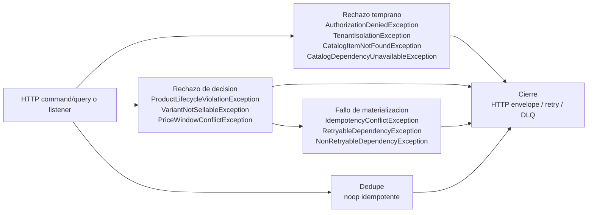
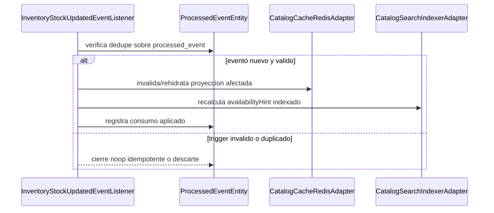
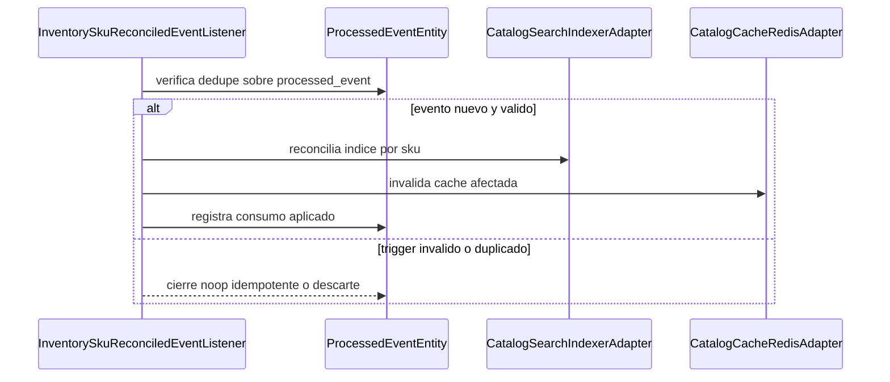

## Proposito
Definir el runtime tecnico completo de `catalog-service`, alineado con la `Vista de Codigo` vigente y cerrando la trazabilidad entre `request`, `command/query`, `result/response`, dominio, idempotencia, persistencia, cache, seguridad, indexacion, outbox y eventos.

## Alcance y fronteras
- Incluye los 16 casos HTTP activos del MVP para catalogo y los 2 listeners internos operativos que consumen eventos de Inventory.
- Incluye `api-gateway-service` como borde canonico en el panorama global y referencias explicitas a Inventory, Redis, Kafka e indexacion donde corresponde.
- Incluye clases owner exactas de `Vista de Codigo`, mas cobertura explicita para listeners operativos, configuracion y soporte transversal.
- Excluye el runtime interno detallado de otros BC fuera de sus interacciones con Catalog.

## Casos de uso cubiertos por Catalog
| ID | Caso de uso | Trigger | Resultado esperado |
|---|---|---|---|
| UC-CAT-01 | Register Product | `POST /api/v1/catalog/products` | producto creado con trazabilidad de auditoria, cache e indexacion |
| UC-CAT-02 | Update Product | `PATCH /api/v1/catalog/products/{productId}` | producto actualizado sin romper invariantes comerciales |
| UC-CAT-03 | Activate Product | `POST /api/v1/catalog/products/{productId}/activate` | producto habilitado para variantes vendibles |
| UC-CAT-04 | Retire Product | `POST /api/v1/catalog/products/{productId}/retire` | producto retirado y fuera de oferta activa |
| UC-CAT-05 | Create Variant | `POST /api/v1/catalog/products/{productId}/variants` | variante creada con SKU unico dentro del tenant |
| UC-CAT-06 | Update Variant | `PATCH /api/v1/catalog/products/{productId}/variants/{variantId}` | variante actualizada con atributos consistentes |
| UC-CAT-07 | Mark Variant Sellable | `POST /api/v1/catalog/products/{productId}/variants/{variantId}/mark-sellable` | variante marcada como vendible dentro de una ventana valida |
| UC-CAT-08 | Discontinue Variant | `POST /api/v1/catalog/products/{productId}/variants/{variantId}/discontinue` | variante descontinuada y fuera de venta |
| UC-CAT-09 | Upsert Current Price | `PUT /api/v1/catalog/variants/{variantId}/prices/current` | precio vigente actualizado de forma deterministica |
| UC-CAT-10 | Schedule Price Change | `POST /api/v1/catalog/variants/{variantId}/prices/schedule` | cambio de precio futuro programado |
| UC-CAT-11 | Bulk Upsert Prices | `POST /api/v1/catalog/prices/bulk-upsert` | lote de precios aplicado con control de idempotencia |
| UC-CAT-12 | Search Catalog | `GET /api/v1/catalog/search` | catalogo filtrado y paginado |
| UC-CAT-13 | Get Product Detail | `GET /api/v1/catalog/products/{productId}` | detalle completo de producto con variantes visibles |
| UC-CAT-14 | List Product Variants | `GET /api/v1/catalog/products/{productId}/variants` | lista de variantes filtradas para un producto |
| UC-CAT-15 | List Variant Price Timeline | `GET /api/v1/catalog/variants/{variantId}/prices` | timeline de precios resoluble por periodo |
| UC-CAT-16 | Resolve Variant For Order | `POST /api/v1/catalog/variants/resolve` | variante resoluble para checkout con precio y vendibilidad vigente |
| EVT-CAT-01 | Consume StockUpdated | `inventory.stock-updated.v1` | `availabilityHint` recalculado con dedupe y cache/index consistentes |
| EVT-CAT-02 | Consume SkuReconciled | `inventory.sku-reconciled.v1` | reconciliacion de indice por SKU cerrada con dedupe y proyecciones actualizadas |

## Regla de lectura de los diagramas
- Los diagramas usan nombres exactos de las clases owner documentadas en [02-Vista-de-Codigo.md](/Users/jose/Development/Documentation/arkab2b-docs/content/mvp/02-arquitectura/services/catalog-service/architecture/02-Vista-de-Codigo.md).
- El `Panorama global` conserva la cadena HTTP completa: `api-gateway-service -> Controller -> Request -> Mapper web -> Command/Query -> Port-In -> UseCase -> Result -> Mapper de respuesta -> Response`, manteniendo el detalle semantico interno en `Application`.
- Los diagramas detallados por fases representan solo la arquitectura interna del servicio; por eso arrancan en `Controller`, `Listener` o contratos internos ya dentro de Catalog.
- Las clases que no son actores directos de un happy path o de una ruta alternativa quedan cerradas en la seccion `Cobertura completa contra Vista de Codigo`.

## Modelo runtime de autenticacion y autorizacion
| Tipo de flujo | Regla aplicada |
|---|---|
| HTTP command/query | `api-gateway-service` autentica el request. Las fases `Contextualizacion - Seguridad` materializan `PrincipalContext`, aplican `PermissionEvaluatorPort` y despues el dominio valida `TenantIsolationPolicy` y legitimidad del recurso. |
| listener interno | No se asume JWT de usuario. El servicio materializa contexto tecnico de trigger, valida `tenant`, dedupe y legitimidad del mensaje antes de recalcular efectos internos de catalogo o pricing. |

## Modelo runtime de errores y excepciones
| Tipo de flujo | Regla aplicada |
|---|---|
| HTTP command/query | `Rechazo temprano` y `Rechazo de decision` se propagan como familias semanticas canonicas desde `PrincipalContext`, `PermissionEvaluatorPort`, `TenantIsolationPolicy`, politicas y agregados; el adapter-in HTTP las traduce al envelope canonico. |
| listener interno | `TriggerContext`, dedupe y politicas del dominio emiten error semantico o `noop idempotente`; si el fallo es tecnico se clasifica como retryable/no-retryable para reintento o DLQ. |

### Diagrama runtime de excepciones concretas

## Patron de fases runtime
Los casos de uso de este servicio se documentan usando un patron de fases comun. La intencion es separar donde entra el caso, donde se prepara el contexto, donde se decide negocio y donde se materializan o propagan efectos.

| Fase | Que explica |
|---|---|
| `Ingreso` | Como entra el trigger al servicio y se convierte en un contrato de aplicacion. Incluye `request` o mensaje de entrada, `controller` o `listener`, mappers de entrada, `command/query` y `port in`. |
| `Preparacion` | Como el caso de uso transforma la entrada a contexto semantico interno. Incluye `use case`, assemblers de aplicacion, value objects y contexto derivado del request. Aqui no se hace I/O externo. |
| `Contextualizacion` | Como el caso obtiene datos o validaciones tecnicas necesarias antes de decidir. Incluye `ports out`, `adapters out`, cache, repositorios, `clock`, seguridad tecnica y clientes externos. |
| `Decision` | Donde el dominio toma la decision real del caso. Incluye agregados, value objects de decision, politicas y eventos de dominio. Cuando intervienen varios agregados, la fase se divide por agregado. |
| `Materializacion` | Como se hace efectiva la decision ya tomada. Incluye persistencia de cambios, auditoria, cache, indexacion, idempotencia y outbox. Aqui no se vuelve a decidir negocio. |
| `Proyeccion` | Como el estado final del caso se transforma en un `result` interno y luego en una `response` consumible por el llamador HTTP. |
| `Propagacion` | Como los efectos asincronos ya materializados salen del servicio. Incluye relay de outbox, publicacion de eventos y reintentos. |

### Regla para rutas alternativas
- El flujo principal describe el `happy path`.
- Si una variante corta el caso antes de completar todas las fases, se documenta como ruta alternativa explicita.
- Una ruta alternativa debe indicar donde se corta el flujo, que fases ya no ocurren y que auditoria, cache, idempotencia, outbox o salida de error si ocurren.

## Diagramas runtime por casos HTTP


{}
{}
> El bloque `Exito` describe el `happy path` de `RegisterProduct`. El bloque `Rechazo` agrupa `Rechazo temprano`, `Rechazo de decision`, `Fallo de materializacion`, `Fallo de propagacion`.

<table>
  <thead>
    <tr>
      <th>Etapa</th>
      <th>Clases para RegisterProduct</th>
      <th>Responsabilidad</th>
    </tr>
  </thead>
  <tbody>
    <tr>
      <td>Ingreso</td>
      <td><code>CatalogAdminHttpController</code>, <code>RegisterProductRequest</code>, <code>ProductCommandMapper</code>, <code>RegisterProductCommand</code>, <code>RegisterProductCommandUseCase</code></td>
      <td>Recibe el trigger del caso dentro del servicio y lo traduce al contrato de aplicacion que inicia el flujo interno.</td>
    </tr>
    <tr>
      <td>Preparacion</td>
      <td><code>RegisterProductUseCase</code>, <code>ProductCommandAssembler</code>, <code>TenantId</code>, <code>ProductCode</code>, <code>ProductName</code>, <code>ProductDescription</code>, <code>BrandId</code>, <code>CategoryId</code>, <code>ProductAggregate</code></td>
      <td>Normaliza la intencion del caso y construye contexto semantico interno sin hacer I/O externo.</td>
    </tr>
    <tr>
      <td>Contextualizacion - Seguridad</td>
      <td><code>RegisterProductUseCase</code>, <code>PrincipalContextPort</code>, <code>PrincipalContextAdapter</code>, <code>PermissionEvaluatorPort</code>, <code>RbacPermissionEvaluatorAdapter</code></td>
      <td>Obtiene datos, autorizaciones o validaciones tecnicas necesarias antes de decidir en dominio.</td>
    </tr>
    <tr>
      <td>Contextualizacion - Idempotencia</td>
      <td><code>RegisterProductUseCase</code>, <code>IdempotencyRepositoryPort</code>, <code>IdempotencyR2dbcRepositoryAdapter</code>, <code>ReactiveIdempotencyRecordRepository</code></td>
      <td>Obtiene datos, autorizaciones o validaciones tecnicas necesarias antes de decidir en dominio.</td>
    </tr>
    <tr>
      <td>Contextualizacion - Referencias</td>
      <td><code>RegisterProductUseCase</code>, <code>BrandRepositoryPort</code>, <code>BrandR2dbcRepositoryAdapter</code>, <code>ReactiveBrandRepository</code>, <code>BrandEntity</code>, <code>CategoryRepositoryPort</code>, <code>CategoryR2dbcRepositoryAdapter</code>, <code>ReactiveCategoryRepository</code>, <code>CategoryEntity</code></td>
      <td>Obtiene datos, autorizaciones o validaciones tecnicas necesarias antes de decidir en dominio.</td>
    </tr>
    <tr>
      <td>Decision - Product</td>
      <td><code>RegisterProductUseCase</code>, <code>ProductLifecyclePolicy</code>, <code>ProductAggregate</code>, <code>ProductTaxonomy</code>, <code>ProductLifecycle</code>, <code>ProductCreatedEvent</code></td>
      <td>Evalua invariantes, reglas y politicas del dominio para aceptar, rechazar o consolidar el resultado del caso.</td>
    </tr>
    <tr>
      <td>Materializacion</td>
      <td><code>RegisterProductUseCase</code>, <code>ProductRepositoryPort</code>, <code>ProductR2dbcRepositoryAdapter</code>, <code>ProductPersistenceMapper</code>, <code>ProductEntity</code>, <code>ReactiveProductRepository</code>, <code>CatalogCachePort</code>, <code>CatalogCacheRedisAdapter</code>, <code>SearchIndexPort</code>, <code>CatalogSearchIndexerAdapter</code>, <code>CatalogAuditPort</code>, <code>CatalogAuditR2dbcRepositoryAdapter</code>, <code>ReactiveCatalogAuditRepository</code>, <code>CatalogAuditEntity</code>, <code>IdempotencyRepositoryPort</code>, <code>IdempotencyR2dbcRepositoryAdapter</code>, <code>IdempotencyPersistenceMapper</code>, <code>IdempotencyRecordEntity</code>, <code>ReactiveIdempotencyRecordRepository</code>, <code>OutboxPort</code>, <code>OutboxPersistenceAdapter</code>, <code>ReactiveOutboxEventRepository</code>, <code>OutboxEventEntity</code></td>
      <td>Hace efectiva la decision tomada: persistencia, auditoria, cache, indexacion e idempotencia segun corresponda.</td>
    </tr>
    <tr>
      <td>Proyeccion</td>
      <td><code>RegisterProductUseCase</code>, <code>CatalogResultMapper</code>, <code>ProductDetailResult</code>, <code>CatalogResponseMapper</code>, <code>ProductDetailResponse</code>, <code>CatalogAdminHttpController</code></td>
      <td>Convierte el estado final del caso en la respuesta expuesta por el servicio.</td>
    </tr>
    <tr>
      <td>Propagacion</td>
      <td><code>ProductCreatedEvent</code>, <code>OutboxEventEntity</code>, <code>OutboxPublisherScheduler</code>, <code>DomainEventPublisherPort</code>, <code>KafkaDomainEventPublisherAdapter</code></td>
      <td>Publica los efectos asincronos ya materializados mediante relay, outbox y broker.</td>
    </tr>
    <tr>
      <td>Rechazo temprano</td>
      <td><code>RegisterProductUseCase</code>, <code>PermissionEvaluatorPort</code>, <code>RbacPermissionEvaluatorAdapter</code>, <code>BrandRepositoryPort</code>, <code>CategoryRepositoryPort</code>, <code>CatalogAdminHttpController</code>, <code>CatalogWebFluxConfiguration</code></td>
      <td>Corta el flujo antes de decidir en dominio por autorizacion, validacion tecnica, referencias inexistentes o ausencia de contexto externo.</td>
    </tr>
    <tr>
      <td>Rechazo de decision</td>
      <td><code>RegisterProductUseCase</code>, <code>ProductLifecyclePolicy</code>, <code>ProductAggregate</code>, <code>CatalogAuditPort</code>, <code>CatalogAdminHttpController</code>, <code>CatalogWebFluxConfiguration</code></td>
      <td>Corta el flujo despues de evaluar negocio o invariantes del dominio.</td>
    </tr>
    <tr>
      <td>Fallo de materializacion</td>
      <td><code>RegisterProductUseCase</code>, <code>ProductRepositoryPort</code>, <code>CatalogCachePort</code>, <code>SearchIndexPort</code>, <code>CatalogAuditPort</code>, <code>IdempotencyRepositoryPort</code>, <code>OutboxPort</code>, <code>CatalogAdminHttpController</code>, <code>CatalogWebFluxConfiguration</code></td>
      <td>Representa un error tecnico posterior a la decision al persistir, auditar, actualizar cache/index, guardar respuesta idempotente o escribir outbox.</td>
    </tr>
    <tr>
      <td>Fallo de propagacion</td>
      <td><code>ProductCreatedEvent</code>, <code>OutboxEventEntity</code>, <code>OutboxPublisherScheduler</code>, <code>DomainEventPublisherPort</code>, <code>KafkaDomainEventPublisherAdapter</code></td>
      <td>Representa un error asincrono al publicar efectos ya materializados.</td>
    </tr>
  </tbody>
</table>
{}
{}
{}
{}

sequenceDiagram
  participant P1 as CatalogAdminHttpController
  participant P2 as RegisterProductRequest
  participant P3 as ProductCommandMapper
  participant P4 as RegisterProductCommand
  participant P5 as RegisterProductCommandUseCase
  P1->>P2: recibe request
  P2->>P3: entrega payload HTTP
  P3->>P4: crea command
  P4->>P5: entra por port in


**Descripcion de la fase.** Recibe el trigger del caso dentro del servicio y lo traduce al contrato de aplicacion que inicia el flujo interno.

**Capa predominante.** Se ubica principalmente en `Adapter-in`, con cruce controlado hacia el puerto de entrada de `Application service`.

<table>
  <thead>
    <tr>
      <th>Paso</th>
      <th>Clase</th>
      <th>Accion</th>
    </tr>
  </thead>
  <tbody>
    <tr>
      <td>1</td>
      <td><code>CatalogAdminHttpController</code></td>
      <td>Recibe el request HTTP del caso y delega su traduccion hacia el contrato de aplicacion correspondiente.</td>
    </tr>
    <tr>
      <td>2</td>
      <td><code>RegisterProductRequest</code></td>
      <td>Representa el request HTTP del caso con payload o parametros ya delimitados en el borde web.</td>
    </tr>
    <tr>
      <td>3</td>
      <td><code>ProductCommandMapper</code></td>
      <td>Traduce el request HTTP al contrato de aplicacion que consume el caso.</td>
    </tr>
    <tr>
      <td>4</td>
      <td><code>RegisterProductCommand</code></td>
      <td>Formaliza la intencion del caso en un contrato interno consistente.</td>
    </tr>
    <tr>
      <td>5</td>
      <td><code>RegisterProductCommandUseCase</code></td>
      <td>Expone el puerto de entrada reactivo del caso mutante.</td>
    </tr>
  </tbody>
</table>
{}
{}

sequenceDiagram
  participant P1 as RegisterProductUseCase
  participant P2 as ProductCommandAssembler
  participant P3 as TenantId
  participant P4 as ProductCode
  participant P5 as ProductName
  participant P6 as ProductDescription
  participant P7 as BrandId
  participant P8 as CategoryId
  participant P9 as ProductAggregate
  P1->>P2: delega armado
  P2->>P3: crea tenant
  P3->>P4: crea codigo
  P4->>P5: crea nombre
  P5->>P6: crea descripcion
  P6->>P7: crea marca
  P7->>P8: crea categoria
  P8->>P9: arma agregado


**Descripcion de la fase.** Normaliza la intencion del caso y construye contexto semantico interno sin hacer I/O externo.

**Capa predominante.** Se ubica principalmente en `Application service`, con apoyo de tipos del `Domain`.

<table>
  <thead>
    <tr>
      <th>Paso</th>
      <th>Clase</th>
      <th>Accion</th>
    </tr>
  </thead>
  <tbody>
    <tr>
      <td>1</td>
      <td><code>RegisterProductUseCase</code></td>
      <td>Normaliza el comando y arma el contexto semantico con el que se construira el producto.</td>
    </tr>
    <tr>
      <td>2</td>
      <td><code>ProductCommandAssembler</code></td>
      <td>Convierte el comando en un agregado coherente con la taxonomia y el ciclo de vida inicial del producto.</td>
    </tr>
    <tr>
      <td>3</td>
      <td><code>TenantId</code></td>
      <td>Representa el tenant dueño del nuevo producto y delimita su espacio de catalogo.</td>
    </tr>
    <tr>
      <td>4</td>
      <td><code>ProductCode</code></td>
      <td>Normaliza el codigo comercial unico con el que el producto sera identificado.</td>
    </tr>
    <tr>
      <td>5</td>
      <td><code>ProductName</code></td>
      <td>Encapsula el nombre comercial del producto con restricciones de dominio.</td>
    </tr>
    <tr>
      <td>6</td>
      <td><code>ProductDescription</code></td>
      <td>Normaliza la descripcion visible del producto para busqueda y detalle.</td>
    </tr>
    <tr>
      <td>7</td>
      <td><code>BrandId</code></td>
      <td>Representa la marca referenciada por el nuevo producto.</td>
    </tr>
    <tr>
      <td>8</td>
      <td><code>CategoryId</code></td>
      <td>Representa la categoria comercial dentro de la taxonomia del catalogo.</td>
    </tr>
    <tr>
      <td>9</td>
      <td><code>ProductAggregate</code></td>
      <td>Materializa el agregado inicial en `DRAFT` con taxonomia valida antes de cualquier I/O externo.</td>
    </tr>
  </tbody>
</table>
{}
{}

sequenceDiagram
  participant P1 as RegisterProductUseCase
  participant P2 as PrincipalContextPort
  participant P3 as PrincipalContextAdapter
  participant P4 as PermissionEvaluatorPort
  participant P5 as RbacPermissionEvaluatorAdapter
  P1->>P2: lee claims
  P2->>P3: extrae principal
  P3->>P4: evalua permiso
  P4->>P5: consulta RBAC


**Descripcion de la fase.** Obtiene datos, autorizaciones o validaciones tecnicas necesarias antes de decidir en dominio.

**Capa predominante.** Se ubica en la frontera entre `Application service` y `Adapter-out`.

<table>
  <thead>
    <tr>
      <th>Paso</th>
      <th>Clase</th>
      <th>Accion</th>
    </tr>
  </thead>
  <tbody>
    <tr>
      <td>1</td>
      <td><code>RegisterProductUseCase</code></td>
      <td>Coordina la resolucion del actor y de los permisos requeridos antes de continuar el caso.</td>
    </tr>
    <tr>
      <td>2</td>
      <td><code>PrincipalContextPort</code></td>
      <td>Expone los claims o el principal autenticado con el que se ejecuta la operacion.</td>
    </tr>
    <tr>
      <td>3</td>
      <td><code>PrincipalContextAdapter</code></td>
      <td>Recupera el principal efectivo desde la infraestructura de seguridad reactiva.</td>
    </tr>
    <tr>
      <td>4</td>
      <td><code>PermissionEvaluatorPort</code></td>
      <td>Formula la verificacion de permisos que el caso necesita para ejecutarse.</td>
    </tr>
    <tr>
      <td>5</td>
      <td><code>RbacPermissionEvaluatorAdapter</code></td>
      <td>Consulta las reglas RBAC y devuelve autorizacion o denegacion.</td>
    </tr>
  </tbody>
</table>
{}
{}

sequenceDiagram
  participant P1 as RegisterProductUseCase
  participant P2 as IdempotencyRepositoryPort
  participant P3 as IdempotencyR2dbcRepositoryAdapter
  participant P4 as ReactiveIdempotencyRecordRepository
  P1->>P2: busca respuesta
  P2->>P3: consulta almacenamiento
  P3->>P4: lee registro


**Descripcion de la fase.** Obtiene datos, autorizaciones o validaciones tecnicas necesarias antes de decidir en dominio.

**Capa predominante.** Se ubica en la frontera entre `Application service` y `Adapter-out`.

<table>
  <thead>
    <tr>
      <th>Paso</th>
      <th>Clase</th>
      <th>Accion</th>
    </tr>
  </thead>
  <tbody>
    <tr>
      <td>1</td>
      <td><code>RegisterProductUseCase</code></td>
      <td>Consulta si ya existe una respuesta materializada para la llave idempotente del comando.</td>
    </tr>
    <tr>
      <td>2</td>
      <td><code>IdempotencyRepositoryPort</code></td>
      <td>Expone la busqueda de respuestas previas asociadas a una operacion idempotente.</td>
    </tr>
    <tr>
      <td>3</td>
      <td><code>IdempotencyR2dbcRepositoryAdapter</code></td>
      <td>Adapta la consulta idempotente al almacenamiento reactivo del servicio.</td>
    </tr>
    <tr>
      <td>4</td>
      <td><code>ReactiveIdempotencyRecordRepository</code></td>
      <td>Lee el registro persistido de idempotencia para decidir si hay replay valido.</td>
    </tr>
  </tbody>
</table>
{}
{}

sequenceDiagram
  participant P1 as RegisterProductUseCase
  participant P2 as BrandRepositoryPort
  participant P3 as BrandR2dbcRepositoryAdapter
  participant P4 as ReactiveBrandRepository
  participant P5 as BrandEntity
  participant P6 as CategoryRepositoryPort
  participant P7 as CategoryR2dbcRepositoryAdapter
  participant P8 as ReactiveCategoryRepository
  participant P9 as CategoryEntity
  P1->>P2: consulta marca
  P2->>P3: consulta almacenamiento
  P3->>P4: lee marca
  P4->>P5: materializa marca
  P5->>P6: consulta categoria
  P6->>P7: consulta almacenamiento
  P7->>P8: lee categoria
  P8->>P9: materializa categoria


**Descripcion de la fase.** Obtiene datos, autorizaciones o validaciones tecnicas necesarias antes de decidir en dominio.

**Capa predominante.** Se ubica en la frontera entre `Application service` y `Adapter-out`.

<table>
  <thead>
    <tr>
      <th>Paso</th>
      <th>Clase</th>
      <th>Accion</th>
    </tr>
  </thead>
  <tbody>
    <tr>
      <td>1</td>
      <td><code>RegisterProductUseCase</code></td>
      <td>Carga y valida las referencias comerciales requeridas para registrar el producto.</td>
    </tr>
    <tr>
      <td>2</td>
      <td><code>BrandRepositoryPort</code></td>
      <td>Expone la validacion de marca activa utilizada por el caso.</td>
    </tr>
    <tr>
      <td>3</td>
      <td><code>BrandR2dbcRepositoryAdapter</code></td>
      <td>Adapta la consulta de marca al almacenamiento relacional reactivo.</td>
    </tr>
    <tr>
      <td>4</td>
      <td><code>ReactiveBrandRepository</code></td>
      <td>Lee la marca referenciada para verificar su estado activo.</td>
    </tr>
    <tr>
      <td>5</td>
      <td><code>BrandEntity</code></td>
      <td>Representa la fila de marca usada como referencia comercial valida.</td>
    </tr>
    <tr>
      <td>6</td>
      <td><code>CategoryRepositoryPort</code></td>
      <td>Expone la validacion de categoria activa requerida por el caso.</td>
    </tr>
    <tr>
      <td>7</td>
      <td><code>CategoryR2dbcRepositoryAdapter</code></td>
      <td>Adapta la consulta de categoria al almacenamiento relacional reactivo.</td>
    </tr>
    <tr>
      <td>8</td>
      <td><code>ReactiveCategoryRepository</code></td>
      <td>Lee la categoria referenciada y su estado dentro de la taxonomia.</td>
    </tr>
    <tr>
      <td>9</td>
      <td><code>CategoryEntity</code></td>
      <td>Representa la fila de categoria validada como referencia del producto.</td>
    </tr>
  </tbody>
</table>
{}
{}

sequenceDiagram
  participant P1 as RegisterProductUseCase
  participant P2 as ProductLifecyclePolicy
  participant P3 as ProductAggregate
  participant P4 as ProductTaxonomy
  participant P5 as ProductLifecycle
  participant P6 as ProductCreatedEvent
  P1->>P2: evalua lifecycle
  P2->>P3: crea agregado
  P3->>P4: consolida taxonomia
  P4->>P5: inicializa lifecycle
  P5->>P6: emite evento


**Descripcion de la fase.** Evalua invariantes, reglas y politicas del dominio para aceptar, rechazar o consolidar el resultado del caso.

**Capa predominante.** Se ubica principalmente en `Domain`, orquestada por `Application service`.

<table>
  <thead>
    <tr>
      <th>Paso</th>
      <th>Clase</th>
      <th>Accion</th>
    </tr>
  </thead>
  <tbody>
    <tr>
      <td>1</td>
      <td><code>RegisterProductUseCase</code></td>
      <td>Entrega al dominio el contexto ya validado para crear el nuevo producto.</td>
    </tr>
    <tr>
      <td>2</td>
      <td><code>ProductLifecyclePolicy</code></td>
      <td>Define el estado inicial permitido y las restricciones de alta del producto.</td>
    </tr>
    <tr>
      <td>3</td>
      <td><code>ProductAggregate</code></td>
      <td>Crea el producto con sus invariantes, taxonomia y ciclo de vida inicial.</td>
    </tr>
    <tr>
      <td>4</td>
      <td><code>ProductTaxonomy</code></td>
      <td>Consolida la marca y la categoria como taxonomia valida del producto.</td>
    </tr>
    <tr>
      <td>5</td>
      <td><code>ProductLifecycle</code></td>
      <td>Inicializa el ciclo de vida operativo del producto segun politica.</td>
    </tr>
    <tr>
      <td>6</td>
      <td><code>ProductCreatedEvent</code></td>
      <td>Representa el evento de dominio emitido tras aceptar el alta del producto.</td>
    </tr>
  </tbody>
</table>
{}
{}

sequenceDiagram
  participant P1 as RegisterProductUseCase
  participant P2 as ProductRepositoryPort
  participant P3 as ProductR2dbcRepositoryAdapter
  participant P4 as ProductPersistenceMapper
  participant P5 as ProductEntity
  participant P6 as ReactiveProductRepository
  participant P7 as CatalogCachePort
  participant P8 as CatalogCacheRedisAdapter
  participant P9 as SearchIndexPort
  participant P10 as CatalogSearchIndexerAdapter
  participant P11 as CatalogAuditPort
  participant P12 as CatalogAuditR2dbcRepositoryAdapter
  participant P13 as ReactiveCatalogAuditRepository
  participant P14 as CatalogAuditEntity
  participant P15 as IdempotencyRepositoryPort
  participant P16 as IdempotencyR2dbcRepositoryAdapter
  participant P17 as IdempotencyPersistenceMapper
  participant P18 as IdempotencyRecordEntity
  participant P19 as ReactiveIdempotencyRecordRepository
  participant P20 as OutboxPort
  participant P21 as OutboxPersistenceAdapter
  participant P22 as ReactiveOutboxEventRepository
  participant P23 as OutboxEventEntity
  P1->>P2: persiste producto
  P2->>P3: guarda agregado
  P3->>P4: mapea entidad
  P4->>P5: materializa fila
  P5->>P6: guarda fila
  P6->>P7: invalida cache
  P7->>P8: evicta redis
  P8->>P9: actualiza indice
  P9->>P10: upserta indice
  P10->>P11: audita operacion
  P11->>P12: persiste auditoria
  P12->>P13: guarda auditoria
  P13->>P14: materializa auditoria
  P14->>P15: guarda respuesta idempotente
  P15->>P16: persiste idempotencia
  P16->>P17: mapea registro
  P17->>P18: materializa registro
  P18->>P19: guarda registro
  P19->>P20: escribe outbox
  P20->>P21: persiste outbox
  P21->>P22: guarda fila outbox
  P22->>P23: materializa outbox


**Descripcion de la fase.** Hace efectiva la decision tomada: persistencia, auditoria, cache, indexacion e idempotencia segun corresponda.

**Capa predominante.** Se ubica en la frontera entre `Application service` y `Adapter-out`.

<table>
  <thead>
    <tr>
      <th>Paso</th>
      <th>Clase</th>
      <th>Accion</th>
    </tr>
  </thead>
  <tbody>
    <tr>
      <td>1</td>
      <td><code>RegisterProductUseCase</code></td>
      <td>Orquesta la persistencia, la auditoria, la invalidacion de cache, la indexacion y el outbox del nuevo producto.</td>
    </tr>
    <tr>
      <td>2</td>
      <td><code>ProductRepositoryPort</code></td>
      <td>Expone la persistencia reactiva del agregado producto.</td>
    </tr>
    <tr>
      <td>3</td>
      <td><code>ProductR2dbcRepositoryAdapter</code></td>
      <td>Adapta el agregado producto al almacenamiento relacional.</td>
    </tr>
    <tr>
      <td>4</td>
      <td><code>ProductPersistenceMapper</code></td>
      <td>Traduce el agregado al modelo persistente utilizado por la infraestructura.</td>
    </tr>
    <tr>
      <td>5</td>
      <td><code>ProductEntity</code></td>
      <td>Representa la fila persistida del producto creado.</td>
    </tr>
    <tr>
      <td>6</td>
      <td><code>ReactiveProductRepository</code></td>
      <td>Ejecuta la escritura reactiva del producto en la base transaccional.</td>
    </tr>
    <tr>
      <td>7</td>
      <td><code>CatalogCachePort</code></td>
      <td>Expone la invalidacion de cache de busqueda y detalle asociada al producto mutado.</td>
    </tr>
    <tr>
      <td>8</td>
      <td><code>CatalogCacheRedisAdapter</code></td>
      <td>Evicta las entradas de Redis afectadas por el nuevo producto.</td>
    </tr>
    <tr>
      <td>9</td>
      <td><code>SearchIndexPort</code></td>
      <td>Expone la actualizacion del indice de busqueda para el producto ya persistido.</td>
    </tr>
    <tr>
      <td>10</td>
      <td><code>CatalogSearchIndexerAdapter</code></td>
      <td>Propaga al proveedor de indexacion el nuevo producto para busqueda.</td>
    </tr>
    <tr>
      <td>11</td>
      <td><code>CatalogAuditPort</code></td>
      <td>Registra el exito de la operacion como evidencia operativa.</td>
    </tr>
    <tr>
      <td>12</td>
      <td><code>CatalogAuditR2dbcRepositoryAdapter</code></td>
      <td>Adapta la auditoria al almacenamiento relacional reactivo.</td>
    </tr>
    <tr>
      <td>13</td>
      <td><code>ReactiveCatalogAuditRepository</code></td>
      <td>Escribe el registro de auditoria del alta de producto.</td>
    </tr>
    <tr>
      <td>14</td>
      <td><code>CatalogAuditEntity</code></td>
      <td>Representa la fila de auditoria generada por la operacion.</td>
    </tr>
    <tr>
      <td>15</td>
      <td><code>IdempotencyRepositoryPort</code></td>
      <td>Expone el guardado de la respuesta final para futuros replays idempotentes.</td>
    </tr>
    <tr>
      <td>16</td>
      <td><code>IdempotencyR2dbcRepositoryAdapter</code></td>
      <td>Adapta el guardado idempotente al almacenamiento relacional.</td>
    </tr>
    <tr>
      <td>17</td>
      <td><code>IdempotencyPersistenceMapper</code></td>
      <td>Traduce la respuesta del caso al registro persistido de idempotencia.</td>
    </tr>
    <tr>
      <td>18</td>
      <td><code>IdempotencyRecordEntity</code></td>
      <td>Representa la respuesta materializada reutilizable por llave idempotente.</td>
    </tr>
    <tr>
      <td>19</td>
      <td><code>ReactiveIdempotencyRecordRepository</code></td>
      <td>Escribe el registro idempotente asociado a la operacion.</td>
    </tr>
    <tr>
      <td>20</td>
      <td><code>OutboxPort</code></td>
      <td>Expone la escritura del evento pendiente de publicacion dentro de la unidad de trabajo.</td>
    </tr>
    <tr>
      <td>21</td>
      <td><code>OutboxPersistenceAdapter</code></td>
      <td>Adapta la escritura del evento al almacenamiento transaccional del outbox.</td>
    </tr>
    <tr>
      <td>22</td>
      <td><code>ReactiveOutboxEventRepository</code></td>
      <td>Guarda la fila de outbox asociada al alta del producto.</td>
    </tr>
    <tr>
      <td>23</td>
      <td><code>OutboxEventEntity</code></td>
      <td>Representa la fila persistida que alimentara la publicacion asincrona posterior.</td>
    </tr>
  </tbody>
</table>
{}
{}

sequenceDiagram
  participant P1 as RegisterProductUseCase
  participant P2 as CatalogResultMapper
  participant P3 as ProductDetailResult
  participant P4 as CatalogResponseMapper
  participant P5 as ProductDetailResponse
  participant P6 as CatalogAdminHttpController
  P1->>P2: proyecta agregado
  P2->>P3: produce result
  P3->>P4: traduce response
  P4->>P5: construye response
  P5->>P6: retorna respuesta


**Descripcion de la fase.** Convierte el estado final del caso en la respuesta expuesta por el servicio.

**Capa predominante.** Se ubica principalmente en `Application service`, cerrando el retorno hacia `Adapter-in`.

<table>
  <thead>
    <tr>
      <th>Paso</th>
      <th>Clase</th>
      <th>Accion</th>
    </tr>
  </thead>
  <tbody>
    <tr>
      <td>1</td>
      <td><code>RegisterProductUseCase</code></td>
      <td>Entrega el agregado ya materializado para construir la salida semantica del caso.</td>
    </tr>
    <tr>
      <td>2</td>
      <td><code>CatalogResultMapper</code></td>
      <td>Transforma el agregado de producto en el `result` interno estable que cruza hacia el borde HTTP.</td>
    </tr>
    <tr>
      <td>3</td>
      <td><code>ProductDetailResult</code></td>
      <td>Representa la salida semantica interna del caso antes de cruzar el borde HTTP.</td>
    </tr>
    <tr>
      <td>4</td>
      <td><code>CatalogResponseMapper</code></td>
      <td>Traduce el `result` de aplicacion al contrato de respuesta expuesto por la API.</td>
    </tr>
    <tr>
      <td>5</td>
      <td><code>ProductDetailResponse</code></td>
      <td>Materializa la respuesta HTTP especifica del caso para el llamador.</td>
    </tr>
    <tr>
      <td>6</td>
      <td><code>CatalogAdminHttpController</code></td>
      <td>Devuelve la respuesta HTTP una vez el flujo interno cierra correctamente.</td>
    </tr>
  </tbody>
</table>
{}
{}

sequenceDiagram
  participant P1 as ProductCreatedEvent
  participant P2 as OutboxEventEntity
  participant P3 as OutboxPublisherScheduler
  participant P4 as DomainEventPublisherPort
  participant P5 as KafkaDomainEventPublisherAdapter
  P1->>P2: lee outbox
  P2->>P3: ejecuta relay
  P3->>P4: publica evento
  P4->>P5: publica en kafka


**Descripcion de la fase.** Publica los efectos asincronos ya materializados mediante relay, outbox y broker.

**Capa predominante.** Se ubica principalmente en `Adapter-out`.

<table>
  <thead>
    <tr>
      <th>Paso</th>
      <th>Clase</th>
      <th>Accion</th>
    </tr>
  </thead>
  <tbody>
    <tr>
      <td>1</td>
      <td><code>ProductCreatedEvent</code></td>
      <td>Representa el evento de dominio ya materializado y listo para integracion.</td>
    </tr>
    <tr>
      <td>2</td>
      <td><code>OutboxEventEntity</code></td>
      <td>Entrega al relay la unidad persistida desde la que se publicaran los eventos pendientes.</td>
    </tr>
    <tr>
      <td>3</td>
      <td><code>OutboxPublisherScheduler</code></td>
      <td>Consume el outbox sin bloquear la respuesta HTTP del caso y gestiona reintentos.</td>
    </tr>
    <tr>
      <td>4</td>
      <td><code>DomainEventPublisherPort</code></td>
      <td>Expone la abstraccion de publicacion asincrona del servicio de catalogo.</td>
    </tr>
    <tr>
      <td>5</td>
      <td><code>KafkaDomainEventPublisherAdapter</code></td>
      <td>Entrega el mensaje al broker o deja el evento pendiente para reintento posterior.</td>
    </tr>
  </tbody>
</table>
{}
{}
{}
{}
{}
{}

sequenceDiagram
  participant P1 as RegisterProductUseCase
  participant P2 as PermissionEvaluatorPort
  participant P3 as RbacPermissionEvaluatorAdapter
  participant P4 as BrandRepositoryPort
  participant P5 as CategoryRepositoryPort
  participant P6 as CatalogAdminHttpController
  participant P7 as CatalogWebFluxConfiguration
  P1->>P2: bloquea operacion
  P2->>P3: niega accion
  P3->>P4: rechaza marca
  P4->>P5: rechaza categoria
  P5->>P6: propaga error
  P6->>P7: mapea error HTTP


**Descripcion de la fase.** Corta el flujo antes de decidir en dominio por autorizacion, validacion tecnica, referencias inexistentes o ausencia de contexto externo.

**Capa predominante.** Se ubica en la frontera `Adapter-in` / `Application service` con apoyo de `Adapter-out`.

<table>
  <thead>
    <tr>
      <th>Paso</th>
      <th>Clase</th>
      <th>Accion</th>
    </tr>
  </thead>
  <tbody>
    <tr>
      <td>1</td>
      <td><code>RegisterProductUseCase</code></td>
      <td>Detecta una condicion tecnica o de autorizacion que impide continuar antes de decidir en dominio.</td>
    </tr>
    <tr>
      <td>2</td>
      <td><code>PermissionEvaluatorPort</code></td>
      <td>Detecta que el actor no esta autorizado para crear productos en este tenant.</td>
    </tr>
    <tr>
      <td>3</td>
      <td><code>RbacPermissionEvaluatorAdapter</code></td>
      <td>Devuelve la denegacion efectiva desde las reglas RBAC.</td>
    </tr>
    <tr>
      <td>4</td>
      <td><code>BrandRepositoryPort</code></td>
      <td>Detecta una marca inexistente o inactiva para el producto.</td>
    </tr>
    <tr>
      <td>5</td>
      <td><code>CategoryRepositoryPort</code></td>
      <td>Detecta una categoria inexistente o inactiva dentro del catalogo.</td>
    </tr>
    <tr>
      <td>6</td>
      <td><code>CatalogAdminHttpController</code></td>
      <td>Recibe la senal de error y corta el flujo antes del dominio o de la salida exitosa.</td>
    </tr>
    <tr>
      <td>7</td>
      <td><code>CatalogWebFluxConfiguration</code></td>
      <td>Convierte la excepcion tecnica o funcional temprana en la respuesta HTTP correspondiente.</td>
    </tr>
  </tbody>
</table>
{}
{}

sequenceDiagram
  participant P1 as RegisterProductUseCase
  participant P2 as ProductLifecyclePolicy
  participant P3 as ProductAggregate
  participant P4 as CatalogAuditPort
  participant P5 as CatalogAdminHttpController
  participant P6 as CatalogWebFluxConfiguration
  P1->>P2: niega alta
  P2->>P3: rechaza agregado
  P3->>P4: audita rechazo
  P4->>P5: retorna rechazo
  P5->>P6: serializa error


**Descripcion de la fase.** Corta el flujo despues de evaluar negocio o invariantes del dominio.

**Capa predominante.** Se ubica principalmente en `Domain`, con cierre de error hacia `Adapter-in`.

<table>
  <thead>
    <tr>
      <th>Paso</th>
      <th>Clase</th>
      <th>Accion</th>
    </tr>
  </thead>
  <tbody>
    <tr>
      <td>1</td>
      <td><code>RegisterProductUseCase</code></td>
      <td>Llega al dominio con contexto valido, pero una politica o un agregado rechaza la operacion.</td>
    </tr>
    <tr>
      <td>2</td>
      <td><code>ProductLifecyclePolicy</code></td>
      <td>Rechaza la creacion si el producto no puede entrar al ciclo de vida esperado.</td>
    </tr>
    <tr>
      <td>3</td>
      <td><code>ProductAggregate</code></td>
      <td>Descarta el alta cuando una invariante del producto o de su taxonomia no se cumple.</td>
    </tr>
    <tr>
      <td>4</td>
      <td><code>CatalogAuditPort</code></td>
      <td>Registra el rechazo semantico para trazabilidad operativa y cumplimiento.</td>
    </tr>
    <tr>
      <td>5</td>
      <td><code>CatalogAdminHttpController</code></td>
      <td>Recibe la salida de rechazo de negocio y cierra el caso sin materializar cambios.</td>
    </tr>
    <tr>
      <td>6</td>
      <td><code>CatalogWebFluxConfiguration</code></td>
      <td>Serializa el rechazo del dominio en la respuesta HTTP del contrato.</td>
    </tr>
  </tbody>
</table>
{}
{}

sequenceDiagram
  participant P1 as RegisterProductUseCase
  participant P2 as ProductRepositoryPort
  participant P3 as CatalogCachePort
  participant P4 as SearchIndexPort
  participant P5 as CatalogAuditPort
  participant P6 as IdempotencyRepositoryPort
  participant P7 as OutboxPort
  participant P8 as CatalogAdminHttpController
  participant P9 as CatalogWebFluxConfiguration
  P1->>P2: falla persistencia
  P2->>P3: falla cache
  P3->>P4: falla indexacion
  P4->>P5: falla auditoria
  P5->>P6: falla idempotencia
  P6->>P7: falla outbox
  P7->>P8: propaga error tecnico
  P8->>P9: mapea error HTTP


**Descripcion de la fase.** Representa un error tecnico posterior a la decision al persistir, auditar, actualizar cache/index, guardar respuesta idempotente o escribir outbox.

**Capa predominante.** Se ubica en la frontera entre `Application service` y `Adapter-out`.

<table>
  <thead>
    <tr>
      <th>Paso</th>
      <th>Clase</th>
      <th>Accion</th>
    </tr>
  </thead>
  <tbody>
    <tr>
      <td>1</td>
      <td><code>RegisterProductUseCase</code></td>
      <td>Ya existe una decision valida, pero una dependencia de salida falla al hacerla efectiva.</td>
    </tr>
    <tr>
      <td>2</td>
      <td><code>ProductRepositoryPort</code></td>
      <td>Falla al persistir el producto aceptado por el dominio.</td>
    </tr>
    <tr>
      <td>3</td>
      <td><code>CatalogCachePort</code></td>
      <td>Falla al invalidar la cache asociada al producto creado.</td>
    </tr>
    <tr>
      <td>4</td>
      <td><code>SearchIndexPort</code></td>
      <td>Falla al sincronizar el indice de busqueda con el nuevo producto.</td>
    </tr>
    <tr>
      <td>5</td>
      <td><code>CatalogAuditPort</code></td>
      <td>Falla al registrar la auditoria de la operacion.</td>
    </tr>
    <tr>
      <td>6</td>
      <td><code>IdempotencyRepositoryPort</code></td>
      <td>Falla al guardar la respuesta idempotente del alta.</td>
    </tr>
    <tr>
      <td>7</td>
      <td><code>OutboxPort</code></td>
      <td>Falla al escribir el evento pendiente de publicacion en outbox.</td>
    </tr>
    <tr>
      <td>8</td>
      <td><code>CatalogAdminHttpController</code></td>
      <td>Recibe el error tecnico y corta la respuesta exitosa del caso.</td>
    </tr>
    <tr>
      <td>9</td>
      <td><code>CatalogWebFluxConfiguration</code></td>
      <td>Mapea la falla tecnica a la respuesta HTTP de error apropiada.</td>
    </tr>
  </tbody>
</table>
{}
{}

sequenceDiagram
  participant P1 as ProductCreatedEvent
  participant P2 as OutboxEventEntity
  participant P3 as OutboxPublisherScheduler
  participant P4 as DomainEventPublisherPort
  participant P5 as KafkaDomainEventPublisherAdapter
  P1->>P2: lee outbox
  P2->>P3: reintenta relay
  P3->>P4: publica evento
  P4->>P5: publica en kafka


**Descripcion de la fase.** Representa un error asincrono al publicar efectos ya materializados.

**Capa predominante.** Se ubica principalmente en `Adapter-out`.

<table>
  <thead>
    <tr>
      <th>Paso</th>
      <th>Clase</th>
      <th>Accion</th>
    </tr>
  </thead>
  <tbody>
    <tr>
      <td>1</td>
      <td><code>ProductCreatedEvent</code></td>
      <td>Representa el evento de producto creado ya materializado y listo para integracion.</td>
    </tr>
    <tr>
      <td>2</td>
      <td><code>OutboxEventEntity</code></td>
      <td>Entrega al relay la fila pendiente de publicacion del producto creado.</td>
    </tr>
    <tr>
      <td>3</td>
      <td><code>OutboxPublisherScheduler</code></td>
      <td>Reintenta la publicacion asincrona del evento sin afectar el resultado HTTP ya emitido.</td>
    </tr>
    <tr>
      <td>4</td>
      <td><code>DomainEventPublisherPort</code></td>
      <td>Expone la publicacion asincrona del evento desde el servicio de catalogo.</td>
    </tr>
    <tr>
      <td>5</td>
      <td><code>KafkaDomainEventPublisherAdapter</code></td>
      <td>Entrega el mensaje al broker o lo deja pendiente para nuevo reintento.</td>
    </tr>
  </tbody>
</table>
{}
{}
{}
{}


{}
{}
> El bloque `Exito` describe el `happy path` de `UpdateProduct`. El bloque `Rechazo` agrupa `Rechazo temprano`, `Rechazo de decision`, `Fallo de materializacion`, `Fallo de propagacion`.

<table>
  <thead>
    <tr>
      <th>Etapa</th>
      <th>Clases para UpdateProduct</th>
      <th>Responsabilidad</th>
    </tr>
  </thead>
  <tbody>
    <tr>
      <td>Ingreso</td>
      <td><code>CatalogAdminHttpController</code>, <code>UpdateProductRequest</code>, <code>ProductCommandMapper</code>, <code>UpdateProductCommand</code>, <code>UpdateProductCommandUseCase</code></td>
      <td>Recibe el trigger del caso dentro del servicio y lo traduce al contrato de aplicacion que inicia el flujo interno.</td>
    </tr>
    <tr>
      <td>Preparacion</td>
      <td><code>UpdateProductUseCase</code>, <code>TenantId</code>, <code>ProductId</code>, <code>ProductName</code>, <code>ProductDescription</code></td>
      <td>Normaliza la intencion del caso y construye contexto semantico interno sin hacer I/O externo.</td>
    </tr>
    <tr>
      <td>Contextualizacion - Seguridad</td>
      <td><code>UpdateProductUseCase</code>, <code>PrincipalContextPort</code>, <code>PrincipalContextAdapter</code>, <code>PermissionEvaluatorPort</code>, <code>RbacPermissionEvaluatorAdapter</code></td>
      <td>Obtiene datos, autorizaciones o validaciones tecnicas necesarias antes de decidir en dominio.</td>
    </tr>
    <tr>
      <td>Contextualizacion - Idempotencia</td>
      <td><code>UpdateProductUseCase</code>, <code>IdempotencyRepositoryPort</code>, <code>IdempotencyR2dbcRepositoryAdapter</code>, <code>ReactiveIdempotencyRecordRepository</code></td>
      <td>Obtiene datos, autorizaciones o validaciones tecnicas necesarias antes de decidir en dominio.</td>
    </tr>
    <tr>
      <td>Contextualizacion - Product</td>
      <td><code>UpdateProductUseCase</code>, <code>ProductRepositoryPort</code>, <code>ProductR2dbcRepositoryAdapter</code>, <code>ReactiveProductRepository</code>, <code>ProductEntity</code></td>
      <td>Obtiene datos, autorizaciones o validaciones tecnicas necesarias antes de decidir en dominio.</td>
    </tr>
    <tr>
      <td>Decision - Product</td>
      <td><code>UpdateProductUseCase</code>, <code>ProductAggregate</code>, <code>ProductTaxonomy</code>, <code>ProductUpdatedEvent</code></td>
      <td>Evalua invariantes, reglas y politicas del dominio para aceptar, rechazar o consolidar el resultado del caso.</td>
    </tr>
    <tr>
      <td>Materializacion</td>
      <td><code>UpdateProductUseCase</code>, <code>ProductRepositoryPort</code>, <code>ProductR2dbcRepositoryAdapter</code>, <code>ProductPersistenceMapper</code>, <code>ProductEntity</code>, <code>ReactiveProductRepository</code>, <code>CatalogCachePort</code>, <code>CatalogCacheRedisAdapter</code>, <code>SearchIndexPort</code>, <code>CatalogSearchIndexerAdapter</code>, <code>CatalogAuditPort</code>, <code>CatalogAuditR2dbcRepositoryAdapter</code>, <code>ReactiveCatalogAuditRepository</code>, <code>CatalogAuditEntity</code>, <code>IdempotencyRepositoryPort</code>, <code>IdempotencyR2dbcRepositoryAdapter</code>, <code>IdempotencyPersistenceMapper</code>, <code>IdempotencyRecordEntity</code>, <code>ReactiveIdempotencyRecordRepository</code>, <code>OutboxPort</code>, <code>OutboxPersistenceAdapter</code>, <code>ReactiveOutboxEventRepository</code>, <code>OutboxEventEntity</code></td>
      <td>Hace efectiva la decision tomada: persistencia, auditoria, cache, indexacion e idempotencia segun corresponda.</td>
    </tr>
    <tr>
      <td>Proyeccion</td>
      <td><code>UpdateProductUseCase</code>, <code>ProductDetailResult</code>, <code>CatalogResponseMapper</code>, <code>ProductDetailResponse</code>, <code>CatalogAdminHttpController</code></td>
      <td>Convierte el estado final del caso en la respuesta expuesta por el servicio.</td>
    </tr>
    <tr>
      <td>Propagacion</td>
      <td><code>ProductUpdatedEvent</code>, <code>OutboxEventEntity</code>, <code>OutboxPublisherScheduler</code>, <code>DomainEventPublisherPort</code>, <code>KafkaDomainEventPublisherAdapter</code></td>
      <td>Publica los efectos asincronos ya materializados mediante relay, outbox y broker.</td>
    </tr>
    <tr>
      <td>Rechazo temprano</td>
      <td><code>UpdateProductUseCase</code>, <code>PermissionEvaluatorPort</code>, <code>ProductRepositoryPort</code>, <code>CatalogAdminHttpController</code>, <code>CatalogWebFluxConfiguration</code></td>
      <td>Corta el flujo antes de decidir en dominio por autorizacion, validacion tecnica, referencias inexistentes o ausencia de contexto externo.</td>
    </tr>
    <tr>
      <td>Rechazo de decision</td>
      <td><code>UpdateProductUseCase</code>, <code>ProductAggregate</code>, <code>CatalogAuditPort</code>, <code>CatalogAdminHttpController</code>, <code>CatalogWebFluxConfiguration</code></td>
      <td>Corta el flujo despues de evaluar negocio o invariantes del dominio.</td>
    </tr>
    <tr>
      <td>Fallo de materializacion</td>
      <td><code>UpdateProductUseCase</code>, <code>ProductRepositoryPort</code>, <code>CatalogCachePort</code>, <code>SearchIndexPort</code>, <code>CatalogAuditPort</code>, <code>IdempotencyRepositoryPort</code>, <code>OutboxPort</code>, <code>CatalogAdminHttpController</code>, <code>CatalogWebFluxConfiguration</code></td>
      <td>Representa un error tecnico posterior a la decision al persistir, auditar, actualizar cache/index, guardar respuesta idempotente o escribir outbox.</td>
    </tr>
    <tr>
      <td>Fallo de propagacion</td>
      <td><code>ProductUpdatedEvent</code>, <code>OutboxEventEntity</code>, <code>OutboxPublisherScheduler</code>, <code>DomainEventPublisherPort</code>, <code>KafkaDomainEventPublisherAdapter</code></td>
      <td>Representa un error asincrono al publicar efectos ya materializados.</td>
    </tr>
  </tbody>
</table>
{}
{}
{}
{}

sequenceDiagram
  participant P1 as CatalogAdminHttpController
  participant P2 as UpdateProductRequest
  participant P3 as ProductCommandMapper
  participant P4 as UpdateProductCommand
  participant P5 as UpdateProductCommandUseCase
  P1->>P2: recibe request
  P2->>P3: entrega payload HTTP
  P3->>P4: crea command
  P4->>P5: entra por port in


**Descripcion de la fase.** Recibe el trigger del caso dentro del servicio y lo traduce al contrato de aplicacion que inicia el flujo interno.

**Capa predominante.** Se ubica principalmente en `Adapter-in`, con cruce controlado hacia el puerto de entrada de `Application service`.

<table>
  <thead>
    <tr>
      <th>Paso</th>
      <th>Clase</th>
      <th>Accion</th>
    </tr>
  </thead>
  <tbody>
    <tr>
      <td>1</td>
      <td><code>CatalogAdminHttpController</code></td>
      <td>Recibe el request HTTP del caso y delega su traduccion hacia el contrato de aplicacion correspondiente.</td>
    </tr>
    <tr>
      <td>2</td>
      <td><code>UpdateProductRequest</code></td>
      <td>Representa el request HTTP del caso con payload o parametros ya delimitados en el borde web.</td>
    </tr>
    <tr>
      <td>3</td>
      <td><code>ProductCommandMapper</code></td>
      <td>Traduce el request HTTP al contrato de aplicacion que consume el caso.</td>
    </tr>
    <tr>
      <td>4</td>
      <td><code>UpdateProductCommand</code></td>
      <td>Formaliza la intencion del caso en un contrato interno consistente.</td>
    </tr>
    <tr>
      <td>5</td>
      <td><code>UpdateProductCommandUseCase</code></td>
      <td>Expone el puerto de entrada reactivo del caso mutante.</td>
    </tr>
  </tbody>
</table>
{}
{}

sequenceDiagram
  participant P1 as UpdateProductUseCase
  participant P2 as TenantId
  participant P3 as ProductId
  participant P4 as ProductName
  participant P5 as ProductDescription
  P1->>P2: crea tenant
  P2->>P3: crea producto
  P3->>P4: crea nombre
  P4->>P5: crea descripcion


**Descripcion de la fase.** Normaliza la intencion del caso y construye contexto semantico interno sin hacer I/O externo.

**Capa predominante.** Se ubica principalmente en `Application service`, con apoyo de tipos del `Domain`.

<table>
  <thead>
    <tr>
      <th>Paso</th>
      <th>Clase</th>
      <th>Accion</th>
    </tr>
  </thead>
  <tbody>
    <tr>
      <td>1</td>
      <td><code>UpdateProductUseCase</code></td>
      <td>Normaliza el comando y arma el contexto semantico de la actualizacion del producto.</td>
    </tr>
    <tr>
      <td>2</td>
      <td><code>TenantId</code></td>
      <td>Representa el tenant dentro del que se autoriza y ejecuta la mutacion.</td>
    </tr>
    <tr>
      <td>3</td>
      <td><code>ProductId</code></td>
      <td>Identifica el producto que sera cargado y actualizado.</td>
    </tr>
    <tr>
      <td>4</td>
      <td><code>ProductName</code></td>
      <td>Normaliza el nuevo nombre comercial del producto.</td>
    </tr>
    <tr>
      <td>5</td>
      <td><code>ProductDescription</code></td>
      <td>Normaliza la descripcion actualizada del producto.</td>
    </tr>
  </tbody>
</table>
{}
{}

sequenceDiagram
  participant P1 as UpdateProductUseCase
  participant P2 as PrincipalContextPort
  participant P3 as PrincipalContextAdapter
  participant P4 as PermissionEvaluatorPort
  participant P5 as RbacPermissionEvaluatorAdapter
  P1->>P2: lee claims
  P2->>P3: extrae principal
  P3->>P4: evalua permiso
  P4->>P5: consulta RBAC


**Descripcion de la fase.** Obtiene datos, autorizaciones o validaciones tecnicas necesarias antes de decidir en dominio.

**Capa predominante.** Se ubica en la frontera entre `Application service` y `Adapter-out`.

<table>
  <thead>
    <tr>
      <th>Paso</th>
      <th>Clase</th>
      <th>Accion</th>
    </tr>
  </thead>
  <tbody>
    <tr>
      <td>1</td>
      <td><code>UpdateProductUseCase</code></td>
      <td>Coordina la resolucion del actor y de los permisos requeridos antes de continuar el caso.</td>
    </tr>
    <tr>
      <td>2</td>
      <td><code>PrincipalContextPort</code></td>
      <td>Expone los claims o el principal autenticado con el que se ejecuta la operacion.</td>
    </tr>
    <tr>
      <td>3</td>
      <td><code>PrincipalContextAdapter</code></td>
      <td>Recupera el principal efectivo desde la infraestructura de seguridad reactiva.</td>
    </tr>
    <tr>
      <td>4</td>
      <td><code>PermissionEvaluatorPort</code></td>
      <td>Formula la verificacion de permisos que el caso necesita para ejecutarse.</td>
    </tr>
    <tr>
      <td>5</td>
      <td><code>RbacPermissionEvaluatorAdapter</code></td>
      <td>Consulta las reglas RBAC y devuelve autorizacion o denegacion.</td>
    </tr>
  </tbody>
</table>
{}
{}

sequenceDiagram
  participant P1 as UpdateProductUseCase
  participant P2 as IdempotencyRepositoryPort
  participant P3 as IdempotencyR2dbcRepositoryAdapter
  participant P4 as ReactiveIdempotencyRecordRepository
  P1->>P2: busca respuesta
  P2->>P3: consulta almacenamiento
  P3->>P4: lee registro


**Descripcion de la fase.** Obtiene datos, autorizaciones o validaciones tecnicas necesarias antes de decidir en dominio.

**Capa predominante.** Se ubica en la frontera entre `Application service` y `Adapter-out`.

<table>
  <thead>
    <tr>
      <th>Paso</th>
      <th>Clase</th>
      <th>Accion</th>
    </tr>
  </thead>
  <tbody>
    <tr>
      <td>1</td>
      <td><code>UpdateProductUseCase</code></td>
      <td>Consulta si ya existe una respuesta materializada para la llave idempotente del comando.</td>
    </tr>
    <tr>
      <td>2</td>
      <td><code>IdempotencyRepositoryPort</code></td>
      <td>Expone la busqueda de respuestas previas asociadas a una operacion idempotente.</td>
    </tr>
    <tr>
      <td>3</td>
      <td><code>IdempotencyR2dbcRepositoryAdapter</code></td>
      <td>Adapta la consulta idempotente al almacenamiento reactivo del servicio.</td>
    </tr>
    <tr>
      <td>4</td>
      <td><code>ReactiveIdempotencyRecordRepository</code></td>
      <td>Lee el registro persistido de idempotencia para decidir si hay replay valido.</td>
    </tr>
  </tbody>
</table>
{}
{}

sequenceDiagram
  participant P1 as UpdateProductUseCase
  participant P2 as ProductRepositoryPort
  participant P3 as ProductR2dbcRepositoryAdapter
  participant P4 as ReactiveProductRepository
  participant P5 as ProductEntity
  P1->>P2: busca producto
  P2->>P3: consulta almacenamiento
  P3->>P4: lee producto
  P4->>P5: materializa producto


**Descripcion de la fase.** Obtiene datos, autorizaciones o validaciones tecnicas necesarias antes de decidir en dominio.

**Capa predominante.** Se ubica en la frontera entre `Application service` y `Adapter-out`.

<table>
  <thead>
    <tr>
      <th>Paso</th>
      <th>Clase</th>
      <th>Accion</th>
    </tr>
  </thead>
  <tbody>
    <tr>
      <td>1</td>
      <td><code>UpdateProductUseCase</code></td>
      <td>Carga el estado actual del producto antes de aplicar cambios.</td>
    </tr>
    <tr>
      <td>2</td>
      <td><code>ProductRepositoryPort</code></td>
      <td>Expone la recuperacion reactiva del producto a actualizar.</td>
    </tr>
    <tr>
      <td>3</td>
      <td><code>ProductR2dbcRepositoryAdapter</code></td>
      <td>Adapta la consulta del producto al almacenamiento relacional.</td>
    </tr>
    <tr>
      <td>4</td>
      <td><code>ReactiveProductRepository</code></td>
      <td>Lee la fila actual del producto desde la base transaccional.</td>
    </tr>
    <tr>
      <td>5</td>
      <td><code>ProductEntity</code></td>
      <td>Representa el estado persistido actual del producto que servira de base para la mutacion.</td>
    </tr>
  </tbody>
</table>
{}
{}

sequenceDiagram
  participant P1 as UpdateProductUseCase
  participant P2 as ProductAggregate
  participant P3 as ProductTaxonomy
  participant P4 as ProductUpdatedEvent
  P1->>P2: actualiza agregado
  P2->>P3: valida taxonomia
  P3->>P4: emite evento


**Descripcion de la fase.** Evalua invariantes, reglas y politicas del dominio para aceptar, rechazar o consolidar el resultado del caso.

**Capa predominante.** Se ubica principalmente en `Domain`, orquestada por `Application service`.

<table>
  <thead>
    <tr>
      <th>Paso</th>
      <th>Clase</th>
      <th>Accion</th>
    </tr>
  </thead>
  <tbody>
    <tr>
      <td>1</td>
      <td><code>UpdateProductUseCase</code></td>
      <td>Entrega al dominio el estado actual y los cambios solicitados para decidir la actualizacion.</td>
    </tr>
    <tr>
      <td>2</td>
      <td><code>ProductAggregate</code></td>
      <td>Aplica la mutacion y valida que el producto siga cumpliendo sus invariantes.</td>
    </tr>
    <tr>
      <td>3</td>
      <td><code>ProductTaxonomy</code></td>
      <td>Conserva la coherencia de la taxonomia comercial del producto durante la actualizacion.</td>
    </tr>
    <tr>
      <td>4</td>
      <td><code>ProductUpdatedEvent</code></td>
      <td>Representa el evento emitido cuando la actualizacion del producto es aceptada.</td>
    </tr>
  </tbody>
</table>
{}
{}

sequenceDiagram
  participant P1 as UpdateProductUseCase
  participant P2 as ProductRepositoryPort
  participant P3 as ProductR2dbcRepositoryAdapter
  participant P4 as ProductPersistenceMapper
  participant P5 as ProductEntity
  participant P6 as ReactiveProductRepository
  participant P7 as CatalogCachePort
  participant P8 as CatalogCacheRedisAdapter
  participant P9 as SearchIndexPort
  participant P10 as CatalogSearchIndexerAdapter
  participant P11 as CatalogAuditPort
  participant P12 as CatalogAuditR2dbcRepositoryAdapter
  participant P13 as ReactiveCatalogAuditRepository
  participant P14 as CatalogAuditEntity
  participant P15 as IdempotencyRepositoryPort
  participant P16 as IdempotencyR2dbcRepositoryAdapter
  participant P17 as IdempotencyPersistenceMapper
  participant P18 as IdempotencyRecordEntity
  participant P19 as ReactiveIdempotencyRecordRepository
  participant P20 as OutboxPort
  participant P21 as OutboxPersistenceAdapter
  participant P22 as ReactiveOutboxEventRepository
  participant P23 as OutboxEventEntity
  P1->>P2: persiste producto
  P2->>P3: guarda agregado
  P3->>P4: mapea entidad
  P4->>P5: materializa fila
  P5->>P6: guarda fila
  P6->>P7: invalida cache
  P7->>P8: evicta redis
  P8->>P9: actualiza indice
  P9->>P10: upserta indice
  P10->>P11: audita operacion
  P11->>P12: persiste auditoria
  P12->>P13: guarda auditoria
  P13->>P14: materializa auditoria
  P14->>P15: guarda respuesta idempotente
  P15->>P16: persiste idempotencia
  P16->>P17: mapea registro
  P17->>P18: materializa registro
  P18->>P19: guarda registro
  P19->>P20: escribe outbox
  P20->>P21: persiste outbox
  P21->>P22: guarda fila outbox
  P22->>P23: materializa outbox


**Descripcion de la fase.** Hace efectiva la decision tomada: persistencia, auditoria, cache, indexacion e idempotencia segun corresponda.

**Capa predominante.** Se ubica en la frontera entre `Application service` y `Adapter-out`.

<table>
  <thead>
    <tr>
      <th>Paso</th>
      <th>Clase</th>
      <th>Accion</th>
    </tr>
  </thead>
  <tbody>
    <tr>
      <td>1</td>
      <td><code>UpdateProductUseCase</code></td>
      <td>Orquesta la persistencia del producto, la auditoria, la invalidacion de cache, la indexacion y el outbox.</td>
    </tr>
    <tr>
      <td>2</td>
      <td><code>ProductRepositoryPort</code></td>
      <td>Persiste el producto ya actualizado por el dominio.</td>
    </tr>
    <tr>
      <td>3</td>
      <td><code>ProductR2dbcRepositoryAdapter</code></td>
      <td>Adapta la escritura del agregado producto al almacenamiento relacional.</td>
    </tr>
    <tr>
      <td>4</td>
      <td><code>ProductPersistenceMapper</code></td>
      <td>Traduce el agregado mutado al modelo persistente de infraestructura.</td>
    </tr>
    <tr>
      <td>5</td>
      <td><code>ProductEntity</code></td>
      <td>Representa la fila persistida del producto actualizado.</td>
    </tr>
    <tr>
      <td>6</td>
      <td><code>ReactiveProductRepository</code></td>
      <td>Ejecuta la escritura reactiva del producto actualizado.</td>
    </tr>
    <tr>
      <td>7</td>
      <td><code>CatalogCachePort</code></td>
      <td>Expone la invalidacion de cache del producto y de las busquedas relacionadas.</td>
    </tr>
    <tr>
      <td>8</td>
      <td><code>CatalogCacheRedisAdapter</code></td>
      <td>Evicta en Redis las entradas afectadas por la actualizacion del producto.</td>
    </tr>
    <tr>
      <td>9</td>
      <td><code>SearchIndexPort</code></td>
      <td>Expone la resincronizacion del indice de busqueda para el producto mutado.</td>
    </tr>
    <tr>
      <td>10</td>
      <td><code>CatalogSearchIndexerAdapter</code></td>
      <td>Actualiza el documento indexado del producto para consultas posteriores.</td>
    </tr>
    <tr>
      <td>11</td>
      <td><code>CatalogAuditPort</code></td>
      <td>Registra la actualizacion del producto como evidencia operativa.</td>
    </tr>
    <tr>
      <td>12</td>
      <td><code>CatalogAuditR2dbcRepositoryAdapter</code></td>
      <td>Adapta la auditoria al almacenamiento relacional reactivo.</td>
    </tr>
    <tr>
      <td>13</td>
      <td><code>ReactiveCatalogAuditRepository</code></td>
      <td>Escribe el registro de auditoria de la actualizacion.</td>
    </tr>
    <tr>
      <td>14</td>
      <td><code>CatalogAuditEntity</code></td>
      <td>Representa la fila de auditoria asociada a la mutacion.</td>
    </tr>
    <tr>
      <td>15</td>
      <td><code>IdempotencyRepositoryPort</code></td>
      <td>Guarda la respuesta final para replays idempotentes del mismo comando.</td>
    </tr>
    <tr>
      <td>16</td>
      <td><code>IdempotencyR2dbcRepositoryAdapter</code></td>
      <td>Adapta el guardado de idempotencia al almacenamiento relacional.</td>
    </tr>
    <tr>
      <td>17</td>
      <td><code>IdempotencyPersistenceMapper</code></td>
      <td>Construye el registro persistible de idempotencia a partir de la respuesta.</td>
    </tr>
    <tr>
      <td>18</td>
      <td><code>IdempotencyRecordEntity</code></td>
      <td>Representa la respuesta idempotente reutilizable del comando.</td>
    </tr>
    <tr>
      <td>19</td>
      <td><code>ReactiveIdempotencyRecordRepository</code></td>
      <td>Escribe el registro asociado a la llave idempotente.</td>
    </tr>
    <tr>
      <td>20</td>
      <td><code>OutboxPort</code></td>
      <td>Expone la escritura del evento actualizado dentro de la unidad de trabajo.</td>
    </tr>
    <tr>
      <td>21</td>
      <td><code>OutboxPersistenceAdapter</code></td>
      <td>Adapta la escritura del evento actualizado al outbox relacional.</td>
    </tr>
    <tr>
      <td>22</td>
      <td><code>ReactiveOutboxEventRepository</code></td>
      <td>Guarda la fila de outbox asociada a la actualizacion del producto.</td>
    </tr>
    <tr>
      <td>23</td>
      <td><code>OutboxEventEntity</code></td>
      <td>Representa el registro pendiente de publicacion del producto actualizado.</td>
    </tr>
  </tbody>
</table>
{}
{}

sequenceDiagram
  participant P1 as UpdateProductUseCase
  participant P2 as ProductDetailResult
  participant P3 as CatalogResponseMapper
  participant P4 as ProductDetailResponse
  participant P5 as CatalogAdminHttpController
  P1->>P2: produce result
  P2->>P3: traduce response
  P3->>P4: construye response
  P4->>P5: retorna respuesta


**Descripcion de la fase.** Convierte el estado final del caso en la respuesta expuesta por el servicio.

**Capa predominante.** Se ubica principalmente en `Application service`, cerrando el retorno hacia `Adapter-in`.

<table>
  <thead>
    <tr>
      <th>Paso</th>
      <th>Clase</th>
      <th>Accion</th>
    </tr>
  </thead>
  <tbody>
    <tr>
      <td>1</td>
      <td><code>UpdateProductUseCase</code></td>
      <td>Emite el `result` interno del caso una vez la orquestacion termina correctamente.</td>
    </tr>
    <tr>
      <td>2</td>
      <td><code>ProductDetailResult</code></td>
      <td>Representa la salida semantica interna del caso antes de cruzar el borde HTTP.</td>
    </tr>
    <tr>
      <td>3</td>
      <td><code>CatalogResponseMapper</code></td>
      <td>Traduce el `result` de aplicacion al contrato de respuesta expuesto por la API.</td>
    </tr>
    <tr>
      <td>4</td>
      <td><code>ProductDetailResponse</code></td>
      <td>Materializa la respuesta HTTP especifica del caso para el llamador.</td>
    </tr>
    <tr>
      <td>5</td>
      <td><code>CatalogAdminHttpController</code></td>
      <td>Devuelve la respuesta HTTP una vez el flujo interno cierra correctamente.</td>
    </tr>
  </tbody>
</table>
{}
{}

sequenceDiagram
  participant P1 as ProductUpdatedEvent
  participant P2 as OutboxEventEntity
  participant P3 as OutboxPublisherScheduler
  participant P4 as DomainEventPublisherPort
  participant P5 as KafkaDomainEventPublisherAdapter
  P1->>P2: lee outbox
  P2->>P3: ejecuta relay
  P3->>P4: publica evento
  P4->>P5: publica en kafka


**Descripcion de la fase.** Publica los efectos asincronos ya materializados mediante relay, outbox y broker.

**Capa predominante.** Se ubica principalmente en `Adapter-out`.

<table>
  <thead>
    <tr>
      <th>Paso</th>
      <th>Clase</th>
      <th>Accion</th>
    </tr>
  </thead>
  <tbody>
    <tr>
      <td>1</td>
      <td><code>ProductUpdatedEvent</code></td>
      <td>Representa el evento de dominio ya materializado y listo para integracion.</td>
    </tr>
    <tr>
      <td>2</td>
      <td><code>OutboxEventEntity</code></td>
      <td>Entrega al relay la unidad persistida desde la que se publicaran los eventos pendientes.</td>
    </tr>
    <tr>
      <td>3</td>
      <td><code>OutboxPublisherScheduler</code></td>
      <td>Consume el outbox sin bloquear la respuesta HTTP del caso y gestiona reintentos.</td>
    </tr>
    <tr>
      <td>4</td>
      <td><code>DomainEventPublisherPort</code></td>
      <td>Expone la abstraccion de publicacion asincrona del servicio de catalogo.</td>
    </tr>
    <tr>
      <td>5</td>
      <td><code>KafkaDomainEventPublisherAdapter</code></td>
      <td>Entrega el mensaje al broker o deja el evento pendiente para reintento posterior.</td>
    </tr>
  </tbody>
</table>
{}
{}
{}
{}
{}
{}

sequenceDiagram
  participant P1 as UpdateProductUseCase
  participant P2 as PermissionEvaluatorPort
  participant P3 as ProductRepositoryPort
  participant P4 as CatalogAdminHttpController
  participant P5 as CatalogWebFluxConfiguration
  P1->>P2: bloquea operacion
  P2->>P3: rechaza producto
  P3->>P4: propaga error
  P4->>P5: mapea error HTTP


**Descripcion de la fase.** Corta el flujo antes de decidir en dominio por autorizacion, validacion tecnica, referencias inexistentes o ausencia de contexto externo.

**Capa predominante.** Se ubica en la frontera `Adapter-in` / `Application service` con apoyo de `Adapter-out`.

<table>
  <thead>
    <tr>
      <th>Paso</th>
      <th>Clase</th>
      <th>Accion</th>
    </tr>
  </thead>
  <tbody>
    <tr>
      <td>1</td>
      <td><code>UpdateProductUseCase</code></td>
      <td>Detecta una condicion tecnica o de autorizacion que impide continuar antes de decidir en dominio.</td>
    </tr>
    <tr>
      <td>2</td>
      <td><code>PermissionEvaluatorPort</code></td>
      <td>Detecta que el actor no puede actualizar productos en este contexto.</td>
    </tr>
    <tr>
      <td>3</td>
      <td><code>ProductRepositoryPort</code></td>
      <td>Detecta que el producto solicitado no existe en el tenant indicado.</td>
    </tr>
    <tr>
      <td>4</td>
      <td><code>CatalogAdminHttpController</code></td>
      <td>Recibe la senal de error y corta el flujo antes del dominio o de la salida exitosa.</td>
    </tr>
    <tr>
      <td>5</td>
      <td><code>CatalogWebFluxConfiguration</code></td>
      <td>Convierte la excepcion tecnica o funcional temprana en la respuesta HTTP correspondiente.</td>
    </tr>
  </tbody>
</table>
{}
{}

sequenceDiagram
  participant P1 as UpdateProductUseCase
  participant P2 as ProductAggregate
  participant P3 as CatalogAuditPort
  participant P4 as CatalogAdminHttpController
  participant P5 as CatalogWebFluxConfiguration
  P1->>P2: rechaza agregado
  P2->>P3: audita rechazo
  P3->>P4: retorna rechazo
  P4->>P5: serializa error


**Descripcion de la fase.** Corta el flujo despues de evaluar negocio o invariantes del dominio.

**Capa predominante.** Se ubica principalmente en `Domain`, con cierre de error hacia `Adapter-in`.

<table>
  <thead>
    <tr>
      <th>Paso</th>
      <th>Clase</th>
      <th>Accion</th>
    </tr>
  </thead>
  <tbody>
    <tr>
      <td>1</td>
      <td><code>UpdateProductUseCase</code></td>
      <td>Llega al dominio con contexto valido, pero una politica o un agregado rechaza la operacion.</td>
    </tr>
    <tr>
      <td>2</td>
      <td><code>ProductAggregate</code></td>
      <td>Rechaza la actualizacion cuando rompe invariantes del producto o de su taxonomia.</td>
    </tr>
    <tr>
      <td>3</td>
      <td><code>CatalogAuditPort</code></td>
      <td>Registra el rechazo semantico para trazabilidad operativa y cumplimiento.</td>
    </tr>
    <tr>
      <td>4</td>
      <td><code>CatalogAdminHttpController</code></td>
      <td>Recibe la salida de rechazo de negocio y cierra el caso sin materializar cambios.</td>
    </tr>
    <tr>
      <td>5</td>
      <td><code>CatalogWebFluxConfiguration</code></td>
      <td>Serializa el rechazo del dominio en la respuesta HTTP del contrato.</td>
    </tr>
  </tbody>
</table>
{}
{}

sequenceDiagram
  participant P1 as UpdateProductUseCase
  participant P2 as ProductRepositoryPort
  participant P3 as CatalogCachePort
  participant P4 as SearchIndexPort
  participant P5 as CatalogAuditPort
  participant P6 as IdempotencyRepositoryPort
  participant P7 as OutboxPort
  participant P8 as CatalogAdminHttpController
  participant P9 as CatalogWebFluxConfiguration
  P1->>P2: falla persistencia
  P2->>P3: falla cache
  P3->>P4: falla indexacion
  P4->>P5: falla auditoria
  P5->>P6: falla idempotencia
  P6->>P7: falla outbox
  P7->>P8: propaga error tecnico
  P8->>P9: mapea error HTTP


**Descripcion de la fase.** Representa un error tecnico posterior a la decision al persistir, auditar, actualizar cache/index, guardar respuesta idempotente o escribir outbox.

**Capa predominante.** Se ubica en la frontera entre `Application service` y `Adapter-out`.

<table>
  <thead>
    <tr>
      <th>Paso</th>
      <th>Clase</th>
      <th>Accion</th>
    </tr>
  </thead>
  <tbody>
    <tr>
      <td>1</td>
      <td><code>UpdateProductUseCase</code></td>
      <td>Ya existe una decision valida, pero una dependencia de salida falla al hacerla efectiva.</td>
    </tr>
    <tr>
      <td>2</td>
      <td><code>ProductRepositoryPort</code></td>
      <td>Falla al persistir la actualizacion aceptada por el dominio.</td>
    </tr>
    <tr>
      <td>3</td>
      <td><code>CatalogCachePort</code></td>
      <td>Falla al invalidar la cache afectada por la mutacion.</td>
    </tr>
    <tr>
      <td>4</td>
      <td><code>SearchIndexPort</code></td>
      <td>Falla al resincronizar el indice de busqueda del producto.</td>
    </tr>
    <tr>
      <td>5</td>
      <td><code>CatalogAuditPort</code></td>
      <td>Falla al registrar la auditoria de la actualizacion.</td>
    </tr>
    <tr>
      <td>6</td>
      <td><code>IdempotencyRepositoryPort</code></td>
      <td>Falla al guardar la respuesta idempotente del comando.</td>
    </tr>
    <tr>
      <td>7</td>
      <td><code>OutboxPort</code></td>
      <td>Falla al escribir el evento actualizado en outbox.</td>
    </tr>
    <tr>
      <td>8</td>
      <td><code>CatalogAdminHttpController</code></td>
      <td>Recibe el error tecnico y corta la respuesta exitosa del caso.</td>
    </tr>
    <tr>
      <td>9</td>
      <td><code>CatalogWebFluxConfiguration</code></td>
      <td>Mapea la falla tecnica a la respuesta HTTP de error apropiada.</td>
    </tr>
  </tbody>
</table>
{}
{}

sequenceDiagram
  participant P1 as ProductUpdatedEvent
  participant P2 as OutboxEventEntity
  participant P3 as OutboxPublisherScheduler
  participant P4 as DomainEventPublisherPort
  participant P5 as KafkaDomainEventPublisherAdapter
  P1->>P2: lee outbox
  P2->>P3: reintenta relay
  P3->>P4: publica evento
  P4->>P5: publica en kafka


**Descripcion de la fase.** Representa un error asincrono al publicar efectos ya materializados.

**Capa predominante.** Se ubica principalmente en `Adapter-out`.

<table>
  <thead>
    <tr>
      <th>Paso</th>
      <th>Clase</th>
      <th>Accion</th>
    </tr>
  </thead>
  <tbody>
    <tr>
      <td>1</td>
      <td><code>ProductUpdatedEvent</code></td>
      <td>Representa el evento de producto actualizado ya materializado y pendiente de integracion.</td>
    </tr>
    <tr>
      <td>2</td>
      <td><code>OutboxEventEntity</code></td>
      <td>Entrega al relay la fila pendiente de publicacion del producto actualizado.</td>
    </tr>
    <tr>
      <td>3</td>
      <td><code>OutboxPublisherScheduler</code></td>
      <td>Reintenta la publicacion del evento sin afectar la respuesta administrativa ya emitida.</td>
    </tr>
    <tr>
      <td>4</td>
      <td><code>DomainEventPublisherPort</code></td>
      <td>Expone la publicacion asincrona del evento desde el servicio de catalogo.</td>
    </tr>
    <tr>
      <td>5</td>
      <td><code>KafkaDomainEventPublisherAdapter</code></td>
      <td>Entrega el evento al broker o lo mantiene pendiente para reintento.</td>
    </tr>
  </tbody>
</table>
{}
{}
{}
{}


{}
{}
> El bloque `Exito` describe el `happy path` de `ActivateProduct`. El bloque `Rechazo` agrupa `Rechazo temprano`, `Rechazo de decision`, `Fallo de materializacion`, `Fallo de propagacion`.

<table>
  <thead>
    <tr>
      <th>Etapa</th>
      <th>Clases para ActivateProduct</th>
      <th>Responsabilidad</th>
    </tr>
  </thead>
  <tbody>
    <tr>
      <td>Ingreso</td>
      <td><code>CatalogAdminHttpController</code>, <code>ActivateProductRequest</code>, <code>ProductCommandMapper</code>, <code>ActivateProductCommand</code>, <code>ActivateProductCommandUseCase</code></td>
      <td>Recibe el trigger del caso dentro del servicio y lo traduce al contrato de aplicacion que inicia el flujo interno.</td>
    </tr>
    <tr>
      <td>Preparacion</td>
      <td><code>ActivateProductUseCase</code>, <code>TenantId</code>, <code>ProductId</code></td>
      <td>Normaliza la intencion del caso y construye contexto semantico interno sin hacer I/O externo.</td>
    </tr>
    <tr>
      <td>Contextualizacion - Seguridad</td>
      <td><code>ActivateProductUseCase</code>, <code>PrincipalContextPort</code>, <code>PrincipalContextAdapter</code>, <code>PermissionEvaluatorPort</code>, <code>RbacPermissionEvaluatorAdapter</code></td>
      <td>Obtiene datos, autorizaciones o validaciones tecnicas necesarias antes de decidir en dominio.</td>
    </tr>
    <tr>
      <td>Contextualizacion - Idempotencia</td>
      <td><code>ActivateProductUseCase</code>, <code>IdempotencyRepositoryPort</code>, <code>IdempotencyR2dbcRepositoryAdapter</code>, <code>ReactiveIdempotencyRecordRepository</code></td>
      <td>Obtiene datos, autorizaciones o validaciones tecnicas necesarias antes de decidir en dominio.</td>
    </tr>
    <tr>
      <td>Contextualizacion - Product</td>
      <td><code>ActivateProductUseCase</code>, <code>ProductRepositoryPort</code>, <code>ProductR2dbcRepositoryAdapter</code>, <code>ReactiveProductRepository</code>, <code>ProductEntity</code></td>
      <td>Obtiene datos, autorizaciones o validaciones tecnicas necesarias antes de decidir en dominio.</td>
    </tr>
    <tr>
      <td>Decision - Product</td>
      <td><code>ActivateProductUseCase</code>, <code>ProductLifecyclePolicy</code>, <code>ProductAggregate</code>, <code>ProductLifecycle</code>, <code>ProductStatus</code>, <code>ProductActivatedEvent</code></td>
      <td>Evalua invariantes, reglas y politicas del dominio para aceptar, rechazar o consolidar el resultado del caso.</td>
    </tr>
    <tr>
      <td>Materializacion</td>
      <td><code>ActivateProductUseCase</code>, <code>ProductRepositoryPort</code>, <code>ProductR2dbcRepositoryAdapter</code>, <code>ProductPersistenceMapper</code>, <code>ProductEntity</code>, <code>ReactiveProductRepository</code>, <code>CatalogCachePort</code>, <code>CatalogCacheRedisAdapter</code>, <code>SearchIndexPort</code>, <code>CatalogSearchIndexerAdapter</code>, <code>CatalogAuditPort</code>, <code>CatalogAuditR2dbcRepositoryAdapter</code>, <code>ReactiveCatalogAuditRepository</code>, <code>CatalogAuditEntity</code>, <code>IdempotencyRepositoryPort</code>, <code>IdempotencyR2dbcRepositoryAdapter</code>, <code>IdempotencyPersistenceMapper</code>, <code>IdempotencyRecordEntity</code>, <code>ReactiveIdempotencyRecordRepository</code>, <code>OutboxPort</code>, <code>OutboxPersistenceAdapter</code>, <code>ReactiveOutboxEventRepository</code>, <code>OutboxEventEntity</code></td>
      <td>Hace efectiva la decision tomada: persistencia, auditoria, cache, indexacion e idempotencia segun corresponda.</td>
    </tr>
    <tr>
      <td>Proyeccion</td>
      <td><code>ActivateProductUseCase</code>, <code>ProductStatusResult</code>, <code>CatalogResponseMapper</code>, <code>ProductStatusResponse</code>, <code>CatalogAdminHttpController</code></td>
      <td>Convierte el estado final del caso en la respuesta expuesta por el servicio.</td>
    </tr>
    <tr>
      <td>Propagacion</td>
      <td><code>ProductActivatedEvent</code>, <code>OutboxEventEntity</code>, <code>OutboxPublisherScheduler</code>, <code>DomainEventPublisherPort</code>, <code>KafkaDomainEventPublisherAdapter</code></td>
      <td>Publica los efectos asincronos ya materializados mediante relay, outbox y broker.</td>
    </tr>
    <tr>
      <td>Rechazo temprano</td>
      <td><code>ActivateProductUseCase</code>, <code>PermissionEvaluatorPort</code>, <code>ProductRepositoryPort</code>, <code>CatalogAdminHttpController</code>, <code>CatalogWebFluxConfiguration</code></td>
      <td>Corta el flujo antes de decidir en dominio por autorizacion, validacion tecnica, referencias inexistentes o ausencia de contexto externo.</td>
    </tr>
    <tr>
      <td>Rechazo de decision</td>
      <td><code>ActivateProductUseCase</code>, <code>ProductLifecyclePolicy</code>, <code>ProductAggregate</code>, <code>CatalogAuditPort</code>, <code>CatalogAdminHttpController</code>, <code>CatalogWebFluxConfiguration</code></td>
      <td>Corta el flujo despues de evaluar negocio o invariantes del dominio.</td>
    </tr>
    <tr>
      <td>Fallo de materializacion</td>
      <td><code>ActivateProductUseCase</code>, <code>ProductRepositoryPort</code>, <code>CatalogCachePort</code>, <code>SearchIndexPort</code>, <code>CatalogAuditPort</code>, <code>IdempotencyRepositoryPort</code>, <code>OutboxPort</code>, <code>CatalogAdminHttpController</code>, <code>CatalogWebFluxConfiguration</code></td>
      <td>Representa un error tecnico posterior a la decision al persistir, auditar, actualizar cache/index, guardar respuesta idempotente o escribir outbox.</td>
    </tr>
    <tr>
      <td>Fallo de propagacion</td>
      <td><code>ProductActivatedEvent</code>, <code>OutboxEventEntity</code>, <code>OutboxPublisherScheduler</code>, <code>DomainEventPublisherPort</code>, <code>KafkaDomainEventPublisherAdapter</code></td>
      <td>Representa un error asincrono al publicar efectos ya materializados.</td>
    </tr>
  </tbody>
</table>
{}
{}
{}
{}

sequenceDiagram
  participant P1 as CatalogAdminHttpController
  participant P2 as ActivateProductRequest
  participant P3 as ProductCommandMapper
  participant P4 as ActivateProductCommand
  participant P5 as ActivateProductCommandUseCase
  P1->>P2: recibe request
  P2->>P3: entrega payload HTTP
  P3->>P4: crea command
  P4->>P5: entra por port in


**Descripcion de la fase.** Recibe el trigger del caso dentro del servicio y lo traduce al contrato de aplicacion que inicia el flujo interno.

**Capa predominante.** Se ubica principalmente en `Adapter-in`, con cruce controlado hacia el puerto de entrada de `Application service`.

<table>
  <thead>
    <tr>
      <th>Paso</th>
      <th>Clase</th>
      <th>Accion</th>
    </tr>
  </thead>
  <tbody>
    <tr>
      <td>1</td>
      <td><code>CatalogAdminHttpController</code></td>
      <td>Recibe el request HTTP del caso y delega su traduccion hacia el contrato de aplicacion correspondiente.</td>
    </tr>
    <tr>
      <td>2</td>
      <td><code>ActivateProductRequest</code></td>
      <td>Representa el request HTTP del caso con payload o parametros ya delimitados en el borde web.</td>
    </tr>
    <tr>
      <td>3</td>
      <td><code>ProductCommandMapper</code></td>
      <td>Traduce el request HTTP al contrato de aplicacion que consume el caso.</td>
    </tr>
    <tr>
      <td>4</td>
      <td><code>ActivateProductCommand</code></td>
      <td>Formaliza la intencion del caso en un contrato interno consistente.</td>
    </tr>
    <tr>
      <td>5</td>
      <td><code>ActivateProductCommandUseCase</code></td>
      <td>Expone el puerto de entrada reactivo del caso mutante.</td>
    </tr>
  </tbody>
</table>
{}
{}

sequenceDiagram
  participant P1 as ActivateProductUseCase
  participant P2 as TenantId
  participant P3 as ProductId
  P1->>P2: crea tenant
  P2->>P3: crea producto


**Descripcion de la fase.** Normaliza la intencion del caso y construye contexto semantico interno sin hacer I/O externo.

**Capa predominante.** Se ubica principalmente en `Application service`, con apoyo de tipos del `Domain`.

<table>
  <thead>
    <tr>
      <th>Paso</th>
      <th>Clase</th>
      <th>Accion</th>
    </tr>
  </thead>
  <tbody>
    <tr>
      <td>1</td>
      <td><code>ActivateProductUseCase</code></td>
      <td>Normaliza el comando y prepara el contexto semantico de activacion del producto.</td>
    </tr>
    <tr>
      <td>2</td>
      <td><code>TenantId</code></td>
      <td>Representa el tenant dentro del que se activa el producto.</td>
    </tr>
    <tr>
      <td>3</td>
      <td><code>ProductId</code></td>
      <td>Identifica el producto que sera cargado y evaluado para activacion.</td>
    </tr>
  </tbody>
</table>
{}
{}

sequenceDiagram
  participant P1 as ActivateProductUseCase
  participant P2 as PrincipalContextPort
  participant P3 as PrincipalContextAdapter
  participant P4 as PermissionEvaluatorPort
  participant P5 as RbacPermissionEvaluatorAdapter
  P1->>P2: lee claims
  P2->>P3: extrae principal
  P3->>P4: evalua permiso
  P4->>P5: consulta RBAC


**Descripcion de la fase.** Obtiene datos, autorizaciones o validaciones tecnicas necesarias antes de decidir en dominio.

**Capa predominante.** Se ubica en la frontera entre `Application service` y `Adapter-out`.

<table>
  <thead>
    <tr>
      <th>Paso</th>
      <th>Clase</th>
      <th>Accion</th>
    </tr>
  </thead>
  <tbody>
    <tr>
      <td>1</td>
      <td><code>ActivateProductUseCase</code></td>
      <td>Coordina la resolucion del actor y de los permisos requeridos antes de continuar el caso.</td>
    </tr>
    <tr>
      <td>2</td>
      <td><code>PrincipalContextPort</code></td>
      <td>Expone los claims o el principal autenticado con el que se ejecuta la operacion.</td>
    </tr>
    <tr>
      <td>3</td>
      <td><code>PrincipalContextAdapter</code></td>
      <td>Recupera el principal efectivo desde la infraestructura de seguridad reactiva.</td>
    </tr>
    <tr>
      <td>4</td>
      <td><code>PermissionEvaluatorPort</code></td>
      <td>Formula la verificacion de permisos que el caso necesita para ejecutarse.</td>
    </tr>
    <tr>
      <td>5</td>
      <td><code>RbacPermissionEvaluatorAdapter</code></td>
      <td>Consulta las reglas RBAC y devuelve autorizacion o denegacion.</td>
    </tr>
  </tbody>
</table>
{}
{}

sequenceDiagram
  participant P1 as ActivateProductUseCase
  participant P2 as IdempotencyRepositoryPort
  participant P3 as IdempotencyR2dbcRepositoryAdapter
  participant P4 as ReactiveIdempotencyRecordRepository
  P1->>P2: busca respuesta
  P2->>P3: consulta almacenamiento
  P3->>P4: lee registro


**Descripcion de la fase.** Obtiene datos, autorizaciones o validaciones tecnicas necesarias antes de decidir en dominio.

**Capa predominante.** Se ubica en la frontera entre `Application service` y `Adapter-out`.

<table>
  <thead>
    <tr>
      <th>Paso</th>
      <th>Clase</th>
      <th>Accion</th>
    </tr>
  </thead>
  <tbody>
    <tr>
      <td>1</td>
      <td><code>ActivateProductUseCase</code></td>
      <td>Consulta si ya existe una respuesta materializada para la llave idempotente del comando.</td>
    </tr>
    <tr>
      <td>2</td>
      <td><code>IdempotencyRepositoryPort</code></td>
      <td>Expone la busqueda de respuestas previas asociadas a una operacion idempotente.</td>
    </tr>
    <tr>
      <td>3</td>
      <td><code>IdempotencyR2dbcRepositoryAdapter</code></td>
      <td>Adapta la consulta idempotente al almacenamiento reactivo del servicio.</td>
    </tr>
    <tr>
      <td>4</td>
      <td><code>ReactiveIdempotencyRecordRepository</code></td>
      <td>Lee el registro persistido de idempotencia para decidir si hay replay valido.</td>
    </tr>
  </tbody>
</table>
{}
{}

sequenceDiagram
  participant P1 as ActivateProductUseCase
  participant P2 as ProductRepositoryPort
  participant P3 as ProductR2dbcRepositoryAdapter
  participant P4 as ReactiveProductRepository
  participant P5 as ProductEntity
  P1->>P2: busca producto
  P2->>P3: consulta almacenamiento
  P3->>P4: lee producto
  P4->>P5: materializa producto


**Descripcion de la fase.** Obtiene datos, autorizaciones o validaciones tecnicas necesarias antes de decidir en dominio.

**Capa predominante.** Se ubica en la frontera entre `Application service` y `Adapter-out`.

<table>
  <thead>
    <tr>
      <th>Paso</th>
      <th>Clase</th>
      <th>Accion</th>
    </tr>
  </thead>
  <tbody>
    <tr>
      <td>1</td>
      <td><code>ActivateProductUseCase</code></td>
      <td>Carga el producto actual antes de evaluar si puede pasar a estado activo.</td>
    </tr>
    <tr>
      <td>2</td>
      <td><code>ProductRepositoryPort</code></td>
      <td>Expone la recuperacion del producto que sera activado.</td>
    </tr>
    <tr>
      <td>3</td>
      <td><code>ProductR2dbcRepositoryAdapter</code></td>
      <td>Adapta la consulta del producto al almacenamiento relacional.</td>
    </tr>
    <tr>
      <td>4</td>
      <td><code>ReactiveProductRepository</code></td>
      <td>Lee la fila actual del producto desde la base transaccional.</td>
    </tr>
    <tr>
      <td>5</td>
      <td><code>ProductEntity</code></td>
      <td>Representa el estado persistido del producto previo a la activacion.</td>
    </tr>
  </tbody>
</table>
{}
{}

sequenceDiagram
  participant P1 as ActivateProductUseCase
  participant P2 as ProductLifecyclePolicy
  participant P3 as ProductAggregate
  participant P4 as ProductLifecycle
  participant P5 as ProductStatus
  participant P6 as ProductActivatedEvent
  P1->>P2: valida activacion
  P2->>P3: activa agregado
  P3->>P4: actualiza lifecycle
  P4->>P5: define estado
  P5->>P6: emite evento


**Descripcion de la fase.** Evalua invariantes, reglas y politicas del dominio para aceptar, rechazar o consolidar el resultado del caso.

**Capa predominante.** Se ubica principalmente en `Domain`, orquestada por `Application service`.

<table>
  <thead>
    <tr>
      <th>Paso</th>
      <th>Clase</th>
      <th>Accion</th>
    </tr>
  </thead>
  <tbody>
    <tr>
      <td>1</td>
      <td><code>ActivateProductUseCase</code></td>
      <td>Entrega al dominio el producto cargado para decidir si puede activarse.</td>
    </tr>
    <tr>
      <td>2</td>
      <td><code>ProductLifecyclePolicy</code></td>
      <td>Valida que el producto cumple precondiciones para pasar a estado activo.</td>
    </tr>
    <tr>
      <td>3</td>
      <td><code>ProductAggregate</code></td>
      <td>Activa el producto y emite el evento correspondiente cuando la politica lo permite.</td>
    </tr>
    <tr>
      <td>4</td>
      <td><code>ProductLifecycle</code></td>
      <td>Actualiza el ciclo de vida del producto al estado activo.</td>
    </tr>
    <tr>
      <td>5</td>
      <td><code>ProductStatus</code></td>
      <td>Representa el estado final del producto una vez activado.</td>
    </tr>
    <tr>
      <td>6</td>
      <td><code>ProductActivatedEvent</code></td>
      <td>Representa el evento emitido tras activar correctamente el producto.</td>
    </tr>
  </tbody>
</table>
{}
{}

sequenceDiagram
  participant P1 as ActivateProductUseCase
  participant P2 as ProductRepositoryPort
  participant P3 as ProductR2dbcRepositoryAdapter
  participant P4 as ProductPersistenceMapper
  participant P5 as ProductEntity
  participant P6 as ReactiveProductRepository
  participant P7 as CatalogCachePort
  participant P8 as CatalogCacheRedisAdapter
  participant P9 as SearchIndexPort
  participant P10 as CatalogSearchIndexerAdapter
  participant P11 as CatalogAuditPort
  participant P12 as CatalogAuditR2dbcRepositoryAdapter
  participant P13 as ReactiveCatalogAuditRepository
  participant P14 as CatalogAuditEntity
  participant P15 as IdempotencyRepositoryPort
  participant P16 as IdempotencyR2dbcRepositoryAdapter
  participant P17 as IdempotencyPersistenceMapper
  participant P18 as IdempotencyRecordEntity
  participant P19 as ReactiveIdempotencyRecordRepository
  participant P20 as OutboxPort
  participant P21 as OutboxPersistenceAdapter
  participant P22 as ReactiveOutboxEventRepository
  participant P23 as OutboxEventEntity
  P1->>P2: persiste producto
  P2->>P3: guarda agregado
  P3->>P4: mapea entidad
  P4->>P5: materializa fila
  P5->>P6: guarda fila
  P6->>P7: invalida cache
  P7->>P8: evicta redis
  P8->>P9: actualiza indice
  P9->>P10: upserta indice
  P10->>P11: audita operacion
  P11->>P12: persiste auditoria
  P12->>P13: guarda auditoria
  P13->>P14: materializa auditoria
  P14->>P15: guarda respuesta idempotente
  P15->>P16: persiste idempotencia
  P16->>P17: mapea registro
  P17->>P18: materializa registro
  P18->>P19: guarda registro
  P19->>P20: escribe outbox
  P20->>P21: persiste outbox
  P21->>P22: guarda fila outbox
  P22->>P23: materializa outbox


**Descripcion de la fase.** Hace efectiva la decision tomada: persistencia, auditoria, cache, indexacion e idempotencia segun corresponda.

**Capa predominante.** Se ubica en la frontera entre `Application service` y `Adapter-out`.

<table>
  <thead>
    <tr>
      <th>Paso</th>
      <th>Clase</th>
      <th>Accion</th>
    </tr>
  </thead>
  <tbody>
    <tr>
      <td>1</td>
      <td><code>ActivateProductUseCase</code></td>
      <td>Persiste el nuevo estado del producto, invalida cache, actualiza indice y escribe auditoria, idempotencia y outbox.</td>
    </tr>
    <tr>
      <td>2</td>
      <td><code>ProductRepositoryPort</code></td>
      <td>Persiste el producto ya activado por el dominio.</td>
    </tr>
    <tr>
      <td>3</td>
      <td><code>ProductR2dbcRepositoryAdapter</code></td>
      <td>Adapta la escritura de la activacion al almacenamiento relacional.</td>
    </tr>
    <tr>
      <td>4</td>
      <td><code>ProductPersistenceMapper</code></td>
      <td>Traduce el agregado activado al modelo persistente.</td>
    </tr>
    <tr>
      <td>5</td>
      <td><code>ProductEntity</code></td>
      <td>Representa la fila persistida del producto activo.</td>
    </tr>
    <tr>
      <td>6</td>
      <td><code>ReactiveProductRepository</code></td>
      <td>Ejecuta la escritura reactiva del producto activado.</td>
    </tr>
    <tr>
      <td>7</td>
      <td><code>CatalogCachePort</code></td>
      <td>Expone la invalidacion de cache del producto activado y de las busquedas relacionadas.</td>
    </tr>
    <tr>
      <td>8</td>
      <td><code>CatalogCacheRedisAdapter</code></td>
      <td>Evicta en Redis las entradas afectadas por la activacion.</td>
    </tr>
    <tr>
      <td>9</td>
      <td><code>SearchIndexPort</code></td>
      <td>Expone la sincronizacion del indice para reflejar que el producto ya esta activo.</td>
    </tr>
    <tr>
      <td>10</td>
      <td><code>CatalogSearchIndexerAdapter</code></td>
      <td>Actualiza el indice externo con el nuevo estado del producto.</td>
    </tr>
    <tr>
      <td>11</td>
      <td><code>CatalogAuditPort</code></td>
      <td>Registra la activacion del producto como evidencia de control.</td>
    </tr>
    <tr>
      <td>12</td>
      <td><code>CatalogAuditR2dbcRepositoryAdapter</code></td>
      <td>Adapta la auditoria al almacenamiento relacional.</td>
    </tr>
    <tr>
      <td>13</td>
      <td><code>ReactiveCatalogAuditRepository</code></td>
      <td>Escribe la fila de auditoria de la activacion.</td>
    </tr>
    <tr>
      <td>14</td>
      <td><code>CatalogAuditEntity</code></td>
      <td>Representa la evidencia persistida de la activacion.</td>
    </tr>
    <tr>
      <td>15</td>
      <td><code>IdempotencyRepositoryPort</code></td>
      <td>Guarda la respuesta final de activacion para replays idempotentes.</td>
    </tr>
    <tr>
      <td>16</td>
      <td><code>IdempotencyR2dbcRepositoryAdapter</code></td>
      <td>Adapta el guardado idempotente al almacenamiento relacional.</td>
    </tr>
    <tr>
      <td>17</td>
      <td><code>IdempotencyPersistenceMapper</code></td>
      <td>Traduce la respuesta de activacion al registro idempotente persistible.</td>
    </tr>
    <tr>
      <td>18</td>
      <td><code>IdempotencyRecordEntity</code></td>
      <td>Representa la respuesta reutilizable asociada a la llave idempotente.</td>
    </tr>
    <tr>
      <td>19</td>
      <td><code>ReactiveIdempotencyRecordRepository</code></td>
      <td>Escribe el registro idempotente asociado a la activacion.</td>
    </tr>
    <tr>
      <td>20</td>
      <td><code>OutboxPort</code></td>
      <td>Expone la escritura del evento de activacion pendiente de publicar.</td>
    </tr>
    <tr>
      <td>21</td>
      <td><code>OutboxPersistenceAdapter</code></td>
      <td>Persiste el evento de activacion dentro del outbox transaccional.</td>
    </tr>
    <tr>
      <td>22</td>
      <td><code>ReactiveOutboxEventRepository</code></td>
      <td>Guarda la fila de outbox del producto activado.</td>
    </tr>
    <tr>
      <td>23</td>
      <td><code>OutboxEventEntity</code></td>
      <td>Representa el evento pendiente de integracion del producto activo.</td>
    </tr>
  </tbody>
</table>
{}
{}

sequenceDiagram
  participant P1 as ActivateProductUseCase
  participant P2 as ProductStatusResult
  participant P3 as CatalogResponseMapper
  participant P4 as ProductStatusResponse
  participant P5 as CatalogAdminHttpController
  P1->>P2: produce result
  P2->>P3: traduce response
  P3->>P4: construye response
  P4->>P5: retorna respuesta


**Descripcion de la fase.** Convierte el estado final del caso en la respuesta expuesta por el servicio.

**Capa predominante.** Se ubica principalmente en `Application service`, cerrando el retorno hacia `Adapter-in`.

<table>
  <thead>
    <tr>
      <th>Paso</th>
      <th>Clase</th>
      <th>Accion</th>
    </tr>
  </thead>
  <tbody>
    <tr>
      <td>1</td>
      <td><code>ActivateProductUseCase</code></td>
      <td>Emite el `result` interno del caso una vez la orquestacion termina correctamente.</td>
    </tr>
    <tr>
      <td>2</td>
      <td><code>ProductStatusResult</code></td>
      <td>Representa la salida semantica interna del caso antes de cruzar el borde HTTP.</td>
    </tr>
    <tr>
      <td>3</td>
      <td><code>CatalogResponseMapper</code></td>
      <td>Traduce el `result` de aplicacion al contrato de respuesta expuesto por la API.</td>
    </tr>
    <tr>
      <td>4</td>
      <td><code>ProductStatusResponse</code></td>
      <td>Materializa la respuesta HTTP especifica del caso para el llamador.</td>
    </tr>
    <tr>
      <td>5</td>
      <td><code>CatalogAdminHttpController</code></td>
      <td>Devuelve la respuesta HTTP una vez el flujo interno cierra correctamente.</td>
    </tr>
  </tbody>
</table>
{}
{}

sequenceDiagram
  participant P1 as ProductActivatedEvent
  participant P2 as OutboxEventEntity
  participant P3 as OutboxPublisherScheduler
  participant P4 as DomainEventPublisherPort
  participant P5 as KafkaDomainEventPublisherAdapter
  P1->>P2: lee outbox
  P2->>P3: ejecuta relay
  P3->>P4: publica evento
  P4->>P5: publica en kafka


**Descripcion de la fase.** Publica los efectos asincronos ya materializados mediante relay, outbox y broker.

**Capa predominante.** Se ubica principalmente en `Adapter-out`.

<table>
  <thead>
    <tr>
      <th>Paso</th>
      <th>Clase</th>
      <th>Accion</th>
    </tr>
  </thead>
  <tbody>
    <tr>
      <td>1</td>
      <td><code>ProductActivatedEvent</code></td>
      <td>Representa el evento de dominio ya materializado y listo para integracion.</td>
    </tr>
    <tr>
      <td>2</td>
      <td><code>OutboxEventEntity</code></td>
      <td>Entrega al relay la unidad persistida desde la que se publicaran los eventos pendientes.</td>
    </tr>
    <tr>
      <td>3</td>
      <td><code>OutboxPublisherScheduler</code></td>
      <td>Consume el outbox sin bloquear la respuesta HTTP del caso y gestiona reintentos.</td>
    </tr>
    <tr>
      <td>4</td>
      <td><code>DomainEventPublisherPort</code></td>
      <td>Expone la abstraccion de publicacion asincrona del servicio de catalogo.</td>
    </tr>
    <tr>
      <td>5</td>
      <td><code>KafkaDomainEventPublisherAdapter</code></td>
      <td>Entrega el mensaje al broker o deja el evento pendiente para reintento posterior.</td>
    </tr>
  </tbody>
</table>
{}
{}
{}
{}
{}
{}

sequenceDiagram
  participant P1 as ActivateProductUseCase
  participant P2 as PermissionEvaluatorPort
  participant P3 as ProductRepositoryPort
  participant P4 as CatalogAdminHttpController
  participant P5 as CatalogWebFluxConfiguration
  P1->>P2: bloquea operacion
  P2->>P3: rechaza producto
  P3->>P4: propaga error
  P4->>P5: mapea error HTTP


**Descripcion de la fase.** Corta el flujo antes de decidir en dominio por autorizacion, validacion tecnica, referencias inexistentes o ausencia de contexto externo.

**Capa predominante.** Se ubica en la frontera `Adapter-in` / `Application service` con apoyo de `Adapter-out`.

<table>
  <thead>
    <tr>
      <th>Paso</th>
      <th>Clase</th>
      <th>Accion</th>
    </tr>
  </thead>
  <tbody>
    <tr>
      <td>1</td>
      <td><code>ActivateProductUseCase</code></td>
      <td>Detecta una condicion tecnica o de autorizacion que impide continuar antes de decidir en dominio.</td>
    </tr>
    <tr>
      <td>2</td>
      <td><code>PermissionEvaluatorPort</code></td>
      <td>Detecta que el actor no puede activar productos en este contexto.</td>
    </tr>
    <tr>
      <td>3</td>
      <td><code>ProductRepositoryPort</code></td>
      <td>Detecta que el producto solicitado no existe o no es visible para el tenant.</td>
    </tr>
    <tr>
      <td>4</td>
      <td><code>CatalogAdminHttpController</code></td>
      <td>Recibe la senal de error y corta el flujo antes del dominio o de la salida exitosa.</td>
    </tr>
    <tr>
      <td>5</td>
      <td><code>CatalogWebFluxConfiguration</code></td>
      <td>Convierte la excepcion tecnica o funcional temprana en la respuesta HTTP correspondiente.</td>
    </tr>
  </tbody>
</table>
{}
{}

sequenceDiagram
  participant P1 as ActivateProductUseCase
  participant P2 as ProductLifecyclePolicy
  participant P3 as ProductAggregate
  participant P4 as CatalogAuditPort
  participant P5 as CatalogAdminHttpController
  participant P6 as CatalogWebFluxConfiguration
  P1->>P2: niega activacion
  P2->>P3: rechaza agregado
  P3->>P4: audita rechazo
  P4->>P5: retorna rechazo
  P5->>P6: serializa error


**Descripcion de la fase.** Corta el flujo despues de evaluar negocio o invariantes del dominio.

**Capa predominante.** Se ubica principalmente en `Domain`, con cierre de error hacia `Adapter-in`.

<table>
  <thead>
    <tr>
      <th>Paso</th>
      <th>Clase</th>
      <th>Accion</th>
    </tr>
  </thead>
  <tbody>
    <tr>
      <td>1</td>
      <td><code>ActivateProductUseCase</code></td>
      <td>Llega al dominio con contexto valido, pero una politica o un agregado rechaza la operacion.</td>
    </tr>
    <tr>
      <td>2</td>
      <td><code>ProductLifecyclePolicy</code></td>
      <td>Rechaza la activacion si el producto no cumple precondiciones del ciclo de vida.</td>
    </tr>
    <tr>
      <td>3</td>
      <td><code>ProductAggregate</code></td>
      <td>Descarta la activacion cuando una invariante del producto no se cumple.</td>
    </tr>
    <tr>
      <td>4</td>
      <td><code>CatalogAuditPort</code></td>
      <td>Registra el rechazo semantico para trazabilidad operativa y cumplimiento.</td>
    </tr>
    <tr>
      <td>5</td>
      <td><code>CatalogAdminHttpController</code></td>
      <td>Recibe la salida de rechazo de negocio y cierra el caso sin materializar cambios.</td>
    </tr>
    <tr>
      <td>6</td>
      <td><code>CatalogWebFluxConfiguration</code></td>
      <td>Serializa el rechazo del dominio en la respuesta HTTP del contrato.</td>
    </tr>
  </tbody>
</table>
{}
{}

sequenceDiagram
  participant P1 as ActivateProductUseCase
  participant P2 as ProductRepositoryPort
  participant P3 as CatalogCachePort
  participant P4 as SearchIndexPort
  participant P5 as CatalogAuditPort
  participant P6 as IdempotencyRepositoryPort
  participant P7 as OutboxPort
  participant P8 as CatalogAdminHttpController
  participant P9 as CatalogWebFluxConfiguration
  P1->>P2: falla persistencia
  P2->>P3: falla cache
  P3->>P4: falla indexacion
  P4->>P5: falla auditoria
  P5->>P6: falla idempotencia
  P6->>P7: falla outbox
  P7->>P8: propaga error tecnico
  P8->>P9: mapea error HTTP


**Descripcion de la fase.** Representa un error tecnico posterior a la decision al persistir, auditar, actualizar cache/index, guardar respuesta idempotente o escribir outbox.

**Capa predominante.** Se ubica en la frontera entre `Application service` y `Adapter-out`.

<table>
  <thead>
    <tr>
      <th>Paso</th>
      <th>Clase</th>
      <th>Accion</th>
    </tr>
  </thead>
  <tbody>
    <tr>
      <td>1</td>
      <td><code>ActivateProductUseCase</code></td>
      <td>Ya existe una decision valida, pero una dependencia de salida falla al hacerla efectiva.</td>
    </tr>
    <tr>
      <td>2</td>
      <td><code>ProductRepositoryPort</code></td>
      <td>Falla al persistir el nuevo estado del producto.</td>
    </tr>
    <tr>
      <td>3</td>
      <td><code>CatalogCachePort</code></td>
      <td>Falla al invalidar la cache del producto activado.</td>
    </tr>
    <tr>
      <td>4</td>
      <td><code>SearchIndexPort</code></td>
      <td>Falla al sincronizar el indice con el nuevo estado activo.</td>
    </tr>
    <tr>
      <td>5</td>
      <td><code>CatalogAuditPort</code></td>
      <td>Falla al registrar la auditoria de la activacion.</td>
    </tr>
    <tr>
      <td>6</td>
      <td><code>IdempotencyRepositoryPort</code></td>
      <td>Falla al guardar la respuesta idempotente de la activacion.</td>
    </tr>
    <tr>
      <td>7</td>
      <td><code>OutboxPort</code></td>
      <td>Falla al escribir el evento de activacion en outbox.</td>
    </tr>
    <tr>
      <td>8</td>
      <td><code>CatalogAdminHttpController</code></td>
      <td>Recibe el error tecnico y corta la respuesta exitosa del caso.</td>
    </tr>
    <tr>
      <td>9</td>
      <td><code>CatalogWebFluxConfiguration</code></td>
      <td>Mapea la falla tecnica a la respuesta HTTP de error apropiada.</td>
    </tr>
  </tbody>
</table>
{}
{}

sequenceDiagram
  participant P1 as ProductActivatedEvent
  participant P2 as OutboxEventEntity
  participant P3 as OutboxPublisherScheduler
  participant P4 as DomainEventPublisherPort
  participant P5 as KafkaDomainEventPublisherAdapter
  P1->>P2: lee outbox
  P2->>P3: reintenta relay
  P3->>P4: publica evento
  P4->>P5: publica en kafka


**Descripcion de la fase.** Representa un error asincrono al publicar efectos ya materializados.

**Capa predominante.** Se ubica principalmente en `Adapter-out`.

<table>
  <thead>
    <tr>
      <th>Paso</th>
      <th>Clase</th>
      <th>Accion</th>
    </tr>
  </thead>
  <tbody>
    <tr>
      <td>1</td>
      <td><code>ProductActivatedEvent</code></td>
      <td>Representa el evento de producto activado ya materializado y listo para integracion.</td>
    </tr>
    <tr>
      <td>2</td>
      <td><code>OutboxEventEntity</code></td>
      <td>Entrega al relay la fila pendiente de publicacion del producto activado.</td>
    </tr>
    <tr>
      <td>3</td>
      <td><code>OutboxPublisherScheduler</code></td>
      <td>Reintenta la publicacion asincrona del evento sin afectar la respuesta ya emitida.</td>
    </tr>
    <tr>
      <td>4</td>
      <td><code>DomainEventPublisherPort</code></td>
      <td>Expone la publicacion asincrona del evento desde el servicio.</td>
    </tr>
    <tr>
      <td>5</td>
      <td><code>KafkaDomainEventPublisherAdapter</code></td>
      <td>Entrega el evento al broker o lo mantiene pendiente para nuevo intento.</td>
    </tr>
  </tbody>
</table>
{}
{}
{}
{}


{}
{}
> El bloque `Exito` describe el `happy path` de `RetireProduct`. El bloque `Rechazo` agrupa `Rechazo temprano`, `Rechazo de decision`, `Fallo de materializacion`, `Fallo de propagacion`.

<table>
  <thead>
    <tr>
      <th>Etapa</th>
      <th>Clases para RetireProduct</th>
      <th>Responsabilidad</th>
    </tr>
  </thead>
  <tbody>
    <tr>
      <td>Ingreso</td>
      <td><code>CatalogAdminHttpController</code>, <code>RetireProductRequest</code>, <code>ProductCommandMapper</code>, <code>RetireProductCommand</code>, <code>RetireProductCommandUseCase</code></td>
      <td>Recibe el trigger del caso dentro del servicio y lo traduce al contrato de aplicacion que inicia el flujo interno.</td>
    </tr>
    <tr>
      <td>Preparacion</td>
      <td><code>RetireProductUseCase</code>, <code>TenantId</code>, <code>ProductId</code></td>
      <td>Normaliza la intencion del caso y construye contexto semantico interno sin hacer I/O externo.</td>
    </tr>
    <tr>
      <td>Contextualizacion - Seguridad</td>
      <td><code>RetireProductUseCase</code>, <code>PrincipalContextPort</code>, <code>PrincipalContextAdapter</code>, <code>PermissionEvaluatorPort</code>, <code>RbacPermissionEvaluatorAdapter</code></td>
      <td>Obtiene datos, autorizaciones o validaciones tecnicas necesarias antes de decidir en dominio.</td>
    </tr>
    <tr>
      <td>Contextualizacion - Idempotencia</td>
      <td><code>RetireProductUseCase</code>, <code>IdempotencyRepositoryPort</code>, <code>IdempotencyR2dbcRepositoryAdapter</code>, <code>ReactiveIdempotencyRecordRepository</code></td>
      <td>Obtiene datos, autorizaciones o validaciones tecnicas necesarias antes de decidir en dominio.</td>
    </tr>
    <tr>
      <td>Contextualizacion - Product</td>
      <td><code>RetireProductUseCase</code>, <code>ProductRepositoryPort</code>, <code>ProductR2dbcRepositoryAdapter</code>, <code>ReactiveProductRepository</code>, <code>ProductEntity</code></td>
      <td>Obtiene datos, autorizaciones o validaciones tecnicas necesarias antes de decidir en dominio.</td>
    </tr>
    <tr>
      <td>Contextualizacion - Variant</td>
      <td><code>RetireProductUseCase</code>, <code>VariantRepositoryPort</code>, <code>VariantR2dbcRepositoryAdapter</code>, <code>ReactiveVariantRepository</code>, <code>VariantEntity</code></td>
      <td>Obtiene datos, autorizaciones o validaciones tecnicas necesarias antes de decidir en dominio.</td>
    </tr>
    <tr>
      <td>Decision - Product</td>
      <td><code>RetireProductUseCase</code>, <code>ProductLifecyclePolicy</code>, <code>ProductAggregate</code>, <code>ProductLifecycle</code>, <code>ProductRetiredEvent</code></td>
      <td>Evalua invariantes, reglas y politicas del dominio para aceptar, rechazar o consolidar el resultado del caso.</td>
    </tr>
    <tr>
      <td>Decision - Variant</td>
      <td><code>RetireProductUseCase</code>, <code>VariantSellabilityPolicy</code>, <code>VariantAggregate</code>, <code>VariantStatus</code></td>
      <td>Evalua invariantes, reglas y politicas del dominio para aceptar, rechazar o consolidar el resultado del caso.</td>
    </tr>
    <tr>
      <td>Materializacion</td>
      <td><code>RetireProductUseCase</code>, <code>ProductRepositoryPort</code>, <code>ProductR2dbcRepositoryAdapter</code>, <code>ProductPersistenceMapper</code>, <code>ProductEntity</code>, <code>ReactiveProductRepository</code>, <code>VariantRepositoryPort</code>, <code>VariantR2dbcRepositoryAdapter</code>, <code>VariantPersistenceMapper</code>, <code>VariantEntity</code>, <code>ReactiveVariantRepository</code>, <code>CatalogCachePort</code>, <code>CatalogCacheRedisAdapter</code>, <code>SearchIndexPort</code>, <code>CatalogSearchIndexerAdapter</code>, <code>CatalogAuditPort</code>, <code>CatalogAuditR2dbcRepositoryAdapter</code>, <code>ReactiveCatalogAuditRepository</code>, <code>CatalogAuditEntity</code>, <code>IdempotencyRepositoryPort</code>, <code>IdempotencyR2dbcRepositoryAdapter</code>, <code>IdempotencyPersistenceMapper</code>, <code>IdempotencyRecordEntity</code>, <code>ReactiveIdempotencyRecordRepository</code>, <code>OutboxPort</code>, <code>OutboxPersistenceAdapter</code>, <code>ReactiveOutboxEventRepository</code>, <code>OutboxEventEntity</code></td>
      <td>Hace efectiva la decision tomada: persistencia, auditoria, cache, indexacion e idempotencia segun corresponda.</td>
    </tr>
    <tr>
      <td>Proyeccion</td>
      <td><code>RetireProductUseCase</code>, <code>ProductStatusResult</code>, <code>CatalogResponseMapper</code>, <code>ProductStatusResponse</code>, <code>CatalogAdminHttpController</code></td>
      <td>Convierte el estado final del caso en la respuesta expuesta por el servicio.</td>
    </tr>
    <tr>
      <td>Propagacion</td>
      <td><code>ProductRetiredEvent</code>, <code>OutboxEventEntity</code>, <code>OutboxPublisherScheduler</code>, <code>DomainEventPublisherPort</code>, <code>KafkaDomainEventPublisherAdapter</code></td>
      <td>Publica los efectos asincronos ya materializados mediante relay, outbox y broker.</td>
    </tr>
    <tr>
      <td>Rechazo temprano</td>
      <td><code>RetireProductUseCase</code>, <code>PermissionEvaluatorPort</code>, <code>ProductRepositoryPort</code>, <code>CatalogAdminHttpController</code>, <code>CatalogWebFluxConfiguration</code></td>
      <td>Corta el flujo antes de decidir en dominio por autorizacion, validacion tecnica, referencias inexistentes o ausencia de contexto externo.</td>
    </tr>
    <tr>
      <td>Rechazo de decision</td>
      <td><code>RetireProductUseCase</code>, <code>ProductLifecyclePolicy</code>, <code>ProductAggregate</code>, <code>VariantSellabilityPolicy</code>, <code>CatalogAuditPort</code>, <code>CatalogAdminHttpController</code>, <code>CatalogWebFluxConfiguration</code></td>
      <td>Corta el flujo despues de evaluar negocio o invariantes del dominio.</td>
    </tr>
    <tr>
      <td>Fallo de materializacion</td>
      <td><code>RetireProductUseCase</code>, <code>ProductRepositoryPort</code>, <code>VariantRepositoryPort</code>, <code>CatalogCachePort</code>, <code>SearchIndexPort</code>, <code>CatalogAuditPort</code>, <code>IdempotencyRepositoryPort</code>, <code>OutboxPort</code>, <code>CatalogAdminHttpController</code>, <code>CatalogWebFluxConfiguration</code></td>
      <td>Representa un error tecnico posterior a la decision al persistir, auditar, actualizar cache/index, guardar respuesta idempotente o escribir outbox.</td>
    </tr>
    <tr>
      <td>Fallo de propagacion</td>
      <td><code>ProductRetiredEvent</code>, <code>OutboxEventEntity</code>, <code>OutboxPublisherScheduler</code>, <code>DomainEventPublisherPort</code>, <code>KafkaDomainEventPublisherAdapter</code></td>
      <td>Representa un error asincrono al publicar efectos ya materializados.</td>
    </tr>
  </tbody>
</table>
{}
{}
{}
{}

sequenceDiagram
  participant P1 as CatalogAdminHttpController
  participant P2 as RetireProductRequest
  participant P3 as ProductCommandMapper
  participant P4 as RetireProductCommand
  participant P5 as RetireProductCommandUseCase
  P1->>P2: recibe request
  P2->>P3: entrega payload HTTP
  P3->>P4: crea command
  P4->>P5: entra por port in


**Descripcion de la fase.** Recibe el trigger del caso dentro del servicio y lo traduce al contrato de aplicacion que inicia el flujo interno.

**Capa predominante.** Se ubica principalmente en `Adapter-in`, con cruce controlado hacia el puerto de entrada de `Application service`.

<table>
  <thead>
    <tr>
      <th>Paso</th>
      <th>Clase</th>
      <th>Accion</th>
    </tr>
  </thead>
  <tbody>
    <tr>
      <td>1</td>
      <td><code>CatalogAdminHttpController</code></td>
      <td>Recibe el request HTTP del caso y delega su traduccion hacia el contrato de aplicacion correspondiente.</td>
    </tr>
    <tr>
      <td>2</td>
      <td><code>RetireProductRequest</code></td>
      <td>Representa el request HTTP del caso con payload o parametros ya delimitados en el borde web.</td>
    </tr>
    <tr>
      <td>3</td>
      <td><code>ProductCommandMapper</code></td>
      <td>Traduce el request HTTP al contrato de aplicacion que consume el caso.</td>
    </tr>
    <tr>
      <td>4</td>
      <td><code>RetireProductCommand</code></td>
      <td>Formaliza la intencion del caso en un contrato interno consistente.</td>
    </tr>
    <tr>
      <td>5</td>
      <td><code>RetireProductCommandUseCase</code></td>
      <td>Expone el puerto de entrada reactivo del caso mutante.</td>
    </tr>
  </tbody>
</table>
{}
{}

sequenceDiagram
  participant P1 as RetireProductUseCase
  participant P2 as TenantId
  participant P3 as ProductId
  P1->>P2: crea tenant
  P2->>P3: crea producto


**Descripcion de la fase.** Normaliza la intencion del caso y construye contexto semantico interno sin hacer I/O externo.

**Capa predominante.** Se ubica principalmente en `Application service`, con apoyo de tipos del `Domain`.

<table>
  <thead>
    <tr>
      <th>Paso</th>
      <th>Clase</th>
      <th>Accion</th>
    </tr>
  </thead>
  <tbody>
    <tr>
      <td>1</td>
      <td><code>RetireProductUseCase</code></td>
      <td>Normaliza el comando y arma el contexto semantico del retiro del producto.</td>
    </tr>
    <tr>
      <td>2</td>
      <td><code>TenantId</code></td>
      <td>Representa el tenant dentro del que se retirara el producto.</td>
    </tr>
    <tr>
      <td>3</td>
      <td><code>ProductId</code></td>
      <td>Identifica el producto a retirar del catalogo activo.</td>
    </tr>
  </tbody>
</table>
{}
{}

sequenceDiagram
  participant P1 as RetireProductUseCase
  participant P2 as PrincipalContextPort
  participant P3 as PrincipalContextAdapter
  participant P4 as PermissionEvaluatorPort
  participant P5 as RbacPermissionEvaluatorAdapter
  P1->>P2: lee claims
  P2->>P3: extrae principal
  P3->>P4: evalua permiso
  P4->>P5: consulta RBAC


**Descripcion de la fase.** Obtiene datos, autorizaciones o validaciones tecnicas necesarias antes de decidir en dominio.

**Capa predominante.** Se ubica en la frontera entre `Application service` y `Adapter-out`.

<table>
  <thead>
    <tr>
      <th>Paso</th>
      <th>Clase</th>
      <th>Accion</th>
    </tr>
  </thead>
  <tbody>
    <tr>
      <td>1</td>
      <td><code>RetireProductUseCase</code></td>
      <td>Coordina la resolucion del actor y de los permisos requeridos antes de continuar el caso.</td>
    </tr>
    <tr>
      <td>2</td>
      <td><code>PrincipalContextPort</code></td>
      <td>Expone los claims o el principal autenticado con el que se ejecuta la operacion.</td>
    </tr>
    <tr>
      <td>3</td>
      <td><code>PrincipalContextAdapter</code></td>
      <td>Recupera el principal efectivo desde la infraestructura de seguridad reactiva.</td>
    </tr>
    <tr>
      <td>4</td>
      <td><code>PermissionEvaluatorPort</code></td>
      <td>Formula la verificacion de permisos que el caso necesita para ejecutarse.</td>
    </tr>
    <tr>
      <td>5</td>
      <td><code>RbacPermissionEvaluatorAdapter</code></td>
      <td>Consulta las reglas RBAC y devuelve autorizacion o denegacion.</td>
    </tr>
  </tbody>
</table>
{}
{}

sequenceDiagram
  participant P1 as RetireProductUseCase
  participant P2 as IdempotencyRepositoryPort
  participant P3 as IdempotencyR2dbcRepositoryAdapter
  participant P4 as ReactiveIdempotencyRecordRepository
  P1->>P2: busca respuesta
  P2->>P3: consulta almacenamiento
  P3->>P4: lee registro


**Descripcion de la fase.** Obtiene datos, autorizaciones o validaciones tecnicas necesarias antes de decidir en dominio.

**Capa predominante.** Se ubica en la frontera entre `Application service` y `Adapter-out`.

<table>
  <thead>
    <tr>
      <th>Paso</th>
      <th>Clase</th>
      <th>Accion</th>
    </tr>
  </thead>
  <tbody>
    <tr>
      <td>1</td>
      <td><code>RetireProductUseCase</code></td>
      <td>Consulta si ya existe una respuesta materializada para la llave idempotente del comando.</td>
    </tr>
    <tr>
      <td>2</td>
      <td><code>IdempotencyRepositoryPort</code></td>
      <td>Expone la busqueda de respuestas previas asociadas a una operacion idempotente.</td>
    </tr>
    <tr>
      <td>3</td>
      <td><code>IdempotencyR2dbcRepositoryAdapter</code></td>
      <td>Adapta la consulta idempotente al almacenamiento reactivo del servicio.</td>
    </tr>
    <tr>
      <td>4</td>
      <td><code>ReactiveIdempotencyRecordRepository</code></td>
      <td>Lee el registro persistido de idempotencia para decidir si hay replay valido.</td>
    </tr>
  </tbody>
</table>
{}
{}

sequenceDiagram
  participant P1 as RetireProductUseCase
  participant P2 as ProductRepositoryPort
  participant P3 as ProductR2dbcRepositoryAdapter
  participant P4 as ReactiveProductRepository
  participant P5 as ProductEntity
  P1->>P2: busca producto
  P2->>P3: consulta almacenamiento
  P3->>P4: lee producto
  P4->>P5: materializa producto


**Descripcion de la fase.** Obtiene datos, autorizaciones o validaciones tecnicas necesarias antes de decidir en dominio.

**Capa predominante.** Se ubica en la frontera entre `Application service` y `Adapter-out`.

<table>
  <thead>
    <tr>
      <th>Paso</th>
      <th>Clase</th>
      <th>Accion</th>
    </tr>
  </thead>
  <tbody>
    <tr>
      <td>1</td>
      <td><code>RetireProductUseCase</code></td>
      <td>Carga el producto actual antes de evaluar su retiro del catalogo.</td>
    </tr>
    <tr>
      <td>2</td>
      <td><code>ProductRepositoryPort</code></td>
      <td>Expone la recuperacion del producto que sera retirado.</td>
    </tr>
    <tr>
      <td>3</td>
      <td><code>ProductR2dbcRepositoryAdapter</code></td>
      <td>Adapta la consulta del producto al almacenamiento relacional.</td>
    </tr>
    <tr>
      <td>4</td>
      <td><code>ReactiveProductRepository</code></td>
      <td>Lee la fila actual del producto desde la base transaccional.</td>
    </tr>
    <tr>
      <td>5</td>
      <td><code>ProductEntity</code></td>
      <td>Representa el estado persistido del producto previo al retiro.</td>
    </tr>
  </tbody>
</table>
{}
{}

sequenceDiagram
  participant P1 as RetireProductUseCase
  participant P2 as VariantRepositoryPort
  participant P3 as VariantR2dbcRepositoryAdapter
  participant P4 as ReactiveVariantRepository
  participant P5 as VariantEntity
  P1->>P2: lista variantes
  P2->>P3: consulta almacenamiento
  P3->>P4: lee variantes
  P4->>P5: materializa variantes


**Descripcion de la fase.** Obtiene datos, autorizaciones o validaciones tecnicas necesarias antes de decidir en dominio.

**Capa predominante.** Se ubica en la frontera entre `Application service` y `Adapter-out`.

<table>
  <thead>
    <tr>
      <th>Paso</th>
      <th>Clase</th>
      <th>Accion</th>
    </tr>
  </thead>
  <tbody>
    <tr>
      <td>1</td>
      <td><code>RetireProductUseCase</code></td>
      <td>Carga las variantes del producto para evaluar el efecto del retiro sobre la oferta activa.</td>
    </tr>
    <tr>
      <td>2</td>
      <td><code>VariantRepositoryPort</code></td>
      <td>Expone la consulta de variantes asociadas al producto.</td>
    </tr>
    <tr>
      <td>3</td>
      <td><code>VariantR2dbcRepositoryAdapter</code></td>
      <td>Adapta la consulta de variantes al almacenamiento relacional.</td>
    </tr>
    <tr>
      <td>4</td>
      <td><code>ReactiveVariantRepository</code></td>
      <td>Lee las variantes persistidas del producto a retirar.</td>
    </tr>
    <tr>
      <td>5</td>
      <td><code>VariantEntity</code></td>
      <td>Representa el estado persistido de las variantes relacionadas con el producto.</td>
    </tr>
  </tbody>
</table>
{}
{}

sequenceDiagram
  participant P1 as RetireProductUseCase
  participant P2 as ProductLifecyclePolicy
  participant P3 as ProductAggregate
  participant P4 as ProductLifecycle
  participant P5 as ProductRetiredEvent
  P1->>P2: valida retiro
  P2->>P3: retira agregado
  P3->>P4: actualiza lifecycle
  P4->>P5: emite evento


**Descripcion de la fase.** Evalua invariantes, reglas y politicas del dominio para aceptar, rechazar o consolidar el resultado del caso.

**Capa predominante.** Se ubica principalmente en `Domain`, orquestada por `Application service`.

<table>
  <thead>
    <tr>
      <th>Paso</th>
      <th>Clase</th>
      <th>Accion</th>
    </tr>
  </thead>
  <tbody>
    <tr>
      <td>1</td>
      <td><code>RetireProductUseCase</code></td>
      <td>Entrega al dominio el producto cargado para decidir si puede retirarse.</td>
    </tr>
    <tr>
      <td>2</td>
      <td><code>ProductLifecyclePolicy</code></td>
      <td>Valida que el producto puede pasar a estado retirado segun su ciclo de vida.</td>
    </tr>
    <tr>
      <td>3</td>
      <td><code>ProductAggregate</code></td>
      <td>Retira el producto del catalogo activo y emite el evento correspondiente.</td>
    </tr>
    <tr>
      <td>4</td>
      <td><code>ProductLifecycle</code></td>
      <td>Actualiza el ciclo de vida del producto a estado retirado.</td>
    </tr>
    <tr>
      <td>5</td>
      <td><code>ProductRetiredEvent</code></td>
      <td>Representa el evento emitido cuando el retiro del producto es aceptado.</td>
    </tr>
  </tbody>
</table>
{}
{}

sequenceDiagram
  participant P1 as RetireProductUseCase
  participant P2 as VariantSellabilityPolicy
  participant P3 as VariantAggregate
  participant P4 as VariantStatus
  P1->>P2: valida vendibilidad
  P2->>P3: ajusta variantes
  P3->>P4: define estado


**Descripcion de la fase.** Evalua invariantes, reglas y politicas del dominio para aceptar, rechazar o consolidar el resultado del caso.

**Capa predominante.** Se ubica principalmente en `Domain`, orquestada por `Application service`.

<table>
  <thead>
    <tr>
      <th>Paso</th>
      <th>Clase</th>
      <th>Accion</th>
    </tr>
  </thead>
  <tbody>
    <tr>
      <td>1</td>
      <td><code>RetireProductUseCase</code></td>
      <td>Coordina con el dominio el efecto del retiro sobre las variantes asociadas.</td>
    </tr>
    <tr>
      <td>2</td>
      <td><code>VariantSellabilityPolicy</code></td>
      <td>Evalua la politica que deja las variantes fuera de venta cuando el producto se retira.</td>
    </tr>
    <tr>
      <td>3</td>
      <td><code>VariantAggregate</code></td>
      <td>Ajusta la representacion de las variantes para reflejar que dejan de estar ofertables.</td>
    </tr>
    <tr>
      <td>4</td>
      <td><code>VariantStatus</code></td>
      <td>Representa el estado resultante de las variantes tras el retiro del producto.</td>
    </tr>
  </tbody>
</table>
{}
{}

sequenceDiagram
  participant P1 as RetireProductUseCase
  participant P2 as ProductRepositoryPort
  participant P3 as ProductR2dbcRepositoryAdapter
  participant P4 as ProductPersistenceMapper
  participant P5 as ProductEntity
  participant P6 as ReactiveProductRepository
  participant P7 as VariantRepositoryPort
  participant P8 as VariantR2dbcRepositoryAdapter
  participant P9 as VariantPersistenceMapper
  participant P10 as VariantEntity
  participant P11 as ReactiveVariantRepository
  participant P12 as CatalogCachePort
  participant P13 as CatalogCacheRedisAdapter
  participant P14 as SearchIndexPort
  participant P15 as CatalogSearchIndexerAdapter
  participant P16 as CatalogAuditPort
  participant P17 as CatalogAuditR2dbcRepositoryAdapter
  participant P18 as ReactiveCatalogAuditRepository
  participant P19 as CatalogAuditEntity
  participant P20 as IdempotencyRepositoryPort
  participant P21 as IdempotencyR2dbcRepositoryAdapter
  participant P22 as IdempotencyPersistenceMapper
  participant P23 as IdempotencyRecordEntity
  participant P24 as ReactiveIdempotencyRecordRepository
  participant P25 as OutboxPort
  participant P26 as OutboxPersistenceAdapter
  participant P27 as ReactiveOutboxEventRepository
  participant P28 as OutboxEventEntity
  P1->>P2: persiste producto
  P2->>P3: guarda agregado
  P3->>P4: mapea entidad
  P4->>P5: materializa fila
  P5->>P6: guarda fila
  P6->>P7: persiste variantes
  P7->>P8: guarda variantes
  P8->>P9: mapea variantes
  P9->>P10: materializa variantes
  P10->>P11: guarda variantes
  P11->>P12: invalida cache
  P12->>P13: evicta redis
  P13->>P14: actualiza indice
  P14->>P15: upserta indice
  P15->>P16: audita operacion
  P16->>P17: persiste auditoria
  P17->>P18: guarda auditoria
  P18->>P19: materializa auditoria
  P19->>P20: guarda respuesta idempotente
  P20->>P21: persiste idempotencia
  P21->>P22: mapea registro
  P22->>P23: materializa registro
  P23->>P24: guarda registro
  P24->>P25: escribe outbox
  P25->>P26: persiste outbox
  P26->>P27: guarda fila outbox
  P27->>P28: materializa outbox


**Descripcion de la fase.** Hace efectiva la decision tomada: persistencia, auditoria, cache, indexacion e idempotencia segun corresponda.

**Capa predominante.** Se ubica en la frontera entre `Application service` y `Adapter-out`.

<table>
  <thead>
    <tr>
      <th>Paso</th>
      <th>Clase</th>
      <th>Accion</th>
    </tr>
  </thead>
  <tbody>
    <tr>
      <td>1</td>
      <td><code>RetireProductUseCase</code></td>
      <td>Persiste el producto retirado, ajusta variantes, invalida cache, actualiza indice y escribe auditoria, idempotencia y outbox.</td>
    </tr>
    <tr>
      <td>2</td>
      <td><code>ProductRepositoryPort</code></td>
      <td>Persiste el producto ya retirado por el dominio.</td>
    </tr>
    <tr>
      <td>3</td>
      <td><code>ProductR2dbcRepositoryAdapter</code></td>
      <td>Adapta la escritura del producto retirado al almacenamiento relacional.</td>
    </tr>
    <tr>
      <td>4</td>
      <td><code>ProductPersistenceMapper</code></td>
      <td>Traduce el agregado producto retirado al modelo persistente.</td>
    </tr>
    <tr>
      <td>5</td>
      <td><code>ProductEntity</code></td>
      <td>Representa la fila persistida del producto retirado.</td>
    </tr>
    <tr>
      <td>6</td>
      <td><code>ReactiveProductRepository</code></td>
      <td>Ejecuta la escritura reactiva del producto retirado.</td>
    </tr>
    <tr>
      <td>7</td>
      <td><code>VariantRepositoryPort</code></td>
      <td>Persiste los ajustes aplicados sobre las variantes afectadas por el retiro.</td>
    </tr>
    <tr>
      <td>8</td>
      <td><code>VariantR2dbcRepositoryAdapter</code></td>
      <td>Adapta la escritura de variantes al almacenamiento relacional.</td>
    </tr>
    <tr>
      <td>9</td>
      <td><code>VariantPersistenceMapper</code></td>
      <td>Traduce las variantes ajustadas al modelo persistente.</td>
    </tr>
    <tr>
      <td>10</td>
      <td><code>VariantEntity</code></td>
      <td>Representa las filas persistidas de variantes tras el retiro del producto.</td>
    </tr>
    <tr>
      <td>11</td>
      <td><code>ReactiveVariantRepository</code></td>
      <td>Ejecuta la escritura reactiva de las variantes ajustadas.</td>
    </tr>
    <tr>
      <td>12</td>
      <td><code>CatalogCachePort</code></td>
      <td>Expone la invalidacion de cache del producto y sus variantes.</td>
    </tr>
    <tr>
      <td>13</td>
      <td><code>CatalogCacheRedisAdapter</code></td>
      <td>Evicta en Redis las entradas afectadas por el retiro del producto.</td>
    </tr>
    <tr>
      <td>14</td>
      <td><code>SearchIndexPort</code></td>
      <td>Expone la resincronizacion del indice de busqueda para reflejar el retiro.</td>
    </tr>
    <tr>
      <td>15</td>
      <td><code>CatalogSearchIndexerAdapter</code></td>
      <td>Actualiza el indice externo del producto ya retirado.</td>
    </tr>
    <tr>
      <td>16</td>
      <td><code>CatalogAuditPort</code></td>
      <td>Registra el retiro del producto como evidencia operativa.</td>
    </tr>
    <tr>
      <td>17</td>
      <td><code>CatalogAuditR2dbcRepositoryAdapter</code></td>
      <td>Adapta la auditoria del retiro al almacenamiento relacional.</td>
    </tr>
    <tr>
      <td>18</td>
      <td><code>ReactiveCatalogAuditRepository</code></td>
      <td>Escribe el registro de auditoria del retiro.</td>
    </tr>
    <tr>
      <td>19</td>
      <td><code>CatalogAuditEntity</code></td>
      <td>Representa la evidencia persistida del retiro del producto.</td>
    </tr>
    <tr>
      <td>20</td>
      <td><code>IdempotencyRepositoryPort</code></td>
      <td>Guarda la respuesta del retiro para replays idempotentes.</td>
    </tr>
    <tr>
      <td>21</td>
      <td><code>IdempotencyR2dbcRepositoryAdapter</code></td>
      <td>Adapta el guardado idempotente al almacenamiento relacional.</td>
    </tr>
    <tr>
      <td>22</td>
      <td><code>IdempotencyPersistenceMapper</code></td>
      <td>Construye el registro idempotente persistible de la respuesta del retiro.</td>
    </tr>
    <tr>
      <td>23</td>
      <td><code>IdempotencyRecordEntity</code></td>
      <td>Representa la respuesta reutilizable asociada a la llave idempotente del retiro.</td>
    </tr>
    <tr>
      <td>24</td>
      <td><code>ReactiveIdempotencyRecordRepository</code></td>
      <td>Escribe el registro idempotente del retiro.</td>
    </tr>
    <tr>
      <td>25</td>
      <td><code>OutboxPort</code></td>
      <td>Expone la escritura del evento de retiro pendiente de publicacion.</td>
    </tr>
    <tr>
      <td>26</td>
      <td><code>OutboxPersistenceAdapter</code></td>
      <td>Persiste el evento de retiro dentro del outbox transaccional.</td>
    </tr>
    <tr>
      <td>27</td>
      <td><code>ReactiveOutboxEventRepository</code></td>
      <td>Guarda la fila de outbox del producto retirado.</td>
    </tr>
    <tr>
      <td>28</td>
      <td><code>OutboxEventEntity</code></td>
      <td>Representa el evento pendiente de integracion del producto retirado.</td>
    </tr>
  </tbody>
</table>
{}
{}

sequenceDiagram
  participant P1 as RetireProductUseCase
  participant P2 as ProductStatusResult
  participant P3 as CatalogResponseMapper
  participant P4 as ProductStatusResponse
  participant P5 as CatalogAdminHttpController
  P1->>P2: produce result
  P2->>P3: traduce response
  P3->>P4: construye response
  P4->>P5: retorna respuesta


**Descripcion de la fase.** Convierte el estado final del caso en la respuesta expuesta por el servicio.

**Capa predominante.** Se ubica principalmente en `Application service`, cerrando el retorno hacia `Adapter-in`.

<table>
  <thead>
    <tr>
      <th>Paso</th>
      <th>Clase</th>
      <th>Accion</th>
    </tr>
  </thead>
  <tbody>
    <tr>
      <td>1</td>
      <td><code>RetireProductUseCase</code></td>
      <td>Emite el `result` interno del caso una vez la orquestacion termina correctamente.</td>
    </tr>
    <tr>
      <td>2</td>
      <td><code>ProductStatusResult</code></td>
      <td>Representa la salida semantica interna del caso antes de cruzar el borde HTTP.</td>
    </tr>
    <tr>
      <td>3</td>
      <td><code>CatalogResponseMapper</code></td>
      <td>Traduce el `result` de aplicacion al contrato de respuesta expuesto por la API.</td>
    </tr>
    <tr>
      <td>4</td>
      <td><code>ProductStatusResponse</code></td>
      <td>Materializa la respuesta HTTP especifica del caso para el llamador.</td>
    </tr>
    <tr>
      <td>5</td>
      <td><code>CatalogAdminHttpController</code></td>
      <td>Devuelve la respuesta HTTP una vez el flujo interno cierra correctamente.</td>
    </tr>
  </tbody>
</table>
{}
{}

sequenceDiagram
  participant P1 as ProductRetiredEvent
  participant P2 as OutboxEventEntity
  participant P3 as OutboxPublisherScheduler
  participant P4 as DomainEventPublisherPort
  participant P5 as KafkaDomainEventPublisherAdapter
  P1->>P2: lee outbox
  P2->>P3: ejecuta relay
  P3->>P4: publica evento
  P4->>P5: publica en kafka


**Descripcion de la fase.** Publica los efectos asincronos ya materializados mediante relay, outbox y broker.

**Capa predominante.** Se ubica principalmente en `Adapter-out`.

<table>
  <thead>
    <tr>
      <th>Paso</th>
      <th>Clase</th>
      <th>Accion</th>
    </tr>
  </thead>
  <tbody>
    <tr>
      <td>1</td>
      <td><code>ProductRetiredEvent</code></td>
      <td>Representa el evento de dominio ya materializado y listo para integracion.</td>
    </tr>
    <tr>
      <td>2</td>
      <td><code>OutboxEventEntity</code></td>
      <td>Entrega al relay la unidad persistida desde la que se publicaran los eventos pendientes.</td>
    </tr>
    <tr>
      <td>3</td>
      <td><code>OutboxPublisherScheduler</code></td>
      <td>Consume el outbox sin bloquear la respuesta HTTP del caso y gestiona reintentos.</td>
    </tr>
    <tr>
      <td>4</td>
      <td><code>DomainEventPublisherPort</code></td>
      <td>Expone la abstraccion de publicacion asincrona del servicio de catalogo.</td>
    </tr>
    <tr>
      <td>5</td>
      <td><code>KafkaDomainEventPublisherAdapter</code></td>
      <td>Entrega el mensaje al broker o deja el evento pendiente para reintento posterior.</td>
    </tr>
  </tbody>
</table>
{}
{}
{}
{}
{}
{}

sequenceDiagram
  participant P1 as RetireProductUseCase
  participant P2 as PermissionEvaluatorPort
  participant P3 as ProductRepositoryPort
  participant P4 as CatalogAdminHttpController
  participant P5 as CatalogWebFluxConfiguration
  P1->>P2: bloquea operacion
  P2->>P3: rechaza producto
  P3->>P4: propaga error
  P4->>P5: mapea error HTTP


**Descripcion de la fase.** Corta el flujo antes de decidir en dominio por autorizacion, validacion tecnica, referencias inexistentes o ausencia de contexto externo.

**Capa predominante.** Se ubica en la frontera `Adapter-in` / `Application service` con apoyo de `Adapter-out`.

<table>
  <thead>
    <tr>
      <th>Paso</th>
      <th>Clase</th>
      <th>Accion</th>
    </tr>
  </thead>
  <tbody>
    <tr>
      <td>1</td>
      <td><code>RetireProductUseCase</code></td>
      <td>Detecta una condicion tecnica o de autorizacion que impide continuar antes de decidir en dominio.</td>
    </tr>
    <tr>
      <td>2</td>
      <td><code>PermissionEvaluatorPort</code></td>
      <td>Detecta que el actor no puede retirar productos en este contexto.</td>
    </tr>
    <tr>
      <td>3</td>
      <td><code>ProductRepositoryPort</code></td>
      <td>Detecta que el producto solicitado no existe para el tenant.</td>
    </tr>
    <tr>
      <td>4</td>
      <td><code>CatalogAdminHttpController</code></td>
      <td>Recibe la senal de error y corta el flujo antes del dominio o de la salida exitosa.</td>
    </tr>
    <tr>
      <td>5</td>
      <td><code>CatalogWebFluxConfiguration</code></td>
      <td>Convierte la excepcion tecnica o funcional temprana en la respuesta HTTP correspondiente.</td>
    </tr>
  </tbody>
</table>
{}
{}

sequenceDiagram
  participant P1 as RetireProductUseCase
  participant P2 as ProductLifecyclePolicy
  participant P3 as ProductAggregate
  participant P4 as VariantSellabilityPolicy
  participant P5 as CatalogAuditPort
  participant P6 as CatalogAdminHttpController
  participant P7 as CatalogWebFluxConfiguration
  P1->>P2: niega retiro
  P2->>P3: rechaza agregado
  P3->>P4: rechaza variantes
  P4->>P5: audita rechazo
  P5->>P6: retorna rechazo
  P6->>P7: serializa error


**Descripcion de la fase.** Corta el flujo despues de evaluar negocio o invariantes del dominio.

**Capa predominante.** Se ubica principalmente en `Domain`, con cierre de error hacia `Adapter-in`.

<table>
  <thead>
    <tr>
      <th>Paso</th>
      <th>Clase</th>
      <th>Accion</th>
    </tr>
  </thead>
  <tbody>
    <tr>
      <td>1</td>
      <td><code>RetireProductUseCase</code></td>
      <td>Llega al dominio con contexto valido, pero una politica o un agregado rechaza la operacion.</td>
    </tr>
    <tr>
      <td>2</td>
      <td><code>ProductLifecyclePolicy</code></td>
      <td>Rechaza el retiro si el producto no puede salir del catalogo activo.</td>
    </tr>
    <tr>
      <td>3</td>
      <td><code>ProductAggregate</code></td>
      <td>Descarta el retiro cuando una invariante del producto no se cumple.</td>
    </tr>
    <tr>
      <td>4</td>
      <td><code>VariantSellabilityPolicy</code></td>
      <td>Rechaza el retiro si el estado de variantes impide aplicar la politica esperada.</td>
    </tr>
    <tr>
      <td>5</td>
      <td><code>CatalogAuditPort</code></td>
      <td>Registra el rechazo semantico para trazabilidad operativa y cumplimiento.</td>
    </tr>
    <tr>
      <td>6</td>
      <td><code>CatalogAdminHttpController</code></td>
      <td>Recibe la salida de rechazo de negocio y cierra el caso sin materializar cambios.</td>
    </tr>
    <tr>
      <td>7</td>
      <td><code>CatalogWebFluxConfiguration</code></td>
      <td>Serializa el rechazo del dominio en la respuesta HTTP del contrato.</td>
    </tr>
  </tbody>
</table>
{}
{}

sequenceDiagram
  participant P1 as RetireProductUseCase
  participant P2 as ProductRepositoryPort
  participant P3 as VariantRepositoryPort
  participant P4 as CatalogCachePort
  participant P5 as SearchIndexPort
  participant P6 as CatalogAuditPort
  participant P7 as IdempotencyRepositoryPort
  participant P8 as OutboxPort
  participant P9 as CatalogAdminHttpController
  participant P10 as CatalogWebFluxConfiguration
  P1->>P2: falla persistencia
  P2->>P3: falla persistencia
  P3->>P4: falla cache
  P4->>P5: falla indexacion
  P5->>P6: falla auditoria
  P6->>P7: falla idempotencia
  P7->>P8: falla outbox
  P8->>P9: propaga error tecnico
  P9->>P10: mapea error HTTP


**Descripcion de la fase.** Representa un error tecnico posterior a la decision al persistir, auditar, actualizar cache/index, guardar respuesta idempotente o escribir outbox.

**Capa predominante.** Se ubica en la frontera entre `Application service` y `Adapter-out`.

<table>
  <thead>
    <tr>
      <th>Paso</th>
      <th>Clase</th>
      <th>Accion</th>
    </tr>
  </thead>
  <tbody>
    <tr>
      <td>1</td>
      <td><code>RetireProductUseCase</code></td>
      <td>Ya existe una decision valida, pero una dependencia de salida falla al hacerla efectiva.</td>
    </tr>
    <tr>
      <td>2</td>
      <td><code>ProductRepositoryPort</code></td>
      <td>Falla al persistir el producto retirado.</td>
    </tr>
    <tr>
      <td>3</td>
      <td><code>VariantRepositoryPort</code></td>
      <td>Falla al persistir los ajustes sobre variantes afectadas por el retiro.</td>
    </tr>
    <tr>
      <td>4</td>
      <td><code>CatalogCachePort</code></td>
      <td>Falla al invalidar la cache asociada al producto retirado.</td>
    </tr>
    <tr>
      <td>5</td>
      <td><code>SearchIndexPort</code></td>
      <td>Falla al reflejar el retiro en el indice de busqueda.</td>
    </tr>
    <tr>
      <td>6</td>
      <td><code>CatalogAuditPort</code></td>
      <td>Falla al registrar la auditoria del retiro.</td>
    </tr>
    <tr>
      <td>7</td>
      <td><code>IdempotencyRepositoryPort</code></td>
      <td>Falla al guardar la respuesta idempotente del retiro.</td>
    </tr>
    <tr>
      <td>8</td>
      <td><code>OutboxPort</code></td>
      <td>Falla al escribir el evento de retiro en outbox.</td>
    </tr>
    <tr>
      <td>9</td>
      <td><code>CatalogAdminHttpController</code></td>
      <td>Recibe el error tecnico y corta la respuesta exitosa del caso.</td>
    </tr>
    <tr>
      <td>10</td>
      <td><code>CatalogWebFluxConfiguration</code></td>
      <td>Mapea la falla tecnica a la respuesta HTTP de error apropiada.</td>
    </tr>
  </tbody>
</table>
{}
{}

sequenceDiagram
  participant P1 as ProductRetiredEvent
  participant P2 as OutboxEventEntity
  participant P3 as OutboxPublisherScheduler
  participant P4 as DomainEventPublisherPort
  participant P5 as KafkaDomainEventPublisherAdapter
  P1->>P2: lee outbox
  P2->>P3: reintenta relay
  P3->>P4: publica evento
  P4->>P5: publica en kafka


**Descripcion de la fase.** Representa un error asincrono al publicar efectos ya materializados.

**Capa predominante.** Se ubica principalmente en `Adapter-out`.

<table>
  <thead>
    <tr>
      <th>Paso</th>
      <th>Clase</th>
      <th>Accion</th>
    </tr>
  </thead>
  <tbody>
    <tr>
      <td>1</td>
      <td><code>ProductRetiredEvent</code></td>
      <td>Representa el evento de producto retirado ya materializado y listo para integracion.</td>
    </tr>
    <tr>
      <td>2</td>
      <td><code>OutboxEventEntity</code></td>
      <td>Entrega al relay la fila pendiente de publicacion del producto retirado.</td>
    </tr>
    <tr>
      <td>3</td>
      <td><code>OutboxPublisherScheduler</code></td>
      <td>Reintenta la publicacion asincrona del retiro sin afectar la respuesta ya emitida.</td>
    </tr>
    <tr>
      <td>4</td>
      <td><code>DomainEventPublisherPort</code></td>
      <td>Expone la publicacion del evento desde el servicio de catalogo.</td>
    </tr>
    <tr>
      <td>5</td>
      <td><code>KafkaDomainEventPublisherAdapter</code></td>
      <td>Entrega el evento al broker o lo deja pendiente para nuevo intento.</td>
    </tr>
  </tbody>
</table>
{}
{}
{}
{}


{}
{}
> El bloque `Exito` describe el `happy path` de `CreateVariant`. El bloque `Rechazo` agrupa `Rechazo temprano`, `Rechazo de decision`, `Fallo de materializacion`, `Fallo de propagacion`.

<table>
  <thead>
    <tr>
      <th>Etapa</th>
      <th>Clases para CreateVariant</th>
      <th>Responsabilidad</th>
    </tr>
  </thead>
  <tbody>
    <tr>
      <td>Ingreso</td>
      <td><code>CatalogAdminHttpController</code>, <code>CreateVariantRequest</code>, <code>VariantCommandMapper</code>, <code>CreateVariantCommand</code>, <code>CreateVariantCommandUseCase</code></td>
      <td>Recibe el trigger del caso dentro del servicio y lo traduce al contrato de aplicacion que inicia el flujo interno.</td>
    </tr>
    <tr>
      <td>Preparacion</td>
      <td><code>CreateVariantUseCase</code>, <code>TenantId</code>, <code>ProductId</code>, <code>SkuCode</code>, <code>VariantName</code>, <code>VariantDimensions</code>, <code>VariantWeight</code>, <code>VariantAttributeValue</code></td>
      <td>Normaliza la intencion del caso y construye contexto semantico interno sin hacer I/O externo.</td>
    </tr>
    <tr>
      <td>Contextualizacion - Seguridad</td>
      <td><code>CreateVariantUseCase</code>, <code>PrincipalContextPort</code>, <code>PrincipalContextAdapter</code>, <code>PermissionEvaluatorPort</code>, <code>RbacPermissionEvaluatorAdapter</code></td>
      <td>Obtiene datos, autorizaciones o validaciones tecnicas necesarias antes de decidir en dominio.</td>
    </tr>
    <tr>
      <td>Contextualizacion - Idempotencia</td>
      <td><code>CreateVariantUseCase</code>, <code>IdempotencyRepositoryPort</code>, <code>IdempotencyR2dbcRepositoryAdapter</code>, <code>ReactiveIdempotencyRecordRepository</code></td>
      <td>Obtiene datos, autorizaciones o validaciones tecnicas necesarias antes de decidir en dominio.</td>
    </tr>
    <tr>
      <td>Contextualizacion - Product</td>
      <td><code>CreateVariantUseCase</code>, <code>ProductRepositoryPort</code>, <code>ProductR2dbcRepositoryAdapter</code>, <code>ReactiveProductRepository</code>, <code>ProductEntity</code></td>
      <td>Obtiene datos, autorizaciones o validaciones tecnicas necesarias antes de decidir en dominio.</td>
    </tr>
    <tr>
      <td>Contextualizacion - SKU</td>
      <td><code>CreateVariantUseCase</code>, <code>VariantRepositoryPort</code>, <code>VariantR2dbcRepositoryAdapter</code>, <code>ReactiveVariantRepository</code></td>
      <td>Obtiene datos, autorizaciones o validaciones tecnicas necesarias antes de decidir en dominio.</td>
    </tr>
    <tr>
      <td>Decision - Variant</td>
      <td><code>CreateVariantUseCase</code>, <code>VariantSellabilityPolicy</code>, <code>VariantAggregate</code>, <code>VariantAttribute</code>, <code>VariantCreatedEvent</code></td>
      <td>Evalua invariantes, reglas y politicas del dominio para aceptar, rechazar o consolidar el resultado del caso.</td>
    </tr>
    <tr>
      <td>Materializacion</td>
      <td><code>CreateVariantUseCase</code>, <code>VariantRepositoryPort</code>, <code>VariantR2dbcRepositoryAdapter</code>, <code>VariantPersistenceMapper</code>, <code>VariantEntity</code>, <code>ReactiveVariantRepository</code>, <code>VariantAttributeRepositoryPort</code>, <code>VariantAttributeR2dbcRepositoryAdapter</code>, <code>VariantAttributeEntity</code>, <code>ReactiveVariantAttributeRepository</code>, <code>CatalogCachePort</code>, <code>CatalogCacheRedisAdapter</code>, <code>SearchIndexPort</code>, <code>CatalogSearchIndexerAdapter</code>, <code>CatalogAuditPort</code>, <code>CatalogAuditR2dbcRepositoryAdapter</code>, <code>ReactiveCatalogAuditRepository</code>, <code>CatalogAuditEntity</code>, <code>IdempotencyRepositoryPort</code>, <code>IdempotencyR2dbcRepositoryAdapter</code>, <code>IdempotencyPersistenceMapper</code>, <code>IdempotencyRecordEntity</code>, <code>ReactiveIdempotencyRecordRepository</code>, <code>OutboxPort</code>, <code>OutboxPersistenceAdapter</code>, <code>ReactiveOutboxEventRepository</code>, <code>OutboxEventEntity</code></td>
      <td>Hace efectiva la decision tomada: persistencia, auditoria, cache, indexacion e idempotencia segun corresponda.</td>
    </tr>
    <tr>
      <td>Proyeccion</td>
      <td><code>CreateVariantUseCase</code>, <code>VariantDetailResult</code>, <code>CatalogResponseMapper</code>, <code>VariantDetailResponse</code>, <code>CatalogAdminHttpController</code></td>
      <td>Convierte el estado final del caso en la respuesta expuesta por el servicio.</td>
    </tr>
    <tr>
      <td>Propagacion</td>
      <td><code>VariantCreatedEvent</code>, <code>OutboxEventEntity</code>, <code>OutboxPublisherScheduler</code>, <code>DomainEventPublisherPort</code>, <code>KafkaDomainEventPublisherAdapter</code></td>
      <td>Publica los efectos asincronos ya materializados mediante relay, outbox y broker.</td>
    </tr>
    <tr>
      <td>Rechazo temprano</td>
      <td><code>CreateVariantUseCase</code>, <code>PermissionEvaluatorPort</code>, <code>ProductRepositoryPort</code>, <code>VariantRepositoryPort</code>, <code>CatalogAdminHttpController</code>, <code>CatalogWebFluxConfiguration</code></td>
      <td>Corta el flujo antes de decidir en dominio por autorizacion, validacion tecnica, referencias inexistentes o ausencia de contexto externo.</td>
    </tr>
    <tr>
      <td>Rechazo de decision</td>
      <td><code>CreateVariantUseCase</code>, <code>VariantSellabilityPolicy</code>, <code>VariantAggregate</code>, <code>CatalogAuditPort</code>, <code>CatalogAdminHttpController</code>, <code>CatalogWebFluxConfiguration</code></td>
      <td>Corta el flujo despues de evaluar negocio o invariantes del dominio.</td>
    </tr>
    <tr>
      <td>Fallo de materializacion</td>
      <td><code>CreateVariantUseCase</code>, <code>VariantRepositoryPort</code>, <code>VariantAttributeRepositoryPort</code>, <code>CatalogCachePort</code>, <code>SearchIndexPort</code>, <code>CatalogAuditPort</code>, <code>IdempotencyRepositoryPort</code>, <code>OutboxPort</code>, <code>CatalogAdminHttpController</code>, <code>CatalogWebFluxConfiguration</code></td>
      <td>Representa un error tecnico posterior a la decision al persistir, auditar, actualizar cache/index, guardar respuesta idempotente o escribir outbox.</td>
    </tr>
    <tr>
      <td>Fallo de propagacion</td>
      <td><code>VariantCreatedEvent</code>, <code>OutboxEventEntity</code>, <code>OutboxPublisherScheduler</code>, <code>DomainEventPublisherPort</code>, <code>KafkaDomainEventPublisherAdapter</code></td>
      <td>Representa un error asincrono al publicar efectos ya materializados.</td>
    </tr>
  </tbody>
</table>
{}
{}
{}
{}

sequenceDiagram
  participant P1 as CatalogAdminHttpController
  participant P2 as CreateVariantRequest
  participant P3 as VariantCommandMapper
  participant P4 as CreateVariantCommand
  participant P5 as CreateVariantCommandUseCase
  P1->>P2: recibe request
  P2->>P3: entrega payload HTTP
  P3->>P4: crea command
  P4->>P5: entra por port in


**Descripcion de la fase.** Recibe el trigger del caso dentro del servicio y lo traduce al contrato de aplicacion que inicia el flujo interno.

**Capa predominante.** Se ubica principalmente en `Adapter-in`, con cruce controlado hacia el puerto de entrada de `Application service`.

<table>
  <thead>
    <tr>
      <th>Paso</th>
      <th>Clase</th>
      <th>Accion</th>
    </tr>
  </thead>
  <tbody>
    <tr>
      <td>1</td>
      <td><code>CatalogAdminHttpController</code></td>
      <td>Recibe el request HTTP del caso y delega su traduccion hacia el contrato de aplicacion correspondiente.</td>
    </tr>
    <tr>
      <td>2</td>
      <td><code>CreateVariantRequest</code></td>
      <td>Representa el request HTTP del caso con payload o parametros ya delimitados en el borde web.</td>
    </tr>
    <tr>
      <td>3</td>
      <td><code>VariantCommandMapper</code></td>
      <td>Traduce el request HTTP al contrato de aplicacion que consume el caso.</td>
    </tr>
    <tr>
      <td>4</td>
      <td><code>CreateVariantCommand</code></td>
      <td>Formaliza la intencion del caso en un contrato interno consistente.</td>
    </tr>
    <tr>
      <td>5</td>
      <td><code>CreateVariantCommandUseCase</code></td>
      <td>Expone el puerto de entrada reactivo del caso mutante.</td>
    </tr>
  </tbody>
</table>
{}
{}

sequenceDiagram
  participant P1 as CreateVariantUseCase
  participant P2 as TenantId
  participant P3 as ProductId
  participant P4 as SkuCode
  participant P5 as VariantName
  participant P6 as VariantDimensions
  participant P7 as VariantWeight
  participant P8 as VariantAttributeValue
  P1->>P2: crea tenant
  P2->>P3: crea producto
  P3->>P4: crea sku
  P4->>P5: crea nombre
  P5->>P6: crea dimensiones
  P6->>P7: crea peso
  P7->>P8: crea atributo


**Descripcion de la fase.** Normaliza la intencion del caso y construye contexto semantico interno sin hacer I/O externo.

**Capa predominante.** Se ubica principalmente en `Application service`, con apoyo de tipos del `Domain`.

<table>
  <thead>
    <tr>
      <th>Paso</th>
      <th>Clase</th>
      <th>Accion</th>
    </tr>
  </thead>
  <tbody>
    <tr>
      <td>1</td>
      <td><code>CreateVariantUseCase</code></td>
      <td>Normaliza el comando y organiza el contexto semantico de la variante a crear.</td>
    </tr>
    <tr>
      <td>2</td>
      <td><code>TenantId</code></td>
      <td>Representa el tenant propietario de la nueva variante.</td>
    </tr>
    <tr>
      <td>3</td>
      <td><code>ProductId</code></td>
      <td>Identifica el producto sobre el que se registrara la variante.</td>
    </tr>
    <tr>
      <td>4</td>
      <td><code>SkuCode</code></td>
      <td>Normaliza el SKU comercial unico con el que la variante sera identificada.</td>
    </tr>
    <tr>
      <td>5</td>
      <td><code>VariantName</code></td>
      <td>Encapsula el nombre visible de la variante.</td>
    </tr>
    <tr>
      <td>6</td>
      <td><code>VariantDimensions</code></td>
      <td>Representa las dimensiones logisticas de la variante.</td>
    </tr>
    <tr>
      <td>7</td>
      <td><code>VariantWeight</code></td>
      <td>Representa el peso logistico usado por procesos posteriores.</td>
    </tr>
    <tr>
      <td>8</td>
      <td><code>VariantAttributeValue</code></td>
      <td>Normaliza el valor de cada atributo comercial de la variante.</td>
    </tr>
  </tbody>
</table>
{}
{}

sequenceDiagram
  participant P1 as CreateVariantUseCase
  participant P2 as PrincipalContextPort
  participant P3 as PrincipalContextAdapter
  participant P4 as PermissionEvaluatorPort
  participant P5 as RbacPermissionEvaluatorAdapter
  P1->>P2: lee claims
  P2->>P3: extrae principal
  P3->>P4: evalua permiso
  P4->>P5: consulta RBAC


**Descripcion de la fase.** Obtiene datos, autorizaciones o validaciones tecnicas necesarias antes de decidir en dominio.

**Capa predominante.** Se ubica en la frontera entre `Application service` y `Adapter-out`.

<table>
  <thead>
    <tr>
      <th>Paso</th>
      <th>Clase</th>
      <th>Accion</th>
    </tr>
  </thead>
  <tbody>
    <tr>
      <td>1</td>
      <td><code>CreateVariantUseCase</code></td>
      <td>Coordina la resolucion del actor y de los permisos requeridos antes de continuar el caso.</td>
    </tr>
    <tr>
      <td>2</td>
      <td><code>PrincipalContextPort</code></td>
      <td>Expone los claims o el principal autenticado con el que se ejecuta la operacion.</td>
    </tr>
    <tr>
      <td>3</td>
      <td><code>PrincipalContextAdapter</code></td>
      <td>Recupera el principal efectivo desde la infraestructura de seguridad reactiva.</td>
    </tr>
    <tr>
      <td>4</td>
      <td><code>PermissionEvaluatorPort</code></td>
      <td>Formula la verificacion de permisos que el caso necesita para ejecutarse.</td>
    </tr>
    <tr>
      <td>5</td>
      <td><code>RbacPermissionEvaluatorAdapter</code></td>
      <td>Consulta las reglas RBAC y devuelve autorizacion o denegacion.</td>
    </tr>
  </tbody>
</table>
{}
{}

sequenceDiagram
  participant P1 as CreateVariantUseCase
  participant P2 as IdempotencyRepositoryPort
  participant P3 as IdempotencyR2dbcRepositoryAdapter
  participant P4 as ReactiveIdempotencyRecordRepository
  P1->>P2: busca respuesta
  P2->>P3: consulta almacenamiento
  P3->>P4: lee registro


**Descripcion de la fase.** Obtiene datos, autorizaciones o validaciones tecnicas necesarias antes de decidir en dominio.

**Capa predominante.** Se ubica en la frontera entre `Application service` y `Adapter-out`.

<table>
  <thead>
    <tr>
      <th>Paso</th>
      <th>Clase</th>
      <th>Accion</th>
    </tr>
  </thead>
  <tbody>
    <tr>
      <td>1</td>
      <td><code>CreateVariantUseCase</code></td>
      <td>Consulta si ya existe una respuesta materializada para la llave idempotente del comando.</td>
    </tr>
    <tr>
      <td>2</td>
      <td><code>IdempotencyRepositoryPort</code></td>
      <td>Expone la busqueda de respuestas previas asociadas a una operacion idempotente.</td>
    </tr>
    <tr>
      <td>3</td>
      <td><code>IdempotencyR2dbcRepositoryAdapter</code></td>
      <td>Adapta la consulta idempotente al almacenamiento reactivo del servicio.</td>
    </tr>
    <tr>
      <td>4</td>
      <td><code>ReactiveIdempotencyRecordRepository</code></td>
      <td>Lee el registro persistido de idempotencia para decidir si hay replay valido.</td>
    </tr>
  </tbody>
</table>
{}
{}

sequenceDiagram
  participant P1 as CreateVariantUseCase
  participant P2 as ProductRepositoryPort
  participant P3 as ProductR2dbcRepositoryAdapter
  participant P4 as ReactiveProductRepository
  participant P5 as ProductEntity
  P1->>P2: busca producto
  P2->>P3: consulta almacenamiento
  P3->>P4: lee producto
  P4->>P5: materializa producto


**Descripcion de la fase.** Obtiene datos, autorizaciones o validaciones tecnicas necesarias antes de decidir en dominio.

**Capa predominante.** Se ubica en la frontera entre `Application service` y `Adapter-out`.

<table>
  <thead>
    <tr>
      <th>Paso</th>
      <th>Clase</th>
      <th>Accion</th>
    </tr>
  </thead>
  <tbody>
    <tr>
      <td>1</td>
      <td><code>CreateVariantUseCase</code></td>
      <td>Carga el producto propietario para validar que la variante se registra dentro de un contexto valido.</td>
    </tr>
    <tr>
      <td>2</td>
      <td><code>ProductRepositoryPort</code></td>
      <td>Expone la recuperacion del producto sobre el que se crea la variante.</td>
    </tr>
    <tr>
      <td>3</td>
      <td><code>ProductR2dbcRepositoryAdapter</code></td>
      <td>Adapta la consulta del producto al almacenamiento relacional.</td>
    </tr>
    <tr>
      <td>4</td>
      <td><code>ReactiveProductRepository</code></td>
      <td>Lee la fila actual del producto desde la base transaccional.</td>
    </tr>
    <tr>
      <td>5</td>
      <td><code>ProductEntity</code></td>
      <td>Representa el estado persistido del producto propietario de la variante.</td>
    </tr>
  </tbody>
</table>
{}
{}

sequenceDiagram
  participant P1 as CreateVariantUseCase
  participant P2 as VariantRepositoryPort
  participant P3 as VariantR2dbcRepositoryAdapter
  participant P4 as ReactiveVariantRepository
  P1->>P2: busca sku
  P2->>P3: consulta almacenamiento
  P3->>P4: lee sku


**Descripcion de la fase.** Obtiene datos, autorizaciones o validaciones tecnicas necesarias antes de decidir en dominio.

**Capa predominante.** Se ubica en la frontera entre `Application service` y `Adapter-out`.

<table>
  <thead>
    <tr>
      <th>Paso</th>
      <th>Clase</th>
      <th>Accion</th>
    </tr>
  </thead>
  <tbody>
    <tr>
      <td>1</td>
      <td><code>CreateVariantUseCase</code></td>
      <td>Verifica que el SKU no este ya reservado por otra variante dentro del tenant.</td>
    </tr>
    <tr>
      <td>2</td>
      <td><code>VariantRepositoryPort</code></td>
      <td>Expone la busqueda reactiva de variantes por SKU.</td>
    </tr>
    <tr>
      <td>3</td>
      <td><code>VariantR2dbcRepositoryAdapter</code></td>
      <td>Adapta la consulta de SKU al almacenamiento relacional.</td>
    </tr>
    <tr>
      <td>4</td>
      <td><code>ReactiveVariantRepository</code></td>
      <td>Consulta la existencia previa del SKU dentro del tenant.</td>
    </tr>
  </tbody>
</table>
{}
{}

sequenceDiagram
  participant P1 as CreateVariantUseCase
  participant P2 as VariantSellabilityPolicy
  participant P3 as VariantAggregate
  participant P4 as VariantAttribute
  participant P5 as VariantCreatedEvent
  P1->>P2: valida variante
  P2->>P3: crea agregado
  P3->>P4: consolida atributos
  P4->>P5: emite evento


**Descripcion de la fase.** Evalua invariantes, reglas y politicas del dominio para aceptar, rechazar o consolidar el resultado del caso.

**Capa predominante.** Se ubica principalmente en `Domain`, orquestada por `Application service`.

<table>
  <thead>
    <tr>
      <th>Paso</th>
      <th>Clase</th>
      <th>Accion</th>
    </tr>
  </thead>
  <tbody>
    <tr>
      <td>1</td>
      <td><code>CreateVariantUseCase</code></td>
      <td>Entrega al dominio el contexto del producto y la variante a registrar para decidir el alta.</td>
    </tr>
    <tr>
      <td>2</td>
      <td><code>VariantSellabilityPolicy</code></td>
      <td>Valida la coherencia inicial de atributos y estado vendible de la variante.</td>
    </tr>
    <tr>
      <td>3</td>
      <td><code>VariantAggregate</code></td>
      <td>Crea la variante con su SKU, atributos y estado inicial del ciclo de venta.</td>
    </tr>
    <tr>
      <td>4</td>
      <td><code>VariantAttribute</code></td>
      <td>Representa los atributos estructurados que componen la variante creada.</td>
    </tr>
    <tr>
      <td>5</td>
      <td><code>VariantCreatedEvent</code></td>
      <td>Representa el evento emitido tras aceptar el alta de la variante.</td>
    </tr>
  </tbody>
</table>
{}
{}

sequenceDiagram
  participant P1 as CreateVariantUseCase
  participant P2 as VariantRepositoryPort
  participant P3 as VariantR2dbcRepositoryAdapter
  participant P4 as VariantPersistenceMapper
  participant P5 as VariantEntity
  participant P6 as ReactiveVariantRepository
  participant P7 as VariantAttributeRepositoryPort
  participant P8 as VariantAttributeR2dbcRepositoryAdapter
  participant P9 as VariantAttributeEntity
  participant P10 as ReactiveVariantAttributeRepository
  participant P11 as CatalogCachePort
  participant P12 as CatalogCacheRedisAdapter
  participant P13 as SearchIndexPort
  participant P14 as CatalogSearchIndexerAdapter
  participant P15 as CatalogAuditPort
  participant P16 as CatalogAuditR2dbcRepositoryAdapter
  participant P17 as ReactiveCatalogAuditRepository
  participant P18 as CatalogAuditEntity
  participant P19 as IdempotencyRepositoryPort
  participant P20 as IdempotencyR2dbcRepositoryAdapter
  participant P21 as IdempotencyPersistenceMapper
  participant P22 as IdempotencyRecordEntity
  participant P23 as ReactiveIdempotencyRecordRepository
  participant P24 as OutboxPort
  participant P25 as OutboxPersistenceAdapter
  participant P26 as ReactiveOutboxEventRepository
  participant P27 as OutboxEventEntity
  P1->>P2: persiste variante
  P2->>P3: guarda variante
  P3->>P4: mapea variante
  P4->>P5: materializa fila
  P5->>P6: guarda fila
  P6->>P7: persiste atributos
  P7->>P8: guarda atributos
  P8->>P9: materializa atributos
  P9->>P10: guarda atributos
  P10->>P11: invalida cache
  P11->>P12: evicta redis
  P12->>P13: actualiza indice
  P13->>P14: upserta indice
  P14->>P15: audita operacion
  P15->>P16: persiste auditoria
  P16->>P17: guarda auditoria
  P17->>P18: materializa auditoria
  P18->>P19: guarda respuesta idempotente
  P19->>P20: persiste idempotencia
  P20->>P21: mapea registro
  P21->>P22: materializa registro
  P22->>P23: guarda registro
  P23->>P24: escribe outbox
  P24->>P25: persiste outbox
  P25->>P26: guarda fila outbox
  P26->>P27: materializa outbox


**Descripcion de la fase.** Hace efectiva la decision tomada: persistencia, auditoria, cache, indexacion e idempotencia segun corresponda.

**Capa predominante.** Se ubica en la frontera entre `Application service` y `Adapter-out`.

<table>
  <thead>
    <tr>
      <th>Paso</th>
      <th>Clase</th>
      <th>Accion</th>
    </tr>
  </thead>
  <tbody>
    <tr>
      <td>1</td>
      <td><code>CreateVariantUseCase</code></td>
      <td>Persiste la nueva variante, sus atributos, la auditoria, la invalidacion de cache, la indexacion y el outbox.</td>
    </tr>
    <tr>
      <td>2</td>
      <td><code>VariantRepositoryPort</code></td>
      <td>Expone la persistencia reactiva del agregado variante.</td>
    </tr>
    <tr>
      <td>3</td>
      <td><code>VariantR2dbcRepositoryAdapter</code></td>
      <td>Adapta la escritura de la variante al almacenamiento relacional.</td>
    </tr>
    <tr>
      <td>4</td>
      <td><code>VariantPersistenceMapper</code></td>
      <td>Traduce el agregado variante al modelo persistente utilizado por infraestructura.</td>
    </tr>
    <tr>
      <td>5</td>
      <td><code>VariantEntity</code></td>
      <td>Representa la fila persistida de la variante creada.</td>
    </tr>
    <tr>
      <td>6</td>
      <td><code>ReactiveVariantRepository</code></td>
      <td>Ejecuta la escritura reactiva de la variante creada.</td>
    </tr>
    <tr>
      <td>7</td>
      <td><code>VariantAttributeRepositoryPort</code></td>
      <td>Expone la persistencia reactiva de los atributos de la variante.</td>
    </tr>
    <tr>
      <td>8</td>
      <td><code>VariantAttributeR2dbcRepositoryAdapter</code></td>
      <td>Adapta la escritura de atributos al almacenamiento relacional.</td>
    </tr>
    <tr>
      <td>9</td>
      <td><code>VariantAttributeEntity</code></td>
      <td>Representa las filas persistidas de atributos asociadas a la variante.</td>
    </tr>
    <tr>
      <td>10</td>
      <td><code>ReactiveVariantAttributeRepository</code></td>
      <td>Escribe los atributos persistidos de la variante creada.</td>
    </tr>
    <tr>
      <td>11</td>
      <td><code>CatalogCachePort</code></td>
      <td>Expone la invalidacion de cache de producto, variante y busqueda.</td>
    </tr>
    <tr>
      <td>12</td>
      <td><code>CatalogCacheRedisAdapter</code></td>
      <td>Evicta en Redis las entradas afectadas por la nueva variante.</td>
    </tr>
    <tr>
      <td>13</td>
      <td><code>SearchIndexPort</code></td>
      <td>Expone la actualizacion del indice para reflejar la nueva variante.</td>
    </tr>
    <tr>
      <td>14</td>
      <td><code>CatalogSearchIndexerAdapter</code></td>
      <td>Upserta la variante dentro del indice utilizado por catalogo.</td>
    </tr>
    <tr>
      <td>15</td>
      <td><code>CatalogAuditPort</code></td>
      <td>Registra el alta de variante como evidencia operativa.</td>
    </tr>
    <tr>
      <td>16</td>
      <td><code>CatalogAuditR2dbcRepositoryAdapter</code></td>
      <td>Adapta la auditoria al almacenamiento relacional.</td>
    </tr>
    <tr>
      <td>17</td>
      <td><code>ReactiveCatalogAuditRepository</code></td>
      <td>Escribe el registro de auditoria del alta de variante.</td>
    </tr>
    <tr>
      <td>18</td>
      <td><code>CatalogAuditEntity</code></td>
      <td>Representa la evidencia persistida del alta de variante.</td>
    </tr>
    <tr>
      <td>19</td>
      <td><code>IdempotencyRepositoryPort</code></td>
      <td>Guarda la respuesta final para replays idempotentes del alta de variante.</td>
    </tr>
    <tr>
      <td>20</td>
      <td><code>IdempotencyR2dbcRepositoryAdapter</code></td>
      <td>Adapta el guardado idempotente al almacenamiento relacional.</td>
    </tr>
    <tr>
      <td>21</td>
      <td><code>IdempotencyPersistenceMapper</code></td>
      <td>Traduce la respuesta del caso al registro idempotente persistible.</td>
    </tr>
    <tr>
      <td>22</td>
      <td><code>IdempotencyRecordEntity</code></td>
      <td>Representa la respuesta reutilizable asociada a la llave idempotente.</td>
    </tr>
    <tr>
      <td>23</td>
      <td><code>ReactiveIdempotencyRecordRepository</code></td>
      <td>Escribe el registro idempotente del alta de variante.</td>
    </tr>
    <tr>
      <td>24</td>
      <td><code>OutboxPort</code></td>
      <td>Expone la escritura del evento de variante creada dentro del outbox.</td>
    </tr>
    <tr>
      <td>25</td>
      <td><code>OutboxPersistenceAdapter</code></td>
      <td>Adapta la escritura del evento al outbox transaccional.</td>
    </tr>
    <tr>
      <td>26</td>
      <td><code>ReactiveOutboxEventRepository</code></td>
      <td>Guarda la fila de outbox asociada a la variante creada.</td>
    </tr>
    <tr>
      <td>27</td>
      <td><code>OutboxEventEntity</code></td>
      <td>Representa el evento pendiente de integracion de la nueva variante.</td>
    </tr>
  </tbody>
</table>
{}
{}

sequenceDiagram
  participant P1 as CreateVariantUseCase
  participant P2 as VariantDetailResult
  participant P3 as CatalogResponseMapper
  participant P4 as VariantDetailResponse
  participant P5 as CatalogAdminHttpController
  P1->>P2: produce result
  P2->>P3: traduce response
  P3->>P4: construye response
  P4->>P5: retorna respuesta


**Descripcion de la fase.** Convierte el estado final del caso en la respuesta expuesta por el servicio.

**Capa predominante.** Se ubica principalmente en `Application service`, cerrando el retorno hacia `Adapter-in`.

<table>
  <thead>
    <tr>
      <th>Paso</th>
      <th>Clase</th>
      <th>Accion</th>
    </tr>
  </thead>
  <tbody>
    <tr>
      <td>1</td>
      <td><code>CreateVariantUseCase</code></td>
      <td>Emite el `result` interno del caso una vez la orquestacion termina correctamente.</td>
    </tr>
    <tr>
      <td>2</td>
      <td><code>VariantDetailResult</code></td>
      <td>Representa la salida semantica interna del caso antes de cruzar el borde HTTP.</td>
    </tr>
    <tr>
      <td>3</td>
      <td><code>CatalogResponseMapper</code></td>
      <td>Traduce el `result` de aplicacion al contrato de respuesta expuesto por la API.</td>
    </tr>
    <tr>
      <td>4</td>
      <td><code>VariantDetailResponse</code></td>
      <td>Materializa la respuesta HTTP especifica del caso para el llamador.</td>
    </tr>
    <tr>
      <td>5</td>
      <td><code>CatalogAdminHttpController</code></td>
      <td>Devuelve la respuesta HTTP una vez el flujo interno cierra correctamente.</td>
    </tr>
  </tbody>
</table>
{}
{}

sequenceDiagram
  participant P1 as VariantCreatedEvent
  participant P2 as OutboxEventEntity
  participant P3 as OutboxPublisherScheduler
  participant P4 as DomainEventPublisherPort
  participant P5 as KafkaDomainEventPublisherAdapter
  P1->>P2: lee outbox
  P2->>P3: ejecuta relay
  P3->>P4: publica evento
  P4->>P5: publica en kafka


**Descripcion de la fase.** Publica los efectos asincronos ya materializados mediante relay, outbox y broker.

**Capa predominante.** Se ubica principalmente en `Adapter-out`.

<table>
  <thead>
    <tr>
      <th>Paso</th>
      <th>Clase</th>
      <th>Accion</th>
    </tr>
  </thead>
  <tbody>
    <tr>
      <td>1</td>
      <td><code>VariantCreatedEvent</code></td>
      <td>Representa el evento de dominio ya materializado y listo para integracion.</td>
    </tr>
    <tr>
      <td>2</td>
      <td><code>OutboxEventEntity</code></td>
      <td>Entrega al relay la unidad persistida desde la que se publicaran los eventos pendientes.</td>
    </tr>
    <tr>
      <td>3</td>
      <td><code>OutboxPublisherScheduler</code></td>
      <td>Consume el outbox sin bloquear la respuesta HTTP del caso y gestiona reintentos.</td>
    </tr>
    <tr>
      <td>4</td>
      <td><code>DomainEventPublisherPort</code></td>
      <td>Expone la abstraccion de publicacion asincrona del servicio de catalogo.</td>
    </tr>
    <tr>
      <td>5</td>
      <td><code>KafkaDomainEventPublisherAdapter</code></td>
      <td>Entrega el mensaje al broker o deja el evento pendiente para reintento posterior.</td>
    </tr>
  </tbody>
</table>
{}
{}
{}
{}
{}
{}

sequenceDiagram
  participant P1 as CreateVariantUseCase
  participant P2 as PermissionEvaluatorPort
  participant P3 as ProductRepositoryPort
  participant P4 as VariantRepositoryPort
  participant P5 as CatalogAdminHttpController
  participant P6 as CatalogWebFluxConfiguration
  P1->>P2: bloquea operacion
  P2->>P3: rechaza producto
  P3->>P4: rechaza sku
  P4->>P5: propaga error
  P5->>P6: mapea error HTTP


**Descripcion de la fase.** Corta el flujo antes de decidir en dominio por autorizacion, validacion tecnica, referencias inexistentes o ausencia de contexto externo.

**Capa predominante.** Se ubica en la frontera `Adapter-in` / `Application service` con apoyo de `Adapter-out`.

<table>
  <thead>
    <tr>
      <th>Paso</th>
      <th>Clase</th>
      <th>Accion</th>
    </tr>
  </thead>
  <tbody>
    <tr>
      <td>1</td>
      <td><code>CreateVariantUseCase</code></td>
      <td>Detecta una condicion tecnica o de autorizacion que impide continuar antes de decidir en dominio.</td>
    </tr>
    <tr>
      <td>2</td>
      <td><code>PermissionEvaluatorPort</code></td>
      <td>Detecta que el actor no puede crear variantes en este contexto.</td>
    </tr>
    <tr>
      <td>3</td>
      <td><code>ProductRepositoryPort</code></td>
      <td>Detecta que el producto propietario no existe o no esta disponible para el tenant.</td>
    </tr>
    <tr>
      <td>4</td>
      <td><code>VariantRepositoryPort</code></td>
      <td>Detecta que el SKU solicitado ya existe dentro del tenant.</td>
    </tr>
    <tr>
      <td>5</td>
      <td><code>CatalogAdminHttpController</code></td>
      <td>Recibe la senal de error y corta el flujo antes del dominio o de la salida exitosa.</td>
    </tr>
    <tr>
      <td>6</td>
      <td><code>CatalogWebFluxConfiguration</code></td>
      <td>Convierte la excepcion tecnica o funcional temprana en la respuesta HTTP correspondiente.</td>
    </tr>
  </tbody>
</table>
{}
{}

sequenceDiagram
  participant P1 as CreateVariantUseCase
  participant P2 as VariantSellabilityPolicy
  participant P3 as VariantAggregate
  participant P4 as CatalogAuditPort
  participant P5 as CatalogAdminHttpController
  participant P6 as CatalogWebFluxConfiguration
  P1->>P2: niega alta
  P2->>P3: rechaza agregado
  P3->>P4: audita rechazo
  P4->>P5: retorna rechazo
  P5->>P6: serializa error


**Descripcion de la fase.** Corta el flujo despues de evaluar negocio o invariantes del dominio.

**Capa predominante.** Se ubica principalmente en `Domain`, con cierre de error hacia `Adapter-in`.

<table>
  <thead>
    <tr>
      <th>Paso</th>
      <th>Clase</th>
      <th>Accion</th>
    </tr>
  </thead>
  <tbody>
    <tr>
      <td>1</td>
      <td><code>CreateVariantUseCase</code></td>
      <td>Llega al dominio con contexto valido, pero una politica o un agregado rechaza la operacion.</td>
    </tr>
    <tr>
      <td>2</td>
      <td><code>VariantSellabilityPolicy</code></td>
      <td>Rechaza la variante cuando sus atributos o su estado inicial no cumplen la politica.</td>
    </tr>
    <tr>
      <td>3</td>
      <td><code>VariantAggregate</code></td>
      <td>Descarta el alta cuando una invariante propia de la variante no se cumple.</td>
    </tr>
    <tr>
      <td>4</td>
      <td><code>CatalogAuditPort</code></td>
      <td>Registra el rechazo semantico para trazabilidad operativa y cumplimiento.</td>
    </tr>
    <tr>
      <td>5</td>
      <td><code>CatalogAdminHttpController</code></td>
      <td>Recibe la salida de rechazo de negocio y cierra el caso sin materializar cambios.</td>
    </tr>
    <tr>
      <td>6</td>
      <td><code>CatalogWebFluxConfiguration</code></td>
      <td>Serializa el rechazo del dominio en la respuesta HTTP del contrato.</td>
    </tr>
  </tbody>
</table>
{}
{}

sequenceDiagram
  participant P1 as CreateVariantUseCase
  participant P2 as VariantRepositoryPort
  participant P3 as VariantAttributeRepositoryPort
  participant P4 as CatalogCachePort
  participant P5 as SearchIndexPort
  participant P6 as CatalogAuditPort
  participant P7 as IdempotencyRepositoryPort
  participant P8 as OutboxPort
  participant P9 as CatalogAdminHttpController
  participant P10 as CatalogWebFluxConfiguration
  P1->>P2: falla persistencia
  P2->>P3: falla persistencia
  P3->>P4: falla cache
  P4->>P5: falla indexacion
  P5->>P6: falla auditoria
  P6->>P7: falla idempotencia
  P7->>P8: falla outbox
  P8->>P9: propaga error tecnico
  P9->>P10: mapea error HTTP


**Descripcion de la fase.** Representa un error tecnico posterior a la decision al persistir, auditar, actualizar cache/index, guardar respuesta idempotente o escribir outbox.

**Capa predominante.** Se ubica en la frontera entre `Application service` y `Adapter-out`.

<table>
  <thead>
    <tr>
      <th>Paso</th>
      <th>Clase</th>
      <th>Accion</th>
    </tr>
  </thead>
  <tbody>
    <tr>
      <td>1</td>
      <td><code>CreateVariantUseCase</code></td>
      <td>Ya existe una decision valida, pero una dependencia de salida falla al hacerla efectiva.</td>
    </tr>
    <tr>
      <td>2</td>
      <td><code>VariantRepositoryPort</code></td>
      <td>Falla al persistir la nueva variante.</td>
    </tr>
    <tr>
      <td>3</td>
      <td><code>VariantAttributeRepositoryPort</code></td>
      <td>Falla al persistir los atributos de la variante.</td>
    </tr>
    <tr>
      <td>4</td>
      <td><code>CatalogCachePort</code></td>
      <td>Falla al invalidar la cache asociada a la nueva variante.</td>
    </tr>
    <tr>
      <td>5</td>
      <td><code>SearchIndexPort</code></td>
      <td>Falla al reflejar la variante en el indice de busqueda.</td>
    </tr>
    <tr>
      <td>6</td>
      <td><code>CatalogAuditPort</code></td>
      <td>Falla al registrar la auditoria del alta de variante.</td>
    </tr>
    <tr>
      <td>7</td>
      <td><code>IdempotencyRepositoryPort</code></td>
      <td>Falla al guardar la respuesta idempotente del alta.</td>
    </tr>
    <tr>
      <td>8</td>
      <td><code>OutboxPort</code></td>
      <td>Falla al escribir el evento de variante creada en outbox.</td>
    </tr>
    <tr>
      <td>9</td>
      <td><code>CatalogAdminHttpController</code></td>
      <td>Recibe el error tecnico y corta la respuesta exitosa del caso.</td>
    </tr>
    <tr>
      <td>10</td>
      <td><code>CatalogWebFluxConfiguration</code></td>
      <td>Mapea la falla tecnica a la respuesta HTTP de error apropiada.</td>
    </tr>
  </tbody>
</table>
{}
{}

sequenceDiagram
  participant P1 as VariantCreatedEvent
  participant P2 as OutboxEventEntity
  participant P3 as OutboxPublisherScheduler
  participant P4 as DomainEventPublisherPort
  participant P5 as KafkaDomainEventPublisherAdapter
  P1->>P2: lee outbox
  P2->>P3: reintenta relay
  P3->>P4: publica evento
  P4->>P5: publica en kafka


**Descripcion de la fase.** Representa un error asincrono al publicar efectos ya materializados.

**Capa predominante.** Se ubica principalmente en `Adapter-out`.

<table>
  <thead>
    <tr>
      <th>Paso</th>
      <th>Clase</th>
      <th>Accion</th>
    </tr>
  </thead>
  <tbody>
    <tr>
      <td>1</td>
      <td><code>VariantCreatedEvent</code></td>
      <td>Representa el evento de variante creada ya materializado y listo para integracion.</td>
    </tr>
    <tr>
      <td>2</td>
      <td><code>OutboxEventEntity</code></td>
      <td>Entrega al relay la fila pendiente de publicacion de la variante creada.</td>
    </tr>
    <tr>
      <td>3</td>
      <td><code>OutboxPublisherScheduler</code></td>
      <td>Reintenta la publicacion del evento sin afectar la respuesta ya emitida.</td>
    </tr>
    <tr>
      <td>4</td>
      <td><code>DomainEventPublisherPort</code></td>
      <td>Expone la publicacion asincrona del evento desde el servicio.</td>
    </tr>
    <tr>
      <td>5</td>
      <td><code>KafkaDomainEventPublisherAdapter</code></td>
      <td>Entrega el evento al broker o lo mantiene pendiente para nuevo intento.</td>
    </tr>
  </tbody>
</table>
{}
{}
{}
{}


{}
{}
> El bloque `Exito` describe el `happy path` de `UpdateVariant`. El bloque `Rechazo` agrupa `Rechazo temprano`, `Rechazo de decision`, `Fallo de materializacion`, `Fallo de propagacion`.

<table>
  <thead>
    <tr>
      <th>Etapa</th>
      <th>Clases para UpdateVariant</th>
      <th>Responsabilidad</th>
    </tr>
  </thead>
  <tbody>
    <tr>
      <td>Ingreso</td>
      <td><code>CatalogAdminHttpController</code>, <code>UpdateVariantRequest</code>, <code>VariantCommandMapper</code>, <code>UpdateVariantCommand</code>, <code>UpdateVariantCommandUseCase</code></td>
      <td>Recibe el trigger del caso dentro del servicio y lo traduce al contrato de aplicacion que inicia el flujo interno.</td>
    </tr>
    <tr>
      <td>Preparacion</td>
      <td><code>UpdateVariantUseCase</code>, <code>TenantId</code>, <code>ProductId</code>, <code>VariantId</code>, <code>VariantName</code>, <code>VariantDimensions</code>, <code>VariantWeight</code>, <code>VariantAttributeValue</code></td>
      <td>Normaliza la intencion del caso y construye contexto semantico interno sin hacer I/O externo.</td>
    </tr>
    <tr>
      <td>Contextualizacion - Seguridad</td>
      <td><code>UpdateVariantUseCase</code>, <code>PrincipalContextPort</code>, <code>PrincipalContextAdapter</code>, <code>PermissionEvaluatorPort</code>, <code>RbacPermissionEvaluatorAdapter</code></td>
      <td>Obtiene datos, autorizaciones o validaciones tecnicas necesarias antes de decidir en dominio.</td>
    </tr>
    <tr>
      <td>Contextualizacion - Idempotencia</td>
      <td><code>UpdateVariantUseCase</code>, <code>IdempotencyRepositoryPort</code>, <code>IdempotencyR2dbcRepositoryAdapter</code>, <code>ReactiveIdempotencyRecordRepository</code></td>
      <td>Obtiene datos, autorizaciones o validaciones tecnicas necesarias antes de decidir en dominio.</td>
    </tr>
    <tr>
      <td>Contextualizacion - Variant</td>
      <td><code>UpdateVariantUseCase</code>, <code>VariantRepositoryPort</code>, <code>VariantR2dbcRepositoryAdapter</code>, <code>ReactiveVariantRepository</code>, <code>VariantEntity</code></td>
      <td>Obtiene datos, autorizaciones o validaciones tecnicas necesarias antes de decidir en dominio.</td>
    </tr>
    <tr>
      <td>Decision - Variant</td>
      <td><code>UpdateVariantUseCase</code>, <code>VariantAggregate</code>, <code>VariantAttribute</code>, <code>VariantUpdatedEvent</code></td>
      <td>Evalua invariantes, reglas y politicas del dominio para aceptar, rechazar o consolidar el resultado del caso.</td>
    </tr>
    <tr>
      <td>Materializacion</td>
      <td><code>UpdateVariantUseCase</code>, <code>VariantRepositoryPort</code>, <code>VariantR2dbcRepositoryAdapter</code>, <code>VariantPersistenceMapper</code>, <code>VariantEntity</code>, <code>ReactiveVariantRepository</code>, <code>VariantAttributeRepositoryPort</code>, <code>VariantAttributeR2dbcRepositoryAdapter</code>, <code>VariantAttributeEntity</code>, <code>ReactiveVariantAttributeRepository</code>, <code>CatalogCachePort</code>, <code>CatalogCacheRedisAdapter</code>, <code>SearchIndexPort</code>, <code>CatalogSearchIndexerAdapter</code>, <code>CatalogAuditPort</code>, <code>CatalogAuditR2dbcRepositoryAdapter</code>, <code>ReactiveCatalogAuditRepository</code>, <code>CatalogAuditEntity</code>, <code>IdempotencyRepositoryPort</code>, <code>IdempotencyR2dbcRepositoryAdapter</code>, <code>IdempotencyPersistenceMapper</code>, <code>IdempotencyRecordEntity</code>, <code>ReactiveIdempotencyRecordRepository</code>, <code>OutboxPort</code>, <code>OutboxPersistenceAdapter</code>, <code>ReactiveOutboxEventRepository</code>, <code>OutboxEventEntity</code></td>
      <td>Hace efectiva la decision tomada: persistencia, auditoria, cache, indexacion e idempotencia segun corresponda.</td>
    </tr>
    <tr>
      <td>Proyeccion</td>
      <td><code>UpdateVariantUseCase</code>, <code>VariantDetailResult</code>, <code>CatalogResponseMapper</code>, <code>VariantDetailResponse</code>, <code>CatalogAdminHttpController</code></td>
      <td>Convierte el estado final del caso en la respuesta expuesta por el servicio.</td>
    </tr>
    <tr>
      <td>Propagacion</td>
      <td><code>VariantUpdatedEvent</code>, <code>OutboxEventEntity</code>, <code>OutboxPublisherScheduler</code>, <code>DomainEventPublisherPort</code>, <code>KafkaDomainEventPublisherAdapter</code></td>
      <td>Publica los efectos asincronos ya materializados mediante relay, outbox y broker.</td>
    </tr>
    <tr>
      <td>Rechazo temprano</td>
      <td><code>UpdateVariantUseCase</code>, <code>PermissionEvaluatorPort</code>, <code>VariantRepositoryPort</code>, <code>CatalogAdminHttpController</code>, <code>CatalogWebFluxConfiguration</code></td>
      <td>Corta el flujo antes de decidir en dominio por autorizacion, validacion tecnica, referencias inexistentes o ausencia de contexto externo.</td>
    </tr>
    <tr>
      <td>Rechazo de decision</td>
      <td><code>UpdateVariantUseCase</code>, <code>VariantAggregate</code>, <code>CatalogAuditPort</code>, <code>CatalogAdminHttpController</code>, <code>CatalogWebFluxConfiguration</code></td>
      <td>Corta el flujo despues de evaluar negocio o invariantes del dominio.</td>
    </tr>
    <tr>
      <td>Fallo de materializacion</td>
      <td><code>UpdateVariantUseCase</code>, <code>VariantRepositoryPort</code>, <code>VariantAttributeRepositoryPort</code>, <code>CatalogCachePort</code>, <code>SearchIndexPort</code>, <code>CatalogAuditPort</code>, <code>IdempotencyRepositoryPort</code>, <code>OutboxPort</code>, <code>CatalogAdminHttpController</code>, <code>CatalogWebFluxConfiguration</code></td>
      <td>Representa un error tecnico posterior a la decision al persistir, auditar, actualizar cache/index, guardar respuesta idempotente o escribir outbox.</td>
    </tr>
    <tr>
      <td>Fallo de propagacion</td>
      <td><code>VariantUpdatedEvent</code>, <code>OutboxEventEntity</code>, <code>OutboxPublisherScheduler</code>, <code>DomainEventPublisherPort</code>, <code>KafkaDomainEventPublisherAdapter</code></td>
      <td>Representa un error asincrono al publicar efectos ya materializados.</td>
    </tr>
  </tbody>
</table>
{}
{}
{}
{}

sequenceDiagram
  participant P1 as CatalogAdminHttpController
  participant P2 as UpdateVariantRequest
  participant P3 as VariantCommandMapper
  participant P4 as UpdateVariantCommand
  participant P5 as UpdateVariantCommandUseCase
  P1->>P2: recibe request
  P2->>P3: entrega payload HTTP
  P3->>P4: crea command
  P4->>P5: entra por port in


**Descripcion de la fase.** Recibe el trigger del caso dentro del servicio y lo traduce al contrato de aplicacion que inicia el flujo interno.

**Capa predominante.** Se ubica principalmente en `Adapter-in`, con cruce controlado hacia el puerto de entrada de `Application service`.

<table>
  <thead>
    <tr>
      <th>Paso</th>
      <th>Clase</th>
      <th>Accion</th>
    </tr>
  </thead>
  <tbody>
    <tr>
      <td>1</td>
      <td><code>CatalogAdminHttpController</code></td>
      <td>Recibe el request HTTP del caso y delega su traduccion hacia el contrato de aplicacion correspondiente.</td>
    </tr>
    <tr>
      <td>2</td>
      <td><code>UpdateVariantRequest</code></td>
      <td>Representa el request HTTP del caso con payload o parametros ya delimitados en el borde web.</td>
    </tr>
    <tr>
      <td>3</td>
      <td><code>VariantCommandMapper</code></td>
      <td>Traduce el request HTTP al contrato de aplicacion que consume el caso.</td>
    </tr>
    <tr>
      <td>4</td>
      <td><code>UpdateVariantCommand</code></td>
      <td>Formaliza la intencion del caso en un contrato interno consistente.</td>
    </tr>
    <tr>
      <td>5</td>
      <td><code>UpdateVariantCommandUseCase</code></td>
      <td>Expone el puerto de entrada reactivo del caso mutante.</td>
    </tr>
  </tbody>
</table>
{}
{}

sequenceDiagram
  participant P1 as UpdateVariantUseCase
  participant P2 as TenantId
  participant P3 as ProductId
  participant P4 as VariantId
  participant P5 as VariantName
  participant P6 as VariantDimensions
  participant P7 as VariantWeight
  participant P8 as VariantAttributeValue
  P1->>P2: crea tenant
  P2->>P3: crea producto
  P3->>P4: crea variante
  P4->>P5: crea nombre
  P5->>P6: crea dimensiones
  P6->>P7: crea peso
  P7->>P8: crea atributo


**Descripcion de la fase.** Normaliza la intencion del caso y construye contexto semantico interno sin hacer I/O externo.

**Capa predominante.** Se ubica principalmente en `Application service`, con apoyo de tipos del `Domain`.

<table>
  <thead>
    <tr>
      <th>Paso</th>
      <th>Clase</th>
      <th>Accion</th>
    </tr>
  </thead>
  <tbody>
    <tr>
      <td>1</td>
      <td><code>UpdateVariantUseCase</code></td>
      <td>Normaliza el comando y arma el contexto semantico de la actualizacion de variante.</td>
    </tr>
    <tr>
      <td>2</td>
      <td><code>TenantId</code></td>
      <td>Representa el tenant dentro del que se actualiza la variante.</td>
    </tr>
    <tr>
      <td>3</td>
      <td><code>ProductId</code></td>
      <td>Identifica el producto propietario de la variante a modificar.</td>
    </tr>
    <tr>
      <td>4</td>
      <td><code>VariantId</code></td>
      <td>Identifica la variante que sera cargada y actualizada.</td>
    </tr>
    <tr>
      <td>5</td>
      <td><code>VariantName</code></td>
      <td>Normaliza el nombre visible actualizado de la variante.</td>
    </tr>
    <tr>
      <td>6</td>
      <td><code>VariantDimensions</code></td>
      <td>Normaliza las dimensiones actualizadas de la variante.</td>
    </tr>
    <tr>
      <td>7</td>
      <td><code>VariantWeight</code></td>
      <td>Normaliza el peso actualizado de la variante.</td>
    </tr>
    <tr>
      <td>8</td>
      <td><code>VariantAttributeValue</code></td>
      <td>Normaliza los atributos actualizados de la variante.</td>
    </tr>
  </tbody>
</table>
{}
{}

sequenceDiagram
  participant P1 as UpdateVariantUseCase
  participant P2 as PrincipalContextPort
  participant P3 as PrincipalContextAdapter
  participant P4 as PermissionEvaluatorPort
  participant P5 as RbacPermissionEvaluatorAdapter
  P1->>P2: lee claims
  P2->>P3: extrae principal
  P3->>P4: evalua permiso
  P4->>P5: consulta RBAC


**Descripcion de la fase.** Obtiene datos, autorizaciones o validaciones tecnicas necesarias antes de decidir en dominio.

**Capa predominante.** Se ubica en la frontera entre `Application service` y `Adapter-out`.

<table>
  <thead>
    <tr>
      <th>Paso</th>
      <th>Clase</th>
      <th>Accion</th>
    </tr>
  </thead>
  <tbody>
    <tr>
      <td>1</td>
      <td><code>UpdateVariantUseCase</code></td>
      <td>Coordina la resolucion del actor y de los permisos requeridos antes de continuar el caso.</td>
    </tr>
    <tr>
      <td>2</td>
      <td><code>PrincipalContextPort</code></td>
      <td>Expone los claims o el principal autenticado con el que se ejecuta la operacion.</td>
    </tr>
    <tr>
      <td>3</td>
      <td><code>PrincipalContextAdapter</code></td>
      <td>Recupera el principal efectivo desde la infraestructura de seguridad reactiva.</td>
    </tr>
    <tr>
      <td>4</td>
      <td><code>PermissionEvaluatorPort</code></td>
      <td>Formula la verificacion de permisos que el caso necesita para ejecutarse.</td>
    </tr>
    <tr>
      <td>5</td>
      <td><code>RbacPermissionEvaluatorAdapter</code></td>
      <td>Consulta las reglas RBAC y devuelve autorizacion o denegacion.</td>
    </tr>
  </tbody>
</table>
{}
{}

sequenceDiagram
  participant P1 as UpdateVariantUseCase
  participant P2 as IdempotencyRepositoryPort
  participant P3 as IdempotencyR2dbcRepositoryAdapter
  participant P4 as ReactiveIdempotencyRecordRepository
  P1->>P2: busca respuesta
  P2->>P3: consulta almacenamiento
  P3->>P4: lee registro


**Descripcion de la fase.** Obtiene datos, autorizaciones o validaciones tecnicas necesarias antes de decidir en dominio.

**Capa predominante.** Se ubica en la frontera entre `Application service` y `Adapter-out`.

<table>
  <thead>
    <tr>
      <th>Paso</th>
      <th>Clase</th>
      <th>Accion</th>
    </tr>
  </thead>
  <tbody>
    <tr>
      <td>1</td>
      <td><code>UpdateVariantUseCase</code></td>
      <td>Consulta si ya existe una respuesta materializada para la llave idempotente del comando.</td>
    </tr>
    <tr>
      <td>2</td>
      <td><code>IdempotencyRepositoryPort</code></td>
      <td>Expone la busqueda de respuestas previas asociadas a una operacion idempotente.</td>
    </tr>
    <tr>
      <td>3</td>
      <td><code>IdempotencyR2dbcRepositoryAdapter</code></td>
      <td>Adapta la consulta idempotente al almacenamiento reactivo del servicio.</td>
    </tr>
    <tr>
      <td>4</td>
      <td><code>ReactiveIdempotencyRecordRepository</code></td>
      <td>Lee el registro persistido de idempotencia para decidir si hay replay valido.</td>
    </tr>
  </tbody>
</table>
{}
{}

sequenceDiagram
  participant P1 as UpdateVariantUseCase
  participant P2 as VariantRepositoryPort
  participant P3 as VariantR2dbcRepositoryAdapter
  participant P4 as ReactiveVariantRepository
  participant P5 as VariantEntity
  P1->>P2: busca variante
  P2->>P3: consulta almacenamiento
  P3->>P4: lee variante
  P4->>P5: materializa variante


**Descripcion de la fase.** Obtiene datos, autorizaciones o validaciones tecnicas necesarias antes de decidir en dominio.

**Capa predominante.** Se ubica en la frontera entre `Application service` y `Adapter-out`.

<table>
  <thead>
    <tr>
      <th>Paso</th>
      <th>Clase</th>
      <th>Accion</th>
    </tr>
  </thead>
  <tbody>
    <tr>
      <td>1</td>
      <td><code>UpdateVariantUseCase</code></td>
      <td>Carga la variante actual antes de aplicar la mutacion.</td>
    </tr>
    <tr>
      <td>2</td>
      <td><code>VariantRepositoryPort</code></td>
      <td>Expone la recuperacion reactiva de la variante a modificar.</td>
    </tr>
    <tr>
      <td>3</td>
      <td><code>VariantR2dbcRepositoryAdapter</code></td>
      <td>Adapta la consulta de la variante al almacenamiento relacional.</td>
    </tr>
    <tr>
      <td>4</td>
      <td><code>ReactiveVariantRepository</code></td>
      <td>Lee la fila actual de la variante desde la base transaccional.</td>
    </tr>
    <tr>
      <td>5</td>
      <td><code>VariantEntity</code></td>
      <td>Representa el estado persistido de la variante previo a la mutacion.</td>
    </tr>
  </tbody>
</table>
{}
{}

sequenceDiagram
  participant P1 as UpdateVariantUseCase
  participant P2 as VariantAggregate
  participant P3 as VariantAttribute
  participant P4 as VariantUpdatedEvent
  P1->>P2: actualiza agregado
  P2->>P3: recompone atributos
  P3->>P4: emite evento


**Descripcion de la fase.** Evalua invariantes, reglas y politicas del dominio para aceptar, rechazar o consolidar el resultado del caso.

**Capa predominante.** Se ubica principalmente en `Domain`, orquestada por `Application service`.

<table>
  <thead>
    <tr>
      <th>Paso</th>
      <th>Clase</th>
      <th>Accion</th>
    </tr>
  </thead>
  <tbody>
    <tr>
      <td>1</td>
      <td><code>UpdateVariantUseCase</code></td>
      <td>Entrega al dominio la variante actual y los cambios solicitados para decidir la actualizacion.</td>
    </tr>
    <tr>
      <td>2</td>
      <td><code>VariantAggregate</code></td>
      <td>Aplica la mutacion y valida que la variante siga cumpliendo invariantes y estructura.</td>
    </tr>
    <tr>
      <td>3</td>
      <td><code>VariantAttribute</code></td>
      <td>Recompone los atributos estructurados actualizados de la variante.</td>
    </tr>
    <tr>
      <td>4</td>
      <td><code>VariantUpdatedEvent</code></td>
      <td>Representa el evento emitido tras aceptar la actualizacion de la variante.</td>
    </tr>
  </tbody>
</table>
{}
{}

sequenceDiagram
  participant P1 as UpdateVariantUseCase
  participant P2 as VariantRepositoryPort
  participant P3 as VariantR2dbcRepositoryAdapter
  participant P4 as VariantPersistenceMapper
  participant P5 as VariantEntity
  participant P6 as ReactiveVariantRepository
  participant P7 as VariantAttributeRepositoryPort
  participant P8 as VariantAttributeR2dbcRepositoryAdapter
  participant P9 as VariantAttributeEntity
  participant P10 as ReactiveVariantAttributeRepository
  participant P11 as CatalogCachePort
  participant P12 as CatalogCacheRedisAdapter
  participant P13 as SearchIndexPort
  participant P14 as CatalogSearchIndexerAdapter
  participant P15 as CatalogAuditPort
  participant P16 as CatalogAuditR2dbcRepositoryAdapter
  participant P17 as ReactiveCatalogAuditRepository
  participant P18 as CatalogAuditEntity
  participant P19 as IdempotencyRepositoryPort
  participant P20 as IdempotencyR2dbcRepositoryAdapter
  participant P21 as IdempotencyPersistenceMapper
  participant P22 as IdempotencyRecordEntity
  participant P23 as ReactiveIdempotencyRecordRepository
  participant P24 as OutboxPort
  participant P25 as OutboxPersistenceAdapter
  participant P26 as ReactiveOutboxEventRepository
  participant P27 as OutboxEventEntity
  P1->>P2: persiste variante
  P2->>P3: guarda variante
  P3->>P4: mapea variante
  P4->>P5: materializa fila
  P5->>P6: guarda fila
  P6->>P7: persiste atributos
  P7->>P8: guarda atributos
  P8->>P9: materializa atributos
  P9->>P10: guarda atributos
  P10->>P11: invalida cache
  P11->>P12: evicta redis
  P12->>P13: actualiza indice
  P13->>P14: upserta indice
  P14->>P15: audita operacion
  P15->>P16: persiste auditoria
  P16->>P17: guarda auditoria
  P17->>P18: materializa auditoria
  P18->>P19: guarda respuesta idempotente
  P19->>P20: persiste idempotencia
  P20->>P21: mapea registro
  P21->>P22: materializa registro
  P22->>P23: guarda registro
  P23->>P24: escribe outbox
  P24->>P25: persiste outbox
  P25->>P26: guarda fila outbox
  P26->>P27: materializa outbox


**Descripcion de la fase.** Hace efectiva la decision tomada: persistencia, auditoria, cache, indexacion e idempotencia segun corresponda.

**Capa predominante.** Se ubica en la frontera entre `Application service` y `Adapter-out`.

<table>
  <thead>
    <tr>
      <th>Paso</th>
      <th>Clase</th>
      <th>Accion</th>
    </tr>
  </thead>
  <tbody>
    <tr>
      <td>1</td>
      <td><code>UpdateVariantUseCase</code></td>
      <td>Persiste la variante y sus atributos, invalida cache, actualiza indice y escribe auditoria, idempotencia y outbox.</td>
    </tr>
    <tr>
      <td>2</td>
      <td><code>VariantRepositoryPort</code></td>
      <td>Persiste la variante actualizada por el dominio.</td>
    </tr>
    <tr>
      <td>3</td>
      <td><code>VariantR2dbcRepositoryAdapter</code></td>
      <td>Adapta la escritura de la variante actualizada al almacenamiento relacional.</td>
    </tr>
    <tr>
      <td>4</td>
      <td><code>VariantPersistenceMapper</code></td>
      <td>Traduce la variante actualizada al modelo persistente.</td>
    </tr>
    <tr>
      <td>5</td>
      <td><code>VariantEntity</code></td>
      <td>Representa la fila persistida de la variante actualizada.</td>
    </tr>
    <tr>
      <td>6</td>
      <td><code>ReactiveVariantRepository</code></td>
      <td>Ejecuta la escritura reactiva de la variante actualizada.</td>
    </tr>
    <tr>
      <td>7</td>
      <td><code>VariantAttributeRepositoryPort</code></td>
      <td>Expone la persistencia de los atributos actualizados de la variante.</td>
    </tr>
    <tr>
      <td>8</td>
      <td><code>VariantAttributeR2dbcRepositoryAdapter</code></td>
      <td>Adapta la escritura de atributos al almacenamiento relacional.</td>
    </tr>
    <tr>
      <td>9</td>
      <td><code>VariantAttributeEntity</code></td>
      <td>Representa las filas persistidas de atributos de la variante actualizada.</td>
    </tr>
    <tr>
      <td>10</td>
      <td><code>ReactiveVariantAttributeRepository</code></td>
      <td>Escribe los atributos actualizados asociados a la variante.</td>
    </tr>
    <tr>
      <td>11</td>
      <td><code>CatalogCachePort</code></td>
      <td>Expone la invalidacion de cache asociada a la variante mutada.</td>
    </tr>
    <tr>
      <td>12</td>
      <td><code>CatalogCacheRedisAdapter</code></td>
      <td>Evicta en Redis las entradas afectadas por la variante actualizada.</td>
    </tr>
    <tr>
      <td>13</td>
      <td><code>SearchIndexPort</code></td>
      <td>Expone la resincronizacion del indice de busqueda de la variante.</td>
    </tr>
    <tr>
      <td>14</td>
      <td><code>CatalogSearchIndexerAdapter</code></td>
      <td>Actualiza el indice externo con el nuevo estado de la variante.</td>
    </tr>
    <tr>
      <td>15</td>
      <td><code>CatalogAuditPort</code></td>
      <td>Registra la actualizacion de variante como evidencia operativa.</td>
    </tr>
    <tr>
      <td>16</td>
      <td><code>CatalogAuditR2dbcRepositoryAdapter</code></td>
      <td>Adapta la auditoria al almacenamiento relacional.</td>
    </tr>
    <tr>
      <td>17</td>
      <td><code>ReactiveCatalogAuditRepository</code></td>
      <td>Escribe la auditoria asociada a la actualizacion de la variante.</td>
    </tr>
    <tr>
      <td>18</td>
      <td><code>CatalogAuditEntity</code></td>
      <td>Representa la evidencia persistida de la actualizacion.</td>
    </tr>
    <tr>
      <td>19</td>
      <td><code>IdempotencyRepositoryPort</code></td>
      <td>Guarda la respuesta final para replays idempotentes del comando.</td>
    </tr>
    <tr>
      <td>20</td>
      <td><code>IdempotencyR2dbcRepositoryAdapter</code></td>
      <td>Adapta el guardado idempotente al almacenamiento relacional.</td>
    </tr>
    <tr>
      <td>21</td>
      <td><code>IdempotencyPersistenceMapper</code></td>
      <td>Traduce la respuesta al registro de idempotencia persistible.</td>
    </tr>
    <tr>
      <td>22</td>
      <td><code>IdempotencyRecordEntity</code></td>
      <td>Representa la respuesta reutilizable asociada a la llave idempotente.</td>
    </tr>
    <tr>
      <td>23</td>
      <td><code>ReactiveIdempotencyRecordRepository</code></td>
      <td>Escribe el registro idempotente asociado a la actualizacion.</td>
    </tr>
    <tr>
      <td>24</td>
      <td><code>OutboxPort</code></td>
      <td>Expone la escritura del evento de variante actualizada dentro del outbox.</td>
    </tr>
    <tr>
      <td>25</td>
      <td><code>OutboxPersistenceAdapter</code></td>
      <td>Persiste el evento actualizado dentro del outbox transaccional.</td>
    </tr>
    <tr>
      <td>26</td>
      <td><code>ReactiveOutboxEventRepository</code></td>
      <td>Guarda la fila de outbox asociada a la variante actualizada.</td>
    </tr>
    <tr>
      <td>27</td>
      <td><code>OutboxEventEntity</code></td>
      <td>Representa el evento pendiente de integracion de la variante actualizada.</td>
    </tr>
  </tbody>
</table>
{}
{}

sequenceDiagram
  participant P1 as UpdateVariantUseCase
  participant P2 as VariantDetailResult
  participant P3 as CatalogResponseMapper
  participant P4 as VariantDetailResponse
  participant P5 as CatalogAdminHttpController
  P1->>P2: produce result
  P2->>P3: traduce response
  P3->>P4: construye response
  P4->>P5: retorna respuesta


**Descripcion de la fase.** Convierte el estado final del caso en la respuesta expuesta por el servicio.

**Capa predominante.** Se ubica principalmente en `Application service`, cerrando el retorno hacia `Adapter-in`.

<table>
  <thead>
    <tr>
      <th>Paso</th>
      <th>Clase</th>
      <th>Accion</th>
    </tr>
  </thead>
  <tbody>
    <tr>
      <td>1</td>
      <td><code>UpdateVariantUseCase</code></td>
      <td>Emite el `result` interno del caso una vez la orquestacion termina correctamente.</td>
    </tr>
    <tr>
      <td>2</td>
      <td><code>VariantDetailResult</code></td>
      <td>Representa la salida semantica interna del caso antes de cruzar el borde HTTP.</td>
    </tr>
    <tr>
      <td>3</td>
      <td><code>CatalogResponseMapper</code></td>
      <td>Traduce el `result` de aplicacion al contrato de respuesta expuesto por la API.</td>
    </tr>
    <tr>
      <td>4</td>
      <td><code>VariantDetailResponse</code></td>
      <td>Materializa la respuesta HTTP especifica del caso para el llamador.</td>
    </tr>
    <tr>
      <td>5</td>
      <td><code>CatalogAdminHttpController</code></td>
      <td>Devuelve la respuesta HTTP una vez el flujo interno cierra correctamente.</td>
    </tr>
  </tbody>
</table>
{}
{}

sequenceDiagram
  participant P1 as VariantUpdatedEvent
  participant P2 as OutboxEventEntity
  participant P3 as OutboxPublisherScheduler
  participant P4 as DomainEventPublisherPort
  participant P5 as KafkaDomainEventPublisherAdapter
  P1->>P2: lee outbox
  P2->>P3: ejecuta relay
  P3->>P4: publica evento
  P4->>P5: publica en kafka


**Descripcion de la fase.** Publica los efectos asincronos ya materializados mediante relay, outbox y broker.

**Capa predominante.** Se ubica principalmente en `Adapter-out`.

<table>
  <thead>
    <tr>
      <th>Paso</th>
      <th>Clase</th>
      <th>Accion</th>
    </tr>
  </thead>
  <tbody>
    <tr>
      <td>1</td>
      <td><code>VariantUpdatedEvent</code></td>
      <td>Representa el evento de dominio ya materializado y listo para integracion.</td>
    </tr>
    <tr>
      <td>2</td>
      <td><code>OutboxEventEntity</code></td>
      <td>Entrega al relay la unidad persistida desde la que se publicaran los eventos pendientes.</td>
    </tr>
    <tr>
      <td>3</td>
      <td><code>OutboxPublisherScheduler</code></td>
      <td>Consume el outbox sin bloquear la respuesta HTTP del caso y gestiona reintentos.</td>
    </tr>
    <tr>
      <td>4</td>
      <td><code>DomainEventPublisherPort</code></td>
      <td>Expone la abstraccion de publicacion asincrona del servicio de catalogo.</td>
    </tr>
    <tr>
      <td>5</td>
      <td><code>KafkaDomainEventPublisherAdapter</code></td>
      <td>Entrega el mensaje al broker o deja el evento pendiente para reintento posterior.</td>
    </tr>
  </tbody>
</table>
{}
{}
{}
{}
{}
{}

sequenceDiagram
  participant P1 as UpdateVariantUseCase
  participant P2 as PermissionEvaluatorPort
  participant P3 as VariantRepositoryPort
  participant P4 as CatalogAdminHttpController
  participant P5 as CatalogWebFluxConfiguration
  P1->>P2: bloquea operacion
  P2->>P3: rechaza variante
  P3->>P4: propaga error
  P4->>P5: mapea error HTTP


**Descripcion de la fase.** Corta el flujo antes de decidir en dominio por autorizacion, validacion tecnica, referencias inexistentes o ausencia de contexto externo.

**Capa predominante.** Se ubica en la frontera `Adapter-in` / `Application service` con apoyo de `Adapter-out`.

<table>
  <thead>
    <tr>
      <th>Paso</th>
      <th>Clase</th>
      <th>Accion</th>
    </tr>
  </thead>
  <tbody>
    <tr>
      <td>1</td>
      <td><code>UpdateVariantUseCase</code></td>
      <td>Detecta una condicion tecnica o de autorizacion que impide continuar antes de decidir en dominio.</td>
    </tr>
    <tr>
      <td>2</td>
      <td><code>PermissionEvaluatorPort</code></td>
      <td>Detecta que el actor no puede actualizar variantes en este contexto.</td>
    </tr>
    <tr>
      <td>3</td>
      <td><code>VariantRepositoryPort</code></td>
      <td>Detecta que la variante solicitada no existe o no pertenece al tenant.</td>
    </tr>
    <tr>
      <td>4</td>
      <td><code>CatalogAdminHttpController</code></td>
      <td>Recibe la senal de error y corta el flujo antes del dominio o de la salida exitosa.</td>
    </tr>
    <tr>
      <td>5</td>
      <td><code>CatalogWebFluxConfiguration</code></td>
      <td>Convierte la excepcion tecnica o funcional temprana en la respuesta HTTP correspondiente.</td>
    </tr>
  </tbody>
</table>
{}
{}

sequenceDiagram
  participant P1 as UpdateVariantUseCase
  participant P2 as VariantAggregate
  participant P3 as CatalogAuditPort
  participant P4 as CatalogAdminHttpController
  participant P5 as CatalogWebFluxConfiguration
  P1->>P2: rechaza agregado
  P2->>P3: audita rechazo
  P3->>P4: retorna rechazo
  P4->>P5: serializa error


**Descripcion de la fase.** Corta el flujo despues de evaluar negocio o invariantes del dominio.

**Capa predominante.** Se ubica principalmente en `Domain`, con cierre de error hacia `Adapter-in`.

<table>
  <thead>
    <tr>
      <th>Paso</th>
      <th>Clase</th>
      <th>Accion</th>
    </tr>
  </thead>
  <tbody>
    <tr>
      <td>1</td>
      <td><code>UpdateVariantUseCase</code></td>
      <td>Llega al dominio con contexto valido, pero una politica o un agregado rechaza la operacion.</td>
    </tr>
    <tr>
      <td>2</td>
      <td><code>VariantAggregate</code></td>
      <td>Rechaza la actualizacion cuando una invariante de la variante o de sus atributos no se cumple.</td>
    </tr>
    <tr>
      <td>3</td>
      <td><code>CatalogAuditPort</code></td>
      <td>Registra el rechazo semantico para trazabilidad operativa y cumplimiento.</td>
    </tr>
    <tr>
      <td>4</td>
      <td><code>CatalogAdminHttpController</code></td>
      <td>Recibe la salida de rechazo de negocio y cierra el caso sin materializar cambios.</td>
    </tr>
    <tr>
      <td>5</td>
      <td><code>CatalogWebFluxConfiguration</code></td>
      <td>Serializa el rechazo del dominio en la respuesta HTTP del contrato.</td>
    </tr>
  </tbody>
</table>
{}
{}

sequenceDiagram
  participant P1 as UpdateVariantUseCase
  participant P2 as VariantRepositoryPort
  participant P3 as VariantAttributeRepositoryPort
  participant P4 as CatalogCachePort
  participant P5 as SearchIndexPort
  participant P6 as CatalogAuditPort
  participant P7 as IdempotencyRepositoryPort
  participant P8 as OutboxPort
  participant P9 as CatalogAdminHttpController
  participant P10 as CatalogWebFluxConfiguration
  P1->>P2: falla persistencia
  P2->>P3: falla persistencia
  P3->>P4: falla cache
  P4->>P5: falla indexacion
  P5->>P6: falla auditoria
  P6->>P7: falla idempotencia
  P7->>P8: falla outbox
  P8->>P9: propaga error tecnico
  P9->>P10: mapea error HTTP


**Descripcion de la fase.** Representa un error tecnico posterior a la decision al persistir, auditar, actualizar cache/index, guardar respuesta idempotente o escribir outbox.

**Capa predominante.** Se ubica en la frontera entre `Application service` y `Adapter-out`.

<table>
  <thead>
    <tr>
      <th>Paso</th>
      <th>Clase</th>
      <th>Accion</th>
    </tr>
  </thead>
  <tbody>
    <tr>
      <td>1</td>
      <td><code>UpdateVariantUseCase</code></td>
      <td>Ya existe una decision valida, pero una dependencia de salida falla al hacerla efectiva.</td>
    </tr>
    <tr>
      <td>2</td>
      <td><code>VariantRepositoryPort</code></td>
      <td>Falla al persistir la variante actualizada.</td>
    </tr>
    <tr>
      <td>3</td>
      <td><code>VariantAttributeRepositoryPort</code></td>
      <td>Falla al persistir los atributos actualizados.</td>
    </tr>
    <tr>
      <td>4</td>
      <td><code>CatalogCachePort</code></td>
      <td>Falla al invalidar la cache asociada a la variante.</td>
    </tr>
    <tr>
      <td>5</td>
      <td><code>SearchIndexPort</code></td>
      <td>Falla al resincronizar el indice de busqueda.</td>
    </tr>
    <tr>
      <td>6</td>
      <td><code>CatalogAuditPort</code></td>
      <td>Falla al registrar la auditoria de la actualizacion.</td>
    </tr>
    <tr>
      <td>7</td>
      <td><code>IdempotencyRepositoryPort</code></td>
      <td>Falla al guardar la respuesta idempotente del comando.</td>
    </tr>
    <tr>
      <td>8</td>
      <td><code>OutboxPort</code></td>
      <td>Falla al escribir el evento de variante actualizada en outbox.</td>
    </tr>
    <tr>
      <td>9</td>
      <td><code>CatalogAdminHttpController</code></td>
      <td>Recibe el error tecnico y corta la respuesta exitosa del caso.</td>
    </tr>
    <tr>
      <td>10</td>
      <td><code>CatalogWebFluxConfiguration</code></td>
      <td>Mapea la falla tecnica a la respuesta HTTP de error apropiada.</td>
    </tr>
  </tbody>
</table>
{}
{}

sequenceDiagram
  participant P1 as VariantUpdatedEvent
  participant P2 as OutboxEventEntity
  participant P3 as OutboxPublisherScheduler
  participant P4 as DomainEventPublisherPort
  participant P5 as KafkaDomainEventPublisherAdapter
  P1->>P2: lee outbox
  P2->>P3: reintenta relay
  P3->>P4: publica evento
  P4->>P5: publica en kafka


**Descripcion de la fase.** Representa un error asincrono al publicar efectos ya materializados.

**Capa predominante.** Se ubica principalmente en `Adapter-out`.

<table>
  <thead>
    <tr>
      <th>Paso</th>
      <th>Clase</th>
      <th>Accion</th>
    </tr>
  </thead>
  <tbody>
    <tr>
      <td>1</td>
      <td><code>VariantUpdatedEvent</code></td>
      <td>Representa el evento de variante actualizada ya materializado y listo para integracion.</td>
    </tr>
    <tr>
      <td>2</td>
      <td><code>OutboxEventEntity</code></td>
      <td>Entrega al relay la fila pendiente de publicacion de la variante actualizada.</td>
    </tr>
    <tr>
      <td>3</td>
      <td><code>OutboxPublisherScheduler</code></td>
      <td>Reintenta la publicacion asincrona del evento sin afectar la respuesta ya emitida.</td>
    </tr>
    <tr>
      <td>4</td>
      <td><code>DomainEventPublisherPort</code></td>
      <td>Expone la publicacion asincrona del evento desde el servicio.</td>
    </tr>
    <tr>
      <td>5</td>
      <td><code>KafkaDomainEventPublisherAdapter</code></td>
      <td>Entrega el evento al broker o lo mantiene pendiente para nuevo intento.</td>
    </tr>
  </tbody>
</table>
{}
{}
{}
{}


{}
{}
> El bloque `Exito` describe el `happy path` de `MarkVariantSellable`. El bloque `Rechazo` agrupa `Rechazo temprano`, `Rechazo de decision`, `Fallo de materializacion`, `Fallo de propagacion`.

<table>
  <thead>
    <tr>
      <th>Etapa</th>
      <th>Clases para MarkVariantSellable</th>
      <th>Responsabilidad</th>
    </tr>
  </thead>
  <tbody>
    <tr>
      <td>Ingreso</td>
      <td><code>CatalogAdminHttpController</code>, <code>MarkVariantSellableRequest</code>, <code>VariantCommandMapper</code>, <code>MarkVariantSellableCommand</code>, <code>MarkVariantSellableCommandUseCase</code></td>
      <td>Recibe el trigger del caso dentro del servicio y lo traduce al contrato de aplicacion que inicia el flujo interno.</td>
    </tr>
    <tr>
      <td>Preparacion</td>
      <td><code>MarkVariantSellableUseCase</code>, <code>TenantId</code>, <code>ProductId</code>, <code>VariantId</code>, <code>SellabilityWindow</code></td>
      <td>Normaliza la intencion del caso y construye contexto semantico interno sin hacer I/O externo.</td>
    </tr>
    <tr>
      <td>Contextualizacion - Seguridad</td>
      <td><code>MarkVariantSellableUseCase</code>, <code>PrincipalContextPort</code>, <code>PrincipalContextAdapter</code>, <code>PermissionEvaluatorPort</code>, <code>RbacPermissionEvaluatorAdapter</code></td>
      <td>Obtiene datos, autorizaciones o validaciones tecnicas necesarias antes de decidir en dominio.</td>
    </tr>
    <tr>
      <td>Contextualizacion - Idempotencia</td>
      <td><code>MarkVariantSellableUseCase</code>, <code>IdempotencyRepositoryPort</code>, <code>IdempotencyR2dbcRepositoryAdapter</code>, <code>ReactiveIdempotencyRecordRepository</code></td>
      <td>Obtiene datos, autorizaciones o validaciones tecnicas necesarias antes de decidir en dominio.</td>
    </tr>
    <tr>
      <td>Contextualizacion - Product</td>
      <td><code>MarkVariantSellableUseCase</code>, <code>ProductRepositoryPort</code>, <code>ProductR2dbcRepositoryAdapter</code>, <code>ReactiveProductRepository</code>, <code>ProductEntity</code></td>
      <td>Obtiene datos, autorizaciones o validaciones tecnicas necesarias antes de decidir en dominio.</td>
    </tr>
    <tr>
      <td>Contextualizacion - Variant</td>
      <td><code>MarkVariantSellableUseCase</code>, <code>VariantRepositoryPort</code>, <code>VariantR2dbcRepositoryAdapter</code>, <code>ReactiveVariantRepository</code>, <code>VariantEntity</code></td>
      <td>Obtiene datos, autorizaciones o validaciones tecnicas necesarias antes de decidir en dominio.</td>
    </tr>
    <tr>
      <td>Decision - Variant</td>
      <td><code>MarkVariantSellableUseCase</code>, <code>ProductLifecyclePolicy</code>, <code>VariantSellabilityPolicy</code>, <code>VariantAggregate</code>, <code>VariantStatus</code>, <code>VariantSellabilityChangedEvent</code></td>
      <td>Evalua invariantes, reglas y politicas del dominio para aceptar, rechazar o consolidar el resultado del caso.</td>
    </tr>
    <tr>
      <td>Materializacion</td>
      <td><code>MarkVariantSellableUseCase</code>, <code>VariantRepositoryPort</code>, <code>VariantR2dbcRepositoryAdapter</code>, <code>VariantPersistenceMapper</code>, <code>VariantEntity</code>, <code>ReactiveVariantRepository</code>, <code>CatalogCachePort</code>, <code>CatalogCacheRedisAdapter</code>, <code>SearchIndexPort</code>, <code>CatalogSearchIndexerAdapter</code>, <code>CatalogAuditPort</code>, <code>CatalogAuditR2dbcRepositoryAdapter</code>, <code>ReactiveCatalogAuditRepository</code>, <code>CatalogAuditEntity</code>, <code>IdempotencyRepositoryPort</code>, <code>IdempotencyR2dbcRepositoryAdapter</code>, <code>IdempotencyPersistenceMapper</code>, <code>IdempotencyRecordEntity</code>, <code>ReactiveIdempotencyRecordRepository</code>, <code>OutboxPort</code>, <code>OutboxPersistenceAdapter</code>, <code>ReactiveOutboxEventRepository</code>, <code>OutboxEventEntity</code></td>
      <td>Hace efectiva la decision tomada: persistencia, auditoria, cache, indexacion e idempotencia segun corresponda.</td>
    </tr>
    <tr>
      <td>Proyeccion</td>
      <td><code>MarkVariantSellableUseCase</code>, <code>VariantSellabilityResult</code>, <code>CatalogResponseMapper</code>, <code>VariantSellabilityResponse</code>, <code>CatalogAdminHttpController</code></td>
      <td>Convierte el estado final del caso en la respuesta expuesta por el servicio.</td>
    </tr>
    <tr>
      <td>Propagacion</td>
      <td><code>VariantSellabilityChangedEvent</code>, <code>OutboxEventEntity</code>, <code>OutboxPublisherScheduler</code>, <code>DomainEventPublisherPort</code>, <code>KafkaDomainEventPublisherAdapter</code></td>
      <td>Publica los efectos asincronos ya materializados mediante relay, outbox y broker.</td>
    </tr>
    <tr>
      <td>Rechazo temprano</td>
      <td><code>MarkVariantSellableUseCase</code>, <code>PermissionEvaluatorPort</code>, <code>ProductRepositoryPort</code>, <code>VariantRepositoryPort</code>, <code>CatalogAdminHttpController</code>, <code>CatalogWebFluxConfiguration</code></td>
      <td>Corta el flujo antes de decidir en dominio por autorizacion, validacion tecnica, referencias inexistentes o ausencia de contexto externo.</td>
    </tr>
    <tr>
      <td>Rechazo de decision</td>
      <td><code>MarkVariantSellableUseCase</code>, <code>ProductLifecyclePolicy</code>, <code>VariantSellabilityPolicy</code>, <code>VariantAggregate</code>, <code>CatalogAuditPort</code>, <code>CatalogAdminHttpController</code>, <code>CatalogWebFluxConfiguration</code></td>
      <td>Corta el flujo despues de evaluar negocio o invariantes del dominio.</td>
    </tr>
    <tr>
      <td>Fallo de materializacion</td>
      <td><code>MarkVariantSellableUseCase</code>, <code>VariantRepositoryPort</code>, <code>CatalogCachePort</code>, <code>SearchIndexPort</code>, <code>CatalogAuditPort</code>, <code>IdempotencyRepositoryPort</code>, <code>OutboxPort</code>, <code>CatalogAdminHttpController</code>, <code>CatalogWebFluxConfiguration</code></td>
      <td>Representa un error tecnico posterior a la decision al persistir, auditar, actualizar cache/index, guardar respuesta idempotente o escribir outbox.</td>
    </tr>
    <tr>
      <td>Fallo de propagacion</td>
      <td><code>VariantSellabilityChangedEvent</code>, <code>OutboxEventEntity</code>, <code>OutboxPublisherScheduler</code>, <code>DomainEventPublisherPort</code>, <code>KafkaDomainEventPublisherAdapter</code></td>
      <td>Representa un error asincrono al publicar efectos ya materializados.</td>
    </tr>
  </tbody>
</table>
{}
{}
{}
{}

sequenceDiagram
  participant P1 as CatalogAdminHttpController
  participant P2 as MarkVariantSellableRequest
  participant P3 as VariantCommandMapper
  participant P4 as MarkVariantSellableCommand
  participant P5 as MarkVariantSellableCommandUseCase
  P1->>P2: recibe request
  P2->>P3: entrega payload HTTP
  P3->>P4: crea command
  P4->>P5: entra por port in


**Descripcion de la fase.** Recibe el trigger del caso dentro del servicio y lo traduce al contrato de aplicacion que inicia el flujo interno.

**Capa predominante.** Se ubica principalmente en `Adapter-in`, con cruce controlado hacia el puerto de entrada de `Application service`.

<table>
  <thead>
    <tr>
      <th>Paso</th>
      <th>Clase</th>
      <th>Accion</th>
    </tr>
  </thead>
  <tbody>
    <tr>
      <td>1</td>
      <td><code>CatalogAdminHttpController</code></td>
      <td>Recibe el request HTTP del caso y delega su traduccion hacia el contrato de aplicacion correspondiente.</td>
    </tr>
    <tr>
      <td>2</td>
      <td><code>MarkVariantSellableRequest</code></td>
      <td>Representa el request HTTP del caso con payload o parametros ya delimitados en el borde web.</td>
    </tr>
    <tr>
      <td>3</td>
      <td><code>VariantCommandMapper</code></td>
      <td>Traduce el request HTTP al contrato de aplicacion que consume el caso.</td>
    </tr>
    <tr>
      <td>4</td>
      <td><code>MarkVariantSellableCommand</code></td>
      <td>Formaliza la intencion del caso en un contrato interno consistente.</td>
    </tr>
    <tr>
      <td>5</td>
      <td><code>MarkVariantSellableCommandUseCase</code></td>
      <td>Expone el puerto de entrada reactivo del caso mutante.</td>
    </tr>
  </tbody>
</table>
{}
{}

sequenceDiagram
  participant P1 as MarkVariantSellableUseCase
  participant P2 as TenantId
  participant P3 as ProductId
  participant P4 as VariantId
  participant P5 as SellabilityWindow
  P1->>P2: crea tenant
  P2->>P3: crea producto
  P3->>P4: crea variante
  P4->>P5: crea ventana


**Descripcion de la fase.** Normaliza la intencion del caso y construye contexto semantico interno sin hacer I/O externo.

**Capa predominante.** Se ubica principalmente en `Application service`, con apoyo de tipos del `Domain`.

<table>
  <thead>
    <tr>
      <th>Paso</th>
      <th>Clase</th>
      <th>Accion</th>
    </tr>
  </thead>
  <tbody>
    <tr>
      <td>1</td>
      <td><code>MarkVariantSellableUseCase</code></td>
      <td>Normaliza el comando y arma el contexto semantico de vendibilidad de la variante.</td>
    </tr>
    <tr>
      <td>2</td>
      <td><code>TenantId</code></td>
      <td>Representa el tenant dentro del que se evalua la vendibilidad de la variante.</td>
    </tr>
    <tr>
      <td>3</td>
      <td><code>ProductId</code></td>
      <td>Identifica el producto propietario de la variante.</td>
    </tr>
    <tr>
      <td>4</td>
      <td><code>VariantId</code></td>
      <td>Identifica la variante cuyo estado vendible se modificara.</td>
    </tr>
    <tr>
      <td>5</td>
      <td><code>SellabilityWindow</code></td>
      <td>Representa la ventana temporal en la que la variante podra venderse.</td>
    </tr>
  </tbody>
</table>
{}
{}

sequenceDiagram
  participant P1 as MarkVariantSellableUseCase
  participant P2 as PrincipalContextPort
  participant P3 as PrincipalContextAdapter
  participant P4 as PermissionEvaluatorPort
  participant P5 as RbacPermissionEvaluatorAdapter
  P1->>P2: lee claims
  P2->>P3: extrae principal
  P3->>P4: evalua permiso
  P4->>P5: consulta RBAC


**Descripcion de la fase.** Obtiene datos, autorizaciones o validaciones tecnicas necesarias antes de decidir en dominio.

**Capa predominante.** Se ubica en la frontera entre `Application service` y `Adapter-out`.

<table>
  <thead>
    <tr>
      <th>Paso</th>
      <th>Clase</th>
      <th>Accion</th>
    </tr>
  </thead>
  <tbody>
    <tr>
      <td>1</td>
      <td><code>MarkVariantSellableUseCase</code></td>
      <td>Coordina la resolucion del actor y de los permisos requeridos antes de continuar el caso.</td>
    </tr>
    <tr>
      <td>2</td>
      <td><code>PrincipalContextPort</code></td>
      <td>Expone los claims o el principal autenticado con el que se ejecuta la operacion.</td>
    </tr>
    <tr>
      <td>3</td>
      <td><code>PrincipalContextAdapter</code></td>
      <td>Recupera el principal efectivo desde la infraestructura de seguridad reactiva.</td>
    </tr>
    <tr>
      <td>4</td>
      <td><code>PermissionEvaluatorPort</code></td>
      <td>Formula la verificacion de permisos que el caso necesita para ejecutarse.</td>
    </tr>
    <tr>
      <td>5</td>
      <td><code>RbacPermissionEvaluatorAdapter</code></td>
      <td>Consulta las reglas RBAC y devuelve autorizacion o denegacion.</td>
    </tr>
  </tbody>
</table>
{}
{}

sequenceDiagram
  participant P1 as MarkVariantSellableUseCase
  participant P2 as IdempotencyRepositoryPort
  participant P3 as IdempotencyR2dbcRepositoryAdapter
  participant P4 as ReactiveIdempotencyRecordRepository
  P1->>P2: busca respuesta
  P2->>P3: consulta almacenamiento
  P3->>P4: lee registro


**Descripcion de la fase.** Obtiene datos, autorizaciones o validaciones tecnicas necesarias antes de decidir en dominio.

**Capa predominante.** Se ubica en la frontera entre `Application service` y `Adapter-out`.

<table>
  <thead>
    <tr>
      <th>Paso</th>
      <th>Clase</th>
      <th>Accion</th>
    </tr>
  </thead>
  <tbody>
    <tr>
      <td>1</td>
      <td><code>MarkVariantSellableUseCase</code></td>
      <td>Consulta si ya existe una respuesta materializada para la llave idempotente del comando.</td>
    </tr>
    <tr>
      <td>2</td>
      <td><code>IdempotencyRepositoryPort</code></td>
      <td>Expone la busqueda de respuestas previas asociadas a una operacion idempotente.</td>
    </tr>
    <tr>
      <td>3</td>
      <td><code>IdempotencyR2dbcRepositoryAdapter</code></td>
      <td>Adapta la consulta idempotente al almacenamiento reactivo del servicio.</td>
    </tr>
    <tr>
      <td>4</td>
      <td><code>ReactiveIdempotencyRecordRepository</code></td>
      <td>Lee el registro persistido de idempotencia para decidir si hay replay valido.</td>
    </tr>
  </tbody>
</table>
{}
{}

sequenceDiagram
  participant P1 as MarkVariantSellableUseCase
  participant P2 as ProductRepositoryPort
  participant P3 as ProductR2dbcRepositoryAdapter
  participant P4 as ReactiveProductRepository
  participant P5 as ProductEntity
  P1->>P2: busca producto
  P2->>P3: consulta almacenamiento
  P3->>P4: lee producto
  P4->>P5: materializa producto


**Descripcion de la fase.** Obtiene datos, autorizaciones o validaciones tecnicas necesarias antes de decidir en dominio.

**Capa predominante.** Se ubica en la frontera entre `Application service` y `Adapter-out`.

<table>
  <thead>
    <tr>
      <th>Paso</th>
      <th>Clase</th>
      <th>Accion</th>
    </tr>
  </thead>
  <tbody>
    <tr>
      <td>1</td>
      <td><code>MarkVariantSellableUseCase</code></td>
      <td>Carga el producto propietario para verificar que soporta variantes vendibles.</td>
    </tr>
    <tr>
      <td>2</td>
      <td><code>ProductRepositoryPort</code></td>
      <td>Expone la recuperacion del producto relacionado con la variante.</td>
    </tr>
    <tr>
      <td>3</td>
      <td><code>ProductR2dbcRepositoryAdapter</code></td>
      <td>Adapta la consulta del producto al almacenamiento relacional.</td>
    </tr>
    <tr>
      <td>4</td>
      <td><code>ReactiveProductRepository</code></td>
      <td>Lee la fila actual del producto asociado a la variante.</td>
    </tr>
    <tr>
      <td>5</td>
      <td><code>ProductEntity</code></td>
      <td>Representa el producto persistido que sirve de contexto para la decision.</td>
    </tr>
  </tbody>
</table>
{}
{}

sequenceDiagram
  participant P1 as MarkVariantSellableUseCase
  participant P2 as VariantRepositoryPort
  participant P3 as VariantR2dbcRepositoryAdapter
  participant P4 as ReactiveVariantRepository
  participant P5 as VariantEntity
  P1->>P2: busca variante
  P2->>P3: consulta almacenamiento
  P3->>P4: lee variante
  P4->>P5: materializa variante


**Descripcion de la fase.** Obtiene datos, autorizaciones o validaciones tecnicas necesarias antes de decidir en dominio.

**Capa predominante.** Se ubica en la frontera entre `Application service` y `Adapter-out`.

<table>
  <thead>
    <tr>
      <th>Paso</th>
      <th>Clase</th>
      <th>Accion</th>
    </tr>
  </thead>
  <tbody>
    <tr>
      <td>1</td>
      <td><code>MarkVariantSellableUseCase</code></td>
      <td>Carga la variante actual antes de evaluar su paso a estado vendible.</td>
    </tr>
    <tr>
      <td>2</td>
      <td><code>VariantRepositoryPort</code></td>
      <td>Expone la recuperacion de la variante a evaluar.</td>
    </tr>
    <tr>
      <td>3</td>
      <td><code>VariantR2dbcRepositoryAdapter</code></td>
      <td>Adapta la consulta de la variante al almacenamiento relacional.</td>
    </tr>
    <tr>
      <td>4</td>
      <td><code>ReactiveVariantRepository</code></td>
      <td>Lee la fila actual de la variante desde la base transaccional.</td>
    </tr>
    <tr>
      <td>5</td>
      <td><code>VariantEntity</code></td>
      <td>Representa el estado persistido de la variante previo a cambiar su vendibilidad.</td>
    </tr>
  </tbody>
</table>
{}
{}

sequenceDiagram
  participant P1 as MarkVariantSellableUseCase
  participant P2 as ProductLifecyclePolicy
  participant P3 as VariantSellabilityPolicy
  participant P4 as VariantAggregate
  participant P5 as VariantStatus
  participant P6 as VariantSellabilityChangedEvent
  P1->>P2: valida producto
  P2->>P3: valida variante
  P3->>P4: marca sellable
  P4->>P5: define estado
  P5->>P6: emite evento


**Descripcion de la fase.** Evalua invariantes, reglas y politicas del dominio para aceptar, rechazar o consolidar el resultado del caso.

**Capa predominante.** Se ubica principalmente en `Domain`, orquestada por `Application service`.

<table>
  <thead>
    <tr>
      <th>Paso</th>
      <th>Clase</th>
      <th>Accion</th>
    </tr>
  </thead>
  <tbody>
    <tr>
      <td>1</td>
      <td><code>MarkVariantSellableUseCase</code></td>
      <td>Entrega al dominio el producto, la variante y la ventana para decidir la vendibilidad.</td>
    </tr>
    <tr>
      <td>2</td>
      <td><code>ProductLifecyclePolicy</code></td>
      <td>Valida que el producto propietario permite variantes vendibles en su estado actual.</td>
    </tr>
    <tr>
      <td>3</td>
      <td><code>VariantSellabilityPolicy</code></td>
      <td>Evalua si la variante cumple precondiciones para entrar a estado sellable.</td>
    </tr>
    <tr>
      <td>4</td>
      <td><code>VariantAggregate</code></td>
      <td>Marca la variante como vendible y consolida la ventana de venta resultante.</td>
    </tr>
    <tr>
      <td>5</td>
      <td><code>VariantStatus</code></td>
      <td>Representa el estado sellable final aceptado por el dominio.</td>
    </tr>
    <tr>
      <td>6</td>
      <td><code>VariantSellabilityChangedEvent</code></td>
      <td>Representa el evento emitido tras aceptar el cambio de vendibilidad.</td>
    </tr>
  </tbody>
</table>
{}
{}

sequenceDiagram
  participant P1 as MarkVariantSellableUseCase
  participant P2 as VariantRepositoryPort
  participant P3 as VariantR2dbcRepositoryAdapter
  participant P4 as VariantPersistenceMapper
  participant P5 as VariantEntity
  participant P6 as ReactiveVariantRepository
  participant P7 as CatalogCachePort
  participant P8 as CatalogCacheRedisAdapter
  participant P9 as SearchIndexPort
  participant P10 as CatalogSearchIndexerAdapter
  participant P11 as CatalogAuditPort
  participant P12 as CatalogAuditR2dbcRepositoryAdapter
  participant P13 as ReactiveCatalogAuditRepository
  participant P14 as CatalogAuditEntity
  participant P15 as IdempotencyRepositoryPort
  participant P16 as IdempotencyR2dbcRepositoryAdapter
  participant P17 as IdempotencyPersistenceMapper
  participant P18 as IdempotencyRecordEntity
  participant P19 as ReactiveIdempotencyRecordRepository
  participant P20 as OutboxPort
  participant P21 as OutboxPersistenceAdapter
  participant P22 as ReactiveOutboxEventRepository
  participant P23 as OutboxEventEntity
  P1->>P2: persiste variante
  P2->>P3: guarda variante
  P3->>P4: mapea variante
  P4->>P5: materializa fila
  P5->>P6: guarda fila
  P6->>P7: invalida cache
  P7->>P8: evicta redis
  P8->>P9: actualiza indice
  P9->>P10: upserta indice
  P10->>P11: audita operacion
  P11->>P12: persiste auditoria
  P12->>P13: guarda auditoria
  P13->>P14: materializa auditoria
  P14->>P15: guarda respuesta idempotente
  P15->>P16: persiste idempotencia
  P16->>P17: mapea registro
  P17->>P18: materializa registro
  P18->>P19: guarda registro
  P19->>P20: escribe outbox
  P20->>P21: persiste outbox
  P21->>P22: guarda fila outbox
  P22->>P23: materializa outbox


**Descripcion de la fase.** Hace efectiva la decision tomada: persistencia, auditoria, cache, indexacion e idempotencia segun corresponda.

**Capa predominante.** Se ubica en la frontera entre `Application service` y `Adapter-out`.

<table>
  <thead>
    <tr>
      <th>Paso</th>
      <th>Clase</th>
      <th>Accion</th>
    </tr>
  </thead>
  <tbody>
    <tr>
      <td>1</td>
      <td><code>MarkVariantSellableUseCase</code></td>
      <td>Persiste el nuevo estado de la variante, invalida cache, actualiza indice y escribe auditoria, idempotencia y outbox.</td>
    </tr>
    <tr>
      <td>2</td>
      <td><code>VariantRepositoryPort</code></td>
      <td>Persiste la variante ya marcada como vendible por el dominio.</td>
    </tr>
    <tr>
      <td>3</td>
      <td><code>VariantR2dbcRepositoryAdapter</code></td>
      <td>Adapta la escritura de la variante al almacenamiento relacional.</td>
    </tr>
    <tr>
      <td>4</td>
      <td><code>VariantPersistenceMapper</code></td>
      <td>Traduce la variante vendible al modelo persistente.</td>
    </tr>
    <tr>
      <td>5</td>
      <td><code>VariantEntity</code></td>
      <td>Representa la fila persistida de la variante ya vendible.</td>
    </tr>
    <tr>
      <td>6</td>
      <td><code>ReactiveVariantRepository</code></td>
      <td>Ejecuta la escritura reactiva de la variante vendible.</td>
    </tr>
    <tr>
      <td>7</td>
      <td><code>CatalogCachePort</code></td>
      <td>Expone la invalidacion de cache del producto y la variante vendible.</td>
    </tr>
    <tr>
      <td>8</td>
      <td><code>CatalogCacheRedisAdapter</code></td>
      <td>Evicta en Redis las entradas afectadas por el cambio de vendibilidad.</td>
    </tr>
    <tr>
      <td>9</td>
      <td><code>SearchIndexPort</code></td>
      <td>Expone la resincronizacion del indice de busqueda con la nueva vendibilidad.</td>
    </tr>
    <tr>
      <td>10</td>
      <td><code>CatalogSearchIndexerAdapter</code></td>
      <td>Actualiza el indice externo con el nuevo estado vendible de la variante.</td>
    </tr>
    <tr>
      <td>11</td>
      <td><code>CatalogAuditPort</code></td>
      <td>Registra el cambio de vendibilidad como evidencia operativa.</td>
    </tr>
    <tr>
      <td>12</td>
      <td><code>CatalogAuditR2dbcRepositoryAdapter</code></td>
      <td>Adapta la auditoria al almacenamiento relacional.</td>
    </tr>
    <tr>
      <td>13</td>
      <td><code>ReactiveCatalogAuditRepository</code></td>
      <td>Escribe la fila de auditoria del cambio de vendibilidad.</td>
    </tr>
    <tr>
      <td>14</td>
      <td><code>CatalogAuditEntity</code></td>
      <td>Representa la evidencia persistida del cambio de vendibilidad.</td>
    </tr>
    <tr>
      <td>15</td>
      <td><code>IdempotencyRepositoryPort</code></td>
      <td>Guarda la respuesta del cambio para replays idempotentes.</td>
    </tr>
    <tr>
      <td>16</td>
      <td><code>IdempotencyR2dbcRepositoryAdapter</code></td>
      <td>Adapta el guardado idempotente al almacenamiento relacional.</td>
    </tr>
    <tr>
      <td>17</td>
      <td><code>IdempotencyPersistenceMapper</code></td>
      <td>Traduce la respuesta al registro idempotente persistible.</td>
    </tr>
    <tr>
      <td>18</td>
      <td><code>IdempotencyRecordEntity</code></td>
      <td>Representa la respuesta reutilizable asociada a la llave idempotente.</td>
    </tr>
    <tr>
      <td>19</td>
      <td><code>ReactiveIdempotencyRecordRepository</code></td>
      <td>Escribe el registro idempotente de la operacion.</td>
    </tr>
    <tr>
      <td>20</td>
      <td><code>OutboxPort</code></td>
      <td>Expone la escritura del evento de vendibilidad dentro del outbox.</td>
    </tr>
    <tr>
      <td>21</td>
      <td><code>OutboxPersistenceAdapter</code></td>
      <td>Persiste el evento de vendibilidad dentro del outbox transaccional.</td>
    </tr>
    <tr>
      <td>22</td>
      <td><code>ReactiveOutboxEventRepository</code></td>
      <td>Guarda la fila de outbox asociada al cambio de vendibilidad.</td>
    </tr>
    <tr>
      <td>23</td>
      <td><code>OutboxEventEntity</code></td>
      <td>Representa el evento pendiente de integracion del cambio de vendibilidad.</td>
    </tr>
  </tbody>
</table>
{}
{}

sequenceDiagram
  participant P1 as MarkVariantSellableUseCase
  participant P2 as VariantSellabilityResult
  participant P3 as CatalogResponseMapper
  participant P4 as VariantSellabilityResponse
  participant P5 as CatalogAdminHttpController
  P1->>P2: produce result
  P2->>P3: traduce response
  P3->>P4: construye response
  P4->>P5: retorna respuesta


**Descripcion de la fase.** Convierte el estado final del caso en la respuesta expuesta por el servicio.

**Capa predominante.** Se ubica principalmente en `Application service`, cerrando el retorno hacia `Adapter-in`.

<table>
  <thead>
    <tr>
      <th>Paso</th>
      <th>Clase</th>
      <th>Accion</th>
    </tr>
  </thead>
  <tbody>
    <tr>
      <td>1</td>
      <td><code>MarkVariantSellableUseCase</code></td>
      <td>Emite el `result` interno del caso una vez la orquestacion termina correctamente.</td>
    </tr>
    <tr>
      <td>2</td>
      <td><code>VariantSellabilityResult</code></td>
      <td>Representa la salida semantica interna del caso antes de cruzar el borde HTTP.</td>
    </tr>
    <tr>
      <td>3</td>
      <td><code>CatalogResponseMapper</code></td>
      <td>Traduce el `result` de aplicacion al contrato de respuesta expuesto por la API.</td>
    </tr>
    <tr>
      <td>4</td>
      <td><code>VariantSellabilityResponse</code></td>
      <td>Materializa la respuesta HTTP especifica del caso para el llamador.</td>
    </tr>
    <tr>
      <td>5</td>
      <td><code>CatalogAdminHttpController</code></td>
      <td>Devuelve la respuesta HTTP una vez el flujo interno cierra correctamente.</td>
    </tr>
  </tbody>
</table>
{}
{}

sequenceDiagram
  participant P1 as VariantSellabilityChangedEvent
  participant P2 as OutboxEventEntity
  participant P3 as OutboxPublisherScheduler
  participant P4 as DomainEventPublisherPort
  participant P5 as KafkaDomainEventPublisherAdapter
  P1->>P2: lee outbox
  P2->>P3: ejecuta relay
  P3->>P4: publica evento
  P4->>P5: publica en kafka


**Descripcion de la fase.** Publica los efectos asincronos ya materializados mediante relay, outbox y broker.

**Capa predominante.** Se ubica principalmente en `Adapter-out`.

<table>
  <thead>
    <tr>
      <th>Paso</th>
      <th>Clase</th>
      <th>Accion</th>
    </tr>
  </thead>
  <tbody>
    <tr>
      <td>1</td>
      <td><code>VariantSellabilityChangedEvent</code></td>
      <td>Representa el evento de dominio ya materializado y listo para integracion.</td>
    </tr>
    <tr>
      <td>2</td>
      <td><code>OutboxEventEntity</code></td>
      <td>Entrega al relay la unidad persistida desde la que se publicaran los eventos pendientes.</td>
    </tr>
    <tr>
      <td>3</td>
      <td><code>OutboxPublisherScheduler</code></td>
      <td>Consume el outbox sin bloquear la respuesta HTTP del caso y gestiona reintentos.</td>
    </tr>
    <tr>
      <td>4</td>
      <td><code>DomainEventPublisherPort</code></td>
      <td>Expone la abstraccion de publicacion asincrona del servicio de catalogo.</td>
    </tr>
    <tr>
      <td>5</td>
      <td><code>KafkaDomainEventPublisherAdapter</code></td>
      <td>Entrega el mensaje al broker o deja el evento pendiente para reintento posterior.</td>
    </tr>
  </tbody>
</table>
{}
{}
{}
{}
{}
{}

sequenceDiagram
  participant P1 as MarkVariantSellableUseCase
  participant P2 as PermissionEvaluatorPort
  participant P3 as ProductRepositoryPort
  participant P4 as VariantRepositoryPort
  participant P5 as CatalogAdminHttpController
  participant P6 as CatalogWebFluxConfiguration
  P1->>P2: bloquea operacion
  P2->>P3: rechaza producto
  P3->>P4: rechaza variante
  P4->>P5: propaga error
  P5->>P6: mapea error HTTP


**Descripcion de la fase.** Corta el flujo antes de decidir en dominio por autorizacion, validacion tecnica, referencias inexistentes o ausencia de contexto externo.

**Capa predominante.** Se ubica en la frontera `Adapter-in` / `Application service` con apoyo de `Adapter-out`.

<table>
  <thead>
    <tr>
      <th>Paso</th>
      <th>Clase</th>
      <th>Accion</th>
    </tr>
  </thead>
  <tbody>
    <tr>
      <td>1</td>
      <td><code>MarkVariantSellableUseCase</code></td>
      <td>Detecta una condicion tecnica o de autorizacion que impide continuar antes de decidir en dominio.</td>
    </tr>
    <tr>
      <td>2</td>
      <td><code>PermissionEvaluatorPort</code></td>
      <td>Detecta que el actor no puede modificar vendibilidad de variantes en este contexto.</td>
    </tr>
    <tr>
      <td>3</td>
      <td><code>ProductRepositoryPort</code></td>
      <td>Detecta que el producto propietario no existe o no es visible.</td>
    </tr>
    <tr>
      <td>4</td>
      <td><code>VariantRepositoryPort</code></td>
      <td>Detecta que la variante solicitada no existe o no pertenece al producto indicado.</td>
    </tr>
    <tr>
      <td>5</td>
      <td><code>CatalogAdminHttpController</code></td>
      <td>Recibe la senal de error y corta el flujo antes del dominio o de la salida exitosa.</td>
    </tr>
    <tr>
      <td>6</td>
      <td><code>CatalogWebFluxConfiguration</code></td>
      <td>Convierte la excepcion tecnica o funcional temprana en la respuesta HTTP correspondiente.</td>
    </tr>
  </tbody>
</table>
{}
{}

sequenceDiagram
  participant P1 as MarkVariantSellableUseCase
  participant P2 as ProductLifecyclePolicy
  participant P3 as VariantSellabilityPolicy
  participant P4 as VariantAggregate
  participant P5 as CatalogAuditPort
  participant P6 as CatalogAdminHttpController
  participant P7 as CatalogWebFluxConfiguration
  P1->>P2: niega operacion
  P2->>P3: niega vendibilidad
  P3->>P4: rechaza agregado
  P4->>P5: audita rechazo
  P5->>P6: retorna rechazo
  P6->>P7: serializa error


**Descripcion de la fase.** Corta el flujo despues de evaluar negocio o invariantes del dominio.

**Capa predominante.** Se ubica principalmente en `Domain`, con cierre de error hacia `Adapter-in`.

<table>
  <thead>
    <tr>
      <th>Paso</th>
      <th>Clase</th>
      <th>Accion</th>
    </tr>
  </thead>
  <tbody>
    <tr>
      <td>1</td>
      <td><code>MarkVariantSellableUseCase</code></td>
      <td>Llega al dominio con contexto valido, pero una politica o un agregado rechaza la operacion.</td>
    </tr>
    <tr>
      <td>2</td>
      <td><code>ProductLifecyclePolicy</code></td>
      <td>Rechaza la operacion si el producto no admite variantes vendibles en su estado actual.</td>
    </tr>
    <tr>
      <td>3</td>
      <td><code>VariantSellabilityPolicy</code></td>
      <td>Rechaza la variante cuando no cumple precondiciones de vendibilidad.</td>
    </tr>
    <tr>
      <td>4</td>
      <td><code>VariantAggregate</code></td>
      <td>Descarta el cambio cuando una invariante de la variante no se cumple.</td>
    </tr>
    <tr>
      <td>5</td>
      <td><code>CatalogAuditPort</code></td>
      <td>Registra el rechazo semantico para trazabilidad operativa y cumplimiento.</td>
    </tr>
    <tr>
      <td>6</td>
      <td><code>CatalogAdminHttpController</code></td>
      <td>Recibe la salida de rechazo de negocio y cierra el caso sin materializar cambios.</td>
    </tr>
    <tr>
      <td>7</td>
      <td><code>CatalogWebFluxConfiguration</code></td>
      <td>Serializa el rechazo del dominio en la respuesta HTTP del contrato.</td>
    </tr>
  </tbody>
</table>
{}
{}

sequenceDiagram
  participant P1 as MarkVariantSellableUseCase
  participant P2 as VariantRepositoryPort
  participant P3 as CatalogCachePort
  participant P4 as SearchIndexPort
  participant P5 as CatalogAuditPort
  participant P6 as IdempotencyRepositoryPort
  participant P7 as OutboxPort
  participant P8 as CatalogAdminHttpController
  participant P9 as CatalogWebFluxConfiguration
  P1->>P2: falla persistencia
  P2->>P3: falla cache
  P3->>P4: falla indexacion
  P4->>P5: falla auditoria
  P5->>P6: falla idempotencia
  P6->>P7: falla outbox
  P7->>P8: propaga error tecnico
  P8->>P9: mapea error HTTP


**Descripcion de la fase.** Representa un error tecnico posterior a la decision al persistir, auditar, actualizar cache/index, guardar respuesta idempotente o escribir outbox.

**Capa predominante.** Se ubica en la frontera entre `Application service` y `Adapter-out`.

<table>
  <thead>
    <tr>
      <th>Paso</th>
      <th>Clase</th>
      <th>Accion</th>
    </tr>
  </thead>
  <tbody>
    <tr>
      <td>1</td>
      <td><code>MarkVariantSellableUseCase</code></td>
      <td>Ya existe una decision valida, pero una dependencia de salida falla al hacerla efectiva.</td>
    </tr>
    <tr>
      <td>2</td>
      <td><code>VariantRepositoryPort</code></td>
      <td>Falla al persistir el nuevo estado vendible de la variante.</td>
    </tr>
    <tr>
      <td>3</td>
      <td><code>CatalogCachePort</code></td>
      <td>Falla al invalidar la cache asociada al cambio de vendibilidad.</td>
    </tr>
    <tr>
      <td>4</td>
      <td><code>SearchIndexPort</code></td>
      <td>Falla al reflejar el cambio de vendibilidad en el indice.</td>
    </tr>
    <tr>
      <td>5</td>
      <td><code>CatalogAuditPort</code></td>
      <td>Falla al registrar la auditoria del cambio.</td>
    </tr>
    <tr>
      <td>6</td>
      <td><code>IdempotencyRepositoryPort</code></td>
      <td>Falla al guardar la respuesta idempotente del comando.</td>
    </tr>
    <tr>
      <td>7</td>
      <td><code>OutboxPort</code></td>
      <td>Falla al escribir el evento de vendibilidad en outbox.</td>
    </tr>
    <tr>
      <td>8</td>
      <td><code>CatalogAdminHttpController</code></td>
      <td>Recibe el error tecnico y corta la respuesta exitosa del caso.</td>
    </tr>
    <tr>
      <td>9</td>
      <td><code>CatalogWebFluxConfiguration</code></td>
      <td>Mapea la falla tecnica a la respuesta HTTP de error apropiada.</td>
    </tr>
  </tbody>
</table>
{}
{}

sequenceDiagram
  participant P1 as VariantSellabilityChangedEvent
  participant P2 as OutboxEventEntity
  participant P3 as OutboxPublisherScheduler
  participant P4 as DomainEventPublisherPort
  participant P5 as KafkaDomainEventPublisherAdapter
  P1->>P2: lee outbox
  P2->>P3: reintenta relay
  P3->>P4: publica evento
  P4->>P5: publica en kafka


**Descripcion de la fase.** Representa un error asincrono al publicar efectos ya materializados.

**Capa predominante.** Se ubica principalmente en `Adapter-out`.

<table>
  <thead>
    <tr>
      <th>Paso</th>
      <th>Clase</th>
      <th>Accion</th>
    </tr>
  </thead>
  <tbody>
    <tr>
      <td>1</td>
      <td><code>VariantSellabilityChangedEvent</code></td>
      <td>Representa el evento de cambio de vendibilidad ya materializado y listo para integracion.</td>
    </tr>
    <tr>
      <td>2</td>
      <td><code>OutboxEventEntity</code></td>
      <td>Entrega al relay la fila pendiente de publicacion del cambio de vendibilidad.</td>
    </tr>
    <tr>
      <td>3</td>
      <td><code>OutboxPublisherScheduler</code></td>
      <td>Reintenta la publicacion asincrona del evento sin afectar la respuesta ya emitida.</td>
    </tr>
    <tr>
      <td>4</td>
      <td><code>DomainEventPublisherPort</code></td>
      <td>Expone la publicacion del evento desde el servicio.</td>
    </tr>
    <tr>
      <td>5</td>
      <td><code>KafkaDomainEventPublisherAdapter</code></td>
      <td>Entrega el evento al broker o lo mantiene pendiente para nuevo intento.</td>
    </tr>
  </tbody>
</table>
{}
{}
{}
{}


{}
{}
> El bloque `Exito` describe el `happy path` de `DiscontinueVariant`. El bloque `Rechazo` agrupa `Rechazo temprano`, `Rechazo de decision`, `Fallo de materializacion`, `Fallo de propagacion`.

<table>
  <thead>
    <tr>
      <th>Etapa</th>
      <th>Clases para DiscontinueVariant</th>
      <th>Responsabilidad</th>
    </tr>
  </thead>
  <tbody>
    <tr>
      <td>Ingreso</td>
      <td><code>CatalogAdminHttpController</code>, <code>DiscontinueVariantRequest</code>, <code>VariantCommandMapper</code>, <code>DiscontinueVariantCommand</code>, <code>DiscontinueVariantCommandUseCase</code></td>
      <td>Recibe el trigger del caso dentro del servicio y lo traduce al contrato de aplicacion que inicia el flujo interno.</td>
    </tr>
    <tr>
      <td>Preparacion</td>
      <td><code>DiscontinueVariantUseCase</code>, <code>TenantId</code>, <code>ProductId</code>, <code>VariantId</code></td>
      <td>Normaliza la intencion del caso y construye contexto semantico interno sin hacer I/O externo.</td>
    </tr>
    <tr>
      <td>Contextualizacion - Seguridad</td>
      <td><code>DiscontinueVariantUseCase</code>, <code>PrincipalContextPort</code>, <code>PrincipalContextAdapter</code>, <code>PermissionEvaluatorPort</code>, <code>RbacPermissionEvaluatorAdapter</code></td>
      <td>Obtiene datos, autorizaciones o validaciones tecnicas necesarias antes de decidir en dominio.</td>
    </tr>
    <tr>
      <td>Contextualizacion - Idempotencia</td>
      <td><code>DiscontinueVariantUseCase</code>, <code>IdempotencyRepositoryPort</code>, <code>IdempotencyR2dbcRepositoryAdapter</code>, <code>ReactiveIdempotencyRecordRepository</code></td>
      <td>Obtiene datos, autorizaciones o validaciones tecnicas necesarias antes de decidir en dominio.</td>
    </tr>
    <tr>
      <td>Contextualizacion - Variant</td>
      <td><code>DiscontinueVariantUseCase</code>, <code>VariantRepositoryPort</code>, <code>VariantR2dbcRepositoryAdapter</code>, <code>ReactiveVariantRepository</code>, <code>VariantEntity</code></td>
      <td>Obtiene datos, autorizaciones o validaciones tecnicas necesarias antes de decidir en dominio.</td>
    </tr>
    <tr>
      <td>Contextualizacion - Price</td>
      <td><code>DiscontinueVariantUseCase</code>, <code>PriceRepositoryPort</code>, <code>PriceR2dbcRepositoryAdapter</code>, <code>ReactivePriceRepository</code>, <code>PriceEntity</code></td>
      <td>Obtiene datos, autorizaciones o validaciones tecnicas necesarias antes de decidir en dominio.</td>
    </tr>
    <tr>
      <td>Decision - Variant</td>
      <td><code>DiscontinueVariantUseCase</code>, <code>VariantAggregate</code>, <code>VariantStatus</code>, <code>VariantDiscontinuedEvent</code></td>
      <td>Evalua invariantes, reglas y politicas del dominio para aceptar, rechazar o consolidar el resultado del caso.</td>
    </tr>
    <tr>
      <td>Decision - Price</td>
      <td><code>DiscontinueVariantUseCase</code>, <code>PricingPolicy</code>, <code>PriceAggregate</code>, <code>PriceStatus</code></td>
      <td>Evalua invariantes, reglas y politicas del dominio para aceptar, rechazar o consolidar el resultado del caso.</td>
    </tr>
    <tr>
      <td>Materializacion</td>
      <td><code>DiscontinueVariantUseCase</code>, <code>VariantRepositoryPort</code>, <code>VariantR2dbcRepositoryAdapter</code>, <code>VariantPersistenceMapper</code>, <code>VariantEntity</code>, <code>ReactiveVariantRepository</code>, <code>PriceRepositoryPort</code>, <code>PriceR2dbcRepositoryAdapter</code>, <code>PricePersistenceMapper</code>, <code>PriceEntity</code>, <code>ReactivePriceRepository</code>, <code>CatalogCachePort</code>, <code>CatalogCacheRedisAdapter</code>, <code>SearchIndexPort</code>, <code>CatalogSearchIndexerAdapter</code>, <code>CatalogAuditPort</code>, <code>CatalogAuditR2dbcRepositoryAdapter</code>, <code>ReactiveCatalogAuditRepository</code>, <code>CatalogAuditEntity</code>, <code>IdempotencyRepositoryPort</code>, <code>IdempotencyR2dbcRepositoryAdapter</code>, <code>IdempotencyPersistenceMapper</code>, <code>IdempotencyRecordEntity</code>, <code>ReactiveIdempotencyRecordRepository</code>, <code>OutboxPort</code>, <code>OutboxPersistenceAdapter</code>, <code>ReactiveOutboxEventRepository</code>, <code>OutboxEventEntity</code></td>
      <td>Hace efectiva la decision tomada: persistencia, auditoria, cache, indexacion e idempotencia segun corresponda.</td>
    </tr>
    <tr>
      <td>Proyeccion</td>
      <td><code>DiscontinueVariantUseCase</code>, <code>VariantDetailResult</code>, <code>CatalogResponseMapper</code>, <code>VariantDetailResponse</code>, <code>CatalogAdminHttpController</code></td>
      <td>Convierte el estado final del caso en la respuesta expuesta por el servicio.</td>
    </tr>
    <tr>
      <td>Propagacion</td>
      <td><code>VariantDiscontinuedEvent</code>, <code>OutboxEventEntity</code>, <code>OutboxPublisherScheduler</code>, <code>DomainEventPublisherPort</code>, <code>KafkaDomainEventPublisherAdapter</code></td>
      <td>Publica los efectos asincronos ya materializados mediante relay, outbox y broker.</td>
    </tr>
    <tr>
      <td>Rechazo temprano</td>
      <td><code>DiscontinueVariantUseCase</code>, <code>PermissionEvaluatorPort</code>, <code>VariantRepositoryPort</code>, <code>CatalogAdminHttpController</code>, <code>CatalogWebFluxConfiguration</code></td>
      <td>Corta el flujo antes de decidir en dominio por autorizacion, validacion tecnica, referencias inexistentes o ausencia de contexto externo.</td>
    </tr>
    <tr>
      <td>Rechazo de decision</td>
      <td><code>DiscontinueVariantUseCase</code>, <code>VariantAggregate</code>, <code>PricingPolicy</code>, <code>CatalogAuditPort</code>, <code>CatalogAdminHttpController</code>, <code>CatalogWebFluxConfiguration</code></td>
      <td>Corta el flujo despues de evaluar negocio o invariantes del dominio.</td>
    </tr>
    <tr>
      <td>Fallo de materializacion</td>
      <td><code>DiscontinueVariantUseCase</code>, <code>VariantRepositoryPort</code>, <code>PriceRepositoryPort</code>, <code>CatalogCachePort</code>, <code>SearchIndexPort</code>, <code>CatalogAuditPort</code>, <code>IdempotencyRepositoryPort</code>, <code>OutboxPort</code>, <code>CatalogAdminHttpController</code>, <code>CatalogWebFluxConfiguration</code></td>
      <td>Representa un error tecnico posterior a la decision al persistir, auditar, actualizar cache/index, guardar respuesta idempotente o escribir outbox.</td>
    </tr>
    <tr>
      <td>Fallo de propagacion</td>
      <td><code>VariantDiscontinuedEvent</code>, <code>OutboxEventEntity</code>, <code>OutboxPublisherScheduler</code>, <code>DomainEventPublisherPort</code>, <code>KafkaDomainEventPublisherAdapter</code></td>
      <td>Representa un error asincrono al publicar efectos ya materializados.</td>
    </tr>
  </tbody>
</table>
{}
{}
{}
{}

sequenceDiagram
  participant P1 as CatalogAdminHttpController
  participant P2 as DiscontinueVariantRequest
  participant P3 as VariantCommandMapper
  participant P4 as DiscontinueVariantCommand
  participant P5 as DiscontinueVariantCommandUseCase
  P1->>P2: recibe request
  P2->>P3: entrega payload HTTP
  P3->>P4: crea command
  P4->>P5: entra por port in


**Descripcion de la fase.** Recibe el trigger del caso dentro del servicio y lo traduce al contrato de aplicacion que inicia el flujo interno.

**Capa predominante.** Se ubica principalmente en `Adapter-in`, con cruce controlado hacia el puerto de entrada de `Application service`.

<table>
  <thead>
    <tr>
      <th>Paso</th>
      <th>Clase</th>
      <th>Accion</th>
    </tr>
  </thead>
  <tbody>
    <tr>
      <td>1</td>
      <td><code>CatalogAdminHttpController</code></td>
      <td>Recibe el request HTTP del caso y delega su traduccion hacia el contrato de aplicacion correspondiente.</td>
    </tr>
    <tr>
      <td>2</td>
      <td><code>DiscontinueVariantRequest</code></td>
      <td>Representa el request HTTP del caso con payload o parametros ya delimitados en el borde web.</td>
    </tr>
    <tr>
      <td>3</td>
      <td><code>VariantCommandMapper</code></td>
      <td>Traduce el request HTTP al contrato de aplicacion que consume el caso.</td>
    </tr>
    <tr>
      <td>4</td>
      <td><code>DiscontinueVariantCommand</code></td>
      <td>Formaliza la intencion del caso en un contrato interno consistente.</td>
    </tr>
    <tr>
      <td>5</td>
      <td><code>DiscontinueVariantCommandUseCase</code></td>
      <td>Expone el puerto de entrada reactivo del caso mutante.</td>
    </tr>
  </tbody>
</table>
{}
{}

sequenceDiagram
  participant P1 as DiscontinueVariantUseCase
  participant P2 as TenantId
  participant P3 as ProductId
  participant P4 as VariantId
  P1->>P2: crea tenant
  P2->>P3: crea producto
  P3->>P4: crea variante


**Descripcion de la fase.** Normaliza la intencion del caso y construye contexto semantico interno sin hacer I/O externo.

**Capa predominante.** Se ubica principalmente en `Application service`, con apoyo de tipos del `Domain`.

<table>
  <thead>
    <tr>
      <th>Paso</th>
      <th>Clase</th>
      <th>Accion</th>
    </tr>
  </thead>
  <tbody>
    <tr>
      <td>1</td>
      <td><code>DiscontinueVariantUseCase</code></td>
      <td>Normaliza el comando y arma el contexto semantico del retiro de la variante.</td>
    </tr>
    <tr>
      <td>2</td>
      <td><code>TenantId</code></td>
      <td>Representa el tenant dentro del que la variante sera descontinuada.</td>
    </tr>
    <tr>
      <td>3</td>
      <td><code>ProductId</code></td>
      <td>Identifica el producto propietario de la variante a descontinuar.</td>
    </tr>
    <tr>
      <td>4</td>
      <td><code>VariantId</code></td>
      <td>Identifica la variante cuyo ciclo de vida se cerrara.</td>
    </tr>
  </tbody>
</table>
{}
{}

sequenceDiagram
  participant P1 as DiscontinueVariantUseCase
  participant P2 as PrincipalContextPort
  participant P3 as PrincipalContextAdapter
  participant P4 as PermissionEvaluatorPort
  participant P5 as RbacPermissionEvaluatorAdapter
  P1->>P2: lee claims
  P2->>P3: extrae principal
  P3->>P4: evalua permiso
  P4->>P5: consulta RBAC


**Descripcion de la fase.** Obtiene datos, autorizaciones o validaciones tecnicas necesarias antes de decidir en dominio.

**Capa predominante.** Se ubica en la frontera entre `Application service` y `Adapter-out`.

<table>
  <thead>
    <tr>
      <th>Paso</th>
      <th>Clase</th>
      <th>Accion</th>
    </tr>
  </thead>
  <tbody>
    <tr>
      <td>1</td>
      <td><code>DiscontinueVariantUseCase</code></td>
      <td>Coordina la resolucion del actor y de los permisos requeridos antes de continuar el caso.</td>
    </tr>
    <tr>
      <td>2</td>
      <td><code>PrincipalContextPort</code></td>
      <td>Expone los claims o el principal autenticado con el que se ejecuta la operacion.</td>
    </tr>
    <tr>
      <td>3</td>
      <td><code>PrincipalContextAdapter</code></td>
      <td>Recupera el principal efectivo desde la infraestructura de seguridad reactiva.</td>
    </tr>
    <tr>
      <td>4</td>
      <td><code>PermissionEvaluatorPort</code></td>
      <td>Formula la verificacion de permisos que el caso necesita para ejecutarse.</td>
    </tr>
    <tr>
      <td>5</td>
      <td><code>RbacPermissionEvaluatorAdapter</code></td>
      <td>Consulta las reglas RBAC y devuelve autorizacion o denegacion.</td>
    </tr>
  </tbody>
</table>
{}
{}

sequenceDiagram
  participant P1 as DiscontinueVariantUseCase
  participant P2 as IdempotencyRepositoryPort
  participant P3 as IdempotencyR2dbcRepositoryAdapter
  participant P4 as ReactiveIdempotencyRecordRepository
  P1->>P2: busca respuesta
  P2->>P3: consulta almacenamiento
  P3->>P4: lee registro


**Descripcion de la fase.** Obtiene datos, autorizaciones o validaciones tecnicas necesarias antes de decidir en dominio.

**Capa predominante.** Se ubica en la frontera entre `Application service` y `Adapter-out`.

<table>
  <thead>
    <tr>
      <th>Paso</th>
      <th>Clase</th>
      <th>Accion</th>
    </tr>
  </thead>
  <tbody>
    <tr>
      <td>1</td>
      <td><code>DiscontinueVariantUseCase</code></td>
      <td>Consulta si ya existe una respuesta materializada para la llave idempotente del comando.</td>
    </tr>
    <tr>
      <td>2</td>
      <td><code>IdempotencyRepositoryPort</code></td>
      <td>Expone la busqueda de respuestas previas asociadas a una operacion idempotente.</td>
    </tr>
    <tr>
      <td>3</td>
      <td><code>IdempotencyR2dbcRepositoryAdapter</code></td>
      <td>Adapta la consulta idempotente al almacenamiento reactivo del servicio.</td>
    </tr>
    <tr>
      <td>4</td>
      <td><code>ReactiveIdempotencyRecordRepository</code></td>
      <td>Lee el registro persistido de idempotencia para decidir si hay replay valido.</td>
    </tr>
  </tbody>
</table>
{}
{}

sequenceDiagram
  participant P1 as DiscontinueVariantUseCase
  participant P2 as VariantRepositoryPort
  participant P3 as VariantR2dbcRepositoryAdapter
  participant P4 as ReactiveVariantRepository
  participant P5 as VariantEntity
  P1->>P2: busca variante
  P2->>P3: consulta almacenamiento
  P3->>P4: lee variante
  P4->>P5: materializa variante


**Descripcion de la fase.** Obtiene datos, autorizaciones o validaciones tecnicas necesarias antes de decidir en dominio.

**Capa predominante.** Se ubica en la frontera entre `Application service` y `Adapter-out`.

<table>
  <thead>
    <tr>
      <th>Paso</th>
      <th>Clase</th>
      <th>Accion</th>
    </tr>
  </thead>
  <tbody>
    <tr>
      <td>1</td>
      <td><code>DiscontinueVariantUseCase</code></td>
      <td>Carga la variante actual antes de cerrar su ciclo de venta.</td>
    </tr>
    <tr>
      <td>2</td>
      <td><code>VariantRepositoryPort</code></td>
      <td>Expone la recuperacion reactiva de la variante a descontinuar.</td>
    </tr>
    <tr>
      <td>3</td>
      <td><code>VariantR2dbcRepositoryAdapter</code></td>
      <td>Adapta la consulta de la variante al almacenamiento relacional.</td>
    </tr>
    <tr>
      <td>4</td>
      <td><code>ReactiveVariantRepository</code></td>
      <td>Lee la fila actual de la variante desde la base transaccional.</td>
    </tr>
    <tr>
      <td>5</td>
      <td><code>VariantEntity</code></td>
      <td>Representa el estado persistido de la variante previo a su descontinuacion.</td>
    </tr>
  </tbody>
</table>
{}
{}

sequenceDiagram
  participant P1 as DiscontinueVariantUseCase
  participant P2 as PriceRepositoryPort
  participant P3 as PriceR2dbcRepositoryAdapter
  participant P4 as ReactivePriceRepository
  participant P5 as PriceEntity
  P1->>P2: busca precio
  P2->>P3: consulta almacenamiento
  P3->>P4: lee precio
  P4->>P5: materializa precio


**Descripcion de la fase.** Obtiene datos, autorizaciones o validaciones tecnicas necesarias antes de decidir en dominio.

**Capa predominante.** Se ubica en la frontera entre `Application service` y `Adapter-out`.

<table>
  <thead>
    <tr>
      <th>Paso</th>
      <th>Clase</th>
      <th>Accion</th>
    </tr>
  </thead>
  <tbody>
    <tr>
      <td>1</td>
      <td><code>DiscontinueVariantUseCase</code></td>
      <td>Carga el precio vigente para dejarlo sin efecto al descontinuar la variante.</td>
    </tr>
    <tr>
      <td>2</td>
      <td><code>PriceRepositoryPort</code></td>
      <td>Expone la recuperacion del precio vigente asociado a la variante.</td>
    </tr>
    <tr>
      <td>3</td>
      <td><code>PriceR2dbcRepositoryAdapter</code></td>
      <td>Adapta la consulta del precio al almacenamiento relacional.</td>
    </tr>
    <tr>
      <td>4</td>
      <td><code>ReactivePriceRepository</code></td>
      <td>Lee la fila actual del precio desde la base transaccional.</td>
    </tr>
    <tr>
      <td>5</td>
      <td><code>PriceEntity</code></td>
      <td>Representa el estado persistido del precio vigente ligado a la variante.</td>
    </tr>
  </tbody>
</table>
{}
{}

sequenceDiagram
  participant P1 as DiscontinueVariantUseCase
  participant P2 as VariantAggregate
  participant P3 as VariantStatus
  participant P4 as VariantDiscontinuedEvent
  P1->>P2: descontinua agregado
  P2->>P3: define estado
  P3->>P4: emite evento


**Descripcion de la fase.** Evalua invariantes, reglas y politicas del dominio para aceptar, rechazar o consolidar el resultado del caso.

**Capa predominante.** Se ubica principalmente en `Domain`, orquestada por `Application service`.

<table>
  <thead>
    <tr>
      <th>Paso</th>
      <th>Clase</th>
      <th>Accion</th>
    </tr>
  </thead>
  <tbody>
    <tr>
      <td>1</td>
      <td><code>DiscontinueVariantUseCase</code></td>
      <td>Entrega al dominio la variante cargada para decidir su descontinuacion.</td>
    </tr>
    <tr>
      <td>2</td>
      <td><code>VariantAggregate</code></td>
      <td>Descontinua la variante y emite el evento correspondiente cuando la operacion es valida.</td>
    </tr>
    <tr>
      <td>3</td>
      <td><code>VariantStatus</code></td>
      <td>Representa el estado final de la variante una vez descontinuada.</td>
    </tr>
    <tr>
      <td>4</td>
      <td><code>VariantDiscontinuedEvent</code></td>
      <td>Representa el evento emitido tras aceptar la descontinuacion de la variante.</td>
    </tr>
  </tbody>
</table>
{}
{}

sequenceDiagram
  participant P1 as DiscontinueVariantUseCase
  participant P2 as PricingPolicy
  participant P3 as PriceAggregate
  participant P4 as PriceStatus
  P1->>P2: valida precio
  P2->>P3: ajusta agregado
  P3->>P4: define estado


**Descripcion de la fase.** Evalua invariantes, reglas y politicas del dominio para aceptar, rechazar o consolidar el resultado del caso.

**Capa predominante.** Se ubica principalmente en `Domain`, orquestada por `Application service`.

<table>
  <thead>
    <tr>
      <th>Paso</th>
      <th>Clase</th>
      <th>Accion</th>
    </tr>
  </thead>
  <tbody>
    <tr>
      <td>1</td>
      <td><code>DiscontinueVariantUseCase</code></td>
      <td>Coordina con el dominio el efecto de la descontinuacion sobre el precio vigente.</td>
    </tr>
    <tr>
      <td>2</td>
      <td><code>PricingPolicy</code></td>
      <td>Valida como debe cerrarse la vigencia del precio cuando la variante deja de venderse.</td>
    </tr>
    <tr>
      <td>3</td>
      <td><code>PriceAggregate</code></td>
      <td>Ajusta el estado del precio para reflejar que deja de ser vigente para la variante.</td>
    </tr>
    <tr>
      <td>4</td>
      <td><code>PriceStatus</code></td>
      <td>Representa el estado final del precio tras la descontinuacion de la variante.</td>
    </tr>
  </tbody>
</table>
{}
{}

sequenceDiagram
  participant P1 as DiscontinueVariantUseCase
  participant P2 as VariantRepositoryPort
  participant P3 as VariantR2dbcRepositoryAdapter
  participant P4 as VariantPersistenceMapper
  participant P5 as VariantEntity
  participant P6 as ReactiveVariantRepository
  participant P7 as PriceRepositoryPort
  participant P8 as PriceR2dbcRepositoryAdapter
  participant P9 as PricePersistenceMapper
  participant P10 as PriceEntity
  participant P11 as ReactivePriceRepository
  participant P12 as CatalogCachePort
  participant P13 as CatalogCacheRedisAdapter
  participant P14 as SearchIndexPort
  participant P15 as CatalogSearchIndexerAdapter
  participant P16 as CatalogAuditPort
  participant P17 as CatalogAuditR2dbcRepositoryAdapter
  participant P18 as ReactiveCatalogAuditRepository
  participant P19 as CatalogAuditEntity
  participant P20 as IdempotencyRepositoryPort
  participant P21 as IdempotencyR2dbcRepositoryAdapter
  participant P22 as IdempotencyPersistenceMapper
  participant P23 as IdempotencyRecordEntity
  participant P24 as ReactiveIdempotencyRecordRepository
  participant P25 as OutboxPort
  participant P26 as OutboxPersistenceAdapter
  participant P27 as ReactiveOutboxEventRepository
  participant P28 as OutboxEventEntity
  P1->>P2: persiste variante
  P2->>P3: guarda variante
  P3->>P4: mapea variante
  P4->>P5: materializa fila
  P5->>P6: guarda fila
  P6->>P7: persiste precio
  P7->>P8: guarda precio
  P8->>P9: mapea precio
  P9->>P10: materializa precio
  P10->>P11: guarda precio
  P11->>P12: invalida cache
  P12->>P13: evicta redis
  P13->>P14: actualiza indice
  P14->>P15: upserta indice
  P15->>P16: audita operacion
  P16->>P17: persiste auditoria
  P17->>P18: guarda auditoria
  P18->>P19: materializa auditoria
  P19->>P20: guarda respuesta idempotente
  P20->>P21: persiste idempotencia
  P21->>P22: mapea registro
  P22->>P23: materializa registro
  P23->>P24: guarda registro
  P24->>P25: escribe outbox
  P25->>P26: persiste outbox
  P26->>P27: guarda fila outbox
  P27->>P28: materializa outbox


**Descripcion de la fase.** Hace efectiva la decision tomada: persistencia, auditoria, cache, indexacion e idempotencia segun corresponda.

**Capa predominante.** Se ubica en la frontera entre `Application service` y `Adapter-out`.

<table>
  <thead>
    <tr>
      <th>Paso</th>
      <th>Clase</th>
      <th>Accion</th>
    </tr>
  </thead>
  <tbody>
    <tr>
      <td>1</td>
      <td><code>DiscontinueVariantUseCase</code></td>
      <td>Persiste la variante descontinuada, ajusta el precio vigente, invalida cache, actualiza indice y escribe auditoria, idempotencia y outbox.</td>
    </tr>
    <tr>
      <td>2</td>
      <td><code>VariantRepositoryPort</code></td>
      <td>Persiste la variante ya descontinuada por el dominio.</td>
    </tr>
    <tr>
      <td>3</td>
      <td><code>VariantR2dbcRepositoryAdapter</code></td>
      <td>Adapta la escritura de la variante descontinuada al almacenamiento relacional.</td>
    </tr>
    <tr>
      <td>4</td>
      <td><code>VariantPersistenceMapper</code></td>
      <td>Traduce la variante descontinuada al modelo persistente.</td>
    </tr>
    <tr>
      <td>5</td>
      <td><code>VariantEntity</code></td>
      <td>Representa la fila persistida de la variante descontinuada.</td>
    </tr>
    <tr>
      <td>6</td>
      <td><code>ReactiveVariantRepository</code></td>
      <td>Ejecuta la escritura reactiva de la variante descontinuada.</td>
    </tr>
    <tr>
      <td>7</td>
      <td><code>PriceRepositoryPort</code></td>
      <td>Persiste el ajuste aplicado sobre el precio vigente de la variante.</td>
    </tr>
    <tr>
      <td>8</td>
      <td><code>PriceR2dbcRepositoryAdapter</code></td>
      <td>Adapta la escritura del precio ajustado al almacenamiento relacional.</td>
    </tr>
    <tr>
      <td>9</td>
      <td><code>PricePersistenceMapper</code></td>
      <td>Traduce el precio ajustado al modelo persistente.</td>
    </tr>
    <tr>
      <td>10</td>
      <td><code>PriceEntity</code></td>
      <td>Representa la fila persistida del precio ajustado tras la descontinuacion.</td>
    </tr>
    <tr>
      <td>11</td>
      <td><code>ReactivePriceRepository</code></td>
      <td>Ejecuta la escritura reactiva del precio ajustado.</td>
    </tr>
    <tr>
      <td>12</td>
      <td><code>CatalogCachePort</code></td>
      <td>Expone la invalidacion de cache del producto, variante y consultas relacionadas.</td>
    </tr>
    <tr>
      <td>13</td>
      <td><code>CatalogCacheRedisAdapter</code></td>
      <td>Evicta en Redis las entradas afectadas por la descontinuacion.</td>
    </tr>
    <tr>
      <td>14</td>
      <td><code>SearchIndexPort</code></td>
      <td>Expone la actualizacion del indice para reflejar que la variante deja de ser ofertable.</td>
    </tr>
    <tr>
      <td>15</td>
      <td><code>CatalogSearchIndexerAdapter</code></td>
      <td>Actualiza el indice externo con el nuevo estado de la variante.</td>
    </tr>
    <tr>
      <td>16</td>
      <td><code>CatalogAuditPort</code></td>
      <td>Registra la descontinuacion de la variante como evidencia operativa.</td>
    </tr>
    <tr>
      <td>17</td>
      <td><code>CatalogAuditR2dbcRepositoryAdapter</code></td>
      <td>Adapta la auditoria al almacenamiento relacional.</td>
    </tr>
    <tr>
      <td>18</td>
      <td><code>ReactiveCatalogAuditRepository</code></td>
      <td>Escribe el registro de auditoria de la descontinuacion.</td>
    </tr>
    <tr>
      <td>19</td>
      <td><code>CatalogAuditEntity</code></td>
      <td>Representa la evidencia persistida de la descontinuacion.</td>
    </tr>
    <tr>
      <td>20</td>
      <td><code>IdempotencyRepositoryPort</code></td>
      <td>Guarda la respuesta final para replays idempotentes del comando.</td>
    </tr>
    <tr>
      <td>21</td>
      <td><code>IdempotencyR2dbcRepositoryAdapter</code></td>
      <td>Adapta el guardado idempotente al almacenamiento relacional.</td>
    </tr>
    <tr>
      <td>22</td>
      <td><code>IdempotencyPersistenceMapper</code></td>
      <td>Traduce la respuesta al registro idempotente persistible.</td>
    </tr>
    <tr>
      <td>23</td>
      <td><code>IdempotencyRecordEntity</code></td>
      <td>Representa la respuesta reutilizable asociada a la llave idempotente.</td>
    </tr>
    <tr>
      <td>24</td>
      <td><code>ReactiveIdempotencyRecordRepository</code></td>
      <td>Escribe el registro idempotente asociado a la operacion.</td>
    </tr>
    <tr>
      <td>25</td>
      <td><code>OutboxPort</code></td>
      <td>Expone la escritura del evento de variante descontinuada dentro del outbox.</td>
    </tr>
    <tr>
      <td>26</td>
      <td><code>OutboxPersistenceAdapter</code></td>
      <td>Persiste el evento de descontinuacion dentro del outbox transaccional.</td>
    </tr>
    <tr>
      <td>27</td>
      <td><code>ReactiveOutboxEventRepository</code></td>
      <td>Guarda la fila de outbox asociada a la variante descontinuada.</td>
    </tr>
    <tr>
      <td>28</td>
      <td><code>OutboxEventEntity</code></td>
      <td>Representa el evento pendiente de integracion de la variante descontinuada.</td>
    </tr>
  </tbody>
</table>
{}
{}

sequenceDiagram
  participant P1 as DiscontinueVariantUseCase
  participant P2 as VariantDetailResult
  participant P3 as CatalogResponseMapper
  participant P4 as VariantDetailResponse
  participant P5 as CatalogAdminHttpController
  P1->>P2: produce result
  P2->>P3: traduce response
  P3->>P4: construye response
  P4->>P5: retorna respuesta


**Descripcion de la fase.** Convierte el estado final del caso en la respuesta expuesta por el servicio.

**Capa predominante.** Se ubica principalmente en `Application service`, cerrando el retorno hacia `Adapter-in`.

<table>
  <thead>
    <tr>
      <th>Paso</th>
      <th>Clase</th>
      <th>Accion</th>
    </tr>
  </thead>
  <tbody>
    <tr>
      <td>1</td>
      <td><code>DiscontinueVariantUseCase</code></td>
      <td>Emite el `result` interno del caso una vez la orquestacion termina correctamente.</td>
    </tr>
    <tr>
      <td>2</td>
      <td><code>VariantDetailResult</code></td>
      <td>Representa la salida semantica interna del caso antes de cruzar el borde HTTP.</td>
    </tr>
    <tr>
      <td>3</td>
      <td><code>CatalogResponseMapper</code></td>
      <td>Traduce el `result` de aplicacion al contrato de respuesta expuesto por la API.</td>
    </tr>
    <tr>
      <td>4</td>
      <td><code>VariantDetailResponse</code></td>
      <td>Materializa la respuesta HTTP especifica del caso para el llamador.</td>
    </tr>
    <tr>
      <td>5</td>
      <td><code>CatalogAdminHttpController</code></td>
      <td>Devuelve la respuesta HTTP una vez el flujo interno cierra correctamente.</td>
    </tr>
  </tbody>
</table>
{}
{}

sequenceDiagram
  participant P1 as VariantDiscontinuedEvent
  participant P2 as OutboxEventEntity
  participant P3 as OutboxPublisherScheduler
  participant P4 as DomainEventPublisherPort
  participant P5 as KafkaDomainEventPublisherAdapter
  P1->>P2: lee outbox
  P2->>P3: ejecuta relay
  P3->>P4: publica evento
  P4->>P5: publica en kafka


**Descripcion de la fase.** Publica los efectos asincronos ya materializados mediante relay, outbox y broker.

**Capa predominante.** Se ubica principalmente en `Adapter-out`.

<table>
  <thead>
    <tr>
      <th>Paso</th>
      <th>Clase</th>
      <th>Accion</th>
    </tr>
  </thead>
  <tbody>
    <tr>
      <td>1</td>
      <td><code>VariantDiscontinuedEvent</code></td>
      <td>Representa el evento de dominio ya materializado y listo para integracion.</td>
    </tr>
    <tr>
      <td>2</td>
      <td><code>OutboxEventEntity</code></td>
      <td>Entrega al relay la unidad persistida desde la que se publicaran los eventos pendientes.</td>
    </tr>
    <tr>
      <td>3</td>
      <td><code>OutboxPublisherScheduler</code></td>
      <td>Consume el outbox sin bloquear la respuesta HTTP del caso y gestiona reintentos.</td>
    </tr>
    <tr>
      <td>4</td>
      <td><code>DomainEventPublisherPort</code></td>
      <td>Expone la abstraccion de publicacion asincrona del servicio de catalogo.</td>
    </tr>
    <tr>
      <td>5</td>
      <td><code>KafkaDomainEventPublisherAdapter</code></td>
      <td>Entrega el mensaje al broker o deja el evento pendiente para reintento posterior.</td>
    </tr>
  </tbody>
</table>
{}
{}
{}
{}
{}
{}

sequenceDiagram
  participant P1 as DiscontinueVariantUseCase
  participant P2 as PermissionEvaluatorPort
  participant P3 as VariantRepositoryPort
  participant P4 as CatalogAdminHttpController
  participant P5 as CatalogWebFluxConfiguration
  P1->>P2: bloquea operacion
  P2->>P3: rechaza variante
  P3->>P4: propaga error
  P4->>P5: mapea error HTTP


**Descripcion de la fase.** Corta el flujo antes de decidir en dominio por autorizacion, validacion tecnica, referencias inexistentes o ausencia de contexto externo.

**Capa predominante.** Se ubica en la frontera `Adapter-in` / `Application service` con apoyo de `Adapter-out`.

<table>
  <thead>
    <tr>
      <th>Paso</th>
      <th>Clase</th>
      <th>Accion</th>
    </tr>
  </thead>
  <tbody>
    <tr>
      <td>1</td>
      <td><code>DiscontinueVariantUseCase</code></td>
      <td>Detecta una condicion tecnica o de autorizacion que impide continuar antes de decidir en dominio.</td>
    </tr>
    <tr>
      <td>2</td>
      <td><code>PermissionEvaluatorPort</code></td>
      <td>Detecta que el actor no puede descontinuar variantes en este contexto.</td>
    </tr>
    <tr>
      <td>3</td>
      <td><code>VariantRepositoryPort</code></td>
      <td>Detecta que la variante solicitada no existe o no pertenece al tenant indicado.</td>
    </tr>
    <tr>
      <td>4</td>
      <td><code>CatalogAdminHttpController</code></td>
      <td>Recibe la senal de error y corta el flujo antes del dominio o de la salida exitosa.</td>
    </tr>
    <tr>
      <td>5</td>
      <td><code>CatalogWebFluxConfiguration</code></td>
      <td>Convierte la excepcion tecnica o funcional temprana en la respuesta HTTP correspondiente.</td>
    </tr>
  </tbody>
</table>
{}
{}

sequenceDiagram
  participant P1 as DiscontinueVariantUseCase
  participant P2 as VariantAggregate
  participant P3 as PricingPolicy
  participant P4 as CatalogAuditPort
  participant P5 as CatalogAdminHttpController
  participant P6 as CatalogWebFluxConfiguration
  P1->>P2: rechaza agregado
  P2->>P3: rechaza precio
  P3->>P4: audita rechazo
  P4->>P5: retorna rechazo
  P5->>P6: serializa error


**Descripcion de la fase.** Corta el flujo despues de evaluar negocio o invariantes del dominio.

**Capa predominante.** Se ubica principalmente en `Domain`, con cierre de error hacia `Adapter-in`.

<table>
  <thead>
    <tr>
      <th>Paso</th>
      <th>Clase</th>
      <th>Accion</th>
    </tr>
  </thead>
  <tbody>
    <tr>
      <td>1</td>
      <td><code>DiscontinueVariantUseCase</code></td>
      <td>Llega al dominio con contexto valido, pero una politica o un agregado rechaza la operacion.</td>
    </tr>
    <tr>
      <td>2</td>
      <td><code>VariantAggregate</code></td>
      <td>Rechaza la descontinuacion cuando la variante rompe invariantes del dominio.</td>
    </tr>
    <tr>
      <td>3</td>
      <td><code>PricingPolicy</code></td>
      <td>Rechaza el ajuste de precio si la politica no permite cerrar la vigencia como se solicita.</td>
    </tr>
    <tr>
      <td>4</td>
      <td><code>CatalogAuditPort</code></td>
      <td>Registra el rechazo semantico para trazabilidad operativa y cumplimiento.</td>
    </tr>
    <tr>
      <td>5</td>
      <td><code>CatalogAdminHttpController</code></td>
      <td>Recibe la salida de rechazo de negocio y cierra el caso sin materializar cambios.</td>
    </tr>
    <tr>
      <td>6</td>
      <td><code>CatalogWebFluxConfiguration</code></td>
      <td>Serializa el rechazo del dominio en la respuesta HTTP del contrato.</td>
    </tr>
  </tbody>
</table>
{}
{}

sequenceDiagram
  participant P1 as DiscontinueVariantUseCase
  participant P2 as VariantRepositoryPort
  participant P3 as PriceRepositoryPort
  participant P4 as CatalogCachePort
  participant P5 as SearchIndexPort
  participant P6 as CatalogAuditPort
  participant P7 as IdempotencyRepositoryPort
  participant P8 as OutboxPort
  participant P9 as CatalogAdminHttpController
  participant P10 as CatalogWebFluxConfiguration
  P1->>P2: falla persistencia
  P2->>P3: falla persistencia
  P3->>P4: falla cache
  P4->>P5: falla indexacion
  P5->>P6: falla auditoria
  P6->>P7: falla idempotencia
  P7->>P8: falla outbox
  P8->>P9: propaga error tecnico
  P9->>P10: mapea error HTTP


**Descripcion de la fase.** Representa un error tecnico posterior a la decision al persistir, auditar, actualizar cache/index, guardar respuesta idempotente o escribir outbox.

**Capa predominante.** Se ubica en la frontera entre `Application service` y `Adapter-out`.

<table>
  <thead>
    <tr>
      <th>Paso</th>
      <th>Clase</th>
      <th>Accion</th>
    </tr>
  </thead>
  <tbody>
    <tr>
      <td>1</td>
      <td><code>DiscontinueVariantUseCase</code></td>
      <td>Ya existe una decision valida, pero una dependencia de salida falla al hacerla efectiva.</td>
    </tr>
    <tr>
      <td>2</td>
      <td><code>VariantRepositoryPort</code></td>
      <td>Falla al persistir la variante descontinuada.</td>
    </tr>
    <tr>
      <td>3</td>
      <td><code>PriceRepositoryPort</code></td>
      <td>Falla al persistir el ajuste del precio vigente.</td>
    </tr>
    <tr>
      <td>4</td>
      <td><code>CatalogCachePort</code></td>
      <td>Falla al invalidar la cache afectada por la descontinuacion.</td>
    </tr>
    <tr>
      <td>5</td>
      <td><code>SearchIndexPort</code></td>
      <td>Falla al reflejar la descontinuacion en el indice de busqueda.</td>
    </tr>
    <tr>
      <td>6</td>
      <td><code>CatalogAuditPort</code></td>
      <td>Falla al registrar la auditoria de la descontinuacion.</td>
    </tr>
    <tr>
      <td>7</td>
      <td><code>IdempotencyRepositoryPort</code></td>
      <td>Falla al guardar la respuesta idempotente del comando.</td>
    </tr>
    <tr>
      <td>8</td>
      <td><code>OutboxPort</code></td>
      <td>Falla al escribir el evento de variante descontinuada en outbox.</td>
    </tr>
    <tr>
      <td>9</td>
      <td><code>CatalogAdminHttpController</code></td>
      <td>Recibe el error tecnico y corta la respuesta exitosa del caso.</td>
    </tr>
    <tr>
      <td>10</td>
      <td><code>CatalogWebFluxConfiguration</code></td>
      <td>Mapea la falla tecnica a la respuesta HTTP de error apropiada.</td>
    </tr>
  </tbody>
</table>
{}
{}

sequenceDiagram
  participant P1 as VariantDiscontinuedEvent
  participant P2 as OutboxEventEntity
  participant P3 as OutboxPublisherScheduler
  participant P4 as DomainEventPublisherPort
  participant P5 as KafkaDomainEventPublisherAdapter
  P1->>P2: lee outbox
  P2->>P3: reintenta relay
  P3->>P4: publica evento
  P4->>P5: publica en kafka


**Descripcion de la fase.** Representa un error asincrono al publicar efectos ya materializados.

**Capa predominante.** Se ubica principalmente en `Adapter-out`.

<table>
  <thead>
    <tr>
      <th>Paso</th>
      <th>Clase</th>
      <th>Accion</th>
    </tr>
  </thead>
  <tbody>
    <tr>
      <td>1</td>
      <td><code>VariantDiscontinuedEvent</code></td>
      <td>Representa el evento de variante descontinuada ya materializado y listo para integracion.</td>
    </tr>
    <tr>
      <td>2</td>
      <td><code>OutboxEventEntity</code></td>
      <td>Entrega al relay la fila pendiente de publicacion de la variante descontinuada.</td>
    </tr>
    <tr>
      <td>3</td>
      <td><code>OutboxPublisherScheduler</code></td>
      <td>Reintenta la publicacion asincrona del evento sin afectar la respuesta ya emitida.</td>
    </tr>
    <tr>
      <td>4</td>
      <td><code>DomainEventPublisherPort</code></td>
      <td>Expone la publicacion asincrona del evento desde el servicio.</td>
    </tr>
    <tr>
      <td>5</td>
      <td><code>KafkaDomainEventPublisherAdapter</code></td>
      <td>Entrega el evento al broker o lo mantiene pendiente para nuevo intento.</td>
    </tr>
  </tbody>
</table>
{}
{}
{}
{}


{}
{}
> El bloque `Exito` describe el `happy path` de `UpsertCurrentPrice`. El bloque `Rechazo` agrupa `Rechazo temprano`, `Rechazo de decision`, `Fallo de materializacion`, `Fallo de propagacion`.

<table>
  <thead>
    <tr>
      <th>Etapa</th>
      <th>Clases para UpsertCurrentPrice</th>
      <th>Responsabilidad</th>
    </tr>
  </thead>
  <tbody>
    <tr>
      <td>Ingreso</td>
      <td><code>CatalogPricingHttpController</code>, <code>UpsertCurrentPriceRequest</code>, <code>PriceCommandMapper</code>, <code>UpsertCurrentPriceCommand</code>, <code>UpsertCurrentPriceCommandUseCase</code></td>
      <td>Recibe el trigger del caso dentro del servicio y lo traduce al contrato de aplicacion que inicia el flujo interno.</td>
    </tr>
    <tr>
      <td>Preparacion</td>
      <td><code>UpsertCurrentPriceUseCase</code>, <code>TenantId</code>, <code>VariantId</code>, <code>CurrencyCode</code>, <code>MoneyAmount</code>, <code>EffectivePeriod</code>, <code>RoundingPolicyRef</code></td>
      <td>Normaliza la intencion del caso y construye contexto semantico interno sin hacer I/O externo.</td>
    </tr>
    <tr>
      <td>Contextualizacion - Seguridad</td>
      <td><code>UpsertCurrentPriceUseCase</code>, <code>PrincipalContextPort</code>, <code>PrincipalContextAdapter</code>, <code>PermissionEvaluatorPort</code>, <code>RbacPermissionEvaluatorAdapter</code></td>
      <td>Obtiene datos, autorizaciones o validaciones tecnicas necesarias antes de decidir en dominio.</td>
    </tr>
    <tr>
      <td>Contextualizacion - Idempotencia</td>
      <td><code>UpsertCurrentPriceUseCase</code>, <code>IdempotencyRepositoryPort</code>, <code>IdempotencyR2dbcRepositoryAdapter</code>, <code>ReactiveIdempotencyRecordRepository</code></td>
      <td>Obtiene datos, autorizaciones o validaciones tecnicas necesarias antes de decidir en dominio.</td>
    </tr>
    <tr>
      <td>Contextualizacion - Variant</td>
      <td><code>UpsertCurrentPriceUseCase</code>, <code>VariantRepositoryPort</code>, <code>VariantR2dbcRepositoryAdapter</code>, <code>ReactiveVariantRepository</code>, <code>VariantEntity</code></td>
      <td>Obtiene datos, autorizaciones o validaciones tecnicas necesarias antes de decidir en dominio.</td>
    </tr>
    <tr>
      <td>Contextualizacion - Price</td>
      <td><code>UpsertCurrentPriceUseCase</code>, <code>PriceRepositoryPort</code>, <code>PriceR2dbcRepositoryAdapter</code>, <code>ReactivePriceRepository</code>, <code>PriceEntity</code>, <code>ClockPort</code>, <code>SystemClockAdapter</code></td>
      <td>Obtiene datos, autorizaciones o validaciones tecnicas necesarias antes de decidir en dominio.</td>
    </tr>
    <tr>
      <td>Decision - Price</td>
      <td><code>UpsertCurrentPriceUseCase</code>, <code>PricingPolicy</code>, <code>PriceAggregate</code>, <code>PriceStatus</code>, <code>PriceUpdatedEvent</code></td>
      <td>Evalua invariantes, reglas y politicas del dominio para aceptar, rechazar o consolidar el resultado del caso.</td>
    </tr>
    <tr>
      <td>Materializacion</td>
      <td><code>UpsertCurrentPriceUseCase</code>, <code>PriceRepositoryPort</code>, <code>PriceR2dbcRepositoryAdapter</code>, <code>PricePersistenceMapper</code>, <code>PriceEntity</code>, <code>ReactivePriceRepository</code>, <code>CatalogCachePort</code>, <code>CatalogCacheRedisAdapter</code>, <code>CatalogAuditPort</code>, <code>CatalogAuditR2dbcRepositoryAdapter</code>, <code>ReactiveCatalogAuditRepository</code>, <code>CatalogAuditEntity</code>, <code>IdempotencyRepositoryPort</code>, <code>IdempotencyR2dbcRepositoryAdapter</code>, <code>IdempotencyPersistenceMapper</code>, <code>IdempotencyRecordEntity</code>, <code>ReactiveIdempotencyRecordRepository</code>, <code>OutboxPort</code>, <code>OutboxPersistenceAdapter</code>, <code>ReactiveOutboxEventRepository</code>, <code>OutboxEventEntity</code></td>
      <td>Hace efectiva la decision tomada: persistencia, auditoria, cache, indexacion e idempotencia segun corresponda.</td>
    </tr>
    <tr>
      <td>Proyeccion</td>
      <td><code>UpsertCurrentPriceUseCase</code>, <code>CurrentPriceResult</code>, <code>CatalogResponseMapper</code>, <code>CurrentPriceResponse</code>, <code>CatalogPricingHttpController</code></td>
      <td>Convierte el estado final del caso en la respuesta expuesta por el servicio.</td>
    </tr>
    <tr>
      <td>Propagacion</td>
      <td><code>PriceUpdatedEvent</code>, <code>OutboxEventEntity</code>, <code>OutboxPublisherScheduler</code>, <code>DomainEventPublisherPort</code>, <code>KafkaDomainEventPublisherAdapter</code></td>
      <td>Publica los efectos asincronos ya materializados mediante relay, outbox y broker.</td>
    </tr>
    <tr>
      <td>Rechazo temprano</td>
      <td><code>UpsertCurrentPriceUseCase</code>, <code>PermissionEvaluatorPort</code>, <code>VariantRepositoryPort</code>, <code>CatalogPricingHttpController</code>, <code>CatalogWebFluxConfiguration</code></td>
      <td>Corta el flujo antes de decidir en dominio por autorizacion, validacion tecnica, referencias inexistentes o ausencia de contexto externo.</td>
    </tr>
    <tr>
      <td>Rechazo de decision</td>
      <td><code>UpsertCurrentPriceUseCase</code>, <code>PricingPolicy</code>, <code>PriceAggregate</code>, <code>CatalogAuditPort</code>, <code>CatalogPricingHttpController</code>, <code>CatalogWebFluxConfiguration</code></td>
      <td>Corta el flujo despues de evaluar negocio o invariantes del dominio.</td>
    </tr>
    <tr>
      <td>Fallo de materializacion</td>
      <td><code>UpsertCurrentPriceUseCase</code>, <code>PriceRepositoryPort</code>, <code>CatalogCachePort</code>, <code>CatalogAuditPort</code>, <code>IdempotencyRepositoryPort</code>, <code>OutboxPort</code>, <code>CatalogPricingHttpController</code>, <code>CatalogWebFluxConfiguration</code></td>
      <td>Representa un error tecnico posterior a la decision al persistir, auditar, actualizar cache/index, guardar respuesta idempotente o escribir outbox.</td>
    </tr>
    <tr>
      <td>Fallo de propagacion</td>
      <td><code>PriceUpdatedEvent</code>, <code>OutboxEventEntity</code>, <code>OutboxPublisherScheduler</code>, <code>DomainEventPublisherPort</code>, <code>KafkaDomainEventPublisherAdapter</code></td>
      <td>Representa un error asincrono al publicar efectos ya materializados.</td>
    </tr>
  </tbody>
</table>
{}
{}
{}
{}

sequenceDiagram
  participant P1 as CatalogPricingHttpController
  participant P2 as UpsertCurrentPriceRequest
  participant P3 as PriceCommandMapper
  participant P4 as UpsertCurrentPriceCommand
  participant P5 as UpsertCurrentPriceCommandUseCase
  P1->>P2: recibe request
  P2->>P3: entrega payload HTTP
  P3->>P4: crea command
  P4->>P5: entra por port in


**Descripcion de la fase.** Recibe el trigger del caso dentro del servicio y lo traduce al contrato de aplicacion que inicia el flujo interno.

**Capa predominante.** Se ubica principalmente en `Adapter-in`, con cruce controlado hacia el puerto de entrada de `Application service`.

<table>
  <thead>
    <tr>
      <th>Paso</th>
      <th>Clase</th>
      <th>Accion</th>
    </tr>
  </thead>
  <tbody>
    <tr>
      <td>1</td>
      <td><code>CatalogPricingHttpController</code></td>
      <td>Recibe el request HTTP del caso y delega su traduccion hacia el contrato de aplicacion correspondiente.</td>
    </tr>
    <tr>
      <td>2</td>
      <td><code>UpsertCurrentPriceRequest</code></td>
      <td>Representa el request HTTP del caso con payload o parametros ya delimitados en el borde web.</td>
    </tr>
    <tr>
      <td>3</td>
      <td><code>PriceCommandMapper</code></td>
      <td>Traduce el request HTTP al contrato de aplicacion que consume el caso.</td>
    </tr>
    <tr>
      <td>4</td>
      <td><code>UpsertCurrentPriceCommand</code></td>
      <td>Formaliza la intencion del caso en un contrato interno consistente.</td>
    </tr>
    <tr>
      <td>5</td>
      <td><code>UpsertCurrentPriceCommandUseCase</code></td>
      <td>Expone el puerto de entrada reactivo del caso mutante.</td>
    </tr>
  </tbody>
</table>
{}
{}

sequenceDiagram
  participant P1 as UpsertCurrentPriceUseCase
  participant P2 as TenantId
  participant P3 as VariantId
  participant P4 as CurrencyCode
  participant P5 as MoneyAmount
  participant P6 as EffectivePeriod
  participant P7 as RoundingPolicyRef
  P1->>P2: crea tenant
  P2->>P3: crea variante
  P3->>P4: crea moneda
  P4->>P5: crea importe
  P5->>P6: crea vigencia
  P6->>P7: crea politica


**Descripcion de la fase.** Normaliza la intencion del caso y construye contexto semantico interno sin hacer I/O externo.

**Capa predominante.** Se ubica principalmente en `Application service`, con apoyo de tipos del `Domain`.

<table>
  <thead>
    <tr>
      <th>Paso</th>
      <th>Clase</th>
      <th>Accion</th>
    </tr>
  </thead>
  <tbody>
    <tr>
      <td>1</td>
      <td><code>UpsertCurrentPriceUseCase</code></td>
      <td>Normaliza el comando y arma el contexto semantico del precio vigente a actualizar.</td>
    </tr>
    <tr>
      <td>2</td>
      <td><code>TenantId</code></td>
      <td>Representa el tenant propietario de la variante cuyo precio se actualiza.</td>
    </tr>
    <tr>
      <td>3</td>
      <td><code>VariantId</code></td>
      <td>Identifica la variante cuyo precio vigente sera reemplazado.</td>
    </tr>
    <tr>
      <td>4</td>
      <td><code>CurrencyCode</code></td>
      <td>Normaliza la moneda del precio vigente a resolver.</td>
    </tr>
    <tr>
      <td>5</td>
      <td><code>MoneyAmount</code></td>
      <td>Representa el importe monetario que pasara a ser vigente.</td>
    </tr>
    <tr>
      <td>6</td>
      <td><code>EffectivePeriod</code></td>
      <td>Representa la vigencia temporal del nuevo precio actual.</td>
    </tr>
    <tr>
      <td>7</td>
      <td><code>RoundingPolicyRef</code></td>
      <td>Representa la politica de redondeo asociada al precio vigente.</td>
    </tr>
  </tbody>
</table>
{}
{}

sequenceDiagram
  participant P1 as UpsertCurrentPriceUseCase
  participant P2 as PrincipalContextPort
  participant P3 as PrincipalContextAdapter
  participant P4 as PermissionEvaluatorPort
  participant P5 as RbacPermissionEvaluatorAdapter
  P1->>P2: lee claims
  P2->>P3: extrae principal
  P3->>P4: evalua permiso
  P4->>P5: consulta RBAC


**Descripcion de la fase.** Obtiene datos, autorizaciones o validaciones tecnicas necesarias antes de decidir en dominio.

**Capa predominante.** Se ubica en la frontera entre `Application service` y `Adapter-out`.

<table>
  <thead>
    <tr>
      <th>Paso</th>
      <th>Clase</th>
      <th>Accion</th>
    </tr>
  </thead>
  <tbody>
    <tr>
      <td>1</td>
      <td><code>UpsertCurrentPriceUseCase</code></td>
      <td>Coordina la resolucion del actor y de los permisos requeridos antes de continuar el caso.</td>
    </tr>
    <tr>
      <td>2</td>
      <td><code>PrincipalContextPort</code></td>
      <td>Expone los claims o el principal autenticado con el que se ejecuta la operacion.</td>
    </tr>
    <tr>
      <td>3</td>
      <td><code>PrincipalContextAdapter</code></td>
      <td>Recupera el principal efectivo desde la infraestructura de seguridad reactiva.</td>
    </tr>
    <tr>
      <td>4</td>
      <td><code>PermissionEvaluatorPort</code></td>
      <td>Formula la verificacion de permisos que el caso necesita para ejecutarse.</td>
    </tr>
    <tr>
      <td>5</td>
      <td><code>RbacPermissionEvaluatorAdapter</code></td>
      <td>Consulta las reglas RBAC y devuelve autorizacion o denegacion.</td>
    </tr>
  </tbody>
</table>
{}
{}

sequenceDiagram
  participant P1 as UpsertCurrentPriceUseCase
  participant P2 as IdempotencyRepositoryPort
  participant P3 as IdempotencyR2dbcRepositoryAdapter
  participant P4 as ReactiveIdempotencyRecordRepository
  P1->>P2: busca respuesta
  P2->>P3: consulta almacenamiento
  P3->>P4: lee registro


**Descripcion de la fase.** Obtiene datos, autorizaciones o validaciones tecnicas necesarias antes de decidir en dominio.

**Capa predominante.** Se ubica en la frontera entre `Application service` y `Adapter-out`.

<table>
  <thead>
    <tr>
      <th>Paso</th>
      <th>Clase</th>
      <th>Accion</th>
    </tr>
  </thead>
  <tbody>
    <tr>
      <td>1</td>
      <td><code>UpsertCurrentPriceUseCase</code></td>
      <td>Consulta si ya existe una respuesta materializada para la llave idempotente del comando.</td>
    </tr>
    <tr>
      <td>2</td>
      <td><code>IdempotencyRepositoryPort</code></td>
      <td>Expone la busqueda de respuestas previas asociadas a una operacion idempotente.</td>
    </tr>
    <tr>
      <td>3</td>
      <td><code>IdempotencyR2dbcRepositoryAdapter</code></td>
      <td>Adapta la consulta idempotente al almacenamiento reactivo del servicio.</td>
    </tr>
    <tr>
      <td>4</td>
      <td><code>ReactiveIdempotencyRecordRepository</code></td>
      <td>Lee el registro persistido de idempotencia para decidir si hay replay valido.</td>
    </tr>
  </tbody>
</table>
{}
{}

sequenceDiagram
  participant P1 as UpsertCurrentPriceUseCase
  participant P2 as VariantRepositoryPort
  participant P3 as VariantR2dbcRepositoryAdapter
  participant P4 as ReactiveVariantRepository
  participant P5 as VariantEntity
  P1->>P2: busca variante
  P2->>P3: consulta almacenamiento
  P3->>P4: lee variante
  P4->>P5: materializa variante


**Descripcion de la fase.** Obtiene datos, autorizaciones o validaciones tecnicas necesarias antes de decidir en dominio.

**Capa predominante.** Se ubica en la frontera entre `Application service` y `Adapter-out`.

<table>
  <thead>
    <tr>
      <th>Paso</th>
      <th>Clase</th>
      <th>Accion</th>
    </tr>
  </thead>
  <tbody>
    <tr>
      <td>1</td>
      <td><code>UpsertCurrentPriceUseCase</code></td>
      <td>Carga la variante antes de decidir si admite nuevo precio vigente.</td>
    </tr>
    <tr>
      <td>2</td>
      <td><code>VariantRepositoryPort</code></td>
      <td>Expone la recuperacion de la variante asociada al precio.</td>
    </tr>
    <tr>
      <td>3</td>
      <td><code>VariantR2dbcRepositoryAdapter</code></td>
      <td>Adapta la consulta de la variante al almacenamiento relacional.</td>
    </tr>
    <tr>
      <td>4</td>
      <td><code>ReactiveVariantRepository</code></td>
      <td>Lee la fila actual de la variante desde la base transaccional.</td>
    </tr>
    <tr>
      <td>5</td>
      <td><code>VariantEntity</code></td>
      <td>Representa el estado persistido de la variante sobre la que se actualiza precio.</td>
    </tr>
  </tbody>
</table>
{}
{}

sequenceDiagram
  participant P1 as UpsertCurrentPriceUseCase
  participant P2 as PriceRepositoryPort
  participant P3 as PriceR2dbcRepositoryAdapter
  participant P4 as ReactivePriceRepository
  participant P5 as PriceEntity
  participant P6 as ClockPort
  participant P7 as SystemClockAdapter
  P1->>P2: busca precio
  P2->>P3: consulta almacenamiento
  P3->>P4: lee precio
  P4->>P5: materializa precio
  P5->>P6: solicita tiempo
  P6->>P7: entrega ahora


**Descripcion de la fase.** Obtiene datos, autorizaciones o validaciones tecnicas necesarias antes de decidir en dominio.

**Capa predominante.** Se ubica en la frontera entre `Application service` y `Adapter-out`.

<table>
  <thead>
    <tr>
      <th>Paso</th>
      <th>Clase</th>
      <th>Accion</th>
    </tr>
  </thead>
  <tbody>
    <tr>
      <td>1</td>
      <td><code>UpsertCurrentPriceUseCase</code></td>
      <td>Carga el precio vigente actual y la referencia temporal usada para el reemplazo.</td>
    </tr>
    <tr>
      <td>2</td>
      <td><code>PriceRepositoryPort</code></td>
      <td>Expone la recuperacion del precio vigente por variante, fecha y moneda.</td>
    </tr>
    <tr>
      <td>3</td>
      <td><code>PriceR2dbcRepositoryAdapter</code></td>
      <td>Adapta la consulta del precio al almacenamiento relacional.</td>
    </tr>
    <tr>
      <td>4</td>
      <td><code>ReactivePriceRepository</code></td>
      <td>Lee la fila actual del precio vigente desde la base transaccional.</td>
    </tr>
    <tr>
      <td>5</td>
      <td><code>PriceEntity</code></td>
      <td>Representa el estado persistido del precio vigente previo al cambio.</td>
    </tr>
    <tr>
      <td>6</td>
      <td><code>ClockPort</code></td>
      <td>Entrega la referencia temporal usada para resolver la vigencia actual.</td>
    </tr>
    <tr>
      <td>7</td>
      <td><code>SystemClockAdapter</code></td>
      <td>Provee la hora del sistema utilizada por el caso para fijar la vigencia.</td>
    </tr>
  </tbody>
</table>
{}
{}

sequenceDiagram
  participant P1 as UpsertCurrentPriceUseCase
  participant P2 as PricingPolicy
  participant P3 as PriceAggregate
  participant P4 as PriceStatus
  participant P5 as PriceUpdatedEvent
  P1->>P2: valida pricing
  P2->>P3: actualiza agregado
  P3->>P4: define estado
  P4->>P5: emite evento


**Descripcion de la fase.** Evalua invariantes, reglas y politicas del dominio para aceptar, rechazar o consolidar el resultado del caso.

**Capa predominante.** Se ubica principalmente en `Domain`, orquestada por `Application service`.

<table>
  <thead>
    <tr>
      <th>Paso</th>
      <th>Clase</th>
      <th>Accion</th>
    </tr>
  </thead>
  <tbody>
    <tr>
      <td>1</td>
      <td><code>UpsertCurrentPriceUseCase</code></td>
      <td>Entrega al dominio la variante, el precio vigente y el nuevo valor propuesto para decidir el reemplazo.</td>
    </tr>
    <tr>
      <td>2</td>
      <td><code>PricingPolicy</code></td>
      <td>Evalua consistencia monetaria, moneda, vigencia y regla de reemplazo del precio actual.</td>
    </tr>
    <tr>
      <td>3</td>
      <td><code>PriceAggregate</code></td>
      <td>Reemplaza el precio vigente y emite el evento correspondiente cuando la politica lo permite.</td>
    </tr>
    <tr>
      <td>4</td>
      <td><code>PriceStatus</code></td>
      <td>Representa el estado vigente resultante del nuevo precio.</td>
    </tr>
    <tr>
      <td>5</td>
      <td><code>PriceUpdatedEvent</code></td>
      <td>Representa el evento emitido tras aceptar la actualizacion del precio vigente.</td>
    </tr>
  </tbody>
</table>
{}
{}

sequenceDiagram
  participant P1 as UpsertCurrentPriceUseCase
  participant P2 as PriceRepositoryPort
  participant P3 as PriceR2dbcRepositoryAdapter
  participant P4 as PricePersistenceMapper
  participant P5 as PriceEntity
  participant P6 as ReactivePriceRepository
  participant P7 as CatalogCachePort
  participant P8 as CatalogCacheRedisAdapter
  participant P9 as CatalogAuditPort
  participant P10 as CatalogAuditR2dbcRepositoryAdapter
  participant P11 as ReactiveCatalogAuditRepository
  participant P12 as CatalogAuditEntity
  participant P13 as IdempotencyRepositoryPort
  participant P14 as IdempotencyR2dbcRepositoryAdapter
  participant P15 as IdempotencyPersistenceMapper
  participant P16 as IdempotencyRecordEntity
  participant P17 as ReactiveIdempotencyRecordRepository
  participant P18 as OutboxPort
  participant P19 as OutboxPersistenceAdapter
  participant P20 as ReactiveOutboxEventRepository
  participant P21 as OutboxEventEntity
  P1->>P2: persiste precio
  P2->>P3: guarda precio
  P3->>P4: mapea precio
  P4->>P5: materializa fila
  P5->>P6: guarda fila
  P6->>P7: invalida cache
  P7->>P8: evicta redis
  P8->>P9: audita operacion
  P9->>P10: persiste auditoria
  P10->>P11: guarda auditoria
  P11->>P12: materializa auditoria
  P12->>P13: guarda respuesta idempotente
  P13->>P14: persiste idempotencia
  P14->>P15: mapea registro
  P15->>P16: materializa registro
  P16->>P17: guarda registro
  P17->>P18: escribe outbox
  P18->>P19: persiste outbox
  P19->>P20: guarda fila outbox
  P20->>P21: materializa outbox


**Descripcion de la fase.** Hace efectiva la decision tomada: persistencia, auditoria, cache, indexacion e idempotencia segun corresponda.

**Capa predominante.** Se ubica en la frontera entre `Application service` y `Adapter-out`.

<table>
  <thead>
    <tr>
      <th>Paso</th>
      <th>Clase</th>
      <th>Accion</th>
    </tr>
  </thead>
  <tbody>
    <tr>
      <td>1</td>
      <td><code>UpsertCurrentPriceUseCase</code></td>
      <td>Persiste el nuevo precio vigente, invalida cache, registra auditoria, guarda idempotencia y escribe outbox.</td>
    </tr>
    <tr>
      <td>2</td>
      <td><code>PriceRepositoryPort</code></td>
      <td>Persiste el agregado de precio ya actualizado por el dominio.</td>
    </tr>
    <tr>
      <td>3</td>
      <td><code>PriceR2dbcRepositoryAdapter</code></td>
      <td>Adapta la escritura del precio vigente al almacenamiento relacional.</td>
    </tr>
    <tr>
      <td>4</td>
      <td><code>PricePersistenceMapper</code></td>
      <td>Traduce el agregado de precio al modelo persistente.</td>
    </tr>
    <tr>
      <td>5</td>
      <td><code>PriceEntity</code></td>
      <td>Representa la fila persistida del nuevo precio vigente.</td>
    </tr>
    <tr>
      <td>6</td>
      <td><code>ReactivePriceRepository</code></td>
      <td>Ejecuta la escritura reactiva del nuevo precio vigente.</td>
    </tr>
    <tr>
      <td>7</td>
      <td><code>CatalogCachePort</code></td>
      <td>Expone la invalidacion de cache de consultas afectadas por el precio actualizado.</td>
    </tr>
    <tr>
      <td>8</td>
      <td><code>CatalogCacheRedisAdapter</code></td>
      <td>Evicta en Redis las entradas de busqueda y variante afectadas por el precio.</td>
    </tr>
    <tr>
      <td>9</td>
      <td><code>CatalogAuditPort</code></td>
      <td>Registra la mutacion del precio como evidencia operativa.</td>
    </tr>
    <tr>
      <td>10</td>
      <td><code>CatalogAuditR2dbcRepositoryAdapter</code></td>
      <td>Adapta la auditoria del cambio de precio al almacenamiento relacional.</td>
    </tr>
    <tr>
      <td>11</td>
      <td><code>ReactiveCatalogAuditRepository</code></td>
      <td>Escribe la fila de auditoria del cambio de precio vigente.</td>
    </tr>
    <tr>
      <td>12</td>
      <td><code>CatalogAuditEntity</code></td>
      <td>Representa la evidencia persistida del cambio de precio.</td>
    </tr>
    <tr>
      <td>13</td>
      <td><code>IdempotencyRepositoryPort</code></td>
      <td>Guarda la respuesta final para replays idempotentes del cambio de precio.</td>
    </tr>
    <tr>
      <td>14</td>
      <td><code>IdempotencyR2dbcRepositoryAdapter</code></td>
      <td>Adapta el guardado idempotente al almacenamiento relacional.</td>
    </tr>
    <tr>
      <td>15</td>
      <td><code>IdempotencyPersistenceMapper</code></td>
      <td>Traduce la respuesta del caso al registro persistible de idempotencia.</td>
    </tr>
    <tr>
      <td>16</td>
      <td><code>IdempotencyRecordEntity</code></td>
      <td>Representa la respuesta reutilizable asociada a la llave idempotente.</td>
    </tr>
    <tr>
      <td>17</td>
      <td><code>ReactiveIdempotencyRecordRepository</code></td>
      <td>Escribe el registro idempotente del cambio de precio.</td>
    </tr>
    <tr>
      <td>18</td>
      <td><code>OutboxPort</code></td>
      <td>Expone la escritura del evento de precio actualizado dentro del outbox.</td>
    </tr>
    <tr>
      <td>19</td>
      <td><code>OutboxPersistenceAdapter</code></td>
      <td>Persiste el evento de precio actualizado en el outbox transaccional.</td>
    </tr>
    <tr>
      <td>20</td>
      <td><code>ReactiveOutboxEventRepository</code></td>
      <td>Guarda la fila de outbox asociada al precio actualizado.</td>
    </tr>
    <tr>
      <td>21</td>
      <td><code>OutboxEventEntity</code></td>
      <td>Representa el evento pendiente de integracion del precio actualizado.</td>
    </tr>
  </tbody>
</table>
{}
{}

sequenceDiagram
  participant P1 as UpsertCurrentPriceUseCase
  participant P2 as CurrentPriceResult
  participant P3 as CatalogResponseMapper
  participant P4 as CurrentPriceResponse
  participant P5 as CatalogPricingHttpController
  P1->>P2: produce result
  P2->>P3: traduce response
  P3->>P4: construye response
  P4->>P5: retorna respuesta


**Descripcion de la fase.** Convierte el estado final del caso en la respuesta expuesta por el servicio.

**Capa predominante.** Se ubica principalmente en `Application service`, cerrando el retorno hacia `Adapter-in`.

<table>
  <thead>
    <tr>
      <th>Paso</th>
      <th>Clase</th>
      <th>Accion</th>
    </tr>
  </thead>
  <tbody>
    <tr>
      <td>1</td>
      <td><code>UpsertCurrentPriceUseCase</code></td>
      <td>Emite el `result` interno del caso una vez la orquestacion termina correctamente.</td>
    </tr>
    <tr>
      <td>2</td>
      <td><code>CurrentPriceResult</code></td>
      <td>Representa la salida semantica interna del caso antes de cruzar el borde HTTP.</td>
    </tr>
    <tr>
      <td>3</td>
      <td><code>CatalogResponseMapper</code></td>
      <td>Traduce el `result` de aplicacion al contrato de respuesta expuesto por la API.</td>
    </tr>
    <tr>
      <td>4</td>
      <td><code>CurrentPriceResponse</code></td>
      <td>Materializa la respuesta HTTP especifica del caso para el llamador.</td>
    </tr>
    <tr>
      <td>5</td>
      <td><code>CatalogPricingHttpController</code></td>
      <td>Devuelve la respuesta HTTP una vez el flujo interno cierra correctamente.</td>
    </tr>
  </tbody>
</table>
{}
{}

sequenceDiagram
  participant P1 as PriceUpdatedEvent
  participant P2 as OutboxEventEntity
  participant P3 as OutboxPublisherScheduler
  participant P4 as DomainEventPublisherPort
  participant P5 as KafkaDomainEventPublisherAdapter
  P1->>P2: lee outbox
  P2->>P3: ejecuta relay
  P3->>P4: publica evento
  P4->>P5: publica en kafka


**Descripcion de la fase.** Publica los efectos asincronos ya materializados mediante relay, outbox y broker.

**Capa predominante.** Se ubica principalmente en `Adapter-out`.

<table>
  <thead>
    <tr>
      <th>Paso</th>
      <th>Clase</th>
      <th>Accion</th>
    </tr>
  </thead>
  <tbody>
    <tr>
      <td>1</td>
      <td><code>PriceUpdatedEvent</code></td>
      <td>Representa el evento de dominio ya materializado y listo para integracion.</td>
    </tr>
    <tr>
      <td>2</td>
      <td><code>OutboxEventEntity</code></td>
      <td>Entrega al relay la unidad persistida desde la que se publicaran los eventos pendientes.</td>
    </tr>
    <tr>
      <td>3</td>
      <td><code>OutboxPublisherScheduler</code></td>
      <td>Consume el outbox sin bloquear la respuesta HTTP del caso y gestiona reintentos.</td>
    </tr>
    <tr>
      <td>4</td>
      <td><code>DomainEventPublisherPort</code></td>
      <td>Expone la abstraccion de publicacion asincrona del servicio de catalogo.</td>
    </tr>
    <tr>
      <td>5</td>
      <td><code>KafkaDomainEventPublisherAdapter</code></td>
      <td>Entrega el mensaje al broker o deja el evento pendiente para reintento posterior.</td>
    </tr>
  </tbody>
</table>
{}
{}
{}
{}
{}
{}

sequenceDiagram
  participant P1 as UpsertCurrentPriceUseCase
  participant P2 as PermissionEvaluatorPort
  participant P3 as VariantRepositoryPort
  participant P4 as CatalogPricingHttpController
  participant P5 as CatalogWebFluxConfiguration
  P1->>P2: bloquea operacion
  P2->>P3: rechaza variante
  P3->>P4: propaga error
  P4->>P5: mapea error HTTP


**Descripcion de la fase.** Corta el flujo antes de decidir en dominio por autorizacion, validacion tecnica, referencias inexistentes o ausencia de contexto externo.

**Capa predominante.** Se ubica en la frontera `Adapter-in` / `Application service` con apoyo de `Adapter-out`.

<table>
  <thead>
    <tr>
      <th>Paso</th>
      <th>Clase</th>
      <th>Accion</th>
    </tr>
  </thead>
  <tbody>
    <tr>
      <td>1</td>
      <td><code>UpsertCurrentPriceUseCase</code></td>
      <td>Detecta una condicion tecnica o de autorizacion que impide continuar antes de decidir en dominio.</td>
    </tr>
    <tr>
      <td>2</td>
      <td><code>PermissionEvaluatorPort</code></td>
      <td>Detecta que el actor no puede mutar precios en este contexto.</td>
    </tr>
    <tr>
      <td>3</td>
      <td><code>VariantRepositoryPort</code></td>
      <td>Detecta que la variante objetivo no existe o no es visible para el tenant.</td>
    </tr>
    <tr>
      <td>4</td>
      <td><code>CatalogPricingHttpController</code></td>
      <td>Recibe la senal de error y corta el flujo antes del dominio o de la salida exitosa.</td>
    </tr>
    <tr>
      <td>5</td>
      <td><code>CatalogWebFluxConfiguration</code></td>
      <td>Convierte la excepcion tecnica o funcional temprana en la respuesta HTTP correspondiente.</td>
    </tr>
  </tbody>
</table>
{}
{}

sequenceDiagram
  participant P1 as UpsertCurrentPriceUseCase
  participant P2 as PricingPolicy
  participant P3 as PriceAggregate
  participant P4 as CatalogAuditPort
  participant P5 as CatalogPricingHttpController
  participant P6 as CatalogWebFluxConfiguration
  P1->>P2: niega precio
  P2->>P3: rechaza agregado
  P3->>P4: audita rechazo
  P4->>P5: retorna rechazo
  P5->>P6: serializa error


**Descripcion de la fase.** Corta el flujo despues de evaluar negocio o invariantes del dominio.

**Capa predominante.** Se ubica principalmente en `Domain`, con cierre de error hacia `Adapter-in`.

<table>
  <thead>
    <tr>
      <th>Paso</th>
      <th>Clase</th>
      <th>Accion</th>
    </tr>
  </thead>
  <tbody>
    <tr>
      <td>1</td>
      <td><code>UpsertCurrentPriceUseCase</code></td>
      <td>Llega al dominio con contexto valido, pero una politica o un agregado rechaza la operacion.</td>
    </tr>
    <tr>
      <td>2</td>
      <td><code>PricingPolicy</code></td>
      <td>Rechaza el nuevo precio cuando rompe reglas monetarias, de moneda o de vigencia.</td>
    </tr>
    <tr>
      <td>3</td>
      <td><code>PriceAggregate</code></td>
      <td>Descarta el reemplazo cuando una invariante del precio no se cumple.</td>
    </tr>
    <tr>
      <td>4</td>
      <td><code>CatalogAuditPort</code></td>
      <td>Registra el rechazo semantico para trazabilidad operativa y cumplimiento.</td>
    </tr>
    <tr>
      <td>5</td>
      <td><code>CatalogPricingHttpController</code></td>
      <td>Recibe la salida de rechazo de negocio y cierra el caso sin materializar cambios.</td>
    </tr>
    <tr>
      <td>6</td>
      <td><code>CatalogWebFluxConfiguration</code></td>
      <td>Serializa el rechazo del dominio en la respuesta HTTP del contrato.</td>
    </tr>
  </tbody>
</table>
{}
{}

sequenceDiagram
  participant P1 as UpsertCurrentPriceUseCase
  participant P2 as PriceRepositoryPort
  participant P3 as CatalogCachePort
  participant P4 as CatalogAuditPort
  participant P5 as IdempotencyRepositoryPort
  participant P6 as OutboxPort
  participant P7 as CatalogPricingHttpController
  participant P8 as CatalogWebFluxConfiguration
  P1->>P2: falla persistencia
  P2->>P3: falla cache
  P3->>P4: falla auditoria
  P4->>P5: falla idempotencia
  P5->>P6: falla outbox
  P6->>P7: propaga error tecnico
  P7->>P8: mapea error HTTP


**Descripcion de la fase.** Representa un error tecnico posterior a la decision al persistir, auditar, actualizar cache/index, guardar respuesta idempotente o escribir outbox.

**Capa predominante.** Se ubica en la frontera entre `Application service` y `Adapter-out`.

<table>
  <thead>
    <tr>
      <th>Paso</th>
      <th>Clase</th>
      <th>Accion</th>
    </tr>
  </thead>
  <tbody>
    <tr>
      <td>1</td>
      <td><code>UpsertCurrentPriceUseCase</code></td>
      <td>Ya existe una decision valida, pero una dependencia de salida falla al hacerla efectiva.</td>
    </tr>
    <tr>
      <td>2</td>
      <td><code>PriceRepositoryPort</code></td>
      <td>Falla al persistir el nuevo precio vigente.</td>
    </tr>
    <tr>
      <td>3</td>
      <td><code>CatalogCachePort</code></td>
      <td>Falla al invalidar la cache afectada por el cambio de precio.</td>
    </tr>
    <tr>
      <td>4</td>
      <td><code>CatalogAuditPort</code></td>
      <td>Falla al registrar la auditoria del cambio de precio.</td>
    </tr>
    <tr>
      <td>5</td>
      <td><code>IdempotencyRepositoryPort</code></td>
      <td>Falla al guardar la respuesta idempotente del comando.</td>
    </tr>
    <tr>
      <td>6</td>
      <td><code>OutboxPort</code></td>
      <td>Falla al escribir el evento de precio actualizado en outbox.</td>
    </tr>
    <tr>
      <td>7</td>
      <td><code>CatalogPricingHttpController</code></td>
      <td>Recibe el error tecnico y corta la respuesta exitosa del caso.</td>
    </tr>
    <tr>
      <td>8</td>
      <td><code>CatalogWebFluxConfiguration</code></td>
      <td>Mapea la falla tecnica a la respuesta HTTP de error apropiada.</td>
    </tr>
  </tbody>
</table>
{}
{}

sequenceDiagram
  participant P1 as PriceUpdatedEvent
  participant P2 as OutboxEventEntity
  participant P3 as OutboxPublisherScheduler
  participant P4 as DomainEventPublisherPort
  participant P5 as KafkaDomainEventPublisherAdapter
  P1->>P2: lee outbox
  P2->>P3: reintenta relay
  P3->>P4: publica evento
  P4->>P5: publica en kafka


**Descripcion de la fase.** Representa un error asincrono al publicar efectos ya materializados.

**Capa predominante.** Se ubica principalmente en `Adapter-out`.

<table>
  <thead>
    <tr>
      <th>Paso</th>
      <th>Clase</th>
      <th>Accion</th>
    </tr>
  </thead>
  <tbody>
    <tr>
      <td>1</td>
      <td><code>PriceUpdatedEvent</code></td>
      <td>Representa el evento de precio actualizado ya materializado y listo para integracion.</td>
    </tr>
    <tr>
      <td>2</td>
      <td><code>OutboxEventEntity</code></td>
      <td>Entrega al relay la fila pendiente de publicacion del precio actualizado.</td>
    </tr>
    <tr>
      <td>3</td>
      <td><code>OutboxPublisherScheduler</code></td>
      <td>Reintenta la publicacion asincrona del evento sin afectar la respuesta ya emitida.</td>
    </tr>
    <tr>
      <td>4</td>
      <td><code>DomainEventPublisherPort</code></td>
      <td>Expone la publicacion asincrona del evento desde el servicio.</td>
    </tr>
    <tr>
      <td>5</td>
      <td><code>KafkaDomainEventPublisherAdapter</code></td>
      <td>Entrega el evento al broker o lo mantiene pendiente para nuevo intento.</td>
    </tr>
  </tbody>
</table>
{}
{}
{}
{}


{}
{}
> El bloque `Exito` describe el `happy path` de `SchedulePriceChange`. El bloque `Rechazo` agrupa `Rechazo temprano`, `Rechazo de decision`, `Fallo de materializacion`, `Fallo de propagacion`.

<table>
  <thead>
    <tr>
      <th>Etapa</th>
      <th>Clases para SchedulePriceChange</th>
      <th>Responsabilidad</th>
    </tr>
  </thead>
  <tbody>
    <tr>
      <td>Ingreso</td>
      <td><code>CatalogPricingHttpController</code>, <code>SchedulePriceChangeRequest</code>, <code>PriceCommandMapper</code>, <code>SchedulePriceChangeCommand</code>, <code>SchedulePriceChangeCommandUseCase</code></td>
      <td>Recibe el trigger del caso dentro del servicio y lo traduce al contrato de aplicacion que inicia el flujo interno.</td>
    </tr>
    <tr>
      <td>Preparacion</td>
      <td><code>SchedulePriceChangeUseCase</code>, <code>TenantId</code>, <code>VariantId</code>, <code>CurrencyCode</code>, <code>MoneyAmount</code>, <code>EffectivePeriod</code>, <code>RoundingPolicyRef</code></td>
      <td>Normaliza la intencion del caso y construye contexto semantico interno sin hacer I/O externo.</td>
    </tr>
    <tr>
      <td>Contextualizacion - Seguridad</td>
      <td><code>SchedulePriceChangeUseCase</code>, <code>PrincipalContextPort</code>, <code>PrincipalContextAdapter</code>, <code>PermissionEvaluatorPort</code>, <code>RbacPermissionEvaluatorAdapter</code></td>
      <td>Obtiene datos, autorizaciones o validaciones tecnicas necesarias antes de decidir en dominio.</td>
    </tr>
    <tr>
      <td>Contextualizacion - Idempotencia</td>
      <td><code>SchedulePriceChangeUseCase</code>, <code>IdempotencyRepositoryPort</code>, <code>IdempotencyR2dbcRepositoryAdapter</code>, <code>ReactiveIdempotencyRecordRepository</code></td>
      <td>Obtiene datos, autorizaciones o validaciones tecnicas necesarias antes de decidir en dominio.</td>
    </tr>
    <tr>
      <td>Contextualizacion - Variant</td>
      <td><code>SchedulePriceChangeUseCase</code>, <code>VariantRepositoryPort</code>, <code>VariantR2dbcRepositoryAdapter</code>, <code>ReactiveVariantRepository</code>, <code>VariantEntity</code></td>
      <td>Obtiene datos, autorizaciones o validaciones tecnicas necesarias antes de decidir en dominio.</td>
    </tr>
    <tr>
      <td>Contextualizacion - Tiempo</td>
      <td><code>SchedulePriceChangeUseCase</code>, <code>ClockPort</code>, <code>SystemClockAdapter</code></td>
      <td>Obtiene datos, autorizaciones o validaciones tecnicas necesarias antes de decidir en dominio.</td>
    </tr>
    <tr>
      <td>Decision - Price</td>
      <td><code>SchedulePriceChangeUseCase</code>, <code>PricingPolicy</code>, <code>PriceAggregate</code>, <code>PriceType</code>, <code>PriceStatus</code>, <code>PriceScheduledEvent</code></td>
      <td>Evalua invariantes, reglas y politicas del dominio para aceptar, rechazar o consolidar el resultado del caso.</td>
    </tr>
    <tr>
      <td>Materializacion</td>
      <td><code>SchedulePriceChangeUseCase</code>, <code>PriceRepositoryPort</code>, <code>PriceR2dbcRepositoryAdapter</code>, <code>PricePersistenceMapper</code>, <code>PriceEntity</code>, <code>PriceScheduleEntity</code>, <code>ReactivePriceRepository</code>, <code>CatalogCachePort</code>, <code>CatalogCacheRedisAdapter</code>, <code>CatalogAuditPort</code>, <code>CatalogAuditR2dbcRepositoryAdapter</code>, <code>ReactiveCatalogAuditRepository</code>, <code>CatalogAuditEntity</code>, <code>IdempotencyRepositoryPort</code>, <code>IdempotencyR2dbcRepositoryAdapter</code>, <code>IdempotencyPersistenceMapper</code>, <code>IdempotencyRecordEntity</code>, <code>ReactiveIdempotencyRecordRepository</code>, <code>OutboxPort</code>, <code>OutboxPersistenceAdapter</code>, <code>ReactiveOutboxEventRepository</code>, <code>OutboxEventEntity</code></td>
      <td>Hace efectiva la decision tomada: persistencia, auditoria, cache, indexacion e idempotencia segun corresponda.</td>
    </tr>
    <tr>
      <td>Proyeccion</td>
      <td><code>SchedulePriceChangeUseCase</code>, <code>PriceScheduleResult</code>, <code>CatalogResponseMapper</code>, <code>PriceScheduleResponse</code>, <code>CatalogPricingHttpController</code></td>
      <td>Convierte el estado final del caso en la respuesta expuesta por el servicio.</td>
    </tr>
    <tr>
      <td>Propagacion</td>
      <td><code>PriceScheduledEvent</code>, <code>OutboxEventEntity</code>, <code>OutboxPublisherScheduler</code>, <code>DomainEventPublisherPort</code>, <code>KafkaDomainEventPublisherAdapter</code></td>
      <td>Publica los efectos asincronos ya materializados mediante relay, outbox y broker.</td>
    </tr>
    <tr>
      <td>Rechazo temprano</td>
      <td><code>SchedulePriceChangeUseCase</code>, <code>PermissionEvaluatorPort</code>, <code>VariantRepositoryPort</code>, <code>ClockPort</code>, <code>CatalogPricingHttpController</code>, <code>CatalogWebFluxConfiguration</code></td>
      <td>Corta el flujo antes de decidir en dominio por autorizacion, validacion tecnica, referencias inexistentes o ausencia de contexto externo.</td>
    </tr>
    <tr>
      <td>Rechazo de decision</td>
      <td><code>SchedulePriceChangeUseCase</code>, <code>PricingPolicy</code>, <code>PriceAggregate</code>, <code>CatalogAuditPort</code>, <code>CatalogPricingHttpController</code>, <code>CatalogWebFluxConfiguration</code></td>
      <td>Corta el flujo despues de evaluar negocio o invariantes del dominio.</td>
    </tr>
    <tr>
      <td>Fallo de materializacion</td>
      <td><code>SchedulePriceChangeUseCase</code>, <code>PriceRepositoryPort</code>, <code>CatalogCachePort</code>, <code>CatalogAuditPort</code>, <code>IdempotencyRepositoryPort</code>, <code>OutboxPort</code>, <code>CatalogPricingHttpController</code>, <code>CatalogWebFluxConfiguration</code></td>
      <td>Representa un error tecnico posterior a la decision al persistir, auditar, actualizar cache/index, guardar respuesta idempotente o escribir outbox.</td>
    </tr>
    <tr>
      <td>Fallo de propagacion</td>
      <td><code>PriceScheduledEvent</code>, <code>OutboxEventEntity</code>, <code>OutboxPublisherScheduler</code>, <code>DomainEventPublisherPort</code>, <code>KafkaDomainEventPublisherAdapter</code></td>
      <td>Representa un error asincrono al publicar efectos ya materializados.</td>
    </tr>
  </tbody>
</table>
{}
{}
{}
{}

sequenceDiagram
  participant P1 as CatalogPricingHttpController
  participant P2 as SchedulePriceChangeRequest
  participant P3 as PriceCommandMapper
  participant P4 as SchedulePriceChangeCommand
  participant P5 as SchedulePriceChangeCommandUseCase
  P1->>P2: recibe request
  P2->>P3: entrega payload HTTP
  P3->>P4: crea command
  P4->>P5: entra por port in


**Descripcion de la fase.** Recibe el trigger del caso dentro del servicio y lo traduce al contrato de aplicacion que inicia el flujo interno.

**Capa predominante.** Se ubica principalmente en `Adapter-in`, con cruce controlado hacia el puerto de entrada de `Application service`.

<table>
  <thead>
    <tr>
      <th>Paso</th>
      <th>Clase</th>
      <th>Accion</th>
    </tr>
  </thead>
  <tbody>
    <tr>
      <td>1</td>
      <td><code>CatalogPricingHttpController</code></td>
      <td>Recibe el request HTTP del caso y delega su traduccion hacia el contrato de aplicacion correspondiente.</td>
    </tr>
    <tr>
      <td>2</td>
      <td><code>SchedulePriceChangeRequest</code></td>
      <td>Representa el request HTTP del caso con payload o parametros ya delimitados en el borde web.</td>
    </tr>
    <tr>
      <td>3</td>
      <td><code>PriceCommandMapper</code></td>
      <td>Traduce el request HTTP al contrato de aplicacion que consume el caso.</td>
    </tr>
    <tr>
      <td>4</td>
      <td><code>SchedulePriceChangeCommand</code></td>
      <td>Formaliza la intencion del caso en un contrato interno consistente.</td>
    </tr>
    <tr>
      <td>5</td>
      <td><code>SchedulePriceChangeCommandUseCase</code></td>
      <td>Expone el puerto de entrada reactivo del caso mutante.</td>
    </tr>
  </tbody>
</table>
{}
{}

sequenceDiagram
  participant P1 as SchedulePriceChangeUseCase
  participant P2 as TenantId
  participant P3 as VariantId
  participant P4 as CurrencyCode
  participant P5 as MoneyAmount
  participant P6 as EffectivePeriod
  participant P7 as RoundingPolicyRef
  P1->>P2: crea tenant
  P2->>P3: crea variante
  P3->>P4: crea moneda
  P4->>P5: crea importe
  P5->>P6: crea vigencia
  P6->>P7: crea politica


**Descripcion de la fase.** Normaliza la intencion del caso y construye contexto semantico interno sin hacer I/O externo.

**Capa predominante.** Se ubica principalmente en `Application service`, con apoyo de tipos del `Domain`.

<table>
  <thead>
    <tr>
      <th>Paso</th>
      <th>Clase</th>
      <th>Accion</th>
    </tr>
  </thead>
  <tbody>
    <tr>
      <td>1</td>
      <td><code>SchedulePriceChangeUseCase</code></td>
      <td>Normaliza el comando y organiza el contexto semantico del precio futuro.</td>
    </tr>
    <tr>
      <td>2</td>
      <td><code>TenantId</code></td>
      <td>Representa el tenant propietario de la variante cuyo precio se programa.</td>
    </tr>
    <tr>
      <td>3</td>
      <td><code>VariantId</code></td>
      <td>Identifica la variante para la cual se agenda el cambio de precio.</td>
    </tr>
    <tr>
      <td>4</td>
      <td><code>CurrencyCode</code></td>
      <td>Normaliza la moneda del precio programado.</td>
    </tr>
    <tr>
      <td>5</td>
      <td><code>MoneyAmount</code></td>
      <td>Representa el importe monetario que regira en el futuro.</td>
    </tr>
    <tr>
      <td>6</td>
      <td><code>EffectivePeriod</code></td>
      <td>Representa la vigencia futura del precio programado.</td>
    </tr>
    <tr>
      <td>7</td>
      <td><code>RoundingPolicyRef</code></td>
      <td>Representa la politica de redondeo asociada al nuevo precio.</td>
    </tr>
  </tbody>
</table>
{}
{}

sequenceDiagram
  participant P1 as SchedulePriceChangeUseCase
  participant P2 as PrincipalContextPort
  participant P3 as PrincipalContextAdapter
  participant P4 as PermissionEvaluatorPort
  participant P5 as RbacPermissionEvaluatorAdapter
  P1->>P2: lee claims
  P2->>P3: extrae principal
  P3->>P4: evalua permiso
  P4->>P5: consulta RBAC


**Descripcion de la fase.** Obtiene datos, autorizaciones o validaciones tecnicas necesarias antes de decidir en dominio.

**Capa predominante.** Se ubica en la frontera entre `Application service` y `Adapter-out`.

<table>
  <thead>
    <tr>
      <th>Paso</th>
      <th>Clase</th>
      <th>Accion</th>
    </tr>
  </thead>
  <tbody>
    <tr>
      <td>1</td>
      <td><code>SchedulePriceChangeUseCase</code></td>
      <td>Coordina la resolucion del actor y de los permisos requeridos antes de continuar el caso.</td>
    </tr>
    <tr>
      <td>2</td>
      <td><code>PrincipalContextPort</code></td>
      <td>Expone los claims o el principal autenticado con el que se ejecuta la operacion.</td>
    </tr>
    <tr>
      <td>3</td>
      <td><code>PrincipalContextAdapter</code></td>
      <td>Recupera el principal efectivo desde la infraestructura de seguridad reactiva.</td>
    </tr>
    <tr>
      <td>4</td>
      <td><code>PermissionEvaluatorPort</code></td>
      <td>Formula la verificacion de permisos que el caso necesita para ejecutarse.</td>
    </tr>
    <tr>
      <td>5</td>
      <td><code>RbacPermissionEvaluatorAdapter</code></td>
      <td>Consulta las reglas RBAC y devuelve autorizacion o denegacion.</td>
    </tr>
  </tbody>
</table>
{}
{}

sequenceDiagram
  participant P1 as SchedulePriceChangeUseCase
  participant P2 as IdempotencyRepositoryPort
  participant P3 as IdempotencyR2dbcRepositoryAdapter
  participant P4 as ReactiveIdempotencyRecordRepository
  P1->>P2: busca respuesta
  P2->>P3: consulta almacenamiento
  P3->>P4: lee registro


**Descripcion de la fase.** Obtiene datos, autorizaciones o validaciones tecnicas necesarias antes de decidir en dominio.

**Capa predominante.** Se ubica en la frontera entre `Application service` y `Adapter-out`.

<table>
  <thead>
    <tr>
      <th>Paso</th>
      <th>Clase</th>
      <th>Accion</th>
    </tr>
  </thead>
  <tbody>
    <tr>
      <td>1</td>
      <td><code>SchedulePriceChangeUseCase</code></td>
      <td>Consulta si ya existe una respuesta materializada para la llave idempotente del comando.</td>
    </tr>
    <tr>
      <td>2</td>
      <td><code>IdempotencyRepositoryPort</code></td>
      <td>Expone la busqueda de respuestas previas asociadas a una operacion idempotente.</td>
    </tr>
    <tr>
      <td>3</td>
      <td><code>IdempotencyR2dbcRepositoryAdapter</code></td>
      <td>Adapta la consulta idempotente al almacenamiento reactivo del servicio.</td>
    </tr>
    <tr>
      <td>4</td>
      <td><code>ReactiveIdempotencyRecordRepository</code></td>
      <td>Lee el registro persistido de idempotencia para decidir si hay replay valido.</td>
    </tr>
  </tbody>
</table>
{}
{}

sequenceDiagram
  participant P1 as SchedulePriceChangeUseCase
  participant P2 as VariantRepositoryPort
  participant P3 as VariantR2dbcRepositoryAdapter
  participant P4 as ReactiveVariantRepository
  participant P5 as VariantEntity
  P1->>P2: busca variante
  P2->>P3: consulta almacenamiento
  P3->>P4: lee variante
  P4->>P5: materializa variante


**Descripcion de la fase.** Obtiene datos, autorizaciones o validaciones tecnicas necesarias antes de decidir en dominio.

**Capa predominante.** Se ubica en la frontera entre `Application service` y `Adapter-out`.

<table>
  <thead>
    <tr>
      <th>Paso</th>
      <th>Clase</th>
      <th>Accion</th>
    </tr>
  </thead>
  <tbody>
    <tr>
      <td>1</td>
      <td><code>SchedulePriceChangeUseCase</code></td>
      <td>Carga la variante antes de programar un cambio de precio futuro.</td>
    </tr>
    <tr>
      <td>2</td>
      <td><code>VariantRepositoryPort</code></td>
      <td>Expone la recuperacion de la variante asociada a la programacion de precio.</td>
    </tr>
    <tr>
      <td>3</td>
      <td><code>VariantR2dbcRepositoryAdapter</code></td>
      <td>Adapta la consulta de la variante al almacenamiento relacional.</td>
    </tr>
    <tr>
      <td>4</td>
      <td><code>ReactiveVariantRepository</code></td>
      <td>Lee la fila actual de la variante desde la base transaccional.</td>
    </tr>
    <tr>
      <td>5</td>
      <td><code>VariantEntity</code></td>
      <td>Representa el estado persistido de la variante sobre la que se programa el precio.</td>
    </tr>
  </tbody>
</table>
{}
{}

sequenceDiagram
  participant P1 as SchedulePriceChangeUseCase
  participant P2 as ClockPort
  participant P3 as SystemClockAdapter
  P1->>P2: solicita tiempo
  P2->>P3: entrega ahora


**Descripcion de la fase.** Obtiene datos, autorizaciones o validaciones tecnicas necesarias antes de decidir en dominio.

**Capa predominante.** Se ubica en la frontera entre `Application service` y `Adapter-out`.

<table>
  <thead>
    <tr>
      <th>Paso</th>
      <th>Clase</th>
      <th>Accion</th>
    </tr>
  </thead>
  <tbody>
    <tr>
      <td>1</td>
      <td><code>SchedulePriceChangeUseCase</code></td>
      <td>Obtiene la referencia temporal usada para validar la programacion del precio.</td>
    </tr>
    <tr>
      <td>2</td>
      <td><code>ClockPort</code></td>
      <td>Entrega la hora actual con la que se valida que el cambio es realmente futuro.</td>
    </tr>
    <tr>
      <td>3</td>
      <td><code>SystemClockAdapter</code></td>
      <td>Provee la hora del sistema utilizada por la programacion.</td>
    </tr>
  </tbody>
</table>
{}
{}

sequenceDiagram
  participant P1 as SchedulePriceChangeUseCase
  participant P2 as PricingPolicy
  participant P3 as PriceAggregate
  participant P4 as PriceType
  participant P5 as PriceStatus
  participant P6 as PriceScheduledEvent
  P1->>P2: valida pricing
  P2->>P3: programa agregado
  P3->>P4: define tipo
  P4->>P5: define estado
  P5->>P6: emite evento


**Descripcion de la fase.** Evalua invariantes, reglas y politicas del dominio para aceptar, rechazar o consolidar el resultado del caso.

**Capa predominante.** Se ubica principalmente en `Domain`, orquestada por `Application service`.

<table>
  <thead>
    <tr>
      <th>Paso</th>
      <th>Clase</th>
      <th>Accion</th>
    </tr>
  </thead>
  <tbody>
    <tr>
      <td>1</td>
      <td><code>SchedulePriceChangeUseCase</code></td>
      <td>Entrega al dominio la variante y el precio futuro propuesto para decidir su programacion.</td>
    </tr>
    <tr>
      <td>2</td>
      <td><code>PricingPolicy</code></td>
      <td>Evalua si la vigencia futura, la moneda y el importe son coherentes para programar el cambio.</td>
    </tr>
    <tr>
      <td>3</td>
      <td><code>PriceAggregate</code></td>
      <td>Programa el nuevo precio futuro y emite el evento correspondiente cuando la politica lo permite.</td>
    </tr>
    <tr>
      <td>4</td>
      <td><code>PriceType</code></td>
      <td>Representa la naturaleza programada del precio futuro aceptado por el dominio.</td>
    </tr>
    <tr>
      <td>5</td>
      <td><code>PriceStatus</code></td>
      <td>Representa el estado del precio mientras espera entrar en vigencia.</td>
    </tr>
    <tr>
      <td>6</td>
      <td><code>PriceScheduledEvent</code></td>
      <td>Representa el evento emitido tras aceptar la programacion del nuevo precio.</td>
    </tr>
  </tbody>
</table>
{}
{}

sequenceDiagram
  participant P1 as SchedulePriceChangeUseCase
  participant P2 as PriceRepositoryPort
  participant P3 as PriceR2dbcRepositoryAdapter
  participant P4 as PricePersistenceMapper
  participant P5 as PriceEntity
  participant P6 as PriceScheduleEntity
  participant P7 as ReactivePriceRepository
  participant P8 as CatalogCachePort
  participant P9 as CatalogCacheRedisAdapter
  participant P10 as CatalogAuditPort
  participant P11 as CatalogAuditR2dbcRepositoryAdapter
  participant P12 as ReactiveCatalogAuditRepository
  participant P13 as CatalogAuditEntity
  participant P14 as IdempotencyRepositoryPort
  participant P15 as IdempotencyR2dbcRepositoryAdapter
  participant P16 as IdempotencyPersistenceMapper
  participant P17 as IdempotencyRecordEntity
  participant P18 as ReactiveIdempotencyRecordRepository
  participant P19 as OutboxPort
  participant P20 as OutboxPersistenceAdapter
  participant P21 as ReactiveOutboxEventRepository
  participant P22 as OutboxEventEntity
  P1->>P2: persiste precio
  P2->>P3: guarda precio
  P3->>P4: mapea precio
  P4->>P5: materializa precio
  P5->>P6: materializa agenda
  P6->>P7: guarda precio
  P7->>P8: invalida cache
  P8->>P9: evicta redis
  P9->>P10: audita operacion
  P10->>P11: persiste auditoria
  P11->>P12: guarda auditoria
  P12->>P13: materializa auditoria
  P13->>P14: guarda respuesta idempotente
  P14->>P15: persiste idempotencia
  P15->>P16: mapea registro
  P16->>P17: materializa registro
  P17->>P18: guarda registro
  P18->>P19: escribe outbox
  P19->>P20: persiste outbox
  P20->>P21: guarda fila outbox
  P21->>P22: materializa outbox


**Descripcion de la fase.** Hace efectiva la decision tomada: persistencia, auditoria, cache, indexacion e idempotencia segun corresponda.

**Capa predominante.** Se ubica en la frontera entre `Application service` y `Adapter-out`.

<table>
  <thead>
    <tr>
      <th>Paso</th>
      <th>Clase</th>
      <th>Accion</th>
    </tr>
  </thead>
  <tbody>
    <tr>
      <td>1</td>
      <td><code>SchedulePriceChangeUseCase</code></td>
      <td>Persiste el precio programado y su agenda, invalida cache, registra auditoria, guarda idempotencia y escribe outbox.</td>
    </tr>
    <tr>
      <td>2</td>
      <td><code>PriceRepositoryPort</code></td>
      <td>Persiste el agregado de precio programado aceptado por el dominio.</td>
    </tr>
    <tr>
      <td>3</td>
      <td><code>PriceR2dbcRepositoryAdapter</code></td>
      <td>Adapta la escritura del precio programado al almacenamiento relacional.</td>
    </tr>
    <tr>
      <td>4</td>
      <td><code>PricePersistenceMapper</code></td>
      <td>Traduce el precio programado al modelo persistente.</td>
    </tr>
    <tr>
      <td>5</td>
      <td><code>PriceEntity</code></td>
      <td>Representa la fila persistida del precio futuro programado.</td>
    </tr>
    <tr>
      <td>6</td>
      <td><code>PriceScheduleEntity</code></td>
      <td>Representa el registro persistido que materializa la agenda del cambio de precio.</td>
    </tr>
    <tr>
      <td>7</td>
      <td><code>ReactivePriceRepository</code></td>
      <td>Ejecuta la escritura reactiva del precio programado.</td>
    </tr>
    <tr>
      <td>8</td>
      <td><code>CatalogCachePort</code></td>
      <td>Expone la invalidacion de cache afectada por la programacion de precio.</td>
    </tr>
    <tr>
      <td>9</td>
      <td><code>CatalogCacheRedisAdapter</code></td>
      <td>Evicta en Redis las entradas relacionadas con la variante y el precio futuro.</td>
    </tr>
    <tr>
      <td>10</td>
      <td><code>CatalogAuditPort</code></td>
      <td>Registra la programacion del precio como evidencia operativa.</td>
    </tr>
    <tr>
      <td>11</td>
      <td><code>CatalogAuditR2dbcRepositoryAdapter</code></td>
      <td>Adapta la auditoria al almacenamiento relacional.</td>
    </tr>
    <tr>
      <td>12</td>
      <td><code>ReactiveCatalogAuditRepository</code></td>
      <td>Escribe el registro de auditoria de la programacion.</td>
    </tr>
    <tr>
      <td>13</td>
      <td><code>CatalogAuditEntity</code></td>
      <td>Representa la evidencia persistida de la programacion del precio.</td>
    </tr>
    <tr>
      <td>14</td>
      <td><code>IdempotencyRepositoryPort</code></td>
      <td>Guarda la respuesta final para replays idempotentes de la programacion.</td>
    </tr>
    <tr>
      <td>15</td>
      <td><code>IdempotencyR2dbcRepositoryAdapter</code></td>
      <td>Adapta el guardado idempotente al almacenamiento relacional.</td>
    </tr>
    <tr>
      <td>16</td>
      <td><code>IdempotencyPersistenceMapper</code></td>
      <td>Traduce la respuesta al registro idempotente persistible.</td>
    </tr>
    <tr>
      <td>17</td>
      <td><code>IdempotencyRecordEntity</code></td>
      <td>Representa la respuesta reutilizable asociada a la llave idempotente.</td>
    </tr>
    <tr>
      <td>18</td>
      <td><code>ReactiveIdempotencyRecordRepository</code></td>
      <td>Escribe el registro idempotente asociado a la programacion.</td>
    </tr>
    <tr>
      <td>19</td>
      <td><code>OutboxPort</code></td>
      <td>Expone la escritura del evento de precio programado dentro del outbox.</td>
    </tr>
    <tr>
      <td>20</td>
      <td><code>OutboxPersistenceAdapter</code></td>
      <td>Persiste el evento de precio programado en el outbox transaccional.</td>
    </tr>
    <tr>
      <td>21</td>
      <td><code>ReactiveOutboxEventRepository</code></td>
      <td>Guarda la fila de outbox asociada al precio programado.</td>
    </tr>
    <tr>
      <td>22</td>
      <td><code>OutboxEventEntity</code></td>
      <td>Representa el evento pendiente de integracion del precio programado.</td>
    </tr>
  </tbody>
</table>
{}
{}

sequenceDiagram
  participant P1 as SchedulePriceChangeUseCase
  participant P2 as PriceScheduleResult
  participant P3 as CatalogResponseMapper
  participant P4 as PriceScheduleResponse
  participant P5 as CatalogPricingHttpController
  P1->>P2: produce result
  P2->>P3: traduce response
  P3->>P4: construye response
  P4->>P5: retorna respuesta


**Descripcion de la fase.** Convierte el estado final del caso en la respuesta expuesta por el servicio.

**Capa predominante.** Se ubica principalmente en `Application service`, cerrando el retorno hacia `Adapter-in`.

<table>
  <thead>
    <tr>
      <th>Paso</th>
      <th>Clase</th>
      <th>Accion</th>
    </tr>
  </thead>
  <tbody>
    <tr>
      <td>1</td>
      <td><code>SchedulePriceChangeUseCase</code></td>
      <td>Emite el `result` interno del caso una vez la orquestacion termina correctamente.</td>
    </tr>
    <tr>
      <td>2</td>
      <td><code>PriceScheduleResult</code></td>
      <td>Representa la salida semantica interna del caso antes de cruzar el borde HTTP.</td>
    </tr>
    <tr>
      <td>3</td>
      <td><code>CatalogResponseMapper</code></td>
      <td>Traduce el `result` de aplicacion al contrato de respuesta expuesto por la API.</td>
    </tr>
    <tr>
      <td>4</td>
      <td><code>PriceScheduleResponse</code></td>
      <td>Materializa la respuesta HTTP especifica del caso para el llamador.</td>
    </tr>
    <tr>
      <td>5</td>
      <td><code>CatalogPricingHttpController</code></td>
      <td>Devuelve la respuesta HTTP una vez el flujo interno cierra correctamente.</td>
    </tr>
  </tbody>
</table>
{}
{}

sequenceDiagram
  participant P1 as PriceScheduledEvent
  participant P2 as OutboxEventEntity
  participant P3 as OutboxPublisherScheduler
  participant P4 as DomainEventPublisherPort
  participant P5 as KafkaDomainEventPublisherAdapter
  P1->>P2: lee outbox
  P2->>P3: ejecuta relay
  P3->>P4: publica evento
  P4->>P5: publica en kafka


**Descripcion de la fase.** Publica los efectos asincronos ya materializados mediante relay, outbox y broker.

**Capa predominante.** Se ubica principalmente en `Adapter-out`.

<table>
  <thead>
    <tr>
      <th>Paso</th>
      <th>Clase</th>
      <th>Accion</th>
    </tr>
  </thead>
  <tbody>
    <tr>
      <td>1</td>
      <td><code>PriceScheduledEvent</code></td>
      <td>Representa el evento de dominio ya materializado y listo para integracion.</td>
    </tr>
    <tr>
      <td>2</td>
      <td><code>OutboxEventEntity</code></td>
      <td>Entrega al relay la unidad persistida desde la que se publicaran los eventos pendientes.</td>
    </tr>
    <tr>
      <td>3</td>
      <td><code>OutboxPublisherScheduler</code></td>
      <td>Consume el outbox sin bloquear la respuesta HTTP del caso y gestiona reintentos.</td>
    </tr>
    <tr>
      <td>4</td>
      <td><code>DomainEventPublisherPort</code></td>
      <td>Expone la abstraccion de publicacion asincrona del servicio de catalogo.</td>
    </tr>
    <tr>
      <td>5</td>
      <td><code>KafkaDomainEventPublisherAdapter</code></td>
      <td>Entrega el mensaje al broker o deja el evento pendiente para reintento posterior.</td>
    </tr>
  </tbody>
</table>
{}
{}
{}
{}
{}
{}

sequenceDiagram
  participant P1 as SchedulePriceChangeUseCase
  participant P2 as PermissionEvaluatorPort
  participant P3 as VariantRepositoryPort
  participant P4 as ClockPort
  participant P5 as CatalogPricingHttpController
  participant P6 as CatalogWebFluxConfiguration
  P1->>P2: bloquea operacion
  P2->>P3: rechaza variante
  P3->>P4: rechaza tiempo
  P4->>P5: propaga error
  P5->>P6: mapea error HTTP


**Descripcion de la fase.** Corta el flujo antes de decidir en dominio por autorizacion, validacion tecnica, referencias inexistentes o ausencia de contexto externo.

**Capa predominante.** Se ubica en la frontera `Adapter-in` / `Application service` con apoyo de `Adapter-out`.

<table>
  <thead>
    <tr>
      <th>Paso</th>
      <th>Clase</th>
      <th>Accion</th>
    </tr>
  </thead>
  <tbody>
    <tr>
      <td>1</td>
      <td><code>SchedulePriceChangeUseCase</code></td>
      <td>Detecta una condicion tecnica o de autorizacion que impide continuar antes de decidir en dominio.</td>
    </tr>
    <tr>
      <td>2</td>
      <td><code>PermissionEvaluatorPort</code></td>
      <td>Detecta que el actor no puede programar precios en este contexto.</td>
    </tr>
    <tr>
      <td>3</td>
      <td><code>VariantRepositoryPort</code></td>
      <td>Detecta que la variante objetivo no existe o no pertenece al tenant.</td>
    </tr>
    <tr>
      <td>4</td>
      <td><code>ClockPort</code></td>
      <td>Detecta que no existe referencia temporal valida para programar el precio futuro.</td>
    </tr>
    <tr>
      <td>5</td>
      <td><code>CatalogPricingHttpController</code></td>
      <td>Recibe la senal de error y corta el flujo antes del dominio o de la salida exitosa.</td>
    </tr>
    <tr>
      <td>6</td>
      <td><code>CatalogWebFluxConfiguration</code></td>
      <td>Convierte la excepcion tecnica o funcional temprana en la respuesta HTTP correspondiente.</td>
    </tr>
  </tbody>
</table>
{}
{}

sequenceDiagram
  participant P1 as SchedulePriceChangeUseCase
  participant P2 as PricingPolicy
  participant P3 as PriceAggregate
  participant P4 as CatalogAuditPort
  participant P5 as CatalogPricingHttpController
  participant P6 as CatalogWebFluxConfiguration
  P1->>P2: niega programacion
  P2->>P3: rechaza agregado
  P3->>P4: audita rechazo
  P4->>P5: retorna rechazo
  P5->>P6: serializa error


**Descripcion de la fase.** Corta el flujo despues de evaluar negocio o invariantes del dominio.

**Capa predominante.** Se ubica principalmente en `Domain`, con cierre de error hacia `Adapter-in`.

<table>
  <thead>
    <tr>
      <th>Paso</th>
      <th>Clase</th>
      <th>Accion</th>
    </tr>
  </thead>
  <tbody>
    <tr>
      <td>1</td>
      <td><code>SchedulePriceChangeUseCase</code></td>
      <td>Llega al dominio con contexto valido, pero una politica o un agregado rechaza la operacion.</td>
    </tr>
    <tr>
      <td>2</td>
      <td><code>PricingPolicy</code></td>
      <td>Rechaza la programacion cuando el precio futuro rompe reglas monetarias o temporales.</td>
    </tr>
    <tr>
      <td>3</td>
      <td><code>PriceAggregate</code></td>
      <td>Descarta la agenda del precio cuando una invariante del dominio no se cumple.</td>
    </tr>
    <tr>
      <td>4</td>
      <td><code>CatalogAuditPort</code></td>
      <td>Registra el rechazo semantico para trazabilidad operativa y cumplimiento.</td>
    </tr>
    <tr>
      <td>5</td>
      <td><code>CatalogPricingHttpController</code></td>
      <td>Recibe la salida de rechazo de negocio y cierra el caso sin materializar cambios.</td>
    </tr>
    <tr>
      <td>6</td>
      <td><code>CatalogWebFluxConfiguration</code></td>
      <td>Serializa el rechazo del dominio en la respuesta HTTP del contrato.</td>
    </tr>
  </tbody>
</table>
{}
{}

sequenceDiagram
  participant P1 as SchedulePriceChangeUseCase
  participant P2 as PriceRepositoryPort
  participant P3 as CatalogCachePort
  participant P4 as CatalogAuditPort
  participant P5 as IdempotencyRepositoryPort
  participant P6 as OutboxPort
  participant P7 as CatalogPricingHttpController
  participant P8 as CatalogWebFluxConfiguration
  P1->>P2: falla persistencia
  P2->>P3: falla cache
  P3->>P4: falla auditoria
  P4->>P5: falla idempotencia
  P5->>P6: falla outbox
  P6->>P7: propaga error tecnico
  P7->>P8: mapea error HTTP


**Descripcion de la fase.** Representa un error tecnico posterior a la decision al persistir, auditar, actualizar cache/index, guardar respuesta idempotente o escribir outbox.

**Capa predominante.** Se ubica en la frontera entre `Application service` y `Adapter-out`.

<table>
  <thead>
    <tr>
      <th>Paso</th>
      <th>Clase</th>
      <th>Accion</th>
    </tr>
  </thead>
  <tbody>
    <tr>
      <td>1</td>
      <td><code>SchedulePriceChangeUseCase</code></td>
      <td>Ya existe una decision valida, pero una dependencia de salida falla al hacerla efectiva.</td>
    </tr>
    <tr>
      <td>2</td>
      <td><code>PriceRepositoryPort</code></td>
      <td>Falla al persistir el precio programado.</td>
    </tr>
    <tr>
      <td>3</td>
      <td><code>CatalogCachePort</code></td>
      <td>Falla al invalidar la cache afectada por la programacion.</td>
    </tr>
    <tr>
      <td>4</td>
      <td><code>CatalogAuditPort</code></td>
      <td>Falla al registrar la auditoria de la programacion.</td>
    </tr>
    <tr>
      <td>5</td>
      <td><code>IdempotencyRepositoryPort</code></td>
      <td>Falla al guardar la respuesta idempotente del comando.</td>
    </tr>
    <tr>
      <td>6</td>
      <td><code>OutboxPort</code></td>
      <td>Falla al escribir el evento de precio programado en outbox.</td>
    </tr>
    <tr>
      <td>7</td>
      <td><code>CatalogPricingHttpController</code></td>
      <td>Recibe el error tecnico y corta la respuesta exitosa del caso.</td>
    </tr>
    <tr>
      <td>8</td>
      <td><code>CatalogWebFluxConfiguration</code></td>
      <td>Mapea la falla tecnica a la respuesta HTTP de error apropiada.</td>
    </tr>
  </tbody>
</table>
{}
{}

sequenceDiagram
  participant P1 as PriceScheduledEvent
  participant P2 as OutboxEventEntity
  participant P3 as OutboxPublisherScheduler
  participant P4 as DomainEventPublisherPort
  participant P5 as KafkaDomainEventPublisherAdapter
  P1->>P2: lee outbox
  P2->>P3: reintenta relay
  P3->>P4: publica evento
  P4->>P5: publica en kafka


**Descripcion de la fase.** Representa un error asincrono al publicar efectos ya materializados.

**Capa predominante.** Se ubica principalmente en `Adapter-out`.

<table>
  <thead>
    <tr>
      <th>Paso</th>
      <th>Clase</th>
      <th>Accion</th>
    </tr>
  </thead>
  <tbody>
    <tr>
      <td>1</td>
      <td><code>PriceScheduledEvent</code></td>
      <td>Representa el evento de precio programado ya materializado y listo para integracion.</td>
    </tr>
    <tr>
      <td>2</td>
      <td><code>OutboxEventEntity</code></td>
      <td>Entrega al relay la fila pendiente de publicacion del precio programado.</td>
    </tr>
    <tr>
      <td>3</td>
      <td><code>OutboxPublisherScheduler</code></td>
      <td>Reintenta la publicacion asincrona del evento sin afectar la respuesta ya emitida.</td>
    </tr>
    <tr>
      <td>4</td>
      <td><code>DomainEventPublisherPort</code></td>
      <td>Expone la publicacion asincrona del evento desde el servicio.</td>
    </tr>
    <tr>
      <td>5</td>
      <td><code>KafkaDomainEventPublisherAdapter</code></td>
      <td>Entrega el evento al broker o lo mantiene pendiente para nuevo intento.</td>
    </tr>
  </tbody>
</table>
{}
{}
{}
{}


{}
{}
> El bloque `Exito` describe el `happy path` de `BulkUpsertPrices`. El bloque `Rechazo` agrupa `Rechazo temprano`, `Rechazo de decision`, `Fallo de materializacion`, `Fallo de propagacion`.

<table>
  <thead>
    <tr>
      <th>Etapa</th>
      <th>Clases para BulkUpsertPrices</th>
      <th>Responsabilidad</th>
    </tr>
  </thead>
  <tbody>
    <tr>
      <td>Ingreso</td>
      <td><code>CatalogPricingHttpController</code>, <code>BulkUpsertPricesRequest</code>, <code>PriceCommandMapper</code>, <code>BulkUpsertPricesCommand</code>, <code>BulkUpsertPricesCommandUseCase</code></td>
      <td>Recibe el trigger del caso dentro del servicio y lo traduce al contrato de aplicacion que inicia el flujo interno.</td>
    </tr>
    <tr>
      <td>Preparacion</td>
      <td><code>BulkUpsertPricesUseCase</code>, <code>TenantId</code>, <code>PriceId</code>, <code>CurrencyCode</code>, <code>MoneyAmount</code>, <code>EffectivePeriod</code></td>
      <td>Normaliza la intencion del caso y construye contexto semantico interno sin hacer I/O externo.</td>
    </tr>
    <tr>
      <td>Contextualizacion - Seguridad</td>
      <td><code>BulkUpsertPricesUseCase</code>, <code>PrincipalContextPort</code>, <code>PrincipalContextAdapter</code>, <code>PermissionEvaluatorPort</code>, <code>RbacPermissionEvaluatorAdapter</code></td>
      <td>Obtiene datos, autorizaciones o validaciones tecnicas necesarias antes de decidir en dominio.</td>
    </tr>
    <tr>
      <td>Contextualizacion - Idempotencia</td>
      <td><code>BulkUpsertPricesUseCase</code>, <code>IdempotencyRepositoryPort</code>, <code>IdempotencyR2dbcRepositoryAdapter</code>, <code>ReactiveIdempotencyRecordRepository</code></td>
      <td>Obtiene datos, autorizaciones o validaciones tecnicas necesarias antes de decidir en dominio.</td>
    </tr>
    <tr>
      <td>Contextualizacion - Variant</td>
      <td><code>BulkUpsertPricesUseCase</code>, <code>VariantRepositoryPort</code>, <code>VariantR2dbcRepositoryAdapter</code>, <code>ReactiveVariantRepository</code>, <code>VariantEntity</code></td>
      <td>Obtiene datos, autorizaciones o validaciones tecnicas necesarias antes de decidir en dominio.</td>
    </tr>
    <tr>
      <td>Contextualizacion - Tiempo</td>
      <td><code>BulkUpsertPricesUseCase</code>, <code>ClockPort</code>, <code>SystemClockAdapter</code></td>
      <td>Obtiene datos, autorizaciones o validaciones tecnicas necesarias antes de decidir en dominio.</td>
    </tr>
    <tr>
      <td>Decision - Price</td>
      <td><code>BulkUpsertPricesUseCase</code>, <code>PricingPolicy</code>, <code>PriceAggregate</code>, <code>PriceType</code>, <code>PriceStatus</code>, <code>PriceUpdatedEvent</code>, <code>PriceScheduledEvent</code></td>
      <td>Evalua invariantes, reglas y politicas del dominio para aceptar, rechazar o consolidar el resultado del caso.</td>
    </tr>
    <tr>
      <td>Materializacion</td>
      <td><code>BulkUpsertPricesUseCase</code>, <code>PriceRepositoryPort</code>, <code>PriceR2dbcRepositoryAdapter</code>, <code>PricePersistenceMapper</code>, <code>PriceEntity</code>, <code>PriceScheduleEntity</code>, <code>ReactivePriceRepository</code>, <code>CatalogCachePort</code>, <code>CatalogCacheRedisAdapter</code>, <code>CatalogAuditPort</code>, <code>CatalogAuditR2dbcRepositoryAdapter</code>, <code>ReactiveCatalogAuditRepository</code>, <code>CatalogAuditEntity</code>, <code>IdempotencyRepositoryPort</code>, <code>IdempotencyR2dbcRepositoryAdapter</code>, <code>IdempotencyPersistenceMapper</code>, <code>IdempotencyRecordEntity</code>, <code>ReactiveIdempotencyRecordRepository</code>, <code>OutboxPort</code>, <code>OutboxPersistenceAdapter</code>, <code>ReactiveOutboxEventRepository</code>, <code>OutboxEventEntity</code></td>
      <td>Hace efectiva la decision tomada: persistencia, auditoria, cache, indexacion e idempotencia segun corresponda.</td>
    </tr>
    <tr>
      <td>Proyeccion</td>
      <td><code>BulkUpsertPricesUseCase</code>, <code>BulkPriceUpsertResult</code>, <code>CatalogResponseMapper</code>, <code>BulkPriceUpsertResponse</code>, <code>CatalogPricingHttpController</code></td>
      <td>Convierte el estado final del caso en la respuesta expuesta por el servicio.</td>
    </tr>
    <tr>
      <td>Propagacion</td>
      <td><code>PriceUpdatedEvent</code>, <code>PriceScheduledEvent</code>, <code>OutboxEventEntity</code>, <code>OutboxPublisherScheduler</code>, <code>DomainEventPublisherPort</code>, <code>KafkaDomainEventPublisherAdapter</code></td>
      <td>Publica los efectos asincronos ya materializados mediante relay, outbox y broker.</td>
    </tr>
    <tr>
      <td>Rechazo temprano</td>
      <td><code>BulkUpsertPricesUseCase</code>, <code>PermissionEvaluatorPort</code>, <code>VariantRepositoryPort</code>, <code>ClockPort</code>, <code>CatalogPricingHttpController</code>, <code>CatalogWebFluxConfiguration</code></td>
      <td>Corta el flujo antes de decidir en dominio por autorizacion, validacion tecnica, referencias inexistentes o ausencia de contexto externo.</td>
    </tr>
    <tr>
      <td>Rechazo de decision</td>
      <td><code>BulkUpsertPricesUseCase</code>, <code>PricingPolicy</code>, <code>PriceAggregate</code>, <code>CatalogAuditPort</code>, <code>CatalogPricingHttpController</code>, <code>CatalogWebFluxConfiguration</code></td>
      <td>Corta el flujo despues de evaluar negocio o invariantes del dominio.</td>
    </tr>
    <tr>
      <td>Fallo de materializacion</td>
      <td><code>BulkUpsertPricesUseCase</code>, <code>PriceRepositoryPort</code>, <code>CatalogCachePort</code>, <code>CatalogAuditPort</code>, <code>IdempotencyRepositoryPort</code>, <code>OutboxPort</code>, <code>CatalogPricingHttpController</code>, <code>CatalogWebFluxConfiguration</code></td>
      <td>Representa un error tecnico posterior a la decision al persistir, auditar, actualizar cache/index, guardar respuesta idempotente o escribir outbox.</td>
    </tr>
    <tr>
      <td>Fallo de propagacion</td>
      <td><code>PriceUpdatedEvent</code>, <code>PriceScheduledEvent</code>, <code>OutboxEventEntity</code>, <code>OutboxPublisherScheduler</code>, <code>DomainEventPublisherPort</code>, <code>KafkaDomainEventPublisherAdapter</code></td>
      <td>Representa un error asincrono al publicar efectos ya materializados.</td>
    </tr>
  </tbody>
</table>
{}
{}
{}
{}

sequenceDiagram
  participant P1 as CatalogPricingHttpController
  participant P2 as BulkUpsertPricesRequest
  participant P3 as PriceCommandMapper
  participant P4 as BulkUpsertPricesCommand
  participant P5 as BulkUpsertPricesCommandUseCase
  P1->>P2: recibe request
  P2->>P3: entrega payload HTTP
  P3->>P4: crea command
  P4->>P5: entra por port in


**Descripcion de la fase.** Recibe el trigger del caso dentro del servicio y lo traduce al contrato de aplicacion que inicia el flujo interno.

**Capa predominante.** Se ubica principalmente en `Adapter-in`, con cruce controlado hacia el puerto de entrada de `Application service`.

<table>
  <thead>
    <tr>
      <th>Paso</th>
      <th>Clase</th>
      <th>Accion</th>
    </tr>
  </thead>
  <tbody>
    <tr>
      <td>1</td>
      <td><code>CatalogPricingHttpController</code></td>
      <td>Recibe el request HTTP del caso y delega su traduccion hacia el contrato de aplicacion correspondiente.</td>
    </tr>
    <tr>
      <td>2</td>
      <td><code>BulkUpsertPricesRequest</code></td>
      <td>Representa el request HTTP del caso con payload o parametros ya delimitados en el borde web.</td>
    </tr>
    <tr>
      <td>3</td>
      <td><code>PriceCommandMapper</code></td>
      <td>Traduce el request HTTP al contrato de aplicacion que consume el caso.</td>
    </tr>
    <tr>
      <td>4</td>
      <td><code>BulkUpsertPricesCommand</code></td>
      <td>Formaliza la intencion del caso en un contrato interno consistente.</td>
    </tr>
    <tr>
      <td>5</td>
      <td><code>BulkUpsertPricesCommandUseCase</code></td>
      <td>Expone el puerto de entrada reactivo del caso mutante.</td>
    </tr>
  </tbody>
</table>
{}
{}

sequenceDiagram
  participant P1 as BulkUpsertPricesUseCase
  participant P2 as TenantId
  participant P3 as PriceId
  participant P4 as CurrencyCode
  participant P5 as MoneyAmount
  participant P6 as EffectivePeriod
  P1->>P2: crea tenant
  P2->>P3: crea precio
  P3->>P4: crea moneda
  P4->>P5: crea importe
  P5->>P6: crea vigencia


**Descripcion de la fase.** Normaliza la intencion del caso y construye contexto semantico interno sin hacer I/O externo.

**Capa predominante.** Se ubica principalmente en `Application service`, con apoyo de tipos del `Domain`.

<table>
  <thead>
    <tr>
      <th>Paso</th>
      <th>Clase</th>
      <th>Accion</th>
    </tr>
  </thead>
  <tbody>
    <tr>
      <td>1</td>
      <td><code>BulkUpsertPricesUseCase</code></td>
      <td>Normaliza el comando y organiza el contexto semantico del lote de precios.</td>
    </tr>
    <tr>
      <td>2</td>
      <td><code>TenantId</code></td>
      <td>Representa el tenant propietario del lote de precios a aplicar.</td>
    </tr>
    <tr>
      <td>3</td>
      <td><code>PriceId</code></td>
      <td>Representa los identificadores internos de precios que se consolidaran durante el lote.</td>
    </tr>
    <tr>
      <td>4</td>
      <td><code>CurrencyCode</code></td>
      <td>Normaliza la moneda asociada a cada item del lote.</td>
    </tr>
    <tr>
      <td>5</td>
      <td><code>MoneyAmount</code></td>
      <td>Representa los importes monetarios incluidos en el lote.</td>
    </tr>
    <tr>
      <td>6</td>
      <td><code>EffectivePeriod</code></td>
      <td>Representa la vigencia actual o futura de cada item del lote.</td>
    </tr>
  </tbody>
</table>
{}
{}

sequenceDiagram
  participant P1 as BulkUpsertPricesUseCase
  participant P2 as PrincipalContextPort
  participant P3 as PrincipalContextAdapter
  participant P4 as PermissionEvaluatorPort
  participant P5 as RbacPermissionEvaluatorAdapter
  P1->>P2: lee claims
  P2->>P3: extrae principal
  P3->>P4: evalua permiso
  P4->>P5: consulta RBAC


**Descripcion de la fase.** Obtiene datos, autorizaciones o validaciones tecnicas necesarias antes de decidir en dominio.

**Capa predominante.** Se ubica en la frontera entre `Application service` y `Adapter-out`.

<table>
  <thead>
    <tr>
      <th>Paso</th>
      <th>Clase</th>
      <th>Accion</th>
    </tr>
  </thead>
  <tbody>
    <tr>
      <td>1</td>
      <td><code>BulkUpsertPricesUseCase</code></td>
      <td>Coordina la resolucion del actor y de los permisos requeridos antes de continuar el caso.</td>
    </tr>
    <tr>
      <td>2</td>
      <td><code>PrincipalContextPort</code></td>
      <td>Expone los claims o el principal autenticado con el que se ejecuta la operacion.</td>
    </tr>
    <tr>
      <td>3</td>
      <td><code>PrincipalContextAdapter</code></td>
      <td>Recupera el principal efectivo desde la infraestructura de seguridad reactiva.</td>
    </tr>
    <tr>
      <td>4</td>
      <td><code>PermissionEvaluatorPort</code></td>
      <td>Formula la verificacion de permisos que el caso necesita para ejecutarse.</td>
    </tr>
    <tr>
      <td>5</td>
      <td><code>RbacPermissionEvaluatorAdapter</code></td>
      <td>Consulta las reglas RBAC y devuelve autorizacion o denegacion.</td>
    </tr>
  </tbody>
</table>
{}
{}

sequenceDiagram
  participant P1 as BulkUpsertPricesUseCase
  participant P2 as IdempotencyRepositoryPort
  participant P3 as IdempotencyR2dbcRepositoryAdapter
  participant P4 as ReactiveIdempotencyRecordRepository
  P1->>P2: busca respuesta
  P2->>P3: consulta almacenamiento
  P3->>P4: lee registro


**Descripcion de la fase.** Obtiene datos, autorizaciones o validaciones tecnicas necesarias antes de decidir en dominio.

**Capa predominante.** Se ubica en la frontera entre `Application service` y `Adapter-out`.

<table>
  <thead>
    <tr>
      <th>Paso</th>
      <th>Clase</th>
      <th>Accion</th>
    </tr>
  </thead>
  <tbody>
    <tr>
      <td>1</td>
      <td><code>BulkUpsertPricesUseCase</code></td>
      <td>Consulta si ya existe una respuesta materializada para la llave idempotente del comando.</td>
    </tr>
    <tr>
      <td>2</td>
      <td><code>IdempotencyRepositoryPort</code></td>
      <td>Expone la busqueda de respuestas previas asociadas a una operacion idempotente.</td>
    </tr>
    <tr>
      <td>3</td>
      <td><code>IdempotencyR2dbcRepositoryAdapter</code></td>
      <td>Adapta la consulta idempotente al almacenamiento reactivo del servicio.</td>
    </tr>
    <tr>
      <td>4</td>
      <td><code>ReactiveIdempotencyRecordRepository</code></td>
      <td>Lee el registro persistido de idempotencia para decidir si hay replay valido.</td>
    </tr>
  </tbody>
</table>
{}
{}

sequenceDiagram
  participant P1 as BulkUpsertPricesUseCase
  participant P2 as VariantRepositoryPort
  participant P3 as VariantR2dbcRepositoryAdapter
  participant P4 as ReactiveVariantRepository
  participant P5 as VariantEntity
  P1->>P2: busca variantes
  P2->>P3: consulta almacenamiento
  P3->>P4: lee variantes
  P4->>P5: materializa variantes


**Descripcion de la fase.** Obtiene datos, autorizaciones o validaciones tecnicas necesarias antes de decidir en dominio.

**Capa predominante.** Se ubica en la frontera entre `Application service` y `Adapter-out`.

<table>
  <thead>
    <tr>
      <th>Paso</th>
      <th>Clase</th>
      <th>Accion</th>
    </tr>
  </thead>
  <tbody>
    <tr>
      <td>1</td>
      <td><code>BulkUpsertPricesUseCase</code></td>
      <td>Carga las variantes referenciadas por el lote para validar su contexto comercial.</td>
    </tr>
    <tr>
      <td>2</td>
      <td><code>VariantRepositoryPort</code></td>
      <td>Expone la recuperacion de variantes utilizadas por el lote de precios.</td>
    </tr>
    <tr>
      <td>3</td>
      <td><code>VariantR2dbcRepositoryAdapter</code></td>
      <td>Adapta la consulta de variantes al almacenamiento relacional.</td>
    </tr>
    <tr>
      <td>4</td>
      <td><code>ReactiveVariantRepository</code></td>
      <td>Lee las variantes persistidas asociadas a los items del lote.</td>
    </tr>
    <tr>
      <td>5</td>
      <td><code>VariantEntity</code></td>
      <td>Representa el estado persistido de las variantes afectadas por el lote.</td>
    </tr>
  </tbody>
</table>
{}
{}

sequenceDiagram
  participant P1 as BulkUpsertPricesUseCase
  participant P2 as ClockPort
  participant P3 as SystemClockAdapter
  P1->>P2: solicita tiempo
  P2->>P3: entrega ahora


**Descripcion de la fase.** Obtiene datos, autorizaciones o validaciones tecnicas necesarias antes de decidir en dominio.

**Capa predominante.** Se ubica en la frontera entre `Application service` y `Adapter-out`.

<table>
  <thead>
    <tr>
      <th>Paso</th>
      <th>Clase</th>
      <th>Accion</th>
    </tr>
  </thead>
  <tbody>
    <tr>
      <td>1</td>
      <td><code>BulkUpsertPricesUseCase</code></td>
      <td>Obtiene la referencia temporal usada para validar cada item del lote.</td>
    </tr>
    <tr>
      <td>2</td>
      <td><code>ClockPort</code></td>
      <td>Entrega la hora actual usada para distinguir precios vigentes y programados.</td>
    </tr>
    <tr>
      <td>3</td>
      <td><code>SystemClockAdapter</code></td>
      <td>Provee la hora del sistema utilizada por el lote de precios.</td>
    </tr>
  </tbody>
</table>
{}
{}

sequenceDiagram
  participant P1 as BulkUpsertPricesUseCase
  participant P2 as PricingPolicy
  participant P3 as PriceAggregate
  participant P4 as PriceType
  participant P5 as PriceStatus
  participant P6 as PriceUpdatedEvent
  participant P7 as PriceScheduledEvent
  P1->>P2: valida pricing
  P2->>P3: consolida agregados
  P3->>P4: define tipo
  P4->>P5: define estado
  P5->>P6: emite evento
  P6->>P7: emite evento


**Descripcion de la fase.** Evalua invariantes, reglas y politicas del dominio para aceptar, rechazar o consolidar el resultado del caso.

**Capa predominante.** Se ubica principalmente en `Domain`, orquestada por `Application service`.

<table>
  <thead>
    <tr>
      <th>Paso</th>
      <th>Clase</th>
      <th>Accion</th>
    </tr>
  </thead>
  <tbody>
    <tr>
      <td>1</td>
      <td><code>BulkUpsertPricesUseCase</code></td>
      <td>Entrega al dominio el lote consolidado para decidir los cambios de precio aplicables.</td>
    </tr>
    <tr>
      <td>2</td>
      <td><code>PricingPolicy</code></td>
      <td>Evalua coherencia monetaria, vigencias y reglas de coexistencia para cada item del lote.</td>
    </tr>
    <tr>
      <td>3</td>
      <td><code>PriceAggregate</code></td>
      <td>Consolida los precios vigentes y programados resultantes del lote aceptado.</td>
    </tr>
    <tr>
      <td>4</td>
      <td><code>PriceType</code></td>
      <td>Representa la naturaleza actual o programada de cada precio del lote.</td>
    </tr>
    <tr>
      <td>5</td>
      <td><code>PriceStatus</code></td>
      <td>Representa el estado final de los precios afectados por el lote.</td>
    </tr>
    <tr>
      <td>6</td>
      <td><code>PriceUpdatedEvent</code></td>
      <td>Representa los cambios de precio que entran en vigencia inmediata dentro del lote.</td>
    </tr>
    <tr>
      <td>7</td>
      <td><code>PriceScheduledEvent</code></td>
      <td>Representa los cambios de precio futuros programados por el lote.</td>
    </tr>
  </tbody>
</table>
{}
{}

sequenceDiagram
  participant P1 as BulkUpsertPricesUseCase
  participant P2 as PriceRepositoryPort
  participant P3 as PriceR2dbcRepositoryAdapter
  participant P4 as PricePersistenceMapper
  participant P5 as PriceEntity
  participant P6 as PriceScheduleEntity
  participant P7 as ReactivePriceRepository
  participant P8 as CatalogCachePort
  participant P9 as CatalogCacheRedisAdapter
  participant P10 as CatalogAuditPort
  participant P11 as CatalogAuditR2dbcRepositoryAdapter
  participant P12 as ReactiveCatalogAuditRepository
  participant P13 as CatalogAuditEntity
  participant P14 as IdempotencyRepositoryPort
  participant P15 as IdempotencyR2dbcRepositoryAdapter
  participant P16 as IdempotencyPersistenceMapper
  participant P17 as IdempotencyRecordEntity
  participant P18 as ReactiveIdempotencyRecordRepository
  participant P19 as OutboxPort
  participant P20 as OutboxPersistenceAdapter
  participant P21 as ReactiveOutboxEventRepository
  participant P22 as OutboxEventEntity
  P1->>P2: persiste precios
  P2->>P3: guarda precios
  P3->>P4: mapea precios
  P4->>P5: materializa precios
  P5->>P6: materializa agenda
  P6->>P7: guarda precios
  P7->>P8: invalida cache
  P8->>P9: evicta redis
  P9->>P10: audita operacion
  P10->>P11: persiste auditoria
  P11->>P12: guarda auditoria
  P12->>P13: materializa auditoria
  P13->>P14: guarda respuesta idempotente
  P14->>P15: persiste idempotencia
  P15->>P16: mapea registro
  P16->>P17: materializa registro
  P17->>P18: guarda registro
  P18->>P19: escribe outbox
  P19->>P20: persiste outbox
  P20->>P21: guarda fila outbox
  P21->>P22: materializa outbox


**Descripcion de la fase.** Hace efectiva la decision tomada: persistencia, auditoria, cache, indexacion e idempotencia segun corresponda.

**Capa predominante.** Se ubica en la frontera entre `Application service` y `Adapter-out`.

<table>
  <thead>
    <tr>
      <th>Paso</th>
      <th>Clase</th>
      <th>Accion</th>
    </tr>
  </thead>
  <tbody>
    <tr>
      <td>1</td>
      <td><code>BulkUpsertPricesUseCase</code></td>
      <td>Persiste el lote de precios, invalida cache, registra auditoria, guarda idempotencia y escribe outbox.</td>
    </tr>
    <tr>
      <td>2</td>
      <td><code>PriceRepositoryPort</code></td>
      <td>Persiste los agregados de precio resultantes del lote aprobado.</td>
    </tr>
    <tr>
      <td>3</td>
      <td><code>PriceR2dbcRepositoryAdapter</code></td>
      <td>Adapta la escritura del lote al almacenamiento relacional.</td>
    </tr>
    <tr>
      <td>4</td>
      <td><code>PricePersistenceMapper</code></td>
      <td>Traduce los precios del lote al modelo persistente.</td>
    </tr>
    <tr>
      <td>5</td>
      <td><code>PriceEntity</code></td>
      <td>Representa las filas persistidas de precios resultantes del lote.</td>
    </tr>
    <tr>
      <td>6</td>
      <td><code>PriceScheduleEntity</code></td>
      <td>Representa los registros de agenda asociados a precios futuros del lote.</td>
    </tr>
    <tr>
      <td>7</td>
      <td><code>ReactivePriceRepository</code></td>
      <td>Ejecuta la escritura reactiva de los precios del lote.</td>
    </tr>
    <tr>
      <td>8</td>
      <td><code>CatalogCachePort</code></td>
      <td>Expone la invalidacion de cache de variantes y busquedas afectadas por el lote.</td>
    </tr>
    <tr>
      <td>9</td>
      <td><code>CatalogCacheRedisAdapter</code></td>
      <td>Evicta en Redis las entradas afectadas por el lote de precios.</td>
    </tr>
    <tr>
      <td>10</td>
      <td><code>CatalogAuditPort</code></td>
      <td>Registra la ejecucion del lote como evidencia operativa.</td>
    </tr>
    <tr>
      <td>11</td>
      <td><code>CatalogAuditR2dbcRepositoryAdapter</code></td>
      <td>Adapta la auditoria del lote al almacenamiento relacional.</td>
    </tr>
    <tr>
      <td>12</td>
      <td><code>ReactiveCatalogAuditRepository</code></td>
      <td>Escribe el registro de auditoria del lote de precios.</td>
    </tr>
    <tr>
      <td>13</td>
      <td><code>CatalogAuditEntity</code></td>
      <td>Representa la evidencia persistida de la ejecucion del lote.</td>
    </tr>
    <tr>
      <td>14</td>
      <td><code>IdempotencyRepositoryPort</code></td>
      <td>Guarda la respuesta final para replays idempotentes del lote.</td>
    </tr>
    <tr>
      <td>15</td>
      <td><code>IdempotencyR2dbcRepositoryAdapter</code></td>
      <td>Adapta el guardado idempotente al almacenamiento relacional.</td>
    </tr>
    <tr>
      <td>16</td>
      <td><code>IdempotencyPersistenceMapper</code></td>
      <td>Traduce la respuesta del lote al registro persistible de idempotencia.</td>
    </tr>
    <tr>
      <td>17</td>
      <td><code>IdempotencyRecordEntity</code></td>
      <td>Representa la respuesta reutilizable asociada a la llave idempotente del lote.</td>
    </tr>
    <tr>
      <td>18</td>
      <td><code>ReactiveIdempotencyRecordRepository</code></td>
      <td>Escribe el registro idempotente del lote de precios.</td>
    </tr>
    <tr>
      <td>19</td>
      <td><code>OutboxPort</code></td>
      <td>Expone la escritura de los eventos de precio generados por el lote.</td>
    </tr>
    <tr>
      <td>20</td>
      <td><code>OutboxPersistenceAdapter</code></td>
      <td>Persiste los eventos de precio del lote en el outbox transaccional.</td>
    </tr>
    <tr>
      <td>21</td>
      <td><code>ReactiveOutboxEventRepository</code></td>
      <td>Guarda las filas de outbox asociadas al lote de precios.</td>
    </tr>
    <tr>
      <td>22</td>
      <td><code>OutboxEventEntity</code></td>
      <td>Representa los eventos pendientes de integracion generados por el lote.</td>
    </tr>
  </tbody>
</table>
{}
{}

sequenceDiagram
  participant P1 as BulkUpsertPricesUseCase
  participant P2 as BulkPriceUpsertResult
  participant P3 as CatalogResponseMapper
  participant P4 as BulkPriceUpsertResponse
  participant P5 as CatalogPricingHttpController
  P1->>P2: produce result
  P2->>P3: traduce response
  P3->>P4: construye response
  P4->>P5: retorna respuesta


**Descripcion de la fase.** Convierte el estado final del caso en la respuesta expuesta por el servicio.

**Capa predominante.** Se ubica principalmente en `Application service`, cerrando el retorno hacia `Adapter-in`.

<table>
  <thead>
    <tr>
      <th>Paso</th>
      <th>Clase</th>
      <th>Accion</th>
    </tr>
  </thead>
  <tbody>
    <tr>
      <td>1</td>
      <td><code>BulkUpsertPricesUseCase</code></td>
      <td>Emite el `result` interno del caso una vez la orquestacion termina correctamente.</td>
    </tr>
    <tr>
      <td>2</td>
      <td><code>BulkPriceUpsertResult</code></td>
      <td>Representa la salida semantica interna del caso antes de cruzar el borde HTTP.</td>
    </tr>
    <tr>
      <td>3</td>
      <td><code>CatalogResponseMapper</code></td>
      <td>Traduce el `result` de aplicacion al contrato de respuesta expuesto por la API.</td>
    </tr>
    <tr>
      <td>4</td>
      <td><code>BulkPriceUpsertResponse</code></td>
      <td>Materializa la respuesta HTTP especifica del caso para el llamador.</td>
    </tr>
    <tr>
      <td>5</td>
      <td><code>CatalogPricingHttpController</code></td>
      <td>Devuelve la respuesta HTTP una vez el flujo interno cierra correctamente.</td>
    </tr>
  </tbody>
</table>
{}
{}

sequenceDiagram
  participant P1 as PriceUpdatedEvent
  participant P2 as PriceScheduledEvent
  participant P3 as OutboxEventEntity
  participant P4 as OutboxPublisherScheduler
  participant P5 as DomainEventPublisherPort
  participant P6 as KafkaDomainEventPublisherAdapter
  P1->>P2: encadena evento
  P2->>P3: lee outbox
  P3->>P4: ejecuta relay
  P4->>P5: publica evento
  P5->>P6: publica en kafka


**Descripcion de la fase.** Publica los efectos asincronos ya materializados mediante relay, outbox y broker.

**Capa predominante.** Se ubica principalmente en `Adapter-out`.

<table>
  <thead>
    <tr>
      <th>Paso</th>
      <th>Clase</th>
      <th>Accion</th>
    </tr>
  </thead>
  <tbody>
    <tr>
      <td>1</td>
      <td><code>PriceUpdatedEvent</code></td>
      <td>Representa el evento de dominio ya materializado y listo para integracion.</td>
    </tr>
    <tr>
      <td>2</td>
      <td><code>PriceScheduledEvent</code></td>
      <td>Representa el evento de dominio ya materializado y listo para integracion.</td>
    </tr>
    <tr>
      <td>3</td>
      <td><code>OutboxEventEntity</code></td>
      <td>Entrega al relay la unidad persistida desde la que se publicaran los eventos pendientes.</td>
    </tr>
    <tr>
      <td>4</td>
      <td><code>OutboxPublisherScheduler</code></td>
      <td>Consume el outbox sin bloquear la respuesta HTTP del caso y gestiona reintentos.</td>
    </tr>
    <tr>
      <td>5</td>
      <td><code>DomainEventPublisherPort</code></td>
      <td>Expone la abstraccion de publicacion asincrona del servicio de catalogo.</td>
    </tr>
    <tr>
      <td>6</td>
      <td><code>KafkaDomainEventPublisherAdapter</code></td>
      <td>Entrega el mensaje al broker o deja el evento pendiente para reintento posterior.</td>
    </tr>
  </tbody>
</table>
{}
{}
{}
{}
{}
{}

sequenceDiagram
  participant P1 as BulkUpsertPricesUseCase
  participant P2 as PermissionEvaluatorPort
  participant P3 as VariantRepositoryPort
  participant P4 as ClockPort
  participant P5 as CatalogPricingHttpController
  participant P6 as CatalogWebFluxConfiguration
  P1->>P2: bloquea operacion
  P2->>P3: rechaza variantes
  P3->>P4: rechaza tiempo
  P4->>P5: propaga error
  P5->>P6: mapea error HTTP


**Descripcion de la fase.** Corta el flujo antes de decidir en dominio por autorizacion, validacion tecnica, referencias inexistentes o ausencia de contexto externo.

**Capa predominante.** Se ubica en la frontera `Adapter-in` / `Application service` con apoyo de `Adapter-out`.

<table>
  <thead>
    <tr>
      <th>Paso</th>
      <th>Clase</th>
      <th>Accion</th>
    </tr>
  </thead>
  <tbody>
    <tr>
      <td>1</td>
      <td><code>BulkUpsertPricesUseCase</code></td>
      <td>Detecta una condicion tecnica o de autorizacion que impide continuar antes de decidir en dominio.</td>
    </tr>
    <tr>
      <td>2</td>
      <td><code>PermissionEvaluatorPort</code></td>
      <td>Detecta que el actor no puede ejecutar lotes de precios en este contexto.</td>
    </tr>
    <tr>
      <td>3</td>
      <td><code>VariantRepositoryPort</code></td>
      <td>Detecta que una o varias variantes del lote no existen o no son visibles.</td>
    </tr>
    <tr>
      <td>4</td>
      <td><code>ClockPort</code></td>
      <td>Detecta que no existe referencia temporal valida para evaluar el lote.</td>
    </tr>
    <tr>
      <td>5</td>
      <td><code>CatalogPricingHttpController</code></td>
      <td>Recibe la senal de error y corta el flujo antes del dominio o de la salida exitosa.</td>
    </tr>
    <tr>
      <td>6</td>
      <td><code>CatalogWebFluxConfiguration</code></td>
      <td>Convierte la excepcion tecnica o funcional temprana en la respuesta HTTP correspondiente.</td>
    </tr>
  </tbody>
</table>
{}
{}

sequenceDiagram
  participant P1 as BulkUpsertPricesUseCase
  participant P2 as PricingPolicy
  participant P3 as PriceAggregate
  participant P4 as CatalogAuditPort
  participant P5 as CatalogPricingHttpController
  participant P6 as CatalogWebFluxConfiguration
  P1->>P2: niega lote
  P2->>P3: rechaza agregado
  P3->>P4: audita rechazo
  P4->>P5: retorna rechazo
  P5->>P6: serializa error


**Descripcion de la fase.** Corta el flujo despues de evaluar negocio o invariantes del dominio.

**Capa predominante.** Se ubica principalmente en `Domain`, con cierre de error hacia `Adapter-in`.

<table>
  <thead>
    <tr>
      <th>Paso</th>
      <th>Clase</th>
      <th>Accion</th>
    </tr>
  </thead>
  <tbody>
    <tr>
      <td>1</td>
      <td><code>BulkUpsertPricesUseCase</code></td>
      <td>Llega al dominio con contexto valido, pero una politica o un agregado rechaza la operacion.</td>
    </tr>
    <tr>
      <td>2</td>
      <td><code>PricingPolicy</code></td>
      <td>Rechaza el lote cuando uno o varios items rompen reglas monetarias o de vigencia.</td>
    </tr>
    <tr>
      <td>3</td>
      <td><code>PriceAggregate</code></td>
      <td>Descarta la consolidacion cuando una invariante del dominio no se cumple.</td>
    </tr>
    <tr>
      <td>4</td>
      <td><code>CatalogAuditPort</code></td>
      <td>Registra el rechazo semantico para trazabilidad operativa y cumplimiento.</td>
    </tr>
    <tr>
      <td>5</td>
      <td><code>CatalogPricingHttpController</code></td>
      <td>Recibe la salida de rechazo de negocio y cierra el caso sin materializar cambios.</td>
    </tr>
    <tr>
      <td>6</td>
      <td><code>CatalogWebFluxConfiguration</code></td>
      <td>Serializa el rechazo del dominio en la respuesta HTTP del contrato.</td>
    </tr>
  </tbody>
</table>
{}
{}

sequenceDiagram
  participant P1 as BulkUpsertPricesUseCase
  participant P2 as PriceRepositoryPort
  participant P3 as CatalogCachePort
  participant P4 as CatalogAuditPort
  participant P5 as IdempotencyRepositoryPort
  participant P6 as OutboxPort
  participant P7 as CatalogPricingHttpController
  participant P8 as CatalogWebFluxConfiguration
  P1->>P2: falla persistencia
  P2->>P3: falla cache
  P3->>P4: falla auditoria
  P4->>P5: falla idempotencia
  P5->>P6: falla outbox
  P6->>P7: propaga error tecnico
  P7->>P8: mapea error HTTP


**Descripcion de la fase.** Representa un error tecnico posterior a la decision al persistir, auditar, actualizar cache/index, guardar respuesta idempotente o escribir outbox.

**Capa predominante.** Se ubica en la frontera entre `Application service` y `Adapter-out`.

<table>
  <thead>
    <tr>
      <th>Paso</th>
      <th>Clase</th>
      <th>Accion</th>
    </tr>
  </thead>
  <tbody>
    <tr>
      <td>1</td>
      <td><code>BulkUpsertPricesUseCase</code></td>
      <td>Ya existe una decision valida, pero una dependencia de salida falla al hacerla efectiva.</td>
    </tr>
    <tr>
      <td>2</td>
      <td><code>PriceRepositoryPort</code></td>
      <td>Falla al persistir los precios resultantes del lote.</td>
    </tr>
    <tr>
      <td>3</td>
      <td><code>CatalogCachePort</code></td>
      <td>Falla al invalidar la cache afectada por el lote.</td>
    </tr>
    <tr>
      <td>4</td>
      <td><code>CatalogAuditPort</code></td>
      <td>Falla al registrar la auditoria del lote.</td>
    </tr>
    <tr>
      <td>5</td>
      <td><code>IdempotencyRepositoryPort</code></td>
      <td>Falla al guardar la respuesta idempotente del lote.</td>
    </tr>
    <tr>
      <td>6</td>
      <td><code>OutboxPort</code></td>
      <td>Falla al escribir los eventos del lote en outbox.</td>
    </tr>
    <tr>
      <td>7</td>
      <td><code>CatalogPricingHttpController</code></td>
      <td>Recibe el error tecnico y corta la respuesta exitosa del caso.</td>
    </tr>
    <tr>
      <td>8</td>
      <td><code>CatalogWebFluxConfiguration</code></td>
      <td>Mapea la falla tecnica a la respuesta HTTP de error apropiada.</td>
    </tr>
  </tbody>
</table>
{}
{}

sequenceDiagram
  participant P1 as PriceUpdatedEvent
  participant P2 as PriceScheduledEvent
  participant P3 as OutboxEventEntity
  participant P4 as OutboxPublisherScheduler
  participant P5 as DomainEventPublisherPort
  participant P6 as KafkaDomainEventPublisherAdapter
  P1->>P2: encadena evento
  P2->>P3: lee outbox
  P3->>P4: reintenta relay
  P4->>P5: publica evento
  P5->>P6: publica en kafka


**Descripcion de la fase.** Representa un error asincrono al publicar efectos ya materializados.

**Capa predominante.** Se ubica principalmente en `Adapter-out`.

<table>
  <thead>
    <tr>
      <th>Paso</th>
      <th>Clase</th>
      <th>Accion</th>
    </tr>
  </thead>
  <tbody>
    <tr>
      <td>1</td>
      <td><code>PriceUpdatedEvent</code></td>
      <td>Representa los eventos de precio actualizado ya materializados por el lote.</td>
    </tr>
    <tr>
      <td>2</td>
      <td><code>PriceScheduledEvent</code></td>
      <td>Representa los eventos de precio programado ya materializados por el lote.</td>
    </tr>
    <tr>
      <td>3</td>
      <td><code>OutboxEventEntity</code></td>
      <td>Entrega al relay las filas pendientes de publicacion del lote de precios.</td>
    </tr>
    <tr>
      <td>4</td>
      <td><code>OutboxPublisherScheduler</code></td>
      <td>Reintenta la publicacion asincrona de los eventos del lote sin afectar la respuesta ya emitida.</td>
    </tr>
    <tr>
      <td>5</td>
      <td><code>DomainEventPublisherPort</code></td>
      <td>Expone la publicacion asincrona de los eventos desde el servicio.</td>
    </tr>
    <tr>
      <td>6</td>
      <td><code>KafkaDomainEventPublisherAdapter</code></td>
      <td>Entrega los eventos al broker o los mantiene pendientes para nuevo intento.</td>
    </tr>
  </tbody>
</table>
{}
{}
{}
{}


{}
{}
> El bloque `Exito` describe el `happy path` de `SearchCatalog`. El bloque `Rechazo` agrupa `Rechazo temprano`, `Rechazo de decision`, `Fallo de materializacion`.

<table>
  <thead>
    <tr>
      <th>Etapa</th>
      <th>Clases para SearchCatalog</th>
      <th>Responsabilidad</th>
    </tr>
  </thead>
  <tbody>
    <tr>
      <td>Ingreso</td>
      <td><code>CatalogQueryHttpController</code>, <code>SearchCatalogRequest</code>, <code>CatalogQueryMapper</code>, <code>SearchCatalogQuery</code>, <code>SearchCatalogQueryUseCase</code></td>
      <td>Recibe el trigger del caso dentro del servicio y lo traduce al contrato de aplicacion que inicia el flujo interno.</td>
    </tr>
    <tr>
      <td>Preparacion</td>
      <td><code>SearchCatalogUseCase</code>, <code>CatalogQueryAssembler</code>, <code>CatalogSearchCriteria</code>, <code>TenantId</code>, <code>ProductName</code>, <code>BrandId</code>, <code>CategoryId</code></td>
      <td>Normaliza la intencion del caso y construye contexto semantico interno sin hacer I/O externo.</td>
    </tr>
    <tr>
      <td>Contextualizacion - Cache</td>
      <td><code>SearchCatalogUseCase</code>, <code>CatalogCachePort</code>, <code>CatalogCacheRedisAdapter</code></td>
      <td>Obtiene datos, autorizaciones o validaciones tecnicas necesarias antes de decidir en dominio.</td>
    </tr>
    <tr>
      <td>Contextualizacion - Catalogo</td>
      <td><code>SearchCatalogUseCase</code>, <code>ProductRepositoryPort</code>, <code>ProductR2dbcRepositoryAdapter</code>, <code>ReactiveProductRepository</code>, <code>ProductEntity</code>, <code>VariantRepositoryPort</code>, <code>VariantR2dbcRepositoryAdapter</code>, <code>ReactiveVariantRepository</code>, <code>VariantEntity</code>, <code>PriceRepositoryPort</code>, <code>PriceR2dbcRepositoryAdapter</code>, <code>ReactivePriceRepository</code>, <code>PriceEntity</code></td>
      <td>Obtiene datos, autorizaciones o validaciones tecnicas necesarias antes de decidir en dominio.</td>
    </tr>
    <tr>
      <td>Decision - Catalog</td>
      <td><code>SearchCatalogUseCase</code>, <code>CatalogSearchPolicy</code>, <code>TenantIsolationPolicy</code>, <code>ProductAggregate</code>, <code>VariantAggregate</code>, <code>PriceAggregate</code></td>
      <td>Evalua invariantes, reglas y politicas del dominio para aceptar, rechazar o consolidar el resultado del caso.</td>
    </tr>
    <tr>
      <td>Materializacion</td>
      <td><code>SearchCatalogUseCase</code>, <code>CatalogCachePort</code>, <code>CatalogCacheRedisAdapter</code></td>
      <td>Hace efectiva la decision tomada: persistencia, auditoria, cache, indexacion e idempotencia segun corresponda.</td>
    </tr>
    <tr>
      <td>Proyeccion</td>
      <td><code>SearchCatalogUseCase</code>, <code>CatalogProjectionMapper</code>, <code>CatalogItemProjection</code>, <code>CatalogResultMapper</code>, <code>CatalogSearchResult</code>, <code>CatalogResponseMapper</code>, <code>CatalogSearchResponse</code>, <code>CatalogQueryHttpController</code></td>
      <td>Convierte el estado final del caso en la respuesta expuesta por el servicio.</td>
    </tr>
    <tr>
      <td>Rechazo temprano</td>
      <td><code>SearchCatalogUseCase</code>, <code>PrincipalContextPort</code>, <code>CatalogQueryMapper</code>, <code>CatalogQueryHttpController</code>, <code>CatalogWebFluxConfiguration</code></td>
      <td>Corta el flujo antes de decidir en dominio por autorizacion, validacion tecnica, referencias inexistentes o ausencia de contexto externo.</td>
    </tr>
    <tr>
      <td>Rechazo de decision</td>
      <td><code>SearchCatalogUseCase</code>, <code>CatalogSearchPolicy</code>, <code>TenantIsolationPolicy</code>, <code>CatalogAuditPort</code>, <code>CatalogQueryHttpController</code>, <code>CatalogWebFluxConfiguration</code></td>
      <td>Corta el flujo despues de evaluar negocio o invariantes del dominio.</td>
    </tr>
    <tr>
      <td>Fallo de materializacion</td>
      <td><code>SearchCatalogUseCase</code>, <code>CatalogCachePort</code>, <code>CatalogQueryHttpController</code>, <code>CatalogWebFluxConfiguration</code></td>
      <td>Representa un error tecnico posterior a la decision al persistir, auditar, actualizar cache/index, guardar respuesta idempotente o escribir outbox.</td>
    </tr>
  </tbody>
</table>
{}
{}
{}
{}

sequenceDiagram
  participant P1 as CatalogQueryHttpController
  participant P2 as SearchCatalogRequest
  participant P3 as CatalogQueryMapper
  participant P4 as SearchCatalogQuery
  participant P5 as SearchCatalogQueryUseCase
  P1->>P2: recibe request
  P2->>P3: entrega parametros HTTP
  P3->>P4: crea query
  P4->>P5: entra por port in


**Descripcion de la fase.** Recibe el trigger del caso dentro del servicio y lo traduce al contrato de aplicacion que inicia el flujo interno.

**Capa predominante.** Se ubica principalmente en `Adapter-in`, con cruce controlado hacia el puerto de entrada de `Application service`.

<table>
  <thead>
    <tr>
      <th>Paso</th>
      <th>Clase</th>
      <th>Accion</th>
    </tr>
  </thead>
  <tbody>
    <tr>
      <td>1</td>
      <td><code>CatalogQueryHttpController</code></td>
      <td>Recibe el request HTTP del caso y delega su traduccion hacia el contrato de aplicacion correspondiente.</td>
    </tr>
    <tr>
      <td>2</td>
      <td><code>SearchCatalogRequest</code></td>
      <td>Representa el request HTTP del caso con payload o parametros ya delimitados en el borde web.</td>
    </tr>
    <tr>
      <td>3</td>
      <td><code>CatalogQueryMapper</code></td>
      <td>Traduce el request HTTP al contrato de aplicacion que consume el caso.</td>
    </tr>
    <tr>
      <td>4</td>
      <td><code>SearchCatalogQuery</code></td>
      <td>Formaliza la consulta interna con la que se ejecuta el caso.</td>
    </tr>
    <tr>
      <td>5</td>
      <td><code>SearchCatalogQueryUseCase</code></td>
      <td>Expone el puerto de entrada reactivo del caso de consulta.</td>
    </tr>
  </tbody>
</table>
{}
{}

sequenceDiagram
  participant P1 as SearchCatalogUseCase
  participant P2 as CatalogQueryAssembler
  participant P3 as CatalogSearchCriteria
  participant P4 as TenantId
  participant P5 as ProductName
  participant P6 as BrandId
  participant P7 as CategoryId
  P1->>P2: arma criterios
  P2->>P3: crea criterios
  P3->>P4: normaliza tenant
  P4->>P5: normaliza termino
  P5->>P6: normaliza marca
  P6->>P7: normaliza categoria


**Descripcion de la fase.** Normaliza la intencion del caso y construye contexto semantico interno sin hacer I/O externo.

**Capa predominante.** Se ubica principalmente en `Application service`, con apoyo de tipos del `Domain`.

<table>
  <thead>
    <tr>
      <th>Paso</th>
      <th>Clase</th>
      <th>Accion</th>
    </tr>
  </thead>
  <tbody>
    <tr>
      <td>1</td>
      <td><code>SearchCatalogUseCase</code></td>
      <td>Normaliza filtros, pagina y ordenamiento antes de evaluar la consulta del catalogo.</td>
    </tr>
    <tr>
      <td>2</td>
      <td><code>CatalogQueryAssembler</code></td>
      <td>Convierte el query HTTP-normalizado en criterios internos consistentes para busqueda.</td>
    </tr>
    <tr>
      <td>3</td>
      <td><code>CatalogSearchCriteria</code></td>
      <td>Consolida termino, filtros, paginacion y ordenamiento como contrato interno de busqueda.</td>
    </tr>
    <tr>
      <td>4</td>
      <td><code>TenantId</code></td>
      <td>Representa el tenant o contexto comercial con el que se filtra la busqueda.</td>
    </tr>
    <tr>
      <td>5</td>
      <td><code>ProductName</code></td>
      <td>Encapsula el termino principal de busqueda cuando aplica.</td>
    </tr>
    <tr>
      <td>6</td>
      <td><code>BrandId</code></td>
      <td>Representa el filtro de marca aplicado a la busqueda cuando el request lo envia.</td>
    </tr>
    <tr>
      <td>7</td>
      <td><code>CategoryId</code></td>
      <td>Representa el filtro de categoria aplicado al catalogo cuando el request lo envia.</td>
    </tr>
  </tbody>
</table>
{}
{}

sequenceDiagram
  participant P1 as SearchCatalogUseCase
  participant P2 as CatalogCachePort
  participant P3 as CatalogCacheRedisAdapter
  P1->>P2: lee cache
  P2->>P3: lee redis


**Descripcion de la fase.** Obtiene datos, autorizaciones o validaciones tecnicas necesarias antes de decidir en dominio.

**Capa predominante.** Se ubica en la frontera entre `Application service` y `Adapter-out`.

<table>
  <thead>
    <tr>
      <th>Paso</th>
      <th>Clase</th>
      <th>Accion</th>
    </tr>
  </thead>
  <tbody>
    <tr>
      <td>1</td>
      <td><code>SearchCatalogUseCase</code></td>
      <td>Consulta primero la cache de busqueda para detectar si existe una respuesta reusable.</td>
    </tr>
    <tr>
      <td>2</td>
      <td><code>CatalogCachePort</code></td>
      <td>Expone la lectura reactiva de resultados de busqueda ya materializados.</td>
    </tr>
    <tr>
      <td>3</td>
      <td><code>CatalogCacheRedisAdapter</code></td>
      <td>Consulta Redis y devuelve hit o miss segun el hash de la busqueda.</td>
    </tr>
  </tbody>
</table>
{}
{}

sequenceDiagram
  participant P1 as SearchCatalogUseCase
  participant P2 as ProductRepositoryPort
  participant P3 as ProductR2dbcRepositoryAdapter
  participant P4 as ReactiveProductRepository
  participant P5 as ProductEntity
  participant P6 as VariantRepositoryPort
  participant P7 as VariantR2dbcRepositoryAdapter
  participant P8 as ReactiveVariantRepository
  participant P9 as VariantEntity
  participant P10 as PriceRepositoryPort
  participant P11 as PriceR2dbcRepositoryAdapter
  participant P12 as ReactivePriceRepository
  participant P13 as PriceEntity
  P1->>P2: busca productos
  P2->>P3: consulta almacenamiento
  P3->>P4: lee productos
  P4->>P5: materializa productos
  P5->>P6: busca variantes
  P6->>P7: consulta almacenamiento
  P7->>P8: lee variantes
  P8->>P9: materializa variantes
  P9->>P10: busca precios
  P10->>P11: consulta almacenamiento
  P11->>P12: lee precios
  P12->>P13: materializa precios


**Descripcion de la fase.** Obtiene datos, autorizaciones o validaciones tecnicas necesarias antes de decidir en dominio.

**Capa predominante.** Se ubica en la frontera entre `Application service` y `Adapter-out`.

<table>
  <thead>
    <tr>
      <th>Paso</th>
      <th>Clase</th>
      <th>Accion</th>
    </tr>
  </thead>
  <tbody>
    <tr>
      <td>1</td>
      <td><code>SearchCatalogUseCase</code></td>
      <td>Carga los datos base del catalogo cuando no existe cache hit para la consulta.</td>
    </tr>
    <tr>
      <td>2</td>
      <td><code>ProductRepositoryPort</code></td>
      <td>Expone la lectura del conjunto de productos candidato para la busqueda.</td>
    </tr>
    <tr>
      <td>3</td>
      <td><code>ProductR2dbcRepositoryAdapter</code></td>
      <td>Adapta la lectura de productos al almacenamiento relacional.</td>
    </tr>
    <tr>
      <td>4</td>
      <td><code>ReactiveProductRepository</code></td>
      <td>Lee las filas de productos necesarias para construir el resultado de busqueda.</td>
    </tr>
    <tr>
      <td>5</td>
      <td><code>ProductEntity</code></td>
      <td>Representa las filas de producto que alimentan la consulta.</td>
    </tr>
    <tr>
      <td>6</td>
      <td><code>VariantRepositoryPort</code></td>
      <td>Expone la lectura de variantes asociadas a los productos resultantes.</td>
    </tr>
    <tr>
      <td>7</td>
      <td><code>VariantR2dbcRepositoryAdapter</code></td>
      <td>Adapta la lectura de variantes al almacenamiento relacional.</td>
    </tr>
    <tr>
      <td>8</td>
      <td><code>ReactiveVariantRepository</code></td>
      <td>Lee las variantes persistidas requeridas por la busqueda.</td>
    </tr>
    <tr>
      <td>9</td>
      <td><code>VariantEntity</code></td>
      <td>Representa las filas de variante que complementan el resultado de catalogo.</td>
    </tr>
    <tr>
      <td>10</td>
      <td><code>PriceRepositoryPort</code></td>
      <td>Expone la lectura de precios vigentes utilizados en la busqueda.</td>
    </tr>
    <tr>
      <td>11</td>
      <td><code>PriceR2dbcRepositoryAdapter</code></td>
      <td>Adapta la lectura de precios al almacenamiento relacional.</td>
    </tr>
    <tr>
      <td>12</td>
      <td><code>ReactivePriceRepository</code></td>
      <td>Lee los precios persistidos asociados al resultado de busqueda.</td>
    </tr>
    <tr>
      <td>13</td>
      <td><code>PriceEntity</code></td>
      <td>Representa las filas de precio usadas para construir el resultado final.</td>
    </tr>
  </tbody>
</table>
{}
{}

sequenceDiagram
  participant P1 as SearchCatalogUseCase
  participant P2 as CatalogSearchPolicy
  participant P3 as TenantIsolationPolicy
  participant P4 as ProductAggregate
  participant P5 as VariantAggregate
  participant P6 as PriceAggregate
  P1->>P2: evalua busqueda
  P2->>P3: aplica visibilidad
  P3->>P4: consolida producto
  P4->>P5: consolida variante
  P5->>P6: consolida precio


**Descripcion de la fase.** Evalua invariantes, reglas y politicas del dominio para aceptar, rechazar o consolidar el resultado del caso.

**Capa predominante.** Se ubica principalmente en `Domain`, orquestada por `Application service`.

<table>
  <thead>
    <tr>
      <th>Paso</th>
      <th>Clase</th>
      <th>Accion</th>
    </tr>
  </thead>
  <tbody>
    <tr>
      <td>1</td>
      <td><code>SearchCatalogUseCase</code></td>
      <td>Entrega al dominio el conjunto de datos base para decidir visibilidad, filtros y ordenamiento final.</td>
    </tr>
    <tr>
      <td>2</td>
      <td><code>CatalogSearchPolicy</code></td>
      <td>Evalua filtros, facetas y ordenamiento segun la semantica del catalogo.</td>
    </tr>
    <tr>
      <td>3</td>
      <td><code>TenantIsolationPolicy</code></td>
      <td>Aplica reglas de visibilidad por tenant y contexto comercial sobre los resultados.</td>
    </tr>
    <tr>
      <td>4</td>
      <td><code>ProductAggregate</code></td>
      <td>Aporta la semantica del producto visible dentro del resultado de catalogo.</td>
    </tr>
    <tr>
      <td>5</td>
      <td><code>VariantAggregate</code></td>
      <td>Aporta la semantica de variantes vendibles dentro del resultado de busqueda.</td>
    </tr>
    <tr>
      <td>6</td>
      <td><code>PriceAggregate</code></td>
      <td>Aporta la semantica de precios vigentes en los resultados filtrados.</td>
    </tr>
  </tbody>
</table>
{}
{}

sequenceDiagram
  participant P1 as SearchCatalogUseCase
  participant P2 as CatalogCachePort
  participant P3 as CatalogCacheRedisAdapter
  P1->>P2: guarda cache
  P2->>P3: guarda redis


**Descripcion de la fase.** Hace efectiva la decision tomada: persistencia, auditoria, cache, indexacion e idempotencia segun corresponda.

**Capa predominante.** Se ubica en la frontera entre `Application service` y `Adapter-out`.

<table>
  <thead>
    <tr>
      <th>Paso</th>
      <th>Clase</th>
      <th>Accion</th>
    </tr>
  </thead>
  <tbody>
    <tr>
      <td>1</td>
      <td><code>SearchCatalogUseCase</code></td>
      <td>Materializa la respuesta de busqueda en cache para acelerar repeticiones de la misma consulta.</td>
    </tr>
    <tr>
      <td>2</td>
      <td><code>CatalogCachePort</code></td>
      <td>Expone el guardado de la respuesta de busqueda materializada.</td>
    </tr>
    <tr>
      <td>3</td>
      <td><code>CatalogCacheRedisAdapter</code></td>
      <td>Persiste en Redis la respuesta de busqueda con su politica de expiracion.</td>
    </tr>
  </tbody>
</table>
{}
{}

sequenceDiagram
  participant P1 as SearchCatalogUseCase
  participant P2 as CatalogProjectionMapper
  participant P3 as CatalogItemProjection
  participant P4 as CatalogResultMapper
  participant P5 as CatalogSearchResult
  participant P6 as CatalogResponseMapper
  participant P7 as CatalogSearchResponse
  participant P8 as CatalogQueryHttpController
  P1->>P2: proyecta filas
  P2->>P3: construye items
  P3->>P4: consolida result
  P4->>P5: produce result
  P5->>P6: traduce response
  P6->>P7: construye response
  P7->>P8: retorna respuesta


**Descripcion de la fase.** Convierte el estado final del caso en la respuesta expuesta por el servicio.

**Capa predominante.** Se ubica principalmente en `Application service`, cerrando el retorno hacia `Adapter-in`.

<table>
  <thead>
    <tr>
      <th>Paso</th>
      <th>Clase</th>
      <th>Accion</th>
    </tr>
  </thead>
  <tbody>
    <tr>
      <td>1</td>
      <td><code>SearchCatalogUseCase</code></td>
      <td>Entrega el conjunto de filas consolidadas para construir la salida de busqueda.</td>
    </tr>
    <tr>
      <td>2</td>
      <td><code>CatalogProjectionMapper</code></td>
      <td>Transforma filas persistidas y datos derivados en items de proyeccion listos para exposicion.</td>
    </tr>
    <tr>
      <td>3</td>
      <td><code>CatalogItemProjection</code></td>
      <td>Representa cada item enriquecido del resultado de catalogo antes de empaquetarlo como `result`.</td>
    </tr>
    <tr>
      <td>4</td>
      <td><code>CatalogResultMapper</code></td>
      <td>Consolida items, facetas y metadatos de pagina en el `result` interno del caso.</td>
    </tr>
    <tr>
      <td>5</td>
      <td><code>CatalogSearchResult</code></td>
      <td>Representa la salida semantica interna del caso antes de cruzar el borde HTTP.</td>
    </tr>
    <tr>
      <td>6</td>
      <td><code>CatalogResponseMapper</code></td>
      <td>Traduce el `result` de aplicacion al contrato de respuesta expuesto por la API.</td>
    </tr>
    <tr>
      <td>7</td>
      <td><code>CatalogSearchResponse</code></td>
      <td>Materializa la respuesta HTTP especifica del caso para el llamador.</td>
    </tr>
    <tr>
      <td>8</td>
      <td><code>CatalogQueryHttpController</code></td>
      <td>Devuelve la respuesta HTTP una vez el flujo interno cierra correctamente.</td>
    </tr>
  </tbody>
</table>
{}
{}
{}
{}
{}
{}

sequenceDiagram
  participant P1 as SearchCatalogUseCase
  participant P2 as PrincipalContextPort
  participant P3 as CatalogQueryMapper
  participant P4 as CatalogQueryHttpController
  participant P5 as CatalogWebFluxConfiguration
  P1->>P2: rechaza contexto
  P2->>P3: rechaza query
  P3->>P4: propaga error
  P4->>P5: mapea error HTTP


**Descripcion de la fase.** Corta el flujo antes de decidir en dominio por autorizacion, validacion tecnica, referencias inexistentes o ausencia de contexto externo.

**Capa predominante.** Se ubica en la frontera `Adapter-in` / `Application service` con apoyo de `Adapter-out`.

<table>
  <thead>
    <tr>
      <th>Paso</th>
      <th>Clase</th>
      <th>Accion</th>
    </tr>
  </thead>
  <tbody>
    <tr>
      <td>1</td>
      <td><code>SearchCatalogUseCase</code></td>
      <td>Detecta una condicion tecnica o de autorizacion que impide continuar antes de decidir en dominio.</td>
    </tr>
    <tr>
      <td>2</td>
      <td><code>PrincipalContextPort</code></td>
      <td>Detecta que no existe contexto de identidad utilizable para resolver visibilidad cuando la consulta lo requiere.</td>
    </tr>
    <tr>
      <td>3</td>
      <td><code>CatalogQueryMapper</code></td>
      <td>Detecta que los filtros de busqueda no pueden traducirse a un query valido.</td>
    </tr>
    <tr>
      <td>4</td>
      <td><code>CatalogQueryHttpController</code></td>
      <td>Recibe la senal de error y corta el flujo antes del dominio o de la salida exitosa.</td>
    </tr>
    <tr>
      <td>5</td>
      <td><code>CatalogWebFluxConfiguration</code></td>
      <td>Convierte la excepcion tecnica o funcional temprana en la respuesta HTTP correspondiente.</td>
    </tr>
  </tbody>
</table>
{}
{}

sequenceDiagram
  participant P1 as SearchCatalogUseCase
  participant P2 as CatalogSearchPolicy
  participant P3 as TenantIsolationPolicy
  participant P4 as CatalogAuditPort
  participant P5 as CatalogQueryHttpController
  participant P6 as CatalogWebFluxConfiguration
  P1->>P2: rechaza busqueda
  P2->>P3: rechaza visibilidad
  P3->>P4: audita rechazo
  P4->>P5: retorna rechazo
  P5->>P6: serializa error


**Descripcion de la fase.** Corta el flujo despues de evaluar negocio o invariantes del dominio.

**Capa predominante.** Se ubica principalmente en `Domain`, con cierre de error hacia `Adapter-in`.

<table>
  <thead>
    <tr>
      <th>Paso</th>
      <th>Clase</th>
      <th>Accion</th>
    </tr>
  </thead>
  <tbody>
    <tr>
      <td>1</td>
      <td><code>SearchCatalogUseCase</code></td>
      <td>Llega al dominio con contexto valido, pero una politica o un agregado rechaza la operacion.</td>
    </tr>
    <tr>
      <td>2</td>
      <td><code>CatalogSearchPolicy</code></td>
      <td>Rechaza la consulta cuando la combinacion de filtros rompe reglas del catalogo.</td>
    </tr>
    <tr>
      <td>3</td>
      <td><code>TenantIsolationPolicy</code></td>
      <td>Rechaza la consulta cuando el contexto del actor no permite ver el catalogo solicitado.</td>
    </tr>
    <tr>
      <td>4</td>
      <td><code>CatalogAuditPort</code></td>
      <td>Registra el rechazo semantico para trazabilidad operativa y cumplimiento.</td>
    </tr>
    <tr>
      <td>5</td>
      <td><code>CatalogQueryHttpController</code></td>
      <td>Recibe la salida de rechazo de negocio y cierra el caso sin materializar cambios.</td>
    </tr>
    <tr>
      <td>6</td>
      <td><code>CatalogWebFluxConfiguration</code></td>
      <td>Serializa el rechazo del dominio en la respuesta HTTP del contrato.</td>
    </tr>
  </tbody>
</table>
{}
{}

sequenceDiagram
  participant P1 as SearchCatalogUseCase
  participant P2 as CatalogCachePort
  participant P3 as CatalogQueryHttpController
  participant P4 as CatalogWebFluxConfiguration
  P1->>P2: falla cache
  P2->>P3: propaga error tecnico
  P3->>P4: mapea error HTTP


**Descripcion de la fase.** Representa un error tecnico posterior a la decision al persistir, auditar, actualizar cache/index, guardar respuesta idempotente o escribir outbox.

**Capa predominante.** Se ubica en la frontera entre `Application service` y `Adapter-out`.

<table>
  <thead>
    <tr>
      <th>Paso</th>
      <th>Clase</th>
      <th>Accion</th>
    </tr>
  </thead>
  <tbody>
    <tr>
      <td>1</td>
      <td><code>SearchCatalogUseCase</code></td>
      <td>Ya existe una decision valida, pero una dependencia de salida falla al hacerla efectiva.</td>
    </tr>
    <tr>
      <td>2</td>
      <td><code>CatalogCachePort</code></td>
      <td>Falla al guardar la respuesta materializada de la busqueda en cache.</td>
    </tr>
    <tr>
      <td>3</td>
      <td><code>CatalogQueryHttpController</code></td>
      <td>Recibe el error tecnico y corta la respuesta exitosa del caso.</td>
    </tr>
    <tr>
      <td>4</td>
      <td><code>CatalogWebFluxConfiguration</code></td>
      <td>Mapea la falla tecnica a la respuesta HTTP de error apropiada.</td>
    </tr>
  </tbody>
</table>
{}
{}
{}
{}


{}
{}
> El bloque `Exito` describe el `happy path` de `GetProductDetail`. El bloque `Rechazo` agrupa `Rechazo temprano`, `Rechazo de decision`.

<table>
  <thead>
    <tr>
      <th>Etapa</th>
      <th>Clases para GetProductDetail</th>
      <th>Responsabilidad</th>
    </tr>
  </thead>
  <tbody>
    <tr>
      <td>Ingreso</td>
      <td><code>CatalogQueryHttpController</code>, <code>GetProductDetailRequest</code>, <code>CatalogQueryMapper</code>, <code>GetProductDetailQuery</code>, <code>GetProductDetailQueryUseCase</code></td>
      <td>Recibe el trigger del caso dentro del servicio y lo traduce al contrato de aplicacion que inicia el flujo interno.</td>
    </tr>
    <tr>
      <td>Preparacion</td>
      <td><code>GetProductDetailUseCase</code>, <code>TenantId</code>, <code>ProductId</code></td>
      <td>Normaliza la intencion del caso y construye contexto semantico interno sin hacer I/O externo.</td>
    </tr>
    <tr>
      <td>Contextualizacion - Product</td>
      <td><code>GetProductDetailUseCase</code>, <code>ProductRepositoryPort</code>, <code>ProductR2dbcRepositoryAdapter</code>, <code>ReactiveProductRepository</code>, <code>ProductEntity</code></td>
      <td>Obtiene datos, autorizaciones o validaciones tecnicas necesarias antes de decidir en dominio.</td>
    </tr>
    <tr>
      <td>Contextualizacion - Variant</td>
      <td><code>GetProductDetailUseCase</code>, <code>VariantRepositoryPort</code>, <code>VariantR2dbcRepositoryAdapter</code>, <code>ReactiveVariantRepository</code>, <code>VariantEntity</code></td>
      <td>Obtiene datos, autorizaciones o validaciones tecnicas necesarias antes de decidir en dominio.</td>
    </tr>
    <tr>
      <td>Contextualizacion - Price</td>
      <td><code>GetProductDetailUseCase</code>, <code>PriceRepositoryPort</code>, <code>PriceR2dbcRepositoryAdapter</code>, <code>ReactivePriceRepository</code>, <code>PriceEntity</code></td>
      <td>Obtiene datos, autorizaciones o validaciones tecnicas necesarias antes de decidir en dominio.</td>
    </tr>
    <tr>
      <td>Decision - Product</td>
      <td><code>GetProductDetailUseCase</code>, <code>TenantIsolationPolicy</code>, <code>ProductAggregate</code>, <code>VariantAggregate</code>, <code>PriceAggregate</code></td>
      <td>Evalua invariantes, reglas y politicas del dominio para aceptar, rechazar o consolidar el resultado del caso.</td>
    </tr>
    <tr>
      <td>Proyeccion</td>
      <td><code>GetProductDetailUseCase</code>, <code>ProductDetailResult</code>, <code>CatalogResponseMapper</code>, <code>ProductDetailResponse</code>, <code>CatalogQueryHttpController</code></td>
      <td>Convierte el estado final del caso en la respuesta expuesta por el servicio.</td>
    </tr>
    <tr>
      <td>Rechazo temprano</td>
      <td><code>GetProductDetailUseCase</code>, <code>ProductRepositoryPort</code>, <code>CatalogQueryHttpController</code>, <code>CatalogWebFluxConfiguration</code></td>
      <td>Corta el flujo antes de decidir en dominio por autorizacion, validacion tecnica, referencias inexistentes o ausencia de contexto externo.</td>
    </tr>
    <tr>
      <td>Rechazo de decision</td>
      <td><code>GetProductDetailUseCase</code>, <code>TenantIsolationPolicy</code>, <code>CatalogAuditPort</code>, <code>CatalogQueryHttpController</code>, <code>CatalogWebFluxConfiguration</code></td>
      <td>Corta el flujo despues de evaluar negocio o invariantes del dominio.</td>
    </tr>
  </tbody>
</table>
{}
{}
{}
{}

sequenceDiagram
  participant P1 as CatalogQueryHttpController
  participant P2 as GetProductDetailRequest
  participant P3 as CatalogQueryMapper
  participant P4 as GetProductDetailQuery
  participant P5 as GetProductDetailQueryUseCase
  P1->>P2: recibe request
  P2->>P3: entrega parametros HTTP
  P3->>P4: crea query
  P4->>P5: entra por port in


**Descripcion de la fase.** Recibe el trigger del caso dentro del servicio y lo traduce al contrato de aplicacion que inicia el flujo interno.

**Capa predominante.** Se ubica principalmente en `Adapter-in`, con cruce controlado hacia el puerto de entrada de `Application service`.

<table>
  <thead>
    <tr>
      <th>Paso</th>
      <th>Clase</th>
      <th>Accion</th>
    </tr>
  </thead>
  <tbody>
    <tr>
      <td>1</td>
      <td><code>CatalogQueryHttpController</code></td>
      <td>Recibe el request HTTP del caso y delega su traduccion hacia el contrato de aplicacion correspondiente.</td>
    </tr>
    <tr>
      <td>2</td>
      <td><code>GetProductDetailRequest</code></td>
      <td>Representa el request HTTP del caso con payload o parametros ya delimitados en el borde web.</td>
    </tr>
    <tr>
      <td>3</td>
      <td><code>CatalogQueryMapper</code></td>
      <td>Traduce el request HTTP al contrato de aplicacion que consume el caso.</td>
    </tr>
    <tr>
      <td>4</td>
      <td><code>GetProductDetailQuery</code></td>
      <td>Formaliza la consulta interna con la que se ejecuta el caso.</td>
    </tr>
    <tr>
      <td>5</td>
      <td><code>GetProductDetailQueryUseCase</code></td>
      <td>Expone el puerto de entrada reactivo del caso de consulta.</td>
    </tr>
  </tbody>
</table>
{}
{}

sequenceDiagram
  participant P1 as GetProductDetailUseCase
  participant P2 as TenantId
  participant P3 as ProductId
  P1->>P2: crea tenant
  P2->>P3: crea producto


**Descripcion de la fase.** Normaliza la intencion del caso y construye contexto semantico interno sin hacer I/O externo.

**Capa predominante.** Se ubica principalmente en `Application service`, con apoyo de tipos del `Domain`.

<table>
  <thead>
    <tr>
      <th>Paso</th>
      <th>Clase</th>
      <th>Accion</th>
    </tr>
  </thead>
  <tbody>
    <tr>
      <td>1</td>
      <td><code>GetProductDetailUseCase</code></td>
      <td>Normaliza la consulta del detalle y arma el contexto semantico del producto solicitado.</td>
    </tr>
    <tr>
      <td>2</td>
      <td><code>TenantId</code></td>
      <td>Representa el tenant o contexto comercial con el que se resuelve el detalle.</td>
    </tr>
    <tr>
      <td>3</td>
      <td><code>ProductId</code></td>
      <td>Identifica el producto cuyo detalle completo sera resuelto.</td>
    </tr>
  </tbody>
</table>
{}
{}

sequenceDiagram
  participant P1 as GetProductDetailUseCase
  participant P2 as ProductRepositoryPort
  participant P3 as ProductR2dbcRepositoryAdapter
  participant P4 as ReactiveProductRepository
  participant P5 as ProductEntity
  P1->>P2: busca producto
  P2->>P3: consulta almacenamiento
  P3->>P4: lee producto
  P4->>P5: materializa producto


**Descripcion de la fase.** Obtiene datos, autorizaciones o validaciones tecnicas necesarias antes de decidir en dominio.

**Capa predominante.** Se ubica en la frontera entre `Application service` y `Adapter-out`.

<table>
  <thead>
    <tr>
      <th>Paso</th>
      <th>Clase</th>
      <th>Accion</th>
    </tr>
  </thead>
  <tbody>
    <tr>
      <td>1</td>
      <td><code>GetProductDetailUseCase</code></td>
      <td>Carga el producto base requerido para construir el detalle completo.</td>
    </tr>
    <tr>
      <td>2</td>
      <td><code>ProductRepositoryPort</code></td>
      <td>Expone la lectura del producto solicitado.</td>
    </tr>
    <tr>
      <td>3</td>
      <td><code>ProductR2dbcRepositoryAdapter</code></td>
      <td>Adapta la consulta del producto al almacenamiento relacional.</td>
    </tr>
    <tr>
      <td>4</td>
      <td><code>ReactiveProductRepository</code></td>
      <td>Lee la fila persistida del producto solicitado.</td>
    </tr>
    <tr>
      <td>5</td>
      <td><code>ProductEntity</code></td>
      <td>Representa el estado persistido del producto consultado.</td>
    </tr>
  </tbody>
</table>
{}
{}

sequenceDiagram
  participant P1 as GetProductDetailUseCase
  participant P2 as VariantRepositoryPort
  participant P3 as VariantR2dbcRepositoryAdapter
  participant P4 as ReactiveVariantRepository
  participant P5 as VariantEntity
  P1->>P2: busca variantes
  P2->>P3: consulta almacenamiento
  P3->>P4: lee variantes
  P4->>P5: materializa variantes


**Descripcion de la fase.** Obtiene datos, autorizaciones o validaciones tecnicas necesarias antes de decidir en dominio.

**Capa predominante.** Se ubica en la frontera entre `Application service` y `Adapter-out`.

<table>
  <thead>
    <tr>
      <th>Paso</th>
      <th>Clase</th>
      <th>Accion</th>
    </tr>
  </thead>
  <tbody>
    <tr>
      <td>1</td>
      <td><code>GetProductDetailUseCase</code></td>
      <td>Carga las variantes asociadas al producto cuando el detalle debe incluirlas.</td>
    </tr>
    <tr>
      <td>2</td>
      <td><code>VariantRepositoryPort</code></td>
      <td>Expone la lectura de variantes asociadas al producto.</td>
    </tr>
    <tr>
      <td>3</td>
      <td><code>VariantR2dbcRepositoryAdapter</code></td>
      <td>Adapta la consulta de variantes al almacenamiento relacional.</td>
    </tr>
    <tr>
      <td>4</td>
      <td><code>ReactiveVariantRepository</code></td>
      <td>Lee las filas de variantes asociadas al producto.</td>
    </tr>
    <tr>
      <td>5</td>
      <td><code>VariantEntity</code></td>
      <td>Representa el estado persistido de las variantes del producto.</td>
    </tr>
  </tbody>
</table>
{}
{}

sequenceDiagram
  participant P1 as GetProductDetailUseCase
  participant P2 as PriceRepositoryPort
  participant P3 as PriceR2dbcRepositoryAdapter
  participant P4 as ReactivePriceRepository
  participant P5 as PriceEntity
  P1->>P2: busca precios
  P2->>P3: consulta almacenamiento
  P3->>P4: lee precios
  P4->>P5: materializa precios


**Descripcion de la fase.** Obtiene datos, autorizaciones o validaciones tecnicas necesarias antes de decidir en dominio.

**Capa predominante.** Se ubica en la frontera entre `Application service` y `Adapter-out`.

<table>
  <thead>
    <tr>
      <th>Paso</th>
      <th>Clase</th>
      <th>Accion</th>
    </tr>
  </thead>
  <tbody>
    <tr>
      <td>1</td>
      <td><code>GetProductDetailUseCase</code></td>
      <td>Carga los precios vigentes asociados a las variantes del producto.</td>
    </tr>
    <tr>
      <td>2</td>
      <td><code>PriceRepositoryPort</code></td>
      <td>Expone la lectura de precios vigentes para las variantes consultadas.</td>
    </tr>
    <tr>
      <td>3</td>
      <td><code>PriceR2dbcRepositoryAdapter</code></td>
      <td>Adapta la consulta de precios al almacenamiento relacional.</td>
    </tr>
    <tr>
      <td>4</td>
      <td><code>ReactivePriceRepository</code></td>
      <td>Lee las filas de precio requeridas para el detalle del producto.</td>
    </tr>
    <tr>
      <td>5</td>
      <td><code>PriceEntity</code></td>
      <td>Representa el estado persistido de los precios usados en el detalle.</td>
    </tr>
  </tbody>
</table>
{}
{}

sequenceDiagram
  participant P1 as GetProductDetailUseCase
  participant P2 as TenantIsolationPolicy
  participant P3 as ProductAggregate
  participant P4 as VariantAggregate
  participant P5 as PriceAggregate
  P1->>P2: aplica visibilidad
  P2->>P3: consolida producto
  P3->>P4: consolida variantes
  P4->>P5: consolida precios


**Descripcion de la fase.** Evalua invariantes, reglas y politicas del dominio para aceptar, rechazar o consolidar el resultado del caso.

**Capa predominante.** Se ubica principalmente en `Domain`, orquestada por `Application service`.

<table>
  <thead>
    <tr>
      <th>Paso</th>
      <th>Clase</th>
      <th>Accion</th>
    </tr>
  </thead>
  <tbody>
    <tr>
      <td>1</td>
      <td><code>GetProductDetailUseCase</code></td>
      <td>Entrega al dominio el producto, variantes y precios para decidir el detalle visible.</td>
    </tr>
    <tr>
      <td>2</td>
      <td><code>TenantIsolationPolicy</code></td>
      <td>Aplica reglas de visibilidad sobre el producto y sus variantes para el actor consultante.</td>
    </tr>
    <tr>
      <td>3</td>
      <td><code>ProductAggregate</code></td>
      <td>Aporta la semantica del producto visible dentro del detalle final.</td>
    </tr>
    <tr>
      <td>4</td>
      <td><code>VariantAggregate</code></td>
      <td>Aporta la semantica de variantes visibles dentro del detalle del producto.</td>
    </tr>
    <tr>
      <td>5</td>
      <td><code>PriceAggregate</code></td>
      <td>Aporta la semantica de precios vigentes incluidos en el detalle del producto.</td>
    </tr>
  </tbody>
</table>
{}
{}

sequenceDiagram
  participant P1 as GetProductDetailUseCase
  participant P2 as ProductDetailResult
  participant P3 as CatalogResponseMapper
  participant P4 as ProductDetailResponse
  participant P5 as CatalogQueryHttpController
  P1->>P2: produce result
  P2->>P3: traduce response
  P3->>P4: construye response
  P4->>P5: retorna respuesta


**Descripcion de la fase.** Convierte el estado final del caso en la respuesta expuesta por el servicio.

**Capa predominante.** Se ubica principalmente en `Application service`, cerrando el retorno hacia `Adapter-in`.

<table>
  <thead>
    <tr>
      <th>Paso</th>
      <th>Clase</th>
      <th>Accion</th>
    </tr>
  </thead>
  <tbody>
    <tr>
      <td>1</td>
      <td><code>GetProductDetailUseCase</code></td>
      <td>Emite el `result` interno del caso una vez la orquestacion termina correctamente.</td>
    </tr>
    <tr>
      <td>2</td>
      <td><code>ProductDetailResult</code></td>
      <td>Representa la salida semantica interna del caso antes de cruzar el borde HTTP.</td>
    </tr>
    <tr>
      <td>3</td>
      <td><code>CatalogResponseMapper</code></td>
      <td>Traduce el `result` de aplicacion al contrato de respuesta expuesto por la API.</td>
    </tr>
    <tr>
      <td>4</td>
      <td><code>ProductDetailResponse</code></td>
      <td>Materializa la respuesta HTTP especifica del caso para el llamador.</td>
    </tr>
    <tr>
      <td>5</td>
      <td><code>CatalogQueryHttpController</code></td>
      <td>Devuelve la respuesta HTTP una vez el flujo interno cierra correctamente.</td>
    </tr>
  </tbody>
</table>
{}
{}
{}
{}
{}
{}

sequenceDiagram
  participant P1 as GetProductDetailUseCase
  participant P2 as ProductRepositoryPort
  participant P3 as CatalogQueryHttpController
  participant P4 as CatalogWebFluxConfiguration
  P1->>P2: rechaza producto
  P2->>P3: propaga error
  P3->>P4: mapea error HTTP


**Descripcion de la fase.** Corta el flujo antes de decidir en dominio por autorizacion, validacion tecnica, referencias inexistentes o ausencia de contexto externo.

**Capa predominante.** Se ubica en la frontera `Adapter-in` / `Application service` con apoyo de `Adapter-out`.

<table>
  <thead>
    <tr>
      <th>Paso</th>
      <th>Clase</th>
      <th>Accion</th>
    </tr>
  </thead>
  <tbody>
    <tr>
      <td>1</td>
      <td><code>GetProductDetailUseCase</code></td>
      <td>Detecta una condicion tecnica o de autorizacion que impide continuar antes de decidir en dominio.</td>
    </tr>
    <tr>
      <td>2</td>
      <td><code>ProductRepositoryPort</code></td>
      <td>Detecta que el producto solicitado no existe o no es visible para el tenant.</td>
    </tr>
    <tr>
      <td>3</td>
      <td><code>CatalogQueryHttpController</code></td>
      <td>Recibe la senal de error y corta el flujo antes del dominio o de la salida exitosa.</td>
    </tr>
    <tr>
      <td>4</td>
      <td><code>CatalogWebFluxConfiguration</code></td>
      <td>Convierte la excepcion tecnica o funcional temprana en la respuesta HTTP correspondiente.</td>
    </tr>
  </tbody>
</table>
{}
{}

sequenceDiagram
  participant P1 as GetProductDetailUseCase
  participant P2 as TenantIsolationPolicy
  participant P3 as CatalogAuditPort
  participant P4 as CatalogQueryHttpController
  participant P5 as CatalogWebFluxConfiguration
  P1->>P2: rechaza visibilidad
  P2->>P3: audita rechazo
  P3->>P4: retorna rechazo
  P4->>P5: serializa error


**Descripcion de la fase.** Corta el flujo despues de evaluar negocio o invariantes del dominio.

**Capa predominante.** Se ubica principalmente en `Domain`, con cierre de error hacia `Adapter-in`.

<table>
  <thead>
    <tr>
      <th>Paso</th>
      <th>Clase</th>
      <th>Accion</th>
    </tr>
  </thead>
  <tbody>
    <tr>
      <td>1</td>
      <td><code>GetProductDetailUseCase</code></td>
      <td>Llega al dominio con contexto valido, pero una politica o un agregado rechaza la operacion.</td>
    </tr>
    <tr>
      <td>2</td>
      <td><code>TenantIsolationPolicy</code></td>
      <td>Rechaza el detalle cuando el actor no puede ver el producto solicitado.</td>
    </tr>
    <tr>
      <td>3</td>
      <td><code>CatalogAuditPort</code></td>
      <td>Registra el rechazo semantico para trazabilidad operativa y cumplimiento.</td>
    </tr>
    <tr>
      <td>4</td>
      <td><code>CatalogQueryHttpController</code></td>
      <td>Recibe la salida de rechazo de negocio y cierra el caso sin materializar cambios.</td>
    </tr>
    <tr>
      <td>5</td>
      <td><code>CatalogWebFluxConfiguration</code></td>
      <td>Serializa el rechazo del dominio en la respuesta HTTP del contrato.</td>
    </tr>
  </tbody>
</table>
{}
{}
{}
{}


{}
{}
> El bloque `Exito` describe el `happy path` de `ListProductVariants`. El bloque `Rechazo` agrupa `Rechazo temprano`, `Rechazo de decision`.

<table>
  <thead>
    <tr>
      <th>Etapa</th>
      <th>Clases para ListProductVariants</th>
      <th>Responsabilidad</th>
    </tr>
  </thead>
  <tbody>
    <tr>
      <td>Ingreso</td>
      <td><code>CatalogQueryHttpController</code>, <code>ListProductVariantsRequest</code>, <code>CatalogQueryMapper</code>, <code>ListProductVariantsQuery</code>, <code>ListProductVariantsQueryUseCase</code></td>
      <td>Recibe el trigger del caso dentro del servicio y lo traduce al contrato de aplicacion que inicia el flujo interno.</td>
    </tr>
    <tr>
      <td>Preparacion</td>
      <td><code>ListProductVariantsUseCase</code>, <code>TenantId</code>, <code>ProductId</code></td>
      <td>Normaliza la intencion del caso y construye contexto semantico interno sin hacer I/O externo.</td>
    </tr>
    <tr>
      <td>Contextualizacion - Product</td>
      <td><code>ListProductVariantsUseCase</code>, <code>ProductRepositoryPort</code>, <code>ProductR2dbcRepositoryAdapter</code>, <code>ReactiveProductRepository</code>, <code>ProductEntity</code></td>
      <td>Obtiene datos, autorizaciones o validaciones tecnicas necesarias antes de decidir en dominio.</td>
    </tr>
    <tr>
      <td>Contextualizacion - Variant</td>
      <td><code>ListProductVariantsUseCase</code>, <code>VariantRepositoryPort</code>, <code>VariantR2dbcRepositoryAdapter</code>, <code>ReactiveVariantRepository</code>, <code>VariantEntity</code></td>
      <td>Obtiene datos, autorizaciones o validaciones tecnicas necesarias antes de decidir en dominio.</td>
    </tr>
    <tr>
      <td>Contextualizacion - Price</td>
      <td><code>ListProductVariantsUseCase</code>, <code>PriceRepositoryPort</code>, <code>PriceR2dbcRepositoryAdapter</code>, <code>ReactivePriceRepository</code>, <code>PriceEntity</code></td>
      <td>Obtiene datos, autorizaciones o validaciones tecnicas necesarias antes de decidir en dominio.</td>
    </tr>
    <tr>
      <td>Decision - Variant</td>
      <td><code>ListProductVariantsUseCase</code>, <code>TenantIsolationPolicy</code>, <code>VariantSellabilityPolicy</code>, <code>ProductAggregate</code>, <code>VariantAggregate</code>, <code>PriceAggregate</code></td>
      <td>Evalua invariantes, reglas y politicas del dominio para aceptar, rechazar o consolidar el resultado del caso.</td>
    </tr>
    <tr>
      <td>Proyeccion</td>
      <td><code>ListProductVariantsUseCase</code>, <code>VariantListResult</code>, <code>CatalogResponseMapper</code>, <code>VariantListResponse</code>, <code>CatalogQueryHttpController</code></td>
      <td>Convierte el estado final del caso en la respuesta expuesta por el servicio.</td>
    </tr>
    <tr>
      <td>Rechazo temprano</td>
      <td><code>ListProductVariantsUseCase</code>, <code>ProductRepositoryPort</code>, <code>CatalogQueryHttpController</code>, <code>CatalogWebFluxConfiguration</code></td>
      <td>Corta el flujo antes de decidir en dominio por autorizacion, validacion tecnica, referencias inexistentes o ausencia de contexto externo.</td>
    </tr>
    <tr>
      <td>Rechazo de decision</td>
      <td><code>ListProductVariantsUseCase</code>, <code>TenantIsolationPolicy</code>, <code>CatalogAuditPort</code>, <code>CatalogQueryHttpController</code>, <code>CatalogWebFluxConfiguration</code></td>
      <td>Corta el flujo despues de evaluar negocio o invariantes del dominio.</td>
    </tr>
  </tbody>
</table>
{}
{}
{}
{}

sequenceDiagram
  participant P1 as CatalogQueryHttpController
  participant P2 as ListProductVariantsRequest
  participant P3 as CatalogQueryMapper
  participant P4 as ListProductVariantsQuery
  participant P5 as ListProductVariantsQueryUseCase
  P1->>P2: recibe request
  P2->>P3: entrega parametros HTTP
  P3->>P4: crea query
  P4->>P5: entra por port in


**Descripcion de la fase.** Recibe el trigger del caso dentro del servicio y lo traduce al contrato de aplicacion que inicia el flujo interno.

**Capa predominante.** Se ubica principalmente en `Adapter-in`, con cruce controlado hacia el puerto de entrada de `Application service`.

<table>
  <thead>
    <tr>
      <th>Paso</th>
      <th>Clase</th>
      <th>Accion</th>
    </tr>
  </thead>
  <tbody>
    <tr>
      <td>1</td>
      <td><code>CatalogQueryHttpController</code></td>
      <td>Recibe el request HTTP del caso y delega su traduccion hacia el contrato de aplicacion correspondiente.</td>
    </tr>
    <tr>
      <td>2</td>
      <td><code>ListProductVariantsRequest</code></td>
      <td>Representa el request HTTP del caso con payload o parametros ya delimitados en el borde web.</td>
    </tr>
    <tr>
      <td>3</td>
      <td><code>CatalogQueryMapper</code></td>
      <td>Traduce el request HTTP al contrato de aplicacion que consume el caso.</td>
    </tr>
    <tr>
      <td>4</td>
      <td><code>ListProductVariantsQuery</code></td>
      <td>Formaliza la consulta interna con la que se ejecuta el caso.</td>
    </tr>
    <tr>
      <td>5</td>
      <td><code>ListProductVariantsQueryUseCase</code></td>
      <td>Expone el puerto de entrada reactivo del caso de consulta.</td>
    </tr>
  </tbody>
</table>
{}
{}

sequenceDiagram
  participant P1 as ListProductVariantsUseCase
  participant P2 as TenantId
  participant P3 as ProductId
  P1->>P2: crea tenant
  P2->>P3: crea producto


**Descripcion de la fase.** Normaliza la intencion del caso y construye contexto semantico interno sin hacer I/O externo.

**Capa predominante.** Se ubica principalmente en `Application service`, con apoyo de tipos del `Domain`.

<table>
  <thead>
    <tr>
      <th>Paso</th>
      <th>Clase</th>
      <th>Accion</th>
    </tr>
  </thead>
  <tbody>
    <tr>
      <td>1</td>
      <td><code>ListProductVariantsUseCase</code></td>
      <td>Normaliza la consulta y arma el contexto semantico del listado de variantes.</td>
    </tr>
    <tr>
      <td>2</td>
      <td><code>TenantId</code></td>
      <td>Representa el tenant o contexto comercial con el que se listaran las variantes.</td>
    </tr>
    <tr>
      <td>3</td>
      <td><code>ProductId</code></td>
      <td>Identifica el producto cuyas variantes seran consultadas.</td>
    </tr>
  </tbody>
</table>
{}
{}

sequenceDiagram
  participant P1 as ListProductVariantsUseCase
  participant P2 as ProductRepositoryPort
  participant P3 as ProductR2dbcRepositoryAdapter
  participant P4 as ReactiveProductRepository
  participant P5 as ProductEntity
  P1->>P2: busca producto
  P2->>P3: consulta almacenamiento
  P3->>P4: lee producto
  P4->>P5: materializa producto


**Descripcion de la fase.** Obtiene datos, autorizaciones o validaciones tecnicas necesarias antes de decidir en dominio.

**Capa predominante.** Se ubica en la frontera entre `Application service` y `Adapter-out`.

<table>
  <thead>
    <tr>
      <th>Paso</th>
      <th>Clase</th>
      <th>Accion</th>
    </tr>
  </thead>
  <tbody>
    <tr>
      <td>1</td>
      <td><code>ListProductVariantsUseCase</code></td>
      <td>Carga el producto base sobre el que se resolvera el listado de variantes.</td>
    </tr>
    <tr>
      <td>2</td>
      <td><code>ProductRepositoryPort</code></td>
      <td>Expone la lectura del producto consultado.</td>
    </tr>
    <tr>
      <td>3</td>
      <td><code>ProductR2dbcRepositoryAdapter</code></td>
      <td>Adapta la consulta del producto al almacenamiento relacional.</td>
    </tr>
    <tr>
      <td>4</td>
      <td><code>ReactiveProductRepository</code></td>
      <td>Lee la fila persistida del producto consultado.</td>
    </tr>
    <tr>
      <td>5</td>
      <td><code>ProductEntity</code></td>
      <td>Representa el estado persistido del producto del que se listaran variantes.</td>
    </tr>
  </tbody>
</table>
{}
{}

sequenceDiagram
  participant P1 as ListProductVariantsUseCase
  participant P2 as VariantRepositoryPort
  participant P3 as VariantR2dbcRepositoryAdapter
  participant P4 as ReactiveVariantRepository
  participant P5 as VariantEntity
  P1->>P2: busca variantes
  P2->>P3: consulta almacenamiento
  P3->>P4: lee variantes
  P4->>P5: materializa variantes


**Descripcion de la fase.** Obtiene datos, autorizaciones o validaciones tecnicas necesarias antes de decidir en dominio.

**Capa predominante.** Se ubica en la frontera entre `Application service` y `Adapter-out`.

<table>
  <thead>
    <tr>
      <th>Paso</th>
      <th>Clase</th>
      <th>Accion</th>
    </tr>
  </thead>
  <tbody>
    <tr>
      <td>1</td>
      <td><code>ListProductVariantsUseCase</code></td>
      <td>Carga las variantes del producto segun pagina y filtros solicitados.</td>
    </tr>
    <tr>
      <td>2</td>
      <td><code>VariantRepositoryPort</code></td>
      <td>Expone la lectura paginada de variantes por producto.</td>
    </tr>
    <tr>
      <td>3</td>
      <td><code>VariantR2dbcRepositoryAdapter</code></td>
      <td>Adapta la consulta de variantes al almacenamiento relacional.</td>
    </tr>
    <tr>
      <td>4</td>
      <td><code>ReactiveVariantRepository</code></td>
      <td>Lee las filas de variantes paginadas del producto consultado.</td>
    </tr>
    <tr>
      <td>5</td>
      <td><code>VariantEntity</code></td>
      <td>Representa el estado persistido de las variantes retornadas por la consulta.</td>
    </tr>
  </tbody>
</table>
{}
{}

sequenceDiagram
  participant P1 as ListProductVariantsUseCase
  participant P2 as PriceRepositoryPort
  participant P3 as PriceR2dbcRepositoryAdapter
  participant P4 as ReactivePriceRepository
  participant P5 as PriceEntity
  P1->>P2: busca precios
  P2->>P3: consulta almacenamiento
  P3->>P4: lee precios
  P4->>P5: materializa precios


**Descripcion de la fase.** Obtiene datos, autorizaciones o validaciones tecnicas necesarias antes de decidir en dominio.

**Capa predominante.** Se ubica en la frontera entre `Application service` y `Adapter-out`.

<table>
  <thead>
    <tr>
      <th>Paso</th>
      <th>Clase</th>
      <th>Accion</th>
    </tr>
  </thead>
  <tbody>
    <tr>
      <td>1</td>
      <td><code>ListProductVariantsUseCase</code></td>
      <td>Carga los precios vigentes de las variantes retornadas para enriquecer la respuesta.</td>
    </tr>
    <tr>
      <td>2</td>
      <td><code>PriceRepositoryPort</code></td>
      <td>Expone la lectura de precios vigentes de las variantes listadas.</td>
    </tr>
    <tr>
      <td>3</td>
      <td><code>PriceR2dbcRepositoryAdapter</code></td>
      <td>Adapta la consulta de precios al almacenamiento relacional.</td>
    </tr>
    <tr>
      <td>4</td>
      <td><code>ReactivePriceRepository</code></td>
      <td>Lee las filas de precio asociadas a las variantes listadas.</td>
    </tr>
    <tr>
      <td>5</td>
      <td><code>PriceEntity</code></td>
      <td>Representa los precios persistidos que acompañan el listado de variantes.</td>
    </tr>
  </tbody>
</table>
{}
{}

sequenceDiagram
  participant P1 as ListProductVariantsUseCase
  participant P2 as TenantIsolationPolicy
  participant P3 as VariantSellabilityPolicy
  participant P4 as ProductAggregate
  participant P5 as VariantAggregate
  participant P6 as PriceAggregate
  P1->>P2: aplica visibilidad
  P2->>P3: evalua vendibilidad
  P3->>P4: consolida producto
  P4->>P5: consolida variantes
  P5->>P6: consolida precios


**Descripcion de la fase.** Evalua invariantes, reglas y politicas del dominio para aceptar, rechazar o consolidar el resultado del caso.

**Capa predominante.** Se ubica principalmente en `Domain`, orquestada por `Application service`.

<table>
  <thead>
    <tr>
      <th>Paso</th>
      <th>Clase</th>
      <th>Accion</th>
    </tr>
  </thead>
  <tbody>
    <tr>
      <td>1</td>
      <td><code>ListProductVariantsUseCase</code></td>
      <td>Entrega al dominio el producto, sus variantes y precios para decidir el listado visible.</td>
    </tr>
    <tr>
      <td>2</td>
      <td><code>TenantIsolationPolicy</code></td>
      <td>Aplica reglas de visibilidad sobre las variantes expuestas al actor consultante.</td>
    </tr>
    <tr>
      <td>3</td>
      <td><code>VariantSellabilityPolicy</code></td>
      <td>Filtra o ajusta la lectura segun la vendibilidad real de las variantes listadas.</td>
    </tr>
    <tr>
      <td>4</td>
      <td><code>ProductAggregate</code></td>
      <td>Aporta la semantica del producto padre del listado de variantes.</td>
    </tr>
    <tr>
      <td>5</td>
      <td><code>VariantAggregate</code></td>
      <td>Aporta la semantica de las variantes visibles en el listado.</td>
    </tr>
    <tr>
      <td>6</td>
      <td><code>PriceAggregate</code></td>
      <td>Aporta la semantica de precios vigentes asociados al listado.</td>
    </tr>
  </tbody>
</table>
{}
{}

sequenceDiagram
  participant P1 as ListProductVariantsUseCase
  participant P2 as VariantListResult
  participant P3 as CatalogResponseMapper
  participant P4 as VariantListResponse
  participant P5 as CatalogQueryHttpController
  P1->>P2: produce result
  P2->>P3: traduce response
  P3->>P4: construye response
  P4->>P5: retorna respuesta


**Descripcion de la fase.** Convierte el estado final del caso en la respuesta expuesta por el servicio.

**Capa predominante.** Se ubica principalmente en `Application service`, cerrando el retorno hacia `Adapter-in`.

<table>
  <thead>
    <tr>
      <th>Paso</th>
      <th>Clase</th>
      <th>Accion</th>
    </tr>
  </thead>
  <tbody>
    <tr>
      <td>1</td>
      <td><code>ListProductVariantsUseCase</code></td>
      <td>Emite el `result` interno del caso una vez la orquestacion termina correctamente.</td>
    </tr>
    <tr>
      <td>2</td>
      <td><code>VariantListResult</code></td>
      <td>Representa la salida semantica interna del caso antes de cruzar el borde HTTP.</td>
    </tr>
    <tr>
      <td>3</td>
      <td><code>CatalogResponseMapper</code></td>
      <td>Traduce el `result` de aplicacion al contrato de respuesta expuesto por la API.</td>
    </tr>
    <tr>
      <td>4</td>
      <td><code>VariantListResponse</code></td>
      <td>Materializa la respuesta HTTP especifica del caso para el llamador.</td>
    </tr>
    <tr>
      <td>5</td>
      <td><code>CatalogQueryHttpController</code></td>
      <td>Devuelve la respuesta HTTP una vez el flujo interno cierra correctamente.</td>
    </tr>
  </tbody>
</table>
{}
{}
{}
{}
{}
{}

sequenceDiagram
  participant P1 as ListProductVariantsUseCase
  participant P2 as ProductRepositoryPort
  participant P3 as CatalogQueryHttpController
  participant P4 as CatalogWebFluxConfiguration
  P1->>P2: rechaza producto
  P2->>P3: propaga error
  P3->>P4: mapea error HTTP


**Descripcion de la fase.** Corta el flujo antes de decidir en dominio por autorizacion, validacion tecnica, referencias inexistentes o ausencia de contexto externo.

**Capa predominante.** Se ubica en la frontera `Adapter-in` / `Application service` con apoyo de `Adapter-out`.

<table>
  <thead>
    <tr>
      <th>Paso</th>
      <th>Clase</th>
      <th>Accion</th>
    </tr>
  </thead>
  <tbody>
    <tr>
      <td>1</td>
      <td><code>ListProductVariantsUseCase</code></td>
      <td>Detecta una condicion tecnica o de autorizacion que impide continuar antes de decidir en dominio.</td>
    </tr>
    <tr>
      <td>2</td>
      <td><code>ProductRepositoryPort</code></td>
      <td>Detecta que el producto consultado no existe o no pertenece al contexto indicado.</td>
    </tr>
    <tr>
      <td>3</td>
      <td><code>CatalogQueryHttpController</code></td>
      <td>Recibe la senal de error y corta el flujo antes del dominio o de la salida exitosa.</td>
    </tr>
    <tr>
      <td>4</td>
      <td><code>CatalogWebFluxConfiguration</code></td>
      <td>Convierte la excepcion tecnica o funcional temprana en la respuesta HTTP correspondiente.</td>
    </tr>
  </tbody>
</table>
{}
{}

sequenceDiagram
  participant P1 as ListProductVariantsUseCase
  participant P2 as TenantIsolationPolicy
  participant P3 as CatalogAuditPort
  participant P4 as CatalogQueryHttpController
  participant P5 as CatalogWebFluxConfiguration
  P1->>P2: rechaza visibilidad
  P2->>P3: audita rechazo
  P3->>P4: retorna rechazo
  P4->>P5: serializa error


**Descripcion de la fase.** Corta el flujo despues de evaluar negocio o invariantes del dominio.

**Capa predominante.** Se ubica principalmente en `Domain`, con cierre de error hacia `Adapter-in`.

<table>
  <thead>
    <tr>
      <th>Paso</th>
      <th>Clase</th>
      <th>Accion</th>
    </tr>
  </thead>
  <tbody>
    <tr>
      <td>1</td>
      <td><code>ListProductVariantsUseCase</code></td>
      <td>Llega al dominio con contexto valido, pero una politica o un agregado rechaza la operacion.</td>
    </tr>
    <tr>
      <td>2</td>
      <td><code>TenantIsolationPolicy</code></td>
      <td>Rechaza el listado cuando el actor no puede ver las variantes del producto.</td>
    </tr>
    <tr>
      <td>3</td>
      <td><code>CatalogAuditPort</code></td>
      <td>Registra el rechazo semantico para trazabilidad operativa y cumplimiento.</td>
    </tr>
    <tr>
      <td>4</td>
      <td><code>CatalogQueryHttpController</code></td>
      <td>Recibe la salida de rechazo de negocio y cierra el caso sin materializar cambios.</td>
    </tr>
    <tr>
      <td>5</td>
      <td><code>CatalogWebFluxConfiguration</code></td>
      <td>Serializa el rechazo del dominio en la respuesta HTTP del contrato.</td>
    </tr>
  </tbody>
</table>
{}
{}
{}
{}


{}
{}
> El bloque `Exito` describe el `happy path` de `ListVariantPriceTimeline`. El bloque `Rechazo` agrupa `Rechazo temprano`, `Rechazo de decision`.

<table>
  <thead>
    <tr>
      <th>Etapa</th>
      <th>Clases para ListVariantPriceTimeline</th>
      <th>Responsabilidad</th>
    </tr>
  </thead>
  <tbody>
    <tr>
      <td>Ingreso</td>
      <td><code>CatalogQueryHttpController</code>, <code>ListVariantPriceTimelineRequest</code>, <code>CatalogQueryMapper</code>, <code>ListVariantPriceTimelineQuery</code>, <code>ListVariantPriceTimelineQueryUseCase</code></td>
      <td>Recibe el trigger del caso dentro del servicio y lo traduce al contrato de aplicacion que inicia el flujo interno.</td>
    </tr>
    <tr>
      <td>Preparacion</td>
      <td><code>ListVariantPriceTimelineUseCase</code>, <code>TenantId</code>, <code>VariantId</code>, <code>EffectivePeriod</code></td>
      <td>Normaliza la intencion del caso y construye contexto semantico interno sin hacer I/O externo.</td>
    </tr>
    <tr>
      <td>Contextualizacion - Variant</td>
      <td><code>ListVariantPriceTimelineUseCase</code>, <code>VariantRepositoryPort</code>, <code>VariantR2dbcRepositoryAdapter</code>, <code>ReactiveVariantRepository</code>, <code>VariantEntity</code></td>
      <td>Obtiene datos, autorizaciones o validaciones tecnicas necesarias antes de decidir en dominio.</td>
    </tr>
    <tr>
      <td>Contextualizacion - Price</td>
      <td><code>ListVariantPriceTimelineUseCase</code>, <code>PriceRepositoryPort</code>, <code>PriceR2dbcRepositoryAdapter</code>, <code>ReactivePriceRepository</code>, <code>PriceEntity</code></td>
      <td>Obtiene datos, autorizaciones o validaciones tecnicas necesarias antes de decidir en dominio.</td>
    </tr>
    <tr>
      <td>Decision - Price</td>
      <td><code>ListVariantPriceTimelineUseCase</code>, <code>PricingPolicy</code>, <code>PriceAggregate</code>, <code>EffectivePeriod</code></td>
      <td>Evalua invariantes, reglas y politicas del dominio para aceptar, rechazar o consolidar el resultado del caso.</td>
    </tr>
    <tr>
      <td>Proyeccion</td>
      <td><code>ListVariantPriceTimelineUseCase</code>, <code>PriceTimelineResult</code>, <code>CatalogResponseMapper</code>, <code>PriceTimelineResponse</code>, <code>CatalogQueryHttpController</code></td>
      <td>Convierte el estado final del caso en la respuesta expuesta por el servicio.</td>
    </tr>
    <tr>
      <td>Rechazo temprano</td>
      <td><code>ListVariantPriceTimelineUseCase</code>, <code>VariantRepositoryPort</code>, <code>CatalogQueryHttpController</code>, <code>CatalogWebFluxConfiguration</code></td>
      <td>Corta el flujo antes de decidir en dominio por autorizacion, validacion tecnica, referencias inexistentes o ausencia de contexto externo.</td>
    </tr>
    <tr>
      <td>Rechazo de decision</td>
      <td><code>ListVariantPriceTimelineUseCase</code>, <code>PricingPolicy</code>, <code>CatalogAuditPort</code>, <code>CatalogQueryHttpController</code>, <code>CatalogWebFluxConfiguration</code></td>
      <td>Corta el flujo despues de evaluar negocio o invariantes del dominio.</td>
    </tr>
  </tbody>
</table>
{}
{}
{}
{}

sequenceDiagram
  participant P1 as CatalogQueryHttpController
  participant P2 as ListVariantPriceTimelineRequest
  participant P3 as CatalogQueryMapper
  participant P4 as ListVariantPriceTimelineQuery
  participant P5 as ListVariantPriceTimelineQueryUseCase
  P1->>P2: recibe request
  P2->>P3: entrega parametros HTTP
  P3->>P4: crea query
  P4->>P5: entra por port in


**Descripcion de la fase.** Recibe el trigger del caso dentro del servicio y lo traduce al contrato de aplicacion que inicia el flujo interno.

**Capa predominante.** Se ubica principalmente en `Adapter-in`, con cruce controlado hacia el puerto de entrada de `Application service`.

<table>
  <thead>
    <tr>
      <th>Paso</th>
      <th>Clase</th>
      <th>Accion</th>
    </tr>
  </thead>
  <tbody>
    <tr>
      <td>1</td>
      <td><code>CatalogQueryHttpController</code></td>
      <td>Recibe el request HTTP del caso y delega su traduccion hacia el contrato de aplicacion correspondiente.</td>
    </tr>
    <tr>
      <td>2</td>
      <td><code>ListVariantPriceTimelineRequest</code></td>
      <td>Representa el request HTTP del caso con payload o parametros ya delimitados en el borde web.</td>
    </tr>
    <tr>
      <td>3</td>
      <td><code>CatalogQueryMapper</code></td>
      <td>Traduce el request HTTP al contrato de aplicacion que consume el caso.</td>
    </tr>
    <tr>
      <td>4</td>
      <td><code>ListVariantPriceTimelineQuery</code></td>
      <td>Formaliza la consulta interna con la que se ejecuta el caso.</td>
    </tr>
    <tr>
      <td>5</td>
      <td><code>ListVariantPriceTimelineQueryUseCase</code></td>
      <td>Expone el puerto de entrada reactivo del caso de consulta.</td>
    </tr>
  </tbody>
</table>
{}
{}

sequenceDiagram
  participant P1 as ListVariantPriceTimelineUseCase
  participant P2 as TenantId
  participant P3 as VariantId
  participant P4 as EffectivePeriod
  P1->>P2: crea tenant
  P2->>P3: crea variante
  P3->>P4: crea rango


**Descripcion de la fase.** Normaliza la intencion del caso y construye contexto semantico interno sin hacer I/O externo.

**Capa predominante.** Se ubica principalmente en `Application service`, con apoyo de tipos del `Domain`.

<table>
  <thead>
    <tr>
      <th>Paso</th>
      <th>Clase</th>
      <th>Accion</th>
    </tr>
  </thead>
  <tbody>
    <tr>
      <td>1</td>
      <td><code>ListVariantPriceTimelineUseCase</code></td>
      <td>Normaliza la consulta y arma el contexto semantico del timeline de precios.</td>
    </tr>
    <tr>
      <td>2</td>
      <td><code>TenantId</code></td>
      <td>Representa el tenant o contexto comercial con el que se consulta el timeline.</td>
    </tr>
    <tr>
      <td>3</td>
      <td><code>VariantId</code></td>
      <td>Identifica la variante cuyo timeline de precios sera resuelto.</td>
    </tr>
    <tr>
      <td>4</td>
      <td><code>EffectivePeriod</code></td>
      <td>Representa el rango temporal solicitado para listar la historia de precios.</td>
    </tr>
  </tbody>
</table>
{}
{}

sequenceDiagram
  participant P1 as ListVariantPriceTimelineUseCase
  participant P2 as VariantRepositoryPort
  participant P3 as VariantR2dbcRepositoryAdapter
  participant P4 as ReactiveVariantRepository
  participant P5 as VariantEntity
  P1->>P2: busca variante
  P2->>P3: consulta almacenamiento
  P3->>P4: lee variante
  P4->>P5: materializa variante


**Descripcion de la fase.** Obtiene datos, autorizaciones o validaciones tecnicas necesarias antes de decidir en dominio.

**Capa predominante.** Se ubica en la frontera entre `Application service` y `Adapter-out`.

<table>
  <thead>
    <tr>
      <th>Paso</th>
      <th>Clase</th>
      <th>Accion</th>
    </tr>
  </thead>
  <tbody>
    <tr>
      <td>1</td>
      <td><code>ListVariantPriceTimelineUseCase</code></td>
      <td>Carga la variante cuyo timeline de precios sera consultado.</td>
    </tr>
    <tr>
      <td>2</td>
      <td><code>VariantRepositoryPort</code></td>
      <td>Expone la recuperacion de la variante asociada al timeline.</td>
    </tr>
    <tr>
      <td>3</td>
      <td><code>VariantR2dbcRepositoryAdapter</code></td>
      <td>Adapta la consulta de la variante al almacenamiento relacional.</td>
    </tr>
    <tr>
      <td>4</td>
      <td><code>ReactiveVariantRepository</code></td>
      <td>Lee la fila persistida de la variante consultada.</td>
    </tr>
    <tr>
      <td>5</td>
      <td><code>VariantEntity</code></td>
      <td>Representa el estado persistido de la variante consultada.</td>
    </tr>
  </tbody>
</table>
{}
{}

sequenceDiagram
  participant P1 as ListVariantPriceTimelineUseCase
  participant P2 as PriceRepositoryPort
  participant P3 as PriceR2dbcRepositoryAdapter
  participant P4 as ReactivePriceRepository
  participant P5 as PriceEntity
  P1->>P2: busca timeline
  P2->>P3: consulta almacenamiento
  P3->>P4: lee timeline
  P4->>P5: materializa timeline


**Descripcion de la fase.** Obtiene datos, autorizaciones o validaciones tecnicas necesarias antes de decidir en dominio.

**Capa predominante.** Se ubica en la frontera entre `Application service` y `Adapter-out`.

<table>
  <thead>
    <tr>
      <th>Paso</th>
      <th>Clase</th>
      <th>Accion</th>
    </tr>
  </thead>
  <tbody>
    <tr>
      <td>1</td>
      <td><code>ListVariantPriceTimelineUseCase</code></td>
      <td>Carga la historia de precios asociada a la variante y al rango solicitado.</td>
    </tr>
    <tr>
      <td>2</td>
      <td><code>PriceRepositoryPort</code></td>
      <td>Expone la lectura del timeline de precios por variante y rango temporal.</td>
    </tr>
    <tr>
      <td>3</td>
      <td><code>PriceR2dbcRepositoryAdapter</code></td>
      <td>Adapta la consulta del timeline al almacenamiento relacional.</td>
    </tr>
    <tr>
      <td>4</td>
      <td><code>ReactivePriceRepository</code></td>
      <td>Lee las filas de precio historico asociadas a la variante.</td>
    </tr>
    <tr>
      <td>5</td>
      <td><code>PriceEntity</code></td>
      <td>Representa las filas persistidas que componen el timeline de precios.</td>
    </tr>
  </tbody>
</table>
{}
{}

sequenceDiagram
  participant P1 as ListVariantPriceTimelineUseCase
  participant P2 as PricingPolicy
  participant P3 as PriceAggregate
  participant P4 as EffectivePeriod
  P1->>P2: evalua timeline
  P2->>P3: consolida precios
  P3->>P4: define rango


**Descripcion de la fase.** Evalua invariantes, reglas y politicas del dominio para aceptar, rechazar o consolidar el resultado del caso.

**Capa predominante.** Se ubica principalmente en `Domain`, orquestada por `Application service`.

<table>
  <thead>
    <tr>
      <th>Paso</th>
      <th>Clase</th>
      <th>Accion</th>
    </tr>
  </thead>
  <tbody>
    <tr>
      <td>1</td>
      <td><code>ListVariantPriceTimelineUseCase</code></td>
      <td>Entrega al dominio el timeline persistido para decidir la historia visible al llamador.</td>
    </tr>
    <tr>
      <td>2</td>
      <td><code>PricingPolicy</code></td>
      <td>Valida coherencia temporal y monetaria del timeline devuelto.</td>
    </tr>
    <tr>
      <td>3</td>
      <td><code>PriceAggregate</code></td>
      <td>Aporta la semantica de cada precio historico incluido en la respuesta.</td>
    </tr>
    <tr>
      <td>4</td>
      <td><code>EffectivePeriod</code></td>
      <td>Representa el rango temporal final con el que se construye la vista del timeline.</td>
    </tr>
  </tbody>
</table>
{}
{}

sequenceDiagram
  participant P1 as ListVariantPriceTimelineUseCase
  participant P2 as PriceTimelineResult
  participant P3 as CatalogResponseMapper
  participant P4 as PriceTimelineResponse
  participant P5 as CatalogQueryHttpController
  P1->>P2: produce result
  P2->>P3: traduce response
  P3->>P4: construye response
  P4->>P5: retorna respuesta


**Descripcion de la fase.** Convierte el estado final del caso en la respuesta expuesta por el servicio.

**Capa predominante.** Se ubica principalmente en `Application service`, cerrando el retorno hacia `Adapter-in`.

<table>
  <thead>
    <tr>
      <th>Paso</th>
      <th>Clase</th>
      <th>Accion</th>
    </tr>
  </thead>
  <tbody>
    <tr>
      <td>1</td>
      <td><code>ListVariantPriceTimelineUseCase</code></td>
      <td>Emite el `result` interno del caso una vez la orquestacion termina correctamente.</td>
    </tr>
    <tr>
      <td>2</td>
      <td><code>PriceTimelineResult</code></td>
      <td>Representa la salida semantica interna del caso antes de cruzar el borde HTTP.</td>
    </tr>
    <tr>
      <td>3</td>
      <td><code>CatalogResponseMapper</code></td>
      <td>Traduce el `result` de aplicacion al contrato de respuesta expuesto por la API.</td>
    </tr>
    <tr>
      <td>4</td>
      <td><code>PriceTimelineResponse</code></td>
      <td>Materializa la respuesta HTTP especifica del caso para el llamador.</td>
    </tr>
    <tr>
      <td>5</td>
      <td><code>CatalogQueryHttpController</code></td>
      <td>Devuelve la respuesta HTTP una vez el flujo interno cierra correctamente.</td>
    </tr>
  </tbody>
</table>
{}
{}
{}
{}
{}
{}

sequenceDiagram
  participant P1 as ListVariantPriceTimelineUseCase
  participant P2 as VariantRepositoryPort
  participant P3 as CatalogQueryHttpController
  participant P4 as CatalogWebFluxConfiguration
  P1->>P2: rechaza variante
  P2->>P3: propaga error
  P3->>P4: mapea error HTTP


**Descripcion de la fase.** Corta el flujo antes de decidir en dominio por autorizacion, validacion tecnica, referencias inexistentes o ausencia de contexto externo.

**Capa predominante.** Se ubica en la frontera `Adapter-in` / `Application service` con apoyo de `Adapter-out`.

<table>
  <thead>
    <tr>
      <th>Paso</th>
      <th>Clase</th>
      <th>Accion</th>
    </tr>
  </thead>
  <tbody>
    <tr>
      <td>1</td>
      <td><code>ListVariantPriceTimelineUseCase</code></td>
      <td>Detecta una condicion tecnica o de autorizacion que impide continuar antes de decidir en dominio.</td>
    </tr>
    <tr>
      <td>2</td>
      <td><code>VariantRepositoryPort</code></td>
      <td>Detecta que la variante solicitada no existe o no pertenece al tenant indicado.</td>
    </tr>
    <tr>
      <td>3</td>
      <td><code>CatalogQueryHttpController</code></td>
      <td>Recibe la senal de error y corta el flujo antes del dominio o de la salida exitosa.</td>
    </tr>
    <tr>
      <td>4</td>
      <td><code>CatalogWebFluxConfiguration</code></td>
      <td>Convierte la excepcion tecnica o funcional temprana en la respuesta HTTP correspondiente.</td>
    </tr>
  </tbody>
</table>
{}
{}

sequenceDiagram
  participant P1 as ListVariantPriceTimelineUseCase
  participant P2 as PricingPolicy
  participant P3 as CatalogAuditPort
  participant P4 as CatalogQueryHttpController
  participant P5 as CatalogWebFluxConfiguration
  P1->>P2: rechaza timeline
  P2->>P3: audita rechazo
  P3->>P4: retorna rechazo
  P4->>P5: serializa error


**Descripcion de la fase.** Corta el flujo despues de evaluar negocio o invariantes del dominio.

**Capa predominante.** Se ubica principalmente en `Domain`, con cierre de error hacia `Adapter-in`.

<table>
  <thead>
    <tr>
      <th>Paso</th>
      <th>Clase</th>
      <th>Accion</th>
    </tr>
  </thead>
  <tbody>
    <tr>
      <td>1</td>
      <td><code>ListVariantPriceTimelineUseCase</code></td>
      <td>Llega al dominio con contexto valido, pero una politica o un agregado rechaza la operacion.</td>
    </tr>
    <tr>
      <td>2</td>
      <td><code>PricingPolicy</code></td>
      <td>Rechaza el timeline cuando el rango temporal solicitado no es coherente.</td>
    </tr>
    <tr>
      <td>3</td>
      <td><code>CatalogAuditPort</code></td>
      <td>Registra el rechazo semantico para trazabilidad operativa y cumplimiento.</td>
    </tr>
    <tr>
      <td>4</td>
      <td><code>CatalogQueryHttpController</code></td>
      <td>Recibe la salida de rechazo de negocio y cierra el caso sin materializar cambios.</td>
    </tr>
    <tr>
      <td>5</td>
      <td><code>CatalogWebFluxConfiguration</code></td>
      <td>Serializa el rechazo del dominio en la respuesta HTTP del contrato.</td>
    </tr>
  </tbody>
</table>
{}
{}
{}
{}


{}
{}
> El bloque `Exito` describe el `happy path` de `ResolveVariantForOrder`. El bloque `Rechazo` agrupa `Rechazo temprano`, `Rechazo de decision`, `Fallo de materializacion`.

<table>
  <thead>
    <tr>
      <th>Etapa</th>
      <th>Clases para ResolveVariantForOrder</th>
      <th>Responsabilidad</th>
    </tr>
  </thead>
  <tbody>
    <tr>
      <td>Ingreso</td>
      <td><code>CatalogValidationHttpController</code>, <code>ResolveVariantForOrderRequest</code>, <code>CatalogQueryMapper</code>, <code>ResolveVariantForOrderQuery</code>, <code>ResolveVariantForOrderQueryUseCase</code></td>
      <td>Recibe el trigger del caso dentro del servicio y lo traduce al contrato de aplicacion que inicia el flujo interno.</td>
    </tr>
    <tr>
      <td>Preparacion</td>
      <td><code>ResolveVariantForOrderUseCase</code>, <code>CatalogQueryAssembler</code>, <code>VariantResolutionInput</code>, <code>TenantId</code>, <code>VariantId</code>, <code>CurrencyCode</code></td>
      <td>Normaliza la intencion del caso y construye contexto semantico interno sin hacer I/O externo.</td>
    </tr>
    <tr>
      <td>Contextualizacion - Seguridad</td>
      <td><code>ResolveVariantForOrderUseCase</code>, <code>PrincipalContextPort</code>, <code>PrincipalContextAdapter</code>, <code>PermissionEvaluatorPort</code>, <code>RbacPermissionEvaluatorAdapter</code></td>
      <td>Obtiene datos, autorizaciones o validaciones tecnicas necesarias antes de decidir en dominio.</td>
    </tr>
    <tr>
      <td>Contextualizacion - Variant</td>
      <td><code>ResolveVariantForOrderUseCase</code>, <code>ProductRepositoryPort</code>, <code>ProductR2dbcRepositoryAdapter</code>, <code>ReactiveProductRepository</code>, <code>ProductEntity</code>, <code>VariantRepositoryPort</code>, <code>VariantR2dbcRepositoryAdapter</code>, <code>ReactiveVariantRepository</code>, <code>VariantEntity</code></td>
      <td>Obtiene datos, autorizaciones o validaciones tecnicas necesarias antes de decidir en dominio.</td>
    </tr>
    <tr>
      <td>Contextualizacion - Price</td>
      <td><code>ResolveVariantForOrderUseCase</code>, <code>PriceRepositoryPort</code>, <code>PriceR2dbcRepositoryAdapter</code>, <code>ReactivePriceRepository</code>, <code>PriceEntity</code>, <code>ClockPort</code>, <code>SystemClockAdapter</code></td>
      <td>Obtiene datos, autorizaciones o validaciones tecnicas necesarias antes de decidir en dominio.</td>
    </tr>
    <tr>
      <td>Contextualizacion - Availability</td>
      <td><code>ResolveVariantForOrderUseCase</code>, <code>InventoryAvailabilityPort</code>, <code>InventoryAvailabilityHttpClientAdapter</code></td>
      <td>Obtiene datos, autorizaciones o validaciones tecnicas necesarias antes de decidir en dominio.</td>
    </tr>
    <tr>
      <td>Decision - Variant</td>
      <td><code>ResolveVariantForOrderUseCase</code>, <code>TenantIsolationPolicy</code>, <code>VariantSellabilityPolicy</code>, <code>ProductAggregate</code>, <code>VariantAggregate</code></td>
      <td>Evalua invariantes, reglas y politicas del dominio para aceptar, rechazar o consolidar el resultado del caso.</td>
    </tr>
    <tr>
      <td>Decision - Price</td>
      <td><code>ResolveVariantForOrderUseCase</code>, <code>PricingPolicy</code>, <code>PriceAggregate</code>, <code>EffectivePeriod</code></td>
      <td>Evalua invariantes, reglas y politicas del dominio para aceptar, rechazar o consolidar el resultado del caso.</td>
    </tr>
    <tr>
      <td>Proyeccion</td>
      <td><code>ResolveVariantForOrderUseCase</code>, <code>CatalogResultMapper</code>, <code>VariantResolutionResult</code>, <code>CatalogResponseMapper</code>, <code>VariantResolutionResponse</code>, <code>CatalogValidationHttpController</code></td>
      <td>Convierte el estado final del caso en la respuesta expuesta por el servicio.</td>
    </tr>
    <tr>
      <td>Rechazo temprano</td>
      <td><code>ResolveVariantForOrderUseCase</code>, <code>PermissionEvaluatorPort</code>, <code>VariantRepositoryPort</code>, <code>CatalogValidationHttpController</code>, <code>CatalogWebFluxConfiguration</code></td>
      <td>Corta el flujo antes de decidir en dominio por autorizacion, validacion tecnica, referencias inexistentes o ausencia de contexto externo.</td>
    </tr>
    <tr>
      <td>Rechazo de decision</td>
      <td><code>ResolveVariantForOrderUseCase</code>, <code>VariantSellabilityPolicy</code>, <code>PricingPolicy</code>, <code>TenantIsolationPolicy</code>, <code>CatalogAuditPort</code>, <code>CatalogValidationHttpController</code>, <code>CatalogWebFluxConfiguration</code></td>
      <td>Corta el flujo despues de evaluar negocio o invariantes del dominio.</td>
    </tr>
    <tr>
      <td>Fallo de materializacion</td>
      <td><code>ResolveVariantForOrderUseCase</code>, <code>InventoryAvailabilityPort</code>, <code>CatalogValidationHttpController</code>, <code>CatalogWebFluxConfiguration</code></td>
      <td>Representa un error tecnico posterior a la decision al persistir, auditar, actualizar cache/index, guardar respuesta idempotente o escribir outbox.</td>
    </tr>
  </tbody>
</table>
{}
{}
{}
{}

sequenceDiagram
  participant P1 as CatalogValidationHttpController
  participant P2 as ResolveVariantForOrderRequest
  participant P3 as CatalogQueryMapper
  participant P4 as ResolveVariantForOrderQuery
  participant P5 as ResolveVariantForOrderQueryUseCase
  P1->>P2: recibe request
  P2->>P3: entrega parametros HTTP
  P3->>P4: crea query
  P4->>P5: entra por port in


**Descripcion de la fase.** Recibe el trigger del caso dentro del servicio y lo traduce al contrato de aplicacion que inicia el flujo interno.

**Capa predominante.** Se ubica principalmente en `Adapter-in`, con cruce controlado hacia el puerto de entrada de `Application service`.

<table>
  <thead>
    <tr>
      <th>Paso</th>
      <th>Clase</th>
      <th>Accion</th>
    </tr>
  </thead>
  <tbody>
    <tr>
      <td>1</td>
      <td><code>CatalogValidationHttpController</code></td>
      <td>Recibe el request HTTP del caso y delega su traduccion hacia el contrato de aplicacion correspondiente.</td>
    </tr>
    <tr>
      <td>2</td>
      <td><code>ResolveVariantForOrderRequest</code></td>
      <td>Representa el request HTTP del caso con payload o parametros ya delimitados en el borde web.</td>
    </tr>
    <tr>
      <td>3</td>
      <td><code>CatalogQueryMapper</code></td>
      <td>Traduce el request HTTP al contrato de aplicacion que consume el caso.</td>
    </tr>
    <tr>
      <td>4</td>
      <td><code>ResolveVariantForOrderQuery</code></td>
      <td>Formaliza la consulta interna con la que se ejecuta el caso.</td>
    </tr>
    <tr>
      <td>5</td>
      <td><code>ResolveVariantForOrderQueryUseCase</code></td>
      <td>Expone el puerto de entrada reactivo del caso de consulta.</td>
    </tr>
  </tbody>
</table>
{}
{}

sequenceDiagram
  participant P1 as ResolveVariantForOrderUseCase
  participant P2 as CatalogQueryAssembler
  participant P3 as VariantResolutionInput
  participant P4 as TenantId
  participant P5 as VariantId
  participant P6 as CurrencyCode
  P1->>P2: arma input
  P2->>P3: crea input
  P3->>P4: normaliza tenant
  P4->>P5: normaliza variante
  P5->>P6: normaliza moneda


**Descripcion de la fase.** Normaliza la intencion del caso y construye contexto semantico interno sin hacer I/O externo.

**Capa predominante.** Se ubica principalmente en `Application service`, con apoyo de tipos del `Domain`.

<table>
  <thead>
    <tr>
      <th>Paso</th>
      <th>Clase</th>
      <th>Accion</th>
    </tr>
  </thead>
  <tbody>
    <tr>
      <td>1</td>
      <td><code>ResolveVariantForOrderUseCase</code></td>
      <td>Normaliza la consulta y arma el contexto semantico de resolucion para checkout.</td>
    </tr>
    <tr>
      <td>2</td>
      <td><code>CatalogQueryAssembler</code></td>
      <td>Convierte el query de validacion en el input interno estable con el que se resuelve checkout.</td>
    </tr>
    <tr>
      <td>3</td>
      <td><code>VariantResolutionInput</code></td>
      <td>Consolida tenant, variante, instante y moneda como contrato interno de resolucion.</td>
    </tr>
    <tr>
      <td>4</td>
      <td><code>TenantId</code></td>
      <td>Representa el tenant comprador para el que se resuelve la variante.</td>
    </tr>
    <tr>
      <td>5</td>
      <td><code>VariantId</code></td>
      <td>Identifica la variante que debe resolverse para checkout.</td>
    </tr>
    <tr>
      <td>6</td>
      <td><code>CurrencyCode</code></td>
      <td>Normaliza la moneda en la que debe resolverse el precio.</td>
    </tr>
  </tbody>
</table>
{}
{}

sequenceDiagram
  participant P1 as ResolveVariantForOrderUseCase
  participant P2 as PrincipalContextPort
  participant P3 as PrincipalContextAdapter
  participant P4 as PermissionEvaluatorPort
  participant P5 as RbacPermissionEvaluatorAdapter
  P1->>P2: lee claims
  P2->>P3: extrae principal
  P3->>P4: evalua permiso
  P4->>P5: consulta RBAC


**Descripcion de la fase.** Obtiene datos, autorizaciones o validaciones tecnicas necesarias antes de decidir en dominio.

**Capa predominante.** Se ubica en la frontera entre `Application service` y `Adapter-out`.

<table>
  <thead>
    <tr>
      <th>Paso</th>
      <th>Clase</th>
      <th>Accion</th>
    </tr>
  </thead>
  <tbody>
    <tr>
      <td>1</td>
      <td><code>ResolveVariantForOrderUseCase</code></td>
      <td>Coordina la resolucion del actor y de los permisos requeridos antes de continuar el caso.</td>
    </tr>
    <tr>
      <td>2</td>
      <td><code>PrincipalContextPort</code></td>
      <td>Expone los claims o el principal autenticado con el que se ejecuta la operacion.</td>
    </tr>
    <tr>
      <td>3</td>
      <td><code>PrincipalContextAdapter</code></td>
      <td>Recupera el principal efectivo desde la infraestructura de seguridad reactiva.</td>
    </tr>
    <tr>
      <td>4</td>
      <td><code>PermissionEvaluatorPort</code></td>
      <td>Formula la verificacion de permisos que el caso necesita para ejecutarse.</td>
    </tr>
    <tr>
      <td>5</td>
      <td><code>RbacPermissionEvaluatorAdapter</code></td>
      <td>Consulta las reglas RBAC y devuelve autorizacion o denegacion.</td>
    </tr>
  </tbody>
</table>
{}
{}

sequenceDiagram
  participant P1 as ResolveVariantForOrderUseCase
  participant P2 as ProductRepositoryPort
  participant P3 as ProductR2dbcRepositoryAdapter
  participant P4 as ReactiveProductRepository
  participant P5 as ProductEntity
  participant P6 as VariantRepositoryPort
  participant P7 as VariantR2dbcRepositoryAdapter
  participant P8 as ReactiveVariantRepository
  participant P9 as VariantEntity
  P1->>P2: busca producto
  P2->>P3: consulta almacenamiento
  P3->>P4: lee producto
  P4->>P5: materializa producto
  P5->>P6: busca variante
  P6->>P7: consulta almacenamiento
  P7->>P8: lee variante
  P8->>P9: materializa variante


**Descripcion de la fase.** Obtiene datos, autorizaciones o validaciones tecnicas necesarias antes de decidir en dominio.

**Capa predominante.** Se ubica en la frontera entre `Application service` y `Adapter-out`.

<table>
  <thead>
    <tr>
      <th>Paso</th>
      <th>Clase</th>
      <th>Accion</th>
    </tr>
  </thead>
  <tbody>
    <tr>
      <td>1</td>
      <td><code>ResolveVariantForOrderUseCase</code></td>
      <td>Carga la variante y su producto propietario antes de decidir si puede resolverse para checkout.</td>
    </tr>
    <tr>
      <td>2</td>
      <td><code>ProductRepositoryPort</code></td>
      <td>Expone la recuperacion del producto propietario de la variante a resolver.</td>
    </tr>
    <tr>
      <td>3</td>
      <td><code>ProductR2dbcRepositoryAdapter</code></td>
      <td>Adapta la consulta del producto al almacenamiento relacional.</td>
    </tr>
    <tr>
      <td>4</td>
      <td><code>ReactiveProductRepository</code></td>
      <td>Lee la fila persistida del producto propietario.</td>
    </tr>
    <tr>
      <td>5</td>
      <td><code>ProductEntity</code></td>
      <td>Representa el estado persistido del producto propietario de la variante.</td>
    </tr>
    <tr>
      <td>6</td>
      <td><code>VariantRepositoryPort</code></td>
      <td>Expone la recuperacion de la variante a resolver para checkout.</td>
    </tr>
    <tr>
      <td>7</td>
      <td><code>VariantR2dbcRepositoryAdapter</code></td>
      <td>Adapta la consulta de la variante al almacenamiento relacional.</td>
    </tr>
    <tr>
      <td>8</td>
      <td><code>ReactiveVariantRepository</code></td>
      <td>Lee la fila persistida de la variante a resolver.</td>
    </tr>
    <tr>
      <td>9</td>
      <td><code>VariantEntity</code></td>
      <td>Representa el estado persistido de la variante a resolver.</td>
    </tr>
  </tbody>
</table>
{}
{}

sequenceDiagram
  participant P1 as ResolveVariantForOrderUseCase
  participant P2 as PriceRepositoryPort
  participant P3 as PriceR2dbcRepositoryAdapter
  participant P4 as ReactivePriceRepository
  participant P5 as PriceEntity
  participant P6 as ClockPort
  participant P7 as SystemClockAdapter
  P1->>P2: busca precio
  P2->>P3: consulta almacenamiento
  P3->>P4: lee precio
  P4->>P5: materializa precio
  P5->>P6: solicita tiempo
  P6->>P7: entrega ahora


**Descripcion de la fase.** Obtiene datos, autorizaciones o validaciones tecnicas necesarias antes de decidir en dominio.

**Capa predominante.** Se ubica en la frontera entre `Application service` y `Adapter-out`.

<table>
  <thead>
    <tr>
      <th>Paso</th>
      <th>Clase</th>
      <th>Accion</th>
    </tr>
  </thead>
  <tbody>
    <tr>
      <td>1</td>
      <td><code>ResolveVariantForOrderUseCase</code></td>
      <td>Carga el precio vigente segun fecha y moneda para la variante solicitada.</td>
    </tr>
    <tr>
      <td>2</td>
      <td><code>PriceRepositoryPort</code></td>
      <td>Expone la recuperacion del precio vigente resoluble por variante, fecha y moneda.</td>
    </tr>
    <tr>
      <td>3</td>
      <td><code>PriceR2dbcRepositoryAdapter</code></td>
      <td>Adapta la consulta del precio al almacenamiento relacional.</td>
    </tr>
    <tr>
      <td>4</td>
      <td><code>ReactivePriceRepository</code></td>
      <td>Lee la fila persistida del precio vigente para la resolucion.</td>
    </tr>
    <tr>
      <td>5</td>
      <td><code>PriceEntity</code></td>
      <td>Representa el estado persistido del precio resoluble para checkout.</td>
    </tr>
    <tr>
      <td>6</td>
      <td><code>ClockPort</code></td>
      <td>Entrega la referencia temporal con la que se resuelve la vigencia del precio.</td>
    </tr>
    <tr>
      <td>7</td>
      <td><code>SystemClockAdapter</code></td>
      <td>Provee la hora del sistema usada por la resolucion.</td>
    </tr>
  </tbody>
</table>
{}
{}

sequenceDiagram
  participant P1 as ResolveVariantForOrderUseCase
  participant P2 as InventoryAvailabilityPort
  participant P3 as InventoryAvailabilityHttpClientAdapter
  P1->>P2: busca disponibilidad
  P2->>P3: consulta inventory


**Descripcion de la fase.** Obtiene datos, autorizaciones o validaciones tecnicas necesarias antes de decidir en dominio.

**Capa predominante.** Se ubica en la frontera entre `Application service` y `Adapter-out`.

<table>
  <thead>
    <tr>
      <th>Paso</th>
      <th>Clase</th>
      <th>Accion</th>
    </tr>
  </thead>
  <tbody>
    <tr>
      <td>1</td>
      <td><code>ResolveVariantForOrderUseCase</code></td>
      <td>Consulta el hint externo de disponibilidad para complementar la resolucion semantica.</td>
    </tr>
    <tr>
      <td>2</td>
      <td><code>InventoryAvailabilityPort</code></td>
      <td>Expone la consulta de hint de disponibilidad hacia Inventory.</td>
    </tr>
    <tr>
      <td>3</td>
      <td><code>InventoryAvailabilityHttpClientAdapter</code></td>
      <td>Consulta el servicio de inventario y devuelve el hint de disponibilidad actual.</td>
    </tr>
  </tbody>
</table>
{}
{}

sequenceDiagram
  participant P1 as ResolveVariantForOrderUseCase
  participant P2 as TenantIsolationPolicy
  participant P3 as VariantSellabilityPolicy
  participant P4 as ProductAggregate
  participant P5 as VariantAggregate
  P1->>P2: aplica visibilidad
  P2->>P3: evalua vendibilidad
  P3->>P4: consolida producto
  P4->>P5: consolida variante


**Descripcion de la fase.** Evalua invariantes, reglas y politicas del dominio para aceptar, rechazar o consolidar el resultado del caso.

**Capa predominante.** Se ubica principalmente en `Domain`, orquestada por `Application service`.

<table>
  <thead>
    <tr>
      <th>Paso</th>
      <th>Clase</th>
      <th>Accion</th>
    </tr>
  </thead>
  <tbody>
    <tr>
      <td>1</td>
      <td><code>ResolveVariantForOrderUseCase</code></td>
      <td>Entrega al dominio el contexto del producto y de la variante para decidir si puede ordenarse.</td>
    </tr>
    <tr>
      <td>2</td>
      <td><code>TenantIsolationPolicy</code></td>
      <td>Aplica las reglas de visibilidad del tenant sobre la variante y su producto.</td>
    </tr>
    <tr>
      <td>3</td>
      <td><code>VariantSellabilityPolicy</code></td>
      <td>Evalua si la variante es realmente vendible al momento de la resolucion.</td>
    </tr>
    <tr>
      <td>4</td>
      <td><code>ProductAggregate</code></td>
      <td>Aporta la semantica del producto propietario dentro de la resolucion.</td>
    </tr>
    <tr>
      <td>5</td>
      <td><code>VariantAggregate</code></td>
      <td>Aporta la semantica final de la variante resoluble para checkout.</td>
    </tr>
  </tbody>
</table>
{}
{}

sequenceDiagram
  participant P1 as ResolveVariantForOrderUseCase
  participant P2 as PricingPolicy
  participant P3 as PriceAggregate
  participant P4 as EffectivePeriod
  P1->>P2: evalua precio
  P2->>P3: consolida precio
  P3->>P4: define vigencia


**Descripcion de la fase.** Evalua invariantes, reglas y politicas del dominio para aceptar, rechazar o consolidar el resultado del caso.

**Capa predominante.** Se ubica principalmente en `Domain`, orquestada por `Application service`.

<table>
  <thead>
    <tr>
      <th>Paso</th>
      <th>Clase</th>
      <th>Accion</th>
    </tr>
  </thead>
  <tbody>
    <tr>
      <td>1</td>
      <td><code>ResolveVariantForOrderUseCase</code></td>
      <td>Entrega al dominio el precio vigente para decidir la resolucion monetaria del checkout.</td>
    </tr>
    <tr>
      <td>2</td>
      <td><code>PricingPolicy</code></td>
      <td>Valida moneda, vigencia y coherencia monetaria del precio a resolver.</td>
    </tr>
    <tr>
      <td>3</td>
      <td><code>PriceAggregate</code></td>
      <td>Aporta la semantica final del precio vigente incluido en la resolucion.</td>
    </tr>
    <tr>
      <td>4</td>
      <td><code>EffectivePeriod</code></td>
      <td>Representa la vigencia efectiva del precio resuelto para checkout.</td>
    </tr>
  </tbody>
</table>
{}
{}

sequenceDiagram
  participant P1 as ResolveVariantForOrderUseCase
  participant P2 as CatalogResultMapper
  participant P3 as VariantResolutionResult
  participant P4 as CatalogResponseMapper
  participant P5 as VariantResolutionResponse
  participant P6 as CatalogValidationHttpController
  P1->>P2: proyecta resolucion
  P2->>P3: produce result
  P3->>P4: traduce response
  P4->>P5: construye response
  P5->>P6: retorna respuesta


**Descripcion de la fase.** Convierte el estado final del caso en la respuesta expuesta por el servicio.

**Capa predominante.** Se ubica principalmente en `Application service`, cerrando el retorno hacia `Adapter-in`.

<table>
  <thead>
    <tr>
      <th>Paso</th>
      <th>Clase</th>
      <th>Accion</th>
    </tr>
  </thead>
  <tbody>
    <tr>
      <td>1</td>
      <td><code>ResolveVariantForOrderUseCase</code></td>
      <td>Entrega la resolucion consolidada de variante, precio y disponibilidad para construir la salida del caso.</td>
    </tr>
    <tr>
      <td>2</td>
      <td><code>CatalogResultMapper</code></td>
      <td>Transforma la resolucion interna del checkout en el `result` estable consumido por el borde HTTP.</td>
    </tr>
    <tr>
      <td>3</td>
      <td><code>VariantResolutionResult</code></td>
      <td>Representa la salida semantica interna del caso antes de cruzar el borde HTTP.</td>
    </tr>
    <tr>
      <td>4</td>
      <td><code>CatalogResponseMapper</code></td>
      <td>Traduce el `result` de aplicacion al contrato de respuesta expuesto por la API.</td>
    </tr>
    <tr>
      <td>5</td>
      <td><code>VariantResolutionResponse</code></td>
      <td>Materializa la respuesta HTTP especifica del caso para el llamador.</td>
    </tr>
    <tr>
      <td>6</td>
      <td><code>CatalogValidationHttpController</code></td>
      <td>Devuelve la respuesta HTTP una vez el flujo interno cierra correctamente.</td>
    </tr>
  </tbody>
</table>
{}
{}
{}
{}
{}
{}

sequenceDiagram
  participant P1 as ResolveVariantForOrderUseCase
  participant P2 as PermissionEvaluatorPort
  participant P3 as VariantRepositoryPort
  participant P4 as CatalogValidationHttpController
  participant P5 as CatalogWebFluxConfiguration
  P1->>P2: bloquea operacion
  P2->>P3: rechaza variante
  P3->>P4: propaga error
  P4->>P5: mapea error HTTP


**Descripcion de la fase.** Corta el flujo antes de decidir en dominio por autorizacion, validacion tecnica, referencias inexistentes o ausencia de contexto externo.

**Capa predominante.** Se ubica en la frontera `Adapter-in` / `Application service` con apoyo de `Adapter-out`.

<table>
  <thead>
    <tr>
      <th>Paso</th>
      <th>Clase</th>
      <th>Accion</th>
    </tr>
  </thead>
  <tbody>
    <tr>
      <td>1</td>
      <td><code>ResolveVariantForOrderUseCase</code></td>
      <td>Detecta una condicion tecnica o de autorizacion que impide continuar antes de decidir en dominio.</td>
    </tr>
    <tr>
      <td>2</td>
      <td><code>PermissionEvaluatorPort</code></td>
      <td>Detecta que el consumidor trusted no esta autorizado para resolver variantes.</td>
    </tr>
    <tr>
      <td>3</td>
      <td><code>VariantRepositoryPort</code></td>
      <td>Detecta que la variante solicitada no existe o no pertenece al tenant indicado.</td>
    </tr>
    <tr>
      <td>4</td>
      <td><code>CatalogValidationHttpController</code></td>
      <td>Recibe la senal de error y corta el flujo antes del dominio o de la salida exitosa.</td>
    </tr>
    <tr>
      <td>5</td>
      <td><code>CatalogWebFluxConfiguration</code></td>
      <td>Convierte la excepcion tecnica o funcional temprana en la respuesta HTTP correspondiente.</td>
    </tr>
  </tbody>
</table>
{}
{}

sequenceDiagram
  participant P1 as ResolveVariantForOrderUseCase
  participant P2 as VariantSellabilityPolicy
  participant P3 as PricingPolicy
  participant P4 as TenantIsolationPolicy
  participant P5 as CatalogAuditPort
  participant P6 as CatalogValidationHttpController
  participant P7 as CatalogWebFluxConfiguration
  P1->>P2: rechaza vendibilidad
  P2->>P3: rechaza precio
  P3->>P4: rechaza visibilidad
  P4->>P5: audita rechazo
  P5->>P6: retorna rechazo
  P6->>P7: serializa error


**Descripcion de la fase.** Corta el flujo despues de evaluar negocio o invariantes del dominio.

**Capa predominante.** Se ubica principalmente en `Domain`, con cierre de error hacia `Adapter-in`.

<table>
  <thead>
    <tr>
      <th>Paso</th>
      <th>Clase</th>
      <th>Accion</th>
    </tr>
  </thead>
  <tbody>
    <tr>
      <td>1</td>
      <td><code>ResolveVariantForOrderUseCase</code></td>
      <td>Llega al dominio con contexto valido, pero una politica o un agregado rechaza la operacion.</td>
    </tr>
    <tr>
      <td>2</td>
      <td><code>VariantSellabilityPolicy</code></td>
      <td>Rechaza la variante cuando no es vendible para el checkout solicitado.</td>
    </tr>
    <tr>
      <td>3</td>
      <td><code>PricingPolicy</code></td>
      <td>Rechaza la resolucion cuando no existe un precio vigente coherente para la moneda y fecha.</td>
    </tr>
    <tr>
      <td>4</td>
      <td><code>TenantIsolationPolicy</code></td>
      <td>Rechaza la resolucion cuando el tenant no puede adquirir la variante consultada.</td>
    </tr>
    <tr>
      <td>5</td>
      <td><code>CatalogAuditPort</code></td>
      <td>Registra el rechazo semantico para trazabilidad operativa y cumplimiento.</td>
    </tr>
    <tr>
      <td>6</td>
      <td><code>CatalogValidationHttpController</code></td>
      <td>Recibe la salida de rechazo de negocio y cierra el caso sin materializar cambios.</td>
    </tr>
    <tr>
      <td>7</td>
      <td><code>CatalogWebFluxConfiguration</code></td>
      <td>Serializa el rechazo del dominio en la respuesta HTTP del contrato.</td>
    </tr>
  </tbody>
</table>
{}
{}

sequenceDiagram
  participant P1 as ResolveVariantForOrderUseCase
  participant P2 as InventoryAvailabilityPort
  participant P3 as CatalogValidationHttpController
  participant P4 as CatalogWebFluxConfiguration
  P1->>P2: falla disponibilidad
  P2->>P3: propaga error tecnico
  P3->>P4: mapea error HTTP


**Descripcion de la fase.** Representa un error tecnico posterior a la decision al persistir, auditar, actualizar cache/index, guardar respuesta idempotente o escribir outbox.

**Capa predominante.** Se ubica en la frontera entre `Application service` y `Adapter-out`.

<table>
  <thead>
    <tr>
      <th>Paso</th>
      <th>Clase</th>
      <th>Accion</th>
    </tr>
  </thead>
  <tbody>
    <tr>
      <td>1</td>
      <td><code>ResolveVariantForOrderUseCase</code></td>
      <td>Ya existe una decision valida, pero una dependencia de salida falla al hacerla efectiva.</td>
    </tr>
    <tr>
      <td>2</td>
      <td><code>InventoryAvailabilityPort</code></td>
      <td>Falla al consultar el hint externo de disponibilidad requerido por la resolucion.</td>
    </tr>
    <tr>
      <td>3</td>
      <td><code>CatalogValidationHttpController</code></td>
      <td>Recibe el error tecnico y corta la respuesta exitosa del caso.</td>
    </tr>
    <tr>
      <td>4</td>
      <td><code>CatalogWebFluxConfiguration</code></td>
      <td>Mapea la falla tecnica a la respuesta HTTP de error apropiada.</td>
    </tr>
  </tbody>
</table>
{}
{}
{}
{}



## Diagramas runtime por listeners internos
### EVT-CAT-01 - Consume StockUpdated
`InventoryStockUpdatedEventListener` consume el evento de Inventory, valida dedupe sobre `processed_event` y actualiza proyecciones operativas de Catalog sin invocar `SearchCatalogUseCase`.

| Fase | Clases para `Consume StockUpdated` | Responsabilidad |
|---|---|---|
| `Ingreso` | `InventoryStockUpdatedEventListener` | Recibe el trigger desde `inventory.stock-updated.v1` y traduce el mensaje al flujo interno del servicio. |
| `Preparacion` | `InventoryStockUpdatedEventListener` | Normaliza `tenant`, `sku` y metadatos de rastreo del mensaje antes de tocar persistencia o cache. |
| `Contextualizacion` | `InventoryStockUpdatedEventListener`, `ProcessedEventEntity` | Valida dedupe y consistencia basica del trigger antes de recalcular efectos internos. |
| `Materializacion` | `InventoryStockUpdatedEventListener`, `CatalogCacheRedisAdapter`, `CatalogSearchIndexerAdapter`, `ProcessedEventEntity` | Recalcula `availabilityHint`, invalida/rehidrata proyecciones afectadas y deja evidencia de consumo. |
| `Rechazo temprano` | `InventoryStockUpdatedEventListener`, `ProcessedEventEntity` | Descarta trigger invalido, cruzado de `tenant` o duplicado antes de recalcular proyecciones. |
| `Fallo de materializacion` | `InventoryStockUpdatedEventListener`, `CatalogCacheRedisAdapter`, `CatalogSearchIndexerAdapter` | Clasifica fallos tecnicos en cache o indexacion para retry o DLQ. |

### EVT-CAT-02 - Consume SkuReconciled
`InventorySkuReconciledEventListener` mantiene consistente la visibilidad por SKU y sus proyecciones de busqueda cuando Inventory reconcilia un identificador operativo.

| Fase | Clases para `Consume SkuReconciled` | Responsabilidad |
|---|---|---|
| `Ingreso` | `InventorySkuReconciledEventListener` | Recibe el trigger desde `inventory.sku-reconciled.v1` y lo transforma al flujo interno del servicio. |
| `Preparacion` | `InventorySkuReconciledEventListener` | Normaliza `tenant`, `sku` y metadatos operativos del mensaje. |
| `Contextualizacion` | `InventorySkuReconciledEventListener`, `ProcessedEventEntity` | Valida dedupe y legitimidad del trigger antes de tocar proyecciones. |
| `Materializacion` | `InventorySkuReconciledEventListener`, `CatalogSearchIndexerAdapter`, `CatalogCacheRedisAdapter`, `ProcessedEventEntity` | Reconcilia el indice por SKU, limpia cache impactada y deja evidencia de consumo. |
| `Rechazo temprano` | `InventorySkuReconciledEventListener`, `ProcessedEventEntity` | Descarta trigger cruzado de `tenant`, inconsistente o duplicado. |
| `Fallo de materializacion` | `InventorySkuReconciledEventListener`, `CatalogSearchIndexerAdapter`, `CatalogCacheRedisAdapter` | Clasifica fallos tecnicos de indexacion o cache para retry o DLQ. |

## Panorama global
- En los tabs HTTP, `api-gateway-service` representa autenticacion del request y entrega de claims confiables al servicio.
- Desde los controllers hacia adentro, el servicio modela permiso base, visibilidad por `tenant` y legitimidad del recurso.
- Los tabs de integracion/listeners no pasan por gateway y validan legitimidad del trigger dentro del servicio.




flowchart LR
  FE["Backoffice / canales internos"] --> GW["api-gateway-service"]
  GW --> CTRL["CatalogAdminHttpController\nCatalogPricingHttpController"]
  CTRL --> REQ["Product / Variant / Price Requests"]
  REQ --> WEBMAP["ProductCommandMapper\nVariantCommandMapper\nPriceCommandMapper"]
  WEBMAP --> CMD["*Command"]
  CMD --> PIN["*CommandUseCase"]
  PIN --> UC["Register/Update/Activate/RetireProductUseCase\nCreate/Update/Mark/DiscontinueVariantUseCase\nUpsert/Schedule/BulkPriceUseCase"]
  UC --> SEC["PrincipalContextPort\nPermissionEvaluatorPort"]
  UC --> IDEM["IdempotencyRepositoryPort"]
  UC --> APPMAP["ProductCommandAssembler\nVariantCommandAssembler\nPriceCommandAssembler"]
  UC --> DOM["ProductAggregate\nVariantAggregate\nPriceAggregate\nProductLifecyclePolicy\nVariantSellabilityPolicy\nPricingPolicy"]
  UC --> OUT["Repos R2DBC\nCatalogAuditPort\nCatalogCachePort\nSearchIndexPort\nOutboxPort"]
  UC --> RESULTMAP["CatalogResultMapper"]
  RESULTMAP --> RES["Product / Variant / Price Results"]
  RES --> WEBRESP["CatalogResponseMapper"]
  WEBRESP --> RESP["Product / Variant / Price Responses"]




flowchart LR
  FE["Backoffice / consumidores trusted"] --> GW["api-gateway-service"]
  GW --> CTRL["CatalogQueryHttpController\nCatalogValidationHttpController"]
  CTRL --> REQ["Search / Detail / VariantList / Timeline / Resolution Requests"]
  REQ --> WEBMAP["CatalogQueryMapper"]
  WEBMAP --> QRY["Search/Get/List/Resolve *Query"]
  QRY --> PIN["*QueryUseCase"]
  PIN --> UC["SearchCatalogUseCase\nGetProductDetailUseCase\nListProductVariantsUseCase\nListVariantPriceTimelineUseCase\nResolveVariantForOrderUseCase"]
  UC --> CACHE["CatalogCachePort"]
  UC --> READ["Product/Variant/Price Repository Ports\nInventoryAvailabilityPort\nClockPort"]
  UC --> APPMAP["CatalogQueryAssembler\nCatalogProjectionMapper\nCatalogResultMapper"]
  UC --> DOM["CatalogSearchPolicy\nTenantIsolationPolicy\nProductAggregate\nVariantAggregate\nPriceAggregate"]
  APPMAP --> RES["Search / Detail / List / Timeline / Resolution Results"]
  RES --> WEBRESP["CatalogResponseMapper"]
  WEBRESP --> RESP["Search / Detail / List / Timeline / Resolution Responses"]




flowchart LR
  INV["inventory-service"] --> LST["InventoryStockUpdatedEventListener\nInventorySkuReconciledEventListener"]
  LST --> DEDUPE["ProcessedEventEntity / processed_event"]
  DEDUPE --> IDX["CatalogSearchIndexerAdapter"]
  DEDUPE --> CACHE["CatalogCacheRedisAdapter"]
  LST --> AUD["CatalogAuditR2dbcRepositoryAdapter"]
  DOMEV["Product/Variant/Price Events"] --> OUTBOX["OutboxEventEntity"]
  OUTBOX --> RELAY["OutboxPublisherScheduler"]
  RELAY --> PUB["DomainEventPublisherPort"]
  PUB --> KAFKA["KafkaDomainEventPublisherAdapter"]
  RESOLVE["ResolveVariantForOrderUseCase"] --> INVH["InventoryAvailabilityHttpClientAdapter"]




## Cobertura completa contra Vista de Codigo

### Domain.Product
- `Cobertura`: Nucleo del modelo de producto, su taxonomia y los eventos que gobiernan altas, cambios de estado y retiro comercial.
- `Clases`: `ProductAggregate`, `ProductTaxonomy`, `ProductLifecycle`, `ProductId`, `ProductCode`, `ProductName`, `ProductDescription`, `BrandId`, `CategoryId`, `ProductStatus`, `ProductCreatedEvent`, `ProductUpdatedEvent`, `ProductActivatedEvent`, `ProductRetiredEvent`

### Domain.Variant
- `Cobertura`: Modelo de variante, atributos comerciales y eventos asociados a alta, cambio de vendibilidad y descontinuacion.
- `Clases`: `VariantAggregate`, `VariantAttribute`, `VariantId`, `SkuCode`, `VariantName`, `VariantDimensions`, `VariantWeight`, `SellabilityWindow`, `VariantAttributeValue`, `VariantStatus`, `VariantCreatedEvent`, `VariantUpdatedEvent`, `VariantSellabilityChangedEvent`, `VariantDiscontinuedEvent`

### Domain.Price
- `Cobertura`: Modelo monetario de catalogo y eventos que controlan precio vigente, precio futuro y resolucion monetaria.
- `Clases`: `PriceAggregate`, `PriceId`, `CurrencyCode`, `MoneyAmount`, `EffectivePeriod`, `RoundingPolicyRef`, `PriceType`, `PriceStatus`, `PriceUpdatedEvent`, `PriceScheduledEvent`

### Domain.Policies
- `Cobertura`: Politicas de dominio y contexto transversal que condicionan visibilidad, vendibilidad, pricing y limites por tenant.
- `Clases`: `TenantId`, `ProductLifecyclePolicy`, `VariantSellabilityPolicy`, `PricingPolicy`, `CatalogSearchPolicy`, `TenantIsolationPolicy`

### Application.UseCases
- `Cobertura`: Puertos de entrada y orquestadores concretos que ejecutan los 16 casos HTTP activos del servicio; los 2 listeners internos consumen Inventory sin introducir un `UseCase` adicional documentado.
- `Clases`: `RegisterProductCommandUseCase`, `UpdateProductCommandUseCase`, `ActivateProductCommandUseCase`, `RetireProductCommandUseCase`, `CreateVariantCommandUseCase`, `UpdateVariantCommandUseCase`, `MarkVariantSellableCommandUseCase`, `DiscontinueVariantCommandUseCase`, `UpsertCurrentPriceCommandUseCase`, `SchedulePriceChangeCommandUseCase`, `BulkUpsertPricesCommandUseCase`, `SearchCatalogQueryUseCase`, `GetProductDetailQueryUseCase`, `ListProductVariantsQueryUseCase`, `ListVariantPriceTimelineQueryUseCase`, `ResolveVariantForOrderQueryUseCase`, `RegisterProductUseCase`, `UpdateProductUseCase`, `ActivateProductUseCase`, `RetireProductUseCase`, `CreateVariantUseCase`, `UpdateVariantUseCase`, `MarkVariantSellableUseCase`, `DiscontinueVariantUseCase`, `UpsertCurrentPriceUseCase`, `SchedulePriceChangeUseCase`, `BulkUpsertPricesUseCase`, `SearchCatalogUseCase`, `GetProductDetailUseCase`, `ListProductVariantsUseCase`, `ListVariantPriceTimelineUseCase`, `ResolveVariantForOrderUseCase`

### Application.Ports
- `Cobertura`: Contratos de salida que encapsulan persistencia, seguridad, auditoria, cache, integracion externa, reloj e idempotencia.
- `Clases`: `ProductRepositoryPort`, `VariantRepositoryPort`, `PriceRepositoryPort`, `CategoryRepositoryPort`, `BrandRepositoryPort`, `VariantAttributeRepositoryPort`, `IdempotencyRepositoryPort`, `PrincipalContextPort`, `PermissionEvaluatorPort`, `CatalogAuditPort`, `DomainEventPublisherPort`, `OutboxPort`, `CatalogCachePort`, `InventoryAvailabilityPort`, `SearchIndexPort`, `ClockPort`

### Application.ContractsResultsAndAssemblers
- `Cobertura`: Contratos de aplicacion y resultados internos que mantienen separada la orquestacion del borde HTTP. Incluye assemblers de entrada y `CatalogResultMapper`.
- `Clases`: `RegisterProductCommand`, `UpdateProductCommand`, `ActivateProductCommand`, `RetireProductCommand`, `CreateVariantCommand`, `UpdateVariantCommand`, `MarkVariantSellableCommand`, `DiscontinueVariantCommand`, `UpsertCurrentPriceCommand`, `SchedulePriceChangeCommand`, `BulkUpsertPricesCommand`, `SearchCatalogQuery`, `GetProductDetailQuery`, `ListProductVariantsQuery`, `ListVariantPriceTimelineQuery`, `ResolveVariantForOrderQuery`, `ProductDetailResult`, `ProductStatusResult`, `VariantDetailResult`, `VariantSellabilityResult`, `CurrentPriceResult`, `PriceScheduleResult`, `BulkPriceUpsertResult`, `CatalogSearchResult`, `VariantListResult`, `PriceTimelineResult`, `VariantResolutionResult`, `ProductCommandAssembler`, `VariantCommandAssembler`, `PriceCommandAssembler`, `CatalogQueryAssembler`, `CatalogResultMapper`

### AdapterIn.WebBoundary
- `Cobertura`: Contratos del borde HTTP y mappers web que traducen `request/response` hacia `command/query/result` sin filtrar detalles de infraestructura al dominio.
- `Clases`: `RegisterProductRequest`, `UpdateProductRequest`, `ActivateProductRequest`, `RetireProductRequest`, `CreateVariantRequest`, `UpdateVariantRequest`, `MarkVariantSellableRequest`, `DiscontinueVariantRequest`, `UpsertCurrentPriceRequest`, `SchedulePriceChangeRequest`, `BulkUpsertPricesRequest`, `SearchCatalogRequest`, `GetProductDetailRequest`, `ListProductVariantsRequest`, `ListVariantPriceTimelineRequest`, `ResolveVariantForOrderRequest`, `ProductDetailResponse`, `ProductStatusResponse`, `VariantDetailResponse`, `VariantSellabilityResponse`, `CurrentPriceResponse`, `PriceScheduleResponse`, `BulkPriceUpsertResponse`, `CatalogSearchResponse`, `VariantListResponse`, `PriceTimelineResponse`, `VariantResolutionResponse`, `ProductCommandMapper`, `VariantCommandMapper`, `PriceCommandMapper`, `CatalogQueryMapper`, `CatalogResponseMapper`

### AdapterIn
- `Cobertura`: Bordes de entrada HTTP y listeners operativos que reciben eventos de inventario y arrancan flujos internos del servicio.
- `Clases`: `CatalogAdminHttpController`, `CatalogPricingHttpController`, `CatalogQueryHttpController`, `CatalogValidationHttpController`, `InventoryStockUpdatedEventListener`, `InventorySkuReconciledEventListener`

### AdapterOut.Persistencia
- `Cobertura`: Adaptadores y modelos persistentes que materializan producto, variante, precio, auditoria, idempotencia y outbox.
- `Clases`: `ProductEntity`, `VariantEntity`, `VariantAttributeEntity`, `PriceEntity`, `PriceScheduleEntity`, `BrandEntity`, `CategoryEntity`, `CatalogAuditEntity`, `OutboxEventEntity`, `IdempotencyRecordEntity`, `ProcessedEventEntity`, `ProductPersistenceMapper`, `VariantPersistenceMapper`, `PricePersistenceMapper`, `IdempotencyPersistenceMapper`, `CatalogProjectionMapper`, `ReactiveProductRepository`, `ReactiveVariantRepository`, `ReactiveVariantAttributeRepository`, `ReactivePriceRepository`, `ReactiveBrandRepository`, `ReactiveCategoryRepository`, `ReactiveCatalogAuditRepository`, `ReactiveIdempotencyRecordRepository`, `ReactiveOutboxEventRepository`, `ProductR2dbcRepositoryAdapter`, `VariantR2dbcRepositoryAdapter`, `VariantAttributeR2dbcRepositoryAdapter`, `PriceR2dbcRepositoryAdapter`, `BrandR2dbcRepositoryAdapter`, `CategoryR2dbcRepositoryAdapter`, `CatalogAuditR2dbcRepositoryAdapter`, `IdempotencyR2dbcRepositoryAdapter`, `OutboxPersistenceAdapter`

### AdapterOut.SeguridadCacheExterno
- `Cobertura`: Integraciones de seguridad, cache, publicacion de eventos, reloj y llamadas externas que completan el runtime operativo del servicio.
- `Clases`: `PrincipalContextAdapter`, `RbacPermissionEvaluatorAdapter`, `KafkaDomainEventPublisherAdapter`, `OutboxPublisherScheduler`, `CatalogCacheRedisAdapter`, `SystemClockAdapter`, `InventoryAvailabilityHttpClientAdapter`, `CatalogSearchIndexerAdapter`

### Infrastructure.Configuracion
- `Cobertura`: Configuracion estructural que habilita WebFlux, seguridad, R2DBC, Kafka, Redis, serializacion y observabilidad del servicio.
- `Clases`: `CatalogServiceConfiguration`, `CatalogWebFluxConfiguration`, `CatalogSecurityConfiguration`, `CatalogR2dbcConfiguration`, `CatalogKafkaConfiguration`, `CatalogRedisConfiguration`, `CatalogCacheConfiguration`, `CatalogJacksonConfiguration`, `CatalogObservabilityConfiguration`

### Domain.Exceptions
- `DomainException.java`
- `DomainRuleViolationException.java`
- `ConflictException.java`
- `ProductLifecycleViolationException.java`
- `VariantNotSellableException.java`
- `PriceWindowConflictException.java`

### Application.Exceptions
- `ApplicationException.java`
- `AuthorizationDeniedException.java`
- `TenantIsolationException.java`
- `ResourceNotFoundException.java`
- `IdempotencyConflictException.java`
- `CatalogItemNotFoundException.java`

### Infrastructure.Exceptions
- `InfrastructureException.java`
- `ExternalDependencyUnavailableException.java`
- `RetryableDependencyException.java`
- `NonRetryableDependencyException.java`
- `CatalogDependencyUnavailableException.java`

## Politicas de resiliencia Catalog
- `Idempotencia`: todos los comandos mutantes materializan y reutilizan respuesta mediante `IdempotencyRepositoryPort`.
- `Outbox`: toda publicacion de eventos sale desde `OutboxEventEntity` y `OutboxPublisherScheduler`, nunca inline con el request.
- `Cache`: `SearchCatalog` usa cache de lectura; los comandos invalidan cache por `productId` o `variantId` y continúan con Redis como dependencia degradable.
- `Indexacion`: `SearchIndexPort` y `CatalogSearchIndexerAdapter` se tratan como materializacion operativa; un fallo debe cortar el comando para evitar deriva visible del catalogo.
- `Disponibilidad externa`: `InventoryAvailabilityPort` en `ResolveVariantForOrder` es dependencia externa y su fallo se documenta como `Fallo de materializacion`.
- `Listeners operativos`: los listeners de inventario se documentan explicitamente como `EVT-CAT-01` y `EVT-CAT-02`, con cierre de dedupe, cache e indexacion separado del runtime HTTP.

## Manejo de errores por caso

Regla de lectura de la tabla:
- `Rechazo temprano`: ocurre antes de la decision del agregado o la politica; normalmente nace en validaciones de entrada, `PrincipalContext` o `TriggerContext`, guard funcional base, `TenantIsolationPolicy`, ausencia de recurso ya detectada o gates de idempotencia y se expresa como `AuthorizationDeniedException`, `TenantIsolationException`, `ResourceNotFoundException` o `IdempotencyConflictException`.
- `Rechazo de decision`: ocurre dentro del dominio y se expresa con familias semanticas como `DomainRuleViolationException` o `ConflictException`.
- `Fallo de materializacion`: ocurre despues de decidir al persistir, auditar, cachear o publicar; se expresa como `ExternalDependencyUnavailableException`, `RetryableDependencyException` o `NonRetryableDependencyException` segun la dependencia.
- `Fallo de propagacion`: solo aplica cuando ya existe side effect materializado y falla la publicacion o el relay asincrono; su cierre esperado es retry, DLQ o auditoria operativa.
- `Evento duplicado`: cuando el caso usa `ProcessedEvent*`, el resultado esperado es `noop idempotente`, no error funcional.

| Caso | Rechazo temprano | Rechazo de decision | Fallo de materializacion | Fallo de propagacion |
|---|---|---|---|---|
| `Register Product` | Si | Si | Si | Si |
| `Update Product` | Si | Si | Si | Si |
| `Activate Product` | Si | Si | Si | Si |
| `Retire Product` | Si | Si | Si | Si |
| `Create Variant` | Si | Si | Si | Si |
| `Update Variant` | Si | Si | Si | Si |
| `Mark Variant Sellable` | Si | Si | Si | Si |
| `Discontinue Variant` | Si | Si | Si | Si |
| `Upsert Current Price` | Si | Si | Si | Si |
| `Schedule Price Change` | Si | Si | Si | Si |
| `Bulk Upsert Prices` | Si | Si | Si | Si |
| `Search Catalog` | Si | Si | Si | No aplica |
| `Get Product Detail` | Si | Si | No aplica | No aplica |
| `List Product Variants` | Si | Si | No aplica | No aplica |
| `List Variant Price Timeline` | Si | Si | No aplica | No aplica |
| `Resolve Variant For Order` | Si | Si | Si | No aplica |
| `Consume StockUpdated` | Si | No aplica | Si | No aplica |
| `Consume SkuReconciled` | Si | No aplica | Si | No aplica |

### Excepciones predominantes por caso
| Caso | Excepciones predominantes |
|---|---|
| `Register Product` | `AuthorizationDeniedException`, `TenantIsolationException`, `ProductLifecycleViolationException`, `IdempotencyConflictException`, `RetryableDependencyException` |
| `Update Product` | `AuthorizationDeniedException`, `TenantIsolationException`, `CatalogItemNotFoundException`, `ProductLifecycleViolationException`, `RetryableDependencyException` |
| `Activate Product` | `AuthorizationDeniedException`, `TenantIsolationException`, `CatalogItemNotFoundException`, `ProductLifecycleViolationException` |
| `Retire Product` | `AuthorizationDeniedException`, `TenantIsolationException`, `CatalogItemNotFoundException`, `ProductLifecycleViolationException` |
| `Create Variant` | `AuthorizationDeniedException`, `TenantIsolationException`, `CatalogItemNotFoundException`, `ProductLifecycleViolationException`, `IdempotencyConflictException` |
| `Update Variant` | `AuthorizationDeniedException`, `TenantIsolationException`, `CatalogItemNotFoundException`, `ProductLifecycleViolationException` |
| `Mark Variant Sellable` | `AuthorizationDeniedException`, `TenantIsolationException`, `CatalogItemNotFoundException`, `VariantNotSellableException` |
| `Discontinue Variant` | `AuthorizationDeniedException`, `TenantIsolationException`, `CatalogItemNotFoundException`, `VariantNotSellableException` |
| `Upsert Current Price` | `AuthorizationDeniedException`, `TenantIsolationException`, `CatalogItemNotFoundException`, `PriceWindowConflictException`, `IdempotencyConflictException` |
| `Schedule Price Change` | `AuthorizationDeniedException`, `TenantIsolationException`, `CatalogItemNotFoundException`, `PriceWindowConflictException` |
| `Bulk Upsert Prices` | `AuthorizationDeniedException`, `TenantIsolationException`, `PriceWindowConflictException`, `IdempotencyConflictException`, `RetryableDependencyException` |
| `Search Catalog` | `AuthorizationDeniedException`, `TenantIsolationException`, `CatalogDependencyUnavailableException` |
| `Get Product Detail` | `AuthorizationDeniedException`, `TenantIsolationException`, `CatalogItemNotFoundException` |
| `List Product Variants` | `AuthorizationDeniedException`, `TenantIsolationException`, `CatalogItemNotFoundException` |
| `List Variant Price Timeline` | `AuthorizationDeniedException`, `TenantIsolationException`, `CatalogItemNotFoundException` |
| `Resolve Variant For Order` | `TenantIsolationException`, `CatalogItemNotFoundException`, `VariantNotSellableException`, `CatalogDependencyUnavailableException` |
| `Consume StockUpdated` | `TenantIsolationException`, `RetryableDependencyException`, `NonRetryableDependencyException` |
| `Consume SkuReconciled` | `TenantIsolationException`, `RetryableDependencyException`, `NonRetryableDependencyException` |
