## Proposito
Definir contratos API REST reactivos completos para `catalog-service`, incluyendo administracion de productos/variantes/precios y consultas de catalogo para frontend y servicios internos autenticados.

## Alcance y fronteras
- Incluye endpoints autenticados, administrativos e internos trusted de Catalog.
- Incluye payloads, errores, versionado, idempotencia y politicas de seguridad.
- La taxonomia `brand/category` participa como referencia local validada en altas y cambios de producto.
- Excluye CRUD independiente de `brand/category` por API en `MVP`.
- Excluye serializacion OpenAPI formal (`yaml/json`) de fase 04.

## Mapa de endpoints Catalog

```mermaid
flowchart TB
  ARKA["Operador Arka"] --> P1["POST /api/v1/catalog/products"]
  ARKA --> P2["PATCH /api/v1/catalog/products/{productId}"]
  ARKA --> P3["POST /api/v1/catalog/products/{productId}/activate"]
  ARKA --> P4["POST /api/v1/catalog/products/{productId}/retire"]

  ARKA --> V1["POST /api/v1/catalog/products/{productId}/variants"]
  ARKA --> V2["PATCH /api/v1/catalog/products/{productId}/variants/{variantId}"]
  ARKA --> V3["POST /api/v1/catalog/products/{productId}/variants/{variantId}/mark-sellable"]
  ARKA --> V4["POST /api/v1/catalog/products/{productId}/variants/{variantId}/discontinue"]

  ARKA --> R1["PUT /api/v1/catalog/variants/{variantId}/prices/current"]
  ARKA --> R2["POST /api/v1/catalog/variants/{variantId}/prices/schedule"]
  ARKA --> R3["POST /api/v1/catalog/prices/bulk-upsert"]

  B2B["Cliente B2B"] --> Q1["GET /api/v1/catalog/search"]
  B2B --> Q2["GET /api/v1/catalog/products/{productId}"]
  B2B --> Q3["GET /api/v1/catalog/products/{productId}/variants"]
  B2B --> Q4["GET /api/v1/catalog/variants/{variantId}/prices"]

  ORD["order-service"] --> I1["POST /api/v1/catalog/variants/resolve"]
```


## Resumen de contratos por endpoint
| Endpoint | Objetivo | Auth requerida | Idempotencia |
|---|---|---|---|
| `POST /api/v1/catalog/products` | Crear producto | `arka_admin` | `Idempotency-Key` requerida |
| `PATCH /api/v1/catalog/products/{productId}` | Actualizar producto | `arka_admin` | `Idempotency-Key` requerida |
| `POST /api/v1/catalog/products/{productId}/activate` | Activar producto | `arka_admin` | `Idempotency-Key` requerida |
| `POST /api/v1/catalog/products/{productId}/retire` | Retirar producto | `arka_admin` | `Idempotency-Key` requerida |
| `POST /api/v1/catalog/products/{productId}/variants` | Crear variante | `arka_admin` | `Idempotency-Key` requerida |
| `PATCH /api/v1/catalog/products/{productId}/variants/{variantId}` | Actualizar variante | `arka_admin` | `Idempotency-Key` requerida |
| `POST /api/v1/catalog/products/{productId}/variants/{variantId}/mark-sellable` | Marcar variante vendible | `arka_admin` | `Idempotency-Key` requerida |
| `POST /api/v1/catalog/products/{productId}/variants/{variantId}/discontinue` | Descontinuar variante | `arka_admin` | `Idempotency-Key` requerida |
| `PUT /api/v1/catalog/variants/{variantId}/prices/current` | Actualizar precio vigente | `arka_admin` | `Idempotency-Key` requerida |
| `POST /api/v1/catalog/variants/{variantId}/prices/schedule` | Programar precio | `arka_admin` | `Idempotency-Key` requerida |
| `POST /api/v1/catalog/prices/bulk-upsert` | Carga masiva precios | `arka_admin` | `Idempotency-Key` requerida |
| `GET /api/v1/catalog/search` | Buscar catalogo/filtros | `tenant_user` o `arka_admin` | N/A |
| `GET /api/v1/catalog/products/{productId}` | Detalle de producto | `tenant_user` o `arka_admin` | N/A |
| `GET /api/v1/catalog/products/{productId}/variants` | Listar variantes de producto | `tenant_user` o `arka_admin` | N/A |
| `GET /api/v1/catalog/variants/{variantId}/prices` | Timeline de precios | `tenant_user` o `arka_admin` | N/A |
| `POST /api/v1/catalog/variants/resolve` | Resolver variante para checkout | `trusted_service(order-service)` | `Idempotency-Key` opcional |

## Contratos detallados
### 1) POST /api/v1/catalog/products
Request:
```json
{
  "tenantId": "org-ec-001",
  "productCode": "GPU-RTX-4060-8G",
  "name": "Tarjeta Grafica RTX 4060 8GB",
  "description": "GPU para estaciones de trabajo y gaming B2B",
  "brandId": "brd_01JY...",
  "categoryId": "cat_01JY...",
  "tags": ["gpu", "nvidia", "pc-components"]
}
```
Headers:
- `Idempotency-Key: cat-product-create-<uuid>`

Response 201:
```json
{
  "productId": "prd_01JY...",
  "productCode": "GPU-RTX-4060-8G",
  "status": "DRAFT",
  "name": "Tarjeta Grafica RTX 4060 8GB",
  "createdAt": "2026-03-03T12:00:00Z"
}
```

Errores:
- `409 PRODUCT_CODE_ALREADY_EXISTS`
- `422 BRAND_OR_CATEGORY_INVALID`
- `403 FORBIDDEN_ACTION`

### 2) PATCH /api/v1/catalog/products/{productId}
Request:
```json
{
  "name": "Tarjeta Grafica RTX 4060 8GB OC",
  "description": "GPU actualizada para canal B2B",
  "tags": ["gpu", "nvidia", "oc"]
}
```

Response 200:
```json
{
  "productId": "prd_01JY...",
  "status": "DRAFT",
  "updatedAt": "2026-03-03T12:05:00Z"
}
```

### 3) POST /api/v1/catalog/products/{productId}/activate
Request:
```json
{
  "reason": "CATALOG_REVIEW_APPROVED"
}
```

Response 200:
```json
{
  "productId": "prd_01JY...",
  "status": "ACTIVE",
  "updatedAt": "2026-03-03T12:10:00Z"
}
```

### 4) POST /api/v1/catalog/products/{productId}/retire
Request:
```json
{
  "reason": "END_OF_LIFE"
}
```

Response 200:
```json
{
  "productId": "prd_01JY...",
  "status": "RETIRED",
  "updatedAt": "2026-03-03T12:15:00Z"
}
```

### 5) POST /api/v1/catalog/products/{productId}/variants
Request:
```json
{
  "tenantId": "org-ec-001",
  "sku": "GPU-RTX-4060-8G-OC-BLK",
  "name": "RTX 4060 8GB OC Black",
  "attributes": [
    {"code": "memory", "value": "8GB", "filterable": true, "searchable": true},
    {"code": "boost_clock", "value": "2535MHz", "filterable": true, "searchable": false},
    {"code": "color", "value": "black", "filterable": true, "searchable": true}
  ],
  "dimensions": {"heightMm": 112.0, "widthMm": 245.0, "depthMm": 42.0},
  "weightGrams": 850
}
```

Response 201:
```json
{
  "variantId": "vrt_01JY...",
  "productId": "prd_01JY...",
  "sku": "GPU-RTX-4060-8G-OC-BLK",
  "status": "DRAFT",
  "sellable": false,
  "createdAt": "2026-03-03T12:20:00Z"
}
```

Errores:
- `409 SKU_ALREADY_EXISTS`
- `422 REQUIRED_ATTRIBUTES_MISSING`

### 6) PATCH /api/v1/catalog/products/{productId}/variants/{variantId}
Request:
```json
{
  "name": "RTX 4060 8GB OC Black V2",
  "attributes": [
    {"code": "boost_clock", "value": "2595MHz", "filterable": true, "searchable": false}
  ]
}
```

Response 200:
```json
{
  "variantId": "vrt_01JY...",
  "status": "DRAFT",
  "updatedAt": "2026-03-03T12:25:00Z"
}
```

### 7) POST /api/v1/catalog/products/{productId}/variants/{variantId}/mark-sellable
Request:
```json
{
  "sellableFrom": "2026-03-04T00:00:00Z",
  "sellableUntil": null,
  "reason": "READY_FOR_B2B_SALES"
}
```

Response 200:
```json
{
  "variantId": "vrt_01JY...",
  "status": "SELLABLE",
  "sellable": true,
  "sellableFrom": "2026-03-04T00:00:00Z",
  "sellableUntil": null
}
```

Errores:
- `409 PRODUCT_NOT_ACTIVE`
- `409 VARIANT_ALREADY_DISCONTINUED`

### 8) POST /api/v1/catalog/products/{productId}/variants/{variantId}/discontinue
Request:
```json
{
  "reason": "MODEL_REPLACED"
}
```

Response 200:
```json
{
  "variantId": "vrt_01JY...",
  "status": "DISCONTINUED",
  "sellable": false,
  "updatedAt": "2026-03-03T12:35:00Z"
}
```

### 9) PUT /api/v1/catalog/variants/{variantId}/prices/current
Request:
```json
{
  "tenantId": "org-ec-001",
  "amount": 389.90,
  "currency": "USD",
  "taxIncluded": true,
  "effectiveFrom": "2026-03-03T12:40:00Z"
}
```

Response 200:
```json
{
  "variantId": "vrt_01JY...",
  "price": {
    "amount": 389.90,
    "currency": "USD",
    "taxIncluded": true,
    "effectiveFrom": "2026-03-03T12:40:00Z"
  },
  "version": "prc_v1_01JY..."
}
```

Errores:
- `422 INVALID_PRICE_AMOUNT`
- `422 CURRENCY_NOT_ALLOWED`
- `409 VARIANT_NOT_SELLABLE`

### 10) POST /api/v1/catalog/variants/{variantId}/prices/schedule
Request:
```json
{
  "tenantId": "org-ec-001",
  "amount": 379.90,
  "currency": "USD",
  "taxIncluded": true,
  "effectiveFrom": "2026-04-01T00:00:00Z",
  "effectiveUntil": "2026-04-30T23:59:59Z",
  "reason": "MONTHLY_PROMOTION"
}
```

Response 201:
```json
{
  "scheduleId": "psc_01JY...",
  "variantId": "vrt_01JY...",
  "jobStatus": "PENDING",
  "effectiveFrom": "2026-04-01T00:00:00Z",
  "effectiveUntil": "2026-04-30T23:59:59Z"
}
```

Errores:
- `409 OVERLAPPING_PRICE_PERIOD`
- `422 INVALID_EFFECTIVE_PERIOD`

Notas de contrato:
- `Price.status` usa `ACTIVE|SCHEDULED|EXPIRED`.
- `jobStatus` en la respuesta de programacion pertenece a `price_schedule`, no al agregado `Price`.

### 11) POST /api/v1/catalog/prices/bulk-upsert
Request:
```json
{
  "tenantId": "org-ec-001",
  "items": [
    {
      "variantId": "vrt_01JY_A",
      "amount": 389.90,
      "currency": "USD",
      "effectiveFrom": "2026-03-03T13:00:00Z"
    },
    {
      "variantId": "vrt_01JY_B",
      "amount": 249.00,
      "currency": "USD",
      "effectiveFrom": "2026-03-03T13:00:00Z"
    }
  ]
}
```

Response 200:
```json
{
  "total": 2,
  "applied": 2,
  "rejected": 0,
  "items": [
    {"variantId": "vrt_01JY_A", "status": "APPLIED"},
    {"variantId": "vrt_01JY_B", "status": "APPLIED"}
  ]
}
```

### 12) GET /api/v1/catalog/search
Query params:
- `term`
- `brandId`
- `categoryId`
- `priceMin`, `priceMax`
- `sellable=true|false`
- `availabilityHint=IN_STOCK|LOW_STOCK|OUT_OF_STOCK` (derivado)
- `page`, `size`, `sort`

Response 200:
```json
{
  "items": [
    {
      "productId": "prd_01JY...",
      "productCode": "GPU-RTX-4060-8G",
      "productName": "Tarjeta Grafica RTX 4060 8GB",
      "variantId": "vrt_01JY...",
      "sku": "GPU-RTX-4060-8G-OC-BLK",
      "sellable": true,
      "availabilityHint": "IN_STOCK",
      "currentPrice": {"amount": 389.90, "currency": "USD"}
    }
  ],
  "facets": [
    {"code": "brand", "values": [{"value": "NVIDIA", "count": 24}]},
    {"code": "memory", "values": [{"value": "8GB", "count": 41}]}
  ],
  "page": 0,
  "size": 20,
  "total": 1
}
```

### 13) GET /api/v1/catalog/products/{productId}
Response 200:
```json
{
  "productId": "prd_01JY...",
  "productCode": "GPU-RTX-4060-8G",
  "name": "Tarjeta Grafica RTX 4060 8GB",
  "description": "GPU para estaciones de trabajo",
  "brand": {"brandId": "brd_01JY...", "name": "NVIDIA"},
  "category": {"categoryId": "cat_01JY...", "name": "Tarjetas Graficas"},
  "status": "ACTIVE",
  "variants": [
    {
      "variantId": "vrt_01JY...",
      "sku": "GPU-RTX-4060-8G-OC-BLK",
      "status": "SELLABLE",
      "sellable": true,
      "currentPrice": {"amount": 389.90, "currency": "USD"}
    }
  ]
}
```

### 14) GET /api/v1/catalog/products/{productId}/variants
Query params:
- `status=DRAFT|SELLABLE|DISCONTINUED|ALL`
- `page`, `size`

Response 200:
```json
{
  "items": [
    {
      "variantId": "vrt_01JY...",
      "sku": "GPU-RTX-4060-8G-OC-BLK",
      "name": "RTX 4060 8GB OC Black",
      "status": "SELLABLE",
      "sellable": true
    }
  ],
  "page": 0,
  "size": 20,
  "total": 1
}
```

### 15) GET /api/v1/catalog/variants/{variantId}/prices
Query params:
- `from=2026-01-01T00:00:00Z`
- `to=2026-12-31T23:59:59Z`

Response 200:
```json
{
  "variantId": "vrt_01JY...",
  "timeline": [
    {
      "priceId": "prc_01JY_A",
      "amount": 389.90,
      "currency": "USD",
      "status": "ACTIVE",
      "effectiveFrom": "2026-03-03T12:40:00Z",
      "effectiveUntil": null
    },
    {
      "priceId": "prc_01JY_B",
      "amount": 379.90,
      "currency": "USD",
      "status": "SCHEDULED",
      "effectiveFrom": "2026-04-01T00:00:00Z",
      "effectiveUntil": "2026-04-30T23:59:59Z"
    }
  ]
}
```

### 16) POST /api/v1/catalog/variants/resolve
Request:
```json
{
  "tenantId": "org-ec-001",
  "variantId": "vrt_01JY...",
  "at": "2026-03-03T13:30:00Z",
  "currency": "USD"
}
```

Response 200:
```json
{
  "variantId": "vrt_01JY...",
  "sku": "GPU-RTX-4060-8G-OC-BLK",
  "sellable": true,
  "price": {
    "amount": 389.90,
    "currency": "USD",
    "priceVersion": "prc_v1_01JY...",
    "effectiveFrom": "2026-03-03T12:40:00Z"
  }
}
```

Errores:
- `409 VARIANT_NOT_SELLABLE_OR_PRICE_NOT_FOUND`
- `403 TENANT_MISMATCH`

## Envelope de error estandar
```json
{
  "timestamp": "2026-03-03T13:35:00Z",
  "traceId": "trc_01JY...",
  "correlationId": "cor_01JY...",
  "code": "SKU_ALREADY_EXISTS",
  "message": "SKU must be unique for sellable variants",
  "details": [
    {
      "field": "sku",
      "issue": "duplicated"
    }
  ]
}
```

## Politicas transversales
| Tema | Politica |
|---|---|
| Versionado | path versioning (`/api/v1`), breaking en `/api/v2` |
| Compatibilidad | campos nuevos solo opcionales en `v1` |
| Idempotencia | obligatoria en operaciones mutantes |
| Seguridad | TLS obligatorio, autenticacion JWT en borde, claims confiables y `tenantId` obligatorio |
| Rate limiting | admin catalog 80 req/min por usuario; search 120 req/min por IP |
| Auditoria | toda mutacion catalog registra `catalog_audit` |

## Contrato de filtros/facetas
- Filtros soportados en `search`:
  - `term`, `brandId`, `categoryId`, `priceMin`, `priceMax`, `sellable`, `availabilityHint`.
- Facetas minimas:
  - `brand`, `category`, `priceRange`, atributos marcados `filterable=true`.
- Ordenamientos:
  - `relevance`, `price_asc`, `price_desc`, `name_asc`, `updated_desc`.

## Riesgos y mitigaciones
- Riesgo: consultas de busqueda con filtros de atributos altamente cardinales.
  - Mitigacion: limites de filtros por request + indice compuesto + cache.
- Riesgo: uso de `availabilityHint` como verdad de stock.
  - Mitigacion: contrato explicito: hint informativo; checkout valida con Inventory.
