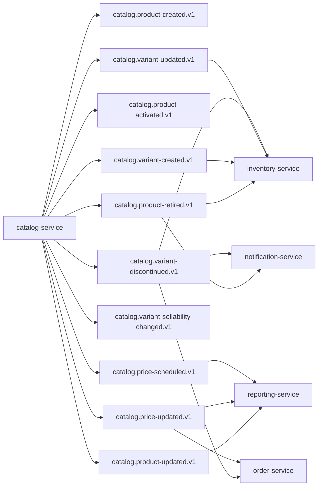

## Proposito
Definir contratos de eventos de `catalog-service` para integracion EDA con order, inventory, reporting y notificacion operativa.

## Alcance y fronteras
- Incluye eventos emitidos por Catalog y consumidores esperados.
- Incluye topicos, claves, versionado, idempotencia, retencion y DLQ.
- Excluye configuracion infra del cluster Kafka.

## Topologia de eventos Catalog


## Catalogo de eventos emitidos
| Evento | Topic | Key | Productor | Consumidores | Semantica |
|---|---|---|---|---|---|
| `ProductCreated` | `catalog.product-created.v1` | `productId` | Catalog | sin consumidores externos activos en `MVP` | alta de producto |
| `ProductUpdated` | `catalog.product-updated.v1` | `productId` | Catalog | Reporting | cambio de metadata |
| `ProductActivated` | `catalog.product-activated.v1` | `productId` | Catalog | sin consumidores externos activos en `MVP` | producto habilitado |
| `ProductRetired` | `catalog.product-retired.v1` | `productId` | Catalog | Inventory, Notification | producto retirado |
| `VariantCreated` | `catalog.variant-created.v1` | `variantId` | Catalog | Inventory | alta de variante/SKU |
| `VariantUpdated` | `catalog.variant-updated.v1` | `variantId` | Catalog | Inventory | cambio de atributos |
| `VariantSellabilityChanged` | `catalog.variant-sellability-changed.v1` | `variantId` | Catalog | sin consumidores externos activos en `MVP` | cambio de estado vendible |
| `VariantDiscontinued` | `catalog.variant-discontinued.v1` | `variantId` | Catalog | Order, Inventory, Notification | descontinuacion definitiva |
| `PriceUpdated` | `catalog.price-updated.v1` | `variantId` | Catalog | Order, Reporting | nuevo precio vigente |
| `PriceScheduled` | `catalog.price-scheduled.v1` | `variantId` | Catalog | Reporting | precio futuro programado |

## Eventos consumidos por Catalog
| Evento consumido | Topic | Productor | Uso en Catalog |
|---|---|---|---|
| `StockUpdated` | `inventory.stock-updated.v1` | inventory-service | actualizar `availabilityHint` para busqueda |
| `SkuReconciled` | `inventory.sku-reconciled.v1` | inventory-service | reconciliar index de SKU para filtros |

## Envelope estandar de eventos
```json
{
  "eventId": "evt_01JY...",
  "eventType": "PriceUpdated",
  "eventVersion": "1.0.0",
  "occurredAt": "2026-03-03T14:00:00Z",
  "producer": "catalog-service",
  "tenantId": "org-ec-001",
  "traceId": "trc_01JY...",
  "correlationId": "cor_01JY...",
  "idempotencyKey": "cat-price-upsert-<uuid>",
  "payload": {
    "productId": "prd_01JY...",
    "variantId": "vrt_01JY...",
    "sku": "GPU-RTX-4060-8G-OC-BLK",
    "amount": 389.90,
    "currency": "USD",
    "effectiveFrom": "2026-03-03T13:55:00Z"
  }
}
```

## Payloads minimos por evento
| Evento | Campos minimos |
|---|---|
| `ProductCreated` | `productId`, `tenantId`, `productCode`, `name`, `status`, `createdAt` |
| `ProductUpdated` | `productId`, `tenantId`, `changedFields`, `updatedAt` |
| `ProductActivated` | `productId`, `tenantId`, `status`, `activatedAt` |
| `ProductRetired` | `productId`, `tenantId`, `status`, `reason`, `retiredAt` |
| `VariantCreated` | `variantId`, `productId`, `tenantId`, `sku`, `status` |
| `VariantUpdated` | `variantId`, `productId`, `changedFields`, `updatedAt` |
| `VariantSellabilityChanged` | `variantId`, `sku`, `sellable`, `sellableFrom`, `sellableUntil` |
| `VariantDiscontinued` | `variantId`, `sku`, `reason`, `discontinuedAt` |
| `PriceUpdated` | `priceId`, `variantId`, `sku`, `amount`, `currency`, `effectiveFrom` |
| `PriceScheduled` | `scheduleId`, `variantId`, `amount`, `currency`, `effectiveFrom`, `effectiveUntil` |

## Reglas de compatibilidad
- `MUST`: agregar campos nuevos solo como opcionales en `v1`.
- `MUST`: cambios de tipo semantico o remocion de campos crean topic `v2`.
- `SHOULD`: consumidores ignoran campos desconocidos.
- `MUST`: todos los eventos incluyen `tenantId`, `traceId`, `correlationId`.

## Entrega, reintentos y DLQ
| Tema | Politica |
|---|---|
| Semantica de entrega | `at-least-once` |
| Particionado | por key de agregado (`productId`, `variantId`) |
| Reintento productor | 3 intentos con backoff exponencial |
| Reintento consumidor | 5 intentos con backoff + jitter |
| DLQ | topic `<topic>.dlq` obligatorio |
| Retencion recomendada | 14 dias eventos operativos, 30 dias eventos de pricing |

## Matriz de idempotencia en consumidores
| Consumidor | Evento | Clave de idempotencia |
|---|---|---|
| `inventory-service` | `VariantCreated` | `eventId` + `variantId` |
| `inventory-service` | `VariantUpdated` | `eventId` + `variantId` |
| `inventory-service` | `ProductRetired` | `eventId` + `productId` |
| `order-service` | `VariantDiscontinued` | `eventId` + `variantId` |
| `order-service` | `PriceUpdated` | `eventId` + `variantId` |
| `reporting-service` | `ProductUpdated` | `eventId` + `productId` |
| `reporting-service` | `PriceUpdated` | `eventId` + `variantId` |
| `reporting-service` | `PriceScheduled` | `eventId` + `scheduleId` |
| `notification-service` | `ProductRetired` | `eventId` + `productId` |
| `notification-service` | `VariantDiscontinued` | `eventId` + `variantId` |

## Riesgos y mitigaciones
- Riesgo: volumen alto de `PriceUpdated` por cargas masivas.
  - Mitigacion: batching por variante y throttling de publicación.
- Riesgo: consumidores tratan `availabilityHint` como verdad operacional.
  - Mitigacion: contrato explicito en payload y ACLs: Inventory es autoridad de disponibilidad.
