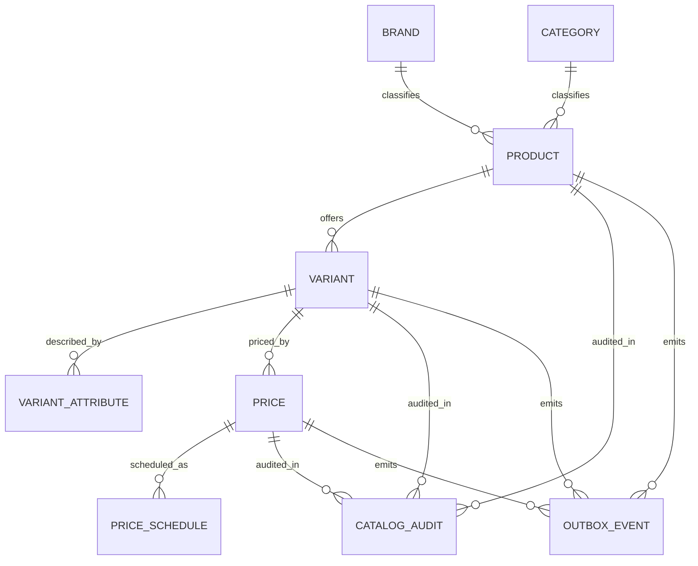
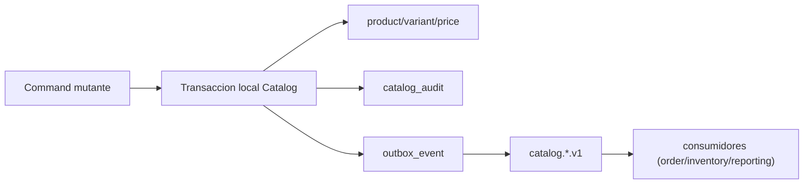

## Proposito
Definir modelo logico completo de `catalog-service`, incluyendo entidades, relaciones, ownership e invariantes de datos para productos, variantes, atributos y precios.

## Alcance y fronteras
- Incluye entidades logicas transaccionales y de soporte de Catalog.
- Incluye relaciones intra-servicio y referencias hacia otros servicios por IDs logicos.
- Incluye reglas de invariantes de datos para SKU y precios vigentes.
- Excluye DDL SQL detallado (documentado en modelo fisico).

## Entidades logicas de Catalog
| Entidad | Responsabilidad | Clave logica |
|---|---|---|
| `product` | cabecera comercial del producto | `productId`, `productCode` |
| `brand` | taxonomia de marca referencial local | `brandId`, `brandCode` |
| `category` | taxonomia jerarquica de categoria referencial local | `categoryId`, `categoryCode` |
| `variant` | unidad vendible (SKU) | `variantId`, `sku` |
| `variant_attribute` | atributos dinamicos de variante para filtros | `variantId + attributeCode` |
| `price` | precio vigente/historico de variante | `priceId` |
| `price_schedule` | planificacion tecnica de activacion de precio | `scheduleId` |
| `catalog_audit` | trazabilidad de cambios administrativos | `auditId` |
| `outbox_event` | publicacion confiable de eventos | `eventId` |
| `processed_event` | idempotencia de consumo de eventos externos | `processedEventId` |

## Relaciones logicas
- `brand 1..n product`
- `category 1..n product`
- `product 1..n variant`
- `variant 1..n variant_attribute`
- `variant 1..n price`
- `price 0..n price_schedule`
- `product/variant/price 1..n catalog_audit` (logico por referencia)
- `catalog 1..n outbox_event`

## Diagrama logico Catalog

## Atributos logicos clave
| Entidad | Atributos clave |
|---|---|
| `product` | `tenantId`, `productCode`, `name`, `description`, `brandId`, `categoryId`, `status`, `tags` |
| `variant` | `tenantId`, `productId`, `sku`, `name`, `status`, `sellableFrom`, `sellableUntil`, `dimensions`, `weight` |
| `variant_attribute` | `attributeCode`, `valueType`, `rawValue`, `normalizedValue`, `filterable`, `searchable` |
| `price` | `variantId`, `priceType`, `amount`, `currency`, `taxIncluded`, `effectiveFrom`, `effectiveUntil`, `status(ACTIVE|SCHEDULED|EXPIRED)` |
| `catalog_audit` | `tenantId`, `actorUserId`, `actorRole`, `action`, `entityType`, `entityId`, `result`, `traceId` |

## Invariantes logicos
- `MUST`: `sku` unico por `tenantId` para variantes en estado vendible.
- `MUST`: `brand/category` activas y validas antes de crear o retaxonomizar producto.
- `MUST`: variante vendible requiere producto `ACTIVE`.
- `MUST`: precio vigente resoluble por variante y fecha (`effectiveFrom` <= now < `effectiveUntil` o null).
- `MUST`: periodos de precio superpuestos para misma variante/currency/type se rechazan.
- `MUST`: cambios mutantes registran auditoria y outbox.

- `price_schedule` administra `jobStatus` tecnico (`PENDING`,`EXECUTED`,`FAILED`,`CANCELLED`) sin redefinir el lifecycle de `price`.

## Ownership y referencias cross-service
- `catalog-service` es owner de: producto, variante, atributos, precio y taxonomia referencial de marca/categoria usada por el catalogo.
- En `MVP`, la taxonomia de `brand/category` se mantiene por carga administrativa controlada y no por endpoints CRUD dedicados del servicio.
- Referencias hacia otros BC (sin FK cruzadas):
  - `tenantId` (IdentityAccess/Directory).
  - `availabilityHint` (Inventory, derivado por consulta/evento).
- `order-service` toma snapshot de precio desde Catalog; no comparte tablas.

## Modelo de consulta (read concerns)
| Consulta | Entidades involucradas | Consideraciones |
|---|---|---|
| Busqueda catalogo | `product`, `variant`, `price`, `variant_attribute` | soporte de facetas y paginacion |
| Detalle producto | `product`, `variant`, `price` | respuesta consolidada |
| Resolver variante para checkout | `variant`, `price` | validacion de sellable + precio vigente |
| Timeline de precios | `price`, `price_schedule` | historial por ventana temporal |

## Mapa de consistencia

## Riesgos y mitigaciones
- Riesgo: cardinalidad alta de `variant_attribute` afecta search.
  - Mitigacion: normalizacion de valores + estrategia de indexacion por atributos filterables.
- Riesgo: alta tasa de cambios de precio degrada consistencia en consultas.
  - Mitigacion: politica de periodos no superpuestos y cache con invalidacion por evento.
