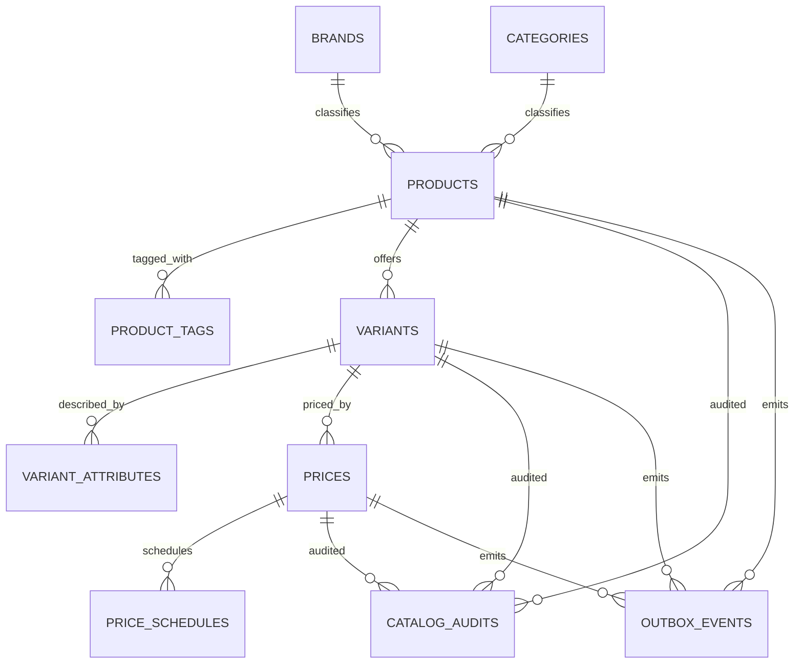

## Proposito
Definir modelo fisico completo de `catalog-service` sobre PostgreSQL, incluyendo tablas, columnas, constraints, indices y lineamientos de operacion.

## Alcance y fronteras
- Incluye esquema fisico MVP de Catalog.
- Incluye constraints de integridad e idempotencia.
- Incluye indices para casos de uso de busqueda, detalle y pricing.
- Excluye scripts finales de migracion (fase 04).

## Esquema fisico Catalog

## Tablas y columnas clave
### `brands`
| Columna | Tipo | Null | Constraint |
|---|---|---|---|
| `brand_id` | `uuid` | no | PK |
| `tenant_id` | `varchar(64)` | no | index |
| `brand_code` | `varchar(64)` | no | unique (`tenant_id`,`brand_code`) |
| `name` | `varchar(180)` | no | - |
| `active` | `boolean` | no | default true |
| `created_at` | `timestamptz` | no | default now() |
| `updated_at` | `timestamptz` | no | default now() |

### `categories`
| Columna | Tipo | Null | Constraint |
|---|---|---|---|
| `category_id` | `uuid` | no | PK |
| `tenant_id` | `varchar(64)` | no | index |
| `category_code` | `varchar(64)` | no | unique (`tenant_id`,`category_code`) |
| `name` | `varchar(180)` | no | - |
| `parent_category_id` | `uuid` | si | FK -> `categories.category_id` |
| `active` | `boolean` | no | default true |
| `path` | `varchar(1024)` | no | index |
| `created_at` | `timestamptz` | no | default now() |
| `updated_at` | `timestamptz` | no | default now() |

### `products`
| Columna | Tipo | Null | Constraint |
|---|---|---|---|
| `product_id` | `uuid` | no | PK |
| `tenant_id` | `varchar(64)` | no | index |
| `product_code` | `varchar(96)` | no | unique (`tenant_id`,`product_code`) |
| `name` | `varchar(255)` | no | index |
| `description` | `text` | si | - |
| `brand_id` | `uuid` | no | FK -> `brands.brand_id` |
| `category_id` | `uuid` | no | FK -> `categories.category_id` |
| `status` | `varchar(16)` | no | check in (`DRAFT`,`ACTIVE`,`RETIRED`) |
| `idempotency_key` | `varchar(128)` | si | unique |
| `created_at` | `timestamptz` | no | default now() |
| `updated_at` | `timestamptz` | no | default now() |

### `product_tags`
| Columna | Tipo | Null | Constraint |
|---|---|---|---|
| `tag_id` | `uuid` | no | PK |
| `product_id` | `uuid` | no | FK -> `products.product_id` |
| `tenant_id` | `varchar(64)` | no | index |
| `tag_value` | `varchar(96)` | no | index |
| `normalized_tag` | `varchar(96)` | no | index |
| `created_at` | `timestamptz` | no | default now() |

### `variants`
| Columna | Tipo | Null | Constraint |
|---|---|---|---|
| `variant_id` | `uuid` | no | PK |
| `product_id` | `uuid` | no | FK -> `products.product_id` |
| `tenant_id` | `varchar(64)` | no | index |
| `sku` | `varchar(128)` | no | index |
| `name` | `varchar(255)` | no | - |
| `status` | `varchar(16)` | no | check in (`DRAFT`,`SELLABLE`,`DISCONTINUED`) |
| `sellable_from` | `timestamptz` | si | - |
| `sellable_until` | `timestamptz` | si | - |
| `weight_grams` | `numeric(10,2)` | si | check >= 0 |
| `height_mm` | `numeric(10,2)` | si | check >= 0 |
| `width_mm` | `numeric(10,2)` | si | check >= 0 |
| `depth_mm` | `numeric(10,2)` | si | check >= 0 |
| `idempotency_key` | `varchar(128)` | si | unique |
| `created_at` | `timestamptz` | no | default now() |
| `updated_at` | `timestamptz` | no | default now() |

### `variant_attributes`
| Columna | Tipo | Null | Constraint |
|---|---|---|---|
| `attribute_id` | `uuid` | no | PK |
| `variant_id` | `uuid` | no | FK -> `variants.variant_id` |
| `tenant_id` | `varchar(64)` | no | index |
| `attribute_code` | `varchar(96)` | no | index |
| `display_name` | `varchar(180)` | no | - |
| `value_type` | `varchar(16)` | no | check in (`TEXT`,`NUMBER`,`BOOLEAN`,`ENUM`) |
| `raw_value` | `varchar(512)` | no | - |
| `normalized_value` | `varchar(512)` | no | index |
| `filterable` | `boolean` | no | default false |
| `searchable` | `boolean` | no | default false |
| `position` | `int` | no | default 0 |

### `prices`
| Columna | Tipo | Null | Constraint |
|---|---|---|---|
| `price_id` | `uuid` | no | PK |
| `variant_id` | `uuid` | no | FK -> `variants.variant_id` |
| `tenant_id` | `varchar(64)` | no | index |
| `price_type` | `varchar(16)` | no | check in (`BASE`,`PROMO`,`VOLUME`) |
| `status` | `varchar(16)` | no | check in (`ACTIVE`,`SCHEDULED`,`EXPIRED`) |
| `amount` | `numeric(14,4)` | no | check > 0 |
| `currency` | `char(3)` | no | index |
| `tax_included` | `boolean` | no | default true |
| `effective_from` | `timestamptz` | no | index |
| `effective_until` | `timestamptz` | si | index |
| `idempotency_key` | `varchar(128)` | si | unique |
| `created_at` | `timestamptz` | no | default now() |
| `updated_at` | `timestamptz` | no | default now() |

### `price_schedules`
| Columna | Tipo | Null | Constraint |
|---|---|---|---|
| `schedule_id` | `uuid` | no | PK |
| `price_id` | `uuid` | no | FK -> `prices.price_id` |
| `tenant_id` | `varchar(64)` | no | index |
| `job_status` | `varchar(16)` | no | check in (`PENDING`,`EXECUTED`,`FAILED`,`CANCELLED`) |
| `next_execution_at` | `timestamptz` | si | index |
| `executed_at` | `timestamptz` | si | - |
| `failure_reason` | `varchar(255)` | si | - |

Nota de modelado:
- `prices.status` expresa lifecycle comercial del precio (`ACTIVE`,`SCHEDULED`,`EXPIRED`).
- `price_schedules.job_status` expresa estado tecnico de ejecucion (`PENDING`,`EXECUTED`,`FAILED`,`CANCELLED`).

### `catalog_audits`
| Columna | Tipo | Null | Constraint |
|---|---|---|---|
| `audit_id` | `uuid` | no | PK |
| `tenant_id` | `varchar(64)` | no | index |
| `actor_user_id` | `uuid` | si | index |
| `actor_role` | `varchar(64)` | si | - |
| `action` | `varchar(64)` | no | index |
| `entity_type` | `varchar(32)` | no | index |
| `entity_id` | `varchar(128)` | no | index |
| `result` | `varchar(16)` | no | check in (`SUCCESS`,`FAILURE`) |
| `reason_code` | `varchar(64)` | si | - |
| `trace_id` | `varchar(128)` | no | index |
| `correlation_id` | `varchar(128)` | no | index |
| `created_at` | `timestamptz` | no | index |

### `outbox_events`
| Columna | Tipo | Null | Constraint |
|---|---|---|---|
| `event_id` | `uuid` | no | PK |
| `aggregate_type` | `varchar(64)` | no | - |
| `aggregate_id` | `varchar(128)` | no | - |
| `event_type` | `varchar(128)` | no | - |
| `event_version` | `varchar(16)` | no | - |
| `payload_json` | `jsonb` | no | - |
| `status` | `varchar(16)` | no | check in (`PENDING`,`PUBLISHED`,`FAILED`) |
| `occurred_at` | `timestamptz` | no | - |
| `published_at` | `timestamptz` | si | - |

### `processed_events`
| Columna | Tipo | Null | Constraint |
|---|---|---|---|
| `processed_event_id` | `uuid` | no | PK |
| `event_id` | `varchar(128)` | no | unique |
| `consumer_name` | `varchar(128)` | no | unique (`event_id`,`consumer_name`) |
| `processed_at` | `timestamptz` | no | default now() |

## Indices recomendados
| Tabla | Indice | Justificacion |
|---|---|---|
| `products` | `ux_products_tenant_code` unique (`tenant_id`,`product_code`) | unicidad de codigo comercial |
| `variants` | `ux_variants_tenant_sku` unique (`tenant_id`,`sku`) | invariante SKU unico |
| `variants` | `idx_variants_product_status` (`product_id`,`status`) | listados por producto/estado |
| `variant_attributes` | `idx_var_attrs_filterable` (`attribute_code`,`normalized_value`) where `filterable=true` | facetas de busqueda |
| `prices` | `idx_prices_variant_effective` (`variant_id`,`effective_from desc`) | resolver precio vigente |
| `prices` | `idx_prices_tenant_status_currency` (`tenant_id`,`status`,`currency`) | consultas por moneda y estado |
| `price_schedules` | `idx_price_schedules_next_exec` (`job_status`,`next_execution_at`) | ejecucion de scheduler |
| `catalog_audits` | `idx_catalog_audits_entity_created` (`entity_type`,`entity_id`,`created_at desc`) | auditoria por entidad |
| `outbox_events` | `idx_outbox_pending_occurred` (`status`,`occurred_at`) | publisher batch eficiente |

## Constraints transversales
- `MUST`: `variant.status='SELLABLE'` implica `product.status='ACTIVE'`.
- `MUST`: no permitir periodos de precio traslapados por `variant_id + currency + price_type`.
- `MUST`: `effective_until` > `effective_from` cuando no es null.
- `MUST`: mutaciones administrativas con `idempotency_key` unica por operacion.

## Politica de migracion y operacion
| Tema | Lineamiento |
|---|---|
| Migraciones | forward-only, estrategia expand/contract |
| Versionado esquema | `V<numero>__descripcion.sql` |
| Rollback | rollforward preferente |
| Reindex | tareas online fuera de horario de pico |
| Backup | snapshot diario + WAL incremental |

## Riesgos y mitigaciones
- Riesgo: incremento de `variant_attributes` afecta planes de consulta.
  - Mitigacion: normalizar y limitar atributos `filterable` por categoria.
- Riesgo: inconsistencia temporal entre `prices` y cache de consulta.
  - Mitigacion: invalidacion por evento y TTL corto en Redis.
- Riesgo: lote masivo de precios bloquea escritura concurrente.
  - Mitigacion: particionar lote y usar locking optimista por `variant_id`.
