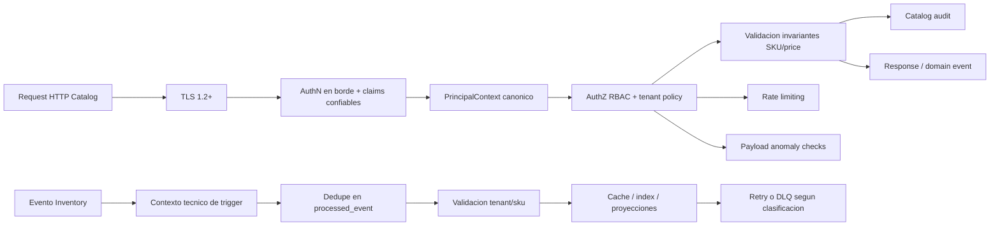
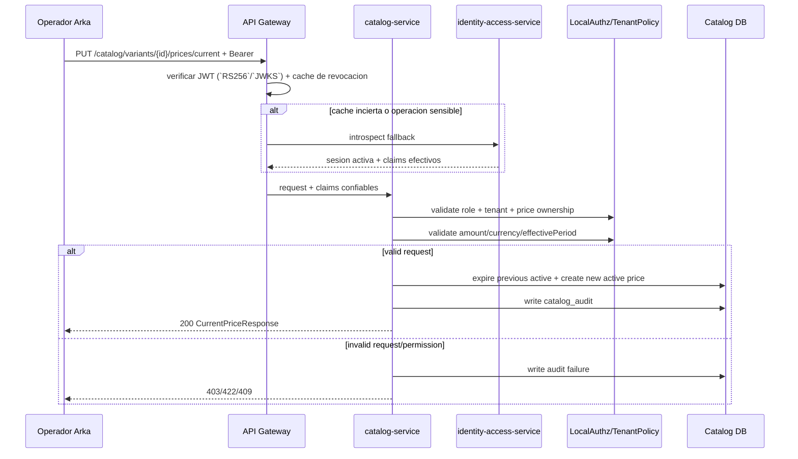
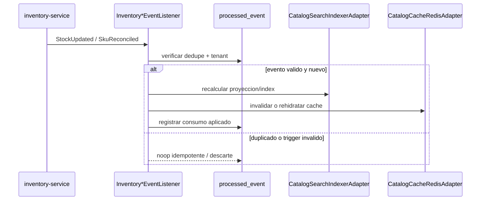

## Proposito
Definir el diseno de seguridad y privacidad de `catalog-service`, cubriendo amenazas, controles tecnicos, manejo de secretos, proteccion de integridad comercial y cumplimiento base.

## Alcance y fronteras
- Incluye seguridad de endpoints administrativos, consultas autenticadas y listeners internos de Catalog.
- Incluye controles sobre precios, SKU y datos comerciales sensibles.
- Excluye hardening de infraestructura de red (documentado a nivel plataforma).

## Threat model Catalog (resumen STRIDE)
| Amenaza | Vector | Impacto | Control principal |
|---|---|---|---|
| Spoofing | token falsificado o trigger inventory no legitimo | cambios no autorizados de precios/SKU o recalculo indebido de proyecciones | `api-gateway-service` valida JWT `RS256`/`JWKS` en borde; `catalog-service` valida contexto tecnico del trigger, `tenant` y dedupe antes de aplicar efectos internos |
| Tampering | alteracion de payload de precio | inconsistencia comercial y reclamos | firma TLS + validacion server-side + auditoria |
| Replay | reproceso de `StockUpdated` o `SkuReconciled` | deriva de cache/index y sobrecosto operativo | `processed_event` + `noop idempotente` + trazabilidad |
| Repudiation | negacion de cambio de precio | falta de trazabilidad legal/comercial | `catalog_audit` inmutable por mutacion |
| Information Disclosure | exposicion de listas de precio no permitidas | fuga comercial | politicas por tenant/rol y minimizacion de campos |
| Denial of Service | flood en busqueda/facetas | degradacion de UX y ventas | rate limit + cache + circuit breaker |
| Elevation of Privilege | operador sin permiso muta catalogo | fraude o errores criticos | RBAC granular por accion `catalog:*` |

## Mapa de controles

## Controles obligatorios por dominio
| Categoria | Control |
|---|---|
| Acceso admin | permisos explicitos `catalog:product:*`, `catalog:variant:*`, `catalog:price:*` |
| Aislamiento tenant | `tenantId` obligatorio en token, request y persistencia |
| Integridad precio | `amount > 0`, moneda valida, no traslape de periodos |
| Integridad SKU | unicidad de `sku` por tenant para variante vendible |
| Auditoria | registro de toda mutacion con `actor`, `traceId`, `correlationId` |
| Secrets | credenciales de DB/Kafka/Redis en secret manager con rotacion programada |
| Eventos | outbox + producer idempotente para evitar inconsistencias de publicacion |
| Eventos Inventory consumidos | dedupe en `processed_event`, validacion de `tenant`/`sku` y cierre retry/DLQ |

## Politica de autorizacion Catalog
| Operacion | Rol minimo |
|---|---|
| Crear/editar/activar/retirar producto | `arka_admin` |
| Crear/editar/descontinuar variante | `arka_admin` |
| Actualizar/programar precios | `arka_admin` |
| Carga masiva de precios | `arka_admin` + permiso `catalog:price:bulk` |
| Search y detalle catalogo | `tenant_user` o `arka_admin` |
| Resolve variant para checkout | `trusted_service(order-service)` |

## Modelo local de Spring Security WebFlux
| Capa | Responsabilidad |
|---|---|
| `api-gateway-service` | valida JWT en el borde (`RS256`/`JWKS`), `iss`, `aud`, expiracion y cache de revocacion antes de enrutar |
| `catalog-service` | usa `Spring Security WebFlux` para materializar `SecurityContext` y `PrincipalContext`, aplicar autorizacion gruesa por ruta y revalidar `tenant`, permiso y ownership comercial en cada mutacion; no recalcula la firma JWT salvo defensa en profundidad explicita |
| `identity-access-service` | mantiene la verdad de sesion/rol, publica `JWKS`, revocaciones y cambios de rol; atiende introspeccion fallback |
| listeners inventory | consumen `StockUpdated` y `SkuReconciled`, materializan contexto tecnico de trigger, validan `tenant`, dedupe y legitimidad del mensaje antes de tocar cache o index |

Aplicacion local: `catalog-service` no reimplementa autenticacion, `login`, `refresh` ni emision de tokens. Usa la identidad ya validada en borde, materializa un `PrincipalContext` canonico y la endurece con politicas propias de Catalog antes de mutar producto, variante o precio. En flujos async desde Inventory no asume identidad humana: valida el trigger tecnico, su `tenant`, dedupe y legitimidad operativa antes de recalcular proyecciones.

## Modelo de errores de seguridad
| Momento | Familia/cierre canonico | Aplicacion en Catalog |
|---|---|---|
| autenticacion de borde | `401/403` en frontera | `api-gateway-service` corta JWT invalido, expirado o revocado antes de enrutar; Catalog no reabre autenticacion interactiva |
| autorizacion contextual | `AuthorizationDeniedException`, `TenantIsolationException` | `catalog-service` rechaza cruce de `tenant`, permiso insuficiente o ownership comercial invalido antes de mutar producto, variante o precio |
| regla de dominio sensible | `DomainRuleViolationException`, `ConflictException` | inconsistencias de lifecycle, precio o ventana comercial se cierran como `409/422`, no como error tecnico |
| callback/evento malicioso o duplicado | `NonRetryableDependencyException` o `noop idempotente` | eventos invalidos se descartan o enrutan a DLQ; un duplicado no cuenta como incidente funcional |
| evidencia de seguridad | auditoria obligatoria + `traceId/correlationId` | rechazo por permisos, tenant o regla comercial deja trazabilidad operativa sin exponer payload sensible en logs |

## Politica de datos sensibles
| Dato | Clasificacion | Tratamiento |
|---|---|---|
| `price.amount` | sensible comercial | visible segun tenant/rol; audit de cambios |
| `price_schedule` | sensible comercial | acceso solo a roles operativos |
| `sku` | interno comercial | expuesto en canales autorizados |
| `catalog_audit` | sensible operacional | acceso restringido y retencion controlada |

## Flujo de seguridad en cambio de precio

## Flujo de seguridad en listener de inventory

## Cumplimiento y trazabilidad
- Baseline de cumplimiento (academico):
  - minimo privilegio por rol,
  - auditoria completa de mutaciones de catalogo,
  - trazabilidad de cambios comerciales,
  - segregacion de funciones para operaciones masivas.
- Evolucion posterior (no bloqueante del baseline `MVP`): obligaciones regulatorias formales por pais sobre retencion de historial de precios.

## Riesgos y mitigaciones
- Riesgo: modificacion accidental de precios por cargas masivas.
  - Mitigacion: dry-run previo + limites de lote + doble validacion de permisos.
- Riesgo: sobreexposicion de datos comerciales en logs.
  - Mitigacion: masking de payloads y controles de redaccion.

## Brechas explicitas
- Evolucion posterior (no bloqueante): matriz granular final de permisos de Catalog por pais/segmento.
- Hardening futuro no bloqueante: politica formal de segregacion de funciones para aprobacion de cambios de precio criticos.
