## Proposito
Definir el catalogo completo de clases/archivos del servicio `inventory-service` para implementacion Java 21 + Spring WebFlux con arquitectura hexagonal/clean, CQRS ligero, EDA y DDD.

## Alcance y fronteras
- Incluye inventario completo de clases por carpeta para el servicio Inventory.
- Incluye separacion estricta de estructura: `domain`, `application`, `infrastructure`.
- Incluye clases de configuracion para dependencias (security, kafka, r2dbc, redis, observabilidad).
- Excluye codigo de otros BC/servicios.

## Regla de completitud aplicada
- Este documento define **catalogo completo**, no minimo.
- Cada clase se mapea a una carpeta concreta del arbol canonico.
- El dominio se divide por agregados (`stock`, `reservation`, `movement`) con la raiz del agregado en el paquete del modelo y slicing interno (`entity`, `valueobject`, `enum`, `event`).
- Los puertos/adaptadores se dividen por responsabilidad (`persistence`, `security`, `audit`, `event`, `external`).

## Estructura estricta (Inventory)
Este arbol muestra la estructura canonica completa del servicio a nivel de carpetas. El detalle por archivo y los diagramas de clase individuales se consultan mas abajo en la vista por capas.

```tree
- src | folder
  - main | folder
    - java | code
      - com | folder
        - arka | building | primary
          - inventory | microchip | primary
            - domain | cubes | info
              - model | folder-open | info
                - stock | folder
                  - entity | folder
                  - valueobject | folder
                  - enum | folder
                  - event | share-nodes | accent
                - reservation | folder
                  - entity | folder
                  - valueobject | folder
                  - enum | folder
                  - event | share-nodes | accent
                - movement | folder
                  - entity | folder
                  - valueobject | folder
                  - enum | folder
                  - event | share-nodes | accent
              - event | share-nodes | accent
              - event | share-nodes | accent
          - <button type="button" class="R-tree-diagram-trigger" data-diagram-template="inventory-class-domainevent" data-diagram-title="DomainEvent.java" aria-label="Abrir diagrama de clase para DomainEvent.java"><code>DomainEvent.java</code></button> | share-nodes | accent
        - service | gear | info
              - exception | folder
            - application | sitemap | warning
              - command | terminal | warning
              - query | binoculars | warning
              - result | file-lines | warning
              - port | plug | warning
                - in | arrow-right
                - out | arrow-left
                  - persistence | database
                  - security | shield
                  - audit | clipboard
                  - event | share-nodes | accent
                  - cache | hard-drive
                  - external | cloud
              - usecase | bolt | warning
                - command | terminal | warning
                - query | binoculars | warning
              - mapper | shuffle
                - command | shuffle
                - query | shuffle
                - result | shuffle
              - exception | folder
            - infrastructure | server | secondary
              - adapter | plug | secondary
                - in | arrow-right
                  - web | globe
                    - request | file-import
                    - response | file-export
                    - mapper | shuffle
                      - command | shuffle
                      - query | shuffle
                      - response | shuffle
                    - controller | globe
                  - listener | bell
                - out | arrow-left
                  - persistence | database
                    - entity | table
                    - mapper | shuffle
                    - repository | database
                  - security | shield
                  - event | share-nodes | accent
                  - cache | hard-drive
                  - external | cloud
              - config | gear
              - exception | folder
```

## Estructura detallada por capas
Esta seccion concentra el arbol navegable por capa con todos los archivos del servicio. Cada archivo sigue abriendo su diagrama de clase individual en el visor.

{}
{}
```tree
- com | folder
  - arka | building | primary
    - inventory | microchip | primary
      - domain | cubes | info
        - model | folder-open | info
          - stock | folder
            - <button type="button" class="R-tree-diagram-trigger" data-diagram-template="inventory-class-stockaggregate" data-diagram-title="StockAggregate.java" aria-label="Abrir diagrama de clase para StockAggregate.java"><code>StockAggregate.java</code></button> | file-code | code
            - entity | folder
              - <button type="button" class="R-tree-diagram-trigger" data-diagram-template="inventory-class-stockbalance" data-diagram-title="StockBalance.java" aria-label="Abrir diagrama de clase para StockBalance.java"><code>StockBalance.java</code></button> | file-code | code
            - valueobject | folder
              - <button type="button" class="R-tree-diagram-trigger" data-diagram-template="inventory-class-stockid" data-diagram-title="StockId.java" aria-label="Abrir diagrama de clase para StockId.java"><code>StockId.java</code></button> | file-code | code
              - <button type="button" class="R-tree-diagram-trigger" data-diagram-template="inventory-class-tenantid" data-diagram-title="TenantId.java" aria-label="Abrir diagrama de clase para TenantId.java"><code>TenantId.java</code></button> | file-code | code
              - <button type="button" class="R-tree-diagram-trigger" data-diagram-template="inventory-class-skucode" data-diagram-title="SkuCode.java" aria-label="Abrir diagrama de clase para SkuCode.java"><code>SkuCode.java</code></button> | file-code | code
              - <button type="button" class="R-tree-diagram-trigger" data-diagram-template="inventory-class-warehouseid" data-diagram-title="WarehouseId.java" aria-label="Abrir diagrama de clase para WarehouseId.java"><code>WarehouseId.java</code></button> | file-code | code
              - <button type="button" class="R-tree-diagram-trigger" data-diagram-template="inventory-class-quantity" data-diagram-title="Quantity.java" aria-label="Abrir diagrama de clase para Quantity.java"><code>Quantity.java</code></button> | file-code | code
            - enum | folder
              - <button type="button" class="R-tree-diagram-trigger" data-diagram-template="inventory-class-stockstatus" data-diagram-title="StockStatus.java" aria-label="Abrir diagrama de clase para StockStatus.java"><code>StockStatus.java</code></button> | file-code | code
              - <button type="button" class="R-tree-diagram-trigger" data-diagram-template="inventory-class-adjustmentreason" data-diagram-title="AdjustmentReason.java" aria-label="Abrir diagrama de clase para AdjustmentReason.java"><code>AdjustmentReason.java</code></button> | file-code | code
            - event | share-nodes | accent
              - <button type="button" class="R-tree-diagram-trigger" data-diagram-template="inventory-class-stockinitializedevent" data-diagram-title="StockInitializedEvent.java" aria-label="Abrir diagrama de clase para StockInitializedEvent.java"><code>StockInitializedEvent.java</code></button> | share-nodes | accent
              - <button type="button" class="R-tree-diagram-trigger" data-diagram-template="inventory-class-stockincreasedevent" data-diagram-title="StockIncreasedEvent.java" aria-label="Abrir diagrama de clase para StockIncreasedEvent.java"><code>StockIncreasedEvent.java</code></button> | share-nodes | accent
              - <button type="button" class="R-tree-diagram-trigger" data-diagram-template="inventory-class-stockdecreasedevent" data-diagram-title="StockDecreasedEvent.java" aria-label="Abrir diagrama de clase para StockDecreasedEvent.java"><code>StockDecreasedEvent.java</code></button> | share-nodes | accent
              - <button type="button" class="R-tree-diagram-trigger" data-diagram-template="inventory-class-stockadjustedevent" data-diagram-title="StockAdjustedEvent.java" aria-label="Abrir diagrama de clase para StockAdjustedEvent.java"><code>StockAdjustedEvent.java</code></button> | share-nodes | accent
              - <button type="button" class="R-tree-diagram-trigger" data-diagram-template="inventory-class-stockupdatedevent" data-diagram-title="StockUpdatedEvent.java" aria-label="Abrir diagrama de clase para StockUpdatedEvent.java"><code>StockUpdatedEvent.java</code></button> | share-nodes | accent
              - <button type="button" class="R-tree-diagram-trigger" data-diagram-template="inventory-class-lowstockdetectedevent" data-diagram-title="LowStockDetectedEvent.java" aria-label="Abrir diagrama de clase para LowStockDetectedEvent.java"><code>LowStockDetectedEvent.java</code></button> | share-nodes | accent
          - warehouse | folder
            - <button type="button" class="R-tree-diagram-trigger" data-diagram-template="inventory-class-warehouseaggregate" data-diagram-title="WarehouseAggregate.java" aria-label="Abrir diagrama de clase para WarehouseAggregate.java"><code>WarehouseAggregate.java</code></button> | file-code | code
          - reservation | folder
            - <button type="button" class="R-tree-diagram-trigger" data-diagram-template="inventory-class-reservationaggregate" data-diagram-title="ReservationAggregate.java" aria-label="Abrir diagrama de clase para ReservationAggregate.java"><code>ReservationAggregate.java</code></button> | file-code | code
            - entity | folder
            - valueobject | folder
              - <button type="button" class="R-tree-diagram-trigger" data-diagram-template="inventory-class-reservationid" data-diagram-title="ReservationId.java" aria-label="Abrir diagrama de clase para ReservationId.java"><code>ReservationId.java</code></button> | file-code | code
              - <button type="button" class="R-tree-diagram-trigger" data-diagram-template="inventory-class-cartid" data-diagram-title="CartId.java" aria-label="Abrir diagrama de clase para CartId.java"><code>CartId.java</code></button> | file-code | code
              - <button type="button" class="R-tree-diagram-trigger" data-diagram-template="inventory-class-orderid" data-diagram-title="OrderId.java" aria-label="Abrir diagrama de clase para OrderId.java"><code>OrderId.java</code></button> | file-code | code
              - <button type="button" class="R-tree-diagram-trigger" data-diagram-template="inventory-class-reservationttl" data-diagram-title="ReservationTtl.java" aria-label="Abrir diagrama de clase para ReservationTtl.java"><code>ReservationTtl.java</code></button> | file-code | code
              - <button type="button" class="R-tree-diagram-trigger" data-diagram-template="inventory-class-reservationwindow" data-diagram-title="ReservationWindow.java" aria-label="Abrir diagrama de clase para ReservationWindow.java"><code>ReservationWindow.java</code></button> | file-code | code
            - enum | folder
              - <button type="button" class="R-tree-diagram-trigger" data-diagram-template="inventory-class-reservationstatus" data-diagram-title="ReservationStatus.java" aria-label="Abrir diagrama de clase para ReservationStatus.java"><code>ReservationStatus.java</code></button> | file-code | code
              - <button type="button" class="R-tree-diagram-trigger" data-diagram-template="inventory-class-releasereason" data-diagram-title="ReleaseReason.java" aria-label="Abrir diagrama de clase para ReleaseReason.java"><code>ReleaseReason.java</code></button> | file-code | code
            - event | share-nodes | accent
              - <button type="button" class="R-tree-diagram-trigger" data-diagram-template="inventory-class-stockreservedevent" data-diagram-title="StockReservedEvent.java" aria-label="Abrir diagrama de clase para StockReservedEvent.java"><code>StockReservedEvent.java</code></button> | share-nodes | accent
              - <button type="button" class="R-tree-diagram-trigger" data-diagram-template="inventory-class-stockreservationextendedevent" data-diagram-title="StockReservationExtendedEvent.java" aria-label="Abrir diagrama de clase para StockReservationExtendedEvent.java"><code>StockReservationExtendedEvent.java</code></button> | share-nodes | accent
              - <button type="button" class="R-tree-diagram-trigger" data-diagram-template="inventory-class-stockreservationconfirmedevent" data-diagram-title="StockReservationConfirmedEvent.java" aria-label="Abrir diagrama de clase para StockReservationConfirmedEvent.java"><code>StockReservationConfirmedEvent.java</code></button> | share-nodes | accent
              - <button type="button" class="R-tree-diagram-trigger" data-diagram-template="inventory-class-stockreservationreleasedevent" data-diagram-title="StockReservationReleasedEvent.java" aria-label="Abrir diagrama de clase para StockReservationReleasedEvent.java"><code>StockReservationReleasedEvent.java</code></button> | share-nodes | accent
              - <button type="button" class="R-tree-diagram-trigger" data-diagram-template="inventory-class-stockreservationexpiredevent" data-diagram-title="StockReservationExpiredEvent.java" aria-label="Abrir diagrama de clase para StockReservationExpiredEvent.java"><code>StockReservationExpiredEvent.java</code></button> | share-nodes | accent
          - movement | folder
            - <button type="button" class="R-tree-diagram-trigger" data-diagram-template="inventory-class-movementaggregate" data-diagram-title="MovementAggregate.java" aria-label="Abrir diagrama de clase para MovementAggregate.java"><code>MovementAggregate.java</code></button> | file-code | code
            - entity | folder
            - valueobject | folder
              - <button type="button" class="R-tree-diagram-trigger" data-diagram-template="inventory-class-movementid" data-diagram-title="MovementId.java" aria-label="Abrir diagrama de clase para MovementId.java"><code>MovementId.java</code></button> | file-code | code
            - enum | folder
              - <button type="button" class="R-tree-diagram-trigger" data-diagram-template="inventory-class-movementtype" data-diagram-title="MovementType.java" aria-label="Abrir diagrama de clase para MovementType.java"><code>MovementType.java</code></button> | file-code | code
              - <button type="button" class="R-tree-diagram-trigger" data-diagram-template="inventory-class-referencetype" data-diagram-title="ReferenceType.java" aria-label="Abrir diagrama de clase para ReferenceType.java"><code>ReferenceType.java</code></button> | file-code | code
            - event | share-nodes | accent
              - <button type="button" class="R-tree-diagram-trigger" data-diagram-template="inventory-class-stockmovementrecordedevent" data-diagram-title="StockMovementRecordedEvent.java" aria-label="Abrir diagrama de clase para StockMovementRecordedEvent.java"><code>StockMovementRecordedEvent.java</code></button> | share-nodes | accent
              - <button type="button" class="R-tree-diagram-trigger" data-diagram-template="inventory-class-skureconciledevent" data-diagram-title="SkuReconciledEvent.java" aria-label="Abrir diagrama de clase para SkuReconciledEvent.java"><code>SkuReconciledEvent.java</code></button> | share-nodes | accent
        - service | gear | info
          - <button type="button" class="R-tree-diagram-trigger" data-diagram-template="inventory-class-stockavailabilitypolicy" data-diagram-title="StockAvailabilityPolicy.java" aria-label="Abrir diagrama de clase para StockAvailabilityPolicy.java"><code>StockAvailabilityPolicy.java</code></button> | gear | info
          - <button type="button" class="R-tree-diagram-trigger" data-diagram-template="inventory-class-reservationlifecyclepolicy" data-diagram-title="ReservationLifecyclePolicy.java" aria-label="Abrir diagrama de clase para ReservationLifecyclePolicy.java"><code>ReservationLifecyclePolicy.java</code></button> | gear | info
          - <button type="button" class="R-tree-diagram-trigger" data-diagram-template="inventory-class-movementpolicy" data-diagram-title="MovementPolicy.java" aria-label="Abrir diagrama de clase para MovementPolicy.java"><code>MovementPolicy.java</code></button> | gear | info
          - <button type="button" class="R-tree-diagram-trigger" data-diagram-template="inventory-class-reservationexpirypolicy" data-diagram-title="ReservationExpiryPolicy.java" aria-label="Abrir diagrama de clase para ReservationExpiryPolicy.java"><code>ReservationExpiryPolicy.java</code></button> | gear | info
          - <button type="button" class="R-tree-diagram-trigger" data-diagram-template="inventory-class-tenantisolationpolicy" data-diagram-title="TenantIsolationPolicy.java" aria-label="Abrir diagrama de clase para TenantIsolationPolicy.java"><code>TenantIsolationPolicy.java</code></button> | gear | info
          - <button type="button" class="R-tree-diagram-trigger" data-diagram-template="inventory-class-oversellguardservice" data-diagram-title="OversellGuardService.java" aria-label="Abrir diagrama de clase para OversellGuardService.java"><code>OversellGuardService.java</code></button> | gear | info
        - exception | folder
          - <button type="button" class="R-tree-diagram-trigger" data-diagram-template="inventory-class-domainexception" data-diagram-title="DomainException.java" aria-label="Abrir diagrama de clase para DomainException.java"><code>DomainException.java</code></button> | file-code | code
          - <button type="button" class="R-tree-diagram-trigger" data-diagram-template="inventory-class-domainruleviolationexception" data-diagram-title="DomainRuleViolationException.java" aria-label="Abrir diagrama de clase para DomainRuleViolationException.java"><code>DomainRuleViolationException.java</code></button> | file-code | code
          - <button type="button" class="R-tree-diagram-trigger" data-diagram-template="inventory-class-conflictexception" data-diagram-title="ConflictException.java" aria-label="Abrir diagrama de clase para ConflictException.java"><code>ConflictException.java</code></button> | file-code | code
          - <button type="button" class="R-tree-diagram-trigger" data-diagram-template="inventory-class-insufficientstockexception" data-diagram-title="InsufficientStockException.java" aria-label="Abrir diagrama de clase para InsufficientStockException.java"><code>InsufficientStockException.java</code></button> | file-code | code
          - <button type="button" class="R-tree-diagram-trigger" data-diagram-template="inventory-class-reservationexpiredexception" data-diagram-title="ReservationExpiredException.java" aria-label="Abrir diagrama de clase para ReservationExpiredException.java"><code>ReservationExpiredException.java</code></button> | file-code | code
          - <button type="button" class="R-tree-diagram-trigger" data-diagram-template="inventory-class-inventoryadjustmentconflictexception" data-diagram-title="InventoryAdjustmentConflictException.java" aria-label="Abrir diagrama de clase para InventoryAdjustmentConflictException.java"><code>InventoryAdjustmentConflictException.java</code></button> | file-code | code
```
{}
{}
```tree
- com | folder
  - arka | building | primary
    - inventory | microchip | primary
      - application | sitemap | warning
        - command | terminal | warning
          - <button type="button" class="R-tree-diagram-trigger" data-diagram-template="inventory-class-initializestockcommand" data-diagram-title="InitializeStockCommand.java" aria-label="Abrir diagrama de clase para InitializeStockCommand.java"><code>InitializeStockCommand.java</code></button> | file-code | code
          - <button type="button" class="R-tree-diagram-trigger" data-diagram-template="inventory-class-adjuststockcommand" data-diagram-title="AdjustStockCommand.java" aria-label="Abrir diagrama de clase para AdjustStockCommand.java"><code>AdjustStockCommand.java</code></button> | file-code | code
          - <button type="button" class="R-tree-diagram-trigger" data-diagram-template="inventory-class-increasestockcommand" data-diagram-title="IncreaseStockCommand.java" aria-label="Abrir diagrama de clase para IncreaseStockCommand.java"><code>IncreaseStockCommand.java</code></button> | file-code | code
          - <button type="button" class="R-tree-diagram-trigger" data-diagram-template="inventory-class-decreasestockcommand" data-diagram-title="DecreaseStockCommand.java" aria-label="Abrir diagrama de clase para DecreaseStockCommand.java"><code>DecreaseStockCommand.java</code></button> | file-code | code
          - <button type="button" class="R-tree-diagram-trigger" data-diagram-template="inventory-class-createreservationcommand" data-diagram-title="CreateReservationCommand.java" aria-label="Abrir diagrama de clase para CreateReservationCommand.java"><code>CreateReservationCommand.java</code></button> | file-code | code
          - <button type="button" class="R-tree-diagram-trigger" data-diagram-template="inventory-class-extendreservationcommand" data-diagram-title="ExtendReservationCommand.java" aria-label="Abrir diagrama de clase para ExtendReservationCommand.java"><code>ExtendReservationCommand.java</code></button> | file-code | code
          - <button type="button" class="R-tree-diagram-trigger" data-diagram-template="inventory-class-confirmreservationcommand" data-diagram-title="ConfirmReservationCommand.java" aria-label="Abrir diagrama de clase para ConfirmReservationCommand.java"><code>ConfirmReservationCommand.java</code></button> | file-code | code
          - <button type="button" class="R-tree-diagram-trigger" data-diagram-template="inventory-class-releasereservationcommand" data-diagram-title="ReleaseReservationCommand.java" aria-label="Abrir diagrama de clase para ReleaseReservationCommand.java"><code>ReleaseReservationCommand.java</code></button> | file-code | code
          - <button type="button" class="R-tree-diagram-trigger" data-diagram-template="inventory-class-expirereservationcommand" data-diagram-title="ExpireReservationCommand.java" aria-label="Abrir diagrama de clase para ExpireReservationCommand.java"><code>ExpireReservationCommand.java</code></button> | file-code | code
          - <button type="button" class="R-tree-diagram-trigger" data-diagram-template="inventory-class-reconcileskucommand" data-diagram-title="ReconcileSkuCommand.java" aria-label="Abrir diagrama de clase para ReconcileSkuCommand.java"><code>ReconcileSkuCommand.java</code></button> | file-code | code
          - <button type="button" class="R-tree-diagram-trigger" data-diagram-template="inventory-class-bulkadjuststockcommand" data-diagram-title="BulkAdjustStockCommand.java" aria-label="Abrir diagrama de clase para BulkAdjustStockCommand.java"><code>BulkAdjustStockCommand.java</code></button> | file-code | code
        - query | binoculars | warning
          - <button type="button" class="R-tree-diagram-trigger" data-diagram-template="inventory-class-getavailabilityquery" data-diagram-title="GetAvailabilityQuery.java" aria-label="Abrir diagrama de clase para GetAvailabilityQuery.java"><code>GetAvailabilityQuery.java</code></button> | file-code | code
          - <button type="button" class="R-tree-diagram-trigger" data-diagram-template="inventory-class-getstockbyskuquery" data-diagram-title="GetStockBySkuQuery.java" aria-label="Abrir diagrama de clase para GetStockBySkuQuery.java"><code>GetStockBySkuQuery.java</code></button> | file-code | code
          - <button type="button" class="R-tree-diagram-trigger" data-diagram-template="inventory-class-listwarehousestockquery" data-diagram-title="ListWarehouseStockQuery.java" aria-label="Abrir diagrama de clase para ListWarehouseStockQuery.java"><code>ListWarehouseStockQuery.java</code></button> | file-code | code
          - <button type="button" class="R-tree-diagram-trigger" data-diagram-template="inventory-class-listreservationtimelinequery" data-diagram-title="ListReservationTimelineQuery.java" aria-label="Abrir diagrama de clase para ListReservationTimelineQuery.java"><code>ListReservationTimelineQuery.java</code></button> | file-code | code
          - <button type="button" class="R-tree-diagram-trigger" data-diagram-template="inventory-class-validatereservationforcheckoutquery" data-diagram-title="ValidateReservationForCheckoutQuery.java" aria-label="Abrir diagrama de clase para ValidateReservationForCheckoutQuery.java"><code>ValidateReservationForCheckoutQuery.java</code></button> | file-code | code
        - result | file-lines | warning
          - <button type="button" class="R-tree-diagram-trigger" data-diagram-template="inventory-class-stockdetailresult" data-diagram-title="StockDetailResult.java" aria-label="Abrir diagrama de clase para StockDetailResult.java"><code>StockDetailResult.java</code></button> | file-lines | code
          - <button type="button" class="R-tree-diagram-trigger" data-diagram-template="inventory-class-reservationdetailresult" data-diagram-title="ReservationDetailResult.java" aria-label="Abrir diagrama de clase para ReservationDetailResult.java"><code>ReservationDetailResult.java</code></button> | file-lines | code
          - <button type="button" class="R-tree-diagram-trigger" data-diagram-template="inventory-class-availabilityresult" data-diagram-title="AvailabilityResult.java" aria-label="Abrir diagrama de clase para AvailabilityResult.java"><code>AvailabilityResult.java</code></button> | file-lines | code
          - <button type="button" class="R-tree-diagram-trigger" data-diagram-template="inventory-class-reservationbatchresult" data-diagram-title="ReservationBatchResult.java" aria-label="Abrir diagrama de clase para ReservationBatchResult.java"><code>ReservationBatchResult.java</code></button> | file-lines | code
          - <button type="button" class="R-tree-diagram-trigger" data-diagram-template="inventory-class-checkoutreservationvalidationresult" data-diagram-title="CheckoutReservationValidationResult.java" aria-label="Abrir diagrama de clase para CheckoutReservationValidationResult.java"><code>CheckoutReservationValidationResult.java</code></button> | file-lines | code
          - <button type="button" class="R-tree-diagram-trigger" data-diagram-template="inventory-class-warehousestocklistresult" data-diagram-title="WarehouseStockListResult.java" aria-label="Abrir diagrama de clase para WarehouseStockListResult.java"><code>WarehouseStockListResult.java</code></button> | file-lines | code
          - <button type="button" class="R-tree-diagram-trigger" data-diagram-template="inventory-class-reservationtimelineresult" data-diagram-title="ReservationTimelineResult.java" aria-label="Abrir diagrama de clase para ReservationTimelineResult.java"><code>ReservationTimelineResult.java</code></button> | file-lines | code
          - <button type="button" class="R-tree-diagram-trigger" data-diagram-template="inventory-class-reconcileresult" data-diagram-title="ReconcileResult.java" aria-label="Abrir diagrama de clase para ReconcileResult.java"><code>ReconcileResult.java</code></button> | file-lines | code
          - <button type="button" class="R-tree-diagram-trigger" data-diagram-template="inventory-class-bulkadjustresult" data-diagram-title="BulkAdjustResult.java" aria-label="Abrir diagrama de clase para BulkAdjustResult.java"><code>BulkAdjustResult.java</code></button> | file-lines | code
        - port | plug | warning
          - in | arrow-right
            - <button type="button" class="R-tree-diagram-trigger" data-diagram-template="inventory-class-initializestockcommandusecase" data-diagram-title="InitializeStockCommandUseCase.java" aria-label="Abrir diagrama de clase para InitializeStockCommandUseCase.java"><code>InitializeStockCommandUseCase.java</code></button> | plug | warning
            - <button type="button" class="R-tree-diagram-trigger" data-diagram-template="inventory-class-adjuststockcommandusecase" data-diagram-title="AdjustStockCommandUseCase.java" aria-label="Abrir diagrama de clase para AdjustStockCommandUseCase.java"><code>AdjustStockCommandUseCase.java</code></button> | plug | warning
            - <button type="button" class="R-tree-diagram-trigger" data-diagram-template="inventory-class-increasestockcommandusecase" data-diagram-title="IncreaseStockCommandUseCase.java" aria-label="Abrir diagrama de clase para IncreaseStockCommandUseCase.java"><code>IncreaseStockCommandUseCase.java</code></button> | plug | warning
            - <button type="button" class="R-tree-diagram-trigger" data-diagram-template="inventory-class-decreasestockcommandusecase" data-diagram-title="DecreaseStockCommandUseCase.java" aria-label="Abrir diagrama de clase para DecreaseStockCommandUseCase.java"><code>DecreaseStockCommandUseCase.java</code></button> | plug | warning
            - <button type="button" class="R-tree-diagram-trigger" data-diagram-template="inventory-class-createreservationcommandusecase" data-diagram-title="CreateReservationCommandUseCase.java" aria-label="Abrir diagrama de clase para CreateReservationCommandUseCase.java"><code>CreateReservationCommandUseCase.java</code></button> | plug | warning
            - <button type="button" class="R-tree-diagram-trigger" data-diagram-template="inventory-class-extendreservationcommandusecase" data-diagram-title="ExtendReservationCommandUseCase.java" aria-label="Abrir diagrama de clase para ExtendReservationCommandUseCase.java"><code>ExtendReservationCommandUseCase.java</code></button> | plug | warning
            - <button type="button" class="R-tree-diagram-trigger" data-diagram-template="inventory-class-confirmreservationcommandusecase" data-diagram-title="ConfirmReservationCommandUseCase.java" aria-label="Abrir diagrama de clase para ConfirmReservationCommandUseCase.java"><code>ConfirmReservationCommandUseCase.java</code></button> | plug | warning
            - <button type="button" class="R-tree-diagram-trigger" data-diagram-template="inventory-class-releasereservationcommandusecase" data-diagram-title="ReleaseReservationCommandUseCase.java" aria-label="Abrir diagrama de clase para ReleaseReservationCommandUseCase.java"><code>ReleaseReservationCommandUseCase.java</code></button> | plug | warning
            - <button type="button" class="R-tree-diagram-trigger" data-diagram-template="inventory-class-expirereservationcommandusecase" data-diagram-title="ExpireReservationCommandUseCase.java" aria-label="Abrir diagrama de clase para ExpireReservationCommandUseCase.java"><code>ExpireReservationCommandUseCase.java</code></button> | plug | warning
            - <button type="button" class="R-tree-diagram-trigger" data-diagram-template="inventory-class-reconcileskucommandusecase" data-diagram-title="ReconcileSkuCommandUseCase.java" aria-label="Abrir diagrama de clase para ReconcileSkuCommandUseCase.java"><code>ReconcileSkuCommandUseCase.java</code></button> | plug | warning
            - <button type="button" class="R-tree-diagram-trigger" data-diagram-template="inventory-class-bulkadjuststockcommandusecase" data-diagram-title="BulkAdjustStockCommandUseCase.java" aria-label="Abrir diagrama de clase para BulkAdjustStockCommandUseCase.java"><code>BulkAdjustStockCommandUseCase.java</code></button> | plug | warning
            - <button type="button" class="R-tree-diagram-trigger" data-diagram-template="inventory-class-getavailabilityqueryusecase" data-diagram-title="GetAvailabilityQueryUseCase.java" aria-label="Abrir diagrama de clase para GetAvailabilityQueryUseCase.java"><code>GetAvailabilityQueryUseCase.java</code></button> | plug | warning
            - <button type="button" class="R-tree-diagram-trigger" data-diagram-template="inventory-class-getstockbyskuqueryusecase" data-diagram-title="GetStockBySkuQueryUseCase.java" aria-label="Abrir diagrama de clase para GetStockBySkuQueryUseCase.java"><code>GetStockBySkuQueryUseCase.java</code></button> | plug | warning
            - <button type="button" class="R-tree-diagram-trigger" data-diagram-template="inventory-class-listwarehousestockqueryusecase" data-diagram-title="ListWarehouseStockQueryUseCase.java" aria-label="Abrir diagrama de clase para ListWarehouseStockQueryUseCase.java"><code>ListWarehouseStockQueryUseCase.java</code></button> | plug | warning
            - <button type="button" class="R-tree-diagram-trigger" data-diagram-template="inventory-class-listreservationtimelinequeryusecase" data-diagram-title="ListReservationTimelineQueryUseCase.java" aria-label="Abrir diagrama de clase para ListReservationTimelineQueryUseCase.java"><code>ListReservationTimelineQueryUseCase.java</code></button> | plug | warning
            - <button type="button" class="R-tree-diagram-trigger" data-diagram-template="inventory-class-validatereservationforcheckoutqueryusecase" data-diagram-title="ValidateReservationForCheckoutQueryUseCase.java" aria-label="Abrir diagrama de clase para ValidateReservationForCheckoutQueryUseCase.java"><code>ValidateReservationForCheckoutQueryUseCase.java</code></button> | plug | warning
          - out | arrow-left
            - persistence | database
              - <button type="button" class="R-tree-diagram-trigger" data-diagram-template="inventory-class-warehouserepositoryport" data-diagram-title="WarehouseRepositoryPort.java" aria-label="Abrir diagrama de clase para WarehouseRepositoryPort.java"><code>WarehouseRepositoryPort.java</code></button> | plug | warning
              - <button type="button" class="R-tree-diagram-trigger" data-diagram-template="inventory-class-stockitemrepositoryport" data-diagram-title="StockItemRepositoryPort.java" aria-label="Abrir diagrama de clase para StockItemRepositoryPort.java"><code>StockItemRepositoryPort.java</code></button> | plug | warning
              - <button type="button" class="R-tree-diagram-trigger" data-diagram-template="inventory-class-stockreservationrepositoryport" data-diagram-title="StockReservationRepositoryPort.java" aria-label="Abrir diagrama de clase para StockReservationRepositoryPort.java"><code>StockReservationRepositoryPort.java</code></button> | plug | warning
              - <button type="button" class="R-tree-diagram-trigger" data-diagram-template="inventory-class-stockmovementrepositoryport" data-diagram-title="StockMovementRepositoryPort.java" aria-label="Abrir diagrama de clase para StockMovementRepositoryPort.java"><code>StockMovementRepositoryPort.java</code></button> | plug | warning
              - <button type="button" class="R-tree-diagram-trigger" data-diagram-template="inventory-class-idempotencyrepositoryport" data-diagram-title="IdempotencyRepositoryPort.java" aria-label="Abrir diagrama de clase para IdempotencyRepositoryPort.java"><code>IdempotencyRepositoryPort.java</code></button> | plug | warning
              - <button type="button" class="R-tree-diagram-trigger" data-diagram-template="inventory-class-processedeventrepositoryport" data-diagram-title="ProcessedEventRepositoryPort.java" aria-label="Abrir diagrama de clase para ProcessedEventRepositoryPort.java"><code>ProcessedEventRepositoryPort.java</code></button> | plug | warning
            - security | shield
              - <button type="button" class="R-tree-diagram-trigger" data-diagram-template="inventory-class-principalcontextport" data-diagram-title="PrincipalContextPort.java" aria-label="Abrir diagrama de clase para PrincipalContextPort.java"><code>PrincipalContextPort.java</code></button> | plug | warning
              - <button type="button" class="R-tree-diagram-trigger" data-diagram-template="inventory-class-permissionevaluatorport" data-diagram-title="PermissionEvaluatorPort.java" aria-label="Abrir diagrama de clase para PermissionEvaluatorPort.java"><code>PermissionEvaluatorPort.java</code></button> | plug | warning
            - audit | clipboard
              - <button type="button" class="R-tree-diagram-trigger" data-diagram-template="inventory-class-inventoryauditport" data-diagram-title="InventoryAuditPort.java" aria-label="Abrir diagrama de clase para InventoryAuditPort.java"><code>InventoryAuditPort.java</code></button> | plug | warning
            - event | share-nodes | accent
              - <button type="button" class="R-tree-diagram-trigger" data-diagram-template="inventory-class-domaineventpublisherport" data-diagram-title="DomainEventPublisherPort.java" aria-label="Abrir diagrama de clase para DomainEventPublisherPort.java"><code>DomainEventPublisherPort.java</code></button> | plug | warning
              - <button type="button" class="R-tree-diagram-trigger" data-diagram-template="inventory-class-outboxport" data-diagram-title="OutboxPort.java" aria-label="Abrir diagrama de clase para OutboxPort.java"><code>OutboxPort.java</code></button> | plug | warning
            - cache | hard-drive
              - <button type="button" class="R-tree-diagram-trigger" data-diagram-template="inventory-class-inventorycacheport" data-diagram-title="InventoryCachePort.java" aria-label="Abrir diagrama de clase para InventoryCachePort.java"><code>InventoryCachePort.java</code></button> | plug | warning
            - external | cloud
              - <button type="button" class="R-tree-diagram-trigger" data-diagram-template="inventory-class-distributedlockport" data-diagram-title="DistributedLockPort.java" aria-label="Abrir diagrama de clase para DistributedLockPort.java"><code>DistributedLockPort.java</code></button> | plug | warning
              - <button type="button" class="R-tree-diagram-trigger" data-diagram-template="inventory-class-catalogvariantport" data-diagram-title="CatalogVariantPort.java" aria-label="Abrir diagrama de clase para CatalogVariantPort.java"><code>CatalogVariantPort.java</code></button> | plug | warning
              - <button type="button" class="R-tree-diagram-trigger" data-diagram-template="inventory-class-clockport" data-diagram-title="ClockPort.java" aria-label="Abrir diagrama de clase para ClockPort.java"><code>ClockPort.java</code></button> | plug | warning
        - usecase | bolt | warning
          - command | terminal | warning
            - <button type="button" class="R-tree-diagram-trigger" data-diagram-template="inventory-class-initializestockusecase" data-diagram-title="InitializeStockUseCase.java" aria-label="Abrir diagrama de clase para InitializeStockUseCase.java"><code>InitializeStockUseCase.java</code></button> | bolt | warning
            - <button type="button" class="R-tree-diagram-trigger" data-diagram-template="inventory-class-adjuststockusecase" data-diagram-title="AdjustStockUseCase.java" aria-label="Abrir diagrama de clase para AdjustStockUseCase.java"><code>AdjustStockUseCase.java</code></button> | bolt | warning
            - <button type="button" class="R-tree-diagram-trigger" data-diagram-template="inventory-class-increasestockusecase" data-diagram-title="IncreaseStockUseCase.java" aria-label="Abrir diagrama de clase para IncreaseStockUseCase.java"><code>IncreaseStockUseCase.java</code></button> | bolt | warning
            - <button type="button" class="R-tree-diagram-trigger" data-diagram-template="inventory-class-decreasestockusecase" data-diagram-title="DecreaseStockUseCase.java" aria-label="Abrir diagrama de clase para DecreaseStockUseCase.java"><code>DecreaseStockUseCase.java</code></button> | bolt | warning
            - <button type="button" class="R-tree-diagram-trigger" data-diagram-template="inventory-class-createreservationusecase" data-diagram-title="CreateReservationUseCase.java" aria-label="Abrir diagrama de clase para CreateReservationUseCase.java"><code>CreateReservationUseCase.java</code></button> | bolt | warning
            - <button type="button" class="R-tree-diagram-trigger" data-diagram-template="inventory-class-extendreservationusecase" data-diagram-title="ExtendReservationUseCase.java" aria-label="Abrir diagrama de clase para ExtendReservationUseCase.java"><code>ExtendReservationUseCase.java</code></button> | bolt | warning
            - <button type="button" class="R-tree-diagram-trigger" data-diagram-template="inventory-class-confirmreservationusecase" data-diagram-title="ConfirmReservationUseCase.java" aria-label="Abrir diagrama de clase para ConfirmReservationUseCase.java"><code>ConfirmReservationUseCase.java</code></button> | bolt | warning
            - <button type="button" class="R-tree-diagram-trigger" data-diagram-template="inventory-class-releasereservationusecase" data-diagram-title="ReleaseReservationUseCase.java" aria-label="Abrir diagrama de clase para ReleaseReservationUseCase.java"><code>ReleaseReservationUseCase.java</code></button> | bolt | warning
            - <button type="button" class="R-tree-diagram-trigger" data-diagram-template="inventory-class-expirereservationusecase" data-diagram-title="ExpireReservationUseCase.java" aria-label="Abrir diagrama de clase para ExpireReservationUseCase.java"><code>ExpireReservationUseCase.java</code></button> | bolt | warning
            - <button type="button" class="R-tree-diagram-trigger" data-diagram-template="inventory-class-reconcileskuusecase" data-diagram-title="ReconcileSkuUseCase.java" aria-label="Abrir diagrama de clase para ReconcileSkuUseCase.java"><code>ReconcileSkuUseCase.java</code></button> | bolt | warning
            - <button type="button" class="R-tree-diagram-trigger" data-diagram-template="inventory-class-bulkadjuststockusecase" data-diagram-title="BulkAdjustStockUseCase.java" aria-label="Abrir diagrama de clase para BulkAdjustStockUseCase.java"><code>BulkAdjustStockUseCase.java</code></button> | bolt | warning
          - query | binoculars | warning
            - <button type="button" class="R-tree-diagram-trigger" data-diagram-template="inventory-class-getavailabilityusecase" data-diagram-title="GetAvailabilityUseCase.java" aria-label="Abrir diagrama de clase para GetAvailabilityUseCase.java"><code>GetAvailabilityUseCase.java</code></button> | bolt | warning
            - <button type="button" class="R-tree-diagram-trigger" data-diagram-template="inventory-class-getstockbyskuusecase" data-diagram-title="GetStockBySkuUseCase.java" aria-label="Abrir diagrama de clase para GetStockBySkuUseCase.java"><code>GetStockBySkuUseCase.java</code></button> | bolt | warning
            - <button type="button" class="R-tree-diagram-trigger" data-diagram-template="inventory-class-listwarehousestockusecase" data-diagram-title="ListWarehouseStockUseCase.java" aria-label="Abrir diagrama de clase para ListWarehouseStockUseCase.java"><code>ListWarehouseStockUseCase.java</code></button> | bolt | warning
            - <button type="button" class="R-tree-diagram-trigger" data-diagram-template="inventory-class-listreservationtimelineusecase" data-diagram-title="ListReservationTimelineUseCase.java" aria-label="Abrir diagrama de clase para ListReservationTimelineUseCase.java"><code>ListReservationTimelineUseCase.java</code></button> | bolt | warning
            - <button type="button" class="R-tree-diagram-trigger" data-diagram-template="inventory-class-validatereservationforcheckoutusecase" data-diagram-title="ValidateReservationForCheckoutUseCase.java" aria-label="Abrir diagrama de clase para ValidateReservationForCheckoutUseCase.java"><code>ValidateReservationForCheckoutUseCase.java</code></button> | bolt | warning
        - mapper | shuffle
          - command | shuffle
            - <button type="button" class="R-tree-diagram-trigger" data-diagram-template="inventory-class-stockcommandassembler" data-diagram-title="StockCommandAssembler.java" aria-label="Abrir diagrama de clase para StockCommandAssembler.java"><code>StockCommandAssembler.java</code></button> | shuffle | 
            - <button type="button" class="R-tree-diagram-trigger" data-diagram-template="inventory-class-reservationcommandassembler" data-diagram-title="ReservationCommandAssembler.java" aria-label="Abrir diagrama de clase para ReservationCommandAssembler.java"><code>ReservationCommandAssembler.java</code></button> | shuffle | 
          - query | shuffle
            - <button type="button" class="R-tree-diagram-trigger" data-diagram-template="inventory-class-inventoryqueryassembler" data-diagram-title="InventoryQueryAssembler.java" aria-label="Abrir diagrama de clase para InventoryQueryAssembler.java"><code>InventoryQueryAssembler.java</code></button> | shuffle | 
          - result | shuffle
            - <button type="button" class="R-tree-diagram-trigger" data-diagram-template="inventory-class-inventoryresultmapper" data-diagram-title="InventoryResultMapper.java" aria-label="Abrir diagrama de clase para InventoryResultMapper.java"><code>InventoryResultMapper.java</code></button> | shuffle | 
        - exception | folder
          - <button type="button" class="R-tree-diagram-trigger" data-diagram-template="inventory-class-applicationexception" data-diagram-title="ApplicationException.java" aria-label="Abrir diagrama de clase para ApplicationException.java"><code>ApplicationException.java</code></button> | file-code | code
          - <button type="button" class="R-tree-diagram-trigger" data-diagram-template="inventory-class-authorizationdeniedexception" data-diagram-title="AuthorizationDeniedException.java" aria-label="Abrir diagrama de clase para AuthorizationDeniedException.java"><code>AuthorizationDeniedException.java</code></button> | file-code | code
          - <button type="button" class="R-tree-diagram-trigger" data-diagram-template="inventory-class-tenantisolationexception" data-diagram-title="TenantIsolationException.java" aria-label="Abrir diagrama de clase para TenantIsolationException.java"><code>TenantIsolationException.java</code></button> | file-code | code
          - <button type="button" class="R-tree-diagram-trigger" data-diagram-template="inventory-class-resourcenotfoundexception" data-diagram-title="ResourceNotFoundException.java" aria-label="Abrir diagrama de clase para ResourceNotFoundException.java"><code>ResourceNotFoundException.java</code></button> | file-code | code
          - <button type="button" class="R-tree-diagram-trigger" data-diagram-template="inventory-class-idempotencyconflictexception" data-diagram-title="IdempotencyConflictException.java" aria-label="Abrir diagrama de clase para IdempotencyConflictException.java"><code>IdempotencyConflictException.java</code></button> | file-code | code
          - <button type="button" class="R-tree-diagram-trigger" data-diagram-template="inventory-class-stocknotfoundexception" data-diagram-title="StockNotFoundException.java" aria-label="Abrir diagrama de clase para StockNotFoundException.java"><code>StockNotFoundException.java</code></button> | file-code | code
          - <button type="button" class="R-tree-diagram-trigger" data-diagram-template="inventory-class-reservationnotfoundexception" data-diagram-title="ReservationNotFoundException.java" aria-label="Abrir diagrama de clase para ReservationNotFoundException.java"><code>ReservationNotFoundException.java</code></button> | file-code | code
```
{}
{}
```tree
- com | folder
  - arka | building | primary
    - inventory | microchip | primary
      - infrastructure | server | secondary
        - adapter | plug | secondary
          - in | arrow-right
            - web | globe
              - request | file-import
                - <button type="button" class="R-tree-diagram-trigger" data-diagram-template="inventory-class-initializestockrequest" data-diagram-title="InitializeStockRequest.java" aria-label="Abrir diagrama de clase para InitializeStockRequest.java"><code>InitializeStockRequest.java</code></button> | file-lines | code
                - <button type="button" class="R-tree-diagram-trigger" data-diagram-template="inventory-class-adjuststockrequest" data-diagram-title="AdjustStockRequest.java" aria-label="Abrir diagrama de clase para AdjustStockRequest.java"><code>AdjustStockRequest.java</code></button> | file-lines | code
                - <button type="button" class="R-tree-diagram-trigger" data-diagram-template="inventory-class-increasestockrequest" data-diagram-title="IncreaseStockRequest.java" aria-label="Abrir diagrama de clase para IncreaseStockRequest.java"><code>IncreaseStockRequest.java</code></button> | file-lines | code
                - <button type="button" class="R-tree-diagram-trigger" data-diagram-template="inventory-class-decreasestockrequest" data-diagram-title="DecreaseStockRequest.java" aria-label="Abrir diagrama de clase para DecreaseStockRequest.java"><code>DecreaseStockRequest.java</code></button> | file-lines | code
                - <button type="button" class="R-tree-diagram-trigger" data-diagram-template="inventory-class-createreservationrequest" data-diagram-title="CreateReservationRequest.java" aria-label="Abrir diagrama de clase para CreateReservationRequest.java"><code>CreateReservationRequest.java</code></button> | file-lines | code
                - <button type="button" class="R-tree-diagram-trigger" data-diagram-template="inventory-class-extendreservationrequest" data-diagram-title="ExtendReservationRequest.java" aria-label="Abrir diagrama de clase para ExtendReservationRequest.java"><code>ExtendReservationRequest.java</code></button> | file-lines | code
                - <button type="button" class="R-tree-diagram-trigger" data-diagram-template="inventory-class-confirmreservationrequest" data-diagram-title="ConfirmReservationRequest.java" aria-label="Abrir diagrama de clase para ConfirmReservationRequest.java"><code>ConfirmReservationRequest.java</code></button> | file-lines | code
                - <button type="button" class="R-tree-diagram-trigger" data-diagram-template="inventory-class-releasereservationrequest" data-diagram-title="ReleaseReservationRequest.java" aria-label="Abrir diagrama de clase para ReleaseReservationRequest.java"><code>ReleaseReservationRequest.java</code></button> | file-lines | code
                - <button type="button" class="R-tree-diagram-trigger" data-diagram-template="inventory-class-expirereservationrequest" data-diagram-title="ExpireReservationRequest.java" aria-label="Abrir diagrama de clase para ExpireReservationRequest.java"><code>ExpireReservationRequest.java</code></button> | file-lines | code
                - <button type="button" class="R-tree-diagram-trigger" data-diagram-template="inventory-class-bulkadjuststockrequest" data-diagram-title="BulkAdjustStockRequest.java" aria-label="Abrir diagrama de clase para BulkAdjustStockRequest.java"><code>BulkAdjustStockRequest.java</code></button> | file-lines | code
                - <button type="button" class="R-tree-diagram-trigger" data-diagram-template="inventory-class-getavailabilityrequest" data-diagram-title="GetAvailabilityRequest.java" aria-label="Abrir diagrama de clase para GetAvailabilityRequest.java"><code>GetAvailabilityRequest.java</code></button> | file-lines | code
                - <button type="button" class="R-tree-diagram-trigger" data-diagram-template="inventory-class-getstockbyskurequest" data-diagram-title="GetStockBySkuRequest.java" aria-label="Abrir diagrama de clase para GetStockBySkuRequest.java"><code>GetStockBySkuRequest.java</code></button> | file-lines | code
                - <button type="button" class="R-tree-diagram-trigger" data-diagram-template="inventory-class-listwarehousestockrequest" data-diagram-title="ListWarehouseStockRequest.java" aria-label="Abrir diagrama de clase para ListWarehouseStockRequest.java"><code>ListWarehouseStockRequest.java</code></button> | file-lines | code
                - <button type="button" class="R-tree-diagram-trigger" data-diagram-template="inventory-class-listreservationtimelinerequest" data-diagram-title="ListReservationTimelineRequest.java" aria-label="Abrir diagrama de clase para ListReservationTimelineRequest.java"><code>ListReservationTimelineRequest.java</code></button> | file-lines | code
                - <button type="button" class="R-tree-diagram-trigger" data-diagram-template="inventory-class-validatereservationforcheckoutrequest" data-diagram-title="ValidateReservationForCheckoutRequest.java" aria-label="Abrir diagrama de clase para ValidateReservationForCheckoutRequest.java"><code>ValidateReservationForCheckoutRequest.java</code></button> | file-lines | code
              - response | file-export
                - <button type="button" class="R-tree-diagram-trigger" data-diagram-template="inventory-class-stockdetailresponse" data-diagram-title="StockDetailResponse.java" aria-label="Abrir diagrama de clase para StockDetailResponse.java"><code>StockDetailResponse.java</code></button> | file-lines | code
                - <button type="button" class="R-tree-diagram-trigger" data-diagram-template="inventory-class-reservationdetailresponse" data-diagram-title="ReservationDetailResponse.java" aria-label="Abrir diagrama de clase para ReservationDetailResponse.java"><code>ReservationDetailResponse.java</code></button> | file-lines | code
                - <button type="button" class="R-tree-diagram-trigger" data-diagram-template="inventory-class-availabilityresponse" data-diagram-title="AvailabilityResponse.java" aria-label="Abrir diagrama de clase para AvailabilityResponse.java"><code>AvailabilityResponse.java</code></button> | file-lines | code
                - <button type="button" class="R-tree-diagram-trigger" data-diagram-template="inventory-class-reservationbatchresponse" data-diagram-title="ReservationBatchResponse.java" aria-label="Abrir diagrama de clase para ReservationBatchResponse.java"><code>ReservationBatchResponse.java</code></button> | file-lines | code
                - <button type="button" class="R-tree-diagram-trigger" data-diagram-template="inventory-class-checkoutreservationvalidationresponse" data-diagram-title="CheckoutReservationValidationResponse.java" aria-label="Abrir diagrama de clase para CheckoutReservationValidationResponse.java"><code>CheckoutReservationValidationResponse.java</code></button> | file-lines | code
                - <button type="button" class="R-tree-diagram-trigger" data-diagram-template="inventory-class-warehousestocklistresponse" data-diagram-title="WarehouseStockListResponse.java" aria-label="Abrir diagrama de clase para WarehouseStockListResponse.java"><code>WarehouseStockListResponse.java</code></button> | file-lines | code
                - <button type="button" class="R-tree-diagram-trigger" data-diagram-template="inventory-class-reservationtimelineresponse" data-diagram-title="ReservationTimelineResponse.java" aria-label="Abrir diagrama de clase para ReservationTimelineResponse.java"><code>ReservationTimelineResponse.java</code></button> | file-lines | code
                - <button type="button" class="R-tree-diagram-trigger" data-diagram-template="inventory-class-bulkadjustresponse" data-diagram-title="BulkAdjustResponse.java" aria-label="Abrir diagrama de clase para BulkAdjustResponse.java"><code>BulkAdjustResponse.java</code></button> | file-lines | code
              - mapper | shuffle
                - command | shuffle
                  - <button type="button" class="R-tree-diagram-trigger" data-diagram-template="inventory-class-stockcommandmapper" data-diagram-title="StockCommandMapper.java" aria-label="Abrir diagrama de clase para StockCommandMapper.java"><code>StockCommandMapper.java</code></button> | shuffle | 
                  - <button type="button" class="R-tree-diagram-trigger" data-diagram-template="inventory-class-reservationcommandmapper" data-diagram-title="ReservationCommandMapper.java" aria-label="Abrir diagrama de clase para ReservationCommandMapper.java"><code>ReservationCommandMapper.java</code></button> | shuffle | 
                - query | shuffle
                  - <button type="button" class="R-tree-diagram-trigger" data-diagram-template="inventory-class-inventoryquerymapper" data-diagram-title="InventoryQueryMapper.java" aria-label="Abrir diagrama de clase para InventoryQueryMapper.java"><code>InventoryQueryMapper.java</code></button> | shuffle | 
                - response | shuffle
                  - <button type="button" class="R-tree-diagram-trigger" data-diagram-template="inventory-class-inventoryresponsemapper" data-diagram-title="InventoryResponseMapper.java" aria-label="Abrir diagrama de clase para InventoryResponseMapper.java"><code>InventoryResponseMapper.java</code></button> | shuffle | 
              - controller | globe
                - <button type="button" class="R-tree-diagram-trigger" data-diagram-template="inventory-class-inventorystockcommandhttpcontroller" data-diagram-title="InventoryStockCommandHttpController.java" aria-label="Abrir diagrama de clase para InventoryStockCommandHttpController.java"><code>InventoryStockCommandHttpController.java</code></button> | globe | secondary
                - <button type="button" class="R-tree-diagram-trigger" data-diagram-template="inventory-class-inventoryreservationhttpcontroller" data-diagram-title="InventoryReservationHttpController.java" aria-label="Abrir diagrama de clase para InventoryReservationHttpController.java"><code>InventoryReservationHttpController.java</code></button> | globe | secondary
                - <button type="button" class="R-tree-diagram-trigger" data-diagram-template="inventory-class-inventorystockqueryhttpcontroller" data-diagram-title="InventoryStockQueryHttpController.java" aria-label="Abrir diagrama de clase para InventoryStockQueryHttpController.java"><code>InventoryStockQueryHttpController.java</code></button> | globe | secondary
                - <button type="button" class="R-tree-diagram-trigger" data-diagram-template="inventory-class-inventoryvalidationhttpcontroller" data-diagram-title="InventoryValidationHttpController.java" aria-label="Abrir diagrama de clase para InventoryValidationHttpController.java"><code>InventoryValidationHttpController.java</code></button> | globe | secondary
            - listener | bell
              - <button type="button" class="R-tree-diagram-trigger" data-diagram-template="inventory-class-catalogvarianteventlistener" data-diagram-title="CatalogVariantEventListener.java" aria-label="Abrir diagrama de clase para CatalogVariantEventListener.java"><code>CatalogVariantEventListener.java</code></button> | bell | secondary
              - <button type="button" class="R-tree-diagram-trigger" data-diagram-template="inventory-class-reservationexpiryschedulerlistener" data-diagram-title="ReservationExpirySchedulerListener.java" aria-label="Abrir diagrama de clase para ReservationExpirySchedulerListener.java"><code>ReservationExpirySchedulerListener.java</code></button> | bell | secondary
              - <button type="button" class="R-tree-diagram-trigger" data-diagram-template="inventory-class-triggercontextresolver" data-diagram-title="TriggerContextResolver.java" aria-label="Abrir diagrama de clase para TriggerContextResolver.java"><code>TriggerContextResolver.java</code></button> | bell | secondary
              - <button type="button" class="R-tree-diagram-trigger" data-diagram-template="inventory-class-triggercontext" data-diagram-title="TriggerContext.java" aria-label="Abrir diagrama de clase para TriggerContext.java"><code>TriggerContext.java</code></button> | bell | secondary
          - out | arrow-left
            - persistence | database
              - entity | table
                - <button type="button" class="R-tree-diagram-trigger" data-diagram-template="inventory-class-warehouseentity" data-diagram-title="WarehouseEntity.java" aria-label="Abrir diagrama de clase para WarehouseEntity.java"><code>WarehouseEntity.java</code></button> | table | 
                - <button type="button" class="R-tree-diagram-trigger" data-diagram-template="inventory-class-stockitementity" data-diagram-title="StockItemEntity.java" aria-label="Abrir diagrama de clase para StockItemEntity.java"><code>StockItemEntity.java</code></button> | table | 
                - <button type="button" class="R-tree-diagram-trigger" data-diagram-template="inventory-class-stockreservationentity" data-diagram-title="StockReservationEntity.java" aria-label="Abrir diagrama de clase para StockReservationEntity.java"><code>StockReservationEntity.java</code></button> | table | 
                - <button type="button" class="R-tree-diagram-trigger" data-diagram-template="inventory-class-stockmovemententity" data-diagram-title="StockMovementEntity.java" aria-label="Abrir diagrama de clase para StockMovementEntity.java"><code>StockMovementEntity.java</code></button> | table | 
                - <button type="button" class="R-tree-diagram-trigger" data-diagram-template="inventory-class-reservationledgerentity" data-diagram-title="ReservationLedgerEntity.java" aria-label="Abrir diagrama de clase para ReservationLedgerEntity.java"><code>ReservationLedgerEntity.java</code></button> | table | 
                - <button type="button" class="R-tree-diagram-trigger" data-diagram-template="inventory-class-inventoryauditentity" data-diagram-title="InventoryAuditEntity.java" aria-label="Abrir diagrama de clase para InventoryAuditEntity.java"><code>InventoryAuditEntity.java</code></button> | table | 
                - <button type="button" class="R-tree-diagram-trigger" data-diagram-template="inventory-class-outboxevententity" data-diagram-title="OutboxEventEntity.java" aria-label="Abrir diagrama de clase para OutboxEventEntity.java"><code>OutboxEventEntity.java</code></button> | table | 
                - <button type="button" class="R-tree-diagram-trigger" data-diagram-template="inventory-class-idempotencyrecordentity" data-diagram-title="IdempotencyRecordEntity.java" aria-label="Abrir diagrama de clase para IdempotencyRecordEntity.java"><code>IdempotencyRecordEntity.java</code></button> | table | 
                - <button type="button" class="R-tree-diagram-trigger" data-diagram-template="inventory-class-processedevententity" data-diagram-title="ProcessedEventEntity.java" aria-label="Abrir diagrama de clase para ProcessedEventEntity.java"><code>ProcessedEventEntity.java</code></button> | table | 
              - mapper | shuffle
                - <button type="button" class="R-tree-diagram-trigger" data-diagram-template="inventory-class-warehousepersistencemapper" data-diagram-title="WarehousePersistenceMapper.java" aria-label="Abrir diagrama de clase para WarehousePersistenceMapper.java"><code>WarehousePersistenceMapper.java</code></button> | shuffle | 
                - <button type="button" class="R-tree-diagram-trigger" data-diagram-template="inventory-class-stockpersistencemapper" data-diagram-title="StockPersistenceMapper.java" aria-label="Abrir diagrama de clase para StockPersistenceMapper.java"><code>StockPersistenceMapper.java</code></button> | shuffle | 
                - <button type="button" class="R-tree-diagram-trigger" data-diagram-template="inventory-class-reservationpersistencemapper" data-diagram-title="ReservationPersistenceMapper.java" aria-label="Abrir diagrama de clase para ReservationPersistenceMapper.java"><code>ReservationPersistenceMapper.java</code></button> | shuffle | 
                - <button type="button" class="R-tree-diagram-trigger" data-diagram-template="inventory-class-movementpersistencemapper" data-diagram-title="MovementPersistenceMapper.java" aria-label="Abrir diagrama de clase para MovementPersistenceMapper.java"><code>MovementPersistenceMapper.java</code></button> | shuffle | 
                - <button type="button" class="R-tree-diagram-trigger" data-diagram-template="inventory-class-idempotencypersistencemapper" data-diagram-title="IdempotencyPersistenceMapper.java" aria-label="Abrir diagrama de clase para IdempotencyPersistenceMapper.java"><code>IdempotencyPersistenceMapper.java</code></button> | shuffle | 
                - <button type="button" class="R-tree-diagram-trigger" data-diagram-template="inventory-class-processedeventpersistencemapper" data-diagram-title="ProcessedEventPersistenceMapper.java" aria-label="Abrir diagrama de clase para ProcessedEventPersistenceMapper.java"><code>ProcessedEventPersistenceMapper.java</code></button> | shuffle | 
              - repository | database
                - <button type="button" class="R-tree-diagram-trigger" data-diagram-template="inventory-class-reactivewarehouserepository" data-diagram-title="ReactiveWarehouseRepository.java" aria-label="Abrir diagrama de clase para ReactiveWarehouseRepository.java"><code>ReactiveWarehouseRepository.java</code></button> | database | secondary
                - <button type="button" class="R-tree-diagram-trigger" data-diagram-template="inventory-class-reactivestockitemrepository" data-diagram-title="ReactiveStockItemRepository.java" aria-label="Abrir diagrama de clase para ReactiveStockItemRepository.java"><code>ReactiveStockItemRepository.java</code></button> | database | secondary
                - <button type="button" class="R-tree-diagram-trigger" data-diagram-template="inventory-class-reactivestockreservationrepository" data-diagram-title="ReactiveStockReservationRepository.java" aria-label="Abrir diagrama de clase para ReactiveStockReservationRepository.java"><code>ReactiveStockReservationRepository.java</code></button> | database | secondary
                - <button type="button" class="R-tree-diagram-trigger" data-diagram-template="inventory-class-reactivestockmovementrepository" data-diagram-title="ReactiveStockMovementRepository.java" aria-label="Abrir diagrama de clase para ReactiveStockMovementRepository.java"><code>ReactiveStockMovementRepository.java</code></button> | database | secondary
                - <button type="button" class="R-tree-diagram-trigger" data-diagram-template="inventory-class-reactiveinventoryauditrepository" data-diagram-title="ReactiveInventoryAuditRepository.java" aria-label="Abrir diagrama de clase para ReactiveInventoryAuditRepository.java"><code>ReactiveInventoryAuditRepository.java</code></button> | database | secondary
                - <button type="button" class="R-tree-diagram-trigger" data-diagram-template="inventory-class-reactiveidempotencyrecordrepository" data-diagram-title="ReactiveIdempotencyRecordRepository.java" aria-label="Abrir diagrama de clase para ReactiveIdempotencyRecordRepository.java"><code>ReactiveIdempotencyRecordRepository.java</code></button> | database | secondary
                - <button type="button" class="R-tree-diagram-trigger" data-diagram-template="inventory-class-reactiveprocessedeventrepository" data-diagram-title="ReactiveProcessedEventRepository.java" aria-label="Abrir diagrama de clase para ReactiveProcessedEventRepository.java"><code>ReactiveProcessedEventRepository.java</code></button> | database | secondary
                - <button type="button" class="R-tree-diagram-trigger" data-diagram-template="inventory-class-reactiveoutboxeventrepository" data-diagram-title="ReactiveOutboxEventRepository.java" aria-label="Abrir diagrama de clase para ReactiveOutboxEventRepository.java"><code>ReactiveOutboxEventRepository.java</code></button> | database | secondary
                - <button type="button" class="R-tree-diagram-trigger" data-diagram-template="inventory-class-warehouser2dbcrepositoryadapter" data-diagram-title="WarehouseR2dbcRepositoryAdapter.java" aria-label="Abrir diagrama de clase para WarehouseR2dbcRepositoryAdapter.java"><code>WarehouseR2dbcRepositoryAdapter.java</code></button> | database | secondary
                - <button type="button" class="R-tree-diagram-trigger" data-diagram-template="inventory-class-stockitemr2dbcrepositoryadapter" data-diagram-title="StockItemR2dbcRepositoryAdapter.java" aria-label="Abrir diagrama de clase para StockItemR2dbcRepositoryAdapter.java"><code>StockItemR2dbcRepositoryAdapter.java</code></button> | database | secondary
                - <button type="button" class="R-tree-diagram-trigger" data-diagram-template="inventory-class-stockreservationr2dbcrepositoryadapter" data-diagram-title="StockReservationR2dbcRepositoryAdapter.java" aria-label="Abrir diagrama de clase para StockReservationR2dbcRepositoryAdapter.java"><code>StockReservationR2dbcRepositoryAdapter.java</code></button> | database | secondary
                - <button type="button" class="R-tree-diagram-trigger" data-diagram-template="inventory-class-stockmovementr2dbcrepositoryadapter" data-diagram-title="StockMovementR2dbcRepositoryAdapter.java" aria-label="Abrir diagrama de clase para StockMovementR2dbcRepositoryAdapter.java"><code>StockMovementR2dbcRepositoryAdapter.java</code></button> | database | secondary
                - <button type="button" class="R-tree-diagram-trigger" data-diagram-template="inventory-class-inventoryauditr2dbcrepositoryadapter" data-diagram-title="InventoryAuditR2dbcRepositoryAdapter.java" aria-label="Abrir diagrama de clase para InventoryAuditR2dbcRepositoryAdapter.java"><code>InventoryAuditR2dbcRepositoryAdapter.java</code></button> | database | secondary
                - <button type="button" class="R-tree-diagram-trigger" data-diagram-template="inventory-class-idempotencyr2dbcrepositoryadapter" data-diagram-title="IdempotencyR2dbcRepositoryAdapter.java" aria-label="Abrir diagrama de clase para IdempotencyR2dbcRepositoryAdapter.java"><code>IdempotencyR2dbcRepositoryAdapter.java</code></button> | database | secondary
                - <button type="button" class="R-tree-diagram-trigger" data-diagram-template="inventory-class-processedeventr2dbcrepositoryadapter" data-diagram-title="ProcessedEventR2dbcRepositoryAdapter.java" aria-label="Abrir diagrama de clase para ProcessedEventR2dbcRepositoryAdapter.java"><code>ProcessedEventR2dbcRepositoryAdapter.java</code></button> | database | secondary
                - <button type="button" class="R-tree-diagram-trigger" data-diagram-template="inventory-class-outboxpersistenceadapter" data-diagram-title="OutboxPersistenceAdapter.java" aria-label="Abrir diagrama de clase para OutboxPersistenceAdapter.java"><code>OutboxPersistenceAdapter.java</code></button> | database | secondary
            - security | shield
              - <button type="button" class="R-tree-diagram-trigger" data-diagram-template="inventory-class-principalcontextadapter" data-diagram-title="PrincipalContextAdapter.java" aria-label="Abrir diagrama de clase para PrincipalContextAdapter.java"><code>PrincipalContextAdapter.java</code></button> | shield | 
              - <button type="button" class="R-tree-diagram-trigger" data-diagram-template="inventory-class-rbacpermissionevaluatoradapter" data-diagram-title="RbacPermissionEvaluatorAdapter.java" aria-label="Abrir diagrama de clase para RbacPermissionEvaluatorAdapter.java"><code>RbacPermissionEvaluatorAdapter.java</code></button> | shield | 
            - event | share-nodes | accent
              - <button type="button" class="R-tree-diagram-trigger" data-diagram-template="inventory-class-kafkadomaineventpublisheradapter" data-diagram-title="KafkaDomainEventPublisherAdapter.java" aria-label="Abrir diagrama de clase para KafkaDomainEventPublisherAdapter.java"><code>KafkaDomainEventPublisherAdapter.java</code></button> | share-nodes | accent
              - <button type="button" class="R-tree-diagram-trigger" data-diagram-template="inventory-class-outboxpublisherscheduler" data-diagram-title="OutboxPublisherScheduler.java" aria-label="Abrir diagrama de clase para OutboxPublisherScheduler.java"><code>OutboxPublisherScheduler.java</code></button> | share-nodes | accent
            - cache | hard-drive
              - <button type="button" class="R-tree-diagram-trigger" data-diagram-template="inventory-class-inventorycacheredisadapter" data-diagram-title="InventoryCacheRedisAdapter.java" aria-label="Abrir diagrama de clase para InventoryCacheRedisAdapter.java"><code>InventoryCacheRedisAdapter.java</code></button> | hard-drive | 
              - <button type="button" class="R-tree-diagram-trigger" data-diagram-template="inventory-class-distributedlockredisadapter" data-diagram-title="DistributedLockRedisAdapter.java" aria-label="Abrir diagrama de clase para DistributedLockRedisAdapter.java"><code>DistributedLockRedisAdapter.java</code></button> | hard-drive | 
              - <button type="button" class="R-tree-diagram-trigger" data-diagram-template="inventory-class-systemclockadapter" data-diagram-title="SystemClockAdapter.java" aria-label="Abrir diagrama de clase para SystemClockAdapter.java"><code>SystemClockAdapter.java</code></button> | hard-drive | 
            - external | cloud
              - <button type="button" class="R-tree-diagram-trigger" data-diagram-template="inventory-class-catalogvarianthttpclientadapter" data-diagram-title="CatalogVariantHttpClientAdapter.java" aria-label="Abrir diagrama de clase para CatalogVariantHttpClientAdapter.java"><code>CatalogVariantHttpClientAdapter.java</code></button> | cloud | 
        - config | gear
          - <button type="button" class="R-tree-diagram-trigger" data-diagram-template="inventory-class-inventoryserviceconfiguration" data-diagram-title="InventoryServiceConfiguration.java" aria-label="Abrir diagrama de clase para InventoryServiceConfiguration.java"><code>InventoryServiceConfiguration.java</code></button> | gear | 
          - <button type="button" class="R-tree-diagram-trigger" data-diagram-template="inventory-class-inventorywebfluxconfiguration" data-diagram-title="InventoryWebFluxConfiguration.java" aria-label="Abrir diagrama de clase para InventoryWebFluxConfiguration.java"><code>InventoryWebFluxConfiguration.java</code></button> | gear | 
          - <button type="button" class="R-tree-diagram-trigger" data-diagram-template="inventory-class-inventorysecurityconfiguration" data-diagram-title="InventorySecurityConfiguration.java" aria-label="Abrir diagrama de clase para InventorySecurityConfiguration.java"><code>InventorySecurityConfiguration.java</code></button> | gear | 
          - <button type="button" class="R-tree-diagram-trigger" data-diagram-template="inventory-class-inventoryr2dbcconfiguration" data-diagram-title="InventoryR2dbcConfiguration.java" aria-label="Abrir diagrama de clase para InventoryR2dbcConfiguration.java"><code>InventoryR2dbcConfiguration.java</code></button> | gear | 
          - <button type="button" class="R-tree-diagram-trigger" data-diagram-template="inventory-class-inventorykafkaconfiguration" data-diagram-title="InventoryKafkaConfiguration.java" aria-label="Abrir diagrama de clase para InventoryKafkaConfiguration.java"><code>InventoryKafkaConfiguration.java</code></button> | gear | 
          - <button type="button" class="R-tree-diagram-trigger" data-diagram-template="inventory-class-inventoryredisconfiguration" data-diagram-title="InventoryRedisConfiguration.java" aria-label="Abrir diagrama de clase para InventoryRedisConfiguration.java"><code>InventoryRedisConfiguration.java</code></button> | gear | 
          - <button type="button" class="R-tree-diagram-trigger" data-diagram-template="inventory-class-inventorylockconfiguration" data-diagram-title="InventoryLockConfiguration.java" aria-label="Abrir diagrama de clase para InventoryLockConfiguration.java"><code>InventoryLockConfiguration.java</code></button> | gear | 
          - <button type="button" class="R-tree-diagram-trigger" data-diagram-template="inventory-class-inventoryjacksonconfiguration" data-diagram-title="InventoryJacksonConfiguration.java" aria-label="Abrir diagrama de clase para InventoryJacksonConfiguration.java"><code>InventoryJacksonConfiguration.java</code></button> | gear | 
          - <button type="button" class="R-tree-diagram-trigger" data-diagram-template="inventory-class-inventoryobservabilityconfiguration" data-diagram-title="InventoryObservabilityConfiguration.java" aria-label="Abrir diagrama de clase para InventoryObservabilityConfiguration.java"><code>InventoryObservabilityConfiguration.java</code></button> | gear | 
        - exception | folder
          - <button type="button" class="R-tree-diagram-trigger" data-diagram-template="inventory-class-infrastructureexception" data-diagram-title="InfrastructureException.java" aria-label="Abrir diagrama de clase para InfrastructureException.java"><code>InfrastructureException.java</code></button> | file-code | code
          - <button type="button" class="R-tree-diagram-trigger" data-diagram-template="inventory-class-externaldependencyunavailableexception" data-diagram-title="ExternalDependencyUnavailableException.java" aria-label="Abrir diagrama de clase para ExternalDependencyUnavailableException.java"><code>ExternalDependencyUnavailableException.java</code></button> | file-code | code
          - <button type="button" class="R-tree-diagram-trigger" data-diagram-template="inventory-class-retryabledependencyexception" data-diagram-title="RetryableDependencyException.java" aria-label="Abrir diagrama de clase para RetryableDependencyException.java"><code>RetryableDependencyException.java</code></button> | file-code | code
          - <button type="button" class="R-tree-diagram-trigger" data-diagram-template="inventory-class-nonretryabledependencyexception" data-diagram-title="NonRetryableDependencyException.java" aria-label="Abrir diagrama de clase para NonRetryableDependencyException.java"><code>NonRetryableDependencyException.java</code></button> | file-code | code
          - <button type="button" class="R-tree-diagram-trigger" data-diagram-template="inventory-class-inventorydependencyunavailableexception" data-diagram-title="InventoryDependencyUnavailableException.java" aria-label="Abrir diagrama de clase para InventoryDependencyUnavailableException.java"><code>InventoryDependencyUnavailableException.java</code></button> | file-code | code
```
{}
{}

<!-- inventory-class-diagram-templates:start -->
<div class="R-tree-diagram-templates" hidden aria-hidden="true">
<script type="text/plain" id="inventory-class-stockaggregate">
classDiagram
  direction LR
  class StockAggregate {
    +stockId: StockId
    +tenantId: TenantId
    +sku: SkuCode
    +warehouseId: WarehouseId
    +physicalQty: Quantity
    +reservedQty: Quantity
    +availableQty(): Quantity
    +reorderPoint: Quantity
    +safetyStock: Quantity
    +status: StockStatus
    +initialize(initialQty: Quantity, actor: String, now: Instant): StockInitializedEvent
    +increase(qty: Quantity, reason: AdjustmentReason, actor: String, now: Instant): StockIncreasedEvent
    +decrease(qty: Quantity, reason: AdjustmentReason, actor: String, now: Instant): StockDecreasedEvent
    +adjust(toQty: Quantity, reason: AdjustmentReason, actor: String, now: Instant): StockAdjustedEvent
    +reserve(qty: Quantity): void
    +release(qty: Quantity): void
    +confirm(qty: Quantity): void
    +assertInvariantStockNonNegative(): void
    +assertInvariantReservedNotGreaterThanPhysical(): void
    +canReserve(requestedQty: Quantity): Boolean
    +isLowStock(): Boolean
    +block(now: Instant, actor: String): void
    +unblock(now: Instant, actor: String): void
  }
</script>
<script type="text/plain" id="inventory-class-stockbalance">
classDiagram
  direction LR
  class StockBalance {
    +physical: Quantity
    +reserved: Quantity
    +available(): Quantity
  }
</script>
<script type="text/plain" id="inventory-class-stockid">
classDiagram
  direction LR
  class StockId {
    +value: UUID
  }
</script>
<script type="text/plain" id="inventory-class-tenantid">
classDiagram
  direction LR
  class TenantId {
    +value: String
  }
</script>
<script type="text/plain" id="inventory-class-skucode">
classDiagram
  direction LR
  class SkuCode {
    +value: String
  }
</script>
<script type="text/plain" id="inventory-class-warehouseid">
classDiagram
  direction LR
  class WarehouseId {
    +value: UUID
  }
</script>
<script type="text/plain" id="inventory-class-quantity">
classDiagram
  direction LR
  class Quantity {
    +value: Long
    +isPositive(): Boolean
    +isNonNegative(): Boolean
    +plus(other: Quantity): Quantity
    +minus(other: Quantity): Quantity
    +gte(other: Quantity): Boolean
  }
</script>
<script type="text/plain" id="inventory-class-stockstatus">
classDiagram
  direction LR
  class StockStatus {
    <<enumeration>>
    ACTIVE
    BLOCKED
    RECONCILING
  }
</script>
<script type="text/plain" id="inventory-class-adjustmentreason">
classDiagram
  direction LR
  class AdjustmentReason {
    <<enumeration>>
    RECEIPT
    MANUAL_ADJUSTMENT
    DAMAGED
    CYCLE_COUNT
    RESERVATION_CONFIRMATION
    RESERVATION_RELEASE
    RESERVATION_EXPIRATION
  }
</script>
<script type="text/plain" id="inventory-class-stockinitializedevent">
classDiagram
  direction LR
  class StockInitializedEvent {
    +eventId: UUID
    +eventType: String
    +eventVersion: String
    +tenantId: String
    +traceId: String
    +correlationId: String
    +stockId: UUID
    +sku: String
    +warehouseId: UUID
    +initialQty: Long
    +occurredAt: Instant
  }
</script>
<script type="text/plain" id="inventory-class-stockincreasedevent">
classDiagram
  direction LR
  class StockIncreasedEvent {
    +eventId: UUID
    +eventType: String
    +eventVersion: String
    +tenantId: String
    +traceId: String
    +correlationId: String
    +stockId: UUID
    +sku: String
    +warehouseId: UUID
    +qty: Long
    +newPhysicalQty: Long
    +occurredAt: Instant
  }
</script>
<script type="text/plain" id="inventory-class-stockdecreasedevent">
classDiagram
  direction LR
  class StockDecreasedEvent {
    +eventId: UUID
    +eventType: String
    +eventVersion: String
    +tenantId: String
    +traceId: String
    +correlationId: String
    +stockId: UUID
    +sku: String
    +warehouseId: UUID
    +qty: Long
    +newPhysicalQty: Long
    +occurredAt: Instant
  }
</script>
<script type="text/plain" id="inventory-class-stockadjustedevent">
classDiagram
  direction LR
  class StockAdjustedEvent {
    +eventId: UUID
    +eventType: String
    +eventVersion: String
    +tenantId: String
    +traceId: String
    +correlationId: String
    +stockId: UUID
    +sku: String
    +fromQty: Long
    +toQty: Long
    +reasonCode: String
    +occurredAt: Instant
  }
</script>
<script type="text/plain" id="inventory-class-stockupdatedevent">
classDiagram
  direction LR
  class StockUpdatedEvent {
    +eventId: UUID
    +eventType: String
    +eventVersion: String
    +tenantId: String
    +traceId: String
    +correlationId: String
    +stockId: UUID
    +warehouseId: UUID
    +sku: String
    +physicalQty: Long
    +reservedQty: Long
    +availableQty: Long
    +occurredAt: Instant
  }
</script>
<script type="text/plain" id="inventory-class-lowstockdetectedevent">
classDiagram
  direction LR
  class LowStockDetectedEvent {
    +eventId: UUID
    +eventType: String
    +eventVersion: String
    +tenantId: String
    +traceId: String
    +correlationId: String
    +stockId: UUID
    +sku: String
    +availableQty: Long
    +reorderPoint: Long
    +occurredAt: Instant
  }
</script>
<script type="text/plain" id="inventory-class-warehouseaggregate">
classDiagram
  direction LR
  class WarehouseAggregate {
    +warehouseId: WarehouseId
    +tenantId: TenantId
    +warehouseCode: String
    +name: String
    +cityCode: String
    +countryCode: String
    +active: Boolean
    +activate(now: Instant, actor: String): void
    +deactivate(now: Instant, actor: String): void
  }
</script>
<script type="text/plain" id="inventory-class-reservationaggregate">
classDiagram
  direction LR
  class ReservationAggregate {
    +reservationId: ReservationId
    +tenantId: TenantId
    +sku: SkuCode
    +warehouseId: WarehouseId
    +cartId: CartId
    +orderId: OrderId
    +qty: Quantity
    +status: ReservationStatus
    +ttl: ReservationTtl
    +window: ReservationWindow
    +create(now: Instant, actor: String): StockReservedEvent
    +extend(ttl: ReservationTtl, now: Instant, actor: String): StockReservationExtendedEvent
    +confirm(orderId: OrderId, now: Instant, actor: String): StockReservationConfirmedEvent
    +release(reason: ReleaseReason, now: Instant, actor: String): StockReservationReleasedEvent
    +expire(now: Instant): StockReservationExpiredEvent
    +isExpired(now: Instant): Boolean
    +isActive(now: Instant): Boolean
    +isConfirmable(now: Instant): Boolean
  }
</script>
<script type="text/plain" id="inventory-class-reservationid">
classDiagram
  direction LR
  class ReservationId {
    +value: UUID
  }
</script>
<script type="text/plain" id="inventory-class-cartid">
classDiagram
  direction LR
  class CartId {
    +value: String
  }
</script>
<script type="text/plain" id="inventory-class-orderid">
classDiagram
  direction LR
  class OrderId {
    +value: String
  }
</script>
<script type="text/plain" id="inventory-class-reservationttl">
classDiagram
  direction LR
  class ReservationTtl {
    +minutes: Int
    +toDuration(): Duration
    +isValid(): Boolean
  }
</script>
<script type="text/plain" id="inventory-class-reservationwindow">
classDiagram
  direction LR
  class ReservationWindow {
    +createdAt: Instant
    +expiresAt: Instant
    +lastExtendedAt: Instant
    +contains(now: Instant): Boolean
  }
</script>
<script type="text/plain" id="inventory-class-reservationstatus">
classDiagram
  direction LR
  class ReservationStatus {
    <<enumeration>>
    ACTIVE
    CONFIRMED
    RELEASED
    EXPIRED
  }
</script>
<script type="text/plain" id="inventory-class-releasereason">
classDiagram
  direction LR
  class ReleaseReason {
    <<enumeration>>
    CART_UPDATED
    USER_REQUEST
    ORDER_CANCELLED
    COMPENSATION
    ADMIN_MANUAL
  }
</script>
<script type="text/plain" id="inventory-class-stockreservedevent">
classDiagram
  direction LR
  class StockReservedEvent {
    +eventId: UUID
    +eventType: String
    +eventVersion: String
    +tenantId: String
    +traceId: String
    +correlationId: String
    +reservationId: UUID
    +stockId: UUID
    +sku: String
    +warehouseId: UUID
    +cartId: String
    +qty: Long
    +expiresAt: Instant
    +occurredAt: Instant
  }
</script>
<script type="text/plain" id="inventory-class-stockreservationextendedevent">
classDiagram
  direction LR
  class StockReservationExtendedEvent {
    +eventId: UUID
    +eventType: String
    +eventVersion: String
    +tenantId: String
    +traceId: String
    +correlationId: String
    +reservationId: UUID
    +sku: String
    +newExpiresAt: Instant
    +occurredAt: Instant
  }
</script>
<script type="text/plain" id="inventory-class-stockreservationconfirmedevent">
classDiagram
  direction LR
  class StockReservationConfirmedEvent {
    +eventId: UUID
    +eventType: String
    +eventVersion: String
    +tenantId: String
    +traceId: String
    +correlationId: String
    +reservationId: UUID
    +orderId: String
    +qty: Long
    +occurredAt: Instant
  }
</script>
<script type="text/plain" id="inventory-class-stockreservationreleasedevent">
classDiagram
  direction LR
  class StockReservationReleasedEvent {
    +eventId: UUID
    +eventType: String
    +eventVersion: String
    +tenantId: String
    +traceId: String
    +correlationId: String
    +reservationId: UUID
    +reasonCode: String
    +qty: Long
    +occurredAt: Instant
  }
</script>
<script type="text/plain" id="inventory-class-stockreservationexpiredevent">
classDiagram
  direction LR
  class StockReservationExpiredEvent {
    +eventId: UUID
    +eventType: String
    +eventVersion: String
    +tenantId: String
    +traceId: String
    +correlationId: String
    +reservationId: UUID
    +sku: String
    +qty: Long
    +reasonCode: String
    +occurredAt: Instant
  }
</script>
<script type="text/plain" id="inventory-class-movementaggregate">
classDiagram
  direction LR
  class MovementAggregate {
    +movementId: MovementId
    +tenantId: TenantId
    +stockId: StockId
    +sku: SkuCode
    +warehouseId: WarehouseId
    +movementType: MovementType
    +qty: Quantity
    +reason: AdjustmentReason
    +referenceType: ReferenceType
    +referenceId: String
    +occurredAt: Instant
    +record(actor: String): StockMovementRecordedEvent
    +reconcile(targetSku: SkuCode, actor: String, now: Instant): SkuReconciledEvent
  }
</script>
<script type="text/plain" id="inventory-class-movementid">
classDiagram
  direction LR
  class MovementId {
    +value: UUID
  }
</script>
<script type="text/plain" id="inventory-class-movementtype">
classDiagram
  direction LR
  class MovementType {
    <<enumeration>>
    INITIALIZATION
    INCREASE
    DECREASE
    ADJUSTMENT
    RESERVE
    RELEASE
    CONFIRM
    EXPIRE
    RECONCILE
  }
</script>
<script type="text/plain" id="inventory-class-referencetype">
classDiagram
  direction LR
  class ReferenceType {
    <<enumeration>>
    RESERVATION
    ORDER
    MANUAL
    CATALOG_SYNC
  }
</script>
<script type="text/plain" id="inventory-class-stockmovementrecordedevent">
classDiagram
  direction LR
  class StockMovementRecordedEvent {
    +eventId: UUID
    +movementId: UUID
    +stockId: UUID
    +sku: String
    +movementType: String
    +qty: Long
    +occurredAt: Instant
  }
</script>
<script type="text/plain" id="inventory-class-skureconciledevent">
classDiagram
  direction LR
  class SkuReconciledEvent {
    +eventId: UUID
    +eventType: String
    +eventVersion: String
    +tenantId: String
    +traceId: String
    +correlationId: String
    +sku: String
    +sourceEvent: String
    +result: String
    +occurredAt: Instant
  }
</script>
<script type="text/plain" id="inventory-class-stockavailabilitypolicy">
classDiagram
  direction LR
  class StockAvailabilityPolicy {
    +assertNonNegative(physicalQty: Quantity): void
    +assertReservationAllowed(physicalQty: Quantity, reservedQty: Quantity, requestedQty: Quantity): void
    +assertAllOrNothing(requestedQty: Quantity, availableQty: Quantity): void
    +computeAvailability(physicalQty: Quantity, reservedQty: Quantity): Quantity
    +isLowStock(availableQty: Quantity, reorderPoint: Quantity): Boolean
  }
</script>
<script type="text/plain" id="inventory-class-reservationlifecyclepolicy">
classDiagram
  direction LR
  class ReservationLifecyclePolicy {
    +validateCreate(qty: Quantity, ttl: ReservationTtl): void
    +validateExtend(status: ReservationStatus, now: Instant, expiresAt: Instant): void
    +validateConfirm(status: ReservationStatus, now: Instant, expiresAt: Instant): void
    +validateRelease(status: ReservationStatus): void
    +validateExpire(status: ReservationStatus, now: Instant, expiresAt: Instant): void
  }
</script>
<script type="text/plain" id="inventory-class-movementpolicy">
classDiagram
  direction LR
  class MovementPolicy {
    +validateMovementType(type: MovementType, reason: AdjustmentReason): void
    +validateReference(type: ReferenceType, referenceId: String): void
  }
</script>
<script type="text/plain" id="inventory-class-reservationexpirypolicy">
classDiagram
  direction LR
  class ReservationExpiryPolicy {
    +nextExpirationWindow(now: Instant, batchSize: Int): ExpirationWindow
    +shouldExpire(status: ReservationStatus, now: Instant, expiresAt: Instant): Boolean
  }
</script>
<script type="text/plain" id="inventory-class-tenantisolationpolicy">
classDiagram
  direction LR
  class TenantIsolationPolicy {
    +assertTenantAccess(principalTenantId: String, resourceTenantId: String): void
    +assertRoleAllowed(roleCodes: Set~String~, operation: String): void
  }
</script>
<script type="text/plain" id="inventory-class-oversellguardservice">
classDiagram
  direction LR
  class OversellGuardService {
    +acquireLock(lockKey: String, ttlSeconds: Int): Boolean
    +releaseLock(lockKey: String): void
    +buildLockKey(tenantId: String, sku: String, warehouseId: String): String
  }
</script>
<script type="text/plain" id="inventory-class-domainexception">
classDiagram
  direction LR
  class DomainException {
    <<abstract>>
    +errorCode: String
  }
</script>
<script type="text/plain" id="inventory-class-domainruleviolationexception">
classDiagram
  direction LR
  DomainException <|-- DomainRuleViolationException
  class DomainException {
    <<abstract>>
    +errorCode: String
  }
  class DomainRuleViolationException {
    <<exception>>
    +errorCode: String
  }
</script>
<script type="text/plain" id="inventory-class-conflictexception">
classDiagram
  direction LR
  DomainException <|-- ConflictException
  class DomainException {
    <<abstract>>
    +errorCode: String
  }
  class ConflictException {
    <<exception>>
    +errorCode: String
  }
</script>
<script type="text/plain" id="inventory-class-insufficientstockexception">
classDiagram
  direction LR
  DomainRuleViolationException <|-- InsufficientStockException
  class DomainRuleViolationException {
    <<exception>>
    +errorCode: String
  }
  class InsufficientStockException {
    <<exception>>
    +errorCode: String
  }
</script>
<script type="text/plain" id="inventory-class-reservationexpiredexception">
classDiagram
  direction LR
  DomainRuleViolationException <|-- ReservationExpiredException
  class DomainRuleViolationException {
    <<exception>>
    +errorCode: String
  }
  class ReservationExpiredException {
    <<exception>>
    +errorCode: String
  }
</script>
<script type="text/plain" id="inventory-class-inventoryadjustmentconflictexception">
classDiagram
  direction LR
  ConflictException <|-- InventoryAdjustmentConflictException
  class ConflictException {
    <<exception>>
    +errorCode: String
  }
  class InventoryAdjustmentConflictException {
    <<exception>>
    +errorCode: String
  }
</script>
<script type="text/plain" id="inventory-class-initializestockcommandusecase">
classDiagram
  direction LR
  class InitializeStockCommandUseCase {
    <<interface>>
    +execute(command: InitializeStockCommand): Mono~StockDetailResponse~
  }
</script>
<script type="text/plain" id="inventory-class-adjuststockcommandusecase">
classDiagram
  direction LR
  class AdjustStockCommandUseCase {
    <<interface>>
    +execute(command: AdjustStockCommand): Mono~StockDetailResponse~
  }
</script>
<script type="text/plain" id="inventory-class-increasestockcommandusecase">
classDiagram
  direction LR
  class IncreaseStockCommandUseCase {
    <<interface>>
    +execute(command: IncreaseStockCommand): Mono~StockDetailResponse~
  }
</script>
<script type="text/plain" id="inventory-class-decreasestockcommandusecase">
classDiagram
  direction LR
  class DecreaseStockCommandUseCase {
    <<interface>>
    +execute(command: DecreaseStockCommand): Mono~StockDetailResponse~
  }
</script>
<script type="text/plain" id="inventory-class-createreservationcommandusecase">
classDiagram
  direction LR
  class CreateReservationCommandUseCase {
    <<interface>>
    +execute(command: CreateReservationCommand): Mono~ReservationDetailResponse~
  }
</script>
<script type="text/plain" id="inventory-class-extendreservationcommandusecase">
classDiagram
  direction LR
  class ExtendReservationCommandUseCase {
    <<interface>>
    +execute(command: ExtendReservationCommand): Mono~ReservationDetailResponse~
  }
</script>
<script type="text/plain" id="inventory-class-confirmreservationcommandusecase">
classDiagram
  direction LR
  class ConfirmReservationCommandUseCase {
    <<interface>>
    +execute(command: ConfirmReservationCommand): Mono~ReservationDetailResponse~
  }
</script>
<script type="text/plain" id="inventory-class-releasereservationcommandusecase">
classDiagram
  direction LR
  class ReleaseReservationCommandUseCase {
    <<interface>>
    +execute(command: ReleaseReservationCommand): Mono~ReservationDetailResponse~
  }
</script>
<script type="text/plain" id="inventory-class-expirereservationcommandusecase">
classDiagram
  direction LR
  class ExpireReservationCommandUseCase {
    <<interface>>
    +execute(command: ExpireReservationCommand): Mono~ReservationBatchResponse~
  }
</script>
<script type="text/plain" id="inventory-class-reconcileskucommandusecase">
classDiagram
  direction LR
  class ReconcileSkuCommandUseCase {
    <<interface>>
    +execute(command: ReconcileSkuCommand): Mono~ReconcileResult~
  }
</script>
<script type="text/plain" id="inventory-class-bulkadjuststockcommandusecase">
classDiagram
  direction LR
  class BulkAdjustStockCommandUseCase {
    <<interface>>
    +execute(command: BulkAdjustStockCommand): Mono~BulkAdjustResponse~
  }
</script>
<script type="text/plain" id="inventory-class-getavailabilityqueryusecase">
classDiagram
  direction LR
  class GetAvailabilityQueryUseCase {
    <<interface>>
    +execute(query: GetAvailabilityQuery): Mono~AvailabilityResponse~
  }
</script>
<script type="text/plain" id="inventory-class-getstockbyskuqueryusecase">
classDiagram
  direction LR
  class GetStockBySkuQueryUseCase {
    <<interface>>
    +execute(query: GetStockBySkuQuery): Mono~StockDetailResponse~
  }
</script>
<script type="text/plain" id="inventory-class-listwarehousestockqueryusecase">
classDiagram
  direction LR
  class ListWarehouseStockQueryUseCase {
    <<interface>>
    +execute(query: ListWarehouseStockQuery): Mono~WarehouseStockListResponse~
  }
</script>
<script type="text/plain" id="inventory-class-listreservationtimelinequeryusecase">
classDiagram
  direction LR
  class ListReservationTimelineQueryUseCase {
    <<interface>>
    +execute(query: ListReservationTimelineQuery): Mono~ReservationTimelineResponse~
  }
</script>
<script type="text/plain" id="inventory-class-validatereservationforcheckoutqueryusecase">
classDiagram
  direction LR
  class ValidateReservationForCheckoutQueryUseCase {
    <<interface>>
    +execute(query: ValidateReservationForCheckoutQuery): Mono~CheckoutReservationValidationResponse~
  }
</script>
<script type="text/plain" id="inventory-class-warehouserepositoryport">
classDiagram
  direction LR
  class WarehouseRepositoryPort {
    <<interface>>
    +findById(tenantId: String, warehouseId: UUID): Mono~WarehouseAggregate~
    +existsActive(tenantId: String, warehouseId: UUID): Mono~Boolean~
  }
</script>
<script type="text/plain" id="inventory-class-stockitemrepositoryport">
classDiagram
  direction LR
  class StockItemRepositoryPort {
    <<interface>>
    +save(stock: StockAggregate): Mono~StockAggregate~
    +findBySku(tenantId: String, warehouseId: UUID, sku: String): Mono~StockAggregate~
    +findById(stockId: UUID): Mono~StockAggregate~
    +listByWarehouse(tenantId: String, warehouseId: UUID, page: Int, size: Int): Flux~StockAggregate~
  }
</script>
<script type="text/plain" id="inventory-class-stockreservationrepositoryport">
classDiagram
  direction LR
  class StockReservationRepositoryPort {
    <<interface>>
    +save(reservation: ReservationAggregate): Mono~ReservationAggregate~
    +findById(reservationId: UUID): Mono~ReservationAggregate~
    +findActiveByCartAndSku(tenantId: String, cartId: String, sku: String): Mono~ReservationAggregate~
    +findByIds(tenantId: String, reservationIds: List~UUID~): Flux~ReservationAggregate~
    +findExpirable(now: Instant, batchSize: Int): Flux~ReservationAggregate~
    +listTimeline(tenantId: String, sku: String, from: Instant, to: Instant): Flux~ReservationAggregate~
  }
</script>
<script type="text/plain" id="inventory-class-stockmovementrepositoryport">
classDiagram
  direction LR
  class StockMovementRepositoryPort {
    <<interface>>
    +save(movement: MovementAggregate): Mono~MovementAggregate~
    +saveMovement(movement: MovementAggregate): Mono~MovementAggregate~
    +listByStock(stockId: UUID, from: Instant, to: Instant): Flux~MovementAggregate~
  }
</script>
<script type="text/plain" id="inventory-class-idempotencyrepositoryport">
classDiagram
  direction LR
  class IdempotencyRepositoryPort {
    <<interface>>
    +findCompleted(operationName: String, tenantId: String, idempotencyKey: String): Mono~IdempotencyRecordEntity~
    +saveCompleted(record: IdempotencyRecordEntity): Mono~IdempotencyRecordEntity~
    +isPayloadConflict(operationName: String, tenantId: String, idempotencyKey: String, requestHash: String): Mono~Boolean~
  }
</script>
<script type="text/plain" id="inventory-class-principalcontextport">
classDiagram
  direction LR
  class PrincipalContextPort {
    <<interface>>
    +resolvePrincipal(): Mono~PrincipalContext~
  }
</script>
<script type="text/plain" id="inventory-class-permissionevaluatorport">
classDiagram
  direction LR
  class PermissionEvaluatorPort {
    <<interface>>
    +assertAllowed(permission: String, principal: PrincipalContext): Mono~Void~
  }
</script>
<script type="text/plain" id="inventory-class-inventoryauditport">
classDiagram
  direction LR
  class InventoryAuditPort {
    <<interface>>
    +recordSuccess(action: String, entityType: String, entityId: String, principal: PrincipalContext): Mono~Void~
    +recordFailure(action: String, reasonCode: String, principal: PrincipalContext): Mono~Void~
  }
</script>
<script type="text/plain" id="inventory-class-domaineventpublisherport">
classDiagram
  direction LR
  class DomainEventPublisherPort {
    <<interface>>
    +publish(eventType: String, payload: Object, key: String): Mono~Void~
  }
</script>
<script type="text/plain" id="inventory-class-outboxport">
classDiagram
  direction LR
  class OutboxPort {
    <<interface>>
    +append(eventType: String, aggregateType: String, aggregateId: String, payload: Object): Mono~Void~
    +listPending(limit: Int): Flux~OutboxEventEntity~
    +markPublished(eventId: UUID, publishedAt: Instant): Mono~Int~
  }
</script>
<script type="text/plain" id="inventory-class-inventorycacheport">
classDiagram
  direction LR
  class InventoryCachePort {
    <<interface>>
    +getAvailability(cacheKey: String): Mono~AvailabilityResponse~
    +putAvailability(cacheKey: String, response: AvailabilityResponse, ttlSec: Long): Mono~Void~
    +evictBySku(tenantId: String, sku: String): Mono~Void~
  }
</script>
<script type="text/plain" id="inventory-class-distributedlockport">
classDiagram
  direction LR
  class DistributedLockPort {
    <<interface>>
    +acquire(key: String, ttlSeconds: Int): Mono~Boolean~
    +release(key: String): Mono~Void~
  }
</script>
<script type="text/plain" id="inventory-class-catalogvariantport">
classDiagram
  direction LR
  class CatalogVariantPort {
    <<interface>>
    +resolveVariantStatus(tenantId: String, sku: String): Mono~VariantStatusSnapshot~
  }
</script>
<script type="text/plain" id="inventory-class-clockport">
classDiagram
  direction LR
  class ClockPort {
    <<interface>>
    +now(): Instant
  }
</script>
<script type="text/plain" id="inventory-class-initializestockusecase">
classDiagram
  direction LR
  class InitializeStockUseCase {
    +principalContextPort: PrincipalContextPort
    +permissionEvaluatorPort: PermissionEvaluatorPort
    +idempotencyRepositoryPort: IdempotencyRepositoryPort
    +warehouseRepositoryPort: WarehouseRepositoryPort
    +stockItemRepositoryPort: StockItemRepositoryPort
    +inventoryAuditPort: InventoryAuditPort
    +inventoryCachePort: InventoryCachePort
    +outboxPort: OutboxPort
    +stockCommandAssembler: StockCommandAssembler
    +inventoryResultMapper: InventoryResultMapper
    +execute(command: InitializeStockCommand): Mono~StockDetailResult~
  }
</script>
<script type="text/plain" id="inventory-class-adjuststockusecase">
classDiagram
  direction LR
  class AdjustStockUseCase {
    +principalContextPort: PrincipalContextPort
    +permissionEvaluatorPort: PermissionEvaluatorPort
    +distributedLockPort: DistributedLockPort
    +idempotencyRepositoryPort: IdempotencyRepositoryPort
    +stockItemRepositoryPort: StockItemRepositoryPort
    +stockMovementRepositoryPort: StockMovementRepositoryPort
    +inventoryAuditPort: InventoryAuditPort
    +outboxPort: OutboxPort
    +stockCommandAssembler: StockCommandAssembler
    +inventoryResultMapper: InventoryResultMapper
    +execute(command: AdjustStockCommand): Mono~StockDetailResult~
  }
</script>
<script type="text/plain" id="inventory-class-increasestockusecase">
classDiagram
  direction LR
  class IncreaseStockUseCase {
    +principalContextPort: PrincipalContextPort
    +permissionEvaluatorPort: PermissionEvaluatorPort
    +distributedLockPort: DistributedLockPort
    +idempotencyRepositoryPort: IdempotencyRepositoryPort
    +stockItemRepositoryPort: StockItemRepositoryPort
    +stockMovementRepositoryPort: StockMovementRepositoryPort
    +inventoryAuditPort: InventoryAuditPort
    +outboxPort: OutboxPort
    +stockCommandAssembler: StockCommandAssembler
    +inventoryResultMapper: InventoryResultMapper
    +execute(command: IncreaseStockCommand): Mono~StockDetailResult~
  }
</script>
<script type="text/plain" id="inventory-class-decreasestockusecase">
classDiagram
  direction LR
  class DecreaseStockUseCase {
    +principalContextPort: PrincipalContextPort
    +permissionEvaluatorPort: PermissionEvaluatorPort
    +distributedLockPort: DistributedLockPort
    +idempotencyRepositoryPort: IdempotencyRepositoryPort
    +stockItemRepositoryPort: StockItemRepositoryPort
    +stockMovementRepositoryPort: StockMovementRepositoryPort
    +inventoryAuditPort: InventoryAuditPort
    +outboxPort: OutboxPort
    +stockCommandAssembler: StockCommandAssembler
    +inventoryResultMapper: InventoryResultMapper
    +execute(command: DecreaseStockCommand): Mono~StockDetailResult~
  }
</script>
<script type="text/plain" id="inventory-class-createreservationusecase">
classDiagram
  direction LR
  class CreateReservationUseCase {
    +principalContextPort: PrincipalContextPort
    +permissionEvaluatorPort: PermissionEvaluatorPort
    +distributedLockPort: DistributedLockPort
    +idempotencyRepositoryPort: IdempotencyRepositoryPort
    +stockItemRepositoryPort: StockItemRepositoryPort
    +stockReservationRepositoryPort: StockReservationRepositoryPort
    +stockMovementRepositoryPort: StockMovementRepositoryPort
    +inventoryAuditPort: InventoryAuditPort
    +outboxPort: OutboxPort
    +reservationCommandAssembler: ReservationCommandAssembler
    +inventoryResultMapper: InventoryResultMapper
    +execute(command: CreateReservationCommand): Mono~ReservationDetailResult~
  }
</script>
<script type="text/plain" id="inventory-class-extendreservationusecase">
classDiagram
  direction LR
  class ExtendReservationUseCase {
    +principalContextPort: PrincipalContextPort
    +permissionEvaluatorPort: PermissionEvaluatorPort
    +idempotencyRepositoryPort: IdempotencyRepositoryPort
    +stockReservationRepositoryPort: StockReservationRepositoryPort
    +inventoryAuditPort: InventoryAuditPort
    +outboxPort: OutboxPort
    +reservationCommandAssembler: ReservationCommandAssembler
    +inventoryResultMapper: InventoryResultMapper
    +execute(command: ExtendReservationCommand): Mono~ReservationDetailResult~
  }
</script>
<script type="text/plain" id="inventory-class-confirmreservationusecase">
classDiagram
  direction LR
  class ConfirmReservationUseCase {
    +principalContextPort: PrincipalContextPort
    +permissionEvaluatorPort: PermissionEvaluatorPort
    +distributedLockPort: DistributedLockPort
    +idempotencyRepositoryPort: IdempotencyRepositoryPort
    +stockItemRepositoryPort: StockItemRepositoryPort
    +stockReservationRepositoryPort: StockReservationRepositoryPort
    +stockMovementRepositoryPort: StockMovementRepositoryPort
    +inventoryAuditPort: InventoryAuditPort
    +outboxPort: OutboxPort
    +reservationCommandAssembler: ReservationCommandAssembler
    +inventoryResultMapper: InventoryResultMapper
    +execute(command: ConfirmReservationCommand): Mono~ReservationDetailResult~
  }
</script>
<script type="text/plain" id="inventory-class-releasereservationusecase">
classDiagram
  direction LR
  class ReleaseReservationUseCase {
    +principalContextPort: PrincipalContextPort
    +permissionEvaluatorPort: PermissionEvaluatorPort
    +distributedLockPort: DistributedLockPort
    +idempotencyRepositoryPort: IdempotencyRepositoryPort
    +stockItemRepositoryPort: StockItemRepositoryPort
    +stockReservationRepositoryPort: StockReservationRepositoryPort
    +stockMovementRepositoryPort: StockMovementRepositoryPort
    +inventoryAuditPort: InventoryAuditPort
    +outboxPort: OutboxPort
    +reservationCommandAssembler: ReservationCommandAssembler
    +inventoryResultMapper: InventoryResultMapper
    +execute(command: ReleaseReservationCommand): Mono~ReservationDetailResult~
  }
</script>
<script type="text/plain" id="inventory-class-expirereservationusecase">
classDiagram
  direction LR
  class ExpireReservationUseCase {
    +clockPort: ClockPort
    +processedEventRepositoryPort: ProcessedEventRepositoryPort
    +stockReservationRepositoryPort: StockReservationRepositoryPort
    +stockItemRepositoryPort: StockItemRepositoryPort
    +stockMovementRepositoryPort: StockMovementRepositoryPort
    +inventoryAuditPort: InventoryAuditPort
    +outboxPort: OutboxPort
    +reservationCommandAssembler: ReservationCommandAssembler
    +inventoryResultMapper: InventoryResultMapper
    +execute(command: ExpireReservationCommand): Mono~ReservationBatchResult~
  }
</script>
<script type="text/plain" id="inventory-class-reconcileskuusecase">
classDiagram
  direction LR
  class ReconcileSkuUseCase {
    +catalogVariantPort: CatalogVariantPort
    +processedEventRepositoryPort: ProcessedEventRepositoryPort
    +stockItemRepositoryPort: StockItemRepositoryPort
    +inventoryAuditPort: InventoryAuditPort
    +inventoryCachePort: InventoryCachePort
    +outboxPort: OutboxPort
    +inventoryResultMapper: InventoryResultMapper
    +execute(command: ReconcileSkuCommand): Mono~ReconcileResult~
  }
</script>
<script type="text/plain" id="inventory-class-bulkadjuststockusecase">
classDiagram
  direction LR
  class BulkAdjustStockUseCase {
    +principalContextPort: PrincipalContextPort
    +permissionEvaluatorPort: PermissionEvaluatorPort
    +distributedLockPort: DistributedLockPort
    +idempotencyRepositoryPort: IdempotencyRepositoryPort
    +stockItemRepositoryPort: StockItemRepositoryPort
    +stockMovementRepositoryPort: StockMovementRepositoryPort
    +inventoryAuditPort: InventoryAuditPort
    +outboxPort: OutboxPort
    +stockCommandAssembler: StockCommandAssembler
    +inventoryResultMapper: InventoryResultMapper
    +execute(command: BulkAdjustStockCommand): Mono~BulkAdjustResult~
  }
</script>
<script type="text/plain" id="inventory-class-getavailabilityusecase">
classDiagram
  direction LR
  class GetAvailabilityUseCase {
    +principalContextPort: PrincipalContextPort
    +permissionEvaluatorPort: PermissionEvaluatorPort
    +inventoryCachePort: InventoryCachePort
    +stockItemRepositoryPort: StockItemRepositoryPort
    +inventoryQueryAssembler: InventoryQueryAssembler
    +inventoryResultMapper: InventoryResultMapper
    +execute(query: GetAvailabilityQuery): Mono~AvailabilityResult~
  }
</script>
<script type="text/plain" id="inventory-class-getstockbyskuusecase">
classDiagram
  direction LR
  class GetStockBySkuUseCase {
    +principalContextPort: PrincipalContextPort
    +permissionEvaluatorPort: PermissionEvaluatorPort
    +stockItemRepositoryPort: StockItemRepositoryPort
    +inventoryQueryAssembler: InventoryQueryAssembler
    +inventoryResultMapper: InventoryResultMapper
    +execute(query: GetStockBySkuQuery): Mono~StockDetailResult~
  }
</script>
<script type="text/plain" id="inventory-class-listwarehousestockusecase">
classDiagram
  direction LR
  class ListWarehouseStockUseCase {
    +principalContextPort: PrincipalContextPort
    +permissionEvaluatorPort: PermissionEvaluatorPort
    +stockItemRepositoryPort: StockItemRepositoryPort
    +inventoryQueryAssembler: InventoryQueryAssembler
    +inventoryResultMapper: InventoryResultMapper
    +execute(query: ListWarehouseStockQuery): Mono~WarehouseStockListResult~
  }
</script>
<script type="text/plain" id="inventory-class-listreservationtimelineusecase">
classDiagram
  direction LR
  class ListReservationTimelineUseCase {
    +principalContextPort: PrincipalContextPort
    +permissionEvaluatorPort: PermissionEvaluatorPort
    +stockReservationRepositoryPort: StockReservationRepositoryPort
    +inventoryQueryAssembler: InventoryQueryAssembler
    +inventoryResultMapper: InventoryResultMapper
    +execute(query: ListReservationTimelineQuery): Mono~ReservationTimelineResult~
  }
</script>
<script type="text/plain" id="inventory-class-validatereservationforcheckoutusecase">
classDiagram
  direction LR
  class ValidateReservationForCheckoutUseCase {
    +permissionEvaluatorPort: PermissionEvaluatorPort
    +stockReservationRepositoryPort: StockReservationRepositoryPort
    +tenantIsolationPolicy: TenantIsolationPolicy
    +inventoryQueryAssembler: InventoryQueryAssembler
    +inventoryResultMapper: InventoryResultMapper
    +execute(query: ValidateReservationForCheckoutQuery): Mono~CheckoutReservationValidationResult~
  }
</script>
<script type="text/plain" id="inventory-class-initializestockcommand">
classDiagram
  direction LR
  class InitializeStockCommand {
    +tenantId: String
    +warehouseId: String
    +sku: String
    +initialQty: Long
    +reorderPoint: Long
    +safetyStock: Long
    +idempotencyKey: String
  }
</script>
<script type="text/plain" id="inventory-class-adjuststockcommand">
classDiagram
  direction LR
  class AdjustStockCommand {
    +tenantId: String
    +warehouseId: String
    +sku: String
    +targetQty: Long
    +reasonCode: String
    +sourceRef: String
    +idempotencyKey: String
  }
</script>
<script type="text/plain" id="inventory-class-increasestockcommand">
classDiagram
  direction LR
  class IncreaseStockCommand {
    +tenantId: String
    +warehouseId: String
    +sku: String
    +qty: Long
    +reasonCode: String
    +sourceRef: String
    +idempotencyKey: String
  }
</script>
<script type="text/plain" id="inventory-class-decreasestockcommand">
classDiagram
  direction LR
  class DecreaseStockCommand {
    +tenantId: String
    +warehouseId: String
    +sku: String
    +qty: Long
    +reasonCode: String
    +sourceRef: String
    +idempotencyKey: String
  }
</script>
<script type="text/plain" id="inventory-class-createreservationcommand">
classDiagram
  direction LR
  class CreateReservationCommand {
    +tenantId: String
    +warehouseId: String
    +sku: String
    +cartId: String
    +qty: Long
    +ttlMinutes: Int
    +idempotencyKey: String
  }
</script>
<script type="text/plain" id="inventory-class-extendreservationcommand">
classDiagram
  direction LR
  class ExtendReservationCommand {
    +tenantId: String
    +reservationId: String
    +ttlMinutes: Int
    +reason: String
    +idempotencyKey: String
  }
</script>
<script type="text/plain" id="inventory-class-confirmreservationcommand">
classDiagram
  direction LR
  class ConfirmReservationCommand {
    +tenantId: String
    +reservationId: String
    +orderId: String
    +correlationId: String
    +idempotencyKey: String
  }
</script>
<script type="text/plain" id="inventory-class-releasereservationcommand">
classDiagram
  direction LR
  class ReleaseReservationCommand {
    +tenantId: String
    +reservationId: String
    +reasonCode: String
    +idempotencyKey: String
  }
</script>
<script type="text/plain" id="inventory-class-expirereservationcommand">
classDiagram
  direction LR
  class ExpireReservationCommand {
    +batchSize: Int
    +tenantScope: String
    +operationRef: String
    +idempotencyKey: String
  }
</script>
<script type="text/plain" id="inventory-class-reconcileskucommand">
classDiagram
  direction LR
  class ReconcileSkuCommand {
    +tenantId: String
    +sku: String
    +sourceEventId: String
    +sourceEventType: String
    +operationRef: String
    +triggerType: String
  }
</script>
<script type="text/plain" id="inventory-class-bulkadjuststockcommand">
classDiagram
  direction LR
  class BulkAdjustStockCommand {
    +tenantId: String
    +adjustments: List~StockAdjustmentItem~
    +idempotencyKey: String
  }
</script>
<script type="text/plain" id="inventory-class-getavailabilityquery">
classDiagram
  direction LR
  class GetAvailabilityQuery {
    +tenantId: String
    +warehouseId: String
    +sku: String
  }
</script>
<script type="text/plain" id="inventory-class-getstockbyskuquery">
classDiagram
  direction LR
  class GetStockBySkuQuery {
    +tenantId: String
    +warehouseId: String
    +sku: String
  }
</script>
<script type="text/plain" id="inventory-class-listwarehousestockquery">
classDiagram
  direction LR
  class ListWarehouseStockQuery {
    +tenantId: String
    +warehouseId: String
    +page: Int
    +size: Int
    +sort: String
  }
</script>
<script type="text/plain" id="inventory-class-listreservationtimelinequery">
classDiagram
  direction LR
  class ListReservationTimelineQuery {
    +tenantId: String
    +sku: String
    +from: Instant
    +to: Instant
  }
</script>
<script type="text/plain" id="inventory-class-validatereservationforcheckoutquery">
classDiagram
  direction LR
  class ValidateReservationForCheckoutQuery {
    +tenantId: String
    +reservationIds: List~String~
    +cartId: String
    +checkoutCorrelationId: String
  }
</script>
<script type="text/plain" id="inventory-class-stockdetailresponse">
classDiagram
  direction LR
  class StockDetailResponse {
    +stockId: String
    +tenantId: String
    +warehouseId: String
    +sku: String
    +physicalQty: Long
    +reservedQty: Long
    +availableQty: Long
    +reorderPoint: Long
    +safetyStock: Long
    +status: String
    +traceId: String
  }
</script>
<script type="text/plain" id="inventory-class-reservationdetailresponse">
classDiagram
  direction LR
  class ReservationDetailResponse {
    +reservationId: String
    +tenantId: String
    +warehouseId: String
    +sku: String
    +cartId: String
    +orderId: String
    +qty: Long
    +status: String
    +expiresAt: Instant
    +traceId: String
  }
</script>
<script type="text/plain" id="inventory-class-availabilityresponse">
classDiagram
  direction LR
  class AvailabilityResponse {
    +tenantId: String
    +warehouseId: String
    +sku: String
    +availableQty: Long
    +reservable: Boolean
    +lowStock: Boolean
    +traceId: String
  }
</script>
<script type="text/plain" id="inventory-class-reservationbatchresponse">
classDiagram
  direction LR
  class ReservationBatchResponse {
    +processed: Int
    +expired: Int
    +failed: Int
    +traceId: String
  }
</script>
<script type="text/plain" id="inventory-class-checkoutreservationvalidationresponse">
classDiagram
  direction LR
  class CheckoutReservationValidationResponse {
    +valid: Boolean
    +invalidReservations: List~String~
    +reasonCodes: List~String~
    +traceId: String
  }
</script>
<script type="text/plain" id="inventory-class-warehousestocklistresponse">
classDiagram
  direction LR
  class WarehouseStockListResponse {
    +items: List~StockDetailResponse~
    +page: Int
    +size: Int
    +total: Long
    +traceId: String
  }
</script>
<script type="text/plain" id="inventory-class-reservationtimelineresponse">
classDiagram
  direction LR
  class ReservationTimelineResponse {
    +items: List~ReservationDetailResponse~
    +from: Instant
    +to: Instant
    +traceId: String
  }
</script>
<script type="text/plain" id="inventory-class-reconcileresult">
classDiagram
  direction LR
  class ReconcileResult {
    +sku: String
    +reconciled: Boolean
    +status: String
    +reason: String
  }
</script>
<script type="text/plain" id="inventory-class-bulkadjustresponse">
classDiagram
  direction LR
  class BulkAdjustResponse {
    +processed: Int
    +succeeded: Int
    +failed: Int
    +traceId: String
  }
</script>
<script type="text/plain" id="inventory-class-stockcommandmapper">
classDiagram
  direction LR
  class StockCommandMapper {
    +toInitializeStockCommand(request: InitializeStockRequest, tenantId: String, idempotencyKey: String): InitializeStockCommand
    +toAdjustStockCommand(request: AdjustStockRequest, tenantId: String, idempotencyKey: String): AdjustStockCommand
    +toIncreaseStockCommand(request: IncreaseStockRequest, tenantId: String, idempotencyKey: String): IncreaseStockCommand
    +toDecreaseStockCommand(request: DecreaseStockRequest, tenantId: String, idempotencyKey: String): DecreaseStockCommand
    +toBulkAdjustStockCommand(request: BulkAdjustStockRequest, tenantId: String, idempotencyKey: String): BulkAdjustStockCommand
  }
</script>
<script type="text/plain" id="inventory-class-reservationcommandmapper">
classDiagram
  direction LR
  class ReservationCommandMapper {
    +toCreateReservationCommand(request: CreateReservationRequest, tenantId: String, idempotencyKey: String): CreateReservationCommand
    +toExtendReservationCommand(reservationId: String, request: ExtendReservationRequest, tenantId: String, idempotencyKey: String): ExtendReservationCommand
    +toConfirmReservationCommand(reservationId: String, request: ConfirmReservationRequest, tenantId: String, idempotencyKey: String): ConfirmReservationCommand
    +toReleaseReservationCommand(reservationId: String, request: ReleaseReservationRequest, tenantId: String, idempotencyKey: String): ReleaseReservationCommand
    +toExpireReservationCommand(request: ExpireReservationRequest, tenantId: String, idempotencyKey: String): ExpireReservationCommand
  }
</script>
<script type="text/plain" id="inventory-class-inventoryquerymapper">
classDiagram
  direction LR
  class InventoryQueryMapper {
    +toGetAvailabilityQuery(request: GetAvailabilityRequest, tenantId: String): GetAvailabilityQuery
    +toGetStockBySkuQuery(request: GetStockBySkuRequest, tenantId: String): GetStockBySkuQuery
    +toListWarehouseStockQuery(request: ListWarehouseStockRequest, tenantId: String): ListWarehouseStockQuery
    +toListReservationTimelineQuery(request: ListReservationTimelineRequest, tenantId: String): ListReservationTimelineQuery
    +toValidateReservationForCheckoutQuery(request: ValidateReservationForCheckoutRequest, tenantId: String, checkoutCorrelationId: String): ValidateReservationForCheckoutQuery
  }
</script>
<script type="text/plain" id="inventory-class-inventoryresponsemapper">
classDiagram
  direction LR
  class InventoryResponseMapper {
    +toStockDetailResponse(result: StockDetailResult, traceId: String): StockDetailResponse
    +toReservationDetailResponse(result: ReservationDetailResult, traceId: String): ReservationDetailResponse
    +toAvailabilityResponse(result: AvailabilityResult, traceId: String): AvailabilityResponse
    +toReservationBatchResponse(result: ReservationBatchResult, traceId: String): ReservationBatchResponse
    +toCheckoutReservationValidationResponse(result: CheckoutReservationValidationResult, traceId: String): CheckoutReservationValidationResponse
    +toWarehouseStockListResponse(result: WarehouseStockListResult, traceId: String): WarehouseStockListResponse
    +toReservationTimelineResponse(result: ReservationTimelineResult, traceId: String): ReservationTimelineResponse
    +toBulkAdjustResponse(result: BulkAdjustResult, traceId: String): BulkAdjustResponse
  }
</script>
<script type="text/plain" id="inventory-class-applicationexception">
classDiagram
  direction LR
  class ApplicationException {
    <<abstract>>
    +errorCode: String
  }
</script>
<script type="text/plain" id="inventory-class-authorizationdeniedexception">
classDiagram
  direction LR
  ApplicationException <|-- AuthorizationDeniedException
  class ApplicationException {
    <<abstract>>
    +errorCode: String
  }
  class AuthorizationDeniedException {
    <<exception>>
    +errorCode: String
  }
</script>
<script type="text/plain" id="inventory-class-tenantisolationexception">
classDiagram
  direction LR
  ApplicationException <|-- TenantIsolationException
  class ApplicationException {
    <<abstract>>
    +errorCode: String
  }
  class TenantIsolationException {
    <<exception>>
    +errorCode: String
  }
</script>
<script type="text/plain" id="inventory-class-resourcenotfoundexception">
classDiagram
  direction LR
  ApplicationException <|-- ResourceNotFoundException
  class ApplicationException {
    <<abstract>>
    +errorCode: String
  }
  class ResourceNotFoundException {
    <<exception>>
    +errorCode: String
  }
</script>
<script type="text/plain" id="inventory-class-idempotencyconflictexception">
classDiagram
  direction LR
  ApplicationException <|-- IdempotencyConflictException
  class ApplicationException {
    <<abstract>>
    +errorCode: String
  }
  class IdempotencyConflictException {
    <<exception>>
    +errorCode: String
  }
</script>
<script type="text/plain" id="inventory-class-stocknotfoundexception">
classDiagram
  direction LR
  ResourceNotFoundException <|-- StockNotFoundException
  class ResourceNotFoundException {
    <<exception>>
    +errorCode: String
  }
  class StockNotFoundException {
    <<exception>>
    +errorCode: String
  }
</script>
<script type="text/plain" id="inventory-class-reservationnotfoundexception">
classDiagram
  direction LR
  ResourceNotFoundException <|-- ReservationNotFoundException
  class ResourceNotFoundException {
    <<exception>>
    +errorCode: String
  }
  class ReservationNotFoundException {
    <<exception>>
    +errorCode: String
  }
</script>
<script type="text/plain" id="inventory-class-inventorystockcommandhttpcontroller">
classDiagram
  direction LR
  class InventoryStockCommandHttpController {
    +initializeStock(req): Mono~ServerResponse~
    +adjustStock(req): Mono~ServerResponse~
    +increaseStock(req): Mono~ServerResponse~
    +decreaseStock(req): Mono~ServerResponse~
    +bulkAdjust(req): Mono~ServerResponse~
  }
</script>
<script type="text/plain" id="inventory-class-inventoryreservationhttpcontroller">
classDiagram
  direction LR
  class InventoryReservationHttpController {
    +createReservation(req): Mono~ServerResponse~
    +extendReservation(req): Mono~ServerResponse~
    +confirmReservation(req): Mono~ServerResponse~
    +releaseReservation(req): Mono~ServerResponse~
  }
</script>
<script type="text/plain" id="inventory-class-inventorystockqueryhttpcontroller">
classDiagram
  direction LR
  class InventoryStockQueryHttpController {
    +getAvailability(req): Mono~ServerResponse~
    +getStockBySku(req): Mono~ServerResponse~
    +listWarehouseStock(req): Mono~ServerResponse~
    +listReservationTimeline(req): Mono~ServerResponse~
  }
</script>
<script type="text/plain" id="inventory-class-inventoryvalidationhttpcontroller">
classDiagram
  direction LR
  class InventoryValidationHttpController {
    +validateCheckoutReservations(req): Mono~ServerResponse~
  }
</script>
<script type="text/plain" id="inventory-class-catalogvarianteventlistener">
classDiagram
  direction LR
  class CatalogVariantEventListener {
    +onVariantCreated(event): Mono~Void~
    +onVariantUpdated(event): Mono~Void~
    +onVariantDiscontinued(event): Mono~Void~
    +onProductRetired(event): Mono~Void~
  }
</script>
<script type="text/plain" id="inventory-class-reservationexpiryschedulerlistener">
classDiagram
  direction LR
  class ReservationExpirySchedulerListener {
    +tick(): Mono~Void~
  }
</script>
<script type="text/plain" id="inventory-class-warehouseentity">
classDiagram
  direction LR
  class WarehouseEntity {
    +warehouseId: UUID
    +tenantId: String
    +warehouseCode: String
    +name: String
    +cityCode: String
    +countryCode: String
    +active: Boolean
    +createdAt: Instant
    +updatedAt: Instant
  }
</script>
<script type="text/plain" id="inventory-class-stockitementity">
classDiagram
  direction LR
  class StockItemEntity {
    +stockId: UUID
    +tenantId: String
    +warehouseId: UUID
    +sku: String
    +physicalQty: Long
    +reservedQty: Long
    +reorderPoint: Long
    +safetyStock: Long
    +status: String
    +version: Long
    +createdAt: Instant
    +updatedAt: Instant
  }
</script>
<script type="text/plain" id="inventory-class-stockreservationentity">
classDiagram
  direction LR
  class StockReservationEntity {
    +reservationId: UUID
    +tenantId: String
    +stockId: UUID
    +warehouseId: UUID
    +sku: String
    +cartId: String
    +orderId: String
    +qty: Long
    +status: String
    +expiresAt: Instant
    +createdAt: Instant
    +updatedAt: Instant
    +confirmedAt: Instant
    +releasedAt: Instant
    +expiredAt: Instant
  }
</script>
<script type="text/plain" id="inventory-class-stockmovemententity">
classDiagram
  direction LR
  class StockMovementEntity {
    +movementId: UUID
    +tenantId: String
    +stockId: UUID
    +warehouseId: UUID
    +sku: String
    +movementType: String
    +qty: Long
    +reason: String
    +referenceType: String
    +referenceId: String
    +createdAt: Instant
  }
</script>
<script type="text/plain" id="inventory-class-reservationledgerentity">
classDiagram
  direction LR
  class ReservationLedgerEntity {
    +ledgerId: UUID
    +tenantId: String
    +reservationId: UUID
    +entryType: String
    +qty: Long
    +entryAt: Instant
    +metadataJson: String
  }
</script>
<script type="text/plain" id="inventory-class-inventoryauditentity">
classDiagram
  direction LR
  class InventoryAuditEntity {
    +auditId: UUID
    +tenantId: String
    +actorUserId: UUID
    +actorRole: String
    +action: String
    +entityType: String
    +entityId: String
    +result: String
    +reasonCode: String
    +traceId: String
    +correlationId: String
    +createdAt: Instant
  }
</script>
<script type="text/plain" id="inventory-class-outboxevententity">
classDiagram
  direction LR
  class OutboxEventEntity {
    +eventId: UUID
    +aggregateType: String
    +aggregateId: String
    +eventType: String
    +eventVersion: String
    +payloadJson: String
    +status: String
    +occurredAt: Instant
    +publishedAt: Instant
  }
</script>
<script type="text/plain" id="inventory-class-idempotencyrecordentity">
classDiagram
  direction LR
  class IdempotencyRecordEntity {
    <<entity>>
    +idempotencyRecordId: UUID
    +tenantId: String
    +operationName: String
    +idempotencyKey: String
    +requestHash: String
    +resourceType: String
    +resourceId: String
    +responseStatus: Int
    +responsePayloadJson: String
    +createdAt: Instant
    +expiresAt: Instant
  }
</script>
<script type="text/plain" id="inventory-class-processedevententity">
classDiagram
  direction LR
  class ProcessedEventEntity {
    +processedEventId: UUID
    +eventId: String
    +consumerName: String
    +processedAt: Instant
  }
</script>
<script type="text/plain" id="inventory-class-warehousepersistencemapper">
classDiagram
  direction LR
  class WarehousePersistenceMapper {
    +toAggregate(entity: WarehouseEntity): WarehouseAggregate
  }
</script>
<script type="text/plain" id="inventory-class-stockpersistencemapper">
classDiagram
  direction LR
  class StockPersistenceMapper {
    +toEntity(aggregate: StockAggregate): StockItemEntity
    +toAggregate(entity: StockItemEntity): StockAggregate
  }
</script>
<script type="text/plain" id="inventory-class-reservationpersistencemapper">
classDiagram
  direction LR
  class ReservationPersistenceMapper {
    +toEntity(aggregate: ReservationAggregate): StockReservationEntity
    +toAggregate(entity: StockReservationEntity): ReservationAggregate
  }
</script>
<script type="text/plain" id="inventory-class-movementpersistencemapper">
classDiagram
  direction LR
  class MovementPersistenceMapper {
    +toEntity(aggregate: MovementAggregate): StockMovementEntity
    +toAggregate(entity: StockMovementEntity): MovementAggregate
  }
</script>
<script type="text/plain" id="inventory-class-idempotencypersistencemapper">
classDiagram
  direction LR
  class IdempotencyPersistenceMapper {
    <<mapper>>
    +newRecord(tenantId: String, operationName: String, idempotencyKey: String, requestHash: String, resourceType: String, resourceId: String, responseStatus: Int, responsePayloadJson: String, createdAt: Instant, expiresAt: Instant): IdempotencyRecordEntity
    +normalizeKey(idempotencyKey: String): String
    +normalizeOperation(operationName: String): String
    +computeRequestHash(payloadJson: String): String
  }
</script>
<script type="text/plain" id="inventory-class-reactivewarehouserepository">
classDiagram
  direction LR
  class ReactiveWarehouseRepository {
    <<interface>>
    +findByWarehouseId(tenantId: String, warehouseId: UUID): Mono~WarehouseEntity~
  }
</script>
<script type="text/plain" id="inventory-class-reactivestockitemrepository">
classDiagram
  direction LR
  class ReactiveStockItemRepository {
    <<interface>>
    +save(entity: StockItemEntity): Mono~StockItemEntity~
    +findByTenantIdAndWarehouseIdAndSku(tenantId: String, warehouseId: UUID, sku: String): Mono~StockItemEntity~
    +findByStockId(stockId: UUID): Mono~StockItemEntity~
    +listByWarehouse(tenantId: String, warehouseId: UUID, page: Int, size: Int): Flux~StockItemEntity~
  }
</script>
<script type="text/plain" id="inventory-class-reactivestockreservationrepository">
classDiagram
  direction LR
  class ReactiveStockReservationRepository {
    <<interface>>
    +save(entity: StockReservationEntity): Mono~StockReservationEntity~
    +findByReservationId(reservationId: UUID): Mono~StockReservationEntity~
    +findActiveByCartAndSku(tenantId: String, cartId: String, sku: String): Mono~StockReservationEntity~
    +findByTenantIdAndReservationIdIn(tenantId: String, reservationIds: List~UUID~): Flux~StockReservationEntity~
    +findExpirable(now: Instant, batchSize: Int): Flux~StockReservationEntity~
    +listTimeline(tenantId: String, sku: String, from: Instant, to: Instant): Flux~StockReservationEntity~
  }
</script>
<script type="text/plain" id="inventory-class-reactivestockmovementrepository">
classDiagram
  direction LR
  class ReactiveStockMovementRepository {
    <<interface>>
    +save(entity: StockMovementEntity): Mono~StockMovementEntity~
    +saveMovement(entity: StockMovementEntity): Mono~StockMovementEntity~
    +listByStock(stockId: UUID, from: Instant, to: Instant): Flux~StockMovementEntity~
  }
</script>
<script type="text/plain" id="inventory-class-reactiveinventoryauditrepository">
classDiagram
  direction LR
  class ReactiveInventoryAuditRepository {
    <<interface>>
    +save(entity: InventoryAuditEntity): Mono~InventoryAuditEntity~
  }
</script>
<script type="text/plain" id="inventory-class-reactiveidempotencyrecordrepository">
classDiagram
  direction LR
  class ReactiveIdempotencyRecordRepository {
    <<repository>>
    +findByTenantIdAndOperationNameAndIdempotencyKey(tenantId: String, operationName: String, idempotencyKey: String): Mono~IdempotencyRecordEntity~
    +save(entity: IdempotencyRecordEntity): Mono~IdempotencyRecordEntity~
    +deleteByExpiresAtBefore(now: Instant): Mono~Long~
  }
</script>
<script type="text/plain" id="inventory-class-reactiveoutboxeventrepository">
classDiagram
  direction LR
  class ReactiveOutboxEventRepository {
    <<interface>>
    +save(entity: OutboxEventEntity): Mono~OutboxEventEntity~
    +listPending(limit: Int): Flux~OutboxEventEntity~
    +markPublished(eventId: UUID, publishedAt: Instant): Mono~Int~
  }
</script>
<script type="text/plain" id="inventory-class-warehouser2dbcrepositoryadapter">
classDiagram
  direction LR
  class WarehouseR2dbcRepositoryAdapter {
    +findById(tenantId: String, warehouseId: UUID): Mono~WarehouseAggregate~
    +existsActive(tenantId: String, warehouseId: UUID): Mono~Boolean~
  }
</script>
<script type="text/plain" id="inventory-class-stockitemr2dbcrepositoryadapter">
classDiagram
  direction LR
  class StockItemR2dbcRepositoryAdapter {
    +save(stock: StockAggregate): Mono~StockAggregate~
    +findBySku(tenantId: String, warehouseId: UUID, sku: String): Mono~StockAggregate~
    +findById(stockId: UUID): Mono~StockAggregate~
    +listByWarehouse(tenantId: String, warehouseId: UUID, page: Int, size: Int): Flux~StockAggregate~
  }
</script>
<script type="text/plain" id="inventory-class-stockreservationr2dbcrepositoryadapter">
classDiagram
  direction LR
  class StockReservationR2dbcRepositoryAdapter {
    +save(reservation: ReservationAggregate): Mono~ReservationAggregate~
    +findById(reservationId: UUID): Mono~ReservationAggregate~
    +findActiveByCartAndSku(tenantId: String, cartId: String, sku: String): Mono~ReservationAggregate~
    +findByIds(tenantId: String, reservationIds: List~UUID~): Flux~ReservationAggregate~
    +findExpirable(now: Instant, batchSize: Int): Flux~ReservationAggregate~
    +listTimeline(tenantId: String, sku: String, from: Instant, to: Instant): Flux~ReservationAggregate~
  }
</script>
<script type="text/plain" id="inventory-class-stockmovementr2dbcrepositoryadapter">
classDiagram
  direction LR
  class StockMovementR2dbcRepositoryAdapter {
    +save(movement: MovementAggregate): Mono~MovementAggregate~
    +saveMovement(movement: MovementAggregate): Mono~MovementAggregate~
    +listByStock(stockId: UUID, from: Instant, to: Instant): Flux~MovementAggregate~
  }
</script>
<script type="text/plain" id="inventory-class-inventoryauditr2dbcrepositoryadapter">
classDiagram
  direction LR
  class InventoryAuditR2dbcRepositoryAdapter {
    +recordSuccess(action: String, entityType: String, entityId: String, principal: PrincipalContext): Mono~Void~
    +recordFailure(action: String, reasonCode: String, principal: PrincipalContext): Mono~Void~
  }
</script>
<script type="text/plain" id="inventory-class-idempotencyr2dbcrepositoryadapter">
classDiagram
  direction LR
  class IdempotencyR2dbcRepositoryAdapter {
    <<adapter>>
    -repository: ReactiveIdempotencyRecordRepository
    -mapper: IdempotencyPersistenceMapper
    +findCompleted(operationName: String, tenantId: String, idempotencyKey: String): Mono~IdempotencyRecordEntity~
    +saveCompleted(record: IdempotencyRecordEntity): Mono~IdempotencyRecordEntity~
    +isPayloadConflict(operationName: String, tenantId: String, idempotencyKey: String, requestHash: String): Mono~Boolean~
  }
</script>
<script type="text/plain" id="inventory-class-outboxpersistenceadapter">
classDiagram
  direction LR
  class OutboxPersistenceAdapter {
    +append(eventType: String, aggregateType: String, aggregateId: String, payload: Object): Mono~Void~
  }
</script>
<script type="text/plain" id="inventory-class-principalcontextadapter">
classDiagram
  direction LR
  class PrincipalContextAdapter {
    <<adapter>>
    +resolvePrincipal(): Mono~PrincipalContext~
    +extractTenantId(securityContext: SecurityContext): String
    +extractRoleCodes(securityContext: SecurityContext): Set~String~
  }
</script>
<script type="text/plain" id="inventory-class-rbacpermissionevaluatoradapter">
classDiagram
  direction LR
  class RbacPermissionEvaluatorAdapter {
    +assertAllowed(permission: String, principal: PrincipalContext): Mono~Void~
  }
</script>
<script type="text/plain" id="inventory-class-kafkadomaineventpublisheradapter">
classDiagram
  direction LR
  class KafkaDomainEventPublisherAdapter {
    +publish(eventType: String, payload: Object, key: String): Mono~Void~
  }
</script>
<script type="text/plain" id="inventory-class-outboxpublisherscheduler">
classDiagram
  direction LR
  class OutboxPublisherScheduler {
    +publishPending(): Mono~Void~
  }
</script>
<script type="text/plain" id="inventory-class-inventorycacheredisadapter">
classDiagram
  direction LR
  class InventoryCacheRedisAdapter {
    +getAvailability(cacheKey: String): Mono~AvailabilityResponse~
    +putAvailability(cacheKey: String, data: AvailabilityResponse, ttlSec: Long): Mono~Void~
    +evictBySku(tenantId: String, sku: String): Mono~Void~
  }
</script>
<script type="text/plain" id="inventory-class-distributedlockredisadapter">
classDiagram
  direction LR
  class DistributedLockRedisAdapter {
    +acquire(key: String, ttlSeconds: Int): Mono~Boolean~
    +release(key: String): Mono~Void~
  }
</script>
<script type="text/plain" id="inventory-class-systemclockadapter">
classDiagram
  direction LR
  class SystemClockAdapter {
    +now(): Instant
  }
</script>
<script type="text/plain" id="inventory-class-catalogvarianthttpclientadapter">
classDiagram
  direction LR
  class CatalogVariantHttpClientAdapter {
    +resolveVariantStatus(tenantId: String, sku: String): Mono~VariantStatusSnapshot~
  }
</script>
<script type="text/plain" id="inventory-class-inventoryserviceconfiguration">
classDiagram
  direction LR
  class InventoryServiceConfiguration {
    +inventoryModuleBeans(): void
  }
</script>
<script type="text/plain" id="inventory-class-inventorywebfluxconfiguration">
classDiagram
  direction LR
  class InventoryWebFluxConfiguration {
    +inventoryRoutes(): RouterFunction
    +exceptionHandler(): WebExceptionHandler
  }
</script>
<script type="text/plain" id="inventory-class-inventorysecurityconfiguration">
classDiagram
  direction LR
  class InventorySecurityConfiguration {
    +springSecurityFilterChain(): SecurityWebFilterChain
    +permissionRules(): AuthorizationManager
  }
</script>
<script type="text/plain" id="inventory-class-inventoryr2dbcconfiguration">
classDiagram
  direction LR
  class InventoryR2dbcConfiguration {
    +connectionFactory(): ConnectionFactory
    +r2dbcEntityTemplate(): R2dbcEntityTemplate
  }
</script>
<script type="text/plain" id="inventory-class-inventorykafkaconfiguration">
classDiagram
  direction LR
  class InventoryKafkaConfiguration {
    +kafkaProducerTemplate(): ReactiveKafkaProducerTemplate
    +kafkaConsumerFactory(): ReceiverOptions
  }
</script>
<script type="text/plain" id="inventory-class-inventoryredisconfiguration">
classDiagram
  direction LR
  class InventoryRedisConfiguration {
    +redisClient(): ReactiveRedisConnectionFactory
    +redisTemplate(): ReactiveStringRedisTemplate
  }
</script>
<script type="text/plain" id="inventory-class-inventorylockconfiguration">
classDiagram
  direction LR
  class InventoryLockConfiguration {
    +lockTtlPolicies(): Map~String,Duration~
  }
</script>
<script type="text/plain" id="inventory-class-inventoryjacksonconfiguration">
classDiagram
  direction LR
  class InventoryJacksonConfiguration {
    +objectMapper(): ObjectMapper
  }
</script>
<script type="text/plain" id="inventory-class-inventoryobservabilityconfiguration">
classDiagram
  direction LR
  class InventoryObservabilityConfiguration {
    +otelTracer(): Tracer
    +meterRegistry(): MeterRegistry
  }
</script>
<script type="text/plain" id="inventory-class-infrastructureexception">
classDiagram
  direction LR
  class InfrastructureException {
    <<abstract>>
    +errorCode: String
    +retryable: Boolean
  }
</script>
<script type="text/plain" id="inventory-class-externaldependencyunavailableexception">
classDiagram
  direction LR
  InfrastructureException <|-- ExternalDependencyUnavailableException
  class InfrastructureException {
    <<abstract>>
    +errorCode: String
    +retryable: Boolean
  }
  class ExternalDependencyUnavailableException {
    <<exception>>
    +errorCode: String
    +retryable: Boolean
  }
</script>
<script type="text/plain" id="inventory-class-retryabledependencyexception">
classDiagram
  direction LR
  InfrastructureException <|-- RetryableDependencyException
  class InfrastructureException {
    <<abstract>>
    +errorCode: String
    +retryable: Boolean
  }
  class RetryableDependencyException {
    <<exception>>
    +errorCode: String
    +retryable: Boolean
  }
</script>
<script type="text/plain" id="inventory-class-nonretryabledependencyexception">
classDiagram
  direction LR
  InfrastructureException <|-- NonRetryableDependencyException
  class InfrastructureException {
    <<abstract>>
    +errorCode: String
    +retryable: Boolean
  }
  class NonRetryableDependencyException {
    <<exception>>
    +errorCode: String
    +retryable: Boolean
  }
</script>
<script type="text/plain" id="inventory-class-inventorydependencyunavailableexception">
classDiagram
  direction LR
  ExternalDependencyUnavailableException <|-- InventoryDependencyUnavailableException
  class ExternalDependencyUnavailableException {
    <<exception>>
    +errorCode: String
    +retryable: Boolean
  }
  class InventoryDependencyUnavailableException {
    <<exception>>
    +errorCode: String
    +retryable: Boolean
  }
</script>
</div>
<script type="text/plain" id="inventory-class-domainevent">
classDiagram
  direction LR
  class DomainEvent {
    <<abstract>>
    +eventId: String
    +eventType: String
    +occurredAt: Instant
    +tenantId: String
    +traceId: String
    +correlationId: String
  }
</script>
<script type="text/plain" id="inventory-class-initializestockrequest">
classDiagram
  direction LR
  class InitializeStockRequest {
    +warehouseId: String
    +sku: String
    +initialQty: Long
    +reorderPoint: Long
    +safetyStock: Long
    +sourceRef: String
  }
</script>
<script type="text/plain" id="inventory-class-adjuststockrequest">
classDiagram
  direction LR
  class AdjustStockRequest {
    +warehouseId: String
    +sku: String
    +targetQty: Long
    +reason: String
    +sourceRef: String
  }
</script>
<script type="text/plain" id="inventory-class-increasestockrequest">
classDiagram
  direction LR
  class IncreaseStockRequest {
    +warehouseId: String
    +sku: String
    +qty: Long
    +reason: String
    +sourceRef: String
  }
</script>
<script type="text/plain" id="inventory-class-decreasestockrequest">
classDiagram
  direction LR
  class DecreaseStockRequest {
    +warehouseId: String
    +sku: String
    +qty: Long
    +reason: String
    +sourceRef: String
  }
</script>
<script type="text/plain" id="inventory-class-createreservationrequest">
classDiagram
  direction LR
  class CreateReservationRequest {
    +warehouseId: String
    +sku: String
    +cartId: String
    +qty: Long
    +ttlMinutes: Int
  }
</script>
<script type="text/plain" id="inventory-class-extendreservationrequest">
classDiagram
  direction LR
  class ExtendReservationRequest {
    +ttlMinutes: Int
    +reason: String
  }
</script>
<script type="text/plain" id="inventory-class-confirmreservationrequest">
classDiagram
  direction LR
  class ConfirmReservationRequest {
    +orderId: String
    +correlationId: String
  }
</script>
<script type="text/plain" id="inventory-class-releasereservationrequest">
classDiagram
  direction LR
  class ReleaseReservationRequest {
    +reason: String
  }
</script>
<script type="text/plain" id="inventory-class-expirereservationrequest">
classDiagram
  direction LR
  class ExpireReservationRequest {
    +limit: Int
    +triggeredBy: String
  }
</script>
<script type="text/plain" id="inventory-class-bulkadjuststockrequest">
classDiagram
  direction LR
  class BulkAdjustStockRequest {
    +warehouseId: String
    +adjustments: List~StockAdjustmentItem~
    +reason: String
    +sourceRef: String
  }
</script>
<script type="text/plain" id="inventory-class-getavailabilityrequest">
classDiagram
  direction LR
  class GetAvailabilityRequest {
    +warehouseId: String
    +sku: String
    +qty: Long
  }
</script>
<script type="text/plain" id="inventory-class-getstockbyskurequest">
classDiagram
  direction LR
  class GetStockBySkuRequest {
    +sku: String
    +warehouseId: String
  }
</script>
<script type="text/plain" id="inventory-class-listwarehousestockrequest">
classDiagram
  direction LR
  class ListWarehouseStockRequest {
    +warehouseId: String
    +page: Int
    +size: Int
  }
</script>
<script type="text/plain" id="inventory-class-listreservationtimelinerequest">
classDiagram
  direction LR
  class ListReservationTimelineRequest {
    +sku: String
    +from: Instant
    +to: Instant
    +page: Int
    +size: Int
  }
</script>
<script type="text/plain" id="inventory-class-validatereservationforcheckoutrequest">
classDiagram
  direction LR
  class ValidateReservationForCheckoutRequest {
    +cartId: String
    +reservationIds: List~String~
    +checkoutCorrelationId: String
  }
</script>
<script type="text/plain" id="inventory-class-stockdetailresult">
classDiagram
  direction LR
  class StockDetailResult {
    +stockId: String
    +tenantId: String
    +warehouseId: String
    +sku: String
    +physicalQty: Long
    +reservedQty: Long
    +availableQty: Long
    +reorderPoint: Long
    +safetyStock: Long
    +status: String
  }
</script>
<script type="text/plain" id="inventory-class-reservationdetailresult">
classDiagram
  direction LR
  class ReservationDetailResult {
    +reservationId: String
    +tenantId: String
    +warehouseId: String
    +sku: String
    +cartId: String
    +orderId: String
    +qty: Long
    +status: String
    +expiresAt: Instant
  }
</script>
<script type="text/plain" id="inventory-class-availabilityresult">
classDiagram
  direction LR
  class AvailabilityResult {
    +tenantId: String
    +warehouseId: String
    +sku: String
    +availableQty: Long
    +reservable: Boolean
    +lowStock: Boolean
  }
</script>
<script type="text/plain" id="inventory-class-reservationbatchresult">
classDiagram
  direction LR
  class ReservationBatchResult {
    +processed: Int
    +expired: Int
    +failed: Int
  }
</script>
<script type="text/plain" id="inventory-class-checkoutreservationvalidationresult">
classDiagram
  direction LR
  class CheckoutReservationValidationResult {
    +valid: Boolean
    +invalidReservations: List~String~
    +reasonCodes: List~String~
  }
</script>
<script type="text/plain" id="inventory-class-warehousestocklistresult">
classDiagram
  direction LR
  class WarehouseStockListResult {
    +items: List~StockDetailResult~
    +page: Int
    +size: Int
    +total: Long
  }
</script>
<script type="text/plain" id="inventory-class-reservationtimelineresult">
classDiagram
  direction LR
  class ReservationTimelineResult {
    +items: List~ReservationDetailResult~
    +from: Instant
    +to: Instant
  }
</script>
<script type="text/plain" id="inventory-class-bulkadjustresult">
classDiagram
  direction LR
  class BulkAdjustResult {
    +processed: Int
    +succeeded: Int
    +failed: Int
    +traceId: String
  }
</script>
<script type="text/plain" id="inventory-class-stockcommandassembler">
classDiagram
  direction LR
  class StockCommandAssembler {
    +toInitializeAggregate(command: InitializeStockCommand): StockAggregate
    +toAdjustTarget(command: AdjustStockCommand): StockBalance
    +toIncreaseDelta(command: IncreaseStockCommand): Quantity
    +toDecreaseDelta(command: DecreaseStockCommand): Quantity
    +toBulkAdjustments(command: BulkAdjustStockCommand): List~StockBalance~
  }
</script>
<script type="text/plain" id="inventory-class-reservationcommandassembler">
classDiagram
  direction LR
  class ReservationCommandAssembler {
    +toCreateInput(command: CreateReservationCommand): ReservationAggregate
    +toExtendWindow(command: ExtendReservationCommand): ReservationWindow
    +toConfirmInput(command: ConfirmReservationCommand): OrderId
    +toReleaseReason(command: ReleaseReservationCommand): ReleaseReason
    +toExpiryInput(command: ExpireReservationCommand): ReservationWindow
  }
</script>
<script type="text/plain" id="inventory-class-inventoryqueryassembler">
classDiagram
  direction LR
  class InventoryQueryAssembler {
    +toAvailabilityCriteria(query: GetAvailabilityQuery): AvailabilityCriteria
    +toStockLookup(query: GetStockBySkuQuery): StockLookupCriteria
    +toWarehousePage(query: ListWarehouseStockQuery): WarehouseStockCriteria
    +toTimelineCriteria(query: ListReservationTimelineQuery): ReservationTimelineCriteria
    +toCheckoutValidation(query: ValidateReservationForCheckoutQuery): CheckoutReservationCriteria
  }
</script>
<script type="text/plain" id="inventory-class-inventoryresultmapper">
classDiagram
  direction LR
  class InventoryResultMapper {
    +toStockDetailResult(stock: StockAggregate): StockDetailResult
    +toReservationDetailResult(reservation: ReservationAggregate): ReservationDetailResult
    +toAvailabilityResult(stock: StockAggregate): AvailabilityResult
    +toWarehouseStockListResult(items: List~StockAggregate~, page: Int, size: Int, total: Long): WarehouseStockListResult
    +toReservationTimelineResult(items: List~ReservationAggregate~, from: Instant, to: Instant): ReservationTimelineResult
    +toCheckoutValidationResult(valid: Boolean, invalidReservations: List~String~, reasonCodes: List~String~): CheckoutReservationValidationResult
    +toBulkAdjustResult(processed: Int, succeeded: Int, failed: Int, traceId: String): BulkAdjustResult
    +toReconcileResult(sku: String, reconciled: Boolean, status: String, reason: String): ReconcileResult
  }
</script>
<script type="text/plain" id="inventory-class-processedeventrepositoryport">
classDiagram
  direction LR
  class ProcessedEventRepositoryPort {
    <<interface>>
    +exists(eventId: String, consumerName: String): Mono~Boolean~
    +markProcessed(eventId: String, consumerName: String): Mono~Void~
  }
</script>
<script type="text/plain" id="inventory-class-processedeventpersistencemapper">
classDiagram
  direction LR
  class ProcessedEventPersistenceMapper {
    <<mapper>>
    +toEntity(eventId: String, consumerName: String, processedAt: Instant): ProcessedEventEntity
  }
</script>
<script type="text/plain" id="inventory-class-reactiveprocessedeventrepository">
classDiagram
  direction LR
  class ReactiveProcessedEventRepository {
    <<repository>>
    +existsByEventIdAndConsumerName(eventId: String, consumerName: String): Mono~Boolean~
    +save(entity: ProcessedEventEntity): Mono~ProcessedEventEntity~
  }
</script>
<script type="text/plain" id="inventory-class-processedeventr2dbcrepositoryadapter">
classDiagram
  direction LR
  class ProcessedEventR2dbcRepositoryAdapter {
    <<adapter>>
    +exists(eventId: String, consumerName: String): Mono~Boolean~
    +markProcessed(eventId: String, consumerName: String): Mono~Void~
  }
</script>
<script type="text/plain" id="inventory-class-triggercontextresolver">
classDiagram
  direction LR
  class TriggerContextResolver {
    <<service>>
    +resolve(event: Map): TriggerContext
    +resolveScheduled(operationRef: String): TriggerContext
  }
</script>
<script type="text/plain" id="inventory-class-triggercontext">
classDiagram
  direction LR
  class TriggerContext {
    +tenantId: String
    +source: String
    +triggerType: String
    +eventId: String
    +traceId: String
    +correlationId: String
  }
</script>
<!-- inventory-class-diagram-templates:end -->

## Slices transversales de codigo
Esta seccion concentra los slices que atraviesan varias capas del servicio y que complementan el catalogo estructural ya definido en el arbol canonico y en la vista detallada por capas.

### Autenticacion y autorizacion en codigo
| Responsabilidad | Clases/archivos | Aplicacion |
|---|---|---|
| Frontera HTTP y seguridad reactiva | `InventorySecurityConfiguration`, `InventoryStockCommandHttpController`, `InventoryReservationHttpController`, `InventoryStockQueryHttpController` | Expone endpoints HTTP que llegan ya autenticados por `api-gateway-service` y preparados para evaluacion local. |
| PrincipalContext canonico | `PrincipalContextPort`, `PrincipalContextAdapter`, `PrincipalContext` | Resuelve `tenant`, actor, roles y claims efectivos desde el contexto de seguridad reactivo. |
| Permiso base | `PermissionEvaluatorPort`, `RbacPermissionEvaluatorAdapter` | Corta el caso si falta el permiso funcional requerido por la operacion de inventario. |
| Autorizacion contextual | `TenantIsolationPolicy`, `StockAvailabilityPolicy`, `ReservationLifecyclePolicy`, `MovementPolicy`, `OversellGuardService` | Valida aislamiento por `tenant`, operacion permitida y reglas del stock o la reserva antes de mutar estado. |
| TriggerContext canonico | `CatalogVariantEventListener`, `ReservationExpirySchedulerListener`, `ProcessedEventR2dbcRepositoryAdapter` | Para eventos o scheduler no se asume JWT de usuario; se materializa el `TriggerContext` mediante `TriggerContextResolver`, se valida trigger, dedupe y politica operativa antes de ajustar inventario. |

### Observabilidad, auditoria y eventos en codigo
| Slice transversal | Clases/archivos | Aplicacion |
|---|---|---|
| Observabilidad y diagnostico | `InventoryObservabilityConfiguration` | Configura metricas, trazas y señal operativa del servicio sin contaminar `domain`. |
| Auditoria funcional | `InventoryAuditPort`, `InventoryAuditR2dbcRepositoryAdapter` | Registra hechos relevantes del BC y preserva evidencia operativa fuera del modelo puro. |
| Publicacion asincronica y outbox | `OutboxPersistenceAdapter`, `KafkaDomainEventPublisherAdapter`, `OutboxPublisherScheduler` | Materializa outbox, publicacion reactiva y drenado programado para eventos e integraciones del inventario. |
| Cierre de errores en borde HTTP | `InventoryWebFluxConfiguration`, `InventoryStockCommandHttpController`, `InventoryReservationHttpController`, `InventoryStockQueryHttpController` | Traduce rechazos semanticos y tecnicos al contrato HTTP del servicio manteniendo separacion de capas. |

## Reglas de dependencia entre capas
- `domain` define invariantes, eventos y excepciones semanticas del BC; no depende de `application`, `infrastructure` ni de semantica HTTP.
- `application` orquesta `use cases`, coordina `PrincipalContext` / `TriggerContext`, invoca puertos y decide el flujo previo a la mutacion del dominio.
- `application.port` contiene contratos; las implementaciones concretas viven en `infrastructure.adapter`.
- `infrastructure` implementa puertos, materializa transporte, persistencia, cache, broker, auditoria y configuracion tecnica del servicio.
- `adapter-in HTTP` autentica y serializa; no contiene reglas de negocio ni decisiones de invariantes del BC.
- `adapter-in async` valida trigger, dedupe y clasificacion retry/DLQ; la legitimidad funcional final sigue cerrando en `application` y `domain`.
- el mapeo a `status`, envelope HTTP, retry o `DLQ` pertenece al borde del servicio, no a las clases del dominio.

## Modelo de excepciones y manejo de errores en codigo
Esta vista fija la familia canonica de excepciones y su cierre operativo desde el codigo del servicio. Las familias y sus especializaciones se expanden explicitamente en el arbol navegable, en la cobertura completa y en los diagramas de clase del servicio.

### Familias canonicas por capa
| Capa | Familia canonica recomendada | Owner actual en el servicio | Cierre runtime |
|---|---|---|---|
| `Domain` | `DomainException`, `DomainRuleViolationException`, `ConflictException` | agregados, politicas de dominio y servicios de invariantes del BC | protege invariantes y conflictos semanticos del BC sin degradarlos a fallo tecnico |
| `Application` | `ApplicationException`, `AuthorizationDeniedException`, `TenantIsolationException`, `ResourceNotFoundException`, `IdempotencyConflictException` | `*UseCase`, `PrincipalContext` / `TriggerContext`, `PermissionEvaluatorPort`, `TenantIsolationPolicy`, cargadores de recurso e idempotencia | resuelve rechazo de acceso, contexto, ausencia de recurso y coordinacion previa a la decision del dominio |
| `Infrastructure` | `InfrastructureException`, `ExternalDependencyUnavailableException`, `RetryableDependencyException`, `NonRetryableDependencyException` | adapters de persistencia, cache, broker, clientes HTTP y componentes tecnicos del servicio | encapsula fallos tecnicos y clasifica retry/DLQ sin filtrar errores crudos del proveedor |
| `Adapter-in HTTP` | envelope canonico de error HTTP | `InventoryWebFluxConfiguration` o borde HTTP equivalente | serializa `errorCode`, `category`, `traceId`, `correlationId` y `timestamp` con `status` coherente sin contaminar dominio ni aplicacion con semantica HTTP |
| `Adapter-in async` | dedupe noop + retry/DLQ | listeners, schedulers y `ProcessedEvent*` | un duplicado cierra como `noop idempotente`; un fallo tecnico se clasifica para retry o DLQ |

### Taxonomia concreta por clases

```mermaid
classDiagram
  direction TB
  class DomainException {
    <<abstract>>
    +errorCode: String
  }
  class DomainRuleViolationException {
    <<exception>>
    +errorCode: String
  }
  class ConflictException {
    <<exception>>
    +errorCode: String
  }
  class InsufficientStockException {
    <<exception>>
    +errorCode: String
  }
  class ReservationExpiredException {
    <<exception>>
    +errorCode: String
  }
  class InventoryAdjustmentConflictException {
    <<exception>>
    +errorCode: String
  }
  class ApplicationException {
    <<abstract>>
    +errorCode: String
  }
  class AuthorizationDeniedException {
    <<exception>>
    +errorCode: String
  }
  class TenantIsolationException {
    <<exception>>
    +errorCode: String
  }
  class ResourceNotFoundException {
    <<exception>>
    +errorCode: String
  }
  class IdempotencyConflictException {
    <<exception>>
    +errorCode: String
  }
  class StockNotFoundException {
    <<exception>>
    +errorCode: String
  }
  class ReservationNotFoundException {
    <<exception>>
    +errorCode: String
  }
  class InfrastructureException {
    <<abstract>>
    +errorCode: String
    +retryable: Boolean
  }
  class ExternalDependencyUnavailableException {
    <<exception>>
    +errorCode: String
    +retryable: Boolean
  }
  class RetryableDependencyException {
    <<exception>>
    +errorCode: String
    +retryable: Boolean
  }
  class NonRetryableDependencyException {
    <<exception>>
    +errorCode: String
    +retryable: Boolean
  }
  class InventoryDependencyUnavailableException {
    <<exception>>
    +errorCode: String
    +retryable: Boolean
  }
  DomainException <|-- DomainRuleViolationException
  DomainException <|-- ConflictException
  DomainRuleViolationException <|-- InsufficientStockException
  DomainRuleViolationException <|-- ReservationExpiredException
  ConflictException <|-- InventoryAdjustmentConflictException
  ApplicationException <|-- AuthorizationDeniedException
  ApplicationException <|-- TenantIsolationException
  ApplicationException <|-- ResourceNotFoundException
  ApplicationException <|-- IdempotencyConflictException
  ResourceNotFoundException <|-- StockNotFoundException
  ResourceNotFoundException <|-- ReservationNotFoundException
  InfrastructureException <|-- ExternalDependencyUnavailableException
  InfrastructureException <|-- RetryableDependencyException
  InfrastructureException <|-- NonRetryableDependencyException
  ExternalDependencyUnavailableException <|-- InventoryDependencyUnavailableException
```


### Excepciones concretas y uso
| Excepcion concreta | Base canonica | Originadores tipicos | Cierre esperado |
|---|---|---|---|
| `StockNotFoundException` | `ResourceNotFoundException` | mutaciones y queries sobre SKU/warehouse inexistente | `404` |
| `ReservationNotFoundException` | `ResourceNotFoundException` | confirmacion, liberacion, extension y queries de reserva | `404` |
| `InsufficientStockException` | `DomainRuleViolationException` | `CreateReservationUseCase`, `DecreaseStockUseCase`, `OversellGuardService` | `409/422` sin sobreventa |
| `ReservationExpiredException` | `DomainRuleViolationException` | `ExtendReservationUseCase`, `ConfirmReservationUseCase`, scheduler | `409` o cierre tecnico del trigger |
| `InventoryAdjustmentConflictException` | `ConflictException` | writes concurrentes, ajustes incompatibles o duplicate materialization | `409` |
| `InventoryDependencyUnavailableException` | `ExternalDependencyUnavailableException` | `R2DBC`, `Redis`, `Kafka`, `CatalogVariantHttpClientAdapter` | retry, degradacion o `503/424` tecnico |
## Catalogo completo por carpeta
| Carpeta | Archivos de clase definidos |
|---|---|
| `domain/model/stock` | `StockAggregate` |
| `domain/model/stock/entity` | `StockBalance` |
| `domain/model/stock/valueobject` | `StockId`, `TenantId`, `SkuCode`, `WarehouseId`, `Quantity` |
| `domain/model/stock/enum` | `StockStatus`, `AdjustmentReason` |
| `domain/model/stock/event` | `StockInitializedEvent`, `StockIncreasedEvent`, `StockDecreasedEvent`, `StockAdjustedEvent`, `StockUpdatedEvent`, `LowStockDetectedEvent` |
| `domain/model/reservation` | `ReservationAggregate` |
| `domain/model/reservation/entity` | - |
| `domain/model/reservation/valueobject` | `ReservationId`, `CartId`, `OrderId`, `ReservationTtl`, `ReservationWindow` |
| `domain/model/reservation/enum` | `ReservationStatus`, `ReleaseReason` |
| `domain/model/reservation/event` | `StockReservedEvent`, `StockReservationExtendedEvent`, `StockReservationConfirmedEvent`, `StockReservationReleasedEvent`, `StockReservationExpiredEvent` |
| `domain/model/movement` | `MovementAggregate` |
| `domain/model/movement/entity` | - |
| `domain/model/movement/valueobject` | `MovementId` |
| `domain/model/movement/enum` | `MovementType`, `ReferenceType` |
| `domain/model/movement/event` | `StockMovementRecordedEvent`, `SkuReconciledEvent` |
| `domain/event` | `DomainEvent` |
| `domain/service` | `StockAvailabilityPolicy`, `ReservationLifecyclePolicy`, `MovementPolicy`, `ReservationExpiryPolicy`, `TenantIsolationPolicy`, `OversellGuardService` |
| `domain/exception` | `DomainException`, `DomainRuleViolationException`, `ConflictException`, `InsufficientStockException`, `ReservationExpiredException`, `InventoryAdjustmentConflictException` |
| `application/command` | `InitializeStockCommand`, `AdjustStockCommand`, `IncreaseStockCommand`, `DecreaseStockCommand`, `CreateReservationCommand`, `ExtendReservationCommand`, `ConfirmReservationCommand`, `ReleaseReservationCommand`, `ExpireReservationCommand`, `ReconcileSkuCommand`, `BulkAdjustStockCommand` |
| `application/query` | `GetAvailabilityQuery`, `GetStockBySkuQuery`, `ListWarehouseStockQuery`, `ListReservationTimelineQuery`, `ValidateReservationForCheckoutQuery` |
| `application/result` | `StockDetailResult`, `ReservationDetailResult`, `AvailabilityResult`, `ReservationBatchResult`, `CheckoutReservationValidationResult`, `WarehouseStockListResult`, `ReservationTimelineResult`, `ReconcileResult`, `BulkAdjustResult` |
| `application/port/in` | `InitializeStockCommandUseCase`, `AdjustStockCommandUseCase`, `IncreaseStockCommandUseCase`, `DecreaseStockCommandUseCase`, `CreateReservationCommandUseCase`, `ExtendReservationCommandUseCase`, `ConfirmReservationCommandUseCase`, `ReleaseReservationCommandUseCase`, `ExpireReservationCommandUseCase`, `ReconcileSkuCommandUseCase`, `BulkAdjustStockCommandUseCase`, `GetAvailabilityQueryUseCase`, `GetStockBySkuQueryUseCase`, `ListWarehouseStockQueryUseCase`, `ListReservationTimelineQueryUseCase`, `ValidateReservationForCheckoutQueryUseCase` |
| `application/port/out/persistence` | `WarehouseRepositoryPort`, `StockItemRepositoryPort`, `StockReservationRepositoryPort`, `StockMovementRepositoryPort`, `IdempotencyRepositoryPort`, `ProcessedEventRepositoryPort` |
| `application/port/out/security` | `PrincipalContextPort`, `PermissionEvaluatorPort` |
| `application/port/out/audit` | `InventoryAuditPort` |
| `application/port/out/event` | `DomainEventPublisherPort`, `OutboxPort` |
| `application/port/out/cache` | `InventoryCachePort` |
| `application/port/out/external` | `DistributedLockPort`, `CatalogVariantPort`, `ClockPort` |
| `application/usecase/command` | `InitializeStockUseCase`, `AdjustStockUseCase`, `IncreaseStockUseCase`, `DecreaseStockUseCase`, `CreateReservationUseCase`, `ExtendReservationUseCase`, `ConfirmReservationUseCase`, `ReleaseReservationUseCase`, `ExpireReservationUseCase`, `ReconcileSkuUseCase`, `BulkAdjustStockUseCase` |
| `application/usecase/query` | `GetAvailabilityUseCase`, `GetStockBySkuUseCase`, `ListWarehouseStockUseCase`, `ListReservationTimelineUseCase`, `ValidateReservationForCheckoutUseCase` |
| `application/mapper/command` | `StockCommandAssembler`, `ReservationCommandAssembler` |
| `application/mapper/query` | `InventoryQueryAssembler` |
| `application/mapper/result` | `InventoryResultMapper` |
| `application/exception` | `ApplicationException`, `AuthorizationDeniedException`, `TenantIsolationException`, `ResourceNotFoundException`, `IdempotencyConflictException`, `StockNotFoundException`, `ReservationNotFoundException` |
| `infrastructure/adapter/in/web/request` | `InitializeStockRequest`, `AdjustStockRequest`, `IncreaseStockRequest`, `DecreaseStockRequest`, `CreateReservationRequest`, `ExtendReservationRequest`, `ConfirmReservationRequest`, `ReleaseReservationRequest`, `ExpireReservationRequest`, `BulkAdjustStockRequest`, `GetAvailabilityRequest`, `GetStockBySkuRequest`, `ListWarehouseStockRequest`, `ListReservationTimelineRequest`, `ValidateReservationForCheckoutRequest` |
| `infrastructure/adapter/in/web/response` | `StockDetailResponse`, `ReservationDetailResponse`, `AvailabilityResponse`, `ReservationBatchResponse`, `CheckoutReservationValidationResponse`, `WarehouseStockListResponse`, `ReservationTimelineResponse`, `BulkAdjustResponse` |
| `infrastructure/adapter/in/web/mapper/command` | `StockCommandMapper`, `ReservationCommandMapper` |
| `infrastructure/adapter/in/web/mapper/query` | `InventoryQueryMapper` |
| `infrastructure/adapter/in/web/mapper/response` | `InventoryResponseMapper` |
| `infrastructure/adapter/in/web/controller` | `InventoryStockCommandHttpController`, `InventoryReservationHttpController`, `InventoryStockQueryHttpController`, `InventoryValidationHttpController` |
| `infrastructure/adapter/in/listener` | `CatalogVariantEventListener`, `ReservationExpirySchedulerListener`, `TriggerContextResolver`, `TriggerContext` |
| `infrastructure/adapter/out/persistence/entity` | `WarehouseEntity`, `StockItemEntity`, `StockReservationEntity`, `StockMovementEntity`, `ReservationLedgerEntity`, `InventoryAuditEntity`, `OutboxEventEntity`, `IdempotencyRecordEntity`, `ProcessedEventEntity` |
| `infrastructure/adapter/out/persistence/mapper` | `WarehousePersistenceMapper`, `StockPersistenceMapper`, `ReservationPersistenceMapper`, `MovementPersistenceMapper`, `IdempotencyPersistenceMapper`, `ProcessedEventPersistenceMapper` |
| `infrastructure/adapter/out/persistence/repository` | `ReactiveWarehouseRepository`, `ReactiveStockItemRepository`, `ReactiveStockReservationRepository`, `ReactiveStockMovementRepository`, `ReactiveInventoryAuditRepository`, `ReactiveIdempotencyRecordRepository`, `ReactiveProcessedEventRepository`, `ReactiveOutboxEventRepository`, `WarehouseR2dbcRepositoryAdapter`, `StockItemR2dbcRepositoryAdapter`, `StockReservationR2dbcRepositoryAdapter`, `StockMovementR2dbcRepositoryAdapter`, `InventoryAuditR2dbcRepositoryAdapter`, `IdempotencyR2dbcRepositoryAdapter`, `ProcessedEventR2dbcRepositoryAdapter`, `OutboxPersistenceAdapter` |
| `infrastructure/adapter/out/security` | `PrincipalContextAdapter`, `RbacPermissionEvaluatorAdapter` |
| `infrastructure/adapter/out/event` | `KafkaDomainEventPublisherAdapter`, `OutboxPublisherScheduler` |
| `infrastructure/adapter/out/cache` | `InventoryCacheRedisAdapter`, `DistributedLockRedisAdapter`, `SystemClockAdapter` |
| `infrastructure/adapter/out/external` | `CatalogVariantHttpClientAdapter` |
| `infrastructure/config` | `InventoryServiceConfiguration`, `InventoryWebFluxConfiguration`, `InventorySecurityConfiguration`, `InventoryR2dbcConfiguration`, `InventoryKafkaConfiguration`, `InventoryRedisConfiguration`, `InventoryLockConfiguration`, `InventoryJacksonConfiguration`, `InventoryObservabilityConfiguration` |
| `infrastructure/exception` | `InfrastructureException`, `ExternalDependencyUnavailableException`, `RetryableDependencyException`, `NonRetryableDependencyException`, `InventoryDependencyUnavailableException` |

## Conteo total planificado (Inventory)
| Capa | Cantidad de clases/archivos |
|---|---|
| Domain | 51 |
| Application | 83 |
| Infrastructure | 89 |
| **Total servicio Inventory** | **223** |

## Restricciones de implementacion
- `MUST`: reservar stock solo cuando `qty <= availableQty` y mantener `I-INV-01`/`I-INV-02`.
- `MUST`: reservas activas exigen `expiresAt` y TTL > 0.
- `MUST`: confirmacion de reserva consume stock reservado y registra movimiento auditable.
- `MUST`: toda mutacion de stock/reserva publica evento versionado por outbox.
- `MUST`: operaciones mutantes usan `Idempotency-Key`.

## Riesgos y mitigaciones
- Riesgo: incremento de complejidad por locking distribuido y concurrencia alta.
  - Mitigacion: locking por clave de stock + versionado optimista + retries controlados.
- Riesgo: drift entre proyeccion cacheada y estado transaccional.
  - Mitigacion: invalidacion de cache por eventos y TTL corto para consultas de disponibilidad.
