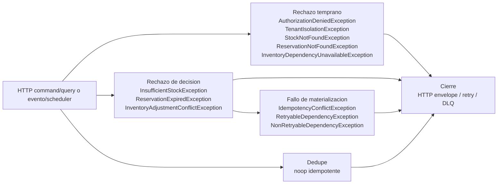

## Proposito
Definir el runtime tecnico completo de `inventory-service`, alineado con la `Vista de Codigo` vigente y cerrando la trazabilidad entre `request`, `command/query`, dominio, locking, idempotencia, persistencia, cache, outbox y eventos.

## Alcance y fronteras
- Incluye los 16 casos activos del MVP para Inventory: comandos de stock, ciclo de reservas, reconciliacion, scheduler interno y consultas operativas/trusted.
- Incluye `api-gateway-service` como borde canonico en el panorama global y referencias explicitas a Catalog, Redis y Kafka donde corresponde.
- Incluye clases owner exactas de `Vista de Codigo`, mas cobertura explicita para listeners operativos, configuracion y soporte transversal.
- Excluye el runtime interno detallado de otros BC fuera de sus interacciones con Inventory.

## Casos de uso cubiertos por Inventory
| ID | Caso de uso | Trigger | Resultado esperado |
|---|---|---|---|
| UC-INV-01 | Initialize Stock | `POST /api/v1/inventory/stock/initialize` | stock base creado sin violar invariantes del almacen |
| UC-INV-02 | Adjust Stock | `POST /api/v1/inventory/stock/adjustments` | stock ajustado y movimiento auditado |
| UC-INV-03 | Increase Stock | `POST /api/v1/inventory/stock/increase` | incremento aplicado con evento de inventario |
| UC-INV-04 | Decrease Stock | `POST /api/v1/inventory/stock/decrease` | decremento valido o rechazo por insuficiencia/invariante |
| UC-INV-05 | Create Reservation | `POST /api/v1/inventory/reservations` | reserva activa con TTL y disponibilidad consistente |
| UC-INV-06 | Extend Reservation | `PATCH /api/v1/inventory/reservations/{reservationId}/extend` | TTL extendido sobre reserva activa |
| UC-INV-07 | Confirm Reservation | `POST /api/v1/inventory/reservations/{reservationId}/confirm` | reserva confirmada y stock comprometido |
| UC-INV-08 | Release Reservation | `POST /api/v1/inventory/reservations/{reservationId}/release` | reserva liberada y disponibilidad restaurada |
| UC-INV-09 | Expire Reservation | `POST /api/v1/inventory/reservations/expire` / scheduler | reservas vencidas procesadas por lote |
| UC-INV-10 | Reconcile Sku | `inventory.catalog.variant-events` | estado de SKU reconciliado contra Catalog |
| UC-INV-11 | Bulk Adjust Stock | `POST /api/v1/inventory/stock/bulk-adjustments` | lote de ajustes aplicado con idempotencia |
| UC-INV-12 | Get Availability | `GET /api/v1/inventory/availability` | disponibilidad reservable coherente |
| UC-INV-13 | Get Stock By Sku | `GET /api/v1/inventory/stock/{sku}` | snapshot de stock por SKU y almacen |
| UC-INV-14 | List Warehouse Stock | `GET /api/v1/inventory/warehouses/{warehouseId}/stock` | stock paginado por almacen |
| UC-INV-15 | List Reservation Timeline | `GET /api/v1/inventory/reservations/timeline` | timeline de reservas por rango |
| UC-INV-16 | Validate Reservation For Checkout | `POST /api/v1/internal/inventory/checkout/validate-reservations` | validacion atomica de reservas para checkout |

## Regla de lectura de los diagramas
- Los diagramas usan nombres exactos de las clases owner documentadas en [02-Vista-de-Codigo.md](/Users/jose/Development/Documentation/arkab2b-docs/content/mvp/02-arquitectura/services/inventory-service/architecture/02-Vista-de-Codigo.md).
- El `Panorama global` conserva la cadena HTTP completa: `api-gateway-service -> Controller -> Request -> Web Mapper -> Command/Query -> Assembler -> Port-In -> UseCase -> Domain -> Ports/Adapters -> Result -> ResponseMapper -> Response`.
- Los diagramas detallados por fases representan solo la arquitectura interna del servicio; por eso arrancan en `Controller`, `Listener` o contratos internos ya dentro de Inventory.
- Las clases que no son actores directos de un happy path o de una ruta alternativa quedan cerradas en la seccion `Cobertura completa contra Vista de Codigo`.

## Modelo runtime de autenticacion y autorizacion
| Tipo de flujo | Regla aplicada |
|---|---|
| HTTP command/query | `api-gateway-service` autentica el request. Las fases `Contextualizacion - Seguridad` materializan `PrincipalContext`, aplican `PermissionEvaluatorPort` y despues el dominio valida `tenant`, operacion y reglas de stock o reserva. |
| evento / scheduler | No se asume JWT de usuario. El servicio materializa `TriggerContext` mediante `TriggerContextResolver`, valida `tenant`, dedupe y legitimidad del trigger antes de expirar reservas o reconciliar cambios de catalogo. |

## Modelo runtime de errores y excepciones
| Tipo de flujo | Regla aplicada |
|---|---|
| HTTP command/query | `Rechazo temprano` y `Rechazo de decision` se propagan como familias semanticas canonicas desde `PrincipalContext`, `PermissionEvaluatorPort`, `TenantIsolationPolicy` y las politicas de stock o reserva; el adapter-in HTTP las traduce al envelope canonico. |
| evento / scheduler | `TriggerContext`, dedupe y politicas operativas emiten error semantico o `noop idempotente`; si el fallo es tecnico se clasifica como retryable/no-retryable para reintento o DLQ. |

### Diagrama runtime de excepciones concretas

## Patron de fases runtime
Los casos de uso de este servicio se documentan usando un patron de fases comun. La intencion es separar donde entra el caso, donde se prepara el contexto, donde se decide negocio y donde se materializan o propagan efectos.

| Fase | Que explica |
|---|---|
| `Ingreso` | Como entra el trigger al servicio y se convierte en un contrato de aplicacion. Incluye `request` o mensaje de entrada, `controller` o `listener`, mappers de entrada, `command/query` y `port in`. |
| `Preparacion` | Como el caso de uso transforma la entrada a contexto semantico interno. Incluye `use case`, value objects y contexto derivado del request. Aqui no se hace I/O externo. |
| `Contextualizacion` | Como el caso obtiene datos o validaciones tecnicas necesarias antes de decidir. Incluye `ports out`, `adapters out`, cache, repositorios, `clock`, locking, seguridad tecnica y clientes externos. |
| `Decision` | Donde el dominio toma la decision real del caso. Incluye agregados, value objects de decision, politicas y eventos de dominio. Cuando intervienen varios agregados, la fase se divide por agregado. |
| `Materializacion` | Como se hace efectiva la decision ya tomada. Incluye persistencia de cambios, auditoria, cache, idempotencia y outbox. Aqui no se vuelve a decidir negocio. |
| `Proyeccion` | Como el estado final del caso se transforma en una salida consumible por el llamador, normalmente una respuesta HTTP o un cierre operativo. |
| `Propagacion` | Como los efectos asincronos ya materializados salen del servicio. Incluye relay de outbox, publicacion de eventos y reintentos. |

### Regla para rutas alternativas
- El flujo principal describe el `happy path`.
- Si una variante corta el caso antes de completar todas las fases, se documenta como ruta alternativa explicita.
- Una ruta alternativa debe indicar donde se corta el flujo, que fases ya no ocurren y que auditoria, cache, idempotencia, outbox o salida de error si ocurren.

## Diagramas runtime por caso de uso


{}
{}
> El bloque `Exito` describe el `happy path` de `InitializeStock`. El bloque `Rechazo` agrupa `Rechazo temprano`, `Rechazo de decision`, `Fallo de materializacion`, `Fallo de propagacion`.

<table>
  <thead>
    <tr>
      <th>Etapa</th>
      <th>Clases para InitializeStock</th>
      <th>Responsabilidad</th>
    </tr>
  </thead>
  <tbody>
    <tr>
      <td>Ingreso</td>
      <td><code>InventoryStockCommandHttpController</code>, <code>StockCommandMapper</code>, <code>InitializeStockCommand</code>, <code>InitializeStockCommandUseCase</code></td>
      <td>Recibe el trigger del caso ya dentro del servicio y lo traduce al contrato de aplicacion que inicia el flujo interno.</td>
    </tr>
    <tr>
      <td>Preparacion</td>
      <td><code>InitializeStockUseCase</code>, <code>TenantId</code>, <code>WarehouseId</code>, <code>SkuCode</code>, <code>Quantity</code></td>
      <td>Normaliza la intencion del caso y construye el contexto semantico interno sin hacer I/O externo.</td>
    </tr>
    <tr>
      <td>Contextualizacion - Seguridad</td>
      <td><code>InitializeStockUseCase</code>, <code>PrincipalContextPort</code>, <code>PrincipalContextAdapter</code>, <code>PermissionEvaluatorPort</code>, <code>RbacPermissionEvaluatorAdapter</code></td>
      <td>Obtiene datos, autorizaciones, concurrencia o validaciones tecnicas necesarias antes de decidir en dominio.</td>
    </tr>
    <tr>
      <td>Contextualizacion - Idempotencia</td>
      <td><code>InitializeStockUseCase</code>, <code>IdempotencyRepositoryPort</code>, <code>IdempotencyR2dbcRepositoryAdapter</code>, <code>ReactiveIdempotencyRecordRepository</code></td>
      <td>Obtiene datos, autorizaciones, concurrencia o validaciones tecnicas necesarias antes de decidir en dominio.</td>
    </tr>
    <tr>
      <td>Contextualizacion - Warehouse</td>
      <td><code>InitializeStockUseCase</code>, <code>WarehouseRepositoryPort</code>, <code>WarehouseR2dbcRepositoryAdapter</code>, <code>ReactiveWarehouseRepository</code>, <code>WarehouseEntity</code></td>
      <td>Obtiene datos, autorizaciones, concurrencia o validaciones tecnicas necesarias antes de decidir en dominio.</td>
    </tr>
    <tr>
      <td>Decision - Stock</td>
      <td><code>InitializeStockUseCase</code>, <code>StockAvailabilityPolicy</code>, <code>StockAggregate</code>, <code>StockBalance</code>, <code>StockStatus</code>, <code>StockInitializedEvent</code>, <code>StockUpdatedEvent</code></td>
      <td>Evalua invariantes, reglas y politicas del dominio para aceptar, rechazar o consolidar el resultado del caso.</td>
    </tr>
    <tr>
      <td>Materializacion</td>
      <td><code>InitializeStockUseCase</code>, <code>StockItemRepositoryPort</code>, <code>StockItemR2dbcRepositoryAdapter</code>, <code>StockPersistenceMapper</code>, <code>StockItemEntity</code>, <code>ReactiveStockItemRepository</code>, <code>InventoryAuditPort</code>, <code>InventoryAuditR2dbcRepositoryAdapter</code>, <code>ReactiveInventoryAuditRepository</code>, <code>InventoryAuditEntity</code>, <code>InventoryCachePort</code>, <code>InventoryCacheRedisAdapter</code>, <code>IdempotencyRepositoryPort</code>, <code>IdempotencyR2dbcRepositoryAdapter</code>, <code>IdempotencyPersistenceMapper</code>, <code>IdempotencyRecordEntity</code>, <code>ReactiveIdempotencyRecordRepository</code>, <code>OutboxPort</code>, <code>OutboxPersistenceAdapter</code>, <code>ReactiveOutboxEventRepository</code>, <code>OutboxEventEntity</code></td>
      <td>Hace efectiva la decision tomada: persistencia, auditoria, cache, idempotencia, outbox y side effects tecnicos segun corresponda.</td>
    </tr>
    <tr>
      <td>Proyeccion</td>
      <td><code>InitializeStockUseCase</code>, <code>InventoryResponseMapper</code>, <code>StockDetailResponse</code>, <code>InventoryStockCommandHttpController</code></td>
      <td>Convierte el estado final del caso en la respuesta expuesta por el servicio.</td>
    </tr>
    <tr>
      <td>Propagacion</td>
      <td><code>StockInitializedEvent</code>, <code>StockUpdatedEvent</code>, <code>OutboxEventEntity</code>, <code>OutboxPublisherScheduler</code>, <code>DomainEventPublisherPort</code>, <code>KafkaDomainEventPublisherAdapter</code></td>
      <td>Publica los efectos asincronos ya materializados mediante relay, outbox y broker.</td>
    </tr>
    <tr>
      <td>Rechazo temprano</td>
      <td><code>InitializeStockUseCase</code>, <code>PermissionEvaluatorPort</code>, <code>WarehouseRepositoryPort</code>, <code>IdempotencyRepositoryPort</code>, <code>InventoryStockCommandHttpController</code>, <code>InventoryWebFluxConfiguration</code></td>
      <td>Corta el flujo antes de decidir en dominio por autorizacion, conflicto de idempotencia, ausencia de contexto externo o bloqueo tecnico.</td>
    </tr>
    <tr>
      <td>Rechazo de decision</td>
      <td><code>InitializeStockUseCase</code>, <code>StockAvailabilityPolicy</code>, <code>StockAggregate</code>, <code>InventoryAuditPort</code>, <code>InventoryStockCommandHttpController</code>, <code>InventoryWebFluxConfiguration</code></td>
      <td>Corta el flujo despues de evaluar reglas, invariantes o politicas del dominio.</td>
    </tr>
    <tr>
      <td>Fallo de materializacion</td>
      <td><code>InitializeStockUseCase</code>, <code>StockItemRepositoryPort</code>, <code>InventoryAuditPort</code>, <code>InventoryCachePort</code>, <code>IdempotencyRepositoryPort</code>, <code>OutboxPort</code>, <code>InventoryStockCommandHttpController</code>, <code>InventoryWebFluxConfiguration</code></td>
      <td>Representa un error tecnico posterior a la decision al persistir, auditar, invalidar cache, guardar idempotencia o escribir outbox.</td>
    </tr>
    <tr>
      <td>Fallo de propagacion</td>
      <td><code>StockInitializedEvent</code>, <code>StockUpdatedEvent</code>, <code>OutboxEventEntity</code>, <code>OutboxPublisherScheduler</code>, <code>DomainEventPublisherPort</code>, <code>KafkaDomainEventPublisherAdapter</code></td>
      <td>Representa un error asincrono al publicar efectos ya materializados.</td>
    </tr>
  </tbody>
</table>
{}
{}
{}
{}

sequenceDiagram
  participant P1 as InventoryStockCommandHttpController
  participant P2 as StockCommandMapper
  participant P3 as InitializeStockCommand
  participant P4 as InitializeStockCommandUseCase
  P1->>P2: mapea comando
  P2->>P3: crea command
  P3->>P4: entra por port in


**Descripcion de la fase.** Recibe el trigger del caso ya dentro del servicio y lo traduce al contrato de aplicacion que inicia el flujo interno.

**Capa predominante.** Se ubica principalmente en `Adapter-in`, con cruce controlado hacia el puerto de entrada de `Application service`.

<table>
  <thead>
    <tr>
      <th>Paso</th>
      <th>Clase</th>
      <th>Accion</th>
    </tr>
  </thead>
  <tbody>
    <tr>
      <td>1</td>
      <td><code>InventoryStockCommandHttpController</code></td>
      <td>Recibe el alta inicial de stock y entrega el payload al mapper del comando.</td>
    </tr>
    <tr>
      <td>2</td>
      <td><code>StockCommandMapper</code></td>
      <td>Transforma el payload HTTP al comando de aplicacion que inicia el caso.</td>
    </tr>
    <tr>
      <td>3</td>
      <td><code>InitializeStockCommand</code></td>
      <td>Formaliza la intencion del caso en un contrato interno consistente.</td>
    </tr>
    <tr>
      <td>4</td>
      <td><code>InitializeStockCommandUseCase</code></td>
      <td>Expone el puerto de entrada reactivo del caso mutante.</td>
    </tr>
  </tbody>
</table>
{}
{}

sequenceDiagram
  participant P1 as InitializeStockUseCase
  participant P2 as TenantId
  participant P3 as WarehouseId
  participant P4 as SkuCode
  participant P5 as Quantity
  P1->>P2: crea tenant
  P2->>P3: crea almacen
  P3->>P4: crea sku
  P4->>P5: crea cantidad


**Descripcion de la fase.** Normaliza la intencion del caso y construye el contexto semantico interno sin hacer I/O externo.

**Capa predominante.** Se ubica principalmente en `Application service`, con apoyo de tipos del `Domain`.

<table>
  <thead>
    <tr>
      <th>Paso</th>
      <th>Clase</th>
      <th>Accion</th>
    </tr>
  </thead>
  <tbody>
    <tr>
      <td>1</td>
      <td><code>InitializeStockUseCase</code></td>
      <td>Normaliza el comando y arma el contexto semantico del stock base a crear.</td>
    </tr>
    <tr>
      <td>2</td>
      <td><code>TenantId</code></td>
      <td>Representa el tenant propietario del stock que sera inicializado.</td>
    </tr>
    <tr>
      <td>3</td>
      <td><code>WarehouseId</code></td>
      <td>Identifica el almacen sobre el que se creara el stock inicial.</td>
    </tr>
    <tr>
      <td>4</td>
      <td><code>SkuCode</code></td>
      <td>Normaliza el SKU que se dara de alta dentro del almacen.</td>
    </tr>
    <tr>
      <td>5</td>
      <td><code>Quantity</code></td>
      <td>Representa la cantidad fisica inicial con la que nace el stock.</td>
    </tr>
  </tbody>
</table>
{}
{}

sequenceDiagram
  participant P1 as InitializeStockUseCase
  participant P2 as PrincipalContextPort
  participant P3 as PrincipalContextAdapter
  participant P4 as PermissionEvaluatorPort
  participant P5 as RbacPermissionEvaluatorAdapter
  P1->>P2: lee claims
  P2->>P3: extrae principal
  P3->>P4: evalua permiso
  P4->>P5: consulta RBAC


**Descripcion de la fase.** Obtiene datos, autorizaciones, concurrencia o validaciones tecnicas necesarias antes de decidir en dominio.

**Capa predominante.** Se ubica en la frontera entre `Application service` y `Adapter-out`.

<table>
  <thead>
    <tr>
      <th>Paso</th>
      <th>Clase</th>
      <th>Accion</th>
    </tr>
  </thead>
  <tbody>
    <tr>
      <td>1</td>
      <td><code>InitializeStockUseCase</code></td>
      <td>Resuelve el actor efectivo y los permisos requeridos antes de continuar el caso.</td>
    </tr>
    <tr>
      <td>2</td>
      <td><code>PrincipalContextPort</code></td>
      <td>Expone los claims o el principal autenticado con el que se ejecuta la operacion.</td>
    </tr>
    <tr>
      <td>3</td>
      <td><code>PrincipalContextAdapter</code></td>
      <td>Recupera el principal efectivo desde la infraestructura de seguridad reactiva.</td>
    </tr>
    <tr>
      <td>4</td>
      <td><code>PermissionEvaluatorPort</code></td>
      <td>Formula la verificacion de permisos que el caso necesita para ejecutarse.</td>
    </tr>
    <tr>
      <td>5</td>
      <td><code>RbacPermissionEvaluatorAdapter</code></td>
      <td>Consulta las reglas RBAC y devuelve autorizacion o denegacion.</td>
    </tr>
  </tbody>
</table>
{}
{}

sequenceDiagram
  participant P1 as InitializeStockUseCase
  participant P2 as IdempotencyRepositoryPort
  participant P3 as IdempotencyR2dbcRepositoryAdapter
  participant P4 as ReactiveIdempotencyRecordRepository
  P1->>P2: busca respuesta
  P2->>P3: consulta almacenamiento
  P3->>P4: lee registro


**Descripcion de la fase.** Obtiene datos, autorizaciones, concurrencia o validaciones tecnicas necesarias antes de decidir en dominio.

**Capa predominante.** Se ubica en la frontera entre `Application service` y `Adapter-out`.

<table>
  <thead>
    <tr>
      <th>Paso</th>
      <th>Clase</th>
      <th>Accion</th>
    </tr>
  </thead>
  <tbody>
    <tr>
      <td>1</td>
      <td><code>InitializeStockUseCase</code></td>
      <td>Consulta si ya existe una respuesta materializada para la llave idempotente del comando.</td>
    </tr>
    <tr>
      <td>2</td>
      <td><code>IdempotencyRepositoryPort</code></td>
      <td>Expone la busqueda de respuestas previas asociadas a una operacion idempotente.</td>
    </tr>
    <tr>
      <td>3</td>
      <td><code>IdempotencyR2dbcRepositoryAdapter</code></td>
      <td>Adapta la consulta idempotente al almacenamiento reactivo del servicio.</td>
    </tr>
    <tr>
      <td>4</td>
      <td><code>ReactiveIdempotencyRecordRepository</code></td>
      <td>Lee el registro persistido de idempotencia para decidir si existe replay valido.</td>
    </tr>
  </tbody>
</table>
{}
{}

sequenceDiagram
  participant P1 as InitializeStockUseCase
  participant P2 as WarehouseRepositoryPort
  participant P3 as WarehouseR2dbcRepositoryAdapter
  participant P4 as ReactiveWarehouseRepository
  participant P5 as WarehouseEntity
  P1->>P2: busca almacen
  P2->>P3: consulta almacenamiento
  P3->>P4: lee almacen
  P4->>P5: materializa almacen


**Descripcion de la fase.** Obtiene datos, autorizaciones, concurrencia o validaciones tecnicas necesarias antes de decidir en dominio.

**Capa predominante.** Se ubica en la frontera entre `Application service` y `Adapter-out`.

<table>
  <thead>
    <tr>
      <th>Paso</th>
      <th>Clase</th>
      <th>Accion</th>
    </tr>
  </thead>
  <tbody>
    <tr>
      <td>1</td>
      <td><code>InitializeStockUseCase</code></td>
      <td>Carga y valida el almacen sobre el que se registrara el stock inicial.</td>
    </tr>
    <tr>
      <td>2</td>
      <td><code>WarehouseRepositoryPort</code></td>
      <td>Expone la consulta del almacen activo requerido por el caso.</td>
    </tr>
    <tr>
      <td>3</td>
      <td><code>WarehouseR2dbcRepositoryAdapter</code></td>
      <td>Adapta la consulta del almacen al almacenamiento relacional.</td>
    </tr>
    <tr>
      <td>4</td>
      <td><code>ReactiveWarehouseRepository</code></td>
      <td>Lee la fila persistida del almacen asociado al alta de stock.</td>
    </tr>
    <tr>
      <td>5</td>
      <td><code>WarehouseEntity</code></td>
      <td>Representa el estado persistido del almacen que contextualiza el alta inicial.</td>
    </tr>
  </tbody>
</table>
{}
{}

sequenceDiagram
  participant P1 as InitializeStockUseCase
  participant P2 as StockAvailabilityPolicy
  participant P3 as StockAggregate
  participant P4 as StockBalance
  participant P5 as StockStatus
  participant P6 as StockInitializedEvent
  participant P7 as StockUpdatedEvent
  P1->>P2: valida stock
  P2->>P3: crea agregado
  P3->>P4: consolida balance
  P4->>P5: define estado
  P5->>P6: emite evento
  P6->>P7: emite evento


**Descripcion de la fase.** Evalua invariantes, reglas y politicas del dominio para aceptar, rechazar o consolidar el resultado del caso.

**Capa predominante.** Se ubica principalmente en `Domain`, orquestada por `Application service`.

<table>
  <thead>
    <tr>
      <th>Paso</th>
      <th>Clase</th>
      <th>Accion</th>
    </tr>
  </thead>
  <tbody>
    <tr>
      <td>1</td>
      <td><code>InitializeStockUseCase</code></td>
      <td>Entrega al dominio el contexto del almacen y del SKU para decidir el alta inicial.</td>
    </tr>
    <tr>
      <td>2</td>
      <td><code>StockAvailabilityPolicy</code></td>
      <td>Valida que la cantidad inicial y el estado derivado respetan las invariantes de inventario.</td>
    </tr>
    <tr>
      <td>3</td>
      <td><code>StockAggregate</code></td>
      <td>Crea el stock base y emite el evento correspondiente cuando la alta es valida.</td>
    </tr>
    <tr>
      <td>4</td>
      <td><code>StockBalance</code></td>
      <td>Consolida cantidades fisicas, reservadas y disponibles del nuevo stock.</td>
    </tr>
    <tr>
      <td>5</td>
      <td><code>StockStatus</code></td>
      <td>Representa el estado inicial del stock recien creado.</td>
    </tr>
    <tr>
      <td>6</td>
      <td><code>StockInitializedEvent</code></td>
      <td>Representa el evento emitido tras aceptar la inicializacion del stock.</td>
    </tr>
    <tr>
      <td>7</td>
      <td><code>StockUpdatedEvent</code></td>
      <td>Representa la actualizacion observable del stock tras su alta inicial.</td>
    </tr>
  </tbody>
</table>
{}
{}

sequenceDiagram
  participant P1 as InitializeStockUseCase
  participant P2 as StockItemRepositoryPort
  participant P3 as StockItemR2dbcRepositoryAdapter
  participant P4 as StockPersistenceMapper
  participant P5 as StockItemEntity
  participant P6 as ReactiveStockItemRepository
  participant P7 as InventoryAuditPort
  participant P8 as InventoryAuditR2dbcRepositoryAdapter
  participant P9 as ReactiveInventoryAuditRepository
  participant P10 as InventoryAuditEntity
  participant P11 as InventoryCachePort
  participant P12 as InventoryCacheRedisAdapter
  participant P13 as IdempotencyRepositoryPort
  participant P14 as IdempotencyR2dbcRepositoryAdapter
  participant P15 as IdempotencyPersistenceMapper
  participant P16 as IdempotencyRecordEntity
  participant P17 as ReactiveIdempotencyRecordRepository
  participant P18 as OutboxPort
  participant P19 as OutboxPersistenceAdapter
  participant P20 as ReactiveOutboxEventRepository
  participant P21 as OutboxEventEntity
  P1->>P2: persiste stock
  P2->>P3: guarda agregado
  P3->>P4: mapea entidad
  P4->>P5: materializa fila
  P5->>P6: guarda fila
  P6->>P7: audita operacion
  P7->>P8: persiste auditoria
  P8->>P9: guarda auditoria
  P9->>P10: materializa auditoria
  P10->>P11: invalida cache
  P11->>P12: evicta redis
  P12->>P13: guarda respuesta idempotente
  P13->>P14: persiste idempotencia
  P14->>P15: mapea registro
  P15->>P16: materializa registro
  P16->>P17: guarda registro
  P17->>P18: escribe outbox
  P18->>P19: persiste outbox
  P19->>P20: guarda fila outbox
  P20->>P21: materializa outbox


**Descripcion de la fase.** Hace efectiva la decision tomada: persistencia, auditoria, cache, idempotencia, outbox y side effects tecnicos segun corresponda.

**Capa predominante.** Se ubica en la frontera entre `Application service` y `Adapter-out`.

<table>
  <thead>
    <tr>
      <th>Paso</th>
      <th>Clase</th>
      <th>Accion</th>
    </tr>
  </thead>
  <tbody>
    <tr>
      <td>1</td>
      <td><code>InitializeStockUseCase</code></td>
      <td>Persiste el stock inicial, registra auditoria, invalida cache, guarda idempotencia y escribe outbox.</td>
    </tr>
    <tr>
      <td>2</td>
      <td><code>StockItemRepositoryPort</code></td>
      <td>Expone la persistencia reactiva del stock creado por el dominio.</td>
    </tr>
    <tr>
      <td>3</td>
      <td><code>StockItemR2dbcRepositoryAdapter</code></td>
      <td>Adapta la escritura del stock al almacenamiento relacional.</td>
    </tr>
    <tr>
      <td>4</td>
      <td><code>StockPersistenceMapper</code></td>
      <td>Traduce el agregado stock al modelo persistente usado por la infraestructura.</td>
    </tr>
    <tr>
      <td>5</td>
      <td><code>StockItemEntity</code></td>
      <td>Representa la fila persistida del stock recien inicializado.</td>
    </tr>
    <tr>
      <td>6</td>
      <td><code>ReactiveStockItemRepository</code></td>
      <td>Ejecuta la escritura reactiva del stock inicial en la base transaccional.</td>
    </tr>
    <tr>
      <td>7</td>
      <td><code>InventoryAuditPort</code></td>
      <td>Registra el exito de la inicializacion como evidencia operativa.</td>
    </tr>
    <tr>
      <td>8</td>
      <td><code>InventoryAuditR2dbcRepositoryAdapter</code></td>
      <td>Adapta la auditoria al almacenamiento relacional reactivo.</td>
    </tr>
    <tr>
      <td>9</td>
      <td><code>ReactiveInventoryAuditRepository</code></td>
      <td>Escribe el registro de auditoria del alta inicial.</td>
    </tr>
    <tr>
      <td>10</td>
      <td><code>InventoryAuditEntity</code></td>
      <td>Representa la evidencia persistida del alta de stock.</td>
    </tr>
    <tr>
      <td>11</td>
      <td><code>InventoryCachePort</code></td>
      <td>Expone la invalidacion de cache afectada por el nuevo stock.</td>
    </tr>
    <tr>
      <td>12</td>
      <td><code>InventoryCacheRedisAdapter</code></td>
      <td>Evicta en Redis las entradas de disponibilidad o snapshot asociadas al SKU.</td>
    </tr>
    <tr>
      <td>13</td>
      <td><code>IdempotencyRepositoryPort</code></td>
      <td>Guarda la respuesta final para futuros replays idempotentes.</td>
    </tr>
    <tr>
      <td>14</td>
      <td><code>IdempotencyR2dbcRepositoryAdapter</code></td>
      <td>Adapta el guardado idempotente al almacenamiento relacional.</td>
    </tr>
    <tr>
      <td>15</td>
      <td><code>IdempotencyPersistenceMapper</code></td>
      <td>Traduce la respuesta del caso al registro persistible de idempotencia.</td>
    </tr>
    <tr>
      <td>16</td>
      <td><code>IdempotencyRecordEntity</code></td>
      <td>Representa la respuesta reutilizable asociada a la llave idempotente.</td>
    </tr>
    <tr>
      <td>17</td>
      <td><code>ReactiveIdempotencyRecordRepository</code></td>
      <td>Escribe el registro idempotente asociado a la inicializacion.</td>
    </tr>
    <tr>
      <td>18</td>
      <td><code>OutboxPort</code></td>
      <td>Expone la escritura de los eventos pendientes de publicacion dentro de la unidad de trabajo.</td>
    </tr>
    <tr>
      <td>19</td>
      <td><code>OutboxPersistenceAdapter</code></td>
      <td>Adapta la escritura del evento al almacenamiento transaccional del outbox.</td>
    </tr>
    <tr>
      <td>20</td>
      <td><code>ReactiveOutboxEventRepository</code></td>
      <td>Guarda la fila de outbox asociada al alta de stock.</td>
    </tr>
    <tr>
      <td>21</td>
      <td><code>OutboxEventEntity</code></td>
      <td>Representa la fila persistida que alimentara la publicacion asincrona posterior.</td>
    </tr>
  </tbody>
</table>
{}
{}

sequenceDiagram
  participant P1 as InitializeStockUseCase
  participant P2 as InventoryResponseMapper
  participant P3 as StockDetailResponse
  participant P4 as InventoryStockCommandHttpController
  P1->>P2: mapea response
  P2->>P3: construye response
  P3->>P4: retorna respuesta


**Descripcion de la fase.** Convierte el estado final del caso en la respuesta expuesta por el servicio.

**Capa predominante.** Se ubica principalmente en `Application service`, cerrando el retorno hacia `Adapter-in`.

<table>
  <thead>
    <tr>
      <th>Paso</th>
      <th>Clase</th>
      <th>Accion</th>
    </tr>
  </thead>
  <tbody>
    <tr>
      <td>1</td>
      <td><code>InitializeStockUseCase</code></td>
      <td>Convierte el estado final del stock inicial al contrato de salida expuesto por el servicio.</td>
    </tr>
    <tr>
      <td>2</td>
      <td><code>InventoryResponseMapper</code></td>
      <td>Construye la respuesta de inventario a partir del agregado ya materializado.</td>
    </tr>
    <tr>
      <td>3</td>
      <td><code>StockDetailResponse</code></td>
      <td>Representa la respuesta completa del stock inicializado para el llamador.</td>
    </tr>
    <tr>
      <td>4</td>
      <td><code>InventoryStockCommandHttpController</code></td>
      <td>Devuelve la respuesta HTTP del alta inicial una vez el flujo termina correctamente.</td>
    </tr>
  </tbody>
</table>
{}
{}

sequenceDiagram
  participant P1 as StockInitializedEvent
  participant P2 as StockUpdatedEvent
  participant P3 as OutboxEventEntity
  participant P4 as OutboxPublisherScheduler
  participant P5 as DomainEventPublisherPort
  participant P6 as KafkaDomainEventPublisherAdapter
  P1->>P2: encadena evento
  P2->>P3: lee outbox
  P3->>P4: ejecuta relay
  P4->>P5: publica evento
  P5->>P6: publica en kafka


**Descripcion de la fase.** Publica los efectos asincronos ya materializados mediante relay, outbox y broker.

**Capa predominante.** Se ubica principalmente en `Adapter-out`.

<table>
  <thead>
    <tr>
      <th>Paso</th>
      <th>Clase</th>
      <th>Accion</th>
    </tr>
  </thead>
  <tbody>
    <tr>
      <td>1</td>
      <td><code>StockInitializedEvent</code></td>
      <td>Representa el evento de dominio ya materializado y listo para integracion.</td>
    </tr>
    <tr>
      <td>2</td>
      <td><code>StockUpdatedEvent</code></td>
      <td>Representa el evento de dominio ya materializado y listo para integracion.</td>
    </tr>
    <tr>
      <td>3</td>
      <td><code>OutboxEventEntity</code></td>
      <td>Entrega al relay la unidad persistida desde la que se publicaran los eventos pendientes.</td>
    </tr>
    <tr>
      <td>4</td>
      <td><code>OutboxPublisherScheduler</code></td>
      <td>Consume el outbox sin bloquear el trigger principal y gestiona reintentos.</td>
    </tr>
    <tr>
      <td>5</td>
      <td><code>DomainEventPublisherPort</code></td>
      <td>Expone la abstraccion de publicacion asincrona del servicio de inventario.</td>
    </tr>
    <tr>
      <td>6</td>
      <td><code>KafkaDomainEventPublisherAdapter</code></td>
      <td>Entrega el mensaje al broker o deja el evento pendiente para reintento posterior.</td>
    </tr>
  </tbody>
</table>
{}
{}
{}
{}
{}
{}

sequenceDiagram
  participant P1 as InitializeStockUseCase
  participant P2 as PermissionEvaluatorPort
  participant P3 as WarehouseRepositoryPort
  participant P4 as IdempotencyRepositoryPort
  participant P5 as InventoryStockCommandHttpController
  participant P6 as InventoryWebFluxConfiguration
  P1->>P2: bloquea operacion
  P2->>P3: rechaza almacen
  P3->>P4: rechaza idempotencia
  P4->>P5: propaga error
  P5->>P6: mapea error HTTP


**Descripcion de la fase.** Corta el flujo antes de decidir en dominio por autorizacion, conflicto de idempotencia, ausencia de contexto externo o bloqueo tecnico.

**Capa predominante.** Se ubica en la frontera `Adapter-in` / `Application service` con apoyo de `Adapter-out`.

<table>
  <thead>
    <tr>
      <th>Paso</th>
      <th>Clase</th>
      <th>Accion</th>
    </tr>
  </thead>
  <tbody>
    <tr>
      <td>1</td>
      <td><code>InitializeStockUseCase</code></td>
      <td>Detecta una condicion tecnica, de autorizacion o de contexto que impide continuar antes de decidir en dominio.</td>
    </tr>
    <tr>
      <td>2</td>
      <td><code>PermissionEvaluatorPort</code></td>
      <td>Detecta que el actor no puede crear stock en este contexto.</td>
    </tr>
    <tr>
      <td>3</td>
      <td><code>WarehouseRepositoryPort</code></td>
      <td>Detecta que el almacen objetivo no existe o no se encuentra activo.</td>
    </tr>
    <tr>
      <td>4</td>
      <td><code>IdempotencyRepositoryPort</code></td>
      <td>Detecta un replay conflictivo para la misma llave idempotente.</td>
    </tr>
    <tr>
      <td>5</td>
      <td><code>InventoryStockCommandHttpController</code></td>
      <td>Recibe la senal de error y corta el flujo antes del dominio o de la salida exitosa.</td>
    </tr>
    <tr>
      <td>6</td>
      <td><code>InventoryWebFluxConfiguration</code></td>
      <td>Convierte la excepcion tecnica o funcional temprana en la respuesta HTTP correspondiente cuando aplica.</td>
    </tr>
  </tbody>
</table>
{}
{}

sequenceDiagram
  participant P1 as InitializeStockUseCase
  participant P2 as StockAvailabilityPolicy
  participant P3 as StockAggregate
  participant P4 as InventoryAuditPort
  participant P5 as InventoryStockCommandHttpController
  participant P6 as InventoryWebFluxConfiguration
  P1->>P2: niega alta
  P2->>P3: rechaza agregado
  P3->>P4: audita rechazo
  P4->>P5: retorna rechazo
  P5->>P6: serializa error


**Descripcion de la fase.** Corta el flujo despues de evaluar reglas, invariantes o politicas del dominio.

**Capa predominante.** Se ubica principalmente en `Domain`, con cierre de error hacia `Adapter-in`.

<table>
  <thead>
    <tr>
      <th>Paso</th>
      <th>Clase</th>
      <th>Accion</th>
    </tr>
  </thead>
  <tbody>
    <tr>
      <td>1</td>
      <td><code>InitializeStockUseCase</code></td>
      <td>Llega al dominio con contexto valido, pero una politica o agregado rechaza la operacion.</td>
    </tr>
    <tr>
      <td>2</td>
      <td><code>StockAvailabilityPolicy</code></td>
      <td>Rechaza la inicializacion cuando la cantidad o el estado rompen invariantes de inventario.</td>
    </tr>
    <tr>
      <td>3</td>
      <td><code>StockAggregate</code></td>
      <td>Descarta el alta cuando ya existe stock inicial incompatible para el mismo SKU y almacen.</td>
    </tr>
    <tr>
      <td>4</td>
      <td><code>InventoryAuditPort</code></td>
      <td>Registra el rechazo semantico para trazabilidad operativa y cumplimiento.</td>
    </tr>
    <tr>
      <td>5</td>
      <td><code>InventoryStockCommandHttpController</code></td>
      <td>Recibe la salida de rechazo de negocio y cierra el caso sin materializar cambios adicionales.</td>
    </tr>
    <tr>
      <td>6</td>
      <td><code>InventoryWebFluxConfiguration</code></td>
      <td>Serializa el rechazo del dominio en la respuesta tecnica correspondiente cuando aplica.</td>
    </tr>
  </tbody>
</table>
{}
{}

sequenceDiagram
  participant P1 as InitializeStockUseCase
  participant P2 as StockItemRepositoryPort
  participant P3 as InventoryAuditPort
  participant P4 as InventoryCachePort
  participant P5 as IdempotencyRepositoryPort
  participant P6 as OutboxPort
  participant P7 as InventoryStockCommandHttpController
  participant P8 as InventoryWebFluxConfiguration
  P1->>P2: falla persistencia
  P2->>P3: falla auditoria
  P3->>P4: falla cache
  P4->>P5: falla idempotencia
  P5->>P6: falla outbox
  P6->>P7: propaga error tecnico
  P7->>P8: mapea error HTTP


**Descripcion de la fase.** Representa un error tecnico posterior a la decision al persistir, auditar, invalidar cache, guardar idempotencia o escribir outbox.

**Capa predominante.** Se ubica en la frontera entre `Application service` y `Adapter-out`.

<table>
  <thead>
    <tr>
      <th>Paso</th>
      <th>Clase</th>
      <th>Accion</th>
    </tr>
  </thead>
  <tbody>
    <tr>
      <td>1</td>
      <td><code>InitializeStockUseCase</code></td>
      <td>Ya existe una decision valida, pero una dependencia de salida falla al hacerla efectiva.</td>
    </tr>
    <tr>
      <td>2</td>
      <td><code>StockItemRepositoryPort</code></td>
      <td>Falla al persistir el stock inicial aceptado por el dominio.</td>
    </tr>
    <tr>
      <td>3</td>
      <td><code>InventoryAuditPort</code></td>
      <td>Falla al registrar la auditoria de la inicializacion.</td>
    </tr>
    <tr>
      <td>4</td>
      <td><code>InventoryCachePort</code></td>
      <td>Falla al invalidar la cache asociada al nuevo stock.</td>
    </tr>
    <tr>
      <td>5</td>
      <td><code>IdempotencyRepositoryPort</code></td>
      <td>Falla al guardar la respuesta idempotente del alta.</td>
    </tr>
    <tr>
      <td>6</td>
      <td><code>OutboxPort</code></td>
      <td>Falla al escribir los eventos de stock en outbox.</td>
    </tr>
    <tr>
      <td>7</td>
      <td><code>InventoryStockCommandHttpController</code></td>
      <td>Recibe o observa el error tecnico y corta la respuesta o el cierre operativo del caso.</td>
    </tr>
    <tr>
      <td>8</td>
      <td><code>InventoryWebFluxConfiguration</code></td>
      <td>Mapea la falla tecnica a la respuesta HTTP de error cuando el caso entra por WebFlux.</td>
    </tr>
  </tbody>
</table>
{}
{}

sequenceDiagram
  participant P1 as StockInitializedEvent
  participant P2 as StockUpdatedEvent
  participant P3 as OutboxEventEntity
  participant P4 as OutboxPublisherScheduler
  participant P5 as DomainEventPublisherPort
  participant P6 as KafkaDomainEventPublisherAdapter
  P1->>P2: encadena evento
  P2->>P3: lee outbox
  P3->>P4: reintenta relay
  P4->>P5: publica evento
  P5->>P6: publica en kafka


**Descripcion de la fase.** Representa un error asincrono al publicar efectos ya materializados.

**Capa predominante.** Se ubica principalmente en `Adapter-out`.

<table>
  <thead>
    <tr>
      <th>Paso</th>
      <th>Clase</th>
      <th>Accion</th>
    </tr>
  </thead>
  <tbody>
    <tr>
      <td>1</td>
      <td><code>StockInitializedEvent</code></td>
      <td>Representa el evento de stock inicializado ya materializado y listo para integracion.</td>
    </tr>
    <tr>
      <td>2</td>
      <td><code>StockUpdatedEvent</code></td>
      <td>Representa la actualizacion de stock ya materializada asociada al alta inicial.</td>
    </tr>
    <tr>
      <td>3</td>
      <td><code>OutboxEventEntity</code></td>
      <td>Entrega al relay la fila pendiente de publicacion del alta inicial.</td>
    </tr>
    <tr>
      <td>4</td>
      <td><code>OutboxPublisherScheduler</code></td>
      <td>Reintenta la publicacion asincrona del evento sin afectar la respuesta ya emitida.</td>
    </tr>
    <tr>
      <td>5</td>
      <td><code>DomainEventPublisherPort</code></td>
      <td>Expone la publicacion asincrona del evento desde el servicio.</td>
    </tr>
    <tr>
      <td>6</td>
      <td><code>KafkaDomainEventPublisherAdapter</code></td>
      <td>Entrega el evento al broker o lo mantiene pendiente para nuevo intento.</td>
    </tr>
  </tbody>
</table>
{}
{}
{}
{}


{}
{}
> El bloque `Exito` describe el `happy path` de `AdjustStock`. El bloque `Rechazo` agrupa `Rechazo temprano`, `Rechazo de decision`, `Fallo de materializacion`, `Fallo de propagacion`.

<table>
  <thead>
    <tr>
      <th>Etapa</th>
      <th>Clases para AdjustStock</th>
      <th>Responsabilidad</th>
    </tr>
  </thead>
  <tbody>
    <tr>
      <td>Ingreso</td>
      <td><code>InventoryStockCommandHttpController</code>, <code>StockCommandMapper</code>, <code>AdjustStockCommand</code>, <code>AdjustStockCommandUseCase</code></td>
      <td>Recibe el trigger del caso ya dentro del servicio y lo traduce al contrato de aplicacion que inicia el flujo interno.</td>
    </tr>
    <tr>
      <td>Preparacion</td>
      <td><code>AdjustStockUseCase</code>, <code>TenantId</code>, <code>WarehouseId</code>, <code>SkuCode</code>, <code>Quantity</code>, <code>AdjustmentReason</code></td>
      <td>Normaliza la intencion del caso y construye el contexto semantico interno sin hacer I/O externo.</td>
    </tr>
    <tr>
      <td>Contextualizacion - Seguridad</td>
      <td><code>AdjustStockUseCase</code>, <code>PrincipalContextPort</code>, <code>PrincipalContextAdapter</code>, <code>PermissionEvaluatorPort</code>, <code>RbacPermissionEvaluatorAdapter</code></td>
      <td>Obtiene datos, autorizaciones, concurrencia o validaciones tecnicas necesarias antes de decidir en dominio.</td>
    </tr>
    <tr>
      <td>Contextualizacion - Idempotencia</td>
      <td><code>AdjustStockUseCase</code>, <code>IdempotencyRepositoryPort</code>, <code>IdempotencyR2dbcRepositoryAdapter</code>, <code>ReactiveIdempotencyRecordRepository</code></td>
      <td>Obtiene datos, autorizaciones, concurrencia o validaciones tecnicas necesarias antes de decidir en dominio.</td>
    </tr>
    <tr>
      <td>Contextualizacion - Concurrencia</td>
      <td><code>AdjustStockUseCase</code>, <code>DistributedLockPort</code>, <code>DistributedLockRedisAdapter</code></td>
      <td>Obtiene datos, autorizaciones, concurrencia o validaciones tecnicas necesarias antes de decidir en dominio.</td>
    </tr>
    <tr>
      <td>Contextualizacion - Stock</td>
      <td><code>AdjustStockUseCase</code>, <code>StockItemRepositoryPort</code>, <code>StockItemR2dbcRepositoryAdapter</code>, <code>ReactiveStockItemRepository</code>, <code>StockItemEntity</code></td>
      <td>Obtiene datos, autorizaciones, concurrencia o validaciones tecnicas necesarias antes de decidir en dominio.</td>
    </tr>
    <tr>
      <td>Decision - Stock</td>
      <td><code>AdjustStockUseCase</code>, <code>StockAvailabilityPolicy</code>, <code>StockAggregate</code>, <code>StockBalance</code>, <code>StockAdjustedEvent</code>, <code>StockUpdatedEvent</code></td>
      <td>Evalua invariantes, reglas y politicas del dominio para aceptar, rechazar o consolidar el resultado del caso.</td>
    </tr>
    <tr>
      <td>Decision - Movement</td>
      <td><code>AdjustStockUseCase</code>, <code>MovementPolicy</code>, <code>MovementAggregate</code>, <code>MovementType</code>, <code>ReferenceType</code>, <code>StockMovementRecordedEvent</code></td>
      <td>Evalua invariantes, reglas y politicas del dominio para aceptar, rechazar o consolidar el resultado del caso.</td>
    </tr>
    <tr>
      <td>Materializacion</td>
      <td><code>AdjustStockUseCase</code>, <code>StockItemRepositoryPort</code>, <code>StockItemR2dbcRepositoryAdapter</code>, <code>StockPersistenceMapper</code>, <code>StockItemEntity</code>, <code>ReactiveStockItemRepository</code>, <code>StockMovementRepositoryPort</code>, <code>StockMovementR2dbcRepositoryAdapter</code>, <code>MovementPersistenceMapper</code>, <code>StockMovementEntity</code>, <code>ReactiveStockMovementRepository</code>, <code>InventoryAuditPort</code>, <code>InventoryAuditR2dbcRepositoryAdapter</code>, <code>ReactiveInventoryAuditRepository</code>, <code>InventoryAuditEntity</code>, <code>InventoryCachePort</code>, <code>InventoryCacheRedisAdapter</code>, <code>IdempotencyRepositoryPort</code>, <code>IdempotencyR2dbcRepositoryAdapter</code>, <code>IdempotencyPersistenceMapper</code>, <code>IdempotencyRecordEntity</code>, <code>ReactiveIdempotencyRecordRepository</code>, <code>OutboxPort</code>, <code>OutboxPersistenceAdapter</code>, <code>ReactiveOutboxEventRepository</code>, <code>OutboxEventEntity</code></td>
      <td>Hace efectiva la decision tomada: persistencia, auditoria, cache, idempotencia, outbox y side effects tecnicos segun corresponda.</td>
    </tr>
    <tr>
      <td>Proyeccion</td>
      <td><code>AdjustStockUseCase</code>, <code>InventoryResponseMapper</code>, <code>StockDetailResponse</code>, <code>InventoryStockCommandHttpController</code></td>
      <td>Convierte el estado final del caso en la respuesta expuesta por el servicio.</td>
    </tr>
    <tr>
      <td>Propagacion</td>
      <td><code>StockAdjustedEvent</code>, <code>StockUpdatedEvent</code>, <code>StockMovementRecordedEvent</code>, <code>OutboxEventEntity</code>, <code>OutboxPublisherScheduler</code>, <code>DomainEventPublisherPort</code>, <code>KafkaDomainEventPublisherAdapter</code></td>
      <td>Publica los efectos asincronos ya materializados mediante relay, outbox y broker.</td>
    </tr>
    <tr>
      <td>Rechazo temprano</td>
      <td><code>AdjustStockUseCase</code>, <code>PermissionEvaluatorPort</code>, <code>DistributedLockPort</code>, <code>StockItemRepositoryPort</code>, <code>IdempotencyRepositoryPort</code>, <code>InventoryStockCommandHttpController</code>, <code>InventoryWebFluxConfiguration</code></td>
      <td>Corta el flujo antes de decidir en dominio por autorizacion, conflicto de idempotencia, ausencia de contexto externo o bloqueo tecnico.</td>
    </tr>
    <tr>
      <td>Rechazo de decision</td>
      <td><code>AdjustStockUseCase</code>, <code>StockAvailabilityPolicy</code>, <code>StockAggregate</code>, <code>MovementPolicy</code>, <code>InventoryAuditPort</code>, <code>InventoryStockCommandHttpController</code>, <code>InventoryWebFluxConfiguration</code></td>
      <td>Corta el flujo despues de evaluar reglas, invariantes o politicas del dominio.</td>
    </tr>
    <tr>
      <td>Fallo de materializacion</td>
      <td><code>AdjustStockUseCase</code>, <code>StockItemRepositoryPort</code>, <code>StockMovementRepositoryPort</code>, <code>InventoryAuditPort</code>, <code>InventoryCachePort</code>, <code>IdempotencyRepositoryPort</code>, <code>OutboxPort</code>, <code>InventoryStockCommandHttpController</code>, <code>InventoryWebFluxConfiguration</code></td>
      <td>Representa un error tecnico posterior a la decision al persistir, auditar, invalidar cache, guardar idempotencia o escribir outbox.</td>
    </tr>
    <tr>
      <td>Fallo de propagacion</td>
      <td><code>StockAdjustedEvent</code>, <code>StockUpdatedEvent</code>, <code>StockMovementRecordedEvent</code>, <code>OutboxEventEntity</code>, <code>OutboxPublisherScheduler</code>, <code>DomainEventPublisherPort</code>, <code>KafkaDomainEventPublisherAdapter</code></td>
      <td>Representa un error asincrono al publicar efectos ya materializados.</td>
    </tr>
  </tbody>
</table>
{}
{}
{}
{}

sequenceDiagram
  participant P1 as InventoryStockCommandHttpController
  participant P2 as StockCommandMapper
  participant P3 as AdjustStockCommand
  participant P4 as AdjustStockCommandUseCase
  P1->>P2: mapea comando
  P2->>P3: crea command
  P3->>P4: entra por port in


**Descripcion de la fase.** Recibe el trigger del caso ya dentro del servicio y lo traduce al contrato de aplicacion que inicia el flujo interno.

**Capa predominante.** Se ubica principalmente en `Adapter-in`, con cruce controlado hacia el puerto de entrada de `Application service`.

<table>
  <thead>
    <tr>
      <th>Paso</th>
      <th>Clase</th>
      <th>Accion</th>
    </tr>
  </thead>
  <tbody>
    <tr>
      <td>1</td>
      <td><code>InventoryStockCommandHttpController</code></td>
      <td>Recibe el ajuste absoluto de stock y entrega el payload al mapper del comando.</td>
    </tr>
    <tr>
      <td>2</td>
      <td><code>StockCommandMapper</code></td>
      <td>Transforma el payload HTTP al comando de aplicacion que inicia el caso.</td>
    </tr>
    <tr>
      <td>3</td>
      <td><code>AdjustStockCommand</code></td>
      <td>Formaliza la intencion del caso en un contrato interno consistente.</td>
    </tr>
    <tr>
      <td>4</td>
      <td><code>AdjustStockCommandUseCase</code></td>
      <td>Expone el puerto de entrada reactivo del caso mutante.</td>
    </tr>
  </tbody>
</table>
{}
{}

sequenceDiagram
  participant P1 as AdjustStockUseCase
  participant P2 as TenantId
  participant P3 as WarehouseId
  participant P4 as SkuCode
  participant P5 as Quantity
  participant P6 as AdjustmentReason
  P1->>P2: crea tenant
  P2->>P3: crea almacen
  P3->>P4: crea sku
  P4->>P5: crea cantidad
  P5->>P6: crea motivo


**Descripcion de la fase.** Normaliza la intencion del caso y construye el contexto semantico interno sin hacer I/O externo.

**Capa predominante.** Se ubica principalmente en `Application service`, con apoyo de tipos del `Domain`.

<table>
  <thead>
    <tr>
      <th>Paso</th>
      <th>Clase</th>
      <th>Accion</th>
    </tr>
  </thead>
  <tbody>
    <tr>
      <td>1</td>
      <td><code>AdjustStockUseCase</code></td>
      <td>Normaliza el comando y arma el contexto semantico del ajuste absoluto de stock.</td>
    </tr>
    <tr>
      <td>2</td>
      <td><code>TenantId</code></td>
      <td>Representa el tenant dentro del que se ejecuta el ajuste.</td>
    </tr>
    <tr>
      <td>3</td>
      <td><code>WarehouseId</code></td>
      <td>Identifica el almacen cuyo stock se ajustara.</td>
    </tr>
    <tr>
      <td>4</td>
      <td><code>SkuCode</code></td>
      <td>Identifica el SKU afectado por el ajuste.</td>
    </tr>
    <tr>
      <td>5</td>
      <td><code>Quantity</code></td>
      <td>Representa la cantidad objetivo con la que debe cerrar el stock.</td>
    </tr>
    <tr>
      <td>6</td>
      <td><code>AdjustmentReason</code></td>
      <td>Representa el motivo operativo tipificado del ajuste.</td>
    </tr>
  </tbody>
</table>
{}
{}

sequenceDiagram
  participant P1 as AdjustStockUseCase
  participant P2 as PrincipalContextPort
  participant P3 as PrincipalContextAdapter
  participant P4 as PermissionEvaluatorPort
  participant P5 as RbacPermissionEvaluatorAdapter
  P1->>P2: lee claims
  P2->>P3: extrae principal
  P3->>P4: evalua permiso
  P4->>P5: consulta RBAC


**Descripcion de la fase.** Obtiene datos, autorizaciones, concurrencia o validaciones tecnicas necesarias antes de decidir en dominio.

**Capa predominante.** Se ubica en la frontera entre `Application service` y `Adapter-out`.

<table>
  <thead>
    <tr>
      <th>Paso</th>
      <th>Clase</th>
      <th>Accion</th>
    </tr>
  </thead>
  <tbody>
    <tr>
      <td>1</td>
      <td><code>AdjustStockUseCase</code></td>
      <td>Resuelve el actor efectivo y los permisos requeridos antes de continuar el caso.</td>
    </tr>
    <tr>
      <td>2</td>
      <td><code>PrincipalContextPort</code></td>
      <td>Expone los claims o el principal autenticado con el que se ejecuta la operacion.</td>
    </tr>
    <tr>
      <td>3</td>
      <td><code>PrincipalContextAdapter</code></td>
      <td>Recupera el principal efectivo desde la infraestructura de seguridad reactiva.</td>
    </tr>
    <tr>
      <td>4</td>
      <td><code>PermissionEvaluatorPort</code></td>
      <td>Formula la verificacion de permisos que el caso necesita para ejecutarse.</td>
    </tr>
    <tr>
      <td>5</td>
      <td><code>RbacPermissionEvaluatorAdapter</code></td>
      <td>Consulta las reglas RBAC y devuelve autorizacion o denegacion.</td>
    </tr>
  </tbody>
</table>
{}
{}

sequenceDiagram
  participant P1 as AdjustStockUseCase
  participant P2 as IdempotencyRepositoryPort
  participant P3 as IdempotencyR2dbcRepositoryAdapter
  participant P4 as ReactiveIdempotencyRecordRepository
  P1->>P2: busca respuesta
  P2->>P3: consulta almacenamiento
  P3->>P4: lee registro


**Descripcion de la fase.** Obtiene datos, autorizaciones, concurrencia o validaciones tecnicas necesarias antes de decidir en dominio.

**Capa predominante.** Se ubica en la frontera entre `Application service` y `Adapter-out`.

<table>
  <thead>
    <tr>
      <th>Paso</th>
      <th>Clase</th>
      <th>Accion</th>
    </tr>
  </thead>
  <tbody>
    <tr>
      <td>1</td>
      <td><code>AdjustStockUseCase</code></td>
      <td>Consulta si ya existe una respuesta materializada para la llave idempotente del comando.</td>
    </tr>
    <tr>
      <td>2</td>
      <td><code>IdempotencyRepositoryPort</code></td>
      <td>Expone la busqueda de respuestas previas asociadas a una operacion idempotente.</td>
    </tr>
    <tr>
      <td>3</td>
      <td><code>IdempotencyR2dbcRepositoryAdapter</code></td>
      <td>Adapta la consulta idempotente al almacenamiento reactivo del servicio.</td>
    </tr>
    <tr>
      <td>4</td>
      <td><code>ReactiveIdempotencyRecordRepository</code></td>
      <td>Lee el registro persistido de idempotencia para decidir si existe replay valido.</td>
    </tr>
  </tbody>
</table>
{}
{}

sequenceDiagram
  participant P1 as AdjustStockUseCase
  participant P2 as DistributedLockPort
  participant P3 as DistributedLockRedisAdapter
  P1->>P2: adquiere lock
  P2->>P3: bloquea redis


**Descripcion de la fase.** Obtiene datos, autorizaciones, concurrencia o validaciones tecnicas necesarias antes de decidir en dominio.

**Capa predominante.** Se ubica en la frontera entre `Application service` y `Adapter-out`.

<table>
  <thead>
    <tr>
      <th>Paso</th>
      <th>Clase</th>
      <th>Accion</th>
    </tr>
  </thead>
  <tbody>
    <tr>
      <td>1</td>
      <td><code>AdjustStockUseCase</code></td>
      <td>Solicita el candado distribuido que serializa la mutacion por tenant, almacen y SKU.</td>
    </tr>
    <tr>
      <td>2</td>
      <td><code>DistributedLockPort</code></td>
      <td>Expone el lock distribuido requerido para mutaciones concurrentes de inventario.</td>
    </tr>
    <tr>
      <td>3</td>
      <td><code>DistributedLockRedisAdapter</code></td>
      <td>Implementa el lock sobre Redis y devuelve exito o contencion.</td>
    </tr>
  </tbody>
</table>
{}
{}

sequenceDiagram
  participant P1 as AdjustStockUseCase
  participant P2 as StockItemRepositoryPort
  participant P3 as StockItemR2dbcRepositoryAdapter
  participant P4 as ReactiveStockItemRepository
  participant P5 as StockItemEntity
  P1->>P2: busca stock
  P2->>P3: consulta almacenamiento
  P3->>P4: lee stock
  P4->>P5: materializa stock


**Descripcion de la fase.** Obtiene datos, autorizaciones, concurrencia o validaciones tecnicas necesarias antes de decidir en dominio.

**Capa predominante.** Se ubica en la frontera entre `Application service` y `Adapter-out`.

<table>
  <thead>
    <tr>
      <th>Paso</th>
      <th>Clase</th>
      <th>Accion</th>
    </tr>
  </thead>
  <tbody>
    <tr>
      <td>1</td>
      <td><code>AdjustStockUseCase</code></td>
      <td>Carga el stock actual antes de aplicar el ajuste absoluto.</td>
    </tr>
    <tr>
      <td>2</td>
      <td><code>StockItemRepositoryPort</code></td>
      <td>Expone la recuperacion reactiva del stock a ajustar.</td>
    </tr>
    <tr>
      <td>3</td>
      <td><code>StockItemR2dbcRepositoryAdapter</code></td>
      <td>Adapta la consulta del stock al almacenamiento relacional.</td>
    </tr>
    <tr>
      <td>4</td>
      <td><code>ReactiveStockItemRepository</code></td>
      <td>Lee la fila persistida del stock que se va a ajustar.</td>
    </tr>
    <tr>
      <td>5</td>
      <td><code>StockItemEntity</code></td>
      <td>Representa el estado persistido del stock previo al ajuste.</td>
    </tr>
  </tbody>
</table>
{}
{}

sequenceDiagram
  participant P1 as AdjustStockUseCase
  participant P2 as StockAvailabilityPolicy
  participant P3 as StockAggregate
  participant P4 as StockBalance
  participant P5 as StockAdjustedEvent
  participant P6 as StockUpdatedEvent
  P1->>P2: valida stock
  P2->>P3: ajusta agregado
  P3->>P4: recalcula balance
  P4->>P5: emite evento
  P5->>P6: emite evento


**Descripcion de la fase.** Evalua invariantes, reglas y politicas del dominio para aceptar, rechazar o consolidar el resultado del caso.

**Capa predominante.** Se ubica principalmente en `Domain`, orquestada por `Application service`.

<table>
  <thead>
    <tr>
      <th>Paso</th>
      <th>Clase</th>
      <th>Accion</th>
    </tr>
  </thead>
  <tbody>
    <tr>
      <td>1</td>
      <td><code>AdjustStockUseCase</code></td>
      <td>Entrega al dominio el stock actual y la cantidad objetivo para decidir el ajuste.</td>
    </tr>
    <tr>
      <td>2</td>
      <td><code>StockAvailabilityPolicy</code></td>
      <td>Valida que la cantidad objetivo no rompa invariantes de reservado, disponible o negativo.</td>
    </tr>
    <tr>
      <td>3</td>
      <td><code>StockAggregate</code></td>
      <td>Aplica el ajuste absoluto sobre el stock y emite los eventos correspondientes.</td>
    </tr>
    <tr>
      <td>4</td>
      <td><code>StockBalance</code></td>
      <td>Recalcula cantidades fisicas, reservadas y disponibles tras el ajuste.</td>
    </tr>
    <tr>
      <td>5</td>
      <td><code>StockAdjustedEvent</code></td>
      <td>Representa el evento emitido por el ajuste de stock aceptado.</td>
    </tr>
    <tr>
      <td>6</td>
      <td><code>StockUpdatedEvent</code></td>
      <td>Representa la actualizacion observable del stock tras el ajuste.</td>
    </tr>
  </tbody>
</table>
{}
{}

sequenceDiagram
  participant P1 as AdjustStockUseCase
  participant P2 as MovementPolicy
  participant P3 as MovementAggregate
  participant P4 as MovementType
  participant P5 as ReferenceType
  participant P6 as StockMovementRecordedEvent
  P1->>P2: valida movimiento
  P2->>P3: crea movimiento
  P3->>P4: define tipo
  P4->>P5: define referencia
  P5->>P6: emite evento


**Descripcion de la fase.** Evalua invariantes, reglas y politicas del dominio para aceptar, rechazar o consolidar el resultado del caso.

**Capa predominante.** Se ubica principalmente en `Domain`, orquestada por `Application service`.

<table>
  <thead>
    <tr>
      <th>Paso</th>
      <th>Clase</th>
      <th>Accion</th>
    </tr>
  </thead>
  <tbody>
    <tr>
      <td>1</td>
      <td><code>AdjustStockUseCase</code></td>
      <td>Coordina con el dominio el movimiento de inventario asociado al ajuste.</td>
    </tr>
    <tr>
      <td>2</td>
      <td><code>MovementPolicy</code></td>
      <td>Valida que el motivo y la referencia del ajuste permitan registrar movimiento auditable.</td>
    </tr>
    <tr>
      <td>3</td>
      <td><code>MovementAggregate</code></td>
      <td>Construye el movimiento de inventario que explica la mutacion aplicada al stock.</td>
    </tr>
    <tr>
      <td>4</td>
      <td><code>MovementType</code></td>
      <td>Representa la tipologia del movimiento generado por el ajuste.</td>
    </tr>
    <tr>
      <td>5</td>
      <td><code>ReferenceType</code></td>
      <td>Representa la referencia operativa con la que se trazara el ajuste.</td>
    </tr>
    <tr>
      <td>6</td>
      <td><code>StockMovementRecordedEvent</code></td>
      <td>Representa el evento emitido al registrar el movimiento del ajuste.</td>
    </tr>
  </tbody>
</table>
{}
{}

sequenceDiagram
  participant P1 as AdjustStockUseCase
  participant P2 as StockItemRepositoryPort
  participant P3 as StockItemR2dbcRepositoryAdapter
  participant P4 as StockPersistenceMapper
  participant P5 as StockItemEntity
  participant P6 as ReactiveStockItemRepository
  participant P7 as StockMovementRepositoryPort
  participant P8 as StockMovementR2dbcRepositoryAdapter
  participant P9 as MovementPersistenceMapper
  participant P10 as StockMovementEntity
  participant P11 as ReactiveStockMovementRepository
  participant P12 as InventoryAuditPort
  participant P13 as InventoryAuditR2dbcRepositoryAdapter
  participant P14 as ReactiveInventoryAuditRepository
  participant P15 as InventoryAuditEntity
  participant P16 as InventoryCachePort
  participant P17 as InventoryCacheRedisAdapter
  participant P18 as IdempotencyRepositoryPort
  participant P19 as IdempotencyR2dbcRepositoryAdapter
  participant P20 as IdempotencyPersistenceMapper
  participant P21 as IdempotencyRecordEntity
  participant P22 as ReactiveIdempotencyRecordRepository
  participant P23 as OutboxPort
  participant P24 as OutboxPersistenceAdapter
  participant P25 as ReactiveOutboxEventRepository
  participant P26 as OutboxEventEntity
  P1->>P2: persiste stock
  P2->>P3: guarda stock
  P3->>P4: mapea entidad
  P4->>P5: materializa fila
  P5->>P6: guarda fila
  P6->>P7: persiste movimiento
  P7->>P8: guarda movimiento
  P8->>P9: mapea movimiento
  P9->>P10: materializa movimiento
  P10->>P11: guarda movimiento
  P11->>P12: audita operacion
  P12->>P13: persiste auditoria
  P13->>P14: guarda auditoria
  P14->>P15: materializa auditoria
  P15->>P16: invalida cache
  P16->>P17: evicta redis
  P17->>P18: guarda respuesta idempotente
  P18->>P19: persiste idempotencia
  P19->>P20: mapea registro
  P20->>P21: materializa registro
  P21->>P22: guarda registro
  P22->>P23: escribe outbox
  P23->>P24: persiste outbox
  P24->>P25: guarda fila outbox
  P25->>P26: materializa outbox


**Descripcion de la fase.** Hace efectiva la decision tomada: persistencia, auditoria, cache, idempotencia, outbox y side effects tecnicos segun corresponda.

**Capa predominante.** Se ubica en la frontera entre `Application service` y `Adapter-out`.

<table>
  <thead>
    <tr>
      <th>Paso</th>
      <th>Clase</th>
      <th>Accion</th>
    </tr>
  </thead>
  <tbody>
    <tr>
      <td>1</td>
      <td><code>AdjustStockUseCase</code></td>
      <td>Persiste stock y movimiento, audita, invalida cache, guarda idempotencia y escribe outbox.</td>
    </tr>
    <tr>
      <td>2</td>
      <td><code>StockItemRepositoryPort</code></td>
      <td>Persiste el stock ajustado aceptado por el dominio.</td>
    </tr>
    <tr>
      <td>3</td>
      <td><code>StockItemR2dbcRepositoryAdapter</code></td>
      <td>Adapta la escritura del stock ajustado al almacenamiento relacional.</td>
    </tr>
    <tr>
      <td>4</td>
      <td><code>StockPersistenceMapper</code></td>
      <td>Traduce el agregado stock ajustado al modelo persistente.</td>
    </tr>
    <tr>
      <td>5</td>
      <td><code>StockItemEntity</code></td>
      <td>Representa la fila persistida del stock ajustado.</td>
    </tr>
    <tr>
      <td>6</td>
      <td><code>ReactiveStockItemRepository</code></td>
      <td>Ejecuta la escritura reactiva del stock ajustado.</td>
    </tr>
    <tr>
      <td>7</td>
      <td><code>StockMovementRepositoryPort</code></td>
      <td>Expone la persistencia reactiva del movimiento asociado al ajuste.</td>
    </tr>
    <tr>
      <td>8</td>
      <td><code>StockMovementR2dbcRepositoryAdapter</code></td>
      <td>Adapta la escritura del movimiento al almacenamiento relacional.</td>
    </tr>
    <tr>
      <td>9</td>
      <td><code>MovementPersistenceMapper</code></td>
      <td>Traduce el movimiento de dominio al modelo persistente.</td>
    </tr>
    <tr>
      <td>10</td>
      <td><code>StockMovementEntity</code></td>
      <td>Representa la fila persistida del movimiento asociado al ajuste.</td>
    </tr>
    <tr>
      <td>11</td>
      <td><code>ReactiveStockMovementRepository</code></td>
      <td>Ejecuta la escritura reactiva del movimiento de ajuste.</td>
    </tr>
    <tr>
      <td>12</td>
      <td><code>InventoryAuditPort</code></td>
      <td>Registra el ajuste como evidencia operativa y de cumplimiento.</td>
    </tr>
    <tr>
      <td>13</td>
      <td><code>InventoryAuditR2dbcRepositoryAdapter</code></td>
      <td>Adapta la auditoria al almacenamiento relacional.</td>
    </tr>
    <tr>
      <td>14</td>
      <td><code>ReactiveInventoryAuditRepository</code></td>
      <td>Escribe la fila de auditoria del ajuste.</td>
    </tr>
    <tr>
      <td>15</td>
      <td><code>InventoryAuditEntity</code></td>
      <td>Representa la evidencia persistida del ajuste.</td>
    </tr>
    <tr>
      <td>16</td>
      <td><code>InventoryCachePort</code></td>
      <td>Expone la invalidacion de cache afectada por el stock ajustado.</td>
    </tr>
    <tr>
      <td>17</td>
      <td><code>InventoryCacheRedisAdapter</code></td>
      <td>Evicta en Redis las entradas asociadas al SKU afectado.</td>
    </tr>
    <tr>
      <td>18</td>
      <td><code>IdempotencyRepositoryPort</code></td>
      <td>Guarda la respuesta final para replays idempotentes del ajuste.</td>
    </tr>
    <tr>
      <td>19</td>
      <td><code>IdempotencyR2dbcRepositoryAdapter</code></td>
      <td>Adapta el guardado idempotente al almacenamiento relacional.</td>
    </tr>
    <tr>
      <td>20</td>
      <td><code>IdempotencyPersistenceMapper</code></td>
      <td>Construye el registro idempotente persistible del ajuste.</td>
    </tr>
    <tr>
      <td>21</td>
      <td><code>IdempotencyRecordEntity</code></td>
      <td>Representa la respuesta reutilizable asociada a la llave idempotente.</td>
    </tr>
    <tr>
      <td>22</td>
      <td><code>ReactiveIdempotencyRecordRepository</code></td>
      <td>Escribe el registro idempotente del ajuste.</td>
    </tr>
    <tr>
      <td>23</td>
      <td><code>OutboxPort</code></td>
      <td>Expone la escritura de eventos de stock y movimiento dentro del outbox.</td>
    </tr>
    <tr>
      <td>24</td>
      <td><code>OutboxPersistenceAdapter</code></td>
      <td>Persiste los eventos del ajuste en el outbox transaccional.</td>
    </tr>
    <tr>
      <td>25</td>
      <td><code>ReactiveOutboxEventRepository</code></td>
      <td>Guarda la fila de outbox asociada al ajuste.</td>
    </tr>
    <tr>
      <td>26</td>
      <td><code>OutboxEventEntity</code></td>
      <td>Representa los eventos pendientes de integracion generados por el ajuste.</td>
    </tr>
  </tbody>
</table>
{}
{}

sequenceDiagram
  participant P1 as AdjustStockUseCase
  participant P2 as InventoryResponseMapper
  participant P3 as StockDetailResponse
  participant P4 as InventoryStockCommandHttpController
  P1->>P2: mapea response
  P2->>P3: construye response
  P3->>P4: retorna respuesta


**Descripcion de la fase.** Convierte el estado final del caso en la respuesta expuesta por el servicio.

**Capa predominante.** Se ubica principalmente en `Application service`, cerrando el retorno hacia `Adapter-in`.

<table>
  <thead>
    <tr>
      <th>Paso</th>
      <th>Clase</th>
      <th>Accion</th>
    </tr>
  </thead>
  <tbody>
    <tr>
      <td>1</td>
      <td><code>AdjustStockUseCase</code></td>
      <td>Convierte el estado final del stock ajustado al contrato de salida expuesto por el servicio.</td>
    </tr>
    <tr>
      <td>2</td>
      <td><code>InventoryResponseMapper</code></td>
      <td>Construye la respuesta de stock ajustado a partir de los agregados ya materializados.</td>
    </tr>
    <tr>
      <td>3</td>
      <td><code>StockDetailResponse</code></td>
      <td>Representa la respuesta completa del stock tras el ajuste.</td>
    </tr>
    <tr>
      <td>4</td>
      <td><code>InventoryStockCommandHttpController</code></td>
      <td>Devuelve la respuesta HTTP del ajuste una vez el flujo termina correctamente.</td>
    </tr>
  </tbody>
</table>
{}
{}

sequenceDiagram
  participant P1 as StockAdjustedEvent
  participant P2 as StockUpdatedEvent
  participant P3 as StockMovementRecordedEvent
  participant P4 as OutboxEventEntity
  participant P5 as OutboxPublisherScheduler
  participant P6 as DomainEventPublisherPort
  participant P7 as KafkaDomainEventPublisherAdapter
  P1->>P2: encadena evento
  P2->>P3: encadena evento
  P3->>P4: lee outbox
  P4->>P5: ejecuta relay
  P5->>P6: publica evento
  P6->>P7: publica en kafka


**Descripcion de la fase.** Publica los efectos asincronos ya materializados mediante relay, outbox y broker.

**Capa predominante.** Se ubica principalmente en `Adapter-out`.

<table>
  <thead>
    <tr>
      <th>Paso</th>
      <th>Clase</th>
      <th>Accion</th>
    </tr>
  </thead>
  <tbody>
    <tr>
      <td>1</td>
      <td><code>StockAdjustedEvent</code></td>
      <td>Representa el evento de dominio ya materializado y listo para integracion.</td>
    </tr>
    <tr>
      <td>2</td>
      <td><code>StockUpdatedEvent</code></td>
      <td>Representa el evento de dominio ya materializado y listo para integracion.</td>
    </tr>
    <tr>
      <td>3</td>
      <td><code>StockMovementRecordedEvent</code></td>
      <td>Representa el evento de dominio ya materializado y listo para integracion.</td>
    </tr>
    <tr>
      <td>4</td>
      <td><code>OutboxEventEntity</code></td>
      <td>Entrega al relay la unidad persistida desde la que se publicaran los eventos pendientes.</td>
    </tr>
    <tr>
      <td>5</td>
      <td><code>OutboxPublisherScheduler</code></td>
      <td>Consume el outbox sin bloquear el trigger principal y gestiona reintentos.</td>
    </tr>
    <tr>
      <td>6</td>
      <td><code>DomainEventPublisherPort</code></td>
      <td>Expone la abstraccion de publicacion asincrona del servicio de inventario.</td>
    </tr>
    <tr>
      <td>7</td>
      <td><code>KafkaDomainEventPublisherAdapter</code></td>
      <td>Entrega el mensaje al broker o deja el evento pendiente para reintento posterior.</td>
    </tr>
  </tbody>
</table>
{}
{}
{}
{}
{}
{}

sequenceDiagram
  participant P1 as AdjustStockUseCase
  participant P2 as PermissionEvaluatorPort
  participant P3 as DistributedLockPort
  participant P4 as StockItemRepositoryPort
  participant P5 as IdempotencyRepositoryPort
  participant P6 as InventoryStockCommandHttpController
  participant P7 as InventoryWebFluxConfiguration
  P1->>P2: bloquea operacion
  P2->>P3: rechaza concurrencia
  P3->>P4: rechaza stock
  P4->>P5: rechaza idempotencia
  P5->>P6: propaga error
  P6->>P7: mapea error HTTP


**Descripcion de la fase.** Corta el flujo antes de decidir en dominio por autorizacion, conflicto de idempotencia, ausencia de contexto externo o bloqueo tecnico.

**Capa predominante.** Se ubica en la frontera `Adapter-in` / `Application service` con apoyo de `Adapter-out`.

<table>
  <thead>
    <tr>
      <th>Paso</th>
      <th>Clase</th>
      <th>Accion</th>
    </tr>
  </thead>
  <tbody>
    <tr>
      <td>1</td>
      <td><code>AdjustStockUseCase</code></td>
      <td>Detecta una condicion tecnica, de autorizacion o de contexto que impide continuar antes de decidir en dominio.</td>
    </tr>
    <tr>
      <td>2</td>
      <td><code>PermissionEvaluatorPort</code></td>
      <td>Detecta que el actor no puede ajustar stock en este contexto.</td>
    </tr>
    <tr>
      <td>3</td>
      <td><code>DistributedLockPort</code></td>
      <td>Detecta contencion sobre el mismo tenant, almacen y SKU y evita carrera concurrente.</td>
    </tr>
    <tr>
      <td>4</td>
      <td><code>StockItemRepositoryPort</code></td>
      <td>Detecta que el stock objetivo no existe para el SKU y almacen indicados.</td>
    </tr>
    <tr>
      <td>5</td>
      <td><code>IdempotencyRepositoryPort</code></td>
      <td>Detecta un replay conflictivo para la misma llave idempotente.</td>
    </tr>
    <tr>
      <td>6</td>
      <td><code>InventoryStockCommandHttpController</code></td>
      <td>Recibe la senal de error y corta el flujo antes del dominio o de la salida exitosa.</td>
    </tr>
    <tr>
      <td>7</td>
      <td><code>InventoryWebFluxConfiguration</code></td>
      <td>Convierte la excepcion tecnica o funcional temprana en la respuesta HTTP correspondiente cuando aplica.</td>
    </tr>
  </tbody>
</table>
{}
{}

sequenceDiagram
  participant P1 as AdjustStockUseCase
  participant P2 as StockAvailabilityPolicy
  participant P3 as StockAggregate
  participant P4 as MovementPolicy
  participant P5 as InventoryAuditPort
  participant P6 as InventoryStockCommandHttpController
  participant P7 as InventoryWebFluxConfiguration
  P1->>P2: niega ajuste
  P2->>P3: rechaza agregado
  P3->>P4: rechaza movimiento
  P4->>P5: audita rechazo
  P5->>P6: retorna rechazo
  P6->>P7: serializa error


**Descripcion de la fase.** Corta el flujo despues de evaluar reglas, invariantes o politicas del dominio.

**Capa predominante.** Se ubica principalmente en `Domain`, con cierre de error hacia `Adapter-in`.

<table>
  <thead>
    <tr>
      <th>Paso</th>
      <th>Clase</th>
      <th>Accion</th>
    </tr>
  </thead>
  <tbody>
    <tr>
      <td>1</td>
      <td><code>AdjustStockUseCase</code></td>
      <td>Llega al dominio con contexto valido, pero una politica o agregado rechaza la operacion.</td>
    </tr>
    <tr>
      <td>2</td>
      <td><code>StockAvailabilityPolicy</code></td>
      <td>Rechaza el ajuste cuando la cantidad objetivo viola invariantes de stock disponible o reservado.</td>
    </tr>
    <tr>
      <td>3</td>
      <td><code>StockAggregate</code></td>
      <td>Descarta el ajuste cuando el agregado no puede cerrar en el estado solicitado.</td>
    </tr>
    <tr>
      <td>4</td>
      <td><code>MovementPolicy</code></td>
      <td>Rechaza el registro del movimiento si el motivo o la referencia no son validos.</td>
    </tr>
    <tr>
      <td>5</td>
      <td><code>InventoryAuditPort</code></td>
      <td>Registra el rechazo semantico para trazabilidad operativa y cumplimiento.</td>
    </tr>
    <tr>
      <td>6</td>
      <td><code>InventoryStockCommandHttpController</code></td>
      <td>Recibe la salida de rechazo de negocio y cierra el caso sin materializar cambios adicionales.</td>
    </tr>
    <tr>
      <td>7</td>
      <td><code>InventoryWebFluxConfiguration</code></td>
      <td>Serializa el rechazo del dominio en la respuesta tecnica correspondiente cuando aplica.</td>
    </tr>
  </tbody>
</table>
{}
{}

sequenceDiagram
  participant P1 as AdjustStockUseCase
  participant P2 as StockItemRepositoryPort
  participant P3 as StockMovementRepositoryPort
  participant P4 as InventoryAuditPort
  participant P5 as InventoryCachePort
  participant P6 as IdempotencyRepositoryPort
  participant P7 as OutboxPort
  participant P8 as InventoryStockCommandHttpController
  participant P9 as InventoryWebFluxConfiguration
  P1->>P2: falla persistencia
  P2->>P3: falla persistencia
  P3->>P4: falla auditoria
  P4->>P5: falla cache
  P5->>P6: falla idempotencia
  P6->>P7: falla outbox
  P7->>P8: propaga error tecnico
  P8->>P9: mapea error HTTP


**Descripcion de la fase.** Representa un error tecnico posterior a la decision al persistir, auditar, invalidar cache, guardar idempotencia o escribir outbox.

**Capa predominante.** Se ubica en la frontera entre `Application service` y `Adapter-out`.

<table>
  <thead>
    <tr>
      <th>Paso</th>
      <th>Clase</th>
      <th>Accion</th>
    </tr>
  </thead>
  <tbody>
    <tr>
      <td>1</td>
      <td><code>AdjustStockUseCase</code></td>
      <td>Ya existe una decision valida, pero una dependencia de salida falla al hacerla efectiva.</td>
    </tr>
    <tr>
      <td>2</td>
      <td><code>StockItemRepositoryPort</code></td>
      <td>Falla al persistir el stock ajustado.</td>
    </tr>
    <tr>
      <td>3</td>
      <td><code>StockMovementRepositoryPort</code></td>
      <td>Falla al persistir el movimiento asociado al ajuste.</td>
    </tr>
    <tr>
      <td>4</td>
      <td><code>InventoryAuditPort</code></td>
      <td>Falla al registrar la auditoria del ajuste.</td>
    </tr>
    <tr>
      <td>5</td>
      <td><code>InventoryCachePort</code></td>
      <td>Falla al invalidar la cache asociada al SKU ajustado.</td>
    </tr>
    <tr>
      <td>6</td>
      <td><code>IdempotencyRepositoryPort</code></td>
      <td>Falla al guardar la respuesta idempotente del ajuste.</td>
    </tr>
    <tr>
      <td>7</td>
      <td><code>OutboxPort</code></td>
      <td>Falla al escribir los eventos del ajuste en outbox.</td>
    </tr>
    <tr>
      <td>8</td>
      <td><code>InventoryStockCommandHttpController</code></td>
      <td>Recibe o observa el error tecnico y corta la respuesta o el cierre operativo del caso.</td>
    </tr>
    <tr>
      <td>9</td>
      <td><code>InventoryWebFluxConfiguration</code></td>
      <td>Mapea la falla tecnica a la respuesta HTTP de error cuando el caso entra por WebFlux.</td>
    </tr>
  </tbody>
</table>
{}
{}

sequenceDiagram
  participant P1 as StockAdjustedEvent
  participant P2 as StockUpdatedEvent
  participant P3 as StockMovementRecordedEvent
  participant P4 as OutboxEventEntity
  participant P5 as OutboxPublisherScheduler
  participant P6 as DomainEventPublisherPort
  participant P7 as KafkaDomainEventPublisherAdapter
  P1->>P2: encadena evento
  P2->>P3: encadena evento
  P3->>P4: lee outbox
  P4->>P5: reintenta relay
  P5->>P6: publica evento
  P6->>P7: publica en kafka


**Descripcion de la fase.** Representa un error asincrono al publicar efectos ya materializados.

**Capa predominante.** Se ubica principalmente en `Adapter-out`.

<table>
  <thead>
    <tr>
      <th>Paso</th>
      <th>Clase</th>
      <th>Accion</th>
    </tr>
  </thead>
  <tbody>
    <tr>
      <td>1</td>
      <td><code>StockAdjustedEvent</code></td>
      <td>Representa el evento de ajuste de stock ya materializado y listo para integracion.</td>
    </tr>
    <tr>
      <td>2</td>
      <td><code>StockUpdatedEvent</code></td>
      <td>Representa la actualizacion de stock materializada por el ajuste.</td>
    </tr>
    <tr>
      <td>3</td>
      <td><code>StockMovementRecordedEvent</code></td>
      <td>Representa el movimiento registrado y materializado por el ajuste.</td>
    </tr>
    <tr>
      <td>4</td>
      <td><code>OutboxEventEntity</code></td>
      <td>Entrega al relay la fila pendiente de publicacion del ajuste.</td>
    </tr>
    <tr>
      <td>5</td>
      <td><code>OutboxPublisherScheduler</code></td>
      <td>Reintenta la publicacion asincrona del ajuste sin afectar la respuesta ya emitida.</td>
    </tr>
    <tr>
      <td>6</td>
      <td><code>DomainEventPublisherPort</code></td>
      <td>Expone la publicacion asincrona de eventos desde el servicio.</td>
    </tr>
    <tr>
      <td>7</td>
      <td><code>KafkaDomainEventPublisherAdapter</code></td>
      <td>Entrega los eventos al broker o los mantiene pendientes para nuevo intento.</td>
    </tr>
  </tbody>
</table>
{}
{}
{}
{}


{}
{}
> El bloque `Exito` describe el `happy path` de `IncreaseStock`. El bloque `Rechazo` agrupa `Rechazo temprano`, `Rechazo de decision`, `Fallo de materializacion`, `Fallo de propagacion`.

<table>
  <thead>
    <tr>
      <th>Etapa</th>
      <th>Clases para IncreaseStock</th>
      <th>Responsabilidad</th>
    </tr>
  </thead>
  <tbody>
    <tr>
      <td>Ingreso</td>
      <td><code>InventoryStockCommandHttpController</code>, <code>StockCommandMapper</code>, <code>IncreaseStockCommand</code>, <code>IncreaseStockCommandUseCase</code></td>
      <td>Recibe el trigger del caso ya dentro del servicio y lo traduce al contrato de aplicacion que inicia el flujo interno.</td>
    </tr>
    <tr>
      <td>Preparacion</td>
      <td><code>IncreaseStockUseCase</code>, <code>TenantId</code>, <code>WarehouseId</code>, <code>SkuCode</code>, <code>Quantity</code>, <code>ReferenceType</code></td>
      <td>Normaliza la intencion del caso y construye el contexto semantico interno sin hacer I/O externo.</td>
    </tr>
    <tr>
      <td>Contextualizacion - Seguridad</td>
      <td><code>IncreaseStockUseCase</code>, <code>PrincipalContextPort</code>, <code>PrincipalContextAdapter</code>, <code>PermissionEvaluatorPort</code>, <code>RbacPermissionEvaluatorAdapter</code></td>
      <td>Obtiene datos, autorizaciones, concurrencia o validaciones tecnicas necesarias antes de decidir en dominio.</td>
    </tr>
    <tr>
      <td>Contextualizacion - Idempotencia</td>
      <td><code>IncreaseStockUseCase</code>, <code>IdempotencyRepositoryPort</code>, <code>IdempotencyR2dbcRepositoryAdapter</code>, <code>ReactiveIdempotencyRecordRepository</code></td>
      <td>Obtiene datos, autorizaciones, concurrencia o validaciones tecnicas necesarias antes de decidir en dominio.</td>
    </tr>
    <tr>
      <td>Contextualizacion - Concurrencia</td>
      <td><code>IncreaseStockUseCase</code>, <code>DistributedLockPort</code>, <code>DistributedLockRedisAdapter</code></td>
      <td>Obtiene datos, autorizaciones, concurrencia o validaciones tecnicas necesarias antes de decidir en dominio.</td>
    </tr>
    <tr>
      <td>Contextualizacion - Stock</td>
      <td><code>IncreaseStockUseCase</code>, <code>StockItemRepositoryPort</code>, <code>StockItemR2dbcRepositoryAdapter</code>, <code>ReactiveStockItemRepository</code>, <code>StockItemEntity</code></td>
      <td>Obtiene datos, autorizaciones, concurrencia o validaciones tecnicas necesarias antes de decidir en dominio.</td>
    </tr>
    <tr>
      <td>Decision - Stock</td>
      <td><code>IncreaseStockUseCase</code>, <code>StockAggregate</code>, <code>StockBalance</code>, <code>StockIncreasedEvent</code>, <code>StockUpdatedEvent</code></td>
      <td>Evalua invariantes, reglas y politicas del dominio para aceptar, rechazar o consolidar el resultado del caso.</td>
    </tr>
    <tr>
      <td>Decision - Movement</td>
      <td><code>IncreaseStockUseCase</code>, <code>MovementPolicy</code>, <code>MovementAggregate</code>, <code>MovementType</code>, <code>StockMovementRecordedEvent</code></td>
      <td>Evalua invariantes, reglas y politicas del dominio para aceptar, rechazar o consolidar el resultado del caso.</td>
    </tr>
    <tr>
      <td>Materializacion</td>
      <td><code>IncreaseStockUseCase</code>, <code>StockItemRepositoryPort</code>, <code>StockMovementRepositoryPort</code>, <code>InventoryAuditPort</code>, <code>InventoryCachePort</code>, <code>IdempotencyRepositoryPort</code>, <code>OutboxPort</code>, <code>OutboxPersistenceAdapter</code></td>
      <td>Hace efectiva la decision tomada: persistencia, auditoria, cache, idempotencia, outbox y side effects tecnicos segun corresponda.</td>
    </tr>
    <tr>
      <td>Proyeccion</td>
      <td><code>IncreaseStockUseCase</code>, <code>InventoryResponseMapper</code>, <code>StockDetailResponse</code>, <code>InventoryStockCommandHttpController</code></td>
      <td>Convierte el estado final del caso en la respuesta expuesta por el servicio.</td>
    </tr>
    <tr>
      <td>Propagacion</td>
      <td><code>StockIncreasedEvent</code>, <code>StockUpdatedEvent</code>, <code>StockMovementRecordedEvent</code>, <code>OutboxEventEntity</code>, <code>OutboxPublisherScheduler</code>, <code>DomainEventPublisherPort</code>, <code>KafkaDomainEventPublisherAdapter</code></td>
      <td>Publica los efectos asincronos ya materializados mediante relay, outbox y broker.</td>
    </tr>
    <tr>
      <td>Rechazo temprano</td>
      <td><code>IncreaseStockUseCase</code>, <code>PermissionEvaluatorPort</code>, <code>DistributedLockPort</code>, <code>StockItemRepositoryPort</code>, <code>IdempotencyRepositoryPort</code>, <code>InventoryStockCommandHttpController</code>, <code>InventoryWebFluxConfiguration</code></td>
      <td>Corta el flujo antes de decidir en dominio por autorizacion, conflicto de idempotencia, ausencia de contexto externo o bloqueo tecnico.</td>
    </tr>
    <tr>
      <td>Rechazo de decision</td>
      <td><code>IncreaseStockUseCase</code>, <code>StockAggregate</code>, <code>MovementPolicy</code>, <code>InventoryAuditPort</code>, <code>InventoryStockCommandHttpController</code>, <code>InventoryWebFluxConfiguration</code></td>
      <td>Corta el flujo despues de evaluar reglas, invariantes o politicas del dominio.</td>
    </tr>
    <tr>
      <td>Fallo de materializacion</td>
      <td><code>IncreaseStockUseCase</code>, <code>StockItemRepositoryPort</code>, <code>StockMovementRepositoryPort</code>, <code>InventoryAuditPort</code>, <code>InventoryCachePort</code>, <code>IdempotencyRepositoryPort</code>, <code>OutboxPort</code>, <code>InventoryStockCommandHttpController</code>, <code>InventoryWebFluxConfiguration</code></td>
      <td>Representa un error tecnico posterior a la decision al persistir, auditar, invalidar cache, guardar idempotencia o escribir outbox.</td>
    </tr>
    <tr>
      <td>Fallo de propagacion</td>
      <td><code>StockIncreasedEvent</code>, <code>StockUpdatedEvent</code>, <code>StockMovementRecordedEvent</code>, <code>OutboxEventEntity</code>, <code>OutboxPublisherScheduler</code>, <code>DomainEventPublisherPort</code>, <code>KafkaDomainEventPublisherAdapter</code></td>
      <td>Representa un error asincrono al publicar efectos ya materializados.</td>
    </tr>
  </tbody>
</table>
{}
{}
{}
{}

sequenceDiagram
  participant P1 as InventoryStockCommandHttpController
  participant P2 as StockCommandMapper
  participant P3 as IncreaseStockCommand
  participant P4 as IncreaseStockCommandUseCase
  P1->>P2: mapea comando
  P2->>P3: crea command
  P3->>P4: entra por port in


**Descripcion de la fase.** Recibe el trigger del caso ya dentro del servicio y lo traduce al contrato de aplicacion que inicia el flujo interno.

**Capa predominante.** Se ubica principalmente en `Adapter-in`, con cruce controlado hacia el puerto de entrada de `Application service`.

<table>
  <thead>
    <tr>
      <th>Paso</th>
      <th>Clase</th>
      <th>Accion</th>
    </tr>
  </thead>
  <tbody>
    <tr>
      <td>1</td>
      <td><code>InventoryStockCommandHttpController</code></td>
      <td>Recibe el incremento de stock y entrega el payload al mapper del comando.</td>
    </tr>
    <tr>
      <td>2</td>
      <td><code>StockCommandMapper</code></td>
      <td>Transforma el payload HTTP al comando de aplicacion que inicia el caso.</td>
    </tr>
    <tr>
      <td>3</td>
      <td><code>IncreaseStockCommand</code></td>
      <td>Formaliza la intencion del caso en un contrato interno consistente.</td>
    </tr>
    <tr>
      <td>4</td>
      <td><code>IncreaseStockCommandUseCase</code></td>
      <td>Expone el puerto de entrada reactivo del caso mutante.</td>
    </tr>
  </tbody>
</table>
{}
{}

sequenceDiagram
  participant P1 as IncreaseStockUseCase
  participant P2 as TenantId
  participant P3 as WarehouseId
  participant P4 as SkuCode
  participant P5 as Quantity
  participant P6 as ReferenceType
  P1->>P2: crea tenant
  P2->>P3: crea almacen
  P3->>P4: crea sku
  P4->>P5: crea cantidad
  P5->>P6: crea referencia


**Descripcion de la fase.** Normaliza la intencion del caso y construye el contexto semantico interno sin hacer I/O externo.

**Capa predominante.** Se ubica principalmente en `Application service`, con apoyo de tipos del `Domain`.

<table>
  <thead>
    <tr>
      <th>Paso</th>
      <th>Clase</th>
      <th>Accion</th>
    </tr>
  </thead>
  <tbody>
    <tr>
      <td>1</td>
      <td><code>IncreaseStockUseCase</code></td>
      <td>Normaliza el comando y arma el contexto semantico del incremento de stock.</td>
    </tr>
    <tr>
      <td>2</td>
      <td><code>TenantId</code></td>
      <td>Representa el tenant dentro del que se incrementa el stock.</td>
    </tr>
    <tr>
      <td>3</td>
      <td><code>WarehouseId</code></td>
      <td>Identifica el almacen del SKU que recibira el incremento.</td>
    </tr>
    <tr>
      <td>4</td>
      <td><code>SkuCode</code></td>
      <td>Identifica el SKU cuyo stock se incrementara.</td>
    </tr>
    <tr>
      <td>5</td>
      <td><code>Quantity</code></td>
      <td>Representa la cantidad adicional que ingresara al stock.</td>
    </tr>
    <tr>
      <td>6</td>
      <td><code>ReferenceType</code></td>
      <td>Representa la referencia operativa del incremento realizado.</td>
    </tr>
  </tbody>
</table>
{}
{}

sequenceDiagram
  participant P1 as IncreaseStockUseCase
  participant P2 as PrincipalContextPort
  participant P3 as PrincipalContextAdapter
  participant P4 as PermissionEvaluatorPort
  participant P5 as RbacPermissionEvaluatorAdapter
  P1->>P2: lee claims
  P2->>P3: extrae principal
  P3->>P4: evalua permiso
  P4->>P5: consulta RBAC


**Descripcion de la fase.** Obtiene datos, autorizaciones, concurrencia o validaciones tecnicas necesarias antes de decidir en dominio.

**Capa predominante.** Se ubica en la frontera entre `Application service` y `Adapter-out`.

<table>
  <thead>
    <tr>
      <th>Paso</th>
      <th>Clase</th>
      <th>Accion</th>
    </tr>
  </thead>
  <tbody>
    <tr>
      <td>1</td>
      <td><code>IncreaseStockUseCase</code></td>
      <td>Resuelve el actor efectivo y los permisos requeridos antes de continuar el caso.</td>
    </tr>
    <tr>
      <td>2</td>
      <td><code>PrincipalContextPort</code></td>
      <td>Expone los claims o el principal autenticado con el que se ejecuta la operacion.</td>
    </tr>
    <tr>
      <td>3</td>
      <td><code>PrincipalContextAdapter</code></td>
      <td>Recupera el principal efectivo desde la infraestructura de seguridad reactiva.</td>
    </tr>
    <tr>
      <td>4</td>
      <td><code>PermissionEvaluatorPort</code></td>
      <td>Formula la verificacion de permisos que el caso necesita para ejecutarse.</td>
    </tr>
    <tr>
      <td>5</td>
      <td><code>RbacPermissionEvaluatorAdapter</code></td>
      <td>Consulta las reglas RBAC y devuelve autorizacion o denegacion.</td>
    </tr>
  </tbody>
</table>
{}
{}

sequenceDiagram
  participant P1 as IncreaseStockUseCase
  participant P2 as IdempotencyRepositoryPort
  participant P3 as IdempotencyR2dbcRepositoryAdapter
  participant P4 as ReactiveIdempotencyRecordRepository
  P1->>P2: busca respuesta
  P2->>P3: consulta almacenamiento
  P3->>P4: lee registro


**Descripcion de la fase.** Obtiene datos, autorizaciones, concurrencia o validaciones tecnicas necesarias antes de decidir en dominio.

**Capa predominante.** Se ubica en la frontera entre `Application service` y `Adapter-out`.

<table>
  <thead>
    <tr>
      <th>Paso</th>
      <th>Clase</th>
      <th>Accion</th>
    </tr>
  </thead>
  <tbody>
    <tr>
      <td>1</td>
      <td><code>IncreaseStockUseCase</code></td>
      <td>Consulta si ya existe una respuesta materializada para la llave idempotente del comando.</td>
    </tr>
    <tr>
      <td>2</td>
      <td><code>IdempotencyRepositoryPort</code></td>
      <td>Expone la busqueda de respuestas previas asociadas a una operacion idempotente.</td>
    </tr>
    <tr>
      <td>3</td>
      <td><code>IdempotencyR2dbcRepositoryAdapter</code></td>
      <td>Adapta la consulta idempotente al almacenamiento reactivo del servicio.</td>
    </tr>
    <tr>
      <td>4</td>
      <td><code>ReactiveIdempotencyRecordRepository</code></td>
      <td>Lee el registro persistido de idempotencia para decidir si existe replay valido.</td>
    </tr>
  </tbody>
</table>
{}
{}

sequenceDiagram
  participant P1 as IncreaseStockUseCase
  participant P2 as DistributedLockPort
  participant P3 as DistributedLockRedisAdapter
  P1->>P2: adquiere lock
  P2->>P3: bloquea redis


**Descripcion de la fase.** Obtiene datos, autorizaciones, concurrencia o validaciones tecnicas necesarias antes de decidir en dominio.

**Capa predominante.** Se ubica en la frontera entre `Application service` y `Adapter-out`.

<table>
  <thead>
    <tr>
      <th>Paso</th>
      <th>Clase</th>
      <th>Accion</th>
    </tr>
  </thead>
  <tbody>
    <tr>
      <td>1</td>
      <td><code>IncreaseStockUseCase</code></td>
      <td>Solicita el candado distribuido que serializa la mutacion por tenant, almacen y SKU.</td>
    </tr>
    <tr>
      <td>2</td>
      <td><code>DistributedLockPort</code></td>
      <td>Expone el lock distribuido requerido para mutaciones concurrentes de inventario.</td>
    </tr>
    <tr>
      <td>3</td>
      <td><code>DistributedLockRedisAdapter</code></td>
      <td>Implementa el lock sobre Redis y devuelve exito o contencion.</td>
    </tr>
  </tbody>
</table>
{}
{}

sequenceDiagram
  participant P1 as IncreaseStockUseCase
  participant P2 as StockItemRepositoryPort
  participant P3 as StockItemR2dbcRepositoryAdapter
  participant P4 as ReactiveStockItemRepository
  participant P5 as StockItemEntity
  P1->>P2: busca stock
  P2->>P3: consulta almacenamiento
  P3->>P4: lee stock
  P4->>P5: materializa stock


**Descripcion de la fase.** Obtiene datos, autorizaciones, concurrencia o validaciones tecnicas necesarias antes de decidir en dominio.

**Capa predominante.** Se ubica en la frontera entre `Application service` y `Adapter-out`.

<table>
  <thead>
    <tr>
      <th>Paso</th>
      <th>Clase</th>
      <th>Accion</th>
    </tr>
  </thead>
  <tbody>
    <tr>
      <td>1</td>
      <td><code>IncreaseStockUseCase</code></td>
      <td>Carga el stock actual antes de incrementar la cantidad fisica.</td>
    </tr>
    <tr>
      <td>2</td>
      <td><code>StockItemRepositoryPort</code></td>
      <td>Expone la recuperacion reactiva del stock a incrementar.</td>
    </tr>
    <tr>
      <td>3</td>
      <td><code>StockItemR2dbcRepositoryAdapter</code></td>
      <td>Adapta la consulta del stock al almacenamiento relacional.</td>
    </tr>
    <tr>
      <td>4</td>
      <td><code>ReactiveStockItemRepository</code></td>
      <td>Lee la fila persistida del stock actual.</td>
    </tr>
    <tr>
      <td>5</td>
      <td><code>StockItemEntity</code></td>
      <td>Representa el estado persistido del stock antes del incremento.</td>
    </tr>
  </tbody>
</table>
{}
{}

sequenceDiagram
  participant P1 as IncreaseStockUseCase
  participant P2 as StockAggregate
  participant P3 as StockBalance
  participant P4 as StockIncreasedEvent
  participant P5 as StockUpdatedEvent
  P1->>P2: incrementa agregado
  P2->>P3: recalcula balance
  P3->>P4: emite evento
  P4->>P5: emite evento


**Descripcion de la fase.** Evalua invariantes, reglas y politicas del dominio para aceptar, rechazar o consolidar el resultado del caso.

**Capa predominante.** Se ubica principalmente en `Domain`, orquestada por `Application service`.

<table>
  <thead>
    <tr>
      <th>Paso</th>
      <th>Clase</th>
      <th>Accion</th>
    </tr>
  </thead>
  <tbody>
    <tr>
      <td>1</td>
      <td><code>IncreaseStockUseCase</code></td>
      <td>Entrega al dominio el stock actual y la cantidad incremental para decidir la mutacion.</td>
    </tr>
    <tr>
      <td>2</td>
      <td><code>StockAggregate</code></td>
      <td>Incrementa el stock y emite los eventos correspondientes cuando la operacion es valida.</td>
    </tr>
    <tr>
      <td>3</td>
      <td><code>StockBalance</code></td>
      <td>Recalcula el balance de stock tras el incremento.</td>
    </tr>
    <tr>
      <td>4</td>
      <td><code>StockIncreasedEvent</code></td>
      <td>Representa el evento emitido tras aceptar el incremento de stock.</td>
    </tr>
    <tr>
      <td>5</td>
      <td><code>StockUpdatedEvent</code></td>
      <td>Representa la actualizacion observable del stock tras el incremento.</td>
    </tr>
  </tbody>
</table>
{}
{}

sequenceDiagram
  participant P1 as IncreaseStockUseCase
  participant P2 as MovementPolicy
  participant P3 as MovementAggregate
  participant P4 as MovementType
  participant P5 as StockMovementRecordedEvent
  P1->>P2: valida movimiento
  P2->>P3: crea movimiento
  P3->>P4: define tipo
  P4->>P5: emite evento


**Descripcion de la fase.** Evalua invariantes, reglas y politicas del dominio para aceptar, rechazar o consolidar el resultado del caso.

**Capa predominante.** Se ubica principalmente en `Domain`, orquestada por `Application service`.

<table>
  <thead>
    <tr>
      <th>Paso</th>
      <th>Clase</th>
      <th>Accion</th>
    </tr>
  </thead>
  <tbody>
    <tr>
      <td>1</td>
      <td><code>IncreaseStockUseCase</code></td>
      <td>Coordina el movimiento de inventario asociado al ingreso de unidades.</td>
    </tr>
    <tr>
      <td>2</td>
      <td><code>MovementPolicy</code></td>
      <td>Valida la tipologia y referencia del movimiento asociado al incremento.</td>
    </tr>
    <tr>
      <td>3</td>
      <td><code>MovementAggregate</code></td>
      <td>Construye el movimiento que explica el incremento aplicado al stock.</td>
    </tr>
    <tr>
      <td>4</td>
      <td><code>MovementType</code></td>
      <td>Representa la tipologia del movimiento generado por el incremento.</td>
    </tr>
    <tr>
      <td>5</td>
      <td><code>StockMovementRecordedEvent</code></td>
      <td>Representa el evento emitido al registrar el movimiento del incremento.</td>
    </tr>
  </tbody>
</table>
{}
{}

sequenceDiagram
  participant P1 as IncreaseStockUseCase
  participant P2 as StockItemRepositoryPort
  participant P3 as StockMovementRepositoryPort
  participant P4 as InventoryAuditPort
  participant P5 as InventoryCachePort
  participant P6 as IdempotencyRepositoryPort
  participant P7 as OutboxPort
  participant P8 as OutboxPersistenceAdapter
  P1->>P2: persiste stock
  P2->>P3: persiste movimiento
  P3->>P4: audita operacion
  P4->>P5: invalida cache
  P5->>P6: guarda respuesta idempotente
  P6->>P7: escribe outbox
  P7->>P8: persiste outbox


**Descripcion de la fase.** Hace efectiva la decision tomada: persistencia, auditoria, cache, idempotencia, outbox y side effects tecnicos segun corresponda.

**Capa predominante.** Se ubica en la frontera entre `Application service` y `Adapter-out`.

<table>
  <thead>
    <tr>
      <th>Paso</th>
      <th>Clase</th>
      <th>Accion</th>
    </tr>
  </thead>
  <tbody>
    <tr>
      <td>1</td>
      <td><code>IncreaseStockUseCase</code></td>
      <td>Persiste stock y movimiento, audita, invalida cache, guarda idempotencia y escribe outbox.</td>
    </tr>
    <tr>
      <td>2</td>
      <td><code>StockItemRepositoryPort</code></td>
      <td>Persiste el stock incrementado aceptado por el dominio.</td>
    </tr>
    <tr>
      <td>3</td>
      <td><code>StockMovementRepositoryPort</code></td>
      <td>Persiste el movimiento asociado al incremento.</td>
    </tr>
    <tr>
      <td>4</td>
      <td><code>InventoryAuditPort</code></td>
      <td>Registra el incremento como evidencia operativa.</td>
    </tr>
    <tr>
      <td>5</td>
      <td><code>InventoryCachePort</code></td>
      <td>Invalida cache asociada al SKU incrementado.</td>
    </tr>
    <tr>
      <td>6</td>
      <td><code>IdempotencyRepositoryPort</code></td>
      <td>Guarda la respuesta final para replays idempotentes del incremento.</td>
    </tr>
    <tr>
      <td>7</td>
      <td><code>OutboxPort</code></td>
      <td>Escribe los eventos de incremento dentro del outbox.</td>
    </tr>
    <tr>
      <td>8</td>
      <td><code>OutboxPersistenceAdapter</code></td>
      <td>Persiste los eventos del incremento en el outbox transaccional.</td>
    </tr>
  </tbody>
</table>
{}
{}

sequenceDiagram
  participant P1 as IncreaseStockUseCase
  participant P2 as InventoryResponseMapper
  participant P3 as StockDetailResponse
  participant P4 as InventoryStockCommandHttpController
  P1->>P2: mapea response
  P2->>P3: construye response
  P3->>P4: retorna respuesta


**Descripcion de la fase.** Convierte el estado final del caso en la respuesta expuesta por el servicio.

**Capa predominante.** Se ubica principalmente en `Application service`, cerrando el retorno hacia `Adapter-in`.

<table>
  <thead>
    <tr>
      <th>Paso</th>
      <th>Clase</th>
      <th>Accion</th>
    </tr>
  </thead>
  <tbody>
    <tr>
      <td>1</td>
      <td><code>IncreaseStockUseCase</code></td>
      <td>Convierte el estado final del incremento al contrato de salida del servicio.</td>
    </tr>
    <tr>
      <td>2</td>
      <td><code>InventoryResponseMapper</code></td>
      <td>Construye la respuesta de stock a partir del agregado incrementado.</td>
    </tr>
    <tr>
      <td>3</td>
      <td><code>StockDetailResponse</code></td>
      <td>Representa la respuesta completa del stock tras el incremento.</td>
    </tr>
    <tr>
      <td>4</td>
      <td><code>InventoryStockCommandHttpController</code></td>
      <td>Devuelve la respuesta HTTP del incremento.</td>
    </tr>
  </tbody>
</table>
{}
{}

sequenceDiagram
  participant P1 as StockIncreasedEvent
  participant P2 as StockUpdatedEvent
  participant P3 as StockMovementRecordedEvent
  participant P4 as OutboxEventEntity
  participant P5 as OutboxPublisherScheduler
  participant P6 as DomainEventPublisherPort
  participant P7 as KafkaDomainEventPublisherAdapter
  P1->>P2: encadena evento
  P2->>P3: encadena evento
  P3->>P4: lee outbox
  P4->>P5: ejecuta relay
  P5->>P6: publica evento
  P6->>P7: publica en kafka


**Descripcion de la fase.** Publica los efectos asincronos ya materializados mediante relay, outbox y broker.

**Capa predominante.** Se ubica principalmente en `Adapter-out`.

<table>
  <thead>
    <tr>
      <th>Paso</th>
      <th>Clase</th>
      <th>Accion</th>
    </tr>
  </thead>
  <tbody>
    <tr>
      <td>1</td>
      <td><code>StockIncreasedEvent</code></td>
      <td>Representa el evento de dominio ya materializado y listo para integracion.</td>
    </tr>
    <tr>
      <td>2</td>
      <td><code>StockUpdatedEvent</code></td>
      <td>Representa el evento de dominio ya materializado y listo para integracion.</td>
    </tr>
    <tr>
      <td>3</td>
      <td><code>StockMovementRecordedEvent</code></td>
      <td>Representa el evento de dominio ya materializado y listo para integracion.</td>
    </tr>
    <tr>
      <td>4</td>
      <td><code>OutboxEventEntity</code></td>
      <td>Entrega al relay la unidad persistida desde la que se publicaran los eventos pendientes.</td>
    </tr>
    <tr>
      <td>5</td>
      <td><code>OutboxPublisherScheduler</code></td>
      <td>Consume el outbox sin bloquear el trigger principal y gestiona reintentos.</td>
    </tr>
    <tr>
      <td>6</td>
      <td><code>DomainEventPublisherPort</code></td>
      <td>Expone la abstraccion de publicacion asincrona del servicio de inventario.</td>
    </tr>
    <tr>
      <td>7</td>
      <td><code>KafkaDomainEventPublisherAdapter</code></td>
      <td>Entrega el mensaje al broker o deja el evento pendiente para reintento posterior.</td>
    </tr>
  </tbody>
</table>
{}
{}
{}
{}
{}
{}

sequenceDiagram
  participant P1 as IncreaseStockUseCase
  participant P2 as PermissionEvaluatorPort
  participant P3 as DistributedLockPort
  participant P4 as StockItemRepositoryPort
  participant P5 as IdempotencyRepositoryPort
  participant P6 as InventoryStockCommandHttpController
  participant P7 as InventoryWebFluxConfiguration
  P1->>P2: bloquea operacion
  P2->>P3: rechaza concurrencia
  P3->>P4: rechaza stock
  P4->>P5: rechaza idempotencia
  P5->>P6: propaga error
  P6->>P7: mapea error HTTP


**Descripcion de la fase.** Corta el flujo antes de decidir en dominio por autorizacion, conflicto de idempotencia, ausencia de contexto externo o bloqueo tecnico.

**Capa predominante.** Se ubica en la frontera `Adapter-in` / `Application service` con apoyo de `Adapter-out`.

<table>
  <thead>
    <tr>
      <th>Paso</th>
      <th>Clase</th>
      <th>Accion</th>
    </tr>
  </thead>
  <tbody>
    <tr>
      <td>1</td>
      <td><code>IncreaseStockUseCase</code></td>
      <td>Detecta una condicion tecnica, de autorizacion o de contexto que impide continuar antes de decidir en dominio.</td>
    </tr>
    <tr>
      <td>2</td>
      <td><code>PermissionEvaluatorPort</code></td>
      <td>Detecta que el actor no puede incrementar stock en este contexto.</td>
    </tr>
    <tr>
      <td>3</td>
      <td><code>DistributedLockPort</code></td>
      <td>Detecta contencion concurrente sobre el mismo SKU y almacen.</td>
    </tr>
    <tr>
      <td>4</td>
      <td><code>StockItemRepositoryPort</code></td>
      <td>Detecta que el stock objetivo no existe para el incremento solicitado.</td>
    </tr>
    <tr>
      <td>5</td>
      <td><code>IdempotencyRepositoryPort</code></td>
      <td>Detecta un replay conflictivo para la misma llave idempotente.</td>
    </tr>
    <tr>
      <td>6</td>
      <td><code>InventoryStockCommandHttpController</code></td>
      <td>Recibe la senal de error y corta el flujo antes del dominio o de la salida exitosa.</td>
    </tr>
    <tr>
      <td>7</td>
      <td><code>InventoryWebFluxConfiguration</code></td>
      <td>Convierte la excepcion tecnica o funcional temprana en la respuesta HTTP correspondiente cuando aplica.</td>
    </tr>
  </tbody>
</table>
{}
{}

sequenceDiagram
  participant P1 as IncreaseStockUseCase
  participant P2 as StockAggregate
  participant P3 as MovementPolicy
  participant P4 as InventoryAuditPort
  participant P5 as InventoryStockCommandHttpController
  participant P6 as InventoryWebFluxConfiguration
  P1->>P2: rechaza agregado
  P2->>P3: rechaza movimiento
  P3->>P4: audita rechazo
  P4->>P5: retorna rechazo
  P5->>P6: serializa error


**Descripcion de la fase.** Corta el flujo despues de evaluar reglas, invariantes o politicas del dominio.

**Capa predominante.** Se ubica principalmente en `Domain`, con cierre de error hacia `Adapter-in`.

<table>
  <thead>
    <tr>
      <th>Paso</th>
      <th>Clase</th>
      <th>Accion</th>
    </tr>
  </thead>
  <tbody>
    <tr>
      <td>1</td>
      <td><code>IncreaseStockUseCase</code></td>
      <td>Llega al dominio con contexto valido, pero una politica o agregado rechaza la operacion.</td>
    </tr>
    <tr>
      <td>2</td>
      <td><code>StockAggregate</code></td>
      <td>Rechaza el incremento cuando una invariante del agregado no se cumple.</td>
    </tr>
    <tr>
      <td>3</td>
      <td><code>MovementPolicy</code></td>
      <td>Rechaza el movimiento asociado cuando la referencia o tipo son invalidos.</td>
    </tr>
    <tr>
      <td>4</td>
      <td><code>InventoryAuditPort</code></td>
      <td>Registra el rechazo semantico para trazabilidad operativa y cumplimiento.</td>
    </tr>
    <tr>
      <td>5</td>
      <td><code>InventoryStockCommandHttpController</code></td>
      <td>Recibe la salida de rechazo de negocio y cierra el caso sin materializar cambios adicionales.</td>
    </tr>
    <tr>
      <td>6</td>
      <td><code>InventoryWebFluxConfiguration</code></td>
      <td>Serializa el rechazo del dominio en la respuesta tecnica correspondiente cuando aplica.</td>
    </tr>
  </tbody>
</table>
{}
{}

sequenceDiagram
  participant P1 as IncreaseStockUseCase
  participant P2 as StockItemRepositoryPort
  participant P3 as StockMovementRepositoryPort
  participant P4 as InventoryAuditPort
  participant P5 as InventoryCachePort
  participant P6 as IdempotencyRepositoryPort
  participant P7 as OutboxPort
  participant P8 as InventoryStockCommandHttpController
  participant P9 as InventoryWebFluxConfiguration
  P1->>P2: falla persistencia
  P2->>P3: falla persistencia
  P3->>P4: falla auditoria
  P4->>P5: falla cache
  P5->>P6: falla idempotencia
  P6->>P7: falla outbox
  P7->>P8: propaga error tecnico
  P8->>P9: mapea error HTTP


**Descripcion de la fase.** Representa un error tecnico posterior a la decision al persistir, auditar, invalidar cache, guardar idempotencia o escribir outbox.

**Capa predominante.** Se ubica en la frontera entre `Application service` y `Adapter-out`.

<table>
  <thead>
    <tr>
      <th>Paso</th>
      <th>Clase</th>
      <th>Accion</th>
    </tr>
  </thead>
  <tbody>
    <tr>
      <td>1</td>
      <td><code>IncreaseStockUseCase</code></td>
      <td>Ya existe una decision valida, pero una dependencia de salida falla al hacerla efectiva.</td>
    </tr>
    <tr>
      <td>2</td>
      <td><code>StockItemRepositoryPort</code></td>
      <td>Falla al persistir el stock incrementado.</td>
    </tr>
    <tr>
      <td>3</td>
      <td><code>StockMovementRepositoryPort</code></td>
      <td>Falla al persistir el movimiento asociado al incremento.</td>
    </tr>
    <tr>
      <td>4</td>
      <td><code>InventoryAuditPort</code></td>
      <td>Falla al registrar la auditoria del incremento.</td>
    </tr>
    <tr>
      <td>5</td>
      <td><code>InventoryCachePort</code></td>
      <td>Falla al invalidar la cache del SKU incrementado.</td>
    </tr>
    <tr>
      <td>6</td>
      <td><code>IdempotencyRepositoryPort</code></td>
      <td>Falla al guardar la respuesta idempotente del incremento.</td>
    </tr>
    <tr>
      <td>7</td>
      <td><code>OutboxPort</code></td>
      <td>Falla al escribir los eventos del incremento en outbox.</td>
    </tr>
    <tr>
      <td>8</td>
      <td><code>InventoryStockCommandHttpController</code></td>
      <td>Recibe o observa el error tecnico y corta la respuesta o el cierre operativo del caso.</td>
    </tr>
    <tr>
      <td>9</td>
      <td><code>InventoryWebFluxConfiguration</code></td>
      <td>Mapea la falla tecnica a la respuesta HTTP de error cuando el caso entra por WebFlux.</td>
    </tr>
  </tbody>
</table>
{}
{}

sequenceDiagram
  participant P1 as StockIncreasedEvent
  participant P2 as StockUpdatedEvent
  participant P3 as StockMovementRecordedEvent
  participant P4 as OutboxEventEntity
  participant P5 as OutboxPublisherScheduler
  participant P6 as DomainEventPublisherPort
  participant P7 as KafkaDomainEventPublisherAdapter
  P1->>P2: encadena evento
  P2->>P3: encadena evento
  P3->>P4: lee outbox
  P4->>P5: reintenta relay
  P5->>P6: publica evento
  P6->>P7: publica en kafka


**Descripcion de la fase.** Representa un error asincrono al publicar efectos ya materializados.

**Capa predominante.** Se ubica principalmente en `Adapter-out`.

<table>
  <thead>
    <tr>
      <th>Paso</th>
      <th>Clase</th>
      <th>Accion</th>
    </tr>
  </thead>
  <tbody>
    <tr>
      <td>1</td>
      <td><code>StockIncreasedEvent</code></td>
      <td>Representa el evento de incremento de stock ya materializado y listo para integracion.</td>
    </tr>
    <tr>
      <td>2</td>
      <td><code>StockUpdatedEvent</code></td>
      <td>Representa la actualizacion de stock materializada por el incremento.</td>
    </tr>
    <tr>
      <td>3</td>
      <td><code>StockMovementRecordedEvent</code></td>
      <td>Representa el movimiento registrado y materializado por el incremento.</td>
    </tr>
    <tr>
      <td>4</td>
      <td><code>OutboxEventEntity</code></td>
      <td>Entrega al relay la fila pendiente de publicacion del incremento.</td>
    </tr>
    <tr>
      <td>5</td>
      <td><code>OutboxPublisherScheduler</code></td>
      <td>Reintenta la publicacion asincrona del incremento sin afectar la respuesta ya emitida.</td>
    </tr>
    <tr>
      <td>6</td>
      <td><code>DomainEventPublisherPort</code></td>
      <td>Expone la publicacion asincrona de eventos desde el servicio.</td>
    </tr>
    <tr>
      <td>7</td>
      <td><code>KafkaDomainEventPublisherAdapter</code></td>
      <td>Entrega los eventos al broker o los mantiene pendientes para nuevo intento.</td>
    </tr>
  </tbody>
</table>
{}
{}
{}
{}


{}
{}
> El bloque `Exito` describe el `happy path` de `DecreaseStock`. El bloque `Rechazo` agrupa `Rechazo temprano`, `Rechazo de decision`, `Fallo de materializacion`, `Fallo de propagacion`.

<table>
  <thead>
    <tr>
      <th>Etapa</th>
      <th>Clases para DecreaseStock</th>
      <th>Responsabilidad</th>
    </tr>
  </thead>
  <tbody>
    <tr>
      <td>Ingreso</td>
      <td><code>InventoryStockCommandHttpController</code>, <code>StockCommandMapper</code>, <code>DecreaseStockCommand</code>, <code>DecreaseStockCommandUseCase</code></td>
      <td>Recibe el trigger del caso ya dentro del servicio y lo traduce al contrato de aplicacion que inicia el flujo interno.</td>
    </tr>
    <tr>
      <td>Preparacion</td>
      <td><code>DecreaseStockUseCase</code>, <code>TenantId</code>, <code>WarehouseId</code>, <code>SkuCode</code>, <code>Quantity</code>, <code>ReferenceType</code></td>
      <td>Normaliza la intencion del caso y construye el contexto semantico interno sin hacer I/O externo.</td>
    </tr>
    <tr>
      <td>Contextualizacion - Seguridad</td>
      <td><code>DecreaseStockUseCase</code>, <code>PrincipalContextPort</code>, <code>PrincipalContextAdapter</code>, <code>PermissionEvaluatorPort</code>, <code>RbacPermissionEvaluatorAdapter</code></td>
      <td>Obtiene datos, autorizaciones, concurrencia o validaciones tecnicas necesarias antes de decidir en dominio.</td>
    </tr>
    <tr>
      <td>Contextualizacion - Idempotencia</td>
      <td><code>DecreaseStockUseCase</code>, <code>IdempotencyRepositoryPort</code>, <code>IdempotencyR2dbcRepositoryAdapter</code>, <code>ReactiveIdempotencyRecordRepository</code></td>
      <td>Obtiene datos, autorizaciones, concurrencia o validaciones tecnicas necesarias antes de decidir en dominio.</td>
    </tr>
    <tr>
      <td>Contextualizacion - Concurrencia</td>
      <td><code>DecreaseStockUseCase</code>, <code>DistributedLockPort</code>, <code>DistributedLockRedisAdapter</code></td>
      <td>Obtiene datos, autorizaciones, concurrencia o validaciones tecnicas necesarias antes de decidir en dominio.</td>
    </tr>
    <tr>
      <td>Contextualizacion - Stock</td>
      <td><code>DecreaseStockUseCase</code>, <code>StockItemRepositoryPort</code>, <code>StockItemR2dbcRepositoryAdapter</code>, <code>ReactiveStockItemRepository</code>, <code>StockItemEntity</code></td>
      <td>Obtiene datos, autorizaciones, concurrencia o validaciones tecnicas necesarias antes de decidir en dominio.</td>
    </tr>
    <tr>
      <td>Decision - Stock</td>
      <td><code>DecreaseStockUseCase</code>, <code>StockAvailabilityPolicy</code>, <code>StockAggregate</code>, <code>StockBalance</code>, <code>StockDecreasedEvent</code>, <code>StockUpdatedEvent</code>, <code>LowStockDetectedEvent</code></td>
      <td>Evalua invariantes, reglas y politicas del dominio para aceptar, rechazar o consolidar el resultado del caso.</td>
    </tr>
    <tr>
      <td>Decision - Movement</td>
      <td><code>DecreaseStockUseCase</code>, <code>MovementPolicy</code>, <code>MovementAggregate</code>, <code>MovementType</code>, <code>StockMovementRecordedEvent</code></td>
      <td>Evalua invariantes, reglas y politicas del dominio para aceptar, rechazar o consolidar el resultado del caso.</td>
    </tr>
    <tr>
      <td>Materializacion</td>
      <td><code>DecreaseStockUseCase</code>, <code>StockItemRepositoryPort</code>, <code>StockMovementRepositoryPort</code>, <code>InventoryAuditPort</code>, <code>InventoryCachePort</code>, <code>IdempotencyRepositoryPort</code>, <code>OutboxPort</code>, <code>OutboxPersistenceAdapter</code></td>
      <td>Hace efectiva la decision tomada: persistencia, auditoria, cache, idempotencia, outbox y side effects tecnicos segun corresponda.</td>
    </tr>
    <tr>
      <td>Proyeccion</td>
      <td><code>DecreaseStockUseCase</code>, <code>InventoryResponseMapper</code>, <code>StockDetailResponse</code>, <code>InventoryStockCommandHttpController</code></td>
      <td>Convierte el estado final del caso en la respuesta expuesta por el servicio.</td>
    </tr>
    <tr>
      <td>Propagacion</td>
      <td><code>StockDecreasedEvent</code>, <code>StockUpdatedEvent</code>, <code>LowStockDetectedEvent</code>, <code>StockMovementRecordedEvent</code>, <code>OutboxEventEntity</code>, <code>OutboxPublisherScheduler</code>, <code>DomainEventPublisherPort</code>, <code>KafkaDomainEventPublisherAdapter</code></td>
      <td>Publica los efectos asincronos ya materializados mediante relay, outbox y broker.</td>
    </tr>
    <tr>
      <td>Rechazo temprano</td>
      <td><code>DecreaseStockUseCase</code>, <code>PermissionEvaluatorPort</code>, <code>DistributedLockPort</code>, <code>StockItemRepositoryPort</code>, <code>IdempotencyRepositoryPort</code>, <code>InventoryStockCommandHttpController</code>, <code>InventoryWebFluxConfiguration</code></td>
      <td>Corta el flujo antes de decidir en dominio por autorizacion, conflicto de idempotencia, ausencia de contexto externo o bloqueo tecnico.</td>
    </tr>
    <tr>
      <td>Rechazo de decision</td>
      <td><code>DecreaseStockUseCase</code>, <code>StockAvailabilityPolicy</code>, <code>StockAggregate</code>, <code>MovementPolicy</code>, <code>InventoryAuditPort</code>, <code>InventoryStockCommandHttpController</code>, <code>InventoryWebFluxConfiguration</code></td>
      <td>Corta el flujo despues de evaluar reglas, invariantes o politicas del dominio.</td>
    </tr>
    <tr>
      <td>Fallo de materializacion</td>
      <td><code>DecreaseStockUseCase</code>, <code>StockItemRepositoryPort</code>, <code>StockMovementRepositoryPort</code>, <code>InventoryAuditPort</code>, <code>InventoryCachePort</code>, <code>IdempotencyRepositoryPort</code>, <code>OutboxPort</code>, <code>InventoryStockCommandHttpController</code>, <code>InventoryWebFluxConfiguration</code></td>
      <td>Representa un error tecnico posterior a la decision al persistir, auditar, invalidar cache, guardar idempotencia o escribir outbox.</td>
    </tr>
    <tr>
      <td>Fallo de propagacion</td>
      <td><code>StockDecreasedEvent</code>, <code>StockUpdatedEvent</code>, <code>LowStockDetectedEvent</code>, <code>StockMovementRecordedEvent</code>, <code>OutboxEventEntity</code>, <code>OutboxPublisherScheduler</code>, <code>DomainEventPublisherPort</code>, <code>KafkaDomainEventPublisherAdapter</code></td>
      <td>Representa un error asincrono al publicar efectos ya materializados.</td>
    </tr>
  </tbody>
</table>
{}
{}
{}
{}

sequenceDiagram
  participant P1 as InventoryStockCommandHttpController
  participant P2 as StockCommandMapper
  participant P3 as DecreaseStockCommand
  participant P4 as DecreaseStockCommandUseCase
  P1->>P2: mapea comando
  P2->>P3: crea command
  P3->>P4: entra por port in


**Descripcion de la fase.** Recibe el trigger del caso ya dentro del servicio y lo traduce al contrato de aplicacion que inicia el flujo interno.

**Capa predominante.** Se ubica principalmente en `Adapter-in`, con cruce controlado hacia el puerto de entrada de `Application service`.

<table>
  <thead>
    <tr>
      <th>Paso</th>
      <th>Clase</th>
      <th>Accion</th>
    </tr>
  </thead>
  <tbody>
    <tr>
      <td>1</td>
      <td><code>InventoryStockCommandHttpController</code></td>
      <td>Recibe el decremento de stock y entrega el payload al mapper del comando.</td>
    </tr>
    <tr>
      <td>2</td>
      <td><code>StockCommandMapper</code></td>
      <td>Transforma el payload HTTP al comando de aplicacion que inicia el caso.</td>
    </tr>
    <tr>
      <td>3</td>
      <td><code>DecreaseStockCommand</code></td>
      <td>Formaliza la intencion del caso en un contrato interno consistente.</td>
    </tr>
    <tr>
      <td>4</td>
      <td><code>DecreaseStockCommandUseCase</code></td>
      <td>Expone el puerto de entrada reactivo del caso mutante.</td>
    </tr>
  </tbody>
</table>
{}
{}

sequenceDiagram
  participant P1 as DecreaseStockUseCase
  participant P2 as TenantId
  participant P3 as WarehouseId
  participant P4 as SkuCode
  participant P5 as Quantity
  participant P6 as ReferenceType
  P1->>P2: crea tenant
  P2->>P3: crea almacen
  P3->>P4: crea sku
  P4->>P5: crea cantidad
  P5->>P6: crea referencia


**Descripcion de la fase.** Normaliza la intencion del caso y construye el contexto semantico interno sin hacer I/O externo.

**Capa predominante.** Se ubica principalmente en `Application service`, con apoyo de tipos del `Domain`.

<table>
  <thead>
    <tr>
      <th>Paso</th>
      <th>Clase</th>
      <th>Accion</th>
    </tr>
  </thead>
  <tbody>
    <tr>
      <td>1</td>
      <td><code>DecreaseStockUseCase</code></td>
      <td>Normaliza el comando y arma el contexto semantico del decremento de stock.</td>
    </tr>
    <tr>
      <td>2</td>
      <td><code>TenantId</code></td>
      <td>Representa el tenant dentro del que se decrementa el stock.</td>
    </tr>
    <tr>
      <td>3</td>
      <td><code>WarehouseId</code></td>
      <td>Identifica el almacen del SKU que sufrira el decremento.</td>
    </tr>
    <tr>
      <td>4</td>
      <td><code>SkuCode</code></td>
      <td>Identifica el SKU cuyo stock se decrementara.</td>
    </tr>
    <tr>
      <td>5</td>
      <td><code>Quantity</code></td>
      <td>Representa la cantidad que debe salir del stock disponible.</td>
    </tr>
    <tr>
      <td>6</td>
      <td><code>ReferenceType</code></td>
      <td>Representa la referencia operativa del decremento realizado.</td>
    </tr>
  </tbody>
</table>
{}
{}

sequenceDiagram
  participant P1 as DecreaseStockUseCase
  participant P2 as PrincipalContextPort
  participant P3 as PrincipalContextAdapter
  participant P4 as PermissionEvaluatorPort
  participant P5 as RbacPermissionEvaluatorAdapter
  P1->>P2: lee claims
  P2->>P3: extrae principal
  P3->>P4: evalua permiso
  P4->>P5: consulta RBAC


**Descripcion de la fase.** Obtiene datos, autorizaciones, concurrencia o validaciones tecnicas necesarias antes de decidir en dominio.

**Capa predominante.** Se ubica en la frontera entre `Application service` y `Adapter-out`.

<table>
  <thead>
    <tr>
      <th>Paso</th>
      <th>Clase</th>
      <th>Accion</th>
    </tr>
  </thead>
  <tbody>
    <tr>
      <td>1</td>
      <td><code>DecreaseStockUseCase</code></td>
      <td>Resuelve el actor efectivo y los permisos requeridos antes de continuar el caso.</td>
    </tr>
    <tr>
      <td>2</td>
      <td><code>PrincipalContextPort</code></td>
      <td>Expone los claims o el principal autenticado con el que se ejecuta la operacion.</td>
    </tr>
    <tr>
      <td>3</td>
      <td><code>PrincipalContextAdapter</code></td>
      <td>Recupera el principal efectivo desde la infraestructura de seguridad reactiva.</td>
    </tr>
    <tr>
      <td>4</td>
      <td><code>PermissionEvaluatorPort</code></td>
      <td>Formula la verificacion de permisos que el caso necesita para ejecutarse.</td>
    </tr>
    <tr>
      <td>5</td>
      <td><code>RbacPermissionEvaluatorAdapter</code></td>
      <td>Consulta las reglas RBAC y devuelve autorizacion o denegacion.</td>
    </tr>
  </tbody>
</table>
{}
{}

sequenceDiagram
  participant P1 as DecreaseStockUseCase
  participant P2 as IdempotencyRepositoryPort
  participant P3 as IdempotencyR2dbcRepositoryAdapter
  participant P4 as ReactiveIdempotencyRecordRepository
  P1->>P2: busca respuesta
  P2->>P3: consulta almacenamiento
  P3->>P4: lee registro


**Descripcion de la fase.** Obtiene datos, autorizaciones, concurrencia o validaciones tecnicas necesarias antes de decidir en dominio.

**Capa predominante.** Se ubica en la frontera entre `Application service` y `Adapter-out`.

<table>
  <thead>
    <tr>
      <th>Paso</th>
      <th>Clase</th>
      <th>Accion</th>
    </tr>
  </thead>
  <tbody>
    <tr>
      <td>1</td>
      <td><code>DecreaseStockUseCase</code></td>
      <td>Consulta si ya existe una respuesta materializada para la llave idempotente del comando.</td>
    </tr>
    <tr>
      <td>2</td>
      <td><code>IdempotencyRepositoryPort</code></td>
      <td>Expone la busqueda de respuestas previas asociadas a una operacion idempotente.</td>
    </tr>
    <tr>
      <td>3</td>
      <td><code>IdempotencyR2dbcRepositoryAdapter</code></td>
      <td>Adapta la consulta idempotente al almacenamiento reactivo del servicio.</td>
    </tr>
    <tr>
      <td>4</td>
      <td><code>ReactiveIdempotencyRecordRepository</code></td>
      <td>Lee el registro persistido de idempotencia para decidir si existe replay valido.</td>
    </tr>
  </tbody>
</table>
{}
{}

sequenceDiagram
  participant P1 as DecreaseStockUseCase
  participant P2 as DistributedLockPort
  participant P3 as DistributedLockRedisAdapter
  P1->>P2: adquiere lock
  P2->>P3: bloquea redis


**Descripcion de la fase.** Obtiene datos, autorizaciones, concurrencia o validaciones tecnicas necesarias antes de decidir en dominio.

**Capa predominante.** Se ubica en la frontera entre `Application service` y `Adapter-out`.

<table>
  <thead>
    <tr>
      <th>Paso</th>
      <th>Clase</th>
      <th>Accion</th>
    </tr>
  </thead>
  <tbody>
    <tr>
      <td>1</td>
      <td><code>DecreaseStockUseCase</code></td>
      <td>Solicita el candado distribuido que serializa la mutacion por tenant, almacen y SKU.</td>
    </tr>
    <tr>
      <td>2</td>
      <td><code>DistributedLockPort</code></td>
      <td>Expone el lock distribuido requerido para mutaciones concurrentes de inventario.</td>
    </tr>
    <tr>
      <td>3</td>
      <td><code>DistributedLockRedisAdapter</code></td>
      <td>Implementa el lock sobre Redis y devuelve exito o contencion.</td>
    </tr>
  </tbody>
</table>
{}
{}

sequenceDiagram
  participant P1 as DecreaseStockUseCase
  participant P2 as StockItemRepositoryPort
  participant P3 as StockItemR2dbcRepositoryAdapter
  participant P4 as ReactiveStockItemRepository
  participant P5 as StockItemEntity
  P1->>P2: busca stock
  P2->>P3: consulta almacenamiento
  P3->>P4: lee stock
  P4->>P5: materializa stock


**Descripcion de la fase.** Obtiene datos, autorizaciones, concurrencia o validaciones tecnicas necesarias antes de decidir en dominio.

**Capa predominante.** Se ubica en la frontera entre `Application service` y `Adapter-out`.

<table>
  <thead>
    <tr>
      <th>Paso</th>
      <th>Clase</th>
      <th>Accion</th>
    </tr>
  </thead>
  <tbody>
    <tr>
      <td>1</td>
      <td><code>DecreaseStockUseCase</code></td>
      <td>Carga el stock actual antes de restar unidades fisicas.</td>
    </tr>
    <tr>
      <td>2</td>
      <td><code>StockItemRepositoryPort</code></td>
      <td>Expone la recuperacion reactiva del stock a decrementar.</td>
    </tr>
    <tr>
      <td>3</td>
      <td><code>StockItemR2dbcRepositoryAdapter</code></td>
      <td>Adapta la consulta del stock al almacenamiento relacional.</td>
    </tr>
    <tr>
      <td>4</td>
      <td><code>ReactiveStockItemRepository</code></td>
      <td>Lee la fila persistida del stock actual.</td>
    </tr>
    <tr>
      <td>5</td>
      <td><code>StockItemEntity</code></td>
      <td>Representa el estado persistido del stock previo al decremento.</td>
    </tr>
  </tbody>
</table>
{}
{}

sequenceDiagram
  participant P1 as DecreaseStockUseCase
  participant P2 as StockAvailabilityPolicy
  participant P3 as StockAggregate
  participant P4 as StockBalance
  participant P5 as StockDecreasedEvent
  participant P6 as StockUpdatedEvent
  participant P7 as LowStockDetectedEvent
  P1->>P2: valida stock
  P2->>P3: decrementa agregado
  P3->>P4: recalcula balance
  P4->>P5: emite evento
  P5->>P6: emite evento
  P6->>P7: emite evento


**Descripcion de la fase.** Evalua invariantes, reglas y politicas del dominio para aceptar, rechazar o consolidar el resultado del caso.

**Capa predominante.** Se ubica principalmente en `Domain`, orquestada por `Application service`.

<table>
  <thead>
    <tr>
      <th>Paso</th>
      <th>Clase</th>
      <th>Accion</th>
    </tr>
  </thead>
  <tbody>
    <tr>
      <td>1</td>
      <td><code>DecreaseStockUseCase</code></td>
      <td>Entrega al dominio el stock actual y la cantidad a descontar para decidir la mutacion.</td>
    </tr>
    <tr>
      <td>2</td>
      <td><code>StockAvailabilityPolicy</code></td>
      <td>Valida que el decremento no deje el stock en estado invalido ni por debajo de reservado.</td>
    </tr>
    <tr>
      <td>3</td>
      <td><code>StockAggregate</code></td>
      <td>Decrementa el stock y emite los eventos correspondientes cuando la operacion es valida.</td>
    </tr>
    <tr>
      <td>4</td>
      <td><code>StockBalance</code></td>
      <td>Recalcula el balance de stock tras el decremento.</td>
    </tr>
    <tr>
      <td>5</td>
      <td><code>StockDecreasedEvent</code></td>
      <td>Representa el evento emitido tras aceptar el decremento de stock.</td>
    </tr>
    <tr>
      <td>6</td>
      <td><code>StockUpdatedEvent</code></td>
      <td>Representa la actualizacion observable del stock tras el decremento.</td>
    </tr>
    <tr>
      <td>7</td>
      <td><code>LowStockDetectedEvent</code></td>
      <td>Representa la alerta de bajo stock cuando el umbral operativo se cruza.</td>
    </tr>
  </tbody>
</table>
{}
{}

sequenceDiagram
  participant P1 as DecreaseStockUseCase
  participant P2 as MovementPolicy
  participant P3 as MovementAggregate
  participant P4 as MovementType
  participant P5 as StockMovementRecordedEvent
  P1->>P2: valida movimiento
  P2->>P3: crea movimiento
  P3->>P4: define tipo
  P4->>P5: emite evento


**Descripcion de la fase.** Evalua invariantes, reglas y politicas del dominio para aceptar, rechazar o consolidar el resultado del caso.

**Capa predominante.** Se ubica principalmente en `Domain`, orquestada por `Application service`.

<table>
  <thead>
    <tr>
      <th>Paso</th>
      <th>Clase</th>
      <th>Accion</th>
    </tr>
  </thead>
  <tbody>
    <tr>
      <td>1</td>
      <td><code>DecreaseStockUseCase</code></td>
      <td>Coordina el movimiento de inventario asociado a la salida de unidades.</td>
    </tr>
    <tr>
      <td>2</td>
      <td><code>MovementPolicy</code></td>
      <td>Valida la tipologia y referencia del movimiento asociado al decremento.</td>
    </tr>
    <tr>
      <td>3</td>
      <td><code>MovementAggregate</code></td>
      <td>Construye el movimiento que explica la salida aplicada al stock.</td>
    </tr>
    <tr>
      <td>4</td>
      <td><code>MovementType</code></td>
      <td>Representa la tipologia del movimiento generado por el decremento.</td>
    </tr>
    <tr>
      <td>5</td>
      <td><code>StockMovementRecordedEvent</code></td>
      <td>Representa el evento emitido al registrar el movimiento del decremento.</td>
    </tr>
  </tbody>
</table>
{}
{}

sequenceDiagram
  participant P1 as DecreaseStockUseCase
  participant P2 as StockItemRepositoryPort
  participant P3 as StockMovementRepositoryPort
  participant P4 as InventoryAuditPort
  participant P5 as InventoryCachePort
  participant P6 as IdempotencyRepositoryPort
  participant P7 as OutboxPort
  participant P8 as OutboxPersistenceAdapter
  P1->>P2: persiste stock
  P2->>P3: persiste movimiento
  P3->>P4: audita operacion
  P4->>P5: invalida cache
  P5->>P6: guarda respuesta idempotente
  P6->>P7: escribe outbox
  P7->>P8: persiste outbox


**Descripcion de la fase.** Hace efectiva la decision tomada: persistencia, auditoria, cache, idempotencia, outbox y side effects tecnicos segun corresponda.

**Capa predominante.** Se ubica en la frontera entre `Application service` y `Adapter-out`.

<table>
  <thead>
    <tr>
      <th>Paso</th>
      <th>Clase</th>
      <th>Accion</th>
    </tr>
  </thead>
  <tbody>
    <tr>
      <td>1</td>
      <td><code>DecreaseStockUseCase</code></td>
      <td>Persiste stock y movimiento, audita, invalida cache, guarda idempotencia y escribe outbox.</td>
    </tr>
    <tr>
      <td>2</td>
      <td><code>StockItemRepositoryPort</code></td>
      <td>Persiste el stock decrementado aceptado por el dominio.</td>
    </tr>
    <tr>
      <td>3</td>
      <td><code>StockMovementRepositoryPort</code></td>
      <td>Persiste el movimiento asociado al decremento.</td>
    </tr>
    <tr>
      <td>4</td>
      <td><code>InventoryAuditPort</code></td>
      <td>Registra el decremento como evidencia operativa.</td>
    </tr>
    <tr>
      <td>5</td>
      <td><code>InventoryCachePort</code></td>
      <td>Invalida cache asociada al SKU decrementado.</td>
    </tr>
    <tr>
      <td>6</td>
      <td><code>IdempotencyRepositoryPort</code></td>
      <td>Guarda la respuesta final para replays idempotentes del decremento.</td>
    </tr>
    <tr>
      <td>7</td>
      <td><code>OutboxPort</code></td>
      <td>Escribe los eventos del decremento dentro del outbox.</td>
    </tr>
    <tr>
      <td>8</td>
      <td><code>OutboxPersistenceAdapter</code></td>
      <td>Persiste los eventos del decremento en el outbox transaccional.</td>
    </tr>
  </tbody>
</table>
{}
{}

sequenceDiagram
  participant P1 as DecreaseStockUseCase
  participant P2 as InventoryResponseMapper
  participant P3 as StockDetailResponse
  participant P4 as InventoryStockCommandHttpController
  P1->>P2: mapea response
  P2->>P3: construye response
  P3->>P4: retorna respuesta


**Descripcion de la fase.** Convierte el estado final del caso en la respuesta expuesta por el servicio.

**Capa predominante.** Se ubica principalmente en `Application service`, cerrando el retorno hacia `Adapter-in`.

<table>
  <thead>
    <tr>
      <th>Paso</th>
      <th>Clase</th>
      <th>Accion</th>
    </tr>
  </thead>
  <tbody>
    <tr>
      <td>1</td>
      <td><code>DecreaseStockUseCase</code></td>
      <td>Convierte el estado final del decremento al contrato de salida del servicio.</td>
    </tr>
    <tr>
      <td>2</td>
      <td><code>InventoryResponseMapper</code></td>
      <td>Construye la respuesta de stock a partir del agregado decrementado.</td>
    </tr>
    <tr>
      <td>3</td>
      <td><code>StockDetailResponse</code></td>
      <td>Representa la respuesta completa del stock tras el decremento.</td>
    </tr>
    <tr>
      <td>4</td>
      <td><code>InventoryStockCommandHttpController</code></td>
      <td>Devuelve la respuesta HTTP del decremento.</td>
    </tr>
  </tbody>
</table>
{}
{}

sequenceDiagram
  participant P1 as StockDecreasedEvent
  participant P2 as StockUpdatedEvent
  participant P3 as LowStockDetectedEvent
  participant P4 as StockMovementRecordedEvent
  participant P5 as OutboxEventEntity
  participant P6 as OutboxPublisherScheduler
  participant P7 as DomainEventPublisherPort
  participant P8 as KafkaDomainEventPublisherAdapter
  P1->>P2: encadena evento
  P2->>P3: encadena evento
  P3->>P4: encadena evento
  P4->>P5: lee outbox
  P5->>P6: ejecuta relay
  P6->>P7: publica evento
  P7->>P8: publica en kafka


**Descripcion de la fase.** Publica los efectos asincronos ya materializados mediante relay, outbox y broker.

**Capa predominante.** Se ubica principalmente en `Adapter-out`.

<table>
  <thead>
    <tr>
      <th>Paso</th>
      <th>Clase</th>
      <th>Accion</th>
    </tr>
  </thead>
  <tbody>
    <tr>
      <td>1</td>
      <td><code>StockDecreasedEvent</code></td>
      <td>Representa el evento de dominio ya materializado y listo para integracion.</td>
    </tr>
    <tr>
      <td>2</td>
      <td><code>StockUpdatedEvent</code></td>
      <td>Representa el evento de dominio ya materializado y listo para integracion.</td>
    </tr>
    <tr>
      <td>3</td>
      <td><code>LowStockDetectedEvent</code></td>
      <td>Representa el evento de dominio ya materializado y listo para integracion.</td>
    </tr>
    <tr>
      <td>4</td>
      <td><code>StockMovementRecordedEvent</code></td>
      <td>Representa el evento de dominio ya materializado y listo para integracion.</td>
    </tr>
    <tr>
      <td>5</td>
      <td><code>OutboxEventEntity</code></td>
      <td>Entrega al relay la unidad persistida desde la que se publicaran los eventos pendientes.</td>
    </tr>
    <tr>
      <td>6</td>
      <td><code>OutboxPublisherScheduler</code></td>
      <td>Consume el outbox sin bloquear el trigger principal y gestiona reintentos.</td>
    </tr>
    <tr>
      <td>7</td>
      <td><code>DomainEventPublisherPort</code></td>
      <td>Expone la abstraccion de publicacion asincrona del servicio de inventario.</td>
    </tr>
    <tr>
      <td>8</td>
      <td><code>KafkaDomainEventPublisherAdapter</code></td>
      <td>Entrega el mensaje al broker o deja el evento pendiente para reintento posterior.</td>
    </tr>
  </tbody>
</table>
{}
{}
{}
{}
{}
{}

sequenceDiagram
  participant P1 as DecreaseStockUseCase
  participant P2 as PermissionEvaluatorPort
  participant P3 as DistributedLockPort
  participant P4 as StockItemRepositoryPort
  participant P5 as IdempotencyRepositoryPort
  participant P6 as InventoryStockCommandHttpController
  participant P7 as InventoryWebFluxConfiguration
  P1->>P2: bloquea operacion
  P2->>P3: rechaza concurrencia
  P3->>P4: rechaza stock
  P4->>P5: rechaza idempotencia
  P5->>P6: propaga error
  P6->>P7: mapea error HTTP


**Descripcion de la fase.** Corta el flujo antes de decidir en dominio por autorizacion, conflicto de idempotencia, ausencia de contexto externo o bloqueo tecnico.

**Capa predominante.** Se ubica en la frontera `Adapter-in` / `Application service` con apoyo de `Adapter-out`.

<table>
  <thead>
    <tr>
      <th>Paso</th>
      <th>Clase</th>
      <th>Accion</th>
    </tr>
  </thead>
  <tbody>
    <tr>
      <td>1</td>
      <td><code>DecreaseStockUseCase</code></td>
      <td>Detecta una condicion tecnica, de autorizacion o de contexto que impide continuar antes de decidir en dominio.</td>
    </tr>
    <tr>
      <td>2</td>
      <td><code>PermissionEvaluatorPort</code></td>
      <td>Detecta que el actor no puede decrementar stock en este contexto.</td>
    </tr>
    <tr>
      <td>3</td>
      <td><code>DistributedLockPort</code></td>
      <td>Detecta contencion concurrente sobre el mismo SKU y almacen.</td>
    </tr>
    <tr>
      <td>4</td>
      <td><code>StockItemRepositoryPort</code></td>
      <td>Detecta que el stock objetivo no existe para el decremento solicitado.</td>
    </tr>
    <tr>
      <td>5</td>
      <td><code>IdempotencyRepositoryPort</code></td>
      <td>Detecta un replay conflictivo para la misma llave idempotente.</td>
    </tr>
    <tr>
      <td>6</td>
      <td><code>InventoryStockCommandHttpController</code></td>
      <td>Recibe la senal de error y corta el flujo antes del dominio o de la salida exitosa.</td>
    </tr>
    <tr>
      <td>7</td>
      <td><code>InventoryWebFluxConfiguration</code></td>
      <td>Convierte la excepcion tecnica o funcional temprana en la respuesta HTTP correspondiente cuando aplica.</td>
    </tr>
  </tbody>
</table>
{}
{}

sequenceDiagram
  participant P1 as DecreaseStockUseCase
  participant P2 as StockAvailabilityPolicy
  participant P3 as StockAggregate
  participant P4 as MovementPolicy
  participant P5 as InventoryAuditPort
  participant P6 as InventoryStockCommandHttpController
  participant P7 as InventoryWebFluxConfiguration
  P1->>P2: niega decremento
  P2->>P3: rechaza agregado
  P3->>P4: rechaza movimiento
  P4->>P5: audita rechazo
  P5->>P6: retorna rechazo
  P6->>P7: serializa error


**Descripcion de la fase.** Corta el flujo despues de evaluar reglas, invariantes o politicas del dominio.

**Capa predominante.** Se ubica principalmente en `Domain`, con cierre de error hacia `Adapter-in`.

<table>
  <thead>
    <tr>
      <th>Paso</th>
      <th>Clase</th>
      <th>Accion</th>
    </tr>
  </thead>
  <tbody>
    <tr>
      <td>1</td>
      <td><code>DecreaseStockUseCase</code></td>
      <td>Llega al dominio con contexto valido, pero una politica o agregado rechaza la operacion.</td>
    </tr>
    <tr>
      <td>2</td>
      <td><code>StockAvailabilityPolicy</code></td>
      <td>Rechaza el decremento cuando deja stock insuficiente o rompe invariantes de inventario.</td>
    </tr>
    <tr>
      <td>3</td>
      <td><code>StockAggregate</code></td>
      <td>Descarta el decremento cuando el agregado no puede cerrar en el estado solicitado.</td>
    </tr>
    <tr>
      <td>4</td>
      <td><code>MovementPolicy</code></td>
      <td>Rechaza el movimiento asociado cuando la referencia o tipo son invalidos.</td>
    </tr>
    <tr>
      <td>5</td>
      <td><code>InventoryAuditPort</code></td>
      <td>Registra el rechazo semantico para trazabilidad operativa y cumplimiento.</td>
    </tr>
    <tr>
      <td>6</td>
      <td><code>InventoryStockCommandHttpController</code></td>
      <td>Recibe la salida de rechazo de negocio y cierra el caso sin materializar cambios adicionales.</td>
    </tr>
    <tr>
      <td>7</td>
      <td><code>InventoryWebFluxConfiguration</code></td>
      <td>Serializa el rechazo del dominio en la respuesta tecnica correspondiente cuando aplica.</td>
    </tr>
  </tbody>
</table>
{}
{}

sequenceDiagram
  participant P1 as DecreaseStockUseCase
  participant P2 as StockItemRepositoryPort
  participant P3 as StockMovementRepositoryPort
  participant P4 as InventoryAuditPort
  participant P5 as InventoryCachePort
  participant P6 as IdempotencyRepositoryPort
  participant P7 as OutboxPort
  participant P8 as InventoryStockCommandHttpController
  participant P9 as InventoryWebFluxConfiguration
  P1->>P2: falla persistencia
  P2->>P3: falla persistencia
  P3->>P4: falla auditoria
  P4->>P5: falla cache
  P5->>P6: falla idempotencia
  P6->>P7: falla outbox
  P7->>P8: propaga error tecnico
  P8->>P9: mapea error HTTP


**Descripcion de la fase.** Representa un error tecnico posterior a la decision al persistir, auditar, invalidar cache, guardar idempotencia o escribir outbox.

**Capa predominante.** Se ubica en la frontera entre `Application service` y `Adapter-out`.

<table>
  <thead>
    <tr>
      <th>Paso</th>
      <th>Clase</th>
      <th>Accion</th>
    </tr>
  </thead>
  <tbody>
    <tr>
      <td>1</td>
      <td><code>DecreaseStockUseCase</code></td>
      <td>Ya existe una decision valida, pero una dependencia de salida falla al hacerla efectiva.</td>
    </tr>
    <tr>
      <td>2</td>
      <td><code>StockItemRepositoryPort</code></td>
      <td>Falla al persistir el stock decrementado.</td>
    </tr>
    <tr>
      <td>3</td>
      <td><code>StockMovementRepositoryPort</code></td>
      <td>Falla al persistir el movimiento asociado al decremento.</td>
    </tr>
    <tr>
      <td>4</td>
      <td><code>InventoryAuditPort</code></td>
      <td>Falla al registrar la auditoria del decremento.</td>
    </tr>
    <tr>
      <td>5</td>
      <td><code>InventoryCachePort</code></td>
      <td>Falla al invalidar la cache del SKU decrementado.</td>
    </tr>
    <tr>
      <td>6</td>
      <td><code>IdempotencyRepositoryPort</code></td>
      <td>Falla al guardar la respuesta idempotente del decremento.</td>
    </tr>
    <tr>
      <td>7</td>
      <td><code>OutboxPort</code></td>
      <td>Falla al escribir los eventos del decremento en outbox.</td>
    </tr>
    <tr>
      <td>8</td>
      <td><code>InventoryStockCommandHttpController</code></td>
      <td>Recibe o observa el error tecnico y corta la respuesta o el cierre operativo del caso.</td>
    </tr>
    <tr>
      <td>9</td>
      <td><code>InventoryWebFluxConfiguration</code></td>
      <td>Mapea la falla tecnica a la respuesta HTTP de error cuando el caso entra por WebFlux.</td>
    </tr>
  </tbody>
</table>
{}
{}

sequenceDiagram
  participant P1 as StockDecreasedEvent
  participant P2 as StockUpdatedEvent
  participant P3 as LowStockDetectedEvent
  participant P4 as StockMovementRecordedEvent
  participant P5 as OutboxEventEntity
  participant P6 as OutboxPublisherScheduler
  participant P7 as DomainEventPublisherPort
  participant P8 as KafkaDomainEventPublisherAdapter
  P1->>P2: encadena evento
  P2->>P3: encadena evento
  P3->>P4: encadena evento
  P4->>P5: lee outbox
  P5->>P6: reintenta relay
  P6->>P7: publica evento
  P7->>P8: publica en kafka


**Descripcion de la fase.** Representa un error asincrono al publicar efectos ya materializados.

**Capa predominante.** Se ubica principalmente en `Adapter-out`.

<table>
  <thead>
    <tr>
      <th>Paso</th>
      <th>Clase</th>
      <th>Accion</th>
    </tr>
  </thead>
  <tbody>
    <tr>
      <td>1</td>
      <td><code>StockDecreasedEvent</code></td>
      <td>Representa el evento de decremento de stock ya materializado y listo para integracion.</td>
    </tr>
    <tr>
      <td>2</td>
      <td><code>StockUpdatedEvent</code></td>
      <td>Representa la actualizacion de stock materializada por el decremento.</td>
    </tr>
    <tr>
      <td>3</td>
      <td><code>LowStockDetectedEvent</code></td>
      <td>Representa la alerta de bajo stock ya materializada por el decremento.</td>
    </tr>
    <tr>
      <td>4</td>
      <td><code>StockMovementRecordedEvent</code></td>
      <td>Representa el movimiento registrado y materializado por el decremento.</td>
    </tr>
    <tr>
      <td>5</td>
      <td><code>OutboxEventEntity</code></td>
      <td>Entrega al relay la fila pendiente de publicacion del decremento.</td>
    </tr>
    <tr>
      <td>6</td>
      <td><code>OutboxPublisherScheduler</code></td>
      <td>Reintenta la publicacion asincrona del decremento sin afectar la respuesta ya emitida.</td>
    </tr>
    <tr>
      <td>7</td>
      <td><code>DomainEventPublisherPort</code></td>
      <td>Expone la publicacion asincrona de eventos desde el servicio.</td>
    </tr>
    <tr>
      <td>8</td>
      <td><code>KafkaDomainEventPublisherAdapter</code></td>
      <td>Entrega los eventos al broker o los mantiene pendientes para nuevo intento.</td>
    </tr>
  </tbody>
</table>
{}
{}
{}
{}


{}
{}
> El bloque `Exito` describe el `happy path` de `CreateReservation`. El bloque `Rechazo` agrupa `Rechazo temprano`, `Rechazo de decision`, `Fallo de materializacion`, `Fallo de propagacion`.

<table>
  <thead>
    <tr>
      <th>Etapa</th>
      <th>Clases para CreateReservation</th>
      <th>Responsabilidad</th>
    </tr>
  </thead>
  <tbody>
    <tr>
      <td>Ingreso</td>
      <td><code>InventoryReservationHttpController</code>, <code>ReservationCommandMapper</code>, <code>CreateReservationCommand</code>, <code>CreateReservationCommandUseCase</code></td>
      <td>Recibe el trigger del caso ya dentro del servicio y lo traduce al contrato de aplicacion que inicia el flujo interno.</td>
    </tr>
    <tr>
      <td>Preparacion</td>
      <td><code>CreateReservationUseCase</code>, <code>TenantId</code>, <code>WarehouseId</code>, <code>SkuCode</code>, <code>CartId</code>, <code>Quantity</code>, <code>ReservationTtl</code></td>
      <td>Normaliza la intencion del caso y construye el contexto semantico interno sin hacer I/O externo.</td>
    </tr>
    <tr>
      <td>Contextualizacion - Seguridad</td>
      <td><code>CreateReservationUseCase</code>, <code>PrincipalContextPort</code>, <code>PrincipalContextAdapter</code>, <code>PermissionEvaluatorPort</code>, <code>RbacPermissionEvaluatorAdapter</code></td>
      <td>Obtiene datos, autorizaciones, concurrencia o validaciones tecnicas necesarias antes de decidir en dominio.</td>
    </tr>
    <tr>
      <td>Contextualizacion - Idempotencia</td>
      <td><code>CreateReservationUseCase</code>, <code>IdempotencyRepositoryPort</code>, <code>IdempotencyR2dbcRepositoryAdapter</code>, <code>ReactiveIdempotencyRecordRepository</code></td>
      <td>Obtiene datos, autorizaciones, concurrencia o validaciones tecnicas necesarias antes de decidir en dominio.</td>
    </tr>
    <tr>
      <td>Contextualizacion - Concurrencia</td>
      <td><code>CreateReservationUseCase</code>, <code>DistributedLockPort</code>, <code>DistributedLockRedisAdapter</code></td>
      <td>Obtiene datos, autorizaciones, concurrencia o validaciones tecnicas necesarias antes de decidir en dominio.</td>
    </tr>
    <tr>
      <td>Contextualizacion - Stock</td>
      <td><code>CreateReservationUseCase</code>, <code>StockItemRepositoryPort</code>, <code>StockItemR2dbcRepositoryAdapter</code>, <code>ReactiveStockItemRepository</code>, <code>StockItemEntity</code></td>
      <td>Obtiene datos, autorizaciones, concurrencia o validaciones tecnicas necesarias antes de decidir en dominio.</td>
    </tr>
    <tr>
      <td>Contextualizacion - Tiempo</td>
      <td><code>CreateReservationUseCase</code>, <code>ClockPort</code>, <code>SystemClockAdapter</code></td>
      <td>Obtiene datos, autorizaciones, concurrencia o validaciones tecnicas necesarias antes de decidir en dominio.</td>
    </tr>
    <tr>
      <td>Decision - Stock</td>
      <td><code>CreateReservationUseCase</code>, <code>StockAvailabilityPolicy</code>, <code>OversellGuardService</code>, <code>StockAggregate</code>, <code>StockBalance</code>, <code>StockUpdatedEvent</code></td>
      <td>Evalua invariantes, reglas y politicas del dominio para aceptar, rechazar o consolidar el resultado del caso.</td>
    </tr>
    <tr>
      <td>Decision - Reservation</td>
      <td><code>CreateReservationUseCase</code>, <code>ReservationLifecyclePolicy</code>, <code>ReservationAggregate</code>, <code>ReservationWindow</code>, <code>ReservationStatus</code>, <code>StockReservedEvent</code></td>
      <td>Evalua invariantes, reglas y politicas del dominio para aceptar, rechazar o consolidar el resultado del caso.</td>
    </tr>
    <tr>
      <td>Decision - Movement</td>
      <td><code>CreateReservationUseCase</code>, <code>MovementPolicy</code>, <code>MovementAggregate</code>, <code>MovementType</code>, <code>StockMovementRecordedEvent</code></td>
      <td>Evalua invariantes, reglas y politicas del dominio para aceptar, rechazar o consolidar el resultado del caso.</td>
    </tr>
    <tr>
      <td>Materializacion</td>
      <td><code>CreateReservationUseCase</code>, <code>StockItemRepositoryPort</code>, <code>StockReservationRepositoryPort</code>, <code>StockMovementRepositoryPort</code>, <code>InventoryAuditPort</code>, <code>InventoryCachePort</code>, <code>IdempotencyRepositoryPort</code>, <code>OutboxPort</code>, <code>OutboxPersistenceAdapter</code></td>
      <td>Hace efectiva la decision tomada: persistencia, auditoria, cache, idempotencia, outbox y side effects tecnicos segun corresponda.</td>
    </tr>
    <tr>
      <td>Proyeccion</td>
      <td><code>CreateReservationUseCase</code>, <code>InventoryResponseMapper</code>, <code>ReservationDetailResponse</code>, <code>InventoryReservationHttpController</code></td>
      <td>Convierte el estado final del caso en la respuesta expuesta por el servicio.</td>
    </tr>
    <tr>
      <td>Propagacion</td>
      <td><code>StockReservedEvent</code>, <code>StockUpdatedEvent</code>, <code>StockMovementRecordedEvent</code>, <code>OutboxEventEntity</code>, <code>OutboxPublisherScheduler</code>, <code>DomainEventPublisherPort</code>, <code>KafkaDomainEventPublisherAdapter</code></td>
      <td>Publica los efectos asincronos ya materializados mediante relay, outbox y broker.</td>
    </tr>
    <tr>
      <td>Rechazo temprano</td>
      <td><code>CreateReservationUseCase</code>, <code>PermissionEvaluatorPort</code>, <code>DistributedLockPort</code>, <code>StockItemRepositoryPort</code>, <code>IdempotencyRepositoryPort</code>, <code>InventoryReservationHttpController</code>, <code>InventoryWebFluxConfiguration</code></td>
      <td>Corta el flujo antes de decidir en dominio por autorizacion, conflicto de idempotencia, ausencia de contexto externo o bloqueo tecnico.</td>
    </tr>
    <tr>
      <td>Rechazo de decision</td>
      <td><code>CreateReservationUseCase</code>, <code>StockAvailabilityPolicy</code>, <code>OversellGuardService</code>, <code>ReservationLifecyclePolicy</code>, <code>ReservationAggregate</code>, <code>InventoryAuditPort</code>, <code>InventoryReservationHttpController</code>, <code>InventoryWebFluxConfiguration</code></td>
      <td>Corta el flujo despues de evaluar reglas, invariantes o politicas del dominio.</td>
    </tr>
    <tr>
      <td>Fallo de materializacion</td>
      <td><code>CreateReservationUseCase</code>, <code>StockItemRepositoryPort</code>, <code>StockReservationRepositoryPort</code>, <code>StockMovementRepositoryPort</code>, <code>InventoryAuditPort</code>, <code>InventoryCachePort</code>, <code>IdempotencyRepositoryPort</code>, <code>OutboxPort</code>, <code>InventoryReservationHttpController</code>, <code>InventoryWebFluxConfiguration</code></td>
      <td>Representa un error tecnico posterior a la decision al persistir, auditar, invalidar cache, guardar idempotencia o escribir outbox.</td>
    </tr>
    <tr>
      <td>Fallo de propagacion</td>
      <td><code>StockReservedEvent</code>, <code>StockUpdatedEvent</code>, <code>StockMovementRecordedEvent</code>, <code>OutboxEventEntity</code>, <code>OutboxPublisherScheduler</code>, <code>DomainEventPublisherPort</code>, <code>KafkaDomainEventPublisherAdapter</code></td>
      <td>Representa un error asincrono al publicar efectos ya materializados.</td>
    </tr>
  </tbody>
</table>
{}
{}
{}
{}

sequenceDiagram
  participant P1 as InventoryReservationHttpController
  participant P2 as ReservationCommandMapper
  participant P3 as CreateReservationCommand
  participant P4 as CreateReservationCommandUseCase
  P1->>P2: mapea comando
  P2->>P3: crea command
  P3->>P4: entra por port in


**Descripcion de la fase.** Recibe el trigger del caso ya dentro del servicio y lo traduce al contrato de aplicacion que inicia el flujo interno.

**Capa predominante.** Se ubica principalmente en `Adapter-in`, con cruce controlado hacia el puerto de entrada de `Application service`.

<table>
  <thead>
    <tr>
      <th>Paso</th>
      <th>Clase</th>
      <th>Accion</th>
    </tr>
  </thead>
  <tbody>
    <tr>
      <td>1</td>
      <td><code>InventoryReservationHttpController</code></td>
      <td>Recibe la creacion de reserva y entrega el payload al mapper del comando.</td>
    </tr>
    <tr>
      <td>2</td>
      <td><code>ReservationCommandMapper</code></td>
      <td>Transforma el payload HTTP al comando de aplicacion que inicia el caso.</td>
    </tr>
    <tr>
      <td>3</td>
      <td><code>CreateReservationCommand</code></td>
      <td>Formaliza la intencion del caso en un contrato interno consistente.</td>
    </tr>
    <tr>
      <td>4</td>
      <td><code>CreateReservationCommandUseCase</code></td>
      <td>Expone el puerto de entrada reactivo del caso mutante.</td>
    </tr>
  </tbody>
</table>
{}
{}

sequenceDiagram
  participant P1 as CreateReservationUseCase
  participant P2 as TenantId
  participant P3 as WarehouseId
  participant P4 as SkuCode
  participant P5 as CartId
  participant P6 as Quantity
  participant P7 as ReservationTtl
  P1->>P2: crea tenant
  P2->>P3: crea almacen
  P3->>P4: crea sku
  P4->>P5: crea carrito
  P5->>P6: crea cantidad
  P6->>P7: crea ttl


**Descripcion de la fase.** Normaliza la intencion del caso y construye el contexto semantico interno sin hacer I/O externo.

**Capa predominante.** Se ubica principalmente en `Application service`, con apoyo de tipos del `Domain`.

<table>
  <thead>
    <tr>
      <th>Paso</th>
      <th>Clase</th>
      <th>Accion</th>
    </tr>
  </thead>
  <tbody>
    <tr>
      <td>1</td>
      <td><code>CreateReservationUseCase</code></td>
      <td>Normaliza el comando y arma el contexto semantico de la reserva a crear.</td>
    </tr>
    <tr>
      <td>2</td>
      <td><code>TenantId</code></td>
      <td>Representa el tenant propietario de la reserva a crear.</td>
    </tr>
    <tr>
      <td>3</td>
      <td><code>WarehouseId</code></td>
      <td>Identifica el almacen contra el que se reservara stock.</td>
    </tr>
    <tr>
      <td>4</td>
      <td><code>SkuCode</code></td>
      <td>Identifica el SKU que sera reservado.</td>
    </tr>
    <tr>
      <td>5</td>
      <td><code>CartId</code></td>
      <td>Representa el carrito que origina la reserva temporal.</td>
    </tr>
    <tr>
      <td>6</td>
      <td><code>Quantity</code></td>
      <td>Representa la cantidad que se intenta reservar.</td>
    </tr>
    <tr>
      <td>7</td>
      <td><code>ReservationTtl</code></td>
      <td>Representa el TTL solicitado para la reserva temporal.</td>
    </tr>
  </tbody>
</table>
{}
{}

sequenceDiagram
  participant P1 as CreateReservationUseCase
  participant P2 as PrincipalContextPort
  participant P3 as PrincipalContextAdapter
  participant P4 as PermissionEvaluatorPort
  participant P5 as RbacPermissionEvaluatorAdapter
  P1->>P2: lee claims
  P2->>P3: extrae principal
  P3->>P4: evalua permiso
  P4->>P5: consulta RBAC


**Descripcion de la fase.** Obtiene datos, autorizaciones, concurrencia o validaciones tecnicas necesarias antes de decidir en dominio.

**Capa predominante.** Se ubica en la frontera entre `Application service` y `Adapter-out`.

<table>
  <thead>
    <tr>
      <th>Paso</th>
      <th>Clase</th>
      <th>Accion</th>
    </tr>
  </thead>
  <tbody>
    <tr>
      <td>1</td>
      <td><code>CreateReservationUseCase</code></td>
      <td>Resuelve el actor efectivo y los permisos requeridos antes de continuar el caso.</td>
    </tr>
    <tr>
      <td>2</td>
      <td><code>PrincipalContextPort</code></td>
      <td>Expone los claims o el principal autenticado con el que se ejecuta la operacion.</td>
    </tr>
    <tr>
      <td>3</td>
      <td><code>PrincipalContextAdapter</code></td>
      <td>Recupera el principal efectivo desde la infraestructura de seguridad reactiva.</td>
    </tr>
    <tr>
      <td>4</td>
      <td><code>PermissionEvaluatorPort</code></td>
      <td>Formula la verificacion de permisos que el caso necesita para ejecutarse.</td>
    </tr>
    <tr>
      <td>5</td>
      <td><code>RbacPermissionEvaluatorAdapter</code></td>
      <td>Consulta las reglas RBAC y devuelve autorizacion o denegacion.</td>
    </tr>
  </tbody>
</table>
{}
{}

sequenceDiagram
  participant P1 as CreateReservationUseCase
  participant P2 as IdempotencyRepositoryPort
  participant P3 as IdempotencyR2dbcRepositoryAdapter
  participant P4 as ReactiveIdempotencyRecordRepository
  P1->>P2: busca respuesta
  P2->>P3: consulta almacenamiento
  P3->>P4: lee registro


**Descripcion de la fase.** Obtiene datos, autorizaciones, concurrencia o validaciones tecnicas necesarias antes de decidir en dominio.

**Capa predominante.** Se ubica en la frontera entre `Application service` y `Adapter-out`.

<table>
  <thead>
    <tr>
      <th>Paso</th>
      <th>Clase</th>
      <th>Accion</th>
    </tr>
  </thead>
  <tbody>
    <tr>
      <td>1</td>
      <td><code>CreateReservationUseCase</code></td>
      <td>Consulta si ya existe una respuesta materializada para la llave idempotente del comando.</td>
    </tr>
    <tr>
      <td>2</td>
      <td><code>IdempotencyRepositoryPort</code></td>
      <td>Expone la busqueda de respuestas previas asociadas a una operacion idempotente.</td>
    </tr>
    <tr>
      <td>3</td>
      <td><code>IdempotencyR2dbcRepositoryAdapter</code></td>
      <td>Adapta la consulta idempotente al almacenamiento reactivo del servicio.</td>
    </tr>
    <tr>
      <td>4</td>
      <td><code>ReactiveIdempotencyRecordRepository</code></td>
      <td>Lee el registro persistido de idempotencia para decidir si existe replay valido.</td>
    </tr>
  </tbody>
</table>
{}
{}

sequenceDiagram
  participant P1 as CreateReservationUseCase
  participant P2 as DistributedLockPort
  participant P3 as DistributedLockRedisAdapter
  P1->>P2: adquiere lock
  P2->>P3: bloquea redis


**Descripcion de la fase.** Obtiene datos, autorizaciones, concurrencia o validaciones tecnicas necesarias antes de decidir en dominio.

**Capa predominante.** Se ubica en la frontera entre `Application service` y `Adapter-out`.

<table>
  <thead>
    <tr>
      <th>Paso</th>
      <th>Clase</th>
      <th>Accion</th>
    </tr>
  </thead>
  <tbody>
    <tr>
      <td>1</td>
      <td><code>CreateReservationUseCase</code></td>
      <td>Solicita el candado distribuido que serializa la mutacion por tenant, almacen y SKU.</td>
    </tr>
    <tr>
      <td>2</td>
      <td><code>DistributedLockPort</code></td>
      <td>Expone el lock distribuido requerido para mutaciones concurrentes de inventario.</td>
    </tr>
    <tr>
      <td>3</td>
      <td><code>DistributedLockRedisAdapter</code></td>
      <td>Implementa el lock sobre Redis y devuelve exito o contencion.</td>
    </tr>
  </tbody>
</table>
{}
{}

sequenceDiagram
  participant P1 as CreateReservationUseCase
  participant P2 as StockItemRepositoryPort
  participant P3 as StockItemR2dbcRepositoryAdapter
  participant P4 as ReactiveStockItemRepository
  participant P5 as StockItemEntity
  P1->>P2: busca stock
  P2->>P3: consulta almacenamiento
  P3->>P4: lee stock
  P4->>P5: materializa stock


**Descripcion de la fase.** Obtiene datos, autorizaciones, concurrencia o validaciones tecnicas necesarias antes de decidir en dominio.

**Capa predominante.** Se ubica en la frontera entre `Application service` y `Adapter-out`.

<table>
  <thead>
    <tr>
      <th>Paso</th>
      <th>Clase</th>
      <th>Accion</th>
    </tr>
  </thead>
  <tbody>
    <tr>
      <td>1</td>
      <td><code>CreateReservationUseCase</code></td>
      <td>Carga el stock actual antes de decidir si existe disponibilidad reservable.</td>
    </tr>
    <tr>
      <td>2</td>
      <td><code>StockItemRepositoryPort</code></td>
      <td>Expone la recuperacion reactiva del stock que soporta la reserva.</td>
    </tr>
    <tr>
      <td>3</td>
      <td><code>StockItemR2dbcRepositoryAdapter</code></td>
      <td>Adapta la consulta del stock al almacenamiento relacional.</td>
    </tr>
    <tr>
      <td>4</td>
      <td><code>ReactiveStockItemRepository</code></td>
      <td>Lee la fila persistida del stock a reservar.</td>
    </tr>
    <tr>
      <td>5</td>
      <td><code>StockItemEntity</code></td>
      <td>Representa el estado persistido del stock sobre el que se evaluara la reserva.</td>
    </tr>
  </tbody>
</table>
{}
{}

sequenceDiagram
  participant P1 as CreateReservationUseCase
  participant P2 as ClockPort
  participant P3 as SystemClockAdapter
  P1->>P2: lee reloj
  P2->>P3: entrega ahora


**Descripcion de la fase.** Obtiene datos, autorizaciones, concurrencia o validaciones tecnicas necesarias antes de decidir en dominio.

**Capa predominante.** Se ubica en la frontera entre `Application service` y `Adapter-out`.

<table>
  <thead>
    <tr>
      <th>Paso</th>
      <th>Clase</th>
      <th>Accion</th>
    </tr>
  </thead>
  <tbody>
    <tr>
      <td>1</td>
      <td><code>CreateReservationUseCase</code></td>
      <td>Obtiene la referencia temporal oficial utilizada para TTL, vigencias y vencimientos.</td>
    </tr>
    <tr>
      <td>2</td>
      <td><code>ClockPort</code></td>
      <td>Expone la lectura de tiempo consistente para el caso.</td>
    </tr>
    <tr>
      <td>3</td>
      <td><code>SystemClockAdapter</code></td>
      <td>Entrega la hora del sistema usada por Inventory para decidir ventanas temporales.</td>
    </tr>
  </tbody>
</table>
{}
{}

sequenceDiagram
  participant P1 as CreateReservationUseCase
  participant P2 as StockAvailabilityPolicy
  participant P3 as OversellGuardService
  participant P4 as StockAggregate
  participant P5 as StockBalance
  participant P6 as StockUpdatedEvent
  P1->>P2: valida disponibilidad
  P2->>P3: protege oversell
  P3->>P4: reserva stock
  P4->>P5: recalcula balance
  P5->>P6: emite evento


**Descripcion de la fase.** Evalua invariantes, reglas y politicas del dominio para aceptar, rechazar o consolidar el resultado del caso.

**Capa predominante.** Se ubica principalmente en `Domain`, orquestada por `Application service`.

<table>
  <thead>
    <tr>
      <th>Paso</th>
      <th>Clase</th>
      <th>Accion</th>
    </tr>
  </thead>
  <tbody>
    <tr>
      <td>1</td>
      <td><code>CreateReservationUseCase</code></td>
      <td>Entrega al dominio el stock actual y la cantidad solicitada para decidir si puede reservarse.</td>
    </tr>
    <tr>
      <td>2</td>
      <td><code>StockAvailabilityPolicy</code></td>
      <td>Evalua disponibilidad reservable y coherencia de cantidades antes de comprometer stock.</td>
    </tr>
    <tr>
      <td>3</td>
      <td><code>OversellGuardService</code></td>
      <td>Aplica protecciones adicionales contra sobreventa sobre el contexto del SKU.</td>
    </tr>
    <tr>
      <td>4</td>
      <td><code>StockAggregate</code></td>
      <td>Ajusta la porcion reservada del stock cuando la reserva es aceptada.</td>
    </tr>
    <tr>
      <td>5</td>
      <td><code>StockBalance</code></td>
      <td>Recalcula el balance del stock tras comprometer unidades en reserva.</td>
    </tr>
    <tr>
      <td>6</td>
      <td><code>StockUpdatedEvent</code></td>
      <td>Representa la actualizacion de stock generada por la nueva reserva.</td>
    </tr>
  </tbody>
</table>
{}
{}

sequenceDiagram
  participant P1 as CreateReservationUseCase
  participant P2 as ReservationLifecyclePolicy
  participant P3 as ReservationAggregate
  participant P4 as ReservationWindow
  participant P5 as ReservationStatus
  participant P6 as StockReservedEvent
  P1->>P2: valida reserva
  P2->>P3: crea agregado
  P3->>P4: define ventana
  P4->>P5: define estado
  P5->>P6: emite evento


**Descripcion de la fase.** Evalua invariantes, reglas y politicas del dominio para aceptar, rechazar o consolidar el resultado del caso.

**Capa predominante.** Se ubica principalmente en `Domain`, orquestada por `Application service`.

<table>
  <thead>
    <tr>
      <th>Paso</th>
      <th>Clase</th>
      <th>Accion</th>
    </tr>
  </thead>
  <tbody>
    <tr>
      <td>1</td>
      <td><code>CreateReservationUseCase</code></td>
      <td>Coordina con el dominio la creacion de la reserva temporal.</td>
    </tr>
    <tr>
      <td>2</td>
      <td><code>ReservationLifecyclePolicy</code></td>
      <td>Valida que la reserva pueda nacer activa y con TTL valido.</td>
    </tr>
    <tr>
      <td>3</td>
      <td><code>ReservationAggregate</code></td>
      <td>Crea la reserva, fija su ventana temporal y emite el evento correspondiente.</td>
    </tr>
    <tr>
      <td>4</td>
      <td><code>ReservationWindow</code></td>
      <td>Consolida la ventana temporal efectiva de la reserva activa.</td>
    </tr>
    <tr>
      <td>5</td>
      <td><code>ReservationStatus</code></td>
      <td>Representa el estado activo resultante de la reserva creada.</td>
    </tr>
    <tr>
      <td>6</td>
      <td><code>StockReservedEvent</code></td>
      <td>Representa el evento emitido tras aceptar la reserva de stock.</td>
    </tr>
  </tbody>
</table>
{}
{}

sequenceDiagram
  participant P1 as CreateReservationUseCase
  participant P2 as MovementPolicy
  participant P3 as MovementAggregate
  participant P4 as MovementType
  participant P5 as StockMovementRecordedEvent
  P1->>P2: valida movimiento
  P2->>P3: crea movimiento
  P3->>P4: define tipo
  P4->>P5: emite evento


**Descripcion de la fase.** Evalua invariantes, reglas y politicas del dominio para aceptar, rechazar o consolidar el resultado del caso.

**Capa predominante.** Se ubica principalmente en `Domain`, orquestada por `Application service`.

<table>
  <thead>
    <tr>
      <th>Paso</th>
      <th>Clase</th>
      <th>Accion</th>
    </tr>
  </thead>
  <tbody>
    <tr>
      <td>1</td>
      <td><code>CreateReservationUseCase</code></td>
      <td>Coordina el movimiento de inventario asociado al compromiso de stock reservado.</td>
    </tr>
    <tr>
      <td>2</td>
      <td><code>MovementPolicy</code></td>
      <td>Valida la tipologia y referencia del movimiento asociado a la reserva.</td>
    </tr>
    <tr>
      <td>3</td>
      <td><code>MovementAggregate</code></td>
      <td>Construye el movimiento que explica la creacion de la reserva.</td>
    </tr>
    <tr>
      <td>4</td>
      <td><code>MovementType</code></td>
      <td>Representa la tipologia del movimiento generado por la reserva.</td>
    </tr>
    <tr>
      <td>5</td>
      <td><code>StockMovementRecordedEvent</code></td>
      <td>Representa el evento emitido al registrar el movimiento de reserva.</td>
    </tr>
  </tbody>
</table>
{}
{}

sequenceDiagram
  participant P1 as CreateReservationUseCase
  participant P2 as StockItemRepositoryPort
  participant P3 as StockReservationRepositoryPort
  participant P4 as StockMovementRepositoryPort
  participant P5 as InventoryAuditPort
  participant P6 as InventoryCachePort
  participant P7 as IdempotencyRepositoryPort
  participant P8 as OutboxPort
  participant P9 as OutboxPersistenceAdapter
  P1->>P2: persiste stock
  P2->>P3: persiste reserva
  P3->>P4: persiste movimiento
  P4->>P5: audita operacion
  P5->>P6: invalida cache
  P6->>P7: guarda respuesta idempotente
  P7->>P8: escribe outbox
  P8->>P9: persiste outbox


**Descripcion de la fase.** Hace efectiva la decision tomada: persistencia, auditoria, cache, idempotencia, outbox y side effects tecnicos segun corresponda.

**Capa predominante.** Se ubica en la frontera entre `Application service` y `Adapter-out`.

<table>
  <thead>
    <tr>
      <th>Paso</th>
      <th>Clase</th>
      <th>Accion</th>
    </tr>
  </thead>
  <tbody>
    <tr>
      <td>1</td>
      <td><code>CreateReservationUseCase</code></td>
      <td>Persiste stock, reserva y movimiento, audita, invalida cache, guarda idempotencia y escribe outbox.</td>
    </tr>
    <tr>
      <td>2</td>
      <td><code>StockItemRepositoryPort</code></td>
      <td>Persiste el stock ya comprometido por la reserva aceptada.</td>
    </tr>
    <tr>
      <td>3</td>
      <td><code>StockReservationRepositoryPort</code></td>
      <td>Persiste la reserva activa generada por el dominio.</td>
    </tr>
    <tr>
      <td>4</td>
      <td><code>StockMovementRepositoryPort</code></td>
      <td>Persiste el movimiento asociado a la reserva creada.</td>
    </tr>
    <tr>
      <td>5</td>
      <td><code>InventoryAuditPort</code></td>
      <td>Registra la reserva como evidencia operativa.</td>
    </tr>
    <tr>
      <td>6</td>
      <td><code>InventoryCachePort</code></td>
      <td>Invalida cache asociada al SKU reservado.</td>
    </tr>
    <tr>
      <td>7</td>
      <td><code>IdempotencyRepositoryPort</code></td>
      <td>Guarda la respuesta final para replays idempotentes de la reserva.</td>
    </tr>
    <tr>
      <td>8</td>
      <td><code>OutboxPort</code></td>
      <td>Escribe los eventos de reserva dentro del outbox.</td>
    </tr>
    <tr>
      <td>9</td>
      <td><code>OutboxPersistenceAdapter</code></td>
      <td>Persiste los eventos de reserva en el outbox transaccional.</td>
    </tr>
  </tbody>
</table>
{}
{}

sequenceDiagram
  participant P1 as CreateReservationUseCase
  participant P2 as InventoryResponseMapper
  participant P3 as ReservationDetailResponse
  participant P4 as InventoryReservationHttpController
  P1->>P2: mapea response
  P2->>P3: construye response
  P3->>P4: retorna respuesta


**Descripcion de la fase.** Convierte el estado final del caso en la respuesta expuesta por el servicio.

**Capa predominante.** Se ubica principalmente en `Application service`, cerrando el retorno hacia `Adapter-in`.

<table>
  <thead>
    <tr>
      <th>Paso</th>
      <th>Clase</th>
      <th>Accion</th>
    </tr>
  </thead>
  <tbody>
    <tr>
      <td>1</td>
      <td><code>CreateReservationUseCase</code></td>
      <td>Convierte la reserva creada al contrato de salida expuesto por el servicio.</td>
    </tr>
    <tr>
      <td>2</td>
      <td><code>InventoryResponseMapper</code></td>
      <td>Construye la respuesta de reserva a partir de los agregados ya materializados.</td>
    </tr>
    <tr>
      <td>3</td>
      <td><code>ReservationDetailResponse</code></td>
      <td>Representa la respuesta completa de la reserva activa creada.</td>
    </tr>
    <tr>
      <td>4</td>
      <td><code>InventoryReservationHttpController</code></td>
      <td>Devuelve la respuesta HTTP de la reserva una vez el flujo termina correctamente.</td>
    </tr>
  </tbody>
</table>
{}
{}

sequenceDiagram
  participant P1 as StockReservedEvent
  participant P2 as StockUpdatedEvent
  participant P3 as StockMovementRecordedEvent
  participant P4 as OutboxEventEntity
  participant P5 as OutboxPublisherScheduler
  participant P6 as DomainEventPublisherPort
  participant P7 as KafkaDomainEventPublisherAdapter
  P1->>P2: encadena evento
  P2->>P3: encadena evento
  P3->>P4: lee outbox
  P4->>P5: ejecuta relay
  P5->>P6: publica evento
  P6->>P7: publica en kafka


**Descripcion de la fase.** Publica los efectos asincronos ya materializados mediante relay, outbox y broker.

**Capa predominante.** Se ubica principalmente en `Adapter-out`.

<table>
  <thead>
    <tr>
      <th>Paso</th>
      <th>Clase</th>
      <th>Accion</th>
    </tr>
  </thead>
  <tbody>
    <tr>
      <td>1</td>
      <td><code>StockReservedEvent</code></td>
      <td>Representa el evento de dominio ya materializado y listo para integracion.</td>
    </tr>
    <tr>
      <td>2</td>
      <td><code>StockUpdatedEvent</code></td>
      <td>Representa el evento de dominio ya materializado y listo para integracion.</td>
    </tr>
    <tr>
      <td>3</td>
      <td><code>StockMovementRecordedEvent</code></td>
      <td>Representa el evento de dominio ya materializado y listo para integracion.</td>
    </tr>
    <tr>
      <td>4</td>
      <td><code>OutboxEventEntity</code></td>
      <td>Entrega al relay la unidad persistida desde la que se publicaran los eventos pendientes.</td>
    </tr>
    <tr>
      <td>5</td>
      <td><code>OutboxPublisherScheduler</code></td>
      <td>Consume el outbox sin bloquear el trigger principal y gestiona reintentos.</td>
    </tr>
    <tr>
      <td>6</td>
      <td><code>DomainEventPublisherPort</code></td>
      <td>Expone la abstraccion de publicacion asincrona del servicio de inventario.</td>
    </tr>
    <tr>
      <td>7</td>
      <td><code>KafkaDomainEventPublisherAdapter</code></td>
      <td>Entrega el mensaje al broker o deja el evento pendiente para reintento posterior.</td>
    </tr>
  </tbody>
</table>
{}
{}
{}
{}
{}
{}

sequenceDiagram
  participant P1 as CreateReservationUseCase
  participant P2 as PermissionEvaluatorPort
  participant P3 as DistributedLockPort
  participant P4 as StockItemRepositoryPort
  participant P5 as IdempotencyRepositoryPort
  participant P6 as InventoryReservationHttpController
  participant P7 as InventoryWebFluxConfiguration
  P1->>P2: bloquea operacion
  P2->>P3: rechaza concurrencia
  P3->>P4: rechaza stock
  P4->>P5: rechaza idempotencia
  P5->>P6: propaga error
  P6->>P7: mapea error HTTP


**Descripcion de la fase.** Corta el flujo antes de decidir en dominio por autorizacion, conflicto de idempotencia, ausencia de contexto externo o bloqueo tecnico.

**Capa predominante.** Se ubica en la frontera `Adapter-in` / `Application service` con apoyo de `Adapter-out`.

<table>
  <thead>
    <tr>
      <th>Paso</th>
      <th>Clase</th>
      <th>Accion</th>
    </tr>
  </thead>
  <tbody>
    <tr>
      <td>1</td>
      <td><code>CreateReservationUseCase</code></td>
      <td>Detecta una condicion tecnica, de autorizacion o de contexto que impide continuar antes de decidir en dominio.</td>
    </tr>
    <tr>
      <td>2</td>
      <td><code>PermissionEvaluatorPort</code></td>
      <td>Detecta que el actor no puede reservar inventario en este contexto.</td>
    </tr>
    <tr>
      <td>3</td>
      <td><code>DistributedLockPort</code></td>
      <td>Detecta contencion sobre el mismo tenant, almacen y SKU y evita carrera concurrente.</td>
    </tr>
    <tr>
      <td>4</td>
      <td><code>StockItemRepositoryPort</code></td>
      <td>Detecta que el stock objetivo no existe para la reserva solicitada.</td>
    </tr>
    <tr>
      <td>5</td>
      <td><code>IdempotencyRepositoryPort</code></td>
      <td>Detecta un replay conflictivo para la misma llave idempotente.</td>
    </tr>
    <tr>
      <td>6</td>
      <td><code>InventoryReservationHttpController</code></td>
      <td>Recibe la senal de error y corta el flujo antes del dominio o de la salida exitosa.</td>
    </tr>
    <tr>
      <td>7</td>
      <td><code>InventoryWebFluxConfiguration</code></td>
      <td>Convierte la excepcion tecnica o funcional temprana en la respuesta HTTP correspondiente cuando aplica.</td>
    </tr>
  </tbody>
</table>
{}
{}

sequenceDiagram
  participant P1 as CreateReservationUseCase
  participant P2 as StockAvailabilityPolicy
  participant P3 as OversellGuardService
  participant P4 as ReservationLifecyclePolicy
  participant P5 as ReservationAggregate
  participant P6 as InventoryAuditPort
  participant P7 as InventoryReservationHttpController
  participant P8 as InventoryWebFluxConfiguration
  P1->>P2: niega reserva
  P2->>P3: rechaza oversell
  P3->>P4: rechaza ttl
  P4->>P5: rechaza agregado
  P5->>P6: audita rechazo
  P6->>P7: retorna rechazo
  P7->>P8: serializa error


**Descripcion de la fase.** Corta el flujo despues de evaluar reglas, invariantes o politicas del dominio.

**Capa predominante.** Se ubica principalmente en `Domain`, con cierre de error hacia `Adapter-in`.

<table>
  <thead>
    <tr>
      <th>Paso</th>
      <th>Clase</th>
      <th>Accion</th>
    </tr>
  </thead>
  <tbody>
    <tr>
      <td>1</td>
      <td><code>CreateReservationUseCase</code></td>
      <td>Llega al dominio con contexto valido, pero una politica o agregado rechaza la operacion.</td>
    </tr>
    <tr>
      <td>2</td>
      <td><code>StockAvailabilityPolicy</code></td>
      <td>Rechaza la reserva cuando la disponibilidad reservable es insuficiente.</td>
    </tr>
    <tr>
      <td>3</td>
      <td><code>OversellGuardService</code></td>
      <td>Rechaza la operacion cuando detecta riesgo de sobreventa bajo contencion.</td>
    </tr>
    <tr>
      <td>4</td>
      <td><code>ReservationLifecyclePolicy</code></td>
      <td>Rechaza la reserva cuando el TTL o el estado solicitado no son validos.</td>
    </tr>
    <tr>
      <td>5</td>
      <td><code>ReservationAggregate</code></td>
      <td>Descarta la reserva cuando una invariante del agregado no se cumple.</td>
    </tr>
    <tr>
      <td>6</td>
      <td><code>InventoryAuditPort</code></td>
      <td>Registra el rechazo semantico para trazabilidad operativa y cumplimiento.</td>
    </tr>
    <tr>
      <td>7</td>
      <td><code>InventoryReservationHttpController</code></td>
      <td>Recibe la salida de rechazo de negocio y cierra el caso sin materializar cambios adicionales.</td>
    </tr>
    <tr>
      <td>8</td>
      <td><code>InventoryWebFluxConfiguration</code></td>
      <td>Serializa el rechazo del dominio en la respuesta tecnica correspondiente cuando aplica.</td>
    </tr>
  </tbody>
</table>
{}
{}

sequenceDiagram
  participant P1 as CreateReservationUseCase
  participant P2 as StockItemRepositoryPort
  participant P3 as StockReservationRepositoryPort
  participant P4 as StockMovementRepositoryPort
  participant P5 as InventoryAuditPort
  participant P6 as InventoryCachePort
  participant P7 as IdempotencyRepositoryPort
  participant P8 as OutboxPort
  participant P9 as InventoryReservationHttpController
  participant P10 as InventoryWebFluxConfiguration
  P1->>P2: falla persistencia
  P2->>P3: falla persistencia
  P3->>P4: falla persistencia
  P4->>P5: falla auditoria
  P5->>P6: falla cache
  P6->>P7: falla idempotencia
  P7->>P8: falla outbox
  P8->>P9: propaga error tecnico
  P9->>P10: mapea error HTTP


**Descripcion de la fase.** Representa un error tecnico posterior a la decision al persistir, auditar, invalidar cache, guardar idempotencia o escribir outbox.

**Capa predominante.** Se ubica en la frontera entre `Application service` y `Adapter-out`.

<table>
  <thead>
    <tr>
      <th>Paso</th>
      <th>Clase</th>
      <th>Accion</th>
    </tr>
  </thead>
  <tbody>
    <tr>
      <td>1</td>
      <td><code>CreateReservationUseCase</code></td>
      <td>Ya existe una decision valida, pero una dependencia de salida falla al hacerla efectiva.</td>
    </tr>
    <tr>
      <td>2</td>
      <td><code>StockItemRepositoryPort</code></td>
      <td>Falla al persistir el stock comprometido por la reserva.</td>
    </tr>
    <tr>
      <td>3</td>
      <td><code>StockReservationRepositoryPort</code></td>
      <td>Falla al persistir la reserva activa creada.</td>
    </tr>
    <tr>
      <td>4</td>
      <td><code>StockMovementRepositoryPort</code></td>
      <td>Falla al persistir el movimiento asociado a la reserva.</td>
    </tr>
    <tr>
      <td>5</td>
      <td><code>InventoryAuditPort</code></td>
      <td>Falla al registrar la auditoria de la reserva.</td>
    </tr>
    <tr>
      <td>6</td>
      <td><code>InventoryCachePort</code></td>
      <td>Falla al invalidar la cache asociada al SKU reservado.</td>
    </tr>
    <tr>
      <td>7</td>
      <td><code>IdempotencyRepositoryPort</code></td>
      <td>Falla al guardar la respuesta idempotente de la reserva.</td>
    </tr>
    <tr>
      <td>8</td>
      <td><code>OutboxPort</code></td>
      <td>Falla al escribir los eventos de reserva en outbox.</td>
    </tr>
    <tr>
      <td>9</td>
      <td><code>InventoryReservationHttpController</code></td>
      <td>Recibe o observa el error tecnico y corta la respuesta o el cierre operativo del caso.</td>
    </tr>
    <tr>
      <td>10</td>
      <td><code>InventoryWebFluxConfiguration</code></td>
      <td>Mapea la falla tecnica a la respuesta HTTP de error cuando el caso entra por WebFlux.</td>
    </tr>
  </tbody>
</table>
{}
{}

sequenceDiagram
  participant P1 as StockReservedEvent
  participant P2 as StockUpdatedEvent
  participant P3 as StockMovementRecordedEvent
  participant P4 as OutboxEventEntity
  participant P5 as OutboxPublisherScheduler
  participant P6 as DomainEventPublisherPort
  participant P7 as KafkaDomainEventPublisherAdapter
  P1->>P2: encadena evento
  P2->>P3: encadena evento
  P3->>P4: lee outbox
  P4->>P5: reintenta relay
  P5->>P6: publica evento
  P6->>P7: publica en kafka


**Descripcion de la fase.** Representa un error asincrono al publicar efectos ya materializados.

**Capa predominante.** Se ubica principalmente en `Adapter-out`.

<table>
  <thead>
    <tr>
      <th>Paso</th>
      <th>Clase</th>
      <th>Accion</th>
    </tr>
  </thead>
  <tbody>
    <tr>
      <td>1</td>
      <td><code>StockReservedEvent</code></td>
      <td>Representa el evento de reserva de stock ya materializado y listo para integracion.</td>
    </tr>
    <tr>
      <td>2</td>
      <td><code>StockUpdatedEvent</code></td>
      <td>Representa la actualizacion de stock materializada por la reserva.</td>
    </tr>
    <tr>
      <td>3</td>
      <td><code>StockMovementRecordedEvent</code></td>
      <td>Representa el movimiento registrado y materializado por la reserva.</td>
    </tr>
    <tr>
      <td>4</td>
      <td><code>OutboxEventEntity</code></td>
      <td>Entrega al relay la fila pendiente de publicacion de la reserva.</td>
    </tr>
    <tr>
      <td>5</td>
      <td><code>OutboxPublisherScheduler</code></td>
      <td>Reintenta la publicacion asincrona de la reserva sin afectar la respuesta ya emitida.</td>
    </tr>
    <tr>
      <td>6</td>
      <td><code>DomainEventPublisherPort</code></td>
      <td>Expone la publicacion asincrona de eventos desde el servicio.</td>
    </tr>
    <tr>
      <td>7</td>
      <td><code>KafkaDomainEventPublisherAdapter</code></td>
      <td>Entrega los eventos al broker o los mantiene pendientes para nuevo intento.</td>
    </tr>
  </tbody>
</table>
{}
{}
{}
{}


{}
{}
> El bloque `Exito` describe el `happy path` de `ExtendReservation`. El bloque `Rechazo` agrupa `Rechazo temprano`, `Rechazo de decision`, `Fallo de materializacion`, `Fallo de propagacion`.

<table>
  <thead>
    <tr>
      <th>Etapa</th>
      <th>Clases para ExtendReservation</th>
      <th>Responsabilidad</th>
    </tr>
  </thead>
  <tbody>
    <tr>
      <td>Ingreso</td>
      <td><code>InventoryReservationHttpController</code>, <code>ReservationCommandMapper</code>, <code>ExtendReservationCommand</code>, <code>ExtendReservationCommandUseCase</code></td>
      <td>Recibe el trigger del caso ya dentro del servicio y lo traduce al contrato de aplicacion que inicia el flujo interno.</td>
    </tr>
    <tr>
      <td>Preparacion</td>
      <td><code>ExtendReservationUseCase</code>, <code>TenantId</code>, <code>ReservationId</code>, <code>ReservationTtl</code></td>
      <td>Normaliza la intencion del caso y construye el contexto semantico interno sin hacer I/O externo.</td>
    </tr>
    <tr>
      <td>Contextualizacion - Seguridad</td>
      <td><code>ExtendReservationUseCase</code>, <code>PrincipalContextPort</code>, <code>PrincipalContextAdapter</code>, <code>PermissionEvaluatorPort</code>, <code>RbacPermissionEvaluatorAdapter</code></td>
      <td>Obtiene datos, autorizaciones, concurrencia o validaciones tecnicas necesarias antes de decidir en dominio.</td>
    </tr>
    <tr>
      <td>Contextualizacion - Idempotencia</td>
      <td><code>ExtendReservationUseCase</code>, <code>IdempotencyRepositoryPort</code>, <code>IdempotencyR2dbcRepositoryAdapter</code>, <code>ReactiveIdempotencyRecordRepository</code></td>
      <td>Obtiene datos, autorizaciones, concurrencia o validaciones tecnicas necesarias antes de decidir en dominio.</td>
    </tr>
    <tr>
      <td>Contextualizacion - Concurrencia</td>
      <td><code>ExtendReservationUseCase</code>, <code>DistributedLockPort</code>, <code>DistributedLockRedisAdapter</code></td>
      <td>Obtiene datos, autorizaciones, concurrencia o validaciones tecnicas necesarias antes de decidir en dominio.</td>
    </tr>
    <tr>
      <td>Contextualizacion - Reservation</td>
      <td><code>ExtendReservationUseCase</code>, <code>StockReservationRepositoryPort</code>, <code>StockReservationR2dbcRepositoryAdapter</code>, <code>ReactiveStockReservationRepository</code>, <code>StockReservationEntity</code></td>
      <td>Obtiene datos, autorizaciones, concurrencia o validaciones tecnicas necesarias antes de decidir en dominio.</td>
    </tr>
    <tr>
      <td>Contextualizacion - Tiempo</td>
      <td><code>ExtendReservationUseCase</code>, <code>ClockPort</code>, <code>SystemClockAdapter</code></td>
      <td>Obtiene datos, autorizaciones, concurrencia o validaciones tecnicas necesarias antes de decidir en dominio.</td>
    </tr>
    <tr>
      <td>Decision - Reservation</td>
      <td><code>ExtendReservationUseCase</code>, <code>ReservationExpiryPolicy</code>, <code>ReservationLifecyclePolicy</code>, <code>ReservationAggregate</code>, <code>ReservationWindow</code>, <code>StockReservationExtendedEvent</code></td>
      <td>Evalua invariantes, reglas y politicas del dominio para aceptar, rechazar o consolidar el resultado del caso.</td>
    </tr>
    <tr>
      <td>Materializacion</td>
      <td><code>ExtendReservationUseCase</code>, <code>StockReservationRepositoryPort</code>, <code>InventoryAuditPort</code>, <code>IdempotencyRepositoryPort</code>, <code>OutboxPort</code>, <code>OutboxPersistenceAdapter</code></td>
      <td>Hace efectiva la decision tomada: persistencia, auditoria, cache, idempotencia, outbox y side effects tecnicos segun corresponda.</td>
    </tr>
    <tr>
      <td>Proyeccion</td>
      <td><code>ExtendReservationUseCase</code>, <code>InventoryResponseMapper</code>, <code>ReservationDetailResponse</code>, <code>InventoryReservationHttpController</code></td>
      <td>Convierte el estado final del caso en la respuesta expuesta por el servicio.</td>
    </tr>
    <tr>
      <td>Propagacion</td>
      <td><code>StockReservationExtendedEvent</code>, <code>OutboxEventEntity</code>, <code>OutboxPublisherScheduler</code>, <code>DomainEventPublisherPort</code>, <code>KafkaDomainEventPublisherAdapter</code></td>
      <td>Publica los efectos asincronos ya materializados mediante relay, outbox y broker.</td>
    </tr>
    <tr>
      <td>Rechazo temprano</td>
      <td><code>ExtendReservationUseCase</code>, <code>PermissionEvaluatorPort</code>, <code>DistributedLockPort</code>, <code>StockReservationRepositoryPort</code>, <code>IdempotencyRepositoryPort</code>, <code>InventoryReservationHttpController</code>, <code>InventoryWebFluxConfiguration</code></td>
      <td>Corta el flujo antes de decidir en dominio por autorizacion, conflicto de idempotencia, ausencia de contexto externo o bloqueo tecnico.</td>
    </tr>
    <tr>
      <td>Rechazo de decision</td>
      <td><code>ExtendReservationUseCase</code>, <code>ReservationExpiryPolicy</code>, <code>ReservationLifecyclePolicy</code>, <code>ReservationAggregate</code>, <code>InventoryAuditPort</code>, <code>InventoryReservationHttpController</code>, <code>InventoryWebFluxConfiguration</code></td>
      <td>Corta el flujo despues de evaluar reglas, invariantes o politicas del dominio.</td>
    </tr>
    <tr>
      <td>Fallo de materializacion</td>
      <td><code>ExtendReservationUseCase</code>, <code>StockReservationRepositoryPort</code>, <code>InventoryAuditPort</code>, <code>IdempotencyRepositoryPort</code>, <code>OutboxPort</code>, <code>InventoryReservationHttpController</code>, <code>InventoryWebFluxConfiguration</code></td>
      <td>Representa un error tecnico posterior a la decision al persistir, auditar, invalidar cache, guardar idempotencia o escribir outbox.</td>
    </tr>
    <tr>
      <td>Fallo de propagacion</td>
      <td><code>StockReservationExtendedEvent</code>, <code>OutboxEventEntity</code>, <code>OutboxPublisherScheduler</code>, <code>DomainEventPublisherPort</code>, <code>KafkaDomainEventPublisherAdapter</code></td>
      <td>Representa un error asincrono al publicar efectos ya materializados.</td>
    </tr>
  </tbody>
</table>
{}
{}
{}
{}

sequenceDiagram
  participant P1 as InventoryReservationHttpController
  participant P2 as ReservationCommandMapper
  participant P3 as ExtendReservationCommand
  participant P4 as ExtendReservationCommandUseCase
  P1->>P2: mapea comando
  P2->>P3: crea command
  P3->>P4: entra por port in


**Descripcion de la fase.** Recibe el trigger del caso ya dentro del servicio y lo traduce al contrato de aplicacion que inicia el flujo interno.

**Capa predominante.** Se ubica principalmente en `Adapter-in`, con cruce controlado hacia el puerto de entrada de `Application service`.

<table>
  <thead>
    <tr>
      <th>Paso</th>
      <th>Clase</th>
      <th>Accion</th>
    </tr>
  </thead>
  <tbody>
    <tr>
      <td>1</td>
      <td><code>InventoryReservationHttpController</code></td>
      <td>Recibe la extension de reserva y entrega el payload al mapper del comando.</td>
    </tr>
    <tr>
      <td>2</td>
      <td><code>ReservationCommandMapper</code></td>
      <td>Transforma el payload HTTP al comando de aplicacion que inicia el caso.</td>
    </tr>
    <tr>
      <td>3</td>
      <td><code>ExtendReservationCommand</code></td>
      <td>Formaliza la intencion del caso en un contrato interno consistente.</td>
    </tr>
    <tr>
      <td>4</td>
      <td><code>ExtendReservationCommandUseCase</code></td>
      <td>Expone el puerto de entrada reactivo del caso mutante.</td>
    </tr>
  </tbody>
</table>
{}
{}

sequenceDiagram
  participant P1 as ExtendReservationUseCase
  participant P2 as TenantId
  participant P3 as ReservationId
  participant P4 as ReservationTtl
  P1->>P2: crea tenant
  P2->>P3: crea reserva
  P3->>P4: crea ttl


**Descripcion de la fase.** Normaliza la intencion del caso y construye el contexto semantico interno sin hacer I/O externo.

**Capa predominante.** Se ubica principalmente en `Application service`, con apoyo de tipos del `Domain`.

<table>
  <thead>
    <tr>
      <th>Paso</th>
      <th>Clase</th>
      <th>Accion</th>
    </tr>
  </thead>
  <tbody>
    <tr>
      <td>1</td>
      <td><code>ExtendReservationUseCase</code></td>
      <td>Normaliza el comando y arma el contexto semantico de la extension de reserva.</td>
    </tr>
    <tr>
      <td>2</td>
      <td><code>TenantId</code></td>
      <td>Representa el tenant propietario de la reserva a extender.</td>
    </tr>
    <tr>
      <td>3</td>
      <td><code>ReservationId</code></td>
      <td>Identifica la reserva cuyo TTL se desea extender.</td>
    </tr>
    <tr>
      <td>4</td>
      <td><code>ReservationTtl</code></td>
      <td>Representa el nuevo TTL solicitado para la reserva activa.</td>
    </tr>
  </tbody>
</table>
{}
{}

sequenceDiagram
  participant P1 as ExtendReservationUseCase
  participant P2 as PrincipalContextPort
  participant P3 as PrincipalContextAdapter
  participant P4 as PermissionEvaluatorPort
  participant P5 as RbacPermissionEvaluatorAdapter
  P1->>P2: lee claims
  P2->>P3: extrae principal
  P3->>P4: evalua permiso
  P4->>P5: consulta RBAC


**Descripcion de la fase.** Obtiene datos, autorizaciones, concurrencia o validaciones tecnicas necesarias antes de decidir en dominio.

**Capa predominante.** Se ubica en la frontera entre `Application service` y `Adapter-out`.

<table>
  <thead>
    <tr>
      <th>Paso</th>
      <th>Clase</th>
      <th>Accion</th>
    </tr>
  </thead>
  <tbody>
    <tr>
      <td>1</td>
      <td><code>ExtendReservationUseCase</code></td>
      <td>Resuelve el actor efectivo y los permisos requeridos antes de continuar el caso.</td>
    </tr>
    <tr>
      <td>2</td>
      <td><code>PrincipalContextPort</code></td>
      <td>Expone los claims o el principal autenticado con el que se ejecuta la operacion.</td>
    </tr>
    <tr>
      <td>3</td>
      <td><code>PrincipalContextAdapter</code></td>
      <td>Recupera el principal efectivo desde la infraestructura de seguridad reactiva.</td>
    </tr>
    <tr>
      <td>4</td>
      <td><code>PermissionEvaluatorPort</code></td>
      <td>Formula la verificacion de permisos que el caso necesita para ejecutarse.</td>
    </tr>
    <tr>
      <td>5</td>
      <td><code>RbacPermissionEvaluatorAdapter</code></td>
      <td>Consulta las reglas RBAC y devuelve autorizacion o denegacion.</td>
    </tr>
  </tbody>
</table>
{}
{}

sequenceDiagram
  participant P1 as ExtendReservationUseCase
  participant P2 as IdempotencyRepositoryPort
  participant P3 as IdempotencyR2dbcRepositoryAdapter
  participant P4 as ReactiveIdempotencyRecordRepository
  P1->>P2: busca respuesta
  P2->>P3: consulta almacenamiento
  P3->>P4: lee registro


**Descripcion de la fase.** Obtiene datos, autorizaciones, concurrencia o validaciones tecnicas necesarias antes de decidir en dominio.

**Capa predominante.** Se ubica en la frontera entre `Application service` y `Adapter-out`.

<table>
  <thead>
    <tr>
      <th>Paso</th>
      <th>Clase</th>
      <th>Accion</th>
    </tr>
  </thead>
  <tbody>
    <tr>
      <td>1</td>
      <td><code>ExtendReservationUseCase</code></td>
      <td>Consulta si ya existe una respuesta materializada para la llave idempotente del comando.</td>
    </tr>
    <tr>
      <td>2</td>
      <td><code>IdempotencyRepositoryPort</code></td>
      <td>Expone la busqueda de respuestas previas asociadas a una operacion idempotente.</td>
    </tr>
    <tr>
      <td>3</td>
      <td><code>IdempotencyR2dbcRepositoryAdapter</code></td>
      <td>Adapta la consulta idempotente al almacenamiento reactivo del servicio.</td>
    </tr>
    <tr>
      <td>4</td>
      <td><code>ReactiveIdempotencyRecordRepository</code></td>
      <td>Lee el registro persistido de idempotencia para decidir si existe replay valido.</td>
    </tr>
  </tbody>
</table>
{}
{}

sequenceDiagram
  participant P1 as ExtendReservationUseCase
  participant P2 as DistributedLockPort
  participant P3 as DistributedLockRedisAdapter
  P1->>P2: adquiere lock
  P2->>P3: bloquea redis


**Descripcion de la fase.** Obtiene datos, autorizaciones, concurrencia o validaciones tecnicas necesarias antes de decidir en dominio.

**Capa predominante.** Se ubica en la frontera entre `Application service` y `Adapter-out`.

<table>
  <thead>
    <tr>
      <th>Paso</th>
      <th>Clase</th>
      <th>Accion</th>
    </tr>
  </thead>
  <tbody>
    <tr>
      <td>1</td>
      <td><code>ExtendReservationUseCase</code></td>
      <td>Solicita el candado distribuido que serializa la mutacion por tenant, almacen y SKU.</td>
    </tr>
    <tr>
      <td>2</td>
      <td><code>DistributedLockPort</code></td>
      <td>Expone el lock distribuido requerido para mutaciones concurrentes de inventario.</td>
    </tr>
    <tr>
      <td>3</td>
      <td><code>DistributedLockRedisAdapter</code></td>
      <td>Implementa el lock sobre Redis y devuelve exito o contencion.</td>
    </tr>
  </tbody>
</table>
{}
{}

sequenceDiagram
  participant P1 as ExtendReservationUseCase
  participant P2 as StockReservationRepositoryPort
  participant P3 as StockReservationR2dbcRepositoryAdapter
  participant P4 as ReactiveStockReservationRepository
  participant P5 as StockReservationEntity
  P1->>P2: busca reserva
  P2->>P3: consulta almacenamiento
  P3->>P4: lee reserva
  P4->>P5: materializa reserva


**Descripcion de la fase.** Obtiene datos, autorizaciones, concurrencia o validaciones tecnicas necesarias antes de decidir en dominio.

**Capa predominante.** Se ubica en la frontera entre `Application service` y `Adapter-out`.

<table>
  <thead>
    <tr>
      <th>Paso</th>
      <th>Clase</th>
      <th>Accion</th>
    </tr>
  </thead>
  <tbody>
    <tr>
      <td>1</td>
      <td><code>ExtendReservationUseCase</code></td>
      <td>Carga la reserva actual antes de decidir si puede extenderse.</td>
    </tr>
    <tr>
      <td>2</td>
      <td><code>StockReservationRepositoryPort</code></td>
      <td>Expone la recuperacion reactiva de la reserva a extender.</td>
    </tr>
    <tr>
      <td>3</td>
      <td><code>StockReservationR2dbcRepositoryAdapter</code></td>
      <td>Adapta la consulta de la reserva al almacenamiento relacional.</td>
    </tr>
    <tr>
      <td>4</td>
      <td><code>ReactiveStockReservationRepository</code></td>
      <td>Lee la fila persistida de la reserva actual.</td>
    </tr>
    <tr>
      <td>5</td>
      <td><code>StockReservationEntity</code></td>
      <td>Representa el estado persistido de la reserva previo a la extension.</td>
    </tr>
  </tbody>
</table>
{}
{}

sequenceDiagram
  participant P1 as ExtendReservationUseCase
  participant P2 as ClockPort
  participant P3 as SystemClockAdapter
  P1->>P2: lee reloj
  P2->>P3: entrega ahora


**Descripcion de la fase.** Obtiene datos, autorizaciones, concurrencia o validaciones tecnicas necesarias antes de decidir en dominio.

**Capa predominante.** Se ubica en la frontera entre `Application service` y `Adapter-out`.

<table>
  <thead>
    <tr>
      <th>Paso</th>
      <th>Clase</th>
      <th>Accion</th>
    </tr>
  </thead>
  <tbody>
    <tr>
      <td>1</td>
      <td><code>ExtendReservationUseCase</code></td>
      <td>Obtiene la referencia temporal oficial utilizada para TTL, vigencias y vencimientos.</td>
    </tr>
    <tr>
      <td>2</td>
      <td><code>ClockPort</code></td>
      <td>Expone la lectura de tiempo consistente para el caso.</td>
    </tr>
    <tr>
      <td>3</td>
      <td><code>SystemClockAdapter</code></td>
      <td>Entrega la hora del sistema usada por Inventory para decidir ventanas temporales.</td>
    </tr>
  </tbody>
</table>
{}
{}

sequenceDiagram
  participant P1 as ExtendReservationUseCase
  participant P2 as ReservationExpiryPolicy
  participant P3 as ReservationLifecyclePolicy
  participant P4 as ReservationAggregate
  participant P5 as ReservationWindow
  participant P6 as StockReservationExtendedEvent
  P1->>P2: valida expiracion
  P2->>P3: valida lifecycle
  P3->>P4: extiende agregado
  P4->>P5: recalcula ventana
  P5->>P6: emite evento


**Descripcion de la fase.** Evalua invariantes, reglas y politicas del dominio para aceptar, rechazar o consolidar el resultado del caso.

**Capa predominante.** Se ubica principalmente en `Domain`, orquestada por `Application service`.

<table>
  <thead>
    <tr>
      <th>Paso</th>
      <th>Clase</th>
      <th>Accion</th>
    </tr>
  </thead>
  <tbody>
    <tr>
      <td>1</td>
      <td><code>ExtendReservationUseCase</code></td>
      <td>Entrega al dominio la reserva actual y el nuevo TTL para decidir la extension.</td>
    </tr>
    <tr>
      <td>2</td>
      <td><code>ReservationExpiryPolicy</code></td>
      <td>Valida la extension temporal permitida sobre la reserva activa.</td>
    </tr>
    <tr>
      <td>3</td>
      <td><code>ReservationLifecyclePolicy</code></td>
      <td>Verifica que la reserva siga en estado activo y elegible para extenderse.</td>
    </tr>
    <tr>
      <td>4</td>
      <td><code>ReservationAggregate</code></td>
      <td>Extiende la reserva y emite el evento correspondiente cuando la operacion es valida.</td>
    </tr>
    <tr>
      <td>5</td>
      <td><code>ReservationWindow</code></td>
      <td>Recalcula la nueva ventana temporal efectiva de la reserva extendida.</td>
    </tr>
    <tr>
      <td>6</td>
      <td><code>StockReservationExtendedEvent</code></td>
      <td>Representa el evento emitido tras aceptar la extension de la reserva.</td>
    </tr>
  </tbody>
</table>
{}
{}

sequenceDiagram
  participant P1 as ExtendReservationUseCase
  participant P2 as StockReservationRepositoryPort
  participant P3 as InventoryAuditPort
  participant P4 as IdempotencyRepositoryPort
  participant P5 as OutboxPort
  participant P6 as OutboxPersistenceAdapter
  P1->>P2: persiste reserva
  P2->>P3: audita operacion
  P3->>P4: guarda respuesta idempotente
  P4->>P5: escribe outbox
  P5->>P6: persiste outbox


**Descripcion de la fase.** Hace efectiva la decision tomada: persistencia, auditoria, cache, idempotencia, outbox y side effects tecnicos segun corresponda.

**Capa predominante.** Se ubica en la frontera entre `Application service` y `Adapter-out`.

<table>
  <thead>
    <tr>
      <th>Paso</th>
      <th>Clase</th>
      <th>Accion</th>
    </tr>
  </thead>
  <tbody>
    <tr>
      <td>1</td>
      <td><code>ExtendReservationUseCase</code></td>
      <td>Persiste la reserva extendida, audita, guarda idempotencia y escribe outbox.</td>
    </tr>
    <tr>
      <td>2</td>
      <td><code>StockReservationRepositoryPort</code></td>
      <td>Persiste la reserva con su nueva ventana temporal.</td>
    </tr>
    <tr>
      <td>3</td>
      <td><code>InventoryAuditPort</code></td>
      <td>Registra la extension de la reserva como evidencia operativa.</td>
    </tr>
    <tr>
      <td>4</td>
      <td><code>IdempotencyRepositoryPort</code></td>
      <td>Guarda la respuesta final para replays idempotentes de la extension.</td>
    </tr>
    <tr>
      <td>5</td>
      <td><code>OutboxPort</code></td>
      <td>Escribe el evento de reserva extendida dentro del outbox.</td>
    </tr>
    <tr>
      <td>6</td>
      <td><code>OutboxPersistenceAdapter</code></td>
      <td>Persiste el evento de extension en el outbox transaccional.</td>
    </tr>
  </tbody>
</table>
{}
{}

sequenceDiagram
  participant P1 as ExtendReservationUseCase
  participant P2 as InventoryResponseMapper
  participant P3 as ReservationDetailResponse
  participant P4 as InventoryReservationHttpController
  P1->>P2: mapea response
  P2->>P3: construye response
  P3->>P4: retorna respuesta


**Descripcion de la fase.** Convierte el estado final del caso en la respuesta expuesta por el servicio.

**Capa predominante.** Se ubica principalmente en `Application service`, cerrando el retorno hacia `Adapter-in`.

<table>
  <thead>
    <tr>
      <th>Paso</th>
      <th>Clase</th>
      <th>Accion</th>
    </tr>
  </thead>
  <tbody>
    <tr>
      <td>1</td>
      <td><code>ExtendReservationUseCase</code></td>
      <td>Convierte la reserva extendida al contrato de salida expuesto por el servicio.</td>
    </tr>
    <tr>
      <td>2</td>
      <td><code>InventoryResponseMapper</code></td>
      <td>Construye la respuesta de reserva a partir del agregado extendido.</td>
    </tr>
    <tr>
      <td>3</td>
      <td><code>ReservationDetailResponse</code></td>
      <td>Representa la respuesta completa de la reserva ya extendida.</td>
    </tr>
    <tr>
      <td>4</td>
      <td><code>InventoryReservationHttpController</code></td>
      <td>Devuelve la respuesta HTTP de la extension.</td>
    </tr>
  </tbody>
</table>
{}
{}

sequenceDiagram
  participant P1 as StockReservationExtendedEvent
  participant P2 as OutboxEventEntity
  participant P3 as OutboxPublisherScheduler
  participant P4 as DomainEventPublisherPort
  participant P5 as KafkaDomainEventPublisherAdapter
  P1->>P2: lee outbox
  P2->>P3: ejecuta relay
  P3->>P4: publica evento
  P4->>P5: publica en kafka


**Descripcion de la fase.** Publica los efectos asincronos ya materializados mediante relay, outbox y broker.

**Capa predominante.** Se ubica principalmente en `Adapter-out`.

<table>
  <thead>
    <tr>
      <th>Paso</th>
      <th>Clase</th>
      <th>Accion</th>
    </tr>
  </thead>
  <tbody>
    <tr>
      <td>1</td>
      <td><code>StockReservationExtendedEvent</code></td>
      <td>Representa el evento de dominio ya materializado y listo para integracion.</td>
    </tr>
    <tr>
      <td>2</td>
      <td><code>OutboxEventEntity</code></td>
      <td>Entrega al relay la unidad persistida desde la que se publicaran los eventos pendientes.</td>
    </tr>
    <tr>
      <td>3</td>
      <td><code>OutboxPublisherScheduler</code></td>
      <td>Consume el outbox sin bloquear el trigger principal y gestiona reintentos.</td>
    </tr>
    <tr>
      <td>4</td>
      <td><code>DomainEventPublisherPort</code></td>
      <td>Expone la abstraccion de publicacion asincrona del servicio de inventario.</td>
    </tr>
    <tr>
      <td>5</td>
      <td><code>KafkaDomainEventPublisherAdapter</code></td>
      <td>Entrega el mensaje al broker o deja el evento pendiente para reintento posterior.</td>
    </tr>
  </tbody>
</table>
{}
{}
{}
{}
{}
{}

sequenceDiagram
  participant P1 as ExtendReservationUseCase
  participant P2 as PermissionEvaluatorPort
  participant P3 as DistributedLockPort
  participant P4 as StockReservationRepositoryPort
  participant P5 as IdempotencyRepositoryPort
  participant P6 as InventoryReservationHttpController
  participant P7 as InventoryWebFluxConfiguration
  P1->>P2: bloquea operacion
  P2->>P3: rechaza concurrencia
  P3->>P4: rechaza reserva
  P4->>P5: rechaza idempotencia
  P5->>P6: propaga error
  P6->>P7: mapea error HTTP


**Descripcion de la fase.** Corta el flujo antes de decidir en dominio por autorizacion, conflicto de idempotencia, ausencia de contexto externo o bloqueo tecnico.

**Capa predominante.** Se ubica en la frontera `Adapter-in` / `Application service` con apoyo de `Adapter-out`.

<table>
  <thead>
    <tr>
      <th>Paso</th>
      <th>Clase</th>
      <th>Accion</th>
    </tr>
  </thead>
  <tbody>
    <tr>
      <td>1</td>
      <td><code>ExtendReservationUseCase</code></td>
      <td>Detecta una condicion tecnica, de autorizacion o de contexto que impide continuar antes de decidir en dominio.</td>
    </tr>
    <tr>
      <td>2</td>
      <td><code>PermissionEvaluatorPort</code></td>
      <td>Detecta que el actor no puede extender reservas en este contexto.</td>
    </tr>
    <tr>
      <td>3</td>
      <td><code>DistributedLockPort</code></td>
      <td>Detecta contencion concurrente sobre la misma reserva.</td>
    </tr>
    <tr>
      <td>4</td>
      <td><code>StockReservationRepositoryPort</code></td>
      <td>Detecta que la reserva objetivo no existe.</td>
    </tr>
    <tr>
      <td>5</td>
      <td><code>IdempotencyRepositoryPort</code></td>
      <td>Detecta un replay conflictivo para la misma llave idempotente.</td>
    </tr>
    <tr>
      <td>6</td>
      <td><code>InventoryReservationHttpController</code></td>
      <td>Recibe la senal de error y corta el flujo antes del dominio o de la salida exitosa.</td>
    </tr>
    <tr>
      <td>7</td>
      <td><code>InventoryWebFluxConfiguration</code></td>
      <td>Convierte la excepcion tecnica o funcional temprana en la respuesta HTTP correspondiente cuando aplica.</td>
    </tr>
  </tbody>
</table>
{}
{}

sequenceDiagram
  participant P1 as ExtendReservationUseCase
  participant P2 as ReservationExpiryPolicy
  participant P3 as ReservationLifecyclePolicy
  participant P4 as ReservationAggregate
  participant P5 as InventoryAuditPort
  participant P6 as InventoryReservationHttpController
  participant P7 as InventoryWebFluxConfiguration
  P1->>P2: niega extension
  P2->>P3: rechaza lifecycle
  P3->>P4: rechaza agregado
  P4->>P5: audita rechazo
  P5->>P6: retorna rechazo
  P6->>P7: serializa error


**Descripcion de la fase.** Corta el flujo despues de evaluar reglas, invariantes o politicas del dominio.

**Capa predominante.** Se ubica principalmente en `Domain`, con cierre de error hacia `Adapter-in`.

<table>
  <thead>
    <tr>
      <th>Paso</th>
      <th>Clase</th>
      <th>Accion</th>
    </tr>
  </thead>
  <tbody>
    <tr>
      <td>1</td>
      <td><code>ExtendReservationUseCase</code></td>
      <td>Llega al dominio con contexto valido, pero una politica o agregado rechaza la operacion.</td>
    </tr>
    <tr>
      <td>2</td>
      <td><code>ReservationExpiryPolicy</code></td>
      <td>Rechaza la extension cuando el nuevo TTL no es permitido por politica.</td>
    </tr>
    <tr>
      <td>3</td>
      <td><code>ReservationLifecyclePolicy</code></td>
      <td>Rechaza la extension cuando la reserva ya no esta activa o ya vencio.</td>
    </tr>
    <tr>
      <td>4</td>
      <td><code>ReservationAggregate</code></td>
      <td>Descarta la extension cuando una invariante del agregado no se cumple.</td>
    </tr>
    <tr>
      <td>5</td>
      <td><code>InventoryAuditPort</code></td>
      <td>Registra el rechazo semantico para trazabilidad operativa y cumplimiento.</td>
    </tr>
    <tr>
      <td>6</td>
      <td><code>InventoryReservationHttpController</code></td>
      <td>Recibe la salida de rechazo de negocio y cierra el caso sin materializar cambios adicionales.</td>
    </tr>
    <tr>
      <td>7</td>
      <td><code>InventoryWebFluxConfiguration</code></td>
      <td>Serializa el rechazo del dominio en la respuesta tecnica correspondiente cuando aplica.</td>
    </tr>
  </tbody>
</table>
{}
{}

sequenceDiagram
  participant P1 as ExtendReservationUseCase
  participant P2 as StockReservationRepositoryPort
  participant P3 as InventoryAuditPort
  participant P4 as IdempotencyRepositoryPort
  participant P5 as OutboxPort
  participant P6 as InventoryReservationHttpController
  participant P7 as InventoryWebFluxConfiguration
  P1->>P2: falla persistencia
  P2->>P3: falla auditoria
  P3->>P4: falla idempotencia
  P4->>P5: falla outbox
  P5->>P6: propaga error tecnico
  P6->>P7: mapea error HTTP


**Descripcion de la fase.** Representa un error tecnico posterior a la decision al persistir, auditar, invalidar cache, guardar idempotencia o escribir outbox.

**Capa predominante.** Se ubica en la frontera entre `Application service` y `Adapter-out`.

<table>
  <thead>
    <tr>
      <th>Paso</th>
      <th>Clase</th>
      <th>Accion</th>
    </tr>
  </thead>
  <tbody>
    <tr>
      <td>1</td>
      <td><code>ExtendReservationUseCase</code></td>
      <td>Ya existe una decision valida, pero una dependencia de salida falla al hacerla efectiva.</td>
    </tr>
    <tr>
      <td>2</td>
      <td><code>StockReservationRepositoryPort</code></td>
      <td>Falla al persistir la reserva extendida.</td>
    </tr>
    <tr>
      <td>3</td>
      <td><code>InventoryAuditPort</code></td>
      <td>Falla al registrar la auditoria de la extension.</td>
    </tr>
    <tr>
      <td>4</td>
      <td><code>IdempotencyRepositoryPort</code></td>
      <td>Falla al guardar la respuesta idempotente de la extension.</td>
    </tr>
    <tr>
      <td>5</td>
      <td><code>OutboxPort</code></td>
      <td>Falla al escribir el evento de extension en outbox.</td>
    </tr>
    <tr>
      <td>6</td>
      <td><code>InventoryReservationHttpController</code></td>
      <td>Recibe o observa el error tecnico y corta la respuesta o el cierre operativo del caso.</td>
    </tr>
    <tr>
      <td>7</td>
      <td><code>InventoryWebFluxConfiguration</code></td>
      <td>Mapea la falla tecnica a la respuesta HTTP de error cuando el caso entra por WebFlux.</td>
    </tr>
  </tbody>
</table>
{}
{}

sequenceDiagram
  participant P1 as StockReservationExtendedEvent
  participant P2 as OutboxEventEntity
  participant P3 as OutboxPublisherScheduler
  participant P4 as DomainEventPublisherPort
  participant P5 as KafkaDomainEventPublisherAdapter
  P1->>P2: lee outbox
  P2->>P3: reintenta relay
  P3->>P4: publica evento
  P4->>P5: publica en kafka


**Descripcion de la fase.** Representa un error asincrono al publicar efectos ya materializados.

**Capa predominante.** Se ubica principalmente en `Adapter-out`.

<table>
  <thead>
    <tr>
      <th>Paso</th>
      <th>Clase</th>
      <th>Accion</th>
    </tr>
  </thead>
  <tbody>
    <tr>
      <td>1</td>
      <td><code>StockReservationExtendedEvent</code></td>
      <td>Representa el evento de reserva extendida ya materializado y listo para integracion.</td>
    </tr>
    <tr>
      <td>2</td>
      <td><code>OutboxEventEntity</code></td>
      <td>Entrega al relay la fila pendiente de publicacion de la extension.</td>
    </tr>
    <tr>
      <td>3</td>
      <td><code>OutboxPublisherScheduler</code></td>
      <td>Reintenta la publicacion asincrona de la extension sin afectar la respuesta ya emitida.</td>
    </tr>
    <tr>
      <td>4</td>
      <td><code>DomainEventPublisherPort</code></td>
      <td>Expone la publicacion asincrona del evento desde el servicio.</td>
    </tr>
    <tr>
      <td>5</td>
      <td><code>KafkaDomainEventPublisherAdapter</code></td>
      <td>Entrega el evento al broker o lo mantiene pendiente para nuevo intento.</td>
    </tr>
  </tbody>
</table>
{}
{}
{}
{}


{}
{}
> El bloque `Exito` describe el `happy path` de `ConfirmReservation`. El bloque `Rechazo` agrupa `Rechazo temprano`, `Rechazo de decision`, `Fallo de materializacion`, `Fallo de propagacion`.

<table>
  <thead>
    <tr>
      <th>Etapa</th>
      <th>Clases para ConfirmReservation</th>
      <th>Responsabilidad</th>
    </tr>
  </thead>
  <tbody>
    <tr>
      <td>Ingreso</td>
      <td><code>InventoryReservationHttpController</code>, <code>ReservationCommandMapper</code>, <code>ConfirmReservationCommand</code>, <code>ConfirmReservationCommandUseCase</code></td>
      <td>Recibe el trigger del caso ya dentro del servicio y lo traduce al contrato de aplicacion que inicia el flujo interno.</td>
    </tr>
    <tr>
      <td>Preparacion</td>
      <td><code>ConfirmReservationUseCase</code>, <code>TenantId</code>, <code>ReservationId</code>, <code>OrderId</code></td>
      <td>Normaliza la intencion del caso y construye el contexto semantico interno sin hacer I/O externo.</td>
    </tr>
    <tr>
      <td>Contextualizacion - Seguridad</td>
      <td><code>ConfirmReservationUseCase</code>, <code>PrincipalContextPort</code>, <code>PrincipalContextAdapter</code>, <code>PermissionEvaluatorPort</code>, <code>RbacPermissionEvaluatorAdapter</code></td>
      <td>Obtiene datos, autorizaciones, concurrencia o validaciones tecnicas necesarias antes de decidir en dominio.</td>
    </tr>
    <tr>
      <td>Contextualizacion - Idempotencia</td>
      <td><code>ConfirmReservationUseCase</code>, <code>IdempotencyRepositoryPort</code>, <code>IdempotencyR2dbcRepositoryAdapter</code>, <code>ReactiveIdempotencyRecordRepository</code></td>
      <td>Obtiene datos, autorizaciones, concurrencia o validaciones tecnicas necesarias antes de decidir en dominio.</td>
    </tr>
    <tr>
      <td>Contextualizacion - Concurrencia</td>
      <td><code>ConfirmReservationUseCase</code>, <code>DistributedLockPort</code>, <code>DistributedLockRedisAdapter</code></td>
      <td>Obtiene datos, autorizaciones, concurrencia o validaciones tecnicas necesarias antes de decidir en dominio.</td>
    </tr>
    <tr>
      <td>Contextualizacion - Reservation</td>
      <td><code>ConfirmReservationUseCase</code>, <code>StockReservationRepositoryPort</code>, <code>StockReservationR2dbcRepositoryAdapter</code>, <code>ReactiveStockReservationRepository</code>, <code>StockReservationEntity</code></td>
      <td>Obtiene datos, autorizaciones, concurrencia o validaciones tecnicas necesarias antes de decidir en dominio.</td>
    </tr>
    <tr>
      <td>Contextualizacion - Stock</td>
      <td><code>ConfirmReservationUseCase</code>, <code>StockItemRepositoryPort</code>, <code>StockItemR2dbcRepositoryAdapter</code>, <code>ReactiveStockItemRepository</code>, <code>StockItemEntity</code></td>
      <td>Obtiene datos, autorizaciones, concurrencia o validaciones tecnicas necesarias antes de decidir en dominio.</td>
    </tr>
    <tr>
      <td>Contextualizacion - Tiempo</td>
      <td><code>ConfirmReservationUseCase</code>, <code>ClockPort</code>, <code>SystemClockAdapter</code></td>
      <td>Obtiene datos, autorizaciones, concurrencia o validaciones tecnicas necesarias antes de decidir en dominio.</td>
    </tr>
    <tr>
      <td>Decision - Reservation</td>
      <td><code>ConfirmReservationUseCase</code>, <code>ReservationLifecyclePolicy</code>, <code>ReservationAggregate</code>, <code>ReservationStatus</code>, <code>StockReservationConfirmedEvent</code></td>
      <td>Evalua invariantes, reglas y politicas del dominio para aceptar, rechazar o consolidar el resultado del caso.</td>
    </tr>
    <tr>
      <td>Decision - Stock</td>
      <td><code>ConfirmReservationUseCase</code>, <code>StockAggregate</code>, <code>StockBalance</code>, <code>StockUpdatedEvent</code></td>
      <td>Evalua invariantes, reglas y politicas del dominio para aceptar, rechazar o consolidar el resultado del caso.</td>
    </tr>
    <tr>
      <td>Decision - Movement</td>
      <td><code>ConfirmReservationUseCase</code>, <code>MovementPolicy</code>, <code>MovementAggregate</code>, <code>MovementType</code>, <code>StockMovementRecordedEvent</code></td>
      <td>Evalua invariantes, reglas y politicas del dominio para aceptar, rechazar o consolidar el resultado del caso.</td>
    </tr>
    <tr>
      <td>Materializacion</td>
      <td><code>ConfirmReservationUseCase</code>, <code>StockReservationRepositoryPort</code>, <code>StockItemRepositoryPort</code>, <code>StockMovementRepositoryPort</code>, <code>InventoryAuditPort</code>, <code>InventoryCachePort</code>, <code>IdempotencyRepositoryPort</code>, <code>OutboxPort</code>, <code>OutboxPersistenceAdapter</code></td>
      <td>Hace efectiva la decision tomada: persistencia, auditoria, cache, idempotencia, outbox y side effects tecnicos segun corresponda.</td>
    </tr>
    <tr>
      <td>Proyeccion</td>
      <td><code>ConfirmReservationUseCase</code>, <code>InventoryResponseMapper</code>, <code>ReservationDetailResponse</code>, <code>InventoryReservationHttpController</code></td>
      <td>Convierte el estado final del caso en la respuesta expuesta por el servicio.</td>
    </tr>
    <tr>
      <td>Propagacion</td>
      <td><code>StockReservationConfirmedEvent</code>, <code>StockUpdatedEvent</code>, <code>StockMovementRecordedEvent</code>, <code>OutboxEventEntity</code>, <code>OutboxPublisherScheduler</code>, <code>DomainEventPublisherPort</code>, <code>KafkaDomainEventPublisherAdapter</code></td>
      <td>Publica los efectos asincronos ya materializados mediante relay, outbox y broker.</td>
    </tr>
    <tr>
      <td>Rechazo temprano</td>
      <td><code>ConfirmReservationUseCase</code>, <code>PermissionEvaluatorPort</code>, <code>DistributedLockPort</code>, <code>StockReservationRepositoryPort</code>, <code>StockItemRepositoryPort</code>, <code>IdempotencyRepositoryPort</code>, <code>InventoryReservationHttpController</code>, <code>InventoryWebFluxConfiguration</code></td>
      <td>Corta el flujo antes de decidir en dominio por autorizacion, conflicto de idempotencia, ausencia de contexto externo o bloqueo tecnico.</td>
    </tr>
    <tr>
      <td>Rechazo de decision</td>
      <td><code>ConfirmReservationUseCase</code>, <code>ReservationLifecyclePolicy</code>, <code>ReservationAggregate</code>, <code>StockAggregate</code>, <code>MovementPolicy</code>, <code>InventoryAuditPort</code>, <code>InventoryReservationHttpController</code>, <code>InventoryWebFluxConfiguration</code></td>
      <td>Corta el flujo despues de evaluar reglas, invariantes o politicas del dominio.</td>
    </tr>
    <tr>
      <td>Fallo de materializacion</td>
      <td><code>ConfirmReservationUseCase</code>, <code>StockReservationRepositoryPort</code>, <code>StockItemRepositoryPort</code>, <code>StockMovementRepositoryPort</code>, <code>InventoryAuditPort</code>, <code>InventoryCachePort</code>, <code>IdempotencyRepositoryPort</code>, <code>OutboxPort</code>, <code>InventoryReservationHttpController</code>, <code>InventoryWebFluxConfiguration</code></td>
      <td>Representa un error tecnico posterior a la decision al persistir, auditar, invalidar cache, guardar idempotencia o escribir outbox.</td>
    </tr>
    <tr>
      <td>Fallo de propagacion</td>
      <td><code>StockReservationConfirmedEvent</code>, <code>StockUpdatedEvent</code>, <code>StockMovementRecordedEvent</code>, <code>OutboxEventEntity</code>, <code>OutboxPublisherScheduler</code>, <code>DomainEventPublisherPort</code>, <code>KafkaDomainEventPublisherAdapter</code></td>
      <td>Representa un error asincrono al publicar efectos ya materializados.</td>
    </tr>
  </tbody>
</table>
{}
{}
{}
{}

sequenceDiagram
  participant P1 as InventoryReservationHttpController
  participant P2 as ReservationCommandMapper
  participant P3 as ConfirmReservationCommand
  participant P4 as ConfirmReservationCommandUseCase
  P1->>P2: mapea comando
  P2->>P3: crea command
  P3->>P4: entra por port in


**Descripcion de la fase.** Recibe el trigger del caso ya dentro del servicio y lo traduce al contrato de aplicacion que inicia el flujo interno.

**Capa predominante.** Se ubica principalmente en `Adapter-in`, con cruce controlado hacia el puerto de entrada de `Application service`.

<table>
  <thead>
    <tr>
      <th>Paso</th>
      <th>Clase</th>
      <th>Accion</th>
    </tr>
  </thead>
  <tbody>
    <tr>
      <td>1</td>
      <td><code>InventoryReservationHttpController</code></td>
      <td>Recibe la confirmacion de reserva y entrega el payload al mapper del comando.</td>
    </tr>
    <tr>
      <td>2</td>
      <td><code>ReservationCommandMapper</code></td>
      <td>Transforma el payload HTTP al comando de aplicacion que inicia el caso.</td>
    </tr>
    <tr>
      <td>3</td>
      <td><code>ConfirmReservationCommand</code></td>
      <td>Formaliza la intencion del caso en un contrato interno consistente.</td>
    </tr>
    <tr>
      <td>4</td>
      <td><code>ConfirmReservationCommandUseCase</code></td>
      <td>Expone el puerto de entrada reactivo del caso mutante.</td>
    </tr>
  </tbody>
</table>
{}
{}

sequenceDiagram
  participant P1 as ConfirmReservationUseCase
  participant P2 as TenantId
  participant P3 as ReservationId
  participant P4 as OrderId
  P1->>P2: crea tenant
  P2->>P3: crea reserva
  P3->>P4: crea pedido


**Descripcion de la fase.** Normaliza la intencion del caso y construye el contexto semantico interno sin hacer I/O externo.

**Capa predominante.** Se ubica principalmente en `Application service`, con apoyo de tipos del `Domain`.

<table>
  <thead>
    <tr>
      <th>Paso</th>
      <th>Clase</th>
      <th>Accion</th>
    </tr>
  </thead>
  <tbody>
    <tr>
      <td>1</td>
      <td><code>ConfirmReservationUseCase</code></td>
      <td>Normaliza el comando y arma el contexto semantico de la confirmacion de reserva.</td>
    </tr>
    <tr>
      <td>2</td>
      <td><code>TenantId</code></td>
      <td>Representa el tenant propietario de la reserva a confirmar.</td>
    </tr>
    <tr>
      <td>3</td>
      <td><code>ReservationId</code></td>
      <td>Identifica la reserva que se intenta confirmar.</td>
    </tr>
    <tr>
      <td>4</td>
      <td><code>OrderId</code></td>
      <td>Representa el pedido que consolida la reserva en consumo efectivo.</td>
    </tr>
  </tbody>
</table>
{}
{}

sequenceDiagram
  participant P1 as ConfirmReservationUseCase
  participant P2 as PrincipalContextPort
  participant P3 as PrincipalContextAdapter
  participant P4 as PermissionEvaluatorPort
  participant P5 as RbacPermissionEvaluatorAdapter
  P1->>P2: lee claims
  P2->>P3: extrae principal
  P3->>P4: evalua permiso
  P4->>P5: consulta RBAC


**Descripcion de la fase.** Obtiene datos, autorizaciones, concurrencia o validaciones tecnicas necesarias antes de decidir en dominio.

**Capa predominante.** Se ubica en la frontera entre `Application service` y `Adapter-out`.

<table>
  <thead>
    <tr>
      <th>Paso</th>
      <th>Clase</th>
      <th>Accion</th>
    </tr>
  </thead>
  <tbody>
    <tr>
      <td>1</td>
      <td><code>ConfirmReservationUseCase</code></td>
      <td>Resuelve el actor efectivo y los permisos requeridos antes de continuar el caso.</td>
    </tr>
    <tr>
      <td>2</td>
      <td><code>PrincipalContextPort</code></td>
      <td>Expone los claims o el principal autenticado con el que se ejecuta la operacion.</td>
    </tr>
    <tr>
      <td>3</td>
      <td><code>PrincipalContextAdapter</code></td>
      <td>Recupera el principal efectivo desde la infraestructura de seguridad reactiva.</td>
    </tr>
    <tr>
      <td>4</td>
      <td><code>PermissionEvaluatorPort</code></td>
      <td>Formula la verificacion de permisos que el caso necesita para ejecutarse.</td>
    </tr>
    <tr>
      <td>5</td>
      <td><code>RbacPermissionEvaluatorAdapter</code></td>
      <td>Consulta las reglas RBAC y devuelve autorizacion o denegacion.</td>
    </tr>
  </tbody>
</table>
{}
{}

sequenceDiagram
  participant P1 as ConfirmReservationUseCase
  participant P2 as IdempotencyRepositoryPort
  participant P3 as IdempotencyR2dbcRepositoryAdapter
  participant P4 as ReactiveIdempotencyRecordRepository
  P1->>P2: busca respuesta
  P2->>P3: consulta almacenamiento
  P3->>P4: lee registro


**Descripcion de la fase.** Obtiene datos, autorizaciones, concurrencia o validaciones tecnicas necesarias antes de decidir en dominio.

**Capa predominante.** Se ubica en la frontera entre `Application service` y `Adapter-out`.

<table>
  <thead>
    <tr>
      <th>Paso</th>
      <th>Clase</th>
      <th>Accion</th>
    </tr>
  </thead>
  <tbody>
    <tr>
      <td>1</td>
      <td><code>ConfirmReservationUseCase</code></td>
      <td>Consulta si ya existe una respuesta materializada para la llave idempotente del comando.</td>
    </tr>
    <tr>
      <td>2</td>
      <td><code>IdempotencyRepositoryPort</code></td>
      <td>Expone la busqueda de respuestas previas asociadas a una operacion idempotente.</td>
    </tr>
    <tr>
      <td>3</td>
      <td><code>IdempotencyR2dbcRepositoryAdapter</code></td>
      <td>Adapta la consulta idempotente al almacenamiento reactivo del servicio.</td>
    </tr>
    <tr>
      <td>4</td>
      <td><code>ReactiveIdempotencyRecordRepository</code></td>
      <td>Lee el registro persistido de idempotencia para decidir si existe replay valido.</td>
    </tr>
  </tbody>
</table>
{}
{}

sequenceDiagram
  participant P1 as ConfirmReservationUseCase
  participant P2 as DistributedLockPort
  participant P3 as DistributedLockRedisAdapter
  P1->>P2: adquiere lock
  P2->>P3: bloquea redis


**Descripcion de la fase.** Obtiene datos, autorizaciones, concurrencia o validaciones tecnicas necesarias antes de decidir en dominio.

**Capa predominante.** Se ubica en la frontera entre `Application service` y `Adapter-out`.

<table>
  <thead>
    <tr>
      <th>Paso</th>
      <th>Clase</th>
      <th>Accion</th>
    </tr>
  </thead>
  <tbody>
    <tr>
      <td>1</td>
      <td><code>ConfirmReservationUseCase</code></td>
      <td>Solicita el candado distribuido que serializa la mutacion por tenant, almacen y SKU.</td>
    </tr>
    <tr>
      <td>2</td>
      <td><code>DistributedLockPort</code></td>
      <td>Expone el lock distribuido requerido para mutaciones concurrentes de inventario.</td>
    </tr>
    <tr>
      <td>3</td>
      <td><code>DistributedLockRedisAdapter</code></td>
      <td>Implementa el lock sobre Redis y devuelve exito o contencion.</td>
    </tr>
  </tbody>
</table>
{}
{}

sequenceDiagram
  participant P1 as ConfirmReservationUseCase
  participant P2 as StockReservationRepositoryPort
  participant P3 as StockReservationR2dbcRepositoryAdapter
  participant P4 as ReactiveStockReservationRepository
  participant P5 as StockReservationEntity
  P1->>P2: busca reserva
  P2->>P3: consulta almacenamiento
  P3->>P4: lee reserva
  P4->>P5: materializa reserva


**Descripcion de la fase.** Obtiene datos, autorizaciones, concurrencia o validaciones tecnicas necesarias antes de decidir en dominio.

**Capa predominante.** Se ubica en la frontera entre `Application service` y `Adapter-out`.

<table>
  <thead>
    <tr>
      <th>Paso</th>
      <th>Clase</th>
      <th>Accion</th>
    </tr>
  </thead>
  <tbody>
    <tr>
      <td>1</td>
      <td><code>ConfirmReservationUseCase</code></td>
      <td>Carga la reserva actual antes de decidir si puede confirmarse.</td>
    </tr>
    <tr>
      <td>2</td>
      <td><code>StockReservationRepositoryPort</code></td>
      <td>Expone la recuperacion reactiva de la reserva a confirmar.</td>
    </tr>
    <tr>
      <td>3</td>
      <td><code>StockReservationR2dbcRepositoryAdapter</code></td>
      <td>Adapta la consulta de la reserva al almacenamiento relacional.</td>
    </tr>
    <tr>
      <td>4</td>
      <td><code>ReactiveStockReservationRepository</code></td>
      <td>Lee la fila persistida de la reserva actual.</td>
    </tr>
    <tr>
      <td>5</td>
      <td><code>StockReservationEntity</code></td>
      <td>Representa el estado persistido de la reserva previo a la confirmacion.</td>
    </tr>
  </tbody>
</table>
{}
{}

sequenceDiagram
  participant P1 as ConfirmReservationUseCase
  participant P2 as StockItemRepositoryPort
  participant P3 as StockItemR2dbcRepositoryAdapter
  participant P4 as ReactiveStockItemRepository
  participant P5 as StockItemEntity
  P1->>P2: busca stock
  P2->>P3: consulta almacenamiento
  P3->>P4: lee stock
  P4->>P5: materializa stock


**Descripcion de la fase.** Obtiene datos, autorizaciones, concurrencia o validaciones tecnicas necesarias antes de decidir en dominio.

**Capa predominante.** Se ubica en la frontera entre `Application service` y `Adapter-out`.

<table>
  <thead>
    <tr>
      <th>Paso</th>
      <th>Clase</th>
      <th>Accion</th>
    </tr>
  </thead>
  <tbody>
    <tr>
      <td>1</td>
      <td><code>ConfirmReservationUseCase</code></td>
      <td>Carga el stock comprometido por la reserva antes de materializar el consumo.</td>
    </tr>
    <tr>
      <td>2</td>
      <td><code>StockItemRepositoryPort</code></td>
      <td>Expone la recuperacion reactiva del stock asociado a la reserva.</td>
    </tr>
    <tr>
      <td>3</td>
      <td><code>StockItemR2dbcRepositoryAdapter</code></td>
      <td>Adapta la consulta del stock al almacenamiento relacional.</td>
    </tr>
    <tr>
      <td>4</td>
      <td><code>ReactiveStockItemRepository</code></td>
      <td>Lee la fila persistida del stock asociado a la reserva.</td>
    </tr>
    <tr>
      <td>5</td>
      <td><code>StockItemEntity</code></td>
      <td>Representa el estado persistido del stock previo a la confirmacion.</td>
    </tr>
  </tbody>
</table>
{}
{}

sequenceDiagram
  participant P1 as ConfirmReservationUseCase
  participant P2 as ClockPort
  participant P3 as SystemClockAdapter
  P1->>P2: lee reloj
  P2->>P3: entrega ahora


**Descripcion de la fase.** Obtiene datos, autorizaciones, concurrencia o validaciones tecnicas necesarias antes de decidir en dominio.

**Capa predominante.** Se ubica en la frontera entre `Application service` y `Adapter-out`.

<table>
  <thead>
    <tr>
      <th>Paso</th>
      <th>Clase</th>
      <th>Accion</th>
    </tr>
  </thead>
  <tbody>
    <tr>
      <td>1</td>
      <td><code>ConfirmReservationUseCase</code></td>
      <td>Obtiene la referencia temporal oficial utilizada para TTL, vigencias y vencimientos.</td>
    </tr>
    <tr>
      <td>2</td>
      <td><code>ClockPort</code></td>
      <td>Expone la lectura de tiempo consistente para el caso.</td>
    </tr>
    <tr>
      <td>3</td>
      <td><code>SystemClockAdapter</code></td>
      <td>Entrega la hora del sistema usada por Inventory para decidir ventanas temporales.</td>
    </tr>
  </tbody>
</table>
{}
{}

sequenceDiagram
  participant P1 as ConfirmReservationUseCase
  participant P2 as ReservationLifecyclePolicy
  participant P3 as ReservationAggregate
  participant P4 as ReservationStatus
  participant P5 as StockReservationConfirmedEvent
  P1->>P2: valida lifecycle
  P2->>P3: confirma agregado
  P3->>P4: define estado
  P4->>P5: emite evento


**Descripcion de la fase.** Evalua invariantes, reglas y politicas del dominio para aceptar, rechazar o consolidar el resultado del caso.

**Capa predominante.** Se ubica principalmente en `Domain`, orquestada por `Application service`.

<table>
  <thead>
    <tr>
      <th>Paso</th>
      <th>Clase</th>
      <th>Accion</th>
    </tr>
  </thead>
  <tbody>
    <tr>
      <td>1</td>
      <td><code>ConfirmReservationUseCase</code></td>
      <td>Entrega al dominio la reserva actual y el pedido asociado para decidir la confirmacion.</td>
    </tr>
    <tr>
      <td>2</td>
      <td><code>ReservationLifecyclePolicy</code></td>
      <td>Valida que la reserva siga activa, vigente y confirmable.</td>
    </tr>
    <tr>
      <td>3</td>
      <td><code>ReservationAggregate</code></td>
      <td>Confirma la reserva y emite el evento correspondiente cuando la operacion es valida.</td>
    </tr>
    <tr>
      <td>4</td>
      <td><code>ReservationStatus</code></td>
      <td>Representa el estado confirmado resultante de la reserva.</td>
    </tr>
    <tr>
      <td>5</td>
      <td><code>StockReservationConfirmedEvent</code></td>
      <td>Representa el evento emitido tras aceptar la confirmacion de la reserva.</td>
    </tr>
  </tbody>
</table>
{}
{}

sequenceDiagram
  participant P1 as ConfirmReservationUseCase
  participant P2 as StockAggregate
  participant P3 as StockBalance
  participant P4 as StockUpdatedEvent
  P1->>P2: consume stock
  P2->>P3: recalcula balance
  P3->>P4: emite evento


**Descripcion de la fase.** Evalua invariantes, reglas y politicas del dominio para aceptar, rechazar o consolidar el resultado del caso.

**Capa predominante.** Se ubica principalmente en `Domain`, orquestada por `Application service`.

<table>
  <thead>
    <tr>
      <th>Paso</th>
      <th>Clase</th>
      <th>Accion</th>
    </tr>
  </thead>
  <tbody>
    <tr>
      <td>1</td>
      <td><code>ConfirmReservationUseCase</code></td>
      <td>Coordina con el dominio el consumo efectivo del stock comprometido.</td>
    </tr>
    <tr>
      <td>2</td>
      <td><code>StockAggregate</code></td>
      <td>Descuenta la porcion reservada del stock fisico al confirmar la reserva.</td>
    </tr>
    <tr>
      <td>3</td>
      <td><code>StockBalance</code></td>
      <td>Recalcula el balance de stock tras convertir reserva en consumo efectivo.</td>
    </tr>
    <tr>
      <td>4</td>
      <td><code>StockUpdatedEvent</code></td>
      <td>Representa la actualizacion de stock generada por la confirmacion.</td>
    </tr>
  </tbody>
</table>
{}
{}

sequenceDiagram
  participant P1 as ConfirmReservationUseCase
  participant P2 as MovementPolicy
  participant P3 as MovementAggregate
  participant P4 as MovementType
  participant P5 as StockMovementRecordedEvent
  P1->>P2: valida movimiento
  P2->>P3: crea movimiento
  P3->>P4: define tipo
  P4->>P5: emite evento


**Descripcion de la fase.** Evalua invariantes, reglas y politicas del dominio para aceptar, rechazar o consolidar el resultado del caso.

**Capa predominante.** Se ubica principalmente en `Domain`, orquestada por `Application service`.

<table>
  <thead>
    <tr>
      <th>Paso</th>
      <th>Clase</th>
      <th>Accion</th>
    </tr>
  </thead>
  <tbody>
    <tr>
      <td>1</td>
      <td><code>ConfirmReservationUseCase</code></td>
      <td>Coordina el movimiento de inventario asociado a la confirmacion de la reserva.</td>
    </tr>
    <tr>
      <td>2</td>
      <td><code>MovementPolicy</code></td>
      <td>Valida la tipologia y referencia del movimiento asociado a la confirmacion.</td>
    </tr>
    <tr>
      <td>3</td>
      <td><code>MovementAggregate</code></td>
      <td>Construye el movimiento que explica el consumo del stock reservado.</td>
    </tr>
    <tr>
      <td>4</td>
      <td><code>MovementType</code></td>
      <td>Representa la tipologia del movimiento generado por la confirmacion.</td>
    </tr>
    <tr>
      <td>5</td>
      <td><code>StockMovementRecordedEvent</code></td>
      <td>Representa el evento emitido al registrar el movimiento de confirmacion.</td>
    </tr>
  </tbody>
</table>
{}
{}

sequenceDiagram
  participant P1 as ConfirmReservationUseCase
  participant P2 as StockReservationRepositoryPort
  participant P3 as StockItemRepositoryPort
  participant P4 as StockMovementRepositoryPort
  participant P5 as InventoryAuditPort
  participant P6 as InventoryCachePort
  participant P7 as IdempotencyRepositoryPort
  participant P8 as OutboxPort
  participant P9 as OutboxPersistenceAdapter
  P1->>P2: persiste reserva
  P2->>P3: persiste stock
  P3->>P4: persiste movimiento
  P4->>P5: audita operacion
  P5->>P6: invalida cache
  P6->>P7: guarda respuesta idempotente
  P7->>P8: escribe outbox
  P8->>P9: persiste outbox


**Descripcion de la fase.** Hace efectiva la decision tomada: persistencia, auditoria, cache, idempotencia, outbox y side effects tecnicos segun corresponda.

**Capa predominante.** Se ubica en la frontera entre `Application service` y `Adapter-out`.

<table>
  <thead>
    <tr>
      <th>Paso</th>
      <th>Clase</th>
      <th>Accion</th>
    </tr>
  </thead>
  <tbody>
    <tr>
      <td>1</td>
      <td><code>ConfirmReservationUseCase</code></td>
      <td>Persiste reserva, stock y movimiento, audita, invalida cache, guarda idempotencia y escribe outbox.</td>
    </tr>
    <tr>
      <td>2</td>
      <td><code>StockReservationRepositoryPort</code></td>
      <td>Persiste la reserva confirmada por el dominio.</td>
    </tr>
    <tr>
      <td>3</td>
      <td><code>StockItemRepositoryPort</code></td>
      <td>Persiste el stock resultante de la confirmacion.</td>
    </tr>
    <tr>
      <td>4</td>
      <td><code>StockMovementRepositoryPort</code></td>
      <td>Persiste el movimiento asociado a la confirmacion.</td>
    </tr>
    <tr>
      <td>5</td>
      <td><code>InventoryAuditPort</code></td>
      <td>Registra la confirmacion como evidencia operativa.</td>
    </tr>
    <tr>
      <td>6</td>
      <td><code>InventoryCachePort</code></td>
      <td>Invalida cache asociada al SKU confirmado.</td>
    </tr>
    <tr>
      <td>7</td>
      <td><code>IdempotencyRepositoryPort</code></td>
      <td>Guarda la respuesta final para replays idempotentes de la confirmacion.</td>
    </tr>
    <tr>
      <td>8</td>
      <td><code>OutboxPort</code></td>
      <td>Escribe los eventos de confirmacion dentro del outbox.</td>
    </tr>
    <tr>
      <td>9</td>
      <td><code>OutboxPersistenceAdapter</code></td>
      <td>Persiste los eventos de confirmacion en el outbox transaccional.</td>
    </tr>
  </tbody>
</table>
{}
{}

sequenceDiagram
  participant P1 as ConfirmReservationUseCase
  participant P2 as InventoryResponseMapper
  participant P3 as ReservationDetailResponse
  participant P4 as InventoryReservationHttpController
  P1->>P2: mapea response
  P2->>P3: construye response
  P3->>P4: retorna respuesta


**Descripcion de la fase.** Convierte el estado final del caso en la respuesta expuesta por el servicio.

**Capa predominante.** Se ubica principalmente en `Application service`, cerrando el retorno hacia `Adapter-in`.

<table>
  <thead>
    <tr>
      <th>Paso</th>
      <th>Clase</th>
      <th>Accion</th>
    </tr>
  </thead>
  <tbody>
    <tr>
      <td>1</td>
      <td><code>ConfirmReservationUseCase</code></td>
      <td>Convierte la reserva confirmada al contrato de salida expuesto por el servicio.</td>
    </tr>
    <tr>
      <td>2</td>
      <td><code>InventoryResponseMapper</code></td>
      <td>Construye la respuesta de reserva a partir de los agregados ya materializados.</td>
    </tr>
    <tr>
      <td>3</td>
      <td><code>ReservationDetailResponse</code></td>
      <td>Representa la respuesta completa de la reserva confirmada.</td>
    </tr>
    <tr>
      <td>4</td>
      <td><code>InventoryReservationHttpController</code></td>
      <td>Devuelve la respuesta HTTP de la confirmacion.</td>
    </tr>
  </tbody>
</table>
{}
{}

sequenceDiagram
  participant P1 as StockReservationConfirmedEvent
  participant P2 as StockUpdatedEvent
  participant P3 as StockMovementRecordedEvent
  participant P4 as OutboxEventEntity
  participant P5 as OutboxPublisherScheduler
  participant P6 as DomainEventPublisherPort
  participant P7 as KafkaDomainEventPublisherAdapter
  P1->>P2: encadena evento
  P2->>P3: encadena evento
  P3->>P4: lee outbox
  P4->>P5: ejecuta relay
  P5->>P6: publica evento
  P6->>P7: publica en kafka


**Descripcion de la fase.** Publica los efectos asincronos ya materializados mediante relay, outbox y broker.

**Capa predominante.** Se ubica principalmente en `Adapter-out`.

<table>
  <thead>
    <tr>
      <th>Paso</th>
      <th>Clase</th>
      <th>Accion</th>
    </tr>
  </thead>
  <tbody>
    <tr>
      <td>1</td>
      <td><code>StockReservationConfirmedEvent</code></td>
      <td>Representa el evento de dominio ya materializado y listo para integracion.</td>
    </tr>
    <tr>
      <td>2</td>
      <td><code>StockUpdatedEvent</code></td>
      <td>Representa el evento de dominio ya materializado y listo para integracion.</td>
    </tr>
    <tr>
      <td>3</td>
      <td><code>StockMovementRecordedEvent</code></td>
      <td>Representa el evento de dominio ya materializado y listo para integracion.</td>
    </tr>
    <tr>
      <td>4</td>
      <td><code>OutboxEventEntity</code></td>
      <td>Entrega al relay la unidad persistida desde la que se publicaran los eventos pendientes.</td>
    </tr>
    <tr>
      <td>5</td>
      <td><code>OutboxPublisherScheduler</code></td>
      <td>Consume el outbox sin bloquear el trigger principal y gestiona reintentos.</td>
    </tr>
    <tr>
      <td>6</td>
      <td><code>DomainEventPublisherPort</code></td>
      <td>Expone la abstraccion de publicacion asincrona del servicio de inventario.</td>
    </tr>
    <tr>
      <td>7</td>
      <td><code>KafkaDomainEventPublisherAdapter</code></td>
      <td>Entrega el mensaje al broker o deja el evento pendiente para reintento posterior.</td>
    </tr>
  </tbody>
</table>
{}
{}
{}
{}
{}
{}

sequenceDiagram
  participant P1 as ConfirmReservationUseCase
  participant P2 as PermissionEvaluatorPort
  participant P3 as DistributedLockPort
  participant P4 as StockReservationRepositoryPort
  participant P5 as StockItemRepositoryPort
  participant P6 as IdempotencyRepositoryPort
  participant P7 as InventoryReservationHttpController
  participant P8 as InventoryWebFluxConfiguration
  P1->>P2: bloquea operacion
  P2->>P3: rechaza concurrencia
  P3->>P4: rechaza reserva
  P4->>P5: rechaza stock
  P5->>P6: rechaza idempotencia
  P6->>P7: propaga error
  P7->>P8: mapea error HTTP


**Descripcion de la fase.** Corta el flujo antes de decidir en dominio por autorizacion, conflicto de idempotencia, ausencia de contexto externo o bloqueo tecnico.

**Capa predominante.** Se ubica en la frontera `Adapter-in` / `Application service` con apoyo de `Adapter-out`.

<table>
  <thead>
    <tr>
      <th>Paso</th>
      <th>Clase</th>
      <th>Accion</th>
    </tr>
  </thead>
  <tbody>
    <tr>
      <td>1</td>
      <td><code>ConfirmReservationUseCase</code></td>
      <td>Detecta una condicion tecnica, de autorizacion o de contexto que impide continuar antes de decidir en dominio.</td>
    </tr>
    <tr>
      <td>2</td>
      <td><code>PermissionEvaluatorPort</code></td>
      <td>Detecta que el actor no puede confirmar reservas en este contexto.</td>
    </tr>
    <tr>
      <td>3</td>
      <td><code>DistributedLockPort</code></td>
      <td>Detecta contencion concurrente sobre la misma reserva o SKU.</td>
    </tr>
    <tr>
      <td>4</td>
      <td><code>StockReservationRepositoryPort</code></td>
      <td>Detecta que la reserva objetivo no existe.</td>
    </tr>
    <tr>
      <td>5</td>
      <td><code>StockItemRepositoryPort</code></td>
      <td>Detecta que el stock asociado a la reserva no existe o no puede cargarse.</td>
    </tr>
    <tr>
      <td>6</td>
      <td><code>IdempotencyRepositoryPort</code></td>
      <td>Detecta un replay conflictivo para la misma llave idempotente.</td>
    </tr>
    <tr>
      <td>7</td>
      <td><code>InventoryReservationHttpController</code></td>
      <td>Recibe la senal de error y corta el flujo antes del dominio o de la salida exitosa.</td>
    </tr>
    <tr>
      <td>8</td>
      <td><code>InventoryWebFluxConfiguration</code></td>
      <td>Convierte la excepcion tecnica o funcional temprana en la respuesta HTTP correspondiente cuando aplica.</td>
    </tr>
  </tbody>
</table>
{}
{}

sequenceDiagram
  participant P1 as ConfirmReservationUseCase
  participant P2 as ReservationLifecyclePolicy
  participant P3 as ReservationAggregate
  participant P4 as StockAggregate
  participant P5 as MovementPolicy
  participant P6 as InventoryAuditPort
  participant P7 as InventoryReservationHttpController
  participant P8 as InventoryWebFluxConfiguration
  P1->>P2: niega confirmacion
  P2->>P3: rechaza agregado
  P3->>P4: rechaza stock
  P4->>P5: rechaza movimiento
  P5->>P6: audita rechazo
  P6->>P7: retorna rechazo
  P7->>P8: serializa error


**Descripcion de la fase.** Corta el flujo despues de evaluar reglas, invariantes o politicas del dominio.

**Capa predominante.** Se ubica principalmente en `Domain`, con cierre de error hacia `Adapter-in`.

<table>
  <thead>
    <tr>
      <th>Paso</th>
      <th>Clase</th>
      <th>Accion</th>
    </tr>
  </thead>
  <tbody>
    <tr>
      <td>1</td>
      <td><code>ConfirmReservationUseCase</code></td>
      <td>Llega al dominio con contexto valido, pero una politica o agregado rechaza la operacion.</td>
    </tr>
    <tr>
      <td>2</td>
      <td><code>ReservationLifecyclePolicy</code></td>
      <td>Rechaza la confirmacion cuando la reserva ya no esta activa o ya vencio.</td>
    </tr>
    <tr>
      <td>3</td>
      <td><code>ReservationAggregate</code></td>
      <td>Descarta la confirmacion cuando una invariante del agregado reserva no se cumple.</td>
    </tr>
    <tr>
      <td>4</td>
      <td><code>StockAggregate</code></td>
      <td>Rechaza el consumo cuando el stock asociado no puede cerrar coherentemente la operacion.</td>
    </tr>
    <tr>
      <td>5</td>
      <td><code>MovementPolicy</code></td>
      <td>Rechaza el movimiento asociado cuando la referencia o tipo son invalidos.</td>
    </tr>
    <tr>
      <td>6</td>
      <td><code>InventoryAuditPort</code></td>
      <td>Registra el rechazo semantico para trazabilidad operativa y cumplimiento.</td>
    </tr>
    <tr>
      <td>7</td>
      <td><code>InventoryReservationHttpController</code></td>
      <td>Recibe la salida de rechazo de negocio y cierra el caso sin materializar cambios adicionales.</td>
    </tr>
    <tr>
      <td>8</td>
      <td><code>InventoryWebFluxConfiguration</code></td>
      <td>Serializa el rechazo del dominio en la respuesta tecnica correspondiente cuando aplica.</td>
    </tr>
  </tbody>
</table>
{}
{}

sequenceDiagram
  participant P1 as ConfirmReservationUseCase
  participant P2 as StockReservationRepositoryPort
  participant P3 as StockItemRepositoryPort
  participant P4 as StockMovementRepositoryPort
  participant P5 as InventoryAuditPort
  participant P6 as InventoryCachePort
  participant P7 as IdempotencyRepositoryPort
  participant P8 as OutboxPort
  participant P9 as InventoryReservationHttpController
  participant P10 as InventoryWebFluxConfiguration
  P1->>P2: falla persistencia
  P2->>P3: falla persistencia
  P3->>P4: falla persistencia
  P4->>P5: falla auditoria
  P5->>P6: falla cache
  P6->>P7: falla idempotencia
  P7->>P8: falla outbox
  P8->>P9: propaga error tecnico
  P9->>P10: mapea error HTTP


**Descripcion de la fase.** Representa un error tecnico posterior a la decision al persistir, auditar, invalidar cache, guardar idempotencia o escribir outbox.

**Capa predominante.** Se ubica en la frontera entre `Application service` y `Adapter-out`.

<table>
  <thead>
    <tr>
      <th>Paso</th>
      <th>Clase</th>
      <th>Accion</th>
    </tr>
  </thead>
  <tbody>
    <tr>
      <td>1</td>
      <td><code>ConfirmReservationUseCase</code></td>
      <td>Ya existe una decision valida, pero una dependencia de salida falla al hacerla efectiva.</td>
    </tr>
    <tr>
      <td>2</td>
      <td><code>StockReservationRepositoryPort</code></td>
      <td>Falla al persistir la reserva confirmada.</td>
    </tr>
    <tr>
      <td>3</td>
      <td><code>StockItemRepositoryPort</code></td>
      <td>Falla al persistir el stock resultante de la confirmacion.</td>
    </tr>
    <tr>
      <td>4</td>
      <td><code>StockMovementRepositoryPort</code></td>
      <td>Falla al persistir el movimiento asociado a la confirmacion.</td>
    </tr>
    <tr>
      <td>5</td>
      <td><code>InventoryAuditPort</code></td>
      <td>Falla al registrar la auditoria de la confirmacion.</td>
    </tr>
    <tr>
      <td>6</td>
      <td><code>InventoryCachePort</code></td>
      <td>Falla al invalidar la cache asociada al SKU confirmado.</td>
    </tr>
    <tr>
      <td>7</td>
      <td><code>IdempotencyRepositoryPort</code></td>
      <td>Falla al guardar la respuesta idempotente de la confirmacion.</td>
    </tr>
    <tr>
      <td>8</td>
      <td><code>OutboxPort</code></td>
      <td>Falla al escribir los eventos de confirmacion en outbox.</td>
    </tr>
    <tr>
      <td>9</td>
      <td><code>InventoryReservationHttpController</code></td>
      <td>Recibe o observa el error tecnico y corta la respuesta o el cierre operativo del caso.</td>
    </tr>
    <tr>
      <td>10</td>
      <td><code>InventoryWebFluxConfiguration</code></td>
      <td>Mapea la falla tecnica a la respuesta HTTP de error cuando el caso entra por WebFlux.</td>
    </tr>
  </tbody>
</table>
{}
{}

sequenceDiagram
  participant P1 as StockReservationConfirmedEvent
  participant P2 as StockUpdatedEvent
  participant P3 as StockMovementRecordedEvent
  participant P4 as OutboxEventEntity
  participant P5 as OutboxPublisherScheduler
  participant P6 as DomainEventPublisherPort
  participant P7 as KafkaDomainEventPublisherAdapter
  P1->>P2: encadena evento
  P2->>P3: encadena evento
  P3->>P4: lee outbox
  P4->>P5: reintenta relay
  P5->>P6: publica evento
  P6->>P7: publica en kafka


**Descripcion de la fase.** Representa un error asincrono al publicar efectos ya materializados.

**Capa predominante.** Se ubica principalmente en `Adapter-out`.

<table>
  <thead>
    <tr>
      <th>Paso</th>
      <th>Clase</th>
      <th>Accion</th>
    </tr>
  </thead>
  <tbody>
    <tr>
      <td>1</td>
      <td><code>StockReservationConfirmedEvent</code></td>
      <td>Representa el evento de reserva confirmada ya materializado y listo para integracion.</td>
    </tr>
    <tr>
      <td>2</td>
      <td><code>StockUpdatedEvent</code></td>
      <td>Representa la actualizacion de stock materializada por la confirmacion.</td>
    </tr>
    <tr>
      <td>3</td>
      <td><code>StockMovementRecordedEvent</code></td>
      <td>Representa el movimiento registrado y materializado por la confirmacion.</td>
    </tr>
    <tr>
      <td>4</td>
      <td><code>OutboxEventEntity</code></td>
      <td>Entrega al relay la fila pendiente de publicacion de la confirmacion.</td>
    </tr>
    <tr>
      <td>5</td>
      <td><code>OutboxPublisherScheduler</code></td>
      <td>Reintenta la publicacion asincrona de la confirmacion sin afectar la respuesta ya emitida.</td>
    </tr>
    <tr>
      <td>6</td>
      <td><code>DomainEventPublisherPort</code></td>
      <td>Expone la publicacion asincrona de eventos desde el servicio.</td>
    </tr>
    <tr>
      <td>7</td>
      <td><code>KafkaDomainEventPublisherAdapter</code></td>
      <td>Entrega los eventos al broker o los mantiene pendientes para nuevo intento.</td>
    </tr>
  </tbody>
</table>
{}
{}
{}
{}


{}
{}
> El bloque `Exito` describe el `happy path` de `ReleaseReservation`. El bloque `Rechazo` agrupa `Rechazo temprano`, `Rechazo de decision`, `Fallo de materializacion`, `Fallo de propagacion`.

<table>
  <thead>
    <tr>
      <th>Etapa</th>
      <th>Clases para ReleaseReservation</th>
      <th>Responsabilidad</th>
    </tr>
  </thead>
  <tbody>
    <tr>
      <td>Ingreso</td>
      <td><code>InventoryReservationHttpController</code>, <code>ReservationCommandMapper</code>, <code>ReleaseReservationCommand</code>, <code>ReleaseReservationCommandUseCase</code></td>
      <td>Recibe el trigger del caso ya dentro del servicio y lo traduce al contrato de aplicacion que inicia el flujo interno.</td>
    </tr>
    <tr>
      <td>Preparacion</td>
      <td><code>ReleaseReservationUseCase</code>, <code>TenantId</code>, <code>ReservationId</code>, <code>ReleaseReason</code></td>
      <td>Normaliza la intencion del caso y construye el contexto semantico interno sin hacer I/O externo.</td>
    </tr>
    <tr>
      <td>Contextualizacion - Seguridad</td>
      <td><code>ReleaseReservationUseCase</code>, <code>PrincipalContextPort</code>, <code>PrincipalContextAdapter</code>, <code>PermissionEvaluatorPort</code>, <code>RbacPermissionEvaluatorAdapter</code></td>
      <td>Obtiene datos, autorizaciones, concurrencia o validaciones tecnicas necesarias antes de decidir en dominio.</td>
    </tr>
    <tr>
      <td>Contextualizacion - Idempotencia</td>
      <td><code>ReleaseReservationUseCase</code>, <code>IdempotencyRepositoryPort</code>, <code>IdempotencyR2dbcRepositoryAdapter</code>, <code>ReactiveIdempotencyRecordRepository</code></td>
      <td>Obtiene datos, autorizaciones, concurrencia o validaciones tecnicas necesarias antes de decidir en dominio.</td>
    </tr>
    <tr>
      <td>Contextualizacion - Concurrencia</td>
      <td><code>ReleaseReservationUseCase</code>, <code>DistributedLockPort</code>, <code>DistributedLockRedisAdapter</code></td>
      <td>Obtiene datos, autorizaciones, concurrencia o validaciones tecnicas necesarias antes de decidir en dominio.</td>
    </tr>
    <tr>
      <td>Contextualizacion - Reservation</td>
      <td><code>ReleaseReservationUseCase</code>, <code>StockReservationRepositoryPort</code>, <code>StockReservationR2dbcRepositoryAdapter</code>, <code>ReactiveStockReservationRepository</code>, <code>StockReservationEntity</code></td>
      <td>Obtiene datos, autorizaciones, concurrencia o validaciones tecnicas necesarias antes de decidir en dominio.</td>
    </tr>
    <tr>
      <td>Contextualizacion - Stock</td>
      <td><code>ReleaseReservationUseCase</code>, <code>StockItemRepositoryPort</code>, <code>StockItemR2dbcRepositoryAdapter</code>, <code>ReactiveStockItemRepository</code>, <code>StockItemEntity</code></td>
      <td>Obtiene datos, autorizaciones, concurrencia o validaciones tecnicas necesarias antes de decidir en dominio.</td>
    </tr>
    <tr>
      <td>Decision - Reservation</td>
      <td><code>ReleaseReservationUseCase</code>, <code>ReservationLifecyclePolicy</code>, <code>ReservationAggregate</code>, <code>ReservationStatus</code>, <code>StockReservationReleasedEvent</code></td>
      <td>Evalua invariantes, reglas y politicas del dominio para aceptar, rechazar o consolidar el resultado del caso.</td>
    </tr>
    <tr>
      <td>Decision - Stock</td>
      <td><code>ReleaseReservationUseCase</code>, <code>StockAggregate</code>, <code>StockBalance</code>, <code>StockUpdatedEvent</code></td>
      <td>Evalua invariantes, reglas y politicas del dominio para aceptar, rechazar o consolidar el resultado del caso.</td>
    </tr>
    <tr>
      <td>Decision - Movement</td>
      <td><code>ReleaseReservationUseCase</code>, <code>MovementPolicy</code>, <code>MovementAggregate</code>, <code>MovementType</code>, <code>StockMovementRecordedEvent</code></td>
      <td>Evalua invariantes, reglas y politicas del dominio para aceptar, rechazar o consolidar el resultado del caso.</td>
    </tr>
    <tr>
      <td>Materializacion</td>
      <td><code>ReleaseReservationUseCase</code>, <code>StockReservationRepositoryPort</code>, <code>StockItemRepositoryPort</code>, <code>StockMovementRepositoryPort</code>, <code>InventoryAuditPort</code>, <code>InventoryCachePort</code>, <code>IdempotencyRepositoryPort</code>, <code>OutboxPort</code>, <code>OutboxPersistenceAdapter</code></td>
      <td>Hace efectiva la decision tomada: persistencia, auditoria, cache, idempotencia, outbox y side effects tecnicos segun corresponda.</td>
    </tr>
    <tr>
      <td>Proyeccion</td>
      <td><code>ReleaseReservationUseCase</code>, <code>InventoryResponseMapper</code>, <code>ReservationDetailResponse</code>, <code>InventoryReservationHttpController</code></td>
      <td>Convierte el estado final del caso en la respuesta expuesta por el servicio.</td>
    </tr>
    <tr>
      <td>Propagacion</td>
      <td><code>StockReservationReleasedEvent</code>, <code>StockUpdatedEvent</code>, <code>StockMovementRecordedEvent</code>, <code>OutboxEventEntity</code>, <code>OutboxPublisherScheduler</code>, <code>DomainEventPublisherPort</code>, <code>KafkaDomainEventPublisherAdapter</code></td>
      <td>Publica los efectos asincronos ya materializados mediante relay, outbox y broker.</td>
    </tr>
    <tr>
      <td>Rechazo temprano</td>
      <td><code>ReleaseReservationUseCase</code>, <code>PermissionEvaluatorPort</code>, <code>DistributedLockPort</code>, <code>StockReservationRepositoryPort</code>, <code>StockItemRepositoryPort</code>, <code>IdempotencyRepositoryPort</code>, <code>InventoryReservationHttpController</code>, <code>InventoryWebFluxConfiguration</code></td>
      <td>Corta el flujo antes de decidir en dominio por autorizacion, conflicto de idempotencia, ausencia de contexto externo o bloqueo tecnico.</td>
    </tr>
    <tr>
      <td>Rechazo de decision</td>
      <td><code>ReleaseReservationUseCase</code>, <code>ReservationLifecyclePolicy</code>, <code>ReservationAggregate</code>, <code>StockAggregate</code>, <code>MovementPolicy</code>, <code>InventoryAuditPort</code>, <code>InventoryReservationHttpController</code>, <code>InventoryWebFluxConfiguration</code></td>
      <td>Corta el flujo despues de evaluar reglas, invariantes o politicas del dominio.</td>
    </tr>
    <tr>
      <td>Fallo de materializacion</td>
      <td><code>ReleaseReservationUseCase</code>, <code>StockReservationRepositoryPort</code>, <code>StockItemRepositoryPort</code>, <code>StockMovementRepositoryPort</code>, <code>InventoryAuditPort</code>, <code>InventoryCachePort</code>, <code>IdempotencyRepositoryPort</code>, <code>OutboxPort</code>, <code>InventoryReservationHttpController</code>, <code>InventoryWebFluxConfiguration</code></td>
      <td>Representa un error tecnico posterior a la decision al persistir, auditar, invalidar cache, guardar idempotencia o escribir outbox.</td>
    </tr>
    <tr>
      <td>Fallo de propagacion</td>
      <td><code>StockReservationReleasedEvent</code>, <code>StockUpdatedEvent</code>, <code>StockMovementRecordedEvent</code>, <code>OutboxEventEntity</code>, <code>OutboxPublisherScheduler</code>, <code>DomainEventPublisherPort</code>, <code>KafkaDomainEventPublisherAdapter</code></td>
      <td>Representa un error asincrono al publicar efectos ya materializados.</td>
    </tr>
  </tbody>
</table>
{}
{}
{}
{}

sequenceDiagram
  participant P1 as InventoryReservationHttpController
  participant P2 as ReservationCommandMapper
  participant P3 as ReleaseReservationCommand
  participant P4 as ReleaseReservationCommandUseCase
  P1->>P2: mapea comando
  P2->>P3: crea command
  P3->>P4: entra por port in


**Descripcion de la fase.** Recibe el trigger del caso ya dentro del servicio y lo traduce al contrato de aplicacion que inicia el flujo interno.

**Capa predominante.** Se ubica principalmente en `Adapter-in`, con cruce controlado hacia el puerto de entrada de `Application service`.

<table>
  <thead>
    <tr>
      <th>Paso</th>
      <th>Clase</th>
      <th>Accion</th>
    </tr>
  </thead>
  <tbody>
    <tr>
      <td>1</td>
      <td><code>InventoryReservationHttpController</code></td>
      <td>Recibe la liberacion de reserva y entrega el payload al mapper del comando.</td>
    </tr>
    <tr>
      <td>2</td>
      <td><code>ReservationCommandMapper</code></td>
      <td>Transforma el payload HTTP al comando de aplicacion que inicia el caso.</td>
    </tr>
    <tr>
      <td>3</td>
      <td><code>ReleaseReservationCommand</code></td>
      <td>Formaliza la intencion del caso en un contrato interno consistente.</td>
    </tr>
    <tr>
      <td>4</td>
      <td><code>ReleaseReservationCommandUseCase</code></td>
      <td>Expone el puerto de entrada reactivo del caso mutante.</td>
    </tr>
  </tbody>
</table>
{}
{}

sequenceDiagram
  participant P1 as ReleaseReservationUseCase
  participant P2 as TenantId
  participant P3 as ReservationId
  participant P4 as ReleaseReason
  P1->>P2: crea tenant
  P2->>P3: crea reserva
  P3->>P4: crea motivo


**Descripcion de la fase.** Normaliza la intencion del caso y construye el contexto semantico interno sin hacer I/O externo.

**Capa predominante.** Se ubica principalmente en `Application service`, con apoyo de tipos del `Domain`.

<table>
  <thead>
    <tr>
      <th>Paso</th>
      <th>Clase</th>
      <th>Accion</th>
    </tr>
  </thead>
  <tbody>
    <tr>
      <td>1</td>
      <td><code>ReleaseReservationUseCase</code></td>
      <td>Normaliza el comando y arma el contexto semantico de la liberacion de reserva.</td>
    </tr>
    <tr>
      <td>2</td>
      <td><code>TenantId</code></td>
      <td>Representa el tenant propietario de la reserva a liberar.</td>
    </tr>
    <tr>
      <td>3</td>
      <td><code>ReservationId</code></td>
      <td>Identifica la reserva que se intenta liberar.</td>
    </tr>
    <tr>
      <td>4</td>
      <td><code>ReleaseReason</code></td>
      <td>Representa el motivo tipificado de la liberacion de la reserva.</td>
    </tr>
  </tbody>
</table>
{}
{}

sequenceDiagram
  participant P1 as ReleaseReservationUseCase
  participant P2 as PrincipalContextPort
  participant P3 as PrincipalContextAdapter
  participant P4 as PermissionEvaluatorPort
  participant P5 as RbacPermissionEvaluatorAdapter
  P1->>P2: lee claims
  P2->>P3: extrae principal
  P3->>P4: evalua permiso
  P4->>P5: consulta RBAC


**Descripcion de la fase.** Obtiene datos, autorizaciones, concurrencia o validaciones tecnicas necesarias antes de decidir en dominio.

**Capa predominante.** Se ubica en la frontera entre `Application service` y `Adapter-out`.

<table>
  <thead>
    <tr>
      <th>Paso</th>
      <th>Clase</th>
      <th>Accion</th>
    </tr>
  </thead>
  <tbody>
    <tr>
      <td>1</td>
      <td><code>ReleaseReservationUseCase</code></td>
      <td>Resuelve el actor efectivo y los permisos requeridos antes de continuar el caso.</td>
    </tr>
    <tr>
      <td>2</td>
      <td><code>PrincipalContextPort</code></td>
      <td>Expone los claims o el principal autenticado con el que se ejecuta la operacion.</td>
    </tr>
    <tr>
      <td>3</td>
      <td><code>PrincipalContextAdapter</code></td>
      <td>Recupera el principal efectivo desde la infraestructura de seguridad reactiva.</td>
    </tr>
    <tr>
      <td>4</td>
      <td><code>PermissionEvaluatorPort</code></td>
      <td>Formula la verificacion de permisos que el caso necesita para ejecutarse.</td>
    </tr>
    <tr>
      <td>5</td>
      <td><code>RbacPermissionEvaluatorAdapter</code></td>
      <td>Consulta las reglas RBAC y devuelve autorizacion o denegacion.</td>
    </tr>
  </tbody>
</table>
{}
{}

sequenceDiagram
  participant P1 as ReleaseReservationUseCase
  participant P2 as IdempotencyRepositoryPort
  participant P3 as IdempotencyR2dbcRepositoryAdapter
  participant P4 as ReactiveIdempotencyRecordRepository
  P1->>P2: busca respuesta
  P2->>P3: consulta almacenamiento
  P3->>P4: lee registro


**Descripcion de la fase.** Obtiene datos, autorizaciones, concurrencia o validaciones tecnicas necesarias antes de decidir en dominio.

**Capa predominante.** Se ubica en la frontera entre `Application service` y `Adapter-out`.

<table>
  <thead>
    <tr>
      <th>Paso</th>
      <th>Clase</th>
      <th>Accion</th>
    </tr>
  </thead>
  <tbody>
    <tr>
      <td>1</td>
      <td><code>ReleaseReservationUseCase</code></td>
      <td>Consulta si ya existe una respuesta materializada para la llave idempotente del comando.</td>
    </tr>
    <tr>
      <td>2</td>
      <td><code>IdempotencyRepositoryPort</code></td>
      <td>Expone la busqueda de respuestas previas asociadas a una operacion idempotente.</td>
    </tr>
    <tr>
      <td>3</td>
      <td><code>IdempotencyR2dbcRepositoryAdapter</code></td>
      <td>Adapta la consulta idempotente al almacenamiento reactivo del servicio.</td>
    </tr>
    <tr>
      <td>4</td>
      <td><code>ReactiveIdempotencyRecordRepository</code></td>
      <td>Lee el registro persistido de idempotencia para decidir si existe replay valido.</td>
    </tr>
  </tbody>
</table>
{}
{}

sequenceDiagram
  participant P1 as ReleaseReservationUseCase
  participant P2 as DistributedLockPort
  participant P3 as DistributedLockRedisAdapter
  P1->>P2: adquiere lock
  P2->>P3: bloquea redis


**Descripcion de la fase.** Obtiene datos, autorizaciones, concurrencia o validaciones tecnicas necesarias antes de decidir en dominio.

**Capa predominante.** Se ubica en la frontera entre `Application service` y `Adapter-out`.

<table>
  <thead>
    <tr>
      <th>Paso</th>
      <th>Clase</th>
      <th>Accion</th>
    </tr>
  </thead>
  <tbody>
    <tr>
      <td>1</td>
      <td><code>ReleaseReservationUseCase</code></td>
      <td>Solicita el candado distribuido que serializa la mutacion por tenant, almacen y SKU.</td>
    </tr>
    <tr>
      <td>2</td>
      <td><code>DistributedLockPort</code></td>
      <td>Expone el lock distribuido requerido para mutaciones concurrentes de inventario.</td>
    </tr>
    <tr>
      <td>3</td>
      <td><code>DistributedLockRedisAdapter</code></td>
      <td>Implementa el lock sobre Redis y devuelve exito o contencion.</td>
    </tr>
  </tbody>
</table>
{}
{}

sequenceDiagram
  participant P1 as ReleaseReservationUseCase
  participant P2 as StockReservationRepositoryPort
  participant P3 as StockReservationR2dbcRepositoryAdapter
  participant P4 as ReactiveStockReservationRepository
  participant P5 as StockReservationEntity
  P1->>P2: busca reserva
  P2->>P3: consulta almacenamiento
  P3->>P4: lee reserva
  P4->>P5: materializa reserva


**Descripcion de la fase.** Obtiene datos, autorizaciones, concurrencia o validaciones tecnicas necesarias antes de decidir en dominio.

**Capa predominante.** Se ubica en la frontera entre `Application service` y `Adapter-out`.

<table>
  <thead>
    <tr>
      <th>Paso</th>
      <th>Clase</th>
      <th>Accion</th>
    </tr>
  </thead>
  <tbody>
    <tr>
      <td>1</td>
      <td><code>ReleaseReservationUseCase</code></td>
      <td>Carga la reserva actual antes de decidir si puede liberarse.</td>
    </tr>
    <tr>
      <td>2</td>
      <td><code>StockReservationRepositoryPort</code></td>
      <td>Expone la recuperacion reactiva de la reserva a liberar.</td>
    </tr>
    <tr>
      <td>3</td>
      <td><code>StockReservationR2dbcRepositoryAdapter</code></td>
      <td>Adapta la consulta de la reserva al almacenamiento relacional.</td>
    </tr>
    <tr>
      <td>4</td>
      <td><code>ReactiveStockReservationRepository</code></td>
      <td>Lee la fila persistida de la reserva actual.</td>
    </tr>
    <tr>
      <td>5</td>
      <td><code>StockReservationEntity</code></td>
      <td>Representa el estado persistido de la reserva previo a la liberacion.</td>
    </tr>
  </tbody>
</table>
{}
{}

sequenceDiagram
  participant P1 as ReleaseReservationUseCase
  participant P2 as StockItemRepositoryPort
  participant P3 as StockItemR2dbcRepositoryAdapter
  participant P4 as ReactiveStockItemRepository
  participant P5 as StockItemEntity
  P1->>P2: busca stock
  P2->>P3: consulta almacenamiento
  P3->>P4: lee stock
  P4->>P5: materializa stock


**Descripcion de la fase.** Obtiene datos, autorizaciones, concurrencia o validaciones tecnicas necesarias antes de decidir en dominio.

**Capa predominante.** Se ubica en la frontera entre `Application service` y `Adapter-out`.

<table>
  <thead>
    <tr>
      <th>Paso</th>
      <th>Clase</th>
      <th>Accion</th>
    </tr>
  </thead>
  <tbody>
    <tr>
      <td>1</td>
      <td><code>ReleaseReservationUseCase</code></td>
      <td>Carga el stock asociado antes de devolver unidades a disponible.</td>
    </tr>
    <tr>
      <td>2</td>
      <td><code>StockItemRepositoryPort</code></td>
      <td>Expone la recuperacion reactiva del stock asociado a la reserva.</td>
    </tr>
    <tr>
      <td>3</td>
      <td><code>StockItemR2dbcRepositoryAdapter</code></td>
      <td>Adapta la consulta del stock al almacenamiento relacional.</td>
    </tr>
    <tr>
      <td>4</td>
      <td><code>ReactiveStockItemRepository</code></td>
      <td>Lee la fila persistida del stock asociado a la reserva.</td>
    </tr>
    <tr>
      <td>5</td>
      <td><code>StockItemEntity</code></td>
      <td>Representa el estado persistido del stock previo a la liberacion.</td>
    </tr>
  </tbody>
</table>
{}
{}

sequenceDiagram
  participant P1 as ReleaseReservationUseCase
  participant P2 as ReservationLifecyclePolicy
  participant P3 as ReservationAggregate
  participant P4 as ReservationStatus
  participant P5 as StockReservationReleasedEvent
  P1->>P2: valida lifecycle
  P2->>P3: libera agregado
  P3->>P4: define estado
  P4->>P5: emite evento


**Descripcion de la fase.** Evalua invariantes, reglas y politicas del dominio para aceptar, rechazar o consolidar el resultado del caso.

**Capa predominante.** Se ubica principalmente en `Domain`, orquestada por `Application service`.

<table>
  <thead>
    <tr>
      <th>Paso</th>
      <th>Clase</th>
      <th>Accion</th>
    </tr>
  </thead>
  <tbody>
    <tr>
      <td>1</td>
      <td><code>ReleaseReservationUseCase</code></td>
      <td>Entrega al dominio la reserva actual y el motivo para decidir la liberacion.</td>
    </tr>
    <tr>
      <td>2</td>
      <td><code>ReservationLifecyclePolicy</code></td>
      <td>Valida que la reserva siga activa y pueda liberarse explicitamente.</td>
    </tr>
    <tr>
      <td>3</td>
      <td><code>ReservationAggregate</code></td>
      <td>Libera la reserva y emite el evento correspondiente cuando la operacion es valida.</td>
    </tr>
    <tr>
      <td>4</td>
      <td><code>ReservationStatus</code></td>
      <td>Representa el estado liberado resultante de la reserva.</td>
    </tr>
    <tr>
      <td>5</td>
      <td><code>StockReservationReleasedEvent</code></td>
      <td>Representa el evento emitido tras aceptar la liberacion de la reserva.</td>
    </tr>
  </tbody>
</table>
{}
{}

sequenceDiagram
  participant P1 as ReleaseReservationUseCase
  participant P2 as StockAggregate
  participant P3 as StockBalance
  participant P4 as StockUpdatedEvent
  P1->>P2: libera stock
  P2->>P3: recalcula balance
  P3->>P4: emite evento


**Descripcion de la fase.** Evalua invariantes, reglas y politicas del dominio para aceptar, rechazar o consolidar el resultado del caso.

**Capa predominante.** Se ubica principalmente en `Domain`, orquestada por `Application service`.

<table>
  <thead>
    <tr>
      <th>Paso</th>
      <th>Clase</th>
      <th>Accion</th>
    </tr>
  </thead>
  <tbody>
    <tr>
      <td>1</td>
      <td><code>ReleaseReservationUseCase</code></td>
      <td>Coordina con el dominio la devolucion de unidades reservadas a disponibilidad.</td>
    </tr>
    <tr>
      <td>2</td>
      <td><code>StockAggregate</code></td>
      <td>Devuelve al disponible las unidades previamente reservadas.</td>
    </tr>
    <tr>
      <td>3</td>
      <td><code>StockBalance</code></td>
      <td>Recalcula el balance de stock tras la liberacion.</td>
    </tr>
    <tr>
      <td>4</td>
      <td><code>StockUpdatedEvent</code></td>
      <td>Representa la actualizacion de stock generada por la liberacion.</td>
    </tr>
  </tbody>
</table>
{}
{}

sequenceDiagram
  participant P1 as ReleaseReservationUseCase
  participant P2 as MovementPolicy
  participant P3 as MovementAggregate
  participant P4 as MovementType
  participant P5 as StockMovementRecordedEvent
  P1->>P2: valida movimiento
  P2->>P3: crea movimiento
  P3->>P4: define tipo
  P4->>P5: emite evento


**Descripcion de la fase.** Evalua invariantes, reglas y politicas del dominio para aceptar, rechazar o consolidar el resultado del caso.

**Capa predominante.** Se ubica principalmente en `Domain`, orquestada por `Application service`.

<table>
  <thead>
    <tr>
      <th>Paso</th>
      <th>Clase</th>
      <th>Accion</th>
    </tr>
  </thead>
  <tbody>
    <tr>
      <td>1</td>
      <td><code>ReleaseReservationUseCase</code></td>
      <td>Coordina el movimiento de inventario asociado a la liberacion de la reserva.</td>
    </tr>
    <tr>
      <td>2</td>
      <td><code>MovementPolicy</code></td>
      <td>Valida la tipologia y referencia del movimiento asociado a la liberacion.</td>
    </tr>
    <tr>
      <td>3</td>
      <td><code>MovementAggregate</code></td>
      <td>Construye el movimiento que explica la devolucion de unidades reservadas.</td>
    </tr>
    <tr>
      <td>4</td>
      <td><code>MovementType</code></td>
      <td>Representa la tipologia del movimiento generado por la liberacion.</td>
    </tr>
    <tr>
      <td>5</td>
      <td><code>StockMovementRecordedEvent</code></td>
      <td>Representa el evento emitido al registrar el movimiento de liberacion.</td>
    </tr>
  </tbody>
</table>
{}
{}

sequenceDiagram
  participant P1 as ReleaseReservationUseCase
  participant P2 as StockReservationRepositoryPort
  participant P3 as StockItemRepositoryPort
  participant P4 as StockMovementRepositoryPort
  participant P5 as InventoryAuditPort
  participant P6 as InventoryCachePort
  participant P7 as IdempotencyRepositoryPort
  participant P8 as OutboxPort
  participant P9 as OutboxPersistenceAdapter
  P1->>P2: persiste reserva
  P2->>P3: persiste stock
  P3->>P4: persiste movimiento
  P4->>P5: audita operacion
  P5->>P6: invalida cache
  P6->>P7: guarda respuesta idempotente
  P7->>P8: escribe outbox
  P8->>P9: persiste outbox


**Descripcion de la fase.** Hace efectiva la decision tomada: persistencia, auditoria, cache, idempotencia, outbox y side effects tecnicos segun corresponda.

**Capa predominante.** Se ubica en la frontera entre `Application service` y `Adapter-out`.

<table>
  <thead>
    <tr>
      <th>Paso</th>
      <th>Clase</th>
      <th>Accion</th>
    </tr>
  </thead>
  <tbody>
    <tr>
      <td>1</td>
      <td><code>ReleaseReservationUseCase</code></td>
      <td>Persiste reserva, stock y movimiento, audita, invalida cache, guarda idempotencia y escribe outbox.</td>
    </tr>
    <tr>
      <td>2</td>
      <td><code>StockReservationRepositoryPort</code></td>
      <td>Persiste la reserva liberada por el dominio.</td>
    </tr>
    <tr>
      <td>3</td>
      <td><code>StockItemRepositoryPort</code></td>
      <td>Persiste el stock resultante de la liberacion.</td>
    </tr>
    <tr>
      <td>4</td>
      <td><code>StockMovementRepositoryPort</code></td>
      <td>Persiste el movimiento asociado a la liberacion.</td>
    </tr>
    <tr>
      <td>5</td>
      <td><code>InventoryAuditPort</code></td>
      <td>Registra la liberacion como evidencia operativa.</td>
    </tr>
    <tr>
      <td>6</td>
      <td><code>InventoryCachePort</code></td>
      <td>Invalida cache asociada al SKU liberado.</td>
    </tr>
    <tr>
      <td>7</td>
      <td><code>IdempotencyRepositoryPort</code></td>
      <td>Guarda la respuesta final para replays idempotentes de la liberacion.</td>
    </tr>
    <tr>
      <td>8</td>
      <td><code>OutboxPort</code></td>
      <td>Escribe los eventos de liberacion dentro del outbox.</td>
    </tr>
    <tr>
      <td>9</td>
      <td><code>OutboxPersistenceAdapter</code></td>
      <td>Persiste los eventos de liberacion en el outbox transaccional.</td>
    </tr>
  </tbody>
</table>
{}
{}

sequenceDiagram
  participant P1 as ReleaseReservationUseCase
  participant P2 as InventoryResponseMapper
  participant P3 as ReservationDetailResponse
  participant P4 as InventoryReservationHttpController
  P1->>P2: mapea response
  P2->>P3: construye response
  P3->>P4: retorna respuesta


**Descripcion de la fase.** Convierte el estado final del caso en la respuesta expuesta por el servicio.

**Capa predominante.** Se ubica principalmente en `Application service`, cerrando el retorno hacia `Adapter-in`.

<table>
  <thead>
    <tr>
      <th>Paso</th>
      <th>Clase</th>
      <th>Accion</th>
    </tr>
  </thead>
  <tbody>
    <tr>
      <td>1</td>
      <td><code>ReleaseReservationUseCase</code></td>
      <td>Convierte la reserva liberada al contrato de salida expuesto por el servicio.</td>
    </tr>
    <tr>
      <td>2</td>
      <td><code>InventoryResponseMapper</code></td>
      <td>Construye la respuesta de reserva a partir de los agregados ya materializados.</td>
    </tr>
    <tr>
      <td>3</td>
      <td><code>ReservationDetailResponse</code></td>
      <td>Representa la respuesta completa de la reserva liberada.</td>
    </tr>
    <tr>
      <td>4</td>
      <td><code>InventoryReservationHttpController</code></td>
      <td>Devuelve la respuesta HTTP de la liberacion.</td>
    </tr>
  </tbody>
</table>
{}
{}

sequenceDiagram
  participant P1 as StockReservationReleasedEvent
  participant P2 as StockUpdatedEvent
  participant P3 as StockMovementRecordedEvent
  participant P4 as OutboxEventEntity
  participant P5 as OutboxPublisherScheduler
  participant P6 as DomainEventPublisherPort
  participant P7 as KafkaDomainEventPublisherAdapter
  P1->>P2: encadena evento
  P2->>P3: encadena evento
  P3->>P4: lee outbox
  P4->>P5: ejecuta relay
  P5->>P6: publica evento
  P6->>P7: publica en kafka


**Descripcion de la fase.** Publica los efectos asincronos ya materializados mediante relay, outbox y broker.

**Capa predominante.** Se ubica principalmente en `Adapter-out`.

<table>
  <thead>
    <tr>
      <th>Paso</th>
      <th>Clase</th>
      <th>Accion</th>
    </tr>
  </thead>
  <tbody>
    <tr>
      <td>1</td>
      <td><code>StockReservationReleasedEvent</code></td>
      <td>Representa el evento de dominio ya materializado y listo para integracion.</td>
    </tr>
    <tr>
      <td>2</td>
      <td><code>StockUpdatedEvent</code></td>
      <td>Representa el evento de dominio ya materializado y listo para integracion.</td>
    </tr>
    <tr>
      <td>3</td>
      <td><code>StockMovementRecordedEvent</code></td>
      <td>Representa el evento de dominio ya materializado y listo para integracion.</td>
    </tr>
    <tr>
      <td>4</td>
      <td><code>OutboxEventEntity</code></td>
      <td>Entrega al relay la unidad persistida desde la que se publicaran los eventos pendientes.</td>
    </tr>
    <tr>
      <td>5</td>
      <td><code>OutboxPublisherScheduler</code></td>
      <td>Consume el outbox sin bloquear el trigger principal y gestiona reintentos.</td>
    </tr>
    <tr>
      <td>6</td>
      <td><code>DomainEventPublisherPort</code></td>
      <td>Expone la abstraccion de publicacion asincrona del servicio de inventario.</td>
    </tr>
    <tr>
      <td>7</td>
      <td><code>KafkaDomainEventPublisherAdapter</code></td>
      <td>Entrega el mensaje al broker o deja el evento pendiente para reintento posterior.</td>
    </tr>
  </tbody>
</table>
{}
{}
{}
{}
{}
{}

sequenceDiagram
  participant P1 as ReleaseReservationUseCase
  participant P2 as PermissionEvaluatorPort
  participant P3 as DistributedLockPort
  participant P4 as StockReservationRepositoryPort
  participant P5 as StockItemRepositoryPort
  participant P6 as IdempotencyRepositoryPort
  participant P7 as InventoryReservationHttpController
  participant P8 as InventoryWebFluxConfiguration
  P1->>P2: bloquea operacion
  P2->>P3: rechaza concurrencia
  P3->>P4: rechaza reserva
  P4->>P5: rechaza stock
  P5->>P6: rechaza idempotencia
  P6->>P7: propaga error
  P7->>P8: mapea error HTTP


**Descripcion de la fase.** Corta el flujo antes de decidir en dominio por autorizacion, conflicto de idempotencia, ausencia de contexto externo o bloqueo tecnico.

**Capa predominante.** Se ubica en la frontera `Adapter-in` / `Application service` con apoyo de `Adapter-out`.

<table>
  <thead>
    <tr>
      <th>Paso</th>
      <th>Clase</th>
      <th>Accion</th>
    </tr>
  </thead>
  <tbody>
    <tr>
      <td>1</td>
      <td><code>ReleaseReservationUseCase</code></td>
      <td>Detecta una condicion tecnica, de autorizacion o de contexto que impide continuar antes de decidir en dominio.</td>
    </tr>
    <tr>
      <td>2</td>
      <td><code>PermissionEvaluatorPort</code></td>
      <td>Detecta que el actor no puede liberar reservas en este contexto.</td>
    </tr>
    <tr>
      <td>3</td>
      <td><code>DistributedLockPort</code></td>
      <td>Detecta contencion concurrente sobre la misma reserva o SKU.</td>
    </tr>
    <tr>
      <td>4</td>
      <td><code>StockReservationRepositoryPort</code></td>
      <td>Detecta que la reserva objetivo no existe.</td>
    </tr>
    <tr>
      <td>5</td>
      <td><code>StockItemRepositoryPort</code></td>
      <td>Detecta que el stock asociado a la reserva no existe o no puede cargarse.</td>
    </tr>
    <tr>
      <td>6</td>
      <td><code>IdempotencyRepositoryPort</code></td>
      <td>Detecta un replay conflictivo para la misma llave idempotente.</td>
    </tr>
    <tr>
      <td>7</td>
      <td><code>InventoryReservationHttpController</code></td>
      <td>Recibe la senal de error y corta el flujo antes del dominio o de la salida exitosa.</td>
    </tr>
    <tr>
      <td>8</td>
      <td><code>InventoryWebFluxConfiguration</code></td>
      <td>Convierte la excepcion tecnica o funcional temprana en la respuesta HTTP correspondiente cuando aplica.</td>
    </tr>
  </tbody>
</table>
{}
{}

sequenceDiagram
  participant P1 as ReleaseReservationUseCase
  participant P2 as ReservationLifecyclePolicy
  participant P3 as ReservationAggregate
  participant P4 as StockAggregate
  participant P5 as MovementPolicy
  participant P6 as InventoryAuditPort
  participant P7 as InventoryReservationHttpController
  participant P8 as InventoryWebFluxConfiguration
  P1->>P2: niega liberacion
  P2->>P3: rechaza agregado
  P3->>P4: rechaza stock
  P4->>P5: rechaza movimiento
  P5->>P6: audita rechazo
  P6->>P7: retorna rechazo
  P7->>P8: serializa error


**Descripcion de la fase.** Corta el flujo despues de evaluar reglas, invariantes o politicas del dominio.

**Capa predominante.** Se ubica principalmente en `Domain`, con cierre de error hacia `Adapter-in`.

<table>
  <thead>
    <tr>
      <th>Paso</th>
      <th>Clase</th>
      <th>Accion</th>
    </tr>
  </thead>
  <tbody>
    <tr>
      <td>1</td>
      <td><code>ReleaseReservationUseCase</code></td>
      <td>Llega al dominio con contexto valido, pero una politica o agregado rechaza la operacion.</td>
    </tr>
    <tr>
      <td>2</td>
      <td><code>ReservationLifecyclePolicy</code></td>
      <td>Rechaza la liberacion cuando la reserva ya no esta activa o ya fue usada.</td>
    </tr>
    <tr>
      <td>3</td>
      <td><code>ReservationAggregate</code></td>
      <td>Descarta la liberacion cuando una invariante del agregado reserva no se cumple.</td>
    </tr>
    <tr>
      <td>4</td>
      <td><code>StockAggregate</code></td>
      <td>Rechaza la devolucion cuando el stock no puede cerrar coherentemente la operacion.</td>
    </tr>
    <tr>
      <td>5</td>
      <td><code>MovementPolicy</code></td>
      <td>Rechaza el movimiento asociado cuando la referencia o tipo son invalidos.</td>
    </tr>
    <tr>
      <td>6</td>
      <td><code>InventoryAuditPort</code></td>
      <td>Registra el rechazo semantico para trazabilidad operativa y cumplimiento.</td>
    </tr>
    <tr>
      <td>7</td>
      <td><code>InventoryReservationHttpController</code></td>
      <td>Recibe la salida de rechazo de negocio y cierra el caso sin materializar cambios adicionales.</td>
    </tr>
    <tr>
      <td>8</td>
      <td><code>InventoryWebFluxConfiguration</code></td>
      <td>Serializa el rechazo del dominio en la respuesta tecnica correspondiente cuando aplica.</td>
    </tr>
  </tbody>
</table>
{}
{}

sequenceDiagram
  participant P1 as ReleaseReservationUseCase
  participant P2 as StockReservationRepositoryPort
  participant P3 as StockItemRepositoryPort
  participant P4 as StockMovementRepositoryPort
  participant P5 as InventoryAuditPort
  participant P6 as InventoryCachePort
  participant P7 as IdempotencyRepositoryPort
  participant P8 as OutboxPort
  participant P9 as InventoryReservationHttpController
  participant P10 as InventoryWebFluxConfiguration
  P1->>P2: falla persistencia
  P2->>P3: falla persistencia
  P3->>P4: falla persistencia
  P4->>P5: falla auditoria
  P5->>P6: falla cache
  P6->>P7: falla idempotencia
  P7->>P8: falla outbox
  P8->>P9: propaga error tecnico
  P9->>P10: mapea error HTTP


**Descripcion de la fase.** Representa un error tecnico posterior a la decision al persistir, auditar, invalidar cache, guardar idempotencia o escribir outbox.

**Capa predominante.** Se ubica en la frontera entre `Application service` y `Adapter-out`.

<table>
  <thead>
    <tr>
      <th>Paso</th>
      <th>Clase</th>
      <th>Accion</th>
    </tr>
  </thead>
  <tbody>
    <tr>
      <td>1</td>
      <td><code>ReleaseReservationUseCase</code></td>
      <td>Ya existe una decision valida, pero una dependencia de salida falla al hacerla efectiva.</td>
    </tr>
    <tr>
      <td>2</td>
      <td><code>StockReservationRepositoryPort</code></td>
      <td>Falla al persistir la reserva liberada.</td>
    </tr>
    <tr>
      <td>3</td>
      <td><code>StockItemRepositoryPort</code></td>
      <td>Falla al persistir el stock resultante de la liberacion.</td>
    </tr>
    <tr>
      <td>4</td>
      <td><code>StockMovementRepositoryPort</code></td>
      <td>Falla al persistir el movimiento asociado a la liberacion.</td>
    </tr>
    <tr>
      <td>5</td>
      <td><code>InventoryAuditPort</code></td>
      <td>Falla al registrar la auditoria de la liberacion.</td>
    </tr>
    <tr>
      <td>6</td>
      <td><code>InventoryCachePort</code></td>
      <td>Falla al invalidar la cache asociada al SKU liberado.</td>
    </tr>
    <tr>
      <td>7</td>
      <td><code>IdempotencyRepositoryPort</code></td>
      <td>Falla al guardar la respuesta idempotente de la liberacion.</td>
    </tr>
    <tr>
      <td>8</td>
      <td><code>OutboxPort</code></td>
      <td>Falla al escribir los eventos de liberacion en outbox.</td>
    </tr>
    <tr>
      <td>9</td>
      <td><code>InventoryReservationHttpController</code></td>
      <td>Recibe o observa el error tecnico y corta la respuesta o el cierre operativo del caso.</td>
    </tr>
    <tr>
      <td>10</td>
      <td><code>InventoryWebFluxConfiguration</code></td>
      <td>Mapea la falla tecnica a la respuesta HTTP de error cuando el caso entra por WebFlux.</td>
    </tr>
  </tbody>
</table>
{}
{}

sequenceDiagram
  participant P1 as StockReservationReleasedEvent
  participant P2 as StockUpdatedEvent
  participant P3 as StockMovementRecordedEvent
  participant P4 as OutboxEventEntity
  participant P5 as OutboxPublisherScheduler
  participant P6 as DomainEventPublisherPort
  participant P7 as KafkaDomainEventPublisherAdapter
  P1->>P2: encadena evento
  P2->>P3: encadena evento
  P3->>P4: lee outbox
  P4->>P5: reintenta relay
  P5->>P6: publica evento
  P6->>P7: publica en kafka


**Descripcion de la fase.** Representa un error asincrono al publicar efectos ya materializados.

**Capa predominante.** Se ubica principalmente en `Adapter-out`.

<table>
  <thead>
    <tr>
      <th>Paso</th>
      <th>Clase</th>
      <th>Accion</th>
    </tr>
  </thead>
  <tbody>
    <tr>
      <td>1</td>
      <td><code>StockReservationReleasedEvent</code></td>
      <td>Representa el evento de reserva liberada ya materializado y listo para integracion.</td>
    </tr>
    <tr>
      <td>2</td>
      <td><code>StockUpdatedEvent</code></td>
      <td>Representa la actualizacion de stock materializada por la liberacion.</td>
    </tr>
    <tr>
      <td>3</td>
      <td><code>StockMovementRecordedEvent</code></td>
      <td>Representa el movimiento registrado y materializado por la liberacion.</td>
    </tr>
    <tr>
      <td>4</td>
      <td><code>OutboxEventEntity</code></td>
      <td>Entrega al relay la fila pendiente de publicacion de la liberacion.</td>
    </tr>
    <tr>
      <td>5</td>
      <td><code>OutboxPublisherScheduler</code></td>
      <td>Reintenta la publicacion asincrona de la liberacion sin afectar la respuesta ya emitida.</td>
    </tr>
    <tr>
      <td>6</td>
      <td><code>DomainEventPublisherPort</code></td>
      <td>Expone la publicacion asincrona de eventos desde el servicio.</td>
    </tr>
    <tr>
      <td>7</td>
      <td><code>KafkaDomainEventPublisherAdapter</code></td>
      <td>Entrega los eventos al broker o los mantiene pendientes para nuevo intento.</td>
    </tr>
  </tbody>
</table>
{}
{}
{}
{}


{}
{}
> El bloque `Exito` describe el `happy path` de `ExpireReservation`. El bloque `Rechazo` agrupa `Rechazo temprano`, `Rechazo de decision`, `Fallo de materializacion`, `Fallo de propagacion`.

<table>
  <thead>
    <tr>
      <th>Etapa</th>
      <th>Clases para ExpireReservation</th>
      <th>Responsabilidad</th>
    </tr>
  </thead>
  <tbody>
    <tr>
      <td>Ingreso</td>
      <td><code>ReservationExpirySchedulerListener</code>, <code>ExpireReservationCommand</code>, <code>ExpireReservationCommandUseCase</code></td>
      <td>Recibe el trigger del caso ya dentro del servicio y lo traduce al contrato de aplicacion que inicia el flujo interno.</td>
    </tr>
    <tr>
      <td>Preparacion</td>
      <td><code>ExpireReservationUseCase</code>, <code>Quantity</code></td>
      <td>Normaliza la intencion del caso y construye el contexto semantico interno sin hacer I/O externo.</td>
    </tr>
    <tr>
      <td>Contextualizacion - Tiempo</td>
      <td><code>ExpireReservationUseCase</code>, <code>ClockPort</code>, <code>SystemClockAdapter</code></td>
      <td>Obtiene datos, autorizaciones, concurrencia o validaciones tecnicas necesarias antes de decidir en dominio.</td>
    </tr>
    <tr>
      <td>Contextualizacion - Reservation</td>
      <td><code>ExpireReservationUseCase</code>, <code>StockReservationRepositoryPort</code>, <code>StockReservationR2dbcRepositoryAdapter</code>, <code>ReactiveStockReservationRepository</code>, <code>StockReservationEntity</code></td>
      <td>Obtiene datos, autorizaciones, concurrencia o validaciones tecnicas necesarias antes de decidir en dominio.</td>
    </tr>
    <tr>
      <td>Decision - Reservation</td>
      <td><code>ExpireReservationUseCase</code>, <code>ReservationExpiryPolicy</code>, <code>ReservationLifecyclePolicy</code>, <code>ReservationAggregate</code>, <code>ReservationStatus</code>, <code>StockReservationExpiredEvent</code></td>
      <td>Evalua invariantes, reglas y politicas del dominio para aceptar, rechazar o consolidar el resultado del caso.</td>
    </tr>
    <tr>
      <td>Decision - Stock</td>
      <td><code>ExpireReservationUseCase</code>, <code>StockAggregate</code>, <code>StockBalance</code>, <code>StockUpdatedEvent</code></td>
      <td>Evalua invariantes, reglas y politicas del dominio para aceptar, rechazar o consolidar el resultado del caso.</td>
    </tr>
    <tr>
      <td>Decision - Movement</td>
      <td><code>ExpireReservationUseCase</code>, <code>MovementPolicy</code>, <code>MovementAggregate</code>, <code>MovementType</code>, <code>StockMovementRecordedEvent</code></td>
      <td>Evalua invariantes, reglas y politicas del dominio para aceptar, rechazar o consolidar el resultado del caso.</td>
    </tr>
    <tr>
      <td>Materializacion</td>
      <td><code>ExpireReservationUseCase</code>, <code>StockReservationRepositoryPort</code>, <code>StockItemRepositoryPort</code>, <code>StockMovementRepositoryPort</code>, <code>InventoryAuditPort</code>, <code>InventoryCachePort</code>, <code>OutboxPort</code>, <code>OutboxPersistenceAdapter</code></td>
      <td>Hace efectiva la decision tomada: persistencia, auditoria, cache, idempotencia, outbox y side effects tecnicos segun corresponda.</td>
    </tr>
    <tr>
      <td>Proyeccion</td>
      <td><code>ExpireReservationUseCase</code>, <code>InventoryResponseMapper</code>, <code>ReservationBatchResponse</code>, <code>ReservationExpirySchedulerListener</code></td>
      <td>Convierte el estado final del caso en la respuesta expuesta por el servicio.</td>
    </tr>
    <tr>
      <td>Propagacion</td>
      <td><code>StockReservationExpiredEvent</code>, <code>StockUpdatedEvent</code>, <code>StockMovementRecordedEvent</code>, <code>OutboxEventEntity</code>, <code>OutboxPublisherScheduler</code>, <code>DomainEventPublisherPort</code>, <code>KafkaDomainEventPublisherAdapter</code></td>
      <td>Publica los efectos asincronos ya materializados mediante relay, outbox y broker.</td>
    </tr>
    <tr>
      <td>Rechazo temprano</td>
      <td><code>ExpireReservationUseCase</code>, <code>ClockPort</code>, <code>StockReservationRepositoryPort</code>, <code>ReservationExpirySchedulerListener</code></td>
      <td>Corta el flujo antes de decidir en dominio por autorizacion, conflicto de idempotencia, ausencia de contexto externo o bloqueo tecnico.</td>
    </tr>
    <tr>
      <td>Rechazo de decision</td>
      <td><code>ExpireReservationUseCase</code>, <code>ReservationExpiryPolicy</code>, <code>ReservationLifecyclePolicy</code>, <code>InventoryAuditPort</code>, <code>ReservationExpirySchedulerListener</code></td>
      <td>Corta el flujo despues de evaluar reglas, invariantes o politicas del dominio.</td>
    </tr>
    <tr>
      <td>Fallo de materializacion</td>
      <td><code>ExpireReservationUseCase</code>, <code>StockReservationRepositoryPort</code>, <code>StockItemRepositoryPort</code>, <code>StockMovementRepositoryPort</code>, <code>InventoryAuditPort</code>, <code>InventoryCachePort</code>, <code>OutboxPort</code>, <code>ReservationExpirySchedulerListener</code></td>
      <td>Representa un error tecnico posterior a la decision al persistir, auditar, invalidar cache, guardar idempotencia o escribir outbox.</td>
    </tr>
    <tr>
      <td>Fallo de propagacion</td>
      <td><code>StockReservationExpiredEvent</code>, <code>StockUpdatedEvent</code>, <code>StockMovementRecordedEvent</code>, <code>OutboxEventEntity</code>, <code>OutboxPublisherScheduler</code>, <code>DomainEventPublisherPort</code>, <code>KafkaDomainEventPublisherAdapter</code></td>
      <td>Representa un error asincrono al publicar efectos ya materializados.</td>
    </tr>
  </tbody>
</table>
{}
{}
{}
{}

sequenceDiagram
  participant P1 as ReservationExpirySchedulerListener
  participant P2 as ExpireReservationCommand
  participant P3 as ExpireReservationCommandUseCase
  P1->>P2: crea command
  P2->>P3: entra por port in


**Descripcion de la fase.** Recibe el trigger del caso ya dentro del servicio y lo traduce al contrato de aplicacion que inicia el flujo interno.

**Capa predominante.** Se ubica principalmente en `Adapter-in`, con cruce controlado hacia el puerto de entrada de `Application service`.

<table>
  <thead>
    <tr>
      <th>Paso</th>
      <th>Clase</th>
      <th>Accion</th>
    </tr>
  </thead>
  <tbody>
    <tr>
      <td>1</td>
      <td><code>ReservationExpirySchedulerListener</code></td>
      <td>Recibe el trigger scheduler de expiracion y lo traduce al comando interno del lote.</td>
    </tr>
    <tr>
      <td>2</td>
      <td><code>ExpireReservationCommand</code></td>
      <td>Formaliza el trigger operativo en el comando interno con el que se ejecuta el caso.</td>
    </tr>
    <tr>
      <td>3</td>
      <td><code>ExpireReservationCommandUseCase</code></td>
      <td>Expone el puerto de entrada reactivo para procesar el trigger interno.</td>
    </tr>
  </tbody>
</table>
{}
{}

sequenceDiagram
  participant P1 as ExpireReservationUseCase
  participant P2 as Quantity
  P1->>P2: crea lote


**Descripcion de la fase.** Normaliza la intencion del caso y construye el contexto semantico interno sin hacer I/O externo.

**Capa predominante.** Se ubica principalmente en `Application service`, con apoyo de tipos del `Domain`.

<table>
  <thead>
    <tr>
      <th>Paso</th>
      <th>Clase</th>
      <th>Accion</th>
    </tr>
  </thead>
  <tbody>
    <tr>
      <td>1</td>
      <td><code>ExpireReservationUseCase</code></td>
      <td>Normaliza el lote y arma el contexto semantico de expiracion de reservas.</td>
    </tr>
    <tr>
      <td>2</td>
      <td><code>Quantity</code></td>
      <td>Representa el batch size o limite operativo del lote a procesar.</td>
    </tr>
  </tbody>
</table>
{}
{}

sequenceDiagram
  participant P1 as ExpireReservationUseCase
  participant P2 as ClockPort
  participant P3 as SystemClockAdapter
  P1->>P2: lee reloj
  P2->>P3: entrega ahora


**Descripcion de la fase.** Obtiene datos, autorizaciones, concurrencia o validaciones tecnicas necesarias antes de decidir en dominio.

**Capa predominante.** Se ubica en la frontera entre `Application service` y `Adapter-out`.

<table>
  <thead>
    <tr>
      <th>Paso</th>
      <th>Clase</th>
      <th>Accion</th>
    </tr>
  </thead>
  <tbody>
    <tr>
      <td>1</td>
      <td><code>ExpireReservationUseCase</code></td>
      <td>Obtiene la referencia temporal oficial utilizada para TTL, vigencias y vencimientos.</td>
    </tr>
    <tr>
      <td>2</td>
      <td><code>ClockPort</code></td>
      <td>Expone la lectura de tiempo consistente para el caso.</td>
    </tr>
    <tr>
      <td>3</td>
      <td><code>SystemClockAdapter</code></td>
      <td>Entrega la hora del sistema usada por Inventory para decidir ventanas temporales.</td>
    </tr>
  </tbody>
</table>
{}
{}

sequenceDiagram
  participant P1 as ExpireReservationUseCase
  participant P2 as StockReservationRepositoryPort
  participant P3 as StockReservationR2dbcRepositoryAdapter
  participant P4 as ReactiveStockReservationRepository
  participant P5 as StockReservationEntity
  P1->>P2: busca reservas
  P2->>P3: consulta almacenamiento
  P3->>P4: lee reservas
  P4->>P5: materializa reservas


**Descripcion de la fase.** Obtiene datos, autorizaciones, concurrencia o validaciones tecnicas necesarias antes de decidir en dominio.

**Capa predominante.** Se ubica en la frontera entre `Application service` y `Adapter-out`.

<table>
  <thead>
    <tr>
      <th>Paso</th>
      <th>Clase</th>
      <th>Accion</th>
    </tr>
  </thead>
  <tbody>
    <tr>
      <td>1</td>
      <td><code>ExpireReservationUseCase</code></td>
      <td>Carga las reservas actualmente vencibles para procesar el lote.</td>
    </tr>
    <tr>
      <td>2</td>
      <td><code>StockReservationRepositoryPort</code></td>
      <td>Expone la busqueda de reservas vencibles segun tiempo y batch size.</td>
    </tr>
    <tr>
      <td>3</td>
      <td><code>StockReservationR2dbcRepositoryAdapter</code></td>
      <td>Adapta la consulta de reservas vencibles al almacenamiento relacional.</td>
    </tr>
    <tr>
      <td>4</td>
      <td><code>ReactiveStockReservationRepository</code></td>
      <td>Lee las filas persistidas de reservas que ya deben expirar.</td>
    </tr>
    <tr>
      <td>5</td>
      <td><code>StockReservationEntity</code></td>
      <td>Representa el estado persistido de las reservas seleccionadas para el lote.</td>
    </tr>
  </tbody>
</table>
{}
{}

sequenceDiagram
  participant P1 as ExpireReservationUseCase
  participant P2 as ReservationExpiryPolicy
  participant P3 as ReservationLifecyclePolicy
  participant P4 as ReservationAggregate
  participant P5 as ReservationStatus
  participant P6 as StockReservationExpiredEvent
  P1->>P2: valida expiracion
  P2->>P3: valida lifecycle
  P3->>P4: expira agregado
  P4->>P5: define estado
  P5->>P6: emite evento


**Descripcion de la fase.** Evalua invariantes, reglas y politicas del dominio para aceptar, rechazar o consolidar el resultado del caso.

**Capa predominante.** Se ubica principalmente en `Domain`, orquestada por `Application service`.

<table>
  <thead>
    <tr>
      <th>Paso</th>
      <th>Clase</th>
      <th>Accion</th>
    </tr>
  </thead>
  <tbody>
    <tr>
      <td>1</td>
      <td><code>ExpireReservationUseCase</code></td>
      <td>Entrega al dominio las reservas vencibles para decidir su expiracion por lote.</td>
    </tr>
    <tr>
      <td>2</td>
      <td><code>ReservationExpiryPolicy</code></td>
      <td>Valida que cada reserva del lote ya supero su ventana temporal.</td>
    </tr>
    <tr>
      <td>3</td>
      <td><code>ReservationLifecyclePolicy</code></td>
      <td>Confirma que cada reserva sigue activa y es elegible para pasar a estado expirado.</td>
    </tr>
    <tr>
      <td>4</td>
      <td><code>ReservationAggregate</code></td>
      <td>Expira las reservas elegibles y emite el evento correspondiente.</td>
    </tr>
    <tr>
      <td>5</td>
      <td><code>ReservationStatus</code></td>
      <td>Representa el estado expirado resultante del lote procesado.</td>
    </tr>
    <tr>
      <td>6</td>
      <td><code>StockReservationExpiredEvent</code></td>
      <td>Representa el evento emitido al expirar reservas del lote.</td>
    </tr>
  </tbody>
</table>
{}
{}

sequenceDiagram
  participant P1 as ExpireReservationUseCase
  participant P2 as StockAggregate
  participant P3 as StockBalance
  participant P4 as StockUpdatedEvent
  P1->>P2: libera stock
  P2->>P3: recalcula balance
  P3->>P4: emite evento


**Descripcion de la fase.** Evalua invariantes, reglas y politicas del dominio para aceptar, rechazar o consolidar el resultado del caso.

**Capa predominante.** Se ubica principalmente en `Domain`, orquestada por `Application service`.

<table>
  <thead>
    <tr>
      <th>Paso</th>
      <th>Clase</th>
      <th>Accion</th>
    </tr>
  </thead>
  <tbody>
    <tr>
      <td>1</td>
      <td><code>ExpireReservationUseCase</code></td>
      <td>Coordina con el dominio la devolucion al disponible del stock reservado por reservas vencidas.</td>
    </tr>
    <tr>
      <td>2</td>
      <td><code>StockAggregate</code></td>
      <td>Libera la porcion reservada del stock asociada a las reservas expiradas.</td>
    </tr>
    <tr>
      <td>3</td>
      <td><code>StockBalance</code></td>
      <td>Recalcula el balance de stock tras liberar reservas expiradas.</td>
    </tr>
    <tr>
      <td>4</td>
      <td><code>StockUpdatedEvent</code></td>
      <td>Representa la actualizacion de stock generada por la expiracion del lote.</td>
    </tr>
  </tbody>
</table>
{}
{}

sequenceDiagram
  participant P1 as ExpireReservationUseCase
  participant P2 as MovementPolicy
  participant P3 as MovementAggregate
  participant P4 as MovementType
  participant P5 as StockMovementRecordedEvent
  P1->>P2: valida movimiento
  P2->>P3: crea movimiento
  P3->>P4: define tipo
  P4->>P5: emite evento


**Descripcion de la fase.** Evalua invariantes, reglas y politicas del dominio para aceptar, rechazar o consolidar el resultado del caso.

**Capa predominante.** Se ubica principalmente en `Domain`, orquestada por `Application service`.

<table>
  <thead>
    <tr>
      <th>Paso</th>
      <th>Clase</th>
      <th>Accion</th>
    </tr>
  </thead>
  <tbody>
    <tr>
      <td>1</td>
      <td><code>ExpireReservationUseCase</code></td>
      <td>Coordina el movimiento de inventario asociado a la expiracion de reservas.</td>
    </tr>
    <tr>
      <td>2</td>
      <td><code>MovementPolicy</code></td>
      <td>Valida la tipologia y referencia del movimiento asociado al lote de expiracion.</td>
    </tr>
    <tr>
      <td>3</td>
      <td><code>MovementAggregate</code></td>
      <td>Construye el movimiento que explica la liberacion por expiracion.</td>
    </tr>
    <tr>
      <td>4</td>
      <td><code>MovementType</code></td>
      <td>Representa la tipologia del movimiento generado por la expiracion.</td>
    </tr>
    <tr>
      <td>5</td>
      <td><code>StockMovementRecordedEvent</code></td>
      <td>Representa el evento emitido al registrar el movimiento de expiracion.</td>
    </tr>
  </tbody>
</table>
{}
{}

sequenceDiagram
  participant P1 as ExpireReservationUseCase
  participant P2 as StockReservationRepositoryPort
  participant P3 as StockItemRepositoryPort
  participant P4 as StockMovementRepositoryPort
  participant P5 as InventoryAuditPort
  participant P6 as InventoryCachePort
  participant P7 as OutboxPort
  participant P8 as OutboxPersistenceAdapter
  P1->>P2: persiste reservas
  P2->>P3: persiste stock
  P3->>P4: persiste movimiento
  P4->>P5: audita operacion
  P5->>P6: invalida cache
  P6->>P7: escribe outbox
  P7->>P8: persiste outbox


**Descripcion de la fase.** Hace efectiva la decision tomada: persistencia, auditoria, cache, idempotencia, outbox y side effects tecnicos segun corresponda.

**Capa predominante.** Se ubica en la frontera entre `Application service` y `Adapter-out`.

<table>
  <thead>
    <tr>
      <th>Paso</th>
      <th>Clase</th>
      <th>Accion</th>
    </tr>
  </thead>
  <tbody>
    <tr>
      <td>1</td>
      <td><code>ExpireReservationUseCase</code></td>
      <td>Persiste reservas, stock y movimientos del lote, audita, invalida cache y escribe outbox.</td>
    </tr>
    <tr>
      <td>2</td>
      <td><code>StockReservationRepositoryPort</code></td>
      <td>Persiste las reservas expiradas por el dominio.</td>
    </tr>
    <tr>
      <td>3</td>
      <td><code>StockItemRepositoryPort</code></td>
      <td>Persiste el stock resultante de liberar reservas vencidas.</td>
    </tr>
    <tr>
      <td>4</td>
      <td><code>StockMovementRepositoryPort</code></td>
      <td>Persiste los movimientos asociados al lote de expiracion.</td>
    </tr>
    <tr>
      <td>5</td>
      <td><code>InventoryAuditPort</code></td>
      <td>Registra la expiracion por lote como evidencia operativa.</td>
    </tr>
    <tr>
      <td>6</td>
      <td><code>InventoryCachePort</code></td>
      <td>Invalida cache asociada a los SKU afectados por el lote.</td>
    </tr>
    <tr>
      <td>7</td>
      <td><code>OutboxPort</code></td>
      <td>Escribe los eventos del lote de expiracion dentro del outbox.</td>
    </tr>
    <tr>
      <td>8</td>
      <td><code>OutboxPersistenceAdapter</code></td>
      <td>Persiste los eventos del lote en el outbox transaccional.</td>
    </tr>
  </tbody>
</table>
{}
{}

sequenceDiagram
  participant P1 as ExpireReservationUseCase
  participant P2 as InventoryResponseMapper
  participant P3 as ReservationBatchResponse
  participant P4 as ReservationExpirySchedulerListener
  P1->>P2: mapea response
  P2->>P3: construye response
  P3->>P4: cierra lote


**Descripcion de la fase.** Convierte el estado final del caso en la respuesta expuesta por el servicio.

**Capa predominante.** Se ubica principalmente en `Application service`, cerrando el retorno hacia `Adapter-in`.

<table>
  <thead>
    <tr>
      <th>Paso</th>
      <th>Clase</th>
      <th>Accion</th>
    </tr>
  </thead>
  <tbody>
    <tr>
      <td>1</td>
      <td><code>ExpireReservationUseCase</code></td>
      <td>Convierte el resultado del lote expirado al contrato de salida operativo del servicio.</td>
    </tr>
    <tr>
      <td>2</td>
      <td><code>InventoryResponseMapper</code></td>
      <td>Construye la respuesta consolidada del lote a partir de los agregados procesados.</td>
    </tr>
    <tr>
      <td>3</td>
      <td><code>ReservationBatchResponse</code></td>
      <td>Representa el resultado agregado del lote de expiracion procesado.</td>
    </tr>
    <tr>
      <td>4</td>
      <td><code>ReservationExpirySchedulerListener</code></td>
      <td>Observa el cierre exitoso del lote scheduler para trazabilidad operativa.</td>
    </tr>
  </tbody>
</table>
{}
{}

sequenceDiagram
  participant P1 as StockReservationExpiredEvent
  participant P2 as StockUpdatedEvent
  participant P3 as StockMovementRecordedEvent
  participant P4 as OutboxEventEntity
  participant P5 as OutboxPublisherScheduler
  participant P6 as DomainEventPublisherPort
  participant P7 as KafkaDomainEventPublisherAdapter
  P1->>P2: encadena evento
  P2->>P3: encadena evento
  P3->>P4: lee outbox
  P4->>P5: ejecuta relay
  P5->>P6: publica evento
  P6->>P7: publica en kafka


**Descripcion de la fase.** Publica los efectos asincronos ya materializados mediante relay, outbox y broker.

**Capa predominante.** Se ubica principalmente en `Adapter-out`.

<table>
  <thead>
    <tr>
      <th>Paso</th>
      <th>Clase</th>
      <th>Accion</th>
    </tr>
  </thead>
  <tbody>
    <tr>
      <td>1</td>
      <td><code>StockReservationExpiredEvent</code></td>
      <td>Representa el evento de dominio ya materializado y listo para integracion.</td>
    </tr>
    <tr>
      <td>2</td>
      <td><code>StockUpdatedEvent</code></td>
      <td>Representa el evento de dominio ya materializado y listo para integracion.</td>
    </tr>
    <tr>
      <td>3</td>
      <td><code>StockMovementRecordedEvent</code></td>
      <td>Representa el evento de dominio ya materializado y listo para integracion.</td>
    </tr>
    <tr>
      <td>4</td>
      <td><code>OutboxEventEntity</code></td>
      <td>Entrega al relay la unidad persistida desde la que se publicaran los eventos pendientes.</td>
    </tr>
    <tr>
      <td>5</td>
      <td><code>OutboxPublisherScheduler</code></td>
      <td>Consume el outbox sin bloquear el trigger principal y gestiona reintentos.</td>
    </tr>
    <tr>
      <td>6</td>
      <td><code>DomainEventPublisherPort</code></td>
      <td>Expone la abstraccion de publicacion asincrona del servicio de inventario.</td>
    </tr>
    <tr>
      <td>7</td>
      <td><code>KafkaDomainEventPublisherAdapter</code></td>
      <td>Entrega el mensaje al broker o deja el evento pendiente para reintento posterior.</td>
    </tr>
  </tbody>
</table>
{}
{}
{}
{}
{}
{}

sequenceDiagram
  participant P1 as ExpireReservationUseCase
  participant P2 as ClockPort
  participant P3 as StockReservationRepositoryPort
  participant P4 as ReservationExpirySchedulerListener
  P1->>P2: rechaza tiempo
  P2->>P3: rechaza contexto
  P3->>P4: reporta error


**Descripcion de la fase.** Corta el flujo antes de decidir en dominio por autorizacion, conflicto de idempotencia, ausencia de contexto externo o bloqueo tecnico.

**Capa predominante.** Se ubica en la frontera `Adapter-in` / `Application service` con apoyo de `Adapter-out`.

<table>
  <thead>
    <tr>
      <th>Paso</th>
      <th>Clase</th>
      <th>Accion</th>
    </tr>
  </thead>
  <tbody>
    <tr>
      <td>1</td>
      <td><code>ExpireReservationUseCase</code></td>
      <td>Detecta una condicion tecnica, de autorizacion o de contexto que impide continuar antes de decidir en dominio.</td>
    </tr>
    <tr>
      <td>2</td>
      <td><code>ClockPort</code></td>
      <td>Detecta que no existe referencia temporal valida para resolver vencimientos.</td>
    </tr>
    <tr>
      <td>3</td>
      <td><code>StockReservationRepositoryPort</code></td>
      <td>Detecta que no existe contexto operativo para recuperar reservas vencibles.</td>
    </tr>
    <tr>
      <td>4</td>
      <td><code>ReservationExpirySchedulerListener</code></td>
      <td>Recibe la senal de error y corta el flujo antes del dominio o de la salida exitosa, dejando trazabilidad operativa del rechazo.</td>
    </tr>
  </tbody>
</table>
{}
{}

sequenceDiagram
  participant P1 as ExpireReservationUseCase
  participant P2 as ReservationExpiryPolicy
  participant P3 as ReservationLifecyclePolicy
  participant P4 as InventoryAuditPort
  participant P5 as ReservationExpirySchedulerListener
  P1->>P2: niega lote
  P2->>P3: rechaza lifecycle
  P3->>P4: audita rechazo
  P4->>P5: cierra rechazo


**Descripcion de la fase.** Corta el flujo despues de evaluar reglas, invariantes o politicas del dominio.

**Capa predominante.** Se ubica principalmente en `Domain`, con cierre de error hacia `Adapter-in`.

<table>
  <thead>
    <tr>
      <th>Paso</th>
      <th>Clase</th>
      <th>Accion</th>
    </tr>
  </thead>
  <tbody>
    <tr>
      <td>1</td>
      <td><code>ExpireReservationUseCase</code></td>
      <td>Llega al dominio con contexto valido, pero una politica o agregado rechaza la operacion.</td>
    </tr>
    <tr>
      <td>2</td>
      <td><code>ReservationExpiryPolicy</code></td>
      <td>Determina que el lote no contiene reservas efectivamente vencibles.</td>
    </tr>
    <tr>
      <td>3</td>
      <td><code>ReservationLifecyclePolicy</code></td>
      <td>Descarta reservas que ya no estan activas o ya fueron procesadas.</td>
    </tr>
    <tr>
      <td>4</td>
      <td><code>InventoryAuditPort</code></td>
      <td>Registra el rechazo semantico para trazabilidad operativa y cumplimiento.</td>
    </tr>
    <tr>
      <td>5</td>
      <td><code>ReservationExpirySchedulerListener</code></td>
      <td>Recibe la salida de rechazo de negocio y cierra el caso sin materializar cambios adicionales, dejando evidencia operativa del descarte.</td>
    </tr>
  </tbody>
</table>
{}
{}

sequenceDiagram
  participant P1 as ExpireReservationUseCase
  participant P2 as StockReservationRepositoryPort
  participant P3 as StockItemRepositoryPort
  participant P4 as StockMovementRepositoryPort
  participant P5 as InventoryAuditPort
  participant P6 as InventoryCachePort
  participant P7 as OutboxPort
  participant P8 as ReservationExpirySchedulerListener
  P1->>P2: falla persistencia
  P2->>P3: falla persistencia
  P3->>P4: falla persistencia
  P4->>P5: falla auditoria
  P5->>P6: falla cache
  P6->>P7: falla outbox
  P7->>P8: reporta fallo


**Descripcion de la fase.** Representa un error tecnico posterior a la decision al persistir, auditar, invalidar cache, guardar idempotencia o escribir outbox.

**Capa predominante.** Se ubica en la frontera entre `Application service` y `Adapter-out`.

<table>
  <thead>
    <tr>
      <th>Paso</th>
      <th>Clase</th>
      <th>Accion</th>
    </tr>
  </thead>
  <tbody>
    <tr>
      <td>1</td>
      <td><code>ExpireReservationUseCase</code></td>
      <td>Ya existe una decision valida, pero una dependencia de salida falla al hacerla efectiva.</td>
    </tr>
    <tr>
      <td>2</td>
      <td><code>StockReservationRepositoryPort</code></td>
      <td>Falla al persistir una o varias reservas expiradas del lote.</td>
    </tr>
    <tr>
      <td>3</td>
      <td><code>StockItemRepositoryPort</code></td>
      <td>Falla al persistir el stock resultante del lote.</td>
    </tr>
    <tr>
      <td>4</td>
      <td><code>StockMovementRepositoryPort</code></td>
      <td>Falla al persistir movimientos del lote.</td>
    </tr>
    <tr>
      <td>5</td>
      <td><code>InventoryAuditPort</code></td>
      <td>Falla al registrar la auditoria del lote de expiracion.</td>
    </tr>
    <tr>
      <td>6</td>
      <td><code>InventoryCachePort</code></td>
      <td>Falla al invalidar la cache afectada por el lote.</td>
    </tr>
    <tr>
      <td>7</td>
      <td><code>OutboxPort</code></td>
      <td>Falla al escribir los eventos del lote en outbox.</td>
    </tr>
    <tr>
      <td>8</td>
      <td><code>ReservationExpirySchedulerListener</code></td>
      <td>Recibe o observa el error tecnico y corta el cierre operativo del caso, dejando la falla visible para reintento o atencion operacional.</td>
    </tr>
  </tbody>
</table>
{}
{}

sequenceDiagram
  participant P1 as StockReservationExpiredEvent
  participant P2 as StockUpdatedEvent
  participant P3 as StockMovementRecordedEvent
  participant P4 as OutboxEventEntity
  participant P5 as OutboxPublisherScheduler
  participant P6 as DomainEventPublisherPort
  participant P7 as KafkaDomainEventPublisherAdapter
  P1->>P2: encadena evento
  P2->>P3: encadena evento
  P3->>P4: lee outbox
  P4->>P5: reintenta relay
  P5->>P6: publica evento
  P6->>P7: publica en kafka


**Descripcion de la fase.** Representa un error asincrono al publicar efectos ya materializados.

**Capa predominante.** Se ubica principalmente en `Adapter-out`.

<table>
  <thead>
    <tr>
      <th>Paso</th>
      <th>Clase</th>
      <th>Accion</th>
    </tr>
  </thead>
  <tbody>
    <tr>
      <td>1</td>
      <td><code>StockReservationExpiredEvent</code></td>
      <td>Representa el evento de reserva expirada ya materializado y listo para integracion.</td>
    </tr>
    <tr>
      <td>2</td>
      <td><code>StockUpdatedEvent</code></td>
      <td>Representa la actualizacion de stock materializada por la expiracion.</td>
    </tr>
    <tr>
      <td>3</td>
      <td><code>StockMovementRecordedEvent</code></td>
      <td>Representa el movimiento registrado y materializado por la expiracion.</td>
    </tr>
    <tr>
      <td>4</td>
      <td><code>OutboxEventEntity</code></td>
      <td>Entrega al relay la fila pendiente de publicacion del lote expirado.</td>
    </tr>
    <tr>
      <td>5</td>
      <td><code>OutboxPublisherScheduler</code></td>
      <td>Reintenta la publicacion asincrona del lote sin afectar su cierre operativo.</td>
    </tr>
    <tr>
      <td>6</td>
      <td><code>DomainEventPublisherPort</code></td>
      <td>Expone la publicacion asincrona de eventos desde el servicio.</td>
    </tr>
    <tr>
      <td>7</td>
      <td><code>KafkaDomainEventPublisherAdapter</code></td>
      <td>Entrega los eventos al broker o los mantiene pendientes para nuevo intento.</td>
    </tr>
  </tbody>
</table>
{}
{}
{}
{}


{}
{}
> El bloque `Exito` describe el `happy path` de `ReconcileSku`. El bloque `Rechazo` agrupa `Rechazo temprano`, `Rechazo de decision`, `Fallo de materializacion`, `Fallo de propagacion`.

<table>
  <thead>
    <tr>
      <th>Etapa</th>
      <th>Clases para ReconcileSku</th>
      <th>Responsabilidad</th>
    </tr>
  </thead>
  <tbody>
    <tr>
      <td>Ingreso</td>
      <td><code>CatalogVariantEventListener</code>, <code>ReconcileSkuCommand</code>, <code>ReconcileSkuCommandUseCase</code></td>
      <td>Recibe el trigger del caso ya dentro del servicio y lo traduce al contrato de aplicacion que inicia el flujo interno.</td>
    </tr>
    <tr>
      <td>Preparacion</td>
      <td><code>ReconcileSkuUseCase</code>, <code>TenantId</code>, <code>SkuCode</code></td>
      <td>Normaliza la intencion del caso y construye el contexto semantico interno sin hacer I/O externo.</td>
    </tr>
    <tr>
      <td>Contextualizacion - Catalog</td>
      <td><code>ReconcileSkuUseCase</code>, <code>CatalogVariantPort</code>, <code>CatalogVariantHttpClientAdapter</code></td>
      <td>Obtiene datos, autorizaciones, concurrencia o validaciones tecnicas necesarias antes de decidir en dominio.</td>
    </tr>
    <tr>
      <td>Contextualizacion - Stock</td>
      <td><code>ReconcileSkuUseCase</code>, <code>StockItemRepositoryPort</code>, <code>StockItemR2dbcRepositoryAdapter</code>, <code>ReactiveStockItemRepository</code>, <code>StockItemEntity</code></td>
      <td>Obtiene datos, autorizaciones, concurrencia o validaciones tecnicas necesarias antes de decidir en dominio.</td>
    </tr>
    <tr>
      <td>Decision - Stock</td>
      <td><code>ReconcileSkuUseCase</code>, <code>TenantIsolationPolicy</code>, <code>StockAvailabilityPolicy</code>, <code>StockAggregate</code>, <code>StockStatus</code>, <code>SkuReconciledEvent</code>, <code>StockUpdatedEvent</code></td>
      <td>Evalua invariantes, reglas y politicas del dominio para aceptar, rechazar o consolidar el resultado del caso.</td>
    </tr>
    <tr>
      <td>Materializacion</td>
      <td><code>ReconcileSkuUseCase</code>, <code>StockItemRepositoryPort</code>, <code>InventoryAuditPort</code>, <code>InventoryCachePort</code>, <code>OutboxPort</code>, <code>OutboxPersistenceAdapter</code></td>
      <td>Hace efectiva la decision tomada: persistencia, auditoria, cache, idempotencia, outbox y side effects tecnicos segun corresponda.</td>
    </tr>
    <tr>
      <td>Proyeccion</td>
      <td><code>ReconcileSkuUseCase</code>, <code>InventoryResultMapper</code>, <code>ReconcileResult</code>, <code>CatalogVariantEventListener</code></td>
      <td>Convierte el estado final del caso en la respuesta expuesta por el servicio.</td>
    </tr>
    <tr>
      <td>Propagacion</td>
      <td><code>SkuReconciledEvent</code>, <code>StockUpdatedEvent</code>, <code>OutboxEventEntity</code>, <code>OutboxPublisherScheduler</code>, <code>DomainEventPublisherPort</code>, <code>KafkaDomainEventPublisherAdapter</code></td>
      <td>Publica los efectos asincronos ya materializados mediante relay, outbox y broker.</td>
    </tr>
    <tr>
      <td>Rechazo temprano</td>
      <td><code>ReconcileSkuUseCase</code>, <code>CatalogVariantPort</code>, <code>StockItemRepositoryPort</code>, <code>CatalogVariantEventListener</code></td>
      <td>Corta el flujo antes de decidir en dominio por autorizacion, conflicto de idempotencia, ausencia de contexto externo o bloqueo tecnico.</td>
    </tr>
    <tr>
      <td>Rechazo de decision</td>
      <td><code>ReconcileSkuUseCase</code>, <code>TenantIsolationPolicy</code>, <code>StockAggregate</code>, <code>InventoryAuditPort</code>, <code>CatalogVariantEventListener</code></td>
      <td>Corta el flujo despues de evaluar reglas, invariantes o politicas del dominio.</td>
    </tr>
    <tr>
      <td>Fallo de materializacion</td>
      <td><code>ReconcileSkuUseCase</code>, <code>StockItemRepositoryPort</code>, <code>InventoryAuditPort</code>, <code>InventoryCachePort</code>, <code>OutboxPort</code>, <code>CatalogVariantEventListener</code></td>
      <td>Representa un error tecnico posterior a la decision al persistir, auditar, invalidar cache, guardar idempotencia o escribir outbox.</td>
    </tr>
    <tr>
      <td>Fallo de propagacion</td>
      <td><code>SkuReconciledEvent</code>, <code>StockUpdatedEvent</code>, <code>OutboxEventEntity</code>, <code>OutboxPublisherScheduler</code>, <code>DomainEventPublisherPort</code>, <code>KafkaDomainEventPublisherAdapter</code></td>
      <td>Representa un error asincrono al publicar efectos ya materializados.</td>
    </tr>
  </tbody>
</table>
{}
{}
{}
{}

sequenceDiagram
  participant P1 as CatalogVariantEventListener
  participant P2 as ReconcileSkuCommand
  participant P3 as ReconcileSkuCommandUseCase
  P1->>P2: crea command
  P2->>P3: entra por port in


**Descripcion de la fase.** Recibe el trigger del caso ya dentro del servicio y lo traduce al contrato de aplicacion que inicia el flujo interno.

**Capa predominante.** Se ubica principalmente en `Adapter-in`, con cruce controlado hacia el puerto de entrada de `Application service`.

<table>
  <thead>
    <tr>
      <th>Paso</th>
      <th>Clase</th>
      <th>Accion</th>
    </tr>
  </thead>
  <tbody>
    <tr>
      <td>1</td>
      <td><code>CatalogVariantEventListener</code></td>
      <td>Recibe el evento de Catalog y lo traduce al comando interno de reconciliacion.</td>
    </tr>
    <tr>
      <td>2</td>
      <td><code>ReconcileSkuCommand</code></td>
      <td>Formaliza el trigger operativo en el comando interno con el que se ejecuta el caso.</td>
    </tr>
    <tr>
      <td>3</td>
      <td><code>ReconcileSkuCommandUseCase</code></td>
      <td>Expone el puerto de entrada reactivo para procesar el trigger interno.</td>
    </tr>
  </tbody>
</table>
{}
{}

sequenceDiagram
  participant P1 as ReconcileSkuUseCase
  participant P2 as TenantId
  participant P3 as SkuCode
  P1->>P2: crea tenant
  P2->>P3: crea sku


**Descripcion de la fase.** Normaliza la intencion del caso y construye el contexto semantico interno sin hacer I/O externo.

**Capa predominante.** Se ubica principalmente en `Application service`, con apoyo de tipos del `Domain`.

<table>
  <thead>
    <tr>
      <th>Paso</th>
      <th>Clase</th>
      <th>Accion</th>
    </tr>
  </thead>
  <tbody>
    <tr>
      <td>1</td>
      <td><code>ReconcileSkuUseCase</code></td>
      <td>Normaliza el trigger de Catalog y arma el contexto semantico de reconciliacion del SKU.</td>
    </tr>
    <tr>
      <td>2</td>
      <td><code>TenantId</code></td>
      <td>Representa el tenant cuyo SKU debe reconciliarse.</td>
    </tr>
    <tr>
      <td>3</td>
      <td><code>SkuCode</code></td>
      <td>Identifica el SKU que se reconciliara contra Catalog.</td>
    </tr>
  </tbody>
</table>
{}
{}

sequenceDiagram
  participant P1 as ReconcileSkuUseCase
  participant P2 as CatalogVariantPort
  participant P3 as CatalogVariantHttpClientAdapter
  P1->>P2: consulta catalogo
  P2->>P3: consulta servicio


**Descripcion de la fase.** Obtiene datos, autorizaciones, concurrencia o validaciones tecnicas necesarias antes de decidir en dominio.

**Capa predominante.** Se ubica en la frontera entre `Application service` y `Adapter-out`.

<table>
  <thead>
    <tr>
      <th>Paso</th>
      <th>Clase</th>
      <th>Accion</th>
    </tr>
  </thead>
  <tbody>
    <tr>
      <td>1</td>
      <td><code>ReconcileSkuUseCase</code></td>
      <td>Consulta Catalog para conocer el estado vigente del SKU y su variante asociada.</td>
    </tr>
    <tr>
      <td>2</td>
      <td><code>CatalogVariantPort</code></td>
      <td>Expone la consulta externa del estado de la variante o SKU en Catalog.</td>
    </tr>
    <tr>
      <td>3</td>
      <td><code>CatalogVariantHttpClientAdapter</code></td>
      <td>Consulta el servicio Catalog y devuelve estado, vendibilidad y visibilidad actuales.</td>
    </tr>
  </tbody>
</table>
{}
{}

sequenceDiagram
  participant P1 as ReconcileSkuUseCase
  participant P2 as StockItemRepositoryPort
  participant P3 as StockItemR2dbcRepositoryAdapter
  participant P4 as ReactiveStockItemRepository
  participant P5 as StockItemEntity
  P1->>P2: busca stock
  P2->>P3: consulta almacenamiento
  P3->>P4: lee stock
  P4->>P5: materializa stock


**Descripcion de la fase.** Obtiene datos, autorizaciones, concurrencia o validaciones tecnicas necesarias antes de decidir en dominio.

**Capa predominante.** Se ubica en la frontera entre `Application service` y `Adapter-out`.

<table>
  <thead>
    <tr>
      <th>Paso</th>
      <th>Clase</th>
      <th>Accion</th>
    </tr>
  </thead>
  <tbody>
    <tr>
      <td>1</td>
      <td><code>ReconcileSkuUseCase</code></td>
      <td>Carga el stock interno del SKU antes de aplicar la reconciliacion.</td>
    </tr>
    <tr>
      <td>2</td>
      <td><code>StockItemRepositoryPort</code></td>
      <td>Expone la recuperacion reactiva del stock a reconciliar.</td>
    </tr>
    <tr>
      <td>3</td>
      <td><code>StockItemR2dbcRepositoryAdapter</code></td>
      <td>Adapta la consulta del stock al almacenamiento relacional.</td>
    </tr>
    <tr>
      <td>4</td>
      <td><code>ReactiveStockItemRepository</code></td>
      <td>Lee la fila persistida del stock asociado al SKU reconciliado.</td>
    </tr>
    <tr>
      <td>5</td>
      <td><code>StockItemEntity</code></td>
      <td>Representa el estado persistido del stock previo a la reconciliacion.</td>
    </tr>
  </tbody>
</table>
{}
{}

sequenceDiagram
  participant P1 as ReconcileSkuUseCase
  participant P2 as TenantIsolationPolicy
  participant P3 as StockAvailabilityPolicy
  participant P4 as StockAggregate
  participant P5 as StockStatus
  participant P6 as SkuReconciledEvent
  participant P7 as StockUpdatedEvent
  P1->>P2: valida tenant
  P2->>P3: valida stock
  P3->>P4: reconcilia agregado
  P4->>P5: define estado
  P5->>P6: emite evento
  P6->>P7: emite evento


**Descripcion de la fase.** Evalua invariantes, reglas y politicas del dominio para aceptar, rechazar o consolidar el resultado del caso.

**Capa predominante.** Se ubica principalmente en `Domain`, orquestada por `Application service`.

<table>
  <thead>
    <tr>
      <th>Paso</th>
      <th>Clase</th>
      <th>Accion</th>
    </tr>
  </thead>
  <tbody>
    <tr>
      <td>1</td>
      <td><code>ReconcileSkuUseCase</code></td>
      <td>Entrega al dominio el estado externo e interno del SKU para decidir su reconciliacion.</td>
    </tr>
    <tr>
      <td>2</td>
      <td><code>TenantIsolationPolicy</code></td>
      <td>Valida que la reconciliacion no mezcle contexto cruzado entre tenants.</td>
    </tr>
    <tr>
      <td>3</td>
      <td><code>StockAvailabilityPolicy</code></td>
      <td>Evalua el estado operativo resultante del stock segun la visibilidad recibida desde Catalog.</td>
    </tr>
    <tr>
      <td>4</td>
      <td><code>StockAggregate</code></td>
      <td>Reconcilia el estado del SKU dentro de Inventory y emite los eventos correspondientes.</td>
    </tr>
    <tr>
      <td>5</td>
      <td><code>StockStatus</code></td>
      <td>Representa el estado final del stock tras la reconciliacion con Catalog.</td>
    </tr>
    <tr>
      <td>6</td>
      <td><code>SkuReconciledEvent</code></td>
      <td>Representa el evento emitido al reconciliar el SKU contra Catalog.</td>
    </tr>
    <tr>
      <td>7</td>
      <td><code>StockUpdatedEvent</code></td>
      <td>Representa la actualizacion de stock generada por la reconciliacion.</td>
    </tr>
  </tbody>
</table>
{}
{}

sequenceDiagram
  participant P1 as ReconcileSkuUseCase
  participant P2 as StockItemRepositoryPort
  participant P3 as InventoryAuditPort
  participant P4 as InventoryCachePort
  participant P5 as OutboxPort
  participant P6 as OutboxPersistenceAdapter
  P1->>P2: persiste stock
  P2->>P3: audita operacion
  P3->>P4: invalida cache
  P4->>P5: escribe outbox
  P5->>P6: persiste outbox


**Descripcion de la fase.** Hace efectiva la decision tomada: persistencia, auditoria, cache, idempotencia, outbox y side effects tecnicos segun corresponda.

**Capa predominante.** Se ubica en la frontera entre `Application service` y `Adapter-out`.

<table>
  <thead>
    <tr>
      <th>Paso</th>
      <th>Clase</th>
      <th>Accion</th>
    </tr>
  </thead>
  <tbody>
    <tr>
      <td>1</td>
      <td><code>ReconcileSkuUseCase</code></td>
      <td>Persiste el stock reconciliado, audita, invalida cache y escribe outbox.</td>
    </tr>
    <tr>
      <td>2</td>
      <td><code>StockItemRepositoryPort</code></td>
      <td>Persiste el stock reconciliado aceptado por el dominio.</td>
    </tr>
    <tr>
      <td>3</td>
      <td><code>InventoryAuditPort</code></td>
      <td>Registra la reconciliacion como evidencia operativa.</td>
    </tr>
    <tr>
      <td>4</td>
      <td><code>InventoryCachePort</code></td>
      <td>Invalida cache asociada al SKU reconciliado.</td>
    </tr>
    <tr>
      <td>5</td>
      <td><code>OutboxPort</code></td>
      <td>Escribe los eventos de reconciliacion dentro del outbox.</td>
    </tr>
    <tr>
      <td>6</td>
      <td><code>OutboxPersistenceAdapter</code></td>
      <td>Persiste los eventos de reconciliacion en el outbox transaccional.</td>
    </tr>
  </tbody>
</table>
{}
{}

sequenceDiagram
  participant P1 as ReconcileSkuUseCase
  participant P2 as InventoryResponseMapper
  participant P3 as ReconcileResult
  participant P4 as CatalogVariantEventListener
  P1->>P2: mapea response
  P2->>P3: construye response
  P3->>P4: cierra trigger


**Descripcion de la fase.** Convierte el estado final del caso en la respuesta expuesta por el servicio.

**Capa predominante.** Se ubica principalmente en `Application service`, cerrando el retorno hacia `Adapter-in`.

<table>
  <thead>
    <tr>
      <th>Paso</th>
      <th>Clase</th>
      <th>Accion</th>
    </tr>
  </thead>
  <tbody>
    <tr>
      <td>1</td>
      <td><code>ReconcileSkuUseCase</code></td>
      <td>Convierte el resultado de la reconciliacion al contrato operativo expuesto internamente.</td>
    </tr>
    <tr>
      <td>2</td>
      <td><code>InventoryResponseMapper</code></td>
      <td>Construye la respuesta operativa de reconciliacion a partir del agregado reconciliado.</td>
    </tr>
    <tr>
      <td>3</td>
      <td><code>ReconcileResult</code></td>
      <td>Representa el resultado de reconciliacion del SKU procesado.</td>
    </tr>
    <tr>
      <td>4</td>
      <td><code>CatalogVariantEventListener</code></td>
      <td>Observa el cierre exitoso del procesamiento del evento de Catalog.</td>
    </tr>
  </tbody>
</table>
{}
{}

sequenceDiagram
  participant P1 as SkuReconciledEvent
  participant P2 as StockUpdatedEvent
  participant P3 as OutboxEventEntity
  participant P4 as OutboxPublisherScheduler
  participant P5 as DomainEventPublisherPort
  participant P6 as KafkaDomainEventPublisherAdapter
  P1->>P2: encadena evento
  P2->>P3: lee outbox
  P3->>P4: ejecuta relay
  P4->>P5: publica evento
  P5->>P6: publica en kafka


**Descripcion de la fase.** Publica los efectos asincronos ya materializados mediante relay, outbox y broker.

**Capa predominante.** Se ubica principalmente en `Adapter-out`.

<table>
  <thead>
    <tr>
      <th>Paso</th>
      <th>Clase</th>
      <th>Accion</th>
    </tr>
  </thead>
  <tbody>
    <tr>
      <td>1</td>
      <td><code>SkuReconciledEvent</code></td>
      <td>Representa el evento de dominio ya materializado y listo para integracion.</td>
    </tr>
    <tr>
      <td>2</td>
      <td><code>StockUpdatedEvent</code></td>
      <td>Representa el evento de dominio ya materializado y listo para integracion.</td>
    </tr>
    <tr>
      <td>3</td>
      <td><code>OutboxEventEntity</code></td>
      <td>Entrega al relay la unidad persistida desde la que se publicaran los eventos pendientes.</td>
    </tr>
    <tr>
      <td>4</td>
      <td><code>OutboxPublisherScheduler</code></td>
      <td>Consume el outbox sin bloquear el trigger principal y gestiona reintentos.</td>
    </tr>
    <tr>
      <td>5</td>
      <td><code>DomainEventPublisherPort</code></td>
      <td>Expone la abstraccion de publicacion asincrona del servicio de inventario.</td>
    </tr>
    <tr>
      <td>6</td>
      <td><code>KafkaDomainEventPublisherAdapter</code></td>
      <td>Entrega el mensaje al broker o deja el evento pendiente para reintento posterior.</td>
    </tr>
  </tbody>
</table>
{}
{}
{}
{}
{}
{}

sequenceDiagram
  participant P1 as ReconcileSkuUseCase
  participant P2 as CatalogVariantPort
  participant P3 as StockItemRepositoryPort
  participant P4 as CatalogVariantEventListener
  P1->>P2: rechaza catalogo
  P2->>P3: rechaza stock
  P3->>P4: reporta error


**Descripcion de la fase.** Corta el flujo antes de decidir en dominio por autorizacion, conflicto de idempotencia, ausencia de contexto externo o bloqueo tecnico.

**Capa predominante.** Se ubica en la frontera `Adapter-in` / `Application service` con apoyo de `Adapter-out`.

<table>
  <thead>
    <tr>
      <th>Paso</th>
      <th>Clase</th>
      <th>Accion</th>
    </tr>
  </thead>
  <tbody>
    <tr>
      <td>1</td>
      <td><code>ReconcileSkuUseCase</code></td>
      <td>Detecta una condicion tecnica, de autorizacion o de contexto que impide continuar antes de decidir en dominio.</td>
    </tr>
    <tr>
      <td>2</td>
      <td><code>CatalogVariantPort</code></td>
      <td>Detecta que no puede obtener contexto valido del SKU desde Catalog.</td>
    </tr>
    <tr>
      <td>3</td>
      <td><code>StockItemRepositoryPort</code></td>
      <td>Detecta que el stock interno del SKU no existe para reconciliar.</td>
    </tr>
    <tr>
      <td>4</td>
      <td><code>CatalogVariantEventListener</code></td>
      <td>Recibe la senal de error y corta el flujo antes del dominio o de la salida exitosa, dejando registro para seguimiento o reintento.</td>
    </tr>
  </tbody>
</table>
{}
{}

sequenceDiagram
  participant P1 as ReconcileSkuUseCase
  participant P2 as TenantIsolationPolicy
  participant P3 as StockAggregate
  participant P4 as InventoryAuditPort
  participant P5 as CatalogVariantEventListener
  P1->>P2: rechaza tenant
  P2->>P3: rechaza agregado
  P3->>P4: audita rechazo
  P4->>P5: cierra rechazo


**Descripcion de la fase.** Corta el flujo despues de evaluar reglas, invariantes o politicas del dominio.

**Capa predominante.** Se ubica principalmente en `Domain`, con cierre de error hacia `Adapter-in`.

<table>
  <thead>
    <tr>
      <th>Paso</th>
      <th>Clase</th>
      <th>Accion</th>
    </tr>
  </thead>
  <tbody>
    <tr>
      <td>1</td>
      <td><code>ReconcileSkuUseCase</code></td>
      <td>Llega al dominio con contexto valido, pero una politica o agregado rechaza la operacion.</td>
    </tr>
    <tr>
      <td>2</td>
      <td><code>TenantIsolationPolicy</code></td>
      <td>Rechaza la reconciliacion cuando el contexto del tenant no coincide.</td>
    </tr>
    <tr>
      <td>3</td>
      <td><code>StockAggregate</code></td>
      <td>Descarta la reconciliacion cuando una invariante del agregado no se cumple.</td>
    </tr>
    <tr>
      <td>4</td>
      <td><code>InventoryAuditPort</code></td>
      <td>Registra el rechazo semantico para trazabilidad operativa y cumplimiento.</td>
    </tr>
    <tr>
      <td>5</td>
      <td><code>CatalogVariantEventListener</code></td>
      <td>Recibe la salida de rechazo de negocio y cierra el caso sin materializar cambios adicionales, dejando trazabilidad del descarte.</td>
    </tr>
  </tbody>
</table>
{}
{}

sequenceDiagram
  participant P1 as ReconcileSkuUseCase
  participant P2 as StockItemRepositoryPort
  participant P3 as InventoryAuditPort
  participant P4 as InventoryCachePort
  participant P5 as OutboxPort
  participant P6 as CatalogVariantEventListener
  P1->>P2: falla persistencia
  P2->>P3: falla auditoria
  P3->>P4: falla cache
  P4->>P5: falla outbox
  P5->>P6: reporta fallo


**Descripcion de la fase.** Representa un error tecnico posterior a la decision al persistir, auditar, invalidar cache, guardar idempotencia o escribir outbox.

**Capa predominante.** Se ubica en la frontera entre `Application service` y `Adapter-out`.

<table>
  <thead>
    <tr>
      <th>Paso</th>
      <th>Clase</th>
      <th>Accion</th>
    </tr>
  </thead>
  <tbody>
    <tr>
      <td>1</td>
      <td><code>ReconcileSkuUseCase</code></td>
      <td>Ya existe una decision valida, pero una dependencia de salida falla al hacerla efectiva.</td>
    </tr>
    <tr>
      <td>2</td>
      <td><code>StockItemRepositoryPort</code></td>
      <td>Falla al persistir el stock reconciliado.</td>
    </tr>
    <tr>
      <td>3</td>
      <td><code>InventoryAuditPort</code></td>
      <td>Falla al registrar la auditoria de la reconciliacion.</td>
    </tr>
    <tr>
      <td>4</td>
      <td><code>InventoryCachePort</code></td>
      <td>Falla al invalidar la cache asociada al SKU reconciliado.</td>
    </tr>
    <tr>
      <td>5</td>
      <td><code>OutboxPort</code></td>
      <td>Falla al escribir los eventos de reconciliacion en outbox.</td>
    </tr>
    <tr>
      <td>6</td>
      <td><code>CatalogVariantEventListener</code></td>
      <td>Recibe o observa el error tecnico y corta el cierre operativo del caso, dejando la incidencia disponible para observabilidad o reintento.</td>
    </tr>
  </tbody>
</table>
{}
{}

sequenceDiagram
  participant P1 as SkuReconciledEvent
  participant P2 as StockUpdatedEvent
  participant P3 as OutboxEventEntity
  participant P4 as OutboxPublisherScheduler
  participant P5 as DomainEventPublisherPort
  participant P6 as KafkaDomainEventPublisherAdapter
  P1->>P2: encadena evento
  P2->>P3: lee outbox
  P3->>P4: reintenta relay
  P4->>P5: publica evento
  P5->>P6: publica en kafka


**Descripcion de la fase.** Representa un error asincrono al publicar efectos ya materializados.

**Capa predominante.** Se ubica principalmente en `Adapter-out`.

<table>
  <thead>
    <tr>
      <th>Paso</th>
      <th>Clase</th>
      <th>Accion</th>
    </tr>
  </thead>
  <tbody>
    <tr>
      <td>1</td>
      <td><code>SkuReconciledEvent</code></td>
      <td>Representa el evento de SKU reconciliado ya materializado y listo para integracion.</td>
    </tr>
    <tr>
      <td>2</td>
      <td><code>StockUpdatedEvent</code></td>
      <td>Representa la actualizacion de stock materializada por la reconciliacion.</td>
    </tr>
    <tr>
      <td>3</td>
      <td><code>OutboxEventEntity</code></td>
      <td>Entrega al relay la fila pendiente de publicacion de la reconciliacion.</td>
    </tr>
    <tr>
      <td>4</td>
      <td><code>OutboxPublisherScheduler</code></td>
      <td>Reintenta la publicacion asincrona de la reconciliacion sin afectar el cierre del listener.</td>
    </tr>
    <tr>
      <td>5</td>
      <td><code>DomainEventPublisherPort</code></td>
      <td>Expone la publicacion asincrona de eventos desde el servicio.</td>
    </tr>
    <tr>
      <td>6</td>
      <td><code>KafkaDomainEventPublisherAdapter</code></td>
      <td>Entrega los eventos al broker o los mantiene pendientes para nuevo intento.</td>
    </tr>
  </tbody>
</table>
{}
{}
{}
{}


{}
{}
> El bloque `Exito` describe el `happy path` de `BulkAdjustStock`. El bloque `Rechazo` agrupa `Rechazo temprano`, `Rechazo de decision`, `Fallo de materializacion`, `Fallo de propagacion`.

<table>
  <thead>
    <tr>
      <th>Etapa</th>
      <th>Clases para BulkAdjustStock</th>
      <th>Responsabilidad</th>
    </tr>
  </thead>
  <tbody>
    <tr>
      <td>Ingreso</td>
      <td><code>InventoryStockCommandHttpController</code>, <code>StockCommandMapper</code>, <code>BulkAdjustStockCommand</code>, <code>BulkAdjustStockCommandUseCase</code></td>
      <td>Recibe el trigger del caso ya dentro del servicio y lo traduce al contrato de aplicacion que inicia el flujo interno.</td>
    </tr>
    <tr>
      <td>Preparacion</td>
      <td><code>BulkAdjustStockUseCase</code>, <code>TenantId</code>, <code>WarehouseId</code>, <code>SkuCode</code>, <code>Quantity</code></td>
      <td>Normaliza la intencion del caso y construye el contexto semantico interno sin hacer I/O externo.</td>
    </tr>
    <tr>
      <td>Contextualizacion - Seguridad</td>
      <td><code>BulkAdjustStockUseCase</code>, <code>PrincipalContextPort</code>, <code>PrincipalContextAdapter</code>, <code>PermissionEvaluatorPort</code>, <code>RbacPermissionEvaluatorAdapter</code></td>
      <td>Obtiene datos, autorizaciones, concurrencia o validaciones tecnicas necesarias antes de decidir en dominio.</td>
    </tr>
    <tr>
      <td>Contextualizacion - Idempotencia</td>
      <td><code>BulkAdjustStockUseCase</code>, <code>IdempotencyRepositoryPort</code>, <code>IdempotencyR2dbcRepositoryAdapter</code>, <code>ReactiveIdempotencyRecordRepository</code></td>
      <td>Obtiene datos, autorizaciones, concurrencia o validaciones tecnicas necesarias antes de decidir en dominio.</td>
    </tr>
    <tr>
      <td>Contextualizacion - Stock</td>
      <td><code>BulkAdjustStockUseCase</code>, <code>StockItemRepositoryPort</code>, <code>StockItemR2dbcRepositoryAdapter</code>, <code>ReactiveStockItemRepository</code>, <code>StockItemEntity</code></td>
      <td>Obtiene datos, autorizaciones, concurrencia o validaciones tecnicas necesarias antes de decidir en dominio.</td>
    </tr>
    <tr>
      <td>Decision - Stock</td>
      <td><code>BulkAdjustStockUseCase</code>, <code>StockAvailabilityPolicy</code>, <code>StockAggregate</code>, <code>StockBalance</code>, <code>StockAdjustedEvent</code>, <code>StockUpdatedEvent</code></td>
      <td>Evalua invariantes, reglas y politicas del dominio para aceptar, rechazar o consolidar el resultado del caso.</td>
    </tr>
    <tr>
      <td>Decision - Movement</td>
      <td><code>BulkAdjustStockUseCase</code>, <code>MovementPolicy</code>, <code>MovementAggregate</code>, <code>StockMovementRecordedEvent</code></td>
      <td>Evalua invariantes, reglas y politicas del dominio para aceptar, rechazar o consolidar el resultado del caso.</td>
    </tr>
    <tr>
      <td>Materializacion</td>
      <td><code>BulkAdjustStockUseCase</code>, <code>StockItemRepositoryPort</code>, <code>StockMovementRepositoryPort</code>, <code>InventoryAuditPort</code>, <code>InventoryCachePort</code>, <code>IdempotencyRepositoryPort</code>, <code>OutboxPort</code>, <code>OutboxPersistenceAdapter</code></td>
      <td>Hace efectiva la decision tomada: persistencia, auditoria, cache, idempotencia, outbox y side effects tecnicos segun corresponda.</td>
    </tr>
    <tr>
      <td>Proyeccion</td>
      <td><code>BulkAdjustStockUseCase</code>, <code>InventoryResponseMapper</code>, <code>BulkAdjustResponse</code>, <code>InventoryStockCommandHttpController</code></td>
      <td>Convierte el estado final del caso en la respuesta expuesta por el servicio.</td>
    </tr>
    <tr>
      <td>Propagacion</td>
      <td><code>StockAdjustedEvent</code>, <code>StockUpdatedEvent</code>, <code>StockMovementRecordedEvent</code>, <code>OutboxEventEntity</code>, <code>OutboxPublisherScheduler</code>, <code>DomainEventPublisherPort</code>, <code>KafkaDomainEventPublisherAdapter</code></td>
      <td>Publica los efectos asincronos ya materializados mediante relay, outbox y broker.</td>
    </tr>
    <tr>
      <td>Rechazo temprano</td>
      <td><code>BulkAdjustStockUseCase</code>, <code>PermissionEvaluatorPort</code>, <code>StockItemRepositoryPort</code>, <code>IdempotencyRepositoryPort</code>, <code>InventoryStockCommandHttpController</code>, <code>InventoryWebFluxConfiguration</code></td>
      <td>Corta el flujo antes de decidir en dominio por autorizacion, conflicto de idempotencia, ausencia de contexto externo o bloqueo tecnico.</td>
    </tr>
    <tr>
      <td>Rechazo de decision</td>
      <td><code>BulkAdjustStockUseCase</code>, <code>StockAvailabilityPolicy</code>, <code>MovementPolicy</code>, <code>InventoryAuditPort</code>, <code>InventoryStockCommandHttpController</code>, <code>InventoryWebFluxConfiguration</code></td>
      <td>Corta el flujo despues de evaluar reglas, invariantes o politicas del dominio.</td>
    </tr>
    <tr>
      <td>Fallo de materializacion</td>
      <td><code>BulkAdjustStockUseCase</code>, <code>StockItemRepositoryPort</code>, <code>StockMovementRepositoryPort</code>, <code>InventoryAuditPort</code>, <code>InventoryCachePort</code>, <code>IdempotencyRepositoryPort</code>, <code>OutboxPort</code>, <code>InventoryStockCommandHttpController</code>, <code>InventoryWebFluxConfiguration</code></td>
      <td>Representa un error tecnico posterior a la decision al persistir, auditar, invalidar cache, guardar idempotencia o escribir outbox.</td>
    </tr>
    <tr>
      <td>Fallo de propagacion</td>
      <td><code>StockAdjustedEvent</code>, <code>StockUpdatedEvent</code>, <code>StockMovementRecordedEvent</code>, <code>OutboxEventEntity</code>, <code>OutboxPublisherScheduler</code>, <code>DomainEventPublisherPort</code>, <code>KafkaDomainEventPublisherAdapter</code></td>
      <td>Representa un error asincrono al publicar efectos ya materializados.</td>
    </tr>
  </tbody>
</table>
{}
{}
{}
{}

sequenceDiagram
  participant P1 as InventoryStockCommandHttpController
  participant P2 as StockCommandMapper
  participant P3 as BulkAdjustStockCommand
  participant P4 as BulkAdjustStockCommandUseCase
  P1->>P2: mapea comando
  P2->>P3: crea command
  P3->>P4: entra por port in


**Descripcion de la fase.** Recibe el trigger del caso ya dentro del servicio y lo traduce al contrato de aplicacion que inicia el flujo interno.

**Capa predominante.** Se ubica principalmente en `Adapter-in`, con cruce controlado hacia el puerto de entrada de `Application service`.

<table>
  <thead>
    <tr>
      <th>Paso</th>
      <th>Clase</th>
      <th>Accion</th>
    </tr>
  </thead>
  <tbody>
    <tr>
      <td>1</td>
      <td><code>InventoryStockCommandHttpController</code></td>
      <td>Recibe el lote de ajustes y entrega el payload al mapper del comando.</td>
    </tr>
    <tr>
      <td>2</td>
      <td><code>StockCommandMapper</code></td>
      <td>Transforma el payload HTTP al comando de aplicacion que inicia el caso.</td>
    </tr>
    <tr>
      <td>3</td>
      <td><code>BulkAdjustStockCommand</code></td>
      <td>Formaliza la intencion del caso en un contrato interno consistente.</td>
    </tr>
    <tr>
      <td>4</td>
      <td><code>BulkAdjustStockCommandUseCase</code></td>
      <td>Expone el puerto de entrada reactivo del caso mutante.</td>
    </tr>
  </tbody>
</table>
{}
{}

sequenceDiagram
  participant P1 as BulkAdjustStockUseCase
  participant P2 as TenantId
  participant P3 as WarehouseId
  participant P4 as SkuCode
  participant P5 as Quantity
  P1->>P2: crea tenant
  P2->>P3: crea almacen
  P3->>P4: crea sku
  P4->>P5: crea cantidad


**Descripcion de la fase.** Normaliza la intencion del caso y construye el contexto semantico interno sin hacer I/O externo.

**Capa predominante.** Se ubica principalmente en `Application service`, con apoyo de tipos del `Domain`.

<table>
  <thead>
    <tr>
      <th>Paso</th>
      <th>Clase</th>
      <th>Accion</th>
    </tr>
  </thead>
  <tbody>
    <tr>
      <td>1</td>
      <td><code>BulkAdjustStockUseCase</code></td>
      <td>Normaliza el lote y arma el contexto semantico de ajustes masivos de stock.</td>
    </tr>
    <tr>
      <td>2</td>
      <td><code>TenantId</code></td>
      <td>Representa el tenant dentro del que se ejecuta el lote.</td>
    </tr>
    <tr>
      <td>3</td>
      <td><code>WarehouseId</code></td>
      <td>Representa los almacenes afectados por el lote de ajustes.</td>
    </tr>
    <tr>
      <td>4</td>
      <td><code>SkuCode</code></td>
      <td>Representa los SKU afectados por el lote de ajustes.</td>
    </tr>
    <tr>
      <td>5</td>
      <td><code>Quantity</code></td>
      <td>Representa las cantidades objetivo de cada item del lote.</td>
    </tr>
  </tbody>
</table>
{}
{}

sequenceDiagram
  participant P1 as BulkAdjustStockUseCase
  participant P2 as PrincipalContextPort
  participant P3 as PrincipalContextAdapter
  participant P4 as PermissionEvaluatorPort
  participant P5 as RbacPermissionEvaluatorAdapter
  P1->>P2: lee claims
  P2->>P3: extrae principal
  P3->>P4: evalua permiso
  P4->>P5: consulta RBAC


**Descripcion de la fase.** Obtiene datos, autorizaciones, concurrencia o validaciones tecnicas necesarias antes de decidir en dominio.

**Capa predominante.** Se ubica en la frontera entre `Application service` y `Adapter-out`.

<table>
  <thead>
    <tr>
      <th>Paso</th>
      <th>Clase</th>
      <th>Accion</th>
    </tr>
  </thead>
  <tbody>
    <tr>
      <td>1</td>
      <td><code>BulkAdjustStockUseCase</code></td>
      <td>Resuelve el actor efectivo y los permisos requeridos antes de continuar el caso.</td>
    </tr>
    <tr>
      <td>2</td>
      <td><code>PrincipalContextPort</code></td>
      <td>Expone los claims o el principal autenticado con el que se ejecuta la operacion.</td>
    </tr>
    <tr>
      <td>3</td>
      <td><code>PrincipalContextAdapter</code></td>
      <td>Recupera el principal efectivo desde la infraestructura de seguridad reactiva.</td>
    </tr>
    <tr>
      <td>4</td>
      <td><code>PermissionEvaluatorPort</code></td>
      <td>Formula la verificacion de permisos que el caso necesita para ejecutarse.</td>
    </tr>
    <tr>
      <td>5</td>
      <td><code>RbacPermissionEvaluatorAdapter</code></td>
      <td>Consulta las reglas RBAC y devuelve autorizacion o denegacion.</td>
    </tr>
  </tbody>
</table>
{}
{}

sequenceDiagram
  participant P1 as BulkAdjustStockUseCase
  participant P2 as IdempotencyRepositoryPort
  participant P3 as IdempotencyR2dbcRepositoryAdapter
  participant P4 as ReactiveIdempotencyRecordRepository
  P1->>P2: busca respuesta
  P2->>P3: consulta almacenamiento
  P3->>P4: lee registro


**Descripcion de la fase.** Obtiene datos, autorizaciones, concurrencia o validaciones tecnicas necesarias antes de decidir en dominio.

**Capa predominante.** Se ubica en la frontera entre `Application service` y `Adapter-out`.

<table>
  <thead>
    <tr>
      <th>Paso</th>
      <th>Clase</th>
      <th>Accion</th>
    </tr>
  </thead>
  <tbody>
    <tr>
      <td>1</td>
      <td><code>BulkAdjustStockUseCase</code></td>
      <td>Consulta si ya existe una respuesta materializada para la llave idempotente del comando.</td>
    </tr>
    <tr>
      <td>2</td>
      <td><code>IdempotencyRepositoryPort</code></td>
      <td>Expone la busqueda de respuestas previas asociadas a una operacion idempotente.</td>
    </tr>
    <tr>
      <td>3</td>
      <td><code>IdempotencyR2dbcRepositoryAdapter</code></td>
      <td>Adapta la consulta idempotente al almacenamiento reactivo del servicio.</td>
    </tr>
    <tr>
      <td>4</td>
      <td><code>ReactiveIdempotencyRecordRepository</code></td>
      <td>Lee el registro persistido de idempotencia para decidir si existe replay valido.</td>
    </tr>
  </tbody>
</table>
{}
{}

sequenceDiagram
  participant P1 as BulkAdjustStockUseCase
  participant P2 as StockItemRepositoryPort
  participant P3 as StockItemR2dbcRepositoryAdapter
  participant P4 as ReactiveStockItemRepository
  participant P5 as StockItemEntity
  P1->>P2: busca stocks
  P2->>P3: consulta almacenamiento
  P3->>P4: lee stocks
  P4->>P5: materializa stocks


**Descripcion de la fase.** Obtiene datos, autorizaciones, concurrencia o validaciones tecnicas necesarias antes de decidir en dominio.

**Capa predominante.** Se ubica en la frontera entre `Application service` y `Adapter-out`.

<table>
  <thead>
    <tr>
      <th>Paso</th>
      <th>Clase</th>
      <th>Accion</th>
    </tr>
  </thead>
  <tbody>
    <tr>
      <td>1</td>
      <td><code>BulkAdjustStockUseCase</code></td>
      <td>Carga los stocks actuales afectados por el lote antes de aplicar ajustes.</td>
    </tr>
    <tr>
      <td>2</td>
      <td><code>StockItemRepositoryPort</code></td>
      <td>Expone la recuperacion reactiva de stocks involucrados en el lote.</td>
    </tr>
    <tr>
      <td>3</td>
      <td><code>StockItemR2dbcRepositoryAdapter</code></td>
      <td>Adapta la consulta de stocks al almacenamiento relacional.</td>
    </tr>
    <tr>
      <td>4</td>
      <td><code>ReactiveStockItemRepository</code></td>
      <td>Lee las filas persistidas de stocks afectados por el lote.</td>
    </tr>
    <tr>
      <td>5</td>
      <td><code>StockItemEntity</code></td>
      <td>Representa el estado persistido de los stocks que participan en el lote.</td>
    </tr>
  </tbody>
</table>
{}
{}

sequenceDiagram
  participant P1 as BulkAdjustStockUseCase
  participant P2 as StockAvailabilityPolicy
  participant P3 as StockAggregate
  participant P4 as StockBalance
  participant P5 as StockAdjustedEvent
  participant P6 as StockUpdatedEvent
  P1->>P2: valida lote
  P2->>P3: ajusta agregados
  P3->>P4: recalcula balance
  P4->>P5: emite evento
  P5->>P6: emite evento


**Descripcion de la fase.** Evalua invariantes, reglas y politicas del dominio para aceptar, rechazar o consolidar el resultado del caso.

**Capa predominante.** Se ubica principalmente en `Domain`, orquestada por `Application service`.

<table>
  <thead>
    <tr>
      <th>Paso</th>
      <th>Clase</th>
      <th>Accion</th>
    </tr>
  </thead>
  <tbody>
    <tr>
      <td>1</td>
      <td><code>BulkAdjustStockUseCase</code></td>
      <td>Entrega al dominio el lote consolidado para decidir los ajustes aplicables.</td>
    </tr>
    <tr>
      <td>2</td>
      <td><code>StockAvailabilityPolicy</code></td>
      <td>Evalua que cada item del lote respete invariantes de stock y reservado.</td>
    </tr>
    <tr>
      <td>3</td>
      <td><code>StockAggregate</code></td>
      <td>Aplica los ajustes sobre los stocks afectados por el lote.</td>
    </tr>
    <tr>
      <td>4</td>
      <td><code>StockBalance</code></td>
      <td>Recalcula balances resultantes para los items del lote.</td>
    </tr>
    <tr>
      <td>5</td>
      <td><code>StockAdjustedEvent</code></td>
      <td>Representa los eventos emitidos por los ajustes aceptados del lote.</td>
    </tr>
    <tr>
      <td>6</td>
      <td><code>StockUpdatedEvent</code></td>
      <td>Representa las actualizaciones de stock generadas por el lote.</td>
    </tr>
  </tbody>
</table>
{}
{}

sequenceDiagram
  participant P1 as BulkAdjustStockUseCase
  participant P2 as MovementPolicy
  participant P3 as MovementAggregate
  participant P4 as StockMovementRecordedEvent
  P1->>P2: valida movimiento
  P2->>P3: crea movimientos
  P3->>P4: emite evento


**Descripcion de la fase.** Evalua invariantes, reglas y politicas del dominio para aceptar, rechazar o consolidar el resultado del caso.

**Capa predominante.** Se ubica principalmente en `Domain`, orquestada por `Application service`.

<table>
  <thead>
    <tr>
      <th>Paso</th>
      <th>Clase</th>
      <th>Accion</th>
    </tr>
  </thead>
  <tbody>
    <tr>
      <td>1</td>
      <td><code>BulkAdjustStockUseCase</code></td>
      <td>Coordina los movimientos de inventario asociados a cada item del lote.</td>
    </tr>
    <tr>
      <td>2</td>
      <td><code>MovementPolicy</code></td>
      <td>Valida tipologia y referencia de los movimientos creados por el lote.</td>
    </tr>
    <tr>
      <td>3</td>
      <td><code>MovementAggregate</code></td>
      <td>Construye los movimientos que explican los ajustes aplicados por el lote.</td>
    </tr>
    <tr>
      <td>4</td>
      <td><code>StockMovementRecordedEvent</code></td>
      <td>Representa los eventos emitidos al registrar movimientos del lote.</td>
    </tr>
  </tbody>
</table>
{}
{}

sequenceDiagram
  participant P1 as BulkAdjustStockUseCase
  participant P2 as StockItemRepositoryPort
  participant P3 as StockMovementRepositoryPort
  participant P4 as InventoryAuditPort
  participant P5 as InventoryCachePort
  participant P6 as IdempotencyRepositoryPort
  participant P7 as OutboxPort
  participant P8 as OutboxPersistenceAdapter
  P1->>P2: persiste stocks
  P2->>P3: persiste movimientos
  P3->>P4: audita operacion
  P4->>P5: invalida cache
  P5->>P6: guarda respuesta idempotente
  P6->>P7: escribe outbox
  P7->>P8: persiste outbox


**Descripcion de la fase.** Hace efectiva la decision tomada: persistencia, auditoria, cache, idempotencia, outbox y side effects tecnicos segun corresponda.

**Capa predominante.** Se ubica en la frontera entre `Application service` y `Adapter-out`.

<table>
  <thead>
    <tr>
      <th>Paso</th>
      <th>Clase</th>
      <th>Accion</th>
    </tr>
  </thead>
  <tbody>
    <tr>
      <td>1</td>
      <td><code>BulkAdjustStockUseCase</code></td>
      <td>Persiste el lote de stocks y movimientos, audita, invalida cache, guarda idempotencia y escribe outbox.</td>
    </tr>
    <tr>
      <td>2</td>
      <td><code>StockItemRepositoryPort</code></td>
      <td>Persiste los stocks ajustados del lote.</td>
    </tr>
    <tr>
      <td>3</td>
      <td><code>StockMovementRepositoryPort</code></td>
      <td>Persiste los movimientos asociados al lote.</td>
    </tr>
    <tr>
      <td>4</td>
      <td><code>InventoryAuditPort</code></td>
      <td>Registra la ejecucion del lote como evidencia operativa.</td>
    </tr>
    <tr>
      <td>5</td>
      <td><code>InventoryCachePort</code></td>
      <td>Invalida cache asociada a los SKU afectados por el lote.</td>
    </tr>
    <tr>
      <td>6</td>
      <td><code>IdempotencyRepositoryPort</code></td>
      <td>Guarda la respuesta final para replays idempotentes del lote.</td>
    </tr>
    <tr>
      <td>7</td>
      <td><code>OutboxPort</code></td>
      <td>Escribe los eventos del lote dentro del outbox.</td>
    </tr>
    <tr>
      <td>8</td>
      <td><code>OutboxPersistenceAdapter</code></td>
      <td>Persiste los eventos del lote en el outbox transaccional.</td>
    </tr>
  </tbody>
</table>
{}
{}

sequenceDiagram
  participant P1 as BulkAdjustStockUseCase
  participant P2 as InventoryResponseMapper
  participant P3 as BulkAdjustResponse
  participant P4 as InventoryStockCommandHttpController
  P1->>P2: mapea response
  P2->>P3: construye response
  P3->>P4: retorna respuesta


**Descripcion de la fase.** Convierte el estado final del caso en la respuesta expuesta por el servicio.

**Capa predominante.** Se ubica principalmente en `Application service`, cerrando el retorno hacia `Adapter-in`.

<table>
  <thead>
    <tr>
      <th>Paso</th>
      <th>Clase</th>
      <th>Accion</th>
    </tr>
  </thead>
  <tbody>
    <tr>
      <td>1</td>
      <td><code>BulkAdjustStockUseCase</code></td>
      <td>Convierte el resultado del lote al contrato de salida expuesto por el servicio.</td>
    </tr>
    <tr>
      <td>2</td>
      <td><code>InventoryResponseMapper</code></td>
      <td>Construye la respuesta agregada del lote a partir de los stocks procesados.</td>
    </tr>
    <tr>
      <td>3</td>
      <td><code>BulkAdjustResponse</code></td>
      <td>Representa la respuesta consolidada del lote de ajustes aplicado.</td>
    </tr>
    <tr>
      <td>4</td>
      <td><code>InventoryStockCommandHttpController</code></td>
      <td>Devuelve la respuesta HTTP del lote una vez el flujo termina correctamente.</td>
    </tr>
  </tbody>
</table>
{}
{}

sequenceDiagram
  participant P1 as StockAdjustedEvent
  participant P2 as StockUpdatedEvent
  participant P3 as StockMovementRecordedEvent
  participant P4 as OutboxEventEntity
  participant P5 as OutboxPublisherScheduler
  participant P6 as DomainEventPublisherPort
  participant P7 as KafkaDomainEventPublisherAdapter
  P1->>P2: encadena evento
  P2->>P3: encadena evento
  P3->>P4: lee outbox
  P4->>P5: ejecuta relay
  P5->>P6: publica evento
  P6->>P7: publica en kafka


**Descripcion de la fase.** Publica los efectos asincronos ya materializados mediante relay, outbox y broker.

**Capa predominante.** Se ubica principalmente en `Adapter-out`.

<table>
  <thead>
    <tr>
      <th>Paso</th>
      <th>Clase</th>
      <th>Accion</th>
    </tr>
  </thead>
  <tbody>
    <tr>
      <td>1</td>
      <td><code>StockAdjustedEvent</code></td>
      <td>Representa el evento de dominio ya materializado y listo para integracion.</td>
    </tr>
    <tr>
      <td>2</td>
      <td><code>StockUpdatedEvent</code></td>
      <td>Representa el evento de dominio ya materializado y listo para integracion.</td>
    </tr>
    <tr>
      <td>3</td>
      <td><code>StockMovementRecordedEvent</code></td>
      <td>Representa el evento de dominio ya materializado y listo para integracion.</td>
    </tr>
    <tr>
      <td>4</td>
      <td><code>OutboxEventEntity</code></td>
      <td>Entrega al relay la unidad persistida desde la que se publicaran los eventos pendientes.</td>
    </tr>
    <tr>
      <td>5</td>
      <td><code>OutboxPublisherScheduler</code></td>
      <td>Consume el outbox sin bloquear el trigger principal y gestiona reintentos.</td>
    </tr>
    <tr>
      <td>6</td>
      <td><code>DomainEventPublisherPort</code></td>
      <td>Expone la abstraccion de publicacion asincrona del servicio de inventario.</td>
    </tr>
    <tr>
      <td>7</td>
      <td><code>KafkaDomainEventPublisherAdapter</code></td>
      <td>Entrega el mensaje al broker o deja el evento pendiente para reintento posterior.</td>
    </tr>
  </tbody>
</table>
{}
{}
{}
{}
{}
{}

sequenceDiagram
  participant P1 as BulkAdjustStockUseCase
  participant P2 as PermissionEvaluatorPort
  participant P3 as StockItemRepositoryPort
  participant P4 as IdempotencyRepositoryPort
  participant P5 as InventoryStockCommandHttpController
  participant P6 as InventoryWebFluxConfiguration
  P1->>P2: bloquea operacion
  P2->>P3: rechaza stocks
  P3->>P4: rechaza idempotencia
  P4->>P5: propaga error
  P5->>P6: mapea error HTTP


**Descripcion de la fase.** Corta el flujo antes de decidir en dominio por autorizacion, conflicto de idempotencia, ausencia de contexto externo o bloqueo tecnico.

**Capa predominante.** Se ubica en la frontera `Adapter-in` / `Application service` con apoyo de `Adapter-out`.

<table>
  <thead>
    <tr>
      <th>Paso</th>
      <th>Clase</th>
      <th>Accion</th>
    </tr>
  </thead>
  <tbody>
    <tr>
      <td>1</td>
      <td><code>BulkAdjustStockUseCase</code></td>
      <td>Detecta una condicion tecnica, de autorizacion o de contexto que impide continuar antes de decidir en dominio.</td>
    </tr>
    <tr>
      <td>2</td>
      <td><code>PermissionEvaluatorPort</code></td>
      <td>Detecta que el actor no puede ejecutar lotes de ajuste en este contexto.</td>
    </tr>
    <tr>
      <td>3</td>
      <td><code>StockItemRepositoryPort</code></td>
      <td>Detecta que uno o varios stocks del lote no existen.</td>
    </tr>
    <tr>
      <td>4</td>
      <td><code>IdempotencyRepositoryPort</code></td>
      <td>Detecta un replay conflictivo para la misma llave idempotente del lote.</td>
    </tr>
    <tr>
      <td>5</td>
      <td><code>InventoryStockCommandHttpController</code></td>
      <td>Recibe la senal de error y corta el flujo antes del dominio o de la salida exitosa.</td>
    </tr>
    <tr>
      <td>6</td>
      <td><code>InventoryWebFluxConfiguration</code></td>
      <td>Convierte la excepcion tecnica o funcional temprana en la respuesta HTTP correspondiente cuando aplica.</td>
    </tr>
  </tbody>
</table>
{}
{}

sequenceDiagram
  participant P1 as BulkAdjustStockUseCase
  participant P2 as StockAvailabilityPolicy
  participant P3 as MovementPolicy
  participant P4 as InventoryAuditPort
  participant P5 as InventoryStockCommandHttpController
  participant P6 as InventoryWebFluxConfiguration
  P1->>P2: niega lote
  P2->>P3: rechaza movimiento
  P3->>P4: audita rechazo
  P4->>P5: retorna rechazo
  P5->>P6: serializa error


**Descripcion de la fase.** Corta el flujo despues de evaluar reglas, invariantes o politicas del dominio.

**Capa predominante.** Se ubica principalmente en `Domain`, con cierre de error hacia `Adapter-in`.

<table>
  <thead>
    <tr>
      <th>Paso</th>
      <th>Clase</th>
      <th>Accion</th>
    </tr>
  </thead>
  <tbody>
    <tr>
      <td>1</td>
      <td><code>BulkAdjustStockUseCase</code></td>
      <td>Llega al dominio con contexto valido, pero una politica o agregado rechaza la operacion.</td>
    </tr>
    <tr>
      <td>2</td>
      <td><code>StockAvailabilityPolicy</code></td>
      <td>Rechaza el lote cuando uno o varios items violan invariantes de inventario.</td>
    </tr>
    <tr>
      <td>3</td>
      <td><code>MovementPolicy</code></td>
      <td>Rechaza los movimientos del lote cuando sus referencias no son validas.</td>
    </tr>
    <tr>
      <td>4</td>
      <td><code>InventoryAuditPort</code></td>
      <td>Registra el rechazo semantico para trazabilidad operativa y cumplimiento.</td>
    </tr>
    <tr>
      <td>5</td>
      <td><code>InventoryStockCommandHttpController</code></td>
      <td>Recibe la salida de rechazo de negocio y cierra el caso sin materializar cambios adicionales.</td>
    </tr>
    <tr>
      <td>6</td>
      <td><code>InventoryWebFluxConfiguration</code></td>
      <td>Serializa el rechazo del dominio en la respuesta tecnica correspondiente cuando aplica.</td>
    </tr>
  </tbody>
</table>
{}
{}

sequenceDiagram
  participant P1 as BulkAdjustStockUseCase
  participant P2 as StockItemRepositoryPort
  participant P3 as StockMovementRepositoryPort
  participant P4 as InventoryAuditPort
  participant P5 as InventoryCachePort
  participant P6 as IdempotencyRepositoryPort
  participant P7 as OutboxPort
  participant P8 as InventoryStockCommandHttpController
  participant P9 as InventoryWebFluxConfiguration
  P1->>P2: falla persistencia
  P2->>P3: falla persistencia
  P3->>P4: falla auditoria
  P4->>P5: falla cache
  P5->>P6: falla idempotencia
  P6->>P7: falla outbox
  P7->>P8: propaga error tecnico
  P8->>P9: mapea error HTTP


**Descripcion de la fase.** Representa un error tecnico posterior a la decision al persistir, auditar, invalidar cache, guardar idempotencia o escribir outbox.

**Capa predominante.** Se ubica en la frontera entre `Application service` y `Adapter-out`.

<table>
  <thead>
    <tr>
      <th>Paso</th>
      <th>Clase</th>
      <th>Accion</th>
    </tr>
  </thead>
  <tbody>
    <tr>
      <td>1</td>
      <td><code>BulkAdjustStockUseCase</code></td>
      <td>Ya existe una decision valida, pero una dependencia de salida falla al hacerla efectiva.</td>
    </tr>
    <tr>
      <td>2</td>
      <td><code>StockItemRepositoryPort</code></td>
      <td>Falla al persistir uno o varios stocks ajustados del lote.</td>
    </tr>
    <tr>
      <td>3</td>
      <td><code>StockMovementRepositoryPort</code></td>
      <td>Falla al persistir movimientos del lote.</td>
    </tr>
    <tr>
      <td>4</td>
      <td><code>InventoryAuditPort</code></td>
      <td>Falla al registrar la auditoria del lote.</td>
    </tr>
    <tr>
      <td>5</td>
      <td><code>InventoryCachePort</code></td>
      <td>Falla al invalidar la cache afectada por el lote.</td>
    </tr>
    <tr>
      <td>6</td>
      <td><code>IdempotencyRepositoryPort</code></td>
      <td>Falla al guardar la respuesta idempotente del lote.</td>
    </tr>
    <tr>
      <td>7</td>
      <td><code>OutboxPort</code></td>
      <td>Falla al escribir los eventos del lote en outbox.</td>
    </tr>
    <tr>
      <td>8</td>
      <td><code>InventoryStockCommandHttpController</code></td>
      <td>Recibe o observa el error tecnico y corta la respuesta o el cierre operativo del caso.</td>
    </tr>
    <tr>
      <td>9</td>
      <td><code>InventoryWebFluxConfiguration</code></td>
      <td>Mapea la falla tecnica a la respuesta HTTP de error cuando el caso entra por WebFlux.</td>
    </tr>
  </tbody>
</table>
{}
{}

sequenceDiagram
  participant P1 as StockAdjustedEvent
  participant P2 as StockUpdatedEvent
  participant P3 as StockMovementRecordedEvent
  participant P4 as OutboxEventEntity
  participant P5 as OutboxPublisherScheduler
  participant P6 as DomainEventPublisherPort
  participant P7 as KafkaDomainEventPublisherAdapter
  P1->>P2: encadena evento
  P2->>P3: encadena evento
  P3->>P4: lee outbox
  P4->>P5: reintenta relay
  P5->>P6: publica evento
  P6->>P7: publica en kafka


**Descripcion de la fase.** Representa un error asincrono al publicar efectos ya materializados.

**Capa predominante.** Se ubica principalmente en `Adapter-out`.

<table>
  <thead>
    <tr>
      <th>Paso</th>
      <th>Clase</th>
      <th>Accion</th>
    </tr>
  </thead>
  <tbody>
    <tr>
      <td>1</td>
      <td><code>StockAdjustedEvent</code></td>
      <td>Representa los eventos de ajuste ya materializados por el lote.</td>
    </tr>
    <tr>
      <td>2</td>
      <td><code>StockUpdatedEvent</code></td>
      <td>Representa las actualizaciones de stock ya materializadas por el lote.</td>
    </tr>
    <tr>
      <td>3</td>
      <td><code>StockMovementRecordedEvent</code></td>
      <td>Representa los movimientos registrados y materializados por el lote.</td>
    </tr>
    <tr>
      <td>4</td>
      <td><code>OutboxEventEntity</code></td>
      <td>Entrega al relay las filas pendientes de publicacion del lote.</td>
    </tr>
    <tr>
      <td>5</td>
      <td><code>OutboxPublisherScheduler</code></td>
      <td>Reintenta la publicacion asincrona de los eventos del lote sin afectar la respuesta ya emitida.</td>
    </tr>
    <tr>
      <td>6</td>
      <td><code>DomainEventPublisherPort</code></td>
      <td>Expone la publicacion asincrona de eventos desde el servicio.</td>
    </tr>
    <tr>
      <td>7</td>
      <td><code>KafkaDomainEventPublisherAdapter</code></td>
      <td>Entrega los eventos al broker o los mantiene pendientes para nuevo intento.</td>
    </tr>
  </tbody>
</table>
{}
{}
{}
{}


{}
{}
> El bloque `Exito` describe el `happy path` de `GetAvailability`. El bloque `Rechazo` agrupa `Rechazo temprano`, `Rechazo de decision`, `Fallo de materializacion`.

<table>
  <thead>
    <tr>
      <th>Etapa</th>
      <th>Clases para GetAvailability</th>
      <th>Responsabilidad</th>
    </tr>
  </thead>
  <tbody>
    <tr>
      <td>Ingreso</td>
      <td><code>InventoryStockQueryHttpController</code>, <code>InventoryQueryMapper</code>, <code>GetAvailabilityQuery</code>, <code>GetAvailabilityQueryUseCase</code></td>
      <td>Recibe el trigger del caso ya dentro del servicio y lo traduce al contrato de aplicacion que inicia el flujo interno.</td>
    </tr>
    <tr>
      <td>Preparacion</td>
      <td><code>GetAvailabilityUseCase</code>, <code>TenantId</code>, <code>WarehouseId</code>, <code>SkuCode</code>, <code>Quantity</code></td>
      <td>Normaliza la intencion del caso y construye el contexto semantico interno sin hacer I/O externo.</td>
    </tr>
    <tr>
      <td>Contextualizacion - Seguridad</td>
      <td><code>GetAvailabilityUseCase</code>, <code>PrincipalContextPort</code>, <code>PrincipalContextAdapter</code>, <code>PermissionEvaluatorPort</code>, <code>RbacPermissionEvaluatorAdapter</code></td>
      <td>Obtiene datos, autorizaciones, concurrencia o validaciones tecnicas necesarias antes de decidir en dominio.</td>
    </tr>
    <tr>
      <td>Contextualizacion - Cache</td>
      <td><code>GetAvailabilityUseCase</code>, <code>InventoryCachePort</code>, <code>InventoryCacheRedisAdapter</code></td>
      <td>Obtiene datos, autorizaciones, concurrencia o validaciones tecnicas necesarias antes de decidir en dominio.</td>
    </tr>
    <tr>
      <td>Contextualizacion - Stock</td>
      <td><code>GetAvailabilityUseCase</code>, <code>StockItemRepositoryPort</code>, <code>StockItemR2dbcRepositoryAdapter</code>, <code>ReactiveStockItemRepository</code>, <code>StockItemEntity</code></td>
      <td>Obtiene datos, autorizaciones, concurrencia o validaciones tecnicas necesarias antes de decidir en dominio.</td>
    </tr>
    <tr>
      <td>Decision - Stock</td>
      <td><code>GetAvailabilityUseCase</code>, <code>TenantIsolationPolicy</code>, <code>StockAvailabilityPolicy</code>, <code>StockAggregate</code>, <code>StockBalance</code>, <code>StockStatus</code></td>
      <td>Evalua invariantes, reglas y politicas del dominio para aceptar, rechazar o consolidar el resultado del caso.</td>
    </tr>
    <tr>
      <td>Materializacion</td>
      <td><code>GetAvailabilityUseCase</code>, <code>InventoryCachePort</code>, <code>InventoryCacheRedisAdapter</code></td>
      <td>Hace efectiva la decision tomada: persistencia, auditoria, cache, idempotencia, outbox y side effects tecnicos segun corresponda.</td>
    </tr>
    <tr>
      <td>Proyeccion</td>
      <td><code>GetAvailabilityUseCase</code>, <code>InventoryResponseMapper</code>, <code>AvailabilityResponse</code>, <code>InventoryStockQueryHttpController</code></td>
      <td>Convierte el estado final del caso en la respuesta expuesta por el servicio.</td>
    </tr>
    <tr>
      <td>Rechazo temprano</td>
      <td><code>GetAvailabilityUseCase</code>, <code>PermissionEvaluatorPort</code>, <code>StockItemRepositoryPort</code>, <code>InventoryStockQueryHttpController</code>, <code>InventoryWebFluxConfiguration</code></td>
      <td>Corta el flujo antes de decidir en dominio por autorizacion, conflicto de idempotencia, ausencia de contexto externo o bloqueo tecnico.</td>
    </tr>
    <tr>
      <td>Rechazo de decision</td>
      <td><code>GetAvailabilityUseCase</code>, <code>TenantIsolationPolicy</code>, <code>StockAvailabilityPolicy</code>, <code>InventoryAuditPort</code>, <code>InventoryStockQueryHttpController</code>, <code>InventoryWebFluxConfiguration</code></td>
      <td>Corta el flujo despues de evaluar reglas, invariantes o politicas del dominio.</td>
    </tr>
    <tr>
      <td>Fallo de materializacion</td>
      <td><code>GetAvailabilityUseCase</code>, <code>InventoryCachePort</code>, <code>InventoryStockQueryHttpController</code>, <code>InventoryWebFluxConfiguration</code></td>
      <td>Representa un error tecnico posterior a la decision al persistir, auditar, invalidar cache, guardar idempotencia o escribir outbox.</td>
    </tr>
  </tbody>
</table>
{}
{}
{}
{}

sequenceDiagram
  participant P1 as InventoryStockQueryHttpController
  participant P2 as InventoryQueryMapper
  participant P3 as GetAvailabilityQuery
  participant P4 as GetAvailabilityQueryUseCase
  P1->>P2: mapea query
  P2->>P3: crea query
  P3->>P4: entra por port in


**Descripcion de la fase.** Recibe el trigger del caso ya dentro del servicio y lo traduce al contrato de aplicacion que inicia el flujo interno.

**Capa predominante.** Se ubica principalmente en `Adapter-in`, con cruce controlado hacia el puerto de entrada de `Application service`.

<table>
  <thead>
    <tr>
      <th>Paso</th>
      <th>Clase</th>
      <th>Accion</th>
    </tr>
  </thead>
  <tbody>
    <tr>
      <td>1</td>
      <td><code>InventoryStockQueryHttpController</code></td>
      <td>Recibe la consulta de disponibilidad y la traduce al query interno.</td>
    </tr>
    <tr>
      <td>2</td>
      <td><code>InventoryQueryMapper</code></td>
      <td>Transforma parametros HTTP al query de aplicacion consumido por el caso.</td>
    </tr>
    <tr>
      <td>3</td>
      <td><code>GetAvailabilityQuery</code></td>
      <td>Formaliza la consulta interna con la que se ejecuta el caso.</td>
    </tr>
    <tr>
      <td>4</td>
      <td><code>GetAvailabilityQueryUseCase</code></td>
      <td>Expone el puerto de entrada reactivo del caso de consulta.</td>
    </tr>
  </tbody>
</table>
{}
{}

sequenceDiagram
  participant P1 as GetAvailabilityUseCase
  participant P2 as TenantId
  participant P3 as WarehouseId
  participant P4 as SkuCode
  participant P5 as Quantity
  P1->>P2: crea tenant
  P2->>P3: crea almacen
  P3->>P4: crea sku
  P4->>P5: crea cantidad


**Descripcion de la fase.** Normaliza la intencion del caso y construye el contexto semantico interno sin hacer I/O externo.

**Capa predominante.** Se ubica principalmente en `Application service`, con apoyo de tipos del `Domain`.

<table>
  <thead>
    <tr>
      <th>Paso</th>
      <th>Clase</th>
      <th>Accion</th>
    </tr>
  </thead>
  <tbody>
    <tr>
      <td>1</td>
      <td><code>GetAvailabilityUseCase</code></td>
      <td>Normaliza la consulta y arma el contexto semantico de disponibilidad reservable.</td>
    </tr>
    <tr>
      <td>2</td>
      <td><code>TenantId</code></td>
      <td>Representa el tenant o contexto comercial con el que se consulta disponibilidad.</td>
    </tr>
    <tr>
      <td>3</td>
      <td><code>WarehouseId</code></td>
      <td>Identifica el almacen sobre el que se consulta disponibilidad.</td>
    </tr>
    <tr>
      <td>4</td>
      <td><code>SkuCode</code></td>
      <td>Identifica el SKU cuya disponibilidad se resolvera.</td>
    </tr>
    <tr>
      <td>5</td>
      <td><code>Quantity</code></td>
      <td>Representa la cantidad cuyo nivel reservable se desea validar.</td>
    </tr>
  </tbody>
</table>
{}
{}

sequenceDiagram
  participant P1 as GetAvailabilityUseCase
  participant P2 as PrincipalContextPort
  participant P3 as PrincipalContextAdapter
  participant P4 as PermissionEvaluatorPort
  participant P5 as RbacPermissionEvaluatorAdapter
  P1->>P2: lee claims
  P2->>P3: extrae principal
  P3->>P4: evalua permiso
  P4->>P5: consulta RBAC


**Descripcion de la fase.** Obtiene datos, autorizaciones, concurrencia o validaciones tecnicas necesarias antes de decidir en dominio.

**Capa predominante.** Se ubica en la frontera entre `Application service` y `Adapter-out`.

<table>
  <thead>
    <tr>
      <th>Paso</th>
      <th>Clase</th>
      <th>Accion</th>
    </tr>
  </thead>
  <tbody>
    <tr>
      <td>1</td>
      <td><code>GetAvailabilityUseCase</code></td>
      <td>Resuelve el actor efectivo y los permisos requeridos antes de continuar el caso.</td>
    </tr>
    <tr>
      <td>2</td>
      <td><code>PrincipalContextPort</code></td>
      <td>Expone los claims o el principal autenticado con el que se ejecuta la operacion.</td>
    </tr>
    <tr>
      <td>3</td>
      <td><code>PrincipalContextAdapter</code></td>
      <td>Recupera el principal efectivo desde la infraestructura de seguridad reactiva.</td>
    </tr>
    <tr>
      <td>4</td>
      <td><code>PermissionEvaluatorPort</code></td>
      <td>Formula la verificacion de permisos que el caso necesita para ejecutarse.</td>
    </tr>
    <tr>
      <td>5</td>
      <td><code>RbacPermissionEvaluatorAdapter</code></td>
      <td>Consulta las reglas RBAC y devuelve autorizacion o denegacion.</td>
    </tr>
  </tbody>
</table>
{}
{}

sequenceDiagram
  participant P1 as GetAvailabilityUseCase
  participant P2 as InventoryCachePort
  participant P3 as InventoryCacheRedisAdapter
  P1->>P2: lee cache
  P2->>P3: lee redis


**Descripcion de la fase.** Obtiene datos, autorizaciones, concurrencia o validaciones tecnicas necesarias antes de decidir en dominio.

**Capa predominante.** Se ubica en la frontera entre `Application service` y `Adapter-out`.

<table>
  <thead>
    <tr>
      <th>Paso</th>
      <th>Clase</th>
      <th>Accion</th>
    </tr>
  </thead>
  <tbody>
    <tr>
      <td>1</td>
      <td><code>GetAvailabilityUseCase</code></td>
      <td>Consulta primero la cache de disponibilidad para detectar si existe una respuesta reusable.</td>
    </tr>
    <tr>
      <td>2</td>
      <td><code>InventoryCachePort</code></td>
      <td>Expone la lectura reactiva de disponibilidad ya materializada.</td>
    </tr>
    <tr>
      <td>3</td>
      <td><code>InventoryCacheRedisAdapter</code></td>
      <td>Consulta Redis y devuelve hit o miss segun la llave de disponibilidad.</td>
    </tr>
  </tbody>
</table>
{}
{}

sequenceDiagram
  participant P1 as GetAvailabilityUseCase
  participant P2 as StockItemRepositoryPort
  participant P3 as StockItemR2dbcRepositoryAdapter
  participant P4 as ReactiveStockItemRepository
  participant P5 as StockItemEntity
  P1->>P2: busca stock
  P2->>P3: consulta almacenamiento
  P3->>P4: lee stock
  P4->>P5: materializa stock


**Descripcion de la fase.** Obtiene datos, autorizaciones, concurrencia o validaciones tecnicas necesarias antes de decidir en dominio.

**Capa predominante.** Se ubica en la frontera entre `Application service` y `Adapter-out`.

<table>
  <thead>
    <tr>
      <th>Paso</th>
      <th>Clase</th>
      <th>Accion</th>
    </tr>
  </thead>
  <tbody>
    <tr>
      <td>1</td>
      <td><code>GetAvailabilityUseCase</code></td>
      <td>Carga el stock persistido cuando no existe cache hit para la consulta.</td>
    </tr>
    <tr>
      <td>2</td>
      <td><code>StockItemRepositoryPort</code></td>
      <td>Expone la lectura reactiva del stock requerido por la consulta.</td>
    </tr>
    <tr>
      <td>3</td>
      <td><code>StockItemR2dbcRepositoryAdapter</code></td>
      <td>Adapta la lectura del stock al almacenamiento relacional.</td>
    </tr>
    <tr>
      <td>4</td>
      <td><code>ReactiveStockItemRepository</code></td>
      <td>Lee la fila persistida del stock consultado.</td>
    </tr>
    <tr>
      <td>5</td>
      <td><code>StockItemEntity</code></td>
      <td>Representa el estado persistido del stock usado para resolver disponibilidad.</td>
    </tr>
  </tbody>
</table>
{}
{}

sequenceDiagram
  participant P1 as GetAvailabilityUseCase
  participant P2 as TenantIsolationPolicy
  participant P3 as StockAvailabilityPolicy
  participant P4 as StockAggregate
  participant P5 as StockBalance
  participant P6 as StockStatus
  P1->>P2: valida tenant
  P2->>P3: evalua disponibilidad
  P3->>P4: consolida agregado
  P4->>P5: consolida balance
  P5->>P6: define estado


**Descripcion de la fase.** Evalua invariantes, reglas y politicas del dominio para aceptar, rechazar o consolidar el resultado del caso.

**Capa predominante.** Se ubica principalmente en `Domain`, orquestada por `Application service`.

<table>
  <thead>
    <tr>
      <th>Paso</th>
      <th>Clase</th>
      <th>Accion</th>
    </tr>
  </thead>
  <tbody>
    <tr>
      <td>1</td>
      <td><code>GetAvailabilityUseCase</code></td>
      <td>Entrega al dominio el stock actual y la cantidad consultada para decidir disponibilidad reservable.</td>
    </tr>
    <tr>
      <td>2</td>
      <td><code>TenantIsolationPolicy</code></td>
      <td>Aplica reglas de aislamiento y ownership sobre la consulta de disponibilidad.</td>
    </tr>
    <tr>
      <td>3</td>
      <td><code>StockAvailabilityPolicy</code></td>
      <td>Evalua la disponibilidad reservable segun stock fisico, reservado y estado.</td>
    </tr>
    <tr>
      <td>4</td>
      <td><code>StockAggregate</code></td>
      <td>Aporta la semantica del stock visible para la consulta.</td>
    </tr>
    <tr>
      <td>5</td>
      <td><code>StockBalance</code></td>
      <td>Aporta las cantidades finales de disponible, reservado y total expuestas por la respuesta.</td>
    </tr>
    <tr>
      <td>6</td>
      <td><code>StockStatus</code></td>
      <td>Representa el estado operativo del stock consultado.</td>
    </tr>
  </tbody>
</table>
{}
{}

sequenceDiagram
  participant P1 as GetAvailabilityUseCase
  participant P2 as InventoryCachePort
  participant P3 as InventoryCacheRedisAdapter
  P1->>P2: guarda cache
  P2->>P3: guarda redis


**Descripcion de la fase.** Hace efectiva la decision tomada: persistencia, auditoria, cache, idempotencia, outbox y side effects tecnicos segun corresponda.

**Capa predominante.** Se ubica en la frontera entre `Application service` y `Adapter-out`.

<table>
  <thead>
    <tr>
      <th>Paso</th>
      <th>Clase</th>
      <th>Accion</th>
    </tr>
  </thead>
  <tbody>
    <tr>
      <td>1</td>
      <td><code>GetAvailabilityUseCase</code></td>
      <td>Materializa la respuesta de disponibilidad en cache para acelerar repeticiones de la misma consulta.</td>
    </tr>
    <tr>
      <td>2</td>
      <td><code>InventoryCachePort</code></td>
      <td>Expone el guardado de la respuesta materializada de disponibilidad.</td>
    </tr>
    <tr>
      <td>3</td>
      <td><code>InventoryCacheRedisAdapter</code></td>
      <td>Persiste en Redis la respuesta de disponibilidad con su politica de expiracion.</td>
    </tr>
  </tbody>
</table>
{}
{}

sequenceDiagram
  participant P1 as GetAvailabilityUseCase
  participant P2 as InventoryResponseMapper
  participant P3 as AvailabilityResponse
  participant P4 as InventoryStockQueryHttpController
  P1->>P2: mapea response
  P2->>P3: construye response
  P3->>P4: retorna respuesta


**Descripcion de la fase.** Convierte el estado final del caso en la respuesta expuesta por el servicio.

**Capa predominante.** Se ubica principalmente en `Application service`, cerrando el retorno hacia `Adapter-in`.

<table>
  <thead>
    <tr>
      <th>Paso</th>
      <th>Clase</th>
      <th>Accion</th>
    </tr>
  </thead>
  <tbody>
    <tr>
      <td>1</td>
      <td><code>GetAvailabilityUseCase</code></td>
      <td>Convierte la disponibilidad consolidada al contrato de salida expuesto por el servicio.</td>
    </tr>
    <tr>
      <td>2</td>
      <td><code>InventoryResponseMapper</code></td>
      <td>Construye la respuesta de disponibilidad a partir del stock consolidado.</td>
    </tr>
    <tr>
      <td>3</td>
      <td><code>AvailabilityResponse</code></td>
      <td>Representa la respuesta reservable consumible por frontend u Order.</td>
    </tr>
    <tr>
      <td>4</td>
      <td><code>InventoryStockQueryHttpController</code></td>
      <td>Devuelve la respuesta HTTP de disponibilidad al llamador.</td>
    </tr>
  </tbody>
</table>
{}
{}
{}
{}
{}
{}

sequenceDiagram
  participant P1 as GetAvailabilityUseCase
  participant P2 as PermissionEvaluatorPort
  participant P3 as StockItemRepositoryPort
  participant P4 as InventoryStockQueryHttpController
  participant P5 as InventoryWebFluxConfiguration
  P1->>P2: bloquea operacion
  P2->>P3: rechaza stock
  P3->>P4: propaga error
  P4->>P5: mapea error HTTP


**Descripcion de la fase.** Corta el flujo antes de decidir en dominio por autorizacion, conflicto de idempotencia, ausencia de contexto externo o bloqueo tecnico.

**Capa predominante.** Se ubica en la frontera `Adapter-in` / `Application service` con apoyo de `Adapter-out`.

<table>
  <thead>
    <tr>
      <th>Paso</th>
      <th>Clase</th>
      <th>Accion</th>
    </tr>
  </thead>
  <tbody>
    <tr>
      <td>1</td>
      <td><code>GetAvailabilityUseCase</code></td>
      <td>Detecta una condicion tecnica, de autorizacion o de contexto que impide continuar antes de decidir en dominio.</td>
    </tr>
    <tr>
      <td>2</td>
      <td><code>PermissionEvaluatorPort</code></td>
      <td>Detecta que el actor no puede consultar disponibilidad en este contexto.</td>
    </tr>
    <tr>
      <td>3</td>
      <td><code>StockItemRepositoryPort</code></td>
      <td>Detecta que el stock consultado no existe para el SKU y almacen indicados.</td>
    </tr>
    <tr>
      <td>4</td>
      <td><code>InventoryStockQueryHttpController</code></td>
      <td>Recibe la senal de error y corta el flujo antes del dominio o de la salida exitosa.</td>
    </tr>
    <tr>
      <td>5</td>
      <td><code>InventoryWebFluxConfiguration</code></td>
      <td>Convierte la excepcion tecnica o funcional temprana en la respuesta HTTP correspondiente cuando aplica.</td>
    </tr>
  </tbody>
</table>
{}
{}

sequenceDiagram
  participant P1 as GetAvailabilityUseCase
  participant P2 as TenantIsolationPolicy
  participant P3 as StockAvailabilityPolicy
  participant P4 as InventoryAuditPort
  participant P5 as InventoryStockQueryHttpController
  participant P6 as InventoryWebFluxConfiguration
  P1->>P2: rechaza tenant
  P2->>P3: rechaza consulta
  P3->>P4: audita rechazo
  P4->>P5: retorna rechazo
  P5->>P6: serializa error


**Descripcion de la fase.** Corta el flujo despues de evaluar reglas, invariantes o politicas del dominio.

**Capa predominante.** Se ubica principalmente en `Domain`, con cierre de error hacia `Adapter-in`.

<table>
  <thead>
    <tr>
      <th>Paso</th>
      <th>Clase</th>
      <th>Accion</th>
    </tr>
  </thead>
  <tbody>
    <tr>
      <td>1</td>
      <td><code>GetAvailabilityUseCase</code></td>
      <td>Llega al dominio con contexto valido, pero una politica o agregado rechaza la operacion.</td>
    </tr>
    <tr>
      <td>2</td>
      <td><code>TenantIsolationPolicy</code></td>
      <td>Rechaza la consulta cuando el tenant no puede acceder al stock solicitado.</td>
    </tr>
    <tr>
      <td>3</td>
      <td><code>StockAvailabilityPolicy</code></td>
      <td>Rechaza la consulta cuando la combinacion de parametros no es resoluble semantica u operativamente.</td>
    </tr>
    <tr>
      <td>4</td>
      <td><code>InventoryAuditPort</code></td>
      <td>Registra el rechazo semantico para trazabilidad operativa y cumplimiento.</td>
    </tr>
    <tr>
      <td>5</td>
      <td><code>InventoryStockQueryHttpController</code></td>
      <td>Recibe la salida de rechazo de negocio y cierra el caso sin materializar cambios adicionales.</td>
    </tr>
    <tr>
      <td>6</td>
      <td><code>InventoryWebFluxConfiguration</code></td>
      <td>Serializa el rechazo del dominio en la respuesta tecnica correspondiente cuando aplica.</td>
    </tr>
  </tbody>
</table>
{}
{}

sequenceDiagram
  participant P1 as GetAvailabilityUseCase
  participant P2 as InventoryCachePort
  participant P3 as InventoryStockQueryHttpController
  participant P4 as InventoryWebFluxConfiguration
  P1->>P2: falla cache
  P2->>P3: propaga error tecnico
  P3->>P4: mapea error HTTP


**Descripcion de la fase.** Representa un error tecnico posterior a la decision al persistir, auditar, invalidar cache, guardar idempotencia o escribir outbox.

**Capa predominante.** Se ubica en la frontera entre `Application service` y `Adapter-out`.

<table>
  <thead>
    <tr>
      <th>Paso</th>
      <th>Clase</th>
      <th>Accion</th>
    </tr>
  </thead>
  <tbody>
    <tr>
      <td>1</td>
      <td><code>GetAvailabilityUseCase</code></td>
      <td>Ya existe una decision valida, pero una dependencia de salida falla al hacerla efectiva.</td>
    </tr>
    <tr>
      <td>2</td>
      <td><code>InventoryCachePort</code></td>
      <td>Falla al guardar la respuesta materializada de disponibilidad en cache.</td>
    </tr>
    <tr>
      <td>3</td>
      <td><code>InventoryStockQueryHttpController</code></td>
      <td>Recibe o observa el error tecnico y corta la respuesta o el cierre operativo del caso.</td>
    </tr>
    <tr>
      <td>4</td>
      <td><code>InventoryWebFluxConfiguration</code></td>
      <td>Mapea la falla tecnica a la respuesta HTTP de error cuando el caso entra por WebFlux.</td>
    </tr>
  </tbody>
</table>
{}
{}
{}
{}


{}
{}
> El bloque `Exito` describe el `happy path` de `GetStockBySku`. El bloque `Rechazo` agrupa `Rechazo temprano`, `Rechazo de decision`.

<table>
  <thead>
    <tr>
      <th>Etapa</th>
      <th>Clases para GetStockBySku</th>
      <th>Responsabilidad</th>
    </tr>
  </thead>
  <tbody>
    <tr>
      <td>Ingreso</td>
      <td><code>InventoryStockQueryHttpController</code>, <code>InventoryQueryMapper</code>, <code>GetStockBySkuQuery</code>, <code>GetStockBySkuQueryUseCase</code></td>
      <td>Recibe el trigger del caso ya dentro del servicio y lo traduce al contrato de aplicacion que inicia el flujo interno.</td>
    </tr>
    <tr>
      <td>Preparacion</td>
      <td><code>GetStockBySkuUseCase</code>, <code>TenantId</code>, <code>WarehouseId</code>, <code>SkuCode</code></td>
      <td>Normaliza la intencion del caso y construye el contexto semantico interno sin hacer I/O externo.</td>
    </tr>
    <tr>
      <td>Contextualizacion - Seguridad</td>
      <td><code>GetStockBySkuUseCase</code>, <code>PrincipalContextPort</code>, <code>PrincipalContextAdapter</code>, <code>PermissionEvaluatorPort</code>, <code>RbacPermissionEvaluatorAdapter</code></td>
      <td>Obtiene datos, autorizaciones, concurrencia o validaciones tecnicas necesarias antes de decidir en dominio.</td>
    </tr>
    <tr>
      <td>Contextualizacion - Stock</td>
      <td><code>GetStockBySkuUseCase</code>, <code>StockItemRepositoryPort</code>, <code>StockItemR2dbcRepositoryAdapter</code>, <code>ReactiveStockItemRepository</code>, <code>StockItemEntity</code></td>
      <td>Obtiene datos, autorizaciones, concurrencia o validaciones tecnicas necesarias antes de decidir en dominio.</td>
    </tr>
    <tr>
      <td>Decision - Stock</td>
      <td><code>GetStockBySkuUseCase</code>, <code>TenantIsolationPolicy</code>, <code>StockAggregate</code>, <code>StockBalance</code>, <code>StockStatus</code></td>
      <td>Evalua invariantes, reglas y politicas del dominio para aceptar, rechazar o consolidar el resultado del caso.</td>
    </tr>
    <tr>
      <td>Proyeccion</td>
      <td><code>GetStockBySkuUseCase</code>, <code>InventoryResponseMapper</code>, <code>StockDetailResponse</code>, <code>InventoryStockQueryHttpController</code></td>
      <td>Convierte el estado final del caso en la respuesta expuesta por el servicio.</td>
    </tr>
    <tr>
      <td>Rechazo temprano</td>
      <td><code>GetStockBySkuUseCase</code>, <code>PermissionEvaluatorPort</code>, <code>StockItemRepositoryPort</code>, <code>InventoryStockQueryHttpController</code>, <code>InventoryWebFluxConfiguration</code></td>
      <td>Corta el flujo antes de decidir en dominio por autorizacion, conflicto de idempotencia, ausencia de contexto externo o bloqueo tecnico.</td>
    </tr>
    <tr>
      <td>Rechazo de decision</td>
      <td><code>GetStockBySkuUseCase</code>, <code>TenantIsolationPolicy</code>, <code>InventoryAuditPort</code>, <code>InventoryStockQueryHttpController</code>, <code>InventoryWebFluxConfiguration</code></td>
      <td>Corta el flujo despues de evaluar reglas, invariantes o politicas del dominio.</td>
    </tr>
  </tbody>
</table>
{}
{}
{}
{}

sequenceDiagram
  participant P1 as InventoryStockQueryHttpController
  participant P2 as InventoryQueryMapper
  participant P3 as GetStockBySkuQuery
  participant P4 as GetStockBySkuQueryUseCase
  P1->>P2: mapea query
  P2->>P3: crea query
  P3->>P4: entra por port in


**Descripcion de la fase.** Recibe el trigger del caso ya dentro del servicio y lo traduce al contrato de aplicacion que inicia el flujo interno.

**Capa predominante.** Se ubica principalmente en `Adapter-in`, con cruce controlado hacia el puerto de entrada de `Application service`.

<table>
  <thead>
    <tr>
      <th>Paso</th>
      <th>Clase</th>
      <th>Accion</th>
    </tr>
  </thead>
  <tbody>
    <tr>
      <td>1</td>
      <td><code>InventoryStockQueryHttpController</code></td>
      <td>Recibe la consulta de stock por SKU y la traduce al query interno.</td>
    </tr>
    <tr>
      <td>2</td>
      <td><code>InventoryQueryMapper</code></td>
      <td>Transforma parametros HTTP al query de aplicacion consumido por el caso.</td>
    </tr>
    <tr>
      <td>3</td>
      <td><code>GetStockBySkuQuery</code></td>
      <td>Formaliza la consulta interna con la que se ejecuta el caso.</td>
    </tr>
    <tr>
      <td>4</td>
      <td><code>GetStockBySkuQueryUseCase</code></td>
      <td>Expone el puerto de entrada reactivo del caso de consulta.</td>
    </tr>
  </tbody>
</table>
{}
{}

sequenceDiagram
  participant P1 as GetStockBySkuUseCase
  participant P2 as TenantId
  participant P3 as WarehouseId
  participant P4 as SkuCode
  P1->>P2: crea tenant
  P2->>P3: crea almacen
  P3->>P4: crea sku


**Descripcion de la fase.** Normaliza la intencion del caso y construye el contexto semantico interno sin hacer I/O externo.

**Capa predominante.** Se ubica principalmente en `Application service`, con apoyo de tipos del `Domain`.

<table>
  <thead>
    <tr>
      <th>Paso</th>
      <th>Clase</th>
      <th>Accion</th>
    </tr>
  </thead>
  <tbody>
    <tr>
      <td>1</td>
      <td><code>GetStockBySkuUseCase</code></td>
      <td>Normaliza la consulta y arma el contexto semantico del stock a recuperar.</td>
    </tr>
    <tr>
      <td>2</td>
      <td><code>TenantId</code></td>
      <td>Representa el tenant o contexto comercial con el que se consulta el stock.</td>
    </tr>
    <tr>
      <td>3</td>
      <td><code>WarehouseId</code></td>
      <td>Identifica el almacen del stock que se desea consultar.</td>
    </tr>
    <tr>
      <td>4</td>
      <td><code>SkuCode</code></td>
      <td>Identifica el SKU cuyo snapshot de stock se resolvera.</td>
    </tr>
  </tbody>
</table>
{}
{}

sequenceDiagram
  participant P1 as GetStockBySkuUseCase
  participant P2 as PrincipalContextPort
  participant P3 as PrincipalContextAdapter
  participant P4 as PermissionEvaluatorPort
  participant P5 as RbacPermissionEvaluatorAdapter
  P1->>P2: lee claims
  P2->>P3: extrae principal
  P3->>P4: evalua permiso
  P4->>P5: consulta RBAC


**Descripcion de la fase.** Obtiene datos, autorizaciones, concurrencia o validaciones tecnicas necesarias antes de decidir en dominio.

**Capa predominante.** Se ubica en la frontera entre `Application service` y `Adapter-out`.

<table>
  <thead>
    <tr>
      <th>Paso</th>
      <th>Clase</th>
      <th>Accion</th>
    </tr>
  </thead>
  <tbody>
    <tr>
      <td>1</td>
      <td><code>GetStockBySkuUseCase</code></td>
      <td>Resuelve el actor efectivo y los permisos requeridos antes de continuar el caso.</td>
    </tr>
    <tr>
      <td>2</td>
      <td><code>PrincipalContextPort</code></td>
      <td>Expone los claims o el principal autenticado con el que se ejecuta la operacion.</td>
    </tr>
    <tr>
      <td>3</td>
      <td><code>PrincipalContextAdapter</code></td>
      <td>Recupera el principal efectivo desde la infraestructura de seguridad reactiva.</td>
    </tr>
    <tr>
      <td>4</td>
      <td><code>PermissionEvaluatorPort</code></td>
      <td>Formula la verificacion de permisos que el caso necesita para ejecutarse.</td>
    </tr>
    <tr>
      <td>5</td>
      <td><code>RbacPermissionEvaluatorAdapter</code></td>
      <td>Consulta las reglas RBAC y devuelve autorizacion o denegacion.</td>
    </tr>
  </tbody>
</table>
{}
{}

sequenceDiagram
  participant P1 as GetStockBySkuUseCase
  participant P2 as StockItemRepositoryPort
  participant P3 as StockItemR2dbcRepositoryAdapter
  participant P4 as ReactiveStockItemRepository
  participant P5 as StockItemEntity
  P1->>P2: busca stock
  P2->>P3: consulta almacenamiento
  P3->>P4: lee stock
  P4->>P5: materializa stock


**Descripcion de la fase.** Obtiene datos, autorizaciones, concurrencia o validaciones tecnicas necesarias antes de decidir en dominio.

**Capa predominante.** Se ubica en la frontera entre `Application service` y `Adapter-out`.

<table>
  <thead>
    <tr>
      <th>Paso</th>
      <th>Clase</th>
      <th>Accion</th>
    </tr>
  </thead>
  <tbody>
    <tr>
      <td>1</td>
      <td><code>GetStockBySkuUseCase</code></td>
      <td>Carga el stock persistido que alimenta el snapshot de consulta.</td>
    </tr>
    <tr>
      <td>2</td>
      <td><code>StockItemRepositoryPort</code></td>
      <td>Expone la lectura reactiva del stock consultado.</td>
    </tr>
    <tr>
      <td>3</td>
      <td><code>StockItemR2dbcRepositoryAdapter</code></td>
      <td>Adapta la lectura del stock al almacenamiento relacional.</td>
    </tr>
    <tr>
      <td>4</td>
      <td><code>ReactiveStockItemRepository</code></td>
      <td>Lee la fila persistida del stock consultado.</td>
    </tr>
    <tr>
      <td>5</td>
      <td><code>StockItemEntity</code></td>
      <td>Representa el estado persistido del stock recuperado para la consulta.</td>
    </tr>
  </tbody>
</table>
{}
{}

sequenceDiagram
  participant P1 as GetStockBySkuUseCase
  participant P2 as TenantIsolationPolicy
  participant P3 as StockAggregate
  participant P4 as StockBalance
  participant P5 as StockStatus
  P1->>P2: valida tenant
  P2->>P3: consolida agregado
  P3->>P4: consolida balance
  P4->>P5: define estado


**Descripcion de la fase.** Evalua invariantes, reglas y politicas del dominio para aceptar, rechazar o consolidar el resultado del caso.

**Capa predominante.** Se ubica principalmente en `Domain`, orquestada por `Application service`.

<table>
  <thead>
    <tr>
      <th>Paso</th>
      <th>Clase</th>
      <th>Accion</th>
    </tr>
  </thead>
  <tbody>
    <tr>
      <td>1</td>
      <td><code>GetStockBySkuUseCase</code></td>
      <td>Entrega al dominio el stock recuperado para decidir el snapshot visible.</td>
    </tr>
    <tr>
      <td>2</td>
      <td><code>TenantIsolationPolicy</code></td>
      <td>Aplica reglas de aislamiento y ownership sobre la consulta del stock.</td>
    </tr>
    <tr>
      <td>3</td>
      <td><code>StockAggregate</code></td>
      <td>Aporta la semantica del stock visible dentro del snapshot final.</td>
    </tr>
    <tr>
      <td>4</td>
      <td><code>StockBalance</code></td>
      <td>Aporta las cantidades finales del snapshot de stock.</td>
    </tr>
    <tr>
      <td>5</td>
      <td><code>StockStatus</code></td>
      <td>Representa el estado operativo del stock consultado.</td>
    </tr>
  </tbody>
</table>
{}
{}

sequenceDiagram
  participant P1 as GetStockBySkuUseCase
  participant P2 as InventoryResponseMapper
  participant P3 as StockDetailResponse
  participant P4 as InventoryStockQueryHttpController
  P1->>P2: mapea response
  P2->>P3: construye response
  P3->>P4: retorna respuesta


**Descripcion de la fase.** Convierte el estado final del caso en la respuesta expuesta por el servicio.

**Capa predominante.** Se ubica principalmente en `Application service`, cerrando el retorno hacia `Adapter-in`.

<table>
  <thead>
    <tr>
      <th>Paso</th>
      <th>Clase</th>
      <th>Accion</th>
    </tr>
  </thead>
  <tbody>
    <tr>
      <td>1</td>
      <td><code>GetStockBySkuUseCase</code></td>
      <td>Convierte el snapshot consolidado al contrato de salida expuesto por el servicio.</td>
    </tr>
    <tr>
      <td>2</td>
      <td><code>InventoryResponseMapper</code></td>
      <td>Construye la respuesta de stock a partir del agregado consolidado.</td>
    </tr>
    <tr>
      <td>3</td>
      <td><code>StockDetailResponse</code></td>
      <td>Representa la respuesta completa del snapshot de stock por SKU.</td>
    </tr>
    <tr>
      <td>4</td>
      <td><code>InventoryStockQueryHttpController</code></td>
      <td>Devuelve la respuesta HTTP del stock consultado.</td>
    </tr>
  </tbody>
</table>
{}
{}
{}
{}
{}
{}

sequenceDiagram
  participant P1 as GetStockBySkuUseCase
  participant P2 as PermissionEvaluatorPort
  participant P3 as StockItemRepositoryPort
  participant P4 as InventoryStockQueryHttpController
  participant P5 as InventoryWebFluxConfiguration
  P1->>P2: bloquea operacion
  P2->>P3: rechaza stock
  P3->>P4: propaga error
  P4->>P5: mapea error HTTP


**Descripcion de la fase.** Corta el flujo antes de decidir en dominio por autorizacion, conflicto de idempotencia, ausencia de contexto externo o bloqueo tecnico.

**Capa predominante.** Se ubica en la frontera `Adapter-in` / `Application service` con apoyo de `Adapter-out`.

<table>
  <thead>
    <tr>
      <th>Paso</th>
      <th>Clase</th>
      <th>Accion</th>
    </tr>
  </thead>
  <tbody>
    <tr>
      <td>1</td>
      <td><code>GetStockBySkuUseCase</code></td>
      <td>Detecta una condicion tecnica, de autorizacion o de contexto que impide continuar antes de decidir en dominio.</td>
    </tr>
    <tr>
      <td>2</td>
      <td><code>PermissionEvaluatorPort</code></td>
      <td>Detecta que el actor no puede consultar stock en este contexto.</td>
    </tr>
    <tr>
      <td>3</td>
      <td><code>StockItemRepositoryPort</code></td>
      <td>Detecta que el stock consultado no existe para el SKU y almacen indicados.</td>
    </tr>
    <tr>
      <td>4</td>
      <td><code>InventoryStockQueryHttpController</code></td>
      <td>Recibe la senal de error y corta el flujo antes del dominio o de la salida exitosa.</td>
    </tr>
    <tr>
      <td>5</td>
      <td><code>InventoryWebFluxConfiguration</code></td>
      <td>Convierte la excepcion tecnica o funcional temprana en la respuesta HTTP correspondiente cuando aplica.</td>
    </tr>
  </tbody>
</table>
{}
{}

sequenceDiagram
  participant P1 as GetStockBySkuUseCase
  participant P2 as TenantIsolationPolicy
  participant P3 as InventoryAuditPort
  participant P4 as InventoryStockQueryHttpController
  participant P5 as InventoryWebFluxConfiguration
  P1->>P2: rechaza tenant
  P2->>P3: audita rechazo
  P3->>P4: retorna rechazo
  P4->>P5: serializa error


**Descripcion de la fase.** Corta el flujo despues de evaluar reglas, invariantes o politicas del dominio.

**Capa predominante.** Se ubica principalmente en `Domain`, con cierre de error hacia `Adapter-in`.

<table>
  <thead>
    <tr>
      <th>Paso</th>
      <th>Clase</th>
      <th>Accion</th>
    </tr>
  </thead>
  <tbody>
    <tr>
      <td>1</td>
      <td><code>GetStockBySkuUseCase</code></td>
      <td>Llega al dominio con contexto valido, pero una politica o agregado rechaza la operacion.</td>
    </tr>
    <tr>
      <td>2</td>
      <td><code>TenantIsolationPolicy</code></td>
      <td>Rechaza la consulta cuando el tenant no puede acceder al stock solicitado.</td>
    </tr>
    <tr>
      <td>3</td>
      <td><code>InventoryAuditPort</code></td>
      <td>Registra el rechazo semantico para trazabilidad operativa y cumplimiento.</td>
    </tr>
    <tr>
      <td>4</td>
      <td><code>InventoryStockQueryHttpController</code></td>
      <td>Recibe la salida de rechazo de negocio y cierra el caso sin materializar cambios adicionales.</td>
    </tr>
    <tr>
      <td>5</td>
      <td><code>InventoryWebFluxConfiguration</code></td>
      <td>Serializa el rechazo del dominio en la respuesta tecnica correspondiente cuando aplica.</td>
    </tr>
  </tbody>
</table>
{}
{}
{}
{}


{}
{}
> El bloque `Exito` describe el `happy path` de `ListWarehouseStock`. El bloque `Rechazo` agrupa `Rechazo temprano`, `Rechazo de decision`.

<table>
  <thead>
    <tr>
      <th>Etapa</th>
      <th>Clases para ListWarehouseStock</th>
      <th>Responsabilidad</th>
    </tr>
  </thead>
  <tbody>
    <tr>
      <td>Ingreso</td>
      <td><code>InventoryStockQueryHttpController</code>, <code>InventoryQueryMapper</code>, <code>ListWarehouseStockQuery</code>, <code>ListWarehouseStockQueryUseCase</code></td>
      <td>Recibe el trigger del caso ya dentro del servicio y lo traduce al contrato de aplicacion que inicia el flujo interno.</td>
    </tr>
    <tr>
      <td>Preparacion</td>
      <td><code>ListWarehouseStockUseCase</code>, <code>TenantId</code>, <code>WarehouseId</code>, <code>Quantity</code></td>
      <td>Normaliza la intencion del caso y construye el contexto semantico interno sin hacer I/O externo.</td>
    </tr>
    <tr>
      <td>Contextualizacion - Seguridad</td>
      <td><code>ListWarehouseStockUseCase</code>, <code>PrincipalContextPort</code>, <code>PrincipalContextAdapter</code>, <code>PermissionEvaluatorPort</code>, <code>RbacPermissionEvaluatorAdapter</code></td>
      <td>Obtiene datos, autorizaciones, concurrencia o validaciones tecnicas necesarias antes de decidir en dominio.</td>
    </tr>
    <tr>
      <td>Contextualizacion - Warehouse</td>
      <td><code>ListWarehouseStockUseCase</code>, <code>WarehouseRepositoryPort</code>, <code>WarehouseR2dbcRepositoryAdapter</code>, <code>ReactiveWarehouseRepository</code>, <code>WarehouseEntity</code></td>
      <td>Obtiene datos, autorizaciones, concurrencia o validaciones tecnicas necesarias antes de decidir en dominio.</td>
    </tr>
    <tr>
      <td>Contextualizacion - Stock</td>
      <td><code>ListWarehouseStockUseCase</code>, <code>StockItemRepositoryPort</code>, <code>StockItemR2dbcRepositoryAdapter</code>, <code>ReactiveStockItemRepository</code>, <code>StockItemEntity</code></td>
      <td>Obtiene datos, autorizaciones, concurrencia o validaciones tecnicas necesarias antes de decidir en dominio.</td>
    </tr>
    <tr>
      <td>Decision - Stock</td>
      <td><code>ListWarehouseStockUseCase</code>, <code>TenantIsolationPolicy</code>, <code>StockAggregate</code>, <code>StockBalance</code>, <code>StockStatus</code></td>
      <td>Evalua invariantes, reglas y politicas del dominio para aceptar, rechazar o consolidar el resultado del caso.</td>
    </tr>
    <tr>
      <td>Proyeccion</td>
      <td><code>ListWarehouseStockUseCase</code>, <code>InventoryResponseMapper</code>, <code>WarehouseStockListResponse</code>, <code>InventoryStockQueryHttpController</code></td>
      <td>Convierte el estado final del caso en la respuesta expuesta por el servicio.</td>
    </tr>
    <tr>
      <td>Rechazo temprano</td>
      <td><code>ListWarehouseStockUseCase</code>, <code>PermissionEvaluatorPort</code>, <code>WarehouseRepositoryPort</code>, <code>InventoryStockQueryHttpController</code>, <code>InventoryWebFluxConfiguration</code></td>
      <td>Corta el flujo antes de decidir en dominio por autorizacion, conflicto de idempotencia, ausencia de contexto externo o bloqueo tecnico.</td>
    </tr>
    <tr>
      <td>Rechazo de decision</td>
      <td><code>ListWarehouseStockUseCase</code>, <code>TenantIsolationPolicy</code>, <code>InventoryAuditPort</code>, <code>InventoryStockQueryHttpController</code>, <code>InventoryWebFluxConfiguration</code></td>
      <td>Corta el flujo despues de evaluar reglas, invariantes o politicas del dominio.</td>
    </tr>
  </tbody>
</table>
{}
{}
{}
{}

sequenceDiagram
  participant P1 as InventoryStockQueryHttpController
  participant P2 as InventoryQueryMapper
  participant P3 as ListWarehouseStockQuery
  participant P4 as ListWarehouseStockQueryUseCase
  P1->>P2: mapea query
  P2->>P3: crea query
  P3->>P4: entra por port in


**Descripcion de la fase.** Recibe el trigger del caso ya dentro del servicio y lo traduce al contrato de aplicacion que inicia el flujo interno.

**Capa predominante.** Se ubica principalmente en `Adapter-in`, con cruce controlado hacia el puerto de entrada de `Application service`.

<table>
  <thead>
    <tr>
      <th>Paso</th>
      <th>Clase</th>
      <th>Accion</th>
    </tr>
  </thead>
  <tbody>
    <tr>
      <td>1</td>
      <td><code>InventoryStockQueryHttpController</code></td>
      <td>Recibe la consulta de stock por almacen y la traduce al query interno.</td>
    </tr>
    <tr>
      <td>2</td>
      <td><code>InventoryQueryMapper</code></td>
      <td>Transforma parametros HTTP al query de aplicacion consumido por el caso.</td>
    </tr>
    <tr>
      <td>3</td>
      <td><code>ListWarehouseStockQuery</code></td>
      <td>Formaliza la consulta interna con la que se ejecuta el caso.</td>
    </tr>
    <tr>
      <td>4</td>
      <td><code>ListWarehouseStockQueryUseCase</code></td>
      <td>Expone el puerto de entrada reactivo del caso de consulta.</td>
    </tr>
  </tbody>
</table>
{}
{}

sequenceDiagram
  participant P1 as ListWarehouseStockUseCase
  participant P2 as TenantId
  participant P3 as WarehouseId
  participant P4 as Quantity
  P1->>P2: crea tenant
  P2->>P3: crea almacen
  P3->>P4: crea pagina


**Descripcion de la fase.** Normaliza la intencion del caso y construye el contexto semantico interno sin hacer I/O externo.

**Capa predominante.** Se ubica principalmente en `Application service`, con apoyo de tipos del `Domain`.

<table>
  <thead>
    <tr>
      <th>Paso</th>
      <th>Clase</th>
      <th>Accion</th>
    </tr>
  </thead>
  <tbody>
    <tr>
      <td>1</td>
      <td><code>ListWarehouseStockUseCase</code></td>
      <td>Normaliza la consulta y arma el contexto semantico del listado de stock por almacen.</td>
    </tr>
    <tr>
      <td>2</td>
      <td><code>TenantId</code></td>
      <td>Representa el tenant con el que se lista el stock del almacen.</td>
    </tr>
    <tr>
      <td>3</td>
      <td><code>WarehouseId</code></td>
      <td>Identifica el almacen cuyo stock paginado sera consultado.</td>
    </tr>
    <tr>
      <td>4</td>
      <td><code>Quantity</code></td>
      <td>Representa pagina y tamano operativos del listado consultado.</td>
    </tr>
  </tbody>
</table>
{}
{}

sequenceDiagram
  participant P1 as ListWarehouseStockUseCase
  participant P2 as PrincipalContextPort
  participant P3 as PrincipalContextAdapter
  participant P4 as PermissionEvaluatorPort
  participant P5 as RbacPermissionEvaluatorAdapter
  P1->>P2: lee claims
  P2->>P3: extrae principal
  P3->>P4: evalua permiso
  P4->>P5: consulta RBAC


**Descripcion de la fase.** Obtiene datos, autorizaciones, concurrencia o validaciones tecnicas necesarias antes de decidir en dominio.

**Capa predominante.** Se ubica en la frontera entre `Application service` y `Adapter-out`.

<table>
  <thead>
    <tr>
      <th>Paso</th>
      <th>Clase</th>
      <th>Accion</th>
    </tr>
  </thead>
  <tbody>
    <tr>
      <td>1</td>
      <td><code>ListWarehouseStockUseCase</code></td>
      <td>Resuelve el actor efectivo y los permisos requeridos antes de continuar el caso.</td>
    </tr>
    <tr>
      <td>2</td>
      <td><code>PrincipalContextPort</code></td>
      <td>Expone los claims o el principal autenticado con el que se ejecuta la operacion.</td>
    </tr>
    <tr>
      <td>3</td>
      <td><code>PrincipalContextAdapter</code></td>
      <td>Recupera el principal efectivo desde la infraestructura de seguridad reactiva.</td>
    </tr>
    <tr>
      <td>4</td>
      <td><code>PermissionEvaluatorPort</code></td>
      <td>Formula la verificacion de permisos que el caso necesita para ejecutarse.</td>
    </tr>
    <tr>
      <td>5</td>
      <td><code>RbacPermissionEvaluatorAdapter</code></td>
      <td>Consulta las reglas RBAC y devuelve autorizacion o denegacion.</td>
    </tr>
  </tbody>
</table>
{}
{}

sequenceDiagram
  participant P1 as ListWarehouseStockUseCase
  participant P2 as WarehouseRepositoryPort
  participant P3 as WarehouseR2dbcRepositoryAdapter
  participant P4 as ReactiveWarehouseRepository
  participant P5 as WarehouseEntity
  P1->>P2: busca almacen
  P2->>P3: consulta almacenamiento
  P3->>P4: lee almacen
  P4->>P5: materializa almacen


**Descripcion de la fase.** Obtiene datos, autorizaciones, concurrencia o validaciones tecnicas necesarias antes de decidir en dominio.

**Capa predominante.** Se ubica en la frontera entre `Application service` y `Adapter-out`.

<table>
  <thead>
    <tr>
      <th>Paso</th>
      <th>Clase</th>
      <th>Accion</th>
    </tr>
  </thead>
  <tbody>
    <tr>
      <td>1</td>
      <td><code>ListWarehouseStockUseCase</code></td>
      <td>Carga el almacen objetivo antes de listar sus stocks.</td>
    </tr>
    <tr>
      <td>2</td>
      <td><code>WarehouseRepositoryPort</code></td>
      <td>Expone la lectura del almacen consultado.</td>
    </tr>
    <tr>
      <td>3</td>
      <td><code>WarehouseR2dbcRepositoryAdapter</code></td>
      <td>Adapta la consulta del almacen al almacenamiento relacional.</td>
    </tr>
    <tr>
      <td>4</td>
      <td><code>ReactiveWarehouseRepository</code></td>
      <td>Lee la fila persistida del almacen consultado.</td>
    </tr>
    <tr>
      <td>5</td>
      <td><code>WarehouseEntity</code></td>
      <td>Representa el estado persistido del almacen cuyo stock se listara.</td>
    </tr>
  </tbody>
</table>
{}
{}

sequenceDiagram
  participant P1 as ListWarehouseStockUseCase
  participant P2 as StockItemRepositoryPort
  participant P3 as StockItemR2dbcRepositoryAdapter
  participant P4 as ReactiveStockItemRepository
  participant P5 as StockItemEntity
  P1->>P2: busca stocks
  P2->>P3: consulta almacenamiento
  P3->>P4: lee stocks
  P4->>P5: materializa stocks


**Descripcion de la fase.** Obtiene datos, autorizaciones, concurrencia o validaciones tecnicas necesarias antes de decidir en dominio.

**Capa predominante.** Se ubica en la frontera entre `Application service` y `Adapter-out`.

<table>
  <thead>
    <tr>
      <th>Paso</th>
      <th>Clase</th>
      <th>Accion</th>
    </tr>
  </thead>
  <tbody>
    <tr>
      <td>1</td>
      <td><code>ListWarehouseStockUseCase</code></td>
      <td>Carga el stock paginado del almacen consultado.</td>
    </tr>
    <tr>
      <td>2</td>
      <td><code>StockItemRepositoryPort</code></td>
      <td>Expone la lectura paginada de stock por almacen.</td>
    </tr>
    <tr>
      <td>3</td>
      <td><code>StockItemR2dbcRepositoryAdapter</code></td>
      <td>Adapta la consulta de stocks al almacenamiento relacional.</td>
    </tr>
    <tr>
      <td>4</td>
      <td><code>ReactiveStockItemRepository</code></td>
      <td>Lee las filas persistidas de stock del almacen consultado.</td>
    </tr>
    <tr>
      <td>5</td>
      <td><code>StockItemEntity</code></td>
      <td>Representa el estado persistido de los stocks listados.</td>
    </tr>
  </tbody>
</table>
{}
{}

sequenceDiagram
  participant P1 as ListWarehouseStockUseCase
  participant P2 as TenantIsolationPolicy
  participant P3 as StockAggregate
  participant P4 as StockBalance
  participant P5 as StockStatus
  P1->>P2: valida tenant
  P2->>P3: consolida stocks
  P3->>P4: consolida balance
  P4->>P5: define estado


**Descripcion de la fase.** Evalua invariantes, reglas y politicas del dominio para aceptar, rechazar o consolidar el resultado del caso.

**Capa predominante.** Se ubica principalmente en `Domain`, orquestada por `Application service`.

<table>
  <thead>
    <tr>
      <th>Paso</th>
      <th>Clase</th>
      <th>Accion</th>
    </tr>
  </thead>
  <tbody>
    <tr>
      <td>1</td>
      <td><code>ListWarehouseStockUseCase</code></td>
      <td>Entrega al dominio el almacen y sus stocks para decidir el listado visible.</td>
    </tr>
    <tr>
      <td>2</td>
      <td><code>TenantIsolationPolicy</code></td>
      <td>Aplica reglas de aislamiento y ownership sobre el listado del almacen.</td>
    </tr>
    <tr>
      <td>3</td>
      <td><code>StockAggregate</code></td>
      <td>Aporta la semantica de cada stock visible dentro del listado.</td>
    </tr>
    <tr>
      <td>4</td>
      <td><code>StockBalance</code></td>
      <td>Aporta las cantidades finales expuestas por el listado.</td>
    </tr>
    <tr>
      <td>5</td>
      <td><code>StockStatus</code></td>
      <td>Representa el estado operativo de los stocks listados.</td>
    </tr>
  </tbody>
</table>
{}
{}

sequenceDiagram
  participant P1 as ListWarehouseStockUseCase
  participant P2 as InventoryResponseMapper
  participant P3 as WarehouseStockListResponse
  participant P4 as InventoryStockQueryHttpController
  P1->>P2: mapea response
  P2->>P3: construye response
  P3->>P4: retorna respuesta


**Descripcion de la fase.** Convierte el estado final del caso en la respuesta expuesta por el servicio.

**Capa predominante.** Se ubica principalmente en `Application service`, cerrando el retorno hacia `Adapter-in`.

<table>
  <thead>
    <tr>
      <th>Paso</th>
      <th>Clase</th>
      <th>Accion</th>
    </tr>
  </thead>
  <tbody>
    <tr>
      <td>1</td>
      <td><code>ListWarehouseStockUseCase</code></td>
      <td>Convierte el listado consolidado al contrato de salida expuesto por el servicio.</td>
    </tr>
    <tr>
      <td>2</td>
      <td><code>InventoryResponseMapper</code></td>
      <td>Construye la respuesta paginada a partir de los stocks consolidados.</td>
    </tr>
    <tr>
      <td>3</td>
      <td><code>WarehouseStockListResponse</code></td>
      <td>Representa la respuesta paginada de stock por almacen.</td>
    </tr>
    <tr>
      <td>4</td>
      <td><code>InventoryStockQueryHttpController</code></td>
      <td>Devuelve la respuesta HTTP del listado de stock por almacen.</td>
    </tr>
  </tbody>
</table>
{}
{}
{}
{}
{}
{}

sequenceDiagram
  participant P1 as ListWarehouseStockUseCase
  participant P2 as PermissionEvaluatorPort
  participant P3 as WarehouseRepositoryPort
  participant P4 as InventoryStockQueryHttpController
  participant P5 as InventoryWebFluxConfiguration
  P1->>P2: bloquea operacion
  P2->>P3: rechaza almacen
  P3->>P4: propaga error
  P4->>P5: mapea error HTTP


**Descripcion de la fase.** Corta el flujo antes de decidir en dominio por autorizacion, conflicto de idempotencia, ausencia de contexto externo o bloqueo tecnico.

**Capa predominante.** Se ubica en la frontera `Adapter-in` / `Application service` con apoyo de `Adapter-out`.

<table>
  <thead>
    <tr>
      <th>Paso</th>
      <th>Clase</th>
      <th>Accion</th>
    </tr>
  </thead>
  <tbody>
    <tr>
      <td>1</td>
      <td><code>ListWarehouseStockUseCase</code></td>
      <td>Detecta una condicion tecnica, de autorizacion o de contexto que impide continuar antes de decidir en dominio.</td>
    </tr>
    <tr>
      <td>2</td>
      <td><code>PermissionEvaluatorPort</code></td>
      <td>Detecta que el actor no puede consultar stock por almacen en este contexto.</td>
    </tr>
    <tr>
      <td>3</td>
      <td><code>WarehouseRepositoryPort</code></td>
      <td>Detecta que el almacen consultado no existe o no esta activo.</td>
    </tr>
    <tr>
      <td>4</td>
      <td><code>InventoryStockQueryHttpController</code></td>
      <td>Recibe la senal de error y corta el flujo antes del dominio o de la salida exitosa.</td>
    </tr>
    <tr>
      <td>5</td>
      <td><code>InventoryWebFluxConfiguration</code></td>
      <td>Convierte la excepcion tecnica o funcional temprana en la respuesta HTTP correspondiente cuando aplica.</td>
    </tr>
  </tbody>
</table>
{}
{}

sequenceDiagram
  participant P1 as ListWarehouseStockUseCase
  participant P2 as TenantIsolationPolicy
  participant P3 as InventoryAuditPort
  participant P4 as InventoryStockQueryHttpController
  participant P5 as InventoryWebFluxConfiguration
  P1->>P2: rechaza tenant
  P2->>P3: audita rechazo
  P3->>P4: retorna rechazo
  P4->>P5: serializa error


**Descripcion de la fase.** Corta el flujo despues de evaluar reglas, invariantes o politicas del dominio.

**Capa predominante.** Se ubica principalmente en `Domain`, con cierre de error hacia `Adapter-in`.

<table>
  <thead>
    <tr>
      <th>Paso</th>
      <th>Clase</th>
      <th>Accion</th>
    </tr>
  </thead>
  <tbody>
    <tr>
      <td>1</td>
      <td><code>ListWarehouseStockUseCase</code></td>
      <td>Llega al dominio con contexto valido, pero una politica o agregado rechaza la operacion.</td>
    </tr>
    <tr>
      <td>2</td>
      <td><code>TenantIsolationPolicy</code></td>
      <td>Rechaza el listado cuando el tenant no puede acceder al almacen consultado.</td>
    </tr>
    <tr>
      <td>3</td>
      <td><code>InventoryAuditPort</code></td>
      <td>Registra el rechazo semantico para trazabilidad operativa y cumplimiento.</td>
    </tr>
    <tr>
      <td>4</td>
      <td><code>InventoryStockQueryHttpController</code></td>
      <td>Recibe la salida de rechazo de negocio y cierra el caso sin materializar cambios adicionales.</td>
    </tr>
    <tr>
      <td>5</td>
      <td><code>InventoryWebFluxConfiguration</code></td>
      <td>Serializa el rechazo del dominio en la respuesta tecnica correspondiente cuando aplica.</td>
    </tr>
  </tbody>
</table>
{}
{}
{}
{}


{}
{}
> El bloque `Exito` describe el `happy path` de `ListReservationTimeline`. El bloque `Rechazo` agrupa `Rechazo temprano`, `Rechazo de decision`.

<table>
  <thead>
    <tr>
      <th>Etapa</th>
      <th>Clases para ListReservationTimeline</th>
      <th>Responsabilidad</th>
    </tr>
  </thead>
  <tbody>
    <tr>
      <td>Ingreso</td>
      <td><code>InventoryReservationHttpController</code>, <code>InventoryQueryMapper</code>, <code>ListReservationTimelineQuery</code>, <code>ListReservationTimelineQueryUseCase</code></td>
      <td>Recibe el trigger del caso ya dentro del servicio y lo traduce al contrato de aplicacion que inicia el flujo interno.</td>
    </tr>
    <tr>
      <td>Preparacion</td>
      <td><code>ListReservationTimelineUseCase</code>, <code>TenantId</code>, <code>SkuCode</code>, <code>ReservationWindow</code></td>
      <td>Normaliza la intencion del caso y construye el contexto semantico interno sin hacer I/O externo.</td>
    </tr>
    <tr>
      <td>Contextualizacion - Seguridad</td>
      <td><code>ListReservationTimelineUseCase</code>, <code>PrincipalContextPort</code>, <code>PrincipalContextAdapter</code>, <code>PermissionEvaluatorPort</code>, <code>RbacPermissionEvaluatorAdapter</code></td>
      <td>Obtiene datos, autorizaciones, concurrencia o validaciones tecnicas necesarias antes de decidir en dominio.</td>
    </tr>
    <tr>
      <td>Contextualizacion - Reservation</td>
      <td><code>ListReservationTimelineUseCase</code>, <code>StockReservationRepositoryPort</code>, <code>StockReservationR2dbcRepositoryAdapter</code>, <code>ReactiveStockReservationRepository</code>, <code>StockReservationEntity</code></td>
      <td>Obtiene datos, autorizaciones, concurrencia o validaciones tecnicas necesarias antes de decidir en dominio.</td>
    </tr>
    <tr>
      <td>Decision - Reservation</td>
      <td><code>ListReservationTimelineUseCase</code>, <code>TenantIsolationPolicy</code>, <code>ReservationLifecyclePolicy</code>, <code>ReservationAggregate</code>, <code>ReservationStatus</code></td>
      <td>Evalua invariantes, reglas y politicas del dominio para aceptar, rechazar o consolidar el resultado del caso.</td>
    </tr>
    <tr>
      <td>Proyeccion</td>
      <td><code>ListReservationTimelineUseCase</code>, <code>InventoryResponseMapper</code>, <code>ReservationTimelineResponse</code>, <code>InventoryReservationHttpController</code></td>
      <td>Convierte el estado final del caso en la respuesta expuesta por el servicio.</td>
    </tr>
    <tr>
      <td>Rechazo temprano</td>
      <td><code>ListReservationTimelineUseCase</code>, <code>PermissionEvaluatorPort</code>, <code>StockReservationRepositoryPort</code>, <code>InventoryReservationHttpController</code>, <code>InventoryWebFluxConfiguration</code></td>
      <td>Corta el flujo antes de decidir en dominio por autorizacion, conflicto de idempotencia, ausencia de contexto externo o bloqueo tecnico.</td>
    </tr>
    <tr>
      <td>Rechazo de decision</td>
      <td><code>ListReservationTimelineUseCase</code>, <code>TenantIsolationPolicy</code>, <code>InventoryAuditPort</code>, <code>InventoryReservationHttpController</code>, <code>InventoryWebFluxConfiguration</code></td>
      <td>Corta el flujo despues de evaluar reglas, invariantes o politicas del dominio.</td>
    </tr>
  </tbody>
</table>
{}
{}
{}
{}

sequenceDiagram
  participant P1 as InventoryReservationHttpController
  participant P2 as InventoryQueryMapper
  participant P3 as ListReservationTimelineQuery
  participant P4 as ListReservationTimelineQueryUseCase
  P1->>P2: mapea query
  P2->>P3: crea query
  P3->>P4: entra por port in


**Descripcion de la fase.** Recibe el trigger del caso ya dentro del servicio y lo traduce al contrato de aplicacion que inicia el flujo interno.

**Capa predominante.** Se ubica principalmente en `Adapter-in`, con cruce controlado hacia el puerto de entrada de `Application service`.

<table>
  <thead>
    <tr>
      <th>Paso</th>
      <th>Clase</th>
      <th>Accion</th>
    </tr>
  </thead>
  <tbody>
    <tr>
      <td>1</td>
      <td><code>InventoryReservationHttpController</code></td>
      <td>Recibe la consulta del timeline de reservas y la traduce al query interno.</td>
    </tr>
    <tr>
      <td>2</td>
      <td><code>InventoryQueryMapper</code></td>
      <td>Transforma parametros HTTP al query de aplicacion consumido por el caso.</td>
    </tr>
    <tr>
      <td>3</td>
      <td><code>ListReservationTimelineQuery</code></td>
      <td>Formaliza la consulta interna con la que se ejecuta el caso.</td>
    </tr>
    <tr>
      <td>4</td>
      <td><code>ListReservationTimelineQueryUseCase</code></td>
      <td>Expone el puerto de entrada reactivo del caso de consulta.</td>
    </tr>
  </tbody>
</table>
{}
{}

sequenceDiagram
  participant P1 as ListReservationTimelineUseCase
  participant P2 as TenantId
  participant P3 as SkuCode
  participant P4 as ReservationWindow
  P1->>P2: crea tenant
  P2->>P3: crea sku
  P3->>P4: crea rango


**Descripcion de la fase.** Normaliza la intencion del caso y construye el contexto semantico interno sin hacer I/O externo.

**Capa predominante.** Se ubica principalmente en `Application service`, con apoyo de tipos del `Domain`.

<table>
  <thead>
    <tr>
      <th>Paso</th>
      <th>Clase</th>
      <th>Accion</th>
    </tr>
  </thead>
  <tbody>
    <tr>
      <td>1</td>
      <td><code>ListReservationTimelineUseCase</code></td>
      <td>Normaliza la consulta y arma el contexto semantico del timeline de reservas.</td>
    </tr>
    <tr>
      <td>2</td>
      <td><code>TenantId</code></td>
      <td>Representa el tenant con el que se consulta el timeline de reservas.</td>
    </tr>
    <tr>
      <td>3</td>
      <td><code>SkuCode</code></td>
      <td>Identifica el SKU cuyo timeline de reservas sera consultado.</td>
    </tr>
    <tr>
      <td>4</td>
      <td><code>ReservationWindow</code></td>
      <td>Representa el rango temporal solicitado para el timeline de reservas.</td>
    </tr>
  </tbody>
</table>
{}
{}

sequenceDiagram
  participant P1 as ListReservationTimelineUseCase
  participant P2 as PrincipalContextPort
  participant P3 as PrincipalContextAdapter
  participant P4 as PermissionEvaluatorPort
  participant P5 as RbacPermissionEvaluatorAdapter
  P1->>P2: lee claims
  P2->>P3: extrae principal
  P3->>P4: evalua permiso
  P4->>P5: consulta RBAC


**Descripcion de la fase.** Obtiene datos, autorizaciones, concurrencia o validaciones tecnicas necesarias antes de decidir en dominio.

**Capa predominante.** Se ubica en la frontera entre `Application service` y `Adapter-out`.

<table>
  <thead>
    <tr>
      <th>Paso</th>
      <th>Clase</th>
      <th>Accion</th>
    </tr>
  </thead>
  <tbody>
    <tr>
      <td>1</td>
      <td><code>ListReservationTimelineUseCase</code></td>
      <td>Resuelve el actor efectivo y los permisos requeridos antes de continuar el caso.</td>
    </tr>
    <tr>
      <td>2</td>
      <td><code>PrincipalContextPort</code></td>
      <td>Expone los claims o el principal autenticado con el que se ejecuta la operacion.</td>
    </tr>
    <tr>
      <td>3</td>
      <td><code>PrincipalContextAdapter</code></td>
      <td>Recupera el principal efectivo desde la infraestructura de seguridad reactiva.</td>
    </tr>
    <tr>
      <td>4</td>
      <td><code>PermissionEvaluatorPort</code></td>
      <td>Formula la verificacion de permisos que el caso necesita para ejecutarse.</td>
    </tr>
    <tr>
      <td>5</td>
      <td><code>RbacPermissionEvaluatorAdapter</code></td>
      <td>Consulta las reglas RBAC y devuelve autorizacion o denegacion.</td>
    </tr>
  </tbody>
</table>
{}
{}

sequenceDiagram
  participant P1 as ListReservationTimelineUseCase
  participant P2 as StockReservationRepositoryPort
  participant P3 as StockReservationR2dbcRepositoryAdapter
  participant P4 as ReactiveStockReservationRepository
  participant P5 as StockReservationEntity
  P1->>P2: busca timeline
  P2->>P3: consulta almacenamiento
  P3->>P4: lee timeline
  P4->>P5: materializa timeline


**Descripcion de la fase.** Obtiene datos, autorizaciones, concurrencia o validaciones tecnicas necesarias antes de decidir en dominio.

**Capa predominante.** Se ubica en la frontera entre `Application service` y `Adapter-out`.

<table>
  <thead>
    <tr>
      <th>Paso</th>
      <th>Clase</th>
      <th>Accion</th>
    </tr>
  </thead>
  <tbody>
    <tr>
      <td>1</td>
      <td><code>ListReservationTimelineUseCase</code></td>
      <td>Carga la historia de reservas asociadas al SKU y al rango solicitado.</td>
    </tr>
    <tr>
      <td>2</td>
      <td><code>StockReservationRepositoryPort</code></td>
      <td>Expone la lectura del timeline de reservas por SKU y rango temporal.</td>
    </tr>
    <tr>
      <td>3</td>
      <td><code>StockReservationR2dbcRepositoryAdapter</code></td>
      <td>Adapta la consulta del timeline al almacenamiento relacional.</td>
    </tr>
    <tr>
      <td>4</td>
      <td><code>ReactiveStockReservationRepository</code></td>
      <td>Lee las filas persistidas de reservas que componen el timeline.</td>
    </tr>
    <tr>
      <td>5</td>
      <td><code>StockReservationEntity</code></td>
      <td>Representa el estado persistido de las reservas incluidas en el timeline.</td>
    </tr>
  </tbody>
</table>
{}
{}

sequenceDiagram
  participant P1 as ListReservationTimelineUseCase
  participant P2 as TenantIsolationPolicy
  participant P3 as ReservationLifecyclePolicy
  participant P4 as ReservationAggregate
  participant P5 as ReservationStatus
  P1->>P2: valida tenant
  P2->>P3: evalua timeline
  P3->>P4: consolida reservas
  P4->>P5: define estado


**Descripcion de la fase.** Evalua invariantes, reglas y politicas del dominio para aceptar, rechazar o consolidar el resultado del caso.

**Capa predominante.** Se ubica principalmente en `Domain`, orquestada por `Application service`.

<table>
  <thead>
    <tr>
      <th>Paso</th>
      <th>Clase</th>
      <th>Accion</th>
    </tr>
  </thead>
  <tbody>
    <tr>
      <td>1</td>
      <td><code>ListReservationTimelineUseCase</code></td>
      <td>Entrega al dominio la historia de reservas para decidir el timeline visible.</td>
    </tr>
    <tr>
      <td>2</td>
      <td><code>TenantIsolationPolicy</code></td>
      <td>Aplica reglas de aislamiento y ownership sobre el timeline consultado.</td>
    </tr>
    <tr>
      <td>3</td>
      <td><code>ReservationLifecyclePolicy</code></td>
      <td>Aporta la semantica de estados de reserva dentro del timeline.</td>
    </tr>
    <tr>
      <td>4</td>
      <td><code>ReservationAggregate</code></td>
      <td>Aporta la semantica de cada reserva incluida en la historia consultada.</td>
    </tr>
    <tr>
      <td>5</td>
      <td><code>ReservationStatus</code></td>
      <td>Representa el estado final visible de cada reserva dentro del timeline.</td>
    </tr>
  </tbody>
</table>
{}
{}

sequenceDiagram
  participant P1 as ListReservationTimelineUseCase
  participant P2 as InventoryResponseMapper
  participant P3 as ReservationTimelineResponse
  participant P4 as InventoryReservationHttpController
  P1->>P2: mapea response
  P2->>P3: construye response
  P3->>P4: retorna respuesta


**Descripcion de la fase.** Convierte el estado final del caso en la respuesta expuesta por el servicio.

**Capa predominante.** Se ubica principalmente en `Application service`, cerrando el retorno hacia `Adapter-in`.

<table>
  <thead>
    <tr>
      <th>Paso</th>
      <th>Clase</th>
      <th>Accion</th>
    </tr>
  </thead>
  <tbody>
    <tr>
      <td>1</td>
      <td><code>ListReservationTimelineUseCase</code></td>
      <td>Convierte el timeline consolidado al contrato de salida expuesto por el servicio.</td>
    </tr>
    <tr>
      <td>2</td>
      <td><code>InventoryResponseMapper</code></td>
      <td>Construye la respuesta del timeline a partir de las reservas consolidadas.</td>
    </tr>
    <tr>
      <td>3</td>
      <td><code>ReservationTimelineResponse</code></td>
      <td>Representa la respuesta con la historia de reservas del rango consultado.</td>
    </tr>
    <tr>
      <td>4</td>
      <td><code>InventoryReservationHttpController</code></td>
      <td>Devuelve la respuesta HTTP del timeline de reservas.</td>
    </tr>
  </tbody>
</table>
{}
{}
{}
{}
{}
{}

sequenceDiagram
  participant P1 as ListReservationTimelineUseCase
  participant P2 as PermissionEvaluatorPort
  participant P3 as StockReservationRepositoryPort
  participant P4 as InventoryReservationHttpController
  participant P5 as InventoryWebFluxConfiguration
  P1->>P2: bloquea operacion
  P2->>P3: rechaza contexto
  P3->>P4: propaga error
  P4->>P5: mapea error HTTP


**Descripcion de la fase.** Corta el flujo antes de decidir en dominio por autorizacion, conflicto de idempotencia, ausencia de contexto externo o bloqueo tecnico.

**Capa predominante.** Se ubica en la frontera `Adapter-in` / `Application service` con apoyo de `Adapter-out`.

<table>
  <thead>
    <tr>
      <th>Paso</th>
      <th>Clase</th>
      <th>Accion</th>
    </tr>
  </thead>
  <tbody>
    <tr>
      <td>1</td>
      <td><code>ListReservationTimelineUseCase</code></td>
      <td>Detecta una condicion tecnica, de autorizacion o de contexto que impide continuar antes de decidir en dominio.</td>
    </tr>
    <tr>
      <td>2</td>
      <td><code>PermissionEvaluatorPort</code></td>
      <td>Detecta que el actor no puede consultar timelines de reserva en este contexto.</td>
    </tr>
    <tr>
      <td>3</td>
      <td><code>StockReservationRepositoryPort</code></td>
      <td>Detecta que no existe contexto de reservas para el SKU y rango consultados.</td>
    </tr>
    <tr>
      <td>4</td>
      <td><code>InventoryReservationHttpController</code></td>
      <td>Recibe la senal de error y corta el flujo antes del dominio o de la salida exitosa.</td>
    </tr>
    <tr>
      <td>5</td>
      <td><code>InventoryWebFluxConfiguration</code></td>
      <td>Convierte la excepcion tecnica o funcional temprana en la respuesta HTTP correspondiente cuando aplica.</td>
    </tr>
  </tbody>
</table>
{}
{}

sequenceDiagram
  participant P1 as ListReservationTimelineUseCase
  participant P2 as TenantIsolationPolicy
  participant P3 as InventoryAuditPort
  participant P4 as InventoryReservationHttpController
  participant P5 as InventoryWebFluxConfiguration
  P1->>P2: rechaza tenant
  P2->>P3: audita rechazo
  P3->>P4: retorna rechazo
  P4->>P5: serializa error


**Descripcion de la fase.** Corta el flujo despues de evaluar reglas, invariantes o politicas del dominio.

**Capa predominante.** Se ubica principalmente en `Domain`, con cierre de error hacia `Adapter-in`.

<table>
  <thead>
    <tr>
      <th>Paso</th>
      <th>Clase</th>
      <th>Accion</th>
    </tr>
  </thead>
  <tbody>
    <tr>
      <td>1</td>
      <td><code>ListReservationTimelineUseCase</code></td>
      <td>Llega al dominio con contexto valido, pero una politica o agregado rechaza la operacion.</td>
    </tr>
    <tr>
      <td>2</td>
      <td><code>TenantIsolationPolicy</code></td>
      <td>Rechaza el timeline cuando el tenant no puede acceder a las reservas consultadas.</td>
    </tr>
    <tr>
      <td>3</td>
      <td><code>InventoryAuditPort</code></td>
      <td>Registra el rechazo semantico para trazabilidad operativa y cumplimiento.</td>
    </tr>
    <tr>
      <td>4</td>
      <td><code>InventoryReservationHttpController</code></td>
      <td>Recibe la salida de rechazo de negocio y cierra el caso sin materializar cambios adicionales.</td>
    </tr>
    <tr>
      <td>5</td>
      <td><code>InventoryWebFluxConfiguration</code></td>
      <td>Serializa el rechazo del dominio en la respuesta tecnica correspondiente cuando aplica.</td>
    </tr>
  </tbody>
</table>
{}
{}
{}
{}


{}
{}
> El bloque `Exito` describe el `happy path` de `ValidateReservationForCheckout`. El bloque `Rechazo` agrupa `Rechazo temprano`, `Rechazo de decision`.

<table>
  <thead>
    <tr>
      <th>Etapa</th>
      <th>Clases para ValidateReservationForCheckout</th>
      <th>Responsabilidad</th>
    </tr>
  </thead>
  <tbody>
    <tr>
      <td>Ingreso</td>
      <td><code>InventoryValidationHttpController</code>, <code>InventoryQueryMapper</code>, <code>ValidateReservationForCheckoutQuery</code>, <code>ValidateReservationForCheckoutQueryUseCase</code></td>
      <td>Recibe el trigger del caso ya dentro del servicio y lo traduce al contrato de aplicacion que inicia el flujo interno.</td>
    </tr>
    <tr>
      <td>Preparacion</td>
      <td><code>ValidateReservationForCheckoutUseCase</code>, <code>TenantId</code>, <code>CartId</code>, <code>ReservationId</code></td>
      <td>Normaliza la intencion del caso y construye el contexto semantico interno sin hacer I/O externo.</td>
    </tr>
    <tr>
      <td>Contextualizacion - Seguridad</td>
      <td><code>ValidateReservationForCheckoutUseCase</code>, <code>PrincipalContextPort</code>, <code>PrincipalContextAdapter</code>, <code>PermissionEvaluatorPort</code>, <code>RbacPermissionEvaluatorAdapter</code></td>
      <td>Obtiene datos, autorizaciones, concurrencia o validaciones tecnicas necesarias antes de decidir en dominio.</td>
    </tr>
    <tr>
      <td>Contextualizacion - Reservation</td>
      <td><code>ValidateReservationForCheckoutUseCase</code>, <code>StockReservationRepositoryPort</code>, <code>StockReservationR2dbcRepositoryAdapter</code>, <code>ReactiveStockReservationRepository</code>, <code>StockReservationEntity</code></td>
      <td>Obtiene datos, autorizaciones, concurrencia o validaciones tecnicas necesarias antes de decidir en dominio.</td>
    </tr>
    <tr>
      <td>Contextualizacion - Tiempo</td>
      <td><code>ValidateReservationForCheckoutUseCase</code>, <code>ClockPort</code>, <code>SystemClockAdapter</code></td>
      <td>Obtiene datos, autorizaciones, concurrencia o validaciones tecnicas necesarias antes de decidir en dominio.</td>
    </tr>
    <tr>
      <td>Decision - Reservation</td>
      <td><code>ValidateReservationForCheckoutUseCase</code>, <code>TenantIsolationPolicy</code>, <code>ReservationExpiryPolicy</code>, <code>ReservationLifecyclePolicy</code>, <code>ReservationAggregate</code>, <code>ReservationStatus</code></td>
      <td>Evalua invariantes, reglas y politicas del dominio para aceptar, rechazar o consolidar el resultado del caso.</td>
    </tr>
    <tr>
      <td>Proyeccion</td>
      <td><code>ValidateReservationForCheckoutUseCase</code>, <code>InventoryResponseMapper</code>, <code>CheckoutReservationValidationResponse</code>, <code>InventoryValidationHttpController</code></td>
      <td>Convierte el estado final del caso en la respuesta expuesta por el servicio.</td>
    </tr>
    <tr>
      <td>Rechazo temprano</td>
      <td><code>ValidateReservationForCheckoutUseCase</code>, <code>PermissionEvaluatorPort</code>, <code>StockReservationRepositoryPort</code>, <code>InventoryValidationHttpController</code>, <code>InventoryWebFluxConfiguration</code></td>
      <td>Corta el flujo antes de decidir en dominio por autorizacion, conflicto de idempotencia, ausencia de contexto externo o bloqueo tecnico.</td>
    </tr>
    <tr>
      <td>Rechazo de decision</td>
      <td><code>ValidateReservationForCheckoutUseCase</code>, <code>TenantIsolationPolicy</code>, <code>ReservationExpiryPolicy</code>, <code>ReservationLifecyclePolicy</code>, <code>InventoryAuditPort</code>, <code>InventoryValidationHttpController</code>, <code>InventoryWebFluxConfiguration</code></td>
      <td>Corta el flujo despues de evaluar reglas, invariantes o politicas del dominio.</td>
    </tr>
  </tbody>
</table>
{}
{}
{}
{}

sequenceDiagram
  participant P1 as InventoryValidationHttpController
  participant P2 as InventoryQueryMapper
  participant P3 as ValidateReservationForCheckoutQuery
  participant P4 as ValidateReservationForCheckoutQueryUseCase
  P1->>P2: mapea query
  P2->>P3: crea query
  P3->>P4: entra por port in


**Descripcion de la fase.** Recibe el trigger del caso ya dentro del servicio y lo traduce al contrato de aplicacion que inicia el flujo interno.

**Capa predominante.** Se ubica principalmente en `Adapter-in`, con cruce controlado hacia el puerto de entrada de `Application service`.

<table>
  <thead>
    <tr>
      <th>Paso</th>
      <th>Clase</th>
      <th>Accion</th>
    </tr>
  </thead>
  <tbody>
    <tr>
      <td>1</td>
      <td><code>InventoryValidationHttpController</code></td>
      <td>Recibe la validacion de reservas para checkout y la traduce al query interno.</td>
    </tr>
    <tr>
      <td>2</td>
      <td><code>InventoryQueryMapper</code></td>
      <td>Transforma parametros HTTP al query de aplicacion consumido por el caso.</td>
    </tr>
    <tr>
      <td>3</td>
      <td><code>ValidateReservationForCheckoutQuery</code></td>
      <td>Formaliza la consulta interna con la que se ejecuta el caso.</td>
    </tr>
    <tr>
      <td>4</td>
      <td><code>ValidateReservationForCheckoutQueryUseCase</code></td>
      <td>Expone el puerto de entrada reactivo del caso de consulta.</td>
    </tr>
  </tbody>
</table>
{}
{}

sequenceDiagram
  participant P1 as ValidateReservationForCheckoutUseCase
  participant P2 as TenantId
  participant P3 as CartId
  participant P4 as ReservationId
  P1->>P2: crea tenant
  P2->>P3: crea carrito
  P3->>P4: crea reservas


**Descripcion de la fase.** Normaliza la intencion del caso y construye el contexto semantico interno sin hacer I/O externo.

**Capa predominante.** Se ubica principalmente en `Application service`, con apoyo de tipos del `Domain`.

<table>
  <thead>
    <tr>
      <th>Paso</th>
      <th>Clase</th>
      <th>Accion</th>
    </tr>
  </thead>
  <tbody>
    <tr>
      <td>1</td>
      <td><code>ValidateReservationForCheckoutUseCase</code></td>
      <td>Normaliza la consulta y arma el contexto semantico de validacion para checkout.</td>
    </tr>
    <tr>
      <td>2</td>
      <td><code>TenantId</code></td>
      <td>Representa el tenant propietario de las reservas a validar.</td>
    </tr>
    <tr>
      <td>3</td>
      <td><code>CartId</code></td>
      <td>Representa el carrito cuyo conjunto de reservas se valida para checkout.</td>
    </tr>
    <tr>
      <td>4</td>
      <td><code>ReservationId</code></td>
      <td>Representa las reservas que se validaran atomica y conjuntamente para checkout.</td>
    </tr>
  </tbody>
</table>
{}
{}

sequenceDiagram
  participant P1 as ValidateReservationForCheckoutUseCase
  participant P2 as PrincipalContextPort
  participant P3 as PrincipalContextAdapter
  participant P4 as PermissionEvaluatorPort
  participant P5 as RbacPermissionEvaluatorAdapter
  P1->>P2: lee claims
  P2->>P3: extrae principal
  P3->>P4: evalua permiso
  P4->>P5: consulta RBAC


**Descripcion de la fase.** Obtiene datos, autorizaciones, concurrencia o validaciones tecnicas necesarias antes de decidir en dominio.

**Capa predominante.** Se ubica en la frontera entre `Application service` y `Adapter-out`.

<table>
  <thead>
    <tr>
      <th>Paso</th>
      <th>Clase</th>
      <th>Accion</th>
    </tr>
  </thead>
  <tbody>
    <tr>
      <td>1</td>
      <td><code>ValidateReservationForCheckoutUseCase</code></td>
      <td>Resuelve el actor efectivo y los permisos requeridos antes de continuar el caso.</td>
    </tr>
    <tr>
      <td>2</td>
      <td><code>PrincipalContextPort</code></td>
      <td>Expone los claims o el principal autenticado con el que se ejecuta la operacion.</td>
    </tr>
    <tr>
      <td>3</td>
      <td><code>PrincipalContextAdapter</code></td>
      <td>Recupera el principal efectivo desde la infraestructura de seguridad reactiva.</td>
    </tr>
    <tr>
      <td>4</td>
      <td><code>PermissionEvaluatorPort</code></td>
      <td>Formula la verificacion de permisos que el caso necesita para ejecutarse.</td>
    </tr>
    <tr>
      <td>5</td>
      <td><code>RbacPermissionEvaluatorAdapter</code></td>
      <td>Consulta las reglas RBAC y devuelve autorizacion o denegacion.</td>
    </tr>
  </tbody>
</table>
{}
{}

sequenceDiagram
  participant P1 as ValidateReservationForCheckoutUseCase
  participant P2 as StockReservationRepositoryPort
  participant P3 as StockReservationR2dbcRepositoryAdapter
  participant P4 as ReactiveStockReservationRepository
  participant P5 as StockReservationEntity
  P1->>P2: busca reservas
  P2->>P3: consulta almacenamiento
  P3->>P4: lee reservas
  P4->>P5: materializa reservas


**Descripcion de la fase.** Obtiene datos, autorizaciones, concurrencia o validaciones tecnicas necesarias antes de decidir en dominio.

**Capa predominante.** Se ubica en la frontera entre `Application service` y `Adapter-out`.

<table>
  <thead>
    <tr>
      <th>Paso</th>
      <th>Clase</th>
      <th>Accion</th>
    </tr>
  </thead>
  <tbody>
    <tr>
      <td>1</td>
      <td><code>ValidateReservationForCheckoutUseCase</code></td>
      <td>Carga las reservas a validar antes de decidir si el checkout puede continuar.</td>
    </tr>
    <tr>
      <td>2</td>
      <td><code>StockReservationRepositoryPort</code></td>
      <td>Expone la recuperacion reactiva de las reservas a validar para checkout.</td>
    </tr>
    <tr>
      <td>3</td>
      <td><code>StockReservationR2dbcRepositoryAdapter</code></td>
      <td>Adapta la consulta de reservas al almacenamiento relacional.</td>
    </tr>
    <tr>
      <td>4</td>
      <td><code>ReactiveStockReservationRepository</code></td>
      <td>Lee las filas persistidas de reservas involucradas en la validacion.</td>
    </tr>
    <tr>
      <td>5</td>
      <td><code>StockReservationEntity</code></td>
      <td>Representa el estado persistido de las reservas validadas para checkout.</td>
    </tr>
  </tbody>
</table>
{}
{}

sequenceDiagram
  participant P1 as ValidateReservationForCheckoutUseCase
  participant P2 as ClockPort
  participant P3 as SystemClockAdapter
  P1->>P2: lee reloj
  P2->>P3: entrega ahora


**Descripcion de la fase.** Obtiene datos, autorizaciones, concurrencia o validaciones tecnicas necesarias antes de decidir en dominio.

**Capa predominante.** Se ubica en la frontera entre `Application service` y `Adapter-out`.

<table>
  <thead>
    <tr>
      <th>Paso</th>
      <th>Clase</th>
      <th>Accion</th>
    </tr>
  </thead>
  <tbody>
    <tr>
      <td>1</td>
      <td><code>ValidateReservationForCheckoutUseCase</code></td>
      <td>Obtiene la referencia temporal oficial utilizada para TTL, vigencias y vencimientos.</td>
    </tr>
    <tr>
      <td>2</td>
      <td><code>ClockPort</code></td>
      <td>Expone la lectura de tiempo consistente para el caso.</td>
    </tr>
    <tr>
      <td>3</td>
      <td><code>SystemClockAdapter</code></td>
      <td>Entrega la hora del sistema usada por Inventory para decidir ventanas temporales.</td>
    </tr>
  </tbody>
</table>
{}
{}

sequenceDiagram
  participant P1 as ValidateReservationForCheckoutUseCase
  participant P2 as TenantIsolationPolicy
  participant P3 as ReservationExpiryPolicy
  participant P4 as ReservationLifecyclePolicy
  participant P5 as ReservationAggregate
  participant P6 as ReservationStatus
  P1->>P2: valida tenant
  P2->>P3: valida expiracion
  P3->>P4: valida lifecycle
  P4->>P5: consolida reservas
  P5->>P6: define estado


**Descripcion de la fase.** Evalua invariantes, reglas y politicas del dominio para aceptar, rechazar o consolidar el resultado del caso.

**Capa predominante.** Se ubica principalmente en `Domain`, orquestada por `Application service`.

<table>
  <thead>
    <tr>
      <th>Paso</th>
      <th>Clase</th>
      <th>Accion</th>
    </tr>
  </thead>
  <tbody>
    <tr>
      <td>1</td>
      <td><code>ValidateReservationForCheckoutUseCase</code></td>
      <td>Entrega al dominio las reservas y la referencia temporal para decidir si el checkout sigue siendo valido.</td>
    </tr>
    <tr>
      <td>2</td>
      <td><code>TenantIsolationPolicy</code></td>
      <td>Valida que todas las reservas pertenezcan al mismo tenant y al mismo contexto de checkout.</td>
    </tr>
    <tr>
      <td>3</td>
      <td><code>ReservationExpiryPolicy</code></td>
      <td>Evalua si alguna reserva ya vencio al momento de la validacion.</td>
    </tr>
    <tr>
      <td>4</td>
      <td><code>ReservationLifecyclePolicy</code></td>
      <td>Evalua si todas las reservas siguen activas y elegibles para checkout.</td>
    </tr>
    <tr>
      <td>5</td>
      <td><code>ReservationAggregate</code></td>
      <td>Aporta la semantica final de las reservas validadas para checkout.</td>
    </tr>
    <tr>
      <td>6</td>
      <td><code>ReservationStatus</code></td>
      <td>Representa el estado final visible de cada reserva en la validacion.</td>
    </tr>
  </tbody>
</table>
{}
{}

sequenceDiagram
  participant P1 as ValidateReservationForCheckoutUseCase
  participant P2 as InventoryResponseMapper
  participant P3 as CheckoutReservationValidationResponse
  participant P4 as InventoryValidationHttpController
  P1->>P2: mapea response
  P2->>P3: construye response
  P3->>P4: retorna respuesta


**Descripcion de la fase.** Convierte el estado final del caso en la respuesta expuesta por el servicio.

**Capa predominante.** Se ubica principalmente en `Application service`, cerrando el retorno hacia `Adapter-in`.

<table>
  <thead>
    <tr>
      <th>Paso</th>
      <th>Clase</th>
      <th>Accion</th>
    </tr>
  </thead>
  <tbody>
    <tr>
      <td>1</td>
      <td><code>ValidateReservationForCheckoutUseCase</code></td>
      <td>Convierte la validacion consolidada al contrato de salida expuesto internamente por el servicio.</td>
    </tr>
    <tr>
      <td>2</td>
      <td><code>InventoryResponseMapper</code></td>
      <td>Construye la respuesta de validacion a partir de las reservas consolidadas.</td>
    </tr>
    <tr>
      <td>3</td>
      <td><code>CheckoutReservationValidationResponse</code></td>
      <td>Representa la respuesta atomica de validacion de reservas para checkout.</td>
    </tr>
    <tr>
      <td>4</td>
      <td><code>InventoryValidationHttpController</code></td>
      <td>Devuelve la respuesta HTTP trusted con la validacion de reservas.</td>
    </tr>
  </tbody>
</table>
{}
{}
{}
{}
{}
{}

sequenceDiagram
  participant P1 as ValidateReservationForCheckoutUseCase
  participant P2 as PermissionEvaluatorPort
  participant P3 as StockReservationRepositoryPort
  participant P4 as InventoryValidationHttpController
  participant P5 as InventoryWebFluxConfiguration
  P1->>P2: bloquea operacion
  P2->>P3: rechaza reservas
  P3->>P4: propaga error
  P4->>P5: mapea error HTTP


**Descripcion de la fase.** Corta el flujo antes de decidir en dominio por autorizacion, conflicto de idempotencia, ausencia de contexto externo o bloqueo tecnico.

**Capa predominante.** Se ubica en la frontera `Adapter-in` / `Application service` con apoyo de `Adapter-out`.

<table>
  <thead>
    <tr>
      <th>Paso</th>
      <th>Clase</th>
      <th>Accion</th>
    </tr>
  </thead>
  <tbody>
    <tr>
      <td>1</td>
      <td><code>ValidateReservationForCheckoutUseCase</code></td>
      <td>Detecta una condicion tecnica, de autorizacion o de contexto que impide continuar antes de decidir en dominio.</td>
    </tr>
    <tr>
      <td>2</td>
      <td><code>PermissionEvaluatorPort</code></td>
      <td>Detecta que el consumidor no puede validar reservas de checkout en este contexto.</td>
    </tr>
    <tr>
      <td>3</td>
      <td><code>StockReservationRepositoryPort</code></td>
      <td>Detecta que una o varias reservas consultadas no existen.</td>
    </tr>
    <tr>
      <td>4</td>
      <td><code>InventoryValidationHttpController</code></td>
      <td>Recibe la senal de error y corta el flujo antes del dominio o de la salida exitosa.</td>
    </tr>
    <tr>
      <td>5</td>
      <td><code>InventoryWebFluxConfiguration</code></td>
      <td>Convierte la excepcion tecnica o funcional temprana en la respuesta HTTP correspondiente cuando aplica.</td>
    </tr>
  </tbody>
</table>
{}
{}

sequenceDiagram
  participant P1 as ValidateReservationForCheckoutUseCase
  participant P2 as TenantIsolationPolicy
  participant P3 as ReservationExpiryPolicy
  participant P4 as ReservationLifecyclePolicy
  participant P5 as InventoryAuditPort
  participant P6 as InventoryValidationHttpController
  participant P7 as InventoryWebFluxConfiguration
  P1->>P2: rechaza tenant
  P2->>P3: rechaza expiracion
  P3->>P4: rechaza lifecycle
  P4->>P5: audita rechazo
  P5->>P6: retorna rechazo
  P6->>P7: serializa error


**Descripcion de la fase.** Corta el flujo despues de evaluar reglas, invariantes o politicas del dominio.

**Capa predominante.** Se ubica principalmente en `Domain`, con cierre de error hacia `Adapter-in`.

<table>
  <thead>
    <tr>
      <th>Paso</th>
      <th>Clase</th>
      <th>Accion</th>
    </tr>
  </thead>
  <tbody>
    <tr>
      <td>1</td>
      <td><code>ValidateReservationForCheckoutUseCase</code></td>
      <td>Llega al dominio con contexto valido, pero una politica o agregado rechaza la operacion.</td>
    </tr>
    <tr>
      <td>2</td>
      <td><code>TenantIsolationPolicy</code></td>
      <td>Rechaza la validacion cuando las reservas no pertenecen al mismo tenant o carrito.</td>
    </tr>
    <tr>
      <td>3</td>
      <td><code>ReservationExpiryPolicy</code></td>
      <td>Rechaza la validacion cuando una o varias reservas ya vencieron.</td>
    </tr>
    <tr>
      <td>4</td>
      <td><code>ReservationLifecyclePolicy</code></td>
      <td>Rechaza la validacion cuando alguna reserva no sigue activa.</td>
    </tr>
    <tr>
      <td>5</td>
      <td><code>InventoryAuditPort</code></td>
      <td>Registra el rechazo semantico para trazabilidad operativa y cumplimiento.</td>
    </tr>
    <tr>
      <td>6</td>
      <td><code>InventoryValidationHttpController</code></td>
      <td>Recibe la salida de rechazo de negocio y cierra el caso sin materializar cambios adicionales.</td>
    </tr>
    <tr>
      <td>7</td>
      <td><code>InventoryWebFluxConfiguration</code></td>
      <td>Serializa el rechazo del dominio en la respuesta tecnica correspondiente cuando aplica.</td>
    </tr>
  </tbody>
</table>
{}
{}
{}
{}



## Panorama global
- En los tabs HTTP, `api-gateway-service` representa autenticacion del request y entrega de claims confiables al servicio.
- Desde los controllers hacia adentro, el servicio modela permiso base, aislamiento por `tenant` y legitimidad operativa de stock o reserva.
- Los tabs de integracion/listeners no pasan por gateway y validan legitimidad del trigger dentro del servicio.




flowchart LR
  FE["Backoffice / Order / frontend"] --> GW["api-gateway-service"]
  GW --> CTRL["InventoryStockCommandHttpController\nInventoryReservationHttpController"]
  CTRL --> REQ["*Request"]
  REQ --> MAP["StockCommandMapper\nReservationCommandMapper"]
  MAP --> CMD["*Command"]
  CMD --> ASM["StockCommandAssembler\nReservationCommandAssembler"]
  ASM --> PIN["*CommandUseCase"]
  PIN --> UC["Stock Commands\nReservation Commands\nBulkAdjustStockUseCase"]
  UC --> SEC["PrincipalContextPort\nPermissionEvaluatorPort"]
  UC --> IDEM["IdempotencyRepositoryPort"]
  UC --> LOCK["DistributedLockPort"]
  UC --> DOM["StockAggregate\nReservationAggregate\nMovementAggregate\nPolicies"]
  UC --> OUT["Repos R2DBC\nInventoryAuditPort\nInventoryCachePort\nOutboxPort"]
  OUT --> RES["Stock/Reservation/Bulk *Result"]
  RES --> RESP["InventoryResponseMapper\nStock/Reservation/Bulk Responses"]




flowchart LR
  FE["Backoffice / Order"] --> GW["api-gateway-service"]
  GW --> CTRL["InventoryStockQueryHttpController\nInventoryReservationHttpController\nInventoryValidationHttpController"]
  CTRL --> REQ["*Request"]
  REQ --> MAP["InventoryQueryMapper"]
  MAP --> QRY["Availability/Stock/Timeline/Checkout *Query"]
  QRY --> ASM["InventoryQueryAssembler"]
  ASM --> PIN["*QueryUseCase"]
  PIN --> UC["GetAvailabilityUseCase\nGetStockBySkuUseCase\nListWarehouseStockUseCase\nListReservationTimelineUseCase\nValidateReservationForCheckoutUseCase"]
  UC --> CACHE["InventoryCachePort"]
  UC --> READ["Warehouse/Stock/Reservation Repos\nClockPort"]
  UC --> DOM["StockAggregate\nReservationAggregate\nPolicies"]
  DOM --> RES["Availability/Stock/List/Timeline/Checkout *Result"]
  RES --> RESP["InventoryResponseMapper\nAvailability/Stock/List/Timeline/Checkout Responses"]




flowchart LR
  CAT["catalog-service"] --> EVT["CatalogVariantEventListener"]
  SCH["scheduler interno"] --> EXP["ReservationExpirySchedulerListener"]
  EVT --> REC["ReconcileSkuUseCase"]
  EXP --> EXPUC["ExpireReservationUseCase"]
  REC --> CATC["CatalogVariantHttpClientAdapter"]
  DOMEV["Stock/Reservation/Movement Events"] --> OUTBOX["OutboxEventEntity"]
  OUTBOX --> RELAY["OutboxPublisherScheduler"]
  RELAY --> PUB["DomainEventPublisherPort"]
  PUB --> KAFKA["KafkaDomainEventPublisherAdapter"]




## Cobertura completa contra Vista de Codigo

### Domain.Stock
- `Cobertura`: Modelo principal de stock, balance operativo y eventos asociados a cambios de cantidad y alertas.
- `Clases`: `StockAggregate`, `StockBalance`, `StockId`, `TenantId`, `SkuCode`, `WarehouseId`, `Quantity`, `StockStatus`, `AdjustmentReason`, `StockInitializedEvent`, `StockIncreasedEvent`, `StockDecreasedEvent`, `StockAdjustedEvent`, `StockUpdatedEvent`, `LowStockDetectedEvent`

### Domain.Reservation
- `Cobertura`: Modelo de reserva, su ventana temporal y eventos asociados al ciclo de vida del stock comprometido.
- `Clases`: `ReservationAggregate`, `ReservationId`, `CartId`, `OrderId`, `ReservationTtl`, `ReservationWindow`, `ReservationStatus`, `ReleaseReason`, `StockReservedEvent`, `StockReservationExtendedEvent`, `StockReservationConfirmedEvent`, `StockReservationReleasedEvent`, `StockReservationExpiredEvent`

### Domain.Movement
- `Cobertura`: Modelo de movimientos de inventario y eventos usados para trazabilidad y reconciliacion operativa.
- `Clases`: `MovementAggregate`, `MovementId`, `MovementType`, `ReferenceType`, `StockMovementRecordedEvent`, `SkuReconciledEvent`

### Domain.Services
- `Cobertura`: Politicas y servicios de dominio que gobiernan disponibilidad, aislamiento, expiracion, movimientos y proteccion contra sobreventa.
- `Clases`: `StockAvailabilityPolicy`, `ReservationLifecyclePolicy`, `MovementPolicy`, `ReservationExpiryPolicy`, `TenantIsolationPolicy`, `OversellGuardService`

### Application.UseCases
- `Cobertura`: Puertos de entrada y orquestadores concretos que ejecutan los 16 casos activos del servicio de inventario.
- `Clases`: `InitializeStockCommandUseCase`, `AdjustStockCommandUseCase`, `IncreaseStockCommandUseCase`, `DecreaseStockCommandUseCase`, `CreateReservationCommandUseCase`, `ExtendReservationCommandUseCase`, `ConfirmReservationCommandUseCase`, `ReleaseReservationCommandUseCase`, `ExpireReservationCommandUseCase`, `ReconcileSkuCommandUseCase`, `BulkAdjustStockCommandUseCase`, `GetAvailabilityQueryUseCase`, `GetStockBySkuQueryUseCase`, `ListWarehouseStockQueryUseCase`, `ListReservationTimelineQueryUseCase`, `ValidateReservationForCheckoutQueryUseCase`, `InitializeStockUseCase`, `AdjustStockUseCase`, `IncreaseStockUseCase`, `DecreaseStockUseCase`, `CreateReservationUseCase`, `ExtendReservationUseCase`, `ConfirmReservationUseCase`, `ReleaseReservationUseCase`, `ExpireReservationUseCase`, `ReconcileSkuUseCase`, `BulkAdjustStockUseCase`, `GetAvailabilityUseCase`, `GetStockBySkuUseCase`, `ListWarehouseStockUseCase`, `ListReservationTimelineUseCase`, `ValidateReservationForCheckoutUseCase`

### Application.PortsOut
- `Cobertura`: Contratos de salida que encapsulan persistencia, seguridad, auditoria, eventos, cache, locking y dependencias externas.
- `Clases`: `WarehouseRepositoryPort`, `StockItemRepositoryPort`, `StockReservationRepositoryPort`, `StockMovementRepositoryPort`, `IdempotencyRepositoryPort`, `ProcessedEventRepositoryPort`, `PrincipalContextPort`, `PermissionEvaluatorPort`, `InventoryAuditPort`, `DomainEventPublisherPort`, `OutboxPort`, `InventoryCachePort`, `DistributedLockPort`, `CatalogVariantPort`, `ClockPort`

### Application.ContractsResultsAndAssemblers
- `Cobertura`: Contratos de aplicacion, resultados y assemblers que separan la frontera HTTP del modelo semantico interno del caso.
- `Clases`: `InitializeStockCommand`, `AdjustStockCommand`, `IncreaseStockCommand`, `DecreaseStockCommand`, `CreateReservationCommand`, `ExtendReservationCommand`, `ConfirmReservationCommand`, `ReleaseReservationCommand`, `ExpireReservationCommand`, `ReconcileSkuCommand`, `BulkAdjustStockCommand`, `GetAvailabilityQuery`, `GetStockBySkuQuery`, `ListWarehouseStockQuery`, `ListReservationTimelineQuery`, `ValidateReservationForCheckoutQuery`, `StockDetailResult`, `ReservationDetailResult`, `AvailabilityResult`, `ReservationBatchResult`, `CheckoutReservationValidationResult`, `WarehouseStockListResult`, `ReservationTimelineResult`, `ReconcileResult`, `BulkAdjustResult`, `StockCommandAssembler`, `ReservationCommandAssembler`, `InventoryQueryAssembler`, `InventoryResultMapper`

### AdapterIn.WebBoundary
- `Cobertura`: Requests, responses y mappers web que mantienen desacoplada la frontera HTTP respecto del contrato de aplicacion.
- `Clases`: `InitializeStockRequest`, `AdjustStockRequest`, `IncreaseStockRequest`, `DecreaseStockRequest`, `CreateReservationRequest`, `ExtendReservationRequest`, `ConfirmReservationRequest`, `ReleaseReservationRequest`, `ExpireReservationRequest`, `BulkAdjustStockRequest`, `GetAvailabilityRequest`, `GetStockBySkuRequest`, `ListWarehouseStockRequest`, `ListReservationTimelineRequest`, `ValidateReservationForCheckoutRequest`, `StockDetailResponse`, `ReservationDetailResponse`, `AvailabilityResponse`, `ReservationBatchResponse`, `CheckoutReservationValidationResponse`, `WarehouseStockListResponse`, `ReservationTimelineResponse`, `BulkAdjustResponse`, `StockCommandMapper`, `ReservationCommandMapper`, `InventoryQueryMapper`, `InventoryResponseMapper`

### AdapterIn
- `Cobertura`: Bordes de entrada HTTP, event-driven y scheduler que arrancan los flujos internos de Inventory.
- `Clases`: `InventoryStockCommandHttpController`, `InventoryReservationHttpController`, `InventoryStockQueryHttpController`, `InventoryValidationHttpController`, `CatalogVariantEventListener`, `ReservationExpirySchedulerListener`, `TriggerContextResolver`, `TriggerContext`

### AdapterOut.Persistencia
- `Cobertura`: Adaptadores y modelos persistentes que materializan stock, reservas, movimientos, auditoria, idempotencia y outbox.
- `Clases`: `WarehouseEntity`, `StockItemEntity`, `StockReservationEntity`, `StockMovementEntity`, `ReservationLedgerEntity`, `InventoryAuditEntity`, `OutboxEventEntity`, `IdempotencyRecordEntity`, `ProcessedEventEntity`, `WarehousePersistenceMapper`, `StockPersistenceMapper`, `ReservationPersistenceMapper`, `MovementPersistenceMapper`, `IdempotencyPersistenceMapper`, `ProcessedEventPersistenceMapper`, `ReactiveWarehouseRepository`, `ReactiveStockItemRepository`, `ReactiveStockReservationRepository`, `ReactiveStockMovementRepository`, `ReactiveInventoryAuditRepository`, `ReactiveIdempotencyRecordRepository`, `ReactiveProcessedEventRepository`, `ReactiveOutboxEventRepository`, `WarehouseR2dbcRepositoryAdapter`, `StockItemR2dbcRepositoryAdapter`, `StockReservationR2dbcRepositoryAdapter`, `StockMovementR2dbcRepositoryAdapter`, `InventoryAuditR2dbcRepositoryAdapter`, `IdempotencyR2dbcRepositoryAdapter`, `ProcessedEventR2dbcRepositoryAdapter`, `OutboxPersistenceAdapter`

### AdapterOut.SeguridadCacheExterno
- `Cobertura`: Integraciones de seguridad, cache, lock distribuido, publicacion de eventos, reloj y dependencias externas de Catalog.
- `Clases`: `PrincipalContextAdapter`, `RbacPermissionEvaluatorAdapter`, `KafkaDomainEventPublisherAdapter`, `OutboxPublisherScheduler`, `InventoryCacheRedisAdapter`, `DistributedLockRedisAdapter`, `SystemClockAdapter`, `CatalogVariantHttpClientAdapter`

### Infrastructure.Configuracion
- `Cobertura`: Configuracion estructural que habilita WebFlux, seguridad, R2DBC, Kafka, Redis, locking, serializacion y observabilidad del servicio.
- `Clases`: `InventoryServiceConfiguration`, `InventoryWebFluxConfiguration`, `InventorySecurityConfiguration`, `InventoryR2dbcConfiguration`, `InventoryKafkaConfiguration`, `InventoryRedisConfiguration`, `InventoryLockConfiguration`, `InventoryJacksonConfiguration`, `InventoryObservabilityConfiguration`

### Domain.Exceptions
- `DomainException.java`
- `DomainRuleViolationException.java`
- `ConflictException.java`
- `InsufficientStockException.java`
- `ReservationExpiredException.java`
- `InventoryAdjustmentConflictException.java`

### Application.Exceptions
- `ApplicationException.java`
- `AuthorizationDeniedException.java`
- `TenantIsolationException.java`
- `ResourceNotFoundException.java`
- `IdempotencyConflictException.java`
- `StockNotFoundException.java`
- `ReservationNotFoundException.java`

### Infrastructure.Exceptions
- `InfrastructureException.java`
- `ExternalDependencyUnavailableException.java`
- `RetryableDependencyException.java`
- `NonRetryableDependencyException.java`
- `InventoryDependencyUnavailableException.java`

## Politicas de resiliencia Inventory
- `Idempotencia`: todos los comandos HTTP mutantes materializan y reutilizan respuesta mediante `IdempotencyRepositoryPort`.
- `Locking`: mutaciones sensibles de stock y reserva usan `DistributedLockPort` para reducir contencion concurrente por tenant, almacen y SKU.
- `Outbox`: toda publicacion de eventos sale desde `OutboxEventEntity` y `OutboxPublisherScheduler`, nunca inline con el request o trigger interno.
- `Cache`: `GetAvailability` usa cache de lectura; los comandos invalidan cache por SKU y almacen y continúan con Redis como dependencia degradable.
- `Scheduler y listeners`: `ReservationExpirySchedulerListener` y `CatalogVariantEventListener` se modelan como triggers internos; sus fallos de publicacion no invalidan materializacion ya comprometida.
- `Dependencias externas`: `CatalogVariantPort` es degradable para reconciliacion; si falla, el caso se documenta como `Rechazo temprano` o `Fallo de materializacion` segun el punto de corte.

## Manejo de errores por caso

Regla de lectura de la tabla:
- `Rechazo temprano`: ocurre antes de la decision del agregado o la politica; normalmente nace en validaciones de entrada, `PrincipalContext` o `TriggerContext`, guard funcional base, `TenantIsolationPolicy`, ausencia de recurso ya detectada o gates de idempotencia y se expresa como `AuthorizationDeniedException`, `TenantIsolationException`, `ResourceNotFoundException` o `IdempotencyConflictException`.
- `Rechazo de decision`: ocurre dentro del dominio y se expresa con familias semanticas como `DomainRuleViolationException` o `ConflictException`.
- `Fallo de materializacion`: ocurre despues de decidir al persistir, auditar, cachear o publicar; se expresa como `ExternalDependencyUnavailableException`, `RetryableDependencyException` o `NonRetryableDependencyException` segun la dependencia.
- `Fallo de propagacion`: solo aplica cuando ya existe side effect materializado y falla la publicacion o el relay asincrono; su cierre esperado es retry, DLQ o auditoria operativa.
- `Evento duplicado`: cuando el caso usa `ProcessedEvent*`, el resultado esperado es `noop idempotente`, no error funcional.

| Caso | Rechazo temprano | Rechazo de decision | Fallo de materializacion | Fallo de propagacion |
|---|---|---|---|---|
| `Initialize Stock` | Si | Si | Si | Si |
| `Adjust Stock` | Si | Si | Si | Si |
| `Increase Stock` | Si | Si | Si | Si |
| `Decrease Stock` | Si | Si | Si | Si |
| `Create Reservation` | Si | Si | Si | Si |
| `Extend Reservation` | Si | Si | Si | Si |
| `Confirm Reservation` | Si | Si | Si | Si |
| `Release Reservation` | Si | Si | Si | Si |
| `Expire Reservation` | Si | Si | Si | Si |
| `Reconcile Sku` | Si | Si | Si | Si |
| `Bulk Adjust Stock` | Si | Si | Si | Si |
| `Get Availability` | Si | Si | Si | No aplica |
| `Get Stock By Sku` | Si | Si | No aplica | No aplica |
| `List Warehouse Stock` | Si | Si | No aplica | No aplica |
| `List Reservation Timeline` | Si | Si | No aplica | No aplica |
| `Validate Reservation For Checkout` | Si | Si | No aplica | No aplica |

### Excepciones predominantes por caso
| Caso | Excepciones predominantes |
|---|---|
| `Initialize Stock` | `AuthorizationDeniedException`, `TenantIsolationException`, `InventoryAdjustmentConflictException`, `IdempotencyConflictException`, `RetryableDependencyException` |
| `Adjust Stock` | `AuthorizationDeniedException`, `TenantIsolationException`, `StockNotFoundException`, `InventoryAdjustmentConflictException`, `IdempotencyConflictException` |
| `Increase Stock` | `AuthorizationDeniedException`, `TenantIsolationException`, `StockNotFoundException`, `InventoryAdjustmentConflictException` |
| `Decrease Stock` | `AuthorizationDeniedException`, `TenantIsolationException`, `StockNotFoundException`, `InsufficientStockException`, `InventoryAdjustmentConflictException` |
| `Create Reservation` | `AuthorizationDeniedException`, `TenantIsolationException`, `StockNotFoundException`, `InsufficientStockException`, `IdempotencyConflictException` |
| `Extend Reservation` | `AuthorizationDeniedException`, `TenantIsolationException`, `ReservationNotFoundException`, `ReservationExpiredException`, `RetryableDependencyException` |
| `Confirm Reservation` | `AuthorizationDeniedException`, `TenantIsolationException`, `ReservationNotFoundException`, `ReservationExpiredException`, `RetryableDependencyException` |
| `Release Reservation` | `AuthorizationDeniedException`, `TenantIsolationException`, `ReservationNotFoundException`, `ReservationExpiredException`, `RetryableDependencyException` |
| `Expire Reservation` | `ReservationNotFoundException`, `ReservationExpiredException`, `RetryableDependencyException` |
| `Reconcile Sku` | `StockNotFoundException`, `InventoryAdjustmentConflictException`, `InventoryDependencyUnavailableException`, `RetryableDependencyException` |
| `Bulk Adjust Stock` | `AuthorizationDeniedException`, `TenantIsolationException`, `StockNotFoundException`, `InventoryAdjustmentConflictException`, `IdempotencyConflictException` |
| `Get Availability` | `AuthorizationDeniedException`, `TenantIsolationException`, `StockNotFoundException` |
| `Get Stock By Sku` | `AuthorizationDeniedException`, `TenantIsolationException`, `StockNotFoundException` |
| `List Warehouse Stock` | `AuthorizationDeniedException`, `TenantIsolationException`, `StockNotFoundException` |
| `List Reservation Timeline` | `AuthorizationDeniedException`, `TenantIsolationException`, `ReservationNotFoundException` |
| `Validate Reservation For Checkout` | `AuthorizationDeniedException`, `TenantIsolationException`, `ReservationNotFoundException`, `ReservationExpiredException` |
