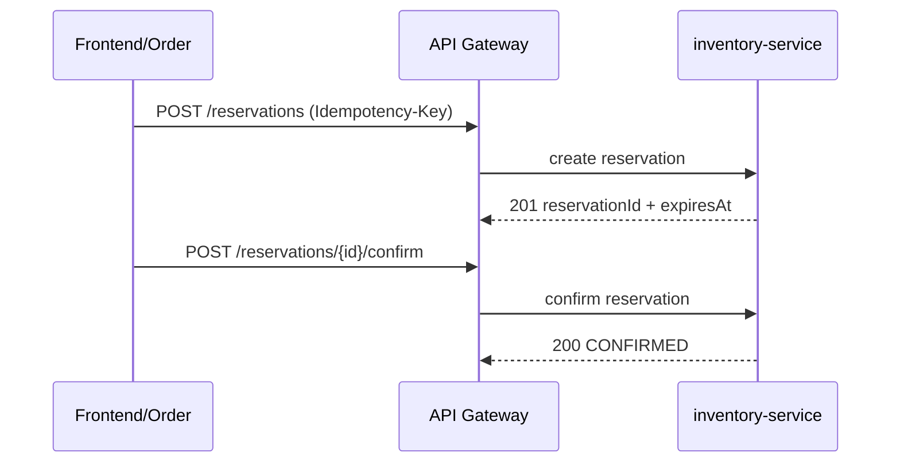

## Proposito
Definir contratos API de `inventory-service` para operaciones de stock, reservas y validaciones de checkout con semantica estable e implementable en WebFlux.

## Alcance y fronteras
- Incluye endpoints HTTP de comandos y consultas para Inventory.
- Incluye errores semanticos, idempotencia, authz y compatibilidad.
- Excluye especificacion OpenAPI final en YAML/JSON.

## Convenciones del contrato
- Base path: `/api/v1/inventory`.
- Formato: JSON.
- Mutaciones requieren `Idempotency-Key`.
- Todas las respuestas incluyen `traceId`.
- Multi-tenant: `tenantId` derivado de token o header interno firmado.

## Mapa de endpoints
| Metodo y ruta | Objetivo | Auth/Authz | Idempotencia |
|---|---|---|---|
| `POST /api/v1/inventory/stock/initialize` | Crear stock inicial por SKU/almacen | `arka_operator` | obligatoria |
| `POST /api/v1/inventory/stock/adjustments` | Ajuste absoluto de stock | `arka_operator` | obligatoria |
| `POST /api/v1/inventory/stock/increase` | Incremento de stock por ingreso | `arka_operator` | obligatoria |
| `POST /api/v1/inventory/stock/decrease` | Decremento de stock por merma/salida | `arka_operator` | obligatoria |
| `POST /api/v1/inventory/stock/bulk-adjustments` | Ajustes masivos de stock | `arka_operator` | obligatoria |
| `POST /api/v1/inventory/reservations` | Crear reserva TTL todo-o-nada | `tenant_user` / `order_service` | obligatoria |
| `PATCH /api/v1/inventory/reservations/{reservationId}/extend` | Extender TTL de reserva activa | `tenant_user` / `order_service` | obligatoria |
| `POST /api/v1/inventory/reservations/{reservationId}/confirm` | Confirmar reserva para pedido | `order_service` | obligatoria |
| `POST /api/v1/inventory/reservations/{reservationId}/release` | Liberar reserva activa | `tenant_user` / `order_service` | obligatoria |
| `POST /api/v1/inventory/reservations/expire` | Ejecutar expiracion por lote (interno) | `system_scheduler` | obligatoria |
| `GET /api/v1/inventory/availability` | Consultar disponibilidad reservable | `tenant_user`/`arka_operator` | N/A |
| `GET /api/v1/inventory/stock/{sku}` | Obtener stock por SKU y almacen | `arka_operator`/`order_service` | N/A |
| `GET /api/v1/inventory/warehouses/{warehouseId}/stock` | Listar stock paginado por almacen | `arka_operator` | N/A |
| `GET /api/v1/inventory/reservations/{reservationId}` | Obtener detalle de reserva | `tenant_user`/`order_service` | N/A |
| `GET /api/v1/inventory/reservations/timeline` | Timeline de reservas por SKU/rango | `arka_operator` | N/A |
| `POST /api/v1/internal/inventory/checkout/validate-reservations` | Validar reservas para checkout | `order_service` | obligatoria |

## Flujo API de reserva/confirmacion


## Request/response de referencia
### Crear reserva
```json
{
  "warehouseId": "wh_01JY...",
  "sku": "SSD-1TB-NVME-980PRO",
  "cartId": "cart_01JY...",
  "qty": 8,
  "ttlMinutes": 20
}
```

```json
{
  "reservationId": "res_01JY...",
  "tenantId": "org-co-001",
  "warehouseId": "wh_01JY...",
  "sku": "SSD-1TB-NVME-980PRO",
  "cartId": "cart_01JY...",
  "qty": 8,
  "status": "ACTIVE",
  "expiresAt": "2026-03-03T18:25:00Z",
  "traceId": "trc_01JY..."
}
```

### Validar reservas checkout (interno)
```json
{
  "cartId": "cart_01JY...",
  "reservationIds": ["res_01JY...", "res_01JY...2"]
}
```

```json
{
  "valid": false,
  "invalidReservations": ["res_01JY...2"],
  "reasonCodes": ["reserva_expirada"],
  "traceId": "trc_01JY..."
}
```

## Taxonomia de errores
| HTTP | Code | Escenario | Recuperable |
|---|---|---|---|
| 400 | `validation_error` | payload invalido, qty <= 0, TTL invalido | si |
| 401 | `unauthorized` | token ausente o invalido | si |
| 403 | `acceso_cruzado_detectado` | tenant mismatch o permiso insuficiente | no |
| 404 | `stock_no_encontrado` | SKU/almacen no existe | si |
| 404 | `reserva_no_encontrada` | reservationId inexistente | si |
| 409 | `stock_insuficiente` | qty solicitada > disponibilidad | si |
| 409 | `reserva_expirada` | reserva vencida al confirmar/usar | si |
| 409 | `stock_negativo_invalido` | ajuste viola `I-INV-01` | no |
| 409 | `conflicto_idempotencia` | clave idempotente conflictiva | si |
| 429 | `rate_limited` | limite operativo superado | si |
| 500 | `internal_error` | error inesperado | no |

## Politica de idempotencia
- Header obligatorio: `Idempotency-Key` en mutaciones.
- Persistencia canonica: `idempotency_records` como store write-side de deduplicacion por `tenant + operation + idempotencyKey`.
- Ventana de deduplicacion recomendada: 24h.
- Claves sugeridas:
  - reserva: `tenant:warehouse:cart:sku`.
  - confirmacion: `tenant:reservation:order`.
  - ajuste: `tenant:warehouse:sku:sourceRef`.
- Misma clave + mismo payload: devolver mismo resultado funcional.
- Misma clave + payload distinto: `409 conflicto_idempotencia`.

## Seguridad y autorizacion
| Operacion | Rol minimo | Validaciones |
|---|---|---|
| ajustes de stock | `arka_operator` | tenant + permiso `INVENTORY_STOCK_WRITE` |
| crear/gestionar reservas | `tenant_user`/`order_service` | tenant + ownership de cart/reserva |
| confirmar reserva | `order_service` | tenant + correlacion con checkout |
| consultas operativas | `arka_operator` | tenant + filtros de warehouse |

## Compatibilidad y versionado
- Version por path (`/api/v1`).
- Agregar campos opcionales en respuesta: compatible.
- Cambio de significado o remocion de campos: nueva major (`/api/v2`).
- Error codes se consideran contrato estable.

## Riesgos y mitigaciones
- Riesgo: uso de endpoints de ajuste manual para corregir incidentes sin control.
  - Mitigacion: auditoria obligatoria + motivos tipificados + alertas.
- Riesgo: latencia de validacion checkout en hora pico.
  - Mitigacion: endpoint interno optimizado por lote + indices dedicados de reservas activas.
