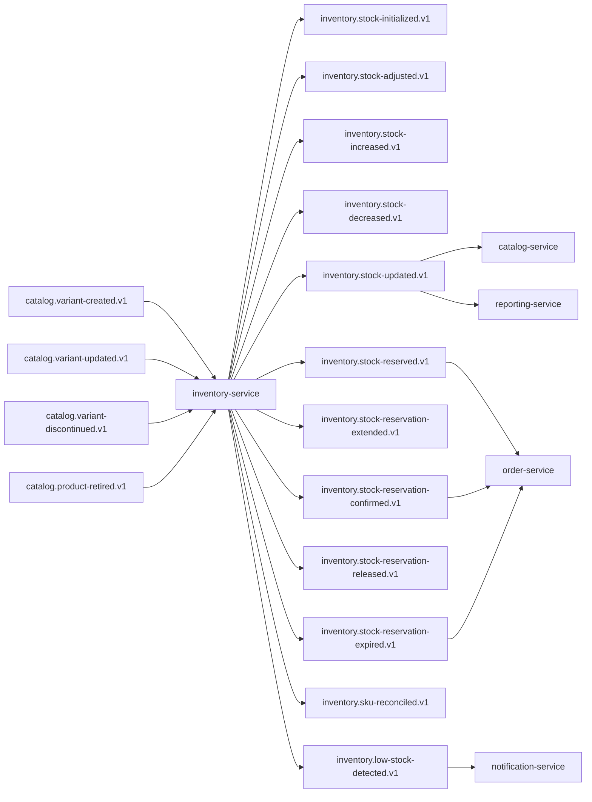

## Proposito
Definir contratos de eventos de `inventory-service` para integracion EDA con Order, Catalog, Reporting y Notification.

## Alcance y fronteras
- Incluye eventos emitidos por Inventory y eventos consumidos por Inventory.
- Incluye topicos, claves, versionado, idempotencia, retencion y DLQ.
- Excluye configuracion infra del cluster Kafka.

## Topologia de eventos Inventory


## Catalogo de eventos emitidos
| Evento | Topic | Key | Productor | Consumidores | Semantica |
|---|---|---|---|---|---|
| `StockInitialized` | `inventory.stock-initialized.v1` | `stockId` | Inventory | Reporting | stock base creado |
| `StockAdjusted` | `inventory.stock-adjusted.v1` | `stockId` | Inventory | Reporting | ajuste absoluto de stock |
| `StockIncreased` | `inventory.stock-increased.v1` | `stockId` | Inventory | Reporting | ingreso de unidades |
| `StockDecreased` | `inventory.stock-decreased.v1` | `stockId` | Inventory | Reporting | salida/merma de unidades |
| `StockUpdated` | `inventory.stock-updated.v1` | `sku` | Inventory | Catalog, Order, Reporting | snapshot coherente de stock |
| `StockReserved` | `inventory.stock-reserved.v1` | `reservationId` | Inventory | Order, Reporting | reserva activa creada |
| `StockReservationExtended` | `inventory.stock-reservation-extended.v1` | `reservationId` | Inventory | Order | TTL de reserva extendido |
| `StockReservationConfirmed` | `inventory.stock-reservation-confirmed.v1` | `reservationId` | Inventory | Order, Reporting | reserva consumida por pedido |
| `StockReservationReleased` | `inventory.stock-reservation-released.v1` | `reservationId` | Inventory | Order, Reporting | reserva liberada |
| `StockReservationExpired` | `inventory.stock-reservation-expired.v1` | `reservationId` | Inventory | Order, Notification, Reporting | reserva vencida por TTL |
| `SkuReconciled` | `inventory.sku-reconciled.v1` | `sku` | Inventory | Catalog, Reporting | reconciliacion de estado SKU |
| `LowStockDetected` | `inventory.low-stock-detected.v1` | `sku` | Inventory | Notification, Reporting | alerta de bajo stock |

## Eventos consumidos por Inventory
| Evento consumido | Topic | Productor | Uso en Inventory |
|---|---|---|---|
| `VariantCreated` | `catalog.variant-created.v1` | catalog-service | crear referencia operativa de SKU para inventario |
| `VariantUpdated` | `catalog.variant-updated.v1` | catalog-service | actualizar metadata operativa de SKU |
| `VariantDiscontinued` | `catalog.variant-discontinued.v1` | catalog-service | bloquear operaciones nuevas sobre SKU |
| `ProductRetired` | `catalog.product-retired.v1` | catalog-service | bloquear SKUs asociados |

La validacion de reservas para checkout en `MVP` se resuelve por contrato HTTP interno (`POST /api/v1/internal/inventory/checkout/validate-reservations`); no existe un evento canonico `order.checkout-validation-requested.v1` activo.

## Envelope estandar de eventos
```json
{
  "eventId": "evt_01JY...",
  "eventType": "StockReserved",
  "eventVersion": "1.0.0",
  "occurredAt": "2026-03-03T19:40:00Z",
  "producer": "inventory-service",
  "tenantId": "org-co-001",
  "traceId": "trc_01JY...",
  "correlationId": "cor_01JY...",
  "idempotencyKey": "inv-reserve-org-co-001-wh-01-sku-01",
  "payload": {
    "reservationId": "res_01JY...",
    "stockId": "stk_01JY...",
    "warehouseId": "wh_01JY...",
    "sku": "SSD-1TB-NVME-980PRO",
    "qty": 8,
    "expiresAt": "2026-03-03T20:00:00Z"
  }
}
```

## Payloads minimos por evento
| Evento | Campos minimos |
|---|---|
| `StockInitialized` | `stockId`, `tenantId`, `warehouseId`, `sku`, `initialQty`, `occurredAt` |
| `StockAdjusted` | `stockId`, `sku`, `fromQty`, `toQty`, `reason`, `occurredAt` |
| `StockIncreased` | `stockId`, `sku`, `qty`, `newPhysicalQty`, `occurredAt` |
| `StockDecreased` | `stockId`, `sku`, `qty`, `newPhysicalQty`, `occurredAt` |
| `StockUpdated` | `stockId`, `sku`, `physicalQty`, `reservedQty`, `availableQty`, `occurredAt` |
| `StockReserved` | `reservationId`, `stockId`, `sku`, `qty`, `expiresAt`, `occurredAt` |
| `StockReservationExtended` | `reservationId`, `sku`, `newExpiresAt`, `occurredAt` |
| `StockReservationConfirmed` | `reservationId`, `orderId`, `qty`, `occurredAt` |
| `StockReservationReleased` | `reservationId`, `reason`, `qty`, `occurredAt` |
| `StockReservationExpired` | `reservationId`, `sku`, `qty`, `occurredAt` |
| `SkuReconciled` | `sku`, `result`, `source`, `occurredAt` |
| `LowStockDetected` | `stockId`, `sku`, `availableQty`, `reorderPoint`, `occurredAt` |

## Reglas de compatibilidad
- `MUST`: agregar campos nuevos solo como opcionales en `v1`.
- `MUST`: cambios de tipo semantico o remocion de campos crean topic `v2`.
- `SHOULD`: consumidores ignoran campos desconocidos.
- `MUST`: todos los eventos incluyen `tenantId`, `traceId`, `correlationId`.

## Entrega, reintentos y DLQ
| Tema | Politica |
|---|---|
| Semantica de entrega | `at-least-once` |
| Particionado | por key de agregado (`stockId`, `reservationId`, `sku`) |
| Reintento productor | 3 intentos con backoff exponencial |
| Reintento consumidor | 5 intentos con backoff + jitter |
| DLQ | topic `<topic>.dlq` obligatorio |
| Retencion recomendada | 14 dias operativos, 30 dias para reservas y auditoria de stock |

## Matriz de idempotencia en consumidores
| Consumidor | Evento | Clave de idempotencia |
|---|---|---|
| `order-service` | `StockReserved` | `eventId` + `reservationId` |
| `order-service` | `StockReservationExpired` | `eventId` + `reservationId` |
| `catalog-service` | `StockUpdated` | `eventId` + `sku` |
| `reporting-service` | `StockAdjusted` | `eventId` + `stockId` |
| `notification-service` | `LowStockDetected` | `eventId` + `sku` |

## Riesgos y mitigaciones
- Riesgo: alta frecuencia de `stock-updated` satura consumidores de reporting.
  - Mitigacion: compaction por key `sku` y ventanas de agregacion downstream.
- Riesgo: perdida de evento de expiracion impacta checkout.
  - Mitigacion: scheduler de reconciliacion + replay desde outbox.
