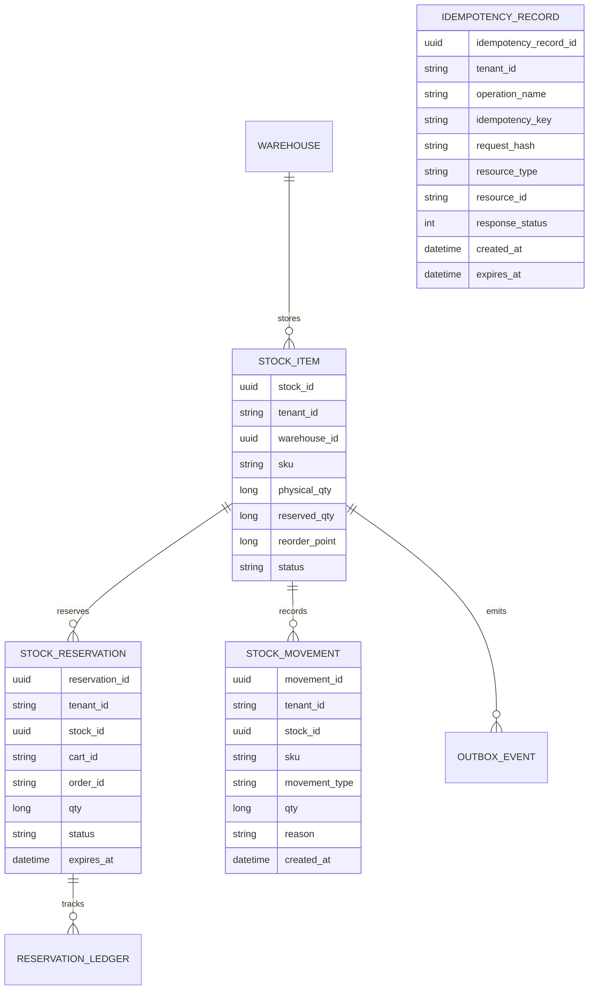

## Proposito
Definir el modelo logico de datos de `inventory-service` para soportar stock, reservas TTL, idempotencia write-side y movimientos auditables sin violar invariantes del dominio.

## Alcance y fronteras
- Incluye entidades, relaciones, ownership y reglas de integridad logica de Inventory.
- Incluye relacion semantica con Catalog y Order por referencias opacas.
- Excluye DDL definitivo y optimizaciones fisicas de motor.

## Entidades logicas
| Entidad | Tipo | Descripcion | Ownership |
|---|---|---|---|
| `warehouse` | raiz operativa | almacen fisico habilitado para stock | Inventory |
| `stock_item` | agregado stock | estado de stock por `tenant+warehouse+sku` | Inventory |
| `stock_reservation` | agregado reserva | reserva temporal de stock para carrito/checkout | Inventory |
| `stock_movement` | ledger | registro auditable de mutaciones de stock | Inventory |
| `reservation_ledger` | soporte auditoria | trazabilidad granular de cambios de reserva | Inventory |
| `idempotency_record` | soporte idempotencia HTTP | deduplicacion write-side de mutaciones HTTP por `Idempotency-Key` | Inventory |
| `inventory_audit` | soporte seguridad | bitacora de acciones y rechazos | Inventory |
| `outbox_event` | soporte integracion | eventos pendientes/publicados | Inventory |
| `processed_event` | soporte idempotencia | control de eventos consumidos | Inventory |

## Relaciones logicas
- `warehouse 1..n stock_item`
- `stock_item 1..n stock_reservation`
- `stock_item 1..n stock_movement`
- `stock_reservation 1..n reservation_ledger`
- `stock_item 0..n outbox_event`
- `idempotency_record` no depende de FK dura a agregados; referencia operacion, recurso materializado y respuesta reutilizable.

## Reglas de integridad del modelo
| Regla | Expresion logica | Fuente |
|---|---|---|
| I-INV-01 | `stock_item.physical_qty >= 0` | `03-reglas-invariantes.md` |
| I-INV-02 | `stock_item.reserved_qty <= stock_item.physical_qty` | `03-reglas-invariantes.md` |
| RN-RES-01 | reserva activa solo si `qty <= available_qty` | `03-reglas-invariantes.md` |
| RN-RES-02 | no reserva parcial en MVP | `03-reglas-invariantes.md` |
| RN-ORD-01 | confirmacion de pedido exige reservas vigentes | `03-reglas-invariantes.md` |
| RN-IDEMP-01 | `tenantId + operationName + idempotencyKey` identifica una sola mutacion HTTP reutilizable | contrato API |

## Diagrama logico (ER)

## Referencias cross-service (sin FK fisica)
| Referencia | Sistema propietario | Uso en Inventory |
|---|---|---|
| `sku` | Catalog | identificar variante vendible en inventario |
| `cartId` | Order | vincular reserva a carrito |
| `orderId` | Order | confirmar consumo de reserva |
| `tenantId` | IAM/Directory | aislamiento multi-tenant |

## Lecturas derivadas
- `availability = physical_qty - reserved_qty`
- `low_stock = availability <= reorder_point`
- `reservation_active = status=ACTIVE and now < expires_at`

## Riesgos y mitigaciones
- Riesgo: drift entre estado de SKU en Catalog y stock activo.
  - Mitigacion: reconciliacion por eventos `catalog.*` y marca `status=BLOCKED` cuando aplique.
- Riesgo: crecimiento rapido de `stock_movement` por alta rotacion.
  - Mitigacion: particion temporal y politicas de archivado en modelo fisico.
