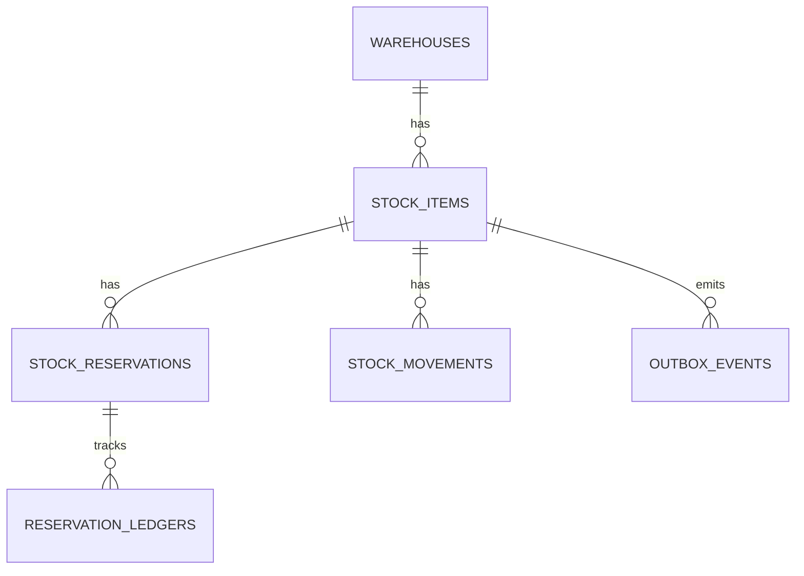

## Proposito
Definir el modelo fisico de `inventory-service` en PostgreSQL, incluyendo tablas, constraints e indices para soportar concurrencia alta de reservas sin sobreventa.

## Alcance y fronteras
- Incluye tablas fisicas de Inventory y estrategias de indexacion.
- Incluye lineamientos de versionado, particionado y retencion para ledger/eventos.
- Excluye scripts de migracion finales.

## Motor y convenciones
- Motor: PostgreSQL 15+
- PKs: UUID
- Timestamps: `timestamptz`
- Multi-tenant: `tenant_id` obligatorio en tablas operativas
- Soft delete: no aplicado a `stock_item`; estado por `status`

## Tablas fisicas principales
| Tabla | Proposito | Claves principales |
|---|---|---|
| `warehouses` | catalogo de almacenes activos | `warehouse_id` |
| `stock_items` | stock por `tenant+warehouse+sku` | `stock_id`, UK `(tenant_id, warehouse_id, sku)` |
| `stock_reservations` | reservas con TTL | `reservation_id`, idx por expiracion |
| `stock_movements` | ledger auditable | `movement_id`, idx por `stock_id + created_at` |
| `reservation_ledgers` | bitacora por reserva | `ledger_id`, idx por `reservation_id` |
| `idempotency_records` | deduplicacion de mutaciones HTTP | `idempotency_record_id`, UK `(tenant_id, operation_name, idempotency_key)` |
| `inventory_audits` | auditoria de acciones | `audit_id`, idx por `tenant_id + created_at` |
| `outbox_events` | publicacion EDA garantizada | `event_id`, idx por `status + occurred_at` |
| `processed_events` | idempotencia de consumidores | `processed_event_id`, UK `(event_id, consumer_name)` |

## Diccionario de columnas criticas
### `stock_items`
| Columna | Tipo | Nulo | Regla |
|---|---|---|---|
| `stock_id` | `uuid` | no | PK |
| `tenant_id` | `varchar(64)` | no | aislamiento tenant |
| `warehouse_id` | `uuid` | no | FK logica a `warehouses` |
| `sku` | `varchar(120)` | no | referencia a Catalog |
| `physical_qty` | `bigint` | no | `CHECK (physical_qty >= 0)` |
| `reserved_qty` | `bigint` | no | `CHECK (reserved_qty >= 0)` |
| `reorder_point` | `bigint` | no | `CHECK (reorder_point >= 0)` |
| `safety_stock` | `bigint` | no | `CHECK (safety_stock >= 0)` |
| `status` | `varchar(32)` | no | `ACTIVE/BLOCKED/RECONCILING` |
| `version` | `bigint` | no | optimistic lock |
| `created_at` | `timestamptz` | no | default now() |
| `updated_at` | `timestamptz` | no | default now() |

### `stock_reservations`
| Columna | Tipo | Nulo | Regla |
|---|---|---|---|
| `reservation_id` | `uuid` | no | PK |
| `tenant_id` | `varchar(64)` | no | aislamiento tenant |
| `stock_id` | `uuid` | no | referencia a `stock_items` |
| `warehouse_id` | `uuid` | no | redundancia de consulta |
| `sku` | `varchar(120)` | no | redundancia de consulta |
| `cart_id` | `varchar(80)` | no | correlacion checkout |
| `order_id` | `varchar(80)` | si | set en confirmacion |
| `qty` | `bigint` | no | `CHECK (qty > 0)` |
| `status` | `varchar(32)` | no | `ACTIVE/CONFIRMED/RELEASED/EXPIRED` |
| `expires_at` | `timestamptz` | no | TTL obligatorio |
| `created_at` | `timestamptz` | no | default now() |
| `updated_at` | `timestamptz` | no | default now() |
| `confirmed_at` | `timestamptz` | si | set en confirmacion |
| `released_at` | `timestamptz` | si | set en release |
| `expired_at` | `timestamptz` | si | set en expiracion |

### `stock_movements`
| Columna | Tipo | Nulo | Regla |
|---|---|---|---|
| `movement_id` | `uuid` | no | PK |
| `tenant_id` | `varchar(64)` | no | aislamiento tenant |
| `stock_id` | `uuid` | no | referencia a `stock_items` |
| `warehouse_id` | `uuid` | no | filtro operativo |
| `sku` | `varchar(120)` | no | filtro operativo |
| `movement_type` | `varchar(32)` | no | enum de dominio |
| `qty` | `bigint` | no | `CHECK (qty > 0)` |
| `reason` | `varchar(64)` | no | motivo tipificado |
| `reference_type` | `varchar(32)` | no | RESERVATION/ORDER/MANUAL/CATALOG_SYNC |
| `reference_id` | `varchar(120)` | no | referencia externa |
| `created_at` | `timestamptz` | no | default now() |

### `idempotency_records`
| Columna | Tipo | Nulo | Regla |
|---|---|---|---|
| `idempotency_record_id` | `uuid` | no | PK |
| `tenant_id` | `varchar(64)` | no | aislamiento tenant |
| `operation_name` | `varchar(120)` | no | nombre canonico del comando HTTP |
| `idempotency_key` | `varchar(180)` | no | clave recibida en header |
| `request_hash` | `varchar(128)` | no | hash estable del payload para detectar conflicto |
| `resource_type` | `varchar(64)` | si | tipo de recurso materializado |
| `resource_id` | `varchar(120)` | si | identificador de recurso materializado |
| `response_status` | `smallint` | no | status HTTP reutilizable |
| `response_payload` | `jsonb` | no | cuerpo semantico de respuesta |
| `created_at` | `timestamptz` | no | default now() |
| `expires_at` | `timestamptz` | no | ventana de deduplicacion |

## Diagrama fisico simplificado

## Indices recomendados
| Tabla | Indice | Tipo | Uso |
|---|---|---|---|
| `stock_items` | `ux_stock_items_tenant_wh_sku` | unique btree | lookup atomico por SKU |
| `stock_items` | `idx_stock_items_tenant_wh_status` | btree | listados por almacen |
| `stock_reservations` | `idx_reservations_active_expiry` | btree parcial | batch de expiracion |
| `stock_reservations` | `idx_reservations_cart_sku_active` | btree parcial | dedup de reserva por carrito |
| `stock_movements` | `idx_movements_stock_created_at` | btree | timeline de movimientos |
| `idempotency_records` | `ux_idempotency_tenant_operation_key` | unique btree | dedupe de mutaciones HTTP |
| `idempotency_records` | `idx_idempotency_expires_at` | btree | limpieza por expiracion |
| `inventory_audits` | `idx_inventory_audits_tenant_created_at` | btree | trazabilidad operativa |
| `outbox_events` | `idx_outbox_status_occurred` | btree | publish scheduler |
| `processed_events` | `ux_processed_event_consumer` | unique btree | idempotencia de consumo |

## Constraints de consistencia recomendadas
- `CHECK (physical_qty >= 0)` en `stock_items`.
- `CHECK (reserved_qty >= 0)` en `stock_items`.
- `CHECK (qty > 0)` en reservas y movimientos.
- `UNIQUE (tenant_id, operation_name, idempotency_key)` en `idempotency_records`.
- Trigger/constraint funcional para validar `reserved_qty <= physical_qty`.
- Restriccion logica: solo una reserva `ACTIVE` por `tenant_id+cart_id+sku` cuando sea misma intencion.

## Estrategia de crecimiento y retencion
- `stock_movements`: particion mensual por `created_at`.
- `reservation_ledgers`: retencion 24 meses.
- `idempotency_records`: retencion 24 horas alineada con la ventana recomendada de deduplicacion.
- `outbox_events`: retencion 30 dias tras `published`.
- `processed_events`: retencion 60 dias para deduplicacion segura.

## Riesgos y mitigaciones
- Riesgo: scans costosos en expiracion si no existe indice parcial.
  - Mitigacion: `idx_reservations_active_expiry` + batch con limite.
- Riesgo: deadlocks en updates concurrentes de `stock_items`.
  - Mitigacion: orden estable de lock por `tenant_id+warehouse_id+sku` y retries acotados.
