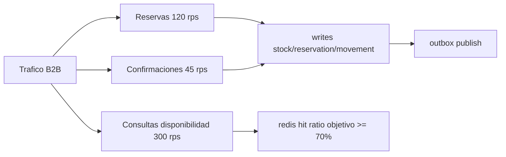

## Proposito
Definir objetivos de performance/capacidad para `inventory-service`, con foco en reservas concurrentes y consultas de disponibilidad de baja latencia.

## Alcance y fronteras
- Incluye presupuestos de latencia, throughput, concurrencia y degradacion.
- Incluye estimaciones iniciales de capacidad para entorno academico realista.
- Excluye resultados de pruebas de carga ejecutadas (fase 05-validacion).

## SLO tecnicos del servicio
| Operacion | p95 objetivo | p99 objetivo | Error budget mensual |
|---|---|---|---|
| crear reserva | <= 120 ms | <= 220 ms | 0.5% |
| confirmar reserva | <= 150 ms | <= 260 ms | 0.5% |
| liberar/expirar reserva | <= 120 ms | <= 220 ms | 1.0% |
| consulta disponibilidad | <= 80 ms | <= 160 ms | 1.0% |
| ajuste de stock | <= 180 ms | <= 300 ms | 0.5% |

## Capacidad estimada MVP
| Dimension | Valor objetivo inicial |
|---|---|
| reservas por segundo pico | 120 rps |
| consultas disponibilidad por segundo pico | 300 rps |
| confirmaciones checkout por segundo pico | 45 rps |
| expiraciones por lote scheduler | 500 reservas/lote |
| crecimiento diario de movimientos | 80k filas/dia |

## Modelo de carga simplificado

## Presupuestos de recursos (referencial)
| Recurso | Baseline | Escalado recomendado |
|---|---|---|
| CPU pod inventory | 1 vCPU | HPA por `cpu>65%` o `rps` |
| Memoria pod inventory | 1.5 GiB | escalar a 2.5 GiB en picos |
| Conexiones DB | 30 | pool max 80 |
| Redis ops | 5k ops/s | cluster small + pipelining |
| Kafka produce rate | 2k msg/s | compresion snappy |

## Modelo de fallos y degradacion runtime
| Tipo de fallo | Tratamiento de performance | Impacto en budget |
|---|---|---|
| rechazo funcional (`403/404/409/422`) | se atiende con salida rapida; no habilita degradacion global | no consume `error budget` de `5xx`; si arrastra p95 por encima del objetivo si consume presupuesto de latencia |
| contencion de lock o conflict de version | timeout corto + retry con jitter y orden estable de escritura | si el retry recupera dentro de budget no cuenta como error; si culmina en `5xx` si consume `error budget` |
| fallo tecnico de Redis/Kafka/DB | cache bypass, outbox acumulado o priorizacion de endpoints criticos | consume presupuesto de latencia y, si produce `5xx`, tambien `error budget` |
| evento duplicado | `noop idempotente` | no consume `error budget` operativo |

## Puntos de contencion esperados
| Punto | Riesgo | Mitigacion |
|---|---|---|
| lock por `tenant+warehouse+sku` | espera en SKU caliente | timeout corto + retry con jitter |
| escritura en `stock_items` | deadlock/version conflict | optimistic locking + orden estable |
| batch de expiracion | saturacion en ventanas pico | partition de lotes + backpressure |
| publish outbox | atraso en cola de eventos | scheduler paralelo con limite por particion |

## Politica de degradacion
- Si Redis falla: consultas van a DB con limite de throughput y cache bypass temporal.
- Si Kafka falla: outbox acumula; API no pierde transaccion de negocio.
- Si DB presenta latencia elevada: reducir `size` maximo de listados y priorizar endpoints criticos (`reservations/*`, `validate-reservations`).

## Indicadores de capacidad a monitorear
- `inventory.reservation.create.p95`
- `inventory.stock.available.query.p95`
- `inventory.lock.contention.rate`
- `inventory.outbox.pending.count`
- `inventory.reservation.expiry.lag.seconds`
- `inventory.db.deadlock.count`

## Riesgos y mitigaciones
- Riesgo: subestimar crecimiento de ledger y degradar consultas historicas.
  - Mitigacion: particion mensual + archivado operativo.
- Riesgo: elevada contencion de reservas en eventos comerciales.
  - Mitigacion: limite por carrito/SKU y cola de reintentos acotada.
