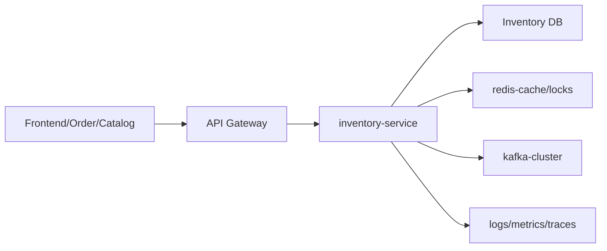
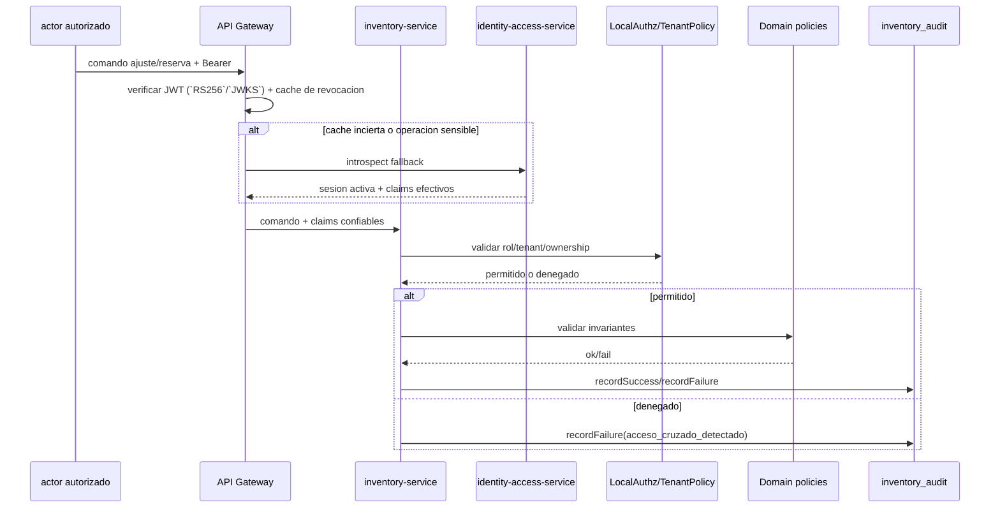

## Proposito
Definir controles de seguridad para `inventory-service` sobre operaciones de stock y reservas, protegiendo integridad de inventario, aislamiento tenant y trazabilidad.

## Alcance y fronteras
- Incluye amenazas principales (STRIDE), controles preventivos/detectivos y hardening de endpoints.
- Incluye tratamiento de datos sensibles operativos y auditoria.
- Excluye requisitos regulatorios finales por pais (se dejan brechas explicitas).

## Threat model (resumen)
| Categoria | Amenaza | Impacto | Control principal |
|---|---|---|---|
| Spoofing | token o identidad tecnica falsificada para mutar stock | corrupcion de inventario | `api-gateway-service` autentica JWT de borde; `inventory-service` materializa `PrincipalContext` o `TriggerContext`, valida permiso, tenant y legitimidad del trigger |
| Tampering | alteracion de qty en requests | violacion I-INV-01/I-INV-02 | validaciones de dominio + auditoria |
| Repudiation | operador niega ajuste manual | perdida de trazabilidad | `inventory_audit` + traceId/correlationId |
| Information disclosure | exposicion de datos de otros tenants | incidente de seguridad | tenant isolation en capa app+dominio |
| DoS | inundacion de reservas o expiraciones | degradacion checkout | rate limit + backpressure + cuotas |
| Elevation of privilege | usuario B2B ejecuta ajustes de stock | fraude operativo | permisos granulares por operacion |

## Superficie de ataque

## Controles de autenticacion/autorizacion
| Operacion | Control requerido |
|---|---|
| ajustes de stock | rol `arka_operator` + permiso `INVENTORY_STOCK_WRITE` |
| reservas de checkout | rol `tenant_user` o `order_service` + tenant match |
| confirmacion reserva | solo `order_service` |
| expiracion scheduler | identidad tecnica `system_scheduler` |
| queries operativas | `arka_operator` o rol interno autorizado |

## Modelo local de Spring Security WebFlux
| Capa | Responsabilidad |
|---|---|
| `api-gateway-service` | valida JWT en el borde (`RS256`/`JWKS`), `iss`, `aud`, expiracion y cache de revocacion antes de enrutar |
| `inventory-service` | usa `Spring Security WebFlux` para construir el `SecurityContext`, aplicar autorizacion por ruta y revalidar `tenant`, permiso y ownership de stock/reserva en el caso de uso |
| `identity-access-service` | mantiene la verdad de sesion/rol para el borde y soporta introspeccion fallback del gateway cuando la plataforma lo exige |
| eventos / scheduler | `CatalogVariantEventListener` y `ReservationExpirySchedulerListener` resuelven `TriggerContext`, validan dedupe con `processed_event` y solo ejecutan triggers tecnicos legitimos |

Aplicacion local: `inventory-service` no autentica usuarios ni emite tokens. Consume identidad confiable desde el gateway y la combina con validaciones propias de inventario antes de ajustar stock, crear reservas o confirmar su uso.

Superficie async real: los flujos no HTTP del servicio son `CatalogVariantEventListener` y `ReservationExpirySchedulerListener`. Ambos materializan `TriggerContext` mediante `TriggerContextResolver`, validan `tenant`, trigger, dedupe y politica operativa antes de reconciliar SKU o expirar reservas.

## Modelo de errores de seguridad
| Momento | Familia/cierre canonico | Aplicacion en Inventory |
|---|---|---|
| autenticacion de borde | `401/403` en frontera | `api-gateway-service` corta JWT invalido, expirado o revocado antes de enrutar; Inventory no autentica usuarios ni emite tokens |
| autorizacion contextual | `AuthorizationDeniedException`, `TenantIsolationException` | `inventory-service` rechaza cruce de `tenant`, permiso insuficiente o ownership invalido sobre stock, reserva o warehouse |
| regla de dominio sensible | `DomainRuleViolationException`, `ConflictException`, `ResourceNotFoundException` | sobreventa, reserva expirada, SKU inexistente o transicion invalida se cierran como `404/409/422`, no como error tecnico |
| evento malicioso o duplicado | `NonRetryableDependencyException` o `noop idempotente` | eventos invalidos van a DLQ; un duplicado de expiracion o reconciliacion se trata como noop idempotente |
| evidencia de seguridad | auditoria operativa + `traceId/correlationId` | rechazos por acceso cruzado, stock sensible o reglas operativas quedan trazables sin exponer IDs completos en logs |

## Datos sensibles y politicas
| Dato | Clasificacion | Tratamiento |
|---|---|---|
| `tenant_id`, `warehouse_id`, `sku` | operacional sensible | no anonimizar en transaccion; proteger en logs externos |
| `cart_id`, `order_id` | sensible de negocio | enmascarado parcial en logs de error |
| `trace_id`, `correlation_id` | tecnico | obligatorio para auditoria |
| `idempotency_key` | sensible operacional | hash en logs, sin exponer valor completo |

## Seguridad de eventos
- `MUST`: todos los eventos incluyen `tenantId`, `traceId`, `correlationId`.
- `MUST`: productores firman metadata tecnica segun estandar de plataforma.
- `SHOULD`: consumidores validan esquema y version antes de procesar.
- `MUST`: DLQ activa para mensajes irreparables.

## Seguridad operativa por flujo critico

## Compliance minimo esperado
- Retencion de auditoria operativa de stock y reservas: 24 meses.
- No borrado de evidencia de movimientos asociados a pedidos confirmados.
- Separacion de funciones: quien ajusta stock no aprueba su propio cierre de incidente (objetivo operativo).

## Riesgos y mitigaciones
- Riesgo: abuso de endpoint de ajustes manuales.
  - Mitigacion: doble control operativo + alertas de ajustes atipicos.
- Riesgo: fuga de datos cross-tenant por filtros incompletos.
  - Mitigacion: politica de tenant en dominio + tests de seguridad por contrato.
