## Proposito
Definir el catalogo completo de clases/archivos del servicio `order-service` para implementacion Java 21 + Spring WebFlux con arquitectura hexagonal/clean, CQRS ligero, EDA y DDD.

## Alcance y fronteras
- Incluye inventario completo de clases por carpeta para el servicio Order.
- Incluye separacion estricta de estructura: `domain`, `application`, `infrastructure`.
- Incluye clases de configuracion para dependencias (security, kafka, r2dbc, redis, observabilidad).
- Excluye codigo de otros BC/servicios.

## Regla de completitud aplicada
- Este documento define **catalogo completo**, no minimo.
- Cada clase se mapea a una carpeta concreta del arbol canonico.
- El dominio se divide por agregados (`cart`, `order`, `payment`) con la raiz del agregado en el paquete del modelo y slicing interno (`entity`, `valueobject`, `enum`, `event`).
- Los puertos/adaptadores se dividen por responsabilidad (`persistence`, `security`, `audit`, `event`, `external`).

## Estructura estricta (Order)
Este arbol muestra la estructura canonica completa del servicio a nivel de carpetas. El detalle por archivo y los diagramas de clase individuales se consultan mas abajo en la vista por capas.

```tree
- src | folder
  - main | folder
    - java | code
      - com | folder
        - arka | building | primary
          - order | microchip | primary
            - domain | cubes | info
              - model | folder-open | info
                - cart | folder
                  - entity | folder
                  - valueobject | folder
                  - enum | folder
                  - event | share-nodes | accent
                - order | folder
                  - entity | folder
                  - valueobject | folder
                  - enum | folder
                  - event | share-nodes | accent
                - payment | folder
                  - entity | folder
                  - valueobject | folder
                  - enum | folder
                  - event | share-nodes | accent
              - service | gear | info
              - exception | folder
            - application | sitemap | warning
              - port | plug | warning
                - in | arrow-right
                  - command | bolt
                  - query | magnifying-glass
                - out | arrow-left
                  - persistence | database
                  - security | shield
                  - audit | clipboard
                  - event | share-nodes | accent
                  - cache | hard-drive
                  - external | cloud
              - usecase | bolt | warning
                - command | bolt
                - query | magnifying-glass
              - command | terminal | warning
              - query | binoculars | warning
              - result | file-lines | warning
              - mapper | shuffle
                - command | folder
                - query | folder
                - result | folder
              - exception | folder
            - infrastructure | server | secondary
              - adapter | plug | secondary
                - in | arrow-right
                  - web | globe
                    - request | file-import
                    - response | file-export
                    - mapper | shuffle
                      - command | shuffle
                      - query | shuffle
                      - response | shuffle
                    - controller | globe
                  - listener | bell
                - out | arrow-left
                  - persistence | database
                    - entity | table
                    - mapper | shuffle
                    - repository | database
                  - security | shield
                  - event | share-nodes | accent
                  - cache | hard-drive
                  - external | cloud
              - config | gear
              - exception | folder
```

## Estructura detallada por capas
Esta seccion concentra el arbol navegable por capa con todos los archivos del servicio. Cada archivo sigue abriendo su diagrama de clase individual en el visor.

{}
{}
```tree
- com | folder
  - arka | building | primary
    - order | microchip | primary
      - domain | cubes | info
        - model | folder-open | info
          - cart | folder
            - <button type="button" class="R-tree-diagram-trigger" data-diagram-template="order-class-cartaggregate" data-diagram-title="CartAggregate.java" aria-label="Abrir diagrama de clase para CartAggregate.java"><code>CartAggregate.java</code></button> | file-code | code
            - entity | folder
              - <button type="button" class="R-tree-diagram-trigger" data-diagram-template="order-class-cartitem" data-diagram-title="CartItem.java" aria-label="Abrir diagrama de clase para CartItem.java"><code>CartItem.java</code></button> | file-code | code
            - valueobject | folder
              - <button type="button" class="R-tree-diagram-trigger" data-diagram-template="order-class-cartid" data-diagram-title="CartId.java" aria-label="Abrir diagrama de clase para CartId.java"><code>CartId.java</code></button> | file-code | code
              - <button type="button" class="R-tree-diagram-trigger" data-diagram-template="order-class-cartitemid" data-diagram-title="CartItemId.java" aria-label="Abrir diagrama de clase para CartItemId.java"><code>CartItemId.java</code></button> | file-code | code
              - <button type="button" class="R-tree-diagram-trigger" data-diagram-template="order-class-tenantid" data-diagram-title="TenantId.java" aria-label="Abrir diagrama de clase para TenantId.java"><code>TenantId.java</code></button> | file-code | code
              - <button type="button" class="R-tree-diagram-trigger" data-diagram-template="order-class-organizationid" data-diagram-title="OrganizationId.java" aria-label="Abrir diagrama de clase para OrganizationId.java"><code>OrganizationId.java</code></button> | file-code | code
              - <button type="button" class="R-tree-diagram-trigger" data-diagram-template="order-class-userid" data-diagram-title="UserId.java" aria-label="Abrir diagrama de clase para UserId.java"><code>UserId.java</code></button> | file-code | code
              - <button type="button" class="R-tree-diagram-trigger" data-diagram-template="order-class-variantid" data-diagram-title="VariantId.java" aria-label="Abrir diagrama de clase para VariantId.java"><code>VariantId.java</code></button> | file-code | code
              - <button type="button" class="R-tree-diagram-trigger" data-diagram-template="order-class-skucode" data-diagram-title="SkuCode.java" aria-label="Abrir diagrama de clase para SkuCode.java"><code>SkuCode.java</code></button> | file-code | code
              - <button type="button" class="R-tree-diagram-trigger" data-diagram-template="order-class-quantity" data-diagram-title="Quantity.java" aria-label="Abrir diagrama de clase para Quantity.java"><code>Quantity.java</code></button> | file-code | code
              - <button type="button" class="R-tree-diagram-trigger" data-diagram-template="order-class-cartwindow" data-diagram-title="CartWindow.java" aria-label="Abrir diagrama de clase para CartWindow.java"><code>CartWindow.java</code></button> | file-code | code
              - <button type="button" class="R-tree-diagram-trigger" data-diagram-template="order-class-reservationref" data-diagram-title="ReservationRef.java" aria-label="Abrir diagrama de clase para ReservationRef.java"><code>ReservationRef.java</code></button> | file-code | code
              - <button type="button" class="R-tree-diagram-trigger" data-diagram-template="order-class-pricesnapshot" data-diagram-title="PriceSnapshot.java" aria-label="Abrir diagrama de clase para PriceSnapshot.java"><code>PriceSnapshot.java</code></button> | file-code | code
            - enum | folder
              - <button type="button" class="R-tree-diagram-trigger" data-diagram-template="order-class-cartstatus" data-diagram-title="CartStatus.java" aria-label="Abrir diagrama de clase para CartStatus.java"><code>CartStatus.java</code></button> | file-code | code
              - <button type="button" class="R-tree-diagram-trigger" data-diagram-template="order-class-cartitemstatus" data-diagram-title="CartItemStatus.java" aria-label="Abrir diagrama de clase para CartItemStatus.java"><code>CartItemStatus.java</code></button> | file-code | code
            - event | share-nodes | accent
              - <button type="button" class="R-tree-diagram-trigger" data-diagram-template="order-class-cartrecoveredevent" data-diagram-title="CartRecoveredEvent.java" aria-label="Abrir diagrama de clase para CartRecoveredEvent.java"><code>CartRecoveredEvent.java</code></button> | share-nodes | accent
              - <button type="button" class="R-tree-diagram-trigger" data-diagram-template="order-class-cartitemaddedevent" data-diagram-title="CartItemAddedEvent.java" aria-label="Abrir diagrama de clase para CartItemAddedEvent.java"><code>CartItemAddedEvent.java</code></button> | share-nodes | accent
              - <button type="button" class="R-tree-diagram-trigger" data-diagram-template="order-class-cartitemupdatedevent" data-diagram-title="CartItemUpdatedEvent.java" aria-label="Abrir diagrama de clase para CartItemUpdatedEvent.java"><code>CartItemUpdatedEvent.java</code></button> | share-nodes | accent
              - <button type="button" class="R-tree-diagram-trigger" data-diagram-template="order-class-cartitemremovedevent" data-diagram-title="CartItemRemovedEvent.java" aria-label="Abrir diagrama de clase para CartItemRemovedEvent.java"><code>CartItemRemovedEvent.java</code></button> | share-nodes | accent
              - <button type="button" class="R-tree-diagram-trigger" data-diagram-template="order-class-cartclearedevent" data-diagram-title="CartClearedEvent.java" aria-label="Abrir diagrama de clase para CartClearedEvent.java"><code>CartClearedEvent.java</code></button> | share-nodes | accent
              - <button type="button" class="R-tree-diagram-trigger" data-diagram-template="order-class-cartabandoneddetectedevent" data-diagram-title="CartAbandonedDetectedEvent.java" aria-label="Abrir diagrama de clase para CartAbandonedDetectedEvent.java"><code>CartAbandonedDetectedEvent.java</code></button> | share-nodes | accent
          - order | folder
            - <button type="button" class="R-tree-diagram-trigger" data-diagram-template="order-class-orderaggregate" data-diagram-title="OrderAggregate.java" aria-label="Abrir diagrama de clase para OrderAggregate.java"><code>OrderAggregate.java</code></button> | file-code | code
            - entity | folder
              - <button type="button" class="R-tree-diagram-trigger" data-diagram-template="order-class-orderline" data-diagram-title="OrderLine.java" aria-label="Abrir diagrama de clase para OrderLine.java"><code>OrderLine.java</code></button> | file-code | code
            - valueobject | folder
              - <button type="button" class="R-tree-diagram-trigger" data-diagram-template="order-class-orderid" data-diagram-title="OrderId.java" aria-label="Abrir diagrama de clase para OrderId.java"><code>OrderId.java</code></button> | file-code | code
              - <button type="button" class="R-tree-diagram-trigger" data-diagram-template="order-class-ordernumber" data-diagram-title="OrderNumber.java" aria-label="Abrir diagrama de clase para OrderNumber.java"><code>OrderNumber.java</code></button> | file-code | code
              - <button type="button" class="R-tree-diagram-trigger" data-diagram-template="order-class-checkoutcorrelationid" data-diagram-title="CheckoutCorrelationId.java" aria-label="Abrir diagrama de clase para CheckoutCorrelationId.java"><code>CheckoutCorrelationId.java</code></button> | file-code | code
              - <button type="button" class="R-tree-diagram-trigger" data-diagram-template="order-class-addresssnapshot" data-diagram-title="AddressSnapshot.java" aria-label="Abrir diagrama de clase para AddressSnapshot.java"><code>AddressSnapshot.java</code></button> | file-code | code
              - <button type="button" class="R-tree-diagram-trigger" data-diagram-template="order-class-ordertotal" data-diagram-title="OrderTotal.java" aria-label="Abrir diagrama de clase para OrderTotal.java"><code>OrderTotal.java</code></button> | file-code | code
            - enum | folder
              - <button type="button" class="R-tree-diagram-trigger" data-diagram-template="order-class-orderstatus" data-diagram-title="OrderStatus.java" aria-label="Abrir diagrama de clase para OrderStatus.java"><code>OrderStatus.java</code></button> | file-code | code
            - event | share-nodes | accent
              - <button type="button" class="R-tree-diagram-trigger" data-diagram-template="order-class-ordercreatedevent" data-diagram-title="OrderCreatedEvent.java" aria-label="Abrir diagrama de clase para OrderCreatedEvent.java"><code>OrderCreatedEvent.java</code></button> | share-nodes | accent
              - <button type="button" class="R-tree-diagram-trigger" data-diagram-template="order-class-orderconfirmedevent" data-diagram-title="OrderConfirmedEvent.java" aria-label="Abrir diagrama de clase para OrderConfirmedEvent.java"><code>OrderConfirmedEvent.java</code></button> | share-nodes | accent
              - <button type="button" class="R-tree-diagram-trigger" data-diagram-template="order-class-orderstatuschangedevent" data-diagram-title="OrderStatusChangedEvent.java" aria-label="Abrir diagrama de clase para OrderStatusChangedEvent.java"><code>OrderStatusChangedEvent.java</code></button> | share-nodes | accent
              - <button type="button" class="R-tree-diagram-trigger" data-diagram-template="order-class-ordercancelledevent" data-diagram-title="OrderCancelledEvent.java" aria-label="Abrir diagrama de clase para OrderCancelledEvent.java"><code>OrderCancelledEvent.java</code></button> | share-nodes | accent
          - payment | folder
            - <button type="button" class="R-tree-diagram-trigger" data-diagram-template="order-class-paymentaggregate" data-diagram-title="PaymentAggregate.java" aria-label="Abrir diagrama de clase para PaymentAggregate.java"><code>PaymentAggregate.java</code></button> | file-code | code
            - entity | folder
              - <button type="button" class="R-tree-diagram-trigger" data-diagram-template="order-class-paymentrecord" data-diagram-title="PaymentRecord.java" aria-label="Abrir diagrama de clase para PaymentRecord.java"><code>PaymentRecord.java</code></button> | file-code | code
            - valueobject | folder
              - <button type="button" class="R-tree-diagram-trigger" data-diagram-template="order-class-paymentid" data-diagram-title="PaymentId.java" aria-label="Abrir diagrama de clase para PaymentId.java"><code>PaymentId.java</code></button> | file-code | code
              - <button type="button" class="R-tree-diagram-trigger" data-diagram-template="order-class-paymentreference" data-diagram-title="PaymentReference.java" aria-label="Abrir diagrama de clase para PaymentReference.java"><code>PaymentReference.java</code></button> | file-code | code
              - <button type="button" class="R-tree-diagram-trigger" data-diagram-template="order-class-moneyamount" data-diagram-title="MoneyAmount.java" aria-label="Abrir diagrama de clase para MoneyAmount.java"><code>MoneyAmount.java</code></button> | file-code | code
            - enum | folder
              - <button type="button" class="R-tree-diagram-trigger" data-diagram-template="order-class-paymentmethod" data-diagram-title="PaymentMethod.java" aria-label="Abrir diagrama de clase para PaymentMethod.java"><code>PaymentMethod.java</code></button> | file-code | code
              - <button type="button" class="R-tree-diagram-trigger" data-diagram-template="order-class-paymentrecordstatus" data-diagram-title="PaymentRecordStatus.java" aria-label="Abrir diagrama de clase para PaymentRecordStatus.java"><code>PaymentRecordStatus.java</code></button> | file-code | code
              - <button type="button" class="R-tree-diagram-trigger" data-diagram-template="order-class-paymentstatus" data-diagram-title="PaymentStatus.java" aria-label="Abrir diagrama de clase para PaymentStatus.java"><code>PaymentStatus.java</code></button> | file-code | code
            - event | share-nodes | accent
              - <button type="button" class="R-tree-diagram-trigger" data-diagram-template="order-class-orderpaymentregisteredevent" data-diagram-title="OrderPaymentRegisteredEvent.java" aria-label="Abrir diagrama de clase para OrderPaymentRegisteredEvent.java"><code>OrderPaymentRegisteredEvent.java</code></button> | share-nodes | accent
              - <button type="button" class="R-tree-diagram-trigger" data-diagram-template="order-class-orderpaymentstatusupdatedevent" data-diagram-title="OrderPaymentStatusUpdatedEvent.java" aria-label="Abrir diagrama de clase para OrderPaymentStatusUpdatedEvent.java"><code>OrderPaymentStatusUpdatedEvent.java</code></button> | share-nodes | accent
        - service | gear | info
          - <button type="button" class="R-tree-diagram-trigger" data-diagram-template="order-class-checkoutpolicy" data-diagram-title="CheckoutPolicy.java" aria-label="Abrir diagrama de clase para CheckoutPolicy.java"><code>CheckoutPolicy.java</code></button> | gear | info
          - <button type="button" class="R-tree-diagram-trigger" data-diagram-template="order-class-reservationconsistencypolicy" data-diagram-title="ReservationConsistencyPolicy.java" aria-label="Abrir diagrama de clase para ReservationConsistencyPolicy.java"><code>ReservationConsistencyPolicy.java</code></button> | gear | info
          - <button type="button" class="R-tree-diagram-trigger" data-diagram-template="order-class-orderlifecyclepolicy" data-diagram-title="OrderLifecyclePolicy.java" aria-label="Abrir diagrama de clase para OrderLifecyclePolicy.java"><code>OrderLifecyclePolicy.java</code></button> | gear | info
          - <button type="button" class="R-tree-diagram-trigger" data-diagram-template="order-class-paymentstatuspolicy" data-diagram-title="PaymentStatusPolicy.java" aria-label="Abrir diagrama de clase para PaymentStatusPolicy.java"><code>PaymentStatusPolicy.java</code></button> | gear | info
          - <button type="button" class="R-tree-diagram-trigger" data-diagram-template="order-class-manualpaymentvalidationservice" data-diagram-title="ManualPaymentValidationService.java" aria-label="Abrir diagrama de clase para ManualPaymentValidationService.java"><code>ManualPaymentValidationService.java</code></button> | gear | info
          - <button type="button" class="R-tree-diagram-trigger" data-diagram-template="order-class-cartabandonmentpolicy" data-diagram-title="CartAbandonmentPolicy.java" aria-label="Abrir diagrama de clase para CartAbandonmentPolicy.java"><code>CartAbandonmentPolicy.java</code></button> | gear | info
          - <button type="button" class="R-tree-diagram-trigger" data-diagram-template="order-class-tenantisolationpolicy" data-diagram-title="TenantIsolationPolicy.java" aria-label="Abrir diagrama de clase para TenantIsolationPolicy.java"><code>TenantIsolationPolicy.java</code></button> | gear | info
          - <button type="button" class="R-tree-diagram-trigger" data-diagram-template="order-class-regionaloperationalpolicy" data-diagram-title="RegionalOperationalPolicy.java" aria-label="Abrir diagrama de clase para RegionalOperationalPolicy.java"><code>RegionalOperationalPolicy.java</code></button> | gear | info
        - exception | folder
          - <button type="button" class="R-tree-diagram-trigger" data-diagram-template="order-class-domainexception" data-diagram-title="DomainException.java" aria-label="Abrir diagrama de clase para DomainException.java"><code>DomainException.java</code></button> | file-code | code
          - <button type="button" class="R-tree-diagram-trigger" data-diagram-template="order-class-domainruleviolationexception" data-diagram-title="DomainRuleViolationException.java" aria-label="Abrir diagrama de clase para DomainRuleViolationException.java"><code>DomainRuleViolationException.java</code></button> | file-code | code
          - <button type="button" class="R-tree-diagram-trigger" data-diagram-template="order-class-conflictexception" data-diagram-title="ConflictException.java" aria-label="Abrir diagrama de clase para ConflictException.java"><code>ConflictException.java</code></button> | file-code | code
          - <button type="button" class="R-tree-diagram-trigger" data-diagram-template="order-class-checkoutvalidationrejectedexception" data-diagram-title="CheckoutValidationRejectedException.java" aria-label="Abrir diagrama de clase para CheckoutValidationRejectedException.java"><code>CheckoutValidationRejectedException.java</code></button> | file-code | code
          - <button type="button" class="R-tree-diagram-trigger" data-diagram-template="order-class-reservationconsistencyviolationexception" data-diagram-title="ReservationConsistencyViolationException.java" aria-label="Abrir diagrama de clase para ReservationConsistencyViolationException.java"><code>ReservationConsistencyViolationException.java</code></button> | file-code | code
          - <button type="button" class="R-tree-diagram-trigger" data-diagram-template="order-class-invalidordertransitionexception" data-diagram-title="InvalidOrderTransitionException.java" aria-label="Abrir diagrama de clase para InvalidOrderTransitionException.java"><code>InvalidOrderTransitionException.java</code></button> | file-code | code
          - <button type="button" class="R-tree-diagram-trigger" data-diagram-template="order-class-paymentreferenceconflictexception" data-diagram-title="PaymentReferenceConflictException.java" aria-label="Abrir diagrama de clase para PaymentReferenceConflictException.java"><code>PaymentReferenceConflictException.java</code></button> | file-code | code
```
{}
{}
```tree
- com | folder
  - arka | building | primary
    - order | microchip | primary
      - application | sitemap | warning
        - port | plug | warning
          - in | arrow-right
            - command | bolt
              - <button type="button" class="R-tree-diagram-trigger" data-diagram-template="order-class-upsertcartitemcommandusecase" data-diagram-title="UpsertCartItemCommandUseCase.java" aria-label="Abrir diagrama de clase para UpsertCartItemCommandUseCase.java"><code>UpsertCartItemCommandUseCase.java</code></button> | bolt | warning
              - <button type="button" class="R-tree-diagram-trigger" data-diagram-template="order-class-removecartitemcommandusecase" data-diagram-title="RemoveCartItemCommandUseCase.java" aria-label="Abrir diagrama de clase para RemoveCartItemCommandUseCase.java"><code>RemoveCartItemCommandUseCase.java</code></button> | bolt | warning
              - <button type="button" class="R-tree-diagram-trigger" data-diagram-template="order-class-clearcartcommandusecase" data-diagram-title="ClearCartCommandUseCase.java" aria-label="Abrir diagrama de clase para ClearCartCommandUseCase.java"><code>ClearCartCommandUseCase.java</code></button> | bolt | warning
              - <button type="button" class="R-tree-diagram-trigger" data-diagram-template="order-class-requestcheckoutvalidationcommandusecase" data-diagram-title="RequestCheckoutValidationCommandUseCase.java" aria-label="Abrir diagrama de clase para RequestCheckoutValidationCommandUseCase.java"><code>RequestCheckoutValidationCommandUseCase.java</code></button> | bolt | warning
              - <button type="button" class="R-tree-diagram-trigger" data-diagram-template="order-class-confirmordercommandusecase" data-diagram-title="ConfirmOrderCommandUseCase.java" aria-label="Abrir diagrama de clase para ConfirmOrderCommandUseCase.java"><code>ConfirmOrderCommandUseCase.java</code></button> | bolt | warning
              - <button type="button" class="R-tree-diagram-trigger" data-diagram-template="order-class-cancelordercommandusecase" data-diagram-title="CancelOrderCommandUseCase.java" aria-label="Abrir diagrama de clase para CancelOrderCommandUseCase.java"><code>CancelOrderCommandUseCase.java</code></button> | bolt | warning
              - <button type="button" class="R-tree-diagram-trigger" data-diagram-template="order-class-updateorderstatuscommandusecase" data-diagram-title="UpdateOrderStatusCommandUseCase.java" aria-label="Abrir diagrama de clase para UpdateOrderStatusCommandUseCase.java"><code>UpdateOrderStatusCommandUseCase.java</code></button> | bolt | warning
              - <button type="button" class="R-tree-diagram-trigger" data-diagram-template="order-class-registermanualpaymentcommandusecase" data-diagram-title="RegisterManualPaymentCommandUseCase.java" aria-label="Abrir diagrama de clase para RegisterManualPaymentCommandUseCase.java"><code>RegisterManualPaymentCommandUseCase.java</code></button> | bolt | warning
              - <button type="button" class="R-tree-diagram-trigger" data-diagram-template="order-class-handlereservationexpiredcommandusecase" data-diagram-title="HandleReservationExpiredCommandUseCase.java" aria-label="Abrir diagrama de clase para HandleReservationExpiredCommandUseCase.java"><code>HandleReservationExpiredCommandUseCase.java</code></button> | bolt | warning
              - <button type="button" class="R-tree-diagram-trigger" data-diagram-template="order-class-handlevariantdiscontinuedcommandusecase" data-diagram-title="HandleVariantDiscontinuedCommandUseCase.java" aria-label="Abrir diagrama de clase para HandleVariantDiscontinuedCommandUseCase.java"><code>HandleVariantDiscontinuedCommandUseCase.java</code></button> | bolt | warning
              - <button type="button" class="R-tree-diagram-trigger" data-diagram-template="order-class-handleuserblockedcommandusecase" data-diagram-title="HandleUserBlockedCommandUseCase.java" aria-label="Abrir diagrama de clase para HandleUserBlockedCommandUseCase.java"><code>HandleUserBlockedCommandUseCase.java</code></button> | bolt | warning
              - <button type="button" class="R-tree-diagram-trigger" data-diagram-template="order-class-detectabandonedcartscommandusecase" data-diagram-title="DetectAbandonedCartsCommandUseCase.java" aria-label="Abrir diagrama de clase para DetectAbandonedCartsCommandUseCase.java"><code>DetectAbandonedCartsCommandUseCase.java</code></button> | bolt | warning
            - query | magnifying-glass
              - <button type="button" class="R-tree-diagram-trigger" data-diagram-template="order-class-getactivecartqueryusecase" data-diagram-title="GetActiveCartQueryUseCase.java" aria-label="Abrir diagrama de clase para GetActiveCartQueryUseCase.java"><code>GetActiveCartQueryUseCase.java</code></button> | bolt | warning
              - <button type="button" class="R-tree-diagram-trigger" data-diagram-template="order-class-listordersqueryusecase" data-diagram-title="ListOrdersQueryUseCase.java" aria-label="Abrir diagrama de clase para ListOrdersQueryUseCase.java"><code>ListOrdersQueryUseCase.java</code></button> | bolt | warning
              - <button type="button" class="R-tree-diagram-trigger" data-diagram-template="order-class-getorderdetailqueryusecase" data-diagram-title="GetOrderDetailQueryUseCase.java" aria-label="Abrir diagrama de clase para GetOrderDetailQueryUseCase.java"><code>GetOrderDetailQueryUseCase.java</code></button> | bolt | warning
              - <button type="button" class="R-tree-diagram-trigger" data-diagram-template="order-class-listorderpaymentsqueryusecase" data-diagram-title="ListOrderPaymentsQueryUseCase.java" aria-label="Abrir diagrama de clase para ListOrderPaymentsQueryUseCase.java"><code>ListOrderPaymentsQueryUseCase.java</code></button> | bolt | warning
              - <button type="button" class="R-tree-diagram-trigger" data-diagram-template="order-class-getordertimelinequeryusecase" data-diagram-title="GetOrderTimelineQueryUseCase.java" aria-label="Abrir diagrama de clase para GetOrderTimelineQueryUseCase.java"><code>GetOrderTimelineQueryUseCase.java</code></button> | bolt | warning
          - out | arrow-left
            - persistence | database
              - <button type="button" class="R-tree-diagram-trigger" data-diagram-template="order-class-cartrepositoryport" data-diagram-title="CartRepositoryPort.java" aria-label="Abrir diagrama de clase para CartRepositoryPort.java"><code>CartRepositoryPort.java</code></button> | plug | warning
              - <button type="button" class="R-tree-diagram-trigger" data-diagram-template="order-class-cartitemrepositoryport" data-diagram-title="CartItemRepositoryPort.java" aria-label="Abrir diagrama de clase para CartItemRepositoryPort.java"><code>CartItemRepositoryPort.java</code></button> | plug | warning
              - <button type="button" class="R-tree-diagram-trigger" data-diagram-template="order-class-purchaseorderrepositoryport" data-diagram-title="PurchaseOrderRepositoryPort.java" aria-label="Abrir diagrama de clase para PurchaseOrderRepositoryPort.java"><code>PurchaseOrderRepositoryPort.java</code></button> | plug | warning
              - <button type="button" class="R-tree-diagram-trigger" data-diagram-template="order-class-orderlinerepositoryport" data-diagram-title="OrderLineRepositoryPort.java" aria-label="Abrir diagrama de clase para OrderLineRepositoryPort.java"><code>OrderLineRepositoryPort.java</code></button> | plug | warning
              - <button type="button" class="R-tree-diagram-trigger" data-diagram-template="order-class-paymentrecordrepositoryport" data-diagram-title="PaymentRecordRepositoryPort.java" aria-label="Abrir diagrama de clase para PaymentRecordRepositoryPort.java"><code>PaymentRecordRepositoryPort.java</code></button> | plug | warning
              - <button type="button" class="R-tree-diagram-trigger" data-diagram-template="order-class-checkoutattemptrepositoryport" data-diagram-title="CheckoutAttemptRepositoryPort.java" aria-label="Abrir diagrama de clase para CheckoutAttemptRepositoryPort.java"><code>CheckoutAttemptRepositoryPort.java</code></button> | plug | warning
              - <button type="button" class="R-tree-diagram-trigger" data-diagram-template="order-class-orderstatushistoryrepositoryport" data-diagram-title="OrderStatusHistoryRepositoryPort.java" aria-label="Abrir diagrama de clase para OrderStatusHistoryRepositoryPort.java"><code>OrderStatusHistoryRepositoryPort.java</code></button> | plug | warning
              - <button type="button" class="R-tree-diagram-trigger" data-diagram-template="order-class-orderauditrepositoryport" data-diagram-title="OrderAuditRepositoryPort.java" aria-label="Abrir diagrama de clase para OrderAuditRepositoryPort.java"><code>OrderAuditRepositoryPort.java</code></button> | plug | warning
              - <button type="button" class="R-tree-diagram-trigger" data-diagram-template="order-class-idempotencyrepositoryport" data-diagram-title="IdempotencyRepositoryPort.java" aria-label="Abrir diagrama de clase para IdempotencyRepositoryPort.java"><code>IdempotencyRepositoryPort.java</code></button> | plug | warning
              - <button type="button" class="R-tree-diagram-trigger" data-diagram-template="order-class-processedeventrepositoryport" data-diagram-title="ProcessedEventRepositoryPort.java" aria-label="Abrir diagrama de clase para ProcessedEventRepositoryPort.java"><code>ProcessedEventRepositoryPort.java</code></button> | plug | warning
            - security | shield
              - <button type="button" class="R-tree-diagram-trigger" data-diagram-template="order-class-principalcontextport" data-diagram-title="PrincipalContextPort.java" aria-label="Abrir diagrama de clase para PrincipalContextPort.java"><code>PrincipalContextPort.java</code></button> | plug | warning
              - <button type="button" class="R-tree-diagram-trigger" data-diagram-template="order-class-permissionevaluatorport" data-diagram-title="PermissionEvaluatorPort.java" aria-label="Abrir diagrama de clase para PermissionEvaluatorPort.java"><code>PermissionEvaluatorPort.java</code></button> | plug | warning
            - audit | clipboard
              - <button type="button" class="R-tree-diagram-trigger" data-diagram-template="order-class-orderauditport" data-diagram-title="OrderAuditPort.java" aria-label="Abrir diagrama de clase para OrderAuditPort.java"><code>OrderAuditPort.java</code></button> | plug | warning
            - event | share-nodes | accent
              - <button type="button" class="R-tree-diagram-trigger" data-diagram-template="order-class-domaineventpublisherport" data-diagram-title="DomainEventPublisherPort.java" aria-label="Abrir diagrama de clase para DomainEventPublisherPort.java"><code>DomainEventPublisherPort.java</code></button> | plug | warning
              - <button type="button" class="R-tree-diagram-trigger" data-diagram-template="order-class-outboxport" data-diagram-title="OutboxPort.java" aria-label="Abrir diagrama de clase para OutboxPort.java"><code>OutboxPort.java</code></button> | plug | warning
            - cache | hard-drive
              - <button type="button" class="R-tree-diagram-trigger" data-diagram-template="order-class-ordercacheport" data-diagram-title="OrderCachePort.java" aria-label="Abrir diagrama de clase para OrderCachePort.java"><code>OrderCachePort.java</code></button> | plug | warning
            - external | cloud
              - <button type="button" class="R-tree-diagram-trigger" data-diagram-template="order-class-inventoryreservationport" data-diagram-title="InventoryReservationPort.java" aria-label="Abrir diagrama de clase para InventoryReservationPort.java"><code>InventoryReservationPort.java</code></button> | plug | warning
              - <button type="button" class="R-tree-diagram-trigger" data-diagram-template="order-class-directorycheckoutport" data-diagram-title="DirectoryCheckoutPort.java" aria-label="Abrir diagrama de clase para DirectoryCheckoutPort.java"><code>DirectoryCheckoutPort.java</code></button> | plug | warning
              - <button type="button" class="R-tree-diagram-trigger" data-diagram-template="order-class-directoryoperationalcountrypolicyport" data-diagram-title="DirectoryOperationalCountryPolicyPort.java" aria-label="Abrir diagrama de clase para DirectoryOperationalCountryPolicyPort.java"><code>DirectoryOperationalCountryPolicyPort.java</code></button> | plug | warning
              - <button type="button" class="R-tree-diagram-trigger" data-diagram-template="order-class-catalogvariantport" data-diagram-title="CatalogVariantPort.java" aria-label="Abrir diagrama de clase para CatalogVariantPort.java"><code>CatalogVariantPort.java</code></button> | plug | warning
              - <button type="button" class="R-tree-diagram-trigger" data-diagram-template="order-class-clockport" data-diagram-title="ClockPort.java" aria-label="Abrir diagrama de clase para ClockPort.java"><code>ClockPort.java</code></button> | plug | warning
        - usecase | bolt | warning
          - command | bolt
            - <button type="button" class="R-tree-diagram-trigger" data-diagram-template="order-class-upsertcartitemusecase" data-diagram-title="UpsertCartItemUseCase.java" aria-label="Abrir diagrama de clase para UpsertCartItemUseCase.java"><code>UpsertCartItemUseCase.java</code></button> | bolt | warning
            - <button type="button" class="R-tree-diagram-trigger" data-diagram-template="order-class-removecartitemusecase" data-diagram-title="RemoveCartItemUseCase.java" aria-label="Abrir diagrama de clase para RemoveCartItemUseCase.java"><code>RemoveCartItemUseCase.java</code></button> | bolt | warning
            - <button type="button" class="R-tree-diagram-trigger" data-diagram-template="order-class-clearcartusecase" data-diagram-title="ClearCartUseCase.java" aria-label="Abrir diagrama de clase para ClearCartUseCase.java"><code>ClearCartUseCase.java</code></button> | bolt | warning
            - <button type="button" class="R-tree-diagram-trigger" data-diagram-template="order-class-requestcheckoutvalidationusecase" data-diagram-title="RequestCheckoutValidationUseCase.java" aria-label="Abrir diagrama de clase para RequestCheckoutValidationUseCase.java"><code>RequestCheckoutValidationUseCase.java</code></button> | bolt | warning
            - <button type="button" class="R-tree-diagram-trigger" data-diagram-template="order-class-confirmorderusecase" data-diagram-title="ConfirmOrderUseCase.java" aria-label="Abrir diagrama de clase para ConfirmOrderUseCase.java"><code>ConfirmOrderUseCase.java</code></button> | bolt | warning
            - <button type="button" class="R-tree-diagram-trigger" data-diagram-template="order-class-cancelorderusecase" data-diagram-title="CancelOrderUseCase.java" aria-label="Abrir diagrama de clase para CancelOrderUseCase.java"><code>CancelOrderUseCase.java</code></button> | bolt | warning
            - <button type="button" class="R-tree-diagram-trigger" data-diagram-template="order-class-updateorderstatususecase" data-diagram-title="UpdateOrderStatusUseCase.java" aria-label="Abrir diagrama de clase para UpdateOrderStatusUseCase.java"><code>UpdateOrderStatusUseCase.java</code></button> | bolt | warning
            - <button type="button" class="R-tree-diagram-trigger" data-diagram-template="order-class-registermanualpaymentusecase" data-diagram-title="RegisterManualPaymentUseCase.java" aria-label="Abrir diagrama de clase para RegisterManualPaymentUseCase.java"><code>RegisterManualPaymentUseCase.java</code></button> | bolt | warning
            - <button type="button" class="R-tree-diagram-trigger" data-diagram-template="order-class-handlereservationexpiredusecase" data-diagram-title="HandleReservationExpiredUseCase.java" aria-label="Abrir diagrama de clase para HandleReservationExpiredUseCase.java"><code>HandleReservationExpiredUseCase.java</code></button> | bolt | warning
            - <button type="button" class="R-tree-diagram-trigger" data-diagram-template="order-class-handlevariantdiscontinuedusecase" data-diagram-title="HandleVariantDiscontinuedUseCase.java" aria-label="Abrir diagrama de clase para HandleVariantDiscontinuedUseCase.java"><code>HandleVariantDiscontinuedUseCase.java</code></button> | bolt | warning
            - <button type="button" class="R-tree-diagram-trigger" data-diagram-template="order-class-handleuserblockedusecase" data-diagram-title="HandleUserBlockedUseCase.java" aria-label="Abrir diagrama de clase para HandleUserBlockedUseCase.java"><code>HandleUserBlockedUseCase.java</code></button> | bolt | warning
            - <button type="button" class="R-tree-diagram-trigger" data-diagram-template="order-class-detectabandonedcartsusecase" data-diagram-title="DetectAbandonedCartsUseCase.java" aria-label="Abrir diagrama de clase para DetectAbandonedCartsUseCase.java"><code>DetectAbandonedCartsUseCase.java</code></button> | bolt | warning
          - query | magnifying-glass
            - <button type="button" class="R-tree-diagram-trigger" data-diagram-template="order-class-getactivecartusecase" data-diagram-title="GetActiveCartUseCase.java" aria-label="Abrir diagrama de clase para GetActiveCartUseCase.java"><code>GetActiveCartUseCase.java</code></button> | bolt | warning
            - <button type="button" class="R-tree-diagram-trigger" data-diagram-template="order-class-listordersusecase" data-diagram-title="ListOrdersUseCase.java" aria-label="Abrir diagrama de clase para ListOrdersUseCase.java"><code>ListOrdersUseCase.java</code></button> | bolt | warning
            - <button type="button" class="R-tree-diagram-trigger" data-diagram-template="order-class-getorderdetailusecase" data-diagram-title="GetOrderDetailUseCase.java" aria-label="Abrir diagrama de clase para GetOrderDetailUseCase.java"><code>GetOrderDetailUseCase.java</code></button> | bolt | warning
            - <button type="button" class="R-tree-diagram-trigger" data-diagram-template="order-class-listorderpaymentsusecase" data-diagram-title="ListOrderPaymentsUseCase.java" aria-label="Abrir diagrama de clase para ListOrderPaymentsUseCase.java"><code>ListOrderPaymentsUseCase.java</code></button> | bolt | warning
            - <button type="button" class="R-tree-diagram-trigger" data-diagram-template="order-class-getordertimelineusecase" data-diagram-title="GetOrderTimelineUseCase.java" aria-label="Abrir diagrama de clase para GetOrderTimelineUseCase.java"><code>GetOrderTimelineUseCase.java</code></button> | bolt | warning
        - command | terminal | warning
          - <button type="button" class="R-tree-diagram-trigger" data-diagram-template="order-class-upsertcartitemcommand" data-diagram-title="UpsertCartItemCommand.java" aria-label="Abrir diagrama de clase para UpsertCartItemCommand.java"><code>UpsertCartItemCommand.java</code></button> | file-code | code
          - <button type="button" class="R-tree-diagram-trigger" data-diagram-template="order-class-removecartitemcommand" data-diagram-title="RemoveCartItemCommand.java" aria-label="Abrir diagrama de clase para RemoveCartItemCommand.java"><code>RemoveCartItemCommand.java</code></button> | file-code | code
          - <button type="button" class="R-tree-diagram-trigger" data-diagram-template="order-class-clearcartcommand" data-diagram-title="ClearCartCommand.java" aria-label="Abrir diagrama de clase para ClearCartCommand.java"><code>ClearCartCommand.java</code></button> | file-code | code
          - <button type="button" class="R-tree-diagram-trigger" data-diagram-template="order-class-requestcheckoutvalidationcommand" data-diagram-title="RequestCheckoutValidationCommand.java" aria-label="Abrir diagrama de clase para RequestCheckoutValidationCommand.java"><code>RequestCheckoutValidationCommand.java</code></button> | file-code | code
          - <button type="button" class="R-tree-diagram-trigger" data-diagram-template="order-class-confirmordercommand" data-diagram-title="ConfirmOrderCommand.java" aria-label="Abrir diagrama de clase para ConfirmOrderCommand.java"><code>ConfirmOrderCommand.java</code></button> | file-code | code
          - <button type="button" class="R-tree-diagram-trigger" data-diagram-template="order-class-cancelordercommand" data-diagram-title="CancelOrderCommand.java" aria-label="Abrir diagrama de clase para CancelOrderCommand.java"><code>CancelOrderCommand.java</code></button> | file-code | code
          - <button type="button" class="R-tree-diagram-trigger" data-diagram-template="order-class-updateorderstatuscommand" data-diagram-title="UpdateOrderStatusCommand.java" aria-label="Abrir diagrama de clase para UpdateOrderStatusCommand.java"><code>UpdateOrderStatusCommand.java</code></button> | file-code | code
          - <button type="button" class="R-tree-diagram-trigger" data-diagram-template="order-class-registermanualpaymentcommand" data-diagram-title="RegisterManualPaymentCommand.java" aria-label="Abrir diagrama de clase para RegisterManualPaymentCommand.java"><code>RegisterManualPaymentCommand.java</code></button> | file-code | code
          - <button type="button" class="R-tree-diagram-trigger" data-diagram-template="order-class-handlereservationexpiredcommand" data-diagram-title="HandleReservationExpiredCommand.java" aria-label="Abrir diagrama de clase para HandleReservationExpiredCommand.java"><code>HandleReservationExpiredCommand.java</code></button> | file-code | code
          - <button type="button" class="R-tree-diagram-trigger" data-diagram-template="order-class-handlevariantdiscontinuedcommand" data-diagram-title="HandleVariantDiscontinuedCommand.java" aria-label="Abrir diagrama de clase para HandleVariantDiscontinuedCommand.java"><code>HandleVariantDiscontinuedCommand.java</code></button> | file-code | code
          - <button type="button" class="R-tree-diagram-trigger" data-diagram-template="order-class-handleuserblockedcommand" data-diagram-title="HandleUserBlockedCommand.java" aria-label="Abrir diagrama de clase para HandleUserBlockedCommand.java"><code>HandleUserBlockedCommand.java</code></button> | file-code | code
          - <button type="button" class="R-tree-diagram-trigger" data-diagram-template="order-class-detectabandonedcartscommand" data-diagram-title="DetectAbandonedCartsCommand.java" aria-label="Abrir diagrama de clase para DetectAbandonedCartsCommand.java"><code>DetectAbandonedCartsCommand.java</code></button> | file-code | code
        - query | binoculars | warning
          - <button type="button" class="R-tree-diagram-trigger" data-diagram-template="order-class-getactivecartquery" data-diagram-title="GetActiveCartQuery.java" aria-label="Abrir diagrama de clase para GetActiveCartQuery.java"><code>GetActiveCartQuery.java</code></button> | file-code | code
          - <button type="button" class="R-tree-diagram-trigger" data-diagram-template="order-class-listordersquery" data-diagram-title="ListOrdersQuery.java" aria-label="Abrir diagrama de clase para ListOrdersQuery.java"><code>ListOrdersQuery.java</code></button> | file-code | code
          - <button type="button" class="R-tree-diagram-trigger" data-diagram-template="order-class-getorderdetailquery" data-diagram-title="GetOrderDetailQuery.java" aria-label="Abrir diagrama de clase para GetOrderDetailQuery.java"><code>GetOrderDetailQuery.java</code></button> | file-code | code
          - <button type="button" class="R-tree-diagram-trigger" data-diagram-template="order-class-listorderpaymentsquery" data-diagram-title="ListOrderPaymentsQuery.java" aria-label="Abrir diagrama de clase para ListOrderPaymentsQuery.java"><code>ListOrderPaymentsQuery.java</code></button> | file-code | code
          - <button type="button" class="R-tree-diagram-trigger" data-diagram-template="order-class-getordertimelinequery" data-diagram-title="GetOrderTimelineQuery.java" aria-label="Abrir diagrama de clase para GetOrderTimelineQuery.java"><code>GetOrderTimelineQuery.java</code></button> | file-code | code
        - result | file-lines | warning
          - <button type="button" class="R-tree-diagram-trigger" data-diagram-template="order-class-cartdetailresponse" data-diagram-title="CartDetailResponse.java" aria-label="Abrir diagrama de clase para CartDetailResponse.java"><code>CartDetailResponse.java</code></button> | file-code | code
          - <button type="button" class="R-tree-diagram-trigger" data-diagram-template="order-class-cartitemresponse" data-diagram-title="CartItemResponse.java" aria-label="Abrir diagrama de clase para CartItemResponse.java"><code>CartItemResponse.java</code></button> | file-code | code
          - <button type="button" class="R-tree-diagram-trigger" data-diagram-template="order-class-checkoutvalidationresponse" data-diagram-title="CheckoutValidationResponse.java" aria-label="Abrir diagrama de clase para CheckoutValidationResponse.java"><code>CheckoutValidationResponse.java</code></button> | file-code | code
          - <button type="button" class="R-tree-diagram-trigger" data-diagram-template="order-class-addresssnapshotresponse" data-diagram-title="AddressSnapshotResponse.java" aria-label="Abrir diagrama de clase para AddressSnapshotResponse.java"><code>AddressSnapshotResponse.java</code></button> | file-code | code
          - <button type="button" class="R-tree-diagram-trigger" data-diagram-template="order-class-reservationvalidationresponse" data-diagram-title="ReservationValidationResponse.java" aria-label="Abrir diagrama de clase para ReservationValidationResponse.java"><code>ReservationValidationResponse.java</code></button> | file-code | code
          - <button type="button" class="R-tree-diagram-trigger" data-diagram-template="order-class-orderdetailresponse" data-diagram-title="OrderDetailResponse.java" aria-label="Abrir diagrama de clase para OrderDetailResponse.java"><code>OrderDetailResponse.java</code></button> | file-code | code
          - <button type="button" class="R-tree-diagram-trigger" data-diagram-template="order-class-ordersummaryresponse" data-diagram-title="OrderSummaryResponse.java" aria-label="Abrir diagrama de clase para OrderSummaryResponse.java"><code>OrderSummaryResponse.java</code></button> | file-code | code
          - <button type="button" class="R-tree-diagram-trigger" data-diagram-template="order-class-orderlineresponse" data-diagram-title="OrderLineResponse.java" aria-label="Abrir diagrama de clase para OrderLineResponse.java"><code>OrderLineResponse.java</code></button> | file-code | code
          - <button type="button" class="R-tree-diagram-trigger" data-diagram-template="order-class-ordertotalsresponse" data-diagram-title="OrderTotalsResponse.java" aria-label="Abrir diagrama de clase para OrderTotalsResponse.java"><code>OrderTotalsResponse.java</code></button> | file-code | code
          - <button type="button" class="R-tree-diagram-trigger" data-diagram-template="order-class-orderpaymentresponse" data-diagram-title="OrderPaymentResponse.java" aria-label="Abrir diagrama de clase para OrderPaymentResponse.java"><code>OrderPaymentResponse.java</code></button> | file-code | code
          - <button type="button" class="R-tree-diagram-trigger" data-diagram-template="order-class-orderpaymentsresponse" data-diagram-title="OrderPaymentsResponse.java" aria-label="Abrir diagrama de clase para OrderPaymentsResponse.java"><code>OrderPaymentsResponse.java</code></button> | file-code | code
          - <button type="button" class="R-tree-diagram-trigger" data-diagram-template="order-class-ordertimelineresponse" data-diagram-title="OrderTimelineResponse.java" aria-label="Abrir diagrama de clase para OrderTimelineResponse.java"><code>OrderTimelineResponse.java</code></button> | file-code | code
          - <button type="button" class="R-tree-diagram-trigger" data-diagram-template="order-class-ordertimelineentryresponse" data-diagram-title="OrderTimelineEntryResponse.java" aria-label="Abrir diagrama de clase para OrderTimelineEntryResponse.java"><code>OrderTimelineEntryResponse.java</code></button> | file-code | code
          - <button type="button" class="R-tree-diagram-trigger" data-diagram-template="order-class-pagedorderresponse" data-diagram-title="PagedOrderResponse.java" aria-label="Abrir diagrama de clase para PagedOrderResponse.java"><code>PagedOrderResponse.java</code></button> | file-code | code
          - <button type="button" class="R-tree-diagram-trigger" data-diagram-template="order-class-abandonedcartbatchresponse" data-diagram-title="AbandonedCartBatchResponse.java" aria-label="Abrir diagrama de clase para AbandonedCartBatchResponse.java"><code>AbandonedCartBatchResponse.java</code></button> | file-code | code
        - mapper | shuffle
          - command | folder
            - <button type="button" class="R-tree-diagram-trigger" data-diagram-template="order-class-cartcommandmapper" data-diagram-title="CartCommandMapper.java" aria-label="Abrir diagrama de clase para CartCommandMapper.java"><code>CartCommandMapper.java</code></button> | shuffle
            - <button type="button" class="R-tree-diagram-trigger" data-diagram-template="order-class-checkoutcommandmapper" data-diagram-title="CheckoutCommandMapper.java" aria-label="Abrir diagrama de clase para CheckoutCommandMapper.java"><code>CheckoutCommandMapper.java</code></button> | shuffle
            - <button type="button" class="R-tree-diagram-trigger" data-diagram-template="order-class-paymentcommandmapper" data-diagram-title="PaymentCommandMapper.java" aria-label="Abrir diagrama de clase para PaymentCommandMapper.java"><code>PaymentCommandMapper.java</code></button> | shuffle
          - query | folder
            - <button type="button" class="R-tree-diagram-trigger" data-diagram-template="order-class-orderquerymapper" data-diagram-title="OrderQueryMapper.java" aria-label="Abrir diagrama de clase para OrderQueryMapper.java"><code>OrderQueryMapper.java</code></button> | shuffle
          - result | folder
            - <button type="button" class="R-tree-diagram-trigger" data-diagram-template="order-class-orderresponsemapper" data-diagram-title="OrderResponseMapper.java" aria-label="Abrir diagrama de clase para OrderResponseMapper.java"><code>OrderResponseMapper.java</code></button> | shuffle
        - exception | folder
          - <button type="button" class="R-tree-diagram-trigger" data-diagram-template="order-class-applicationexception" data-diagram-title="ApplicationException.java" aria-label="Abrir diagrama de clase para ApplicationException.java"><code>ApplicationException.java</code></button> | file-code | code
          - <button type="button" class="R-tree-diagram-trigger" data-diagram-template="order-class-authorizationdeniedexception" data-diagram-title="AuthorizationDeniedException.java" aria-label="Abrir diagrama de clase para AuthorizationDeniedException.java"><code>AuthorizationDeniedException.java</code></button> | file-code | code
          - <button type="button" class="R-tree-diagram-trigger" data-diagram-template="order-class-tenantisolationexception" data-diagram-title="TenantIsolationException.java" aria-label="Abrir diagrama de clase para TenantIsolationException.java"><code>TenantIsolationException.java</code></button> | file-code | code
          - <button type="button" class="R-tree-diagram-trigger" data-diagram-template="order-class-resourcenotfoundexception" data-diagram-title="ResourceNotFoundException.java" aria-label="Abrir diagrama de clase para ResourceNotFoundException.java"><code>ResourceNotFoundException.java</code></button> | file-code | code
          - <button type="button" class="R-tree-diagram-trigger" data-diagram-template="order-class-idempotencyconflictexception" data-diagram-title="IdempotencyConflictException.java" aria-label="Abrir diagrama de clase para IdempotencyConflictException.java"><code>IdempotencyConflictException.java</code></button> | file-code | code
          - <button type="button" class="R-tree-diagram-trigger" data-diagram-template="order-class-cartnotfoundexception" data-diagram-title="CartNotFoundException.java" aria-label="Abrir diagrama de clase para CartNotFoundException.java"><code>CartNotFoundException.java</code></button> | file-code | code
          - <button type="button" class="R-tree-diagram-trigger" data-diagram-template="order-class-ordernotfoundexception" data-diagram-title="OrderNotFoundException.java" aria-label="Abrir diagrama de clase para OrderNotFoundException.java"><code>OrderNotFoundException.java</code></button> | file-code | code
```
{}
{}
```tree
- com | folder
  - arka | building | primary
    - order | microchip | primary
      - infrastructure | server | secondary
        - adapter | plug | secondary
          - in | arrow-right
            - web | globe
              - request | file-import
                - <button type="button" class="R-tree-diagram-trigger" data-diagram-template="order-class-upsertcartitemrequest" data-diagram-title="UpsertCartItemRequest.java" aria-label="Abrir diagrama de clase para UpsertCartItemRequest.java"><code>UpsertCartItemRequest.java</code></button> | file-code | code
                - <button type="button" class="R-tree-diagram-trigger" data-diagram-template="order-class-removecartitemrequest" data-diagram-title="RemoveCartItemRequest.java" aria-label="Abrir diagrama de clase para RemoveCartItemRequest.java"><code>RemoveCartItemRequest.java</code></button> | file-code | code
                - <button type="button" class="R-tree-diagram-trigger" data-diagram-template="order-class-clearcartrequest" data-diagram-title="ClearCartRequest.java" aria-label="Abrir diagrama de clase para ClearCartRequest.java"><code>ClearCartRequest.java</code></button> | file-code | code
                - <button type="button" class="R-tree-diagram-trigger" data-diagram-template="order-class-requestcheckoutvalidationrequest" data-diagram-title="RequestCheckoutValidationRequest.java" aria-label="Abrir diagrama de clase para RequestCheckoutValidationRequest.java"><code>RequestCheckoutValidationRequest.java</code></button> | file-code | code
                - <button type="button" class="R-tree-diagram-trigger" data-diagram-template="order-class-confirmorderrequest" data-diagram-title="ConfirmOrderRequest.java" aria-label="Abrir diagrama de clase para ConfirmOrderRequest.java"><code>ConfirmOrderRequest.java</code></button> | file-code | code
                - <button type="button" class="R-tree-diagram-trigger" data-diagram-template="order-class-cancelorderrequest" data-diagram-title="CancelOrderRequest.java" aria-label="Abrir diagrama de clase para CancelOrderRequest.java"><code>CancelOrderRequest.java</code></button> | file-code | code
                - <button type="button" class="R-tree-diagram-trigger" data-diagram-template="order-class-updateorderstatusrequest" data-diagram-title="UpdateOrderStatusRequest.java" aria-label="Abrir diagrama de clase para UpdateOrderStatusRequest.java"><code>UpdateOrderStatusRequest.java</code></button> | file-code | code
                - <button type="button" class="R-tree-diagram-trigger" data-diagram-template="order-class-registermanualpaymentrequest" data-diagram-title="RegisterManualPaymentRequest.java" aria-label="Abrir diagrama de clase para RegisterManualPaymentRequest.java"><code>RegisterManualPaymentRequest.java</code></button> | file-code | code
                - <button type="button" class="R-tree-diagram-trigger" data-diagram-template="order-class-listordersrequest" data-diagram-title="ListOrdersRequest.java" aria-label="Abrir diagrama de clase para ListOrdersRequest.java"><code>ListOrdersRequest.java</code></button> | file-code | code
                - <button type="button" class="R-tree-diagram-trigger" data-diagram-template="order-class-getorderdetailrequest" data-diagram-title="GetOrderDetailRequest.java" aria-label="Abrir diagrama de clase para GetOrderDetailRequest.java"><code>GetOrderDetailRequest.java</code></button> | file-code | code
                - <button type="button" class="R-tree-diagram-trigger" data-diagram-template="order-class-listorderpaymentsrequest" data-diagram-title="ListOrderPaymentsRequest.java" aria-label="Abrir diagrama de clase para ListOrderPaymentsRequest.java"><code>ListOrderPaymentsRequest.java</code></button> | file-code | code
                - <button type="button" class="R-tree-diagram-trigger" data-diagram-template="order-class-getordertimelinerequest" data-diagram-title="GetOrderTimelineRequest.java" aria-label="Abrir diagrama de clase para GetOrderTimelineRequest.java"><code>GetOrderTimelineRequest.java</code></button> | file-code | code
              - response | file-export
                - <button type="button" class="R-tree-diagram-trigger" data-diagram-template="order-class-cartdetailresponse" data-diagram-title="CartDetailResponse.java" aria-label="Abrir diagrama de clase para CartDetailResponse.java"><code>CartDetailResponse.java</code></button> | file-code | code
                - <button type="button" class="R-tree-diagram-trigger" data-diagram-template="order-class-cartitemresponse" data-diagram-title="CartItemResponse.java" aria-label="Abrir diagrama de clase para CartItemResponse.java"><code>CartItemResponse.java</code></button> | file-code | code
                - <button type="button" class="R-tree-diagram-trigger" data-diagram-template="order-class-checkoutvalidationresponse" data-diagram-title="CheckoutValidationResponse.java" aria-label="Abrir diagrama de clase para CheckoutValidationResponse.java"><code>CheckoutValidationResponse.java</code></button> | file-code | code
                - <button type="button" class="R-tree-diagram-trigger" data-diagram-template="order-class-orderdetailresponse" data-diagram-title="OrderDetailResponse.java" aria-label="Abrir diagrama de clase para OrderDetailResponse.java"><code>OrderDetailResponse.java</code></button> | file-code | code
                - <button type="button" class="R-tree-diagram-trigger" data-diagram-template="order-class-orderpaymentsresponse" data-diagram-title="OrderPaymentsResponse.java" aria-label="Abrir diagrama de clase para OrderPaymentsResponse.java"><code>OrderPaymentsResponse.java</code></button> | file-code | code
                - <button type="button" class="R-tree-diagram-trigger" data-diagram-template="order-class-ordertimelineresponse" data-diagram-title="OrderTimelineResponse.java" aria-label="Abrir diagrama de clase para OrderTimelineResponse.java"><code>OrderTimelineResponse.java</code></button> | file-code | code
                - <button type="button" class="R-tree-diagram-trigger" data-diagram-template="order-class-pagedorderresponse" data-diagram-title="PagedOrderResponse.java" aria-label="Abrir diagrama de clase para PagedOrderResponse.java"><code>PagedOrderResponse.java</code></button> | file-code | code
              - mapper | shuffle
                - command | shuffle
                  - <button type="button" class="R-tree-diagram-trigger" data-diagram-template="order-class-cartcommandmapper" data-diagram-title="CartCommandMapper.java" aria-label="Abrir diagrama de clase para CartCommandMapper.java"><code>CartCommandMapper.java</code></button> | shuffle
                  - <button type="button" class="R-tree-diagram-trigger" data-diagram-template="order-class-checkoutcommandmapper" data-diagram-title="CheckoutCommandMapper.java" aria-label="Abrir diagrama de clase para CheckoutCommandMapper.java"><code>CheckoutCommandMapper.java</code></button> | shuffle
                  - <button type="button" class="R-tree-diagram-trigger" data-diagram-template="order-class-paymentcommandmapper" data-diagram-title="PaymentCommandMapper.java" aria-label="Abrir diagrama de clase para PaymentCommandMapper.java"><code>PaymentCommandMapper.java</code></button> | shuffle
                - query | shuffle
                  - <button type="button" class="R-tree-diagram-trigger" data-diagram-template="order-class-orderquerymapper" data-diagram-title="OrderQueryMapper.java" aria-label="Abrir diagrama de clase para OrderQueryMapper.java"><code>OrderQueryMapper.java</code></button> | shuffle
                - response | shuffle
                  - <button type="button" class="R-tree-diagram-trigger" data-diagram-template="order-class-orderresponsemapper" data-diagram-title="OrderResponseMapper.java" aria-label="Abrir diagrama de clase para OrderResponseMapper.java"><code>OrderResponseMapper.java</code></button> | shuffle
              - controller | globe
                - <button type="button" class="R-tree-diagram-trigger" data-diagram-template="order-class-carthttpcontroller" data-diagram-title="CartHttpController.java" aria-label="Abrir diagrama de clase para CartHttpController.java"><code>CartHttpController.java</code></button> | globe | secondary
                - <button type="button" class="R-tree-diagram-trigger" data-diagram-template="order-class-checkouthttpcontroller" data-diagram-title="CheckoutHttpController.java" aria-label="Abrir diagrama de clase para CheckoutHttpController.java"><code>CheckoutHttpController.java</code></button> | globe | secondary
                - <button type="button" class="R-tree-diagram-trigger" data-diagram-template="order-class-orderhttpcontroller" data-diagram-title="OrderHttpController.java" aria-label="Abrir diagrama de clase para OrderHttpController.java"><code>OrderHttpController.java</code></button> | globe | secondary
                - <button type="button" class="R-tree-diagram-trigger" data-diagram-template="order-class-orderpaymenthttpcontroller" data-diagram-title="OrderPaymentHttpController.java" aria-label="Abrir diagrama de clase para OrderPaymentHttpController.java"><code>OrderPaymentHttpController.java</code></button> | globe | secondary
                - <button type="button" class="R-tree-diagram-trigger" data-diagram-template="order-class-orderqueryhttpcontroller" data-diagram-title="OrderQueryHttpController.java" aria-label="Abrir diagrama de clase para OrderQueryHttpController.java"><code>OrderQueryHttpController.java</code></button> | globe | secondary
            - listener | bell
              - <button type="button" class="R-tree-diagram-trigger" data-diagram-template="order-class-inventoryreservationeventlistener" data-diagram-title="InventoryReservationEventListener.java" aria-label="Abrir diagrama de clase para InventoryReservationEventListener.java"><code>InventoryReservationEventListener.java</code></button> | bell | secondary
              - <button type="button" class="R-tree-diagram-trigger" data-diagram-template="order-class-catalogvarianteventlistener" data-diagram-title="CatalogVariantEventListener.java" aria-label="Abrir diagrama de clase para CatalogVariantEventListener.java"><code>CatalogVariantEventListener.java</code></button> | bell | secondary
              - <button type="button" class="R-tree-diagram-trigger" data-diagram-template="order-class-directorycheckoutvalidationeventlistener" data-diagram-title="DirectoryCheckoutValidationEventListener.java" aria-label="Abrir diagrama de clase para DirectoryCheckoutValidationEventListener.java"><code>DirectoryCheckoutValidationEventListener.java</code></button> | bell | secondary
              - <button type="button" class="R-tree-diagram-trigger" data-diagram-template="order-class-iamuserblockedeventlistener" data-diagram-title="IamUserBlockedEventListener.java" aria-label="Abrir diagrama de clase para IamUserBlockedEventListener.java"><code>IamUserBlockedEventListener.java</code></button> | bell | secondary
              - <button type="button" class="R-tree-diagram-trigger" data-diagram-template="order-class-abandonedcartschedulerlistener" data-diagram-title="AbandonedCartSchedulerListener.java" aria-label="Abrir diagrama de clase para AbandonedCartSchedulerListener.java"><code>AbandonedCartSchedulerListener.java</code></button> | bell | secondary
              - <button type="button" class="R-tree-diagram-trigger" data-diagram-template="order-class-triggercontextresolver" data-diagram-title="TriggerContextResolver.java" aria-label="Abrir diagrama de clase para TriggerContextResolver.java"><code>TriggerContextResolver.java</code></button> | bell | secondary
              - <button type="button" class="R-tree-diagram-trigger" data-diagram-template="order-class-triggercontext" data-diagram-title="TriggerContext.java" aria-label="Abrir diagrama de clase para TriggerContext.java"><code>TriggerContext.java</code></button> | bell | secondary
          - out | arrow-left
            - persistence | database
              - entity | table
                - <button type="button" class="R-tree-diagram-trigger" data-diagram-template="order-class-cartentity" data-diagram-title="CartEntity.java" aria-label="Abrir diagrama de clase para CartEntity.java"><code>CartEntity.java</code></button> | table
                - <button type="button" class="R-tree-diagram-trigger" data-diagram-template="order-class-cartitementity" data-diagram-title="CartItemEntity.java" aria-label="Abrir diagrama de clase para CartItemEntity.java"><code>CartItemEntity.java</code></button> | table
                - <button type="button" class="R-tree-diagram-trigger" data-diagram-template="order-class-checkoutattemptentity" data-diagram-title="CheckoutAttemptEntity.java" aria-label="Abrir diagrama de clase para CheckoutAttemptEntity.java"><code>CheckoutAttemptEntity.java</code></button> | table
                - <button type="button" class="R-tree-diagram-trigger" data-diagram-template="order-class-purchaseorderentity" data-diagram-title="PurchaseOrderEntity.java" aria-label="Abrir diagrama de clase para PurchaseOrderEntity.java"><code>PurchaseOrderEntity.java</code></button> | table
                - <button type="button" class="R-tree-diagram-trigger" data-diagram-template="order-class-orderlineentity" data-diagram-title="OrderLineEntity.java" aria-label="Abrir diagrama de clase para OrderLineEntity.java"><code>OrderLineEntity.java</code></button> | table
                - <button type="button" class="R-tree-diagram-trigger" data-diagram-template="order-class-paymentrecordentity" data-diagram-title="PaymentRecordEntity.java" aria-label="Abrir diagrama de clase para PaymentRecordEntity.java"><code>PaymentRecordEntity.java</code></button> | table
                - <button type="button" class="R-tree-diagram-trigger" data-diagram-template="order-class-orderstatushistoryentity" data-diagram-title="OrderStatusHistoryEntity.java" aria-label="Abrir diagrama de clase para OrderStatusHistoryEntity.java"><code>OrderStatusHistoryEntity.java</code></button> | table
                - <button type="button" class="R-tree-diagram-trigger" data-diagram-template="order-class-orderauditentity" data-diagram-title="OrderAuditEntity.java" aria-label="Abrir diagrama de clase para OrderAuditEntity.java"><code>OrderAuditEntity.java</code></button> | table
                - <button type="button" class="R-tree-diagram-trigger" data-diagram-template="order-class-outboxevententity" data-diagram-title="OutboxEventEntity.java" aria-label="Abrir diagrama de clase para OutboxEventEntity.java"><code>OutboxEventEntity.java</code></button> | table
                - <button type="button" class="R-tree-diagram-trigger" data-diagram-template="order-class-idempotencyrecordentity" data-diagram-title="IdempotencyRecordEntity.java" aria-label="Abrir diagrama de clase para IdempotencyRecordEntity.java"><code>IdempotencyRecordEntity.java</code></button> | table
                - <button type="button" class="R-tree-diagram-trigger" data-diagram-template="order-class-processedevententity" data-diagram-title="ProcessedEventEntity.java" aria-label="Abrir diagrama de clase para ProcessedEventEntity.java"><code>ProcessedEventEntity.java</code></button> | table
              - mapper | shuffle
                - <button type="button" class="R-tree-diagram-trigger" data-diagram-template="order-class-cartpersistencemapper" data-diagram-title="CartPersistenceMapper.java" aria-label="Abrir diagrama de clase para CartPersistenceMapper.java"><code>CartPersistenceMapper.java</code></button> | shuffle
                - <button type="button" class="R-tree-diagram-trigger" data-diagram-template="order-class-cartitempersistencemapper" data-diagram-title="CartItemPersistenceMapper.java" aria-label="Abrir diagrama de clase para CartItemPersistenceMapper.java"><code>CartItemPersistenceMapper.java</code></button> | shuffle
                - <button type="button" class="R-tree-diagram-trigger" data-diagram-template="order-class-orderpersistencemapper" data-diagram-title="OrderPersistenceMapper.java" aria-label="Abrir diagrama de clase para OrderPersistenceMapper.java"><code>OrderPersistenceMapper.java</code></button> | shuffle
                - <button type="button" class="R-tree-diagram-trigger" data-diagram-template="order-class-orderlinepersistencemapper" data-diagram-title="OrderLinePersistenceMapper.java" aria-label="Abrir diagrama de clase para OrderLinePersistenceMapper.java"><code>OrderLinePersistenceMapper.java</code></button> | shuffle
                - <button type="button" class="R-tree-diagram-trigger" data-diagram-template="order-class-paymentpersistencemapper" data-diagram-title="PaymentPersistenceMapper.java" aria-label="Abrir diagrama de clase para PaymentPersistenceMapper.java"><code>PaymentPersistenceMapper.java</code></button> | shuffle
                - <button type="button" class="R-tree-diagram-trigger" data-diagram-template="order-class-idempotencypersistencemapper" data-diagram-title="IdempotencyPersistenceMapper.java" aria-label="Abrir diagrama de clase para IdempotencyPersistenceMapper.java"><code>IdempotencyPersistenceMapper.java</code></button> | shuffle
                - <button type="button" class="R-tree-diagram-trigger" data-diagram-template="order-class-processedeventpersistencemapper" data-diagram-title="ProcessedEventPersistenceMapper.java" aria-label="Abrir diagrama de clase para ProcessedEventPersistenceMapper.java"><code>ProcessedEventPersistenceMapper.java</code></button> | shuffle
              - repository | database
                - <button type="button" class="R-tree-diagram-trigger" data-diagram-template="order-class-reactivecartrepository" data-diagram-title="ReactiveCartRepository.java" aria-label="Abrir diagrama de clase para ReactiveCartRepository.java"><code>ReactiveCartRepository.java</code></button> | database | secondary
                - <button type="button" class="R-tree-diagram-trigger" data-diagram-template="order-class-reactivecartitemrepository" data-diagram-title="ReactiveCartItemRepository.java" aria-label="Abrir diagrama de clase para ReactiveCartItemRepository.java"><code>ReactiveCartItemRepository.java</code></button> | database | secondary
                - <button type="button" class="R-tree-diagram-trigger" data-diagram-template="order-class-reactivecheckoutattemptrepository" data-diagram-title="ReactiveCheckoutAttemptRepository.java" aria-label="Abrir diagrama de clase para ReactiveCheckoutAttemptRepository.java"><code>ReactiveCheckoutAttemptRepository.java</code></button> | database | secondary
                - <button type="button" class="R-tree-diagram-trigger" data-diagram-template="order-class-reactivepurchaseorderrepository" data-diagram-title="ReactivePurchaseOrderRepository.java" aria-label="Abrir diagrama de clase para ReactivePurchaseOrderRepository.java"><code>ReactivePurchaseOrderRepository.java</code></button> | database | secondary
                - <button type="button" class="R-tree-diagram-trigger" data-diagram-template="order-class-reactiveorderlinerepository" data-diagram-title="ReactiveOrderLineRepository.java" aria-label="Abrir diagrama de clase para ReactiveOrderLineRepository.java"><code>ReactiveOrderLineRepository.java</code></button> | database | secondary
                - <button type="button" class="R-tree-diagram-trigger" data-diagram-template="order-class-reactivepaymentrecordrepository" data-diagram-title="ReactivePaymentRecordRepository.java" aria-label="Abrir diagrama de clase para ReactivePaymentRecordRepository.java"><code>ReactivePaymentRecordRepository.java</code></button> | database | secondary
                - <button type="button" class="R-tree-diagram-trigger" data-diagram-template="order-class-reactiveorderstatushistoryrepository" data-diagram-title="ReactiveOrderStatusHistoryRepository.java" aria-label="Abrir diagrama de clase para ReactiveOrderStatusHistoryRepository.java"><code>ReactiveOrderStatusHistoryRepository.java</code></button> | database | secondary
                - <button type="button" class="R-tree-diagram-trigger" data-diagram-template="order-class-reactiveorderauditrepository" data-diagram-title="ReactiveOrderAuditRepository.java" aria-label="Abrir diagrama de clase para ReactiveOrderAuditRepository.java"><code>ReactiveOrderAuditRepository.java</code></button> | database | secondary
                - <button type="button" class="R-tree-diagram-trigger" data-diagram-template="order-class-reactiveoutboxeventrepository" data-diagram-title="ReactiveOutboxEventRepository.java" aria-label="Abrir diagrama de clase para ReactiveOutboxEventRepository.java"><code>ReactiveOutboxEventRepository.java</code></button> | database | secondary
                - <button type="button" class="R-tree-diagram-trigger" data-diagram-template="order-class-reactiveidempotencyrecordrepository" data-diagram-title="ReactiveIdempotencyRecordRepository.java" aria-label="Abrir diagrama de clase para ReactiveIdempotencyRecordRepository.java"><code>ReactiveIdempotencyRecordRepository.java</code></button> | database | secondary
                - <button type="button" class="R-tree-diagram-trigger" data-diagram-template="order-class-reactiveprocessedeventrepository" data-diagram-title="ReactiveProcessedEventRepository.java" aria-label="Abrir diagrama de clase para ReactiveProcessedEventRepository.java"><code>ReactiveProcessedEventRepository.java</code></button> | database | secondary
                - <button type="button" class="R-tree-diagram-trigger" data-diagram-template="order-class-cartr2dbcrepositoryadapter" data-diagram-title="CartR2dbcRepositoryAdapter.java" aria-label="Abrir diagrama de clase para CartR2dbcRepositoryAdapter.java"><code>CartR2dbcRepositoryAdapter.java</code></button> | database | secondary
                - <button type="button" class="R-tree-diagram-trigger" data-diagram-template="order-class-cartitemr2dbcrepositoryadapter" data-diagram-title="CartItemR2dbcRepositoryAdapter.java" aria-label="Abrir diagrama de clase para CartItemR2dbcRepositoryAdapter.java"><code>CartItemR2dbcRepositoryAdapter.java</code></button> | database | secondary
                - <button type="button" class="R-tree-diagram-trigger" data-diagram-template="order-class-checkoutattemptr2dbcrepositoryadapter" data-diagram-title="CheckoutAttemptR2dbcRepositoryAdapter.java" aria-label="Abrir diagrama de clase para CheckoutAttemptR2dbcRepositoryAdapter.java"><code>CheckoutAttemptR2dbcRepositoryAdapter.java</code></button> | database | secondary
                - <button type="button" class="R-tree-diagram-trigger" data-diagram-template="order-class-purchaseorderr2dbcrepositoryadapter" data-diagram-title="PurchaseOrderR2dbcRepositoryAdapter.java" aria-label="Abrir diagrama de clase para PurchaseOrderR2dbcRepositoryAdapter.java"><code>PurchaseOrderR2dbcRepositoryAdapter.java</code></button> | database | secondary
                - <button type="button" class="R-tree-diagram-trigger" data-diagram-template="order-class-orderliner2dbcrepositoryadapter" data-diagram-title="OrderLineR2dbcRepositoryAdapter.java" aria-label="Abrir diagrama de clase para OrderLineR2dbcRepositoryAdapter.java"><code>OrderLineR2dbcRepositoryAdapter.java</code></button> | database | secondary
                - <button type="button" class="R-tree-diagram-trigger" data-diagram-template="order-class-paymentrecordr2dbcrepositoryadapter" data-diagram-title="PaymentRecordR2dbcRepositoryAdapter.java" aria-label="Abrir diagrama de clase para PaymentRecordR2dbcRepositoryAdapter.java"><code>PaymentRecordR2dbcRepositoryAdapter.java</code></button> | database | secondary
                - <button type="button" class="R-tree-diagram-trigger" data-diagram-template="order-class-orderstatushistoryr2dbcrepositoryadapter" data-diagram-title="OrderStatusHistoryR2dbcRepositoryAdapter.java" aria-label="Abrir diagrama de clase para OrderStatusHistoryR2dbcRepositoryAdapter.java"><code>OrderStatusHistoryR2dbcRepositoryAdapter.java</code></button> | database | secondary
                - <button type="button" class="R-tree-diagram-trigger" data-diagram-template="order-class-orderauditr2dbcrepositoryadapter" data-diagram-title="OrderAuditR2dbcRepositoryAdapter.java" aria-label="Abrir diagrama de clase para OrderAuditR2dbcRepositoryAdapter.java"><code>OrderAuditR2dbcRepositoryAdapter.java</code></button> | database | secondary
                - <button type="button" class="R-tree-diagram-trigger" data-diagram-template="order-class-idempotencyr2dbcrepositoryadapter" data-diagram-title="IdempotencyR2dbcRepositoryAdapter.java" aria-label="Abrir diagrama de clase para IdempotencyR2dbcRepositoryAdapter.java"><code>IdempotencyR2dbcRepositoryAdapter.java</code></button> | database | secondary
                - <button type="button" class="R-tree-diagram-trigger" data-diagram-template="order-class-processedeventr2dbcrepositoryadapter" data-diagram-title="ProcessedEventR2dbcRepositoryAdapter.java" aria-label="Abrir diagrama de clase para ProcessedEventR2dbcRepositoryAdapter.java"><code>ProcessedEventR2dbcRepositoryAdapter.java</code></button> | database | secondary
                - <button type="button" class="R-tree-diagram-trigger" data-diagram-template="order-class-outboxpersistenceadapter" data-diagram-title="OutboxPersistenceAdapter.java" aria-label="Abrir diagrama de clase para OutboxPersistenceAdapter.java"><code>OutboxPersistenceAdapter.java</code></button> | share-nodes | accent
            - security | shield
              - <button type="button" class="R-tree-diagram-trigger" data-diagram-template="order-class-principalcontextadapter" data-diagram-title="PrincipalContextAdapter.java" aria-label="Abrir diagrama de clase para PrincipalContextAdapter.java"><code>PrincipalContextAdapter.java</code></button> | shield
              - <button type="button" class="R-tree-diagram-trigger" data-diagram-template="order-class-rbacpermissionevaluatoradapter" data-diagram-title="RbacPermissionEvaluatorAdapter.java" aria-label="Abrir diagrama de clase para RbacPermissionEvaluatorAdapter.java"><code>RbacPermissionEvaluatorAdapter.java</code></button> | shield
            - event | share-nodes | accent
              - <button type="button" class="R-tree-diagram-trigger" data-diagram-template="order-class-kafkadomaineventpublisheradapter" data-diagram-title="KafkaDomainEventPublisherAdapter.java" aria-label="Abrir diagrama de clase para KafkaDomainEventPublisherAdapter.java"><code>KafkaDomainEventPublisherAdapter.java</code></button> | share-nodes | accent
              - <button type="button" class="R-tree-diagram-trigger" data-diagram-template="order-class-outboxpublisherscheduler" data-diagram-title="OutboxPublisherScheduler.java" aria-label="Abrir diagrama de clase para OutboxPublisherScheduler.java"><code>OutboxPublisherScheduler.java</code></button> | clock | secondary
            - cache | hard-drive
              - <button type="button" class="R-tree-diagram-trigger" data-diagram-template="order-class-ordercacheredisadapter" data-diagram-title="OrderCacheRedisAdapter.java" aria-label="Abrir diagrama de clase para OrderCacheRedisAdapter.java"><code>OrderCacheRedisAdapter.java</code></button> | hard-drive
              - <button type="button" class="R-tree-diagram-trigger" data-diagram-template="order-class-systemclockadapter" data-diagram-title="SystemClockAdapter.java" aria-label="Abrir diagrama de clase para SystemClockAdapter.java"><code>SystemClockAdapter.java</code></button> | hard-drive
            - external | cloud
              - <button type="button" class="R-tree-diagram-trigger" data-diagram-template="order-class-inventoryreservationhttpclientadapter" data-diagram-title="InventoryReservationHttpClientAdapter.java" aria-label="Abrir diagrama de clase para InventoryReservationHttpClientAdapter.java"><code>InventoryReservationHttpClientAdapter.java</code></button> | cloud
              - <button type="button" class="R-tree-diagram-trigger" data-diagram-template="order-class-directorycheckoutvalidationhttpclientadapter" data-diagram-title="DirectoryCheckoutValidationHttpClientAdapter.java" aria-label="Abrir diagrama de clase para DirectoryCheckoutValidationHttpClientAdapter.java"><code>DirectoryCheckoutValidationHttpClientAdapter.java</code></button> | cloud
              - <button type="button" class="R-tree-diagram-trigger" data-diagram-template="order-class-directoryoperationalcountrypolicyhttpclientadapter" data-diagram-title="DirectoryOperationalCountryPolicyHttpClientAdapter.java" aria-label="Abrir diagrama de clase para DirectoryOperationalCountryPolicyHttpClientAdapter.java"><code>DirectoryOperationalCountryPolicyHttpClientAdapter.java</code></button> | cloud
              - <button type="button" class="R-tree-diagram-trigger" data-diagram-template="order-class-catalogvarianthttpclientadapter" data-diagram-title="CatalogVariantHttpClientAdapter.java" aria-label="Abrir diagrama de clase para CatalogVariantHttpClientAdapter.java"><code>CatalogVariantHttpClientAdapter.java</code></button> | cloud
        - config | gear
          - <button type="button" class="R-tree-diagram-trigger" data-diagram-template="order-class-orderserviceconfiguration" data-diagram-title="OrderServiceConfiguration.java" aria-label="Abrir diagrama de clase para OrderServiceConfiguration.java"><code>OrderServiceConfiguration.java</code></button> | gear
          - <button type="button" class="R-tree-diagram-trigger" data-diagram-template="order-class-orderwebfluxconfiguration" data-diagram-title="OrderWebFluxConfiguration.java" aria-label="Abrir diagrama de clase para OrderWebFluxConfiguration.java"><code>OrderWebFluxConfiguration.java</code></button> | gear
          - <button type="button" class="R-tree-diagram-trigger" data-diagram-template="order-class-ordersecurityconfiguration" data-diagram-title="OrderSecurityConfiguration.java" aria-label="Abrir diagrama de clase para OrderSecurityConfiguration.java"><code>OrderSecurityConfiguration.java</code></button> | gear
          - <button type="button" class="R-tree-diagram-trigger" data-diagram-template="order-class-orderr2dbcconfiguration" data-diagram-title="OrderR2dbcConfiguration.java" aria-label="Abrir diagrama de clase para OrderR2dbcConfiguration.java"><code>OrderR2dbcConfiguration.java</code></button> | database | secondary
          - <button type="button" class="R-tree-diagram-trigger" data-diagram-template="order-class-orderkafkaconfiguration" data-diagram-title="OrderKafkaConfiguration.java" aria-label="Abrir diagrama de clase para OrderKafkaConfiguration.java"><code>OrderKafkaConfiguration.java</code></button> | gear
          - <button type="button" class="R-tree-diagram-trigger" data-diagram-template="order-class-orderredisconfiguration" data-diagram-title="OrderRedisConfiguration.java" aria-label="Abrir diagrama de clase para OrderRedisConfiguration.java"><code>OrderRedisConfiguration.java</code></button> | gear
          - <button type="button" class="R-tree-diagram-trigger" data-diagram-template="order-class-orderclientconfiguration" data-diagram-title="OrderClientConfiguration.java" aria-label="Abrir diagrama de clase para OrderClientConfiguration.java"><code>OrderClientConfiguration.java</code></button> | gear
          - <button type="button" class="R-tree-diagram-trigger" data-diagram-template="order-class-orderschedulerconfiguration" data-diagram-title="OrderSchedulerConfiguration.java" aria-label="Abrir diagrama de clase para OrderSchedulerConfiguration.java"><code>OrderSchedulerConfiguration.java</code></button> | clock | secondary
          - <button type="button" class="R-tree-diagram-trigger" data-diagram-template="order-class-orderjacksonconfiguration" data-diagram-title="OrderJacksonConfiguration.java" aria-label="Abrir diagrama de clase para OrderJacksonConfiguration.java"><code>OrderJacksonConfiguration.java</code></button> | gear
          - <button type="button" class="R-tree-diagram-trigger" data-diagram-template="order-class-orderobservabilityconfiguration" data-diagram-title="OrderObservabilityConfiguration.java" aria-label="Abrir diagrama de clase para OrderObservabilityConfiguration.java"><code>OrderObservabilityConfiguration.java</code></button> | gear
        - exception | folder
          - <button type="button" class="R-tree-diagram-trigger" data-diagram-template="order-class-infrastructureexception" data-diagram-title="InfrastructureException.java" aria-label="Abrir diagrama de clase para InfrastructureException.java"><code>InfrastructureException.java</code></button> | file-code | code
          - <button type="button" class="R-tree-diagram-trigger" data-diagram-template="order-class-externaldependencyunavailableexception" data-diagram-title="ExternalDependencyUnavailableException.java" aria-label="Abrir diagrama de clase para ExternalDependencyUnavailableException.java"><code>ExternalDependencyUnavailableException.java</code></button> | file-code | code
          - <button type="button" class="R-tree-diagram-trigger" data-diagram-template="order-class-retryabledependencyexception" data-diagram-title="RetryableDependencyException.java" aria-label="Abrir diagrama de clase para RetryableDependencyException.java"><code>RetryableDependencyException.java</code></button> | file-code | code
          - <button type="button" class="R-tree-diagram-trigger" data-diagram-template="order-class-nonretryabledependencyexception" data-diagram-title="NonRetryableDependencyException.java" aria-label="Abrir diagrama de clase para NonRetryableDependencyException.java"><code>NonRetryableDependencyException.java</code></button> | file-code | code
          - <button type="button" class="R-tree-diagram-trigger" data-diagram-template="order-class-orderdependencyunavailableexception" data-diagram-title="OrderDependencyUnavailableException.java" aria-label="Abrir diagrama de clase para OrderDependencyUnavailableException.java"><code>OrderDependencyUnavailableException.java</code></button> | file-code | code
```
{}
{}

<!-- order-class-diagram-templates:start -->
<div class="R-tree-diagram-templates" hidden aria-hidden="true">
<script type="text/plain" id="order-class-triggercontextresolver">
classDiagram
  class TriggerContextResolver {
    +resolveFromEvent(headers: Map~String,String~, payload: Object): TriggerContext
    +resolveFromScheduler(triggerName: String, tenantHint: String): TriggerContext
    +assertTenant(context: TriggerContext): void
    +assertCorrelation(context: TriggerContext): void
    +assertAllowedTrigger(context: TriggerContext, source: String): void
  }
</script>
<script type="text/plain" id="order-class-triggercontext">
classDiagram
  class TriggerContext {
    +triggerType: String
    +triggerRef: String
    +tenantId: String
    +organizationId: String
    +actorRef: String
    +correlationId: String
    +traceId: String
    +eventId: String
    +occurredAt: Instant
    +isSystemTrigger(): Boolean
    +isReplay(): Boolean
    +requireTenant(): String
  }
</script>
<script type="text/plain" id="order-class-upsertcartitemrequest">
classDiagram
  class UpsertCartItemRequest {
    +variantId: UUID
    +sku: String
    +qty: Long
    +warehouseId: UUID
    +expectedReservationMinutes: Long
    +validate(): void
    +toCommand(tenantId: String, organizationId: String, userId: UUID): UpsertCartItemCommand
  }
</script>
<script type="text/plain" id="order-class-removecartitemrequest">
classDiagram
  class RemoveCartItemRequest {
    +cartItemId: UUID
    +reasonCode: String
    +sourceRef: String
    +validate(): void
    +toCommand(tenantId: String, organizationId: String, userId: UUID): RemoveCartItemCommand
  }
</script>
<script type="text/plain" id="order-class-clearcartrequest">
classDiagram
  class ClearCartRequest {
    +reasonCode: String
    +sourceRef: String
    +validate(): void
    +toCommand(tenantId: String, organizationId: String, userId: UUID): ClearCartCommand
  }
</script>
<script type="text/plain" id="order-class-requestcheckoutvalidationrequest">
classDiagram
  class RequestCheckoutValidationRequest {
    +addressId: String
    +checkoutCorrelationId: String
    +countryCode: String
    +validate(): void
    +toCommand(tenantId: String, organizationId: String, userId: UUID): RequestCheckoutValidationCommand
  }
</script>
<script type="text/plain" id="order-class-confirmorderrequest">
classDiagram
  class ConfirmOrderRequest {
    +checkoutCorrelationId: String
    +expectedOrderVersion: Long
    +validate(): void
    +toCommand(tenantId: String, organizationId: String, userId: UUID): ConfirmOrderCommand
  }
</script>
<script type="text/plain" id="order-class-cancelorderrequest">
classDiagram
  class CancelOrderRequest {
    +reasonCode: String
    +sourceRef: String
    +validate(): void
    +toCommand(orderId: UUID, tenantId: String, actorId: UUID): CancelOrderCommand
  }
</script>
<script type="text/plain" id="order-class-updateorderstatusrequest">
classDiagram
  class UpdateOrderStatusRequest {
    +targetStatus: String
    +reasonCode: String
    +sourceRef: String
    +validate(): void
    +toCommand(orderId: UUID, tenantId: String, actorId: UUID): UpdateOrderStatusCommand
  }
</script>
<script type="text/plain" id="order-class-registermanualpaymentrequest">
classDiagram
  class RegisterManualPaymentRequest {
    +paymentReference: String
    +method: String
    +amount: BigDecimal
    +currency: String
    +receivedAt: Instant
    +supportTicketRef: String
    +validate(): void
    +toCommand(orderId: UUID, tenantId: String, actorId: UUID): RegisterManualPaymentCommand
  }
</script>
<script type="text/plain" id="order-class-listordersrequest">
classDiagram
  class ListOrdersRequest {
    +page: Int
    +size: Int
    +status: String
    +paymentStatus: String
    +from: Instant
    +to: Instant
    +organizationId: String
    +countryCode: String
    +validate(): void
    +toQuery(tenantId: String): ListOrdersQuery
  }
</script>
<script type="text/plain" id="order-class-getorderdetailrequest">
classDiagram
  class GetOrderDetailRequest {
    +orderId: UUID
    +includeTimeline: Boolean
    +validate(): void
    +toQuery(tenantId: String): GetOrderDetailQuery
  }
</script>
<script type="text/plain" id="order-class-listorderpaymentsrequest">
classDiagram
  class ListOrderPaymentsRequest {
    +orderId: UUID
    +page: Int
    +size: Int
    +status: String
    +validate(): void
    +toQuery(tenantId: String): ListOrderPaymentsQuery
  }
</script>
<script type="text/plain" id="order-class-getordertimelinerequest">
classDiagram
  class GetOrderTimelineRequest {
    +orderId: UUID
    +page: Int
    +size: Int
    +includeActor: Boolean
    +validate(): void
    +toQuery(tenantId: String): GetOrderTimelineQuery
  }
</script>
<script type="text/plain" id="order-class-cartaggregate">
classDiagram
  class CartAggregate {
    +cartId: CartId
    +tenantId: TenantId
    +organizationId: OrganizationId
    +userId: UserId
    +status: CartStatus
    +items: List~CartItem~
    +window: CartWindow
    +addItem(item: CartItem, actor: String, now: Instant): CartItemAddedEvent
    +upsertItem(item: CartItem, actor: String, now: Instant): CartItemUpdatedEvent
    +removeItem(cartItemId: CartItemId, actor: String, now: Instant): CartItemRemovedEvent
    +clear(reason: String, actor: String, now: Instant): CartClearedEvent
    +markAbandoned(now: Instant, actor: String): CartAbandonedDetectedEvent
    +isEmpty(): Boolean
    +totalItems(): Int
  }
</script>
<script type="text/plain" id="order-class-cartitem">
classDiagram
  class CartItem {
    +cartItemId: CartItemId
    +variantId: VariantId
    +sku: SkuCode
    +qty: Quantity
    +unitPrice: PriceSnapshot
    +reservationRef: ReservationRef
    +status: CartItemStatus
    +updateQty(qty: Quantity): void
    +rebindReservation(reservationRef: ReservationRef): void
    +markUnavailable(reason: String): void
  }
</script>
<script type="text/plain" id="order-class-cartid">
classDiagram
  class CartId {
    +value: UUID
  }
</script>
<script type="text/plain" id="order-class-cartitemid">
classDiagram
  class CartItemId {
    +value: UUID
  }
</script>
<script type="text/plain" id="order-class-tenantid">
classDiagram
  class TenantId {
    +value: String
  }
</script>
<script type="text/plain" id="order-class-organizationid">
classDiagram
  class OrganizationId {
    +value: String
  }
</script>
<script type="text/plain" id="order-class-userid">
classDiagram
  class UserId {
    +value: UUID
  }
</script>
<script type="text/plain" id="order-class-variantid">
classDiagram
  class VariantId {
    +value: UUID
  }
</script>
<script type="text/plain" id="order-class-skucode">
classDiagram
  class SkuCode {
    +value: String
  }
</script>
<script type="text/plain" id="order-class-quantity">
classDiagram
  class Quantity {
    +value: Long
  }
</script>
<script type="text/plain" id="order-class-cartwindow">
classDiagram
  class CartWindow {
    +createdAt: Instant
    +updatedAt: Instant
    +lastInteractionAt: Instant
    +abandonedAt: Instant
    +isAbandoned(now: Instant, thresholdMinutes: Int): Boolean
  }
</script>
<script type="text/plain" id="order-class-reservationref">
classDiagram
  class ReservationRef {
    +reservationId: UUID
    +warehouseId: UUID
    +expiresAt: Instant
    +status: String
    +isValid(now: Instant): Boolean
  }
</script>
<script type="text/plain" id="order-class-pricesnapshot">
classDiagram
  class PriceSnapshot {
    +currency: String
    +unitAmount: BigDecimal
    +taxAmount: BigDecimal
    +discountAmount: BigDecimal
    +sourcePriceId: String
    +capturedAt: Instant
    +lineSubtotal(qty: Quantity): BigDecimal
  }
</script>
<script type="text/plain" id="order-class-cartstatus">
classDiagram
  class CartStatus {
    <<enumeration>>
    ACTIVE
    CHECKOUT_IN_PROGRESS
    CONVERTED
    ABANDONED
    CANCELLED
  }
</script>
<script type="text/plain" id="order-class-cartitemstatus">
classDiagram
  class CartItemStatus {
    <<enumeration>>
    ACTIVE
    UNAVAILABLE
    REMOVED
  }
</script>
<script type="text/plain" id="order-class-cartrecoveredevent">
classDiagram
  class CartRecoveredEvent {
    +eventId: UUID
    +cartId: UUID
    +tenantId: String
    +userId: UUID
    +occurredAt: Instant
  }
</script>
<script type="text/plain" id="order-class-cartitemaddedevent">
classDiagram
  class CartItemAddedEvent {
    +eventId: UUID
    +cartId: UUID
    +cartItemId: UUID
    +sku: String
    +qty: Long
    +reservationId: UUID
    +occurredAt: Instant
  }
</script>
<script type="text/plain" id="order-class-cartitemupdatedevent">
classDiagram
  class CartItemUpdatedEvent {
    +eventId: UUID
    +cartId: UUID
    +cartItemId: UUID
    +sku: String
    +qty: Long
    +reservationId: UUID
    +occurredAt: Instant
  }
</script>
<script type="text/plain" id="order-class-cartitemremovedevent">
classDiagram
  class CartItemRemovedEvent {
    +eventId: UUID
    +cartId: UUID
    +cartItemId: UUID
    +sku: String
    +reason: String
    +occurredAt: Instant
  }
</script>
<script type="text/plain" id="order-class-cartclearedevent">
classDiagram
  class CartClearedEvent {
    +eventId: UUID
    +cartId: UUID
    +reason: String
    +occurredAt: Instant
  }
</script>
<script type="text/plain" id="order-class-cartabandoneddetectedevent">
classDiagram
  class CartAbandonedDetectedEvent {
    +eventId: UUID
    +cartId: UUID
    +organizationId: String
    +itemCount: Int
    +occurredAt: Instant
  }
</script>
<script type="text/plain" id="order-class-orderaggregate">
classDiagram
  class OrderAggregate {
    +orderId: OrderId
    +orderNumber: OrderNumber
    +tenantId: TenantId
    +organizationId: OrganizationId
    +cartId: CartId
    +checkoutCorrelationId: CheckoutCorrelationId
    +status: OrderStatus
    +paymentStatus: PaymentStatus
    +addressSnapshot: AddressSnapshot
    +totals: OrderTotal
    +lines: List~OrderLine~
    +createdAt: Instant
    +updatedAt: Instant
    +createFromValidatedCheckout(actor: String, now: Instant): OrderCreatedEvent
    +approve(reason: String, actor: String, now: Instant): OrderConfirmedEvent
    +changeStatus(target: OrderStatus, reason: String, actor: String, now: Instant): OrderStatusChangedEvent
    +cancel(reason: String, actor: String, now: Instant): OrderCancelledEvent
    +canTransition(target: OrderStatus): Boolean
  }
</script>
<script type="text/plain" id="order-class-orderline">
classDiagram
  class OrderLine {
    +orderLineId: UUID
    +variantId: VariantId
    +sku: SkuCode
    +qty: Quantity
    +priceSnapshot: PriceSnapshot
    +reservationRef: ReservationRef
    +lineTotal(): BigDecimal
  }
</script>
<script type="text/plain" id="order-class-orderid">
classDiagram
  class OrderId {
    +value: UUID
  }
</script>
<script type="text/plain" id="order-class-ordernumber">
classDiagram
  class OrderNumber {
    +value: String
  }
</script>
<script type="text/plain" id="order-class-checkoutcorrelationid">
classDiagram
  class CheckoutCorrelationId {
    +value: String
  }
</script>
<script type="text/plain" id="order-class-addresssnapshot">
classDiagram
  class AddressSnapshot {
    +addressId: String
    +recipientName: String
    +line1: String
    +line2: String
    +city: String
    +stateRegion: String
    +postalCode: String
    +countryCode: String
    +phone: String
    +capturedAt: Instant
  }
</script>
<script type="text/plain" id="order-class-ordertotal">
classDiagram
  class OrderTotal {
    +subtotal: BigDecimal
    +discountTotal: BigDecimal
    +taxTotal: BigDecimal
    +shippingTotal: BigDecimal
    +grandTotal: BigDecimal
    +currency: String
    +validateNonNegative(): void
  }
</script>
<script type="text/plain" id="order-class-orderstatus">
classDiagram
  class OrderStatus {
    <<enumeration>>
    CREATED
    PENDING_APPROVAL
    CONFIRMED
    READY_TO_DISPATCH
    DISPATCHED
    DELIVERED
    CANCELLED
  }
</script>
<script type="text/plain" id="order-class-ordercreatedevent">
classDiagram
  class OrderCreatedEvent {
    +eventId: UUID
    +orderId: UUID
    +orderNumber: String
    +cartId: UUID
    +checkoutCorrelationId: String
    +status: String
    +paymentStatus: String
    +grandTotal: BigDecimal
    +currency: String
    +occurredAt: Instant
  }
</script>
<script type="text/plain" id="order-class-orderconfirmedevent">
classDiagram
  class OrderConfirmedEvent {
    +eventId: UUID
    +orderId: UUID
    +previousStatus: String
    +newStatus: String
    +confirmedBy: String
    +occurredAt: Instant
  }
</script>
<script type="text/plain" id="order-class-orderstatuschangedevent">
classDiagram
  class OrderStatusChangedEvent {
    +eventId: UUID
    +orderId: UUID
    +previousStatus: String
    +newStatus: String
    +reason: String
    +occurredAt: Instant
  }
</script>
<script type="text/plain" id="order-class-ordercancelledevent">
classDiagram
  class OrderCancelledEvent {
    +eventId: UUID
    +orderId: UUID
    +reason: String
    +occurredAt: Instant
  }
</script>
<script type="text/plain" id="order-class-paymentaggregate">
classDiagram
  class PaymentAggregate {
    +paymentId: PaymentId
    +tenantId: TenantId
    +orderId: OrderId
    +paymentReference: PaymentReference
    +method: PaymentMethod
    +status: PaymentRecordStatus
    +amount: MoneyAmount
    +receivedAt: Instant
    +registeredBy: UserId
    +register(actor: String, now: Instant): OrderPaymentRegisteredEvent
    +markValidated(now: Instant): OrderPaymentStatusUpdatedEvent
  }
</script>
<script type="text/plain" id="order-class-paymentrecord">
classDiagram
  class PaymentRecord {
    +paymentId: PaymentId
    +orderId: OrderId
    +paymentReference: PaymentReference
    +method: PaymentMethod
    +status: PaymentRecordStatus
    +amount: MoneyAmount
    +receivedAt: Instant
    +registeredBy: UserId
    +markValidated(at: Instant): void
    +markRejected(reason: String, at: Instant): void
  }
</script>
<script type="text/plain" id="order-class-paymentid">
classDiagram
  class PaymentId {
    +value: UUID
  }
</script>
<script type="text/plain" id="order-class-paymentreference">
classDiagram
  class PaymentReference {
    +value: String
    +normalized(): String
  }
</script>
<script type="text/plain" id="order-class-moneyamount">
classDiagram
  class MoneyAmount {
    +amount: BigDecimal
    +currency: String
    +assertPositive(): void
  }
</script>
<script type="text/plain" id="order-class-paymentmethod">
classDiagram
  class PaymentMethod {
    <<enumeration>>
    BANK_TRANSFER
    CASH_DEPOSIT
    CHECK
    CREDIT_NOTE
  }
</script>
<script type="text/plain" id="order-class-paymentrecordstatus">
classDiagram
  class PaymentRecordStatus {
    <<enumeration>>
    REGISTERED
    VALIDATED
    REJECTED
  }
</script>
<script type="text/plain" id="order-class-paymentstatus">
classDiagram
  class PaymentStatus {
    <<enumeration>>
    PENDING
    PARTIALLY_PAID
    PAID
    OVERPAID_REVIEW
  }
</script>
<script type="text/plain" id="order-class-orderpaymentregisteredevent">
classDiagram
  class OrderPaymentRegisteredEvent {
    +eventId: UUID
    +paymentId: UUID
    +orderId: UUID
    +paymentReference: String
    +method: String
    +amount: BigDecimal
    +currency: String
    +occurredAt: Instant
  }
</script>
<script type="text/plain" id="order-class-orderpaymentstatusupdatedevent">
classDiagram
  class OrderPaymentStatusUpdatedEvent {
    +eventId: UUID
    +orderId: UUID
    +paymentStatus: String
    +paidAmount: BigDecimal
    +pendingAmount: BigDecimal
    +occurredAt: Instant
  }
</script>
<script type="text/plain" id="order-class-checkoutpolicy">
classDiagram
  class CheckoutPolicy {
    +validateCartReady(cart: CartAggregate): void
    +validateAddressSnapshot(address: AddressSnapshot): void
    +validatePriceSnapshots(cart: CartAggregate): void
  }
</script>
<script type="text/plain" id="order-class-reservationconsistencypolicy">
classDiagram
  class ReservationConsistencyPolicy {
    +assertAllReservationsActive(items: List~CartItem~, now: Instant): void
    +assertReservationOwnership(items: List~CartItem~, tenantId: String): void
  }
</script>
<script type="text/plain" id="order-class-orderlifecyclepolicy">
classDiagram
  class OrderLifecyclePolicy {
    +assertTransitionAllowed(current: OrderStatus, target: OrderStatus): void
    +isTerminal(status: OrderStatus): Boolean
  }
</script>
<script type="text/plain" id="order-class-paymentstatuspolicy">
classDiagram
  class PaymentStatusPolicy {
    +recalculate(grandTotal: BigDecimal, paidAmount: BigDecimal): PaymentStatus
    +assertManualPaymentAllowed(orderStatus: OrderStatus): void
  }
</script>
<script type="text/plain" id="order-class-manualpaymentvalidationservice">
classDiagram
  class ManualPaymentValidationService {
    +validateReference(reference: PaymentReference): void
    +validateAmount(amount: MoneyAmount): void
  }
</script>
<script type="text/plain" id="order-class-cartabandonmentpolicy">
classDiagram
  class CartAbandonmentPolicy {
    +isAbandoned(window: CartWindow, now: Instant, thresholdMinutes: Int): Boolean
    +buildDetectionWindow(now: Instant, maxAgeHours: Int): TimeWindow
  }
</script>
<script type="text/plain" id="order-class-tenantisolationpolicy">
classDiagram
  class TenantIsolationPolicy {
    +assertTenantAccess(principalTenantId: String, resourceTenantId: String): void
    +assertOrganizationAccess(principalOrgId: String, resourceOrgId: String): void
  }
</script>
<script type="text/plain" id="order-class-regionaloperationalpolicy">
classDiagram
  class RegionalOperationalPolicy {
    +assertCountryCodePresent(countryCode: String): void
    +assertPolicyVersionPresent(countryCode: String, policyVersion: Long): void
    +assertOperationalPolicyActive(countryCode: String, policyVersion: Long): void
  }
</script>
<script type="text/plain" id="order-class-domainexception">
classDiagram
  class DomainException {
    <<abstract>>
    +errorCode: String
  }
</script>
<script type="text/plain" id="order-class-domainruleviolationexception">
classDiagram
  class DomainRuleViolationException {
    <<exception>>
    +errorCode: String
  }
</script>
<script type="text/plain" id="order-class-conflictexception">
classDiagram
  class ConflictException {
    <<exception>>
    +errorCode: String
  }
</script>
<script type="text/plain" id="order-class-checkoutvalidationrejectedexception">
classDiagram
  class CheckoutValidationRejectedException {
    <<exception>>
    +errorCode: String
  }
</script>
<script type="text/plain" id="order-class-reservationconsistencyviolationexception">
classDiagram
  class ReservationConsistencyViolationException {
    <<exception>>
    +errorCode: String
  }
</script>
<script type="text/plain" id="order-class-invalidordertransitionexception">
classDiagram
  class InvalidOrderTransitionException {
    <<exception>>
    +errorCode: String
  }
</script>
<script type="text/plain" id="order-class-paymentreferenceconflictexception">
classDiagram
  class PaymentReferenceConflictException {
    <<exception>>
    +errorCode: String
  }
</script>
<script type="text/plain" id="order-class-upsertcartitemcommandusecase">
classDiagram
  class UpsertCartItemCommandUseCase {
    <<interface>>
    +execute(command: UpsertCartItemCommand): Mono~CartDetailResponse~
  }
</script>
<script type="text/plain" id="order-class-removecartitemcommandusecase">
classDiagram
  class RemoveCartItemCommandUseCase {
    <<interface>>
    +execute(command: RemoveCartItemCommand): Mono~CartDetailResponse~
  }
</script>
<script type="text/plain" id="order-class-clearcartcommandusecase">
classDiagram
  class ClearCartCommandUseCase {
    <<interface>>
    +execute(command: ClearCartCommand): Mono~CartDetailResponse~
  }
</script>
<script type="text/plain" id="order-class-requestcheckoutvalidationcommandusecase">
classDiagram
  class RequestCheckoutValidationCommandUseCase {
    <<interface>>
    +execute(command: RequestCheckoutValidationCommand): Mono~CheckoutValidationResponse~
  }
</script>
<script type="text/plain" id="order-class-confirmordercommandusecase">
classDiagram
  class ConfirmOrderCommandUseCase {
    <<interface>>
    +execute(command: ConfirmOrderCommand): Mono~OrderDetailResponse~
  }
</script>
<script type="text/plain" id="order-class-cancelordercommandusecase">
classDiagram
  class CancelOrderCommandUseCase {
    <<interface>>
    +execute(command: CancelOrderCommand): Mono~OrderDetailResponse~
  }
</script>
<script type="text/plain" id="order-class-updateorderstatuscommandusecase">
classDiagram
  class UpdateOrderStatusCommandUseCase {
    <<interface>>
    +execute(command: UpdateOrderStatusCommand): Mono~OrderDetailResponse~
  }
</script>
<script type="text/plain" id="order-class-registermanualpaymentcommandusecase">
classDiagram
  class RegisterManualPaymentCommandUseCase {
    <<interface>>
    +execute(command: RegisterManualPaymentCommand): Mono~OrderPaymentResponse~
  }
</script>
<script type="text/plain" id="order-class-handlereservationexpiredcommandusecase">
classDiagram
  class HandleReservationExpiredCommandUseCase {
    <<interface>>
    +execute(command: HandleReservationExpiredCommand): Mono~Void~
  }
</script>
<script type="text/plain" id="order-class-handlevariantdiscontinuedcommandusecase">
classDiagram
  class HandleVariantDiscontinuedCommandUseCase {
    <<interface>>
    +execute(command: HandleVariantDiscontinuedCommand): Mono~Void~
  }
</script>
<script type="text/plain" id="order-class-handleuserblockedcommandusecase">
classDiagram
  class HandleUserBlockedCommandUseCase {
    <<interface>>
    +execute(command: HandleUserBlockedCommand): Mono~Void~
  }
</script>
<script type="text/plain" id="order-class-detectabandonedcartscommandusecase">
classDiagram
  class DetectAbandonedCartsCommandUseCase {
    <<interface>>
    +execute(command: DetectAbandonedCartsCommand): Mono~AbandonedCartBatchResponse~
  }
</script>
<script type="text/plain" id="order-class-getactivecartqueryusecase">
classDiagram
  class GetActiveCartQueryUseCase {
    <<interface>>
    +execute(query: GetActiveCartQuery): Mono~CartDetailResponse~
  }
</script>
<script type="text/plain" id="order-class-listordersqueryusecase">
classDiagram
  class ListOrdersQueryUseCase {
    <<interface>>
    +execute(query: ListOrdersQuery): Mono~PagedOrderResponse~
  }
</script>
<script type="text/plain" id="order-class-getorderdetailqueryusecase">
classDiagram
  class GetOrderDetailQueryUseCase {
    <<interface>>
    +execute(query: GetOrderDetailQuery): Mono~OrderDetailResponse~
  }
</script>
<script type="text/plain" id="order-class-listorderpaymentsqueryusecase">
classDiagram
  class ListOrderPaymentsQueryUseCase {
    <<interface>>
    +execute(query: ListOrderPaymentsQuery): Mono~OrderPaymentsResponse~
  }
</script>
<script type="text/plain" id="order-class-getordertimelinequeryusecase">
classDiagram
  class GetOrderTimelineQueryUseCase {
    <<interface>>
    +execute(query: GetOrderTimelineQuery): Mono~OrderTimelineResponse~
  }
</script>
<script type="text/plain" id="order-class-cartrepositoryport">
classDiagram
  class CartRepositoryPort {
    <<interface>>
    +save(cart: CartAggregate): Mono~CartAggregate~
    +findActiveByUser(tenantId: String, organizationId: String, userId: UUID): Mono~CartAggregate~
    +findById(cartId: UUID): Mono~CartAggregate~
    +findCandidatesForAbandonment(tenantId: String, since: Instant, limit: Int): Flux~CartAggregate~
  }
</script>
<script type="text/plain" id="order-class-cartitemrepositoryport">
classDiagram
  class CartItemRepositoryPort {
    <<interface>>
    +save(item: CartItem): Mono~CartItem~
    +saveAll(items: List~CartItem~): Flux~CartItem~
    +delete(cartId: UUID, cartItemId: UUID): Mono~Void~
    +deleteByCartId(cartId: UUID): Mono~Void~
    +findByCartId(cartId: UUID): Flux~CartItem~
  }
</script>
<script type="text/plain" id="order-class-purchaseorderrepositoryport">
classDiagram
  class PurchaseOrderRepositoryPort {
    <<interface>>
    +save(order: OrderAggregate): Mono~OrderAggregate~
    +findById(orderId: UUID): Mono~OrderAggregate~
    +findByCheckoutCorrelation(tenantId: String, correlationId: String): Mono~OrderAggregate~
    +list(query: ListOrdersCriteria): Flux~OrderAggregate~
    +count(query: ListOrdersCriteria): Mono~Long~
  }
</script>
<script type="text/plain" id="order-class-orderlinerepositoryport">
classDiagram
  class OrderLineRepositoryPort {
    <<interface>>
    +saveAll(lines: List~OrderLine~): Flux~OrderLine~
    +findByOrderId(orderId: UUID): Flux~OrderLine~
  }
</script>
<script type="text/plain" id="order-class-paymentrecordrepositoryport">
classDiagram
  class PaymentRecordRepositoryPort {
    <<interface>>
    +save(payment: PaymentAggregate): Mono~PaymentAggregate~
    +findByOrderId(orderId: UUID): Flux~PaymentAggregate~
    +existsByOrderIdAndReference(orderId: UUID, reference: String): Mono~Boolean~
    +sumValidatedAmount(orderId: UUID): Mono~BigDecimal~
  }
</script>
<script type="text/plain" id="order-class-checkoutattemptrepositoryport">
classDiagram
  class CheckoutAttemptRepositoryPort {
    <<interface>>
    +save(attempt: CheckoutAttempt): Mono~CheckoutAttempt~
    +findByCorrelationId(tenantId: String, correlationId: String): Mono~CheckoutAttempt~
  }
</script>
<script type="text/plain" id="order-class-orderstatushistoryrepositoryport">
classDiagram
  class OrderStatusHistoryRepositoryPort {
    <<interface>>
    +append(entry: OrderStatusHistoryEntry): Mono~Void~
    +findByOrderId(orderId: UUID): Flux~OrderStatusHistoryEntry~
  }
</script>
<script type="text/plain" id="order-class-orderauditrepositoryport">
classDiagram
  class OrderAuditRepositoryPort {
    <<interface>>
    +append(entry: OrderAuditEntry): Mono~Void~
  }
</script>
<script type="text/plain" id="order-class-idempotencyrepositoryport">
classDiagram
  class IdempotencyRepositoryPort {
    <<interface>>
  }
</script>
<script type="text/plain" id="order-class-processedeventrepositoryport">
classDiagram
  class ProcessedEventRepositoryPort {
    <<interface>>
  }
</script>
<script type="text/plain" id="order-class-principalcontextport">
classDiagram
  class PrincipalContextPort {
    <<interface>>
  }
</script>
<script type="text/plain" id="order-class-permissionevaluatorport">
classDiagram
  class PermissionEvaluatorPort {
    <<interface>>
    +assertAllowed(permission: String, principal: PrincipalContext): Mono~Void~
  }
</script>
<script type="text/plain" id="order-class-orderauditport">
classDiagram
  class OrderAuditPort {
    <<interface>>
    +recordSuccess(action: String, entityType: String, entityId: String, principal: PrincipalContext): Mono~Void~
    +recordFailure(action: String, reasonCode: String, principal: PrincipalContext): Mono~Void~
  }
</script>
<script type="text/plain" id="order-class-domaineventpublisherport">
classDiagram
  class DomainEventPublisherPort {
    <<interface>>
    +publish(eventType: String, payload: Object, key: String): Mono~Void~
  }
</script>
<script type="text/plain" id="order-class-outboxport">
classDiagram
  class OutboxPort {
    <<interface>>
    +append(eventType: String, aggregateType: String, aggregateId: String, payload: Object): Mono~Void~
  }
</script>
<script type="text/plain" id="order-class-ordercacheport">
classDiagram
  class OrderCachePort {
    <<interface>>
    +getOrderDetail(cacheKey: String): Mono~OrderDetailResponse~
    +putOrderDetail(cacheKey: String, data: OrderDetailResponse, ttlSec: Long): Mono~Void~
    +evictOrder(orderId: String): Mono~Void~
  }
</script>
<script type="text/plain" id="order-class-inventoryreservationport">
classDiagram
  class InventoryReservationPort {
    <<interface>>
    +createReservation(input: ReservationCreateInput): Mono~ReservationCreateResult~
    +extendReservation(input: ReservationExtendInput): Mono~ReservationExtendResult~
    +confirmReservation(input: ReservationConfirmInput): Mono~ReservationConfirmResult~
    +releaseReservation(input: ReservationReleaseInput): Mono~ReservationReleaseResult~
    +validateReservations(input: ReservationValidationInput): Mono~ReservationValidationResult~
  }
</script>
<script type="text/plain" id="order-class-directorycheckoutport">
classDiagram
  class DirectoryCheckoutPort {
    <<interface>>
    +validateAddress(input: CheckoutAddressValidationInput): Mono~CheckoutAddressValidationResult~
  }
</script>
<script type="text/plain" id="order-class-directoryoperationalcountrypolicyport">
classDiagram
  class DirectoryOperationalCountryPolicyPort {
    <<interface>>
  }
</script>
<script type="text/plain" id="order-class-catalogvariantport">
classDiagram
  class CatalogVariantPort {
    <<interface>>
    +resolveVariant(input: VariantSnapshotInput): Mono~VariantSnapshotResult~
  }
</script>
<script type="text/plain" id="order-class-clockport">
classDiagram
  class ClockPort {
    <<interface>>
    +now(): Instant
  }
</script>
<script type="text/plain" id="order-class-upsertcartitemusecase">
classDiagram
  class UpsertCartItemUseCase {
    +execute(command: UpsertCartItemCommand): Mono~CartDetailResponse~
  }
</script>
<script type="text/plain" id="order-class-removecartitemusecase">
classDiagram
  class RemoveCartItemUseCase {
    +execute(command: RemoveCartItemCommand): Mono~CartDetailResponse~
  }
</script>
<script type="text/plain" id="order-class-clearcartusecase">
classDiagram
  class ClearCartUseCase {
    +execute(command: ClearCartCommand): Mono~CartDetailResponse~
  }
</script>
<script type="text/plain" id="order-class-requestcheckoutvalidationusecase">
classDiagram
  class RequestCheckoutValidationUseCase {
    +execute(command: RequestCheckoutValidationCommand): Mono~CheckoutValidationResponse~
  }
</script>
<script type="text/plain" id="order-class-confirmorderusecase">
classDiagram
  class ConfirmOrderUseCase {
    +execute(command: ConfirmOrderCommand): Mono~OrderDetailResponse~
  }
</script>
<script type="text/plain" id="order-class-cancelorderusecase">
classDiagram
  class CancelOrderUseCase {
    +execute(command: CancelOrderCommand): Mono~OrderDetailResponse~
  }
</script>
<script type="text/plain" id="order-class-updateorderstatususecase">
classDiagram
  class UpdateOrderStatusUseCase {
    +execute(command: UpdateOrderStatusCommand): Mono~OrderDetailResponse~
  }
</script>
<script type="text/plain" id="order-class-registermanualpaymentusecase">
classDiagram
  class RegisterManualPaymentUseCase {
    +execute(command: RegisterManualPaymentCommand): Mono~OrderPaymentResponse~
  }
</script>
<script type="text/plain" id="order-class-handlereservationexpiredusecase">
classDiagram
  class HandleReservationExpiredUseCase {
    +execute(command: HandleReservationExpiredCommand): Mono~Void~
  }
</script>
<script type="text/plain" id="order-class-handlevariantdiscontinuedusecase">
classDiagram
  class HandleVariantDiscontinuedUseCase {
    +execute(command: HandleVariantDiscontinuedCommand): Mono~Void~
  }
</script>
<script type="text/plain" id="order-class-handleuserblockedusecase">
classDiagram
  class HandleUserBlockedUseCase {
    +execute(command: HandleUserBlockedCommand): Mono~Void~
  }
</script>
<script type="text/plain" id="order-class-detectabandonedcartsusecase">
classDiagram
  class DetectAbandonedCartsUseCase {
    +execute(command: DetectAbandonedCartsCommand): Mono~AbandonedCartBatchResponse~
  }
</script>
<script type="text/plain" id="order-class-getactivecartusecase">
classDiagram
  class GetActiveCartUseCase {
    +execute(query: GetActiveCartQuery): Mono~CartDetailResponse~
  }
</script>
<script type="text/plain" id="order-class-listordersusecase">
classDiagram
  class ListOrdersUseCase {
    +execute(query: ListOrdersQuery): Mono~PagedOrderResponse~
  }
</script>
<script type="text/plain" id="order-class-getorderdetailusecase">
classDiagram
  class GetOrderDetailUseCase {
    +execute(query: GetOrderDetailQuery): Mono~OrderDetailResponse~
  }
</script>
<script type="text/plain" id="order-class-listorderpaymentsusecase">
classDiagram
  class ListOrderPaymentsUseCase {
    +execute(query: ListOrderPaymentsQuery): Mono~OrderPaymentsResponse~
  }
</script>
<script type="text/plain" id="order-class-getordertimelineusecase">
classDiagram
  class GetOrderTimelineUseCase {
    +execute(query: GetOrderTimelineQuery): Mono~OrderTimelineResponse~
  }
</script>
<script type="text/plain" id="order-class-upsertcartitemcommand">
classDiagram
  class UpsertCartItemCommand {
    +tenantId: String
    +organizationId: String
    +userId: UUID
    +variantId: UUID
    +sku: String
    +qty: Long
    +warehouseId: UUID
    +idempotencyKey: String
  }
</script>
<script type="text/plain" id="order-class-removecartitemcommand">
classDiagram
  class RemoveCartItemCommand {
    +tenantId: String
    +organizationId: String
    +userId: UUID
    +cartItemId: UUID
    +reason: String
    +idempotencyKey: String
  }
</script>
<script type="text/plain" id="order-class-clearcartcommand">
classDiagram
  class ClearCartCommand {
    +tenantId: String
    +organizationId: String
    +userId: UUID
    +reason: String
    +idempotencyKey: String
  }
</script>
<script type="text/plain" id="order-class-requestcheckoutvalidationcommand">
classDiagram
  class RequestCheckoutValidationCommand {
    +tenantId: String
    +organizationId: String
    +userId: UUID
    +addressId: String
    +checkoutCorrelationId: String
    +idempotencyKey: String
  }
</script>
<script type="text/plain" id="order-class-confirmordercommand">
classDiagram
  class ConfirmOrderCommand {
    +tenantId: String
    +organizationId: String
    +userId: UUID
    +checkoutCorrelationId: String
    +idempotencyKey: String
  }
</script>
<script type="text/plain" id="order-class-cancelordercommand">
classDiagram
  class CancelOrderCommand {
    +tenantId: String
    +orderId: UUID
    +reason: String
    +idempotencyKey: String
  }
</script>
<script type="text/plain" id="order-class-updateorderstatuscommand">
classDiagram
  class UpdateOrderStatusCommand {
    +tenantId: String
    +orderId: UUID
    +targetStatus: String
    +reason: String
    +idempotencyKey: String
  }
</script>
<script type="text/plain" id="order-class-registermanualpaymentcommand">
classDiagram
  class RegisterManualPaymentCommand {
    +tenantId: String
    +orderId: UUID
    +paymentReference: String
    +method: String
    +amount: BigDecimal
    +currency: String
    +receivedAt: Instant
    +idempotencyKey: String
  }
</script>
<script type="text/plain" id="order-class-handlereservationexpiredcommand">
classDiagram
  class HandleReservationExpiredCommand {
    +tenantId: String
    +reservationId: UUID
    +sku: String
    +qty: Long
    +eventId: String
  }
</script>
<script type="text/plain" id="order-class-handlevariantdiscontinuedcommand">
classDiagram
  class HandleVariantDiscontinuedCommand {
    +tenantId: String
    +variantId: UUID
    +sku: String
    +eventId: String
  }
</script>
<script type="text/plain" id="order-class-handleuserblockedcommand">
classDiagram
  class HandleUserBlockedCommand {
    +tenantId: String
    +userId: UUID
    +reason: String
    +eventId: String
  }
</script>
<script type="text/plain" id="order-class-detectabandonedcartscommand">
classDiagram
  class DetectAbandonedCartsCommand {
    +tenantId: String
    +thresholdMinutes: Int
    +batchSize: Int
  }
</script>
<script type="text/plain" id="order-class-getactivecartquery">
classDiagram
  class GetActiveCartQuery {
    +tenantId: String
    +organizationId: String
    +userId: UUID
  }
</script>
<script type="text/plain" id="order-class-listordersquery">
classDiagram
  class ListOrdersQuery {
    +tenantId: String
    +organizationId: String
    +status: String
    +from: Instant
    +to: Instant
    +page: Int
    +size: Int
  }
</script>
<script type="text/plain" id="order-class-getorderdetailquery">
classDiagram
  class GetOrderDetailQuery {
    +tenantId: String
    +orderId: UUID
  }
</script>
<script type="text/plain" id="order-class-listorderpaymentsquery">
classDiagram
  class ListOrderPaymentsQuery {
    +tenantId: String
    +orderId: UUID
  }
</script>
<script type="text/plain" id="order-class-getordertimelinequery">
classDiagram
  class GetOrderTimelineQuery {
    +tenantId: String
    +orderId: UUID
  }
</script>
<script type="text/plain" id="order-class-cartdetailresponse">
classDiagram
  class CartDetailResponse {
    +cartId: String
    +tenantId: String
    +organizationId: String
    +userId: String
    +status: String
    +items: List~CartItemResponse~
    +subtotal: BigDecimal
    +currency: String
    +updatedAt: Instant
  }
</script>
<script type="text/plain" id="order-class-cartitemresponse">
classDiagram
  class CartItemResponse {
    +cartItemId: String
    +variantId: String
    +sku: String
    +qty: Long
    +unitAmount: BigDecimal
    +currency: String
    +reservationId: String
    +reservationExpiresAt: Instant
    +status: String
  }
</script>
<script type="text/plain" id="order-class-checkoutvalidationresponse">
classDiagram
  class CheckoutValidationResponse {
    +valid: Boolean
    +checkoutCorrelationId: String
    +addressSnapshot: AddressSnapshotResponse
    +reservationValidation: ReservationValidationResponse
    +traceId: String
  }
</script>
<script type="text/plain" id="order-class-addresssnapshotresponse">
classDiagram
  class AddressSnapshotResponse {
    +addressId: String
    +recipientName: String
    +line1: String
    +city: String
    +stateRegion: String
    +countryCode: String
    +postalCode: String
  }
</script>
<script type="text/plain" id="order-class-reservationvalidationresponse">
classDiagram
  class ReservationValidationResponse {
    +valid: Boolean
    +invalidReservationIds: List~String~
    +reasonCodes: List~String~
  }
</script>
<script type="text/plain" id="order-class-orderdetailresponse">
classDiagram
  class OrderDetailResponse {
    +orderId: String
    +orderNumber: String
    +tenantId: String
    +organizationId: String
    +status: String
    +paymentStatus: String
    +totals: OrderTotalsResponse
    +lines: List~OrderLineResponse~
    +address: AddressSnapshotResponse
    +createdAt: Instant
  }
</script>
<script type="text/plain" id="order-class-ordersummaryresponse">
classDiagram
  class OrderSummaryResponse {
    +orderId: String
    +orderNumber: String
    +status: String
    +paymentStatus: String
    +grandTotal: BigDecimal
    +currency: String
    +createdAt: Instant
  }
</script>
<script type="text/plain" id="order-class-orderlineresponse">
classDiagram
  class OrderLineResponse {
    +orderLineId: String
    +variantId: String
    +sku: String
    +qty: Long
    +unitAmount: BigDecimal
    +lineTotal: BigDecimal
    +reservationId: String
  }
</script>
<script type="text/plain" id="order-class-ordertotalsresponse">
classDiagram
  class OrderTotalsResponse {
    +subtotal: BigDecimal
    +discountTotal: BigDecimal
    +taxTotal: BigDecimal
    +shippingTotal: BigDecimal
    +grandTotal: BigDecimal
    +currency: String
  }
</script>
<script type="text/plain" id="order-class-orderpaymentresponse">
classDiagram
  class OrderPaymentResponse {
    +paymentId: String
    +orderId: String
    +paymentReference: String
    +method: String
    +amount: BigDecimal
    +currency: String
    +status: String
    +registeredAt: Instant
  }
</script>
<script type="text/plain" id="order-class-orderpaymentsresponse">
classDiagram
  class OrderPaymentsResponse {
    +items: List~OrderPaymentResponse~
    +paidAmount: BigDecimal
    +pendingAmount: BigDecimal
    +paymentStatus: String
  }
</script>
<script type="text/plain" id="order-class-ordertimelineresponse">
classDiagram
  class OrderTimelineResponse {
    +orderId: String
    +events: List~OrderTimelineEntryResponse~
  }
</script>
<script type="text/plain" id="order-class-ordertimelineentryresponse">
classDiagram
  class OrderTimelineEntryResponse {
    +status: String
    +reason: String
    +actor: String
    +occurredAt: Instant
  }
</script>
<script type="text/plain" id="order-class-pagedorderresponse">
classDiagram
  class PagedOrderResponse {
    +items: List~OrderSummaryResponse~
    +page: Int
    +size: Int
    +total: Long
  }
</script>
<script type="text/plain" id="order-class-abandonedcartbatchresponse">
classDiagram
  class AbandonedCartBatchResponse {
    +processed: Int
    +abandoned: Int
    +failed: Int
  }
</script>
<script type="text/plain" id="order-class-cartcommandmapper">
classDiagram
  class CartCommandMapper {
    +toUpsertCommand(request: UpsertCartItemRequest, principal: PrincipalContext): UpsertCartItemCommand
    +toRemoveCommand(request: RemoveCartItemRequest, orderId: UUID, principal: PrincipalContext): RemoveCartItemCommand
    +toClearCommand(request: ClearCartRequest, principal: PrincipalContext): ClearCartCommand
    +assertMutableCommand(tenantId: String, organizationId: String): void
  }
</script>
<script type="text/plain" id="order-class-checkoutcommandmapper">
classDiagram
  class CheckoutCommandMapper {
    +toValidationCommand(request: RequestCheckoutValidationRequest, principal: PrincipalContext): RequestCheckoutValidationCommand
    +toConfirmCommand(request: ConfirmOrderRequest, orderId: UUID, principal: PrincipalContext): ConfirmOrderCommand
    +toAddressValidationInput(command: RequestCheckoutValidationCommand): CheckoutAddressValidationInput
    +toReservationValidationInput(cart: CartAggregate): ReservationValidationInput
    +assertRegionalContext(countryCode: String): void
  }
</script>
<script type="text/plain" id="order-class-paymentcommandmapper">
classDiagram
  class PaymentCommandMapper {
    +toRegisterPaymentCommand(request: RegisterManualPaymentRequest, orderId: UUID, principal: PrincipalContext): RegisterManualPaymentCommand
    +toPaymentAggregate(command: RegisterManualPaymentCommand): PaymentAggregate
    +assertCurrencyConsistency(command: RegisterManualPaymentCommand): void
  }
</script>
<script type="text/plain" id="order-class-orderquerymapper">
classDiagram
  class OrderQueryMapper {
    +toGetActiveCartQuery(principal: PrincipalContext): GetActiveCartQuery
    +toListCriteria(query: ListOrdersQuery): ListOrdersCriteria
    +toListOrdersQuery(request: ListOrdersRequest, principal: PrincipalContext): ListOrdersQuery
    +toGetOrderDetailQuery(request: GetOrderDetailRequest, principal: PrincipalContext): GetOrderDetailQuery
    +toListOrderPaymentsQuery(request: ListOrderPaymentsRequest, principal: PrincipalContext): ListOrderPaymentsQuery
    +toGetOrderTimelineQuery(request: GetOrderTimelineRequest, principal: PrincipalContext): GetOrderTimelineQuery
  }
</script>
<script type="text/plain" id="order-class-orderresponsemapper">
classDiagram
  class OrderResponseMapper {
    +toCartDetail(cart: CartAggregate, items: List~CartItem~): CartDetailResponse
    +toCheckoutValidation(result: CheckoutValidationResult): CheckoutValidationResponse
    +toOrderDetail(order: OrderAggregate, lines: List~OrderLine~): OrderDetailResponse
    +toOrderSummary(order: OrderAggregate): OrderSummaryResponse
    +toPaymentResponse(payment: PaymentAggregate): OrderPaymentResponse
    +toPaymentsResponse(items: List~OrderPaymentResponse~, paid: BigDecimal, pending: BigDecimal, status: String): OrderPaymentsResponse
    +toTimelineResponse(entries: List~OrderStatusHistoryEntry~): OrderTimelineResponse
    +toPagedOrders(items: List~OrderSummaryResponse~, page: Int, size: Int, total: Long): PagedOrderResponse
  }
</script>
<script type="text/plain" id="order-class-applicationexception">
classDiagram
  class ApplicationException {
    <<abstract>>
    +errorCode: String
  }
</script>
<script type="text/plain" id="order-class-authorizationdeniedexception">
classDiagram
  class AuthorizationDeniedException {
    <<exception>>
    +errorCode: String
  }
</script>
<script type="text/plain" id="order-class-tenantisolationexception">
classDiagram
  class TenantIsolationException {
    <<exception>>
    +errorCode: String
  }
</script>
<script type="text/plain" id="order-class-resourcenotfoundexception">
classDiagram
  class ResourceNotFoundException {
    <<exception>>
    +errorCode: String
  }
</script>
<script type="text/plain" id="order-class-idempotencyconflictexception">
classDiagram
  class IdempotencyConflictException {
    <<exception>>
    +errorCode: String
  }
</script>
<script type="text/plain" id="order-class-cartnotfoundexception">
classDiagram
  class CartNotFoundException {
    <<exception>>
    +errorCode: String
  }
</script>
<script type="text/plain" id="order-class-ordernotfoundexception">
classDiagram
  class OrderNotFoundException {
    <<exception>>
    +errorCode: String
  }
</script>
<script type="text/plain" id="order-class-carthttpcontroller">
classDiagram
  class CartHttpController {
    -orderQueryMapper: OrderQueryMapper
    -cartCommandMapper: CartCommandMapper
    -orderResponseMapper: OrderResponseMapper
    -getActiveCart: GetActiveCartQueryUseCase
    -upsertCartItem: UpsertCartItemCommandUseCase
    -removeCartItem: RemoveCartItemCommandUseCase
    -clearCart: ClearCartCommandUseCase
    +getActiveCart(request: ServerRequest): Mono~ServerResponse~
    +upsertCartItem(request: ServerRequest): Mono~ServerResponse~
    +removeCartItem(request: ServerRequest): Mono~ServerResponse~
    +clearCart(request: ServerRequest): Mono~ServerResponse~
    +mapAndValidateRequest(request: ServerRequest): Mono~Object~
  }
</script>
<script type="text/plain" id="order-class-checkouthttpcontroller">
classDiagram
  class CheckoutHttpController {
    -checkoutCommandMapper: CheckoutCommandMapper
    -orderResponseMapper: OrderResponseMapper
    -requestCheckoutValidation: RequestCheckoutValidationCommandUseCase
    -confirmOrder: ConfirmOrderCommandUseCase
    +requestValidation(request: ServerRequest): Mono~ServerResponse~
    +confirmCheckout(request: ServerRequest): Mono~ServerResponse~
    +assertRegionalPolicy(response: CheckoutValidationResponse): Mono~Void~
  }
</script>
<script type="text/plain" id="order-class-orderhttpcontroller">
classDiagram
  class OrderHttpController {
    -cartCommandMapper: CartCommandMapper
    -cancelOrder: CancelOrderCommandUseCase
    -updateOrderStatus: UpdateOrderStatusCommandUseCase
    +cancelOrder(request: ServerRequest): Mono~ServerResponse~
    +updateOrderStatus(request: ServerRequest): Mono~ServerResponse~
    +mapPathOrderId(request: ServerRequest): UUID
  }
</script>
<script type="text/plain" id="order-class-orderpaymenthttpcontroller">
classDiagram
  class OrderPaymentHttpController {
    -paymentCommandMapper: PaymentCommandMapper
    -orderResponseMapper: OrderResponseMapper
    -registerManualPayment: RegisterManualPaymentCommandUseCase
    +registerManualPayment(request: ServerRequest): Mono~ServerResponse~
    +mapPathOrderId(request: ServerRequest): UUID
  }
</script>
<script type="text/plain" id="order-class-orderqueryhttpcontroller">
classDiagram
  class OrderQueryHttpController {
    -orderQueryMapper: OrderQueryMapper
    -orderResponseMapper: OrderResponseMapper
    -listOrders: ListOrdersQueryUseCase
    -getOrderDetail: GetOrderDetailQueryUseCase
    -listOrderPayments: ListOrderPaymentsQueryUseCase
    -getOrderTimeline: GetOrderTimelineQueryUseCase
    +listOrders(request: ServerRequest): Mono~ServerResponse~
    +getOrderDetail(request: ServerRequest): Mono~ServerResponse~
    +listOrderPayments(request: ServerRequest): Mono~ServerResponse~
    +getOrderTimeline(request: ServerRequest): Mono~ServerResponse~
    +assertPagination(page: Int, size: Int): void
  }
</script>
<script type="text/plain" id="order-class-inventoryreservationeventlistener">
classDiagram
  class InventoryReservationEventListener {
    +onStockReservationExpired(event): Mono~Void~
    +onStockReservationConfirmed(event): Mono~Void~
  }
</script>
<script type="text/plain" id="order-class-catalogvarianteventlistener">
classDiagram
  class CatalogVariantEventListener {
    +onVariantDiscontinued(event): Mono~Void~
    +onPriceUpdated(event): Mono~Void~
  }
</script>
<script type="text/plain" id="order-class-directorycheckoutvalidationeventlistener">
classDiagram
  class DirectoryCheckoutValidationEventListener {
    +onCheckoutAddressValidated(event): Mono~Void~
  }
</script>
<script type="text/plain" id="order-class-iamuserblockedeventlistener">
classDiagram
  class IamUserBlockedEventListener {
    +onUserBlocked(event): Mono~Void~
  }
</script>
<script type="text/plain" id="order-class-abandonedcartschedulerlistener">
classDiagram
  class AbandonedCartSchedulerListener {
    +tick(): Mono~Void~
  }
</script>
<script type="text/plain" id="order-class-cartentity">
classDiagram
  class CartEntity {
    +cartId: UUID
    +tenantId: String
    +organizationId: String
    +userId: UUID
    +status: String
    +createdAt: Instant
    +updatedAt: Instant
    +lastInteractionAt: Instant
    +abandonedAt: Instant
    +version: Long
  }
</script>
<script type="text/plain" id="order-class-cartitementity">
classDiagram
  class CartItemEntity {
    +cartItemId: UUID
    +cartId: UUID
    +tenantId: String
    +variantId: UUID
    +sku: String
    +qty: Long
    +unitAmount: BigDecimal
    +currency: String
    +taxAmount: BigDecimal
    +discountAmount: BigDecimal
    +reservationId: UUID
    +warehouseId: UUID
    +reservationExpiresAt: Instant
    +itemStatus: String
    +createdAt: Instant
    +updatedAt: Instant
  }
</script>
<script type="text/plain" id="order-class-checkoutattemptentity">
classDiagram
  class CheckoutAttemptEntity {
    +checkoutAttemptId: UUID
    +tenantId: String
    +cartId: UUID
    +checkoutCorrelationId: String
    +addressId: String
    +validationStatus: String
    +validationPayloadJson: String
    +createdAt: Instant
    +updatedAt: Instant
  }
</script>
<script type="text/plain" id="order-class-purchaseorderentity">
classDiagram
  class PurchaseOrderEntity {
    +orderId: UUID
    +orderNumber: String
    +tenantId: String
    +organizationId: String
    +cartId: UUID
    +checkoutCorrelationId: String
    +status: String
    +paymentStatus: String
    +subtotal: BigDecimal
    +discountTotal: BigDecimal
    +taxTotal: BigDecimal
    +shippingTotal: BigDecimal
    +grandTotal: BigDecimal
    +currency: String
    +addressSnapshotJson: String
    +createdAt: Instant
    +updatedAt: Instant
    +version: Long
  }
</script>
<script type="text/plain" id="order-class-orderlineentity">
classDiagram
  class OrderLineEntity {
    +orderLineId: UUID
    +orderId: UUID
    +tenantId: String
    +variantId: UUID
    +sku: String
    +qty: Long
    +unitAmount: BigDecimal
    +taxAmount: BigDecimal
    +discountAmount: BigDecimal
    +lineTotal: BigDecimal
    +currency: String
    +reservationId: UUID
    +priceSnapshotJson: String
    +createdAt: Instant
  }
</script>
<script type="text/plain" id="order-class-paymentrecordentity">
classDiagram
  class PaymentRecordEntity {
    +paymentId: UUID
    +tenantId: String
    +orderId: UUID
    +paymentReference: String
    +method: String
    +amount: BigDecimal
    +currency: String
    +status: String
    +receivedAt: Instant
    +registeredBy: UUID
    +createdAt: Instant
  }
</script>
<script type="text/plain" id="order-class-orderstatushistoryentity">
classDiagram
  class OrderStatusHistoryEntity {
    +historyId: UUID
    +tenantId: String
    +orderId: UUID
    +fromStatus: String
    +toStatus: String
    +reason: String
    +actorType: String
    +actorId: String
    +occurredAt: Instant
  }
</script>
<script type="text/plain" id="order-class-orderauditentity">
classDiagram
  class OrderAuditEntity {
    +auditId: UUID
    +tenantId: String
    +actorUserId: UUID
    +actorRole: String
    +action: String
    +entityType: String
    +entityId: String
    +result: String
    +reasonCode: String
    +traceId: String
    +correlationId: String
    +createdAt: Instant
  }
</script>
<script type="text/plain" id="order-class-outboxevententity">
classDiagram
  class OutboxEventEntity {
    +eventId: UUID
    +aggregateType: String
    +aggregateId: String
    +eventType: String
    +eventVersion: String
    +payloadJson: String
    +status: String
    +occurredAt: Instant
    +publishedAt: Instant
  }
</script>
<script type="text/plain" id="order-class-idempotencyrecordentity">
classDiagram
  class IdempotencyRecordEntity {
    <<entity>>
  }
</script>
<script type="text/plain" id="order-class-processedevententity">
classDiagram
  class ProcessedEventEntity {
    +processedEventId: UUID
    +eventId: String
    +consumerName: String
    +processedAt: Instant
  }
</script>
<script type="text/plain" id="order-class-cartpersistencemapper">
classDiagram
  class CartPersistenceMapper {
    +toEntity(aggregate: CartAggregate): CartEntity
    +toAggregate(entity: CartEntity): CartAggregate
  }
</script>
<script type="text/plain" id="order-class-cartitempersistencemapper">
classDiagram
  class CartItemPersistenceMapper {
    +toEntity(item: CartItem, cartId: UUID): CartItemEntity
    +toDomain(entity: CartItemEntity): CartItem
  }
</script>
<script type="text/plain" id="order-class-orderpersistencemapper">
classDiagram
  class OrderPersistenceMapper {
    +toEntity(order: OrderAggregate): PurchaseOrderEntity
    +toAggregate(entity: PurchaseOrderEntity): OrderAggregate
  }
</script>
<script type="text/plain" id="order-class-orderlinepersistencemapper">
classDiagram
  class OrderLinePersistenceMapper {
    +toEntity(line: OrderLine, orderId: UUID): OrderLineEntity
    +toDomain(entity: OrderLineEntity): OrderLine
  }
</script>
<script type="text/plain" id="order-class-paymentpersistencemapper">
classDiagram
  class PaymentPersistenceMapper {
    +toEntity(payment: PaymentAggregate): PaymentRecordEntity
    +toAggregate(entity: PaymentRecordEntity): PaymentAggregate
  }
</script>
<script type="text/plain" id="order-class-idempotencypersistencemapper">
classDiagram
  class IdempotencyPersistenceMapper {
    <<mapper>>
  }
</script>
<script type="text/plain" id="order-class-processedeventpersistencemapper">
classDiagram
  class ProcessedEventPersistenceMapper {
    <<mapper>>
  }
</script>
<script type="text/plain" id="order-class-reactivecartrepository">
classDiagram
  class ReactiveCartRepository {
    <<interface>>
    +save(entity: CartEntity): Mono~CartEntity~
    +findActiveByUser(tenantId: String, organizationId: String, userId: UUID): Mono~CartEntity~
    +findByCartId(cartId: UUID): Mono~CartEntity~
    +findCandidatesForAbandonment(tenantId: String, since: Instant, limit: Int): Flux~CartEntity~
  }
</script>
<script type="text/plain" id="order-class-reactivecartitemrepository">
classDiagram
  class ReactiveCartItemRepository {
    <<interface>>
    +save(entity: CartItemEntity): Mono~CartItemEntity~
    +saveAll(items: List~CartItemEntity~): Flux~CartItemEntity~
    +deleteByCartIdAndCartItemId(cartId: UUID, cartItemId: UUID): Mono~Int~
    +deleteByCartId(cartId: UUID): Mono~Int~
    +findByCartId(cartId: UUID): Flux~CartItemEntity~
  }
</script>
<script type="text/plain" id="order-class-reactivecheckoutattemptrepository">
classDiagram
  class ReactiveCheckoutAttemptRepository {
    <<interface>>
    +save(entity: CheckoutAttemptEntity): Mono~CheckoutAttemptEntity~
    +findByTenantIdAndCheckoutCorrelationId(tenantId: String, correlationId: String): Mono~CheckoutAttemptEntity~
  }
</script>
<script type="text/plain" id="order-class-reactivepurchaseorderrepository">
classDiagram
  class ReactivePurchaseOrderRepository {
    <<interface>>
    +save(entity: PurchaseOrderEntity): Mono~PurchaseOrderEntity~
    +findByOrderId(orderId: UUID): Mono~PurchaseOrderEntity~
    +findByTenantIdAndCheckoutCorrelationId(tenantId: String, correlationId: String): Mono~PurchaseOrderEntity~
    +listByCriteria(criteria: ListOrdersCriteria): Flux~PurchaseOrderEntity~
    +countByCriteria(criteria: ListOrdersCriteria): Mono~Long~
  }
</script>
<script type="text/plain" id="order-class-reactiveorderlinerepository">
classDiagram
  class ReactiveOrderLineRepository {
    <<interface>>
    +saveAll(items: List~OrderLineEntity~): Flux~OrderLineEntity~
    +findByOrderId(orderId: UUID): Flux~OrderLineEntity~
  }
</script>
<script type="text/plain" id="order-class-reactivepaymentrecordrepository">
classDiagram
  class ReactivePaymentRecordRepository {
    <<interface>>
    +save(entity: PaymentRecordEntity): Mono~PaymentRecordEntity~
    +findByOrderId(orderId: UUID): Flux~PaymentRecordEntity~
    +existsByOrderIdAndPaymentReference(orderId: UUID, reference: String): Mono~Boolean~
    +sumValidatedAmount(orderId: UUID): Mono~BigDecimal~
  }
</script>
<script type="text/plain" id="order-class-reactiveorderstatushistoryrepository">
classDiagram
  class ReactiveOrderStatusHistoryRepository {
    <<interface>>
    +save(entity: OrderStatusHistoryEntity): Mono~OrderStatusHistoryEntity~
    +findByOrderId(orderId: UUID): Flux~OrderStatusHistoryEntity~
  }
</script>
<script type="text/plain" id="order-class-reactiveorderauditrepository">
classDiagram
  class ReactiveOrderAuditRepository {
    <<interface>>
    +save(entity: OrderAuditEntity): Mono~OrderAuditEntity~
  }
</script>
<script type="text/plain" id="order-class-reactiveoutboxeventrepository">
classDiagram
  class ReactiveOutboxEventRepository {
    <<interface>>
    +save(entity: OutboxEventEntity): Mono~OutboxEventEntity~
    +listPending(limit: Int): Flux~OutboxEventEntity~
    +markPublished(eventId: UUID, publishedAt: Instant): Mono~Int~
  }
</script>
<script type="text/plain" id="order-class-reactiveidempotencyrecordrepository">
classDiagram
  class ReactiveIdempotencyRecordRepository {
    <<repository>>
  }
</script>
<script type="text/plain" id="order-class-reactiveprocessedeventrepository">
classDiagram
  class ReactiveProcessedEventRepository {
    <<repository>>
  }
</script>
<script type="text/plain" id="order-class-cartr2dbcrepositoryadapter">
classDiagram
  class CartR2dbcRepositoryAdapter {
    +save(cart: CartAggregate): Mono~CartAggregate~
    +findActiveByUser(tenantId: String, organizationId: String, userId: UUID): Mono~CartAggregate~
    +findById(cartId: UUID): Mono~CartAggregate~
    +findCandidatesForAbandonment(tenantId: String, since: Instant, limit: Int): Flux~CartAggregate~
  }
</script>
<script type="text/plain" id="order-class-cartitemr2dbcrepositoryadapter">
classDiagram
  class CartItemR2dbcRepositoryAdapter {
    +save(item: CartItem): Mono~CartItem~
    +saveAll(items: List~CartItem~): Flux~CartItem~
    +delete(cartId: UUID, cartItemId: UUID): Mono~Void~
    +deleteByCartId(cartId: UUID): Mono~Void~
    +findByCartId(cartId: UUID): Flux~CartItem~
  }
</script>
<script type="text/plain" id="order-class-checkoutattemptr2dbcrepositoryadapter">
classDiagram
  class CheckoutAttemptR2dbcRepositoryAdapter {
    +save(attempt: CheckoutAttempt): Mono~CheckoutAttempt~
    +findByCorrelationId(tenantId: String, correlationId: String): Mono~CheckoutAttempt~
  }
</script>
<script type="text/plain" id="order-class-purchaseorderr2dbcrepositoryadapter">
classDiagram
  class PurchaseOrderR2dbcRepositoryAdapter {
    +save(order: OrderAggregate): Mono~OrderAggregate~
    +findById(orderId: UUID): Mono~OrderAggregate~
    +findByCheckoutCorrelation(tenantId: String, correlationId: String): Mono~OrderAggregate~
    +list(query: ListOrdersCriteria): Flux~OrderAggregate~
    +count(query: ListOrdersCriteria): Mono~Long~
  }
</script>
<script type="text/plain" id="order-class-orderliner2dbcrepositoryadapter">
classDiagram
  class OrderLineR2dbcRepositoryAdapter {
    +saveAll(lines: List~OrderLine~): Flux~OrderLine~
    +findByOrderId(orderId: UUID): Flux~OrderLine~
  }
</script>
<script type="text/plain" id="order-class-paymentrecordr2dbcrepositoryadapter">
classDiagram
  class PaymentRecordR2dbcRepositoryAdapter {
    +save(payment: PaymentAggregate): Mono~PaymentAggregate~
    +findByOrderId(orderId: UUID): Flux~PaymentAggregate~
    +existsByOrderIdAndReference(orderId: UUID, reference: String): Mono~Boolean~
    +sumValidatedAmount(orderId: UUID): Mono~BigDecimal~
  }
</script>
<script type="text/plain" id="order-class-orderstatushistoryr2dbcrepositoryadapter">
classDiagram
  class OrderStatusHistoryR2dbcRepositoryAdapter {
    +append(entry: OrderStatusHistoryEntry): Mono~Void~
    +findByOrderId(orderId: UUID): Flux~OrderStatusHistoryEntry~
  }
</script>
<script type="text/plain" id="order-class-orderauditr2dbcrepositoryadapter">
classDiagram
  class OrderAuditR2dbcRepositoryAdapter {
    +append(entry: OrderAuditEntry): Mono~Void~
  }
</script>
<script type="text/plain" id="order-class-idempotencyr2dbcrepositoryadapter">
classDiagram
  class IdempotencyR2dbcRepositoryAdapter {
    <<adapter>>
  }
</script>
<script type="text/plain" id="order-class-processedeventr2dbcrepositoryadapter">
classDiagram
  class ProcessedEventR2dbcRepositoryAdapter {
    <<adapter>>
  }
</script>
<script type="text/plain" id="order-class-outboxpersistenceadapter">
classDiagram
  class OutboxPersistenceAdapter {
    +append(eventType: String, aggregateType: String, aggregateId: String, payload: Object): Mono~Void~
  }
</script>
<script type="text/plain" id="order-class-principalcontextadapter">
classDiagram
  class PrincipalContextAdapter {
    <<adapter>>
  }
</script>
<script type="text/plain" id="order-class-rbacpermissionevaluatoradapter">
classDiagram
  class RbacPermissionEvaluatorAdapter {
    +assertAllowed(permission: String, principal: PrincipalContext): Mono~Void~
  }
</script>
<script type="text/plain" id="order-class-kafkadomaineventpublisheradapter">
classDiagram
  class KafkaDomainEventPublisherAdapter {
    +publish(eventType: String, payload: Object, key: String): Mono~Void~
  }
</script>
<script type="text/plain" id="order-class-outboxpublisherscheduler">
classDiagram
  class OutboxPublisherScheduler {
    +publishPending(): Mono~Void~
  }
</script>
<script type="text/plain" id="order-class-ordercacheredisadapter">
classDiagram
  class OrderCacheRedisAdapter {
    +getOrderDetail(cacheKey: String): Mono~OrderDetailResponse~
    +putOrderDetail(cacheKey: String, data: OrderDetailResponse, ttlSec: Long): Mono~Void~
    +evictOrder(orderId: String): Mono~Void~
  }
</script>
<script type="text/plain" id="order-class-systemclockadapter">
classDiagram
  class SystemClockAdapter {
    +now(): Instant
  }
</script>
<script type="text/plain" id="order-class-inventoryreservationhttpclientadapter">
classDiagram
  class InventoryReservationHttpClientAdapter {
    +createReservation(input: ReservationCreateInput): Mono~ReservationCreateResult~
    +extendReservation(input: ReservationExtendInput): Mono~ReservationExtendResult~
    +confirmReservation(input: ReservationConfirmInput): Mono~ReservationConfirmResult~
    +releaseReservation(input: ReservationReleaseInput): Mono~ReservationReleaseResult~
    +validateReservations(input: ReservationValidationInput): Mono~ReservationValidationResult~
  }
</script>
<script type="text/plain" id="order-class-directorycheckoutvalidationhttpclientadapter">
classDiagram
  class DirectoryCheckoutValidationHttpClientAdapter {
    +validateAddress(input: CheckoutAddressValidationInput): Mono~CheckoutAddressValidationResult~
  }
</script>
<script type="text/plain" id="order-class-directoryoperationalcountrypolicyhttpclientadapter">
classDiagram
  class DirectoryOperationalCountryPolicyHttpClientAdapter {
    <<adapter>>
  }
</script>
<script type="text/plain" id="order-class-catalogvarianthttpclientadapter">
classDiagram
  class CatalogVariantHttpClientAdapter {
    +resolveVariant(input: VariantSnapshotInput): Mono~VariantSnapshotResult~
  }
</script>
<script type="text/plain" id="order-class-orderserviceconfiguration">
classDiagram
  class OrderServiceConfiguration {
    +orderModuleBeans(): void
  }
</script>
<script type="text/plain" id="order-class-orderwebfluxconfiguration">
classDiagram
  class OrderWebFluxConfiguration {
    +orderRoutes(): RouterFunction
    +exceptionHandler(): WebExceptionHandler
  }
</script>
<script type="text/plain" id="order-class-ordersecurityconfiguration">
classDiagram
  class OrderSecurityConfiguration {
    +springSecurityFilterChain(): SecurityWebFilterChain
    +permissionRules(): AuthorizationManager
  }
</script>
<script type="text/plain" id="order-class-orderr2dbcconfiguration">
classDiagram
  class OrderR2dbcConfiguration {
    +connectionFactory(): ConnectionFactory
    +r2dbcEntityTemplate(): R2dbcEntityTemplate
  }
</script>
<script type="text/plain" id="order-class-orderkafkaconfiguration">
classDiagram
  class OrderKafkaConfiguration {
    +kafkaProducerTemplate(): ReactiveKafkaProducerTemplate
    +kafkaConsumerFactory(): ReceiverOptions
  }
</script>
<script type="text/plain" id="order-class-orderredisconfiguration">
classDiagram
  class OrderRedisConfiguration {
    +redisClient(): ReactiveRedisConnectionFactory
    +redisTemplate(): ReactiveStringRedisTemplate
  }
</script>
<script type="text/plain" id="order-class-orderclientconfiguration">
classDiagram
  class OrderClientConfiguration {
    +inventoryWebClient(): WebClient
    +directoryWebClient(): WebClient
    +catalogWebClient(): WebClient
  }
</script>
<script type="text/plain" id="order-class-orderschedulerconfiguration">
classDiagram
  class OrderSchedulerConfiguration {
    +abandonedCartScheduler(): Scheduler
    +outboxPublisherScheduler(): Scheduler
  }
</script>
<script type="text/plain" id="order-class-orderjacksonconfiguration">
classDiagram
  class OrderJacksonConfiguration {
    +objectMapper(): ObjectMapper
  }
</script>
<script type="text/plain" id="order-class-orderobservabilityconfiguration">
classDiagram
  class OrderObservabilityConfiguration {
    +otelTracer(): Tracer
    +meterRegistry(): MeterRegistry
  }
</script>
<script type="text/plain" id="order-class-infrastructureexception">
classDiagram
  class InfrastructureException {
    <<abstract>>
    +errorCode: String
    +dependencyName: String
    +retryable: Boolean
    +statusHint: Int
    +causeRef: String
    +isRetryable(): Boolean
    +toProblemType(): String
  }
</script>
<script type="text/plain" id="order-class-externaldependencyunavailableexception">
classDiagram
  class ExternalDependencyUnavailableException {
    <<exception>>
    +errorCode: String
    +dependencyName: String
    +retryable: Boolean
    +timeoutMs: Long
    +operation: String
    +from(dependency: String, operation: String, retryable: Boolean): ExternalDependencyUnavailableException
  }
</script>
<script type="text/plain" id="order-class-retryabledependencyexception">
classDiagram
  class RetryableDependencyException {
    <<exception>>
    +errorCode: String
    +dependencyName: String
    +retryable: Boolean
    +retryAfterMs: Long
    +maxAttempts: Int
  }
</script>
<script type="text/plain" id="order-class-nonretryabledependencyexception">
classDiagram
  class NonRetryableDependencyException {
    <<exception>>
    +errorCode: String
    +dependencyName: String
    +retryable: Boolean
    +dlqReason: String
    +isPoisonMessage(): Boolean
  }
</script>
<script type="text/plain" id="order-class-orderdependencyunavailableexception">
classDiagram
  class OrderDependencyUnavailableException {
    <<exception>>
    +errorCode: String
    +dependencyName: String
    +retryable: Boolean
    +operationName: String
    +correlationId: String
    +toRetryable(): RetryableDependencyException
    +toNonRetryable(): NonRetryableDependencyException
  }
</script>
</div>
<!-- order-class-diagram-templates:end -->

## Slices transversales de codigo
Esta seccion concentra los slices que atraviesan varias capas del servicio y que complementan el catalogo estructural ya definido en el arbol canonico y en la vista detallada por capas.

### Autenticacion y autorizacion en codigo
| Responsabilidad | Clases/archivos | Aplicacion |
|---|---|---|
| Frontera HTTP y seguridad reactiva | `OrderSecurityConfiguration`, `CartHttpController`, `CheckoutHttpController`, `OrderHttpController`, `OrderPaymentHttpController`, `OrderQueryHttpController`, `infrastructure/adapter/in/web/request/*`, `CartCommandMapper`, `CheckoutCommandMapper`, `PaymentCommandMapper`, `OrderQueryMapper`, `OrderResponseMapper` | Expone endpoints HTTP que llegan ya autenticados por `api-gateway-service`, valida/mapea contratos de entrada/salida y prepara el flujo para evaluacion contextual local. |
| PrincipalContext canonico | `PrincipalContextPort`, `PrincipalContextAdapter`, `PrincipalContext` | Resuelve `tenant`, organizacion, usuario, roles y claims efectivos dentro del servicio. |
| Permiso base | `PermissionEvaluatorPort`, `RbacPermissionEvaluatorAdapter` | Corta el caso si falta el permiso funcional requerido por la operacion sobre carrito, pedido o pago. |
| Autorizacion contextual | `TenantIsolationPolicy`, `CheckoutPolicy`, `OrderLifecyclePolicy`, `PaymentStatusPolicy`, `ReservationConsistencyPolicy`, `ManualPaymentValidationService` | Valida aislamiento, ownership, transicion permitida y legitimidad del recurso antes de confirmar o consultar pedidos. |
| TriggerContext canonico | `InventoryReservationEventListener`, `CatalogVariantEventListener`, `DirectoryCheckoutValidationEventListener`, `IamUserBlockedEventListener`, `AbandonedCartSchedulerListener`, `ProcessedEventR2dbcRepositoryAdapter` | Para eventos o scheduler no se asume JWT de usuario; se materializa el `TriggerContext` mediante `TriggerContextResolver`, se valida trigger, dedupe y politica del dominio antes de mutar estado. |

### Observabilidad, auditoria y eventos en codigo
| Slice transversal | Clases/archivos | Aplicacion |
|---|---|---|
| Observabilidad y diagnostico | `OrderObservabilityConfiguration` | Configura metricas, trazas y señal operativa del servicio sin contaminar `domain`. |
| Auditoria funcional | `OrderAuditPort`, `OrderAuditR2dbcRepositoryAdapter` | Registra hechos relevantes del BC y preserva evidencia operativa fuera del modelo puro. |
| Publicacion asincronica y dedupe | `ProcessedEventR2dbcRepositoryAdapter`, `OutboxPersistenceAdapter`, `KafkaDomainEventPublisherAdapter`, `OutboxPublisherScheduler` | Materializa dedupe, outbox y publicacion reactiva para eventos y orquestacion asincronica del pedido. |
| Cierre de errores en borde HTTP | `OrderWebFluxConfiguration`, `CartHttpController`, `CheckoutHttpController`, `OrderCommandHttpController`, `OrderQueryHttpController`, `PaymentHttpController` | Traduce rechazos semanticos y tecnicos al contrato HTTP del servicio manteniendo separacion de capas. |

## Reglas de dependencia entre capas
- `domain` define invariantes, eventos y excepciones semanticas del BC; no depende de `application`, `infrastructure` ni de semantica HTTP.
- `application` orquesta `use cases`, coordina `PrincipalContext` / `TriggerContext`, invoca puertos y decide el flujo previo a la mutacion del dominio.
- `application.port` contiene contratos; las implementaciones concretas viven en `infrastructure.adapter`.
- `infrastructure` implementa puertos, materializa transporte, persistencia, cache, broker, auditoria y configuracion tecnica del servicio.
- `adapter-in HTTP` autentica y serializa; no contiene reglas de negocio ni decisiones de invariantes del BC.
- `adapter-in async` valida trigger, dedupe y clasificacion retry/DLQ; la legitimidad funcional final sigue cerrando en `application` y `domain`.
- el mapeo a `status`, envelope HTTP, retry o `DLQ` pertenece al borde del servicio, no a las clases del dominio.

## Modelo de excepciones y manejo de errores en codigo
Esta vista fija la familia canonica de excepciones y su cierre operativo desde el codigo del servicio. Las familias y sus especializaciones se expanden explicitamente en el arbol navegable, en la cobertura completa y en los diagramas de clase del servicio.

### Familias canonicas por capa
| Capa | Familia canonica recomendada | Owner actual en el servicio | Cierre runtime |
|---|---|---|---|
| `Domain` | `DomainException`, `DomainRuleViolationException`, `ConflictException` | agregados, politicas de dominio y servicios de invariantes del BC | protege invariantes y conflictos semanticos del BC sin degradarlos a fallo tecnico |
| `Application` | `ApplicationException`, `AuthorizationDeniedException`, `TenantIsolationException`, `ResourceNotFoundException`, `IdempotencyConflictException` | `*UseCase`, `PrincipalContext` / `TriggerContext`, `PermissionEvaluatorPort`, `TenantIsolationPolicy`, cargadores de recurso e idempotencia | resuelve rechazo de acceso, contexto, ausencia de recurso y coordinacion previa a la decision del dominio |
| `Infrastructure` | `InfrastructureException`, `ExternalDependencyUnavailableException`, `RetryableDependencyException`, `NonRetryableDependencyException` | adapters de persistencia, cache, broker, clientes HTTP y componentes tecnicos del servicio | encapsula fallos tecnicos y clasifica retry/DLQ sin filtrar errores crudos del proveedor |
| `Adapter-in HTTP` | envelope canonico de error HTTP | `WebExceptionHandlerConfig` o borde HTTP equivalente | serializa `errorCode`, `category`, `traceId`, `correlationId` y `timestamp` con `status` coherente sin contaminar dominio ni aplicacion con semantica HTTP |
| `Adapter-in async` | dedupe noop + retry/DLQ | listeners, schedulers y `ProcessedEvent*` | un duplicado cierra como `noop idempotente`; un fallo tecnico se clasifica para retry o DLQ |

### Taxonomia concreta por clases

```mermaid
classDiagram
  direction TB
  class DomainException {
    <<abstract>>
    +errorCode: String
  }
  class DomainRuleViolationException {
    <<exception>>
    +errorCode: String
  }
  class ConflictException {
    <<exception>>
    +errorCode: String
  }
  class CheckoutValidationRejectedException {
    <<exception>>
    +errorCode: String
  }
  class ReservationConsistencyViolationException {
    <<exception>>
    +errorCode: String
  }
  class InvalidOrderTransitionException {
    <<exception>>
    +errorCode: String
  }
  class PaymentReferenceConflictException {
    <<exception>>
    +errorCode: String
  }
  class ApplicationException {
    <<abstract>>
    +errorCode: String
  }
  class AuthorizationDeniedException {
    <<exception>>
    +errorCode: String
  }
  class TenantIsolationException {
    <<exception>>
    +errorCode: String
  }
  class ResourceNotFoundException {
    <<exception>>
    +errorCode: String
  }
  class IdempotencyConflictException {
    <<exception>>
    +errorCode: String
  }
  class CartNotFoundException {
    <<exception>>
    +errorCode: String
  }
  class OrderNotFoundException {
    <<exception>>
    +errorCode: String
  }
  class InfrastructureException {
    <<abstract>>
    +errorCode: String
    +retryable: Boolean
  }
  class ExternalDependencyUnavailableException {
    <<exception>>
    +errorCode: String
    +retryable: Boolean
  }
  class RetryableDependencyException {
    <<exception>>
    +errorCode: String
    +retryable: Boolean
  }
  class NonRetryableDependencyException {
    <<exception>>
    +errorCode: String
    +retryable: Boolean
  }
  class OrderDependencyUnavailableException {
    <<exception>>
    +errorCode: String
    +retryable: Boolean
  }
  DomainException <|-- DomainRuleViolationException
  DomainException <|-- ConflictException
  DomainRuleViolationException <|-- CheckoutValidationRejectedException
  DomainRuleViolationException <|-- ReservationConsistencyViolationException
  ConflictException <|-- InvalidOrderTransitionException
  ConflictException <|-- PaymentReferenceConflictException
  ApplicationException <|-- AuthorizationDeniedException
  ApplicationException <|-- TenantIsolationException
  ApplicationException <|-- ResourceNotFoundException
  ApplicationException <|-- IdempotencyConflictException
  ResourceNotFoundException <|-- CartNotFoundException
  ResourceNotFoundException <|-- OrderNotFoundException
  InfrastructureException <|-- ExternalDependencyUnavailableException
  InfrastructureException <|-- RetryableDependencyException
  InfrastructureException <|-- NonRetryableDependencyException
  ExternalDependencyUnavailableException <|-- OrderDependencyUnavailableException
```


### Excepciones concretas y uso
| Excepcion concreta | Base canonica | Originadores tipicos | Cierre esperado |
|---|---|---|---|
| `CartNotFoundException` / `OrderNotFoundException` | `ResourceNotFoundException` | queries y mutaciones sobre carrito o pedido inexistente | `404` |
| `CheckoutValidationRejectedException` | `DomainRuleViolationException` | `RequestCheckoutValidationUseCase`, `ConfirmOrderUseCase`, politicas de checkout | `409/422` sin crear pedido parcial |
| `ReservationConsistencyViolationException` | `DomainRuleViolationException` | integridad entre carrito/pedido y reserva | `409` |
| `InvalidOrderTransitionException` | `ConflictException` | cambios de estado o cancelacion incompatibles | `409` |
| `PaymentReferenceConflictException` | `ConflictException` | `RegisterManualPaymentUseCase`, validaciones de unicidad | `409` |
| `OrderDependencyUnavailableException` | `ExternalDependencyUnavailableException` | `directory-service`, `inventory-service`, `catalog-service`, `R2DBC`, `Kafka`, `Redis` | `503/424`, retry o outbox acumulado |
| `IdempotencyConflictException` | `ApplicationException` | mutaciones HTTP con `Idempotency-Key` | `409` reutilizable sin duplicar efectos |
## Catalogo completo por carpeta
| Carpeta | Clases/archivos |
|---|---|
| `domain/model/cart` | `CartAggregate` |
| `domain/model/cart/entity` | `CartItem` |
| `domain/model/cart/valueobject` | `CartId`, `CartItemId`, `TenantId`, `OrganizationId`, `UserId`, `VariantId`, `SkuCode`, `Quantity`, `CartWindow`, `ReservationRef`, `PriceSnapshot` |
| `domain/model/cart/enum` | `CartStatus`, `CartItemStatus` |
| `domain/model/cart/event` | `CartRecoveredEvent`, `CartItemAddedEvent`, `CartItemUpdatedEvent`, `CartItemRemovedEvent`, `CartClearedEvent`, `CartAbandonedDetectedEvent` |
| `domain/model/order` | `OrderAggregate` |
| `domain/model/order/entity` | `OrderLine` |
| `domain/model/order/valueobject` | `OrderId`, `OrderNumber`, `CheckoutCorrelationId`, `AddressSnapshot`, `OrderTotal` |
| `domain/model/order/enum` | `OrderStatus` |
| `domain/model/order/event` | `OrderCreatedEvent`, `OrderConfirmedEvent`, `OrderStatusChangedEvent`, `OrderCancelledEvent` |
| `domain/model/payment` | `PaymentAggregate` |
| `domain/model/payment/entity` | `PaymentRecord` |
| `domain/model/payment/valueobject` | `PaymentId`, `PaymentReference`, `MoneyAmount` |
| `domain/model/payment/enum` | `PaymentMethod`, `PaymentRecordStatus`, `PaymentStatus` |
| `domain/model/payment/event` | `OrderPaymentRegisteredEvent`, `OrderPaymentStatusUpdatedEvent` |
| `domain/service` | `CheckoutPolicy`, `ReservationConsistencyPolicy`, `OrderLifecyclePolicy`, `PaymentStatusPolicy`, `ManualPaymentValidationService`, `CartAbandonmentPolicy`, `TenantIsolationPolicy`, `RegionalOperationalPolicy` |
| `application/port/in/command` | `UpsertCartItemCommandUseCase`, `RemoveCartItemCommandUseCase`, `ClearCartCommandUseCase`, `RequestCheckoutValidationCommandUseCase`, `ConfirmOrderCommandUseCase`, `CancelOrderCommandUseCase`, `UpdateOrderStatusCommandUseCase`, `RegisterManualPaymentCommandUseCase`, `HandleReservationExpiredCommandUseCase`, `HandleVariantDiscontinuedCommandUseCase`, `HandleUserBlockedCommandUseCase`, `DetectAbandonedCartsCommandUseCase` |
| `application/port/in/query` | `GetActiveCartQueryUseCase`, `ListOrdersQueryUseCase`, `GetOrderDetailQueryUseCase`, `ListOrderPaymentsQueryUseCase`, `GetOrderTimelineQueryUseCase` |
| `application/port/out/persistence` | `CartRepositoryPort`, `CartItemRepositoryPort`, `PurchaseOrderRepositoryPort`, `OrderLineRepositoryPort`, `PaymentRecordRepositoryPort`, `CheckoutAttemptRepositoryPort`, `OrderStatusHistoryRepositoryPort`, `OrderAuditRepositoryPort`, `IdempotencyRepositoryPort`, `ProcessedEventRepositoryPort` |
| `application/port/out/security` | `PrincipalContextPort`, `PermissionEvaluatorPort` |
| `application/port/out/audit` | `OrderAuditPort` |
| `application/port/out/event` | `DomainEventPublisherPort`, `OutboxPort` |
| `application/port/out/cache` | `OrderCachePort` |
| `application/port/out/external` | `InventoryReservationPort`, `DirectoryCheckoutPort`, `DirectoryOperationalCountryPolicyPort`, `CatalogVariantPort`, `ClockPort` |
| `application/usecase/command` | `UpsertCartItemUseCase`, `RemoveCartItemUseCase`, `ClearCartUseCase`, `RequestCheckoutValidationUseCase`, `ConfirmOrderUseCase`, `CancelOrderUseCase`, `UpdateOrderStatusUseCase`, `RegisterManualPaymentUseCase`, `HandleReservationExpiredUseCase`, `HandleVariantDiscontinuedUseCase`, `HandleUserBlockedUseCase`, `DetectAbandonedCartsUseCase` |
| `application/usecase/query` | `GetActiveCartUseCase`, `ListOrdersUseCase`, `GetOrderDetailUseCase`, `ListOrderPaymentsUseCase`, `GetOrderTimelineUseCase` |
| `application/command` | `UpsertCartItemCommand`, `RemoveCartItemCommand`, `ClearCartCommand`, `RequestCheckoutValidationCommand`, `ConfirmOrderCommand`, `CancelOrderCommand`, `UpdateOrderStatusCommand`, `RegisterManualPaymentCommand`, `HandleReservationExpiredCommand`, `HandleVariantDiscontinuedCommand`, `HandleUserBlockedCommand`, `DetectAbandonedCartsCommand` |
| `application/query` | `GetActiveCartQuery`, `ListOrdersQuery`, `GetOrderDetailQuery`, `ListOrderPaymentsQuery`, `GetOrderTimelineQuery` |
| `application/result` | `CartDetailResponse`, `CartItemResponse`, `CheckoutValidationResponse`, `AddressSnapshotResponse`, `ReservationValidationResponse`, `OrderDetailResponse`, `OrderSummaryResponse`, `OrderLineResponse`, `OrderTotalsResponse`, `OrderPaymentResponse`, `OrderPaymentsResponse`, `OrderTimelineResponse`, `OrderTimelineEntryResponse`, `PagedOrderResponse`, `AbandonedCartBatchResponse` |
| `application/mapper/command` | `CartCommandMapper`, `CheckoutCommandMapper`, `PaymentCommandMapper` |
| `application/mapper/query` | `OrderQueryMapper` |
| `application/mapper/result` | `OrderResponseMapper` |
| `infrastructure/adapter/in/web/request` | `UpsertCartItemRequest`, `RemoveCartItemRequest`, `ClearCartRequest`, `RequestCheckoutValidationRequest`, `ConfirmOrderRequest`, `CancelOrderRequest`, `UpdateOrderStatusRequest`, `RegisterManualPaymentRequest`, `ListOrdersRequest`, `GetOrderDetailRequest`, `ListOrderPaymentsRequest`, `GetOrderTimelineRequest` |
| `infrastructure/adapter/in/web/response` | `CartDetailResponse`, `CartItemResponse`, `CheckoutValidationResponse`, `AddressSnapshotResponse`, `ReservationValidationResponse`, `OrderDetailResponse`, `OrderSummaryResponse`, `OrderLineResponse`, `OrderTotalsResponse`, `OrderPaymentResponse`, `OrderPaymentsResponse`, `OrderTimelineResponse`, `OrderTimelineEntryResponse`, `PagedOrderResponse`, `AbandonedCartBatchResponse` |
| `infrastructure/adapter/in/web/mapper/command` | `CartCommandMapper`, `CheckoutCommandMapper`, `PaymentCommandMapper` |
| `infrastructure/adapter/in/web/mapper/query` | `OrderQueryMapper` |
| `infrastructure/adapter/in/web/mapper/response` | `OrderResponseMapper` |
| `infrastructure/adapter/in/web/controller` | `CartHttpController`, `CheckoutHttpController`, `OrderHttpController`, `OrderPaymentHttpController`, `OrderQueryHttpController` |
| `infrastructure/adapter/in/listener` | `InventoryReservationEventListener`, `CatalogVariantEventListener`, `DirectoryCheckoutValidationEventListener`, `IamUserBlockedEventListener`, `AbandonedCartSchedulerListener`, `TriggerContextResolver`, `TriggerContext` |
| `infrastructure/adapter/out/persistence/entity` | `CartEntity`, `CartItemEntity`, `CheckoutAttemptEntity`, `PurchaseOrderEntity`, `OrderLineEntity`, `PaymentRecordEntity`, `OrderStatusHistoryEntity`, `OrderAuditEntity`, `OutboxEventEntity`, `IdempotencyRecordEntity`, `ProcessedEventEntity` |
| `infrastructure/adapter/out/persistence/mapper` | `CartPersistenceMapper`, `CartItemPersistenceMapper`, `OrderPersistenceMapper`, `OrderLinePersistenceMapper`, `PaymentPersistenceMapper`, `IdempotencyPersistenceMapper`, `ProcessedEventPersistenceMapper` |
| `infrastructure/adapter/out/persistence/repository` | `ReactiveCartRepository`, `ReactiveCartItemRepository`, `ReactiveCheckoutAttemptRepository`, `ReactivePurchaseOrderRepository`, `ReactiveOrderLineRepository`, `ReactivePaymentRecordRepository`, `ReactiveOrderStatusHistoryRepository`, `ReactiveOrderAuditRepository`, `ReactiveOutboxEventRepository`, `ReactiveIdempotencyRecordRepository`, `ReactiveProcessedEventRepository`, `CartR2dbcRepositoryAdapter`, `CartItemR2dbcRepositoryAdapter`, `CheckoutAttemptR2dbcRepositoryAdapter`, `PurchaseOrderR2dbcRepositoryAdapter`, `OrderLineR2dbcRepositoryAdapter`, `PaymentRecordR2dbcRepositoryAdapter`, `OrderStatusHistoryR2dbcRepositoryAdapter`, `OrderAuditR2dbcRepositoryAdapter`, `IdempotencyR2dbcRepositoryAdapter`, `ProcessedEventR2dbcRepositoryAdapter`, `OutboxPersistenceAdapter` |
| `infrastructure/adapter/out/security` | `PrincipalContextAdapter`, `RbacPermissionEvaluatorAdapter` |
| `infrastructure/adapter/out/event` | `KafkaDomainEventPublisherAdapter`, `OutboxPublisherScheduler` |
| `infrastructure/adapter/out/cache` | `OrderCacheRedisAdapter`, `SystemClockAdapter` |
| `infrastructure/adapter/out/external` | `InventoryReservationHttpClientAdapter`, `DirectoryCheckoutValidationHttpClientAdapter`, `DirectoryOperationalCountryPolicyHttpClientAdapter`, `CatalogVariantHttpClientAdapter` |
| `infrastructure/config` | `OrderServiceConfiguration`, `OrderWebFluxConfiguration`, `OrderSecurityConfiguration`, `OrderR2dbcConfiguration`, `OrderKafkaConfiguration`, `OrderRedisConfiguration`, `OrderClientConfiguration`, `OrderSchedulerConfiguration`, `OrderJacksonConfiguration`, `OrderObservabilityConfiguration` |

| `domain/exception` | `DomainException`, `DomainRuleViolationException`, `ConflictException`, `CheckoutValidationRejectedException`, `ReservationConsistencyViolationException`, `InvalidOrderTransitionException`, `PaymentReferenceConflictException` |
| `application/exception` | `ApplicationException`, `AuthorizationDeniedException`, `TenantIsolationException`, `ResourceNotFoundException`, `IdempotencyConflictException`, `CartNotFoundException`, `OrderNotFoundException` |
| `infrastructure/exception` | `InfrastructureException`, `ExternalDependencyUnavailableException`, `RetryableDependencyException`, `NonRetryableDependencyException`, `OrderDependencyUnavailableException` |

## Restricciones de implementacion
- `MUST`: confirmar pedido solo con reservas vigentes y confirmables (`I-ORD-01`).
- `MUST`: transiciones de estado siguen `OrderLifecyclePolicy` (`I-ORD-02`).
- `MUST`: referencia de pago duplicada no duplica efecto (`RN-PAY-02`).
- `MUST`: operaciones mutantes usan `Idempotency-Key`.
- `MUST`: mutaciones persisten evento en outbox y publican asincrono.

## Riesgos y mitigaciones
- Riesgo: alta complejidad en checkout por dependencias sincrona Inventory/Catalog/Directory.
  - Mitigacion: validacion previa separada + timeout budget + idempotencia por `checkoutCorrelationId`.
- Riesgo: drift entre detalle de pedido cacheado y DB.
  - Mitigacion: invalidacion cache por eventos `order.*` y TTL corto de lecturas.
