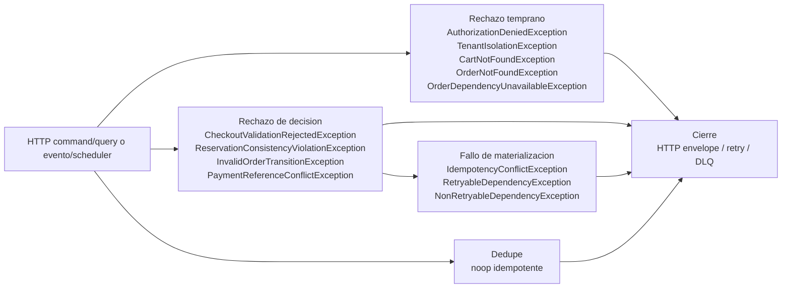

## Proposito
Definir los runtimes tecnicos de `order-service` para todos sus casos de uso, incluyendo happy path, rutas de rechazo funcional, fallos tecnicos, idempotencia, dedupe y publicacion asincrona.

## Alcance y fronteras
- Incluye comandos y consultas HTTP de carrito, checkout, pedido y pagos manuales.
- Incluye listeners y scheduler internos del servicio para reservas expiradas, variantes discontinuadas, usuarios bloqueados y carritos abandonados.
- Incluye interaccion con `identity-access-service`, `directory-service`, `catalog-service`, `inventory-service`, `redis-cache`, `kafka-cluster` y `Order DB`.
- Excluye decisiones de despliegue, cluster y configuracion infra fuera del limite del servicio.

## Casos de uso cubiertos por Order
| Caso | Tipo | Trigger principal | Resultado esperado |
|---|---|---|---|
| `GetActiveCart` | query HTTP | cliente B2B | devuelve el carrito activo y sus items vigentes |
| `UpsertCartItem` | command HTTP | cliente B2B | agrega o actualiza un item de carrito con reserva vigente |
| `RemoveCartItem` | command HTTP | cliente B2B | remueve un item de carrito y libera su reserva |
| `ClearCart` | command HTTP | cliente B2B | vacia el carrito y libera reservas activas |
| `RequestCheckoutValidation` | command HTTP | cliente B2B | valida direccion, politica regional y reservas antes del checkout |
| `ConfirmOrder` | command HTTP | cliente B2B | crea el pedido y deja su estado inicial visible |
| `CancelOrder` | command HTTP | operador Arka | cancela un pedido segun politica de transicion |
| `RegisterManualPayment` | command HTTP | operador Arka / finanzas | registra un pago manual y recalcula el estado agregado de pago |
| `UpdateOrderStatus` | command HTTP | operador Arka | aplica una transicion valida de estado sobre el pedido |
| `ListOrders` | query HTTP | cliente B2B / operador Arka | devuelve el listado paginado de pedidos |
| `GetOrderDetail` | query HTTP | cliente B2B / operador Arka | devuelve el detalle completo del pedido |
| `ListOrderPayments` | query HTTP | cliente B2B / operador Arka | devuelve el historial de pagos del pedido |
| `GetOrderTimeline` | query HTTP | operador Arka | devuelve la trazabilidad de cambios de estado del pedido |
| `HandleReservationExpired` | command evento | `inventory-service` | ajusta carritos afectados por reservas expiradas |
| `HandleVariantDiscontinued` | command evento | `catalog-service` | ajusta carritos afectados por variantes discontinuadas |
| `HandleUserBlocked` | command evento | `identity-access-service` | cancela pedidos no terminales y bloquea continuidad operativa del usuario |
| `DetectAbandonedCarts` | command scheduler | scheduler interno | marca carritos abandonados y emite la senal correspondiente |

## Regla de lectura de los diagramas
- `Panorama global` puede incluir actores externos como `api-gateway-service`, broker y servicios vecinos para ubicar el borde del flujo.
- Los diagramas por fases de cada caso representan **arquitectura interna del servicio** y usan solo clases definidas en `Vista de Codigo`.
- `Exito` describe el happy path principal del caso.
- `Rechazo` separa rechazo funcional temprano, rechazo de decision y fallos tecnicos posteriores a la decision.

## Modelo runtime de autenticacion y autorizacion
| Tipo de flujo | Regla aplicada |
|---|---|
| HTTP command/query | `api-gateway-service` autentica el request. `adapter/in/web` valida `request`, mapea a `command/query` (`CartCommandMapper`, `CheckoutCommandMapper`, `PaymentCommandMapper`, `OrderQueryMapper`) y luego `Contextualizacion - Seguridad` materializa `PrincipalContext`, aplica `PermissionEvaluatorPort` y cierra tenant/ownership antes de decidir. |
| evento / scheduler | No se asume JWT de usuario. `adapter/in/listener` materializa `TriggerContext` mediante `TriggerContextResolver`, valida trigger y dedupe (`ProcessedEventRepositoryPort`) antes de tocar carrito, pedido o pago. |

## Modelo runtime de errores y excepciones
| Tipo de flujo | Regla aplicada |
|---|---|
| HTTP command/query | `Rechazo temprano` y `Rechazo de decision` se propagan como familias semanticas canonicas desde `PrincipalContext`, `PermissionEvaluatorPort`, `TenantIsolationPolicy`, ownership y politicas del pedido o pago; el adapter-in HTTP las traduce al envelope canonico. |
| evento / scheduler | `TriggerContext`, dedupe y politicas del dominio emiten error semantico o `noop idempotente`; si el fallo es tecnico se clasifica como retryable/no-retryable para reintento o DLQ. |

### Diagrama runtime de excepciones concretas

## Patron de fases runtime
| Fase | Que explica | Elementos incluidos | Regla de lectura |
|---|---|---|---|
| `Ingreso` | Recibe el trigger del caso de uso y adapta la entrada al servicio. | `request` o mensaje de entrada, `controller` / `listener` / `scheduler`, `TriggerContextResolver` (async) y mapper de entrada (`*CommandMapper`, `*QueryMapper`) cuando aplica, `command` / `query` y `port in`. | Describe el borde interno del servicio y el punto exacto donde el flujo entra a `Application service`. |
| `Preparacion` | Transforma la entrada en contexto semantico interno antes de consultar dependencias externas. | `use case`, assembler implicito, `value objects` y contexto derivado del trigger. | No hace I/O externo; solo prepara el caso para poder contextualizar y decidir correctamente. |
| `Contextualizacion` | Obtiene datos y validaciones tecnicas necesarias antes de decidir. | `ports out`, `adapters out`, cache, repositorios, reloj, idempotencia, dedupe y clientes externos. | Aqui no se decide todavia el resultado de negocio; solo se reune el contexto necesario para la decision. |
| `Decision` | Explica la decision real del caso dentro del dominio. | Agregados, entidades, `value objects` de decision, politicas y eventos nacidos de la decision. | Solo dominio; se divide por agregado o foco semantico cuando el caso toca mas de un submodelo. |
| `Materializacion` | Hace efectiva la decision ya tomada por el dominio. | `ports out` y `adapters out` de salida, persistencia, auditoria, cache, idempotencia, `processed-events` y outbox. | Aqui no se vuelve a decidir negocio; solo se ejecuta tecnicamente lo ya resuelto por dominio. |
| `Proyeccion` | Convierte el resultado interno en una salida consumible por el trigger. | `OrderResponseMapper`, `responses` HTTP o cierre tecnico del trigger interno (`ack`, `noop idempotente`). | Se usa sobre todo en flujos HTTP y consultas; en listeners o schedulers puede quedar reducido al cierre tecnico del caso. |
| `Propagacion` | Publica o distribuye efectos asincronos derivados del caso ya materializado. | Outbox, relay, publisher y entrega al broker. | Ocurre despues de materializar y normalmente no redefine el resultado funcional del caso principal. |

## Alineamiento runtime con estructura canonica
| Borde | Clases canonicas aplicadas | Aplicacion en runtime |
|---|---|---|
| HTTP (`adapter/in/web`) | `*HttpController`, `infrastructure/adapter/in/web/request/*`, `CartCommandMapper`, `CheckoutCommandMapper`, `PaymentCommandMapper`, `OrderQueryMapper`, `OrderResponseMapper` | Cada caso HTTP entra por controller, valida/mapea request a `command/query`, ejecuta `port in` y proyecta respuesta estable. |
| Async (`adapter/in/listener`) | `InventoryReservationEventListener`, `CatalogVariantEventListener`, `DirectoryCheckoutValidationEventListener`, `IamUserBlockedEventListener`, `AbandonedCartSchedulerListener`, `TriggerContextResolver`, `TriggerContext` | Cada trigger no-HTTP materializa contexto operacional, valida dedupe/tenancy y despacha al caso de uso idempotente correspondiente. |

### Regla para rutas alternativas
- `Rechazo temprano`: corte funcional o tecnico antes de entrar a la decision de dominio.
- `Rechazo de decision`: corte funcional dentro del dominio.
- `Fallo de materializacion`: error tecnico despues de decidir pero antes de cerrar el caso.
- `Fallo de propagacion`: error asincrono al publicar efectos ya materializados.

## Diagramas runtime por caso de uso


{}
{}
> El bloque `Exito` describe el `happy path` de `GetActiveCart`. El bloque `Rechazo` agrupa `Rechazo temprano`, `Rechazo de decision`.

<table>
  <thead>
    <tr>
      <th>Etapa</th>
      <th>Clases para GetActiveCart</th>
      <th>Responsabilidad</th>
    </tr>
  </thead>
  <tbody>
    <tr>
      <td>Ingreso</td>
      <td><code>CartHttpController</code>, <code>GetActiveCartQuery</code>, <code>GetActiveCartQueryUseCase</code></td>
      <td>Recibe el trigger del caso ya dentro del servicio y lo traduce al contrato de aplicacion que inicia el flujo interno.</td>
    </tr>
    <tr>
      <td>Preparacion</td>
      <td><code>GetActiveCartUseCase</code>, <code>TenantId</code>, <code>OrganizationId</code>, <code>UserId</code></td>
      <td>Normaliza la intencion del caso y construye el contexto semantico interno sin hacer I/O externo.</td>
    </tr>
    <tr>
      <td>Contextualizacion - Seguridad</td>
      <td><code>GetActiveCartUseCase</code>, <code>PrincipalContextPort</code>, <code>PrincipalContextAdapter</code>, <code>PermissionEvaluatorPort</code>, <code>RbacPermissionEvaluatorAdapter</code></td>
      <td>Obtiene datos, autorizaciones, concurrencia o validaciones tecnicas necesarias antes de decidir en dominio.</td>
    </tr>
    <tr>
      <td>Contextualizacion - Cart</td>
      <td><code>GetActiveCartUseCase</code>, <code>CartRepositoryPort</code>, <code>CartR2dbcRepositoryAdapter</code>, <code>ReactiveCartRepository</code>, <code>CartEntity</code></td>
      <td>Obtiene datos, autorizaciones, concurrencia o validaciones tecnicas necesarias antes de decidir en dominio.</td>
    </tr>
    <tr>
      <td>Contextualizacion - Items</td>
      <td><code>GetActiveCartUseCase</code>, <code>CartItemRepositoryPort</code>, <code>CartItemR2dbcRepositoryAdapter</code>, <code>ReactiveCartItemRepository</code>, <code>CartItemEntity</code></td>
      <td>Obtiene datos, autorizaciones, concurrencia o validaciones tecnicas necesarias antes de decidir en dominio.</td>
    </tr>
    <tr>
      <td>Decision - Cart</td>
      <td><code>GetActiveCartUseCase</code>, <code>TenantIsolationPolicy</code>, <code>CartAggregate</code>, <code>CartStatus</code></td>
      <td>Evalua invariantes, reglas y politicas del dominio para aceptar, rechazar o consolidar el resultado del caso.</td>
    </tr>
    <tr>
      <td>Proyeccion</td>
      <td><code>GetActiveCartUseCase</code>, <code>OrderResponseMapper</code>, <code>CartDetailResponse</code>, <code>CartItemResponse</code>, <code>CartHttpController</code></td>
      <td>Convierte el estado final del caso en la respuesta expuesta por el servicio.</td>
    </tr>
    <tr>
      <td>Rechazo temprano</td>
      <td><code>GetActiveCartUseCase</code>, <code>PrincipalContextPort</code>, <code>CartRepositoryPort</code>, <code>CartHttpController</code>, <code>OrderWebFluxConfiguration</code></td>
      <td>Corta el flujo antes de decidir en dominio por autorizacion, conflicto de idempotencia, ausencia de contexto externo o bloqueo tecnico.</td>
    </tr>
    <tr>
      <td>Rechazo de decision</td>
      <td><code>GetActiveCartUseCase</code>, <code>TenantIsolationPolicy</code>, <code>CartAggregate</code>, <code>CartHttpController</code>, <code>OrderWebFluxConfiguration</code></td>
      <td>Corta el flujo despues de evaluar reglas, invariantes o politicas del dominio.</td>
    </tr>
  </tbody>
</table>
{}
{}
{}
{}

sequenceDiagram
  participant P1 as CartHttpController
  participant P2 as GetActiveCartQuery
  participant P3 as GetActiveCartQueryUseCase
  P1->>P2: construye contrato
  P2->>P3: entra por port in


**Descripcion de la fase.** Recibe el trigger del caso ya dentro del servicio y lo traduce al contrato de aplicacion que inicia el flujo interno.

**Capa predominante.** Se ubica principalmente en `Adapter-in`, con cruce controlado hacia el puerto de entrada de `Application service`.

<table>
  <thead>
    <tr>
      <th>Paso</th>
      <th>Clase</th>
      <th>Accion</th>
    </tr>
  </thead>
  <tbody>
    <tr>
      <td>1</td>
      <td><code>CartHttpController</code></td>
      <td>Recibe el request HTTP, valida sintaxis basica y encamina el caso hacia el contrato de aplicacion.</td>
    </tr>
    <tr>
      <td>2</td>
      <td><code>GetActiveCartQuery</code></td>
      <td>Representa la intencion del caso como query del servicio del servicio.</td>
    </tr>
    <tr>
      <td>3</td>
      <td><code>GetActiveCartQueryUseCase</code></td>
      <td>Entrega la ejecucion al puerto de entrada que abstrae el caso de uso.</td>
    </tr>
  </tbody>
</table>
{}
{}

sequenceDiagram
  participant P1 as GetActiveCartUseCase
  participant P2 as TenantId
  participant P3 as OrganizationId
  participant P4 as UserId
  P1->>P2: normaliza tenant
  P2->>P3: normaliza organizacion
  P3->>P4: normaliza usuario


**Descripcion de la fase.** Normaliza la intencion del caso y construye el contexto semantico interno sin hacer I/O externo.

**Capa predominante.** Se ubica principalmente en `Application service`, preparando tipos y contexto antes de consultar dependencias externas.

<table>
  <thead>
    <tr>
      <th>Paso</th>
      <th>Clase</th>
      <th>Accion</th>
    </tr>
  </thead>
  <tbody>
    <tr>
      <td>1</td>
      <td><code>GetActiveCartUseCase</code></td>
      <td>Normaliza la intencion del caso y prepara los tipos internos antes de consultar dependencias externas.</td>
    </tr>
    <tr>
      <td>2</td>
      <td><code>TenantId</code></td>
      <td>Expresa el tenant del principal en un value object estable para el caso.</td>
    </tr>
    <tr>
      <td>3</td>
      <td><code>OrganizationId</code></td>
      <td>Expresa la organizacion efectiva del contexto de consulta.</td>
    </tr>
    <tr>
      <td>4</td>
      <td><code>UserId</code></td>
      <td>Expresa el usuario propietario del carrito consultado dentro del servicio.</td>
    </tr>
  </tbody>
</table>
{}
{}

sequenceDiagram
  participant P1 as GetActiveCartUseCase
  participant P2 as PrincipalContextPort
  participant P3 as PrincipalContextAdapter
  participant P4 as PermissionEvaluatorPort
  participant P5 as RbacPermissionEvaluatorAdapter
  P1->>P2: carga claims
  P2->>P3: resuelve principal
  P3->>P4: valida permiso
  P4->>P5: aplica RBAC


**Descripcion de la fase.** Obtiene datos, autorizaciones, concurrencia o validaciones tecnicas necesarias antes de decidir en dominio.

**Capa predominante.** Se ubica en la frontera entre `Application service` y `Adapter-out`.

<table>
  <thead>
    <tr>
      <th>Paso</th>
      <th>Clase</th>
      <th>Accion</th>
    </tr>
  </thead>
  <tbody>
    <tr>
      <td>1</td>
      <td><code>GetActiveCartUseCase</code></td>
      <td>Solicita identidad y autorizacion para continuar con un contexto de seguridad coherente.</td>
    </tr>
    <tr>
      <td>2</td>
      <td><code>PrincipalContextPort</code></td>
      <td>Expone la abstraccion para resolver tenant, organizacion, usuario y roles del principal actual.</td>
    </tr>
    <tr>
      <td>3</td>
      <td><code>PrincipalContextAdapter</code></td>
      <td>Obtiene el principal efectivo desde el contexto de seguridad WebFlux del servicio.</td>
    </tr>
    <tr>
      <td>4</td>
      <td><code>PermissionEvaluatorPort</code></td>
      <td>Expone la verificacion de permisos funcionales requerida por el caso.</td>
    </tr>
    <tr>
      <td>5</td>
      <td><code>RbacPermissionEvaluatorAdapter</code></td>
      <td>Evalua las reglas RBAC y corta el caso si el permiso operativo no esta presente.</td>
    </tr>
  </tbody>
</table>
{}
{}

sequenceDiagram
  participant P1 as GetActiveCartUseCase
  participant P2 as CartRepositoryPort
  participant P3 as CartR2dbcRepositoryAdapter
  participant P4 as ReactiveCartRepository
  participant P5 as CartEntity
  P1->>P2: consulta puerto
  P2->>P3: usa adapter
  P3->>P4: consulta repositorio
  P4->>P5: materializa entidad


**Descripcion de la fase.** Obtiene datos, autorizaciones, concurrencia o validaciones tecnicas necesarias antes de decidir en dominio.

**Capa predominante.** Se ubica en la frontera entre `Application service` y `Adapter-out`.

<table>
  <thead>
    <tr>
      <th>Paso</th>
      <th>Clase</th>
      <th>Accion</th>
    </tr>
  </thead>
  <tbody>
    <tr>
      <td>1</td>
      <td><code>GetActiveCartUseCase</code></td>
      <td>Recupera el carrito activo del usuario dentro del tenant antes de entrar al modelo.</td>
    </tr>
    <tr>
      <td>2</td>
      <td><code>CartRepositoryPort</code></td>
      <td>Expone la lectura del carrito activo con aislamiento por tenant, organizacion y usuario.</td>
    </tr>
    <tr>
      <td>3</td>
      <td><code>CartR2dbcRepositoryAdapter</code></td>
      <td>Traduce la consulta de carrito al repositorio reactivo y recompone el agregado.</td>
    </tr>
    <tr>
      <td>4</td>
      <td><code>ReactiveCartRepository</code></td>
      <td>Consulta la fila vigente del carrito activo del usuario en la persistencia reactiva.</td>
    </tr>
    <tr>
      <td>5</td>
      <td><code>CartEntity</code></td>
      <td>Representa la fila persistida del carrito usada para reconstruir el agregado.</td>
    </tr>
  </tbody>
</table>
{}
{}

sequenceDiagram
  participant P1 as GetActiveCartUseCase
  participant P2 as CartItemRepositoryPort
  participant P3 as CartItemR2dbcRepositoryAdapter
  participant P4 as ReactiveCartItemRepository
  participant P5 as CartItemEntity
  P1->>P2: consulta puerto
  P2->>P3: usa adapter
  P3->>P4: consulta repositorio
  P4->>P5: materializa entidad


**Descripcion de la fase.** Obtiene datos, autorizaciones, concurrencia o validaciones tecnicas necesarias antes de decidir en dominio.

**Capa predominante.** Se ubica en la frontera entre `Application service` y `Adapter-out`.

<table>
  <thead>
    <tr>
      <th>Paso</th>
      <th>Clase</th>
      <th>Accion</th>
    </tr>
  </thead>
  <tbody>
    <tr>
      <td>1</td>
      <td><code>GetActiveCartUseCase</code></td>
      <td>Recupera los items actuales del carrito para completar el contexto de lectura.</td>
    </tr>
    <tr>
      <td>2</td>
      <td><code>CartItemRepositoryPort</code></td>
      <td>Expone la lectura de items del carrito asociado a la consulta actual.</td>
    </tr>
    <tr>
      <td>3</td>
      <td><code>CartItemR2dbcRepositoryAdapter</code></td>
      <td>Traduce la lectura de items al repositorio reactivo y recompone la coleccion del agregado.</td>
    </tr>
    <tr>
      <td>4</td>
      <td><code>ReactiveCartItemRepository</code></td>
      <td>Consulta las filas de item asociadas al carrito en almacenamiento reactivo.</td>
    </tr>
    <tr>
      <td>5</td>
      <td><code>CartItemEntity</code></td>
      <td>Representa cada item persistido que integra el carrito consultado.</td>
    </tr>
  </tbody>
</table>
{}
{}

sequenceDiagram
  participant P1 as GetActiveCartUseCase
  participant P2 as TenantIsolationPolicy
  participant P3 as CartAggregate
  participant P4 as CartStatus
  P1->>P2: valida ownership
  P2->>P3: evalua carrito
  P3->>P4: expone estado


**Descripcion de la fase.** Evalua invariantes, reglas y politicas del dominio para aceptar, rechazar o consolidar el resultado del caso.

**Capa predominante.** Se ubica principalmente en `Domain`, orquestada por `Application service` sin delegar la decision de negocio a infraestructura.

<table>
  <thead>
    <tr>
      <th>Paso</th>
      <th>Clase</th>
      <th>Accion</th>
    </tr>
  </thead>
  <tbody>
    <tr>
      <td>1</td>
      <td><code>GetActiveCartUseCase</code></td>
      <td>Entra al dominio con contexto valido y deja que el modelo determine el resultado semantico del caso.</td>
    </tr>
    <tr>
      <td>2</td>
      <td><code>TenantIsolationPolicy</code></td>
      <td>Verifica que el recurso consultado pertenece al tenant y organizacion del principal.</td>
    </tr>
    <tr>
      <td>3</td>
      <td><code>CartAggregate</code></td>
      <td>Consolida el estado actual del carrito y define la vista semantica que puede exponerse.</td>
    </tr>
    <tr>
      <td>4</td>
      <td><code>CartStatus</code></td>
      <td>Representa el estado funcional del carrito que condiciona la respuesta al cliente.</td>
    </tr>
  </tbody>
</table>
{}
{}

sequenceDiagram
  participant P1 as GetActiveCartUseCase
  participant P2 as OrderResponseMapper
  participant P3 as CartDetailResponse
  participant P4 as CartItemResponse
  participant P5 as CartHttpController
  P1->>P2: proyecta resultado
  P2->>P3: compone respuesta
  P3->>P4: agrega detalle
  P4->>P5: retorna response


**Descripcion de la fase.** Convierte el estado final del caso en la respuesta expuesta por el servicio.

**Capa predominante.** Se ubica entre `Application service` y `Adapter-in`, proyectando el resultado al contrato de salida.

<table>
  <thead>
    <tr>
      <th>Paso</th>
      <th>Clase</th>
      <th>Accion</th>
    </tr>
  </thead>
  <tbody>
    <tr>
      <td>1</td>
      <td><code>GetActiveCartUseCase</code></td>
      <td>Entrega el resultado final del caso para convertirlo a un contrato de salida HTTP estable.</td>
    </tr>
    <tr>
      <td>2</td>
      <td><code>OrderResponseMapper</code></td>
      <td>Transforma agregados, entities o resultados internos al shape de salida definido por el servicio.</td>
    </tr>
    <tr>
      <td>3</td>
      <td><code>CartDetailResponse</code></td>
      <td>Representa una porcion del contrato de salida que el cliente consume para devolver el carrito activo del usuario.</td>
    </tr>
    <tr>
      <td>4</td>
      <td><code>CartItemResponse</code></td>
      <td>Representa una porcion del contrato de salida que el cliente consume para devolver el carrito activo del usuario.</td>
    </tr>
    <tr>
      <td>5</td>
      <td><code>CartHttpController</code></td>
      <td>Entrega la respuesta HTTP final al adapter de entrada sin reabrir decisiones de negocio.</td>
    </tr>
  </tbody>
</table>
{}
{}
{}
{}
{}
{}

sequenceDiagram
  participant P1 as GetActiveCartUseCase
  participant P2 as PrincipalContextPort
  participant P3 as CartRepositoryPort
  participant P4 as CartHttpController
  participant P5 as OrderWebFluxConfiguration
  P1->>P2: rechaza identidad
  P2->>P3: rechaza contexto
  P3->>P4: cierra flujo
  P4->>P5: mapea error HTTP


**Descripcion de la fase.** Corta el flujo antes de decidir en dominio por autorizacion, conflicto de idempotencia, ausencia de contexto externo o bloqueo tecnico.

**Capa predominante.** Se ubica en la frontera `Adapter-in` / `Application service` con apoyo de `Adapter-out`.

<table>
  <thead>
    <tr>
      <th>Paso</th>
      <th>Clase</th>
      <th>Accion</th>
    </tr>
  </thead>
  <tbody>
    <tr>
      <td>1</td>
      <td><code>GetActiveCartUseCase</code></td>
      <td>Detecta una condicion tecnica, de autorizacion o de contexto que impide continuar antes de decidir en dominio.</td>
    </tr>
    <tr>
      <td>2</td>
      <td><code>PrincipalContextPort</code></td>
      <td>Detecta que no existe principal valido para resolver el carrito activo.</td>
    </tr>
    <tr>
      <td>3</td>
      <td><code>CartRepositoryPort</code></td>
      <td>Detecta que no existe contexto persistente suficiente para recuperar el carrito.</td>
    </tr>
    <tr>
      <td>4</td>
      <td><code>CartHttpController</code></td>
      <td>Recibe la senal de rechazo temprano y evita que el caso avance hacia dominio o salida exitosa.</td>
    </tr>
    <tr>
      <td>5</td>
      <td><code>OrderWebFluxConfiguration</code></td>
      <td>Convierte la excepcion funcional o tecnica en la respuesta HTTP correspondiente sin perder trazabilidad.</td>
    </tr>
  </tbody>
</table>
{}
{}

sequenceDiagram
  participant P1 as GetActiveCartUseCase
  participant P2 as TenantIsolationPolicy
  participant P3 as CartAggregate
  participant P4 as CartHttpController
  participant P5 as OrderWebFluxConfiguration
  P1->>P2: niega acceso
  P2->>P3: descarta resultado
  P3->>P4: retorna rechazo
  P4->>P5: serializa error


**Descripcion de la fase.** Corta el flujo despues de evaluar reglas, invariantes o politicas del dominio.

**Capa predominante.** Se ubica principalmente en `Domain`, con cierre de error hacia `Adapter-in`.

<table>
  <thead>
    <tr>
      <th>Paso</th>
      <th>Clase</th>
      <th>Accion</th>
    </tr>
  </thead>
  <tbody>
    <tr>
      <td>1</td>
      <td><code>GetActiveCartUseCase</code></td>
      <td>Llega al dominio con contexto valido, pero una politica o agregado rechaza la operacion.</td>
    </tr>
    <tr>
      <td>2</td>
      <td><code>TenantIsolationPolicy</code></td>
      <td>Detecta acceso cruzado o ownership inconsistente sobre el recurso consultado.</td>
    </tr>
    <tr>
      <td>3</td>
      <td><code>CartAggregate</code></td>
      <td>Indica que el recurso consultado no puede exponerse en el contexto actual del principal.</td>
    </tr>
    <tr>
      <td>4</td>
      <td><code>CartHttpController</code></td>
      <td>Recibe el rechazo de negocio y cierra el caso sin materializar cambios adicionales.</td>
    </tr>
    <tr>
      <td>5</td>
      <td><code>OrderWebFluxConfiguration</code></td>
      <td>Mapea el rechazo semantico a la respuesta HTTP pactada por el servicio.</td>
    </tr>
  </tbody>
</table>
{}
{}
{}
{}


{}
{}
> El bloque `Exito` describe el `happy path` de `UpsertCartItem`. El bloque `Rechazo` agrupa `Rechazo temprano`, `Rechazo de decision`, `Fallo de materializacion`, `Fallo de propagacion`.

<table>
  <thead>
    <tr>
      <th>Etapa</th>
      <th>Clases para UpsertCartItem</th>
      <th>Responsabilidad</th>
    </tr>
  </thead>
  <tbody>
    <tr>
      <td>Ingreso</td>
      <td><code>CartHttpController</code>, <code>CartCommandMapper</code>, <code>UpsertCartItemCommand</code>, <code>UpsertCartItemCommandUseCase</code></td>
      <td>Recibe el trigger del caso ya dentro del servicio y lo traduce al contrato de aplicacion que inicia el flujo interno.</td>
    </tr>
    <tr>
      <td>Preparacion</td>
      <td><code>UpsertCartItemUseCase</code>, <code>VariantId</code>, <code>SkuCode</code>, <code>Quantity</code></td>
      <td>Normaliza la intencion del caso y construye el contexto semantico interno sin hacer I/O externo.</td>
    </tr>
    <tr>
      <td>Contextualizacion - Seguridad</td>
      <td><code>UpsertCartItemUseCase</code>, <code>PrincipalContextPort</code>, <code>PrincipalContextAdapter</code>, <code>PermissionEvaluatorPort</code>, <code>RbacPermissionEvaluatorAdapter</code></td>
      <td>Obtiene datos, autorizaciones, concurrencia o validaciones tecnicas necesarias antes de decidir en dominio.</td>
    </tr>
    <tr>
      <td>Contextualizacion - Idempotencia</td>
      <td><code>UpsertCartItemUseCase</code>, <code>IdempotencyRepositoryPort</code>, <code>ReactiveIdempotencyRecordRepository</code>, <code>IdempotencyR2dbcRepositoryAdapter</code></td>
      <td>Obtiene datos, autorizaciones, concurrencia o validaciones tecnicas necesarias antes de decidir en dominio.</td>
    </tr>
    <tr>
      <td>Contextualizacion - Catalogo</td>
      <td><code>UpsertCartItemUseCase</code>, <code>CatalogVariantPort</code>, <code>CatalogVariantHttpClientAdapter</code></td>
      <td>Obtiene datos, autorizaciones, concurrencia o validaciones tecnicas necesarias antes de decidir en dominio.</td>
    </tr>
    <tr>
      <td>Contextualizacion - Inventario</td>
      <td><code>UpsertCartItemUseCase</code>, <code>InventoryReservationPort</code>, <code>InventoryReservationHttpClientAdapter</code></td>
      <td>Obtiene datos, autorizaciones, concurrencia o validaciones tecnicas necesarias antes de decidir en dominio.</td>
    </tr>
    <tr>
      <td>Contextualizacion - Carrito</td>
      <td><code>UpsertCartItemUseCase</code>, <code>CartRepositoryPort</code>, <code>CartR2dbcRepositoryAdapter</code>, <code>ReactiveCartRepository</code>, <code>CartEntity</code></td>
      <td>Obtiene datos, autorizaciones, concurrencia o validaciones tecnicas necesarias antes de decidir en dominio.</td>
    </tr>
    <tr>
      <td>Decision - Cart</td>
      <td><code>UpsertCartItemUseCase</code>, <code>TenantIsolationPolicy</code>, <code>CartAggregate</code>, <code>CartItem</code>, <code>PriceSnapshot</code>, <code>ReservationRef</code>, <code>CartRecoveredEvent</code>, <code>CartItemAddedEvent</code>, <code>CartItemUpdatedEvent</code></td>
      <td>Evalua invariantes, reglas y politicas del dominio para aceptar, rechazar o consolidar el resultado del caso.</td>
    </tr>
    <tr>
      <td>Materializacion</td>
      <td><code>UpsertCartItemUseCase</code>, <code>CartRepositoryPort</code>, <code>CartItemRepositoryPort</code>, <code>OrderAuditPort</code>, <code>IdempotencyRepositoryPort</code>, <code>OutboxPort</code>, <code>OrderAuditR2dbcRepositoryAdapter</code>, <code>IdempotencyR2dbcRepositoryAdapter</code>, <code>OutboxPersistenceAdapter</code></td>
      <td>Hace efectiva la decision tomada: persistencia, auditoria, cache, idempotencia, outbox y side effects tecnicos segun corresponda.</td>
    </tr>
    <tr>
      <td>Proyeccion</td>
      <td><code>UpsertCartItemUseCase</code>, <code>OrderResponseMapper</code>, <code>CartDetailResponse</code>, <code>CartItemResponse</code>, <code>CartHttpController</code></td>
      <td>Convierte el estado final del caso en la respuesta expuesta por el servicio.</td>
    </tr>
    <tr>
      <td>Propagacion</td>
      <td><code>CartItemAddedEvent</code>, <code>CartItemUpdatedEvent</code>, <code>OutboxEventEntity</code>, <code>OutboxPublisherScheduler</code>, <code>DomainEventPublisherPort</code>, <code>KafkaDomainEventPublisherAdapter</code></td>
      <td>Publica los efectos asincronos ya materializados mediante relay, outbox y broker.</td>
    </tr>
    <tr>
      <td>Rechazo temprano</td>
      <td><code>UpsertCartItemUseCase</code>, <code>PermissionEvaluatorPort</code>, <code>IdempotencyRepositoryPort</code>, <code>CatalogVariantPort</code>, <code>InventoryReservationPort</code>, <code>CartHttpController</code>, <code>OrderWebFluxConfiguration</code></td>
      <td>Corta el flujo antes de decidir en dominio por autorizacion, conflicto de idempotencia, ausencia de contexto externo o bloqueo tecnico.</td>
    </tr>
    <tr>
      <td>Rechazo de decision</td>
      <td><code>UpsertCartItemUseCase</code>, <code>TenantIsolationPolicy</code>, <code>CartAggregate</code>, <code>CartItem</code>, <code>CartHttpController</code>, <code>OrderWebFluxConfiguration</code></td>
      <td>Corta el flujo despues de evaluar reglas, invariantes o politicas del dominio.</td>
    </tr>
    <tr>
      <td>Fallo de materializacion</td>
      <td><code>UpsertCartItemUseCase</code>, <code>CartRepositoryPort</code>, <code>CartItemRepositoryPort</code>, <code>OrderAuditPort</code>, <code>IdempotencyRepositoryPort</code>, <code>OutboxPort</code>, <code>CartHttpController</code>, <code>OrderWebFluxConfiguration</code></td>
      <td>Representa un error tecnico posterior a la decision al persistir, auditar, invalidar cache, guardar idempotencia o escribir outbox.</td>
    </tr>
    <tr>
      <td>Fallo de propagacion</td>
      <td><code>CartItemAddedEvent</code>, <code>CartItemUpdatedEvent</code>, <code>OutboxEventEntity</code>, <code>OutboxPublisherScheduler</code>, <code>DomainEventPublisherPort</code>, <code>KafkaDomainEventPublisherAdapter</code></td>
      <td>Representa un error asincrono al publicar efectos ya materializados.</td>
    </tr>
  </tbody>
</table>
{}
{}
{}
{}

sequenceDiagram
  participant P1 as CartHttpController
  participant P2 as CartCommandMapper
  participant P3 as UpsertCartItemCommand
  participant P4 as UpsertCartItemCommandUseCase
  P1->>P2: mapea request
  P2->>P3: construye contrato
  P3->>P4: entra por port in


**Descripcion de la fase.** Recibe el trigger del caso ya dentro del servicio y lo traduce al contrato de aplicacion que inicia el flujo interno.

**Capa predominante.** Se ubica principalmente en `Adapter-in`, con cruce controlado hacia el puerto de entrada de `Application service`.

<table>
  <thead>
    <tr>
      <th>Paso</th>
      <th>Clase</th>
      <th>Accion</th>
    </tr>
  </thead>
  <tbody>
    <tr>
      <td>1</td>
      <td><code>CartHttpController</code></td>
      <td>Recibe el request HTTP, valida sintaxis basica y encamina el caso hacia el contrato de aplicacion.</td>
    </tr>
    <tr>
      <td>2</td>
      <td><code>CartCommandMapper</code></td>
      <td>Transforma la entrada HTTP al contrato interno del caso sin contaminar el dominio con detalles del transporte.</td>
    </tr>
    <tr>
      <td>3</td>
      <td><code>UpsertCartItemCommand</code></td>
      <td>Representa la intencion del caso como command del servicio del servicio.</td>
    </tr>
    <tr>
      <td>4</td>
      <td><code>UpsertCartItemCommandUseCase</code></td>
      <td>Entrega la ejecucion al puerto de entrada que abstrae el caso de uso.</td>
    </tr>
  </tbody>
</table>
{}
{}

sequenceDiagram
  participant P1 as UpsertCartItemUseCase
  participant P2 as VariantId
  participant P3 as SkuCode
  participant P4 as Quantity
  P1->>P2: normaliza variante
  P2->>P3: normaliza sku
  P3->>P4: normaliza cantidad


**Descripcion de la fase.** Normaliza la intencion del caso y construye el contexto semantico interno sin hacer I/O externo.

**Capa predominante.** Se ubica principalmente en `Application service`, preparando tipos y contexto antes de consultar dependencias externas.

<table>
  <thead>
    <tr>
      <th>Paso</th>
      <th>Clase</th>
      <th>Accion</th>
    </tr>
  </thead>
  <tbody>
    <tr>
      <td>1</td>
      <td><code>UpsertCartItemUseCase</code></td>
      <td>Normaliza la intencion del caso y prepara los tipos internos antes de consultar dependencias externas.</td>
    </tr>
    <tr>
      <td>2</td>
      <td><code>VariantId</code></td>
      <td>Expresa la variante objetivo del carrito como value object interno del servicio.</td>
    </tr>
    <tr>
      <td>3</td>
      <td><code>SkuCode</code></td>
      <td>Expresa el SKU comercial como referencia consistente para dependencias y dominio.</td>
    </tr>
    <tr>
      <td>4</td>
      <td><code>Quantity</code></td>
      <td>Expresa la cantidad pedida como value object antes de consultar stock o reservas.</td>
    </tr>
  </tbody>
</table>
{}
{}

sequenceDiagram
  participant P1 as UpsertCartItemUseCase
  participant P2 as PrincipalContextPort
  participant P3 as PrincipalContextAdapter
  participant P4 as PermissionEvaluatorPort
  participant P5 as RbacPermissionEvaluatorAdapter
  P1->>P2: carga claims
  P2->>P3: resuelve principal
  P3->>P4: valida permiso
  P4->>P5: aplica RBAC


**Descripcion de la fase.** Obtiene datos, autorizaciones, concurrencia o validaciones tecnicas necesarias antes de decidir en dominio.

**Capa predominante.** Se ubica en la frontera entre `Application service` y `Adapter-out`.

<table>
  <thead>
    <tr>
      <th>Paso</th>
      <th>Clase</th>
      <th>Accion</th>
    </tr>
  </thead>
  <tbody>
    <tr>
      <td>1</td>
      <td><code>UpsertCartItemUseCase</code></td>
      <td>Solicita identidad y autorizacion para continuar con un contexto de seguridad coherente.</td>
    </tr>
    <tr>
      <td>2</td>
      <td><code>PrincipalContextPort</code></td>
      <td>Expone la abstraccion para resolver tenant, organizacion, usuario y roles del principal actual.</td>
    </tr>
    <tr>
      <td>3</td>
      <td><code>PrincipalContextAdapter</code></td>
      <td>Obtiene el principal efectivo desde el contexto de seguridad WebFlux del servicio.</td>
    </tr>
    <tr>
      <td>4</td>
      <td><code>PermissionEvaluatorPort</code></td>
      <td>Expone la verificacion de permisos funcionales requerida por el caso.</td>
    </tr>
    <tr>
      <td>5</td>
      <td><code>RbacPermissionEvaluatorAdapter</code></td>
      <td>Evalua las reglas RBAC y corta el caso si el permiso operativo no esta presente.</td>
    </tr>
  </tbody>
</table>
{}
{}

sequenceDiagram
  participant P1 as UpsertCartItemUseCase
  participant P2 as IdempotencyRepositoryPort
  participant P3 as ReactiveIdempotencyRecordRepository
  participant P4 as IdempotencyR2dbcRepositoryAdapter
  P1->>P2: consulta clave
  P2->>P3: busca registro
  P3->>P4: resuelve dedupe


**Descripcion de la fase.** Obtiene datos, autorizaciones, concurrencia o validaciones tecnicas necesarias antes de decidir en dominio.

**Capa predominante.** Se ubica en la frontera entre `Application service` y `Adapter-out`.

<table>
  <thead>
    <tr>
      <th>Paso</th>
      <th>Clase</th>
      <th>Accion</th>
    </tr>
  </thead>
  <tbody>
    <tr>
      <td>1</td>
      <td><code>UpsertCartItemUseCase</code></td>
      <td>Consulta la huella idempotente del request antes de ejecutar side effects mutantes.</td>
    </tr>
    <tr>
      <td>2</td>
      <td><code>IdempotencyRepositoryPort</code></td>
      <td>Expone la abstraccion para detectar replays validos o conflictos de idempotencia por operacion.</td>
    </tr>
    <tr>
      <td>3</td>
      <td><code>ReactiveIdempotencyRecordRepository</code></td>
      <td>Consulta el registro persistido de la clave idempotente en el almacenamiento reactivo.</td>
    </tr>
    <tr>
      <td>4</td>
      <td><code>IdempotencyR2dbcRepositoryAdapter</code></td>
      <td>Materializa la consulta de idempotencia y deja lista la decision tecnica de replay o conflicto.</td>
    </tr>
  </tbody>
</table>
{}
{}

sequenceDiagram
  participant P1 as UpsertCartItemUseCase
  participant P2 as CatalogVariantPort
  participant P3 as CatalogVariantHttpClientAdapter
  P1->>P2: consulta dependencia
  P2->>P3: invoca servicio


**Descripcion de la fase.** Obtiene datos, autorizaciones, concurrencia o validaciones tecnicas necesarias antes de decidir en dominio.

**Capa predominante.** Se ubica en la frontera entre `Application service` y `Adapter-out`.

<table>
  <thead>
    <tr>
      <th>Paso</th>
      <th>Clase</th>
      <th>Accion</th>
    </tr>
  </thead>
  <tbody>
    <tr>
      <td>1</td>
      <td><code>UpsertCartItemUseCase</code></td>
      <td>Solicita contexto externo requerido antes de permitir que el dominio tome una decision.</td>
    </tr>
    <tr>
      <td>2</td>
      <td><code>CatalogVariantPort</code></td>
      <td>Expone la resolucion de variante vendible y snapshot semantico del SKU.</td>
    </tr>
    <tr>
      <td>3</td>
      <td><code>CatalogVariantHttpClientAdapter</code></td>
      <td>Consulta a Catalog la variante y el snapshot comercial requerido para el item del carrito.</td>
    </tr>
  </tbody>
</table>
{}
{}

sequenceDiagram
  participant P1 as UpsertCartItemUseCase
  participant P2 as InventoryReservationPort
  participant P3 as InventoryReservationHttpClientAdapter
  P1->>P2: consulta dependencia
  P2->>P3: invoca servicio


**Descripcion de la fase.** Obtiene datos, autorizaciones, concurrencia o validaciones tecnicas necesarias antes de decidir en dominio.

**Capa predominante.** Se ubica en la frontera entre `Application service` y `Adapter-out`.

<table>
  <thead>
    <tr>
      <th>Paso</th>
      <th>Clase</th>
      <th>Accion</th>
    </tr>
  </thead>
  <tbody>
    <tr>
      <td>1</td>
      <td><code>UpsertCartItemUseCase</code></td>
      <td>Solicita contexto externo requerido antes de permitir que el dominio tome una decision.</td>
    </tr>
    <tr>
      <td>2</td>
      <td><code>InventoryReservationPort</code></td>
      <td>Expone la creacion o extension de reserva antes de consolidar el item del carrito.</td>
    </tr>
    <tr>
      <td>3</td>
      <td><code>InventoryReservationHttpClientAdapter</code></td>
      <td>Solicita a Inventory la reserva vigente asociada al SKU, almacen y cantidad requeridos.</td>
    </tr>
  </tbody>
</table>
{}
{}

sequenceDiagram
  participant P1 as UpsertCartItemUseCase
  participant P2 as CartRepositoryPort
  participant P3 as CartR2dbcRepositoryAdapter
  participant P4 as ReactiveCartRepository
  participant P5 as CartEntity
  P1->>P2: consulta puerto
  P2->>P3: usa adapter
  P3->>P4: consulta repositorio
  P4->>P5: materializa entidad


**Descripcion de la fase.** Obtiene datos, autorizaciones, concurrencia o validaciones tecnicas necesarias antes de decidir en dominio.

**Capa predominante.** Se ubica en la frontera entre `Application service` y `Adapter-out`.

<table>
  <thead>
    <tr>
      <th>Paso</th>
      <th>Clase</th>
      <th>Accion</th>
    </tr>
  </thead>
  <tbody>
    <tr>
      <td>1</td>
      <td><code>UpsertCartItemUseCase</code></td>
      <td>Recupera o prepara el carrito activo del usuario antes de mutarlo.</td>
    </tr>
    <tr>
      <td>2</td>
      <td><code>CartRepositoryPort</code></td>
      <td>Expone la lectura del carrito activo con aislamiento por tenant, organizacion y usuario.</td>
    </tr>
    <tr>
      <td>3</td>
      <td><code>CartR2dbcRepositoryAdapter</code></td>
      <td>Traduce la consulta del carrito al repositorio reactivo y recompone el agregado actual.</td>
    </tr>
    <tr>
      <td>4</td>
      <td><code>ReactiveCartRepository</code></td>
      <td>Consulta la fila persistida del carrito activo del usuario.</td>
    </tr>
    <tr>
      <td>5</td>
      <td><code>CartEntity</code></td>
      <td>Representa el carrito persistido que sera mutado por el caso.</td>
    </tr>
  </tbody>
</table>
{}
{}

sequenceDiagram
  participant P1 as UpsertCartItemUseCase
  participant P2 as TenantIsolationPolicy
  participant P3 as CartAggregate
  participant P4 as CartItem
  participant P5 as PriceSnapshot
  participant P6 as ReservationRef
  participant P7 as CartRecoveredEvent
  participant P8 as CartItemAddedEvent
  participant P9 as CartItemUpdatedEvent
  P1->>P2: valida tenant
  P2->>P3: aplica item
  P3->>P4: consolida item
  P4->>P5: congela precio
  P5->>P6: asocia reserva
  P6->>P7: marca recuperacion
  P7->>P8: emite alta
  P8->>P9: emite ajuste


**Descripcion de la fase.** Evalua invariantes, reglas y politicas del dominio para aceptar, rechazar o consolidar el resultado del caso.

**Capa predominante.** Se ubica principalmente en `Domain`, orquestada por `Application service` sin delegar la decision de negocio a infraestructura.

<table>
  <thead>
    <tr>
      <th>Paso</th>
      <th>Clase</th>
      <th>Accion</th>
    </tr>
  </thead>
  <tbody>
    <tr>
      <td>1</td>
      <td><code>UpsertCartItemUseCase</code></td>
      <td>Entra al dominio con contexto valido y deja que el modelo determine el resultado semantico del caso.</td>
    </tr>
    <tr>
      <td>2</td>
      <td><code>TenantIsolationPolicy</code></td>
      <td>Protege el aislamiento del recurso antes de aceptar la mutacion del carrito.</td>
    </tr>
    <tr>
      <td>3</td>
      <td><code>CartAggregate</code></td>
      <td>Decide si agrega, actualiza o recupera el carrito segun el estado actual y el contexto recibido.</td>
    </tr>
    <tr>
      <td>4</td>
      <td><code>CartItem</code></td>
      <td>Representa el item del carrito con cantidad, snapshot de precio y referencia de reserva vigentes.</td>
    </tr>
    <tr>
      <td>5</td>
      <td><code>PriceSnapshot</code></td>
      <td>Conserva el snapshot semantico de precio que acompana al item actualizado.</td>
    </tr>
    <tr>
      <td>6</td>
      <td><code>ReservationRef</code></td>
      <td>Mantiene la referencia de reserva emitida por Inventory sobre el item del carrito.</td>
    </tr>
    <tr>
      <td>7</td>
      <td><code>CartRecoveredEvent</code></td>
      <td>Se activa cuando un carrito vuelve a estado util despues de haber sido abandonado o invalidado.</td>
    </tr>
    <tr>
      <td>8</td>
      <td><code>CartItemAddedEvent</code></td>
      <td>Representa el alta funcional del item cuando el SKU no existia previamente en el carrito.</td>
    </tr>
    <tr>
      <td>9</td>
      <td><code>CartItemUpdatedEvent</code></td>
      <td>Representa el ajuste funcional del item cuando el SKU ya existia y cambia su contenido.</td>
    </tr>
  </tbody>
</table>
{}
{}

sequenceDiagram
  participant P1 as UpsertCartItemUseCase
  participant P2 as CartRepositoryPort
  participant P3 as CartItemRepositoryPort
  participant P4 as OrderAuditPort
  participant P5 as IdempotencyRepositoryPort
  participant P6 as OutboxPort
  participant P7 as OrderAuditR2dbcRepositoryAdapter
  participant P8 as IdempotencyR2dbcRepositoryAdapter
  participant P9 as OutboxPersistenceAdapter
  P1->>P2: persiste carrito
  P2->>P3: persiste item
  P3->>P4: audita mutacion
  P4->>P5: materializa replay
  P5->>P6: escribe outbox
  P6->>P7: graba auditoria
  P7->>P8: graba dedupe
  P8->>P9: graba evento


**Descripcion de la fase.** Hace efectiva la decision tomada: persistencia, auditoria, cache, idempotencia, outbox y side effects tecnicos segun corresponda.

**Capa predominante.** Se ubica en la frontera entre `Application service` y `Adapter-out`.

<table>
  <thead>
    <tr>
      <th>Paso</th>
      <th>Clase</th>
      <th>Accion</th>
    </tr>
  </thead>
  <tbody>
    <tr>
      <td>1</td>
      <td><code>UpsertCartItemUseCase</code></td>
      <td>Ordena persistir, auditar, invalidar cache, registrar idempotencia o escribir outbox segun el resultado ya decidido.</td>
    </tr>
    <tr>
      <td>2</td>
      <td><code>CartRepositoryPort</code></td>
      <td>Guarda el estado final del carrito una vez consolidada la decision del dominio.</td>
    </tr>
    <tr>
      <td>3</td>
      <td><code>CartItemRepositoryPort</code></td>
      <td>Guarda el item agregado o actualizado dentro del carrito.</td>
    </tr>
    <tr>
      <td>4</td>
      <td><code>OrderAuditPort</code></td>
      <td>Registra la mutacion del carrito para trazabilidad operativa y seguridad.</td>
    </tr>
    <tr>
      <td>5</td>
      <td><code>IdempotencyRepositoryPort</code></td>
      <td>Guarda la huella idempotente para reusar la respuesta en reintentos equivalentes.</td>
    </tr>
    <tr>
      <td>6</td>
      <td><code>OutboxPort</code></td>
      <td>Deja pendiente la publicacion asincrona del evento funcional del carrito.</td>
    </tr>
    <tr>
      <td>7</td>
      <td><code>OrderAuditR2dbcRepositoryAdapter</code></td>
      <td>Materializa la auditoria del caso en almacenamiento reactivo.</td>
    </tr>
    <tr>
      <td>8</td>
      <td><code>IdempotencyR2dbcRepositoryAdapter</code></td>
      <td>Persiste el registro idempotente asociado a la mutacion HTTP.</td>
    </tr>
    <tr>
      <td>9</td>
      <td><code>OutboxPersistenceAdapter</code></td>
      <td>Persiste el mensaje en outbox para publicacion asincrona posterior.</td>
    </tr>
  </tbody>
</table>
{}
{}

sequenceDiagram
  participant P1 as UpsertCartItemUseCase
  participant P2 as OrderResponseMapper
  participant P3 as CartDetailResponse
  participant P4 as CartItemResponse
  participant P5 as CartHttpController
  P1->>P2: proyecta resultado
  P2->>P3: compone respuesta
  P3->>P4: agrega detalle
  P4->>P5: retorna response


**Descripcion de la fase.** Convierte el estado final del caso en la respuesta expuesta por el servicio.

**Capa predominante.** Se ubica entre `Application service` y `Adapter-in`, proyectando el resultado al contrato de salida.

<table>
  <thead>
    <tr>
      <th>Paso</th>
      <th>Clase</th>
      <th>Accion</th>
    </tr>
  </thead>
  <tbody>
    <tr>
      <td>1</td>
      <td><code>UpsertCartItemUseCase</code></td>
      <td>Entrega el resultado final del caso para convertirlo a un contrato de salida HTTP estable.</td>
    </tr>
    <tr>
      <td>2</td>
      <td><code>OrderResponseMapper</code></td>
      <td>Transforma agregados, entities o resultados internos al shape de salida definido por el servicio.</td>
    </tr>
    <tr>
      <td>3</td>
      <td><code>CartDetailResponse</code></td>
      <td>Representa una porcion del contrato de salida que el cliente consume para devolver el carrito actualizado.</td>
    </tr>
    <tr>
      <td>4</td>
      <td><code>CartItemResponse</code></td>
      <td>Representa una porcion del contrato de salida que el cliente consume para devolver el carrito actualizado.</td>
    </tr>
    <tr>
      <td>5</td>
      <td><code>CartHttpController</code></td>
      <td>Entrega la respuesta HTTP final al adapter de entrada sin reabrir decisiones de negocio.</td>
    </tr>
  </tbody>
</table>
{}
{}

sequenceDiagram
  participant P1 as CartItemAddedEvent
  participant P2 as CartItemUpdatedEvent
  participant P3 as OutboxEventEntity
  participant P4 as OutboxPublisherScheduler
  participant P5 as DomainEventPublisherPort
  participant P6 as KafkaDomainEventPublisherAdapter
  P1->>P2: encadena variante
  P2->>P3: persiste evento
  P3->>P4: drena outbox
  P4->>P5: publica dominio
  P5->>P6: entrega broker


**Descripcion de la fase.** Publica los efectos asincronos ya materializados mediante relay, outbox y broker.

**Capa predominante.** Se ubica principalmente en `Adapter-out`, desacoplando la publicacion del cierre del caso.

<table>
  <thead>
    <tr>
      <th>Paso</th>
      <th>Clase</th>
      <th>Accion</th>
    </tr>
  </thead>
  <tbody>
    <tr>
      <td>1</td>
      <td><code>CartItemAddedEvent</code></td>
      <td>Representa la alta del item cuando el carrito recibe un nuevo SKU.</td>
    </tr>
    <tr>
      <td>2</td>
      <td><code>CartItemUpdatedEvent</code></td>
      <td>Representa el ajuste del item cuando el SKU ya existia y cambia su estado funcional.</td>
    </tr>
    <tr>
      <td>3</td>
      <td><code>OutboxEventEntity</code></td>
      <td>Representa el registro persistido que desacopla la publicacion del cierre HTTP.</td>
    </tr>
    <tr>
      <td>4</td>
      <td><code>OutboxPublisherScheduler</code></td>
      <td>Lee eventos pendientes y los entrega al publisher reactivo sin reabrir la transaccion principal.</td>
    </tr>
    <tr>
      <td>5</td>
      <td><code>DomainEventPublisherPort</code></td>
      <td>Expone la abstraccion de publicacion asincrona del servicio de pedidos.</td>
    </tr>
    <tr>
      <td>6</td>
      <td><code>KafkaDomainEventPublisherAdapter</code></td>
      <td>Publica el evento al broker o lo deja pendiente para reintento posterior.</td>
    </tr>
  </tbody>
</table>
{}
{}
{}
{}
{}
{}

sequenceDiagram
  participant P1 as UpsertCartItemUseCase
  participant P2 as PermissionEvaluatorPort
  participant P3 as IdempotencyRepositoryPort
  participant P4 as CatalogVariantPort
  participant P5 as InventoryReservationPort
  participant P6 as CartHttpController
  participant P7 as OrderWebFluxConfiguration
  P1->>P2: niega permiso
  P2->>P3: rechaza clave
  P3->>P4: rechaza variante
  P4->>P5: rechaza reserva
  P5->>P6: cierra flujo
  P6->>P7: mapea error HTTP


**Descripcion de la fase.** Corta el flujo antes de decidir en dominio por autorizacion, conflicto de idempotencia, ausencia de contexto externo o bloqueo tecnico.

**Capa predominante.** Se ubica en la frontera `Adapter-in` / `Application service` con apoyo de `Adapter-out`.

<table>
  <thead>
    <tr>
      <th>Paso</th>
      <th>Clase</th>
      <th>Accion</th>
    </tr>
  </thead>
  <tbody>
    <tr>
      <td>1</td>
      <td><code>UpsertCartItemUseCase</code></td>
      <td>Detecta una condicion tecnica, de autorizacion o de contexto que impide continuar antes de decidir en dominio.</td>
    </tr>
    <tr>
      <td>2</td>
      <td><code>PermissionEvaluatorPort</code></td>
      <td>Detecta que el principal no puede mutar el carrito dentro del tenant.</td>
    </tr>
    <tr>
      <td>3</td>
      <td><code>IdempotencyRepositoryPort</code></td>
      <td>Detecta conflicto de idempotencia o replay no reutilizable para el request.</td>
    </tr>
    <tr>
      <td>4</td>
      <td><code>CatalogVariantPort</code></td>
      <td>Detecta que la variante no es resoluble o no es vendible para continuar.</td>
    </tr>
    <tr>
      <td>5</td>
      <td><code>InventoryReservationPort</code></td>
      <td>Detecta que no existe reserva valida para sostener la mutacion del carrito.</td>
    </tr>
    <tr>
      <td>6</td>
      <td><code>CartHttpController</code></td>
      <td>Recibe la senal de rechazo temprano y evita que el caso avance hacia dominio o salida exitosa.</td>
    </tr>
    <tr>
      <td>7</td>
      <td><code>OrderWebFluxConfiguration</code></td>
      <td>Convierte la excepcion funcional o tecnica en la respuesta HTTP correspondiente sin perder trazabilidad.</td>
    </tr>
  </tbody>
</table>
{}
{}

sequenceDiagram
  participant P1 as UpsertCartItemUseCase
  participant P2 as TenantIsolationPolicy
  participant P3 as CartAggregate
  participant P4 as CartItem
  participant P5 as CartHttpController
  participant P6 as OrderWebFluxConfiguration
  P1->>P2: niega ownership
  P2->>P3: rechaza mutacion
  P3->>P4: marca inconsistencia
  P4->>P5: retorna rechazo
  P5->>P6: serializa error


**Descripcion de la fase.** Corta el flujo despues de evaluar reglas, invariantes o politicas del dominio.

**Capa predominante.** Se ubica principalmente en `Domain`, con cierre de error hacia `Adapter-in`.

<table>
  <thead>
    <tr>
      <th>Paso</th>
      <th>Clase</th>
      <th>Accion</th>
    </tr>
  </thead>
  <tbody>
    <tr>
      <td>1</td>
      <td><code>UpsertCartItemUseCase</code></td>
      <td>Llega al dominio con contexto valido, pero una politica o agregado rechaza la operacion.</td>
    </tr>
    <tr>
      <td>2</td>
      <td><code>TenantIsolationPolicy</code></td>
      <td>Bloquea la mutacion si el recurso no pertenece al tenant u organizacion del principal.</td>
    </tr>
    <tr>
      <td>3</td>
      <td><code>CartAggregate</code></td>
      <td>Descarta la mutacion cuando una invariante funcional del carrito no se cumple.</td>
    </tr>
    <tr>
      <td>4</td>
      <td><code>CartItem</code></td>
      <td>Representa el item invalido que impide consolidar el carrito.</td>
    </tr>
    <tr>
      <td>5</td>
      <td><code>CartHttpController</code></td>
      <td>Recibe el rechazo de negocio y cierra el caso sin materializar cambios adicionales.</td>
    </tr>
    <tr>
      <td>6</td>
      <td><code>OrderWebFluxConfiguration</code></td>
      <td>Mapea el rechazo semantico a la respuesta HTTP pactada por el servicio.</td>
    </tr>
  </tbody>
</table>
{}
{}

sequenceDiagram
  participant P1 as UpsertCartItemUseCase
  participant P2 as CartRepositoryPort
  participant P3 as CartItemRepositoryPort
  participant P4 as OrderAuditPort
  participant P5 as IdempotencyRepositoryPort
  participant P6 as OutboxPort
  participant P7 as CartHttpController
  participant P8 as OrderWebFluxConfiguration
  P1->>P2: falla persistencia
  P2->>P3: falla item
  P3->>P4: falla auditoria
  P4->>P5: falla dedupe
  P5->>P6: falla outbox
  P6->>P7: propaga fallo
  P7->>P8: mapea error HTTP


**Descripcion de la fase.** Representa un error tecnico posterior a la decision al persistir, auditar, invalidar cache, guardar idempotencia o escribir outbox.

**Capa predominante.** Se ubica en la frontera entre `Application service` y `Adapter-out`.

<table>
  <thead>
    <tr>
      <th>Paso</th>
      <th>Clase</th>
      <th>Accion</th>
    </tr>
  </thead>
  <tbody>
    <tr>
      <td>1</td>
      <td><code>UpsertCartItemUseCase</code></td>
      <td>Ya existe una decision valida, pero una dependencia de salida falla al hacerla efectiva.</td>
    </tr>
    <tr>
      <td>2</td>
      <td><code>CartRepositoryPort</code></td>
      <td>Falla al guardar el agregado de carrito ya decidido.</td>
    </tr>
    <tr>
      <td>3</td>
      <td><code>CartItemRepositoryPort</code></td>
      <td>Falla al guardar el item actualizado del carrito.</td>
    </tr>
    <tr>
      <td>4</td>
      <td><code>OrderAuditPort</code></td>
      <td>Falla al registrar la auditoria de la mutacion.</td>
    </tr>
    <tr>
      <td>5</td>
      <td><code>IdempotencyRepositoryPort</code></td>
      <td>Falla al guardar el registro idempotente requerido para replays futuros.</td>
    </tr>
    <tr>
      <td>6</td>
      <td><code>OutboxPort</code></td>
      <td>Falla al escribir el evento pendiente de publicacion.</td>
    </tr>
    <tr>
      <td>7</td>
      <td><code>CartHttpController</code></td>
      <td>Recibe la falla tecnica y corta la respuesta exitosa del caso.</td>
    </tr>
    <tr>
      <td>8</td>
      <td><code>OrderWebFluxConfiguration</code></td>
      <td>Traduce la falla de persistencia, auditoria o outbox a la salida HTTP de error.</td>
    </tr>
  </tbody>
</table>
{}
{}

sequenceDiagram
  participant P1 as CartItemAddedEvent
  participant P2 as CartItemUpdatedEvent
  participant P3 as OutboxEventEntity
  participant P4 as OutboxPublisherScheduler
  participant P5 as DomainEventPublisherPort
  participant P6 as KafkaDomainEventPublisherAdapter
  P1->>P2: encadena evento
  P2->>P3: queda pendiente
  P3->>P4: reintenta lote
  P4->>P5: intenta publicar
  P5->>P6: falla broker


**Descripcion de la fase.** Representa un error asincrono al publicar efectos ya materializados.

**Capa predominante.** Se ubica principalmente en `Adapter-out`, despues de que la transaccion principal ya quedo definida.

<table>
  <thead>
    <tr>
      <th>Paso</th>
      <th>Clase</th>
      <th>Accion</th>
    </tr>
  </thead>
  <tbody>
    <tr>
      <td>1</td>
      <td><code>CartItemAddedEvent</code></td>
      <td>Marca el inicio de la cadena asincrona cuando el carrito agrega un item.</td>
    </tr>
    <tr>
      <td>2</td>
      <td><code>CartItemUpdatedEvent</code></td>
      <td>Marca la variante funcional cuando la mutacion fue una actualizacion del item.</td>
    </tr>
    <tr>
      <td>3</td>
      <td><code>OutboxEventEntity</code></td>
      <td>Mantiene el evento persistido mientras no sea publicado correctamente.</td>
    </tr>
    <tr>
      <td>4</td>
      <td><code>OutboxPublisherScheduler</code></td>
      <td>Reintenta publicar el evento sin afectar la mutacion ya materializada.</td>
    </tr>
    <tr>
      <td>5</td>
      <td><code>DomainEventPublisherPort</code></td>
      <td>Expone el canal asincrono usado por el scheduler para publicar.</td>
    </tr>
    <tr>
      <td>6</td>
      <td><code>KafkaDomainEventPublisherAdapter</code></td>
      <td>Detecta el fallo de publicacion y deja el registro para reintento posterior.</td>
    </tr>
  </tbody>
</table>
{}
{}
{}
{}


{}
{}
> El bloque `Exito` describe el `happy path` de `RemoveCartItem`. El bloque `Rechazo` agrupa `Rechazo temprano`, `Rechazo de decision`, `Fallo de materializacion`, `Fallo de propagacion`.

<table>
  <thead>
    <tr>
      <th>Etapa</th>
      <th>Clases para RemoveCartItem</th>
      <th>Responsabilidad</th>
    </tr>
  </thead>
  <tbody>
    <tr>
      <td>Ingreso</td>
      <td><code>CartHttpController</code>, <code>CartCommandMapper</code>, <code>RemoveCartItemCommand</code>, <code>RemoveCartItemCommandUseCase</code></td>
      <td>Recibe el trigger del caso ya dentro del servicio y lo traduce al contrato de aplicacion que inicia el flujo interno.</td>
    </tr>
    <tr>
      <td>Preparacion</td>
      <td><code>RemoveCartItemUseCase</code>, <code>CartItemId</code>, <code>ReservationRef</code></td>
      <td>Normaliza la intencion del caso y construye el contexto semantico interno sin hacer I/O externo.</td>
    </tr>
    <tr>
      <td>Contextualizacion - Seguridad</td>
      <td><code>RemoveCartItemUseCase</code>, <code>PrincipalContextPort</code>, <code>PrincipalContextAdapter</code>, <code>PermissionEvaluatorPort</code>, <code>RbacPermissionEvaluatorAdapter</code></td>
      <td>Obtiene datos, autorizaciones, concurrencia o validaciones tecnicas necesarias antes de decidir en dominio.</td>
    </tr>
    <tr>
      <td>Contextualizacion - Idempotencia</td>
      <td><code>RemoveCartItemUseCase</code>, <code>IdempotencyRepositoryPort</code>, <code>ReactiveIdempotencyRecordRepository</code>, <code>IdempotencyR2dbcRepositoryAdapter</code></td>
      <td>Obtiene datos, autorizaciones, concurrencia o validaciones tecnicas necesarias antes de decidir en dominio.</td>
    </tr>
    <tr>
      <td>Contextualizacion - Carrito</td>
      <td><code>RemoveCartItemUseCase</code>, <code>CartRepositoryPort</code>, <code>CartR2dbcRepositoryAdapter</code>, <code>ReactiveCartRepository</code>, <code>CartEntity</code></td>
      <td>Obtiene datos, autorizaciones, concurrencia o validaciones tecnicas necesarias antes de decidir en dominio.</td>
    </tr>
    <tr>
      <td>Contextualizacion - Item</td>
      <td><code>RemoveCartItemUseCase</code>, <code>CartItemRepositoryPort</code>, <code>CartItemR2dbcRepositoryAdapter</code>, <code>ReactiveCartItemRepository</code>, <code>CartItemEntity</code></td>
      <td>Obtiene datos, autorizaciones, concurrencia o validaciones tecnicas necesarias antes de decidir en dominio.</td>
    </tr>
    <tr>
      <td>Contextualizacion - Inventario</td>
      <td><code>RemoveCartItemUseCase</code>, <code>InventoryReservationPort</code>, <code>InventoryReservationHttpClientAdapter</code></td>
      <td>Obtiene datos, autorizaciones, concurrencia o validaciones tecnicas necesarias antes de decidir en dominio.</td>
    </tr>
    <tr>
      <td>Decision - Cart</td>
      <td><code>RemoveCartItemUseCase</code>, <code>TenantIsolationPolicy</code>, <code>CartAggregate</code>, <code>CartItem</code>, <code>CartItemRemovedEvent</code></td>
      <td>Evalua invariantes, reglas y politicas del dominio para aceptar, rechazar o consolidar el resultado del caso.</td>
    </tr>
    <tr>
      <td>Materializacion</td>
      <td><code>RemoveCartItemUseCase</code>, <code>CartRepositoryPort</code>, <code>CartItemRepositoryPort</code>, <code>OrderAuditPort</code>, <code>IdempotencyRepositoryPort</code>, <code>OutboxPort</code>, <code>OutboxPersistenceAdapter</code></td>
      <td>Hace efectiva la decision tomada: persistencia, auditoria, cache, idempotencia, outbox y side effects tecnicos segun corresponda.</td>
    </tr>
    <tr>
      <td>Proyeccion</td>
      <td><code>RemoveCartItemUseCase</code>, <code>OrderResponseMapper</code>, <code>CartDetailResponse</code>, <code>CartItemResponse</code>, <code>CartHttpController</code></td>
      <td>Convierte el estado final del caso en la respuesta expuesta por el servicio.</td>
    </tr>
    <tr>
      <td>Propagacion</td>
      <td><code>CartItemRemovedEvent</code>, <code>OutboxEventEntity</code>, <code>OutboxPublisherScheduler</code>, <code>DomainEventPublisherPort</code>, <code>KafkaDomainEventPublisherAdapter</code></td>
      <td>Publica los efectos asincronos ya materializados mediante relay, outbox y broker.</td>
    </tr>
    <tr>
      <td>Rechazo temprano</td>
      <td><code>RemoveCartItemUseCase</code>, <code>PermissionEvaluatorPort</code>, <code>IdempotencyRepositoryPort</code>, <code>CartItemRepositoryPort</code>, <code>InventoryReservationPort</code>, <code>CartHttpController</code>, <code>OrderWebFluxConfiguration</code></td>
      <td>Corta el flujo antes de decidir en dominio por autorizacion, conflicto de idempotencia, ausencia de contexto externo o bloqueo tecnico.</td>
    </tr>
    <tr>
      <td>Rechazo de decision</td>
      <td><code>RemoveCartItemUseCase</code>, <code>TenantIsolationPolicy</code>, <code>CartAggregate</code>, <code>CartItem</code>, <code>CartHttpController</code>, <code>OrderWebFluxConfiguration</code></td>
      <td>Corta el flujo despues de evaluar reglas, invariantes o politicas del dominio.</td>
    </tr>
    <tr>
      <td>Fallo de materializacion</td>
      <td><code>RemoveCartItemUseCase</code>, <code>CartRepositoryPort</code>, <code>CartItemRepositoryPort</code>, <code>OrderAuditPort</code>, <code>IdempotencyRepositoryPort</code>, <code>OutboxPort</code>, <code>CartHttpController</code>, <code>OrderWebFluxConfiguration</code></td>
      <td>Representa un error tecnico posterior a la decision al persistir, auditar, invalidar cache, guardar idempotencia o escribir outbox.</td>
    </tr>
    <tr>
      <td>Fallo de propagacion</td>
      <td><code>CartItemRemovedEvent</code>, <code>OutboxEventEntity</code>, <code>OutboxPublisherScheduler</code>, <code>DomainEventPublisherPort</code>, <code>KafkaDomainEventPublisherAdapter</code></td>
      <td>Representa un error asincrono al publicar efectos ya materializados.</td>
    </tr>
  </tbody>
</table>
{}
{}
{}
{}

sequenceDiagram
  participant P1 as CartHttpController
  participant P2 as CartCommandMapper
  participant P3 as RemoveCartItemCommand
  participant P4 as RemoveCartItemCommandUseCase
  P1->>P2: mapea request
  P2->>P3: construye contrato
  P3->>P4: entra por port in


**Descripcion de la fase.** Recibe el trigger del caso ya dentro del servicio y lo traduce al contrato de aplicacion que inicia el flujo interno.

**Capa predominante.** Se ubica principalmente en `Adapter-in`, con cruce controlado hacia el puerto de entrada de `Application service`.

<table>
  <thead>
    <tr>
      <th>Paso</th>
      <th>Clase</th>
      <th>Accion</th>
    </tr>
  </thead>
  <tbody>
    <tr>
      <td>1</td>
      <td><code>CartHttpController</code></td>
      <td>Recibe el request HTTP, valida sintaxis basica y encamina el caso hacia el contrato de aplicacion.</td>
    </tr>
    <tr>
      <td>2</td>
      <td><code>CartCommandMapper</code></td>
      <td>Transforma la entrada HTTP al contrato interno del caso sin contaminar el dominio con detalles del transporte.</td>
    </tr>
    <tr>
      <td>3</td>
      <td><code>RemoveCartItemCommand</code></td>
      <td>Representa la intencion del caso como command del servicio del servicio.</td>
    </tr>
    <tr>
      <td>4</td>
      <td><code>RemoveCartItemCommandUseCase</code></td>
      <td>Entrega la ejecucion al puerto de entrada que abstrae el caso de uso.</td>
    </tr>
  </tbody>
</table>
{}
{}

sequenceDiagram
  participant P1 as RemoveCartItemUseCase
  participant P2 as CartItemId
  participant P3 as ReservationRef
  P1->>P2: normaliza item
  P2->>P3: normaliza reserva


**Descripcion de la fase.** Normaliza la intencion del caso y construye el contexto semantico interno sin hacer I/O externo.

**Capa predominante.** Se ubica principalmente en `Application service`, preparando tipos y contexto antes de consultar dependencias externas.

<table>
  <thead>
    <tr>
      <th>Paso</th>
      <th>Clase</th>
      <th>Accion</th>
    </tr>
  </thead>
  <tbody>
    <tr>
      <td>1</td>
      <td><code>RemoveCartItemUseCase</code></td>
      <td>Normaliza la intencion del caso y prepara los tipos internos antes de consultar dependencias externas.</td>
    </tr>
    <tr>
      <td>2</td>
      <td><code>CartItemId</code></td>
      <td>Expresa el item objetivo del carrito como identificador interno del servicio.</td>
    </tr>
    <tr>
      <td>3</td>
      <td><code>ReservationRef</code></td>
      <td>Prepara la referencia de reserva asociada al item para su liberacion externa.</td>
    </tr>
  </tbody>
</table>
{}
{}

sequenceDiagram
  participant P1 as RemoveCartItemUseCase
  participant P2 as PrincipalContextPort
  participant P3 as PrincipalContextAdapter
  participant P4 as PermissionEvaluatorPort
  participant P5 as RbacPermissionEvaluatorAdapter
  P1->>P2: carga claims
  P2->>P3: resuelve principal
  P3->>P4: valida permiso
  P4->>P5: aplica RBAC


**Descripcion de la fase.** Obtiene datos, autorizaciones, concurrencia o validaciones tecnicas necesarias antes de decidir en dominio.

**Capa predominante.** Se ubica en la frontera entre `Application service` y `Adapter-out`.

<table>
  <thead>
    <tr>
      <th>Paso</th>
      <th>Clase</th>
      <th>Accion</th>
    </tr>
  </thead>
  <tbody>
    <tr>
      <td>1</td>
      <td><code>RemoveCartItemUseCase</code></td>
      <td>Solicita identidad y autorizacion para continuar con un contexto de seguridad coherente.</td>
    </tr>
    <tr>
      <td>2</td>
      <td><code>PrincipalContextPort</code></td>
      <td>Expone la abstraccion para resolver tenant, organizacion, usuario y roles del principal actual.</td>
    </tr>
    <tr>
      <td>3</td>
      <td><code>PrincipalContextAdapter</code></td>
      <td>Obtiene el principal efectivo desde el contexto de seguridad WebFlux del servicio.</td>
    </tr>
    <tr>
      <td>4</td>
      <td><code>PermissionEvaluatorPort</code></td>
      <td>Expone la verificacion de permisos funcionales requerida por el caso.</td>
    </tr>
    <tr>
      <td>5</td>
      <td><code>RbacPermissionEvaluatorAdapter</code></td>
      <td>Evalua las reglas RBAC y corta el caso si el permiso operativo no esta presente.</td>
    </tr>
  </tbody>
</table>
{}
{}

sequenceDiagram
  participant P1 as RemoveCartItemUseCase
  participant P2 as IdempotencyRepositoryPort
  participant P3 as ReactiveIdempotencyRecordRepository
  participant P4 as IdempotencyR2dbcRepositoryAdapter
  P1->>P2: consulta clave
  P2->>P3: busca registro
  P3->>P4: resuelve dedupe


**Descripcion de la fase.** Obtiene datos, autorizaciones, concurrencia o validaciones tecnicas necesarias antes de decidir en dominio.

**Capa predominante.** Se ubica en la frontera entre `Application service` y `Adapter-out`.

<table>
  <thead>
    <tr>
      <th>Paso</th>
      <th>Clase</th>
      <th>Accion</th>
    </tr>
  </thead>
  <tbody>
    <tr>
      <td>1</td>
      <td><code>RemoveCartItemUseCase</code></td>
      <td>Consulta la huella idempotente del request antes de ejecutar side effects mutantes.</td>
    </tr>
    <tr>
      <td>2</td>
      <td><code>IdempotencyRepositoryPort</code></td>
      <td>Expone la abstraccion para detectar replays validos o conflictos de idempotencia por operacion.</td>
    </tr>
    <tr>
      <td>3</td>
      <td><code>ReactiveIdempotencyRecordRepository</code></td>
      <td>Consulta el registro persistido de la clave idempotente en el almacenamiento reactivo.</td>
    </tr>
    <tr>
      <td>4</td>
      <td><code>IdempotencyR2dbcRepositoryAdapter</code></td>
      <td>Materializa la consulta de idempotencia y deja lista la decision tecnica de replay o conflicto.</td>
    </tr>
  </tbody>
</table>
{}
{}

sequenceDiagram
  participant P1 as RemoveCartItemUseCase
  participant P2 as CartRepositoryPort
  participant P3 as CartR2dbcRepositoryAdapter
  participant P4 as ReactiveCartRepository
  participant P5 as CartEntity
  P1->>P2: consulta puerto
  P2->>P3: usa adapter
  P3->>P4: consulta repositorio
  P4->>P5: materializa entidad


**Descripcion de la fase.** Obtiene datos, autorizaciones, concurrencia o validaciones tecnicas necesarias antes de decidir en dominio.

**Capa predominante.** Se ubica en la frontera entre `Application service` y `Adapter-out`.

<table>
  <thead>
    <tr>
      <th>Paso</th>
      <th>Clase</th>
      <th>Accion</th>
    </tr>
  </thead>
  <tbody>
    <tr>
      <td>1</td>
      <td><code>RemoveCartItemUseCase</code></td>
      <td>Recupera el carrito activo y el item a remover antes de materializar la mutacion.</td>
    </tr>
    <tr>
      <td>2</td>
      <td><code>CartRepositoryPort</code></td>
      <td>Expone la lectura del carrito que sera ajustado por la remocion.</td>
    </tr>
    <tr>
      <td>3</td>
      <td><code>CartR2dbcRepositoryAdapter</code></td>
      <td>Traduce la consulta del carrito al repositorio reactivo del servicio.</td>
    </tr>
    <tr>
      <td>4</td>
      <td><code>ReactiveCartRepository</code></td>
      <td>Consulta el carrito persistido del usuario dentro del tenant.</td>
    </tr>
    <tr>
      <td>5</td>
      <td><code>CartEntity</code></td>
      <td>Representa el carrito persistido previo a la remocion del item.</td>
    </tr>
  </tbody>
</table>
{}
{}

sequenceDiagram
  participant P1 as RemoveCartItemUseCase
  participant P2 as CartItemRepositoryPort
  participant P3 as CartItemR2dbcRepositoryAdapter
  participant P4 as ReactiveCartItemRepository
  participant P5 as CartItemEntity
  P1->>P2: consulta puerto
  P2->>P3: usa adapter
  P3->>P4: consulta repositorio
  P4->>P5: materializa entidad


**Descripcion de la fase.** Obtiene datos, autorizaciones, concurrencia o validaciones tecnicas necesarias antes de decidir en dominio.

**Capa predominante.** Se ubica en la frontera entre `Application service` y `Adapter-out`.

<table>
  <thead>
    <tr>
      <th>Paso</th>
      <th>Clase</th>
      <th>Accion</th>
    </tr>
  </thead>
  <tbody>
    <tr>
      <td>1</td>
      <td><code>RemoveCartItemUseCase</code></td>
      <td>Recupera el item actual del carrito antes de removerlo.</td>
    </tr>
    <tr>
      <td>2</td>
      <td><code>CartItemRepositoryPort</code></td>
      <td>Expone la lectura de items del carrito para identificar el objetivo de la remocion.</td>
    </tr>
    <tr>
      <td>3</td>
      <td><code>CartItemR2dbcRepositoryAdapter</code></td>
      <td>Traduce la lectura de items al repositorio reactivo del servicio.</td>
    </tr>
    <tr>
      <td>4</td>
      <td><code>ReactiveCartItemRepository</code></td>
      <td>Consulta el item persistido asociado al carrito y al identificador solicitado.</td>
    </tr>
    <tr>
      <td>5</td>
      <td><code>CartItemEntity</code></td>
      <td>Representa el item persistido que sera removido del carrito.</td>
    </tr>
  </tbody>
</table>
{}
{}

sequenceDiagram
  participant P1 as RemoveCartItemUseCase
  participant P2 as InventoryReservationPort
  participant P3 as InventoryReservationHttpClientAdapter
  P1->>P2: consulta dependencia
  P2->>P3: invoca servicio


**Descripcion de la fase.** Obtiene datos, autorizaciones, concurrencia o validaciones tecnicas necesarias antes de decidir en dominio.

**Capa predominante.** Se ubica en la frontera entre `Application service` y `Adapter-out`.

<table>
  <thead>
    <tr>
      <th>Paso</th>
      <th>Clase</th>
      <th>Accion</th>
    </tr>
  </thead>
  <tbody>
    <tr>
      <td>1</td>
      <td><code>RemoveCartItemUseCase</code></td>
      <td>Solicita contexto externo requerido antes de permitir que el dominio tome una decision.</td>
    </tr>
    <tr>
      <td>2</td>
      <td><code>InventoryReservationPort</code></td>
      <td>Expone la liberacion de la reserva asociada al item removido.</td>
    </tr>
    <tr>
      <td>3</td>
      <td><code>InventoryReservationHttpClientAdapter</code></td>
      <td>Solicita a Inventory la liberacion de la reserva actualmente asociada al item.</td>
    </tr>
  </tbody>
</table>
{}
{}

sequenceDiagram
  participant P1 as RemoveCartItemUseCase
  participant P2 as TenantIsolationPolicy
  participant P3 as CartAggregate
  participant P4 as CartItem
  participant P5 as CartItemRemovedEvent
  P1->>P2: valida ownership
  P2->>P3: remueve item
  P3->>P4: desvincula reserva
  P4->>P5: emite remocion


**Descripcion de la fase.** Evalua invariantes, reglas y politicas del dominio para aceptar, rechazar o consolidar el resultado del caso.

**Capa predominante.** Se ubica principalmente en `Domain`, orquestada por `Application service` sin delegar la decision de negocio a infraestructura.

<table>
  <thead>
    <tr>
      <th>Paso</th>
      <th>Clase</th>
      <th>Accion</th>
    </tr>
  </thead>
  <tbody>
    <tr>
      <td>1</td>
      <td><code>RemoveCartItemUseCase</code></td>
      <td>Entra al dominio con contexto valido y deja que el modelo determine el resultado semantico del caso.</td>
    </tr>
    <tr>
      <td>2</td>
      <td><code>TenantIsolationPolicy</code></td>
      <td>Protege el carrito y el item frente a acceso cruzado o mutaciones fuera del tenant.</td>
    </tr>
    <tr>
      <td>3</td>
      <td><code>CartAggregate</code></td>
      <td>Aplica la remocion funcional del item dentro del agregado de carrito.</td>
    </tr>
    <tr>
      <td>4</td>
      <td><code>CartItem</code></td>
      <td>Representa el item removido y deja claro su cierre funcional dentro del carrito.</td>
    </tr>
    <tr>
      <td>5</td>
      <td><code>CartItemRemovedEvent</code></td>
      <td>Representa el evento funcional asociado a la remocion del item del carrito.</td>
    </tr>
  </tbody>
</table>
{}
{}

sequenceDiagram
  participant P1 as RemoveCartItemUseCase
  participant P2 as CartRepositoryPort
  participant P3 as CartItemRepositoryPort
  participant P4 as OrderAuditPort
  participant P5 as IdempotencyRepositoryPort
  participant P6 as OutboxPort
  participant P7 as OutboxPersistenceAdapter
  P1->>P2: persiste carrito
  P2->>P3: persiste remocion
  P3->>P4: audita remocion
  P4->>P5: materializa replay
  P5->>P6: escribe outbox
  P6->>P7: graba evento


**Descripcion de la fase.** Hace efectiva la decision tomada: persistencia, auditoria, cache, idempotencia, outbox y side effects tecnicos segun corresponda.

**Capa predominante.** Se ubica en la frontera entre `Application service` y `Adapter-out`.

<table>
  <thead>
    <tr>
      <th>Paso</th>
      <th>Clase</th>
      <th>Accion</th>
    </tr>
  </thead>
  <tbody>
    <tr>
      <td>1</td>
      <td><code>RemoveCartItemUseCase</code></td>
      <td>Ordena persistir, auditar, invalidar cache, registrar idempotencia o escribir outbox segun el resultado ya decidido.</td>
    </tr>
    <tr>
      <td>2</td>
      <td><code>CartRepositoryPort</code></td>
      <td>Guarda el estado final del carrito tras remover el item.</td>
    </tr>
    <tr>
      <td>3</td>
      <td><code>CartItemRepositoryPort</code></td>
      <td>Materializa la remocion del item desde la persistencia del servicio.</td>
    </tr>
    <tr>
      <td>4</td>
      <td><code>OrderAuditPort</code></td>
      <td>Registra la remocion del item para trazabilidad operativa.</td>
    </tr>
    <tr>
      <td>5</td>
      <td><code>IdempotencyRepositoryPort</code></td>
      <td>Guarda la huella idempotente de la mutacion HTTP.</td>
    </tr>
    <tr>
      <td>6</td>
      <td><code>OutboxPort</code></td>
      <td>Deja pendiente la publicacion asincrona del evento de remocion.</td>
    </tr>
    <tr>
      <td>7</td>
      <td><code>OutboxPersistenceAdapter</code></td>
      <td>Persiste el mensaje en outbox para publicacion posterior.</td>
    </tr>
  </tbody>
</table>
{}
{}

sequenceDiagram
  participant P1 as RemoveCartItemUseCase
  participant P2 as OrderResponseMapper
  participant P3 as CartDetailResponse
  participant P4 as CartItemResponse
  participant P5 as CartHttpController
  P1->>P2: proyecta resultado
  P2->>P3: compone respuesta
  P3->>P4: agrega detalle
  P4->>P5: retorna response


**Descripcion de la fase.** Convierte el estado final del caso en la respuesta expuesta por el servicio.

**Capa predominante.** Se ubica entre `Application service` y `Adapter-in`, proyectando el resultado al contrato de salida.

<table>
  <thead>
    <tr>
      <th>Paso</th>
      <th>Clase</th>
      <th>Accion</th>
    </tr>
  </thead>
  <tbody>
    <tr>
      <td>1</td>
      <td><code>RemoveCartItemUseCase</code></td>
      <td>Entrega el resultado final del caso para convertirlo a un contrato de salida HTTP estable.</td>
    </tr>
    <tr>
      <td>2</td>
      <td><code>OrderResponseMapper</code></td>
      <td>Transforma agregados, entities o resultados internos al shape de salida definido por el servicio.</td>
    </tr>
    <tr>
      <td>3</td>
      <td><code>CartDetailResponse</code></td>
      <td>Representa una porcion del contrato de salida que el cliente consume para devolver el carrito sin el item removido.</td>
    </tr>
    <tr>
      <td>4</td>
      <td><code>CartItemResponse</code></td>
      <td>Representa una porcion del contrato de salida que el cliente consume para devolver el carrito sin el item removido.</td>
    </tr>
    <tr>
      <td>5</td>
      <td><code>CartHttpController</code></td>
      <td>Entrega la respuesta HTTP final al adapter de entrada sin reabrir decisiones de negocio.</td>
    </tr>
  </tbody>
</table>
{}
{}

sequenceDiagram
  participant P1 as CartItemRemovedEvent
  participant P2 as OutboxEventEntity
  participant P3 as OutboxPublisherScheduler
  participant P4 as DomainEventPublisherPort
  participant P5 as KafkaDomainEventPublisherAdapter
  P1->>P2: persiste evento
  P2->>P3: drena outbox
  P3->>P4: publica dominio
  P4->>P5: entrega broker


**Descripcion de la fase.** Publica los efectos asincronos ya materializados mediante relay, outbox y broker.

**Capa predominante.** Se ubica principalmente en `Adapter-out`, desacoplando la publicacion del cierre del caso.

<table>
  <thead>
    <tr>
      <th>Paso</th>
      <th>Clase</th>
      <th>Accion</th>
    </tr>
  </thead>
  <tbody>
    <tr>
      <td>1</td>
      <td><code>CartItemRemovedEvent</code></td>
      <td>Representa la remocion ya comprometida del item del carrito.</td>
    </tr>
    <tr>
      <td>2</td>
      <td><code>OutboxEventEntity</code></td>
      <td>Mantiene el evento desacoplado de la respuesta HTTP.</td>
    </tr>
    <tr>
      <td>3</td>
      <td><code>OutboxPublisherScheduler</code></td>
      <td>Publica el evento pendiente en segundo plano.</td>
    </tr>
    <tr>
      <td>4</td>
      <td><code>DomainEventPublisherPort</code></td>
      <td>Expone la abstraccion de publicacion del servicio.</td>
    </tr>
    <tr>
      <td>5</td>
      <td><code>KafkaDomainEventPublisherAdapter</code></td>
      <td>Entrega el evento al broker o lo deja listo para reintento.</td>
    </tr>
  </tbody>
</table>
{}
{}
{}
{}
{}
{}

sequenceDiagram
  participant P1 as RemoveCartItemUseCase
  participant P2 as PermissionEvaluatorPort
  participant P3 as IdempotencyRepositoryPort
  participant P4 as CartItemRepositoryPort
  participant P5 as InventoryReservationPort
  participant P6 as CartHttpController
  participant P7 as OrderWebFluxConfiguration
  P1->>P2: niega permiso
  P2->>P3: rechaza clave
  P3->>P4: rechaza item
  P4->>P5: rechaza liberacion
  P5->>P6: cierra flujo
  P6->>P7: mapea error HTTP


**Descripcion de la fase.** Corta el flujo antes de decidir en dominio por autorizacion, conflicto de idempotencia, ausencia de contexto externo o bloqueo tecnico.

**Capa predominante.** Se ubica en la frontera `Adapter-in` / `Application service` con apoyo de `Adapter-out`.

<table>
  <thead>
    <tr>
      <th>Paso</th>
      <th>Clase</th>
      <th>Accion</th>
    </tr>
  </thead>
  <tbody>
    <tr>
      <td>1</td>
      <td><code>RemoveCartItemUseCase</code></td>
      <td>Detecta una condicion tecnica, de autorizacion o de contexto que impide continuar antes de decidir en dominio.</td>
    </tr>
    <tr>
      <td>2</td>
      <td><code>PermissionEvaluatorPort</code></td>
      <td>Detecta que el principal no puede mutar el carrito.</td>
    </tr>
    <tr>
      <td>3</td>
      <td><code>IdempotencyRepositoryPort</code></td>
      <td>Detecta conflicto de idempotencia sobre la remocion solicitada.</td>
    </tr>
    <tr>
      <td>4</td>
      <td><code>CartItemRepositoryPort</code></td>
      <td>Detecta que el item no existe o no puede localizarse para continuar.</td>
    </tr>
    <tr>
      <td>5</td>
      <td><code>InventoryReservationPort</code></td>
      <td>Detecta que la reserva no puede liberarse de forma valida.</td>
    </tr>
    <tr>
      <td>6</td>
      <td><code>CartHttpController</code></td>
      <td>Recibe la senal de rechazo temprano y evita que el caso avance hacia dominio o salida exitosa.</td>
    </tr>
    <tr>
      <td>7</td>
      <td><code>OrderWebFluxConfiguration</code></td>
      <td>Convierte la excepcion funcional o tecnica en la respuesta HTTP correspondiente sin perder trazabilidad.</td>
    </tr>
  </tbody>
</table>
{}
{}

sequenceDiagram
  participant P1 as RemoveCartItemUseCase
  participant P2 as TenantIsolationPolicy
  participant P3 as CartAggregate
  participant P4 as CartItem
  participant P5 as CartHttpController
  participant P6 as OrderWebFluxConfiguration
  P1->>P2: niega ownership
  P2->>P3: rechaza remocion
  P3->>P4: marca inconsistencia
  P4->>P5: retorna rechazo
  P5->>P6: serializa error


**Descripcion de la fase.** Corta el flujo despues de evaluar reglas, invariantes o politicas del dominio.

**Capa predominante.** Se ubica principalmente en `Domain`, con cierre de error hacia `Adapter-in`.

<table>
  <thead>
    <tr>
      <th>Paso</th>
      <th>Clase</th>
      <th>Accion</th>
    </tr>
  </thead>
  <tbody>
    <tr>
      <td>1</td>
      <td><code>RemoveCartItemUseCase</code></td>
      <td>Llega al dominio con contexto valido, pero una politica o agregado rechaza la operacion.</td>
    </tr>
    <tr>
      <td>2</td>
      <td><code>TenantIsolationPolicy</code></td>
      <td>Bloquea la remocion si el recurso no pertenece al tenant u organizacion del principal.</td>
    </tr>
    <tr>
      <td>3</td>
      <td><code>CartAggregate</code></td>
      <td>Descarta la remocion cuando una invariante del carrito impide completar la operacion.</td>
    </tr>
    <tr>
      <td>4</td>
      <td><code>CartItem</code></td>
      <td>Representa el item cuya situacion funcional impide completar la remocion.</td>
    </tr>
    <tr>
      <td>5</td>
      <td><code>CartHttpController</code></td>
      <td>Recibe el rechazo de negocio y cierra el caso sin materializar cambios adicionales.</td>
    </tr>
    <tr>
      <td>6</td>
      <td><code>OrderWebFluxConfiguration</code></td>
      <td>Mapea el rechazo semantico a la respuesta HTTP pactada por el servicio.</td>
    </tr>
  </tbody>
</table>
{}
{}

sequenceDiagram
  participant P1 as RemoveCartItemUseCase
  participant P2 as CartRepositoryPort
  participant P3 as CartItemRepositoryPort
  participant P4 as OrderAuditPort
  participant P5 as IdempotencyRepositoryPort
  participant P6 as OutboxPort
  participant P7 as CartHttpController
  participant P8 as OrderWebFluxConfiguration
  P1->>P2: falla persistencia
  P2->>P3: falla remocion
  P3->>P4: falla auditoria
  P4->>P5: falla dedupe
  P5->>P6: falla outbox
  P6->>P7: propaga fallo
  P7->>P8: mapea error HTTP


**Descripcion de la fase.** Representa un error tecnico posterior a la decision al persistir, auditar, invalidar cache, guardar idempotencia o escribir outbox.

**Capa predominante.** Se ubica en la frontera entre `Application service` y `Adapter-out`.

<table>
  <thead>
    <tr>
      <th>Paso</th>
      <th>Clase</th>
      <th>Accion</th>
    </tr>
  </thead>
  <tbody>
    <tr>
      <td>1</td>
      <td><code>RemoveCartItemUseCase</code></td>
      <td>Ya existe una decision valida, pero una dependencia de salida falla al hacerla efectiva.</td>
    </tr>
    <tr>
      <td>2</td>
      <td><code>CartRepositoryPort</code></td>
      <td>Falla al guardar el carrito luego de remover el item.</td>
    </tr>
    <tr>
      <td>3</td>
      <td><code>CartItemRepositoryPort</code></td>
      <td>Falla al materializar la remocion del item en persistencia.</td>
    </tr>
    <tr>
      <td>4</td>
      <td><code>OrderAuditPort</code></td>
      <td>Falla al registrar la auditoria de la remocion.</td>
    </tr>
    <tr>
      <td>5</td>
      <td><code>IdempotencyRepositoryPort</code></td>
      <td>Falla al guardar la huella idempotente de la operacion.</td>
    </tr>
    <tr>
      <td>6</td>
      <td><code>OutboxPort</code></td>
      <td>Falla al escribir el evento de remocion en outbox.</td>
    </tr>
    <tr>
      <td>7</td>
      <td><code>CartHttpController</code></td>
      <td>Recibe la falla tecnica y corta la respuesta exitosa del caso.</td>
    </tr>
    <tr>
      <td>8</td>
      <td><code>OrderWebFluxConfiguration</code></td>
      <td>Traduce la falla de persistencia, auditoria o outbox a la salida HTTP de error.</td>
    </tr>
  </tbody>
</table>
{}
{}

sequenceDiagram
  participant P1 as CartItemRemovedEvent
  participant P2 as OutboxEventEntity
  participant P3 as OutboxPublisherScheduler
  participant P4 as DomainEventPublisherPort
  participant P5 as KafkaDomainEventPublisherAdapter
  P1->>P2: queda pendiente
  P2->>P3: reintenta lote
  P3->>P4: intenta publicar
  P4->>P5: falla broker


**Descripcion de la fase.** Representa un error asincrono al publicar efectos ya materializados.

**Capa predominante.** Se ubica principalmente en `Adapter-out`, despues de que la transaccion principal ya quedo definida.

<table>
  <thead>
    <tr>
      <th>Paso</th>
      <th>Clase</th>
      <th>Accion</th>
    </tr>
  </thead>
  <tbody>
    <tr>
      <td>1</td>
      <td><code>CartItemRemovedEvent</code></td>
      <td>Marca la remocion ya comprometida del item.</td>
    </tr>
    <tr>
      <td>2</td>
      <td><code>OutboxEventEntity</code></td>
      <td>Mantiene pendiente la publicacion del evento de remocion.</td>
    </tr>
    <tr>
      <td>3</td>
      <td><code>OutboxPublisherScheduler</code></td>
      <td>Reintenta publicar el mensaje sin afectar el estado ya persistido.</td>
    </tr>
    <tr>
      <td>4</td>
      <td><code>DomainEventPublisherPort</code></td>
      <td>Expone el canal asincrono del servicio.</td>
    </tr>
    <tr>
      <td>5</td>
      <td><code>KafkaDomainEventPublisherAdapter</code></td>
      <td>Detecta el fallo de publicacion y deja el mensaje para reproceso.</td>
    </tr>
  </tbody>
</table>
{}
{}
{}
{}


{}
{}
> El bloque `Exito` describe el `happy path` de `ClearCart`. El bloque `Rechazo` agrupa `Rechazo temprano`, `Rechazo de decision`, `Fallo de materializacion`, `Fallo de propagacion`.

<table>
  <thead>
    <tr>
      <th>Etapa</th>
      <th>Clases para ClearCart</th>
      <th>Responsabilidad</th>
    </tr>
  </thead>
  <tbody>
    <tr>
      <td>Ingreso</td>
      <td><code>CartHttpController</code>, <code>CartCommandMapper</code>, <code>ClearCartCommand</code>, <code>ClearCartCommandUseCase</code></td>
      <td>Recibe el trigger del caso ya dentro del servicio y lo traduce al contrato de aplicacion que inicia el flujo interno.</td>
    </tr>
    <tr>
      <td>Preparacion</td>
      <td><code>ClearCartUseCase</code>, <code>TenantId</code>, <code>UserId</code></td>
      <td>Normaliza la intencion del caso y construye el contexto semantico interno sin hacer I/O externo.</td>
    </tr>
    <tr>
      <td>Contextualizacion - Seguridad</td>
      <td><code>ClearCartUseCase</code>, <code>PrincipalContextPort</code>, <code>PrincipalContextAdapter</code>, <code>PermissionEvaluatorPort</code>, <code>RbacPermissionEvaluatorAdapter</code></td>
      <td>Obtiene datos, autorizaciones, concurrencia o validaciones tecnicas necesarias antes de decidir en dominio.</td>
    </tr>
    <tr>
      <td>Contextualizacion - Idempotencia</td>
      <td><code>ClearCartUseCase</code>, <code>IdempotencyRepositoryPort</code>, <code>ReactiveIdempotencyRecordRepository</code>, <code>IdempotencyR2dbcRepositoryAdapter</code></td>
      <td>Obtiene datos, autorizaciones, concurrencia o validaciones tecnicas necesarias antes de decidir en dominio.</td>
    </tr>
    <tr>
      <td>Contextualizacion - Carrito</td>
      <td><code>ClearCartUseCase</code>, <code>CartRepositoryPort</code>, <code>CartR2dbcRepositoryAdapter</code>, <code>ReactiveCartRepository</code>, <code>CartEntity</code></td>
      <td>Obtiene datos, autorizaciones, concurrencia o validaciones tecnicas necesarias antes de decidir en dominio.</td>
    </tr>
    <tr>
      <td>Contextualizacion - Items</td>
      <td><code>ClearCartUseCase</code>, <code>CartItemRepositoryPort</code>, <code>CartItemR2dbcRepositoryAdapter</code>, <code>ReactiveCartItemRepository</code>, <code>CartItemEntity</code></td>
      <td>Obtiene datos, autorizaciones, concurrencia o validaciones tecnicas necesarias antes de decidir en dominio.</td>
    </tr>
    <tr>
      <td>Contextualizacion - Inventario</td>
      <td><code>ClearCartUseCase</code>, <code>InventoryReservationPort</code>, <code>InventoryReservationHttpClientAdapter</code></td>
      <td>Obtiene datos, autorizaciones, concurrencia o validaciones tecnicas necesarias antes de decidir en dominio.</td>
    </tr>
    <tr>
      <td>Decision - Cart</td>
      <td><code>ClearCartUseCase</code>, <code>TenantIsolationPolicy</code>, <code>CartAggregate</code>, <code>CartClearedEvent</code></td>
      <td>Evalua invariantes, reglas y politicas del dominio para aceptar, rechazar o consolidar el resultado del caso.</td>
    </tr>
    <tr>
      <td>Materializacion</td>
      <td><code>ClearCartUseCase</code>, <code>CartRepositoryPort</code>, <code>CartItemRepositoryPort</code>, <code>OrderAuditPort</code>, <code>IdempotencyRepositoryPort</code>, <code>OutboxPort</code>, <code>OutboxPersistenceAdapter</code></td>
      <td>Hace efectiva la decision tomada: persistencia, auditoria, cache, idempotencia, outbox y side effects tecnicos segun corresponda.</td>
    </tr>
    <tr>
      <td>Proyeccion</td>
      <td><code>ClearCartUseCase</code>, <code>OrderResponseMapper</code>, <code>CartDetailResponse</code>, <code>CartHttpController</code></td>
      <td>Convierte el estado final del caso en la respuesta expuesta por el servicio.</td>
    </tr>
    <tr>
      <td>Propagacion</td>
      <td><code>CartClearedEvent</code>, <code>OutboxEventEntity</code>, <code>OutboxPublisherScheduler</code>, <code>DomainEventPublisherPort</code>, <code>KafkaDomainEventPublisherAdapter</code></td>
      <td>Publica los efectos asincronos ya materializados mediante relay, outbox y broker.</td>
    </tr>
    <tr>
      <td>Rechazo temprano</td>
      <td><code>ClearCartUseCase</code>, <code>PermissionEvaluatorPort</code>, <code>IdempotencyRepositoryPort</code>, <code>CartRepositoryPort</code>, <code>InventoryReservationPort</code>, <code>CartHttpController</code>, <code>OrderWebFluxConfiguration</code></td>
      <td>Corta el flujo antes de decidir en dominio por autorizacion, conflicto de idempotencia, ausencia de contexto externo o bloqueo tecnico.</td>
    </tr>
    <tr>
      <td>Rechazo de decision</td>
      <td><code>ClearCartUseCase</code>, <code>TenantIsolationPolicy</code>, <code>CartAggregate</code>, <code>CartHttpController</code>, <code>OrderWebFluxConfiguration</code></td>
      <td>Corta el flujo despues de evaluar reglas, invariantes o politicas del dominio.</td>
    </tr>
    <tr>
      <td>Fallo de materializacion</td>
      <td><code>ClearCartUseCase</code>, <code>CartRepositoryPort</code>, <code>CartItemRepositoryPort</code>, <code>OrderAuditPort</code>, <code>IdempotencyRepositoryPort</code>, <code>OutboxPort</code>, <code>CartHttpController</code>, <code>OrderWebFluxConfiguration</code></td>
      <td>Representa un error tecnico posterior a la decision al persistir, auditar, invalidar cache, guardar idempotencia o escribir outbox.</td>
    </tr>
    <tr>
      <td>Fallo de propagacion</td>
      <td><code>CartClearedEvent</code>, <code>OutboxEventEntity</code>, <code>OutboxPublisherScheduler</code>, <code>DomainEventPublisherPort</code>, <code>KafkaDomainEventPublisherAdapter</code></td>
      <td>Representa un error asincrono al publicar efectos ya materializados.</td>
    </tr>
  </tbody>
</table>
{}
{}
{}
{}

sequenceDiagram
  participant P1 as CartHttpController
  participant P2 as CartCommandMapper
  participant P3 as ClearCartCommand
  participant P4 as ClearCartCommandUseCase
  P1->>P2: mapea request
  P2->>P3: construye contrato
  P3->>P4: entra por port in


**Descripcion de la fase.** Recibe el trigger del caso ya dentro del servicio y lo traduce al contrato de aplicacion que inicia el flujo interno.

**Capa predominante.** Se ubica principalmente en `Adapter-in`, con cruce controlado hacia el puerto de entrada de `Application service`.

<table>
  <thead>
    <tr>
      <th>Paso</th>
      <th>Clase</th>
      <th>Accion</th>
    </tr>
  </thead>
  <tbody>
    <tr>
      <td>1</td>
      <td><code>CartHttpController</code></td>
      <td>Recibe el request HTTP, valida sintaxis basica y encamina el caso hacia el contrato de aplicacion.</td>
    </tr>
    <tr>
      <td>2</td>
      <td><code>CartCommandMapper</code></td>
      <td>Transforma la entrada HTTP al contrato interno del caso sin contaminar el dominio con detalles del transporte.</td>
    </tr>
    <tr>
      <td>3</td>
      <td><code>ClearCartCommand</code></td>
      <td>Representa la intencion del caso como command del servicio del servicio.</td>
    </tr>
    <tr>
      <td>4</td>
      <td><code>ClearCartCommandUseCase</code></td>
      <td>Entrega la ejecucion al puerto de entrada que abstrae el caso de uso.</td>
    </tr>
  </tbody>
</table>
{}
{}

sequenceDiagram
  participant P1 as ClearCartUseCase
  participant P2 as TenantId
  participant P3 as UserId
  P1->>P2: normaliza tenant
  P2->>P3: normaliza usuario


**Descripcion de la fase.** Normaliza la intencion del caso y construye el contexto semantico interno sin hacer I/O externo.

**Capa predominante.** Se ubica principalmente en `Application service`, preparando tipos y contexto antes de consultar dependencias externas.

<table>
  <thead>
    <tr>
      <th>Paso</th>
      <th>Clase</th>
      <th>Accion</th>
    </tr>
  </thead>
  <tbody>
    <tr>
      <td>1</td>
      <td><code>ClearCartUseCase</code></td>
      <td>Normaliza la intencion del caso y prepara los tipos internos antes de consultar dependencias externas.</td>
    </tr>
    <tr>
      <td>2</td>
      <td><code>TenantId</code></td>
      <td>Expresa el tenant del principal antes de consultar el carrito objetivo.</td>
    </tr>
    <tr>
      <td>3</td>
      <td><code>UserId</code></td>
      <td>Expresa el usuario propietario del carrito a limpiar.</td>
    </tr>
  </tbody>
</table>
{}
{}

sequenceDiagram
  participant P1 as ClearCartUseCase
  participant P2 as PrincipalContextPort
  participant P3 as PrincipalContextAdapter
  participant P4 as PermissionEvaluatorPort
  participant P5 as RbacPermissionEvaluatorAdapter
  P1->>P2: carga claims
  P2->>P3: resuelve principal
  P3->>P4: valida permiso
  P4->>P5: aplica RBAC


**Descripcion de la fase.** Obtiene datos, autorizaciones, concurrencia o validaciones tecnicas necesarias antes de decidir en dominio.

**Capa predominante.** Se ubica en la frontera entre `Application service` y `Adapter-out`.

<table>
  <thead>
    <tr>
      <th>Paso</th>
      <th>Clase</th>
      <th>Accion</th>
    </tr>
  </thead>
  <tbody>
    <tr>
      <td>1</td>
      <td><code>ClearCartUseCase</code></td>
      <td>Solicita identidad y autorizacion para continuar con un contexto de seguridad coherente.</td>
    </tr>
    <tr>
      <td>2</td>
      <td><code>PrincipalContextPort</code></td>
      <td>Expone la abstraccion para resolver tenant, organizacion, usuario y roles del principal actual.</td>
    </tr>
    <tr>
      <td>3</td>
      <td><code>PrincipalContextAdapter</code></td>
      <td>Obtiene el principal efectivo desde el contexto de seguridad WebFlux del servicio.</td>
    </tr>
    <tr>
      <td>4</td>
      <td><code>PermissionEvaluatorPort</code></td>
      <td>Expone la verificacion de permisos funcionales requerida por el caso.</td>
    </tr>
    <tr>
      <td>5</td>
      <td><code>RbacPermissionEvaluatorAdapter</code></td>
      <td>Evalua las reglas RBAC y corta el caso si el permiso operativo no esta presente.</td>
    </tr>
  </tbody>
</table>
{}
{}

sequenceDiagram
  participant P1 as ClearCartUseCase
  participant P2 as IdempotencyRepositoryPort
  participant P3 as ReactiveIdempotencyRecordRepository
  participant P4 as IdempotencyR2dbcRepositoryAdapter
  P1->>P2: consulta clave
  P2->>P3: busca registro
  P3->>P4: resuelve dedupe


**Descripcion de la fase.** Obtiene datos, autorizaciones, concurrencia o validaciones tecnicas necesarias antes de decidir en dominio.

**Capa predominante.** Se ubica en la frontera entre `Application service` y `Adapter-out`.

<table>
  <thead>
    <tr>
      <th>Paso</th>
      <th>Clase</th>
      <th>Accion</th>
    </tr>
  </thead>
  <tbody>
    <tr>
      <td>1</td>
      <td><code>ClearCartUseCase</code></td>
      <td>Consulta la huella idempotente del request antes de ejecutar side effects mutantes.</td>
    </tr>
    <tr>
      <td>2</td>
      <td><code>IdempotencyRepositoryPort</code></td>
      <td>Expone la abstraccion para detectar replays validos o conflictos de idempotencia por operacion.</td>
    </tr>
    <tr>
      <td>3</td>
      <td><code>ReactiveIdempotencyRecordRepository</code></td>
      <td>Consulta el registro persistido de la clave idempotente en el almacenamiento reactivo.</td>
    </tr>
    <tr>
      <td>4</td>
      <td><code>IdempotencyR2dbcRepositoryAdapter</code></td>
      <td>Materializa la consulta de idempotencia y deja lista la decision tecnica de replay o conflicto.</td>
    </tr>
  </tbody>
</table>
{}
{}

sequenceDiagram
  participant P1 as ClearCartUseCase
  participant P2 as CartRepositoryPort
  participant P3 as CartR2dbcRepositoryAdapter
  participant P4 as ReactiveCartRepository
  participant P5 as CartEntity
  P1->>P2: consulta puerto
  P2->>P3: usa adapter
  P3->>P4: consulta repositorio
  P4->>P5: materializa entidad


**Descripcion de la fase.** Obtiene datos, autorizaciones, concurrencia o validaciones tecnicas necesarias antes de decidir en dominio.

**Capa predominante.** Se ubica en la frontera entre `Application service` y `Adapter-out`.

<table>
  <thead>
    <tr>
      <th>Paso</th>
      <th>Clase</th>
      <th>Accion</th>
    </tr>
  </thead>
  <tbody>
    <tr>
      <td>1</td>
      <td><code>ClearCartUseCase</code></td>
      <td>Recupera el carrito activo completo antes de liberar sus reservas y vaciarlo.</td>
    </tr>
    <tr>
      <td>2</td>
      <td><code>CartRepositoryPort</code></td>
      <td>Expone la lectura del carrito que sera limpiado por el caso.</td>
    </tr>
    <tr>
      <td>3</td>
      <td><code>CartR2dbcRepositoryAdapter</code></td>
      <td>Traduce la lectura del carrito al repositorio reactivo del servicio.</td>
    </tr>
    <tr>
      <td>4</td>
      <td><code>ReactiveCartRepository</code></td>
      <td>Consulta el carrito persistido que sera vaciado.</td>
    </tr>
    <tr>
      <td>5</td>
      <td><code>CartEntity</code></td>
      <td>Representa el carrito persistido previo a su limpieza.</td>
    </tr>
  </tbody>
</table>
{}
{}

sequenceDiagram
  participant P1 as ClearCartUseCase
  participant P2 as CartItemRepositoryPort
  participant P3 as CartItemR2dbcRepositoryAdapter
  participant P4 as ReactiveCartItemRepository
  participant P5 as CartItemEntity
  P1->>P2: consulta puerto
  P2->>P3: usa adapter
  P3->>P4: consulta repositorio
  P4->>P5: materializa entidad


**Descripcion de la fase.** Obtiene datos, autorizaciones, concurrencia o validaciones tecnicas necesarias antes de decidir en dominio.

**Capa predominante.** Se ubica en la frontera entre `Application service` y `Adapter-out`.

<table>
  <thead>
    <tr>
      <th>Paso</th>
      <th>Clase</th>
      <th>Accion</th>
    </tr>
  </thead>
  <tbody>
    <tr>
      <td>1</td>
      <td><code>ClearCartUseCase</code></td>
      <td>Recupera todos los items del carrito antes de liberar sus reservas asociadas.</td>
    </tr>
    <tr>
      <td>2</td>
      <td><code>CartItemRepositoryPort</code></td>
      <td>Expone la lectura de items del carrito que seran eliminados.</td>
    </tr>
    <tr>
      <td>3</td>
      <td><code>CartItemR2dbcRepositoryAdapter</code></td>
      <td>Traduce la lectura de items al repositorio reactivo correspondiente.</td>
    </tr>
    <tr>
      <td>4</td>
      <td><code>ReactiveCartItemRepository</code></td>
      <td>Consulta todas las filas de item del carrito a limpiar.</td>
    </tr>
    <tr>
      <td>5</td>
      <td><code>CartItemEntity</code></td>
      <td>Representa cada item persistido que sera retirado del carrito.</td>
    </tr>
  </tbody>
</table>
{}
{}

sequenceDiagram
  participant P1 as ClearCartUseCase
  participant P2 as InventoryReservationPort
  participant P3 as InventoryReservationHttpClientAdapter
  P1->>P2: consulta dependencia
  P2->>P3: invoca servicio


**Descripcion de la fase.** Obtiene datos, autorizaciones, concurrencia o validaciones tecnicas necesarias antes de decidir en dominio.

**Capa predominante.** Se ubica en la frontera entre `Application service` y `Adapter-out`.

<table>
  <thead>
    <tr>
      <th>Paso</th>
      <th>Clase</th>
      <th>Accion</th>
    </tr>
  </thead>
  <tbody>
    <tr>
      <td>1</td>
      <td><code>ClearCartUseCase</code></td>
      <td>Solicita contexto externo requerido antes de permitir que el dominio tome una decision.</td>
    </tr>
    <tr>
      <td>2</td>
      <td><code>InventoryReservationPort</code></td>
      <td>Expone la liberacion masiva de reservas asociadas al carrito.</td>
    </tr>
    <tr>
      <td>3</td>
      <td><code>InventoryReservationHttpClientAdapter</code></td>
      <td>Solicita a Inventory la liberacion de todas las reservas activas ligadas al carrito.</td>
    </tr>
  </tbody>
</table>
{}
{}

sequenceDiagram
  participant P1 as ClearCartUseCase
  participant P2 as TenantIsolationPolicy
  participant P3 as CartAggregate
  participant P4 as CartClearedEvent
  P1->>P2: valida ownership
  P2->>P3: limpia carrito
  P3->>P4: emite limpieza


**Descripcion de la fase.** Evalua invariantes, reglas y politicas del dominio para aceptar, rechazar o consolidar el resultado del caso.

**Capa predominante.** Se ubica principalmente en `Domain`, orquestada por `Application service` sin delegar la decision de negocio a infraestructura.

<table>
  <thead>
    <tr>
      <th>Paso</th>
      <th>Clase</th>
      <th>Accion</th>
    </tr>
  </thead>
  <tbody>
    <tr>
      <td>1</td>
      <td><code>ClearCartUseCase</code></td>
      <td>Entra al dominio con contexto valido y deja que el modelo determine el resultado semantico del caso.</td>
    </tr>
    <tr>
      <td>2</td>
      <td><code>TenantIsolationPolicy</code></td>
      <td>Protege el carrito frente a limpieza fuera del tenant u organizacion del principal.</td>
    </tr>
    <tr>
      <td>3</td>
      <td><code>CartAggregate</code></td>
      <td>Aplica el vaciado funcional del carrito y elimina sus items activos.</td>
    </tr>
    <tr>
      <td>4</td>
      <td><code>CartClearedEvent</code></td>
      <td>Representa el vaciado funcional del carrito despues de liberar reservas e items.</td>
    </tr>
  </tbody>
</table>
{}
{}

sequenceDiagram
  participant P1 as ClearCartUseCase
  participant P2 as CartRepositoryPort
  participant P3 as CartItemRepositoryPort
  participant P4 as OrderAuditPort
  participant P5 as IdempotencyRepositoryPort
  participant P6 as OutboxPort
  participant P7 as OutboxPersistenceAdapter
  P1->>P2: persiste carrito
  P2->>P3: persiste borrado
  P3->>P4: audita limpieza
  P4->>P5: materializa replay
  P5->>P6: escribe outbox
  P6->>P7: graba evento


**Descripcion de la fase.** Hace efectiva la decision tomada: persistencia, auditoria, cache, idempotencia, outbox y side effects tecnicos segun corresponda.

**Capa predominante.** Se ubica en la frontera entre `Application service` y `Adapter-out`.

<table>
  <thead>
    <tr>
      <th>Paso</th>
      <th>Clase</th>
      <th>Accion</th>
    </tr>
  </thead>
  <tbody>
    <tr>
      <td>1</td>
      <td><code>ClearCartUseCase</code></td>
      <td>Ordena persistir, auditar, invalidar cache, registrar idempotencia o escribir outbox segun el resultado ya decidido.</td>
    </tr>
    <tr>
      <td>2</td>
      <td><code>CartRepositoryPort</code></td>
      <td>Guarda el carrito ya vacio y deja su estado coherente en persistencia.</td>
    </tr>
    <tr>
      <td>3</td>
      <td><code>CartItemRepositoryPort</code></td>
      <td>Materializa la eliminacion de los items asociados al carrito.</td>
    </tr>
    <tr>
      <td>4</td>
      <td><code>OrderAuditPort</code></td>
      <td>Registra la limpieza total del carrito para trazabilidad operativa.</td>
    </tr>
    <tr>
      <td>5</td>
      <td><code>IdempotencyRepositoryPort</code></td>
      <td>Guarda la huella idempotente asociada a la limpieza del carrito.</td>
    </tr>
    <tr>
      <td>6</td>
      <td><code>OutboxPort</code></td>
      <td>Deja pendiente la publicacion asincrona del evento de carrito limpiado.</td>
    </tr>
    <tr>
      <td>7</td>
      <td><code>OutboxPersistenceAdapter</code></td>
      <td>Persiste el evento de limpieza en outbox.</td>
    </tr>
  </tbody>
</table>
{}
{}

sequenceDiagram
  participant P1 as ClearCartUseCase
  participant P2 as OrderResponseMapper
  participant P3 as CartDetailResponse
  participant P4 as CartHttpController
  P1->>P2: proyecta resultado
  P2->>P3: materializa respuesta
  P3->>P4: retorna response


**Descripcion de la fase.** Convierte el estado final del caso en la respuesta expuesta por el servicio.

**Capa predominante.** Se ubica entre `Application service` y `Adapter-in`, proyectando el resultado al contrato de salida.

<table>
  <thead>
    <tr>
      <th>Paso</th>
      <th>Clase</th>
      <th>Accion</th>
    </tr>
  </thead>
  <tbody>
    <tr>
      <td>1</td>
      <td><code>ClearCartUseCase</code></td>
      <td>Entrega el resultado final del caso para convertirlo a un contrato de salida HTTP estable.</td>
    </tr>
    <tr>
      <td>2</td>
      <td><code>OrderResponseMapper</code></td>
      <td>Transforma agregados, entities o resultados internos al shape de salida definido por el servicio.</td>
    </tr>
    <tr>
      <td>3</td>
      <td><code>CartDetailResponse</code></td>
      <td>Representa el contrato de salida devuelto por el servicio para devolver el carrito vacio.</td>
    </tr>
    <tr>
      <td>4</td>
      <td><code>CartHttpController</code></td>
      <td>Entrega la respuesta HTTP final al adapter de entrada sin reabrir decisiones de negocio.</td>
    </tr>
  </tbody>
</table>
{}
{}

sequenceDiagram
  participant P1 as CartClearedEvent
  participant P2 as OutboxEventEntity
  participant P3 as OutboxPublisherScheduler
  participant P4 as DomainEventPublisherPort
  participant P5 as KafkaDomainEventPublisherAdapter
  P1->>P2: persiste evento
  P2->>P3: drena outbox
  P3->>P4: publica dominio
  P4->>P5: entrega broker


**Descripcion de la fase.** Publica los efectos asincronos ya materializados mediante relay, outbox y broker.

**Capa predominante.** Se ubica principalmente en `Adapter-out`, desacoplando la publicacion del cierre del caso.

<table>
  <thead>
    <tr>
      <th>Paso</th>
      <th>Clase</th>
      <th>Accion</th>
    </tr>
  </thead>
  <tbody>
    <tr>
      <td>1</td>
      <td><code>CartClearedEvent</code></td>
      <td>Representa el vaciado ya comprometido del carrito.</td>
    </tr>
    <tr>
      <td>2</td>
      <td><code>OutboxEventEntity</code></td>
      <td>Mantiene el evento desacoplado del cierre HTTP.</td>
    </tr>
    <tr>
      <td>3</td>
      <td><code>OutboxPublisherScheduler</code></td>
      <td>Publica el mensaje pendiente en segundo plano.</td>
    </tr>
    <tr>
      <td>4</td>
      <td><code>DomainEventPublisherPort</code></td>
      <td>Expone el canal asincrono del servicio.</td>
    </tr>
    <tr>
      <td>5</td>
      <td><code>KafkaDomainEventPublisherAdapter</code></td>
      <td>Entrega el evento al broker o lo deja listo para reintento.</td>
    </tr>
  </tbody>
</table>
{}
{}
{}
{}
{}
{}

sequenceDiagram
  participant P1 as ClearCartUseCase
  participant P2 as PermissionEvaluatorPort
  participant P3 as IdempotencyRepositoryPort
  participant P4 as CartRepositoryPort
  participant P5 as InventoryReservationPort
  participant P6 as CartHttpController
  participant P7 as OrderWebFluxConfiguration
  P1->>P2: niega permiso
  P2->>P3: rechaza clave
  P3->>P4: rechaza carrito
  P4->>P5: rechaza liberacion
  P5->>P6: cierra flujo
  P6->>P7: mapea error HTTP


**Descripcion de la fase.** Corta el flujo antes de decidir en dominio por autorizacion, conflicto de idempotencia, ausencia de contexto externo o bloqueo tecnico.

**Capa predominante.** Se ubica en la frontera `Adapter-in` / `Application service` con apoyo de `Adapter-out`.

<table>
  <thead>
    <tr>
      <th>Paso</th>
      <th>Clase</th>
      <th>Accion</th>
    </tr>
  </thead>
  <tbody>
    <tr>
      <td>1</td>
      <td><code>ClearCartUseCase</code></td>
      <td>Detecta una condicion tecnica, de autorizacion o de contexto que impide continuar antes de decidir en dominio.</td>
    </tr>
    <tr>
      <td>2</td>
      <td><code>PermissionEvaluatorPort</code></td>
      <td>Detecta que el principal no puede limpiar el carrito.</td>
    </tr>
    <tr>
      <td>3</td>
      <td><code>IdempotencyRepositoryPort</code></td>
      <td>Detecta conflicto de idempotencia sobre la limpieza solicitada.</td>
    </tr>
    <tr>
      <td>4</td>
      <td><code>CartRepositoryPort</code></td>
      <td>Detecta que no existe un carrito activo consistente para limpiar.</td>
    </tr>
    <tr>
      <td>5</td>
      <td><code>InventoryReservationPort</code></td>
      <td>Detecta que la liberacion de reservas no puede coordinarse correctamente.</td>
    </tr>
    <tr>
      <td>6</td>
      <td><code>CartHttpController</code></td>
      <td>Recibe la senal de rechazo temprano y evita que el caso avance hacia dominio o salida exitosa.</td>
    </tr>
    <tr>
      <td>7</td>
      <td><code>OrderWebFluxConfiguration</code></td>
      <td>Convierte la excepcion funcional o tecnica en la respuesta HTTP correspondiente sin perder trazabilidad.</td>
    </tr>
  </tbody>
</table>
{}
{}

sequenceDiagram
  participant P1 as ClearCartUseCase
  participant P2 as TenantIsolationPolicy
  participant P3 as CartAggregate
  participant P4 as CartHttpController
  participant P5 as OrderWebFluxConfiguration
  P1->>P2: niega ownership
  P2->>P3: rechaza limpieza
  P3->>P4: retorna rechazo
  P4->>P5: serializa error


**Descripcion de la fase.** Corta el flujo despues de evaluar reglas, invariantes o politicas del dominio.

**Capa predominante.** Se ubica principalmente en `Domain`, con cierre de error hacia `Adapter-in`.

<table>
  <thead>
    <tr>
      <th>Paso</th>
      <th>Clase</th>
      <th>Accion</th>
    </tr>
  </thead>
  <tbody>
    <tr>
      <td>1</td>
      <td><code>ClearCartUseCase</code></td>
      <td>Llega al dominio con contexto valido, pero una politica o agregado rechaza la operacion.</td>
    </tr>
    <tr>
      <td>2</td>
      <td><code>TenantIsolationPolicy</code></td>
      <td>Bloquea la limpieza cuando el recurso no pertenece al principal.</td>
    </tr>
    <tr>
      <td>3</td>
      <td><code>CartAggregate</code></td>
      <td>Descarta la limpieza cuando el estado del carrito no admite la operacion.</td>
    </tr>
    <tr>
      <td>4</td>
      <td><code>CartHttpController</code></td>
      <td>Recibe el rechazo de negocio y cierra el caso sin materializar cambios adicionales.</td>
    </tr>
    <tr>
      <td>5</td>
      <td><code>OrderWebFluxConfiguration</code></td>
      <td>Mapea el rechazo semantico a la respuesta HTTP pactada por el servicio.</td>
    </tr>
  </tbody>
</table>
{}
{}

sequenceDiagram
  participant P1 as ClearCartUseCase
  participant P2 as CartRepositoryPort
  participant P3 as CartItemRepositoryPort
  participant P4 as OrderAuditPort
  participant P5 as IdempotencyRepositoryPort
  participant P6 as OutboxPort
  participant P7 as CartHttpController
  participant P8 as OrderWebFluxConfiguration
  P1->>P2: falla persistencia
  P2->>P3: falla borrado
  P3->>P4: falla auditoria
  P4->>P5: falla dedupe
  P5->>P6: falla outbox
  P6->>P7: propaga fallo
  P7->>P8: mapea error HTTP


**Descripcion de la fase.** Representa un error tecnico posterior a la decision al persistir, auditar, invalidar cache, guardar idempotencia o escribir outbox.

**Capa predominante.** Se ubica en la frontera entre `Application service` y `Adapter-out`.

<table>
  <thead>
    <tr>
      <th>Paso</th>
      <th>Clase</th>
      <th>Accion</th>
    </tr>
  </thead>
  <tbody>
    <tr>
      <td>1</td>
      <td><code>ClearCartUseCase</code></td>
      <td>Ya existe una decision valida, pero una dependencia de salida falla al hacerla efectiva.</td>
    </tr>
    <tr>
      <td>2</td>
      <td><code>CartRepositoryPort</code></td>
      <td>Falla al guardar el carrito limpio.</td>
    </tr>
    <tr>
      <td>3</td>
      <td><code>CartItemRepositoryPort</code></td>
      <td>Falla al materializar la eliminacion de items del carrito.</td>
    </tr>
    <tr>
      <td>4</td>
      <td><code>OrderAuditPort</code></td>
      <td>Falla al registrar la limpieza del carrito.</td>
    </tr>
    <tr>
      <td>5</td>
      <td><code>IdempotencyRepositoryPort</code></td>
      <td>Falla al guardar la huella idempotente de la limpieza.</td>
    </tr>
    <tr>
      <td>6</td>
      <td><code>OutboxPort</code></td>
      <td>Falla al escribir el evento de carrito limpiado en outbox.</td>
    </tr>
    <tr>
      <td>7</td>
      <td><code>CartHttpController</code></td>
      <td>Recibe la falla tecnica y corta la respuesta exitosa del caso.</td>
    </tr>
    <tr>
      <td>8</td>
      <td><code>OrderWebFluxConfiguration</code></td>
      <td>Traduce la falla de persistencia, auditoria o outbox a la salida HTTP de error.</td>
    </tr>
  </tbody>
</table>
{}
{}

sequenceDiagram
  participant P1 as CartClearedEvent
  participant P2 as OutboxEventEntity
  participant P3 as OutboxPublisherScheduler
  participant P4 as DomainEventPublisherPort
  participant P5 as KafkaDomainEventPublisherAdapter
  P1->>P2: queda pendiente
  P2->>P3: reintenta lote
  P3->>P4: intenta publicar
  P4->>P5: falla broker


**Descripcion de la fase.** Representa un error asincrono al publicar efectos ya materializados.

**Capa predominante.** Se ubica principalmente en `Adapter-out`, despues de que la transaccion principal ya quedo definida.

<table>
  <thead>
    <tr>
      <th>Paso</th>
      <th>Clase</th>
      <th>Accion</th>
    </tr>
  </thead>
  <tbody>
    <tr>
      <td>1</td>
      <td><code>CartClearedEvent</code></td>
      <td>Marca el inicio de la cadena asincrona posterior a la limpieza del carrito.</td>
    </tr>
    <tr>
      <td>2</td>
      <td><code>OutboxEventEntity</code></td>
      <td>Mantiene el evento pendiente mientras la publicacion no se completa.</td>
    </tr>
    <tr>
      <td>3</td>
      <td><code>OutboxPublisherScheduler</code></td>
      <td>Reintenta la publicacion del mensaje sin afectar la limpieza ya comprometida.</td>
    </tr>
    <tr>
      <td>4</td>
      <td><code>DomainEventPublisherPort</code></td>
      <td>Expone el canal asincrono del servicio.</td>
    </tr>
    <tr>
      <td>5</td>
      <td><code>KafkaDomainEventPublisherAdapter</code></td>
      <td>Detecta el fallo de publicacion y deja el mensaje listo para reproceso.</td>
    </tr>
  </tbody>
</table>
{}
{}
{}
{}


{}
{}
> El bloque `Exito` describe el `happy path` de `RequestCheckoutValidation`. El bloque `Rechazo` agrupa `Rechazo temprano`, `Rechazo de decision`, `Fallo de materializacion`, `Fallo de propagacion`.

<table>
  <thead>
    <tr>
      <th>Etapa</th>
      <th>Clases para RequestCheckoutValidation</th>
      <th>Responsabilidad</th>
    </tr>
  </thead>
  <tbody>
    <tr>
      <td>Ingreso</td>
      <td><code>CheckoutHttpController</code>, <code>CheckoutCommandMapper</code>, <code>RequestCheckoutValidationCommand</code>, <code>RequestCheckoutValidationCommandUseCase</code></td>
      <td>Recibe el trigger del caso ya dentro del servicio y lo traduce al contrato de aplicacion que inicia el flujo interno.</td>
    </tr>
    <tr>
      <td>Preparacion</td>
      <td><code>RequestCheckoutValidationUseCase</code>, <code>CheckoutCorrelationId</code>, <code>TenantId</code>, <code>OrganizationId</code>, <code>UserId</code></td>
      <td>Normaliza la intencion del caso y construye el contexto semantico interno sin hacer I/O externo.</td>
    </tr>
    <tr>
      <td>Contextualizacion - Seguridad</td>
      <td><code>RequestCheckoutValidationUseCase</code>, <code>PrincipalContextPort</code>, <code>PrincipalContextAdapter</code>, <code>PermissionEvaluatorPort</code>, <code>RbacPermissionEvaluatorAdapter</code></td>
      <td>Obtiene datos, autorizaciones, concurrencia o validaciones tecnicas necesarias antes de decidir en dominio.</td>
    </tr>
    <tr>
      <td>Contextualizacion - Idempotencia</td>
      <td><code>RequestCheckoutValidationUseCase</code>, <code>IdempotencyRepositoryPort</code>, <code>ReactiveIdempotencyRecordRepository</code>, <code>IdempotencyR2dbcRepositoryAdapter</code></td>
      <td>Obtiene datos, autorizaciones, concurrencia o validaciones tecnicas necesarias antes de decidir en dominio.</td>
    </tr>
    <tr>
      <td>Contextualizacion - Carrito</td>
      <td><code>RequestCheckoutValidationUseCase</code>, <code>CartRepositoryPort</code>, <code>CartR2dbcRepositoryAdapter</code>, <code>ReactiveCartRepository</code>, <code>CartEntity</code></td>
      <td>Obtiene datos, autorizaciones, concurrencia o validaciones tecnicas necesarias antes de decidir en dominio.</td>
    </tr>
    <tr>
      <td>Contextualizacion - Items</td>
      <td><code>RequestCheckoutValidationUseCase</code>, <code>CartItemRepositoryPort</code>, <code>CartItemR2dbcRepositoryAdapter</code>, <code>ReactiveCartItemRepository</code>, <code>CartItemEntity</code></td>
      <td>Obtiene datos, autorizaciones, concurrencia o validaciones tecnicas necesarias antes de decidir en dominio.</td>
    </tr>
    <tr>
      <td>Contextualizacion - Address</td>
      <td><code>RequestCheckoutValidationUseCase</code>, <code>DirectoryCheckoutPort</code>, <code>DirectoryCheckoutValidationHttpClientAdapter</code></td>
      <td>Obtiene datos, autorizaciones, concurrencia o validaciones tecnicas necesarias antes de decidir en dominio.</td>
    </tr>
    <tr>
      <td>Contextualizacion - Politica regional</td>
      <td><code>RequestCheckoutValidationUseCase</code>, <code>DirectoryOperationalCountryPolicyPort</code>, <code>DirectoryOperationalCountryPolicyHttpClientAdapter</code></td>
      <td>Obtiene datos, autorizaciones, concurrencia o validaciones tecnicas necesarias antes de decidir en dominio.</td>
    </tr>
    <tr>
      <td>Contextualizacion - Reservas</td>
      <td><code>RequestCheckoutValidationUseCase</code>, <code>InventoryReservationPort</code>, <code>InventoryReservationHttpClientAdapter</code></td>
      <td>Obtiene datos, autorizaciones, concurrencia o validaciones tecnicas necesarias antes de decidir en dominio.</td>
    </tr>
    <tr>
      <td>Decision - Checkout</td>
      <td><code>RequestCheckoutValidationUseCase</code>, <code>CheckoutPolicy</code>, <code>ReservationConsistencyPolicy</code>, <code>RegionalOperationalPolicy</code>, <code>CartAggregate</code>, <code>AddressSnapshot</code></td>
      <td>Evalua invariantes, reglas y politicas del dominio para aceptar, rechazar o consolidar el resultado del caso.</td>
    </tr>
    <tr>
      <td>Materializacion</td>
      <td><code>RequestCheckoutValidationUseCase</code>, <code>CheckoutAttemptRepositoryPort</code>, <code>OrderAuditPort</code>, <code>IdempotencyRepositoryPort</code>, <code>OutboxPort</code>, <code>CheckoutAttemptR2dbcRepositoryAdapter</code>, <code>OrderAuditR2dbcRepositoryAdapter</code>, <code>OutboxPersistenceAdapter</code></td>
      <td>Hace efectiva la decision tomada: persistencia, auditoria, cache, idempotencia, outbox y side effects tecnicos segun corresponda.</td>
    </tr>
    <tr>
      <td>Proyeccion</td>
      <td><code>RequestCheckoutValidationUseCase</code>, <code>OrderResponseMapper</code>, <code>CheckoutValidationResponse</code>, <code>AddressSnapshotResponse</code>, <code>ReservationValidationResponse</code>, <code>CheckoutHttpController</code></td>
      <td>Convierte el estado final del caso en la respuesta expuesta por el servicio.</td>
    </tr>
    <tr>
      <td>Propagacion</td>
      <td><code>OutboxEventEntity</code>, <code>OutboxPublisherScheduler</code>, <code>DomainEventPublisherPort</code>, <code>KafkaDomainEventPublisherAdapter</code></td>
      <td>Publica los efectos asincronos ya materializados mediante relay, outbox y broker.</td>
    </tr>
    <tr>
      <td>Rechazo temprano</td>
      <td><code>RequestCheckoutValidationUseCase</code>, <code>PermissionEvaluatorPort</code>, <code>IdempotencyRepositoryPort</code>, <code>DirectoryCheckoutPort</code>, <code>DirectoryOperationalCountryPolicyPort</code>, <code>InventoryReservationPort</code>, <code>CheckoutHttpController</code>, <code>OrderWebFluxConfiguration</code></td>
      <td>Corta el flujo antes de decidir en dominio por autorizacion, conflicto de idempotencia, ausencia de contexto externo o bloqueo tecnico.</td>
    </tr>
    <tr>
      <td>Rechazo de decision</td>
      <td><code>RequestCheckoutValidationUseCase</code>, <code>CheckoutPolicy</code>, <code>ReservationConsistencyPolicy</code>, <code>RegionalOperationalPolicy</code>, <code>CartAggregate</code>, <code>CheckoutHttpController</code>, <code>OrderWebFluxConfiguration</code></td>
      <td>Corta el flujo despues de evaluar reglas, invariantes o politicas del dominio.</td>
    </tr>
    <tr>
      <td>Fallo de materializacion</td>
      <td><code>RequestCheckoutValidationUseCase</code>, <code>CheckoutAttemptRepositoryPort</code>, <code>OrderAuditPort</code>, <code>IdempotencyRepositoryPort</code>, <code>OutboxPort</code>, <code>CheckoutHttpController</code>, <code>OrderWebFluxConfiguration</code></td>
      <td>Representa un error tecnico posterior a la decision al persistir, auditar, invalidar cache, guardar idempotencia o escribir outbox.</td>
    </tr>
    <tr>
      <td>Fallo de propagacion</td>
      <td><code>OutboxEventEntity</code>, <code>OutboxPublisherScheduler</code>, <code>DomainEventPublisherPort</code>, <code>KafkaDomainEventPublisherAdapter</code></td>
      <td>Representa un error asincrono al publicar efectos ya materializados.</td>
    </tr>
  </tbody>
</table>
{}
{}
{}
{}

sequenceDiagram
  participant P1 as CheckoutHttpController
  participant P2 as CheckoutCommandMapper
  participant P3 as RequestCheckoutValidationCommand
  participant P4 as RequestCheckoutValidationCommandUseCase
  P1->>P2: mapea request
  P2->>P3: construye contrato
  P3->>P4: entra por port in


**Descripcion de la fase.** Recibe el trigger del caso ya dentro del servicio y lo traduce al contrato de aplicacion que inicia el flujo interno.

**Capa predominante.** Se ubica principalmente en `Adapter-in`, con cruce controlado hacia el puerto de entrada de `Application service`.

<table>
  <thead>
    <tr>
      <th>Paso</th>
      <th>Clase</th>
      <th>Accion</th>
    </tr>
  </thead>
  <tbody>
    <tr>
      <td>1</td>
      <td><code>CheckoutHttpController</code></td>
      <td>Recibe el request HTTP, valida sintaxis basica y encamina el caso hacia el contrato de aplicacion.</td>
    </tr>
    <tr>
      <td>2</td>
      <td><code>CheckoutCommandMapper</code></td>
      <td>Transforma la entrada HTTP al contrato interno del caso sin contaminar el dominio con detalles del transporte.</td>
    </tr>
    <tr>
      <td>3</td>
      <td><code>RequestCheckoutValidationCommand</code></td>
      <td>Representa la intencion del caso como command del servicio del servicio.</td>
    </tr>
    <tr>
      <td>4</td>
      <td><code>RequestCheckoutValidationCommandUseCase</code></td>
      <td>Entrega la ejecucion al puerto de entrada que abstrae el caso de uso.</td>
    </tr>
  </tbody>
</table>
{}
{}

sequenceDiagram
  participant P1 as RequestCheckoutValidationUseCase
  participant P2 as CheckoutCorrelationId
  participant P3 as TenantId
  participant P4 as OrganizationId
  participant P5 as UserId
  P1->>P2: normaliza correlacion
  P2->>P3: normaliza tenant
  P3->>P4: normaliza organizacion
  P4->>P5: normaliza usuario


**Descripcion de la fase.** Normaliza la intencion del caso y construye el contexto semantico interno sin hacer I/O externo.

**Capa predominante.** Se ubica principalmente en `Application service`, preparando tipos y contexto antes de consultar dependencias externas.

<table>
  <thead>
    <tr>
      <th>Paso</th>
      <th>Clase</th>
      <th>Accion</th>
    </tr>
  </thead>
  <tbody>
    <tr>
      <td>1</td>
      <td><code>RequestCheckoutValidationUseCase</code></td>
      <td>Normaliza la intencion del caso y prepara los tipos internos antes de consultar dependencias externas.</td>
    </tr>
    <tr>
      <td>2</td>
      <td><code>CheckoutCorrelationId</code></td>
      <td>Expresa la correlacion funcional del checkout como identificador interno estable.</td>
    </tr>
    <tr>
      <td>3</td>
      <td><code>TenantId</code></td>
      <td>Expresa el tenant efectivo sobre el cual se valida el checkout.</td>
    </tr>
    <tr>
      <td>4</td>
      <td><code>OrganizationId</code></td>
      <td>Expresa la organizacion del checkout dentro del servicio.</td>
    </tr>
    <tr>
      <td>5</td>
      <td><code>UserId</code></td>
      <td>Expresa el usuario propietario del carrito y del intento de checkout.</td>
    </tr>
  </tbody>
</table>
{}
{}

sequenceDiagram
  participant P1 as RequestCheckoutValidationUseCase
  participant P2 as PrincipalContextPort
  participant P3 as PrincipalContextAdapter
  participant P4 as PermissionEvaluatorPort
  participant P5 as RbacPermissionEvaluatorAdapter
  P1->>P2: carga claims
  P2->>P3: resuelve principal
  P3->>P4: valida permiso
  P4->>P5: aplica RBAC


**Descripcion de la fase.** Obtiene datos, autorizaciones, concurrencia o validaciones tecnicas necesarias antes de decidir en dominio.

**Capa predominante.** Se ubica en la frontera entre `Application service` y `Adapter-out`.

<table>
  <thead>
    <tr>
      <th>Paso</th>
      <th>Clase</th>
      <th>Accion</th>
    </tr>
  </thead>
  <tbody>
    <tr>
      <td>1</td>
      <td><code>RequestCheckoutValidationUseCase</code></td>
      <td>Solicita identidad y autorizacion para continuar con un contexto de seguridad coherente.</td>
    </tr>
    <tr>
      <td>2</td>
      <td><code>PrincipalContextPort</code></td>
      <td>Expone la abstraccion para resolver tenant, organizacion, usuario y roles del principal actual.</td>
    </tr>
    <tr>
      <td>3</td>
      <td><code>PrincipalContextAdapter</code></td>
      <td>Obtiene el principal efectivo desde el contexto de seguridad WebFlux del servicio.</td>
    </tr>
    <tr>
      <td>4</td>
      <td><code>PermissionEvaluatorPort</code></td>
      <td>Expone la verificacion de permisos funcionales requerida por el caso.</td>
    </tr>
    <tr>
      <td>5</td>
      <td><code>RbacPermissionEvaluatorAdapter</code></td>
      <td>Evalua las reglas RBAC y corta el caso si el permiso operativo no esta presente.</td>
    </tr>
  </tbody>
</table>
{}
{}

sequenceDiagram
  participant P1 as RequestCheckoutValidationUseCase
  participant P2 as IdempotencyRepositoryPort
  participant P3 as ReactiveIdempotencyRecordRepository
  participant P4 as IdempotencyR2dbcRepositoryAdapter
  P1->>P2: consulta clave
  P2->>P3: busca registro
  P3->>P4: resuelve dedupe


**Descripcion de la fase.** Obtiene datos, autorizaciones, concurrencia o validaciones tecnicas necesarias antes de decidir en dominio.

**Capa predominante.** Se ubica en la frontera entre `Application service` y `Adapter-out`.

<table>
  <thead>
    <tr>
      <th>Paso</th>
      <th>Clase</th>
      <th>Accion</th>
    </tr>
  </thead>
  <tbody>
    <tr>
      <td>1</td>
      <td><code>RequestCheckoutValidationUseCase</code></td>
      <td>Consulta la huella idempotente del request antes de ejecutar side effects mutantes.</td>
    </tr>
    <tr>
      <td>2</td>
      <td><code>IdempotencyRepositoryPort</code></td>
      <td>Expone la abstraccion para detectar replays validos o conflictos de idempotencia por operacion.</td>
    </tr>
    <tr>
      <td>3</td>
      <td><code>ReactiveIdempotencyRecordRepository</code></td>
      <td>Consulta el registro persistido de la clave idempotente en el almacenamiento reactivo.</td>
    </tr>
    <tr>
      <td>4</td>
      <td><code>IdempotencyR2dbcRepositoryAdapter</code></td>
      <td>Materializa la consulta de idempotencia y deja lista la decision tecnica de replay o conflicto.</td>
    </tr>
  </tbody>
</table>
{}
{}

sequenceDiagram
  participant P1 as RequestCheckoutValidationUseCase
  participant P2 as CartRepositoryPort
  participant P3 as CartR2dbcRepositoryAdapter
  participant P4 as ReactiveCartRepository
  participant P5 as CartEntity
  P1->>P2: consulta puerto
  P2->>P3: usa adapter
  P3->>P4: consulta repositorio
  P4->>P5: materializa entidad


**Descripcion de la fase.** Obtiene datos, autorizaciones, concurrencia o validaciones tecnicas necesarias antes de decidir en dominio.

**Capa predominante.** Se ubica en la frontera entre `Application service` y `Adapter-out`.

<table>
  <thead>
    <tr>
      <th>Paso</th>
      <th>Clase</th>
      <th>Accion</th>
    </tr>
  </thead>
  <tbody>
    <tr>
      <td>1</td>
      <td><code>RequestCheckoutValidationUseCase</code></td>
      <td>Recupera el carrito que sera validado antes de cualquier confirmacion de pedido.</td>
    </tr>
    <tr>
      <td>2</td>
      <td><code>CartRepositoryPort</code></td>
      <td>Expone la lectura del carrito activo asociado al checkout.</td>
    </tr>
    <tr>
      <td>3</td>
      <td><code>CartR2dbcRepositoryAdapter</code></td>
      <td>Traduce la lectura del carrito al repositorio reactivo del servicio.</td>
    </tr>
    <tr>
      <td>4</td>
      <td><code>ReactiveCartRepository</code></td>
      <td>Consulta el carrito persistido vinculado al principal y a la correlacion del checkout.</td>
    </tr>
    <tr>
      <td>5</td>
      <td><code>CartEntity</code></td>
      <td>Representa el carrito persistido que alimenta la validacion del checkout.</td>
    </tr>
  </tbody>
</table>
{}
{}

sequenceDiagram
  participant P1 as RequestCheckoutValidationUseCase
  participant P2 as CartItemRepositoryPort
  participant P3 as CartItemR2dbcRepositoryAdapter
  participant P4 as ReactiveCartItemRepository
  participant P5 as CartItemEntity
  P1->>P2: consulta puerto
  P2->>P3: usa adapter
  P3->>P4: consulta repositorio
  P4->>P5: materializa entidad


**Descripcion de la fase.** Obtiene datos, autorizaciones, concurrencia o validaciones tecnicas necesarias antes de decidir en dominio.

**Capa predominante.** Se ubica en la frontera entre `Application service` y `Adapter-out`.

<table>
  <thead>
    <tr>
      <th>Paso</th>
      <th>Clase</th>
      <th>Accion</th>
    </tr>
  </thead>
  <tbody>
    <tr>
      <td>1</td>
      <td><code>RequestCheckoutValidationUseCase</code></td>
      <td>Recupera los items actuales del carrito para validar reservas y precios.</td>
    </tr>
    <tr>
      <td>2</td>
      <td><code>CartItemRepositoryPort</code></td>
      <td>Expone la lectura de items ligados al carrito bajo validacion.</td>
    </tr>
    <tr>
      <td>3</td>
      <td><code>CartItemR2dbcRepositoryAdapter</code></td>
      <td>Traduce la consulta de items al repositorio reactivo del servicio.</td>
    </tr>
    <tr>
      <td>4</td>
      <td><code>ReactiveCartItemRepository</code></td>
      <td>Consulta las filas de item actualmente asociadas al carrito del checkout.</td>
    </tr>
    <tr>
      <td>5</td>
      <td><code>CartItemEntity</code></td>
      <td>Representa cada item persistido que integra el checkout bajo validacion.</td>
    </tr>
  </tbody>
</table>
{}
{}

sequenceDiagram
  participant P1 as RequestCheckoutValidationUseCase
  participant P2 as DirectoryCheckoutPort
  participant P3 as DirectoryCheckoutValidationHttpClientAdapter
  P1->>P2: consulta dependencia
  P2->>P3: invoca servicio


**Descripcion de la fase.** Obtiene datos, autorizaciones, concurrencia o validaciones tecnicas necesarias antes de decidir en dominio.

**Capa predominante.** Se ubica en la frontera entre `Application service` y `Adapter-out`.

<table>
  <thead>
    <tr>
      <th>Paso</th>
      <th>Clase</th>
      <th>Accion</th>
    </tr>
  </thead>
  <tbody>
    <tr>
      <td>1</td>
      <td><code>RequestCheckoutValidationUseCase</code></td>
      <td>Solicita contexto externo requerido antes de permitir que el dominio tome una decision.</td>
    </tr>
    <tr>
      <td>2</td>
      <td><code>DirectoryCheckoutPort</code></td>
      <td>Expone la validacion de ownership y estado de la direccion de entrega.</td>
    </tr>
    <tr>
      <td>3</td>
      <td><code>DirectoryCheckoutValidationHttpClientAdapter</code></td>
      <td>Consulta a Directory la validez operativa y de ownership de la direccion solicitada.</td>
    </tr>
  </tbody>
</table>
{}
{}

sequenceDiagram
  participant P1 as RequestCheckoutValidationUseCase
  participant P2 as DirectoryOperationalCountryPolicyPort
  participant P3 as DirectoryOperationalCountryPolicyHttpClientAdapter
  P1->>P2: consulta dependencia
  P2->>P3: invoca servicio


**Descripcion de la fase.** Obtiene datos, autorizaciones, concurrencia o validaciones tecnicas necesarias antes de decidir en dominio.

**Capa predominante.** Se ubica en la frontera entre `Application service` y `Adapter-out`.

<table>
  <thead>
    <tr>
      <th>Paso</th>
      <th>Clase</th>
      <th>Accion</th>
    </tr>
  </thead>
  <tbody>
    <tr>
      <td>1</td>
      <td><code>RequestCheckoutValidationUseCase</code></td>
      <td>Solicita contexto externo requerido antes de permitir que el dominio tome una decision.</td>
    </tr>
    <tr>
      <td>2</td>
      <td><code>DirectoryOperationalCountryPolicyPort</code></td>
      <td>Expone la resolucion de parametros operativos vigentes por pais para el checkout.</td>
    </tr>
    <tr>
      <td>3</td>
      <td><code>DirectoryOperationalCountryPolicyHttpClientAdapter</code></td>
      <td>Consulta a Directory la politica operativa vigente por pais que aplica sobre el checkout.</td>
    </tr>
  </tbody>
</table>
{}
{}

sequenceDiagram
  participant P1 as RequestCheckoutValidationUseCase
  participant P2 as InventoryReservationPort
  participant P3 as InventoryReservationHttpClientAdapter
  P1->>P2: consulta dependencia
  P2->>P3: invoca servicio


**Descripcion de la fase.** Obtiene datos, autorizaciones, concurrencia o validaciones tecnicas necesarias antes de decidir en dominio.

**Capa predominante.** Se ubica en la frontera entre `Application service` y `Adapter-out`.

<table>
  <thead>
    <tr>
      <th>Paso</th>
      <th>Clase</th>
      <th>Accion</th>
    </tr>
  </thead>
  <tbody>
    <tr>
      <td>1</td>
      <td><code>RequestCheckoutValidationUseCase</code></td>
      <td>Solicita contexto externo requerido antes de permitir que el dominio tome una decision.</td>
    </tr>
    <tr>
      <td>2</td>
      <td><code>InventoryReservationPort</code></td>
      <td>Expone la validacion de reservas vigentes para todos los items del carrito.</td>
    </tr>
    <tr>
      <td>3</td>
      <td><code>InventoryReservationHttpClientAdapter</code></td>
      <td>Consulta a Inventory la vigencia y consistencia de las reservas asociadas al carrito.</td>
    </tr>
  </tbody>
</table>
{}
{}

sequenceDiagram
  participant P1 as RequestCheckoutValidationUseCase
  participant P2 as CheckoutPolicy
  participant P3 as ReservationConsistencyPolicy
  participant P4 as RegionalOperationalPolicy
  participant P5 as CartAggregate
  participant P6 as AddressSnapshot
  P1->>P2: valida checkout
  P2->>P3: valida reservas
  P3->>P4: aplica politica
  P4->>P5: consolida carrito
  P5->>P6: congela direccion


**Descripcion de la fase.** Evalua invariantes, reglas y politicas del dominio para aceptar, rechazar o consolidar el resultado del caso.

**Capa predominante.** Se ubica principalmente en `Domain`, orquestada por `Application service` sin delegar la decision de negocio a infraestructura.

<table>
  <thead>
    <tr>
      <th>Paso</th>
      <th>Clase</th>
      <th>Accion</th>
    </tr>
  </thead>
  <tbody>
    <tr>
      <td>1</td>
      <td><code>RequestCheckoutValidationUseCase</code></td>
      <td>Entra al dominio con contexto valido y deja que el modelo determine el resultado semantico del caso.</td>
    </tr>
    <tr>
      <td>2</td>
      <td><code>CheckoutPolicy</code></td>
      <td>Determina si el carrito esta listo para continuar a confirmacion sin violar reglas funcionales.</td>
    </tr>
    <tr>
      <td>3</td>
      <td><code>ReservationConsistencyPolicy</code></td>
      <td>Verifica consistencia y ownership de reservas respecto al carrito consultado.</td>
    </tr>
    <tr>
      <td>4</td>
      <td><code>RegionalOperationalPolicy</code></td>
      <td>Representa la politica regional vigente que condiciona moneda, corte y retencion del checkout.</td>
    </tr>
    <tr>
      <td>5</td>
      <td><code>CartAggregate</code></td>
      <td>Resume el estado del carrito validado y deja claro si puede pasar a confirmacion.</td>
    </tr>
    <tr>
      <td>6</td>
      <td><code>AddressSnapshot</code></td>
      <td>Representa el snapshot funcional de direccion aceptado durante la validacion del checkout.</td>
    </tr>
  </tbody>
</table>
{}
{}

sequenceDiagram
  participant P1 as RequestCheckoutValidationUseCase
  participant P2 as CheckoutAttemptRepositoryPort
  participant P3 as OrderAuditPort
  participant P4 as IdempotencyRepositoryPort
  participant P5 as OutboxPort
  participant P6 as CheckoutAttemptR2dbcRepositoryAdapter
  participant P7 as OrderAuditR2dbcRepositoryAdapter
  participant P8 as OutboxPersistenceAdapter
  P1->>P2: persiste intento
  P2->>P3: audita validacion
  P3->>P4: materializa replay
  P4->>P5: escribe outbox
  P5->>P6: graba intento
  P6->>P7: graba auditoria
  P7->>P8: graba evento


**Descripcion de la fase.** Hace efectiva la decision tomada: persistencia, auditoria, cache, idempotencia, outbox y side effects tecnicos segun corresponda.

**Capa predominante.** Se ubica en la frontera entre `Application service` y `Adapter-out`.

<table>
  <thead>
    <tr>
      <th>Paso</th>
      <th>Clase</th>
      <th>Accion</th>
    </tr>
  </thead>
  <tbody>
    <tr>
      <td>1</td>
      <td><code>RequestCheckoutValidationUseCase</code></td>
      <td>Ordena persistir, auditar, invalidar cache, registrar idempotencia o escribir outbox segun el resultado ya decidido.</td>
    </tr>
    <tr>
      <td>2</td>
      <td><code>CheckoutAttemptRepositoryPort</code></td>
      <td>Guarda el resultado de la validacion para reutilizarlo en la confirmacion del checkout.</td>
    </tr>
    <tr>
      <td>3</td>
      <td><code>OrderAuditPort</code></td>
      <td>Registra el resultado operativo de la validacion del checkout.</td>
    </tr>
    <tr>
      <td>4</td>
      <td><code>IdempotencyRepositoryPort</code></td>
      <td>Guarda la huella idempotente del request de validacion.</td>
    </tr>
    <tr>
      <td>5</td>
      <td><code>OutboxPort</code></td>
      <td>Persiste el evento tecnico que notifica el resultado de la validacion.</td>
    </tr>
    <tr>
      <td>6</td>
      <td><code>CheckoutAttemptR2dbcRepositoryAdapter</code></td>
      <td>Materializa el resultado de validacion en la persistencia reactiva.</td>
    </tr>
    <tr>
      <td>7</td>
      <td><code>OrderAuditR2dbcRepositoryAdapter</code></td>
      <td>Materializa la auditoria asociada a la validacion del checkout.</td>
    </tr>
    <tr>
      <td>8</td>
      <td><code>OutboxPersistenceAdapter</code></td>
      <td>Persiste en outbox el evento asociado al resultado de la validacion.</td>
    </tr>
  </tbody>
</table>
{}
{}

sequenceDiagram
  participant P1 as RequestCheckoutValidationUseCase
  participant P2 as OrderResponseMapper
  participant P3 as CheckoutValidationResponse
  participant P4 as AddressSnapshotResponse
  participant P5 as ReservationValidationResponse
  participant P6 as CheckoutHttpController
  P1->>P2: proyecta resultado
  P2->>P3: compone respuesta
  P3->>P4: agrega detalle
  P4->>P5: agrega detalle
  P5->>P6: retorna response


**Descripcion de la fase.** Convierte el estado final del caso en la respuesta expuesta por el servicio.

**Capa predominante.** Se ubica entre `Application service` y `Adapter-in`, proyectando el resultado al contrato de salida.

<table>
  <thead>
    <tr>
      <th>Paso</th>
      <th>Clase</th>
      <th>Accion</th>
    </tr>
  </thead>
  <tbody>
    <tr>
      <td>1</td>
      <td><code>RequestCheckoutValidationUseCase</code></td>
      <td>Entrega el resultado final del caso para convertirlo a un contrato de salida HTTP estable.</td>
    </tr>
    <tr>
      <td>2</td>
      <td><code>OrderResponseMapper</code></td>
      <td>Transforma agregados, entities o resultados internos al shape de salida definido por el servicio.</td>
    </tr>
    <tr>
      <td>3</td>
      <td><code>CheckoutValidationResponse</code></td>
      <td>Representa una porcion del contrato de salida que el cliente consume para devolver el resultado de la validacion del checkout.</td>
    </tr>
    <tr>
      <td>4</td>
      <td><code>AddressSnapshotResponse</code></td>
      <td>Representa una porcion del contrato de salida que el cliente consume para devolver el resultado de la validacion del checkout.</td>
    </tr>
    <tr>
      <td>5</td>
      <td><code>ReservationValidationResponse</code></td>
      <td>Representa una porcion del contrato de salida que el cliente consume para devolver el resultado de la validacion del checkout.</td>
    </tr>
    <tr>
      <td>6</td>
      <td><code>CheckoutHttpController</code></td>
      <td>Entrega la respuesta HTTP final al adapter de entrada sin reabrir decisiones de negocio.</td>
    </tr>
  </tbody>
</table>
{}
{}

sequenceDiagram
  participant P1 as OutboxEventEntity
  participant P2 as OutboxPublisherScheduler
  participant P3 as DomainEventPublisherPort
  participant P4 as KafkaDomainEventPublisherAdapter
  P1->>P2: drena outbox
  P2->>P3: publica dominio
  P3->>P4: entrega broker


**Descripcion de la fase.** Publica los efectos asincronos ya materializados mediante relay, outbox y broker.

**Capa predominante.** Se ubica principalmente en `Adapter-out`, desacoplando la publicacion del cierre del caso.

<table>
  <thead>
    <tr>
      <th>Paso</th>
      <th>Clase</th>
      <th>Accion</th>
    </tr>
  </thead>
  <tbody>
    <tr>
      <td>1</td>
      <td><code>OutboxEventEntity</code></td>
      <td>Representa el registro persistido del resultado de la validacion de checkout.</td>
    </tr>
    <tr>
      <td>2</td>
      <td><code>OutboxPublisherScheduler</code></td>
      <td>Lee el evento pendiente y lo prepara para publicacion asincrona.</td>
    </tr>
    <tr>
      <td>3</td>
      <td><code>DomainEventPublisherPort</code></td>
      <td>Expone la abstraccion de publicacion del servicio para notificar el resultado del checkout.</td>
    </tr>
    <tr>
      <td>4</td>
      <td><code>KafkaDomainEventPublisherAdapter</code></td>
      <td>Publica el mensaje al broker o lo deja listo para reintento posterior.</td>
    </tr>
  </tbody>
</table>
{}
{}
{}
{}
{}
{}

sequenceDiagram
  participant P1 as RequestCheckoutValidationUseCase
  participant P2 as PermissionEvaluatorPort
  participant P3 as IdempotencyRepositoryPort
  participant P4 as DirectoryCheckoutPort
  participant P5 as DirectoryOperationalCountryPolicyPort
  participant P6 as InventoryReservationPort
  participant P7 as CheckoutHttpController
  participant P8 as OrderWebFluxConfiguration
  P1->>P2: niega permiso
  P2->>P3: rechaza clave
  P3->>P4: rechaza direccion
  P4->>P5: rechaza politica
  P5->>P6: rechaza reservas
  P6->>P7: cierra flujo
  P7->>P8: mapea error HTTP


**Descripcion de la fase.** Corta el flujo antes de decidir en dominio por autorizacion, conflicto de idempotencia, ausencia de contexto externo o bloqueo tecnico.

**Capa predominante.** Se ubica en la frontera `Adapter-in` / `Application service` con apoyo de `Adapter-out`.

<table>
  <thead>
    <tr>
      <th>Paso</th>
      <th>Clase</th>
      <th>Accion</th>
    </tr>
  </thead>
  <tbody>
    <tr>
      <td>1</td>
      <td><code>RequestCheckoutValidationUseCase</code></td>
      <td>Detecta una condicion tecnica, de autorizacion o de contexto que impide continuar antes de decidir en dominio.</td>
    </tr>
    <tr>
      <td>2</td>
      <td><code>PermissionEvaluatorPort</code></td>
      <td>Detecta que el principal no puede iniciar la validacion del checkout.</td>
    </tr>
    <tr>
      <td>3</td>
      <td><code>IdempotencyRepositoryPort</code></td>
      <td>Detecta conflicto de idempotencia en la validacion solicitada.</td>
    </tr>
    <tr>
      <td>4</td>
      <td><code>DirectoryCheckoutPort</code></td>
      <td>Detecta que la direccion no puede validarse operativamente para el checkout.</td>
    </tr>
    <tr>
      <td>5</td>
      <td><code>DirectoryOperationalCountryPolicyPort</code></td>
      <td>Detecta que no existe politica operativa vigente para el pais del checkout.</td>
    </tr>
    <tr>
      <td>6</td>
      <td><code>InventoryReservationPort</code></td>
      <td>Detecta que las reservas no son validables en el momento del request.</td>
    </tr>
    <tr>
      <td>7</td>
      <td><code>CheckoutHttpController</code></td>
      <td>Recibe la senal de rechazo temprano y evita que el caso avance hacia dominio o salida exitosa.</td>
    </tr>
    <tr>
      <td>8</td>
      <td><code>OrderWebFluxConfiguration</code></td>
      <td>Convierte la excepcion funcional o tecnica en la respuesta HTTP correspondiente sin perder trazabilidad.</td>
    </tr>
  </tbody>
</table>
{}
{}

sequenceDiagram
  participant P1 as RequestCheckoutValidationUseCase
  participant P2 as CheckoutPolicy
  participant P3 as ReservationConsistencyPolicy
  participant P4 as RegionalOperationalPolicy
  participant P5 as CartAggregate
  participant P6 as CheckoutHttpController
  participant P7 as OrderWebFluxConfiguration
  P1->>P2: niega checkout
  P2->>P3: descarta reservas
  P3->>P4: descarta pais
  P4->>P5: rechaza carrito
  P5->>P6: retorna rechazo
  P6->>P7: serializa error


**Descripcion de la fase.** Corta el flujo despues de evaluar reglas, invariantes o politicas del dominio.

**Capa predominante.** Se ubica principalmente en `Domain`, con cierre de error hacia `Adapter-in`.

<table>
  <thead>
    <tr>
      <th>Paso</th>
      <th>Clase</th>
      <th>Accion</th>
    </tr>
  </thead>
  <tbody>
    <tr>
      <td>1</td>
      <td><code>RequestCheckoutValidationUseCase</code></td>
      <td>Llega al dominio con contexto valido, pero una politica o agregado rechaza la operacion.</td>
    </tr>
    <tr>
      <td>2</td>
      <td><code>CheckoutPolicy</code></td>
      <td>Descarta el checkout cuando el carrito no cumple las precondiciones funcionales.</td>
    </tr>
    <tr>
      <td>3</td>
      <td><code>ReservationConsistencyPolicy</code></td>
      <td>Indica que las reservas asociadas al carrito no son consistentes o vigentes.</td>
    </tr>
    <tr>
      <td>4</td>
      <td><code>RegionalOperationalPolicy</code></td>
      <td>Indica que la politica regional resuelta no permite avanzar con el checkout.</td>
    </tr>
    <tr>
      <td>5</td>
      <td><code>CartAggregate</code></td>
      <td>Expone el estado del carrito que impide pasar a confirmacion.</td>
    </tr>
    <tr>
      <td>6</td>
      <td><code>CheckoutHttpController</code></td>
      <td>Recibe el rechazo de negocio y cierra el caso sin materializar cambios adicionales.</td>
    </tr>
    <tr>
      <td>7</td>
      <td><code>OrderWebFluxConfiguration</code></td>
      <td>Mapea el rechazo semantico a la respuesta HTTP pactada por el servicio.</td>
    </tr>
  </tbody>
</table>
{}
{}

sequenceDiagram
  participant P1 as RequestCheckoutValidationUseCase
  participant P2 as CheckoutAttemptRepositoryPort
  participant P3 as OrderAuditPort
  participant P4 as IdempotencyRepositoryPort
  participant P5 as OutboxPort
  participant P6 as CheckoutHttpController
  participant P7 as OrderWebFluxConfiguration
  P1->>P2: falla intento
  P2->>P3: falla auditoria
  P3->>P4: falla dedupe
  P4->>P5: falla outbox
  P5->>P6: propaga fallo
  P6->>P7: mapea error HTTP


**Descripcion de la fase.** Representa un error tecnico posterior a la decision al persistir, auditar, invalidar cache, guardar idempotencia o escribir outbox.

**Capa predominante.** Se ubica en la frontera entre `Application service` y `Adapter-out`.

<table>
  <thead>
    <tr>
      <th>Paso</th>
      <th>Clase</th>
      <th>Accion</th>
    </tr>
  </thead>
  <tbody>
    <tr>
      <td>1</td>
      <td><code>RequestCheckoutValidationUseCase</code></td>
      <td>Ya existe una decision valida, pero una dependencia de salida falla al hacerla efectiva.</td>
    </tr>
    <tr>
      <td>2</td>
      <td><code>CheckoutAttemptRepositoryPort</code></td>
      <td>Falla al guardar el resultado de la validacion del checkout.</td>
    </tr>
    <tr>
      <td>3</td>
      <td><code>OrderAuditPort</code></td>
      <td>Falla al registrar la auditoria de la validacion.</td>
    </tr>
    <tr>
      <td>4</td>
      <td><code>IdempotencyRepositoryPort</code></td>
      <td>Falla al guardar la huella idempotente del request.</td>
    </tr>
    <tr>
      <td>5</td>
      <td><code>OutboxPort</code></td>
      <td>Falla al escribir el evento del resultado de validacion.</td>
    </tr>
    <tr>
      <td>6</td>
      <td><code>CheckoutHttpController</code></td>
      <td>Recibe la falla tecnica y corta la respuesta exitosa del caso.</td>
    </tr>
    <tr>
      <td>7</td>
      <td><code>OrderWebFluxConfiguration</code></td>
      <td>Traduce la falla de persistencia, auditoria o outbox a la salida HTTP de error.</td>
    </tr>
  </tbody>
</table>
{}
{}

sequenceDiagram
  participant P1 as OutboxEventEntity
  participant P2 as OutboxPublisherScheduler
  participant P3 as DomainEventPublisherPort
  participant P4 as KafkaDomainEventPublisherAdapter
  P1->>P2: reintenta lote
  P2->>P3: intenta publicar
  P3->>P4: falla broker


**Descripcion de la fase.** Representa un error asincrono al publicar efectos ya materializados.

**Capa predominante.** Se ubica principalmente en `Adapter-out`, despues de que la transaccion principal ya quedo definida.

<table>
  <thead>
    <tr>
      <th>Paso</th>
      <th>Clase</th>
      <th>Accion</th>
    </tr>
  </thead>
  <tbody>
    <tr>
      <td>1</td>
      <td><code>OutboxEventEntity</code></td>
      <td>Mantiene pendiente el evento del resultado de la validacion del checkout.</td>
    </tr>
    <tr>
      <td>2</td>
      <td><code>OutboxPublisherScheduler</code></td>
      <td>Reintenta publicar el evento sin afectar el resultado ya persistido.</td>
    </tr>
    <tr>
      <td>3</td>
      <td><code>DomainEventPublisherPort</code></td>
      <td>Expone el canal asincrono del servicio.</td>
    </tr>
    <tr>
      <td>4</td>
      <td><code>KafkaDomainEventPublisherAdapter</code></td>
      <td>Detecta el fallo de publicacion y deja el mensaje listo para reproceso.</td>
    </tr>
  </tbody>
</table>
{}
{}
{}
{}


{}
{}
> El bloque `Exito` describe el `happy path` de `ConfirmOrder`. El bloque `Rechazo` agrupa `Rechazo temprano`, `Rechazo de decision`, `Fallo de materializacion`, `Fallo de propagacion`.

<table>
  <thead>
    <tr>
      <th>Etapa</th>
      <th>Clases para ConfirmOrder</th>
      <th>Responsabilidad</th>
    </tr>
  </thead>
  <tbody>
    <tr>
      <td>Ingreso</td>
      <td><code>CheckoutHttpController</code>, <code>CheckoutCommandMapper</code>, <code>ConfirmOrderCommand</code>, <code>ConfirmOrderCommandUseCase</code></td>
      <td>Recibe el trigger del caso ya dentro del servicio y lo traduce al contrato de aplicacion que inicia el flujo interno.</td>
    </tr>
    <tr>
      <td>Preparacion</td>
      <td><code>ConfirmOrderUseCase</code>, <code>CheckoutCorrelationId</code>, <code>OrderId</code>, <code>OrderNumber</code></td>
      <td>Normaliza la intencion del caso y construye el contexto semantico interno sin hacer I/O externo.</td>
    </tr>
    <tr>
      <td>Contextualizacion - Seguridad</td>
      <td><code>ConfirmOrderUseCase</code>, <code>PrincipalContextPort</code>, <code>PrincipalContextAdapter</code>, <code>PermissionEvaluatorPort</code>, <code>RbacPermissionEvaluatorAdapter</code></td>
      <td>Obtiene datos, autorizaciones, concurrencia o validaciones tecnicas necesarias antes de decidir en dominio.</td>
    </tr>
    <tr>
      <td>Contextualizacion - Idempotencia</td>
      <td><code>ConfirmOrderUseCase</code>, <code>IdempotencyRepositoryPort</code>, <code>ReactiveIdempotencyRecordRepository</code>, <code>IdempotencyR2dbcRepositoryAdapter</code></td>
      <td>Obtiene datos, autorizaciones, concurrencia o validaciones tecnicas necesarias antes de decidir en dominio.</td>
    </tr>
    <tr>
      <td>Contextualizacion - Intento</td>
      <td><code>ConfirmOrderUseCase</code>, <code>CheckoutAttemptRepositoryPort</code>, <code>CheckoutAttemptR2dbcRepositoryAdapter</code>, <code>ReactiveCheckoutAttemptRepository</code>, <code>CheckoutAttemptEntity</code></td>
      <td>Obtiene datos, autorizaciones, concurrencia o validaciones tecnicas necesarias antes de decidir en dominio.</td>
    </tr>
    <tr>
      <td>Contextualizacion - Carrito</td>
      <td><code>ConfirmOrderUseCase</code>, <code>CartRepositoryPort</code>, <code>CartR2dbcRepositoryAdapter</code>, <code>ReactiveCartRepository</code>, <code>CartEntity</code></td>
      <td>Obtiene datos, autorizaciones, concurrencia o validaciones tecnicas necesarias antes de decidir en dominio.</td>
    </tr>
    <tr>
      <td>Contextualizacion - Items</td>
      <td><code>ConfirmOrderUseCase</code>, <code>CartItemRepositoryPort</code>, <code>CartItemR2dbcRepositoryAdapter</code>, <code>ReactiveCartItemRepository</code>, <code>CartItemEntity</code></td>
      <td>Obtiene datos, autorizaciones, concurrencia o validaciones tecnicas necesarias antes de decidir en dominio.</td>
    </tr>
    <tr>
      <td>Contextualizacion - Reservas</td>
      <td><code>ConfirmOrderUseCase</code>, <code>InventoryReservationPort</code>, <code>InventoryReservationHttpClientAdapter</code></td>
      <td>Obtiene datos, autorizaciones, concurrencia o validaciones tecnicas necesarias antes de decidir en dominio.</td>
    </tr>
    <tr>
      <td>Contextualizacion - Tiempo</td>
      <td><code>ConfirmOrderUseCase</code>, <code>ClockPort</code>, <code>SystemClockAdapter</code></td>
      <td>Obtiene datos, autorizaciones, concurrencia o validaciones tecnicas necesarias antes de decidir en dominio.</td>
    </tr>
    <tr>
      <td>Decision - Checkout</td>
      <td><code>ConfirmOrderUseCase</code>, <code>CheckoutPolicy</code>, <code>ReservationConsistencyPolicy</code>, <code>CartAggregate</code>, <code>CartItem</code></td>
      <td>Evalua invariantes, reglas y politicas del dominio para aceptar, rechazar o consolidar el resultado del caso.</td>
    </tr>
    <tr>
      <td>Decision - Order</td>
      <td><code>ConfirmOrderUseCase</code>, <code>TenantIsolationPolicy</code>, <code>OrderAggregate</code>, <code>OrderLine</code>, <code>AddressSnapshot</code>, <code>OrderTotal</code>, <code>OrderCreatedEvent</code>, <code>OrderStatusChangedEvent</code></td>
      <td>Evalua invariantes, reglas y politicas del dominio para aceptar, rechazar o consolidar el resultado del caso.</td>
    </tr>
    <tr>
      <td>Decision - Payment</td>
      <td><code>ConfirmOrderUseCase</code>, <code>PaymentAggregate</code>, <code>PaymentStatusPolicy</code>, <code>PaymentStatus</code></td>
      <td>Evalua invariantes, reglas y politicas del dominio para aceptar, rechazar o consolidar el resultado del caso.</td>
    </tr>
    <tr>
      <td>Materializacion</td>
      <td><code>ConfirmOrderUseCase</code>, <code>PurchaseOrderRepositoryPort</code>, <code>OrderLineRepositoryPort</code>, <code>CheckoutAttemptRepositoryPort</code>, <code>CartRepositoryPort</code>, <code>OrderStatusHistoryRepositoryPort</code>, <code>OrderAuditPort</code>, <code>IdempotencyRepositoryPort</code>, <code>OutboxPort</code>, <code>OutboxPersistenceAdapter</code></td>
      <td>Hace efectiva la decision tomada: persistencia, auditoria, cache, idempotencia, outbox y side effects tecnicos segun corresponda.</td>
    </tr>
    <tr>
      <td>Proyeccion</td>
      <td><code>ConfirmOrderUseCase</code>, <code>OrderResponseMapper</code>, <code>OrderDetailResponse</code>, <code>OrderLineResponse</code>, <code>OrderTotalsResponse</code>, <code>AddressSnapshotResponse</code>, <code>CheckoutHttpController</code></td>
      <td>Convierte el estado final del caso en la respuesta expuesta por el servicio.</td>
    </tr>
    <tr>
      <td>Propagacion</td>
      <td><code>OrderCreatedEvent</code>, <code>OrderStatusChangedEvent</code>, <code>OutboxEventEntity</code>, <code>OutboxPublisherScheduler</code>, <code>DomainEventPublisherPort</code>, <code>KafkaDomainEventPublisherAdapter</code></td>
      <td>Publica los efectos asincronos ya materializados mediante relay, outbox y broker.</td>
    </tr>
    <tr>
      <td>Rechazo temprano</td>
      <td><code>ConfirmOrderUseCase</code>, <code>PermissionEvaluatorPort</code>, <code>IdempotencyRepositoryPort</code>, <code>CheckoutAttemptRepositoryPort</code>, <code>InventoryReservationPort</code>, <code>ClockPort</code>, <code>CheckoutHttpController</code>, <code>OrderWebFluxConfiguration</code></td>
      <td>Corta el flujo antes de decidir en dominio por autorizacion, conflicto de idempotencia, ausencia de contexto externo o bloqueo tecnico.</td>
    </tr>
    <tr>
      <td>Rechazo de decision</td>
      <td><code>ConfirmOrderUseCase</code>, <code>CheckoutPolicy</code>, <code>ReservationConsistencyPolicy</code>, <code>OrderAggregate</code>, <code>PaymentStatusPolicy</code>, <code>CheckoutHttpController</code>, <code>OrderWebFluxConfiguration</code></td>
      <td>Corta el flujo despues de evaluar reglas, invariantes o politicas del dominio.</td>
    </tr>
    <tr>
      <td>Fallo de materializacion</td>
      <td><code>ConfirmOrderUseCase</code>, <code>PurchaseOrderRepositoryPort</code>, <code>OrderLineRepositoryPort</code>, <code>CartRepositoryPort</code>, <code>OrderStatusHistoryRepositoryPort</code>, <code>OrderAuditPort</code>, <code>IdempotencyRepositoryPort</code>, <code>OutboxPort</code>, <code>CheckoutHttpController</code>, <code>OrderWebFluxConfiguration</code></td>
      <td>Representa un error tecnico posterior a la decision al persistir, auditar, invalidar cache, guardar idempotencia o escribir outbox.</td>
    </tr>
    <tr>
      <td>Fallo de propagacion</td>
      <td><code>OrderCreatedEvent</code>, <code>OrderStatusChangedEvent</code>, <code>OutboxEventEntity</code>, <code>OutboxPublisherScheduler</code>, <code>DomainEventPublisherPort</code>, <code>KafkaDomainEventPublisherAdapter</code></td>
      <td>Representa un error asincrono al publicar efectos ya materializados.</td>
    </tr>
  </tbody>
</table>
{}
{}
{}
{}

sequenceDiagram
  participant P1 as CheckoutHttpController
  participant P2 as CheckoutCommandMapper
  participant P3 as ConfirmOrderCommand
  participant P4 as ConfirmOrderCommandUseCase
  P1->>P2: mapea request
  P2->>P3: construye contrato
  P3->>P4: entra por port in


**Descripcion de la fase.** Recibe el trigger del caso ya dentro del servicio y lo traduce al contrato de aplicacion que inicia el flujo interno.

**Capa predominante.** Se ubica principalmente en `Adapter-in`, con cruce controlado hacia el puerto de entrada de `Application service`.

<table>
  <thead>
    <tr>
      <th>Paso</th>
      <th>Clase</th>
      <th>Accion</th>
    </tr>
  </thead>
  <tbody>
    <tr>
      <td>1</td>
      <td><code>CheckoutHttpController</code></td>
      <td>Recibe el request HTTP, valida sintaxis basica y encamina el caso hacia el contrato de aplicacion.</td>
    </tr>
    <tr>
      <td>2</td>
      <td><code>CheckoutCommandMapper</code></td>
      <td>Transforma la entrada HTTP al contrato interno del caso sin contaminar el dominio con detalles del transporte.</td>
    </tr>
    <tr>
      <td>3</td>
      <td><code>ConfirmOrderCommand</code></td>
      <td>Representa la intencion del caso como command del servicio del servicio.</td>
    </tr>
    <tr>
      <td>4</td>
      <td><code>ConfirmOrderCommandUseCase</code></td>
      <td>Entrega la ejecucion al puerto de entrada que abstrae el caso de uso.</td>
    </tr>
  </tbody>
</table>
{}
{}

sequenceDiagram
  participant P1 as ConfirmOrderUseCase
  participant P2 as CheckoutCorrelationId
  participant P3 as OrderId
  participant P4 as OrderNumber
  P1->>P2: normaliza correlacion
  P2->>P3: prepara pedido
  P3->>P4: prepara numero


**Descripcion de la fase.** Normaliza la intencion del caso y construye el contexto semantico interno sin hacer I/O externo.

**Capa predominante.** Se ubica principalmente en `Application service`, preparando tipos y contexto antes de consultar dependencias externas.

<table>
  <thead>
    <tr>
      <th>Paso</th>
      <th>Clase</th>
      <th>Accion</th>
    </tr>
  </thead>
  <tbody>
    <tr>
      <td>1</td>
      <td><code>ConfirmOrderUseCase</code></td>
      <td>Normaliza la intencion del caso y prepara los tipos internos antes de consultar dependencias externas.</td>
    </tr>
    <tr>
      <td>2</td>
      <td><code>CheckoutCorrelationId</code></td>
      <td>Expresa la correlacion del checkout que se va a confirmar como identificador estable.</td>
    </tr>
    <tr>
      <td>3</td>
      <td><code>OrderId</code></td>
      <td>Prepara el identificador del pedido que sera materializado si la confirmacion resulta valida.</td>
    </tr>
    <tr>
      <td>4</td>
      <td><code>OrderNumber</code></td>
      <td>Prepara el numero funcional que identificara externamente al pedido confirmado.</td>
    </tr>
  </tbody>
</table>
{}
{}

sequenceDiagram
  participant P1 as ConfirmOrderUseCase
  participant P2 as PrincipalContextPort
  participant P3 as PrincipalContextAdapter
  participant P4 as PermissionEvaluatorPort
  participant P5 as RbacPermissionEvaluatorAdapter
  P1->>P2: carga claims
  P2->>P3: resuelve principal
  P3->>P4: valida permiso
  P4->>P5: aplica RBAC


**Descripcion de la fase.** Obtiene datos, autorizaciones, concurrencia o validaciones tecnicas necesarias antes de decidir en dominio.

**Capa predominante.** Se ubica en la frontera entre `Application service` y `Adapter-out`.

<table>
  <thead>
    <tr>
      <th>Paso</th>
      <th>Clase</th>
      <th>Accion</th>
    </tr>
  </thead>
  <tbody>
    <tr>
      <td>1</td>
      <td><code>ConfirmOrderUseCase</code></td>
      <td>Solicita identidad y autorizacion para continuar con un contexto de seguridad coherente.</td>
    </tr>
    <tr>
      <td>2</td>
      <td><code>PrincipalContextPort</code></td>
      <td>Expone la abstraccion para resolver tenant, organizacion, usuario y roles del principal actual.</td>
    </tr>
    <tr>
      <td>3</td>
      <td><code>PrincipalContextAdapter</code></td>
      <td>Obtiene el principal efectivo desde el contexto de seguridad WebFlux del servicio.</td>
    </tr>
    <tr>
      <td>4</td>
      <td><code>PermissionEvaluatorPort</code></td>
      <td>Expone la verificacion de permisos funcionales requerida por el caso.</td>
    </tr>
    <tr>
      <td>5</td>
      <td><code>RbacPermissionEvaluatorAdapter</code></td>
      <td>Evalua las reglas RBAC y corta el caso si el permiso operativo no esta presente.</td>
    </tr>
  </tbody>
</table>
{}
{}

sequenceDiagram
  participant P1 as ConfirmOrderUseCase
  participant P2 as IdempotencyRepositoryPort
  participant P3 as ReactiveIdempotencyRecordRepository
  participant P4 as IdempotencyR2dbcRepositoryAdapter
  P1->>P2: consulta clave
  P2->>P3: busca registro
  P3->>P4: resuelve dedupe


**Descripcion de la fase.** Obtiene datos, autorizaciones, concurrencia o validaciones tecnicas necesarias antes de decidir en dominio.

**Capa predominante.** Se ubica en la frontera entre `Application service` y `Adapter-out`.

<table>
  <thead>
    <tr>
      <th>Paso</th>
      <th>Clase</th>
      <th>Accion</th>
    </tr>
  </thead>
  <tbody>
    <tr>
      <td>1</td>
      <td><code>ConfirmOrderUseCase</code></td>
      <td>Consulta la huella idempotente del request antes de ejecutar side effects mutantes.</td>
    </tr>
    <tr>
      <td>2</td>
      <td><code>IdempotencyRepositoryPort</code></td>
      <td>Expone la abstraccion para detectar replays validos o conflictos de idempotencia por operacion.</td>
    </tr>
    <tr>
      <td>3</td>
      <td><code>ReactiveIdempotencyRecordRepository</code></td>
      <td>Consulta el registro persistido de la clave idempotente en el almacenamiento reactivo.</td>
    </tr>
    <tr>
      <td>4</td>
      <td><code>IdempotencyR2dbcRepositoryAdapter</code></td>
      <td>Materializa la consulta de idempotencia y deja lista la decision tecnica de replay o conflicto.</td>
    </tr>
  </tbody>
</table>
{}
{}

sequenceDiagram
  participant P1 as ConfirmOrderUseCase
  participant P2 as CheckoutAttemptRepositoryPort
  participant P3 as CheckoutAttemptR2dbcRepositoryAdapter
  participant P4 as ReactiveCheckoutAttemptRepository
  participant P5 as CheckoutAttemptEntity
  P1->>P2: consulta puerto
  P2->>P3: usa adapter
  P3->>P4: consulta repositorio
  P4->>P5: materializa entidad


**Descripcion de la fase.** Obtiene datos, autorizaciones, concurrencia o validaciones tecnicas necesarias antes de decidir en dominio.

**Capa predominante.** Se ubica en la frontera entre `Application service` y `Adapter-out`.

<table>
  <thead>
    <tr>
      <th>Paso</th>
      <th>Clase</th>
      <th>Accion</th>
    </tr>
  </thead>
  <tbody>
    <tr>
      <td>1</td>
      <td><code>ConfirmOrderUseCase</code></td>
      <td>Recupera el intento de checkout previamente validado antes de confirmar el pedido.</td>
    </tr>
    <tr>
      <td>2</td>
      <td><code>CheckoutAttemptRepositoryPort</code></td>
      <td>Expone la lectura del intento de checkout previamente persistido.</td>
    </tr>
    <tr>
      <td>3</td>
      <td><code>CheckoutAttemptR2dbcRepositoryAdapter</code></td>
      <td>Traduce la lectura del intento al repositorio reactivo del servicio.</td>
    </tr>
    <tr>
      <td>4</td>
      <td><code>ReactiveCheckoutAttemptRepository</code></td>
      <td>Consulta la fila persistida del intento de checkout por tenant y correlacion.</td>
    </tr>
    <tr>
      <td>5</td>
      <td><code>CheckoutAttemptEntity</code></td>
      <td>Representa el intento persistido que sirve de ancla para la confirmacion.</td>
    </tr>
  </tbody>
</table>
{}
{}

sequenceDiagram
  participant P1 as ConfirmOrderUseCase
  participant P2 as CartRepositoryPort
  participant P3 as CartR2dbcRepositoryAdapter
  participant P4 as ReactiveCartRepository
  participant P5 as CartEntity
  P1->>P2: consulta puerto
  P2->>P3: usa adapter
  P3->>P4: consulta repositorio
  P4->>P5: materializa entidad


**Descripcion de la fase.** Obtiene datos, autorizaciones, concurrencia o validaciones tecnicas necesarias antes de decidir en dominio.

**Capa predominante.** Se ubica en la frontera entre `Application service` y `Adapter-out`.

<table>
  <thead>
    <tr>
      <th>Paso</th>
      <th>Clase</th>
      <th>Accion</th>
    </tr>
  </thead>
  <tbody>
    <tr>
      <td>1</td>
      <td><code>ConfirmOrderUseCase</code></td>
      <td>Recupera el carrito validado que sera convertido en pedido.</td>
    </tr>
    <tr>
      <td>2</td>
      <td><code>CartRepositoryPort</code></td>
      <td>Expone la lectura del carrito origen del checkout.</td>
    </tr>
    <tr>
      <td>3</td>
      <td><code>CartR2dbcRepositoryAdapter</code></td>
      <td>Traduce la lectura del carrito al repositorio reactivo del servicio.</td>
    </tr>
    <tr>
      <td>4</td>
      <td><code>ReactiveCartRepository</code></td>
      <td>Consulta el carrito persistido vinculado al checkout.</td>
    </tr>
    <tr>
      <td>5</td>
      <td><code>CartEntity</code></td>
      <td>Representa el carrito persistido que dara origen al pedido.</td>
    </tr>
  </tbody>
</table>
{}
{}

sequenceDiagram
  participant P1 as ConfirmOrderUseCase
  participant P2 as CartItemRepositoryPort
  participant P3 as CartItemR2dbcRepositoryAdapter
  participant P4 as ReactiveCartItemRepository
  participant P5 as CartItemEntity
  P1->>P2: consulta puerto
  P2->>P3: usa adapter
  P3->>P4: consulta repositorio
  P4->>P5: materializa entidad


**Descripcion de la fase.** Obtiene datos, autorizaciones, concurrencia o validaciones tecnicas necesarias antes de decidir en dominio.

**Capa predominante.** Se ubica en la frontera entre `Application service` y `Adapter-out`.

<table>
  <thead>
    <tr>
      <th>Paso</th>
      <th>Clase</th>
      <th>Accion</th>
    </tr>
  </thead>
  <tbody>
    <tr>
      <td>1</td>
      <td><code>ConfirmOrderUseCase</code></td>
      <td>Recupera los items del carrito que se transformaran en lineas de pedido.</td>
    </tr>
    <tr>
      <td>2</td>
      <td><code>CartItemRepositoryPort</code></td>
      <td>Expone la lectura de items del carrito antes de confirmar reservas.</td>
    </tr>
    <tr>
      <td>3</td>
      <td><code>CartItemR2dbcRepositoryAdapter</code></td>
      <td>Traduce la lectura de items al repositorio reactivo del servicio.</td>
    </tr>
    <tr>
      <td>4</td>
      <td><code>ReactiveCartItemRepository</code></td>
      <td>Consulta las filas de item que participaran en la confirmacion del checkout.</td>
    </tr>
    <tr>
      <td>5</td>
      <td><code>CartItemEntity</code></td>
      <td>Representa cada item persistido del carrito origen.</td>
    </tr>
  </tbody>
</table>
{}
{}

sequenceDiagram
  participant P1 as ConfirmOrderUseCase
  participant P2 as InventoryReservationPort
  participant P3 as InventoryReservationHttpClientAdapter
  P1->>P2: consulta dependencia
  P2->>P3: invoca servicio


**Descripcion de la fase.** Obtiene datos, autorizaciones, concurrencia o validaciones tecnicas necesarias antes de decidir en dominio.

**Capa predominante.** Se ubica en la frontera entre `Application service` y `Adapter-out`.

<table>
  <thead>
    <tr>
      <th>Paso</th>
      <th>Clase</th>
      <th>Accion</th>
    </tr>
  </thead>
  <tbody>
    <tr>
      <td>1</td>
      <td><code>ConfirmOrderUseCase</code></td>
      <td>Solicita contexto externo requerido antes de permitir que el dominio tome una decision.</td>
    </tr>
    <tr>
      <td>2</td>
      <td><code>InventoryReservationPort</code></td>
      <td>Expone la confirmacion de reservas asociadas a cada item del checkout.</td>
    </tr>
    <tr>
      <td>3</td>
      <td><code>InventoryReservationHttpClientAdapter</code></td>
      <td>Solicita a Inventory la confirmacion de las reservas antes de crear el pedido definitivo.</td>
    </tr>
  </tbody>
</table>
{}
{}

sequenceDiagram
  participant P1 as ConfirmOrderUseCase
  participant P2 as ClockPort
  participant P3 as SystemClockAdapter
  P1->>P2: consulta reloj
  P2->>P3: resuelve hora


**Descripcion de la fase.** Obtiene datos, autorizaciones, concurrencia o validaciones tecnicas necesarias antes de decidir en dominio.

**Capa predominante.** Se ubica en la frontera entre `Application service` y `Adapter-out`.

<table>
  <thead>
    <tr>
      <th>Paso</th>
      <th>Clase</th>
      <th>Accion</th>
    </tr>
  </thead>
  <tbody>
    <tr>
      <td>1</td>
      <td><code>ConfirmOrderUseCase</code></td>
      <td>Solicita una referencia temporal consistente antes de decidir ventanas, cortes o marcas del caso.</td>
    </tr>
    <tr>
      <td>2</td>
      <td><code>ClockPort</code></td>
      <td>Expone la abstraccion temporal que evita acoplar el dominio al reloj del sistema.</td>
    </tr>
    <tr>
      <td>3</td>
      <td><code>SystemClockAdapter</code></td>
      <td>Entrega la hora efectiva usada por el servicio para ventanas, vencimientos o timestamps de negocio.</td>
    </tr>
  </tbody>
</table>
{}
{}

sequenceDiagram
  participant P1 as ConfirmOrderUseCase
  participant P2 as CheckoutPolicy
  participant P3 as ReservationConsistencyPolicy
  participant P4 as CartAggregate
  participant P5 as CartItem
  P1->>P2: valida checkout
  P2->>P3: valida reservas
  P3->>P4: consolida origen
  P4->>P5: consolida items


**Descripcion de la fase.** Evalua invariantes, reglas y politicas del dominio para aceptar, rechazar o consolidar el resultado del caso.

**Capa predominante.** Se ubica principalmente en `Domain`, orquestada por `Application service` sin delegar la decision de negocio a infraestructura.

<table>
  <thead>
    <tr>
      <th>Paso</th>
      <th>Clase</th>
      <th>Accion</th>
    </tr>
  </thead>
  <tbody>
    <tr>
      <td>1</td>
      <td><code>ConfirmOrderUseCase</code></td>
      <td>Entra al dominio con contexto valido y deja que el modelo determine el resultado semantico del caso.</td>
    </tr>
    <tr>
      <td>2</td>
      <td><code>CheckoutPolicy</code></td>
      <td>Verifica que el carrito, el intento y la direccion siguen siendo validos para crear el pedido.</td>
    </tr>
    <tr>
      <td>3</td>
      <td><code>ReservationConsistencyPolicy</code></td>
      <td>Confirma que las reservas siguen activas y consistentes con el carrito.</td>
    </tr>
    <tr>
      <td>4</td>
      <td><code>CartAggregate</code></td>
      <td>Representa el carrito final que dara origen al pedido.</td>
    </tr>
    <tr>
      <td>5</td>
      <td><code>CartItem</code></td>
      <td>Representa los items del carrito que seran transformados en lineas de pedido.</td>
    </tr>
  </tbody>
</table>
{}
{}

sequenceDiagram
  participant P1 as ConfirmOrderUseCase
  participant P2 as TenantIsolationPolicy
  participant P3 as OrderAggregate
  participant P4 as OrderLine
  participant P5 as AddressSnapshot
  participant P6 as OrderTotal
  participant P7 as OrderCreatedEvent
  participant P8 as OrderStatusChangedEvent
  P1->>P2: valida tenant
  P2->>P3: crea pedido
  P3->>P4: crea lineas
  P4->>P5: congela direccion
  P5->>P6: calcula total
  P6->>P7: emite alta
  P7->>P8: emite estado


**Descripcion de la fase.** Evalua invariantes, reglas y politicas del dominio para aceptar, rechazar o consolidar el resultado del caso.

**Capa predominante.** Se ubica principalmente en `Domain`, orquestada por `Application service` sin delegar la decision de negocio a infraestructura.

<table>
  <thead>
    <tr>
      <th>Paso</th>
      <th>Clase</th>
      <th>Accion</th>
    </tr>
  </thead>
  <tbody>
    <tr>
      <td>1</td>
      <td><code>ConfirmOrderUseCase</code></td>
      <td>Entra al dominio con contexto valido y deja que el modelo determine el resultado semantico del caso.</td>
    </tr>
    <tr>
      <td>2</td>
      <td><code>TenantIsolationPolicy</code></td>
      <td>Protege el pedido frente a cruces de tenant u organizacion durante la confirmacion.</td>
    </tr>
    <tr>
      <td>3</td>
      <td><code>OrderAggregate</code></td>
      <td>Construye el pedido y fija su estado funcional visible de salida en el servicio.</td>
    </tr>
    <tr>
      <td>4</td>
      <td><code>OrderLine</code></td>
      <td>Representa las lineas inmutables generadas a partir del carrito confirmado.</td>
    </tr>
    <tr>
      <td>5</td>
      <td><code>AddressSnapshot</code></td>
      <td>Mantiene el snapshot de direccion aceptado para el pedido creado.</td>
    </tr>
    <tr>
      <td>6</td>
      <td><code>OrderTotal</code></td>
      <td>Representa el total consolidado del pedido a partir de las lineas confirmadas.</td>
    </tr>
    <tr>
      <td>7</td>
      <td><code>OrderCreatedEvent</code></td>
      <td>Representa la creacion funcional del pedido dentro del servicio.</td>
    </tr>
    <tr>
      <td>8</td>
      <td><code>OrderStatusChangedEvent</code></td>
      <td>Representa la entrada funcional del pedido a su estado inicial visible.</td>
    </tr>
  </tbody>
</table>
{}
{}

sequenceDiagram
  participant P1 as ConfirmOrderUseCase
  participant P2 as PaymentAggregate
  participant P3 as PaymentStatusPolicy
  participant P4 as PaymentStatus
  P1->>P2: inicializa pago
  P2->>P3: define estado
  P3->>P4: expone estado


**Descripcion de la fase.** Evalua invariantes, reglas y politicas del dominio para aceptar, rechazar o consolidar el resultado del caso.

**Capa predominante.** Se ubica principalmente en `Domain`, orquestada por `Application service` sin delegar la decision de negocio a infraestructura.

<table>
  <thead>
    <tr>
      <th>Paso</th>
      <th>Clase</th>
      <th>Accion</th>
    </tr>
  </thead>
  <tbody>
    <tr>
      <td>1</td>
      <td><code>ConfirmOrderUseCase</code></td>
      <td>Entra al dominio con contexto valido y deja que el modelo determine el resultado semantico del caso.</td>
    </tr>
    <tr>
      <td>2</td>
      <td><code>PaymentAggregate</code></td>
      <td>Inicializa el agregado de pago en estado pendiente al crear el pedido.</td>
    </tr>
    <tr>
      <td>3</td>
      <td><code>PaymentStatusPolicy</code></td>
      <td>Determina el estado agregado de pago inicial del pedido.</td>
    </tr>
    <tr>
      <td>4</td>
      <td><code>PaymentStatus</code></td>
      <td>Representa el estado de pago inicial visible al cerrar la confirmacion.</td>
    </tr>
  </tbody>
</table>
{}
{}

sequenceDiagram
  participant P1 as ConfirmOrderUseCase
  participant P2 as PurchaseOrderRepositoryPort
  participant P3 as OrderLineRepositoryPort
  participant P4 as CheckoutAttemptRepositoryPort
  participant P5 as CartRepositoryPort
  participant P6 as OrderStatusHistoryRepositoryPort
  participant P7 as OrderAuditPort
  participant P8 as IdempotencyRepositoryPort
  participant P9 as OutboxPort
  participant P10 as OutboxPersistenceAdapter
  P1->>P2: persiste pedido
  P2->>P3: persiste lineas
  P3->>P4: cierra intento
  P4->>P5: cierra carrito
  P5->>P6: persiste historial
  P6->>P7: audita confirmacion
  P7->>P8: materializa replay
  P8->>P9: escribe outbox
  P9->>P10: graba eventos


**Descripcion de la fase.** Hace efectiva la decision tomada: persistencia, auditoria, cache, idempotencia, outbox y side effects tecnicos segun corresponda.

**Capa predominante.** Se ubica en la frontera entre `Application service` y `Adapter-out`.

<table>
  <thead>
    <tr>
      <th>Paso</th>
      <th>Clase</th>
      <th>Accion</th>
    </tr>
  </thead>
  <tbody>
    <tr>
      <td>1</td>
      <td><code>ConfirmOrderUseCase</code></td>
      <td>Ordena persistir, auditar, invalidar cache, registrar idempotencia o escribir outbox segun el resultado ya decidido.</td>
    </tr>
    <tr>
      <td>2</td>
      <td><code>PurchaseOrderRepositoryPort</code></td>
      <td>Guarda el agregado principal del pedido confirmado.</td>
    </tr>
    <tr>
      <td>3</td>
      <td><code>OrderLineRepositoryPort</code></td>
      <td>Guarda las lineas inmutables generadas desde el carrito.</td>
    </tr>
    <tr>
      <td>4</td>
      <td><code>CheckoutAttemptRepositoryPort</code></td>
      <td>Actualiza el intento de checkout ya consumido por la confirmacion.</td>
    </tr>
    <tr>
      <td>5</td>
      <td><code>CartRepositoryPort</code></td>
      <td>Marca el carrito origen como convertido o no reutilizable.</td>
    </tr>
    <tr>
      <td>6</td>
      <td><code>OrderStatusHistoryRepositoryPort</code></td>
      <td>Guarda el historial inicial del pedido creado dentro del servicio.</td>
    </tr>
    <tr>
      <td>7</td>
      <td><code>OrderAuditPort</code></td>
      <td>Registra la confirmacion del checkout para trazabilidad operativa.</td>
    </tr>
    <tr>
      <td>8</td>
      <td><code>IdempotencyRepositoryPort</code></td>
      <td>Guarda la huella idempotente de la confirmacion HTTP.</td>
    </tr>
    <tr>
      <td>9</td>
      <td><code>OutboxPort</code></td>
      <td>Persiste los eventos funcionales del pedido creado y su estado inicial.</td>
    </tr>
    <tr>
      <td>10</td>
      <td><code>OutboxPersistenceAdapter</code></td>
      <td>Materializa los eventos de pedido en outbox para publicacion posterior.</td>
    </tr>
  </tbody>
</table>
{}
{}

sequenceDiagram
  participant P1 as ConfirmOrderUseCase
  participant P2 as OrderResponseMapper
  participant P3 as OrderDetailResponse
  participant P4 as OrderLineResponse
  participant P5 as OrderTotalsResponse
  participant P6 as AddressSnapshotResponse
  participant P7 as CheckoutHttpController
  P1->>P2: proyecta resultado
  P2->>P3: compone respuesta
  P3->>P4: agrega detalle
  P4->>P5: agrega detalle
  P5->>P6: agrega detalle
  P6->>P7: retorna response


**Descripcion de la fase.** Convierte el estado final del caso en la respuesta expuesta por el servicio.

**Capa predominante.** Se ubica entre `Application service` y `Adapter-in`, proyectando el resultado al contrato de salida.

<table>
  <thead>
    <tr>
      <th>Paso</th>
      <th>Clase</th>
      <th>Accion</th>
    </tr>
  </thead>
  <tbody>
    <tr>
      <td>1</td>
      <td><code>ConfirmOrderUseCase</code></td>
      <td>Entrega el resultado final del caso para convertirlo a un contrato de salida HTTP estable.</td>
    </tr>
    <tr>
      <td>2</td>
      <td><code>OrderResponseMapper</code></td>
      <td>Transforma agregados, entities o resultados internos al shape de salida definido por el servicio.</td>
    </tr>
    <tr>
      <td>3</td>
      <td><code>OrderDetailResponse</code></td>
      <td>Representa una porcion del contrato de salida que el cliente consume para devolver el pedido creado a partir del checkout confirmado.</td>
    </tr>
    <tr>
      <td>4</td>
      <td><code>OrderLineResponse</code></td>
      <td>Representa una porcion del contrato de salida que el cliente consume para devolver el pedido creado a partir del checkout confirmado.</td>
    </tr>
    <tr>
      <td>5</td>
      <td><code>OrderTotalsResponse</code></td>
      <td>Representa una porcion del contrato de salida que el cliente consume para devolver el pedido creado a partir del checkout confirmado.</td>
    </tr>
    <tr>
      <td>6</td>
      <td><code>AddressSnapshotResponse</code></td>
      <td>Representa una porcion del contrato de salida que el cliente consume para devolver el pedido creado a partir del checkout confirmado.</td>
    </tr>
    <tr>
      <td>7</td>
      <td><code>CheckoutHttpController</code></td>
      <td>Entrega la respuesta HTTP final al adapter de entrada sin reabrir decisiones de negocio.</td>
    </tr>
  </tbody>
</table>
{}
{}

sequenceDiagram
  participant P1 as OrderCreatedEvent
  participant P2 as OrderStatusChangedEvent
  participant P3 as OutboxEventEntity
  participant P4 as OutboxPublisherScheduler
  participant P5 as DomainEventPublisherPort
  participant P6 as KafkaDomainEventPublisherAdapter
  P1->>P2: encadena estado
  P2->>P3: persiste evento
  P3->>P4: drena outbox
  P4->>P5: publica dominio
  P5->>P6: entrega broker


**Descripcion de la fase.** Publica los efectos asincronos ya materializados mediante relay, outbox y broker.

**Capa predominante.** Se ubica principalmente en `Adapter-out`, desacoplando la publicacion del cierre del caso.

<table>
  <thead>
    <tr>
      <th>Paso</th>
      <th>Clase</th>
      <th>Accion</th>
    </tr>
  </thead>
  <tbody>
    <tr>
      <td>1</td>
      <td><code>OrderCreatedEvent</code></td>
      <td>Representa la creacion ya comprometida del pedido.</td>
    </tr>
    <tr>
      <td>2</td>
      <td><code>OrderStatusChangedEvent</code></td>
      <td>Representa la entrada del pedido a su estado funcional inicial.</td>
    </tr>
    <tr>
      <td>3</td>
      <td><code>OutboxEventEntity</code></td>
      <td>Mantiene ambos eventos desacoplados de la respuesta HTTP.</td>
    </tr>
    <tr>
      <td>4</td>
      <td><code>OutboxPublisherScheduler</code></td>
      <td>Publica los eventos pendientes en segundo plano.</td>
    </tr>
    <tr>
      <td>5</td>
      <td><code>DomainEventPublisherPort</code></td>
      <td>Expone la abstraccion de publicacion del servicio.</td>
    </tr>
    <tr>
      <td>6</td>
      <td><code>KafkaDomainEventPublisherAdapter</code></td>
      <td>Entrega los eventos al broker o los deja listos para reintento.</td>
    </tr>
  </tbody>
</table>
{}
{}
{}
{}
{}
{}

sequenceDiagram
  participant P1 as ConfirmOrderUseCase
  participant P2 as PermissionEvaluatorPort
  participant P3 as IdempotencyRepositoryPort
  participant P4 as CheckoutAttemptRepositoryPort
  participant P5 as InventoryReservationPort
  participant P6 as ClockPort
  participant P7 as CheckoutHttpController
  participant P8 as OrderWebFluxConfiguration
  P1->>P2: niega permiso
  P2->>P3: rechaza clave
  P3->>P4: rechaza intento
  P4->>P5: rechaza reserva
  P5->>P6: rechaza tiempo
  P6->>P7: cierra flujo
  P7->>P8: mapea error HTTP


**Descripcion de la fase.** Corta el flujo antes de decidir en dominio por autorizacion, conflicto de idempotencia, ausencia de contexto externo o bloqueo tecnico.

**Capa predominante.** Se ubica en la frontera `Adapter-in` / `Application service` con apoyo de `Adapter-out`.

<table>
  <thead>
    <tr>
      <th>Paso</th>
      <th>Clase</th>
      <th>Accion</th>
    </tr>
  </thead>
  <tbody>
    <tr>
      <td>1</td>
      <td><code>ConfirmOrderUseCase</code></td>
      <td>Detecta una condicion tecnica, de autorizacion o de contexto que impide continuar antes de decidir en dominio.</td>
    </tr>
    <tr>
      <td>2</td>
      <td><code>PermissionEvaluatorPort</code></td>
      <td>Detecta que el principal no puede confirmar el checkout.</td>
    </tr>
    <tr>
      <td>3</td>
      <td><code>IdempotencyRepositoryPort</code></td>
      <td>Detecta conflicto de idempotencia sobre la confirmacion solicitada.</td>
    </tr>
    <tr>
      <td>4</td>
      <td><code>CheckoutAttemptRepositoryPort</code></td>
      <td>Detecta que no existe intento valido para la correlacion del checkout.</td>
    </tr>
    <tr>
      <td>5</td>
      <td><code>InventoryReservationPort</code></td>
      <td>Detecta que no es posible confirmar las reservas requeridas para crear el pedido.</td>
    </tr>
    <tr>
      <td>6</td>
      <td><code>ClockPort</code></td>
      <td>Detecta que no existe referencia temporal consistente para completar la confirmacion.</td>
    </tr>
    <tr>
      <td>7</td>
      <td><code>CheckoutHttpController</code></td>
      <td>Recibe la senal de rechazo temprano y evita que el caso avance hacia dominio o salida exitosa.</td>
    </tr>
    <tr>
      <td>8</td>
      <td><code>OrderWebFluxConfiguration</code></td>
      <td>Convierte la excepcion funcional o tecnica en la respuesta HTTP correspondiente sin perder trazabilidad.</td>
    </tr>
  </tbody>
</table>
{}
{}

sequenceDiagram
  participant P1 as ConfirmOrderUseCase
  participant P2 as CheckoutPolicy
  participant P3 as ReservationConsistencyPolicy
  participant P4 as OrderAggregate
  participant P5 as PaymentStatusPolicy
  participant P6 as CheckoutHttpController
  participant P7 as OrderWebFluxConfiguration
  P1->>P2: niega checkout
  P2->>P3: niega reservas
  P3->>P4: rechaza pedido
  P4->>P5: niega pago inicial
  P5->>P6: retorna rechazo
  P6->>P7: serializa error


**Descripcion de la fase.** Corta el flujo despues de evaluar reglas, invariantes o politicas del dominio.

**Capa predominante.** Se ubica principalmente en `Domain`, con cierre de error hacia `Adapter-in`.

<table>
  <thead>
    <tr>
      <th>Paso</th>
      <th>Clase</th>
      <th>Accion</th>
    </tr>
  </thead>
  <tbody>
    <tr>
      <td>1</td>
      <td><code>ConfirmOrderUseCase</code></td>
      <td>Llega al dominio con contexto valido, pero una politica o agregado rechaza la operacion.</td>
    </tr>
    <tr>
      <td>2</td>
      <td><code>CheckoutPolicy</code></td>
      <td>Descarta la confirmacion cuando el checkout ya no cumple las precondiciones funcionales.</td>
    </tr>
    <tr>
      <td>3</td>
      <td><code>ReservationConsistencyPolicy</code></td>
      <td>Indica que las reservas asociadas ya no sostienen la creacion del pedido.</td>
    </tr>
    <tr>
      <td>4</td>
      <td><code>OrderAggregate</code></td>
      <td>Indica que el pedido no puede consolidarse con el estado actual del checkout.</td>
    </tr>
    <tr>
      <td>5</td>
      <td><code>PaymentStatusPolicy</code></td>
      <td>Descarta la consolidacion cuando el estado de pago inicial no es consistente con el pedido.</td>
    </tr>
    <tr>
      <td>6</td>
      <td><code>CheckoutHttpController</code></td>
      <td>Recibe el rechazo de negocio y cierra el caso sin materializar cambios adicionales.</td>
    </tr>
    <tr>
      <td>7</td>
      <td><code>OrderWebFluxConfiguration</code></td>
      <td>Mapea el rechazo semantico a la respuesta HTTP pactada por el servicio.</td>
    </tr>
  </tbody>
</table>
{}
{}

sequenceDiagram
  participant P1 as ConfirmOrderUseCase
  participant P2 as PurchaseOrderRepositoryPort
  participant P3 as OrderLineRepositoryPort
  participant P4 as CartRepositoryPort
  participant P5 as OrderStatusHistoryRepositoryPort
  participant P6 as OrderAuditPort
  participant P7 as IdempotencyRepositoryPort
  participant P8 as OutboxPort
  participant P9 as CheckoutHttpController
  participant P10 as OrderWebFluxConfiguration
  P1->>P2: falla pedido
  P2->>P3: falla linea
  P3->>P4: falla carrito
  P4->>P5: falla historial
  P5->>P6: falla auditoria
  P6->>P7: falla dedupe
  P7->>P8: falla outbox
  P8->>P9: propaga fallo
  P9->>P10: mapea error HTTP


**Descripcion de la fase.** Representa un error tecnico posterior a la decision al persistir, auditar, invalidar cache, guardar idempotencia o escribir outbox.

**Capa predominante.** Se ubica en la frontera entre `Application service` y `Adapter-out`.

<table>
  <thead>
    <tr>
      <th>Paso</th>
      <th>Clase</th>
      <th>Accion</th>
    </tr>
  </thead>
  <tbody>
    <tr>
      <td>1</td>
      <td><code>ConfirmOrderUseCase</code></td>
      <td>Ya existe una decision valida, pero una dependencia de salida falla al hacerla efectiva.</td>
    </tr>
    <tr>
      <td>2</td>
      <td><code>PurchaseOrderRepositoryPort</code></td>
      <td>Falla al guardar el pedido creado.</td>
    </tr>
    <tr>
      <td>3</td>
      <td><code>OrderLineRepositoryPort</code></td>
      <td>Falla al guardar una o varias lineas del pedido.</td>
    </tr>
    <tr>
      <td>4</td>
      <td><code>CartRepositoryPort</code></td>
      <td>Falla al cerrar el carrito origen tras la confirmacion.</td>
    </tr>
    <tr>
      <td>5</td>
      <td><code>OrderStatusHistoryRepositoryPort</code></td>
      <td>Falla al guardar el historial inicial del pedido.</td>
    </tr>
    <tr>
      <td>6</td>
      <td><code>OrderAuditPort</code></td>
      <td>Falla al registrar la auditoria de confirmacion.</td>
    </tr>
    <tr>
      <td>7</td>
      <td><code>IdempotencyRepositoryPort</code></td>
      <td>Falla al guardar la huella idempotente de la confirmacion.</td>
    </tr>
    <tr>
      <td>8</td>
      <td><code>OutboxPort</code></td>
      <td>Falla al escribir los eventos del pedido creado en outbox.</td>
    </tr>
    <tr>
      <td>9</td>
      <td><code>CheckoutHttpController</code></td>
      <td>Recibe la falla tecnica y corta la respuesta exitosa del caso.</td>
    </tr>
    <tr>
      <td>10</td>
      <td><code>OrderWebFluxConfiguration</code></td>
      <td>Traduce la falla de persistencia, auditoria o outbox a la salida HTTP de error.</td>
    </tr>
  </tbody>
</table>
{}
{}

sequenceDiagram
  participant P1 as OrderCreatedEvent
  participant P2 as OrderStatusChangedEvent
  participant P3 as OutboxEventEntity
  participant P4 as OutboxPublisherScheduler
  participant P5 as DomainEventPublisherPort
  participant P6 as KafkaDomainEventPublisherAdapter
  P1->>P2: encadena estado
  P2->>P3: queda pendiente
  P3->>P4: reintenta lote
  P4->>P5: intenta publicar
  P5->>P6: falla broker


**Descripcion de la fase.** Representa un error asincrono al publicar efectos ya materializados.

**Capa predominante.** Se ubica principalmente en `Adapter-out`, despues de que la transaccion principal ya quedo definida.

<table>
  <thead>
    <tr>
      <th>Paso</th>
      <th>Clase</th>
      <th>Accion</th>
    </tr>
  </thead>
  <tbody>
    <tr>
      <td>1</td>
      <td><code>OrderCreatedEvent</code></td>
      <td>Marca la cadena asincrona posterior a la creacion del pedido.</td>
    </tr>
    <tr>
      <td>2</td>
      <td><code>OrderStatusChangedEvent</code></td>
      <td>Marca la publicacion del estado inicial del pedido.</td>
    </tr>
    <tr>
      <td>3</td>
      <td><code>OutboxEventEntity</code></td>
      <td>Mantiene los eventos persistidos mientras la publicacion no se completa.</td>
    </tr>
    <tr>
      <td>4</td>
      <td><code>OutboxPublisherScheduler</code></td>
      <td>Reintenta publicar los eventos pendientes sin afectar el pedido ya comprometido.</td>
    </tr>
    <tr>
      <td>5</td>
      <td><code>DomainEventPublisherPort</code></td>
      <td>Expone el canal asincrono de publicacion del servicio.</td>
    </tr>
    <tr>
      <td>6</td>
      <td><code>KafkaDomainEventPublisherAdapter</code></td>
      <td>Detecta el fallo de broker y deja los mensajes listos para reproceso.</td>
    </tr>
  </tbody>
</table>
{}
{}
{}
{}


{}
{}
> El bloque `Exito` describe el `happy path` de `CancelOrder`. El bloque `Rechazo` agrupa `Rechazo temprano`, `Rechazo de decision`, `Fallo de materializacion`, `Fallo de propagacion`.

<table>
  <thead>
    <tr>
      <th>Etapa</th>
      <th>Clases para CancelOrder</th>
      <th>Responsabilidad</th>
    </tr>
  </thead>
  <tbody>
    <tr>
      <td>Ingreso</td>
      <td><code>OrderHttpController</code>, <code>CancelOrderCommand</code>, <code>CancelOrderCommandUseCase</code></td>
      <td>Recibe el trigger del caso ya dentro del servicio y lo traduce al contrato de aplicacion que inicia el flujo interno.</td>
    </tr>
    <tr>
      <td>Preparacion</td>
      <td><code>CancelOrderUseCase</code>, <code>OrderId</code></td>
      <td>Normaliza la intencion del caso y construye el contexto semantico interno sin hacer I/O externo.</td>
    </tr>
    <tr>
      <td>Contextualizacion - Seguridad</td>
      <td><code>CancelOrderUseCase</code>, <code>PrincipalContextPort</code>, <code>PrincipalContextAdapter</code>, <code>PermissionEvaluatorPort</code>, <code>RbacPermissionEvaluatorAdapter</code></td>
      <td>Obtiene datos, autorizaciones, concurrencia o validaciones tecnicas necesarias antes de decidir en dominio.</td>
    </tr>
    <tr>
      <td>Contextualizacion - Idempotencia</td>
      <td><code>CancelOrderUseCase</code>, <code>IdempotencyRepositoryPort</code>, <code>ReactiveIdempotencyRecordRepository</code>, <code>IdempotencyR2dbcRepositoryAdapter</code></td>
      <td>Obtiene datos, autorizaciones, concurrencia o validaciones tecnicas necesarias antes de decidir en dominio.</td>
    </tr>
    <tr>
      <td>Contextualizacion - Pedido</td>
      <td><code>CancelOrderUseCase</code>, <code>PurchaseOrderRepositoryPort</code>, <code>PurchaseOrderR2dbcRepositoryAdapter</code>, <code>ReactivePurchaseOrderRepository</code>, <code>PurchaseOrderEntity</code></td>
      <td>Obtiene datos, autorizaciones, concurrencia o validaciones tecnicas necesarias antes de decidir en dominio.</td>
    </tr>
    <tr>
      <td>Contextualizacion - Reservas</td>
      <td><code>CancelOrderUseCase</code>, <code>InventoryReservationPort</code>, <code>InventoryReservationHttpClientAdapter</code></td>
      <td>Obtiene datos, autorizaciones, concurrencia o validaciones tecnicas necesarias antes de decidir en dominio.</td>
    </tr>
    <tr>
      <td>Decision - Order</td>
      <td><code>CancelOrderUseCase</code>, <code>TenantIsolationPolicy</code>, <code>OrderLifecyclePolicy</code>, <code>OrderAggregate</code>, <code>OrderCancelledEvent</code></td>
      <td>Evalua invariantes, reglas y politicas del dominio para aceptar, rechazar o consolidar el resultado del caso.</td>
    </tr>
    <tr>
      <td>Materializacion</td>
      <td><code>CancelOrderUseCase</code>, <code>PurchaseOrderRepositoryPort</code>, <code>OrderStatusHistoryRepositoryPort</code>, <code>OrderAuditPort</code>, <code>IdempotencyRepositoryPort</code>, <code>OutboxPort</code>, <code>OutboxPersistenceAdapter</code></td>
      <td>Hace efectiva la decision tomada: persistencia, auditoria, cache, idempotencia, outbox y side effects tecnicos segun corresponda.</td>
    </tr>
    <tr>
      <td>Proyeccion</td>
      <td><code>CancelOrderUseCase</code>, <code>OrderResponseMapper</code>, <code>OrderDetailResponse</code>, <code>OrderHttpController</code></td>
      <td>Convierte el estado final del caso en la respuesta expuesta por el servicio.</td>
    </tr>
    <tr>
      <td>Propagacion</td>
      <td><code>OrderCancelledEvent</code>, <code>OutboxEventEntity</code>, <code>OutboxPublisherScheduler</code>, <code>DomainEventPublisherPort</code>, <code>KafkaDomainEventPublisherAdapter</code></td>
      <td>Publica los efectos asincronos ya materializados mediante relay, outbox y broker.</td>
    </tr>
    <tr>
      <td>Rechazo temprano</td>
      <td><code>CancelOrderUseCase</code>, <code>PermissionEvaluatorPort</code>, <code>IdempotencyRepositoryPort</code>, <code>PurchaseOrderRepositoryPort</code>, <code>InventoryReservationPort</code>, <code>OrderHttpController</code>, <code>OrderWebFluxConfiguration</code></td>
      <td>Corta el flujo antes de decidir en dominio por autorizacion, conflicto de idempotencia, ausencia de contexto externo o bloqueo tecnico.</td>
    </tr>
    <tr>
      <td>Rechazo de decision</td>
      <td><code>CancelOrderUseCase</code>, <code>TenantIsolationPolicy</code>, <code>OrderLifecyclePolicy</code>, <code>OrderAggregate</code>, <code>OrderHttpController</code>, <code>OrderWebFluxConfiguration</code></td>
      <td>Corta el flujo despues de evaluar reglas, invariantes o politicas del dominio.</td>
    </tr>
    <tr>
      <td>Fallo de materializacion</td>
      <td><code>CancelOrderUseCase</code>, <code>PurchaseOrderRepositoryPort</code>, <code>OrderStatusHistoryRepositoryPort</code>, <code>OrderAuditPort</code>, <code>IdempotencyRepositoryPort</code>, <code>OutboxPort</code>, <code>OrderHttpController</code>, <code>OrderWebFluxConfiguration</code></td>
      <td>Representa un error tecnico posterior a la decision al persistir, auditar, invalidar cache, guardar idempotencia o escribir outbox.</td>
    </tr>
    <tr>
      <td>Fallo de propagacion</td>
      <td><code>OrderCancelledEvent</code>, <code>OutboxEventEntity</code>, <code>OutboxPublisherScheduler</code>, <code>DomainEventPublisherPort</code>, <code>KafkaDomainEventPublisherAdapter</code></td>
      <td>Representa un error asincrono al publicar efectos ya materializados.</td>
    </tr>
  </tbody>
</table>
{}
{}
{}
{}

sequenceDiagram
  participant P1 as OrderHttpController
  participant P2 as CancelOrderCommand
  participant P3 as CancelOrderCommandUseCase
  P1->>P2: construye contrato
  P2->>P3: entra por port in


**Descripcion de la fase.** Recibe el trigger del caso ya dentro del servicio y lo traduce al contrato de aplicacion que inicia el flujo interno.

**Capa predominante.** Se ubica principalmente en `Adapter-in`, con cruce controlado hacia el puerto de entrada de `Application service`.

<table>
  <thead>
    <tr>
      <th>Paso</th>
      <th>Clase</th>
      <th>Accion</th>
    </tr>
  </thead>
  <tbody>
    <tr>
      <td>1</td>
      <td><code>OrderHttpController</code></td>
      <td>Recibe el request HTTP, valida sintaxis basica y encamina el caso hacia el contrato de aplicacion.</td>
    </tr>
    <tr>
      <td>2</td>
      <td><code>CancelOrderCommand</code></td>
      <td>Representa la intencion del caso como command del servicio del servicio.</td>
    </tr>
    <tr>
      <td>3</td>
      <td><code>CancelOrderCommandUseCase</code></td>
      <td>Entrega la ejecucion al puerto de entrada que abstrae el caso de uso.</td>
    </tr>
  </tbody>
</table>
{}
{}

sequenceDiagram
  participant P1 as CancelOrderUseCase
  participant P2 as OrderId
  P1->>P2: normaliza pedido


**Descripcion de la fase.** Normaliza la intencion del caso y construye el contexto semantico interno sin hacer I/O externo.

**Capa predominante.** Se ubica principalmente en `Application service`, preparando tipos y contexto antes de consultar dependencias externas.

<table>
  <thead>
    <tr>
      <th>Paso</th>
      <th>Clase</th>
      <th>Accion</th>
    </tr>
  </thead>
  <tbody>
    <tr>
      <td>1</td>
      <td><code>CancelOrderUseCase</code></td>
      <td>Normaliza la intencion del caso y prepara los tipos internos antes de consultar dependencias externas.</td>
    </tr>
    <tr>
      <td>2</td>
      <td><code>OrderId</code></td>
      <td>Expresa el identificador del pedido objetivo dentro del servicio.</td>
    </tr>
  </tbody>
</table>
{}
{}

sequenceDiagram
  participant P1 as CancelOrderUseCase
  participant P2 as PrincipalContextPort
  participant P3 as PrincipalContextAdapter
  participant P4 as PermissionEvaluatorPort
  participant P5 as RbacPermissionEvaluatorAdapter
  P1->>P2: carga claims
  P2->>P3: resuelve principal
  P3->>P4: valida permiso
  P4->>P5: aplica RBAC


**Descripcion de la fase.** Obtiene datos, autorizaciones, concurrencia o validaciones tecnicas necesarias antes de decidir en dominio.

**Capa predominante.** Se ubica en la frontera entre `Application service` y `Adapter-out`.

<table>
  <thead>
    <tr>
      <th>Paso</th>
      <th>Clase</th>
      <th>Accion</th>
    </tr>
  </thead>
  <tbody>
    <tr>
      <td>1</td>
      <td><code>CancelOrderUseCase</code></td>
      <td>Solicita identidad y autorizacion para continuar con un contexto de seguridad coherente.</td>
    </tr>
    <tr>
      <td>2</td>
      <td><code>PrincipalContextPort</code></td>
      <td>Expone la abstraccion para resolver tenant, organizacion, usuario y roles del principal actual.</td>
    </tr>
    <tr>
      <td>3</td>
      <td><code>PrincipalContextAdapter</code></td>
      <td>Obtiene el principal efectivo desde el contexto de seguridad WebFlux del servicio.</td>
    </tr>
    <tr>
      <td>4</td>
      <td><code>PermissionEvaluatorPort</code></td>
      <td>Expone la verificacion de permisos funcionales requerida por el caso.</td>
    </tr>
    <tr>
      <td>5</td>
      <td><code>RbacPermissionEvaluatorAdapter</code></td>
      <td>Evalua las reglas RBAC y corta el caso si el permiso operativo no esta presente.</td>
    </tr>
  </tbody>
</table>
{}
{}

sequenceDiagram
  participant P1 as CancelOrderUseCase
  participant P2 as IdempotencyRepositoryPort
  participant P3 as ReactiveIdempotencyRecordRepository
  participant P4 as IdempotencyR2dbcRepositoryAdapter
  P1->>P2: consulta clave
  P2->>P3: busca registro
  P3->>P4: resuelve dedupe


**Descripcion de la fase.** Obtiene datos, autorizaciones, concurrencia o validaciones tecnicas necesarias antes de decidir en dominio.

**Capa predominante.** Se ubica en la frontera entre `Application service` y `Adapter-out`.

<table>
  <thead>
    <tr>
      <th>Paso</th>
      <th>Clase</th>
      <th>Accion</th>
    </tr>
  </thead>
  <tbody>
    <tr>
      <td>1</td>
      <td><code>CancelOrderUseCase</code></td>
      <td>Consulta la huella idempotente del request antes de ejecutar side effects mutantes.</td>
    </tr>
    <tr>
      <td>2</td>
      <td><code>IdempotencyRepositoryPort</code></td>
      <td>Expone la abstraccion para detectar replays validos o conflictos de idempotencia por operacion.</td>
    </tr>
    <tr>
      <td>3</td>
      <td><code>ReactiveIdempotencyRecordRepository</code></td>
      <td>Consulta el registro persistido de la clave idempotente en el almacenamiento reactivo.</td>
    </tr>
    <tr>
      <td>4</td>
      <td><code>IdempotencyR2dbcRepositoryAdapter</code></td>
      <td>Materializa la consulta de idempotencia y deja lista la decision tecnica de replay o conflicto.</td>
    </tr>
  </tbody>
</table>
{}
{}

sequenceDiagram
  participant P1 as CancelOrderUseCase
  participant P2 as PurchaseOrderRepositoryPort
  participant P3 as PurchaseOrderR2dbcRepositoryAdapter
  participant P4 as ReactivePurchaseOrderRepository
  participant P5 as PurchaseOrderEntity
  P1->>P2: consulta puerto
  P2->>P3: usa adapter
  P3->>P4: consulta repositorio
  P4->>P5: materializa entidad


**Descripcion de la fase.** Obtiene datos, autorizaciones, concurrencia o validaciones tecnicas necesarias antes de decidir en dominio.

**Capa predominante.** Se ubica en la frontera entre `Application service` y `Adapter-out`.

<table>
  <thead>
    <tr>
      <th>Paso</th>
      <th>Clase</th>
      <th>Accion</th>
    </tr>
  </thead>
  <tbody>
    <tr>
      <td>1</td>
      <td><code>CancelOrderUseCase</code></td>
      <td>Recupera el pedido candidato a cancelacion antes de evaluar su estado funcional.</td>
    </tr>
    <tr>
      <td>2</td>
      <td><code>PurchaseOrderRepositoryPort</code></td>
      <td>Expone la lectura del pedido objetivo del caso.</td>
    </tr>
    <tr>
      <td>3</td>
      <td><code>PurchaseOrderR2dbcRepositoryAdapter</code></td>
      <td>Traduce la lectura del pedido al repositorio reactivo del servicio.</td>
    </tr>
    <tr>
      <td>4</td>
      <td><code>ReactivePurchaseOrderRepository</code></td>
      <td>Consulta la fila persistida del pedido a cancelar.</td>
    </tr>
    <tr>
      <td>5</td>
      <td><code>PurchaseOrderEntity</code></td>
      <td>Representa el pedido persistido previo a la cancelacion.</td>
    </tr>
  </tbody>
</table>
{}
{}

sequenceDiagram
  participant P1 as CancelOrderUseCase
  participant P2 as InventoryReservationPort
  participant P3 as InventoryReservationHttpClientAdapter
  P1->>P2: consulta dependencia
  P2->>P3: invoca servicio


**Descripcion de la fase.** Obtiene datos, autorizaciones, concurrencia o validaciones tecnicas necesarias antes de decidir en dominio.

**Capa predominante.** Se ubica en la frontera entre `Application service` y `Adapter-out`.

<table>
  <thead>
    <tr>
      <th>Paso</th>
      <th>Clase</th>
      <th>Accion</th>
    </tr>
  </thead>
  <tbody>
    <tr>
      <td>1</td>
      <td><code>CancelOrderUseCase</code></td>
      <td>Solicita contexto externo requerido antes de permitir que el dominio tome una decision.</td>
    </tr>
    <tr>
      <td>2</td>
      <td><code>InventoryReservationPort</code></td>
      <td>Expone la liberacion de reservas asociadas al pedido antes de consolidar la cancelacion.</td>
    </tr>
    <tr>
      <td>3</td>
      <td><code>InventoryReservationHttpClientAdapter</code></td>
      <td>Solicita a Inventory la liberacion de reservas comprometidas por el pedido que se intenta cancelar.</td>
    </tr>
  </tbody>
</table>
{}
{}

sequenceDiagram
  participant P1 as CancelOrderUseCase
  participant P2 as TenantIsolationPolicy
  participant P3 as OrderLifecyclePolicy
  participant P4 as OrderAggregate
  participant P5 as OrderCancelledEvent
  P1->>P2: valida ownership
  P2->>P3: valida transicion
  P3->>P4: cancela pedido
  P4->>P5: emite cancelacion


**Descripcion de la fase.** Evalua invariantes, reglas y politicas del dominio para aceptar, rechazar o consolidar el resultado del caso.

**Capa predominante.** Se ubica principalmente en `Domain`, orquestada por `Application service` sin delegar la decision de negocio a infraestructura.

<table>
  <thead>
    <tr>
      <th>Paso</th>
      <th>Clase</th>
      <th>Accion</th>
    </tr>
  </thead>
  <tbody>
    <tr>
      <td>1</td>
      <td><code>CancelOrderUseCase</code></td>
      <td>Entra al dominio con contexto valido y deja que el modelo determine el resultado semantico del caso.</td>
    </tr>
    <tr>
      <td>2</td>
      <td><code>TenantIsolationPolicy</code></td>
      <td>Protege el pedido frente a cancelaciones fuera del tenant o la organizacion autorizada.</td>
    </tr>
    <tr>
      <td>3</td>
      <td><code>OrderLifecyclePolicy</code></td>
      <td>Determina si la cancelacion es una transicion valida para el estado actual del pedido.</td>
    </tr>
    <tr>
      <td>4</td>
      <td><code>OrderAggregate</code></td>
      <td>Aplica la cancelacion funcional sobre el pedido dentro del dominio.</td>
    </tr>
    <tr>
      <td>5</td>
      <td><code>OrderCancelledEvent</code></td>
      <td>Representa el evento funcional asociado a la cancelacion del pedido.</td>
    </tr>
  </tbody>
</table>
{}
{}

sequenceDiagram
  participant P1 as CancelOrderUseCase
  participant P2 as PurchaseOrderRepositoryPort
  participant P3 as OrderStatusHistoryRepositoryPort
  participant P4 as OrderAuditPort
  participant P5 as IdempotencyRepositoryPort
  participant P6 as OutboxPort
  participant P7 as OutboxPersistenceAdapter
  P1->>P2: persiste pedido
  P2->>P3: persiste historial
  P3->>P4: audita cancelacion
  P4->>P5: materializa replay
  P5->>P6: escribe outbox
  P6->>P7: graba evento


**Descripcion de la fase.** Hace efectiva la decision tomada: persistencia, auditoria, cache, idempotencia, outbox y side effects tecnicos segun corresponda.

**Capa predominante.** Se ubica en la frontera entre `Application service` y `Adapter-out`.

<table>
  <thead>
    <tr>
      <th>Paso</th>
      <th>Clase</th>
      <th>Accion</th>
    </tr>
  </thead>
  <tbody>
    <tr>
      <td>1</td>
      <td><code>CancelOrderUseCase</code></td>
      <td>Ordena persistir, auditar, invalidar cache, registrar idempotencia o escribir outbox segun el resultado ya decidido.</td>
    </tr>
    <tr>
      <td>2</td>
      <td><code>PurchaseOrderRepositoryPort</code></td>
      <td>Guarda el pedido cancelado en persistencia.</td>
    </tr>
    <tr>
      <td>3</td>
      <td><code>OrderStatusHistoryRepositoryPort</code></td>
      <td>Guarda la transicion de estado asociada a la cancelacion.</td>
    </tr>
    <tr>
      <td>4</td>
      <td><code>OrderAuditPort</code></td>
      <td>Registra la cancelacion del pedido para trazabilidad operativa.</td>
    </tr>
    <tr>
      <td>5</td>
      <td><code>IdempotencyRepositoryPort</code></td>
      <td>Guarda la huella idempotente de la cancelacion HTTP.</td>
    </tr>
    <tr>
      <td>6</td>
      <td><code>OutboxPort</code></td>
      <td>Persiste el evento de cancelacion para publicacion asincrona.</td>
    </tr>
    <tr>
      <td>7</td>
      <td><code>OutboxPersistenceAdapter</code></td>
      <td>Materializa el evento de cancelacion en outbox.</td>
    </tr>
  </tbody>
</table>
{}
{}

sequenceDiagram
  participant P1 as CancelOrderUseCase
  participant P2 as OrderResponseMapper
  participant P3 as OrderDetailResponse
  participant P4 as OrderHttpController
  P1->>P2: proyecta resultado
  P2->>P3: materializa respuesta
  P3->>P4: retorna response


**Descripcion de la fase.** Convierte el estado final del caso en la respuesta expuesta por el servicio.

**Capa predominante.** Se ubica entre `Application service` y `Adapter-in`, proyectando el resultado al contrato de salida.

<table>
  <thead>
    <tr>
      <th>Paso</th>
      <th>Clase</th>
      <th>Accion</th>
    </tr>
  </thead>
  <tbody>
    <tr>
      <td>1</td>
      <td><code>CancelOrderUseCase</code></td>
      <td>Entrega el resultado final del caso para convertirlo a un contrato de salida HTTP estable.</td>
    </tr>
    <tr>
      <td>2</td>
      <td><code>OrderResponseMapper</code></td>
      <td>Transforma agregados, entities o resultados internos al shape de salida definido por el servicio.</td>
    </tr>
    <tr>
      <td>3</td>
      <td><code>OrderDetailResponse</code></td>
      <td>Representa el contrato de salida devuelto por el servicio para devolver el pedido cancelado.</td>
    </tr>
    <tr>
      <td>4</td>
      <td><code>OrderHttpController</code></td>
      <td>Entrega la respuesta HTTP final al adapter de entrada sin reabrir decisiones de negocio.</td>
    </tr>
  </tbody>
</table>
{}
{}

sequenceDiagram
  participant P1 as OrderCancelledEvent
  participant P2 as OutboxEventEntity
  participant P3 as OutboxPublisherScheduler
  participant P4 as DomainEventPublisherPort
  participant P5 as KafkaDomainEventPublisherAdapter
  P1->>P2: persiste evento
  P2->>P3: drena outbox
  P3->>P4: publica dominio
  P4->>P5: entrega broker


**Descripcion de la fase.** Publica los efectos asincronos ya materializados mediante relay, outbox y broker.

**Capa predominante.** Se ubica principalmente en `Adapter-out`, desacoplando la publicacion del cierre del caso.

<table>
  <thead>
    <tr>
      <th>Paso</th>
      <th>Clase</th>
      <th>Accion</th>
    </tr>
  </thead>
  <tbody>
    <tr>
      <td>1</td>
      <td><code>OrderCancelledEvent</code></td>
      <td>Representa la cancelacion ya comprometida del pedido.</td>
    </tr>
    <tr>
      <td>2</td>
      <td><code>OutboxEventEntity</code></td>
      <td>Mantiene el evento desacoplado del cierre HTTP.</td>
    </tr>
    <tr>
      <td>3</td>
      <td><code>OutboxPublisherScheduler</code></td>
      <td>Publica el evento pendiente en segundo plano.</td>
    </tr>
    <tr>
      <td>4</td>
      <td><code>DomainEventPublisherPort</code></td>
      <td>Expone la abstraccion de publicacion del servicio.</td>
    </tr>
    <tr>
      <td>5</td>
      <td><code>KafkaDomainEventPublisherAdapter</code></td>
      <td>Entrega el evento de cancelacion al broker o lo deja para reintento.</td>
    </tr>
  </tbody>
</table>
{}
{}
{}
{}
{}
{}

sequenceDiagram
  participant P1 as CancelOrderUseCase
  participant P2 as PermissionEvaluatorPort
  participant P3 as IdempotencyRepositoryPort
  participant P4 as PurchaseOrderRepositoryPort
  participant P5 as InventoryReservationPort
  participant P6 as OrderHttpController
  participant P7 as OrderWebFluxConfiguration
  P1->>P2: niega permiso
  P2->>P3: rechaza clave
  P3->>P4: rechaza pedido
  P4->>P5: rechaza liberacion
  P5->>P6: cierra flujo
  P6->>P7: mapea error HTTP


**Descripcion de la fase.** Corta el flujo antes de decidir en dominio por autorizacion, conflicto de idempotencia, ausencia de contexto externo o bloqueo tecnico.

**Capa predominante.** Se ubica en la frontera `Adapter-in` / `Application service` con apoyo de `Adapter-out`.

<table>
  <thead>
    <tr>
      <th>Paso</th>
      <th>Clase</th>
      <th>Accion</th>
    </tr>
  </thead>
  <tbody>
    <tr>
      <td>1</td>
      <td><code>CancelOrderUseCase</code></td>
      <td>Detecta una condicion tecnica, de autorizacion o de contexto que impide continuar antes de decidir en dominio.</td>
    </tr>
    <tr>
      <td>2</td>
      <td><code>PermissionEvaluatorPort</code></td>
      <td>Detecta que el principal no puede cancelar el pedido.</td>
    </tr>
    <tr>
      <td>3</td>
      <td><code>IdempotencyRepositoryPort</code></td>
      <td>Detecta conflicto de idempotencia sobre la cancelacion solicitada.</td>
    </tr>
    <tr>
      <td>4</td>
      <td><code>PurchaseOrderRepositoryPort</code></td>
      <td>Detecta que el pedido no puede recuperarse para evaluar su cancelacion.</td>
    </tr>
    <tr>
      <td>5</td>
      <td><code>InventoryReservationPort</code></td>
      <td>Detecta que la coordinacion de liberacion de reservas no puede completarse.</td>
    </tr>
    <tr>
      <td>6</td>
      <td><code>OrderHttpController</code></td>
      <td>Recibe la senal de rechazo temprano y evita que el caso avance hacia dominio o salida exitosa.</td>
    </tr>
    <tr>
      <td>7</td>
      <td><code>OrderWebFluxConfiguration</code></td>
      <td>Convierte la excepcion funcional o tecnica en la respuesta HTTP correspondiente sin perder trazabilidad.</td>
    </tr>
  </tbody>
</table>
{}
{}

sequenceDiagram
  participant P1 as CancelOrderUseCase
  participant P2 as TenantIsolationPolicy
  participant P3 as OrderLifecyclePolicy
  participant P4 as OrderAggregate
  participant P5 as OrderHttpController
  participant P6 as OrderWebFluxConfiguration
  P1->>P2: niega ownership
  P2->>P3: niega transicion
  P3->>P4: rechaza cancelacion
  P4->>P5: retorna rechazo
  P5->>P6: serializa error


**Descripcion de la fase.** Corta el flujo despues de evaluar reglas, invariantes o politicas del dominio.

**Capa predominante.** Se ubica principalmente en `Domain`, con cierre de error hacia `Adapter-in`.

<table>
  <thead>
    <tr>
      <th>Paso</th>
      <th>Clase</th>
      <th>Accion</th>
    </tr>
  </thead>
  <tbody>
    <tr>
      <td>1</td>
      <td><code>CancelOrderUseCase</code></td>
      <td>Llega al dominio con contexto valido, pero una politica o agregado rechaza la operacion.</td>
    </tr>
    <tr>
      <td>2</td>
      <td><code>TenantIsolationPolicy</code></td>
      <td>Bloquea la cancelacion cuando el pedido no pertenece al contexto autorizado.</td>
    </tr>
    <tr>
      <td>3</td>
      <td><code>OrderLifecyclePolicy</code></td>
      <td>Descarta la cancelacion cuando la transicion de estado no es valida.</td>
    </tr>
    <tr>
      <td>4</td>
      <td><code>OrderAggregate</code></td>
      <td>Expone el estado del pedido que impide consolidar la cancelacion.</td>
    </tr>
    <tr>
      <td>5</td>
      <td><code>OrderHttpController</code></td>
      <td>Recibe el rechazo de negocio y cierra el caso sin materializar cambios adicionales.</td>
    </tr>
    <tr>
      <td>6</td>
      <td><code>OrderWebFluxConfiguration</code></td>
      <td>Mapea el rechazo semantico a la respuesta HTTP pactada por el servicio.</td>
    </tr>
  </tbody>
</table>
{}
{}

sequenceDiagram
  participant P1 as CancelOrderUseCase
  participant P2 as PurchaseOrderRepositoryPort
  participant P3 as OrderStatusHistoryRepositoryPort
  participant P4 as OrderAuditPort
  participant P5 as IdempotencyRepositoryPort
  participant P6 as OutboxPort
  participant P7 as OrderHttpController
  participant P8 as OrderWebFluxConfiguration
  P1->>P2: falla pedido
  P2->>P3: falla historial
  P3->>P4: falla auditoria
  P4->>P5: falla dedupe
  P5->>P6: falla outbox
  P6->>P7: propaga fallo
  P7->>P8: mapea error HTTP


**Descripcion de la fase.** Representa un error tecnico posterior a la decision al persistir, auditar, invalidar cache, guardar idempotencia o escribir outbox.

**Capa predominante.** Se ubica en la frontera entre `Application service` y `Adapter-out`.

<table>
  <thead>
    <tr>
      <th>Paso</th>
      <th>Clase</th>
      <th>Accion</th>
    </tr>
  </thead>
  <tbody>
    <tr>
      <td>1</td>
      <td><code>CancelOrderUseCase</code></td>
      <td>Ya existe una decision valida, pero una dependencia de salida falla al hacerla efectiva.</td>
    </tr>
    <tr>
      <td>2</td>
      <td><code>PurchaseOrderRepositoryPort</code></td>
      <td>Falla al guardar el pedido cancelado.</td>
    </tr>
    <tr>
      <td>3</td>
      <td><code>OrderStatusHistoryRepositoryPort</code></td>
      <td>Falla al persistir el historial de cancelacion.</td>
    </tr>
    <tr>
      <td>4</td>
      <td><code>OrderAuditPort</code></td>
      <td>Falla al registrar la auditoria de cancelacion.</td>
    </tr>
    <tr>
      <td>5</td>
      <td><code>IdempotencyRepositoryPort</code></td>
      <td>Falla al guardar la huella idempotente de la cancelacion.</td>
    </tr>
    <tr>
      <td>6</td>
      <td><code>OutboxPort</code></td>
      <td>Falla al escribir el evento de cancelacion en outbox.</td>
    </tr>
    <tr>
      <td>7</td>
      <td><code>OrderHttpController</code></td>
      <td>Recibe la falla tecnica y corta la respuesta exitosa del caso.</td>
    </tr>
    <tr>
      <td>8</td>
      <td><code>OrderWebFluxConfiguration</code></td>
      <td>Traduce la falla de persistencia, auditoria o outbox a la salida HTTP de error.</td>
    </tr>
  </tbody>
</table>
{}
{}

sequenceDiagram
  participant P1 as OrderCancelledEvent
  participant P2 as OutboxEventEntity
  participant P3 as OutboxPublisherScheduler
  participant P4 as DomainEventPublisherPort
  participant P5 as KafkaDomainEventPublisherAdapter
  P1->>P2: queda pendiente
  P2->>P3: reintenta lote
  P3->>P4: intenta publicar
  P4->>P5: falla broker


**Descripcion de la fase.** Representa un error asincrono al publicar efectos ya materializados.

**Capa predominante.** Se ubica principalmente en `Adapter-out`, despues de que la transaccion principal ya quedo definida.

<table>
  <thead>
    <tr>
      <th>Paso</th>
      <th>Clase</th>
      <th>Accion</th>
    </tr>
  </thead>
  <tbody>
    <tr>
      <td>1</td>
      <td><code>OrderCancelledEvent</code></td>
      <td>Marca la cadena asincrona posterior a la cancelacion del pedido.</td>
    </tr>
    <tr>
      <td>2</td>
      <td><code>OutboxEventEntity</code></td>
      <td>Mantiene el evento pendiente mientras la publicacion no se completa.</td>
    </tr>
    <tr>
      <td>3</td>
      <td><code>OutboxPublisherScheduler</code></td>
      <td>Reintenta publicar el evento sin afectar la cancelacion ya comprometida.</td>
    </tr>
    <tr>
      <td>4</td>
      <td><code>DomainEventPublisherPort</code></td>
      <td>Expone el canal asincrono del servicio.</td>
    </tr>
    <tr>
      <td>5</td>
      <td><code>KafkaDomainEventPublisherAdapter</code></td>
      <td>Detecta el fallo de publicacion y deja el mensaje listo para reproceso.</td>
    </tr>
  </tbody>
</table>
{}
{}
{}
{}


{}
{}
> El bloque `Exito` describe el `happy path` de `RegisterManualPayment`. El bloque `Rechazo` agrupa `Rechazo temprano`, `Rechazo de decision`, `Fallo de materializacion`, `Fallo de propagacion`.

<table>
  <thead>
    <tr>
      <th>Etapa</th>
      <th>Clases para RegisterManualPayment</th>
      <th>Responsabilidad</th>
    </tr>
  </thead>
  <tbody>
    <tr>
      <td>Ingreso</td>
      <td><code>OrderPaymentHttpController</code>, <code>PaymentCommandMapper</code>, <code>RegisterManualPaymentCommand</code>, <code>RegisterManualPaymentCommandUseCase</code></td>
      <td>Recibe el trigger del caso ya dentro del servicio y lo traduce al contrato de aplicacion que inicia el flujo interno.</td>
    </tr>
    <tr>
      <td>Preparacion</td>
      <td><code>RegisterManualPaymentUseCase</code>, <code>PaymentReference</code>, <code>MoneyAmount</code>, <code>PaymentId</code></td>
      <td>Normaliza la intencion del caso y construye el contexto semantico interno sin hacer I/O externo.</td>
    </tr>
    <tr>
      <td>Contextualizacion - Seguridad</td>
      <td><code>RegisterManualPaymentUseCase</code>, <code>PrincipalContextPort</code>, <code>PrincipalContextAdapter</code>, <code>PermissionEvaluatorPort</code>, <code>RbacPermissionEvaluatorAdapter</code></td>
      <td>Obtiene datos, autorizaciones, concurrencia o validaciones tecnicas necesarias antes de decidir en dominio.</td>
    </tr>
    <tr>
      <td>Contextualizacion - Idempotencia</td>
      <td><code>RegisterManualPaymentUseCase</code>, <code>IdempotencyRepositoryPort</code>, <code>ReactiveIdempotencyRecordRepository</code>, <code>IdempotencyR2dbcRepositoryAdapter</code></td>
      <td>Obtiene datos, autorizaciones, concurrencia o validaciones tecnicas necesarias antes de decidir en dominio.</td>
    </tr>
    <tr>
      <td>Contextualizacion - Pedido</td>
      <td><code>RegisterManualPaymentUseCase</code>, <code>PurchaseOrderRepositoryPort</code>, <code>PurchaseOrderR2dbcRepositoryAdapter</code>, <code>ReactivePurchaseOrderRepository</code>, <code>PurchaseOrderEntity</code></td>
      <td>Obtiene datos, autorizaciones, concurrencia o validaciones tecnicas necesarias antes de decidir en dominio.</td>
    </tr>
    <tr>
      <td>Contextualizacion - Pago</td>
      <td><code>RegisterManualPaymentUseCase</code>, <code>PaymentRecordRepositoryPort</code>, <code>PaymentRecordR2dbcRepositoryAdapter</code>, <code>ReactivePaymentRecordRepository</code>, <code>PaymentRecordEntity</code></td>
      <td>Obtiene datos, autorizaciones, concurrencia o validaciones tecnicas necesarias antes de decidir en dominio.</td>
    </tr>
    <tr>
      <td>Decision - Payment</td>
      <td><code>RegisterManualPaymentUseCase</code>, <code>ManualPaymentValidationService</code>, <code>PaymentAggregate</code>, <code>PaymentStatusPolicy</code>, <code>PaymentStatus</code>, <code>OrderAggregate</code>, <code>OrderPaymentRegisteredEvent</code>, <code>OrderPaymentStatusUpdatedEvent</code></td>
      <td>Evalua invariantes, reglas y politicas del dominio para aceptar, rechazar o consolidar el resultado del caso.</td>
    </tr>
    <tr>
      <td>Materializacion</td>
      <td><code>RegisterManualPaymentUseCase</code>, <code>PaymentRecordRepositoryPort</code>, <code>PurchaseOrderRepositoryPort</code>, <code>OrderStatusHistoryRepositoryPort</code>, <code>OrderAuditPort</code>, <code>IdempotencyRepositoryPort</code>, <code>OutboxPort</code>, <code>OutboxPersistenceAdapter</code></td>
      <td>Hace efectiva la decision tomada: persistencia, auditoria, cache, idempotencia, outbox y side effects tecnicos segun corresponda.</td>
    </tr>
    <tr>
      <td>Proyeccion</td>
      <td><code>RegisterManualPaymentUseCase</code>, <code>OrderResponseMapper</code>, <code>OrderPaymentResponse</code>, <code>OrderPaymentHttpController</code></td>
      <td>Convierte el estado final del caso en la respuesta expuesta por el servicio.</td>
    </tr>
    <tr>
      <td>Propagacion</td>
      <td><code>OrderPaymentRegisteredEvent</code>, <code>OrderPaymentStatusUpdatedEvent</code>, <code>OutboxEventEntity</code>, <code>OutboxPublisherScheduler</code>, <code>DomainEventPublisherPort</code>, <code>KafkaDomainEventPublisherAdapter</code></td>
      <td>Publica los efectos asincronos ya materializados mediante relay, outbox y broker.</td>
    </tr>
    <tr>
      <td>Rechazo temprano</td>
      <td><code>RegisterManualPaymentUseCase</code>, <code>PermissionEvaluatorPort</code>, <code>IdempotencyRepositoryPort</code>, <code>PurchaseOrderRepositoryPort</code>, <code>PaymentRecordRepositoryPort</code>, <code>OrderPaymentHttpController</code>, <code>OrderWebFluxConfiguration</code></td>
      <td>Corta el flujo antes de decidir en dominio por autorizacion, conflicto de idempotencia, ausencia de contexto externo o bloqueo tecnico.</td>
    </tr>
    <tr>
      <td>Rechazo de decision</td>
      <td><code>RegisterManualPaymentUseCase</code>, <code>ManualPaymentValidationService</code>, <code>PaymentStatusPolicy</code>, <code>PaymentAggregate</code>, <code>OrderPaymentHttpController</code>, <code>OrderWebFluxConfiguration</code></td>
      <td>Corta el flujo despues de evaluar reglas, invariantes o politicas del dominio.</td>
    </tr>
    <tr>
      <td>Fallo de materializacion</td>
      <td><code>RegisterManualPaymentUseCase</code>, <code>PaymentRecordRepositoryPort</code>, <code>PurchaseOrderRepositoryPort</code>, <code>OrderStatusHistoryRepositoryPort</code>, <code>OrderAuditPort</code>, <code>IdempotencyRepositoryPort</code>, <code>OutboxPort</code>, <code>OrderPaymentHttpController</code>, <code>OrderWebFluxConfiguration</code></td>
      <td>Representa un error tecnico posterior a la decision al persistir, auditar, invalidar cache, guardar idempotencia o escribir outbox.</td>
    </tr>
    <tr>
      <td>Fallo de propagacion</td>
      <td><code>OrderPaymentRegisteredEvent</code>, <code>OrderPaymentStatusUpdatedEvent</code>, <code>OutboxEventEntity</code>, <code>OutboxPublisherScheduler</code>, <code>DomainEventPublisherPort</code>, <code>KafkaDomainEventPublisherAdapter</code></td>
      <td>Representa un error asincrono al publicar efectos ya materializados.</td>
    </tr>
  </tbody>
</table>
{}
{}
{}
{}

sequenceDiagram
  participant P1 as OrderPaymentHttpController
  participant P2 as PaymentCommandMapper
  participant P3 as RegisterManualPaymentCommand
  participant P4 as RegisterManualPaymentCommandUseCase
  P1->>P2: mapea request
  P2->>P3: construye contrato
  P3->>P4: entra por port in


**Descripcion de la fase.** Recibe el trigger del caso ya dentro del servicio y lo traduce al contrato de aplicacion que inicia el flujo interno.

**Capa predominante.** Se ubica principalmente en `Adapter-in`, con cruce controlado hacia el puerto de entrada de `Application service`.

<table>
  <thead>
    <tr>
      <th>Paso</th>
      <th>Clase</th>
      <th>Accion</th>
    </tr>
  </thead>
  <tbody>
    <tr>
      <td>1</td>
      <td><code>OrderPaymentHttpController</code></td>
      <td>Recibe el request HTTP, valida sintaxis basica y encamina el caso hacia el contrato de aplicacion.</td>
    </tr>
    <tr>
      <td>2</td>
      <td><code>PaymentCommandMapper</code></td>
      <td>Transforma la entrada HTTP al contrato interno del caso sin contaminar el dominio con detalles del transporte.</td>
    </tr>
    <tr>
      <td>3</td>
      <td><code>RegisterManualPaymentCommand</code></td>
      <td>Representa la intencion del caso como command del servicio del servicio.</td>
    </tr>
    <tr>
      <td>4</td>
      <td><code>RegisterManualPaymentCommandUseCase</code></td>
      <td>Entrega la ejecucion al puerto de entrada que abstrae el caso de uso.</td>
    </tr>
  </tbody>
</table>
{}
{}

sequenceDiagram
  participant P1 as RegisterManualPaymentUseCase
  participant P2 as PaymentReference
  participant P3 as MoneyAmount
  participant P4 as PaymentId
  P1->>P2: normaliza referencia
  P2->>P3: normaliza monto
  P3->>P4: prepara pago


**Descripcion de la fase.** Normaliza la intencion del caso y construye el contexto semantico interno sin hacer I/O externo.

**Capa predominante.** Se ubica principalmente en `Application service`, preparando tipos y contexto antes de consultar dependencias externas.

<table>
  <thead>
    <tr>
      <th>Paso</th>
      <th>Clase</th>
      <th>Accion</th>
    </tr>
  </thead>
  <tbody>
    <tr>
      <td>1</td>
      <td><code>RegisterManualPaymentUseCase</code></td>
      <td>Normaliza la intencion del caso y prepara los tipos internos antes de consultar dependencias externas.</td>
    </tr>
    <tr>
      <td>2</td>
      <td><code>PaymentReference</code></td>
      <td>Expresa la referencia funcional del pago manual dentro del servicio.</td>
    </tr>
    <tr>
      <td>3</td>
      <td><code>MoneyAmount</code></td>
      <td>Expresa el monto recibido como value object antes de validar y registrar el pago.</td>
    </tr>
    <tr>
      <td>4</td>
      <td><code>PaymentId</code></td>
      <td>Prepara el identificador del pago que sera materializado al registrar la transaccion.</td>
    </tr>
  </tbody>
</table>
{}
{}

sequenceDiagram
  participant P1 as RegisterManualPaymentUseCase
  participant P2 as PrincipalContextPort
  participant P3 as PrincipalContextAdapter
  participant P4 as PermissionEvaluatorPort
  participant P5 as RbacPermissionEvaluatorAdapter
  P1->>P2: carga claims
  P2->>P3: resuelve principal
  P3->>P4: valida permiso
  P4->>P5: aplica RBAC


**Descripcion de la fase.** Obtiene datos, autorizaciones, concurrencia o validaciones tecnicas necesarias antes de decidir en dominio.

**Capa predominante.** Se ubica en la frontera entre `Application service` y `Adapter-out`.

<table>
  <thead>
    <tr>
      <th>Paso</th>
      <th>Clase</th>
      <th>Accion</th>
    </tr>
  </thead>
  <tbody>
    <tr>
      <td>1</td>
      <td><code>RegisterManualPaymentUseCase</code></td>
      <td>Solicita identidad y autorizacion para continuar con un contexto de seguridad coherente.</td>
    </tr>
    <tr>
      <td>2</td>
      <td><code>PrincipalContextPort</code></td>
      <td>Expone la abstraccion para resolver tenant, organizacion, usuario y roles del principal actual.</td>
    </tr>
    <tr>
      <td>3</td>
      <td><code>PrincipalContextAdapter</code></td>
      <td>Obtiene el principal efectivo desde el contexto de seguridad WebFlux del servicio.</td>
    </tr>
    <tr>
      <td>4</td>
      <td><code>PermissionEvaluatorPort</code></td>
      <td>Expone la verificacion de permisos funcionales requerida por el caso.</td>
    </tr>
    <tr>
      <td>5</td>
      <td><code>RbacPermissionEvaluatorAdapter</code></td>
      <td>Evalua las reglas RBAC y corta el caso si el permiso operativo no esta presente.</td>
    </tr>
  </tbody>
</table>
{}
{}

sequenceDiagram
  participant P1 as RegisterManualPaymentUseCase
  participant P2 as IdempotencyRepositoryPort
  participant P3 as ReactiveIdempotencyRecordRepository
  participant P4 as IdempotencyR2dbcRepositoryAdapter
  P1->>P2: consulta clave
  P2->>P3: busca registro
  P3->>P4: resuelve dedupe


**Descripcion de la fase.** Obtiene datos, autorizaciones, concurrencia o validaciones tecnicas necesarias antes de decidir en dominio.

**Capa predominante.** Se ubica en la frontera entre `Application service` y `Adapter-out`.

<table>
  <thead>
    <tr>
      <th>Paso</th>
      <th>Clase</th>
      <th>Accion</th>
    </tr>
  </thead>
  <tbody>
    <tr>
      <td>1</td>
      <td><code>RegisterManualPaymentUseCase</code></td>
      <td>Consulta la huella idempotente del request antes de ejecutar side effects mutantes.</td>
    </tr>
    <tr>
      <td>2</td>
      <td><code>IdempotencyRepositoryPort</code></td>
      <td>Expone la abstraccion para detectar replays validos o conflictos de idempotencia por operacion.</td>
    </tr>
    <tr>
      <td>3</td>
      <td><code>ReactiveIdempotencyRecordRepository</code></td>
      <td>Consulta el registro persistido de la clave idempotente en el almacenamiento reactivo.</td>
    </tr>
    <tr>
      <td>4</td>
      <td><code>IdempotencyR2dbcRepositoryAdapter</code></td>
      <td>Materializa la consulta de idempotencia y deja lista la decision tecnica de replay o conflicto.</td>
    </tr>
  </tbody>
</table>
{}
{}

sequenceDiagram
  participant P1 as RegisterManualPaymentUseCase
  participant P2 as PurchaseOrderRepositoryPort
  participant P3 as PurchaseOrderR2dbcRepositoryAdapter
  participant P4 as ReactivePurchaseOrderRepository
  participant P5 as PurchaseOrderEntity
  P1->>P2: consulta puerto
  P2->>P3: usa adapter
  P3->>P4: consulta repositorio
  P4->>P5: materializa entidad


**Descripcion de la fase.** Obtiene datos, autorizaciones, concurrencia o validaciones tecnicas necesarias antes de decidir en dominio.

**Capa predominante.** Se ubica en la frontera entre `Application service` y `Adapter-out`.

<table>
  <thead>
    <tr>
      <th>Paso</th>
      <th>Clase</th>
      <th>Accion</th>
    </tr>
  </thead>
  <tbody>
    <tr>
      <td>1</td>
      <td><code>RegisterManualPaymentUseCase</code></td>
      <td>Recupera el pedido objetivo antes de registrar un nuevo pago manual.</td>
    </tr>
    <tr>
      <td>2</td>
      <td><code>PurchaseOrderRepositoryPort</code></td>
      <td>Expone la lectura del pedido sobre el cual se registra el pago.</td>
    </tr>
    <tr>
      <td>3</td>
      <td><code>PurchaseOrderR2dbcRepositoryAdapter</code></td>
      <td>Traduce la lectura del pedido al repositorio reactivo del servicio.</td>
    </tr>
    <tr>
      <td>4</td>
      <td><code>ReactivePurchaseOrderRepository</code></td>
      <td>Consulta la fila persistida del pedido objetivo.</td>
    </tr>
    <tr>
      <td>5</td>
      <td><code>PurchaseOrderEntity</code></td>
      <td>Representa el pedido persistido sobre el cual se recalculara el estado de pago.</td>
    </tr>
  </tbody>
</table>
{}
{}

sequenceDiagram
  participant P1 as RegisterManualPaymentUseCase
  participant P2 as PaymentRecordRepositoryPort
  participant P3 as PaymentRecordR2dbcRepositoryAdapter
  participant P4 as ReactivePaymentRecordRepository
  participant P5 as PaymentRecordEntity
  P1->>P2: consulta puerto
  P2->>P3: usa adapter
  P3->>P4: consulta repositorio
  P4->>P5: materializa entidad


**Descripcion de la fase.** Obtiene datos, autorizaciones, concurrencia o validaciones tecnicas necesarias antes de decidir en dominio.

**Capa predominante.** Se ubica en la frontera entre `Application service` y `Adapter-out`.

<table>
  <thead>
    <tr>
      <th>Paso</th>
      <th>Clase</th>
      <th>Accion</th>
    </tr>
  </thead>
  <tbody>
    <tr>
      <td>1</td>
      <td><code>RegisterManualPaymentUseCase</code></td>
      <td>Recupera pagos previos y verifica unicidad funcional de la referencia ingresada.</td>
    </tr>
    <tr>
      <td>2</td>
      <td><code>PaymentRecordRepositoryPort</code></td>
      <td>Expone la lectura y agregacion de pagos manuales asociados al pedido.</td>
    </tr>
    <tr>
      <td>3</td>
      <td><code>PaymentRecordR2dbcRepositoryAdapter</code></td>
      <td>Traduce la consulta de pagos al repositorio reactivo del servicio.</td>
    </tr>
    <tr>
      <td>4</td>
      <td><code>ReactivePaymentRecordRepository</code></td>
      <td>Consulta pagos previos y acumulados del pedido en almacenamiento reactivo.</td>
    </tr>
    <tr>
      <td>5</td>
      <td><code>PaymentRecordEntity</code></td>
      <td>Representa cada pago persistido que participa en la reconciliacion del estado agregado.</td>
    </tr>
  </tbody>
</table>
{}
{}

sequenceDiagram
  participant P1 as RegisterManualPaymentUseCase
  participant P2 as ManualPaymentValidationService
  participant P3 as PaymentAggregate
  participant P4 as PaymentStatusPolicy
  participant P5 as PaymentStatus
  participant P6 as OrderAggregate
  participant P7 as OrderPaymentRegisteredEvent
  participant P8 as OrderPaymentStatusUpdatedEvent
  P1->>P2: valida referencia
  P2->>P3: registra pago
  P3->>P4: recalcula estado
  P4->>P5: expone estado
  P5->>P6: ajusta pedido
  P6->>P7: emite registro
  P7->>P8: emite estado


**Descripcion de la fase.** Evalua invariantes, reglas y politicas del dominio para aceptar, rechazar o consolidar el resultado del caso.

**Capa predominante.** Se ubica principalmente en `Domain`, orquestada por `Application service` sin delegar la decision de negocio a infraestructura.

<table>
  <thead>
    <tr>
      <th>Paso</th>
      <th>Clase</th>
      <th>Accion</th>
    </tr>
  </thead>
  <tbody>
    <tr>
      <td>1</td>
      <td><code>RegisterManualPaymentUseCase</code></td>
      <td>Entra al dominio con contexto valido y deja que el modelo determine el resultado semantico del caso.</td>
    </tr>
    <tr>
      <td>2</td>
      <td><code>ManualPaymentValidationService</code></td>
      <td>Verifica formato, consistencia y seguridad operativa de la referencia de pago manual.</td>
    </tr>
    <tr>
      <td>3</td>
      <td><code>PaymentAggregate</code></td>
      <td>Consolida el nuevo pago manual dentro del modelo del servicio.</td>
    </tr>
    <tr>
      <td>4</td>
      <td><code>PaymentStatusPolicy</code></td>
      <td>Determina el nuevo estado agregado de pago del pedido tras registrar el abono.</td>
    </tr>
    <tr>
      <td>5</td>
      <td><code>PaymentStatus</code></td>
      <td>Representa el estado agregado resultante del pedido despues del nuevo pago.</td>
    </tr>
    <tr>
      <td>6</td>
      <td><code>OrderAggregate</code></td>
      <td>Consolida el pedido con su nuevo estado agregado de pago.</td>
    </tr>
    <tr>
      <td>7</td>
      <td><code>OrderPaymentRegisteredEvent</code></td>
      <td>Representa el alta funcional del pago manual registrado.</td>
    </tr>
    <tr>
      <td>8</td>
      <td><code>OrderPaymentStatusUpdatedEvent</code></td>
      <td>Representa el cambio del estado agregado de pago del pedido.</td>
    </tr>
  </tbody>
</table>
{}
{}

sequenceDiagram
  participant P1 as RegisterManualPaymentUseCase
  participant P2 as PaymentRecordRepositoryPort
  participant P3 as PurchaseOrderRepositoryPort
  participant P4 as OrderStatusHistoryRepositoryPort
  participant P5 as OrderAuditPort
  participant P6 as IdempotencyRepositoryPort
  participant P7 as OutboxPort
  participant P8 as OutboxPersistenceAdapter
  P1->>P2: persiste pago
  P2->>P3: persiste pedido
  P3->>P4: persiste historial
  P4->>P5: audita registro
  P5->>P6: materializa replay
  P6->>P7: escribe outbox
  P7->>P8: graba eventos


**Descripcion de la fase.** Hace efectiva la decision tomada: persistencia, auditoria, cache, idempotencia, outbox y side effects tecnicos segun corresponda.

**Capa predominante.** Se ubica en la frontera entre `Application service` y `Adapter-out`.

<table>
  <thead>
    <tr>
      <th>Paso</th>
      <th>Clase</th>
      <th>Accion</th>
    </tr>
  </thead>
  <tbody>
    <tr>
      <td>1</td>
      <td><code>RegisterManualPaymentUseCase</code></td>
      <td>Ordena persistir, auditar, invalidar cache, registrar idempotencia o escribir outbox segun el resultado ya decidido.</td>
    </tr>
    <tr>
      <td>2</td>
      <td><code>PaymentRecordRepositoryPort</code></td>
      <td>Guarda el pago manual registrado dentro del servicio.</td>
    </tr>
    <tr>
      <td>3</td>
      <td><code>PurchaseOrderRepositoryPort</code></td>
      <td>Guarda el pedido con su nuevo estado agregado de pago.</td>
    </tr>
    <tr>
      <td>4</td>
      <td><code>OrderStatusHistoryRepositoryPort</code></td>
      <td>Guarda el historial asociado al cambio de estado agregado de pago cuando aplica.</td>
    </tr>
    <tr>
      <td>5</td>
      <td><code>OrderAuditPort</code></td>
      <td>Registra la operacion de pago manual para trazabilidad operativa y contable.</td>
    </tr>
    <tr>
      <td>6</td>
      <td><code>IdempotencyRepositoryPort</code></td>
      <td>Guarda la huella idempotente del request de pago manual.</td>
    </tr>
    <tr>
      <td>7</td>
      <td><code>OutboxPort</code></td>
      <td>Persiste los eventos de registro y recalculo de estado de pago.</td>
    </tr>
    <tr>
      <td>8</td>
      <td><code>OutboxPersistenceAdapter</code></td>
      <td>Materializa los eventos de pago en outbox.</td>
    </tr>
  </tbody>
</table>
{}
{}

sequenceDiagram
  participant P1 as RegisterManualPaymentUseCase
  participant P2 as OrderResponseMapper
  participant P3 as OrderPaymentResponse
  participant P4 as OrderPaymentHttpController
  P1->>P2: proyecta resultado
  P2->>P3: materializa respuesta
  P3->>P4: retorna response


**Descripcion de la fase.** Convierte el estado final del caso en la respuesta expuesta por el servicio.

**Capa predominante.** Se ubica entre `Application service` y `Adapter-in`, proyectando el resultado al contrato de salida.

<table>
  <thead>
    <tr>
      <th>Paso</th>
      <th>Clase</th>
      <th>Accion</th>
    </tr>
  </thead>
  <tbody>
    <tr>
      <td>1</td>
      <td><code>RegisterManualPaymentUseCase</code></td>
      <td>Entrega el resultado final del caso para convertirlo a un contrato de salida HTTP estable.</td>
    </tr>
    <tr>
      <td>2</td>
      <td><code>OrderResponseMapper</code></td>
      <td>Transforma agregados, entities o resultados internos al shape de salida definido por el servicio.</td>
    </tr>
    <tr>
      <td>3</td>
      <td><code>OrderPaymentResponse</code></td>
      <td>Representa el contrato de salida devuelto por el servicio para devolver el pago manual registrado.</td>
    </tr>
    <tr>
      <td>4</td>
      <td><code>OrderPaymentHttpController</code></td>
      <td>Entrega la respuesta HTTP final al adapter de entrada sin reabrir decisiones de negocio.</td>
    </tr>
  </tbody>
</table>
{}
{}

sequenceDiagram
  participant P1 as OrderPaymentRegisteredEvent
  participant P2 as OrderPaymentStatusUpdatedEvent
  participant P3 as OutboxEventEntity
  participant P4 as OutboxPublisherScheduler
  participant P5 as DomainEventPublisherPort
  participant P6 as KafkaDomainEventPublisherAdapter
  P1->>P2: encadena estado
  P2->>P3: persiste evento
  P3->>P4: drena outbox
  P4->>P5: publica dominio
  P5->>P6: entrega broker


**Descripcion de la fase.** Publica los efectos asincronos ya materializados mediante relay, outbox y broker.

**Capa predominante.** Se ubica principalmente en `Adapter-out`, desacoplando la publicacion del cierre del caso.

<table>
  <thead>
    <tr>
      <th>Paso</th>
      <th>Clase</th>
      <th>Accion</th>
    </tr>
  </thead>
  <tbody>
    <tr>
      <td>1</td>
      <td><code>OrderPaymentRegisteredEvent</code></td>
      <td>Representa el pago manual ya comprometido en el servicio.</td>
    </tr>
    <tr>
      <td>2</td>
      <td><code>OrderPaymentStatusUpdatedEvent</code></td>
      <td>Representa el nuevo estado agregado de pago derivado del registro.</td>
    </tr>
    <tr>
      <td>3</td>
      <td><code>OutboxEventEntity</code></td>
      <td>Mantiene ambos eventos desacoplados de la respuesta HTTP.</td>
    </tr>
    <tr>
      <td>4</td>
      <td><code>OutboxPublisherScheduler</code></td>
      <td>Publica los eventos pendientes en segundo plano.</td>
    </tr>
    <tr>
      <td>5</td>
      <td><code>DomainEventPublisherPort</code></td>
      <td>Expone la abstraccion de publicacion del servicio.</td>
    </tr>
    <tr>
      <td>6</td>
      <td><code>KafkaDomainEventPublisherAdapter</code></td>
      <td>Entrega los eventos al broker o los deja listos para reintento posterior.</td>
    </tr>
  </tbody>
</table>
{}
{}
{}
{}
{}
{}

sequenceDiagram
  participant P1 as RegisterManualPaymentUseCase
  participant P2 as PermissionEvaluatorPort
  participant P3 as IdempotencyRepositoryPort
  participant P4 as PurchaseOrderRepositoryPort
  participant P5 as PaymentRecordRepositoryPort
  participant P6 as OrderPaymentHttpController
  participant P7 as OrderWebFluxConfiguration
  P1->>P2: niega permiso
  P2->>P3: rechaza clave
  P3->>P4: rechaza pedido
  P4->>P5: rechaza duplicado
  P5->>P6: cierra flujo
  P6->>P7: mapea error HTTP


**Descripcion de la fase.** Corta el flujo antes de decidir en dominio por autorizacion, conflicto de idempotencia, ausencia de contexto externo o bloqueo tecnico.

**Capa predominante.** Se ubica en la frontera `Adapter-in` / `Application service` con apoyo de `Adapter-out`.

<table>
  <thead>
    <tr>
      <th>Paso</th>
      <th>Clase</th>
      <th>Accion</th>
    </tr>
  </thead>
  <tbody>
    <tr>
      <td>1</td>
      <td><code>RegisterManualPaymentUseCase</code></td>
      <td>Detecta una condicion tecnica, de autorizacion o de contexto que impide continuar antes de decidir en dominio.</td>
    </tr>
    <tr>
      <td>2</td>
      <td><code>PermissionEvaluatorPort</code></td>
      <td>Detecta que el principal no puede registrar pagos manuales.</td>
    </tr>
    <tr>
      <td>3</td>
      <td><code>IdempotencyRepositoryPort</code></td>
      <td>Detecta conflicto de idempotencia sobre el registro de pago.</td>
    </tr>
    <tr>
      <td>4</td>
      <td><code>PurchaseOrderRepositoryPort</code></td>
      <td>Detecta que el pedido no puede recuperarse para registrar el pago.</td>
    </tr>
    <tr>
      <td>5</td>
      <td><code>PaymentRecordRepositoryPort</code></td>
      <td>Detecta duplicidad temprana de la referencia de pago o inconsistencia del contexto.</td>
    </tr>
    <tr>
      <td>6</td>
      <td><code>OrderPaymentHttpController</code></td>
      <td>Recibe la senal de rechazo temprano y evita que el caso avance hacia dominio o salida exitosa.</td>
    </tr>
    <tr>
      <td>7</td>
      <td><code>OrderWebFluxConfiguration</code></td>
      <td>Convierte la excepcion funcional o tecnica en la respuesta HTTP correspondiente sin perder trazabilidad.</td>
    </tr>
  </tbody>
</table>
{}
{}

sequenceDiagram
  participant P1 as RegisterManualPaymentUseCase
  participant P2 as ManualPaymentValidationService
  participant P3 as PaymentStatusPolicy
  participant P4 as PaymentAggregate
  participant P5 as OrderPaymentHttpController
  participant P6 as OrderWebFluxConfiguration
  P1->>P2: niega referencia
  P2->>P3: niega recalculo
  P3->>P4: rechaza pago
  P4->>P5: retorna rechazo
  P5->>P6: serializa error


**Descripcion de la fase.** Corta el flujo despues de evaluar reglas, invariantes o politicas del dominio.

**Capa predominante.** Se ubica principalmente en `Domain`, con cierre de error hacia `Adapter-in`.

<table>
  <thead>
    <tr>
      <th>Paso</th>
      <th>Clase</th>
      <th>Accion</th>
    </tr>
  </thead>
  <tbody>
    <tr>
      <td>1</td>
      <td><code>RegisterManualPaymentUseCase</code></td>
      <td>Llega al dominio con contexto valido, pero una politica o agregado rechaza la operacion.</td>
    </tr>
    <tr>
      <td>2</td>
      <td><code>ManualPaymentValidationService</code></td>
      <td>Descarta el pago cuando la referencia o el monto no cumplen la politica del servicio.</td>
    </tr>
    <tr>
      <td>3</td>
      <td><code>PaymentStatusPolicy</code></td>
      <td>Descarta la operacion cuando el estado agregado de pago no puede consolidarse.</td>
    </tr>
    <tr>
      <td>4</td>
      <td><code>PaymentAggregate</code></td>
      <td>Expone el pago invalido que impide materializar el registro manual.</td>
    </tr>
    <tr>
      <td>5</td>
      <td><code>OrderPaymentHttpController</code></td>
      <td>Recibe el rechazo de negocio y cierra el caso sin materializar cambios adicionales.</td>
    </tr>
    <tr>
      <td>6</td>
      <td><code>OrderWebFluxConfiguration</code></td>
      <td>Mapea el rechazo semantico a la respuesta HTTP pactada por el servicio.</td>
    </tr>
  </tbody>
</table>
{}
{}

sequenceDiagram
  participant P1 as RegisterManualPaymentUseCase
  participant P2 as PaymentRecordRepositoryPort
  participant P3 as PurchaseOrderRepositoryPort
  participant P4 as OrderStatusHistoryRepositoryPort
  participant P5 as OrderAuditPort
  participant P6 as IdempotencyRepositoryPort
  participant P7 as OutboxPort
  participant P8 as OrderPaymentHttpController
  participant P9 as OrderWebFluxConfiguration
  P1->>P2: falla pago
  P2->>P3: falla pedido
  P3->>P4: falla historial
  P4->>P5: falla auditoria
  P5->>P6: falla dedupe
  P6->>P7: falla outbox
  P7->>P8: propaga fallo
  P8->>P9: mapea error HTTP


**Descripcion de la fase.** Representa un error tecnico posterior a la decision al persistir, auditar, invalidar cache, guardar idempotencia o escribir outbox.

**Capa predominante.** Se ubica en la frontera entre `Application service` y `Adapter-out`.

<table>
  <thead>
    <tr>
      <th>Paso</th>
      <th>Clase</th>
      <th>Accion</th>
    </tr>
  </thead>
  <tbody>
    <tr>
      <td>1</td>
      <td><code>RegisterManualPaymentUseCase</code></td>
      <td>Ya existe una decision valida, pero una dependencia de salida falla al hacerla efectiva.</td>
    </tr>
    <tr>
      <td>2</td>
      <td><code>PaymentRecordRepositoryPort</code></td>
      <td>Falla al guardar el pago manual registrado.</td>
    </tr>
    <tr>
      <td>3</td>
      <td><code>PurchaseOrderRepositoryPort</code></td>
      <td>Falla al persistir el nuevo estado agregado de pago del pedido.</td>
    </tr>
    <tr>
      <td>4</td>
      <td><code>OrderStatusHistoryRepositoryPort</code></td>
      <td>Falla al guardar el historial asociado al recalculo del estado.</td>
    </tr>
    <tr>
      <td>5</td>
      <td><code>OrderAuditPort</code></td>
      <td>Falla al registrar la auditoria del pago manual.</td>
    </tr>
    <tr>
      <td>6</td>
      <td><code>IdempotencyRepositoryPort</code></td>
      <td>Falla al guardar la huella idempotente del request.</td>
    </tr>
    <tr>
      <td>7</td>
      <td><code>OutboxPort</code></td>
      <td>Falla al escribir los eventos de pago en outbox.</td>
    </tr>
    <tr>
      <td>8</td>
      <td><code>OrderPaymentHttpController</code></td>
      <td>Recibe la falla tecnica y corta la respuesta exitosa del caso.</td>
    </tr>
    <tr>
      <td>9</td>
      <td><code>OrderWebFluxConfiguration</code></td>
      <td>Traduce la falla de persistencia, auditoria o outbox a la salida HTTP de error.</td>
    </tr>
  </tbody>
</table>
{}
{}

sequenceDiagram
  participant P1 as OrderPaymentRegisteredEvent
  participant P2 as OrderPaymentStatusUpdatedEvent
  participant P3 as OutboxEventEntity
  participant P4 as OutboxPublisherScheduler
  participant P5 as DomainEventPublisherPort
  participant P6 as KafkaDomainEventPublisherAdapter
  P1->>P2: encadena estado
  P2->>P3: queda pendiente
  P3->>P4: reintenta lote
  P4->>P5: intenta publicar
  P5->>P6: falla broker


**Descripcion de la fase.** Representa un error asincrono al publicar efectos ya materializados.

**Capa predominante.** Se ubica principalmente en `Adapter-out`, despues de que la transaccion principal ya quedo definida.

<table>
  <thead>
    <tr>
      <th>Paso</th>
      <th>Clase</th>
      <th>Accion</th>
    </tr>
  </thead>
  <tbody>
    <tr>
      <td>1</td>
      <td><code>OrderPaymentRegisteredEvent</code></td>
      <td>Marca la cadena asincrona posterior al registro del pago manual.</td>
    </tr>
    <tr>
      <td>2</td>
      <td><code>OrderPaymentStatusUpdatedEvent</code></td>
      <td>Marca la publicacion del nuevo estado agregado de pago.</td>
    </tr>
    <tr>
      <td>3</td>
      <td><code>OutboxEventEntity</code></td>
      <td>Mantiene los eventos pendientes mientras la publicacion no se completa.</td>
    </tr>
    <tr>
      <td>4</td>
      <td><code>OutboxPublisherScheduler</code></td>
      <td>Reintenta publicar los eventos sin afectar el registro contable ya persistido.</td>
    </tr>
    <tr>
      <td>5</td>
      <td><code>DomainEventPublisherPort</code></td>
      <td>Expone el canal asincrono del servicio.</td>
    </tr>
    <tr>
      <td>6</td>
      <td><code>KafkaDomainEventPublisherAdapter</code></td>
      <td>Detecta el fallo de publicacion y deja los mensajes para reproceso.</td>
    </tr>
  </tbody>
</table>
{}
{}
{}
{}


{}
{}
> El bloque `Exito` describe el `happy path` de `UpdateOrderStatus`. El bloque `Rechazo` agrupa `Rechazo temprano`, `Rechazo de decision`, `Fallo de materializacion`, `Fallo de propagacion`.

<table>
  <thead>
    <tr>
      <th>Etapa</th>
      <th>Clases para UpdateOrderStatus</th>
      <th>Responsabilidad</th>
    </tr>
  </thead>
  <tbody>
    <tr>
      <td>Ingreso</td>
      <td><code>OrderHttpController</code>, <code>UpdateOrderStatusCommand</code>, <code>UpdateOrderStatusCommandUseCase</code></td>
      <td>Recibe el trigger del caso ya dentro del servicio y lo traduce al contrato de aplicacion que inicia el flujo interno.</td>
    </tr>
    <tr>
      <td>Preparacion</td>
      <td><code>UpdateOrderStatusUseCase</code>, <code>OrderId</code>, <code>OrderStatus</code></td>
      <td>Normaliza la intencion del caso y construye el contexto semantico interno sin hacer I/O externo.</td>
    </tr>
    <tr>
      <td>Contextualizacion - Seguridad</td>
      <td><code>UpdateOrderStatusUseCase</code>, <code>PrincipalContextPort</code>, <code>PrincipalContextAdapter</code>, <code>PermissionEvaluatorPort</code>, <code>RbacPermissionEvaluatorAdapter</code></td>
      <td>Obtiene datos, autorizaciones, concurrencia o validaciones tecnicas necesarias antes de decidir en dominio.</td>
    </tr>
    <tr>
      <td>Contextualizacion - Idempotencia</td>
      <td><code>UpdateOrderStatusUseCase</code>, <code>IdempotencyRepositoryPort</code>, <code>ReactiveIdempotencyRecordRepository</code>, <code>IdempotencyR2dbcRepositoryAdapter</code></td>
      <td>Obtiene datos, autorizaciones, concurrencia o validaciones tecnicas necesarias antes de decidir en dominio.</td>
    </tr>
    <tr>
      <td>Contextualizacion - Pedido</td>
      <td><code>UpdateOrderStatusUseCase</code>, <code>PurchaseOrderRepositoryPort</code>, <code>PurchaseOrderR2dbcRepositoryAdapter</code>, <code>ReactivePurchaseOrderRepository</code>, <code>PurchaseOrderEntity</code></td>
      <td>Obtiene datos, autorizaciones, concurrencia o validaciones tecnicas necesarias antes de decidir en dominio.</td>
    </tr>
    <tr>
      <td>Decision - Order</td>
      <td><code>UpdateOrderStatusUseCase</code>, <code>TenantIsolationPolicy</code>, <code>OrderLifecyclePolicy</code>, <code>OrderAggregate</code>, <code>OrderConfirmedEvent</code>, <code>OrderStatusChangedEvent</code></td>
      <td>Evalua invariantes, reglas y politicas del dominio para aceptar, rechazar o consolidar el resultado del caso.</td>
    </tr>
    <tr>
      <td>Materializacion</td>
      <td><code>UpdateOrderStatusUseCase</code>, <code>PurchaseOrderRepositoryPort</code>, <code>OrderStatusHistoryRepositoryPort</code>, <code>OrderAuditPort</code>, <code>IdempotencyRepositoryPort</code>, <code>OutboxPort</code>, <code>OutboxPersistenceAdapter</code></td>
      <td>Hace efectiva la decision tomada: persistencia, auditoria, cache, idempotencia, outbox y side effects tecnicos segun corresponda.</td>
    </tr>
    <tr>
      <td>Proyeccion</td>
      <td><code>UpdateOrderStatusUseCase</code>, <code>OrderResponseMapper</code>, <code>OrderDetailResponse</code>, <code>OrderHttpController</code></td>
      <td>Convierte el estado final del caso en la respuesta expuesta por el servicio.</td>
    </tr>
    <tr>
      <td>Propagacion</td>
      <td><code>OrderConfirmedEvent</code>, <code>OrderStatusChangedEvent</code>, <code>OutboxEventEntity</code>, <code>OutboxPublisherScheduler</code>, <code>DomainEventPublisherPort</code>, <code>KafkaDomainEventPublisherAdapter</code></td>
      <td>Publica los efectos asincronos ya materializados mediante relay, outbox y broker.</td>
    </tr>
    <tr>
      <td>Rechazo temprano</td>
      <td><code>UpdateOrderStatusUseCase</code>, <code>PermissionEvaluatorPort</code>, <code>IdempotencyRepositoryPort</code>, <code>PurchaseOrderRepositoryPort</code>, <code>OrderHttpController</code>, <code>OrderWebFluxConfiguration</code></td>
      <td>Corta el flujo antes de decidir en dominio por autorizacion, conflicto de idempotencia, ausencia de contexto externo o bloqueo tecnico.</td>
    </tr>
    <tr>
      <td>Rechazo de decision</td>
      <td><code>UpdateOrderStatusUseCase</code>, <code>TenantIsolationPolicy</code>, <code>OrderLifecyclePolicy</code>, <code>OrderAggregate</code>, <code>OrderHttpController</code>, <code>OrderWebFluxConfiguration</code></td>
      <td>Corta el flujo despues de evaluar reglas, invariantes o politicas del dominio.</td>
    </tr>
    <tr>
      <td>Fallo de materializacion</td>
      <td><code>UpdateOrderStatusUseCase</code>, <code>PurchaseOrderRepositoryPort</code>, <code>OrderStatusHistoryRepositoryPort</code>, <code>OrderAuditPort</code>, <code>IdempotencyRepositoryPort</code>, <code>OutboxPort</code>, <code>OrderHttpController</code>, <code>OrderWebFluxConfiguration</code></td>
      <td>Representa un error tecnico posterior a la decision al persistir, auditar, invalidar cache, guardar idempotencia o escribir outbox.</td>
    </tr>
    <tr>
      <td>Fallo de propagacion</td>
      <td><code>OrderConfirmedEvent</code>, <code>OrderStatusChangedEvent</code>, <code>OutboxEventEntity</code>, <code>OutboxPublisherScheduler</code>, <code>DomainEventPublisherPort</code>, <code>KafkaDomainEventPublisherAdapter</code></td>
      <td>Representa un error asincrono al publicar efectos ya materializados.</td>
    </tr>
  </tbody>
</table>
{}
{}
{}
{}

sequenceDiagram
  participant P1 as OrderHttpController
  participant P2 as UpdateOrderStatusCommand
  participant P3 as UpdateOrderStatusCommandUseCase
  P1->>P2: construye contrato
  P2->>P3: entra por port in


**Descripcion de la fase.** Recibe el trigger del caso ya dentro del servicio y lo traduce al contrato de aplicacion que inicia el flujo interno.

**Capa predominante.** Se ubica principalmente en `Adapter-in`, con cruce controlado hacia el puerto de entrada de `Application service`.

<table>
  <thead>
    <tr>
      <th>Paso</th>
      <th>Clase</th>
      <th>Accion</th>
    </tr>
  </thead>
  <tbody>
    <tr>
      <td>1</td>
      <td><code>OrderHttpController</code></td>
      <td>Recibe el request HTTP, valida sintaxis basica y encamina el caso hacia el contrato de aplicacion.</td>
    </tr>
    <tr>
      <td>2</td>
      <td><code>UpdateOrderStatusCommand</code></td>
      <td>Representa la intencion del caso como command del servicio del servicio.</td>
    </tr>
    <tr>
      <td>3</td>
      <td><code>UpdateOrderStatusCommandUseCase</code></td>
      <td>Entrega la ejecucion al puerto de entrada que abstrae el caso de uso.</td>
    </tr>
  </tbody>
</table>
{}
{}

sequenceDiagram
  participant P1 as UpdateOrderStatusUseCase
  participant P2 as OrderId
  participant P3 as OrderStatus
  P1->>P2: normaliza pedido
  P2->>P3: normaliza destino


**Descripcion de la fase.** Normaliza la intencion del caso y construye el contexto semantico interno sin hacer I/O externo.

**Capa predominante.** Se ubica principalmente en `Application service`, preparando tipos y contexto antes de consultar dependencias externas.

<table>
  <thead>
    <tr>
      <th>Paso</th>
      <th>Clase</th>
      <th>Accion</th>
    </tr>
  </thead>
  <tbody>
    <tr>
      <td>1</td>
      <td><code>UpdateOrderStatusUseCase</code></td>
      <td>Normaliza la intencion del caso y prepara los tipos internos antes de consultar dependencias externas.</td>
    </tr>
    <tr>
      <td>2</td>
      <td><code>OrderId</code></td>
      <td>Expresa el pedido objetivo del cambio de estado como identificador interno estable.</td>
    </tr>
    <tr>
      <td>3</td>
      <td><code>OrderStatus</code></td>
      <td>Expresa el estado objetivo como enum del dominio antes de validar la transicion.</td>
    </tr>
  </tbody>
</table>
{}
{}

sequenceDiagram
  participant P1 as UpdateOrderStatusUseCase
  participant P2 as PrincipalContextPort
  participant P3 as PrincipalContextAdapter
  participant P4 as PermissionEvaluatorPort
  participant P5 as RbacPermissionEvaluatorAdapter
  P1->>P2: carga claims
  P2->>P3: resuelve principal
  P3->>P4: valida permiso
  P4->>P5: aplica RBAC


**Descripcion de la fase.** Obtiene datos, autorizaciones, concurrencia o validaciones tecnicas necesarias antes de decidir en dominio.

**Capa predominante.** Se ubica en la frontera entre `Application service` y `Adapter-out`.

<table>
  <thead>
    <tr>
      <th>Paso</th>
      <th>Clase</th>
      <th>Accion</th>
    </tr>
  </thead>
  <tbody>
    <tr>
      <td>1</td>
      <td><code>UpdateOrderStatusUseCase</code></td>
      <td>Solicita identidad y autorizacion para continuar con un contexto de seguridad coherente.</td>
    </tr>
    <tr>
      <td>2</td>
      <td><code>PrincipalContextPort</code></td>
      <td>Expone la abstraccion para resolver tenant, organizacion, usuario y roles del principal actual.</td>
    </tr>
    <tr>
      <td>3</td>
      <td><code>PrincipalContextAdapter</code></td>
      <td>Obtiene el principal efectivo desde el contexto de seguridad WebFlux del servicio.</td>
    </tr>
    <tr>
      <td>4</td>
      <td><code>PermissionEvaluatorPort</code></td>
      <td>Expone la verificacion de permisos funcionales requerida por el caso.</td>
    </tr>
    <tr>
      <td>5</td>
      <td><code>RbacPermissionEvaluatorAdapter</code></td>
      <td>Evalua las reglas RBAC y corta el caso si el permiso operativo no esta presente.</td>
    </tr>
  </tbody>
</table>
{}
{}

sequenceDiagram
  participant P1 as UpdateOrderStatusUseCase
  participant P2 as IdempotencyRepositoryPort
  participant P3 as ReactiveIdempotencyRecordRepository
  participant P4 as IdempotencyR2dbcRepositoryAdapter
  P1->>P2: consulta clave
  P2->>P3: busca registro
  P3->>P4: resuelve dedupe


**Descripcion de la fase.** Obtiene datos, autorizaciones, concurrencia o validaciones tecnicas necesarias antes de decidir en dominio.

**Capa predominante.** Se ubica en la frontera entre `Application service` y `Adapter-out`.

<table>
  <thead>
    <tr>
      <th>Paso</th>
      <th>Clase</th>
      <th>Accion</th>
    </tr>
  </thead>
  <tbody>
    <tr>
      <td>1</td>
      <td><code>UpdateOrderStatusUseCase</code></td>
      <td>Consulta la huella idempotente del request antes de ejecutar side effects mutantes.</td>
    </tr>
    <tr>
      <td>2</td>
      <td><code>IdempotencyRepositoryPort</code></td>
      <td>Expone la abstraccion para detectar replays validos o conflictos de idempotencia por operacion.</td>
    </tr>
    <tr>
      <td>3</td>
      <td><code>ReactiveIdempotencyRecordRepository</code></td>
      <td>Consulta el registro persistido de la clave idempotente en el almacenamiento reactivo.</td>
    </tr>
    <tr>
      <td>4</td>
      <td><code>IdempotencyR2dbcRepositoryAdapter</code></td>
      <td>Materializa la consulta de idempotencia y deja lista la decision tecnica de replay o conflicto.</td>
    </tr>
  </tbody>
</table>
{}
{}

sequenceDiagram
  participant P1 as UpdateOrderStatusUseCase
  participant P2 as PurchaseOrderRepositoryPort
  participant P3 as PurchaseOrderR2dbcRepositoryAdapter
  participant P4 as ReactivePurchaseOrderRepository
  participant P5 as PurchaseOrderEntity
  P1->>P2: consulta puerto
  P2->>P3: usa adapter
  P3->>P4: consulta repositorio
  P4->>P5: materializa entidad


**Descripcion de la fase.** Obtiene datos, autorizaciones, concurrencia o validaciones tecnicas necesarias antes de decidir en dominio.

**Capa predominante.** Se ubica en la frontera entre `Application service` y `Adapter-out`.

<table>
  <thead>
    <tr>
      <th>Paso</th>
      <th>Clase</th>
      <th>Accion</th>
    </tr>
  </thead>
  <tbody>
    <tr>
      <td>1</td>
      <td><code>UpdateOrderStatusUseCase</code></td>
      <td>Recupera el pedido actual antes de evaluar la transicion de estado solicitada.</td>
    </tr>
    <tr>
      <td>2</td>
      <td><code>PurchaseOrderRepositoryPort</code></td>
      <td>Expone la lectura del pedido que sera sometido a una nueva transicion.</td>
    </tr>
    <tr>
      <td>3</td>
      <td><code>PurchaseOrderR2dbcRepositoryAdapter</code></td>
      <td>Traduce la lectura del pedido al repositorio reactivo del servicio.</td>
    </tr>
    <tr>
      <td>4</td>
      <td><code>ReactivePurchaseOrderRepository</code></td>
      <td>Consulta la fila persistida del pedido objetivo.</td>
    </tr>
    <tr>
      <td>5</td>
      <td><code>PurchaseOrderEntity</code></td>
      <td>Representa el pedido persistido previo a la transicion solicitada.</td>
    </tr>
  </tbody>
</table>
{}
{}

sequenceDiagram
  participant P1 as UpdateOrderStatusUseCase
  participant P2 as TenantIsolationPolicy
  participant P3 as OrderLifecyclePolicy
  participant P4 as OrderAggregate
  participant P5 as OrderConfirmedEvent
  participant P6 as OrderStatusChangedEvent
  P1->>P2: valida ownership
  P2->>P3: valida transicion
  P3->>P4: aplica estado
  P4->>P5: emite confirmacion
  P5->>P6: emite cambio


**Descripcion de la fase.** Evalua invariantes, reglas y politicas del dominio para aceptar, rechazar o consolidar el resultado del caso.

**Capa predominante.** Se ubica principalmente en `Domain`, orquestada por `Application service` sin delegar la decision de negocio a infraestructura.

<table>
  <thead>
    <tr>
      <th>Paso</th>
      <th>Clase</th>
      <th>Accion</th>
    </tr>
  </thead>
  <tbody>
    <tr>
      <td>1</td>
      <td><code>UpdateOrderStatusUseCase</code></td>
      <td>Entra al dominio con contexto valido y deja que el modelo determine el resultado semantico del caso.</td>
    </tr>
    <tr>
      <td>2</td>
      <td><code>TenantIsolationPolicy</code></td>
      <td>Protege el pedido frente a cambios de estado fuera del contexto autorizado.</td>
    </tr>
    <tr>
      <td>3</td>
      <td><code>OrderLifecyclePolicy</code></td>
      <td>Determina si el cambio de estado solicitado es valido para el estado actual del pedido.</td>
    </tr>
    <tr>
      <td>4</td>
      <td><code>OrderAggregate</code></td>
      <td>Consolida la nueva transicion de estado del pedido dentro del dominio.</td>
    </tr>
    <tr>
      <td>5</td>
      <td><code>OrderConfirmedEvent</code></td>
      <td>Representa la confirmacion comercial cuando la transicion lleva el pedido a `CONFIRMED`.</td>
    </tr>
    <tr>
      <td>6</td>
      <td><code>OrderStatusChangedEvent</code></td>
      <td>Representa la transicion de estado general del pedido.</td>
    </tr>
  </tbody>
</table>
{}
{}

sequenceDiagram
  participant P1 as UpdateOrderStatusUseCase
  participant P2 as PurchaseOrderRepositoryPort
  participant P3 as OrderStatusHistoryRepositoryPort
  participant P4 as OrderAuditPort
  participant P5 as IdempotencyRepositoryPort
  participant P6 as OutboxPort
  participant P7 as OutboxPersistenceAdapter
  P1->>P2: persiste pedido
  P2->>P3: persiste historial
  P3->>P4: audita transicion
  P4->>P5: materializa replay
  P5->>P6: escribe outbox
  P6->>P7: graba eventos


**Descripcion de la fase.** Hace efectiva la decision tomada: persistencia, auditoria, cache, idempotencia, outbox y side effects tecnicos segun corresponda.

**Capa predominante.** Se ubica en la frontera entre `Application service` y `Adapter-out`.

<table>
  <thead>
    <tr>
      <th>Paso</th>
      <th>Clase</th>
      <th>Accion</th>
    </tr>
  </thead>
  <tbody>
    <tr>
      <td>1</td>
      <td><code>UpdateOrderStatusUseCase</code></td>
      <td>Ordena persistir, auditar, invalidar cache, registrar idempotencia o escribir outbox segun el resultado ya decidido.</td>
    </tr>
    <tr>
      <td>2</td>
      <td><code>PurchaseOrderRepositoryPort</code></td>
      <td>Guarda el pedido con su nuevo estado funcional.</td>
    </tr>
    <tr>
      <td>3</td>
      <td><code>OrderStatusHistoryRepositoryPort</code></td>
      <td>Guarda la transicion aplicada sobre el pedido.</td>
    </tr>
    <tr>
      <td>4</td>
      <td><code>OrderAuditPort</code></td>
      <td>Registra la transicion para trazabilidad operativa.</td>
    </tr>
    <tr>
      <td>5</td>
      <td><code>IdempotencyRepositoryPort</code></td>
      <td>Guarda la huella idempotente del request de cambio de estado.</td>
    </tr>
    <tr>
      <td>6</td>
      <td><code>OutboxPort</code></td>
      <td>Persiste los eventos asociados a la transicion del pedido.</td>
    </tr>
    <tr>
      <td>7</td>
      <td><code>OutboxPersistenceAdapter</code></td>
      <td>Materializa los eventos de cambio de estado en outbox.</td>
    </tr>
  </tbody>
</table>
{}
{}

sequenceDiagram
  participant P1 as UpdateOrderStatusUseCase
  participant P2 as OrderResponseMapper
  participant P3 as OrderDetailResponse
  participant P4 as OrderHttpController
  P1->>P2: proyecta resultado
  P2->>P3: materializa respuesta
  P3->>P4: retorna response


**Descripcion de la fase.** Convierte el estado final del caso en la respuesta expuesta por el servicio.

**Capa predominante.** Se ubica entre `Application service` y `Adapter-in`, proyectando el resultado al contrato de salida.

<table>
  <thead>
    <tr>
      <th>Paso</th>
      <th>Clase</th>
      <th>Accion</th>
    </tr>
  </thead>
  <tbody>
    <tr>
      <td>1</td>
      <td><code>UpdateOrderStatusUseCase</code></td>
      <td>Entrega el resultado final del caso para convertirlo a un contrato de salida HTTP estable.</td>
    </tr>
    <tr>
      <td>2</td>
      <td><code>OrderResponseMapper</code></td>
      <td>Transforma agregados, entities o resultados internos al shape de salida definido por el servicio.</td>
    </tr>
    <tr>
      <td>3</td>
      <td><code>OrderDetailResponse</code></td>
      <td>Representa el contrato de salida devuelto por el servicio para devolver el pedido con el nuevo estado.</td>
    </tr>
    <tr>
      <td>4</td>
      <td><code>OrderHttpController</code></td>
      <td>Entrega la respuesta HTTP final al adapter de entrada sin reabrir decisiones de negocio.</td>
    </tr>
  </tbody>
</table>
{}
{}

sequenceDiagram
  participant P1 as OrderConfirmedEvent
  participant P2 as OrderStatusChangedEvent
  participant P3 as OutboxEventEntity
  participant P4 as OutboxPublisherScheduler
  participant P5 as DomainEventPublisherPort
  participant P6 as KafkaDomainEventPublisherAdapter
  P1->>P2: encadena cambio
  P2->>P3: persiste evento
  P3->>P4: drena outbox
  P4->>P5: publica dominio
  P5->>P6: entrega broker


**Descripcion de la fase.** Publica los efectos asincronos ya materializados mediante relay, outbox y broker.

**Capa predominante.** Se ubica principalmente en `Adapter-out`, desacoplando la publicacion del cierre del caso.

<table>
  <thead>
    <tr>
      <th>Paso</th>
      <th>Clase</th>
      <th>Accion</th>
    </tr>
  </thead>
  <tbody>
    <tr>
      <td>1</td>
      <td><code>OrderConfirmedEvent</code></td>
      <td>Representa la confirmacion comercial cuando aplica como consecuencia de la transicion.</td>
    </tr>
    <tr>
      <td>2</td>
      <td><code>OrderStatusChangedEvent</code></td>
      <td>Representa la transicion general de estado del pedido ya comprometida.</td>
    </tr>
    <tr>
      <td>3</td>
      <td><code>OutboxEventEntity</code></td>
      <td>Mantiene los eventos desacoplados del cierre HTTP.</td>
    </tr>
    <tr>
      <td>4</td>
      <td><code>OutboxPublisherScheduler</code></td>
      <td>Publica los eventos pendientes en segundo plano.</td>
    </tr>
    <tr>
      <td>5</td>
      <td><code>DomainEventPublisherPort</code></td>
      <td>Expone la abstraccion de publicacion del servicio.</td>
    </tr>
    <tr>
      <td>6</td>
      <td><code>KafkaDomainEventPublisherAdapter</code></td>
      <td>Entrega los eventos al broker o los deja listos para reintento.</td>
    </tr>
  </tbody>
</table>
{}
{}
{}
{}
{}
{}

sequenceDiagram
  participant P1 as UpdateOrderStatusUseCase
  participant P2 as PermissionEvaluatorPort
  participant P3 as IdempotencyRepositoryPort
  participant P4 as PurchaseOrderRepositoryPort
  participant P5 as OrderHttpController
  participant P6 as OrderWebFluxConfiguration
  P1->>P2: niega permiso
  P2->>P3: rechaza clave
  P3->>P4: rechaza pedido
  P4->>P5: cierra flujo
  P5->>P6: mapea error HTTP


**Descripcion de la fase.** Corta el flujo antes de decidir en dominio por autorizacion, conflicto de idempotencia, ausencia de contexto externo o bloqueo tecnico.

**Capa predominante.** Se ubica en la frontera `Adapter-in` / `Application service` con apoyo de `Adapter-out`.

<table>
  <thead>
    <tr>
      <th>Paso</th>
      <th>Clase</th>
      <th>Accion</th>
    </tr>
  </thead>
  <tbody>
    <tr>
      <td>1</td>
      <td><code>UpdateOrderStatusUseCase</code></td>
      <td>Detecta una condicion tecnica, de autorizacion o de contexto que impide continuar antes de decidir en dominio.</td>
    </tr>
    <tr>
      <td>2</td>
      <td><code>PermissionEvaluatorPort</code></td>
      <td>Detecta que el principal no puede ejecutar la transicion solicitada.</td>
    </tr>
    <tr>
      <td>3</td>
      <td><code>IdempotencyRepositoryPort</code></td>
      <td>Detecta conflicto de idempotencia sobre la transicion del pedido.</td>
    </tr>
    <tr>
      <td>4</td>
      <td><code>PurchaseOrderRepositoryPort</code></td>
      <td>Detecta que el pedido no puede recuperarse para evaluar la transicion.</td>
    </tr>
    <tr>
      <td>5</td>
      <td><code>OrderHttpController</code></td>
      <td>Recibe la senal de rechazo temprano y evita que el caso avance hacia dominio o salida exitosa.</td>
    </tr>
    <tr>
      <td>6</td>
      <td><code>OrderWebFluxConfiguration</code></td>
      <td>Convierte la excepcion funcional o tecnica en la respuesta HTTP correspondiente sin perder trazabilidad.</td>
    </tr>
  </tbody>
</table>
{}
{}

sequenceDiagram
  participant P1 as UpdateOrderStatusUseCase
  participant P2 as TenantIsolationPolicy
  participant P3 as OrderLifecyclePolicy
  participant P4 as OrderAggregate
  participant P5 as OrderHttpController
  participant P6 as OrderWebFluxConfiguration
  P1->>P2: niega ownership
  P2->>P3: niega transicion
  P3->>P4: rechaza cambio
  P4->>P5: retorna rechazo
  P5->>P6: serializa error


**Descripcion de la fase.** Corta el flujo despues de evaluar reglas, invariantes o politicas del dominio.

**Capa predominante.** Se ubica principalmente en `Domain`, con cierre de error hacia `Adapter-in`.

<table>
  <thead>
    <tr>
      <th>Paso</th>
      <th>Clase</th>
      <th>Accion</th>
    </tr>
  </thead>
  <tbody>
    <tr>
      <td>1</td>
      <td><code>UpdateOrderStatusUseCase</code></td>
      <td>Llega al dominio con contexto valido, pero una politica o agregado rechaza la operacion.</td>
    </tr>
    <tr>
      <td>2</td>
      <td><code>TenantIsolationPolicy</code></td>
      <td>Bloquea la transicion cuando el pedido no pertenece al contexto autorizado.</td>
    </tr>
    <tr>
      <td>3</td>
      <td><code>OrderLifecyclePolicy</code></td>
      <td>Descarta la operacion cuando la transicion de estado no es valida.</td>
    </tr>
    <tr>
      <td>4</td>
      <td><code>OrderAggregate</code></td>
      <td>Expone el estado actual del pedido que impide consolidar la transicion.</td>
    </tr>
    <tr>
      <td>5</td>
      <td><code>OrderHttpController</code></td>
      <td>Recibe el rechazo de negocio y cierra el caso sin materializar cambios adicionales.</td>
    </tr>
    <tr>
      <td>6</td>
      <td><code>OrderWebFluxConfiguration</code></td>
      <td>Mapea el rechazo semantico a la respuesta HTTP pactada por el servicio.</td>
    </tr>
  </tbody>
</table>
{}
{}

sequenceDiagram
  participant P1 as UpdateOrderStatusUseCase
  participant P2 as PurchaseOrderRepositoryPort
  participant P3 as OrderStatusHistoryRepositoryPort
  participant P4 as OrderAuditPort
  participant P5 as IdempotencyRepositoryPort
  participant P6 as OutboxPort
  participant P7 as OrderHttpController
  participant P8 as OrderWebFluxConfiguration
  P1->>P2: falla pedido
  P2->>P3: falla historial
  P3->>P4: falla auditoria
  P4->>P5: falla dedupe
  P5->>P6: falla outbox
  P6->>P7: propaga fallo
  P7->>P8: mapea error HTTP


**Descripcion de la fase.** Representa un error tecnico posterior a la decision al persistir, auditar, invalidar cache, guardar idempotencia o escribir outbox.

**Capa predominante.** Se ubica en la frontera entre `Application service` y `Adapter-out`.

<table>
  <thead>
    <tr>
      <th>Paso</th>
      <th>Clase</th>
      <th>Accion</th>
    </tr>
  </thead>
  <tbody>
    <tr>
      <td>1</td>
      <td><code>UpdateOrderStatusUseCase</code></td>
      <td>Ya existe una decision valida, pero una dependencia de salida falla al hacerla efectiva.</td>
    </tr>
    <tr>
      <td>2</td>
      <td><code>PurchaseOrderRepositoryPort</code></td>
      <td>Falla al guardar el nuevo estado del pedido.</td>
    </tr>
    <tr>
      <td>3</td>
      <td><code>OrderStatusHistoryRepositoryPort</code></td>
      <td>Falla al registrar el historial de la transicion.</td>
    </tr>
    <tr>
      <td>4</td>
      <td><code>OrderAuditPort</code></td>
      <td>Falla al registrar la auditoria del cambio de estado.</td>
    </tr>
    <tr>
      <td>5</td>
      <td><code>IdempotencyRepositoryPort</code></td>
      <td>Falla al guardar la huella idempotente de la operacion.</td>
    </tr>
    <tr>
      <td>6</td>
      <td><code>OutboxPort</code></td>
      <td>Falla al escribir los eventos de la transicion en outbox.</td>
    </tr>
    <tr>
      <td>7</td>
      <td><code>OrderHttpController</code></td>
      <td>Recibe la falla tecnica y corta la respuesta exitosa del caso.</td>
    </tr>
    <tr>
      <td>8</td>
      <td><code>OrderWebFluxConfiguration</code></td>
      <td>Traduce la falla de persistencia, auditoria o outbox a la salida HTTP de error.</td>
    </tr>
  </tbody>
</table>
{}
{}

sequenceDiagram
  participant P1 as OrderConfirmedEvent
  participant P2 as OrderStatusChangedEvent
  participant P3 as OutboxEventEntity
  participant P4 as OutboxPublisherScheduler
  participant P5 as DomainEventPublisherPort
  participant P6 as KafkaDomainEventPublisherAdapter
  P1->>P2: encadena cambio
  P2->>P3: queda pendiente
  P3->>P4: reintenta lote
  P4->>P5: intenta publicar
  P5->>P6: falla broker


**Descripcion de la fase.** Representa un error asincrono al publicar efectos ya materializados.

**Capa predominante.** Se ubica principalmente en `Adapter-out`, despues de que la transaccion principal ya quedo definida.

<table>
  <thead>
    <tr>
      <th>Paso</th>
      <th>Clase</th>
      <th>Accion</th>
    </tr>
  </thead>
  <tbody>
    <tr>
      <td>1</td>
      <td><code>OrderConfirmedEvent</code></td>
      <td>Marca la cadena asincrona cuando la transicion confirma comercialmente el pedido.</td>
    </tr>
    <tr>
      <td>2</td>
      <td><code>OrderStatusChangedEvent</code></td>
      <td>Marca la publicacion general del cambio de estado.</td>
    </tr>
    <tr>
      <td>3</td>
      <td><code>OutboxEventEntity</code></td>
      <td>Mantiene los eventos pendientes mientras la publicacion no se completa.</td>
    </tr>
    <tr>
      <td>4</td>
      <td><code>OutboxPublisherScheduler</code></td>
      <td>Reintenta publicar los eventos sin afectar la transicion ya persistida.</td>
    </tr>
    <tr>
      <td>5</td>
      <td><code>DomainEventPublisherPort</code></td>
      <td>Expone el canal asincrono del servicio.</td>
    </tr>
    <tr>
      <td>6</td>
      <td><code>KafkaDomainEventPublisherAdapter</code></td>
      <td>Detecta el fallo de publicacion y deja los mensajes para reproceso.</td>
    </tr>
  </tbody>
</table>
{}
{}
{}
{}


{}
{}
> El bloque `Exito` describe el `happy path` de `ListOrders`. El bloque `Rechazo` agrupa `Rechazo temprano`, `Rechazo de decision`.

<table>
  <thead>
    <tr>
      <th>Etapa</th>
      <th>Clases para ListOrders</th>
      <th>Responsabilidad</th>
    </tr>
  </thead>
  <tbody>
    <tr>
      <td>Ingreso</td>
      <td><code>OrderQueryHttpController</code>, <code>OrderQueryMapper</code>, <code>ListOrdersQuery</code>, <code>ListOrdersQueryUseCase</code></td>
      <td>Recibe el trigger del caso ya dentro del servicio y lo traduce al contrato de aplicacion que inicia el flujo interno.</td>
    </tr>
    <tr>
      <td>Preparacion</td>
      <td><code>ListOrdersUseCase</code>, <code>TenantId</code>, <code>OrganizationId</code></td>
      <td>Normaliza la intencion del caso y construye el contexto semantico interno sin hacer I/O externo.</td>
    </tr>
    <tr>
      <td>Contextualizacion - Seguridad</td>
      <td><code>ListOrdersUseCase</code>, <code>PrincipalContextPort</code>, <code>PrincipalContextAdapter</code>, <code>PermissionEvaluatorPort</code>, <code>RbacPermissionEvaluatorAdapter</code></td>
      <td>Obtiene datos, autorizaciones, concurrencia o validaciones tecnicas necesarias antes de decidir en dominio.</td>
    </tr>
    <tr>
      <td>Contextualizacion - Pedido</td>
      <td><code>ListOrdersUseCase</code>, <code>PurchaseOrderRepositoryPort</code>, <code>PurchaseOrderR2dbcRepositoryAdapter</code>, <code>ReactivePurchaseOrderRepository</code>, <code>PurchaseOrderEntity</code></td>
      <td>Obtiene datos, autorizaciones, concurrencia o validaciones tecnicas necesarias antes de decidir en dominio.</td>
    </tr>
    <tr>
      <td>Decision - Order</td>
      <td><code>ListOrdersUseCase</code>, <code>TenantIsolationPolicy</code>, <code>OrderAggregate</code>, <code>OrderStatus</code></td>
      <td>Evalua invariantes, reglas y politicas del dominio para aceptar, rechazar o consolidar el resultado del caso.</td>
    </tr>
    <tr>
      <td>Proyeccion</td>
      <td><code>ListOrdersUseCase</code>, <code>OrderResponseMapper</code>, <code>PagedOrderResponse</code>, <code>OrderSummaryResponse</code>, <code>OrderQueryHttpController</code></td>
      <td>Convierte el estado final del caso en la respuesta expuesta por el servicio.</td>
    </tr>
    <tr>
      <td>Rechazo temprano</td>
      <td><code>ListOrdersUseCase</code>, <code>PermissionEvaluatorPort</code>, <code>PurchaseOrderRepositoryPort</code>, <code>OrderQueryHttpController</code>, <code>OrderWebFluxConfiguration</code></td>
      <td>Corta el flujo antes de decidir en dominio por autorizacion, conflicto de idempotencia, ausencia de contexto externo o bloqueo tecnico.</td>
    </tr>
    <tr>
      <td>Rechazo de decision</td>
      <td><code>ListOrdersUseCase</code>, <code>TenantIsolationPolicy</code>, <code>OrderAggregate</code>, <code>OrderQueryHttpController</code>, <code>OrderWebFluxConfiguration</code></td>
      <td>Corta el flujo despues de evaluar reglas, invariantes o politicas del dominio.</td>
    </tr>
  </tbody>
</table>
{}
{}
{}
{}

sequenceDiagram
  participant P1 as OrderQueryHttpController
  participant P2 as OrderQueryMapper
  participant P3 as ListOrdersQuery
  participant P4 as ListOrdersQueryUseCase
  P1->>P2: mapea request
  P2->>P3: construye contrato
  P3->>P4: entra por port in


**Descripcion de la fase.** Recibe el trigger del caso ya dentro del servicio y lo traduce al contrato de aplicacion que inicia el flujo interno.

**Capa predominante.** Se ubica principalmente en `Adapter-in`, con cruce controlado hacia el puerto de entrada de `Application service`.

<table>
  <thead>
    <tr>
      <th>Paso</th>
      <th>Clase</th>
      <th>Accion</th>
    </tr>
  </thead>
  <tbody>
    <tr>
      <td>1</td>
      <td><code>OrderQueryHttpController</code></td>
      <td>Recibe el request HTTP, valida sintaxis basica y encamina el caso hacia el contrato de aplicacion.</td>
    </tr>
    <tr>
      <td>2</td>
      <td><code>OrderQueryMapper</code></td>
      <td>Transforma la entrada HTTP al contrato interno del caso sin contaminar el dominio con detalles del transporte.</td>
    </tr>
    <tr>
      <td>3</td>
      <td><code>ListOrdersQuery</code></td>
      <td>Representa la intencion del caso como query del servicio del servicio.</td>
    </tr>
    <tr>
      <td>4</td>
      <td><code>ListOrdersQueryUseCase</code></td>
      <td>Entrega la ejecucion al puerto de entrada que abstrae el caso de uso.</td>
    </tr>
  </tbody>
</table>
{}
{}

sequenceDiagram
  participant P1 as ListOrdersUseCase
  participant P2 as TenantId
  participant P3 as OrganizationId
  P1->>P2: normaliza tenant
  P2->>P3: normaliza organizacion


**Descripcion de la fase.** Normaliza la intencion del caso y construye el contexto semantico interno sin hacer I/O externo.

**Capa predominante.** Se ubica principalmente en `Application service`, preparando tipos y contexto antes de consultar dependencias externas.

<table>
  <thead>
    <tr>
      <th>Paso</th>
      <th>Clase</th>
      <th>Accion</th>
    </tr>
  </thead>
  <tbody>
    <tr>
      <td>1</td>
      <td><code>ListOrdersUseCase</code></td>
      <td>Normaliza la intencion del caso y prepara los tipos internos antes de consultar dependencias externas.</td>
    </tr>
    <tr>
      <td>2</td>
      <td><code>TenantId</code></td>
      <td>Expresa el tenant de la consulta paginada dentro del servicio.</td>
    </tr>
    <tr>
      <td>3</td>
      <td><code>OrganizationId</code></td>
      <td>Expresa la organizacion base usada para filtrar el listado.</td>
    </tr>
  </tbody>
</table>
{}
{}

sequenceDiagram
  participant P1 as ListOrdersUseCase
  participant P2 as PrincipalContextPort
  participant P3 as PrincipalContextAdapter
  participant P4 as PermissionEvaluatorPort
  participant P5 as RbacPermissionEvaluatorAdapter
  P1->>P2: carga claims
  P2->>P3: resuelve principal
  P3->>P4: valida permiso
  P4->>P5: aplica RBAC


**Descripcion de la fase.** Obtiene datos, autorizaciones, concurrencia o validaciones tecnicas necesarias antes de decidir en dominio.

**Capa predominante.** Se ubica en la frontera entre `Application service` y `Adapter-out`.

<table>
  <thead>
    <tr>
      <th>Paso</th>
      <th>Clase</th>
      <th>Accion</th>
    </tr>
  </thead>
  <tbody>
    <tr>
      <td>1</td>
      <td><code>ListOrdersUseCase</code></td>
      <td>Solicita identidad y autorizacion para continuar con un contexto de seguridad coherente.</td>
    </tr>
    <tr>
      <td>2</td>
      <td><code>PrincipalContextPort</code></td>
      <td>Expone la abstraccion para resolver tenant, organizacion, usuario y roles del principal actual.</td>
    </tr>
    <tr>
      <td>3</td>
      <td><code>PrincipalContextAdapter</code></td>
      <td>Obtiene el principal efectivo desde el contexto de seguridad WebFlux del servicio.</td>
    </tr>
    <tr>
      <td>4</td>
      <td><code>PermissionEvaluatorPort</code></td>
      <td>Expone la verificacion de permisos funcionales requerida por el caso.</td>
    </tr>
    <tr>
      <td>5</td>
      <td><code>RbacPermissionEvaluatorAdapter</code></td>
      <td>Evalua las reglas RBAC y corta el caso si el permiso operativo no esta presente.</td>
    </tr>
  </tbody>
</table>
{}
{}

sequenceDiagram
  participant P1 as ListOrdersUseCase
  participant P2 as PurchaseOrderRepositoryPort
  participant P3 as PurchaseOrderR2dbcRepositoryAdapter
  participant P4 as ReactivePurchaseOrderRepository
  participant P5 as PurchaseOrderEntity
  P1->>P2: consulta puerto
  P2->>P3: usa adapter
  P3->>P4: consulta repositorio
  P4->>P5: materializa entidad


**Descripcion de la fase.** Obtiene datos, autorizaciones, concurrencia o validaciones tecnicas necesarias antes de decidir en dominio.

**Capa predominante.** Se ubica en la frontera entre `Application service` y `Adapter-out`.

<table>
  <thead>
    <tr>
      <th>Paso</th>
      <th>Clase</th>
      <th>Accion</th>
    </tr>
  </thead>
  <tbody>
    <tr>
      <td>1</td>
      <td><code>ListOrdersUseCase</code></td>
      <td>Recupera el universo paginado de pedidos candidatos a la consulta.</td>
    </tr>
    <tr>
      <td>2</td>
      <td><code>PurchaseOrderRepositoryPort</code></td>
      <td>Expone la lectura paginada del listado de pedidos del servicio.</td>
    </tr>
    <tr>
      <td>3</td>
      <td><code>PurchaseOrderR2dbcRepositoryAdapter</code></td>
      <td>Traduce la consulta paginada al repositorio reactivo de pedidos.</td>
    </tr>
    <tr>
      <td>4</td>
      <td><code>ReactivePurchaseOrderRepository</code></td>
      <td>Consulta las filas persistidas de pedido segun los criterios del listado.</td>
    </tr>
    <tr>
      <td>5</td>
      <td><code>PurchaseOrderEntity</code></td>
      <td>Representa cada pedido persistido que compone el resultado del listado.</td>
    </tr>
  </tbody>
</table>
{}
{}

sequenceDiagram
  participant P1 as ListOrdersUseCase
  participant P2 as TenantIsolationPolicy
  participant P3 as OrderAggregate
  participant P4 as OrderStatus
  P1->>P2: valida ownership
  P2->>P3: consolida ordenes
  P3->>P4: expone estado


**Descripcion de la fase.** Evalua invariantes, reglas y politicas del dominio para aceptar, rechazar o consolidar el resultado del caso.

**Capa predominante.** Se ubica principalmente en `Domain`, orquestada por `Application service` sin delegar la decision de negocio a infraestructura.

<table>
  <thead>
    <tr>
      <th>Paso</th>
      <th>Clase</th>
      <th>Accion</th>
    </tr>
  </thead>
  <tbody>
    <tr>
      <td>1</td>
      <td><code>ListOrdersUseCase</code></td>
      <td>Entra al dominio con contexto valido y deja que el modelo determine el resultado semantico del caso.</td>
    </tr>
    <tr>
      <td>2</td>
      <td><code>TenantIsolationPolicy</code></td>
      <td>Protege el listado frente a devoluciones de pedidos fuera del contexto autorizado.</td>
    </tr>
    <tr>
      <td>3</td>
      <td><code>OrderAggregate</code></td>
      <td>Representa cada pedido incluido en el resultado final de la consulta.</td>
    </tr>
    <tr>
      <td>4</td>
      <td><code>OrderStatus</code></td>
      <td>Representa el estado funcional visible de cada pedido listado.</td>
    </tr>
  </tbody>
</table>
{}
{}

sequenceDiagram
  participant P1 as ListOrdersUseCase
  participant P2 as OrderResponseMapper
  participant P3 as PagedOrderResponse
  participant P4 as OrderSummaryResponse
  participant P5 as OrderQueryHttpController
  P1->>P2: proyecta resultado
  P2->>P3: compone respuesta
  P3->>P4: agrega detalle
  P4->>P5: retorna response


**Descripcion de la fase.** Convierte el estado final del caso en la respuesta expuesta por el servicio.

**Capa predominante.** Se ubica entre `Application service` y `Adapter-in`, proyectando el resultado al contrato de salida.

<table>
  <thead>
    <tr>
      <th>Paso</th>
      <th>Clase</th>
      <th>Accion</th>
    </tr>
  </thead>
  <tbody>
    <tr>
      <td>1</td>
      <td><code>ListOrdersUseCase</code></td>
      <td>Entrega el resultado final del caso para convertirlo a un contrato de salida HTTP estable.</td>
    </tr>
    <tr>
      <td>2</td>
      <td><code>OrderResponseMapper</code></td>
      <td>Transforma agregados, entities o resultados internos al shape de salida definido por el servicio.</td>
    </tr>
    <tr>
      <td>3</td>
      <td><code>PagedOrderResponse</code></td>
      <td>Representa una porcion del contrato de salida que el cliente consume para devolver el listado paginado de pedidos.</td>
    </tr>
    <tr>
      <td>4</td>
      <td><code>OrderSummaryResponse</code></td>
      <td>Representa una porcion del contrato de salida que el cliente consume para devolver el listado paginado de pedidos.</td>
    </tr>
    <tr>
      <td>5</td>
      <td><code>OrderQueryHttpController</code></td>
      <td>Entrega la respuesta HTTP final al adapter de entrada sin reabrir decisiones de negocio.</td>
    </tr>
  </tbody>
</table>
{}
{}
{}
{}
{}
{}

sequenceDiagram
  participant P1 as ListOrdersUseCase
  participant P2 as PermissionEvaluatorPort
  participant P3 as PurchaseOrderRepositoryPort
  participant P4 as OrderQueryHttpController
  participant P5 as OrderWebFluxConfiguration
  P1->>P2: niega permiso
  P2->>P3: rechaza consulta
  P3->>P4: cierra flujo
  P4->>P5: mapea error HTTP


**Descripcion de la fase.** Corta el flujo antes de decidir en dominio por autorizacion, conflicto de idempotencia, ausencia de contexto externo o bloqueo tecnico.

**Capa predominante.** Se ubica en la frontera `Adapter-in` / `Application service` con apoyo de `Adapter-out`.

<table>
  <thead>
    <tr>
      <th>Paso</th>
      <th>Clase</th>
      <th>Accion</th>
    </tr>
  </thead>
  <tbody>
    <tr>
      <td>1</td>
      <td><code>ListOrdersUseCase</code></td>
      <td>Detecta una condicion tecnica, de autorizacion o de contexto que impide continuar antes de decidir en dominio.</td>
    </tr>
    <tr>
      <td>2</td>
      <td><code>PermissionEvaluatorPort</code></td>
      <td>Detecta que el principal no puede consultar el listado de pedidos.</td>
    </tr>
    <tr>
      <td>3</td>
      <td><code>PurchaseOrderRepositoryPort</code></td>
      <td>Detecta que el contexto de lectura no puede resolverse para el listado solicitado.</td>
    </tr>
    <tr>
      <td>4</td>
      <td><code>OrderQueryHttpController</code></td>
      <td>Recibe la senal de rechazo temprano y evita que el caso avance hacia dominio o salida exitosa.</td>
    </tr>
    <tr>
      <td>5</td>
      <td><code>OrderWebFluxConfiguration</code></td>
      <td>Convierte la excepcion funcional o tecnica en la respuesta HTTP correspondiente sin perder trazabilidad.</td>
    </tr>
  </tbody>
</table>
{}
{}

sequenceDiagram
  participant P1 as ListOrdersUseCase
  participant P2 as TenantIsolationPolicy
  participant P3 as OrderAggregate
  participant P4 as OrderQueryHttpController
  participant P5 as OrderWebFluxConfiguration
  P1->>P2: niega acceso
  P2->>P3: descarta resultado
  P3->>P4: retorna rechazo
  P4->>P5: serializa error


**Descripcion de la fase.** Corta el flujo despues de evaluar reglas, invariantes o politicas del dominio.

**Capa predominante.** Se ubica principalmente en `Domain`, con cierre de error hacia `Adapter-in`.

<table>
  <thead>
    <tr>
      <th>Paso</th>
      <th>Clase</th>
      <th>Accion</th>
    </tr>
  </thead>
  <tbody>
    <tr>
      <td>1</td>
      <td><code>ListOrdersUseCase</code></td>
      <td>Llega al dominio con contexto valido, pero una politica o agregado rechaza la operacion.</td>
    </tr>
    <tr>
      <td>2</td>
      <td><code>TenantIsolationPolicy</code></td>
      <td>Bloquea la consulta cuando el resultado implicaria exponer pedidos ajenos al principal.</td>
    </tr>
    <tr>
      <td>3</td>
      <td><code>OrderAggregate</code></td>
      <td>Indica que el conjunto de pedidos no puede consolidarse en el contexto solicitado.</td>
    </tr>
    <tr>
      <td>4</td>
      <td><code>OrderQueryHttpController</code></td>
      <td>Recibe el rechazo de negocio y cierra el caso sin materializar cambios adicionales.</td>
    </tr>
    <tr>
      <td>5</td>
      <td><code>OrderWebFluxConfiguration</code></td>
      <td>Mapea el rechazo semantico a la respuesta HTTP pactada por el servicio.</td>
    </tr>
  </tbody>
</table>
{}
{}
{}
{}


{}
{}
> El bloque `Exito` describe el `happy path` de `GetOrderDetail`. El bloque `Rechazo` agrupa `Rechazo temprano`, `Rechazo de decision`.

<table>
  <thead>
    <tr>
      <th>Etapa</th>
      <th>Clases para GetOrderDetail</th>
      <th>Responsabilidad</th>
    </tr>
  </thead>
  <tbody>
    <tr>
      <td>Ingreso</td>
      <td><code>OrderQueryHttpController</code>, <code>OrderQueryMapper</code>, <code>GetOrderDetailQuery</code>, <code>GetOrderDetailQueryUseCase</code></td>
      <td>Recibe el trigger del caso ya dentro del servicio y lo traduce al contrato de aplicacion que inicia el flujo interno.</td>
    </tr>
    <tr>
      <td>Preparacion</td>
      <td><code>GetOrderDetailUseCase</code>, <code>OrderId</code></td>
      <td>Normaliza la intencion del caso y construye el contexto semantico interno sin hacer I/O externo.</td>
    </tr>
    <tr>
      <td>Contextualizacion - Seguridad</td>
      <td><code>GetOrderDetailUseCase</code>, <code>PrincipalContextPort</code>, <code>PrincipalContextAdapter</code>, <code>PermissionEvaluatorPort</code>, <code>RbacPermissionEvaluatorAdapter</code></td>
      <td>Obtiene datos, autorizaciones, concurrencia o validaciones tecnicas necesarias antes de decidir en dominio.</td>
    </tr>
    <tr>
      <td>Contextualizacion - Cache</td>
      <td><code>GetOrderDetailUseCase</code>, <code>OrderCachePort</code>, <code>OrderCacheRedisAdapter</code></td>
      <td>Obtiene datos, autorizaciones, concurrencia o validaciones tecnicas necesarias antes de decidir en dominio.</td>
    </tr>
    <tr>
      <td>Contextualizacion - Pedido</td>
      <td><code>GetOrderDetailUseCase</code>, <code>PurchaseOrderRepositoryPort</code>, <code>PurchaseOrderR2dbcRepositoryAdapter</code>, <code>ReactivePurchaseOrderRepository</code>, <code>PurchaseOrderEntity</code></td>
      <td>Obtiene datos, autorizaciones, concurrencia o validaciones tecnicas necesarias antes de decidir en dominio.</td>
    </tr>
    <tr>
      <td>Contextualizacion - Lineas</td>
      <td><code>GetOrderDetailUseCase</code>, <code>OrderLineRepositoryPort</code>, <code>OrderLineR2dbcRepositoryAdapter</code>, <code>ReactiveOrderLineRepository</code>, <code>OrderLineEntity</code></td>
      <td>Obtiene datos, autorizaciones, concurrencia o validaciones tecnicas necesarias antes de decidir en dominio.</td>
    </tr>
    <tr>
      <td>Decision - Order</td>
      <td><code>GetOrderDetailUseCase</code>, <code>TenantIsolationPolicy</code>, <code>OrderAggregate</code>, <code>OrderLine</code></td>
      <td>Evalua invariantes, reglas y politicas del dominio para aceptar, rechazar o consolidar el resultado del caso.</td>
    </tr>
    <tr>
      <td>Proyeccion</td>
      <td><code>GetOrderDetailUseCase</code>, <code>OrderResponseMapper</code>, <code>OrderDetailResponse</code>, <code>OrderLineResponse</code>, <code>OrderTotalsResponse</code>, <code>AddressSnapshotResponse</code>, <code>OrderQueryHttpController</code></td>
      <td>Convierte el estado final del caso en la respuesta expuesta por el servicio.</td>
    </tr>
    <tr>
      <td>Rechazo temprano</td>
      <td><code>GetOrderDetailUseCase</code>, <code>PermissionEvaluatorPort</code>, <code>PurchaseOrderRepositoryPort</code>, <code>OrderQueryHttpController</code>, <code>OrderWebFluxConfiguration</code></td>
      <td>Corta el flujo antes de decidir en dominio por autorizacion, conflicto de idempotencia, ausencia de contexto externo o bloqueo tecnico.</td>
    </tr>
    <tr>
      <td>Rechazo de decision</td>
      <td><code>GetOrderDetailUseCase</code>, <code>TenantIsolationPolicy</code>, <code>OrderAggregate</code>, <code>OrderQueryHttpController</code>, <code>OrderWebFluxConfiguration</code></td>
      <td>Corta el flujo despues de evaluar reglas, invariantes o politicas del dominio.</td>
    </tr>
  </tbody>
</table>
{}
{}
{}
{}

sequenceDiagram
  participant P1 as OrderQueryHttpController
  participant P2 as OrderQueryMapper
  participant P3 as GetOrderDetailQuery
  participant P4 as GetOrderDetailQueryUseCase
  P1->>P2: mapea request
  P2->>P3: construye contrato
  P3->>P4: entra por port in


**Descripcion de la fase.** Recibe el trigger del caso ya dentro del servicio y lo traduce al contrato de aplicacion que inicia el flujo interno.

**Capa predominante.** Se ubica principalmente en `Adapter-in`, con cruce controlado hacia el puerto de entrada de `Application service`.

<table>
  <thead>
    <tr>
      <th>Paso</th>
      <th>Clase</th>
      <th>Accion</th>
    </tr>
  </thead>
  <tbody>
    <tr>
      <td>1</td>
      <td><code>OrderQueryHttpController</code></td>
      <td>Recibe el request HTTP, valida sintaxis basica y encamina el caso hacia el contrato de aplicacion.</td>
    </tr>
    <tr>
      <td>2</td>
      <td><code>OrderQueryMapper</code></td>
      <td>Transforma la entrada HTTP al contrato interno del caso sin contaminar el dominio con detalles del transporte.</td>
    </tr>
    <tr>
      <td>3</td>
      <td><code>GetOrderDetailQuery</code></td>
      <td>Representa la intencion del caso como query del servicio del servicio.</td>
    </tr>
    <tr>
      <td>4</td>
      <td><code>GetOrderDetailQueryUseCase</code></td>
      <td>Entrega la ejecucion al puerto de entrada que abstrae el caso de uso.</td>
    </tr>
  </tbody>
</table>
{}
{}

sequenceDiagram
  participant P1 as GetOrderDetailUseCase
  participant P2 as OrderId
  P1->>P2: normaliza pedido


**Descripcion de la fase.** Normaliza la intencion del caso y construye el contexto semantico interno sin hacer I/O externo.

**Capa predominante.** Se ubica principalmente en `Application service`, preparando tipos y contexto antes de consultar dependencias externas.

<table>
  <thead>
    <tr>
      <th>Paso</th>
      <th>Clase</th>
      <th>Accion</th>
    </tr>
  </thead>
  <tbody>
    <tr>
      <td>1</td>
      <td><code>GetOrderDetailUseCase</code></td>
      <td>Normaliza la intencion del caso y prepara los tipos internos antes de consultar dependencias externas.</td>
    </tr>
    <tr>
      <td>2</td>
      <td><code>OrderId</code></td>
      <td>Expresa el pedido objetivo de la consulta como identificador interno estable.</td>
    </tr>
  </tbody>
</table>
{}
{}

sequenceDiagram
  participant P1 as GetOrderDetailUseCase
  participant P2 as PrincipalContextPort
  participant P3 as PrincipalContextAdapter
  participant P4 as PermissionEvaluatorPort
  participant P5 as RbacPermissionEvaluatorAdapter
  P1->>P2: carga claims
  P2->>P3: resuelve principal
  P3->>P4: valida permiso
  P4->>P5: aplica RBAC


**Descripcion de la fase.** Obtiene datos, autorizaciones, concurrencia o validaciones tecnicas necesarias antes de decidir en dominio.

**Capa predominante.** Se ubica en la frontera entre `Application service` y `Adapter-out`.

<table>
  <thead>
    <tr>
      <th>Paso</th>
      <th>Clase</th>
      <th>Accion</th>
    </tr>
  </thead>
  <tbody>
    <tr>
      <td>1</td>
      <td><code>GetOrderDetailUseCase</code></td>
      <td>Solicita identidad y autorizacion para continuar con un contexto de seguridad coherente.</td>
    </tr>
    <tr>
      <td>2</td>
      <td><code>PrincipalContextPort</code></td>
      <td>Expone la abstraccion para resolver tenant, organizacion, usuario y roles del principal actual.</td>
    </tr>
    <tr>
      <td>3</td>
      <td><code>PrincipalContextAdapter</code></td>
      <td>Obtiene el principal efectivo desde el contexto de seguridad WebFlux del servicio.</td>
    </tr>
    <tr>
      <td>4</td>
      <td><code>PermissionEvaluatorPort</code></td>
      <td>Expone la verificacion de permisos funcionales requerida por el caso.</td>
    </tr>
    <tr>
      <td>5</td>
      <td><code>RbacPermissionEvaluatorAdapter</code></td>
      <td>Evalua las reglas RBAC y corta el caso si el permiso operativo no esta presente.</td>
    </tr>
  </tbody>
</table>
{}
{}

sequenceDiagram
  participant P1 as GetOrderDetailUseCase
  participant P2 as OrderCachePort
  participant P3 as OrderCacheRedisAdapter
  P1->>P2: consulta cache
  P2->>P3: resuelve cache


**Descripcion de la fase.** Obtiene datos, autorizaciones, concurrencia o validaciones tecnicas necesarias antes de decidir en dominio.

**Capa predominante.** Se ubica en la frontera entre `Application service` y `Adapter-out`.

<table>
  <thead>
    <tr>
      <th>Paso</th>
      <th>Clase</th>
      <th>Accion</th>
    </tr>
  </thead>
  <tbody>
    <tr>
      <td>1</td>
      <td><code>GetOrderDetailUseCase</code></td>
      <td>Consulta la cache de detalle antes de abrir lecturas a la persistencia principal.</td>
    </tr>
    <tr>
      <td>2</td>
      <td><code>OrderCachePort</code></td>
      <td>Expone la abstraccion de cache de lectura para detalles de pedido.</td>
    </tr>
    <tr>
      <td>3</td>
      <td><code>OrderCacheRedisAdapter</code></td>
      <td>Consulta Redis para obtener un hit de detalle de pedido cuando existe.</td>
    </tr>
  </tbody>
</table>
{}
{}

sequenceDiagram
  participant P1 as GetOrderDetailUseCase
  participant P2 as PurchaseOrderRepositoryPort
  participant P3 as PurchaseOrderR2dbcRepositoryAdapter
  participant P4 as ReactivePurchaseOrderRepository
  participant P5 as PurchaseOrderEntity
  P1->>P2: consulta puerto
  P2->>P3: usa adapter
  P3->>P4: consulta repositorio
  P4->>P5: materializa entidad


**Descripcion de la fase.** Obtiene datos, autorizaciones, concurrencia o validaciones tecnicas necesarias antes de decidir en dominio.

**Capa predominante.** Se ubica en la frontera entre `Application service` y `Adapter-out`.

<table>
  <thead>
    <tr>
      <th>Paso</th>
      <th>Clase</th>
      <th>Accion</th>
    </tr>
  </thead>
  <tbody>
    <tr>
      <td>1</td>
      <td><code>GetOrderDetailUseCase</code></td>
      <td>Recupera el pedido objetivo cuando la cache no satisface la consulta.</td>
    </tr>
    <tr>
      <td>2</td>
      <td><code>PurchaseOrderRepositoryPort</code></td>
      <td>Expone la lectura del pedido detallado dentro del servicio.</td>
    </tr>
    <tr>
      <td>3</td>
      <td><code>PurchaseOrderR2dbcRepositoryAdapter</code></td>
      <td>Traduce la lectura del pedido al repositorio reactivo.</td>
    </tr>
    <tr>
      <td>4</td>
      <td><code>ReactivePurchaseOrderRepository</code></td>
      <td>Consulta la fila persistida del pedido solicitado.</td>
    </tr>
    <tr>
      <td>5</td>
      <td><code>PurchaseOrderEntity</code></td>
      <td>Representa el pedido persistido usado para recomponer el detalle.</td>
    </tr>
  </tbody>
</table>
{}
{}

sequenceDiagram
  participant P1 as GetOrderDetailUseCase
  participant P2 as OrderLineRepositoryPort
  participant P3 as OrderLineR2dbcRepositoryAdapter
  participant P4 as ReactiveOrderLineRepository
  participant P5 as OrderLineEntity
  P1->>P2: consulta puerto
  P2->>P3: usa adapter
  P3->>P4: consulta repositorio
  P4->>P5: materializa entidad


**Descripcion de la fase.** Obtiene datos, autorizaciones, concurrencia o validaciones tecnicas necesarias antes de decidir en dominio.

**Capa predominante.** Se ubica en la frontera entre `Application service` y `Adapter-out`.

<table>
  <thead>
    <tr>
      <th>Paso</th>
      <th>Clase</th>
      <th>Accion</th>
    </tr>
  </thead>
  <tbody>
    <tr>
      <td>1</td>
      <td><code>GetOrderDetailUseCase</code></td>
      <td>Recupera las lineas que componen el detalle completo del pedido.</td>
    </tr>
    <tr>
      <td>2</td>
      <td><code>OrderLineRepositoryPort</code></td>
      <td>Expone la lectura de lineas asociadas al pedido.</td>
    </tr>
    <tr>
      <td>3</td>
      <td><code>OrderLineR2dbcRepositoryAdapter</code></td>
      <td>Traduce la lectura de lineas al repositorio reactivo correspondiente.</td>
    </tr>
    <tr>
      <td>4</td>
      <td><code>ReactiveOrderLineRepository</code></td>
      <td>Consulta las filas persistidas de linea asociadas al pedido.</td>
    </tr>
    <tr>
      <td>5</td>
      <td><code>OrderLineEntity</code></td>
      <td>Representa cada linea persistida del pedido consultado.</td>
    </tr>
  </tbody>
</table>
{}
{}

sequenceDiagram
  participant P1 as GetOrderDetailUseCase
  participant P2 as TenantIsolationPolicy
  participant P3 as OrderAggregate
  participant P4 as OrderLine
  P1->>P2: valida ownership
  P2->>P3: consolida pedido
  P3->>P4: consolida lineas


**Descripcion de la fase.** Evalua invariantes, reglas y politicas del dominio para aceptar, rechazar o consolidar el resultado del caso.

**Capa predominante.** Se ubica principalmente en `Domain`, orquestada por `Application service` sin delegar la decision de negocio a infraestructura.

<table>
  <thead>
    <tr>
      <th>Paso</th>
      <th>Clase</th>
      <th>Accion</th>
    </tr>
  </thead>
  <tbody>
    <tr>
      <td>1</td>
      <td><code>GetOrderDetailUseCase</code></td>
      <td>Entra al dominio con contexto valido y deja que el modelo determine el resultado semantico del caso.</td>
    </tr>
    <tr>
      <td>2</td>
      <td><code>TenantIsolationPolicy</code></td>
      <td>Protege el detalle frente a lectura de pedidos ajenos al contexto autorizado.</td>
    </tr>
    <tr>
      <td>3</td>
      <td><code>OrderAggregate</code></td>
      <td>Representa el pedido completo que se devolvera al cliente.</td>
    </tr>
    <tr>
      <td>4</td>
      <td><code>OrderLine</code></td>
      <td>Representa las lineas que integran el detalle final del pedido.</td>
    </tr>
  </tbody>
</table>
{}
{}

sequenceDiagram
  participant P1 as GetOrderDetailUseCase
  participant P2 as OrderResponseMapper
  participant P3 as OrderDetailResponse
  participant P4 as OrderLineResponse
  participant P5 as OrderTotalsResponse
  participant P6 as AddressSnapshotResponse
  participant P7 as OrderQueryHttpController
  P1->>P2: proyecta resultado
  P2->>P3: compone respuesta
  P3->>P4: agrega detalle
  P4->>P5: agrega detalle
  P5->>P6: agrega detalle
  P6->>P7: retorna response


**Descripcion de la fase.** Convierte el estado final del caso en la respuesta expuesta por el servicio.

**Capa predominante.** Se ubica entre `Application service` y `Adapter-in`, proyectando el resultado al contrato de salida.

<table>
  <thead>
    <tr>
      <th>Paso</th>
      <th>Clase</th>
      <th>Accion</th>
    </tr>
  </thead>
  <tbody>
    <tr>
      <td>1</td>
      <td><code>GetOrderDetailUseCase</code></td>
      <td>Entrega el resultado final del caso para convertirlo a un contrato de salida HTTP estable.</td>
    </tr>
    <tr>
      <td>2</td>
      <td><code>OrderResponseMapper</code></td>
      <td>Transforma agregados, entities o resultados internos al shape de salida definido por el servicio.</td>
    </tr>
    <tr>
      <td>3</td>
      <td><code>OrderDetailResponse</code></td>
      <td>Representa una porcion del contrato de salida que el cliente consume para devolver el detalle completo del pedido.</td>
    </tr>
    <tr>
      <td>4</td>
      <td><code>OrderLineResponse</code></td>
      <td>Representa una porcion del contrato de salida que el cliente consume para devolver el detalle completo del pedido.</td>
    </tr>
    <tr>
      <td>5</td>
      <td><code>OrderTotalsResponse</code></td>
      <td>Representa una porcion del contrato de salida que el cliente consume para devolver el detalle completo del pedido.</td>
    </tr>
    <tr>
      <td>6</td>
      <td><code>AddressSnapshotResponse</code></td>
      <td>Representa una porcion del contrato de salida que el cliente consume para devolver el detalle completo del pedido.</td>
    </tr>
    <tr>
      <td>7</td>
      <td><code>OrderQueryHttpController</code></td>
      <td>Entrega la respuesta HTTP final al adapter de entrada sin reabrir decisiones de negocio.</td>
    </tr>
  </tbody>
</table>
{}
{}
{}
{}
{}
{}

sequenceDiagram
  participant P1 as GetOrderDetailUseCase
  participant P2 as PermissionEvaluatorPort
  participant P3 as PurchaseOrderRepositoryPort
  participant P4 as OrderQueryHttpController
  participant P5 as OrderWebFluxConfiguration
  P1->>P2: niega permiso
  P2->>P3: rechaza pedido
  P3->>P4: cierra flujo
  P4->>P5: mapea error HTTP


**Descripcion de la fase.** Corta el flujo antes de decidir en dominio por autorizacion, conflicto de idempotencia, ausencia de contexto externo o bloqueo tecnico.

**Capa predominante.** Se ubica en la frontera `Adapter-in` / `Application service` con apoyo de `Adapter-out`.

<table>
  <thead>
    <tr>
      <th>Paso</th>
      <th>Clase</th>
      <th>Accion</th>
    </tr>
  </thead>
  <tbody>
    <tr>
      <td>1</td>
      <td><code>GetOrderDetailUseCase</code></td>
      <td>Detecta una condicion tecnica, de autorizacion o de contexto que impide continuar antes de decidir en dominio.</td>
    </tr>
    <tr>
      <td>2</td>
      <td><code>PermissionEvaluatorPort</code></td>
      <td>Detecta que el principal no puede consultar el detalle del pedido.</td>
    </tr>
    <tr>
      <td>3</td>
      <td><code>PurchaseOrderRepositoryPort</code></td>
      <td>Detecta que el pedido no puede recuperarse para la consulta.</td>
    </tr>
    <tr>
      <td>4</td>
      <td><code>OrderQueryHttpController</code></td>
      <td>Recibe la senal de rechazo temprano y evita que el caso avance hacia dominio o salida exitosa.</td>
    </tr>
    <tr>
      <td>5</td>
      <td><code>OrderWebFluxConfiguration</code></td>
      <td>Convierte la excepcion funcional o tecnica en la respuesta HTTP correspondiente sin perder trazabilidad.</td>
    </tr>
  </tbody>
</table>
{}
{}

sequenceDiagram
  participant P1 as GetOrderDetailUseCase
  participant P2 as TenantIsolationPolicy
  participant P3 as OrderAggregate
  participant P4 as OrderQueryHttpController
  participant P5 as OrderWebFluxConfiguration
  P1->>P2: niega acceso
  P2->>P3: descarta detalle
  P3->>P4: retorna rechazo
  P4->>P5: serializa error


**Descripcion de la fase.** Corta el flujo despues de evaluar reglas, invariantes o politicas del dominio.

**Capa predominante.** Se ubica principalmente en `Domain`, con cierre de error hacia `Adapter-in`.

<table>
  <thead>
    <tr>
      <th>Paso</th>
      <th>Clase</th>
      <th>Accion</th>
    </tr>
  </thead>
  <tbody>
    <tr>
      <td>1</td>
      <td><code>GetOrderDetailUseCase</code></td>
      <td>Llega al dominio con contexto valido, pero una politica o agregado rechaza la operacion.</td>
    </tr>
    <tr>
      <td>2</td>
      <td><code>TenantIsolationPolicy</code></td>
      <td>Bloquea la consulta cuando el pedido no pertenece al contexto autorizado.</td>
    </tr>
    <tr>
      <td>3</td>
      <td><code>OrderAggregate</code></td>
      <td>Indica que el detalle del pedido no puede exponerse en el contexto actual.</td>
    </tr>
    <tr>
      <td>4</td>
      <td><code>OrderQueryHttpController</code></td>
      <td>Recibe el rechazo de negocio y cierra el caso sin materializar cambios adicionales.</td>
    </tr>
    <tr>
      <td>5</td>
      <td><code>OrderWebFluxConfiguration</code></td>
      <td>Mapea el rechazo semantico a la respuesta HTTP pactada por el servicio.</td>
    </tr>
  </tbody>
</table>
{}
{}
{}
{}


{}
{}
> El bloque `Exito` describe el `happy path` de `ListOrderPayments`. El bloque `Rechazo` agrupa `Rechazo temprano`, `Rechazo de decision`.

<table>
  <thead>
    <tr>
      <th>Etapa</th>
      <th>Clases para ListOrderPayments</th>
      <th>Responsabilidad</th>
    </tr>
  </thead>
  <tbody>
    <tr>
      <td>Ingreso</td>
      <td><code>OrderQueryHttpController</code>, <code>OrderQueryMapper</code>, <code>ListOrderPaymentsQuery</code>, <code>ListOrderPaymentsQueryUseCase</code></td>
      <td>Recibe el trigger del caso ya dentro del servicio y lo traduce al contrato de aplicacion que inicia el flujo interno.</td>
    </tr>
    <tr>
      <td>Preparacion</td>
      <td><code>ListOrderPaymentsUseCase</code>, <code>OrderId</code></td>
      <td>Normaliza la intencion del caso y construye el contexto semantico interno sin hacer I/O externo.</td>
    </tr>
    <tr>
      <td>Contextualizacion - Seguridad</td>
      <td><code>ListOrderPaymentsUseCase</code>, <code>PrincipalContextPort</code>, <code>PrincipalContextAdapter</code>, <code>PermissionEvaluatorPort</code>, <code>RbacPermissionEvaluatorAdapter</code></td>
      <td>Obtiene datos, autorizaciones, concurrencia o validaciones tecnicas necesarias antes de decidir en dominio.</td>
    </tr>
    <tr>
      <td>Contextualizacion - Pedido</td>
      <td><code>ListOrderPaymentsUseCase</code>, <code>PurchaseOrderRepositoryPort</code>, <code>PurchaseOrderR2dbcRepositoryAdapter</code>, <code>ReactivePurchaseOrderRepository</code>, <code>PurchaseOrderEntity</code></td>
      <td>Obtiene datos, autorizaciones, concurrencia o validaciones tecnicas necesarias antes de decidir en dominio.</td>
    </tr>
    <tr>
      <td>Contextualizacion - Pago</td>
      <td><code>ListOrderPaymentsUseCase</code>, <code>PaymentRecordRepositoryPort</code>, <code>PaymentRecordR2dbcRepositoryAdapter</code>, <code>ReactivePaymentRecordRepository</code>, <code>PaymentRecordEntity</code></td>
      <td>Obtiene datos, autorizaciones, concurrencia o validaciones tecnicas necesarias antes de decidir en dominio.</td>
    </tr>
    <tr>
      <td>Decision - Payment</td>
      <td><code>ListOrderPaymentsUseCase</code>, <code>TenantIsolationPolicy</code>, <code>PaymentAggregate</code>, <code>PaymentStatusPolicy</code>, <code>PaymentStatus</code></td>
      <td>Evalua invariantes, reglas y politicas del dominio para aceptar, rechazar o consolidar el resultado del caso.</td>
    </tr>
    <tr>
      <td>Proyeccion</td>
      <td><code>ListOrderPaymentsUseCase</code>, <code>OrderResponseMapper</code>, <code>OrderPaymentsResponse</code>, <code>OrderPaymentResponse</code>, <code>OrderQueryHttpController</code></td>
      <td>Convierte el estado final del caso en la respuesta expuesta por el servicio.</td>
    </tr>
    <tr>
      <td>Rechazo temprano</td>
      <td><code>ListOrderPaymentsUseCase</code>, <code>PermissionEvaluatorPort</code>, <code>PaymentRecordRepositoryPort</code>, <code>OrderQueryHttpController</code>, <code>OrderWebFluxConfiguration</code></td>
      <td>Corta el flujo antes de decidir en dominio por autorizacion, conflicto de idempotencia, ausencia de contexto externo o bloqueo tecnico.</td>
    </tr>
    <tr>
      <td>Rechazo de decision</td>
      <td><code>ListOrderPaymentsUseCase</code>, <code>TenantIsolationPolicy</code>, <code>PaymentAggregate</code>, <code>OrderQueryHttpController</code>, <code>OrderWebFluxConfiguration</code></td>
      <td>Corta el flujo despues de evaluar reglas, invariantes o politicas del dominio.</td>
    </tr>
  </tbody>
</table>
{}
{}
{}
{}

sequenceDiagram
  participant P1 as OrderQueryHttpController
  participant P2 as OrderQueryMapper
  participant P3 as ListOrderPaymentsQuery
  participant P4 as ListOrderPaymentsQueryUseCase
  P1->>P2: mapea request
  P2->>P3: construye contrato
  P3->>P4: entra por port in


**Descripcion de la fase.** Recibe el trigger del caso ya dentro del servicio y lo traduce al contrato de aplicacion que inicia el flujo interno.

**Capa predominante.** Se ubica principalmente en `Adapter-in`, con cruce controlado hacia el puerto de entrada de `Application service`.

<table>
  <thead>
    <tr>
      <th>Paso</th>
      <th>Clase</th>
      <th>Accion</th>
    </tr>
  </thead>
  <tbody>
    <tr>
      <td>1</td>
      <td><code>OrderQueryHttpController</code></td>
      <td>Recibe el request HTTP, valida sintaxis basica y encamina el caso hacia el contrato de aplicacion.</td>
    </tr>
    <tr>
      <td>2</td>
      <td><code>OrderQueryMapper</code></td>
      <td>Transforma la entrada HTTP al contrato interno del caso sin contaminar el dominio con detalles del transporte.</td>
    </tr>
    <tr>
      <td>3</td>
      <td><code>ListOrderPaymentsQuery</code></td>
      <td>Representa la intencion del caso como query del servicio del servicio.</td>
    </tr>
    <tr>
      <td>4</td>
      <td><code>ListOrderPaymentsQueryUseCase</code></td>
      <td>Entrega la ejecucion al puerto de entrada que abstrae el caso de uso.</td>
    </tr>
  </tbody>
</table>
{}
{}

sequenceDiagram
  participant P1 as ListOrderPaymentsUseCase
  participant P2 as OrderId
  P1->>P2: normaliza pedido


**Descripcion de la fase.** Normaliza la intencion del caso y construye el contexto semantico interno sin hacer I/O externo.

**Capa predominante.** Se ubica principalmente en `Application service`, preparando tipos y contexto antes de consultar dependencias externas.

<table>
  <thead>
    <tr>
      <th>Paso</th>
      <th>Clase</th>
      <th>Accion</th>
    </tr>
  </thead>
  <tbody>
    <tr>
      <td>1</td>
      <td><code>ListOrderPaymentsUseCase</code></td>
      <td>Normaliza la intencion del caso y prepara los tipos internos antes de consultar dependencias externas.</td>
    </tr>
    <tr>
      <td>2</td>
      <td><code>OrderId</code></td>
      <td>Expresa el pedido objetivo del cual se consultara el historial de pagos.</td>
    </tr>
  </tbody>
</table>
{}
{}

sequenceDiagram
  participant P1 as ListOrderPaymentsUseCase
  participant P2 as PrincipalContextPort
  participant P3 as PrincipalContextAdapter
  participant P4 as PermissionEvaluatorPort
  participant P5 as RbacPermissionEvaluatorAdapter
  P1->>P2: carga claims
  P2->>P3: resuelve principal
  P3->>P4: valida permiso
  P4->>P5: aplica RBAC


**Descripcion de la fase.** Obtiene datos, autorizaciones, concurrencia o validaciones tecnicas necesarias antes de decidir en dominio.

**Capa predominante.** Se ubica en la frontera entre `Application service` y `Adapter-out`.

<table>
  <thead>
    <tr>
      <th>Paso</th>
      <th>Clase</th>
      <th>Accion</th>
    </tr>
  </thead>
  <tbody>
    <tr>
      <td>1</td>
      <td><code>ListOrderPaymentsUseCase</code></td>
      <td>Solicita identidad y autorizacion para continuar con un contexto de seguridad coherente.</td>
    </tr>
    <tr>
      <td>2</td>
      <td><code>PrincipalContextPort</code></td>
      <td>Expone la abstraccion para resolver tenant, organizacion, usuario y roles del principal actual.</td>
    </tr>
    <tr>
      <td>3</td>
      <td><code>PrincipalContextAdapter</code></td>
      <td>Obtiene el principal efectivo desde el contexto de seguridad WebFlux del servicio.</td>
    </tr>
    <tr>
      <td>4</td>
      <td><code>PermissionEvaluatorPort</code></td>
      <td>Expone la verificacion de permisos funcionales requerida por el caso.</td>
    </tr>
    <tr>
      <td>5</td>
      <td><code>RbacPermissionEvaluatorAdapter</code></td>
      <td>Evalua las reglas RBAC y corta el caso si el permiso operativo no esta presente.</td>
    </tr>
  </tbody>
</table>
{}
{}

sequenceDiagram
  participant P1 as ListOrderPaymentsUseCase
  participant P2 as PurchaseOrderRepositoryPort
  participant P3 as PurchaseOrderR2dbcRepositoryAdapter
  participant P4 as ReactivePurchaseOrderRepository
  participant P5 as PurchaseOrderEntity
  P1->>P2: consulta puerto
  P2->>P3: usa adapter
  P3->>P4: consulta repositorio
  P4->>P5: materializa entidad


**Descripcion de la fase.** Obtiene datos, autorizaciones, concurrencia o validaciones tecnicas necesarias antes de decidir en dominio.

**Capa predominante.** Se ubica en la frontera entre `Application service` y `Adapter-out`.

<table>
  <thead>
    <tr>
      <th>Paso</th>
      <th>Clase</th>
      <th>Accion</th>
    </tr>
  </thead>
  <tbody>
    <tr>
      <td>1</td>
      <td><code>ListOrderPaymentsUseCase</code></td>
      <td>Recupera el pedido base para validar ownership antes de exponer sus pagos.</td>
    </tr>
    <tr>
      <td>2</td>
      <td><code>PurchaseOrderRepositoryPort</code></td>
      <td>Expone la lectura del pedido cuyo historial de pagos sera consultado.</td>
    </tr>
    <tr>
      <td>3</td>
      <td><code>PurchaseOrderR2dbcRepositoryAdapter</code></td>
      <td>Traduce la lectura del pedido al repositorio reactivo del servicio.</td>
    </tr>
    <tr>
      <td>4</td>
      <td><code>ReactivePurchaseOrderRepository</code></td>
      <td>Consulta la fila persistida del pedido objetivo.</td>
    </tr>
    <tr>
      <td>5</td>
      <td><code>PurchaseOrderEntity</code></td>
      <td>Representa el pedido persistido que actua como contexto de la consulta.</td>
    </tr>
  </tbody>
</table>
{}
{}

sequenceDiagram
  participant P1 as ListOrderPaymentsUseCase
  participant P2 as PaymentRecordRepositoryPort
  participant P3 as PaymentRecordR2dbcRepositoryAdapter
  participant P4 as ReactivePaymentRecordRepository
  participant P5 as PaymentRecordEntity
  P1->>P2: consulta puerto
  P2->>P3: usa adapter
  P3->>P4: consulta repositorio
  P4->>P5: materializa entidad


**Descripcion de la fase.** Obtiene datos, autorizaciones, concurrencia o validaciones tecnicas necesarias antes de decidir en dominio.

**Capa predominante.** Se ubica en la frontera entre `Application service` y `Adapter-out`.

<table>
  <thead>
    <tr>
      <th>Paso</th>
      <th>Clase</th>
      <th>Accion</th>
    </tr>
  </thead>
  <tbody>
    <tr>
      <td>1</td>
      <td><code>ListOrderPaymentsUseCase</code></td>
      <td>Recupera el historial de pagos manuales asociados al pedido.</td>
    </tr>
    <tr>
      <td>2</td>
      <td><code>PaymentRecordRepositoryPort</code></td>
      <td>Expone la lectura de pagos asociados al pedido consultado.</td>
    </tr>
    <tr>
      <td>3</td>
      <td><code>PaymentRecordR2dbcRepositoryAdapter</code></td>
      <td>Traduce la lectura de pagos al repositorio reactivo del servicio.</td>
    </tr>
    <tr>
      <td>4</td>
      <td><code>ReactivePaymentRecordRepository</code></td>
      <td>Consulta cada pago persistido del pedido en almacenamiento reactivo.</td>
    </tr>
    <tr>
      <td>5</td>
      <td><code>PaymentRecordEntity</code></td>
      <td>Representa cada pago persistido que integra la respuesta.</td>
    </tr>
  </tbody>
</table>
{}
{}

sequenceDiagram
  participant P1 as ListOrderPaymentsUseCase
  participant P2 as TenantIsolationPolicy
  participant P3 as PaymentAggregate
  participant P4 as PaymentStatusPolicy
  participant P5 as PaymentStatus
  P1->>P2: valida ownership
  P2->>P3: consolida pagos
  P3->>P4: resume estado
  P4->>P5: expone estado


**Descripcion de la fase.** Evalua invariantes, reglas y politicas del dominio para aceptar, rechazar o consolidar el resultado del caso.

**Capa predominante.** Se ubica principalmente en `Domain`, orquestada por `Application service` sin delegar la decision de negocio a infraestructura.

<table>
  <thead>
    <tr>
      <th>Paso</th>
      <th>Clase</th>
      <th>Accion</th>
    </tr>
  </thead>
  <tbody>
    <tr>
      <td>1</td>
      <td><code>ListOrderPaymentsUseCase</code></td>
      <td>Entra al dominio con contexto valido y deja que el modelo determine el resultado semantico del caso.</td>
    </tr>
    <tr>
      <td>2</td>
      <td><code>TenantIsolationPolicy</code></td>
      <td>Protege el pedido y sus pagos frente a lectura fuera del contexto autorizado.</td>
    </tr>
    <tr>
      <td>3</td>
      <td><code>PaymentAggregate</code></td>
      <td>Representa cada pago incluido en la consulta y su contribucion al estado agregado.</td>
    </tr>
    <tr>
      <td>4</td>
      <td><code>PaymentStatusPolicy</code></td>
      <td>Resume el estado agregado de pago del pedido a partir de los registros encontrados.</td>
    </tr>
    <tr>
      <td>5</td>
      <td><code>PaymentStatus</code></td>
      <td>Representa el estado agregado visible que acompana la lista de pagos.</td>
    </tr>
  </tbody>
</table>
{}
{}

sequenceDiagram
  participant P1 as ListOrderPaymentsUseCase
  participant P2 as OrderResponseMapper
  participant P3 as OrderPaymentsResponse
  participant P4 as OrderPaymentResponse
  participant P5 as OrderQueryHttpController
  P1->>P2: proyecta resultado
  P2->>P3: compone respuesta
  P3->>P4: agrega detalle
  P4->>P5: retorna response


**Descripcion de la fase.** Convierte el estado final del caso en la respuesta expuesta por el servicio.

**Capa predominante.** Se ubica entre `Application service` y `Adapter-in`, proyectando el resultado al contrato de salida.

<table>
  <thead>
    <tr>
      <th>Paso</th>
      <th>Clase</th>
      <th>Accion</th>
    </tr>
  </thead>
  <tbody>
    <tr>
      <td>1</td>
      <td><code>ListOrderPaymentsUseCase</code></td>
      <td>Entrega el resultado final del caso para convertirlo a un contrato de salida HTTP estable.</td>
    </tr>
    <tr>
      <td>2</td>
      <td><code>OrderResponseMapper</code></td>
      <td>Transforma agregados, entities o resultados internos al shape de salida definido por el servicio.</td>
    </tr>
    <tr>
      <td>3</td>
      <td><code>OrderPaymentsResponse</code></td>
      <td>Representa una porcion del contrato de salida que el cliente consume para devolver el historial de pagos del pedido.</td>
    </tr>
    <tr>
      <td>4</td>
      <td><code>OrderPaymentResponse</code></td>
      <td>Representa una porcion del contrato de salida que el cliente consume para devolver el historial de pagos del pedido.</td>
    </tr>
    <tr>
      <td>5</td>
      <td><code>OrderQueryHttpController</code></td>
      <td>Entrega la respuesta HTTP final al adapter de entrada sin reabrir decisiones de negocio.</td>
    </tr>
  </tbody>
</table>
{}
{}
{}
{}
{}
{}

sequenceDiagram
  participant P1 as ListOrderPaymentsUseCase
  participant P2 as PermissionEvaluatorPort
  participant P3 as PaymentRecordRepositoryPort
  participant P4 as OrderQueryHttpController
  participant P5 as OrderWebFluxConfiguration
  P1->>P2: niega permiso
  P2->>P3: rechaza consulta
  P3->>P4: cierra flujo
  P4->>P5: mapea error HTTP


**Descripcion de la fase.** Corta el flujo antes de decidir en dominio por autorizacion, conflicto de idempotencia, ausencia de contexto externo o bloqueo tecnico.

**Capa predominante.** Se ubica en la frontera `Adapter-in` / `Application service` con apoyo de `Adapter-out`.

<table>
  <thead>
    <tr>
      <th>Paso</th>
      <th>Clase</th>
      <th>Accion</th>
    </tr>
  </thead>
  <tbody>
    <tr>
      <td>1</td>
      <td><code>ListOrderPaymentsUseCase</code></td>
      <td>Detecta una condicion tecnica, de autorizacion o de contexto que impide continuar antes de decidir en dominio.</td>
    </tr>
    <tr>
      <td>2</td>
      <td><code>PermissionEvaluatorPort</code></td>
      <td>Detecta que el principal no puede consultar pagos del pedido.</td>
    </tr>
    <tr>
      <td>3</td>
      <td><code>PaymentRecordRepositoryPort</code></td>
      <td>Detecta que el contexto de pagos no puede recuperarse para el pedido solicitado.</td>
    </tr>
    <tr>
      <td>4</td>
      <td><code>OrderQueryHttpController</code></td>
      <td>Recibe la senal de rechazo temprano y evita que el caso avance hacia dominio o salida exitosa.</td>
    </tr>
    <tr>
      <td>5</td>
      <td><code>OrderWebFluxConfiguration</code></td>
      <td>Convierte la excepcion funcional o tecnica en la respuesta HTTP correspondiente sin perder trazabilidad.</td>
    </tr>
  </tbody>
</table>
{}
{}

sequenceDiagram
  participant P1 as ListOrderPaymentsUseCase
  participant P2 as TenantIsolationPolicy
  participant P3 as PaymentAggregate
  participant P4 as OrderQueryHttpController
  participant P5 as OrderWebFluxConfiguration
  P1->>P2: niega acceso
  P2->>P3: descarta resultado
  P3->>P4: retorna rechazo
  P4->>P5: serializa error


**Descripcion de la fase.** Corta el flujo despues de evaluar reglas, invariantes o politicas del dominio.

**Capa predominante.** Se ubica principalmente en `Domain`, con cierre de error hacia `Adapter-in`.

<table>
  <thead>
    <tr>
      <th>Paso</th>
      <th>Clase</th>
      <th>Accion</th>
    </tr>
  </thead>
  <tbody>
    <tr>
      <td>1</td>
      <td><code>ListOrderPaymentsUseCase</code></td>
      <td>Llega al dominio con contexto valido, pero una politica o agregado rechaza la operacion.</td>
    </tr>
    <tr>
      <td>2</td>
      <td><code>TenantIsolationPolicy</code></td>
      <td>Bloquea la lectura cuando el pedido o sus pagos no pertenecen al contexto autorizado.</td>
    </tr>
    <tr>
      <td>3</td>
      <td><code>PaymentAggregate</code></td>
      <td>Indica que el historial de pagos no puede consolidarse para la salida.</td>
    </tr>
    <tr>
      <td>4</td>
      <td><code>OrderQueryHttpController</code></td>
      <td>Recibe el rechazo de negocio y cierra el caso sin materializar cambios adicionales.</td>
    </tr>
    <tr>
      <td>5</td>
      <td><code>OrderWebFluxConfiguration</code></td>
      <td>Mapea el rechazo semantico a la respuesta HTTP pactada por el servicio.</td>
    </tr>
  </tbody>
</table>
{}
{}
{}
{}


{}
{}
> El bloque `Exito` describe el `happy path` de `GetOrderTimeline`. El bloque `Rechazo` agrupa `Rechazo temprano`, `Rechazo de decision`.

<table>
  <thead>
    <tr>
      <th>Etapa</th>
      <th>Clases para GetOrderTimeline</th>
      <th>Responsabilidad</th>
    </tr>
  </thead>
  <tbody>
    <tr>
      <td>Ingreso</td>
      <td><code>OrderQueryHttpController</code>, <code>OrderQueryMapper</code>, <code>GetOrderTimelineQuery</code>, <code>GetOrderTimelineQueryUseCase</code></td>
      <td>Recibe el trigger del caso ya dentro del servicio y lo traduce al contrato de aplicacion que inicia el flujo interno.</td>
    </tr>
    <tr>
      <td>Preparacion</td>
      <td><code>GetOrderTimelineUseCase</code>, <code>OrderId</code></td>
      <td>Normaliza la intencion del caso y construye el contexto semantico interno sin hacer I/O externo.</td>
    </tr>
    <tr>
      <td>Contextualizacion - Seguridad</td>
      <td><code>GetOrderTimelineUseCase</code>, <code>PrincipalContextPort</code>, <code>PrincipalContextAdapter</code>, <code>PermissionEvaluatorPort</code>, <code>RbacPermissionEvaluatorAdapter</code></td>
      <td>Obtiene datos, autorizaciones, concurrencia o validaciones tecnicas necesarias antes de decidir en dominio.</td>
    </tr>
    <tr>
      <td>Contextualizacion - Pedido</td>
      <td><code>GetOrderTimelineUseCase</code>, <code>PurchaseOrderRepositoryPort</code>, <code>PurchaseOrderR2dbcRepositoryAdapter</code>, <code>ReactivePurchaseOrderRepository</code>, <code>PurchaseOrderEntity</code></td>
      <td>Obtiene datos, autorizaciones, concurrencia o validaciones tecnicas necesarias antes de decidir en dominio.</td>
    </tr>
    <tr>
      <td>Contextualizacion - Historial</td>
      <td><code>GetOrderTimelineUseCase</code>, <code>OrderStatusHistoryRepositoryPort</code>, <code>OrderStatusHistoryR2dbcRepositoryAdapter</code>, <code>ReactiveOrderStatusHistoryRepository</code>, <code>OrderStatusHistoryEntity</code></td>
      <td>Obtiene datos, autorizaciones, concurrencia o validaciones tecnicas necesarias antes de decidir en dominio.</td>
    </tr>
    <tr>
      <td>Decision - Order</td>
      <td><code>GetOrderTimelineUseCase</code>, <code>TenantIsolationPolicy</code>, <code>OrderLifecyclePolicy</code>, <code>OrderAggregate</code></td>
      <td>Evalua invariantes, reglas y politicas del dominio para aceptar, rechazar o consolidar el resultado del caso.</td>
    </tr>
    <tr>
      <td>Proyeccion</td>
      <td><code>GetOrderTimelineUseCase</code>, <code>OrderResponseMapper</code>, <code>OrderTimelineResponse</code>, <code>OrderTimelineEntryResponse</code>, <code>OrderQueryHttpController</code></td>
      <td>Convierte el estado final del caso en la respuesta expuesta por el servicio.</td>
    </tr>
    <tr>
      <td>Rechazo temprano</td>
      <td><code>GetOrderTimelineUseCase</code>, <code>PermissionEvaluatorPort</code>, <code>OrderStatusHistoryRepositoryPort</code>, <code>OrderQueryHttpController</code>, <code>OrderWebFluxConfiguration</code></td>
      <td>Corta el flujo antes de decidir en dominio por autorizacion, conflicto de idempotencia, ausencia de contexto externo o bloqueo tecnico.</td>
    </tr>
    <tr>
      <td>Rechazo de decision</td>
      <td><code>GetOrderTimelineUseCase</code>, <code>TenantIsolationPolicy</code>, <code>OrderAggregate</code>, <code>OrderQueryHttpController</code>, <code>OrderWebFluxConfiguration</code></td>
      <td>Corta el flujo despues de evaluar reglas, invariantes o politicas del dominio.</td>
    </tr>
  </tbody>
</table>
{}
{}
{}
{}

sequenceDiagram
  participant P1 as OrderQueryHttpController
  participant P2 as OrderQueryMapper
  participant P3 as GetOrderTimelineQuery
  participant P4 as GetOrderTimelineQueryUseCase
  P1->>P2: mapea request
  P2->>P3: construye contrato
  P3->>P4: entra por port in


**Descripcion de la fase.** Recibe el trigger del caso ya dentro del servicio y lo traduce al contrato de aplicacion que inicia el flujo interno.

**Capa predominante.** Se ubica principalmente en `Adapter-in`, con cruce controlado hacia el puerto de entrada de `Application service`.

<table>
  <thead>
    <tr>
      <th>Paso</th>
      <th>Clase</th>
      <th>Accion</th>
    </tr>
  </thead>
  <tbody>
    <tr>
      <td>1</td>
      <td><code>OrderQueryHttpController</code></td>
      <td>Recibe el request HTTP, valida sintaxis basica y encamina el caso hacia el contrato de aplicacion.</td>
    </tr>
    <tr>
      <td>2</td>
      <td><code>OrderQueryMapper</code></td>
      <td>Transforma la entrada HTTP al contrato interno del caso sin contaminar el dominio con detalles del transporte.</td>
    </tr>
    <tr>
      <td>3</td>
      <td><code>GetOrderTimelineQuery</code></td>
      <td>Representa la intencion del caso como query del servicio del servicio.</td>
    </tr>
    <tr>
      <td>4</td>
      <td><code>GetOrderTimelineQueryUseCase</code></td>
      <td>Entrega la ejecucion al puerto de entrada que abstrae el caso de uso.</td>
    </tr>
  </tbody>
</table>
{}
{}

sequenceDiagram
  participant P1 as GetOrderTimelineUseCase
  participant P2 as OrderId
  P1->>P2: normaliza pedido


**Descripcion de la fase.** Normaliza la intencion del caso y construye el contexto semantico interno sin hacer I/O externo.

**Capa predominante.** Se ubica principalmente en `Application service`, preparando tipos y contexto antes de consultar dependencias externas.

<table>
  <thead>
    <tr>
      <th>Paso</th>
      <th>Clase</th>
      <th>Accion</th>
    </tr>
  </thead>
  <tbody>
    <tr>
      <td>1</td>
      <td><code>GetOrderTimelineUseCase</code></td>
      <td>Normaliza la intencion del caso y prepara los tipos internos antes de consultar dependencias externas.</td>
    </tr>
    <tr>
      <td>2</td>
      <td><code>OrderId</code></td>
      <td>Expresa el pedido objetivo cuya trazabilidad se consultara.</td>
    </tr>
  </tbody>
</table>
{}
{}

sequenceDiagram
  participant P1 as GetOrderTimelineUseCase
  participant P2 as PrincipalContextPort
  participant P3 as PrincipalContextAdapter
  participant P4 as PermissionEvaluatorPort
  participant P5 as RbacPermissionEvaluatorAdapter
  P1->>P2: carga claims
  P2->>P3: resuelve principal
  P3->>P4: valida permiso
  P4->>P5: aplica RBAC


**Descripcion de la fase.** Obtiene datos, autorizaciones, concurrencia o validaciones tecnicas necesarias antes de decidir en dominio.

**Capa predominante.** Se ubica en la frontera entre `Application service` y `Adapter-out`.

<table>
  <thead>
    <tr>
      <th>Paso</th>
      <th>Clase</th>
      <th>Accion</th>
    </tr>
  </thead>
  <tbody>
    <tr>
      <td>1</td>
      <td><code>GetOrderTimelineUseCase</code></td>
      <td>Solicita identidad y autorizacion para continuar con un contexto de seguridad coherente.</td>
    </tr>
    <tr>
      <td>2</td>
      <td><code>PrincipalContextPort</code></td>
      <td>Expone la abstraccion para resolver tenant, organizacion, usuario y roles del principal actual.</td>
    </tr>
    <tr>
      <td>3</td>
      <td><code>PrincipalContextAdapter</code></td>
      <td>Obtiene el principal efectivo desde el contexto de seguridad WebFlux del servicio.</td>
    </tr>
    <tr>
      <td>4</td>
      <td><code>PermissionEvaluatorPort</code></td>
      <td>Expone la verificacion de permisos funcionales requerida por el caso.</td>
    </tr>
    <tr>
      <td>5</td>
      <td><code>RbacPermissionEvaluatorAdapter</code></td>
      <td>Evalua las reglas RBAC y corta el caso si el permiso operativo no esta presente.</td>
    </tr>
  </tbody>
</table>
{}
{}

sequenceDiagram
  participant P1 as GetOrderTimelineUseCase
  participant P2 as PurchaseOrderRepositoryPort
  participant P3 as PurchaseOrderR2dbcRepositoryAdapter
  participant P4 as ReactivePurchaseOrderRepository
  participant P5 as PurchaseOrderEntity
  P1->>P2: consulta puerto
  P2->>P3: usa adapter
  P3->>P4: consulta repositorio
  P4->>P5: materializa entidad


**Descripcion de la fase.** Obtiene datos, autorizaciones, concurrencia o validaciones tecnicas necesarias antes de decidir en dominio.

**Capa predominante.** Se ubica en la frontera entre `Application service` y `Adapter-out`.

<table>
  <thead>
    <tr>
      <th>Paso</th>
      <th>Clase</th>
      <th>Accion</th>
    </tr>
  </thead>
  <tbody>
    <tr>
      <td>1</td>
      <td><code>GetOrderTimelineUseCase</code></td>
      <td>Recupera el pedido base para validar ownership antes de exponer su timeline.</td>
    </tr>
    <tr>
      <td>2</td>
      <td><code>PurchaseOrderRepositoryPort</code></td>
      <td>Expone la lectura del pedido que ancla la trazabilidad solicitada.</td>
    </tr>
    <tr>
      <td>3</td>
      <td><code>PurchaseOrderR2dbcRepositoryAdapter</code></td>
      <td>Traduce la lectura del pedido al repositorio reactivo del servicio.</td>
    </tr>
    <tr>
      <td>4</td>
      <td><code>ReactivePurchaseOrderRepository</code></td>
      <td>Consulta la fila persistida del pedido objetivo.</td>
    </tr>
    <tr>
      <td>5</td>
      <td><code>PurchaseOrderEntity</code></td>
      <td>Representa el pedido persistido que delimita la consulta de timeline.</td>
    </tr>
  </tbody>
</table>
{}
{}

sequenceDiagram
  participant P1 as GetOrderTimelineUseCase
  participant P2 as OrderStatusHistoryRepositoryPort
  participant P3 as OrderStatusHistoryR2dbcRepositoryAdapter
  participant P4 as ReactiveOrderStatusHistoryRepository
  participant P5 as OrderStatusHistoryEntity
  P1->>P2: consulta puerto
  P2->>P3: usa adapter
  P3->>P4: consulta repositorio
  P4->>P5: materializa entidad


**Descripcion de la fase.** Obtiene datos, autorizaciones, concurrencia o validaciones tecnicas necesarias antes de decidir en dominio.

**Capa predominante.** Se ubica en la frontera entre `Application service` y `Adapter-out`.

<table>
  <thead>
    <tr>
      <th>Paso</th>
      <th>Clase</th>
      <th>Accion</th>
    </tr>
  </thead>
  <tbody>
    <tr>
      <td>1</td>
      <td><code>GetOrderTimelineUseCase</code></td>
      <td>Recupera las transiciones historicas asociadas al pedido consultado.</td>
    </tr>
    <tr>
      <td>2</td>
      <td><code>OrderStatusHistoryRepositoryPort</code></td>
      <td>Expone la lectura del historial de estados del pedido.</td>
    </tr>
    <tr>
      <td>3</td>
      <td><code>OrderStatusHistoryR2dbcRepositoryAdapter</code></td>
      <td>Traduce la lectura del historial al repositorio reactivo correspondiente.</td>
    </tr>
    <tr>
      <td>4</td>
      <td><code>ReactiveOrderStatusHistoryRepository</code></td>
      <td>Consulta las filas persistidas del historial del pedido.</td>
    </tr>
    <tr>
      <td>5</td>
      <td><code>OrderStatusHistoryEntity</code></td>
      <td>Representa cada transicion persistida que compone la trazabilidad.</td>
    </tr>
  </tbody>
</table>
{}
{}

sequenceDiagram
  participant P1 as GetOrderTimelineUseCase
  participant P2 as TenantIsolationPolicy
  participant P3 as OrderLifecyclePolicy
  participant P4 as OrderAggregate
  P1->>P2: valida ownership
  P2->>P3: interpreta transiciones
  P3->>P4: consolida pedido


**Descripcion de la fase.** Evalua invariantes, reglas y politicas del dominio para aceptar, rechazar o consolidar el resultado del caso.

**Capa predominante.** Se ubica principalmente en `Domain`, orquestada por `Application service` sin delegar la decision de negocio a infraestructura.

<table>
  <thead>
    <tr>
      <th>Paso</th>
      <th>Clase</th>
      <th>Accion</th>
    </tr>
  </thead>
  <tbody>
    <tr>
      <td>1</td>
      <td><code>GetOrderTimelineUseCase</code></td>
      <td>Entra al dominio con contexto valido y deja que el modelo determine el resultado semantico del caso.</td>
    </tr>
    <tr>
      <td>2</td>
      <td><code>TenantIsolationPolicy</code></td>
      <td>Protege el timeline frente a lectura de pedidos ajenos al contexto autorizado.</td>
    </tr>
    <tr>
      <td>3</td>
      <td><code>OrderLifecyclePolicy</code></td>
      <td>Da significado funcional a las transiciones historicas del pedido.</td>
    </tr>
    <tr>
      <td>4</td>
      <td><code>OrderAggregate</code></td>
      <td>Representa el pedido base sobre el cual se interpreta el timeline.</td>
    </tr>
  </tbody>
</table>
{}
{}

sequenceDiagram
  participant P1 as GetOrderTimelineUseCase
  participant P2 as OrderResponseMapper
  participant P3 as OrderTimelineResponse
  participant P4 as OrderTimelineEntryResponse
  participant P5 as OrderQueryHttpController
  P1->>P2: proyecta resultado
  P2->>P3: compone respuesta
  P3->>P4: agrega detalle
  P4->>P5: retorna response


**Descripcion de la fase.** Convierte el estado final del caso en la respuesta expuesta por el servicio.

**Capa predominante.** Se ubica entre `Application service` y `Adapter-in`, proyectando el resultado al contrato de salida.

<table>
  <thead>
    <tr>
      <th>Paso</th>
      <th>Clase</th>
      <th>Accion</th>
    </tr>
  </thead>
  <tbody>
    <tr>
      <td>1</td>
      <td><code>GetOrderTimelineUseCase</code></td>
      <td>Entrega el resultado final del caso para convertirlo a un contrato de salida HTTP estable.</td>
    </tr>
    <tr>
      <td>2</td>
      <td><code>OrderResponseMapper</code></td>
      <td>Transforma agregados, entities o resultados internos al shape de salida definido por el servicio.</td>
    </tr>
    <tr>
      <td>3</td>
      <td><code>OrderTimelineResponse</code></td>
      <td>Representa una porcion del contrato de salida que el cliente consume para devolver la trazabilidad del pedido.</td>
    </tr>
    <tr>
      <td>4</td>
      <td><code>OrderTimelineEntryResponse</code></td>
      <td>Representa una porcion del contrato de salida que el cliente consume para devolver la trazabilidad del pedido.</td>
    </tr>
    <tr>
      <td>5</td>
      <td><code>OrderQueryHttpController</code></td>
      <td>Entrega la respuesta HTTP final al adapter de entrada sin reabrir decisiones de negocio.</td>
    </tr>
  </tbody>
</table>
{}
{}
{}
{}
{}
{}

sequenceDiagram
  participant P1 as GetOrderTimelineUseCase
  participant P2 as PermissionEvaluatorPort
  participant P3 as OrderStatusHistoryRepositoryPort
  participant P4 as OrderQueryHttpController
  participant P5 as OrderWebFluxConfiguration
  P1->>P2: niega permiso
  P2->>P3: rechaza consulta
  P3->>P4: cierra flujo
  P4->>P5: mapea error HTTP


**Descripcion de la fase.** Corta el flujo antes de decidir en dominio por autorizacion, conflicto de idempotencia, ausencia de contexto externo o bloqueo tecnico.

**Capa predominante.** Se ubica en la frontera `Adapter-in` / `Application service` con apoyo de `Adapter-out`.

<table>
  <thead>
    <tr>
      <th>Paso</th>
      <th>Clase</th>
      <th>Accion</th>
    </tr>
  </thead>
  <tbody>
    <tr>
      <td>1</td>
      <td><code>GetOrderTimelineUseCase</code></td>
      <td>Detecta una condicion tecnica, de autorizacion o de contexto que impide continuar antes de decidir en dominio.</td>
    </tr>
    <tr>
      <td>2</td>
      <td><code>PermissionEvaluatorPort</code></td>
      <td>Detecta que el principal no puede consultar la trazabilidad del pedido.</td>
    </tr>
    <tr>
      <td>3</td>
      <td><code>OrderStatusHistoryRepositoryPort</code></td>
      <td>Detecta que no existe contexto persistente suficiente para el timeline solicitado.</td>
    </tr>
    <tr>
      <td>4</td>
      <td><code>OrderQueryHttpController</code></td>
      <td>Recibe la senal de rechazo temprano y evita que el caso avance hacia dominio o salida exitosa.</td>
    </tr>
    <tr>
      <td>5</td>
      <td><code>OrderWebFluxConfiguration</code></td>
      <td>Convierte la excepcion funcional o tecnica en la respuesta HTTP correspondiente sin perder trazabilidad.</td>
    </tr>
  </tbody>
</table>
{}
{}

sequenceDiagram
  participant P1 as GetOrderTimelineUseCase
  participant P2 as TenantIsolationPolicy
  participant P3 as OrderAggregate
  participant P4 as OrderQueryHttpController
  participant P5 as OrderWebFluxConfiguration
  P1->>P2: niega acceso
  P2->>P3: descarta timeline
  P3->>P4: retorna rechazo
  P4->>P5: serializa error


**Descripcion de la fase.** Corta el flujo despues de evaluar reglas, invariantes o politicas del dominio.

**Capa predominante.** Se ubica principalmente en `Domain`, con cierre de error hacia `Adapter-in`.

<table>
  <thead>
    <tr>
      <th>Paso</th>
      <th>Clase</th>
      <th>Accion</th>
    </tr>
  </thead>
  <tbody>
    <tr>
      <td>1</td>
      <td><code>GetOrderTimelineUseCase</code></td>
      <td>Llega al dominio con contexto valido, pero una politica o agregado rechaza la operacion.</td>
    </tr>
    <tr>
      <td>2</td>
      <td><code>TenantIsolationPolicy</code></td>
      <td>Bloquea la lectura cuando el timeline pertenece a un pedido fuera del contexto autorizado.</td>
    </tr>
    <tr>
      <td>3</td>
      <td><code>OrderAggregate</code></td>
      <td>Indica que la trazabilidad del pedido no puede consolidarse para la salida.</td>
    </tr>
    <tr>
      <td>4</td>
      <td><code>OrderQueryHttpController</code></td>
      <td>Recibe el rechazo de negocio y cierra el caso sin materializar cambios adicionales.</td>
    </tr>
    <tr>
      <td>5</td>
      <td><code>OrderWebFluxConfiguration</code></td>
      <td>Mapea el rechazo semantico a la respuesta HTTP pactada por el servicio.</td>
    </tr>
  </tbody>
</table>
{}
{}
{}
{}


{}
{}
> El bloque `Exito` describe el `happy path` de `HandleReservationExpired`. El bloque `Rechazo` agrupa `Rechazo temprano`, `Rechazo de decision`, `Fallo de materializacion`, `Fallo de propagacion`.

<table>
  <thead>
    <tr>
      <th>Etapa</th>
      <th>Clases para HandleReservationExpired</th>
      <th>Responsabilidad</th>
    </tr>
  </thead>
  <tbody>
    <tr>
      <td>Ingreso</td>
      <td><code>InventoryReservationEventListener</code>, <code>HandleReservationExpiredCommand</code>, <code>HandleReservationExpiredCommandUseCase</code></td>
      <td>Recibe el trigger del caso ya dentro del servicio y lo traduce al contrato de aplicacion que inicia el flujo interno.</td>
    </tr>
    <tr>
      <td>Preparacion</td>
      <td><code>HandleReservationExpiredUseCase</code>, <code>ReservationRef</code>, <code>SkuCode</code></td>
      <td>Normaliza la intencion del caso y construye el contexto semantico interno sin hacer I/O externo.</td>
    </tr>
    <tr>
      <td>Contextualizacion - Dedupe</td>
      <td><code>HandleReservationExpiredUseCase</code>, <code>ProcessedEventRepositoryPort</code>, <code>ReactiveProcessedEventRepository</code>, <code>ProcessedEventR2dbcRepositoryAdapter</code></td>
      <td>Obtiene datos, autorizaciones, concurrencia o validaciones tecnicas necesarias antes de decidir en dominio.</td>
    </tr>
    <tr>
      <td>Contextualizacion - Carrito</td>
      <td><code>HandleReservationExpiredUseCase</code>, <code>CartItemRepositoryPort</code>, <code>CartItemR2dbcRepositoryAdapter</code>, <code>ReactiveCartItemRepository</code>, <code>CartItemEntity</code></td>
      <td>Obtiene datos, autorizaciones, concurrencia o validaciones tecnicas necesarias antes de decidir en dominio.</td>
    </tr>
    <tr>
      <td>Contextualizacion - Cart</td>
      <td><code>HandleReservationExpiredUseCase</code>, <code>CartRepositoryPort</code>, <code>CartR2dbcRepositoryAdapter</code>, <code>ReactiveCartRepository</code>, <code>CartEntity</code></td>
      <td>Obtiene datos, autorizaciones, concurrencia o validaciones tecnicas necesarias antes de decidir en dominio.</td>
    </tr>
    <tr>
      <td>Decision - Cart</td>
      <td><code>HandleReservationExpiredUseCase</code>, <code>ReservationConsistencyPolicy</code>, <code>CartAggregate</code>, <code>CartItem</code>, <code>CartItemUpdatedEvent</code>, <code>CartItemRemovedEvent</code></td>
      <td>Evalua invariantes, reglas y politicas del dominio para aceptar, rechazar o consolidar el resultado del caso.</td>
    </tr>
    <tr>
      <td>Materializacion</td>
      <td><code>HandleReservationExpiredUseCase</code>, <code>CartRepositoryPort</code>, <code>CartItemRepositoryPort</code>, <code>OrderAuditPort</code>, <code>ProcessedEventRepositoryPort</code>, <code>OutboxPort</code>, <code>ProcessedEventR2dbcRepositoryAdapter</code>, <code>OutboxPersistenceAdapter</code></td>
      <td>Hace efectiva la decision tomada: persistencia, auditoria, cache, idempotencia, outbox y side effects tecnicos segun corresponda.</td>
    </tr>
    <tr>
      <td>Propagacion</td>
      <td><code>CartItemUpdatedEvent</code>, <code>CartItemRemovedEvent</code>, <code>OutboxEventEntity</code>, <code>OutboxPublisherScheduler</code>, <code>DomainEventPublisherPort</code>, <code>KafkaDomainEventPublisherAdapter</code></td>
      <td>Publica los efectos asincronos ya materializados mediante relay, outbox y broker.</td>
    </tr>
    <tr>
      <td>Rechazo temprano</td>
      <td><code>HandleReservationExpiredUseCase</code>, <code>ProcessedEventRepositoryPort</code>, <code>CartItemRepositoryPort</code>, <code>InventoryReservationEventListener</code></td>
      <td>Corta el flujo antes de decidir en dominio por autorizacion, conflicto de idempotencia, ausencia de contexto externo o bloqueo tecnico.</td>
    </tr>
    <tr>
      <td>Rechazo de decision</td>
      <td><code>HandleReservationExpiredUseCase</code>, <code>ReservationConsistencyPolicy</code>, <code>CartAggregate</code>, <code>InventoryReservationEventListener</code></td>
      <td>Corta el flujo despues de evaluar reglas, invariantes o politicas del dominio.</td>
    </tr>
    <tr>
      <td>Fallo de materializacion</td>
      <td><code>HandleReservationExpiredUseCase</code>, <code>CartRepositoryPort</code>, <code>CartItemRepositoryPort</code>, <code>OrderAuditPort</code>, <code>ProcessedEventRepositoryPort</code>, <code>OutboxPort</code>, <code>InventoryReservationEventListener</code></td>
      <td>Representa un error tecnico posterior a la decision al persistir, auditar, invalidar cache, guardar idempotencia o escribir outbox.</td>
    </tr>
    <tr>
      <td>Fallo de propagacion</td>
      <td><code>CartItemUpdatedEvent</code>, <code>CartItemRemovedEvent</code>, <code>OutboxEventEntity</code>, <code>OutboxPublisherScheduler</code>, <code>DomainEventPublisherPort</code>, <code>KafkaDomainEventPublisherAdapter</code></td>
      <td>Representa un error asincrono al publicar efectos ya materializados.</td>
    </tr>
  </tbody>
</table>
{}
{}
{}
{}

sequenceDiagram
  participant P1 as InventoryReservationEventListener
  participant P2 as HandleReservationExpiredCommand
  participant P3 as HandleReservationExpiredCommandUseCase
  P1->>P2: crea command
  P2->>P3: entra por port in


**Descripcion de la fase.** Recibe el trigger del caso ya dentro del servicio y lo traduce al contrato de aplicacion que inicia el flujo interno.

**Capa predominante.** Se ubica principalmente en `Adapter-in`, con cruce controlado hacia el puerto de entrada de `Application service`.

<table>
  <thead>
    <tr>
      <th>Paso</th>
      <th>Clase</th>
      <th>Accion</th>
    </tr>
  </thead>
  <tbody>
    <tr>
      <td>1</td>
      <td><code>InventoryReservationEventListener</code></td>
      <td>Recibe el evento consumido o trigger interno y valida su envoltura minima antes de delegar el caso.</td>
    </tr>
    <tr>
      <td>2</td>
      <td><code>HandleReservationExpiredCommand</code></td>
      <td>Representa la expiracion consumida como comando interno del servicio.</td>
    </tr>
    <tr>
      <td>3</td>
      <td><code>HandleReservationExpiredCommandUseCase</code></td>
      <td>Entrega el comando al puerto de entrada que inicia el flujo interno del servicio.</td>
    </tr>
  </tbody>
</table>
{}
{}

sequenceDiagram
  participant P1 as HandleReservationExpiredUseCase
  participant P2 as ReservationRef
  participant P3 as SkuCode
  P1->>P2: normaliza reserva
  P2->>P3: normaliza sku


**Descripcion de la fase.** Normaliza la intencion del caso y construye el contexto semantico interno sin hacer I/O externo.

**Capa predominante.** Se ubica principalmente en `Application service`, preparando tipos y contexto antes de consultar dependencias externas.

<table>
  <thead>
    <tr>
      <th>Paso</th>
      <th>Clase</th>
      <th>Accion</th>
    </tr>
  </thead>
  <tbody>
    <tr>
      <td>1</td>
      <td><code>HandleReservationExpiredUseCase</code></td>
      <td>Normaliza la intencion del caso y prepara los tipos internos antes de consultar dependencias externas.</td>
    </tr>
    <tr>
      <td>2</td>
      <td><code>ReservationRef</code></td>
      <td>Expresa la reserva expirada como referencia interna del servicio.</td>
    </tr>
    <tr>
      <td>3</td>
      <td><code>SkuCode</code></td>
      <td>Expresa el SKU afectado para localizar el item de carrito implicado.</td>
    </tr>
  </tbody>
</table>
{}
{}

sequenceDiagram
  participant P1 as HandleReservationExpiredUseCase
  participant P2 as ProcessedEventRepositoryPort
  participant P3 as ReactiveProcessedEventRepository
  participant P4 as ProcessedEventR2dbcRepositoryAdapter
  P1->>P2: consulta dedupe
  P2->>P3: busca evento
  P3->>P4: resuelve dedupe


**Descripcion de la fase.** Obtiene datos, autorizaciones, concurrencia o validaciones tecnicas necesarias antes de decidir en dominio.

**Capa predominante.** Se ubica en la frontera entre `Application service` y `Adapter-out`.

<table>
  <thead>
    <tr>
      <th>Paso</th>
      <th>Clase</th>
      <th>Accion</th>
    </tr>
  </thead>
  <tbody>
    <tr>
      <td>1</td>
      <td><code>HandleReservationExpiredUseCase</code></td>
      <td>Consulta si el evento ya fue procesado antes de ejecutar efectos sobre el modelo del servicio.</td>
    </tr>
    <tr>
      <td>2</td>
      <td><code>ProcessedEventRepositoryPort</code></td>
      <td>Expone la abstraccion para verificar si un evento consumido ya fue marcado como procesado.</td>
    </tr>
    <tr>
      <td>3</td>
      <td><code>ReactiveProcessedEventRepository</code></td>
      <td>Consulta el almacenamiento reactivo de eventos procesados por consumidor y eventId.</td>
    </tr>
    <tr>
      <td>4</td>
      <td><code>ProcessedEventR2dbcRepositoryAdapter</code></td>
      <td>Materializa la verificacion de replay y permite cortar el caso sin duplicar efectos.</td>
    </tr>
  </tbody>
</table>
{}
{}

sequenceDiagram
  participant P1 as HandleReservationExpiredUseCase
  participant P2 as CartItemRepositoryPort
  participant P3 as CartItemR2dbcRepositoryAdapter
  participant P4 as ReactiveCartItemRepository
  participant P5 as CartItemEntity
  P1->>P2: consulta puerto
  P2->>P3: usa adapter
  P3->>P4: consulta repositorio
  P4->>P5: materializa entidad


**Descripcion de la fase.** Obtiene datos, autorizaciones, concurrencia o validaciones tecnicas necesarias antes de decidir en dominio.

**Capa predominante.** Se ubica en la frontera entre `Application service` y `Adapter-out`.

<table>
  <thead>
    <tr>
      <th>Paso</th>
      <th>Clase</th>
      <th>Accion</th>
    </tr>
  </thead>
  <tbody>
    <tr>
      <td>1</td>
      <td><code>HandleReservationExpiredUseCase</code></td>
      <td>Recupera los items de carrito afectados por la reserva expirada antes de decidir el ajuste.</td>
    </tr>
    <tr>
      <td>2</td>
      <td><code>CartItemRepositoryPort</code></td>
      <td>Expone la lectura del item de carrito ligado a la reserva expirada.</td>
    </tr>
    <tr>
      <td>3</td>
      <td><code>CartItemR2dbcRepositoryAdapter</code></td>
      <td>Traduce la lectura del item al repositorio reactivo del servicio.</td>
    </tr>
    <tr>
      <td>4</td>
      <td><code>ReactiveCartItemRepository</code></td>
      <td>Consulta la fila persistida del item afectado por la expiracion.</td>
    </tr>
    <tr>
      <td>5</td>
      <td><code>CartItemEntity</code></td>
      <td>Representa el item persistido que sera ajustado por el evento.</td>
    </tr>
  </tbody>
</table>
{}
{}

sequenceDiagram
  participant P1 as HandleReservationExpiredUseCase
  participant P2 as CartRepositoryPort
  participant P3 as CartR2dbcRepositoryAdapter
  participant P4 as ReactiveCartRepository
  participant P5 as CartEntity
  P1->>P2: consulta puerto
  P2->>P3: usa adapter
  P3->>P4: consulta repositorio
  P4->>P5: materializa entidad


**Descripcion de la fase.** Obtiene datos, autorizaciones, concurrencia o validaciones tecnicas necesarias antes de decidir en dominio.

**Capa predominante.** Se ubica en la frontera entre `Application service` y `Adapter-out`.

<table>
  <thead>
    <tr>
      <th>Paso</th>
      <th>Clase</th>
      <th>Accion</th>
    </tr>
  </thead>
  <tbody>
    <tr>
      <td>1</td>
      <td><code>HandleReservationExpiredUseCase</code></td>
      <td>Recupera el carrito propietario del item afectado por la expiracion.</td>
    </tr>
    <tr>
      <td>2</td>
      <td><code>CartRepositoryPort</code></td>
      <td>Expone la lectura del carrito que sera ajustado por el evento consumido.</td>
    </tr>
    <tr>
      <td>3</td>
      <td><code>CartR2dbcRepositoryAdapter</code></td>
      <td>Traduce la lectura del carrito al repositorio reactivo del servicio.</td>
    </tr>
    <tr>
      <td>4</td>
      <td><code>ReactiveCartRepository</code></td>
      <td>Consulta la fila persistida del carrito afectado.</td>
    </tr>
    <tr>
      <td>5</td>
      <td><code>CartEntity</code></td>
      <td>Representa el carrito persistido que sera ajustado.</td>
    </tr>
  </tbody>
</table>
{}
{}

sequenceDiagram
  participant P1 as HandleReservationExpiredUseCase
  participant P2 as ReservationConsistencyPolicy
  participant P3 as CartAggregate
  participant P4 as CartItem
  participant P5 as CartItemUpdatedEvent
  participant P6 as CartItemRemovedEvent
  P1->>P2: interpreta expiracion
  P2->>P3: ajusta carrito
  P3->>P4: marca item
  P4->>P5: emite ajuste
  P5->>P6: emite remocion


**Descripcion de la fase.** Evalua invariantes, reglas y politicas del dominio para aceptar, rechazar o consolidar el resultado del caso.

**Capa predominante.** Se ubica principalmente en `Domain`, orquestada por `Application service` sin delegar la decision de negocio a infraestructura.

<table>
  <thead>
    <tr>
      <th>Paso</th>
      <th>Clase</th>
      <th>Accion</th>
    </tr>
  </thead>
  <tbody>
    <tr>
      <td>1</td>
      <td><code>HandleReservationExpiredUseCase</code></td>
      <td>Entra al dominio con contexto valido y deja que el modelo determine el resultado semantico del caso.</td>
    </tr>
    <tr>
      <td>2</td>
      <td><code>ReservationConsistencyPolicy</code></td>
      <td>Determina el ajuste funcional correcto del carrito frente a una reserva expirada.</td>
    </tr>
    <tr>
      <td>3</td>
      <td><code>CartAggregate</code></td>
      <td>Aplica sobre el carrito el ajuste derivado de la expiracion consumida.</td>
    </tr>
    <tr>
      <td>4</td>
      <td><code>CartItem</code></td>
      <td>Representa el item afectado que cambia de estado o se remueve del carrito.</td>
    </tr>
    <tr>
      <td>5</td>
      <td><code>CartItemUpdatedEvent</code></td>
      <td>Representa el ajuste funcional del item cuando queda invalido por expiracion.</td>
    </tr>
    <tr>
      <td>6</td>
      <td><code>CartItemRemovedEvent</code></td>
      <td>Representa la remocion funcional cuando la expiracion obliga a retirar el item.</td>
    </tr>
  </tbody>
</table>
{}
{}

sequenceDiagram
  participant P1 as HandleReservationExpiredUseCase
  participant P2 as CartRepositoryPort
  participant P3 as CartItemRepositoryPort
  participant P4 as OrderAuditPort
  participant P5 as ProcessedEventRepositoryPort
  participant P6 as OutboxPort
  participant P7 as ProcessedEventR2dbcRepositoryAdapter
  participant P8 as OutboxPersistenceAdapter
  P1->>P2: persiste carrito
  P2->>P3: persiste item
  P3->>P4: audita ajuste
  P4->>P5: marca procesado
  P5->>P6: escribe outbox
  P6->>P7: graba dedupe
  P7->>P8: graba evento


**Descripcion de la fase.** Hace efectiva la decision tomada: persistencia, auditoria, cache, idempotencia, outbox y side effects tecnicos segun corresponda.

**Capa predominante.** Se ubica en la frontera entre `Application service` y `Adapter-out`.

<table>
  <thead>
    <tr>
      <th>Paso</th>
      <th>Clase</th>
      <th>Accion</th>
    </tr>
  </thead>
  <tbody>
    <tr>
      <td>1</td>
      <td><code>HandleReservationExpiredUseCase</code></td>
      <td>Ordena persistir, auditar, invalidar cache, registrar idempotencia o escribir outbox segun el resultado ya decidido.</td>
    </tr>
    <tr>
      <td>2</td>
      <td><code>CartRepositoryPort</code></td>
      <td>Guarda el carrito ajustado por la expiracion de reserva.</td>
    </tr>
    <tr>
      <td>3</td>
      <td><code>CartItemRepositoryPort</code></td>
      <td>Guarda el nuevo estado del item afectado por la expiracion.</td>
    </tr>
    <tr>
      <td>4</td>
      <td><code>OrderAuditPort</code></td>
      <td>Registra el ajuste sobre el carrito como consecuencia del evento consumido.</td>
    </tr>
    <tr>
      <td>5</td>
      <td><code>ProcessedEventRepositoryPort</code></td>
      <td>Marca el evento consumido como procesado para evitar duplicidad funcional.</td>
    </tr>
    <tr>
      <td>6</td>
      <td><code>OutboxPort</code></td>
      <td>Persiste el evento funcional de ajuste del carrito para publicacion asincrona.</td>
    </tr>
    <tr>
      <td>7</td>
      <td><code>ProcessedEventR2dbcRepositoryAdapter</code></td>
      <td>Materializa el dedupe del evento consumido en persistencia reactiva.</td>
    </tr>
    <tr>
      <td>8</td>
      <td><code>OutboxPersistenceAdapter</code></td>
      <td>Persiste el evento funcional derivado de la expiracion.</td>
    </tr>
  </tbody>
</table>
{}
{}

sequenceDiagram
  participant P1 as CartItemUpdatedEvent
  participant P2 as CartItemRemovedEvent
  participant P3 as OutboxEventEntity
  participant P4 as OutboxPublisherScheduler
  participant P5 as DomainEventPublisherPort
  participant P6 as KafkaDomainEventPublisherAdapter
  P1->>P2: encadena variante
  P2->>P3: persiste evento
  P3->>P4: drena outbox
  P4->>P5: publica dominio
  P5->>P6: entrega broker


**Descripcion de la fase.** Publica los efectos asincronos ya materializados mediante relay, outbox y broker.

**Capa predominante.** Se ubica principalmente en `Adapter-out`, desacoplando la publicacion del cierre del caso.

<table>
  <thead>
    <tr>
      <th>Paso</th>
      <th>Clase</th>
      <th>Accion</th>
    </tr>
  </thead>
  <tbody>
    <tr>
      <td>1</td>
      <td><code>CartItemUpdatedEvent</code></td>
      <td>Representa el ajuste del item ya comprometido por la expiracion consumida.</td>
    </tr>
    <tr>
      <td>2</td>
      <td><code>CartItemRemovedEvent</code></td>
      <td>Representa la remocion funcional cuando el ajuste del carrito termina retirando el item.</td>
    </tr>
    <tr>
      <td>3</td>
      <td><code>OutboxEventEntity</code></td>
      <td>Mantiene el evento desacoplado del consumo original del broker.</td>
    </tr>
    <tr>
      <td>4</td>
      <td><code>OutboxPublisherScheduler</code></td>
      <td>Publica el evento pendiente sin reabrir el consumo original.</td>
    </tr>
    <tr>
      <td>5</td>
      <td><code>DomainEventPublisherPort</code></td>
      <td>Expone la abstraccion de publicacion asincrona del servicio.</td>
    </tr>
    <tr>
      <td>6</td>
      <td><code>KafkaDomainEventPublisherAdapter</code></td>
      <td>Entrega el evento al broker o lo deja listo para reintento posterior.</td>
    </tr>
  </tbody>
</table>
{}
{}
{}
{}
{}
{}

sequenceDiagram
  participant P1 as HandleReservationExpiredUseCase
  participant P2 as ProcessedEventRepositoryPort
  participant P3 as CartItemRepositoryPort
  participant P4 as InventoryReservationEventListener
  P1->>P2: rechaza replay
  P2->>P3: rechaza item
  P3->>P4: cierra trigger


**Descripcion de la fase.** Corta el flujo antes de decidir en dominio por autorizacion, conflicto de idempotencia, ausencia de contexto externo o bloqueo tecnico.

**Capa predominante.** Se ubica entre `Adapter-in`, `Application service` y `Adapter-out`, cortando el trigger antes de entrar al dominio.

<table>
  <thead>
    <tr>
      <th>Paso</th>
      <th>Clase</th>
      <th>Accion</th>
    </tr>
  </thead>
  <tbody>
    <tr>
      <td>1</td>
      <td><code>HandleReservationExpiredUseCase</code></td>
      <td>Detecta una condicion tecnica o de contexto que impide continuar antes de decidir en dominio.</td>
    </tr>
    <tr>
      <td>2</td>
      <td><code>ProcessedEventRepositoryPort</code></td>
      <td>Detecta que el evento consumido ya fue procesado y no debe duplicar efectos.</td>
    </tr>
    <tr>
      <td>3</td>
      <td><code>CartItemRepositoryPort</code></td>
      <td>Detecta que no existe un item afectado o contexto suficiente para ajustar el carrito.</td>
    </tr>
    <tr>
      <td>4</td>
      <td><code>InventoryReservationEventListener</code></td>
      <td>Recibe la senal de rechazo temprano y corta el flujo interno dejando evidencia operativa del descarte.</td>
    </tr>
  </tbody>
</table>
{}
{}

sequenceDiagram
  participant P1 as HandleReservationExpiredUseCase
  participant P2 as ReservationConsistencyPolicy
  participant P3 as CartAggregate
  participant P4 as InventoryReservationEventListener
  P1->>P2: niega ajuste
  P2->>P3: rechaza cambio
  P3->>P4: cierra rechazo


**Descripcion de la fase.** Corta el flujo despues de evaluar reglas, invariantes o politicas del dominio.

**Capa predominante.** Se ubica principalmente en `Domain`, con cierre operativo hacia el trigger interno del servicio.

<table>
  <thead>
    <tr>
      <th>Paso</th>
      <th>Clase</th>
      <th>Accion</th>
    </tr>
  </thead>
  <tbody>
    <tr>
      <td>1</td>
      <td><code>HandleReservationExpiredUseCase</code></td>
      <td>Llega al dominio con contexto valido, pero una politica o agregado rechaza la operacion.</td>
    </tr>
    <tr>
      <td>2</td>
      <td><code>ReservationConsistencyPolicy</code></td>
      <td>Descarta el ajuste cuando la expiracion no requiere modificar el carrito.</td>
    </tr>
    <tr>
      <td>3</td>
      <td><code>CartAggregate</code></td>
      <td>Expone que el carrito no necesita mutacion funcional para el evento consumido.</td>
    </tr>
    <tr>
      <td>4</td>
      <td><code>InventoryReservationEventListener</code></td>
      <td>Recibe la salida de rechazo de negocio y cierra el trigger interno sin materializar cambios adicionales.</td>
    </tr>
  </tbody>
</table>
{}
{}

sequenceDiagram
  participant P1 as HandleReservationExpiredUseCase
  participant P2 as CartRepositoryPort
  participant P3 as CartItemRepositoryPort
  participant P4 as OrderAuditPort
  participant P5 as ProcessedEventRepositoryPort
  participant P6 as OutboxPort
  participant P7 as InventoryReservationEventListener
  P1->>P2: falla carrito
  P2->>P3: falla item
  P3->>P4: falla auditoria
  P4->>P5: falla dedupe
  P5->>P6: falla outbox
  P6->>P7: reporta fallo


**Descripcion de la fase.** Representa un error tecnico posterior a la decision al persistir, auditar, invalidar cache, guardar idempotencia o escribir outbox.

**Capa predominante.** Se ubica en la frontera entre `Application service` y `Adapter-out`.

<table>
  <thead>
    <tr>
      <th>Paso</th>
      <th>Clase</th>
      <th>Accion</th>
    </tr>
  </thead>
  <tbody>
    <tr>
      <td>1</td>
      <td><code>HandleReservationExpiredUseCase</code></td>
      <td>Ya existe una decision valida, pero una dependencia de salida falla al hacerla efectiva.</td>
    </tr>
    <tr>
      <td>2</td>
      <td><code>CartRepositoryPort</code></td>
      <td>Falla al guardar el carrito ajustado.</td>
    </tr>
    <tr>
      <td>3</td>
      <td><code>CartItemRepositoryPort</code></td>
      <td>Falla al persistir el item afectado por la expiracion.</td>
    </tr>
    <tr>
      <td>4</td>
      <td><code>OrderAuditPort</code></td>
      <td>Falla al registrar la auditoria del ajuste.</td>
    </tr>
    <tr>
      <td>5</td>
      <td><code>ProcessedEventRepositoryPort</code></td>
      <td>Falla al marcar el evento como procesado.</td>
    </tr>
    <tr>
      <td>6</td>
      <td><code>OutboxPort</code></td>
      <td>Falla al escribir el evento funcional derivado del ajuste.</td>
    </tr>
    <tr>
      <td>7</td>
      <td><code>InventoryReservationEventListener</code></td>
      <td>Recibe o observa el error tecnico y corta el cierre operativo del caso, dejandolo visible para reintento o atencion operacional.</td>
    </tr>
  </tbody>
</table>
{}
{}

sequenceDiagram
  participant P1 as CartItemUpdatedEvent
  participant P2 as CartItemRemovedEvent
  participant P3 as OutboxEventEntity
  participant P4 as OutboxPublisherScheduler
  participant P5 as DomainEventPublisherPort
  participant P6 as KafkaDomainEventPublisherAdapter
  P1->>P2: encadena variante
  P2->>P3: queda pendiente
  P3->>P4: reintenta lote
  P4->>P5: intenta publicar
  P5->>P6: falla broker


**Descripcion de la fase.** Representa un error asincrono al publicar efectos ya materializados.

**Capa predominante.** Se ubica principalmente en `Adapter-out`, despues de que la transaccion principal ya quedo definida.

<table>
  <thead>
    <tr>
      <th>Paso</th>
      <th>Clase</th>
      <th>Accion</th>
    </tr>
  </thead>
  <tbody>
    <tr>
      <td>1</td>
      <td><code>CartItemUpdatedEvent</code></td>
      <td>Marca la cadena asincrona posterior al ajuste por expiracion.</td>
    </tr>
    <tr>
      <td>2</td>
      <td><code>CartItemRemovedEvent</code></td>
      <td>Marca la variante funcional cuando el item se retira completamente del carrito.</td>
    </tr>
    <tr>
      <td>3</td>
      <td><code>OutboxEventEntity</code></td>
      <td>Mantiene el evento pendiente mientras la publicacion no se completa.</td>
    </tr>
    <tr>
      <td>4</td>
      <td><code>OutboxPublisherScheduler</code></td>
      <td>Reintenta publicar el mensaje sin reejecutar el consumo original.</td>
    </tr>
    <tr>
      <td>5</td>
      <td><code>DomainEventPublisherPort</code></td>
      <td>Expone el canal asincrono del servicio.</td>
    </tr>
    <tr>
      <td>6</td>
      <td><code>KafkaDomainEventPublisherAdapter</code></td>
      <td>Detecta el fallo de broker y deja el mensaje listo para reproceso.</td>
    </tr>
  </tbody>
</table>
{}
{}
{}
{}


{}
{}
> El bloque `Exito` describe el `happy path` de `HandleVariantDiscontinued`. El bloque `Rechazo` agrupa `Rechazo temprano`, `Rechazo de decision`, `Fallo de materializacion`, `Fallo de propagacion`.

<table>
  <thead>
    <tr>
      <th>Etapa</th>
      <th>Clases para HandleVariantDiscontinued</th>
      <th>Responsabilidad</th>
    </tr>
  </thead>
  <tbody>
    <tr>
      <td>Ingreso</td>
      <td><code>CatalogVariantEventListener</code>, <code>HandleVariantDiscontinuedCommand</code>, <code>HandleVariantDiscontinuedCommandUseCase</code></td>
      <td>Recibe el trigger del caso ya dentro del servicio y lo traduce al contrato de aplicacion que inicia el flujo interno.</td>
    </tr>
    <tr>
      <td>Preparacion</td>
      <td><code>HandleVariantDiscontinuedUseCase</code>, <code>VariantId</code>, <code>SkuCode</code></td>
      <td>Normaliza la intencion del caso y construye el contexto semantico interno sin hacer I/O externo.</td>
    </tr>
    <tr>
      <td>Contextualizacion - Dedupe</td>
      <td><code>HandleVariantDiscontinuedUseCase</code>, <code>ProcessedEventRepositoryPort</code>, <code>ReactiveProcessedEventRepository</code>, <code>ProcessedEventR2dbcRepositoryAdapter</code></td>
      <td>Obtiene datos, autorizaciones, concurrencia o validaciones tecnicas necesarias antes de decidir en dominio.</td>
    </tr>
    <tr>
      <td>Contextualizacion - Item</td>
      <td><code>HandleVariantDiscontinuedUseCase</code>, <code>CartItemRepositoryPort</code>, <code>CartItemR2dbcRepositoryAdapter</code>, <code>ReactiveCartItemRepository</code>, <code>CartItemEntity</code></td>
      <td>Obtiene datos, autorizaciones, concurrencia o validaciones tecnicas necesarias antes de decidir en dominio.</td>
    </tr>
    <tr>
      <td>Contextualizacion - Cart</td>
      <td><code>HandleVariantDiscontinuedUseCase</code>, <code>CartRepositoryPort</code>, <code>CartR2dbcRepositoryAdapter</code>, <code>ReactiveCartRepository</code>, <code>CartEntity</code></td>
      <td>Obtiene datos, autorizaciones, concurrencia o validaciones tecnicas necesarias antes de decidir en dominio.</td>
    </tr>
    <tr>
      <td>Decision - Cart</td>
      <td><code>HandleVariantDiscontinuedUseCase</code>, <code>ReservationConsistencyPolicy</code>, <code>CartAggregate</code>, <code>CartItem</code>, <code>CartItemUpdatedEvent</code></td>
      <td>Evalua invariantes, reglas y politicas del dominio para aceptar, rechazar o consolidar el resultado del caso.</td>
    </tr>
    <tr>
      <td>Materializacion</td>
      <td><code>HandleVariantDiscontinuedUseCase</code>, <code>CartRepositoryPort</code>, <code>CartItemRepositoryPort</code>, <code>OrderAuditPort</code>, <code>ProcessedEventRepositoryPort</code>, <code>OutboxPort</code>, <code>ProcessedEventR2dbcRepositoryAdapter</code>, <code>OutboxPersistenceAdapter</code></td>
      <td>Hace efectiva la decision tomada: persistencia, auditoria, cache, idempotencia, outbox y side effects tecnicos segun corresponda.</td>
    </tr>
    <tr>
      <td>Propagacion</td>
      <td><code>CartItemUpdatedEvent</code>, <code>OutboxEventEntity</code>, <code>OutboxPublisherScheduler</code>, <code>DomainEventPublisherPort</code>, <code>KafkaDomainEventPublisherAdapter</code></td>
      <td>Publica los efectos asincronos ya materializados mediante relay, outbox y broker.</td>
    </tr>
    <tr>
      <td>Rechazo temprano</td>
      <td><code>HandleVariantDiscontinuedUseCase</code>, <code>ProcessedEventRepositoryPort</code>, <code>CartItemRepositoryPort</code>, <code>CatalogVariantEventListener</code></td>
      <td>Corta el flujo antes de decidir en dominio por autorizacion, conflicto de idempotencia, ausencia de contexto externo o bloqueo tecnico.</td>
    </tr>
    <tr>
      <td>Rechazo de decision</td>
      <td><code>HandleVariantDiscontinuedUseCase</code>, <code>ReservationConsistencyPolicy</code>, <code>CartAggregate</code>, <code>CatalogVariantEventListener</code></td>
      <td>Corta el flujo despues de evaluar reglas, invariantes o politicas del dominio.</td>
    </tr>
    <tr>
      <td>Fallo de materializacion</td>
      <td><code>HandleVariantDiscontinuedUseCase</code>, <code>CartRepositoryPort</code>, <code>CartItemRepositoryPort</code>, <code>OrderAuditPort</code>, <code>ProcessedEventRepositoryPort</code>, <code>OutboxPort</code>, <code>CatalogVariantEventListener</code></td>
      <td>Representa un error tecnico posterior a la decision al persistir, auditar, invalidar cache, guardar idempotencia o escribir outbox.</td>
    </tr>
    <tr>
      <td>Fallo de propagacion</td>
      <td><code>CartItemUpdatedEvent</code>, <code>OutboxEventEntity</code>, <code>OutboxPublisherScheduler</code>, <code>DomainEventPublisherPort</code>, <code>KafkaDomainEventPublisherAdapter</code></td>
      <td>Representa un error asincrono al publicar efectos ya materializados.</td>
    </tr>
  </tbody>
</table>
{}
{}
{}
{}

sequenceDiagram
  participant P1 as CatalogVariantEventListener
  participant P2 as HandleVariantDiscontinuedCommand
  participant P3 as HandleVariantDiscontinuedCommandUseCase
  P1->>P2: crea command
  P2->>P3: entra por port in


**Descripcion de la fase.** Recibe el trigger del caso ya dentro del servicio y lo traduce al contrato de aplicacion que inicia el flujo interno.

**Capa predominante.** Se ubica principalmente en `Adapter-in`, con cruce controlado hacia el puerto de entrada de `Application service`.

<table>
  <thead>
    <tr>
      <th>Paso</th>
      <th>Clase</th>
      <th>Accion</th>
    </tr>
  </thead>
  <tbody>
    <tr>
      <td>1</td>
      <td><code>CatalogVariantEventListener</code></td>
      <td>Recibe el evento consumido o trigger interno y valida su envoltura minima antes de delegar el caso.</td>
    </tr>
    <tr>
      <td>2</td>
      <td><code>HandleVariantDiscontinuedCommand</code></td>
      <td>Representa la variante discontinuada como comando interno del servicio.</td>
    </tr>
    <tr>
      <td>3</td>
      <td><code>HandleVariantDiscontinuedCommandUseCase</code></td>
      <td>Entrega el comando al puerto de entrada que inicia el flujo interno del servicio.</td>
    </tr>
  </tbody>
</table>
{}
{}

sequenceDiagram
  participant P1 as HandleVariantDiscontinuedUseCase
  participant P2 as VariantId
  participant P3 as SkuCode
  P1->>P2: normaliza variante
  P2->>P3: normaliza sku


**Descripcion de la fase.** Normaliza la intencion del caso y construye el contexto semantico interno sin hacer I/O externo.

**Capa predominante.** Se ubica principalmente en `Application service`, preparando tipos y contexto antes de consultar dependencias externas.

<table>
  <thead>
    <tr>
      <th>Paso</th>
      <th>Clase</th>
      <th>Accion</th>
    </tr>
  </thead>
  <tbody>
    <tr>
      <td>1</td>
      <td><code>HandleVariantDiscontinuedUseCase</code></td>
      <td>Normaliza la intencion del caso y prepara los tipos internos antes de consultar dependencias externas.</td>
    </tr>
    <tr>
      <td>2</td>
      <td><code>VariantId</code></td>
      <td>Expresa la variante discontinuada dentro del servicio.</td>
    </tr>
    <tr>
      <td>3</td>
      <td><code>SkuCode</code></td>
      <td>Expresa el SKU afectado para localizar los items del carrito.</td>
    </tr>
  </tbody>
</table>
{}
{}

sequenceDiagram
  participant P1 as HandleVariantDiscontinuedUseCase
  participant P2 as ProcessedEventRepositoryPort
  participant P3 as ReactiveProcessedEventRepository
  participant P4 as ProcessedEventR2dbcRepositoryAdapter
  P1->>P2: consulta dedupe
  P2->>P3: busca evento
  P3->>P4: resuelve dedupe


**Descripcion de la fase.** Obtiene datos, autorizaciones, concurrencia o validaciones tecnicas necesarias antes de decidir en dominio.

**Capa predominante.** Se ubica en la frontera entre `Application service` y `Adapter-out`.

<table>
  <thead>
    <tr>
      <th>Paso</th>
      <th>Clase</th>
      <th>Accion</th>
    </tr>
  </thead>
  <tbody>
    <tr>
      <td>1</td>
      <td><code>HandleVariantDiscontinuedUseCase</code></td>
      <td>Consulta si el evento ya fue procesado antes de ejecutar efectos sobre el modelo del servicio.</td>
    </tr>
    <tr>
      <td>2</td>
      <td><code>ProcessedEventRepositoryPort</code></td>
      <td>Expone la abstraccion para verificar si un evento consumido ya fue marcado como procesado.</td>
    </tr>
    <tr>
      <td>3</td>
      <td><code>ReactiveProcessedEventRepository</code></td>
      <td>Consulta el almacenamiento reactivo de eventos procesados por consumidor y eventId.</td>
    </tr>
    <tr>
      <td>4</td>
      <td><code>ProcessedEventR2dbcRepositoryAdapter</code></td>
      <td>Materializa la verificacion de replay y permite cortar el caso sin duplicar efectos.</td>
    </tr>
  </tbody>
</table>
{}
{}

sequenceDiagram
  participant P1 as HandleVariantDiscontinuedUseCase
  participant P2 as CartItemRepositoryPort
  participant P3 as CartItemR2dbcRepositoryAdapter
  participant P4 as ReactiveCartItemRepository
  participant P5 as CartItemEntity
  P1->>P2: consulta puerto
  P2->>P3: usa adapter
  P3->>P4: consulta repositorio
  P4->>P5: materializa entidad


**Descripcion de la fase.** Obtiene datos, autorizaciones, concurrencia o validaciones tecnicas necesarias antes de decidir en dominio.

**Capa predominante.** Se ubica en la frontera entre `Application service` y `Adapter-out`.

<table>
  <thead>
    <tr>
      <th>Paso</th>
      <th>Clase</th>
      <th>Accion</th>
    </tr>
  </thead>
  <tbody>
    <tr>
      <td>1</td>
      <td><code>HandleVariantDiscontinuedUseCase</code></td>
      <td>Recupera los items activos afectados por la discontinuacion de la variante.</td>
    </tr>
    <tr>
      <td>2</td>
      <td><code>CartItemRepositoryPort</code></td>
      <td>Expone la lectura de items de carrito ligados a la variante discontinuada.</td>
    </tr>
    <tr>
      <td>3</td>
      <td><code>CartItemR2dbcRepositoryAdapter</code></td>
      <td>Traduce la consulta de items al repositorio reactivo del servicio.</td>
    </tr>
    <tr>
      <td>4</td>
      <td><code>ReactiveCartItemRepository</code></td>
      <td>Consulta las filas persistidas afectadas por la discontinuacion.</td>
    </tr>
    <tr>
      <td>5</td>
      <td><code>CartItemEntity</code></td>
      <td>Representa cada item persistido afectado por el evento de Catalog.</td>
    </tr>
  </tbody>
</table>
{}
{}

sequenceDiagram
  participant P1 as HandleVariantDiscontinuedUseCase
  participant P2 as CartRepositoryPort
  participant P3 as CartR2dbcRepositoryAdapter
  participant P4 as ReactiveCartRepository
  participant P5 as CartEntity
  P1->>P2: consulta puerto
  P2->>P3: usa adapter
  P3->>P4: consulta repositorio
  P4->>P5: materializa entidad


**Descripcion de la fase.** Obtiene datos, autorizaciones, concurrencia o validaciones tecnicas necesarias antes de decidir en dominio.

**Capa predominante.** Se ubica en la frontera entre `Application service` y `Adapter-out`.

<table>
  <thead>
    <tr>
      <th>Paso</th>
      <th>Clase</th>
      <th>Accion</th>
    </tr>
  </thead>
  <tbody>
    <tr>
      <td>1</td>
      <td><code>HandleVariantDiscontinuedUseCase</code></td>
      <td>Recupera los carritos afectados por la discontinuacion para aplicar el ajuste correspondiente.</td>
    </tr>
    <tr>
      <td>2</td>
      <td><code>CartRepositoryPort</code></td>
      <td>Expone la lectura de los carritos propietarios de los items afectados.</td>
    </tr>
    <tr>
      <td>3</td>
      <td><code>CartR2dbcRepositoryAdapter</code></td>
      <td>Traduce la lectura de carritos al repositorio reactivo del servicio.</td>
    </tr>
    <tr>
      <td>4</td>
      <td><code>ReactiveCartRepository</code></td>
      <td>Consulta los carritos persistidos que contienen la variante discontinuada.</td>
    </tr>
    <tr>
      <td>5</td>
      <td><code>CartEntity</code></td>
      <td>Representa cada carrito persistido que sera ajustado.</td>
    </tr>
  </tbody>
</table>
{}
{}

sequenceDiagram
  participant P1 as HandleVariantDiscontinuedUseCase
  participant P2 as ReservationConsistencyPolicy
  participant P3 as CartAggregate
  participant P4 as CartItem
  participant P5 as CartItemUpdatedEvent
  P1->>P2: interpreta catalogo
  P2->>P3: ajusta carrito
  P3->>P4: marca item
  P4->>P5: emite ajuste


**Descripcion de la fase.** Evalua invariantes, reglas y politicas del dominio para aceptar, rechazar o consolidar el resultado del caso.

**Capa predominante.** Se ubica principalmente en `Domain`, orquestada por `Application service` sin delegar la decision de negocio a infraestructura.

<table>
  <thead>
    <tr>
      <th>Paso</th>
      <th>Clase</th>
      <th>Accion</th>
    </tr>
  </thead>
  <tbody>
    <tr>
      <td>1</td>
      <td><code>HandleVariantDiscontinuedUseCase</code></td>
      <td>Entra al dominio con contexto valido y deja que el modelo determine el resultado semantico del caso.</td>
    </tr>
    <tr>
      <td>2</td>
      <td><code>ReservationConsistencyPolicy</code></td>
      <td>Determina el ajuste funcional correcto cuando Catalog informa una variante discontinuada.</td>
    </tr>
    <tr>
      <td>3</td>
      <td><code>CartAggregate</code></td>
      <td>Aplica el ajuste necesario sobre el carrito afectado por la discontinuacion.</td>
    </tr>
    <tr>
      <td>4</td>
      <td><code>CartItem</code></td>
      <td>Representa el item que pasa a no disponible o es retirado del carrito.</td>
    </tr>
    <tr>
      <td>5</td>
      <td><code>CartItemUpdatedEvent</code></td>
      <td>Representa el ajuste funcional del item afectado por Catalog.</td>
    </tr>
  </tbody>
</table>
{}
{}

sequenceDiagram
  participant P1 as HandleVariantDiscontinuedUseCase
  participant P2 as CartRepositoryPort
  participant P3 as CartItemRepositoryPort
  participant P4 as OrderAuditPort
  participant P5 as ProcessedEventRepositoryPort
  participant P6 as OutboxPort
  participant P7 as ProcessedEventR2dbcRepositoryAdapter
  participant P8 as OutboxPersistenceAdapter
  P1->>P2: persiste carrito
  P2->>P3: persiste item
  P3->>P4: audita ajuste
  P4->>P5: marca procesado
  P5->>P6: escribe outbox
  P6->>P7: graba dedupe
  P7->>P8: graba evento


**Descripcion de la fase.** Hace efectiva la decision tomada: persistencia, auditoria, cache, idempotencia, outbox y side effects tecnicos segun corresponda.

**Capa predominante.** Se ubica en la frontera entre `Application service` y `Adapter-out`.

<table>
  <thead>
    <tr>
      <th>Paso</th>
      <th>Clase</th>
      <th>Accion</th>
    </tr>
  </thead>
  <tbody>
    <tr>
      <td>1</td>
      <td><code>HandleVariantDiscontinuedUseCase</code></td>
      <td>Ordena persistir, auditar, invalidar cache, registrar idempotencia o escribir outbox segun el resultado ya decidido.</td>
    </tr>
    <tr>
      <td>2</td>
      <td><code>CartRepositoryPort</code></td>
      <td>Guarda el carrito ajustado por la discontinuacion de la variante.</td>
    </tr>
    <tr>
      <td>3</td>
      <td><code>CartItemRepositoryPort</code></td>
      <td>Guarda el nuevo estado del item afectado.</td>
    </tr>
    <tr>
      <td>4</td>
      <td><code>OrderAuditPort</code></td>
      <td>Registra el ajuste del carrito derivado del evento de Catalog.</td>
    </tr>
    <tr>
      <td>5</td>
      <td><code>ProcessedEventRepositoryPort</code></td>
      <td>Marca el evento consumido como procesado para evitar duplicidad funcional.</td>
    </tr>
    <tr>
      <td>6</td>
      <td><code>OutboxPort</code></td>
      <td>Persiste el evento funcional de ajuste del carrito.</td>
    </tr>
    <tr>
      <td>7</td>
      <td><code>ProcessedEventR2dbcRepositoryAdapter</code></td>
      <td>Materializa el dedupe del evento consumido.</td>
    </tr>
    <tr>
      <td>8</td>
      <td><code>OutboxPersistenceAdapter</code></td>
      <td>Persiste el evento de ajuste para publicacion asincrona.</td>
    </tr>
  </tbody>
</table>
{}
{}

sequenceDiagram
  participant P1 as CartItemUpdatedEvent
  participant P2 as OutboxEventEntity
  participant P3 as OutboxPublisherScheduler
  participant P4 as DomainEventPublisherPort
  participant P5 as KafkaDomainEventPublisherAdapter
  P1->>P2: persiste evento
  P2->>P3: drena outbox
  P3->>P4: publica dominio
  P4->>P5: entrega broker


**Descripcion de la fase.** Publica los efectos asincronos ya materializados mediante relay, outbox y broker.

**Capa predominante.** Se ubica principalmente en `Adapter-out`, desacoplando la publicacion del cierre del caso.

<table>
  <thead>
    <tr>
      <th>Paso</th>
      <th>Clase</th>
      <th>Accion</th>
    </tr>
  </thead>
  <tbody>
    <tr>
      <td>1</td>
      <td><code>CartItemUpdatedEvent</code></td>
      <td>Representa el ajuste del item ya comprometido por la discontinuacion.</td>
    </tr>
    <tr>
      <td>2</td>
      <td><code>OutboxEventEntity</code></td>
      <td>Mantiene el evento desacoplado del consumo original.</td>
    </tr>
    <tr>
      <td>3</td>
      <td><code>OutboxPublisherScheduler</code></td>
      <td>Publica el evento pendiente en segundo plano.</td>
    </tr>
    <tr>
      <td>4</td>
      <td><code>DomainEventPublisherPort</code></td>
      <td>Expone la abstraccion de publicacion del servicio.</td>
    </tr>
    <tr>
      <td>5</td>
      <td><code>KafkaDomainEventPublisherAdapter</code></td>
      <td>Entrega el evento al broker o lo deja listo para reintento.</td>
    </tr>
  </tbody>
</table>
{}
{}
{}
{}
{}
{}

sequenceDiagram
  participant P1 as HandleVariantDiscontinuedUseCase
  participant P2 as ProcessedEventRepositoryPort
  participant P3 as CartItemRepositoryPort
  participant P4 as CatalogVariantEventListener
  P1->>P2: rechaza replay
  P2->>P3: rechaza contexto
  P3->>P4: cierra trigger


**Descripcion de la fase.** Corta el flujo antes de decidir en dominio por autorizacion, conflicto de idempotencia, ausencia de contexto externo o bloqueo tecnico.

**Capa predominante.** Se ubica entre `Adapter-in`, `Application service` y `Adapter-out`, cortando el trigger antes de entrar al dominio.

<table>
  <thead>
    <tr>
      <th>Paso</th>
      <th>Clase</th>
      <th>Accion</th>
    </tr>
  </thead>
  <tbody>
    <tr>
      <td>1</td>
      <td><code>HandleVariantDiscontinuedUseCase</code></td>
      <td>Detecta una condicion tecnica o de contexto que impide continuar antes de decidir en dominio.</td>
    </tr>
    <tr>
      <td>2</td>
      <td><code>ProcessedEventRepositoryPort</code></td>
      <td>Detecta que el evento de Catalog ya fue procesado y no debe duplicar efectos.</td>
    </tr>
    <tr>
      <td>3</td>
      <td><code>CartItemRepositoryPort</code></td>
      <td>Detecta que no hay items o contexto suficiente para aplicar el ajuste.</td>
    </tr>
    <tr>
      <td>4</td>
      <td><code>CatalogVariantEventListener</code></td>
      <td>Recibe la senal de rechazo temprano y corta el flujo interno dejando evidencia operativa del descarte.</td>
    </tr>
  </tbody>
</table>
{}
{}

sequenceDiagram
  participant P1 as HandleVariantDiscontinuedUseCase
  participant P2 as ReservationConsistencyPolicy
  participant P3 as CartAggregate
  participant P4 as CatalogVariantEventListener
  P1->>P2: niega ajuste
  P2->>P3: rechaza cambio
  P3->>P4: cierra rechazo


**Descripcion de la fase.** Corta el flujo despues de evaluar reglas, invariantes o politicas del dominio.

**Capa predominante.** Se ubica principalmente en `Domain`, con cierre operativo hacia el trigger interno del servicio.

<table>
  <thead>
    <tr>
      <th>Paso</th>
      <th>Clase</th>
      <th>Accion</th>
    </tr>
  </thead>
  <tbody>
    <tr>
      <td>1</td>
      <td><code>HandleVariantDiscontinuedUseCase</code></td>
      <td>Llega al dominio con contexto valido, pero una politica o agregado rechaza la operacion.</td>
    </tr>
    <tr>
      <td>2</td>
      <td><code>ReservationConsistencyPolicy</code></td>
      <td>Descarta el ajuste cuando la discontinuacion no requiere mutacion funcional sobre el carrito.</td>
    </tr>
    <tr>
      <td>3</td>
      <td><code>CartAggregate</code></td>
      <td>Expone que el carrito ya esta en un estado que no requiere ajuste adicional.</td>
    </tr>
    <tr>
      <td>4</td>
      <td><code>CatalogVariantEventListener</code></td>
      <td>Recibe la salida de rechazo de negocio y cierra el trigger interno sin materializar cambios adicionales.</td>
    </tr>
  </tbody>
</table>
{}
{}

sequenceDiagram
  participant P1 as HandleVariantDiscontinuedUseCase
  participant P2 as CartRepositoryPort
  participant P3 as CartItemRepositoryPort
  participant P4 as OrderAuditPort
  participant P5 as ProcessedEventRepositoryPort
  participant P6 as OutboxPort
  participant P7 as CatalogVariantEventListener
  P1->>P2: falla carrito
  P2->>P3: falla item
  P3->>P4: falla auditoria
  P4->>P5: falla dedupe
  P5->>P6: falla outbox
  P6->>P7: reporta fallo


**Descripcion de la fase.** Representa un error tecnico posterior a la decision al persistir, auditar, invalidar cache, guardar idempotencia o escribir outbox.

**Capa predominante.** Se ubica en la frontera entre `Application service` y `Adapter-out`.

<table>
  <thead>
    <tr>
      <th>Paso</th>
      <th>Clase</th>
      <th>Accion</th>
    </tr>
  </thead>
  <tbody>
    <tr>
      <td>1</td>
      <td><code>HandleVariantDiscontinuedUseCase</code></td>
      <td>Ya existe una decision valida, pero una dependencia de salida falla al hacerla efectiva.</td>
    </tr>
    <tr>
      <td>2</td>
      <td><code>CartRepositoryPort</code></td>
      <td>Falla al guardar el carrito ajustado.</td>
    </tr>
    <tr>
      <td>3</td>
      <td><code>CartItemRepositoryPort</code></td>
      <td>Falla al persistir el item afectado por la discontinuacion.</td>
    </tr>
    <tr>
      <td>4</td>
      <td><code>OrderAuditPort</code></td>
      <td>Falla al registrar la auditoria del ajuste.</td>
    </tr>
    <tr>
      <td>5</td>
      <td><code>ProcessedEventRepositoryPort</code></td>
      <td>Falla al marcar el evento como procesado.</td>
    </tr>
    <tr>
      <td>6</td>
      <td><code>OutboxPort</code></td>
      <td>Falla al escribir el evento funcional en outbox.</td>
    </tr>
    <tr>
      <td>7</td>
      <td><code>CatalogVariantEventListener</code></td>
      <td>Recibe o observa el error tecnico y corta el cierre operativo del caso, dejandolo visible para reintento o atencion operacional.</td>
    </tr>
  </tbody>
</table>
{}
{}

sequenceDiagram
  participant P1 as CartItemUpdatedEvent
  participant P2 as OutboxEventEntity
  participant P3 as OutboxPublisherScheduler
  participant P4 as DomainEventPublisherPort
  participant P5 as KafkaDomainEventPublisherAdapter
  P1->>P2: queda pendiente
  P2->>P3: reintenta lote
  P3->>P4: intenta publicar
  P4->>P5: falla broker


**Descripcion de la fase.** Representa un error asincrono al publicar efectos ya materializados.

**Capa predominante.** Se ubica principalmente en `Adapter-out`, despues de que la transaccion principal ya quedo definida.

<table>
  <thead>
    <tr>
      <th>Paso</th>
      <th>Clase</th>
      <th>Accion</th>
    </tr>
  </thead>
  <tbody>
    <tr>
      <td>1</td>
      <td><code>CartItemUpdatedEvent</code></td>
      <td>Marca la cadena asincrona posterior al ajuste por discontinuacion.</td>
    </tr>
    <tr>
      <td>2</td>
      <td><code>OutboxEventEntity</code></td>
      <td>Mantiene el evento pendiente mientras la publicacion no se completa.</td>
    </tr>
    <tr>
      <td>3</td>
      <td><code>OutboxPublisherScheduler</code></td>
      <td>Reintenta publicar el mensaje sin reejecutar el consumo original.</td>
    </tr>
    <tr>
      <td>4</td>
      <td><code>DomainEventPublisherPort</code></td>
      <td>Expone el canal asincrono del servicio.</td>
    </tr>
    <tr>
      <td>5</td>
      <td><code>KafkaDomainEventPublisherAdapter</code></td>
      <td>Detecta el fallo de broker y deja el mensaje listo para reproceso.</td>
    </tr>
  </tbody>
</table>
{}
{}
{}
{}


{}
{}
> El bloque `Exito` describe el `happy path` de `HandleUserBlocked`. El bloque `Rechazo` agrupa `Rechazo temprano`, `Rechazo de decision`, `Fallo de materializacion`, `Fallo de propagacion`.

<table>
  <thead>
    <tr>
      <th>Etapa</th>
      <th>Clases para HandleUserBlocked</th>
      <th>Responsabilidad</th>
    </tr>
  </thead>
  <tbody>
    <tr>
      <td>Ingreso</td>
      <td><code>IamUserBlockedEventListener</code>, <code>HandleUserBlockedCommand</code>, <code>HandleUserBlockedCommandUseCase</code></td>
      <td>Recibe el trigger del caso ya dentro del servicio y lo traduce al contrato de aplicacion que inicia el flujo interno.</td>
    </tr>
    <tr>
      <td>Preparacion</td>
      <td><code>HandleUserBlockedUseCase</code>, <code>TenantId</code>, <code>UserId</code></td>
      <td>Normaliza la intencion del caso y construye el contexto semantico interno sin hacer I/O externo.</td>
    </tr>
    <tr>
      <td>Contextualizacion - Dedupe</td>
      <td><code>HandleUserBlockedUseCase</code>, <code>ProcessedEventRepositoryPort</code>, <code>ReactiveProcessedEventRepository</code>, <code>ProcessedEventR2dbcRepositoryAdapter</code></td>
      <td>Obtiene datos, autorizaciones, concurrencia o validaciones tecnicas necesarias antes de decidir en dominio.</td>
    </tr>
    <tr>
      <td>Contextualizacion - Pedido</td>
      <td><code>HandleUserBlockedUseCase</code>, <code>PurchaseOrderRepositoryPort</code>, <code>PurchaseOrderR2dbcRepositoryAdapter</code>, <code>ReactivePurchaseOrderRepository</code>, <code>PurchaseOrderEntity</code></td>
      <td>Obtiene datos, autorizaciones, concurrencia o validaciones tecnicas necesarias antes de decidir en dominio.</td>
    </tr>
    <tr>
      <td>Decision - Order</td>
      <td><code>HandleUserBlockedUseCase</code>, <code>TenantIsolationPolicy</code>, <code>OrderLifecyclePolicy</code>, <code>OrderAggregate</code>, <code>OrderCancelledEvent</code></td>
      <td>Evalua invariantes, reglas y politicas del dominio para aceptar, rechazar o consolidar el resultado del caso.</td>
    </tr>
    <tr>
      <td>Materializacion</td>
      <td><code>HandleUserBlockedUseCase</code>, <code>PurchaseOrderRepositoryPort</code>, <code>OrderStatusHistoryRepositoryPort</code>, <code>OrderAuditPort</code>, <code>ProcessedEventRepositoryPort</code>, <code>OutboxPort</code>, <code>ProcessedEventR2dbcRepositoryAdapter</code>, <code>OutboxPersistenceAdapter</code></td>
      <td>Hace efectiva la decision tomada: persistencia, auditoria, cache, idempotencia, outbox y side effects tecnicos segun corresponda.</td>
    </tr>
    <tr>
      <td>Propagacion</td>
      <td><code>OrderCancelledEvent</code>, <code>OutboxEventEntity</code>, <code>OutboxPublisherScheduler</code>, <code>DomainEventPublisherPort</code>, <code>KafkaDomainEventPublisherAdapter</code></td>
      <td>Publica los efectos asincronos ya materializados mediante relay, outbox y broker.</td>
    </tr>
    <tr>
      <td>Rechazo temprano</td>
      <td><code>HandleUserBlockedUseCase</code>, <code>ProcessedEventRepositoryPort</code>, <code>PurchaseOrderRepositoryPort</code>, <code>IamUserBlockedEventListener</code></td>
      <td>Corta el flujo antes de decidir en dominio por autorizacion, conflicto de idempotencia, ausencia de contexto externo o bloqueo tecnico.</td>
    </tr>
    <tr>
      <td>Rechazo de decision</td>
      <td><code>HandleUserBlockedUseCase</code>, <code>OrderLifecyclePolicy</code>, <code>OrderAggregate</code>, <code>IamUserBlockedEventListener</code></td>
      <td>Corta el flujo despues de evaluar reglas, invariantes o politicas del dominio.</td>
    </tr>
    <tr>
      <td>Fallo de materializacion</td>
      <td><code>HandleUserBlockedUseCase</code>, <code>PurchaseOrderRepositoryPort</code>, <code>OrderStatusHistoryRepositoryPort</code>, <code>OrderAuditPort</code>, <code>ProcessedEventRepositoryPort</code>, <code>OutboxPort</code>, <code>IamUserBlockedEventListener</code></td>
      <td>Representa un error tecnico posterior a la decision al persistir, auditar, invalidar cache, guardar idempotencia o escribir outbox.</td>
    </tr>
    <tr>
      <td>Fallo de propagacion</td>
      <td><code>OrderCancelledEvent</code>, <code>OutboxEventEntity</code>, <code>OutboxPublisherScheduler</code>, <code>DomainEventPublisherPort</code>, <code>KafkaDomainEventPublisherAdapter</code></td>
      <td>Representa un error asincrono al publicar efectos ya materializados.</td>
    </tr>
  </tbody>
</table>
{}
{}
{}
{}

sequenceDiagram
  participant P1 as IamUserBlockedEventListener
  participant P2 as HandleUserBlockedCommand
  participant P3 as HandleUserBlockedCommandUseCase
  P1->>P2: crea command
  P2->>P3: entra por port in


**Descripcion de la fase.** Recibe el trigger del caso ya dentro del servicio y lo traduce al contrato de aplicacion que inicia el flujo interno.

**Capa predominante.** Se ubica principalmente en `Adapter-in`, con cruce controlado hacia el puerto de entrada de `Application service`.

<table>
  <thead>
    <tr>
      <th>Paso</th>
      <th>Clase</th>
      <th>Accion</th>
    </tr>
  </thead>
  <tbody>
    <tr>
      <td>1</td>
      <td><code>IamUserBlockedEventListener</code></td>
      <td>Recibe el evento consumido o trigger interno y valida su envoltura minima antes de delegar el caso.</td>
    </tr>
    <tr>
      <td>2</td>
      <td><code>HandleUserBlockedCommand</code></td>
      <td>Representa el bloqueo de usuario como comando interno del servicio.</td>
    </tr>
    <tr>
      <td>3</td>
      <td><code>HandleUserBlockedCommandUseCase</code></td>
      <td>Entrega el comando al puerto de entrada que inicia el flujo interno del servicio.</td>
    </tr>
  </tbody>
</table>
{}
{}

sequenceDiagram
  participant P1 as HandleUserBlockedUseCase
  participant P2 as TenantId
  participant P3 as UserId
  P1->>P2: normaliza tenant
  P2->>P3: normaliza usuario


**Descripcion de la fase.** Normaliza la intencion del caso y construye el contexto semantico interno sin hacer I/O externo.

**Capa predominante.** Se ubica principalmente en `Application service`, preparando tipos y contexto antes de consultar dependencias externas.

<table>
  <thead>
    <tr>
      <th>Paso</th>
      <th>Clase</th>
      <th>Accion</th>
    </tr>
  </thead>
  <tbody>
    <tr>
      <td>1</td>
      <td><code>HandleUserBlockedUseCase</code></td>
      <td>Normaliza la intencion del caso y prepara los tipos internos antes de consultar dependencias externas.</td>
    </tr>
    <tr>
      <td>2</td>
      <td><code>TenantId</code></td>
      <td>Expresa el tenant afectado por el bloqueo de usuario.</td>
    </tr>
    <tr>
      <td>3</td>
      <td><code>UserId</code></td>
      <td>Expresa el usuario bloqueado sobre el cual se ajustaran pedidos activos.</td>
    </tr>
  </tbody>
</table>
{}
{}

sequenceDiagram
  participant P1 as HandleUserBlockedUseCase
  participant P2 as ProcessedEventRepositoryPort
  participant P3 as ReactiveProcessedEventRepository
  participant P4 as ProcessedEventR2dbcRepositoryAdapter
  P1->>P2: consulta dedupe
  P2->>P3: busca evento
  P3->>P4: resuelve dedupe


**Descripcion de la fase.** Obtiene datos, autorizaciones, concurrencia o validaciones tecnicas necesarias antes de decidir en dominio.

**Capa predominante.** Se ubica en la frontera entre `Application service` y `Adapter-out`.

<table>
  <thead>
    <tr>
      <th>Paso</th>
      <th>Clase</th>
      <th>Accion</th>
    </tr>
  </thead>
  <tbody>
    <tr>
      <td>1</td>
      <td><code>HandleUserBlockedUseCase</code></td>
      <td>Consulta si el evento ya fue procesado antes de ejecutar efectos sobre el modelo del servicio.</td>
    </tr>
    <tr>
      <td>2</td>
      <td><code>ProcessedEventRepositoryPort</code></td>
      <td>Expone la abstraccion para verificar si un evento consumido ya fue marcado como procesado.</td>
    </tr>
    <tr>
      <td>3</td>
      <td><code>ReactiveProcessedEventRepository</code></td>
      <td>Consulta el almacenamiento reactivo de eventos procesados por consumidor y eventId.</td>
    </tr>
    <tr>
      <td>4</td>
      <td><code>ProcessedEventR2dbcRepositoryAdapter</code></td>
      <td>Materializa la verificacion de replay y permite cortar el caso sin duplicar efectos.</td>
    </tr>
  </tbody>
</table>
{}
{}

sequenceDiagram
  participant P1 as HandleUserBlockedUseCase
  participant P2 as PurchaseOrderRepositoryPort
  participant P3 as PurchaseOrderR2dbcRepositoryAdapter
  participant P4 as ReactivePurchaseOrderRepository
  participant P5 as PurchaseOrderEntity
  P1->>P2: consulta puerto
  P2->>P3: usa adapter
  P3->>P4: consulta repositorio
  P4->>P5: materializa entidad


**Descripcion de la fase.** Obtiene datos, autorizaciones, concurrencia o validaciones tecnicas necesarias antes de decidir en dominio.

**Capa predominante.** Se ubica en la frontera entre `Application service` y `Adapter-out`.

<table>
  <thead>
    <tr>
      <th>Paso</th>
      <th>Clase</th>
      <th>Accion</th>
    </tr>
  </thead>
  <tbody>
    <tr>
      <td>1</td>
      <td><code>HandleUserBlockedUseCase</code></td>
      <td>Recupera los pedidos no terminales afectados por el bloqueo del usuario.</td>
    </tr>
    <tr>
      <td>2</td>
      <td><code>PurchaseOrderRepositoryPort</code></td>
      <td>Expone la lectura de pedidos elegibles para cancelacion por bloqueo de usuario.</td>
    </tr>
    <tr>
      <td>3</td>
      <td><code>PurchaseOrderR2dbcRepositoryAdapter</code></td>
      <td>Traduce la consulta de pedidos al repositorio reactivo del servicio.</td>
    </tr>
    <tr>
      <td>4</td>
      <td><code>ReactivePurchaseOrderRepository</code></td>
      <td>Consulta las filas persistidas de pedido afectadas por el evento IAM.</td>
    </tr>
    <tr>
      <td>5</td>
      <td><code>PurchaseOrderEntity</code></td>
      <td>Representa cada pedido persistido que podria cancelarse por bloqueo del usuario.</td>
    </tr>
  </tbody>
</table>
{}
{}

sequenceDiagram
  participant P1 as HandleUserBlockedUseCase
  participant P2 as TenantIsolationPolicy
  participant P3 as OrderLifecyclePolicy
  participant P4 as OrderAggregate
  participant P5 as OrderCancelledEvent
  P1->>P2: valida tenant
  P2->>P3: filtra elegibles
  P3->>P4: cancela pedidos
  P4->>P5: emite cancelacion


**Descripcion de la fase.** Evalua invariantes, reglas y politicas del dominio para aceptar, rechazar o consolidar el resultado del caso.

**Capa predominante.** Se ubica principalmente en `Domain`, orquestada por `Application service` sin delegar la decision de negocio a infraestructura.

<table>
  <thead>
    <tr>
      <th>Paso</th>
      <th>Clase</th>
      <th>Accion</th>
    </tr>
  </thead>
  <tbody>
    <tr>
      <td>1</td>
      <td><code>HandleUserBlockedUseCase</code></td>
      <td>Entra al dominio con contexto valido y deja que el modelo determine el resultado semantico del caso.</td>
    </tr>
    <tr>
      <td>2</td>
      <td><code>TenantIsolationPolicy</code></td>
      <td>Protege la cancelacion masiva frente a cruces de tenant al consumir el evento.</td>
    </tr>
    <tr>
      <td>3</td>
      <td><code>OrderLifecyclePolicy</code></td>
      <td>Determina que pedidos no terminales pueden pasar a `CANCELLED` por bloqueo del usuario.</td>
    </tr>
    <tr>
      <td>4</td>
      <td><code>OrderAggregate</code></td>
      <td>Aplica la cancelacion funcional sobre cada pedido elegible afectado por el bloqueo.</td>
    </tr>
    <tr>
      <td>5</td>
      <td><code>OrderCancelledEvent</code></td>
      <td>Representa la cancelacion funcional de cada pedido afectado por el bloqueo.</td>
    </tr>
  </tbody>
</table>
{}
{}

sequenceDiagram
  participant P1 as HandleUserBlockedUseCase
  participant P2 as PurchaseOrderRepositoryPort
  participant P3 as OrderStatusHistoryRepositoryPort
  participant P4 as OrderAuditPort
  participant P5 as ProcessedEventRepositoryPort
  participant P6 as OutboxPort
  participant P7 as ProcessedEventR2dbcRepositoryAdapter
  participant P8 as OutboxPersistenceAdapter
  P1->>P2: persiste pedidos
  P2->>P3: persiste historial
  P3->>P4: audita bloqueo
  P4->>P5: marca procesado
  P5->>P6: escribe outbox
  P6->>P7: graba dedupe
  P7->>P8: graba evento


**Descripcion de la fase.** Hace efectiva la decision tomada: persistencia, auditoria, cache, idempotencia, outbox y side effects tecnicos segun corresponda.

**Capa predominante.** Se ubica en la frontera entre `Application service` y `Adapter-out`.

<table>
  <thead>
    <tr>
      <th>Paso</th>
      <th>Clase</th>
      <th>Accion</th>
    </tr>
  </thead>
  <tbody>
    <tr>
      <td>1</td>
      <td><code>HandleUserBlockedUseCase</code></td>
      <td>Ordena persistir, auditar, invalidar cache, registrar idempotencia o escribir outbox segun el resultado ya decidido.</td>
    </tr>
    <tr>
      <td>2</td>
      <td><code>PurchaseOrderRepositoryPort</code></td>
      <td>Guarda los pedidos afectados ya cancelados por el bloqueo del usuario.</td>
    </tr>
    <tr>
      <td>3</td>
      <td><code>OrderStatusHistoryRepositoryPort</code></td>
      <td>Guarda el historial de cancelacion asociado a cada pedido afectado.</td>
    </tr>
    <tr>
      <td>4</td>
      <td><code>OrderAuditPort</code></td>
      <td>Registra la cancelacion derivada del evento de usuario bloqueado.</td>
    </tr>
    <tr>
      <td>5</td>
      <td><code>ProcessedEventRepositoryPort</code></td>
      <td>Marca el evento IAM como procesado para evitar cancelaciones duplicadas.</td>
    </tr>
    <tr>
      <td>6</td>
      <td><code>OutboxPort</code></td>
      <td>Persiste el evento funcional de cancelacion para publicacion asincrona.</td>
    </tr>
    <tr>
      <td>7</td>
      <td><code>ProcessedEventR2dbcRepositoryAdapter</code></td>
      <td>Materializa el dedupe del evento IAM consumido.</td>
    </tr>
    <tr>
      <td>8</td>
      <td><code>OutboxPersistenceAdapter</code></td>
      <td>Persiste los eventos de cancelacion derivados del bloqueo.</td>
    </tr>
  </tbody>
</table>
{}
{}

sequenceDiagram
  participant P1 as OrderCancelledEvent
  participant P2 as OutboxEventEntity
  participant P3 as OutboxPublisherScheduler
  participant P4 as DomainEventPublisherPort
  participant P5 as KafkaDomainEventPublisherAdapter
  P1->>P2: persiste evento
  P2->>P3: drena outbox
  P3->>P4: publica dominio
  P4->>P5: entrega broker


**Descripcion de la fase.** Publica los efectos asincronos ya materializados mediante relay, outbox y broker.

**Capa predominante.** Se ubica principalmente en `Adapter-out`, desacoplando la publicacion del cierre del caso.

<table>
  <thead>
    <tr>
      <th>Paso</th>
      <th>Clase</th>
      <th>Accion</th>
    </tr>
  </thead>
  <tbody>
    <tr>
      <td>1</td>
      <td><code>OrderCancelledEvent</code></td>
      <td>Representa la cancelacion ya comprometida de los pedidos afectados por el bloqueo.</td>
    </tr>
    <tr>
      <td>2</td>
      <td><code>OutboxEventEntity</code></td>
      <td>Mantiene cada cancelacion desacoplada del consumo original.</td>
    </tr>
    <tr>
      <td>3</td>
      <td><code>OutboxPublisherScheduler</code></td>
      <td>Publica las cancelaciones pendientes en segundo plano.</td>
    </tr>
    <tr>
      <td>4</td>
      <td><code>DomainEventPublisherPort</code></td>
      <td>Expone la abstraccion de publicacion del servicio.</td>
    </tr>
    <tr>
      <td>5</td>
      <td><code>KafkaDomainEventPublisherAdapter</code></td>
      <td>Entrega las cancelaciones al broker o las deja listas para reintento.</td>
    </tr>
  </tbody>
</table>
{}
{}
{}
{}
{}
{}

sequenceDiagram
  participant P1 as HandleUserBlockedUseCase
  participant P2 as ProcessedEventRepositoryPort
  participant P3 as PurchaseOrderRepositoryPort
  participant P4 as IamUserBlockedEventListener
  P1->>P2: rechaza replay
  P2->>P3: rechaza contexto
  P3->>P4: cierra trigger


**Descripcion de la fase.** Corta el flujo antes de decidir en dominio por autorizacion, conflicto de idempotencia, ausencia de contexto externo o bloqueo tecnico.

**Capa predominante.** Se ubica entre `Adapter-in`, `Application service` y `Adapter-out`, cortando el trigger antes de entrar al dominio.

<table>
  <thead>
    <tr>
      <th>Paso</th>
      <th>Clase</th>
      <th>Accion</th>
    </tr>
  </thead>
  <tbody>
    <tr>
      <td>1</td>
      <td><code>HandleUserBlockedUseCase</code></td>
      <td>Detecta una condicion tecnica o de contexto que impide continuar antes de decidir en dominio.</td>
    </tr>
    <tr>
      <td>2</td>
      <td><code>ProcessedEventRepositoryPort</code></td>
      <td>Detecta que el evento IAM ya fue procesado y no debe repetir cancelaciones.</td>
    </tr>
    <tr>
      <td>3</td>
      <td><code>PurchaseOrderRepositoryPort</code></td>
      <td>Detecta que no hay pedidos elegibles o contexto suficiente para actuar.</td>
    </tr>
    <tr>
      <td>4</td>
      <td><code>IamUserBlockedEventListener</code></td>
      <td>Recibe la senal de rechazo temprano y corta el flujo interno dejando evidencia operativa del descarte.</td>
    </tr>
  </tbody>
</table>
{}
{}

sequenceDiagram
  participant P1 as HandleUserBlockedUseCase
  participant P2 as OrderLifecyclePolicy
  participant P3 as OrderAggregate
  participant P4 as IamUserBlockedEventListener
  P1->>P2: niega cancelacion
  P2->>P3: rechaza cambio
  P3->>P4: cierra rechazo


**Descripcion de la fase.** Corta el flujo despues de evaluar reglas, invariantes o politicas del dominio.

**Capa predominante.** Se ubica principalmente en `Domain`, con cierre operativo hacia el trigger interno del servicio.

<table>
  <thead>
    <tr>
      <th>Paso</th>
      <th>Clase</th>
      <th>Accion</th>
    </tr>
  </thead>
  <tbody>
    <tr>
      <td>1</td>
      <td><code>HandleUserBlockedUseCase</code></td>
      <td>Llega al dominio con contexto valido, pero una politica o agregado rechaza la operacion.</td>
    </tr>
    <tr>
      <td>2</td>
      <td><code>OrderLifecyclePolicy</code></td>
      <td>Descarta la cancelacion cuando los pedidos ya se encuentran en estados terminales.</td>
    </tr>
    <tr>
      <td>3</td>
      <td><code>OrderAggregate</code></td>
      <td>Expone que no existen pedidos elegibles para mutar a `CANCELLED`.</td>
    </tr>
    <tr>
      <td>4</td>
      <td><code>IamUserBlockedEventListener</code></td>
      <td>Recibe la salida de rechazo de negocio y cierra el trigger interno sin materializar cambios adicionales.</td>
    </tr>
  </tbody>
</table>
{}
{}

sequenceDiagram
  participant P1 as HandleUserBlockedUseCase
  participant P2 as PurchaseOrderRepositoryPort
  participant P3 as OrderStatusHistoryRepositoryPort
  participant P4 as OrderAuditPort
  participant P5 as ProcessedEventRepositoryPort
  participant P6 as OutboxPort
  participant P7 as IamUserBlockedEventListener
  P1->>P2: falla pedido
  P2->>P3: falla historial
  P3->>P4: falla auditoria
  P4->>P5: falla dedupe
  P5->>P6: falla outbox
  P6->>P7: reporta fallo


**Descripcion de la fase.** Representa un error tecnico posterior a la decision al persistir, auditar, invalidar cache, guardar idempotencia o escribir outbox.

**Capa predominante.** Se ubica en la frontera entre `Application service` y `Adapter-out`.

<table>
  <thead>
    <tr>
      <th>Paso</th>
      <th>Clase</th>
      <th>Accion</th>
    </tr>
  </thead>
  <tbody>
    <tr>
      <td>1</td>
      <td><code>HandleUserBlockedUseCase</code></td>
      <td>Ya existe una decision valida, pero una dependencia de salida falla al hacerla efectiva.</td>
    </tr>
    <tr>
      <td>2</td>
      <td><code>PurchaseOrderRepositoryPort</code></td>
      <td>Falla al guardar uno o varios pedidos cancelados por el bloqueo.</td>
    </tr>
    <tr>
      <td>3</td>
      <td><code>OrderStatusHistoryRepositoryPort</code></td>
      <td>Falla al persistir el historial de cancelacion.</td>
    </tr>
    <tr>
      <td>4</td>
      <td><code>OrderAuditPort</code></td>
      <td>Falla al registrar la auditoria del ajuste por IAM.</td>
    </tr>
    <tr>
      <td>5</td>
      <td><code>ProcessedEventRepositoryPort</code></td>
      <td>Falla al marcar el evento IAM como procesado.</td>
    </tr>
    <tr>
      <td>6</td>
      <td><code>OutboxPort</code></td>
      <td>Falla al escribir los eventos de cancelacion en outbox.</td>
    </tr>
    <tr>
      <td>7</td>
      <td><code>IamUserBlockedEventListener</code></td>
      <td>Recibe o observa el error tecnico y corta el cierre operativo del caso, dejandolo visible para reintento o atencion operacional.</td>
    </tr>
  </tbody>
</table>
{}
{}

sequenceDiagram
  participant P1 as OrderCancelledEvent
  participant P2 as OutboxEventEntity
  participant P3 as OutboxPublisherScheduler
  participant P4 as DomainEventPublisherPort
  participant P5 as KafkaDomainEventPublisherAdapter
  P1->>P2: queda pendiente
  P2->>P3: reintenta lote
  P3->>P4: intenta publicar
  P4->>P5: falla broker


**Descripcion de la fase.** Representa un error asincrono al publicar efectos ya materializados.

**Capa predominante.** Se ubica principalmente en `Adapter-out`, despues de que la transaccion principal ya quedo definida.

<table>
  <thead>
    <tr>
      <th>Paso</th>
      <th>Clase</th>
      <th>Accion</th>
    </tr>
  </thead>
  <tbody>
    <tr>
      <td>1</td>
      <td><code>OrderCancelledEvent</code></td>
      <td>Marca la cadena asincrona posterior a la cancelacion por usuario bloqueado.</td>
    </tr>
    <tr>
      <td>2</td>
      <td><code>OutboxEventEntity</code></td>
      <td>Mantiene los eventos pendientes mientras la publicacion no se completa.</td>
    </tr>
    <tr>
      <td>3</td>
      <td><code>OutboxPublisherScheduler</code></td>
      <td>Reintenta publicar los mensajes sin reejecutar el consumo IAM original.</td>
    </tr>
    <tr>
      <td>4</td>
      <td><code>DomainEventPublisherPort</code></td>
      <td>Expone el canal asincrono del servicio.</td>
    </tr>
    <tr>
      <td>5</td>
      <td><code>KafkaDomainEventPublisherAdapter</code></td>
      <td>Detecta el fallo de broker y deja los mensajes listos para reproceso.</td>
    </tr>
  </tbody>
</table>
{}
{}
{}
{}


{}
{}
> El bloque `Exito` describe el `happy path` de `DetectAbandonedCarts`. El bloque `Rechazo` agrupa `Rechazo temprano`, `Rechazo de decision`, `Fallo de materializacion`, `Fallo de propagacion`.

<table>
  <thead>
    <tr>
      <th>Etapa</th>
      <th>Clases para DetectAbandonedCarts</th>
      <th>Responsabilidad</th>
    </tr>
  </thead>
  <tbody>
    <tr>
      <td>Ingreso</td>
      <td><code>AbandonedCartSchedulerListener</code>, <code>DetectAbandonedCartsCommand</code>, <code>DetectAbandonedCartsCommandUseCase</code></td>
      <td>Recibe el trigger del caso ya dentro del servicio y lo traduce al contrato de aplicacion que inicia el flujo interno.</td>
    </tr>
    <tr>
      <td>Preparacion</td>
      <td><code>DetectAbandonedCartsUseCase</code>, <code>CartWindow</code></td>
      <td>Normaliza la intencion del caso y construye el contexto semantico interno sin hacer I/O externo.</td>
    </tr>
    <tr>
      <td>Contextualizacion - Tiempo</td>
      <td><code>DetectAbandonedCartsUseCase</code>, <code>ClockPort</code>, <code>SystemClockAdapter</code></td>
      <td>Obtiene datos, autorizaciones, concurrencia o validaciones tecnicas necesarias antes de decidir en dominio.</td>
    </tr>
    <tr>
      <td>Contextualizacion - Cart</td>
      <td><code>DetectAbandonedCartsUseCase</code>, <code>CartRepositoryPort</code>, <code>CartR2dbcRepositoryAdapter</code>, <code>ReactiveCartRepository</code>, <code>CartEntity</code></td>
      <td>Obtiene datos, autorizaciones, concurrencia o validaciones tecnicas necesarias antes de decidir en dominio.</td>
    </tr>
    <tr>
      <td>Decision - Cart</td>
      <td><code>DetectAbandonedCartsUseCase</code>, <code>CartAbandonmentPolicy</code>, <code>CartAggregate</code>, <code>CartStatus</code>, <code>CartAbandonedDetectedEvent</code></td>
      <td>Evalua invariantes, reglas y politicas del dominio para aceptar, rechazar o consolidar el resultado del caso.</td>
    </tr>
    <tr>
      <td>Materializacion</td>
      <td><code>DetectAbandonedCartsUseCase</code>, <code>CartRepositoryPort</code>, <code>OrderAuditPort</code>, <code>OutboxPort</code>, <code>OutboxPersistenceAdapter</code></td>
      <td>Hace efectiva la decision tomada: persistencia, auditoria, cache, idempotencia, outbox y side effects tecnicos segun corresponda.</td>
    </tr>
    <tr>
      <td>Proyeccion</td>
      <td><code>DetectAbandonedCartsUseCase</code>, <code>AbandonedCartBatchResponse</code>, <code>AbandonedCartSchedulerListener</code></td>
      <td>Cierra el trigger interno con el resultado operativo del caso sin exponer respuesta HTTP.</td>
    </tr>
    <tr>
      <td>Propagacion</td>
      <td><code>CartAbandonedDetectedEvent</code>, <code>OutboxEventEntity</code>, <code>OutboxPublisherScheduler</code>, <code>DomainEventPublisherPort</code>, <code>KafkaDomainEventPublisherAdapter</code></td>
      <td>Publica los efectos asincronos ya materializados mediante relay, outbox y broker.</td>
    </tr>
    <tr>
      <td>Rechazo temprano</td>
      <td><code>DetectAbandonedCartsUseCase</code>, <code>ClockPort</code>, <code>CartRepositoryPort</code>, <code>AbandonedCartSchedulerListener</code></td>
      <td>Corta el flujo antes de decidir en dominio por autorizacion, conflicto de idempotencia, ausencia de contexto externo o bloqueo tecnico.</td>
    </tr>
    <tr>
      <td>Rechazo de decision</td>
      <td><code>DetectAbandonedCartsUseCase</code>, <code>CartAbandonmentPolicy</code>, <code>CartAggregate</code>, <code>AbandonedCartSchedulerListener</code></td>
      <td>Corta el flujo despues de evaluar reglas, invariantes o politicas del dominio.</td>
    </tr>
    <tr>
      <td>Fallo de materializacion</td>
      <td><code>DetectAbandonedCartsUseCase</code>, <code>CartRepositoryPort</code>, <code>OrderAuditPort</code>, <code>OutboxPort</code>, <code>AbandonedCartSchedulerListener</code></td>
      <td>Representa un error tecnico posterior a la decision al persistir, auditar, invalidar cache, guardar idempotencia o escribir outbox.</td>
    </tr>
    <tr>
      <td>Fallo de propagacion</td>
      <td><code>CartAbandonedDetectedEvent</code>, <code>OutboxEventEntity</code>, <code>OutboxPublisherScheduler</code>, <code>DomainEventPublisherPort</code>, <code>KafkaDomainEventPublisherAdapter</code></td>
      <td>Representa un error asincrono al publicar efectos ya materializados.</td>
    </tr>
  </tbody>
</table>
{}
{}
{}
{}

sequenceDiagram
  participant P1 as AbandonedCartSchedulerListener
  participant P2 as DetectAbandonedCartsCommand
  participant P3 as DetectAbandonedCartsCommandUseCase
  P1->>P2: crea command
  P2->>P3: entra por port in


**Descripcion de la fase.** Recibe el trigger del caso ya dentro del servicio y lo traduce al contrato de aplicacion que inicia el flujo interno.

**Capa predominante.** Se ubica principalmente en `Adapter-in`, con cruce controlado hacia el puerto de entrada de `Application service`.

<table>
  <thead>
    <tr>
      <th>Paso</th>
      <th>Clase</th>
      <th>Accion</th>
    </tr>
  </thead>
  <tbody>
    <tr>
      <td>1</td>
      <td><code>AbandonedCartSchedulerListener</code></td>
      <td>Recibe la activacion scheduler y prepara el disparo interno del lote del servicio.</td>
    </tr>
    <tr>
      <td>2</td>
      <td><code>DetectAbandonedCartsCommand</code></td>
      <td>Representa el lote scheduler como contrato de aplicacion antes de delegar el caso.</td>
    </tr>
    <tr>
      <td>3</td>
      <td><code>DetectAbandonedCartsCommandUseCase</code></td>
      <td>Entrega el comando al puerto de entrada que gobierna el procesamiento interno.</td>
    </tr>
  </tbody>
</table>
{}
{}

sequenceDiagram
  participant P1 as DetectAbandonedCartsUseCase
  participant P2 as CartWindow
  P1->>P2: prepara ventana


**Descripcion de la fase.** Normaliza la intencion del caso y construye el contexto semantico interno sin hacer I/O externo.

**Capa predominante.** Se ubica principalmente en `Application service`, preparando tipos y contexto antes de consultar dependencias externas.

<table>
  <thead>
    <tr>
      <th>Paso</th>
      <th>Clase</th>
      <th>Accion</th>
    </tr>
  </thead>
  <tbody>
    <tr>
      <td>1</td>
      <td><code>DetectAbandonedCartsUseCase</code></td>
      <td>Normaliza la intencion del caso y prepara los tipos internos antes de consultar dependencias externas.</td>
    </tr>
    <tr>
      <td>2</td>
      <td><code>CartWindow</code></td>
      <td>Expresa la ventana funcional de abandono usada para cortar el lote.</td>
    </tr>
  </tbody>
</table>
{}
{}

sequenceDiagram
  participant P1 as DetectAbandonedCartsUseCase
  participant P2 as ClockPort
  participant P3 as SystemClockAdapter
  P1->>P2: consulta reloj
  P2->>P3: resuelve hora


**Descripcion de la fase.** Obtiene datos, autorizaciones, concurrencia o validaciones tecnicas necesarias antes de decidir en dominio.

**Capa predominante.** Se ubica en la frontera entre `Application service` y `Adapter-out`.

<table>
  <thead>
    <tr>
      <th>Paso</th>
      <th>Clase</th>
      <th>Accion</th>
    </tr>
  </thead>
  <tbody>
    <tr>
      <td>1</td>
      <td><code>DetectAbandonedCartsUseCase</code></td>
      <td>Solicita una referencia temporal consistente antes de decidir ventanas, cortes o marcas del caso.</td>
    </tr>
    <tr>
      <td>2</td>
      <td><code>ClockPort</code></td>
      <td>Expone la abstraccion temporal que evita acoplar el dominio al reloj del sistema.</td>
    </tr>
    <tr>
      <td>3</td>
      <td><code>SystemClockAdapter</code></td>
      <td>Entrega la hora efectiva usada por el servicio para ventanas, vencimientos o timestamps de negocio.</td>
    </tr>
  </tbody>
</table>
{}
{}

sequenceDiagram
  participant P1 as DetectAbandonedCartsUseCase
  participant P2 as CartRepositoryPort
  participant P3 as CartR2dbcRepositoryAdapter
  participant P4 as ReactiveCartRepository
  participant P5 as CartEntity
  P1->>P2: consulta puerto
  P2->>P3: usa adapter
  P3->>P4: consulta repositorio
  P4->>P5: materializa entidad


**Descripcion de la fase.** Obtiene datos, autorizaciones, concurrencia o validaciones tecnicas necesarias antes de decidir en dominio.

**Capa predominante.** Se ubica en la frontera entre `Application service` y `Adapter-out`.

<table>
  <thead>
    <tr>
      <th>Paso</th>
      <th>Clase</th>
      <th>Accion</th>
    </tr>
  </thead>
  <tbody>
    <tr>
      <td>1</td>
      <td><code>DetectAbandonedCartsUseCase</code></td>
      <td>Recupera el lote de carritos candidatos a abandono antes de decidir que casos se marcan.</td>
    </tr>
    <tr>
      <td>2</td>
      <td><code>CartRepositoryPort</code></td>
      <td>Expone la lectura de candidatos a abandono dentro de la ventana definida.</td>
    </tr>
    <tr>
      <td>3</td>
      <td><code>CartR2dbcRepositoryAdapter</code></td>
      <td>Traduce la lectura del lote al repositorio reactivo del servicio.</td>
    </tr>
    <tr>
      <td>4</td>
      <td><code>ReactiveCartRepository</code></td>
      <td>Consulta las filas persistidas de carrito candidatas a abandono.</td>
    </tr>
    <tr>
      <td>5</td>
      <td><code>CartEntity</code></td>
      <td>Representa cada carrito persistido que se evaluara en el lote.</td>
    </tr>
  </tbody>
</table>
{}
{}

sequenceDiagram
  participant P1 as DetectAbandonedCartsUseCase
  participant P2 as CartAbandonmentPolicy
  participant P3 as CartAggregate
  participant P4 as CartStatus
  participant P5 as CartAbandonedDetectedEvent
  P1->>P2: evalua ventana
  P2->>P3: marca abandono
  P3->>P4: expone estado
  P4->>P5: emite abandono


**Descripcion de la fase.** Evalua invariantes, reglas y politicas del dominio para aceptar, rechazar o consolidar el resultado del caso.

**Capa predominante.** Se ubica principalmente en `Domain`, orquestada por `Application service` sin delegar la decision de negocio a infraestructura.

<table>
  <thead>
    <tr>
      <th>Paso</th>
      <th>Clase</th>
      <th>Accion</th>
    </tr>
  </thead>
  <tbody>
    <tr>
      <td>1</td>
      <td><code>DetectAbandonedCartsUseCase</code></td>
      <td>Entra al dominio con contexto valido y deja que el modelo determine el resultado semantico del caso.</td>
    </tr>
    <tr>
      <td>2</td>
      <td><code>CartAbandonmentPolicy</code></td>
      <td>Determina si cada carrito cumple la politica funcional de abandono.</td>
    </tr>
    <tr>
      <td>3</td>
      <td><code>CartAggregate</code></td>
      <td>Aplica el cambio funcional del carrito cuando la politica lo considera abandonado.</td>
    </tr>
    <tr>
      <td>4</td>
      <td><code>CartStatus</code></td>
      <td>Representa el nuevo estado funcional del carrito tras la deteccion.</td>
    </tr>
    <tr>
      <td>5</td>
      <td><code>CartAbandonedDetectedEvent</code></td>
      <td>Representa el evento funcional emitido cuando un carrito pasa a abandonado.</td>
    </tr>
  </tbody>
</table>
{}
{}

sequenceDiagram
  participant P1 as DetectAbandonedCartsUseCase
  participant P2 as CartRepositoryPort
  participant P3 as OrderAuditPort
  participant P4 as OutboxPort
  participant P5 as OutboxPersistenceAdapter
  P1->>P2: persiste carrito
  P2->>P3: audita lote
  P3->>P4: escribe outbox
  P4->>P5: graba evento


**Descripcion de la fase.** Hace efectiva la decision tomada: persistencia, auditoria, cache, idempotencia, outbox y side effects tecnicos segun corresponda.

**Capa predominante.** Se ubica en la frontera entre `Application service` y `Adapter-out`.

<table>
  <thead>
    <tr>
      <th>Paso</th>
      <th>Clase</th>
      <th>Accion</th>
    </tr>
  </thead>
  <tbody>
    <tr>
      <td>1</td>
      <td><code>DetectAbandonedCartsUseCase</code></td>
      <td>Ordena persistir, auditar, invalidar cache, registrar idempotencia o escribir outbox segun el resultado ya decidido.</td>
    </tr>
    <tr>
      <td>2</td>
      <td><code>CartRepositoryPort</code></td>
      <td>Guarda los carritos marcados como abandonados en el lote actual.</td>
    </tr>
    <tr>
      <td>3</td>
      <td><code>OrderAuditPort</code></td>
      <td>Registra la deteccion de abandono para trazabilidad operativa.</td>
    </tr>
    <tr>
      <td>4</td>
      <td><code>OutboxPort</code></td>
      <td>Persiste el evento de abandono para cada carrito afectado.</td>
    </tr>
    <tr>
      <td>5</td>
      <td><code>OutboxPersistenceAdapter</code></td>
      <td>Materializa el evento de abandono en outbox.</td>
    </tr>
  </tbody>
</table>
{}
{}

sequenceDiagram
  participant P1 as DetectAbandonedCartsUseCase
  participant P2 as AbandonedCartBatchResponse
  participant P3 as AbandonedCartSchedulerListener
  P1->>P2: materializa resultado
  P2->>P3: cierra trigger


**Descripcion de la fase.** Cierra el trigger interno con el resultado operativo del caso sin exponer respuesta HTTP.

**Capa predominante.** Se ubica entre `Application service` y `Adapter-in`, cerrando el trigger tecnico sin exponer una API externa.

<table>
  <thead>
    <tr>
      <th>Paso</th>
      <th>Clase</th>
      <th>Accion</th>
    </tr>
  </thead>
  <tbody>
    <tr>
      <td>1</td>
      <td><code>DetectAbandonedCartsUseCase</code></td>
      <td>Entrega el resultado operativo final del caso para cerrar el trigger interno del servicio.</td>
    </tr>
    <tr>
      <td>2</td>
      <td><code>AbandonedCartBatchResponse</code></td>
      <td>Representa el resultado operativo que resume el resumen del lote de carritos abandonados.</td>
    </tr>
    <tr>
      <td>3</td>
      <td><code>AbandonedCartSchedulerListener</code></td>
      <td>Recibe el resultado interno y finaliza el trigger tecnico sin exponer una API externa.</td>
    </tr>
  </tbody>
</table>
{}
{}

sequenceDiagram
  participant P1 as CartAbandonedDetectedEvent
  participant P2 as OutboxEventEntity
  participant P3 as OutboxPublisherScheduler
  participant P4 as DomainEventPublisherPort
  participant P5 as KafkaDomainEventPublisherAdapter
  P1->>P2: persiste evento
  P2->>P3: drena outbox
  P3->>P4: publica dominio
  P4->>P5: entrega broker


**Descripcion de la fase.** Publica los efectos asincronos ya materializados mediante relay, outbox y broker.

**Capa predominante.** Se ubica principalmente en `Adapter-out`, desacoplando la publicacion del cierre del caso.

<table>
  <thead>
    <tr>
      <th>Paso</th>
      <th>Clase</th>
      <th>Accion</th>
    </tr>
  </thead>
  <tbody>
    <tr>
      <td>1</td>
      <td><code>CartAbandonedDetectedEvent</code></td>
      <td>Representa el abandono ya comprometido de cada carrito afectado por el lote.</td>
    </tr>
    <tr>
      <td>2</td>
      <td><code>OutboxEventEntity</code></td>
      <td>Mantiene el evento desacoplado del scheduler interno.</td>
    </tr>
    <tr>
      <td>3</td>
      <td><code>OutboxPublisherScheduler</code></td>
      <td>Publica los eventos pendientes de abandono en segundo plano.</td>
    </tr>
    <tr>
      <td>4</td>
      <td><code>DomainEventPublisherPort</code></td>
      <td>Expone la abstraccion de publicacion del servicio.</td>
    </tr>
    <tr>
      <td>5</td>
      <td><code>KafkaDomainEventPublisherAdapter</code></td>
      <td>Entrega los eventos al broker o los deja listos para reintento.</td>
    </tr>
  </tbody>
</table>
{}
{}
{}
{}
{}
{}

sequenceDiagram
  participant P1 as DetectAbandonedCartsUseCase
  participant P2 as ClockPort
  participant P3 as CartRepositoryPort
  participant P4 as AbandonedCartSchedulerListener
  P1->>P2: rechaza tiempo
  P2->>P3: rechaza lote
  P3->>P4: cierra trigger


**Descripcion de la fase.** Corta el flujo antes de decidir en dominio por autorizacion, conflicto de idempotencia, ausencia de contexto externo o bloqueo tecnico.

**Capa predominante.** Se ubica entre `Adapter-in`, `Application service` y `Adapter-out`, cortando el trigger antes de entrar al dominio.

<table>
  <thead>
    <tr>
      <th>Paso</th>
      <th>Clase</th>
      <th>Accion</th>
    </tr>
  </thead>
  <tbody>
    <tr>
      <td>1</td>
      <td><code>DetectAbandonedCartsUseCase</code></td>
      <td>Detecta una condicion tecnica o de contexto que impide continuar antes de decidir en dominio.</td>
    </tr>
    <tr>
      <td>2</td>
      <td><code>ClockPort</code></td>
      <td>Detecta que no existe referencia temporal valida para evaluar el abandono.</td>
    </tr>
    <tr>
      <td>3</td>
      <td><code>CartRepositoryPort</code></td>
      <td>Detecta que no existe contexto suficiente para recuperar el lote de candidatos.</td>
    </tr>
    <tr>
      <td>4</td>
      <td><code>AbandonedCartSchedulerListener</code></td>
      <td>Recibe la senal de rechazo temprano y corta el flujo interno dejando evidencia operativa del descarte.</td>
    </tr>
  </tbody>
</table>
{}
{}

sequenceDiagram
  participant P1 as DetectAbandonedCartsUseCase
  participant P2 as CartAbandonmentPolicy
  participant P3 as CartAggregate
  participant P4 as AbandonedCartSchedulerListener
  P1->>P2: descarta lote
  P2->>P3: rechaza cambio
  P3->>P4: cierra rechazo


**Descripcion de la fase.** Corta el flujo despues de evaluar reglas, invariantes o politicas del dominio.

**Capa predominante.** Se ubica principalmente en `Domain`, con cierre operativo hacia el trigger interno del servicio.

<table>
  <thead>
    <tr>
      <th>Paso</th>
      <th>Clase</th>
      <th>Accion</th>
    </tr>
  </thead>
  <tbody>
    <tr>
      <td>1</td>
      <td><code>DetectAbandonedCartsUseCase</code></td>
      <td>Llega al dominio con contexto valido, pero una politica o agregado rechaza la operacion.</td>
    </tr>
    <tr>
      <td>2</td>
      <td><code>CartAbandonmentPolicy</code></td>
      <td>Descarta el marcado cuando ningun carrito cumple la politica de abandono.</td>
    </tr>
    <tr>
      <td>3</td>
      <td><code>CartAggregate</code></td>
      <td>Expone que el lote no requiere mutacion funcional sobre los carritos evaluados.</td>
    </tr>
    <tr>
      <td>4</td>
      <td><code>AbandonedCartSchedulerListener</code></td>
      <td>Recibe la salida de rechazo de negocio y cierra el trigger interno sin materializar cambios adicionales.</td>
    </tr>
  </tbody>
</table>
{}
{}

sequenceDiagram
  participant P1 as DetectAbandonedCartsUseCase
  participant P2 as CartRepositoryPort
  participant P3 as OrderAuditPort
  participant P4 as OutboxPort
  participant P5 as AbandonedCartSchedulerListener
  P1->>P2: falla carrito
  P2->>P3: falla auditoria
  P3->>P4: falla outbox
  P4->>P5: reporta fallo


**Descripcion de la fase.** Representa un error tecnico posterior a la decision al persistir, auditar, invalidar cache, guardar idempotencia o escribir outbox.

**Capa predominante.** Se ubica en la frontera entre `Application service` y `Adapter-out`.

<table>
  <thead>
    <tr>
      <th>Paso</th>
      <th>Clase</th>
      <th>Accion</th>
    </tr>
  </thead>
  <tbody>
    <tr>
      <td>1</td>
      <td><code>DetectAbandonedCartsUseCase</code></td>
      <td>Ya existe una decision valida, pero una dependencia de salida falla al hacerla efectiva.</td>
    </tr>
    <tr>
      <td>2</td>
      <td><code>CartRepositoryPort</code></td>
      <td>Falla al guardar uno o varios carritos marcados como abandonados.</td>
    </tr>
    <tr>
      <td>3</td>
      <td><code>OrderAuditPort</code></td>
      <td>Falla al registrar la auditoria del lote scheduler.</td>
    </tr>
    <tr>
      <td>4</td>
      <td><code>OutboxPort</code></td>
      <td>Falla al escribir los eventos de abandono en outbox.</td>
    </tr>
    <tr>
      <td>5</td>
      <td><code>AbandonedCartSchedulerListener</code></td>
      <td>Recibe o observa el error tecnico y corta el cierre operativo del caso, dejandolo visible para reintento o atencion operacional.</td>
    </tr>
  </tbody>
</table>
{}
{}

sequenceDiagram
  participant P1 as CartAbandonedDetectedEvent
  participant P2 as OutboxEventEntity
  participant P3 as OutboxPublisherScheduler
  participant P4 as DomainEventPublisherPort
  participant P5 as KafkaDomainEventPublisherAdapter
  P1->>P2: queda pendiente
  P2->>P3: reintenta lote
  P3->>P4: intenta publicar
  P4->>P5: falla broker


**Descripcion de la fase.** Representa un error asincrono al publicar efectos ya materializados.

**Capa predominante.** Se ubica principalmente en `Adapter-out`, despues de que la transaccion principal ya quedo definida.

<table>
  <thead>
    <tr>
      <th>Paso</th>
      <th>Clase</th>
      <th>Accion</th>
    </tr>
  </thead>
  <tbody>
    <tr>
      <td>1</td>
      <td><code>CartAbandonedDetectedEvent</code></td>
      <td>Marca la cadena asincrona posterior a la deteccion de abandono.</td>
    </tr>
    <tr>
      <td>2</td>
      <td><code>OutboxEventEntity</code></td>
      <td>Mantiene los eventos pendientes mientras la publicacion no se completa.</td>
    </tr>
    <tr>
      <td>3</td>
      <td><code>OutboxPublisherScheduler</code></td>
      <td>Reintenta publicar los mensajes sin reejecutar el scheduler original.</td>
    </tr>
    <tr>
      <td>4</td>
      <td><code>DomainEventPublisherPort</code></td>
      <td>Expone el canal asincrono del servicio.</td>
    </tr>
    <tr>
      <td>5</td>
      <td><code>KafkaDomainEventPublisherAdapter</code></td>
      <td>Detecta el fallo de broker y deja los mensajes listos para reproceso.</td>
    </tr>
  </tbody>
</table>
{}
{}
{}
{}



## Panorama global
- En los tabs HTTP, `api-gateway-service` representa autenticacion del request y entrega de claims confiables al servicio.
- Desde los controllers hacia adentro, el servicio modela permiso base, aislamiento por `tenant`/organizacion y legitimidad del pedido o pago.
- Los tabs de integracion/listeners no pasan por gateway y validan legitimidad del trigger dentro del servicio.




flowchart LR
  GW["api-gateway-service"] --> WEB["Controllers HTTP de Order"]
  WEB --> PIN["Ports in command"]
  PIN --> UC["UseCases mutantes"]
  UC --> DOM["Cart / Order / Payment + Policies"]
  UC --> POUT["Ports out"]
  POUT --> OUT["Adapters externos, R2DBC, outbox"]
  OUT --> PUB["OutboxPublisherScheduler"]
  PUB --> K["kafka-cluster"]




flowchart LR
  GW["api-gateway-service"] --> QWEB["Controllers query de Order"]
  QWEB --> QPIN["Ports in query"]
  QPIN --> QUC["UseCases de lectura"]
  QUC --> QDOM["Policies y agregados"]
  QUC --> QCACHE["OrderCacheRedisAdapter"]
  QUC --> QDB["Adapters R2DBC"]




flowchart LR
  INV["inventory-service"] --> INVL["InventoryReservationEventListener"]
  CAT["catalog-service"] --> CATL["CatalogVariantEventListener"]
  IAM["identity-access-service"] --> IAML["IamUserBlockedEventListener"]
  SCH["Scheduler interno"] --> ABS["AbandonedCartSchedulerListener"]
  INVL --> APP["UseCases internos de Order"]
  CATL --> APP
  IAML --> APP
  ABS --> APP
  APP --> OUTBOX["OutboxPersistenceAdapter"]
  OUTBOX --> RELAY["OutboxPublisherScheduler"]
  RELAY --> K["kafka-cluster"]




## Cobertura completa contra Vista de Codigo

### Domain.Cart
- `Cobertura`: Cobertura de agregado, entidades, value objects, enums y eventos del modelo de carrito.
- `Clases`: `CartAggregate`, `CartItem`, `CartId`, `CartItemId`, `TenantId`, `OrganizationId`, `UserId`, `VariantId`, `SkuCode`, `Quantity`, `CartWindow`, `ReservationRef`, `PriceSnapshot`, `CartStatus`, `CartItemStatus`, `CartRecoveredEvent`, `CartItemAddedEvent`, `CartItemUpdatedEvent`, `CartItemRemovedEvent`, `CartClearedEvent`, `CartAbandonedDetectedEvent`

### Domain.Order
- `Cobertura`: Cobertura de agregado, entidades, value objects, enums y eventos del modelo de pedido.
- `Clases`: `OrderAggregate`, `OrderLine`, `OrderId`, `OrderNumber`, `CheckoutCorrelationId`, `AddressSnapshot`, `OrderTotal`, `OrderStatus`, `OrderCreatedEvent`, `OrderConfirmedEvent`, `OrderStatusChangedEvent`, `OrderCancelledEvent`

### Domain.Payment
- `Cobertura`: Cobertura de agregado, entidad interna, value objects, enums y eventos del modelo de pago.
- `Clases`: `PaymentAggregate`, `PaymentRecord`, `PaymentId`, `PaymentReference`, `MoneyAmount`, `PaymentMethod`, `PaymentRecordStatus`, `PaymentStatus`, `OrderPaymentRegisteredEvent`, `OrderPaymentStatusUpdatedEvent`

### Domain.Servicios
- `Cobertura`: Cobertura de politicas y servicios de dominio que gobiernan checkout, transiciones, pagos, abandono, aislamiento y regionalizacion.
- `Clases`: `CheckoutPolicy`, `ReservationConsistencyPolicy`, `OrderLifecyclePolicy`, `PaymentStatusPolicy`, `ManualPaymentValidationService`, `CartAbandonmentPolicy`, `TenantIsolationPolicy`, `RegionalOperationalPolicy`

### Application.PortIn
- `Cobertura`: Cobertura de contratos de entrada para comandos, consultas y triggers internos del servicio.
- `Clases`: `UpsertCartItemCommandUseCase`, `RemoveCartItemCommandUseCase`, `ClearCartCommandUseCase`, `RequestCheckoutValidationCommandUseCase`, `ConfirmOrderCommandUseCase`, `CancelOrderCommandUseCase`, `UpdateOrderStatusCommandUseCase`, `RegisterManualPaymentCommandUseCase`, `HandleReservationExpiredCommandUseCase`, `HandleVariantDiscontinuedCommandUseCase`, `HandleUserBlockedCommandUseCase`, `DetectAbandonedCartsCommandUseCase`, `GetActiveCartQueryUseCase`, `ListOrdersQueryUseCase`, `GetOrderDetailQueryUseCase`, `ListOrderPaymentsQueryUseCase`, `GetOrderTimelineQueryUseCase`

### Application.PortOut
- `Cobertura`: Cobertura de puertos de persistencia, seguridad, auditoria, outbox, cache, idempotencia, dedupe y dependencias externas.
- `Clases`: `CartRepositoryPort`, `CartItemRepositoryPort`, `PurchaseOrderRepositoryPort`, `OrderLineRepositoryPort`, `PaymentRecordRepositoryPort`, `CheckoutAttemptRepositoryPort`, `OrderStatusHistoryRepositoryPort`, `OrderAuditRepositoryPort`, `IdempotencyRepositoryPort`, `ProcessedEventRepositoryPort`, `PrincipalContextPort`, `PermissionEvaluatorPort`, `OrderAuditPort`, `DomainEventPublisherPort`, `OutboxPort`, `OrderCachePort`, `InventoryReservationPort`, `DirectoryCheckoutPort`, `DirectoryOperationalCountryPolicyPort`, `CatalogVariantPort`, `ClockPort`

### Application.UseCases
- `Cobertura`: Cobertura de todos los casos de uso de aplicacion, tanto HTTP como event-driven y scheduler.
- `Clases`: `UpsertCartItemUseCase`, `RemoveCartItemUseCase`, `ClearCartUseCase`, `RequestCheckoutValidationUseCase`, `ConfirmOrderUseCase`, `CancelOrderUseCase`, `UpdateOrderStatusUseCase`, `RegisterManualPaymentUseCase`, `HandleReservationExpiredUseCase`, `HandleVariantDiscontinuedUseCase`, `HandleUserBlockedUseCase`, `DetectAbandonedCartsUseCase`, `GetActiveCartUseCase`, `ListOrdersUseCase`, `GetOrderDetailUseCase`, `ListOrderPaymentsUseCase`, `GetOrderTimelineUseCase`

### Application.ContratosMappers
- `Cobertura`: Cobertura de contratos internos (`command/query/result`) y mapeadores canonicos de entrada/salida para HTTP.
- `Clases`: `UpsertCartItemCommand`, `RemoveCartItemCommand`, `ClearCartCommand`, `RequestCheckoutValidationCommand`, `ConfirmOrderCommand`, `CancelOrderCommand`, `UpdateOrderStatusCommand`, `RegisterManualPaymentCommand`, `HandleReservationExpiredCommand`, `HandleVariantDiscontinuedCommand`, `HandleUserBlockedCommand`, `DetectAbandonedCartsCommand`, `GetActiveCartQuery`, `ListOrdersQuery`, `GetOrderDetailQuery`, `ListOrderPaymentsQuery`, `GetOrderTimelineQuery`, `CartDetailResponse`, `CartItemResponse`, `CheckoutValidationResponse`, `AddressSnapshotResponse`, `ReservationValidationResponse`, `OrderDetailResponse`, `OrderSummaryResponse`, `OrderLineResponse`, `OrderTotalsResponse`, `OrderPaymentResponse`, `OrderPaymentsResponse`, `OrderTimelineResponse`, `OrderTimelineEntryResponse`, `PagedOrderResponse`, `AbandonedCartBatchResponse`, `UpsertCartItemRequest`, `RemoveCartItemRequest`, `ClearCartRequest`, `RequestCheckoutValidationRequest`, `ConfirmOrderRequest`, `CancelOrderRequest`, `UpdateOrderStatusRequest`, `RegisterManualPaymentRequest`, `ListOrdersRequest`, `GetOrderDetailRequest`, `ListOrderPaymentsRequest`, `GetOrderTimelineRequest`, `CartCommandMapper`, `CheckoutCommandMapper`, `PaymentCommandMapper`, `OrderQueryMapper`, `OrderResponseMapper`

### Infrastructure.AdapterIn
- `Cobertura`: Cobertura de controllers HTTP, listeners, scheduler listeners y resolvedor de contexto de trigger que disparan los casos del servicio.
- `Clases`: `CartHttpController`, `CheckoutHttpController`, `OrderHttpController`, `OrderPaymentHttpController`, `OrderQueryHttpController`, `InventoryReservationEventListener`, `CatalogVariantEventListener`, `DirectoryCheckoutValidationEventListener`, `IamUserBlockedEventListener`, `AbandonedCartSchedulerListener`, `TriggerContextResolver`, `TriggerContext`

### Infrastructure.Persistence
- `Cobertura`: Cobertura de entidades, mappers, repositorios reactivos y adapters R2DBC usados por carrito, pedido, pago, outbox, idempotencia y processed-events.
- `Clases`: `CartEntity`, `CartItemEntity`, `CheckoutAttemptEntity`, `PurchaseOrderEntity`, `OrderLineEntity`, `PaymentRecordEntity`, `OrderStatusHistoryEntity`, `OrderAuditEntity`, `OutboxEventEntity`, `IdempotencyRecordEntity`, `ProcessedEventEntity`, `CartPersistenceMapper`, `CartItemPersistenceMapper`, `OrderPersistenceMapper`, `OrderLinePersistenceMapper`, `PaymentPersistenceMapper`, `IdempotencyPersistenceMapper`, `ProcessedEventPersistenceMapper`, `ReactiveCartRepository`, `ReactiveCartItemRepository`, `ReactiveCheckoutAttemptRepository`, `ReactivePurchaseOrderRepository`, `ReactiveOrderLineRepository`, `ReactivePaymentRecordRepository`, `ReactiveOrderStatusHistoryRepository`, `ReactiveOrderAuditRepository`, `ReactiveOutboxEventRepository`, `ReactiveIdempotencyRecordRepository`, `ReactiveProcessedEventRepository`, `CartR2dbcRepositoryAdapter`, `CartItemR2dbcRepositoryAdapter`, `CheckoutAttemptR2dbcRepositoryAdapter`, `PurchaseOrderR2dbcRepositoryAdapter`, `OrderLineR2dbcRepositoryAdapter`, `PaymentRecordR2dbcRepositoryAdapter`, `OrderStatusHistoryR2dbcRepositoryAdapter`, `OrderAuditR2dbcRepositoryAdapter`, `IdempotencyR2dbcRepositoryAdapter`, `ProcessedEventR2dbcRepositoryAdapter`, `OutboxPersistenceAdapter`

### Infrastructure.SeguridadEventosCacheExternos
- `Cobertura`: Cobertura de seguridad, publicacion de eventos, cache, reloj y clientes HTTP externos del servicio.
- `Clases`: `PrincipalContextAdapter`, `RbacPermissionEvaluatorAdapter`, `KafkaDomainEventPublisherAdapter`, `OutboxPublisherScheduler`, `OrderCacheRedisAdapter`, `SystemClockAdapter`, `InventoryReservationHttpClientAdapter`, `DirectoryCheckoutValidationHttpClientAdapter`, `DirectoryOperationalCountryPolicyHttpClientAdapter`, `CatalogVariantHttpClientAdapter`

### Infrastructure.Configuracion
- `Cobertura`: Cobertura de configuracion estructural para WebFlux, seguridad, R2DBC, Kafka, Redis, scheduler, serializacion y observabilidad.
- `Clases`: `OrderServiceConfiguration`, `OrderWebFluxConfiguration`, `OrderSecurityConfiguration`, `OrderR2dbcConfiguration`, `OrderKafkaConfiguration`, `OrderRedisConfiguration`, `OrderClientConfiguration`, `OrderSchedulerConfiguration`, `OrderJacksonConfiguration`, `OrderObservabilityConfiguration`

### Domain.Exceptions
- `DomainException.java`
- `DomainRuleViolationException.java`
- `ConflictException.java`
- `CheckoutValidationRejectedException.java`
- `ReservationConsistencyViolationException.java`
- `InvalidOrderTransitionException.java`
- `PaymentReferenceConflictException.java`

### Application.Exceptions
- `ApplicationException.java`
- `AuthorizationDeniedException.java`
- `TenantIsolationException.java`
- `ResourceNotFoundException.java`
- `IdempotencyConflictException.java`
- `CartNotFoundException.java`
- `OrderNotFoundException.java`

### Infrastructure.Exceptions
- `InfrastructureException.java`
- `ExternalDependencyUnavailableException.java`
- `RetryableDependencyException.java`
- `NonRetryableDependencyException.java`
- `OrderDependencyUnavailableException.java`

## Politicas de resiliencia Order
- `Idempotencia`: todas las mutaciones HTTP usan `IdempotencyRepositoryPort` y materializan el resultado reutilizable por `Idempotency-Key`.
- `Dedupe de eventos`: `HandleReservationExpired`, `HandleVariantDiscontinued` y `HandleUserBlocked` consumen con `ProcessedEventRepositoryPort` para evitar side effects duplicados.
- `Outbox`: toda publicacion de eventos sale desde `OutboxEventEntity` y `OutboxPublisherScheduler`, nunca inline con el request o trigger interno.
- `Regionalizacion`: `RequestCheckoutValidation` resuelve `RegionalOperationalPolicy` mediante `DirectoryOperationalCountryPolicyPort` y corta el checkout si la politica no existe o no es vigente.
- `Cache`: `GetOrderDetail` usa `OrderCachePort`; la lectura es degradable y nunca compromete la persistencia del pedido.
- `Dependencias externas`: Catalog, Inventory y Directory se modelan como dependencias de contextualizacion; si fallan antes de la decision, el caso se documenta como `Rechazo temprano`.
- `Scheduler y listeners`: `AbandonedCartSchedulerListener`, `InventoryReservationEventListener`, `CatalogVariantEventListener` e `IamUserBlockedEventListener` se cierran operacionalmente sin pasar por `OrderWebFluxConfiguration`.

## Manejo de errores por caso

Regla de lectura de la tabla:
- `Rechazo temprano`: ocurre antes de la decision del agregado o la politica; normalmente nace en validaciones de entrada, `PrincipalContext` o `TriggerContext`, guard funcional base, `TenantIsolationPolicy`, ausencia de recurso ya detectada o gates de idempotencia y se expresa como `AuthorizationDeniedException`, `TenantIsolationException`, `ResourceNotFoundException` o `IdempotencyConflictException`.
- `Rechazo de decision`: ocurre dentro del dominio y se expresa con familias semanticas como `DomainRuleViolationException` o `ConflictException`.
- `Fallo de materializacion`: ocurre despues de decidir al persistir, auditar, cachear o publicar; se expresa como `ExternalDependencyUnavailableException`, `RetryableDependencyException` o `NonRetryableDependencyException` segun la dependencia.
- `Fallo de propagacion`: solo aplica cuando ya existe side effect materializado y falla la publicacion o el relay asincrono; su cierre esperado es retry, DLQ o auditoria operativa.
- `Evento duplicado`: cuando el caso usa `ProcessedEvent*`, el resultado esperado es `noop idempotente`, no error funcional.

| Caso | Rechazo temprano | Rechazo de decision | Fallo de materializacion | Fallo de propagacion |
|---|---|---|---|---|
| `Get Active Cart` | Si | Si | No aplica | No aplica |
| `Upsert Cart Item` | Si | Si | Si | Si |
| `Remove Cart Item` | Si | Si | Si | Si |
| `Clear Cart` | Si | Si | Si | Si |
| `Request Checkout Validation` | Si | Si | Si | Si |
| `Confirm Order` | Si | Si | Si | Si |
| `Cancel Order` | Si | Si | Si | Si |
| `Register Manual Payment` | Si | Si | Si | Si |
| `Update Order Status` | Si | Si | Si | Si |
| `List Orders` | Si | Si | No aplica | No aplica |
| `Get Order Detail` | Si | Si | No aplica | No aplica |
| `List Order Payments` | Si | Si | No aplica | No aplica |
| `Get Order Timeline` | Si | Si | No aplica | No aplica |
| `Handle Reservation Expired` | Si | Si | Si | Si |
| `Handle Variant Discontinued` | Si | Si | Si | Si |
| `Handle User Blocked` | Si | Si | Si | Si |
| `Detect Abandoned Carts` | Si | Si | Si | Si |

### Excepciones predominantes por caso
| Caso | Excepciones predominantes |
|---|---|
| `Get Active Cart` | `AuthorizationDeniedException`, `TenantIsolationException`, `CartNotFoundException` |
| `Upsert Cart Item` | `AuthorizationDeniedException`, `TenantIsolationException`, `CartNotFoundException`, `CheckoutValidationRejectedException`, `ReservationConsistencyViolationException`, `OrderDependencyUnavailableException` |
| `Remove Cart Item` | `AuthorizationDeniedException`, `TenantIsolationException`, `CartNotFoundException`, `ReservationConsistencyViolationException`, `OrderDependencyUnavailableException` |
| `Clear Cart` | `AuthorizationDeniedException`, `TenantIsolationException`, `CartNotFoundException`, `ReservationConsistencyViolationException`, `OrderDependencyUnavailableException` |
| `Request Checkout Validation` | `AuthorizationDeniedException`, `TenantIsolationException`, `CartNotFoundException`, `CheckoutValidationRejectedException`, `OrderDependencyUnavailableException` |
| `Confirm Order` | `AuthorizationDeniedException`, `TenantIsolationException`, `OrderNotFoundException`, `CheckoutValidationRejectedException`, `ReservationConsistencyViolationException`, `OrderDependencyUnavailableException` |
| `Cancel Order` | `AuthorizationDeniedException`, `TenantIsolationException`, `OrderNotFoundException`, `InvalidOrderTransitionException`, `OrderDependencyUnavailableException` |
| `Register Manual Payment` | `AuthorizationDeniedException`, `TenantIsolationException`, `OrderNotFoundException`, `PaymentReferenceConflictException`, `OrderDependencyUnavailableException` |
| `Update Order Status` | `AuthorizationDeniedException`, `TenantIsolationException`, `OrderNotFoundException`, `InvalidOrderTransitionException`, `OrderDependencyUnavailableException` |
| `List Orders` | `AuthorizationDeniedException`, `TenantIsolationException` |
| `Get Order Detail` | `AuthorizationDeniedException`, `TenantIsolationException`, `OrderNotFoundException` |
| `List Order Payments` | `AuthorizationDeniedException`, `TenantIsolationException`, `OrderNotFoundException` |
| `Get Order Timeline` | `AuthorizationDeniedException`, `TenantIsolationException`, `OrderNotFoundException` |
| `Handle Reservation Expired` | `OrderNotFoundException`, `ReservationConsistencyViolationException`, `RetryableDependencyException` |
| `Handle Variant Discontinued` | `OrderNotFoundException`, `CheckoutValidationRejectedException`, `OrderDependencyUnavailableException` |
| `Handle User Blocked` | `TenantIsolationException`, `InvalidOrderTransitionException`, `OrderDependencyUnavailableException` |
| `Detect Abandoned Carts` | `CartNotFoundException`, `ReservationConsistencyViolationException`, `OrderDependencyUnavailableException` |
