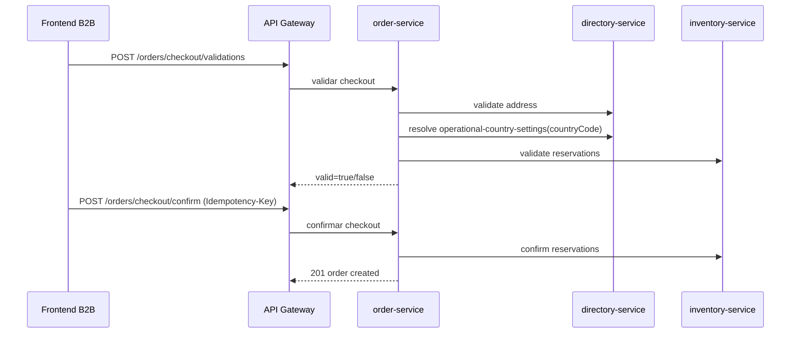

## Proposito
Definir contratos API de `order-service` para operaciones de carrito, checkout, ciclo de pedido y pagos manuales con semantica estable e implementable en WebFlux, incluyendo regionalizacion operativa por pais (FR-011/NFR-011).

## Alcance y fronteras
- Incluye endpoints HTTP de comandos y consultas para Order.
- Incluye errores semanticos, idempotencia, authz y compatibilidad.
- Excluye especificacion OpenAPI final en YAML/JSON.

## Convenciones del contrato
- Base path: `/api/v1/orders`.
- Formato: JSON.
- Mutaciones requieren `Idempotency-Key`.
- Todas las respuestas incluyen `traceId`.
- Multi-tenant: `tenantId` derivado de token o header interno firmado.

## Mapa de endpoints
| Metodo y ruta | Objetivo | Auth/Authz | Idempotencia |
|---|---|---|---|
| `GET /api/v1/orders/cart` | Recuperar carrito activo del usuario | `tenant_user` | N/A |
| `PUT /api/v1/orders/cart/items/{sku}` | Agregar/actualizar item de carrito con reserva | `tenant_user` | obligatoria |
| `DELETE /api/v1/orders/cart/items/{cartItemId}` | Remover item de carrito y liberar reserva | `tenant_user` | obligatoria |
| `DELETE /api/v1/orders/cart` | Limpiar carrito y liberar reservas | `tenant_user` | obligatoria |
| `POST /api/v1/orders/checkout/validations` | Validar direccion + reservas antes de confirmar | `tenant_user` | obligatoria |
| `POST /api/v1/orders/checkout/confirm` | Confirmar checkout y crear pedido | `tenant_user` | obligatoria |
| `POST /api/v1/orders/{orderId}/cancel` | Cancelar pedido segun politica | `arka_operator` | obligatoria |
| `POST /api/v1/orders/{orderId}/status-transitions` | Cambiar estado de pedido | `arka_operator` | obligatoria |
| `POST /api/v1/orders/{orderId}/payments/manual` | Registrar pago manual | `arka_operator`/`arka_admin` | obligatoria |
| `GET /api/v1/orders` | Listado paginado de pedidos | `tenant_user`/`arka_operator` | N/A |
| `GET /api/v1/orders/{orderId}` | Obtener detalle de pedido | `tenant_user`/`arka_operator` | N/A |
| `GET /api/v1/orders/{orderId}/payments` | Listar pagos del pedido | `tenant_user`/`arka_operator` | N/A |
| `GET /api/v1/orders/{orderId}/timeline` | Obtener timeline de estados del pedido | `arka_operator` | N/A |
| `POST /api/v1/internal/orders/carts/detect-abandoned` | Disparar deteccion de carritos abandonados (interno) | `system_scheduler` | obligatoria |

## Flujo API de checkout


## Dependencia de checkout con Directory (contrato regional)
| Llamado sync | Objetivo | Error semantico de salida |
|---|---|---|
| `POST /directory/.../checkout-address-validations` | validar address ownership/estado para checkout | `conflicto_checkout` |
| `GET /directory/.../operational-country-settings/{countryCode}` | resolver moneda, corte semanal y retencion vigentes | `configuracion_pais_no_disponible` |

Regla de mapeo aplicada:
- si `directory` devuelve `404 configuracion_pais_no_disponible` en la consulta
  tecnica de politica regional, `order` bloquea la operacion de negocio y
  responde `409 configuracion_pais_no_disponible`.

## Request/response de referencia
### Upsert item en carrito
```json
{
  "variantId": "4f167bb7-2a2e-4631-8f6d-8f1aef24c301",
  "sku": "SSD-1TB-NVME-980PRO",
  "qty": 8,
  "warehouseId": "d67093ac-7a5d-4b7c-ac90-41c1ad89f2ea"
}
```

```json
{
  "cartId": "5b76f763-d77f-4c8c-bf93-7d1695aa4387",
  "status": "ACTIVE",
  "items": [
    {
      "cartItemId": "7137a69a-53eb-4b0a-b2ce-aa88995d52cb",
      "sku": "SSD-1TB-NVME-980PRO",
      "qty": 8,
      "unitAmount": 120.50,
      "currency": "USD",
      "reservationId": "c4ed5c73-95c0-45eb-b9a5-31a0a6a00d94",
      "reservationExpiresAt": "2026-03-03T21:35:00Z",
      "status": "ACTIVE"
    }
  ],
  "subtotal": 964.00,
  "currency": "USD",
  "traceId": "trc_01JY..."
}
```

### Solicitar validacion de checkout
```json
{
  "addressId": "addr_01JY...",
  "checkoutCorrelationId": "chk_20260303_org-co-001_u-4438_001"
}
```

```json
{
  "valid": true,
  "checkoutCorrelationId": "chk_20260303_org-co-001_u-4438_001",
  "addressSnapshot": {
    "addressId": "addr_01JY...",
    "recipientName": "Bodega Principal Arka Medellin",
    "line1": "Calle 10 #45-23",
    "city": "Medellin",
    "stateRegion": "Antioquia",
    "countryCode": "CO",
    "postalCode": "050021"
  },
  "reservationValidation": {
    "valid": true,
    "invalidReservationIds": [],
    "reasonCodes": []
  },
  "countryOperationalPolicy": {
    "countryCode": "CO",
    "policyVersion": 4,
    "currencyCode": "COP",
    "weekStartsOn": "MONDAY",
    "weeklyCutoffLocalTime": "17:00:00",
    "timezone": "America/Bogota",
    "reportingRetentionDays": 730
  },
  "traceId": "trc_01JY..."
}
```

### Confirmar checkout
```json
{
  "checkoutCorrelationId": "chk_20260303_org-co-001_u-4438_001"
}
```

```json
{
  "orderId": "580f98fb-6f89-4c28-a1a5-d8d5805cf73a",
  "orderNumber": "ARKA-CO-2026-000184",
  "status": "PENDING_APPROVAL",
  "paymentStatus": "PENDING",
  "createdAt": "2026-03-03T20:10:00Z",
  "totalAmount": 1169.16,
  "regionalPolicySnapshot": {
    "countryCode": "CO",
    "policyVersion": 4,
    "currencyCode": "COP"
  },
  "totals": {
    "subtotal": 964.00,
    "discountTotal": 0,
    "taxTotal": 183.16,
    "shippingTotal": 22.00,
    "grandTotal": 1169.16,
    "currency": "COP"
  },
  "traceId": "trc_01JY..."
}
```

### Registrar pago manual
```json
{
  "paymentReference": "TRX-2026-000123",
  "method": "BANK_TRANSFER",
  "amount": 500.00,
  "currency": "USD",
  "receivedAt": "2026-03-03T19:35:00Z"
}
```

```json
{
  "paymentId": "87cbe4e8-8468-4d19-9386-3891260f7da3",
  "orderId": "580f98fb-6f89-4c28-a1a5-d8d5805cf73a",
  "paymentReference": "TRX-2026-000123",
  "method": "BANK_TRANSFER",
  "amount": 500.00,
  "currency": "USD",
  "status": "VALIDATED",
  "registeredAt": "2026-03-03T19:35:00Z",
  "traceId": "trc_01JY..."
}
```

## Taxonomia de errores
| HTTP | Code | Escenario | Recuperable |
|---|---|---|---|
| 400 | `validation_error` | payload invalido, amount <= 0, qty <= 0 | si |
| 401 | `unauthorized` | token ausente o invalido | si |
| 403 | `acceso_cruzado_detectado` | tenant/org mismatch o permiso insuficiente | no |
| 404 | `cart_not_found` | carrito no existe | si |
| 404 | `order_not_found` | pedido inexistente | si |
| 409 | `conflicto_checkout` | direccion o reservas invalidas | si |
| 409 | `reserva_expirada` | reserva vencida al confirmar | si |
| 409 | `configuracion_pais_no_disponible` | no existe politica operativa vigente para `countryCode` del checkout | no |
| 409 | `transicion_estado_invalida` | cambio de estado invalido | no |
| 409 | `pago_duplicado` | paymentReference duplicada | si |
| 409 | `conflicto_idempotencia` | idempotency key conflictiva | si |
| 429 | `rate_limited` | limite operativo superado | si |
| 500 | `internal_error` | error inesperado | no |

## Matriz de transiciones de estado (endpoint `status-transitions`)
| Estado origen | Estado destino permitido | Rol minimo | Error si no aplica |
|---|---|---|---|
| `PENDING_APPROVAL` | `CONFIRMED`, `CANCELLED` | `arka_operator` | `transicion_estado_invalida` |
| `CONFIRMED` | `CANCELLED` | `arka_operator` | `transicion_estado_invalida` |
| `CANCELLED` | N/A (terminal) | N/A | `transicion_estado_invalida` |

Nota: `READY_TO_DISPATCH`, `DISPATCHED` y `DELIVERED` se conservan como
estados reservados para evolucion posterior y no se exponen como
transiciones operativas cerradas en `MVP`.

## Politica de idempotencia
- Header obligatorio: `Idempotency-Key` en mutaciones.
- Ventana de deduplicacion recomendada: 24h.
- Claves sugeridas:
  - checkout confirm: `tenant:user:checkoutCorrelationId`.
  - pago manual: `tenant:orderId:paymentReference`.
  - transicion estado: `tenant:orderId:targetStatus:sourceRef`.
- Misma clave + mismo payload: devolver mismo resultado funcional.
- Misma clave + payload distinto: `409 conflicto_idempotencia`.

## Contrato de paginacion y filtros (consultas)
| Endpoint | Parametros obligatorios | Parametros opcionales | Orden default |
|---|---|---|---|
| `GET /api/v1/orders` | `page`, `size` | `status`, `from`, `to`, `orderNumber`, `organizationId` | `createdAt desc` |
| `GET /api/v1/orders/{orderId}/payments` | N/A | `page`, `size`, `status` | `receivedAt desc` |
| `GET /api/v1/orders/{orderId}/timeline` | N/A | `page`, `size` | `occurredAt asc` |

Reglas:
- `size` maximo recomendado: 100.
- filtros de fecha aceptan `ISO-8601` y se interpretan en UTC.
- toda consulta aplica scope por `tenantId` antes de resolver filtros funcionales.

## Seguridad y autorizacion
| Operacion | Rol minimo | Validaciones |
|---|---|---|
| carrito/checkout | `tenant_user` | tenant + ownership de carrito |
| cancelar/cambiar estado pedido | `arka_operator` | tenant + permiso `ORDER_STATE_WRITE` |
| registrar pago manual | `arka_operator` o `arka_admin` | tenant + permiso `ORDER_PAYMENT_WRITE` |
| consultas de pedidos | `tenant_user`/`arka_operator` | tenant + filtros de organizacion |
| endpoint interno scheduler | `system_scheduler` | firma tecnica + allow-list de origen |

## Matriz de controles transversales por endpoint
| Endpoint | Control de seguridad | Control de observabilidad | Control de resiliencia |
|---|---|---|---|
| `PUT /cart/items/{sku}` | tenant + rol `tenant_user` | `traceId` obligatorio + auditoria de mutacion | dedupe por `Idempotency-Key` |
| `POST /checkout/validations` | tenant + ownership de direccion/carrito | metrica de latencia y razones de conflicto | timeout por dependencia + no side effects irreversibles + bloqueo por `configuracion_pais_no_disponible` |
| `POST /checkout/confirm` | tenant + validacion de correlacion | span `order.confirmCheckout` + evento `OrderCreated` | fallback outbox si broker cae |
| `POST /{orderId}/status-transitions` | permiso `ORDER_STATE_WRITE` | auditoria de `fromStatus->toStatus` | optimistic locking por `version` |
| `POST /{orderId}/payments/manual` | permiso `ORDER_PAYMENT_WRITE` | masking de `paymentReference` en logs | unicidad `paymentReference` + idempotencia |

## Compatibilidad y versionado
- Version por path (`/api/v1`).
- Agregar campos opcionales en request/response: compatible.
- Cambio de significado o remocion de campos: nueva major (`/api/v2`).
- Error codes se consideran contrato estable.

## Matriz de contrato API -> FR/NFR
| Endpoint/flujo | FR | NFR |
|---|---|---|
| carrito (`GET/PUT/DELETE /cart*`) | FR-004, FR-005 | NFR-001, NFR-004, NFR-005 |
| checkout (`/checkout/validations`, `/checkout/confirm`) | FR-004, FR-011 | NFR-001, NFR-004, NFR-005, NFR-006, NFR-011 |
| cancelar/cambiar estado pedido | FR-005, FR-006 | NFR-005, NFR-006 |
| pago manual (`/payments/manual`) | FR-010 | NFR-001, NFR-006 |
| detectar abandonados | FR-008 | NFR-007, NFR-008 |

## Riesgos y mitigaciones
- Riesgo: timeout en dependencias externas durante checkout.
  - Mitigacion: endpoint de validacion previa + budget de timeouts + error semantico estable.
- Riesgo: uso manual incorrecto de pago manual.
  - Mitigacion: permisos especificos + validacion de referencia + auditoria obligatoria.
