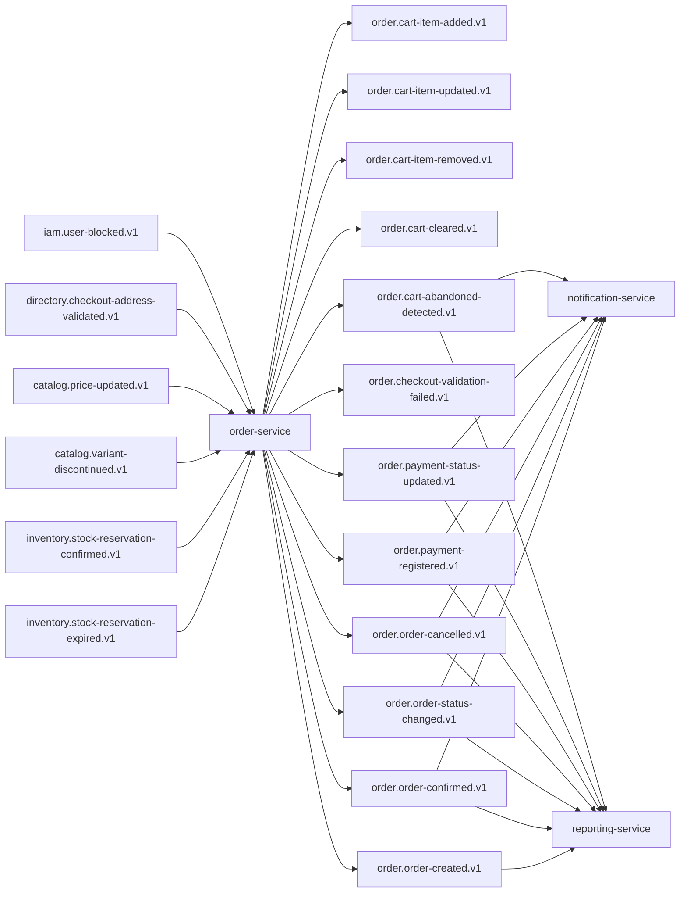

## Proposito
Definir contratos de eventos de `order-service` para integracion EDA con Inventory, Catalog, Directory, Notification y Reporting.

## Alcance y fronteras
- Incluye eventos emitidos por Order y eventos consumidos por Order.
- Incluye topicos, claves, versionado, idempotencia, retencion y DLQ.
- Excluye configuracion infra del cluster Kafka.

## Topologia de eventos Order


## Catalogo de eventos emitidos
| Evento | Topic | Key | Productor | Consumidores | Semantica |
|---|---|---|---|---|---|
| `CartItemAdded` | `order.cart-item-added.v1` | `cartId` | Order | Reporting | item agregado al carrito con reserva |
| `CartItemUpdated` | `order.cart-item-updated.v1` | `cartId` | Order | Reporting | item actualizado en carrito |
| `CartItemRemoved` | `order.cart-item-removed.v1` | `cartId` | Order | Reporting | item removido de carrito |
| `CartCleared` | `order.cart-cleared.v1` | `cartId` | Order | Reporting | carrito limpiado |
| `OrderCheckoutValidationFailed` | `order.checkout-validation-failed.v1` | `checkoutCorrelationId` | Order | Reporting | checkout invalido con razones |
| `OrderCreated` | `order.order-created.v1` | `orderId` | Order | Reporting | pedido creado con entrada obligatoria a `PENDING_APPROVAL` en MVP |
| `OrderConfirmed` | `order.order-confirmed.v1` | `orderId` | Order | Notification, Reporting | confirmacion comercial explicita de pedido |
| `OrderStatusChanged` | `order.order-status-changed.v1` | `orderId` | Order | Notification, Reporting | transicion de estado de pedido |
| `OrderCancelled` | `order.order-cancelled.v1` | `orderId` | Order | Notification, Reporting | cancelacion valida de pedido |
| `OrderPaymentRegistered` | `order.payment-registered.v1` | `orderId` | Order | Notification, Reporting | pago manual registrado |
| `OrderPaymentStatusUpdated` | `order.payment-status-updated.v1` | `orderId` | Order | Notification, Reporting | estado agregado de pago recalculado |
| `CartAbandonedDetected` | `order.cart-abandoned-detected.v1` | `cartId` | Order | Notification, Reporting | carrito detectado como abandonado |

La validacion de checkout contra `inventory-service` se resuelve por contrato HTTP sync; `order.checkout-validation-requested.v1` no es un evento canonico activo en `MVP`.

## Eventos consumidos por Order
| Evento consumido | Topic | Productor | Uso en Order |
|---|---|---|---|
| `StockReservationExpired` | `inventory.stock-reservation-expired.v1` | inventory-service | ajustar carrito por expiracion de reserva |
| `StockReservationConfirmed` | `inventory.stock-reservation-confirmed.v1` | inventory-service | confirmar trazabilidad de linea en pedido |
| `VariantDiscontinued` | `catalog.variant-discontinued.v1` | catalog-service | marcar items como no disponibles |
| `PriceUpdated` | `catalog.price-updated.v1` | catalog-service | refrescar pricing en carritos activos |
| `CheckoutAddressValidated` | `directory.checkout-address-validated.v1` | directory-service | cerrar ciclo de validacion asincrona de direccion |
| `UserBlocked` | `iam.user-blocked.v1` | identity-access-service | cancelar pedidos no terminales y bloquear mutaciones |

## Envelope estandar de eventos
```json
{
  "eventId": "evt_01JY...",
  "eventType": "OrderCreated",
  "eventVersion": "1.0.0",
  "occurredAt": "2026-03-03T20:10:00Z",
  "producer": "order-service",
  "tenantId": "org-co-001",
  "traceId": "trc_01JY...",
  "correlationId": "chk_20260303_org-co-001_u-4438_001",
  "idempotencyKey": "ord-confirm-org-co-001-chk_20260303_001",
  "payload": {
    "orderId": "580f98fb-6f89-4c28-a1a5-d8d5805cf73a",
    "orderNumber": "ARKA-CO-2026-000184",
    "organizationId": "org-co-001",
    "status": "PENDING_APPROVAL",
    "countryCode": "CO",
    "regionalPolicyVersion": 4,
    "paymentStatus": "PENDING",
    "grandTotal": 1169.16,
    "currency": "USD"
  }
}
```

## Payloads minimos por evento emitido
| Evento | Campos minimos |
|---|---|
| `CartItemAdded` | `cartId`, `cartItemId`, `sku`, `qty`, `reservationId`, `occurredAt` |
| `CartItemUpdated` | `cartId`, `cartItemId`, `sku`, `qty`, `reservationId`, `occurredAt` |
| `CartItemRemoved` | `cartId`, `cartItemId`, `sku`, `reason`, `occurredAt` |
| `CartCleared` | `cartId`, `reason`, `occurredAt` |
| `OrderCheckoutValidationFailed` | `cartId`, `checkoutCorrelationId`, `reasonCodes`, `occurredAt` |
| `OrderCreated` | `orderId`, `orderNumber`, `organizationId`, `status`, `countryCode`, `regionalPolicyVersion`, `paymentStatus`, `grandTotal`, `currency`, `occurredAt` |
| `OrderConfirmed` | `orderId`, `previousStatus`, `newStatus`, `confirmedBy`, `occurredAt` |
| `OrderStatusChanged` | `orderId`, `previousStatus`, `newStatus`, `reason`, `occurredAt` |
| `OrderCancelled` | `orderId`, `reason`, `occurredAt` |
| `OrderPaymentRegistered` | `paymentId`, `orderId`, `paymentReference`, `amount`, `currency`, `method`, `occurredAt` |
| `OrderPaymentStatusUpdated` | `orderId`, `paymentStatus`, `paidAmount`, `pendingAmount`, `occurredAt` |
| `CartAbandonedDetected` | `cartId`, `organizationId`, `itemCount`, `occurredAt` |

## Mapa semantico evento -> intencion de dominio
| Evento tecnico | Semantica de dominio | Invariantes relacionadas |
|---|---|---|
| `OrderCreated` | pedido creado tras checkout valido y en `PENDING_APPROVAL` | `I-ORD-01`, `I-ORD-02`, `I-LOC-01` |
| `OrderConfirmed` | confirmacion comercial final del pedido | `I-ORD-01`, `I-ORD-02` |
| `OrderStatusChanged` | cambio de estado auditable | `I-ORD-02` |
| `OrderCancelled` | cancelacion valida + liberacion de compromiso | `I-ORD-02` |
| `OrderPaymentRegistered` | pago manual registrado en pedido | `RN-PAY-01`, `RN-PAY-02` |
| `OrderPaymentStatusUpdated` | estado agregado de pago recalculado | `I-PAY-01` |
| `CartAbandonedDetected` | carrito marcado en ventana de abandono | FR-008 |
| `OrderCheckoutValidationFailed` | validacion previa negativa de checkout | `RN-ORD-01` |

## Reglas de compatibilidad
- `MUST`: agregar campos nuevos solo como opcionales en `v1`.
- `MUST`: cambios de tipo semantico o remocion de campos crean topic `v2`.
- `SHOULD`: consumidores ignoran campos desconocidos.
- `MUST`: todos los eventos incluyen `tenantId`, `traceId`, `correlationId`.

## Entrega, reintentos y DLQ
| Tema | Politica |
|---|---|
| Semantica de entrega | `at-least-once` |
| Particionado | por key de agregado (`cartId`, `orderId`, `checkoutCorrelationId`) |
| Reintento productor | 3 intentos con backoff exponencial |
| Reintento consumidor | 5 intentos con backoff + jitter |
| DLQ | topic `<topic>.dlq` obligatorio |
| Retencion recomendada | 14 dias operativos, 30 dias para eventos de pedido/pago |

## Politica de replay y reproceso
| Escenario | Mecanismo | Garantia |
|---|---|---|
| perdida temporal de evento en consumidor | replay por rango `occurredAt` + `eventId` | no perder side effects |
| re-procesamiento por despliegue | dedupe por `processed_events` | idempotencia funcional |
| poison message | enviar a `<topic>.dlq` + runbook | aislamiento de fallo |
| recuperacion masiva de reporting | reprocesar desde checkpoints por tenant | consistencia eventual controlada |

## SLA de consumo esperado por tipo de evento
| Evento | Consumidor principal | Latencia objetivo de consumo |
|---|---|---|
| `OrderCreated` | reporting | < 30 s |
| `OrderConfirmed` | notification/reporting | < 30 s |
| `OrderStatusChanged` | notification/reporting | < 30 s |
| `OrderPaymentRegistered` | notification/reporting | < 30 s |
| `OrderPaymentStatusUpdated` | reporting | < 60 s |
| `CartAbandonedDetected` | notification/reporting | < 120 s |

## Matriz de contract testing de eventos
| Contrato | Tipo de test | Productor/consumidor | Criterio de aceptacion |
|---|---|---|---|
| `order.order-created.v1` envelope | schema contract test | productor `order-service` | `eventType`, `eventVersion`, `tenantId`, `traceId` obligatorios |
| `order.order-confirmed.v1` payload | consumer contract test | consumidor `notification-service` | `previousStatus=PENDING_APPROVAL` y `newStatus=CONFIRMED` consistentes |
| `order.payment-registered.v1` payload | consumer contract test | consumidor `notification-service` | compatibilidad backward en campos opcionales |
| `order.payment-status-updated.v1` payload | consumer contract test | consumidor `reporting-service` | `paymentStatus` solo valores canonicos (`PENDING/PARTIALLY_PAID/PAID/OVERPAID_REVIEW`) |
| `inventory.stock-reservation-expired.v1` consumo | listener integration contract | consumidor `order-service` | procesamiento idempotente con `processed_events` |
| `iam.user-blocked.v1` consumo | listener integration contract | consumidor `order-service` | cancelacion de pedidos no terminales sin efecto duplicado |

## Politica de evolucion por evento critico
| Evento | Cambio compatible (`v1`) | Cambio incompatible (`v2`) |
|---|---|---|
| `OrderCreated` | agregar campos opcionales en `payload` | cambiar significado de `status` o remover `orderId` |
| `OrderConfirmed` | agregar metadata opcional de aprobacion | cambiar significado de `previousStatus/newStatus` |
| `OrderStatusChanged` | agregar metadata de origen | reemplazar `previousStatus/newStatus` por otro modelo |
| `OrderPaymentRegistered` | agregar campos de conciliacion opcionales | cambiar tipo de `amount` o remover `paymentReference` |
| `CartAbandonedDetected` | agregar clasificacion de abandono | cambiar identificador principal de `cartId` |

## Matriz de idempotencia en consumidores
| Consumidor | Evento | Clave de idempotencia |
|---|---|---|
| `notification-service` | `OrderConfirmed` | `eventId` + `orderId` |
| `notification-service` | `OrderPaymentRegistered` | `eventId` + `paymentId` |
| `reporting-service` | `OrderStatusChanged` | `eventId` + `orderId` |
| `reporting-service` | `CartAbandonedDetected` | `eventId` + `cartId` |

## Riesgos y mitigaciones
- Riesgo: explosion de eventos de carrito en picos de navegacion.
  - Mitigacion: filtros downstream + agregacion temporal en reporting.
- Riesgo: perdida de evento de pago afecta reporting y notificaciones.
  - Mitigacion: outbox + replay por rango + alertas de backlog.
