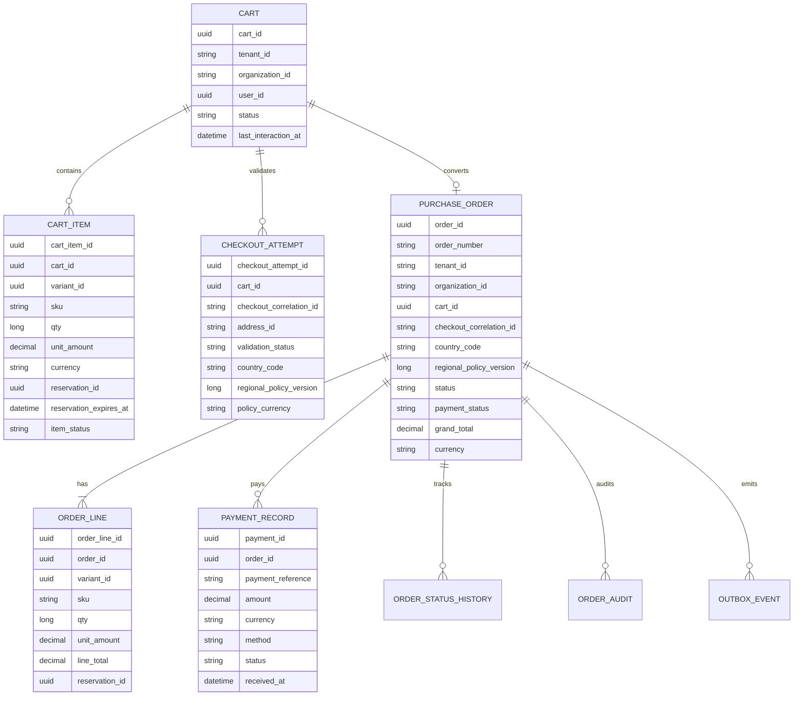

## Proposito
Definir el modelo logico de datos de `order-service` para soportar carrito, checkout, pedido y pagos manuales sin violar invariantes del dominio.

## Alcance y fronteras
- Incluye entidades, relaciones, ownership y reglas de integridad logica de Order.
- Incluye relacion semantica con Inventory, Catalog, Directory e IAM por referencias opacas.
- Excluye DDL definitivo y optimizaciones fisicas de motor.

## Entidades logicas
| Entidad | Tipo | Descripcion | Ownership |
|---|---|---|---|
| `cart` | agregado carrito | carrito activo por usuario/organizacion | Order |
| `cart_item` | entidad interna | linea de carrito vinculada a reserva de inventario | Order |
| `checkout_attempt` | soporte checkout | evidencia de validaciones de checkout por correlacion | Order |
| `purchase_order` | agregado pedido | pedido comercial con snapshots, totales y ciclo de aprobacion | Order |
| `order_line` | entidad interna | lineas inmutables del pedido | Order |
| `payment_record` | entidad interna de pago | pagos manuales asociados al pedido dentro del agregado de pago | Order |
| `order_status_history` | historial | timeline de transiciones de estado | Order |
| `order_audit` | auditoria | bitacora de operaciones y rechazos | Order |
| `idempotency_record` | soporte idempotencia HTTP | deduplicacion write-side de mutaciones por `Idempotency-Key` | Order |
| `outbox_event` | integracion | eventos pendientes/publicados | Order |
| `processed_event` | idempotencia | control de eventos consumidos | Order |

## Relaciones logicas
- `cart 1..n cart_item`
- `cart 0..n checkout_attempt`
- `cart 0..1 purchase_order`
- `purchase_order 1..n order_line`
- `purchase_order 0..n payment_record`
- `purchase_order 1..n order_status_history`
- `purchase_order 0..n order_audit`
- `cart/purchase_order/payment_record 0..n idempotency_record`
- `cart/purchase_order/payment_record 0..n outbox_event`

## Reglas de integridad del modelo
| Regla | Expresion logica | Fuente |
|---|---|---|
| I-ORD-01 | `purchase_order` solo existe si todas las lineas tienen `reservation_id` confirmada | `03-reglas-invariantes.md` |
| I-ORD-02 | `order_status_history` solo registra transiciones validas | `03-reglas-invariantes.md` |
| I-LOC-01 | checkout/pedido solo se confirman si existe politica operativa activa por `countryCode` | `04-Domain-Rules-&-Invariants.md` |
| I-PAY-01 | `payment_record.amount > 0` | `03-reglas-invariantes.md` |
| RN-PAY-02 | `payment_reference` no duplica efecto en un mismo pedido | `03-reglas-invariantes.md` |
| RN-RES-01 | `cart_item.qty` solo valida si existe reserva activa asociada | `03-reglas-invariantes.md` |

## Mapeo de estados logicos por agregado
| Agregado | Estados permitidos | Fuente de verdad |
|---|---|---|
| `cart` | `ACTIVE`, `CHECKOUT_IN_PROGRESS`, `CONVERTED`, `ABANDONED`, `CANCELLED` | `carts.status` |
| `checkout_attempt` | `VALID`, `INVALID` | `checkout_attempts.validation_status` |
| `purchase_order` | `CREATED` (interno transitorio), `PENDING_APPROVAL`, `CONFIRMED`, `CANCELLED`; `READY_TO_DISPATCH`, `DISPATCHED`, `DELIVERED` quedan reservados para evolucion | `purchase_orders.status` |
| `payment_record` | `REGISTERED`, `VALIDATED`, `REJECTED` | `payment_records.status` |
| `purchase_order.payment_status` | `PENDING`, `PARTIALLY_PAID`, `PAID`, `OVERPAID_REVIEW` | `purchase_orders.payment_status` |

## Diagrama logico (ER)

## Referencias cross-service (sin FK fisica)
| Referencia | Sistema propietario | Uso en Order |
|---|---|---|
| `reservation_id` | Inventory | confirmar/vigilar validez de reservas |
| `variant_id` + `sku` | Catalog | congelar pricing y metadata de linea |
| `address_id` | Directory | validar checkout y construir `addressSnapshot` |
| `country_code + policy_version` | Directory | resolver y congelar politica operativa regional usada en checkout/reporting |
| `tenant_id`, `organization_id`, `user_id` | IAM/Directory | aislamiento multi-tenant y ownership |

## Entidades de soporte de integracion y auditoria
| Entidad | Objetivo | Clave de integridad |
|---|---|---|
| `checkout_attempt` | evidenciar resultado de validacion previa | unico por `tenant_id + checkout_correlation_id` |
| `order_status_history` | trazabilidad cronologica de estado | orden por `occurred_at` por pedido |
| `order_audit` | auditoria de acciones/errores de seguridad y negocio | incluye `traceId`, `actorId`, `resultCode` |
| `idempotency_record` | dedupe de mutaciones HTTP y respuesta reutilizable | unico por `tenant_id + operation_name + idempotency_key` |
| `outbox_event` | publicacion confiable de eventos | estado `PENDING/PUBLISHED/FAILED` |
| `processed_event` | dedupe de eventos consumidos | unico por `eventId + consumerName` |

## Mapa comando -> entidades mutadas
| Comando/UC | Entidades mutadas | Limite transaccional |
|---|---|---|
| `UpsertCartItem` (UC-ORD-02) | `cart`, `cart_item`, `order_audit`, `idempotency_record`, `outbox_event` | transaccion local unica |
| `RequestCheckoutValidation` (UC-ORD-05) | `checkout_attempt` (incluye `country_code`, `regional_policy_version`, `policy_currency`), `order_audit`, `idempotency_record`, `outbox_event` | transaccion local unica |
| `ConfirmOrder` (UC-ORD-06) | `purchase_order`, `order_line`, `cart`, `order_status_history`, `order_audit`, `idempotency_record`, `outbox_event` | transaccion local unica; confirmacion de reservas previa |
| `CancelOrder` (UC-ORD-07) | `purchase_order`, `order_status_history`, `order_audit`, `idempotency_record`, `outbox_event` | transaccion local unica |
| `RegisterManualPayment` (UC-ORD-09) | `payment_record`, `purchase_order.payment_status`, `order_status_history`, `order_audit`, `idempotency_record`, `outbox_event` | transaccion local unica |
| `HandleReservationExpired` (UC-ORD-14) | `cart_item`, `cart`, `order_audit`, `processed_event`, `outbox_event` | transaccion local unica e idempotente |

## Lecturas derivadas
- `cart_subtotal = sum(cart_item.qty * cart_item.unit_amount)`
- `payment_applied = sum(payment_record where status=VALIDATED)`
- `payment_pending = purchase_order.grand_total - payment_applied`
- `order_is_paid = payment_pending <= 0`

## Riesgos y mitigaciones
- Riesgo: deriva entre estado de reserva y contenido de carrito.
  - Mitigacion: listeners de `inventory.stock-reservation-expired.v1` y validacion final en checkout.
- Riesgo: duplicidad de pago por reproceso manual.
  - Mitigacion: unicidad semantica por `payment_reference` + idempotencia.
