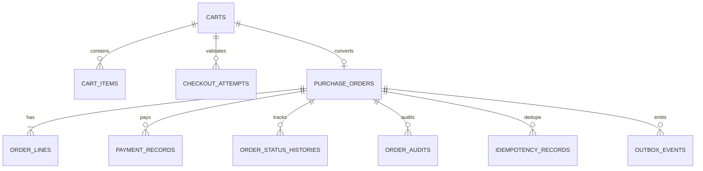

## Proposito
Definir el modelo fisico de `order-service` en PostgreSQL, incluyendo tablas, constraints e indices para soportar alta concurrencia de checkout y consistencia de pago manual.

## Alcance y fronteras
- Incluye tablas fisicas de Order y estrategias de indexacion.
- Incluye lineamientos de versionado, particionado y retencion para historicos/eventos.
- Excluye scripts de migracion finales.

## Motor y convenciones
- Motor: PostgreSQL 15+
- PKs: UUID
- Timestamps: `timestamptz`
- Multi-tenant: `tenant_id` obligatorio en tablas operativas
- Soft delete: no aplicado en `purchase_order`; ciclo de vida por `status`

## Tablas fisicas principales
| Tabla | Proposito | Claves principales |
|---|---|---|
| `carts` | carrito activo por usuario/organizacion | `cart_id`, UK `(tenant_id, organization_id, user_id, status_active)` |
| `cart_items` | lineas de carrito con reserva asociada | `cart_item_id`, idx por `cart_id + sku` |
| `checkout_attempts` | trazabilidad de validaciones de checkout | `checkout_attempt_id`, UK `(tenant_id, checkout_correlation_id)` |
| `purchase_orders` | pedidos confirmados | `order_id`, UK `(tenant_id, order_number)`, UK `(tenant_id, checkout_correlation_id)` |
| `order_lines` | lineas inmutables del pedido | `order_line_id`, idx por `order_id` |
| `payment_records` | pagos manuales por pedido | `payment_id`, UK `(tenant_id, order_id, payment_reference)` |
| `order_status_histories` | historial de transiciones | `history_id`, idx por `order_id + occurred_at` |
| `order_audits` | auditoria de acciones y rechazos | `audit_id`, idx por `tenant_id + created_at` |
| `idempotency_records` | deduplicacion write-side de mutaciones HTTP | `idempotency_record_id`, UK `(tenant_id, operation_name, idempotency_key)` |
| `outbox_events` | publicacion EDA garantizada | `event_id`, idx por `status + occurred_at` |
| `processed_events` | idempotencia de consumidores | `processed_event_id`, UK `(event_id, consumer_name)` |

## Diccionario de columnas criticas
### `carts`
| Columna | Tipo | Nulo | Regla |
|---|---|---|---|
| `cart_id` | `uuid` | no | PK |
| `tenant_id` | `varchar(64)` | no | aislamiento tenant |
| `organization_id` | `varchar(64)` | no | ownership organizacion |
| `user_id` | `uuid` | no | ownership usuario |
| `status` | `varchar(32)` | no | `ACTIVE/CHECKOUT_IN_PROGRESS/CONVERTED/ABANDONED/CANCELLED` |
| `created_at` | `timestamptz` | no | default now() |
| `updated_at` | `timestamptz` | no | default now() |
| `last_interaction_at` | `timestamptz` | no | usado por scheduler de abandono |
| `abandoned_at` | `timestamptz` | si | set cuando `status=ABANDONED` |
| `version` | `bigint` | no | optimistic lock |

### `cart_items`
| Columna | Tipo | Nulo | Regla |
|---|---|---|---|
| `cart_item_id` | `uuid` | no | PK |
| `cart_id` | `uuid` | no | referencia local a `carts` |
| `tenant_id` | `varchar(64)` | no | aislamiento tenant |
| `variant_id` | `uuid` | no | referencia opaca a Catalog |
| `sku` | `varchar(120)` | no | referencia opaca a Catalog |
| `qty` | `bigint` | no | `CHECK (qty > 0)` |
| `unit_amount` | `numeric(18,4)` | no | >= 0 |
| `tax_amount` | `numeric(18,4)` | no | >= 0 |
| `discount_amount` | `numeric(18,4)` | no | >= 0 |
| `currency` | `varchar(3)` | no | ISO 4217 |
| `reservation_id` | `uuid` | no | referencia opaca a Inventory |
| `warehouse_id` | `uuid` | no | origen de reserva |
| `reservation_expires_at` | `timestamptz` | no | TTL actual de reserva |
| `item_status` | `varchar(32)` | no | `ACTIVE/UNAVAILABLE/REMOVED` |
| `created_at` | `timestamptz` | no | default now() |
| `updated_at` | `timestamptz` | no | default now() |

### `purchase_orders`
| Columna | Tipo | Nulo | Regla |
|---|---|---|---|
| `order_id` | `uuid` | no | PK |
| `order_number` | `varchar(40)` | no | unico por tenant |
| `tenant_id` | `varchar(64)` | no | aislamiento tenant |
| `organization_id` | `varchar(64)` | no | ownership organizacion |
| `cart_id` | `uuid` | no | origen de conversion |
| `checkout_correlation_id` | `varchar(120)` | no | idempotencia checkout |
| `country_code` | `char(2)` | no | pais operativo resuelto desde Directory |
| `regional_policy_version` | `integer` | no | version de politica operativa por pais aplicada |
| `status` | `varchar(32)` | no | enum estado pedido |
| `payment_status` | `varchar(32)` | no | `PENDING/PARTIALLY_PAID/PAID/OVERPAID_REVIEW` |
| `subtotal` | `numeric(18,4)` | no | >= 0 |
| `discount_total` | `numeric(18,4)` | no | >= 0 |
| `tax_total` | `numeric(18,4)` | no | >= 0 |
| `shipping_total` | `numeric(18,4)` | no | >= 0 |
| `grand_total` | `numeric(18,4)` | no | > 0 |
| `currency` | `varchar(3)` | no | ISO 4217 |
| `address_snapshot_json` | `jsonb` | no | snapshot inmutable |
| `regional_policy_snapshot_json` | `jsonb` | no | moneda/corte/retencion usados en checkout |
| `created_at` | `timestamptz` | no | default now() |
| `updated_at` | `timestamptz` | no | default now() |
| `version` | `bigint` | no | optimistic lock |

### `order_lines`
| Columna | Tipo | Nulo | Regla |
|---|---|---|---|
| `order_line_id` | `uuid` | no | PK |
| `order_id` | `uuid` | no | referencia local a `purchase_orders` |
| `tenant_id` | `varchar(64)` | no | aislamiento tenant |
| `variant_id` | `uuid` | no | referencia opaca a Catalog |
| `sku` | `varchar(120)` | no | referencia opaca a Catalog |
| `qty` | `bigint` | no | `CHECK (qty > 0)` |
| `unit_amount` | `numeric(18,4)` | no | >= 0 |
| `tax_amount` | `numeric(18,4)` | no | >= 0 |
| `discount_amount` | `numeric(18,4)` | no | >= 0 |
| `line_total` | `numeric(18,4)` | no | >= 0 |
| `currency` | `varchar(3)` | no | ISO 4217 |
| `reservation_id` | `uuid` | no | reserva confirmada |
| `price_snapshot_json` | `jsonb` | no | snapshot inmutable |
| `created_at` | `timestamptz` | no | default now() |

### `payment_records`
| Columna | Tipo | Nulo | Regla |
|---|---|---|---|
| `payment_id` | `uuid` | no | PK |
| `tenant_id` | `varchar(64)` | no | aislamiento tenant |
| `order_id` | `uuid` | no | referencia local a `purchase_orders` |
| `payment_reference` | `varchar(120)` | no | unico por pedido |
| `method` | `varchar(32)` | no | enum metodo pago |
| `amount` | `numeric(18,4)` | no | `CHECK (amount > 0)` |
| `currency` | `varchar(3)` | no | ISO 4217 |
| `status` | `varchar(32)` | no | `REGISTERED/VALIDATED/REJECTED` |
| `received_at` | `timestamptz` | no | fecha evidencia pago |
| `registered_by` | `uuid` | no | usuario operador |
| `created_at` | `timestamptz` | no | default now() |

### `checkout_attempts`
| Columna | Tipo | Nulo | Regla |
|---|---|---|---|
| `checkout_attempt_id` | `uuid` | no | PK |
| `tenant_id` | `varchar(64)` | no | aislamiento tenant |
| `cart_id` | `uuid` | no | referencia local a `carts` |
| `checkout_correlation_id` | `varchar(120)` | no | unico por tenant |
| `address_id` | `varchar(120)` | no | referencia opaca a Directory |
| `validation_status` | `varchar(16)` | no | `VALID/INVALID` |
| `country_code` | `char(2)` | no | pais operativo usado para resolver politica |
| `regional_policy_version` | `integer` | si | version resuelta, obligatorio cuando `validation_status='VALID'` |
| `policy_currency` | `char(3)` | si | moneda operativa resuelta |
| `invalid_reason_codes` | `jsonb` | si | razones de rechazo |
| `validated_at` | `timestamptz` | no | fecha de validacion |
| `created_at` | `timestamptz` | no | default now() |

### `order_status_histories`
| Columna | Tipo | Nulo | Regla |
|---|---|---|---|
| `history_id` | `uuid` | no | PK |
| `tenant_id` | `varchar(64)` | no | aislamiento tenant |
| `order_id` | `uuid` | no | referencia local a `purchase_orders` |
| `previous_status` | `varchar(32)` | si | null en estado inicial |
| `current_status` | `varchar(32)` | no | estado destino |
| `reason_code` | `varchar(64)` | si | motivo funcional |
| `changed_by` | `uuid` | si | actor de cambio |
| `source_ref` | `varchar(120)` | si | referencia externa |
| `occurred_at` | `timestamptz` | no | orden temporal |

### `order_audits`
| Columna | Tipo | Nulo | Regla |
|---|---|---|---|
| `audit_id` | `uuid` | no | PK |
| `tenant_id` | `varchar(64)` | no | aislamiento tenant |
| `order_id` | `uuid` | si | null para eventos de carrito |
| `operation` | `varchar(64)` | no | codigo de operacion |
| `result_code` | `varchar(64)` | no | exito/error |
| `actor_id` | `uuid` | si | usuario/servicio actor |
| `actor_role` | `varchar(64)` | si | rol efectivo |
| `trace_id` | `varchar(120)` | no | trazabilidad distribuida |
| `correlation_id` | `varchar(120)` | si | correlacion funcional |
| `metadata_json` | `jsonb` | si | contexto adicional |
| `created_at` | `timestamptz` | no | default now() |

### `idempotency_records`
| Columna | Tipo | Nulo | Regla |
|---|---|---|---|
| `idempotency_record_id` | `uuid` | no | PK |
| `tenant_id` | `varchar(64)` | no | aislamiento tenant |
| `operation_name` | `varchar(80)` | no | nombre canonico del caso mutante |
| `idempotency_key` | `varchar(180)` | no | clave de dedupe enviada por cliente |
| `request_hash` | `varchar(128)` | no | hash del payload para detectar conflicto |
| `resource_ref` | `varchar(160)` | si | referencia del recurso materializado |
| `response_json` | `jsonb` | si | respuesta reutilizable del primer procesamiento |
| `status_code` | `integer` | no | estado HTTP almacenado para replay |
| `created_at` | `timestamptz` | no | default now() |
| `expires_at` | `timestamptz` | no | ventana de dedupe (24h recomendada) |

### `outbox_events`
| Columna | Tipo | Nulo | Regla |
|---|---|---|---|
| `event_id` | `varchar(120)` | no | PK tecnica |
| `tenant_id` | `varchar(64)` | no | aislamiento tenant |
| `aggregate_type` | `varchar(64)` | no | cart/order/payment |
| `aggregate_id` | `varchar(120)` | no | id del agregado |
| `event_type` | `varchar(120)` | no | `OrderCreated`, etc. |
| `event_version` | `varchar(16)` | no | `1.0.0` |
| `topic_name` | `varchar(180)` | no | destino broker |
| `partition_key` | `varchar(120)` | no | clave de orden |
| `payload_json` | `jsonb` | no | payload serializado |
| `status` | `varchar(16)` | no | `PENDING/PUBLISHED/FAILED` |
| `retry_count` | `integer` | no | default 0 |
| `occurred_at` | `timestamptz` | no | fecha de hecho |
| `published_at` | `timestamptz` | si | fecha de publicacion |
| `last_error` | `text` | si | ultima falla de publish |

### `processed_events`
| Columna | Tipo | Nulo | Regla |
|---|---|---|---|
| `processed_event_id` | `uuid` | no | PK |
| `tenant_id` | `varchar(64)` | no | aislamiento tenant |
| `event_id` | `varchar(120)` | no | id del evento consumido |
| `event_type` | `varchar(120)` | no | tipo consumido |
| `consumer_name` | `varchar(120)` | no | listener/use case consumidor |
| `aggregate_ref` | `varchar(120)` | si | orderId/cartId/reservationId |
| `processed_at` | `timestamptz` | no | marca de dedupe |
| `trace_id` | `varchar(120)` | si | trazabilidad |

## Diagrama fisico simplificado


## Indices recomendados
| Tabla | Indice | Tipo | Uso |
|---|---|---|---|
| `carts` | `idx_carts_tenant_org_user_active` | btree parcial | resolver carrito activo |
| `carts` | `idx_carts_abandonment_candidates` | btree parcial | scheduler abandono |
| `cart_items` | `idx_cart_items_cart_id` | btree | hydrate de carrito |
| `cart_items` | `idx_cart_items_reservation_id` | btree | ajuste por eventos inventory |
| `checkout_attempts` | `ux_checkout_attempts_tenant_corr` | unique btree | idempotencia checkout |
| `purchase_orders` | `ux_orders_tenant_number` | unique btree | numero comercial unico |
| `purchase_orders` | `ux_orders_tenant_checkout_corr` | unique btree | no duplicar pedido por checkout |
| `purchase_orders` | `idx_orders_tenant_org_status_created` | btree | listados por filtros |
| `purchase_orders` | `idx_orders_tenant_country_status` | btree | consultas operativas y auditoria regional |
| `order_lines` | `idx_order_lines_order_id` | btree | detalle pedido |
| `payment_records` | `ux_payments_tenant_order_reference` | unique btree | evitar pago duplicado |
| `payment_records` | `idx_payments_order_status` | btree | consulta y sumatorias |
| `order_status_histories` | `idx_status_history_order_occurred` | btree | timeline |
| `order_audits` | `idx_order_audits_tenant_created` | btree | trazabilidad seguridad |
| `idempotency_records` | `ux_idempotency_tenant_operation_key` | unique btree | dedupe de mutaciones HTTP |
| `idempotency_records` | `idx_idempotency_expires_at` | btree | limpieza por expiracion |
| `outbox_events` | `idx_outbox_status_occurred` | btree | publish scheduler |
| `processed_events` | `ux_processed_event_consumer` | unique btree | idempotencia de consumo |

## Constraints de consistencia recomendadas
- `CHECK (qty > 0)` en `cart_items` y `order_lines`.
- `CHECK (amount > 0)` en `payment_records`.
- `CHECK (grand_total > 0)` en `purchase_orders`.
- Restriccion funcional: `payment_records.payment_reference` unica por `tenant_id + order_id`.
- Restriccion logica: `purchase_orders.checkout_correlation_id` unica por tenant.
- `CHECK (regional_policy_version > 0)` en `purchase_orders`.
- `CHECK (regional_policy_version > 0)` en `checkout_attempts` cuando `validation_status='VALID'`.
- `CHECK (validation_status in ('VALID','INVALID'))` en `checkout_attempts`.
- `CHECK (status in ('PENDING','PUBLISHED','FAILED'))` en `outbox_events`.
- `UNIQUE (tenant_id, checkout_correlation_id)` en `checkout_attempts`.
- `UNIQUE (tenant_id, operation_name, idempotency_key)` en `idempotency_records`.
- `UNIQUE (event_id, consumer_name)` en `processed_events`.

## DDL de referencia para restricciones criticas
```sql
ALTER TABLE purchase_orders
  ADD CONSTRAINT ck_purchase_orders_grand_total_positive
  CHECK (grand_total > 0);

ALTER TABLE payment_records
  ADD CONSTRAINT ck_payment_records_amount_positive
  CHECK (amount > 0);

CREATE UNIQUE INDEX ux_purchase_orders_tenant_checkout_corr
  ON purchase_orders (tenant_id, checkout_correlation_id);

CREATE UNIQUE INDEX ux_payment_records_tenant_order_reference
  ON payment_records (tenant_id, order_id, payment_reference);

CREATE UNIQUE INDEX ux_idempotency_tenant_operation_key
  ON idempotency_records (tenant_id, operation_name, idempotency_key);

CREATE UNIQUE INDEX ux_processed_events_event_consumer
  ON processed_events (event_id, consumer_name);
```

## Politica de archivado operativo
| Tabla | Criterio de archivado | Frecuencia | Conservacion activa |
|---|---|---|---|
| `order_status_histories` | `occurred_at` > 24 meses | mensual | 24 meses |
| `order_audits` | `created_at` > 24 meses | mensual | 24 meses |
| `idempotency_records` | `expires_at` <= now() | diario | 24 horas |
| `outbox_events` | `status='PUBLISHED'` y `published_at` > 30 dias | semanal | 30 dias |
| `processed_events` | `processed_at` > 60 dias | semanal | 60 dias |

## Estrategia de crecimiento y retencion
- `order_status_histories`: particion mensual por `occurred_at`.
- `order_audits`: retencion 24 meses.
- `idempotency_records`: retencion 24 horas alineada a ventana de deduplicacion HTTP.
- `outbox_events`: retencion 30 dias tras `published`.
- `processed_events`: retencion 60 dias para deduplicacion segura.

## Riesgos y mitigaciones
- Riesgo: scans costosos en listado de pedidos multi-filtro.
  - Mitigacion: indice compuesto por `tenant_id, organization_id, status, created_at`.
- Riesgo: contencion en checkout por actualizacion concurrente de `purchase_orders`.
  - Mitigacion: optimistic lock + retry acotado por correlation.
