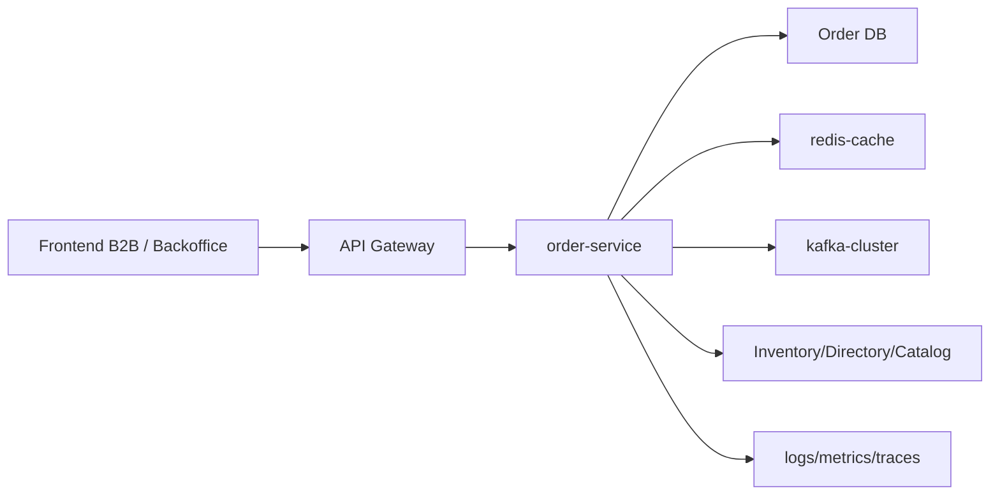
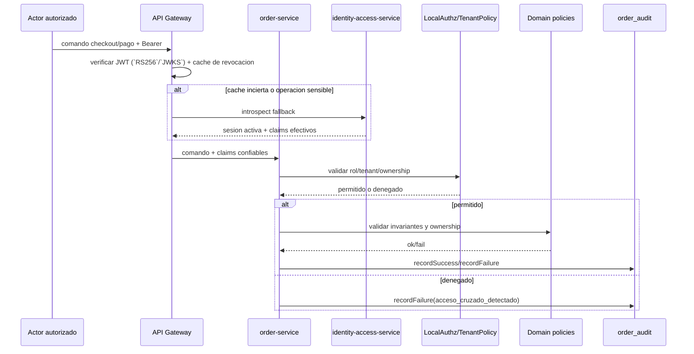

## Proposito
Definir controles de seguridad para `order-service` sobre operaciones de carrito, checkout, pedido y pago manual, protegiendo integridad de compra, aislamiento tenant y trazabilidad.

## Alcance y fronteras
- Incluye amenazas principales (STRIDE), controles preventivos/detectivos y hardening de endpoints.
- Incluye tratamiento de datos sensibles operativos y auditoria.
- Excluye requisitos regulatorios legales de cada pais fuera del alcance tecnico de la fase.

## Threat model (resumen)
| Categoria | Amenaza | Impacto | Control principal |
|---|---|---|---|
| Spoofing | actor no autorizado intenta confirmar pedido o registrar pago | fraude y corrupcion de datos | JWT validado en `api-gateway-service` + autorizacion contextual (`RBAC` + tenant checks) en `order-service` |
| Tampering | alteracion de montos/lineas durante checkout | pedido/pago inconsistente | snapshots inmutables + validacion dominio |
| Repudiation | operador niega cambios de estado o pago manual | perdida de trazabilidad | `order_audit` + traceId/correlationId |
| Information disclosure | exposicion de pedidos de otro tenant | incidente de seguridad | tenant isolation en app+dominio |
| DoS | spam de checkout o pagos manuales | degradacion de flujo core | rate limit + backpressure + cuotas |
| Elevation of privilege | usuario B2B intenta usar endpoints de operador | fraude operativo | permisos granulares por endpoint |

## Superficie de ataque

## Controles de autenticacion/autorizacion
| Operacion | Control requerido |
|---|---|
| carrito y checkout | rol `tenant_user` + match `tenant_id`/`organization_id` |
| cancelar pedido y transicion de estado | rol `arka_operator` + permiso `ORDER_STATE_WRITE` |
| registrar pago manual | rol `arka_operator` o `arka_admin` + permiso `ORDER_PAYMENT_WRITE` |
| consultas por operador | rol interno autorizado + scoping por tenant/organizacion |
| scheduler interno | identidad tecnica `system_scheduler` |

Regla de hardening posterior:
- `MFA` para cuentas privilegiadas `arka_admin` que operan en backoffice de Order queda diferido a la etapa de hardening/operacion y no bloquea el freeze del baseline `MVP`.

## Modelo distribuido de identidad
| Capa | Responsabilidad |
|---|---|
| `api-gateway-service` | verifica firma JWT (`RS256`/`JWKS`), `iss`, `aud`, expiracion y cache de revocacion antes de enrutar |
| `order-service` | revalida rol, `tenant`, permiso y ownership del carrito/pedido dentro del caso de uso; no consulta IAM por cada mutacion |
| `identity-access-service` | mantiene la verdad de sesion/rol, publica `SessionRevoked/UserBlocked/RoleAssigned` y atiende introspeccion fallback |
| caches/eventos | reducen latencia del camino caliente y cierran la brecha temporal de revocacion o cambio de rol |

Aplicacion local: `order-service` usa `Spring Security WebFlux` para construir el `SecurityContext`, leer claims confiables propagados por el gateway y aplicar autorizacion gruesa por ruta. La validacion fina de `tenant`, permiso, estado y ownership permanece en el caso de uso y el dominio.

## Modelo de errores de seguridad
| Momento | Familia/cierre canonico | Aplicacion en Order |
|---|---|---|
| autenticacion de borde | `401/403` en frontera | `api-gateway-service` corta JWT invalido, expirado o revocado antes de enrutar; Order no ejecuta login ni emision de tokens |
| autorizacion contextual | `AuthorizationDeniedException`, `TenantIsolationException` | `order-service` rechaza cruce de `tenant`, permiso insuficiente o ownership invalido sobre carrito, pedido o pago |
| regla de dominio sensible | `DomainRuleViolationException`, `ConflictException`, `ResourceNotFoundException` | checkout invalido, transicion ilegal, pago duplicado o pedido inexistente se cierran como `404/409/422`, no como error tecnico |
| evento malicioso o duplicado | `NonRetryableDependencyException` o `noop idempotente` | listeners invalidos van a DLQ; replay o duplicado de evento se trata como noop idempotente |
| evidencia de seguridad | `order_audit` + `traceId/correlationId` | rechazos por acceso cruzado, fraude operativo o conflicto sensible dejan evidencia trazable con masking de datos de pago |

## Matriz endpoint -> amenaza -> control
| Endpoint/flujo | Amenaza prioritaria | Control preventivo | Control detectivo |
|---|---|---|---|
| `PUT /api/v1/orders/cart/items/{sku}` | tampering de cantidad y cruce tenant | validacion `qty>0`, token firmado, tenant match obligatorio | `order_audit` + alerta por `acceso_cruzado_detectado` |
| `POST /api/v1/orders/checkout/confirm` | replay/idempotencia rota y spoofing | `Idempotency-Key` + `checkoutCorrelationId` unico por tenant + RBAC | correlacion de intentos duplicados por `traceId` |
| `POST /api/v1/orders/{orderId}/status-transitions` | elevation of privilege | permiso `ORDER_STATE_WRITE` + politica de transicion de estado | auditoria de cambios y alertas por `transicion_estado_invalida` |
| `POST /api/v1/orders/{orderId}/payments/manual` | fraude operativo y pago duplicado | permiso `ORDER_PAYMENT_WRITE`, unicidad `paymentReference`, regla `amount > 0` | alerta por `pago_duplicado` y montos atipicos |
| listeners de eventos (`inventory/catalog/iam`) | mensaje malformado o replay | validacion de schema + dedupe `processed_events` | DLQ + metrica de reintentos/descartes |

## Datos sensibles y politicas
| Dato | Clasificacion | Tratamiento |
|---|---|---|
| `tenant_id`, `organization_id`, `order_id` | operacional sensible | no anonimizar en transaccion; proteger en logs externos |
| `address_snapshot_json` | PII de negocio | cifrado en reposo + minimizacion en logs |
| `payment_reference`, `amount` | sensible financiero | enmascarado parcial en logs, acceso RBAC |
| `trace_id`, `correlation_id` | tecnico | obligatorio para auditoria |
| `idempotency_key` | sensible operacional | hash en logs, sin exponer valor completo |

## Controles de cifrado y secretos
| Superficie | Control minimo | Evidencia esperada |
|---|---|---|
| trafico cliente -> gateway -> order | TLS 1.2+ obligatorio | test de configuracion de seguridad por entorno |
| trafico order -> directory/catalog/inventory | mTLS interno o canal TLS autenticado | verificacion en pruebas de integracion de conectividad segura |
| datos en reposo (`address_snapshot_json`, auditoria) | cifrado en reposo del volumen y backup cifrado | checklist de plataforma + auditoria de backup |
| secretos de clientes externos | secretos en vault/secret manager, no hardcode | escaneo SAST/SCA + politica de rotacion |
| `paymentReference` e `idempotencyKey` en logs | masking parcial + hashing | prueba de no exposicion en logs de error |

## Seguridad de eventos
- `MUST`: todos los eventos incluyen `tenantId`, `traceId`, `correlationId`.
- `MUST`: productores validan schema y version antes de publicar.
- `SHOULD`: consumidores aplican dedupe por `eventId + consumer`.
- `MUST`: DLQ activa para mensajes irreparables.

## Seguridad operativa por flujo critico

## Compliance minimo esperado
- Retencion de auditoria operativa de pedidos y pagos: 24 meses.
- No borrado de evidencia de `payment_record` en pedidos cerrados.
- Segregacion de funciones: quien registra pago no debe aprobar su propia anulacion contable.

## Matriz de pruebas de seguridad (Gate de calidad)
| Tipo de prueba | Cobertura minima | FR/NFR objetivo | Criterio de aceptacion |
|---|---|---|---|
| authz multi-tenant en APIs mutantes | carrito, checkout, estado, pago manual | FR-004, FR-009, FR-010, NFR-005 | 0 accesos cruzados permitidos |
| idempotencia contra replay | checkout confirm, pago manual | FR-004, FR-010, NFR-006 | misma llave + mismo payload no duplica efecto |
| contrato de eventos (schema+envelope) | eventos emitidos/consumidos de Order | FR-006, FR-008, NFR-006 | 100% eventos validan `eventType`/`eventVersion` |
| pruebas de logging seguro | endpoints criticos y listeners | NFR-006, NFR-007 | sin exposicion completa de `paymentReference` o `idempotencyKey` |
| DAST basico sobre endpoints core | `/cart`, `/checkout`, `/payments/manual` | NFR-005 | sin vulnerabilidades criticas explotables |

## Runbooks minimos de seguridad para Order
1. `ORD-SEC-01`: deteccion de acceso cruzado (`acceso_cruzado_detectado`) por encima del umbral.
2. `ORD-SEC-02`: pico de pagos manuales duplicados o atipicos.
3. `ORD-SEC-03`: incremento de DLQ por eventos invalidos o replay.
4. `ORD-SEC-04`: posible exfiltracion por logs con masking incompleto.

## Riesgos y mitigaciones
- Riesgo: abuso de endpoint de pago manual por credenciales comprometidas.
  - Mitigacion: en baseline actual, alertas de monto anomalo y doble aprobacion en montos altos; `MFA` se incorpora en hardening posterior.
- Riesgo: fuga cross-tenant por filtros incompletos.
  - Mitigacion: tenant policy obligatoria en dominio + tests de seguridad por contrato.
