## Proposito
Definir el catalogo completo de clases/archivos del servicio `notification-service` para implementacion Java 21 + Spring WebFlux con arquitectura hexagonal/clean, CQRS ligero, EDA y DDD.

## Alcance y fronteras
- Incluye inventario completo de clases por carpeta para el servicio Notification.
- Incluye separacion estricta de estructura: `domain`, `application`, `infrastructure`.
- Incluye clases de configuracion para dependencias (security, kafka, r2dbc, redis, observabilidad).
- Excluye codigo de otros BC/servicios.

## Regla de completitud aplicada
- Este documento define **catalogo completo**, no minimo.
- Cada clase se mapea a una carpeta concreta del arbol canonico.
- El dominio se divide por modelos (`notification`, `attempt`, `template`, `channel`, `callback`) con slicing interno (`entity`, `valueobject`, `enum`, `event`) cuando aplica.
- Los puertos/adaptadores se dividen por responsabilidad (`persistence`, `security`, `audit`, `event`, `external`, `cache`).
- `application` usa contratos internos `command/query/result`; el borde web usa `request/response` y mappers dedicados.

## Estructura estricta (Notification)
Este arbol muestra la estructura canonica completa del servicio a nivel de carpetas. El detalle por archivo y los diagramas de clase individuales se consultan mas abajo en la vista por capas.

```tree
- src | folder
  - main | folder
    - java | code
      - com | folder
        - arka | building | primary
          - notification | microchip | primary
            - domain | cubes | info
              - model | folder-open | info
                - notification | folder
                  - valueobject | folder
                  - enum | folder
                  - event | share-nodes | accent
                - attempt | folder
                  - entity | table
                  - enum | folder
                - template | folder
                - channel | folder
                - callback | folder
                  - enum | folder
              - service | gear | info
              - exception | folder
            - application | sitemap | warning
              - port | plug | warning
                - in | arrow-right
                  - command | bolt
                  - query | magnifying-glass
                - out | arrow-left
                  - persistence | database
                  - external | cloud
                  - event | share-nodes | accent
                  - audit | clipboard
                  - cache | hard-drive
                  - security | shield
              - usecase | bolt | warning
                - command | bolt
                - query | magnifying-glass
              - command | terminal | warning
              - query | binoculars | warning
              - result | file-lines | warning
              - mapper | shuffle
                - command | shuffle
                - query | shuffle
                - result | shuffle
              - exception | folder
            - infrastructure | server | secondary
              - adapter | plug | secondary
                - in | arrow-right
                  - web | globe
                    - request | file-import
                    - response | file-export
                    - mapper | shuffle
                      - command | shuffle
                      - query | shuffle
                      - response | shuffle
                    - controller | globe
                  - listener | bell
                - out | arrow-left
                  - persistence | database
                    - entity | table
                    - mapper | shuffle
                    - repository | database
                  - external | cloud
                  - event | share-nodes | accent
                  - cache | hard-drive
                  - security | shield
              - config | gear
              - exception | folder
```

## Estructura detallada por capas
Esta seccion concentra el arbol navegable por capa con todos los archivos del servicio. Cada archivo sigue abriendo su diagrama de clase individual en el visor.

{}
{}
```tree
- com | folder
  - arka | building | primary
    - notification | microchip | primary
      - domain | cubes | info
        - model | folder-open | info
          - notification | folder
            - <button type="button" class="R-tree-diagram-trigger" data-diagram-template="notification-class-notificationaggregate" data-diagram-title="NotificationAggregate.java" aria-label="Abrir diagrama de clase para NotificationAggregate.java"><code>NotificationAggregate.java</code></button> | file-code | code
            - valueobject | folder
              - <button type="button" class="R-tree-diagram-trigger" data-diagram-template="notification-class-notificationkey" data-diagram-title="NotificationKey.java" aria-label="Abrir diagrama de clase para NotificationKey.java"><code>NotificationKey.java</code></button> | file-code | code
            - enum | folder
              - <button type="button" class="R-tree-diagram-trigger" data-diagram-template="notification-class-notificationchannel" data-diagram-title="NotificationChannel.java" aria-label="Abrir diagrama de clase para NotificationChannel.java"><code>NotificationChannel.java</code></button> | file-code | code
              - <button type="button" class="R-tree-diagram-trigger" data-diagram-template="notification-class-notificationstatus" data-diagram-title="NotificationStatus.java" aria-label="Abrir diagrama de clase para NotificationStatus.java"><code>NotificationStatus.java</code></button> | file-code | code
            - event | share-nodes | accent
              - <button type="button" class="R-tree-diagram-trigger" data-diagram-template="notification-class-notificationrequestedevent" data-diagram-title="NotificationRequestedEvent.java" aria-label="Abrir diagrama de clase para NotificationRequestedEvent.java"><code>NotificationRequestedEvent.java</code></button> | share-nodes | accent
              - <button type="button" class="R-tree-diagram-trigger" data-diagram-template="notification-class-notificationsentevent" data-diagram-title="NotificationSentEvent.java" aria-label="Abrir diagrama de clase para NotificationSentEvent.java"><code>NotificationSentEvent.java</code></button> | share-nodes | accent
              - <button type="button" class="R-tree-diagram-trigger" data-diagram-template="notification-class-notificationfailedevent" data-diagram-title="NotificationFailedEvent.java" aria-label="Abrir diagrama de clase para NotificationFailedEvent.java"><code>NotificationFailedEvent.java</code></button> | share-nodes | accent
              - <button type="button" class="R-tree-diagram-trigger" data-diagram-template="notification-class-notificationdiscardedevent" data-diagram-title="NotificationDiscardedEvent.java" aria-label="Abrir diagrama de clase para NotificationDiscardedEvent.java"><code>NotificationDiscardedEvent.java</code></button> | share-nodes | accent
          - attempt | folder
            - entity | table
              - <button type="button" class="R-tree-diagram-trigger" data-diagram-template="notification-class-notificationattempt" data-diagram-title="NotificationAttempt.java" aria-label="Abrir diagrama de clase para NotificationAttempt.java"><code>NotificationAttempt.java</code></button> | file-code | code
            - enum | folder
              - <button type="button" class="R-tree-diagram-trigger" data-diagram-template="notification-class-notificationattemptstatus" data-diagram-title="NotificationAttemptStatus.java" aria-label="Abrir diagrama de clase para NotificationAttemptStatus.java"><code>NotificationAttemptStatus.java</code></button> | file-code | code
          - template | folder
            - <button type="button" class="R-tree-diagram-trigger" data-diagram-template="notification-class-notificationtemplate" data-diagram-title="NotificationTemplate.java" aria-label="Abrir diagrama de clase para NotificationTemplate.java"><code>NotificationTemplate.java</code></button> | file-code | code
          - channel | folder
            - <button type="button" class="R-tree-diagram-trigger" data-diagram-template="notification-class-channelpolicy" data-diagram-title="ChannelPolicy.java" aria-label="Abrir diagrama de clase para ChannelPolicy.java"><code>ChannelPolicy.java</code></button> | file-code | code
          - callback | folder
            - <button type="button" class="R-tree-diagram-trigger" data-diagram-template="notification-class-providercallback" data-diagram-title="ProviderCallback.java" aria-label="Abrir diagrama de clase para ProviderCallback.java"><code>ProviderCallback.java</code></button> | file-code | code
            - enum | folder
              - <button type="button" class="R-tree-diagram-trigger" data-diagram-template="notification-class-providercallbackstatus" data-diagram-title="ProviderCallbackStatus.java" aria-label="Abrir diagrama de clase para ProviderCallbackStatus.java"><code>ProviderCallbackStatus.java</code></button> | file-code | code
        - service | gear | info
          - <button type="button" class="R-tree-diagram-trigger" data-diagram-template="notification-class-channelroutingpolicy" data-diagram-title="ChannelRoutingPolicy.java" aria-label="Abrir diagrama de clase para ChannelRoutingPolicy.java"><code>ChannelRoutingPolicy.java</code></button> | gear | info
          - <button type="button" class="R-tree-diagram-trigger" data-diagram-template="notification-class-retrypolicy" data-diagram-title="RetryPolicy.java" aria-label="Abrir diagrama de clase para RetryPolicy.java"><code>RetryPolicy.java</code></button> | gear | info
          - <button type="button" class="R-tree-diagram-trigger" data-diagram-template="notification-class-notificationdeduppolicy" data-diagram-title="NotificationDedupPolicy.java" aria-label="Abrir diagrama de clase para NotificationDedupPolicy.java"><code>NotificationDedupPolicy.java</code></button> | gear | info
          - <button type="button" class="R-tree-diagram-trigger" data-diagram-template="notification-class-payloadsanitizationpolicy" data-diagram-title="PayloadSanitizationPolicy.java" aria-label="Abrir diagrama de clase para PayloadSanitizationPolicy.java"><code>PayloadSanitizationPolicy.java</code></button> | gear | info
          - <button type="button" class="R-tree-diagram-trigger" data-diagram-template="notification-class-tenantisolationpolicy" data-diagram-title="TenantIsolationPolicy.java" aria-label="Abrir diagrama de clase para TenantIsolationPolicy.java"><code>TenantIsolationPolicy.java</code></button> | gear | info
        - exception | folder
          - <button type="button" class="R-tree-diagram-trigger" data-diagram-template="notification-class-domainexception" data-diagram-title="DomainException.java" aria-label="Abrir diagrama de clase para DomainException.java"><code>DomainException.java</code></button> | file-code | code
          - <button type="button" class="R-tree-diagram-trigger" data-diagram-template="notification-class-domainruleviolationexception" data-diagram-title="DomainRuleViolationException.java" aria-label="Abrir diagrama de clase para DomainRuleViolationException.java"><code>DomainRuleViolationException.java</code></button> | file-code | code
          - <button type="button" class="R-tree-diagram-trigger" data-diagram-template="notification-class-conflictexception" data-diagram-title="ConflictException.java" aria-label="Abrir diagrama de clase para ConflictException.java"><code>ConflictException.java</code></button> | file-code | code
          - <button type="button" class="R-tree-diagram-trigger" data-diagram-template="notification-class-channelunavailableexception" data-diagram-title="ChannelUnavailableException.java" aria-label="Abrir diagrama de clase para ChannelUnavailableException.java"><code>ChannelUnavailableException.java</code></button> | file-code | code
          - <button type="button" class="R-tree-diagram-trigger" data-diagram-template="notification-class-notificationstateconflictexception" data-diagram-title="NotificationStateConflictException.java" aria-label="Abrir diagrama de clase para NotificationStateConflictException.java"><code>NotificationStateConflictException.java</code></button> | file-code | code
          - <button type="button" class="R-tree-diagram-trigger" data-diagram-template="notification-class-providercallbackrejectedexception" data-diagram-title="ProviderCallbackRejectedException.java" aria-label="Abrir diagrama de clase para ProviderCallbackRejectedException.java"><code>ProviderCallbackRejectedException.java</code></button> | file-code | code
```
{}
{}
```tree
- com | folder
  - arka | building | primary
    - notification | microchip | primary
      - application | sitemap | warning
        - port | plug | warning
          - in | arrow-right
            - command | bolt
              - <button type="button" class="R-tree-diagram-trigger" data-diagram-template="notification-class-requestnotificationport" data-diagram-title="RequestNotificationPort.java" aria-label="Abrir diagrama de clase para RequestNotificationPort.java"><code>RequestNotificationPort.java</code></button> | plug | warning
              - <button type="button" class="R-tree-diagram-trigger" data-diagram-template="notification-class-dispatchnotificationport" data-diagram-title="DispatchNotificationPort.java" aria-label="Abrir diagrama de clase para DispatchNotificationPort.java"><code>DispatchNotificationPort.java</code></button> | plug | warning
              - <button type="button" class="R-tree-diagram-trigger" data-diagram-template="notification-class-retrynotificationport" data-diagram-title="RetryNotificationPort.java" aria-label="Abrir diagrama de clase para RetryNotificationPort.java"><code>RetryNotificationPort.java</code></button> | plug | warning
              - <button type="button" class="R-tree-diagram-trigger" data-diagram-template="notification-class-discardnotificationport" data-diagram-title="DiscardNotificationPort.java" aria-label="Abrir diagrama de clase para DiscardNotificationPort.java"><code>DiscardNotificationPort.java</code></button> | plug | warning
              - <button type="button" class="R-tree-diagram-trigger" data-diagram-template="notification-class-dispatchnotificationbatchport" data-diagram-title="DispatchNotificationBatchPort.java" aria-label="Abrir diagrama de clase para DispatchNotificationBatchPort.java"><code>DispatchNotificationBatchPort.java</code></button> | plug | warning
              - <button type="button" class="R-tree-diagram-trigger" data-diagram-template="notification-class-processprovidercallbackport" data-diagram-title="ProcessProviderCallbackPort.java" aria-label="Abrir diagrama de clase para ProcessProviderCallbackPort.java"><code>ProcessProviderCallbackPort.java</code></button> | plug | warning
              - <button type="button" class="R-tree-diagram-trigger" data-diagram-template="notification-class-reprocessnotificationdlqport" data-diagram-title="ReprocessNotificationDlqPort.java" aria-label="Abrir diagrama de clase para ReprocessNotificationDlqPort.java"><code>ReprocessNotificationDlqPort.java</code></button> | plug | warning
            - query | magnifying-glass
              - <button type="button" class="R-tree-diagram-trigger" data-diagram-template="notification-class-notificationqueryport" data-diagram-title="NotificationQueryPort.java" aria-label="Abrir diagrama de clase para NotificationQueryPort.java"><code>NotificationQueryPort.java</code></button> | plug | warning
          - out | arrow-left
            - persistence | database
              - <button type="button" class="R-tree-diagram-trigger" data-diagram-template="notification-class-notificationrequestrepositoryport" data-diagram-title="NotificationRequestRepositoryPort.java" aria-label="Abrir diagrama de clase para NotificationRequestRepositoryPort.java"><code>NotificationRequestRepositoryPort.java</code></button> | plug | warning
              - <button type="button" class="R-tree-diagram-trigger" data-diagram-template="notification-class-notificationattemptrepositoryport" data-diagram-title="NotificationAttemptRepositoryPort.java" aria-label="Abrir diagrama de clase para NotificationAttemptRepositoryPort.java"><code>NotificationAttemptRepositoryPort.java</code></button> | plug | warning
              - <button type="button" class="R-tree-diagram-trigger" data-diagram-template="notification-class-notificationtemplaterepositoryport" data-diagram-title="NotificationTemplateRepositoryPort.java" aria-label="Abrir diagrama de clase para NotificationTemplateRepositoryPort.java"><code>NotificationTemplateRepositoryPort.java</code></button> | plug | warning
              - <button type="button" class="R-tree-diagram-trigger" data-diagram-template="notification-class-channelpolicyrepositoryport" data-diagram-title="ChannelPolicyRepositoryPort.java" aria-label="Abrir diagrama de clase para ChannelPolicyRepositoryPort.java"><code>ChannelPolicyRepositoryPort.java</code></button> | plug | warning
              - <button type="button" class="R-tree-diagram-trigger" data-diagram-template="notification-class-providercallbackrepositoryport" data-diagram-title="ProviderCallbackRepositoryPort.java" aria-label="Abrir diagrama de clase para ProviderCallbackRepositoryPort.java"><code>ProviderCallbackRepositoryPort.java</code></button> | plug | warning
            - external | cloud
              - <button type="button" class="R-tree-diagram-trigger" data-diagram-template="notification-class-providerclientport" data-diagram-title="ProviderClientPort.java" aria-label="Abrir diagrama de clase para ProviderClientPort.java"><code>ProviderClientPort.java</code></button> | plug | warning
              - <button type="button" class="R-tree-diagram-trigger" data-diagram-template="notification-class-recipientresolverport" data-diagram-title="RecipientResolverPort.java" aria-label="Abrir diagrama de clase para RecipientResolverPort.java"><code>RecipientResolverPort.java</code></button> | plug | warning
              - <button type="button" class="R-tree-diagram-trigger" data-diagram-template="notification-class-clockport" data-diagram-title="ClockPort.java" aria-label="Abrir diagrama de clase para ClockPort.java"><code>ClockPort.java</code></button> | plug | warning
            - event | share-nodes | accent
              - <button type="button" class="R-tree-diagram-trigger" data-diagram-template="notification-class-outboxport" data-diagram-title="OutboxPort.java" aria-label="Abrir diagrama de clase para OutboxPort.java"><code>OutboxPort.java</code></button> | share-nodes | accent
              - <button type="button" class="R-tree-diagram-trigger" data-diagram-template="notification-class-processedeventport" data-diagram-title="ProcessedEventPort.java" aria-label="Abrir diagrama de clase para ProcessedEventPort.java"><code>ProcessedEventPort.java</code></button> | share-nodes | accent
              - <button type="button" class="R-tree-diagram-trigger" data-diagram-template="notification-class-domaineventpublisherport" data-diagram-title="DomainEventPublisherPort.java" aria-label="Abrir diagrama de clase para DomainEventPublisherPort.java"><code>DomainEventPublisherPort.java</code></button> | share-nodes | accent
            - audit | clipboard
              - <button type="button" class="R-tree-diagram-trigger" data-diagram-template="notification-class-notificationauditport" data-diagram-title="NotificationAuditPort.java" aria-label="Abrir diagrama de clase para NotificationAuditPort.java"><code>NotificationAuditPort.java</code></button> | plug | warning
            - cache | hard-drive
              - <button type="button" class="R-tree-diagram-trigger" data-diagram-template="notification-class-notificationcacheport" data-diagram-title="NotificationCachePort.java" aria-label="Abrir diagrama de clase para NotificationCachePort.java"><code>NotificationCachePort.java</code></button> | plug | warning
            - security | shield
              - <button type="button" class="R-tree-diagram-trigger" data-diagram-template="notification-class-principalcontextport" data-diagram-title="PrincipalContextPort.java" aria-label="Abrir diagrama de clase para PrincipalContextPort.java"><code>PrincipalContextPort.java</code></button> | plug | warning
              - <button type="button" class="R-tree-diagram-trigger" data-diagram-template="notification-class-permissionevaluatorport" data-diagram-title="PermissionEvaluatorPort.java" aria-label="Abrir diagrama de clase para PermissionEvaluatorPort.java"><code>PermissionEvaluatorPort.java</code></button> | plug | warning
        - usecase | bolt | warning
          - command | bolt
            - <button type="button" class="R-tree-diagram-trigger" data-diagram-template="notification-class-requestnotificationusecase" data-diagram-title="RequestNotificationUseCase.java" aria-label="Abrir diagrama de clase para RequestNotificationUseCase.java"><code>RequestNotificationUseCase.java</code></button> | bolt | warning
            - <button type="button" class="R-tree-diagram-trigger" data-diagram-template="notification-class-dispatchnotificationusecase" data-diagram-title="DispatchNotificationUseCase.java" aria-label="Abrir diagrama de clase para DispatchNotificationUseCase.java"><code>DispatchNotificationUseCase.java</code></button> | bolt | warning
            - <button type="button" class="R-tree-diagram-trigger" data-diagram-template="notification-class-retrynotificationusecase" data-diagram-title="RetryNotificationUseCase.java" aria-label="Abrir diagrama de clase para RetryNotificationUseCase.java"><code>RetryNotificationUseCase.java</code></button> | bolt | warning
            - <button type="button" class="R-tree-diagram-trigger" data-diagram-template="notification-class-discardnotificationusecase" data-diagram-title="DiscardNotificationUseCase.java" aria-label="Abrir diagrama de clase para DiscardNotificationUseCase.java"><code>DiscardNotificationUseCase.java</code></button> | bolt | warning
            - <button type="button" class="R-tree-diagram-trigger" data-diagram-template="notification-class-dispatchnotificationbatchusecase" data-diagram-title="DispatchNotificationBatchUseCase.java" aria-label="Abrir diagrama de clase para DispatchNotificationBatchUseCase.java"><code>DispatchNotificationBatchUseCase.java</code></button> | bolt | warning
            - <button type="button" class="R-tree-diagram-trigger" data-diagram-template="notification-class-processprovidercallbackusecase" data-diagram-title="ProcessProviderCallbackUseCase.java" aria-label="Abrir diagrama de clase para ProcessProviderCallbackUseCase.java"><code>ProcessProviderCallbackUseCase.java</code></button> | bolt | warning
            - <button type="button" class="R-tree-diagram-trigger" data-diagram-template="notification-class-reprocessnotificationdlqusecase" data-diagram-title="ReprocessNotificationDlqUseCase.java" aria-label="Abrir diagrama de clase para ReprocessNotificationDlqUseCase.java"><code>ReprocessNotificationDlqUseCase.java</code></button> | bolt | warning
          - query | magnifying-glass
            - <button type="button" class="R-tree-diagram-trigger" data-diagram-template="notification-class-listpendingnotificationsusecase" data-diagram-title="ListPendingNotificationsUseCase.java" aria-label="Abrir diagrama de clase para ListPendingNotificationsUseCase.java"><code>ListPendingNotificationsUseCase.java</code></button> | bolt | warning
            - <button type="button" class="R-tree-diagram-trigger" data-diagram-template="notification-class-getnotificationdetailusecase" data-diagram-title="GetNotificationDetailUseCase.java" aria-label="Abrir diagrama de clase para GetNotificationDetailUseCase.java"><code>GetNotificationDetailUseCase.java</code></button> | bolt | warning
            - <button type="button" class="R-tree-diagram-trigger" data-diagram-template="notification-class-listnotificationattemptsusecase" data-diagram-title="ListNotificationAttemptsUseCase.java" aria-label="Abrir diagrama de clase para ListNotificationAttemptsUseCase.java"><code>ListNotificationAttemptsUseCase.java</code></button> | bolt | warning
        - command | terminal | warning
          - <button type="button" class="R-tree-diagram-trigger" data-diagram-template="notification-class-requestnotificationcommand" data-diagram-title="RequestNotificationCommand.java" aria-label="Abrir diagrama de clase para RequestNotificationCommand.java"><code>RequestNotificationCommand.java</code></button> | file-code | code
          - <button type="button" class="R-tree-diagram-trigger" data-diagram-template="notification-class-dispatchnotificationcommand" data-diagram-title="DispatchNotificationCommand.java" aria-label="Abrir diagrama de clase para DispatchNotificationCommand.java"><code>DispatchNotificationCommand.java</code></button> | file-code | code
          - <button type="button" class="R-tree-diagram-trigger" data-diagram-template="notification-class-retrynotificationcommand" data-diagram-title="RetryNotificationCommand.java" aria-label="Abrir diagrama de clase para RetryNotificationCommand.java"><code>RetryNotificationCommand.java</code></button> | file-code | code
          - <button type="button" class="R-tree-diagram-trigger" data-diagram-template="notification-class-discardnotificationcommand" data-diagram-title="DiscardNotificationCommand.java" aria-label="Abrir diagrama de clase para DiscardNotificationCommand.java"><code>DiscardNotificationCommand.java</code></button> | file-code | code
          - <button type="button" class="R-tree-diagram-trigger" data-diagram-template="notification-class-dispatchnotificationbatchcommand" data-diagram-title="DispatchNotificationBatchCommand.java" aria-label="Abrir diagrama de clase para DispatchNotificationBatchCommand.java"><code>DispatchNotificationBatchCommand.java</code></button> | file-code | code
          - <button type="button" class="R-tree-diagram-trigger" data-diagram-template="notification-class-processprovidercallbackcommand" data-diagram-title="ProcessProviderCallbackCommand.java" aria-label="Abrir diagrama de clase para ProcessProviderCallbackCommand.java"><code>ProcessProviderCallbackCommand.java</code></button> | file-code | code
          - <button type="button" class="R-tree-diagram-trigger" data-diagram-template="notification-class-reprocessnotificationdlqcommand" data-diagram-title="ReprocessNotificationDlqCommand.java" aria-label="Abrir diagrama de clase para ReprocessNotificationDlqCommand.java"><code>ReprocessNotificationDlqCommand.java</code></button> | file-code | code
        - query | binoculars | warning
          - <button type="button" class="R-tree-diagram-trigger" data-diagram-template="notification-class-listpendingnotificationsquery" data-diagram-title="ListPendingNotificationsQuery.java" aria-label="Abrir diagrama de clase para ListPendingNotificationsQuery.java"><code>ListPendingNotificationsQuery.java</code></button> | file-code | code
          - <button type="button" class="R-tree-diagram-trigger" data-diagram-template="notification-class-getnotificationdetailquery" data-diagram-title="GetNotificationDetailQuery.java" aria-label="Abrir diagrama de clase para GetNotificationDetailQuery.java"><code>GetNotificationDetailQuery.java</code></button> | file-code | code
          - <button type="button" class="R-tree-diagram-trigger" data-diagram-template="notification-class-listnotificationattemptsquery" data-diagram-title="ListNotificationAttemptsQuery.java" aria-label="Abrir diagrama de clase para ListNotificationAttemptsQuery.java"><code>ListNotificationAttemptsQuery.java</code></button> | file-code | code
        - result | file-lines | warning
          - <button type="button" class="R-tree-diagram-trigger" data-diagram-template="notification-class-notificationrequestresult" data-diagram-title="NotificationRequestResult.java" aria-label="Abrir diagrama de clase para NotificationRequestResult.java"><code>NotificationRequestResult.java</code></button> | file-code | code
          - <button type="button" class="R-tree-diagram-trigger" data-diagram-template="notification-class-notificationdispatchresult" data-diagram-title="NotificationDispatchResult.java" aria-label="Abrir diagrama de clase para NotificationDispatchResult.java"><code>NotificationDispatchResult.java</code></button> | file-code | code
          - <button type="button" class="R-tree-diagram-trigger" data-diagram-template="notification-class-notificationretryresult" data-diagram-title="NotificationRetryResult.java" aria-label="Abrir diagrama de clase para NotificationRetryResult.java"><code>NotificationRetryResult.java</code></button> | file-code | code
          - <button type="button" class="R-tree-diagram-trigger" data-diagram-template="notification-class-notificationdiscardresult" data-diagram-title="NotificationDiscardResult.java" aria-label="Abrir diagrama de clase para NotificationDiscardResult.java"><code>NotificationDiscardResult.java</code></button> | file-code | code
          - <button type="button" class="R-tree-diagram-trigger" data-diagram-template="notification-class-notificationdetailresult" data-diagram-title="NotificationDetailResult.java" aria-label="Abrir diagrama de clase para NotificationDetailResult.java"><code>NotificationDetailResult.java</code></button> | file-code | code
          - <button type="button" class="R-tree-diagram-trigger" data-diagram-template="notification-class-notificationattemptresult" data-diagram-title="NotificationAttemptResult.java" aria-label="Abrir diagrama de clase para NotificationAttemptResult.java"><code>NotificationAttemptResult.java</code></button> | file-code | code
          - <button type="button" class="R-tree-diagram-trigger" data-diagram-template="notification-class-notificationattemptsresult" data-diagram-title="NotificationAttemptsResult.java" aria-label="Abrir diagrama de clase para NotificationAttemptsResult.java"><code>NotificationAttemptsResult.java</code></button> | file-code | code
          - <button type="button" class="R-tree-diagram-trigger" data-diagram-template="notification-class-pagednotificationresult" data-diagram-title="PagedNotificationResult.java" aria-label="Abrir diagrama de clase para PagedNotificationResult.java"><code>PagedNotificationResult.java</code></button> | file-code | code
          - <button type="button" class="R-tree-diagram-trigger" data-diagram-template="notification-class-dispatchbatchresult" data-diagram-title="DispatchBatchResult.java" aria-label="Abrir diagrama de clase para DispatchBatchResult.java"><code>DispatchBatchResult.java</code></button> | file-code | code
          - <button type="button" class="R-tree-diagram-trigger" data-diagram-template="notification-class-notificationdlqreprocessresult" data-diagram-title="NotificationDlqReprocessResult.java" aria-label="Abrir diagrama de clase para NotificationDlqReprocessResult.java"><code>NotificationDlqReprocessResult.java</code></button> | file-code | code
        - mapper | shuffle
          - command | shuffle
            - <button type="button" class="R-tree-diagram-trigger" data-diagram-template="notification-class-notificationcommandassembler" data-diagram-title="NotificationCommandAssembler.java" aria-label="Abrir diagrama de clase para NotificationCommandAssembler.java"><code>NotificationCommandAssembler.java</code></button> | shuffle | secondary
            - <button type="button" class="R-tree-diagram-trigger" data-diagram-template="notification-class-providercallbackassembler" data-diagram-title="ProviderCallbackAssembler.java" aria-label="Abrir diagrama de clase para ProviderCallbackAssembler.java"><code>ProviderCallbackAssembler.java</code></button> | shuffle | secondary
          - query | shuffle
            - <button type="button" class="R-tree-diagram-trigger" data-diagram-template="notification-class-notificationqueryassembler" data-diagram-title="NotificationQueryAssembler.java" aria-label="Abrir diagrama de clase para NotificationQueryAssembler.java"><code>NotificationQueryAssembler.java</code></button> | shuffle | secondary
          - result | shuffle
            - <button type="button" class="R-tree-diagram-trigger" data-diagram-template="notification-class-notificationresultassembler" data-diagram-title="NotificationResultAssembler.java" aria-label="Abrir diagrama de clase para NotificationResultAssembler.java"><code>NotificationResultAssembler.java</code></button> | shuffle | secondary
        - exception | folder
          - <button type="button" class="R-tree-diagram-trigger" data-diagram-template="notification-class-applicationexception" data-diagram-title="ApplicationException.java" aria-label="Abrir diagrama de clase para ApplicationException.java"><code>ApplicationException.java</code></button> | file-code | code
          - <button type="button" class="R-tree-diagram-trigger" data-diagram-template="notification-class-authorizationdeniedexception" data-diagram-title="AuthorizationDeniedException.java" aria-label="Abrir diagrama de clase para AuthorizationDeniedException.java"><code>AuthorizationDeniedException.java</code></button> | file-code | code
          - <button type="button" class="R-tree-diagram-trigger" data-diagram-template="notification-class-tenantisolationexception" data-diagram-title="TenantIsolationException.java" aria-label="Abrir diagrama de clase para TenantIsolationException.java"><code>TenantIsolationException.java</code></button> | file-code | code
          - <button type="button" class="R-tree-diagram-trigger" data-diagram-template="notification-class-resourcenotfoundexception" data-diagram-title="ResourceNotFoundException.java" aria-label="Abrir diagrama de clase para ResourceNotFoundException.java"><code>ResourceNotFoundException.java</code></button> | file-code | code
          - <button type="button" class="R-tree-diagram-trigger" data-diagram-template="notification-class-idempotencyconflictexception" data-diagram-title="IdempotencyConflictException.java" aria-label="Abrir diagrama de clase para IdempotencyConflictException.java"><code>IdempotencyConflictException.java</code></button> | file-code | code
          - <button type="button" class="R-tree-diagram-trigger" data-diagram-template="notification-class-notificationrequestnotfoundexception" data-diagram-title="NotificationRequestNotFoundException.java" aria-label="Abrir diagrama de clase para NotificationRequestNotFoundException.java"><code>NotificationRequestNotFoundException.java</code></button> | file-code | code
          - <button type="button" class="R-tree-diagram-trigger" data-diagram-template="notification-class-notificationattemptnotfoundexception" data-diagram-title="NotificationAttemptNotFoundException.java" aria-label="Abrir diagrama de clase para NotificationAttemptNotFoundException.java"><code>NotificationAttemptNotFoundException.java</code></button> | file-code | code
```
{}
{}
```tree
- com | folder
  - arka | building | primary
    - notification | microchip | primary
      - infrastructure | server | secondary
        - adapter | plug | secondary
          - in | arrow-right
            - web | globe
              - request | file-import
                - <button type="button" class="R-tree-diagram-trigger" data-diagram-template="notification-class-requestnotificationrequest" data-diagram-title="RequestNotificationRequest.java" aria-label="Abrir diagrama de clase para RequestNotificationRequest.java"><code>RequestNotificationRequest.java</code></button> | file-import | secondary
                - <button type="button" class="R-tree-diagram-trigger" data-diagram-template="notification-class-dispatchnotificationrequest" data-diagram-title="DispatchNotificationRequest.java" aria-label="Abrir diagrama de clase para DispatchNotificationRequest.java"><code>DispatchNotificationRequest.java</code></button> | file-import | secondary
                - <button type="button" class="R-tree-diagram-trigger" data-diagram-template="notification-class-retrynotificationrequest" data-diagram-title="RetryNotificationRequest.java" aria-label="Abrir diagrama de clase para RetryNotificationRequest.java"><code>RetryNotificationRequest.java</code></button> | file-import | secondary
                - <button type="button" class="R-tree-diagram-trigger" data-diagram-template="notification-class-discardnotificationrequest" data-diagram-title="DiscardNotificationRequest.java" aria-label="Abrir diagrama de clase para DiscardNotificationRequest.java"><code>DiscardNotificationRequest.java</code></button> | file-import | secondary
                - <button type="button" class="R-tree-diagram-trigger" data-diagram-template="notification-class-providercallbackrequest" data-diagram-title="ProviderCallbackRequest.java" aria-label="Abrir diagrama de clase para ProviderCallbackRequest.java"><code>ProviderCallbackRequest.java</code></button> | file-import | secondary
                - <button type="button" class="R-tree-diagram-trigger" data-diagram-template="notification-class-reprocessnotificationdlqrequest" data-diagram-title="ReprocessNotificationDlqRequest.java" aria-label="Abrir diagrama de clase para ReprocessNotificationDlqRequest.java"><code>ReprocessNotificationDlqRequest.java</code></button> | file-import | secondary
                - <button type="button" class="R-tree-diagram-trigger" data-diagram-template="notification-class-listpendingnotificationsrequest" data-diagram-title="ListPendingNotificationsRequest.java" aria-label="Abrir diagrama de clase para ListPendingNotificationsRequest.java"><code>ListPendingNotificationsRequest.java</code></button> | file-import | secondary
                - <button type="button" class="R-tree-diagram-trigger" data-diagram-template="notification-class-getnotificationdetailrequest" data-diagram-title="GetNotificationDetailRequest.java" aria-label="Abrir diagrama de clase para GetNotificationDetailRequest.java"><code>GetNotificationDetailRequest.java</code></button> | file-import | secondary
                - <button type="button" class="R-tree-diagram-trigger" data-diagram-template="notification-class-listnotificationattemptsrequest" data-diagram-title="ListNotificationAttemptsRequest.java" aria-label="Abrir diagrama de clase para ListNotificationAttemptsRequest.java"><code>ListNotificationAttemptsRequest.java</code></button> | file-import | secondary
              - response | file-export
                - <button type="button" class="R-tree-diagram-trigger" data-diagram-template="notification-class-notificationrequestresponse" data-diagram-title="NotificationRequestResponse.java" aria-label="Abrir diagrama de clase para NotificationRequestResponse.java"><code>NotificationRequestResponse.java</code></button> | file-export | secondary
                - <button type="button" class="R-tree-diagram-trigger" data-diagram-template="notification-class-notificationdispatchresponse" data-diagram-title="NotificationDispatchResponse.java" aria-label="Abrir diagrama de clase para NotificationDispatchResponse.java"><code>NotificationDispatchResponse.java</code></button> | file-export | secondary
                - <button type="button" class="R-tree-diagram-trigger" data-diagram-template="notification-class-notificationretryresponse" data-diagram-title="NotificationRetryResponse.java" aria-label="Abrir diagrama de clase para NotificationRetryResponse.java"><code>NotificationRetryResponse.java</code></button> | file-export | secondary
                - <button type="button" class="R-tree-diagram-trigger" data-diagram-template="notification-class-notificationdiscardresponse" data-diagram-title="NotificationDiscardResponse.java" aria-label="Abrir diagrama de clase para NotificationDiscardResponse.java"><code>NotificationDiscardResponse.java</code></button> | file-export | secondary
                - <button type="button" class="R-tree-diagram-trigger" data-diagram-template="notification-class-notificationdetailresponse" data-diagram-title="NotificationDetailResponse.java" aria-label="Abrir diagrama de clase para NotificationDetailResponse.java"><code>NotificationDetailResponse.java</code></button> | file-export | secondary
                - <button type="button" class="R-tree-diagram-trigger" data-diagram-template="notification-class-notificationattemptresponse" data-diagram-title="NotificationAttemptResponse.java" aria-label="Abrir diagrama de clase para NotificationAttemptResponse.java"><code>NotificationAttemptResponse.java</code></button> | file-export | secondary
                - <button type="button" class="R-tree-diagram-trigger" data-diagram-template="notification-class-notificationattemptsresponse" data-diagram-title="NotificationAttemptsResponse.java" aria-label="Abrir diagrama de clase para NotificationAttemptsResponse.java"><code>NotificationAttemptsResponse.java</code></button> | file-export | secondary
                - <button type="button" class="R-tree-diagram-trigger" data-diagram-template="notification-class-pagednotificationresponse" data-diagram-title="PagedNotificationResponse.java" aria-label="Abrir diagrama de clase para PagedNotificationResponse.java"><code>PagedNotificationResponse.java</code></button> | file-export | secondary
                - <button type="button" class="R-tree-diagram-trigger" data-diagram-template="notification-class-dispatchbatchresponse" data-diagram-title="DispatchBatchResponse.java" aria-label="Abrir diagrama de clase para DispatchBatchResponse.java"><code>DispatchBatchResponse.java</code></button> | file-export | secondary
                - <button type="button" class="R-tree-diagram-trigger" data-diagram-template="notification-class-notificationdlqreprocessresponse" data-diagram-title="NotificationDlqReprocessResponse.java" aria-label="Abrir diagrama de clase para NotificationDlqReprocessResponse.java"><code>NotificationDlqReprocessResponse.java</code></button> | file-export | secondary
              - mapper | shuffle
                - command | shuffle
                  - <button type="button" class="R-tree-diagram-trigger" data-diagram-template="notification-class-notificationcommandmapper" data-diagram-title="NotificationCommandMapper.java" aria-label="Abrir diagrama de clase para NotificationCommandMapper.java"><code>NotificationCommandMapper.java</code></button> | shuffle | secondary
                  - <button type="button" class="R-tree-diagram-trigger" data-diagram-template="notification-class-providercallbackmapper" data-diagram-title="ProviderCallbackMapper.java" aria-label="Abrir diagrama de clase para ProviderCallbackMapper.java"><code>ProviderCallbackMapper.java</code></button> | shuffle | secondary
                - query | shuffle
                  - <button type="button" class="R-tree-diagram-trigger" data-diagram-template="notification-class-notificationquerymapper" data-diagram-title="NotificationQueryMapper.java" aria-label="Abrir diagrama de clase para NotificationQueryMapper.java"><code>NotificationQueryMapper.java</code></button> | shuffle | secondary
                - response | shuffle
                  - <button type="button" class="R-tree-diagram-trigger" data-diagram-template="notification-class-notificationresponsemapper" data-diagram-title="NotificationResponseMapper.java" aria-label="Abrir diagrama de clase para NotificationResponseMapper.java"><code>NotificationResponseMapper.java</code></button> | shuffle | secondary
              - controller | globe
                - <button type="button" class="R-tree-diagram-trigger" data-diagram-template="notification-class-internalnotificationcontroller" data-diagram-title="InternalNotificationController.java" aria-label="Abrir diagrama de clase para InternalNotificationController.java"><code>InternalNotificationController.java</code></button> | globe | secondary
                - <button type="button" class="R-tree-diagram-trigger" data-diagram-template="notification-class-providercallbackcontroller" data-diagram-title="ProviderCallbackController.java" aria-label="Abrir diagrama de clase para ProviderCallbackController.java"><code>ProviderCallbackController.java</code></button> | globe | secondary
            - listener | bell
              - <button type="button" class="R-tree-diagram-trigger" data-diagram-template="notification-class-ordereventlistener" data-diagram-title="OrderEventListener.java" aria-label="Abrir diagrama de clase para OrderEventListener.java"><code>OrderEventListener.java</code></button> | bell | secondary
              - <button type="button" class="R-tree-diagram-trigger" data-diagram-template="notification-class-inventoryeventlistener" data-diagram-title="InventoryEventListener.java" aria-label="Abrir diagrama de clase para InventoryEventListener.java"><code>InventoryEventListener.java</code></button> | bell | secondary
              - <button type="button" class="R-tree-diagram-trigger" data-diagram-template="notification-class-reportingeventlistener" data-diagram-title="ReportingEventListener.java" aria-label="Abrir diagrama de clase para ReportingEventListener.java"><code>ReportingEventListener.java</code></button> | bell | secondary
              - <button type="button" class="R-tree-diagram-trigger" data-diagram-template="notification-class-iameventlistener" data-diagram-title="IamEventListener.java" aria-label="Abrir diagrama de clase para IamEventListener.java"><code>IamEventListener.java</code></button> | bell | secondary
              - <button type="button" class="R-tree-diagram-trigger" data-diagram-template="notification-class-directoryeventlistener" data-diagram-title="DirectoryEventListener.java" aria-label="Abrir diagrama de clase para DirectoryEventListener.java"><code>DirectoryEventListener.java</code></button> | bell | secondary
              - <button type="button" class="R-tree-diagram-trigger" data-diagram-template="notification-class-dispatchschedulerlistener" data-diagram-title="DispatchSchedulerListener.java" aria-label="Abrir diagrama de clase para DispatchSchedulerListener.java"><code>DispatchSchedulerListener.java</code></button> | bell | secondary
              - <button type="button" class="R-tree-diagram-trigger" data-diagram-template="notification-class-retryschedulerlistener" data-diagram-title="RetrySchedulerListener.java" aria-label="Abrir diagrama de clase para RetrySchedulerListener.java"><code>RetrySchedulerListener.java</code></button> | bell | secondary
              - <button type="button" class="R-tree-diagram-trigger" data-diagram-template="notification-class-notificationdlqreprocessorlistener" data-diagram-title="NotificationDlqReprocessorListener.java" aria-label="Abrir diagrama de clase para NotificationDlqReprocessorListener.java"><code>NotificationDlqReprocessorListener.java</code></button> | bell | secondary
              - <button type="button" class="R-tree-diagram-trigger" data-diagram-template="notification-class-triggercontextresolver" data-diagram-title="TriggerContextResolver.java" aria-label="Abrir diagrama de clase para TriggerContextResolver.java"><code>TriggerContextResolver.java</code></button> | bell | secondary
              - <button type="button" class="R-tree-diagram-trigger" data-diagram-template="notification-class-triggercontext" data-diagram-title="TriggerContext.java" aria-label="Abrir diagrama de clase para TriggerContext.java"><code>TriggerContext.java</code></button> | bell | secondary
          - out | arrow-left
            - persistence | database
              - entity | table
                - <button type="button" class="R-tree-diagram-trigger" data-diagram-template="notification-class-notificationrequestentity" data-diagram-title="NotificationRequestEntity.java" aria-label="Abrir diagrama de clase para NotificationRequestEntity.java"><code>NotificationRequestEntity.java</code></button> | table | secondary
                - <button type="button" class="R-tree-diagram-trigger" data-diagram-template="notification-class-notificationattemptentity" data-diagram-title="NotificationAttemptEntity.java" aria-label="Abrir diagrama de clase para NotificationAttemptEntity.java"><code>NotificationAttemptEntity.java</code></button> | table | secondary
                - <button type="button" class="R-tree-diagram-trigger" data-diagram-template="notification-class-notificationtemplateentity" data-diagram-title="NotificationTemplateEntity.java" aria-label="Abrir diagrama de clase para NotificationTemplateEntity.java"><code>NotificationTemplateEntity.java</code></button> | table | secondary
                - <button type="button" class="R-tree-diagram-trigger" data-diagram-template="notification-class-channelpolicyentity" data-diagram-title="ChannelPolicyEntity.java" aria-label="Abrir diagrama de clase para ChannelPolicyEntity.java"><code>ChannelPolicyEntity.java</code></button> | table | secondary
                - <button type="button" class="R-tree-diagram-trigger" data-diagram-template="notification-class-providercallbackentity" data-diagram-title="ProviderCallbackEntity.java" aria-label="Abrir diagrama de clase para ProviderCallbackEntity.java"><code>ProviderCallbackEntity.java</code></button> | table | secondary
                - <button type="button" class="R-tree-diagram-trigger" data-diagram-template="notification-class-notificationauditentity" data-diagram-title="NotificationAuditEntity.java" aria-label="Abrir diagrama de clase para NotificationAuditEntity.java"><code>NotificationAuditEntity.java</code></button> | table | secondary
                - <button type="button" class="R-tree-diagram-trigger" data-diagram-template="notification-class-outboxevententity" data-diagram-title="OutboxEventEntity.java" aria-label="Abrir diagrama de clase para OutboxEventEntity.java"><code>OutboxEventEntity.java</code></button> | table | secondary
                - <button type="button" class="R-tree-diagram-trigger" data-diagram-template="notification-class-processedevententity" data-diagram-title="ProcessedEventEntity.java" aria-label="Abrir diagrama de clase para ProcessedEventEntity.java"><code>ProcessedEventEntity.java</code></button> | table | secondary
              - mapper | shuffle
                - <button type="button" class="R-tree-diagram-trigger" data-diagram-template="notification-class-notificationrequestpersistencemapper" data-diagram-title="NotificationRequestPersistenceMapper.java" aria-label="Abrir diagrama de clase para NotificationRequestPersistenceMapper.java"><code>NotificationRequestPersistenceMapper.java</code></button> | shuffle | secondary
                - <button type="button" class="R-tree-diagram-trigger" data-diagram-template="notification-class-notificationattemptpersistencemapper" data-diagram-title="NotificationAttemptPersistenceMapper.java" aria-label="Abrir diagrama de clase para NotificationAttemptPersistenceMapper.java"><code>NotificationAttemptPersistenceMapper.java</code></button> | shuffle | secondary
                - <button type="button" class="R-tree-diagram-trigger" data-diagram-template="notification-class-notificationtemplatepersistencemapper" data-diagram-title="NotificationTemplatePersistenceMapper.java" aria-label="Abrir diagrama de clase para NotificationTemplatePersistenceMapper.java"><code>NotificationTemplatePersistenceMapper.java</code></button> | shuffle | secondary
                - <button type="button" class="R-tree-diagram-trigger" data-diagram-template="notification-class-channelpolicypersistencemapper" data-diagram-title="ChannelPolicyPersistenceMapper.java" aria-label="Abrir diagrama de clase para ChannelPolicyPersistenceMapper.java"><code>ChannelPolicyPersistenceMapper.java</code></button> | shuffle | secondary
                - <button type="button" class="R-tree-diagram-trigger" data-diagram-template="notification-class-providercallbackpersistencemapper" data-diagram-title="ProviderCallbackPersistenceMapper.java" aria-label="Abrir diagrama de clase para ProviderCallbackPersistenceMapper.java"><code>ProviderCallbackPersistenceMapper.java</code></button> | shuffle | secondary
                - <button type="button" class="R-tree-diagram-trigger" data-diagram-template="notification-class-notificationauditpersistencemapper" data-diagram-title="NotificationAuditPersistenceMapper.java" aria-label="Abrir diagrama de clase para NotificationAuditPersistenceMapper.java"><code>NotificationAuditPersistenceMapper.java</code></button> | shuffle | secondary
              - repository | database
                - <button type="button" class="R-tree-diagram-trigger" data-diagram-template="notification-class-notificationrequestr2dbcrepositoryadapter" data-diagram-title="NotificationRequestR2dbcRepositoryAdapter.java" aria-label="Abrir diagrama de clase para NotificationRequestR2dbcRepositoryAdapter.java"><code>NotificationRequestR2dbcRepositoryAdapter.java</code></button> | database | secondary
                - <button type="button" class="R-tree-diagram-trigger" data-diagram-template="notification-class-notificationattemptr2dbcrepositoryadapter" data-diagram-title="NotificationAttemptR2dbcRepositoryAdapter.java" aria-label="Abrir diagrama de clase para NotificationAttemptR2dbcRepositoryAdapter.java"><code>NotificationAttemptR2dbcRepositoryAdapter.java</code></button> | database | secondary
                - <button type="button" class="R-tree-diagram-trigger" data-diagram-template="notification-class-notificationtemplater2dbcrepositoryadapter" data-diagram-title="NotificationTemplateR2dbcRepositoryAdapter.java" aria-label="Abrir diagrama de clase para NotificationTemplateR2dbcRepositoryAdapter.java"><code>NotificationTemplateR2dbcRepositoryAdapter.java</code></button> | database | secondary
                - <button type="button" class="R-tree-diagram-trigger" data-diagram-template="notification-class-channelpolicyr2dbcrepositoryadapter" data-diagram-title="ChannelPolicyR2dbcRepositoryAdapter.java" aria-label="Abrir diagrama de clase para ChannelPolicyR2dbcRepositoryAdapter.java"><code>ChannelPolicyR2dbcRepositoryAdapter.java</code></button> | database | secondary
                - <button type="button" class="R-tree-diagram-trigger" data-diagram-template="notification-class-providercallbackr2dbcrepositoryadapter" data-diagram-title="ProviderCallbackR2dbcRepositoryAdapter.java" aria-label="Abrir diagrama de clase para ProviderCallbackR2dbcRepositoryAdapter.java"><code>ProviderCallbackR2dbcRepositoryAdapter.java</code></button> | database | secondary
                - <button type="button" class="R-tree-diagram-trigger" data-diagram-template="notification-class-processedeventr2dbcrepositoryadapter" data-diagram-title="ProcessedEventR2dbcRepositoryAdapter.java" aria-label="Abrir diagrama de clase para ProcessedEventR2dbcRepositoryAdapter.java"><code>ProcessedEventR2dbcRepositoryAdapter.java</code></button> | database | secondary
                - <button type="button" class="R-tree-diagram-trigger" data-diagram-template="notification-class-notificationauditr2dbcadapter" data-diagram-title="NotificationAuditR2dbcAdapter.java" aria-label="Abrir diagrama de clase para NotificationAuditR2dbcAdapter.java"><code>NotificationAuditR2dbcAdapter.java</code></button> | database | secondary
            - external | cloud
              - <button type="button" class="R-tree-diagram-trigger" data-diagram-template="notification-class-providerhttpclientadapter" data-diagram-title="ProviderHttpClientAdapter.java" aria-label="Abrir diagrama de clase para ProviderHttpClientAdapter.java"><code>ProviderHttpClientAdapter.java</code></button> | cloud | secondary
              - <button type="button" class="R-tree-diagram-trigger" data-diagram-template="notification-class-recipientresolverdirectoryhttpclientadapter" data-diagram-title="RecipientResolverDirectoryHttpClientAdapter.java" aria-label="Abrir diagrama de clase para RecipientResolverDirectoryHttpClientAdapter.java"><code>RecipientResolverDirectoryHttpClientAdapter.java</code></button> | cloud | secondary
            - event | share-nodes | accent
              - <button type="button" class="R-tree-diagram-trigger" data-diagram-template="notification-class-outboxpersistenceadapter" data-diagram-title="OutboxPersistenceAdapter.java" aria-label="Abrir diagrama de clase para OutboxPersistenceAdapter.java"><code>OutboxPersistenceAdapter.java</code></button> | share-nodes | accent
              - <button type="button" class="R-tree-diagram-trigger" data-diagram-template="notification-class-kafkadomaineventpublisheradapter" data-diagram-title="KafkaDomainEventPublisherAdapter.java" aria-label="Abrir diagrama de clase para KafkaDomainEventPublisherAdapter.java"><code>KafkaDomainEventPublisherAdapter.java</code></button> | share-nodes | accent
              - <button type="button" class="R-tree-diagram-trigger" data-diagram-template="notification-class-outboxpublisherscheduler" data-diagram-title="OutboxPublisherScheduler.java" aria-label="Abrir diagrama de clase para OutboxPublisherScheduler.java"><code>OutboxPublisherScheduler.java</code></button> | clock | accent
            - cache | hard-drive
              - <button type="button" class="R-tree-diagram-trigger" data-diagram-template="notification-class-notificationcacheredisadapter" data-diagram-title="NotificationCacheRedisAdapter.java" aria-label="Abrir diagrama de clase para NotificationCacheRedisAdapter.java"><code>NotificationCacheRedisAdapter.java</code></button> | hard-drive | secondary
              - <button type="button" class="R-tree-diagram-trigger" data-diagram-template="notification-class-systemclockadapter" data-diagram-title="SystemClockAdapter.java" aria-label="Abrir diagrama de clase para SystemClockAdapter.java"><code>SystemClockAdapter.java</code></button> | clock | secondary
            - security | shield
              - <button type="button" class="R-tree-diagram-trigger" data-diagram-template="notification-class-principalcontextadapter" data-diagram-title="PrincipalContextAdapter.java" aria-label="Abrir diagrama de clase para PrincipalContextAdapter.java"><code>PrincipalContextAdapter.java</code></button> | shield | secondary
              - <button type="button" class="R-tree-diagram-trigger" data-diagram-template="notification-class-rbacpermissionevaluatoradapter" data-diagram-title="RbacPermissionEvaluatorAdapter.java" aria-label="Abrir diagrama de clase para RbacPermissionEvaluatorAdapter.java"><code>RbacPermissionEvaluatorAdapter.java</code></button> | shield | secondary
        - config | gear
          - <button type="button" class="R-tree-diagram-trigger" data-diagram-template="notification-class-notificationsecurityconfiguration" data-diagram-title="NotificationSecurityConfiguration.java" aria-label="Abrir diagrama de clase para NotificationSecurityConfiguration.java"><code>NotificationSecurityConfiguration.java</code></button> | gear | secondary
          - <button type="button" class="R-tree-diagram-trigger" data-diagram-template="notification-class-notificationkafkaconfiguration" data-diagram-title="NotificationKafkaConfiguration.java" aria-label="Abrir diagrama de clase para NotificationKafkaConfiguration.java"><code>NotificationKafkaConfiguration.java</code></button> | gear | secondary
          - <button type="button" class="R-tree-diagram-trigger" data-diagram-template="notification-class-notificationr2dbcconfiguration" data-diagram-title="NotificationR2dbcConfiguration.java" aria-label="Abrir diagrama de clase para NotificationR2dbcConfiguration.java"><code>NotificationR2dbcConfiguration.java</code></button> | gear | secondary
          - <button type="button" class="R-tree-diagram-trigger" data-diagram-template="notification-class-notificationproviderclientconfiguration" data-diagram-title="NotificationProviderClientConfiguration.java" aria-label="Abrir diagrama de clase para NotificationProviderClientConfiguration.java"><code>NotificationProviderClientConfiguration.java</code></button> | gear | secondary
          - <button type="button" class="R-tree-diagram-trigger" data-diagram-template="notification-class-notificationschedulerconfiguration" data-diagram-title="NotificationSchedulerConfiguration.java" aria-label="Abrir diagrama de clase para NotificationSchedulerConfiguration.java"><code>NotificationSchedulerConfiguration.java</code></button> | gear | secondary
          - <button type="button" class="R-tree-diagram-trigger" data-diagram-template="notification-class-notificationobservabilityconfiguration" data-diagram-title="NotificationObservabilityConfiguration.java" aria-label="Abrir diagrama de clase para NotificationObservabilityConfiguration.java"><code>NotificationObservabilityConfiguration.java</code></button> | gear | secondary
        - exception | folder
          - <button type="button" class="R-tree-diagram-trigger" data-diagram-template="notification-class-infrastructureexception" data-diagram-title="InfrastructureException.java" aria-label="Abrir diagrama de clase para InfrastructureException.java"><code>InfrastructureException.java</code></button> | file-code | code
          - <button type="button" class="R-tree-diagram-trigger" data-diagram-template="notification-class-externaldependencyunavailableexception" data-diagram-title="ExternalDependencyUnavailableException.java" aria-label="Abrir diagrama de clase para ExternalDependencyUnavailableException.java"><code>ExternalDependencyUnavailableException.java</code></button> | file-code | code
          - <button type="button" class="R-tree-diagram-trigger" data-diagram-template="notification-class-retryabledependencyexception" data-diagram-title="RetryableDependencyException.java" aria-label="Abrir diagrama de clase para RetryableDependencyException.java"><code>RetryableDependencyException.java</code></button> | file-code | code
          - <button type="button" class="R-tree-diagram-trigger" data-diagram-template="notification-class-nonretryabledependencyexception" data-diagram-title="NonRetryableDependencyException.java" aria-label="Abrir diagrama de clase para NonRetryableDependencyException.java"><code>NonRetryableDependencyException.java</code></button> | file-code | code
          - <button type="button" class="R-tree-diagram-trigger" data-diagram-template="notification-class-notificationdependencyunavailableexception" data-diagram-title="NotificationDependencyUnavailableException.java" aria-label="Abrir diagrama de clase para NotificationDependencyUnavailableException.java"><code>NotificationDependencyUnavailableException.java</code></button> | file-code | code
```
{}
{}

<!-- notification-class-diagram-templates:start -->
<div class="R-tree-diagram-templates" hidden aria-hidden="true">
<script type="text/plain" id="notification-class-notificationaggregate">
classDiagram
  direction LR
  class NotificationAggregate {
    +notificationId: UUID
    +tenantId: String
    +sourceEventType: String
    +eventVersion: String
    +sourceEventId: String
    +channel: NotificationChannel
    +recipientRef: String
    +templateCode: String
    +status: NotificationStatus
    +attemptCount: int
    +lastErrorCode: String
    +nextRetryAt: Instant
    +request(payload: Map): void
    +markSent(providerRef: String): void
    +markFailed(errorCode: String, retryable: boolean): void
    +scheduleRetry(nextRetryAt: Instant): void
    +discard(reasonCode: String): void
  }
</script>
<script type="text/plain" id="notification-class-notificationkey">
classDiagram
  direction LR
  class NotificationKey {
    +eventId: String
    +recipientRef: String
    +channel: NotificationChannel
    +asText(): String
  }
</script>
<script type="text/plain" id="notification-class-notificationchannel">
classDiagram
  direction LR
  class NotificationChannel {
    <<enumeration>>
    EMAIL
    SMS
    WHATSAPP
    INAPP
  }
</script>
<script type="text/plain" id="notification-class-notificationstatus">
classDiagram
  direction LR
  class NotificationStatus {
    <<enumeration>>
    PENDING
    SENT
    FAILED
    DISCARDED
  }
</script>
<script type="text/plain" id="notification-class-notificationrequestedevent">
classDiagram
  direction LR
  class NotificationRequestedEvent {
    <<event>>
    +eventId: String
    +eventType: String
    +eventVersion: String
    +occurredAt: Instant
    +tenantId: String
    +traceId: String
    +correlationId: String
  }
</script>
<script type="text/plain" id="notification-class-notificationsentevent">
classDiagram
  direction LR
  class NotificationSentEvent {
    <<event>>
    +eventId: String
    +eventType: String
    +eventVersion: String
    +occurredAt: Instant
    +tenantId: String
    +traceId: String
    +correlationId: String
  }
</script>
<script type="text/plain" id="notification-class-notificationfailedevent">
classDiagram
  direction LR
  class NotificationFailedEvent {
    <<event>>
    +eventId: String
    +eventType: String
    +eventVersion: String
    +occurredAt: Instant
    +tenantId: String
    +traceId: String
    +correlationId: String
  }
</script>
<script type="text/plain" id="notification-class-notificationdiscardedevent">
classDiagram
  direction LR
  class NotificationDiscardedEvent {
    <<event>>
    +eventId: String
    +eventType: String
    +eventVersion: String
    +occurredAt: Instant
    +tenantId: String
    +traceId: String
    +correlationId: String
  }
</script>
<script type="text/plain" id="notification-class-notificationattempt">
classDiagram
  direction LR
  class NotificationAttempt {
    +attemptId: UUID
    +notificationId: UUID
    +attemptNumber: int
    +providerCode: String
    +providerRef: String
    +resultStatus: NotificationAttemptStatus
    +errorCode: String
    +retryable: boolean
    +latencyMs: Integer
    +occurredAt: Instant
  }
</script>
<script type="text/plain" id="notification-class-notificationattemptstatus">
classDiagram
  direction LR
  class NotificationAttemptStatus {
    <<enumeration>>
    CREATED
    SENT
    FAILED
  }
</script>
<script type="text/plain" id="notification-class-notificationtemplate">
classDiagram
  direction LR
  class NotificationTemplate {
    +tenantId: String
    +templateCode: String
    +version: int
    +channel: NotificationChannel
    +locale: String
    +templateStatus: String
  }
</script>
<script type="text/plain" id="notification-class-channelpolicy">
classDiagram
  direction LR
  class ChannelPolicy {
    +policyId: UUID
    +tenantId: String
    +sourceEventType: String
    +primaryChannel: NotificationChannel
    +fallbackChannel: NotificationChannel
    +maxAttempts: int
    +backoffSeconds: int
  }
</script>
<script type="text/plain" id="notification-class-providercallback">
classDiagram
  direction LR
  class ProviderCallback {
    +callbackId: UUID
    +providerCode: String
    +providerRef: String
    +deliveryStatus: String
    +callbackStatus: ProviderCallbackStatus
    +signatureValid: boolean
    +receivedAt: Instant
  }
</script>
<script type="text/plain" id="notification-class-providercallbackstatus">
classDiagram
  direction LR
  class ProviderCallbackStatus {
    <<enumeration>>
    RECEIVED
    VALIDATED
    REJECTED
  }
</script>
<script type="text/plain" id="notification-class-channelroutingpolicy">
classDiagram
  direction LR
  class ChannelRoutingPolicy {
    +resolveChannel(eventType: String, tenantId: String): NotificationChannel
    +resolveTemplate(eventType: String, channel: NotificationChannel, tenantId: String): String
  }
</script>
<script type="text/plain" id="notification-class-retrypolicy">
classDiagram
  direction LR
  class RetryPolicy {
    +isRetryAllowed(status: NotificationStatus, attemptCount: int, errorCode: String): boolean
    +nextRetryAt(now: Instant, attemptCount: int, backoffSeconds: int): Instant
  }
</script>
<script type="text/plain" id="notification-class-notificationdeduppolicy">
classDiagram
  direction LR
  class NotificationDedupPolicy {
    +buildKey(eventId: String, recipientRef: String, channel: NotificationChannel): NotificationKey
    +isDuplicate(notificationKey: NotificationKey, processed: boolean): boolean
  }
</script>
<script type="text/plain" id="notification-class-payloadsanitizationpolicy">
classDiagram
  direction LR
  class PayloadSanitizationPolicy {
    +sanitize(payload: Map, channel: NotificationChannel): Map
    +maskSensitive(payload: Map): Map
  }
</script>
<script type="text/plain" id="notification-class-tenantisolationpolicy">
classDiagram
  direction LR
  class TenantIsolationPolicy {
    +assertSameTenant(requestTenant: String, contextTenant: String): void
    +assertOwner(tenantId: String, resourceTenantId: String): void
  }
</script>
<script type="text/plain" id="notification-class-domainexception">
classDiagram
  direction LR
  class DomainException {
    <<abstract>>
    +errorCode: String
    +message: String
    +DomainException(errorCode: String, message: String)
  }
</script>
<script type="text/plain" id="notification-class-domainruleviolationexception">
classDiagram
  direction LR
  class DomainRuleViolationException {
    <<exception>>
    +ruleCode: String
    +DomainRuleViolationException(ruleCode: String, message: String)
  }
</script>
<script type="text/plain" id="notification-class-conflictexception">
classDiagram
  direction LR
  class ConflictException {
    <<exception>>
    +conflictRef: String
    +ConflictException(errorCode: String, conflictRef: String, message: String)
  }
</script>
<script type="text/plain" id="notification-class-channelunavailableexception">
classDiagram
  direction LR
  class ChannelUnavailableException {
    <<exception>>
    +channel: NotificationChannel
    +ChannelUnavailableException(channel: NotificationChannel, reason: String)
  }
</script>
<script type="text/plain" id="notification-class-notificationstateconflictexception">
classDiagram
  direction LR
  class NotificationStateConflictException {
    <<exception>>
    +currentStatus: NotificationStatus
    +targetOperation: String
    +NotificationStateConflictException(currentStatus: NotificationStatus, targetOperation: String)
  }
</script>
<script type="text/plain" id="notification-class-providercallbackrejectedexception">
classDiagram
  direction LR
  class ProviderCallbackRejectedException {
    <<exception>>
    +providerCode: String
    +providerRef: String
    +ProviderCallbackRejectedException(providerCode: String, providerRef: String, reason: String)
  }
</script>
<script type="text/plain" id="notification-class-requestnotificationport">
classDiagram
  direction LR
  class RequestNotificationPort {
    <<interface>>
    +execute(command: RequestNotificationCommand): Mono~NotificationRequestResult~
  }
</script>
<script type="text/plain" id="notification-class-dispatchnotificationport">
classDiagram
  direction LR
  class DispatchNotificationPort {
    <<interface>>
    +execute(command: DispatchNotificationCommand): Mono~NotificationDispatchResult~
  }
</script>
<script type="text/plain" id="notification-class-retrynotificationport">
classDiagram
  direction LR
  class RetryNotificationPort {
    <<interface>>
    +execute(command: RetryNotificationCommand): Mono~NotificationRetryResult~
  }
</script>
<script type="text/plain" id="notification-class-discardnotificationport">
classDiagram
  direction LR
  class DiscardNotificationPort {
    <<interface>>
    +execute(command: DiscardNotificationCommand): Mono~NotificationDiscardResult~
  }
</script>
<script type="text/plain" id="notification-class-dispatchnotificationbatchport">
classDiagram
  direction LR
  class DispatchNotificationBatchPort {
    <<interface>>
    +execute(command: DispatchNotificationBatchCommand): Mono~DispatchBatchResult~
  }
</script>
<script type="text/plain" id="notification-class-processprovidercallbackport">
classDiagram
  direction LR
  class ProcessProviderCallbackPort {
    <<interface>>
    +execute(command: ProcessProviderCallbackCommand): Mono~NotificationDispatchResult~
  }
</script>
<script type="text/plain" id="notification-class-reprocessnotificationdlqport">
classDiagram
  direction LR
  class ReprocessNotificationDlqPort {
    <<interface>>
    +execute(command: ReprocessNotificationDlqCommand): Mono~NotificationDlqReprocessResult~
  }
</script>
<script type="text/plain" id="notification-class-notificationqueryport">
classDiagram
  direction LR
  class NotificationQueryPort {
    <<interface>>
    +listPending(query: ListPendingNotificationsQuery): Mono~PagedNotificationResult~
    +getDetail(query: GetNotificationDetailQuery): Mono~NotificationDetailResult~
    +listAttempts(query: ListNotificationAttemptsQuery): Mono~NotificationAttemptsResult~
  }
</script>
<script type="text/plain" id="notification-class-notificationrequestrepositoryport">
classDiagram
  direction LR
  class NotificationRequestRepositoryPort {
    <<interface>>
    +save(notification: NotificationAggregate): Mono~NotificationAggregate~
    +findById(tenantId: String, notificationId: UUID): Mono~NotificationAggregate~
    +findPending(tenantId: String, now: Instant, limit: int): Flux~NotificationAggregate~
  }
</script>
<script type="text/plain" id="notification-class-notificationattemptrepositoryport">
classDiagram
  direction LR
  class NotificationAttemptRepositoryPort {
    <<interface>>
    +save(attempt: NotificationAttempt): Mono~NotificationAttempt~
    +findByNotificationId(tenantId: String, notificationId: UUID): Flux~NotificationAttempt~
  }
</script>
<script type="text/plain" id="notification-class-notificationtemplaterepositoryport">
classDiagram
  direction LR
  class NotificationTemplateRepositoryPort {
    <<interface>>
    +findActive(tenantId: String, templateCode: String, channel: NotificationChannel): Mono~NotificationTemplate~
  }
</script>
<script type="text/plain" id="notification-class-channelpolicyrepositoryport">
classDiagram
  direction LR
  class ChannelPolicyRepositoryPort {
    <<interface>>
    +findByEventType(tenantId: String, sourceEventType: String): Mono~ChannelPolicy~
  }
</script>
<script type="text/plain" id="notification-class-providercallbackrepositoryport">
classDiagram
  direction LR
  class ProviderCallbackRepositoryPort {
    <<interface>>
    +save(callback: ProviderCallback): Mono~ProviderCallback~
    +exists(providerCode: String, providerRef: String, callbackEventId: String): Mono~Boolean~
  }
</script>
<script type="text/plain" id="notification-class-providerclientport">
classDiagram
  direction LR
  class ProviderClientPort {
    <<interface>>
    +send(command: DispatchNotificationCommand): Mono~ProviderDispatchResult~
  }
</script>
<script type="text/plain" id="notification-class-recipientresolverport">
classDiagram
  direction LR
  class RecipientResolverPort {
    <<interface>>
    +resolve(tenantId: String, recipientRef: String): Mono~RecipientProfile~
  }
</script>
<script type="text/plain" id="notification-class-clockport">
classDiagram
  direction LR
  class ClockPort {
    <<interface>>
    +now(): Instant
  }
</script>
<script type="text/plain" id="notification-class-outboxport">
classDiagram
  direction LR
  class OutboxPort {
    <<interface>>
    +append(aggregateId: String, eventType: String, payload: Map): Mono~Void~
    +markPublished(eventId: String): Mono~Void~
  }
</script>
<script type="text/plain" id="notification-class-processedeventport">
classDiagram
  direction LR
  class ProcessedEventPort {
    <<interface>>
    +exists(eventId: String, consumerName: String): Mono~Boolean~
    +markProcessed(eventId: String, consumerName: String, tenantId: String): Mono~Void~
  }
</script>
<script type="text/plain" id="notification-class-domaineventpublisherport">
classDiagram
  direction LR
  class DomainEventPublisherPort {
    <<interface>>
    +publish(topic: String, key: String, payload: Map): Mono~Void~
  }
</script>
<script type="text/plain" id="notification-class-notificationauditport">
classDiagram
  direction LR
  class NotificationAuditPort {
    <<interface>>
    +recordSuccess(action: String, entityId: String, metadata: Map): Mono~Void~
    +recordFailure(action: String, reasonCode: String, metadata: Map): Mono~Void~
  }
</script>
<script type="text/plain" id="notification-class-notificationcacheport">
classDiagram
  direction LR
  class NotificationCachePort {
    <<interface>>
    +get(notificationId: UUID): Mono~NotificationDetailResult~
    +put(notificationId: UUID, value: NotificationDetailResult): Mono~Void~
    +evict(notificationId: UUID): Mono~Void~
  }
</script>
<script type="text/plain" id="notification-class-principalcontextport">
classDiagram
  direction LR
  class PrincipalContextPort {
    <<interface>>
    +resolvePrincipal(): Mono~PrincipalContext~
    +assertAllowed(permission: String, principal: PrincipalContext): Mono~Void~
  }
</script>
<script type="text/plain" id="notification-class-permissionevaluatorport">
classDiagram
  direction LR
  class PermissionEvaluatorPort {
    <<interface>>
    +assertAllowed(permission: String, principal: PrincipalContext): Mono~Void~
  }
</script>
<script type="text/plain" id="notification-class-requestnotificationusecase">
classDiagram
  direction LR
  class RequestNotificationUseCase {
    <<usecase>>
    +execute(command: RequestNotificationCommand): Mono~NotificationRequestResult~
  }
</script>
<script type="text/plain" id="notification-class-dispatchnotificationusecase">
classDiagram
  direction LR
  class DispatchNotificationUseCase {
    <<usecase>>
    +execute(command: DispatchNotificationCommand): Mono~NotificationDispatchResult~
  }
</script>
<script type="text/plain" id="notification-class-retrynotificationusecase">
classDiagram
  direction LR
  class RetryNotificationUseCase {
    <<usecase>>
    +execute(command: RetryNotificationCommand): Mono~NotificationRetryResult~
  }
</script>
<script type="text/plain" id="notification-class-discardnotificationusecase">
classDiagram
  direction LR
  class DiscardNotificationUseCase {
    <<usecase>>
    +execute(command: DiscardNotificationCommand): Mono~NotificationDiscardResult~
  }
</script>
<script type="text/plain" id="notification-class-dispatchnotificationbatchusecase">
classDiagram
  direction LR
  class DispatchNotificationBatchUseCase {
    <<usecase>>
    +execute(command: DispatchNotificationBatchCommand): Mono~DispatchBatchResult~
  }
</script>
<script type="text/plain" id="notification-class-processprovidercallbackusecase">
classDiagram
  direction LR
  class ProcessProviderCallbackUseCase {
    <<usecase>>
    +execute(command: ProcessProviderCallbackCommand): Mono~NotificationDispatchResult~
  }
</script>
<script type="text/plain" id="notification-class-reprocessnotificationdlqusecase">
classDiagram
  direction LR
  class ReprocessNotificationDlqUseCase {
    <<usecase>>
    +execute(command: ReprocessNotificationDlqCommand): Mono~NotificationDlqReprocessResult~
  }
</script>
<script type="text/plain" id="notification-class-listpendingnotificationsusecase">
classDiagram
  direction LR
  class ListPendingNotificationsUseCase {
    <<usecase>>
    +execute(query: ListPendingNotificationsQuery): Mono~PagedNotificationResult~
  }
</script>
<script type="text/plain" id="notification-class-getnotificationdetailusecase">
classDiagram
  direction LR
  class GetNotificationDetailUseCase {
    <<usecase>>
    +execute(query: GetNotificationDetailQuery): Mono~NotificationDetailResult~
  }
</script>
<script type="text/plain" id="notification-class-listnotificationattemptsusecase">
classDiagram
  direction LR
  class ListNotificationAttemptsUseCase {
    <<usecase>>
    +execute(query: ListNotificationAttemptsQuery): Mono~NotificationAttemptsResult~
  }
</script>
<script type="text/plain" id="notification-class-requestnotificationcommand">
classDiagram
  direction LR
  class RequestNotificationCommand {
    <<command>>
    +tenantId: String
    +eventType: String
    +eventVersion: String
    +eventId: String
    +recipientRef: String
    +channel: NotificationChannel
    +templateCode: String
    +payload: Map
    +idempotencyKey: String
  }
</script>
<script type="text/plain" id="notification-class-dispatchnotificationcommand">
classDiagram
  direction LR
  class DispatchNotificationCommand {
    <<command>>
    +tenantId: String
    +notificationId: UUID
    +providerCode: String
    +attemptNumber: int
    +idempotencyKey: String
  }
</script>
<script type="text/plain" id="notification-class-retrynotificationcommand">
classDiagram
  direction LR
  class RetryNotificationCommand {
    <<command>>
    +tenantId: String
    +notificationId: UUID
    +reasonCode: String
    +attemptNumber: int
    +idempotencyKey: String
  }
</script>
<script type="text/plain" id="notification-class-discardnotificationcommand">
classDiagram
  direction LR
  class DiscardNotificationCommand {
    <<command>>
    +tenantId: String
    +notificationId: UUID
    +reasonCode: String
    +idempotencyKey: String
  }
</script>
<script type="text/plain" id="notification-class-dispatchnotificationbatchcommand">
classDiagram
  direction LR
  class DispatchNotificationBatchCommand {
    <<command>>
    +tenantId: String
    +limit: int
    +triggerRef: String
    +traceId: String
  }
</script>
<script type="text/plain" id="notification-class-processprovidercallbackcommand">
classDiagram
  direction LR
  class ProcessProviderCallbackCommand {
    <<command>>
    +providerCode: String
    +providerRef: String
    +deliveryStatus: String
    +callbackEventId: String
    +notificationId: UUID
    +signature: String
    +rawPayload: Map
  }
</script>
<script type="text/plain" id="notification-class-reprocessnotificationdlqcommand">
classDiagram
  direction LR
  class ReprocessNotificationDlqCommand {
    <<command>>
    +tenantId: String
    +batchSize: int
    +requeueRetryable: boolean
    +triggerRef: String
  }
</script>
<script type="text/plain" id="notification-class-listpendingnotificationsquery">
classDiagram
  direction LR
  class ListPendingNotificationsQuery {
    <<query>>
    +tenantId: String
    +status: NotificationStatus
    +channel: NotificationChannel
    +page: int
    +size: int
  }
</script>
<script type="text/plain" id="notification-class-getnotificationdetailquery">
classDiagram
  direction LR
  class GetNotificationDetailQuery {
    <<query>>
    +tenantId: String
    +notificationId: UUID
  }
</script>
<script type="text/plain" id="notification-class-listnotificationattemptsquery">
classDiagram
  direction LR
  class ListNotificationAttemptsQuery {
    <<query>>
    +tenantId: String
    +notificationId: UUID
    +page: int
    +size: int
  }
</script>
<script type="text/plain" id="notification-class-notificationrequestresult">
classDiagram
  direction LR
  class NotificationRequestResult {
    <<result>>
    +notificationId: String
    +status: String
    +channel: String
    +templateCode: String
    +recipientRef: String
    +attemptCount: int
    +traceId: String
  }
</script>
<script type="text/plain" id="notification-class-notificationdispatchresult">
classDiagram
  direction LR
  class NotificationDispatchResult {
    <<result>>
    +notificationId: String
    +status: String
    +providerRef: String
    +attemptNumber: int
    +sentAt: Instant
    +traceId: String
  }
</script>
<script type="text/plain" id="notification-class-notificationretryresult">
classDiagram
  direction LR
  class NotificationRetryResult {
    <<result>>
    +notificationId: String
    +status: String
    +attemptCount: int
    +nextRetryAt: Instant
    +traceId: String
  }
</script>
<script type="text/plain" id="notification-class-notificationdiscardresult">
classDiagram
  direction LR
  class NotificationDiscardResult {
    <<result>>
    +notificationId: String
    +status: String
    +discardedAt: Instant
    +traceId: String
  }
</script>
<script type="text/plain" id="notification-class-notificationdetailresult">
classDiagram
  direction LR
  class NotificationDetailResult {
    <<result>>
    +notificationId: String
    +status: String
    +channel: String
    +recipientRef: String
    +templateCode: String
    +attemptCount: int
    +lastErrorCode: String
    +updatedAt: Instant
  }
</script>
<script type="text/plain" id="notification-class-notificationattemptresult">
classDiagram
  direction LR
  class NotificationAttemptResult {
    <<result>>
    +attemptId: String
    +attemptNumber: int
    +providerCode: String
    +providerRef: String
    +resultStatus: String
    +errorCode: String
    +retryable: boolean
    +occurredAt: Instant
  }
</script>
<script type="text/plain" id="notification-class-notificationattemptsresult">
classDiagram
  direction LR
  class NotificationAttemptsResult {
    <<result>>
    +notificationId: String
    +items: List~NotificationAttemptResult~
    +total: long
    +page: int
    +size: int
  }
</script>
<script type="text/plain" id="notification-class-pagednotificationresult">
classDiagram
  direction LR
  class PagedNotificationResult {
    <<result>>
    +items: List~NotificationDetailResult~
    +total: long
    +page: int
    +size: int
    +traceId: String
  }
</script>
<script type="text/plain" id="notification-class-dispatchbatchresult">
classDiagram
  direction LR
  class DispatchBatchResult {
    <<result>>
    +processed: int
    +dispatched: int
    +skipped: int
    +failed: int
    +traceId: String
  }
</script>
<script type="text/plain" id="notification-class-notificationdlqreprocessresult">
classDiagram
  direction LR
  class NotificationDlqReprocessResult {
    <<result>>
    +processed: int
    +requeued: int
    +discarded: int
    +noop: int
    +traceId: String
  }
</script>
<script type="text/plain" id="notification-class-notificationcommandassembler">
classDiagram
  direction LR
  class NotificationCommandAssembler {
    <<mapper>>
    +toCommand(request: RequestNotificationRequest, principal: PrincipalContext): RequestNotificationCommand
    +toCommand(request: DispatchNotificationRequest, notificationId: UUID, principal: PrincipalContext): DispatchNotificationCommand
  }
</script>
<script type="text/plain" id="notification-class-providercallbackassembler">
classDiagram
  direction LR
  class ProviderCallbackAssembler {
    <<mapper>>
    +toCommand(request: ProviderCallbackRequest, trigger: TriggerContext): ProcessProviderCallbackCommand
  }
</script>
<script type="text/plain" id="notification-class-notificationqueryassembler">
classDiagram
  direction LR
  class NotificationQueryAssembler {
    <<mapper>>
    +toQuery(request: ListPendingNotificationsRequest, principal: PrincipalContext): ListPendingNotificationsQuery
    +toQuery(request: GetNotificationDetailRequest, principal: PrincipalContext): GetNotificationDetailQuery
    +toQuery(request: ListNotificationAttemptsRequest, principal: PrincipalContext): ListNotificationAttemptsQuery
  }
</script>
<script type="text/plain" id="notification-class-notificationresultassembler">
classDiagram
  direction LR
  class NotificationResultAssembler {
    <<mapper>>
    +toResult(aggregate: NotificationAggregate): NotificationDetailResult
    +toResult(attempt: NotificationAttempt): NotificationAttemptResult
    +toPage(items: List~NotificationDetailResult~, total: long, page: int, size: int): PagedNotificationResult
  }
</script>
<script type="text/plain" id="notification-class-applicationexception">
classDiagram
  direction LR
  class ApplicationException {
    <<abstract>>
    +errorCode: String
    +message: String
    +ApplicationException(errorCode: String, message: String)
  }
</script>
<script type="text/plain" id="notification-class-authorizationdeniedexception">
classDiagram
  direction LR
  class AuthorizationDeniedException {
    <<exception>>
    +permission: String
    +AuthorizationDeniedException(permission: String, message: String)
  }
</script>
<script type="text/plain" id="notification-class-tenantisolationexception">
classDiagram
  direction LR
  class TenantIsolationException {
    <<exception>>
    +requestedTenant: String
    +resourceTenant: String
    +TenantIsolationException(requestedTenant: String, resourceTenant: String)
  }
</script>
<script type="text/plain" id="notification-class-resourcenotfoundexception">
classDiagram
  direction LR
  class ResourceNotFoundException {
    <<exception>>
    +resourceType: String
    +resourceId: String
    +ResourceNotFoundException(resourceType: String, resourceId: String)
  }
</script>
<script type="text/plain" id="notification-class-idempotencyconflictexception">
classDiagram
  direction LR
  class IdempotencyConflictException {
    <<exception>>
    +idempotencyKey: String
    +IdempotencyConflictException(idempotencyKey: String, message: String)
  }
</script>
<script type="text/plain" id="notification-class-notificationrequestnotfoundexception">
classDiagram
  direction LR
  class NotificationRequestNotFoundException {
    <<exception>>
    +notificationId: String
    +NotificationRequestNotFoundException(notificationId: String)
  }
</script>
<script type="text/plain" id="notification-class-notificationattemptnotfoundexception">
classDiagram
  direction LR
  class NotificationAttemptNotFoundException {
    <<exception>>
    +attemptId: String
    +NotificationAttemptNotFoundException(attemptId: String)
  }
</script>
<script type="text/plain" id="notification-class-requestnotificationrequest">
classDiagram
  direction LR
  class RequestNotificationRequest {
    <<request>>
    +tenantId: String
    +eventType: String
    +eventVersion: String
    +eventId: String
    +recipientRef: String
    +channel: String
    +templateCode: String
    +payload: Map
  }
</script>
<script type="text/plain" id="notification-class-dispatchnotificationrequest">
classDiagram
  direction LR
  class DispatchNotificationRequest {
    <<request>>
    +provider: String
    +attemptNumber: int
    +idempotencyKey: String
  }
</script>
<script type="text/plain" id="notification-class-retrynotificationrequest">
classDiagram
  direction LR
  class RetryNotificationRequest {
    <<request>>
    +reasonCode: String
    +attemptNumber: int
    +idempotencyKey: String
  }
</script>
<script type="text/plain" id="notification-class-discardnotificationrequest">
classDiagram
  direction LR
  class DiscardNotificationRequest {
    <<request>>
    +reasonCode: String
    +idempotencyKey: String
  }
</script>
<script type="text/plain" id="notification-class-providercallbackrequest">
classDiagram
  direction LR
  class ProviderCallbackRequest {
    <<request>>
    +provider: String
    +providerRef: String
    +deliveryStatus: String
    +notificationId: String
    +callbackEventId: String
    +signature: String
    +rawPayload: Map
  }
</script>
<script type="text/plain" id="notification-class-reprocessnotificationdlqrequest">
classDiagram
  direction LR
  class ReprocessNotificationDlqRequest {
    <<request>>
    +tenantId: String
    +batchSize: int
    +requeueRetryable: boolean
    +idempotencyKey: String
  }
</script>
<script type="text/plain" id="notification-class-listpendingnotificationsrequest">
classDiagram
  direction LR
  class ListPendingNotificationsRequest {
    <<request>>
    +status: String
    +channel: String
    +eventType: String
    +from: Instant
    +to: Instant
    +page: int
    +size: int
  }
</script>
<script type="text/plain" id="notification-class-getnotificationdetailrequest">
classDiagram
  direction LR
  class GetNotificationDetailRequest {
    <<request>>
    +notificationId: String
  }
</script>
<script type="text/plain" id="notification-class-listnotificationattemptsrequest">
classDiagram
  direction LR
  class ListNotificationAttemptsRequest {
    <<request>>
    +notificationId: String
    +page: int
    +size: int
  }
</script>
<script type="text/plain" id="notification-class-notificationrequestresponse">
classDiagram
  direction LR
  class NotificationRequestResponse {
    <<response>>
    +notificationId: String
    +status: String
    +channel: String
    +templateCode: String
    +recipientRef: String
    +attemptCount: int
    +traceId: String
  }
</script>
<script type="text/plain" id="notification-class-notificationdispatchresponse">
classDiagram
  direction LR
  class NotificationDispatchResponse {
    <<response>>
    +notificationId: String
    +status: String
    +providerRef: String
    +attemptNumber: int
    +sentAt: Instant
    +traceId: String
  }
</script>
<script type="text/plain" id="notification-class-notificationretryresponse">
classDiagram
  direction LR
  class NotificationRetryResponse {
    <<response>>
    +notificationId: String
    +status: String
    +attemptCount: int
    +nextRetryAt: Instant
    +traceId: String
  }
</script>
<script type="text/plain" id="notification-class-notificationdiscardresponse">
classDiagram
  direction LR
  class NotificationDiscardResponse {
    <<response>>
    +notificationId: String
    +status: String
    +discardedAt: Instant
    +traceId: String
  }
</script>
<script type="text/plain" id="notification-class-notificationdetailresponse">
classDiagram
  direction LR
  class NotificationDetailResponse {
    <<response>>
    +notificationId: String
    +status: String
    +channel: String
    +recipientRef: String
    +templateCode: String
    +attemptCount: int
    +lastErrorCode: String
    +updatedAt: Instant
  }
</script>
<script type="text/plain" id="notification-class-notificationattemptresponse">
classDiagram
  direction LR
  class NotificationAttemptResponse {
    <<response>>
    +attemptId: String
    +attemptNumber: int
    +providerCode: String
    +providerRef: String
    +resultStatus: String
    +errorCode: String
    +retryable: boolean
    +occurredAt: Instant
  }
</script>
<script type="text/plain" id="notification-class-notificationattemptsresponse">
classDiagram
  direction LR
  class NotificationAttemptsResponse {
    <<response>>
    +notificationId: String
    +items: List~NotificationAttemptResponse~
    +total: long
    +page: int
    +size: int
  }
</script>
<script type="text/plain" id="notification-class-pagednotificationresponse">
classDiagram
  direction LR
  class PagedNotificationResponse {
    <<response>>
    +items: List~NotificationDetailResponse~
    +total: long
    +page: int
    +size: int
    +traceId: String
  }
</script>
<script type="text/plain" id="notification-class-dispatchbatchresponse">
classDiagram
  direction LR
  class DispatchBatchResponse {
    <<response>>
    +processed: int
    +dispatched: int
    +skipped: int
    +failed: int
    +traceId: String
  }
</script>
<script type="text/plain" id="notification-class-notificationdlqreprocessresponse">
classDiagram
  direction LR
  class NotificationDlqReprocessResponse {
    <<response>>
    +processed: int
    +requeued: int
    +discarded: int
    +noop: int
    +traceId: String
  }
</script>
<script type="text/plain" id="notification-class-notificationcommandmapper">
classDiagram
  direction LR
  class NotificationCommandMapper {
    <<mapper>>
    +toRequestCommand(request: RequestNotificationRequest, principal: PrincipalContext): RequestNotificationCommand
    +toDispatchCommand(request: DispatchNotificationRequest, notificationId: UUID, principal: PrincipalContext): DispatchNotificationCommand
    +toRetryCommand(request: RetryNotificationRequest, notificationId: UUID, principal: PrincipalContext): RetryNotificationCommand
    +toDiscardCommand(request: DiscardNotificationRequest, notificationId: UUID, principal: PrincipalContext): DiscardNotificationCommand
  }
</script>
<script type="text/plain" id="notification-class-providercallbackmapper">
classDiagram
  direction LR
  class ProviderCallbackMapper {
    <<mapper>>
    +toCommand(request: ProviderCallbackRequest, trigger: TriggerContext): ProcessProviderCallbackCommand
  }
</script>
<script type="text/plain" id="notification-class-notificationquerymapper">
classDiagram
  direction LR
  class NotificationQueryMapper {
    <<mapper>>
    +toListPendingQuery(request: ListPendingNotificationsRequest, principal: PrincipalContext): ListPendingNotificationsQuery
    +toGetDetailQuery(request: GetNotificationDetailRequest, principal: PrincipalContext): GetNotificationDetailQuery
    +toAttemptsQuery(request: ListNotificationAttemptsRequest, principal: PrincipalContext): ListNotificationAttemptsQuery
  }
</script>
<script type="text/plain" id="notification-class-notificationresponsemapper">
classDiagram
  direction LR
  class NotificationResponseMapper {
    <<mapper>>
    +toRequestResponse(result: NotificationRequestResult): NotificationRequestResponse
    +toDispatchResponse(result: NotificationDispatchResult): NotificationDispatchResponse
    +toRetryResponse(result: NotificationRetryResult): NotificationRetryResponse
    +toDiscardResponse(result: NotificationDiscardResult): NotificationDiscardResponse
    +toDetailResponse(result: NotificationDetailResult): NotificationDetailResponse
  }
</script>
<script type="text/plain" id="notification-class-internalnotificationcontroller">
classDiagram
  direction LR
  class InternalNotificationController {
    <<controller>>
    +request(request: RequestNotificationRequest): Mono~NotificationRequestResponse~
    +dispatch(notificationId: UUID, request: DispatchNotificationRequest): Mono~NotificationDispatchResponse~
    +retry(notificationId: UUID, request: RetryNotificationRequest): Mono~NotificationRetryResponse~
    +discard(notificationId: UUID, request: DiscardNotificationRequest): Mono~NotificationDiscardResponse~
    +listPending(request: ListPendingNotificationsRequest): Mono~PagedNotificationResponse~
    +getDetail(request: GetNotificationDetailRequest): Mono~NotificationDetailResponse~
    +listAttempts(request: ListNotificationAttemptsRequest): Mono~NotificationAttemptsResponse~
    +reprocessDlq(request: ReprocessNotificationDlqRequest): Mono~NotificationDlqReprocessResponse~
  }
</script>
<script type="text/plain" id="notification-class-providercallbackcontroller">
classDiagram
  direction LR
  class ProviderCallbackController {
    <<controller>>
    +handleCallback(request: ProviderCallbackRequest): Mono~NotificationDispatchResponse~
  }
</script>
<script type="text/plain" id="notification-class-ordereventlistener">
classDiagram
  direction LR
  class OrderEventListener {
    <<listener>>
    +onOrderConfirmed(event: Map): Mono~Void~
    +onOrderStatusChanged(event: Map): Mono~Void~
    +onOrderPaymentRegistered(event: Map): Mono~Void~
    +onCartAbandoned(event: Map): Mono~Void~
  }
</script>
<script type="text/plain" id="notification-class-inventoryeventlistener">
classDiagram
  direction LR
  class InventoryEventListener {
    <<listener>>
    +onStockReservationExpired(event: Map): Mono~Void~
    +onLowStockDetected(event: Map): Mono~Void~
  }
</script>
<script type="text/plain" id="notification-class-reportingeventlistener">
classDiagram
  direction LR
  class ReportingEventListener {
    <<listener>>
    +onWeeklyReportGenerated(event: Map): Mono~Void~
  }
</script>
<script type="text/plain" id="notification-class-iameventlistener">
classDiagram
  direction LR
  class IamEventListener {
    <<listener>>
    +onUserBlocked(event: Map): Mono~Void~
  }
</script>
<script type="text/plain" id="notification-class-directoryeventlistener">
classDiagram
  direction LR
  class DirectoryEventListener {
    <<listener>>
    +onOrganizationProfileUpdated(event: Map): Mono~Void~
    +onContactRegistered(event: Map): Mono~Void~
    +onContactUpdated(event: Map): Mono~Void~
    +onPrimaryContactChanged(event: Map): Mono~Void~
  }
</script>
<script type="text/plain" id="notification-class-dispatchschedulerlistener">
classDiagram
  direction LR
  class DispatchSchedulerListener {
    <<listener>>
    +runDispatchBatch(triggerRef: String): Mono~DispatchBatchResult~
  }
</script>
<script type="text/plain" id="notification-class-retryschedulerlistener">
classDiagram
  direction LR
  class RetrySchedulerListener {
    <<listener>>
    +runRetryBatch(triggerRef: String): Mono~DispatchBatchResult~
  }
</script>
<script type="text/plain" id="notification-class-notificationdlqreprocessorlistener">
classDiagram
  direction LR
  class NotificationDlqReprocessorListener {
    <<listener>>
    +runDlqReprocess(triggerRef: String): Mono~NotificationDlqReprocessResult~
  }
</script>
<script type="text/plain" id="notification-class-triggercontextresolver">
classDiagram
  direction LR
  class TriggerContextResolver {
    +resolveFromEvent(envelope: Map): TriggerContext
    +resolveFromCallback(payload: Map): TriggerContext
    +resolveScheduled(operationRef: String): TriggerContext
  }
</script>
<script type="text/plain" id="notification-class-triggercontext">
classDiagram
  direction LR
  class TriggerContext {
    +tenantId: String
    +source: String
    +triggerType: String
    +eventId: String
    +traceId: String
    +correlationId: String
    +callerRef: String
  }
</script>
<script type="text/plain" id="notification-class-notificationrequestentity">
classDiagram
  direction LR
  class NotificationRequestEntity {
    <<entity>>
    +notificationId: UUID
    +tenantId: String
    +notificationKey: String
    +sourceEventType: String
    +eventVersion: String
    +sourceEventId: String
    +channel: String
    +recipientRef: String
    +templateCode: String
    +status: String
    +attemptCount: int
    +retryable: boolean
    +nextRetryAt: Instant
    +payloadJson: String
    +traceId: String
    +correlationId: String
    +createdAt: Instant
    +updatedAt: Instant
  }
</script>
<script type="text/plain" id="notification-class-notificationattemptentity">
classDiagram
  direction LR
  class NotificationAttemptEntity {
    <<entity>>
    +attemptId: UUID
    +notificationId: UUID
    +tenantId: String
    +attemptNumber: int
    +resultStatus: String
    +providerCode: String
    +providerRef: String
    +errorCode: String
    +retryable: boolean
    +latencyMs: Integer
    +occurredAt: Instant
  }
</script>
<script type="text/plain" id="notification-class-notificationtemplateentity">
classDiagram
  direction LR
  class NotificationTemplateEntity {
    <<entity>>
    +tenantId: String
    +templateCode: String
    +version: int
    +channel: String
    +locale: String
    +subject: String
    +bodyTemplate: String
    +templateStatus: String
  }
</script>
<script type="text/plain" id="notification-class-channelpolicyentity">
classDiagram
  direction LR
  class ChannelPolicyEntity {
    <<entity>>
    +policyId: UUID
    +tenantId: String
    +sourceEventType: String
    +primaryChannel: String
    +fallbackChannel: String
    +maxAttempts: int
    +backoffSeconds: int
    +active: boolean
  }
</script>
<script type="text/plain" id="notification-class-providercallbackentity">
classDiagram
  direction LR
  class ProviderCallbackEntity {
    <<entity>>
    +callbackId: UUID
    +tenantId: String
    +notificationId: UUID
    +providerCode: String
    +providerRef: String
    +callbackEventId: String
    +deliveryStatus: String
    +signatureValid: boolean
    +callbackStatus: String
    +rawPayloadJson: String
    +receivedAt: Instant
    +processedAt: Instant
  }
</script>
<script type="text/plain" id="notification-class-notificationauditentity">
classDiagram
  direction LR
  class NotificationAuditEntity {
    <<entity>>
    +auditId: UUID
    +tenantId: String
    +notificationId: UUID
    +operation: String
    +resultCode: String
    +actorRef: String
    +traceId: String
    +correlationId: String
    +metadataJson: String
    +createdAt: Instant
  }
</script>
<script type="text/plain" id="notification-class-outboxevententity">
classDiagram
  direction LR
  class OutboxEventEntity {
    <<entity>>
    +eventId: String
    +tenantId: String
    +aggregateType: String
    +aggregateId: String
    +eventType: String
    +eventVersion: String
    +topicName: String
    +partitionKey: String
    +payloadJson: String
    +status: String
    +retryCount: int
    +occurredAt: Instant
    +publishedAt: Instant
    +lastError: String
  }
</script>
<script type="text/plain" id="notification-class-processedevententity">
classDiagram
  direction LR
  class ProcessedEventEntity {
    <<entity>>
    +processedEventId: UUID
    +tenantId: String
    +eventId: String
    +eventType: String
    +consumerName: String
    +aggregateRef: String
    +processedAt: Instant
    +traceId: String
  }
</script>
<script type="text/plain" id="notification-class-notificationrequestpersistencemapper">
classDiagram
  direction LR
  class NotificationRequestPersistenceMapper {
    <<mapper>>
    +toEntity(aggregate: NotificationAggregate): NotificationRequestEntity
    +toAggregate(entity: NotificationRequestEntity): NotificationAggregate
  }
</script>
<script type="text/plain" id="notification-class-notificationattemptpersistencemapper">
classDiagram
  direction LR
  class NotificationAttemptPersistenceMapper {
    <<mapper>>
    +toEntity(attempt: NotificationAttempt): NotificationAttemptEntity
    +toDomain(entity: NotificationAttemptEntity): NotificationAttempt
  }
</script>
<script type="text/plain" id="notification-class-notificationtemplatepersistencemapper">
classDiagram
  direction LR
  class NotificationTemplatePersistenceMapper {
    <<mapper>>
    +toDomain(entity: NotificationTemplateEntity): NotificationTemplate
  }
</script>
<script type="text/plain" id="notification-class-channelpolicypersistencemapper">
classDiagram
  direction LR
  class ChannelPolicyPersistenceMapper {
    <<mapper>>
    +toDomain(entity: ChannelPolicyEntity): ChannelPolicy
  }
</script>
<script type="text/plain" id="notification-class-providercallbackpersistencemapper">
classDiagram
  direction LR
  class ProviderCallbackPersistenceMapper {
    <<mapper>>
    +toEntity(callback: ProviderCallback): ProviderCallbackEntity
    +toDomain(entity: ProviderCallbackEntity): ProviderCallback
  }
</script>
<script type="text/plain" id="notification-class-notificationauditpersistencemapper">
classDiagram
  direction LR
  class NotificationAuditPersistenceMapper {
    <<mapper>>
    +toEntity(record: NotificationAuditRecord): NotificationAuditEntity
  }
</script>
<script type="text/plain" id="notification-class-notificationrequestr2dbcrepositoryadapter">
classDiagram
  direction LR
  class NotificationRequestR2dbcRepositoryAdapter {
    <<adapter>>
    +save(notification: NotificationAggregate): Mono~NotificationAggregate~
    +findById(tenantId: String, notificationId: UUID): Mono~NotificationAggregate~
    +findPending(tenantId: String, now: Instant, limit: int): Flux~NotificationAggregate~
  }
</script>
<script type="text/plain" id="notification-class-notificationattemptr2dbcrepositoryadapter">
classDiagram
  direction LR
  class NotificationAttemptR2dbcRepositoryAdapter {
    <<adapter>>
    +save(attempt: NotificationAttempt): Mono~NotificationAttempt~
    +findByNotificationId(tenantId: String, notificationId: UUID): Flux~NotificationAttempt~
  }
</script>
<script type="text/plain" id="notification-class-notificationtemplater2dbcrepositoryadapter">
classDiagram
  direction LR
  class NotificationTemplateR2dbcRepositoryAdapter {
    <<adapter>>
    +findActive(tenantId: String, templateCode: String, channel: NotificationChannel): Mono~NotificationTemplate~
  }
</script>
<script type="text/plain" id="notification-class-channelpolicyr2dbcrepositoryadapter">
classDiagram
  direction LR
  class ChannelPolicyR2dbcRepositoryAdapter {
    <<adapter>>
    +findByEventType(tenantId: String, sourceEventType: String): Mono~ChannelPolicy~
  }
</script>
<script type="text/plain" id="notification-class-providercallbackr2dbcrepositoryadapter">
classDiagram
  direction LR
  class ProviderCallbackR2dbcRepositoryAdapter {
    <<adapter>>
    +save(callback: ProviderCallback): Mono~ProviderCallback~
    +exists(providerCode: String, providerRef: String, callbackEventId: String): Mono~Boolean~
  }
</script>
<script type="text/plain" id="notification-class-processedeventr2dbcrepositoryadapter">
classDiagram
  direction LR
  class ProcessedEventR2dbcRepositoryAdapter {
    <<adapter>>
    +exists(eventId: String, consumerName: String): Mono~Boolean~
    +markProcessed(eventId: String, consumerName: String, tenantId: String): Mono~Void~
  }
</script>
<script type="text/plain" id="notification-class-notificationauditr2dbcadapter">
classDiagram
  direction LR
  class NotificationAuditR2dbcAdapter {
    <<adapter>>
    +recordSuccess(action: String, entityId: String, metadata: Map): Mono~Void~
    +recordFailure(action: String, reasonCode: String, metadata: Map): Mono~Void~
  }
</script>
<script type="text/plain" id="notification-class-providerhttpclientadapter">
classDiagram
  direction LR
  class ProviderHttpClientAdapter {
    <<adapter>>
    +send(command: DispatchNotificationCommand): Mono~ProviderDispatchResult~
    +parseProviderError(error: Throwable): NotificationDependencyUnavailableException
  }
</script>
<script type="text/plain" id="notification-class-recipientresolverdirectoryhttpclientadapter">
classDiagram
  direction LR
  class RecipientResolverDirectoryHttpClientAdapter {
    <<adapter>>
    +resolve(tenantId: String, recipientRef: String): Mono~RecipientProfile~
  }
</script>
<script type="text/plain" id="notification-class-outboxpersistenceadapter">
classDiagram
  direction LR
  class OutboxPersistenceAdapter {
    <<adapter>>
    +append(aggregateId: String, eventType: String, payload: Map): Mono~Void~
    +markPublished(eventId: String): Mono~Void~
  }
</script>
<script type="text/plain" id="notification-class-kafkadomaineventpublisheradapter">
classDiagram
  direction LR
  class KafkaDomainEventPublisherAdapter {
    <<adapter>>
    +publish(topic: String, key: String, payload: Map): Mono~Void~
  }
</script>
<script type="text/plain" id="notification-class-outboxpublisherscheduler">
classDiagram
  direction LR
  class OutboxPublisherScheduler {
    <<adapter>>
    +publishPendingBatch(): Mono~Integer~
  }
</script>
<script type="text/plain" id="notification-class-notificationcacheredisadapter">
classDiagram
  direction LR
  class NotificationCacheRedisAdapter {
    <<adapter>>
    +get(notificationId: UUID): Mono~NotificationDetailResult~
    +put(notificationId: UUID, value: NotificationDetailResult): Mono~Void~
    +evict(notificationId: UUID): Mono~Void~
  }
</script>
<script type="text/plain" id="notification-class-systemclockadapter">
classDiagram
  direction LR
  class SystemClockAdapter {
    <<adapter>>
    +now(): Instant
  }
</script>
<script type="text/plain" id="notification-class-principalcontextadapter">
classDiagram
  direction LR
  class PrincipalContextAdapter {
    <<adapter>>
    +resolvePrincipal(): Mono~PrincipalContext~
    +extractTenantId(authentication: Authentication): String
    +extractCallerRef(authentication: Authentication): String
  }
</script>
<script type="text/plain" id="notification-class-rbacpermissionevaluatoradapter">
classDiagram
  direction LR
  class RbacPermissionEvaluatorAdapter {
    <<adapter>>
    +assertAllowed(permission: String, principal: PrincipalContext): Mono~Void~
    +mapScopes(principal: PrincipalContext): Set~String~
  }
</script>
<script type="text/plain" id="notification-class-notificationsecurityconfiguration">
classDiagram
  direction LR
  class NotificationSecurityConfiguration {
    <<configuration>>
    +securityWebFilterChain(http: ServerHttpSecurity): SecurityWebFilterChain
    +jwtAuthenticationConverter(): Converter
  }
</script>
<script type="text/plain" id="notification-class-notificationkafkaconfiguration">
classDiagram
  direction LR
  class NotificationKafkaConfiguration {
    <<configuration>>
    +consumerFactory(): ConsumerFactory
    +producerFactory(): ProducerFactory
    +kafkaTemplate(): KafkaTemplate
  }
</script>
<script type="text/plain" id="notification-class-notificationr2dbcconfiguration">
classDiagram
  direction LR
  class NotificationR2dbcConfiguration {
    <<configuration>>
    +connectionFactory(): ConnectionFactory
    +r2dbcEntityTemplate(): R2dbcEntityTemplate
  }
</script>
<script type="text/plain" id="notification-class-notificationproviderclientconfiguration">
classDiagram
  direction LR
  class NotificationProviderClientConfiguration {
    <<configuration>>
    +providerWebClient(): WebClient
    +providerRetrySpec(): Retry
  }
</script>
<script type="text/plain" id="notification-class-notificationschedulerconfiguration">
classDiagram
  direction LR
  class NotificationSchedulerConfiguration {
    <<configuration>>
    +dispatchScheduler(): Scheduler
    +retryScheduler(): Scheduler
    +dlqReprocessScheduler(): Scheduler
  }
</script>
<script type="text/plain" id="notification-class-notificationobservabilityconfiguration">
classDiagram
  direction LR
  class NotificationObservabilityConfiguration {
    <<configuration>>
    +observationRegistryCustomizer(): ObservationRegistryCustomizer
    +notificationMeters(): MeterBinder
  }
</script>
<script type="text/plain" id="notification-class-infrastructureexception">
classDiagram
  direction LR
  class InfrastructureException {
    <<abstract>>
    +errorCode: String
    +message: String
    +retryable: boolean
    +InfrastructureException(errorCode: String, message: String, retryable: boolean)
  }
</script>
<script type="text/plain" id="notification-class-externaldependencyunavailableexception">
classDiagram
  direction LR
  class ExternalDependencyUnavailableException {
    <<exception>>
    +dependency: String
    +ExternalDependencyUnavailableException(dependency: String, message: String)
  }
</script>
<script type="text/plain" id="notification-class-retryabledependencyexception">
classDiagram
  direction LR
  class RetryableDependencyException {
    <<exception>>
    +dependency: String
    +RetryableDependencyException(dependency: String, message: String)
  }
</script>
<script type="text/plain" id="notification-class-nonretryabledependencyexception">
classDiagram
  direction LR
  class NonRetryableDependencyException {
    <<exception>>
    +dependency: String
    +NonRetryableDependencyException(dependency: String, message: String)
  }
</script>
<script type="text/plain" id="notification-class-notificationdependencyunavailableexception">
classDiagram
  direction LR
  class NotificationDependencyUnavailableException {
    <<exception>>
    +dependency: String
    +providerCode: String
    +NotificationDependencyUnavailableException(dependency: String, providerCode: String, message: String)
  }
</script>
</div>
<!-- notification-class-diagram-templates:end -->

## Slices transversales de codigo
Esta seccion concentra los slices que atraviesan varias capas del servicio y que complementan el catalogo estructural ya definido en el arbol canonico y en la vista detallada por capas.

### Autenticacion y autorizacion en codigo
| Responsabilidad | Clases/archivos | Aplicacion |
|---|---|---|
| Frontera HTTP y seguridad reactiva | `NotificationSecurityConfiguration`, `InternalNotificationController`, `ProviderCallbackController`, `infrastructure/adapter/in/web/request/*`, `NotificationCommandMapper`, `ProviderCallbackMapper`, `NotificationQueryMapper`, `NotificationResponseMapper` | Expone endpoints HTTP que llegan autenticados por `api-gateway-service`; materializa contratos y prepara evaluacion contextual local. |
| PrincipalContext canonico | `PrincipalContextPort`, `PrincipalContextAdapter`, `PermissionEvaluatorPort`, `RbacPermissionEvaluatorAdapter` | Resuelve `tenant`, actor tecnico y scopes efectivos para llamadas HTTP internas y corta el flujo cuando falta permiso funcional. |
| Autorizacion contextual | `TenantIsolationPolicy`, `NotificationDedupPolicy`, `ChannelRoutingPolicy`, `PayloadSanitizationPolicy` | Valida aislamiento por tenant, dedupe e invariantes de solicitud/envio antes de mutar estado. |
| TriggerContext canonico | `OrderEventListener`, `InventoryEventListener`, `ReportingEventListener`, `IamEventListener`, `DirectoryEventListener`, `DispatchSchedulerListener`, `RetrySchedulerListener`, `NotificationDlqReprocessorListener`, `TriggerContextResolver`, `TriggerContext` | Para eventos, callbacks y schedulers no se asume JWT de usuario; el trigger se valida tecnicamente y se clasifica en dedupe, retry o DLQ antes de mutar notificaciones. |

### Observabilidad, auditoria y eventos en codigo
| Slice transversal | Clases/archivos | Aplicacion |
|---|---|---|
| Observabilidad y diagnostico | `NotificationObservabilityConfiguration` | Configura metricas, trazas y señal operativa del servicio sin contaminar `domain`. |
| Auditoria funcional | `NotificationAuditPort`, `NotificationAuditR2dbcAdapter` | Registra evidencia tecnica de request, dispatch, retry, discard, callback y reproceso DLQ. |
| Publicacion asincronica y dedupe | `OutboxPersistenceAdapter`, `KafkaDomainEventPublisherAdapter`, `OutboxPublisherScheduler`, `ProcessedEventR2dbcRepositoryAdapter` | Materializa outbox, publicacion reactiva y dedupe para listeners y callbacks. |
| Cierre de errores en borde HTTP | `NotificationSecurityConfiguration`, `InternalNotificationController`, `ProviderCallbackController` | Traduce rechazos semanticos y tecnicos al contrato HTTP interno sin mezclar semantica de dominio con HTTP. |

## Reglas de dependencia entre capas
- `domain` define invariantes, eventos y excepciones semanticas del BC; no depende de `application`, `infrastructure` ni de semantica HTTP.
- `application` orquesta `use cases`, coordina `PrincipalContext` / `TriggerContext`, invoca puertos y decide el flujo previo a la mutacion del dominio.
- `application.port` contiene contratos; las implementaciones concretas viven en `infrastructure.adapter`.
- `infrastructure` implementa puertos, materializa transporte, persistencia, cache, broker, auditoria y configuracion tecnica del servicio.
- `adapter-in HTTP` autentica y serializa; no contiene reglas de negocio ni decisiones de invariantes del BC.
- `adapter-in async` valida trigger, dedupe y clasificacion retry/DLQ; la legitimidad funcional final sigue cerrando en `application` y `domain`.
- el mapeo a `status`, envelope HTTP, retry o `DLQ` pertenece al borde del servicio, no a las clases del dominio.

## Modelo de excepciones y manejo de errores en codigo
Esta vista fija la familia canonica de excepciones y su cierre operativo desde el codigo del servicio. Las familias y sus especializaciones se expanden explicitamente en el arbol navegable, en la cobertura completa y en los diagramas de clase del servicio.

### Familias canonicas por capa
| Capa | Familia canonica recomendada | Owner actual en el servicio | Cierre runtime |
|---|---|---|---|
| `Domain` | `DomainException`, `DomainRuleViolationException`, `ConflictException` | agregados y politicas de dominio (`NotificationAggregate`, `RetryPolicy`, `ChannelRoutingPolicy`) | protege invariantes y conflictos semanticos del BC sin degradarlos a fallo tecnico |
| `Application` | `ApplicationException`, `AuthorizationDeniedException`, `TenantIsolationException`, `ResourceNotFoundException`, `IdempotencyConflictException` | `*UseCase`, `PrincipalContextPort`, `PermissionEvaluatorPort`, `TenantIsolationPolicy` y gates de idempotencia | resuelve rechazo de acceso, contexto, ausencia de recurso y coordinacion previa a la decision del dominio |
| `Infrastructure` | `InfrastructureException`, `ExternalDependencyUnavailableException`, `RetryableDependencyException`, `NonRetryableDependencyException` | adapters de persistencia, cache, broker, clientes HTTP y componentes tecnicos del servicio | encapsula fallos tecnicos y clasifica retry/DLQ sin filtrar errores crudos de dependencia |
| `Adapter-in HTTP` | envelope canonico de error HTTP | borde web (`InternalNotificationController`, `ProviderCallbackController`) | serializa `errorCode`, `category`, `traceId`, `correlationId` y `timestamp` con `status` coherente |
| `Adapter-in async` | dedupe noop + retry/DLQ | listeners, schedulers, callbacks y `ProcessedEvent*` | un duplicado cierra como `noop idempotente`; un fallo tecnico se clasifica para retry o DLQ |

### Taxonomia concreta por clases

```mermaid
classDiagram
  direction TB
  class DomainException
  class DomainRuleViolationException
  class ConflictException
  class ChannelUnavailableException
  class NotificationStateConflictException
  class ProviderCallbackRejectedException
  class ApplicationException
  class AuthorizationDeniedException
  class TenantIsolationException
  class ResourceNotFoundException
  class IdempotencyConflictException
  class NotificationRequestNotFoundException
  class NotificationAttemptNotFoundException
  class InfrastructureException
  class ExternalDependencyUnavailableException
  class RetryableDependencyException
  class NonRetryableDependencyException
  class NotificationDependencyUnavailableException
  DomainException <|-- DomainRuleViolationException
  DomainException <|-- ConflictException
  DomainRuleViolationException <|-- ChannelUnavailableException
  ConflictException <|-- NotificationStateConflictException
  DomainRuleViolationException <|-- ProviderCallbackRejectedException
  ApplicationException <|-- AuthorizationDeniedException
  ApplicationException <|-- TenantIsolationException
  ApplicationException <|-- ResourceNotFoundException
  ApplicationException <|-- IdempotencyConflictException
  ResourceNotFoundException <|-- NotificationRequestNotFoundException
  ResourceNotFoundException <|-- NotificationAttemptNotFoundException
  InfrastructureException <|-- ExternalDependencyUnavailableException
  InfrastructureException <|-- RetryableDependencyException
  InfrastructureException <|-- NonRetryableDependencyException
  ExternalDependencyUnavailableException <|-- NotificationDependencyUnavailableException
```


### Excepciones concretas y uso
| Excepcion concreta | Base canonica | Originadores tipicos | Cierre esperado |
|---|---|---|---|
| `NotificationRequestNotFoundException` | `ResourceNotFoundException` | queries y mutaciones sobre solicitud inexistente | `404` |
| `NotificationAttemptNotFoundException` | `ResourceNotFoundException` | callbacks o reconciliacion sobre intento inexistente | `404` |
| `ChannelUnavailableException` | `DomainRuleViolationException` | `ChannelRoutingPolicy`, `DispatchNotificationUseCase` | `409/422` sin envio inconsistente |
| `NotificationStateConflictException` | `ConflictException` | retry, discard, batch dispatch y reproceso sobre estado invalido | `409` |
| `ProviderCallbackRejectedException` | `DomainRuleViolationException` | `ProcessProviderCallbackUseCase` y validacion de callback | `409/422` |
| `NotificationDependencyUnavailableException` | `ExternalDependencyUnavailableException` | `provider-api`, `directory-service`, `R2DBC`, `Kafka`, `Redis` | retry, degradacion o `503/424` tecnico |

## Catalogo completo por carpeta
| Carpeta | Clases/archivos |
|---|---|
| `domain/model/notification` | `NotificationAggregate` |
| `domain/model/notification/valueobject` | `NotificationKey` |
| `domain/model/notification/enum` | `NotificationChannel`, `NotificationStatus` |
| `domain/model/notification/event` | `NotificationRequestedEvent`, `NotificationSentEvent`, `NotificationFailedEvent`, `NotificationDiscardedEvent` |
| `domain/model/attempt/entity` | `NotificationAttempt` |
| `domain/model/attempt/enum` | `NotificationAttemptStatus` |
| `domain/model/template` | `NotificationTemplate` |
| `domain/model/channel` | `ChannelPolicy` |
| `domain/model/callback` | `ProviderCallback` |
| `domain/model/callback/enum` | `ProviderCallbackStatus` |
| `domain/service` | `ChannelRoutingPolicy`, `RetryPolicy`, `NotificationDedupPolicy`, `PayloadSanitizationPolicy`, `TenantIsolationPolicy` |
| `domain/exception` | `DomainException`, `DomainRuleViolationException`, `ConflictException`, `ChannelUnavailableException`, `NotificationStateConflictException`, `ProviderCallbackRejectedException` |
| `application/port/in/command` | `RequestNotificationPort`, `DispatchNotificationPort`, `RetryNotificationPort`, `DiscardNotificationPort`, `DispatchNotificationBatchPort`, `ProcessProviderCallbackPort`, `ReprocessNotificationDlqPort` |
| `application/port/in/query` | `NotificationQueryPort` |
| `application/port/out/persistence` | `NotificationRequestRepositoryPort`, `NotificationAttemptRepositoryPort`, `NotificationTemplateRepositoryPort`, `ChannelPolicyRepositoryPort`, `ProviderCallbackRepositoryPort` |
| `application/port/out/external` | `ProviderClientPort`, `RecipientResolverPort`, `ClockPort` |
| `application/port/out/event` | `OutboxPort`, `ProcessedEventPort`, `DomainEventPublisherPort` |
| `application/port/out/audit` | `NotificationAuditPort` |
| `application/port/out/cache` | `NotificationCachePort` |
| `application/port/out/security` | `PrincipalContextPort`, `PermissionEvaluatorPort` |
| `application/usecase/command` | `RequestNotificationUseCase`, `DispatchNotificationUseCase`, `RetryNotificationUseCase`, `DiscardNotificationUseCase`, `DispatchNotificationBatchUseCase`, `ProcessProviderCallbackUseCase`, `ReprocessNotificationDlqUseCase` |
| `application/usecase/query` | `ListPendingNotificationsUseCase`, `GetNotificationDetailUseCase`, `ListNotificationAttemptsUseCase` |
| `application/command` | `RequestNotificationCommand`, `DispatchNotificationCommand`, `RetryNotificationCommand`, `DiscardNotificationCommand`, `DispatchNotificationBatchCommand`, `ProcessProviderCallbackCommand`, `ReprocessNotificationDlqCommand` |
| `application/query` | `ListPendingNotificationsQuery`, `GetNotificationDetailQuery`, `ListNotificationAttemptsQuery` |
| `application/result` | `NotificationRequestResult`, `NotificationDispatchResult`, `NotificationRetryResult`, `NotificationDiscardResult`, `NotificationDetailResult`, `NotificationAttemptResult`, `NotificationAttemptsResult`, `PagedNotificationResult`, `DispatchBatchResult`, `NotificationDlqReprocessResult` |
| `application/mapper/command` | `NotificationCommandAssembler`, `ProviderCallbackAssembler` |
| `application/mapper/query` | `NotificationQueryAssembler` |
| `application/mapper/result` | `NotificationResultAssembler` |
| `application/exception` | `ApplicationException`, `AuthorizationDeniedException`, `TenantIsolationException`, `ResourceNotFoundException`, `IdempotencyConflictException`, `NotificationRequestNotFoundException`, `NotificationAttemptNotFoundException` |
| `infrastructure/adapter/in/web/request` | `RequestNotificationRequest`, `DispatchNotificationRequest`, `RetryNotificationRequest`, `DiscardNotificationRequest`, `ProviderCallbackRequest`, `ReprocessNotificationDlqRequest`, `ListPendingNotificationsRequest`, `GetNotificationDetailRequest`, `ListNotificationAttemptsRequest` |
| `infrastructure/adapter/in/web/response` | `NotificationRequestResponse`, `NotificationDispatchResponse`, `NotificationRetryResponse`, `NotificationDiscardResponse`, `NotificationDetailResponse`, `NotificationAttemptResponse`, `NotificationAttemptsResponse`, `PagedNotificationResponse`, `DispatchBatchResponse`, `NotificationDlqReprocessResponse` |
| `infrastructure/adapter/in/web/mapper/command` | `NotificationCommandMapper`, `ProviderCallbackMapper` |
| `infrastructure/adapter/in/web/mapper/query` | `NotificationQueryMapper` |
| `infrastructure/adapter/in/web/mapper/response` | `NotificationResponseMapper` |
| `infrastructure/adapter/in/web/controller` | `InternalNotificationController`, `ProviderCallbackController` |
| `infrastructure/adapter/in/listener` | `OrderEventListener`, `InventoryEventListener`, `ReportingEventListener`, `IamEventListener`, `DirectoryEventListener`, `DispatchSchedulerListener`, `RetrySchedulerListener`, `NotificationDlqReprocessorListener`, `TriggerContextResolver`, `TriggerContext` |
| `infrastructure/adapter/out/persistence/entity` | `NotificationRequestEntity`, `NotificationAttemptEntity`, `NotificationTemplateEntity`, `ChannelPolicyEntity`, `ProviderCallbackEntity`, `NotificationAuditEntity`, `OutboxEventEntity`, `ProcessedEventEntity` |
| `infrastructure/adapter/out/persistence/mapper` | `NotificationRequestPersistenceMapper`, `NotificationAttemptPersistenceMapper`, `NotificationTemplatePersistenceMapper`, `ChannelPolicyPersistenceMapper`, `ProviderCallbackPersistenceMapper`, `NotificationAuditPersistenceMapper` |
| `infrastructure/adapter/out/persistence/repository` | `NotificationRequestR2dbcRepositoryAdapter`, `NotificationAttemptR2dbcRepositoryAdapter`, `NotificationTemplateR2dbcRepositoryAdapter`, `ChannelPolicyR2dbcRepositoryAdapter`, `ProviderCallbackR2dbcRepositoryAdapter`, `ProcessedEventR2dbcRepositoryAdapter`, `NotificationAuditR2dbcAdapter` |
| `infrastructure/adapter/out/external` | `ProviderHttpClientAdapter`, `RecipientResolverDirectoryHttpClientAdapter` |
| `infrastructure/adapter/out/event` | `OutboxPersistenceAdapter`, `KafkaDomainEventPublisherAdapter`, `OutboxPublisherScheduler` |
| `infrastructure/adapter/out/cache` | `NotificationCacheRedisAdapter`, `SystemClockAdapter` |
| `infrastructure/adapter/out/security` | `PrincipalContextAdapter`, `RbacPermissionEvaluatorAdapter` |
| `infrastructure/config` | `NotificationSecurityConfiguration`, `NotificationKafkaConfiguration`, `NotificationR2dbcConfiguration`, `NotificationProviderClientConfiguration`, `NotificationSchedulerConfiguration`, `NotificationObservabilityConfiguration` |
| `infrastructure/exception` | `InfrastructureException`, `ExternalDependencyUnavailableException`, `RetryableDependencyException`, `NonRetryableDependencyException`, `NotificationDependencyUnavailableException` |

## Restricciones de implementacion
- `MUST`: ninguna regla de dominio vive en adapters.
- `MUST`: listeners, callbacks y schedulers aplican dedupe antes de mutar estado.
- `MUST`: errores tecnicos se mapean a errores semanticos estandar (`canal_no_disponible`, `conflicto_idempotencia`).
- `MUST`: publicacion de eventos de resultado usa outbox y relay asincrono.
- `SHOULD`: `application/result` y `infrastructure/web/response` se mantienen separados para evitar acoplamiento del borde HTTP.
- `SHOULD`: metrica y tracing alrededor de cada use case mutante.

## Riesgos y mitigaciones
- Riesgo: inestabilidad del proveedor externo durante dispatch o callback.
  - Mitigacion: `RetryPolicy`, `ProviderCallback`, `OutboxPublisherScheduler` y reintento diferido controlado.
- Riesgo: duplicacion de eventos consumidos o callbacks repetidos.
  - Mitigacion: `NotificationDedupPolicy`, `ProcessedEventPort`, `ProviderCallbackRepositoryPort` y reproceso DLQ idempotente.
- Riesgo: drift entre solicitudes, intentos, callbacks y eventos emitidos.
  - Mitigacion: entidades de persistencia dedicadas, mappers, auditoria y publicacion `NotificationRequested/Sent/Failed/Discarded`.
